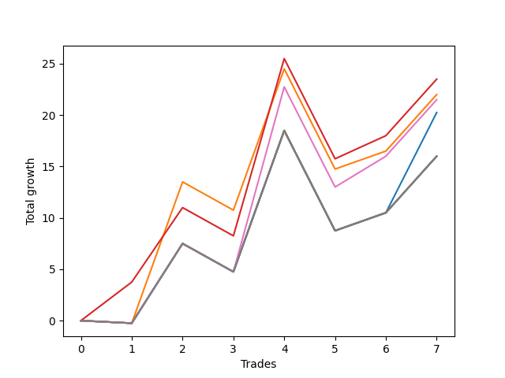

# Long Wallace 1226_003 
- Symbol: ES90d5mOut
- Date Range: 03/18/2022 - 07/08/2022
- Trading Period: 7:20-12:30
- Number of Trades: 7



| Name | Win Percent | Profit | Avg Profit / Trade |     | Name | Win Percent | Profit | Avg Profit / Trade |
| ---- | ----------- | ------ | ------------------ | --- | ---- | ----------- | ------ | ------------------ |
| Sorted By <br> Profit | | | | | Sorted By <br> Win Percentage ||||
| Three | 71.43 | 11750.00 | 1678.57 |     | Three | 71.43 | 11750.00 | 1678.57 |
| One | 57.14 | 11000.00 | 1571.43 |     | One | 57.14 | 11000.00 | 1571.43 |
| Six | 57.14 | 10750.00 | 1535.71 |     | Six | 57.14 | 10750.00 | 1535.71 |
| Zero | 57.14 | 10125.00 | 1446.43 |     | Zero | 57.14 | 10125.00 | 1446.43 |
| Seven | 57.14 | 8000.00 | 1142.86 |     | Seven | 57.14 | 8000.00 | 1142.86 |
| Five | 57.14 | 8000.00 | 1142.86 |     | Five | 57.14 | 8000.00 | 1142.86 |
| Four | 57.14 | 8000.00 | 1142.86 |     | Four | 57.14 | 8000.00 | 1142.86 |
| Two | 57.14 | 8000.00 | 1142.86 |     | Two | 57.14 | 8000.00 | 1142.86 |

### Test Zero
* Sell when price hits the middle line of the 20p bollinger
* No Stoploss
* Results:
```
Total Trades: 7
Percent Up: 57.14
Percent Down: 42.86
Total Points Moved Up: 20.25
Potential Profit: 10125.00
Total Points Ups: 33.00 Count Ups: 4
Total Points Downs: -12.75 Count Downs: 3
```

<details><summary>Trades</summary>

<code>In: 2022-03-29 09:40:00		Out: 2022-03-29 10:10:55		Total Position Time: 30:55		Total Move Up: -0.25		Total to Date: -0.25</code> <br />
<code>In: 2022-03-30 12:30:00		Out: 2022-03-30 12:46:25		Total Position Time: 16:25		Total Move Up: 7.75		Total to Date: 7.50</code> <br />
<code>In: 2022-03-31 09:40:00		Out: 2022-03-31 10:10:55		Total Position Time: 30:55		Total Move Up: -2.75		Total to Date: 4.75</code> <br />
<code>In: 2022-04-20 12:00:00		Out: 2022-04-20 12:24:15		Total Position Time: 24:15		Total Move Up: 13.75		Total to Date: 18.50</code> <br />
<code>In: 2022-05-02 10:10:00		Out: 2022-05-02 10:40:55		Total Position Time: 30:55		Total Move Up: -9.75		Total to Date: 8.75</code> <br />
<code>In: 2022-06-27 09:40:00		Out: 2022-06-27 10:10:55		Total Position Time: 30:55		Total Move Up: 1.75		Total to Date: 10.50</code> <br />
<code>In: 2022-06-29 09:35:00		Out: 2022-06-29 10:01:50		Total Position Time: 26:50		Total Move Up: 9.75		Total to Date: 20.25</code> <br />


</details>

### Test One
* Sell when the price hits the upper line of the 20p 1std bollinger
* No Stoploss
* Results:
```
Total Trades: 7
Percent Up: 57.14
Percent Down: 42.86
Total Points Moved Up: 22.00
Potential Profit: 11000.00
Total Points Ups: 34.75 Count Ups: 4
Total Points Downs: -12.75 Count Downs: 3
```

<details><summary>Trades</summary>

<code>In: 2022-03-29 09:40:00		Out: 2022-03-29 10:10:55		Total Position Time: 30:55		Total Move Up: -0.25		Total to Date: -0.25</code> <br />
<code>In: 2022-03-30 12:30:00		Out: 2022-03-30 12:59:50		Total Position Time: 29:50		Total Move Up: 13.75		Total to Date: 13.50</code> <br />
<code>In: 2022-03-31 09:40:00		Out: 2022-03-31 10:10:55		Total Position Time: 30:55		Total Move Up: -2.75		Total to Date: 10.75</code> <br />
<code>In: 2022-04-20 12:00:00		Out: 2022-04-20 12:30:55		Total Position Time: 30:55		Total Move Up: 13.75		Total to Date: 24.50</code> <br />
<code>In: 2022-05-02 10:10:00		Out: 2022-05-02 10:40:55		Total Position Time: 30:55		Total Move Up: -9.75		Total to Date: 14.75</code> <br />
<code>In: 2022-06-27 09:40:00		Out: 2022-06-27 10:10:55		Total Position Time: 30:55		Total Move Up: 1.75		Total to Date: 16.50</code> <br />
<code>In: 2022-06-29 09:35:00		Out: 2022-06-29 10:05:55		Total Position Time: 30:55		Total Move Up: 5.50		Total to Date: 22.00</code> <br />


</details>

### Test Two
* Sell when the price hits the upper line of the 20p 2std bollinger
* No Stoploss
* Results:
```
Total Trades: 7
Percent Up: 57.14
Percent Down: 42.86
Total Points Moved Up: 16.00
Potential Profit: 8000.00
Total Points Ups: 28.75 Count Ups: 4
Total Points Downs: -12.75 Count Downs: 3
```

<details><summary>Trades</summary>

<code>In: 2022-03-29 09:40:00		Out: 2022-03-29 10:10:55		Total Position Time: 30:55		Total Move Up: -0.25		Total to Date: -0.25</code> <br />
<code>In: 2022-03-30 12:30:00		Out: 2022-03-31 06:30:55		Total Position Time: 1080:55		Total Move Up: 7.75		Total to Date: 7.50</code> <br />
<code>In: 2022-03-31 09:40:00		Out: 2022-03-31 10:10:55		Total Position Time: 30:55		Total Move Up: -2.75		Total to Date: 4.75</code> <br />
<code>In: 2022-04-20 12:00:00		Out: 2022-04-20 12:30:55		Total Position Time: 30:55		Total Move Up: 13.75		Total to Date: 18.50</code> <br />
<code>In: 2022-05-02 10:10:00		Out: 2022-05-02 10:40:55		Total Position Time: 30:55		Total Move Up: -9.75		Total to Date: 8.75</code> <br />
<code>In: 2022-06-27 09:40:00		Out: 2022-06-27 10:10:55		Total Position Time: 30:55		Total Move Up: 1.75		Total to Date: 10.50</code> <br />
<code>In: 2022-06-29 09:35:00		Out: 2022-06-29 10:05:55		Total Position Time: 30:55		Total Move Up: 5.50		Total to Date: 16.00</code> <br />


</details>

### Test Three
* Sell when price hits the middle line of the 50p bollinger
* No Stoploss
* Results:
```
Total Trades: 7
Percent Up: 71.43
Percent Down: 28.57
Total Points Moved Up: 23.50
Potential Profit: 11750.00
Total Points Ups: 36.00 Count Ups: 5
Total Points Downs: -12.50 Count Downs: 2
```

<details><summary>Trades</summary>

<code>In: 2022-03-29 09:40:00		Out: 2022-03-29 09:43:20		Total Position Time: 03:20		Total Move Up: 3.75		Total to Date: 3.75</code> <br />
<code>In: 2022-03-30 12:30:00		Out: 2022-03-31 06:30:00		Total Position Time: 1080:00		Total Move Up: 7.25		Total to Date: 11.00</code> <br />
<code>In: 2022-03-31 09:40:00		Out: 2022-03-31 10:10:55		Total Position Time: 30:55		Total Move Up: -2.75		Total to Date: 8.25</code> <br />
<code>In: 2022-04-20 12:00:00		Out: 2022-04-20 12:25:50		Total Position Time: 25:50		Total Move Up: 17.25		Total to Date: 25.50</code> <br />
<code>In: 2022-05-02 10:10:00		Out: 2022-05-02 10:40:55		Total Position Time: 30:55		Total Move Up: -9.75		Total to Date: 15.75</code> <br />
<code>In: 2022-06-27 09:40:00		Out: 2022-06-27 09:41:15		Total Position Time: 01:15		Total Move Up: 2.25		Total to Date: 18.00</code> <br />
<code>In: 2022-06-29 09:35:00		Out: 2022-06-29 10:05:55		Total Position Time: 30:55		Total Move Up: 5.50		Total to Date: 23.50</code> <br />


</details>

### Test Four
* Sell when the price hits the upper line of the 50p 1std bollinger
* No Stoploss
* Results:
```
Total Trades: 7
Percent Up: 57.14
Percent Down: 42.86
Total Points Moved Up: 16.00
Potential Profit: 8000.00
Total Points Ups: 28.75 Count Ups: 4
Total Points Downs: -12.75 Count Downs: 3
```

<details><summary>Trades</summary>

<code>In: 2022-03-29 09:40:00		Out: 2022-03-29 10:10:55		Total Position Time: 30:55		Total Move Up: -0.25		Total to Date: -0.25</code> <br />
<code>In: 2022-03-30 12:30:00		Out: 2022-03-31 06:30:55		Total Position Time: 1080:55		Total Move Up: 7.75		Total to Date: 7.50</code> <br />
<code>In: 2022-03-31 09:40:00		Out: 2022-03-31 10:10:55		Total Position Time: 30:55		Total Move Up: -2.75		Total to Date: 4.75</code> <br />
<code>In: 2022-04-20 12:00:00		Out: 2022-04-20 12:30:55		Total Position Time: 30:55		Total Move Up: 13.75		Total to Date: 18.50</code> <br />
<code>In: 2022-05-02 10:10:00		Out: 2022-05-02 10:40:55		Total Position Time: 30:55		Total Move Up: -9.75		Total to Date: 8.75</code> <br />
<code>In: 2022-06-27 09:40:00		Out: 2022-06-27 10:10:55		Total Position Time: 30:55		Total Move Up: 1.75		Total to Date: 10.50</code> <br />
<code>In: 2022-06-29 09:35:00		Out: 2022-06-29 10:05:55		Total Position Time: 30:55		Total Move Up: 5.50		Total to Date: 16.00</code> <br />


</details>

### Test Five
* Sell when the price hits the upper line of the 50p 2std bollinger
* No Stoploss
* Results:
```
Total Trades: 7
Percent Up: 57.14
Percent Down: 42.86
Total Points Moved Up: 16.00
Potential Profit: 8000.00
Total Points Ups: 28.75 Count Ups: 4
Total Points Downs: -12.75 Count Downs: 3
```

<details><summary>Trades</summary>

<code>In: 2022-03-29 09:40:00		Out: 2022-03-29 10:10:55		Total Position Time: 30:55		Total Move Up: -0.25		Total to Date: -0.25</code> <br />
<code>In: 2022-03-30 12:30:00		Out: 2022-03-31 06:30:55		Total Position Time: 1080:55		Total Move Up: 7.75		Total to Date: 7.50</code> <br />
<code>In: 2022-03-31 09:40:00		Out: 2022-03-31 10:10:55		Total Position Time: 30:55		Total Move Up: -2.75		Total to Date: 4.75</code> <br />
<code>In: 2022-04-20 12:00:00		Out: 2022-04-20 12:30:55		Total Position Time: 30:55		Total Move Up: 13.75		Total to Date: 18.50</code> <br />
<code>In: 2022-05-02 10:10:00		Out: 2022-05-02 10:40:55		Total Position Time: 30:55		Total Move Up: -9.75		Total to Date: 8.75</code> <br />
<code>In: 2022-06-27 09:40:00		Out: 2022-06-27 10:10:55		Total Position Time: 30:55		Total Move Up: 1.75		Total to Date: 10.50</code> <br />
<code>In: 2022-06-29 09:35:00		Out: 2022-06-29 10:05:55		Total Position Time: 30:55		Total Move Up: 5.50		Total to Date: 16.00</code> <br />


</details>

### Test Six
* Sell when the price hits the middle line of the 1std VWAP
* No Stoploss
* Results:
```
Total Trades: 7
Percent Up: 57.14
Percent Down: 42.86
Total Points Moved Up: 21.50
Potential Profit: 10750.00
Total Points Ups: 34.25 Count Ups: 4
Total Points Downs: -12.75 Count Downs: 3
```

<details><summary>Trades</summary>

<code>In: 2022-03-29 09:40:00		Out: 2022-03-29 10:10:55		Total Position Time: 30:55		Total Move Up: -0.25		Total to Date: -0.25</code> <br />
<code>In: 2022-03-30 12:30:00		Out: 2022-03-31 06:30:55		Total Position Time: 1080:55		Total Move Up: 7.75		Total to Date: 7.50</code> <br />
<code>In: 2022-03-31 09:40:00		Out: 2022-03-31 10:10:55		Total Position Time: 30:55		Total Move Up: -2.75		Total to Date: 4.75</code> <br />
<code>In: 2022-04-20 12:00:00		Out: 2022-04-20 12:26:10		Total Position Time: 26:10		Total Move Up: 18.00		Total to Date: 22.75</code> <br />
<code>In: 2022-05-02 10:10:00		Out: 2022-05-02 10:40:55		Total Position Time: 30:55		Total Move Up: -9.75		Total to Date: 13.00</code> <br />
<code>In: 2022-06-27 09:40:00		Out: 2022-06-27 09:44:15		Total Position Time: 04:15		Total Move Up: 3.00		Total to Date: 16.00</code> <br />
<code>In: 2022-06-29 09:35:00		Out: 2022-06-29 10:05:55		Total Position Time: 30:55		Total Move Up: 5.50		Total to Date: 21.50</code> <br />


</details>

### Test Seven
* Sell when the price hits the upper line of the 1std VWAP
* No Stoploss
* Results:
```
Total Trades: 7
Percent Up: 57.14
Percent Down: 42.86
Total Points Moved Up: 16.00
Potential Profit: 8000.00
Total Points Ups: 28.75 Count Ups: 4
Total Points Downs: -12.75 Count Downs: 3
```

<details><summary>Trades</summary>

<code>In: 2022-03-29 09:40:00		Out: 2022-03-29 10:10:55		Total Position Time: 30:55		Total Move Up: -0.25		Total to Date: -0.25</code> <br />
<code>In: 2022-03-30 12:30:00		Out: 2022-03-31 06:30:55		Total Position Time: 1080:55		Total Move Up: 7.75		Total to Date: 7.50</code> <br />
<code>In: 2022-03-31 09:40:00		Out: 2022-03-31 10:10:55		Total Position Time: 30:55		Total Move Up: -2.75		Total to Date: 4.75</code> <br />
<code>In: 2022-04-20 12:00:00		Out: 2022-04-20 12:30:55		Total Position Time: 30:55		Total Move Up: 13.75		Total to Date: 18.50</code> <br />
<code>In: 2022-05-02 10:10:00		Out: 2022-05-02 10:40:55		Total Position Time: 30:55		Total Move Up: -9.75		Total to Date: 8.75</code> <br />
<code>In: 2022-06-27 09:40:00		Out: 2022-06-27 10:10:55		Total Position Time: 30:55		Total Move Up: 1.75		Total to Date: 10.50</code> <br />
<code>In: 2022-06-29 09:35:00		Out: 2022-06-29 10:05:55		Total Position Time: 30:55		Total Move Up: 5.50		Total to Date: 16.00</code> <br />


</details>