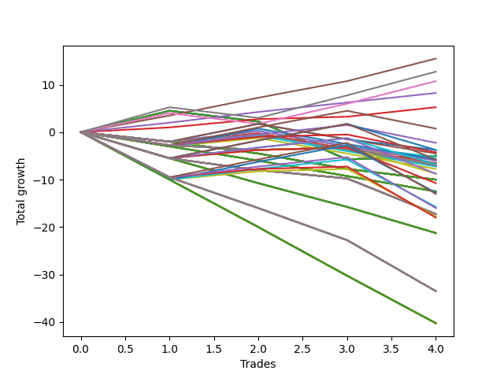

# Long Wallace Doodle 011 
- Symbol: ES90d5m30m
- Date Range: 03/18/2022 - 07/08/2022
- Trading Period: 7:20-12:30
- Number of Trades: 4



| Name | Win Percent | Profit | Avg Profit / Trade |     | Name | Win Percent | Profit | Avg Profit / Trade |
| ---- | ----------- | ------ | ------------------ | --- | ---- | ----------- | ------ | ------------------ |
| Sorted By <br> Profit | | | | | Sorted By <br> Win Percentage ||||
| Seven | 75.00 | 6500.00 | 1625.00 |     | Seven | 75.00 | 6500.00 | 1625.00 |
| Six | 75.00 | 6500.00 | 1625.00 |     | Six | 75.00 | 6500.00 | 1625.00 |
| Five | 75.00 | 6500.00 | 1625.00 |     | Five | 75.00 | 6500.00 | 1625.00 |
| Four | 75.00 | 6500.00 | 1625.00 |     | Four | 75.00 | 6500.00 | 1625.00 |
| Three | 75.00 | 6500.00 | 1625.00 |     | Three | 75.00 | 6500.00 | 1625.00 |
| Two | 75.00 | 6500.00 | 1625.00 |     | Two | 75.00 | 6500.00 | 1625.00 |
| One | 75.00 | 6500.00 | 1625.00 |     | One | 75.00 | 6500.00 | 1625.00 |
| Zero | 75.00 | 6500.00 | 1625.00 |     | Zero | 75.00 | 6500.00 | 1625.00 |
| Seventy-Three | 50.00 | 6375.00 | 1593.75 |     | Seventy-Three | 50.00 | 6375.00 | 1593.75 |

## NO STOPLOSS

### Test Zero
* Sell when price hits the middle line of the 20p bollinger
* No Stoploss
* Results:
```
Total Trades: 4
Percent Up: 75.00
Percent Down: 25.00
Total Points Moved Up: 13.00
Potential Profit: 6500.00
Total Points Ups: 18.50 Count Ups: 3
Total Points Downs: -5.50 Count Downs: 1
```

<details><summary>Trades</summary>

<code>In: 2022-04-20 11:45:00		Out: 2022-04-20 12:15:55		Total Position Time: 30:55		Total Move Up: 4.00		Total to Date: 4.00</code> <br />
<code>In: 2022-04-27 12:10:00		Out: 2022-04-27 12:40:55		Total Position Time: 30:55		Total Move Up: -5.50		Total to Date: -1.50</code> <br />
<code>In: 2022-04-27 12:25:00		Out: 2022-04-27 12:46:00		Total Position Time: 21:00		Total Move Up: 6.75		Total to Date: 5.25</code> <br />
<code>In: 2022-05-13 11:15:00		Out: 2022-05-13 11:45:55		Total Position Time: 30:55		Total Move Up: 7.75		Total to Date: 13.00</code> <br />


</details>

### Test One
* Sell when the price hits the upper line of the 20p 1std bollinger
* No Stoploss
* Results:
```
Total Trades: 4
Percent Up: 75.00
Percent Down: 25.00
Total Points Moved Up: 13.00
Potential Profit: 6500.00
Total Points Ups: 18.50 Count Ups: 3
Total Points Downs: -5.50 Count Downs: 1
```

<details><summary>Trades</summary>

<code>In: 2022-04-20 11:45:00		Out: 2022-04-20 12:15:55		Total Position Time: 30:55		Total Move Up: 4.00		Total to Date: 4.00</code> <br />
<code>In: 2022-04-27 12:10:00		Out: 2022-04-27 12:40:55		Total Position Time: 30:55		Total Move Up: -5.50		Total to Date: -1.50</code> <br />
<code>In: 2022-04-27 12:25:00		Out: 2022-04-27 12:46:00		Total Position Time: 21:00		Total Move Up: 6.75		Total to Date: 5.25</code> <br />
<code>In: 2022-05-13 11:15:00		Out: 2022-05-13 11:45:55		Total Position Time: 30:55		Total Move Up: 7.75		Total to Date: 13.00</code> <br />


</details>

### Test Two
* Sell when the price hits the upper line of the 20p 2std bollinger
* No Stoploss
* Results:
```
Total Trades: 4
Percent Up: 75.00
Percent Down: 25.00
Total Points Moved Up: 13.00
Potential Profit: 6500.00
Total Points Ups: 18.50 Count Ups: 3
Total Points Downs: -5.50 Count Downs: 1
```

<details><summary>Trades</summary>

<code>In: 2022-04-20 11:45:00		Out: 2022-04-20 12:15:55		Total Position Time: 30:55		Total Move Up: 4.00		Total to Date: 4.00</code> <br />
<code>In: 2022-04-27 12:10:00		Out: 2022-04-27 12:40:55		Total Position Time: 30:55		Total Move Up: -5.50		Total to Date: -1.50</code> <br />
<code>In: 2022-04-27 12:25:00		Out: 2022-04-27 12:46:00		Total Position Time: 21:00		Total Move Up: 6.75		Total to Date: 5.25</code> <br />
<code>In: 2022-05-13 11:15:00		Out: 2022-05-13 11:45:55		Total Position Time: 30:55		Total Move Up: 7.75		Total to Date: 13.00</code> <br />


</details>

### Test Three
* Sell when price hits the middle line of the 50p bollinger
* No Stoploss
* Results:
```
Total Trades: 4
Percent Up: 75.00
Percent Down: 25.00
Total Points Moved Up: 13.00
Potential Profit: 6500.00
Total Points Ups: 18.50 Count Ups: 3
Total Points Downs: -5.50 Count Downs: 1
```

<details><summary>Trades</summary>

<code>In: 2022-04-20 11:45:00		Out: 2022-04-20 12:15:55		Total Position Time: 30:55		Total Move Up: 4.00		Total to Date: 4.00</code> <br />
<code>In: 2022-04-27 12:10:00		Out: 2022-04-27 12:40:55		Total Position Time: 30:55		Total Move Up: -5.50		Total to Date: -1.50</code> <br />
<code>In: 2022-04-27 12:25:00		Out: 2022-04-27 12:46:00		Total Position Time: 21:00		Total Move Up: 6.75		Total to Date: 5.25</code> <br />
<code>In: 2022-05-13 11:15:00		Out: 2022-05-13 11:45:55		Total Position Time: 30:55		Total Move Up: 7.75		Total to Date: 13.00</code> <br />


</details>

### Test Four
* Sell when the price hits the upper line of the 50p 1std bollinger
* No Stoploss
* Results:
```
Total Trades: 4
Percent Up: 75.00
Percent Down: 25.00
Total Points Moved Up: 13.00
Potential Profit: 6500.00
Total Points Ups: 18.50 Count Ups: 3
Total Points Downs: -5.50 Count Downs: 1
```

<details><summary>Trades</summary>

<code>In: 2022-04-20 11:45:00		Out: 2022-04-20 12:15:55		Total Position Time: 30:55		Total Move Up: 4.00		Total to Date: 4.00</code> <br />
<code>In: 2022-04-27 12:10:00		Out: 2022-04-27 12:40:55		Total Position Time: 30:55		Total Move Up: -5.50		Total to Date: -1.50</code> <br />
<code>In: 2022-04-27 12:25:00		Out: 2022-04-27 12:46:00		Total Position Time: 21:00		Total Move Up: 6.75		Total to Date: 5.25</code> <br />
<code>In: 2022-05-13 11:15:00		Out: 2022-05-13 11:45:55		Total Position Time: 30:55		Total Move Up: 7.75		Total to Date: 13.00</code> <br />


</details>

### Test Five
* Sell when the price hits the upper line of the 50p 2std bollinger
* No Stoploss
* Results:
```
Total Trades: 4
Percent Up: 75.00
Percent Down: 25.00
Total Points Moved Up: 13.00
Potential Profit: 6500.00
Total Points Ups: 18.50 Count Ups: 3
Total Points Downs: -5.50 Count Downs: 1
```

<details><summary>Trades</summary>

<code>In: 2022-04-20 11:45:00		Out: 2022-04-20 12:15:55		Total Position Time: 30:55		Total Move Up: 4.00		Total to Date: 4.00</code> <br />
<code>In: 2022-04-27 12:10:00		Out: 2022-04-27 12:40:55		Total Position Time: 30:55		Total Move Up: -5.50		Total to Date: -1.50</code> <br />
<code>In: 2022-04-27 12:25:00		Out: 2022-04-27 12:46:00		Total Position Time: 21:00		Total Move Up: 6.75		Total to Date: 5.25</code> <br />
<code>In: 2022-05-13 11:15:00		Out: 2022-05-13 11:45:55		Total Position Time: 30:55		Total Move Up: 7.75		Total to Date: 13.00</code> <br />


</details>

### Test Six
* Sell when the price hits the middle line of the 1std VWAP
* No Stoploss
* Results:
```
Total Trades: 4
Percent Up: 75.00
Percent Down: 25.00
Total Points Moved Up: 13.00
Potential Profit: 6500.00
Total Points Ups: 18.50 Count Ups: 3
Total Points Downs: -5.50 Count Downs: 1
```

<details><summary>Trades</summary>

<code>In: 2022-04-20 11:45:00		Out: 2022-04-20 12:15:55		Total Position Time: 30:55		Total Move Up: 4.00		Total to Date: 4.00</code> <br />
<code>In: 2022-04-27 12:10:00		Out: 2022-04-27 12:40:55		Total Position Time: 30:55		Total Move Up: -5.50		Total to Date: -1.50</code> <br />
<code>In: 2022-04-27 12:25:00		Out: 2022-04-27 12:46:00		Total Position Time: 21:00		Total Move Up: 6.75		Total to Date: 5.25</code> <br />
<code>In: 2022-05-13 11:15:00		Out: 2022-05-13 11:45:55		Total Position Time: 30:55		Total Move Up: 7.75		Total to Date: 13.00</code> <br />


</details>

### Test Seven
* Sell when the price hits the upper line of the 1std VWAP
* No Stoploss
* Results:
```
Total Trades: 4
Percent Up: 75.00
Percent Down: 25.00
Total Points Moved Up: 13.00
Potential Profit: 6500.00
Total Points Ups: 18.50 Count Ups: 3
Total Points Downs: -5.50 Count Downs: 1
```

<details><summary>Trades</summary>

<code>In: 2022-04-20 11:45:00		Out: 2022-04-20 12:15:55		Total Position Time: 30:55		Total Move Up: 4.00		Total to Date: 4.00</code> <br />
<code>In: 2022-04-27 12:10:00		Out: 2022-04-27 12:40:55		Total Position Time: 30:55		Total Move Up: -5.50		Total to Date: -1.50</code> <br />
<code>In: 2022-04-27 12:25:00		Out: 2022-04-27 12:46:00		Total Position Time: 21:00		Total Move Up: 6.75		Total to Date: 5.25</code> <br />
<code>In: 2022-05-13 11:15:00		Out: 2022-05-13 11:45:55		Total Position Time: 30:55		Total Move Up: 7.75		Total to Date: 13.00</code> <br />


</details>

## SPECIAL EXIT CONDITIONS 

### Test Seventy-Three
* Sell when the linear regression slope changes to negative
* No Stoploss
* Results:
```
Total Trades: 4
Percent Up: 50.00
Percent Down: 50.00
Total Points Moved Up: 12.75
Potential Profit: 6375.00
Total Points Ups: 21.75 Count Ups: 2
Total Points Downs: -9.00 Count Downs: 2
```

<details><summary>Trades</summary>

<code>In: 2022-04-20 11:45:00		Out: 2022-04-20 12:00:05		Total Position Time: 15:05		Total Move Up: -7.00		Total to Date: -7.00</code> <br />
<code>In: 2022-04-27 12:10:00		Out: 2022-04-27 12:19:05		Total Position Time: 09:05		Total Move Up: -2.00		Total to Date: -9.00</code> <br />
<code>In: 2022-04-27 12:25:00		Out: 2022-04-27 12:31:05		Total Position Time: 06:05		Total Move Up: 6.25		Total to Date: -2.75</code> <br />
<code>In: 2022-05-13 11:15:00		Out: 2022-05-13 11:32:05		Total Position Time: 17:05		Total Move Up: 15.50		Total to Date: 12.75</code> <br />


</details>