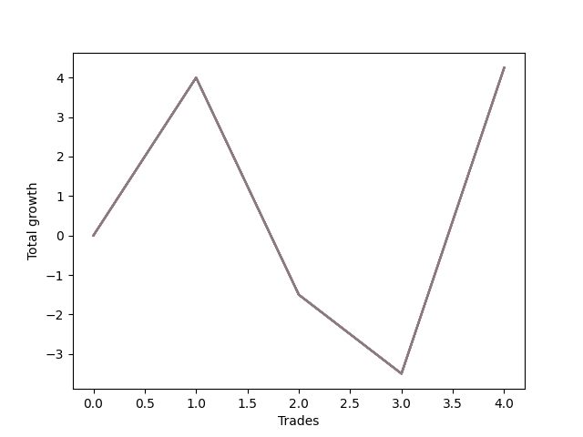

# Long Wallace Doodle 011 
- Symbol: ES90d5mOut
- Date Range: 03/18/2022 - 07/08/2022
- Trading Period: 7:20-12:30
- Number of Trades: 4



| Name | Win Percent | Profit | Avg Profit / Trade |     | Name | Win Percent | Profit | Avg Profit / Trade |
| ---- | ----------- | ------ | ------------------ | --- | ---- | ----------- | ------ | ------------------ |
| Sorted By <br> Profit | | | | | Sorted By <br> Win Percentage ||||
| Seven | 50.00 | 2125.00 | 531.25 |     | Seven | 50.00 | 2125.00 | 531.25 |
| Six | 50.00 | 2125.00 | 531.25 |     | Six | 50.00 | 2125.00 | 531.25 |
| Five | 50.00 | 2125.00 | 531.25 |     | Five | 50.00 | 2125.00 | 531.25 |
| Four | 50.00 | 2125.00 | 531.25 |     | Four | 50.00 | 2125.00 | 531.25 |
| Three | 50.00 | 2125.00 | 531.25 |     | Three | 50.00 | 2125.00 | 531.25 |
| Two | 50.00 | 2125.00 | 531.25 |     | Two | 50.00 | 2125.00 | 531.25 |
| One | 50.00 | 2125.00 | 531.25 |     | One | 50.00 | 2125.00 | 531.25 |
| Zero | 50.00 | 2125.00 | 531.25 |     | Zero | 50.00 | 2125.00 | 531.25 |

### Test Zero
* Sell when price hits the middle line of the 20p bollinger
* No Stoploss
* Results:
```
Total Trades: 4
Percent Up: 50.00
Percent Down: 50.00
Total Points Moved Up: 4.25
Potential Profit: 2125.00
Total Points Ups: 11.75 Count Ups: 2
Total Points Downs: -7.50 Count Downs: 2
```

<details><summary>Trades</summary>

<code>In: 2022-04-20 11:45:00		Out: 2022-04-20 12:15:55		Total Position Time: 30:55		Total Move Up: 4.00		Total to Date: 4.00</code> <br />
<code>In: 2022-04-27 12:10:00		Out: 2022-04-27 12:40:55		Total Position Time: 30:55		Total Move Up: -5.50		Total to Date: -1.50</code> <br />
<code>In: 2022-04-27 12:25:00		Out: 2022-04-27 12:55:55		Total Position Time: 30:55		Total Move Up: -2.00		Total to Date: -3.50</code> <br />
<code>In: 2022-05-13 11:15:00		Out: 2022-05-13 11:45:55		Total Position Time: 30:55		Total Move Up: 7.75		Total to Date: 4.25</code> <br />


</details>

### Test One
* Sell when the price hits the upper line of the 20p 1std bollinger
* No Stoploss
* Results:
```
Total Trades: 4
Percent Up: 50.00
Percent Down: 50.00
Total Points Moved Up: 4.25
Potential Profit: 2125.00
Total Points Ups: 11.75 Count Ups: 2
Total Points Downs: -7.50 Count Downs: 2
```

<details><summary>Trades</summary>

<code>In: 2022-04-20 11:45:00		Out: 2022-04-20 12:15:55		Total Position Time: 30:55		Total Move Up: 4.00		Total to Date: 4.00</code> <br />
<code>In: 2022-04-27 12:10:00		Out: 2022-04-27 12:40:55		Total Position Time: 30:55		Total Move Up: -5.50		Total to Date: -1.50</code> <br />
<code>In: 2022-04-27 12:25:00		Out: 2022-04-27 12:55:55		Total Position Time: 30:55		Total Move Up: -2.00		Total to Date: -3.50</code> <br />
<code>In: 2022-05-13 11:15:00		Out: 2022-05-13 11:45:55		Total Position Time: 30:55		Total Move Up: 7.75		Total to Date: 4.25</code> <br />


</details>

### Test Two
* Sell when the price hits the upper line of the 20p 2std bollinger
* No Stoploss
* Results:
```
Total Trades: 4
Percent Up: 50.00
Percent Down: 50.00
Total Points Moved Up: 4.25
Potential Profit: 2125.00
Total Points Ups: 11.75 Count Ups: 2
Total Points Downs: -7.50 Count Downs: 2
```

<details><summary>Trades</summary>

<code>In: 2022-04-20 11:45:00		Out: 2022-04-20 12:15:55		Total Position Time: 30:55		Total Move Up: 4.00		Total to Date: 4.00</code> <br />
<code>In: 2022-04-27 12:10:00		Out: 2022-04-27 12:40:55		Total Position Time: 30:55		Total Move Up: -5.50		Total to Date: -1.50</code> <br />
<code>In: 2022-04-27 12:25:00		Out: 2022-04-27 12:55:55		Total Position Time: 30:55		Total Move Up: -2.00		Total to Date: -3.50</code> <br />
<code>In: 2022-05-13 11:15:00		Out: 2022-05-13 11:45:55		Total Position Time: 30:55		Total Move Up: 7.75		Total to Date: 4.25</code> <br />


</details>

### Test Three
* Sell when price hits the middle line of the 50p bollinger
* No Stoploss
* Results:
```
Total Trades: 4
Percent Up: 50.00
Percent Down: 50.00
Total Points Moved Up: 4.25
Potential Profit: 2125.00
Total Points Ups: 11.75 Count Ups: 2
Total Points Downs: -7.50 Count Downs: 2
```

<details><summary>Trades</summary>

<code>In: 2022-04-20 11:45:00		Out: 2022-04-20 12:15:55		Total Position Time: 30:55		Total Move Up: 4.00		Total to Date: 4.00</code> <br />
<code>In: 2022-04-27 12:10:00		Out: 2022-04-27 12:40:55		Total Position Time: 30:55		Total Move Up: -5.50		Total to Date: -1.50</code> <br />
<code>In: 2022-04-27 12:25:00		Out: 2022-04-27 12:55:55		Total Position Time: 30:55		Total Move Up: -2.00		Total to Date: -3.50</code> <br />
<code>In: 2022-05-13 11:15:00		Out: 2022-05-13 11:45:55		Total Position Time: 30:55		Total Move Up: 7.75		Total to Date: 4.25</code> <br />


</details>

### Test Four
* Sell when the price hits the upper line of the 50p 1std bollinger
* No Stoploss
* Results:
```
Total Trades: 4
Percent Up: 50.00
Percent Down: 50.00
Total Points Moved Up: 4.25
Potential Profit: 2125.00
Total Points Ups: 11.75 Count Ups: 2
Total Points Downs: -7.50 Count Downs: 2
```

<details><summary>Trades</summary>

<code>In: 2022-04-20 11:45:00		Out: 2022-04-20 12:15:55		Total Position Time: 30:55		Total Move Up: 4.00		Total to Date: 4.00</code> <br />
<code>In: 2022-04-27 12:10:00		Out: 2022-04-27 12:40:55		Total Position Time: 30:55		Total Move Up: -5.50		Total to Date: -1.50</code> <br />
<code>In: 2022-04-27 12:25:00		Out: 2022-04-27 12:55:55		Total Position Time: 30:55		Total Move Up: -2.00		Total to Date: -3.50</code> <br />
<code>In: 2022-05-13 11:15:00		Out: 2022-05-13 11:45:55		Total Position Time: 30:55		Total Move Up: 7.75		Total to Date: 4.25</code> <br />


</details>

### Test Five
* Sell when the price hits the upper line of the 50p 2std bollinger
* No Stoploss
* Results:
```
Total Trades: 4
Percent Up: 50.00
Percent Down: 50.00
Total Points Moved Up: 4.25
Potential Profit: 2125.00
Total Points Ups: 11.75 Count Ups: 2
Total Points Downs: -7.50 Count Downs: 2
```

<details><summary>Trades</summary>

<code>In: 2022-04-20 11:45:00		Out: 2022-04-20 12:15:55		Total Position Time: 30:55		Total Move Up: 4.00		Total to Date: 4.00</code> <br />
<code>In: 2022-04-27 12:10:00		Out: 2022-04-27 12:40:55		Total Position Time: 30:55		Total Move Up: -5.50		Total to Date: -1.50</code> <br />
<code>In: 2022-04-27 12:25:00		Out: 2022-04-27 12:55:55		Total Position Time: 30:55		Total Move Up: -2.00		Total to Date: -3.50</code> <br />
<code>In: 2022-05-13 11:15:00		Out: 2022-05-13 11:45:55		Total Position Time: 30:55		Total Move Up: 7.75		Total to Date: 4.25</code> <br />


</details>

### Test Six
* Sell when the price hits the middle line of the 1std VWAP
* No Stoploss
* Results:
```
Total Trades: 4
Percent Up: 50.00
Percent Down: 50.00
Total Points Moved Up: 4.25
Potential Profit: 2125.00
Total Points Ups: 11.75 Count Ups: 2
Total Points Downs: -7.50 Count Downs: 2
```

<details><summary>Trades</summary>

<code>In: 2022-04-20 11:45:00		Out: 2022-04-20 12:15:55		Total Position Time: 30:55		Total Move Up: 4.00		Total to Date: 4.00</code> <br />
<code>In: 2022-04-27 12:10:00		Out: 2022-04-27 12:40:55		Total Position Time: 30:55		Total Move Up: -5.50		Total to Date: -1.50</code> <br />
<code>In: 2022-04-27 12:25:00		Out: 2022-04-27 12:55:55		Total Position Time: 30:55		Total Move Up: -2.00		Total to Date: -3.50</code> <br />
<code>In: 2022-05-13 11:15:00		Out: 2022-05-13 11:45:55		Total Position Time: 30:55		Total Move Up: 7.75		Total to Date: 4.25</code> <br />


</details>

### Test Seven
* Sell when the price hits the upper line of the 1std VWAP
* No Stoploss
* Results:
```
Total Trades: 4
Percent Up: 50.00
Percent Down: 50.00
Total Points Moved Up: 4.25
Potential Profit: 2125.00
Total Points Ups: 11.75 Count Ups: 2
Total Points Downs: -7.50 Count Downs: 2
```

<details><summary>Trades</summary>

<code>In: 2022-04-20 11:45:00		Out: 2022-04-20 12:15:55		Total Position Time: 30:55		Total Move Up: 4.00		Total to Date: 4.00</code> <br />
<code>In: 2022-04-27 12:10:00		Out: 2022-04-27 12:40:55		Total Position Time: 30:55		Total Move Up: -5.50		Total to Date: -1.50</code> <br />
<code>In: 2022-04-27 12:25:00		Out: 2022-04-27 12:55:55		Total Position Time: 30:55		Total Move Up: -2.00		Total to Date: -3.50</code> <br />
<code>In: 2022-05-13 11:15:00		Out: 2022-05-13 11:45:55		Total Position Time: 30:55		Total Move Up: 7.75		Total to Date: 4.25</code> <br />


</details>