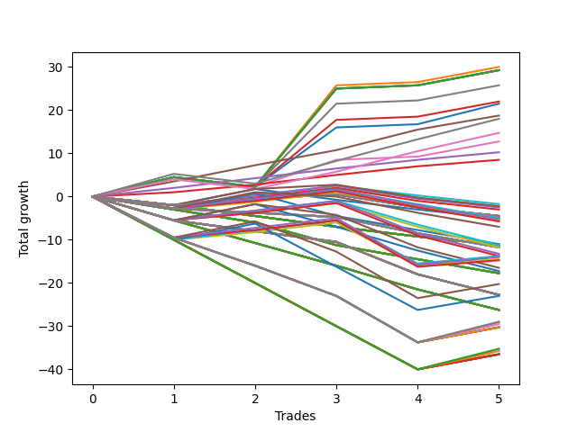

# Long Wallace Doodle 014 
- Symbol: ES90d5m30m
- Date Range: 03/18/2022 - 07/08/2022
- Trading Period: 7:20-12:30
- Number of Trades: 5



| Name | Win Percent | Profit | Avg Profit / Trade |     | Name | Win Percent | Profit | Avg Profit / Trade |
| ---- | ----------- | ------ | ------------------ | --- | ---- | ----------- | ------ | ------------------ |
| Sorted By <br> Profit | | | | | Sorted By <br> Win Percentage ||||
| One | 80.00 | 16750.00 | 3350.00 |     | One | 80.00 | 16750.00 | 3350.00 |
| Five | 80.00 | 15375.00 | 3075.00 |     | Five | 80.00 | 15375.00 | 3075.00 |
| Four | 80.00 | 15375.00 | 3075.00 |     | Four | 80.00 | 15375.00 | 3075.00 |
| Two | 80.00 | 15375.00 | 3075.00 |     | Two | 80.00 | 15375.00 | 3075.00 |
| Seven | 80.00 | 14625.00 | 2925.00 |     | Seven | 80.00 | 14625.00 | 2925.00 |
| Zero | 80.00 | 14375.00 | 2875.00 |     | Zero | 80.00 | 14375.00 | 2875.00 |
| Three | 80.00 | 12750.00 | 2550.00 |     | Three | 80.00 | 12750.00 | 2550.00 |
| Six | 80.00 | 8125.00 | 1625.00 |     | Six | 80.00 | 8125.00 | 1625.00 |
| Seventy-Three | 40.00 | 7625.00 | 1525.00 |     | Seventy-Three | 40.00 | 7625.00 | 1525.00 |

## NO STOPLOSS

### Test Zero
* Sell when price hits the middle line of the 20p bollinger
* No Stoploss
* Results:
```
Total Trades: 5
Percent Up: 80.00
Percent Down: 20.00
Total Points Moved Up: 28.75
Potential Profit: 14375.00
Total Points Ups: 34.25 Count Ups: 4
Total Points Downs: -5.50 Count Downs: 1
```

<details><summary>Trades</summary>

<code>In: 2022-04-20 11:45:00		Out: 2022-04-20 12:15:55		Total Position Time: 30:55		Total Move Up: 4.00		Total to Date: 4.00</code> <br />
<code>In: 2022-04-27 12:10:00		Out: 2022-04-27 12:40:55		Total Position Time: 30:55		Total Move Up: -5.50		Total to Date: -1.50</code> <br />
<code>In: 2022-05-03 11:40:00		Out: 2022-05-03 11:52:15		Total Position Time: 12:15		Total Move Up: 15.50		Total to Date: 14.00</code> <br />
<code>In: 2022-05-13 11:15:00		Out: 2022-05-13 11:45:55		Total Position Time: 30:55		Total Move Up: 7.75		Total to Date: 21.75</code> <br />
<code>In: 2022-06-27 11:00:00		Out: 2022-06-27 11:19:05		Total Position Time: 19:05		Total Move Up: 7.00		Total to Date: 28.75</code> <br />


</details>

### Test One
* Sell when the price hits the upper line of the 20p 1std bollinger
* No Stoploss
* Results:
```
Total Trades: 5
Percent Up: 80.00
Percent Down: 20.00
Total Points Moved Up: 33.50
Potential Profit: 16750.00
Total Points Ups: 39.00 Count Ups: 4
Total Points Downs: -5.50 Count Downs: 1
```

<details><summary>Trades</summary>

<code>In: 2022-04-20 11:45:00		Out: 2022-04-20 12:15:55		Total Position Time: 30:55		Total Move Up: 4.00		Total to Date: 4.00</code> <br />
<code>In: 2022-04-27 12:10:00		Out: 2022-04-27 12:40:55		Total Position Time: 30:55		Total Move Up: -5.50		Total to Date: -1.50</code> <br />
<code>In: 2022-05-03 11:40:00		Out: 2022-05-03 12:07:55		Total Position Time: 27:55		Total Move Up: 26.50		Total to Date: 25.00</code> <br />
<code>In: 2022-05-13 11:15:00		Out: 2022-05-13 11:45:55		Total Position Time: 30:55		Total Move Up: 7.75		Total to Date: 32.75</code> <br />
<code>In: 2022-06-27 11:00:00		Out: 2022-06-27 11:30:55		Total Position Time: 30:55		Total Move Up: 0.75		Total to Date: 33.50</code> <br />


</details>

### Test Two
* Sell when the price hits the upper line of the 20p 2std bollinger
* No Stoploss
* Results:
```
Total Trades: 5
Percent Up: 80.00
Percent Down: 20.00
Total Points Moved Up: 30.75
Potential Profit: 15375.00
Total Points Ups: 36.25 Count Ups: 4
Total Points Downs: -5.50 Count Downs: 1
```

<details><summary>Trades</summary>

<code>In: 2022-04-20 11:45:00		Out: 2022-04-20 12:15:55		Total Position Time: 30:55		Total Move Up: 4.00		Total to Date: 4.00</code> <br />
<code>In: 2022-04-27 12:10:00		Out: 2022-04-27 12:40:55		Total Position Time: 30:55		Total Move Up: -5.50		Total to Date: -1.50</code> <br />
<code>In: 2022-05-03 11:40:00		Out: 2022-05-03 12:10:55		Total Position Time: 30:55		Total Move Up: 23.75		Total to Date: 22.25</code> <br />
<code>In: 2022-05-13 11:15:00		Out: 2022-05-13 11:45:55		Total Position Time: 30:55		Total Move Up: 7.75		Total to Date: 30.00</code> <br />
<code>In: 2022-06-27 11:00:00		Out: 2022-06-27 11:30:55		Total Position Time: 30:55		Total Move Up: 0.75		Total to Date: 30.75</code> <br />


</details>

### Test Three
* Sell when price hits the middle line of the 50p bollinger
* No Stoploss
* Results:
```
Total Trades: 5
Percent Up: 80.00
Percent Down: 20.00
Total Points Moved Up: 25.50
Potential Profit: 12750.00
Total Points Ups: 31.00 Count Ups: 4
Total Points Downs: -5.50 Count Downs: 1
```

<details><summary>Trades</summary>

<code>In: 2022-04-20 11:45:00		Out: 2022-04-20 12:15:55		Total Position Time: 30:55		Total Move Up: 4.00		Total to Date: 4.00</code> <br />
<code>In: 2022-04-27 12:10:00		Out: 2022-04-27 12:40:55		Total Position Time: 30:55		Total Move Up: -5.50		Total to Date: -1.50</code> <br />
<code>In: 2022-05-03 11:40:00		Out: 2022-05-03 11:59:05		Total Position Time: 19:05		Total Move Up: 18.50		Total to Date: 17.00</code> <br />
<code>In: 2022-05-13 11:15:00		Out: 2022-05-13 11:45:55		Total Position Time: 30:55		Total Move Up: 7.75		Total to Date: 24.75</code> <br />
<code>In: 2022-06-27 11:00:00		Out: 2022-06-27 11:30:55		Total Position Time: 30:55		Total Move Up: 0.75		Total to Date: 25.50</code> <br />


</details>

### Test Four
* Sell when the price hits the upper line of the 50p 1std bollinger
* No Stoploss
* Results:
```
Total Trades: 5
Percent Up: 80.00
Percent Down: 20.00
Total Points Moved Up: 30.75
Potential Profit: 15375.00
Total Points Ups: 36.25 Count Ups: 4
Total Points Downs: -5.50 Count Downs: 1
```

<details><summary>Trades</summary>

<code>In: 2022-04-20 11:45:00		Out: 2022-04-20 12:15:55		Total Position Time: 30:55		Total Move Up: 4.00		Total to Date: 4.00</code> <br />
<code>In: 2022-04-27 12:10:00		Out: 2022-04-27 12:40:55		Total Position Time: 30:55		Total Move Up: -5.50		Total to Date: -1.50</code> <br />
<code>In: 2022-05-03 11:40:00		Out: 2022-05-03 12:10:55		Total Position Time: 30:55		Total Move Up: 23.75		Total to Date: 22.25</code> <br />
<code>In: 2022-05-13 11:15:00		Out: 2022-05-13 11:45:55		Total Position Time: 30:55		Total Move Up: 7.75		Total to Date: 30.00</code> <br />
<code>In: 2022-06-27 11:00:00		Out: 2022-06-27 11:30:55		Total Position Time: 30:55		Total Move Up: 0.75		Total to Date: 30.75</code> <br />


</details>

### Test Five
* Sell when the price hits the upper line of the 50p 2std bollinger
* No Stoploss
* Results:
```
Total Trades: 5
Percent Up: 80.00
Percent Down: 20.00
Total Points Moved Up: 30.75
Potential Profit: 15375.00
Total Points Ups: 36.25 Count Ups: 4
Total Points Downs: -5.50 Count Downs: 1
```

<details><summary>Trades</summary>

<code>In: 2022-04-20 11:45:00		Out: 2022-04-20 12:15:55		Total Position Time: 30:55		Total Move Up: 4.00		Total to Date: 4.00</code> <br />
<code>In: 2022-04-27 12:10:00		Out: 2022-04-27 12:40:55		Total Position Time: 30:55		Total Move Up: -5.50		Total to Date: -1.50</code> <br />
<code>In: 2022-05-03 11:40:00		Out: 2022-05-03 12:10:55		Total Position Time: 30:55		Total Move Up: 23.75		Total to Date: 22.25</code> <br />
<code>In: 2022-05-13 11:15:00		Out: 2022-05-13 11:45:55		Total Position Time: 30:55		Total Move Up: 7.75		Total to Date: 30.00</code> <br />
<code>In: 2022-06-27 11:00:00		Out: 2022-06-27 11:30:55		Total Position Time: 30:55		Total Move Up: 0.75		Total to Date: 30.75</code> <br />


</details>

### Test Six
* Sell when the price hits the middle line of the 1std VWAP
* No Stoploss
* Results:
```
Total Trades: 5
Percent Up: 80.00
Percent Down: 20.00
Total Points Moved Up: 16.25
Potential Profit: 8125.00
Total Points Ups: 21.75 Count Ups: 4
Total Points Downs: -5.50 Count Downs: 1
```

<details><summary>Trades</summary>

<code>In: 2022-04-20 11:45:00		Out: 2022-04-20 12:15:55		Total Position Time: 30:55		Total Move Up: 4.00		Total to Date: 4.00</code> <br />
<code>In: 2022-04-27 12:10:00		Out: 2022-04-27 12:40:55		Total Position Time: 30:55		Total Move Up: -5.50		Total to Date: -1.50</code> <br />
<code>In: 2022-05-03 11:40:00		Out: 2022-05-03 11:50:50		Total Position Time: 10:50		Total Move Up: 9.25		Total to Date: 7.75</code> <br />
<code>In: 2022-05-13 11:15:00		Out: 2022-05-13 11:45:55		Total Position Time: 30:55		Total Move Up: 7.75		Total to Date: 15.50</code> <br />
<code>In: 2022-06-27 11:00:00		Out: 2022-06-27 11:30:55		Total Position Time: 30:55		Total Move Up: 0.75		Total to Date: 16.25</code> <br />


</details>

### Test Seven
* Sell when the price hits the upper line of the 1std VWAP
* No Stoploss
* Results:
```
Total Trades: 5
Percent Up: 80.00
Percent Down: 20.00
Total Points Moved Up: 29.25
Potential Profit: 14625.00
Total Points Ups: 34.75 Count Ups: 4
Total Points Downs: -5.50 Count Downs: 1
```

<details><summary>Trades</summary>

<code>In: 2022-04-20 11:45:00		Out: 2022-04-20 12:15:55		Total Position Time: 30:55		Total Move Up: 4.00		Total to Date: 4.00</code> <br />
<code>In: 2022-04-27 12:10:00		Out: 2022-04-27 12:40:55		Total Position Time: 30:55		Total Move Up: -5.50		Total to Date: -1.50</code> <br />
<code>In: 2022-05-03 11:40:00		Out: 2022-05-03 11:59:45		Total Position Time: 19:45		Total Move Up: 22.25		Total to Date: 20.75</code> <br />
<code>In: 2022-05-13 11:15:00		Out: 2022-05-13 11:45:55		Total Position Time: 30:55		Total Move Up: 7.75		Total to Date: 28.50</code> <br />
<code>In: 2022-06-27 11:00:00		Out: 2022-06-27 11:30:55		Total Position Time: 30:55		Total Move Up: 0.75		Total to Date: 29.25</code> <br />


</details>

## SPECIAL EXIT CONDITIONS 

### Test Seventy-Three
* Sell when the linear regression slope changes to negative
* No Stoploss
* Results:
```
Total Trades: 5
Percent Up: 40.00
Percent Down: 60.00
Total Points Moved Up: 15.25
Potential Profit: 7625.00
Total Points Ups: 24.50 Count Ups: 2
Total Points Downs: -9.25 Count Downs: 3
```

<details><summary>Trades</summary>

<code>In: 2022-04-20 11:45:00		Out: 2022-04-20 12:00:05		Total Position Time: 15:05		Total Move Up: -7.00		Total to Date: -7.00</code> <br />
<code>In: 2022-04-27 12:10:00		Out: 2022-04-27 12:19:05		Total Position Time: 09:05		Total Move Up: -2.00		Total to Date: -9.00</code> <br />
<code>In: 2022-05-03 11:40:00		Out: 2022-05-03 11:51:05		Total Position Time: 11:05		Total Move Up: 9.00		Total to Date: 0.00</code> <br />
<code>In: 2022-05-13 11:15:00		Out: 2022-05-13 11:32:05		Total Position Time: 17:05		Total Move Up: 15.50		Total to Date: 15.50</code> <br />
<code>In: 2022-06-27 11:00:00		Out: 2022-06-27 11:12:05		Total Position Time: 12:05		Total Move Up: -0.25		Total to Date: 15.25</code> <br />


</details>