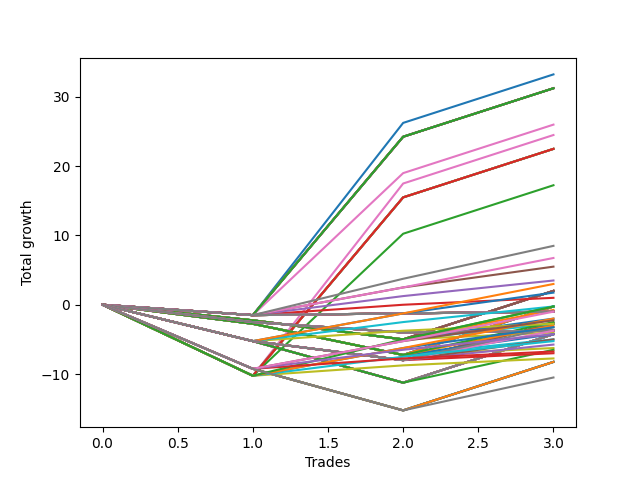

# Long Wallace Doodle 019 
- Symbol: ES90d5m30m
- Date Range: 03/18/2022 - 07/08/2022
- Trading Period: 7:20-12:30
- Number of Trades: 3



| Name | Win Percent | Profit | Avg Profit / Trade | Avg Time / Trade |      | Name | Win Percent | Profit | Avg Profit / Trade | Avg Time / Trade |
| ---- | ----------- | ------ | ------------------ | ---------------- | ---- | ---- | ----------- | ------ | ------------------ | ---------------- |
| Sorted By <br> Profit | | | | | | Sorted By <br> Win Percentage ||||
| Zero | 66.67 | 16625.00 | 5541.67 | 00:00 |     | Zero | 66.67 | 16625.00 | 5541.67 | 00:00 |
| Seventy-Three | 66.67 | 15625.00 | 5208.33 | 00:00 |     | Seventy-Three | 66.67 | 15625.00 | 5208.33 | 00:00 |
| Seven | 66.67 | 15625.00 | 5208.33 | 00:00 |     | Seven | 66.67 | 15625.00 | 5208.33 | 00:00 |
| Five | 66.67 | 15625.00 | 5208.33 | 00:00 |     | Five | 66.67 | 15625.00 | 5208.33 | 00:00 |
| Four | 66.67 | 15625.00 | 5208.33 | 00:00 |     | Four | 66.67 | 15625.00 | 5208.33 | 00:00 |
| Three | 66.67 | 15625.00 | 5208.33 | 00:00 |     | Three | 66.67 | 15625.00 | 5208.33 | 00:00 |
| Two | 66.67 | 15625.00 | 5208.33 | 00:00 |     | Two | 66.67 | 15625.00 | 5208.33 | 00:00 |
| One | 66.67 | 15625.00 | 5208.33 | 00:00 |     | One | 66.67 | 15625.00 | 5208.33 | 00:00 |
| Six | 66.67 | 13000.00 | 4333.33 | 00:00 |     | Six | 66.67 | 13000.00 | 4333.33 | 00:00 |
| Fifty-Six | 66.67 | 12250.00 | 4083.33 | 00:00 |     | Fifty-Six | 66.67 | 12250.00 | 4083.33 | 00:00 |
| Sixty-Three | 66.67 | 11250.00 | 3750.00 | 00:00 |     | Sixty-Three | 66.67 | 11250.00 | 3750.00 | 00:00 |
| Sixty-One | 66.67 | 11250.00 | 3750.00 | 00:00 |     | Sixty-One | 66.67 | 11250.00 | 3750.00 | 00:00 |
| Sixty | 66.67 | 11250.00 | 3750.00 | 00:00 |     | Sixty | 66.67 | 11250.00 | 3750.00 | 00:00 |
| Fifty-Nine | 66.67 | 11250.00 | 3750.00 | 00:00 |     | Fifty-Nine | 66.67 | 11250.00 | 3750.00 | 00:00 |
| Fifty-Eight | 66.67 | 11250.00 | 3750.00 | 00:00 |     | Fifty-Eight | 66.67 | 11250.00 | 3750.00 | 00:00 |
| Fifty-Seven | 66.67 | 11250.00 | 3750.00 | 00:00 |     | Fifty-Seven | 66.67 | 11250.00 | 3750.00 | 00:00 |
| Sixty-Two | 66.67 | 8625.00 | 2875.00 | 00:00 |     | Sixty-Two | 66.67 | 8625.00 | 2875.00 | 00:00 |
| Eighty-Five | 66.67 | 4250.00 | 1416.67 | 00:00 |     | Eighty-Five | 66.67 | 4250.00 | 1416.67 | 00:00 |
| Eighty-Four | 66.67 | 3375.00 | 1125.00 | 00:00 |     | Eighty-Four | 66.67 | 3375.00 | 1125.00 | 00:00 |
| Eighty-Three | 66.67 | 2750.00 | 916.67 | 00:00 |     | Eighty-Three | 66.67 | 2750.00 | 916.67 | 00:00 |
| Eighty-Two | 66.67 | 1750.00 | 583.33 | 00:00 |     | Eighty-Two | 66.67 | 1750.00 | 583.33 | 00:00 |
| One Hundred Fourteen | 66.67 | 1500.00 | 500.00 | 00:00 |     | One Hundred Fourteen | 66.67 | 1500.00 | 500.00 | 00:00 |
| Fifteen | 33.33 | 1000.00 | 333.33 | 00:00 |     | One Hundred Thirteen | 66.67 | 875.00 | 291.67 | 00:00 |
| Fourteen | 33.33 | 1000.00 | 333.33 | 00:00 |     | Eighty-One | 66.67 | 500.00 | 166.67 | 00:00 |
| Thirteen | 33.33 | 1000.00 | 333.33 | 00:00 |     | One Hundred Twenty-Five | 66.67 | -125.00 | -41.67 | 00:00 |
| Twelve | 33.33 | 1000.00 | 333.33 | 00:00 |     | One Hundred Twelve | 66.67 | -125.00 | -41.67 | 00:00 |
| Eleven | 33.33 | 1000.00 | 333.33 | 00:00 |     | One Hundred Twenty-Nine | 66.67 | -500.00 | -166.67 | 00:00 |
| Ten | 33.33 | 1000.00 | 333.33 | 00:00 |     | One Hundred | 66.67 | -500.00 | -166.67 | 00:00 |
| Nine | 33.33 | 1000.00 | 333.33 | 00:00 |     | Ninety-Nine | 66.67 | -500.00 | -166.67 | 00:00 |
| Eight | 33.33 | 1000.00 | 333.33 | 00:00 |     | Ninety-Eight | 66.67 | -500.00 | -166.67 | 00:00 |
| One Hundred Thirteen | 66.67 | 875.00 | 291.67 | 00:00 |     | Ninety-Seven | 66.67 | -500.00 | -166.67 | 00:00 |
| Eighty-One | 66.67 | 500.00 | 166.67 | 00:00 |     | Ninety-Six | 66.67 | -500.00 | -166.67 | 00:00 |
| One Hundred Twenty-Five | 66.67 | -125.00 | -41.67 | 00:00 |     | Twenty-Three | 66.67 | -500.00 | -166.67 | 00:00 |
| One Hundred Twelve | 66.67 | -125.00 | -41.67 | 00:00 |     | Twenty-Two | 66.67 | -500.00 | -166.67 | 00:00 |
| Ninety-Five | 33.33 | -125.00 | -41.67 | 00:00 |     | Twenty-One | 66.67 | -500.00 | -166.67 | 00:00 |
| Thirty-One | 33.33 | -125.00 | -41.67 | 00:00 |     | Twenty | 66.67 | -500.00 | -166.67 | 00:00 |
| Thirty | 33.33 | -125.00 | -41.67 | 00:00 |     | Nineteen | 66.67 | -500.00 | -166.67 | 00:00 |
| Twenty-Nine | 33.33 | -125.00 | -41.67 | 00:00 |     | Eighteen | 66.67 | -500.00 | -166.67 | 00:00 |
| Twenty-Eight | 33.33 | -125.00 | -41.67 | 00:00 |     | Seventeen | 66.67 | -500.00 | -166.67 | 00:00 |
| twenty-Seven | 33.33 | -125.00 | -41.67 | 00:00 |     | Sixten | 66.67 | -500.00 | -166.67 | 00:00 |
| Twenty-Six | 33.33 | -125.00 | -41.67 | 00:00 |     | One Hundred Twenty-Four | 66.67 | -1000.00 | -333.33 | 00:00 |
| Twenty-Five | 33.33 | -125.00 | -41.67 | 00:00 |     | One Hundred Twenty-Eight | 66.67 | -1125.00 | -375.00 | 00:00 |
| Twenty-Four | 33.33 | -125.00 | -41.67 | 00:00 |     | One Hundred Eleven | 66.67 | -1375.00 | -458.33 | 00:00 |
| Ninety-Four | 33.33 | -375.00 | -125.00 | 00:00 |     | One Hundred Twenty-Three | 66.67 | -1625.00 | -541.67 | 00:00 |
| One Hundred Twenty-Nine | 66.67 | -500.00 | -166.67 | 00:00 |     | One Hundred Twenty-Seven | 66.67 | -2125.00 | -708.33 | 00:00 |
| One Hundred | 66.67 | -500.00 | -166.67 | 00:00 |     | One Hundred Twenty-Two | 66.67 | -2625.00 | -875.00 | 00:00 |
| Ninety-Nine | 66.67 | -500.00 | -166.67 | 00:00 |     | One Hundred Twenty-Six | 66.67 | -3375.00 | -1125.00 | 00:00 |
| Ninety-Eight | 66.67 | -500.00 | -166.67 | 00:00 |     | One Hundred Twenty-One | 66.67 | -3875.00 | -1291.67 | 00:00 |
| Ninety-Seven | 66.67 | -500.00 | -166.67 | 00:00 |     | Fifteen | 33.33 | 1000.00 | 333.33 | 00:00 |
| Ninety-Six | 66.67 | -500.00 | -166.67 | 00:00 |     | Fourteen | 33.33 | 1000.00 | 333.33 | 00:00 |
| Twenty-Three | 66.67 | -500.00 | -166.67 | 00:00 |     | Thirteen | 33.33 | 1000.00 | 333.33 | 00:00 |
| Twenty-Two | 66.67 | -500.00 | -166.67 | 00:00 |     | Twelve | 33.33 | 1000.00 | 333.33 | 00:00 |
| Twenty-One | 66.67 | -500.00 | -166.67 | 00:00 |     | Eleven | 33.33 | 1000.00 | 333.33 | 00:00 |
| Twenty | 66.67 | -500.00 | -166.67 | 00:00 |     | Ten | 33.33 | 1000.00 | 333.33 | 00:00 |
| Nineteen | 66.67 | -500.00 | -166.67 | 00:00 |     | Nine | 33.33 | 1000.00 | 333.33 | 00:00 |
| Eighteen | 66.67 | -500.00 | -166.67 | 00:00 |     | Eight | 33.33 | 1000.00 | 333.33 | 00:00 |
| Seventeen | 66.67 | -500.00 | -166.67 | 00:00 |     | Ninety-Five | 33.33 | -125.00 | -41.67 | 00:00 |
| Sixten | 66.67 | -500.00 | -166.67 | 00:00 |     | Thirty-One | 33.33 | -125.00 | -41.67 | 00:00 |
| One Hundred Twenty-Four | 66.67 | -1000.00 | -333.33 | 00:00 |     | Thirty | 33.33 | -125.00 | -41.67 | 00:00 |
| Ninety-Three | 33.33 | -1000.00 | -333.33 | 00:00 |     | Twenty-Nine | 33.33 | -125.00 | -41.67 | 00:00 |
| One Hundred Twenty-Eight | 66.67 | -1125.00 | -375.00 | 00:00 |     | Twenty-Eight | 33.33 | -125.00 | -41.67 | 00:00 |
| One Hundred Five | 33.33 | -1250.00 | -416.67 | 00:00 |     | twenty-Seven | 33.33 | -125.00 | -41.67 | 00:00 |
| One Hundred Eleven | 66.67 | -1375.00 | -458.33 | 00:00 |     | Twenty-Six | 33.33 | -125.00 | -41.67 | 00:00 |
| Ninety-Two | 33.33 | -1375.00 | -458.33 | 00:00 |     | Twenty-Five | 33.33 | -125.00 | -41.67 | 00:00 |
| Fifty-Five | 33.33 | -1375.00 | -458.33 | 00:00 |     | Twenty-Four | 33.33 | -125.00 | -41.67 | 00:00 |
| Fifty-Four | 33.33 | -1375.00 | -458.33 | 00:00 |     | Ninety-Four | 33.33 | -375.00 | -125.00 | 00:00 |
| Fifty-Three | 33.33 | -1375.00 | -458.33 | 00:00 |     | Ninety-Three | 33.33 | -1000.00 | -333.33 | 00:00 |
| Fifty-Two | 33.33 | -1375.00 | -458.33 | 00:00 |     | One Hundred Five | 33.33 | -1250.00 | -416.67 | 00:00 |
| Fifty-One | 33.33 | -1375.00 | -458.33 | 00:00 |     | Ninety-Two | 33.33 | -1375.00 | -458.33 | 00:00 |
| Fifty | 33.33 | -1375.00 | -458.33 | 00:00 |     | Fifty-Five | 33.33 | -1375.00 | -458.33 | 00:00 |
| Forty-Nine | 33.33 | -1375.00 | -458.33 | 00:00 |     | Fifty-Four | 33.33 | -1375.00 | -458.33 | 00:00 |
| Forty-Eight | 33.33 | -1375.00 | -458.33 | 00:00 |     | Fifty-Three | 33.33 | -1375.00 | -458.33 | 00:00 |
| One Hundred Four | 33.33 | -1500.00 | -500.00 | 00:00 |     | Fifty-Two | 33.33 | -1375.00 | -458.33 | 00:00 |
| One Hundred Twenty-Three | 66.67 | -1625.00 | -541.67 | 00:00 |     | Fifty-One | 33.33 | -1375.00 | -458.33 | 00:00 |
| One Hundred Twenty | 33.33 | -1625.00 | -541.67 | 00:00 |     | Fifty | 33.33 | -1375.00 | -458.33 | 00:00 |
| One Hundred Ninteen | 33.33 | -1875.00 | -625.00 | 00:00 |     | Forty-Nine | 33.33 | -1375.00 | -458.33 | 00:00 |
| One Hundred Ten | 33.33 | -1875.00 | -625.00 | 00:00 |     | Forty-Eight | 33.33 | -1375.00 | -458.33 | 00:00 |
| One Hundred Nine | 33.33 | -1875.00 | -625.00 | 00:00 |     | One Hundred Four | 33.33 | -1500.00 | -500.00 | 00:00 |
| One Hundred Eight | 33.33 | -1875.00 | -625.00 | 00:00 |     | One Hundred Twenty | 33.33 | -1625.00 | -541.67 | 00:00 |
| One Hundred Seven | 33.33 | -1875.00 | -625.00 | 00:00 |     | One Hundred Ninteen | 33.33 | -1875.00 | -625.00 | 00:00 |
| One Hundred Six | 33.33 | -1875.00 | -625.00 | 00:00 |     | One Hundred Ten | 33.33 | -1875.00 | -625.00 | 00:00 |
| Thirty-Nine | 33.33 | -1875.00 | -625.00 | 00:00 |     | One Hundred Nine | 33.33 | -1875.00 | -625.00 | 00:00 |
| Thirty-Eight | 33.33 | -1875.00 | -625.00 | 00:00 |     | One Hundred Eight | 33.33 | -1875.00 | -625.00 | 00:00 |
| Thirty-Seven | 33.33 | -1875.00 | -625.00 | 00:00 |     | One Hundred Seven | 33.33 | -1875.00 | -625.00 | 00:00 |
| Thirty-Six | 33.33 | -1875.00 | -625.00 | 00:00 |     | One Hundred Six | 33.33 | -1875.00 | -625.00 | 00:00 |
| Thirty-Five | 33.33 | -1875.00 | -625.00 | 00:00 |     | Thirty-Nine | 33.33 | -1875.00 | -625.00 | 00:00 |
| Thirty-Four | 33.33 | -1875.00 | -625.00 | 00:00 |     | Thirty-Eight | 33.33 | -1875.00 | -625.00 | 00:00 |
| Thirty-Three | 33.33 | -1875.00 | -625.00 | 00:00 |     | Thirty-Seven | 33.33 | -1875.00 | -625.00 | 00:00 |
| Thirty-Two | 33.33 | -1875.00 | -625.00 | 00:00 |     | Thirty-Six | 33.33 | -1875.00 | -625.00 | 00:00 |
| Ninety-One | 33.33 | -2000.00 | -666.67 | 00:00 |     | Thirty-Five | 33.33 | -1875.00 | -625.00 | 00:00 |
| One Hundred Twenty-Seven | 66.67 | -2125.00 | -708.33 | 00:00 |     | Thirty-Four | 33.33 | -1875.00 | -625.00 | 00:00 |
| One Hundred Three | 33.33 | -2125.00 | -708.33 | 00:00 |     | Thirty-Three | 33.33 | -1875.00 | -625.00 | 00:00 |
| Forty-Seven | 33.33 | -2125.00 | -708.33 | 00:00 |     | Thirty-Two | 33.33 | -1875.00 | -625.00 | 00:00 |
| Forty-Six | 33.33 | -2125.00 | -708.33 | 00:00 |     | Ninety-One | 33.33 | -2000.00 | -666.67 | 00:00 |
| Forty-Five | 33.33 | -2125.00 | -708.33 | 00:00 |     | One Hundred Three | 33.33 | -2125.00 | -708.33 | 00:00 |
| Forty-Four | 33.33 | -2125.00 | -708.33 | 00:00 |     | Forty-Seven | 33.33 | -2125.00 | -708.33 | 00:00 |
| Forty-Three | 33.33 | -2125.00 | -708.33 | 00:00 |     | Forty-Six | 33.33 | -2125.00 | -708.33 | 00:00 |
| Forty-Two | 33.33 | -2125.00 | -708.33 | 00:00 |     | Forty-Five | 33.33 | -2125.00 | -708.33 | 00:00 |
| Forty-One | 33.33 | -2125.00 | -708.33 | 00:00 |     | Forty-Four | 33.33 | -2125.00 | -708.33 | 00:00 |
| Forty | 33.33 | -2125.00 | -708.33 | 00:00 |     | Forty-Three | 33.33 | -2125.00 | -708.33 | 00:00 |
| One Hundred Eighteen | 33.33 | -2500.00 | -833.33 | 00:00 |     | Forty-Two | 33.33 | -2125.00 | -708.33 | 00:00 |
| One Hundred Two | 33.33 | -2500.00 | -833.33 | 00:00 |     | Forty-One | 33.33 | -2125.00 | -708.33 | 00:00 |
| One Hundred Twenty-Two | 66.67 | -2625.00 | -875.00 | 00:00 |     | Forty | 33.33 | -2125.00 | -708.33 | 00:00 |
| One Hundred Seventeen | 33.33 | -2875.00 | -958.33 | 00:00 |     | One Hundred Eighteen | 33.33 | -2500.00 | -833.33 | 00:00 |
| One Hundred One | 33.33 | -3125.00 | -1041.67 | 00:00 |     | One Hundred Two | 33.33 | -2500.00 | -833.33 | 00:00 |
| One Hundred Fifteen | 33.33 | -3250.00 | -1083.33 | 00:00 |     | One Hundred Seventeen | 33.33 | -2875.00 | -958.33 | 00:00 |
| One Hundred Twenty-Six | 66.67 | -3375.00 | -1125.00 | 00:00 |     | One Hundred One | 33.33 | -3125.00 | -1041.67 | 00:00 |
| One Hundred Sixteen | 33.33 | -3500.00 | -1166.67 | 00:00 |     | One Hundred Fifteen | 33.33 | -3250.00 | -1083.33 | 00:00 |
| One Hundred Twenty-One | 66.67 | -3875.00 | -1291.67 | 00:00 |     | One Hundred Sixteen | 33.33 | -3500.00 | -1166.67 | 00:00 |
| Seventy-One | 33.33 | -4125.00 | -1375.00 | 00:00 |     | Seventy-One | 33.33 | -4125.00 | -1375.00 | 00:00 |
| Seventy | 33.33 | -4125.00 | -1375.00 | 00:00 |     | Seventy | 33.33 | -4125.00 | -1375.00 | 00:00 |
| Sixty-Nine | 33.33 | -4125.00 | -1375.00 | 00:00 |     | Sixty-Nine | 33.33 | -4125.00 | -1375.00 | 00:00 |
| Sixty-Eight | 33.33 | -4125.00 | -1375.00 | 00:00 |     | Sixty-Eight | 33.33 | -4125.00 | -1375.00 | 00:00 |
| Sixty-Seven | 33.33 | -4125.00 | -1375.00 | 00:00 |     | Sixty-Seven | 33.33 | -4125.00 | -1375.00 | 00:00 |
| Sixty-Six | 33.33 | -4125.00 | -1375.00 | 00:00 |     | Sixty-Six | 33.33 | -4125.00 | -1375.00 | 00:00 |
| Sixty-Five | 33.33 | -4125.00 | -1375.00 | 00:00 |     | Sixty-Five | 33.33 | -4125.00 | -1375.00 | 00:00 |
| Sixty-Four | 33.33 | -4125.00 | -1375.00 | 00:00 |     | Sixty-Four | 33.33 | -4125.00 | -1375.00 | 00:00 |
| One Hundred Thirty | 33.33 | -5250.00 | -1750.00 | 00:00 |     | One Hundred Thirty | 33.33 | -5250.00 | -1750.00 | 00:00 |

## NO STOPLOSS

### Test Zero
* Sell when price hits the middle line of the 20p bollinger
* No Stoploss
* Results:
```
Total Trades: 3
Percent Up: 66.67
Percent Down: 33.33
Total Points Moved Up: 33.25
Potential Profit: 16625.00
Total Points Ups: 34.75 Count Ups: 2
Total Points Downs: -1.50 Count Downs: 1
```

<details><summary>Trades</summary>

<code>In: 2022-04-18 08:30:00		Out: 2022-04-18 08:59:55		Total Position Time: 29:55		Total Move Up: -1.50		Total to Date: -1.50</code> <br />
<code>In: 2022-05-12 09:05:00		Out: 2022-05-12 09:33:10		Total Position Time: 28:10		Total Move Up: 27.75		Total to Date: 26.25</code> <br />
<code>In: 2022-05-25 09:40:00		Out: 2022-05-25 10:09:55		Total Position Time: 29:55		Total Move Up: 7.00		Total to Date: 33.25</code> <br />


</details>

### Test One
* Sell when the price hits the upper line of the 20p 1std bollinger
* No Stoploss
* Results:
```
Total Trades: 3
Percent Up: 66.67
Percent Down: 33.33
Total Points Moved Up: 31.25
Potential Profit: 15625.00
Total Points Ups: 32.75 Count Ups: 2
Total Points Downs: -1.50 Count Downs: 1
```

<details><summary>Trades</summary>

<code>In: 2022-04-18 08:30:00		Out: 2022-04-18 08:59:55		Total Position Time: 29:55		Total Move Up: -1.50		Total to Date: -1.50</code> <br />
<code>In: 2022-05-12 09:05:00		Out: 2022-05-12 09:34:55		Total Position Time: 29:55		Total Move Up: 25.75		Total to Date: 24.25</code> <br />
<code>In: 2022-05-25 09:40:00		Out: 2022-05-25 10:09:55		Total Position Time: 29:55		Total Move Up: 7.00		Total to Date: 31.25</code> <br />


</details>

### Test Two
* Sell when the price hits the upper line of the 20p 2std bollinger
* No Stoploss
* Results:
```
Total Trades: 3
Percent Up: 66.67
Percent Down: 33.33
Total Points Moved Up: 31.25
Potential Profit: 15625.00
Total Points Ups: 32.75 Count Ups: 2
Total Points Downs: -1.50 Count Downs: 1
```

<details><summary>Trades</summary>

<code>In: 2022-04-18 08:30:00		Out: 2022-04-18 08:59:55		Total Position Time: 29:55		Total Move Up: -1.50		Total to Date: -1.50</code> <br />
<code>In: 2022-05-12 09:05:00		Out: 2022-05-12 09:34:55		Total Position Time: 29:55		Total Move Up: 25.75		Total to Date: 24.25</code> <br />
<code>In: 2022-05-25 09:40:00		Out: 2022-05-25 10:09:55		Total Position Time: 29:55		Total Move Up: 7.00		Total to Date: 31.25</code> <br />


</details>

### Test Three
* Sell when price hits the middle line of the 50p bollinger
* No Stoploss
* Results:
```
Total Trades: 3
Percent Up: 66.67
Percent Down: 33.33
Total Points Moved Up: 31.25
Potential Profit: 15625.00
Total Points Ups: 32.75 Count Ups: 2
Total Points Downs: -1.50 Count Downs: 1
```

<details><summary>Trades</summary>

<code>In: 2022-04-18 08:30:00		Out: 2022-04-18 08:59:55		Total Position Time: 29:55		Total Move Up: -1.50		Total to Date: -1.50</code> <br />
<code>In: 2022-05-12 09:05:00		Out: 2022-05-12 09:34:55		Total Position Time: 29:55		Total Move Up: 25.75		Total to Date: 24.25</code> <br />
<code>In: 2022-05-25 09:40:00		Out: 2022-05-25 10:09:55		Total Position Time: 29:55		Total Move Up: 7.00		Total to Date: 31.25</code> <br />


</details>

### Test Four
* Sell when the price hits the upper line of the 50p 1std bollinger
* No Stoploss
* Results:
```
Total Trades: 3
Percent Up: 66.67
Percent Down: 33.33
Total Points Moved Up: 31.25
Potential Profit: 15625.00
Total Points Ups: 32.75 Count Ups: 2
Total Points Downs: -1.50 Count Downs: 1
```

<details><summary>Trades</summary>

<code>In: 2022-04-18 08:30:00		Out: 2022-04-18 08:59:55		Total Position Time: 29:55		Total Move Up: -1.50		Total to Date: -1.50</code> <br />
<code>In: 2022-05-12 09:05:00		Out: 2022-05-12 09:34:55		Total Position Time: 29:55		Total Move Up: 25.75		Total to Date: 24.25</code> <br />
<code>In: 2022-05-25 09:40:00		Out: 2022-05-25 10:09:55		Total Position Time: 29:55		Total Move Up: 7.00		Total to Date: 31.25</code> <br />


</details>

### Test Five
* Sell when the price hits the upper line of the 50p 2std bollinger
* No Stoploss
* Results:
```
Total Trades: 3
Percent Up: 66.67
Percent Down: 33.33
Total Points Moved Up: 31.25
Potential Profit: 15625.00
Total Points Ups: 32.75 Count Ups: 2
Total Points Downs: -1.50 Count Downs: 1
```

<details><summary>Trades</summary>

<code>In: 2022-04-18 08:30:00		Out: 2022-04-18 08:59:55		Total Position Time: 29:55		Total Move Up: -1.50		Total to Date: -1.50</code> <br />
<code>In: 2022-05-12 09:05:00		Out: 2022-05-12 09:34:55		Total Position Time: 29:55		Total Move Up: 25.75		Total to Date: 24.25</code> <br />
<code>In: 2022-05-25 09:40:00		Out: 2022-05-25 10:09:55		Total Position Time: 29:55		Total Move Up: 7.00		Total to Date: 31.25</code> <br />


</details>

### Test Six
* Sell when the price hits the middle line of the 1std VWAP
* No Stoploss
* Results:
```
Total Trades: 3
Percent Up: 66.67
Percent Down: 33.33
Total Points Moved Up: 26.00
Potential Profit: 13000.00
Total Points Ups: 27.50 Count Ups: 2
Total Points Downs: -1.50 Count Downs: 1
```

<details><summary>Trades</summary>

<code>In: 2022-04-18 08:30:00		Out: 2022-04-18 08:59:55		Total Position Time: 29:55		Total Move Up: -1.50		Total to Date: -1.50</code> <br />
<code>In: 2022-05-12 09:05:00		Out: 2022-05-12 09:31:15		Total Position Time: 26:15		Total Move Up: 20.50		Total to Date: 19.00</code> <br />
<code>In: 2022-05-25 09:40:00		Out: 2022-05-25 10:09:55		Total Position Time: 29:55		Total Move Up: 7.00		Total to Date: 26.00</code> <br />


</details>

### Test Seven
* Sell when the price hits the upper line of the 1std VWAP
* No Stoploss
* Results:
```
Total Trades: 3
Percent Up: 66.67
Percent Down: 33.33
Total Points Moved Up: 31.25
Potential Profit: 15625.00
Total Points Ups: 32.75 Count Ups: 2
Total Points Downs: -1.50 Count Downs: 1
```

<details><summary>Trades</summary>

<code>In: 2022-04-18 08:30:00		Out: 2022-04-18 08:59:55		Total Position Time: 29:55		Total Move Up: -1.50		Total to Date: -1.50</code> <br />
<code>In: 2022-05-12 09:05:00		Out: 2022-05-12 09:34:55		Total Position Time: 29:55		Total Move Up: 25.75		Total to Date: 24.25</code> <br />
<code>In: 2022-05-25 09:40:00		Out: 2022-05-25 10:09:55		Total Position Time: 29:55		Total Move Up: 7.00		Total to Date: 31.25</code> <br />


</details>

## STOPLOSS OF 2

### Test Eight
* Sell when price hits the middle line of the 20p bollinger
* Stoploss is 2 points
* Results:
```
Total Trades: 3
Percent Up: 33.33
Percent Down: 66.67
Total Points Moved Up: 2.00
Potential Profit: 1000.00
Total Points Ups: 7.00 Count Ups: 1
Total Points Downs: -5.00 Count Downs: 2
```

<details><summary>Trades</summary>

<code>In: 2022-04-18 08:30:00		Out: 2022-04-18 08:33:00		Total Position Time: 03:00		Total Move Up: -2.25		Total to Date: -2.25</code> <br />
<code>In: 2022-05-12 09:05:00		Out: 2022-05-12 09:05:20		Total Position Time: 00:20		Total Move Up: -2.75		Total to Date: -5.00</code> <br />
<code>In: 2022-05-25 09:40:00		Out: 2022-05-25 10:09:55		Total Position Time: 29:55		Total Move Up: 7.00		Total to Date: 2.00</code> <br />


</details>

### Test Nine
* Sell when the price hits the upper line of the 20p 1std bollinger
* Stoploss is 2 points
* Results:
```
Total Trades: 3
Percent Up: 33.33
Percent Down: 66.67
Total Points Moved Up: 2.00
Potential Profit: 1000.00
Total Points Ups: 7.00 Count Ups: 1
Total Points Downs: -5.00 Count Downs: 2
```

<details><summary>Trades</summary>

<code>In: 2022-04-18 08:30:00		Out: 2022-04-18 08:33:00		Total Position Time: 03:00		Total Move Up: -2.25		Total to Date: -2.25</code> <br />
<code>In: 2022-05-12 09:05:00		Out: 2022-05-12 09:05:20		Total Position Time: 00:20		Total Move Up: -2.75		Total to Date: -5.00</code> <br />
<code>In: 2022-05-25 09:40:00		Out: 2022-05-25 10:09:55		Total Position Time: 29:55		Total Move Up: 7.00		Total to Date: 2.00</code> <br />


</details>

### Test Ten
* Sell when the price hits the upper line of the 20p 2std bollinger
* Stoploss is 2 points
* Results:
```
Total Trades: 3
Percent Up: 33.33
Percent Down: 66.67
Total Points Moved Up: 2.00
Potential Profit: 1000.00
Total Points Ups: 7.00 Count Ups: 1
Total Points Downs: -5.00 Count Downs: 2
```

<details><summary>Trades</summary>

<code>In: 2022-04-18 08:30:00		Out: 2022-04-18 08:33:00		Total Position Time: 03:00		Total Move Up: -2.25		Total to Date: -2.25</code> <br />
<code>In: 2022-05-12 09:05:00		Out: 2022-05-12 09:05:20		Total Position Time: 00:20		Total Move Up: -2.75		Total to Date: -5.00</code> <br />
<code>In: 2022-05-25 09:40:00		Out: 2022-05-25 10:09:55		Total Position Time: 29:55		Total Move Up: 7.00		Total to Date: 2.00</code> <br />


</details>

### Test Eleven
* Sell when price hits the middle line of the 50p bollinger
* Stoploss is 2 points
* Results:
```
Total Trades: 3
Percent Up: 33.33
Percent Down: 66.67
Total Points Moved Up: 2.00
Potential Profit: 1000.00
Total Points Ups: 7.00 Count Ups: 1
Total Points Downs: -5.00 Count Downs: 2
```

<details><summary>Trades</summary>

<code>In: 2022-04-18 08:30:00		Out: 2022-04-18 08:33:00		Total Position Time: 03:00		Total Move Up: -2.25		Total to Date: -2.25</code> <br />
<code>In: 2022-05-12 09:05:00		Out: 2022-05-12 09:05:20		Total Position Time: 00:20		Total Move Up: -2.75		Total to Date: -5.00</code> <br />
<code>In: 2022-05-25 09:40:00		Out: 2022-05-25 10:09:55		Total Position Time: 29:55		Total Move Up: 7.00		Total to Date: 2.00</code> <br />


</details>

### Test Twelve
* Sell when the price hits the upper line of the 50p 1std bollinger
* Stoploss is 2 points
* Results:
```
Total Trades: 3
Percent Up: 33.33
Percent Down: 66.67
Total Points Moved Up: 2.00
Potential Profit: 1000.00
Total Points Ups: 7.00 Count Ups: 1
Total Points Downs: -5.00 Count Downs: 2
```

<details><summary>Trades</summary>

<code>In: 2022-04-18 08:30:00		Out: 2022-04-18 08:33:00		Total Position Time: 03:00		Total Move Up: -2.25		Total to Date: -2.25</code> <br />
<code>In: 2022-05-12 09:05:00		Out: 2022-05-12 09:05:20		Total Position Time: 00:20		Total Move Up: -2.75		Total to Date: -5.00</code> <br />
<code>In: 2022-05-25 09:40:00		Out: 2022-05-25 10:09:55		Total Position Time: 29:55		Total Move Up: 7.00		Total to Date: 2.00</code> <br />


</details>

### Test Thirteen
* Sell when the price hits the upper line of the 50p 2std bollinger
* Stoploss is 2 points
* Results:
```
Total Trades: 3
Percent Up: 33.33
Percent Down: 66.67
Total Points Moved Up: 2.00
Potential Profit: 1000.00
Total Points Ups: 7.00 Count Ups: 1
Total Points Downs: -5.00 Count Downs: 2
```

<details><summary>Trades</summary>

<code>In: 2022-04-18 08:30:00		Out: 2022-04-18 08:33:00		Total Position Time: 03:00		Total Move Up: -2.25		Total to Date: -2.25</code> <br />
<code>In: 2022-05-12 09:05:00		Out: 2022-05-12 09:05:20		Total Position Time: 00:20		Total Move Up: -2.75		Total to Date: -5.00</code> <br />
<code>In: 2022-05-25 09:40:00		Out: 2022-05-25 10:09:55		Total Position Time: 29:55		Total Move Up: 7.00		Total to Date: 2.00</code> <br />


</details>

### Test Fourteen
* Sell when the price hits the middle line of the 1std VWAP
* Stoploss is 2 points
* Results:
```
Total Trades: 3
Percent Up: 33.33
Percent Down: 66.67
Total Points Moved Up: 2.00
Potential Profit: 1000.00
Total Points Ups: 7.00 Count Ups: 1
Total Points Downs: -5.00 Count Downs: 2
```

<details><summary>Trades</summary>

<code>In: 2022-04-18 08:30:00		Out: 2022-04-18 08:33:00		Total Position Time: 03:00		Total Move Up: -2.25		Total to Date: -2.25</code> <br />
<code>In: 2022-05-12 09:05:00		Out: 2022-05-12 09:05:20		Total Position Time: 00:20		Total Move Up: -2.75		Total to Date: -5.00</code> <br />
<code>In: 2022-05-25 09:40:00		Out: 2022-05-25 10:09:55		Total Position Time: 29:55		Total Move Up: 7.00		Total to Date: 2.00</code> <br />


</details>

### Test Fifteen
* Sell when the price hits the upper line of the 1std VWAP
* Stoploss is 2 points
* Results:
```
Total Trades: 3
Percent Up: 33.33
Percent Down: 66.67
Total Points Moved Up: 2.00
Potential Profit: 1000.00
Total Points Ups: 7.00 Count Ups: 1
Total Points Downs: -5.00 Count Downs: 2
```

<details><summary>Trades</summary>

<code>In: 2022-04-18 08:30:00		Out: 2022-04-18 08:33:00		Total Position Time: 03:00		Total Move Up: -2.25		Total to Date: -2.25</code> <br />
<code>In: 2022-05-12 09:05:00		Out: 2022-05-12 09:05:20		Total Position Time: 00:20		Total Move Up: -2.75		Total to Date: -5.00</code> <br />
<code>In: 2022-05-25 09:40:00		Out: 2022-05-25 10:09:55		Total Position Time: 29:55		Total Move Up: 7.00		Total to Date: 2.00</code> <br />


</details>

## TRAIL STOP OF 2

### Test Sixten
* Sell when price hits the middle line of the 20p bollinger
* Trailing Stop is 2 points
* Results:
```
Total Trades: 3
Percent Up: 66.67
Percent Down: 33.33
Total Points Moved Up: -1.00
Potential Profit: -500.00
Total Points Ups: 0.50 Count Ups: 2
Total Points Downs: -1.50 Count Downs: 1
```

<details><summary>Trades</summary>

<code>In: 2022-04-18 08:30:00		Out: 2022-04-18 08:32:50		Total Position Time: 02:50		Total Move Up: -1.50		Total to Date: -1.50</code> <br />
<code>In: 2022-05-12 09:05:00		Out: 2022-05-12 09:05:10		Total Position Time: 00:10		Total Move Up: 0.25		Total to Date: -1.25</code> <br />
<code>In: 2022-05-25 09:40:00		Out: 2022-05-25 09:40:10		Total Position Time: 00:10		Total Move Up: 0.25		Total to Date: -1.00</code> <br />


</details>

### Test Seventeen
* Sell when the price hits the upper line of the 20p 1std bollinger
* Trailing Stop is 2 points
* Results:
```
Total Trades: 3
Percent Up: 66.67
Percent Down: 33.33
Total Points Moved Up: -1.00
Potential Profit: -500.00
Total Points Ups: 0.50 Count Ups: 2
Total Points Downs: -1.50 Count Downs: 1
```

<details><summary>Trades</summary>

<code>In: 2022-04-18 08:30:00		Out: 2022-04-18 08:32:50		Total Position Time: 02:50		Total Move Up: -1.50		Total to Date: -1.50</code> <br />
<code>In: 2022-05-12 09:05:00		Out: 2022-05-12 09:05:10		Total Position Time: 00:10		Total Move Up: 0.25		Total to Date: -1.25</code> <br />
<code>In: 2022-05-25 09:40:00		Out: 2022-05-25 09:40:10		Total Position Time: 00:10		Total Move Up: 0.25		Total to Date: -1.00</code> <br />


</details>

### Test Eighteen
* Sell when the price hits the upper line of the 20p 2std bollinger
* Trailing Stop is 2 points
* Results:
```
Total Trades: 3
Percent Up: 66.67
Percent Down: 33.33
Total Points Moved Up: -1.00
Potential Profit: -500.00
Total Points Ups: 0.50 Count Ups: 2
Total Points Downs: -1.50 Count Downs: 1
```

<details><summary>Trades</summary>

<code>In: 2022-04-18 08:30:00		Out: 2022-04-18 08:32:50		Total Position Time: 02:50		Total Move Up: -1.50		Total to Date: -1.50</code> <br />
<code>In: 2022-05-12 09:05:00		Out: 2022-05-12 09:05:10		Total Position Time: 00:10		Total Move Up: 0.25		Total to Date: -1.25</code> <br />
<code>In: 2022-05-25 09:40:00		Out: 2022-05-25 09:40:10		Total Position Time: 00:10		Total Move Up: 0.25		Total to Date: -1.00</code> <br />


</details>

### Test Nineteen
* Sell when price hits the middle line of the 50p bollinger
* Trailing Stop is 2 points
* Results:
```
Total Trades: 3
Percent Up: 66.67
Percent Down: 33.33
Total Points Moved Up: -1.00
Potential Profit: -500.00
Total Points Ups: 0.50 Count Ups: 2
Total Points Downs: -1.50 Count Downs: 1
```

<details><summary>Trades</summary>

<code>In: 2022-04-18 08:30:00		Out: 2022-04-18 08:32:50		Total Position Time: 02:50		Total Move Up: -1.50		Total to Date: -1.50</code> <br />
<code>In: 2022-05-12 09:05:00		Out: 2022-05-12 09:05:10		Total Position Time: 00:10		Total Move Up: 0.25		Total to Date: -1.25</code> <br />
<code>In: 2022-05-25 09:40:00		Out: 2022-05-25 09:40:10		Total Position Time: 00:10		Total Move Up: 0.25		Total to Date: -1.00</code> <br />


</details>

### Test Twenty
* Sell when the price hits the upper line of the 50p 1std bollinger
* Trailing Stop is 2 points
* Results:
```
Total Trades: 3
Percent Up: 66.67
Percent Down: 33.33
Total Points Moved Up: -1.00
Potential Profit: -500.00
Total Points Ups: 0.50 Count Ups: 2
Total Points Downs: -1.50 Count Downs: 1
```

<details><summary>Trades</summary>

<code>In: 2022-04-18 08:30:00		Out: 2022-04-18 08:32:50		Total Position Time: 02:50		Total Move Up: -1.50		Total to Date: -1.50</code> <br />
<code>In: 2022-05-12 09:05:00		Out: 2022-05-12 09:05:10		Total Position Time: 00:10		Total Move Up: 0.25		Total to Date: -1.25</code> <br />
<code>In: 2022-05-25 09:40:00		Out: 2022-05-25 09:40:10		Total Position Time: 00:10		Total Move Up: 0.25		Total to Date: -1.00</code> <br />


</details>

### Test Twenty-One
* Sell when the price hits the upper line of the 50p 2std bollinger
* Trailing Stop is 2 points
* Results:
```
Total Trades: 3
Percent Up: 66.67
Percent Down: 33.33
Total Points Moved Up: -1.00
Potential Profit: -500.00
Total Points Ups: 0.50 Count Ups: 2
Total Points Downs: -1.50 Count Downs: 1
```

<details><summary>Trades</summary>

<code>In: 2022-04-18 08:30:00		Out: 2022-04-18 08:32:50		Total Position Time: 02:50		Total Move Up: -1.50		Total to Date: -1.50</code> <br />
<code>In: 2022-05-12 09:05:00		Out: 2022-05-12 09:05:10		Total Position Time: 00:10		Total Move Up: 0.25		Total to Date: -1.25</code> <br />
<code>In: 2022-05-25 09:40:00		Out: 2022-05-25 09:40:10		Total Position Time: 00:10		Total Move Up: 0.25		Total to Date: -1.00</code> <br />


</details>

### Test Twenty-Two
* Sell when the price hits the middle line of the 1std VWAP
* Trailing Stop is 2 points
* Results:
```
Total Trades: 3
Percent Up: 66.67
Percent Down: 33.33
Total Points Moved Up: -1.00
Potential Profit: -500.00
Total Points Ups: 0.50 Count Ups: 2
Total Points Downs: -1.50 Count Downs: 1
```

<details><summary>Trades</summary>

<code>In: 2022-04-18 08:30:00		Out: 2022-04-18 08:32:50		Total Position Time: 02:50		Total Move Up: -1.50		Total to Date: -1.50</code> <br />
<code>In: 2022-05-12 09:05:00		Out: 2022-05-12 09:05:10		Total Position Time: 00:10		Total Move Up: 0.25		Total to Date: -1.25</code> <br />
<code>In: 2022-05-25 09:40:00		Out: 2022-05-25 09:40:10		Total Position Time: 00:10		Total Move Up: 0.25		Total to Date: -1.00</code> <br />


</details>

### Test Twenty-Three
* Sell when the price hits the upper line of the 1std VWAP
* Trailing Stop is 2 points
* Results:
```
Total Trades: 3
Percent Up: 66.67
Percent Down: 33.33
Total Points Moved Up: -1.00
Potential Profit: -500.00
Total Points Ups: 0.50 Count Ups: 2
Total Points Downs: -1.50 Count Downs: 1
```

<details><summary>Trades</summary>

<code>In: 2022-04-18 08:30:00		Out: 2022-04-18 08:32:50		Total Position Time: 02:50		Total Move Up: -1.50		Total to Date: -1.50</code> <br />
<code>In: 2022-05-12 09:05:00		Out: 2022-05-12 09:05:10		Total Position Time: 00:10		Total Move Up: 0.25		Total to Date: -1.25</code> <br />
<code>In: 2022-05-25 09:40:00		Out: 2022-05-25 09:40:10		Total Position Time: 00:10		Total Move Up: 0.25		Total to Date: -1.00</code> <br />


</details>

## STOPLOSS OF 3

### Test Twenty-Four
* Sell when price hits the middle line of the 20p bollinger
* Stoploss is 3 points
* Results:
```
Total Trades: 3
Percent Up: 33.33
Percent Down: 66.67
Total Points Moved Up: -0.25
Potential Profit: -125.00
Total Points Ups: 7.00 Count Ups: 1
Total Points Downs: -7.25 Count Downs: 2
```

<details><summary>Trades</summary>

<code>In: 2022-04-18 08:30:00		Out: 2022-04-18 08:33:15		Total Position Time: 03:15		Total Move Up: -2.75		Total to Date: -2.75</code> <br />
<code>In: 2022-05-12 09:05:00		Out: 2022-05-12 09:05:25		Total Position Time: 00:25		Total Move Up: -4.50		Total to Date: -7.25</code> <br />
<code>In: 2022-05-25 09:40:00		Out: 2022-05-25 10:09:55		Total Position Time: 29:55		Total Move Up: 7.00		Total to Date: -0.25</code> <br />


</details>

### Test Twenty-Five
* Sell when the price hits the upper line of the 20p 1std bollinger
* Stoploss is 3 points
* Results:
```
Total Trades: 3
Percent Up: 33.33
Percent Down: 66.67
Total Points Moved Up: -0.25
Potential Profit: -125.00
Total Points Ups: 7.00 Count Ups: 1
Total Points Downs: -7.25 Count Downs: 2
```

<details><summary>Trades</summary>

<code>In: 2022-04-18 08:30:00		Out: 2022-04-18 08:33:15		Total Position Time: 03:15		Total Move Up: -2.75		Total to Date: -2.75</code> <br />
<code>In: 2022-05-12 09:05:00		Out: 2022-05-12 09:05:25		Total Position Time: 00:25		Total Move Up: -4.50		Total to Date: -7.25</code> <br />
<code>In: 2022-05-25 09:40:00		Out: 2022-05-25 10:09:55		Total Position Time: 29:55		Total Move Up: 7.00		Total to Date: -0.25</code> <br />


</details>

### Test Twenty-Six
* Sell when the price hits the upper line of the 20p 2std bollinger
* Stoploss is 3 points
* Results:
```
Total Trades: 3
Percent Up: 33.33
Percent Down: 66.67
Total Points Moved Up: -0.25
Potential Profit: -125.00
Total Points Ups: 7.00 Count Ups: 1
Total Points Downs: -7.25 Count Downs: 2
```

<details><summary>Trades</summary>

<code>In: 2022-04-18 08:30:00		Out: 2022-04-18 08:33:15		Total Position Time: 03:15		Total Move Up: -2.75		Total to Date: -2.75</code> <br />
<code>In: 2022-05-12 09:05:00		Out: 2022-05-12 09:05:25		Total Position Time: 00:25		Total Move Up: -4.50		Total to Date: -7.25</code> <br />
<code>In: 2022-05-25 09:40:00		Out: 2022-05-25 10:09:55		Total Position Time: 29:55		Total Move Up: 7.00		Total to Date: -0.25</code> <br />


</details>

### Test twenty-Seven
* Sell when price hits the middle line of the 50p bollinger
* Stoploss is 3 points
* Results:
```
Total Trades: 3
Percent Up: 33.33
Percent Down: 66.67
Total Points Moved Up: -0.25
Potential Profit: -125.00
Total Points Ups: 7.00 Count Ups: 1
Total Points Downs: -7.25 Count Downs: 2
```

<details><summary>Trades</summary>

<code>In: 2022-04-18 08:30:00		Out: 2022-04-18 08:33:15		Total Position Time: 03:15		Total Move Up: -2.75		Total to Date: -2.75</code> <br />
<code>In: 2022-05-12 09:05:00		Out: 2022-05-12 09:05:25		Total Position Time: 00:25		Total Move Up: -4.50		Total to Date: -7.25</code> <br />
<code>In: 2022-05-25 09:40:00		Out: 2022-05-25 10:09:55		Total Position Time: 29:55		Total Move Up: 7.00		Total to Date: -0.25</code> <br />


</details>

### Test Twenty-Eight
* Sell when the price hits the upper line of the 50p 1std bollinger
* Stoploss is 3 points
* Results:
```
Total Trades: 3
Percent Up: 33.33
Percent Down: 66.67
Total Points Moved Up: -0.25
Potential Profit: -125.00
Total Points Ups: 7.00 Count Ups: 1
Total Points Downs: -7.25 Count Downs: 2
```

<details><summary>Trades</summary>

<code>In: 2022-04-18 08:30:00		Out: 2022-04-18 08:33:15		Total Position Time: 03:15		Total Move Up: -2.75		Total to Date: -2.75</code> <br />
<code>In: 2022-05-12 09:05:00		Out: 2022-05-12 09:05:25		Total Position Time: 00:25		Total Move Up: -4.50		Total to Date: -7.25</code> <br />
<code>In: 2022-05-25 09:40:00		Out: 2022-05-25 10:09:55		Total Position Time: 29:55		Total Move Up: 7.00		Total to Date: -0.25</code> <br />


</details>

### Test Twenty-Nine
* Sell when the price hits the upper line of the 50p 2std bollinger
* Stoploss is 3 points
* Results:
```
Total Trades: 3
Percent Up: 33.33
Percent Down: 66.67
Total Points Moved Up: -0.25
Potential Profit: -125.00
Total Points Ups: 7.00 Count Ups: 1
Total Points Downs: -7.25 Count Downs: 2
```

<details><summary>Trades</summary>

<code>In: 2022-04-18 08:30:00		Out: 2022-04-18 08:33:15		Total Position Time: 03:15		Total Move Up: -2.75		Total to Date: -2.75</code> <br />
<code>In: 2022-05-12 09:05:00		Out: 2022-05-12 09:05:25		Total Position Time: 00:25		Total Move Up: -4.50		Total to Date: -7.25</code> <br />
<code>In: 2022-05-25 09:40:00		Out: 2022-05-25 10:09:55		Total Position Time: 29:55		Total Move Up: 7.00		Total to Date: -0.25</code> <br />


</details>

### Test Thirty
* Sell when the price hits the middle line of the 1std VWAP
* Stoploss is 3 points
* Results:
```
Total Trades: 3
Percent Up: 33.33
Percent Down: 66.67
Total Points Moved Up: -0.25
Potential Profit: -125.00
Total Points Ups: 7.00 Count Ups: 1
Total Points Downs: -7.25 Count Downs: 2
```

<details><summary>Trades</summary>

<code>In: 2022-04-18 08:30:00		Out: 2022-04-18 08:33:15		Total Position Time: 03:15		Total Move Up: -2.75		Total to Date: -2.75</code> <br />
<code>In: 2022-05-12 09:05:00		Out: 2022-05-12 09:05:25		Total Position Time: 00:25		Total Move Up: -4.50		Total to Date: -7.25</code> <br />
<code>In: 2022-05-25 09:40:00		Out: 2022-05-25 10:09:55		Total Position Time: 29:55		Total Move Up: 7.00		Total to Date: -0.25</code> <br />


</details>

### Test Thirty-One
* Sell when the price hits the upper line of the 1std VWAP
* Stoploss is 3 points
* Results:
```
Total Trades: 3
Percent Up: 33.33
Percent Down: 66.67
Total Points Moved Up: -0.25
Potential Profit: -125.00
Total Points Ups: 7.00 Count Ups: 1
Total Points Downs: -7.25 Count Downs: 2
```

<details><summary>Trades</summary>

<code>In: 2022-04-18 08:30:00		Out: 2022-04-18 08:33:15		Total Position Time: 03:15		Total Move Up: -2.75		Total to Date: -2.75</code> <br />
<code>In: 2022-05-12 09:05:00		Out: 2022-05-12 09:05:25		Total Position Time: 00:25		Total Move Up: -4.50		Total to Date: -7.25</code> <br />
<code>In: 2022-05-25 09:40:00		Out: 2022-05-25 10:09:55		Total Position Time: 29:55		Total Move Up: 7.00		Total to Date: -0.25</code> <br />


</details>

## TRAIL STOP OF 3

### Test Thirty-Two
* Sell when price hits the middle line of the 20p bollinger
* Trailing Stop is 3 points
* Results:
```
Total Trades: 3
Percent Up: 33.33
Percent Down: 66.67
Total Points Moved Up: -3.75
Potential Profit: -1875.00
Total Points Ups: 0.25 Count Ups: 1
Total Points Downs: -4.00 Count Downs: 2
```

<details><summary>Trades</summary>

<code>In: 2022-04-18 08:30:00		Out: 2022-04-18 08:33:05		Total Position Time: 03:05		Total Move Up: -2.50		Total to Date: -2.50</code> <br />
<code>In: 2022-05-12 09:05:00		Out: 2022-05-12 09:05:15		Total Position Time: 00:15		Total Move Up: -1.50		Total to Date: -4.00</code> <br />
<code>In: 2022-05-25 09:40:00		Out: 2022-05-25 09:40:10		Total Position Time: 00:10		Total Move Up: 0.25		Total to Date: -3.75</code> <br />


</details>

### Test Thirty-Three
* Sell when the price hits the upper line of the 20p 1std bollinger
* Trailing Stop is 3 points
* Results:
```
Total Trades: 3
Percent Up: 33.33
Percent Down: 66.67
Total Points Moved Up: -3.75
Potential Profit: -1875.00
Total Points Ups: 0.25 Count Ups: 1
Total Points Downs: -4.00 Count Downs: 2
```

<details><summary>Trades</summary>

<code>In: 2022-04-18 08:30:00		Out: 2022-04-18 08:33:05		Total Position Time: 03:05		Total Move Up: -2.50		Total to Date: -2.50</code> <br />
<code>In: 2022-05-12 09:05:00		Out: 2022-05-12 09:05:15		Total Position Time: 00:15		Total Move Up: -1.50		Total to Date: -4.00</code> <br />
<code>In: 2022-05-25 09:40:00		Out: 2022-05-25 09:40:10		Total Position Time: 00:10		Total Move Up: 0.25		Total to Date: -3.75</code> <br />


</details>

### Test Thirty-Four
* Sell when the price hits the upper line of the 20p 2std bollinger
* Trailing Stop is 3 points
* Results:
```
Total Trades: 3
Percent Up: 33.33
Percent Down: 66.67
Total Points Moved Up: -3.75
Potential Profit: -1875.00
Total Points Ups: 0.25 Count Ups: 1
Total Points Downs: -4.00 Count Downs: 2
```

<details><summary>Trades</summary>

<code>In: 2022-04-18 08:30:00		Out: 2022-04-18 08:33:05		Total Position Time: 03:05		Total Move Up: -2.50		Total to Date: -2.50</code> <br />
<code>In: 2022-05-12 09:05:00		Out: 2022-05-12 09:05:15		Total Position Time: 00:15		Total Move Up: -1.50		Total to Date: -4.00</code> <br />
<code>In: 2022-05-25 09:40:00		Out: 2022-05-25 09:40:10		Total Position Time: 00:10		Total Move Up: 0.25		Total to Date: -3.75</code> <br />


</details>

### Test Thirty-Five
* Sell when price hits the middle line of the 50p bollinger
* Trailing Stop is 3 points
* Results:
```
Total Trades: 3
Percent Up: 33.33
Percent Down: 66.67
Total Points Moved Up: -3.75
Potential Profit: -1875.00
Total Points Ups: 0.25 Count Ups: 1
Total Points Downs: -4.00 Count Downs: 2
```

<details><summary>Trades</summary>

<code>In: 2022-04-18 08:30:00		Out: 2022-04-18 08:33:05		Total Position Time: 03:05		Total Move Up: -2.50		Total to Date: -2.50</code> <br />
<code>In: 2022-05-12 09:05:00		Out: 2022-05-12 09:05:15		Total Position Time: 00:15		Total Move Up: -1.50		Total to Date: -4.00</code> <br />
<code>In: 2022-05-25 09:40:00		Out: 2022-05-25 09:40:10		Total Position Time: 00:10		Total Move Up: 0.25		Total to Date: -3.75</code> <br />


</details>

### Test Thirty-Six
* Sell when the price hits the upper line of the 50p 1std bollinger
* Trailing Stop is 3 points
* Results:
```
Total Trades: 3
Percent Up: 33.33
Percent Down: 66.67
Total Points Moved Up: -3.75
Potential Profit: -1875.00
Total Points Ups: 0.25 Count Ups: 1
Total Points Downs: -4.00 Count Downs: 2
```

<details><summary>Trades</summary>

<code>In: 2022-04-18 08:30:00		Out: 2022-04-18 08:33:05		Total Position Time: 03:05		Total Move Up: -2.50		Total to Date: -2.50</code> <br />
<code>In: 2022-05-12 09:05:00		Out: 2022-05-12 09:05:15		Total Position Time: 00:15		Total Move Up: -1.50		Total to Date: -4.00</code> <br />
<code>In: 2022-05-25 09:40:00		Out: 2022-05-25 09:40:10		Total Position Time: 00:10		Total Move Up: 0.25		Total to Date: -3.75</code> <br />


</details>

### Test Thirty-Seven
* Sell when the price hits the upper line of the 50p 2std bollinger
* Trailing Stop is 3 points
* Results:
```
Total Trades: 3
Percent Up: 33.33
Percent Down: 66.67
Total Points Moved Up: -3.75
Potential Profit: -1875.00
Total Points Ups: 0.25 Count Ups: 1
Total Points Downs: -4.00 Count Downs: 2
```

<details><summary>Trades</summary>

<code>In: 2022-04-18 08:30:00		Out: 2022-04-18 08:33:05		Total Position Time: 03:05		Total Move Up: -2.50		Total to Date: -2.50</code> <br />
<code>In: 2022-05-12 09:05:00		Out: 2022-05-12 09:05:15		Total Position Time: 00:15		Total Move Up: -1.50		Total to Date: -4.00</code> <br />
<code>In: 2022-05-25 09:40:00		Out: 2022-05-25 09:40:10		Total Position Time: 00:10		Total Move Up: 0.25		Total to Date: -3.75</code> <br />


</details>

### Test Thirty-Eight
* Sell when the price hits the middle line of the 1std VWAP
* Trailing Stop is 3 points
* Results:
```
Total Trades: 3
Percent Up: 33.33
Percent Down: 66.67
Total Points Moved Up: -3.75
Potential Profit: -1875.00
Total Points Ups: 0.25 Count Ups: 1
Total Points Downs: -4.00 Count Downs: 2
```

<details><summary>Trades</summary>

<code>In: 2022-04-18 08:30:00		Out: 2022-04-18 08:33:05		Total Position Time: 03:05		Total Move Up: -2.50		Total to Date: -2.50</code> <br />
<code>In: 2022-05-12 09:05:00		Out: 2022-05-12 09:05:15		Total Position Time: 00:15		Total Move Up: -1.50		Total to Date: -4.00</code> <br />
<code>In: 2022-05-25 09:40:00		Out: 2022-05-25 09:40:10		Total Position Time: 00:10		Total Move Up: 0.25		Total to Date: -3.75</code> <br />


</details>

### Test Thirty-Nine
* Sell when the price hits the upper line of the 1std VWAP
* Trailing Stop is 3 points
* Results:
```
Total Trades: 3
Percent Up: 33.33
Percent Down: 66.67
Total Points Moved Up: -3.75
Potential Profit: -1875.00
Total Points Ups: 0.25 Count Ups: 1
Total Points Downs: -4.00 Count Downs: 2
```

<details><summary>Trades</summary>

<code>In: 2022-04-18 08:30:00		Out: 2022-04-18 08:33:05		Total Position Time: 03:05		Total Move Up: -2.50		Total to Date: -2.50</code> <br />
<code>In: 2022-05-12 09:05:00		Out: 2022-05-12 09:05:15		Total Position Time: 00:15		Total Move Up: -1.50		Total to Date: -4.00</code> <br />
<code>In: 2022-05-25 09:40:00		Out: 2022-05-25 09:40:10		Total Position Time: 00:10		Total Move Up: 0.25		Total to Date: -3.75</code> <br />


</details>

## STOPLOSS OF 5

### Test Forty
* Sell when price hits the middle line of the 20p bollinger
* Stoploss is 5 points
* Results:
```
Total Trades: 3
Percent Up: 33.33
Percent Down: 66.67
Total Points Moved Up: -4.25
Potential Profit: -2125.00
Total Points Ups: 7.00 Count Ups: 1
Total Points Downs: -11.25 Count Downs: 2
```

<details><summary>Trades</summary>

<code>In: 2022-04-18 08:30:00		Out: 2022-04-18 08:38:10		Total Position Time: 08:10		Total Move Up: -5.25		Total to Date: -5.25</code> <br />
<code>In: 2022-05-12 09:05:00		Out: 2022-05-12 09:10:30		Total Position Time: 05:30		Total Move Up: -6.00		Total to Date: -11.25</code> <br />
<code>In: 2022-05-25 09:40:00		Out: 2022-05-25 10:09:55		Total Position Time: 29:55		Total Move Up: 7.00		Total to Date: -4.25</code> <br />


</details>

### Test Forty-One
* Sell when the price hits the upper line of the 20p 1std bollinger
* Stoploss is 5 points
* Results:
```
Total Trades: 3
Percent Up: 33.33
Percent Down: 66.67
Total Points Moved Up: -4.25
Potential Profit: -2125.00
Total Points Ups: 7.00 Count Ups: 1
Total Points Downs: -11.25 Count Downs: 2
```

<details><summary>Trades</summary>

<code>In: 2022-04-18 08:30:00		Out: 2022-04-18 08:38:10		Total Position Time: 08:10		Total Move Up: -5.25		Total to Date: -5.25</code> <br />
<code>In: 2022-05-12 09:05:00		Out: 2022-05-12 09:10:30		Total Position Time: 05:30		Total Move Up: -6.00		Total to Date: -11.25</code> <br />
<code>In: 2022-05-25 09:40:00		Out: 2022-05-25 10:09:55		Total Position Time: 29:55		Total Move Up: 7.00		Total to Date: -4.25</code> <br />


</details>

### Test Forty-Two
* Sell when the price hits the upper line of the 20p 2std bollinger
* Stoploss is 5 points
* Results:
```
Total Trades: 3
Percent Up: 33.33
Percent Down: 66.67
Total Points Moved Up: -4.25
Potential Profit: -2125.00
Total Points Ups: 7.00 Count Ups: 1
Total Points Downs: -11.25 Count Downs: 2
```

<details><summary>Trades</summary>

<code>In: 2022-04-18 08:30:00		Out: 2022-04-18 08:38:10		Total Position Time: 08:10		Total Move Up: -5.25		Total to Date: -5.25</code> <br />
<code>In: 2022-05-12 09:05:00		Out: 2022-05-12 09:10:30		Total Position Time: 05:30		Total Move Up: -6.00		Total to Date: -11.25</code> <br />
<code>In: 2022-05-25 09:40:00		Out: 2022-05-25 10:09:55		Total Position Time: 29:55		Total Move Up: 7.00		Total to Date: -4.25</code> <br />


</details>

### Test Forty-Three
* Sell when price hits the middle line of the 50p bollinger
* Stoploss is 5 points
* Results:
```
Total Trades: 3
Percent Up: 33.33
Percent Down: 66.67
Total Points Moved Up: -4.25
Potential Profit: -2125.00
Total Points Ups: 7.00 Count Ups: 1
Total Points Downs: -11.25 Count Downs: 2
```

<details><summary>Trades</summary>

<code>In: 2022-04-18 08:30:00		Out: 2022-04-18 08:38:10		Total Position Time: 08:10		Total Move Up: -5.25		Total to Date: -5.25</code> <br />
<code>In: 2022-05-12 09:05:00		Out: 2022-05-12 09:10:30		Total Position Time: 05:30		Total Move Up: -6.00		Total to Date: -11.25</code> <br />
<code>In: 2022-05-25 09:40:00		Out: 2022-05-25 10:09:55		Total Position Time: 29:55		Total Move Up: 7.00		Total to Date: -4.25</code> <br />


</details>

### Test Forty-Four
* Sell when the price hits the upper line of the 50p 1std bollinger
* Stoploss is 5 points
* Results:
```
Total Trades: 3
Percent Up: 33.33
Percent Down: 66.67
Total Points Moved Up: -4.25
Potential Profit: -2125.00
Total Points Ups: 7.00 Count Ups: 1
Total Points Downs: -11.25 Count Downs: 2
```

<details><summary>Trades</summary>

<code>In: 2022-04-18 08:30:00		Out: 2022-04-18 08:38:10		Total Position Time: 08:10		Total Move Up: -5.25		Total to Date: -5.25</code> <br />
<code>In: 2022-05-12 09:05:00		Out: 2022-05-12 09:10:30		Total Position Time: 05:30		Total Move Up: -6.00		Total to Date: -11.25</code> <br />
<code>In: 2022-05-25 09:40:00		Out: 2022-05-25 10:09:55		Total Position Time: 29:55		Total Move Up: 7.00		Total to Date: -4.25</code> <br />


</details>

### Test Forty-Five
* Sell when the price hits the upper line of the 50p 2std bollinger
* Stoploss is 5 points
* Results:
```
Total Trades: 3
Percent Up: 33.33
Percent Down: 66.67
Total Points Moved Up: -4.25
Potential Profit: -2125.00
Total Points Ups: 7.00 Count Ups: 1
Total Points Downs: -11.25 Count Downs: 2
```

<details><summary>Trades</summary>

<code>In: 2022-04-18 08:30:00		Out: 2022-04-18 08:38:10		Total Position Time: 08:10		Total Move Up: -5.25		Total to Date: -5.25</code> <br />
<code>In: 2022-05-12 09:05:00		Out: 2022-05-12 09:10:30		Total Position Time: 05:30		Total Move Up: -6.00		Total to Date: -11.25</code> <br />
<code>In: 2022-05-25 09:40:00		Out: 2022-05-25 10:09:55		Total Position Time: 29:55		Total Move Up: 7.00		Total to Date: -4.25</code> <br />


</details>

### Test Forty-Six
* Sell when the price hits the middle line of the 1std VWAP
* Stoploss is 5 points
* Results:
```
Total Trades: 3
Percent Up: 33.33
Percent Down: 66.67
Total Points Moved Up: -4.25
Potential Profit: -2125.00
Total Points Ups: 7.00 Count Ups: 1
Total Points Downs: -11.25 Count Downs: 2
```

<details><summary>Trades</summary>

<code>In: 2022-04-18 08:30:00		Out: 2022-04-18 08:38:10		Total Position Time: 08:10		Total Move Up: -5.25		Total to Date: -5.25</code> <br />
<code>In: 2022-05-12 09:05:00		Out: 2022-05-12 09:10:30		Total Position Time: 05:30		Total Move Up: -6.00		Total to Date: -11.25</code> <br />
<code>In: 2022-05-25 09:40:00		Out: 2022-05-25 10:09:55		Total Position Time: 29:55		Total Move Up: 7.00		Total to Date: -4.25</code> <br />


</details>

### Test Forty-Seven
* Sell when the price hits the upper line of the 1std VWAP
* Stoploss is 5 points
* Results:
```
Total Trades: 3
Percent Up: 33.33
Percent Down: 66.67
Total Points Moved Up: -4.25
Potential Profit: -2125.00
Total Points Ups: 7.00 Count Ups: 1
Total Points Downs: -11.25 Count Downs: 2
```

<details><summary>Trades</summary>

<code>In: 2022-04-18 08:30:00		Out: 2022-04-18 08:38:10		Total Position Time: 08:10		Total Move Up: -5.25		Total to Date: -5.25</code> <br />
<code>In: 2022-05-12 09:05:00		Out: 2022-05-12 09:10:30		Total Position Time: 05:30		Total Move Up: -6.00		Total to Date: -11.25</code> <br />
<code>In: 2022-05-25 09:40:00		Out: 2022-05-25 10:09:55		Total Position Time: 29:55		Total Move Up: 7.00		Total to Date: -4.25</code> <br />


</details>

## TRAIL STOP OF 5

### Test Forty-Eight
* Sell when price hits the middle line of the 20p bollinger
* Trailing Stop is 5 points
* Results:
```
Total Trades: 3
Percent Up: 33.33
Percent Down: 66.67
Total Points Moved Up: -2.75
Potential Profit: -1375.00
Total Points Ups: 5.25 Count Ups: 1
Total Points Downs: -8.00 Count Downs: 2
```

<details><summary>Trades</summary>

<code>In: 2022-04-18 08:30:00		Out: 2022-04-18 08:38:10		Total Position Time: 08:10		Total Move Up: -5.25		Total to Date: -5.25</code> <br />
<code>In: 2022-05-12 09:05:00		Out: 2022-05-12 09:05:20		Total Position Time: 00:20		Total Move Up: -2.75		Total to Date: -8.00</code> <br />
<code>In: 2022-05-25 09:40:00		Out: 2022-05-25 09:53:15		Total Position Time: 13:15		Total Move Up: 5.25		Total to Date: -2.75</code> <br />


</details>

### Test Forty-Nine
* Sell when the price hits the upper line of the 20p 1std bollinger
* Trailing Stop is 5 points
* Results:
```
Total Trades: 3
Percent Up: 33.33
Percent Down: 66.67
Total Points Moved Up: -2.75
Potential Profit: -1375.00
Total Points Ups: 5.25 Count Ups: 1
Total Points Downs: -8.00 Count Downs: 2
```

<details><summary>Trades</summary>

<code>In: 2022-04-18 08:30:00		Out: 2022-04-18 08:38:10		Total Position Time: 08:10		Total Move Up: -5.25		Total to Date: -5.25</code> <br />
<code>In: 2022-05-12 09:05:00		Out: 2022-05-12 09:05:20		Total Position Time: 00:20		Total Move Up: -2.75		Total to Date: -8.00</code> <br />
<code>In: 2022-05-25 09:40:00		Out: 2022-05-25 09:53:15		Total Position Time: 13:15		Total Move Up: 5.25		Total to Date: -2.75</code> <br />


</details>

### Test Fifty
* Sell when the price hits the upper line of the 20p 2std bollinger
* Trailing Stop is 5 points
* Results:
```
Total Trades: 3
Percent Up: 33.33
Percent Down: 66.67
Total Points Moved Up: -2.75
Potential Profit: -1375.00
Total Points Ups: 5.25 Count Ups: 1
Total Points Downs: -8.00 Count Downs: 2
```

<details><summary>Trades</summary>

<code>In: 2022-04-18 08:30:00		Out: 2022-04-18 08:38:10		Total Position Time: 08:10		Total Move Up: -5.25		Total to Date: -5.25</code> <br />
<code>In: 2022-05-12 09:05:00		Out: 2022-05-12 09:05:20		Total Position Time: 00:20		Total Move Up: -2.75		Total to Date: -8.00</code> <br />
<code>In: 2022-05-25 09:40:00		Out: 2022-05-25 09:53:15		Total Position Time: 13:15		Total Move Up: 5.25		Total to Date: -2.75</code> <br />


</details>

### Test Fifty-One
* Sell when price hits the middle line of the 50p bollinger
* Trailing Stop is 5 points
* Results:
```
Total Trades: 3
Percent Up: 33.33
Percent Down: 66.67
Total Points Moved Up: -2.75
Potential Profit: -1375.00
Total Points Ups: 5.25 Count Ups: 1
Total Points Downs: -8.00 Count Downs: 2
```

<details><summary>Trades</summary>

<code>In: 2022-04-18 08:30:00		Out: 2022-04-18 08:38:10		Total Position Time: 08:10		Total Move Up: -5.25		Total to Date: -5.25</code> <br />
<code>In: 2022-05-12 09:05:00		Out: 2022-05-12 09:05:20		Total Position Time: 00:20		Total Move Up: -2.75		Total to Date: -8.00</code> <br />
<code>In: 2022-05-25 09:40:00		Out: 2022-05-25 09:53:15		Total Position Time: 13:15		Total Move Up: 5.25		Total to Date: -2.75</code> <br />


</details>

### Test Fifty-Two
* Sell when the price hits the upper line of the 50p 1std bollinger
* Trailing Stop is 5 points
* Results:
```
Total Trades: 3
Percent Up: 33.33
Percent Down: 66.67
Total Points Moved Up: -2.75
Potential Profit: -1375.00
Total Points Ups: 5.25 Count Ups: 1
Total Points Downs: -8.00 Count Downs: 2
```

<details><summary>Trades</summary>

<code>In: 2022-04-18 08:30:00		Out: 2022-04-18 08:38:10		Total Position Time: 08:10		Total Move Up: -5.25		Total to Date: -5.25</code> <br />
<code>In: 2022-05-12 09:05:00		Out: 2022-05-12 09:05:20		Total Position Time: 00:20		Total Move Up: -2.75		Total to Date: -8.00</code> <br />
<code>In: 2022-05-25 09:40:00		Out: 2022-05-25 09:53:15		Total Position Time: 13:15		Total Move Up: 5.25		Total to Date: -2.75</code> <br />


</details>

### Test Fifty-Three
* Sell when the price hits the upper line of the 50p 2std bollinger
* Trailing Stop is 5 points
* Results:
```
Total Trades: 3
Percent Up: 33.33
Percent Down: 66.67
Total Points Moved Up: -2.75
Potential Profit: -1375.00
Total Points Ups: 5.25 Count Ups: 1
Total Points Downs: -8.00 Count Downs: 2
```

<details><summary>Trades</summary>

<code>In: 2022-04-18 08:30:00		Out: 2022-04-18 08:38:10		Total Position Time: 08:10		Total Move Up: -5.25		Total to Date: -5.25</code> <br />
<code>In: 2022-05-12 09:05:00		Out: 2022-05-12 09:05:20		Total Position Time: 00:20		Total Move Up: -2.75		Total to Date: -8.00</code> <br />
<code>In: 2022-05-25 09:40:00		Out: 2022-05-25 09:53:15		Total Position Time: 13:15		Total Move Up: 5.25		Total to Date: -2.75</code> <br />


</details>

### Test Fifty-Four
* Sell when the price hits the middle line of the 1std VWAP
* Trailing Stop is 5 points
* Results:
```
Total Trades: 3
Percent Up: 33.33
Percent Down: 66.67
Total Points Moved Up: -2.75
Potential Profit: -1375.00
Total Points Ups: 5.25 Count Ups: 1
Total Points Downs: -8.00 Count Downs: 2
```

<details><summary>Trades</summary>

<code>In: 2022-04-18 08:30:00		Out: 2022-04-18 08:38:10		Total Position Time: 08:10		Total Move Up: -5.25		Total to Date: -5.25</code> <br />
<code>In: 2022-05-12 09:05:00		Out: 2022-05-12 09:05:20		Total Position Time: 00:20		Total Move Up: -2.75		Total to Date: -8.00</code> <br />
<code>In: 2022-05-25 09:40:00		Out: 2022-05-25 09:53:15		Total Position Time: 13:15		Total Move Up: 5.25		Total to Date: -2.75</code> <br />


</details>

### Test Fifty-Five
* Sell when the price hits the upper line of the 1std VWAP
* Trailing Stop is 5 points
* Results:
```
Total Trades: 3
Percent Up: 33.33
Percent Down: 66.67
Total Points Moved Up: -2.75
Potential Profit: -1375.00
Total Points Ups: 5.25 Count Ups: 1
Total Points Downs: -8.00 Count Downs: 2
```

<details><summary>Trades</summary>

<code>In: 2022-04-18 08:30:00		Out: 2022-04-18 08:38:10		Total Position Time: 08:10		Total Move Up: -5.25		Total to Date: -5.25</code> <br />
<code>In: 2022-05-12 09:05:00		Out: 2022-05-12 09:05:20		Total Position Time: 00:20		Total Move Up: -2.75		Total to Date: -8.00</code> <br />
<code>In: 2022-05-25 09:40:00		Out: 2022-05-25 09:53:15		Total Position Time: 13:15		Total Move Up: 5.25		Total to Date: -2.75</code> <br />


</details>

## STOPLOSS OF 10

### Test Fifty-Six
* Sell when price hits the middle line of the 20p bollinger
* Stoploss is 10 points
* Results:
```
Total Trades: 3
Percent Up: 66.67
Percent Down: 33.33
Total Points Moved Up: 24.50
Potential Profit: 12250.00
Total Points Ups: 34.75 Count Ups: 2
Total Points Downs: -10.25 Count Downs: 1
```

<details><summary>Trades</summary>

<code>In: 2022-04-18 08:30:00		Out: 2022-04-18 08:49:10		Total Position Time: 19:10		Total Move Up: -10.25		Total to Date: -10.25</code> <br />
<code>In: 2022-05-12 09:05:00		Out: 2022-05-12 09:33:10		Total Position Time: 28:10		Total Move Up: 27.75		Total to Date: 17.50</code> <br />
<code>In: 2022-05-25 09:40:00		Out: 2022-05-25 10:09:55		Total Position Time: 29:55		Total Move Up: 7.00		Total to Date: 24.50</code> <br />


</details>

### Test Fifty-Seven
* Sell when the price hits the upper line of the 20p 1std bollinger
* Stoploss is 10 points
* Results:
```
Total Trades: 3
Percent Up: 66.67
Percent Down: 33.33
Total Points Moved Up: 22.50
Potential Profit: 11250.00
Total Points Ups: 32.75 Count Ups: 2
Total Points Downs: -10.25 Count Downs: 1
```

<details><summary>Trades</summary>

<code>In: 2022-04-18 08:30:00		Out: 2022-04-18 08:49:10		Total Position Time: 19:10		Total Move Up: -10.25		Total to Date: -10.25</code> <br />
<code>In: 2022-05-12 09:05:00		Out: 2022-05-12 09:34:55		Total Position Time: 29:55		Total Move Up: 25.75		Total to Date: 15.50</code> <br />
<code>In: 2022-05-25 09:40:00		Out: 2022-05-25 10:09:55		Total Position Time: 29:55		Total Move Up: 7.00		Total to Date: 22.50</code> <br />


</details>

### Test Fifty-Eight
* Sell when the price hits the upper line of the 20p 2std bollinger
* Stoploss is 10 points
* Results:
```
Total Trades: 3
Percent Up: 66.67
Percent Down: 33.33
Total Points Moved Up: 22.50
Potential Profit: 11250.00
Total Points Ups: 32.75 Count Ups: 2
Total Points Downs: -10.25 Count Downs: 1
```

<details><summary>Trades</summary>

<code>In: 2022-04-18 08:30:00		Out: 2022-04-18 08:49:10		Total Position Time: 19:10		Total Move Up: -10.25		Total to Date: -10.25</code> <br />
<code>In: 2022-05-12 09:05:00		Out: 2022-05-12 09:34:55		Total Position Time: 29:55		Total Move Up: 25.75		Total to Date: 15.50</code> <br />
<code>In: 2022-05-25 09:40:00		Out: 2022-05-25 10:09:55		Total Position Time: 29:55		Total Move Up: 7.00		Total to Date: 22.50</code> <br />


</details>

### Test Fifty-Nine
* Sell when price hits the middle line of the 50p bollinger
* Stoploss is 10 points
* Results:
```
Total Trades: 3
Percent Up: 66.67
Percent Down: 33.33
Total Points Moved Up: 22.50
Potential Profit: 11250.00
Total Points Ups: 32.75 Count Ups: 2
Total Points Downs: -10.25 Count Downs: 1
```

<details><summary>Trades</summary>

<code>In: 2022-04-18 08:30:00		Out: 2022-04-18 08:49:10		Total Position Time: 19:10		Total Move Up: -10.25		Total to Date: -10.25</code> <br />
<code>In: 2022-05-12 09:05:00		Out: 2022-05-12 09:34:55		Total Position Time: 29:55		Total Move Up: 25.75		Total to Date: 15.50</code> <br />
<code>In: 2022-05-25 09:40:00		Out: 2022-05-25 10:09:55		Total Position Time: 29:55		Total Move Up: 7.00		Total to Date: 22.50</code> <br />


</details>

### Test Sixty
* Sell when the price hits the upper line of the 50p 1std bollinger
* Stoploss is 10 points
* Results:
```
Total Trades: 3
Percent Up: 66.67
Percent Down: 33.33
Total Points Moved Up: 22.50
Potential Profit: 11250.00
Total Points Ups: 32.75 Count Ups: 2
Total Points Downs: -10.25 Count Downs: 1
```

<details><summary>Trades</summary>

<code>In: 2022-04-18 08:30:00		Out: 2022-04-18 08:49:10		Total Position Time: 19:10		Total Move Up: -10.25		Total to Date: -10.25</code> <br />
<code>In: 2022-05-12 09:05:00		Out: 2022-05-12 09:34:55		Total Position Time: 29:55		Total Move Up: 25.75		Total to Date: 15.50</code> <br />
<code>In: 2022-05-25 09:40:00		Out: 2022-05-25 10:09:55		Total Position Time: 29:55		Total Move Up: 7.00		Total to Date: 22.50</code> <br />


</details>

### Test Sixty-One
* Sell when the price hits the upper line of the 50p 2std bollinger
* Stoploss is 10 points
* Results:
```
Total Trades: 3
Percent Up: 66.67
Percent Down: 33.33
Total Points Moved Up: 22.50
Potential Profit: 11250.00
Total Points Ups: 32.75 Count Ups: 2
Total Points Downs: -10.25 Count Downs: 1
```

<details><summary>Trades</summary>

<code>In: 2022-04-18 08:30:00		Out: 2022-04-18 08:49:10		Total Position Time: 19:10		Total Move Up: -10.25		Total to Date: -10.25</code> <br />
<code>In: 2022-05-12 09:05:00		Out: 2022-05-12 09:34:55		Total Position Time: 29:55		Total Move Up: 25.75		Total to Date: 15.50</code> <br />
<code>In: 2022-05-25 09:40:00		Out: 2022-05-25 10:09:55		Total Position Time: 29:55		Total Move Up: 7.00		Total to Date: 22.50</code> <br />


</details>

### Test Sixty-Two
* Sell when the price hits the middle line of the 1std VWAP
* Stoploss is 10 points
* Results:
```
Total Trades: 3
Percent Up: 66.67
Percent Down: 33.33
Total Points Moved Up: 17.25
Potential Profit: 8625.00
Total Points Ups: 27.50 Count Ups: 2
Total Points Downs: -10.25 Count Downs: 1
```

<details><summary>Trades</summary>

<code>In: 2022-04-18 08:30:00		Out: 2022-04-18 08:49:10		Total Position Time: 19:10		Total Move Up: -10.25		Total to Date: -10.25</code> <br />
<code>In: 2022-05-12 09:05:00		Out: 2022-05-12 09:31:15		Total Position Time: 26:15		Total Move Up: 20.50		Total to Date: 10.25</code> <br />
<code>In: 2022-05-25 09:40:00		Out: 2022-05-25 10:09:55		Total Position Time: 29:55		Total Move Up: 7.00		Total to Date: 17.25</code> <br />


</details>

### Test Sixty-Three
* Sell when the price hits the upper line of the 1std VWAP
* Stoploss is 10 points
* Results:
```
Total Trades: 3
Percent Up: 66.67
Percent Down: 33.33
Total Points Moved Up: 22.50
Potential Profit: 11250.00
Total Points Ups: 32.75 Count Ups: 2
Total Points Downs: -10.25 Count Downs: 1
```

<details><summary>Trades</summary>

<code>In: 2022-04-18 08:30:00		Out: 2022-04-18 08:49:10		Total Position Time: 19:10		Total Move Up: -10.25		Total to Date: -10.25</code> <br />
<code>In: 2022-05-12 09:05:00		Out: 2022-05-12 09:34:55		Total Position Time: 29:55		Total Move Up: 25.75		Total to Date: 15.50</code> <br />
<code>In: 2022-05-25 09:40:00		Out: 2022-05-25 10:09:55		Total Position Time: 29:55		Total Move Up: 7.00		Total to Date: 22.50</code> <br />


</details>

## TRAIL STOP OF 10

### Test Sixty-Four
* Sell when price hits the middle line of the 20p bollinger
* Trailing Stop is 10 points
* Results:
```
Total Trades: 3
Percent Up: 33.33
Percent Down: 66.67
Total Points Moved Up: -8.25
Potential Profit: -4125.00
Total Points Ups: 7.00 Count Ups: 1
Total Points Downs: -15.25 Count Downs: 2
```

<details><summary>Trades</summary>

<code>In: 2022-04-18 08:30:00		Out: 2022-04-18 08:48:40		Total Position Time: 18:40		Total Move Up: -9.25		Total to Date: -9.25</code> <br />
<code>In: 2022-05-12 09:05:00		Out: 2022-05-12 09:10:30		Total Position Time: 05:30		Total Move Up: -6.00		Total to Date: -15.25</code> <br />
<code>In: 2022-05-25 09:40:00		Out: 2022-05-25 10:09:55		Total Position Time: 29:55		Total Move Up: 7.00		Total to Date: -8.25</code> <br />


</details>

### Test Sixty-Five
* Sell when the price hits the upper line of the 20p 1std bollinger
* Trailing Stop is 10 points
* Results:
```
Total Trades: 3
Percent Up: 33.33
Percent Down: 66.67
Total Points Moved Up: -8.25
Potential Profit: -4125.00
Total Points Ups: 7.00 Count Ups: 1
Total Points Downs: -15.25 Count Downs: 2
```

<details><summary>Trades</summary>

<code>In: 2022-04-18 08:30:00		Out: 2022-04-18 08:48:40		Total Position Time: 18:40		Total Move Up: -9.25		Total to Date: -9.25</code> <br />
<code>In: 2022-05-12 09:05:00		Out: 2022-05-12 09:10:30		Total Position Time: 05:30		Total Move Up: -6.00		Total to Date: -15.25</code> <br />
<code>In: 2022-05-25 09:40:00		Out: 2022-05-25 10:09:55		Total Position Time: 29:55		Total Move Up: 7.00		Total to Date: -8.25</code> <br />


</details>

### Test Sixty-Six
* Sell when the price hits the upper line of the 20p 2std bollinger
* Trailing Stop is 10 points
* Results:
```
Total Trades: 3
Percent Up: 33.33
Percent Down: 66.67
Total Points Moved Up: -8.25
Potential Profit: -4125.00
Total Points Ups: 7.00 Count Ups: 1
Total Points Downs: -15.25 Count Downs: 2
```

<details><summary>Trades</summary>

<code>In: 2022-04-18 08:30:00		Out: 2022-04-18 08:48:40		Total Position Time: 18:40		Total Move Up: -9.25		Total to Date: -9.25</code> <br />
<code>In: 2022-05-12 09:05:00		Out: 2022-05-12 09:10:30		Total Position Time: 05:30		Total Move Up: -6.00		Total to Date: -15.25</code> <br />
<code>In: 2022-05-25 09:40:00		Out: 2022-05-25 10:09:55		Total Position Time: 29:55		Total Move Up: 7.00		Total to Date: -8.25</code> <br />


</details>

### Test Sixty-Seven
* Sell when price hits the middle line of the 50p bollinger
* Trailing Stop is 10 points
* Results:
```
Total Trades: 3
Percent Up: 33.33
Percent Down: 66.67
Total Points Moved Up: -8.25
Potential Profit: -4125.00
Total Points Ups: 7.00 Count Ups: 1
Total Points Downs: -15.25 Count Downs: 2
```

<details><summary>Trades</summary>

<code>In: 2022-04-18 08:30:00		Out: 2022-04-18 08:48:40		Total Position Time: 18:40		Total Move Up: -9.25		Total to Date: -9.25</code> <br />
<code>In: 2022-05-12 09:05:00		Out: 2022-05-12 09:10:30		Total Position Time: 05:30		Total Move Up: -6.00		Total to Date: -15.25</code> <br />
<code>In: 2022-05-25 09:40:00		Out: 2022-05-25 10:09:55		Total Position Time: 29:55		Total Move Up: 7.00		Total to Date: -8.25</code> <br />


</details>

### Test Sixty-Eight
* Sell when the price hits the upper line of the 50p 1std bollinger
* Trailing Stop is 10 points
* Results:
```
Total Trades: 3
Percent Up: 33.33
Percent Down: 66.67
Total Points Moved Up: -8.25
Potential Profit: -4125.00
Total Points Ups: 7.00 Count Ups: 1
Total Points Downs: -15.25 Count Downs: 2
```

<details><summary>Trades</summary>

<code>In: 2022-04-18 08:30:00		Out: 2022-04-18 08:48:40		Total Position Time: 18:40		Total Move Up: -9.25		Total to Date: -9.25</code> <br />
<code>In: 2022-05-12 09:05:00		Out: 2022-05-12 09:10:30		Total Position Time: 05:30		Total Move Up: -6.00		Total to Date: -15.25</code> <br />
<code>In: 2022-05-25 09:40:00		Out: 2022-05-25 10:09:55		Total Position Time: 29:55		Total Move Up: 7.00		Total to Date: -8.25</code> <br />


</details>

### Test Sixty-Nine
* Sell when the price hits the upper line of the 50p 2std bollinger
* Trailing Stop is 10 points
* Results:
```
Total Trades: 3
Percent Up: 33.33
Percent Down: 66.67
Total Points Moved Up: -8.25
Potential Profit: -4125.00
Total Points Ups: 7.00 Count Ups: 1
Total Points Downs: -15.25 Count Downs: 2
```

<details><summary>Trades</summary>

<code>In: 2022-04-18 08:30:00		Out: 2022-04-18 08:48:40		Total Position Time: 18:40		Total Move Up: -9.25		Total to Date: -9.25</code> <br />
<code>In: 2022-05-12 09:05:00		Out: 2022-05-12 09:10:30		Total Position Time: 05:30		Total Move Up: -6.00		Total to Date: -15.25</code> <br />
<code>In: 2022-05-25 09:40:00		Out: 2022-05-25 10:09:55		Total Position Time: 29:55		Total Move Up: 7.00		Total to Date: -8.25</code> <br />


</details>

### Test Seventy
* Sell when the price hits the middle line of the 1std VWAP
* Trailing Stop is 10 points
* Results:
```
Total Trades: 3
Percent Up: 33.33
Percent Down: 66.67
Total Points Moved Up: -8.25
Potential Profit: -4125.00
Total Points Ups: 7.00 Count Ups: 1
Total Points Downs: -15.25 Count Downs: 2
```

<details><summary>Trades</summary>

<code>In: 2022-04-18 08:30:00		Out: 2022-04-18 08:48:40		Total Position Time: 18:40		Total Move Up: -9.25		Total to Date: -9.25</code> <br />
<code>In: 2022-05-12 09:05:00		Out: 2022-05-12 09:10:30		Total Position Time: 05:30		Total Move Up: -6.00		Total to Date: -15.25</code> <br />
<code>In: 2022-05-25 09:40:00		Out: 2022-05-25 10:09:55		Total Position Time: 29:55		Total Move Up: 7.00		Total to Date: -8.25</code> <br />


</details>

### Test Seventy-One
* Sell when the price hits the upper line of the 1std VWAP
* Trailing Stop is 10 points
* Results:
```
Total Trades: 3
Percent Up: 33.33
Percent Down: 66.67
Total Points Moved Up: -8.25
Potential Profit: -4125.00
Total Points Ups: 7.00 Count Ups: 1
Total Points Downs: -15.25 Count Downs: 2
```

<details><summary>Trades</summary>

<code>In: 2022-04-18 08:30:00		Out: 2022-04-18 08:48:40		Total Position Time: 18:40		Total Move Up: -9.25		Total to Date: -9.25</code> <br />
<code>In: 2022-05-12 09:05:00		Out: 2022-05-12 09:10:30		Total Position Time: 05:30		Total Move Up: -6.00		Total to Date: -15.25</code> <br />
<code>In: 2022-05-25 09:40:00		Out: 2022-05-25 10:09:55		Total Position Time: 29:55		Total Move Up: 7.00		Total to Date: -8.25</code> <br />


</details>

## SPECIAL EXIT CONDITIONS 

### Test Seventy-Three
* Sell when the linear regression slope changes to negative
* No Stoploss
* Results:
```
Total Trades: 3
Percent Up: 66.67
Percent Down: 33.33
Total Points Moved Up: 31.25
Potential Profit: 15625.00
Total Points Ups: 32.75 Count Ups: 2
Total Points Downs: -1.50 Count Downs: 1
```

<details><summary>Trades</summary>

<code>In: 2022-04-18 08:30:00		Out: 2022-04-18 08:59:55		Total Position Time: 29:55		Total Move Up: -1.50		Total to Date: -1.50</code> <br />
<code>In: 2022-05-12 09:05:00		Out: 2022-05-12 09:34:55		Total Position Time: 29:55		Total Move Up: 25.75		Total to Date: 24.25</code> <br />
<code>In: 2022-05-25 09:40:00		Out: 2022-05-25 10:09:55		Total Position Time: 29:55		Total Move Up: 7.00		Total to Date: 31.25</code> <br />


</details>

## TAKE PROFIT

### Test Eighty-One
* Take Profit of 1 Point
* No Stoploss
* Results:
```
Total Trades: 3
Percent Up: 66.67
Percent Down: 33.33
Total Points Moved Up: 1.00
Potential Profit: 500.00
Total Points Ups: 2.50 Count Ups: 2
Total Points Downs: -1.50 Count Downs: 1
```

<details><summary>Trades</summary>

<code>In: 2022-04-18 08:30:00		Out: 2022-04-18 08:59:55		Total Position Time: 29:55		Total Move Up: -1.50		Total to Date: -1.50</code> <br />
<code>In: 2022-05-12 09:05:00		Out: 2022-05-12 09:06:20		Total Position Time: 01:20		Total Move Up: 1.50		Total to Date: 0.00</code> <br />
<code>In: 2022-05-25 09:40:00		Out: 2022-05-25 09:40:15		Total Position Time: 00:15		Total Move Up: 1.00		Total to Date: 1.00</code> <br />


</details>

### Test Eighty-Two
* Take Profit of 2 Point
* No Stoploss
* Results:
```
Total Trades: 3
Percent Up: 66.67
Percent Down: 33.33
Total Points Moved Up: 3.50
Potential Profit: 1750.00
Total Points Ups: 5.00 Count Ups: 2
Total Points Downs: -1.50 Count Downs: 1
```

<details><summary>Trades</summary>

<code>In: 2022-04-18 08:30:00		Out: 2022-04-18 08:59:55		Total Position Time: 29:55		Total Move Up: -1.50		Total to Date: -1.50</code> <br />
<code>In: 2022-05-12 09:05:00		Out: 2022-05-12 09:07:35		Total Position Time: 02:35		Total Move Up: 2.75		Total to Date: 1.25</code> <br />
<code>In: 2022-05-25 09:40:00		Out: 2022-05-25 09:40:20		Total Position Time: 00:20		Total Move Up: 2.25		Total to Date: 3.50</code> <br />


</details>

### Test Eighty-Three
* Take Profit of 3 Point
* No Stoploss
* Results:
```
Total Trades: 3
Percent Up: 66.67
Percent Down: 33.33
Total Points Moved Up: 5.50
Potential Profit: 2750.00
Total Points Ups: 7.00 Count Ups: 2
Total Points Downs: -1.50 Count Downs: 1
```

<details><summary>Trades</summary>

<code>In: 2022-04-18 08:30:00		Out: 2022-04-18 08:59:55		Total Position Time: 29:55		Total Move Up: -1.50		Total to Date: -1.50</code> <br />
<code>In: 2022-05-12 09:05:00		Out: 2022-05-12 09:09:10		Total Position Time: 04:10		Total Move Up: 4.00		Total to Date: 2.50</code> <br />
<code>In: 2022-05-25 09:40:00		Out: 2022-05-25 09:41:30		Total Position Time: 01:30		Total Move Up: 3.00		Total to Date: 5.50</code> <br />


</details>

### Test Eighty-Four
* Take Profit of 4 Point
* No Stoploss
* Results:
```
Total Trades: 3
Percent Up: 66.67
Percent Down: 33.33
Total Points Moved Up: 6.75
Potential Profit: 3375.00
Total Points Ups: 8.25 Count Ups: 2
Total Points Downs: -1.50 Count Downs: 1
```

<details><summary>Trades</summary>

<code>In: 2022-04-18 08:30:00		Out: 2022-04-18 08:59:55		Total Position Time: 29:55		Total Move Up: -1.50		Total to Date: -1.50</code> <br />
<code>In: 2022-05-12 09:05:00		Out: 2022-05-12 09:09:10		Total Position Time: 04:10		Total Move Up: 4.00		Total to Date: 2.50</code> <br />
<code>In: 2022-05-25 09:40:00		Out: 2022-05-25 09:44:25		Total Position Time: 04:25		Total Move Up: 4.25		Total to Date: 6.75</code> <br />


</details>

### Test Eighty-Five
* Take Profit of 5 Point
* No Stoploss
* Results:
```
Total Trades: 3
Percent Up: 66.67
Percent Down: 33.33
Total Points Moved Up: 8.50
Potential Profit: 4250.00
Total Points Ups: 10.00 Count Ups: 2
Total Points Downs: -1.50 Count Downs: 1
```

<details><summary>Trades</summary>

<code>In: 2022-04-18 08:30:00		Out: 2022-04-18 08:59:55		Total Position Time: 29:55		Total Move Up: -1.50		Total to Date: -1.50</code> <br />
<code>In: 2022-05-12 09:05:00		Out: 2022-05-12 09:11:10		Total Position Time: 06:10		Total Move Up: 5.25		Total to Date: 3.75</code> <br />
<code>In: 2022-05-25 09:40:00		Out: 2022-05-25 09:44:30		Total Position Time: 04:30		Total Move Up: 4.75		Total to Date: 8.50</code> <br />


</details>

## TAKE PROFIT Stoploss of Two

### Test Ninety-One
* Take Profit of 1 Point
* Stoploss is 2 points
* Results:
```
Total Trades: 3
Percent Up: 33.33
Percent Down: 66.67
Total Points Moved Up: -4.00
Potential Profit: -2000.00
Total Points Ups: 1.00 Count Ups: 1
Total Points Downs: -5.00 Count Downs: 2
```

<details><summary>Trades</summary>

<code>In: 2022-04-18 08:30:00		Out: 2022-04-18 08:33:00		Total Position Time: 03:00		Total Move Up: -2.25		Total to Date: -2.25</code> <br />
<code>In: 2022-05-12 09:05:00		Out: 2022-05-12 09:05:20		Total Position Time: 00:20		Total Move Up: -2.75		Total to Date: -5.00</code> <br />
<code>In: 2022-05-25 09:40:00		Out: 2022-05-25 09:40:15		Total Position Time: 00:15		Total Move Up: 1.00		Total to Date: -4.00</code> <br />


</details>

### Test Ninety-Two
* Take Profit of 2 Point
* Stoploss is 2 points
* Results:
```
Total Trades: 3
Percent Up: 33.33
Percent Down: 66.67
Total Points Moved Up: -2.75
Potential Profit: -1375.00
Total Points Ups: 2.25 Count Ups: 1
Total Points Downs: -5.00 Count Downs: 2
```

<details><summary>Trades</summary>

<code>In: 2022-04-18 08:30:00		Out: 2022-04-18 08:33:00		Total Position Time: 03:00		Total Move Up: -2.25		Total to Date: -2.25</code> <br />
<code>In: 2022-05-12 09:05:00		Out: 2022-05-12 09:05:20		Total Position Time: 00:20		Total Move Up: -2.75		Total to Date: -5.00</code> <br />
<code>In: 2022-05-25 09:40:00		Out: 2022-05-25 09:40:20		Total Position Time: 00:20		Total Move Up: 2.25		Total to Date: -2.75</code> <br />


</details>

### Test Ninety-Three
* Take Profit of 3 Point
* Stoploss is 2 points
* Results:
```
Total Trades: 3
Percent Up: 33.33
Percent Down: 66.67
Total Points Moved Up: -2.00
Potential Profit: -1000.00
Total Points Ups: 3.00 Count Ups: 1
Total Points Downs: -5.00 Count Downs: 2
```

<details><summary>Trades</summary>

<code>In: 2022-04-18 08:30:00		Out: 2022-04-18 08:33:00		Total Position Time: 03:00		Total Move Up: -2.25		Total to Date: -2.25</code> <br />
<code>In: 2022-05-12 09:05:00		Out: 2022-05-12 09:05:20		Total Position Time: 00:20		Total Move Up: -2.75		Total to Date: -5.00</code> <br />
<code>In: 2022-05-25 09:40:00		Out: 2022-05-25 09:41:30		Total Position Time: 01:30		Total Move Up: 3.00		Total to Date: -2.00</code> <br />


</details>

### Test Ninety-Four
* Take Profit of 4 Point
* Stoploss is 2 points
* Results:
```
Total Trades: 3
Percent Up: 33.33
Percent Down: 66.67
Total Points Moved Up: -0.75
Potential Profit: -375.00
Total Points Ups: 4.25 Count Ups: 1
Total Points Downs: -5.00 Count Downs: 2
```

<details><summary>Trades</summary>

<code>In: 2022-04-18 08:30:00		Out: 2022-04-18 08:33:00		Total Position Time: 03:00		Total Move Up: -2.25		Total to Date: -2.25</code> <br />
<code>In: 2022-05-12 09:05:00		Out: 2022-05-12 09:05:20		Total Position Time: 00:20		Total Move Up: -2.75		Total to Date: -5.00</code> <br />
<code>In: 2022-05-25 09:40:00		Out: 2022-05-25 09:44:25		Total Position Time: 04:25		Total Move Up: 4.25		Total to Date: -0.75</code> <br />


</details>

### Test Ninety-Five
* Take Profit of 5 Point
* Stoploss is 2 points
* Results:
```
Total Trades: 3
Percent Up: 33.33
Percent Down: 66.67
Total Points Moved Up: -0.25
Potential Profit: -125.00
Total Points Ups: 4.75 Count Ups: 1
Total Points Downs: -5.00 Count Downs: 2
```

<details><summary>Trades</summary>

<code>In: 2022-04-18 08:30:00		Out: 2022-04-18 08:33:00		Total Position Time: 03:00		Total Move Up: -2.25		Total to Date: -2.25</code> <br />
<code>In: 2022-05-12 09:05:00		Out: 2022-05-12 09:05:20		Total Position Time: 00:20		Total Move Up: -2.75		Total to Date: -5.00</code> <br />
<code>In: 2022-05-25 09:40:00		Out: 2022-05-25 09:44:30		Total Position Time: 04:30		Total Move Up: 4.75		Total to Date: -0.25</code> <br />


</details>

## TAKE PROFIT Trailstop of Two

### Test Ninety-Six
* Take Profit of 1 Point
* Trailing stop is 2 points
* Results:
```
Total Trades: 3
Percent Up: 66.67
Percent Down: 33.33
Total Points Moved Up: -1.00
Potential Profit: -500.00
Total Points Ups: 0.50 Count Ups: 2
Total Points Downs: -1.50 Count Downs: 1
```

<details><summary>Trades</summary>

<code>In: 2022-04-18 08:30:00		Out: 2022-04-18 08:32:50		Total Position Time: 02:50		Total Move Up: -1.50		Total to Date: -1.50</code> <br />
<code>In: 2022-05-12 09:05:00		Out: 2022-05-12 09:05:10		Total Position Time: 00:10		Total Move Up: 0.25		Total to Date: -1.25</code> <br />
<code>In: 2022-05-25 09:40:00		Out: 2022-05-25 09:40:10		Total Position Time: 00:10		Total Move Up: 0.25		Total to Date: -1.00</code> <br />


</details>

### Test Ninety-Seven
* Take Profit of 2 Point
* Trailing stop is 2 points
* Results:
```
Total Trades: 3
Percent Up: 66.67
Percent Down: 33.33
Total Points Moved Up: -1.00
Potential Profit: -500.00
Total Points Ups: 0.50 Count Ups: 2
Total Points Downs: -1.50 Count Downs: 1
```

<details><summary>Trades</summary>

<code>In: 2022-04-18 08:30:00		Out: 2022-04-18 08:32:50		Total Position Time: 02:50		Total Move Up: -1.50		Total to Date: -1.50</code> <br />
<code>In: 2022-05-12 09:05:00		Out: 2022-05-12 09:05:10		Total Position Time: 00:10		Total Move Up: 0.25		Total to Date: -1.25</code> <br />
<code>In: 2022-05-25 09:40:00		Out: 2022-05-25 09:40:10		Total Position Time: 00:10		Total Move Up: 0.25		Total to Date: -1.00</code> <br />


</details>

### Test Ninety-Eight
* Take Profit of 3 Point
* Trailing stop is 2 points
* Results:
```
Total Trades: 3
Percent Up: 66.67
Percent Down: 33.33
Total Points Moved Up: -1.00
Potential Profit: -500.00
Total Points Ups: 0.50 Count Ups: 2
Total Points Downs: -1.50 Count Downs: 1
```

<details><summary>Trades</summary>

<code>In: 2022-04-18 08:30:00		Out: 2022-04-18 08:32:50		Total Position Time: 02:50		Total Move Up: -1.50		Total to Date: -1.50</code> <br />
<code>In: 2022-05-12 09:05:00		Out: 2022-05-12 09:05:10		Total Position Time: 00:10		Total Move Up: 0.25		Total to Date: -1.25</code> <br />
<code>In: 2022-05-25 09:40:00		Out: 2022-05-25 09:40:10		Total Position Time: 00:10		Total Move Up: 0.25		Total to Date: -1.00</code> <br />


</details>

### Test Ninety-Nine
* Take Profit of 4 Point
* Trailing stop is 2 points
* Results:
```
Total Trades: 3
Percent Up: 66.67
Percent Down: 33.33
Total Points Moved Up: -1.00
Potential Profit: -500.00
Total Points Ups: 0.50 Count Ups: 2
Total Points Downs: -1.50 Count Downs: 1
```

<details><summary>Trades</summary>

<code>In: 2022-04-18 08:30:00		Out: 2022-04-18 08:32:50		Total Position Time: 02:50		Total Move Up: -1.50		Total to Date: -1.50</code> <br />
<code>In: 2022-05-12 09:05:00		Out: 2022-05-12 09:05:10		Total Position Time: 00:10		Total Move Up: 0.25		Total to Date: -1.25</code> <br />
<code>In: 2022-05-25 09:40:00		Out: 2022-05-25 09:40:10		Total Position Time: 00:10		Total Move Up: 0.25		Total to Date: -1.00</code> <br />


</details>

### Test One Hundred
* Take Profit of 5 Point
* Trailing stop is 2 points
* Results:
```
Total Trades: 3
Percent Up: 66.67
Percent Down: 33.33
Total Points Moved Up: -1.00
Potential Profit: -500.00
Total Points Ups: 0.50 Count Ups: 2
Total Points Downs: -1.50 Count Downs: 1
```

<details><summary>Trades</summary>

<code>In: 2022-04-18 08:30:00		Out: 2022-04-18 08:32:50		Total Position Time: 02:50		Total Move Up: -1.50		Total to Date: -1.50</code> <br />
<code>In: 2022-05-12 09:05:00		Out: 2022-05-12 09:05:10		Total Position Time: 00:10		Total Move Up: 0.25		Total to Date: -1.25</code> <br />
<code>In: 2022-05-25 09:40:00		Out: 2022-05-25 09:40:10		Total Position Time: 00:10		Total Move Up: 0.25		Total to Date: -1.00</code> <br />


</details>

## TAKE PROFIT Stoploss of Three

### Test One Hundred One
* Take Profit of 1 Point
* Stoploss is 3 points
* Results:
```
Total Trades: 3
Percent Up: 33.33
Percent Down: 66.67
Total Points Moved Up: -6.25
Potential Profit: -3125.00
Total Points Ups: 1.00 Count Ups: 1
Total Points Downs: -7.25 Count Downs: 2
```

<details><summary>Trades</summary>

<code>In: 2022-04-18 08:30:00		Out: 2022-04-18 08:33:15		Total Position Time: 03:15		Total Move Up: -2.75		Total to Date: -2.75</code> <br />
<code>In: 2022-05-12 09:05:00		Out: 2022-05-12 09:05:25		Total Position Time: 00:25		Total Move Up: -4.50		Total to Date: -7.25</code> <br />
<code>In: 2022-05-25 09:40:00		Out: 2022-05-25 09:40:15		Total Position Time: 00:15		Total Move Up: 1.00		Total to Date: -6.25</code> <br />


</details>

### Test One Hundred Two
* Take Profit of 2 Point
* Stoploss is 3 points
* Results:
```
Total Trades: 3
Percent Up: 33.33
Percent Down: 66.67
Total Points Moved Up: -5.00
Potential Profit: -2500.00
Total Points Ups: 2.25 Count Ups: 1
Total Points Downs: -7.25 Count Downs: 2
```

<details><summary>Trades</summary>

<code>In: 2022-04-18 08:30:00		Out: 2022-04-18 08:33:15		Total Position Time: 03:15		Total Move Up: -2.75		Total to Date: -2.75</code> <br />
<code>In: 2022-05-12 09:05:00		Out: 2022-05-12 09:05:25		Total Position Time: 00:25		Total Move Up: -4.50		Total to Date: -7.25</code> <br />
<code>In: 2022-05-25 09:40:00		Out: 2022-05-25 09:40:20		Total Position Time: 00:20		Total Move Up: 2.25		Total to Date: -5.00</code> <br />


</details>

### Test One Hundred Three
* Take Profit of 3 Point
* Stoploss is 3 points
* Results:
```
Total Trades: 3
Percent Up: 33.33
Percent Down: 66.67
Total Points Moved Up: -4.25
Potential Profit: -2125.00
Total Points Ups: 3.00 Count Ups: 1
Total Points Downs: -7.25 Count Downs: 2
```

<details><summary>Trades</summary>

<code>In: 2022-04-18 08:30:00		Out: 2022-04-18 08:33:15		Total Position Time: 03:15		Total Move Up: -2.75		Total to Date: -2.75</code> <br />
<code>In: 2022-05-12 09:05:00		Out: 2022-05-12 09:05:25		Total Position Time: 00:25		Total Move Up: -4.50		Total to Date: -7.25</code> <br />
<code>In: 2022-05-25 09:40:00		Out: 2022-05-25 09:41:30		Total Position Time: 01:30		Total Move Up: 3.00		Total to Date: -4.25</code> <br />


</details>

### Test One Hundred Four
* Take Profit of 4 Point
* Stoploss is 3 points
* Results:
```
Total Trades: 3
Percent Up: 33.33
Percent Down: 66.67
Total Points Moved Up: -3.00
Potential Profit: -1500.00
Total Points Ups: 4.25 Count Ups: 1
Total Points Downs: -7.25 Count Downs: 2
```

<details><summary>Trades</summary>

<code>In: 2022-04-18 08:30:00		Out: 2022-04-18 08:33:15		Total Position Time: 03:15		Total Move Up: -2.75		Total to Date: -2.75</code> <br />
<code>In: 2022-05-12 09:05:00		Out: 2022-05-12 09:05:25		Total Position Time: 00:25		Total Move Up: -4.50		Total to Date: -7.25</code> <br />
<code>In: 2022-05-25 09:40:00		Out: 2022-05-25 09:44:25		Total Position Time: 04:25		Total Move Up: 4.25		Total to Date: -3.00</code> <br />


</details>

### Test One Hundred Five
* Take Profit of 5 Point
* Stoploss is 3 points
* Results:
```
Total Trades: 3
Percent Up: 33.33
Percent Down: 66.67
Total Points Moved Up: -2.50
Potential Profit: -1250.00
Total Points Ups: 4.75 Count Ups: 1
Total Points Downs: -7.25 Count Downs: 2
```

<details><summary>Trades</summary>

<code>In: 2022-04-18 08:30:00		Out: 2022-04-18 08:33:15		Total Position Time: 03:15		Total Move Up: -2.75		Total to Date: -2.75</code> <br />
<code>In: 2022-05-12 09:05:00		Out: 2022-05-12 09:05:25		Total Position Time: 00:25		Total Move Up: -4.50		Total to Date: -7.25</code> <br />
<code>In: 2022-05-25 09:40:00		Out: 2022-05-25 09:44:30		Total Position Time: 04:30		Total Move Up: 4.75		Total to Date: -2.50</code> <br />


</details>

## TAKE PROFIT Trailstop of Three

### Test One Hundred Six
* Take Profit of 1 Point
* Trailing stop is 3 points
* Results:
```
Total Trades: 3
Percent Up: 33.33
Percent Down: 66.67
Total Points Moved Up: -3.75
Potential Profit: -1875.00
Total Points Ups: 0.25 Count Ups: 1
Total Points Downs: -4.00 Count Downs: 2
```

<details><summary>Trades</summary>

<code>In: 2022-04-18 08:30:00		Out: 2022-04-18 08:33:05		Total Position Time: 03:05		Total Move Up: -2.50		Total to Date: -2.50</code> <br />
<code>In: 2022-05-12 09:05:00		Out: 2022-05-12 09:05:15		Total Position Time: 00:15		Total Move Up: -1.50		Total to Date: -4.00</code> <br />
<code>In: 2022-05-25 09:40:00		Out: 2022-05-25 09:40:10		Total Position Time: 00:10		Total Move Up: 0.25		Total to Date: -3.75</code> <br />


</details>

### Test One Hundred Seven
* Take Profit of 2 Point
* Trailing stop is 3 points
* Results:
```
Total Trades: 3
Percent Up: 33.33
Percent Down: 66.67
Total Points Moved Up: -3.75
Potential Profit: -1875.00
Total Points Ups: 0.25 Count Ups: 1
Total Points Downs: -4.00 Count Downs: 2
```

<details><summary>Trades</summary>

<code>In: 2022-04-18 08:30:00		Out: 2022-04-18 08:33:05		Total Position Time: 03:05		Total Move Up: -2.50		Total to Date: -2.50</code> <br />
<code>In: 2022-05-12 09:05:00		Out: 2022-05-12 09:05:15		Total Position Time: 00:15		Total Move Up: -1.50		Total to Date: -4.00</code> <br />
<code>In: 2022-05-25 09:40:00		Out: 2022-05-25 09:40:10		Total Position Time: 00:10		Total Move Up: 0.25		Total to Date: -3.75</code> <br />


</details>

### Test One Hundred Eight
* Take Profit of 3 Point
* Trailing stop is 3 points
* Results:
```
Total Trades: 3
Percent Up: 33.33
Percent Down: 66.67
Total Points Moved Up: -3.75
Potential Profit: -1875.00
Total Points Ups: 0.25 Count Ups: 1
Total Points Downs: -4.00 Count Downs: 2
```

<details><summary>Trades</summary>

<code>In: 2022-04-18 08:30:00		Out: 2022-04-18 08:33:05		Total Position Time: 03:05		Total Move Up: -2.50		Total to Date: -2.50</code> <br />
<code>In: 2022-05-12 09:05:00		Out: 2022-05-12 09:05:15		Total Position Time: 00:15		Total Move Up: -1.50		Total to Date: -4.00</code> <br />
<code>In: 2022-05-25 09:40:00		Out: 2022-05-25 09:40:10		Total Position Time: 00:10		Total Move Up: 0.25		Total to Date: -3.75</code> <br />


</details>

### Test One Hundred Nine
* Take Profit of 4 Point
* Trailing stop is 3 points
* Results:
```
Total Trades: 3
Percent Up: 33.33
Percent Down: 66.67
Total Points Moved Up: -3.75
Potential Profit: -1875.00
Total Points Ups: 0.25 Count Ups: 1
Total Points Downs: -4.00 Count Downs: 2
```

<details><summary>Trades</summary>

<code>In: 2022-04-18 08:30:00		Out: 2022-04-18 08:33:05		Total Position Time: 03:05		Total Move Up: -2.50		Total to Date: -2.50</code> <br />
<code>In: 2022-05-12 09:05:00		Out: 2022-05-12 09:05:15		Total Position Time: 00:15		Total Move Up: -1.50		Total to Date: -4.00</code> <br />
<code>In: 2022-05-25 09:40:00		Out: 2022-05-25 09:40:10		Total Position Time: 00:10		Total Move Up: 0.25		Total to Date: -3.75</code> <br />


</details>

### Test One Hundred Ten
* Take Profit of 5 Point
* Trailing stop is 3 points
* Results:
```
Total Trades: 3
Percent Up: 33.33
Percent Down: 66.67
Total Points Moved Up: -3.75
Potential Profit: -1875.00
Total Points Ups: 0.25 Count Ups: 1
Total Points Downs: -4.00 Count Downs: 2
```

<details><summary>Trades</summary>

<code>In: 2022-04-18 08:30:00		Out: 2022-04-18 08:33:05		Total Position Time: 03:05		Total Move Up: -2.50		Total to Date: -2.50</code> <br />
<code>In: 2022-05-12 09:05:00		Out: 2022-05-12 09:05:15		Total Position Time: 00:15		Total Move Up: -1.50		Total to Date: -4.00</code> <br />
<code>In: 2022-05-25 09:40:00		Out: 2022-05-25 09:40:10		Total Position Time: 00:10		Total Move Up: 0.25		Total to Date: -3.75</code> <br />


</details>

## TAKE PROFIT Stoploss of Five

### Test One Hundred Eleven
* Take Profit of 1 Point
* Stoploss is 5 points
* Results:
```
Total Trades: 3
Percent Up: 66.67
Percent Down: 33.33
Total Points Moved Up: -2.75
Potential Profit: -1375.00
Total Points Ups: 2.50 Count Ups: 2
Total Points Downs: -5.25 Count Downs: 1
```

<details><summary>Trades</summary>

<code>In: 2022-04-18 08:30:00		Out: 2022-04-18 08:38:10		Total Position Time: 08:10		Total Move Up: -5.25		Total to Date: -5.25</code> <br />
<code>In: 2022-05-12 09:05:00		Out: 2022-05-12 09:06:20		Total Position Time: 01:20		Total Move Up: 1.50		Total to Date: -3.75</code> <br />
<code>In: 2022-05-25 09:40:00		Out: 2022-05-25 09:40:15		Total Position Time: 00:15		Total Move Up: 1.00		Total to Date: -2.75</code> <br />


</details>

### Test One Hundred Twelve
* Take Profit of 2 Point
* Stoploss is 5 points
* Results:
```
Total Trades: 3
Percent Up: 66.67
Percent Down: 33.33
Total Points Moved Up: -0.25
Potential Profit: -125.00
Total Points Ups: 5.00 Count Ups: 2
Total Points Downs: -5.25 Count Downs: 1
```

<details><summary>Trades</summary>

<code>In: 2022-04-18 08:30:00		Out: 2022-04-18 08:38:10		Total Position Time: 08:10		Total Move Up: -5.25		Total to Date: -5.25</code> <br />
<code>In: 2022-05-12 09:05:00		Out: 2022-05-12 09:07:35		Total Position Time: 02:35		Total Move Up: 2.75		Total to Date: -2.50</code> <br />
<code>In: 2022-05-25 09:40:00		Out: 2022-05-25 09:40:20		Total Position Time: 00:20		Total Move Up: 2.25		Total to Date: -0.25</code> <br />


</details>

### Test One Hundred Thirteen
* Take Profit of 3 Point
* Stoploss is 5 points
* Results:
```
Total Trades: 3
Percent Up: 66.67
Percent Down: 33.33
Total Points Moved Up: 1.75
Potential Profit: 875.00
Total Points Ups: 7.00 Count Ups: 2
Total Points Downs: -5.25 Count Downs: 1
```

<details><summary>Trades</summary>

<code>In: 2022-04-18 08:30:00		Out: 2022-04-18 08:38:10		Total Position Time: 08:10		Total Move Up: -5.25		Total to Date: -5.25</code> <br />
<code>In: 2022-05-12 09:05:00		Out: 2022-05-12 09:09:10		Total Position Time: 04:10		Total Move Up: 4.00		Total to Date: -1.25</code> <br />
<code>In: 2022-05-25 09:40:00		Out: 2022-05-25 09:41:30		Total Position Time: 01:30		Total Move Up: 3.00		Total to Date: 1.75</code> <br />


</details>

### Test One Hundred Fourteen
* Take Profit of 4 Point
* Stoploss is 5 points
* Results:
```
Total Trades: 3
Percent Up: 66.67
Percent Down: 33.33
Total Points Moved Up: 3.00
Potential Profit: 1500.00
Total Points Ups: 8.25 Count Ups: 2
Total Points Downs: -5.25 Count Downs: 1
```

<details><summary>Trades</summary>

<code>In: 2022-04-18 08:30:00		Out: 2022-04-18 08:38:10		Total Position Time: 08:10		Total Move Up: -5.25		Total to Date: -5.25</code> <br />
<code>In: 2022-05-12 09:05:00		Out: 2022-05-12 09:09:10		Total Position Time: 04:10		Total Move Up: 4.00		Total to Date: -1.25</code> <br />
<code>In: 2022-05-25 09:40:00		Out: 2022-05-25 09:44:25		Total Position Time: 04:25		Total Move Up: 4.25		Total to Date: 3.00</code> <br />


</details>

### Test One Hundred Fifteen
* Take Profit of 5 Point
* Stoploss is 5 points
* Results:
```
Total Trades: 3
Percent Up: 33.33
Percent Down: 66.67
Total Points Moved Up: -6.50
Potential Profit: -3250.00
Total Points Ups: 4.75 Count Ups: 1
Total Points Downs: -11.25 Count Downs: 2
```

<details><summary>Trades</summary>

<code>In: 2022-04-18 08:30:00		Out: 2022-04-18 08:38:10		Total Position Time: 08:10		Total Move Up: -5.25		Total to Date: -5.25</code> <br />
<code>In: 2022-05-12 09:05:00		Out: 2022-05-12 09:10:30		Total Position Time: 05:30		Total Move Up: -6.00		Total to Date: -11.25</code> <br />
<code>In: 2022-05-25 09:40:00		Out: 2022-05-25 09:44:30		Total Position Time: 04:30		Total Move Up: 4.75		Total to Date: -6.50</code> <br />


</details>

## TAKE PROFIT Trailstop of Five

### Test One Hundred Sixteen
* Take Profit of 1 Point
* Trailing stop is 5 points
* Results:
```
Total Trades: 3
Percent Up: 33.33
Percent Down: 66.67
Total Points Moved Up: -7.00
Potential Profit: -3500.00
Total Points Ups: 1.00 Count Ups: 1
Total Points Downs: -8.00 Count Downs: 2
```

<details><summary>Trades</summary>

<code>In: 2022-04-18 08:30:00		Out: 2022-04-18 08:38:10		Total Position Time: 08:10		Total Move Up: -5.25		Total to Date: -5.25</code> <br />
<code>In: 2022-05-12 09:05:00		Out: 2022-05-12 09:05:20		Total Position Time: 00:20		Total Move Up: -2.75		Total to Date: -8.00</code> <br />
<code>In: 2022-05-25 09:40:00		Out: 2022-05-25 09:40:15		Total Position Time: 00:15		Total Move Up: 1.00		Total to Date: -7.00</code> <br />


</details>

### Test One Hundred Seventeen
* Take Profit of 2 Point
* Trailing stop is 5 points
* Results:
```
Total Trades: 3
Percent Up: 33.33
Percent Down: 66.67
Total Points Moved Up: -5.75
Potential Profit: -2875.00
Total Points Ups: 2.25 Count Ups: 1
Total Points Downs: -8.00 Count Downs: 2
```

<details><summary>Trades</summary>

<code>In: 2022-04-18 08:30:00		Out: 2022-04-18 08:38:10		Total Position Time: 08:10		Total Move Up: -5.25		Total to Date: -5.25</code> <br />
<code>In: 2022-05-12 09:05:00		Out: 2022-05-12 09:05:20		Total Position Time: 00:20		Total Move Up: -2.75		Total to Date: -8.00</code> <br />
<code>In: 2022-05-25 09:40:00		Out: 2022-05-25 09:40:20		Total Position Time: 00:20		Total Move Up: 2.25		Total to Date: -5.75</code> <br />


</details>

### Test One Hundred Eighteen
* Take Profit of 3 Point
* Trailing stop is 5 points
* Results:
```
Total Trades: 3
Percent Up: 33.33
Percent Down: 66.67
Total Points Moved Up: -5.00
Potential Profit: -2500.00
Total Points Ups: 3.00 Count Ups: 1
Total Points Downs: -8.00 Count Downs: 2
```

<details><summary>Trades</summary>

<code>In: 2022-04-18 08:30:00		Out: 2022-04-18 08:38:10		Total Position Time: 08:10		Total Move Up: -5.25		Total to Date: -5.25</code> <br />
<code>In: 2022-05-12 09:05:00		Out: 2022-05-12 09:05:20		Total Position Time: 00:20		Total Move Up: -2.75		Total to Date: -8.00</code> <br />
<code>In: 2022-05-25 09:40:00		Out: 2022-05-25 09:41:30		Total Position Time: 01:30		Total Move Up: 3.00		Total to Date: -5.00</code> <br />


</details>

### Test One Hundred Ninteen
* Take Profit of 4 Point
* Trailing stop is 5 points
* Results:
```
Total Trades: 3
Percent Up: 33.33
Percent Down: 66.67
Total Points Moved Up: -3.75
Potential Profit: -1875.00
Total Points Ups: 4.25 Count Ups: 1
Total Points Downs: -8.00 Count Downs: 2
```

<details><summary>Trades</summary>

<code>In: 2022-04-18 08:30:00		Out: 2022-04-18 08:38:10		Total Position Time: 08:10		Total Move Up: -5.25		Total to Date: -5.25</code> <br />
<code>In: 2022-05-12 09:05:00		Out: 2022-05-12 09:05:20		Total Position Time: 00:20		Total Move Up: -2.75		Total to Date: -8.00</code> <br />
<code>In: 2022-05-25 09:40:00		Out: 2022-05-25 09:44:25		Total Position Time: 04:25		Total Move Up: 4.25		Total to Date: -3.75</code> <br />


</details>

### Test One Hundred Twenty
* Take Profit of 5 Point
* Trailing stop is 5 points
* Results:
```
Total Trades: 3
Percent Up: 33.33
Percent Down: 66.67
Total Points Moved Up: -3.25
Potential Profit: -1625.00
Total Points Ups: 4.75 Count Ups: 1
Total Points Downs: -8.00 Count Downs: 2
```

<details><summary>Trades</summary>

<code>In: 2022-04-18 08:30:00		Out: 2022-04-18 08:38:10		Total Position Time: 08:10		Total Move Up: -5.25		Total to Date: -5.25</code> <br />
<code>In: 2022-05-12 09:05:00		Out: 2022-05-12 09:05:20		Total Position Time: 00:20		Total Move Up: -2.75		Total to Date: -8.00</code> <br />
<code>In: 2022-05-25 09:40:00		Out: 2022-05-25 09:44:30		Total Position Time: 04:30		Total Move Up: 4.75		Total to Date: -3.25</code> <br />


</details>

## TAKE PROFIT Stoploss of Ten

### Test One Hundred Twenty-One
* Take Profit of 1 Point
* Stoploss is 10 points
* Results:
```
Total Trades: 3
Percent Up: 66.67
Percent Down: 33.33
Total Points Moved Up: -7.75
Potential Profit: -3875.00
Total Points Ups: 2.50 Count Ups: 2
Total Points Downs: -10.25 Count Downs: 1
```

<details><summary>Trades</summary>

<code>In: 2022-04-18 08:30:00		Out: 2022-04-18 08:49:10		Total Position Time: 19:10		Total Move Up: -10.25		Total to Date: -10.25</code> <br />
<code>In: 2022-05-12 09:05:00		Out: 2022-05-12 09:06:20		Total Position Time: 01:20		Total Move Up: 1.50		Total to Date: -8.75</code> <br />
<code>In: 2022-05-25 09:40:00		Out: 2022-05-25 09:40:15		Total Position Time: 00:15		Total Move Up: 1.00		Total to Date: -7.75</code> <br />


</details>

### Test One Hundred Twenty-Two
* Take Profit of 2 Point
* Stoploss is 10 points
* Results:
```
Total Trades: 3
Percent Up: 66.67
Percent Down: 33.33
Total Points Moved Up: -5.25
Potential Profit: -2625.00
Total Points Ups: 5.00 Count Ups: 2
Total Points Downs: -10.25 Count Downs: 1
```

<details><summary>Trades</summary>

<code>In: 2022-04-18 08:30:00		Out: 2022-04-18 08:49:10		Total Position Time: 19:10		Total Move Up: -10.25		Total to Date: -10.25</code> <br />
<code>In: 2022-05-12 09:05:00		Out: 2022-05-12 09:07:35		Total Position Time: 02:35		Total Move Up: 2.75		Total to Date: -7.50</code> <br />
<code>In: 2022-05-25 09:40:00		Out: 2022-05-25 09:40:20		Total Position Time: 00:20		Total Move Up: 2.25		Total to Date: -5.25</code> <br />


</details>

### Test One Hundred Twenty-Three
* Take Profit of 3 Point
* Stoploss is 10 points
* Results:
```
Total Trades: 3
Percent Up: 66.67
Percent Down: 33.33
Total Points Moved Up: -3.25
Potential Profit: -1625.00
Total Points Ups: 7.00 Count Ups: 2
Total Points Downs: -10.25 Count Downs: 1
```

<details><summary>Trades</summary>

<code>In: 2022-04-18 08:30:00		Out: 2022-04-18 08:49:10		Total Position Time: 19:10		Total Move Up: -10.25		Total to Date: -10.25</code> <br />
<code>In: 2022-05-12 09:05:00		Out: 2022-05-12 09:09:10		Total Position Time: 04:10		Total Move Up: 4.00		Total to Date: -6.25</code> <br />
<code>In: 2022-05-25 09:40:00		Out: 2022-05-25 09:41:30		Total Position Time: 01:30		Total Move Up: 3.00		Total to Date: -3.25</code> <br />


</details>

### Test One Hundred Twenty-Four
* Take Profit of 4 Point
* Stoploss is 10 points
* Results:
```
Total Trades: 3
Percent Up: 66.67
Percent Down: 33.33
Total Points Moved Up: -2.00
Potential Profit: -1000.00
Total Points Ups: 8.25 Count Ups: 2
Total Points Downs: -10.25 Count Downs: 1
```

<details><summary>Trades</summary>

<code>In: 2022-04-18 08:30:00		Out: 2022-04-18 08:49:10		Total Position Time: 19:10		Total Move Up: -10.25		Total to Date: -10.25</code> <br />
<code>In: 2022-05-12 09:05:00		Out: 2022-05-12 09:09:10		Total Position Time: 04:10		Total Move Up: 4.00		Total to Date: -6.25</code> <br />
<code>In: 2022-05-25 09:40:00		Out: 2022-05-25 09:44:25		Total Position Time: 04:25		Total Move Up: 4.25		Total to Date: -2.00</code> <br />


</details>

### Test One Hundred Twenty-Five
* Take Profit of 5 Point
* Stoploss is 10 points
* Results:
```
Total Trades: 3
Percent Up: 66.67
Percent Down: 33.33
Total Points Moved Up: -0.25
Potential Profit: -125.00
Total Points Ups: 10.00 Count Ups: 2
Total Points Downs: -10.25 Count Downs: 1
```

<details><summary>Trades</summary>

<code>In: 2022-04-18 08:30:00		Out: 2022-04-18 08:49:10		Total Position Time: 19:10		Total Move Up: -10.25		Total to Date: -10.25</code> <br />
<code>In: 2022-05-12 09:05:00		Out: 2022-05-12 09:11:10		Total Position Time: 06:10		Total Move Up: 5.25		Total to Date: -5.00</code> <br />
<code>In: 2022-05-25 09:40:00		Out: 2022-05-25 09:44:30		Total Position Time: 04:30		Total Move Up: 4.75		Total to Date: -0.25</code> <br />


</details>

## TAKE PROFIT Trailstop of Ten

### Test One Hundred Twenty-Six
* Take Profit of 1 Point
* Trailing stop is 10 points
* Results:
```
Total Trades: 3
Percent Up: 66.67
Percent Down: 33.33
Total Points Moved Up: -6.75
Potential Profit: -3375.00
Total Points Ups: 2.50 Count Ups: 2
Total Points Downs: -9.25 Count Downs: 1
```

<details><summary>Trades</summary>

<code>In: 2022-04-18 08:30:00		Out: 2022-04-18 08:48:40		Total Position Time: 18:40		Total Move Up: -9.25		Total to Date: -9.25</code> <br />
<code>In: 2022-05-12 09:05:00		Out: 2022-05-12 09:06:20		Total Position Time: 01:20		Total Move Up: 1.50		Total to Date: -7.75</code> <br />
<code>In: 2022-05-25 09:40:00		Out: 2022-05-25 09:40:15		Total Position Time: 00:15		Total Move Up: 1.00		Total to Date: -6.75</code> <br />


</details>

### Test One Hundred Twenty-Seven
* Take Profit of 2 Point
* Trailing stop is 10 points
* Results:
```
Total Trades: 3
Percent Up: 66.67
Percent Down: 33.33
Total Points Moved Up: -4.25
Potential Profit: -2125.00
Total Points Ups: 5.00 Count Ups: 2
Total Points Downs: -9.25 Count Downs: 1
```

<details><summary>Trades</summary>

<code>In: 2022-04-18 08:30:00		Out: 2022-04-18 08:48:40		Total Position Time: 18:40		Total Move Up: -9.25		Total to Date: -9.25</code> <br />
<code>In: 2022-05-12 09:05:00		Out: 2022-05-12 09:07:35		Total Position Time: 02:35		Total Move Up: 2.75		Total to Date: -6.50</code> <br />
<code>In: 2022-05-25 09:40:00		Out: 2022-05-25 09:40:20		Total Position Time: 00:20		Total Move Up: 2.25		Total to Date: -4.25</code> <br />


</details>

### Test One Hundred Twenty-Eight
* Take Profit of 3 Point
* Trailing stop is 10 points
* Results:
```
Total Trades: 3
Percent Up: 66.67
Percent Down: 33.33
Total Points Moved Up: -2.25
Potential Profit: -1125.00
Total Points Ups: 7.00 Count Ups: 2
Total Points Downs: -9.25 Count Downs: 1
```

<details><summary>Trades</summary>

<code>In: 2022-04-18 08:30:00		Out: 2022-04-18 08:48:40		Total Position Time: 18:40		Total Move Up: -9.25		Total to Date: -9.25</code> <br />
<code>In: 2022-05-12 09:05:00		Out: 2022-05-12 09:09:10		Total Position Time: 04:10		Total Move Up: 4.00		Total to Date: -5.25</code> <br />
<code>In: 2022-05-25 09:40:00		Out: 2022-05-25 09:41:30		Total Position Time: 01:30		Total Move Up: 3.00		Total to Date: -2.25</code> <br />


</details>

### Test One Hundred Twenty-Nine
* Take Profit of 4 Point
* Trailing stop is 10 points
* Results:
```
Total Trades: 3
Percent Up: 66.67
Percent Down: 33.33
Total Points Moved Up: -1.00
Potential Profit: -500.00
Total Points Ups: 8.25 Count Ups: 2
Total Points Downs: -9.25 Count Downs: 1
```

<details><summary>Trades</summary>

<code>In: 2022-04-18 08:30:00		Out: 2022-04-18 08:48:40		Total Position Time: 18:40		Total Move Up: -9.25		Total to Date: -9.25</code> <br />
<code>In: 2022-05-12 09:05:00		Out: 2022-05-12 09:09:10		Total Position Time: 04:10		Total Move Up: 4.00		Total to Date: -5.25</code> <br />
<code>In: 2022-05-25 09:40:00		Out: 2022-05-25 09:44:25		Total Position Time: 04:25		Total Move Up: 4.25		Total to Date: -1.00</code> <br />


</details>

### Test One Hundred Thirty
* Take Profit of 5 Point
* Trailing stop is 10 points
* Results:
```
Total Trades: 3
Percent Up: 33.33
Percent Down: 66.67
Total Points Moved Up: -10.50
Potential Profit: -5250.00
Total Points Ups: 4.75 Count Ups: 1
Total Points Downs: -15.25 Count Downs: 2
```

<details><summary>Trades</summary>

<code>In: 2022-04-18 08:30:00		Out: 2022-04-18 08:48:40		Total Position Time: 18:40		Total Move Up: -9.25		Total to Date: -9.25</code> <br />
<code>In: 2022-05-12 09:05:00		Out: 2022-05-12 09:10:30		Total Position Time: 05:30		Total Move Up: -6.00		Total to Date: -15.25</code> <br />
<code>In: 2022-05-25 09:40:00		Out: 2022-05-25 09:44:30		Total Position Time: 04:30		Total Move Up: 4.75		Total to Date: -10.50</code> <br />


</details>