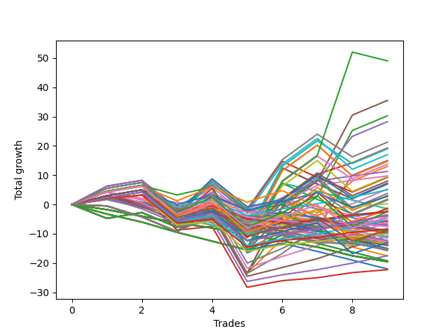

# Long Wallace 004 
- Symbol: ES90d5m30m
- Date Range: 03/18/2022 - 07/08/2022
- Trading Period: 7:20-12:30
- Number of Trades: 9



| Name | Win Percent | Profit | Avg Profit / Trade | Avg Time / Trade |      | Name | Win Percent | Profit | Avg Profit / Trade | Avg Time / Trade |
| ---- | ----------- | ------ | ------------------ | ---------------- | ---- | ---- | ----------- | ------ | ------------------ | ---------------- |
| Sorted By <br> Profit | | | | | | Sorted By <br> Win Percentage ||||
| Seventy-Three | 66.67 | 24500.00 | 2722.22 | 00:00 |     | Five | 77.78 | 17750.00 | 1972.22 | 00:00 |
| Five | 77.78 | 17750.00 | 1972.22 | 00:00 |     | Two | 77.78 | 15125.00 | 1680.56 | 00:00 |
| Two | 77.78 | 15125.00 | 1680.56 | 00:00 |     | Four | 77.78 | 14125.00 | 1569.44 | 00:00 |
| Four | 77.78 | 14125.00 | 1569.44 | 00:00 |     | Three | 77.78 | 9625.00 | 1069.44 | 00:00 |
| Sixty-Seven | 66.67 | 10625.00 | 1180.56 | 00:00 |     | Seven | 77.78 | 7500.00 | 833.33 | 00:00 |
| Three | 77.78 | 9625.00 | 1069.44 | 00:00 |     | One | 77.78 | 6500.00 | 722.22 | 00:00 |
| Sixty-Nine | 66.67 | 9500.00 | 1055.56 | 00:00 |     | Sixty-Four | 77.78 | 5625.00 | 625.00 | 00:00 |
| Sixty-Eight | 66.67 | 9500.00 | 1055.56 | 00:00 |     | Fifty-Six | 77.78 | 4875.00 | 541.67 | 00:00 |
| Fifty-Nine | 66.67 | 8500.00 | 944.44 | 00:00 |     | Six | 77.78 | 2625.00 | 291.67 | 00:00 |
| Seven | 77.78 | 7500.00 | 833.33 | 00:00 |     | One Hundred Twelve | 77.78 | 2500.00 | 277.78 | 00:00 |
| Sixty-One | 66.67 | 7375.00 | 819.44 | 00:00 |     | Eighty-Five | 77.78 | 750.00 | 83.33 | 00:00 |
| Sixty | 66.67 | 7375.00 | 819.44 | 00:00 |     | One Hundred Eleven | 77.78 | 125.00 | 13.89 | 00:00 |
| Sixty-Six | 66.67 | 6875.00 | 763.89 | 00:00 |     | Zero | 77.78 | -1250.00 | -138.89 | 00:00 |
| One | 77.78 | 6500.00 | 722.22 | 00:00 |     | One Hundred Twenty-Seven | 77.78 | -1875.00 | -208.33 | 00:00 |
| Sixty-Four | 77.78 | 5625.00 | 625.00 | 00:00 |     | One Hundred Twenty-Two | 77.78 | -2625.00 | -291.67 | 00:00 |
| Fifty-Six | 77.78 | 4875.00 | 541.67 | 00:00 |     | Eighty-Four | 77.78 | -3125.00 | -347.22 | 00:00 |
| Fifty-Eight | 66.67 | 4750.00 | 527.78 | 00:00 |     | One Hundred Twenty-Six | 77.78 | -4250.00 | -472.22 | 00:00 |
| Forty-Three | 44.44 | 4625.00 | 513.89 | 00:00 |     | One Hundred Twenty-One | 77.78 | -5000.00 | -555.56 | 00:00 |
| Sixty-Five | 66.67 | 4000.00 | 444.44 | 00:00 |     | Eighty-Three | 77.78 | -5375.00 | -597.22 | 00:00 |
| Seventy | 66.67 | 3625.00 | 402.78 | 00:00 |     | Eighty-Two | 77.78 | -8750.00 | -972.22 | 00:00 |
| Forty-Five | 44.44 | 3500.00 | 388.89 | 00:00 |     | Eighty-One | 77.78 | -11125.00 | -1236.11 | 00:00 |
| Forty-Four | 44.44 | 3500.00 | 388.89 | 00:00 |     | Seventy-Three | 66.67 | 24500.00 | 2722.22 | 00:00 |
| Six | 77.78 | 2625.00 | 291.67 | 00:00 |     | Sixty-Seven | 66.67 | 10625.00 | 1180.56 | 00:00 |
| One Hundred Twelve | 77.78 | 2500.00 | 277.78 | 00:00 |     | Sixty-Nine | 66.67 | 9500.00 | 1055.56 | 00:00 |
| Fifty-Seven | 66.67 | 1875.00 | 208.33 | 00:00 |     | Sixty-Eight | 66.67 | 9500.00 | 1055.56 | 00:00 |
| Seventy-One | 66.67 | 1500.00 | 166.67 | 00:00 |     | Fifty-Nine | 66.67 | 8500.00 | 944.44 | 00:00 |
| Sixty-Two | 66.67 | 1500.00 | 166.67 | 00:00 |     | Sixty-One | 66.67 | 7375.00 | 819.44 | 00:00 |
| One Hundred Thirteen | 66.67 | 1375.00 | 152.78 | 00:00 |     | Sixty | 66.67 | 7375.00 | 819.44 | 00:00 |
| One Hundred Thirty | 66.67 | 875.00 | 97.22 | 00:00 |     | Sixty-Six | 66.67 | 6875.00 | 763.89 | 00:00 |
| Forty-Two | 44.44 | 875.00 | 97.22 | 00:00 |     | Fifty-Eight | 66.67 | 4750.00 | 527.78 | 00:00 |
| Eighty-Five | 77.78 | 750.00 | 83.33 | 00:00 |     | Sixty-Five | 66.67 | 4000.00 | 444.44 | 00:00 |
| One Hundred Eleven | 77.78 | 125.00 | 13.89 | 00:00 |     | Seventy | 66.67 | 3625.00 | 402.78 | 00:00 |
| Sixty-Three | 66.67 | -625.00 | -69.44 | 00:00 |     | Fifty-Seven | 66.67 | 1875.00 | 208.33 | 00:00 |
| Twenty-Nine | 11.11 | -750.00 | -83.33 | 00:00 |     | Seventy-One | 66.67 | 1500.00 | 166.67 | 00:00 |
| Twenty-Eight | 11.11 | -750.00 | -83.33 | 00:00 |     | Sixty-Two | 66.67 | 1500.00 | 166.67 | 00:00 |
| One Hundred Fourteen | 55.56 | -1000.00 | -111.11 | 00:00 |     | One Hundred Thirteen | 66.67 | 1375.00 | 152.78 | 00:00 |
| Forty | 55.56 | -1125.00 | -125.00 | 00:00 |     | One Hundred Thirty | 66.67 | 875.00 | 97.22 | 00:00 |
| Zero | 77.78 | -1250.00 | -138.89 | 00:00 |     | Sixty-Three | 66.67 | -625.00 | -69.44 | 00:00 |
| One Hundred Twenty-Five | 66.67 | -1250.00 | -138.89 | 00:00 |     | One Hundred Twenty-Five | 66.67 | -1250.00 | -138.89 | 00:00 |
| One Hundred Sixteen | 66.67 | -1250.00 | -138.89 | 00:00 |     | One Hundred Sixteen | 66.67 | -1250.00 | -138.89 | 00:00 |
| One Hundred Seventeen | 55.56 | -1750.00 | -194.44 | 00:00 |     | One Hundred Twenty-Nine | 66.67 | -2125.00 | -236.11 | 00:00 |
| One Hundred Twenty-Seven | 77.78 | -1875.00 | -208.33 | 00:00 |     | One Hundred Twenty-Four | 66.67 | -4250.00 | -472.22 | 00:00 |
| Forty-One | 44.44 | -2000.00 | -222.22 | 00:00 |     | One Hundred Twenty-Eight | 66.67 | -4375.00 | -486.11 | 00:00 |
| One Hundred Twenty-Nine | 66.67 | -2125.00 | -236.11 | 00:00 |     | One Hundred Twenty-Three | 66.67 | -6500.00 | -722.22 | 00:00 |
| Forty-Six | 44.44 | -2250.00 | -250.00 | 00:00 |     | One Hundred Fourteen | 55.56 | -1000.00 | -111.11 | 00:00 |
| One Hundred Twenty-Two | 77.78 | -2625.00 | -291.67 | 00:00 |     | Forty | 55.56 | -1125.00 | -125.00 | 00:00 |
| Ninety-Six | 33.33 | -2875.00 | -319.44 | 00:00 |     | One Hundred Seventeen | 55.56 | -1750.00 | -194.44 | 00:00 |
| Eighty-Four | 77.78 | -3125.00 | -347.22 | 00:00 |     | Forty-Three | 44.44 | 4625.00 | 513.89 | 00:00 |
| Twenty-Six | 11.11 | -3375.00 | -375.00 | 00:00 |     | Forty-Five | 44.44 | 3500.00 | 388.89 | 00:00 |
| Ninety-Seven | 22.22 | -3500.00 | -388.89 | 00:00 |     | Forty-Four | 44.44 | 3500.00 | 388.89 | 00:00 |
| Sixten | 22.22 | -3500.00 | -388.89 | 00:00 |     | Forty-Two | 44.44 | 875.00 | 97.22 | 00:00 |
| Ninety-Nine | 11.11 | -3750.00 | -416.67 | 00:00 |     | Forty-One | 44.44 | -2000.00 | -222.22 | 00:00 |
| twenty-Seven | 11.11 | -3750.00 | -416.67 | 00:00 |     | Forty-Six | 44.44 | -2250.00 | -250.00 | 00:00 |
| One Hundred Fifteen | 44.44 | -4125.00 | -458.33 | 00:00 |     | One Hundred Fifteen | 44.44 | -4125.00 | -458.33 | 00:00 |
| Ninety-One | 33.33 | -4125.00 | -458.33 | 00:00 |     | Forty-Seven | 44.44 | -4500.00 | -500.00 | 00:00 |
| One Hundred Twenty-Six | 77.78 | -4250.00 | -472.22 | 00:00 |     | Ninety-Six | 33.33 | -2875.00 | -319.44 | 00:00 |
| One Hundred Twenty-Four | 66.67 | -4250.00 | -472.22 | 00:00 |     | Ninety-One | 33.33 | -4125.00 | -458.33 | 00:00 |
| One Hundred Twenty-Eight | 66.67 | -4375.00 | -486.11 | 00:00 |     | One Hundred Eighteen | 33.33 | -5000.00 | -555.56 | 00:00 |
| Ninety-Eight | 11.11 | -4375.00 | -486.11 | 00:00 |     | One Hundred Six | 33.33 | -5000.00 | -555.56 | 00:00 |
| Forty-Seven | 44.44 | -4500.00 | -500.00 | 00:00 |     | One Hundred Two | 33.33 | -5500.00 | -611.11 | 00:00 |
| One Hundred | 11.11 | -4500.00 | -500.00 | 00:00 |     | One Hundred One | 33.33 | -6375.00 | -708.33 | 00:00 |
| Twenty-Three | 11.11 | -4500.00 | -500.00 | 00:00 |     | Ninety-Seven | 22.22 | -3500.00 | -388.89 | 00:00 |
| Twenty-Two | 11.11 | -4500.00 | -500.00 | 00:00 |     | Sixten | 22.22 | -3500.00 | -388.89 | 00:00 |
| Twenty-One | 11.11 | -4500.00 | -500.00 | 00:00 |     | Forty-Eight | 22.22 | -4625.00 | -513.89 | 00:00 |
| Twenty | 11.11 | -4500.00 | -500.00 | 00:00 |     | Ninety-Three | 22.22 | -4750.00 | -527.78 | 00:00 |
| Nineteen | 11.11 | -4500.00 | -500.00 | 00:00 |     | Ninety-Two | 22.22 | -5500.00 | -611.11 | 00:00 |
| Eighteen | 11.11 | -4500.00 | -500.00 | 00:00 |     | One Hundred Ninteen | 22.22 | -5750.00 | -638.89 | 00:00 |
| Seventeen | 11.11 | -4500.00 | -500.00 | 00:00 |     | One Hundred Seven | 22.22 | -6125.00 | -680.56 | 00:00 |
| Forty-Eight | 22.22 | -4625.00 | -513.89 | 00:00 |     | One Hundred Four | 22.22 | -6375.00 | -708.33 | 00:00 |
| Fifty-Four | 11.11 | -4625.00 | -513.89 | 00:00 |     | Thirty-Two | 22.22 | -6625.00 | -736.11 | 00:00 |
| Ninety-Three | 22.22 | -4750.00 | -527.78 | 00:00 |     | One Hundred Three | 22.22 | -7500.00 | -833.33 | 00:00 |
| One Hundred Twenty-One | 77.78 | -5000.00 | -555.56 | 00:00 |     | Twenty-Nine | 11.11 | -750.00 | -83.33 | 00:00 |
| One Hundred Eighteen | 33.33 | -5000.00 | -555.56 | 00:00 |     | Twenty-Eight | 11.11 | -750.00 | -83.33 | 00:00 |
| One Hundred Six | 33.33 | -5000.00 | -555.56 | 00:00 |     | Twenty-Six | 11.11 | -3375.00 | -375.00 | 00:00 |
| Fifty-One | 11.11 | -5000.00 | -555.56 | 00:00 |     | Ninety-Nine | 11.11 | -3750.00 | -416.67 | 00:00 |
| Eighty-Three | 77.78 | -5375.00 | -597.22 | 00:00 |     | twenty-Seven | 11.11 | -3750.00 | -416.67 | 00:00 |
| One Hundred Two | 33.33 | -5500.00 | -611.11 | 00:00 |     | Ninety-Eight | 11.11 | -4375.00 | -486.11 | 00:00 |
| Ninety-Two | 22.22 | -5500.00 | -611.11 | 00:00 |     | One Hundred | 11.11 | -4500.00 | -500.00 | 00:00 |
| One Hundred Ninteen | 22.22 | -5750.00 | -638.89 | 00:00 |     | Twenty-Three | 11.11 | -4500.00 | -500.00 | 00:00 |
| One Hundred Seven | 22.22 | -6125.00 | -680.56 | 00:00 |     | Twenty-Two | 11.11 | -4500.00 | -500.00 | 00:00 |
| Twenty-Five | 11.11 | -6250.00 | -694.44 | 00:00 |     | Twenty-One | 11.11 | -4500.00 | -500.00 | 00:00 |
| One Hundred One | 33.33 | -6375.00 | -708.33 | 00:00 |     | Twenty | 11.11 | -4500.00 | -500.00 | 00:00 |
| One Hundred Four | 22.22 | -6375.00 | -708.33 | 00:00 |     | Nineteen | 11.11 | -4500.00 | -500.00 | 00:00 |
| One Hundred Nine | 11.11 | -6375.00 | -708.33 | 00:00 |     | Eighteen | 11.11 | -4500.00 | -500.00 | 00:00 |
| One Hundred Twenty-Three | 66.67 | -6500.00 | -722.22 | 00:00 |     | Seventeen | 11.11 | -4500.00 | -500.00 | 00:00 |
| Thirty-Two | 22.22 | -6625.00 | -736.11 | 00:00 |     | Fifty-Four | 11.11 | -4625.00 | -513.89 | 00:00 |
| Ninety-Four | 11.11 | -6750.00 | -750.00 | 00:00 |     | Fifty-One | 11.11 | -5000.00 | -555.56 | 00:00 |
| Fifty-Five | 11.11 | -6875.00 | -763.89 | 00:00 |     | Twenty-Five | 11.11 | -6250.00 | -694.44 | 00:00 |
| Fifty-Three | 11.11 | -6875.00 | -763.89 | 00:00 |     | One Hundred Nine | 11.11 | -6375.00 | -708.33 | 00:00 |
| Fifty-Two | 11.11 | -6875.00 | -763.89 | 00:00 |     | Ninety-Four | 11.11 | -6750.00 | -750.00 | 00:00 |
| Fifty | 11.11 | -6875.00 | -763.89 | 00:00 |     | Fifty-Five | 11.11 | -6875.00 | -763.89 | 00:00 |
| Forty-Nine | 11.11 | -6875.00 | -763.89 | 00:00 |     | Fifty-Three | 11.11 | -6875.00 | -763.89 | 00:00 |
| One Hundred Eight | 11.11 | -7000.00 | -777.78 | 00:00 |     | Fifty-Two | 11.11 | -6875.00 | -763.89 | 00:00 |
| One Hundred Three | 22.22 | -7500.00 | -833.33 | 00:00 |     | Fifty | 11.11 | -6875.00 | -763.89 | 00:00 |
| Fourteen | 11.11 | -7500.00 | -833.33 | 00:00 |     | Forty-Nine | 11.11 | -6875.00 | -763.89 | 00:00 |
| One Hundred Ten | 11.11 | -7625.00 | -847.22 | 00:00 |     | One Hundred Eight | 11.11 | -7000.00 | -777.78 | 00:00 |
| Thirty-Nine | 11.11 | -7625.00 | -847.22 | 00:00 |     | Fourteen | 11.11 | -7500.00 | -833.33 | 00:00 |
| Thirty-Eight | 11.11 | -7625.00 | -847.22 | 00:00 |     | One Hundred Ten | 11.11 | -7625.00 | -847.22 | 00:00 |
| Thirty-Seven | 11.11 | -7625.00 | -847.22 | 00:00 |     | Thirty-Nine | 11.11 | -7625.00 | -847.22 | 00:00 |
| Thirty-Six | 11.11 | -7625.00 | -847.22 | 00:00 |     | Thirty-Eight | 11.11 | -7625.00 | -847.22 | 00:00 |
| Thirty-Five | 11.11 | -7625.00 | -847.22 | 00:00 |     | Thirty-Seven | 11.11 | -7625.00 | -847.22 | 00:00 |
| Thirty-Four | 11.11 | -7625.00 | -847.22 | 00:00 |     | Thirty-Six | 11.11 | -7625.00 | -847.22 | 00:00 |
| Thirty-Three | 11.11 | -7625.00 | -847.22 | 00:00 |     | Thirty-Five | 11.11 | -7625.00 | -847.22 | 00:00 |
| One Hundred Twenty | 11.11 | -7875.00 | -875.00 | 00:00 |     | Thirty-Four | 11.11 | -7625.00 | -847.22 | 00:00 |
| Eighty-Two | 77.78 | -8750.00 | -972.22 | 00:00 |     | Thirty-Three | 11.11 | -7625.00 | -847.22 | 00:00 |
| Thirty-One | 11.11 | -8750.00 | -972.22 | 00:00 |     | One Hundred Twenty | 11.11 | -7875.00 | -875.00 | 00:00 |
| One Hundred Five | 11.11 | -9625.00 | -1069.44 | 00:00 |     | Thirty-One | 11.11 | -8750.00 | -972.22 | 00:00 |
| Twenty-Four | 11.11 | -9625.00 | -1069.44 | 00:00 |     | One Hundred Five | 11.11 | -9625.00 | -1069.44 | 00:00 |
| Ninety-Five | 0.00 | -9750.00 | -1083.33 | 00:00 |     | Twenty-Four | 11.11 | -9625.00 | -1069.44 | 00:00 |
| Fifteen | 0.00 | -9750.00 | -1083.33 | 00:00 |     | Thirty | 11.11 | -11000.00 | -1222.22 | 00:00 |
| Thirteen | 0.00 | -9750.00 | -1083.33 | 00:00 |     | Ninety-Five | 0.00 | -9750.00 | -1083.33 | 00:00 |
| Twelve | 0.00 | -9750.00 | -1083.33 | 00:00 |     | Fifteen | 0.00 | -9750.00 | -1083.33 | 00:00 |
| Eleven | 0.00 | -9750.00 | -1083.33 | 00:00 |     | Thirteen | 0.00 | -9750.00 | -1083.33 | 00:00 |
| Ten | 0.00 | -9750.00 | -1083.33 | 00:00 |     | Twelve | 0.00 | -9750.00 | -1083.33 | 00:00 |
| Nine | 0.00 | -9750.00 | -1083.33 | 00:00 |     | Eleven | 0.00 | -9750.00 | -1083.33 | 00:00 |
| Eight | 0.00 | -9750.00 | -1083.33 | 00:00 |     | Ten | 0.00 | -9750.00 | -1083.33 | 00:00 |
| Thirty | 11.11 | -11000.00 | -1222.22 | 00:00 |     | Nine | 0.00 | -9750.00 | -1083.33 | 00:00 |
| Eighty-One | 77.78 | -11125.00 | -1236.11 | 00:00 |     | Eight | 0.00 | -9750.00 | -1083.33 | 00:00 |

## NO STOPLOSS

### Test Zero
* Sell when price hits the middle line of the 20p bollinger
* No Stoploss
* Results:
```
Total Trades: 9
Percent Up: 77.78
Percent Down: 22.22
Total Points Moved Up: -2.50
Potential Profit: -1250.00
Total Points Ups: 30.25 Count Ups: 7
Total Points Downs: -32.75 Count Downs: 2
```

<details><summary>Trades</summary>

<code>In: 2022-03-30 12:35:00		Out: 2022-03-30 12:47:25		Total Position Time: 12:25		Total Move Up: 6.25		Total to Date: 6.25</code> <br />
<code>In: 2022-03-31 11:30:00		Out: 2022-03-31 11:59:20		Total Position Time: 29:20		Total Move Up: 2.00		Total to Date: 8.25</code> <br />
<code>In: 2022-04-18 09:00:00		Out: 2022-04-18 09:29:55		Total Position Time: 29:55		Total Move Up: -12.00		Total to Date: -3.75</code> <br />
<code>In: 2022-04-20 12:05:00		Out: 2022-04-20 12:25:05		Total Position Time: 20:05		Total Move Up: 8.00		Total to Date: 4.25</code> <br />
<code>In: 2022-05-02 10:15:00		Out: 2022-05-02 10:44:55		Total Position Time: 29:55		Total Move Up: -20.75		Total to Date: -16.50</code> <br />
<code>In: 2022-06-02 07:35:00		Out: 2022-06-02 07:40:05		Total Position Time: 05:05		Total Move Up: 5.00		Total to Date: -11.50</code> <br />
<code>In: 2022-06-09 08:15:00		Out: 2022-06-09 08:42:25		Total Position Time: 27:25		Total Move Up: 5.75		Total to Date: -5.75</code> <br />
<code>In: 2022-06-15 11:20:00		Out: 2022-06-15 11:20:30		Total Position Time: 00:30		Total Move Up: 1.75		Total to Date: -4.00</code> <br />
<code>In: 2022-06-29 09:40:00		Out: 2022-06-29 10:01:50		Total Position Time: 21:50		Total Move Up: 1.50		Total to Date: -2.50</code> <br />


</details>

### Test One
* Sell when the price hits the upper line of the 20p 1std bollinger
* No Stoploss
* Results:
```
Total Trades: 9
Percent Up: 77.78
Percent Down: 22.22
Total Points Moved Up: 13.00
Potential Profit: 6500.00
Total Points Ups: 45.75 Count Ups: 7
Total Points Downs: -32.75 Count Downs: 2
```

<details><summary>Trades</summary>

<code>In: 2022-03-30 12:35:00		Out: 2022-03-30 12:50:00		Total Position Time: 15:00		Total Move Up: 4.50		Total to Date: 4.50</code> <br />
<code>In: 2022-03-31 11:30:00		Out: 2022-03-31 11:59:55		Total Position Time: 29:55		Total Move Up: 2.00		Total to Date: 6.50</code> <br />
<code>In: 2022-04-18 09:00:00		Out: 2022-04-18 09:29:55		Total Position Time: 29:55		Total Move Up: -12.00		Total to Date: -5.50</code> <br />
<code>In: 2022-04-20 12:05:00		Out: 2022-04-20 12:34:55		Total Position Time: 29:55		Total Move Up: 2.75		Total to Date: -2.75</code> <br />
<code>In: 2022-05-02 10:15:00		Out: 2022-05-02 10:44:55		Total Position Time: 29:55		Total Move Up: -20.75		Total to Date: -23.50</code> <br />
<code>In: 2022-06-02 07:35:00		Out: 2022-06-02 07:56:05		Total Position Time: 21:05		Total Move Up: 11.75		Total to Date: -11.75</code> <br />
<code>In: 2022-06-09 08:15:00		Out: 2022-06-09 08:44:55		Total Position Time: 29:55		Total Move Up: 8.75		Total to Date: -3.00</code> <br />
<code>In: 2022-06-15 11:20:00		Out: 2022-06-15 11:38:55		Total Position Time: 18:55		Total Move Up: 11.00		Total to Date: 8.00</code> <br />
<code>In: 2022-06-29 09:40:00		Out: 2022-06-29 10:09:55		Total Position Time: 29:55		Total Move Up: 5.00		Total to Date: 13.00</code> <br />


</details>

### Test Two
* Sell when the price hits the upper line of the 20p 2std bollinger
* No Stoploss
* Results:
```
Total Trades: 9
Percent Up: 77.78
Percent Down: 22.22
Total Points Moved Up: 30.25
Potential Profit: 15125.00
Total Points Ups: 63.00 Count Ups: 7
Total Points Downs: -32.75 Count Downs: 2
```

<details><summary>Trades</summary>

<code>In: 2022-03-30 12:35:00		Out: 2022-03-30 12:50:00		Total Position Time: 15:00		Total Move Up: 4.50		Total to Date: 4.50</code> <br />
<code>In: 2022-03-31 11:30:00		Out: 2022-03-31 11:59:55		Total Position Time: 29:55		Total Move Up: 2.00		Total to Date: 6.50</code> <br />
<code>In: 2022-04-18 09:00:00		Out: 2022-04-18 09:29:55		Total Position Time: 29:55		Total Move Up: -12.00		Total to Date: -5.50</code> <br />
<code>In: 2022-04-20 12:05:00		Out: 2022-04-20 12:34:55		Total Position Time: 29:55		Total Move Up: 2.75		Total to Date: -2.75</code> <br />
<code>In: 2022-05-02 10:15:00		Out: 2022-05-02 10:44:55		Total Position Time: 29:55		Total Move Up: -20.75		Total to Date: -23.50</code> <br />
<code>In: 2022-06-02 07:35:00		Out: 2022-06-02 08:01:35		Total Position Time: 26:35		Total Move Up: 17.50		Total to Date: -6.00</code> <br />
<code>In: 2022-06-09 08:15:00		Out: 2022-06-09 08:44:55		Total Position Time: 29:55		Total Move Up: 8.75		Total to Date: 2.75</code> <br />
<code>In: 2022-06-15 11:20:00		Out: 2022-06-15 11:41:00		Total Position Time: 21:00		Total Move Up: 22.50		Total to Date: 25.25</code> <br />
<code>In: 2022-06-29 09:40:00		Out: 2022-06-29 10:09:55		Total Position Time: 29:55		Total Move Up: 5.00		Total to Date: 30.25</code> <br />


</details>

### Test Three
* Sell when price hits the middle line of the 50p bollinger
* No Stoploss
* Results:
```
Total Trades: 9
Percent Up: 77.78
Percent Down: 22.22
Total Points Moved Up: 19.25
Potential Profit: 9625.00
Total Points Ups: 52.00 Count Ups: 7
Total Points Downs: -32.75 Count Downs: 2
```

<details><summary>Trades</summary>

<code>In: 2022-03-30 12:35:00		Out: 2022-03-30 12:50:00		Total Position Time: 15:00		Total Move Up: 4.50		Total to Date: 4.50</code> <br />
<code>In: 2022-03-31 11:30:00		Out: 2022-03-31 11:59:55		Total Position Time: 29:55		Total Move Up: 2.00		Total to Date: 6.50</code> <br />
<code>In: 2022-04-18 09:00:00		Out: 2022-04-18 09:29:55		Total Position Time: 29:55		Total Move Up: -12.00		Total to Date: -5.50</code> <br />
<code>In: 2022-04-20 12:05:00		Out: 2022-04-20 12:25:50		Total Position Time: 20:50		Total Move Up: 11.00		Total to Date: 5.50</code> <br />
<code>In: 2022-05-02 10:15:00		Out: 2022-05-02 10:44:55		Total Position Time: 29:55		Total Move Up: -20.75		Total to Date: -15.25</code> <br />
<code>In: 2022-06-02 07:35:00		Out: 2022-06-02 08:01:30		Total Position Time: 26:30		Total Move Up: 16.75		Total to Date: 1.50</code> <br />
<code>In: 2022-06-09 08:15:00		Out: 2022-06-09 08:44:55		Total Position Time: 29:55		Total Move Up: 8.75		Total to Date: 10.25</code> <br />
<code>In: 2022-06-15 11:20:00		Out: 2022-06-15 11:38:45		Total Position Time: 18:45		Total Move Up: 4.00		Total to Date: 14.25</code> <br />
<code>In: 2022-06-29 09:40:00		Out: 2022-06-29 10:09:55		Total Position Time: 29:55		Total Move Up: 5.00		Total to Date: 19.25</code> <br />


</details>

### Test Four
* Sell when the price hits the upper line of the 50p 1std bollinger
* No Stoploss
* Results:
```
Total Trades: 9
Percent Up: 77.78
Percent Down: 22.22
Total Points Moved Up: 28.25
Potential Profit: 14125.00
Total Points Ups: 61.00 Count Ups: 7
Total Points Downs: -32.75 Count Downs: 2
```

<details><summary>Trades</summary>

<code>In: 2022-03-30 12:35:00		Out: 2022-03-30 12:50:00		Total Position Time: 15:00		Total Move Up: 4.50		Total to Date: 4.50</code> <br />
<code>In: 2022-03-31 11:30:00		Out: 2022-03-31 11:59:55		Total Position Time: 29:55		Total Move Up: 2.00		Total to Date: 6.50</code> <br />
<code>In: 2022-04-18 09:00:00		Out: 2022-04-18 09:29:55		Total Position Time: 29:55		Total Move Up: -12.00		Total to Date: -5.50</code> <br />
<code>In: 2022-04-20 12:05:00		Out: 2022-04-20 12:34:55		Total Position Time: 29:55		Total Move Up: 2.75		Total to Date: -2.75</code> <br />
<code>In: 2022-05-02 10:15:00		Out: 2022-05-02 10:44:55		Total Position Time: 29:55		Total Move Up: -20.75		Total to Date: -23.50</code> <br />
<code>In: 2022-06-02 07:35:00		Out: 2022-06-02 08:04:55		Total Position Time: 29:55		Total Move Up: 22.75		Total to Date: -0.75</code> <br />
<code>In: 2022-06-09 08:15:00		Out: 2022-06-09 08:44:55		Total Position Time: 29:55		Total Move Up: 8.75		Total to Date: 8.00</code> <br />
<code>In: 2022-06-15 11:20:00		Out: 2022-06-15 11:39:00		Total Position Time: 19:00		Total Move Up: 15.25		Total to Date: 23.25</code> <br />
<code>In: 2022-06-29 09:40:00		Out: 2022-06-29 10:09:55		Total Position Time: 29:55		Total Move Up: 5.00		Total to Date: 28.25</code> <br />


</details>

### Test Five
* Sell when the price hits the upper line of the 50p 2std bollinger
* No Stoploss
* Results:
```
Total Trades: 9
Percent Up: 77.78
Percent Down: 22.22
Total Points Moved Up: 35.50
Potential Profit: 17750.00
Total Points Ups: 68.25 Count Ups: 7
Total Points Downs: -32.75 Count Downs: 2
```

<details><summary>Trades</summary>

<code>In: 2022-03-30 12:35:00		Out: 2022-03-30 12:50:00		Total Position Time: 15:00		Total Move Up: 4.50		Total to Date: 4.50</code> <br />
<code>In: 2022-03-31 11:30:00		Out: 2022-03-31 11:59:55		Total Position Time: 29:55		Total Move Up: 2.00		Total to Date: 6.50</code> <br />
<code>In: 2022-04-18 09:00:00		Out: 2022-04-18 09:29:55		Total Position Time: 29:55		Total Move Up: -12.00		Total to Date: -5.50</code> <br />
<code>In: 2022-04-20 12:05:00		Out: 2022-04-20 12:34:55		Total Position Time: 29:55		Total Move Up: 2.75		Total to Date: -2.75</code> <br />
<code>In: 2022-05-02 10:15:00		Out: 2022-05-02 10:44:55		Total Position Time: 29:55		Total Move Up: -20.75		Total to Date: -23.50</code> <br />
<code>In: 2022-06-02 07:35:00		Out: 2022-06-02 08:04:55		Total Position Time: 29:55		Total Move Up: 22.75		Total to Date: -0.75</code> <br />
<code>In: 2022-06-09 08:15:00		Out: 2022-06-09 08:44:55		Total Position Time: 29:55		Total Move Up: 8.75		Total to Date: 8.00</code> <br />
<code>In: 2022-06-15 11:20:00		Out: 2022-06-15 11:41:00		Total Position Time: 21:00		Total Move Up: 22.50		Total to Date: 30.50</code> <br />
<code>In: 2022-06-29 09:40:00		Out: 2022-06-29 10:09:55		Total Position Time: 29:55		Total Move Up: 5.00		Total to Date: 35.50</code> <br />


</details>

### Test Six
* Sell when the price hits the middle line of the 1std VWAP
* No Stoploss
* Results:
```
Total Trades: 9
Percent Up: 77.78
Percent Down: 22.22
Total Points Moved Up: 5.25
Potential Profit: 2625.00
Total Points Ups: 38.00 Count Ups: 7
Total Points Downs: -32.75 Count Downs: 2
```

<details><summary>Trades</summary>

<code>In: 2022-03-30 12:35:00		Out: 2022-03-30 12:50:00		Total Position Time: 15:00		Total Move Up: 4.50		Total to Date: 4.50</code> <br />
<code>In: 2022-03-31 11:30:00		Out: 2022-03-31 11:59:55		Total Position Time: 29:55		Total Move Up: 2.00		Total to Date: 6.50</code> <br />
<code>In: 2022-04-18 09:00:00		Out: 2022-04-18 09:29:55		Total Position Time: 29:55		Total Move Up: -12.00		Total to Date: -5.50</code> <br />
<code>In: 2022-04-20 12:05:00		Out: 2022-04-20 12:26:10		Total Position Time: 21:10		Total Move Up: 11.75		Total to Date: 6.25</code> <br />
<code>In: 2022-05-02 10:15:00		Out: 2022-05-02 10:44:55		Total Position Time: 29:55		Total Move Up: -20.75		Total to Date: -14.50</code> <br />
<code>In: 2022-06-02 07:35:00		Out: 2022-06-02 07:35:35		Total Position Time: 00:35		Total Move Up: 2.25		Total to Date: -12.25</code> <br />
<code>In: 2022-06-09 08:15:00		Out: 2022-06-09 08:42:55		Total Position Time: 27:55		Total Move Up: 8.50		Total to Date: -3.75</code> <br />
<code>In: 2022-06-15 11:20:00		Out: 2022-06-15 11:38:45		Total Position Time: 18:45		Total Move Up: 4.00		Total to Date: 0.25</code> <br />
<code>In: 2022-06-29 09:40:00		Out: 2022-06-29 10:09:55		Total Position Time: 29:55		Total Move Up: 5.00		Total to Date: 5.25</code> <br />


</details>

### Test Seven
* Sell when the price hits the upper line of the 1std VWAP
* No Stoploss
* Results:
```
Total Trades: 9
Percent Up: 77.78
Percent Down: 22.22
Total Points Moved Up: 15.00
Potential Profit: 7500.00
Total Points Ups: 47.75 Count Ups: 7
Total Points Downs: -32.75 Count Downs: 2
```

<details><summary>Trades</summary>

<code>In: 2022-03-30 12:35:00		Out: 2022-03-30 12:50:00		Total Position Time: 15:00		Total Move Up: 4.50		Total to Date: 4.50</code> <br />
<code>In: 2022-03-31 11:30:00		Out: 2022-03-31 11:59:55		Total Position Time: 29:55		Total Move Up: 2.00		Total to Date: 6.50</code> <br />
<code>In: 2022-04-18 09:00:00		Out: 2022-04-18 09:29:55		Total Position Time: 29:55		Total Move Up: -12.00		Total to Date: -5.50</code> <br />
<code>In: 2022-04-20 12:05:00		Out: 2022-04-20 12:34:55		Total Position Time: 29:55		Total Move Up: 2.75		Total to Date: -2.75</code> <br />
<code>In: 2022-05-02 10:15:00		Out: 2022-05-02 10:44:55		Total Position Time: 29:55		Total Move Up: -20.75		Total to Date: -23.50</code> <br />
<code>In: 2022-06-02 07:35:00		Out: 2022-06-02 07:42:35		Total Position Time: 07:35		Total Move Up: 6.75		Total to Date: -16.75</code> <br />
<code>In: 2022-06-09 08:15:00		Out: 2022-06-09 08:44:55		Total Position Time: 29:55		Total Move Up: 8.75		Total to Date: -8.00</code> <br />
<code>In: 2022-06-15 11:20:00		Out: 2022-06-15 11:40:55		Total Position Time: 20:55		Total Move Up: 18.00		Total to Date: 10.00</code> <br />
<code>In: 2022-06-29 09:40:00		Out: 2022-06-29 10:09:55		Total Position Time: 29:55		Total Move Up: 5.00		Total to Date: 15.00</code> <br />


</details>

## STOPLOSS OF 2

### Test Eight
* Sell when price hits the middle line of the 20p bollinger
* Stoploss is 2 points
* Results:
```
Total Trades: 9
Percent Up: 0.00
Percent Down: 100.00
Total Points Moved Up: -19.50
Potential Profit: -9750.00
Total Points Ups: 0.00 Count Ups: 0
Total Points Downs: -19.50 Count Downs: 9
```

<details><summary>Trades</summary>

<code>In: 2022-03-30 12:35:00		Out: 2022-03-30 12:39:45		Total Position Time: 04:45		Total Move Up: -1.75		Total to Date: -1.75</code> <br />
<code>In: 2022-03-31 11:30:00		Out: 2022-03-31 11:33:35		Total Position Time: 03:35		Total Move Up: -2.25		Total to Date: -4.00</code> <br />
<code>In: 2022-04-18 09:00:00		Out: 2022-04-18 09:02:10		Total Position Time: 02:10		Total Move Up: -2.25		Total to Date: -6.25</code> <br />
<code>In: 2022-04-20 12:05:00		Out: 2022-04-20 12:05:55		Total Position Time: 00:55		Total Move Up: -1.75		Total to Date: -8.00</code> <br />
<code>In: 2022-05-02 10:15:00		Out: 2022-05-02 10:15:35		Total Position Time: 00:35		Total Move Up: -2.25		Total to Date: -10.25</code> <br />
<code>In: 2022-06-02 07:35:00		Out: 2022-06-02 07:36:30		Total Position Time: 01:30		Total Move Up: -2.25		Total to Date: -12.50</code> <br />
<code>In: 2022-06-09 08:15:00		Out: 2022-06-09 08:15:35		Total Position Time: 00:35		Total Move Up: -2.00		Total to Date: -14.50</code> <br />
<code>In: 2022-06-15 11:20:00		Out: 2022-06-15 11:20:10		Total Position Time: 00:10		Total Move Up: -3.00		Total to Date: -17.50</code> <br />
<code>In: 2022-06-29 09:40:00		Out: 2022-06-29 09:43:10		Total Position Time: 03:10		Total Move Up: -2.00		Total to Date: -19.50</code> <br />


</details>

### Test Nine
* Sell when the price hits the upper line of the 20p 1std bollinger
* Stoploss is 2 points
* Results:
```
Total Trades: 9
Percent Up: 0.00
Percent Down: 100.00
Total Points Moved Up: -19.50
Potential Profit: -9750.00
Total Points Ups: 0.00 Count Ups: 0
Total Points Downs: -19.50 Count Downs: 9
```

<details><summary>Trades</summary>

<code>In: 2022-03-30 12:35:00		Out: 2022-03-30 12:39:45		Total Position Time: 04:45		Total Move Up: -1.75		Total to Date: -1.75</code> <br />
<code>In: 2022-03-31 11:30:00		Out: 2022-03-31 11:33:35		Total Position Time: 03:35		Total Move Up: -2.25		Total to Date: -4.00</code> <br />
<code>In: 2022-04-18 09:00:00		Out: 2022-04-18 09:02:10		Total Position Time: 02:10		Total Move Up: -2.25		Total to Date: -6.25</code> <br />
<code>In: 2022-04-20 12:05:00		Out: 2022-04-20 12:05:55		Total Position Time: 00:55		Total Move Up: -1.75		Total to Date: -8.00</code> <br />
<code>In: 2022-05-02 10:15:00		Out: 2022-05-02 10:15:35		Total Position Time: 00:35		Total Move Up: -2.25		Total to Date: -10.25</code> <br />
<code>In: 2022-06-02 07:35:00		Out: 2022-06-02 07:36:30		Total Position Time: 01:30		Total Move Up: -2.25		Total to Date: -12.50</code> <br />
<code>In: 2022-06-09 08:15:00		Out: 2022-06-09 08:15:35		Total Position Time: 00:35		Total Move Up: -2.00		Total to Date: -14.50</code> <br />
<code>In: 2022-06-15 11:20:00		Out: 2022-06-15 11:20:10		Total Position Time: 00:10		Total Move Up: -3.00		Total to Date: -17.50</code> <br />
<code>In: 2022-06-29 09:40:00		Out: 2022-06-29 09:43:10		Total Position Time: 03:10		Total Move Up: -2.00		Total to Date: -19.50</code> <br />


</details>

### Test Ten
* Sell when the price hits the upper line of the 20p 2std bollinger
* Stoploss is 2 points
* Results:
```
Total Trades: 9
Percent Up: 0.00
Percent Down: 100.00
Total Points Moved Up: -19.50
Potential Profit: -9750.00
Total Points Ups: 0.00 Count Ups: 0
Total Points Downs: -19.50 Count Downs: 9
```

<details><summary>Trades</summary>

<code>In: 2022-03-30 12:35:00		Out: 2022-03-30 12:39:45		Total Position Time: 04:45		Total Move Up: -1.75		Total to Date: -1.75</code> <br />
<code>In: 2022-03-31 11:30:00		Out: 2022-03-31 11:33:35		Total Position Time: 03:35		Total Move Up: -2.25		Total to Date: -4.00</code> <br />
<code>In: 2022-04-18 09:00:00		Out: 2022-04-18 09:02:10		Total Position Time: 02:10		Total Move Up: -2.25		Total to Date: -6.25</code> <br />
<code>In: 2022-04-20 12:05:00		Out: 2022-04-20 12:05:55		Total Position Time: 00:55		Total Move Up: -1.75		Total to Date: -8.00</code> <br />
<code>In: 2022-05-02 10:15:00		Out: 2022-05-02 10:15:35		Total Position Time: 00:35		Total Move Up: -2.25		Total to Date: -10.25</code> <br />
<code>In: 2022-06-02 07:35:00		Out: 2022-06-02 07:36:30		Total Position Time: 01:30		Total Move Up: -2.25		Total to Date: -12.50</code> <br />
<code>In: 2022-06-09 08:15:00		Out: 2022-06-09 08:15:35		Total Position Time: 00:35		Total Move Up: -2.00		Total to Date: -14.50</code> <br />
<code>In: 2022-06-15 11:20:00		Out: 2022-06-15 11:20:10		Total Position Time: 00:10		Total Move Up: -3.00		Total to Date: -17.50</code> <br />
<code>In: 2022-06-29 09:40:00		Out: 2022-06-29 09:43:10		Total Position Time: 03:10		Total Move Up: -2.00		Total to Date: -19.50</code> <br />


</details>

### Test Eleven
* Sell when price hits the middle line of the 50p bollinger
* Stoploss is 2 points
* Results:
```
Total Trades: 9
Percent Up: 0.00
Percent Down: 100.00
Total Points Moved Up: -19.50
Potential Profit: -9750.00
Total Points Ups: 0.00 Count Ups: 0
Total Points Downs: -19.50 Count Downs: 9
```

<details><summary>Trades</summary>

<code>In: 2022-03-30 12:35:00		Out: 2022-03-30 12:39:45		Total Position Time: 04:45		Total Move Up: -1.75		Total to Date: -1.75</code> <br />
<code>In: 2022-03-31 11:30:00		Out: 2022-03-31 11:33:35		Total Position Time: 03:35		Total Move Up: -2.25		Total to Date: -4.00</code> <br />
<code>In: 2022-04-18 09:00:00		Out: 2022-04-18 09:02:10		Total Position Time: 02:10		Total Move Up: -2.25		Total to Date: -6.25</code> <br />
<code>In: 2022-04-20 12:05:00		Out: 2022-04-20 12:05:55		Total Position Time: 00:55		Total Move Up: -1.75		Total to Date: -8.00</code> <br />
<code>In: 2022-05-02 10:15:00		Out: 2022-05-02 10:15:35		Total Position Time: 00:35		Total Move Up: -2.25		Total to Date: -10.25</code> <br />
<code>In: 2022-06-02 07:35:00		Out: 2022-06-02 07:36:30		Total Position Time: 01:30		Total Move Up: -2.25		Total to Date: -12.50</code> <br />
<code>In: 2022-06-09 08:15:00		Out: 2022-06-09 08:15:35		Total Position Time: 00:35		Total Move Up: -2.00		Total to Date: -14.50</code> <br />
<code>In: 2022-06-15 11:20:00		Out: 2022-06-15 11:20:10		Total Position Time: 00:10		Total Move Up: -3.00		Total to Date: -17.50</code> <br />
<code>In: 2022-06-29 09:40:00		Out: 2022-06-29 09:43:10		Total Position Time: 03:10		Total Move Up: -2.00		Total to Date: -19.50</code> <br />


</details>

### Test Twelve
* Sell when the price hits the upper line of the 50p 1std bollinger
* Stoploss is 2 points
* Results:
```
Total Trades: 9
Percent Up: 0.00
Percent Down: 100.00
Total Points Moved Up: -19.50
Potential Profit: -9750.00
Total Points Ups: 0.00 Count Ups: 0
Total Points Downs: -19.50 Count Downs: 9
```

<details><summary>Trades</summary>

<code>In: 2022-03-30 12:35:00		Out: 2022-03-30 12:39:45		Total Position Time: 04:45		Total Move Up: -1.75		Total to Date: -1.75</code> <br />
<code>In: 2022-03-31 11:30:00		Out: 2022-03-31 11:33:35		Total Position Time: 03:35		Total Move Up: -2.25		Total to Date: -4.00</code> <br />
<code>In: 2022-04-18 09:00:00		Out: 2022-04-18 09:02:10		Total Position Time: 02:10		Total Move Up: -2.25		Total to Date: -6.25</code> <br />
<code>In: 2022-04-20 12:05:00		Out: 2022-04-20 12:05:55		Total Position Time: 00:55		Total Move Up: -1.75		Total to Date: -8.00</code> <br />
<code>In: 2022-05-02 10:15:00		Out: 2022-05-02 10:15:35		Total Position Time: 00:35		Total Move Up: -2.25		Total to Date: -10.25</code> <br />
<code>In: 2022-06-02 07:35:00		Out: 2022-06-02 07:36:30		Total Position Time: 01:30		Total Move Up: -2.25		Total to Date: -12.50</code> <br />
<code>In: 2022-06-09 08:15:00		Out: 2022-06-09 08:15:35		Total Position Time: 00:35		Total Move Up: -2.00		Total to Date: -14.50</code> <br />
<code>In: 2022-06-15 11:20:00		Out: 2022-06-15 11:20:10		Total Position Time: 00:10		Total Move Up: -3.00		Total to Date: -17.50</code> <br />
<code>In: 2022-06-29 09:40:00		Out: 2022-06-29 09:43:10		Total Position Time: 03:10		Total Move Up: -2.00		Total to Date: -19.50</code> <br />


</details>

### Test Thirteen
* Sell when the price hits the upper line of the 50p 2std bollinger
* Stoploss is 2 points
* Results:
```
Total Trades: 9
Percent Up: 0.00
Percent Down: 100.00
Total Points Moved Up: -19.50
Potential Profit: -9750.00
Total Points Ups: 0.00 Count Ups: 0
Total Points Downs: -19.50 Count Downs: 9
```

<details><summary>Trades</summary>

<code>In: 2022-03-30 12:35:00		Out: 2022-03-30 12:39:45		Total Position Time: 04:45		Total Move Up: -1.75		Total to Date: -1.75</code> <br />
<code>In: 2022-03-31 11:30:00		Out: 2022-03-31 11:33:35		Total Position Time: 03:35		Total Move Up: -2.25		Total to Date: -4.00</code> <br />
<code>In: 2022-04-18 09:00:00		Out: 2022-04-18 09:02:10		Total Position Time: 02:10		Total Move Up: -2.25		Total to Date: -6.25</code> <br />
<code>In: 2022-04-20 12:05:00		Out: 2022-04-20 12:05:55		Total Position Time: 00:55		Total Move Up: -1.75		Total to Date: -8.00</code> <br />
<code>In: 2022-05-02 10:15:00		Out: 2022-05-02 10:15:35		Total Position Time: 00:35		Total Move Up: -2.25		Total to Date: -10.25</code> <br />
<code>In: 2022-06-02 07:35:00		Out: 2022-06-02 07:36:30		Total Position Time: 01:30		Total Move Up: -2.25		Total to Date: -12.50</code> <br />
<code>In: 2022-06-09 08:15:00		Out: 2022-06-09 08:15:35		Total Position Time: 00:35		Total Move Up: -2.00		Total to Date: -14.50</code> <br />
<code>In: 2022-06-15 11:20:00		Out: 2022-06-15 11:20:10		Total Position Time: 00:10		Total Move Up: -3.00		Total to Date: -17.50</code> <br />
<code>In: 2022-06-29 09:40:00		Out: 2022-06-29 09:43:10		Total Position Time: 03:10		Total Move Up: -2.00		Total to Date: -19.50</code> <br />


</details>

### Test Fourteen
* Sell when the price hits the middle line of the 1std VWAP
* Stoploss is 2 points
* Results:
```
Total Trades: 9
Percent Up: 11.11
Percent Down: 88.89
Total Points Moved Up: -15.00
Potential Profit: -7500.00
Total Points Ups: 2.25 Count Ups: 1
Total Points Downs: -17.25 Count Downs: 8
```

<details><summary>Trades</summary>

<code>In: 2022-03-30 12:35:00		Out: 2022-03-30 12:39:45		Total Position Time: 04:45		Total Move Up: -1.75		Total to Date: -1.75</code> <br />
<code>In: 2022-03-31 11:30:00		Out: 2022-03-31 11:33:35		Total Position Time: 03:35		Total Move Up: -2.25		Total to Date: -4.00</code> <br />
<code>In: 2022-04-18 09:00:00		Out: 2022-04-18 09:02:10		Total Position Time: 02:10		Total Move Up: -2.25		Total to Date: -6.25</code> <br />
<code>In: 2022-04-20 12:05:00		Out: 2022-04-20 12:05:55		Total Position Time: 00:55		Total Move Up: -1.75		Total to Date: -8.00</code> <br />
<code>In: 2022-05-02 10:15:00		Out: 2022-05-02 10:15:35		Total Position Time: 00:35		Total Move Up: -2.25		Total to Date: -10.25</code> <br />
<code>In: 2022-06-02 07:35:00		Out: 2022-06-02 07:35:35		Total Position Time: 00:35		Total Move Up: 2.25		Total to Date: -8.00</code> <br />
<code>In: 2022-06-09 08:15:00		Out: 2022-06-09 08:15:35		Total Position Time: 00:35		Total Move Up: -2.00		Total to Date: -10.00</code> <br />
<code>In: 2022-06-15 11:20:00		Out: 2022-06-15 11:20:10		Total Position Time: 00:10		Total Move Up: -3.00		Total to Date: -13.00</code> <br />
<code>In: 2022-06-29 09:40:00		Out: 2022-06-29 09:43:10		Total Position Time: 03:10		Total Move Up: -2.00		Total to Date: -15.00</code> <br />


</details>

### Test Fifteen
* Sell when the price hits the upper line of the 1std VWAP
* Stoploss is 2 points
* Results:
```
Total Trades: 9
Percent Up: 0.00
Percent Down: 100.00
Total Points Moved Up: -19.50
Potential Profit: -9750.00
Total Points Ups: 0.00 Count Ups: 0
Total Points Downs: -19.50 Count Downs: 9
```

<details><summary>Trades</summary>

<code>In: 2022-03-30 12:35:00		Out: 2022-03-30 12:39:45		Total Position Time: 04:45		Total Move Up: -1.75		Total to Date: -1.75</code> <br />
<code>In: 2022-03-31 11:30:00		Out: 2022-03-31 11:33:35		Total Position Time: 03:35		Total Move Up: -2.25		Total to Date: -4.00</code> <br />
<code>In: 2022-04-18 09:00:00		Out: 2022-04-18 09:02:10		Total Position Time: 02:10		Total Move Up: -2.25		Total to Date: -6.25</code> <br />
<code>In: 2022-04-20 12:05:00		Out: 2022-04-20 12:05:55		Total Position Time: 00:55		Total Move Up: -1.75		Total to Date: -8.00</code> <br />
<code>In: 2022-05-02 10:15:00		Out: 2022-05-02 10:15:35		Total Position Time: 00:35		Total Move Up: -2.25		Total to Date: -10.25</code> <br />
<code>In: 2022-06-02 07:35:00		Out: 2022-06-02 07:36:30		Total Position Time: 01:30		Total Move Up: -2.25		Total to Date: -12.50</code> <br />
<code>In: 2022-06-09 08:15:00		Out: 2022-06-09 08:15:35		Total Position Time: 00:35		Total Move Up: -2.00		Total to Date: -14.50</code> <br />
<code>In: 2022-06-15 11:20:00		Out: 2022-06-15 11:20:10		Total Position Time: 00:10		Total Move Up: -3.00		Total to Date: -17.50</code> <br />
<code>In: 2022-06-29 09:40:00		Out: 2022-06-29 09:43:10		Total Position Time: 03:10		Total Move Up: -2.00		Total to Date: -19.50</code> <br />


</details>

## TRAIL STOP OF 2

### Test Sixten
* Sell when price hits the middle line of the 20p bollinger
* Trailing Stop is 2 points
* Results:
```
Total Trades: 9
Percent Up: 22.22
Percent Down: 77.78
Total Points Moved Up: -7.00
Potential Profit: -3500.00
Total Points Ups: 4.50 Count Ups: 2
Total Points Downs: -11.50 Count Downs: 7
```

<details><summary>Trades</summary>

<code>In: 2022-03-30 12:35:00		Out: 2022-03-30 12:38:10		Total Position Time: 03:10		Total Move Up: 2.75		Total to Date: 2.75</code> <br />
<code>In: 2022-03-31 11:30:00		Out: 2022-03-31 11:33:35		Total Position Time: 03:35		Total Move Up: -2.25		Total to Date: 0.50</code> <br />
<code>In: 2022-04-18 09:00:00		Out: 2022-04-18 09:01:05		Total Position Time: 01:05		Total Move Up: -1.25		Total to Date: -0.75</code> <br />
<code>In: 2022-04-20 12:05:00		Out: 2022-04-20 12:05:45		Total Position Time: 00:45		Total Move Up: -1.75		Total to Date: -2.50</code> <br />
<code>In: 2022-05-02 10:15:00		Out: 2022-05-02 10:15:20		Total Position Time: 00:20		Total Move Up: -1.50		Total to Date: -4.00</code> <br />
<code>In: 2022-06-02 07:35:00		Out: 2022-06-02 07:35:10		Total Position Time: 00:10		Total Move Up: -1.25		Total to Date: -5.25</code> <br />
<code>In: 2022-06-09 08:15:00		Out: 2022-06-09 08:15:40		Total Position Time: 00:40		Total Move Up: -2.50		Total to Date: -7.75</code> <br />
<code>In: 2022-06-15 11:20:00		Out: 2022-06-15 11:20:30		Total Position Time: 00:30		Total Move Up: 1.75		Total to Date: -6.00</code> <br />
<code>In: 2022-06-29 09:40:00		Out: 2022-06-29 09:41:55		Total Position Time: 01:55		Total Move Up: -1.00		Total to Date: -7.00</code> <br />


</details>

### Test Seventeen
* Sell when the price hits the upper line of the 20p 1std bollinger
* Trailing Stop is 2 points
* Results:
```
Total Trades: 9
Percent Up: 11.11
Percent Down: 88.89
Total Points Moved Up: -9.00
Potential Profit: -4500.00
Total Points Ups: 2.75 Count Ups: 1
Total Points Downs: -11.75 Count Downs: 8
```

<details><summary>Trades</summary>

<code>In: 2022-03-30 12:35:00		Out: 2022-03-30 12:38:10		Total Position Time: 03:10		Total Move Up: 2.75		Total to Date: 2.75</code> <br />
<code>In: 2022-03-31 11:30:00		Out: 2022-03-31 11:33:35		Total Position Time: 03:35		Total Move Up: -2.25		Total to Date: 0.50</code> <br />
<code>In: 2022-04-18 09:00:00		Out: 2022-04-18 09:01:05		Total Position Time: 01:05		Total Move Up: -1.25		Total to Date: -0.75</code> <br />
<code>In: 2022-04-20 12:05:00		Out: 2022-04-20 12:05:45		Total Position Time: 00:45		Total Move Up: -1.75		Total to Date: -2.50</code> <br />
<code>In: 2022-05-02 10:15:00		Out: 2022-05-02 10:15:20		Total Position Time: 00:20		Total Move Up: -1.50		Total to Date: -4.00</code> <br />
<code>In: 2022-06-02 07:35:00		Out: 2022-06-02 07:35:10		Total Position Time: 00:10		Total Move Up: -1.25		Total to Date: -5.25</code> <br />
<code>In: 2022-06-09 08:15:00		Out: 2022-06-09 08:15:40		Total Position Time: 00:40		Total Move Up: -2.50		Total to Date: -7.75</code> <br />
<code>In: 2022-06-15 11:20:00		Out: 2022-06-15 11:20:50		Total Position Time: 00:50		Total Move Up: -0.25		Total to Date: -8.00</code> <br />
<code>In: 2022-06-29 09:40:00		Out: 2022-06-29 09:41:55		Total Position Time: 01:55		Total Move Up: -1.00		Total to Date: -9.00</code> <br />


</details>

### Test Eighteen
* Sell when the price hits the upper line of the 20p 2std bollinger
* Trailing Stop is 2 points
* Results:
```
Total Trades: 9
Percent Up: 11.11
Percent Down: 88.89
Total Points Moved Up: -9.00
Potential Profit: -4500.00
Total Points Ups: 2.75 Count Ups: 1
Total Points Downs: -11.75 Count Downs: 8
```

<details><summary>Trades</summary>

<code>In: 2022-03-30 12:35:00		Out: 2022-03-30 12:38:10		Total Position Time: 03:10		Total Move Up: 2.75		Total to Date: 2.75</code> <br />
<code>In: 2022-03-31 11:30:00		Out: 2022-03-31 11:33:35		Total Position Time: 03:35		Total Move Up: -2.25		Total to Date: 0.50</code> <br />
<code>In: 2022-04-18 09:00:00		Out: 2022-04-18 09:01:05		Total Position Time: 01:05		Total Move Up: -1.25		Total to Date: -0.75</code> <br />
<code>In: 2022-04-20 12:05:00		Out: 2022-04-20 12:05:45		Total Position Time: 00:45		Total Move Up: -1.75		Total to Date: -2.50</code> <br />
<code>In: 2022-05-02 10:15:00		Out: 2022-05-02 10:15:20		Total Position Time: 00:20		Total Move Up: -1.50		Total to Date: -4.00</code> <br />
<code>In: 2022-06-02 07:35:00		Out: 2022-06-02 07:35:10		Total Position Time: 00:10		Total Move Up: -1.25		Total to Date: -5.25</code> <br />
<code>In: 2022-06-09 08:15:00		Out: 2022-06-09 08:15:40		Total Position Time: 00:40		Total Move Up: -2.50		Total to Date: -7.75</code> <br />
<code>In: 2022-06-15 11:20:00		Out: 2022-06-15 11:20:50		Total Position Time: 00:50		Total Move Up: -0.25		Total to Date: -8.00</code> <br />
<code>In: 2022-06-29 09:40:00		Out: 2022-06-29 09:41:55		Total Position Time: 01:55		Total Move Up: -1.00		Total to Date: -9.00</code> <br />


</details>

### Test Nineteen
* Sell when price hits the middle line of the 50p bollinger
* Trailing Stop is 2 points
* Results:
```
Total Trades: 9
Percent Up: 11.11
Percent Down: 88.89
Total Points Moved Up: -9.00
Potential Profit: -4500.00
Total Points Ups: 2.75 Count Ups: 1
Total Points Downs: -11.75 Count Downs: 8
```

<details><summary>Trades</summary>

<code>In: 2022-03-30 12:35:00		Out: 2022-03-30 12:38:10		Total Position Time: 03:10		Total Move Up: 2.75		Total to Date: 2.75</code> <br />
<code>In: 2022-03-31 11:30:00		Out: 2022-03-31 11:33:35		Total Position Time: 03:35		Total Move Up: -2.25		Total to Date: 0.50</code> <br />
<code>In: 2022-04-18 09:00:00		Out: 2022-04-18 09:01:05		Total Position Time: 01:05		Total Move Up: -1.25		Total to Date: -0.75</code> <br />
<code>In: 2022-04-20 12:05:00		Out: 2022-04-20 12:05:45		Total Position Time: 00:45		Total Move Up: -1.75		Total to Date: -2.50</code> <br />
<code>In: 2022-05-02 10:15:00		Out: 2022-05-02 10:15:20		Total Position Time: 00:20		Total Move Up: -1.50		Total to Date: -4.00</code> <br />
<code>In: 2022-06-02 07:35:00		Out: 2022-06-02 07:35:10		Total Position Time: 00:10		Total Move Up: -1.25		Total to Date: -5.25</code> <br />
<code>In: 2022-06-09 08:15:00		Out: 2022-06-09 08:15:40		Total Position Time: 00:40		Total Move Up: -2.50		Total to Date: -7.75</code> <br />
<code>In: 2022-06-15 11:20:00		Out: 2022-06-15 11:20:50		Total Position Time: 00:50		Total Move Up: -0.25		Total to Date: -8.00</code> <br />
<code>In: 2022-06-29 09:40:00		Out: 2022-06-29 09:41:55		Total Position Time: 01:55		Total Move Up: -1.00		Total to Date: -9.00</code> <br />


</details>

### Test Twenty
* Sell when the price hits the upper line of the 50p 1std bollinger
* Trailing Stop is 2 points
* Results:
```
Total Trades: 9
Percent Up: 11.11
Percent Down: 88.89
Total Points Moved Up: -9.00
Potential Profit: -4500.00
Total Points Ups: 2.75 Count Ups: 1
Total Points Downs: -11.75 Count Downs: 8
```

<details><summary>Trades</summary>

<code>In: 2022-03-30 12:35:00		Out: 2022-03-30 12:38:10		Total Position Time: 03:10		Total Move Up: 2.75		Total to Date: 2.75</code> <br />
<code>In: 2022-03-31 11:30:00		Out: 2022-03-31 11:33:35		Total Position Time: 03:35		Total Move Up: -2.25		Total to Date: 0.50</code> <br />
<code>In: 2022-04-18 09:00:00		Out: 2022-04-18 09:01:05		Total Position Time: 01:05		Total Move Up: -1.25		Total to Date: -0.75</code> <br />
<code>In: 2022-04-20 12:05:00		Out: 2022-04-20 12:05:45		Total Position Time: 00:45		Total Move Up: -1.75		Total to Date: -2.50</code> <br />
<code>In: 2022-05-02 10:15:00		Out: 2022-05-02 10:15:20		Total Position Time: 00:20		Total Move Up: -1.50		Total to Date: -4.00</code> <br />
<code>In: 2022-06-02 07:35:00		Out: 2022-06-02 07:35:10		Total Position Time: 00:10		Total Move Up: -1.25		Total to Date: -5.25</code> <br />
<code>In: 2022-06-09 08:15:00		Out: 2022-06-09 08:15:40		Total Position Time: 00:40		Total Move Up: -2.50		Total to Date: -7.75</code> <br />
<code>In: 2022-06-15 11:20:00		Out: 2022-06-15 11:20:50		Total Position Time: 00:50		Total Move Up: -0.25		Total to Date: -8.00</code> <br />
<code>In: 2022-06-29 09:40:00		Out: 2022-06-29 09:41:55		Total Position Time: 01:55		Total Move Up: -1.00		Total to Date: -9.00</code> <br />


</details>

### Test Twenty-One
* Sell when the price hits the upper line of the 50p 2std bollinger
* Trailing Stop is 2 points
* Results:
```
Total Trades: 9
Percent Up: 11.11
Percent Down: 88.89
Total Points Moved Up: -9.00
Potential Profit: -4500.00
Total Points Ups: 2.75 Count Ups: 1
Total Points Downs: -11.75 Count Downs: 8
```

<details><summary>Trades</summary>

<code>In: 2022-03-30 12:35:00		Out: 2022-03-30 12:38:10		Total Position Time: 03:10		Total Move Up: 2.75		Total to Date: 2.75</code> <br />
<code>In: 2022-03-31 11:30:00		Out: 2022-03-31 11:33:35		Total Position Time: 03:35		Total Move Up: -2.25		Total to Date: 0.50</code> <br />
<code>In: 2022-04-18 09:00:00		Out: 2022-04-18 09:01:05		Total Position Time: 01:05		Total Move Up: -1.25		Total to Date: -0.75</code> <br />
<code>In: 2022-04-20 12:05:00		Out: 2022-04-20 12:05:45		Total Position Time: 00:45		Total Move Up: -1.75		Total to Date: -2.50</code> <br />
<code>In: 2022-05-02 10:15:00		Out: 2022-05-02 10:15:20		Total Position Time: 00:20		Total Move Up: -1.50		Total to Date: -4.00</code> <br />
<code>In: 2022-06-02 07:35:00		Out: 2022-06-02 07:35:10		Total Position Time: 00:10		Total Move Up: -1.25		Total to Date: -5.25</code> <br />
<code>In: 2022-06-09 08:15:00		Out: 2022-06-09 08:15:40		Total Position Time: 00:40		Total Move Up: -2.50		Total to Date: -7.75</code> <br />
<code>In: 2022-06-15 11:20:00		Out: 2022-06-15 11:20:50		Total Position Time: 00:50		Total Move Up: -0.25		Total to Date: -8.00</code> <br />
<code>In: 2022-06-29 09:40:00		Out: 2022-06-29 09:41:55		Total Position Time: 01:55		Total Move Up: -1.00		Total to Date: -9.00</code> <br />


</details>

### Test Twenty-Two
* Sell when the price hits the middle line of the 1std VWAP
* Trailing Stop is 2 points
* Results:
```
Total Trades: 9
Percent Up: 11.11
Percent Down: 88.89
Total Points Moved Up: -9.00
Potential Profit: -4500.00
Total Points Ups: 2.75 Count Ups: 1
Total Points Downs: -11.75 Count Downs: 8
```

<details><summary>Trades</summary>

<code>In: 2022-03-30 12:35:00		Out: 2022-03-30 12:38:10		Total Position Time: 03:10		Total Move Up: 2.75		Total to Date: 2.75</code> <br />
<code>In: 2022-03-31 11:30:00		Out: 2022-03-31 11:33:35		Total Position Time: 03:35		Total Move Up: -2.25		Total to Date: 0.50</code> <br />
<code>In: 2022-04-18 09:00:00		Out: 2022-04-18 09:01:05		Total Position Time: 01:05		Total Move Up: -1.25		Total to Date: -0.75</code> <br />
<code>In: 2022-04-20 12:05:00		Out: 2022-04-20 12:05:45		Total Position Time: 00:45		Total Move Up: -1.75		Total to Date: -2.50</code> <br />
<code>In: 2022-05-02 10:15:00		Out: 2022-05-02 10:15:20		Total Position Time: 00:20		Total Move Up: -1.50		Total to Date: -4.00</code> <br />
<code>In: 2022-06-02 07:35:00		Out: 2022-06-02 07:35:10		Total Position Time: 00:10		Total Move Up: -1.25		Total to Date: -5.25</code> <br />
<code>In: 2022-06-09 08:15:00		Out: 2022-06-09 08:15:40		Total Position Time: 00:40		Total Move Up: -2.50		Total to Date: -7.75</code> <br />
<code>In: 2022-06-15 11:20:00		Out: 2022-06-15 11:20:50		Total Position Time: 00:50		Total Move Up: -0.25		Total to Date: -8.00</code> <br />
<code>In: 2022-06-29 09:40:00		Out: 2022-06-29 09:41:55		Total Position Time: 01:55		Total Move Up: -1.00		Total to Date: -9.00</code> <br />


</details>

### Test Twenty-Three
* Sell when the price hits the upper line of the 1std VWAP
* Trailing Stop is 2 points
* Results:
```
Total Trades: 9
Percent Up: 11.11
Percent Down: 88.89
Total Points Moved Up: -9.00
Potential Profit: -4500.00
Total Points Ups: 2.75 Count Ups: 1
Total Points Downs: -11.75 Count Downs: 8
```

<details><summary>Trades</summary>

<code>In: 2022-03-30 12:35:00		Out: 2022-03-30 12:38:10		Total Position Time: 03:10		Total Move Up: 2.75		Total to Date: 2.75</code> <br />
<code>In: 2022-03-31 11:30:00		Out: 2022-03-31 11:33:35		Total Position Time: 03:35		Total Move Up: -2.25		Total to Date: 0.50</code> <br />
<code>In: 2022-04-18 09:00:00		Out: 2022-04-18 09:01:05		Total Position Time: 01:05		Total Move Up: -1.25		Total to Date: -0.75</code> <br />
<code>In: 2022-04-20 12:05:00		Out: 2022-04-20 12:05:45		Total Position Time: 00:45		Total Move Up: -1.75		Total to Date: -2.50</code> <br />
<code>In: 2022-05-02 10:15:00		Out: 2022-05-02 10:15:20		Total Position Time: 00:20		Total Move Up: -1.50		Total to Date: -4.00</code> <br />
<code>In: 2022-06-02 07:35:00		Out: 2022-06-02 07:35:10		Total Position Time: 00:10		Total Move Up: -1.25		Total to Date: -5.25</code> <br />
<code>In: 2022-06-09 08:15:00		Out: 2022-06-09 08:15:40		Total Position Time: 00:40		Total Move Up: -2.50		Total to Date: -7.75</code> <br />
<code>In: 2022-06-15 11:20:00		Out: 2022-06-15 11:20:50		Total Position Time: 00:50		Total Move Up: -0.25		Total to Date: -8.00</code> <br />
<code>In: 2022-06-29 09:40:00		Out: 2022-06-29 09:41:55		Total Position Time: 01:55		Total Move Up: -1.00		Total to Date: -9.00</code> <br />


</details>

## STOPLOSS OF 3

### Test Twenty-Four
* Sell when price hits the middle line of the 20p bollinger
* Stoploss is 3 points
* Results:
```
Total Trades: 9
Percent Up: 11.11
Percent Down: 88.89
Total Points Moved Up: -19.25
Potential Profit: -9625.00
Total Points Ups: 5.00 Count Ups: 1
Total Points Downs: -24.25 Count Downs: 8
```

<details><summary>Trades</summary>

<code>In: 2022-03-30 12:35:00		Out: 2022-03-30 12:40:25		Total Position Time: 05:25		Total Move Up: -3.25		Total to Date: -3.25</code> <br />
<code>In: 2022-03-31 11:30:00		Out: 2022-03-31 11:34:10		Total Position Time: 04:10		Total Move Up: -2.75		Total to Date: -6.00</code> <br />
<code>In: 2022-04-18 09:00:00		Out: 2022-04-18 09:03:10		Total Position Time: 03:10		Total Move Up: -3.50		Total to Date: -9.50</code> <br />
<code>In: 2022-04-20 12:05:00		Out: 2022-04-20 12:06:20		Total Position Time: 01:20		Total Move Up: -3.00		Total to Date: -12.50</code> <br />
<code>In: 2022-05-02 10:15:00		Out: 2022-05-02 10:16:50		Total Position Time: 01:50		Total Move Up: -3.00		Total to Date: -15.50</code> <br />
<code>In: 2022-06-02 07:35:00		Out: 2022-06-02 07:40:05		Total Position Time: 05:05		Total Move Up: 5.00		Total to Date: -10.50</code> <br />
<code>In: 2022-06-09 08:15:00		Out: 2022-06-09 08:18:40		Total Position Time: 03:40		Total Move Up: -2.75		Total to Date: -13.25</code> <br />
<code>In: 2022-06-15 11:20:00		Out: 2022-06-15 11:20:10		Total Position Time: 00:10		Total Move Up: -3.00		Total to Date: -16.25</code> <br />
<code>In: 2022-06-29 09:40:00		Out: 2022-06-29 09:48:25		Total Position Time: 08:25		Total Move Up: -3.00		Total to Date: -19.25</code> <br />


</details>

### Test Twenty-Five
* Sell when the price hits the upper line of the 20p 1std bollinger
* Stoploss is 3 points
* Results:
```
Total Trades: 9
Percent Up: 11.11
Percent Down: 88.89
Total Points Moved Up: -12.50
Potential Profit: -6250.00
Total Points Ups: 11.75 Count Ups: 1
Total Points Downs: -24.25 Count Downs: 8
```

<details><summary>Trades</summary>

<code>In: 2022-03-30 12:35:00		Out: 2022-03-30 12:40:25		Total Position Time: 05:25		Total Move Up: -3.25		Total to Date: -3.25</code> <br />
<code>In: 2022-03-31 11:30:00		Out: 2022-03-31 11:34:10		Total Position Time: 04:10		Total Move Up: -2.75		Total to Date: -6.00</code> <br />
<code>In: 2022-04-18 09:00:00		Out: 2022-04-18 09:03:10		Total Position Time: 03:10		Total Move Up: -3.50		Total to Date: -9.50</code> <br />
<code>In: 2022-04-20 12:05:00		Out: 2022-04-20 12:06:20		Total Position Time: 01:20		Total Move Up: -3.00		Total to Date: -12.50</code> <br />
<code>In: 2022-05-02 10:15:00		Out: 2022-05-02 10:16:50		Total Position Time: 01:50		Total Move Up: -3.00		Total to Date: -15.50</code> <br />
<code>In: 2022-06-02 07:35:00		Out: 2022-06-02 07:56:05		Total Position Time: 21:05		Total Move Up: 11.75		Total to Date: -3.75</code> <br />
<code>In: 2022-06-09 08:15:00		Out: 2022-06-09 08:18:40		Total Position Time: 03:40		Total Move Up: -2.75		Total to Date: -6.50</code> <br />
<code>In: 2022-06-15 11:20:00		Out: 2022-06-15 11:20:10		Total Position Time: 00:10		Total Move Up: -3.00		Total to Date: -9.50</code> <br />
<code>In: 2022-06-29 09:40:00		Out: 2022-06-29 09:48:25		Total Position Time: 08:25		Total Move Up: -3.00		Total to Date: -12.50</code> <br />


</details>

### Test Twenty-Six
* Sell when the price hits the upper line of the 20p 2std bollinger
* Stoploss is 3 points
* Results:
```
Total Trades: 9
Percent Up: 11.11
Percent Down: 88.89
Total Points Moved Up: -6.75
Potential Profit: -3375.00
Total Points Ups: 17.50 Count Ups: 1
Total Points Downs: -24.25 Count Downs: 8
```

<details><summary>Trades</summary>

<code>In: 2022-03-30 12:35:00		Out: 2022-03-30 12:40:25		Total Position Time: 05:25		Total Move Up: -3.25		Total to Date: -3.25</code> <br />
<code>In: 2022-03-31 11:30:00		Out: 2022-03-31 11:34:10		Total Position Time: 04:10		Total Move Up: -2.75		Total to Date: -6.00</code> <br />
<code>In: 2022-04-18 09:00:00		Out: 2022-04-18 09:03:10		Total Position Time: 03:10		Total Move Up: -3.50		Total to Date: -9.50</code> <br />
<code>In: 2022-04-20 12:05:00		Out: 2022-04-20 12:06:20		Total Position Time: 01:20		Total Move Up: -3.00		Total to Date: -12.50</code> <br />
<code>In: 2022-05-02 10:15:00		Out: 2022-05-02 10:16:50		Total Position Time: 01:50		Total Move Up: -3.00		Total to Date: -15.50</code> <br />
<code>In: 2022-06-02 07:35:00		Out: 2022-06-02 08:01:35		Total Position Time: 26:35		Total Move Up: 17.50		Total to Date: 2.00</code> <br />
<code>In: 2022-06-09 08:15:00		Out: 2022-06-09 08:18:40		Total Position Time: 03:40		Total Move Up: -2.75		Total to Date: -0.75</code> <br />
<code>In: 2022-06-15 11:20:00		Out: 2022-06-15 11:20:10		Total Position Time: 00:10		Total Move Up: -3.00		Total to Date: -3.75</code> <br />
<code>In: 2022-06-29 09:40:00		Out: 2022-06-29 09:48:25		Total Position Time: 08:25		Total Move Up: -3.00		Total to Date: -6.75</code> <br />


</details>

### Test twenty-Seven
* Sell when price hits the middle line of the 50p bollinger
* Stoploss is 3 points
* Results:
```
Total Trades: 9
Percent Up: 11.11
Percent Down: 88.89
Total Points Moved Up: -7.50
Potential Profit: -3750.00
Total Points Ups: 16.75 Count Ups: 1
Total Points Downs: -24.25 Count Downs: 8
```

<details><summary>Trades</summary>

<code>In: 2022-03-30 12:35:00		Out: 2022-03-30 12:40:25		Total Position Time: 05:25		Total Move Up: -3.25		Total to Date: -3.25</code> <br />
<code>In: 2022-03-31 11:30:00		Out: 2022-03-31 11:34:10		Total Position Time: 04:10		Total Move Up: -2.75		Total to Date: -6.00</code> <br />
<code>In: 2022-04-18 09:00:00		Out: 2022-04-18 09:03:10		Total Position Time: 03:10		Total Move Up: -3.50		Total to Date: -9.50</code> <br />
<code>In: 2022-04-20 12:05:00		Out: 2022-04-20 12:06:20		Total Position Time: 01:20		Total Move Up: -3.00		Total to Date: -12.50</code> <br />
<code>In: 2022-05-02 10:15:00		Out: 2022-05-02 10:16:50		Total Position Time: 01:50		Total Move Up: -3.00		Total to Date: -15.50</code> <br />
<code>In: 2022-06-02 07:35:00		Out: 2022-06-02 08:01:30		Total Position Time: 26:30		Total Move Up: 16.75		Total to Date: 1.25</code> <br />
<code>In: 2022-06-09 08:15:00		Out: 2022-06-09 08:18:40		Total Position Time: 03:40		Total Move Up: -2.75		Total to Date: -1.50</code> <br />
<code>In: 2022-06-15 11:20:00		Out: 2022-06-15 11:20:10		Total Position Time: 00:10		Total Move Up: -3.00		Total to Date: -4.50</code> <br />
<code>In: 2022-06-29 09:40:00		Out: 2022-06-29 09:48:25		Total Position Time: 08:25		Total Move Up: -3.00		Total to Date: -7.50</code> <br />


</details>

### Test Twenty-Eight
* Sell when the price hits the upper line of the 50p 1std bollinger
* Stoploss is 3 points
* Results:
```
Total Trades: 9
Percent Up: 11.11
Percent Down: 88.89
Total Points Moved Up: -1.50
Potential Profit: -750.00
Total Points Ups: 22.75 Count Ups: 1
Total Points Downs: -24.25 Count Downs: 8
```

<details><summary>Trades</summary>

<code>In: 2022-03-30 12:35:00		Out: 2022-03-30 12:40:25		Total Position Time: 05:25		Total Move Up: -3.25		Total to Date: -3.25</code> <br />
<code>In: 2022-03-31 11:30:00		Out: 2022-03-31 11:34:10		Total Position Time: 04:10		Total Move Up: -2.75		Total to Date: -6.00</code> <br />
<code>In: 2022-04-18 09:00:00		Out: 2022-04-18 09:03:10		Total Position Time: 03:10		Total Move Up: -3.50		Total to Date: -9.50</code> <br />
<code>In: 2022-04-20 12:05:00		Out: 2022-04-20 12:06:20		Total Position Time: 01:20		Total Move Up: -3.00		Total to Date: -12.50</code> <br />
<code>In: 2022-05-02 10:15:00		Out: 2022-05-02 10:16:50		Total Position Time: 01:50		Total Move Up: -3.00		Total to Date: -15.50</code> <br />
<code>In: 2022-06-02 07:35:00		Out: 2022-06-02 08:04:55		Total Position Time: 29:55		Total Move Up: 22.75		Total to Date: 7.25</code> <br />
<code>In: 2022-06-09 08:15:00		Out: 2022-06-09 08:18:40		Total Position Time: 03:40		Total Move Up: -2.75		Total to Date: 4.50</code> <br />
<code>In: 2022-06-15 11:20:00		Out: 2022-06-15 11:20:10		Total Position Time: 00:10		Total Move Up: -3.00		Total to Date: 1.50</code> <br />
<code>In: 2022-06-29 09:40:00		Out: 2022-06-29 09:48:25		Total Position Time: 08:25		Total Move Up: -3.00		Total to Date: -1.50</code> <br />


</details>

### Test Twenty-Nine
* Sell when the price hits the upper line of the 50p 2std bollinger
* Stoploss is 3 points
* Results:
```
Total Trades: 9
Percent Up: 11.11
Percent Down: 88.89
Total Points Moved Up: -1.50
Potential Profit: -750.00
Total Points Ups: 22.75 Count Ups: 1
Total Points Downs: -24.25 Count Downs: 8
```

<details><summary>Trades</summary>

<code>In: 2022-03-30 12:35:00		Out: 2022-03-30 12:40:25		Total Position Time: 05:25		Total Move Up: -3.25		Total to Date: -3.25</code> <br />
<code>In: 2022-03-31 11:30:00		Out: 2022-03-31 11:34:10		Total Position Time: 04:10		Total Move Up: -2.75		Total to Date: -6.00</code> <br />
<code>In: 2022-04-18 09:00:00		Out: 2022-04-18 09:03:10		Total Position Time: 03:10		Total Move Up: -3.50		Total to Date: -9.50</code> <br />
<code>In: 2022-04-20 12:05:00		Out: 2022-04-20 12:06:20		Total Position Time: 01:20		Total Move Up: -3.00		Total to Date: -12.50</code> <br />
<code>In: 2022-05-02 10:15:00		Out: 2022-05-02 10:16:50		Total Position Time: 01:50		Total Move Up: -3.00		Total to Date: -15.50</code> <br />
<code>In: 2022-06-02 07:35:00		Out: 2022-06-02 08:04:55		Total Position Time: 29:55		Total Move Up: 22.75		Total to Date: 7.25</code> <br />
<code>In: 2022-06-09 08:15:00		Out: 2022-06-09 08:18:40		Total Position Time: 03:40		Total Move Up: -2.75		Total to Date: 4.50</code> <br />
<code>In: 2022-06-15 11:20:00		Out: 2022-06-15 11:20:10		Total Position Time: 00:10		Total Move Up: -3.00		Total to Date: 1.50</code> <br />
<code>In: 2022-06-29 09:40:00		Out: 2022-06-29 09:48:25		Total Position Time: 08:25		Total Move Up: -3.00		Total to Date: -1.50</code> <br />


</details>

### Test Thirty
* Sell when the price hits the middle line of the 1std VWAP
* Stoploss is 3 points
* Results:
```
Total Trades: 9
Percent Up: 11.11
Percent Down: 88.89
Total Points Moved Up: -22.00
Potential Profit: -11000.00
Total Points Ups: 2.25 Count Ups: 1
Total Points Downs: -24.25 Count Downs: 8
```

<details><summary>Trades</summary>

<code>In: 2022-03-30 12:35:00		Out: 2022-03-30 12:40:25		Total Position Time: 05:25		Total Move Up: -3.25		Total to Date: -3.25</code> <br />
<code>In: 2022-03-31 11:30:00		Out: 2022-03-31 11:34:10		Total Position Time: 04:10		Total Move Up: -2.75		Total to Date: -6.00</code> <br />
<code>In: 2022-04-18 09:00:00		Out: 2022-04-18 09:03:10		Total Position Time: 03:10		Total Move Up: -3.50		Total to Date: -9.50</code> <br />
<code>In: 2022-04-20 12:05:00		Out: 2022-04-20 12:06:20		Total Position Time: 01:20		Total Move Up: -3.00		Total to Date: -12.50</code> <br />
<code>In: 2022-05-02 10:15:00		Out: 2022-05-02 10:16:50		Total Position Time: 01:50		Total Move Up: -3.00		Total to Date: -15.50</code> <br />
<code>In: 2022-06-02 07:35:00		Out: 2022-06-02 07:35:35		Total Position Time: 00:35		Total Move Up: 2.25		Total to Date: -13.25</code> <br />
<code>In: 2022-06-09 08:15:00		Out: 2022-06-09 08:18:40		Total Position Time: 03:40		Total Move Up: -2.75		Total to Date: -16.00</code> <br />
<code>In: 2022-06-15 11:20:00		Out: 2022-06-15 11:20:10		Total Position Time: 00:10		Total Move Up: -3.00		Total to Date: -19.00</code> <br />
<code>In: 2022-06-29 09:40:00		Out: 2022-06-29 09:48:25		Total Position Time: 08:25		Total Move Up: -3.00		Total to Date: -22.00</code> <br />


</details>

### Test Thirty-One
* Sell when the price hits the upper line of the 1std VWAP
* Stoploss is 3 points
* Results:
```
Total Trades: 9
Percent Up: 11.11
Percent Down: 88.89
Total Points Moved Up: -17.50
Potential Profit: -8750.00
Total Points Ups: 6.75 Count Ups: 1
Total Points Downs: -24.25 Count Downs: 8
```

<details><summary>Trades</summary>

<code>In: 2022-03-30 12:35:00		Out: 2022-03-30 12:40:25		Total Position Time: 05:25		Total Move Up: -3.25		Total to Date: -3.25</code> <br />
<code>In: 2022-03-31 11:30:00		Out: 2022-03-31 11:34:10		Total Position Time: 04:10		Total Move Up: -2.75		Total to Date: -6.00</code> <br />
<code>In: 2022-04-18 09:00:00		Out: 2022-04-18 09:03:10		Total Position Time: 03:10		Total Move Up: -3.50		Total to Date: -9.50</code> <br />
<code>In: 2022-04-20 12:05:00		Out: 2022-04-20 12:06:20		Total Position Time: 01:20		Total Move Up: -3.00		Total to Date: -12.50</code> <br />
<code>In: 2022-05-02 10:15:00		Out: 2022-05-02 10:16:50		Total Position Time: 01:50		Total Move Up: -3.00		Total to Date: -15.50</code> <br />
<code>In: 2022-06-02 07:35:00		Out: 2022-06-02 07:42:35		Total Position Time: 07:35		Total Move Up: 6.75		Total to Date: -8.75</code> <br />
<code>In: 2022-06-09 08:15:00		Out: 2022-06-09 08:18:40		Total Position Time: 03:40		Total Move Up: -2.75		Total to Date: -11.50</code> <br />
<code>In: 2022-06-15 11:20:00		Out: 2022-06-15 11:20:10		Total Position Time: 00:10		Total Move Up: -3.00		Total to Date: -14.50</code> <br />
<code>In: 2022-06-29 09:40:00		Out: 2022-06-29 09:48:25		Total Position Time: 08:25		Total Move Up: -3.00		Total to Date: -17.50</code> <br />


</details>

## TRAIL STOP OF 3

### Test Thirty-Two
* Sell when price hits the middle line of the 20p bollinger
* Trailing Stop is 3 points
* Results:
```
Total Trades: 9
Percent Up: 22.22
Percent Down: 77.78
Total Points Moved Up: -13.25
Potential Profit: -6625.00
Total Points Ups: 3.50 Count Ups: 2
Total Points Downs: -16.75 Count Downs: 7
```

<details><summary>Trades</summary>

<code>In: 2022-03-30 12:35:00		Out: 2022-03-30 12:38:30		Total Position Time: 03:30		Total Move Up: 1.75		Total to Date: 1.75</code> <br />
<code>In: 2022-03-31 11:30:00		Out: 2022-03-31 11:34:10		Total Position Time: 04:10		Total Move Up: -2.75		Total to Date: -1.00</code> <br />
<code>In: 2022-04-18 09:00:00		Out: 2022-04-18 09:02:10		Total Position Time: 02:10		Total Move Up: -2.25		Total to Date: -3.25</code> <br />
<code>In: 2022-04-20 12:05:00		Out: 2022-04-20 12:06:10		Total Position Time: 01:10		Total Move Up: -2.75		Total to Date: -6.00</code> <br />
<code>In: 2022-05-02 10:15:00		Out: 2022-05-02 10:16:50		Total Position Time: 01:50		Total Move Up: -3.00		Total to Date: -9.00</code> <br />
<code>In: 2022-06-02 07:35:00		Out: 2022-06-02 07:35:10		Total Position Time: 00:10		Total Move Up: -1.25		Total to Date: -10.25</code> <br />
<code>In: 2022-06-09 08:15:00		Out: 2022-06-09 08:18:40		Total Position Time: 03:40		Total Move Up: -2.75		Total to Date: -13.00</code> <br />
<code>In: 2022-06-15 11:20:00		Out: 2022-06-15 11:20:30		Total Position Time: 00:30		Total Move Up: 1.75		Total to Date: -11.25</code> <br />
<code>In: 2022-06-29 09:40:00		Out: 2022-06-29 09:43:10		Total Position Time: 03:10		Total Move Up: -2.00		Total to Date: -13.25</code> <br />


</details>

### Test Thirty-Three
* Sell when the price hits the upper line of the 20p 1std bollinger
* Trailing Stop is 3 points
* Results:
```
Total Trades: 9
Percent Up: 11.11
Percent Down: 88.89
Total Points Moved Up: -15.25
Potential Profit: -7625.00
Total Points Ups: 1.75 Count Ups: 1
Total Points Downs: -17.00 Count Downs: 8
```

<details><summary>Trades</summary>

<code>In: 2022-03-30 12:35:00		Out: 2022-03-30 12:38:30		Total Position Time: 03:30		Total Move Up: 1.75		Total to Date: 1.75</code> <br />
<code>In: 2022-03-31 11:30:00		Out: 2022-03-31 11:34:10		Total Position Time: 04:10		Total Move Up: -2.75		Total to Date: -1.00</code> <br />
<code>In: 2022-04-18 09:00:00		Out: 2022-04-18 09:02:10		Total Position Time: 02:10		Total Move Up: -2.25		Total to Date: -3.25</code> <br />
<code>In: 2022-04-20 12:05:00		Out: 2022-04-20 12:06:10		Total Position Time: 01:10		Total Move Up: -2.75		Total to Date: -6.00</code> <br />
<code>In: 2022-05-02 10:15:00		Out: 2022-05-02 10:16:50		Total Position Time: 01:50		Total Move Up: -3.00		Total to Date: -9.00</code> <br />
<code>In: 2022-06-02 07:35:00		Out: 2022-06-02 07:35:10		Total Position Time: 00:10		Total Move Up: -1.25		Total to Date: -10.25</code> <br />
<code>In: 2022-06-09 08:15:00		Out: 2022-06-09 08:18:40		Total Position Time: 03:40		Total Move Up: -2.75		Total to Date: -13.00</code> <br />
<code>In: 2022-06-15 11:20:00		Out: 2022-06-15 11:20:50		Total Position Time: 00:50		Total Move Up: -0.25		Total to Date: -13.25</code> <br />
<code>In: 2022-06-29 09:40:00		Out: 2022-06-29 09:43:10		Total Position Time: 03:10		Total Move Up: -2.00		Total to Date: -15.25</code> <br />


</details>

### Test Thirty-Four
* Sell when the price hits the upper line of the 20p 2std bollinger
* Trailing Stop is 3 points
* Results:
```
Total Trades: 9
Percent Up: 11.11
Percent Down: 88.89
Total Points Moved Up: -15.25
Potential Profit: -7625.00
Total Points Ups: 1.75 Count Ups: 1
Total Points Downs: -17.00 Count Downs: 8
```

<details><summary>Trades</summary>

<code>In: 2022-03-30 12:35:00		Out: 2022-03-30 12:38:30		Total Position Time: 03:30		Total Move Up: 1.75		Total to Date: 1.75</code> <br />
<code>In: 2022-03-31 11:30:00		Out: 2022-03-31 11:34:10		Total Position Time: 04:10		Total Move Up: -2.75		Total to Date: -1.00</code> <br />
<code>In: 2022-04-18 09:00:00		Out: 2022-04-18 09:02:10		Total Position Time: 02:10		Total Move Up: -2.25		Total to Date: -3.25</code> <br />
<code>In: 2022-04-20 12:05:00		Out: 2022-04-20 12:06:10		Total Position Time: 01:10		Total Move Up: -2.75		Total to Date: -6.00</code> <br />
<code>In: 2022-05-02 10:15:00		Out: 2022-05-02 10:16:50		Total Position Time: 01:50		Total Move Up: -3.00		Total to Date: -9.00</code> <br />
<code>In: 2022-06-02 07:35:00		Out: 2022-06-02 07:35:10		Total Position Time: 00:10		Total Move Up: -1.25		Total to Date: -10.25</code> <br />
<code>In: 2022-06-09 08:15:00		Out: 2022-06-09 08:18:40		Total Position Time: 03:40		Total Move Up: -2.75		Total to Date: -13.00</code> <br />
<code>In: 2022-06-15 11:20:00		Out: 2022-06-15 11:20:50		Total Position Time: 00:50		Total Move Up: -0.25		Total to Date: -13.25</code> <br />
<code>In: 2022-06-29 09:40:00		Out: 2022-06-29 09:43:10		Total Position Time: 03:10		Total Move Up: -2.00		Total to Date: -15.25</code> <br />


</details>

### Test Thirty-Five
* Sell when price hits the middle line of the 50p bollinger
* Trailing Stop is 3 points
* Results:
```
Total Trades: 9
Percent Up: 11.11
Percent Down: 88.89
Total Points Moved Up: -15.25
Potential Profit: -7625.00
Total Points Ups: 1.75 Count Ups: 1
Total Points Downs: -17.00 Count Downs: 8
```

<details><summary>Trades</summary>

<code>In: 2022-03-30 12:35:00		Out: 2022-03-30 12:38:30		Total Position Time: 03:30		Total Move Up: 1.75		Total to Date: 1.75</code> <br />
<code>In: 2022-03-31 11:30:00		Out: 2022-03-31 11:34:10		Total Position Time: 04:10		Total Move Up: -2.75		Total to Date: -1.00</code> <br />
<code>In: 2022-04-18 09:00:00		Out: 2022-04-18 09:02:10		Total Position Time: 02:10		Total Move Up: -2.25		Total to Date: -3.25</code> <br />
<code>In: 2022-04-20 12:05:00		Out: 2022-04-20 12:06:10		Total Position Time: 01:10		Total Move Up: -2.75		Total to Date: -6.00</code> <br />
<code>In: 2022-05-02 10:15:00		Out: 2022-05-02 10:16:50		Total Position Time: 01:50		Total Move Up: -3.00		Total to Date: -9.00</code> <br />
<code>In: 2022-06-02 07:35:00		Out: 2022-06-02 07:35:10		Total Position Time: 00:10		Total Move Up: -1.25		Total to Date: -10.25</code> <br />
<code>In: 2022-06-09 08:15:00		Out: 2022-06-09 08:18:40		Total Position Time: 03:40		Total Move Up: -2.75		Total to Date: -13.00</code> <br />
<code>In: 2022-06-15 11:20:00		Out: 2022-06-15 11:20:50		Total Position Time: 00:50		Total Move Up: -0.25		Total to Date: -13.25</code> <br />
<code>In: 2022-06-29 09:40:00		Out: 2022-06-29 09:43:10		Total Position Time: 03:10		Total Move Up: -2.00		Total to Date: -15.25</code> <br />


</details>

### Test Thirty-Six
* Sell when the price hits the upper line of the 50p 1std bollinger
* Trailing Stop is 3 points
* Results:
```
Total Trades: 9
Percent Up: 11.11
Percent Down: 88.89
Total Points Moved Up: -15.25
Potential Profit: -7625.00
Total Points Ups: 1.75 Count Ups: 1
Total Points Downs: -17.00 Count Downs: 8
```

<details><summary>Trades</summary>

<code>In: 2022-03-30 12:35:00		Out: 2022-03-30 12:38:30		Total Position Time: 03:30		Total Move Up: 1.75		Total to Date: 1.75</code> <br />
<code>In: 2022-03-31 11:30:00		Out: 2022-03-31 11:34:10		Total Position Time: 04:10		Total Move Up: -2.75		Total to Date: -1.00</code> <br />
<code>In: 2022-04-18 09:00:00		Out: 2022-04-18 09:02:10		Total Position Time: 02:10		Total Move Up: -2.25		Total to Date: -3.25</code> <br />
<code>In: 2022-04-20 12:05:00		Out: 2022-04-20 12:06:10		Total Position Time: 01:10		Total Move Up: -2.75		Total to Date: -6.00</code> <br />
<code>In: 2022-05-02 10:15:00		Out: 2022-05-02 10:16:50		Total Position Time: 01:50		Total Move Up: -3.00		Total to Date: -9.00</code> <br />
<code>In: 2022-06-02 07:35:00		Out: 2022-06-02 07:35:10		Total Position Time: 00:10		Total Move Up: -1.25		Total to Date: -10.25</code> <br />
<code>In: 2022-06-09 08:15:00		Out: 2022-06-09 08:18:40		Total Position Time: 03:40		Total Move Up: -2.75		Total to Date: -13.00</code> <br />
<code>In: 2022-06-15 11:20:00		Out: 2022-06-15 11:20:50		Total Position Time: 00:50		Total Move Up: -0.25		Total to Date: -13.25</code> <br />
<code>In: 2022-06-29 09:40:00		Out: 2022-06-29 09:43:10		Total Position Time: 03:10		Total Move Up: -2.00		Total to Date: -15.25</code> <br />


</details>

### Test Thirty-Seven
* Sell when the price hits the upper line of the 50p 2std bollinger
* Trailing Stop is 3 points
* Results:
```
Total Trades: 9
Percent Up: 11.11
Percent Down: 88.89
Total Points Moved Up: -15.25
Potential Profit: -7625.00
Total Points Ups: 1.75 Count Ups: 1
Total Points Downs: -17.00 Count Downs: 8
```

<details><summary>Trades</summary>

<code>In: 2022-03-30 12:35:00		Out: 2022-03-30 12:38:30		Total Position Time: 03:30		Total Move Up: 1.75		Total to Date: 1.75</code> <br />
<code>In: 2022-03-31 11:30:00		Out: 2022-03-31 11:34:10		Total Position Time: 04:10		Total Move Up: -2.75		Total to Date: -1.00</code> <br />
<code>In: 2022-04-18 09:00:00		Out: 2022-04-18 09:02:10		Total Position Time: 02:10		Total Move Up: -2.25		Total to Date: -3.25</code> <br />
<code>In: 2022-04-20 12:05:00		Out: 2022-04-20 12:06:10		Total Position Time: 01:10		Total Move Up: -2.75		Total to Date: -6.00</code> <br />
<code>In: 2022-05-02 10:15:00		Out: 2022-05-02 10:16:50		Total Position Time: 01:50		Total Move Up: -3.00		Total to Date: -9.00</code> <br />
<code>In: 2022-06-02 07:35:00		Out: 2022-06-02 07:35:10		Total Position Time: 00:10		Total Move Up: -1.25		Total to Date: -10.25</code> <br />
<code>In: 2022-06-09 08:15:00		Out: 2022-06-09 08:18:40		Total Position Time: 03:40		Total Move Up: -2.75		Total to Date: -13.00</code> <br />
<code>In: 2022-06-15 11:20:00		Out: 2022-06-15 11:20:50		Total Position Time: 00:50		Total Move Up: -0.25		Total to Date: -13.25</code> <br />
<code>In: 2022-06-29 09:40:00		Out: 2022-06-29 09:43:10		Total Position Time: 03:10		Total Move Up: -2.00		Total to Date: -15.25</code> <br />


</details>

### Test Thirty-Eight
* Sell when the price hits the middle line of the 1std VWAP
* Trailing Stop is 3 points
* Results:
```
Total Trades: 9
Percent Up: 11.11
Percent Down: 88.89
Total Points Moved Up: -15.25
Potential Profit: -7625.00
Total Points Ups: 1.75 Count Ups: 1
Total Points Downs: -17.00 Count Downs: 8
```

<details><summary>Trades</summary>

<code>In: 2022-03-30 12:35:00		Out: 2022-03-30 12:38:30		Total Position Time: 03:30		Total Move Up: 1.75		Total to Date: 1.75</code> <br />
<code>In: 2022-03-31 11:30:00		Out: 2022-03-31 11:34:10		Total Position Time: 04:10		Total Move Up: -2.75		Total to Date: -1.00</code> <br />
<code>In: 2022-04-18 09:00:00		Out: 2022-04-18 09:02:10		Total Position Time: 02:10		Total Move Up: -2.25		Total to Date: -3.25</code> <br />
<code>In: 2022-04-20 12:05:00		Out: 2022-04-20 12:06:10		Total Position Time: 01:10		Total Move Up: -2.75		Total to Date: -6.00</code> <br />
<code>In: 2022-05-02 10:15:00		Out: 2022-05-02 10:16:50		Total Position Time: 01:50		Total Move Up: -3.00		Total to Date: -9.00</code> <br />
<code>In: 2022-06-02 07:35:00		Out: 2022-06-02 07:35:10		Total Position Time: 00:10		Total Move Up: -1.25		Total to Date: -10.25</code> <br />
<code>In: 2022-06-09 08:15:00		Out: 2022-06-09 08:18:40		Total Position Time: 03:40		Total Move Up: -2.75		Total to Date: -13.00</code> <br />
<code>In: 2022-06-15 11:20:00		Out: 2022-06-15 11:20:50		Total Position Time: 00:50		Total Move Up: -0.25		Total to Date: -13.25</code> <br />
<code>In: 2022-06-29 09:40:00		Out: 2022-06-29 09:43:10		Total Position Time: 03:10		Total Move Up: -2.00		Total to Date: -15.25</code> <br />


</details>

### Test Thirty-Nine
* Sell when the price hits the upper line of the 1std VWAP
* Trailing Stop is 3 points
* Results:
```
Total Trades: 9
Percent Up: 11.11
Percent Down: 88.89
Total Points Moved Up: -15.25
Potential Profit: -7625.00
Total Points Ups: 1.75 Count Ups: 1
Total Points Downs: -17.00 Count Downs: 8
```

<details><summary>Trades</summary>

<code>In: 2022-03-30 12:35:00		Out: 2022-03-30 12:38:30		Total Position Time: 03:30		Total Move Up: 1.75		Total to Date: 1.75</code> <br />
<code>In: 2022-03-31 11:30:00		Out: 2022-03-31 11:34:10		Total Position Time: 04:10		Total Move Up: -2.75		Total to Date: -1.00</code> <br />
<code>In: 2022-04-18 09:00:00		Out: 2022-04-18 09:02:10		Total Position Time: 02:10		Total Move Up: -2.25		Total to Date: -3.25</code> <br />
<code>In: 2022-04-20 12:05:00		Out: 2022-04-20 12:06:10		Total Position Time: 01:10		Total Move Up: -2.75		Total to Date: -6.00</code> <br />
<code>In: 2022-05-02 10:15:00		Out: 2022-05-02 10:16:50		Total Position Time: 01:50		Total Move Up: -3.00		Total to Date: -9.00</code> <br />
<code>In: 2022-06-02 07:35:00		Out: 2022-06-02 07:35:10		Total Position Time: 00:10		Total Move Up: -1.25		Total to Date: -10.25</code> <br />
<code>In: 2022-06-09 08:15:00		Out: 2022-06-09 08:18:40		Total Position Time: 03:40		Total Move Up: -2.75		Total to Date: -13.00</code> <br />
<code>In: 2022-06-15 11:20:00		Out: 2022-06-15 11:20:50		Total Position Time: 00:50		Total Move Up: -0.25		Total to Date: -13.25</code> <br />
<code>In: 2022-06-29 09:40:00		Out: 2022-06-29 09:43:10		Total Position Time: 03:10		Total Move Up: -2.00		Total to Date: -15.25</code> <br />


</details>

## STOPLOSS OF 5

### Test Forty
* Sell when price hits the middle line of the 20p bollinger
* Stoploss is 5 points
* Results:
```
Total Trades: 9
Percent Up: 55.56
Percent Down: 44.44
Total Points Moved Up: -2.25
Potential Profit: -1125.00
Total Points Ups: 18.25 Count Ups: 5
Total Points Downs: -20.50 Count Downs: 4
```

<details><summary>Trades</summary>

<code>In: 2022-03-30 12:35:00		Out: 2022-03-30 12:41:45		Total Position Time: 06:45		Total Move Up: -4.75		Total to Date: -4.75</code> <br />
<code>In: 2022-03-31 11:30:00		Out: 2022-03-31 11:59:20		Total Position Time: 29:20		Total Move Up: 2.00		Total to Date: -2.75</code> <br />
<code>In: 2022-04-18 09:00:00		Out: 2022-04-18 09:09:50		Total Position Time: 09:50		Total Move Up: -5.00		Total to Date: -7.75</code> <br />
<code>In: 2022-04-20 12:05:00		Out: 2022-04-20 12:25:05		Total Position Time: 20:05		Total Move Up: 8.00		Total to Date: 0.25</code> <br />
<code>In: 2022-05-02 10:15:00		Out: 2022-05-02 10:17:15		Total Position Time: 02:15		Total Move Up: -5.25		Total to Date: -5.00</code> <br />
<code>In: 2022-06-02 07:35:00		Out: 2022-06-02 07:40:05		Total Position Time: 05:05		Total Move Up: 5.00		Total to Date: 0.00</code> <br />
<code>In: 2022-06-09 08:15:00		Out: 2022-06-09 08:31:35		Total Position Time: 16:35		Total Move Up: -5.50		Total to Date: -5.50</code> <br />
<code>In: 2022-06-15 11:20:00		Out: 2022-06-15 11:20:30		Total Position Time: 00:30		Total Move Up: 1.75		Total to Date: -3.75</code> <br />
<code>In: 2022-06-29 09:40:00		Out: 2022-06-29 10:01:50		Total Position Time: 21:50		Total Move Up: 1.50		Total to Date: -2.25</code> <br />


</details>

### Test Forty-One
* Sell when the price hits the upper line of the 20p 1std bollinger
* Stoploss is 5 points
* Results:
```
Total Trades: 9
Percent Up: 44.44
Percent Down: 55.56
Total Points Moved Up: -4.00
Potential Profit: -2000.00
Total Points Ups: 21.50 Count Ups: 4
Total Points Downs: -25.50 Count Downs: 5
```

<details><summary>Trades</summary>

<code>In: 2022-03-30 12:35:00		Out: 2022-03-30 12:41:45		Total Position Time: 06:45		Total Move Up: -4.75		Total to Date: -4.75</code> <br />
<code>In: 2022-03-31 11:30:00		Out: 2022-03-31 11:59:55		Total Position Time: 29:55		Total Move Up: 2.00		Total to Date: -2.75</code> <br />
<code>In: 2022-04-18 09:00:00		Out: 2022-04-18 09:09:50		Total Position Time: 09:50		Total Move Up: -5.00		Total to Date: -7.75</code> <br />
<code>In: 2022-04-20 12:05:00		Out: 2022-04-20 12:34:55		Total Position Time: 29:55		Total Move Up: 2.75		Total to Date: -5.00</code> <br />
<code>In: 2022-05-02 10:15:00		Out: 2022-05-02 10:17:15		Total Position Time: 02:15		Total Move Up: -5.25		Total to Date: -10.25</code> <br />
<code>In: 2022-06-02 07:35:00		Out: 2022-06-02 07:56:05		Total Position Time: 21:05		Total Move Up: 11.75		Total to Date: 1.50</code> <br />
<code>In: 2022-06-09 08:15:00		Out: 2022-06-09 08:31:35		Total Position Time: 16:35		Total Move Up: -5.50		Total to Date: -4.00</code> <br />
<code>In: 2022-06-15 11:20:00		Out: 2022-06-15 11:22:05		Total Position Time: 02:05		Total Move Up: -5.00		Total to Date: -9.00</code> <br />
<code>In: 2022-06-29 09:40:00		Out: 2022-06-29 10:09:55		Total Position Time: 29:55		Total Move Up: 5.00		Total to Date: -4.00</code> <br />


</details>

### Test Forty-Two
* Sell when the price hits the upper line of the 20p 2std bollinger
* Stoploss is 5 points
* Results:
```
Total Trades: 9
Percent Up: 44.44
Percent Down: 55.56
Total Points Moved Up: 1.75
Potential Profit: 875.00
Total Points Ups: 27.25 Count Ups: 4
Total Points Downs: -25.50 Count Downs: 5
```

<details><summary>Trades</summary>

<code>In: 2022-03-30 12:35:00		Out: 2022-03-30 12:41:45		Total Position Time: 06:45		Total Move Up: -4.75		Total to Date: -4.75</code> <br />
<code>In: 2022-03-31 11:30:00		Out: 2022-03-31 11:59:55		Total Position Time: 29:55		Total Move Up: 2.00		Total to Date: -2.75</code> <br />
<code>In: 2022-04-18 09:00:00		Out: 2022-04-18 09:09:50		Total Position Time: 09:50		Total Move Up: -5.00		Total to Date: -7.75</code> <br />
<code>In: 2022-04-20 12:05:00		Out: 2022-04-20 12:34:55		Total Position Time: 29:55		Total Move Up: 2.75		Total to Date: -5.00</code> <br />
<code>In: 2022-05-02 10:15:00		Out: 2022-05-02 10:17:15		Total Position Time: 02:15		Total Move Up: -5.25		Total to Date: -10.25</code> <br />
<code>In: 2022-06-02 07:35:00		Out: 2022-06-02 08:01:35		Total Position Time: 26:35		Total Move Up: 17.50		Total to Date: 7.25</code> <br />
<code>In: 2022-06-09 08:15:00		Out: 2022-06-09 08:31:35		Total Position Time: 16:35		Total Move Up: -5.50		Total to Date: 1.75</code> <br />
<code>In: 2022-06-15 11:20:00		Out: 2022-06-15 11:22:05		Total Position Time: 02:05		Total Move Up: -5.00		Total to Date: -3.25</code> <br />
<code>In: 2022-06-29 09:40:00		Out: 2022-06-29 10:09:55		Total Position Time: 29:55		Total Move Up: 5.00		Total to Date: 1.75</code> <br />


</details>

### Test Forty-Three
* Sell when price hits the middle line of the 50p bollinger
* Stoploss is 5 points
* Results:
```
Total Trades: 9
Percent Up: 44.44
Percent Down: 55.56
Total Points Moved Up: 9.25
Potential Profit: 4625.00
Total Points Ups: 34.75 Count Ups: 4
Total Points Downs: -25.50 Count Downs: 5
```

<details><summary>Trades</summary>

<code>In: 2022-03-30 12:35:00		Out: 2022-03-30 12:41:45		Total Position Time: 06:45		Total Move Up: -4.75		Total to Date: -4.75</code> <br />
<code>In: 2022-03-31 11:30:00		Out: 2022-03-31 11:59:55		Total Position Time: 29:55		Total Move Up: 2.00		Total to Date: -2.75</code> <br />
<code>In: 2022-04-18 09:00:00		Out: 2022-04-18 09:09:50		Total Position Time: 09:50		Total Move Up: -5.00		Total to Date: -7.75</code> <br />
<code>In: 2022-04-20 12:05:00		Out: 2022-04-20 12:25:50		Total Position Time: 20:50		Total Move Up: 11.00		Total to Date: 3.25</code> <br />
<code>In: 2022-05-02 10:15:00		Out: 2022-05-02 10:17:15		Total Position Time: 02:15		Total Move Up: -5.25		Total to Date: -2.00</code> <br />
<code>In: 2022-06-02 07:35:00		Out: 2022-06-02 08:01:30		Total Position Time: 26:30		Total Move Up: 16.75		Total to Date: 14.75</code> <br />
<code>In: 2022-06-09 08:15:00		Out: 2022-06-09 08:31:35		Total Position Time: 16:35		Total Move Up: -5.50		Total to Date: 9.25</code> <br />
<code>In: 2022-06-15 11:20:00		Out: 2022-06-15 11:22:05		Total Position Time: 02:05		Total Move Up: -5.00		Total to Date: 4.25</code> <br />
<code>In: 2022-06-29 09:40:00		Out: 2022-06-29 10:09:55		Total Position Time: 29:55		Total Move Up: 5.00		Total to Date: 9.25</code> <br />


</details>

### Test Forty-Four
* Sell when the price hits the upper line of the 50p 1std bollinger
* Stoploss is 5 points
* Results:
```
Total Trades: 9
Percent Up: 44.44
Percent Down: 55.56
Total Points Moved Up: 7.00
Potential Profit: 3500.00
Total Points Ups: 32.50 Count Ups: 4
Total Points Downs: -25.50 Count Downs: 5
```

<details><summary>Trades</summary>

<code>In: 2022-03-30 12:35:00		Out: 2022-03-30 12:41:45		Total Position Time: 06:45		Total Move Up: -4.75		Total to Date: -4.75</code> <br />
<code>In: 2022-03-31 11:30:00		Out: 2022-03-31 11:59:55		Total Position Time: 29:55		Total Move Up: 2.00		Total to Date: -2.75</code> <br />
<code>In: 2022-04-18 09:00:00		Out: 2022-04-18 09:09:50		Total Position Time: 09:50		Total Move Up: -5.00		Total to Date: -7.75</code> <br />
<code>In: 2022-04-20 12:05:00		Out: 2022-04-20 12:34:55		Total Position Time: 29:55		Total Move Up: 2.75		Total to Date: -5.00</code> <br />
<code>In: 2022-05-02 10:15:00		Out: 2022-05-02 10:17:15		Total Position Time: 02:15		Total Move Up: -5.25		Total to Date: -10.25</code> <br />
<code>In: 2022-06-02 07:35:00		Out: 2022-06-02 08:04:55		Total Position Time: 29:55		Total Move Up: 22.75		Total to Date: 12.50</code> <br />
<code>In: 2022-06-09 08:15:00		Out: 2022-06-09 08:31:35		Total Position Time: 16:35		Total Move Up: -5.50		Total to Date: 7.00</code> <br />
<code>In: 2022-06-15 11:20:00		Out: 2022-06-15 11:22:05		Total Position Time: 02:05		Total Move Up: -5.00		Total to Date: 2.00</code> <br />
<code>In: 2022-06-29 09:40:00		Out: 2022-06-29 10:09:55		Total Position Time: 29:55		Total Move Up: 5.00		Total to Date: 7.00</code> <br />


</details>

### Test Forty-Five
* Sell when the price hits the upper line of the 50p 2std bollinger
* Stoploss is 5 points
* Results:
```
Total Trades: 9
Percent Up: 44.44
Percent Down: 55.56
Total Points Moved Up: 7.00
Potential Profit: 3500.00
Total Points Ups: 32.50 Count Ups: 4
Total Points Downs: -25.50 Count Downs: 5
```

<details><summary>Trades</summary>

<code>In: 2022-03-30 12:35:00		Out: 2022-03-30 12:41:45		Total Position Time: 06:45		Total Move Up: -4.75		Total to Date: -4.75</code> <br />
<code>In: 2022-03-31 11:30:00		Out: 2022-03-31 11:59:55		Total Position Time: 29:55		Total Move Up: 2.00		Total to Date: -2.75</code> <br />
<code>In: 2022-04-18 09:00:00		Out: 2022-04-18 09:09:50		Total Position Time: 09:50		Total Move Up: -5.00		Total to Date: -7.75</code> <br />
<code>In: 2022-04-20 12:05:00		Out: 2022-04-20 12:34:55		Total Position Time: 29:55		Total Move Up: 2.75		Total to Date: -5.00</code> <br />
<code>In: 2022-05-02 10:15:00		Out: 2022-05-02 10:17:15		Total Position Time: 02:15		Total Move Up: -5.25		Total to Date: -10.25</code> <br />
<code>In: 2022-06-02 07:35:00		Out: 2022-06-02 08:04:55		Total Position Time: 29:55		Total Move Up: 22.75		Total to Date: 12.50</code> <br />
<code>In: 2022-06-09 08:15:00		Out: 2022-06-09 08:31:35		Total Position Time: 16:35		Total Move Up: -5.50		Total to Date: 7.00</code> <br />
<code>In: 2022-06-15 11:20:00		Out: 2022-06-15 11:22:05		Total Position Time: 02:05		Total Move Up: -5.00		Total to Date: 2.00</code> <br />
<code>In: 2022-06-29 09:40:00		Out: 2022-06-29 10:09:55		Total Position Time: 29:55		Total Move Up: 5.00		Total to Date: 7.00</code> <br />


</details>

### Test Forty-Six
* Sell when the price hits the middle line of the 1std VWAP
* Stoploss is 5 points
* Results:
```
Total Trades: 9
Percent Up: 44.44
Percent Down: 55.56
Total Points Moved Up: -4.50
Potential Profit: -2250.00
Total Points Ups: 21.00 Count Ups: 4
Total Points Downs: -25.50 Count Downs: 5
```

<details><summary>Trades</summary>

<code>In: 2022-03-30 12:35:00		Out: 2022-03-30 12:41:45		Total Position Time: 06:45		Total Move Up: -4.75		Total to Date: -4.75</code> <br />
<code>In: 2022-03-31 11:30:00		Out: 2022-03-31 11:59:55		Total Position Time: 29:55		Total Move Up: 2.00		Total to Date: -2.75</code> <br />
<code>In: 2022-04-18 09:00:00		Out: 2022-04-18 09:09:50		Total Position Time: 09:50		Total Move Up: -5.00		Total to Date: -7.75</code> <br />
<code>In: 2022-04-20 12:05:00		Out: 2022-04-20 12:26:10		Total Position Time: 21:10		Total Move Up: 11.75		Total to Date: 4.00</code> <br />
<code>In: 2022-05-02 10:15:00		Out: 2022-05-02 10:17:15		Total Position Time: 02:15		Total Move Up: -5.25		Total to Date: -1.25</code> <br />
<code>In: 2022-06-02 07:35:00		Out: 2022-06-02 07:35:35		Total Position Time: 00:35		Total Move Up: 2.25		Total to Date: 1.00</code> <br />
<code>In: 2022-06-09 08:15:00		Out: 2022-06-09 08:31:35		Total Position Time: 16:35		Total Move Up: -5.50		Total to Date: -4.50</code> <br />
<code>In: 2022-06-15 11:20:00		Out: 2022-06-15 11:22:05		Total Position Time: 02:05		Total Move Up: -5.00		Total to Date: -9.50</code> <br />
<code>In: 2022-06-29 09:40:00		Out: 2022-06-29 10:09:55		Total Position Time: 29:55		Total Move Up: 5.00		Total to Date: -4.50</code> <br />


</details>

### Test Forty-Seven
* Sell when the price hits the upper line of the 1std VWAP
* Stoploss is 5 points
* Results:
```
Total Trades: 9
Percent Up: 44.44
Percent Down: 55.56
Total Points Moved Up: -9.00
Potential Profit: -4500.00
Total Points Ups: 16.50 Count Ups: 4
Total Points Downs: -25.50 Count Downs: 5
```

<details><summary>Trades</summary>

<code>In: 2022-03-30 12:35:00		Out: 2022-03-30 12:41:45		Total Position Time: 06:45		Total Move Up: -4.75		Total to Date: -4.75</code> <br />
<code>In: 2022-03-31 11:30:00		Out: 2022-03-31 11:59:55		Total Position Time: 29:55		Total Move Up: 2.00		Total to Date: -2.75</code> <br />
<code>In: 2022-04-18 09:00:00		Out: 2022-04-18 09:09:50		Total Position Time: 09:50		Total Move Up: -5.00		Total to Date: -7.75</code> <br />
<code>In: 2022-04-20 12:05:00		Out: 2022-04-20 12:34:55		Total Position Time: 29:55		Total Move Up: 2.75		Total to Date: -5.00</code> <br />
<code>In: 2022-05-02 10:15:00		Out: 2022-05-02 10:17:15		Total Position Time: 02:15		Total Move Up: -5.25		Total to Date: -10.25</code> <br />
<code>In: 2022-06-02 07:35:00		Out: 2022-06-02 07:42:35		Total Position Time: 07:35		Total Move Up: 6.75		Total to Date: -3.50</code> <br />
<code>In: 2022-06-09 08:15:00		Out: 2022-06-09 08:31:35		Total Position Time: 16:35		Total Move Up: -5.50		Total to Date: -9.00</code> <br />
<code>In: 2022-06-15 11:20:00		Out: 2022-06-15 11:22:05		Total Position Time: 02:05		Total Move Up: -5.00		Total to Date: -14.00</code> <br />
<code>In: 2022-06-29 09:40:00		Out: 2022-06-29 10:09:55		Total Position Time: 29:55		Total Move Up: 5.00		Total to Date: -9.00</code> <br />


</details>

## TRAIL STOP OF 5

### Test Forty-Eight
* Sell when price hits the middle line of the 20p bollinger
* Trailing Stop is 5 points
* Results:
```
Total Trades: 9
Percent Up: 22.22
Percent Down: 77.78
Total Points Moved Up: -9.25
Potential Profit: -4625.00
Total Points Ups: 9.75 Count Ups: 2
Total Points Downs: -19.00 Count Downs: 7
```

<details><summary>Trades</summary>

<code>In: 2022-03-30 12:35:00		Out: 2022-03-30 12:38:50		Total Position Time: 03:50		Total Move Up: -0.50		Total to Date: -0.50</code> <br />
<code>In: 2022-03-31 11:30:00		Out: 2022-03-31 11:42:40		Total Position Time: 12:40		Total Move Up: -3.75		Total to Date: -4.25</code> <br />
<code>In: 2022-04-18 09:00:00		Out: 2022-04-18 09:04:10		Total Position Time: 04:10		Total Move Up: -5.00		Total to Date: -9.25</code> <br />
<code>In: 2022-04-20 12:05:00		Out: 2022-04-20 12:25:05		Total Position Time: 20:05		Total Move Up: 8.00		Total to Date: -1.25</code> <br />
<code>In: 2022-05-02 10:15:00		Out: 2022-05-02 10:17:05		Total Position Time: 02:05		Total Move Up: -4.50		Total to Date: -5.75</code> <br />
<code>In: 2022-06-02 07:35:00		Out: 2022-06-02 07:35:10		Total Position Time: 00:10		Total Move Up: -1.25		Total to Date: -7.00</code> <br />
<code>In: 2022-06-09 08:15:00		Out: 2022-06-09 08:23:40		Total Position Time: 08:40		Total Move Up: -1.25		Total to Date: -8.25</code> <br />
<code>In: 2022-06-15 11:20:00		Out: 2022-06-15 11:20:30		Total Position Time: 00:30		Total Move Up: 1.75		Total to Date: -6.50</code> <br />
<code>In: 2022-06-29 09:40:00		Out: 2022-06-29 09:47:30		Total Position Time: 07:30		Total Move Up: -2.75		Total to Date: -9.25</code> <br />


</details>

### Test Forty-Nine
* Sell when the price hits the upper line of the 20p 1std bollinger
* Trailing Stop is 5 points
* Results:
```
Total Trades: 9
Percent Up: 11.11
Percent Down: 88.89
Total Points Moved Up: -13.75
Potential Profit: -6875.00
Total Points Ups: 7.25 Count Ups: 1
Total Points Downs: -21.00 Count Downs: 8
```

<details><summary>Trades</summary>

<code>In: 2022-03-30 12:35:00		Out: 2022-03-30 12:38:50		Total Position Time: 03:50		Total Move Up: -0.50		Total to Date: -0.50</code> <br />
<code>In: 2022-03-31 11:30:00		Out: 2022-03-31 11:42:40		Total Position Time: 12:40		Total Move Up: -3.75		Total to Date: -4.25</code> <br />
<code>In: 2022-04-18 09:00:00		Out: 2022-04-18 09:04:10		Total Position Time: 04:10		Total Move Up: -5.00		Total to Date: -9.25</code> <br />
<code>In: 2022-04-20 12:05:00		Out: 2022-04-20 12:28:15		Total Position Time: 23:15		Total Move Up: 7.25		Total to Date: -2.00</code> <br />
<code>In: 2022-05-02 10:15:00		Out: 2022-05-02 10:17:05		Total Position Time: 02:05		Total Move Up: -4.50		Total to Date: -6.50</code> <br />
<code>In: 2022-06-02 07:35:00		Out: 2022-06-02 07:35:10		Total Position Time: 00:10		Total Move Up: -1.25		Total to Date: -7.75</code> <br />
<code>In: 2022-06-09 08:15:00		Out: 2022-06-09 08:23:40		Total Position Time: 08:40		Total Move Up: -1.25		Total to Date: -9.00</code> <br />
<code>In: 2022-06-15 11:20:00		Out: 2022-06-15 11:21:30		Total Position Time: 01:30		Total Move Up: -2.00		Total to Date: -11.00</code> <br />
<code>In: 2022-06-29 09:40:00		Out: 2022-06-29 09:47:30		Total Position Time: 07:30		Total Move Up: -2.75		Total to Date: -13.75</code> <br />


</details>

### Test Fifty
* Sell when the price hits the upper line of the 20p 2std bollinger
* Trailing Stop is 5 points
* Results:
```
Total Trades: 9
Percent Up: 11.11
Percent Down: 88.89
Total Points Moved Up: -13.75
Potential Profit: -6875.00
Total Points Ups: 7.25 Count Ups: 1
Total Points Downs: -21.00 Count Downs: 8
```

<details><summary>Trades</summary>

<code>In: 2022-03-30 12:35:00		Out: 2022-03-30 12:38:50		Total Position Time: 03:50		Total Move Up: -0.50		Total to Date: -0.50</code> <br />
<code>In: 2022-03-31 11:30:00		Out: 2022-03-31 11:42:40		Total Position Time: 12:40		Total Move Up: -3.75		Total to Date: -4.25</code> <br />
<code>In: 2022-04-18 09:00:00		Out: 2022-04-18 09:04:10		Total Position Time: 04:10		Total Move Up: -5.00		Total to Date: -9.25</code> <br />
<code>In: 2022-04-20 12:05:00		Out: 2022-04-20 12:28:15		Total Position Time: 23:15		Total Move Up: 7.25		Total to Date: -2.00</code> <br />
<code>In: 2022-05-02 10:15:00		Out: 2022-05-02 10:17:05		Total Position Time: 02:05		Total Move Up: -4.50		Total to Date: -6.50</code> <br />
<code>In: 2022-06-02 07:35:00		Out: 2022-06-02 07:35:10		Total Position Time: 00:10		Total Move Up: -1.25		Total to Date: -7.75</code> <br />
<code>In: 2022-06-09 08:15:00		Out: 2022-06-09 08:23:40		Total Position Time: 08:40		Total Move Up: -1.25		Total to Date: -9.00</code> <br />
<code>In: 2022-06-15 11:20:00		Out: 2022-06-15 11:21:30		Total Position Time: 01:30		Total Move Up: -2.00		Total to Date: -11.00</code> <br />
<code>In: 2022-06-29 09:40:00		Out: 2022-06-29 09:47:30		Total Position Time: 07:30		Total Move Up: -2.75		Total to Date: -13.75</code> <br />


</details>

### Test Fifty-One
* Sell when price hits the middle line of the 50p bollinger
* Trailing Stop is 5 points
* Results:
```
Total Trades: 9
Percent Up: 11.11
Percent Down: 88.89
Total Points Moved Up: -10.00
Potential Profit: -5000.00
Total Points Ups: 11.00 Count Ups: 1
Total Points Downs: -21.00 Count Downs: 8
```

<details><summary>Trades</summary>

<code>In: 2022-03-30 12:35:00		Out: 2022-03-30 12:38:50		Total Position Time: 03:50		Total Move Up: -0.50		Total to Date: -0.50</code> <br />
<code>In: 2022-03-31 11:30:00		Out: 2022-03-31 11:42:40		Total Position Time: 12:40		Total Move Up: -3.75		Total to Date: -4.25</code> <br />
<code>In: 2022-04-18 09:00:00		Out: 2022-04-18 09:04:10		Total Position Time: 04:10		Total Move Up: -5.00		Total to Date: -9.25</code> <br />
<code>In: 2022-04-20 12:05:00		Out: 2022-04-20 12:25:50		Total Position Time: 20:50		Total Move Up: 11.00		Total to Date: 1.75</code> <br />
<code>In: 2022-05-02 10:15:00		Out: 2022-05-02 10:17:05		Total Position Time: 02:05		Total Move Up: -4.50		Total to Date: -2.75</code> <br />
<code>In: 2022-06-02 07:35:00		Out: 2022-06-02 07:35:10		Total Position Time: 00:10		Total Move Up: -1.25		Total to Date: -4.00</code> <br />
<code>In: 2022-06-09 08:15:00		Out: 2022-06-09 08:23:40		Total Position Time: 08:40		Total Move Up: -1.25		Total to Date: -5.25</code> <br />
<code>In: 2022-06-15 11:20:00		Out: 2022-06-15 11:21:30		Total Position Time: 01:30		Total Move Up: -2.00		Total to Date: -7.25</code> <br />
<code>In: 2022-06-29 09:40:00		Out: 2022-06-29 09:47:30		Total Position Time: 07:30		Total Move Up: -2.75		Total to Date: -10.00</code> <br />


</details>

### Test Fifty-Two
* Sell when the price hits the upper line of the 50p 1std bollinger
* Trailing Stop is 5 points
* Results:
```
Total Trades: 9
Percent Up: 11.11
Percent Down: 88.89
Total Points Moved Up: -13.75
Potential Profit: -6875.00
Total Points Ups: 7.25 Count Ups: 1
Total Points Downs: -21.00 Count Downs: 8
```

<details><summary>Trades</summary>

<code>In: 2022-03-30 12:35:00		Out: 2022-03-30 12:38:50		Total Position Time: 03:50		Total Move Up: -0.50		Total to Date: -0.50</code> <br />
<code>In: 2022-03-31 11:30:00		Out: 2022-03-31 11:42:40		Total Position Time: 12:40		Total Move Up: -3.75		Total to Date: -4.25</code> <br />
<code>In: 2022-04-18 09:00:00		Out: 2022-04-18 09:04:10		Total Position Time: 04:10		Total Move Up: -5.00		Total to Date: -9.25</code> <br />
<code>In: 2022-04-20 12:05:00		Out: 2022-04-20 12:28:15		Total Position Time: 23:15		Total Move Up: 7.25		Total to Date: -2.00</code> <br />
<code>In: 2022-05-02 10:15:00		Out: 2022-05-02 10:17:05		Total Position Time: 02:05		Total Move Up: -4.50		Total to Date: -6.50</code> <br />
<code>In: 2022-06-02 07:35:00		Out: 2022-06-02 07:35:10		Total Position Time: 00:10		Total Move Up: -1.25		Total to Date: -7.75</code> <br />
<code>In: 2022-06-09 08:15:00		Out: 2022-06-09 08:23:40		Total Position Time: 08:40		Total Move Up: -1.25		Total to Date: -9.00</code> <br />
<code>In: 2022-06-15 11:20:00		Out: 2022-06-15 11:21:30		Total Position Time: 01:30		Total Move Up: -2.00		Total to Date: -11.00</code> <br />
<code>In: 2022-06-29 09:40:00		Out: 2022-06-29 09:47:30		Total Position Time: 07:30		Total Move Up: -2.75		Total to Date: -13.75</code> <br />


</details>

### Test Fifty-Three
* Sell when the price hits the upper line of the 50p 2std bollinger
* Trailing Stop is 5 points
* Results:
```
Total Trades: 9
Percent Up: 11.11
Percent Down: 88.89
Total Points Moved Up: -13.75
Potential Profit: -6875.00
Total Points Ups: 7.25 Count Ups: 1
Total Points Downs: -21.00 Count Downs: 8
```

<details><summary>Trades</summary>

<code>In: 2022-03-30 12:35:00		Out: 2022-03-30 12:38:50		Total Position Time: 03:50		Total Move Up: -0.50		Total to Date: -0.50</code> <br />
<code>In: 2022-03-31 11:30:00		Out: 2022-03-31 11:42:40		Total Position Time: 12:40		Total Move Up: -3.75		Total to Date: -4.25</code> <br />
<code>In: 2022-04-18 09:00:00		Out: 2022-04-18 09:04:10		Total Position Time: 04:10		Total Move Up: -5.00		Total to Date: -9.25</code> <br />
<code>In: 2022-04-20 12:05:00		Out: 2022-04-20 12:28:15		Total Position Time: 23:15		Total Move Up: 7.25		Total to Date: -2.00</code> <br />
<code>In: 2022-05-02 10:15:00		Out: 2022-05-02 10:17:05		Total Position Time: 02:05		Total Move Up: -4.50		Total to Date: -6.50</code> <br />
<code>In: 2022-06-02 07:35:00		Out: 2022-06-02 07:35:10		Total Position Time: 00:10		Total Move Up: -1.25		Total to Date: -7.75</code> <br />
<code>In: 2022-06-09 08:15:00		Out: 2022-06-09 08:23:40		Total Position Time: 08:40		Total Move Up: -1.25		Total to Date: -9.00</code> <br />
<code>In: 2022-06-15 11:20:00		Out: 2022-06-15 11:21:30		Total Position Time: 01:30		Total Move Up: -2.00		Total to Date: -11.00</code> <br />
<code>In: 2022-06-29 09:40:00		Out: 2022-06-29 09:47:30		Total Position Time: 07:30		Total Move Up: -2.75		Total to Date: -13.75</code> <br />


</details>

### Test Fifty-Four
* Sell when the price hits the middle line of the 1std VWAP
* Trailing Stop is 5 points
* Results:
```
Total Trades: 9
Percent Up: 11.11
Percent Down: 88.89
Total Points Moved Up: -9.25
Potential Profit: -4625.00
Total Points Ups: 11.75 Count Ups: 1
Total Points Downs: -21.00 Count Downs: 8
```

<details><summary>Trades</summary>

<code>In: 2022-03-30 12:35:00		Out: 2022-03-30 12:38:50		Total Position Time: 03:50		Total Move Up: -0.50		Total to Date: -0.50</code> <br />
<code>In: 2022-03-31 11:30:00		Out: 2022-03-31 11:42:40		Total Position Time: 12:40		Total Move Up: -3.75		Total to Date: -4.25</code> <br />
<code>In: 2022-04-18 09:00:00		Out: 2022-04-18 09:04:10		Total Position Time: 04:10		Total Move Up: -5.00		Total to Date: -9.25</code> <br />
<code>In: 2022-04-20 12:05:00		Out: 2022-04-20 12:26:10		Total Position Time: 21:10		Total Move Up: 11.75		Total to Date: 2.50</code> <br />
<code>In: 2022-05-02 10:15:00		Out: 2022-05-02 10:17:05		Total Position Time: 02:05		Total Move Up: -4.50		Total to Date: -2.00</code> <br />
<code>In: 2022-06-02 07:35:00		Out: 2022-06-02 07:35:10		Total Position Time: 00:10		Total Move Up: -1.25		Total to Date: -3.25</code> <br />
<code>In: 2022-06-09 08:15:00		Out: 2022-06-09 08:23:40		Total Position Time: 08:40		Total Move Up: -1.25		Total to Date: -4.50</code> <br />
<code>In: 2022-06-15 11:20:00		Out: 2022-06-15 11:21:30		Total Position Time: 01:30		Total Move Up: -2.00		Total to Date: -6.50</code> <br />
<code>In: 2022-06-29 09:40:00		Out: 2022-06-29 09:47:30		Total Position Time: 07:30		Total Move Up: -2.75		Total to Date: -9.25</code> <br />


</details>

### Test Fifty-Five
* Sell when the price hits the upper line of the 1std VWAP
* Trailing Stop is 5 points
* Results:
```
Total Trades: 9
Percent Up: 11.11
Percent Down: 88.89
Total Points Moved Up: -13.75
Potential Profit: -6875.00
Total Points Ups: 7.25 Count Ups: 1
Total Points Downs: -21.00 Count Downs: 8
```

<details><summary>Trades</summary>

<code>In: 2022-03-30 12:35:00		Out: 2022-03-30 12:38:50		Total Position Time: 03:50		Total Move Up: -0.50		Total to Date: -0.50</code> <br />
<code>In: 2022-03-31 11:30:00		Out: 2022-03-31 11:42:40		Total Position Time: 12:40		Total Move Up: -3.75		Total to Date: -4.25</code> <br />
<code>In: 2022-04-18 09:00:00		Out: 2022-04-18 09:04:10		Total Position Time: 04:10		Total Move Up: -5.00		Total to Date: -9.25</code> <br />
<code>In: 2022-04-20 12:05:00		Out: 2022-04-20 12:28:15		Total Position Time: 23:15		Total Move Up: 7.25		Total to Date: -2.00</code> <br />
<code>In: 2022-05-02 10:15:00		Out: 2022-05-02 10:17:05		Total Position Time: 02:05		Total Move Up: -4.50		Total to Date: -6.50</code> <br />
<code>In: 2022-06-02 07:35:00		Out: 2022-06-02 07:35:10		Total Position Time: 00:10		Total Move Up: -1.25		Total to Date: -7.75</code> <br />
<code>In: 2022-06-09 08:15:00		Out: 2022-06-09 08:23:40		Total Position Time: 08:40		Total Move Up: -1.25		Total to Date: -9.00</code> <br />
<code>In: 2022-06-15 11:20:00		Out: 2022-06-15 11:21:30		Total Position Time: 01:30		Total Move Up: -2.00		Total to Date: -11.00</code> <br />
<code>In: 2022-06-29 09:40:00		Out: 2022-06-29 09:47:30		Total Position Time: 07:30		Total Move Up: -2.75		Total to Date: -13.75</code> <br />


</details>

## STOPLOSS OF 10

### Test Fifty-Six
* Sell when price hits the middle line of the 20p bollinger
* Stoploss is 10 points
* Results:
```
Total Trades: 9
Percent Up: 77.78
Percent Down: 22.22
Total Points Moved Up: 9.75
Potential Profit: 4875.00
Total Points Ups: 30.25 Count Ups: 7
Total Points Downs: -20.50 Count Downs: 2
```

<details><summary>Trades</summary>

<code>In: 2022-03-30 12:35:00		Out: 2022-03-30 12:47:25		Total Position Time: 12:25		Total Move Up: 6.25		Total to Date: 6.25</code> <br />
<code>In: 2022-03-31 11:30:00		Out: 2022-03-31 11:59:20		Total Position Time: 29:20		Total Move Up: 2.00		Total to Date: 8.25</code> <br />
<code>In: 2022-04-18 09:00:00		Out: 2022-04-18 09:14:15		Total Position Time: 14:15		Total Move Up: -10.25		Total to Date: -2.00</code> <br />
<code>In: 2022-04-20 12:05:00		Out: 2022-04-20 12:25:05		Total Position Time: 20:05		Total Move Up: 8.00		Total to Date: 6.00</code> <br />
<code>In: 2022-05-02 10:15:00		Out: 2022-05-02 10:24:25		Total Position Time: 09:25		Total Move Up: -10.25		Total to Date: -4.25</code> <br />
<code>In: 2022-06-02 07:35:00		Out: 2022-06-02 07:40:05		Total Position Time: 05:05		Total Move Up: 5.00		Total to Date: 0.75</code> <br />
<code>In: 2022-06-09 08:15:00		Out: 2022-06-09 08:42:25		Total Position Time: 27:25		Total Move Up: 5.75		Total to Date: 6.50</code> <br />
<code>In: 2022-06-15 11:20:00		Out: 2022-06-15 11:20:30		Total Position Time: 00:30		Total Move Up: 1.75		Total to Date: 8.25</code> <br />
<code>In: 2022-06-29 09:40:00		Out: 2022-06-29 10:01:50		Total Position Time: 21:50		Total Move Up: 1.50		Total to Date: 9.75</code> <br />


</details>

### Test Fifty-Seven
* Sell when the price hits the upper line of the 20p 1std bollinger
* Stoploss is 10 points
* Results:
```
Total Trades: 9
Percent Up: 66.67
Percent Down: 33.33
Total Points Moved Up: 3.75
Potential Profit: 1875.00
Total Points Ups: 34.75 Count Ups: 6
Total Points Downs: -31.00 Count Downs: 3
```

<details><summary>Trades</summary>

<code>In: 2022-03-30 12:35:00		Out: 2022-03-30 12:50:00		Total Position Time: 15:00		Total Move Up: 4.50		Total to Date: 4.50</code> <br />
<code>In: 2022-03-31 11:30:00		Out: 2022-03-31 11:59:55		Total Position Time: 29:55		Total Move Up: 2.00		Total to Date: 6.50</code> <br />
<code>In: 2022-04-18 09:00:00		Out: 2022-04-18 09:14:15		Total Position Time: 14:15		Total Move Up: -10.25		Total to Date: -3.75</code> <br />
<code>In: 2022-04-20 12:05:00		Out: 2022-04-20 12:34:55		Total Position Time: 29:55		Total Move Up: 2.75		Total to Date: -1.00</code> <br />
<code>In: 2022-05-02 10:15:00		Out: 2022-05-02 10:24:25		Total Position Time: 09:25		Total Move Up: -10.25		Total to Date: -11.25</code> <br />
<code>In: 2022-06-02 07:35:00		Out: 2022-06-02 07:56:05		Total Position Time: 21:05		Total Move Up: 11.75		Total to Date: 0.50</code> <br />
<code>In: 2022-06-09 08:15:00		Out: 2022-06-09 08:44:55		Total Position Time: 29:55		Total Move Up: 8.75		Total to Date: 9.25</code> <br />
<code>In: 2022-06-15 11:20:00		Out: 2022-06-15 11:22:20		Total Position Time: 02:20		Total Move Up: -10.50		Total to Date: -1.25</code> <br />
<code>In: 2022-06-29 09:40:00		Out: 2022-06-29 10:09:55		Total Position Time: 29:55		Total Move Up: 5.00		Total to Date: 3.75</code> <br />


</details>

### Test Fifty-Eight
* Sell when the price hits the upper line of the 20p 2std bollinger
* Stoploss is 10 points
* Results:
```
Total Trades: 9
Percent Up: 66.67
Percent Down: 33.33
Total Points Moved Up: 9.50
Potential Profit: 4750.00
Total Points Ups: 40.50 Count Ups: 6
Total Points Downs: -31.00 Count Downs: 3
```

<details><summary>Trades</summary>

<code>In: 2022-03-30 12:35:00		Out: 2022-03-30 12:50:00		Total Position Time: 15:00		Total Move Up: 4.50		Total to Date: 4.50</code> <br />
<code>In: 2022-03-31 11:30:00		Out: 2022-03-31 11:59:55		Total Position Time: 29:55		Total Move Up: 2.00		Total to Date: 6.50</code> <br />
<code>In: 2022-04-18 09:00:00		Out: 2022-04-18 09:14:15		Total Position Time: 14:15		Total Move Up: -10.25		Total to Date: -3.75</code> <br />
<code>In: 2022-04-20 12:05:00		Out: 2022-04-20 12:34:55		Total Position Time: 29:55		Total Move Up: 2.75		Total to Date: -1.00</code> <br />
<code>In: 2022-05-02 10:15:00		Out: 2022-05-02 10:24:25		Total Position Time: 09:25		Total Move Up: -10.25		Total to Date: -11.25</code> <br />
<code>In: 2022-06-02 07:35:00		Out: 2022-06-02 08:01:35		Total Position Time: 26:35		Total Move Up: 17.50		Total to Date: 6.25</code> <br />
<code>In: 2022-06-09 08:15:00		Out: 2022-06-09 08:44:55		Total Position Time: 29:55		Total Move Up: 8.75		Total to Date: 15.00</code> <br />
<code>In: 2022-06-15 11:20:00		Out: 2022-06-15 11:22:20		Total Position Time: 02:20		Total Move Up: -10.50		Total to Date: 4.50</code> <br />
<code>In: 2022-06-29 09:40:00		Out: 2022-06-29 10:09:55		Total Position Time: 29:55		Total Move Up: 5.00		Total to Date: 9.50</code> <br />


</details>

### Test Fifty-Nine
* Sell when price hits the middle line of the 50p bollinger
* Stoploss is 10 points
* Results:
```
Total Trades: 9
Percent Up: 66.67
Percent Down: 33.33
Total Points Moved Up: 17.00
Potential Profit: 8500.00
Total Points Ups: 48.00 Count Ups: 6
Total Points Downs: -31.00 Count Downs: 3
```

<details><summary>Trades</summary>

<code>In: 2022-03-30 12:35:00		Out: 2022-03-30 12:50:00		Total Position Time: 15:00		Total Move Up: 4.50		Total to Date: 4.50</code> <br />
<code>In: 2022-03-31 11:30:00		Out: 2022-03-31 11:59:55		Total Position Time: 29:55		Total Move Up: 2.00		Total to Date: 6.50</code> <br />
<code>In: 2022-04-18 09:00:00		Out: 2022-04-18 09:14:15		Total Position Time: 14:15		Total Move Up: -10.25		Total to Date: -3.75</code> <br />
<code>In: 2022-04-20 12:05:00		Out: 2022-04-20 12:25:50		Total Position Time: 20:50		Total Move Up: 11.00		Total to Date: 7.25</code> <br />
<code>In: 2022-05-02 10:15:00		Out: 2022-05-02 10:24:25		Total Position Time: 09:25		Total Move Up: -10.25		Total to Date: -3.00</code> <br />
<code>In: 2022-06-02 07:35:00		Out: 2022-06-02 08:01:30		Total Position Time: 26:30		Total Move Up: 16.75		Total to Date: 13.75</code> <br />
<code>In: 2022-06-09 08:15:00		Out: 2022-06-09 08:44:55		Total Position Time: 29:55		Total Move Up: 8.75		Total to Date: 22.50</code> <br />
<code>In: 2022-06-15 11:20:00		Out: 2022-06-15 11:22:20		Total Position Time: 02:20		Total Move Up: -10.50		Total to Date: 12.00</code> <br />
<code>In: 2022-06-29 09:40:00		Out: 2022-06-29 10:09:55		Total Position Time: 29:55		Total Move Up: 5.00		Total to Date: 17.00</code> <br />


</details>

### Test Sixty
* Sell when the price hits the upper line of the 50p 1std bollinger
* Stoploss is 10 points
* Results:
```
Total Trades: 9
Percent Up: 66.67
Percent Down: 33.33
Total Points Moved Up: 14.75
Potential Profit: 7375.00
Total Points Ups: 45.75 Count Ups: 6
Total Points Downs: -31.00 Count Downs: 3
```

<details><summary>Trades</summary>

<code>In: 2022-03-30 12:35:00		Out: 2022-03-30 12:50:00		Total Position Time: 15:00		Total Move Up: 4.50		Total to Date: 4.50</code> <br />
<code>In: 2022-03-31 11:30:00		Out: 2022-03-31 11:59:55		Total Position Time: 29:55		Total Move Up: 2.00		Total to Date: 6.50</code> <br />
<code>In: 2022-04-18 09:00:00		Out: 2022-04-18 09:14:15		Total Position Time: 14:15		Total Move Up: -10.25		Total to Date: -3.75</code> <br />
<code>In: 2022-04-20 12:05:00		Out: 2022-04-20 12:34:55		Total Position Time: 29:55		Total Move Up: 2.75		Total to Date: -1.00</code> <br />
<code>In: 2022-05-02 10:15:00		Out: 2022-05-02 10:24:25		Total Position Time: 09:25		Total Move Up: -10.25		Total to Date: -11.25</code> <br />
<code>In: 2022-06-02 07:35:00		Out: 2022-06-02 08:04:55		Total Position Time: 29:55		Total Move Up: 22.75		Total to Date: 11.50</code> <br />
<code>In: 2022-06-09 08:15:00		Out: 2022-06-09 08:44:55		Total Position Time: 29:55		Total Move Up: 8.75		Total to Date: 20.25</code> <br />
<code>In: 2022-06-15 11:20:00		Out: 2022-06-15 11:22:20		Total Position Time: 02:20		Total Move Up: -10.50		Total to Date: 9.75</code> <br />
<code>In: 2022-06-29 09:40:00		Out: 2022-06-29 10:09:55		Total Position Time: 29:55		Total Move Up: 5.00		Total to Date: 14.75</code> <br />


</details>

### Test Sixty-One
* Sell when the price hits the upper line of the 50p 2std bollinger
* Stoploss is 10 points
* Results:
```
Total Trades: 9
Percent Up: 66.67
Percent Down: 33.33
Total Points Moved Up: 14.75
Potential Profit: 7375.00
Total Points Ups: 45.75 Count Ups: 6
Total Points Downs: -31.00 Count Downs: 3
```

<details><summary>Trades</summary>

<code>In: 2022-03-30 12:35:00		Out: 2022-03-30 12:50:00		Total Position Time: 15:00		Total Move Up: 4.50		Total to Date: 4.50</code> <br />
<code>In: 2022-03-31 11:30:00		Out: 2022-03-31 11:59:55		Total Position Time: 29:55		Total Move Up: 2.00		Total to Date: 6.50</code> <br />
<code>In: 2022-04-18 09:00:00		Out: 2022-04-18 09:14:15		Total Position Time: 14:15		Total Move Up: -10.25		Total to Date: -3.75</code> <br />
<code>In: 2022-04-20 12:05:00		Out: 2022-04-20 12:34:55		Total Position Time: 29:55		Total Move Up: 2.75		Total to Date: -1.00</code> <br />
<code>In: 2022-05-02 10:15:00		Out: 2022-05-02 10:24:25		Total Position Time: 09:25		Total Move Up: -10.25		Total to Date: -11.25</code> <br />
<code>In: 2022-06-02 07:35:00		Out: 2022-06-02 08:04:55		Total Position Time: 29:55		Total Move Up: 22.75		Total to Date: 11.50</code> <br />
<code>In: 2022-06-09 08:15:00		Out: 2022-06-09 08:44:55		Total Position Time: 29:55		Total Move Up: 8.75		Total to Date: 20.25</code> <br />
<code>In: 2022-06-15 11:20:00		Out: 2022-06-15 11:22:20		Total Position Time: 02:20		Total Move Up: -10.50		Total to Date: 9.75</code> <br />
<code>In: 2022-06-29 09:40:00		Out: 2022-06-29 10:09:55		Total Position Time: 29:55		Total Move Up: 5.00		Total to Date: 14.75</code> <br />


</details>

### Test Sixty-Two
* Sell when the price hits the middle line of the 1std VWAP
* Stoploss is 10 points
* Results:
```
Total Trades: 9
Percent Up: 66.67
Percent Down: 33.33
Total Points Moved Up: 3.00
Potential Profit: 1500.00
Total Points Ups: 34.00 Count Ups: 6
Total Points Downs: -31.00 Count Downs: 3
```

<details><summary>Trades</summary>

<code>In: 2022-03-30 12:35:00		Out: 2022-03-30 12:50:00		Total Position Time: 15:00		Total Move Up: 4.50		Total to Date: 4.50</code> <br />
<code>In: 2022-03-31 11:30:00		Out: 2022-03-31 11:59:55		Total Position Time: 29:55		Total Move Up: 2.00		Total to Date: 6.50</code> <br />
<code>In: 2022-04-18 09:00:00		Out: 2022-04-18 09:14:15		Total Position Time: 14:15		Total Move Up: -10.25		Total to Date: -3.75</code> <br />
<code>In: 2022-04-20 12:05:00		Out: 2022-04-20 12:26:10		Total Position Time: 21:10		Total Move Up: 11.75		Total to Date: 8.00</code> <br />
<code>In: 2022-05-02 10:15:00		Out: 2022-05-02 10:24:25		Total Position Time: 09:25		Total Move Up: -10.25		Total to Date: -2.25</code> <br />
<code>In: 2022-06-02 07:35:00		Out: 2022-06-02 07:35:35		Total Position Time: 00:35		Total Move Up: 2.25		Total to Date: 0.00</code> <br />
<code>In: 2022-06-09 08:15:00		Out: 2022-06-09 08:42:55		Total Position Time: 27:55		Total Move Up: 8.50		Total to Date: 8.50</code> <br />
<code>In: 2022-06-15 11:20:00		Out: 2022-06-15 11:22:20		Total Position Time: 02:20		Total Move Up: -10.50		Total to Date: -2.00</code> <br />
<code>In: 2022-06-29 09:40:00		Out: 2022-06-29 10:09:55		Total Position Time: 29:55		Total Move Up: 5.00		Total to Date: 3.00</code> <br />


</details>

### Test Sixty-Three
* Sell when the price hits the upper line of the 1std VWAP
* Stoploss is 10 points
* Results:
```
Total Trades: 9
Percent Up: 66.67
Percent Down: 33.33
Total Points Moved Up: -1.25
Potential Profit: -625.00
Total Points Ups: 29.75 Count Ups: 6
Total Points Downs: -31.00 Count Downs: 3
```

<details><summary>Trades</summary>

<code>In: 2022-03-30 12:35:00		Out: 2022-03-30 12:50:00		Total Position Time: 15:00		Total Move Up: 4.50		Total to Date: 4.50</code> <br />
<code>In: 2022-03-31 11:30:00		Out: 2022-03-31 11:59:55		Total Position Time: 29:55		Total Move Up: 2.00		Total to Date: 6.50</code> <br />
<code>In: 2022-04-18 09:00:00		Out: 2022-04-18 09:14:15		Total Position Time: 14:15		Total Move Up: -10.25		Total to Date: -3.75</code> <br />
<code>In: 2022-04-20 12:05:00		Out: 2022-04-20 12:34:55		Total Position Time: 29:55		Total Move Up: 2.75		Total to Date: -1.00</code> <br />
<code>In: 2022-05-02 10:15:00		Out: 2022-05-02 10:24:25		Total Position Time: 09:25		Total Move Up: -10.25		Total to Date: -11.25</code> <br />
<code>In: 2022-06-02 07:35:00		Out: 2022-06-02 07:42:35		Total Position Time: 07:35		Total Move Up: 6.75		Total to Date: -4.50</code> <br />
<code>In: 2022-06-09 08:15:00		Out: 2022-06-09 08:44:55		Total Position Time: 29:55		Total Move Up: 8.75		Total to Date: 4.25</code> <br />
<code>In: 2022-06-15 11:20:00		Out: 2022-06-15 11:22:20		Total Position Time: 02:20		Total Move Up: -10.50		Total to Date: -6.25</code> <br />
<code>In: 2022-06-29 09:40:00		Out: 2022-06-29 10:09:55		Total Position Time: 29:55		Total Move Up: 5.00		Total to Date: -1.25</code> <br />


</details>

## TRAIL STOP OF 10

### Test Sixty-Four
* Sell when price hits the middle line of the 20p bollinger
* Trailing Stop is 10 points
* Results:
```
Total Trades: 9
Percent Up: 77.78
Percent Down: 22.22
Total Points Moved Up: 11.25
Potential Profit: 5625.00
Total Points Ups: 30.25 Count Ups: 7
Total Points Downs: -19.00 Count Downs: 2
```

<details><summary>Trades</summary>

<code>In: 2022-03-30 12:35:00		Out: 2022-03-30 12:47:25		Total Position Time: 12:25		Total Move Up: 6.25		Total to Date: 6.25</code> <br />
<code>In: 2022-03-31 11:30:00		Out: 2022-03-31 11:59:20		Total Position Time: 29:20		Total Move Up: 2.00		Total to Date: 8.25</code> <br />
<code>In: 2022-04-18 09:00:00		Out: 2022-04-18 09:11:15		Total Position Time: 11:15		Total Move Up: -9.50		Total to Date: -1.25</code> <br />
<code>In: 2022-04-20 12:05:00		Out: 2022-04-20 12:25:05		Total Position Time: 20:05		Total Move Up: 8.00		Total to Date: 6.75</code> <br />
<code>In: 2022-05-02 10:15:00		Out: 2022-05-02 10:22:20		Total Position Time: 07:20		Total Move Up: -9.50		Total to Date: -2.75</code> <br />
<code>In: 2022-06-02 07:35:00		Out: 2022-06-02 07:40:05		Total Position Time: 05:05		Total Move Up: 5.00		Total to Date: 2.25</code> <br />
<code>In: 2022-06-09 08:15:00		Out: 2022-06-09 08:42:25		Total Position Time: 27:25		Total Move Up: 5.75		Total to Date: 8.00</code> <br />
<code>In: 2022-06-15 11:20:00		Out: 2022-06-15 11:20:30		Total Position Time: 00:30		Total Move Up: 1.75		Total to Date: 9.75</code> <br />
<code>In: 2022-06-29 09:40:00		Out: 2022-06-29 10:01:50		Total Position Time: 21:50		Total Move Up: 1.50		Total to Date: 11.25</code> <br />


</details>

### Test Sixty-Five
* Sell when the price hits the upper line of the 20p 1std bollinger
* Trailing Stop is 10 points
* Results:
```
Total Trades: 9
Percent Up: 66.67
Percent Down: 33.33
Total Points Moved Up: 8.00
Potential Profit: 4000.00
Total Points Ups: 34.75 Count Ups: 6
Total Points Downs: -26.75 Count Downs: 3
```

<details><summary>Trades</summary>

<code>In: 2022-03-30 12:35:00		Out: 2022-03-30 12:50:00		Total Position Time: 15:00		Total Move Up: 4.50		Total to Date: 4.50</code> <br />
<code>In: 2022-03-31 11:30:00		Out: 2022-03-31 11:59:55		Total Position Time: 29:55		Total Move Up: 2.00		Total to Date: 6.50</code> <br />
<code>In: 2022-04-18 09:00:00		Out: 2022-04-18 09:11:15		Total Position Time: 11:15		Total Move Up: -9.50		Total to Date: -3.00</code> <br />
<code>In: 2022-04-20 12:05:00		Out: 2022-04-20 12:34:55		Total Position Time: 29:55		Total Move Up: 2.75		Total to Date: -0.25</code> <br />
<code>In: 2022-05-02 10:15:00		Out: 2022-05-02 10:22:20		Total Position Time: 07:20		Total Move Up: -9.50		Total to Date: -9.75</code> <br />
<code>In: 2022-06-02 07:35:00		Out: 2022-06-02 07:56:05		Total Position Time: 21:05		Total Move Up: 11.75		Total to Date: 2.00</code> <br />
<code>In: 2022-06-09 08:15:00		Out: 2022-06-09 08:44:55		Total Position Time: 29:55		Total Move Up: 8.75		Total to Date: 10.75</code> <br />
<code>In: 2022-06-15 11:20:00		Out: 2022-06-15 11:22:10		Total Position Time: 02:10		Total Move Up: -7.75		Total to Date: 3.00</code> <br />
<code>In: 2022-06-29 09:40:00		Out: 2022-06-29 10:09:55		Total Position Time: 29:55		Total Move Up: 5.00		Total to Date: 8.00</code> <br />


</details>

### Test Sixty-Six
* Sell when the price hits the upper line of the 20p 2std bollinger
* Trailing Stop is 10 points
* Results:
```
Total Trades: 9
Percent Up: 66.67
Percent Down: 33.33
Total Points Moved Up: 13.75
Potential Profit: 6875.00
Total Points Ups: 40.50 Count Ups: 6
Total Points Downs: -26.75 Count Downs: 3
```

<details><summary>Trades</summary>

<code>In: 2022-03-30 12:35:00		Out: 2022-03-30 12:50:00		Total Position Time: 15:00		Total Move Up: 4.50		Total to Date: 4.50</code> <br />
<code>In: 2022-03-31 11:30:00		Out: 2022-03-31 11:59:55		Total Position Time: 29:55		Total Move Up: 2.00		Total to Date: 6.50</code> <br />
<code>In: 2022-04-18 09:00:00		Out: 2022-04-18 09:11:15		Total Position Time: 11:15		Total Move Up: -9.50		Total to Date: -3.00</code> <br />
<code>In: 2022-04-20 12:05:00		Out: 2022-04-20 12:34:55		Total Position Time: 29:55		Total Move Up: 2.75		Total to Date: -0.25</code> <br />
<code>In: 2022-05-02 10:15:00		Out: 2022-05-02 10:22:20		Total Position Time: 07:20		Total Move Up: -9.50		Total to Date: -9.75</code> <br />
<code>In: 2022-06-02 07:35:00		Out: 2022-06-02 08:01:35		Total Position Time: 26:35		Total Move Up: 17.50		Total to Date: 7.75</code> <br />
<code>In: 2022-06-09 08:15:00		Out: 2022-06-09 08:44:55		Total Position Time: 29:55		Total Move Up: 8.75		Total to Date: 16.50</code> <br />
<code>In: 2022-06-15 11:20:00		Out: 2022-06-15 11:22:10		Total Position Time: 02:10		Total Move Up: -7.75		Total to Date: 8.75</code> <br />
<code>In: 2022-06-29 09:40:00		Out: 2022-06-29 10:09:55		Total Position Time: 29:55		Total Move Up: 5.00		Total to Date: 13.75</code> <br />


</details>

### Test Sixty-Seven
* Sell when price hits the middle line of the 50p bollinger
* Trailing Stop is 10 points
* Results:
```
Total Trades: 9
Percent Up: 66.67
Percent Down: 33.33
Total Points Moved Up: 21.25
Potential Profit: 10625.00
Total Points Ups: 48.00 Count Ups: 6
Total Points Downs: -26.75 Count Downs: 3
```

<details><summary>Trades</summary>

<code>In: 2022-03-30 12:35:00		Out: 2022-03-30 12:50:00		Total Position Time: 15:00		Total Move Up: 4.50		Total to Date: 4.50</code> <br />
<code>In: 2022-03-31 11:30:00		Out: 2022-03-31 11:59:55		Total Position Time: 29:55		Total Move Up: 2.00		Total to Date: 6.50</code> <br />
<code>In: 2022-04-18 09:00:00		Out: 2022-04-18 09:11:15		Total Position Time: 11:15		Total Move Up: -9.50		Total to Date: -3.00</code> <br />
<code>In: 2022-04-20 12:05:00		Out: 2022-04-20 12:25:50		Total Position Time: 20:50		Total Move Up: 11.00		Total to Date: 8.00</code> <br />
<code>In: 2022-05-02 10:15:00		Out: 2022-05-02 10:22:20		Total Position Time: 07:20		Total Move Up: -9.50		Total to Date: -1.50</code> <br />
<code>In: 2022-06-02 07:35:00		Out: 2022-06-02 08:01:30		Total Position Time: 26:30		Total Move Up: 16.75		Total to Date: 15.25</code> <br />
<code>In: 2022-06-09 08:15:00		Out: 2022-06-09 08:44:55		Total Position Time: 29:55		Total Move Up: 8.75		Total to Date: 24.00</code> <br />
<code>In: 2022-06-15 11:20:00		Out: 2022-06-15 11:22:10		Total Position Time: 02:10		Total Move Up: -7.75		Total to Date: 16.25</code> <br />
<code>In: 2022-06-29 09:40:00		Out: 2022-06-29 10:09:55		Total Position Time: 29:55		Total Move Up: 5.00		Total to Date: 21.25</code> <br />


</details>

### Test Sixty-Eight
* Sell when the price hits the upper line of the 50p 1std bollinger
* Trailing Stop is 10 points
* Results:
```
Total Trades: 9
Percent Up: 66.67
Percent Down: 33.33
Total Points Moved Up: 19.00
Potential Profit: 9500.00
Total Points Ups: 45.75 Count Ups: 6
Total Points Downs: -26.75 Count Downs: 3
```

<details><summary>Trades</summary>

<code>In: 2022-03-30 12:35:00		Out: 2022-03-30 12:50:00		Total Position Time: 15:00		Total Move Up: 4.50		Total to Date: 4.50</code> <br />
<code>In: 2022-03-31 11:30:00		Out: 2022-03-31 11:59:55		Total Position Time: 29:55		Total Move Up: 2.00		Total to Date: 6.50</code> <br />
<code>In: 2022-04-18 09:00:00		Out: 2022-04-18 09:11:15		Total Position Time: 11:15		Total Move Up: -9.50		Total to Date: -3.00</code> <br />
<code>In: 2022-04-20 12:05:00		Out: 2022-04-20 12:34:55		Total Position Time: 29:55		Total Move Up: 2.75		Total to Date: -0.25</code> <br />
<code>In: 2022-05-02 10:15:00		Out: 2022-05-02 10:22:20		Total Position Time: 07:20		Total Move Up: -9.50		Total to Date: -9.75</code> <br />
<code>In: 2022-06-02 07:35:00		Out: 2022-06-02 08:04:55		Total Position Time: 29:55		Total Move Up: 22.75		Total to Date: 13.00</code> <br />
<code>In: 2022-06-09 08:15:00		Out: 2022-06-09 08:44:55		Total Position Time: 29:55		Total Move Up: 8.75		Total to Date: 21.75</code> <br />
<code>In: 2022-06-15 11:20:00		Out: 2022-06-15 11:22:10		Total Position Time: 02:10		Total Move Up: -7.75		Total to Date: 14.00</code> <br />
<code>In: 2022-06-29 09:40:00		Out: 2022-06-29 10:09:55		Total Position Time: 29:55		Total Move Up: 5.00		Total to Date: 19.00</code> <br />


</details>

### Test Sixty-Nine
* Sell when the price hits the upper line of the 50p 2std bollinger
* Trailing Stop is 10 points
* Results:
```
Total Trades: 9
Percent Up: 66.67
Percent Down: 33.33
Total Points Moved Up: 19.00
Potential Profit: 9500.00
Total Points Ups: 45.75 Count Ups: 6
Total Points Downs: -26.75 Count Downs: 3
```

<details><summary>Trades</summary>

<code>In: 2022-03-30 12:35:00		Out: 2022-03-30 12:50:00		Total Position Time: 15:00		Total Move Up: 4.50		Total to Date: 4.50</code> <br />
<code>In: 2022-03-31 11:30:00		Out: 2022-03-31 11:59:55		Total Position Time: 29:55		Total Move Up: 2.00		Total to Date: 6.50</code> <br />
<code>In: 2022-04-18 09:00:00		Out: 2022-04-18 09:11:15		Total Position Time: 11:15		Total Move Up: -9.50		Total to Date: -3.00</code> <br />
<code>In: 2022-04-20 12:05:00		Out: 2022-04-20 12:34:55		Total Position Time: 29:55		Total Move Up: 2.75		Total to Date: -0.25</code> <br />
<code>In: 2022-05-02 10:15:00		Out: 2022-05-02 10:22:20		Total Position Time: 07:20		Total Move Up: -9.50		Total to Date: -9.75</code> <br />
<code>In: 2022-06-02 07:35:00		Out: 2022-06-02 08:04:55		Total Position Time: 29:55		Total Move Up: 22.75		Total to Date: 13.00</code> <br />
<code>In: 2022-06-09 08:15:00		Out: 2022-06-09 08:44:55		Total Position Time: 29:55		Total Move Up: 8.75		Total to Date: 21.75</code> <br />
<code>In: 2022-06-15 11:20:00		Out: 2022-06-15 11:22:10		Total Position Time: 02:10		Total Move Up: -7.75		Total to Date: 14.00</code> <br />
<code>In: 2022-06-29 09:40:00		Out: 2022-06-29 10:09:55		Total Position Time: 29:55		Total Move Up: 5.00		Total to Date: 19.00</code> <br />


</details>

### Test Seventy
* Sell when the price hits the middle line of the 1std VWAP
* Trailing Stop is 10 points
* Results:
```
Total Trades: 9
Percent Up: 66.67
Percent Down: 33.33
Total Points Moved Up: 7.25
Potential Profit: 3625.00
Total Points Ups: 34.00 Count Ups: 6
Total Points Downs: -26.75 Count Downs: 3
```

<details><summary>Trades</summary>

<code>In: 2022-03-30 12:35:00		Out: 2022-03-30 12:50:00		Total Position Time: 15:00		Total Move Up: 4.50		Total to Date: 4.50</code> <br />
<code>In: 2022-03-31 11:30:00		Out: 2022-03-31 11:59:55		Total Position Time: 29:55		Total Move Up: 2.00		Total to Date: 6.50</code> <br />
<code>In: 2022-04-18 09:00:00		Out: 2022-04-18 09:11:15		Total Position Time: 11:15		Total Move Up: -9.50		Total to Date: -3.00</code> <br />
<code>In: 2022-04-20 12:05:00		Out: 2022-04-20 12:26:10		Total Position Time: 21:10		Total Move Up: 11.75		Total to Date: 8.75</code> <br />
<code>In: 2022-05-02 10:15:00		Out: 2022-05-02 10:22:20		Total Position Time: 07:20		Total Move Up: -9.50		Total to Date: -0.75</code> <br />
<code>In: 2022-06-02 07:35:00		Out: 2022-06-02 07:35:35		Total Position Time: 00:35		Total Move Up: 2.25		Total to Date: 1.50</code> <br />
<code>In: 2022-06-09 08:15:00		Out: 2022-06-09 08:42:55		Total Position Time: 27:55		Total Move Up: 8.50		Total to Date: 10.00</code> <br />
<code>In: 2022-06-15 11:20:00		Out: 2022-06-15 11:22:10		Total Position Time: 02:10		Total Move Up: -7.75		Total to Date: 2.25</code> <br />
<code>In: 2022-06-29 09:40:00		Out: 2022-06-29 10:09:55		Total Position Time: 29:55		Total Move Up: 5.00		Total to Date: 7.25</code> <br />


</details>

### Test Seventy-One
* Sell when the price hits the upper line of the 1std VWAP
* Trailing Stop is 10 points
* Results:
```
Total Trades: 9
Percent Up: 66.67
Percent Down: 33.33
Total Points Moved Up: 3.00
Potential Profit: 1500.00
Total Points Ups: 29.75 Count Ups: 6
Total Points Downs: -26.75 Count Downs: 3
```

<details><summary>Trades</summary>

<code>In: 2022-03-30 12:35:00		Out: 2022-03-30 12:50:00		Total Position Time: 15:00		Total Move Up: 4.50		Total to Date: 4.50</code> <br />
<code>In: 2022-03-31 11:30:00		Out: 2022-03-31 11:59:55		Total Position Time: 29:55		Total Move Up: 2.00		Total to Date: 6.50</code> <br />
<code>In: 2022-04-18 09:00:00		Out: 2022-04-18 09:11:15		Total Position Time: 11:15		Total Move Up: -9.50		Total to Date: -3.00</code> <br />
<code>In: 2022-04-20 12:05:00		Out: 2022-04-20 12:34:55		Total Position Time: 29:55		Total Move Up: 2.75		Total to Date: -0.25</code> <br />
<code>In: 2022-05-02 10:15:00		Out: 2022-05-02 10:22:20		Total Position Time: 07:20		Total Move Up: -9.50		Total to Date: -9.75</code> <br />
<code>In: 2022-06-02 07:35:00		Out: 2022-06-02 07:42:35		Total Position Time: 07:35		Total Move Up: 6.75		Total to Date: -3.00</code> <br />
<code>In: 2022-06-09 08:15:00		Out: 2022-06-09 08:44:55		Total Position Time: 29:55		Total Move Up: 8.75		Total to Date: 5.75</code> <br />
<code>In: 2022-06-15 11:20:00		Out: 2022-06-15 11:22:10		Total Position Time: 02:10		Total Move Up: -7.75		Total to Date: -2.00</code> <br />
<code>In: 2022-06-29 09:40:00		Out: 2022-06-29 10:09:55		Total Position Time: 29:55		Total Move Up: 5.00		Total to Date: 3.00</code> <br />


</details>

## SPECIAL EXIT CONDITIONS 

### Test Seventy-Three
* Sell when the linear regression slope changes to negative
* No Stoploss
* Results:
```
Total Trades: 9
Percent Up: 66.67
Percent Down: 33.33
Total Points Moved Up: 49.00
Potential Profit: 24500.00
Total Points Ups: 76.00 Count Ups: 6
Total Points Downs: -27.00 Count Downs: 3
```

<details><summary>Trades</summary>

<code>In: 2022-03-30 12:35:00		Out: 2022-03-30 12:50:00		Total Position Time: 15:00		Total Move Up: 4.50		Total to Date: 4.50</code> <br />
<code>In: 2022-03-31 11:30:00		Out: 2022-03-31 11:59:55		Total Position Time: 29:55		Total Move Up: 2.00		Total to Date: 6.50</code> <br />
<code>In: 2022-04-18 09:00:00		Out: 2022-04-18 09:05:05		Total Position Time: 05:05		Total Move Up: -3.25		Total to Date: 3.25</code> <br />
<code>In: 2022-04-20 12:05:00		Out: 2022-04-20 12:34:55		Total Position Time: 29:55		Total Move Up: 2.75		Total to Date: 6.00</code> <br />
<code>In: 2022-05-02 10:15:00		Out: 2022-05-02 10:44:55		Total Position Time: 29:55		Total Move Up: -20.75		Total to Date: -14.75</code> <br />
<code>In: 2022-06-02 07:35:00		Out: 2022-06-02 08:04:55		Total Position Time: 29:55		Total Move Up: 22.75		Total to Date: 8.00</code> <br />
<code>In: 2022-06-09 08:15:00		Out: 2022-06-09 08:44:55		Total Position Time: 29:55		Total Move Up: 8.75		Total to Date: 16.75</code> <br />
<code>In: 2022-06-15 11:20:00		Out: 2022-06-15 11:49:55		Total Position Time: 29:55		Total Move Up: 35.25		Total to Date: 52.00</code> <br />
<code>In: 2022-06-29 09:40:00		Out: 2022-06-29 09:55:05		Total Position Time: 15:05		Total Move Up: -3.00		Total to Date: 49.00</code> <br />


</details>

## TAKE PROFIT

### Test Eighty-One
* Take Profit of 1 Point
* No Stoploss
* Results:
```
Total Trades: 9
Percent Up: 77.78
Percent Down: 22.22
Total Points Moved Up: -22.25
Potential Profit: -11125.00
Total Points Ups: 10.50 Count Ups: 7
Total Points Downs: -32.75 Count Downs: 2
```

<details><summary>Trades</summary>

<code>In: 2022-03-30 12:35:00		Out: 2022-03-30 12:35:10		Total Position Time: 00:10		Total Move Up: 2.00		Total to Date: 2.00</code> <br />
<code>In: 2022-03-31 11:30:00		Out: 2022-03-31 11:36:50		Total Position Time: 06:50		Total Move Up: 1.25		Total to Date: 3.25</code> <br />
<code>In: 2022-04-18 09:00:00		Out: 2022-04-18 09:29:55		Total Position Time: 29:55		Total Move Up: -12.00		Total to Date: -8.75</code> <br />
<code>In: 2022-04-20 12:05:00		Out: 2022-04-20 12:10:05		Total Position Time: 05:05		Total Move Up: 1.25		Total to Date: -7.50</code> <br />
<code>In: 2022-05-02 10:15:00		Out: 2022-05-02 10:44:55		Total Position Time: 29:55		Total Move Up: -20.75		Total to Date: -28.25</code> <br />
<code>In: 2022-06-02 07:35:00		Out: 2022-06-02 07:35:35		Total Position Time: 00:35		Total Move Up: 2.25		Total to Date: -26.00</code> <br />
<code>In: 2022-06-09 08:15:00		Out: 2022-06-09 08:21:15		Total Position Time: 06:15		Total Move Up: 1.00		Total to Date: -25.00</code> <br />
<code>In: 2022-06-15 11:20:00		Out: 2022-06-15 11:20:30		Total Position Time: 00:30		Total Move Up: 1.75		Total to Date: -23.25</code> <br />
<code>In: 2022-06-29 09:40:00		Out: 2022-06-29 09:40:30		Total Position Time: 00:30		Total Move Up: 1.00		Total to Date: -22.25</code> <br />


</details>

### Test Eighty-Two
* Take Profit of 2 Point
* No Stoploss
* Results:
```
Total Trades: 9
Percent Up: 77.78
Percent Down: 22.22
Total Points Moved Up: -17.50
Potential Profit: -8750.00
Total Points Ups: 15.25 Count Ups: 7
Total Points Downs: -32.75 Count Downs: 2
```

<details><summary>Trades</summary>

<code>In: 2022-03-30 12:35:00		Out: 2022-03-30 12:35:40		Total Position Time: 00:40		Total Move Up: 2.25		Total to Date: 2.25</code> <br />
<code>In: 2022-03-31 11:30:00		Out: 2022-03-31 11:59:20		Total Position Time: 29:20		Total Move Up: 2.00		Total to Date: 4.25</code> <br />
<code>In: 2022-04-18 09:00:00		Out: 2022-04-18 09:29:55		Total Position Time: 29:55		Total Move Up: -12.00		Total to Date: -7.75</code> <br />
<code>In: 2022-04-20 12:05:00		Out: 2022-04-20 12:10:20		Total Position Time: 05:20		Total Move Up: 2.25		Total to Date: -5.50</code> <br />
<code>In: 2022-05-02 10:15:00		Out: 2022-05-02 10:44:55		Total Position Time: 29:55		Total Move Up: -20.75		Total to Date: -26.25</code> <br />
<code>In: 2022-06-02 07:35:00		Out: 2022-06-02 07:35:35		Total Position Time: 00:35		Total Move Up: 2.25		Total to Date: -24.00</code> <br />
<code>In: 2022-06-09 08:15:00		Out: 2022-06-09 08:22:30		Total Position Time: 07:30		Total Move Up: 1.75		Total to Date: -22.25</code> <br />
<code>In: 2022-06-15 11:20:00		Out: 2022-06-15 11:20:35		Total Position Time: 00:35		Total Move Up: 2.25		Total to Date: -20.00</code> <br />
<code>In: 2022-06-29 09:40:00		Out: 2022-06-29 09:46:10		Total Position Time: 06:10		Total Move Up: 2.50		Total to Date: -17.50</code> <br />


</details>

### Test Eighty-Three
* Take Profit of 3 Point
* No Stoploss
* Results:
```
Total Trades: 9
Percent Up: 77.78
Percent Down: 22.22
Total Points Moved Up: -10.75
Potential Profit: -5375.00
Total Points Ups: 22.00 Count Ups: 7
Total Points Downs: -32.75 Count Downs: 2
```

<details><summary>Trades</summary>

<code>In: 2022-03-30 12:35:00		Out: 2022-03-30 12:36:05		Total Position Time: 01:05		Total Move Up: 3.00		Total to Date: 3.00</code> <br />
<code>In: 2022-03-31 11:30:00		Out: 2022-03-31 11:59:55		Total Position Time: 29:55		Total Move Up: 2.00		Total to Date: 5.00</code> <br />
<code>In: 2022-04-18 09:00:00		Out: 2022-04-18 09:29:55		Total Position Time: 29:55		Total Move Up: -12.00		Total to Date: -7.00</code> <br />
<code>In: 2022-04-20 12:05:00		Out: 2022-04-20 12:12:35		Total Position Time: 07:35		Total Move Up: 3.25		Total to Date: -3.75</code> <br />
<code>In: 2022-05-02 10:15:00		Out: 2022-05-02 10:44:55		Total Position Time: 29:55		Total Move Up: -20.75		Total to Date: -24.50</code> <br />
<code>In: 2022-06-02 07:35:00		Out: 2022-06-02 07:35:45		Total Position Time: 00:45		Total Move Up: 3.00		Total to Date: -21.50</code> <br />
<code>In: 2022-06-09 08:15:00		Out: 2022-06-09 08:22:35		Total Position Time: 07:35		Total Move Up: 3.00		Total to Date: -18.50</code> <br />
<code>In: 2022-06-15 11:20:00		Out: 2022-06-15 11:38:45		Total Position Time: 18:45		Total Move Up: 4.00		Total to Date: -14.50</code> <br />
<code>In: 2022-06-29 09:40:00		Out: 2022-06-29 10:09:35		Total Position Time: 29:35		Total Move Up: 3.75		Total to Date: -10.75</code> <br />


</details>

### Test Eighty-Four
* Take Profit of 4 Point
* No Stoploss
* Results:
```
Total Trades: 9
Percent Up: 77.78
Percent Down: 22.22
Total Points Moved Up: -6.25
Potential Profit: -3125.00
Total Points Ups: 26.50 Count Ups: 7
Total Points Downs: -32.75 Count Downs: 2
```

<details><summary>Trades</summary>

<code>In: 2022-03-30 12:35:00		Out: 2022-03-30 12:36:55		Total Position Time: 01:55		Total Move Up: 4.25		Total to Date: 4.25</code> <br />
<code>In: 2022-03-31 11:30:00		Out: 2022-03-31 11:59:55		Total Position Time: 29:55		Total Move Up: 2.00		Total to Date: 6.25</code> <br />
<code>In: 2022-04-18 09:00:00		Out: 2022-04-18 09:29:55		Total Position Time: 29:55		Total Move Up: -12.00		Total to Date: -5.75</code> <br />
<code>In: 2022-04-20 12:05:00		Out: 2022-04-20 12:12:50		Total Position Time: 07:50		Total Move Up: 4.75		Total to Date: -1.00</code> <br />
<code>In: 2022-05-02 10:15:00		Out: 2022-05-02 10:44:55		Total Position Time: 29:55		Total Move Up: -20.75		Total to Date: -21.75</code> <br />
<code>In: 2022-06-02 07:35:00		Out: 2022-06-02 07:38:45		Total Position Time: 03:45		Total Move Up: 4.00		Total to Date: -17.75</code> <br />
<code>In: 2022-06-09 08:15:00		Out: 2022-06-09 08:41:35		Total Position Time: 26:35		Total Move Up: 3.75		Total to Date: -14.00</code> <br />
<code>In: 2022-06-15 11:20:00		Out: 2022-06-15 11:38:45		Total Position Time: 18:45		Total Move Up: 4.00		Total to Date: -10.00</code> <br />
<code>In: 2022-06-29 09:40:00		Out: 2022-06-29 10:09:35		Total Position Time: 29:35		Total Move Up: 3.75		Total to Date: -6.25</code> <br />


</details>

### Test Eighty-Five
* Take Profit of 5 Point
* No Stoploss
* Results:
```
Total Trades: 9
Percent Up: 77.78
Percent Down: 22.22
Total Points Moved Up: 1.50
Potential Profit: 750.00
Total Points Ups: 34.25 Count Ups: 7
Total Points Downs: -32.75 Count Downs: 2
```

<details><summary>Trades</summary>

<code>In: 2022-03-30 12:35:00		Out: 2022-03-30 12:46:25		Total Position Time: 11:25		Total Move Up: 5.50		Total to Date: 5.50</code> <br />
<code>In: 2022-03-31 11:30:00		Out: 2022-03-31 11:59:55		Total Position Time: 29:55		Total Move Up: 2.00		Total to Date: 7.50</code> <br />
<code>In: 2022-04-18 09:00:00		Out: 2022-04-18 09:29:55		Total Position Time: 29:55		Total Move Up: -12.00		Total to Date: -4.50</code> <br />
<code>In: 2022-04-20 12:05:00		Out: 2022-04-20 12:12:55		Total Position Time: 07:55		Total Move Up: 5.25		Total to Date: 0.75</code> <br />
<code>In: 2022-05-02 10:15:00		Out: 2022-05-02 10:44:55		Total Position Time: 29:55		Total Move Up: -20.75		Total to Date: -20.00</code> <br />
<code>In: 2022-06-02 07:35:00		Out: 2022-06-02 07:40:05		Total Position Time: 05:05		Total Move Up: 5.00		Total to Date: -15.00</code> <br />
<code>In: 2022-06-09 08:15:00		Out: 2022-06-09 08:42:25		Total Position Time: 27:25		Total Move Up: 5.75		Total to Date: -9.25</code> <br />
<code>In: 2022-06-15 11:20:00		Out: 2022-06-15 11:38:50		Total Position Time: 18:50		Total Move Up: 5.75		Total to Date: -3.50</code> <br />
<code>In: 2022-06-29 09:40:00		Out: 2022-06-29 10:09:45		Total Position Time: 29:45		Total Move Up: 5.00		Total to Date: 1.50</code> <br />


</details>

## TAKE PROFIT Stoploss of Two

### Test Ninety-One
* Take Profit of 1 Point
* Stoploss is 2 points
* Results:
```
Total Trades: 9
Percent Up: 33.33
Percent Down: 66.67
Total Points Moved Up: -8.25
Potential Profit: -4125.00
Total Points Ups: 5.25 Count Ups: 3
Total Points Downs: -13.50 Count Downs: 6
```

<details><summary>Trades</summary>

<code>In: 2022-03-30 12:35:00		Out: 2022-03-30 12:35:10		Total Position Time: 00:10		Total Move Up: 2.00		Total to Date: 2.00</code> <br />
<code>In: 2022-03-31 11:30:00		Out: 2022-03-31 11:33:35		Total Position Time: 03:35		Total Move Up: -2.25		Total to Date: -0.25</code> <br />
<code>In: 2022-04-18 09:00:00		Out: 2022-04-18 09:02:10		Total Position Time: 02:10		Total Move Up: -2.25		Total to Date: -2.50</code> <br />
<code>In: 2022-04-20 12:05:00		Out: 2022-04-20 12:05:55		Total Position Time: 00:55		Total Move Up: -1.75		Total to Date: -4.25</code> <br />
<code>In: 2022-05-02 10:15:00		Out: 2022-05-02 10:15:35		Total Position Time: 00:35		Total Move Up: -2.25		Total to Date: -6.50</code> <br />
<code>In: 2022-06-02 07:35:00		Out: 2022-06-02 07:35:35		Total Position Time: 00:35		Total Move Up: 2.25		Total to Date: -4.25</code> <br />
<code>In: 2022-06-09 08:15:00		Out: 2022-06-09 08:15:35		Total Position Time: 00:35		Total Move Up: -2.00		Total to Date: -6.25</code> <br />
<code>In: 2022-06-15 11:20:00		Out: 2022-06-15 11:20:10		Total Position Time: 00:10		Total Move Up: -3.00		Total to Date: -9.25</code> <br />
<code>In: 2022-06-29 09:40:00		Out: 2022-06-29 09:40:30		Total Position Time: 00:30		Total Move Up: 1.00		Total to Date: -8.25</code> <br />


</details>

### Test Ninety-Two
* Take Profit of 2 Point
* Stoploss is 2 points
* Results:
```
Total Trades: 9
Percent Up: 22.22
Percent Down: 77.78
Total Points Moved Up: -11.00
Potential Profit: -5500.00
Total Points Ups: 4.50 Count Ups: 2
Total Points Downs: -15.50 Count Downs: 7
```

<details><summary>Trades</summary>

<code>In: 2022-03-30 12:35:00		Out: 2022-03-30 12:35:40		Total Position Time: 00:40		Total Move Up: 2.25		Total to Date: 2.25</code> <br />
<code>In: 2022-03-31 11:30:00		Out: 2022-03-31 11:33:35		Total Position Time: 03:35		Total Move Up: -2.25		Total to Date: 0.00</code> <br />
<code>In: 2022-04-18 09:00:00		Out: 2022-04-18 09:02:10		Total Position Time: 02:10		Total Move Up: -2.25		Total to Date: -2.25</code> <br />
<code>In: 2022-04-20 12:05:00		Out: 2022-04-20 12:05:55		Total Position Time: 00:55		Total Move Up: -1.75		Total to Date: -4.00</code> <br />
<code>In: 2022-05-02 10:15:00		Out: 2022-05-02 10:15:35		Total Position Time: 00:35		Total Move Up: -2.25		Total to Date: -6.25</code> <br />
<code>In: 2022-06-02 07:35:00		Out: 2022-06-02 07:35:35		Total Position Time: 00:35		Total Move Up: 2.25		Total to Date: -4.00</code> <br />
<code>In: 2022-06-09 08:15:00		Out: 2022-06-09 08:15:35		Total Position Time: 00:35		Total Move Up: -2.00		Total to Date: -6.00</code> <br />
<code>In: 2022-06-15 11:20:00		Out: 2022-06-15 11:20:10		Total Position Time: 00:10		Total Move Up: -3.00		Total to Date: -9.00</code> <br />
<code>In: 2022-06-29 09:40:00		Out: 2022-06-29 09:43:10		Total Position Time: 03:10		Total Move Up: -2.00		Total to Date: -11.00</code> <br />


</details>

### Test Ninety-Three
* Take Profit of 3 Point
* Stoploss is 2 points
* Results:
```
Total Trades: 9
Percent Up: 22.22
Percent Down: 77.78
Total Points Moved Up: -9.50
Potential Profit: -4750.00
Total Points Ups: 6.00 Count Ups: 2
Total Points Downs: -15.50 Count Downs: 7
```

<details><summary>Trades</summary>

<code>In: 2022-03-30 12:35:00		Out: 2022-03-30 12:36:05		Total Position Time: 01:05		Total Move Up: 3.00		Total to Date: 3.00</code> <br />
<code>In: 2022-03-31 11:30:00		Out: 2022-03-31 11:33:35		Total Position Time: 03:35		Total Move Up: -2.25		Total to Date: 0.75</code> <br />
<code>In: 2022-04-18 09:00:00		Out: 2022-04-18 09:02:10		Total Position Time: 02:10		Total Move Up: -2.25		Total to Date: -1.50</code> <br />
<code>In: 2022-04-20 12:05:00		Out: 2022-04-20 12:05:55		Total Position Time: 00:55		Total Move Up: -1.75		Total to Date: -3.25</code> <br />
<code>In: 2022-05-02 10:15:00		Out: 2022-05-02 10:15:35		Total Position Time: 00:35		Total Move Up: -2.25		Total to Date: -5.50</code> <br />
<code>In: 2022-06-02 07:35:00		Out: 2022-06-02 07:35:45		Total Position Time: 00:45		Total Move Up: 3.00		Total to Date: -2.50</code> <br />
<code>In: 2022-06-09 08:15:00		Out: 2022-06-09 08:15:35		Total Position Time: 00:35		Total Move Up: -2.00		Total to Date: -4.50</code> <br />
<code>In: 2022-06-15 11:20:00		Out: 2022-06-15 11:20:10		Total Position Time: 00:10		Total Move Up: -3.00		Total to Date: -7.50</code> <br />
<code>In: 2022-06-29 09:40:00		Out: 2022-06-29 09:43:10		Total Position Time: 03:10		Total Move Up: -2.00		Total to Date: -9.50</code> <br />


</details>

### Test Ninety-Four
* Take Profit of 4 Point
* Stoploss is 2 points
* Results:
```
Total Trades: 9
Percent Up: 11.11
Percent Down: 88.89
Total Points Moved Up: -13.50
Potential Profit: -6750.00
Total Points Ups: 4.25 Count Ups: 1
Total Points Downs: -17.75 Count Downs: 8
```

<details><summary>Trades</summary>

<code>In: 2022-03-30 12:35:00		Out: 2022-03-30 12:36:55		Total Position Time: 01:55		Total Move Up: 4.25		Total to Date: 4.25</code> <br />
<code>In: 2022-03-31 11:30:00		Out: 2022-03-31 11:33:35		Total Position Time: 03:35		Total Move Up: -2.25		Total to Date: 2.00</code> <br />
<code>In: 2022-04-18 09:00:00		Out: 2022-04-18 09:02:10		Total Position Time: 02:10		Total Move Up: -2.25		Total to Date: -0.25</code> <br />
<code>In: 2022-04-20 12:05:00		Out: 2022-04-20 12:05:55		Total Position Time: 00:55		Total Move Up: -1.75		Total to Date: -2.00</code> <br />
<code>In: 2022-05-02 10:15:00		Out: 2022-05-02 10:15:35		Total Position Time: 00:35		Total Move Up: -2.25		Total to Date: -4.25</code> <br />
<code>In: 2022-06-02 07:35:00		Out: 2022-06-02 07:36:30		Total Position Time: 01:30		Total Move Up: -2.25		Total to Date: -6.50</code> <br />
<code>In: 2022-06-09 08:15:00		Out: 2022-06-09 08:15:35		Total Position Time: 00:35		Total Move Up: -2.00		Total to Date: -8.50</code> <br />
<code>In: 2022-06-15 11:20:00		Out: 2022-06-15 11:20:10		Total Position Time: 00:10		Total Move Up: -3.00		Total to Date: -11.50</code> <br />
<code>In: 2022-06-29 09:40:00		Out: 2022-06-29 09:43:10		Total Position Time: 03:10		Total Move Up: -2.00		Total to Date: -13.50</code> <br />


</details>

### Test Ninety-Five
* Take Profit of 5 Point
* Stoploss is 2 points
* Results:
```
Total Trades: 9
Percent Up: 0.00
Percent Down: 100.00
Total Points Moved Up: -19.50
Potential Profit: -9750.00
Total Points Ups: 0.00 Count Ups: 0
Total Points Downs: -19.50 Count Downs: 9
```

<details><summary>Trades</summary>

<code>In: 2022-03-30 12:35:00		Out: 2022-03-30 12:39:45		Total Position Time: 04:45		Total Move Up: -1.75		Total to Date: -1.75</code> <br />
<code>In: 2022-03-31 11:30:00		Out: 2022-03-31 11:33:35		Total Position Time: 03:35		Total Move Up: -2.25		Total to Date: -4.00</code> <br />
<code>In: 2022-04-18 09:00:00		Out: 2022-04-18 09:02:10		Total Position Time: 02:10		Total Move Up: -2.25		Total to Date: -6.25</code> <br />
<code>In: 2022-04-20 12:05:00		Out: 2022-04-20 12:05:55		Total Position Time: 00:55		Total Move Up: -1.75		Total to Date: -8.00</code> <br />
<code>In: 2022-05-02 10:15:00		Out: 2022-05-02 10:15:35		Total Position Time: 00:35		Total Move Up: -2.25		Total to Date: -10.25</code> <br />
<code>In: 2022-06-02 07:35:00		Out: 2022-06-02 07:36:30		Total Position Time: 01:30		Total Move Up: -2.25		Total to Date: -12.50</code> <br />
<code>In: 2022-06-09 08:15:00		Out: 2022-06-09 08:15:35		Total Position Time: 00:35		Total Move Up: -2.00		Total to Date: -14.50</code> <br />
<code>In: 2022-06-15 11:20:00		Out: 2022-06-15 11:20:10		Total Position Time: 00:10		Total Move Up: -3.00		Total to Date: -17.50</code> <br />
<code>In: 2022-06-29 09:40:00		Out: 2022-06-29 09:43:10		Total Position Time: 03:10		Total Move Up: -2.00		Total to Date: -19.50</code> <br />


</details>

## TAKE PROFIT Trailstop of Two

### Test Ninety-Six
* Take Profit of 1 Point
* Trailing stop is 2 points
* Results:
```
Total Trades: 9
Percent Up: 33.33
Percent Down: 66.67
Total Points Moved Up: -5.75
Potential Profit: -2875.00
Total Points Ups: 4.75 Count Ups: 3
Total Points Downs: -10.50 Count Downs: 6
```

<details><summary>Trades</summary>

<code>In: 2022-03-30 12:35:00		Out: 2022-03-30 12:35:10		Total Position Time: 00:10		Total Move Up: 2.00		Total to Date: 2.00</code> <br />
<code>In: 2022-03-31 11:30:00		Out: 2022-03-31 11:33:35		Total Position Time: 03:35		Total Move Up: -2.25		Total to Date: -0.25</code> <br />
<code>In: 2022-04-18 09:00:00		Out: 2022-04-18 09:01:05		Total Position Time: 01:05		Total Move Up: -1.25		Total to Date: -1.50</code> <br />
<code>In: 2022-04-20 12:05:00		Out: 2022-04-20 12:05:45		Total Position Time: 00:45		Total Move Up: -1.75		Total to Date: -3.25</code> <br />
<code>In: 2022-05-02 10:15:00		Out: 2022-05-02 10:15:20		Total Position Time: 00:20		Total Move Up: -1.50		Total to Date: -4.75</code> <br />
<code>In: 2022-06-02 07:35:00		Out: 2022-06-02 07:35:10		Total Position Time: 00:10		Total Move Up: -1.25		Total to Date: -6.00</code> <br />
<code>In: 2022-06-09 08:15:00		Out: 2022-06-09 08:15:40		Total Position Time: 00:40		Total Move Up: -2.50		Total to Date: -8.50</code> <br />
<code>In: 2022-06-15 11:20:00		Out: 2022-06-15 11:20:30		Total Position Time: 00:30		Total Move Up: 1.75		Total to Date: -6.75</code> <br />
<code>In: 2022-06-29 09:40:00		Out: 2022-06-29 09:40:30		Total Position Time: 00:30		Total Move Up: 1.00		Total to Date: -5.75</code> <br />


</details>

### Test Ninety-Seven
* Take Profit of 2 Point
* Trailing stop is 2 points
* Results:
```
Total Trades: 9
Percent Up: 22.22
Percent Down: 77.78
Total Points Moved Up: -7.00
Potential Profit: -3500.00
Total Points Ups: 4.50 Count Ups: 2
Total Points Downs: -11.50 Count Downs: 7
```

<details><summary>Trades</summary>

<code>In: 2022-03-30 12:35:00		Out: 2022-03-30 12:35:40		Total Position Time: 00:40		Total Move Up: 2.25		Total to Date: 2.25</code> <br />
<code>In: 2022-03-31 11:30:00		Out: 2022-03-31 11:33:35		Total Position Time: 03:35		Total Move Up: -2.25		Total to Date: 0.00</code> <br />
<code>In: 2022-04-18 09:00:00		Out: 2022-04-18 09:01:05		Total Position Time: 01:05		Total Move Up: -1.25		Total to Date: -1.25</code> <br />
<code>In: 2022-04-20 12:05:00		Out: 2022-04-20 12:05:45		Total Position Time: 00:45		Total Move Up: -1.75		Total to Date: -3.00</code> <br />
<code>In: 2022-05-02 10:15:00		Out: 2022-05-02 10:15:20		Total Position Time: 00:20		Total Move Up: -1.50		Total to Date: -4.50</code> <br />
<code>In: 2022-06-02 07:35:00		Out: 2022-06-02 07:35:10		Total Position Time: 00:10		Total Move Up: -1.25		Total to Date: -5.75</code> <br />
<code>In: 2022-06-09 08:15:00		Out: 2022-06-09 08:15:40		Total Position Time: 00:40		Total Move Up: -2.50		Total to Date: -8.25</code> <br />
<code>In: 2022-06-15 11:20:00		Out: 2022-06-15 11:20:35		Total Position Time: 00:35		Total Move Up: 2.25		Total to Date: -6.00</code> <br />
<code>In: 2022-06-29 09:40:00		Out: 2022-06-29 09:41:55		Total Position Time: 01:55		Total Move Up: -1.00		Total to Date: -7.00</code> <br />


</details>

### Test Ninety-Eight
* Take Profit of 3 Point
* Trailing stop is 2 points
* Results:
```
Total Trades: 9
Percent Up: 11.11
Percent Down: 88.89
Total Points Moved Up: -8.75
Potential Profit: -4375.00
Total Points Ups: 3.00 Count Ups: 1
Total Points Downs: -11.75 Count Downs: 8
```

<details><summary>Trades</summary>

<code>In: 2022-03-30 12:35:00		Out: 2022-03-30 12:36:05		Total Position Time: 01:05		Total Move Up: 3.00		Total to Date: 3.00</code> <br />
<code>In: 2022-03-31 11:30:00		Out: 2022-03-31 11:33:35		Total Position Time: 03:35		Total Move Up: -2.25		Total to Date: 0.75</code> <br />
<code>In: 2022-04-18 09:00:00		Out: 2022-04-18 09:01:05		Total Position Time: 01:05		Total Move Up: -1.25		Total to Date: -0.50</code> <br />
<code>In: 2022-04-20 12:05:00		Out: 2022-04-20 12:05:45		Total Position Time: 00:45		Total Move Up: -1.75		Total to Date: -2.25</code> <br />
<code>In: 2022-05-02 10:15:00		Out: 2022-05-02 10:15:20		Total Position Time: 00:20		Total Move Up: -1.50		Total to Date: -3.75</code> <br />
<code>In: 2022-06-02 07:35:00		Out: 2022-06-02 07:35:10		Total Position Time: 00:10		Total Move Up: -1.25		Total to Date: -5.00</code> <br />
<code>In: 2022-06-09 08:15:00		Out: 2022-06-09 08:15:40		Total Position Time: 00:40		Total Move Up: -2.50		Total to Date: -7.50</code> <br />
<code>In: 2022-06-15 11:20:00		Out: 2022-06-15 11:20:50		Total Position Time: 00:50		Total Move Up: -0.25		Total to Date: -7.75</code> <br />
<code>In: 2022-06-29 09:40:00		Out: 2022-06-29 09:41:55		Total Position Time: 01:55		Total Move Up: -1.00		Total to Date: -8.75</code> <br />


</details>

### Test Ninety-Nine
* Take Profit of 4 Point
* Trailing stop is 2 points
* Results:
```
Total Trades: 9
Percent Up: 11.11
Percent Down: 88.89
Total Points Moved Up: -7.50
Potential Profit: -3750.00
Total Points Ups: 4.25 Count Ups: 1
Total Points Downs: -11.75 Count Downs: 8
```

<details><summary>Trades</summary>

<code>In: 2022-03-30 12:35:00		Out: 2022-03-30 12:36:55		Total Position Time: 01:55		Total Move Up: 4.25		Total to Date: 4.25</code> <br />
<code>In: 2022-03-31 11:30:00		Out: 2022-03-31 11:33:35		Total Position Time: 03:35		Total Move Up: -2.25		Total to Date: 2.00</code> <br />
<code>In: 2022-04-18 09:00:00		Out: 2022-04-18 09:01:05		Total Position Time: 01:05		Total Move Up: -1.25		Total to Date: 0.75</code> <br />
<code>In: 2022-04-20 12:05:00		Out: 2022-04-20 12:05:45		Total Position Time: 00:45		Total Move Up: -1.75		Total to Date: -1.00</code> <br />
<code>In: 2022-05-02 10:15:00		Out: 2022-05-02 10:15:20		Total Position Time: 00:20		Total Move Up: -1.50		Total to Date: -2.50</code> <br />
<code>In: 2022-06-02 07:35:00		Out: 2022-06-02 07:35:10		Total Position Time: 00:10		Total Move Up: -1.25		Total to Date: -3.75</code> <br />
<code>In: 2022-06-09 08:15:00		Out: 2022-06-09 08:15:40		Total Position Time: 00:40		Total Move Up: -2.50		Total to Date: -6.25</code> <br />
<code>In: 2022-06-15 11:20:00		Out: 2022-06-15 11:20:50		Total Position Time: 00:50		Total Move Up: -0.25		Total to Date: -6.50</code> <br />
<code>In: 2022-06-29 09:40:00		Out: 2022-06-29 09:41:55		Total Position Time: 01:55		Total Move Up: -1.00		Total to Date: -7.50</code> <br />


</details>

### Test One Hundred
* Take Profit of 5 Point
* Trailing stop is 2 points
* Results:
```
Total Trades: 9
Percent Up: 11.11
Percent Down: 88.89
Total Points Moved Up: -9.00
Potential Profit: -4500.00
Total Points Ups: 2.75 Count Ups: 1
Total Points Downs: -11.75 Count Downs: 8
```

<details><summary>Trades</summary>

<code>In: 2022-03-30 12:35:00		Out: 2022-03-30 12:38:10		Total Position Time: 03:10		Total Move Up: 2.75		Total to Date: 2.75</code> <br />
<code>In: 2022-03-31 11:30:00		Out: 2022-03-31 11:33:35		Total Position Time: 03:35		Total Move Up: -2.25		Total to Date: 0.50</code> <br />
<code>In: 2022-04-18 09:00:00		Out: 2022-04-18 09:01:05		Total Position Time: 01:05		Total Move Up: -1.25		Total to Date: -0.75</code> <br />
<code>In: 2022-04-20 12:05:00		Out: 2022-04-20 12:05:45		Total Position Time: 00:45		Total Move Up: -1.75		Total to Date: -2.50</code> <br />
<code>In: 2022-05-02 10:15:00		Out: 2022-05-02 10:15:20		Total Position Time: 00:20		Total Move Up: -1.50		Total to Date: -4.00</code> <br />
<code>In: 2022-06-02 07:35:00		Out: 2022-06-02 07:35:10		Total Position Time: 00:10		Total Move Up: -1.25		Total to Date: -5.25</code> <br />
<code>In: 2022-06-09 08:15:00		Out: 2022-06-09 08:15:40		Total Position Time: 00:40		Total Move Up: -2.50		Total to Date: -7.75</code> <br />
<code>In: 2022-06-15 11:20:00		Out: 2022-06-15 11:20:50		Total Position Time: 00:50		Total Move Up: -0.25		Total to Date: -8.00</code> <br />
<code>In: 2022-06-29 09:40:00		Out: 2022-06-29 09:41:55		Total Position Time: 01:55		Total Move Up: -1.00		Total to Date: -9.00</code> <br />


</details>

## TAKE PROFIT Stoploss of Three

### Test One Hundred One
* Take Profit of 1 Point
* Stoploss is 3 points
* Results:
```
Total Trades: 9
Percent Up: 33.33
Percent Down: 66.67
Total Points Moved Up: -12.75
Potential Profit: -6375.00
Total Points Ups: 5.25 Count Ups: 3
Total Points Downs: -18.00 Count Downs: 6
```

<details><summary>Trades</summary>

<code>In: 2022-03-30 12:35:00		Out: 2022-03-30 12:35:10		Total Position Time: 00:10		Total Move Up: 2.00		Total to Date: 2.00</code> <br />
<code>In: 2022-03-31 11:30:00		Out: 2022-03-31 11:34:10		Total Position Time: 04:10		Total Move Up: -2.75		Total to Date: -0.75</code> <br />
<code>In: 2022-04-18 09:00:00		Out: 2022-04-18 09:03:10		Total Position Time: 03:10		Total Move Up: -3.50		Total to Date: -4.25</code> <br />
<code>In: 2022-04-20 12:05:00		Out: 2022-04-20 12:06:20		Total Position Time: 01:20		Total Move Up: -3.00		Total to Date: -7.25</code> <br />
<code>In: 2022-05-02 10:15:00		Out: 2022-05-02 10:16:50		Total Position Time: 01:50		Total Move Up: -3.00		Total to Date: -10.25</code> <br />
<code>In: 2022-06-02 07:35:00		Out: 2022-06-02 07:35:35		Total Position Time: 00:35		Total Move Up: 2.25		Total to Date: -8.00</code> <br />
<code>In: 2022-06-09 08:15:00		Out: 2022-06-09 08:18:40		Total Position Time: 03:40		Total Move Up: -2.75		Total to Date: -10.75</code> <br />
<code>In: 2022-06-15 11:20:00		Out: 2022-06-15 11:20:10		Total Position Time: 00:10		Total Move Up: -3.00		Total to Date: -13.75</code> <br />
<code>In: 2022-06-29 09:40:00		Out: 2022-06-29 09:40:30		Total Position Time: 00:30		Total Move Up: 1.00		Total to Date: -12.75</code> <br />


</details>

### Test One Hundred Two
* Take Profit of 2 Point
* Stoploss is 3 points
* Results:
```
Total Trades: 9
Percent Up: 33.33
Percent Down: 66.67
Total Points Moved Up: -11.00
Potential Profit: -5500.00
Total Points Ups: 7.00 Count Ups: 3
Total Points Downs: -18.00 Count Downs: 6
```

<details><summary>Trades</summary>

<code>In: 2022-03-30 12:35:00		Out: 2022-03-30 12:35:40		Total Position Time: 00:40		Total Move Up: 2.25		Total to Date: 2.25</code> <br />
<code>In: 2022-03-31 11:30:00		Out: 2022-03-31 11:34:10		Total Position Time: 04:10		Total Move Up: -2.75		Total to Date: -0.50</code> <br />
<code>In: 2022-04-18 09:00:00		Out: 2022-04-18 09:03:10		Total Position Time: 03:10		Total Move Up: -3.50		Total to Date: -4.00</code> <br />
<code>In: 2022-04-20 12:05:00		Out: 2022-04-20 12:06:20		Total Position Time: 01:20		Total Move Up: -3.00		Total to Date: -7.00</code> <br />
<code>In: 2022-05-02 10:15:00		Out: 2022-05-02 10:16:50		Total Position Time: 01:50		Total Move Up: -3.00		Total to Date: -10.00</code> <br />
<code>In: 2022-06-02 07:35:00		Out: 2022-06-02 07:35:35		Total Position Time: 00:35		Total Move Up: 2.25		Total to Date: -7.75</code> <br />
<code>In: 2022-06-09 08:15:00		Out: 2022-06-09 08:18:40		Total Position Time: 03:40		Total Move Up: -2.75		Total to Date: -10.50</code> <br />
<code>In: 2022-06-15 11:20:00		Out: 2022-06-15 11:20:10		Total Position Time: 00:10		Total Move Up: -3.00		Total to Date: -13.50</code> <br />
<code>In: 2022-06-29 09:40:00		Out: 2022-06-29 09:46:10		Total Position Time: 06:10		Total Move Up: 2.50		Total to Date: -11.00</code> <br />


</details>

### Test One Hundred Three
* Take Profit of 3 Point
* Stoploss is 3 points
* Results:
```
Total Trades: 9
Percent Up: 22.22
Percent Down: 77.78
Total Points Moved Up: -15.00
Potential Profit: -7500.00
Total Points Ups: 6.00 Count Ups: 2
Total Points Downs: -21.00 Count Downs: 7
```

<details><summary>Trades</summary>

<code>In: 2022-03-30 12:35:00		Out: 2022-03-30 12:36:05		Total Position Time: 01:05		Total Move Up: 3.00		Total to Date: 3.00</code> <br />
<code>In: 2022-03-31 11:30:00		Out: 2022-03-31 11:34:10		Total Position Time: 04:10		Total Move Up: -2.75		Total to Date: 0.25</code> <br />
<code>In: 2022-04-18 09:00:00		Out: 2022-04-18 09:03:10		Total Position Time: 03:10		Total Move Up: -3.50		Total to Date: -3.25</code> <br />
<code>In: 2022-04-20 12:05:00		Out: 2022-04-20 12:06:20		Total Position Time: 01:20		Total Move Up: -3.00		Total to Date: -6.25</code> <br />
<code>In: 2022-05-02 10:15:00		Out: 2022-05-02 10:16:50		Total Position Time: 01:50		Total Move Up: -3.00		Total to Date: -9.25</code> <br />
<code>In: 2022-06-02 07:35:00		Out: 2022-06-02 07:35:45		Total Position Time: 00:45		Total Move Up: 3.00		Total to Date: -6.25</code> <br />
<code>In: 2022-06-09 08:15:00		Out: 2022-06-09 08:18:40		Total Position Time: 03:40		Total Move Up: -2.75		Total to Date: -9.00</code> <br />
<code>In: 2022-06-15 11:20:00		Out: 2022-06-15 11:20:10		Total Position Time: 00:10		Total Move Up: -3.00		Total to Date: -12.00</code> <br />
<code>In: 2022-06-29 09:40:00		Out: 2022-06-29 09:48:25		Total Position Time: 08:25		Total Move Up: -3.00		Total to Date: -15.00</code> <br />


</details>

### Test One Hundred Four
* Take Profit of 4 Point
* Stoploss is 3 points
* Results:
```
Total Trades: 9
Percent Up: 22.22
Percent Down: 77.78
Total Points Moved Up: -12.75
Potential Profit: -6375.00
Total Points Ups: 8.25 Count Ups: 2
Total Points Downs: -21.00 Count Downs: 7
```

<details><summary>Trades</summary>

<code>In: 2022-03-30 12:35:00		Out: 2022-03-30 12:36:55		Total Position Time: 01:55		Total Move Up: 4.25		Total to Date: 4.25</code> <br />
<code>In: 2022-03-31 11:30:00		Out: 2022-03-31 11:34:10		Total Position Time: 04:10		Total Move Up: -2.75		Total to Date: 1.50</code> <br />
<code>In: 2022-04-18 09:00:00		Out: 2022-04-18 09:03:10		Total Position Time: 03:10		Total Move Up: -3.50		Total to Date: -2.00</code> <br />
<code>In: 2022-04-20 12:05:00		Out: 2022-04-20 12:06:20		Total Position Time: 01:20		Total Move Up: -3.00		Total to Date: -5.00</code> <br />
<code>In: 2022-05-02 10:15:00		Out: 2022-05-02 10:16:50		Total Position Time: 01:50		Total Move Up: -3.00		Total to Date: -8.00</code> <br />
<code>In: 2022-06-02 07:35:00		Out: 2022-06-02 07:38:45		Total Position Time: 03:45		Total Move Up: 4.00		Total to Date: -4.00</code> <br />
<code>In: 2022-06-09 08:15:00		Out: 2022-06-09 08:18:40		Total Position Time: 03:40		Total Move Up: -2.75		Total to Date: -6.75</code> <br />
<code>In: 2022-06-15 11:20:00		Out: 2022-06-15 11:20:10		Total Position Time: 00:10		Total Move Up: -3.00		Total to Date: -9.75</code> <br />
<code>In: 2022-06-29 09:40:00		Out: 2022-06-29 09:48:25		Total Position Time: 08:25		Total Move Up: -3.00		Total to Date: -12.75</code> <br />


</details>

### Test One Hundred Five
* Take Profit of 5 Point
* Stoploss is 3 points
* Results:
```
Total Trades: 9
Percent Up: 11.11
Percent Down: 88.89
Total Points Moved Up: -19.25
Potential Profit: -9625.00
Total Points Ups: 5.00 Count Ups: 1
Total Points Downs: -24.25 Count Downs: 8
```

<details><summary>Trades</summary>

<code>In: 2022-03-30 12:35:00		Out: 2022-03-30 12:40:25		Total Position Time: 05:25		Total Move Up: -3.25		Total to Date: -3.25</code> <br />
<code>In: 2022-03-31 11:30:00		Out: 2022-03-31 11:34:10		Total Position Time: 04:10		Total Move Up: -2.75		Total to Date: -6.00</code> <br />
<code>In: 2022-04-18 09:00:00		Out: 2022-04-18 09:03:10		Total Position Time: 03:10		Total Move Up: -3.50		Total to Date: -9.50</code> <br />
<code>In: 2022-04-20 12:05:00		Out: 2022-04-20 12:06:20		Total Position Time: 01:20		Total Move Up: -3.00		Total to Date: -12.50</code> <br />
<code>In: 2022-05-02 10:15:00		Out: 2022-05-02 10:16:50		Total Position Time: 01:50		Total Move Up: -3.00		Total to Date: -15.50</code> <br />
<code>In: 2022-06-02 07:35:00		Out: 2022-06-02 07:40:05		Total Position Time: 05:05		Total Move Up: 5.00		Total to Date: -10.50</code> <br />
<code>In: 2022-06-09 08:15:00		Out: 2022-06-09 08:18:40		Total Position Time: 03:40		Total Move Up: -2.75		Total to Date: -13.25</code> <br />
<code>In: 2022-06-15 11:20:00		Out: 2022-06-15 11:20:10		Total Position Time: 00:10		Total Move Up: -3.00		Total to Date: -16.25</code> <br />
<code>In: 2022-06-29 09:40:00		Out: 2022-06-29 09:48:25		Total Position Time: 08:25		Total Move Up: -3.00		Total to Date: -19.25</code> <br />


</details>

## TAKE PROFIT Trailstop of Three

### Test One Hundred Six
* Take Profit of 1 Point
* Trailing stop is 3 points
* Results:
```
Total Trades: 9
Percent Up: 33.33
Percent Down: 66.67
Total Points Moved Up: -10.00
Potential Profit: -5000.00
Total Points Ups: 4.75 Count Ups: 3
Total Points Downs: -14.75 Count Downs: 6
```

<details><summary>Trades</summary>

<code>In: 2022-03-30 12:35:00		Out: 2022-03-30 12:35:10		Total Position Time: 00:10		Total Move Up: 2.00		Total to Date: 2.00</code> <br />
<code>In: 2022-03-31 11:30:00		Out: 2022-03-31 11:34:10		Total Position Time: 04:10		Total Move Up: -2.75		Total to Date: -0.75</code> <br />
<code>In: 2022-04-18 09:00:00		Out: 2022-04-18 09:02:10		Total Position Time: 02:10		Total Move Up: -2.25		Total to Date: -3.00</code> <br />
<code>In: 2022-04-20 12:05:00		Out: 2022-04-20 12:06:10		Total Position Time: 01:10		Total Move Up: -2.75		Total to Date: -5.75</code> <br />
<code>In: 2022-05-02 10:15:00		Out: 2022-05-02 10:16:50		Total Position Time: 01:50		Total Move Up: -3.00		Total to Date: -8.75</code> <br />
<code>In: 2022-06-02 07:35:00		Out: 2022-06-02 07:35:10		Total Position Time: 00:10		Total Move Up: -1.25		Total to Date: -10.00</code> <br />
<code>In: 2022-06-09 08:15:00		Out: 2022-06-09 08:18:40		Total Position Time: 03:40		Total Move Up: -2.75		Total to Date: -12.75</code> <br />
<code>In: 2022-06-15 11:20:00		Out: 2022-06-15 11:20:30		Total Position Time: 00:30		Total Move Up: 1.75		Total to Date: -11.00</code> <br />
<code>In: 2022-06-29 09:40:00		Out: 2022-06-29 09:40:30		Total Position Time: 00:30		Total Move Up: 1.00		Total to Date: -10.00</code> <br />


</details>

### Test One Hundred Seven
* Take Profit of 2 Point
* Trailing stop is 3 points
* Results:
```
Total Trades: 9
Percent Up: 22.22
Percent Down: 77.78
Total Points Moved Up: -12.25
Potential Profit: -6125.00
Total Points Ups: 4.50 Count Ups: 2
Total Points Downs: -16.75 Count Downs: 7
```

<details><summary>Trades</summary>

<code>In: 2022-03-30 12:35:00		Out: 2022-03-30 12:35:40		Total Position Time: 00:40		Total Move Up: 2.25		Total to Date: 2.25</code> <br />
<code>In: 2022-03-31 11:30:00		Out: 2022-03-31 11:34:10		Total Position Time: 04:10		Total Move Up: -2.75		Total to Date: -0.50</code> <br />
<code>In: 2022-04-18 09:00:00		Out: 2022-04-18 09:02:10		Total Position Time: 02:10		Total Move Up: -2.25		Total to Date: -2.75</code> <br />
<code>In: 2022-04-20 12:05:00		Out: 2022-04-20 12:06:10		Total Position Time: 01:10		Total Move Up: -2.75		Total to Date: -5.50</code> <br />
<code>In: 2022-05-02 10:15:00		Out: 2022-05-02 10:16:50		Total Position Time: 01:50		Total Move Up: -3.00		Total to Date: -8.50</code> <br />
<code>In: 2022-06-02 07:35:00		Out: 2022-06-02 07:35:10		Total Position Time: 00:10		Total Move Up: -1.25		Total to Date: -9.75</code> <br />
<code>In: 2022-06-09 08:15:00		Out: 2022-06-09 08:18:40		Total Position Time: 03:40		Total Move Up: -2.75		Total to Date: -12.50</code> <br />
<code>In: 2022-06-15 11:20:00		Out: 2022-06-15 11:20:35		Total Position Time: 00:35		Total Move Up: 2.25		Total to Date: -10.25</code> <br />
<code>In: 2022-06-29 09:40:00		Out: 2022-06-29 09:43:10		Total Position Time: 03:10		Total Move Up: -2.00		Total to Date: -12.25</code> <br />


</details>

### Test One Hundred Eight
* Take Profit of 3 Point
* Trailing stop is 3 points
* Results:
```
Total Trades: 9
Percent Up: 11.11
Percent Down: 88.89
Total Points Moved Up: -14.00
Potential Profit: -7000.00
Total Points Ups: 3.00 Count Ups: 1
Total Points Downs: -17.00 Count Downs: 8
```

<details><summary>Trades</summary>

<code>In: 2022-03-30 12:35:00		Out: 2022-03-30 12:36:05		Total Position Time: 01:05		Total Move Up: 3.00		Total to Date: 3.00</code> <br />
<code>In: 2022-03-31 11:30:00		Out: 2022-03-31 11:34:10		Total Position Time: 04:10		Total Move Up: -2.75		Total to Date: 0.25</code> <br />
<code>In: 2022-04-18 09:00:00		Out: 2022-04-18 09:02:10		Total Position Time: 02:10		Total Move Up: -2.25		Total to Date: -2.00</code> <br />
<code>In: 2022-04-20 12:05:00		Out: 2022-04-20 12:06:10		Total Position Time: 01:10		Total Move Up: -2.75		Total to Date: -4.75</code> <br />
<code>In: 2022-05-02 10:15:00		Out: 2022-05-02 10:16:50		Total Position Time: 01:50		Total Move Up: -3.00		Total to Date: -7.75</code> <br />
<code>In: 2022-06-02 07:35:00		Out: 2022-06-02 07:35:10		Total Position Time: 00:10		Total Move Up: -1.25		Total to Date: -9.00</code> <br />
<code>In: 2022-06-09 08:15:00		Out: 2022-06-09 08:18:40		Total Position Time: 03:40		Total Move Up: -2.75		Total to Date: -11.75</code> <br />
<code>In: 2022-06-15 11:20:00		Out: 2022-06-15 11:20:50		Total Position Time: 00:50		Total Move Up: -0.25		Total to Date: -12.00</code> <br />
<code>In: 2022-06-29 09:40:00		Out: 2022-06-29 09:43:10		Total Position Time: 03:10		Total Move Up: -2.00		Total to Date: -14.00</code> <br />


</details>

### Test One Hundred Nine
* Take Profit of 4 Point
* Trailing stop is 3 points
* Results:
```
Total Trades: 9
Percent Up: 11.11
Percent Down: 88.89
Total Points Moved Up: -12.75
Potential Profit: -6375.00
Total Points Ups: 4.25 Count Ups: 1
Total Points Downs: -17.00 Count Downs: 8
```

<details><summary>Trades</summary>

<code>In: 2022-03-30 12:35:00		Out: 2022-03-30 12:36:55		Total Position Time: 01:55		Total Move Up: 4.25		Total to Date: 4.25</code> <br />
<code>In: 2022-03-31 11:30:00		Out: 2022-03-31 11:34:10		Total Position Time: 04:10		Total Move Up: -2.75		Total to Date: 1.50</code> <br />
<code>In: 2022-04-18 09:00:00		Out: 2022-04-18 09:02:10		Total Position Time: 02:10		Total Move Up: -2.25		Total to Date: -0.75</code> <br />
<code>In: 2022-04-20 12:05:00		Out: 2022-04-20 12:06:10		Total Position Time: 01:10		Total Move Up: -2.75		Total to Date: -3.50</code> <br />
<code>In: 2022-05-02 10:15:00		Out: 2022-05-02 10:16:50		Total Position Time: 01:50		Total Move Up: -3.00		Total to Date: -6.50</code> <br />
<code>In: 2022-06-02 07:35:00		Out: 2022-06-02 07:35:10		Total Position Time: 00:10		Total Move Up: -1.25		Total to Date: -7.75</code> <br />
<code>In: 2022-06-09 08:15:00		Out: 2022-06-09 08:18:40		Total Position Time: 03:40		Total Move Up: -2.75		Total to Date: -10.50</code> <br />
<code>In: 2022-06-15 11:20:00		Out: 2022-06-15 11:20:50		Total Position Time: 00:50		Total Move Up: -0.25		Total to Date: -10.75</code> <br />
<code>In: 2022-06-29 09:40:00		Out: 2022-06-29 09:43:10		Total Position Time: 03:10		Total Move Up: -2.00		Total to Date: -12.75</code> <br />


</details>

### Test One Hundred Ten
* Take Profit of 5 Point
* Trailing stop is 3 points
* Results:
```
Total Trades: 9
Percent Up: 11.11
Percent Down: 88.89
Total Points Moved Up: -15.25
Potential Profit: -7625.00
Total Points Ups: 1.75 Count Ups: 1
Total Points Downs: -17.00 Count Downs: 8
```

<details><summary>Trades</summary>

<code>In: 2022-03-30 12:35:00		Out: 2022-03-30 12:38:30		Total Position Time: 03:30		Total Move Up: 1.75		Total to Date: 1.75</code> <br />
<code>In: 2022-03-31 11:30:00		Out: 2022-03-31 11:34:10		Total Position Time: 04:10		Total Move Up: -2.75		Total to Date: -1.00</code> <br />
<code>In: 2022-04-18 09:00:00		Out: 2022-04-18 09:02:10		Total Position Time: 02:10		Total Move Up: -2.25		Total to Date: -3.25</code> <br />
<code>In: 2022-04-20 12:05:00		Out: 2022-04-20 12:06:10		Total Position Time: 01:10		Total Move Up: -2.75		Total to Date: -6.00</code> <br />
<code>In: 2022-05-02 10:15:00		Out: 2022-05-02 10:16:50		Total Position Time: 01:50		Total Move Up: -3.00		Total to Date: -9.00</code> <br />
<code>In: 2022-06-02 07:35:00		Out: 2022-06-02 07:35:10		Total Position Time: 00:10		Total Move Up: -1.25		Total to Date: -10.25</code> <br />
<code>In: 2022-06-09 08:15:00		Out: 2022-06-09 08:18:40		Total Position Time: 03:40		Total Move Up: -2.75		Total to Date: -13.00</code> <br />
<code>In: 2022-06-15 11:20:00		Out: 2022-06-15 11:20:50		Total Position Time: 00:50		Total Move Up: -0.25		Total to Date: -13.25</code> <br />
<code>In: 2022-06-29 09:40:00		Out: 2022-06-29 09:43:10		Total Position Time: 03:10		Total Move Up: -2.00		Total to Date: -15.25</code> <br />


</details>

## TAKE PROFIT Stoploss of Five

### Test One Hundred Eleven
* Take Profit of 1 Point
* Stoploss is 5 points
* Results:
```
Total Trades: 9
Percent Up: 77.78
Percent Down: 22.22
Total Points Moved Up: 0.25
Potential Profit: 125.00
Total Points Ups: 10.50 Count Ups: 7
Total Points Downs: -10.25 Count Downs: 2
```

<details><summary>Trades</summary>

<code>In: 2022-03-30 12:35:00		Out: 2022-03-30 12:35:10		Total Position Time: 00:10		Total Move Up: 2.00		Total to Date: 2.00</code> <br />
<code>In: 2022-03-31 11:30:00		Out: 2022-03-31 11:36:50		Total Position Time: 06:50		Total Move Up: 1.25		Total to Date: 3.25</code> <br />
<code>In: 2022-04-18 09:00:00		Out: 2022-04-18 09:09:50		Total Position Time: 09:50		Total Move Up: -5.00		Total to Date: -1.75</code> <br />
<code>In: 2022-04-20 12:05:00		Out: 2022-04-20 12:10:05		Total Position Time: 05:05		Total Move Up: 1.25		Total to Date: -0.50</code> <br />
<code>In: 2022-05-02 10:15:00		Out: 2022-05-02 10:17:15		Total Position Time: 02:15		Total Move Up: -5.25		Total to Date: -5.75</code> <br />
<code>In: 2022-06-02 07:35:00		Out: 2022-06-02 07:35:35		Total Position Time: 00:35		Total Move Up: 2.25		Total to Date: -3.50</code> <br />
<code>In: 2022-06-09 08:15:00		Out: 2022-06-09 08:21:15		Total Position Time: 06:15		Total Move Up: 1.00		Total to Date: -2.50</code> <br />
<code>In: 2022-06-15 11:20:00		Out: 2022-06-15 11:20:30		Total Position Time: 00:30		Total Move Up: 1.75		Total to Date: -0.75</code> <br />
<code>In: 2022-06-29 09:40:00		Out: 2022-06-29 09:40:30		Total Position Time: 00:30		Total Move Up: 1.00		Total to Date: 0.25</code> <br />


</details>

### Test One Hundred Twelve
* Take Profit of 2 Point
* Stoploss is 5 points
* Results:
```
Total Trades: 9
Percent Up: 77.78
Percent Down: 22.22
Total Points Moved Up: 5.00
Potential Profit: 2500.00
Total Points Ups: 15.25 Count Ups: 7
Total Points Downs: -10.25 Count Downs: 2
```

<details><summary>Trades</summary>

<code>In: 2022-03-30 12:35:00		Out: 2022-03-30 12:35:40		Total Position Time: 00:40		Total Move Up: 2.25		Total to Date: 2.25</code> <br />
<code>In: 2022-03-31 11:30:00		Out: 2022-03-31 11:59:20		Total Position Time: 29:20		Total Move Up: 2.00		Total to Date: 4.25</code> <br />
<code>In: 2022-04-18 09:00:00		Out: 2022-04-18 09:09:50		Total Position Time: 09:50		Total Move Up: -5.00		Total to Date: -0.75</code> <br />
<code>In: 2022-04-20 12:05:00		Out: 2022-04-20 12:10:20		Total Position Time: 05:20		Total Move Up: 2.25		Total to Date: 1.50</code> <br />
<code>In: 2022-05-02 10:15:00		Out: 2022-05-02 10:17:15		Total Position Time: 02:15		Total Move Up: -5.25		Total to Date: -3.75</code> <br />
<code>In: 2022-06-02 07:35:00		Out: 2022-06-02 07:35:35		Total Position Time: 00:35		Total Move Up: 2.25		Total to Date: -1.50</code> <br />
<code>In: 2022-06-09 08:15:00		Out: 2022-06-09 08:22:30		Total Position Time: 07:30		Total Move Up: 1.75		Total to Date: 0.25</code> <br />
<code>In: 2022-06-15 11:20:00		Out: 2022-06-15 11:20:35		Total Position Time: 00:35		Total Move Up: 2.25		Total to Date: 2.50</code> <br />
<code>In: 2022-06-29 09:40:00		Out: 2022-06-29 09:46:10		Total Position Time: 06:10		Total Move Up: 2.50		Total to Date: 5.00</code> <br />


</details>

### Test One Hundred Thirteen
* Take Profit of 3 Point
* Stoploss is 5 points
* Results:
```
Total Trades: 9
Percent Up: 66.67
Percent Down: 33.33
Total Points Moved Up: 2.75
Potential Profit: 1375.00
Total Points Ups: 18.00 Count Ups: 6
Total Points Downs: -15.25 Count Downs: 3
```

<details><summary>Trades</summary>

<code>In: 2022-03-30 12:35:00		Out: 2022-03-30 12:36:05		Total Position Time: 01:05		Total Move Up: 3.00		Total to Date: 3.00</code> <br />
<code>In: 2022-03-31 11:30:00		Out: 2022-03-31 11:59:55		Total Position Time: 29:55		Total Move Up: 2.00		Total to Date: 5.00</code> <br />
<code>In: 2022-04-18 09:00:00		Out: 2022-04-18 09:09:50		Total Position Time: 09:50		Total Move Up: -5.00		Total to Date: 0.00</code> <br />
<code>In: 2022-04-20 12:05:00		Out: 2022-04-20 12:12:35		Total Position Time: 07:35		Total Move Up: 3.25		Total to Date: 3.25</code> <br />
<code>In: 2022-05-02 10:15:00		Out: 2022-05-02 10:17:15		Total Position Time: 02:15		Total Move Up: -5.25		Total to Date: -2.00</code> <br />
<code>In: 2022-06-02 07:35:00		Out: 2022-06-02 07:35:45		Total Position Time: 00:45		Total Move Up: 3.00		Total to Date: 1.00</code> <br />
<code>In: 2022-06-09 08:15:00		Out: 2022-06-09 08:22:35		Total Position Time: 07:35		Total Move Up: 3.00		Total to Date: 4.00</code> <br />
<code>In: 2022-06-15 11:20:00		Out: 2022-06-15 11:22:05		Total Position Time: 02:05		Total Move Up: -5.00		Total to Date: -1.00</code> <br />
<code>In: 2022-06-29 09:40:00		Out: 2022-06-29 10:09:35		Total Position Time: 29:35		Total Move Up: 3.75		Total to Date: 2.75</code> <br />


</details>

### Test One Hundred Fourteen
* Take Profit of 4 Point
* Stoploss is 5 points
* Results:
```
Total Trades: 9
Percent Up: 55.56
Percent Down: 44.44
Total Points Moved Up: -2.00
Potential Profit: -1000.00
Total Points Ups: 18.75 Count Ups: 5
Total Points Downs: -20.75 Count Downs: 4
```

<details><summary>Trades</summary>

<code>In: 2022-03-30 12:35:00		Out: 2022-03-30 12:36:55		Total Position Time: 01:55		Total Move Up: 4.25		Total to Date: 4.25</code> <br />
<code>In: 2022-03-31 11:30:00		Out: 2022-03-31 11:59:55		Total Position Time: 29:55		Total Move Up: 2.00		Total to Date: 6.25</code> <br />
<code>In: 2022-04-18 09:00:00		Out: 2022-04-18 09:09:50		Total Position Time: 09:50		Total Move Up: -5.00		Total to Date: 1.25</code> <br />
<code>In: 2022-04-20 12:05:00		Out: 2022-04-20 12:12:50		Total Position Time: 07:50		Total Move Up: 4.75		Total to Date: 6.00</code> <br />
<code>In: 2022-05-02 10:15:00		Out: 2022-05-02 10:17:15		Total Position Time: 02:15		Total Move Up: -5.25		Total to Date: 0.75</code> <br />
<code>In: 2022-06-02 07:35:00		Out: 2022-06-02 07:38:45		Total Position Time: 03:45		Total Move Up: 4.00		Total to Date: 4.75</code> <br />
<code>In: 2022-06-09 08:15:00		Out: 2022-06-09 08:31:35		Total Position Time: 16:35		Total Move Up: -5.50		Total to Date: -0.75</code> <br />
<code>In: 2022-06-15 11:20:00		Out: 2022-06-15 11:22:05		Total Position Time: 02:05		Total Move Up: -5.00		Total to Date: -5.75</code> <br />
<code>In: 2022-06-29 09:40:00		Out: 2022-06-29 10:09:35		Total Position Time: 29:35		Total Move Up: 3.75		Total to Date: -2.00</code> <br />


</details>

### Test One Hundred Fifteen
* Take Profit of 5 Point
* Stoploss is 5 points
* Results:
```
Total Trades: 9
Percent Up: 44.44
Percent Down: 55.56
Total Points Moved Up: -8.25
Potential Profit: -4125.00
Total Points Ups: 17.25 Count Ups: 4
Total Points Downs: -25.50 Count Downs: 5
```

<details><summary>Trades</summary>

<code>In: 2022-03-30 12:35:00		Out: 2022-03-30 12:41:45		Total Position Time: 06:45		Total Move Up: -4.75		Total to Date: -4.75</code> <br />
<code>In: 2022-03-31 11:30:00		Out: 2022-03-31 11:59:55		Total Position Time: 29:55		Total Move Up: 2.00		Total to Date: -2.75</code> <br />
<code>In: 2022-04-18 09:00:00		Out: 2022-04-18 09:09:50		Total Position Time: 09:50		Total Move Up: -5.00		Total to Date: -7.75</code> <br />
<code>In: 2022-04-20 12:05:00		Out: 2022-04-20 12:12:55		Total Position Time: 07:55		Total Move Up: 5.25		Total to Date: -2.50</code> <br />
<code>In: 2022-05-02 10:15:00		Out: 2022-05-02 10:17:15		Total Position Time: 02:15		Total Move Up: -5.25		Total to Date: -7.75</code> <br />
<code>In: 2022-06-02 07:35:00		Out: 2022-06-02 07:40:05		Total Position Time: 05:05		Total Move Up: 5.00		Total to Date: -2.75</code> <br />
<code>In: 2022-06-09 08:15:00		Out: 2022-06-09 08:31:35		Total Position Time: 16:35		Total Move Up: -5.50		Total to Date: -8.25</code> <br />
<code>In: 2022-06-15 11:20:00		Out: 2022-06-15 11:22:05		Total Position Time: 02:05		Total Move Up: -5.00		Total to Date: -13.25</code> <br />
<code>In: 2022-06-29 09:40:00		Out: 2022-06-29 10:09:45		Total Position Time: 29:45		Total Move Up: 5.00		Total to Date: -8.25</code> <br />


</details>

## TAKE PROFIT Trailstop of Five

### Test One Hundred Sixteen
* Take Profit of 1 Point
* Trailing stop is 5 points
* Results:
```
Total Trades: 9
Percent Up: 66.67
Percent Down: 33.33
Total Points Moved Up: -2.50
Potential Profit: -1250.00
Total Points Ups: 8.25 Count Ups: 6
Total Points Downs: -10.75 Count Downs: 3
```

<details><summary>Trades</summary>

<code>In: 2022-03-30 12:35:00		Out: 2022-03-30 12:35:10		Total Position Time: 00:10		Total Move Up: 2.00		Total to Date: 2.00</code> <br />
<code>In: 2022-03-31 11:30:00		Out: 2022-03-31 11:36:50		Total Position Time: 06:50		Total Move Up: 1.25		Total to Date: 3.25</code> <br />
<code>In: 2022-04-18 09:00:00		Out: 2022-04-18 09:04:10		Total Position Time: 04:10		Total Move Up: -5.00		Total to Date: -1.75</code> <br />
<code>In: 2022-04-20 12:05:00		Out: 2022-04-20 12:10:05		Total Position Time: 05:05		Total Move Up: 1.25		Total to Date: -0.50</code> <br />
<code>In: 2022-05-02 10:15:00		Out: 2022-05-02 10:17:05		Total Position Time: 02:05		Total Move Up: -4.50		Total to Date: -5.00</code> <br />
<code>In: 2022-06-02 07:35:00		Out: 2022-06-02 07:35:10		Total Position Time: 00:10		Total Move Up: -1.25		Total to Date: -6.25</code> <br />
<code>In: 2022-06-09 08:15:00		Out: 2022-06-09 08:21:15		Total Position Time: 06:15		Total Move Up: 1.00		Total to Date: -5.25</code> <br />
<code>In: 2022-06-15 11:20:00		Out: 2022-06-15 11:20:30		Total Position Time: 00:30		Total Move Up: 1.75		Total to Date: -3.50</code> <br />
<code>In: 2022-06-29 09:40:00		Out: 2022-06-29 09:40:30		Total Position Time: 00:30		Total Move Up: 1.00		Total to Date: -2.50</code> <br />


</details>

### Test One Hundred Seventeen
* Take Profit of 2 Point
* Trailing stop is 5 points
* Results:
```
Total Trades: 9
Percent Up: 55.56
Percent Down: 44.44
Total Points Moved Up: -3.50
Potential Profit: -1750.00
Total Points Ups: 11.00 Count Ups: 5
Total Points Downs: -14.50 Count Downs: 4
```

<details><summary>Trades</summary>

<code>In: 2022-03-30 12:35:00		Out: 2022-03-30 12:35:40		Total Position Time: 00:40		Total Move Up: 2.25		Total to Date: 2.25</code> <br />
<code>In: 2022-03-31 11:30:00		Out: 2022-03-31 11:42:40		Total Position Time: 12:40		Total Move Up: -3.75		Total to Date: -1.50</code> <br />
<code>In: 2022-04-18 09:00:00		Out: 2022-04-18 09:04:10		Total Position Time: 04:10		Total Move Up: -5.00		Total to Date: -6.50</code> <br />
<code>In: 2022-04-20 12:05:00		Out: 2022-04-20 12:10:20		Total Position Time: 05:20		Total Move Up: 2.25		Total to Date: -4.25</code> <br />
<code>In: 2022-05-02 10:15:00		Out: 2022-05-02 10:17:05		Total Position Time: 02:05		Total Move Up: -4.50		Total to Date: -8.75</code> <br />
<code>In: 2022-06-02 07:35:00		Out: 2022-06-02 07:35:10		Total Position Time: 00:10		Total Move Up: -1.25		Total to Date: -10.00</code> <br />
<code>In: 2022-06-09 08:15:00		Out: 2022-06-09 08:22:30		Total Position Time: 07:30		Total Move Up: 1.75		Total to Date: -8.25</code> <br />
<code>In: 2022-06-15 11:20:00		Out: 2022-06-15 11:20:35		Total Position Time: 00:35		Total Move Up: 2.25		Total to Date: -6.00</code> <br />
<code>In: 2022-06-29 09:40:00		Out: 2022-06-29 09:46:10		Total Position Time: 06:10		Total Move Up: 2.50		Total to Date: -3.50</code> <br />


</details>

### Test One Hundred Eighteen
* Take Profit of 3 Point
* Trailing stop is 5 points
* Results:
```
Total Trades: 9
Percent Up: 33.33
Percent Down: 66.67
Total Points Moved Up: -10.00
Potential Profit: -5000.00
Total Points Ups: 9.25 Count Ups: 3
Total Points Downs: -19.25 Count Downs: 6
```

<details><summary>Trades</summary>

<code>In: 2022-03-30 12:35:00		Out: 2022-03-30 12:36:05		Total Position Time: 01:05		Total Move Up: 3.00		Total to Date: 3.00</code> <br />
<code>In: 2022-03-31 11:30:00		Out: 2022-03-31 11:42:40		Total Position Time: 12:40		Total Move Up: -3.75		Total to Date: -0.75</code> <br />
<code>In: 2022-04-18 09:00:00		Out: 2022-04-18 09:04:10		Total Position Time: 04:10		Total Move Up: -5.00		Total to Date: -5.75</code> <br />
<code>In: 2022-04-20 12:05:00		Out: 2022-04-20 12:12:35		Total Position Time: 07:35		Total Move Up: 3.25		Total to Date: -2.50</code> <br />
<code>In: 2022-05-02 10:15:00		Out: 2022-05-02 10:17:05		Total Position Time: 02:05		Total Move Up: -4.50		Total to Date: -7.00</code> <br />
<code>In: 2022-06-02 07:35:00		Out: 2022-06-02 07:35:10		Total Position Time: 00:10		Total Move Up: -1.25		Total to Date: -8.25</code> <br />
<code>In: 2022-06-09 08:15:00		Out: 2022-06-09 08:22:35		Total Position Time: 07:35		Total Move Up: 3.00		Total to Date: -5.25</code> <br />
<code>In: 2022-06-15 11:20:00		Out: 2022-06-15 11:21:30		Total Position Time: 01:30		Total Move Up: -2.00		Total to Date: -7.25</code> <br />
<code>In: 2022-06-29 09:40:00		Out: 2022-06-29 09:47:30		Total Position Time: 07:30		Total Move Up: -2.75		Total to Date: -10.00</code> <br />


</details>

### Test One Hundred Ninteen
* Take Profit of 4 Point
* Trailing stop is 5 points
* Results:
```
Total Trades: 9
Percent Up: 22.22
Percent Down: 77.78
Total Points Moved Up: -11.50
Potential Profit: -5750.00
Total Points Ups: 9.00 Count Ups: 2
Total Points Downs: -20.50 Count Downs: 7
```

<details><summary>Trades</summary>

<code>In: 2022-03-30 12:35:00		Out: 2022-03-30 12:36:55		Total Position Time: 01:55		Total Move Up: 4.25		Total to Date: 4.25</code> <br />
<code>In: 2022-03-31 11:30:00		Out: 2022-03-31 11:42:40		Total Position Time: 12:40		Total Move Up: -3.75		Total to Date: 0.50</code> <br />
<code>In: 2022-04-18 09:00:00		Out: 2022-04-18 09:04:10		Total Position Time: 04:10		Total Move Up: -5.00		Total to Date: -4.50</code> <br />
<code>In: 2022-04-20 12:05:00		Out: 2022-04-20 12:12:50		Total Position Time: 07:50		Total Move Up: 4.75		Total to Date: 0.25</code> <br />
<code>In: 2022-05-02 10:15:00		Out: 2022-05-02 10:17:05		Total Position Time: 02:05		Total Move Up: -4.50		Total to Date: -4.25</code> <br />
<code>In: 2022-06-02 07:35:00		Out: 2022-06-02 07:35:10		Total Position Time: 00:10		Total Move Up: -1.25		Total to Date: -5.50</code> <br />
<code>In: 2022-06-09 08:15:00		Out: 2022-06-09 08:23:40		Total Position Time: 08:40		Total Move Up: -1.25		Total to Date: -6.75</code> <br />
<code>In: 2022-06-15 11:20:00		Out: 2022-06-15 11:21:30		Total Position Time: 01:30		Total Move Up: -2.00		Total to Date: -8.75</code> <br />
<code>In: 2022-06-29 09:40:00		Out: 2022-06-29 09:47:30		Total Position Time: 07:30		Total Move Up: -2.75		Total to Date: -11.50</code> <br />


</details>

### Test One Hundred Twenty
* Take Profit of 5 Point
* Trailing stop is 5 points
* Results:
```
Total Trades: 9
Percent Up: 11.11
Percent Down: 88.89
Total Points Moved Up: -15.75
Potential Profit: -7875.00
Total Points Ups: 5.25 Count Ups: 1
Total Points Downs: -21.00 Count Downs: 8
```

<details><summary>Trades</summary>

<code>In: 2022-03-30 12:35:00		Out: 2022-03-30 12:38:50		Total Position Time: 03:50		Total Move Up: -0.50		Total to Date: -0.50</code> <br />
<code>In: 2022-03-31 11:30:00		Out: 2022-03-31 11:42:40		Total Position Time: 12:40		Total Move Up: -3.75		Total to Date: -4.25</code> <br />
<code>In: 2022-04-18 09:00:00		Out: 2022-04-18 09:04:10		Total Position Time: 04:10		Total Move Up: -5.00		Total to Date: -9.25</code> <br />
<code>In: 2022-04-20 12:05:00		Out: 2022-04-20 12:12:55		Total Position Time: 07:55		Total Move Up: 5.25		Total to Date: -4.00</code> <br />
<code>In: 2022-05-02 10:15:00		Out: 2022-05-02 10:17:05		Total Position Time: 02:05		Total Move Up: -4.50		Total to Date: -8.50</code> <br />
<code>In: 2022-06-02 07:35:00		Out: 2022-06-02 07:35:10		Total Position Time: 00:10		Total Move Up: -1.25		Total to Date: -9.75</code> <br />
<code>In: 2022-06-09 08:15:00		Out: 2022-06-09 08:23:40		Total Position Time: 08:40		Total Move Up: -1.25		Total to Date: -11.00</code> <br />
<code>In: 2022-06-15 11:20:00		Out: 2022-06-15 11:21:30		Total Position Time: 01:30		Total Move Up: -2.00		Total to Date: -13.00</code> <br />
<code>In: 2022-06-29 09:40:00		Out: 2022-06-29 09:47:30		Total Position Time: 07:30		Total Move Up: -2.75		Total to Date: -15.75</code> <br />


</details>

## TAKE PROFIT Stoploss of Ten

### Test One Hundred Twenty-One
* Take Profit of 1 Point
* Stoploss is 10 points
* Results:
```
Total Trades: 9
Percent Up: 77.78
Percent Down: 22.22
Total Points Moved Up: -10.00
Potential Profit: -5000.00
Total Points Ups: 10.50 Count Ups: 7
Total Points Downs: -20.50 Count Downs: 2
```

<details><summary>Trades</summary>

<code>In: 2022-03-30 12:35:00		Out: 2022-03-30 12:35:10		Total Position Time: 00:10		Total Move Up: 2.00		Total to Date: 2.00</code> <br />
<code>In: 2022-03-31 11:30:00		Out: 2022-03-31 11:36:50		Total Position Time: 06:50		Total Move Up: 1.25		Total to Date: 3.25</code> <br />
<code>In: 2022-04-18 09:00:00		Out: 2022-04-18 09:14:15		Total Position Time: 14:15		Total Move Up: -10.25		Total to Date: -7.00</code> <br />
<code>In: 2022-04-20 12:05:00		Out: 2022-04-20 12:10:05		Total Position Time: 05:05		Total Move Up: 1.25		Total to Date: -5.75</code> <br />
<code>In: 2022-05-02 10:15:00		Out: 2022-05-02 10:24:25		Total Position Time: 09:25		Total Move Up: -10.25		Total to Date: -16.00</code> <br />
<code>In: 2022-06-02 07:35:00		Out: 2022-06-02 07:35:35		Total Position Time: 00:35		Total Move Up: 2.25		Total to Date: -13.75</code> <br />
<code>In: 2022-06-09 08:15:00		Out: 2022-06-09 08:21:15		Total Position Time: 06:15		Total Move Up: 1.00		Total to Date: -12.75</code> <br />
<code>In: 2022-06-15 11:20:00		Out: 2022-06-15 11:20:30		Total Position Time: 00:30		Total Move Up: 1.75		Total to Date: -11.00</code> <br />
<code>In: 2022-06-29 09:40:00		Out: 2022-06-29 09:40:30		Total Position Time: 00:30		Total Move Up: 1.00		Total to Date: -10.00</code> <br />


</details>

### Test One Hundred Twenty-Two
* Take Profit of 2 Point
* Stoploss is 10 points
* Results:
```
Total Trades: 9
Percent Up: 77.78
Percent Down: 22.22
Total Points Moved Up: -5.25
Potential Profit: -2625.00
Total Points Ups: 15.25 Count Ups: 7
Total Points Downs: -20.50 Count Downs: 2
```

<details><summary>Trades</summary>

<code>In: 2022-03-30 12:35:00		Out: 2022-03-30 12:35:40		Total Position Time: 00:40		Total Move Up: 2.25		Total to Date: 2.25</code> <br />
<code>In: 2022-03-31 11:30:00		Out: 2022-03-31 11:59:20		Total Position Time: 29:20		Total Move Up: 2.00		Total to Date: 4.25</code> <br />
<code>In: 2022-04-18 09:00:00		Out: 2022-04-18 09:14:15		Total Position Time: 14:15		Total Move Up: -10.25		Total to Date: -6.00</code> <br />
<code>In: 2022-04-20 12:05:00		Out: 2022-04-20 12:10:20		Total Position Time: 05:20		Total Move Up: 2.25		Total to Date: -3.75</code> <br />
<code>In: 2022-05-02 10:15:00		Out: 2022-05-02 10:24:25		Total Position Time: 09:25		Total Move Up: -10.25		Total to Date: -14.00</code> <br />
<code>In: 2022-06-02 07:35:00		Out: 2022-06-02 07:35:35		Total Position Time: 00:35		Total Move Up: 2.25		Total to Date: -11.75</code> <br />
<code>In: 2022-06-09 08:15:00		Out: 2022-06-09 08:22:30		Total Position Time: 07:30		Total Move Up: 1.75		Total to Date: -10.00</code> <br />
<code>In: 2022-06-15 11:20:00		Out: 2022-06-15 11:20:35		Total Position Time: 00:35		Total Move Up: 2.25		Total to Date: -7.75</code> <br />
<code>In: 2022-06-29 09:40:00		Out: 2022-06-29 09:46:10		Total Position Time: 06:10		Total Move Up: 2.50		Total to Date: -5.25</code> <br />


</details>

### Test One Hundred Twenty-Three
* Take Profit of 3 Point
* Stoploss is 10 points
* Results:
```
Total Trades: 9
Percent Up: 66.67
Percent Down: 33.33
Total Points Moved Up: -13.00
Potential Profit: -6500.00
Total Points Ups: 18.00 Count Ups: 6
Total Points Downs: -31.00 Count Downs: 3
```

<details><summary>Trades</summary>

<code>In: 2022-03-30 12:35:00		Out: 2022-03-30 12:36:05		Total Position Time: 01:05		Total Move Up: 3.00		Total to Date: 3.00</code> <br />
<code>In: 2022-03-31 11:30:00		Out: 2022-03-31 11:59:55		Total Position Time: 29:55		Total Move Up: 2.00		Total to Date: 5.00</code> <br />
<code>In: 2022-04-18 09:00:00		Out: 2022-04-18 09:14:15		Total Position Time: 14:15		Total Move Up: -10.25		Total to Date: -5.25</code> <br />
<code>In: 2022-04-20 12:05:00		Out: 2022-04-20 12:12:35		Total Position Time: 07:35		Total Move Up: 3.25		Total to Date: -2.00</code> <br />
<code>In: 2022-05-02 10:15:00		Out: 2022-05-02 10:24:25		Total Position Time: 09:25		Total Move Up: -10.25		Total to Date: -12.25</code> <br />
<code>In: 2022-06-02 07:35:00		Out: 2022-06-02 07:35:45		Total Position Time: 00:45		Total Move Up: 3.00		Total to Date: -9.25</code> <br />
<code>In: 2022-06-09 08:15:00		Out: 2022-06-09 08:22:35		Total Position Time: 07:35		Total Move Up: 3.00		Total to Date: -6.25</code> <br />
<code>In: 2022-06-15 11:20:00		Out: 2022-06-15 11:22:20		Total Position Time: 02:20		Total Move Up: -10.50		Total to Date: -16.75</code> <br />
<code>In: 2022-06-29 09:40:00		Out: 2022-06-29 10:09:35		Total Position Time: 29:35		Total Move Up: 3.75		Total to Date: -13.00</code> <br />


</details>

### Test One Hundred Twenty-Four
* Take Profit of 4 Point
* Stoploss is 10 points
* Results:
```
Total Trades: 9
Percent Up: 66.67
Percent Down: 33.33
Total Points Moved Up: -8.50
Potential Profit: -4250.00
Total Points Ups: 22.50 Count Ups: 6
Total Points Downs: -31.00 Count Downs: 3
```

<details><summary>Trades</summary>

<code>In: 2022-03-30 12:35:00		Out: 2022-03-30 12:36:55		Total Position Time: 01:55		Total Move Up: 4.25		Total to Date: 4.25</code> <br />
<code>In: 2022-03-31 11:30:00		Out: 2022-03-31 11:59:55		Total Position Time: 29:55		Total Move Up: 2.00		Total to Date: 6.25</code> <br />
<code>In: 2022-04-18 09:00:00		Out: 2022-04-18 09:14:15		Total Position Time: 14:15		Total Move Up: -10.25		Total to Date: -4.00</code> <br />
<code>In: 2022-04-20 12:05:00		Out: 2022-04-20 12:12:50		Total Position Time: 07:50		Total Move Up: 4.75		Total to Date: 0.75</code> <br />
<code>In: 2022-05-02 10:15:00		Out: 2022-05-02 10:24:25		Total Position Time: 09:25		Total Move Up: -10.25		Total to Date: -9.50</code> <br />
<code>In: 2022-06-02 07:35:00		Out: 2022-06-02 07:38:45		Total Position Time: 03:45		Total Move Up: 4.00		Total to Date: -5.50</code> <br />
<code>In: 2022-06-09 08:15:00		Out: 2022-06-09 08:41:35		Total Position Time: 26:35		Total Move Up: 3.75		Total to Date: -1.75</code> <br />
<code>In: 2022-06-15 11:20:00		Out: 2022-06-15 11:22:20		Total Position Time: 02:20		Total Move Up: -10.50		Total to Date: -12.25</code> <br />
<code>In: 2022-06-29 09:40:00		Out: 2022-06-29 10:09:35		Total Position Time: 29:35		Total Move Up: 3.75		Total to Date: -8.50</code> <br />


</details>

### Test One Hundred Twenty-Five
* Take Profit of 5 Point
* Stoploss is 10 points
* Results:
```
Total Trades: 9
Percent Up: 66.67
Percent Down: 33.33
Total Points Moved Up: -2.50
Potential Profit: -1250.00
Total Points Ups: 28.50 Count Ups: 6
Total Points Downs: -31.00 Count Downs: 3
```

<details><summary>Trades</summary>

<code>In: 2022-03-30 12:35:00		Out: 2022-03-30 12:46:25		Total Position Time: 11:25		Total Move Up: 5.50		Total to Date: 5.50</code> <br />
<code>In: 2022-03-31 11:30:00		Out: 2022-03-31 11:59:55		Total Position Time: 29:55		Total Move Up: 2.00		Total to Date: 7.50</code> <br />
<code>In: 2022-04-18 09:00:00		Out: 2022-04-18 09:14:15		Total Position Time: 14:15		Total Move Up: -10.25		Total to Date: -2.75</code> <br />
<code>In: 2022-04-20 12:05:00		Out: 2022-04-20 12:12:55		Total Position Time: 07:55		Total Move Up: 5.25		Total to Date: 2.50</code> <br />
<code>In: 2022-05-02 10:15:00		Out: 2022-05-02 10:24:25		Total Position Time: 09:25		Total Move Up: -10.25		Total to Date: -7.75</code> <br />
<code>In: 2022-06-02 07:35:00		Out: 2022-06-02 07:40:05		Total Position Time: 05:05		Total Move Up: 5.00		Total to Date: -2.75</code> <br />
<code>In: 2022-06-09 08:15:00		Out: 2022-06-09 08:42:25		Total Position Time: 27:25		Total Move Up: 5.75		Total to Date: 3.00</code> <br />
<code>In: 2022-06-15 11:20:00		Out: 2022-06-15 11:22:20		Total Position Time: 02:20		Total Move Up: -10.50		Total to Date: -7.50</code> <br />
<code>In: 2022-06-29 09:40:00		Out: 2022-06-29 10:09:45		Total Position Time: 29:45		Total Move Up: 5.00		Total to Date: -2.50</code> <br />


</details>

## TAKE PROFIT Trailstop of Ten

### Test One Hundred Twenty-Six
* Take Profit of 1 Point
* Trailing stop is 10 points
* Results:
```
Total Trades: 9
Percent Up: 77.78
Percent Down: 22.22
Total Points Moved Up: -8.50
Potential Profit: -4250.00
Total Points Ups: 10.50 Count Ups: 7
Total Points Downs: -19.00 Count Downs: 2
```

<details><summary>Trades</summary>

<code>In: 2022-03-30 12:35:00		Out: 2022-03-30 12:35:10		Total Position Time: 00:10		Total Move Up: 2.00		Total to Date: 2.00</code> <br />
<code>In: 2022-03-31 11:30:00		Out: 2022-03-31 11:36:50		Total Position Time: 06:50		Total Move Up: 1.25		Total to Date: 3.25</code> <br />
<code>In: 2022-04-18 09:00:00		Out: 2022-04-18 09:11:15		Total Position Time: 11:15		Total Move Up: -9.50		Total to Date: -6.25</code> <br />
<code>In: 2022-04-20 12:05:00		Out: 2022-04-20 12:10:05		Total Position Time: 05:05		Total Move Up: 1.25		Total to Date: -5.00</code> <br />
<code>In: 2022-05-02 10:15:00		Out: 2022-05-02 10:22:20		Total Position Time: 07:20		Total Move Up: -9.50		Total to Date: -14.50</code> <br />
<code>In: 2022-06-02 07:35:00		Out: 2022-06-02 07:35:35		Total Position Time: 00:35		Total Move Up: 2.25		Total to Date: -12.25</code> <br />
<code>In: 2022-06-09 08:15:00		Out: 2022-06-09 08:21:15		Total Position Time: 06:15		Total Move Up: 1.00		Total to Date: -11.25</code> <br />
<code>In: 2022-06-15 11:20:00		Out: 2022-06-15 11:20:30		Total Position Time: 00:30		Total Move Up: 1.75		Total to Date: -9.50</code> <br />
<code>In: 2022-06-29 09:40:00		Out: 2022-06-29 09:40:30		Total Position Time: 00:30		Total Move Up: 1.00		Total to Date: -8.50</code> <br />


</details>

### Test One Hundred Twenty-Seven
* Take Profit of 2 Point
* Trailing stop is 10 points
* Results:
```
Total Trades: 9
Percent Up: 77.78
Percent Down: 22.22
Total Points Moved Up: -3.75
Potential Profit: -1875.00
Total Points Ups: 15.25 Count Ups: 7
Total Points Downs: -19.00 Count Downs: 2
```

<details><summary>Trades</summary>

<code>In: 2022-03-30 12:35:00		Out: 2022-03-30 12:35:40		Total Position Time: 00:40		Total Move Up: 2.25		Total to Date: 2.25</code> <br />
<code>In: 2022-03-31 11:30:00		Out: 2022-03-31 11:59:20		Total Position Time: 29:20		Total Move Up: 2.00		Total to Date: 4.25</code> <br />
<code>In: 2022-04-18 09:00:00		Out: 2022-04-18 09:11:15		Total Position Time: 11:15		Total Move Up: -9.50		Total to Date: -5.25</code> <br />
<code>In: 2022-04-20 12:05:00		Out: 2022-04-20 12:10:20		Total Position Time: 05:20		Total Move Up: 2.25		Total to Date: -3.00</code> <br />
<code>In: 2022-05-02 10:15:00		Out: 2022-05-02 10:22:20		Total Position Time: 07:20		Total Move Up: -9.50		Total to Date: -12.50</code> <br />
<code>In: 2022-06-02 07:35:00		Out: 2022-06-02 07:35:35		Total Position Time: 00:35		Total Move Up: 2.25		Total to Date: -10.25</code> <br />
<code>In: 2022-06-09 08:15:00		Out: 2022-06-09 08:22:30		Total Position Time: 07:30		Total Move Up: 1.75		Total to Date: -8.50</code> <br />
<code>In: 2022-06-15 11:20:00		Out: 2022-06-15 11:20:35		Total Position Time: 00:35		Total Move Up: 2.25		Total to Date: -6.25</code> <br />
<code>In: 2022-06-29 09:40:00		Out: 2022-06-29 09:46:10		Total Position Time: 06:10		Total Move Up: 2.50		Total to Date: -3.75</code> <br />


</details>

### Test One Hundred Twenty-Eight
* Take Profit of 3 Point
* Trailing stop is 10 points
* Results:
```
Total Trades: 9
Percent Up: 66.67
Percent Down: 33.33
Total Points Moved Up: -8.75
Potential Profit: -4375.00
Total Points Ups: 18.00 Count Ups: 6
Total Points Downs: -26.75 Count Downs: 3
```

<details><summary>Trades</summary>

<code>In: 2022-03-30 12:35:00		Out: 2022-03-30 12:36:05		Total Position Time: 01:05		Total Move Up: 3.00		Total to Date: 3.00</code> <br />
<code>In: 2022-03-31 11:30:00		Out: 2022-03-31 11:59:55		Total Position Time: 29:55		Total Move Up: 2.00		Total to Date: 5.00</code> <br />
<code>In: 2022-04-18 09:00:00		Out: 2022-04-18 09:11:15		Total Position Time: 11:15		Total Move Up: -9.50		Total to Date: -4.50</code> <br />
<code>In: 2022-04-20 12:05:00		Out: 2022-04-20 12:12:35		Total Position Time: 07:35		Total Move Up: 3.25		Total to Date: -1.25</code> <br />
<code>In: 2022-05-02 10:15:00		Out: 2022-05-02 10:22:20		Total Position Time: 07:20		Total Move Up: -9.50		Total to Date: -10.75</code> <br />
<code>In: 2022-06-02 07:35:00		Out: 2022-06-02 07:35:45		Total Position Time: 00:45		Total Move Up: 3.00		Total to Date: -7.75</code> <br />
<code>In: 2022-06-09 08:15:00		Out: 2022-06-09 08:22:35		Total Position Time: 07:35		Total Move Up: 3.00		Total to Date: -4.75</code> <br />
<code>In: 2022-06-15 11:20:00		Out: 2022-06-15 11:22:10		Total Position Time: 02:10		Total Move Up: -7.75		Total to Date: -12.50</code> <br />
<code>In: 2022-06-29 09:40:00		Out: 2022-06-29 10:09:35		Total Position Time: 29:35		Total Move Up: 3.75		Total to Date: -8.75</code> <br />


</details>

### Test One Hundred Twenty-Nine
* Take Profit of 4 Point
* Trailing stop is 10 points
* Results:
```
Total Trades: 9
Percent Up: 66.67
Percent Down: 33.33
Total Points Moved Up: -4.25
Potential Profit: -2125.00
Total Points Ups: 22.50 Count Ups: 6
Total Points Downs: -26.75 Count Downs: 3
```

<details><summary>Trades</summary>

<code>In: 2022-03-30 12:35:00		Out: 2022-03-30 12:36:55		Total Position Time: 01:55		Total Move Up: 4.25		Total to Date: 4.25</code> <br />
<code>In: 2022-03-31 11:30:00		Out: 2022-03-31 11:59:55		Total Position Time: 29:55		Total Move Up: 2.00		Total to Date: 6.25</code> <br />
<code>In: 2022-04-18 09:00:00		Out: 2022-04-18 09:11:15		Total Position Time: 11:15		Total Move Up: -9.50		Total to Date: -3.25</code> <br />
<code>In: 2022-04-20 12:05:00		Out: 2022-04-20 12:12:50		Total Position Time: 07:50		Total Move Up: 4.75		Total to Date: 1.50</code> <br />
<code>In: 2022-05-02 10:15:00		Out: 2022-05-02 10:22:20		Total Position Time: 07:20		Total Move Up: -9.50		Total to Date: -8.00</code> <br />
<code>In: 2022-06-02 07:35:00		Out: 2022-06-02 07:38:45		Total Position Time: 03:45		Total Move Up: 4.00		Total to Date: -4.00</code> <br />
<code>In: 2022-06-09 08:15:00		Out: 2022-06-09 08:41:35		Total Position Time: 26:35		Total Move Up: 3.75		Total to Date: -0.25</code> <br />
<code>In: 2022-06-15 11:20:00		Out: 2022-06-15 11:22:10		Total Position Time: 02:10		Total Move Up: -7.75		Total to Date: -8.00</code> <br />
<code>In: 2022-06-29 09:40:00		Out: 2022-06-29 10:09:35		Total Position Time: 29:35		Total Move Up: 3.75		Total to Date: -4.25</code> <br />


</details>

### Test One Hundred Thirty
* Take Profit of 5 Point
* Trailing stop is 10 points
* Results:
```
Total Trades: 9
Percent Up: 66.67
Percent Down: 33.33
Total Points Moved Up: 1.75
Potential Profit: 875.00
Total Points Ups: 28.50 Count Ups: 6
Total Points Downs: -26.75 Count Downs: 3
```

<details><summary>Trades</summary>

<code>In: 2022-03-30 12:35:00		Out: 2022-03-30 12:46:25		Total Position Time: 11:25		Total Move Up: 5.50		Total to Date: 5.50</code> <br />
<code>In: 2022-03-31 11:30:00		Out: 2022-03-31 11:59:55		Total Position Time: 29:55		Total Move Up: 2.00		Total to Date: 7.50</code> <br />
<code>In: 2022-04-18 09:00:00		Out: 2022-04-18 09:11:15		Total Position Time: 11:15		Total Move Up: -9.50		Total to Date: -2.00</code> <br />
<code>In: 2022-04-20 12:05:00		Out: 2022-04-20 12:12:55		Total Position Time: 07:55		Total Move Up: 5.25		Total to Date: 3.25</code> <br />
<code>In: 2022-05-02 10:15:00		Out: 2022-05-02 10:22:20		Total Position Time: 07:20		Total Move Up: -9.50		Total to Date: -6.25</code> <br />
<code>In: 2022-06-02 07:35:00		Out: 2022-06-02 07:40:05		Total Position Time: 05:05		Total Move Up: 5.00		Total to Date: -1.25</code> <br />
<code>In: 2022-06-09 08:15:00		Out: 2022-06-09 08:42:25		Total Position Time: 27:25		Total Move Up: 5.75		Total to Date: 4.50</code> <br />
<code>In: 2022-06-15 11:20:00		Out: 2022-06-15 11:22:10		Total Position Time: 02:10		Total Move Up: -7.75		Total to Date: -3.25</code> <br />
<code>In: 2022-06-29 09:40:00		Out: 2022-06-29 10:09:45		Total Position Time: 29:45		Total Move Up: 5.00		Total to Date: 1.75</code> <br />


</details>