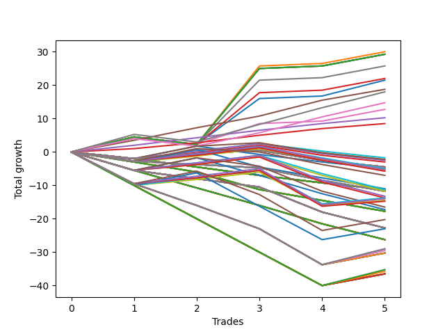

# Long Wallace Doodle 014 
- Symbol: ES90d5m30m
- Date Range: 03/18/2022 - 07/08/2022
- Trading Period: 7:20-12:30
- Number of Trades: 5



| Name | Win Percent | Profit | Avg Profit / Trade | Avg Time / Trade |      | Name | Win Percent | Profit | Avg Profit / Trade | Avg Time / Trade |
| ---- | ----------- | ------ | ------------------ | ---------------- | ---- | ---- | ----------- | ------ | ------------------ | ---------------- |
| Sorted By <br> Profit | | | | | | Sorted By <br> Win Percentage ||||
| One | 80.00 | 15000.00 | 3000.00 | 00:00 |     | Eighty-Three | 100.00 | 9375.00 | 1875.00 | 00:00 |
| Seventy-Three | 80.00 | 14625.00 | 2925.00 | 00:00 |     | Eighty-Two | 100.00 | 5125.00 | 1025.00 | 00:00 |
| Five | 80.00 | 14625.00 | 2925.00 | 00:00 |     | Eighty-One | 100.00 | 4250.00 | 850.00 | 00:00 |
| Four | 80.00 | 14625.00 | 2925.00 | 00:00 |     | One | 80.00 | 15000.00 | 3000.00 | 00:00 |
| Two | 80.00 | 14625.00 | 2925.00 | 00:00 |     | Seventy-Three | 80.00 | 14625.00 | 2925.00 | 00:00 |
| Seven | 80.00 | 12875.00 | 2575.00 | 00:00 |     | Five | 80.00 | 14625.00 | 2925.00 | 00:00 |
| Three | 80.00 | 11000.00 | 2200.00 | 00:00 |     | Four | 80.00 | 14625.00 | 2925.00 | 00:00 |
| Zero | 80.00 | 10750.00 | 2150.00 | 00:00 |     | Two | 80.00 | 14625.00 | 2925.00 | 00:00 |
| Eighty-Three | 100.00 | 9375.00 | 1875.00 | 00:00 |     | Seven | 80.00 | 12875.00 | 2575.00 | 00:00 |
| Eighty-Five | 80.00 | 9000.00 | 1800.00 | 00:00 |     | Three | 80.00 | 11000.00 | 2200.00 | 00:00 |
| Eighty-Four | 80.00 | 7375.00 | 1475.00 | 00:00 |     | Zero | 80.00 | 10750.00 | 2150.00 | 00:00 |
| Six | 80.00 | 6375.00 | 1275.00 | 00:00 |     | Eighty-Five | 80.00 | 9000.00 | 1800.00 | 00:00 |
| Eighty-Two | 100.00 | 5125.00 | 1025.00 | 00:00 |     | Eighty-Four | 80.00 | 7375.00 | 1475.00 | 00:00 |
| Eighty-One | 100.00 | 4250.00 | 850.00 | 00:00 |     | Six | 80.00 | 6375.00 | 1275.00 | 00:00 |
| Ninety-Two | 40.00 | -875.00 | -175.00 | 00:00 |     | One Hundred Twenty-Two | 60.00 | -6875.00 | -1375.00 | 00:00 |
| Ninety-Eight | 40.00 | -1125.00 | -225.00 | 00:00 |     | One Hundred Twenty-Seven | 60.00 | -7000.00 | -1400.00 | 00:00 |
| Ninety-One | 40.00 | -1125.00 | -225.00 | 00:00 |     | One Hundred Twenty-One | 60.00 | -7250.00 | -1450.00 | 00:00 |
| Ninety-Seven | 40.00 | -1250.00 | -250.00 | 00:00 |     | One Hundred Twenty-Six | 60.00 | -7375.00 | -1475.00 | 00:00 |
| Ninety-Six | 40.00 | -1500.00 | -300.00 | 00:00 |     | Ninety-Two | 40.00 | -875.00 | -175.00 | 00:00 |
| One Hundred | 40.00 | -2250.00 | -450.00 | 00:00 |     | Ninety-Eight | 40.00 | -1125.00 | -225.00 | 00:00 |
| Ninety-Nine | 40.00 | -2250.00 | -450.00 | 00:00 |     | Ninety-One | 40.00 | -1125.00 | -225.00 | 00:00 |
| Twenty-Three | 40.00 | -2250.00 | -450.00 | 00:00 |     | Ninety-Seven | 40.00 | -1250.00 | -250.00 | 00:00 |
| Twenty-Two | 40.00 | -2250.00 | -450.00 | 00:00 |     | Ninety-Six | 40.00 | -1500.00 | -300.00 | 00:00 |
| Twenty-One | 40.00 | -2250.00 | -450.00 | 00:00 |     | One Hundred | 40.00 | -2250.00 | -450.00 | 00:00 |
| Twenty | 40.00 | -2250.00 | -450.00 | 00:00 |     | Ninety-Nine | 40.00 | -2250.00 | -450.00 | 00:00 |
| Nineteen | 40.00 | -2250.00 | -450.00 | 00:00 |     | Twenty-Three | 40.00 | -2250.00 | -450.00 | 00:00 |
| Eighteen | 40.00 | -2250.00 | -450.00 | 00:00 |     | Twenty-Two | 40.00 | -2250.00 | -450.00 | 00:00 |
| Seventeen | 40.00 | -2250.00 | -450.00 | 00:00 |     | Twenty-One | 40.00 | -2250.00 | -450.00 | 00:00 |
| Sixten | 40.00 | -2250.00 | -450.00 | 00:00 |     | Twenty | 40.00 | -2250.00 | -450.00 | 00:00 |
| One Hundred Two | 40.00 | -2500.00 | -500.00 | 00:00 |     | Nineteen | 40.00 | -2250.00 | -450.00 | 00:00 |
| Ninety-Three | 20.00 | -2500.00 | -500.00 | 00:00 |     | Eighteen | 40.00 | -2250.00 | -450.00 | 00:00 |
| One Hundred Seven | 40.00 | -2625.00 | -525.00 | 00:00 |     | Seventeen | 40.00 | -2250.00 | -450.00 | 00:00 |
| One Hundred One | 40.00 | -2750.00 | -550.00 | 00:00 |     | Sixten | 40.00 | -2250.00 | -450.00 | 00:00 |
| One Hundred Six | 40.00 | -2875.00 | -575.00 | 00:00 |     | One Hundred Two | 40.00 | -2500.00 | -500.00 | 00:00 |
| One Hundred Eight | 20.00 | -3500.00 | -700.00 | 00:00 |     | One Hundred Seven | 40.00 | -2625.00 | -525.00 | 00:00 |
| One Hundred Three | 20.00 | -5500.00 | -1100.00 | 00:00 |     | One Hundred One | 40.00 | -2750.00 | -550.00 | 00:00 |
| One Hundred Twelve | 40.00 | -5625.00 | -1125.00 | 00:00 |     | One Hundred Six | 40.00 | -2875.00 | -575.00 | 00:00 |
| Ninety-Five | 0.00 | -5625.00 | -1125.00 | 00:00 |     | One Hundred Twelve | 40.00 | -5625.00 | -1125.00 | 00:00 |
| Ninety-Four | 0.00 | -5625.00 | -1125.00 | 00:00 |     | One Hundred Eleven | 40.00 | -5875.00 | -1175.00 | 00:00 |
| Fifteen | 0.00 | -5625.00 | -1125.00 | 00:00 |     | One Hundred Seventeen | 40.00 | -6625.00 | -1325.00 | 00:00 |
| Fourteen | 0.00 | -5625.00 | -1125.00 | 00:00 |     | One Hundred Sixteen | 40.00 | -6875.00 | -1375.00 | 00:00 |
| Thirteen | 0.00 | -5625.00 | -1125.00 | 00:00 |     | One Hundred Twenty-Eight | 40.00 | -10125.00 | -2025.00 | 00:00 |
| Twelve | 0.00 | -5625.00 | -1125.00 | 00:00 |     | One Hundred Twenty-Three | 40.00 | -11500.00 | -2300.00 | 00:00 |
| Eleven | 0.00 | -5625.00 | -1125.00 | 00:00 |     | Ninety-Three | 20.00 | -2500.00 | -500.00 | 00:00 |
| Ten | 0.00 | -5625.00 | -1125.00 | 00:00 |     | One Hundred Eight | 20.00 | -3500.00 | -700.00 | 00:00 |
| Nine | 0.00 | -5625.00 | -1125.00 | 00:00 |     | One Hundred Three | 20.00 | -5500.00 | -1100.00 | 00:00 |
| Eight | 0.00 | -5625.00 | -1125.00 | 00:00 |     | One Hundred Eighteen | 20.00 | -8250.00 | -1650.00 | 00:00 |
| One Hundred Eleven | 40.00 | -5875.00 | -1175.00 | 00:00 |     | One Hundred Thirteen | 20.00 | -8625.00 | -1725.00 | 00:00 |
| One Hundred Ten | 0.00 | -5875.00 | -1175.00 | 00:00 |     | One Hundred Thirty | 20.00 | -14500.00 | -2900.00 | 00:00 |
| One Hundred Nine | 0.00 | -5875.00 | -1175.00 | 00:00 |     | Sixty-Four | 20.00 | -14500.00 | -2900.00 | 00:00 |
| Thirty-Nine | 0.00 | -5875.00 | -1175.00 | 00:00 |     | One Hundred Twenty-Nine | 20.00 | -14750.00 | -2950.00 | 00:00 |
| Thirty-Eight | 0.00 | -5875.00 | -1175.00 | 00:00 |     | Seventy-One | 20.00 | -15125.00 | -3025.00 | 00:00 |
| Thirty-Seven | 0.00 | -5875.00 | -1175.00 | 00:00 |     | Seventy | 20.00 | -15125.00 | -3025.00 | 00:00 |
| Thirty-Six | 0.00 | -5875.00 | -1175.00 | 00:00 |     | Sixty-Nine | 20.00 | -15125.00 | -3025.00 | 00:00 |
| Thirty-Five | 0.00 | -5875.00 | -1175.00 | 00:00 |     | Sixty-Eight | 20.00 | -15125.00 | -3025.00 | 00:00 |
| Thirty-Four | 0.00 | -5875.00 | -1175.00 | 00:00 |     | Sixty-Seven | 20.00 | -15125.00 | -3025.00 | 00:00 |
| Thirty-Three | 0.00 | -5875.00 | -1175.00 | 00:00 |     | Sixty-Six | 20.00 | -15125.00 | -3025.00 | 00:00 |
| Thirty-Two | 0.00 | -5875.00 | -1175.00 | 00:00 |     | Sixty-Five | 20.00 | -15125.00 | -3025.00 | 00:00 |
| One Hundred Seventeen | 40.00 | -6625.00 | -1325.00 | 00:00 |     | One Hundred Twenty-Five | 20.00 | -17625.00 | -3525.00 | 00:00 |
| One Hundred Twenty-Two | 60.00 | -6875.00 | -1375.00 | 00:00 |     | Fifty-Six | 20.00 | -17625.00 | -3525.00 | 00:00 |
| One Hundred Sixteen | 40.00 | -6875.00 | -1375.00 | 00:00 |     | One Hundred Twenty-Four | 20.00 | -17875.00 | -3575.00 | 00:00 |
| One Hundred Twenty-Seven | 60.00 | -7000.00 | -1400.00 | 00:00 |     | Sixty-Three | 20.00 | -18250.00 | -3650.00 | 00:00 |
| One Hundred Twenty-One | 60.00 | -7250.00 | -1450.00 | 00:00 |     | Sixty-Two | 20.00 | -18250.00 | -3650.00 | 00:00 |
| One Hundred Twenty-Six | 60.00 | -7375.00 | -1475.00 | 00:00 |     | Sixty-One | 20.00 | -18250.00 | -3650.00 | 00:00 |
| One Hundred Eighteen | 20.00 | -8250.00 | -1650.00 | 00:00 |     | Sixty | 20.00 | -18250.00 | -3650.00 | 00:00 |
| One Hundred Thirteen | 20.00 | -8625.00 | -1725.00 | 00:00 |     | Fifty-Nine | 20.00 | -18250.00 | -3650.00 | 00:00 |
| One Hundred Five | 0.00 | -8875.00 | -1775.00 | 00:00 |     | Fifty-Eight | 20.00 | -18250.00 | -3650.00 | 00:00 |
| One Hundred Four | 0.00 | -8875.00 | -1775.00 | 00:00 |     | Fifty-Seven | 20.00 | -18250.00 | -3650.00 | 00:00 |
| Thirty-One | 0.00 | -8875.00 | -1775.00 | 00:00 |     | Ninety-Five | 0.00 | -5625.00 | -1125.00 | 00:00 |
| Thirty | 0.00 | -8875.00 | -1775.00 | 00:00 |     | Ninety-Four | 0.00 | -5625.00 | -1125.00 | 00:00 |
| Twenty-Nine | 0.00 | -8875.00 | -1775.00 | 00:00 |     | Fifteen | 0.00 | -5625.00 | -1125.00 | 00:00 |
| Twenty-Eight | 0.00 | -8875.00 | -1775.00 | 00:00 |     | Fourteen | 0.00 | -5625.00 | -1125.00 | 00:00 |
| twenty-Seven | 0.00 | -8875.00 | -1775.00 | 00:00 |     | Thirteen | 0.00 | -5625.00 | -1125.00 | 00:00 |
| Twenty-Six | 0.00 | -8875.00 | -1775.00 | 00:00 |     | Twelve | 0.00 | -5625.00 | -1125.00 | 00:00 |
| Twenty-Five | 0.00 | -8875.00 | -1775.00 | 00:00 |     | Eleven | 0.00 | -5625.00 | -1125.00 | 00:00 |
| Twenty-Four | 0.00 | -8875.00 | -1775.00 | 00:00 |     | Ten | 0.00 | -5625.00 | -1125.00 | 00:00 |
| One Hundred Twenty-Eight | 40.00 | -10125.00 | -2025.00 | 00:00 |     | Nine | 0.00 | -5625.00 | -1125.00 | 00:00 |
| One Hundred Twenty | 0.00 | -11375.00 | -2275.00 | 00:00 |     | Eight | 0.00 | -5625.00 | -1125.00 | 00:00 |
| One Hundred Ninteen | 0.00 | -11375.00 | -2275.00 | 00:00 |     | One Hundred Ten | 0.00 | -5875.00 | -1175.00 | 00:00 |
| Fifty-Five | 0.00 | -11375.00 | -2275.00 | 00:00 |     | One Hundred Nine | 0.00 | -5875.00 | -1175.00 | 00:00 |
| Fifty-Four | 0.00 | -11375.00 | -2275.00 | 00:00 |     | Thirty-Nine | 0.00 | -5875.00 | -1175.00 | 00:00 |
| Fifty-Three | 0.00 | -11375.00 | -2275.00 | 00:00 |     | Thirty-Eight | 0.00 | -5875.00 | -1175.00 | 00:00 |
| Fifty-Two | 0.00 | -11375.00 | -2275.00 | 00:00 |     | Thirty-Seven | 0.00 | -5875.00 | -1175.00 | 00:00 |
| Fifty-One | 0.00 | -11375.00 | -2275.00 | 00:00 |     | Thirty-Six | 0.00 | -5875.00 | -1175.00 | 00:00 |
| Fifty | 0.00 | -11375.00 | -2275.00 | 00:00 |     | Thirty-Five | 0.00 | -5875.00 | -1175.00 | 00:00 |
| Forty-Nine | 0.00 | -11375.00 | -2275.00 | 00:00 |     | Thirty-Four | 0.00 | -5875.00 | -1175.00 | 00:00 |
| Forty-Eight | 0.00 | -11375.00 | -2275.00 | 00:00 |     | Thirty-Three | 0.00 | -5875.00 | -1175.00 | 00:00 |
| One Hundred Twenty-Three | 40.00 | -11500.00 | -2300.00 | 00:00 |     | Thirty-Two | 0.00 | -5875.00 | -1175.00 | 00:00 |
| One Hundred Fifteen | 0.00 | -13125.00 | -2625.00 | 00:00 |     | One Hundred Five | 0.00 | -8875.00 | -1775.00 | 00:00 |
| One Hundred Fourteen | 0.00 | -13125.00 | -2625.00 | 00:00 |     | One Hundred Four | 0.00 | -8875.00 | -1775.00 | 00:00 |
| Forty-Seven | 0.00 | -13125.00 | -2625.00 | 00:00 |     | Thirty-One | 0.00 | -8875.00 | -1775.00 | 00:00 |
| Forty-Six | 0.00 | -13125.00 | -2625.00 | 00:00 |     | Thirty | 0.00 | -8875.00 | -1775.00 | 00:00 |
| Forty-Five | 0.00 | -13125.00 | -2625.00 | 00:00 |     | Twenty-Nine | 0.00 | -8875.00 | -1775.00 | 00:00 |
| Forty-Four | 0.00 | -13125.00 | -2625.00 | 00:00 |     | Twenty-Eight | 0.00 | -8875.00 | -1775.00 | 00:00 |
| Forty-Three | 0.00 | -13125.00 | -2625.00 | 00:00 |     | twenty-Seven | 0.00 | -8875.00 | -1775.00 | 00:00 |
| Forty-Two | 0.00 | -13125.00 | -2625.00 | 00:00 |     | Twenty-Six | 0.00 | -8875.00 | -1775.00 | 00:00 |
| Forty-One | 0.00 | -13125.00 | -2625.00 | 00:00 |     | Twenty-Five | 0.00 | -8875.00 | -1775.00 | 00:00 |
| Forty | 0.00 | -13125.00 | -2625.00 | 00:00 |     | Twenty-Four | 0.00 | -8875.00 | -1775.00 | 00:00 |
| One Hundred Thirty | 20.00 | -14500.00 | -2900.00 | 00:00 |     | One Hundred Twenty | 0.00 | -11375.00 | -2275.00 | 00:00 |
| Sixty-Four | 20.00 | -14500.00 | -2900.00 | 00:00 |     | One Hundred Ninteen | 0.00 | -11375.00 | -2275.00 | 00:00 |
| One Hundred Twenty-Nine | 20.00 | -14750.00 | -2950.00 | 00:00 |     | Fifty-Five | 0.00 | -11375.00 | -2275.00 | 00:00 |
| Seventy-One | 20.00 | -15125.00 | -3025.00 | 00:00 |     | Fifty-Four | 0.00 | -11375.00 | -2275.00 | 00:00 |
| Seventy | 20.00 | -15125.00 | -3025.00 | 00:00 |     | Fifty-Three | 0.00 | -11375.00 | -2275.00 | 00:00 |
| Sixty-Nine | 20.00 | -15125.00 | -3025.00 | 00:00 |     | Fifty-Two | 0.00 | -11375.00 | -2275.00 | 00:00 |
| Sixty-Eight | 20.00 | -15125.00 | -3025.00 | 00:00 |     | Fifty-One | 0.00 | -11375.00 | -2275.00 | 00:00 |
| Sixty-Seven | 20.00 | -15125.00 | -3025.00 | 00:00 |     | Fifty | 0.00 | -11375.00 | -2275.00 | 00:00 |
| Sixty-Six | 20.00 | -15125.00 | -3025.00 | 00:00 |     | Forty-Nine | 0.00 | -11375.00 | -2275.00 | 00:00 |
| Sixty-Five | 20.00 | -15125.00 | -3025.00 | 00:00 |     | Forty-Eight | 0.00 | -11375.00 | -2275.00 | 00:00 |
| One Hundred Twenty-Five | 20.00 | -17625.00 | -3525.00 | 00:00 |     | One Hundred Fifteen | 0.00 | -13125.00 | -2625.00 | 00:00 |
| Fifty-Six | 20.00 | -17625.00 | -3525.00 | 00:00 |     | One Hundred Fourteen | 0.00 | -13125.00 | -2625.00 | 00:00 |
| One Hundred Twenty-Four | 20.00 | -17875.00 | -3575.00 | 00:00 |     | Forty-Seven | 0.00 | -13125.00 | -2625.00 | 00:00 |
| Sixty-Three | 20.00 | -18250.00 | -3650.00 | 00:00 |     | Forty-Six | 0.00 | -13125.00 | -2625.00 | 00:00 |
| Sixty-Two | 20.00 | -18250.00 | -3650.00 | 00:00 |     | Forty-Five | 0.00 | -13125.00 | -2625.00 | 00:00 |
| Sixty-One | 20.00 | -18250.00 | -3650.00 | 00:00 |     | Forty-Four | 0.00 | -13125.00 | -2625.00 | 00:00 |
| Sixty | 20.00 | -18250.00 | -3650.00 | 00:00 |     | Forty-Three | 0.00 | -13125.00 | -2625.00 | 00:00 |
| Fifty-Nine | 20.00 | -18250.00 | -3650.00 | 00:00 |     | Forty-Two | 0.00 | -13125.00 | -2625.00 | 00:00 |
| Fifty-Eight | 20.00 | -18250.00 | -3650.00 | 00:00 |     | Forty-One | 0.00 | -13125.00 | -2625.00 | 00:00 |
| Fifty-Seven | 20.00 | -18250.00 | -3650.00 | 00:00 |     | Forty | 0.00 | -13125.00 | -2625.00 | 00:00 |

## NO STOPLOSS

### Test Zero
* Sell when price hits the middle line of the 20p bollinger
* No Stoploss
* Results:
```
Total Trades: 5
Percent Up: 80.00
Percent Down: 20.00
Total Points Moved Up: 21.50
Potential Profit: 10750.00
Total Points Ups: 23.75 Count Ups: 4
Total Points Downs: -2.25 Count Downs: 1
```

<details><summary>Trades</summary>

<code>In: 2022-04-20 11:50:00		Out: 2022-04-20 12:19:55		Total Position Time: 29:55		Total Move Up: 4.50		Total to Date: 4.50</code> <br />
<code>In: 2022-04-27 12:15:00		Out: 2022-04-27 12:44:55		Total Position Time: 29:55		Total Move Up: -2.25		Total to Date: 2.25</code> <br />
<code>In: 2022-05-03 11:45:00		Out: 2022-05-03 11:56:50		Total Position Time: 11:50		Total Move Up: 13.75		Total to Date: 16.00</code> <br />
<code>In: 2022-05-13 11:20:00		Out: 2022-05-13 11:49:55		Total Position Time: 29:55		Total Move Up: 0.75		Total to Date: 16.75</code> <br />
<code>In: 2022-06-27 11:05:00		Out: 2022-06-27 11:19:05		Total Position Time: 14:05		Total Move Up: 4.75		Total to Date: 21.50</code> <br />


</details>

### Test One
* Sell when the price hits the upper line of the 20p 1std bollinger
* No Stoploss
* Results:
```
Total Trades: 5
Percent Up: 80.00
Percent Down: 20.00
Total Points Moved Up: 30.00
Potential Profit: 15000.00
Total Points Ups: 32.25 Count Ups: 4
Total Points Downs: -2.25 Count Downs: 1
```

<details><summary>Trades</summary>

<code>In: 2022-04-20 11:50:00		Out: 2022-04-20 12:19:55		Total Position Time: 29:55		Total Move Up: 4.50		Total to Date: 4.50</code> <br />
<code>In: 2022-04-27 12:15:00		Out: 2022-04-27 12:44:55		Total Position Time: 29:55		Total Move Up: -2.25		Total to Date: 2.25</code> <br />
<code>In: 2022-05-03 11:45:00		Out: 2022-05-03 12:07:55		Total Position Time: 22:55		Total Move Up: 23.50		Total to Date: 25.75</code> <br />
<code>In: 2022-05-13 11:20:00		Out: 2022-05-13 11:49:55		Total Position Time: 29:55		Total Move Up: 0.75		Total to Date: 26.50</code> <br />
<code>In: 2022-06-27 11:05:00		Out: 2022-06-27 11:34:55		Total Position Time: 29:55		Total Move Up: 3.50		Total to Date: 30.00</code> <br />


</details>

### Test Two
* Sell when the price hits the upper line of the 20p 2std bollinger
* No Stoploss
* Results:
```
Total Trades: 5
Percent Up: 80.00
Percent Down: 20.00
Total Points Moved Up: 29.25
Potential Profit: 14625.00
Total Points Ups: 31.50 Count Ups: 4
Total Points Downs: -2.25 Count Downs: 1
```

<details><summary>Trades</summary>

<code>In: 2022-04-20 11:50:00		Out: 2022-04-20 12:19:55		Total Position Time: 29:55		Total Move Up: 4.50		Total to Date: 4.50</code> <br />
<code>In: 2022-04-27 12:15:00		Out: 2022-04-27 12:44:55		Total Position Time: 29:55		Total Move Up: -2.25		Total to Date: 2.25</code> <br />
<code>In: 2022-05-03 11:45:00		Out: 2022-05-03 12:14:55		Total Position Time: 29:55		Total Move Up: 22.75		Total to Date: 25.00</code> <br />
<code>In: 2022-05-13 11:20:00		Out: 2022-05-13 11:49:55		Total Position Time: 29:55		Total Move Up: 0.75		Total to Date: 25.75</code> <br />
<code>In: 2022-06-27 11:05:00		Out: 2022-06-27 11:34:55		Total Position Time: 29:55		Total Move Up: 3.50		Total to Date: 29.25</code> <br />


</details>

### Test Three
* Sell when price hits the middle line of the 50p bollinger
* No Stoploss
* Results:
```
Total Trades: 5
Percent Up: 80.00
Percent Down: 20.00
Total Points Moved Up: 22.00
Potential Profit: 11000.00
Total Points Ups: 24.25 Count Ups: 4
Total Points Downs: -2.25 Count Downs: 1
```

<details><summary>Trades</summary>

<code>In: 2022-04-20 11:50:00		Out: 2022-04-20 12:19:55		Total Position Time: 29:55		Total Move Up: 4.50		Total to Date: 4.50</code> <br />
<code>In: 2022-04-27 12:15:00		Out: 2022-04-27 12:44:55		Total Position Time: 29:55		Total Move Up: -2.25		Total to Date: 2.25</code> <br />
<code>In: 2022-05-03 11:45:00		Out: 2022-05-03 11:59:05		Total Position Time: 14:05		Total Move Up: 15.50		Total to Date: 17.75</code> <br />
<code>In: 2022-05-13 11:20:00		Out: 2022-05-13 11:49:55		Total Position Time: 29:55		Total Move Up: 0.75		Total to Date: 18.50</code> <br />
<code>In: 2022-06-27 11:05:00		Out: 2022-06-27 11:34:55		Total Position Time: 29:55		Total Move Up: 3.50		Total to Date: 22.00</code> <br />


</details>

### Test Four
* Sell when the price hits the upper line of the 50p 1std bollinger
* No Stoploss
* Results:
```
Total Trades: 5
Percent Up: 80.00
Percent Down: 20.00
Total Points Moved Up: 29.25
Potential Profit: 14625.00
Total Points Ups: 31.50 Count Ups: 4
Total Points Downs: -2.25 Count Downs: 1
```

<details><summary>Trades</summary>

<code>In: 2022-04-20 11:50:00		Out: 2022-04-20 12:19:55		Total Position Time: 29:55		Total Move Up: 4.50		Total to Date: 4.50</code> <br />
<code>In: 2022-04-27 12:15:00		Out: 2022-04-27 12:44:55		Total Position Time: 29:55		Total Move Up: -2.25		Total to Date: 2.25</code> <br />
<code>In: 2022-05-03 11:45:00		Out: 2022-05-03 12:14:55		Total Position Time: 29:55		Total Move Up: 22.75		Total to Date: 25.00</code> <br />
<code>In: 2022-05-13 11:20:00		Out: 2022-05-13 11:49:55		Total Position Time: 29:55		Total Move Up: 0.75		Total to Date: 25.75</code> <br />
<code>In: 2022-06-27 11:05:00		Out: 2022-06-27 11:34:55		Total Position Time: 29:55		Total Move Up: 3.50		Total to Date: 29.25</code> <br />


</details>

### Test Five
* Sell when the price hits the upper line of the 50p 2std bollinger
* No Stoploss
* Results:
```
Total Trades: 5
Percent Up: 80.00
Percent Down: 20.00
Total Points Moved Up: 29.25
Potential Profit: 14625.00
Total Points Ups: 31.50 Count Ups: 4
Total Points Downs: -2.25 Count Downs: 1
```

<details><summary>Trades</summary>

<code>In: 2022-04-20 11:50:00		Out: 2022-04-20 12:19:55		Total Position Time: 29:55		Total Move Up: 4.50		Total to Date: 4.50</code> <br />
<code>In: 2022-04-27 12:15:00		Out: 2022-04-27 12:44:55		Total Position Time: 29:55		Total Move Up: -2.25		Total to Date: 2.25</code> <br />
<code>In: 2022-05-03 11:45:00		Out: 2022-05-03 12:14:55		Total Position Time: 29:55		Total Move Up: 22.75		Total to Date: 25.00</code> <br />
<code>In: 2022-05-13 11:20:00		Out: 2022-05-13 11:49:55		Total Position Time: 29:55		Total Move Up: 0.75		Total to Date: 25.75</code> <br />
<code>In: 2022-06-27 11:05:00		Out: 2022-06-27 11:34:55		Total Position Time: 29:55		Total Move Up: 3.50		Total to Date: 29.25</code> <br />


</details>

### Test Six
* Sell when the price hits the middle line of the 1std VWAP
* No Stoploss
* Results:
```
Total Trades: 5
Percent Up: 80.00
Percent Down: 20.00
Total Points Moved Up: 12.75
Potential Profit: 6375.00
Total Points Ups: 15.00 Count Ups: 4
Total Points Downs: -2.25 Count Downs: 1
```

<details><summary>Trades</summary>

<code>In: 2022-04-20 11:50:00		Out: 2022-04-20 12:19:55		Total Position Time: 29:55		Total Move Up: 4.50		Total to Date: 4.50</code> <br />
<code>In: 2022-04-27 12:15:00		Out: 2022-04-27 12:44:55		Total Position Time: 29:55		Total Move Up: -2.25		Total to Date: 2.25</code> <br />
<code>In: 2022-05-03 11:45:00		Out: 2022-05-03 11:50:50		Total Position Time: 05:50		Total Move Up: 6.25		Total to Date: 8.50</code> <br />
<code>In: 2022-05-13 11:20:00		Out: 2022-05-13 11:49:55		Total Position Time: 29:55		Total Move Up: 0.75		Total to Date: 9.25</code> <br />
<code>In: 2022-06-27 11:05:00		Out: 2022-06-27 11:34:55		Total Position Time: 29:55		Total Move Up: 3.50		Total to Date: 12.75</code> <br />


</details>

### Test Seven
* Sell when the price hits the upper line of the 1std VWAP
* No Stoploss
* Results:
```
Total Trades: 5
Percent Up: 80.00
Percent Down: 20.00
Total Points Moved Up: 25.75
Potential Profit: 12875.00
Total Points Ups: 28.00 Count Ups: 4
Total Points Downs: -2.25 Count Downs: 1
```

<details><summary>Trades</summary>

<code>In: 2022-04-20 11:50:00		Out: 2022-04-20 12:19:55		Total Position Time: 29:55		Total Move Up: 4.50		Total to Date: 4.50</code> <br />
<code>In: 2022-04-27 12:15:00		Out: 2022-04-27 12:44:55		Total Position Time: 29:55		Total Move Up: -2.25		Total to Date: 2.25</code> <br />
<code>In: 2022-05-03 11:45:00		Out: 2022-05-03 11:59:45		Total Position Time: 14:45		Total Move Up: 19.25		Total to Date: 21.50</code> <br />
<code>In: 2022-05-13 11:20:00		Out: 2022-05-13 11:49:55		Total Position Time: 29:55		Total Move Up: 0.75		Total to Date: 22.25</code> <br />
<code>In: 2022-06-27 11:05:00		Out: 2022-06-27 11:34:55		Total Position Time: 29:55		Total Move Up: 3.50		Total to Date: 25.75</code> <br />


</details>

## STOPLOSS OF 2

### Test Eight
* Sell when price hits the middle line of the 20p bollinger
* Stoploss is 2 points
* Results:
```
Total Trades: 5
Percent Up: 0.00
Percent Down: 100.00
Total Points Moved Up: -11.25
Potential Profit: -5625.00
Total Points Ups: 0.00 Count Ups: 0
Total Points Downs: -11.25 Count Downs: 5
```

<details><summary>Trades</summary>

<code>In: 2022-04-20 11:50:00		Out: 2022-04-20 11:51:25		Total Position Time: 01:25		Total Move Up: -2.00		Total to Date: -2.00</code> <br />
<code>In: 2022-04-27 12:15:00		Out: 2022-04-27 12:15:45		Total Position Time: 00:45		Total Move Up: -2.50		Total to Date: -4.50</code> <br />
<code>In: 2022-05-03 11:45:00		Out: 2022-05-03 11:45:45		Total Position Time: 00:45		Total Move Up: -2.50		Total to Date: -7.00</code> <br />
<code>In: 2022-05-13 11:20:00		Out: 2022-05-13 11:20:30		Total Position Time: 00:30		Total Move Up: -2.25		Total to Date: -9.25</code> <br />
<code>In: 2022-06-27 11:05:00		Out: 2022-06-27 11:05:55		Total Position Time: 00:55		Total Move Up: -2.00		Total to Date: -11.25</code> <br />


</details>

### Test Nine
* Sell when the price hits the upper line of the 20p 1std bollinger
* Stoploss is 2 points
* Results:
```
Total Trades: 5
Percent Up: 0.00
Percent Down: 100.00
Total Points Moved Up: -11.25
Potential Profit: -5625.00
Total Points Ups: 0.00 Count Ups: 0
Total Points Downs: -11.25 Count Downs: 5
```

<details><summary>Trades</summary>

<code>In: 2022-04-20 11:50:00		Out: 2022-04-20 11:51:25		Total Position Time: 01:25		Total Move Up: -2.00		Total to Date: -2.00</code> <br />
<code>In: 2022-04-27 12:15:00		Out: 2022-04-27 12:15:45		Total Position Time: 00:45		Total Move Up: -2.50		Total to Date: -4.50</code> <br />
<code>In: 2022-05-03 11:45:00		Out: 2022-05-03 11:45:45		Total Position Time: 00:45		Total Move Up: -2.50		Total to Date: -7.00</code> <br />
<code>In: 2022-05-13 11:20:00		Out: 2022-05-13 11:20:30		Total Position Time: 00:30		Total Move Up: -2.25		Total to Date: -9.25</code> <br />
<code>In: 2022-06-27 11:05:00		Out: 2022-06-27 11:05:55		Total Position Time: 00:55		Total Move Up: -2.00		Total to Date: -11.25</code> <br />


</details>

### Test Ten
* Sell when the price hits the upper line of the 20p 2std bollinger
* Stoploss is 2 points
* Results:
```
Total Trades: 5
Percent Up: 0.00
Percent Down: 100.00
Total Points Moved Up: -11.25
Potential Profit: -5625.00
Total Points Ups: 0.00 Count Ups: 0
Total Points Downs: -11.25 Count Downs: 5
```

<details><summary>Trades</summary>

<code>In: 2022-04-20 11:50:00		Out: 2022-04-20 11:51:25		Total Position Time: 01:25		Total Move Up: -2.00		Total to Date: -2.00</code> <br />
<code>In: 2022-04-27 12:15:00		Out: 2022-04-27 12:15:45		Total Position Time: 00:45		Total Move Up: -2.50		Total to Date: -4.50</code> <br />
<code>In: 2022-05-03 11:45:00		Out: 2022-05-03 11:45:45		Total Position Time: 00:45		Total Move Up: -2.50		Total to Date: -7.00</code> <br />
<code>In: 2022-05-13 11:20:00		Out: 2022-05-13 11:20:30		Total Position Time: 00:30		Total Move Up: -2.25		Total to Date: -9.25</code> <br />
<code>In: 2022-06-27 11:05:00		Out: 2022-06-27 11:05:55		Total Position Time: 00:55		Total Move Up: -2.00		Total to Date: -11.25</code> <br />


</details>

### Test Eleven
* Sell when price hits the middle line of the 50p bollinger
* Stoploss is 2 points
* Results:
```
Total Trades: 5
Percent Up: 0.00
Percent Down: 100.00
Total Points Moved Up: -11.25
Potential Profit: -5625.00
Total Points Ups: 0.00 Count Ups: 0
Total Points Downs: -11.25 Count Downs: 5
```

<details><summary>Trades</summary>

<code>In: 2022-04-20 11:50:00		Out: 2022-04-20 11:51:25		Total Position Time: 01:25		Total Move Up: -2.00		Total to Date: -2.00</code> <br />
<code>In: 2022-04-27 12:15:00		Out: 2022-04-27 12:15:45		Total Position Time: 00:45		Total Move Up: -2.50		Total to Date: -4.50</code> <br />
<code>In: 2022-05-03 11:45:00		Out: 2022-05-03 11:45:45		Total Position Time: 00:45		Total Move Up: -2.50		Total to Date: -7.00</code> <br />
<code>In: 2022-05-13 11:20:00		Out: 2022-05-13 11:20:30		Total Position Time: 00:30		Total Move Up: -2.25		Total to Date: -9.25</code> <br />
<code>In: 2022-06-27 11:05:00		Out: 2022-06-27 11:05:55		Total Position Time: 00:55		Total Move Up: -2.00		Total to Date: -11.25</code> <br />


</details>

### Test Twelve
* Sell when the price hits the upper line of the 50p 1std bollinger
* Stoploss is 2 points
* Results:
```
Total Trades: 5
Percent Up: 0.00
Percent Down: 100.00
Total Points Moved Up: -11.25
Potential Profit: -5625.00
Total Points Ups: 0.00 Count Ups: 0
Total Points Downs: -11.25 Count Downs: 5
```

<details><summary>Trades</summary>

<code>In: 2022-04-20 11:50:00		Out: 2022-04-20 11:51:25		Total Position Time: 01:25		Total Move Up: -2.00		Total to Date: -2.00</code> <br />
<code>In: 2022-04-27 12:15:00		Out: 2022-04-27 12:15:45		Total Position Time: 00:45		Total Move Up: -2.50		Total to Date: -4.50</code> <br />
<code>In: 2022-05-03 11:45:00		Out: 2022-05-03 11:45:45		Total Position Time: 00:45		Total Move Up: -2.50		Total to Date: -7.00</code> <br />
<code>In: 2022-05-13 11:20:00		Out: 2022-05-13 11:20:30		Total Position Time: 00:30		Total Move Up: -2.25		Total to Date: -9.25</code> <br />
<code>In: 2022-06-27 11:05:00		Out: 2022-06-27 11:05:55		Total Position Time: 00:55		Total Move Up: -2.00		Total to Date: -11.25</code> <br />


</details>

### Test Thirteen
* Sell when the price hits the upper line of the 50p 2std bollinger
* Stoploss is 2 points
* Results:
```
Total Trades: 5
Percent Up: 0.00
Percent Down: 100.00
Total Points Moved Up: -11.25
Potential Profit: -5625.00
Total Points Ups: 0.00 Count Ups: 0
Total Points Downs: -11.25 Count Downs: 5
```

<details><summary>Trades</summary>

<code>In: 2022-04-20 11:50:00		Out: 2022-04-20 11:51:25		Total Position Time: 01:25		Total Move Up: -2.00		Total to Date: -2.00</code> <br />
<code>In: 2022-04-27 12:15:00		Out: 2022-04-27 12:15:45		Total Position Time: 00:45		Total Move Up: -2.50		Total to Date: -4.50</code> <br />
<code>In: 2022-05-03 11:45:00		Out: 2022-05-03 11:45:45		Total Position Time: 00:45		Total Move Up: -2.50		Total to Date: -7.00</code> <br />
<code>In: 2022-05-13 11:20:00		Out: 2022-05-13 11:20:30		Total Position Time: 00:30		Total Move Up: -2.25		Total to Date: -9.25</code> <br />
<code>In: 2022-06-27 11:05:00		Out: 2022-06-27 11:05:55		Total Position Time: 00:55		Total Move Up: -2.00		Total to Date: -11.25</code> <br />


</details>

### Test Fourteen
* Sell when the price hits the middle line of the 1std VWAP
* Stoploss is 2 points
* Results:
```
Total Trades: 5
Percent Up: 0.00
Percent Down: 100.00
Total Points Moved Up: -11.25
Potential Profit: -5625.00
Total Points Ups: 0.00 Count Ups: 0
Total Points Downs: -11.25 Count Downs: 5
```

<details><summary>Trades</summary>

<code>In: 2022-04-20 11:50:00		Out: 2022-04-20 11:51:25		Total Position Time: 01:25		Total Move Up: -2.00		Total to Date: -2.00</code> <br />
<code>In: 2022-04-27 12:15:00		Out: 2022-04-27 12:15:45		Total Position Time: 00:45		Total Move Up: -2.50		Total to Date: -4.50</code> <br />
<code>In: 2022-05-03 11:45:00		Out: 2022-05-03 11:45:45		Total Position Time: 00:45		Total Move Up: -2.50		Total to Date: -7.00</code> <br />
<code>In: 2022-05-13 11:20:00		Out: 2022-05-13 11:20:30		Total Position Time: 00:30		Total Move Up: -2.25		Total to Date: -9.25</code> <br />
<code>In: 2022-06-27 11:05:00		Out: 2022-06-27 11:05:55		Total Position Time: 00:55		Total Move Up: -2.00		Total to Date: -11.25</code> <br />


</details>

### Test Fifteen
* Sell when the price hits the upper line of the 1std VWAP
* Stoploss is 2 points
* Results:
```
Total Trades: 5
Percent Up: 0.00
Percent Down: 100.00
Total Points Moved Up: -11.25
Potential Profit: -5625.00
Total Points Ups: 0.00 Count Ups: 0
Total Points Downs: -11.25 Count Downs: 5
```

<details><summary>Trades</summary>

<code>In: 2022-04-20 11:50:00		Out: 2022-04-20 11:51:25		Total Position Time: 01:25		Total Move Up: -2.00		Total to Date: -2.00</code> <br />
<code>In: 2022-04-27 12:15:00		Out: 2022-04-27 12:15:45		Total Position Time: 00:45		Total Move Up: -2.50		Total to Date: -4.50</code> <br />
<code>In: 2022-05-03 11:45:00		Out: 2022-05-03 11:45:45		Total Position Time: 00:45		Total Move Up: -2.50		Total to Date: -7.00</code> <br />
<code>In: 2022-05-13 11:20:00		Out: 2022-05-13 11:20:30		Total Position Time: 00:30		Total Move Up: -2.25		Total to Date: -9.25</code> <br />
<code>In: 2022-06-27 11:05:00		Out: 2022-06-27 11:05:55		Total Position Time: 00:55		Total Move Up: -2.00		Total to Date: -11.25</code> <br />


</details>

## TRAIL STOP OF 2

### Test Sixten
* Sell when price hits the middle line of the 20p bollinger
* Trailing Stop is 2 points
* Results:
```
Total Trades: 5
Percent Up: 40.00
Percent Down: 60.00
Total Points Moved Up: -4.50
Potential Profit: -2250.00
Total Points Ups: 2.50 Count Ups: 2
Total Points Downs: -7.00 Count Downs: 3
```

<details><summary>Trades</summary>

<code>In: 2022-04-20 11:50:00		Out: 2022-04-20 11:51:25		Total Position Time: 01:25		Total Move Up: -2.00		Total to Date: -2.00</code> <br />
<code>In: 2022-04-27 12:15:00		Out: 2022-04-27 12:15:30		Total Position Time: 00:30		Total Move Up: 1.50		Total to Date: -0.50</code> <br />
<code>In: 2022-05-03 11:45:00		Out: 2022-05-03 11:45:25		Total Position Time: 00:25		Total Move Up: 1.00		Total to Date: 0.50</code> <br />
<code>In: 2022-05-13 11:20:00		Out: 2022-05-13 11:20:40		Total Position Time: 00:40		Total Move Up: -3.00		Total to Date: -2.50</code> <br />
<code>In: 2022-06-27 11:05:00		Out: 2022-06-27 11:05:55		Total Position Time: 00:55		Total Move Up: -2.00		Total to Date: -4.50</code> <br />


</details>

### Test Seventeen
* Sell when the price hits the upper line of the 20p 1std bollinger
* Trailing Stop is 2 points
* Results:
```
Total Trades: 5
Percent Up: 40.00
Percent Down: 60.00
Total Points Moved Up: -4.50
Potential Profit: -2250.00
Total Points Ups: 2.50 Count Ups: 2
Total Points Downs: -7.00 Count Downs: 3
```

<details><summary>Trades</summary>

<code>In: 2022-04-20 11:50:00		Out: 2022-04-20 11:51:25		Total Position Time: 01:25		Total Move Up: -2.00		Total to Date: -2.00</code> <br />
<code>In: 2022-04-27 12:15:00		Out: 2022-04-27 12:15:30		Total Position Time: 00:30		Total Move Up: 1.50		Total to Date: -0.50</code> <br />
<code>In: 2022-05-03 11:45:00		Out: 2022-05-03 11:45:25		Total Position Time: 00:25		Total Move Up: 1.00		Total to Date: 0.50</code> <br />
<code>In: 2022-05-13 11:20:00		Out: 2022-05-13 11:20:40		Total Position Time: 00:40		Total Move Up: -3.00		Total to Date: -2.50</code> <br />
<code>In: 2022-06-27 11:05:00		Out: 2022-06-27 11:05:55		Total Position Time: 00:55		Total Move Up: -2.00		Total to Date: -4.50</code> <br />


</details>

### Test Eighteen
* Sell when the price hits the upper line of the 20p 2std bollinger
* Trailing Stop is 2 points
* Results:
```
Total Trades: 5
Percent Up: 40.00
Percent Down: 60.00
Total Points Moved Up: -4.50
Potential Profit: -2250.00
Total Points Ups: 2.50 Count Ups: 2
Total Points Downs: -7.00 Count Downs: 3
```

<details><summary>Trades</summary>

<code>In: 2022-04-20 11:50:00		Out: 2022-04-20 11:51:25		Total Position Time: 01:25		Total Move Up: -2.00		Total to Date: -2.00</code> <br />
<code>In: 2022-04-27 12:15:00		Out: 2022-04-27 12:15:30		Total Position Time: 00:30		Total Move Up: 1.50		Total to Date: -0.50</code> <br />
<code>In: 2022-05-03 11:45:00		Out: 2022-05-03 11:45:25		Total Position Time: 00:25		Total Move Up: 1.00		Total to Date: 0.50</code> <br />
<code>In: 2022-05-13 11:20:00		Out: 2022-05-13 11:20:40		Total Position Time: 00:40		Total Move Up: -3.00		Total to Date: -2.50</code> <br />
<code>In: 2022-06-27 11:05:00		Out: 2022-06-27 11:05:55		Total Position Time: 00:55		Total Move Up: -2.00		Total to Date: -4.50</code> <br />


</details>

### Test Nineteen
* Sell when price hits the middle line of the 50p bollinger
* Trailing Stop is 2 points
* Results:
```
Total Trades: 5
Percent Up: 40.00
Percent Down: 60.00
Total Points Moved Up: -4.50
Potential Profit: -2250.00
Total Points Ups: 2.50 Count Ups: 2
Total Points Downs: -7.00 Count Downs: 3
```

<details><summary>Trades</summary>

<code>In: 2022-04-20 11:50:00		Out: 2022-04-20 11:51:25		Total Position Time: 01:25		Total Move Up: -2.00		Total to Date: -2.00</code> <br />
<code>In: 2022-04-27 12:15:00		Out: 2022-04-27 12:15:30		Total Position Time: 00:30		Total Move Up: 1.50		Total to Date: -0.50</code> <br />
<code>In: 2022-05-03 11:45:00		Out: 2022-05-03 11:45:25		Total Position Time: 00:25		Total Move Up: 1.00		Total to Date: 0.50</code> <br />
<code>In: 2022-05-13 11:20:00		Out: 2022-05-13 11:20:40		Total Position Time: 00:40		Total Move Up: -3.00		Total to Date: -2.50</code> <br />
<code>In: 2022-06-27 11:05:00		Out: 2022-06-27 11:05:55		Total Position Time: 00:55		Total Move Up: -2.00		Total to Date: -4.50</code> <br />


</details>

### Test Twenty
* Sell when the price hits the upper line of the 50p 1std bollinger
* Trailing Stop is 2 points
* Results:
```
Total Trades: 5
Percent Up: 40.00
Percent Down: 60.00
Total Points Moved Up: -4.50
Potential Profit: -2250.00
Total Points Ups: 2.50 Count Ups: 2
Total Points Downs: -7.00 Count Downs: 3
```

<details><summary>Trades</summary>

<code>In: 2022-04-20 11:50:00		Out: 2022-04-20 11:51:25		Total Position Time: 01:25		Total Move Up: -2.00		Total to Date: -2.00</code> <br />
<code>In: 2022-04-27 12:15:00		Out: 2022-04-27 12:15:30		Total Position Time: 00:30		Total Move Up: 1.50		Total to Date: -0.50</code> <br />
<code>In: 2022-05-03 11:45:00		Out: 2022-05-03 11:45:25		Total Position Time: 00:25		Total Move Up: 1.00		Total to Date: 0.50</code> <br />
<code>In: 2022-05-13 11:20:00		Out: 2022-05-13 11:20:40		Total Position Time: 00:40		Total Move Up: -3.00		Total to Date: -2.50</code> <br />
<code>In: 2022-06-27 11:05:00		Out: 2022-06-27 11:05:55		Total Position Time: 00:55		Total Move Up: -2.00		Total to Date: -4.50</code> <br />


</details>

### Test Twenty-One
* Sell when the price hits the upper line of the 50p 2std bollinger
* Trailing Stop is 2 points
* Results:
```
Total Trades: 5
Percent Up: 40.00
Percent Down: 60.00
Total Points Moved Up: -4.50
Potential Profit: -2250.00
Total Points Ups: 2.50 Count Ups: 2
Total Points Downs: -7.00 Count Downs: 3
```

<details><summary>Trades</summary>

<code>In: 2022-04-20 11:50:00		Out: 2022-04-20 11:51:25		Total Position Time: 01:25		Total Move Up: -2.00		Total to Date: -2.00</code> <br />
<code>In: 2022-04-27 12:15:00		Out: 2022-04-27 12:15:30		Total Position Time: 00:30		Total Move Up: 1.50		Total to Date: -0.50</code> <br />
<code>In: 2022-05-03 11:45:00		Out: 2022-05-03 11:45:25		Total Position Time: 00:25		Total Move Up: 1.00		Total to Date: 0.50</code> <br />
<code>In: 2022-05-13 11:20:00		Out: 2022-05-13 11:20:40		Total Position Time: 00:40		Total Move Up: -3.00		Total to Date: -2.50</code> <br />
<code>In: 2022-06-27 11:05:00		Out: 2022-06-27 11:05:55		Total Position Time: 00:55		Total Move Up: -2.00		Total to Date: -4.50</code> <br />


</details>

### Test Twenty-Two
* Sell when the price hits the middle line of the 1std VWAP
* Trailing Stop is 2 points
* Results:
```
Total Trades: 5
Percent Up: 40.00
Percent Down: 60.00
Total Points Moved Up: -4.50
Potential Profit: -2250.00
Total Points Ups: 2.50 Count Ups: 2
Total Points Downs: -7.00 Count Downs: 3
```

<details><summary>Trades</summary>

<code>In: 2022-04-20 11:50:00		Out: 2022-04-20 11:51:25		Total Position Time: 01:25		Total Move Up: -2.00		Total to Date: -2.00</code> <br />
<code>In: 2022-04-27 12:15:00		Out: 2022-04-27 12:15:30		Total Position Time: 00:30		Total Move Up: 1.50		Total to Date: -0.50</code> <br />
<code>In: 2022-05-03 11:45:00		Out: 2022-05-03 11:45:25		Total Position Time: 00:25		Total Move Up: 1.00		Total to Date: 0.50</code> <br />
<code>In: 2022-05-13 11:20:00		Out: 2022-05-13 11:20:40		Total Position Time: 00:40		Total Move Up: -3.00		Total to Date: -2.50</code> <br />
<code>In: 2022-06-27 11:05:00		Out: 2022-06-27 11:05:55		Total Position Time: 00:55		Total Move Up: -2.00		Total to Date: -4.50</code> <br />


</details>

### Test Twenty-Three
* Sell when the price hits the upper line of the 1std VWAP
* Trailing Stop is 2 points
* Results:
```
Total Trades: 5
Percent Up: 40.00
Percent Down: 60.00
Total Points Moved Up: -4.50
Potential Profit: -2250.00
Total Points Ups: 2.50 Count Ups: 2
Total Points Downs: -7.00 Count Downs: 3
```

<details><summary>Trades</summary>

<code>In: 2022-04-20 11:50:00		Out: 2022-04-20 11:51:25		Total Position Time: 01:25		Total Move Up: -2.00		Total to Date: -2.00</code> <br />
<code>In: 2022-04-27 12:15:00		Out: 2022-04-27 12:15:30		Total Position Time: 00:30		Total Move Up: 1.50		Total to Date: -0.50</code> <br />
<code>In: 2022-05-03 11:45:00		Out: 2022-05-03 11:45:25		Total Position Time: 00:25		Total Move Up: 1.00		Total to Date: 0.50</code> <br />
<code>In: 2022-05-13 11:20:00		Out: 2022-05-13 11:20:40		Total Position Time: 00:40		Total Move Up: -3.00		Total to Date: -2.50</code> <br />
<code>In: 2022-06-27 11:05:00		Out: 2022-06-27 11:05:55		Total Position Time: 00:55		Total Move Up: -2.00		Total to Date: -4.50</code> <br />


</details>

## STOPLOSS OF 3

### Test Twenty-Four
* Sell when price hits the middle line of the 20p bollinger
* Stoploss is 3 points
* Results:
```
Total Trades: 5
Percent Up: 0.00
Percent Down: 100.00
Total Points Moved Up: -17.75
Potential Profit: -8875.00
Total Points Ups: 0.00 Count Ups: 0
Total Points Downs: -17.75 Count Downs: 5
```

<details><summary>Trades</summary>

<code>In: 2022-04-20 11:50:00		Out: 2022-04-20 11:51:50		Total Position Time: 01:50		Total Move Up: -3.00		Total to Date: -3.00</code> <br />
<code>In: 2022-04-27 12:15:00		Out: 2022-04-27 12:15:50		Total Position Time: 00:50		Total Move Up: -3.00		Total to Date: -6.00</code> <br />
<code>In: 2022-05-03 11:45:00		Out: 2022-05-03 11:46:20		Total Position Time: 01:20		Total Move Up: -5.25		Total to Date: -11.25</code> <br />
<code>In: 2022-05-13 11:20:00		Out: 2022-05-13 11:20:45		Total Position Time: 00:45		Total Move Up: -3.25		Total to Date: -14.50</code> <br />
<code>In: 2022-06-27 11:05:00		Out: 2022-06-27 11:06:20		Total Position Time: 01:20		Total Move Up: -3.25		Total to Date: -17.75</code> <br />


</details>

### Test Twenty-Five
* Sell when the price hits the upper line of the 20p 1std bollinger
* Stoploss is 3 points
* Results:
```
Total Trades: 5
Percent Up: 0.00
Percent Down: 100.00
Total Points Moved Up: -17.75
Potential Profit: -8875.00
Total Points Ups: 0.00 Count Ups: 0
Total Points Downs: -17.75 Count Downs: 5
```

<details><summary>Trades</summary>

<code>In: 2022-04-20 11:50:00		Out: 2022-04-20 11:51:50		Total Position Time: 01:50		Total Move Up: -3.00		Total to Date: -3.00</code> <br />
<code>In: 2022-04-27 12:15:00		Out: 2022-04-27 12:15:50		Total Position Time: 00:50		Total Move Up: -3.00		Total to Date: -6.00</code> <br />
<code>In: 2022-05-03 11:45:00		Out: 2022-05-03 11:46:20		Total Position Time: 01:20		Total Move Up: -5.25		Total to Date: -11.25</code> <br />
<code>In: 2022-05-13 11:20:00		Out: 2022-05-13 11:20:45		Total Position Time: 00:45		Total Move Up: -3.25		Total to Date: -14.50</code> <br />
<code>In: 2022-06-27 11:05:00		Out: 2022-06-27 11:06:20		Total Position Time: 01:20		Total Move Up: -3.25		Total to Date: -17.75</code> <br />


</details>

### Test Twenty-Six
* Sell when the price hits the upper line of the 20p 2std bollinger
* Stoploss is 3 points
* Results:
```
Total Trades: 5
Percent Up: 0.00
Percent Down: 100.00
Total Points Moved Up: -17.75
Potential Profit: -8875.00
Total Points Ups: 0.00 Count Ups: 0
Total Points Downs: -17.75 Count Downs: 5
```

<details><summary>Trades</summary>

<code>In: 2022-04-20 11:50:00		Out: 2022-04-20 11:51:50		Total Position Time: 01:50		Total Move Up: -3.00		Total to Date: -3.00</code> <br />
<code>In: 2022-04-27 12:15:00		Out: 2022-04-27 12:15:50		Total Position Time: 00:50		Total Move Up: -3.00		Total to Date: -6.00</code> <br />
<code>In: 2022-05-03 11:45:00		Out: 2022-05-03 11:46:20		Total Position Time: 01:20		Total Move Up: -5.25		Total to Date: -11.25</code> <br />
<code>In: 2022-05-13 11:20:00		Out: 2022-05-13 11:20:45		Total Position Time: 00:45		Total Move Up: -3.25		Total to Date: -14.50</code> <br />
<code>In: 2022-06-27 11:05:00		Out: 2022-06-27 11:06:20		Total Position Time: 01:20		Total Move Up: -3.25		Total to Date: -17.75</code> <br />


</details>

### Test twenty-Seven
* Sell when price hits the middle line of the 50p bollinger
* Stoploss is 3 points
* Results:
```
Total Trades: 5
Percent Up: 0.00
Percent Down: 100.00
Total Points Moved Up: -17.75
Potential Profit: -8875.00
Total Points Ups: 0.00 Count Ups: 0
Total Points Downs: -17.75 Count Downs: 5
```

<details><summary>Trades</summary>

<code>In: 2022-04-20 11:50:00		Out: 2022-04-20 11:51:50		Total Position Time: 01:50		Total Move Up: -3.00		Total to Date: -3.00</code> <br />
<code>In: 2022-04-27 12:15:00		Out: 2022-04-27 12:15:50		Total Position Time: 00:50		Total Move Up: -3.00		Total to Date: -6.00</code> <br />
<code>In: 2022-05-03 11:45:00		Out: 2022-05-03 11:46:20		Total Position Time: 01:20		Total Move Up: -5.25		Total to Date: -11.25</code> <br />
<code>In: 2022-05-13 11:20:00		Out: 2022-05-13 11:20:45		Total Position Time: 00:45		Total Move Up: -3.25		Total to Date: -14.50</code> <br />
<code>In: 2022-06-27 11:05:00		Out: 2022-06-27 11:06:20		Total Position Time: 01:20		Total Move Up: -3.25		Total to Date: -17.75</code> <br />


</details>

### Test Twenty-Eight
* Sell when the price hits the upper line of the 50p 1std bollinger
* Stoploss is 3 points
* Results:
```
Total Trades: 5
Percent Up: 0.00
Percent Down: 100.00
Total Points Moved Up: -17.75
Potential Profit: -8875.00
Total Points Ups: 0.00 Count Ups: 0
Total Points Downs: -17.75 Count Downs: 5
```

<details><summary>Trades</summary>

<code>In: 2022-04-20 11:50:00		Out: 2022-04-20 11:51:50		Total Position Time: 01:50		Total Move Up: -3.00		Total to Date: -3.00</code> <br />
<code>In: 2022-04-27 12:15:00		Out: 2022-04-27 12:15:50		Total Position Time: 00:50		Total Move Up: -3.00		Total to Date: -6.00</code> <br />
<code>In: 2022-05-03 11:45:00		Out: 2022-05-03 11:46:20		Total Position Time: 01:20		Total Move Up: -5.25		Total to Date: -11.25</code> <br />
<code>In: 2022-05-13 11:20:00		Out: 2022-05-13 11:20:45		Total Position Time: 00:45		Total Move Up: -3.25		Total to Date: -14.50</code> <br />
<code>In: 2022-06-27 11:05:00		Out: 2022-06-27 11:06:20		Total Position Time: 01:20		Total Move Up: -3.25		Total to Date: -17.75</code> <br />


</details>

### Test Twenty-Nine
* Sell when the price hits the upper line of the 50p 2std bollinger
* Stoploss is 3 points
* Results:
```
Total Trades: 5
Percent Up: 0.00
Percent Down: 100.00
Total Points Moved Up: -17.75
Potential Profit: -8875.00
Total Points Ups: 0.00 Count Ups: 0
Total Points Downs: -17.75 Count Downs: 5
```

<details><summary>Trades</summary>

<code>In: 2022-04-20 11:50:00		Out: 2022-04-20 11:51:50		Total Position Time: 01:50		Total Move Up: -3.00		Total to Date: -3.00</code> <br />
<code>In: 2022-04-27 12:15:00		Out: 2022-04-27 12:15:50		Total Position Time: 00:50		Total Move Up: -3.00		Total to Date: -6.00</code> <br />
<code>In: 2022-05-03 11:45:00		Out: 2022-05-03 11:46:20		Total Position Time: 01:20		Total Move Up: -5.25		Total to Date: -11.25</code> <br />
<code>In: 2022-05-13 11:20:00		Out: 2022-05-13 11:20:45		Total Position Time: 00:45		Total Move Up: -3.25		Total to Date: -14.50</code> <br />
<code>In: 2022-06-27 11:05:00		Out: 2022-06-27 11:06:20		Total Position Time: 01:20		Total Move Up: -3.25		Total to Date: -17.75</code> <br />


</details>

### Test Thirty
* Sell when the price hits the middle line of the 1std VWAP
* Stoploss is 3 points
* Results:
```
Total Trades: 5
Percent Up: 0.00
Percent Down: 100.00
Total Points Moved Up: -17.75
Potential Profit: -8875.00
Total Points Ups: 0.00 Count Ups: 0
Total Points Downs: -17.75 Count Downs: 5
```

<details><summary>Trades</summary>

<code>In: 2022-04-20 11:50:00		Out: 2022-04-20 11:51:50		Total Position Time: 01:50		Total Move Up: -3.00		Total to Date: -3.00</code> <br />
<code>In: 2022-04-27 12:15:00		Out: 2022-04-27 12:15:50		Total Position Time: 00:50		Total Move Up: -3.00		Total to Date: -6.00</code> <br />
<code>In: 2022-05-03 11:45:00		Out: 2022-05-03 11:46:20		Total Position Time: 01:20		Total Move Up: -5.25		Total to Date: -11.25</code> <br />
<code>In: 2022-05-13 11:20:00		Out: 2022-05-13 11:20:45		Total Position Time: 00:45		Total Move Up: -3.25		Total to Date: -14.50</code> <br />
<code>In: 2022-06-27 11:05:00		Out: 2022-06-27 11:06:20		Total Position Time: 01:20		Total Move Up: -3.25		Total to Date: -17.75</code> <br />


</details>

### Test Thirty-One
* Sell when the price hits the upper line of the 1std VWAP
* Stoploss is 3 points
* Results:
```
Total Trades: 5
Percent Up: 0.00
Percent Down: 100.00
Total Points Moved Up: -17.75
Potential Profit: -8875.00
Total Points Ups: 0.00 Count Ups: 0
Total Points Downs: -17.75 Count Downs: 5
```

<details><summary>Trades</summary>

<code>In: 2022-04-20 11:50:00		Out: 2022-04-20 11:51:50		Total Position Time: 01:50		Total Move Up: -3.00		Total to Date: -3.00</code> <br />
<code>In: 2022-04-27 12:15:00		Out: 2022-04-27 12:15:50		Total Position Time: 00:50		Total Move Up: -3.00		Total to Date: -6.00</code> <br />
<code>In: 2022-05-03 11:45:00		Out: 2022-05-03 11:46:20		Total Position Time: 01:20		Total Move Up: -5.25		Total to Date: -11.25</code> <br />
<code>In: 2022-05-13 11:20:00		Out: 2022-05-13 11:20:45		Total Position Time: 00:45		Total Move Up: -3.25		Total to Date: -14.50</code> <br />
<code>In: 2022-06-27 11:05:00		Out: 2022-06-27 11:06:20		Total Position Time: 01:20		Total Move Up: -3.25		Total to Date: -17.75</code> <br />


</details>

## TRAIL STOP OF 3

### Test Thirty-Two
* Sell when price hits the middle line of the 20p bollinger
* Trailing Stop is 3 points
* Results:
```
Total Trades: 5
Percent Up: 0.00
Percent Down: 100.00
Total Points Moved Up: -11.75
Potential Profit: -5875.00
Total Points Ups: 0.00 Count Ups: 0
Total Points Downs: -11.75 Count Downs: 5
```

<details><summary>Trades</summary>

<code>In: 2022-04-20 11:50:00		Out: 2022-04-20 11:51:45		Total Position Time: 01:45		Total Move Up: -2.75		Total to Date: -2.75</code> <br />
<code>In: 2022-04-27 12:15:00		Out: 2022-04-27 12:15:40		Total Position Time: 00:40		Total Move Up: -1.00		Total to Date: -3.75</code> <br />
<code>In: 2022-05-03 11:45:00		Out: 2022-05-03 11:45:35		Total Position Time: 00:35		Total Move Up: -1.00		Total to Date: -4.75</code> <br />
<code>In: 2022-05-13 11:20:00		Out: 2022-05-13 11:21:25		Total Position Time: 01:25		Total Move Up: -3.75		Total to Date: -8.50</code> <br />
<code>In: 2022-06-27 11:05:00		Out: 2022-06-27 11:06:20		Total Position Time: 01:20		Total Move Up: -3.25		Total to Date: -11.75</code> <br />


</details>

### Test Thirty-Three
* Sell when the price hits the upper line of the 20p 1std bollinger
* Trailing Stop is 3 points
* Results:
```
Total Trades: 5
Percent Up: 0.00
Percent Down: 100.00
Total Points Moved Up: -11.75
Potential Profit: -5875.00
Total Points Ups: 0.00 Count Ups: 0
Total Points Downs: -11.75 Count Downs: 5
```

<details><summary>Trades</summary>

<code>In: 2022-04-20 11:50:00		Out: 2022-04-20 11:51:45		Total Position Time: 01:45		Total Move Up: -2.75		Total to Date: -2.75</code> <br />
<code>In: 2022-04-27 12:15:00		Out: 2022-04-27 12:15:40		Total Position Time: 00:40		Total Move Up: -1.00		Total to Date: -3.75</code> <br />
<code>In: 2022-05-03 11:45:00		Out: 2022-05-03 11:45:35		Total Position Time: 00:35		Total Move Up: -1.00		Total to Date: -4.75</code> <br />
<code>In: 2022-05-13 11:20:00		Out: 2022-05-13 11:21:25		Total Position Time: 01:25		Total Move Up: -3.75		Total to Date: -8.50</code> <br />
<code>In: 2022-06-27 11:05:00		Out: 2022-06-27 11:06:20		Total Position Time: 01:20		Total Move Up: -3.25		Total to Date: -11.75</code> <br />


</details>

### Test Thirty-Four
* Sell when the price hits the upper line of the 20p 2std bollinger
* Trailing Stop is 3 points
* Results:
```
Total Trades: 5
Percent Up: 0.00
Percent Down: 100.00
Total Points Moved Up: -11.75
Potential Profit: -5875.00
Total Points Ups: 0.00 Count Ups: 0
Total Points Downs: -11.75 Count Downs: 5
```

<details><summary>Trades</summary>

<code>In: 2022-04-20 11:50:00		Out: 2022-04-20 11:51:45		Total Position Time: 01:45		Total Move Up: -2.75		Total to Date: -2.75</code> <br />
<code>In: 2022-04-27 12:15:00		Out: 2022-04-27 12:15:40		Total Position Time: 00:40		Total Move Up: -1.00		Total to Date: -3.75</code> <br />
<code>In: 2022-05-03 11:45:00		Out: 2022-05-03 11:45:35		Total Position Time: 00:35		Total Move Up: -1.00		Total to Date: -4.75</code> <br />
<code>In: 2022-05-13 11:20:00		Out: 2022-05-13 11:21:25		Total Position Time: 01:25		Total Move Up: -3.75		Total to Date: -8.50</code> <br />
<code>In: 2022-06-27 11:05:00		Out: 2022-06-27 11:06:20		Total Position Time: 01:20		Total Move Up: -3.25		Total to Date: -11.75</code> <br />


</details>

### Test Thirty-Five
* Sell when price hits the middle line of the 50p bollinger
* Trailing Stop is 3 points
* Results:
```
Total Trades: 5
Percent Up: 0.00
Percent Down: 100.00
Total Points Moved Up: -11.75
Potential Profit: -5875.00
Total Points Ups: 0.00 Count Ups: 0
Total Points Downs: -11.75 Count Downs: 5
```

<details><summary>Trades</summary>

<code>In: 2022-04-20 11:50:00		Out: 2022-04-20 11:51:45		Total Position Time: 01:45		Total Move Up: -2.75		Total to Date: -2.75</code> <br />
<code>In: 2022-04-27 12:15:00		Out: 2022-04-27 12:15:40		Total Position Time: 00:40		Total Move Up: -1.00		Total to Date: -3.75</code> <br />
<code>In: 2022-05-03 11:45:00		Out: 2022-05-03 11:45:35		Total Position Time: 00:35		Total Move Up: -1.00		Total to Date: -4.75</code> <br />
<code>In: 2022-05-13 11:20:00		Out: 2022-05-13 11:21:25		Total Position Time: 01:25		Total Move Up: -3.75		Total to Date: -8.50</code> <br />
<code>In: 2022-06-27 11:05:00		Out: 2022-06-27 11:06:20		Total Position Time: 01:20		Total Move Up: -3.25		Total to Date: -11.75</code> <br />


</details>

### Test Thirty-Six
* Sell when the price hits the upper line of the 50p 1std bollinger
* Trailing Stop is 3 points
* Results:
```
Total Trades: 5
Percent Up: 0.00
Percent Down: 100.00
Total Points Moved Up: -11.75
Potential Profit: -5875.00
Total Points Ups: 0.00 Count Ups: 0
Total Points Downs: -11.75 Count Downs: 5
```

<details><summary>Trades</summary>

<code>In: 2022-04-20 11:50:00		Out: 2022-04-20 11:51:45		Total Position Time: 01:45		Total Move Up: -2.75		Total to Date: -2.75</code> <br />
<code>In: 2022-04-27 12:15:00		Out: 2022-04-27 12:15:40		Total Position Time: 00:40		Total Move Up: -1.00		Total to Date: -3.75</code> <br />
<code>In: 2022-05-03 11:45:00		Out: 2022-05-03 11:45:35		Total Position Time: 00:35		Total Move Up: -1.00		Total to Date: -4.75</code> <br />
<code>In: 2022-05-13 11:20:00		Out: 2022-05-13 11:21:25		Total Position Time: 01:25		Total Move Up: -3.75		Total to Date: -8.50</code> <br />
<code>In: 2022-06-27 11:05:00		Out: 2022-06-27 11:06:20		Total Position Time: 01:20		Total Move Up: -3.25		Total to Date: -11.75</code> <br />


</details>

### Test Thirty-Seven
* Sell when the price hits the upper line of the 50p 2std bollinger
* Trailing Stop is 3 points
* Results:
```
Total Trades: 5
Percent Up: 0.00
Percent Down: 100.00
Total Points Moved Up: -11.75
Potential Profit: -5875.00
Total Points Ups: 0.00 Count Ups: 0
Total Points Downs: -11.75 Count Downs: 5
```

<details><summary>Trades</summary>

<code>In: 2022-04-20 11:50:00		Out: 2022-04-20 11:51:45		Total Position Time: 01:45		Total Move Up: -2.75		Total to Date: -2.75</code> <br />
<code>In: 2022-04-27 12:15:00		Out: 2022-04-27 12:15:40		Total Position Time: 00:40		Total Move Up: -1.00		Total to Date: -3.75</code> <br />
<code>In: 2022-05-03 11:45:00		Out: 2022-05-03 11:45:35		Total Position Time: 00:35		Total Move Up: -1.00		Total to Date: -4.75</code> <br />
<code>In: 2022-05-13 11:20:00		Out: 2022-05-13 11:21:25		Total Position Time: 01:25		Total Move Up: -3.75		Total to Date: -8.50</code> <br />
<code>In: 2022-06-27 11:05:00		Out: 2022-06-27 11:06:20		Total Position Time: 01:20		Total Move Up: -3.25		Total to Date: -11.75</code> <br />


</details>

### Test Thirty-Eight
* Sell when the price hits the middle line of the 1std VWAP
* Trailing Stop is 3 points
* Results:
```
Total Trades: 5
Percent Up: 0.00
Percent Down: 100.00
Total Points Moved Up: -11.75
Potential Profit: -5875.00
Total Points Ups: 0.00 Count Ups: 0
Total Points Downs: -11.75 Count Downs: 5
```

<details><summary>Trades</summary>

<code>In: 2022-04-20 11:50:00		Out: 2022-04-20 11:51:45		Total Position Time: 01:45		Total Move Up: -2.75		Total to Date: -2.75</code> <br />
<code>In: 2022-04-27 12:15:00		Out: 2022-04-27 12:15:40		Total Position Time: 00:40		Total Move Up: -1.00		Total to Date: -3.75</code> <br />
<code>In: 2022-05-03 11:45:00		Out: 2022-05-03 11:45:35		Total Position Time: 00:35		Total Move Up: -1.00		Total to Date: -4.75</code> <br />
<code>In: 2022-05-13 11:20:00		Out: 2022-05-13 11:21:25		Total Position Time: 01:25		Total Move Up: -3.75		Total to Date: -8.50</code> <br />
<code>In: 2022-06-27 11:05:00		Out: 2022-06-27 11:06:20		Total Position Time: 01:20		Total Move Up: -3.25		Total to Date: -11.75</code> <br />


</details>

### Test Thirty-Nine
* Sell when the price hits the upper line of the 1std VWAP
* Trailing Stop is 3 points
* Results:
```
Total Trades: 5
Percent Up: 0.00
Percent Down: 100.00
Total Points Moved Up: -11.75
Potential Profit: -5875.00
Total Points Ups: 0.00 Count Ups: 0
Total Points Downs: -11.75 Count Downs: 5
```

<details><summary>Trades</summary>

<code>In: 2022-04-20 11:50:00		Out: 2022-04-20 11:51:45		Total Position Time: 01:45		Total Move Up: -2.75		Total to Date: -2.75</code> <br />
<code>In: 2022-04-27 12:15:00		Out: 2022-04-27 12:15:40		Total Position Time: 00:40		Total Move Up: -1.00		Total to Date: -3.75</code> <br />
<code>In: 2022-05-03 11:45:00		Out: 2022-05-03 11:45:35		Total Position Time: 00:35		Total Move Up: -1.00		Total to Date: -4.75</code> <br />
<code>In: 2022-05-13 11:20:00		Out: 2022-05-13 11:21:25		Total Position Time: 01:25		Total Move Up: -3.75		Total to Date: -8.50</code> <br />
<code>In: 2022-06-27 11:05:00		Out: 2022-06-27 11:06:20		Total Position Time: 01:20		Total Move Up: -3.25		Total to Date: -11.75</code> <br />


</details>

## STOPLOSS OF 5

### Test Forty
* Sell when price hits the middle line of the 20p bollinger
* Stoploss is 5 points
* Results:
```
Total Trades: 5
Percent Up: 0.00
Percent Down: 100.00
Total Points Moved Up: -26.25
Potential Profit: -13125.00
Total Points Ups: 0.00 Count Ups: 0
Total Points Downs: -26.25 Count Downs: 5
```

<details><summary>Trades</summary>

<code>In: 2022-04-20 11:50:00		Out: 2022-04-20 11:52:05		Total Position Time: 02:05		Total Move Up: -5.50		Total to Date: -5.50</code> <br />
<code>In: 2022-04-27 12:15:00		Out: 2022-04-27 12:16:20		Total Position Time: 01:20		Total Move Up: -5.25		Total to Date: -10.75</code> <br />
<code>In: 2022-05-03 11:45:00		Out: 2022-05-03 11:46:20		Total Position Time: 01:20		Total Move Up: -5.25		Total to Date: -16.00</code> <br />
<code>In: 2022-05-13 11:20:00		Out: 2022-05-13 11:23:15		Total Position Time: 03:15		Total Move Up: -5.50		Total to Date: -21.50</code> <br />
<code>In: 2022-06-27 11:05:00		Out: 2022-06-27 11:08:05		Total Position Time: 03:05		Total Move Up: -4.75		Total to Date: -26.25</code> <br />


</details>

### Test Forty-One
* Sell when the price hits the upper line of the 20p 1std bollinger
* Stoploss is 5 points
* Results:
```
Total Trades: 5
Percent Up: 0.00
Percent Down: 100.00
Total Points Moved Up: -26.25
Potential Profit: -13125.00
Total Points Ups: 0.00 Count Ups: 0
Total Points Downs: -26.25 Count Downs: 5
```

<details><summary>Trades</summary>

<code>In: 2022-04-20 11:50:00		Out: 2022-04-20 11:52:05		Total Position Time: 02:05		Total Move Up: -5.50		Total to Date: -5.50</code> <br />
<code>In: 2022-04-27 12:15:00		Out: 2022-04-27 12:16:20		Total Position Time: 01:20		Total Move Up: -5.25		Total to Date: -10.75</code> <br />
<code>In: 2022-05-03 11:45:00		Out: 2022-05-03 11:46:20		Total Position Time: 01:20		Total Move Up: -5.25		Total to Date: -16.00</code> <br />
<code>In: 2022-05-13 11:20:00		Out: 2022-05-13 11:23:15		Total Position Time: 03:15		Total Move Up: -5.50		Total to Date: -21.50</code> <br />
<code>In: 2022-06-27 11:05:00		Out: 2022-06-27 11:08:05		Total Position Time: 03:05		Total Move Up: -4.75		Total to Date: -26.25</code> <br />


</details>

### Test Forty-Two
* Sell when the price hits the upper line of the 20p 2std bollinger
* Stoploss is 5 points
* Results:
```
Total Trades: 5
Percent Up: 0.00
Percent Down: 100.00
Total Points Moved Up: -26.25
Potential Profit: -13125.00
Total Points Ups: 0.00 Count Ups: 0
Total Points Downs: -26.25 Count Downs: 5
```

<details><summary>Trades</summary>

<code>In: 2022-04-20 11:50:00		Out: 2022-04-20 11:52:05		Total Position Time: 02:05		Total Move Up: -5.50		Total to Date: -5.50</code> <br />
<code>In: 2022-04-27 12:15:00		Out: 2022-04-27 12:16:20		Total Position Time: 01:20		Total Move Up: -5.25		Total to Date: -10.75</code> <br />
<code>In: 2022-05-03 11:45:00		Out: 2022-05-03 11:46:20		Total Position Time: 01:20		Total Move Up: -5.25		Total to Date: -16.00</code> <br />
<code>In: 2022-05-13 11:20:00		Out: 2022-05-13 11:23:15		Total Position Time: 03:15		Total Move Up: -5.50		Total to Date: -21.50</code> <br />
<code>In: 2022-06-27 11:05:00		Out: 2022-06-27 11:08:05		Total Position Time: 03:05		Total Move Up: -4.75		Total to Date: -26.25</code> <br />


</details>

### Test Forty-Three
* Sell when price hits the middle line of the 50p bollinger
* Stoploss is 5 points
* Results:
```
Total Trades: 5
Percent Up: 0.00
Percent Down: 100.00
Total Points Moved Up: -26.25
Potential Profit: -13125.00
Total Points Ups: 0.00 Count Ups: 0
Total Points Downs: -26.25 Count Downs: 5
```

<details><summary>Trades</summary>

<code>In: 2022-04-20 11:50:00		Out: 2022-04-20 11:52:05		Total Position Time: 02:05		Total Move Up: -5.50		Total to Date: -5.50</code> <br />
<code>In: 2022-04-27 12:15:00		Out: 2022-04-27 12:16:20		Total Position Time: 01:20		Total Move Up: -5.25		Total to Date: -10.75</code> <br />
<code>In: 2022-05-03 11:45:00		Out: 2022-05-03 11:46:20		Total Position Time: 01:20		Total Move Up: -5.25		Total to Date: -16.00</code> <br />
<code>In: 2022-05-13 11:20:00		Out: 2022-05-13 11:23:15		Total Position Time: 03:15		Total Move Up: -5.50		Total to Date: -21.50</code> <br />
<code>In: 2022-06-27 11:05:00		Out: 2022-06-27 11:08:05		Total Position Time: 03:05		Total Move Up: -4.75		Total to Date: -26.25</code> <br />


</details>

### Test Forty-Four
* Sell when the price hits the upper line of the 50p 1std bollinger
* Stoploss is 5 points
* Results:
```
Total Trades: 5
Percent Up: 0.00
Percent Down: 100.00
Total Points Moved Up: -26.25
Potential Profit: -13125.00
Total Points Ups: 0.00 Count Ups: 0
Total Points Downs: -26.25 Count Downs: 5
```

<details><summary>Trades</summary>

<code>In: 2022-04-20 11:50:00		Out: 2022-04-20 11:52:05		Total Position Time: 02:05		Total Move Up: -5.50		Total to Date: -5.50</code> <br />
<code>In: 2022-04-27 12:15:00		Out: 2022-04-27 12:16:20		Total Position Time: 01:20		Total Move Up: -5.25		Total to Date: -10.75</code> <br />
<code>In: 2022-05-03 11:45:00		Out: 2022-05-03 11:46:20		Total Position Time: 01:20		Total Move Up: -5.25		Total to Date: -16.00</code> <br />
<code>In: 2022-05-13 11:20:00		Out: 2022-05-13 11:23:15		Total Position Time: 03:15		Total Move Up: -5.50		Total to Date: -21.50</code> <br />
<code>In: 2022-06-27 11:05:00		Out: 2022-06-27 11:08:05		Total Position Time: 03:05		Total Move Up: -4.75		Total to Date: -26.25</code> <br />


</details>

### Test Forty-Five
* Sell when the price hits the upper line of the 50p 2std bollinger
* Stoploss is 5 points
* Results:
```
Total Trades: 5
Percent Up: 0.00
Percent Down: 100.00
Total Points Moved Up: -26.25
Potential Profit: -13125.00
Total Points Ups: 0.00 Count Ups: 0
Total Points Downs: -26.25 Count Downs: 5
```

<details><summary>Trades</summary>

<code>In: 2022-04-20 11:50:00		Out: 2022-04-20 11:52:05		Total Position Time: 02:05		Total Move Up: -5.50		Total to Date: -5.50</code> <br />
<code>In: 2022-04-27 12:15:00		Out: 2022-04-27 12:16:20		Total Position Time: 01:20		Total Move Up: -5.25		Total to Date: -10.75</code> <br />
<code>In: 2022-05-03 11:45:00		Out: 2022-05-03 11:46:20		Total Position Time: 01:20		Total Move Up: -5.25		Total to Date: -16.00</code> <br />
<code>In: 2022-05-13 11:20:00		Out: 2022-05-13 11:23:15		Total Position Time: 03:15		Total Move Up: -5.50		Total to Date: -21.50</code> <br />
<code>In: 2022-06-27 11:05:00		Out: 2022-06-27 11:08:05		Total Position Time: 03:05		Total Move Up: -4.75		Total to Date: -26.25</code> <br />


</details>

### Test Forty-Six
* Sell when the price hits the middle line of the 1std VWAP
* Stoploss is 5 points
* Results:
```
Total Trades: 5
Percent Up: 0.00
Percent Down: 100.00
Total Points Moved Up: -26.25
Potential Profit: -13125.00
Total Points Ups: 0.00 Count Ups: 0
Total Points Downs: -26.25 Count Downs: 5
```

<details><summary>Trades</summary>

<code>In: 2022-04-20 11:50:00		Out: 2022-04-20 11:52:05		Total Position Time: 02:05		Total Move Up: -5.50		Total to Date: -5.50</code> <br />
<code>In: 2022-04-27 12:15:00		Out: 2022-04-27 12:16:20		Total Position Time: 01:20		Total Move Up: -5.25		Total to Date: -10.75</code> <br />
<code>In: 2022-05-03 11:45:00		Out: 2022-05-03 11:46:20		Total Position Time: 01:20		Total Move Up: -5.25		Total to Date: -16.00</code> <br />
<code>In: 2022-05-13 11:20:00		Out: 2022-05-13 11:23:15		Total Position Time: 03:15		Total Move Up: -5.50		Total to Date: -21.50</code> <br />
<code>In: 2022-06-27 11:05:00		Out: 2022-06-27 11:08:05		Total Position Time: 03:05		Total Move Up: -4.75		Total to Date: -26.25</code> <br />


</details>

### Test Forty-Seven
* Sell when the price hits the upper line of the 1std VWAP
* Stoploss is 5 points
* Results:
```
Total Trades: 5
Percent Up: 0.00
Percent Down: 100.00
Total Points Moved Up: -26.25
Potential Profit: -13125.00
Total Points Ups: 0.00 Count Ups: 0
Total Points Downs: -26.25 Count Downs: 5
```

<details><summary>Trades</summary>

<code>In: 2022-04-20 11:50:00		Out: 2022-04-20 11:52:05		Total Position Time: 02:05		Total Move Up: -5.50		Total to Date: -5.50</code> <br />
<code>In: 2022-04-27 12:15:00		Out: 2022-04-27 12:16:20		Total Position Time: 01:20		Total Move Up: -5.25		Total to Date: -10.75</code> <br />
<code>In: 2022-05-03 11:45:00		Out: 2022-05-03 11:46:20		Total Position Time: 01:20		Total Move Up: -5.25		Total to Date: -16.00</code> <br />
<code>In: 2022-05-13 11:20:00		Out: 2022-05-13 11:23:15		Total Position Time: 03:15		Total Move Up: -5.50		Total to Date: -21.50</code> <br />
<code>In: 2022-06-27 11:05:00		Out: 2022-06-27 11:08:05		Total Position Time: 03:05		Total Move Up: -4.75		Total to Date: -26.25</code> <br />


</details>

## TRAIL STOP OF 5

### Test Forty-Eight
* Sell when price hits the middle line of the 20p bollinger
* Trailing Stop is 5 points
* Results:
```
Total Trades: 5
Percent Up: 0.00
Percent Down: 100.00
Total Points Moved Up: -22.75
Potential Profit: -11375.00
Total Points Ups: 0.00 Count Ups: 0
Total Points Downs: -22.75 Count Downs: 5
```

<details><summary>Trades</summary>

<code>In: 2022-04-20 11:50:00		Out: 2022-04-20 11:52:05		Total Position Time: 02:05		Total Move Up: -5.50		Total to Date: -5.50</code> <br />
<code>In: 2022-04-27 12:15:00		Out: 2022-04-27 12:15:45		Total Position Time: 00:45		Total Move Up: -2.50		Total to Date: -8.00</code> <br />
<code>In: 2022-05-03 11:45:00		Out: 2022-05-03 11:45:45		Total Position Time: 00:45		Total Move Up: -2.50		Total to Date: -10.50</code> <br />
<code>In: 2022-05-13 11:20:00		Out: 2022-05-13 11:23:20		Total Position Time: 03:20		Total Move Up: -7.50		Total to Date: -18.00</code> <br />
<code>In: 2022-06-27 11:05:00		Out: 2022-06-27 11:08:05		Total Position Time: 03:05		Total Move Up: -4.75		Total to Date: -22.75</code> <br />


</details>

### Test Forty-Nine
* Sell when the price hits the upper line of the 20p 1std bollinger
* Trailing Stop is 5 points
* Results:
```
Total Trades: 5
Percent Up: 0.00
Percent Down: 100.00
Total Points Moved Up: -22.75
Potential Profit: -11375.00
Total Points Ups: 0.00 Count Ups: 0
Total Points Downs: -22.75 Count Downs: 5
```

<details><summary>Trades</summary>

<code>In: 2022-04-20 11:50:00		Out: 2022-04-20 11:52:05		Total Position Time: 02:05		Total Move Up: -5.50		Total to Date: -5.50</code> <br />
<code>In: 2022-04-27 12:15:00		Out: 2022-04-27 12:15:45		Total Position Time: 00:45		Total Move Up: -2.50		Total to Date: -8.00</code> <br />
<code>In: 2022-05-03 11:45:00		Out: 2022-05-03 11:45:45		Total Position Time: 00:45		Total Move Up: -2.50		Total to Date: -10.50</code> <br />
<code>In: 2022-05-13 11:20:00		Out: 2022-05-13 11:23:20		Total Position Time: 03:20		Total Move Up: -7.50		Total to Date: -18.00</code> <br />
<code>In: 2022-06-27 11:05:00		Out: 2022-06-27 11:08:05		Total Position Time: 03:05		Total Move Up: -4.75		Total to Date: -22.75</code> <br />


</details>

### Test Fifty
* Sell when the price hits the upper line of the 20p 2std bollinger
* Trailing Stop is 5 points
* Results:
```
Total Trades: 5
Percent Up: 0.00
Percent Down: 100.00
Total Points Moved Up: -22.75
Potential Profit: -11375.00
Total Points Ups: 0.00 Count Ups: 0
Total Points Downs: -22.75 Count Downs: 5
```

<details><summary>Trades</summary>

<code>In: 2022-04-20 11:50:00		Out: 2022-04-20 11:52:05		Total Position Time: 02:05		Total Move Up: -5.50		Total to Date: -5.50</code> <br />
<code>In: 2022-04-27 12:15:00		Out: 2022-04-27 12:15:45		Total Position Time: 00:45		Total Move Up: -2.50		Total to Date: -8.00</code> <br />
<code>In: 2022-05-03 11:45:00		Out: 2022-05-03 11:45:45		Total Position Time: 00:45		Total Move Up: -2.50		Total to Date: -10.50</code> <br />
<code>In: 2022-05-13 11:20:00		Out: 2022-05-13 11:23:20		Total Position Time: 03:20		Total Move Up: -7.50		Total to Date: -18.00</code> <br />
<code>In: 2022-06-27 11:05:00		Out: 2022-06-27 11:08:05		Total Position Time: 03:05		Total Move Up: -4.75		Total to Date: -22.75</code> <br />


</details>

### Test Fifty-One
* Sell when price hits the middle line of the 50p bollinger
* Trailing Stop is 5 points
* Results:
```
Total Trades: 5
Percent Up: 0.00
Percent Down: 100.00
Total Points Moved Up: -22.75
Potential Profit: -11375.00
Total Points Ups: 0.00 Count Ups: 0
Total Points Downs: -22.75 Count Downs: 5
```

<details><summary>Trades</summary>

<code>In: 2022-04-20 11:50:00		Out: 2022-04-20 11:52:05		Total Position Time: 02:05		Total Move Up: -5.50		Total to Date: -5.50</code> <br />
<code>In: 2022-04-27 12:15:00		Out: 2022-04-27 12:15:45		Total Position Time: 00:45		Total Move Up: -2.50		Total to Date: -8.00</code> <br />
<code>In: 2022-05-03 11:45:00		Out: 2022-05-03 11:45:45		Total Position Time: 00:45		Total Move Up: -2.50		Total to Date: -10.50</code> <br />
<code>In: 2022-05-13 11:20:00		Out: 2022-05-13 11:23:20		Total Position Time: 03:20		Total Move Up: -7.50		Total to Date: -18.00</code> <br />
<code>In: 2022-06-27 11:05:00		Out: 2022-06-27 11:08:05		Total Position Time: 03:05		Total Move Up: -4.75		Total to Date: -22.75</code> <br />


</details>

### Test Fifty-Two
* Sell when the price hits the upper line of the 50p 1std bollinger
* Trailing Stop is 5 points
* Results:
```
Total Trades: 5
Percent Up: 0.00
Percent Down: 100.00
Total Points Moved Up: -22.75
Potential Profit: -11375.00
Total Points Ups: 0.00 Count Ups: 0
Total Points Downs: -22.75 Count Downs: 5
```

<details><summary>Trades</summary>

<code>In: 2022-04-20 11:50:00		Out: 2022-04-20 11:52:05		Total Position Time: 02:05		Total Move Up: -5.50		Total to Date: -5.50</code> <br />
<code>In: 2022-04-27 12:15:00		Out: 2022-04-27 12:15:45		Total Position Time: 00:45		Total Move Up: -2.50		Total to Date: -8.00</code> <br />
<code>In: 2022-05-03 11:45:00		Out: 2022-05-03 11:45:45		Total Position Time: 00:45		Total Move Up: -2.50		Total to Date: -10.50</code> <br />
<code>In: 2022-05-13 11:20:00		Out: 2022-05-13 11:23:20		Total Position Time: 03:20		Total Move Up: -7.50		Total to Date: -18.00</code> <br />
<code>In: 2022-06-27 11:05:00		Out: 2022-06-27 11:08:05		Total Position Time: 03:05		Total Move Up: -4.75		Total to Date: -22.75</code> <br />


</details>

### Test Fifty-Three
* Sell when the price hits the upper line of the 50p 2std bollinger
* Trailing Stop is 5 points
* Results:
```
Total Trades: 5
Percent Up: 0.00
Percent Down: 100.00
Total Points Moved Up: -22.75
Potential Profit: -11375.00
Total Points Ups: 0.00 Count Ups: 0
Total Points Downs: -22.75 Count Downs: 5
```

<details><summary>Trades</summary>

<code>In: 2022-04-20 11:50:00		Out: 2022-04-20 11:52:05		Total Position Time: 02:05		Total Move Up: -5.50		Total to Date: -5.50</code> <br />
<code>In: 2022-04-27 12:15:00		Out: 2022-04-27 12:15:45		Total Position Time: 00:45		Total Move Up: -2.50		Total to Date: -8.00</code> <br />
<code>In: 2022-05-03 11:45:00		Out: 2022-05-03 11:45:45		Total Position Time: 00:45		Total Move Up: -2.50		Total to Date: -10.50</code> <br />
<code>In: 2022-05-13 11:20:00		Out: 2022-05-13 11:23:20		Total Position Time: 03:20		Total Move Up: -7.50		Total to Date: -18.00</code> <br />
<code>In: 2022-06-27 11:05:00		Out: 2022-06-27 11:08:05		Total Position Time: 03:05		Total Move Up: -4.75		Total to Date: -22.75</code> <br />


</details>

### Test Fifty-Four
* Sell when the price hits the middle line of the 1std VWAP
* Trailing Stop is 5 points
* Results:
```
Total Trades: 5
Percent Up: 0.00
Percent Down: 100.00
Total Points Moved Up: -22.75
Potential Profit: -11375.00
Total Points Ups: 0.00 Count Ups: 0
Total Points Downs: -22.75 Count Downs: 5
```

<details><summary>Trades</summary>

<code>In: 2022-04-20 11:50:00		Out: 2022-04-20 11:52:05		Total Position Time: 02:05		Total Move Up: -5.50		Total to Date: -5.50</code> <br />
<code>In: 2022-04-27 12:15:00		Out: 2022-04-27 12:15:45		Total Position Time: 00:45		Total Move Up: -2.50		Total to Date: -8.00</code> <br />
<code>In: 2022-05-03 11:45:00		Out: 2022-05-03 11:45:45		Total Position Time: 00:45		Total Move Up: -2.50		Total to Date: -10.50</code> <br />
<code>In: 2022-05-13 11:20:00		Out: 2022-05-13 11:23:20		Total Position Time: 03:20		Total Move Up: -7.50		Total to Date: -18.00</code> <br />
<code>In: 2022-06-27 11:05:00		Out: 2022-06-27 11:08:05		Total Position Time: 03:05		Total Move Up: -4.75		Total to Date: -22.75</code> <br />


</details>

### Test Fifty-Five
* Sell when the price hits the upper line of the 1std VWAP
* Trailing Stop is 5 points
* Results:
```
Total Trades: 5
Percent Up: 0.00
Percent Down: 100.00
Total Points Moved Up: -22.75
Potential Profit: -11375.00
Total Points Ups: 0.00 Count Ups: 0
Total Points Downs: -22.75 Count Downs: 5
```

<details><summary>Trades</summary>

<code>In: 2022-04-20 11:50:00		Out: 2022-04-20 11:52:05		Total Position Time: 02:05		Total Move Up: -5.50		Total to Date: -5.50</code> <br />
<code>In: 2022-04-27 12:15:00		Out: 2022-04-27 12:15:45		Total Position Time: 00:45		Total Move Up: -2.50		Total to Date: -8.00</code> <br />
<code>In: 2022-05-03 11:45:00		Out: 2022-05-03 11:45:45		Total Position Time: 00:45		Total Move Up: -2.50		Total to Date: -10.50</code> <br />
<code>In: 2022-05-13 11:20:00		Out: 2022-05-13 11:23:20		Total Position Time: 03:20		Total Move Up: -7.50		Total to Date: -18.00</code> <br />
<code>In: 2022-06-27 11:05:00		Out: 2022-06-27 11:08:05		Total Position Time: 03:05		Total Move Up: -4.75		Total to Date: -22.75</code> <br />


</details>

## STOPLOSS OF 10

### Test Fifty-Six
* Sell when price hits the middle line of the 20p bollinger
* Stoploss is 10 points
* Results:
```
Total Trades: 5
Percent Up: 20.00
Percent Down: 80.00
Total Points Moved Up: -35.25
Potential Profit: -17625.00
Total Points Ups: 4.75 Count Ups: 1
Total Points Downs: -40.00 Count Downs: 4
```

<details><summary>Trades</summary>

<code>In: 2022-04-20 11:50:00		Out: 2022-04-20 11:54:45		Total Position Time: 04:45		Total Move Up: -10.00		Total to Date: -10.00</code> <br />
<code>In: 2022-04-27 12:15:00		Out: 2022-04-27 12:21:05		Total Position Time: 06:05		Total Move Up: -10.00		Total to Date: -20.00</code> <br />
<code>In: 2022-05-03 11:45:00		Out: 2022-05-03 11:46:50		Total Position Time: 01:50		Total Move Up: -10.00		Total to Date: -30.00</code> <br />
<code>In: 2022-05-13 11:20:00		Out: 2022-05-13 11:23:30		Total Position Time: 03:30		Total Move Up: -10.00		Total to Date: -40.00</code> <br />
<code>In: 2022-06-27 11:05:00		Out: 2022-06-27 11:19:05		Total Position Time: 14:05		Total Move Up: 4.75		Total to Date: -35.25</code> <br />


</details>

### Test Fifty-Seven
* Sell when the price hits the upper line of the 20p 1std bollinger
* Stoploss is 10 points
* Results:
```
Total Trades: 5
Percent Up: 20.00
Percent Down: 80.00
Total Points Moved Up: -36.50
Potential Profit: -18250.00
Total Points Ups: 3.50 Count Ups: 1
Total Points Downs: -40.00 Count Downs: 4
```

<details><summary>Trades</summary>

<code>In: 2022-04-20 11:50:00		Out: 2022-04-20 11:54:45		Total Position Time: 04:45		Total Move Up: -10.00		Total to Date: -10.00</code> <br />
<code>In: 2022-04-27 12:15:00		Out: 2022-04-27 12:21:05		Total Position Time: 06:05		Total Move Up: -10.00		Total to Date: -20.00</code> <br />
<code>In: 2022-05-03 11:45:00		Out: 2022-05-03 11:46:50		Total Position Time: 01:50		Total Move Up: -10.00		Total to Date: -30.00</code> <br />
<code>In: 2022-05-13 11:20:00		Out: 2022-05-13 11:23:30		Total Position Time: 03:30		Total Move Up: -10.00		Total to Date: -40.00</code> <br />
<code>In: 2022-06-27 11:05:00		Out: 2022-06-27 11:34:55		Total Position Time: 29:55		Total Move Up: 3.50		Total to Date: -36.50</code> <br />


</details>

### Test Fifty-Eight
* Sell when the price hits the upper line of the 20p 2std bollinger
* Stoploss is 10 points
* Results:
```
Total Trades: 5
Percent Up: 20.00
Percent Down: 80.00
Total Points Moved Up: -36.50
Potential Profit: -18250.00
Total Points Ups: 3.50 Count Ups: 1
Total Points Downs: -40.00 Count Downs: 4
```

<details><summary>Trades</summary>

<code>In: 2022-04-20 11:50:00		Out: 2022-04-20 11:54:45		Total Position Time: 04:45		Total Move Up: -10.00		Total to Date: -10.00</code> <br />
<code>In: 2022-04-27 12:15:00		Out: 2022-04-27 12:21:05		Total Position Time: 06:05		Total Move Up: -10.00		Total to Date: -20.00</code> <br />
<code>In: 2022-05-03 11:45:00		Out: 2022-05-03 11:46:50		Total Position Time: 01:50		Total Move Up: -10.00		Total to Date: -30.00</code> <br />
<code>In: 2022-05-13 11:20:00		Out: 2022-05-13 11:23:30		Total Position Time: 03:30		Total Move Up: -10.00		Total to Date: -40.00</code> <br />
<code>In: 2022-06-27 11:05:00		Out: 2022-06-27 11:34:55		Total Position Time: 29:55		Total Move Up: 3.50		Total to Date: -36.50</code> <br />


</details>

### Test Fifty-Nine
* Sell when price hits the middle line of the 50p bollinger
* Stoploss is 10 points
* Results:
```
Total Trades: 5
Percent Up: 20.00
Percent Down: 80.00
Total Points Moved Up: -36.50
Potential Profit: -18250.00
Total Points Ups: 3.50 Count Ups: 1
Total Points Downs: -40.00 Count Downs: 4
```

<details><summary>Trades</summary>

<code>In: 2022-04-20 11:50:00		Out: 2022-04-20 11:54:45		Total Position Time: 04:45		Total Move Up: -10.00		Total to Date: -10.00</code> <br />
<code>In: 2022-04-27 12:15:00		Out: 2022-04-27 12:21:05		Total Position Time: 06:05		Total Move Up: -10.00		Total to Date: -20.00</code> <br />
<code>In: 2022-05-03 11:45:00		Out: 2022-05-03 11:46:50		Total Position Time: 01:50		Total Move Up: -10.00		Total to Date: -30.00</code> <br />
<code>In: 2022-05-13 11:20:00		Out: 2022-05-13 11:23:30		Total Position Time: 03:30		Total Move Up: -10.00		Total to Date: -40.00</code> <br />
<code>In: 2022-06-27 11:05:00		Out: 2022-06-27 11:34:55		Total Position Time: 29:55		Total Move Up: 3.50		Total to Date: -36.50</code> <br />


</details>

### Test Sixty
* Sell when the price hits the upper line of the 50p 1std bollinger
* Stoploss is 10 points
* Results:
```
Total Trades: 5
Percent Up: 20.00
Percent Down: 80.00
Total Points Moved Up: -36.50
Potential Profit: -18250.00
Total Points Ups: 3.50 Count Ups: 1
Total Points Downs: -40.00 Count Downs: 4
```

<details><summary>Trades</summary>

<code>In: 2022-04-20 11:50:00		Out: 2022-04-20 11:54:45		Total Position Time: 04:45		Total Move Up: -10.00		Total to Date: -10.00</code> <br />
<code>In: 2022-04-27 12:15:00		Out: 2022-04-27 12:21:05		Total Position Time: 06:05		Total Move Up: -10.00		Total to Date: -20.00</code> <br />
<code>In: 2022-05-03 11:45:00		Out: 2022-05-03 11:46:50		Total Position Time: 01:50		Total Move Up: -10.00		Total to Date: -30.00</code> <br />
<code>In: 2022-05-13 11:20:00		Out: 2022-05-13 11:23:30		Total Position Time: 03:30		Total Move Up: -10.00		Total to Date: -40.00</code> <br />
<code>In: 2022-06-27 11:05:00		Out: 2022-06-27 11:34:55		Total Position Time: 29:55		Total Move Up: 3.50		Total to Date: -36.50</code> <br />


</details>

### Test Sixty-One
* Sell when the price hits the upper line of the 50p 2std bollinger
* Stoploss is 10 points
* Results:
```
Total Trades: 5
Percent Up: 20.00
Percent Down: 80.00
Total Points Moved Up: -36.50
Potential Profit: -18250.00
Total Points Ups: 3.50 Count Ups: 1
Total Points Downs: -40.00 Count Downs: 4
```

<details><summary>Trades</summary>

<code>In: 2022-04-20 11:50:00		Out: 2022-04-20 11:54:45		Total Position Time: 04:45		Total Move Up: -10.00		Total to Date: -10.00</code> <br />
<code>In: 2022-04-27 12:15:00		Out: 2022-04-27 12:21:05		Total Position Time: 06:05		Total Move Up: -10.00		Total to Date: -20.00</code> <br />
<code>In: 2022-05-03 11:45:00		Out: 2022-05-03 11:46:50		Total Position Time: 01:50		Total Move Up: -10.00		Total to Date: -30.00</code> <br />
<code>In: 2022-05-13 11:20:00		Out: 2022-05-13 11:23:30		Total Position Time: 03:30		Total Move Up: -10.00		Total to Date: -40.00</code> <br />
<code>In: 2022-06-27 11:05:00		Out: 2022-06-27 11:34:55		Total Position Time: 29:55		Total Move Up: 3.50		Total to Date: -36.50</code> <br />


</details>

### Test Sixty-Two
* Sell when the price hits the middle line of the 1std VWAP
* Stoploss is 10 points
* Results:
```
Total Trades: 5
Percent Up: 20.00
Percent Down: 80.00
Total Points Moved Up: -36.50
Potential Profit: -18250.00
Total Points Ups: 3.50 Count Ups: 1
Total Points Downs: -40.00 Count Downs: 4
```

<details><summary>Trades</summary>

<code>In: 2022-04-20 11:50:00		Out: 2022-04-20 11:54:45		Total Position Time: 04:45		Total Move Up: -10.00		Total to Date: -10.00</code> <br />
<code>In: 2022-04-27 12:15:00		Out: 2022-04-27 12:21:05		Total Position Time: 06:05		Total Move Up: -10.00		Total to Date: -20.00</code> <br />
<code>In: 2022-05-03 11:45:00		Out: 2022-05-03 11:46:50		Total Position Time: 01:50		Total Move Up: -10.00		Total to Date: -30.00</code> <br />
<code>In: 2022-05-13 11:20:00		Out: 2022-05-13 11:23:30		Total Position Time: 03:30		Total Move Up: -10.00		Total to Date: -40.00</code> <br />
<code>In: 2022-06-27 11:05:00		Out: 2022-06-27 11:34:55		Total Position Time: 29:55		Total Move Up: 3.50		Total to Date: -36.50</code> <br />


</details>

### Test Sixty-Three
* Sell when the price hits the upper line of the 1std VWAP
* Stoploss is 10 points
* Results:
```
Total Trades: 5
Percent Up: 20.00
Percent Down: 80.00
Total Points Moved Up: -36.50
Potential Profit: -18250.00
Total Points Ups: 3.50 Count Ups: 1
Total Points Downs: -40.00 Count Downs: 4
```

<details><summary>Trades</summary>

<code>In: 2022-04-20 11:50:00		Out: 2022-04-20 11:54:45		Total Position Time: 04:45		Total Move Up: -10.00		Total to Date: -10.00</code> <br />
<code>In: 2022-04-27 12:15:00		Out: 2022-04-27 12:21:05		Total Position Time: 06:05		Total Move Up: -10.00		Total to Date: -20.00</code> <br />
<code>In: 2022-05-03 11:45:00		Out: 2022-05-03 11:46:50		Total Position Time: 01:50		Total Move Up: -10.00		Total to Date: -30.00</code> <br />
<code>In: 2022-05-13 11:20:00		Out: 2022-05-13 11:23:30		Total Position Time: 03:30		Total Move Up: -10.00		Total to Date: -40.00</code> <br />
<code>In: 2022-06-27 11:05:00		Out: 2022-06-27 11:34:55		Total Position Time: 29:55		Total Move Up: 3.50		Total to Date: -36.50</code> <br />


</details>

## TRAIL STOP OF 10

### Test Sixty-Four
* Sell when price hits the middle line of the 20p bollinger
* Trailing Stop is 10 points
* Results:
```
Total Trades: 5
Percent Up: 20.00
Percent Down: 80.00
Total Points Moved Up: -29.00
Potential Profit: -14500.00
Total Points Ups: 4.75 Count Ups: 1
Total Points Downs: -33.75 Count Downs: 4
```

<details><summary>Trades</summary>

<code>In: 2022-04-20 11:50:00		Out: 2022-04-20 11:54:40		Total Position Time: 04:40		Total Move Up: -9.50		Total to Date: -9.50</code> <br />
<code>In: 2022-04-27 12:15:00		Out: 2022-04-27 12:16:30		Total Position Time: 01:30		Total Move Up: -6.50		Total to Date: -16.00</code> <br />
<code>In: 2022-05-03 11:45:00		Out: 2022-05-03 11:46:25		Total Position Time: 01:25		Total Move Up: -7.00		Total to Date: -23.00</code> <br />
<code>In: 2022-05-13 11:20:00		Out: 2022-05-13 11:26:55		Total Position Time: 06:55		Total Move Up: -10.75		Total to Date: -33.75</code> <br />
<code>In: 2022-06-27 11:05:00		Out: 2022-06-27 11:19:05		Total Position Time: 14:05		Total Move Up: 4.75		Total to Date: -29.00</code> <br />


</details>

### Test Sixty-Five
* Sell when the price hits the upper line of the 20p 1std bollinger
* Trailing Stop is 10 points
* Results:
```
Total Trades: 5
Percent Up: 20.00
Percent Down: 80.00
Total Points Moved Up: -30.25
Potential Profit: -15125.00
Total Points Ups: 3.50 Count Ups: 1
Total Points Downs: -33.75 Count Downs: 4
```

<details><summary>Trades</summary>

<code>In: 2022-04-20 11:50:00		Out: 2022-04-20 11:54:40		Total Position Time: 04:40		Total Move Up: -9.50		Total to Date: -9.50</code> <br />
<code>In: 2022-04-27 12:15:00		Out: 2022-04-27 12:16:30		Total Position Time: 01:30		Total Move Up: -6.50		Total to Date: -16.00</code> <br />
<code>In: 2022-05-03 11:45:00		Out: 2022-05-03 11:46:25		Total Position Time: 01:25		Total Move Up: -7.00		Total to Date: -23.00</code> <br />
<code>In: 2022-05-13 11:20:00		Out: 2022-05-13 11:26:55		Total Position Time: 06:55		Total Move Up: -10.75		Total to Date: -33.75</code> <br />
<code>In: 2022-06-27 11:05:00		Out: 2022-06-27 11:34:55		Total Position Time: 29:55		Total Move Up: 3.50		Total to Date: -30.25</code> <br />


</details>

### Test Sixty-Six
* Sell when the price hits the upper line of the 20p 2std bollinger
* Trailing Stop is 10 points
* Results:
```
Total Trades: 5
Percent Up: 20.00
Percent Down: 80.00
Total Points Moved Up: -30.25
Potential Profit: -15125.00
Total Points Ups: 3.50 Count Ups: 1
Total Points Downs: -33.75 Count Downs: 4
```

<details><summary>Trades</summary>

<code>In: 2022-04-20 11:50:00		Out: 2022-04-20 11:54:40		Total Position Time: 04:40		Total Move Up: -9.50		Total to Date: -9.50</code> <br />
<code>In: 2022-04-27 12:15:00		Out: 2022-04-27 12:16:30		Total Position Time: 01:30		Total Move Up: -6.50		Total to Date: -16.00</code> <br />
<code>In: 2022-05-03 11:45:00		Out: 2022-05-03 11:46:25		Total Position Time: 01:25		Total Move Up: -7.00		Total to Date: -23.00</code> <br />
<code>In: 2022-05-13 11:20:00		Out: 2022-05-13 11:26:55		Total Position Time: 06:55		Total Move Up: -10.75		Total to Date: -33.75</code> <br />
<code>In: 2022-06-27 11:05:00		Out: 2022-06-27 11:34:55		Total Position Time: 29:55		Total Move Up: 3.50		Total to Date: -30.25</code> <br />


</details>

### Test Sixty-Seven
* Sell when price hits the middle line of the 50p bollinger
* Trailing Stop is 10 points
* Results:
```
Total Trades: 5
Percent Up: 20.00
Percent Down: 80.00
Total Points Moved Up: -30.25
Potential Profit: -15125.00
Total Points Ups: 3.50 Count Ups: 1
Total Points Downs: -33.75 Count Downs: 4
```

<details><summary>Trades</summary>

<code>In: 2022-04-20 11:50:00		Out: 2022-04-20 11:54:40		Total Position Time: 04:40		Total Move Up: -9.50		Total to Date: -9.50</code> <br />
<code>In: 2022-04-27 12:15:00		Out: 2022-04-27 12:16:30		Total Position Time: 01:30		Total Move Up: -6.50		Total to Date: -16.00</code> <br />
<code>In: 2022-05-03 11:45:00		Out: 2022-05-03 11:46:25		Total Position Time: 01:25		Total Move Up: -7.00		Total to Date: -23.00</code> <br />
<code>In: 2022-05-13 11:20:00		Out: 2022-05-13 11:26:55		Total Position Time: 06:55		Total Move Up: -10.75		Total to Date: -33.75</code> <br />
<code>In: 2022-06-27 11:05:00		Out: 2022-06-27 11:34:55		Total Position Time: 29:55		Total Move Up: 3.50		Total to Date: -30.25</code> <br />


</details>

### Test Sixty-Eight
* Sell when the price hits the upper line of the 50p 1std bollinger
* Trailing Stop is 10 points
* Results:
```
Total Trades: 5
Percent Up: 20.00
Percent Down: 80.00
Total Points Moved Up: -30.25
Potential Profit: -15125.00
Total Points Ups: 3.50 Count Ups: 1
Total Points Downs: -33.75 Count Downs: 4
```

<details><summary>Trades</summary>

<code>In: 2022-04-20 11:50:00		Out: 2022-04-20 11:54:40		Total Position Time: 04:40		Total Move Up: -9.50		Total to Date: -9.50</code> <br />
<code>In: 2022-04-27 12:15:00		Out: 2022-04-27 12:16:30		Total Position Time: 01:30		Total Move Up: -6.50		Total to Date: -16.00</code> <br />
<code>In: 2022-05-03 11:45:00		Out: 2022-05-03 11:46:25		Total Position Time: 01:25		Total Move Up: -7.00		Total to Date: -23.00</code> <br />
<code>In: 2022-05-13 11:20:00		Out: 2022-05-13 11:26:55		Total Position Time: 06:55		Total Move Up: -10.75		Total to Date: -33.75</code> <br />
<code>In: 2022-06-27 11:05:00		Out: 2022-06-27 11:34:55		Total Position Time: 29:55		Total Move Up: 3.50		Total to Date: -30.25</code> <br />


</details>

### Test Sixty-Nine
* Sell when the price hits the upper line of the 50p 2std bollinger
* Trailing Stop is 10 points
* Results:
```
Total Trades: 5
Percent Up: 20.00
Percent Down: 80.00
Total Points Moved Up: -30.25
Potential Profit: -15125.00
Total Points Ups: 3.50 Count Ups: 1
Total Points Downs: -33.75 Count Downs: 4
```

<details><summary>Trades</summary>

<code>In: 2022-04-20 11:50:00		Out: 2022-04-20 11:54:40		Total Position Time: 04:40		Total Move Up: -9.50		Total to Date: -9.50</code> <br />
<code>In: 2022-04-27 12:15:00		Out: 2022-04-27 12:16:30		Total Position Time: 01:30		Total Move Up: -6.50		Total to Date: -16.00</code> <br />
<code>In: 2022-05-03 11:45:00		Out: 2022-05-03 11:46:25		Total Position Time: 01:25		Total Move Up: -7.00		Total to Date: -23.00</code> <br />
<code>In: 2022-05-13 11:20:00		Out: 2022-05-13 11:26:55		Total Position Time: 06:55		Total Move Up: -10.75		Total to Date: -33.75</code> <br />
<code>In: 2022-06-27 11:05:00		Out: 2022-06-27 11:34:55		Total Position Time: 29:55		Total Move Up: 3.50		Total to Date: -30.25</code> <br />


</details>

### Test Seventy
* Sell when the price hits the middle line of the 1std VWAP
* Trailing Stop is 10 points
* Results:
```
Total Trades: 5
Percent Up: 20.00
Percent Down: 80.00
Total Points Moved Up: -30.25
Potential Profit: -15125.00
Total Points Ups: 3.50 Count Ups: 1
Total Points Downs: -33.75 Count Downs: 4
```

<details><summary>Trades</summary>

<code>In: 2022-04-20 11:50:00		Out: 2022-04-20 11:54:40		Total Position Time: 04:40		Total Move Up: -9.50		Total to Date: -9.50</code> <br />
<code>In: 2022-04-27 12:15:00		Out: 2022-04-27 12:16:30		Total Position Time: 01:30		Total Move Up: -6.50		Total to Date: -16.00</code> <br />
<code>In: 2022-05-03 11:45:00		Out: 2022-05-03 11:46:25		Total Position Time: 01:25		Total Move Up: -7.00		Total to Date: -23.00</code> <br />
<code>In: 2022-05-13 11:20:00		Out: 2022-05-13 11:26:55		Total Position Time: 06:55		Total Move Up: -10.75		Total to Date: -33.75</code> <br />
<code>In: 2022-06-27 11:05:00		Out: 2022-06-27 11:34:55		Total Position Time: 29:55		Total Move Up: 3.50		Total to Date: -30.25</code> <br />


</details>

### Test Seventy-One
* Sell when the price hits the upper line of the 1std VWAP
* Trailing Stop is 10 points
* Results:
```
Total Trades: 5
Percent Up: 20.00
Percent Down: 80.00
Total Points Moved Up: -30.25
Potential Profit: -15125.00
Total Points Ups: 3.50 Count Ups: 1
Total Points Downs: -33.75 Count Downs: 4
```

<details><summary>Trades</summary>

<code>In: 2022-04-20 11:50:00		Out: 2022-04-20 11:54:40		Total Position Time: 04:40		Total Move Up: -9.50		Total to Date: -9.50</code> <br />
<code>In: 2022-04-27 12:15:00		Out: 2022-04-27 12:16:30		Total Position Time: 01:30		Total Move Up: -6.50		Total to Date: -16.00</code> <br />
<code>In: 2022-05-03 11:45:00		Out: 2022-05-03 11:46:25		Total Position Time: 01:25		Total Move Up: -7.00		Total to Date: -23.00</code> <br />
<code>In: 2022-05-13 11:20:00		Out: 2022-05-13 11:26:55		Total Position Time: 06:55		Total Move Up: -10.75		Total to Date: -33.75</code> <br />
<code>In: 2022-06-27 11:05:00		Out: 2022-06-27 11:34:55		Total Position Time: 29:55		Total Move Up: 3.50		Total to Date: -30.25</code> <br />


</details>

## SPECIAL EXIT CONDITIONS 

### Test Seventy-Three
* Sell when the linear regression slope changes to negative
* No Stoploss
* Results:
```
Total Trades: 5
Percent Up: 80.00
Percent Down: 20.00
Total Points Moved Up: 29.25
Potential Profit: 14625.00
Total Points Ups: 31.50 Count Ups: 4
Total Points Downs: -2.25 Count Downs: 1
```

<details><summary>Trades</summary>

<code>In: 2022-04-20 11:50:00		Out: 2022-04-20 12:19:55		Total Position Time: 29:55		Total Move Up: 4.50		Total to Date: 4.50</code> <br />
<code>In: 2022-04-27 12:15:00		Out: 2022-04-27 12:44:55		Total Position Time: 29:55		Total Move Up: -2.25		Total to Date: 2.25</code> <br />
<code>In: 2022-05-03 11:45:00		Out: 2022-05-03 12:14:55		Total Position Time: 29:55		Total Move Up: 22.75		Total to Date: 25.00</code> <br />
<code>In: 2022-05-13 11:20:00		Out: 2022-05-13 11:49:55		Total Position Time: 29:55		Total Move Up: 0.75		Total to Date: 25.75</code> <br />
<code>In: 2022-06-27 11:05:00		Out: 2022-06-27 11:34:55		Total Position Time: 29:55		Total Move Up: 3.50		Total to Date: 29.25</code> <br />


</details>

## TAKE PROFIT

### Test Eighty-One
* Take Profit of 1 Point
* No Stoploss
* Results:
```
Total Trades: 5
Percent Up: 100.00
Percent Down: 0.00
Total Points Moved Up: 8.50
Potential Profit: 4250.00
Total Points Ups: 8.50 Count Ups: 5
Total Points Downs: 0.00 Count Downs: 0
```

<details><summary>Trades</summary>

<code>In: 2022-04-20 11:50:00		Out: 2022-04-20 12:10:20		Total Position Time: 20:20		Total Move Up: 1.00		Total to Date: 1.00</code> <br />
<code>In: 2022-04-27 12:15:00		Out: 2022-04-27 12:15:10		Total Position Time: 00:10		Total Move Up: 1.75		Total to Date: 2.75</code> <br />
<code>In: 2022-05-03 11:45:00		Out: 2022-05-03 11:45:10		Total Position Time: 00:10		Total Move Up: 2.25		Total to Date: 5.00</code> <br />
<code>In: 2022-05-13 11:20:00		Out: 2022-05-13 11:31:20		Total Position Time: 11:20		Total Move Up: 2.00		Total to Date: 7.00</code> <br />
<code>In: 2022-06-27 11:05:00		Out: 2022-06-27 11:14:45		Total Position Time: 09:45		Total Move Up: 1.50		Total to Date: 8.50</code> <br />


</details>

### Test Eighty-Two
* Take Profit of 2 Point
* No Stoploss
* Results:
```
Total Trades: 5
Percent Up: 100.00
Percent Down: 0.00
Total Points Moved Up: 10.25
Potential Profit: 5125.00
Total Points Ups: 10.25 Count Ups: 5
Total Points Downs: 0.00 Count Downs: 0
```

<details><summary>Trades</summary>

<code>In: 2022-04-20 11:50:00		Out: 2022-04-20 12:12:35		Total Position Time: 22:35		Total Move Up: 2.00		Total to Date: 2.00</code> <br />
<code>In: 2022-04-27 12:15:00		Out: 2022-04-27 12:15:15		Total Position Time: 00:15		Total Move Up: 2.25		Total to Date: 4.25</code> <br />
<code>In: 2022-05-03 11:45:00		Out: 2022-05-03 11:45:10		Total Position Time: 00:10		Total Move Up: 2.25		Total to Date: 6.50</code> <br />
<code>In: 2022-05-13 11:20:00		Out: 2022-05-13 11:31:20		Total Position Time: 11:20		Total Move Up: 2.00		Total to Date: 8.50</code> <br />
<code>In: 2022-06-27 11:05:00		Out: 2022-06-27 11:15:35		Total Position Time: 10:35		Total Move Up: 1.75		Total to Date: 10.25</code> <br />


</details>

### Test Eighty-Three
* Take Profit of 3 Point
* No Stoploss
* Results:
```
Total Trades: 5
Percent Up: 100.00
Percent Down: 0.00
Total Points Moved Up: 18.75
Potential Profit: 9375.00
Total Points Ups: 18.75 Count Ups: 5
Total Points Downs: 0.00 Count Downs: 0
```

<details><summary>Trades</summary>

<code>In: 2022-04-20 11:50:00		Out: 2022-04-20 12:12:50		Total Position Time: 22:50		Total Move Up: 3.50		Total to Date: 3.50</code> <br />
<code>In: 2022-04-27 12:15:00		Out: 2022-04-27 12:15:20		Total Position Time: 00:20		Total Move Up: 3.75		Total to Date: 7.25</code> <br />
<code>In: 2022-05-03 11:45:00		Out: 2022-05-03 11:49:20		Total Position Time: 04:20		Total Move Up: 3.50		Total to Date: 10.75</code> <br />
<code>In: 2022-05-13 11:20:00		Out: 2022-05-13 11:31:30		Total Position Time: 11:30		Total Move Up: 4.75		Total to Date: 15.50</code> <br />
<code>In: 2022-06-27 11:05:00		Out: 2022-06-27 11:18:25		Total Position Time: 13:25		Total Move Up: 3.25		Total to Date: 18.75</code> <br />


</details>

### Test Eighty-Four
* Take Profit of 4 Point
* No Stoploss
* Results:
```
Total Trades: 5
Percent Up: 80.00
Percent Down: 20.00
Total Points Moved Up: 14.75
Potential Profit: 7375.00
Total Points Ups: 17.00 Count Ups: 4
Total Points Downs: -2.25 Count Downs: 1
```

<details><summary>Trades</summary>

<code>In: 2022-04-20 11:50:00		Out: 2022-04-20 12:12:55		Total Position Time: 22:55		Total Move Up: 4.00		Total to Date: 4.00</code> <br />
<code>In: 2022-04-27 12:15:00		Out: 2022-04-27 12:44:55		Total Position Time: 29:55		Total Move Up: -2.25		Total to Date: 1.75</code> <br />
<code>In: 2022-05-03 11:45:00		Out: 2022-05-03 11:50:40		Total Position Time: 05:40		Total Move Up: 4.00		Total to Date: 5.75</code> <br />
<code>In: 2022-05-13 11:20:00		Out: 2022-05-13 11:31:30		Total Position Time: 11:30		Total Move Up: 4.75		Total to Date: 10.50</code> <br />
<code>In: 2022-06-27 11:05:00		Out: 2022-06-27 11:19:00		Total Position Time: 14:00		Total Move Up: 4.25		Total to Date: 14.75</code> <br />


</details>

### Test Eighty-Five
* Take Profit of 5 Point
* No Stoploss
* Results:
```
Total Trades: 5
Percent Up: 80.00
Percent Down: 20.00
Total Points Moved Up: 18.00
Potential Profit: 9000.00
Total Points Ups: 20.25 Count Ups: 4
Total Points Downs: -2.25 Count Downs: 1
```

<details><summary>Trades</summary>

<code>In: 2022-04-20 11:50:00		Out: 2022-04-20 12:13:35		Total Position Time: 23:35		Total Move Up: 5.25		Total to Date: 5.25</code> <br />
<code>In: 2022-04-27 12:15:00		Out: 2022-04-27 12:44:55		Total Position Time: 29:55		Total Move Up: -2.25		Total to Date: 3.00</code> <br />
<code>In: 2022-05-03 11:45:00		Out: 2022-05-03 11:50:45		Total Position Time: 05:45		Total Move Up: 5.25		Total to Date: 8.25</code> <br />
<code>In: 2022-05-13 11:20:00		Out: 2022-05-13 11:31:35		Total Position Time: 11:35		Total Move Up: 5.00		Total to Date: 13.25</code> <br />
<code>In: 2022-06-27 11:05:00		Out: 2022-06-27 11:19:05		Total Position Time: 14:05		Total Move Up: 4.75		Total to Date: 18.00</code> <br />


</details>

## TAKE PROFIT Stoploss of Two

### Test Ninety-One
* Take Profit of 1 Point
* Stoploss is 2 points
* Results:
```
Total Trades: 5
Percent Up: 40.00
Percent Down: 60.00
Total Points Moved Up: -2.25
Potential Profit: -1125.00
Total Points Ups: 4.00 Count Ups: 2
Total Points Downs: -6.25 Count Downs: 3
```

<details><summary>Trades</summary>

<code>In: 2022-04-20 11:50:00		Out: 2022-04-20 11:51:25		Total Position Time: 01:25		Total Move Up: -2.00		Total to Date: -2.00</code> <br />
<code>In: 2022-04-27 12:15:00		Out: 2022-04-27 12:15:10		Total Position Time: 00:10		Total Move Up: 1.75		Total to Date: -0.25</code> <br />
<code>In: 2022-05-03 11:45:00		Out: 2022-05-03 11:45:10		Total Position Time: 00:10		Total Move Up: 2.25		Total to Date: 2.00</code> <br />
<code>In: 2022-05-13 11:20:00		Out: 2022-05-13 11:20:30		Total Position Time: 00:30		Total Move Up: -2.25		Total to Date: -0.25</code> <br />
<code>In: 2022-06-27 11:05:00		Out: 2022-06-27 11:05:55		Total Position Time: 00:55		Total Move Up: -2.00		Total to Date: -2.25</code> <br />


</details>

### Test Ninety-Two
* Take Profit of 2 Point
* Stoploss is 2 points
* Results:
```
Total Trades: 5
Percent Up: 40.00
Percent Down: 60.00
Total Points Moved Up: -1.75
Potential Profit: -875.00
Total Points Ups: 4.50 Count Ups: 2
Total Points Downs: -6.25 Count Downs: 3
```

<details><summary>Trades</summary>

<code>In: 2022-04-20 11:50:00		Out: 2022-04-20 11:51:25		Total Position Time: 01:25		Total Move Up: -2.00		Total to Date: -2.00</code> <br />
<code>In: 2022-04-27 12:15:00		Out: 2022-04-27 12:15:15		Total Position Time: 00:15		Total Move Up: 2.25		Total to Date: 0.25</code> <br />
<code>In: 2022-05-03 11:45:00		Out: 2022-05-03 11:45:10		Total Position Time: 00:10		Total Move Up: 2.25		Total to Date: 2.50</code> <br />
<code>In: 2022-05-13 11:20:00		Out: 2022-05-13 11:20:30		Total Position Time: 00:30		Total Move Up: -2.25		Total to Date: 0.25</code> <br />
<code>In: 2022-06-27 11:05:00		Out: 2022-06-27 11:05:55		Total Position Time: 00:55		Total Move Up: -2.00		Total to Date: -1.75</code> <br />


</details>

### Test Ninety-Three
* Take Profit of 3 Point
* Stoploss is 2 points
* Results:
```
Total Trades: 5
Percent Up: 20.00
Percent Down: 80.00
Total Points Moved Up: -5.00
Potential Profit: -2500.00
Total Points Ups: 3.75 Count Ups: 1
Total Points Downs: -8.75 Count Downs: 4
```

<details><summary>Trades</summary>

<code>In: 2022-04-20 11:50:00		Out: 2022-04-20 11:51:25		Total Position Time: 01:25		Total Move Up: -2.00		Total to Date: -2.00</code> <br />
<code>In: 2022-04-27 12:15:00		Out: 2022-04-27 12:15:20		Total Position Time: 00:20		Total Move Up: 3.75		Total to Date: 1.75</code> <br />
<code>In: 2022-05-03 11:45:00		Out: 2022-05-03 11:45:45		Total Position Time: 00:45		Total Move Up: -2.50		Total to Date: -0.75</code> <br />
<code>In: 2022-05-13 11:20:00		Out: 2022-05-13 11:20:30		Total Position Time: 00:30		Total Move Up: -2.25		Total to Date: -3.00</code> <br />
<code>In: 2022-06-27 11:05:00		Out: 2022-06-27 11:05:55		Total Position Time: 00:55		Total Move Up: -2.00		Total to Date: -5.00</code> <br />


</details>

### Test Ninety-Four
* Take Profit of 4 Point
* Stoploss is 2 points
* Results:
```
Total Trades: 5
Percent Up: 0.00
Percent Down: 100.00
Total Points Moved Up: -11.25
Potential Profit: -5625.00
Total Points Ups: 0.00 Count Ups: 0
Total Points Downs: -11.25 Count Downs: 5
```

<details><summary>Trades</summary>

<code>In: 2022-04-20 11:50:00		Out: 2022-04-20 11:51:25		Total Position Time: 01:25		Total Move Up: -2.00		Total to Date: -2.00</code> <br />
<code>In: 2022-04-27 12:15:00		Out: 2022-04-27 12:15:45		Total Position Time: 00:45		Total Move Up: -2.50		Total to Date: -4.50</code> <br />
<code>In: 2022-05-03 11:45:00		Out: 2022-05-03 11:45:45		Total Position Time: 00:45		Total Move Up: -2.50		Total to Date: -7.00</code> <br />
<code>In: 2022-05-13 11:20:00		Out: 2022-05-13 11:20:30		Total Position Time: 00:30		Total Move Up: -2.25		Total to Date: -9.25</code> <br />
<code>In: 2022-06-27 11:05:00		Out: 2022-06-27 11:05:55		Total Position Time: 00:55		Total Move Up: -2.00		Total to Date: -11.25</code> <br />


</details>

### Test Ninety-Five
* Take Profit of 5 Point
* Stoploss is 2 points
* Results:
```
Total Trades: 5
Percent Up: 0.00
Percent Down: 100.00
Total Points Moved Up: -11.25
Potential Profit: -5625.00
Total Points Ups: 0.00 Count Ups: 0
Total Points Downs: -11.25 Count Downs: 5
```

<details><summary>Trades</summary>

<code>In: 2022-04-20 11:50:00		Out: 2022-04-20 11:51:25		Total Position Time: 01:25		Total Move Up: -2.00		Total to Date: -2.00</code> <br />
<code>In: 2022-04-27 12:15:00		Out: 2022-04-27 12:15:45		Total Position Time: 00:45		Total Move Up: -2.50		Total to Date: -4.50</code> <br />
<code>In: 2022-05-03 11:45:00		Out: 2022-05-03 11:45:45		Total Position Time: 00:45		Total Move Up: -2.50		Total to Date: -7.00</code> <br />
<code>In: 2022-05-13 11:20:00		Out: 2022-05-13 11:20:30		Total Position Time: 00:30		Total Move Up: -2.25		Total to Date: -9.25</code> <br />
<code>In: 2022-06-27 11:05:00		Out: 2022-06-27 11:05:55		Total Position Time: 00:55		Total Move Up: -2.00		Total to Date: -11.25</code> <br />


</details>

## TAKE PROFIT Trailstop of Two

### Test Ninety-Six
* Take Profit of 1 Point
* Trailing stop is 2 points
* Results:
```
Total Trades: 5
Percent Up: 40.00
Percent Down: 60.00
Total Points Moved Up: -3.00
Potential Profit: -1500.00
Total Points Ups: 4.00 Count Ups: 2
Total Points Downs: -7.00 Count Downs: 3
```

<details><summary>Trades</summary>

<code>In: 2022-04-20 11:50:00		Out: 2022-04-20 11:51:25		Total Position Time: 01:25		Total Move Up: -2.00		Total to Date: -2.00</code> <br />
<code>In: 2022-04-27 12:15:00		Out: 2022-04-27 12:15:10		Total Position Time: 00:10		Total Move Up: 1.75		Total to Date: -0.25</code> <br />
<code>In: 2022-05-03 11:45:00		Out: 2022-05-03 11:45:10		Total Position Time: 00:10		Total Move Up: 2.25		Total to Date: 2.00</code> <br />
<code>In: 2022-05-13 11:20:00		Out: 2022-05-13 11:20:40		Total Position Time: 00:40		Total Move Up: -3.00		Total to Date: -1.00</code> <br />
<code>In: 2022-06-27 11:05:00		Out: 2022-06-27 11:05:55		Total Position Time: 00:55		Total Move Up: -2.00		Total to Date: -3.00</code> <br />


</details>

### Test Ninety-Seven
* Take Profit of 2 Point
* Trailing stop is 2 points
* Results:
```
Total Trades: 5
Percent Up: 40.00
Percent Down: 60.00
Total Points Moved Up: -2.50
Potential Profit: -1250.00
Total Points Ups: 4.50 Count Ups: 2
Total Points Downs: -7.00 Count Downs: 3
```

<details><summary>Trades</summary>

<code>In: 2022-04-20 11:50:00		Out: 2022-04-20 11:51:25		Total Position Time: 01:25		Total Move Up: -2.00		Total to Date: -2.00</code> <br />
<code>In: 2022-04-27 12:15:00		Out: 2022-04-27 12:15:15		Total Position Time: 00:15		Total Move Up: 2.25		Total to Date: 0.25</code> <br />
<code>In: 2022-05-03 11:45:00		Out: 2022-05-03 11:45:10		Total Position Time: 00:10		Total Move Up: 2.25		Total to Date: 2.50</code> <br />
<code>In: 2022-05-13 11:20:00		Out: 2022-05-13 11:20:40		Total Position Time: 00:40		Total Move Up: -3.00		Total to Date: -0.50</code> <br />
<code>In: 2022-06-27 11:05:00		Out: 2022-06-27 11:05:55		Total Position Time: 00:55		Total Move Up: -2.00		Total to Date: -2.50</code> <br />


</details>

### Test Ninety-Eight
* Take Profit of 3 Point
* Trailing stop is 2 points
* Results:
```
Total Trades: 5
Percent Up: 40.00
Percent Down: 60.00
Total Points Moved Up: -2.25
Potential Profit: -1125.00
Total Points Ups: 4.75 Count Ups: 2
Total Points Downs: -7.00 Count Downs: 3
```

<details><summary>Trades</summary>

<code>In: 2022-04-20 11:50:00		Out: 2022-04-20 11:51:25		Total Position Time: 01:25		Total Move Up: -2.00		Total to Date: -2.00</code> <br />
<code>In: 2022-04-27 12:15:00		Out: 2022-04-27 12:15:20		Total Position Time: 00:20		Total Move Up: 3.75		Total to Date: 1.75</code> <br />
<code>In: 2022-05-03 11:45:00		Out: 2022-05-03 11:45:25		Total Position Time: 00:25		Total Move Up: 1.00		Total to Date: 2.75</code> <br />
<code>In: 2022-05-13 11:20:00		Out: 2022-05-13 11:20:40		Total Position Time: 00:40		Total Move Up: -3.00		Total to Date: -0.25</code> <br />
<code>In: 2022-06-27 11:05:00		Out: 2022-06-27 11:05:55		Total Position Time: 00:55		Total Move Up: -2.00		Total to Date: -2.25</code> <br />


</details>

### Test Ninety-Nine
* Take Profit of 4 Point
* Trailing stop is 2 points
* Results:
```
Total Trades: 5
Percent Up: 40.00
Percent Down: 60.00
Total Points Moved Up: -4.50
Potential Profit: -2250.00
Total Points Ups: 2.50 Count Ups: 2
Total Points Downs: -7.00 Count Downs: 3
```

<details><summary>Trades</summary>

<code>In: 2022-04-20 11:50:00		Out: 2022-04-20 11:51:25		Total Position Time: 01:25		Total Move Up: -2.00		Total to Date: -2.00</code> <br />
<code>In: 2022-04-27 12:15:00		Out: 2022-04-27 12:15:30		Total Position Time: 00:30		Total Move Up: 1.50		Total to Date: -0.50</code> <br />
<code>In: 2022-05-03 11:45:00		Out: 2022-05-03 11:45:25		Total Position Time: 00:25		Total Move Up: 1.00		Total to Date: 0.50</code> <br />
<code>In: 2022-05-13 11:20:00		Out: 2022-05-13 11:20:40		Total Position Time: 00:40		Total Move Up: -3.00		Total to Date: -2.50</code> <br />
<code>In: 2022-06-27 11:05:00		Out: 2022-06-27 11:05:55		Total Position Time: 00:55		Total Move Up: -2.00		Total to Date: -4.50</code> <br />


</details>

### Test One Hundred
* Take Profit of 5 Point
* Trailing stop is 2 points
* Results:
```
Total Trades: 5
Percent Up: 40.00
Percent Down: 60.00
Total Points Moved Up: -4.50
Potential Profit: -2250.00
Total Points Ups: 2.50 Count Ups: 2
Total Points Downs: -7.00 Count Downs: 3
```

<details><summary>Trades</summary>

<code>In: 2022-04-20 11:50:00		Out: 2022-04-20 11:51:25		Total Position Time: 01:25		Total Move Up: -2.00		Total to Date: -2.00</code> <br />
<code>In: 2022-04-27 12:15:00		Out: 2022-04-27 12:15:30		Total Position Time: 00:30		Total Move Up: 1.50		Total to Date: -0.50</code> <br />
<code>In: 2022-05-03 11:45:00		Out: 2022-05-03 11:45:25		Total Position Time: 00:25		Total Move Up: 1.00		Total to Date: 0.50</code> <br />
<code>In: 2022-05-13 11:20:00		Out: 2022-05-13 11:20:40		Total Position Time: 00:40		Total Move Up: -3.00		Total to Date: -2.50</code> <br />
<code>In: 2022-06-27 11:05:00		Out: 2022-06-27 11:05:55		Total Position Time: 00:55		Total Move Up: -2.00		Total to Date: -4.50</code> <br />


</details>

## TAKE PROFIT Stoploss of Three

### Test One Hundred One
* Take Profit of 1 Point
* Stoploss is 3 points
* Results:
```
Total Trades: 5
Percent Up: 40.00
Percent Down: 60.00
Total Points Moved Up: -5.50
Potential Profit: -2750.00
Total Points Ups: 4.00 Count Ups: 2
Total Points Downs: -9.50 Count Downs: 3
```

<details><summary>Trades</summary>

<code>In: 2022-04-20 11:50:00		Out: 2022-04-20 11:51:50		Total Position Time: 01:50		Total Move Up: -3.00		Total to Date: -3.00</code> <br />
<code>In: 2022-04-27 12:15:00		Out: 2022-04-27 12:15:10		Total Position Time: 00:10		Total Move Up: 1.75		Total to Date: -1.25</code> <br />
<code>In: 2022-05-03 11:45:00		Out: 2022-05-03 11:45:10		Total Position Time: 00:10		Total Move Up: 2.25		Total to Date: 1.00</code> <br />
<code>In: 2022-05-13 11:20:00		Out: 2022-05-13 11:20:45		Total Position Time: 00:45		Total Move Up: -3.25		Total to Date: -2.25</code> <br />
<code>In: 2022-06-27 11:05:00		Out: 2022-06-27 11:06:20		Total Position Time: 01:20		Total Move Up: -3.25		Total to Date: -5.50</code> <br />


</details>

### Test One Hundred Two
* Take Profit of 2 Point
* Stoploss is 3 points
* Results:
```
Total Trades: 5
Percent Up: 40.00
Percent Down: 60.00
Total Points Moved Up: -5.00
Potential Profit: -2500.00
Total Points Ups: 4.50 Count Ups: 2
Total Points Downs: -9.50 Count Downs: 3
```

<details><summary>Trades</summary>

<code>In: 2022-04-20 11:50:00		Out: 2022-04-20 11:51:50		Total Position Time: 01:50		Total Move Up: -3.00		Total to Date: -3.00</code> <br />
<code>In: 2022-04-27 12:15:00		Out: 2022-04-27 12:15:15		Total Position Time: 00:15		Total Move Up: 2.25		Total to Date: -0.75</code> <br />
<code>In: 2022-05-03 11:45:00		Out: 2022-05-03 11:45:10		Total Position Time: 00:10		Total Move Up: 2.25		Total to Date: 1.50</code> <br />
<code>In: 2022-05-13 11:20:00		Out: 2022-05-13 11:20:45		Total Position Time: 00:45		Total Move Up: -3.25		Total to Date: -1.75</code> <br />
<code>In: 2022-06-27 11:05:00		Out: 2022-06-27 11:06:20		Total Position Time: 01:20		Total Move Up: -3.25		Total to Date: -5.00</code> <br />


</details>

### Test One Hundred Three
* Take Profit of 3 Point
* Stoploss is 3 points
* Results:
```
Total Trades: 5
Percent Up: 20.00
Percent Down: 80.00
Total Points Moved Up: -11.00
Potential Profit: -5500.00
Total Points Ups: 3.75 Count Ups: 1
Total Points Downs: -14.75 Count Downs: 4
```

<details><summary>Trades</summary>

<code>In: 2022-04-20 11:50:00		Out: 2022-04-20 11:51:50		Total Position Time: 01:50		Total Move Up: -3.00		Total to Date: -3.00</code> <br />
<code>In: 2022-04-27 12:15:00		Out: 2022-04-27 12:15:20		Total Position Time: 00:20		Total Move Up: 3.75		Total to Date: 0.75</code> <br />
<code>In: 2022-05-03 11:45:00		Out: 2022-05-03 11:46:20		Total Position Time: 01:20		Total Move Up: -5.25		Total to Date: -4.50</code> <br />
<code>In: 2022-05-13 11:20:00		Out: 2022-05-13 11:20:45		Total Position Time: 00:45		Total Move Up: -3.25		Total to Date: -7.75</code> <br />
<code>In: 2022-06-27 11:05:00		Out: 2022-06-27 11:06:20		Total Position Time: 01:20		Total Move Up: -3.25		Total to Date: -11.00</code> <br />


</details>

### Test One Hundred Four
* Take Profit of 4 Point
* Stoploss is 3 points
* Results:
```
Total Trades: 5
Percent Up: 0.00
Percent Down: 100.00
Total Points Moved Up: -17.75
Potential Profit: -8875.00
Total Points Ups: 0.00 Count Ups: 0
Total Points Downs: -17.75 Count Downs: 5
```

<details><summary>Trades</summary>

<code>In: 2022-04-20 11:50:00		Out: 2022-04-20 11:51:50		Total Position Time: 01:50		Total Move Up: -3.00		Total to Date: -3.00</code> <br />
<code>In: 2022-04-27 12:15:00		Out: 2022-04-27 12:15:50		Total Position Time: 00:50		Total Move Up: -3.00		Total to Date: -6.00</code> <br />
<code>In: 2022-05-03 11:45:00		Out: 2022-05-03 11:46:20		Total Position Time: 01:20		Total Move Up: -5.25		Total to Date: -11.25</code> <br />
<code>In: 2022-05-13 11:20:00		Out: 2022-05-13 11:20:45		Total Position Time: 00:45		Total Move Up: -3.25		Total to Date: -14.50</code> <br />
<code>In: 2022-06-27 11:05:00		Out: 2022-06-27 11:06:20		Total Position Time: 01:20		Total Move Up: -3.25		Total to Date: -17.75</code> <br />


</details>

### Test One Hundred Five
* Take Profit of 5 Point
* Stoploss is 3 points
* Results:
```
Total Trades: 5
Percent Up: 0.00
Percent Down: 100.00
Total Points Moved Up: -17.75
Potential Profit: -8875.00
Total Points Ups: 0.00 Count Ups: 0
Total Points Downs: -17.75 Count Downs: 5
```

<details><summary>Trades</summary>

<code>In: 2022-04-20 11:50:00		Out: 2022-04-20 11:51:50		Total Position Time: 01:50		Total Move Up: -3.00		Total to Date: -3.00</code> <br />
<code>In: 2022-04-27 12:15:00		Out: 2022-04-27 12:15:50		Total Position Time: 00:50		Total Move Up: -3.00		Total to Date: -6.00</code> <br />
<code>In: 2022-05-03 11:45:00		Out: 2022-05-03 11:46:20		Total Position Time: 01:20		Total Move Up: -5.25		Total to Date: -11.25</code> <br />
<code>In: 2022-05-13 11:20:00		Out: 2022-05-13 11:20:45		Total Position Time: 00:45		Total Move Up: -3.25		Total to Date: -14.50</code> <br />
<code>In: 2022-06-27 11:05:00		Out: 2022-06-27 11:06:20		Total Position Time: 01:20		Total Move Up: -3.25		Total to Date: -17.75</code> <br />


</details>

## TAKE PROFIT Trailstop of Three

### Test One Hundred Six
* Take Profit of 1 Point
* Trailing stop is 3 points
* Results:
```
Total Trades: 5
Percent Up: 40.00
Percent Down: 60.00
Total Points Moved Up: -5.75
Potential Profit: -2875.00
Total Points Ups: 4.00 Count Ups: 2
Total Points Downs: -9.75 Count Downs: 3
```

<details><summary>Trades</summary>

<code>In: 2022-04-20 11:50:00		Out: 2022-04-20 11:51:45		Total Position Time: 01:45		Total Move Up: -2.75		Total to Date: -2.75</code> <br />
<code>In: 2022-04-27 12:15:00		Out: 2022-04-27 12:15:10		Total Position Time: 00:10		Total Move Up: 1.75		Total to Date: -1.00</code> <br />
<code>In: 2022-05-03 11:45:00		Out: 2022-05-03 11:45:10		Total Position Time: 00:10		Total Move Up: 2.25		Total to Date: 1.25</code> <br />
<code>In: 2022-05-13 11:20:00		Out: 2022-05-13 11:21:25		Total Position Time: 01:25		Total Move Up: -3.75		Total to Date: -2.50</code> <br />
<code>In: 2022-06-27 11:05:00		Out: 2022-06-27 11:06:20		Total Position Time: 01:20		Total Move Up: -3.25		Total to Date: -5.75</code> <br />


</details>

### Test One Hundred Seven
* Take Profit of 2 Point
* Trailing stop is 3 points
* Results:
```
Total Trades: 5
Percent Up: 40.00
Percent Down: 60.00
Total Points Moved Up: -5.25
Potential Profit: -2625.00
Total Points Ups: 4.50 Count Ups: 2
Total Points Downs: -9.75 Count Downs: 3
```

<details><summary>Trades</summary>

<code>In: 2022-04-20 11:50:00		Out: 2022-04-20 11:51:45		Total Position Time: 01:45		Total Move Up: -2.75		Total to Date: -2.75</code> <br />
<code>In: 2022-04-27 12:15:00		Out: 2022-04-27 12:15:15		Total Position Time: 00:15		Total Move Up: 2.25		Total to Date: -0.50</code> <br />
<code>In: 2022-05-03 11:45:00		Out: 2022-05-03 11:45:10		Total Position Time: 00:10		Total Move Up: 2.25		Total to Date: 1.75</code> <br />
<code>In: 2022-05-13 11:20:00		Out: 2022-05-13 11:21:25		Total Position Time: 01:25		Total Move Up: -3.75		Total to Date: -2.00</code> <br />
<code>In: 2022-06-27 11:05:00		Out: 2022-06-27 11:06:20		Total Position Time: 01:20		Total Move Up: -3.25		Total to Date: -5.25</code> <br />


</details>

### Test One Hundred Eight
* Take Profit of 3 Point
* Trailing stop is 3 points
* Results:
```
Total Trades: 5
Percent Up: 20.00
Percent Down: 80.00
Total Points Moved Up: -7.00
Potential Profit: -3500.00
Total Points Ups: 3.75 Count Ups: 1
Total Points Downs: -10.75 Count Downs: 4
```

<details><summary>Trades</summary>

<code>In: 2022-04-20 11:50:00		Out: 2022-04-20 11:51:45		Total Position Time: 01:45		Total Move Up: -2.75		Total to Date: -2.75</code> <br />
<code>In: 2022-04-27 12:15:00		Out: 2022-04-27 12:15:20		Total Position Time: 00:20		Total Move Up: 3.75		Total to Date: 1.00</code> <br />
<code>In: 2022-05-03 11:45:00		Out: 2022-05-03 11:45:35		Total Position Time: 00:35		Total Move Up: -1.00		Total to Date: 0.00</code> <br />
<code>In: 2022-05-13 11:20:00		Out: 2022-05-13 11:21:25		Total Position Time: 01:25		Total Move Up: -3.75		Total to Date: -3.75</code> <br />
<code>In: 2022-06-27 11:05:00		Out: 2022-06-27 11:06:20		Total Position Time: 01:20		Total Move Up: -3.25		Total to Date: -7.00</code> <br />


</details>

### Test One Hundred Nine
* Take Profit of 4 Point
* Trailing stop is 3 points
* Results:
```
Total Trades: 5
Percent Up: 0.00
Percent Down: 100.00
Total Points Moved Up: -11.75
Potential Profit: -5875.00
Total Points Ups: 0.00 Count Ups: 0
Total Points Downs: -11.75 Count Downs: 5
```

<details><summary>Trades</summary>

<code>In: 2022-04-20 11:50:00		Out: 2022-04-20 11:51:45		Total Position Time: 01:45		Total Move Up: -2.75		Total to Date: -2.75</code> <br />
<code>In: 2022-04-27 12:15:00		Out: 2022-04-27 12:15:40		Total Position Time: 00:40		Total Move Up: -1.00		Total to Date: -3.75</code> <br />
<code>In: 2022-05-03 11:45:00		Out: 2022-05-03 11:45:35		Total Position Time: 00:35		Total Move Up: -1.00		Total to Date: -4.75</code> <br />
<code>In: 2022-05-13 11:20:00		Out: 2022-05-13 11:21:25		Total Position Time: 01:25		Total Move Up: -3.75		Total to Date: -8.50</code> <br />
<code>In: 2022-06-27 11:05:00		Out: 2022-06-27 11:06:20		Total Position Time: 01:20		Total Move Up: -3.25		Total to Date: -11.75</code> <br />


</details>

### Test One Hundred Ten
* Take Profit of 5 Point
* Trailing stop is 3 points
* Results:
```
Total Trades: 5
Percent Up: 0.00
Percent Down: 100.00
Total Points Moved Up: -11.75
Potential Profit: -5875.00
Total Points Ups: 0.00 Count Ups: 0
Total Points Downs: -11.75 Count Downs: 5
```

<details><summary>Trades</summary>

<code>In: 2022-04-20 11:50:00		Out: 2022-04-20 11:51:45		Total Position Time: 01:45		Total Move Up: -2.75		Total to Date: -2.75</code> <br />
<code>In: 2022-04-27 12:15:00		Out: 2022-04-27 12:15:40		Total Position Time: 00:40		Total Move Up: -1.00		Total to Date: -3.75</code> <br />
<code>In: 2022-05-03 11:45:00		Out: 2022-05-03 11:45:35		Total Position Time: 00:35		Total Move Up: -1.00		Total to Date: -4.75</code> <br />
<code>In: 2022-05-13 11:20:00		Out: 2022-05-13 11:21:25		Total Position Time: 01:25		Total Move Up: -3.75		Total to Date: -8.50</code> <br />
<code>In: 2022-06-27 11:05:00		Out: 2022-06-27 11:06:20		Total Position Time: 01:20		Total Move Up: -3.25		Total to Date: -11.75</code> <br />


</details>

## TAKE PROFIT Stoploss of Five

### Test One Hundred Eleven
* Take Profit of 1 Point
* Stoploss is 5 points
* Results:
```
Total Trades: 5
Percent Up: 40.00
Percent Down: 60.00
Total Points Moved Up: -11.75
Potential Profit: -5875.00
Total Points Ups: 4.00 Count Ups: 2
Total Points Downs: -15.75 Count Downs: 3
```

<details><summary>Trades</summary>

<code>In: 2022-04-20 11:50:00		Out: 2022-04-20 11:52:05		Total Position Time: 02:05		Total Move Up: -5.50		Total to Date: -5.50</code> <br />
<code>In: 2022-04-27 12:15:00		Out: 2022-04-27 12:15:10		Total Position Time: 00:10		Total Move Up: 1.75		Total to Date: -3.75</code> <br />
<code>In: 2022-05-03 11:45:00		Out: 2022-05-03 11:45:10		Total Position Time: 00:10		Total Move Up: 2.25		Total to Date: -1.50</code> <br />
<code>In: 2022-05-13 11:20:00		Out: 2022-05-13 11:23:15		Total Position Time: 03:15		Total Move Up: -5.50		Total to Date: -7.00</code> <br />
<code>In: 2022-06-27 11:05:00		Out: 2022-06-27 11:08:05		Total Position Time: 03:05		Total Move Up: -4.75		Total to Date: -11.75</code> <br />


</details>

### Test One Hundred Twelve
* Take Profit of 2 Point
* Stoploss is 5 points
* Results:
```
Total Trades: 5
Percent Up: 40.00
Percent Down: 60.00
Total Points Moved Up: -11.25
Potential Profit: -5625.00
Total Points Ups: 4.50 Count Ups: 2
Total Points Downs: -15.75 Count Downs: 3
```

<details><summary>Trades</summary>

<code>In: 2022-04-20 11:50:00		Out: 2022-04-20 11:52:05		Total Position Time: 02:05		Total Move Up: -5.50		Total to Date: -5.50</code> <br />
<code>In: 2022-04-27 12:15:00		Out: 2022-04-27 12:15:15		Total Position Time: 00:15		Total Move Up: 2.25		Total to Date: -3.25</code> <br />
<code>In: 2022-05-03 11:45:00		Out: 2022-05-03 11:45:10		Total Position Time: 00:10		Total Move Up: 2.25		Total to Date: -1.00</code> <br />
<code>In: 2022-05-13 11:20:00		Out: 2022-05-13 11:23:15		Total Position Time: 03:15		Total Move Up: -5.50		Total to Date: -6.50</code> <br />
<code>In: 2022-06-27 11:05:00		Out: 2022-06-27 11:08:05		Total Position Time: 03:05		Total Move Up: -4.75		Total to Date: -11.25</code> <br />


</details>

### Test One Hundred Thirteen
* Take Profit of 3 Point
* Stoploss is 5 points
* Results:
```
Total Trades: 5
Percent Up: 20.00
Percent Down: 80.00
Total Points Moved Up: -17.25
Potential Profit: -8625.00
Total Points Ups: 3.75 Count Ups: 1
Total Points Downs: -21.00 Count Downs: 4
```

<details><summary>Trades</summary>

<code>In: 2022-04-20 11:50:00		Out: 2022-04-20 11:52:05		Total Position Time: 02:05		Total Move Up: -5.50		Total to Date: -5.50</code> <br />
<code>In: 2022-04-27 12:15:00		Out: 2022-04-27 12:15:20		Total Position Time: 00:20		Total Move Up: 3.75		Total to Date: -1.75</code> <br />
<code>In: 2022-05-03 11:45:00		Out: 2022-05-03 11:46:20		Total Position Time: 01:20		Total Move Up: -5.25		Total to Date: -7.00</code> <br />
<code>In: 2022-05-13 11:20:00		Out: 2022-05-13 11:23:15		Total Position Time: 03:15		Total Move Up: -5.50		Total to Date: -12.50</code> <br />
<code>In: 2022-06-27 11:05:00		Out: 2022-06-27 11:08:05		Total Position Time: 03:05		Total Move Up: -4.75		Total to Date: -17.25</code> <br />


</details>

### Test One Hundred Fourteen
* Take Profit of 4 Point
* Stoploss is 5 points
* Results:
```
Total Trades: 5
Percent Up: 0.00
Percent Down: 100.00
Total Points Moved Up: -26.25
Potential Profit: -13125.00
Total Points Ups: 0.00 Count Ups: 0
Total Points Downs: -26.25 Count Downs: 5
```

<details><summary>Trades</summary>

<code>In: 2022-04-20 11:50:00		Out: 2022-04-20 11:52:05		Total Position Time: 02:05		Total Move Up: -5.50		Total to Date: -5.50</code> <br />
<code>In: 2022-04-27 12:15:00		Out: 2022-04-27 12:16:20		Total Position Time: 01:20		Total Move Up: -5.25		Total to Date: -10.75</code> <br />
<code>In: 2022-05-03 11:45:00		Out: 2022-05-03 11:46:20		Total Position Time: 01:20		Total Move Up: -5.25		Total to Date: -16.00</code> <br />
<code>In: 2022-05-13 11:20:00		Out: 2022-05-13 11:23:15		Total Position Time: 03:15		Total Move Up: -5.50		Total to Date: -21.50</code> <br />
<code>In: 2022-06-27 11:05:00		Out: 2022-06-27 11:08:05		Total Position Time: 03:05		Total Move Up: -4.75		Total to Date: -26.25</code> <br />


</details>

### Test One Hundred Fifteen
* Take Profit of 5 Point
* Stoploss is 5 points
* Results:
```
Total Trades: 5
Percent Up: 0.00
Percent Down: 100.00
Total Points Moved Up: -26.25
Potential Profit: -13125.00
Total Points Ups: 0.00 Count Ups: 0
Total Points Downs: -26.25 Count Downs: 5
```

<details><summary>Trades</summary>

<code>In: 2022-04-20 11:50:00		Out: 2022-04-20 11:52:05		Total Position Time: 02:05		Total Move Up: -5.50		Total to Date: -5.50</code> <br />
<code>In: 2022-04-27 12:15:00		Out: 2022-04-27 12:16:20		Total Position Time: 01:20		Total Move Up: -5.25		Total to Date: -10.75</code> <br />
<code>In: 2022-05-03 11:45:00		Out: 2022-05-03 11:46:20		Total Position Time: 01:20		Total Move Up: -5.25		Total to Date: -16.00</code> <br />
<code>In: 2022-05-13 11:20:00		Out: 2022-05-13 11:23:15		Total Position Time: 03:15		Total Move Up: -5.50		Total to Date: -21.50</code> <br />
<code>In: 2022-06-27 11:05:00		Out: 2022-06-27 11:08:05		Total Position Time: 03:05		Total Move Up: -4.75		Total to Date: -26.25</code> <br />


</details>

## TAKE PROFIT Trailstop of Five

### Test One Hundred Sixteen
* Take Profit of 1 Point
* Trailing stop is 5 points
* Results:
```
Total Trades: 5
Percent Up: 40.00
Percent Down: 60.00
Total Points Moved Up: -13.75
Potential Profit: -6875.00
Total Points Ups: 4.00 Count Ups: 2
Total Points Downs: -17.75 Count Downs: 3
```

<details><summary>Trades</summary>

<code>In: 2022-04-20 11:50:00		Out: 2022-04-20 11:52:05		Total Position Time: 02:05		Total Move Up: -5.50		Total to Date: -5.50</code> <br />
<code>In: 2022-04-27 12:15:00		Out: 2022-04-27 12:15:10		Total Position Time: 00:10		Total Move Up: 1.75		Total to Date: -3.75</code> <br />
<code>In: 2022-05-03 11:45:00		Out: 2022-05-03 11:45:10		Total Position Time: 00:10		Total Move Up: 2.25		Total to Date: -1.50</code> <br />
<code>In: 2022-05-13 11:20:00		Out: 2022-05-13 11:23:20		Total Position Time: 03:20		Total Move Up: -7.50		Total to Date: -9.00</code> <br />
<code>In: 2022-06-27 11:05:00		Out: 2022-06-27 11:08:05		Total Position Time: 03:05		Total Move Up: -4.75		Total to Date: -13.75</code> <br />


</details>

### Test One Hundred Seventeen
* Take Profit of 2 Point
* Trailing stop is 5 points
* Results:
```
Total Trades: 5
Percent Up: 40.00
Percent Down: 60.00
Total Points Moved Up: -13.25
Potential Profit: -6625.00
Total Points Ups: 4.50 Count Ups: 2
Total Points Downs: -17.75 Count Downs: 3
```

<details><summary>Trades</summary>

<code>In: 2022-04-20 11:50:00		Out: 2022-04-20 11:52:05		Total Position Time: 02:05		Total Move Up: -5.50		Total to Date: -5.50</code> <br />
<code>In: 2022-04-27 12:15:00		Out: 2022-04-27 12:15:15		Total Position Time: 00:15		Total Move Up: 2.25		Total to Date: -3.25</code> <br />
<code>In: 2022-05-03 11:45:00		Out: 2022-05-03 11:45:10		Total Position Time: 00:10		Total Move Up: 2.25		Total to Date: -1.00</code> <br />
<code>In: 2022-05-13 11:20:00		Out: 2022-05-13 11:23:20		Total Position Time: 03:20		Total Move Up: -7.50		Total to Date: -8.50</code> <br />
<code>In: 2022-06-27 11:05:00		Out: 2022-06-27 11:08:05		Total Position Time: 03:05		Total Move Up: -4.75		Total to Date: -13.25</code> <br />


</details>

### Test One Hundred Eighteen
* Take Profit of 3 Point
* Trailing stop is 5 points
* Results:
```
Total Trades: 5
Percent Up: 20.00
Percent Down: 80.00
Total Points Moved Up: -16.50
Potential Profit: -8250.00
Total Points Ups: 3.75 Count Ups: 1
Total Points Downs: -20.25 Count Downs: 4
```

<details><summary>Trades</summary>

<code>In: 2022-04-20 11:50:00		Out: 2022-04-20 11:52:05		Total Position Time: 02:05		Total Move Up: -5.50		Total to Date: -5.50</code> <br />
<code>In: 2022-04-27 12:15:00		Out: 2022-04-27 12:15:20		Total Position Time: 00:20		Total Move Up: 3.75		Total to Date: -1.75</code> <br />
<code>In: 2022-05-03 11:45:00		Out: 2022-05-03 11:45:45		Total Position Time: 00:45		Total Move Up: -2.50		Total to Date: -4.25</code> <br />
<code>In: 2022-05-13 11:20:00		Out: 2022-05-13 11:23:20		Total Position Time: 03:20		Total Move Up: -7.50		Total to Date: -11.75</code> <br />
<code>In: 2022-06-27 11:05:00		Out: 2022-06-27 11:08:05		Total Position Time: 03:05		Total Move Up: -4.75		Total to Date: -16.50</code> <br />


</details>

### Test One Hundred Ninteen
* Take Profit of 4 Point
* Trailing stop is 5 points
* Results:
```
Total Trades: 5
Percent Up: 0.00
Percent Down: 100.00
Total Points Moved Up: -22.75
Potential Profit: -11375.00
Total Points Ups: 0.00 Count Ups: 0
Total Points Downs: -22.75 Count Downs: 5
```

<details><summary>Trades</summary>

<code>In: 2022-04-20 11:50:00		Out: 2022-04-20 11:52:05		Total Position Time: 02:05		Total Move Up: -5.50		Total to Date: -5.50</code> <br />
<code>In: 2022-04-27 12:15:00		Out: 2022-04-27 12:15:45		Total Position Time: 00:45		Total Move Up: -2.50		Total to Date: -8.00</code> <br />
<code>In: 2022-05-03 11:45:00		Out: 2022-05-03 11:45:45		Total Position Time: 00:45		Total Move Up: -2.50		Total to Date: -10.50</code> <br />
<code>In: 2022-05-13 11:20:00		Out: 2022-05-13 11:23:20		Total Position Time: 03:20		Total Move Up: -7.50		Total to Date: -18.00</code> <br />
<code>In: 2022-06-27 11:05:00		Out: 2022-06-27 11:08:05		Total Position Time: 03:05		Total Move Up: -4.75		Total to Date: -22.75</code> <br />


</details>

### Test One Hundred Twenty
* Take Profit of 5 Point
* Trailing stop is 5 points
* Results:
```
Total Trades: 5
Percent Up: 0.00
Percent Down: 100.00
Total Points Moved Up: -22.75
Potential Profit: -11375.00
Total Points Ups: 0.00 Count Ups: 0
Total Points Downs: -22.75 Count Downs: 5
```

<details><summary>Trades</summary>

<code>In: 2022-04-20 11:50:00		Out: 2022-04-20 11:52:05		Total Position Time: 02:05		Total Move Up: -5.50		Total to Date: -5.50</code> <br />
<code>In: 2022-04-27 12:15:00		Out: 2022-04-27 12:15:45		Total Position Time: 00:45		Total Move Up: -2.50		Total to Date: -8.00</code> <br />
<code>In: 2022-05-03 11:45:00		Out: 2022-05-03 11:45:45		Total Position Time: 00:45		Total Move Up: -2.50		Total to Date: -10.50</code> <br />
<code>In: 2022-05-13 11:20:00		Out: 2022-05-13 11:23:20		Total Position Time: 03:20		Total Move Up: -7.50		Total to Date: -18.00</code> <br />
<code>In: 2022-06-27 11:05:00		Out: 2022-06-27 11:08:05		Total Position Time: 03:05		Total Move Up: -4.75		Total to Date: -22.75</code> <br />


</details>

## TAKE PROFIT Stoploss of Ten

### Test One Hundred Twenty-One
* Take Profit of 1 Point
* Stoploss is 10 points
* Results:
```
Total Trades: 5
Percent Up: 60.00
Percent Down: 40.00
Total Points Moved Up: -14.50
Potential Profit: -7250.00
Total Points Ups: 5.50 Count Ups: 3
Total Points Downs: -20.00 Count Downs: 2
```

<details><summary>Trades</summary>

<code>In: 2022-04-20 11:50:00		Out: 2022-04-20 11:54:45		Total Position Time: 04:45		Total Move Up: -10.00		Total to Date: -10.00</code> <br />
<code>In: 2022-04-27 12:15:00		Out: 2022-04-27 12:15:10		Total Position Time: 00:10		Total Move Up: 1.75		Total to Date: -8.25</code> <br />
<code>In: 2022-05-03 11:45:00		Out: 2022-05-03 11:45:10		Total Position Time: 00:10		Total Move Up: 2.25		Total to Date: -6.00</code> <br />
<code>In: 2022-05-13 11:20:00		Out: 2022-05-13 11:23:30		Total Position Time: 03:30		Total Move Up: -10.00		Total to Date: -16.00</code> <br />
<code>In: 2022-06-27 11:05:00		Out: 2022-06-27 11:14:45		Total Position Time: 09:45		Total Move Up: 1.50		Total to Date: -14.50</code> <br />


</details>

### Test One Hundred Twenty-Two
* Take Profit of 2 Point
* Stoploss is 10 points
* Results:
```
Total Trades: 5
Percent Up: 60.00
Percent Down: 40.00
Total Points Moved Up: -13.75
Potential Profit: -6875.00
Total Points Ups: 6.25 Count Ups: 3
Total Points Downs: -20.00 Count Downs: 2
```

<details><summary>Trades</summary>

<code>In: 2022-04-20 11:50:00		Out: 2022-04-20 11:54:45		Total Position Time: 04:45		Total Move Up: -10.00		Total to Date: -10.00</code> <br />
<code>In: 2022-04-27 12:15:00		Out: 2022-04-27 12:15:15		Total Position Time: 00:15		Total Move Up: 2.25		Total to Date: -7.75</code> <br />
<code>In: 2022-05-03 11:45:00		Out: 2022-05-03 11:45:10		Total Position Time: 00:10		Total Move Up: 2.25		Total to Date: -5.50</code> <br />
<code>In: 2022-05-13 11:20:00		Out: 2022-05-13 11:23:30		Total Position Time: 03:30		Total Move Up: -10.00		Total to Date: -15.50</code> <br />
<code>In: 2022-06-27 11:05:00		Out: 2022-06-27 11:15:35		Total Position Time: 10:35		Total Move Up: 1.75		Total to Date: -13.75</code> <br />


</details>

### Test One Hundred Twenty-Three
* Take Profit of 3 Point
* Stoploss is 10 points
* Results:
```
Total Trades: 5
Percent Up: 40.00
Percent Down: 60.00
Total Points Moved Up: -23.00
Potential Profit: -11500.00
Total Points Ups: 7.00 Count Ups: 2
Total Points Downs: -30.00 Count Downs: 3
```

<details><summary>Trades</summary>

<code>In: 2022-04-20 11:50:00		Out: 2022-04-20 11:54:45		Total Position Time: 04:45		Total Move Up: -10.00		Total to Date: -10.00</code> <br />
<code>In: 2022-04-27 12:15:00		Out: 2022-04-27 12:15:20		Total Position Time: 00:20		Total Move Up: 3.75		Total to Date: -6.25</code> <br />
<code>In: 2022-05-03 11:45:00		Out: 2022-05-03 11:46:50		Total Position Time: 01:50		Total Move Up: -10.00		Total to Date: -16.25</code> <br />
<code>In: 2022-05-13 11:20:00		Out: 2022-05-13 11:23:30		Total Position Time: 03:30		Total Move Up: -10.00		Total to Date: -26.25</code> <br />
<code>In: 2022-06-27 11:05:00		Out: 2022-06-27 11:18:25		Total Position Time: 13:25		Total Move Up: 3.25		Total to Date: -23.00</code> <br />


</details>

### Test One Hundred Twenty-Four
* Take Profit of 4 Point
* Stoploss is 10 points
* Results:
```
Total Trades: 5
Percent Up: 20.00
Percent Down: 80.00
Total Points Moved Up: -35.75
Potential Profit: -17875.00
Total Points Ups: 4.25 Count Ups: 1
Total Points Downs: -40.00 Count Downs: 4
```

<details><summary>Trades</summary>

<code>In: 2022-04-20 11:50:00		Out: 2022-04-20 11:54:45		Total Position Time: 04:45		Total Move Up: -10.00		Total to Date: -10.00</code> <br />
<code>In: 2022-04-27 12:15:00		Out: 2022-04-27 12:21:05		Total Position Time: 06:05		Total Move Up: -10.00		Total to Date: -20.00</code> <br />
<code>In: 2022-05-03 11:45:00		Out: 2022-05-03 11:46:50		Total Position Time: 01:50		Total Move Up: -10.00		Total to Date: -30.00</code> <br />
<code>In: 2022-05-13 11:20:00		Out: 2022-05-13 11:23:30		Total Position Time: 03:30		Total Move Up: -10.00		Total to Date: -40.00</code> <br />
<code>In: 2022-06-27 11:05:00		Out: 2022-06-27 11:19:00		Total Position Time: 14:00		Total Move Up: 4.25		Total to Date: -35.75</code> <br />


</details>

### Test One Hundred Twenty-Five
* Take Profit of 5 Point
* Stoploss is 10 points
* Results:
```
Total Trades: 5
Percent Up: 20.00
Percent Down: 80.00
Total Points Moved Up: -35.25
Potential Profit: -17625.00
Total Points Ups: 4.75 Count Ups: 1
Total Points Downs: -40.00 Count Downs: 4
```

<details><summary>Trades</summary>

<code>In: 2022-04-20 11:50:00		Out: 2022-04-20 11:54:45		Total Position Time: 04:45		Total Move Up: -10.00		Total to Date: -10.00</code> <br />
<code>In: 2022-04-27 12:15:00		Out: 2022-04-27 12:21:05		Total Position Time: 06:05		Total Move Up: -10.00		Total to Date: -20.00</code> <br />
<code>In: 2022-05-03 11:45:00		Out: 2022-05-03 11:46:50		Total Position Time: 01:50		Total Move Up: -10.00		Total to Date: -30.00</code> <br />
<code>In: 2022-05-13 11:20:00		Out: 2022-05-13 11:23:30		Total Position Time: 03:30		Total Move Up: -10.00		Total to Date: -40.00</code> <br />
<code>In: 2022-06-27 11:05:00		Out: 2022-06-27 11:19:05		Total Position Time: 14:05		Total Move Up: 4.75		Total to Date: -35.25</code> <br />


</details>

## TAKE PROFIT Trailstop of Ten

### Test One Hundred Twenty-Six
* Take Profit of 1 Point
* Trailing stop is 10 points
* Results:
```
Total Trades: 5
Percent Up: 60.00
Percent Down: 40.00
Total Points Moved Up: -14.75
Potential Profit: -7375.00
Total Points Ups: 5.50 Count Ups: 3
Total Points Downs: -20.25 Count Downs: 2
```

<details><summary>Trades</summary>

<code>In: 2022-04-20 11:50:00		Out: 2022-04-20 11:54:40		Total Position Time: 04:40		Total Move Up: -9.50		Total to Date: -9.50</code> <br />
<code>In: 2022-04-27 12:15:00		Out: 2022-04-27 12:15:10		Total Position Time: 00:10		Total Move Up: 1.75		Total to Date: -7.75</code> <br />
<code>In: 2022-05-03 11:45:00		Out: 2022-05-03 11:45:10		Total Position Time: 00:10		Total Move Up: 2.25		Total to Date: -5.50</code> <br />
<code>In: 2022-05-13 11:20:00		Out: 2022-05-13 11:26:55		Total Position Time: 06:55		Total Move Up: -10.75		Total to Date: -16.25</code> <br />
<code>In: 2022-06-27 11:05:00		Out: 2022-06-27 11:14:45		Total Position Time: 09:45		Total Move Up: 1.50		Total to Date: -14.75</code> <br />


</details>

### Test One Hundred Twenty-Seven
* Take Profit of 2 Point
* Trailing stop is 10 points
* Results:
```
Total Trades: 5
Percent Up: 60.00
Percent Down: 40.00
Total Points Moved Up: -14.00
Potential Profit: -7000.00
Total Points Ups: 6.25 Count Ups: 3
Total Points Downs: -20.25 Count Downs: 2
```

<details><summary>Trades</summary>

<code>In: 2022-04-20 11:50:00		Out: 2022-04-20 11:54:40		Total Position Time: 04:40		Total Move Up: -9.50		Total to Date: -9.50</code> <br />
<code>In: 2022-04-27 12:15:00		Out: 2022-04-27 12:15:15		Total Position Time: 00:15		Total Move Up: 2.25		Total to Date: -7.25</code> <br />
<code>In: 2022-05-03 11:45:00		Out: 2022-05-03 11:45:10		Total Position Time: 00:10		Total Move Up: 2.25		Total to Date: -5.00</code> <br />
<code>In: 2022-05-13 11:20:00		Out: 2022-05-13 11:26:55		Total Position Time: 06:55		Total Move Up: -10.75		Total to Date: -15.75</code> <br />
<code>In: 2022-06-27 11:05:00		Out: 2022-06-27 11:15:35		Total Position Time: 10:35		Total Move Up: 1.75		Total to Date: -14.00</code> <br />


</details>

### Test One Hundred Twenty-Eight
* Take Profit of 3 Point
* Trailing stop is 10 points
* Results:
```
Total Trades: 5
Percent Up: 40.00
Percent Down: 60.00
Total Points Moved Up: -20.25
Potential Profit: -10125.00
Total Points Ups: 7.00 Count Ups: 2
Total Points Downs: -27.25 Count Downs: 3
```

<details><summary>Trades</summary>

<code>In: 2022-04-20 11:50:00		Out: 2022-04-20 11:54:40		Total Position Time: 04:40		Total Move Up: -9.50		Total to Date: -9.50</code> <br />
<code>In: 2022-04-27 12:15:00		Out: 2022-04-27 12:15:20		Total Position Time: 00:20		Total Move Up: 3.75		Total to Date: -5.75</code> <br />
<code>In: 2022-05-03 11:45:00		Out: 2022-05-03 11:46:25		Total Position Time: 01:25		Total Move Up: -7.00		Total to Date: -12.75</code> <br />
<code>In: 2022-05-13 11:20:00		Out: 2022-05-13 11:26:55		Total Position Time: 06:55		Total Move Up: -10.75		Total to Date: -23.50</code> <br />
<code>In: 2022-06-27 11:05:00		Out: 2022-06-27 11:18:25		Total Position Time: 13:25		Total Move Up: 3.25		Total to Date: -20.25</code> <br />


</details>

### Test One Hundred Twenty-Nine
* Take Profit of 4 Point
* Trailing stop is 10 points
* Results:
```
Total Trades: 5
Percent Up: 20.00
Percent Down: 80.00
Total Points Moved Up: -29.50
Potential Profit: -14750.00
Total Points Ups: 4.25 Count Ups: 1
Total Points Downs: -33.75 Count Downs: 4
```

<details><summary>Trades</summary>

<code>In: 2022-04-20 11:50:00		Out: 2022-04-20 11:54:40		Total Position Time: 04:40		Total Move Up: -9.50		Total to Date: -9.50</code> <br />
<code>In: 2022-04-27 12:15:00		Out: 2022-04-27 12:16:30		Total Position Time: 01:30		Total Move Up: -6.50		Total to Date: -16.00</code> <br />
<code>In: 2022-05-03 11:45:00		Out: 2022-05-03 11:46:25		Total Position Time: 01:25		Total Move Up: -7.00		Total to Date: -23.00</code> <br />
<code>In: 2022-05-13 11:20:00		Out: 2022-05-13 11:26:55		Total Position Time: 06:55		Total Move Up: -10.75		Total to Date: -33.75</code> <br />
<code>In: 2022-06-27 11:05:00		Out: 2022-06-27 11:19:00		Total Position Time: 14:00		Total Move Up: 4.25		Total to Date: -29.50</code> <br />


</details>

### Test One Hundred Thirty
* Take Profit of 5 Point
* Trailing stop is 10 points
* Results:
```
Total Trades: 5
Percent Up: 20.00
Percent Down: 80.00
Total Points Moved Up: -29.00
Potential Profit: -14500.00
Total Points Ups: 4.75 Count Ups: 1
Total Points Downs: -33.75 Count Downs: 4
```

<details><summary>Trades</summary>

<code>In: 2022-04-20 11:50:00		Out: 2022-04-20 11:54:40		Total Position Time: 04:40		Total Move Up: -9.50		Total to Date: -9.50</code> <br />
<code>In: 2022-04-27 12:15:00		Out: 2022-04-27 12:16:30		Total Position Time: 01:30		Total Move Up: -6.50		Total to Date: -16.00</code> <br />
<code>In: 2022-05-03 11:45:00		Out: 2022-05-03 11:46:25		Total Position Time: 01:25		Total Move Up: -7.00		Total to Date: -23.00</code> <br />
<code>In: 2022-05-13 11:20:00		Out: 2022-05-13 11:26:55		Total Position Time: 06:55		Total Move Up: -10.75		Total to Date: -33.75</code> <br />
<code>In: 2022-06-27 11:05:00		Out: 2022-06-27 11:19:05		Total Position Time: 14:05		Total Move Up: 4.75		Total to Date: -29.00</code> <br />


</details>