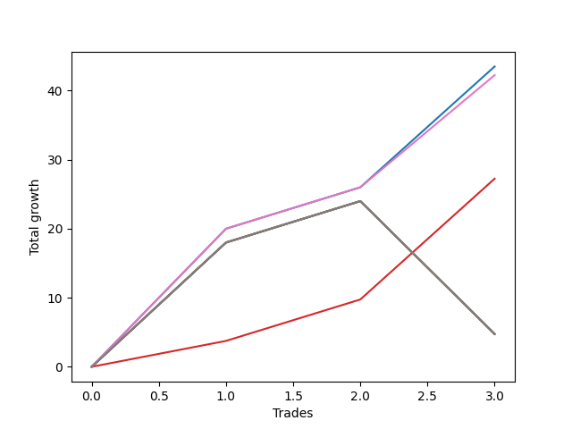

# Short Bulldog 001 
- Symbol: ES90d5mOut
- Date Range: 03/18/2022 - 07/08/2022
- Trading Period: 7:20-12:30
- Number of Trades: 3



| Name | Win Percent | Profit | Avg Profit / Trade |     | Name | Win Percent | Profit | Avg Profit / Trade |
| ---- | ----------- | ------ | ------------------ | --- | ---- | ----------- | ------ | ------------------ |
| Sorted By <br> Profit | | | | | Sorted By <br> Win Percentage ||||
| Zero | 100.00 | 21750.00 | 7250.00 |     | Zero | 100.00 | 21750.00 | 7250.00 |
| Six | 100.00 | 21125.00 | 7041.67 |     | Six | 100.00 | 21125.00 | 7041.67 |
| Three | 100.00 | 13625.00 | 4541.67 |     | Three | 100.00 | 13625.00 | 4541.67 |
| Seven | 66.67 | 2375.00 | 791.67 |     | Seven | 66.67 | 2375.00 | 791.67 |
| Five | 66.67 | 2375.00 | 791.67 |     | Five | 66.67 | 2375.00 | 791.67 |
| Four | 66.67 | 2375.00 | 791.67 |     | Four | 66.67 | 2375.00 | 791.67 |
| Two | 66.67 | 2375.00 | 791.67 |     | Two | 66.67 | 2375.00 | 791.67 |
| One | 66.67 | 2375.00 | 791.67 |     | One | 66.67 | 2375.00 | 791.67 |

### Test Zero
* Sell when price hits the middle line of the 20p bollinger
* No Stoploss
* Results:
```
Total Trades: 3
Percent Up: 0.00
Percent Down: 100.00
Total Points Moved Down: 43.50
Potential Profit: 21750.00
Total Points Ups: 0.00 Count Ups: 0
Total Points Downs: 43.50 Count Downs: 3
```

<details><summary>Trades</summary>

<code>In: 2022-05-24 09:20:00		Out: 2022-05-24 09:36:45		Total Position Time: 16:45		Total Move Down: 20.00		Total to Date: 20.00</code> <br />
<code>In: 2022-06-15 11:05:00		Out: 2022-06-15 11:06:10		Total Position Time: 01:10		Total Move Down: 6.00		Total to Date: 26.00</code> <br />
<code>In: 2022-06-15 11:55:00		Out: 2022-06-15 11:58:05		Total Position Time: 03:05		Total Move Down: 17.50		Total to Date: 43.50</code> <br />


</details>

### Test One
* Sell when the price hits the upper line of the 20p 1std bollinger
* No Stoploss
* Results:
```
Total Trades: 3
Percent Up: 33.33
Percent Down: 66.67
Total Points Moved Down: 4.75
Potential Profit: 2375.00
Total Points Ups: 19.25 Count Ups: 1
Total Points Downs: 24.00 Count Downs: 2
```

<details><summary>Trades</summary>

<code>In: 2022-05-24 09:20:00		Out: 2022-05-24 09:50:55		Total Position Time: 30:55		Total Move Down: 18.00		Total to Date: 18.00</code> <br />
<code>In: 2022-06-15 11:05:00		Out: 2022-06-15 11:06:10		Total Position Time: 01:10		Total Move Down: 6.00		Total to Date: 24.00</code> <br />
<code>In: 2022-06-15 11:55:00		Out: 2022-06-15 12:25:55		Total Position Time: 30:55		Total Move Down: -19.25		Total to Date: 4.75</code> <br />


</details>

### Test Two
* Sell when the price hits the upper line of the 20p 2std bollinger
* No Stoploss
* Results:
```
Total Trades: 3
Percent Up: 33.33
Percent Down: 66.67
Total Points Moved Down: 4.75
Potential Profit: 2375.00
Total Points Ups: 19.25 Count Ups: 1
Total Points Downs: 24.00 Count Downs: 2
```

<details><summary>Trades</summary>

<code>In: 2022-05-24 09:20:00		Out: 2022-05-24 09:50:55		Total Position Time: 30:55		Total Move Down: 18.00		Total to Date: 18.00</code> <br />
<code>In: 2022-06-15 11:05:00		Out: 2022-06-15 11:06:10		Total Position Time: 01:10		Total Move Down: 6.00		Total to Date: 24.00</code> <br />
<code>In: 2022-06-15 11:55:00		Out: 2022-06-15 12:25:55		Total Position Time: 30:55		Total Move Down: -19.25		Total to Date: 4.75</code> <br />


</details>

### Test Three
* Sell when price hits the middle line of the 50p bollinger
* No Stoploss
* Results:
```
Total Trades: 3
Percent Up: 0.00
Percent Down: 100.00
Total Points Moved Down: 27.25
Potential Profit: 13625.00
Total Points Ups: 0.00 Count Ups: 0
Total Points Downs: 27.25 Count Downs: 3
```

<details><summary>Trades</summary>

<code>In: 2022-05-24 09:20:00		Out: 2022-05-24 09:21:10		Total Position Time: 01:10		Total Move Down: 3.75		Total to Date: 3.75</code> <br />
<code>In: 2022-06-15 11:05:00		Out: 2022-06-15 11:06:10		Total Position Time: 01:10		Total Move Down: 6.00		Total to Date: 9.75</code> <br />
<code>In: 2022-06-15 11:55:00		Out: 2022-06-15 11:58:05		Total Position Time: 03:05		Total Move Down: 17.50		Total to Date: 27.25</code> <br />


</details>

### Test Four
* Sell when the price hits the upper line of the 50p 1std bollinger
* No Stoploss
* Results:
```
Total Trades: 3
Percent Up: 33.33
Percent Down: 66.67
Total Points Moved Down: 4.75
Potential Profit: 2375.00
Total Points Ups: 19.25 Count Ups: 1
Total Points Downs: 24.00 Count Downs: 2
```

<details><summary>Trades</summary>

<code>In: 2022-05-24 09:20:00		Out: 2022-05-24 09:50:55		Total Position Time: 30:55		Total Move Down: 18.00		Total to Date: 18.00</code> <br />
<code>In: 2022-06-15 11:05:00		Out: 2022-06-15 11:06:10		Total Position Time: 01:10		Total Move Down: 6.00		Total to Date: 24.00</code> <br />
<code>In: 2022-06-15 11:55:00		Out: 2022-06-15 12:25:55		Total Position Time: 30:55		Total Move Down: -19.25		Total to Date: 4.75</code> <br />


</details>

### Test Five
* Sell when the price hits the upper line of the 50p 2std bollinger
* No Stoploss
* Results:
```
Total Trades: 3
Percent Up: 33.33
Percent Down: 66.67
Total Points Moved Down: 4.75
Potential Profit: 2375.00
Total Points Ups: 19.25 Count Ups: 1
Total Points Downs: 24.00 Count Downs: 2
```

<details><summary>Trades</summary>

<code>In: 2022-05-24 09:20:00		Out: 2022-05-24 09:50:55		Total Position Time: 30:55		Total Move Down: 18.00		Total to Date: 18.00</code> <br />
<code>In: 2022-06-15 11:05:00		Out: 2022-06-15 11:06:10		Total Position Time: 01:10		Total Move Down: 6.00		Total to Date: 24.00</code> <br />
<code>In: 2022-06-15 11:55:00		Out: 2022-06-15 12:25:55		Total Position Time: 30:55		Total Move Down: -19.25		Total to Date: 4.75</code> <br />


</details>

### Test Six
* Sell when the price hits the middle line of the 1std VWAP
* No Stoploss
* Results:
```
Total Trades: 3
Percent Up: 0.00
Percent Down: 100.00
Total Points Moved Down: 42.25
Potential Profit: 21125.00
Total Points Ups: 0.00 Count Ups: 0
Total Points Downs: 42.25 Count Downs: 3
```

<details><summary>Trades</summary>

<code>In: 2022-05-24 09:20:00		Out: 2022-05-24 09:36:45		Total Position Time: 16:45		Total Move Down: 20.00		Total to Date: 20.00</code> <br />
<code>In: 2022-06-15 11:05:00		Out: 2022-06-15 11:06:10		Total Position Time: 01:10		Total Move Down: 6.00		Total to Date: 26.00</code> <br />
<code>In: 2022-06-15 11:55:00		Out: 2022-06-15 11:57:55		Total Position Time: 02:55		Total Move Down: 16.25		Total to Date: 42.25</code> <br />


</details>

### Test Seven
* Sell when the price hits the upper line of the 1std VWAP
* No Stoploss
* Results:
```
Total Trades: 3
Percent Up: 33.33
Percent Down: 66.67
Total Points Moved Down: 4.75
Potential Profit: 2375.00
Total Points Ups: 19.25 Count Ups: 1
Total Points Downs: 24.00 Count Downs: 2
```

<details><summary>Trades</summary>

<code>In: 2022-05-24 09:20:00		Out: 2022-05-24 09:50:55		Total Position Time: 30:55		Total Move Down: 18.00		Total to Date: 18.00</code> <br />
<code>In: 2022-06-15 11:05:00		Out: 2022-06-15 11:06:10		Total Position Time: 01:10		Total Move Down: 6.00		Total to Date: 24.00</code> <br />
<code>In: 2022-06-15 11:55:00		Out: 2022-06-15 12:25:55		Total Position Time: 30:55		Total Move Down: -19.25		Total to Date: 4.75</code> <br />


</details>