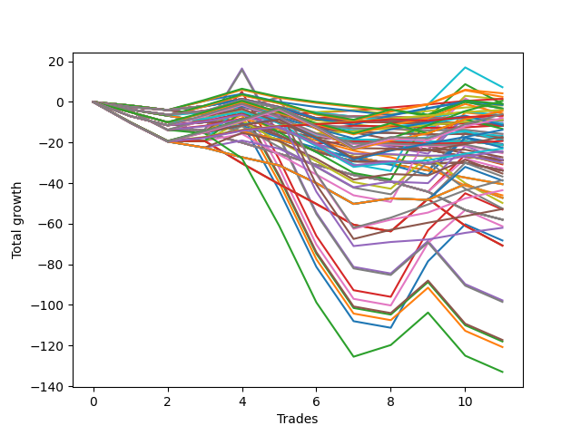

# Short Bulldog 003 
- Symbol: ES90d5m30m
- Date Range: 03/18/2022 - 07/08/2022
- Trading Period: 7:20-12:30
- Number of Trades: 11



| Name | Win Percent | Profit | Avg Profit / Trade | Avg Time / Trade |      | Name | Win Percent | Profit | Avg Profit / Trade | Avg Time / Trade |
| ---- | ----------- | ------ | ------------------ | ---------------- | ---- | ---- | ----------- | ------ | ------------------ | ---------------- |
| Sorted By <br> Profit | | | | | | Sorted By <br> Win Percentage ||||
| Fifty-Nine | 27.27 | 3625.00 | 329.55 | 00:00 |     | Eighty-One | 81.82 | 750.00 | 68.18 | 00:00 |
| Ninety-Four | 36.36 | 2125.00 | 193.18 | 00:00 |     | One Hundred Twenty-One | 81.82 | -2000.00 | -181.82 | 00:00 |
| One Hundred Four | 45.45 | 1250.00 | 113.64 | 00:00 |     | One Hundred Twenty-Six | 72.73 | -3250.00 | -295.45 | 00:00 |
| Eighty-One | 81.82 | 750.00 | 68.18 | 00:00 |     | One Hundred Twenty-Five | 63.64 | 250.00 | 22.73 | 00:00 |
| Eight | 18.18 | 625.00 | 56.82 | 00:00 |     | One Hundred One | 63.64 | -2000.00 | -181.82 | 00:00 |
| One Hundred Twenty-Five | 63.64 | 250.00 | 22.73 | 00:00 |     | One Hundred Twenty-Four | 63.64 | -2250.00 | -204.55 | 00:00 |
| Ninety-Five | 27.27 | -500.00 | -45.45 | 00:00 |     | One Hundred Eleven | 63.64 | -4375.00 | -397.73 | 00:00 |
| Sixty-Two | 27.27 | -500.00 | -45.45 | 00:00 |     | One Hundred Twenty-Three | 63.64 | -6875.00 | -625.00 | 00:00 |
| Ninety-Three | 36.36 | -750.00 | -68.18 | 00:00 |     | One Hundred Twenty-Two | 63.64 | -11500.00 | -1045.45 | 00:00 |
| Ninety-One | 54.55 | -875.00 | -79.55 | 00:00 |     | Eighty-Five | 63.64 | -19250.00 | -1750.00 | 00:00 |
| One Hundred Three | 45.45 | -1625.00 | -147.73 | 00:00 |     | Eighty-Four | 63.64 | -21750.00 | -1977.27 | 00:00 |
| One Hundred Five | 36.36 | -1625.00 | -147.73 | 00:00 |     | Eighty-Three | 63.64 | -26375.00 | -2397.73 | 00:00 |
| One Hundred Twenty-One | 81.82 | -2000.00 | -181.82 | 00:00 |     | Eighty-Two | 63.64 | -31000.00 | -2818.18 | 00:00 |
| One Hundred One | 63.64 | -2000.00 | -181.82 | 00:00 |     | Ninety-One | 54.55 | -875.00 | -79.55 | 00:00 |
| One Hundred Twenty-Four | 63.64 | -2250.00 | -204.55 | 00:00 |     | One Hundred Thirty | 54.55 | -3000.00 | -272.73 | 00:00 |
| One Hundred Fourteen | 45.45 | -2875.00 | -261.36 | 00:00 |     | One Hundred Twenty-Nine | 54.55 | -4000.00 | -363.64 | 00:00 |
| One Hundred Thirty | 54.55 | -3000.00 | -272.73 | 00:00 |     | One Hundred Twenty-Eight | 54.55 | -8625.00 | -784.09 | 00:00 |
| One Hundred Twenty-Six | 72.73 | -3250.00 | -295.45 | 00:00 |     | One Hundred Twenty-Seven | 54.55 | -12125.00 | -1102.27 | 00:00 |
| Ninety-Two | 36.36 | -3250.00 | -295.45 | 00:00 |     | One Hundred Four | 45.45 | 1250.00 | 113.64 | 00:00 |
| Ninety-Six | 45.45 | -3375.00 | -306.82 | 00:00 |     | One Hundred Three | 45.45 | -1625.00 | -147.73 | 00:00 |
| Eleven | 9.09 | -3500.00 | -318.18 | 00:00 |     | One Hundred Fourteen | 45.45 | -2875.00 | -261.36 | 00:00 |
| One Hundred Twenty-Nine | 54.55 | -4000.00 | -363.64 | 00:00 |     | Ninety-Six | 45.45 | -3375.00 | -306.82 | 00:00 |
| Fifty-Six | 27.27 | -4000.00 | -363.64 | 00:00 |     | One Hundred Two | 45.45 | -5375.00 | -488.64 | 00:00 |
| One Hundred Eleven | 63.64 | -4375.00 | -397.73 | 00:00 |     | One Hundred Thirteen | 45.45 | -5750.00 | -522.73 | 00:00 |
| Fourteen | 9.09 | -4500.00 | -409.09 | 00:00 |     | One Hundred Six | 45.45 | -5750.00 | -522.73 | 00:00 |
| One Hundred | 27.27 | -4625.00 | -420.45 | 00:00 |     | One Hundred Twelve | 45.45 | -9500.00 | -863.64 | 00:00 |
| Ninety-Nine | 27.27 | -4625.00 | -420.45 | 00:00 |     | One Hundred Sixteen | 45.45 | -9625.00 | -875.00 | 00:00 |
| Twenty-Four | 18.18 | -5250.00 | -477.27 | 00:00 |     | Ninety-Four | 36.36 | 2125.00 | 193.18 | 00:00 |
| One Hundred Two | 45.45 | -5375.00 | -488.64 | 00:00 |     | Ninety-Three | 36.36 | -750.00 | -68.18 | 00:00 |
| Ninety-Eight | 27.27 | -5625.00 | -511.36 | 00:00 |     | One Hundred Five | 36.36 | -1625.00 | -147.73 | 00:00 |
| Ninety-Seven | 27.27 | -5625.00 | -511.36 | 00:00 |     | Ninety-Two | 36.36 | -3250.00 | -295.45 | 00:00 |
| Sixten | 27.27 | -5625.00 | -511.36 | 00:00 |     | One Hundred Fifteen | 36.36 | -6625.00 | -602.27 | 00:00 |
| One Hundred Thirteen | 45.45 | -5750.00 | -522.73 | 00:00 |     | Fifty-Nine | 27.27 | 3625.00 | 329.55 | 00:00 |
| One Hundred Six | 45.45 | -5750.00 | -522.73 | 00:00 |     | Ninety-Five | 27.27 | -500.00 | -45.45 | 00:00 |
| Twenty-Three | 27.27 | -5875.00 | -534.09 | 00:00 |     | Sixty-Two | 27.27 | -500.00 | -45.45 | 00:00 |
| Twenty-Two | 27.27 | -5875.00 | -534.09 | 00:00 |     | Fifty-Six | 27.27 | -4000.00 | -363.64 | 00:00 |
| Twenty-One | 27.27 | -5875.00 | -534.09 | 00:00 |     | One Hundred | 27.27 | -4625.00 | -420.45 | 00:00 |
| Twenty | 27.27 | -5875.00 | -534.09 | 00:00 |     | Ninety-Nine | 27.27 | -4625.00 | -420.45 | 00:00 |
| Nineteen | 27.27 | -5875.00 | -534.09 | 00:00 |     | Ninety-Eight | 27.27 | -5625.00 | -511.36 | 00:00 |
| Eighteen | 27.27 | -5875.00 | -534.09 | 00:00 |     | Ninety-Seven | 27.27 | -5625.00 | -511.36 | 00:00 |
| Seventeen | 27.27 | -5875.00 | -534.09 | 00:00 |     | Sixten | 27.27 | -5625.00 | -511.36 | 00:00 |
| One Hundred Fifteen | 36.36 | -6625.00 | -602.27 | 00:00 |     | Twenty-Three | 27.27 | -5875.00 | -534.09 | 00:00 |
| One Hundred Twenty-Three | 63.64 | -6875.00 | -625.00 | 00:00 |     | Twenty-Two | 27.27 | -5875.00 | -534.09 | 00:00 |
| One Hundred Ten | 27.27 | -7875.00 | -715.91 | 00:00 |     | Twenty-One | 27.27 | -5875.00 | -534.09 | 00:00 |
| One Hundred Nine | 27.27 | -7875.00 | -715.91 | 00:00 |     | Twenty | 27.27 | -5875.00 | -534.09 | 00:00 |
| Nine | 9.09 | -8375.00 | -761.36 | 00:00 |     | Nineteen | 27.27 | -5875.00 | -534.09 | 00:00 |
| One Hundred Twenty-Eight | 54.55 | -8625.00 | -784.09 | 00:00 |     | Eighteen | 27.27 | -5875.00 | -534.09 | 00:00 |
| One Hundred Eight | 27.27 | -8875.00 | -806.82 | 00:00 |     | Seventeen | 27.27 | -5875.00 | -534.09 | 00:00 |
| One Hundred Seven | 27.27 | -8875.00 | -806.82 | 00:00 |     | One Hundred Ten | 27.27 | -7875.00 | -715.91 | 00:00 |
| Thirty-Two | 27.27 | -8875.00 | -806.82 | 00:00 |     | One Hundred Nine | 27.27 | -7875.00 | -715.91 | 00:00 |
| twenty-Seven | 9.09 | -9375.00 | -852.27 | 00:00 |     | One Hundred Eight | 27.27 | -8875.00 | -806.82 | 00:00 |
| One Hundred Twelve | 45.45 | -9500.00 | -863.64 | 00:00 |     | One Hundred Seven | 27.27 | -8875.00 | -806.82 | 00:00 |
| One Hundred Sixteen | 45.45 | -9625.00 | -875.00 | 00:00 |     | Thirty-Two | 27.27 | -8875.00 | -806.82 | 00:00 |
| Thirty | 9.09 | -10375.00 | -943.18 | 00:00 |     | One Hundred Twenty | 27.27 | -12375.00 | -1125.00 | 00:00 |
| Thirty-Nine | 18.18 | -10625.00 | -965.91 | 00:00 |     | One Hundred Ninteen | 27.27 | -12625.00 | -1147.73 | 00:00 |
| Thirty-Eight | 18.18 | -10625.00 | -965.91 | 00:00 |     | One Hundred Eighteen | 27.27 | -13625.00 | -1238.64 | 00:00 |
| Thirty-Seven | 18.18 | -10625.00 | -965.91 | 00:00 |     | Sixty-Four | 27.27 | -14250.00 | -1295.45 | 00:00 |
| Thirty-Six | 18.18 | -10625.00 | -965.91 | 00:00 |     | One Hundred Seventeen | 27.27 | -15000.00 | -1363.64 | 00:00 |
| Thirty-Five | 18.18 | -10625.00 | -965.91 | 00:00 |     | Forty-Eight | 27.27 | -15125.00 | -1375.00 | 00:00 |
| Thirty-Four | 18.18 | -10625.00 | -965.91 | 00:00 |     | Sixty-Five | 27.27 | -17625.00 | -1602.27 | 00:00 |
| Thirty-Three | 18.18 | -10625.00 | -965.91 | 00:00 |     | Three | 27.27 | -26500.00 | -2409.09 | 00:00 |
| Forty | 18.18 | -11250.00 | -1022.73 | 00:00 |     | Six | 27.27 | -30625.00 | -2784.09 | 00:00 |
| One Hundred Twenty-Two | 63.64 | -11500.00 | -1045.45 | 00:00 |     | Zero | 27.27 | -34125.00 | -3102.27 | 00:00 |
| One Hundred Twenty-Seven | 54.55 | -12125.00 | -1102.27 | 00:00 |     | Eight | 18.18 | 625.00 | 56.82 | 00:00 |
| One Hundred Twenty | 27.27 | -12375.00 | -1125.00 | 00:00 |     | Twenty-Four | 18.18 | -5250.00 | -477.27 | 00:00 |
| One Hundred Ninteen | 27.27 | -12625.00 | -1147.73 | 00:00 |     | Thirty-Nine | 18.18 | -10625.00 | -965.91 | 00:00 |
| One Hundred Eighteen | 27.27 | -13625.00 | -1238.64 | 00:00 |     | Thirty-Eight | 18.18 | -10625.00 | -965.91 | 00:00 |
| Sixty-Four | 27.27 | -14250.00 | -1295.45 | 00:00 |     | Thirty-Seven | 18.18 | -10625.00 | -965.91 | 00:00 |
| Twenty-Five | 9.09 | -14250.00 | -1295.45 | 00:00 |     | Thirty-Six | 18.18 | -10625.00 | -965.91 | 00:00 |
| Fifteen | 0.00 | -14375.00 | -1306.82 | 00:00 |     | Thirty-Five | 18.18 | -10625.00 | -965.91 | 00:00 |
| Thirteen | 0.00 | -14375.00 | -1306.82 | 00:00 |     | Thirty-Four | 18.18 | -10625.00 | -965.91 | 00:00 |
| Twelve | 0.00 | -14375.00 | -1306.82 | 00:00 |     | Thirty-Three | 18.18 | -10625.00 | -965.91 | 00:00 |
| Ten | 0.00 | -14375.00 | -1306.82 | 00:00 |     | Forty | 18.18 | -11250.00 | -1022.73 | 00:00 |
| One Hundred Seventeen | 27.27 | -15000.00 | -1363.64 | 00:00 |     | Fifty-Five | 18.18 | -16875.00 | -1534.09 | 00:00 |
| Forty-Eight | 27.27 | -15125.00 | -1375.00 | 00:00 |     | Fifty-Four | 18.18 | -16875.00 | -1534.09 | 00:00 |
| Forty-Three | 9.09 | -15375.00 | -1397.73 | 00:00 |     | Fifty-Three | 18.18 | -16875.00 | -1534.09 | 00:00 |
| Forty-Six | 9.09 | -16375.00 | -1488.64 | 00:00 |     | Fifty-Two | 18.18 | -16875.00 | -1534.09 | 00:00 |
| Fifty-Five | 18.18 | -16875.00 | -1534.09 | 00:00 |     | Fifty-One | 18.18 | -16875.00 | -1534.09 | 00:00 |
| Fifty-Four | 18.18 | -16875.00 | -1534.09 | 00:00 |     | Fifty | 18.18 | -16875.00 | -1534.09 | 00:00 |
| Fifty-Three | 18.18 | -16875.00 | -1534.09 | 00:00 |     | Forty-Nine | 18.18 | -16875.00 | -1534.09 | 00:00 |
| Fifty-Two | 18.18 | -16875.00 | -1534.09 | 00:00 |     | Sixty-Seven | 18.18 | -18375.00 | -1670.45 | 00:00 |
| Fifty-One | 18.18 | -16875.00 | -1534.09 | 00:00 |     | Seventy | 18.18 | -19375.00 | -1761.36 | 00:00 |
| Fifty | 18.18 | -16875.00 | -1534.09 | 00:00 |     | Seventy-One | 18.18 | -23625.00 | -2147.73 | 00:00 |
| Forty-Nine | 18.18 | -16875.00 | -1534.09 | 00:00 |     | Sixty-Nine | 18.18 | -23625.00 | -2147.73 | 00:00 |
| Sixty-Five | 27.27 | -17625.00 | -1602.27 | 00:00 |     | Sixty-Eight | 18.18 | -23625.00 | -2147.73 | 00:00 |
| Sixty-Seven | 18.18 | -18375.00 | -1670.45 | 00:00 |     | Sixty-Six | 18.18 | -23625.00 | -2147.73 | 00:00 |
| Eighty-Five | 63.64 | -19250.00 | -1750.00 | 00:00 |     | Fifty-Eight | 18.18 | -24875.00 | -2261.36 | 00:00 |
| Seventy | 18.18 | -19375.00 | -1761.36 | 00:00 |     | Fifty-Seven | 18.18 | -26250.00 | -2386.36 | 00:00 |
| Thirty-One | 0.00 | -20250.00 | -1840.91 | 00:00 |     | Four | 18.18 | -48875.00 | -4443.18 | 00:00 |
| Twenty-Nine | 0.00 | -20250.00 | -1840.91 | 00:00 |     | Seven | 18.18 | -49250.00 | -4477.27 | 00:00 |
| Twenty-Eight | 0.00 | -20250.00 | -1840.91 | 00:00 |     | Five | 18.18 | -58625.00 | -5329.55 | 00:00 |
| Twenty-Six | 0.00 | -20250.00 | -1840.91 | 00:00 |     | Two | 18.18 | -59000.00 | -5363.64 | 00:00 |
| Eighty-Four | 63.64 | -21750.00 | -1977.27 | 00:00 |     | One | 18.18 | -60375.00 | -5488.64 | 00:00 |
| Forty-One | 9.09 | -23000.00 | -2090.91 | 00:00 |     | Seventy-Three | 18.18 | -66500.00 | -6045.45 | 00:00 |
| Seventy-One | 18.18 | -23625.00 | -2147.73 | 00:00 |     | Eleven | 9.09 | -3500.00 | -318.18 | 00:00 |
| Sixty-Nine | 18.18 | -23625.00 | -2147.73 | 00:00 |     | Fourteen | 9.09 | -4500.00 | -409.09 | 00:00 |
| Sixty-Eight | 18.18 | -23625.00 | -2147.73 | 00:00 |     | Nine | 9.09 | -8375.00 | -761.36 | 00:00 |
| Sixty-Six | 18.18 | -23625.00 | -2147.73 | 00:00 |     | twenty-Seven | 9.09 | -9375.00 | -852.27 | 00:00 |
| Fifty-Eight | 18.18 | -24875.00 | -2261.36 | 00:00 |     | Thirty | 9.09 | -10375.00 | -943.18 | 00:00 |
| Fifty-Seven | 18.18 | -26250.00 | -2386.36 | 00:00 |     | Twenty-Five | 9.09 | -14250.00 | -1295.45 | 00:00 |
| Eighty-Three | 63.64 | -26375.00 | -2397.73 | 00:00 |     | Forty-Three | 9.09 | -15375.00 | -1397.73 | 00:00 |
| Three | 27.27 | -26500.00 | -2409.09 | 00:00 |     | Forty-Six | 9.09 | -16375.00 | -1488.64 | 00:00 |
| Forty-Seven | 0.00 | -29000.00 | -2636.36 | 00:00 |     | Forty-One | 9.09 | -23000.00 | -2090.91 | 00:00 |
| Forty-Five | 0.00 | -29000.00 | -2636.36 | 00:00 |     | Sixty-Three | 9.09 | -35375.00 | -3215.91 | 00:00 |
| Forty-Four | 0.00 | -29000.00 | -2636.36 | 00:00 |     | Sixty-One | 9.09 | -35375.00 | -3215.91 | 00:00 |
| Forty-Two | 0.00 | -29000.00 | -2636.36 | 00:00 |     | Sixty | 9.09 | -35375.00 | -3215.91 | 00:00 |
| Six | 27.27 | -30625.00 | -2784.09 | 00:00 |     | Fifteen | 0.00 | -14375.00 | -1306.82 | 00:00 |
| Eighty-Two | 63.64 | -31000.00 | -2818.18 | 00:00 |     | Thirteen | 0.00 | -14375.00 | -1306.82 | 00:00 |
| Zero | 27.27 | -34125.00 | -3102.27 | 00:00 |     | Twelve | 0.00 | -14375.00 | -1306.82 | 00:00 |
| Sixty-Three | 9.09 | -35375.00 | -3215.91 | 00:00 |     | Ten | 0.00 | -14375.00 | -1306.82 | 00:00 |
| Sixty-One | 9.09 | -35375.00 | -3215.91 | 00:00 |     | Thirty-One | 0.00 | -20250.00 | -1840.91 | 00:00 |
| Sixty | 9.09 | -35375.00 | -3215.91 | 00:00 |     | Twenty-Nine | 0.00 | -20250.00 | -1840.91 | 00:00 |
| Four | 18.18 | -48875.00 | -4443.18 | 00:00 |     | Twenty-Eight | 0.00 | -20250.00 | -1840.91 | 00:00 |
| Seven | 18.18 | -49250.00 | -4477.27 | 00:00 |     | Twenty-Six | 0.00 | -20250.00 | -1840.91 | 00:00 |
| Five | 18.18 | -58625.00 | -5329.55 | 00:00 |     | Forty-Seven | 0.00 | -29000.00 | -2636.36 | 00:00 |
| Two | 18.18 | -59000.00 | -5363.64 | 00:00 |     | Forty-Five | 0.00 | -29000.00 | -2636.36 | 00:00 |
| One | 18.18 | -60375.00 | -5488.64 | 00:00 |     | Forty-Four | 0.00 | -29000.00 | -2636.36 | 00:00 |
| Seventy-Three | 18.18 | -66500.00 | -6045.45 | 00:00 |     | Forty-Two | 0.00 | -29000.00 | -2636.36 | 00:00 |

## NO STOPLOSS

### Test Zero
* Sell when price hits the middle line of the 20p bollinger
* No Stoploss
* Results:
```
Total Trades: 11
Percent Up: 72.73
Percent Down: 27.27
Total Points Moved Down: -68.25
Potential Profit: -34125.00
Total Points Ups: 122.75 Count Ups: 8
Total Points Downs: 54.50 Count Downs: 3
```

<details><summary>Trades</summary>

<code>In: 2022-03-25 07:30:00		Out: 2022-03-25 07:59:55		Total Position Time: 29:55		Total Move Down: -4.50		Total to Date: -4.50</code> <br />
<code>In: 2022-03-28 12:05:00		Out: 2022-03-28 12:34:55		Total Position Time: 29:55		Total Move Down: -9.25		Total to Date: -13.75</code> <br />
<code>In: 2022-04-07 12:20:00		Out: 2022-04-07 12:49:55		Total Position Time: 29:55		Total Move Down: -0.00		Total to Date: -13.75</code> <br />
<code>In: 2022-05-04 11:10:00		Out: 2022-05-04 11:10:10		Total Position Time: 00:10		Total Move Down: 3.50		Total to Date: -10.25</code> <br />
<code>In: 2022-05-04 12:00:00		Out: 2022-05-04 12:29:55		Total Position Time: 29:55		Total Move Down: -33.25		Total to Date: -43.50</code> <br />
<code>In: 2022-05-04 12:20:00		Out: 2022-05-04 12:49:55		Total Position Time: 29:55		Total Move Down: -37.75		Total to Date: -81.25</code> <br />
<code>In: 2022-05-25 11:40:00		Out: 2022-05-25 12:09:55		Total Position Time: 29:55		Total Move Down: -26.75		Total to Date: -108.00</code> <br />
<code>In: 2022-05-31 09:10:00		Out: 2022-05-31 09:39:55		Total Position Time: 29:55		Total Move Down: -3.25		Total to Date: -111.25</code> <br />
<code>In: 2022-06-15 11:50:00		Out: 2022-06-15 11:58:10		Total Position Time: 08:10		Total Move Down: 32.75		Total to Date: -78.50</code> <br />
<code>In: 2022-06-15 11:55:00		Out: 2022-06-15 11:58:10		Total Position Time: 03:10		Total Move Down: 18.25		Total to Date: -60.25</code> <br />
<code>In: 2022-07-06 11:50:00		Out: 2022-07-06 12:19:55		Total Position Time: 29:55		Total Move Down: -8.00		Total to Date: -68.25</code> <br />


</details>

### Test One
* Sell when the price hits the upper line of the 20p 1std bollinger
* No Stoploss
* Results:
```
Total Trades: 11
Percent Up: 81.82
Percent Down: 18.18
Total Points Moved Down: -120.75
Potential Profit: -60375.00
Total Points Ups: 144.00 Count Ups: 9
Total Points Downs: 23.25 Count Downs: 2
```

<details><summary>Trades</summary>

<code>In: 2022-03-25 07:30:00		Out: 2022-03-25 07:59:55		Total Position Time: 29:55		Total Move Down: -4.50		Total to Date: -4.50</code> <br />
<code>In: 2022-03-28 12:05:00		Out: 2022-03-28 12:34:55		Total Position Time: 29:55		Total Move Down: -9.25		Total to Date: -13.75</code> <br />
<code>In: 2022-04-07 12:20:00		Out: 2022-04-07 12:49:55		Total Position Time: 29:55		Total Move Down: -0.00		Total to Date: -13.75</code> <br />
<code>In: 2022-05-04 11:10:00		Out: 2022-05-04 11:10:55		Total Position Time: 00:55		Total Move Down: 7.25		Total to Date: -6.50</code> <br />
<code>In: 2022-05-04 12:00:00		Out: 2022-05-04 12:29:55		Total Position Time: 29:55		Total Move Down: -33.25		Total to Date: -39.75</code> <br />
<code>In: 2022-05-04 12:20:00		Out: 2022-05-04 12:49:55		Total Position Time: 29:55		Total Move Down: -37.75		Total to Date: -77.50</code> <br />
<code>In: 2022-05-25 11:40:00		Out: 2022-05-25 12:09:55		Total Position Time: 29:55		Total Move Down: -26.75		Total to Date: -104.25</code> <br />
<code>In: 2022-05-31 09:10:00		Out: 2022-05-31 09:39:55		Total Position Time: 29:55		Total Move Down: -3.25		Total to Date: -107.50</code> <br />
<code>In: 2022-06-15 11:50:00		Out: 2022-06-15 12:19:55		Total Position Time: 29:55		Total Move Down: 16.00		Total to Date: -91.50</code> <br />
<code>In: 2022-06-15 11:55:00		Out: 2022-06-15 12:24:55		Total Position Time: 29:55		Total Move Down: -21.25		Total to Date: -112.75</code> <br />
<code>In: 2022-07-06 11:50:00		Out: 2022-07-06 12:19:55		Total Position Time: 29:55		Total Move Down: -8.00		Total to Date: -120.75</code> <br />


</details>

### Test Two
* Sell when the price hits the upper line of the 20p 2std bollinger
* No Stoploss
* Results:
```
Total Trades: 11
Percent Up: 81.82
Percent Down: 18.18
Total Points Moved Down: -118.00
Potential Profit: -59000.00
Total Points Ups: 144.00 Count Ups: 9
Total Points Downs: 26.00 Count Downs: 2
```

<details><summary>Trades</summary>

<code>In: 2022-03-25 07:30:00		Out: 2022-03-25 07:59:55		Total Position Time: 29:55		Total Move Down: -4.50		Total to Date: -4.50</code> <br />
<code>In: 2022-03-28 12:05:00		Out: 2022-03-28 12:34:55		Total Position Time: 29:55		Total Move Down: -9.25		Total to Date: -13.75</code> <br />
<code>In: 2022-04-07 12:20:00		Out: 2022-04-07 12:49:55		Total Position Time: 29:55		Total Move Down: -0.00		Total to Date: -13.75</code> <br />
<code>In: 2022-05-04 11:10:00		Out: 2022-05-04 11:18:35		Total Position Time: 08:35		Total Move Down: 10.00		Total to Date: -3.75</code> <br />
<code>In: 2022-05-04 12:00:00		Out: 2022-05-04 12:29:55		Total Position Time: 29:55		Total Move Down: -33.25		Total to Date: -37.00</code> <br />
<code>In: 2022-05-04 12:20:00		Out: 2022-05-04 12:49:55		Total Position Time: 29:55		Total Move Down: -37.75		Total to Date: -74.75</code> <br />
<code>In: 2022-05-25 11:40:00		Out: 2022-05-25 12:09:55		Total Position Time: 29:55		Total Move Down: -26.75		Total to Date: -101.50</code> <br />
<code>In: 2022-05-31 09:10:00		Out: 2022-05-31 09:39:55		Total Position Time: 29:55		Total Move Down: -3.25		Total to Date: -104.75</code> <br />
<code>In: 2022-06-15 11:50:00		Out: 2022-06-15 12:19:55		Total Position Time: 29:55		Total Move Down: 16.00		Total to Date: -88.75</code> <br />
<code>In: 2022-06-15 11:55:00		Out: 2022-06-15 12:24:55		Total Position Time: 29:55		Total Move Down: -21.25		Total to Date: -110.00</code> <br />
<code>In: 2022-07-06 11:50:00		Out: 2022-07-06 12:19:55		Total Position Time: 29:55		Total Move Down: -8.00		Total to Date: -118.00</code> <br />


</details>

### Test Three
* Sell when price hits the middle line of the 50p bollinger
* No Stoploss
* Results:
```
Total Trades: 11
Percent Up: 72.73
Percent Down: 27.27
Total Points Moved Down: -53.00
Potential Profit: -26500.00
Total Points Ups: 122.75 Count Ups: 8
Total Points Downs: 69.75 Count Downs: 3
```

<details><summary>Trades</summary>

<code>In: 2022-03-25 07:30:00		Out: 2022-03-25 07:59:55		Total Position Time: 29:55		Total Move Down: -4.50		Total to Date: -4.50</code> <br />
<code>In: 2022-03-28 12:05:00		Out: 2022-03-28 12:34:55		Total Position Time: 29:55		Total Move Down: -9.25		Total to Date: -13.75</code> <br />
<code>In: 2022-04-07 12:20:00		Out: 2022-04-07 12:49:55		Total Position Time: 29:55		Total Move Down: -0.00		Total to Date: -13.75</code> <br />
<code>In: 2022-05-04 11:10:00		Out: 2022-05-04 11:20:50		Total Position Time: 10:50		Total Move Down: 18.75		Total to Date: 5.00</code> <br />
<code>In: 2022-05-04 12:00:00		Out: 2022-05-04 12:29:55		Total Position Time: 29:55		Total Move Down: -33.25		Total to Date: -28.25</code> <br />
<code>In: 2022-05-04 12:20:00		Out: 2022-05-04 12:49:55		Total Position Time: 29:55		Total Move Down: -37.75		Total to Date: -66.00</code> <br />
<code>In: 2022-05-25 11:40:00		Out: 2022-05-25 12:09:55		Total Position Time: 29:55		Total Move Down: -26.75		Total to Date: -92.75</code> <br />
<code>In: 2022-05-31 09:10:00		Out: 2022-05-31 09:39:55		Total Position Time: 29:55		Total Move Down: -3.25		Total to Date: -96.00</code> <br />
<code>In: 2022-06-15 11:50:00		Out: 2022-06-15 11:58:10		Total Position Time: 08:10		Total Move Down: 32.75		Total to Date: -63.25</code> <br />
<code>In: 2022-06-15 11:55:00		Out: 2022-06-15 11:58:10		Total Position Time: 03:10		Total Move Down: 18.25		Total to Date: -45.00</code> <br />
<code>In: 2022-07-06 11:50:00		Out: 2022-07-06 12:19:55		Total Position Time: 29:55		Total Move Down: -8.00		Total to Date: -53.00</code> <br />


</details>

### Test Four
* Sell when the price hits the upper line of the 50p 1std bollinger
* No Stoploss
* Results:
```
Total Trades: 11
Percent Up: 81.82
Percent Down: 18.18
Total Points Moved Down: -97.75
Potential Profit: -48875.00
Total Points Ups: 144.00 Count Ups: 9
Total Points Downs: 46.25 Count Downs: 2
```

<details><summary>Trades</summary>

<code>In: 2022-03-25 07:30:00		Out: 2022-03-25 07:59:55		Total Position Time: 29:55		Total Move Down: -4.50		Total to Date: -4.50</code> <br />
<code>In: 2022-03-28 12:05:00		Out: 2022-03-28 12:34:55		Total Position Time: 29:55		Total Move Down: -9.25		Total to Date: -13.75</code> <br />
<code>In: 2022-04-07 12:20:00		Out: 2022-04-07 12:49:55		Total Position Time: 29:55		Total Move Down: -0.00		Total to Date: -13.75</code> <br />
<code>In: 2022-05-04 11:10:00		Out: 2022-05-04 11:34:10		Total Position Time: 24:10		Total Move Down: 30.25		Total to Date: 16.50</code> <br />
<code>In: 2022-05-04 12:00:00		Out: 2022-05-04 12:29:55		Total Position Time: 29:55		Total Move Down: -33.25		Total to Date: -16.75</code> <br />
<code>In: 2022-05-04 12:20:00		Out: 2022-05-04 12:49:55		Total Position Time: 29:55		Total Move Down: -37.75		Total to Date: -54.50</code> <br />
<code>In: 2022-05-25 11:40:00		Out: 2022-05-25 12:09:55		Total Position Time: 29:55		Total Move Down: -26.75		Total to Date: -81.25</code> <br />
<code>In: 2022-05-31 09:10:00		Out: 2022-05-31 09:39:55		Total Position Time: 29:55		Total Move Down: -3.25		Total to Date: -84.50</code> <br />
<code>In: 2022-06-15 11:50:00		Out: 2022-06-15 12:19:55		Total Position Time: 29:55		Total Move Down: 16.00		Total to Date: -68.50</code> <br />
<code>In: 2022-06-15 11:55:00		Out: 2022-06-15 12:24:55		Total Position Time: 29:55		Total Move Down: -21.25		Total to Date: -89.75</code> <br />
<code>In: 2022-07-06 11:50:00		Out: 2022-07-06 12:19:55		Total Position Time: 29:55		Total Move Down: -8.00		Total to Date: -97.75</code> <br />


</details>

### Test Five
* Sell when the price hits the upper line of the 50p 2std bollinger
* No Stoploss
* Results:
```
Total Trades: 11
Percent Up: 81.82
Percent Down: 18.18
Total Points Moved Down: -117.25
Potential Profit: -58625.00
Total Points Ups: 144.00 Count Ups: 9
Total Points Downs: 26.75 Count Downs: 2
```

<details><summary>Trades</summary>

<code>In: 2022-03-25 07:30:00		Out: 2022-03-25 07:59:55		Total Position Time: 29:55		Total Move Down: -4.50		Total to Date: -4.50</code> <br />
<code>In: 2022-03-28 12:05:00		Out: 2022-03-28 12:34:55		Total Position Time: 29:55		Total Move Down: -9.25		Total to Date: -13.75</code> <br />
<code>In: 2022-04-07 12:20:00		Out: 2022-04-07 12:49:55		Total Position Time: 29:55		Total Move Down: -0.00		Total to Date: -13.75</code> <br />
<code>In: 2022-05-04 11:10:00		Out: 2022-05-04 11:39:55		Total Position Time: 29:55		Total Move Down: 10.75		Total to Date: -3.00</code> <br />
<code>In: 2022-05-04 12:00:00		Out: 2022-05-04 12:29:55		Total Position Time: 29:55		Total Move Down: -33.25		Total to Date: -36.25</code> <br />
<code>In: 2022-05-04 12:20:00		Out: 2022-05-04 12:49:55		Total Position Time: 29:55		Total Move Down: -37.75		Total to Date: -74.00</code> <br />
<code>In: 2022-05-25 11:40:00		Out: 2022-05-25 12:09:55		Total Position Time: 29:55		Total Move Down: -26.75		Total to Date: -100.75</code> <br />
<code>In: 2022-05-31 09:10:00		Out: 2022-05-31 09:39:55		Total Position Time: 29:55		Total Move Down: -3.25		Total to Date: -104.00</code> <br />
<code>In: 2022-06-15 11:50:00		Out: 2022-06-15 12:19:55		Total Position Time: 29:55		Total Move Down: 16.00		Total to Date: -88.00</code> <br />
<code>In: 2022-06-15 11:55:00		Out: 2022-06-15 12:24:55		Total Position Time: 29:55		Total Move Down: -21.25		Total to Date: -109.25</code> <br />
<code>In: 2022-07-06 11:50:00		Out: 2022-07-06 12:19:55		Total Position Time: 29:55		Total Move Down: -8.00		Total to Date: -117.25</code> <br />


</details>

### Test Six
* Sell when the price hits the middle line of the 1std VWAP
* No Stoploss
* Results:
```
Total Trades: 11
Percent Up: 72.73
Percent Down: 27.27
Total Points Moved Down: -61.25
Potential Profit: -30625.00
Total Points Ups: 122.75 Count Ups: 8
Total Points Downs: 61.50 Count Downs: 3
```

<details><summary>Trades</summary>

<code>In: 2022-03-25 07:30:00		Out: 2022-03-25 07:59:55		Total Position Time: 29:55		Total Move Down: -4.50		Total to Date: -4.50</code> <br />
<code>In: 2022-03-28 12:05:00		Out: 2022-03-28 12:34:55		Total Position Time: 29:55		Total Move Down: -9.25		Total to Date: -13.75</code> <br />
<code>In: 2022-04-07 12:20:00		Out: 2022-04-07 12:49:55		Total Position Time: 29:55		Total Move Down: -0.00		Total to Date: -13.75</code> <br />
<code>In: 2022-05-04 11:10:00		Out: 2022-05-04 11:20:20		Total Position Time: 10:20		Total Move Down: 14.50		Total to Date: 0.75</code> <br />
<code>In: 2022-05-04 12:00:00		Out: 2022-05-04 12:29:55		Total Position Time: 29:55		Total Move Down: -33.25		Total to Date: -32.50</code> <br />
<code>In: 2022-05-04 12:20:00		Out: 2022-05-04 12:49:55		Total Position Time: 29:55		Total Move Down: -37.75		Total to Date: -70.25</code> <br />
<code>In: 2022-05-25 11:40:00		Out: 2022-05-25 12:09:55		Total Position Time: 29:55		Total Move Down: -26.75		Total to Date: -97.00</code> <br />
<code>In: 2022-05-31 09:10:00		Out: 2022-05-31 09:39:55		Total Position Time: 29:55		Total Move Down: -3.25		Total to Date: -100.25</code> <br />
<code>In: 2022-06-15 11:50:00		Out: 2022-06-15 11:57:55		Total Position Time: 07:55		Total Move Down: 30.75		Total to Date: -69.50</code> <br />
<code>In: 2022-06-15 11:55:00		Out: 2022-06-15 11:57:55		Total Position Time: 02:55		Total Move Down: 16.25		Total to Date: -53.25</code> <br />
<code>In: 2022-07-06 11:50:00		Out: 2022-07-06 12:19:55		Total Position Time: 29:55		Total Move Down: -8.00		Total to Date: -61.25</code> <br />


</details>

### Test Seven
* Sell when the price hits the upper line of the 1std VWAP
* No Stoploss
* Results:
```
Total Trades: 11
Percent Up: 81.82
Percent Down: 18.18
Total Points Moved Down: -98.50
Potential Profit: -49250.00
Total Points Ups: 144.00 Count Ups: 9
Total Points Downs: 45.50 Count Downs: 2
```

<details><summary>Trades</summary>

<code>In: 2022-03-25 07:30:00		Out: 2022-03-25 07:59:55		Total Position Time: 29:55		Total Move Down: -4.50		Total to Date: -4.50</code> <br />
<code>In: 2022-03-28 12:05:00		Out: 2022-03-28 12:34:55		Total Position Time: 29:55		Total Move Down: -9.25		Total to Date: -13.75</code> <br />
<code>In: 2022-04-07 12:20:00		Out: 2022-04-07 12:49:55		Total Position Time: 29:55		Total Move Down: -0.00		Total to Date: -13.75</code> <br />
<code>In: 2022-05-04 11:10:00		Out: 2022-05-04 11:34:05		Total Position Time: 24:05		Total Move Down: 29.50		Total to Date: 15.75</code> <br />
<code>In: 2022-05-04 12:00:00		Out: 2022-05-04 12:29:55		Total Position Time: 29:55		Total Move Down: -33.25		Total to Date: -17.50</code> <br />
<code>In: 2022-05-04 12:20:00		Out: 2022-05-04 12:49:55		Total Position Time: 29:55		Total Move Down: -37.75		Total to Date: -55.25</code> <br />
<code>In: 2022-05-25 11:40:00		Out: 2022-05-25 12:09:55		Total Position Time: 29:55		Total Move Down: -26.75		Total to Date: -82.00</code> <br />
<code>In: 2022-05-31 09:10:00		Out: 2022-05-31 09:39:55		Total Position Time: 29:55		Total Move Down: -3.25		Total to Date: -85.25</code> <br />
<code>In: 2022-06-15 11:50:00		Out: 2022-06-15 12:19:55		Total Position Time: 29:55		Total Move Down: 16.00		Total to Date: -69.25</code> <br />
<code>In: 2022-06-15 11:55:00		Out: 2022-06-15 12:24:55		Total Position Time: 29:55		Total Move Down: -21.25		Total to Date: -90.50</code> <br />
<code>In: 2022-07-06 11:50:00		Out: 2022-07-06 12:19:55		Total Position Time: 29:55		Total Move Down: -8.00		Total to Date: -98.50</code> <br />


</details>

## STOPLOSS OF 2

### Test Eight
* Sell when price hits the middle line of the 20p bollinger
* Stoploss is -2 points
* Results:
```
Total Trades: 11
Percent Up: 81.82
Percent Down: 18.18
Total Points Moved Down: 1.25
Potential Profit: 625.00
Total Points Ups: 20.50 Count Ups: 9
Total Points Downs: 21.75 Count Downs: 2
```

<details><summary>Trades</summary>

<code>In: 2022-03-25 07:30:00		Out: 2022-03-25 07:32:25		Total Position Time: 02:25		Total Move Down: -1.75		Total to Date: -1.75</code> <br />
<code>In: 2022-03-28 12:05:00		Out: 2022-03-28 12:09:35		Total Position Time: 04:35		Total Move Down: -2.25		Total to Date: -4.00</code> <br />
<code>In: 2022-04-07 12:20:00		Out: 2022-04-07 12:35:10		Total Position Time: 15:10		Total Move Down: -2.00		Total to Date: -6.00</code> <br />
<code>In: 2022-05-04 11:10:00		Out: 2022-05-04 11:10:10		Total Position Time: 00:10		Total Move Down: 3.50		Total to Date: -2.50</code> <br />
<code>In: 2022-05-04 12:00:00		Out: 2022-05-04 12:00:20		Total Position Time: 00:20		Total Move Down: -4.00		Total to Date: -6.50</code> <br />
<code>In: 2022-05-04 12:20:00		Out: 2022-05-04 12:20:10		Total Position Time: 00:10		Total Move Down: -2.50		Total to Date: -9.00</code> <br />
<code>In: 2022-05-25 11:40:00		Out: 2022-05-25 11:40:30		Total Position Time: 00:30		Total Move Down: -2.00		Total to Date: -11.00</code> <br />
<code>In: 2022-05-31 09:10:00		Out: 2022-05-31 09:11:25		Total Position Time: 01:25		Total Move Down: -2.00		Total to Date: -13.00</code> <br />
<code>In: 2022-06-15 11:50:00		Out: 2022-06-15 11:50:35		Total Position Time: 00:35		Total Move Down: -2.25		Total to Date: -15.25</code> <br />
<code>In: 2022-06-15 11:55:00		Out: 2022-06-15 11:58:10		Total Position Time: 03:10		Total Move Down: 18.25		Total to Date: 3.00</code> <br />
<code>In: 2022-07-06 11:50:00		Out: 2022-07-06 11:51:40		Total Position Time: 01:40		Total Move Down: -1.75		Total to Date: 1.25</code> <br />


</details>

### Test Nine
* Sell when the price hits the upper line of the 20p 1std bollinger
* Stoploss is -2 points
* Results:
```
Total Trades: 11
Percent Up: 90.91
Percent Down: 9.09
Total Points Moved Down: -16.75
Potential Profit: -8375.00
Total Points Ups: 24.00 Count Ups: 10
Total Points Downs: 7.25 Count Downs: 1
```

<details><summary>Trades</summary>

<code>In: 2022-03-25 07:30:00		Out: 2022-03-25 07:32:25		Total Position Time: 02:25		Total Move Down: -1.75		Total to Date: -1.75</code> <br />
<code>In: 2022-03-28 12:05:00		Out: 2022-03-28 12:09:35		Total Position Time: 04:35		Total Move Down: -2.25		Total to Date: -4.00</code> <br />
<code>In: 2022-04-07 12:20:00		Out: 2022-04-07 12:35:10		Total Position Time: 15:10		Total Move Down: -2.00		Total to Date: -6.00</code> <br />
<code>In: 2022-05-04 11:10:00		Out: 2022-05-04 11:10:55		Total Position Time: 00:55		Total Move Down: 7.25		Total to Date: 1.25</code> <br />
<code>In: 2022-05-04 12:00:00		Out: 2022-05-04 12:00:20		Total Position Time: 00:20		Total Move Down: -4.00		Total to Date: -2.75</code> <br />
<code>In: 2022-05-04 12:20:00		Out: 2022-05-04 12:20:10		Total Position Time: 00:10		Total Move Down: -2.50		Total to Date: -5.25</code> <br />
<code>In: 2022-05-25 11:40:00		Out: 2022-05-25 11:40:30		Total Position Time: 00:30		Total Move Down: -2.00		Total to Date: -7.25</code> <br />
<code>In: 2022-05-31 09:10:00		Out: 2022-05-31 09:11:25		Total Position Time: 01:25		Total Move Down: -2.00		Total to Date: -9.25</code> <br />
<code>In: 2022-06-15 11:50:00		Out: 2022-06-15 11:50:35		Total Position Time: 00:35		Total Move Down: -2.25		Total to Date: -11.50</code> <br />
<code>In: 2022-06-15 11:55:00		Out: 2022-06-15 12:00:50		Total Position Time: 05:50		Total Move Down: -3.50		Total to Date: -15.00</code> <br />
<code>In: 2022-07-06 11:50:00		Out: 2022-07-06 11:51:40		Total Position Time: 01:40		Total Move Down: -1.75		Total to Date: -16.75</code> <br />


</details>

### Test Ten
* Sell when the price hits the upper line of the 20p 2std bollinger
* Stoploss is -2 points
* Results:
```
Total Trades: 11
Percent Up: 100.00
Percent Down: 0.00
Total Points Moved Down: -28.75
Potential Profit: -14375.00
Total Points Ups: 28.75 Count Ups: 11
Total Points Downs: 0.00 Count Downs: 0
```

<details><summary>Trades</summary>

<code>In: 2022-03-25 07:30:00		Out: 2022-03-25 07:32:25		Total Position Time: 02:25		Total Move Down: -1.75		Total to Date: -1.75</code> <br />
<code>In: 2022-03-28 12:05:00		Out: 2022-03-28 12:09:35		Total Position Time: 04:35		Total Move Down: -2.25		Total to Date: -4.00</code> <br />
<code>In: 2022-04-07 12:20:00		Out: 2022-04-07 12:35:10		Total Position Time: 15:10		Total Move Down: -2.00		Total to Date: -6.00</code> <br />
<code>In: 2022-05-04 11:10:00		Out: 2022-05-04 11:11:45		Total Position Time: 01:45		Total Move Down: -4.75		Total to Date: -10.75</code> <br />
<code>In: 2022-05-04 12:00:00		Out: 2022-05-04 12:00:20		Total Position Time: 00:20		Total Move Down: -4.00		Total to Date: -14.75</code> <br />
<code>In: 2022-05-04 12:20:00		Out: 2022-05-04 12:20:10		Total Position Time: 00:10		Total Move Down: -2.50		Total to Date: -17.25</code> <br />
<code>In: 2022-05-25 11:40:00		Out: 2022-05-25 11:40:30		Total Position Time: 00:30		Total Move Down: -2.00		Total to Date: -19.25</code> <br />
<code>In: 2022-05-31 09:10:00		Out: 2022-05-31 09:11:25		Total Position Time: 01:25		Total Move Down: -2.00		Total to Date: -21.25</code> <br />
<code>In: 2022-06-15 11:50:00		Out: 2022-06-15 11:50:35		Total Position Time: 00:35		Total Move Down: -2.25		Total to Date: -23.50</code> <br />
<code>In: 2022-06-15 11:55:00		Out: 2022-06-15 12:00:50		Total Position Time: 05:50		Total Move Down: -3.50		Total to Date: -27.00</code> <br />
<code>In: 2022-07-06 11:50:00		Out: 2022-07-06 11:51:40		Total Position Time: 01:40		Total Move Down: -1.75		Total to Date: -28.75</code> <br />


</details>

### Test Eleven
* Sell when price hits the middle line of the 50p bollinger
* Stoploss is -2 points
* Results:
```
Total Trades: 11
Percent Up: 90.91
Percent Down: 9.09
Total Points Moved Down: -7.00
Potential Profit: -3500.00
Total Points Ups: 25.25 Count Ups: 10
Total Points Downs: 18.25 Count Downs: 1
```

<details><summary>Trades</summary>

<code>In: 2022-03-25 07:30:00		Out: 2022-03-25 07:32:25		Total Position Time: 02:25		Total Move Down: -1.75		Total to Date: -1.75</code> <br />
<code>In: 2022-03-28 12:05:00		Out: 2022-03-28 12:09:35		Total Position Time: 04:35		Total Move Down: -2.25		Total to Date: -4.00</code> <br />
<code>In: 2022-04-07 12:20:00		Out: 2022-04-07 12:35:10		Total Position Time: 15:10		Total Move Down: -2.00		Total to Date: -6.00</code> <br />
<code>In: 2022-05-04 11:10:00		Out: 2022-05-04 11:11:45		Total Position Time: 01:45		Total Move Down: -4.75		Total to Date: -10.75</code> <br />
<code>In: 2022-05-04 12:00:00		Out: 2022-05-04 12:00:20		Total Position Time: 00:20		Total Move Down: -4.00		Total to Date: -14.75</code> <br />
<code>In: 2022-05-04 12:20:00		Out: 2022-05-04 12:20:10		Total Position Time: 00:10		Total Move Down: -2.50		Total to Date: -17.25</code> <br />
<code>In: 2022-05-25 11:40:00		Out: 2022-05-25 11:40:30		Total Position Time: 00:30		Total Move Down: -2.00		Total to Date: -19.25</code> <br />
<code>In: 2022-05-31 09:10:00		Out: 2022-05-31 09:11:25		Total Position Time: 01:25		Total Move Down: -2.00		Total to Date: -21.25</code> <br />
<code>In: 2022-06-15 11:50:00		Out: 2022-06-15 11:50:35		Total Position Time: 00:35		Total Move Down: -2.25		Total to Date: -23.50</code> <br />
<code>In: 2022-06-15 11:55:00		Out: 2022-06-15 11:58:10		Total Position Time: 03:10		Total Move Down: 18.25		Total to Date: -5.25</code> <br />
<code>In: 2022-07-06 11:50:00		Out: 2022-07-06 11:51:40		Total Position Time: 01:40		Total Move Down: -1.75		Total to Date: -7.00</code> <br />


</details>

### Test Twelve
* Sell when the price hits the upper line of the 50p 1std bollinger
* Stoploss is -2 points
* Results:
```
Total Trades: 11
Percent Up: 100.00
Percent Down: 0.00
Total Points Moved Down: -28.75
Potential Profit: -14375.00
Total Points Ups: 28.75 Count Ups: 11
Total Points Downs: 0.00 Count Downs: 0
```

<details><summary>Trades</summary>

<code>In: 2022-03-25 07:30:00		Out: 2022-03-25 07:32:25		Total Position Time: 02:25		Total Move Down: -1.75		Total to Date: -1.75</code> <br />
<code>In: 2022-03-28 12:05:00		Out: 2022-03-28 12:09:35		Total Position Time: 04:35		Total Move Down: -2.25		Total to Date: -4.00</code> <br />
<code>In: 2022-04-07 12:20:00		Out: 2022-04-07 12:35:10		Total Position Time: 15:10		Total Move Down: -2.00		Total to Date: -6.00</code> <br />
<code>In: 2022-05-04 11:10:00		Out: 2022-05-04 11:11:45		Total Position Time: 01:45		Total Move Down: -4.75		Total to Date: -10.75</code> <br />
<code>In: 2022-05-04 12:00:00		Out: 2022-05-04 12:00:20		Total Position Time: 00:20		Total Move Down: -4.00		Total to Date: -14.75</code> <br />
<code>In: 2022-05-04 12:20:00		Out: 2022-05-04 12:20:10		Total Position Time: 00:10		Total Move Down: -2.50		Total to Date: -17.25</code> <br />
<code>In: 2022-05-25 11:40:00		Out: 2022-05-25 11:40:30		Total Position Time: 00:30		Total Move Down: -2.00		Total to Date: -19.25</code> <br />
<code>In: 2022-05-31 09:10:00		Out: 2022-05-31 09:11:25		Total Position Time: 01:25		Total Move Down: -2.00		Total to Date: -21.25</code> <br />
<code>In: 2022-06-15 11:50:00		Out: 2022-06-15 11:50:35		Total Position Time: 00:35		Total Move Down: -2.25		Total to Date: -23.50</code> <br />
<code>In: 2022-06-15 11:55:00		Out: 2022-06-15 12:00:50		Total Position Time: 05:50		Total Move Down: -3.50		Total to Date: -27.00</code> <br />
<code>In: 2022-07-06 11:50:00		Out: 2022-07-06 11:51:40		Total Position Time: 01:40		Total Move Down: -1.75		Total to Date: -28.75</code> <br />


</details>

### Test Thirteen
* Sell when the price hits the upper line of the 50p 2std bollinger
* Stoploss is -2 points
* Results:
```
Total Trades: 11
Percent Up: 100.00
Percent Down: 0.00
Total Points Moved Down: -28.75
Potential Profit: -14375.00
Total Points Ups: 28.75 Count Ups: 11
Total Points Downs: 0.00 Count Downs: 0
```

<details><summary>Trades</summary>

<code>In: 2022-03-25 07:30:00		Out: 2022-03-25 07:32:25		Total Position Time: 02:25		Total Move Down: -1.75		Total to Date: -1.75</code> <br />
<code>In: 2022-03-28 12:05:00		Out: 2022-03-28 12:09:35		Total Position Time: 04:35		Total Move Down: -2.25		Total to Date: -4.00</code> <br />
<code>In: 2022-04-07 12:20:00		Out: 2022-04-07 12:35:10		Total Position Time: 15:10		Total Move Down: -2.00		Total to Date: -6.00</code> <br />
<code>In: 2022-05-04 11:10:00		Out: 2022-05-04 11:11:45		Total Position Time: 01:45		Total Move Down: -4.75		Total to Date: -10.75</code> <br />
<code>In: 2022-05-04 12:00:00		Out: 2022-05-04 12:00:20		Total Position Time: 00:20		Total Move Down: -4.00		Total to Date: -14.75</code> <br />
<code>In: 2022-05-04 12:20:00		Out: 2022-05-04 12:20:10		Total Position Time: 00:10		Total Move Down: -2.50		Total to Date: -17.25</code> <br />
<code>In: 2022-05-25 11:40:00		Out: 2022-05-25 11:40:30		Total Position Time: 00:30		Total Move Down: -2.00		Total to Date: -19.25</code> <br />
<code>In: 2022-05-31 09:10:00		Out: 2022-05-31 09:11:25		Total Position Time: 01:25		Total Move Down: -2.00		Total to Date: -21.25</code> <br />
<code>In: 2022-06-15 11:50:00		Out: 2022-06-15 11:50:35		Total Position Time: 00:35		Total Move Down: -2.25		Total to Date: -23.50</code> <br />
<code>In: 2022-06-15 11:55:00		Out: 2022-06-15 12:00:50		Total Position Time: 05:50		Total Move Down: -3.50		Total to Date: -27.00</code> <br />
<code>In: 2022-07-06 11:50:00		Out: 2022-07-06 11:51:40		Total Position Time: 01:40		Total Move Down: -1.75		Total to Date: -28.75</code> <br />


</details>

### Test Fourteen
* Sell when the price hits the middle line of the 1std VWAP
* Stoploss is -2 points
* Results:
```
Total Trades: 11
Percent Up: 90.91
Percent Down: 9.09
Total Points Moved Down: -9.00
Potential Profit: -4500.00
Total Points Ups: 25.25 Count Ups: 10
Total Points Downs: 16.25 Count Downs: 1
```

<details><summary>Trades</summary>

<code>In: 2022-03-25 07:30:00		Out: 2022-03-25 07:32:25		Total Position Time: 02:25		Total Move Down: -1.75		Total to Date: -1.75</code> <br />
<code>In: 2022-03-28 12:05:00		Out: 2022-03-28 12:09:35		Total Position Time: 04:35		Total Move Down: -2.25		Total to Date: -4.00</code> <br />
<code>In: 2022-04-07 12:20:00		Out: 2022-04-07 12:35:10		Total Position Time: 15:10		Total Move Down: -2.00		Total to Date: -6.00</code> <br />
<code>In: 2022-05-04 11:10:00		Out: 2022-05-04 11:11:45		Total Position Time: 01:45		Total Move Down: -4.75		Total to Date: -10.75</code> <br />
<code>In: 2022-05-04 12:00:00		Out: 2022-05-04 12:00:20		Total Position Time: 00:20		Total Move Down: -4.00		Total to Date: -14.75</code> <br />
<code>In: 2022-05-04 12:20:00		Out: 2022-05-04 12:20:10		Total Position Time: 00:10		Total Move Down: -2.50		Total to Date: -17.25</code> <br />
<code>In: 2022-05-25 11:40:00		Out: 2022-05-25 11:40:30		Total Position Time: 00:30		Total Move Down: -2.00		Total to Date: -19.25</code> <br />
<code>In: 2022-05-31 09:10:00		Out: 2022-05-31 09:11:25		Total Position Time: 01:25		Total Move Down: -2.00		Total to Date: -21.25</code> <br />
<code>In: 2022-06-15 11:50:00		Out: 2022-06-15 11:50:35		Total Position Time: 00:35		Total Move Down: -2.25		Total to Date: -23.50</code> <br />
<code>In: 2022-06-15 11:55:00		Out: 2022-06-15 11:57:55		Total Position Time: 02:55		Total Move Down: 16.25		Total to Date: -7.25</code> <br />
<code>In: 2022-07-06 11:50:00		Out: 2022-07-06 11:51:40		Total Position Time: 01:40		Total Move Down: -1.75		Total to Date: -9.00</code> <br />


</details>

### Test Fifteen
* Sell when the price hits the upper line of the 1std VWAP
* Stoploss is -2 points
* Results:
```
Total Trades: 11
Percent Up: 100.00
Percent Down: 0.00
Total Points Moved Down: -28.75
Potential Profit: -14375.00
Total Points Ups: 28.75 Count Ups: 11
Total Points Downs: 0.00 Count Downs: 0
```

<details><summary>Trades</summary>

<code>In: 2022-03-25 07:30:00		Out: 2022-03-25 07:32:25		Total Position Time: 02:25		Total Move Down: -1.75		Total to Date: -1.75</code> <br />
<code>In: 2022-03-28 12:05:00		Out: 2022-03-28 12:09:35		Total Position Time: 04:35		Total Move Down: -2.25		Total to Date: -4.00</code> <br />
<code>In: 2022-04-07 12:20:00		Out: 2022-04-07 12:35:10		Total Position Time: 15:10		Total Move Down: -2.00		Total to Date: -6.00</code> <br />
<code>In: 2022-05-04 11:10:00		Out: 2022-05-04 11:11:45		Total Position Time: 01:45		Total Move Down: -4.75		Total to Date: -10.75</code> <br />
<code>In: 2022-05-04 12:00:00		Out: 2022-05-04 12:00:20		Total Position Time: 00:20		Total Move Down: -4.00		Total to Date: -14.75</code> <br />
<code>In: 2022-05-04 12:20:00		Out: 2022-05-04 12:20:10		Total Position Time: 00:10		Total Move Down: -2.50		Total to Date: -17.25</code> <br />
<code>In: 2022-05-25 11:40:00		Out: 2022-05-25 11:40:30		Total Position Time: 00:30		Total Move Down: -2.00		Total to Date: -19.25</code> <br />
<code>In: 2022-05-31 09:10:00		Out: 2022-05-31 09:11:25		Total Position Time: 01:25		Total Move Down: -2.00		Total to Date: -21.25</code> <br />
<code>In: 2022-06-15 11:50:00		Out: 2022-06-15 11:50:35		Total Position Time: 00:35		Total Move Down: -2.25		Total to Date: -23.50</code> <br />
<code>In: 2022-06-15 11:55:00		Out: 2022-06-15 12:00:50		Total Position Time: 05:50		Total Move Down: -3.50		Total to Date: -27.00</code> <br />
<code>In: 2022-07-06 11:50:00		Out: 2022-07-06 11:51:40		Total Position Time: 01:40		Total Move Down: -1.75		Total to Date: -28.75</code> <br />


</details>

## TRAIL STOP OF 2

### Test Sixten
* Sell when price hits the middle line of the 20p bollinger
* Trailing Stop is -2 points
* Results:
```
Total Trades: 11
Percent Up: 72.73
Percent Down: 27.27
Total Points Moved Down: -11.25
Potential Profit: -5625.00
Total Points Ups: 17.00 Count Ups: 8
Total Points Downs: 5.75 Count Downs: 3
```

<details><summary>Trades</summary>

<code>In: 2022-03-25 07:30:00		Out: 2022-03-25 07:33:00		Total Position Time: 03:00		Total Move Down: -2.50		Total to Date: -2.50</code> <br />
<code>In: 2022-03-28 12:05:00		Out: 2022-03-28 12:09:20		Total Position Time: 04:20		Total Move Down: -1.50		Total to Date: -4.00</code> <br />
<code>In: 2022-04-07 12:20:00		Out: 2022-04-07 12:20:10		Total Position Time: 00:10		Total Move Down: 2.00		Total to Date: -2.00</code> <br />
<code>In: 2022-05-04 11:10:00		Out: 2022-05-04 11:10:10		Total Position Time: 00:10		Total Move Down: 3.50		Total to Date: 1.50</code> <br />
<code>In: 2022-05-04 12:00:00		Out: 2022-05-04 12:00:20		Total Position Time: 00:20		Total Move Down: -4.00		Total to Date: -2.50</code> <br />
<code>In: 2022-05-04 12:20:00		Out: 2022-05-04 12:20:15		Total Position Time: 00:15		Total Move Down: -5.50		Total to Date: -8.00</code> <br />
<code>In: 2022-05-25 11:40:00		Out: 2022-05-25 11:40:25		Total Position Time: 00:25		Total Move Down: -1.25		Total to Date: -9.25</code> <br />
<code>In: 2022-05-31 09:10:00		Out: 2022-05-31 09:10:10		Total Position Time: 00:10		Total Move Down: -0.25		Total to Date: -9.50</code> <br />
<code>In: 2022-06-15 11:50:00		Out: 2022-06-15 11:50:10		Total Position Time: 00:10		Total Move Down: -0.75		Total to Date: -10.25</code> <br />
<code>In: 2022-06-15 11:55:00		Out: 2022-06-15 11:55:10		Total Position Time: 00:10		Total Move Down: 0.25		Total to Date: -10.00</code> <br />
<code>In: 2022-07-06 11:50:00		Out: 2022-07-06 11:50:35		Total Position Time: 00:35		Total Move Down: -1.25		Total to Date: -11.25</code> <br />


</details>

### Test Seventeen
* Sell when the price hits the upper line of the 20p 1std bollinger
* Trailing Stop is -2 points
* Results:
```
Total Trades: 11
Percent Up: 72.73
Percent Down: 27.27
Total Points Moved Down: -11.75
Potential Profit: -5875.00
Total Points Ups: 17.00 Count Ups: 8
Total Points Downs: 5.25 Count Downs: 3
```

<details><summary>Trades</summary>

<code>In: 2022-03-25 07:30:00		Out: 2022-03-25 07:33:00		Total Position Time: 03:00		Total Move Down: -2.50		Total to Date: -2.50</code> <br />
<code>In: 2022-03-28 12:05:00		Out: 2022-03-28 12:09:20		Total Position Time: 04:20		Total Move Down: -1.50		Total to Date: -4.00</code> <br />
<code>In: 2022-04-07 12:20:00		Out: 2022-04-07 12:20:10		Total Position Time: 00:10		Total Move Down: 2.00		Total to Date: -2.00</code> <br />
<code>In: 2022-05-04 11:10:00		Out: 2022-05-04 11:10:20		Total Position Time: 00:20		Total Move Down: 3.00		Total to Date: 1.00</code> <br />
<code>In: 2022-05-04 12:00:00		Out: 2022-05-04 12:00:20		Total Position Time: 00:20		Total Move Down: -4.00		Total to Date: -3.00</code> <br />
<code>In: 2022-05-04 12:20:00		Out: 2022-05-04 12:20:15		Total Position Time: 00:15		Total Move Down: -5.50		Total to Date: -8.50</code> <br />
<code>In: 2022-05-25 11:40:00		Out: 2022-05-25 11:40:25		Total Position Time: 00:25		Total Move Down: -1.25		Total to Date: -9.75</code> <br />
<code>In: 2022-05-31 09:10:00		Out: 2022-05-31 09:10:10		Total Position Time: 00:10		Total Move Down: -0.25		Total to Date: -10.00</code> <br />
<code>In: 2022-06-15 11:50:00		Out: 2022-06-15 11:50:10		Total Position Time: 00:10		Total Move Down: -0.75		Total to Date: -10.75</code> <br />
<code>In: 2022-06-15 11:55:00		Out: 2022-06-15 11:55:10		Total Position Time: 00:10		Total Move Down: 0.25		Total to Date: -10.50</code> <br />
<code>In: 2022-07-06 11:50:00		Out: 2022-07-06 11:50:35		Total Position Time: 00:35		Total Move Down: -1.25		Total to Date: -11.75</code> <br />


</details>

### Test Eighteen
* Sell when the price hits the upper line of the 20p 2std bollinger
* Trailing Stop is -2 points
* Results:
```
Total Trades: 11
Percent Up: 72.73
Percent Down: 27.27
Total Points Moved Down: -11.75
Potential Profit: -5875.00
Total Points Ups: 17.00 Count Ups: 8
Total Points Downs: 5.25 Count Downs: 3
```

<details><summary>Trades</summary>

<code>In: 2022-03-25 07:30:00		Out: 2022-03-25 07:33:00		Total Position Time: 03:00		Total Move Down: -2.50		Total to Date: -2.50</code> <br />
<code>In: 2022-03-28 12:05:00		Out: 2022-03-28 12:09:20		Total Position Time: 04:20		Total Move Down: -1.50		Total to Date: -4.00</code> <br />
<code>In: 2022-04-07 12:20:00		Out: 2022-04-07 12:20:10		Total Position Time: 00:10		Total Move Down: 2.00		Total to Date: -2.00</code> <br />
<code>In: 2022-05-04 11:10:00		Out: 2022-05-04 11:10:20		Total Position Time: 00:20		Total Move Down: 3.00		Total to Date: 1.00</code> <br />
<code>In: 2022-05-04 12:00:00		Out: 2022-05-04 12:00:20		Total Position Time: 00:20		Total Move Down: -4.00		Total to Date: -3.00</code> <br />
<code>In: 2022-05-04 12:20:00		Out: 2022-05-04 12:20:15		Total Position Time: 00:15		Total Move Down: -5.50		Total to Date: -8.50</code> <br />
<code>In: 2022-05-25 11:40:00		Out: 2022-05-25 11:40:25		Total Position Time: 00:25		Total Move Down: -1.25		Total to Date: -9.75</code> <br />
<code>In: 2022-05-31 09:10:00		Out: 2022-05-31 09:10:10		Total Position Time: 00:10		Total Move Down: -0.25		Total to Date: -10.00</code> <br />
<code>In: 2022-06-15 11:50:00		Out: 2022-06-15 11:50:10		Total Position Time: 00:10		Total Move Down: -0.75		Total to Date: -10.75</code> <br />
<code>In: 2022-06-15 11:55:00		Out: 2022-06-15 11:55:10		Total Position Time: 00:10		Total Move Down: 0.25		Total to Date: -10.50</code> <br />
<code>In: 2022-07-06 11:50:00		Out: 2022-07-06 11:50:35		Total Position Time: 00:35		Total Move Down: -1.25		Total to Date: -11.75</code> <br />


</details>

### Test Nineteen
* Sell when price hits the middle line of the 50p bollinger
* Trailing Stop is -2 points
* Results:
```
Total Trades: 11
Percent Up: 72.73
Percent Down: 27.27
Total Points Moved Down: -11.75
Potential Profit: -5875.00
Total Points Ups: 17.00 Count Ups: 8
Total Points Downs: 5.25 Count Downs: 3
```

<details><summary>Trades</summary>

<code>In: 2022-03-25 07:30:00		Out: 2022-03-25 07:33:00		Total Position Time: 03:00		Total Move Down: -2.50		Total to Date: -2.50</code> <br />
<code>In: 2022-03-28 12:05:00		Out: 2022-03-28 12:09:20		Total Position Time: 04:20		Total Move Down: -1.50		Total to Date: -4.00</code> <br />
<code>In: 2022-04-07 12:20:00		Out: 2022-04-07 12:20:10		Total Position Time: 00:10		Total Move Down: 2.00		Total to Date: -2.00</code> <br />
<code>In: 2022-05-04 11:10:00		Out: 2022-05-04 11:10:20		Total Position Time: 00:20		Total Move Down: 3.00		Total to Date: 1.00</code> <br />
<code>In: 2022-05-04 12:00:00		Out: 2022-05-04 12:00:20		Total Position Time: 00:20		Total Move Down: -4.00		Total to Date: -3.00</code> <br />
<code>In: 2022-05-04 12:20:00		Out: 2022-05-04 12:20:15		Total Position Time: 00:15		Total Move Down: -5.50		Total to Date: -8.50</code> <br />
<code>In: 2022-05-25 11:40:00		Out: 2022-05-25 11:40:25		Total Position Time: 00:25		Total Move Down: -1.25		Total to Date: -9.75</code> <br />
<code>In: 2022-05-31 09:10:00		Out: 2022-05-31 09:10:10		Total Position Time: 00:10		Total Move Down: -0.25		Total to Date: -10.00</code> <br />
<code>In: 2022-06-15 11:50:00		Out: 2022-06-15 11:50:10		Total Position Time: 00:10		Total Move Down: -0.75		Total to Date: -10.75</code> <br />
<code>In: 2022-06-15 11:55:00		Out: 2022-06-15 11:55:10		Total Position Time: 00:10		Total Move Down: 0.25		Total to Date: -10.50</code> <br />
<code>In: 2022-07-06 11:50:00		Out: 2022-07-06 11:50:35		Total Position Time: 00:35		Total Move Down: -1.25		Total to Date: -11.75</code> <br />


</details>

### Test Twenty
* Sell when the price hits the upper line of the 50p 1std bollinger
* Trailing Stop is -2 points
* Results:
```
Total Trades: 11
Percent Up: 72.73
Percent Down: 27.27
Total Points Moved Down: -11.75
Potential Profit: -5875.00
Total Points Ups: 17.00 Count Ups: 8
Total Points Downs: 5.25 Count Downs: 3
```

<details><summary>Trades</summary>

<code>In: 2022-03-25 07:30:00		Out: 2022-03-25 07:33:00		Total Position Time: 03:00		Total Move Down: -2.50		Total to Date: -2.50</code> <br />
<code>In: 2022-03-28 12:05:00		Out: 2022-03-28 12:09:20		Total Position Time: 04:20		Total Move Down: -1.50		Total to Date: -4.00</code> <br />
<code>In: 2022-04-07 12:20:00		Out: 2022-04-07 12:20:10		Total Position Time: 00:10		Total Move Down: 2.00		Total to Date: -2.00</code> <br />
<code>In: 2022-05-04 11:10:00		Out: 2022-05-04 11:10:20		Total Position Time: 00:20		Total Move Down: 3.00		Total to Date: 1.00</code> <br />
<code>In: 2022-05-04 12:00:00		Out: 2022-05-04 12:00:20		Total Position Time: 00:20		Total Move Down: -4.00		Total to Date: -3.00</code> <br />
<code>In: 2022-05-04 12:20:00		Out: 2022-05-04 12:20:15		Total Position Time: 00:15		Total Move Down: -5.50		Total to Date: -8.50</code> <br />
<code>In: 2022-05-25 11:40:00		Out: 2022-05-25 11:40:25		Total Position Time: 00:25		Total Move Down: -1.25		Total to Date: -9.75</code> <br />
<code>In: 2022-05-31 09:10:00		Out: 2022-05-31 09:10:10		Total Position Time: 00:10		Total Move Down: -0.25		Total to Date: -10.00</code> <br />
<code>In: 2022-06-15 11:50:00		Out: 2022-06-15 11:50:10		Total Position Time: 00:10		Total Move Down: -0.75		Total to Date: -10.75</code> <br />
<code>In: 2022-06-15 11:55:00		Out: 2022-06-15 11:55:10		Total Position Time: 00:10		Total Move Down: 0.25		Total to Date: -10.50</code> <br />
<code>In: 2022-07-06 11:50:00		Out: 2022-07-06 11:50:35		Total Position Time: 00:35		Total Move Down: -1.25		Total to Date: -11.75</code> <br />


</details>

### Test Twenty-One
* Sell when the price hits the upper line of the 50p 2std bollinger
* Trailing Stop is -2 points
* Results:
```
Total Trades: 11
Percent Up: 72.73
Percent Down: 27.27
Total Points Moved Down: -11.75
Potential Profit: -5875.00
Total Points Ups: 17.00 Count Ups: 8
Total Points Downs: 5.25 Count Downs: 3
```

<details><summary>Trades</summary>

<code>In: 2022-03-25 07:30:00		Out: 2022-03-25 07:33:00		Total Position Time: 03:00		Total Move Down: -2.50		Total to Date: -2.50</code> <br />
<code>In: 2022-03-28 12:05:00		Out: 2022-03-28 12:09:20		Total Position Time: 04:20		Total Move Down: -1.50		Total to Date: -4.00</code> <br />
<code>In: 2022-04-07 12:20:00		Out: 2022-04-07 12:20:10		Total Position Time: 00:10		Total Move Down: 2.00		Total to Date: -2.00</code> <br />
<code>In: 2022-05-04 11:10:00		Out: 2022-05-04 11:10:20		Total Position Time: 00:20		Total Move Down: 3.00		Total to Date: 1.00</code> <br />
<code>In: 2022-05-04 12:00:00		Out: 2022-05-04 12:00:20		Total Position Time: 00:20		Total Move Down: -4.00		Total to Date: -3.00</code> <br />
<code>In: 2022-05-04 12:20:00		Out: 2022-05-04 12:20:15		Total Position Time: 00:15		Total Move Down: -5.50		Total to Date: -8.50</code> <br />
<code>In: 2022-05-25 11:40:00		Out: 2022-05-25 11:40:25		Total Position Time: 00:25		Total Move Down: -1.25		Total to Date: -9.75</code> <br />
<code>In: 2022-05-31 09:10:00		Out: 2022-05-31 09:10:10		Total Position Time: 00:10		Total Move Down: -0.25		Total to Date: -10.00</code> <br />
<code>In: 2022-06-15 11:50:00		Out: 2022-06-15 11:50:10		Total Position Time: 00:10		Total Move Down: -0.75		Total to Date: -10.75</code> <br />
<code>In: 2022-06-15 11:55:00		Out: 2022-06-15 11:55:10		Total Position Time: 00:10		Total Move Down: 0.25		Total to Date: -10.50</code> <br />
<code>In: 2022-07-06 11:50:00		Out: 2022-07-06 11:50:35		Total Position Time: 00:35		Total Move Down: -1.25		Total to Date: -11.75</code> <br />


</details>

### Test Twenty-Two
* Sell when the price hits the middle line of the 1std VWAP
* Trailing Stop is -2 points
* Results:
```
Total Trades: 11
Percent Up: 72.73
Percent Down: 27.27
Total Points Moved Down: -11.75
Potential Profit: -5875.00
Total Points Ups: 17.00 Count Ups: 8
Total Points Downs: 5.25 Count Downs: 3
```

<details><summary>Trades</summary>

<code>In: 2022-03-25 07:30:00		Out: 2022-03-25 07:33:00		Total Position Time: 03:00		Total Move Down: -2.50		Total to Date: -2.50</code> <br />
<code>In: 2022-03-28 12:05:00		Out: 2022-03-28 12:09:20		Total Position Time: 04:20		Total Move Down: -1.50		Total to Date: -4.00</code> <br />
<code>In: 2022-04-07 12:20:00		Out: 2022-04-07 12:20:10		Total Position Time: 00:10		Total Move Down: 2.00		Total to Date: -2.00</code> <br />
<code>In: 2022-05-04 11:10:00		Out: 2022-05-04 11:10:20		Total Position Time: 00:20		Total Move Down: 3.00		Total to Date: 1.00</code> <br />
<code>In: 2022-05-04 12:00:00		Out: 2022-05-04 12:00:20		Total Position Time: 00:20		Total Move Down: -4.00		Total to Date: -3.00</code> <br />
<code>In: 2022-05-04 12:20:00		Out: 2022-05-04 12:20:15		Total Position Time: 00:15		Total Move Down: -5.50		Total to Date: -8.50</code> <br />
<code>In: 2022-05-25 11:40:00		Out: 2022-05-25 11:40:25		Total Position Time: 00:25		Total Move Down: -1.25		Total to Date: -9.75</code> <br />
<code>In: 2022-05-31 09:10:00		Out: 2022-05-31 09:10:10		Total Position Time: 00:10		Total Move Down: -0.25		Total to Date: -10.00</code> <br />
<code>In: 2022-06-15 11:50:00		Out: 2022-06-15 11:50:10		Total Position Time: 00:10		Total Move Down: -0.75		Total to Date: -10.75</code> <br />
<code>In: 2022-06-15 11:55:00		Out: 2022-06-15 11:55:10		Total Position Time: 00:10		Total Move Down: 0.25		Total to Date: -10.50</code> <br />
<code>In: 2022-07-06 11:50:00		Out: 2022-07-06 11:50:35		Total Position Time: 00:35		Total Move Down: -1.25		Total to Date: -11.75</code> <br />


</details>

### Test Twenty-Three
* Sell when the price hits the upper line of the 1std VWAP
* Trailing Stop is -2 points
* Results:
```
Total Trades: 11
Percent Up: 72.73
Percent Down: 27.27
Total Points Moved Down: -11.75
Potential Profit: -5875.00
Total Points Ups: 17.00 Count Ups: 8
Total Points Downs: 5.25 Count Downs: 3
```

<details><summary>Trades</summary>

<code>In: 2022-03-25 07:30:00		Out: 2022-03-25 07:33:00		Total Position Time: 03:00		Total Move Down: -2.50		Total to Date: -2.50</code> <br />
<code>In: 2022-03-28 12:05:00		Out: 2022-03-28 12:09:20		Total Position Time: 04:20		Total Move Down: -1.50		Total to Date: -4.00</code> <br />
<code>In: 2022-04-07 12:20:00		Out: 2022-04-07 12:20:10		Total Position Time: 00:10		Total Move Down: 2.00		Total to Date: -2.00</code> <br />
<code>In: 2022-05-04 11:10:00		Out: 2022-05-04 11:10:20		Total Position Time: 00:20		Total Move Down: 3.00		Total to Date: 1.00</code> <br />
<code>In: 2022-05-04 12:00:00		Out: 2022-05-04 12:00:20		Total Position Time: 00:20		Total Move Down: -4.00		Total to Date: -3.00</code> <br />
<code>In: 2022-05-04 12:20:00		Out: 2022-05-04 12:20:15		Total Position Time: 00:15		Total Move Down: -5.50		Total to Date: -8.50</code> <br />
<code>In: 2022-05-25 11:40:00		Out: 2022-05-25 11:40:25		Total Position Time: 00:25		Total Move Down: -1.25		Total to Date: -9.75</code> <br />
<code>In: 2022-05-31 09:10:00		Out: 2022-05-31 09:10:10		Total Position Time: 00:10		Total Move Down: -0.25		Total to Date: -10.00</code> <br />
<code>In: 2022-06-15 11:50:00		Out: 2022-06-15 11:50:10		Total Position Time: 00:10		Total Move Down: -0.75		Total to Date: -10.75</code> <br />
<code>In: 2022-06-15 11:55:00		Out: 2022-06-15 11:55:10		Total Position Time: 00:10		Total Move Down: 0.25		Total to Date: -10.50</code> <br />
<code>In: 2022-07-06 11:50:00		Out: 2022-07-06 11:50:35		Total Position Time: 00:35		Total Move Down: -1.25		Total to Date: -11.75</code> <br />


</details>

## STOPLOSS OF 3

### Test Twenty-Four
* Sell when price hits the middle line of the 20p bollinger
* Stoploss is -3 points
* Results:
```
Total Trades: 11
Percent Up: 81.82
Percent Down: 18.18
Total Points Moved Down: -10.50
Potential Profit: -5250.00
Total Points Ups: 32.25 Count Ups: 9
Total Points Downs: 21.75 Count Downs: 2
```

<details><summary>Trades</summary>

<code>In: 2022-03-25 07:30:00		Out: 2022-03-25 07:33:35		Total Position Time: 03:35		Total Move Down: -3.75		Total to Date: -3.75</code> <br />
<code>In: 2022-03-28 12:05:00		Out: 2022-03-28 12:14:25		Total Position Time: 09:25		Total Move Down: -3.00		Total to Date: -6.75</code> <br />
<code>In: 2022-04-07 12:20:00		Out: 2022-04-07 12:40:00		Total Position Time: 20:00		Total Move Down: -3.00		Total to Date: -9.75</code> <br />
<code>In: 2022-05-04 11:10:00		Out: 2022-05-04 11:10:10		Total Position Time: 00:10		Total Move Down: 3.50		Total to Date: -6.25</code> <br />
<code>In: 2022-05-04 12:00:00		Out: 2022-05-04 12:00:20		Total Position Time: 00:20		Total Move Down: -4.00		Total to Date: -10.25</code> <br />
<code>In: 2022-05-04 12:20:00		Out: 2022-05-04 12:20:15		Total Position Time: 00:15		Total Move Down: -5.50		Total to Date: -15.75</code> <br />
<code>In: 2022-05-25 11:40:00		Out: 2022-05-25 11:40:35		Total Position Time: 00:35		Total Move Down: -3.00		Total to Date: -18.75</code> <br />
<code>In: 2022-05-31 09:10:00		Out: 2022-05-31 09:39:40		Total Position Time: 29:40		Total Move Down: -3.50		Total to Date: -22.25</code> <br />
<code>In: 2022-06-15 11:50:00		Out: 2022-06-15 11:50:50		Total Position Time: 00:50		Total Move Down: -3.25		Total to Date: -25.50</code> <br />
<code>In: 2022-06-15 11:55:00		Out: 2022-06-15 11:58:10		Total Position Time: 03:10		Total Move Down: 18.25		Total to Date: -7.25</code> <br />
<code>In: 2022-07-06 11:50:00		Out: 2022-07-06 11:54:40		Total Position Time: 04:40		Total Move Down: -3.25		Total to Date: -10.50</code> <br />


</details>

### Test Twenty-Five
* Sell when the price hits the upper line of the 20p 1std bollinger
* Stoploss is -3 points
* Results:
```
Total Trades: 11
Percent Up: 90.91
Percent Down: 9.09
Total Points Moved Down: -28.50
Potential Profit: -14250.00
Total Points Ups: 35.75 Count Ups: 10
Total Points Downs: 7.25 Count Downs: 1
```

<details><summary>Trades</summary>

<code>In: 2022-03-25 07:30:00		Out: 2022-03-25 07:33:35		Total Position Time: 03:35		Total Move Down: -3.75		Total to Date: -3.75</code> <br />
<code>In: 2022-03-28 12:05:00		Out: 2022-03-28 12:14:25		Total Position Time: 09:25		Total Move Down: -3.00		Total to Date: -6.75</code> <br />
<code>In: 2022-04-07 12:20:00		Out: 2022-04-07 12:40:00		Total Position Time: 20:00		Total Move Down: -3.00		Total to Date: -9.75</code> <br />
<code>In: 2022-05-04 11:10:00		Out: 2022-05-04 11:10:55		Total Position Time: 00:55		Total Move Down: 7.25		Total to Date: -2.50</code> <br />
<code>In: 2022-05-04 12:00:00		Out: 2022-05-04 12:00:20		Total Position Time: 00:20		Total Move Down: -4.00		Total to Date: -6.50</code> <br />
<code>In: 2022-05-04 12:20:00		Out: 2022-05-04 12:20:15		Total Position Time: 00:15		Total Move Down: -5.50		Total to Date: -12.00</code> <br />
<code>In: 2022-05-25 11:40:00		Out: 2022-05-25 11:40:35		Total Position Time: 00:35		Total Move Down: -3.00		Total to Date: -15.00</code> <br />
<code>In: 2022-05-31 09:10:00		Out: 2022-05-31 09:39:40		Total Position Time: 29:40		Total Move Down: -3.50		Total to Date: -18.50</code> <br />
<code>In: 2022-06-15 11:50:00		Out: 2022-06-15 11:50:50		Total Position Time: 00:50		Total Move Down: -3.25		Total to Date: -21.75</code> <br />
<code>In: 2022-06-15 11:55:00		Out: 2022-06-15 12:00:50		Total Position Time: 05:50		Total Move Down: -3.50		Total to Date: -25.25</code> <br />
<code>In: 2022-07-06 11:50:00		Out: 2022-07-06 11:54:40		Total Position Time: 04:40		Total Move Down: -3.25		Total to Date: -28.50</code> <br />


</details>

### Test Twenty-Six
* Sell when the price hits the upper line of the 20p 2std bollinger
* Stoploss is -3 points
* Results:
```
Total Trades: 11
Percent Up: 100.00
Percent Down: 0.00
Total Points Moved Down: -40.50
Potential Profit: -20250.00
Total Points Ups: 40.50 Count Ups: 11
Total Points Downs: 0.00 Count Downs: 0
```

<details><summary>Trades</summary>

<code>In: 2022-03-25 07:30:00		Out: 2022-03-25 07:33:35		Total Position Time: 03:35		Total Move Down: -3.75		Total to Date: -3.75</code> <br />
<code>In: 2022-03-28 12:05:00		Out: 2022-03-28 12:14:25		Total Position Time: 09:25		Total Move Down: -3.00		Total to Date: -6.75</code> <br />
<code>In: 2022-04-07 12:20:00		Out: 2022-04-07 12:40:00		Total Position Time: 20:00		Total Move Down: -3.00		Total to Date: -9.75</code> <br />
<code>In: 2022-05-04 11:10:00		Out: 2022-05-04 11:11:45		Total Position Time: 01:45		Total Move Down: -4.75		Total to Date: -14.50</code> <br />
<code>In: 2022-05-04 12:00:00		Out: 2022-05-04 12:00:20		Total Position Time: 00:20		Total Move Down: -4.00		Total to Date: -18.50</code> <br />
<code>In: 2022-05-04 12:20:00		Out: 2022-05-04 12:20:15		Total Position Time: 00:15		Total Move Down: -5.50		Total to Date: -24.00</code> <br />
<code>In: 2022-05-25 11:40:00		Out: 2022-05-25 11:40:35		Total Position Time: 00:35		Total Move Down: -3.00		Total to Date: -27.00</code> <br />
<code>In: 2022-05-31 09:10:00		Out: 2022-05-31 09:39:40		Total Position Time: 29:40		Total Move Down: -3.50		Total to Date: -30.50</code> <br />
<code>In: 2022-06-15 11:50:00		Out: 2022-06-15 11:50:50		Total Position Time: 00:50		Total Move Down: -3.25		Total to Date: -33.75</code> <br />
<code>In: 2022-06-15 11:55:00		Out: 2022-06-15 12:00:50		Total Position Time: 05:50		Total Move Down: -3.50		Total to Date: -37.25</code> <br />
<code>In: 2022-07-06 11:50:00		Out: 2022-07-06 11:54:40		Total Position Time: 04:40		Total Move Down: -3.25		Total to Date: -40.50</code> <br />


</details>

### Test twenty-Seven
* Sell when price hits the middle line of the 50p bollinger
* Stoploss is -3 points
* Results:
```
Total Trades: 11
Percent Up: 90.91
Percent Down: 9.09
Total Points Moved Down: -18.75
Potential Profit: -9375.00
Total Points Ups: 37.00 Count Ups: 10
Total Points Downs: 18.25 Count Downs: 1
```

<details><summary>Trades</summary>

<code>In: 2022-03-25 07:30:00		Out: 2022-03-25 07:33:35		Total Position Time: 03:35		Total Move Down: -3.75		Total to Date: -3.75</code> <br />
<code>In: 2022-03-28 12:05:00		Out: 2022-03-28 12:14:25		Total Position Time: 09:25		Total Move Down: -3.00		Total to Date: -6.75</code> <br />
<code>In: 2022-04-07 12:20:00		Out: 2022-04-07 12:40:00		Total Position Time: 20:00		Total Move Down: -3.00		Total to Date: -9.75</code> <br />
<code>In: 2022-05-04 11:10:00		Out: 2022-05-04 11:11:45		Total Position Time: 01:45		Total Move Down: -4.75		Total to Date: -14.50</code> <br />
<code>In: 2022-05-04 12:00:00		Out: 2022-05-04 12:00:20		Total Position Time: 00:20		Total Move Down: -4.00		Total to Date: -18.50</code> <br />
<code>In: 2022-05-04 12:20:00		Out: 2022-05-04 12:20:15		Total Position Time: 00:15		Total Move Down: -5.50		Total to Date: -24.00</code> <br />
<code>In: 2022-05-25 11:40:00		Out: 2022-05-25 11:40:35		Total Position Time: 00:35		Total Move Down: -3.00		Total to Date: -27.00</code> <br />
<code>In: 2022-05-31 09:10:00		Out: 2022-05-31 09:39:40		Total Position Time: 29:40		Total Move Down: -3.50		Total to Date: -30.50</code> <br />
<code>In: 2022-06-15 11:50:00		Out: 2022-06-15 11:50:50		Total Position Time: 00:50		Total Move Down: -3.25		Total to Date: -33.75</code> <br />
<code>In: 2022-06-15 11:55:00		Out: 2022-06-15 11:58:10		Total Position Time: 03:10		Total Move Down: 18.25		Total to Date: -15.50</code> <br />
<code>In: 2022-07-06 11:50:00		Out: 2022-07-06 11:54:40		Total Position Time: 04:40		Total Move Down: -3.25		Total to Date: -18.75</code> <br />


</details>

### Test Twenty-Eight
* Sell when the price hits the upper line of the 50p 1std bollinger
* Stoploss is -3 points
* Results:
```
Total Trades: 11
Percent Up: 100.00
Percent Down: 0.00
Total Points Moved Down: -40.50
Potential Profit: -20250.00
Total Points Ups: 40.50 Count Ups: 11
Total Points Downs: 0.00 Count Downs: 0
```

<details><summary>Trades</summary>

<code>In: 2022-03-25 07:30:00		Out: 2022-03-25 07:33:35		Total Position Time: 03:35		Total Move Down: -3.75		Total to Date: -3.75</code> <br />
<code>In: 2022-03-28 12:05:00		Out: 2022-03-28 12:14:25		Total Position Time: 09:25		Total Move Down: -3.00		Total to Date: -6.75</code> <br />
<code>In: 2022-04-07 12:20:00		Out: 2022-04-07 12:40:00		Total Position Time: 20:00		Total Move Down: -3.00		Total to Date: -9.75</code> <br />
<code>In: 2022-05-04 11:10:00		Out: 2022-05-04 11:11:45		Total Position Time: 01:45		Total Move Down: -4.75		Total to Date: -14.50</code> <br />
<code>In: 2022-05-04 12:00:00		Out: 2022-05-04 12:00:20		Total Position Time: 00:20		Total Move Down: -4.00		Total to Date: -18.50</code> <br />
<code>In: 2022-05-04 12:20:00		Out: 2022-05-04 12:20:15		Total Position Time: 00:15		Total Move Down: -5.50		Total to Date: -24.00</code> <br />
<code>In: 2022-05-25 11:40:00		Out: 2022-05-25 11:40:35		Total Position Time: 00:35		Total Move Down: -3.00		Total to Date: -27.00</code> <br />
<code>In: 2022-05-31 09:10:00		Out: 2022-05-31 09:39:40		Total Position Time: 29:40		Total Move Down: -3.50		Total to Date: -30.50</code> <br />
<code>In: 2022-06-15 11:50:00		Out: 2022-06-15 11:50:50		Total Position Time: 00:50		Total Move Down: -3.25		Total to Date: -33.75</code> <br />
<code>In: 2022-06-15 11:55:00		Out: 2022-06-15 12:00:50		Total Position Time: 05:50		Total Move Down: -3.50		Total to Date: -37.25</code> <br />
<code>In: 2022-07-06 11:50:00		Out: 2022-07-06 11:54:40		Total Position Time: 04:40		Total Move Down: -3.25		Total to Date: -40.50</code> <br />


</details>

### Test Twenty-Nine
* Sell when the price hits the upper line of the 50p 2std bollinger
* Stoploss is -3 points
* Results:
```
Total Trades: 11
Percent Up: 100.00
Percent Down: 0.00
Total Points Moved Down: -40.50
Potential Profit: -20250.00
Total Points Ups: 40.50 Count Ups: 11
Total Points Downs: 0.00 Count Downs: 0
```

<details><summary>Trades</summary>

<code>In: 2022-03-25 07:30:00		Out: 2022-03-25 07:33:35		Total Position Time: 03:35		Total Move Down: -3.75		Total to Date: -3.75</code> <br />
<code>In: 2022-03-28 12:05:00		Out: 2022-03-28 12:14:25		Total Position Time: 09:25		Total Move Down: -3.00		Total to Date: -6.75</code> <br />
<code>In: 2022-04-07 12:20:00		Out: 2022-04-07 12:40:00		Total Position Time: 20:00		Total Move Down: -3.00		Total to Date: -9.75</code> <br />
<code>In: 2022-05-04 11:10:00		Out: 2022-05-04 11:11:45		Total Position Time: 01:45		Total Move Down: -4.75		Total to Date: -14.50</code> <br />
<code>In: 2022-05-04 12:00:00		Out: 2022-05-04 12:00:20		Total Position Time: 00:20		Total Move Down: -4.00		Total to Date: -18.50</code> <br />
<code>In: 2022-05-04 12:20:00		Out: 2022-05-04 12:20:15		Total Position Time: 00:15		Total Move Down: -5.50		Total to Date: -24.00</code> <br />
<code>In: 2022-05-25 11:40:00		Out: 2022-05-25 11:40:35		Total Position Time: 00:35		Total Move Down: -3.00		Total to Date: -27.00</code> <br />
<code>In: 2022-05-31 09:10:00		Out: 2022-05-31 09:39:40		Total Position Time: 29:40		Total Move Down: -3.50		Total to Date: -30.50</code> <br />
<code>In: 2022-06-15 11:50:00		Out: 2022-06-15 11:50:50		Total Position Time: 00:50		Total Move Down: -3.25		Total to Date: -33.75</code> <br />
<code>In: 2022-06-15 11:55:00		Out: 2022-06-15 12:00:50		Total Position Time: 05:50		Total Move Down: -3.50		Total to Date: -37.25</code> <br />
<code>In: 2022-07-06 11:50:00		Out: 2022-07-06 11:54:40		Total Position Time: 04:40		Total Move Down: -3.25		Total to Date: -40.50</code> <br />


</details>

### Test Thirty
* Sell when the price hits the middle line of the 1std VWAP
* Stoploss is -3 points
* Results:
```
Total Trades: 11
Percent Up: 90.91
Percent Down: 9.09
Total Points Moved Down: -20.75
Potential Profit: -10375.00
Total Points Ups: 37.00 Count Ups: 10
Total Points Downs: 16.25 Count Downs: 1
```

<details><summary>Trades</summary>

<code>In: 2022-03-25 07:30:00		Out: 2022-03-25 07:33:35		Total Position Time: 03:35		Total Move Down: -3.75		Total to Date: -3.75</code> <br />
<code>In: 2022-03-28 12:05:00		Out: 2022-03-28 12:14:25		Total Position Time: 09:25		Total Move Down: -3.00		Total to Date: -6.75</code> <br />
<code>In: 2022-04-07 12:20:00		Out: 2022-04-07 12:40:00		Total Position Time: 20:00		Total Move Down: -3.00		Total to Date: -9.75</code> <br />
<code>In: 2022-05-04 11:10:00		Out: 2022-05-04 11:11:45		Total Position Time: 01:45		Total Move Down: -4.75		Total to Date: -14.50</code> <br />
<code>In: 2022-05-04 12:00:00		Out: 2022-05-04 12:00:20		Total Position Time: 00:20		Total Move Down: -4.00		Total to Date: -18.50</code> <br />
<code>In: 2022-05-04 12:20:00		Out: 2022-05-04 12:20:15		Total Position Time: 00:15		Total Move Down: -5.50		Total to Date: -24.00</code> <br />
<code>In: 2022-05-25 11:40:00		Out: 2022-05-25 11:40:35		Total Position Time: 00:35		Total Move Down: -3.00		Total to Date: -27.00</code> <br />
<code>In: 2022-05-31 09:10:00		Out: 2022-05-31 09:39:40		Total Position Time: 29:40		Total Move Down: -3.50		Total to Date: -30.50</code> <br />
<code>In: 2022-06-15 11:50:00		Out: 2022-06-15 11:50:50		Total Position Time: 00:50		Total Move Down: -3.25		Total to Date: -33.75</code> <br />
<code>In: 2022-06-15 11:55:00		Out: 2022-06-15 11:57:55		Total Position Time: 02:55		Total Move Down: 16.25		Total to Date: -17.50</code> <br />
<code>In: 2022-07-06 11:50:00		Out: 2022-07-06 11:54:40		Total Position Time: 04:40		Total Move Down: -3.25		Total to Date: -20.75</code> <br />


</details>

### Test Thirty-One
* Sell when the price hits the upper line of the 1std VWAP
* Stoploss is -3 points
* Results:
```
Total Trades: 11
Percent Up: 100.00
Percent Down: 0.00
Total Points Moved Down: -40.50
Potential Profit: -20250.00
Total Points Ups: 40.50 Count Ups: 11
Total Points Downs: 0.00 Count Downs: 0
```

<details><summary>Trades</summary>

<code>In: 2022-03-25 07:30:00		Out: 2022-03-25 07:33:35		Total Position Time: 03:35		Total Move Down: -3.75		Total to Date: -3.75</code> <br />
<code>In: 2022-03-28 12:05:00		Out: 2022-03-28 12:14:25		Total Position Time: 09:25		Total Move Down: -3.00		Total to Date: -6.75</code> <br />
<code>In: 2022-04-07 12:20:00		Out: 2022-04-07 12:40:00		Total Position Time: 20:00		Total Move Down: -3.00		Total to Date: -9.75</code> <br />
<code>In: 2022-05-04 11:10:00		Out: 2022-05-04 11:11:45		Total Position Time: 01:45		Total Move Down: -4.75		Total to Date: -14.50</code> <br />
<code>In: 2022-05-04 12:00:00		Out: 2022-05-04 12:00:20		Total Position Time: 00:20		Total Move Down: -4.00		Total to Date: -18.50</code> <br />
<code>In: 2022-05-04 12:20:00		Out: 2022-05-04 12:20:15		Total Position Time: 00:15		Total Move Down: -5.50		Total to Date: -24.00</code> <br />
<code>In: 2022-05-25 11:40:00		Out: 2022-05-25 11:40:35		Total Position Time: 00:35		Total Move Down: -3.00		Total to Date: -27.00</code> <br />
<code>In: 2022-05-31 09:10:00		Out: 2022-05-31 09:39:40		Total Position Time: 29:40		Total Move Down: -3.50		Total to Date: -30.50</code> <br />
<code>In: 2022-06-15 11:50:00		Out: 2022-06-15 11:50:50		Total Position Time: 00:50		Total Move Down: -3.25		Total to Date: -33.75</code> <br />
<code>In: 2022-06-15 11:55:00		Out: 2022-06-15 12:00:50		Total Position Time: 05:50		Total Move Down: -3.50		Total to Date: -37.25</code> <br />
<code>In: 2022-07-06 11:50:00		Out: 2022-07-06 11:54:40		Total Position Time: 04:40		Total Move Down: -3.25		Total to Date: -40.50</code> <br />


</details>

## TRAIL STOP OF 3

### Test Thirty-Two
* Sell when price hits the middle line of the 20p bollinger
* Trailing Stop is -3 points
* Results:
```
Total Trades: 11
Percent Up: 72.73
Percent Down: 27.27
Total Points Moved Down: -17.75
Potential Profit: -8875.00
Total Points Ups: 23.25 Count Ups: 8
Total Points Downs: 5.50 Count Downs: 3
```

<details><summary>Trades</summary>

<code>In: 2022-03-25 07:30:00		Out: 2022-03-25 07:33:35		Total Position Time: 03:35		Total Move Down: -3.75		Total to Date: -3.75</code> <br />
<code>In: 2022-03-28 12:05:00		Out: 2022-03-28 12:11:15		Total Position Time: 06:15		Total Move Down: -2.50		Total to Date: -6.25</code> <br />
<code>In: 2022-04-07 12:20:00		Out: 2022-04-07 12:20:30		Total Position Time: 00:30		Total Move Down: 1.75		Total to Date: -4.50</code> <br />
<code>In: 2022-05-04 11:10:00		Out: 2022-05-04 11:10:10		Total Position Time: 00:10		Total Move Down: 3.50		Total to Date: -1.00</code> <br />
<code>In: 2022-05-04 12:00:00		Out: 2022-05-04 12:00:20		Total Position Time: 00:20		Total Move Down: -4.00		Total to Date: -5.00</code> <br />
<code>In: 2022-05-04 12:20:00		Out: 2022-05-04 12:20:20		Total Position Time: 00:20		Total Move Down: -8.00		Total to Date: -13.00</code> <br />
<code>In: 2022-05-25 11:40:00		Out: 2022-05-25 11:40:30		Total Position Time: 00:30		Total Move Down: -2.00		Total to Date: -15.00</code> <br />
<code>In: 2022-05-31 09:10:00		Out: 2022-05-31 09:10:10		Total Position Time: 00:10		Total Move Down: -0.25		Total to Date: -15.25</code> <br />
<code>In: 2022-06-15 11:50:00		Out: 2022-06-15 11:50:10		Total Position Time: 00:10		Total Move Down: -0.75		Total to Date: -16.00</code> <br />
<code>In: 2022-06-15 11:55:00		Out: 2022-06-15 11:55:10		Total Position Time: 00:10		Total Move Down: 0.25		Total to Date: -15.75</code> <br />
<code>In: 2022-07-06 11:50:00		Out: 2022-07-06 11:51:30		Total Position Time: 01:30		Total Move Down: -2.00		Total to Date: -17.75</code> <br />


</details>

### Test Thirty-Three
* Sell when the price hits the upper line of the 20p 1std bollinger
* Trailing Stop is -3 points
* Results:
```
Total Trades: 11
Percent Up: 81.82
Percent Down: 18.18
Total Points Moved Down: -21.25
Potential Profit: -10625.00
Total Points Ups: 23.25 Count Ups: 9
Total Points Downs: 2.00 Count Downs: 2
```

<details><summary>Trades</summary>

<code>In: 2022-03-25 07:30:00		Out: 2022-03-25 07:33:35		Total Position Time: 03:35		Total Move Down: -3.75		Total to Date: -3.75</code> <br />
<code>In: 2022-03-28 12:05:00		Out: 2022-03-28 12:11:15		Total Position Time: 06:15		Total Move Down: -2.50		Total to Date: -6.25</code> <br />
<code>In: 2022-04-07 12:20:00		Out: 2022-04-07 12:20:30		Total Position Time: 00:30		Total Move Down: 1.75		Total to Date: -4.50</code> <br />
<code>In: 2022-05-04 11:10:00		Out: 2022-05-04 11:10:25		Total Position Time: 00:25		Total Move Down: -0.00		Total to Date: -4.50</code> <br />
<code>In: 2022-05-04 12:00:00		Out: 2022-05-04 12:00:20		Total Position Time: 00:20		Total Move Down: -4.00		Total to Date: -8.50</code> <br />
<code>In: 2022-05-04 12:20:00		Out: 2022-05-04 12:20:20		Total Position Time: 00:20		Total Move Down: -8.00		Total to Date: -16.50</code> <br />
<code>In: 2022-05-25 11:40:00		Out: 2022-05-25 11:40:30		Total Position Time: 00:30		Total Move Down: -2.00		Total to Date: -18.50</code> <br />
<code>In: 2022-05-31 09:10:00		Out: 2022-05-31 09:10:10		Total Position Time: 00:10		Total Move Down: -0.25		Total to Date: -18.75</code> <br />
<code>In: 2022-06-15 11:50:00		Out: 2022-06-15 11:50:10		Total Position Time: 00:10		Total Move Down: -0.75		Total to Date: -19.50</code> <br />
<code>In: 2022-06-15 11:55:00		Out: 2022-06-15 11:55:10		Total Position Time: 00:10		Total Move Down: 0.25		Total to Date: -19.25</code> <br />
<code>In: 2022-07-06 11:50:00		Out: 2022-07-06 11:51:30		Total Position Time: 01:30		Total Move Down: -2.00		Total to Date: -21.25</code> <br />


</details>

### Test Thirty-Four
* Sell when the price hits the upper line of the 20p 2std bollinger
* Trailing Stop is -3 points
* Results:
```
Total Trades: 11
Percent Up: 81.82
Percent Down: 18.18
Total Points Moved Down: -21.25
Potential Profit: -10625.00
Total Points Ups: 23.25 Count Ups: 9
Total Points Downs: 2.00 Count Downs: 2
```

<details><summary>Trades</summary>

<code>In: 2022-03-25 07:30:00		Out: 2022-03-25 07:33:35		Total Position Time: 03:35		Total Move Down: -3.75		Total to Date: -3.75</code> <br />
<code>In: 2022-03-28 12:05:00		Out: 2022-03-28 12:11:15		Total Position Time: 06:15		Total Move Down: -2.50		Total to Date: -6.25</code> <br />
<code>In: 2022-04-07 12:20:00		Out: 2022-04-07 12:20:30		Total Position Time: 00:30		Total Move Down: 1.75		Total to Date: -4.50</code> <br />
<code>In: 2022-05-04 11:10:00		Out: 2022-05-04 11:10:25		Total Position Time: 00:25		Total Move Down: -0.00		Total to Date: -4.50</code> <br />
<code>In: 2022-05-04 12:00:00		Out: 2022-05-04 12:00:20		Total Position Time: 00:20		Total Move Down: -4.00		Total to Date: -8.50</code> <br />
<code>In: 2022-05-04 12:20:00		Out: 2022-05-04 12:20:20		Total Position Time: 00:20		Total Move Down: -8.00		Total to Date: -16.50</code> <br />
<code>In: 2022-05-25 11:40:00		Out: 2022-05-25 11:40:30		Total Position Time: 00:30		Total Move Down: -2.00		Total to Date: -18.50</code> <br />
<code>In: 2022-05-31 09:10:00		Out: 2022-05-31 09:10:10		Total Position Time: 00:10		Total Move Down: -0.25		Total to Date: -18.75</code> <br />
<code>In: 2022-06-15 11:50:00		Out: 2022-06-15 11:50:10		Total Position Time: 00:10		Total Move Down: -0.75		Total to Date: -19.50</code> <br />
<code>In: 2022-06-15 11:55:00		Out: 2022-06-15 11:55:10		Total Position Time: 00:10		Total Move Down: 0.25		Total to Date: -19.25</code> <br />
<code>In: 2022-07-06 11:50:00		Out: 2022-07-06 11:51:30		Total Position Time: 01:30		Total Move Down: -2.00		Total to Date: -21.25</code> <br />


</details>

### Test Thirty-Five
* Sell when price hits the middle line of the 50p bollinger
* Trailing Stop is -3 points
* Results:
```
Total Trades: 11
Percent Up: 81.82
Percent Down: 18.18
Total Points Moved Down: -21.25
Potential Profit: -10625.00
Total Points Ups: 23.25 Count Ups: 9
Total Points Downs: 2.00 Count Downs: 2
```

<details><summary>Trades</summary>

<code>In: 2022-03-25 07:30:00		Out: 2022-03-25 07:33:35		Total Position Time: 03:35		Total Move Down: -3.75		Total to Date: -3.75</code> <br />
<code>In: 2022-03-28 12:05:00		Out: 2022-03-28 12:11:15		Total Position Time: 06:15		Total Move Down: -2.50		Total to Date: -6.25</code> <br />
<code>In: 2022-04-07 12:20:00		Out: 2022-04-07 12:20:30		Total Position Time: 00:30		Total Move Down: 1.75		Total to Date: -4.50</code> <br />
<code>In: 2022-05-04 11:10:00		Out: 2022-05-04 11:10:25		Total Position Time: 00:25		Total Move Down: -0.00		Total to Date: -4.50</code> <br />
<code>In: 2022-05-04 12:00:00		Out: 2022-05-04 12:00:20		Total Position Time: 00:20		Total Move Down: -4.00		Total to Date: -8.50</code> <br />
<code>In: 2022-05-04 12:20:00		Out: 2022-05-04 12:20:20		Total Position Time: 00:20		Total Move Down: -8.00		Total to Date: -16.50</code> <br />
<code>In: 2022-05-25 11:40:00		Out: 2022-05-25 11:40:30		Total Position Time: 00:30		Total Move Down: -2.00		Total to Date: -18.50</code> <br />
<code>In: 2022-05-31 09:10:00		Out: 2022-05-31 09:10:10		Total Position Time: 00:10		Total Move Down: -0.25		Total to Date: -18.75</code> <br />
<code>In: 2022-06-15 11:50:00		Out: 2022-06-15 11:50:10		Total Position Time: 00:10		Total Move Down: -0.75		Total to Date: -19.50</code> <br />
<code>In: 2022-06-15 11:55:00		Out: 2022-06-15 11:55:10		Total Position Time: 00:10		Total Move Down: 0.25		Total to Date: -19.25</code> <br />
<code>In: 2022-07-06 11:50:00		Out: 2022-07-06 11:51:30		Total Position Time: 01:30		Total Move Down: -2.00		Total to Date: -21.25</code> <br />


</details>

### Test Thirty-Six
* Sell when the price hits the upper line of the 50p 1std bollinger
* Trailing Stop is -3 points
* Results:
```
Total Trades: 11
Percent Up: 81.82
Percent Down: 18.18
Total Points Moved Down: -21.25
Potential Profit: -10625.00
Total Points Ups: 23.25 Count Ups: 9
Total Points Downs: 2.00 Count Downs: 2
```

<details><summary>Trades</summary>

<code>In: 2022-03-25 07:30:00		Out: 2022-03-25 07:33:35		Total Position Time: 03:35		Total Move Down: -3.75		Total to Date: -3.75</code> <br />
<code>In: 2022-03-28 12:05:00		Out: 2022-03-28 12:11:15		Total Position Time: 06:15		Total Move Down: -2.50		Total to Date: -6.25</code> <br />
<code>In: 2022-04-07 12:20:00		Out: 2022-04-07 12:20:30		Total Position Time: 00:30		Total Move Down: 1.75		Total to Date: -4.50</code> <br />
<code>In: 2022-05-04 11:10:00		Out: 2022-05-04 11:10:25		Total Position Time: 00:25		Total Move Down: -0.00		Total to Date: -4.50</code> <br />
<code>In: 2022-05-04 12:00:00		Out: 2022-05-04 12:00:20		Total Position Time: 00:20		Total Move Down: -4.00		Total to Date: -8.50</code> <br />
<code>In: 2022-05-04 12:20:00		Out: 2022-05-04 12:20:20		Total Position Time: 00:20		Total Move Down: -8.00		Total to Date: -16.50</code> <br />
<code>In: 2022-05-25 11:40:00		Out: 2022-05-25 11:40:30		Total Position Time: 00:30		Total Move Down: -2.00		Total to Date: -18.50</code> <br />
<code>In: 2022-05-31 09:10:00		Out: 2022-05-31 09:10:10		Total Position Time: 00:10		Total Move Down: -0.25		Total to Date: -18.75</code> <br />
<code>In: 2022-06-15 11:50:00		Out: 2022-06-15 11:50:10		Total Position Time: 00:10		Total Move Down: -0.75		Total to Date: -19.50</code> <br />
<code>In: 2022-06-15 11:55:00		Out: 2022-06-15 11:55:10		Total Position Time: 00:10		Total Move Down: 0.25		Total to Date: -19.25</code> <br />
<code>In: 2022-07-06 11:50:00		Out: 2022-07-06 11:51:30		Total Position Time: 01:30		Total Move Down: -2.00		Total to Date: -21.25</code> <br />


</details>

### Test Thirty-Seven
* Sell when the price hits the upper line of the 50p 2std bollinger
* Trailing Stop is -3 points
* Results:
```
Total Trades: 11
Percent Up: 81.82
Percent Down: 18.18
Total Points Moved Down: -21.25
Potential Profit: -10625.00
Total Points Ups: 23.25 Count Ups: 9
Total Points Downs: 2.00 Count Downs: 2
```

<details><summary>Trades</summary>

<code>In: 2022-03-25 07:30:00		Out: 2022-03-25 07:33:35		Total Position Time: 03:35		Total Move Down: -3.75		Total to Date: -3.75</code> <br />
<code>In: 2022-03-28 12:05:00		Out: 2022-03-28 12:11:15		Total Position Time: 06:15		Total Move Down: -2.50		Total to Date: -6.25</code> <br />
<code>In: 2022-04-07 12:20:00		Out: 2022-04-07 12:20:30		Total Position Time: 00:30		Total Move Down: 1.75		Total to Date: -4.50</code> <br />
<code>In: 2022-05-04 11:10:00		Out: 2022-05-04 11:10:25		Total Position Time: 00:25		Total Move Down: -0.00		Total to Date: -4.50</code> <br />
<code>In: 2022-05-04 12:00:00		Out: 2022-05-04 12:00:20		Total Position Time: 00:20		Total Move Down: -4.00		Total to Date: -8.50</code> <br />
<code>In: 2022-05-04 12:20:00		Out: 2022-05-04 12:20:20		Total Position Time: 00:20		Total Move Down: -8.00		Total to Date: -16.50</code> <br />
<code>In: 2022-05-25 11:40:00		Out: 2022-05-25 11:40:30		Total Position Time: 00:30		Total Move Down: -2.00		Total to Date: -18.50</code> <br />
<code>In: 2022-05-31 09:10:00		Out: 2022-05-31 09:10:10		Total Position Time: 00:10		Total Move Down: -0.25		Total to Date: -18.75</code> <br />
<code>In: 2022-06-15 11:50:00		Out: 2022-06-15 11:50:10		Total Position Time: 00:10		Total Move Down: -0.75		Total to Date: -19.50</code> <br />
<code>In: 2022-06-15 11:55:00		Out: 2022-06-15 11:55:10		Total Position Time: 00:10		Total Move Down: 0.25		Total to Date: -19.25</code> <br />
<code>In: 2022-07-06 11:50:00		Out: 2022-07-06 11:51:30		Total Position Time: 01:30		Total Move Down: -2.00		Total to Date: -21.25</code> <br />


</details>

### Test Thirty-Eight
* Sell when the price hits the middle line of the 1std VWAP
* Trailing Stop is -3 points
* Results:
```
Total Trades: 11
Percent Up: 81.82
Percent Down: 18.18
Total Points Moved Down: -21.25
Potential Profit: -10625.00
Total Points Ups: 23.25 Count Ups: 9
Total Points Downs: 2.00 Count Downs: 2
```

<details><summary>Trades</summary>

<code>In: 2022-03-25 07:30:00		Out: 2022-03-25 07:33:35		Total Position Time: 03:35		Total Move Down: -3.75		Total to Date: -3.75</code> <br />
<code>In: 2022-03-28 12:05:00		Out: 2022-03-28 12:11:15		Total Position Time: 06:15		Total Move Down: -2.50		Total to Date: -6.25</code> <br />
<code>In: 2022-04-07 12:20:00		Out: 2022-04-07 12:20:30		Total Position Time: 00:30		Total Move Down: 1.75		Total to Date: -4.50</code> <br />
<code>In: 2022-05-04 11:10:00		Out: 2022-05-04 11:10:25		Total Position Time: 00:25		Total Move Down: -0.00		Total to Date: -4.50</code> <br />
<code>In: 2022-05-04 12:00:00		Out: 2022-05-04 12:00:20		Total Position Time: 00:20		Total Move Down: -4.00		Total to Date: -8.50</code> <br />
<code>In: 2022-05-04 12:20:00		Out: 2022-05-04 12:20:20		Total Position Time: 00:20		Total Move Down: -8.00		Total to Date: -16.50</code> <br />
<code>In: 2022-05-25 11:40:00		Out: 2022-05-25 11:40:30		Total Position Time: 00:30		Total Move Down: -2.00		Total to Date: -18.50</code> <br />
<code>In: 2022-05-31 09:10:00		Out: 2022-05-31 09:10:10		Total Position Time: 00:10		Total Move Down: -0.25		Total to Date: -18.75</code> <br />
<code>In: 2022-06-15 11:50:00		Out: 2022-06-15 11:50:10		Total Position Time: 00:10		Total Move Down: -0.75		Total to Date: -19.50</code> <br />
<code>In: 2022-06-15 11:55:00		Out: 2022-06-15 11:55:10		Total Position Time: 00:10		Total Move Down: 0.25		Total to Date: -19.25</code> <br />
<code>In: 2022-07-06 11:50:00		Out: 2022-07-06 11:51:30		Total Position Time: 01:30		Total Move Down: -2.00		Total to Date: -21.25</code> <br />


</details>

### Test Thirty-Nine
* Sell when the price hits the upper line of the 1std VWAP
* Trailing Stop is -3 points
* Results:
```
Total Trades: 11
Percent Up: 81.82
Percent Down: 18.18
Total Points Moved Down: -21.25
Potential Profit: -10625.00
Total Points Ups: 23.25 Count Ups: 9
Total Points Downs: 2.00 Count Downs: 2
```

<details><summary>Trades</summary>

<code>In: 2022-03-25 07:30:00		Out: 2022-03-25 07:33:35		Total Position Time: 03:35		Total Move Down: -3.75		Total to Date: -3.75</code> <br />
<code>In: 2022-03-28 12:05:00		Out: 2022-03-28 12:11:15		Total Position Time: 06:15		Total Move Down: -2.50		Total to Date: -6.25</code> <br />
<code>In: 2022-04-07 12:20:00		Out: 2022-04-07 12:20:30		Total Position Time: 00:30		Total Move Down: 1.75		Total to Date: -4.50</code> <br />
<code>In: 2022-05-04 11:10:00		Out: 2022-05-04 11:10:25		Total Position Time: 00:25		Total Move Down: -0.00		Total to Date: -4.50</code> <br />
<code>In: 2022-05-04 12:00:00		Out: 2022-05-04 12:00:20		Total Position Time: 00:20		Total Move Down: -4.00		Total to Date: -8.50</code> <br />
<code>In: 2022-05-04 12:20:00		Out: 2022-05-04 12:20:20		Total Position Time: 00:20		Total Move Down: -8.00		Total to Date: -16.50</code> <br />
<code>In: 2022-05-25 11:40:00		Out: 2022-05-25 11:40:30		Total Position Time: 00:30		Total Move Down: -2.00		Total to Date: -18.50</code> <br />
<code>In: 2022-05-31 09:10:00		Out: 2022-05-31 09:10:10		Total Position Time: 00:10		Total Move Down: -0.25		Total to Date: -18.75</code> <br />
<code>In: 2022-06-15 11:50:00		Out: 2022-06-15 11:50:10		Total Position Time: 00:10		Total Move Down: -0.75		Total to Date: -19.50</code> <br />
<code>In: 2022-06-15 11:55:00		Out: 2022-06-15 11:55:10		Total Position Time: 00:10		Total Move Down: 0.25		Total to Date: -19.25</code> <br />
<code>In: 2022-07-06 11:50:00		Out: 2022-07-06 11:51:30		Total Position Time: 01:30		Total Move Down: -2.00		Total to Date: -21.25</code> <br />


</details>

## STOPLOSS OF 5

### Test Forty
* Sell when price hits the middle line of the 20p bollinger
* Stoploss is -5 points
* Results:
```
Total Trades: 11
Percent Up: 81.82
Percent Down: 18.18
Total Points Moved Down: -22.50
Potential Profit: -11250.00
Total Points Ups: 44.25 Count Ups: 9
Total Points Downs: 21.75 Count Downs: 2
```

<details><summary>Trades</summary>

<code>In: 2022-03-25 07:30:00		Out: 2022-03-25 07:35:00		Total Position Time: 05:00		Total Move Down: -5.00		Total to Date: -5.00</code> <br />
<code>In: 2022-03-28 12:05:00		Out: 2022-03-28 12:23:45		Total Position Time: 18:45		Total Move Down: -5.00		Total to Date: -10.00</code> <br />
<code>In: 2022-04-07 12:20:00		Out: 2022-04-07 12:40:45		Total Position Time: 20:45		Total Move Down: -5.25		Total to Date: -15.25</code> <br />
<code>In: 2022-05-04 11:10:00		Out: 2022-05-04 11:10:10		Total Position Time: 00:10		Total Move Down: 3.50		Total to Date: -11.75</code> <br />
<code>In: 2022-05-04 12:00:00		Out: 2022-05-04 12:01:30		Total Position Time: 01:30		Total Move Down: -5.50		Total to Date: -17.25</code> <br />
<code>In: 2022-05-04 12:20:00		Out: 2022-05-04 12:20:15		Total Position Time: 00:15		Total Move Down: -5.50		Total to Date: -22.75</code> <br />
<code>In: 2022-05-25 11:40:00		Out: 2022-05-25 11:41:10		Total Position Time: 01:10		Total Move Down: -5.00		Total to Date: -27.75</code> <br />
<code>In: 2022-05-31 09:10:00		Out: 2022-05-31 09:39:55		Total Position Time: 29:55		Total Move Down: -3.25		Total to Date: -31.00</code> <br />
<code>In: 2022-06-15 11:50:00		Out: 2022-06-15 11:51:05		Total Position Time: 01:05		Total Move Down: -5.00		Total to Date: -36.00</code> <br />
<code>In: 2022-06-15 11:55:00		Out: 2022-06-15 11:58:10		Total Position Time: 03:10		Total Move Down: 18.25		Total to Date: -17.75</code> <br />
<code>In: 2022-07-06 11:50:00		Out: 2022-07-06 11:58:40		Total Position Time: 08:40		Total Move Down: -4.75		Total to Date: -22.50</code> <br />


</details>

### Test Forty-One
* Sell when the price hits the upper line of the 20p 1std bollinger
* Stoploss is -5 points
* Results:
```
Total Trades: 11
Percent Up: 90.91
Percent Down: 9.09
Total Points Moved Down: -46.00
Potential Profit: -23000.00
Total Points Ups: 53.25 Count Ups: 10
Total Points Downs: 7.25 Count Downs: 1
```

<details><summary>Trades</summary>

<code>In: 2022-03-25 07:30:00		Out: 2022-03-25 07:35:00		Total Position Time: 05:00		Total Move Down: -5.00		Total to Date: -5.00</code> <br />
<code>In: 2022-03-28 12:05:00		Out: 2022-03-28 12:23:45		Total Position Time: 18:45		Total Move Down: -5.00		Total to Date: -10.00</code> <br />
<code>In: 2022-04-07 12:20:00		Out: 2022-04-07 12:40:45		Total Position Time: 20:45		Total Move Down: -5.25		Total to Date: -15.25</code> <br />
<code>In: 2022-05-04 11:10:00		Out: 2022-05-04 11:10:55		Total Position Time: 00:55		Total Move Down: 7.25		Total to Date: -8.00</code> <br />
<code>In: 2022-05-04 12:00:00		Out: 2022-05-04 12:01:30		Total Position Time: 01:30		Total Move Down: -5.50		Total to Date: -13.50</code> <br />
<code>In: 2022-05-04 12:20:00		Out: 2022-05-04 12:20:15		Total Position Time: 00:15		Total Move Down: -5.50		Total to Date: -19.00</code> <br />
<code>In: 2022-05-25 11:40:00		Out: 2022-05-25 11:41:10		Total Position Time: 01:10		Total Move Down: -5.00		Total to Date: -24.00</code> <br />
<code>In: 2022-05-31 09:10:00		Out: 2022-05-31 09:39:55		Total Position Time: 29:55		Total Move Down: -3.25		Total to Date: -27.25</code> <br />
<code>In: 2022-06-15 11:50:00		Out: 2022-06-15 11:51:05		Total Position Time: 01:05		Total Move Down: -5.00		Total to Date: -32.25</code> <br />
<code>In: 2022-06-15 11:55:00		Out: 2022-06-15 12:00:55		Total Position Time: 05:55		Total Move Down: -9.00		Total to Date: -41.25</code> <br />
<code>In: 2022-07-06 11:50:00		Out: 2022-07-06 11:58:40		Total Position Time: 08:40		Total Move Down: -4.75		Total to Date: -46.00</code> <br />


</details>

### Test Forty-Two
* Sell when the price hits the upper line of the 20p 2std bollinger
* Stoploss is -5 points
* Results:
```
Total Trades: 11
Percent Up: 100.00
Percent Down: 0.00
Total Points Moved Down: -58.00
Potential Profit: -29000.00
Total Points Ups: 58.00 Count Ups: 11
Total Points Downs: 0.00 Count Downs: 0
```

<details><summary>Trades</summary>

<code>In: 2022-03-25 07:30:00		Out: 2022-03-25 07:35:00		Total Position Time: 05:00		Total Move Down: -5.00		Total to Date: -5.00</code> <br />
<code>In: 2022-03-28 12:05:00		Out: 2022-03-28 12:23:45		Total Position Time: 18:45		Total Move Down: -5.00		Total to Date: -10.00</code> <br />
<code>In: 2022-04-07 12:20:00		Out: 2022-04-07 12:40:45		Total Position Time: 20:45		Total Move Down: -5.25		Total to Date: -15.25</code> <br />
<code>In: 2022-05-04 11:10:00		Out: 2022-05-04 11:11:55		Total Position Time: 01:55		Total Move Down: -4.75		Total to Date: -20.00</code> <br />
<code>In: 2022-05-04 12:00:00		Out: 2022-05-04 12:01:30		Total Position Time: 01:30		Total Move Down: -5.50		Total to Date: -25.50</code> <br />
<code>In: 2022-05-04 12:20:00		Out: 2022-05-04 12:20:15		Total Position Time: 00:15		Total Move Down: -5.50		Total to Date: -31.00</code> <br />
<code>In: 2022-05-25 11:40:00		Out: 2022-05-25 11:41:10		Total Position Time: 01:10		Total Move Down: -5.00		Total to Date: -36.00</code> <br />
<code>In: 2022-05-31 09:10:00		Out: 2022-05-31 09:39:55		Total Position Time: 29:55		Total Move Down: -3.25		Total to Date: -39.25</code> <br />
<code>In: 2022-06-15 11:50:00		Out: 2022-06-15 11:51:05		Total Position Time: 01:05		Total Move Down: -5.00		Total to Date: -44.25</code> <br />
<code>In: 2022-06-15 11:55:00		Out: 2022-06-15 12:00:55		Total Position Time: 05:55		Total Move Down: -9.00		Total to Date: -53.25</code> <br />
<code>In: 2022-07-06 11:50:00		Out: 2022-07-06 11:58:40		Total Position Time: 08:40		Total Move Down: -4.75		Total to Date: -58.00</code> <br />


</details>

### Test Forty-Three
* Sell when price hits the middle line of the 50p bollinger
* Stoploss is -5 points
* Results:
```
Total Trades: 11
Percent Up: 90.91
Percent Down: 9.09
Total Points Moved Down: -30.75
Potential Profit: -15375.00
Total Points Ups: 49.00 Count Ups: 10
Total Points Downs: 18.25 Count Downs: 1
```

<details><summary>Trades</summary>

<code>In: 2022-03-25 07:30:00		Out: 2022-03-25 07:35:00		Total Position Time: 05:00		Total Move Down: -5.00		Total to Date: -5.00</code> <br />
<code>In: 2022-03-28 12:05:00		Out: 2022-03-28 12:23:45		Total Position Time: 18:45		Total Move Down: -5.00		Total to Date: -10.00</code> <br />
<code>In: 2022-04-07 12:20:00		Out: 2022-04-07 12:40:45		Total Position Time: 20:45		Total Move Down: -5.25		Total to Date: -15.25</code> <br />
<code>In: 2022-05-04 11:10:00		Out: 2022-05-04 11:11:55		Total Position Time: 01:55		Total Move Down: -4.75		Total to Date: -20.00</code> <br />
<code>In: 2022-05-04 12:00:00		Out: 2022-05-04 12:01:30		Total Position Time: 01:30		Total Move Down: -5.50		Total to Date: -25.50</code> <br />
<code>In: 2022-05-04 12:20:00		Out: 2022-05-04 12:20:15		Total Position Time: 00:15		Total Move Down: -5.50		Total to Date: -31.00</code> <br />
<code>In: 2022-05-25 11:40:00		Out: 2022-05-25 11:41:10		Total Position Time: 01:10		Total Move Down: -5.00		Total to Date: -36.00</code> <br />
<code>In: 2022-05-31 09:10:00		Out: 2022-05-31 09:39:55		Total Position Time: 29:55		Total Move Down: -3.25		Total to Date: -39.25</code> <br />
<code>In: 2022-06-15 11:50:00		Out: 2022-06-15 11:51:05		Total Position Time: 01:05		Total Move Down: -5.00		Total to Date: -44.25</code> <br />
<code>In: 2022-06-15 11:55:00		Out: 2022-06-15 11:58:10		Total Position Time: 03:10		Total Move Down: 18.25		Total to Date: -26.00</code> <br />
<code>In: 2022-07-06 11:50:00		Out: 2022-07-06 11:58:40		Total Position Time: 08:40		Total Move Down: -4.75		Total to Date: -30.75</code> <br />


</details>

### Test Forty-Four
* Sell when the price hits the upper line of the 50p 1std bollinger
* Stoploss is -5 points
* Results:
```
Total Trades: 11
Percent Up: 100.00
Percent Down: 0.00
Total Points Moved Down: -58.00
Potential Profit: -29000.00
Total Points Ups: 58.00 Count Ups: 11
Total Points Downs: 0.00 Count Downs: 0
```

<details><summary>Trades</summary>

<code>In: 2022-03-25 07:30:00		Out: 2022-03-25 07:35:00		Total Position Time: 05:00		Total Move Down: -5.00		Total to Date: -5.00</code> <br />
<code>In: 2022-03-28 12:05:00		Out: 2022-03-28 12:23:45		Total Position Time: 18:45		Total Move Down: -5.00		Total to Date: -10.00</code> <br />
<code>In: 2022-04-07 12:20:00		Out: 2022-04-07 12:40:45		Total Position Time: 20:45		Total Move Down: -5.25		Total to Date: -15.25</code> <br />
<code>In: 2022-05-04 11:10:00		Out: 2022-05-04 11:11:55		Total Position Time: 01:55		Total Move Down: -4.75		Total to Date: -20.00</code> <br />
<code>In: 2022-05-04 12:00:00		Out: 2022-05-04 12:01:30		Total Position Time: 01:30		Total Move Down: -5.50		Total to Date: -25.50</code> <br />
<code>In: 2022-05-04 12:20:00		Out: 2022-05-04 12:20:15		Total Position Time: 00:15		Total Move Down: -5.50		Total to Date: -31.00</code> <br />
<code>In: 2022-05-25 11:40:00		Out: 2022-05-25 11:41:10		Total Position Time: 01:10		Total Move Down: -5.00		Total to Date: -36.00</code> <br />
<code>In: 2022-05-31 09:10:00		Out: 2022-05-31 09:39:55		Total Position Time: 29:55		Total Move Down: -3.25		Total to Date: -39.25</code> <br />
<code>In: 2022-06-15 11:50:00		Out: 2022-06-15 11:51:05		Total Position Time: 01:05		Total Move Down: -5.00		Total to Date: -44.25</code> <br />
<code>In: 2022-06-15 11:55:00		Out: 2022-06-15 12:00:55		Total Position Time: 05:55		Total Move Down: -9.00		Total to Date: -53.25</code> <br />
<code>In: 2022-07-06 11:50:00		Out: 2022-07-06 11:58:40		Total Position Time: 08:40		Total Move Down: -4.75		Total to Date: -58.00</code> <br />


</details>

### Test Forty-Five
* Sell when the price hits the upper line of the 50p 2std bollinger
* Stoploss is -5 points
* Results:
```
Total Trades: 11
Percent Up: 100.00
Percent Down: 0.00
Total Points Moved Down: -58.00
Potential Profit: -29000.00
Total Points Ups: 58.00 Count Ups: 11
Total Points Downs: 0.00 Count Downs: 0
```

<details><summary>Trades</summary>

<code>In: 2022-03-25 07:30:00		Out: 2022-03-25 07:35:00		Total Position Time: 05:00		Total Move Down: -5.00		Total to Date: -5.00</code> <br />
<code>In: 2022-03-28 12:05:00		Out: 2022-03-28 12:23:45		Total Position Time: 18:45		Total Move Down: -5.00		Total to Date: -10.00</code> <br />
<code>In: 2022-04-07 12:20:00		Out: 2022-04-07 12:40:45		Total Position Time: 20:45		Total Move Down: -5.25		Total to Date: -15.25</code> <br />
<code>In: 2022-05-04 11:10:00		Out: 2022-05-04 11:11:55		Total Position Time: 01:55		Total Move Down: -4.75		Total to Date: -20.00</code> <br />
<code>In: 2022-05-04 12:00:00		Out: 2022-05-04 12:01:30		Total Position Time: 01:30		Total Move Down: -5.50		Total to Date: -25.50</code> <br />
<code>In: 2022-05-04 12:20:00		Out: 2022-05-04 12:20:15		Total Position Time: 00:15		Total Move Down: -5.50		Total to Date: -31.00</code> <br />
<code>In: 2022-05-25 11:40:00		Out: 2022-05-25 11:41:10		Total Position Time: 01:10		Total Move Down: -5.00		Total to Date: -36.00</code> <br />
<code>In: 2022-05-31 09:10:00		Out: 2022-05-31 09:39:55		Total Position Time: 29:55		Total Move Down: -3.25		Total to Date: -39.25</code> <br />
<code>In: 2022-06-15 11:50:00		Out: 2022-06-15 11:51:05		Total Position Time: 01:05		Total Move Down: -5.00		Total to Date: -44.25</code> <br />
<code>In: 2022-06-15 11:55:00		Out: 2022-06-15 12:00:55		Total Position Time: 05:55		Total Move Down: -9.00		Total to Date: -53.25</code> <br />
<code>In: 2022-07-06 11:50:00		Out: 2022-07-06 11:58:40		Total Position Time: 08:40		Total Move Down: -4.75		Total to Date: -58.00</code> <br />


</details>

### Test Forty-Six
* Sell when the price hits the middle line of the 1std VWAP
* Stoploss is -5 points
* Results:
```
Total Trades: 11
Percent Up: 90.91
Percent Down: 9.09
Total Points Moved Down: -32.75
Potential Profit: -16375.00
Total Points Ups: 49.00 Count Ups: 10
Total Points Downs: 16.25 Count Downs: 1
```

<details><summary>Trades</summary>

<code>In: 2022-03-25 07:30:00		Out: 2022-03-25 07:35:00		Total Position Time: 05:00		Total Move Down: -5.00		Total to Date: -5.00</code> <br />
<code>In: 2022-03-28 12:05:00		Out: 2022-03-28 12:23:45		Total Position Time: 18:45		Total Move Down: -5.00		Total to Date: -10.00</code> <br />
<code>In: 2022-04-07 12:20:00		Out: 2022-04-07 12:40:45		Total Position Time: 20:45		Total Move Down: -5.25		Total to Date: -15.25</code> <br />
<code>In: 2022-05-04 11:10:00		Out: 2022-05-04 11:11:55		Total Position Time: 01:55		Total Move Down: -4.75		Total to Date: -20.00</code> <br />
<code>In: 2022-05-04 12:00:00		Out: 2022-05-04 12:01:30		Total Position Time: 01:30		Total Move Down: -5.50		Total to Date: -25.50</code> <br />
<code>In: 2022-05-04 12:20:00		Out: 2022-05-04 12:20:15		Total Position Time: 00:15		Total Move Down: -5.50		Total to Date: -31.00</code> <br />
<code>In: 2022-05-25 11:40:00		Out: 2022-05-25 11:41:10		Total Position Time: 01:10		Total Move Down: -5.00		Total to Date: -36.00</code> <br />
<code>In: 2022-05-31 09:10:00		Out: 2022-05-31 09:39:55		Total Position Time: 29:55		Total Move Down: -3.25		Total to Date: -39.25</code> <br />
<code>In: 2022-06-15 11:50:00		Out: 2022-06-15 11:51:05		Total Position Time: 01:05		Total Move Down: -5.00		Total to Date: -44.25</code> <br />
<code>In: 2022-06-15 11:55:00		Out: 2022-06-15 11:57:55		Total Position Time: 02:55		Total Move Down: 16.25		Total to Date: -28.00</code> <br />
<code>In: 2022-07-06 11:50:00		Out: 2022-07-06 11:58:40		Total Position Time: 08:40		Total Move Down: -4.75		Total to Date: -32.75</code> <br />


</details>

### Test Forty-Seven
* Sell when the price hits the upper line of the 1std VWAP
* Stoploss is -5 points
* Results:
```
Total Trades: 11
Percent Up: 100.00
Percent Down: 0.00
Total Points Moved Down: -58.00
Potential Profit: -29000.00
Total Points Ups: 58.00 Count Ups: 11
Total Points Downs: 0.00 Count Downs: 0
```

<details><summary>Trades</summary>

<code>In: 2022-03-25 07:30:00		Out: 2022-03-25 07:35:00		Total Position Time: 05:00		Total Move Down: -5.00		Total to Date: -5.00</code> <br />
<code>In: 2022-03-28 12:05:00		Out: 2022-03-28 12:23:45		Total Position Time: 18:45		Total Move Down: -5.00		Total to Date: -10.00</code> <br />
<code>In: 2022-04-07 12:20:00		Out: 2022-04-07 12:40:45		Total Position Time: 20:45		Total Move Down: -5.25		Total to Date: -15.25</code> <br />
<code>In: 2022-05-04 11:10:00		Out: 2022-05-04 11:11:55		Total Position Time: 01:55		Total Move Down: -4.75		Total to Date: -20.00</code> <br />
<code>In: 2022-05-04 12:00:00		Out: 2022-05-04 12:01:30		Total Position Time: 01:30		Total Move Down: -5.50		Total to Date: -25.50</code> <br />
<code>In: 2022-05-04 12:20:00		Out: 2022-05-04 12:20:15		Total Position Time: 00:15		Total Move Down: -5.50		Total to Date: -31.00</code> <br />
<code>In: 2022-05-25 11:40:00		Out: 2022-05-25 11:41:10		Total Position Time: 01:10		Total Move Down: -5.00		Total to Date: -36.00</code> <br />
<code>In: 2022-05-31 09:10:00		Out: 2022-05-31 09:39:55		Total Position Time: 29:55		Total Move Down: -3.25		Total to Date: -39.25</code> <br />
<code>In: 2022-06-15 11:50:00		Out: 2022-06-15 11:51:05		Total Position Time: 01:05		Total Move Down: -5.00		Total to Date: -44.25</code> <br />
<code>In: 2022-06-15 11:55:00		Out: 2022-06-15 12:00:55		Total Position Time: 05:55		Total Move Down: -9.00		Total to Date: -53.25</code> <br />
<code>In: 2022-07-06 11:50:00		Out: 2022-07-06 11:58:40		Total Position Time: 08:40		Total Move Down: -4.75		Total to Date: -58.00</code> <br />


</details>

## TRAIL STOP OF 5

### Test Forty-Eight
* Sell when price hits the middle line of the 20p bollinger
* Trailing Stop is -5 points
* Results:
```
Total Trades: 11
Percent Up: 72.73
Percent Down: 27.27
Total Points Moved Down: -30.25
Potential Profit: -15125.00
Total Points Ups: 35.50 Count Ups: 8
Total Points Downs: 5.25 Count Downs: 3
```

<details><summary>Trades</summary>

<code>In: 2022-03-25 07:30:00		Out: 2022-03-25 07:35:05		Total Position Time: 05:05		Total Move Down: -7.00		Total to Date: -7.00</code> <br />
<code>In: 2022-03-28 12:05:00		Out: 2022-03-28 12:21:45		Total Position Time: 16:45		Total Move Down: -4.50		Total to Date: -11.50</code> <br />
<code>In: 2022-04-07 12:20:00		Out: 2022-04-07 12:31:15		Total Position Time: 11:15		Total Move Down: 1.50		Total to Date: -10.00</code> <br />
<code>In: 2022-05-04 11:10:00		Out: 2022-05-04 11:10:10		Total Position Time: 00:10		Total Move Down: 3.50		Total to Date: -6.50</code> <br />
<code>In: 2022-05-04 12:00:00		Out: 2022-05-04 12:01:45		Total Position Time: 01:45		Total Move Down: -6.50		Total to Date: -13.00</code> <br />
<code>In: 2022-05-04 12:20:00		Out: 2022-05-04 12:20:20		Total Position Time: 00:20		Total Move Down: -8.00		Total to Date: -21.00</code> <br />
<code>In: 2022-05-25 11:40:00		Out: 2022-05-25 11:41:05		Total Position Time: 01:05		Total Move Down: -4.75		Total to Date: -25.75</code> <br />
<code>In: 2022-05-31 09:10:00		Out: 2022-05-31 09:10:10		Total Position Time: 00:10		Total Move Down: -0.25		Total to Date: -26.00</code> <br />
<code>In: 2022-06-15 11:50:00		Out: 2022-06-15 11:50:10		Total Position Time: 00:10		Total Move Down: -0.75		Total to Date: -26.75</code> <br />
<code>In: 2022-06-15 11:55:00		Out: 2022-06-15 11:55:10		Total Position Time: 00:10		Total Move Down: 0.25		Total to Date: -26.50</code> <br />
<code>In: 2022-07-06 11:50:00		Out: 2022-07-06 11:54:50		Total Position Time: 04:50		Total Move Down: -3.75		Total to Date: -30.25</code> <br />


</details>

### Test Forty-Nine
* Sell when the price hits the upper line of the 20p 1std bollinger
* Trailing Stop is -5 points
* Results:
```
Total Trades: 11
Percent Up: 81.82
Percent Down: 18.18
Total Points Moved Down: -33.75
Potential Profit: -16875.00
Total Points Ups: 35.50 Count Ups: 9
Total Points Downs: 1.75 Count Downs: 2
```

<details><summary>Trades</summary>

<code>In: 2022-03-25 07:30:00		Out: 2022-03-25 07:35:05		Total Position Time: 05:05		Total Move Down: -7.00		Total to Date: -7.00</code> <br />
<code>In: 2022-03-28 12:05:00		Out: 2022-03-28 12:21:45		Total Position Time: 16:45		Total Move Down: -4.50		Total to Date: -11.50</code> <br />
<code>In: 2022-04-07 12:20:00		Out: 2022-04-07 12:31:15		Total Position Time: 11:15		Total Move Down: 1.50		Total to Date: -10.00</code> <br />
<code>In: 2022-05-04 11:10:00		Out: 2022-05-04 11:10:25		Total Position Time: 00:25		Total Move Down: -0.00		Total to Date: -10.00</code> <br />
<code>In: 2022-05-04 12:00:00		Out: 2022-05-04 12:01:45		Total Position Time: 01:45		Total Move Down: -6.50		Total to Date: -16.50</code> <br />
<code>In: 2022-05-04 12:20:00		Out: 2022-05-04 12:20:20		Total Position Time: 00:20		Total Move Down: -8.00		Total to Date: -24.50</code> <br />
<code>In: 2022-05-25 11:40:00		Out: 2022-05-25 11:41:05		Total Position Time: 01:05		Total Move Down: -4.75		Total to Date: -29.25</code> <br />
<code>In: 2022-05-31 09:10:00		Out: 2022-05-31 09:10:10		Total Position Time: 00:10		Total Move Down: -0.25		Total to Date: -29.50</code> <br />
<code>In: 2022-06-15 11:50:00		Out: 2022-06-15 11:50:10		Total Position Time: 00:10		Total Move Down: -0.75		Total to Date: -30.25</code> <br />
<code>In: 2022-06-15 11:55:00		Out: 2022-06-15 11:55:10		Total Position Time: 00:10		Total Move Down: 0.25		Total to Date: -30.00</code> <br />
<code>In: 2022-07-06 11:50:00		Out: 2022-07-06 11:54:50		Total Position Time: 04:50		Total Move Down: -3.75		Total to Date: -33.75</code> <br />


</details>

### Test Fifty
* Sell when the price hits the upper line of the 20p 2std bollinger
* Trailing Stop is -5 points
* Results:
```
Total Trades: 11
Percent Up: 81.82
Percent Down: 18.18
Total Points Moved Down: -33.75
Potential Profit: -16875.00
Total Points Ups: 35.50 Count Ups: 9
Total Points Downs: 1.75 Count Downs: 2
```

<details><summary>Trades</summary>

<code>In: 2022-03-25 07:30:00		Out: 2022-03-25 07:35:05		Total Position Time: 05:05		Total Move Down: -7.00		Total to Date: -7.00</code> <br />
<code>In: 2022-03-28 12:05:00		Out: 2022-03-28 12:21:45		Total Position Time: 16:45		Total Move Down: -4.50		Total to Date: -11.50</code> <br />
<code>In: 2022-04-07 12:20:00		Out: 2022-04-07 12:31:15		Total Position Time: 11:15		Total Move Down: 1.50		Total to Date: -10.00</code> <br />
<code>In: 2022-05-04 11:10:00		Out: 2022-05-04 11:10:25		Total Position Time: 00:25		Total Move Down: -0.00		Total to Date: -10.00</code> <br />
<code>In: 2022-05-04 12:00:00		Out: 2022-05-04 12:01:45		Total Position Time: 01:45		Total Move Down: -6.50		Total to Date: -16.50</code> <br />
<code>In: 2022-05-04 12:20:00		Out: 2022-05-04 12:20:20		Total Position Time: 00:20		Total Move Down: -8.00		Total to Date: -24.50</code> <br />
<code>In: 2022-05-25 11:40:00		Out: 2022-05-25 11:41:05		Total Position Time: 01:05		Total Move Down: -4.75		Total to Date: -29.25</code> <br />
<code>In: 2022-05-31 09:10:00		Out: 2022-05-31 09:10:10		Total Position Time: 00:10		Total Move Down: -0.25		Total to Date: -29.50</code> <br />
<code>In: 2022-06-15 11:50:00		Out: 2022-06-15 11:50:10		Total Position Time: 00:10		Total Move Down: -0.75		Total to Date: -30.25</code> <br />
<code>In: 2022-06-15 11:55:00		Out: 2022-06-15 11:55:10		Total Position Time: 00:10		Total Move Down: 0.25		Total to Date: -30.00</code> <br />
<code>In: 2022-07-06 11:50:00		Out: 2022-07-06 11:54:50		Total Position Time: 04:50		Total Move Down: -3.75		Total to Date: -33.75</code> <br />


</details>

### Test Fifty-One
* Sell when price hits the middle line of the 50p bollinger
* Trailing Stop is -5 points
* Results:
```
Total Trades: 11
Percent Up: 81.82
Percent Down: 18.18
Total Points Moved Down: -33.75
Potential Profit: -16875.00
Total Points Ups: 35.50 Count Ups: 9
Total Points Downs: 1.75 Count Downs: 2
```

<details><summary>Trades</summary>

<code>In: 2022-03-25 07:30:00		Out: 2022-03-25 07:35:05		Total Position Time: 05:05		Total Move Down: -7.00		Total to Date: -7.00</code> <br />
<code>In: 2022-03-28 12:05:00		Out: 2022-03-28 12:21:45		Total Position Time: 16:45		Total Move Down: -4.50		Total to Date: -11.50</code> <br />
<code>In: 2022-04-07 12:20:00		Out: 2022-04-07 12:31:15		Total Position Time: 11:15		Total Move Down: 1.50		Total to Date: -10.00</code> <br />
<code>In: 2022-05-04 11:10:00		Out: 2022-05-04 11:10:25		Total Position Time: 00:25		Total Move Down: -0.00		Total to Date: -10.00</code> <br />
<code>In: 2022-05-04 12:00:00		Out: 2022-05-04 12:01:45		Total Position Time: 01:45		Total Move Down: -6.50		Total to Date: -16.50</code> <br />
<code>In: 2022-05-04 12:20:00		Out: 2022-05-04 12:20:20		Total Position Time: 00:20		Total Move Down: -8.00		Total to Date: -24.50</code> <br />
<code>In: 2022-05-25 11:40:00		Out: 2022-05-25 11:41:05		Total Position Time: 01:05		Total Move Down: -4.75		Total to Date: -29.25</code> <br />
<code>In: 2022-05-31 09:10:00		Out: 2022-05-31 09:10:10		Total Position Time: 00:10		Total Move Down: -0.25		Total to Date: -29.50</code> <br />
<code>In: 2022-06-15 11:50:00		Out: 2022-06-15 11:50:10		Total Position Time: 00:10		Total Move Down: -0.75		Total to Date: -30.25</code> <br />
<code>In: 2022-06-15 11:55:00		Out: 2022-06-15 11:55:10		Total Position Time: 00:10		Total Move Down: 0.25		Total to Date: -30.00</code> <br />
<code>In: 2022-07-06 11:50:00		Out: 2022-07-06 11:54:50		Total Position Time: 04:50		Total Move Down: -3.75		Total to Date: -33.75</code> <br />


</details>

### Test Fifty-Two
* Sell when the price hits the upper line of the 50p 1std bollinger
* Trailing Stop is -5 points
* Results:
```
Total Trades: 11
Percent Up: 81.82
Percent Down: 18.18
Total Points Moved Down: -33.75
Potential Profit: -16875.00
Total Points Ups: 35.50 Count Ups: 9
Total Points Downs: 1.75 Count Downs: 2
```

<details><summary>Trades</summary>

<code>In: 2022-03-25 07:30:00		Out: 2022-03-25 07:35:05		Total Position Time: 05:05		Total Move Down: -7.00		Total to Date: -7.00</code> <br />
<code>In: 2022-03-28 12:05:00		Out: 2022-03-28 12:21:45		Total Position Time: 16:45		Total Move Down: -4.50		Total to Date: -11.50</code> <br />
<code>In: 2022-04-07 12:20:00		Out: 2022-04-07 12:31:15		Total Position Time: 11:15		Total Move Down: 1.50		Total to Date: -10.00</code> <br />
<code>In: 2022-05-04 11:10:00		Out: 2022-05-04 11:10:25		Total Position Time: 00:25		Total Move Down: -0.00		Total to Date: -10.00</code> <br />
<code>In: 2022-05-04 12:00:00		Out: 2022-05-04 12:01:45		Total Position Time: 01:45		Total Move Down: -6.50		Total to Date: -16.50</code> <br />
<code>In: 2022-05-04 12:20:00		Out: 2022-05-04 12:20:20		Total Position Time: 00:20		Total Move Down: -8.00		Total to Date: -24.50</code> <br />
<code>In: 2022-05-25 11:40:00		Out: 2022-05-25 11:41:05		Total Position Time: 01:05		Total Move Down: -4.75		Total to Date: -29.25</code> <br />
<code>In: 2022-05-31 09:10:00		Out: 2022-05-31 09:10:10		Total Position Time: 00:10		Total Move Down: -0.25		Total to Date: -29.50</code> <br />
<code>In: 2022-06-15 11:50:00		Out: 2022-06-15 11:50:10		Total Position Time: 00:10		Total Move Down: -0.75		Total to Date: -30.25</code> <br />
<code>In: 2022-06-15 11:55:00		Out: 2022-06-15 11:55:10		Total Position Time: 00:10		Total Move Down: 0.25		Total to Date: -30.00</code> <br />
<code>In: 2022-07-06 11:50:00		Out: 2022-07-06 11:54:50		Total Position Time: 04:50		Total Move Down: -3.75		Total to Date: -33.75</code> <br />


</details>

### Test Fifty-Three
* Sell when the price hits the upper line of the 50p 2std bollinger
* Trailing Stop is -5 points
* Results:
```
Total Trades: 11
Percent Up: 81.82
Percent Down: 18.18
Total Points Moved Down: -33.75
Potential Profit: -16875.00
Total Points Ups: 35.50 Count Ups: 9
Total Points Downs: 1.75 Count Downs: 2
```

<details><summary>Trades</summary>

<code>In: 2022-03-25 07:30:00		Out: 2022-03-25 07:35:05		Total Position Time: 05:05		Total Move Down: -7.00		Total to Date: -7.00</code> <br />
<code>In: 2022-03-28 12:05:00		Out: 2022-03-28 12:21:45		Total Position Time: 16:45		Total Move Down: -4.50		Total to Date: -11.50</code> <br />
<code>In: 2022-04-07 12:20:00		Out: 2022-04-07 12:31:15		Total Position Time: 11:15		Total Move Down: 1.50		Total to Date: -10.00</code> <br />
<code>In: 2022-05-04 11:10:00		Out: 2022-05-04 11:10:25		Total Position Time: 00:25		Total Move Down: -0.00		Total to Date: -10.00</code> <br />
<code>In: 2022-05-04 12:00:00		Out: 2022-05-04 12:01:45		Total Position Time: 01:45		Total Move Down: -6.50		Total to Date: -16.50</code> <br />
<code>In: 2022-05-04 12:20:00		Out: 2022-05-04 12:20:20		Total Position Time: 00:20		Total Move Down: -8.00		Total to Date: -24.50</code> <br />
<code>In: 2022-05-25 11:40:00		Out: 2022-05-25 11:41:05		Total Position Time: 01:05		Total Move Down: -4.75		Total to Date: -29.25</code> <br />
<code>In: 2022-05-31 09:10:00		Out: 2022-05-31 09:10:10		Total Position Time: 00:10		Total Move Down: -0.25		Total to Date: -29.50</code> <br />
<code>In: 2022-06-15 11:50:00		Out: 2022-06-15 11:50:10		Total Position Time: 00:10		Total Move Down: -0.75		Total to Date: -30.25</code> <br />
<code>In: 2022-06-15 11:55:00		Out: 2022-06-15 11:55:10		Total Position Time: 00:10		Total Move Down: 0.25		Total to Date: -30.00</code> <br />
<code>In: 2022-07-06 11:50:00		Out: 2022-07-06 11:54:50		Total Position Time: 04:50		Total Move Down: -3.75		Total to Date: -33.75</code> <br />


</details>

### Test Fifty-Four
* Sell when the price hits the middle line of the 1std VWAP
* Trailing Stop is -5 points
* Results:
```
Total Trades: 11
Percent Up: 81.82
Percent Down: 18.18
Total Points Moved Down: -33.75
Potential Profit: -16875.00
Total Points Ups: 35.50 Count Ups: 9
Total Points Downs: 1.75 Count Downs: 2
```

<details><summary>Trades</summary>

<code>In: 2022-03-25 07:30:00		Out: 2022-03-25 07:35:05		Total Position Time: 05:05		Total Move Down: -7.00		Total to Date: -7.00</code> <br />
<code>In: 2022-03-28 12:05:00		Out: 2022-03-28 12:21:45		Total Position Time: 16:45		Total Move Down: -4.50		Total to Date: -11.50</code> <br />
<code>In: 2022-04-07 12:20:00		Out: 2022-04-07 12:31:15		Total Position Time: 11:15		Total Move Down: 1.50		Total to Date: -10.00</code> <br />
<code>In: 2022-05-04 11:10:00		Out: 2022-05-04 11:10:25		Total Position Time: 00:25		Total Move Down: -0.00		Total to Date: -10.00</code> <br />
<code>In: 2022-05-04 12:00:00		Out: 2022-05-04 12:01:45		Total Position Time: 01:45		Total Move Down: -6.50		Total to Date: -16.50</code> <br />
<code>In: 2022-05-04 12:20:00		Out: 2022-05-04 12:20:20		Total Position Time: 00:20		Total Move Down: -8.00		Total to Date: -24.50</code> <br />
<code>In: 2022-05-25 11:40:00		Out: 2022-05-25 11:41:05		Total Position Time: 01:05		Total Move Down: -4.75		Total to Date: -29.25</code> <br />
<code>In: 2022-05-31 09:10:00		Out: 2022-05-31 09:10:10		Total Position Time: 00:10		Total Move Down: -0.25		Total to Date: -29.50</code> <br />
<code>In: 2022-06-15 11:50:00		Out: 2022-06-15 11:50:10		Total Position Time: 00:10		Total Move Down: -0.75		Total to Date: -30.25</code> <br />
<code>In: 2022-06-15 11:55:00		Out: 2022-06-15 11:55:10		Total Position Time: 00:10		Total Move Down: 0.25		Total to Date: -30.00</code> <br />
<code>In: 2022-07-06 11:50:00		Out: 2022-07-06 11:54:50		Total Position Time: 04:50		Total Move Down: -3.75		Total to Date: -33.75</code> <br />


</details>

### Test Fifty-Five
* Sell when the price hits the upper line of the 1std VWAP
* Trailing Stop is -5 points
* Results:
```
Total Trades: 11
Percent Up: 81.82
Percent Down: 18.18
Total Points Moved Down: -33.75
Potential Profit: -16875.00
Total Points Ups: 35.50 Count Ups: 9
Total Points Downs: 1.75 Count Downs: 2
```

<details><summary>Trades</summary>

<code>In: 2022-03-25 07:30:00		Out: 2022-03-25 07:35:05		Total Position Time: 05:05		Total Move Down: -7.00		Total to Date: -7.00</code> <br />
<code>In: 2022-03-28 12:05:00		Out: 2022-03-28 12:21:45		Total Position Time: 16:45		Total Move Down: -4.50		Total to Date: -11.50</code> <br />
<code>In: 2022-04-07 12:20:00		Out: 2022-04-07 12:31:15		Total Position Time: 11:15		Total Move Down: 1.50		Total to Date: -10.00</code> <br />
<code>In: 2022-05-04 11:10:00		Out: 2022-05-04 11:10:25		Total Position Time: 00:25		Total Move Down: -0.00		Total to Date: -10.00</code> <br />
<code>In: 2022-05-04 12:00:00		Out: 2022-05-04 12:01:45		Total Position Time: 01:45		Total Move Down: -6.50		Total to Date: -16.50</code> <br />
<code>In: 2022-05-04 12:20:00		Out: 2022-05-04 12:20:20		Total Position Time: 00:20		Total Move Down: -8.00		Total to Date: -24.50</code> <br />
<code>In: 2022-05-25 11:40:00		Out: 2022-05-25 11:41:05		Total Position Time: 01:05		Total Move Down: -4.75		Total to Date: -29.25</code> <br />
<code>In: 2022-05-31 09:10:00		Out: 2022-05-31 09:10:10		Total Position Time: 00:10		Total Move Down: -0.25		Total to Date: -29.50</code> <br />
<code>In: 2022-06-15 11:50:00		Out: 2022-06-15 11:50:10		Total Position Time: 00:10		Total Move Down: -0.75		Total to Date: -30.25</code> <br />
<code>In: 2022-06-15 11:55:00		Out: 2022-06-15 11:55:10		Total Position Time: 00:10		Total Move Down: 0.25		Total to Date: -30.00</code> <br />
<code>In: 2022-07-06 11:50:00		Out: 2022-07-06 11:54:50		Total Position Time: 04:50		Total Move Down: -3.75		Total to Date: -33.75</code> <br />


</details>

## STOPLOSS OF 10

### Test Fifty-Six
* Sell when price hits the middle line of the 20p bollinger
* Stoploss is -10 points
* Results:
```
Total Trades: 11
Percent Up: 72.73
Percent Down: 27.27
Total Points Moved Down: -8.00
Potential Profit: -4000.00
Total Points Ups: 62.50 Count Ups: 8
Total Points Downs: 54.50 Count Downs: 3
```

<details><summary>Trades</summary>

<code>In: 2022-03-25 07:30:00		Out: 2022-03-25 07:42:15		Total Position Time: 12:15		Total Move Down: -10.00		Total to Date: -10.00</code> <br />
<code>In: 2022-03-28 12:05:00		Out: 2022-03-28 12:34:55		Total Position Time: 29:55		Total Move Down: -9.25		Total to Date: -19.25</code> <br />
<code>In: 2022-04-07 12:20:00		Out: 2022-04-07 12:49:55		Total Position Time: 29:55		Total Move Down: -0.00		Total to Date: -19.25</code> <br />
<code>In: 2022-05-04 11:10:00		Out: 2022-05-04 11:10:10		Total Position Time: 00:10		Total Move Down: 3.50		Total to Date: -15.75</code> <br />
<code>In: 2022-05-04 12:00:00		Out: 2022-05-04 12:08:35		Total Position Time: 08:35		Total Move Down: -10.25		Total to Date: -26.00</code> <br />
<code>In: 2022-05-04 12:20:00		Out: 2022-05-04 12:25:10		Total Position Time: 05:10		Total Move Down: -9.75		Total to Date: -35.75</code> <br />
<code>In: 2022-05-25 11:40:00		Out: 2022-05-25 11:43:10		Total Position Time: 03:10		Total Move Down: -10.25		Total to Date: -46.00</code> <br />
<code>In: 2022-05-31 09:10:00		Out: 2022-05-31 09:39:55		Total Position Time: 29:55		Total Move Down: -3.25		Total to Date: -49.25</code> <br />
<code>In: 2022-06-15 11:50:00		Out: 2022-06-15 11:58:10		Total Position Time: 08:10		Total Move Down: 32.75		Total to Date: -16.50</code> <br />
<code>In: 2022-06-15 11:55:00		Out: 2022-06-15 11:58:10		Total Position Time: 03:10		Total Move Down: 18.25		Total to Date: 1.75</code> <br />
<code>In: 2022-07-06 11:50:00		Out: 2022-07-06 12:18:55		Total Position Time: 28:55		Total Move Down: -9.75		Total to Date: -8.00</code> <br />


</details>

### Test Fifty-Seven
* Sell when the price hits the upper line of the 20p 1std bollinger
* Stoploss is -10 points
* Results:
```
Total Trades: 11
Percent Up: 81.82
Percent Down: 18.18
Total Points Moved Down: -52.50
Potential Profit: -26250.00
Total Points Ups: 75.75 Count Ups: 9
Total Points Downs: 23.25 Count Downs: 2
```

<details><summary>Trades</summary>

<code>In: 2022-03-25 07:30:00		Out: 2022-03-25 07:42:15		Total Position Time: 12:15		Total Move Down: -10.00		Total to Date: -10.00</code> <br />
<code>In: 2022-03-28 12:05:00		Out: 2022-03-28 12:34:55		Total Position Time: 29:55		Total Move Down: -9.25		Total to Date: -19.25</code> <br />
<code>In: 2022-04-07 12:20:00		Out: 2022-04-07 12:49:55		Total Position Time: 29:55		Total Move Down: -0.00		Total to Date: -19.25</code> <br />
<code>In: 2022-05-04 11:10:00		Out: 2022-05-04 11:10:55		Total Position Time: 00:55		Total Move Down: 7.25		Total to Date: -12.00</code> <br />
<code>In: 2022-05-04 12:00:00		Out: 2022-05-04 12:08:35		Total Position Time: 08:35		Total Move Down: -10.25		Total to Date: -22.25</code> <br />
<code>In: 2022-05-04 12:20:00		Out: 2022-05-04 12:25:10		Total Position Time: 05:10		Total Move Down: -9.75		Total to Date: -32.00</code> <br />
<code>In: 2022-05-25 11:40:00		Out: 2022-05-25 11:43:10		Total Position Time: 03:10		Total Move Down: -10.25		Total to Date: -42.25</code> <br />
<code>In: 2022-05-31 09:10:00		Out: 2022-05-31 09:39:55		Total Position Time: 29:55		Total Move Down: -3.25		Total to Date: -45.50</code> <br />
<code>In: 2022-06-15 11:50:00		Out: 2022-06-15 12:19:55		Total Position Time: 29:55		Total Move Down: 16.00		Total to Date: -29.50</code> <br />
<code>In: 2022-06-15 11:55:00		Out: 2022-06-15 12:21:10		Total Position Time: 26:10		Total Move Down: -13.25		Total to Date: -42.75</code> <br />
<code>In: 2022-07-06 11:50:00		Out: 2022-07-06 12:18:55		Total Position Time: 28:55		Total Move Down: -9.75		Total to Date: -52.50</code> <br />


</details>

### Test Fifty-Eight
* Sell when the price hits the upper line of the 20p 2std bollinger
* Stoploss is -10 points
* Results:
```
Total Trades: 11
Percent Up: 81.82
Percent Down: 18.18
Total Points Moved Down: -49.75
Potential Profit: -24875.00
Total Points Ups: 75.75 Count Ups: 9
Total Points Downs: 26.00 Count Downs: 2
```

<details><summary>Trades</summary>

<code>In: 2022-03-25 07:30:00		Out: 2022-03-25 07:42:15		Total Position Time: 12:15		Total Move Down: -10.00		Total to Date: -10.00</code> <br />
<code>In: 2022-03-28 12:05:00		Out: 2022-03-28 12:34:55		Total Position Time: 29:55		Total Move Down: -9.25		Total to Date: -19.25</code> <br />
<code>In: 2022-04-07 12:20:00		Out: 2022-04-07 12:49:55		Total Position Time: 29:55		Total Move Down: -0.00		Total to Date: -19.25</code> <br />
<code>In: 2022-05-04 11:10:00		Out: 2022-05-04 11:18:35		Total Position Time: 08:35		Total Move Down: 10.00		Total to Date: -9.25</code> <br />
<code>In: 2022-05-04 12:00:00		Out: 2022-05-04 12:08:35		Total Position Time: 08:35		Total Move Down: -10.25		Total to Date: -19.50</code> <br />
<code>In: 2022-05-04 12:20:00		Out: 2022-05-04 12:25:10		Total Position Time: 05:10		Total Move Down: -9.75		Total to Date: -29.25</code> <br />
<code>In: 2022-05-25 11:40:00		Out: 2022-05-25 11:43:10		Total Position Time: 03:10		Total Move Down: -10.25		Total to Date: -39.50</code> <br />
<code>In: 2022-05-31 09:10:00		Out: 2022-05-31 09:39:55		Total Position Time: 29:55		Total Move Down: -3.25		Total to Date: -42.75</code> <br />
<code>In: 2022-06-15 11:50:00		Out: 2022-06-15 12:19:55		Total Position Time: 29:55		Total Move Down: 16.00		Total to Date: -26.75</code> <br />
<code>In: 2022-06-15 11:55:00		Out: 2022-06-15 12:21:10		Total Position Time: 26:10		Total Move Down: -13.25		Total to Date: -40.00</code> <br />
<code>In: 2022-07-06 11:50:00		Out: 2022-07-06 12:18:55		Total Position Time: 28:55		Total Move Down: -9.75		Total to Date: -49.75</code> <br />


</details>

### Test Fifty-Nine
* Sell when price hits the middle line of the 50p bollinger
* Stoploss is -10 points
* Results:
```
Total Trades: 11
Percent Up: 72.73
Percent Down: 27.27
Total Points Moved Down: 7.25
Potential Profit: 3625.00
Total Points Ups: 62.50 Count Ups: 8
Total Points Downs: 69.75 Count Downs: 3
```

<details><summary>Trades</summary>

<code>In: 2022-03-25 07:30:00		Out: 2022-03-25 07:42:15		Total Position Time: 12:15		Total Move Down: -10.00		Total to Date: -10.00</code> <br />
<code>In: 2022-03-28 12:05:00		Out: 2022-03-28 12:34:55		Total Position Time: 29:55		Total Move Down: -9.25		Total to Date: -19.25</code> <br />
<code>In: 2022-04-07 12:20:00		Out: 2022-04-07 12:49:55		Total Position Time: 29:55		Total Move Down: -0.00		Total to Date: -19.25</code> <br />
<code>In: 2022-05-04 11:10:00		Out: 2022-05-04 11:20:50		Total Position Time: 10:50		Total Move Down: 18.75		Total to Date: -0.50</code> <br />
<code>In: 2022-05-04 12:00:00		Out: 2022-05-04 12:08:35		Total Position Time: 08:35		Total Move Down: -10.25		Total to Date: -10.75</code> <br />
<code>In: 2022-05-04 12:20:00		Out: 2022-05-04 12:25:10		Total Position Time: 05:10		Total Move Down: -9.75		Total to Date: -20.50</code> <br />
<code>In: 2022-05-25 11:40:00		Out: 2022-05-25 11:43:10		Total Position Time: 03:10		Total Move Down: -10.25		Total to Date: -30.75</code> <br />
<code>In: 2022-05-31 09:10:00		Out: 2022-05-31 09:39:55		Total Position Time: 29:55		Total Move Down: -3.25		Total to Date: -34.00</code> <br />
<code>In: 2022-06-15 11:50:00		Out: 2022-06-15 11:58:10		Total Position Time: 08:10		Total Move Down: 32.75		Total to Date: -1.25</code> <br />
<code>In: 2022-06-15 11:55:00		Out: 2022-06-15 11:58:10		Total Position Time: 03:10		Total Move Down: 18.25		Total to Date: 17.00</code> <br />
<code>In: 2022-07-06 11:50:00		Out: 2022-07-06 12:18:55		Total Position Time: 28:55		Total Move Down: -9.75		Total to Date: 7.25</code> <br />


</details>

### Test Sixty
* Sell when the price hits the upper line of the 50p 1std bollinger
* Stoploss is -10 points
* Results:
```
Total Trades: 11
Percent Up: 90.91
Percent Down: 9.09
Total Points Moved Down: -70.75
Potential Profit: -35375.00
Total Points Ups: 86.75 Count Ups: 10
Total Points Downs: 16.00 Count Downs: 1
```

<details><summary>Trades</summary>

<code>In: 2022-03-25 07:30:00		Out: 2022-03-25 07:42:15		Total Position Time: 12:15		Total Move Down: -10.00		Total to Date: -10.00</code> <br />
<code>In: 2022-03-28 12:05:00		Out: 2022-03-28 12:34:55		Total Position Time: 29:55		Total Move Down: -9.25		Total to Date: -19.25</code> <br />
<code>In: 2022-04-07 12:20:00		Out: 2022-04-07 12:49:55		Total Position Time: 29:55		Total Move Down: -0.00		Total to Date: -19.25</code> <br />
<code>In: 2022-05-04 11:10:00		Out: 2022-05-04 11:27:45		Total Position Time: 17:45		Total Move Down: -11.00		Total to Date: -30.25</code> <br />
<code>In: 2022-05-04 12:00:00		Out: 2022-05-04 12:08:35		Total Position Time: 08:35		Total Move Down: -10.25		Total to Date: -40.50</code> <br />
<code>In: 2022-05-04 12:20:00		Out: 2022-05-04 12:25:10		Total Position Time: 05:10		Total Move Down: -9.75		Total to Date: -50.25</code> <br />
<code>In: 2022-05-25 11:40:00		Out: 2022-05-25 11:43:10		Total Position Time: 03:10		Total Move Down: -10.25		Total to Date: -60.50</code> <br />
<code>In: 2022-05-31 09:10:00		Out: 2022-05-31 09:39:55		Total Position Time: 29:55		Total Move Down: -3.25		Total to Date: -63.75</code> <br />
<code>In: 2022-06-15 11:50:00		Out: 2022-06-15 12:19:55		Total Position Time: 29:55		Total Move Down: 16.00		Total to Date: -47.75</code> <br />
<code>In: 2022-06-15 11:55:00		Out: 2022-06-15 12:21:10		Total Position Time: 26:10		Total Move Down: -13.25		Total to Date: -61.00</code> <br />
<code>In: 2022-07-06 11:50:00		Out: 2022-07-06 12:18:55		Total Position Time: 28:55		Total Move Down: -9.75		Total to Date: -70.75</code> <br />


</details>

### Test Sixty-One
* Sell when the price hits the upper line of the 50p 2std bollinger
* Stoploss is -10 points
* Results:
```
Total Trades: 11
Percent Up: 90.91
Percent Down: 9.09
Total Points Moved Down: -70.75
Potential Profit: -35375.00
Total Points Ups: 86.75 Count Ups: 10
Total Points Downs: 16.00 Count Downs: 1
```

<details><summary>Trades</summary>

<code>In: 2022-03-25 07:30:00		Out: 2022-03-25 07:42:15		Total Position Time: 12:15		Total Move Down: -10.00		Total to Date: -10.00</code> <br />
<code>In: 2022-03-28 12:05:00		Out: 2022-03-28 12:34:55		Total Position Time: 29:55		Total Move Down: -9.25		Total to Date: -19.25</code> <br />
<code>In: 2022-04-07 12:20:00		Out: 2022-04-07 12:49:55		Total Position Time: 29:55		Total Move Down: -0.00		Total to Date: -19.25</code> <br />
<code>In: 2022-05-04 11:10:00		Out: 2022-05-04 11:27:45		Total Position Time: 17:45		Total Move Down: -11.00		Total to Date: -30.25</code> <br />
<code>In: 2022-05-04 12:00:00		Out: 2022-05-04 12:08:35		Total Position Time: 08:35		Total Move Down: -10.25		Total to Date: -40.50</code> <br />
<code>In: 2022-05-04 12:20:00		Out: 2022-05-04 12:25:10		Total Position Time: 05:10		Total Move Down: -9.75		Total to Date: -50.25</code> <br />
<code>In: 2022-05-25 11:40:00		Out: 2022-05-25 11:43:10		Total Position Time: 03:10		Total Move Down: -10.25		Total to Date: -60.50</code> <br />
<code>In: 2022-05-31 09:10:00		Out: 2022-05-31 09:39:55		Total Position Time: 29:55		Total Move Down: -3.25		Total to Date: -63.75</code> <br />
<code>In: 2022-06-15 11:50:00		Out: 2022-06-15 12:19:55		Total Position Time: 29:55		Total Move Down: 16.00		Total to Date: -47.75</code> <br />
<code>In: 2022-06-15 11:55:00		Out: 2022-06-15 12:21:10		Total Position Time: 26:10		Total Move Down: -13.25		Total to Date: -61.00</code> <br />
<code>In: 2022-07-06 11:50:00		Out: 2022-07-06 12:18:55		Total Position Time: 28:55		Total Move Down: -9.75		Total to Date: -70.75</code> <br />


</details>

### Test Sixty-Two
* Sell when the price hits the middle line of the 1std VWAP
* Stoploss is -10 points
* Results:
```
Total Trades: 11
Percent Up: 72.73
Percent Down: 27.27
Total Points Moved Down: -1.00
Potential Profit: -500.00
Total Points Ups: 62.50 Count Ups: 8
Total Points Downs: 61.50 Count Downs: 3
```

<details><summary>Trades</summary>

<code>In: 2022-03-25 07:30:00		Out: 2022-03-25 07:42:15		Total Position Time: 12:15		Total Move Down: -10.00		Total to Date: -10.00</code> <br />
<code>In: 2022-03-28 12:05:00		Out: 2022-03-28 12:34:55		Total Position Time: 29:55		Total Move Down: -9.25		Total to Date: -19.25</code> <br />
<code>In: 2022-04-07 12:20:00		Out: 2022-04-07 12:49:55		Total Position Time: 29:55		Total Move Down: -0.00		Total to Date: -19.25</code> <br />
<code>In: 2022-05-04 11:10:00		Out: 2022-05-04 11:20:20		Total Position Time: 10:20		Total Move Down: 14.50		Total to Date: -4.75</code> <br />
<code>In: 2022-05-04 12:00:00		Out: 2022-05-04 12:08:35		Total Position Time: 08:35		Total Move Down: -10.25		Total to Date: -15.00</code> <br />
<code>In: 2022-05-04 12:20:00		Out: 2022-05-04 12:25:10		Total Position Time: 05:10		Total Move Down: -9.75		Total to Date: -24.75</code> <br />
<code>In: 2022-05-25 11:40:00		Out: 2022-05-25 11:43:10		Total Position Time: 03:10		Total Move Down: -10.25		Total to Date: -35.00</code> <br />
<code>In: 2022-05-31 09:10:00		Out: 2022-05-31 09:39:55		Total Position Time: 29:55		Total Move Down: -3.25		Total to Date: -38.25</code> <br />
<code>In: 2022-06-15 11:50:00		Out: 2022-06-15 11:57:55		Total Position Time: 07:55		Total Move Down: 30.75		Total to Date: -7.50</code> <br />
<code>In: 2022-06-15 11:55:00		Out: 2022-06-15 11:57:55		Total Position Time: 02:55		Total Move Down: 16.25		Total to Date: 8.75</code> <br />
<code>In: 2022-07-06 11:50:00		Out: 2022-07-06 12:18:55		Total Position Time: 28:55		Total Move Down: -9.75		Total to Date: -1.00</code> <br />


</details>

### Test Sixty-Three
* Sell when the price hits the upper line of the 1std VWAP
* Stoploss is -10 points
* Results:
```
Total Trades: 11
Percent Up: 90.91
Percent Down: 9.09
Total Points Moved Down: -70.75
Potential Profit: -35375.00
Total Points Ups: 86.75 Count Ups: 10
Total Points Downs: 16.00 Count Downs: 1
```

<details><summary>Trades</summary>

<code>In: 2022-03-25 07:30:00		Out: 2022-03-25 07:42:15		Total Position Time: 12:15		Total Move Down: -10.00		Total to Date: -10.00</code> <br />
<code>In: 2022-03-28 12:05:00		Out: 2022-03-28 12:34:55		Total Position Time: 29:55		Total Move Down: -9.25		Total to Date: -19.25</code> <br />
<code>In: 2022-04-07 12:20:00		Out: 2022-04-07 12:49:55		Total Position Time: 29:55		Total Move Down: -0.00		Total to Date: -19.25</code> <br />
<code>In: 2022-05-04 11:10:00		Out: 2022-05-04 11:27:45		Total Position Time: 17:45		Total Move Down: -11.00		Total to Date: -30.25</code> <br />
<code>In: 2022-05-04 12:00:00		Out: 2022-05-04 12:08:35		Total Position Time: 08:35		Total Move Down: -10.25		Total to Date: -40.50</code> <br />
<code>In: 2022-05-04 12:20:00		Out: 2022-05-04 12:25:10		Total Position Time: 05:10		Total Move Down: -9.75		Total to Date: -50.25</code> <br />
<code>In: 2022-05-25 11:40:00		Out: 2022-05-25 11:43:10		Total Position Time: 03:10		Total Move Down: -10.25		Total to Date: -60.50</code> <br />
<code>In: 2022-05-31 09:10:00		Out: 2022-05-31 09:39:55		Total Position Time: 29:55		Total Move Down: -3.25		Total to Date: -63.75</code> <br />
<code>In: 2022-06-15 11:50:00		Out: 2022-06-15 12:19:55		Total Position Time: 29:55		Total Move Down: 16.00		Total to Date: -47.75</code> <br />
<code>In: 2022-06-15 11:55:00		Out: 2022-06-15 12:21:10		Total Position Time: 26:10		Total Move Down: -13.25		Total to Date: -61.00</code> <br />
<code>In: 2022-07-06 11:50:00		Out: 2022-07-06 12:18:55		Total Position Time: 28:55		Total Move Down: -9.75		Total to Date: -70.75</code> <br />


</details>

## TRAIL STOP OF 10

### Test Sixty-Four
* Sell when price hits the middle line of the 20p bollinger
* Trailing Stop is -10 points
* Results:
```
Total Trades: 11
Percent Up: 72.73
Percent Down: 27.27
Total Points Moved Down: -28.50
Potential Profit: -14250.00
Total Points Ups: 53.00 Count Ups: 8
Total Points Downs: 24.50 Count Downs: 3
```

<details><summary>Trades</summary>

<code>In: 2022-03-25 07:30:00		Out: 2022-03-25 07:42:20		Total Position Time: 12:20		Total Move Down: -10.25		Total to Date: -10.25</code> <br />
<code>In: 2022-03-28 12:05:00		Out: 2022-03-28 12:34:40		Total Position Time: 29:40		Total Move Down: -9.25		Total to Date: -19.50</code> <br />
<code>In: 2022-04-07 12:20:00		Out: 2022-04-07 12:40:00		Total Position Time: 20:00		Total Move Down: -3.00		Total to Date: -22.50</code> <br />
<code>In: 2022-05-04 11:10:00		Out: 2022-05-04 11:10:10		Total Position Time: 00:10		Total Move Down: 3.50		Total to Date: -19.00</code> <br />
<code>In: 2022-05-04 12:00:00		Out: 2022-05-04 12:05:05		Total Position Time: 05:05		Total Move Down: -4.00		Total to Date: -23.00</code> <br />
<code>In: 2022-05-04 12:20:00		Out: 2022-05-04 12:24:55		Total Position Time: 04:55		Total Move Down: -8.75		Total to Date: -31.75</code> <br />
<code>In: 2022-05-25 11:40:00		Out: 2022-05-25 11:43:10		Total Position Time: 03:10		Total Move Down: -10.25		Total to Date: -42.00</code> <br />
<code>In: 2022-05-31 09:10:00		Out: 2022-05-31 09:35:05		Total Position Time: 25:05		Total Move Down: 2.75		Total to Date: -39.25</code> <br />
<code>In: 2022-06-15 11:50:00		Out: 2022-06-15 11:50:10		Total Position Time: 00:10		Total Move Down: -0.75		Total to Date: -40.00</code> <br />
<code>In: 2022-06-15 11:55:00		Out: 2022-06-15 11:58:10		Total Position Time: 03:10		Total Move Down: 18.25		Total to Date: -21.75</code> <br />
<code>In: 2022-07-06 11:50:00		Out: 2022-07-06 12:11:05		Total Position Time: 21:05		Total Move Down: -6.75		Total to Date: -28.50</code> <br />


</details>

### Test Sixty-Five
* Sell when the price hits the upper line of the 20p 1std bollinger
* Trailing Stop is -10 points
* Results:
```
Total Trades: 11
Percent Up: 72.73
Percent Down: 27.27
Total Points Moved Down: -35.25
Potential Profit: -17625.00
Total Points Ups: 53.00 Count Ups: 8
Total Points Downs: 17.75 Count Downs: 3
```

<details><summary>Trades</summary>

<code>In: 2022-03-25 07:30:00		Out: 2022-03-25 07:42:20		Total Position Time: 12:20		Total Move Down: -10.25		Total to Date: -10.25</code> <br />
<code>In: 2022-03-28 12:05:00		Out: 2022-03-28 12:34:40		Total Position Time: 29:40		Total Move Down: -9.25		Total to Date: -19.50</code> <br />
<code>In: 2022-04-07 12:20:00		Out: 2022-04-07 12:40:00		Total Position Time: 20:00		Total Move Down: -3.00		Total to Date: -22.50</code> <br />
<code>In: 2022-05-04 11:10:00		Out: 2022-05-04 11:10:55		Total Position Time: 00:55		Total Move Down: 7.25		Total to Date: -15.25</code> <br />
<code>In: 2022-05-04 12:00:00		Out: 2022-05-04 12:05:05		Total Position Time: 05:05		Total Move Down: -4.00		Total to Date: -19.25</code> <br />
<code>In: 2022-05-04 12:20:00		Out: 2022-05-04 12:24:55		Total Position Time: 04:55		Total Move Down: -8.75		Total to Date: -28.00</code> <br />
<code>In: 2022-05-25 11:40:00		Out: 2022-05-25 11:43:10		Total Position Time: 03:10		Total Move Down: -10.25		Total to Date: -38.25</code> <br />
<code>In: 2022-05-31 09:10:00		Out: 2022-05-31 09:35:05		Total Position Time: 25:05		Total Move Down: 2.75		Total to Date: -35.50</code> <br />
<code>In: 2022-06-15 11:50:00		Out: 2022-06-15 11:50:10		Total Position Time: 00:10		Total Move Down: -0.75		Total to Date: -36.25</code> <br />
<code>In: 2022-06-15 11:55:00		Out: 2022-06-15 11:58:35		Total Position Time: 03:35		Total Move Down: 7.75		Total to Date: -28.50</code> <br />
<code>In: 2022-07-06 11:50:00		Out: 2022-07-06 12:11:05		Total Position Time: 21:05		Total Move Down: -6.75		Total to Date: -35.25</code> <br />


</details>

### Test Sixty-Six
* Sell when the price hits the upper line of the 20p 2std bollinger
* Trailing Stop is -10 points
* Results:
```
Total Trades: 11
Percent Up: 81.82
Percent Down: 18.18
Total Points Moved Down: -47.25
Potential Profit: -23625.00
Total Points Ups: 57.75 Count Ups: 9
Total Points Downs: 10.50 Count Downs: 2
```

<details><summary>Trades</summary>

<code>In: 2022-03-25 07:30:00		Out: 2022-03-25 07:42:20		Total Position Time: 12:20		Total Move Down: -10.25		Total to Date: -10.25</code> <br />
<code>In: 2022-03-28 12:05:00		Out: 2022-03-28 12:34:40		Total Position Time: 29:40		Total Move Down: -9.25		Total to Date: -19.50</code> <br />
<code>In: 2022-04-07 12:20:00		Out: 2022-04-07 12:40:00		Total Position Time: 20:00		Total Move Down: -3.00		Total to Date: -22.50</code> <br />
<code>In: 2022-05-04 11:10:00		Out: 2022-05-04 11:11:45		Total Position Time: 01:45		Total Move Down: -4.75		Total to Date: -27.25</code> <br />
<code>In: 2022-05-04 12:00:00		Out: 2022-05-04 12:05:05		Total Position Time: 05:05		Total Move Down: -4.00		Total to Date: -31.25</code> <br />
<code>In: 2022-05-04 12:20:00		Out: 2022-05-04 12:24:55		Total Position Time: 04:55		Total Move Down: -8.75		Total to Date: -40.00</code> <br />
<code>In: 2022-05-25 11:40:00		Out: 2022-05-25 11:43:10		Total Position Time: 03:10		Total Move Down: -10.25		Total to Date: -50.25</code> <br />
<code>In: 2022-05-31 09:10:00		Out: 2022-05-31 09:35:05		Total Position Time: 25:05		Total Move Down: 2.75		Total to Date: -47.50</code> <br />
<code>In: 2022-06-15 11:50:00		Out: 2022-06-15 11:50:10		Total Position Time: 00:10		Total Move Down: -0.75		Total to Date: -48.25</code> <br />
<code>In: 2022-06-15 11:55:00		Out: 2022-06-15 11:58:35		Total Position Time: 03:35		Total Move Down: 7.75		Total to Date: -40.50</code> <br />
<code>In: 2022-07-06 11:50:00		Out: 2022-07-06 12:11:05		Total Position Time: 21:05		Total Move Down: -6.75		Total to Date: -47.25</code> <br />


</details>

### Test Sixty-Seven
* Sell when price hits the middle line of the 50p bollinger
* Trailing Stop is -10 points
* Results:
```
Total Trades: 11
Percent Up: 81.82
Percent Down: 18.18
Total Points Moved Down: -36.75
Potential Profit: -18375.00
Total Points Ups: 57.75 Count Ups: 9
Total Points Downs: 21.00 Count Downs: 2
```

<details><summary>Trades</summary>

<code>In: 2022-03-25 07:30:00		Out: 2022-03-25 07:42:20		Total Position Time: 12:20		Total Move Down: -10.25		Total to Date: -10.25</code> <br />
<code>In: 2022-03-28 12:05:00		Out: 2022-03-28 12:34:40		Total Position Time: 29:40		Total Move Down: -9.25		Total to Date: -19.50</code> <br />
<code>In: 2022-04-07 12:20:00		Out: 2022-04-07 12:40:00		Total Position Time: 20:00		Total Move Down: -3.00		Total to Date: -22.50</code> <br />
<code>In: 2022-05-04 11:10:00		Out: 2022-05-04 11:11:45		Total Position Time: 01:45		Total Move Down: -4.75		Total to Date: -27.25</code> <br />
<code>In: 2022-05-04 12:00:00		Out: 2022-05-04 12:05:05		Total Position Time: 05:05		Total Move Down: -4.00		Total to Date: -31.25</code> <br />
<code>In: 2022-05-04 12:20:00		Out: 2022-05-04 12:24:55		Total Position Time: 04:55		Total Move Down: -8.75		Total to Date: -40.00</code> <br />
<code>In: 2022-05-25 11:40:00		Out: 2022-05-25 11:43:10		Total Position Time: 03:10		Total Move Down: -10.25		Total to Date: -50.25</code> <br />
<code>In: 2022-05-31 09:10:00		Out: 2022-05-31 09:35:05		Total Position Time: 25:05		Total Move Down: 2.75		Total to Date: -47.50</code> <br />
<code>In: 2022-06-15 11:50:00		Out: 2022-06-15 11:50:10		Total Position Time: 00:10		Total Move Down: -0.75		Total to Date: -48.25</code> <br />
<code>In: 2022-06-15 11:55:00		Out: 2022-06-15 11:58:10		Total Position Time: 03:10		Total Move Down: 18.25		Total to Date: -30.00</code> <br />
<code>In: 2022-07-06 11:50:00		Out: 2022-07-06 12:11:05		Total Position Time: 21:05		Total Move Down: -6.75		Total to Date: -36.75</code> <br />


</details>

### Test Sixty-Eight
* Sell when the price hits the upper line of the 50p 1std bollinger
* Trailing Stop is -10 points
* Results:
```
Total Trades: 11
Percent Up: 81.82
Percent Down: 18.18
Total Points Moved Down: -47.25
Potential Profit: -23625.00
Total Points Ups: 57.75 Count Ups: 9
Total Points Downs: 10.50 Count Downs: 2
```

<details><summary>Trades</summary>

<code>In: 2022-03-25 07:30:00		Out: 2022-03-25 07:42:20		Total Position Time: 12:20		Total Move Down: -10.25		Total to Date: -10.25</code> <br />
<code>In: 2022-03-28 12:05:00		Out: 2022-03-28 12:34:40		Total Position Time: 29:40		Total Move Down: -9.25		Total to Date: -19.50</code> <br />
<code>In: 2022-04-07 12:20:00		Out: 2022-04-07 12:40:00		Total Position Time: 20:00		Total Move Down: -3.00		Total to Date: -22.50</code> <br />
<code>In: 2022-05-04 11:10:00		Out: 2022-05-04 11:11:45		Total Position Time: 01:45		Total Move Down: -4.75		Total to Date: -27.25</code> <br />
<code>In: 2022-05-04 12:00:00		Out: 2022-05-04 12:05:05		Total Position Time: 05:05		Total Move Down: -4.00		Total to Date: -31.25</code> <br />
<code>In: 2022-05-04 12:20:00		Out: 2022-05-04 12:24:55		Total Position Time: 04:55		Total Move Down: -8.75		Total to Date: -40.00</code> <br />
<code>In: 2022-05-25 11:40:00		Out: 2022-05-25 11:43:10		Total Position Time: 03:10		Total Move Down: -10.25		Total to Date: -50.25</code> <br />
<code>In: 2022-05-31 09:10:00		Out: 2022-05-31 09:35:05		Total Position Time: 25:05		Total Move Down: 2.75		Total to Date: -47.50</code> <br />
<code>In: 2022-06-15 11:50:00		Out: 2022-06-15 11:50:10		Total Position Time: 00:10		Total Move Down: -0.75		Total to Date: -48.25</code> <br />
<code>In: 2022-06-15 11:55:00		Out: 2022-06-15 11:58:35		Total Position Time: 03:35		Total Move Down: 7.75		Total to Date: -40.50</code> <br />
<code>In: 2022-07-06 11:50:00		Out: 2022-07-06 12:11:05		Total Position Time: 21:05		Total Move Down: -6.75		Total to Date: -47.25</code> <br />


</details>

### Test Sixty-Nine
* Sell when the price hits the upper line of the 50p 2std bollinger
* Trailing Stop is -10 points
* Results:
```
Total Trades: 11
Percent Up: 81.82
Percent Down: 18.18
Total Points Moved Down: -47.25
Potential Profit: -23625.00
Total Points Ups: 57.75 Count Ups: 9
Total Points Downs: 10.50 Count Downs: 2
```

<details><summary>Trades</summary>

<code>In: 2022-03-25 07:30:00		Out: 2022-03-25 07:42:20		Total Position Time: 12:20		Total Move Down: -10.25		Total to Date: -10.25</code> <br />
<code>In: 2022-03-28 12:05:00		Out: 2022-03-28 12:34:40		Total Position Time: 29:40		Total Move Down: -9.25		Total to Date: -19.50</code> <br />
<code>In: 2022-04-07 12:20:00		Out: 2022-04-07 12:40:00		Total Position Time: 20:00		Total Move Down: -3.00		Total to Date: -22.50</code> <br />
<code>In: 2022-05-04 11:10:00		Out: 2022-05-04 11:11:45		Total Position Time: 01:45		Total Move Down: -4.75		Total to Date: -27.25</code> <br />
<code>In: 2022-05-04 12:00:00		Out: 2022-05-04 12:05:05		Total Position Time: 05:05		Total Move Down: -4.00		Total to Date: -31.25</code> <br />
<code>In: 2022-05-04 12:20:00		Out: 2022-05-04 12:24:55		Total Position Time: 04:55		Total Move Down: -8.75		Total to Date: -40.00</code> <br />
<code>In: 2022-05-25 11:40:00		Out: 2022-05-25 11:43:10		Total Position Time: 03:10		Total Move Down: -10.25		Total to Date: -50.25</code> <br />
<code>In: 2022-05-31 09:10:00		Out: 2022-05-31 09:35:05		Total Position Time: 25:05		Total Move Down: 2.75		Total to Date: -47.50</code> <br />
<code>In: 2022-06-15 11:50:00		Out: 2022-06-15 11:50:10		Total Position Time: 00:10		Total Move Down: -0.75		Total to Date: -48.25</code> <br />
<code>In: 2022-06-15 11:55:00		Out: 2022-06-15 11:58:35		Total Position Time: 03:35		Total Move Down: 7.75		Total to Date: -40.50</code> <br />
<code>In: 2022-07-06 11:50:00		Out: 2022-07-06 12:11:05		Total Position Time: 21:05		Total Move Down: -6.75		Total to Date: -47.25</code> <br />


</details>

### Test Seventy
* Sell when the price hits the middle line of the 1std VWAP
* Trailing Stop is -10 points
* Results:
```
Total Trades: 11
Percent Up: 81.82
Percent Down: 18.18
Total Points Moved Down: -38.75
Potential Profit: -19375.00
Total Points Ups: 57.75 Count Ups: 9
Total Points Downs: 19.00 Count Downs: 2
```

<details><summary>Trades</summary>

<code>In: 2022-03-25 07:30:00		Out: 2022-03-25 07:42:20		Total Position Time: 12:20		Total Move Down: -10.25		Total to Date: -10.25</code> <br />
<code>In: 2022-03-28 12:05:00		Out: 2022-03-28 12:34:40		Total Position Time: 29:40		Total Move Down: -9.25		Total to Date: -19.50</code> <br />
<code>In: 2022-04-07 12:20:00		Out: 2022-04-07 12:40:00		Total Position Time: 20:00		Total Move Down: -3.00		Total to Date: -22.50</code> <br />
<code>In: 2022-05-04 11:10:00		Out: 2022-05-04 11:11:45		Total Position Time: 01:45		Total Move Down: -4.75		Total to Date: -27.25</code> <br />
<code>In: 2022-05-04 12:00:00		Out: 2022-05-04 12:05:05		Total Position Time: 05:05		Total Move Down: -4.00		Total to Date: -31.25</code> <br />
<code>In: 2022-05-04 12:20:00		Out: 2022-05-04 12:24:55		Total Position Time: 04:55		Total Move Down: -8.75		Total to Date: -40.00</code> <br />
<code>In: 2022-05-25 11:40:00		Out: 2022-05-25 11:43:10		Total Position Time: 03:10		Total Move Down: -10.25		Total to Date: -50.25</code> <br />
<code>In: 2022-05-31 09:10:00		Out: 2022-05-31 09:35:05		Total Position Time: 25:05		Total Move Down: 2.75		Total to Date: -47.50</code> <br />
<code>In: 2022-06-15 11:50:00		Out: 2022-06-15 11:50:10		Total Position Time: 00:10		Total Move Down: -0.75		Total to Date: -48.25</code> <br />
<code>In: 2022-06-15 11:55:00		Out: 2022-06-15 11:57:55		Total Position Time: 02:55		Total Move Down: 16.25		Total to Date: -32.00</code> <br />
<code>In: 2022-07-06 11:50:00		Out: 2022-07-06 12:11:05		Total Position Time: 21:05		Total Move Down: -6.75		Total to Date: -38.75</code> <br />


</details>

### Test Seventy-One
* Sell when the price hits the upper line of the 1std VWAP
* Trailing Stop is -10 points
* Results:
```
Total Trades: 11
Percent Up: 81.82
Percent Down: 18.18
Total Points Moved Down: -47.25
Potential Profit: -23625.00
Total Points Ups: 57.75 Count Ups: 9
Total Points Downs: 10.50 Count Downs: 2
```

<details><summary>Trades</summary>

<code>In: 2022-03-25 07:30:00		Out: 2022-03-25 07:42:20		Total Position Time: 12:20		Total Move Down: -10.25		Total to Date: -10.25</code> <br />
<code>In: 2022-03-28 12:05:00		Out: 2022-03-28 12:34:40		Total Position Time: 29:40		Total Move Down: -9.25		Total to Date: -19.50</code> <br />
<code>In: 2022-04-07 12:20:00		Out: 2022-04-07 12:40:00		Total Position Time: 20:00		Total Move Down: -3.00		Total to Date: -22.50</code> <br />
<code>In: 2022-05-04 11:10:00		Out: 2022-05-04 11:11:45		Total Position Time: 01:45		Total Move Down: -4.75		Total to Date: -27.25</code> <br />
<code>In: 2022-05-04 12:00:00		Out: 2022-05-04 12:05:05		Total Position Time: 05:05		Total Move Down: -4.00		Total to Date: -31.25</code> <br />
<code>In: 2022-05-04 12:20:00		Out: 2022-05-04 12:24:55		Total Position Time: 04:55		Total Move Down: -8.75		Total to Date: -40.00</code> <br />
<code>In: 2022-05-25 11:40:00		Out: 2022-05-25 11:43:10		Total Position Time: 03:10		Total Move Down: -10.25		Total to Date: -50.25</code> <br />
<code>In: 2022-05-31 09:10:00		Out: 2022-05-31 09:35:05		Total Position Time: 25:05		Total Move Down: 2.75		Total to Date: -47.50</code> <br />
<code>In: 2022-06-15 11:50:00		Out: 2022-06-15 11:50:10		Total Position Time: 00:10		Total Move Down: -0.75		Total to Date: -48.25</code> <br />
<code>In: 2022-06-15 11:55:00		Out: 2022-06-15 11:58:35		Total Position Time: 03:35		Total Move Down: 7.75		Total to Date: -40.50</code> <br />
<code>In: 2022-07-06 11:50:00		Out: 2022-07-06 12:11:05		Total Position Time: 21:05		Total Move Down: -6.75		Total to Date: -47.25</code> <br />


</details>

## SPECIAL EXIT CONDITIONS 

### Test Seventy-Three
* Sell when the linear regression slope changes to negative
* No Stoploss
* Results:
```
Total Trades: 11
Percent Up: 81.82
Percent Down: 18.18
Total Points Moved Down: -133.00
Potential Profit: -66500.00
Total Points Ups: 154.75 Count Ups: 9
Total Points Downs: 21.75 Count Downs: 2
```

<details><summary>Trades</summary>

<code>In: 2022-03-25 07:30:00		Out: 2022-03-25 07:59:55		Total Position Time: 29:55		Total Move Down: -4.50		Total to Date: -4.50</code> <br />
<code>In: 2022-03-28 12:05:00		Out: 2022-03-28 12:34:55		Total Position Time: 29:55		Total Move Down: -9.25		Total to Date: -13.75</code> <br />
<code>In: 2022-04-07 12:20:00		Out: 2022-04-07 12:35:05		Total Position Time: 15:05		Total Move Down: -1.75		Total to Date: -15.50</code> <br />
<code>In: 2022-05-04 11:10:00		Out: 2022-05-04 11:30:05		Total Position Time: 20:05		Total Move Down: -12.25		Total to Date: -27.75</code> <br />
<code>In: 2022-05-04 12:00:00		Out: 2022-05-04 12:29:55		Total Position Time: 29:55		Total Move Down: -33.25		Total to Date: -61.00</code> <br />
<code>In: 2022-05-04 12:20:00		Out: 2022-05-04 12:49:55		Total Position Time: 29:55		Total Move Down: -37.75		Total to Date: -98.75</code> <br />
<code>In: 2022-05-25 11:40:00		Out: 2022-05-25 12:09:55		Total Position Time: 29:55		Total Move Down: -26.75		Total to Date: -125.50</code> <br />
<code>In: 2022-05-31 09:10:00		Out: 2022-05-31 09:30:05		Total Position Time: 20:05		Total Move Down: 5.75		Total to Date: -119.75</code> <br />
<code>In: 2022-06-15 11:50:00		Out: 2022-06-15 12:19:55		Total Position Time: 29:55		Total Move Down: 16.00		Total to Date: -103.75</code> <br />
<code>In: 2022-06-15 11:55:00		Out: 2022-06-15 12:24:55		Total Position Time: 29:55		Total Move Down: -21.25		Total to Date: -125.00</code> <br />
<code>In: 2022-07-06 11:50:00		Out: 2022-07-06 12:19:55		Total Position Time: 29:55		Total Move Down: -8.00		Total to Date: -133.00</code> <br />


</details>

## TAKE PROFIT

### Test Eighty-One
* Take Profit of 1 Point
* No Stoploss
* Results:
```
Total Trades: 11
Percent Up: 18.18
Percent Down: 81.82
Total Points Moved Down: 1.50
Potential Profit: 750.00
Total Points Ups: 13.75 Count Ups: 2
Total Points Downs: 15.25 Count Downs: 9
```

<details><summary>Trades</summary>

<code>In: 2022-03-25 07:30:00		Out: 2022-03-25 07:59:55		Total Position Time: 29:55		Total Move Down: -4.50		Total to Date: -4.50</code> <br />
<code>In: 2022-03-28 12:05:00		Out: 2022-03-28 12:34:55		Total Position Time: 29:55		Total Move Down: -9.25		Total to Date: -13.75</code> <br />
<code>In: 2022-04-07 12:20:00		Out: 2022-04-07 12:20:10		Total Position Time: 00:10		Total Move Down: 2.00		Total to Date: -11.75</code> <br />
<code>In: 2022-05-04 11:10:00		Out: 2022-05-04 11:10:10		Total Position Time: 00:10		Total Move Down: 3.50		Total to Date: -8.25</code> <br />
<code>In: 2022-05-04 12:00:00		Out: 2022-05-04 12:03:25		Total Position Time: 03:25		Total Move Down: 2.00		Total to Date: -6.25</code> <br />
<code>In: 2022-05-04 12:20:00		Out: 2022-05-04 12:21:55		Total Position Time: 01:55		Total Move Down: 1.00		Total to Date: -5.25</code> <br />
<code>In: 2022-05-25 11:40:00		Out: 2022-05-25 11:40:10		Total Position Time: 00:10		Total Move Down: 1.00		Total to Date: -4.25</code> <br />
<code>In: 2022-05-31 09:10:00		Out: 2022-05-31 09:14:20		Total Position Time: 04:20		Total Move Down: 1.50		Total to Date: -2.75</code> <br />
<code>In: 2022-06-15 11:50:00		Out: 2022-06-15 11:50:15		Total Position Time: 00:15		Total Move Down: 1.50		Total to Date: -1.25</code> <br />
<code>In: 2022-06-15 11:55:00		Out: 2022-06-15 11:55:20		Total Position Time: 00:20		Total Move Down: 1.75		Total to Date: 0.50</code> <br />
<code>In: 2022-07-06 11:50:00		Out: 2022-07-06 11:50:20		Total Position Time: 00:20		Total Move Down: 1.00		Total to Date: 1.50</code> <br />


</details>

### Test Eighty-Two
* Take Profit of 2 Point
* No Stoploss
* Results:
```
Total Trades: 11
Percent Up: 36.36
Percent Down: 63.64
Total Points Moved Down: -62.00
Potential Profit: -31000.00
Total Points Ups: 78.25 Count Ups: 4
Total Points Downs: 16.25 Count Downs: 7
```

<details><summary>Trades</summary>

<code>In: 2022-03-25 07:30:00		Out: 2022-03-25 07:59:55		Total Position Time: 29:55		Total Move Down: -4.50		Total to Date: -4.50</code> <br />
<code>In: 2022-03-28 12:05:00		Out: 2022-03-28 12:34:55		Total Position Time: 29:55		Total Move Down: -9.25		Total to Date: -13.75</code> <br />
<code>In: 2022-04-07 12:20:00		Out: 2022-04-07 12:20:20		Total Position Time: 00:20		Total Move Down: 1.75		Total to Date: -12.00</code> <br />
<code>In: 2022-05-04 11:10:00		Out: 2022-05-04 11:10:10		Total Position Time: 00:10		Total Move Down: 3.50		Total to Date: -8.50</code> <br />
<code>In: 2022-05-04 12:00:00		Out: 2022-05-04 12:03:25		Total Position Time: 03:25		Total Move Down: 2.00		Total to Date: -6.50</code> <br />
<code>In: 2022-05-04 12:20:00		Out: 2022-05-04 12:49:55		Total Position Time: 29:55		Total Move Down: -37.75		Total to Date: -44.25</code> <br />
<code>In: 2022-05-25 11:40:00		Out: 2022-05-25 12:09:55		Total Position Time: 29:55		Total Move Down: -26.75		Total to Date: -71.00</code> <br />
<code>In: 2022-05-31 09:10:00		Out: 2022-05-31 09:14:25		Total Position Time: 04:25		Total Move Down: 2.00		Total to Date: -69.00</code> <br />
<code>In: 2022-06-15 11:50:00		Out: 2022-06-15 11:50:20		Total Position Time: 00:20		Total Move Down: 1.25		Total to Date: -67.75</code> <br />
<code>In: 2022-06-15 11:55:00		Out: 2022-06-15 11:55:25		Total Position Time: 00:25		Total Move Down: 3.25		Total to Date: -64.50</code> <br />
<code>In: 2022-07-06 11:50:00		Out: 2022-07-06 12:01:25		Total Position Time: 11:25		Total Move Down: 2.50		Total to Date: -62.00</code> <br />


</details>

### Test Eighty-Three
* Take Profit of 3 Point
* No Stoploss
* Results:
```
Total Trades: 11
Percent Up: 36.36
Percent Down: 63.64
Total Points Moved Down: -52.75
Potential Profit: -26375.00
Total Points Ups: 78.25 Count Ups: 4
Total Points Downs: 25.50 Count Downs: 7
```

<details><summary>Trades</summary>

<code>In: 2022-03-25 07:30:00		Out: 2022-03-25 07:59:55		Total Position Time: 29:55		Total Move Down: -4.50		Total to Date: -4.50</code> <br />
<code>In: 2022-03-28 12:05:00		Out: 2022-03-28 12:34:55		Total Position Time: 29:55		Total Move Down: -9.25		Total to Date: -13.75</code> <br />
<code>In: 2022-04-07 12:20:00		Out: 2022-04-07 12:21:20		Total Position Time: 01:20		Total Move Down: 4.50		Total to Date: -9.25</code> <br />
<code>In: 2022-05-04 11:10:00		Out: 2022-05-04 11:10:10		Total Position Time: 00:10		Total Move Down: 3.50		Total to Date: -5.75</code> <br />
<code>In: 2022-05-04 12:00:00		Out: 2022-05-04 12:03:40		Total Position Time: 03:40		Total Move Down: 2.75		Total to Date: -3.00</code> <br />
<code>In: 2022-05-04 12:20:00		Out: 2022-05-04 12:49:55		Total Position Time: 29:55		Total Move Down: -37.75		Total to Date: -40.75</code> <br />
<code>In: 2022-05-25 11:40:00		Out: 2022-05-25 12:09:55		Total Position Time: 29:55		Total Move Down: -26.75		Total to Date: -67.50</code> <br />
<code>In: 2022-05-31 09:10:00		Out: 2022-05-31 09:14:40		Total Position Time: 04:40		Total Move Down: 4.50		Total to Date: -63.00</code> <br />
<code>In: 2022-06-15 11:50:00		Out: 2022-06-15 11:50:25		Total Position Time: 00:25		Total Move Down: 3.50		Total to Date: -59.50</code> <br />
<code>In: 2022-06-15 11:55:00		Out: 2022-06-15 11:55:25		Total Position Time: 00:25		Total Move Down: 3.25		Total to Date: -56.25</code> <br />
<code>In: 2022-07-06 11:50:00		Out: 2022-07-06 12:01:30		Total Position Time: 11:30		Total Move Down: 3.50		Total to Date: -52.75</code> <br />


</details>

### Test Eighty-Four
* Take Profit of 4 Point
* No Stoploss
* Results:
```
Total Trades: 11
Percent Up: 36.36
Percent Down: 63.64
Total Points Moved Down: -43.50
Potential Profit: -21750.00
Total Points Ups: 78.25 Count Ups: 4
Total Points Downs: 34.75 Count Downs: 7
```

<details><summary>Trades</summary>

<code>In: 2022-03-25 07:30:00		Out: 2022-03-25 07:59:55		Total Position Time: 29:55		Total Move Down: -4.50		Total to Date: -4.50</code> <br />
<code>In: 2022-03-28 12:05:00		Out: 2022-03-28 12:34:55		Total Position Time: 29:55		Total Move Down: -9.25		Total to Date: -13.75</code> <br />
<code>In: 2022-04-07 12:20:00		Out: 2022-04-07 12:21:20		Total Position Time: 01:20		Total Move Down: 4.50		Total to Date: -9.25</code> <br />
<code>In: 2022-05-04 11:10:00		Out: 2022-05-04 11:10:15		Total Position Time: 00:15		Total Move Down: 5.50		Total to Date: -3.75</code> <br />
<code>In: 2022-05-04 12:00:00		Out: 2022-05-04 12:03:45		Total Position Time: 03:45		Total Move Down: 5.75		Total to Date: 2.00</code> <br />
<code>In: 2022-05-04 12:20:00		Out: 2022-05-04 12:49:55		Total Position Time: 29:55		Total Move Down: -37.75		Total to Date: -35.75</code> <br />
<code>In: 2022-05-25 11:40:00		Out: 2022-05-25 12:09:55		Total Position Time: 29:55		Total Move Down: -26.75		Total to Date: -62.50</code> <br />
<code>In: 2022-05-31 09:10:00		Out: 2022-05-31 09:14:40		Total Position Time: 04:40		Total Move Down: 4.50		Total to Date: -58.00</code> <br />
<code>In: 2022-06-15 11:50:00		Out: 2022-06-15 11:50:25		Total Position Time: 00:25		Total Move Down: 3.50		Total to Date: -54.50</code> <br />
<code>In: 2022-06-15 11:55:00		Out: 2022-06-15 11:56:10		Total Position Time: 01:10		Total Move Down: 7.00		Total to Date: -47.50</code> <br />
<code>In: 2022-07-06 11:50:00		Out: 2022-07-06 12:01:35		Total Position Time: 11:35		Total Move Down: 4.00		Total to Date: -43.50</code> <br />


</details>

### Test Eighty-Five
* Take Profit of 5 Point
* No Stoploss
* Results:
```
Total Trades: 11
Percent Up: 36.36
Percent Down: 63.64
Total Points Moved Down: -38.50
Potential Profit: -19250.00
Total Points Ups: 78.25 Count Ups: 4
Total Points Downs: 39.75 Count Downs: 7
```

<details><summary>Trades</summary>

<code>In: 2022-03-25 07:30:00		Out: 2022-03-25 07:59:55		Total Position Time: 29:55		Total Move Down: -4.50		Total to Date: -4.50</code> <br />
<code>In: 2022-03-28 12:05:00		Out: 2022-03-28 12:34:55		Total Position Time: 29:55		Total Move Down: -9.25		Total to Date: -13.75</code> <br />
<code>In: 2022-04-07 12:20:00		Out: 2022-04-07 12:22:45		Total Position Time: 02:45		Total Move Down: 5.00		Total to Date: -8.75</code> <br />
<code>In: 2022-05-04 11:10:00		Out: 2022-05-04 11:10:15		Total Position Time: 00:15		Total Move Down: 5.50		Total to Date: -3.25</code> <br />
<code>In: 2022-05-04 12:00:00		Out: 2022-05-04 12:03:45		Total Position Time: 03:45		Total Move Down: 5.75		Total to Date: 2.50</code> <br />
<code>In: 2022-05-04 12:20:00		Out: 2022-05-04 12:49:55		Total Position Time: 29:55		Total Move Down: -37.75		Total to Date: -35.25</code> <br />
<code>In: 2022-05-25 11:40:00		Out: 2022-05-25 12:09:55		Total Position Time: 29:55		Total Move Down: -26.75		Total to Date: -62.00</code> <br />
<code>In: 2022-05-31 09:10:00		Out: 2022-05-31 09:14:55		Total Position Time: 04:55		Total Move Down: 5.00		Total to Date: -57.00</code> <br />
<code>In: 2022-06-15 11:50:00		Out: 2022-06-15 11:52:05		Total Position Time: 02:05		Total Move Down: 6.50		Total to Date: -50.50</code> <br />
<code>In: 2022-06-15 11:55:00		Out: 2022-06-15 11:56:10		Total Position Time: 01:10		Total Move Down: 7.00		Total to Date: -43.50</code> <br />
<code>In: 2022-07-06 11:50:00		Out: 2022-07-06 12:02:50		Total Position Time: 12:50		Total Move Down: 5.00		Total to Date: -38.50</code> <br />


</details>

## TAKE PROFIT Stoploss of Two

### Test Ninety-One
* Take Profit of 1 Point
* Stoploss is -2 points
* Results:
```
Total Trades: 11
Percent Up: 45.45
Percent Down: 54.55
Total Points Moved Down: -1.75
Potential Profit: -875.00
Total Points Ups: 12.50 Count Ups: 5
Total Points Downs: 10.75 Count Downs: 6
```

<details><summary>Trades</summary>

<code>In: 2022-03-25 07:30:00		Out: 2022-03-25 07:32:25		Total Position Time: 02:25		Total Move Down: -1.75		Total to Date: -1.75</code> <br />
<code>In: 2022-03-28 12:05:00		Out: 2022-03-28 12:09:35		Total Position Time: 04:35		Total Move Down: -2.25		Total to Date: -4.00</code> <br />
<code>In: 2022-04-07 12:20:00		Out: 2022-04-07 12:20:10		Total Position Time: 00:10		Total Move Down: 2.00		Total to Date: -2.00</code> <br />
<code>In: 2022-05-04 11:10:00		Out: 2022-05-04 11:10:10		Total Position Time: 00:10		Total Move Down: 3.50		Total to Date: 1.50</code> <br />
<code>In: 2022-05-04 12:00:00		Out: 2022-05-04 12:00:20		Total Position Time: 00:20		Total Move Down: -4.00		Total to Date: -2.50</code> <br />
<code>In: 2022-05-04 12:20:00		Out: 2022-05-04 12:20:10		Total Position Time: 00:10		Total Move Down: -2.50		Total to Date: -5.00</code> <br />
<code>In: 2022-05-25 11:40:00		Out: 2022-05-25 11:40:10		Total Position Time: 00:10		Total Move Down: 1.00		Total to Date: -4.00</code> <br />
<code>In: 2022-05-31 09:10:00		Out: 2022-05-31 09:11:25		Total Position Time: 01:25		Total Move Down: -2.00		Total to Date: -6.00</code> <br />
<code>In: 2022-06-15 11:50:00		Out: 2022-06-15 11:50:15		Total Position Time: 00:15		Total Move Down: 1.50		Total to Date: -4.50</code> <br />
<code>In: 2022-06-15 11:55:00		Out: 2022-06-15 11:55:20		Total Position Time: 00:20		Total Move Down: 1.75		Total to Date: -2.75</code> <br />
<code>In: 2022-07-06 11:50:00		Out: 2022-07-06 11:50:20		Total Position Time: 00:20		Total Move Down: 1.00		Total to Date: -1.75</code> <br />


</details>

### Test Ninety-Two
* Take Profit of 2 Point
* Stoploss is -2 points
* Results:
```
Total Trades: 11
Percent Up: 63.64
Percent Down: 36.36
Total Points Moved Down: -6.50
Potential Profit: -3250.00
Total Points Ups: 16.25 Count Ups: 7
Total Points Downs: 9.75 Count Downs: 4
```

<details><summary>Trades</summary>

<code>In: 2022-03-25 07:30:00		Out: 2022-03-25 07:32:25		Total Position Time: 02:25		Total Move Down: -1.75		Total to Date: -1.75</code> <br />
<code>In: 2022-03-28 12:05:00		Out: 2022-03-28 12:09:35		Total Position Time: 04:35		Total Move Down: -2.25		Total to Date: -4.00</code> <br />
<code>In: 2022-04-07 12:20:00		Out: 2022-04-07 12:20:20		Total Position Time: 00:20		Total Move Down: 1.75		Total to Date: -2.25</code> <br />
<code>In: 2022-05-04 11:10:00		Out: 2022-05-04 11:10:10		Total Position Time: 00:10		Total Move Down: 3.50		Total to Date: 1.25</code> <br />
<code>In: 2022-05-04 12:00:00		Out: 2022-05-04 12:00:20		Total Position Time: 00:20		Total Move Down: -4.00		Total to Date: -2.75</code> <br />
<code>In: 2022-05-04 12:20:00		Out: 2022-05-04 12:20:10		Total Position Time: 00:10		Total Move Down: -2.50		Total to Date: -5.25</code> <br />
<code>In: 2022-05-25 11:40:00		Out: 2022-05-25 11:40:30		Total Position Time: 00:30		Total Move Down: -2.00		Total to Date: -7.25</code> <br />
<code>In: 2022-05-31 09:10:00		Out: 2022-05-31 09:11:25		Total Position Time: 01:25		Total Move Down: -2.00		Total to Date: -9.25</code> <br />
<code>In: 2022-06-15 11:50:00		Out: 2022-06-15 11:50:20		Total Position Time: 00:20		Total Move Down: 1.25		Total to Date: -8.00</code> <br />
<code>In: 2022-06-15 11:55:00		Out: 2022-06-15 11:55:25		Total Position Time: 00:25		Total Move Down: 3.25		Total to Date: -4.75</code> <br />
<code>In: 2022-07-06 11:50:00		Out: 2022-07-06 11:51:40		Total Position Time: 01:40		Total Move Down: -1.75		Total to Date: -6.50</code> <br />


</details>

### Test Ninety-Three
* Take Profit of 3 Point
* Stoploss is -2 points
* Results:
```
Total Trades: 11
Percent Up: 63.64
Percent Down: 36.36
Total Points Moved Down: -1.50
Potential Profit: -750.00
Total Points Ups: 16.25 Count Ups: 7
Total Points Downs: 14.75 Count Downs: 4
```

<details><summary>Trades</summary>

<code>In: 2022-03-25 07:30:00		Out: 2022-03-25 07:32:25		Total Position Time: 02:25		Total Move Down: -1.75		Total to Date: -1.75</code> <br />
<code>In: 2022-03-28 12:05:00		Out: 2022-03-28 12:09:35		Total Position Time: 04:35		Total Move Down: -2.25		Total to Date: -4.00</code> <br />
<code>In: 2022-04-07 12:20:00		Out: 2022-04-07 12:21:20		Total Position Time: 01:20		Total Move Down: 4.50		Total to Date: 0.50</code> <br />
<code>In: 2022-05-04 11:10:00		Out: 2022-05-04 11:10:10		Total Position Time: 00:10		Total Move Down: 3.50		Total to Date: 4.00</code> <br />
<code>In: 2022-05-04 12:00:00		Out: 2022-05-04 12:00:20		Total Position Time: 00:20		Total Move Down: -4.00		Total to Date: 0.00</code> <br />
<code>In: 2022-05-04 12:20:00		Out: 2022-05-04 12:20:10		Total Position Time: 00:10		Total Move Down: -2.50		Total to Date: -2.50</code> <br />
<code>In: 2022-05-25 11:40:00		Out: 2022-05-25 11:40:30		Total Position Time: 00:30		Total Move Down: -2.00		Total to Date: -4.50</code> <br />
<code>In: 2022-05-31 09:10:00		Out: 2022-05-31 09:11:25		Total Position Time: 01:25		Total Move Down: -2.00		Total to Date: -6.50</code> <br />
<code>In: 2022-06-15 11:50:00		Out: 2022-06-15 11:50:25		Total Position Time: 00:25		Total Move Down: 3.50		Total to Date: -3.00</code> <br />
<code>In: 2022-06-15 11:55:00		Out: 2022-06-15 11:55:25		Total Position Time: 00:25		Total Move Down: 3.25		Total to Date: 0.25</code> <br />
<code>In: 2022-07-06 11:50:00		Out: 2022-07-06 11:51:40		Total Position Time: 01:40		Total Move Down: -1.75		Total to Date: -1.50</code> <br />


</details>

### Test Ninety-Four
* Take Profit of 4 Point
* Stoploss is -2 points
* Results:
```
Total Trades: 11
Percent Up: 63.64
Percent Down: 36.36
Total Points Moved Down: 4.25
Potential Profit: 2125.00
Total Points Ups: 16.25 Count Ups: 7
Total Points Downs: 20.50 Count Downs: 4
```

<details><summary>Trades</summary>

<code>In: 2022-03-25 07:30:00		Out: 2022-03-25 07:32:25		Total Position Time: 02:25		Total Move Down: -1.75		Total to Date: -1.75</code> <br />
<code>In: 2022-03-28 12:05:00		Out: 2022-03-28 12:09:35		Total Position Time: 04:35		Total Move Down: -2.25		Total to Date: -4.00</code> <br />
<code>In: 2022-04-07 12:20:00		Out: 2022-04-07 12:21:20		Total Position Time: 01:20		Total Move Down: 4.50		Total to Date: 0.50</code> <br />
<code>In: 2022-05-04 11:10:00		Out: 2022-05-04 11:10:15		Total Position Time: 00:15		Total Move Down: 5.50		Total to Date: 6.00</code> <br />
<code>In: 2022-05-04 12:00:00		Out: 2022-05-04 12:00:20		Total Position Time: 00:20		Total Move Down: -4.00		Total to Date: 2.00</code> <br />
<code>In: 2022-05-04 12:20:00		Out: 2022-05-04 12:20:10		Total Position Time: 00:10		Total Move Down: -2.50		Total to Date: -0.50</code> <br />
<code>In: 2022-05-25 11:40:00		Out: 2022-05-25 11:40:30		Total Position Time: 00:30		Total Move Down: -2.00		Total to Date: -2.50</code> <br />
<code>In: 2022-05-31 09:10:00		Out: 2022-05-31 09:11:25		Total Position Time: 01:25		Total Move Down: -2.00		Total to Date: -4.50</code> <br />
<code>In: 2022-06-15 11:50:00		Out: 2022-06-15 11:50:25		Total Position Time: 00:25		Total Move Down: 3.50		Total to Date: -1.00</code> <br />
<code>In: 2022-06-15 11:55:00		Out: 2022-06-15 11:56:10		Total Position Time: 01:10		Total Move Down: 7.00		Total to Date: 6.00</code> <br />
<code>In: 2022-07-06 11:50:00		Out: 2022-07-06 11:51:40		Total Position Time: 01:40		Total Move Down: -1.75		Total to Date: 4.25</code> <br />


</details>

### Test Ninety-Five
* Take Profit of 5 Point
* Stoploss is -2 points
* Results:
```
Total Trades: 11
Percent Up: 72.73
Percent Down: 27.27
Total Points Moved Down: -1.00
Potential Profit: -500.00
Total Points Ups: 18.50 Count Ups: 8
Total Points Downs: 17.50 Count Downs: 3
```

<details><summary>Trades</summary>

<code>In: 2022-03-25 07:30:00		Out: 2022-03-25 07:32:25		Total Position Time: 02:25		Total Move Down: -1.75		Total to Date: -1.75</code> <br />
<code>In: 2022-03-28 12:05:00		Out: 2022-03-28 12:09:35		Total Position Time: 04:35		Total Move Down: -2.25		Total to Date: -4.00</code> <br />
<code>In: 2022-04-07 12:20:00		Out: 2022-04-07 12:22:45		Total Position Time: 02:45		Total Move Down: 5.00		Total to Date: 1.00</code> <br />
<code>In: 2022-05-04 11:10:00		Out: 2022-05-04 11:10:15		Total Position Time: 00:15		Total Move Down: 5.50		Total to Date: 6.50</code> <br />
<code>In: 2022-05-04 12:00:00		Out: 2022-05-04 12:00:20		Total Position Time: 00:20		Total Move Down: -4.00		Total to Date: 2.50</code> <br />
<code>In: 2022-05-04 12:20:00		Out: 2022-05-04 12:20:10		Total Position Time: 00:10		Total Move Down: -2.50		Total to Date: 0.00</code> <br />
<code>In: 2022-05-25 11:40:00		Out: 2022-05-25 11:40:30		Total Position Time: 00:30		Total Move Down: -2.00		Total to Date: -2.00</code> <br />
<code>In: 2022-05-31 09:10:00		Out: 2022-05-31 09:11:25		Total Position Time: 01:25		Total Move Down: -2.00		Total to Date: -4.00</code> <br />
<code>In: 2022-06-15 11:50:00		Out: 2022-06-15 11:50:35		Total Position Time: 00:35		Total Move Down: -2.25		Total to Date: -6.25</code> <br />
<code>In: 2022-06-15 11:55:00		Out: 2022-06-15 11:56:10		Total Position Time: 01:10		Total Move Down: 7.00		Total to Date: 0.75</code> <br />
<code>In: 2022-07-06 11:50:00		Out: 2022-07-06 11:51:40		Total Position Time: 01:40		Total Move Down: -1.75		Total to Date: -1.00</code> <br />


</details>

## TAKE PROFIT Trailstop of Two

### Test Ninety-Six
* Take Profit of 1 Point
* Trailing stop is -2 points
* Results:
```
Total Trades: 11
Percent Up: 54.55
Percent Down: 45.45
Total Points Moved Down: -6.75
Potential Profit: -3375.00
Total Points Ups: 14.50 Count Ups: 6
Total Points Downs: 7.75 Count Downs: 5
```

<details><summary>Trades</summary>

<code>In: 2022-03-25 07:30:00		Out: 2022-03-25 07:33:00		Total Position Time: 03:00		Total Move Down: -2.50		Total to Date: -2.50</code> <br />
<code>In: 2022-03-28 12:05:00		Out: 2022-03-28 12:09:20		Total Position Time: 04:20		Total Move Down: -1.50		Total to Date: -4.00</code> <br />
<code>In: 2022-04-07 12:20:00		Out: 2022-04-07 12:20:10		Total Position Time: 00:10		Total Move Down: 2.00		Total to Date: -2.00</code> <br />
<code>In: 2022-05-04 11:10:00		Out: 2022-05-04 11:10:10		Total Position Time: 00:10		Total Move Down: 3.50		Total to Date: 1.50</code> <br />
<code>In: 2022-05-04 12:00:00		Out: 2022-05-04 12:00:20		Total Position Time: 00:20		Total Move Down: -4.00		Total to Date: -2.50</code> <br />
<code>In: 2022-05-04 12:20:00		Out: 2022-05-04 12:20:15		Total Position Time: 00:15		Total Move Down: -5.50		Total to Date: -8.00</code> <br />
<code>In: 2022-05-25 11:40:00		Out: 2022-05-25 11:40:10		Total Position Time: 00:10		Total Move Down: 1.00		Total to Date: -7.00</code> <br />
<code>In: 2022-05-31 09:10:00		Out: 2022-05-31 09:10:10		Total Position Time: 00:10		Total Move Down: -0.25		Total to Date: -7.25</code> <br />
<code>In: 2022-06-15 11:50:00		Out: 2022-06-15 11:50:10		Total Position Time: 00:10		Total Move Down: -0.75		Total to Date: -8.00</code> <br />
<code>In: 2022-06-15 11:55:00		Out: 2022-06-15 11:55:10		Total Position Time: 00:10		Total Move Down: 0.25		Total to Date: -7.75</code> <br />
<code>In: 2022-07-06 11:50:00		Out: 2022-07-06 11:50:20		Total Position Time: 00:20		Total Move Down: 1.00		Total to Date: -6.75</code> <br />


</details>

### Test Ninety-Seven
* Take Profit of 2 Point
* Trailing stop is -2 points
* Results:
```
Total Trades: 11
Percent Up: 72.73
Percent Down: 27.27
Total Points Moved Down: -11.25
Potential Profit: -5625.00
Total Points Ups: 17.00 Count Ups: 8
Total Points Downs: 5.75 Count Downs: 3
```

<details><summary>Trades</summary>

<code>In: 2022-03-25 07:30:00		Out: 2022-03-25 07:33:00		Total Position Time: 03:00		Total Move Down: -2.50		Total to Date: -2.50</code> <br />
<code>In: 2022-03-28 12:05:00		Out: 2022-03-28 12:09:20		Total Position Time: 04:20		Total Move Down: -1.50		Total to Date: -4.00</code> <br />
<code>In: 2022-04-07 12:20:00		Out: 2022-04-07 12:20:10		Total Position Time: 00:10		Total Move Down: 2.00		Total to Date: -2.00</code> <br />
<code>In: 2022-05-04 11:10:00		Out: 2022-05-04 11:10:10		Total Position Time: 00:10		Total Move Down: 3.50		Total to Date: 1.50</code> <br />
<code>In: 2022-05-04 12:00:00		Out: 2022-05-04 12:00:20		Total Position Time: 00:20		Total Move Down: -4.00		Total to Date: -2.50</code> <br />
<code>In: 2022-05-04 12:20:00		Out: 2022-05-04 12:20:15		Total Position Time: 00:15		Total Move Down: -5.50		Total to Date: -8.00</code> <br />
<code>In: 2022-05-25 11:40:00		Out: 2022-05-25 11:40:25		Total Position Time: 00:25		Total Move Down: -1.25		Total to Date: -9.25</code> <br />
<code>In: 2022-05-31 09:10:00		Out: 2022-05-31 09:10:10		Total Position Time: 00:10		Total Move Down: -0.25		Total to Date: -9.50</code> <br />
<code>In: 2022-06-15 11:50:00		Out: 2022-06-15 11:50:10		Total Position Time: 00:10		Total Move Down: -0.75		Total to Date: -10.25</code> <br />
<code>In: 2022-06-15 11:55:00		Out: 2022-06-15 11:55:10		Total Position Time: 00:10		Total Move Down: 0.25		Total to Date: -10.00</code> <br />
<code>In: 2022-07-06 11:50:00		Out: 2022-07-06 11:50:35		Total Position Time: 00:35		Total Move Down: -1.25		Total to Date: -11.25</code> <br />


</details>

### Test Ninety-Eight
* Take Profit of 3 Point
* Trailing stop is -2 points
* Results:
```
Total Trades: 11
Percent Up: 72.73
Percent Down: 27.27
Total Points Moved Down: -11.25
Potential Profit: -5625.00
Total Points Ups: 17.00 Count Ups: 8
Total Points Downs: 5.75 Count Downs: 3
```

<details><summary>Trades</summary>

<code>In: 2022-03-25 07:30:00		Out: 2022-03-25 07:33:00		Total Position Time: 03:00		Total Move Down: -2.50		Total to Date: -2.50</code> <br />
<code>In: 2022-03-28 12:05:00		Out: 2022-03-28 12:09:20		Total Position Time: 04:20		Total Move Down: -1.50		Total to Date: -4.00</code> <br />
<code>In: 2022-04-07 12:20:00		Out: 2022-04-07 12:20:10		Total Position Time: 00:10		Total Move Down: 2.00		Total to Date: -2.00</code> <br />
<code>In: 2022-05-04 11:10:00		Out: 2022-05-04 11:10:10		Total Position Time: 00:10		Total Move Down: 3.50		Total to Date: 1.50</code> <br />
<code>In: 2022-05-04 12:00:00		Out: 2022-05-04 12:00:20		Total Position Time: 00:20		Total Move Down: -4.00		Total to Date: -2.50</code> <br />
<code>In: 2022-05-04 12:20:00		Out: 2022-05-04 12:20:15		Total Position Time: 00:15		Total Move Down: -5.50		Total to Date: -8.00</code> <br />
<code>In: 2022-05-25 11:40:00		Out: 2022-05-25 11:40:25		Total Position Time: 00:25		Total Move Down: -1.25		Total to Date: -9.25</code> <br />
<code>In: 2022-05-31 09:10:00		Out: 2022-05-31 09:10:10		Total Position Time: 00:10		Total Move Down: -0.25		Total to Date: -9.50</code> <br />
<code>In: 2022-06-15 11:50:00		Out: 2022-06-15 11:50:10		Total Position Time: 00:10		Total Move Down: -0.75		Total to Date: -10.25</code> <br />
<code>In: 2022-06-15 11:55:00		Out: 2022-06-15 11:55:10		Total Position Time: 00:10		Total Move Down: 0.25		Total to Date: -10.00</code> <br />
<code>In: 2022-07-06 11:50:00		Out: 2022-07-06 11:50:35		Total Position Time: 00:35		Total Move Down: -1.25		Total to Date: -11.25</code> <br />


</details>

### Test Ninety-Nine
* Take Profit of 4 Point
* Trailing stop is -2 points
* Results:
```
Total Trades: 11
Percent Up: 72.73
Percent Down: 27.27
Total Points Moved Down: -9.25
Potential Profit: -4625.00
Total Points Ups: 17.00 Count Ups: 8
Total Points Downs: 7.75 Count Downs: 3
```

<details><summary>Trades</summary>

<code>In: 2022-03-25 07:30:00		Out: 2022-03-25 07:33:00		Total Position Time: 03:00		Total Move Down: -2.50		Total to Date: -2.50</code> <br />
<code>In: 2022-03-28 12:05:00		Out: 2022-03-28 12:09:20		Total Position Time: 04:20		Total Move Down: -1.50		Total to Date: -4.00</code> <br />
<code>In: 2022-04-07 12:20:00		Out: 2022-04-07 12:20:10		Total Position Time: 00:10		Total Move Down: 2.00		Total to Date: -2.00</code> <br />
<code>In: 2022-05-04 11:10:00		Out: 2022-05-04 11:10:15		Total Position Time: 00:15		Total Move Down: 5.50		Total to Date: 3.50</code> <br />
<code>In: 2022-05-04 12:00:00		Out: 2022-05-04 12:00:20		Total Position Time: 00:20		Total Move Down: -4.00		Total to Date: -0.50</code> <br />
<code>In: 2022-05-04 12:20:00		Out: 2022-05-04 12:20:15		Total Position Time: 00:15		Total Move Down: -5.50		Total to Date: -6.00</code> <br />
<code>In: 2022-05-25 11:40:00		Out: 2022-05-25 11:40:25		Total Position Time: 00:25		Total Move Down: -1.25		Total to Date: -7.25</code> <br />
<code>In: 2022-05-31 09:10:00		Out: 2022-05-31 09:10:10		Total Position Time: 00:10		Total Move Down: -0.25		Total to Date: -7.50</code> <br />
<code>In: 2022-06-15 11:50:00		Out: 2022-06-15 11:50:10		Total Position Time: 00:10		Total Move Down: -0.75		Total to Date: -8.25</code> <br />
<code>In: 2022-06-15 11:55:00		Out: 2022-06-15 11:55:10		Total Position Time: 00:10		Total Move Down: 0.25		Total to Date: -8.00</code> <br />
<code>In: 2022-07-06 11:50:00		Out: 2022-07-06 11:50:35		Total Position Time: 00:35		Total Move Down: -1.25		Total to Date: -9.25</code> <br />


</details>

### Test One Hundred
* Take Profit of 5 Point
* Trailing stop is -2 points
* Results:
```
Total Trades: 11
Percent Up: 72.73
Percent Down: 27.27
Total Points Moved Down: -9.25
Potential Profit: -4625.00
Total Points Ups: 17.00 Count Ups: 8
Total Points Downs: 7.75 Count Downs: 3
```

<details><summary>Trades</summary>

<code>In: 2022-03-25 07:30:00		Out: 2022-03-25 07:33:00		Total Position Time: 03:00		Total Move Down: -2.50		Total to Date: -2.50</code> <br />
<code>In: 2022-03-28 12:05:00		Out: 2022-03-28 12:09:20		Total Position Time: 04:20		Total Move Down: -1.50		Total to Date: -4.00</code> <br />
<code>In: 2022-04-07 12:20:00		Out: 2022-04-07 12:20:10		Total Position Time: 00:10		Total Move Down: 2.00		Total to Date: -2.00</code> <br />
<code>In: 2022-05-04 11:10:00		Out: 2022-05-04 11:10:15		Total Position Time: 00:15		Total Move Down: 5.50		Total to Date: 3.50</code> <br />
<code>In: 2022-05-04 12:00:00		Out: 2022-05-04 12:00:20		Total Position Time: 00:20		Total Move Down: -4.00		Total to Date: -0.50</code> <br />
<code>In: 2022-05-04 12:20:00		Out: 2022-05-04 12:20:15		Total Position Time: 00:15		Total Move Down: -5.50		Total to Date: -6.00</code> <br />
<code>In: 2022-05-25 11:40:00		Out: 2022-05-25 11:40:25		Total Position Time: 00:25		Total Move Down: -1.25		Total to Date: -7.25</code> <br />
<code>In: 2022-05-31 09:10:00		Out: 2022-05-31 09:10:10		Total Position Time: 00:10		Total Move Down: -0.25		Total to Date: -7.50</code> <br />
<code>In: 2022-06-15 11:50:00		Out: 2022-06-15 11:50:10		Total Position Time: 00:10		Total Move Down: -0.75		Total to Date: -8.25</code> <br />
<code>In: 2022-06-15 11:55:00		Out: 2022-06-15 11:55:10		Total Position Time: 00:10		Total Move Down: 0.25		Total to Date: -8.00</code> <br />
<code>In: 2022-07-06 11:50:00		Out: 2022-07-06 11:50:35		Total Position Time: 00:35		Total Move Down: -1.25		Total to Date: -9.25</code> <br />


</details>

## TAKE PROFIT Stoploss of Three

### Test One Hundred One
* Take Profit of 1 Point
* Stoploss is -3 points
* Results:
```
Total Trades: 11
Percent Up: 36.36
Percent Down: 63.64
Total Points Moved Down: -4.00
Potential Profit: -2000.00
Total Points Ups: 16.25 Count Ups: 4
Total Points Downs: 12.25 Count Downs: 7
```

<details><summary>Trades</summary>

<code>In: 2022-03-25 07:30:00		Out: 2022-03-25 07:33:35		Total Position Time: 03:35		Total Move Down: -3.75		Total to Date: -3.75</code> <br />
<code>In: 2022-03-28 12:05:00		Out: 2022-03-28 12:14:25		Total Position Time: 09:25		Total Move Down: -3.00		Total to Date: -6.75</code> <br />
<code>In: 2022-04-07 12:20:00		Out: 2022-04-07 12:20:10		Total Position Time: 00:10		Total Move Down: 2.00		Total to Date: -4.75</code> <br />
<code>In: 2022-05-04 11:10:00		Out: 2022-05-04 11:10:10		Total Position Time: 00:10		Total Move Down: 3.50		Total to Date: -1.25</code> <br />
<code>In: 2022-05-04 12:00:00		Out: 2022-05-04 12:00:20		Total Position Time: 00:20		Total Move Down: -4.00		Total to Date: -5.25</code> <br />
<code>In: 2022-05-04 12:20:00		Out: 2022-05-04 12:20:15		Total Position Time: 00:15		Total Move Down: -5.50		Total to Date: -10.75</code> <br />
<code>In: 2022-05-25 11:40:00		Out: 2022-05-25 11:40:10		Total Position Time: 00:10		Total Move Down: 1.00		Total to Date: -9.75</code> <br />
<code>In: 2022-05-31 09:10:00		Out: 2022-05-31 09:14:20		Total Position Time: 04:20		Total Move Down: 1.50		Total to Date: -8.25</code> <br />
<code>In: 2022-06-15 11:50:00		Out: 2022-06-15 11:50:15		Total Position Time: 00:15		Total Move Down: 1.50		Total to Date: -6.75</code> <br />
<code>In: 2022-06-15 11:55:00		Out: 2022-06-15 11:55:20		Total Position Time: 00:20		Total Move Down: 1.75		Total to Date: -5.00</code> <br />
<code>In: 2022-07-06 11:50:00		Out: 2022-07-06 11:50:20		Total Position Time: 00:20		Total Move Down: 1.00		Total to Date: -4.00</code> <br />


</details>

### Test One Hundred Two
* Take Profit of 2 Point
* Stoploss is -3 points
* Results:
```
Total Trades: 11
Percent Up: 54.55
Percent Down: 45.45
Total Points Moved Down: -10.75
Potential Profit: -5375.00
Total Points Ups: 22.50 Count Ups: 6
Total Points Downs: 11.75 Count Downs: 5
```

<details><summary>Trades</summary>

<code>In: 2022-03-25 07:30:00		Out: 2022-03-25 07:33:35		Total Position Time: 03:35		Total Move Down: -3.75		Total to Date: -3.75</code> <br />
<code>In: 2022-03-28 12:05:00		Out: 2022-03-28 12:14:25		Total Position Time: 09:25		Total Move Down: -3.00		Total to Date: -6.75</code> <br />
<code>In: 2022-04-07 12:20:00		Out: 2022-04-07 12:20:20		Total Position Time: 00:20		Total Move Down: 1.75		Total to Date: -5.00</code> <br />
<code>In: 2022-05-04 11:10:00		Out: 2022-05-04 11:10:10		Total Position Time: 00:10		Total Move Down: 3.50		Total to Date: -1.50</code> <br />
<code>In: 2022-05-04 12:00:00		Out: 2022-05-04 12:00:20		Total Position Time: 00:20		Total Move Down: -4.00		Total to Date: -5.50</code> <br />
<code>In: 2022-05-04 12:20:00		Out: 2022-05-04 12:20:15		Total Position Time: 00:15		Total Move Down: -5.50		Total to Date: -11.00</code> <br />
<code>In: 2022-05-25 11:40:00		Out: 2022-05-25 11:40:35		Total Position Time: 00:35		Total Move Down: -3.00		Total to Date: -14.00</code> <br />
<code>In: 2022-05-31 09:10:00		Out: 2022-05-31 09:14:25		Total Position Time: 04:25		Total Move Down: 2.00		Total to Date: -12.00</code> <br />
<code>In: 2022-06-15 11:50:00		Out: 2022-06-15 11:50:20		Total Position Time: 00:20		Total Move Down: 1.25		Total to Date: -10.75</code> <br />
<code>In: 2022-06-15 11:55:00		Out: 2022-06-15 11:55:25		Total Position Time: 00:25		Total Move Down: 3.25		Total to Date: -7.50</code> <br />
<code>In: 2022-07-06 11:50:00		Out: 2022-07-06 11:54:40		Total Position Time: 04:40		Total Move Down: -3.25		Total to Date: -10.75</code> <br />


</details>

### Test One Hundred Three
* Take Profit of 3 Point
* Stoploss is -3 points
* Results:
```
Total Trades: 11
Percent Up: 54.55
Percent Down: 45.45
Total Points Moved Down: -3.25
Potential Profit: -1625.00
Total Points Ups: 22.50 Count Ups: 6
Total Points Downs: 19.25 Count Downs: 5
```

<details><summary>Trades</summary>

<code>In: 2022-03-25 07:30:00		Out: 2022-03-25 07:33:35		Total Position Time: 03:35		Total Move Down: -3.75		Total to Date: -3.75</code> <br />
<code>In: 2022-03-28 12:05:00		Out: 2022-03-28 12:14:25		Total Position Time: 09:25		Total Move Down: -3.00		Total to Date: -6.75</code> <br />
<code>In: 2022-04-07 12:20:00		Out: 2022-04-07 12:21:20		Total Position Time: 01:20		Total Move Down: 4.50		Total to Date: -2.25</code> <br />
<code>In: 2022-05-04 11:10:00		Out: 2022-05-04 11:10:10		Total Position Time: 00:10		Total Move Down: 3.50		Total to Date: 1.25</code> <br />
<code>In: 2022-05-04 12:00:00		Out: 2022-05-04 12:00:20		Total Position Time: 00:20		Total Move Down: -4.00		Total to Date: -2.75</code> <br />
<code>In: 2022-05-04 12:20:00		Out: 2022-05-04 12:20:15		Total Position Time: 00:15		Total Move Down: -5.50		Total to Date: -8.25</code> <br />
<code>In: 2022-05-25 11:40:00		Out: 2022-05-25 11:40:35		Total Position Time: 00:35		Total Move Down: -3.00		Total to Date: -11.25</code> <br />
<code>In: 2022-05-31 09:10:00		Out: 2022-05-31 09:14:40		Total Position Time: 04:40		Total Move Down: 4.50		Total to Date: -6.75</code> <br />
<code>In: 2022-06-15 11:50:00		Out: 2022-06-15 11:50:25		Total Position Time: 00:25		Total Move Down: 3.50		Total to Date: -3.25</code> <br />
<code>In: 2022-06-15 11:55:00		Out: 2022-06-15 11:55:25		Total Position Time: 00:25		Total Move Down: 3.25		Total to Date: 0.00</code> <br />
<code>In: 2022-07-06 11:50:00		Out: 2022-07-06 11:54:40		Total Position Time: 04:40		Total Move Down: -3.25		Total to Date: -3.25</code> <br />


</details>

### Test One Hundred Four
* Take Profit of 4 Point
* Stoploss is -3 points
* Results:
```
Total Trades: 11
Percent Up: 54.55
Percent Down: 45.45
Total Points Moved Down: 2.50
Potential Profit: 1250.00
Total Points Ups: 22.50 Count Ups: 6
Total Points Downs: 25.00 Count Downs: 5
```

<details><summary>Trades</summary>

<code>In: 2022-03-25 07:30:00		Out: 2022-03-25 07:33:35		Total Position Time: 03:35		Total Move Down: -3.75		Total to Date: -3.75</code> <br />
<code>In: 2022-03-28 12:05:00		Out: 2022-03-28 12:14:25		Total Position Time: 09:25		Total Move Down: -3.00		Total to Date: -6.75</code> <br />
<code>In: 2022-04-07 12:20:00		Out: 2022-04-07 12:21:20		Total Position Time: 01:20		Total Move Down: 4.50		Total to Date: -2.25</code> <br />
<code>In: 2022-05-04 11:10:00		Out: 2022-05-04 11:10:15		Total Position Time: 00:15		Total Move Down: 5.50		Total to Date: 3.25</code> <br />
<code>In: 2022-05-04 12:00:00		Out: 2022-05-04 12:00:20		Total Position Time: 00:20		Total Move Down: -4.00		Total to Date: -0.75</code> <br />
<code>In: 2022-05-04 12:20:00		Out: 2022-05-04 12:20:15		Total Position Time: 00:15		Total Move Down: -5.50		Total to Date: -6.25</code> <br />
<code>In: 2022-05-25 11:40:00		Out: 2022-05-25 11:40:35		Total Position Time: 00:35		Total Move Down: -3.00		Total to Date: -9.25</code> <br />
<code>In: 2022-05-31 09:10:00		Out: 2022-05-31 09:14:40		Total Position Time: 04:40		Total Move Down: 4.50		Total to Date: -4.75</code> <br />
<code>In: 2022-06-15 11:50:00		Out: 2022-06-15 11:50:25		Total Position Time: 00:25		Total Move Down: 3.50		Total to Date: -1.25</code> <br />
<code>In: 2022-06-15 11:55:00		Out: 2022-06-15 11:56:10		Total Position Time: 01:10		Total Move Down: 7.00		Total to Date: 5.75</code> <br />
<code>In: 2022-07-06 11:50:00		Out: 2022-07-06 11:54:40		Total Position Time: 04:40		Total Move Down: -3.25		Total to Date: 2.50</code> <br />


</details>

### Test One Hundred Five
* Take Profit of 5 Point
* Stoploss is -3 points
* Results:
```
Total Trades: 11
Percent Up: 63.64
Percent Down: 36.36
Total Points Moved Down: -3.25
Potential Profit: -1625.00
Total Points Ups: 25.75 Count Ups: 7
Total Points Downs: 22.50 Count Downs: 4
```

<details><summary>Trades</summary>

<code>In: 2022-03-25 07:30:00		Out: 2022-03-25 07:33:35		Total Position Time: 03:35		Total Move Down: -3.75		Total to Date: -3.75</code> <br />
<code>In: 2022-03-28 12:05:00		Out: 2022-03-28 12:14:25		Total Position Time: 09:25		Total Move Down: -3.00		Total to Date: -6.75</code> <br />
<code>In: 2022-04-07 12:20:00		Out: 2022-04-07 12:22:45		Total Position Time: 02:45		Total Move Down: 5.00		Total to Date: -1.75</code> <br />
<code>In: 2022-05-04 11:10:00		Out: 2022-05-04 11:10:15		Total Position Time: 00:15		Total Move Down: 5.50		Total to Date: 3.75</code> <br />
<code>In: 2022-05-04 12:00:00		Out: 2022-05-04 12:00:20		Total Position Time: 00:20		Total Move Down: -4.00		Total to Date: -0.25</code> <br />
<code>In: 2022-05-04 12:20:00		Out: 2022-05-04 12:20:15		Total Position Time: 00:15		Total Move Down: -5.50		Total to Date: -5.75</code> <br />
<code>In: 2022-05-25 11:40:00		Out: 2022-05-25 11:40:35		Total Position Time: 00:35		Total Move Down: -3.00		Total to Date: -8.75</code> <br />
<code>In: 2022-05-31 09:10:00		Out: 2022-05-31 09:14:55		Total Position Time: 04:55		Total Move Down: 5.00		Total to Date: -3.75</code> <br />
<code>In: 2022-06-15 11:50:00		Out: 2022-06-15 11:50:50		Total Position Time: 00:50		Total Move Down: -3.25		Total to Date: -7.00</code> <br />
<code>In: 2022-06-15 11:55:00		Out: 2022-06-15 11:56:10		Total Position Time: 01:10		Total Move Down: 7.00		Total to Date: 0.00</code> <br />
<code>In: 2022-07-06 11:50:00		Out: 2022-07-06 11:54:40		Total Position Time: 04:40		Total Move Down: -3.25		Total to Date: -3.25</code> <br />


</details>

## TAKE PROFIT Trailstop of Three

### Test One Hundred Six
* Take Profit of 1 Point
* Trailing stop is -3 points
* Results:
```
Total Trades: 11
Percent Up: 54.55
Percent Down: 45.45
Total Points Moved Down: -11.50
Potential Profit: -5750.00
Total Points Ups: 19.25 Count Ups: 6
Total Points Downs: 7.75 Count Downs: 5
```

<details><summary>Trades</summary>

<code>In: 2022-03-25 07:30:00		Out: 2022-03-25 07:33:35		Total Position Time: 03:35		Total Move Down: -3.75		Total to Date: -3.75</code> <br />
<code>In: 2022-03-28 12:05:00		Out: 2022-03-28 12:11:15		Total Position Time: 06:15		Total Move Down: -2.50		Total to Date: -6.25</code> <br />
<code>In: 2022-04-07 12:20:00		Out: 2022-04-07 12:20:10		Total Position Time: 00:10		Total Move Down: 2.00		Total to Date: -4.25</code> <br />
<code>In: 2022-05-04 11:10:00		Out: 2022-05-04 11:10:10		Total Position Time: 00:10		Total Move Down: 3.50		Total to Date: -0.75</code> <br />
<code>In: 2022-05-04 12:00:00		Out: 2022-05-04 12:00:20		Total Position Time: 00:20		Total Move Down: -4.00		Total to Date: -4.75</code> <br />
<code>In: 2022-05-04 12:20:00		Out: 2022-05-04 12:20:20		Total Position Time: 00:20		Total Move Down: -8.00		Total to Date: -12.75</code> <br />
<code>In: 2022-05-25 11:40:00		Out: 2022-05-25 11:40:10		Total Position Time: 00:10		Total Move Down: 1.00		Total to Date: -11.75</code> <br />
<code>In: 2022-05-31 09:10:00		Out: 2022-05-31 09:10:10		Total Position Time: 00:10		Total Move Down: -0.25		Total to Date: -12.00</code> <br />
<code>In: 2022-06-15 11:50:00		Out: 2022-06-15 11:50:10		Total Position Time: 00:10		Total Move Down: -0.75		Total to Date: -12.75</code> <br />
<code>In: 2022-06-15 11:55:00		Out: 2022-06-15 11:55:10		Total Position Time: 00:10		Total Move Down: 0.25		Total to Date: -12.50</code> <br />
<code>In: 2022-07-06 11:50:00		Out: 2022-07-06 11:50:20		Total Position Time: 00:20		Total Move Down: 1.00		Total to Date: -11.50</code> <br />


</details>

### Test One Hundred Seven
* Take Profit of 2 Point
* Trailing stop is -3 points
* Results:
```
Total Trades: 11
Percent Up: 72.73
Percent Down: 27.27
Total Points Moved Down: -17.75
Potential Profit: -8875.00
Total Points Ups: 23.25 Count Ups: 8
Total Points Downs: 5.50 Count Downs: 3
```

<details><summary>Trades</summary>

<code>In: 2022-03-25 07:30:00		Out: 2022-03-25 07:33:35		Total Position Time: 03:35		Total Move Down: -3.75		Total to Date: -3.75</code> <br />
<code>In: 2022-03-28 12:05:00		Out: 2022-03-28 12:11:15		Total Position Time: 06:15		Total Move Down: -2.50		Total to Date: -6.25</code> <br />
<code>In: 2022-04-07 12:20:00		Out: 2022-04-07 12:20:20		Total Position Time: 00:20		Total Move Down: 1.75		Total to Date: -4.50</code> <br />
<code>In: 2022-05-04 11:10:00		Out: 2022-05-04 11:10:10		Total Position Time: 00:10		Total Move Down: 3.50		Total to Date: -1.00</code> <br />
<code>In: 2022-05-04 12:00:00		Out: 2022-05-04 12:00:20		Total Position Time: 00:20		Total Move Down: -4.00		Total to Date: -5.00</code> <br />
<code>In: 2022-05-04 12:20:00		Out: 2022-05-04 12:20:20		Total Position Time: 00:20		Total Move Down: -8.00		Total to Date: -13.00</code> <br />
<code>In: 2022-05-25 11:40:00		Out: 2022-05-25 11:40:30		Total Position Time: 00:30		Total Move Down: -2.00		Total to Date: -15.00</code> <br />
<code>In: 2022-05-31 09:10:00		Out: 2022-05-31 09:10:10		Total Position Time: 00:10		Total Move Down: -0.25		Total to Date: -15.25</code> <br />
<code>In: 2022-06-15 11:50:00		Out: 2022-06-15 11:50:10		Total Position Time: 00:10		Total Move Down: -0.75		Total to Date: -16.00</code> <br />
<code>In: 2022-06-15 11:55:00		Out: 2022-06-15 11:55:10		Total Position Time: 00:10		Total Move Down: 0.25		Total to Date: -15.75</code> <br />
<code>In: 2022-07-06 11:50:00		Out: 2022-07-06 11:51:30		Total Position Time: 01:30		Total Move Down: -2.00		Total to Date: -17.75</code> <br />


</details>

### Test One Hundred Eight
* Take Profit of 3 Point
* Trailing stop is -3 points
* Results:
```
Total Trades: 11
Percent Up: 72.73
Percent Down: 27.27
Total Points Moved Down: -17.75
Potential Profit: -8875.00
Total Points Ups: 23.25 Count Ups: 8
Total Points Downs: 5.50 Count Downs: 3
```

<details><summary>Trades</summary>

<code>In: 2022-03-25 07:30:00		Out: 2022-03-25 07:33:35		Total Position Time: 03:35		Total Move Down: -3.75		Total to Date: -3.75</code> <br />
<code>In: 2022-03-28 12:05:00		Out: 2022-03-28 12:11:15		Total Position Time: 06:15		Total Move Down: -2.50		Total to Date: -6.25</code> <br />
<code>In: 2022-04-07 12:20:00		Out: 2022-04-07 12:20:30		Total Position Time: 00:30		Total Move Down: 1.75		Total to Date: -4.50</code> <br />
<code>In: 2022-05-04 11:10:00		Out: 2022-05-04 11:10:10		Total Position Time: 00:10		Total Move Down: 3.50		Total to Date: -1.00</code> <br />
<code>In: 2022-05-04 12:00:00		Out: 2022-05-04 12:00:20		Total Position Time: 00:20		Total Move Down: -4.00		Total to Date: -5.00</code> <br />
<code>In: 2022-05-04 12:20:00		Out: 2022-05-04 12:20:20		Total Position Time: 00:20		Total Move Down: -8.00		Total to Date: -13.00</code> <br />
<code>In: 2022-05-25 11:40:00		Out: 2022-05-25 11:40:30		Total Position Time: 00:30		Total Move Down: -2.00		Total to Date: -15.00</code> <br />
<code>In: 2022-05-31 09:10:00		Out: 2022-05-31 09:10:10		Total Position Time: 00:10		Total Move Down: -0.25		Total to Date: -15.25</code> <br />
<code>In: 2022-06-15 11:50:00		Out: 2022-06-15 11:50:10		Total Position Time: 00:10		Total Move Down: -0.75		Total to Date: -16.00</code> <br />
<code>In: 2022-06-15 11:55:00		Out: 2022-06-15 11:55:10		Total Position Time: 00:10		Total Move Down: 0.25		Total to Date: -15.75</code> <br />
<code>In: 2022-07-06 11:50:00		Out: 2022-07-06 11:51:30		Total Position Time: 01:30		Total Move Down: -2.00		Total to Date: -17.75</code> <br />


</details>

### Test One Hundred Nine
* Take Profit of 4 Point
* Trailing stop is -3 points
* Results:
```
Total Trades: 11
Percent Up: 72.73
Percent Down: 27.27
Total Points Moved Down: -15.75
Potential Profit: -7875.00
Total Points Ups: 23.25 Count Ups: 8
Total Points Downs: 7.50 Count Downs: 3
```

<details><summary>Trades</summary>

<code>In: 2022-03-25 07:30:00		Out: 2022-03-25 07:33:35		Total Position Time: 03:35		Total Move Down: -3.75		Total to Date: -3.75</code> <br />
<code>In: 2022-03-28 12:05:00		Out: 2022-03-28 12:11:15		Total Position Time: 06:15		Total Move Down: -2.50		Total to Date: -6.25</code> <br />
<code>In: 2022-04-07 12:20:00		Out: 2022-04-07 12:20:30		Total Position Time: 00:30		Total Move Down: 1.75		Total to Date: -4.50</code> <br />
<code>In: 2022-05-04 11:10:00		Out: 2022-05-04 11:10:15		Total Position Time: 00:15		Total Move Down: 5.50		Total to Date: 1.00</code> <br />
<code>In: 2022-05-04 12:00:00		Out: 2022-05-04 12:00:20		Total Position Time: 00:20		Total Move Down: -4.00		Total to Date: -3.00</code> <br />
<code>In: 2022-05-04 12:20:00		Out: 2022-05-04 12:20:20		Total Position Time: 00:20		Total Move Down: -8.00		Total to Date: -11.00</code> <br />
<code>In: 2022-05-25 11:40:00		Out: 2022-05-25 11:40:30		Total Position Time: 00:30		Total Move Down: -2.00		Total to Date: -13.00</code> <br />
<code>In: 2022-05-31 09:10:00		Out: 2022-05-31 09:10:10		Total Position Time: 00:10		Total Move Down: -0.25		Total to Date: -13.25</code> <br />
<code>In: 2022-06-15 11:50:00		Out: 2022-06-15 11:50:10		Total Position Time: 00:10		Total Move Down: -0.75		Total to Date: -14.00</code> <br />
<code>In: 2022-06-15 11:55:00		Out: 2022-06-15 11:55:10		Total Position Time: 00:10		Total Move Down: 0.25		Total to Date: -13.75</code> <br />
<code>In: 2022-07-06 11:50:00		Out: 2022-07-06 11:51:30		Total Position Time: 01:30		Total Move Down: -2.00		Total to Date: -15.75</code> <br />


</details>

### Test One Hundred Ten
* Take Profit of 5 Point
* Trailing stop is -3 points
* Results:
```
Total Trades: 11
Percent Up: 72.73
Percent Down: 27.27
Total Points Moved Down: -15.75
Potential Profit: -7875.00
Total Points Ups: 23.25 Count Ups: 8
Total Points Downs: 7.50 Count Downs: 3
```

<details><summary>Trades</summary>

<code>In: 2022-03-25 07:30:00		Out: 2022-03-25 07:33:35		Total Position Time: 03:35		Total Move Down: -3.75		Total to Date: -3.75</code> <br />
<code>In: 2022-03-28 12:05:00		Out: 2022-03-28 12:11:15		Total Position Time: 06:15		Total Move Down: -2.50		Total to Date: -6.25</code> <br />
<code>In: 2022-04-07 12:20:00		Out: 2022-04-07 12:20:30		Total Position Time: 00:30		Total Move Down: 1.75		Total to Date: -4.50</code> <br />
<code>In: 2022-05-04 11:10:00		Out: 2022-05-04 11:10:15		Total Position Time: 00:15		Total Move Down: 5.50		Total to Date: 1.00</code> <br />
<code>In: 2022-05-04 12:00:00		Out: 2022-05-04 12:00:20		Total Position Time: 00:20		Total Move Down: -4.00		Total to Date: -3.00</code> <br />
<code>In: 2022-05-04 12:20:00		Out: 2022-05-04 12:20:20		Total Position Time: 00:20		Total Move Down: -8.00		Total to Date: -11.00</code> <br />
<code>In: 2022-05-25 11:40:00		Out: 2022-05-25 11:40:30		Total Position Time: 00:30		Total Move Down: -2.00		Total to Date: -13.00</code> <br />
<code>In: 2022-05-31 09:10:00		Out: 2022-05-31 09:10:10		Total Position Time: 00:10		Total Move Down: -0.25		Total to Date: -13.25</code> <br />
<code>In: 2022-06-15 11:50:00		Out: 2022-06-15 11:50:10		Total Position Time: 00:10		Total Move Down: -0.75		Total to Date: -14.00</code> <br />
<code>In: 2022-06-15 11:55:00		Out: 2022-06-15 11:55:10		Total Position Time: 00:10		Total Move Down: 0.25		Total to Date: -13.75</code> <br />
<code>In: 2022-07-06 11:50:00		Out: 2022-07-06 11:51:30		Total Position Time: 01:30		Total Move Down: -2.00		Total to Date: -15.75</code> <br />


</details>

## TAKE PROFIT Stoploss of Five

### Test One Hundred Eleven
* Take Profit of 1 Point
* Stoploss is -5 points
* Results:
```
Total Trades: 11
Percent Up: 36.36
Percent Down: 63.64
Total Points Moved Down: -8.75
Potential Profit: -4375.00
Total Points Ups: 21.00 Count Ups: 4
Total Points Downs: 12.25 Count Downs: 7
```

<details><summary>Trades</summary>

<code>In: 2022-03-25 07:30:00		Out: 2022-03-25 07:35:00		Total Position Time: 05:00		Total Move Down: -5.00		Total to Date: -5.00</code> <br />
<code>In: 2022-03-28 12:05:00		Out: 2022-03-28 12:23:45		Total Position Time: 18:45		Total Move Down: -5.00		Total to Date: -10.00</code> <br />
<code>In: 2022-04-07 12:20:00		Out: 2022-04-07 12:20:10		Total Position Time: 00:10		Total Move Down: 2.00		Total to Date: -8.00</code> <br />
<code>In: 2022-05-04 11:10:00		Out: 2022-05-04 11:10:10		Total Position Time: 00:10		Total Move Down: 3.50		Total to Date: -4.50</code> <br />
<code>In: 2022-05-04 12:00:00		Out: 2022-05-04 12:01:30		Total Position Time: 01:30		Total Move Down: -5.50		Total to Date: -10.00</code> <br />
<code>In: 2022-05-04 12:20:00		Out: 2022-05-04 12:20:15		Total Position Time: 00:15		Total Move Down: -5.50		Total to Date: -15.50</code> <br />
<code>In: 2022-05-25 11:40:00		Out: 2022-05-25 11:40:10		Total Position Time: 00:10		Total Move Down: 1.00		Total to Date: -14.50</code> <br />
<code>In: 2022-05-31 09:10:00		Out: 2022-05-31 09:14:20		Total Position Time: 04:20		Total Move Down: 1.50		Total to Date: -13.00</code> <br />
<code>In: 2022-06-15 11:50:00		Out: 2022-06-15 11:50:15		Total Position Time: 00:15		Total Move Down: 1.50		Total to Date: -11.50</code> <br />
<code>In: 2022-06-15 11:55:00		Out: 2022-06-15 11:55:20		Total Position Time: 00:20		Total Move Down: 1.75		Total to Date: -9.75</code> <br />
<code>In: 2022-07-06 11:50:00		Out: 2022-07-06 11:50:20		Total Position Time: 00:20		Total Move Down: 1.00		Total to Date: -8.75</code> <br />


</details>

### Test One Hundred Twelve
* Take Profit of 2 Point
* Stoploss is -5 points
* Results:
```
Total Trades: 11
Percent Up: 54.55
Percent Down: 45.45
Total Points Moved Down: -19.00
Potential Profit: -9500.00
Total Points Ups: 30.75 Count Ups: 6
Total Points Downs: 11.75 Count Downs: 5
```

<details><summary>Trades</summary>

<code>In: 2022-03-25 07:30:00		Out: 2022-03-25 07:35:00		Total Position Time: 05:00		Total Move Down: -5.00		Total to Date: -5.00</code> <br />
<code>In: 2022-03-28 12:05:00		Out: 2022-03-28 12:23:45		Total Position Time: 18:45		Total Move Down: -5.00		Total to Date: -10.00</code> <br />
<code>In: 2022-04-07 12:20:00		Out: 2022-04-07 12:20:20		Total Position Time: 00:20		Total Move Down: 1.75		Total to Date: -8.25</code> <br />
<code>In: 2022-05-04 11:10:00		Out: 2022-05-04 11:10:10		Total Position Time: 00:10		Total Move Down: 3.50		Total to Date: -4.75</code> <br />
<code>In: 2022-05-04 12:00:00		Out: 2022-05-04 12:01:30		Total Position Time: 01:30		Total Move Down: -5.50		Total to Date: -10.25</code> <br />
<code>In: 2022-05-04 12:20:00		Out: 2022-05-04 12:20:15		Total Position Time: 00:15		Total Move Down: -5.50		Total to Date: -15.75</code> <br />
<code>In: 2022-05-25 11:40:00		Out: 2022-05-25 11:41:10		Total Position Time: 01:10		Total Move Down: -5.00		Total to Date: -20.75</code> <br />
<code>In: 2022-05-31 09:10:00		Out: 2022-05-31 09:14:25		Total Position Time: 04:25		Total Move Down: 2.00		Total to Date: -18.75</code> <br />
<code>In: 2022-06-15 11:50:00		Out: 2022-06-15 11:50:20		Total Position Time: 00:20		Total Move Down: 1.25		Total to Date: -17.50</code> <br />
<code>In: 2022-06-15 11:55:00		Out: 2022-06-15 11:55:25		Total Position Time: 00:25		Total Move Down: 3.25		Total to Date: -14.25</code> <br />
<code>In: 2022-07-06 11:50:00		Out: 2022-07-06 11:58:40		Total Position Time: 08:40		Total Move Down: -4.75		Total to Date: -19.00</code> <br />


</details>

### Test One Hundred Thirteen
* Take Profit of 3 Point
* Stoploss is -5 points
* Results:
```
Total Trades: 11
Percent Up: 54.55
Percent Down: 45.45
Total Points Moved Down: -11.50
Potential Profit: -5750.00
Total Points Ups: 30.75 Count Ups: 6
Total Points Downs: 19.25 Count Downs: 5
```

<details><summary>Trades</summary>

<code>In: 2022-03-25 07:30:00		Out: 2022-03-25 07:35:00		Total Position Time: 05:00		Total Move Down: -5.00		Total to Date: -5.00</code> <br />
<code>In: 2022-03-28 12:05:00		Out: 2022-03-28 12:23:45		Total Position Time: 18:45		Total Move Down: -5.00		Total to Date: -10.00</code> <br />
<code>In: 2022-04-07 12:20:00		Out: 2022-04-07 12:21:20		Total Position Time: 01:20		Total Move Down: 4.50		Total to Date: -5.50</code> <br />
<code>In: 2022-05-04 11:10:00		Out: 2022-05-04 11:10:10		Total Position Time: 00:10		Total Move Down: 3.50		Total to Date: -2.00</code> <br />
<code>In: 2022-05-04 12:00:00		Out: 2022-05-04 12:01:30		Total Position Time: 01:30		Total Move Down: -5.50		Total to Date: -7.50</code> <br />
<code>In: 2022-05-04 12:20:00		Out: 2022-05-04 12:20:15		Total Position Time: 00:15		Total Move Down: -5.50		Total to Date: -13.00</code> <br />
<code>In: 2022-05-25 11:40:00		Out: 2022-05-25 11:41:10		Total Position Time: 01:10		Total Move Down: -5.00		Total to Date: -18.00</code> <br />
<code>In: 2022-05-31 09:10:00		Out: 2022-05-31 09:14:40		Total Position Time: 04:40		Total Move Down: 4.50		Total to Date: -13.50</code> <br />
<code>In: 2022-06-15 11:50:00		Out: 2022-06-15 11:50:25		Total Position Time: 00:25		Total Move Down: 3.50		Total to Date: -10.00</code> <br />
<code>In: 2022-06-15 11:55:00		Out: 2022-06-15 11:55:25		Total Position Time: 00:25		Total Move Down: 3.25		Total to Date: -6.75</code> <br />
<code>In: 2022-07-06 11:50:00		Out: 2022-07-06 11:58:40		Total Position Time: 08:40		Total Move Down: -4.75		Total to Date: -11.50</code> <br />


</details>

### Test One Hundred Fourteen
* Take Profit of 4 Point
* Stoploss is -5 points
* Results:
```
Total Trades: 11
Percent Up: 54.55
Percent Down: 45.45
Total Points Moved Down: -5.75
Potential Profit: -2875.00
Total Points Ups: 30.75 Count Ups: 6
Total Points Downs: 25.00 Count Downs: 5
```

<details><summary>Trades</summary>

<code>In: 2022-03-25 07:30:00		Out: 2022-03-25 07:35:00		Total Position Time: 05:00		Total Move Down: -5.00		Total to Date: -5.00</code> <br />
<code>In: 2022-03-28 12:05:00		Out: 2022-03-28 12:23:45		Total Position Time: 18:45		Total Move Down: -5.00		Total to Date: -10.00</code> <br />
<code>In: 2022-04-07 12:20:00		Out: 2022-04-07 12:21:20		Total Position Time: 01:20		Total Move Down: 4.50		Total to Date: -5.50</code> <br />
<code>In: 2022-05-04 11:10:00		Out: 2022-05-04 11:10:15		Total Position Time: 00:15		Total Move Down: 5.50		Total to Date: 0.00</code> <br />
<code>In: 2022-05-04 12:00:00		Out: 2022-05-04 12:01:30		Total Position Time: 01:30		Total Move Down: -5.50		Total to Date: -5.50</code> <br />
<code>In: 2022-05-04 12:20:00		Out: 2022-05-04 12:20:15		Total Position Time: 00:15		Total Move Down: -5.50		Total to Date: -11.00</code> <br />
<code>In: 2022-05-25 11:40:00		Out: 2022-05-25 11:41:10		Total Position Time: 01:10		Total Move Down: -5.00		Total to Date: -16.00</code> <br />
<code>In: 2022-05-31 09:10:00		Out: 2022-05-31 09:14:40		Total Position Time: 04:40		Total Move Down: 4.50		Total to Date: -11.50</code> <br />
<code>In: 2022-06-15 11:50:00		Out: 2022-06-15 11:50:25		Total Position Time: 00:25		Total Move Down: 3.50		Total to Date: -8.00</code> <br />
<code>In: 2022-06-15 11:55:00		Out: 2022-06-15 11:56:10		Total Position Time: 01:10		Total Move Down: 7.00		Total to Date: -1.00</code> <br />
<code>In: 2022-07-06 11:50:00		Out: 2022-07-06 11:58:40		Total Position Time: 08:40		Total Move Down: -4.75		Total to Date: -5.75</code> <br />


</details>

### Test One Hundred Fifteen
* Take Profit of 5 Point
* Stoploss is -5 points
* Results:
```
Total Trades: 11
Percent Up: 63.64
Percent Down: 36.36
Total Points Moved Down: -13.25
Potential Profit: -6625.00
Total Points Ups: 35.75 Count Ups: 7
Total Points Downs: 22.50 Count Downs: 4
```

<details><summary>Trades</summary>

<code>In: 2022-03-25 07:30:00		Out: 2022-03-25 07:35:00		Total Position Time: 05:00		Total Move Down: -5.00		Total to Date: -5.00</code> <br />
<code>In: 2022-03-28 12:05:00		Out: 2022-03-28 12:23:45		Total Position Time: 18:45		Total Move Down: -5.00		Total to Date: -10.00</code> <br />
<code>In: 2022-04-07 12:20:00		Out: 2022-04-07 12:22:45		Total Position Time: 02:45		Total Move Down: 5.00		Total to Date: -5.00</code> <br />
<code>In: 2022-05-04 11:10:00		Out: 2022-05-04 11:10:15		Total Position Time: 00:15		Total Move Down: 5.50		Total to Date: 0.50</code> <br />
<code>In: 2022-05-04 12:00:00		Out: 2022-05-04 12:01:30		Total Position Time: 01:30		Total Move Down: -5.50		Total to Date: -5.00</code> <br />
<code>In: 2022-05-04 12:20:00		Out: 2022-05-04 12:20:15		Total Position Time: 00:15		Total Move Down: -5.50		Total to Date: -10.50</code> <br />
<code>In: 2022-05-25 11:40:00		Out: 2022-05-25 11:41:10		Total Position Time: 01:10		Total Move Down: -5.00		Total to Date: -15.50</code> <br />
<code>In: 2022-05-31 09:10:00		Out: 2022-05-31 09:14:55		Total Position Time: 04:55		Total Move Down: 5.00		Total to Date: -10.50</code> <br />
<code>In: 2022-06-15 11:50:00		Out: 2022-06-15 11:51:05		Total Position Time: 01:05		Total Move Down: -5.00		Total to Date: -15.50</code> <br />
<code>In: 2022-06-15 11:55:00		Out: 2022-06-15 11:56:10		Total Position Time: 01:10		Total Move Down: 7.00		Total to Date: -8.50</code> <br />
<code>In: 2022-07-06 11:50:00		Out: 2022-07-06 11:58:40		Total Position Time: 08:40		Total Move Down: -4.75		Total to Date: -13.25</code> <br />


</details>

## TAKE PROFIT Trailstop of Five

### Test One Hundred Sixteen
* Take Profit of 1 Point
* Trailing stop is -5 points
* Results:
```
Total Trades: 11
Percent Up: 54.55
Percent Down: 45.45
Total Points Moved Down: -19.25
Potential Profit: -9625.00
Total Points Ups: 27.00 Count Ups: 6
Total Points Downs: 7.75 Count Downs: 5
```

<details><summary>Trades</summary>

<code>In: 2022-03-25 07:30:00		Out: 2022-03-25 07:35:05		Total Position Time: 05:05		Total Move Down: -7.00		Total to Date: -7.00</code> <br />
<code>In: 2022-03-28 12:05:00		Out: 2022-03-28 12:21:45		Total Position Time: 16:45		Total Move Down: -4.50		Total to Date: -11.50</code> <br />
<code>In: 2022-04-07 12:20:00		Out: 2022-04-07 12:20:10		Total Position Time: 00:10		Total Move Down: 2.00		Total to Date: -9.50</code> <br />
<code>In: 2022-05-04 11:10:00		Out: 2022-05-04 11:10:10		Total Position Time: 00:10		Total Move Down: 3.50		Total to Date: -6.00</code> <br />
<code>In: 2022-05-04 12:00:00		Out: 2022-05-04 12:01:45		Total Position Time: 01:45		Total Move Down: -6.50		Total to Date: -12.50</code> <br />
<code>In: 2022-05-04 12:20:00		Out: 2022-05-04 12:20:20		Total Position Time: 00:20		Total Move Down: -8.00		Total to Date: -20.50</code> <br />
<code>In: 2022-05-25 11:40:00		Out: 2022-05-25 11:40:10		Total Position Time: 00:10		Total Move Down: 1.00		Total to Date: -19.50</code> <br />
<code>In: 2022-05-31 09:10:00		Out: 2022-05-31 09:10:10		Total Position Time: 00:10		Total Move Down: -0.25		Total to Date: -19.75</code> <br />
<code>In: 2022-06-15 11:50:00		Out: 2022-06-15 11:50:10		Total Position Time: 00:10		Total Move Down: -0.75		Total to Date: -20.50</code> <br />
<code>In: 2022-06-15 11:55:00		Out: 2022-06-15 11:55:10		Total Position Time: 00:10		Total Move Down: 0.25		Total to Date: -20.25</code> <br />
<code>In: 2022-07-06 11:50:00		Out: 2022-07-06 11:50:20		Total Position Time: 00:20		Total Move Down: 1.00		Total to Date: -19.25</code> <br />


</details>

### Test One Hundred Seventeen
* Take Profit of 2 Point
* Trailing stop is -5 points
* Results:
```
Total Trades: 11
Percent Up: 72.73
Percent Down: 27.27
Total Points Moved Down: -30.00
Potential Profit: -15000.00
Total Points Ups: 35.50 Count Ups: 8
Total Points Downs: 5.50 Count Downs: 3
```

<details><summary>Trades</summary>

<code>In: 2022-03-25 07:30:00		Out: 2022-03-25 07:35:05		Total Position Time: 05:05		Total Move Down: -7.00		Total to Date: -7.00</code> <br />
<code>In: 2022-03-28 12:05:00		Out: 2022-03-28 12:21:45		Total Position Time: 16:45		Total Move Down: -4.50		Total to Date: -11.50</code> <br />
<code>In: 2022-04-07 12:20:00		Out: 2022-04-07 12:20:20		Total Position Time: 00:20		Total Move Down: 1.75		Total to Date: -9.75</code> <br />
<code>In: 2022-05-04 11:10:00		Out: 2022-05-04 11:10:10		Total Position Time: 00:10		Total Move Down: 3.50		Total to Date: -6.25</code> <br />
<code>In: 2022-05-04 12:00:00		Out: 2022-05-04 12:01:45		Total Position Time: 01:45		Total Move Down: -6.50		Total to Date: -12.75</code> <br />
<code>In: 2022-05-04 12:20:00		Out: 2022-05-04 12:20:20		Total Position Time: 00:20		Total Move Down: -8.00		Total to Date: -20.75</code> <br />
<code>In: 2022-05-25 11:40:00		Out: 2022-05-25 11:41:05		Total Position Time: 01:05		Total Move Down: -4.75		Total to Date: -25.50</code> <br />
<code>In: 2022-05-31 09:10:00		Out: 2022-05-31 09:10:10		Total Position Time: 00:10		Total Move Down: -0.25		Total to Date: -25.75</code> <br />
<code>In: 2022-06-15 11:50:00		Out: 2022-06-15 11:50:10		Total Position Time: 00:10		Total Move Down: -0.75		Total to Date: -26.50</code> <br />
<code>In: 2022-06-15 11:55:00		Out: 2022-06-15 11:55:10		Total Position Time: 00:10		Total Move Down: 0.25		Total to Date: -26.25</code> <br />
<code>In: 2022-07-06 11:50:00		Out: 2022-07-06 11:54:50		Total Position Time: 04:50		Total Move Down: -3.75		Total to Date: -30.00</code> <br />


</details>

### Test One Hundred Eighteen
* Take Profit of 3 Point
* Trailing stop is -5 points
* Results:
```
Total Trades: 11
Percent Up: 72.73
Percent Down: 27.27
Total Points Moved Down: -27.25
Potential Profit: -13625.00
Total Points Ups: 35.50 Count Ups: 8
Total Points Downs: 8.25 Count Downs: 3
```

<details><summary>Trades</summary>

<code>In: 2022-03-25 07:30:00		Out: 2022-03-25 07:35:05		Total Position Time: 05:05		Total Move Down: -7.00		Total to Date: -7.00</code> <br />
<code>In: 2022-03-28 12:05:00		Out: 2022-03-28 12:21:45		Total Position Time: 16:45		Total Move Down: -4.50		Total to Date: -11.50</code> <br />
<code>In: 2022-04-07 12:20:00		Out: 2022-04-07 12:21:20		Total Position Time: 01:20		Total Move Down: 4.50		Total to Date: -7.00</code> <br />
<code>In: 2022-05-04 11:10:00		Out: 2022-05-04 11:10:10		Total Position Time: 00:10		Total Move Down: 3.50		Total to Date: -3.50</code> <br />
<code>In: 2022-05-04 12:00:00		Out: 2022-05-04 12:01:45		Total Position Time: 01:45		Total Move Down: -6.50		Total to Date: -10.00</code> <br />
<code>In: 2022-05-04 12:20:00		Out: 2022-05-04 12:20:20		Total Position Time: 00:20		Total Move Down: -8.00		Total to Date: -18.00</code> <br />
<code>In: 2022-05-25 11:40:00		Out: 2022-05-25 11:41:05		Total Position Time: 01:05		Total Move Down: -4.75		Total to Date: -22.75</code> <br />
<code>In: 2022-05-31 09:10:00		Out: 2022-05-31 09:10:10		Total Position Time: 00:10		Total Move Down: -0.25		Total to Date: -23.00</code> <br />
<code>In: 2022-06-15 11:50:00		Out: 2022-06-15 11:50:10		Total Position Time: 00:10		Total Move Down: -0.75		Total to Date: -23.75</code> <br />
<code>In: 2022-06-15 11:55:00		Out: 2022-06-15 11:55:10		Total Position Time: 00:10		Total Move Down: 0.25		Total to Date: -23.50</code> <br />
<code>In: 2022-07-06 11:50:00		Out: 2022-07-06 11:54:50		Total Position Time: 04:50		Total Move Down: -3.75		Total to Date: -27.25</code> <br />


</details>

### Test One Hundred Ninteen
* Take Profit of 4 Point
* Trailing stop is -5 points
* Results:
```
Total Trades: 11
Percent Up: 72.73
Percent Down: 27.27
Total Points Moved Down: -25.25
Potential Profit: -12625.00
Total Points Ups: 35.50 Count Ups: 8
Total Points Downs: 10.25 Count Downs: 3
```

<details><summary>Trades</summary>

<code>In: 2022-03-25 07:30:00		Out: 2022-03-25 07:35:05		Total Position Time: 05:05		Total Move Down: -7.00		Total to Date: -7.00</code> <br />
<code>In: 2022-03-28 12:05:00		Out: 2022-03-28 12:21:45		Total Position Time: 16:45		Total Move Down: -4.50		Total to Date: -11.50</code> <br />
<code>In: 2022-04-07 12:20:00		Out: 2022-04-07 12:21:20		Total Position Time: 01:20		Total Move Down: 4.50		Total to Date: -7.00</code> <br />
<code>In: 2022-05-04 11:10:00		Out: 2022-05-04 11:10:15		Total Position Time: 00:15		Total Move Down: 5.50		Total to Date: -1.50</code> <br />
<code>In: 2022-05-04 12:00:00		Out: 2022-05-04 12:01:45		Total Position Time: 01:45		Total Move Down: -6.50		Total to Date: -8.00</code> <br />
<code>In: 2022-05-04 12:20:00		Out: 2022-05-04 12:20:20		Total Position Time: 00:20		Total Move Down: -8.00		Total to Date: -16.00</code> <br />
<code>In: 2022-05-25 11:40:00		Out: 2022-05-25 11:41:05		Total Position Time: 01:05		Total Move Down: -4.75		Total to Date: -20.75</code> <br />
<code>In: 2022-05-31 09:10:00		Out: 2022-05-31 09:10:10		Total Position Time: 00:10		Total Move Down: -0.25		Total to Date: -21.00</code> <br />
<code>In: 2022-06-15 11:50:00		Out: 2022-06-15 11:50:10		Total Position Time: 00:10		Total Move Down: -0.75		Total to Date: -21.75</code> <br />
<code>In: 2022-06-15 11:55:00		Out: 2022-06-15 11:55:10		Total Position Time: 00:10		Total Move Down: 0.25		Total to Date: -21.50</code> <br />
<code>In: 2022-07-06 11:50:00		Out: 2022-07-06 11:54:50		Total Position Time: 04:50		Total Move Down: -3.75		Total to Date: -25.25</code> <br />


</details>

### Test One Hundred Twenty
* Take Profit of 5 Point
* Trailing stop is -5 points
* Results:
```
Total Trades: 11
Percent Up: 72.73
Percent Down: 27.27
Total Points Moved Down: -24.75
Potential Profit: -12375.00
Total Points Ups: 35.50 Count Ups: 8
Total Points Downs: 10.75 Count Downs: 3
```

<details><summary>Trades</summary>

<code>In: 2022-03-25 07:30:00		Out: 2022-03-25 07:35:05		Total Position Time: 05:05		Total Move Down: -7.00		Total to Date: -7.00</code> <br />
<code>In: 2022-03-28 12:05:00		Out: 2022-03-28 12:21:45		Total Position Time: 16:45		Total Move Down: -4.50		Total to Date: -11.50</code> <br />
<code>In: 2022-04-07 12:20:00		Out: 2022-04-07 12:22:45		Total Position Time: 02:45		Total Move Down: 5.00		Total to Date: -6.50</code> <br />
<code>In: 2022-05-04 11:10:00		Out: 2022-05-04 11:10:15		Total Position Time: 00:15		Total Move Down: 5.50		Total to Date: -1.00</code> <br />
<code>In: 2022-05-04 12:00:00		Out: 2022-05-04 12:01:45		Total Position Time: 01:45		Total Move Down: -6.50		Total to Date: -7.50</code> <br />
<code>In: 2022-05-04 12:20:00		Out: 2022-05-04 12:20:20		Total Position Time: 00:20		Total Move Down: -8.00		Total to Date: -15.50</code> <br />
<code>In: 2022-05-25 11:40:00		Out: 2022-05-25 11:41:05		Total Position Time: 01:05		Total Move Down: -4.75		Total to Date: -20.25</code> <br />
<code>In: 2022-05-31 09:10:00		Out: 2022-05-31 09:10:10		Total Position Time: 00:10		Total Move Down: -0.25		Total to Date: -20.50</code> <br />
<code>In: 2022-06-15 11:50:00		Out: 2022-06-15 11:50:10		Total Position Time: 00:10		Total Move Down: -0.75		Total to Date: -21.25</code> <br />
<code>In: 2022-06-15 11:55:00		Out: 2022-06-15 11:55:10		Total Position Time: 00:10		Total Move Down: 0.25		Total to Date: -21.00</code> <br />
<code>In: 2022-07-06 11:50:00		Out: 2022-07-06 11:54:50		Total Position Time: 04:50		Total Move Down: -3.75		Total to Date: -24.75</code> <br />


</details>

## TAKE PROFIT Stoploss of Ten

### Test One Hundred Twenty-One
* Take Profit of 1 Point
* Stoploss is -10 points
* Results:
```
Total Trades: 11
Percent Up: 18.18
Percent Down: 81.82
Total Points Moved Down: -4.00
Potential Profit: -2000.00
Total Points Ups: 19.25 Count Ups: 2
Total Points Downs: 15.25 Count Downs: 9
```

<details><summary>Trades</summary>

<code>In: 2022-03-25 07:30:00		Out: 2022-03-25 07:42:15		Total Position Time: 12:15		Total Move Down: -10.00		Total to Date: -10.00</code> <br />
<code>In: 2022-03-28 12:05:00		Out: 2022-03-28 12:34:55		Total Position Time: 29:55		Total Move Down: -9.25		Total to Date: -19.25</code> <br />
<code>In: 2022-04-07 12:20:00		Out: 2022-04-07 12:20:10		Total Position Time: 00:10		Total Move Down: 2.00		Total to Date: -17.25</code> <br />
<code>In: 2022-05-04 11:10:00		Out: 2022-05-04 11:10:10		Total Position Time: 00:10		Total Move Down: 3.50		Total to Date: -13.75</code> <br />
<code>In: 2022-05-04 12:00:00		Out: 2022-05-04 12:03:25		Total Position Time: 03:25		Total Move Down: 2.00		Total to Date: -11.75</code> <br />
<code>In: 2022-05-04 12:20:00		Out: 2022-05-04 12:21:55		Total Position Time: 01:55		Total Move Down: 1.00		Total to Date: -10.75</code> <br />
<code>In: 2022-05-25 11:40:00		Out: 2022-05-25 11:40:10		Total Position Time: 00:10		Total Move Down: 1.00		Total to Date: -9.75</code> <br />
<code>In: 2022-05-31 09:10:00		Out: 2022-05-31 09:14:20		Total Position Time: 04:20		Total Move Down: 1.50		Total to Date: -8.25</code> <br />
<code>In: 2022-06-15 11:50:00		Out: 2022-06-15 11:50:15		Total Position Time: 00:15		Total Move Down: 1.50		Total to Date: -6.75</code> <br />
<code>In: 2022-06-15 11:55:00		Out: 2022-06-15 11:55:20		Total Position Time: 00:20		Total Move Down: 1.75		Total to Date: -5.00</code> <br />
<code>In: 2022-07-06 11:50:00		Out: 2022-07-06 11:50:20		Total Position Time: 00:20		Total Move Down: 1.00		Total to Date: -4.00</code> <br />


</details>

### Test One Hundred Twenty-Two
* Take Profit of 2 Point
* Stoploss is -10 points
* Results:
```
Total Trades: 11
Percent Up: 36.36
Percent Down: 63.64
Total Points Moved Down: -23.00
Potential Profit: -11500.00
Total Points Ups: 39.25 Count Ups: 4
Total Points Downs: 16.25 Count Downs: 7
```

<details><summary>Trades</summary>

<code>In: 2022-03-25 07:30:00		Out: 2022-03-25 07:42:15		Total Position Time: 12:15		Total Move Down: -10.00		Total to Date: -10.00</code> <br />
<code>In: 2022-03-28 12:05:00		Out: 2022-03-28 12:34:55		Total Position Time: 29:55		Total Move Down: -9.25		Total to Date: -19.25</code> <br />
<code>In: 2022-04-07 12:20:00		Out: 2022-04-07 12:20:20		Total Position Time: 00:20		Total Move Down: 1.75		Total to Date: -17.50</code> <br />
<code>In: 2022-05-04 11:10:00		Out: 2022-05-04 11:10:10		Total Position Time: 00:10		Total Move Down: 3.50		Total to Date: -14.00</code> <br />
<code>In: 2022-05-04 12:00:00		Out: 2022-05-04 12:03:25		Total Position Time: 03:25		Total Move Down: 2.00		Total to Date: -12.00</code> <br />
<code>In: 2022-05-04 12:20:00		Out: 2022-05-04 12:25:10		Total Position Time: 05:10		Total Move Down: -9.75		Total to Date: -21.75</code> <br />
<code>In: 2022-05-25 11:40:00		Out: 2022-05-25 11:43:10		Total Position Time: 03:10		Total Move Down: -10.25		Total to Date: -32.00</code> <br />
<code>In: 2022-05-31 09:10:00		Out: 2022-05-31 09:14:25		Total Position Time: 04:25		Total Move Down: 2.00		Total to Date: -30.00</code> <br />
<code>In: 2022-06-15 11:50:00		Out: 2022-06-15 11:50:20		Total Position Time: 00:20		Total Move Down: 1.25		Total to Date: -28.75</code> <br />
<code>In: 2022-06-15 11:55:00		Out: 2022-06-15 11:55:25		Total Position Time: 00:25		Total Move Down: 3.25		Total to Date: -25.50</code> <br />
<code>In: 2022-07-06 11:50:00		Out: 2022-07-06 12:01:25		Total Position Time: 11:25		Total Move Down: 2.50		Total to Date: -23.00</code> <br />


</details>

### Test One Hundred Twenty-Three
* Take Profit of 3 Point
* Stoploss is -10 points
* Results:
```
Total Trades: 11
Percent Up: 36.36
Percent Down: 63.64
Total Points Moved Down: -13.75
Potential Profit: -6875.00
Total Points Ups: 39.25 Count Ups: 4
Total Points Downs: 25.50 Count Downs: 7
```

<details><summary>Trades</summary>

<code>In: 2022-03-25 07:30:00		Out: 2022-03-25 07:42:15		Total Position Time: 12:15		Total Move Down: -10.00		Total to Date: -10.00</code> <br />
<code>In: 2022-03-28 12:05:00		Out: 2022-03-28 12:34:55		Total Position Time: 29:55		Total Move Down: -9.25		Total to Date: -19.25</code> <br />
<code>In: 2022-04-07 12:20:00		Out: 2022-04-07 12:21:20		Total Position Time: 01:20		Total Move Down: 4.50		Total to Date: -14.75</code> <br />
<code>In: 2022-05-04 11:10:00		Out: 2022-05-04 11:10:10		Total Position Time: 00:10		Total Move Down: 3.50		Total to Date: -11.25</code> <br />
<code>In: 2022-05-04 12:00:00		Out: 2022-05-04 12:03:40		Total Position Time: 03:40		Total Move Down: 2.75		Total to Date: -8.50</code> <br />
<code>In: 2022-05-04 12:20:00		Out: 2022-05-04 12:25:10		Total Position Time: 05:10		Total Move Down: -9.75		Total to Date: -18.25</code> <br />
<code>In: 2022-05-25 11:40:00		Out: 2022-05-25 11:43:10		Total Position Time: 03:10		Total Move Down: -10.25		Total to Date: -28.50</code> <br />
<code>In: 2022-05-31 09:10:00		Out: 2022-05-31 09:14:40		Total Position Time: 04:40		Total Move Down: 4.50		Total to Date: -24.00</code> <br />
<code>In: 2022-06-15 11:50:00		Out: 2022-06-15 11:50:25		Total Position Time: 00:25		Total Move Down: 3.50		Total to Date: -20.50</code> <br />
<code>In: 2022-06-15 11:55:00		Out: 2022-06-15 11:55:25		Total Position Time: 00:25		Total Move Down: 3.25		Total to Date: -17.25</code> <br />
<code>In: 2022-07-06 11:50:00		Out: 2022-07-06 12:01:30		Total Position Time: 11:30		Total Move Down: 3.50		Total to Date: -13.75</code> <br />


</details>

### Test One Hundred Twenty-Four
* Take Profit of 4 Point
* Stoploss is -10 points
* Results:
```
Total Trades: 11
Percent Up: 36.36
Percent Down: 63.64
Total Points Moved Down: -4.50
Potential Profit: -2250.00
Total Points Ups: 39.25 Count Ups: 4
Total Points Downs: 34.75 Count Downs: 7
```

<details><summary>Trades</summary>

<code>In: 2022-03-25 07:30:00		Out: 2022-03-25 07:42:15		Total Position Time: 12:15		Total Move Down: -10.00		Total to Date: -10.00</code> <br />
<code>In: 2022-03-28 12:05:00		Out: 2022-03-28 12:34:55		Total Position Time: 29:55		Total Move Down: -9.25		Total to Date: -19.25</code> <br />
<code>In: 2022-04-07 12:20:00		Out: 2022-04-07 12:21:20		Total Position Time: 01:20		Total Move Down: 4.50		Total to Date: -14.75</code> <br />
<code>In: 2022-05-04 11:10:00		Out: 2022-05-04 11:10:15		Total Position Time: 00:15		Total Move Down: 5.50		Total to Date: -9.25</code> <br />
<code>In: 2022-05-04 12:00:00		Out: 2022-05-04 12:03:45		Total Position Time: 03:45		Total Move Down: 5.75		Total to Date: -3.50</code> <br />
<code>In: 2022-05-04 12:20:00		Out: 2022-05-04 12:25:10		Total Position Time: 05:10		Total Move Down: -9.75		Total to Date: -13.25</code> <br />
<code>In: 2022-05-25 11:40:00		Out: 2022-05-25 11:43:10		Total Position Time: 03:10		Total Move Down: -10.25		Total to Date: -23.50</code> <br />
<code>In: 2022-05-31 09:10:00		Out: 2022-05-31 09:14:40		Total Position Time: 04:40		Total Move Down: 4.50		Total to Date: -19.00</code> <br />
<code>In: 2022-06-15 11:50:00		Out: 2022-06-15 11:50:25		Total Position Time: 00:25		Total Move Down: 3.50		Total to Date: -15.50</code> <br />
<code>In: 2022-06-15 11:55:00		Out: 2022-06-15 11:56:10		Total Position Time: 01:10		Total Move Down: 7.00		Total to Date: -8.50</code> <br />
<code>In: 2022-07-06 11:50:00		Out: 2022-07-06 12:01:35		Total Position Time: 11:35		Total Move Down: 4.00		Total to Date: -4.50</code> <br />


</details>

### Test One Hundred Twenty-Five
* Take Profit of 5 Point
* Stoploss is -10 points
* Results:
```
Total Trades: 11
Percent Up: 36.36
Percent Down: 63.64
Total Points Moved Down: 0.50
Potential Profit: 250.00
Total Points Ups: 39.25 Count Ups: 4
Total Points Downs: 39.75 Count Downs: 7
```

<details><summary>Trades</summary>

<code>In: 2022-03-25 07:30:00		Out: 2022-03-25 07:42:15		Total Position Time: 12:15		Total Move Down: -10.00		Total to Date: -10.00</code> <br />
<code>In: 2022-03-28 12:05:00		Out: 2022-03-28 12:34:55		Total Position Time: 29:55		Total Move Down: -9.25		Total to Date: -19.25</code> <br />
<code>In: 2022-04-07 12:20:00		Out: 2022-04-07 12:22:45		Total Position Time: 02:45		Total Move Down: 5.00		Total to Date: -14.25</code> <br />
<code>In: 2022-05-04 11:10:00		Out: 2022-05-04 11:10:15		Total Position Time: 00:15		Total Move Down: 5.50		Total to Date: -8.75</code> <br />
<code>In: 2022-05-04 12:00:00		Out: 2022-05-04 12:03:45		Total Position Time: 03:45		Total Move Down: 5.75		Total to Date: -3.00</code> <br />
<code>In: 2022-05-04 12:20:00		Out: 2022-05-04 12:25:10		Total Position Time: 05:10		Total Move Down: -9.75		Total to Date: -12.75</code> <br />
<code>In: 2022-05-25 11:40:00		Out: 2022-05-25 11:43:10		Total Position Time: 03:10		Total Move Down: -10.25		Total to Date: -23.00</code> <br />
<code>In: 2022-05-31 09:10:00		Out: 2022-05-31 09:14:55		Total Position Time: 04:55		Total Move Down: 5.00		Total to Date: -18.00</code> <br />
<code>In: 2022-06-15 11:50:00		Out: 2022-06-15 11:52:05		Total Position Time: 02:05		Total Move Down: 6.50		Total to Date: -11.50</code> <br />
<code>In: 2022-06-15 11:55:00		Out: 2022-06-15 11:56:10		Total Position Time: 01:10		Total Move Down: 7.00		Total to Date: -4.50</code> <br />
<code>In: 2022-07-06 11:50:00		Out: 2022-07-06 12:02:50		Total Position Time: 12:50		Total Move Down: 5.00		Total to Date: 0.50</code> <br />


</details>

## TAKE PROFIT Trailstop of Ten

### Test One Hundred Twenty-Six
* Take Profit of 1 Point
* Trailing stop is -10 points
* Results:
```
Total Trades: 11
Percent Up: 27.27
Percent Down: 72.73
Total Points Moved Down: -6.50
Potential Profit: -3250.00
Total Points Ups: 20.25 Count Ups: 3
Total Points Downs: 13.75 Count Downs: 8
```

<details><summary>Trades</summary>

<code>In: 2022-03-25 07:30:00		Out: 2022-03-25 07:42:20		Total Position Time: 12:20		Total Move Down: -10.25		Total to Date: -10.25</code> <br />
<code>In: 2022-03-28 12:05:00		Out: 2022-03-28 12:34:40		Total Position Time: 29:40		Total Move Down: -9.25		Total to Date: -19.50</code> <br />
<code>In: 2022-04-07 12:20:00		Out: 2022-04-07 12:20:10		Total Position Time: 00:10		Total Move Down: 2.00		Total to Date: -17.50</code> <br />
<code>In: 2022-05-04 11:10:00		Out: 2022-05-04 11:10:10		Total Position Time: 00:10		Total Move Down: 3.50		Total to Date: -14.00</code> <br />
<code>In: 2022-05-04 12:00:00		Out: 2022-05-04 12:03:25		Total Position Time: 03:25		Total Move Down: 2.00		Total to Date: -12.00</code> <br />
<code>In: 2022-05-04 12:20:00		Out: 2022-05-04 12:21:55		Total Position Time: 01:55		Total Move Down: 1.00		Total to Date: -11.00</code> <br />
<code>In: 2022-05-25 11:40:00		Out: 2022-05-25 11:40:10		Total Position Time: 00:10		Total Move Down: 1.00		Total to Date: -10.00</code> <br />
<code>In: 2022-05-31 09:10:00		Out: 2022-05-31 09:14:20		Total Position Time: 04:20		Total Move Down: 1.50		Total to Date: -8.50</code> <br />
<code>In: 2022-06-15 11:50:00		Out: 2022-06-15 11:50:10		Total Position Time: 00:10		Total Move Down: -0.75		Total to Date: -9.25</code> <br />
<code>In: 2022-06-15 11:55:00		Out: 2022-06-15 11:55:20		Total Position Time: 00:20		Total Move Down: 1.75		Total to Date: -7.50</code> <br />
<code>In: 2022-07-06 11:50:00		Out: 2022-07-06 11:50:20		Total Position Time: 00:20		Total Move Down: 1.00		Total to Date: -6.50</code> <br />


</details>

### Test One Hundred Twenty-Seven
* Take Profit of 2 Point
* Trailing stop is -10 points
* Results:
```
Total Trades: 11
Percent Up: 45.45
Percent Down: 54.55
Total Points Moved Down: -24.25
Potential Profit: -12125.00
Total Points Ups: 39.25 Count Ups: 5
Total Points Downs: 15.00 Count Downs: 6
```

<details><summary>Trades</summary>

<code>In: 2022-03-25 07:30:00		Out: 2022-03-25 07:42:20		Total Position Time: 12:20		Total Move Down: -10.25		Total to Date: -10.25</code> <br />
<code>In: 2022-03-28 12:05:00		Out: 2022-03-28 12:34:40		Total Position Time: 29:40		Total Move Down: -9.25		Total to Date: -19.50</code> <br />
<code>In: 2022-04-07 12:20:00		Out: 2022-04-07 12:20:20		Total Position Time: 00:20		Total Move Down: 1.75		Total to Date: -17.75</code> <br />
<code>In: 2022-05-04 11:10:00		Out: 2022-05-04 11:10:10		Total Position Time: 00:10		Total Move Down: 3.50		Total to Date: -14.25</code> <br />
<code>In: 2022-05-04 12:00:00		Out: 2022-05-04 12:03:25		Total Position Time: 03:25		Total Move Down: 2.00		Total to Date: -12.25</code> <br />
<code>In: 2022-05-04 12:20:00		Out: 2022-05-04 12:24:55		Total Position Time: 04:55		Total Move Down: -8.75		Total to Date: -21.00</code> <br />
<code>In: 2022-05-25 11:40:00		Out: 2022-05-25 11:43:10		Total Position Time: 03:10		Total Move Down: -10.25		Total to Date: -31.25</code> <br />
<code>In: 2022-05-31 09:10:00		Out: 2022-05-31 09:14:25		Total Position Time: 04:25		Total Move Down: 2.00		Total to Date: -29.25</code> <br />
<code>In: 2022-06-15 11:50:00		Out: 2022-06-15 11:50:10		Total Position Time: 00:10		Total Move Down: -0.75		Total to Date: -30.00</code> <br />
<code>In: 2022-06-15 11:55:00		Out: 2022-06-15 11:55:25		Total Position Time: 00:25		Total Move Down: 3.25		Total to Date: -26.75</code> <br />
<code>In: 2022-07-06 11:50:00		Out: 2022-07-06 12:01:25		Total Position Time: 11:25		Total Move Down: 2.50		Total to Date: -24.25</code> <br />


</details>

### Test One Hundred Twenty-Eight
* Take Profit of 3 Point
* Trailing stop is -10 points
* Results:
```
Total Trades: 11
Percent Up: 45.45
Percent Down: 54.55
Total Points Moved Down: -17.25
Potential Profit: -8625.00
Total Points Ups: 39.25 Count Ups: 5
Total Points Downs: 22.00 Count Downs: 6
```

<details><summary>Trades</summary>

<code>In: 2022-03-25 07:30:00		Out: 2022-03-25 07:42:20		Total Position Time: 12:20		Total Move Down: -10.25		Total to Date: -10.25</code> <br />
<code>In: 2022-03-28 12:05:00		Out: 2022-03-28 12:34:40		Total Position Time: 29:40		Total Move Down: -9.25		Total to Date: -19.50</code> <br />
<code>In: 2022-04-07 12:20:00		Out: 2022-04-07 12:21:20		Total Position Time: 01:20		Total Move Down: 4.50		Total to Date: -15.00</code> <br />
<code>In: 2022-05-04 11:10:00		Out: 2022-05-04 11:10:10		Total Position Time: 00:10		Total Move Down: 3.50		Total to Date: -11.50</code> <br />
<code>In: 2022-05-04 12:00:00		Out: 2022-05-04 12:03:40		Total Position Time: 03:40		Total Move Down: 2.75		Total to Date: -8.75</code> <br />
<code>In: 2022-05-04 12:20:00		Out: 2022-05-04 12:24:55		Total Position Time: 04:55		Total Move Down: -8.75		Total to Date: -17.50</code> <br />
<code>In: 2022-05-25 11:40:00		Out: 2022-05-25 11:43:10		Total Position Time: 03:10		Total Move Down: -10.25		Total to Date: -27.75</code> <br />
<code>In: 2022-05-31 09:10:00		Out: 2022-05-31 09:14:40		Total Position Time: 04:40		Total Move Down: 4.50		Total to Date: -23.25</code> <br />
<code>In: 2022-06-15 11:50:00		Out: 2022-06-15 11:50:10		Total Position Time: 00:10		Total Move Down: -0.75		Total to Date: -24.00</code> <br />
<code>In: 2022-06-15 11:55:00		Out: 2022-06-15 11:55:25		Total Position Time: 00:25		Total Move Down: 3.25		Total to Date: -20.75</code> <br />
<code>In: 2022-07-06 11:50:00		Out: 2022-07-06 12:01:30		Total Position Time: 11:30		Total Move Down: 3.50		Total to Date: -17.25</code> <br />


</details>

### Test One Hundred Twenty-Nine
* Take Profit of 4 Point
* Trailing stop is -10 points
* Results:
```
Total Trades: 11
Percent Up: 45.45
Percent Down: 54.55
Total Points Moved Down: -8.00
Potential Profit: -4000.00
Total Points Ups: 39.25 Count Ups: 5
Total Points Downs: 31.25 Count Downs: 6
```

<details><summary>Trades</summary>

<code>In: 2022-03-25 07:30:00		Out: 2022-03-25 07:42:20		Total Position Time: 12:20		Total Move Down: -10.25		Total to Date: -10.25</code> <br />
<code>In: 2022-03-28 12:05:00		Out: 2022-03-28 12:34:40		Total Position Time: 29:40		Total Move Down: -9.25		Total to Date: -19.50</code> <br />
<code>In: 2022-04-07 12:20:00		Out: 2022-04-07 12:21:20		Total Position Time: 01:20		Total Move Down: 4.50		Total to Date: -15.00</code> <br />
<code>In: 2022-05-04 11:10:00		Out: 2022-05-04 11:10:15		Total Position Time: 00:15		Total Move Down: 5.50		Total to Date: -9.50</code> <br />
<code>In: 2022-05-04 12:00:00		Out: 2022-05-04 12:03:45		Total Position Time: 03:45		Total Move Down: 5.75		Total to Date: -3.75</code> <br />
<code>In: 2022-05-04 12:20:00		Out: 2022-05-04 12:24:55		Total Position Time: 04:55		Total Move Down: -8.75		Total to Date: -12.50</code> <br />
<code>In: 2022-05-25 11:40:00		Out: 2022-05-25 11:43:10		Total Position Time: 03:10		Total Move Down: -10.25		Total to Date: -22.75</code> <br />
<code>In: 2022-05-31 09:10:00		Out: 2022-05-31 09:14:40		Total Position Time: 04:40		Total Move Down: 4.50		Total to Date: -18.25</code> <br />
<code>In: 2022-06-15 11:50:00		Out: 2022-06-15 11:50:10		Total Position Time: 00:10		Total Move Down: -0.75		Total to Date: -19.00</code> <br />
<code>In: 2022-06-15 11:55:00		Out: 2022-06-15 11:56:10		Total Position Time: 01:10		Total Move Down: 7.00		Total to Date: -12.00</code> <br />
<code>In: 2022-07-06 11:50:00		Out: 2022-07-06 12:01:35		Total Position Time: 11:35		Total Move Down: 4.00		Total to Date: -8.00</code> <br />


</details>

### Test One Hundred Thirty
* Take Profit of 5 Point
* Trailing stop is -10 points
* Results:
```
Total Trades: 11
Percent Up: 45.45
Percent Down: 54.55
Total Points Moved Down: -6.00
Potential Profit: -3000.00
Total Points Ups: 39.25 Count Ups: 5
Total Points Downs: 33.25 Count Downs: 6
```

<details><summary>Trades</summary>

<code>In: 2022-03-25 07:30:00		Out: 2022-03-25 07:42:20		Total Position Time: 12:20		Total Move Down: -10.25		Total to Date: -10.25</code> <br />
<code>In: 2022-03-28 12:05:00		Out: 2022-03-28 12:34:40		Total Position Time: 29:40		Total Move Down: -9.25		Total to Date: -19.50</code> <br />
<code>In: 2022-04-07 12:20:00		Out: 2022-04-07 12:22:45		Total Position Time: 02:45		Total Move Down: 5.00		Total to Date: -14.50</code> <br />
<code>In: 2022-05-04 11:10:00		Out: 2022-05-04 11:10:15		Total Position Time: 00:15		Total Move Down: 5.50		Total to Date: -9.00</code> <br />
<code>In: 2022-05-04 12:00:00		Out: 2022-05-04 12:03:45		Total Position Time: 03:45		Total Move Down: 5.75		Total to Date: -3.25</code> <br />
<code>In: 2022-05-04 12:20:00		Out: 2022-05-04 12:24:55		Total Position Time: 04:55		Total Move Down: -8.75		Total to Date: -12.00</code> <br />
<code>In: 2022-05-25 11:40:00		Out: 2022-05-25 11:43:10		Total Position Time: 03:10		Total Move Down: -10.25		Total to Date: -22.25</code> <br />
<code>In: 2022-05-31 09:10:00		Out: 2022-05-31 09:14:55		Total Position Time: 04:55		Total Move Down: 5.00		Total to Date: -17.25</code> <br />
<code>In: 2022-06-15 11:50:00		Out: 2022-06-15 11:50:10		Total Position Time: 00:10		Total Move Down: -0.75		Total to Date: -18.00</code> <br />
<code>In: 2022-06-15 11:55:00		Out: 2022-06-15 11:56:10		Total Position Time: 01:10		Total Move Down: 7.00		Total to Date: -11.00</code> <br />
<code>In: 2022-07-06 11:50:00		Out: 2022-07-06 12:02:50		Total Position Time: 12:50		Total Move Down: 5.00		Total to Date: -6.00</code> <br />


</details>