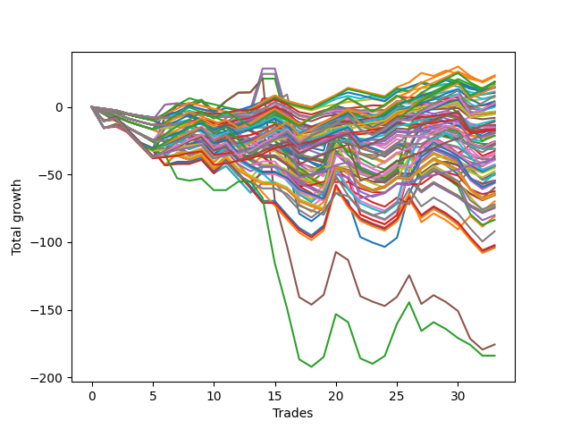

# Short Bulldog 005 
- Symbol: ES90d5m30m
- Date Range: 03/18/2022 - 07/08/2022
- Trading Period: 7:20-12:30
- Number of Trades: 33



| Name | Win Percent | Profit | Avg Profit / Trade | Avg Time / Trade |      | Name | Win Percent | Profit | Avg Profit / Trade | Avg Time / Trade |
| ---- | ----------- | ------ | ------------------ | ---------------- | ---- | ---- | ----------- | ------ | ------------------ | ---------------- |
| Sorted By <br> Profit | | | | | | Sorted By <br> Win Percentage ||||
| One Hundred Four | 51.52 | 11625.00 | 352.27 | 00:00 |     | Eighty-One | 84.85 | 5250.00 | 159.09 | 00:00 |
| Ninety-Four | 42.42 | 11625.00 | 352.27 | 00:00 |     | One Hundred Twenty-One | 81.82 | -2625.00 | -79.55 | 00:00 |
| One Hundred Fourteen | 60.61 | 11250.00 | 340.91 | 00:00 |     | Eighty-Three | 78.79 | -6875.00 | -208.33 | 00:00 |
| One Hundred Fifteen | 54.55 | 9375.00 | 284.09 | 00:00 |     | One Hundred Twenty-Six | 78.79 | -8125.00 | -246.21 | 00:00 |
| One Hundred Five | 45.45 | 9375.00 | 284.09 | 00:00 |     | Eighty-Two | 78.79 | -19250.00 | -583.33 | 00:00 |
| One Hundred Twenty-Five | 66.67 | 9250.00 | 280.30 | 00:00 |     | Eighty-Five | 75.76 | 8500.00 | 257.58 | 00:00 |
| Ninety-Five | 36.36 | 9250.00 | 280.30 | 00:00 |     | Eighty-Four | 75.76 | 500.00 | 15.15 | 00:00 |
| Eighty-Five | 75.76 | 8500.00 | 257.58 | 00:00 |     | One Hundred Twenty-Two | 75.76 | -4875.00 | -147.73 | 00:00 |
| Ninety-One | 66.67 | 7875.00 | 238.64 | 00:00 |     | One Hundred Twenty-Three | 72.73 | 625.00 | 18.94 | 00:00 |
| One Hundred Twenty-Four | 69.70 | 7375.00 | 223.48 | 00:00 |     | One Hundred Eleven | 72.73 | -1625.00 | -49.24 | 00:00 |
| Ninety-Three | 45.45 | 7375.00 | 223.48 | 00:00 |     | One Hundred Twenty-Seven | 72.73 | -9750.00 | -295.45 | 00:00 |
| One Hundred Three | 54.55 | 7125.00 | 215.91 | 00:00 |     | One Hundred Twenty-Four | 69.70 | 7375.00 | 223.48 | 00:00 |
| Ninety-Two | 51.52 | 5750.00 | 174.24 | 00:00 |     | One Hundred One | 69.70 | 3500.00 | 106.06 | 00:00 |
| Eighty-One | 84.85 | 5250.00 | 159.09 | 00:00 |     | One Hundred Twenty-Eight | 69.70 | -5375.00 | -162.88 | 00:00 |
| One Hundred Thirty | 63.64 | 4125.00 | 125.00 | 00:00 |     | One Hundred Twenty-Five | 66.67 | 9250.00 | 280.30 | 00:00 |
| One Hundred Two | 60.61 | 4125.00 | 125.00 | 00:00 |     | Ninety-One | 66.67 | 7875.00 | 238.64 | 00:00 |
| One Hundred One | 69.70 | 3500.00 | 106.06 | 00:00 |     | One Hundred Twenty-Nine | 66.67 | 1375.00 | 41.67 | 00:00 |
| One Hundred Thirteen | 60.61 | 2125.00 | 64.39 | 00:00 |     | One Hundred Twelve | 66.67 | -0.00 | -0.00 | 00:00 |
| Eight | 21.21 | 1500.00 | 45.45 | 00:00 |     | One Hundred Thirty | 63.64 | 4125.00 | 125.00 | 00:00 |
| One Hundred Twenty-Nine | 66.67 | 1375.00 | 41.67 | 00:00 |     | One Hundred Fourteen | 60.61 | 11250.00 | 340.91 | 00:00 |
| Ninety-Six | 51.52 | 1250.00 | 37.88 | 00:00 |     | One Hundred Two | 60.61 | 4125.00 | 125.00 | 00:00 |
| One Hundred Twenty-Three | 72.73 | 625.00 | 18.94 | 00:00 |     | One Hundred Thirteen | 60.61 | 2125.00 | 64.39 | 00:00 |
| Eighty-Four | 75.76 | 500.00 | 15.15 | 00:00 |     | One Hundred Sixteen | 60.61 | -8500.00 | -257.58 | 00:00 |
| Fourteen | 18.18 | 500.00 | 15.15 | 00:00 |     | One Hundred Six | 57.58 | -1750.00 | -53.03 | 00:00 |
| One Hundred Twelve | 66.67 | -0.00 | -0.00 | 00:00 |     | One Hundred Fifteen | 54.55 | 9375.00 | 284.09 | 00:00 |
| One Hundred Eleven | 72.73 | -1625.00 | -49.24 | 00:00 |     | One Hundred Three | 54.55 | 7125.00 | 215.91 | 00:00 |
| One Hundred Six | 57.58 | -1750.00 | -53.03 | 00:00 |     | One Hundred Four | 51.52 | 11625.00 | 352.27 | 00:00 |
| One Hundred | 36.36 | -1875.00 | -56.82 | 00:00 |     | Ninety-Two | 51.52 | 5750.00 | 174.24 | 00:00 |
| Ninety-Seven | 39.39 | -2375.00 | -71.97 | 00:00 |     | Ninety-Six | 51.52 | 1250.00 | 37.88 | 00:00 |
| Ninety-Nine | 36.36 | -2375.00 | -71.97 | 00:00 |     | One Hundred Seventeen | 48.48 | -14000.00 | -424.24 | 00:00 |
| One Hundred Twenty-One | 81.82 | -2625.00 | -79.55 | 00:00 |     | Three | 48.48 | -16250.00 | -492.42 | 00:00 |
| Ninety-Eight | 36.36 | -4000.00 | -121.21 | 00:00 |     | Six | 48.48 | -17625.00 | -534.09 | 00:00 |
| One Hundred Twenty-Two | 75.76 | -4875.00 | -147.73 | 00:00 |     | Zero | 48.48 | -24500.00 | -742.42 | 00:00 |
| One Hundred Twenty-Eight | 69.70 | -5375.00 | -162.88 | 00:00 |     | One Hundred Five | 45.45 | 9375.00 | 284.09 | 00:00 |
| Sixten | 33.33 | -6500.00 | -196.97 | 00:00 |     | Ninety-Three | 45.45 | 7375.00 | 223.48 | 00:00 |
| Twenty-Three | 33.33 | -6750.00 | -204.55 | 00:00 |     | Seven | 45.45 | -25125.00 | -761.36 | 00:00 |
| Twenty-Two | 33.33 | -6750.00 | -204.55 | 00:00 |     | One | 45.45 | -40500.00 | -1227.27 | 00:00 |
| Twenty | 33.33 | -6750.00 | -204.55 | 00:00 |     | Ninety-Four | 42.42 | 11625.00 | 352.27 | 00:00 |
| Nineteen | 33.33 | -6750.00 | -204.55 | 00:00 |     | One Hundred Eighteen | 42.42 | -13625.00 | -412.88 | 00:00 |
| Eighteen | 33.33 | -6750.00 | -204.55 | 00:00 |     | Four | 42.42 | -40000.00 | -1212.12 | 00:00 |
| Seventeen | 33.33 | -6750.00 | -204.55 | 00:00 |     | Two | 42.42 | -41750.00 | -1265.15 | 00:00 |
| Eighty-Three | 78.79 | -6875.00 | -208.33 | 00:00 |     | Five | 42.42 | -87875.00 | -2662.88 | 00:00 |
| Twenty-Four | 24.24 | -7125.00 | -215.91 | 00:00 |     | Ninety-Seven | 39.39 | -2375.00 | -71.97 | 00:00 |
| One Hundred Seven | 39.39 | -7250.00 | -219.70 | 00:00 |     | One Hundred Seven | 39.39 | -7250.00 | -219.70 | 00:00 |
| One Hundred Nine | 33.33 | -7625.00 | -231.06 | 00:00 |     | Sixty-Two | 39.39 | -10625.00 | -321.97 | 00:00 |
| Ten | 12.12 | -7750.00 | -234.85 | 00:00 |     | One Hundred Ninteen | 39.39 | -12875.00 | -390.15 | 00:00 |
| One Hundred Twenty-Six | 78.79 | -8125.00 | -246.21 | 00:00 |     | Fifty-Six | 39.39 | -19625.00 | -594.70 | 00:00 |
| One Hundred Sixteen | 60.61 | -8500.00 | -257.58 | 00:00 |     | Ninety-Five | 36.36 | 9250.00 | 280.30 | 00:00 |
| One Hundred Eight | 33.33 | -8500.00 | -257.58 | 00:00 |     | One Hundred | 36.36 | -1875.00 | -56.82 | 00:00 |
| Thirty | 21.21 | -8750.00 | -265.15 | 00:00 |     | Ninety-Nine | 36.36 | -2375.00 | -71.97 | 00:00 |
| One Hundred Ten | 33.33 | -9000.00 | -272.73 | 00:00 |     | Ninety-Eight | 36.36 | -4000.00 | -121.21 | 00:00 |
| Nine | 15.15 | -9000.00 | -272.73 | 00:00 |     | Fifty-Nine | 36.36 | -21500.00 | -651.52 | 00:00 |
| Eleven | 15.15 | -9625.00 | -291.67 | 00:00 |     | Sixty-Four | 36.36 | -28125.00 | -852.27 | 00:00 |
| One Hundred Twenty-Seven | 72.73 | -9750.00 | -295.45 | 00:00 |     | Sixty-Five | 36.36 | -29875.00 | -905.30 | 00:00 |
| Sixty-Two | 39.39 | -10625.00 | -321.97 | 00:00 |     | Sixten | 33.33 | -6500.00 | -196.97 | 00:00 |
| Twenty-One | 33.33 | -10625.00 | -321.97 | 00:00 |     | Twenty-Three | 33.33 | -6750.00 | -204.55 | 00:00 |
| Fifteen | 12.12 | -12750.00 | -386.36 | 00:00 |     | Twenty-Two | 33.33 | -6750.00 | -204.55 | 00:00 |
| Thirteen | 12.12 | -12750.00 | -386.36 | 00:00 |     | Twenty | 33.33 | -6750.00 | -204.55 | 00:00 |
| One Hundred Ninteen | 39.39 | -12875.00 | -390.15 | 00:00 |     | Nineteen | 33.33 | -6750.00 | -204.55 | 00:00 |
| Twelve | 12.12 | -13250.00 | -401.52 | 00:00 |     | Eighteen | 33.33 | -6750.00 | -204.55 | 00:00 |
| One Hundred Eighteen | 42.42 | -13625.00 | -412.88 | 00:00 |     | Seventeen | 33.33 | -6750.00 | -204.55 | 00:00 |
| Thirty-Two | 30.30 | -13750.00 | -416.67 | 00:00 |     | One Hundred Nine | 33.33 | -7625.00 | -231.06 | 00:00 |
| One Hundred Seventeen | 48.48 | -14000.00 | -424.24 | 00:00 |     | One Hundred Eight | 33.33 | -8500.00 | -257.58 | 00:00 |
| One Hundred Twenty | 33.33 | -14125.00 | -428.03 | 00:00 |     | One Hundred Ten | 33.33 | -9000.00 | -272.73 | 00:00 |
| Thirty-Nine | 27.27 | -15500.00 | -469.70 | 00:00 |     | Twenty-One | 33.33 | -10625.00 | -321.97 | 00:00 |
| Thirty-Eight | 27.27 | -15500.00 | -469.70 | 00:00 |     | One Hundred Twenty | 33.33 | -14125.00 | -428.03 | 00:00 |
| Thirty-Six | 27.27 | -15500.00 | -469.70 | 00:00 |     | Sixty-Six | 33.33 | -27500.00 | -833.33 | 00:00 |
| Thirty-Five | 27.27 | -15500.00 | -469.70 | 00:00 |     | Seventy | 33.33 | -27750.00 | -840.91 | 00:00 |
| Thirty-Four | 27.27 | -15500.00 | -469.70 | 00:00 |     | Seventy-One | 33.33 | -31875.00 | -965.91 | 00:00 |
| Thirty-Three | 27.27 | -15500.00 | -469.70 | 00:00 |     | Sixty-Nine | 33.33 | -31875.00 | -965.91 | 00:00 |
| Three | 48.48 | -16250.00 | -492.42 | 00:00 |     | Sixty-Eight | 33.33 | -32375.00 | -981.06 | 00:00 |
| Twenty-Six | 15.15 | -17000.00 | -515.15 | 00:00 |     | Sixty-Seven | 33.33 | -36000.00 | -1090.91 | 00:00 |
| Six | 48.48 | -17625.00 | -534.09 | 00:00 |     | Fifty-Eight | 33.33 | -36250.00 | -1098.48 | 00:00 |
| Twenty-Five | 18.18 | -18250.00 | -553.03 | 00:00 |     | Fifty-Seven | 33.33 | -46000.00 | -1393.94 | 00:00 |
| twenty-Seven | 18.18 | -18875.00 | -571.97 | 00:00 |     | Thirty-Two | 30.30 | -13750.00 | -416.67 | 00:00 |
| Eighty-Two | 78.79 | -19250.00 | -583.33 | 00:00 |     | Forty | 30.30 | -21625.00 | -655.30 | 00:00 |
| Thirty-Seven | 27.27 | -19375.00 | -587.12 | 00:00 |     | Forty-Eight | 30.30 | -23750.00 | -719.70 | 00:00 |
| Fifty-Six | 39.39 | -19625.00 | -594.70 | 00:00 |     | Sixty-Three | 30.30 | -51125.00 | -1549.24 | 00:00 |
| Forty-Six | 27.27 | -21250.00 | -643.94 | 00:00 |     | Sixty | 30.30 | -51625.00 | -1564.39 | 00:00 |
| Fifty-Nine | 36.36 | -21500.00 | -651.52 | 00:00 |     | Sixty-One | 30.30 | -52125.00 | -1579.55 | 00:00 |
| Forty | 30.30 | -21625.00 | -655.30 | 00:00 |     | Seventy-Three | 30.30 | -92000.00 | -2787.88 | 00:00 |
| Thirty-One | 15.15 | -22000.00 | -666.67 | 00:00 |     | Thirty-Nine | 27.27 | -15500.00 | -469.70 | 00:00 |
| Twenty-Nine | 15.15 | -22000.00 | -666.67 | 00:00 |     | Thirty-Eight | 27.27 | -15500.00 | -469.70 | 00:00 |
| Twenty-Eight | 15.15 | -22500.00 | -681.82 | 00:00 |     | Thirty-Six | 27.27 | -15500.00 | -469.70 | 00:00 |
| Forty-Eight | 30.30 | -23750.00 | -719.70 | 00:00 |     | Thirty-Five | 27.27 | -15500.00 | -469.70 | 00:00 |
| Zero | 48.48 | -24500.00 | -742.42 | 00:00 |     | Thirty-Four | 27.27 | -15500.00 | -469.70 | 00:00 |
| Forty-Nine | 27.27 | -24625.00 | -746.21 | 00:00 |     | Thirty-Three | 27.27 | -15500.00 | -469.70 | 00:00 |
| Seven | 45.45 | -25125.00 | -761.36 | 00:00 |     | Thirty-Seven | 27.27 | -19375.00 | -587.12 | 00:00 |
| Fifty-Five | 27.27 | -27250.00 | -825.76 | 00:00 |     | Forty-Six | 27.27 | -21250.00 | -643.94 | 00:00 |
| Fifty-Four | 27.27 | -27250.00 | -825.76 | 00:00 |     | Forty-Nine | 27.27 | -24625.00 | -746.21 | 00:00 |
| Fifty-Two | 27.27 | -27250.00 | -825.76 | 00:00 |     | Fifty-Five | 27.27 | -27250.00 | -825.76 | 00:00 |
| Fifty-One | 27.27 | -27250.00 | -825.76 | 00:00 |     | Fifty-Four | 27.27 | -27250.00 | -825.76 | 00:00 |
| Fifty | 27.27 | -27250.00 | -825.76 | 00:00 |     | Fifty-Two | 27.27 | -27250.00 | -825.76 | 00:00 |
| Sixty-Six | 33.33 | -27500.00 | -833.33 | 00:00 |     | Fifty-One | 27.27 | -27250.00 | -825.76 | 00:00 |
| Seventy | 33.33 | -27750.00 | -840.91 | 00:00 |     | Fifty | 27.27 | -27250.00 | -825.76 | 00:00 |
| Sixty-Four | 36.36 | -28125.00 | -852.27 | 00:00 |     | Fifty-Three | 27.27 | -31125.00 | -943.18 | 00:00 |
| Sixty-Five | 36.36 | -29875.00 | -905.30 | 00:00 |     | Twenty-Four | 24.24 | -7125.00 | -215.91 | 00:00 |
| Fifty-Three | 27.27 | -31125.00 | -943.18 | 00:00 |     | Forty-Three | 24.24 | -32625.00 | -988.64 | 00:00 |
| Seventy-One | 33.33 | -31875.00 | -965.91 | 00:00 |     | Forty-One | 24.24 | -34875.00 | -1056.82 | 00:00 |
| Sixty-Nine | 33.33 | -31875.00 | -965.91 | 00:00 |     | Eight | 21.21 | 1500.00 | 45.45 | 00:00 |
| Sixty-Eight | 33.33 | -32375.00 | -981.06 | 00:00 |     | Thirty | 21.21 | -8750.00 | -265.15 | 00:00 |
| Forty-Two | 21.21 | -32500.00 | -984.85 | 00:00 |     | Forty-Two | 21.21 | -32500.00 | -984.85 | 00:00 |
| Forty-Three | 24.24 | -32625.00 | -988.64 | 00:00 |     | Forty-Seven | 21.21 | -36875.00 | -1117.42 | 00:00 |
| Forty-One | 24.24 | -34875.00 | -1056.82 | 00:00 |     | Forty-Five | 21.21 | -36875.00 | -1117.42 | 00:00 |
| Sixty-Seven | 33.33 | -36000.00 | -1090.91 | 00:00 |     | Forty-Four | 21.21 | -37375.00 | -1132.58 | 00:00 |
| Fifty-Eight | 33.33 | -36250.00 | -1098.48 | 00:00 |     | Fourteen | 18.18 | 500.00 | 15.15 | 00:00 |
| Forty-Seven | 21.21 | -36875.00 | -1117.42 | 00:00 |     | Twenty-Five | 18.18 | -18250.00 | -553.03 | 00:00 |
| Forty-Five | 21.21 | -36875.00 | -1117.42 | 00:00 |     | twenty-Seven | 18.18 | -18875.00 | -571.97 | 00:00 |
| Forty-Four | 21.21 | -37375.00 | -1132.58 | 00:00 |     | Nine | 15.15 | -9000.00 | -272.73 | 00:00 |
| Four | 42.42 | -40000.00 | -1212.12 | 00:00 |     | Eleven | 15.15 | -9625.00 | -291.67 | 00:00 |
| One | 45.45 | -40500.00 | -1227.27 | 00:00 |     | Twenty-Six | 15.15 | -17000.00 | -515.15 | 00:00 |
| Two | 42.42 | -41750.00 | -1265.15 | 00:00 |     | Thirty-One | 15.15 | -22000.00 | -666.67 | 00:00 |
| Fifty-Seven | 33.33 | -46000.00 | -1393.94 | 00:00 |     | Twenty-Nine | 15.15 | -22000.00 | -666.67 | 00:00 |
| Sixty-Three | 30.30 | -51125.00 | -1549.24 | 00:00 |     | Twenty-Eight | 15.15 | -22500.00 | -681.82 | 00:00 |
| Sixty | 30.30 | -51625.00 | -1564.39 | 00:00 |     | Ten | 12.12 | -7750.00 | -234.85 | 00:00 |
| Sixty-One | 30.30 | -52125.00 | -1579.55 | 00:00 |     | Fifteen | 12.12 | -12750.00 | -386.36 | 00:00 |
| Five | 42.42 | -87875.00 | -2662.88 | 00:00 |     | Thirteen | 12.12 | -12750.00 | -386.36 | 00:00 |
| Seventy-Three | 30.30 | -92000.00 | -2787.88 | 00:00 |     | Twelve | 12.12 | -13250.00 | -401.52 | 00:00 |

## NO STOPLOSS

### Test Zero
* Sell when price hits the middle line of the 20p bollinger
* No Stoploss
* Results:
```
Total Trades: 33
Percent Up: 51.52
Percent Down: 48.48
Total Points Moved Down: -49.00
Potential Profit: -24500.00
Total Points Ups: 178.00 Count Ups: 17
Total Points Downs: 129.00 Count Downs: 16
```

<details><summary>Trades</summary>

<code>In: 2022-03-24 08:10:00		Out: 2022-03-24 08:39:55		Total Position Time: 29:55		Total Move Down: -15.50		Total to Date: -15.50</code> <br />
<code>In: 2022-03-24 08:35:00		Out: 2022-03-24 09:04:55		Total Position Time: 29:55		Total Move Down: 1.75		Total to Date: -13.75</code> <br />
<code>In: 2022-03-25 07:30:00		Out: 2022-03-25 07:59:55		Total Position Time: 29:55		Total Move Down: -4.50		Total to Date: -18.25</code> <br />
<code>In: 2022-03-28 12:05:00		Out: 2022-03-28 12:34:55		Total Position Time: 29:55		Total Move Down: -9.25		Total to Date: -27.50</code> <br />
<code>In: 2022-03-29 12:15:00		Out: 2022-03-29 12:44:55		Total Position Time: 29:55		Total Move Down: -4.00		Total to Date: -31.50</code> <br />
<code>In: 2022-04-06 10:55:00		Out: 2022-04-06 11:00:10		Total Position Time: 05:10		Total Move Down: 11.50		Total to Date: -20.00</code> <br />
<code>In: 2022-04-06 11:10:00		Out: 2022-04-06 11:10:10		Total Position Time: 00:10		Total Move Down: 1.00		Total to Date: -19.00</code> <br />
<code>In: 2022-04-07 12:20:00		Out: 2022-04-07 12:49:55		Total Position Time: 29:55		Total Move Down: -0.00		Total to Date: -19.00</code> <br />
<code>In: 2022-04-08 08:10:00		Out: 2022-04-08 08:39:55		Total Position Time: 29:55		Total Move Down: 3.00		Total to Date: -16.00</code> <br />
<code>In: 2022-04-13 08:10:00		Out: 2022-04-13 08:39:55		Total Position Time: 29:55		Total Move Down: -8.50		Total to Date: -24.50</code> <br />
<code>In: 2022-04-20 10:50:00		Out: 2022-04-20 11:13:35		Total Position Time: 23:35		Total Move Down: 2.25		Total to Date: -22.25</code> <br />
<code>In: 2022-04-25 11:40:00		Out: 2022-04-25 12:07:25		Total Position Time: 27:25		Total Move Down: 10.50		Total to Date: -11.75</code> <br />
<code>In: 2022-05-04 09:45:00		Out: 2022-05-04 10:14:55		Total Position Time: 29:55		Total Move Down: 0.25		Total to Date: -11.50</code> <br />
<code>In: 2022-05-04 11:10:00		Out: 2022-05-04 11:10:10		Total Position Time: 00:10		Total Move Down: 3.50		Total to Date: -8.00</code> <br />
<code>In: 2022-05-04 11:35:00		Out: 2022-05-04 11:35:10		Total Position Time: 00:10		Total Move Down: -0.00		Total to Date: -8.00</code> <br />
<code>In: 2022-05-04 12:00:00		Out: 2022-05-04 12:29:55		Total Position Time: 29:55		Total Move Down: -33.25		Total to Date: -41.25</code> <br />
<code>In: 2022-05-04 12:20:00		Out: 2022-05-04 12:49:55		Total Position Time: 29:55		Total Move Down: -37.75		Total to Date: -79.00</code> <br />
<code>In: 2022-05-16 10:40:00		Out: 2022-05-16 11:09:55		Total Position Time: 29:55		Total Move Down: -5.50		Total to Date: -84.50</code> <br />
<code>In: 2022-05-19 08:55:00		Out: 2022-05-19 09:24:55		Total Position Time: 29:55		Total Move Down: 7.25		Total to Date: -77.25</code> <br />
<code>In: 2022-05-19 12:10:00		Out: 2022-05-19 12:18:25		Total Position Time: 08:25		Total Move Down: 13.75		Total to Date: -63.50</code> <br />
<code>In: 2022-05-24 11:00:00		Out: 2022-05-24 11:29:55		Total Position Time: 29:55		Total Move Down: -6.00		Total to Date: -69.50</code> <br />
<code>In: 2022-05-25 11:40:00		Out: 2022-05-25 12:09:55		Total Position Time: 29:55		Total Move Down: -26.75		Total to Date: -96.25</code> <br />
<code>In: 2022-05-27 12:15:00		Out: 2022-05-27 12:44:55		Total Position Time: 29:55		Total Move Down: -4.00		Total to Date: -100.25</code> <br />
<code>In: 2022-05-31 09:10:00		Out: 2022-05-31 09:39:55		Total Position Time: 29:55		Total Move Down: -3.25		Total to Date: -103.50</code> <br />
<code>In: 2022-06-15 11:05:00		Out: 2022-06-15 11:05:10		Total Position Time: 00:10		Total Move Down: 6.75		Total to Date: -96.75</code> <br />
<code>In: 2022-06-15 11:50:00		Out: 2022-06-15 11:58:10		Total Position Time: 08:10		Total Move Down: 32.75		Total to Date: -64.00</code> <br />
<code>In: 2022-06-15 11:55:00		Out: 2022-06-15 11:58:10		Total Position Time: 03:10		Total Move Down: 18.25		Total to Date: -45.75</code> <br />
<code>In: 2022-06-21 12:10:00		Out: 2022-06-21 12:35:35		Total Position Time: 25:35		Total Move Down: 7.75		Total to Date: -38.00</code> <br />
<code>In: 2022-07-05 10:45:00		Out: 2022-07-05 11:14:55		Total Position Time: 29:55		Total Move Down: -5.00		Total to Date: -43.00</code> <br />
<code>In: 2022-07-05 11:45:00		Out: 2022-07-05 12:14:55		Total Position Time: 29:55		Total Move Down: -6.75		Total to Date: -49.75</code> <br />
<code>In: 2022-07-06 11:05:00		Out: 2022-07-06 11:11:35		Total Position Time: 06:35		Total Move Down: 4.25		Total to Date: -45.50</code> <br />
<code>In: 2022-07-06 11:50:00		Out: 2022-07-06 12:19:55		Total Position Time: 29:55		Total Move Down: -8.00		Total to Date: -53.50</code> <br />
<code>In: 2022-07-07 12:25:00		Out: 2022-07-07 12:38:25		Total Position Time: 13:25		Total Move Down: 4.50		Total to Date: -49.00</code> <br />


</details>

### Test One
* Sell when the price hits the upper line of the 20p 1std bollinger
* No Stoploss
* Results:
```
Total Trades: 33
Percent Up: 54.55
Percent Down: 45.45
Total Points Moved Down: -81.00
Potential Profit: -40500.00
Total Points Ups: 199.25 Count Ups: 18
Total Points Downs: 118.25 Count Downs: 15
```

<details><summary>Trades</summary>

<code>In: 2022-03-24 08:10:00		Out: 2022-03-24 08:39:55		Total Position Time: 29:55		Total Move Down: -15.50		Total to Date: -15.50</code> <br />
<code>In: 2022-03-24 08:35:00		Out: 2022-03-24 09:04:55		Total Position Time: 29:55		Total Move Down: 1.75		Total to Date: -13.75</code> <br />
<code>In: 2022-03-25 07:30:00		Out: 2022-03-25 07:59:55		Total Position Time: 29:55		Total Move Down: -4.50		Total to Date: -18.25</code> <br />
<code>In: 2022-03-28 12:05:00		Out: 2022-03-28 12:34:55		Total Position Time: 29:55		Total Move Down: -9.25		Total to Date: -27.50</code> <br />
<code>In: 2022-03-29 12:15:00		Out: 2022-03-29 12:44:55		Total Position Time: 29:55		Total Move Down: -4.00		Total to Date: -31.50</code> <br />
<code>In: 2022-04-06 10:55:00		Out: 2022-04-06 11:09:45		Total Position Time: 14:45		Total Move Down: 16.00		Total to Date: -15.50</code> <br />
<code>In: 2022-04-06 11:10:00		Out: 2022-04-06 11:10:10		Total Position Time: 00:10		Total Move Down: 1.00		Total to Date: -14.50</code> <br />
<code>In: 2022-04-07 12:20:00		Out: 2022-04-07 12:49:55		Total Position Time: 29:55		Total Move Down: -0.00		Total to Date: -14.50</code> <br />
<code>In: 2022-04-08 08:10:00		Out: 2022-04-08 08:39:55		Total Position Time: 29:55		Total Move Down: 3.00		Total to Date: -11.50</code> <br />
<code>In: 2022-04-13 08:10:00		Out: 2022-04-13 08:39:55		Total Position Time: 29:55		Total Move Down: -8.50		Total to Date: -20.00</code> <br />
<code>In: 2022-04-20 10:50:00		Out: 2022-04-20 11:17:15		Total Position Time: 27:15		Total Move Down: 5.25		Total to Date: -14.75</code> <br />
<code>In: 2022-04-25 11:40:00		Out: 2022-04-25 12:09:55		Total Position Time: 29:55		Total Move Down: 6.25		Total to Date: -8.50</code> <br />
<code>In: 2022-05-04 09:45:00		Out: 2022-05-04 10:14:55		Total Position Time: 29:55		Total Move Down: 0.25		Total to Date: -8.25</code> <br />
<code>In: 2022-05-04 11:10:00		Out: 2022-05-04 11:10:55		Total Position Time: 00:55		Total Move Down: 7.25		Total to Date: -1.00</code> <br />
<code>In: 2022-05-04 11:35:00		Out: 2022-05-04 11:35:10		Total Position Time: 00:10		Total Move Down: -0.00		Total to Date: -1.00</code> <br />
<code>In: 2022-05-04 12:00:00		Out: 2022-05-04 12:29:55		Total Position Time: 29:55		Total Move Down: -33.25		Total to Date: -34.25</code> <br />
<code>In: 2022-05-04 12:20:00		Out: 2022-05-04 12:49:55		Total Position Time: 29:55		Total Move Down: -37.75		Total to Date: -72.00</code> <br />
<code>In: 2022-05-16 10:40:00		Out: 2022-05-16 11:09:55		Total Position Time: 29:55		Total Move Down: -5.50		Total to Date: -77.50</code> <br />
<code>In: 2022-05-19 08:55:00		Out: 2022-05-19 09:24:55		Total Position Time: 29:55		Total Move Down: 7.25		Total to Date: -70.25</code> <br />
<code>In: 2022-05-19 12:10:00		Out: 2022-05-19 12:24:50		Total Position Time: 14:50		Total Move Down: 23.50		Total to Date: -46.75</code> <br />
<code>In: 2022-05-24 11:00:00		Out: 2022-05-24 11:29:55		Total Position Time: 29:55		Total Move Down: -6.00		Total to Date: -52.75</code> <br />
<code>In: 2022-05-25 11:40:00		Out: 2022-05-25 12:09:55		Total Position Time: 29:55		Total Move Down: -26.75		Total to Date: -79.50</code> <br />
<code>In: 2022-05-27 12:15:00		Out: 2022-05-27 12:44:55		Total Position Time: 29:55		Total Move Down: -4.00		Total to Date: -83.50</code> <br />
<code>In: 2022-05-31 09:10:00		Out: 2022-05-31 09:39:55		Total Position Time: 29:55		Total Move Down: -3.25		Total to Date: -86.75</code> <br />
<code>In: 2022-06-15 11:05:00		Out: 2022-06-15 11:05:10		Total Position Time: 00:10		Total Move Down: 6.75		Total to Date: -80.00</code> <br />
<code>In: 2022-06-15 11:50:00		Out: 2022-06-15 12:19:55		Total Position Time: 29:55		Total Move Down: 16.00		Total to Date: -64.00</code> <br />
<code>In: 2022-06-15 11:55:00		Out: 2022-06-15 12:24:55		Total Position Time: 29:55		Total Move Down: -21.25		Total to Date: -85.25</code> <br />
<code>In: 2022-06-21 12:10:00		Out: 2022-06-21 12:39:55		Total Position Time: 29:55		Total Move Down: 6.50		Total to Date: -78.75</code> <br />
<code>In: 2022-07-05 10:45:00		Out: 2022-07-05 11:14:55		Total Position Time: 29:55		Total Move Down: -5.00		Total to Date: -83.75</code> <br />
<code>In: 2022-07-05 11:45:00		Out: 2022-07-05 12:14:55		Total Position Time: 29:55		Total Move Down: -6.75		Total to Date: -90.50</code> <br />
<code>In: 2022-07-06 11:05:00		Out: 2022-07-06 11:12:15		Total Position Time: 07:15		Total Move Down: 10.00		Total to Date: -80.50</code> <br />
<code>In: 2022-07-06 11:50:00		Out: 2022-07-06 12:19:55		Total Position Time: 29:55		Total Move Down: -8.00		Total to Date: -88.50</code> <br />
<code>In: 2022-07-07 12:25:00		Out: 2022-07-07 12:46:45		Total Position Time: 21:45		Total Move Down: 7.50		Total to Date: -81.00</code> <br />


</details>

### Test Two
* Sell when the price hits the upper line of the 20p 2std bollinger
* No Stoploss
* Results:
```
Total Trades: 33
Percent Up: 57.58
Percent Down: 42.42
Total Points Moved Down: -83.50
Potential Profit: -41750.00
Total Points Ups: 219.75 Count Ups: 19
Total Points Downs: 136.25 Count Downs: 14
```

<details><summary>Trades</summary>

<code>In: 2022-03-24 08:10:00		Out: 2022-03-24 08:39:55		Total Position Time: 29:55		Total Move Down: -15.50		Total to Date: -15.50</code> <br />
<code>In: 2022-03-24 08:35:00		Out: 2022-03-24 09:04:55		Total Position Time: 29:55		Total Move Down: 1.75		Total to Date: -13.75</code> <br />
<code>In: 2022-03-25 07:30:00		Out: 2022-03-25 07:59:55		Total Position Time: 29:55		Total Move Down: -4.50		Total to Date: -18.25</code> <br />
<code>In: 2022-03-28 12:05:00		Out: 2022-03-28 12:34:55		Total Position Time: 29:55		Total Move Down: -9.25		Total to Date: -27.50</code> <br />
<code>In: 2022-03-29 12:15:00		Out: 2022-03-29 12:44:55		Total Position Time: 29:55		Total Move Down: -4.00		Total to Date: -31.50</code> <br />
<code>In: 2022-04-06 10:55:00		Out: 2022-04-06 11:15:15		Total Position Time: 20:15		Total Move Down: 24.50		Total to Date: -7.00</code> <br />
<code>In: 2022-04-06 11:10:00		Out: 2022-04-06 11:15:15		Total Position Time: 05:15		Total Move Down: 9.50		Total to Date: 2.50</code> <br />
<code>In: 2022-04-07 12:20:00		Out: 2022-04-07 12:49:55		Total Position Time: 29:55		Total Move Down: -0.00		Total to Date: 2.50</code> <br />
<code>In: 2022-04-08 08:10:00		Out: 2022-04-08 08:39:55		Total Position Time: 29:55		Total Move Down: 3.00		Total to Date: 5.50</code> <br />
<code>In: 2022-04-13 08:10:00		Out: 2022-04-13 08:39:55		Total Position Time: 29:55		Total Move Down: -8.50		Total to Date: -3.00</code> <br />
<code>In: 2022-04-20 10:50:00		Out: 2022-04-20 11:18:30		Total Position Time: 28:30		Total Move Down: 7.50		Total to Date: 4.50</code> <br />
<code>In: 2022-04-25 11:40:00		Out: 2022-04-25 12:09:55		Total Position Time: 29:55		Total Move Down: 6.25		Total to Date: 10.75</code> <br />
<code>In: 2022-05-04 09:45:00		Out: 2022-05-04 10:14:55		Total Position Time: 29:55		Total Move Down: 0.25		Total to Date: 11.00</code> <br />
<code>In: 2022-05-04 11:10:00		Out: 2022-05-04 11:18:35		Total Position Time: 08:35		Total Move Down: 10.00		Total to Date: 21.00</code> <br />
<code>In: 2022-05-04 11:35:00		Out: 2022-05-04 11:35:10		Total Position Time: 00:10		Total Move Down: -0.00		Total to Date: 21.00</code> <br />
<code>In: 2022-05-04 12:00:00		Out: 2022-05-04 12:29:55		Total Position Time: 29:55		Total Move Down: -33.25		Total to Date: -12.25</code> <br />
<code>In: 2022-05-04 12:20:00		Out: 2022-05-04 12:49:55		Total Position Time: 29:55		Total Move Down: -37.75		Total to Date: -50.00</code> <br />
<code>In: 2022-05-16 10:40:00		Out: 2022-05-16 11:09:55		Total Position Time: 29:55		Total Move Down: -5.50		Total to Date: -55.50</code> <br />
<code>In: 2022-05-19 08:55:00		Out: 2022-05-19 09:24:55		Total Position Time: 29:55		Total Move Down: 7.25		Total to Date: -48.25</code> <br />
<code>In: 2022-05-19 12:10:00		Out: 2022-05-19 12:36:30		Total Position Time: 26:30		Total Move Down: 33.25		Total to Date: -15.00</code> <br />
<code>In: 2022-05-24 11:00:00		Out: 2022-05-24 11:29:55		Total Position Time: 29:55		Total Move Down: -6.00		Total to Date: -21.00</code> <br />
<code>In: 2022-05-25 11:40:00		Out: 2022-05-25 12:09:55		Total Position Time: 29:55		Total Move Down: -26.75		Total to Date: -47.75</code> <br />
<code>In: 2022-05-27 12:15:00		Out: 2022-05-27 12:44:55		Total Position Time: 29:55		Total Move Down: -4.00		Total to Date: -51.75</code> <br />
<code>In: 2022-05-31 09:10:00		Out: 2022-05-31 09:39:55		Total Position Time: 29:55		Total Move Down: -3.25		Total to Date: -55.00</code> <br />
<code>In: 2022-06-15 11:05:00		Out: 2022-06-15 11:05:10		Total Position Time: 00:10		Total Move Down: 6.75		Total to Date: -48.25</code> <br />
<code>In: 2022-06-15 11:50:00		Out: 2022-06-15 12:19:55		Total Position Time: 29:55		Total Move Down: 16.00		Total to Date: -32.25</code> <br />
<code>In: 2022-06-15 11:55:00		Out: 2022-06-15 12:24:55		Total Position Time: 29:55		Total Move Down: -21.25		Total to Date: -53.50</code> <br />
<code>In: 2022-06-21 12:10:00		Out: 2022-06-21 12:39:55		Total Position Time: 29:55		Total Move Down: 6.50		Total to Date: -47.00</code> <br />
<code>In: 2022-07-05 10:45:00		Out: 2022-07-05 11:14:55		Total Position Time: 29:55		Total Move Down: -5.00		Total to Date: -52.00</code> <br />
<code>In: 2022-07-05 11:45:00		Out: 2022-07-05 12:14:55		Total Position Time: 29:55		Total Move Down: -6.75		Total to Date: -58.75</code> <br />
<code>In: 2022-07-06 11:05:00		Out: 2022-07-06 11:34:55		Total Position Time: 29:55		Total Move Down: -20.50		Total to Date: -79.25</code> <br />
<code>In: 2022-07-06 11:50:00		Out: 2022-07-06 12:19:55		Total Position Time: 29:55		Total Move Down: -8.00		Total to Date: -87.25</code> <br />
<code>In: 2022-07-07 12:25:00		Out: 2022-07-07 12:50:00		Total Position Time: 25:00		Total Move Down: 3.75		Total to Date: -83.50</code> <br />


</details>

### Test Three
* Sell when price hits the middle line of the 50p bollinger
* No Stoploss
* Results:
```
Total Trades: 33
Percent Up: 51.52
Percent Down: 48.48
Total Points Moved Down: -32.50
Potential Profit: -16250.00
Total Points Ups: 178.00 Count Ups: 17
Total Points Downs: 145.50 Count Downs: 16
```

<details><summary>Trades</summary>

<code>In: 2022-03-24 08:10:00		Out: 2022-03-24 08:39:55		Total Position Time: 29:55		Total Move Down: -15.50		Total to Date: -15.50</code> <br />
<code>In: 2022-03-24 08:35:00		Out: 2022-03-24 09:04:55		Total Position Time: 29:55		Total Move Down: 1.75		Total to Date: -13.75</code> <br />
<code>In: 2022-03-25 07:30:00		Out: 2022-03-25 07:59:55		Total Position Time: 29:55		Total Move Down: -4.50		Total to Date: -18.25</code> <br />
<code>In: 2022-03-28 12:05:00		Out: 2022-03-28 12:34:55		Total Position Time: 29:55		Total Move Down: -9.25		Total to Date: -27.50</code> <br />
<code>In: 2022-03-29 12:15:00		Out: 2022-03-29 12:44:55		Total Position Time: 29:55		Total Move Down: -4.00		Total to Date: -31.50</code> <br />
<code>In: 2022-04-06 10:55:00		Out: 2022-04-06 11:08:35		Total Position Time: 13:35		Total Move Down: 11.50		Total to Date: -20.00</code> <br />
<code>In: 2022-04-06 11:10:00		Out: 2022-04-06 11:10:10		Total Position Time: 00:10		Total Move Down: 1.00		Total to Date: -19.00</code> <br />
<code>In: 2022-04-07 12:20:00		Out: 2022-04-07 12:49:55		Total Position Time: 29:55		Total Move Down: -0.00		Total to Date: -19.00</code> <br />
<code>In: 2022-04-08 08:10:00		Out: 2022-04-08 08:39:55		Total Position Time: 29:55		Total Move Down: 3.00		Total to Date: -16.00</code> <br />
<code>In: 2022-04-13 08:10:00		Out: 2022-04-13 08:39:55		Total Position Time: 29:55		Total Move Down: -8.50		Total to Date: -24.50</code> <br />
<code>In: 2022-04-20 10:50:00		Out: 2022-04-20 11:17:40		Total Position Time: 27:40		Total Move Down: 5.50		Total to Date: -19.00</code> <br />
<code>In: 2022-04-25 11:40:00		Out: 2022-04-25 12:09:55		Total Position Time: 29:55		Total Move Down: 6.25		Total to Date: -12.75</code> <br />
<code>In: 2022-05-04 09:45:00		Out: 2022-05-04 10:14:55		Total Position Time: 29:55		Total Move Down: 0.25		Total to Date: -12.50</code> <br />
<code>In: 2022-05-04 11:10:00		Out: 2022-05-04 11:20:50		Total Position Time: 10:50		Total Move Down: 18.75		Total to Date: 6.25</code> <br />
<code>In: 2022-05-04 11:35:00		Out: 2022-05-04 11:35:10		Total Position Time: 00:10		Total Move Down: -0.00		Total to Date: 6.25</code> <br />
<code>In: 2022-05-04 12:00:00		Out: 2022-05-04 12:29:55		Total Position Time: 29:55		Total Move Down: -33.25		Total to Date: -27.00</code> <br />
<code>In: 2022-05-04 12:20:00		Out: 2022-05-04 12:49:55		Total Position Time: 29:55		Total Move Down: -37.75		Total to Date: -64.75</code> <br />
<code>In: 2022-05-16 10:40:00		Out: 2022-05-16 11:09:55		Total Position Time: 29:55		Total Move Down: -5.50		Total to Date: -70.25</code> <br />
<code>In: 2022-05-19 08:55:00		Out: 2022-05-19 09:24:55		Total Position Time: 29:55		Total Move Down: 7.25		Total to Date: -63.00</code> <br />
<code>In: 2022-05-19 12:10:00		Out: 2022-05-19 12:21:15		Total Position Time: 11:15		Total Move Down: 16.25		Total to Date: -46.75</code> <br />
<code>In: 2022-05-24 11:00:00		Out: 2022-05-24 11:29:55		Total Position Time: 29:55		Total Move Down: -6.00		Total to Date: -52.75</code> <br />
<code>In: 2022-05-25 11:40:00		Out: 2022-05-25 12:09:55		Total Position Time: 29:55		Total Move Down: -26.75		Total to Date: -79.50</code> <br />
<code>In: 2022-05-27 12:15:00		Out: 2022-05-27 12:44:55		Total Position Time: 29:55		Total Move Down: -4.00		Total to Date: -83.50</code> <br />
<code>In: 2022-05-31 09:10:00		Out: 2022-05-31 09:39:55		Total Position Time: 29:55		Total Move Down: -3.25		Total to Date: -86.75</code> <br />
<code>In: 2022-06-15 11:05:00		Out: 2022-06-15 11:05:10		Total Position Time: 00:10		Total Move Down: 6.75		Total to Date: -80.00</code> <br />
<code>In: 2022-06-15 11:50:00		Out: 2022-06-15 11:58:10		Total Position Time: 08:10		Total Move Down: 32.75		Total to Date: -47.25</code> <br />
<code>In: 2022-06-15 11:55:00		Out: 2022-06-15 11:58:10		Total Position Time: 03:10		Total Move Down: 18.25		Total to Date: -29.00</code> <br />
<code>In: 2022-06-21 12:10:00		Out: 2022-06-21 12:39:55		Total Position Time: 29:55		Total Move Down: 6.50		Total to Date: -22.50</code> <br />
<code>In: 2022-07-05 10:45:00		Out: 2022-07-05 11:14:55		Total Position Time: 29:55		Total Move Down: -5.00		Total to Date: -27.50</code> <br />
<code>In: 2022-07-05 11:45:00		Out: 2022-07-05 12:14:55		Total Position Time: 29:55		Total Move Down: -6.75		Total to Date: -34.25</code> <br />
<code>In: 2022-07-06 11:05:00		Out: 2022-07-06 11:11:50		Total Position Time: 06:50		Total Move Down: 6.00		Total to Date: -28.25</code> <br />
<code>In: 2022-07-06 11:50:00		Out: 2022-07-06 12:19:55		Total Position Time: 29:55		Total Move Down: -8.00		Total to Date: -36.25</code> <br />
<code>In: 2022-07-07 12:25:00		Out: 2022-07-07 12:50:00		Total Position Time: 25:00		Total Move Down: 3.75		Total to Date: -32.50</code> <br />


</details>

### Test Four
* Sell when the price hits the upper line of the 50p 1std bollinger
* No Stoploss
* Results:
```
Total Trades: 33
Percent Up: 57.58
Percent Down: 42.42
Total Points Moved Down: -80.00
Potential Profit: -40000.00
Total Points Ups: 219.75 Count Ups: 19
Total Points Downs: 139.75 Count Downs: 14
```

<details><summary>Trades</summary>

<code>In: 2022-03-24 08:10:00		Out: 2022-03-24 08:39:55		Total Position Time: 29:55		Total Move Down: -15.50		Total to Date: -15.50</code> <br />
<code>In: 2022-03-24 08:35:00		Out: 2022-03-24 09:04:55		Total Position Time: 29:55		Total Move Down: 1.75		Total to Date: -13.75</code> <br />
<code>In: 2022-03-25 07:30:00		Out: 2022-03-25 07:59:55		Total Position Time: 29:55		Total Move Down: -4.50		Total to Date: -18.25</code> <br />
<code>In: 2022-03-28 12:05:00		Out: 2022-03-28 12:34:55		Total Position Time: 29:55		Total Move Down: -9.25		Total to Date: -27.50</code> <br />
<code>In: 2022-03-29 12:15:00		Out: 2022-03-29 12:44:55		Total Position Time: 29:55		Total Move Down: -4.00		Total to Date: -31.50</code> <br />
<code>In: 2022-04-06 10:55:00		Out: 2022-04-06 11:11:20		Total Position Time: 16:20		Total Move Down: 17.50		Total to Date: -14.00</code> <br />
<code>In: 2022-04-06 11:10:00		Out: 2022-04-06 11:11:20		Total Position Time: 01:20		Total Move Down: 2.50		Total to Date: -11.50</code> <br />
<code>In: 2022-04-07 12:20:00		Out: 2022-04-07 12:49:55		Total Position Time: 29:55		Total Move Down: -0.00		Total to Date: -11.50</code> <br />
<code>In: 2022-04-08 08:10:00		Out: 2022-04-08 08:39:55		Total Position Time: 29:55		Total Move Down: 3.00		Total to Date: -8.50</code> <br />
<code>In: 2022-04-13 08:10:00		Out: 2022-04-13 08:39:55		Total Position Time: 29:55		Total Move Down: -8.50		Total to Date: -17.00</code> <br />
<code>In: 2022-04-20 10:50:00		Out: 2022-04-20 11:19:55		Total Position Time: 29:55		Total Move Down: 8.75		Total to Date: -8.25</code> <br />
<code>In: 2022-04-25 11:40:00		Out: 2022-04-25 12:09:55		Total Position Time: 29:55		Total Move Down: 6.25		Total to Date: -2.00</code> <br />
<code>In: 2022-05-04 09:45:00		Out: 2022-05-04 10:14:55		Total Position Time: 29:55		Total Move Down: 0.25		Total to Date: -1.75</code> <br />
<code>In: 2022-05-04 11:10:00		Out: 2022-05-04 11:34:10		Total Position Time: 24:10		Total Move Down: 30.25		Total to Date: 28.50</code> <br />
<code>In: 2022-05-04 11:35:00		Out: 2022-05-04 11:35:10		Total Position Time: 00:10		Total Move Down: -0.00		Total to Date: 28.50</code> <br />
<code>In: 2022-05-04 12:00:00		Out: 2022-05-04 12:29:55		Total Position Time: 29:55		Total Move Down: -33.25		Total to Date: -4.75</code> <br />
<code>In: 2022-05-04 12:20:00		Out: 2022-05-04 12:49:55		Total Position Time: 29:55		Total Move Down: -37.75		Total to Date: -42.50</code> <br />
<code>In: 2022-05-16 10:40:00		Out: 2022-05-16 11:09:55		Total Position Time: 29:55		Total Move Down: -5.50		Total to Date: -48.00</code> <br />
<code>In: 2022-05-19 08:55:00		Out: 2022-05-19 09:24:55		Total Position Time: 29:55		Total Move Down: 7.25		Total to Date: -40.75</code> <br />
<code>In: 2022-05-19 12:10:00		Out: 2022-05-19 12:30:05		Total Position Time: 20:05		Total Move Down: 29.25		Total to Date: -11.50</code> <br />
<code>In: 2022-05-24 11:00:00		Out: 2022-05-24 11:29:55		Total Position Time: 29:55		Total Move Down: -6.00		Total to Date: -17.50</code> <br />
<code>In: 2022-05-25 11:40:00		Out: 2022-05-25 12:09:55		Total Position Time: 29:55		Total Move Down: -26.75		Total to Date: -44.25</code> <br />
<code>In: 2022-05-27 12:15:00		Out: 2022-05-27 12:44:55		Total Position Time: 29:55		Total Move Down: -4.00		Total to Date: -48.25</code> <br />
<code>In: 2022-05-31 09:10:00		Out: 2022-05-31 09:39:55		Total Position Time: 29:55		Total Move Down: -3.25		Total to Date: -51.50</code> <br />
<code>In: 2022-06-15 11:05:00		Out: 2022-06-15 11:05:10		Total Position Time: 00:10		Total Move Down: 6.75		Total to Date: -44.75</code> <br />
<code>In: 2022-06-15 11:50:00		Out: 2022-06-15 12:19:55		Total Position Time: 29:55		Total Move Down: 16.00		Total to Date: -28.75</code> <br />
<code>In: 2022-06-15 11:55:00		Out: 2022-06-15 12:24:55		Total Position Time: 29:55		Total Move Down: -21.25		Total to Date: -50.00</code> <br />
<code>In: 2022-06-21 12:10:00		Out: 2022-06-21 12:39:55		Total Position Time: 29:55		Total Move Down: 6.50		Total to Date: -43.50</code> <br />
<code>In: 2022-07-05 10:45:00		Out: 2022-07-05 11:14:55		Total Position Time: 29:55		Total Move Down: -5.00		Total to Date: -48.50</code> <br />
<code>In: 2022-07-05 11:45:00		Out: 2022-07-05 12:14:55		Total Position Time: 29:55		Total Move Down: -6.75		Total to Date: -55.25</code> <br />
<code>In: 2022-07-06 11:05:00		Out: 2022-07-06 11:34:55		Total Position Time: 29:55		Total Move Down: -20.50		Total to Date: -75.75</code> <br />
<code>In: 2022-07-06 11:50:00		Out: 2022-07-06 12:19:55		Total Position Time: 29:55		Total Move Down: -8.00		Total to Date: -83.75</code> <br />
<code>In: 2022-07-07 12:25:00		Out: 2022-07-07 12:50:00		Total Position Time: 25:00		Total Move Down: 3.75		Total to Date: -80.00</code> <br />


</details>

### Test Five
* Sell when the price hits the upper line of the 50p 2std bollinger
* No Stoploss
* Results:
```
Total Trades: 33
Percent Up: 57.58
Percent Down: 42.42
Total Points Moved Down: -175.75
Potential Profit: -87875.00
Total Points Ups: 311.00 Count Ups: 19
Total Points Downs: 135.25 Count Downs: 14
```

<details><summary>Trades</summary>

<code>In: 2022-03-24 08:10:00		Out: 2022-03-24 08:39:55		Total Position Time: 29:55		Total Move Down: -15.50		Total to Date: -15.50</code> <br />
<code>In: 2022-03-24 08:35:00		Out: 2022-03-24 09:04:55		Total Position Time: 29:55		Total Move Down: 1.75		Total to Date: -13.75</code> <br />
<code>In: 2022-03-25 07:30:00		Out: 2022-03-25 07:59:55		Total Position Time: 29:55		Total Move Down: -4.50		Total to Date: -18.25</code> <br />
<code>In: 2022-03-28 12:05:00		Out: 2022-03-28 12:34:55		Total Position Time: 29:55		Total Move Down: -9.25		Total to Date: -27.50</code> <br />
<code>In: 2022-03-29 12:15:00		Out: 2022-03-29 12:44:55		Total Position Time: 29:55		Total Move Down: -4.00		Total to Date: -31.50</code> <br />
<code>In: 2022-04-06 10:55:00		Out: 2022-04-06 11:15:05		Total Position Time: 20:05		Total Move Down: 23.75		Total to Date: -7.75</code> <br />
<code>In: 2022-04-06 11:10:00		Out: 2022-04-06 11:15:05		Total Position Time: 05:05		Total Move Down: 8.75		Total to Date: 1.00</code> <br />
<code>In: 2022-04-07 12:20:00		Out: 2022-04-07 12:49:55		Total Position Time: 29:55		Total Move Down: -0.00		Total to Date: 1.00</code> <br />
<code>In: 2022-04-08 08:10:00		Out: 2022-04-08 08:39:55		Total Position Time: 29:55		Total Move Down: 3.00		Total to Date: 4.00</code> <br />
<code>In: 2022-04-13 08:10:00		Out: 2022-04-13 08:39:55		Total Position Time: 29:55		Total Move Down: -8.50		Total to Date: -4.50</code> <br />
<code>In: 2022-04-20 10:50:00		Out: 2022-04-20 11:19:55		Total Position Time: 29:55		Total Move Down: 8.75		Total to Date: 4.25</code> <br />
<code>In: 2022-04-25 11:40:00		Out: 2022-04-25 12:09:55		Total Position Time: 29:55		Total Move Down: 6.25		Total to Date: 10.50</code> <br />
<code>In: 2022-05-04 09:45:00		Out: 2022-05-04 10:14:55		Total Position Time: 29:55		Total Move Down: 0.25		Total to Date: 10.75</code> <br />
<code>In: 2022-05-04 11:10:00		Out: 2022-05-04 11:39:55		Total Position Time: 29:55		Total Move Down: 10.75		Total to Date: 21.50</code> <br />
<code>In: 2022-05-04 11:35:00		Out: 2022-05-04 12:04:55		Total Position Time: 29:55		Total Move Down: -91.25		Total to Date: -69.75</code> <br />
<code>In: 2022-05-04 12:00:00		Out: 2022-05-04 12:29:55		Total Position Time: 29:55		Total Move Down: -33.25		Total to Date: -103.00</code> <br />
<code>In: 2022-05-04 12:20:00		Out: 2022-05-04 12:49:55		Total Position Time: 29:55		Total Move Down: -37.75		Total to Date: -140.75</code> <br />
<code>In: 2022-05-16 10:40:00		Out: 2022-05-16 11:09:55		Total Position Time: 29:55		Total Move Down: -5.50		Total to Date: -146.25</code> <br />
<code>In: 2022-05-19 08:55:00		Out: 2022-05-19 09:24:55		Total Position Time: 29:55		Total Move Down: 7.25		Total to Date: -139.00</code> <br />
<code>In: 2022-05-19 12:10:00		Out: 2022-05-19 12:39:55		Total Position Time: 29:55		Total Move Down: 31.75		Total to Date: -107.25</code> <br />
<code>In: 2022-05-24 11:00:00		Out: 2022-05-24 11:29:55		Total Position Time: 29:55		Total Move Down: -6.00		Total to Date: -113.25</code> <br />
<code>In: 2022-05-25 11:40:00		Out: 2022-05-25 12:09:55		Total Position Time: 29:55		Total Move Down: -26.75		Total to Date: -140.00</code> <br />
<code>In: 2022-05-27 12:15:00		Out: 2022-05-27 12:44:55		Total Position Time: 29:55		Total Move Down: -4.00		Total to Date: -144.00</code> <br />
<code>In: 2022-05-31 09:10:00		Out: 2022-05-31 09:39:55		Total Position Time: 29:55		Total Move Down: -3.25		Total to Date: -147.25</code> <br />
<code>In: 2022-06-15 11:05:00		Out: 2022-06-15 11:05:10		Total Position Time: 00:10		Total Move Down: 6.75		Total to Date: -140.50</code> <br />
<code>In: 2022-06-15 11:50:00		Out: 2022-06-15 12:19:55		Total Position Time: 29:55		Total Move Down: 16.00		Total to Date: -124.50</code> <br />
<code>In: 2022-06-15 11:55:00		Out: 2022-06-15 12:24:55		Total Position Time: 29:55		Total Move Down: -21.25		Total to Date: -145.75</code> <br />
<code>In: 2022-06-21 12:10:00		Out: 2022-06-21 12:39:55		Total Position Time: 29:55		Total Move Down: 6.50		Total to Date: -139.25</code> <br />
<code>In: 2022-07-05 10:45:00		Out: 2022-07-05 11:14:55		Total Position Time: 29:55		Total Move Down: -5.00		Total to Date: -144.25</code> <br />
<code>In: 2022-07-05 11:45:00		Out: 2022-07-05 12:14:55		Total Position Time: 29:55		Total Move Down: -6.75		Total to Date: -151.00</code> <br />
<code>In: 2022-07-06 11:05:00		Out: 2022-07-06 11:34:55		Total Position Time: 29:55		Total Move Down: -20.50		Total to Date: -171.50</code> <br />
<code>In: 2022-07-06 11:50:00		Out: 2022-07-06 12:19:55		Total Position Time: 29:55		Total Move Down: -8.00		Total to Date: -179.50</code> <br />
<code>In: 2022-07-07 12:25:00		Out: 2022-07-07 12:50:00		Total Position Time: 25:00		Total Move Down: 3.75		Total to Date: -175.75</code> <br />


</details>

### Test Six
* Sell when the price hits the middle line of the 1std VWAP
* No Stoploss
* Results:
```
Total Trades: 33
Percent Up: 51.52
Percent Down: 48.48
Total Points Moved Down: -35.25
Potential Profit: -17625.00
Total Points Ups: 178.00 Count Ups: 17
Total Points Downs: 142.75 Count Downs: 16
```

<details><summary>Trades</summary>

<code>In: 2022-03-24 08:10:00		Out: 2022-03-24 08:39:55		Total Position Time: 29:55		Total Move Down: -15.50		Total to Date: -15.50</code> <br />
<code>In: 2022-03-24 08:35:00		Out: 2022-03-24 09:04:55		Total Position Time: 29:55		Total Move Down: 1.75		Total to Date: -13.75</code> <br />
<code>In: 2022-03-25 07:30:00		Out: 2022-03-25 07:59:55		Total Position Time: 29:55		Total Move Down: -4.50		Total to Date: -18.25</code> <br />
<code>In: 2022-03-28 12:05:00		Out: 2022-03-28 12:34:55		Total Position Time: 29:55		Total Move Down: -9.25		Total to Date: -27.50</code> <br />
<code>In: 2022-03-29 12:15:00		Out: 2022-03-29 12:44:55		Total Position Time: 29:55		Total Move Down: -4.00		Total to Date: -31.50</code> <br />
<code>In: 2022-04-06 10:55:00		Out: 2022-04-06 11:00:10		Total Position Time: 05:10		Total Move Down: 11.50		Total to Date: -20.00</code> <br />
<code>In: 2022-04-06 11:10:00		Out: 2022-04-06 11:10:10		Total Position Time: 00:10		Total Move Down: 1.00		Total to Date: -19.00</code> <br />
<code>In: 2022-04-07 12:20:00		Out: 2022-04-07 12:49:55		Total Position Time: 29:55		Total Move Down: -0.00		Total to Date: -19.00</code> <br />
<code>In: 2022-04-08 08:10:00		Out: 2022-04-08 08:39:55		Total Position Time: 29:55		Total Move Down: 3.00		Total to Date: -16.00</code> <br />
<code>In: 2022-04-13 08:10:00		Out: 2022-04-13 08:39:55		Total Position Time: 29:55		Total Move Down: -8.50		Total to Date: -24.50</code> <br />
<code>In: 2022-04-20 10:50:00		Out: 2022-04-20 11:18:20		Total Position Time: 28:20		Total Move Down: 6.25		Total to Date: -18.25</code> <br />
<code>In: 2022-04-25 11:40:00		Out: 2022-04-25 12:09:55		Total Position Time: 29:55		Total Move Down: 6.25		Total to Date: -12.00</code> <br />
<code>In: 2022-05-04 09:45:00		Out: 2022-05-04 10:14:55		Total Position Time: 29:55		Total Move Down: 0.25		Total to Date: -11.75</code> <br />
<code>In: 2022-05-04 11:10:00		Out: 2022-05-04 11:20:20		Total Position Time: 10:20		Total Move Down: 14.50		Total to Date: 2.75</code> <br />
<code>In: 2022-05-04 11:35:00		Out: 2022-05-04 11:35:10		Total Position Time: 00:10		Total Move Down: -0.00		Total to Date: 2.75</code> <br />
<code>In: 2022-05-04 12:00:00		Out: 2022-05-04 12:29:55		Total Position Time: 29:55		Total Move Down: -33.25		Total to Date: -30.50</code> <br />
<code>In: 2022-05-04 12:20:00		Out: 2022-05-04 12:49:55		Total Position Time: 29:55		Total Move Down: -37.75		Total to Date: -68.25</code> <br />
<code>In: 2022-05-16 10:40:00		Out: 2022-05-16 11:09:55		Total Position Time: 29:55		Total Move Down: -5.50		Total to Date: -73.75</code> <br />
<code>In: 2022-05-19 08:55:00		Out: 2022-05-19 09:24:55		Total Position Time: 29:55		Total Move Down: 7.25		Total to Date: -66.50</code> <br />
<code>In: 2022-05-19 12:10:00		Out: 2022-05-19 12:24:45		Total Position Time: 14:45		Total Move Down: 22.75		Total to Date: -43.75</code> <br />
<code>In: 2022-05-24 11:00:00		Out: 2022-05-24 11:29:55		Total Position Time: 29:55		Total Move Down: -6.00		Total to Date: -49.75</code> <br />
<code>In: 2022-05-25 11:40:00		Out: 2022-05-25 12:09:55		Total Position Time: 29:55		Total Move Down: -26.75		Total to Date: -76.50</code> <br />
<code>In: 2022-05-27 12:15:00		Out: 2022-05-27 12:44:55		Total Position Time: 29:55		Total Move Down: -4.00		Total to Date: -80.50</code> <br />
<code>In: 2022-05-31 09:10:00		Out: 2022-05-31 09:39:55		Total Position Time: 29:55		Total Move Down: -3.25		Total to Date: -83.75</code> <br />
<code>In: 2022-06-15 11:05:00		Out: 2022-06-15 11:05:10		Total Position Time: 00:10		Total Move Down: 6.75		Total to Date: -77.00</code> <br />
<code>In: 2022-06-15 11:50:00		Out: 2022-06-15 11:57:55		Total Position Time: 07:55		Total Move Down: 30.75		Total to Date: -46.25</code> <br />
<code>In: 2022-06-15 11:55:00		Out: 2022-06-15 11:57:55		Total Position Time: 02:55		Total Move Down: 16.25		Total to Date: -30.00</code> <br />
<code>In: 2022-06-21 12:10:00		Out: 2022-06-21 12:39:55		Total Position Time: 29:55		Total Move Down: 6.50		Total to Date: -23.50</code> <br />
<code>In: 2022-07-05 10:45:00		Out: 2022-07-05 11:14:55		Total Position Time: 29:55		Total Move Down: -5.00		Total to Date: -28.50</code> <br />
<code>In: 2022-07-05 11:45:00		Out: 2022-07-05 12:14:55		Total Position Time: 29:55		Total Move Down: -6.75		Total to Date: -35.25</code> <br />
<code>In: 2022-07-06 11:05:00		Out: 2022-07-06 11:11:35		Total Position Time: 06:35		Total Move Down: 4.25		Total to Date: -31.00</code> <br />
<code>In: 2022-07-06 11:50:00		Out: 2022-07-06 12:19:55		Total Position Time: 29:55		Total Move Down: -8.00		Total to Date: -39.00</code> <br />
<code>In: 2022-07-07 12:25:00		Out: 2022-07-07 12:50:00		Total Position Time: 25:00		Total Move Down: 3.75		Total to Date: -35.25</code> <br />


</details>

### Test Seven
* Sell when the price hits the upper line of the 1std VWAP
* No Stoploss
* Results:
```
Total Trades: 33
Percent Up: 54.55
Percent Down: 45.45
Total Points Moved Down: -50.25
Potential Profit: -25125.00
Total Points Ups: 199.25 Count Ups: 18
Total Points Downs: 149.00 Count Downs: 15
```

<details><summary>Trades</summary>

<code>In: 2022-03-24 08:10:00		Out: 2022-03-24 08:39:55		Total Position Time: 29:55		Total Move Down: -15.50		Total to Date: -15.50</code> <br />
<code>In: 2022-03-24 08:35:00		Out: 2022-03-24 09:04:55		Total Position Time: 29:55		Total Move Down: 1.75		Total to Date: -13.75</code> <br />
<code>In: 2022-03-25 07:30:00		Out: 2022-03-25 07:59:55		Total Position Time: 29:55		Total Move Down: -4.50		Total to Date: -18.25</code> <br />
<code>In: 2022-03-28 12:05:00		Out: 2022-03-28 12:34:55		Total Position Time: 29:55		Total Move Down: -9.25		Total to Date: -27.50</code> <br />
<code>In: 2022-03-29 12:15:00		Out: 2022-03-29 12:44:55		Total Position Time: 29:55		Total Move Down: -4.00		Total to Date: -31.50</code> <br />
<code>In: 2022-04-06 10:55:00		Out: 2022-04-06 11:09:40		Total Position Time: 14:40		Total Move Down: 15.75		Total to Date: -15.75</code> <br />
<code>In: 2022-04-06 11:10:00		Out: 2022-04-06 11:10:10		Total Position Time: 00:10		Total Move Down: 1.00		Total to Date: -14.75</code> <br />
<code>In: 2022-04-07 12:20:00		Out: 2022-04-07 12:49:55		Total Position Time: 29:55		Total Move Down: -0.00		Total to Date: -14.75</code> <br />
<code>In: 2022-04-08 08:10:00		Out: 2022-04-08 08:39:55		Total Position Time: 29:55		Total Move Down: 3.00		Total to Date: -11.75</code> <br />
<code>In: 2022-04-13 08:10:00		Out: 2022-04-13 08:39:55		Total Position Time: 29:55		Total Move Down: -8.50		Total to Date: -20.25</code> <br />
<code>In: 2022-04-20 10:50:00		Out: 2022-04-20 11:19:55		Total Position Time: 29:55		Total Move Down: 8.75		Total to Date: -11.50</code> <br />
<code>In: 2022-04-25 11:40:00		Out: 2022-04-25 12:09:55		Total Position Time: 29:55		Total Move Down: 6.25		Total to Date: -5.25</code> <br />
<code>In: 2022-05-04 09:45:00		Out: 2022-05-04 10:14:55		Total Position Time: 29:55		Total Move Down: 0.25		Total to Date: -5.00</code> <br />
<code>In: 2022-05-04 11:10:00		Out: 2022-05-04 11:34:05		Total Position Time: 24:05		Total Move Down: 29.50		Total to Date: 24.50</code> <br />
<code>In: 2022-05-04 11:35:00		Out: 2022-05-04 11:35:10		Total Position Time: 00:10		Total Move Down: -0.00		Total to Date: 24.50</code> <br />
<code>In: 2022-05-04 12:00:00		Out: 2022-05-04 12:29:55		Total Position Time: 29:55		Total Move Down: -33.25		Total to Date: -8.75</code> <br />
<code>In: 2022-05-04 12:20:00		Out: 2022-05-04 12:49:55		Total Position Time: 29:55		Total Move Down: -37.75		Total to Date: -46.50</code> <br />
<code>In: 2022-05-16 10:40:00		Out: 2022-05-16 11:09:55		Total Position Time: 29:55		Total Move Down: -5.50		Total to Date: -52.00</code> <br />
<code>In: 2022-05-19 08:55:00		Out: 2022-05-19 09:24:55		Total Position Time: 29:55		Total Move Down: 7.25		Total to Date: -44.75</code> <br />
<code>In: 2022-05-19 12:10:00		Out: 2022-05-19 12:39:55		Total Position Time: 29:55		Total Move Down: 31.75		Total to Date: -13.00</code> <br />
<code>In: 2022-05-24 11:00:00		Out: 2022-05-24 11:29:55		Total Position Time: 29:55		Total Move Down: -6.00		Total to Date: -19.00</code> <br />
<code>In: 2022-05-25 11:40:00		Out: 2022-05-25 12:09:55		Total Position Time: 29:55		Total Move Down: -26.75		Total to Date: -45.75</code> <br />
<code>In: 2022-05-27 12:15:00		Out: 2022-05-27 12:44:55		Total Position Time: 29:55		Total Move Down: -4.00		Total to Date: -49.75</code> <br />
<code>In: 2022-05-31 09:10:00		Out: 2022-05-31 09:39:55		Total Position Time: 29:55		Total Move Down: -3.25		Total to Date: -53.00</code> <br />
<code>In: 2022-06-15 11:05:00		Out: 2022-06-15 11:05:10		Total Position Time: 00:10		Total Move Down: 6.75		Total to Date: -46.25</code> <br />
<code>In: 2022-06-15 11:50:00		Out: 2022-06-15 12:19:55		Total Position Time: 29:55		Total Move Down: 16.00		Total to Date: -30.25</code> <br />
<code>In: 2022-06-15 11:55:00		Out: 2022-06-15 12:24:55		Total Position Time: 29:55		Total Move Down: -21.25		Total to Date: -51.50</code> <br />
<code>In: 2022-06-21 12:10:00		Out: 2022-06-21 12:39:55		Total Position Time: 29:55		Total Move Down: 6.50		Total to Date: -45.00</code> <br />
<code>In: 2022-07-05 10:45:00		Out: 2022-07-05 11:14:55		Total Position Time: 29:55		Total Move Down: -5.00		Total to Date: -50.00</code> <br />
<code>In: 2022-07-05 11:45:00		Out: 2022-07-05 12:14:55		Total Position Time: 29:55		Total Move Down: -6.75		Total to Date: -56.75</code> <br />
<code>In: 2022-07-06 11:05:00		Out: 2022-07-06 11:12:25		Total Position Time: 07:25		Total Move Down: 10.75		Total to Date: -46.00</code> <br />
<code>In: 2022-07-06 11:50:00		Out: 2022-07-06 12:19:55		Total Position Time: 29:55		Total Move Down: -8.00		Total to Date: -54.00</code> <br />
<code>In: 2022-07-07 12:25:00		Out: 2022-07-07 12:50:00		Total Position Time: 25:00		Total Move Down: 3.75		Total to Date: -50.25</code> <br />


</details>

## STOPLOSS OF 2

### Test Eight
* Sell when price hits the middle line of the 20p bollinger
* Stoploss is -2 points
* Results:
```
Total Trades: 33
Percent Up: 78.79
Percent Down: 21.21
Total Points Moved Down: 3.00
Potential Profit: 1500.00
Total Points Ups: 56.25 Count Ups: 26
Total Points Downs: 59.25 Count Downs: 7
```

<details><summary>Trades</summary>

<code>In: 2022-03-24 08:10:00		Out: 2022-03-24 08:11:50		Total Position Time: 01:50		Total Move Down: -1.75		Total to Date: -1.75</code> <br />
<code>In: 2022-03-24 08:35:00		Out: 2022-03-24 08:38:35		Total Position Time: 03:35		Total Move Down: -2.00		Total to Date: -3.75</code> <br />
<code>In: 2022-03-25 07:30:00		Out: 2022-03-25 07:32:25		Total Position Time: 02:25		Total Move Down: -1.75		Total to Date: -5.50</code> <br />
<code>In: 2022-03-28 12:05:00		Out: 2022-03-28 12:09:35		Total Position Time: 04:35		Total Move Down: -2.25		Total to Date: -7.75</code> <br />
<code>In: 2022-03-29 12:15:00		Out: 2022-03-29 12:20:05		Total Position Time: 05:05		Total Move Down: -2.00		Total to Date: -9.75</code> <br />
<code>In: 2022-04-06 10:55:00		Out: 2022-04-06 11:00:10		Total Position Time: 05:10		Total Move Down: 11.50		Total to Date: 1.75</code> <br />
<code>In: 2022-04-06 11:10:00		Out: 2022-04-06 11:10:10		Total Position Time: 00:10		Total Move Down: 1.00		Total to Date: 2.75</code> <br />
<code>In: 2022-04-07 12:20:00		Out: 2022-04-07 12:35:10		Total Position Time: 15:10		Total Move Down: -2.00		Total to Date: 0.75</code> <br />
<code>In: 2022-04-08 08:10:00		Out: 2022-04-08 08:11:45		Total Position Time: 01:45		Total Move Down: -2.50		Total to Date: -1.75</code> <br />
<code>In: 2022-04-13 08:10:00		Out: 2022-04-13 08:11:10		Total Position Time: 01:10		Total Move Down: -2.00		Total to Date: -3.75</code> <br />
<code>In: 2022-04-20 10:50:00		Out: 2022-04-20 11:01:40		Total Position Time: 11:40		Total Move Down: -2.25		Total to Date: -6.00</code> <br />
<code>In: 2022-04-25 11:40:00		Out: 2022-04-25 11:40:55		Total Position Time: 00:55		Total Move Down: -1.75		Total to Date: -7.75</code> <br />
<code>In: 2022-05-04 09:45:00		Out: 2022-05-04 09:54:15		Total Position Time: 09:15		Total Move Down: -2.00		Total to Date: -9.75</code> <br />
<code>In: 2022-05-04 11:10:00		Out: 2022-05-04 11:10:10		Total Position Time: 00:10		Total Move Down: 3.50		Total to Date: -6.25</code> <br />
<code>In: 2022-05-04 11:35:00		Out: 2022-05-04 11:35:10		Total Position Time: 00:10		Total Move Down: -0.00		Total to Date: -6.25</code> <br />
<code>In: 2022-05-04 12:00:00		Out: 2022-05-04 12:00:20		Total Position Time: 00:20		Total Move Down: -4.00		Total to Date: -10.25</code> <br />
<code>In: 2022-05-04 12:20:00		Out: 2022-05-04 12:20:10		Total Position Time: 00:10		Total Move Down: -2.50		Total to Date: -12.75</code> <br />
<code>In: 2022-05-16 10:40:00		Out: 2022-05-16 10:41:05		Total Position Time: 01:05		Total Move Down: -2.00		Total to Date: -14.75</code> <br />
<code>In: 2022-05-19 08:55:00		Out: 2022-05-19 09:04:50		Total Position Time: 09:50		Total Move Down: -2.00		Total to Date: -16.75</code> <br />
<code>In: 2022-05-19 12:10:00		Out: 2022-05-19 12:18:25		Total Position Time: 08:25		Total Move Down: 13.75		Total to Date: -3.00</code> <br />
<code>In: 2022-05-24 11:00:00		Out: 2022-05-24 11:09:05		Total Position Time: 09:05		Total Move Down: -2.50		Total to Date: -5.50</code> <br />
<code>In: 2022-05-25 11:40:00		Out: 2022-05-25 11:40:30		Total Position Time: 00:30		Total Move Down: -2.00		Total to Date: -7.50</code> <br />
<code>In: 2022-05-27 12:15:00		Out: 2022-05-27 12:22:50		Total Position Time: 07:50		Total Move Down: -2.25		Total to Date: -9.75</code> <br />
<code>In: 2022-05-31 09:10:00		Out: 2022-05-31 09:11:25		Total Position Time: 01:25		Total Move Down: -2.00		Total to Date: -11.75</code> <br />
<code>In: 2022-06-15 11:05:00		Out: 2022-06-15 11:05:10		Total Position Time: 00:10		Total Move Down: 6.75		Total to Date: -5.00</code> <br />
<code>In: 2022-06-15 11:50:00		Out: 2022-06-15 11:50:35		Total Position Time: 00:35		Total Move Down: -2.25		Total to Date: -7.25</code> <br />
<code>In: 2022-06-15 11:55:00		Out: 2022-06-15 11:58:10		Total Position Time: 03:10		Total Move Down: 18.25		Total to Date: 11.00</code> <br />
<code>In: 2022-06-21 12:10:00		Out: 2022-06-21 12:13:40		Total Position Time: 03:40		Total Move Down: -2.25		Total to Date: 8.75</code> <br />
<code>In: 2022-07-05 10:45:00		Out: 2022-07-05 11:02:55		Total Position Time: 17:55		Total Move Down: -2.25		Total to Date: 6.50</code> <br />
<code>In: 2022-07-05 11:45:00		Out: 2022-07-05 11:46:20		Total Position Time: 01:20		Total Move Down: -2.25		Total to Date: 4.25</code> <br />
<code>In: 2022-07-06 11:05:00		Out: 2022-07-06 11:05:10		Total Position Time: 00:10		Total Move Down: -4.00		Total to Date: 0.25</code> <br />
<code>In: 2022-07-06 11:50:00		Out: 2022-07-06 11:51:40		Total Position Time: 01:40		Total Move Down: -1.75		Total to Date: -1.50</code> <br />
<code>In: 2022-07-07 12:25:00		Out: 2022-07-07 12:38:25		Total Position Time: 13:25		Total Move Down: 4.50		Total to Date: 3.00</code> <br />


</details>

### Test Nine
* Sell when the price hits the upper line of the 20p 1std bollinger
* Stoploss is -2 points
* Results:
```
Total Trades: 33
Percent Up: 84.85
Percent Down: 15.15
Total Points Moved Down: -18.00
Potential Profit: -9000.00
Total Points Ups: 64.00 Count Ups: 28
Total Points Downs: 46.00 Count Downs: 5
```

<details><summary>Trades</summary>

<code>In: 2022-03-24 08:10:00		Out: 2022-03-24 08:11:50		Total Position Time: 01:50		Total Move Down: -1.75		Total to Date: -1.75</code> <br />
<code>In: 2022-03-24 08:35:00		Out: 2022-03-24 08:38:35		Total Position Time: 03:35		Total Move Down: -2.00		Total to Date: -3.75</code> <br />
<code>In: 2022-03-25 07:30:00		Out: 2022-03-25 07:32:25		Total Position Time: 02:25		Total Move Down: -1.75		Total to Date: -5.50</code> <br />
<code>In: 2022-03-28 12:05:00		Out: 2022-03-28 12:09:35		Total Position Time: 04:35		Total Move Down: -2.25		Total to Date: -7.75</code> <br />
<code>In: 2022-03-29 12:15:00		Out: 2022-03-29 12:20:05		Total Position Time: 05:05		Total Move Down: -2.00		Total to Date: -9.75</code> <br />
<code>In: 2022-04-06 10:55:00		Out: 2022-04-06 11:00:55		Total Position Time: 05:55		Total Move Down: -4.25		Total to Date: -14.00</code> <br />
<code>In: 2022-04-06 11:10:00		Out: 2022-04-06 11:10:10		Total Position Time: 00:10		Total Move Down: 1.00		Total to Date: -13.00</code> <br />
<code>In: 2022-04-07 12:20:00		Out: 2022-04-07 12:35:10		Total Position Time: 15:10		Total Move Down: -2.00		Total to Date: -15.00</code> <br />
<code>In: 2022-04-08 08:10:00		Out: 2022-04-08 08:11:45		Total Position Time: 01:45		Total Move Down: -2.50		Total to Date: -17.50</code> <br />
<code>In: 2022-04-13 08:10:00		Out: 2022-04-13 08:11:10		Total Position Time: 01:10		Total Move Down: -2.00		Total to Date: -19.50</code> <br />
<code>In: 2022-04-20 10:50:00		Out: 2022-04-20 11:01:40		Total Position Time: 11:40		Total Move Down: -2.25		Total to Date: -21.75</code> <br />
<code>In: 2022-04-25 11:40:00		Out: 2022-04-25 11:40:55		Total Position Time: 00:55		Total Move Down: -1.75		Total to Date: -23.50</code> <br />
<code>In: 2022-05-04 09:45:00		Out: 2022-05-04 09:54:15		Total Position Time: 09:15		Total Move Down: -2.00		Total to Date: -25.50</code> <br />
<code>In: 2022-05-04 11:10:00		Out: 2022-05-04 11:10:55		Total Position Time: 00:55		Total Move Down: 7.25		Total to Date: -18.25</code> <br />
<code>In: 2022-05-04 11:35:00		Out: 2022-05-04 11:35:10		Total Position Time: 00:10		Total Move Down: -0.00		Total to Date: -18.25</code> <br />
<code>In: 2022-05-04 12:00:00		Out: 2022-05-04 12:00:20		Total Position Time: 00:20		Total Move Down: -4.00		Total to Date: -22.25</code> <br />
<code>In: 2022-05-04 12:20:00		Out: 2022-05-04 12:20:10		Total Position Time: 00:10		Total Move Down: -2.50		Total to Date: -24.75</code> <br />
<code>In: 2022-05-16 10:40:00		Out: 2022-05-16 10:41:05		Total Position Time: 01:05		Total Move Down: -2.00		Total to Date: -26.75</code> <br />
<code>In: 2022-05-19 08:55:00		Out: 2022-05-19 09:04:50		Total Position Time: 09:50		Total Move Down: -2.00		Total to Date: -28.75</code> <br />
<code>In: 2022-05-19 12:10:00		Out: 2022-05-19 12:24:50		Total Position Time: 14:50		Total Move Down: 23.50		Total to Date: -5.25</code> <br />
<code>In: 2022-05-24 11:00:00		Out: 2022-05-24 11:09:05		Total Position Time: 09:05		Total Move Down: -2.50		Total to Date: -7.75</code> <br />
<code>In: 2022-05-25 11:40:00		Out: 2022-05-25 11:40:30		Total Position Time: 00:30		Total Move Down: -2.00		Total to Date: -9.75</code> <br />
<code>In: 2022-05-27 12:15:00		Out: 2022-05-27 12:22:50		Total Position Time: 07:50		Total Move Down: -2.25		Total to Date: -12.00</code> <br />
<code>In: 2022-05-31 09:10:00		Out: 2022-05-31 09:11:25		Total Position Time: 01:25		Total Move Down: -2.00		Total to Date: -14.00</code> <br />
<code>In: 2022-06-15 11:05:00		Out: 2022-06-15 11:05:10		Total Position Time: 00:10		Total Move Down: 6.75		Total to Date: -7.25</code> <br />
<code>In: 2022-06-15 11:50:00		Out: 2022-06-15 11:50:35		Total Position Time: 00:35		Total Move Down: -2.25		Total to Date: -9.50</code> <br />
<code>In: 2022-06-15 11:55:00		Out: 2022-06-15 12:00:50		Total Position Time: 05:50		Total Move Down: -3.50		Total to Date: -13.00</code> <br />
<code>In: 2022-06-21 12:10:00		Out: 2022-06-21 12:13:40		Total Position Time: 03:40		Total Move Down: -2.25		Total to Date: -15.25</code> <br />
<code>In: 2022-07-05 10:45:00		Out: 2022-07-05 11:02:55		Total Position Time: 17:55		Total Move Down: -2.25		Total to Date: -17.50</code> <br />
<code>In: 2022-07-05 11:45:00		Out: 2022-07-05 11:46:20		Total Position Time: 01:20		Total Move Down: -2.25		Total to Date: -19.75</code> <br />
<code>In: 2022-07-06 11:05:00		Out: 2022-07-06 11:05:10		Total Position Time: 00:10		Total Move Down: -4.00		Total to Date: -23.75</code> <br />
<code>In: 2022-07-06 11:50:00		Out: 2022-07-06 11:51:40		Total Position Time: 01:40		Total Move Down: -1.75		Total to Date: -25.50</code> <br />
<code>In: 2022-07-07 12:25:00		Out: 2022-07-07 12:46:45		Total Position Time: 21:45		Total Move Down: 7.50		Total to Date: -18.00</code> <br />


</details>

### Test Ten
* Sell when the price hits the upper line of the 20p 2std bollinger
* Stoploss is -2 points
* Results:
```
Total Trades: 33
Percent Up: 87.88
Percent Down: 12.12
Total Points Moved Down: -15.50
Potential Profit: -7750.00
Total Points Ups: 68.75 Count Ups: 29
Total Points Downs: 53.25 Count Downs: 4
```

<details><summary>Trades</summary>

<code>In: 2022-03-24 08:10:00		Out: 2022-03-24 08:11:50		Total Position Time: 01:50		Total Move Down: -1.75		Total to Date: -1.75</code> <br />
<code>In: 2022-03-24 08:35:00		Out: 2022-03-24 08:38:35		Total Position Time: 03:35		Total Move Down: -2.00		Total to Date: -3.75</code> <br />
<code>In: 2022-03-25 07:30:00		Out: 2022-03-25 07:32:25		Total Position Time: 02:25		Total Move Down: -1.75		Total to Date: -5.50</code> <br />
<code>In: 2022-03-28 12:05:00		Out: 2022-03-28 12:09:35		Total Position Time: 04:35		Total Move Down: -2.25		Total to Date: -7.75</code> <br />
<code>In: 2022-03-29 12:15:00		Out: 2022-03-29 12:20:05		Total Position Time: 05:05		Total Move Down: -2.00		Total to Date: -9.75</code> <br />
<code>In: 2022-04-06 10:55:00		Out: 2022-04-06 11:00:55		Total Position Time: 05:55		Total Move Down: -4.25		Total to Date: -14.00</code> <br />
<code>In: 2022-04-06 11:10:00		Out: 2022-04-06 11:15:15		Total Position Time: 05:15		Total Move Down: 9.50		Total to Date: -4.50</code> <br />
<code>In: 2022-04-07 12:20:00		Out: 2022-04-07 12:35:10		Total Position Time: 15:10		Total Move Down: -2.00		Total to Date: -6.50</code> <br />
<code>In: 2022-04-08 08:10:00		Out: 2022-04-08 08:11:45		Total Position Time: 01:45		Total Move Down: -2.50		Total to Date: -9.00</code> <br />
<code>In: 2022-04-13 08:10:00		Out: 2022-04-13 08:11:10		Total Position Time: 01:10		Total Move Down: -2.00		Total to Date: -11.00</code> <br />
<code>In: 2022-04-20 10:50:00		Out: 2022-04-20 11:01:40		Total Position Time: 11:40		Total Move Down: -2.25		Total to Date: -13.25</code> <br />
<code>In: 2022-04-25 11:40:00		Out: 2022-04-25 11:40:55		Total Position Time: 00:55		Total Move Down: -1.75		Total to Date: -15.00</code> <br />
<code>In: 2022-05-04 09:45:00		Out: 2022-05-04 09:54:15		Total Position Time: 09:15		Total Move Down: -2.00		Total to Date: -17.00</code> <br />
<code>In: 2022-05-04 11:10:00		Out: 2022-05-04 11:11:45		Total Position Time: 01:45		Total Move Down: -4.75		Total to Date: -21.75</code> <br />
<code>In: 2022-05-04 11:35:00		Out: 2022-05-04 11:35:10		Total Position Time: 00:10		Total Move Down: -0.00		Total to Date: -21.75</code> <br />
<code>In: 2022-05-04 12:00:00		Out: 2022-05-04 12:00:20		Total Position Time: 00:20		Total Move Down: -4.00		Total to Date: -25.75</code> <br />
<code>In: 2022-05-04 12:20:00		Out: 2022-05-04 12:20:10		Total Position Time: 00:10		Total Move Down: -2.50		Total to Date: -28.25</code> <br />
<code>In: 2022-05-16 10:40:00		Out: 2022-05-16 10:41:05		Total Position Time: 01:05		Total Move Down: -2.00		Total to Date: -30.25</code> <br />
<code>In: 2022-05-19 08:55:00		Out: 2022-05-19 09:04:50		Total Position Time: 09:50		Total Move Down: -2.00		Total to Date: -32.25</code> <br />
<code>In: 2022-05-19 12:10:00		Out: 2022-05-19 12:36:30		Total Position Time: 26:30		Total Move Down: 33.25		Total to Date: 1.00</code> <br />
<code>In: 2022-05-24 11:00:00		Out: 2022-05-24 11:09:05		Total Position Time: 09:05		Total Move Down: -2.50		Total to Date: -1.50</code> <br />
<code>In: 2022-05-25 11:40:00		Out: 2022-05-25 11:40:30		Total Position Time: 00:30		Total Move Down: -2.00		Total to Date: -3.50</code> <br />
<code>In: 2022-05-27 12:15:00		Out: 2022-05-27 12:22:50		Total Position Time: 07:50		Total Move Down: -2.25		Total to Date: -5.75</code> <br />
<code>In: 2022-05-31 09:10:00		Out: 2022-05-31 09:11:25		Total Position Time: 01:25		Total Move Down: -2.00		Total to Date: -7.75</code> <br />
<code>In: 2022-06-15 11:05:00		Out: 2022-06-15 11:05:10		Total Position Time: 00:10		Total Move Down: 6.75		Total to Date: -1.00</code> <br />
<code>In: 2022-06-15 11:50:00		Out: 2022-06-15 11:50:35		Total Position Time: 00:35		Total Move Down: -2.25		Total to Date: -3.25</code> <br />
<code>In: 2022-06-15 11:55:00		Out: 2022-06-15 12:00:50		Total Position Time: 05:50		Total Move Down: -3.50		Total to Date: -6.75</code> <br />
<code>In: 2022-06-21 12:10:00		Out: 2022-06-21 12:13:40		Total Position Time: 03:40		Total Move Down: -2.25		Total to Date: -9.00</code> <br />
<code>In: 2022-07-05 10:45:00		Out: 2022-07-05 11:02:55		Total Position Time: 17:55		Total Move Down: -2.25		Total to Date: -11.25</code> <br />
<code>In: 2022-07-05 11:45:00		Out: 2022-07-05 11:46:20		Total Position Time: 01:20		Total Move Down: -2.25		Total to Date: -13.50</code> <br />
<code>In: 2022-07-06 11:05:00		Out: 2022-07-06 11:05:10		Total Position Time: 00:10		Total Move Down: -4.00		Total to Date: -17.50</code> <br />
<code>In: 2022-07-06 11:50:00		Out: 2022-07-06 11:51:40		Total Position Time: 01:40		Total Move Down: -1.75		Total to Date: -19.25</code> <br />
<code>In: 2022-07-07 12:25:00		Out: 2022-07-07 12:50:00		Total Position Time: 25:00		Total Move Down: 3.75		Total to Date: -15.50</code> <br />


</details>

### Test Eleven
* Sell when price hits the middle line of the 50p bollinger
* Stoploss is -2 points
* Results:
```
Total Trades: 33
Percent Up: 84.85
Percent Down: 15.15
Total Points Moved Down: -19.25
Potential Profit: -9625.00
Total Points Ups: 65.25 Count Ups: 28
Total Points Downs: 46.00 Count Downs: 5
```

<details><summary>Trades</summary>

<code>In: 2022-03-24 08:10:00		Out: 2022-03-24 08:11:50		Total Position Time: 01:50		Total Move Down: -1.75		Total to Date: -1.75</code> <br />
<code>In: 2022-03-24 08:35:00		Out: 2022-03-24 08:38:35		Total Position Time: 03:35		Total Move Down: -2.00		Total to Date: -3.75</code> <br />
<code>In: 2022-03-25 07:30:00		Out: 2022-03-25 07:32:25		Total Position Time: 02:25		Total Move Down: -1.75		Total to Date: -5.50</code> <br />
<code>In: 2022-03-28 12:05:00		Out: 2022-03-28 12:09:35		Total Position Time: 04:35		Total Move Down: -2.25		Total to Date: -7.75</code> <br />
<code>In: 2022-03-29 12:15:00		Out: 2022-03-29 12:20:05		Total Position Time: 05:05		Total Move Down: -2.00		Total to Date: -9.75</code> <br />
<code>In: 2022-04-06 10:55:00		Out: 2022-04-06 11:00:55		Total Position Time: 05:55		Total Move Down: -4.25		Total to Date: -14.00</code> <br />
<code>In: 2022-04-06 11:10:00		Out: 2022-04-06 11:10:10		Total Position Time: 00:10		Total Move Down: 1.00		Total to Date: -13.00</code> <br />
<code>In: 2022-04-07 12:20:00		Out: 2022-04-07 12:35:10		Total Position Time: 15:10		Total Move Down: -2.00		Total to Date: -15.00</code> <br />
<code>In: 2022-04-08 08:10:00		Out: 2022-04-08 08:11:45		Total Position Time: 01:45		Total Move Down: -2.50		Total to Date: -17.50</code> <br />
<code>In: 2022-04-13 08:10:00		Out: 2022-04-13 08:11:10		Total Position Time: 01:10		Total Move Down: -2.00		Total to Date: -19.50</code> <br />
<code>In: 2022-04-20 10:50:00		Out: 2022-04-20 11:01:40		Total Position Time: 11:40		Total Move Down: -2.25		Total to Date: -21.75</code> <br />
<code>In: 2022-04-25 11:40:00		Out: 2022-04-25 11:40:55		Total Position Time: 00:55		Total Move Down: -1.75		Total to Date: -23.50</code> <br />
<code>In: 2022-05-04 09:45:00		Out: 2022-05-04 09:54:15		Total Position Time: 09:15		Total Move Down: -2.00		Total to Date: -25.50</code> <br />
<code>In: 2022-05-04 11:10:00		Out: 2022-05-04 11:11:45		Total Position Time: 01:45		Total Move Down: -4.75		Total to Date: -30.25</code> <br />
<code>In: 2022-05-04 11:35:00		Out: 2022-05-04 11:35:10		Total Position Time: 00:10		Total Move Down: -0.00		Total to Date: -30.25</code> <br />
<code>In: 2022-05-04 12:00:00		Out: 2022-05-04 12:00:20		Total Position Time: 00:20		Total Move Down: -4.00		Total to Date: -34.25</code> <br />
<code>In: 2022-05-04 12:20:00		Out: 2022-05-04 12:20:10		Total Position Time: 00:10		Total Move Down: -2.50		Total to Date: -36.75</code> <br />
<code>In: 2022-05-16 10:40:00		Out: 2022-05-16 10:41:05		Total Position Time: 01:05		Total Move Down: -2.00		Total to Date: -38.75</code> <br />
<code>In: 2022-05-19 08:55:00		Out: 2022-05-19 09:04:50		Total Position Time: 09:50		Total Move Down: -2.00		Total to Date: -40.75</code> <br />
<code>In: 2022-05-19 12:10:00		Out: 2022-05-19 12:21:15		Total Position Time: 11:15		Total Move Down: 16.25		Total to Date: -24.50</code> <br />
<code>In: 2022-05-24 11:00:00		Out: 2022-05-24 11:09:05		Total Position Time: 09:05		Total Move Down: -2.50		Total to Date: -27.00</code> <br />
<code>In: 2022-05-25 11:40:00		Out: 2022-05-25 11:40:30		Total Position Time: 00:30		Total Move Down: -2.00		Total to Date: -29.00</code> <br />
<code>In: 2022-05-27 12:15:00		Out: 2022-05-27 12:22:50		Total Position Time: 07:50		Total Move Down: -2.25		Total to Date: -31.25</code> <br />
<code>In: 2022-05-31 09:10:00		Out: 2022-05-31 09:11:25		Total Position Time: 01:25		Total Move Down: -2.00		Total to Date: -33.25</code> <br />
<code>In: 2022-06-15 11:05:00		Out: 2022-06-15 11:05:10		Total Position Time: 00:10		Total Move Down: 6.75		Total to Date: -26.50</code> <br />
<code>In: 2022-06-15 11:50:00		Out: 2022-06-15 11:50:35		Total Position Time: 00:35		Total Move Down: -2.25		Total to Date: -28.75</code> <br />
<code>In: 2022-06-15 11:55:00		Out: 2022-06-15 11:58:10		Total Position Time: 03:10		Total Move Down: 18.25		Total to Date: -10.50</code> <br />
<code>In: 2022-06-21 12:10:00		Out: 2022-06-21 12:13:40		Total Position Time: 03:40		Total Move Down: -2.25		Total to Date: -12.75</code> <br />
<code>In: 2022-07-05 10:45:00		Out: 2022-07-05 11:02:55		Total Position Time: 17:55		Total Move Down: -2.25		Total to Date: -15.00</code> <br />
<code>In: 2022-07-05 11:45:00		Out: 2022-07-05 11:46:20		Total Position Time: 01:20		Total Move Down: -2.25		Total to Date: -17.25</code> <br />
<code>In: 2022-07-06 11:05:00		Out: 2022-07-06 11:05:10		Total Position Time: 00:10		Total Move Down: -4.00		Total to Date: -21.25</code> <br />
<code>In: 2022-07-06 11:50:00		Out: 2022-07-06 11:51:40		Total Position Time: 01:40		Total Move Down: -1.75		Total to Date: -23.00</code> <br />
<code>In: 2022-07-07 12:25:00		Out: 2022-07-07 12:50:00		Total Position Time: 25:00		Total Move Down: 3.75		Total to Date: -19.25</code> <br />


</details>

### Test Twelve
* Sell when the price hits the upper line of the 50p 1std bollinger
* Stoploss is -2 points
* Results:
```
Total Trades: 33
Percent Up: 87.88
Percent Down: 12.12
Total Points Moved Down: -26.50
Potential Profit: -13250.00
Total Points Ups: 68.75 Count Ups: 29
Total Points Downs: 42.25 Count Downs: 4
```

<details><summary>Trades</summary>

<code>In: 2022-03-24 08:10:00		Out: 2022-03-24 08:11:50		Total Position Time: 01:50		Total Move Down: -1.75		Total to Date: -1.75</code> <br />
<code>In: 2022-03-24 08:35:00		Out: 2022-03-24 08:38:35		Total Position Time: 03:35		Total Move Down: -2.00		Total to Date: -3.75</code> <br />
<code>In: 2022-03-25 07:30:00		Out: 2022-03-25 07:32:25		Total Position Time: 02:25		Total Move Down: -1.75		Total to Date: -5.50</code> <br />
<code>In: 2022-03-28 12:05:00		Out: 2022-03-28 12:09:35		Total Position Time: 04:35		Total Move Down: -2.25		Total to Date: -7.75</code> <br />
<code>In: 2022-03-29 12:15:00		Out: 2022-03-29 12:20:05		Total Position Time: 05:05		Total Move Down: -2.00		Total to Date: -9.75</code> <br />
<code>In: 2022-04-06 10:55:00		Out: 2022-04-06 11:00:55		Total Position Time: 05:55		Total Move Down: -4.25		Total to Date: -14.00</code> <br />
<code>In: 2022-04-06 11:10:00		Out: 2022-04-06 11:11:20		Total Position Time: 01:20		Total Move Down: 2.50		Total to Date: -11.50</code> <br />
<code>In: 2022-04-07 12:20:00		Out: 2022-04-07 12:35:10		Total Position Time: 15:10		Total Move Down: -2.00		Total to Date: -13.50</code> <br />
<code>In: 2022-04-08 08:10:00		Out: 2022-04-08 08:11:45		Total Position Time: 01:45		Total Move Down: -2.50		Total to Date: -16.00</code> <br />
<code>In: 2022-04-13 08:10:00		Out: 2022-04-13 08:11:10		Total Position Time: 01:10		Total Move Down: -2.00		Total to Date: -18.00</code> <br />
<code>In: 2022-04-20 10:50:00		Out: 2022-04-20 11:01:40		Total Position Time: 11:40		Total Move Down: -2.25		Total to Date: -20.25</code> <br />
<code>In: 2022-04-25 11:40:00		Out: 2022-04-25 11:40:55		Total Position Time: 00:55		Total Move Down: -1.75		Total to Date: -22.00</code> <br />
<code>In: 2022-05-04 09:45:00		Out: 2022-05-04 09:54:15		Total Position Time: 09:15		Total Move Down: -2.00		Total to Date: -24.00</code> <br />
<code>In: 2022-05-04 11:10:00		Out: 2022-05-04 11:11:45		Total Position Time: 01:45		Total Move Down: -4.75		Total to Date: -28.75</code> <br />
<code>In: 2022-05-04 11:35:00		Out: 2022-05-04 11:35:10		Total Position Time: 00:10		Total Move Down: -0.00		Total to Date: -28.75</code> <br />
<code>In: 2022-05-04 12:00:00		Out: 2022-05-04 12:00:20		Total Position Time: 00:20		Total Move Down: -4.00		Total to Date: -32.75</code> <br />
<code>In: 2022-05-04 12:20:00		Out: 2022-05-04 12:20:10		Total Position Time: 00:10		Total Move Down: -2.50		Total to Date: -35.25</code> <br />
<code>In: 2022-05-16 10:40:00		Out: 2022-05-16 10:41:05		Total Position Time: 01:05		Total Move Down: -2.00		Total to Date: -37.25</code> <br />
<code>In: 2022-05-19 08:55:00		Out: 2022-05-19 09:04:50		Total Position Time: 09:50		Total Move Down: -2.00		Total to Date: -39.25</code> <br />
<code>In: 2022-05-19 12:10:00		Out: 2022-05-19 12:30:05		Total Position Time: 20:05		Total Move Down: 29.25		Total to Date: -10.00</code> <br />
<code>In: 2022-05-24 11:00:00		Out: 2022-05-24 11:09:05		Total Position Time: 09:05		Total Move Down: -2.50		Total to Date: -12.50</code> <br />
<code>In: 2022-05-25 11:40:00		Out: 2022-05-25 11:40:30		Total Position Time: 00:30		Total Move Down: -2.00		Total to Date: -14.50</code> <br />
<code>In: 2022-05-27 12:15:00		Out: 2022-05-27 12:22:50		Total Position Time: 07:50		Total Move Down: -2.25		Total to Date: -16.75</code> <br />
<code>In: 2022-05-31 09:10:00		Out: 2022-05-31 09:11:25		Total Position Time: 01:25		Total Move Down: -2.00		Total to Date: -18.75</code> <br />
<code>In: 2022-06-15 11:05:00		Out: 2022-06-15 11:05:10		Total Position Time: 00:10		Total Move Down: 6.75		Total to Date: -12.00</code> <br />
<code>In: 2022-06-15 11:50:00		Out: 2022-06-15 11:50:35		Total Position Time: 00:35		Total Move Down: -2.25		Total to Date: -14.25</code> <br />
<code>In: 2022-06-15 11:55:00		Out: 2022-06-15 12:00:50		Total Position Time: 05:50		Total Move Down: -3.50		Total to Date: -17.75</code> <br />
<code>In: 2022-06-21 12:10:00		Out: 2022-06-21 12:13:40		Total Position Time: 03:40		Total Move Down: -2.25		Total to Date: -20.00</code> <br />
<code>In: 2022-07-05 10:45:00		Out: 2022-07-05 11:02:55		Total Position Time: 17:55		Total Move Down: -2.25		Total to Date: -22.25</code> <br />
<code>In: 2022-07-05 11:45:00		Out: 2022-07-05 11:46:20		Total Position Time: 01:20		Total Move Down: -2.25		Total to Date: -24.50</code> <br />
<code>In: 2022-07-06 11:05:00		Out: 2022-07-06 11:05:10		Total Position Time: 00:10		Total Move Down: -4.00		Total to Date: -28.50</code> <br />
<code>In: 2022-07-06 11:50:00		Out: 2022-07-06 11:51:40		Total Position Time: 01:40		Total Move Down: -1.75		Total to Date: -30.25</code> <br />
<code>In: 2022-07-07 12:25:00		Out: 2022-07-07 12:50:00		Total Position Time: 25:00		Total Move Down: 3.75		Total to Date: -26.50</code> <br />


</details>

### Test Thirteen
* Sell when the price hits the upper line of the 50p 2std bollinger
* Stoploss is -2 points
* Results:
```
Total Trades: 33
Percent Up: 87.88
Percent Down: 12.12
Total Points Moved Down: -25.50
Potential Profit: -12750.00
Total Points Ups: 76.50 Count Ups: 29
Total Points Downs: 51.00 Count Downs: 4
```

<details><summary>Trades</summary>

<code>In: 2022-03-24 08:10:00		Out: 2022-03-24 08:11:50		Total Position Time: 01:50		Total Move Down: -1.75		Total to Date: -1.75</code> <br />
<code>In: 2022-03-24 08:35:00		Out: 2022-03-24 08:38:35		Total Position Time: 03:35		Total Move Down: -2.00		Total to Date: -3.75</code> <br />
<code>In: 2022-03-25 07:30:00		Out: 2022-03-25 07:32:25		Total Position Time: 02:25		Total Move Down: -1.75		Total to Date: -5.50</code> <br />
<code>In: 2022-03-28 12:05:00		Out: 2022-03-28 12:09:35		Total Position Time: 04:35		Total Move Down: -2.25		Total to Date: -7.75</code> <br />
<code>In: 2022-03-29 12:15:00		Out: 2022-03-29 12:20:05		Total Position Time: 05:05		Total Move Down: -2.00		Total to Date: -9.75</code> <br />
<code>In: 2022-04-06 10:55:00		Out: 2022-04-06 11:00:55		Total Position Time: 05:55		Total Move Down: -4.25		Total to Date: -14.00</code> <br />
<code>In: 2022-04-06 11:10:00		Out: 2022-04-06 11:15:05		Total Position Time: 05:05		Total Move Down: 8.75		Total to Date: -5.25</code> <br />
<code>In: 2022-04-07 12:20:00		Out: 2022-04-07 12:35:10		Total Position Time: 15:10		Total Move Down: -2.00		Total to Date: -7.25</code> <br />
<code>In: 2022-04-08 08:10:00		Out: 2022-04-08 08:11:45		Total Position Time: 01:45		Total Move Down: -2.50		Total to Date: -9.75</code> <br />
<code>In: 2022-04-13 08:10:00		Out: 2022-04-13 08:11:10		Total Position Time: 01:10		Total Move Down: -2.00		Total to Date: -11.75</code> <br />
<code>In: 2022-04-20 10:50:00		Out: 2022-04-20 11:01:40		Total Position Time: 11:40		Total Move Down: -2.25		Total to Date: -14.00</code> <br />
<code>In: 2022-04-25 11:40:00		Out: 2022-04-25 11:40:55		Total Position Time: 00:55		Total Move Down: -1.75		Total to Date: -15.75</code> <br />
<code>In: 2022-05-04 09:45:00		Out: 2022-05-04 09:54:15		Total Position Time: 09:15		Total Move Down: -2.00		Total to Date: -17.75</code> <br />
<code>In: 2022-05-04 11:10:00		Out: 2022-05-04 11:11:45		Total Position Time: 01:45		Total Move Down: -4.75		Total to Date: -22.50</code> <br />
<code>In: 2022-05-04 11:35:00		Out: 2022-05-04 11:35:30		Total Position Time: 00:30		Total Move Down: -7.75		Total to Date: -30.25</code> <br />
<code>In: 2022-05-04 12:00:00		Out: 2022-05-04 12:00:20		Total Position Time: 00:20		Total Move Down: -4.00		Total to Date: -34.25</code> <br />
<code>In: 2022-05-04 12:20:00		Out: 2022-05-04 12:20:10		Total Position Time: 00:10		Total Move Down: -2.50		Total to Date: -36.75</code> <br />
<code>In: 2022-05-16 10:40:00		Out: 2022-05-16 10:41:05		Total Position Time: 01:05		Total Move Down: -2.00		Total to Date: -38.75</code> <br />
<code>In: 2022-05-19 08:55:00		Out: 2022-05-19 09:04:50		Total Position Time: 09:50		Total Move Down: -2.00		Total to Date: -40.75</code> <br />
<code>In: 2022-05-19 12:10:00		Out: 2022-05-19 12:39:55		Total Position Time: 29:55		Total Move Down: 31.75		Total to Date: -9.00</code> <br />
<code>In: 2022-05-24 11:00:00		Out: 2022-05-24 11:09:05		Total Position Time: 09:05		Total Move Down: -2.50		Total to Date: -11.50</code> <br />
<code>In: 2022-05-25 11:40:00		Out: 2022-05-25 11:40:30		Total Position Time: 00:30		Total Move Down: -2.00		Total to Date: -13.50</code> <br />
<code>In: 2022-05-27 12:15:00		Out: 2022-05-27 12:22:50		Total Position Time: 07:50		Total Move Down: -2.25		Total to Date: -15.75</code> <br />
<code>In: 2022-05-31 09:10:00		Out: 2022-05-31 09:11:25		Total Position Time: 01:25		Total Move Down: -2.00		Total to Date: -17.75</code> <br />
<code>In: 2022-06-15 11:05:00		Out: 2022-06-15 11:05:10		Total Position Time: 00:10		Total Move Down: 6.75		Total to Date: -11.00</code> <br />
<code>In: 2022-06-15 11:50:00		Out: 2022-06-15 11:50:35		Total Position Time: 00:35		Total Move Down: -2.25		Total to Date: -13.25</code> <br />
<code>In: 2022-06-15 11:55:00		Out: 2022-06-15 12:00:50		Total Position Time: 05:50		Total Move Down: -3.50		Total to Date: -16.75</code> <br />
<code>In: 2022-06-21 12:10:00		Out: 2022-06-21 12:13:40		Total Position Time: 03:40		Total Move Down: -2.25		Total to Date: -19.00</code> <br />
<code>In: 2022-07-05 10:45:00		Out: 2022-07-05 11:02:55		Total Position Time: 17:55		Total Move Down: -2.25		Total to Date: -21.25</code> <br />
<code>In: 2022-07-05 11:45:00		Out: 2022-07-05 11:46:20		Total Position Time: 01:20		Total Move Down: -2.25		Total to Date: -23.50</code> <br />
<code>In: 2022-07-06 11:05:00		Out: 2022-07-06 11:05:10		Total Position Time: 00:10		Total Move Down: -4.00		Total to Date: -27.50</code> <br />
<code>In: 2022-07-06 11:50:00		Out: 2022-07-06 11:51:40		Total Position Time: 01:40		Total Move Down: -1.75		Total to Date: -29.25</code> <br />
<code>In: 2022-07-07 12:25:00		Out: 2022-07-07 12:50:00		Total Position Time: 25:00		Total Move Down: 3.75		Total to Date: -25.50</code> <br />


</details>

### Test Fourteen
* Sell when the price hits the middle line of the 1std VWAP
* Stoploss is -2 points
* Results:
```
Total Trades: 33
Percent Up: 81.82
Percent Down: 18.18
Total Points Moved Down: 1.00
Potential Profit: 500.00
Total Points Ups: 61.00 Count Ups: 27
Total Points Downs: 62.00 Count Downs: 6
```

<details><summary>Trades</summary>

<code>In: 2022-03-24 08:10:00		Out: 2022-03-24 08:11:50		Total Position Time: 01:50		Total Move Down: -1.75		Total to Date: -1.75</code> <br />
<code>In: 2022-03-24 08:35:00		Out: 2022-03-24 08:38:35		Total Position Time: 03:35		Total Move Down: -2.00		Total to Date: -3.75</code> <br />
<code>In: 2022-03-25 07:30:00		Out: 2022-03-25 07:32:25		Total Position Time: 02:25		Total Move Down: -1.75		Total to Date: -5.50</code> <br />
<code>In: 2022-03-28 12:05:00		Out: 2022-03-28 12:09:35		Total Position Time: 04:35		Total Move Down: -2.25		Total to Date: -7.75</code> <br />
<code>In: 2022-03-29 12:15:00		Out: 2022-03-29 12:20:05		Total Position Time: 05:05		Total Move Down: -2.00		Total to Date: -9.75</code> <br />
<code>In: 2022-04-06 10:55:00		Out: 2022-04-06 11:00:10		Total Position Time: 05:10		Total Move Down: 11.50		Total to Date: 1.75</code> <br />
<code>In: 2022-04-06 11:10:00		Out: 2022-04-06 11:10:10		Total Position Time: 00:10		Total Move Down: 1.00		Total to Date: 2.75</code> <br />
<code>In: 2022-04-07 12:20:00		Out: 2022-04-07 12:35:10		Total Position Time: 15:10		Total Move Down: -2.00		Total to Date: 0.75</code> <br />
<code>In: 2022-04-08 08:10:00		Out: 2022-04-08 08:11:45		Total Position Time: 01:45		Total Move Down: -2.50		Total to Date: -1.75</code> <br />
<code>In: 2022-04-13 08:10:00		Out: 2022-04-13 08:11:10		Total Position Time: 01:10		Total Move Down: -2.00		Total to Date: -3.75</code> <br />
<code>In: 2022-04-20 10:50:00		Out: 2022-04-20 11:01:40		Total Position Time: 11:40		Total Move Down: -2.25		Total to Date: -6.00</code> <br />
<code>In: 2022-04-25 11:40:00		Out: 2022-04-25 11:40:55		Total Position Time: 00:55		Total Move Down: -1.75		Total to Date: -7.75</code> <br />
<code>In: 2022-05-04 09:45:00		Out: 2022-05-04 09:54:15		Total Position Time: 09:15		Total Move Down: -2.00		Total to Date: -9.75</code> <br />
<code>In: 2022-05-04 11:10:00		Out: 2022-05-04 11:11:45		Total Position Time: 01:45		Total Move Down: -4.75		Total to Date: -14.50</code> <br />
<code>In: 2022-05-04 11:35:00		Out: 2022-05-04 11:35:10		Total Position Time: 00:10		Total Move Down: -0.00		Total to Date: -14.50</code> <br />
<code>In: 2022-05-04 12:00:00		Out: 2022-05-04 12:00:20		Total Position Time: 00:20		Total Move Down: -4.00		Total to Date: -18.50</code> <br />
<code>In: 2022-05-04 12:20:00		Out: 2022-05-04 12:20:10		Total Position Time: 00:10		Total Move Down: -2.50		Total to Date: -21.00</code> <br />
<code>In: 2022-05-16 10:40:00		Out: 2022-05-16 10:41:05		Total Position Time: 01:05		Total Move Down: -2.00		Total to Date: -23.00</code> <br />
<code>In: 2022-05-19 08:55:00		Out: 2022-05-19 09:04:50		Total Position Time: 09:50		Total Move Down: -2.00		Total to Date: -25.00</code> <br />
<code>In: 2022-05-19 12:10:00		Out: 2022-05-19 12:24:45		Total Position Time: 14:45		Total Move Down: 22.75		Total to Date: -2.25</code> <br />
<code>In: 2022-05-24 11:00:00		Out: 2022-05-24 11:09:05		Total Position Time: 09:05		Total Move Down: -2.50		Total to Date: -4.75</code> <br />
<code>In: 2022-05-25 11:40:00		Out: 2022-05-25 11:40:30		Total Position Time: 00:30		Total Move Down: -2.00		Total to Date: -6.75</code> <br />
<code>In: 2022-05-27 12:15:00		Out: 2022-05-27 12:22:50		Total Position Time: 07:50		Total Move Down: -2.25		Total to Date: -9.00</code> <br />
<code>In: 2022-05-31 09:10:00		Out: 2022-05-31 09:11:25		Total Position Time: 01:25		Total Move Down: -2.00		Total to Date: -11.00</code> <br />
<code>In: 2022-06-15 11:05:00		Out: 2022-06-15 11:05:10		Total Position Time: 00:10		Total Move Down: 6.75		Total to Date: -4.25</code> <br />
<code>In: 2022-06-15 11:50:00		Out: 2022-06-15 11:50:35		Total Position Time: 00:35		Total Move Down: -2.25		Total to Date: -6.50</code> <br />
<code>In: 2022-06-15 11:55:00		Out: 2022-06-15 11:57:55		Total Position Time: 02:55		Total Move Down: 16.25		Total to Date: 9.75</code> <br />
<code>In: 2022-06-21 12:10:00		Out: 2022-06-21 12:13:40		Total Position Time: 03:40		Total Move Down: -2.25		Total to Date: 7.50</code> <br />
<code>In: 2022-07-05 10:45:00		Out: 2022-07-05 11:02:55		Total Position Time: 17:55		Total Move Down: -2.25		Total to Date: 5.25</code> <br />
<code>In: 2022-07-05 11:45:00		Out: 2022-07-05 11:46:20		Total Position Time: 01:20		Total Move Down: -2.25		Total to Date: 3.00</code> <br />
<code>In: 2022-07-06 11:05:00		Out: 2022-07-06 11:05:10		Total Position Time: 00:10		Total Move Down: -4.00		Total to Date: -1.00</code> <br />
<code>In: 2022-07-06 11:50:00		Out: 2022-07-06 11:51:40		Total Position Time: 01:40		Total Move Down: -1.75		Total to Date: -2.75</code> <br />
<code>In: 2022-07-07 12:25:00		Out: 2022-07-07 12:50:00		Total Position Time: 25:00		Total Move Down: 3.75		Total to Date: 1.00</code> <br />


</details>

### Test Fifteen
* Sell when the price hits the upper line of the 1std VWAP
* Stoploss is -2 points
* Results:
```
Total Trades: 33
Percent Up: 87.88
Percent Down: 12.12
Total Points Moved Down: -25.50
Potential Profit: -12750.00
Total Points Ups: 68.75 Count Ups: 29
Total Points Downs: 43.25 Count Downs: 4
```

<details><summary>Trades</summary>

<code>In: 2022-03-24 08:10:00		Out: 2022-03-24 08:11:50		Total Position Time: 01:50		Total Move Down: -1.75		Total to Date: -1.75</code> <br />
<code>In: 2022-03-24 08:35:00		Out: 2022-03-24 08:38:35		Total Position Time: 03:35		Total Move Down: -2.00		Total to Date: -3.75</code> <br />
<code>In: 2022-03-25 07:30:00		Out: 2022-03-25 07:32:25		Total Position Time: 02:25		Total Move Down: -1.75		Total to Date: -5.50</code> <br />
<code>In: 2022-03-28 12:05:00		Out: 2022-03-28 12:09:35		Total Position Time: 04:35		Total Move Down: -2.25		Total to Date: -7.75</code> <br />
<code>In: 2022-03-29 12:15:00		Out: 2022-03-29 12:20:05		Total Position Time: 05:05		Total Move Down: -2.00		Total to Date: -9.75</code> <br />
<code>In: 2022-04-06 10:55:00		Out: 2022-04-06 11:00:55		Total Position Time: 05:55		Total Move Down: -4.25		Total to Date: -14.00</code> <br />
<code>In: 2022-04-06 11:10:00		Out: 2022-04-06 11:10:10		Total Position Time: 00:10		Total Move Down: 1.00		Total to Date: -13.00</code> <br />
<code>In: 2022-04-07 12:20:00		Out: 2022-04-07 12:35:10		Total Position Time: 15:10		Total Move Down: -2.00		Total to Date: -15.00</code> <br />
<code>In: 2022-04-08 08:10:00		Out: 2022-04-08 08:11:45		Total Position Time: 01:45		Total Move Down: -2.50		Total to Date: -17.50</code> <br />
<code>In: 2022-04-13 08:10:00		Out: 2022-04-13 08:11:10		Total Position Time: 01:10		Total Move Down: -2.00		Total to Date: -19.50</code> <br />
<code>In: 2022-04-20 10:50:00		Out: 2022-04-20 11:01:40		Total Position Time: 11:40		Total Move Down: -2.25		Total to Date: -21.75</code> <br />
<code>In: 2022-04-25 11:40:00		Out: 2022-04-25 11:40:55		Total Position Time: 00:55		Total Move Down: -1.75		Total to Date: -23.50</code> <br />
<code>In: 2022-05-04 09:45:00		Out: 2022-05-04 09:54:15		Total Position Time: 09:15		Total Move Down: -2.00		Total to Date: -25.50</code> <br />
<code>In: 2022-05-04 11:10:00		Out: 2022-05-04 11:11:45		Total Position Time: 01:45		Total Move Down: -4.75		Total to Date: -30.25</code> <br />
<code>In: 2022-05-04 11:35:00		Out: 2022-05-04 11:35:10		Total Position Time: 00:10		Total Move Down: -0.00		Total to Date: -30.25</code> <br />
<code>In: 2022-05-04 12:00:00		Out: 2022-05-04 12:00:20		Total Position Time: 00:20		Total Move Down: -4.00		Total to Date: -34.25</code> <br />
<code>In: 2022-05-04 12:20:00		Out: 2022-05-04 12:20:10		Total Position Time: 00:10		Total Move Down: -2.50		Total to Date: -36.75</code> <br />
<code>In: 2022-05-16 10:40:00		Out: 2022-05-16 10:41:05		Total Position Time: 01:05		Total Move Down: -2.00		Total to Date: -38.75</code> <br />
<code>In: 2022-05-19 08:55:00		Out: 2022-05-19 09:04:50		Total Position Time: 09:50		Total Move Down: -2.00		Total to Date: -40.75</code> <br />
<code>In: 2022-05-19 12:10:00		Out: 2022-05-19 12:39:55		Total Position Time: 29:55		Total Move Down: 31.75		Total to Date: -9.00</code> <br />
<code>In: 2022-05-24 11:00:00		Out: 2022-05-24 11:09:05		Total Position Time: 09:05		Total Move Down: -2.50		Total to Date: -11.50</code> <br />
<code>In: 2022-05-25 11:40:00		Out: 2022-05-25 11:40:30		Total Position Time: 00:30		Total Move Down: -2.00		Total to Date: -13.50</code> <br />
<code>In: 2022-05-27 12:15:00		Out: 2022-05-27 12:22:50		Total Position Time: 07:50		Total Move Down: -2.25		Total to Date: -15.75</code> <br />
<code>In: 2022-05-31 09:10:00		Out: 2022-05-31 09:11:25		Total Position Time: 01:25		Total Move Down: -2.00		Total to Date: -17.75</code> <br />
<code>In: 2022-06-15 11:05:00		Out: 2022-06-15 11:05:10		Total Position Time: 00:10		Total Move Down: 6.75		Total to Date: -11.00</code> <br />
<code>In: 2022-06-15 11:50:00		Out: 2022-06-15 11:50:35		Total Position Time: 00:35		Total Move Down: -2.25		Total to Date: -13.25</code> <br />
<code>In: 2022-06-15 11:55:00		Out: 2022-06-15 12:00:50		Total Position Time: 05:50		Total Move Down: -3.50		Total to Date: -16.75</code> <br />
<code>In: 2022-06-21 12:10:00		Out: 2022-06-21 12:13:40		Total Position Time: 03:40		Total Move Down: -2.25		Total to Date: -19.00</code> <br />
<code>In: 2022-07-05 10:45:00		Out: 2022-07-05 11:02:55		Total Position Time: 17:55		Total Move Down: -2.25		Total to Date: -21.25</code> <br />
<code>In: 2022-07-05 11:45:00		Out: 2022-07-05 11:46:20		Total Position Time: 01:20		Total Move Down: -2.25		Total to Date: -23.50</code> <br />
<code>In: 2022-07-06 11:05:00		Out: 2022-07-06 11:05:10		Total Position Time: 00:10		Total Move Down: -4.00		Total to Date: -27.50</code> <br />
<code>In: 2022-07-06 11:50:00		Out: 2022-07-06 11:51:40		Total Position Time: 01:40		Total Move Down: -1.75		Total to Date: -29.25</code> <br />
<code>In: 2022-07-07 12:25:00		Out: 2022-07-07 12:50:00		Total Position Time: 25:00		Total Move Down: 3.75		Total to Date: -25.50</code> <br />


</details>

## TRAIL STOP OF 2

### Test Sixten
* Sell when price hits the middle line of the 20p bollinger
* Trailing Stop is -2 points
* Results:
```
Total Trades: 33
Percent Up: 66.67
Percent Down: 33.33
Total Points Moved Down: -13.00
Potential Profit: -6500.00
Total Points Ups: 33.50 Count Ups: 22
Total Points Downs: 20.50 Count Downs: 11
```

<details><summary>Trades</summary>

<code>In: 2022-03-24 08:10:00		Out: 2022-03-24 08:11:15		Total Position Time: 01:15		Total Move Down: -1.25		Total to Date: -1.25</code> <br />
<code>In: 2022-03-24 08:35:00		Out: 2022-03-24 08:36:05		Total Position Time: 01:05		Total Move Down: -1.25		Total to Date: -2.50</code> <br />
<code>In: 2022-03-25 07:30:00		Out: 2022-03-25 07:33:00		Total Position Time: 03:00		Total Move Down: -2.50		Total to Date: -5.00</code> <br />
<code>In: 2022-03-28 12:05:00		Out: 2022-03-28 12:09:20		Total Position Time: 04:20		Total Move Down: -1.50		Total to Date: -6.50</code> <br />
<code>In: 2022-03-29 12:15:00		Out: 2022-03-29 12:16:25		Total Position Time: 01:25		Total Move Down: -1.25		Total to Date: -7.75</code> <br />
<code>In: 2022-04-06 10:55:00		Out: 2022-04-06 10:55:10		Total Position Time: 00:10		Total Move Down: -0.25		Total to Date: -8.00</code> <br />
<code>In: 2022-04-06 11:10:00		Out: 2022-04-06 11:10:10		Total Position Time: 00:10		Total Move Down: 1.00		Total to Date: -7.00</code> <br />
<code>In: 2022-04-07 12:20:00		Out: 2022-04-07 12:20:10		Total Position Time: 00:10		Total Move Down: 2.00		Total to Date: -5.00</code> <br />
<code>In: 2022-04-08 08:10:00		Out: 2022-04-08 08:11:30		Total Position Time: 01:30		Total Move Down: -0.50		Total to Date: -5.50</code> <br />
<code>In: 2022-04-13 08:10:00		Out: 2022-04-13 08:10:50		Total Position Time: 00:50		Total Move Down: -1.50		Total to Date: -7.00</code> <br />
<code>In: 2022-04-20 10:50:00		Out: 2022-04-20 10:50:25		Total Position Time: 00:25		Total Move Down: -0.00		Total to Date: -7.00</code> <br />
<code>In: 2022-04-25 11:40:00		Out: 2022-04-25 11:40:20		Total Position Time: 00:20		Total Move Down: -0.25		Total to Date: -7.25</code> <br />
<code>In: 2022-05-04 09:45:00		Out: 2022-05-04 09:45:10		Total Position Time: 00:10		Total Move Down: -0.00		Total to Date: -7.25</code> <br />
<code>In: 2022-05-04 11:10:00		Out: 2022-05-04 11:10:10		Total Position Time: 00:10		Total Move Down: 3.50		Total to Date: -3.75</code> <br />
<code>In: 2022-05-04 11:35:00		Out: 2022-05-04 11:35:10		Total Position Time: 00:10		Total Move Down: -0.00		Total to Date: -3.75</code> <br />
<code>In: 2022-05-04 12:00:00		Out: 2022-05-04 12:00:20		Total Position Time: 00:20		Total Move Down: -4.00		Total to Date: -7.75</code> <br />
<code>In: 2022-05-04 12:20:00		Out: 2022-05-04 12:20:15		Total Position Time: 00:15		Total Move Down: -5.50		Total to Date: -13.25</code> <br />
<code>In: 2022-05-16 10:40:00		Out: 2022-05-16 10:40:45		Total Position Time: 00:45		Total Move Down: -1.75		Total to Date: -15.00</code> <br />
<code>In: 2022-05-19 08:55:00		Out: 2022-05-19 08:56:00		Total Position Time: 01:00		Total Move Down: 3.00		Total to Date: -12.00</code> <br />
<code>In: 2022-05-19 12:10:00		Out: 2022-05-19 12:10:10		Total Position Time: 00:10		Total Move Down: 1.50		Total to Date: -10.50</code> <br />
<code>In: 2022-05-24 11:00:00		Out: 2022-05-24 11:00:10		Total Position Time: 00:10		Total Move Down: -0.00		Total to Date: -10.50</code> <br />
<code>In: 2022-05-25 11:40:00		Out: 2022-05-25 11:40:25		Total Position Time: 00:25		Total Move Down: -1.25		Total to Date: -11.75</code> <br />
<code>In: 2022-05-27 12:15:00		Out: 2022-05-27 12:18:20		Total Position Time: 03:20		Total Move Down: 0.50		Total to Date: -11.25</code> <br />
<code>In: 2022-05-31 09:10:00		Out: 2022-05-31 09:10:10		Total Position Time: 00:10		Total Move Down: -0.25		Total to Date: -11.50</code> <br />
<code>In: 2022-06-15 11:05:00		Out: 2022-06-15 11:05:10		Total Position Time: 00:10		Total Move Down: 6.75		Total to Date: -4.75</code> <br />
<code>In: 2022-06-15 11:50:00		Out: 2022-06-15 11:50:10		Total Position Time: 00:10		Total Move Down: -0.75		Total to Date: -5.50</code> <br />
<code>In: 2022-06-15 11:55:00		Out: 2022-06-15 11:55:10		Total Position Time: 00:10		Total Move Down: 0.25		Total to Date: -5.25</code> <br />
<code>In: 2022-06-21 12:10:00		Out: 2022-06-21 12:10:40		Total Position Time: 00:40		Total Move Down: -1.50		Total to Date: -6.75</code> <br />
<code>In: 2022-07-05 10:45:00		Out: 2022-07-05 10:45:10		Total Position Time: 00:10		Total Move Down: 0.50		Total to Date: -6.25</code> <br />
<code>In: 2022-07-05 11:45:00		Out: 2022-07-05 11:45:55		Total Position Time: 00:55		Total Move Down: 0.50		Total to Date: -5.75</code> <br />
<code>In: 2022-07-06 11:05:00		Out: 2022-07-06 11:05:15		Total Position Time: 00:15		Total Move Down: -7.00		Total to Date: -12.75</code> <br />
<code>In: 2022-07-06 11:50:00		Out: 2022-07-06 11:50:35		Total Position Time: 00:35		Total Move Down: -1.25		Total to Date: -14.00</code> <br />
<code>In: 2022-07-07 12:25:00		Out: 2022-07-07 12:25:25		Total Position Time: 00:25		Total Move Down: 1.00		Total to Date: -13.00</code> <br />


</details>

### Test Seventeen
* Sell when the price hits the upper line of the 20p 1std bollinger
* Trailing Stop is -2 points
* Results:
```
Total Trades: 33
Percent Up: 66.67
Percent Down: 33.33
Total Points Moved Down: -13.50
Potential Profit: -6750.00
Total Points Ups: 33.50 Count Ups: 22
Total Points Downs: 20.00 Count Downs: 11
```

<details><summary>Trades</summary>

<code>In: 2022-03-24 08:10:00		Out: 2022-03-24 08:11:15		Total Position Time: 01:15		Total Move Down: -1.25		Total to Date: -1.25</code> <br />
<code>In: 2022-03-24 08:35:00		Out: 2022-03-24 08:36:05		Total Position Time: 01:05		Total Move Down: -1.25		Total to Date: -2.50</code> <br />
<code>In: 2022-03-25 07:30:00		Out: 2022-03-25 07:33:00		Total Position Time: 03:00		Total Move Down: -2.50		Total to Date: -5.00</code> <br />
<code>In: 2022-03-28 12:05:00		Out: 2022-03-28 12:09:20		Total Position Time: 04:20		Total Move Down: -1.50		Total to Date: -6.50</code> <br />
<code>In: 2022-03-29 12:15:00		Out: 2022-03-29 12:16:25		Total Position Time: 01:25		Total Move Down: -1.25		Total to Date: -7.75</code> <br />
<code>In: 2022-04-06 10:55:00		Out: 2022-04-06 10:55:10		Total Position Time: 00:10		Total Move Down: -0.25		Total to Date: -8.00</code> <br />
<code>In: 2022-04-06 11:10:00		Out: 2022-04-06 11:10:10		Total Position Time: 00:10		Total Move Down: 1.00		Total to Date: -7.00</code> <br />
<code>In: 2022-04-07 12:20:00		Out: 2022-04-07 12:20:10		Total Position Time: 00:10		Total Move Down: 2.00		Total to Date: -5.00</code> <br />
<code>In: 2022-04-08 08:10:00		Out: 2022-04-08 08:11:30		Total Position Time: 01:30		Total Move Down: -0.50		Total to Date: -5.50</code> <br />
<code>In: 2022-04-13 08:10:00		Out: 2022-04-13 08:10:50		Total Position Time: 00:50		Total Move Down: -1.50		Total to Date: -7.00</code> <br />
<code>In: 2022-04-20 10:50:00		Out: 2022-04-20 10:50:25		Total Position Time: 00:25		Total Move Down: -0.00		Total to Date: -7.00</code> <br />
<code>In: 2022-04-25 11:40:00		Out: 2022-04-25 11:40:20		Total Position Time: 00:20		Total Move Down: -0.25		Total to Date: -7.25</code> <br />
<code>In: 2022-05-04 09:45:00		Out: 2022-05-04 09:45:10		Total Position Time: 00:10		Total Move Down: -0.00		Total to Date: -7.25</code> <br />
<code>In: 2022-05-04 11:10:00		Out: 2022-05-04 11:10:20		Total Position Time: 00:20		Total Move Down: 3.00		Total to Date: -4.25</code> <br />
<code>In: 2022-05-04 11:35:00		Out: 2022-05-04 11:35:10		Total Position Time: 00:10		Total Move Down: -0.00		Total to Date: -4.25</code> <br />
<code>In: 2022-05-04 12:00:00		Out: 2022-05-04 12:00:20		Total Position Time: 00:20		Total Move Down: -4.00		Total to Date: -8.25</code> <br />
<code>In: 2022-05-04 12:20:00		Out: 2022-05-04 12:20:15		Total Position Time: 00:15		Total Move Down: -5.50		Total to Date: -13.75</code> <br />
<code>In: 2022-05-16 10:40:00		Out: 2022-05-16 10:40:45		Total Position Time: 00:45		Total Move Down: -1.75		Total to Date: -15.50</code> <br />
<code>In: 2022-05-19 08:55:00		Out: 2022-05-19 08:56:00		Total Position Time: 01:00		Total Move Down: 3.00		Total to Date: -12.50</code> <br />
<code>In: 2022-05-19 12:10:00		Out: 2022-05-19 12:10:10		Total Position Time: 00:10		Total Move Down: 1.50		Total to Date: -11.00</code> <br />
<code>In: 2022-05-24 11:00:00		Out: 2022-05-24 11:00:10		Total Position Time: 00:10		Total Move Down: -0.00		Total to Date: -11.00</code> <br />
<code>In: 2022-05-25 11:40:00		Out: 2022-05-25 11:40:25		Total Position Time: 00:25		Total Move Down: -1.25		Total to Date: -12.25</code> <br />
<code>In: 2022-05-27 12:15:00		Out: 2022-05-27 12:18:20		Total Position Time: 03:20		Total Move Down: 0.50		Total to Date: -11.75</code> <br />
<code>In: 2022-05-31 09:10:00		Out: 2022-05-31 09:10:10		Total Position Time: 00:10		Total Move Down: -0.25		Total to Date: -12.00</code> <br />
<code>In: 2022-06-15 11:05:00		Out: 2022-06-15 11:05:10		Total Position Time: 00:10		Total Move Down: 6.75		Total to Date: -5.25</code> <br />
<code>In: 2022-06-15 11:50:00		Out: 2022-06-15 11:50:10		Total Position Time: 00:10		Total Move Down: -0.75		Total to Date: -6.00</code> <br />
<code>In: 2022-06-15 11:55:00		Out: 2022-06-15 11:55:10		Total Position Time: 00:10		Total Move Down: 0.25		Total to Date: -5.75</code> <br />
<code>In: 2022-06-21 12:10:00		Out: 2022-06-21 12:10:40		Total Position Time: 00:40		Total Move Down: -1.50		Total to Date: -7.25</code> <br />
<code>In: 2022-07-05 10:45:00		Out: 2022-07-05 10:45:10		Total Position Time: 00:10		Total Move Down: 0.50		Total to Date: -6.75</code> <br />
<code>In: 2022-07-05 11:45:00		Out: 2022-07-05 11:45:55		Total Position Time: 00:55		Total Move Down: 0.50		Total to Date: -6.25</code> <br />
<code>In: 2022-07-06 11:05:00		Out: 2022-07-06 11:05:15		Total Position Time: 00:15		Total Move Down: -7.00		Total to Date: -13.25</code> <br />
<code>In: 2022-07-06 11:50:00		Out: 2022-07-06 11:50:35		Total Position Time: 00:35		Total Move Down: -1.25		Total to Date: -14.50</code> <br />
<code>In: 2022-07-07 12:25:00		Out: 2022-07-07 12:25:25		Total Position Time: 00:25		Total Move Down: 1.00		Total to Date: -13.50</code> <br />


</details>

### Test Eighteen
* Sell when the price hits the upper line of the 20p 2std bollinger
* Trailing Stop is -2 points
* Results:
```
Total Trades: 33
Percent Up: 66.67
Percent Down: 33.33
Total Points Moved Down: -13.50
Potential Profit: -6750.00
Total Points Ups: 33.50 Count Ups: 22
Total Points Downs: 20.00 Count Downs: 11
```

<details><summary>Trades</summary>

<code>In: 2022-03-24 08:10:00		Out: 2022-03-24 08:11:15		Total Position Time: 01:15		Total Move Down: -1.25		Total to Date: -1.25</code> <br />
<code>In: 2022-03-24 08:35:00		Out: 2022-03-24 08:36:05		Total Position Time: 01:05		Total Move Down: -1.25		Total to Date: -2.50</code> <br />
<code>In: 2022-03-25 07:30:00		Out: 2022-03-25 07:33:00		Total Position Time: 03:00		Total Move Down: -2.50		Total to Date: -5.00</code> <br />
<code>In: 2022-03-28 12:05:00		Out: 2022-03-28 12:09:20		Total Position Time: 04:20		Total Move Down: -1.50		Total to Date: -6.50</code> <br />
<code>In: 2022-03-29 12:15:00		Out: 2022-03-29 12:16:25		Total Position Time: 01:25		Total Move Down: -1.25		Total to Date: -7.75</code> <br />
<code>In: 2022-04-06 10:55:00		Out: 2022-04-06 10:55:10		Total Position Time: 00:10		Total Move Down: -0.25		Total to Date: -8.00</code> <br />
<code>In: 2022-04-06 11:10:00		Out: 2022-04-06 11:10:10		Total Position Time: 00:10		Total Move Down: 1.00		Total to Date: -7.00</code> <br />
<code>In: 2022-04-07 12:20:00		Out: 2022-04-07 12:20:10		Total Position Time: 00:10		Total Move Down: 2.00		Total to Date: -5.00</code> <br />
<code>In: 2022-04-08 08:10:00		Out: 2022-04-08 08:11:30		Total Position Time: 01:30		Total Move Down: -0.50		Total to Date: -5.50</code> <br />
<code>In: 2022-04-13 08:10:00		Out: 2022-04-13 08:10:50		Total Position Time: 00:50		Total Move Down: -1.50		Total to Date: -7.00</code> <br />
<code>In: 2022-04-20 10:50:00		Out: 2022-04-20 10:50:25		Total Position Time: 00:25		Total Move Down: -0.00		Total to Date: -7.00</code> <br />
<code>In: 2022-04-25 11:40:00		Out: 2022-04-25 11:40:20		Total Position Time: 00:20		Total Move Down: -0.25		Total to Date: -7.25</code> <br />
<code>In: 2022-05-04 09:45:00		Out: 2022-05-04 09:45:10		Total Position Time: 00:10		Total Move Down: -0.00		Total to Date: -7.25</code> <br />
<code>In: 2022-05-04 11:10:00		Out: 2022-05-04 11:10:20		Total Position Time: 00:20		Total Move Down: 3.00		Total to Date: -4.25</code> <br />
<code>In: 2022-05-04 11:35:00		Out: 2022-05-04 11:35:10		Total Position Time: 00:10		Total Move Down: -0.00		Total to Date: -4.25</code> <br />
<code>In: 2022-05-04 12:00:00		Out: 2022-05-04 12:00:20		Total Position Time: 00:20		Total Move Down: -4.00		Total to Date: -8.25</code> <br />
<code>In: 2022-05-04 12:20:00		Out: 2022-05-04 12:20:15		Total Position Time: 00:15		Total Move Down: -5.50		Total to Date: -13.75</code> <br />
<code>In: 2022-05-16 10:40:00		Out: 2022-05-16 10:40:45		Total Position Time: 00:45		Total Move Down: -1.75		Total to Date: -15.50</code> <br />
<code>In: 2022-05-19 08:55:00		Out: 2022-05-19 08:56:00		Total Position Time: 01:00		Total Move Down: 3.00		Total to Date: -12.50</code> <br />
<code>In: 2022-05-19 12:10:00		Out: 2022-05-19 12:10:10		Total Position Time: 00:10		Total Move Down: 1.50		Total to Date: -11.00</code> <br />
<code>In: 2022-05-24 11:00:00		Out: 2022-05-24 11:00:10		Total Position Time: 00:10		Total Move Down: -0.00		Total to Date: -11.00</code> <br />
<code>In: 2022-05-25 11:40:00		Out: 2022-05-25 11:40:25		Total Position Time: 00:25		Total Move Down: -1.25		Total to Date: -12.25</code> <br />
<code>In: 2022-05-27 12:15:00		Out: 2022-05-27 12:18:20		Total Position Time: 03:20		Total Move Down: 0.50		Total to Date: -11.75</code> <br />
<code>In: 2022-05-31 09:10:00		Out: 2022-05-31 09:10:10		Total Position Time: 00:10		Total Move Down: -0.25		Total to Date: -12.00</code> <br />
<code>In: 2022-06-15 11:05:00		Out: 2022-06-15 11:05:10		Total Position Time: 00:10		Total Move Down: 6.75		Total to Date: -5.25</code> <br />
<code>In: 2022-06-15 11:50:00		Out: 2022-06-15 11:50:10		Total Position Time: 00:10		Total Move Down: -0.75		Total to Date: -6.00</code> <br />
<code>In: 2022-06-15 11:55:00		Out: 2022-06-15 11:55:10		Total Position Time: 00:10		Total Move Down: 0.25		Total to Date: -5.75</code> <br />
<code>In: 2022-06-21 12:10:00		Out: 2022-06-21 12:10:40		Total Position Time: 00:40		Total Move Down: -1.50		Total to Date: -7.25</code> <br />
<code>In: 2022-07-05 10:45:00		Out: 2022-07-05 10:45:10		Total Position Time: 00:10		Total Move Down: 0.50		Total to Date: -6.75</code> <br />
<code>In: 2022-07-05 11:45:00		Out: 2022-07-05 11:45:55		Total Position Time: 00:55		Total Move Down: 0.50		Total to Date: -6.25</code> <br />
<code>In: 2022-07-06 11:05:00		Out: 2022-07-06 11:05:15		Total Position Time: 00:15		Total Move Down: -7.00		Total to Date: -13.25</code> <br />
<code>In: 2022-07-06 11:50:00		Out: 2022-07-06 11:50:35		Total Position Time: 00:35		Total Move Down: -1.25		Total to Date: -14.50</code> <br />
<code>In: 2022-07-07 12:25:00		Out: 2022-07-07 12:25:25		Total Position Time: 00:25		Total Move Down: 1.00		Total to Date: -13.50</code> <br />


</details>

### Test Nineteen
* Sell when price hits the middle line of the 50p bollinger
* Trailing Stop is -2 points
* Results:
```
Total Trades: 33
Percent Up: 66.67
Percent Down: 33.33
Total Points Moved Down: -13.50
Potential Profit: -6750.00
Total Points Ups: 33.50 Count Ups: 22
Total Points Downs: 20.00 Count Downs: 11
```

<details><summary>Trades</summary>

<code>In: 2022-03-24 08:10:00		Out: 2022-03-24 08:11:15		Total Position Time: 01:15		Total Move Down: -1.25		Total to Date: -1.25</code> <br />
<code>In: 2022-03-24 08:35:00		Out: 2022-03-24 08:36:05		Total Position Time: 01:05		Total Move Down: -1.25		Total to Date: -2.50</code> <br />
<code>In: 2022-03-25 07:30:00		Out: 2022-03-25 07:33:00		Total Position Time: 03:00		Total Move Down: -2.50		Total to Date: -5.00</code> <br />
<code>In: 2022-03-28 12:05:00		Out: 2022-03-28 12:09:20		Total Position Time: 04:20		Total Move Down: -1.50		Total to Date: -6.50</code> <br />
<code>In: 2022-03-29 12:15:00		Out: 2022-03-29 12:16:25		Total Position Time: 01:25		Total Move Down: -1.25		Total to Date: -7.75</code> <br />
<code>In: 2022-04-06 10:55:00		Out: 2022-04-06 10:55:10		Total Position Time: 00:10		Total Move Down: -0.25		Total to Date: -8.00</code> <br />
<code>In: 2022-04-06 11:10:00		Out: 2022-04-06 11:10:10		Total Position Time: 00:10		Total Move Down: 1.00		Total to Date: -7.00</code> <br />
<code>In: 2022-04-07 12:20:00		Out: 2022-04-07 12:20:10		Total Position Time: 00:10		Total Move Down: 2.00		Total to Date: -5.00</code> <br />
<code>In: 2022-04-08 08:10:00		Out: 2022-04-08 08:11:30		Total Position Time: 01:30		Total Move Down: -0.50		Total to Date: -5.50</code> <br />
<code>In: 2022-04-13 08:10:00		Out: 2022-04-13 08:10:50		Total Position Time: 00:50		Total Move Down: -1.50		Total to Date: -7.00</code> <br />
<code>In: 2022-04-20 10:50:00		Out: 2022-04-20 10:50:25		Total Position Time: 00:25		Total Move Down: -0.00		Total to Date: -7.00</code> <br />
<code>In: 2022-04-25 11:40:00		Out: 2022-04-25 11:40:20		Total Position Time: 00:20		Total Move Down: -0.25		Total to Date: -7.25</code> <br />
<code>In: 2022-05-04 09:45:00		Out: 2022-05-04 09:45:10		Total Position Time: 00:10		Total Move Down: -0.00		Total to Date: -7.25</code> <br />
<code>In: 2022-05-04 11:10:00		Out: 2022-05-04 11:10:20		Total Position Time: 00:20		Total Move Down: 3.00		Total to Date: -4.25</code> <br />
<code>In: 2022-05-04 11:35:00		Out: 2022-05-04 11:35:10		Total Position Time: 00:10		Total Move Down: -0.00		Total to Date: -4.25</code> <br />
<code>In: 2022-05-04 12:00:00		Out: 2022-05-04 12:00:20		Total Position Time: 00:20		Total Move Down: -4.00		Total to Date: -8.25</code> <br />
<code>In: 2022-05-04 12:20:00		Out: 2022-05-04 12:20:15		Total Position Time: 00:15		Total Move Down: -5.50		Total to Date: -13.75</code> <br />
<code>In: 2022-05-16 10:40:00		Out: 2022-05-16 10:40:45		Total Position Time: 00:45		Total Move Down: -1.75		Total to Date: -15.50</code> <br />
<code>In: 2022-05-19 08:55:00		Out: 2022-05-19 08:56:00		Total Position Time: 01:00		Total Move Down: 3.00		Total to Date: -12.50</code> <br />
<code>In: 2022-05-19 12:10:00		Out: 2022-05-19 12:10:10		Total Position Time: 00:10		Total Move Down: 1.50		Total to Date: -11.00</code> <br />
<code>In: 2022-05-24 11:00:00		Out: 2022-05-24 11:00:10		Total Position Time: 00:10		Total Move Down: -0.00		Total to Date: -11.00</code> <br />
<code>In: 2022-05-25 11:40:00		Out: 2022-05-25 11:40:25		Total Position Time: 00:25		Total Move Down: -1.25		Total to Date: -12.25</code> <br />
<code>In: 2022-05-27 12:15:00		Out: 2022-05-27 12:18:20		Total Position Time: 03:20		Total Move Down: 0.50		Total to Date: -11.75</code> <br />
<code>In: 2022-05-31 09:10:00		Out: 2022-05-31 09:10:10		Total Position Time: 00:10		Total Move Down: -0.25		Total to Date: -12.00</code> <br />
<code>In: 2022-06-15 11:05:00		Out: 2022-06-15 11:05:10		Total Position Time: 00:10		Total Move Down: 6.75		Total to Date: -5.25</code> <br />
<code>In: 2022-06-15 11:50:00		Out: 2022-06-15 11:50:10		Total Position Time: 00:10		Total Move Down: -0.75		Total to Date: -6.00</code> <br />
<code>In: 2022-06-15 11:55:00		Out: 2022-06-15 11:55:10		Total Position Time: 00:10		Total Move Down: 0.25		Total to Date: -5.75</code> <br />
<code>In: 2022-06-21 12:10:00		Out: 2022-06-21 12:10:40		Total Position Time: 00:40		Total Move Down: -1.50		Total to Date: -7.25</code> <br />
<code>In: 2022-07-05 10:45:00		Out: 2022-07-05 10:45:10		Total Position Time: 00:10		Total Move Down: 0.50		Total to Date: -6.75</code> <br />
<code>In: 2022-07-05 11:45:00		Out: 2022-07-05 11:45:55		Total Position Time: 00:55		Total Move Down: 0.50		Total to Date: -6.25</code> <br />
<code>In: 2022-07-06 11:05:00		Out: 2022-07-06 11:05:15		Total Position Time: 00:15		Total Move Down: -7.00		Total to Date: -13.25</code> <br />
<code>In: 2022-07-06 11:50:00		Out: 2022-07-06 11:50:35		Total Position Time: 00:35		Total Move Down: -1.25		Total to Date: -14.50</code> <br />
<code>In: 2022-07-07 12:25:00		Out: 2022-07-07 12:25:25		Total Position Time: 00:25		Total Move Down: 1.00		Total to Date: -13.50</code> <br />


</details>

### Test Twenty
* Sell when the price hits the upper line of the 50p 1std bollinger
* Trailing Stop is -2 points
* Results:
```
Total Trades: 33
Percent Up: 66.67
Percent Down: 33.33
Total Points Moved Down: -13.50
Potential Profit: -6750.00
Total Points Ups: 33.50 Count Ups: 22
Total Points Downs: 20.00 Count Downs: 11
```

<details><summary>Trades</summary>

<code>In: 2022-03-24 08:10:00		Out: 2022-03-24 08:11:15		Total Position Time: 01:15		Total Move Down: -1.25		Total to Date: -1.25</code> <br />
<code>In: 2022-03-24 08:35:00		Out: 2022-03-24 08:36:05		Total Position Time: 01:05		Total Move Down: -1.25		Total to Date: -2.50</code> <br />
<code>In: 2022-03-25 07:30:00		Out: 2022-03-25 07:33:00		Total Position Time: 03:00		Total Move Down: -2.50		Total to Date: -5.00</code> <br />
<code>In: 2022-03-28 12:05:00		Out: 2022-03-28 12:09:20		Total Position Time: 04:20		Total Move Down: -1.50		Total to Date: -6.50</code> <br />
<code>In: 2022-03-29 12:15:00		Out: 2022-03-29 12:16:25		Total Position Time: 01:25		Total Move Down: -1.25		Total to Date: -7.75</code> <br />
<code>In: 2022-04-06 10:55:00		Out: 2022-04-06 10:55:10		Total Position Time: 00:10		Total Move Down: -0.25		Total to Date: -8.00</code> <br />
<code>In: 2022-04-06 11:10:00		Out: 2022-04-06 11:10:10		Total Position Time: 00:10		Total Move Down: 1.00		Total to Date: -7.00</code> <br />
<code>In: 2022-04-07 12:20:00		Out: 2022-04-07 12:20:10		Total Position Time: 00:10		Total Move Down: 2.00		Total to Date: -5.00</code> <br />
<code>In: 2022-04-08 08:10:00		Out: 2022-04-08 08:11:30		Total Position Time: 01:30		Total Move Down: -0.50		Total to Date: -5.50</code> <br />
<code>In: 2022-04-13 08:10:00		Out: 2022-04-13 08:10:50		Total Position Time: 00:50		Total Move Down: -1.50		Total to Date: -7.00</code> <br />
<code>In: 2022-04-20 10:50:00		Out: 2022-04-20 10:50:25		Total Position Time: 00:25		Total Move Down: -0.00		Total to Date: -7.00</code> <br />
<code>In: 2022-04-25 11:40:00		Out: 2022-04-25 11:40:20		Total Position Time: 00:20		Total Move Down: -0.25		Total to Date: -7.25</code> <br />
<code>In: 2022-05-04 09:45:00		Out: 2022-05-04 09:45:10		Total Position Time: 00:10		Total Move Down: -0.00		Total to Date: -7.25</code> <br />
<code>In: 2022-05-04 11:10:00		Out: 2022-05-04 11:10:20		Total Position Time: 00:20		Total Move Down: 3.00		Total to Date: -4.25</code> <br />
<code>In: 2022-05-04 11:35:00		Out: 2022-05-04 11:35:10		Total Position Time: 00:10		Total Move Down: -0.00		Total to Date: -4.25</code> <br />
<code>In: 2022-05-04 12:00:00		Out: 2022-05-04 12:00:20		Total Position Time: 00:20		Total Move Down: -4.00		Total to Date: -8.25</code> <br />
<code>In: 2022-05-04 12:20:00		Out: 2022-05-04 12:20:15		Total Position Time: 00:15		Total Move Down: -5.50		Total to Date: -13.75</code> <br />
<code>In: 2022-05-16 10:40:00		Out: 2022-05-16 10:40:45		Total Position Time: 00:45		Total Move Down: -1.75		Total to Date: -15.50</code> <br />
<code>In: 2022-05-19 08:55:00		Out: 2022-05-19 08:56:00		Total Position Time: 01:00		Total Move Down: 3.00		Total to Date: -12.50</code> <br />
<code>In: 2022-05-19 12:10:00		Out: 2022-05-19 12:10:10		Total Position Time: 00:10		Total Move Down: 1.50		Total to Date: -11.00</code> <br />
<code>In: 2022-05-24 11:00:00		Out: 2022-05-24 11:00:10		Total Position Time: 00:10		Total Move Down: -0.00		Total to Date: -11.00</code> <br />
<code>In: 2022-05-25 11:40:00		Out: 2022-05-25 11:40:25		Total Position Time: 00:25		Total Move Down: -1.25		Total to Date: -12.25</code> <br />
<code>In: 2022-05-27 12:15:00		Out: 2022-05-27 12:18:20		Total Position Time: 03:20		Total Move Down: 0.50		Total to Date: -11.75</code> <br />
<code>In: 2022-05-31 09:10:00		Out: 2022-05-31 09:10:10		Total Position Time: 00:10		Total Move Down: -0.25		Total to Date: -12.00</code> <br />
<code>In: 2022-06-15 11:05:00		Out: 2022-06-15 11:05:10		Total Position Time: 00:10		Total Move Down: 6.75		Total to Date: -5.25</code> <br />
<code>In: 2022-06-15 11:50:00		Out: 2022-06-15 11:50:10		Total Position Time: 00:10		Total Move Down: -0.75		Total to Date: -6.00</code> <br />
<code>In: 2022-06-15 11:55:00		Out: 2022-06-15 11:55:10		Total Position Time: 00:10		Total Move Down: 0.25		Total to Date: -5.75</code> <br />
<code>In: 2022-06-21 12:10:00		Out: 2022-06-21 12:10:40		Total Position Time: 00:40		Total Move Down: -1.50		Total to Date: -7.25</code> <br />
<code>In: 2022-07-05 10:45:00		Out: 2022-07-05 10:45:10		Total Position Time: 00:10		Total Move Down: 0.50		Total to Date: -6.75</code> <br />
<code>In: 2022-07-05 11:45:00		Out: 2022-07-05 11:45:55		Total Position Time: 00:55		Total Move Down: 0.50		Total to Date: -6.25</code> <br />
<code>In: 2022-07-06 11:05:00		Out: 2022-07-06 11:05:15		Total Position Time: 00:15		Total Move Down: -7.00		Total to Date: -13.25</code> <br />
<code>In: 2022-07-06 11:50:00		Out: 2022-07-06 11:50:35		Total Position Time: 00:35		Total Move Down: -1.25		Total to Date: -14.50</code> <br />
<code>In: 2022-07-07 12:25:00		Out: 2022-07-07 12:25:25		Total Position Time: 00:25		Total Move Down: 1.00		Total to Date: -13.50</code> <br />


</details>

### Test Twenty-One
* Sell when the price hits the upper line of the 50p 2std bollinger
* Trailing Stop is -2 points
* Results:
```
Total Trades: 33
Percent Up: 66.67
Percent Down: 33.33
Total Points Moved Down: -21.25
Potential Profit: -10625.00
Total Points Ups: 41.25 Count Ups: 22
Total Points Downs: 20.00 Count Downs: 11
```

<details><summary>Trades</summary>

<code>In: 2022-03-24 08:10:00		Out: 2022-03-24 08:11:15		Total Position Time: 01:15		Total Move Down: -1.25		Total to Date: -1.25</code> <br />
<code>In: 2022-03-24 08:35:00		Out: 2022-03-24 08:36:05		Total Position Time: 01:05		Total Move Down: -1.25		Total to Date: -2.50</code> <br />
<code>In: 2022-03-25 07:30:00		Out: 2022-03-25 07:33:00		Total Position Time: 03:00		Total Move Down: -2.50		Total to Date: -5.00</code> <br />
<code>In: 2022-03-28 12:05:00		Out: 2022-03-28 12:09:20		Total Position Time: 04:20		Total Move Down: -1.50		Total to Date: -6.50</code> <br />
<code>In: 2022-03-29 12:15:00		Out: 2022-03-29 12:16:25		Total Position Time: 01:25		Total Move Down: -1.25		Total to Date: -7.75</code> <br />
<code>In: 2022-04-06 10:55:00		Out: 2022-04-06 10:55:10		Total Position Time: 00:10		Total Move Down: -0.25		Total to Date: -8.00</code> <br />
<code>In: 2022-04-06 11:10:00		Out: 2022-04-06 11:10:10		Total Position Time: 00:10		Total Move Down: 1.00		Total to Date: -7.00</code> <br />
<code>In: 2022-04-07 12:20:00		Out: 2022-04-07 12:20:10		Total Position Time: 00:10		Total Move Down: 2.00		Total to Date: -5.00</code> <br />
<code>In: 2022-04-08 08:10:00		Out: 2022-04-08 08:11:30		Total Position Time: 01:30		Total Move Down: -0.50		Total to Date: -5.50</code> <br />
<code>In: 2022-04-13 08:10:00		Out: 2022-04-13 08:10:50		Total Position Time: 00:50		Total Move Down: -1.50		Total to Date: -7.00</code> <br />
<code>In: 2022-04-20 10:50:00		Out: 2022-04-20 10:50:25		Total Position Time: 00:25		Total Move Down: -0.00		Total to Date: -7.00</code> <br />
<code>In: 2022-04-25 11:40:00		Out: 2022-04-25 11:40:20		Total Position Time: 00:20		Total Move Down: -0.25		Total to Date: -7.25</code> <br />
<code>In: 2022-05-04 09:45:00		Out: 2022-05-04 09:45:10		Total Position Time: 00:10		Total Move Down: -0.00		Total to Date: -7.25</code> <br />
<code>In: 2022-05-04 11:10:00		Out: 2022-05-04 11:10:20		Total Position Time: 00:20		Total Move Down: 3.00		Total to Date: -4.25</code> <br />
<code>In: 2022-05-04 11:35:00		Out: 2022-05-04 11:35:30		Total Position Time: 00:30		Total Move Down: -7.75		Total to Date: -12.00</code> <br />
<code>In: 2022-05-04 12:00:00		Out: 2022-05-04 12:00:20		Total Position Time: 00:20		Total Move Down: -4.00		Total to Date: -16.00</code> <br />
<code>In: 2022-05-04 12:20:00		Out: 2022-05-04 12:20:15		Total Position Time: 00:15		Total Move Down: -5.50		Total to Date: -21.50</code> <br />
<code>In: 2022-05-16 10:40:00		Out: 2022-05-16 10:40:45		Total Position Time: 00:45		Total Move Down: -1.75		Total to Date: -23.25</code> <br />
<code>In: 2022-05-19 08:55:00		Out: 2022-05-19 08:56:00		Total Position Time: 01:00		Total Move Down: 3.00		Total to Date: -20.25</code> <br />
<code>In: 2022-05-19 12:10:00		Out: 2022-05-19 12:10:10		Total Position Time: 00:10		Total Move Down: 1.50		Total to Date: -18.75</code> <br />
<code>In: 2022-05-24 11:00:00		Out: 2022-05-24 11:00:10		Total Position Time: 00:10		Total Move Down: -0.00		Total to Date: -18.75</code> <br />
<code>In: 2022-05-25 11:40:00		Out: 2022-05-25 11:40:25		Total Position Time: 00:25		Total Move Down: -1.25		Total to Date: -20.00</code> <br />
<code>In: 2022-05-27 12:15:00		Out: 2022-05-27 12:18:20		Total Position Time: 03:20		Total Move Down: 0.50		Total to Date: -19.50</code> <br />
<code>In: 2022-05-31 09:10:00		Out: 2022-05-31 09:10:10		Total Position Time: 00:10		Total Move Down: -0.25		Total to Date: -19.75</code> <br />
<code>In: 2022-06-15 11:05:00		Out: 2022-06-15 11:05:10		Total Position Time: 00:10		Total Move Down: 6.75		Total to Date: -13.00</code> <br />
<code>In: 2022-06-15 11:50:00		Out: 2022-06-15 11:50:10		Total Position Time: 00:10		Total Move Down: -0.75		Total to Date: -13.75</code> <br />
<code>In: 2022-06-15 11:55:00		Out: 2022-06-15 11:55:10		Total Position Time: 00:10		Total Move Down: 0.25		Total to Date: -13.50</code> <br />
<code>In: 2022-06-21 12:10:00		Out: 2022-06-21 12:10:40		Total Position Time: 00:40		Total Move Down: -1.50		Total to Date: -15.00</code> <br />
<code>In: 2022-07-05 10:45:00		Out: 2022-07-05 10:45:10		Total Position Time: 00:10		Total Move Down: 0.50		Total to Date: -14.50</code> <br />
<code>In: 2022-07-05 11:45:00		Out: 2022-07-05 11:45:55		Total Position Time: 00:55		Total Move Down: 0.50		Total to Date: -14.00</code> <br />
<code>In: 2022-07-06 11:05:00		Out: 2022-07-06 11:05:15		Total Position Time: 00:15		Total Move Down: -7.00		Total to Date: -21.00</code> <br />
<code>In: 2022-07-06 11:50:00		Out: 2022-07-06 11:50:35		Total Position Time: 00:35		Total Move Down: -1.25		Total to Date: -22.25</code> <br />
<code>In: 2022-07-07 12:25:00		Out: 2022-07-07 12:25:25		Total Position Time: 00:25		Total Move Down: 1.00		Total to Date: -21.25</code> <br />


</details>

### Test Twenty-Two
* Sell when the price hits the middle line of the 1std VWAP
* Trailing Stop is -2 points
* Results:
```
Total Trades: 33
Percent Up: 66.67
Percent Down: 33.33
Total Points Moved Down: -13.50
Potential Profit: -6750.00
Total Points Ups: 33.50 Count Ups: 22
Total Points Downs: 20.00 Count Downs: 11
```

<details><summary>Trades</summary>

<code>In: 2022-03-24 08:10:00		Out: 2022-03-24 08:11:15		Total Position Time: 01:15		Total Move Down: -1.25		Total to Date: -1.25</code> <br />
<code>In: 2022-03-24 08:35:00		Out: 2022-03-24 08:36:05		Total Position Time: 01:05		Total Move Down: -1.25		Total to Date: -2.50</code> <br />
<code>In: 2022-03-25 07:30:00		Out: 2022-03-25 07:33:00		Total Position Time: 03:00		Total Move Down: -2.50		Total to Date: -5.00</code> <br />
<code>In: 2022-03-28 12:05:00		Out: 2022-03-28 12:09:20		Total Position Time: 04:20		Total Move Down: -1.50		Total to Date: -6.50</code> <br />
<code>In: 2022-03-29 12:15:00		Out: 2022-03-29 12:16:25		Total Position Time: 01:25		Total Move Down: -1.25		Total to Date: -7.75</code> <br />
<code>In: 2022-04-06 10:55:00		Out: 2022-04-06 10:55:10		Total Position Time: 00:10		Total Move Down: -0.25		Total to Date: -8.00</code> <br />
<code>In: 2022-04-06 11:10:00		Out: 2022-04-06 11:10:10		Total Position Time: 00:10		Total Move Down: 1.00		Total to Date: -7.00</code> <br />
<code>In: 2022-04-07 12:20:00		Out: 2022-04-07 12:20:10		Total Position Time: 00:10		Total Move Down: 2.00		Total to Date: -5.00</code> <br />
<code>In: 2022-04-08 08:10:00		Out: 2022-04-08 08:11:30		Total Position Time: 01:30		Total Move Down: -0.50		Total to Date: -5.50</code> <br />
<code>In: 2022-04-13 08:10:00		Out: 2022-04-13 08:10:50		Total Position Time: 00:50		Total Move Down: -1.50		Total to Date: -7.00</code> <br />
<code>In: 2022-04-20 10:50:00		Out: 2022-04-20 10:50:25		Total Position Time: 00:25		Total Move Down: -0.00		Total to Date: -7.00</code> <br />
<code>In: 2022-04-25 11:40:00		Out: 2022-04-25 11:40:20		Total Position Time: 00:20		Total Move Down: -0.25		Total to Date: -7.25</code> <br />
<code>In: 2022-05-04 09:45:00		Out: 2022-05-04 09:45:10		Total Position Time: 00:10		Total Move Down: -0.00		Total to Date: -7.25</code> <br />
<code>In: 2022-05-04 11:10:00		Out: 2022-05-04 11:10:20		Total Position Time: 00:20		Total Move Down: 3.00		Total to Date: -4.25</code> <br />
<code>In: 2022-05-04 11:35:00		Out: 2022-05-04 11:35:10		Total Position Time: 00:10		Total Move Down: -0.00		Total to Date: -4.25</code> <br />
<code>In: 2022-05-04 12:00:00		Out: 2022-05-04 12:00:20		Total Position Time: 00:20		Total Move Down: -4.00		Total to Date: -8.25</code> <br />
<code>In: 2022-05-04 12:20:00		Out: 2022-05-04 12:20:15		Total Position Time: 00:15		Total Move Down: -5.50		Total to Date: -13.75</code> <br />
<code>In: 2022-05-16 10:40:00		Out: 2022-05-16 10:40:45		Total Position Time: 00:45		Total Move Down: -1.75		Total to Date: -15.50</code> <br />
<code>In: 2022-05-19 08:55:00		Out: 2022-05-19 08:56:00		Total Position Time: 01:00		Total Move Down: 3.00		Total to Date: -12.50</code> <br />
<code>In: 2022-05-19 12:10:00		Out: 2022-05-19 12:10:10		Total Position Time: 00:10		Total Move Down: 1.50		Total to Date: -11.00</code> <br />
<code>In: 2022-05-24 11:00:00		Out: 2022-05-24 11:00:10		Total Position Time: 00:10		Total Move Down: -0.00		Total to Date: -11.00</code> <br />
<code>In: 2022-05-25 11:40:00		Out: 2022-05-25 11:40:25		Total Position Time: 00:25		Total Move Down: -1.25		Total to Date: -12.25</code> <br />
<code>In: 2022-05-27 12:15:00		Out: 2022-05-27 12:18:20		Total Position Time: 03:20		Total Move Down: 0.50		Total to Date: -11.75</code> <br />
<code>In: 2022-05-31 09:10:00		Out: 2022-05-31 09:10:10		Total Position Time: 00:10		Total Move Down: -0.25		Total to Date: -12.00</code> <br />
<code>In: 2022-06-15 11:05:00		Out: 2022-06-15 11:05:10		Total Position Time: 00:10		Total Move Down: 6.75		Total to Date: -5.25</code> <br />
<code>In: 2022-06-15 11:50:00		Out: 2022-06-15 11:50:10		Total Position Time: 00:10		Total Move Down: -0.75		Total to Date: -6.00</code> <br />
<code>In: 2022-06-15 11:55:00		Out: 2022-06-15 11:55:10		Total Position Time: 00:10		Total Move Down: 0.25		Total to Date: -5.75</code> <br />
<code>In: 2022-06-21 12:10:00		Out: 2022-06-21 12:10:40		Total Position Time: 00:40		Total Move Down: -1.50		Total to Date: -7.25</code> <br />
<code>In: 2022-07-05 10:45:00		Out: 2022-07-05 10:45:10		Total Position Time: 00:10		Total Move Down: 0.50		Total to Date: -6.75</code> <br />
<code>In: 2022-07-05 11:45:00		Out: 2022-07-05 11:45:55		Total Position Time: 00:55		Total Move Down: 0.50		Total to Date: -6.25</code> <br />
<code>In: 2022-07-06 11:05:00		Out: 2022-07-06 11:05:15		Total Position Time: 00:15		Total Move Down: -7.00		Total to Date: -13.25</code> <br />
<code>In: 2022-07-06 11:50:00		Out: 2022-07-06 11:50:35		Total Position Time: 00:35		Total Move Down: -1.25		Total to Date: -14.50</code> <br />
<code>In: 2022-07-07 12:25:00		Out: 2022-07-07 12:25:25		Total Position Time: 00:25		Total Move Down: 1.00		Total to Date: -13.50</code> <br />


</details>

### Test Twenty-Three
* Sell when the price hits the upper line of the 1std VWAP
* Trailing Stop is -2 points
* Results:
```
Total Trades: 33
Percent Up: 66.67
Percent Down: 33.33
Total Points Moved Down: -13.50
Potential Profit: -6750.00
Total Points Ups: 33.50 Count Ups: 22
Total Points Downs: 20.00 Count Downs: 11
```

<details><summary>Trades</summary>

<code>In: 2022-03-24 08:10:00		Out: 2022-03-24 08:11:15		Total Position Time: 01:15		Total Move Down: -1.25		Total to Date: -1.25</code> <br />
<code>In: 2022-03-24 08:35:00		Out: 2022-03-24 08:36:05		Total Position Time: 01:05		Total Move Down: -1.25		Total to Date: -2.50</code> <br />
<code>In: 2022-03-25 07:30:00		Out: 2022-03-25 07:33:00		Total Position Time: 03:00		Total Move Down: -2.50		Total to Date: -5.00</code> <br />
<code>In: 2022-03-28 12:05:00		Out: 2022-03-28 12:09:20		Total Position Time: 04:20		Total Move Down: -1.50		Total to Date: -6.50</code> <br />
<code>In: 2022-03-29 12:15:00		Out: 2022-03-29 12:16:25		Total Position Time: 01:25		Total Move Down: -1.25		Total to Date: -7.75</code> <br />
<code>In: 2022-04-06 10:55:00		Out: 2022-04-06 10:55:10		Total Position Time: 00:10		Total Move Down: -0.25		Total to Date: -8.00</code> <br />
<code>In: 2022-04-06 11:10:00		Out: 2022-04-06 11:10:10		Total Position Time: 00:10		Total Move Down: 1.00		Total to Date: -7.00</code> <br />
<code>In: 2022-04-07 12:20:00		Out: 2022-04-07 12:20:10		Total Position Time: 00:10		Total Move Down: 2.00		Total to Date: -5.00</code> <br />
<code>In: 2022-04-08 08:10:00		Out: 2022-04-08 08:11:30		Total Position Time: 01:30		Total Move Down: -0.50		Total to Date: -5.50</code> <br />
<code>In: 2022-04-13 08:10:00		Out: 2022-04-13 08:10:50		Total Position Time: 00:50		Total Move Down: -1.50		Total to Date: -7.00</code> <br />
<code>In: 2022-04-20 10:50:00		Out: 2022-04-20 10:50:25		Total Position Time: 00:25		Total Move Down: -0.00		Total to Date: -7.00</code> <br />
<code>In: 2022-04-25 11:40:00		Out: 2022-04-25 11:40:20		Total Position Time: 00:20		Total Move Down: -0.25		Total to Date: -7.25</code> <br />
<code>In: 2022-05-04 09:45:00		Out: 2022-05-04 09:45:10		Total Position Time: 00:10		Total Move Down: -0.00		Total to Date: -7.25</code> <br />
<code>In: 2022-05-04 11:10:00		Out: 2022-05-04 11:10:20		Total Position Time: 00:20		Total Move Down: 3.00		Total to Date: -4.25</code> <br />
<code>In: 2022-05-04 11:35:00		Out: 2022-05-04 11:35:10		Total Position Time: 00:10		Total Move Down: -0.00		Total to Date: -4.25</code> <br />
<code>In: 2022-05-04 12:00:00		Out: 2022-05-04 12:00:20		Total Position Time: 00:20		Total Move Down: -4.00		Total to Date: -8.25</code> <br />
<code>In: 2022-05-04 12:20:00		Out: 2022-05-04 12:20:15		Total Position Time: 00:15		Total Move Down: -5.50		Total to Date: -13.75</code> <br />
<code>In: 2022-05-16 10:40:00		Out: 2022-05-16 10:40:45		Total Position Time: 00:45		Total Move Down: -1.75		Total to Date: -15.50</code> <br />
<code>In: 2022-05-19 08:55:00		Out: 2022-05-19 08:56:00		Total Position Time: 01:00		Total Move Down: 3.00		Total to Date: -12.50</code> <br />
<code>In: 2022-05-19 12:10:00		Out: 2022-05-19 12:10:10		Total Position Time: 00:10		Total Move Down: 1.50		Total to Date: -11.00</code> <br />
<code>In: 2022-05-24 11:00:00		Out: 2022-05-24 11:00:10		Total Position Time: 00:10		Total Move Down: -0.00		Total to Date: -11.00</code> <br />
<code>In: 2022-05-25 11:40:00		Out: 2022-05-25 11:40:25		Total Position Time: 00:25		Total Move Down: -1.25		Total to Date: -12.25</code> <br />
<code>In: 2022-05-27 12:15:00		Out: 2022-05-27 12:18:20		Total Position Time: 03:20		Total Move Down: 0.50		Total to Date: -11.75</code> <br />
<code>In: 2022-05-31 09:10:00		Out: 2022-05-31 09:10:10		Total Position Time: 00:10		Total Move Down: -0.25		Total to Date: -12.00</code> <br />
<code>In: 2022-06-15 11:05:00		Out: 2022-06-15 11:05:10		Total Position Time: 00:10		Total Move Down: 6.75		Total to Date: -5.25</code> <br />
<code>In: 2022-06-15 11:50:00		Out: 2022-06-15 11:50:10		Total Position Time: 00:10		Total Move Down: -0.75		Total to Date: -6.00</code> <br />
<code>In: 2022-06-15 11:55:00		Out: 2022-06-15 11:55:10		Total Position Time: 00:10		Total Move Down: 0.25		Total to Date: -5.75</code> <br />
<code>In: 2022-06-21 12:10:00		Out: 2022-06-21 12:10:40		Total Position Time: 00:40		Total Move Down: -1.50		Total to Date: -7.25</code> <br />
<code>In: 2022-07-05 10:45:00		Out: 2022-07-05 10:45:10		Total Position Time: 00:10		Total Move Down: 0.50		Total to Date: -6.75</code> <br />
<code>In: 2022-07-05 11:45:00		Out: 2022-07-05 11:45:55		Total Position Time: 00:55		Total Move Down: 0.50		Total to Date: -6.25</code> <br />
<code>In: 2022-07-06 11:05:00		Out: 2022-07-06 11:05:15		Total Position Time: 00:15		Total Move Down: -7.00		Total to Date: -13.25</code> <br />
<code>In: 2022-07-06 11:50:00		Out: 2022-07-06 11:50:35		Total Position Time: 00:35		Total Move Down: -1.25		Total to Date: -14.50</code> <br />
<code>In: 2022-07-07 12:25:00		Out: 2022-07-07 12:25:25		Total Position Time: 00:25		Total Move Down: 1.00		Total to Date: -13.50</code> <br />


</details>

## STOPLOSS OF 3

### Test Twenty-Four
* Sell when price hits the middle line of the 20p bollinger
* Stoploss is -3 points
* Results:
```
Total Trades: 33
Percent Up: 75.76
Percent Down: 24.24
Total Points Moved Down: -14.25
Potential Profit: -7125.00
Total Points Ups: 81.25 Count Ups: 25
Total Points Downs: 67.00 Count Downs: 8
```

<details><summary>Trades</summary>

<code>In: 2022-03-24 08:10:00		Out: 2022-03-24 08:12:25		Total Position Time: 02:25		Total Move Down: -3.75		Total to Date: -3.75</code> <br />
<code>In: 2022-03-24 08:35:00		Out: 2022-03-24 08:40:35		Total Position Time: 05:35		Total Move Down: -3.25		Total to Date: -7.00</code> <br />
<code>In: 2022-03-25 07:30:00		Out: 2022-03-25 07:33:35		Total Position Time: 03:35		Total Move Down: -3.75		Total to Date: -10.75</code> <br />
<code>In: 2022-03-28 12:05:00		Out: 2022-03-28 12:14:25		Total Position Time: 09:25		Total Move Down: -3.00		Total to Date: -13.75</code> <br />
<code>In: 2022-03-29 12:15:00		Out: 2022-03-29 12:21:35		Total Position Time: 06:35		Total Move Down: -2.75		Total to Date: -16.50</code> <br />
<code>In: 2022-04-06 10:55:00		Out: 2022-04-06 11:00:10		Total Position Time: 05:10		Total Move Down: 11.50		Total to Date: -5.00</code> <br />
<code>In: 2022-04-06 11:10:00		Out: 2022-04-06 11:10:10		Total Position Time: 00:10		Total Move Down: 1.00		Total to Date: -4.00</code> <br />
<code>In: 2022-04-07 12:20:00		Out: 2022-04-07 12:40:00		Total Position Time: 20:00		Total Move Down: -3.00		Total to Date: -7.00</code> <br />
<code>In: 2022-04-08 08:10:00		Out: 2022-04-08 08:13:30		Total Position Time: 03:30		Total Move Down: -3.50		Total to Date: -10.50</code> <br />
<code>In: 2022-04-13 08:10:00		Out: 2022-04-13 08:14:00		Total Position Time: 04:00		Total Move Down: -3.50		Total to Date: -14.00</code> <br />
<code>In: 2022-04-20 10:50:00		Out: 2022-04-20 11:01:45		Total Position Time: 11:45		Total Move Down: -3.50		Total to Date: -17.50</code> <br />
<code>In: 2022-04-25 11:40:00		Out: 2022-04-25 11:42:10		Total Position Time: 02:10		Total Move Down: -3.00		Total to Date: -20.50</code> <br />
<code>In: 2022-05-04 09:45:00		Out: 2022-05-04 09:54:30		Total Position Time: 09:30		Total Move Down: -3.00		Total to Date: -23.50</code> <br />
<code>In: 2022-05-04 11:10:00		Out: 2022-05-04 11:10:10		Total Position Time: 00:10		Total Move Down: 3.50		Total to Date: -20.00</code> <br />
<code>In: 2022-05-04 11:35:00		Out: 2022-05-04 11:35:10		Total Position Time: 00:10		Total Move Down: -0.00		Total to Date: -20.00</code> <br />
<code>In: 2022-05-04 12:00:00		Out: 2022-05-04 12:00:20		Total Position Time: 00:20		Total Move Down: -4.00		Total to Date: -24.00</code> <br />
<code>In: 2022-05-04 12:20:00		Out: 2022-05-04 12:20:15		Total Position Time: 00:15		Total Move Down: -5.50		Total to Date: -29.50</code> <br />
<code>In: 2022-05-16 10:40:00		Out: 2022-05-16 10:41:20		Total Position Time: 01:20		Total Move Down: -3.00		Total to Date: -32.50</code> <br />
<code>In: 2022-05-19 08:55:00		Out: 2022-05-19 09:06:55		Total Position Time: 11:55		Total Move Down: -3.25		Total to Date: -35.75</code> <br />
<code>In: 2022-05-19 12:10:00		Out: 2022-05-19 12:18:25		Total Position Time: 08:25		Total Move Down: 13.75		Total to Date: -22.00</code> <br />
<code>In: 2022-05-24 11:00:00		Out: 2022-05-24 11:09:10		Total Position Time: 09:10		Total Move Down: -3.00		Total to Date: -25.00</code> <br />
<code>In: 2022-05-25 11:40:00		Out: 2022-05-25 11:40:35		Total Position Time: 00:35		Total Move Down: -3.00		Total to Date: -28.00</code> <br />
<code>In: 2022-05-27 12:15:00		Out: 2022-05-27 12:23:55		Total Position Time: 08:55		Total Move Down: -3.00		Total to Date: -31.00</code> <br />
<code>In: 2022-05-31 09:10:00		Out: 2022-05-31 09:39:40		Total Position Time: 29:40		Total Move Down: -3.50		Total to Date: -34.50</code> <br />
<code>In: 2022-06-15 11:05:00		Out: 2022-06-15 11:05:10		Total Position Time: 00:10		Total Move Down: 6.75		Total to Date: -27.75</code> <br />
<code>In: 2022-06-15 11:50:00		Out: 2022-06-15 11:50:50		Total Position Time: 00:50		Total Move Down: -3.25		Total to Date: -31.00</code> <br />
<code>In: 2022-06-15 11:55:00		Out: 2022-06-15 11:58:10		Total Position Time: 03:10		Total Move Down: 18.25		Total to Date: -12.75</code> <br />
<code>In: 2022-06-21 12:10:00		Out: 2022-06-21 12:35:35		Total Position Time: 25:35		Total Move Down: 7.75		Total to Date: -5.00</code> <br />
<code>In: 2022-07-05 10:45:00		Out: 2022-07-05 11:03:15		Total Position Time: 18:15		Total Move Down: -3.50		Total to Date: -8.50</code> <br />
<code>In: 2022-07-05 11:45:00		Out: 2022-07-05 12:06:55		Total Position Time: 21:55		Total Move Down: -3.00		Total to Date: -11.50</code> <br />
<code>In: 2022-07-06 11:05:00		Out: 2022-07-06 11:05:10		Total Position Time: 00:10		Total Move Down: -4.00		Total to Date: -15.50</code> <br />
<code>In: 2022-07-06 11:50:00		Out: 2022-07-06 11:54:40		Total Position Time: 04:40		Total Move Down: -3.25		Total to Date: -18.75</code> <br />
<code>In: 2022-07-07 12:25:00		Out: 2022-07-07 12:38:25		Total Position Time: 13:25		Total Move Down: 4.50		Total to Date: -14.25</code> <br />


</details>

### Test Twenty-Five
* Sell when the price hits the upper line of the 20p 1std bollinger
* Stoploss is -3 points
* Results:
```
Total Trades: 33
Percent Up: 81.82
Percent Down: 18.18
Total Points Moved Down: -36.50
Potential Profit: -18250.00
Total Points Ups: 89.00 Count Ups: 27
Total Points Downs: 52.50 Count Downs: 6
```

<details><summary>Trades</summary>

<code>In: 2022-03-24 08:10:00		Out: 2022-03-24 08:12:25		Total Position Time: 02:25		Total Move Down: -3.75		Total to Date: -3.75</code> <br />
<code>In: 2022-03-24 08:35:00		Out: 2022-03-24 08:40:35		Total Position Time: 05:35		Total Move Down: -3.25		Total to Date: -7.00</code> <br />
<code>In: 2022-03-25 07:30:00		Out: 2022-03-25 07:33:35		Total Position Time: 03:35		Total Move Down: -3.75		Total to Date: -10.75</code> <br />
<code>In: 2022-03-28 12:05:00		Out: 2022-03-28 12:14:25		Total Position Time: 09:25		Total Move Down: -3.00		Total to Date: -13.75</code> <br />
<code>In: 2022-03-29 12:15:00		Out: 2022-03-29 12:21:35		Total Position Time: 06:35		Total Move Down: -2.75		Total to Date: -16.50</code> <br />
<code>In: 2022-04-06 10:55:00		Out: 2022-04-06 11:00:55		Total Position Time: 05:55		Total Move Down: -4.25		Total to Date: -20.75</code> <br />
<code>In: 2022-04-06 11:10:00		Out: 2022-04-06 11:10:10		Total Position Time: 00:10		Total Move Down: 1.00		Total to Date: -19.75</code> <br />
<code>In: 2022-04-07 12:20:00		Out: 2022-04-07 12:40:00		Total Position Time: 20:00		Total Move Down: -3.00		Total to Date: -22.75</code> <br />
<code>In: 2022-04-08 08:10:00		Out: 2022-04-08 08:13:30		Total Position Time: 03:30		Total Move Down: -3.50		Total to Date: -26.25</code> <br />
<code>In: 2022-04-13 08:10:00		Out: 2022-04-13 08:14:00		Total Position Time: 04:00		Total Move Down: -3.50		Total to Date: -29.75</code> <br />
<code>In: 2022-04-20 10:50:00		Out: 2022-04-20 11:01:45		Total Position Time: 11:45		Total Move Down: -3.50		Total to Date: -33.25</code> <br />
<code>In: 2022-04-25 11:40:00		Out: 2022-04-25 11:42:10		Total Position Time: 02:10		Total Move Down: -3.00		Total to Date: -36.25</code> <br />
<code>In: 2022-05-04 09:45:00		Out: 2022-05-04 09:54:30		Total Position Time: 09:30		Total Move Down: -3.00		Total to Date: -39.25</code> <br />
<code>In: 2022-05-04 11:10:00		Out: 2022-05-04 11:10:55		Total Position Time: 00:55		Total Move Down: 7.25		Total to Date: -32.00</code> <br />
<code>In: 2022-05-04 11:35:00		Out: 2022-05-04 11:35:10		Total Position Time: 00:10		Total Move Down: -0.00		Total to Date: -32.00</code> <br />
<code>In: 2022-05-04 12:00:00		Out: 2022-05-04 12:00:20		Total Position Time: 00:20		Total Move Down: -4.00		Total to Date: -36.00</code> <br />
<code>In: 2022-05-04 12:20:00		Out: 2022-05-04 12:20:15		Total Position Time: 00:15		Total Move Down: -5.50		Total to Date: -41.50</code> <br />
<code>In: 2022-05-16 10:40:00		Out: 2022-05-16 10:41:20		Total Position Time: 01:20		Total Move Down: -3.00		Total to Date: -44.50</code> <br />
<code>In: 2022-05-19 08:55:00		Out: 2022-05-19 09:06:55		Total Position Time: 11:55		Total Move Down: -3.25		Total to Date: -47.75</code> <br />
<code>In: 2022-05-19 12:10:00		Out: 2022-05-19 12:24:50		Total Position Time: 14:50		Total Move Down: 23.50		Total to Date: -24.25</code> <br />
<code>In: 2022-05-24 11:00:00		Out: 2022-05-24 11:09:10		Total Position Time: 09:10		Total Move Down: -3.00		Total to Date: -27.25</code> <br />
<code>In: 2022-05-25 11:40:00		Out: 2022-05-25 11:40:35		Total Position Time: 00:35		Total Move Down: -3.00		Total to Date: -30.25</code> <br />
<code>In: 2022-05-27 12:15:00		Out: 2022-05-27 12:23:55		Total Position Time: 08:55		Total Move Down: -3.00		Total to Date: -33.25</code> <br />
<code>In: 2022-05-31 09:10:00		Out: 2022-05-31 09:39:40		Total Position Time: 29:40		Total Move Down: -3.50		Total to Date: -36.75</code> <br />
<code>In: 2022-06-15 11:05:00		Out: 2022-06-15 11:05:10		Total Position Time: 00:10		Total Move Down: 6.75		Total to Date: -30.00</code> <br />
<code>In: 2022-06-15 11:50:00		Out: 2022-06-15 11:50:50		Total Position Time: 00:50		Total Move Down: -3.25		Total to Date: -33.25</code> <br />
<code>In: 2022-06-15 11:55:00		Out: 2022-06-15 12:00:50		Total Position Time: 05:50		Total Move Down: -3.50		Total to Date: -36.75</code> <br />
<code>In: 2022-06-21 12:10:00		Out: 2022-06-21 12:39:55		Total Position Time: 29:55		Total Move Down: 6.50		Total to Date: -30.25</code> <br />
<code>In: 2022-07-05 10:45:00		Out: 2022-07-05 11:03:15		Total Position Time: 18:15		Total Move Down: -3.50		Total to Date: -33.75</code> <br />
<code>In: 2022-07-05 11:45:00		Out: 2022-07-05 12:06:55		Total Position Time: 21:55		Total Move Down: -3.00		Total to Date: -36.75</code> <br />
<code>In: 2022-07-06 11:05:00		Out: 2022-07-06 11:05:10		Total Position Time: 00:10		Total Move Down: -4.00		Total to Date: -40.75</code> <br />
<code>In: 2022-07-06 11:50:00		Out: 2022-07-06 11:54:40		Total Position Time: 04:40		Total Move Down: -3.25		Total to Date: -44.00</code> <br />
<code>In: 2022-07-07 12:25:00		Out: 2022-07-07 12:46:45		Total Position Time: 21:45		Total Move Down: 7.50		Total to Date: -36.50</code> <br />


</details>

### Test Twenty-Six
* Sell when the price hits the upper line of the 20p 2std bollinger
* Stoploss is -3 points
* Results:
```
Total Trades: 33
Percent Up: 84.85
Percent Down: 15.15
Total Points Moved Down: -34.00
Potential Profit: -17000.00
Total Points Ups: 93.75 Count Ups: 28
Total Points Downs: 59.75 Count Downs: 5
```

<details><summary>Trades</summary>

<code>In: 2022-03-24 08:10:00		Out: 2022-03-24 08:12:25		Total Position Time: 02:25		Total Move Down: -3.75		Total to Date: -3.75</code> <br />
<code>In: 2022-03-24 08:35:00		Out: 2022-03-24 08:40:35		Total Position Time: 05:35		Total Move Down: -3.25		Total to Date: -7.00</code> <br />
<code>In: 2022-03-25 07:30:00		Out: 2022-03-25 07:33:35		Total Position Time: 03:35		Total Move Down: -3.75		Total to Date: -10.75</code> <br />
<code>In: 2022-03-28 12:05:00		Out: 2022-03-28 12:14:25		Total Position Time: 09:25		Total Move Down: -3.00		Total to Date: -13.75</code> <br />
<code>In: 2022-03-29 12:15:00		Out: 2022-03-29 12:21:35		Total Position Time: 06:35		Total Move Down: -2.75		Total to Date: -16.50</code> <br />
<code>In: 2022-04-06 10:55:00		Out: 2022-04-06 11:00:55		Total Position Time: 05:55		Total Move Down: -4.25		Total to Date: -20.75</code> <br />
<code>In: 2022-04-06 11:10:00		Out: 2022-04-06 11:15:15		Total Position Time: 05:15		Total Move Down: 9.50		Total to Date: -11.25</code> <br />
<code>In: 2022-04-07 12:20:00		Out: 2022-04-07 12:40:00		Total Position Time: 20:00		Total Move Down: -3.00		Total to Date: -14.25</code> <br />
<code>In: 2022-04-08 08:10:00		Out: 2022-04-08 08:13:30		Total Position Time: 03:30		Total Move Down: -3.50		Total to Date: -17.75</code> <br />
<code>In: 2022-04-13 08:10:00		Out: 2022-04-13 08:14:00		Total Position Time: 04:00		Total Move Down: -3.50		Total to Date: -21.25</code> <br />
<code>In: 2022-04-20 10:50:00		Out: 2022-04-20 11:01:45		Total Position Time: 11:45		Total Move Down: -3.50		Total to Date: -24.75</code> <br />
<code>In: 2022-04-25 11:40:00		Out: 2022-04-25 11:42:10		Total Position Time: 02:10		Total Move Down: -3.00		Total to Date: -27.75</code> <br />
<code>In: 2022-05-04 09:45:00		Out: 2022-05-04 09:54:30		Total Position Time: 09:30		Total Move Down: -3.00		Total to Date: -30.75</code> <br />
<code>In: 2022-05-04 11:10:00		Out: 2022-05-04 11:11:45		Total Position Time: 01:45		Total Move Down: -4.75		Total to Date: -35.50</code> <br />
<code>In: 2022-05-04 11:35:00		Out: 2022-05-04 11:35:10		Total Position Time: 00:10		Total Move Down: -0.00		Total to Date: -35.50</code> <br />
<code>In: 2022-05-04 12:00:00		Out: 2022-05-04 12:00:20		Total Position Time: 00:20		Total Move Down: -4.00		Total to Date: -39.50</code> <br />
<code>In: 2022-05-04 12:20:00		Out: 2022-05-04 12:20:15		Total Position Time: 00:15		Total Move Down: -5.50		Total to Date: -45.00</code> <br />
<code>In: 2022-05-16 10:40:00		Out: 2022-05-16 10:41:20		Total Position Time: 01:20		Total Move Down: -3.00		Total to Date: -48.00</code> <br />
<code>In: 2022-05-19 08:55:00		Out: 2022-05-19 09:06:55		Total Position Time: 11:55		Total Move Down: -3.25		Total to Date: -51.25</code> <br />
<code>In: 2022-05-19 12:10:00		Out: 2022-05-19 12:36:30		Total Position Time: 26:30		Total Move Down: 33.25		Total to Date: -18.00</code> <br />
<code>In: 2022-05-24 11:00:00		Out: 2022-05-24 11:09:10		Total Position Time: 09:10		Total Move Down: -3.00		Total to Date: -21.00</code> <br />
<code>In: 2022-05-25 11:40:00		Out: 2022-05-25 11:40:35		Total Position Time: 00:35		Total Move Down: -3.00		Total to Date: -24.00</code> <br />
<code>In: 2022-05-27 12:15:00		Out: 2022-05-27 12:23:55		Total Position Time: 08:55		Total Move Down: -3.00		Total to Date: -27.00</code> <br />
<code>In: 2022-05-31 09:10:00		Out: 2022-05-31 09:39:40		Total Position Time: 29:40		Total Move Down: -3.50		Total to Date: -30.50</code> <br />
<code>In: 2022-06-15 11:05:00		Out: 2022-06-15 11:05:10		Total Position Time: 00:10		Total Move Down: 6.75		Total to Date: -23.75</code> <br />
<code>In: 2022-06-15 11:50:00		Out: 2022-06-15 11:50:50		Total Position Time: 00:50		Total Move Down: -3.25		Total to Date: -27.00</code> <br />
<code>In: 2022-06-15 11:55:00		Out: 2022-06-15 12:00:50		Total Position Time: 05:50		Total Move Down: -3.50		Total to Date: -30.50</code> <br />
<code>In: 2022-06-21 12:10:00		Out: 2022-06-21 12:39:55		Total Position Time: 29:55		Total Move Down: 6.50		Total to Date: -24.00</code> <br />
<code>In: 2022-07-05 10:45:00		Out: 2022-07-05 11:03:15		Total Position Time: 18:15		Total Move Down: -3.50		Total to Date: -27.50</code> <br />
<code>In: 2022-07-05 11:45:00		Out: 2022-07-05 12:06:55		Total Position Time: 21:55		Total Move Down: -3.00		Total to Date: -30.50</code> <br />
<code>In: 2022-07-06 11:05:00		Out: 2022-07-06 11:05:10		Total Position Time: 00:10		Total Move Down: -4.00		Total to Date: -34.50</code> <br />
<code>In: 2022-07-06 11:50:00		Out: 2022-07-06 11:54:40		Total Position Time: 04:40		Total Move Down: -3.25		Total to Date: -37.75</code> <br />
<code>In: 2022-07-07 12:25:00		Out: 2022-07-07 12:50:00		Total Position Time: 25:00		Total Move Down: 3.75		Total to Date: -34.00</code> <br />


</details>

### Test twenty-Seven
* Sell when price hits the middle line of the 50p bollinger
* Stoploss is -3 points
* Results:
```
Total Trades: 33
Percent Up: 81.82
Percent Down: 18.18
Total Points Moved Down: -37.75
Potential Profit: -18875.00
Total Points Ups: 90.25 Count Ups: 27
Total Points Downs: 52.50 Count Downs: 6
```

<details><summary>Trades</summary>

<code>In: 2022-03-24 08:10:00		Out: 2022-03-24 08:12:25		Total Position Time: 02:25		Total Move Down: -3.75		Total to Date: -3.75</code> <br />
<code>In: 2022-03-24 08:35:00		Out: 2022-03-24 08:40:35		Total Position Time: 05:35		Total Move Down: -3.25		Total to Date: -7.00</code> <br />
<code>In: 2022-03-25 07:30:00		Out: 2022-03-25 07:33:35		Total Position Time: 03:35		Total Move Down: -3.75		Total to Date: -10.75</code> <br />
<code>In: 2022-03-28 12:05:00		Out: 2022-03-28 12:14:25		Total Position Time: 09:25		Total Move Down: -3.00		Total to Date: -13.75</code> <br />
<code>In: 2022-03-29 12:15:00		Out: 2022-03-29 12:21:35		Total Position Time: 06:35		Total Move Down: -2.75		Total to Date: -16.50</code> <br />
<code>In: 2022-04-06 10:55:00		Out: 2022-04-06 11:00:55		Total Position Time: 05:55		Total Move Down: -4.25		Total to Date: -20.75</code> <br />
<code>In: 2022-04-06 11:10:00		Out: 2022-04-06 11:10:10		Total Position Time: 00:10		Total Move Down: 1.00		Total to Date: -19.75</code> <br />
<code>In: 2022-04-07 12:20:00		Out: 2022-04-07 12:40:00		Total Position Time: 20:00		Total Move Down: -3.00		Total to Date: -22.75</code> <br />
<code>In: 2022-04-08 08:10:00		Out: 2022-04-08 08:13:30		Total Position Time: 03:30		Total Move Down: -3.50		Total to Date: -26.25</code> <br />
<code>In: 2022-04-13 08:10:00		Out: 2022-04-13 08:14:00		Total Position Time: 04:00		Total Move Down: -3.50		Total to Date: -29.75</code> <br />
<code>In: 2022-04-20 10:50:00		Out: 2022-04-20 11:01:45		Total Position Time: 11:45		Total Move Down: -3.50		Total to Date: -33.25</code> <br />
<code>In: 2022-04-25 11:40:00		Out: 2022-04-25 11:42:10		Total Position Time: 02:10		Total Move Down: -3.00		Total to Date: -36.25</code> <br />
<code>In: 2022-05-04 09:45:00		Out: 2022-05-04 09:54:30		Total Position Time: 09:30		Total Move Down: -3.00		Total to Date: -39.25</code> <br />
<code>In: 2022-05-04 11:10:00		Out: 2022-05-04 11:11:45		Total Position Time: 01:45		Total Move Down: -4.75		Total to Date: -44.00</code> <br />
<code>In: 2022-05-04 11:35:00		Out: 2022-05-04 11:35:10		Total Position Time: 00:10		Total Move Down: -0.00		Total to Date: -44.00</code> <br />
<code>In: 2022-05-04 12:00:00		Out: 2022-05-04 12:00:20		Total Position Time: 00:20		Total Move Down: -4.00		Total to Date: -48.00</code> <br />
<code>In: 2022-05-04 12:20:00		Out: 2022-05-04 12:20:15		Total Position Time: 00:15		Total Move Down: -5.50		Total to Date: -53.50</code> <br />
<code>In: 2022-05-16 10:40:00		Out: 2022-05-16 10:41:20		Total Position Time: 01:20		Total Move Down: -3.00		Total to Date: -56.50</code> <br />
<code>In: 2022-05-19 08:55:00		Out: 2022-05-19 09:06:55		Total Position Time: 11:55		Total Move Down: -3.25		Total to Date: -59.75</code> <br />
<code>In: 2022-05-19 12:10:00		Out: 2022-05-19 12:21:15		Total Position Time: 11:15		Total Move Down: 16.25		Total to Date: -43.50</code> <br />
<code>In: 2022-05-24 11:00:00		Out: 2022-05-24 11:09:10		Total Position Time: 09:10		Total Move Down: -3.00		Total to Date: -46.50</code> <br />
<code>In: 2022-05-25 11:40:00		Out: 2022-05-25 11:40:35		Total Position Time: 00:35		Total Move Down: -3.00		Total to Date: -49.50</code> <br />
<code>In: 2022-05-27 12:15:00		Out: 2022-05-27 12:23:55		Total Position Time: 08:55		Total Move Down: -3.00		Total to Date: -52.50</code> <br />
<code>In: 2022-05-31 09:10:00		Out: 2022-05-31 09:39:40		Total Position Time: 29:40		Total Move Down: -3.50		Total to Date: -56.00</code> <br />
<code>In: 2022-06-15 11:05:00		Out: 2022-06-15 11:05:10		Total Position Time: 00:10		Total Move Down: 6.75		Total to Date: -49.25</code> <br />
<code>In: 2022-06-15 11:50:00		Out: 2022-06-15 11:50:50		Total Position Time: 00:50		Total Move Down: -3.25		Total to Date: -52.50</code> <br />
<code>In: 2022-06-15 11:55:00		Out: 2022-06-15 11:58:10		Total Position Time: 03:10		Total Move Down: 18.25		Total to Date: -34.25</code> <br />
<code>In: 2022-06-21 12:10:00		Out: 2022-06-21 12:39:55		Total Position Time: 29:55		Total Move Down: 6.50		Total to Date: -27.75</code> <br />
<code>In: 2022-07-05 10:45:00		Out: 2022-07-05 11:03:15		Total Position Time: 18:15		Total Move Down: -3.50		Total to Date: -31.25</code> <br />
<code>In: 2022-07-05 11:45:00		Out: 2022-07-05 12:06:55		Total Position Time: 21:55		Total Move Down: -3.00		Total to Date: -34.25</code> <br />
<code>In: 2022-07-06 11:05:00		Out: 2022-07-06 11:05:10		Total Position Time: 00:10		Total Move Down: -4.00		Total to Date: -38.25</code> <br />
<code>In: 2022-07-06 11:50:00		Out: 2022-07-06 11:54:40		Total Position Time: 04:40		Total Move Down: -3.25		Total to Date: -41.50</code> <br />
<code>In: 2022-07-07 12:25:00		Out: 2022-07-07 12:50:00		Total Position Time: 25:00		Total Move Down: 3.75		Total to Date: -37.75</code> <br />


</details>

### Test Twenty-Eight
* Sell when the price hits the upper line of the 50p 1std bollinger
* Stoploss is -3 points
* Results:
```
Total Trades: 33
Percent Up: 84.85
Percent Down: 15.15
Total Points Moved Down: -45.00
Potential Profit: -22500.00
Total Points Ups: 93.75 Count Ups: 28
Total Points Downs: 48.75 Count Downs: 5
```

<details><summary>Trades</summary>

<code>In: 2022-03-24 08:10:00		Out: 2022-03-24 08:12:25		Total Position Time: 02:25		Total Move Down: -3.75		Total to Date: -3.75</code> <br />
<code>In: 2022-03-24 08:35:00		Out: 2022-03-24 08:40:35		Total Position Time: 05:35		Total Move Down: -3.25		Total to Date: -7.00</code> <br />
<code>In: 2022-03-25 07:30:00		Out: 2022-03-25 07:33:35		Total Position Time: 03:35		Total Move Down: -3.75		Total to Date: -10.75</code> <br />
<code>In: 2022-03-28 12:05:00		Out: 2022-03-28 12:14:25		Total Position Time: 09:25		Total Move Down: -3.00		Total to Date: -13.75</code> <br />
<code>In: 2022-03-29 12:15:00		Out: 2022-03-29 12:21:35		Total Position Time: 06:35		Total Move Down: -2.75		Total to Date: -16.50</code> <br />
<code>In: 2022-04-06 10:55:00		Out: 2022-04-06 11:00:55		Total Position Time: 05:55		Total Move Down: -4.25		Total to Date: -20.75</code> <br />
<code>In: 2022-04-06 11:10:00		Out: 2022-04-06 11:11:20		Total Position Time: 01:20		Total Move Down: 2.50		Total to Date: -18.25</code> <br />
<code>In: 2022-04-07 12:20:00		Out: 2022-04-07 12:40:00		Total Position Time: 20:00		Total Move Down: -3.00		Total to Date: -21.25</code> <br />
<code>In: 2022-04-08 08:10:00		Out: 2022-04-08 08:13:30		Total Position Time: 03:30		Total Move Down: -3.50		Total to Date: -24.75</code> <br />
<code>In: 2022-04-13 08:10:00		Out: 2022-04-13 08:14:00		Total Position Time: 04:00		Total Move Down: -3.50		Total to Date: -28.25</code> <br />
<code>In: 2022-04-20 10:50:00		Out: 2022-04-20 11:01:45		Total Position Time: 11:45		Total Move Down: -3.50		Total to Date: -31.75</code> <br />
<code>In: 2022-04-25 11:40:00		Out: 2022-04-25 11:42:10		Total Position Time: 02:10		Total Move Down: -3.00		Total to Date: -34.75</code> <br />
<code>In: 2022-05-04 09:45:00		Out: 2022-05-04 09:54:30		Total Position Time: 09:30		Total Move Down: -3.00		Total to Date: -37.75</code> <br />
<code>In: 2022-05-04 11:10:00		Out: 2022-05-04 11:11:45		Total Position Time: 01:45		Total Move Down: -4.75		Total to Date: -42.50</code> <br />
<code>In: 2022-05-04 11:35:00		Out: 2022-05-04 11:35:10		Total Position Time: 00:10		Total Move Down: -0.00		Total to Date: -42.50</code> <br />
<code>In: 2022-05-04 12:00:00		Out: 2022-05-04 12:00:20		Total Position Time: 00:20		Total Move Down: -4.00		Total to Date: -46.50</code> <br />
<code>In: 2022-05-04 12:20:00		Out: 2022-05-04 12:20:15		Total Position Time: 00:15		Total Move Down: -5.50		Total to Date: -52.00</code> <br />
<code>In: 2022-05-16 10:40:00		Out: 2022-05-16 10:41:20		Total Position Time: 01:20		Total Move Down: -3.00		Total to Date: -55.00</code> <br />
<code>In: 2022-05-19 08:55:00		Out: 2022-05-19 09:06:55		Total Position Time: 11:55		Total Move Down: -3.25		Total to Date: -58.25</code> <br />
<code>In: 2022-05-19 12:10:00		Out: 2022-05-19 12:30:05		Total Position Time: 20:05		Total Move Down: 29.25		Total to Date: -29.00</code> <br />
<code>In: 2022-05-24 11:00:00		Out: 2022-05-24 11:09:10		Total Position Time: 09:10		Total Move Down: -3.00		Total to Date: -32.00</code> <br />
<code>In: 2022-05-25 11:40:00		Out: 2022-05-25 11:40:35		Total Position Time: 00:35		Total Move Down: -3.00		Total to Date: -35.00</code> <br />
<code>In: 2022-05-27 12:15:00		Out: 2022-05-27 12:23:55		Total Position Time: 08:55		Total Move Down: -3.00		Total to Date: -38.00</code> <br />
<code>In: 2022-05-31 09:10:00		Out: 2022-05-31 09:39:40		Total Position Time: 29:40		Total Move Down: -3.50		Total to Date: -41.50</code> <br />
<code>In: 2022-06-15 11:05:00		Out: 2022-06-15 11:05:10		Total Position Time: 00:10		Total Move Down: 6.75		Total to Date: -34.75</code> <br />
<code>In: 2022-06-15 11:50:00		Out: 2022-06-15 11:50:50		Total Position Time: 00:50		Total Move Down: -3.25		Total to Date: -38.00</code> <br />
<code>In: 2022-06-15 11:55:00		Out: 2022-06-15 12:00:50		Total Position Time: 05:50		Total Move Down: -3.50		Total to Date: -41.50</code> <br />
<code>In: 2022-06-21 12:10:00		Out: 2022-06-21 12:39:55		Total Position Time: 29:55		Total Move Down: 6.50		Total to Date: -35.00</code> <br />
<code>In: 2022-07-05 10:45:00		Out: 2022-07-05 11:03:15		Total Position Time: 18:15		Total Move Down: -3.50		Total to Date: -38.50</code> <br />
<code>In: 2022-07-05 11:45:00		Out: 2022-07-05 12:06:55		Total Position Time: 21:55		Total Move Down: -3.00		Total to Date: -41.50</code> <br />
<code>In: 2022-07-06 11:05:00		Out: 2022-07-06 11:05:10		Total Position Time: 00:10		Total Move Down: -4.00		Total to Date: -45.50</code> <br />
<code>In: 2022-07-06 11:50:00		Out: 2022-07-06 11:54:40		Total Position Time: 04:40		Total Move Down: -3.25		Total to Date: -48.75</code> <br />
<code>In: 2022-07-07 12:25:00		Out: 2022-07-07 12:50:00		Total Position Time: 25:00		Total Move Down: 3.75		Total to Date: -45.00</code> <br />


</details>

### Test Twenty-Nine
* Sell when the price hits the upper line of the 50p 2std bollinger
* Stoploss is -3 points
* Results:
```
Total Trades: 33
Percent Up: 84.85
Percent Down: 15.15
Total Points Moved Down: -44.00
Potential Profit: -22000.00
Total Points Ups: 101.50 Count Ups: 28
Total Points Downs: 57.50 Count Downs: 5
```

<details><summary>Trades</summary>

<code>In: 2022-03-24 08:10:00		Out: 2022-03-24 08:12:25		Total Position Time: 02:25		Total Move Down: -3.75		Total to Date: -3.75</code> <br />
<code>In: 2022-03-24 08:35:00		Out: 2022-03-24 08:40:35		Total Position Time: 05:35		Total Move Down: -3.25		Total to Date: -7.00</code> <br />
<code>In: 2022-03-25 07:30:00		Out: 2022-03-25 07:33:35		Total Position Time: 03:35		Total Move Down: -3.75		Total to Date: -10.75</code> <br />
<code>In: 2022-03-28 12:05:00		Out: 2022-03-28 12:14:25		Total Position Time: 09:25		Total Move Down: -3.00		Total to Date: -13.75</code> <br />
<code>In: 2022-03-29 12:15:00		Out: 2022-03-29 12:21:35		Total Position Time: 06:35		Total Move Down: -2.75		Total to Date: -16.50</code> <br />
<code>In: 2022-04-06 10:55:00		Out: 2022-04-06 11:00:55		Total Position Time: 05:55		Total Move Down: -4.25		Total to Date: -20.75</code> <br />
<code>In: 2022-04-06 11:10:00		Out: 2022-04-06 11:15:05		Total Position Time: 05:05		Total Move Down: 8.75		Total to Date: -12.00</code> <br />
<code>In: 2022-04-07 12:20:00		Out: 2022-04-07 12:40:00		Total Position Time: 20:00		Total Move Down: -3.00		Total to Date: -15.00</code> <br />
<code>In: 2022-04-08 08:10:00		Out: 2022-04-08 08:13:30		Total Position Time: 03:30		Total Move Down: -3.50		Total to Date: -18.50</code> <br />
<code>In: 2022-04-13 08:10:00		Out: 2022-04-13 08:14:00		Total Position Time: 04:00		Total Move Down: -3.50		Total to Date: -22.00</code> <br />
<code>In: 2022-04-20 10:50:00		Out: 2022-04-20 11:01:45		Total Position Time: 11:45		Total Move Down: -3.50		Total to Date: -25.50</code> <br />
<code>In: 2022-04-25 11:40:00		Out: 2022-04-25 11:42:10		Total Position Time: 02:10		Total Move Down: -3.00		Total to Date: -28.50</code> <br />
<code>In: 2022-05-04 09:45:00		Out: 2022-05-04 09:54:30		Total Position Time: 09:30		Total Move Down: -3.00		Total to Date: -31.50</code> <br />
<code>In: 2022-05-04 11:10:00		Out: 2022-05-04 11:11:45		Total Position Time: 01:45		Total Move Down: -4.75		Total to Date: -36.25</code> <br />
<code>In: 2022-05-04 11:35:00		Out: 2022-05-04 11:35:30		Total Position Time: 00:30		Total Move Down: -7.75		Total to Date: -44.00</code> <br />
<code>In: 2022-05-04 12:00:00		Out: 2022-05-04 12:00:20		Total Position Time: 00:20		Total Move Down: -4.00		Total to Date: -48.00</code> <br />
<code>In: 2022-05-04 12:20:00		Out: 2022-05-04 12:20:15		Total Position Time: 00:15		Total Move Down: -5.50		Total to Date: -53.50</code> <br />
<code>In: 2022-05-16 10:40:00		Out: 2022-05-16 10:41:20		Total Position Time: 01:20		Total Move Down: -3.00		Total to Date: -56.50</code> <br />
<code>In: 2022-05-19 08:55:00		Out: 2022-05-19 09:06:55		Total Position Time: 11:55		Total Move Down: -3.25		Total to Date: -59.75</code> <br />
<code>In: 2022-05-19 12:10:00		Out: 2022-05-19 12:39:55		Total Position Time: 29:55		Total Move Down: 31.75		Total to Date: -28.00</code> <br />
<code>In: 2022-05-24 11:00:00		Out: 2022-05-24 11:09:10		Total Position Time: 09:10		Total Move Down: -3.00		Total to Date: -31.00</code> <br />
<code>In: 2022-05-25 11:40:00		Out: 2022-05-25 11:40:35		Total Position Time: 00:35		Total Move Down: -3.00		Total to Date: -34.00</code> <br />
<code>In: 2022-05-27 12:15:00		Out: 2022-05-27 12:23:55		Total Position Time: 08:55		Total Move Down: -3.00		Total to Date: -37.00</code> <br />
<code>In: 2022-05-31 09:10:00		Out: 2022-05-31 09:39:40		Total Position Time: 29:40		Total Move Down: -3.50		Total to Date: -40.50</code> <br />
<code>In: 2022-06-15 11:05:00		Out: 2022-06-15 11:05:10		Total Position Time: 00:10		Total Move Down: 6.75		Total to Date: -33.75</code> <br />
<code>In: 2022-06-15 11:50:00		Out: 2022-06-15 11:50:50		Total Position Time: 00:50		Total Move Down: -3.25		Total to Date: -37.00</code> <br />
<code>In: 2022-06-15 11:55:00		Out: 2022-06-15 12:00:50		Total Position Time: 05:50		Total Move Down: -3.50		Total to Date: -40.50</code> <br />
<code>In: 2022-06-21 12:10:00		Out: 2022-06-21 12:39:55		Total Position Time: 29:55		Total Move Down: 6.50		Total to Date: -34.00</code> <br />
<code>In: 2022-07-05 10:45:00		Out: 2022-07-05 11:03:15		Total Position Time: 18:15		Total Move Down: -3.50		Total to Date: -37.50</code> <br />
<code>In: 2022-07-05 11:45:00		Out: 2022-07-05 12:06:55		Total Position Time: 21:55		Total Move Down: -3.00		Total to Date: -40.50</code> <br />
<code>In: 2022-07-06 11:05:00		Out: 2022-07-06 11:05:10		Total Position Time: 00:10		Total Move Down: -4.00		Total to Date: -44.50</code> <br />
<code>In: 2022-07-06 11:50:00		Out: 2022-07-06 11:54:40		Total Position Time: 04:40		Total Move Down: -3.25		Total to Date: -47.75</code> <br />
<code>In: 2022-07-07 12:25:00		Out: 2022-07-07 12:50:00		Total Position Time: 25:00		Total Move Down: 3.75		Total to Date: -44.00</code> <br />


</details>

### Test Thirty
* Sell when the price hits the middle line of the 1std VWAP
* Stoploss is -3 points
* Results:
```
Total Trades: 33
Percent Up: 78.79
Percent Down: 21.21
Total Points Moved Down: -17.50
Potential Profit: -8750.00
Total Points Ups: 86.00 Count Ups: 26
Total Points Downs: 68.50 Count Downs: 7
```

<details><summary>Trades</summary>

<code>In: 2022-03-24 08:10:00		Out: 2022-03-24 08:12:25		Total Position Time: 02:25		Total Move Down: -3.75		Total to Date: -3.75</code> <br />
<code>In: 2022-03-24 08:35:00		Out: 2022-03-24 08:40:35		Total Position Time: 05:35		Total Move Down: -3.25		Total to Date: -7.00</code> <br />
<code>In: 2022-03-25 07:30:00		Out: 2022-03-25 07:33:35		Total Position Time: 03:35		Total Move Down: -3.75		Total to Date: -10.75</code> <br />
<code>In: 2022-03-28 12:05:00		Out: 2022-03-28 12:14:25		Total Position Time: 09:25		Total Move Down: -3.00		Total to Date: -13.75</code> <br />
<code>In: 2022-03-29 12:15:00		Out: 2022-03-29 12:21:35		Total Position Time: 06:35		Total Move Down: -2.75		Total to Date: -16.50</code> <br />
<code>In: 2022-04-06 10:55:00		Out: 2022-04-06 11:00:10		Total Position Time: 05:10		Total Move Down: 11.50		Total to Date: -5.00</code> <br />
<code>In: 2022-04-06 11:10:00		Out: 2022-04-06 11:10:10		Total Position Time: 00:10		Total Move Down: 1.00		Total to Date: -4.00</code> <br />
<code>In: 2022-04-07 12:20:00		Out: 2022-04-07 12:40:00		Total Position Time: 20:00		Total Move Down: -3.00		Total to Date: -7.00</code> <br />
<code>In: 2022-04-08 08:10:00		Out: 2022-04-08 08:13:30		Total Position Time: 03:30		Total Move Down: -3.50		Total to Date: -10.50</code> <br />
<code>In: 2022-04-13 08:10:00		Out: 2022-04-13 08:14:00		Total Position Time: 04:00		Total Move Down: -3.50		Total to Date: -14.00</code> <br />
<code>In: 2022-04-20 10:50:00		Out: 2022-04-20 11:01:45		Total Position Time: 11:45		Total Move Down: -3.50		Total to Date: -17.50</code> <br />
<code>In: 2022-04-25 11:40:00		Out: 2022-04-25 11:42:10		Total Position Time: 02:10		Total Move Down: -3.00		Total to Date: -20.50</code> <br />
<code>In: 2022-05-04 09:45:00		Out: 2022-05-04 09:54:30		Total Position Time: 09:30		Total Move Down: -3.00		Total to Date: -23.50</code> <br />
<code>In: 2022-05-04 11:10:00		Out: 2022-05-04 11:11:45		Total Position Time: 01:45		Total Move Down: -4.75		Total to Date: -28.25</code> <br />
<code>In: 2022-05-04 11:35:00		Out: 2022-05-04 11:35:10		Total Position Time: 00:10		Total Move Down: -0.00		Total to Date: -28.25</code> <br />
<code>In: 2022-05-04 12:00:00		Out: 2022-05-04 12:00:20		Total Position Time: 00:20		Total Move Down: -4.00		Total to Date: -32.25</code> <br />
<code>In: 2022-05-04 12:20:00		Out: 2022-05-04 12:20:15		Total Position Time: 00:15		Total Move Down: -5.50		Total to Date: -37.75</code> <br />
<code>In: 2022-05-16 10:40:00		Out: 2022-05-16 10:41:20		Total Position Time: 01:20		Total Move Down: -3.00		Total to Date: -40.75</code> <br />
<code>In: 2022-05-19 08:55:00		Out: 2022-05-19 09:06:55		Total Position Time: 11:55		Total Move Down: -3.25		Total to Date: -44.00</code> <br />
<code>In: 2022-05-19 12:10:00		Out: 2022-05-19 12:24:45		Total Position Time: 14:45		Total Move Down: 22.75		Total to Date: -21.25</code> <br />
<code>In: 2022-05-24 11:00:00		Out: 2022-05-24 11:09:10		Total Position Time: 09:10		Total Move Down: -3.00		Total to Date: -24.25</code> <br />
<code>In: 2022-05-25 11:40:00		Out: 2022-05-25 11:40:35		Total Position Time: 00:35		Total Move Down: -3.00		Total to Date: -27.25</code> <br />
<code>In: 2022-05-27 12:15:00		Out: 2022-05-27 12:23:55		Total Position Time: 08:55		Total Move Down: -3.00		Total to Date: -30.25</code> <br />
<code>In: 2022-05-31 09:10:00		Out: 2022-05-31 09:39:40		Total Position Time: 29:40		Total Move Down: -3.50		Total to Date: -33.75</code> <br />
<code>In: 2022-06-15 11:05:00		Out: 2022-06-15 11:05:10		Total Position Time: 00:10		Total Move Down: 6.75		Total to Date: -27.00</code> <br />
<code>In: 2022-06-15 11:50:00		Out: 2022-06-15 11:50:50		Total Position Time: 00:50		Total Move Down: -3.25		Total to Date: -30.25</code> <br />
<code>In: 2022-06-15 11:55:00		Out: 2022-06-15 11:57:55		Total Position Time: 02:55		Total Move Down: 16.25		Total to Date: -14.00</code> <br />
<code>In: 2022-06-21 12:10:00		Out: 2022-06-21 12:39:55		Total Position Time: 29:55		Total Move Down: 6.50		Total to Date: -7.50</code> <br />
<code>In: 2022-07-05 10:45:00		Out: 2022-07-05 11:03:15		Total Position Time: 18:15		Total Move Down: -3.50		Total to Date: -11.00</code> <br />
<code>In: 2022-07-05 11:45:00		Out: 2022-07-05 12:06:55		Total Position Time: 21:55		Total Move Down: -3.00		Total to Date: -14.00</code> <br />
<code>In: 2022-07-06 11:05:00		Out: 2022-07-06 11:05:10		Total Position Time: 00:10		Total Move Down: -4.00		Total to Date: -18.00</code> <br />
<code>In: 2022-07-06 11:50:00		Out: 2022-07-06 11:54:40		Total Position Time: 04:40		Total Move Down: -3.25		Total to Date: -21.25</code> <br />
<code>In: 2022-07-07 12:25:00		Out: 2022-07-07 12:50:00		Total Position Time: 25:00		Total Move Down: 3.75		Total to Date: -17.50</code> <br />


</details>

### Test Thirty-One
* Sell when the price hits the upper line of the 1std VWAP
* Stoploss is -3 points
* Results:
```
Total Trades: 33
Percent Up: 84.85
Percent Down: 15.15
Total Points Moved Down: -44.00
Potential Profit: -22000.00
Total Points Ups: 93.75 Count Ups: 28
Total Points Downs: 49.75 Count Downs: 5
```

<details><summary>Trades</summary>

<code>In: 2022-03-24 08:10:00		Out: 2022-03-24 08:12:25		Total Position Time: 02:25		Total Move Down: -3.75		Total to Date: -3.75</code> <br />
<code>In: 2022-03-24 08:35:00		Out: 2022-03-24 08:40:35		Total Position Time: 05:35		Total Move Down: -3.25		Total to Date: -7.00</code> <br />
<code>In: 2022-03-25 07:30:00		Out: 2022-03-25 07:33:35		Total Position Time: 03:35		Total Move Down: -3.75		Total to Date: -10.75</code> <br />
<code>In: 2022-03-28 12:05:00		Out: 2022-03-28 12:14:25		Total Position Time: 09:25		Total Move Down: -3.00		Total to Date: -13.75</code> <br />
<code>In: 2022-03-29 12:15:00		Out: 2022-03-29 12:21:35		Total Position Time: 06:35		Total Move Down: -2.75		Total to Date: -16.50</code> <br />
<code>In: 2022-04-06 10:55:00		Out: 2022-04-06 11:00:55		Total Position Time: 05:55		Total Move Down: -4.25		Total to Date: -20.75</code> <br />
<code>In: 2022-04-06 11:10:00		Out: 2022-04-06 11:10:10		Total Position Time: 00:10		Total Move Down: 1.00		Total to Date: -19.75</code> <br />
<code>In: 2022-04-07 12:20:00		Out: 2022-04-07 12:40:00		Total Position Time: 20:00		Total Move Down: -3.00		Total to Date: -22.75</code> <br />
<code>In: 2022-04-08 08:10:00		Out: 2022-04-08 08:13:30		Total Position Time: 03:30		Total Move Down: -3.50		Total to Date: -26.25</code> <br />
<code>In: 2022-04-13 08:10:00		Out: 2022-04-13 08:14:00		Total Position Time: 04:00		Total Move Down: -3.50		Total to Date: -29.75</code> <br />
<code>In: 2022-04-20 10:50:00		Out: 2022-04-20 11:01:45		Total Position Time: 11:45		Total Move Down: -3.50		Total to Date: -33.25</code> <br />
<code>In: 2022-04-25 11:40:00		Out: 2022-04-25 11:42:10		Total Position Time: 02:10		Total Move Down: -3.00		Total to Date: -36.25</code> <br />
<code>In: 2022-05-04 09:45:00		Out: 2022-05-04 09:54:30		Total Position Time: 09:30		Total Move Down: -3.00		Total to Date: -39.25</code> <br />
<code>In: 2022-05-04 11:10:00		Out: 2022-05-04 11:11:45		Total Position Time: 01:45		Total Move Down: -4.75		Total to Date: -44.00</code> <br />
<code>In: 2022-05-04 11:35:00		Out: 2022-05-04 11:35:10		Total Position Time: 00:10		Total Move Down: -0.00		Total to Date: -44.00</code> <br />
<code>In: 2022-05-04 12:00:00		Out: 2022-05-04 12:00:20		Total Position Time: 00:20		Total Move Down: -4.00		Total to Date: -48.00</code> <br />
<code>In: 2022-05-04 12:20:00		Out: 2022-05-04 12:20:15		Total Position Time: 00:15		Total Move Down: -5.50		Total to Date: -53.50</code> <br />
<code>In: 2022-05-16 10:40:00		Out: 2022-05-16 10:41:20		Total Position Time: 01:20		Total Move Down: -3.00		Total to Date: -56.50</code> <br />
<code>In: 2022-05-19 08:55:00		Out: 2022-05-19 09:06:55		Total Position Time: 11:55		Total Move Down: -3.25		Total to Date: -59.75</code> <br />
<code>In: 2022-05-19 12:10:00		Out: 2022-05-19 12:39:55		Total Position Time: 29:55		Total Move Down: 31.75		Total to Date: -28.00</code> <br />
<code>In: 2022-05-24 11:00:00		Out: 2022-05-24 11:09:10		Total Position Time: 09:10		Total Move Down: -3.00		Total to Date: -31.00</code> <br />
<code>In: 2022-05-25 11:40:00		Out: 2022-05-25 11:40:35		Total Position Time: 00:35		Total Move Down: -3.00		Total to Date: -34.00</code> <br />
<code>In: 2022-05-27 12:15:00		Out: 2022-05-27 12:23:55		Total Position Time: 08:55		Total Move Down: -3.00		Total to Date: -37.00</code> <br />
<code>In: 2022-05-31 09:10:00		Out: 2022-05-31 09:39:40		Total Position Time: 29:40		Total Move Down: -3.50		Total to Date: -40.50</code> <br />
<code>In: 2022-06-15 11:05:00		Out: 2022-06-15 11:05:10		Total Position Time: 00:10		Total Move Down: 6.75		Total to Date: -33.75</code> <br />
<code>In: 2022-06-15 11:50:00		Out: 2022-06-15 11:50:50		Total Position Time: 00:50		Total Move Down: -3.25		Total to Date: -37.00</code> <br />
<code>In: 2022-06-15 11:55:00		Out: 2022-06-15 12:00:50		Total Position Time: 05:50		Total Move Down: -3.50		Total to Date: -40.50</code> <br />
<code>In: 2022-06-21 12:10:00		Out: 2022-06-21 12:39:55		Total Position Time: 29:55		Total Move Down: 6.50		Total to Date: -34.00</code> <br />
<code>In: 2022-07-05 10:45:00		Out: 2022-07-05 11:03:15		Total Position Time: 18:15		Total Move Down: -3.50		Total to Date: -37.50</code> <br />
<code>In: 2022-07-05 11:45:00		Out: 2022-07-05 12:06:55		Total Position Time: 21:55		Total Move Down: -3.00		Total to Date: -40.50</code> <br />
<code>In: 2022-07-06 11:05:00		Out: 2022-07-06 11:05:10		Total Position Time: 00:10		Total Move Down: -4.00		Total to Date: -44.50</code> <br />
<code>In: 2022-07-06 11:50:00		Out: 2022-07-06 11:54:40		Total Position Time: 04:40		Total Move Down: -3.25		Total to Date: -47.75</code> <br />
<code>In: 2022-07-07 12:25:00		Out: 2022-07-07 12:50:00		Total Position Time: 25:00		Total Move Down: 3.75		Total to Date: -44.00</code> <br />


</details>

## TRAIL STOP OF 3

### Test Thirty-Two
* Sell when price hits the middle line of the 20p bollinger
* Trailing Stop is -3 points
* Results:
```
Total Trades: 33
Percent Up: 69.70
Percent Down: 30.30
Total Points Moved Down: -27.50
Potential Profit: -13750.00
Total Points Ups: 52.25 Count Ups: 23
Total Points Downs: 24.75 Count Downs: 10
```

<details><summary>Trades</summary>

<code>In: 2022-03-24 08:10:00		Out: 2022-03-24 08:11:55		Total Position Time: 01:55		Total Move Down: -2.25		Total to Date: -2.25</code> <br />
<code>In: 2022-03-24 08:35:00		Out: 2022-03-24 08:38:40		Total Position Time: 03:40		Total Move Down: -2.50		Total to Date: -4.75</code> <br />
<code>In: 2022-03-25 07:30:00		Out: 2022-03-25 07:33:35		Total Position Time: 03:35		Total Move Down: -3.75		Total to Date: -8.50</code> <br />
<code>In: 2022-03-28 12:05:00		Out: 2022-03-28 12:11:15		Total Position Time: 06:15		Total Move Down: -2.50		Total to Date: -11.00</code> <br />
<code>In: 2022-03-29 12:15:00		Out: 2022-03-29 12:20:10		Total Position Time: 05:10		Total Move Down: -2.25		Total to Date: -13.25</code> <br />
<code>In: 2022-04-06 10:55:00		Out: 2022-04-06 10:55:10		Total Position Time: 00:10		Total Move Down: -0.25		Total to Date: -13.50</code> <br />
<code>In: 2022-04-06 11:10:00		Out: 2022-04-06 11:10:10		Total Position Time: 00:10		Total Move Down: 1.00		Total to Date: -12.50</code> <br />
<code>In: 2022-04-07 12:20:00		Out: 2022-04-07 12:20:30		Total Position Time: 00:30		Total Move Down: 1.75		Total to Date: -10.75</code> <br />
<code>In: 2022-04-08 08:10:00		Out: 2022-04-08 08:11:40		Total Position Time: 01:40		Total Move Down: -1.50		Total to Date: -12.25</code> <br />
<code>In: 2022-04-13 08:10:00		Out: 2022-04-13 08:14:00		Total Position Time: 04:00		Total Move Down: -3.50		Total to Date: -15.75</code> <br />
<code>In: 2022-04-20 10:50:00		Out: 2022-04-20 10:57:30		Total Position Time: 07:30		Total Move Down: 0.50		Total to Date: -15.25</code> <br />
<code>In: 2022-04-25 11:40:00		Out: 2022-04-25 11:40:45		Total Position Time: 00:45		Total Move Down: -1.50		Total to Date: -16.75</code> <br />
<code>In: 2022-05-04 09:45:00		Out: 2022-05-04 09:48:50		Total Position Time: 03:50		Total Move Down: 1.75		Total to Date: -15.00</code> <br />
<code>In: 2022-05-04 11:10:00		Out: 2022-05-04 11:10:10		Total Position Time: 00:10		Total Move Down: 3.50		Total to Date: -11.50</code> <br />
<code>In: 2022-05-04 11:35:00		Out: 2022-05-04 11:35:10		Total Position Time: 00:10		Total Move Down: -0.00		Total to Date: -11.50</code> <br />
<code>In: 2022-05-04 12:00:00		Out: 2022-05-04 12:00:20		Total Position Time: 00:20		Total Move Down: -4.00		Total to Date: -15.50</code> <br />
<code>In: 2022-05-04 12:20:00		Out: 2022-05-04 12:20:20		Total Position Time: 00:20		Total Move Down: -8.00		Total to Date: -23.50</code> <br />
<code>In: 2022-05-16 10:40:00		Out: 2022-05-16 10:41:15		Total Position Time: 01:15		Total Move Down: -2.75		Total to Date: -26.25</code> <br />
<code>In: 2022-05-19 08:55:00		Out: 2022-05-19 08:58:15		Total Position Time: 03:15		Total Move Down: 3.25		Total to Date: -23.00</code> <br />
<code>In: 2022-05-19 12:10:00		Out: 2022-05-19 12:10:50		Total Position Time: 00:50		Total Move Down: 1.50		Total to Date: -21.50</code> <br />
<code>In: 2022-05-24 11:00:00		Out: 2022-05-24 11:00:10		Total Position Time: 00:10		Total Move Down: -0.00		Total to Date: -21.50</code> <br />
<code>In: 2022-05-25 11:40:00		Out: 2022-05-25 11:40:30		Total Position Time: 00:30		Total Move Down: -2.00		Total to Date: -23.50</code> <br />
<code>In: 2022-05-27 12:15:00		Out: 2022-05-27 12:19:25		Total Position Time: 04:25		Total Move Down: -0.75		Total to Date: -24.25</code> <br />
<code>In: 2022-05-31 09:10:00		Out: 2022-05-31 09:10:10		Total Position Time: 00:10		Total Move Down: -0.25		Total to Date: -24.50</code> <br />
<code>In: 2022-06-15 11:05:00		Out: 2022-06-15 11:05:10		Total Position Time: 00:10		Total Move Down: 6.75		Total to Date: -17.75</code> <br />
<code>In: 2022-06-15 11:50:00		Out: 2022-06-15 11:50:10		Total Position Time: 00:10		Total Move Down: -0.75		Total to Date: -18.50</code> <br />
<code>In: 2022-06-15 11:55:00		Out: 2022-06-15 11:55:10		Total Position Time: 00:10		Total Move Down: 0.25		Total to Date: -18.25</code> <br />
<code>In: 2022-06-21 12:10:00		Out: 2022-06-21 12:13:40		Total Position Time: 03:40		Total Move Down: -2.25		Total to Date: -20.50</code> <br />
<code>In: 2022-07-05 10:45:00		Out: 2022-07-05 10:49:05		Total Position Time: 04:05		Total Move Down: 4.50		Total to Date: -16.00</code> <br />
<code>In: 2022-07-05 11:45:00		Out: 2022-07-05 11:46:20		Total Position Time: 01:20		Total Move Down: -2.25		Total to Date: -18.25</code> <br />
<code>In: 2022-07-06 11:05:00		Out: 2022-07-06 11:05:15		Total Position Time: 00:15		Total Move Down: -7.00		Total to Date: -25.25</code> <br />
<code>In: 2022-07-06 11:50:00		Out: 2022-07-06 11:51:30		Total Position Time: 01:30		Total Move Down: -2.00		Total to Date: -27.25</code> <br />
<code>In: 2022-07-07 12:25:00		Out: 2022-07-07 12:26:10		Total Position Time: 01:10		Total Move Down: -0.25		Total to Date: -27.50</code> <br />


</details>

### Test Thirty-Three
* Sell when the price hits the upper line of the 20p 1std bollinger
* Trailing Stop is -3 points
* Results:
```
Total Trades: 33
Percent Up: 72.73
Percent Down: 27.27
Total Points Moved Down: -31.00
Potential Profit: -15500.00
Total Points Ups: 52.25 Count Ups: 24
Total Points Downs: 21.25 Count Downs: 9
```

<details><summary>Trades</summary>

<code>In: 2022-03-24 08:10:00		Out: 2022-03-24 08:11:55		Total Position Time: 01:55		Total Move Down: -2.25		Total to Date: -2.25</code> <br />
<code>In: 2022-03-24 08:35:00		Out: 2022-03-24 08:38:40		Total Position Time: 03:40		Total Move Down: -2.50		Total to Date: -4.75</code> <br />
<code>In: 2022-03-25 07:30:00		Out: 2022-03-25 07:33:35		Total Position Time: 03:35		Total Move Down: -3.75		Total to Date: -8.50</code> <br />
<code>In: 2022-03-28 12:05:00		Out: 2022-03-28 12:11:15		Total Position Time: 06:15		Total Move Down: -2.50		Total to Date: -11.00</code> <br />
<code>In: 2022-03-29 12:15:00		Out: 2022-03-29 12:20:10		Total Position Time: 05:10		Total Move Down: -2.25		Total to Date: -13.25</code> <br />
<code>In: 2022-04-06 10:55:00		Out: 2022-04-06 10:55:10		Total Position Time: 00:10		Total Move Down: -0.25		Total to Date: -13.50</code> <br />
<code>In: 2022-04-06 11:10:00		Out: 2022-04-06 11:10:10		Total Position Time: 00:10		Total Move Down: 1.00		Total to Date: -12.50</code> <br />
<code>In: 2022-04-07 12:20:00		Out: 2022-04-07 12:20:30		Total Position Time: 00:30		Total Move Down: 1.75		Total to Date: -10.75</code> <br />
<code>In: 2022-04-08 08:10:00		Out: 2022-04-08 08:11:40		Total Position Time: 01:40		Total Move Down: -1.50		Total to Date: -12.25</code> <br />
<code>In: 2022-04-13 08:10:00		Out: 2022-04-13 08:14:00		Total Position Time: 04:00		Total Move Down: -3.50		Total to Date: -15.75</code> <br />
<code>In: 2022-04-20 10:50:00		Out: 2022-04-20 10:57:30		Total Position Time: 07:30		Total Move Down: 0.50		Total to Date: -15.25</code> <br />
<code>In: 2022-04-25 11:40:00		Out: 2022-04-25 11:40:45		Total Position Time: 00:45		Total Move Down: -1.50		Total to Date: -16.75</code> <br />
<code>In: 2022-05-04 09:45:00		Out: 2022-05-04 09:48:50		Total Position Time: 03:50		Total Move Down: 1.75		Total to Date: -15.00</code> <br />
<code>In: 2022-05-04 11:10:00		Out: 2022-05-04 11:10:25		Total Position Time: 00:25		Total Move Down: -0.00		Total to Date: -15.00</code> <br />
<code>In: 2022-05-04 11:35:00		Out: 2022-05-04 11:35:10		Total Position Time: 00:10		Total Move Down: -0.00		Total to Date: -15.00</code> <br />
<code>In: 2022-05-04 12:00:00		Out: 2022-05-04 12:00:20		Total Position Time: 00:20		Total Move Down: -4.00		Total to Date: -19.00</code> <br />
<code>In: 2022-05-04 12:20:00		Out: 2022-05-04 12:20:20		Total Position Time: 00:20		Total Move Down: -8.00		Total to Date: -27.00</code> <br />
<code>In: 2022-05-16 10:40:00		Out: 2022-05-16 10:41:15		Total Position Time: 01:15		Total Move Down: -2.75		Total to Date: -29.75</code> <br />
<code>In: 2022-05-19 08:55:00		Out: 2022-05-19 08:58:15		Total Position Time: 03:15		Total Move Down: 3.25		Total to Date: -26.50</code> <br />
<code>In: 2022-05-19 12:10:00		Out: 2022-05-19 12:10:50		Total Position Time: 00:50		Total Move Down: 1.50		Total to Date: -25.00</code> <br />
<code>In: 2022-05-24 11:00:00		Out: 2022-05-24 11:00:10		Total Position Time: 00:10		Total Move Down: -0.00		Total to Date: -25.00</code> <br />
<code>In: 2022-05-25 11:40:00		Out: 2022-05-25 11:40:30		Total Position Time: 00:30		Total Move Down: -2.00		Total to Date: -27.00</code> <br />
<code>In: 2022-05-27 12:15:00		Out: 2022-05-27 12:19:25		Total Position Time: 04:25		Total Move Down: -0.75		Total to Date: -27.75</code> <br />
<code>In: 2022-05-31 09:10:00		Out: 2022-05-31 09:10:10		Total Position Time: 00:10		Total Move Down: -0.25		Total to Date: -28.00</code> <br />
<code>In: 2022-06-15 11:05:00		Out: 2022-06-15 11:05:10		Total Position Time: 00:10		Total Move Down: 6.75		Total to Date: -21.25</code> <br />
<code>In: 2022-06-15 11:50:00		Out: 2022-06-15 11:50:10		Total Position Time: 00:10		Total Move Down: -0.75		Total to Date: -22.00</code> <br />
<code>In: 2022-06-15 11:55:00		Out: 2022-06-15 11:55:10		Total Position Time: 00:10		Total Move Down: 0.25		Total to Date: -21.75</code> <br />
<code>In: 2022-06-21 12:10:00		Out: 2022-06-21 12:13:40		Total Position Time: 03:40		Total Move Down: -2.25		Total to Date: -24.00</code> <br />
<code>In: 2022-07-05 10:45:00		Out: 2022-07-05 10:49:05		Total Position Time: 04:05		Total Move Down: 4.50		Total to Date: -19.50</code> <br />
<code>In: 2022-07-05 11:45:00		Out: 2022-07-05 11:46:20		Total Position Time: 01:20		Total Move Down: -2.25		Total to Date: -21.75</code> <br />
<code>In: 2022-07-06 11:05:00		Out: 2022-07-06 11:05:15		Total Position Time: 00:15		Total Move Down: -7.00		Total to Date: -28.75</code> <br />
<code>In: 2022-07-06 11:50:00		Out: 2022-07-06 11:51:30		Total Position Time: 01:30		Total Move Down: -2.00		Total to Date: -30.75</code> <br />
<code>In: 2022-07-07 12:25:00		Out: 2022-07-07 12:26:10		Total Position Time: 01:10		Total Move Down: -0.25		Total to Date: -31.00</code> <br />


</details>

### Test Thirty-Four
* Sell when the price hits the upper line of the 20p 2std bollinger
* Trailing Stop is -3 points
* Results:
```
Total Trades: 33
Percent Up: 72.73
Percent Down: 27.27
Total Points Moved Down: -31.00
Potential Profit: -15500.00
Total Points Ups: 52.25 Count Ups: 24
Total Points Downs: 21.25 Count Downs: 9
```

<details><summary>Trades</summary>

<code>In: 2022-03-24 08:10:00		Out: 2022-03-24 08:11:55		Total Position Time: 01:55		Total Move Down: -2.25		Total to Date: -2.25</code> <br />
<code>In: 2022-03-24 08:35:00		Out: 2022-03-24 08:38:40		Total Position Time: 03:40		Total Move Down: -2.50		Total to Date: -4.75</code> <br />
<code>In: 2022-03-25 07:30:00		Out: 2022-03-25 07:33:35		Total Position Time: 03:35		Total Move Down: -3.75		Total to Date: -8.50</code> <br />
<code>In: 2022-03-28 12:05:00		Out: 2022-03-28 12:11:15		Total Position Time: 06:15		Total Move Down: -2.50		Total to Date: -11.00</code> <br />
<code>In: 2022-03-29 12:15:00		Out: 2022-03-29 12:20:10		Total Position Time: 05:10		Total Move Down: -2.25		Total to Date: -13.25</code> <br />
<code>In: 2022-04-06 10:55:00		Out: 2022-04-06 10:55:10		Total Position Time: 00:10		Total Move Down: -0.25		Total to Date: -13.50</code> <br />
<code>In: 2022-04-06 11:10:00		Out: 2022-04-06 11:10:10		Total Position Time: 00:10		Total Move Down: 1.00		Total to Date: -12.50</code> <br />
<code>In: 2022-04-07 12:20:00		Out: 2022-04-07 12:20:30		Total Position Time: 00:30		Total Move Down: 1.75		Total to Date: -10.75</code> <br />
<code>In: 2022-04-08 08:10:00		Out: 2022-04-08 08:11:40		Total Position Time: 01:40		Total Move Down: -1.50		Total to Date: -12.25</code> <br />
<code>In: 2022-04-13 08:10:00		Out: 2022-04-13 08:14:00		Total Position Time: 04:00		Total Move Down: -3.50		Total to Date: -15.75</code> <br />
<code>In: 2022-04-20 10:50:00		Out: 2022-04-20 10:57:30		Total Position Time: 07:30		Total Move Down: 0.50		Total to Date: -15.25</code> <br />
<code>In: 2022-04-25 11:40:00		Out: 2022-04-25 11:40:45		Total Position Time: 00:45		Total Move Down: -1.50		Total to Date: -16.75</code> <br />
<code>In: 2022-05-04 09:45:00		Out: 2022-05-04 09:48:50		Total Position Time: 03:50		Total Move Down: 1.75		Total to Date: -15.00</code> <br />
<code>In: 2022-05-04 11:10:00		Out: 2022-05-04 11:10:25		Total Position Time: 00:25		Total Move Down: -0.00		Total to Date: -15.00</code> <br />
<code>In: 2022-05-04 11:35:00		Out: 2022-05-04 11:35:10		Total Position Time: 00:10		Total Move Down: -0.00		Total to Date: -15.00</code> <br />
<code>In: 2022-05-04 12:00:00		Out: 2022-05-04 12:00:20		Total Position Time: 00:20		Total Move Down: -4.00		Total to Date: -19.00</code> <br />
<code>In: 2022-05-04 12:20:00		Out: 2022-05-04 12:20:20		Total Position Time: 00:20		Total Move Down: -8.00		Total to Date: -27.00</code> <br />
<code>In: 2022-05-16 10:40:00		Out: 2022-05-16 10:41:15		Total Position Time: 01:15		Total Move Down: -2.75		Total to Date: -29.75</code> <br />
<code>In: 2022-05-19 08:55:00		Out: 2022-05-19 08:58:15		Total Position Time: 03:15		Total Move Down: 3.25		Total to Date: -26.50</code> <br />
<code>In: 2022-05-19 12:10:00		Out: 2022-05-19 12:10:50		Total Position Time: 00:50		Total Move Down: 1.50		Total to Date: -25.00</code> <br />
<code>In: 2022-05-24 11:00:00		Out: 2022-05-24 11:00:10		Total Position Time: 00:10		Total Move Down: -0.00		Total to Date: -25.00</code> <br />
<code>In: 2022-05-25 11:40:00		Out: 2022-05-25 11:40:30		Total Position Time: 00:30		Total Move Down: -2.00		Total to Date: -27.00</code> <br />
<code>In: 2022-05-27 12:15:00		Out: 2022-05-27 12:19:25		Total Position Time: 04:25		Total Move Down: -0.75		Total to Date: -27.75</code> <br />
<code>In: 2022-05-31 09:10:00		Out: 2022-05-31 09:10:10		Total Position Time: 00:10		Total Move Down: -0.25		Total to Date: -28.00</code> <br />
<code>In: 2022-06-15 11:05:00		Out: 2022-06-15 11:05:10		Total Position Time: 00:10		Total Move Down: 6.75		Total to Date: -21.25</code> <br />
<code>In: 2022-06-15 11:50:00		Out: 2022-06-15 11:50:10		Total Position Time: 00:10		Total Move Down: -0.75		Total to Date: -22.00</code> <br />
<code>In: 2022-06-15 11:55:00		Out: 2022-06-15 11:55:10		Total Position Time: 00:10		Total Move Down: 0.25		Total to Date: -21.75</code> <br />
<code>In: 2022-06-21 12:10:00		Out: 2022-06-21 12:13:40		Total Position Time: 03:40		Total Move Down: -2.25		Total to Date: -24.00</code> <br />
<code>In: 2022-07-05 10:45:00		Out: 2022-07-05 10:49:05		Total Position Time: 04:05		Total Move Down: 4.50		Total to Date: -19.50</code> <br />
<code>In: 2022-07-05 11:45:00		Out: 2022-07-05 11:46:20		Total Position Time: 01:20		Total Move Down: -2.25		Total to Date: -21.75</code> <br />
<code>In: 2022-07-06 11:05:00		Out: 2022-07-06 11:05:15		Total Position Time: 00:15		Total Move Down: -7.00		Total to Date: -28.75</code> <br />
<code>In: 2022-07-06 11:50:00		Out: 2022-07-06 11:51:30		Total Position Time: 01:30		Total Move Down: -2.00		Total to Date: -30.75</code> <br />
<code>In: 2022-07-07 12:25:00		Out: 2022-07-07 12:26:10		Total Position Time: 01:10		Total Move Down: -0.25		Total to Date: -31.00</code> <br />


</details>

### Test Thirty-Five
* Sell when price hits the middle line of the 50p bollinger
* Trailing Stop is -3 points
* Results:
```
Total Trades: 33
Percent Up: 72.73
Percent Down: 27.27
Total Points Moved Down: -31.00
Potential Profit: -15500.00
Total Points Ups: 52.25 Count Ups: 24
Total Points Downs: 21.25 Count Downs: 9
```

<details><summary>Trades</summary>

<code>In: 2022-03-24 08:10:00		Out: 2022-03-24 08:11:55		Total Position Time: 01:55		Total Move Down: -2.25		Total to Date: -2.25</code> <br />
<code>In: 2022-03-24 08:35:00		Out: 2022-03-24 08:38:40		Total Position Time: 03:40		Total Move Down: -2.50		Total to Date: -4.75</code> <br />
<code>In: 2022-03-25 07:30:00		Out: 2022-03-25 07:33:35		Total Position Time: 03:35		Total Move Down: -3.75		Total to Date: -8.50</code> <br />
<code>In: 2022-03-28 12:05:00		Out: 2022-03-28 12:11:15		Total Position Time: 06:15		Total Move Down: -2.50		Total to Date: -11.00</code> <br />
<code>In: 2022-03-29 12:15:00		Out: 2022-03-29 12:20:10		Total Position Time: 05:10		Total Move Down: -2.25		Total to Date: -13.25</code> <br />
<code>In: 2022-04-06 10:55:00		Out: 2022-04-06 10:55:10		Total Position Time: 00:10		Total Move Down: -0.25		Total to Date: -13.50</code> <br />
<code>In: 2022-04-06 11:10:00		Out: 2022-04-06 11:10:10		Total Position Time: 00:10		Total Move Down: 1.00		Total to Date: -12.50</code> <br />
<code>In: 2022-04-07 12:20:00		Out: 2022-04-07 12:20:30		Total Position Time: 00:30		Total Move Down: 1.75		Total to Date: -10.75</code> <br />
<code>In: 2022-04-08 08:10:00		Out: 2022-04-08 08:11:40		Total Position Time: 01:40		Total Move Down: -1.50		Total to Date: -12.25</code> <br />
<code>In: 2022-04-13 08:10:00		Out: 2022-04-13 08:14:00		Total Position Time: 04:00		Total Move Down: -3.50		Total to Date: -15.75</code> <br />
<code>In: 2022-04-20 10:50:00		Out: 2022-04-20 10:57:30		Total Position Time: 07:30		Total Move Down: 0.50		Total to Date: -15.25</code> <br />
<code>In: 2022-04-25 11:40:00		Out: 2022-04-25 11:40:45		Total Position Time: 00:45		Total Move Down: -1.50		Total to Date: -16.75</code> <br />
<code>In: 2022-05-04 09:45:00		Out: 2022-05-04 09:48:50		Total Position Time: 03:50		Total Move Down: 1.75		Total to Date: -15.00</code> <br />
<code>In: 2022-05-04 11:10:00		Out: 2022-05-04 11:10:25		Total Position Time: 00:25		Total Move Down: -0.00		Total to Date: -15.00</code> <br />
<code>In: 2022-05-04 11:35:00		Out: 2022-05-04 11:35:10		Total Position Time: 00:10		Total Move Down: -0.00		Total to Date: -15.00</code> <br />
<code>In: 2022-05-04 12:00:00		Out: 2022-05-04 12:00:20		Total Position Time: 00:20		Total Move Down: -4.00		Total to Date: -19.00</code> <br />
<code>In: 2022-05-04 12:20:00		Out: 2022-05-04 12:20:20		Total Position Time: 00:20		Total Move Down: -8.00		Total to Date: -27.00</code> <br />
<code>In: 2022-05-16 10:40:00		Out: 2022-05-16 10:41:15		Total Position Time: 01:15		Total Move Down: -2.75		Total to Date: -29.75</code> <br />
<code>In: 2022-05-19 08:55:00		Out: 2022-05-19 08:58:15		Total Position Time: 03:15		Total Move Down: 3.25		Total to Date: -26.50</code> <br />
<code>In: 2022-05-19 12:10:00		Out: 2022-05-19 12:10:50		Total Position Time: 00:50		Total Move Down: 1.50		Total to Date: -25.00</code> <br />
<code>In: 2022-05-24 11:00:00		Out: 2022-05-24 11:00:10		Total Position Time: 00:10		Total Move Down: -0.00		Total to Date: -25.00</code> <br />
<code>In: 2022-05-25 11:40:00		Out: 2022-05-25 11:40:30		Total Position Time: 00:30		Total Move Down: -2.00		Total to Date: -27.00</code> <br />
<code>In: 2022-05-27 12:15:00		Out: 2022-05-27 12:19:25		Total Position Time: 04:25		Total Move Down: -0.75		Total to Date: -27.75</code> <br />
<code>In: 2022-05-31 09:10:00		Out: 2022-05-31 09:10:10		Total Position Time: 00:10		Total Move Down: -0.25		Total to Date: -28.00</code> <br />
<code>In: 2022-06-15 11:05:00		Out: 2022-06-15 11:05:10		Total Position Time: 00:10		Total Move Down: 6.75		Total to Date: -21.25</code> <br />
<code>In: 2022-06-15 11:50:00		Out: 2022-06-15 11:50:10		Total Position Time: 00:10		Total Move Down: -0.75		Total to Date: -22.00</code> <br />
<code>In: 2022-06-15 11:55:00		Out: 2022-06-15 11:55:10		Total Position Time: 00:10		Total Move Down: 0.25		Total to Date: -21.75</code> <br />
<code>In: 2022-06-21 12:10:00		Out: 2022-06-21 12:13:40		Total Position Time: 03:40		Total Move Down: -2.25		Total to Date: -24.00</code> <br />
<code>In: 2022-07-05 10:45:00		Out: 2022-07-05 10:49:05		Total Position Time: 04:05		Total Move Down: 4.50		Total to Date: -19.50</code> <br />
<code>In: 2022-07-05 11:45:00		Out: 2022-07-05 11:46:20		Total Position Time: 01:20		Total Move Down: -2.25		Total to Date: -21.75</code> <br />
<code>In: 2022-07-06 11:05:00		Out: 2022-07-06 11:05:15		Total Position Time: 00:15		Total Move Down: -7.00		Total to Date: -28.75</code> <br />
<code>In: 2022-07-06 11:50:00		Out: 2022-07-06 11:51:30		Total Position Time: 01:30		Total Move Down: -2.00		Total to Date: -30.75</code> <br />
<code>In: 2022-07-07 12:25:00		Out: 2022-07-07 12:26:10		Total Position Time: 01:10		Total Move Down: -0.25		Total to Date: -31.00</code> <br />


</details>

### Test Thirty-Six
* Sell when the price hits the upper line of the 50p 1std bollinger
* Trailing Stop is -3 points
* Results:
```
Total Trades: 33
Percent Up: 72.73
Percent Down: 27.27
Total Points Moved Down: -31.00
Potential Profit: -15500.00
Total Points Ups: 52.25 Count Ups: 24
Total Points Downs: 21.25 Count Downs: 9
```

<details><summary>Trades</summary>

<code>In: 2022-03-24 08:10:00		Out: 2022-03-24 08:11:55		Total Position Time: 01:55		Total Move Down: -2.25		Total to Date: -2.25</code> <br />
<code>In: 2022-03-24 08:35:00		Out: 2022-03-24 08:38:40		Total Position Time: 03:40		Total Move Down: -2.50		Total to Date: -4.75</code> <br />
<code>In: 2022-03-25 07:30:00		Out: 2022-03-25 07:33:35		Total Position Time: 03:35		Total Move Down: -3.75		Total to Date: -8.50</code> <br />
<code>In: 2022-03-28 12:05:00		Out: 2022-03-28 12:11:15		Total Position Time: 06:15		Total Move Down: -2.50		Total to Date: -11.00</code> <br />
<code>In: 2022-03-29 12:15:00		Out: 2022-03-29 12:20:10		Total Position Time: 05:10		Total Move Down: -2.25		Total to Date: -13.25</code> <br />
<code>In: 2022-04-06 10:55:00		Out: 2022-04-06 10:55:10		Total Position Time: 00:10		Total Move Down: -0.25		Total to Date: -13.50</code> <br />
<code>In: 2022-04-06 11:10:00		Out: 2022-04-06 11:10:10		Total Position Time: 00:10		Total Move Down: 1.00		Total to Date: -12.50</code> <br />
<code>In: 2022-04-07 12:20:00		Out: 2022-04-07 12:20:30		Total Position Time: 00:30		Total Move Down: 1.75		Total to Date: -10.75</code> <br />
<code>In: 2022-04-08 08:10:00		Out: 2022-04-08 08:11:40		Total Position Time: 01:40		Total Move Down: -1.50		Total to Date: -12.25</code> <br />
<code>In: 2022-04-13 08:10:00		Out: 2022-04-13 08:14:00		Total Position Time: 04:00		Total Move Down: -3.50		Total to Date: -15.75</code> <br />
<code>In: 2022-04-20 10:50:00		Out: 2022-04-20 10:57:30		Total Position Time: 07:30		Total Move Down: 0.50		Total to Date: -15.25</code> <br />
<code>In: 2022-04-25 11:40:00		Out: 2022-04-25 11:40:45		Total Position Time: 00:45		Total Move Down: -1.50		Total to Date: -16.75</code> <br />
<code>In: 2022-05-04 09:45:00		Out: 2022-05-04 09:48:50		Total Position Time: 03:50		Total Move Down: 1.75		Total to Date: -15.00</code> <br />
<code>In: 2022-05-04 11:10:00		Out: 2022-05-04 11:10:25		Total Position Time: 00:25		Total Move Down: -0.00		Total to Date: -15.00</code> <br />
<code>In: 2022-05-04 11:35:00		Out: 2022-05-04 11:35:10		Total Position Time: 00:10		Total Move Down: -0.00		Total to Date: -15.00</code> <br />
<code>In: 2022-05-04 12:00:00		Out: 2022-05-04 12:00:20		Total Position Time: 00:20		Total Move Down: -4.00		Total to Date: -19.00</code> <br />
<code>In: 2022-05-04 12:20:00		Out: 2022-05-04 12:20:20		Total Position Time: 00:20		Total Move Down: -8.00		Total to Date: -27.00</code> <br />
<code>In: 2022-05-16 10:40:00		Out: 2022-05-16 10:41:15		Total Position Time: 01:15		Total Move Down: -2.75		Total to Date: -29.75</code> <br />
<code>In: 2022-05-19 08:55:00		Out: 2022-05-19 08:58:15		Total Position Time: 03:15		Total Move Down: 3.25		Total to Date: -26.50</code> <br />
<code>In: 2022-05-19 12:10:00		Out: 2022-05-19 12:10:50		Total Position Time: 00:50		Total Move Down: 1.50		Total to Date: -25.00</code> <br />
<code>In: 2022-05-24 11:00:00		Out: 2022-05-24 11:00:10		Total Position Time: 00:10		Total Move Down: -0.00		Total to Date: -25.00</code> <br />
<code>In: 2022-05-25 11:40:00		Out: 2022-05-25 11:40:30		Total Position Time: 00:30		Total Move Down: -2.00		Total to Date: -27.00</code> <br />
<code>In: 2022-05-27 12:15:00		Out: 2022-05-27 12:19:25		Total Position Time: 04:25		Total Move Down: -0.75		Total to Date: -27.75</code> <br />
<code>In: 2022-05-31 09:10:00		Out: 2022-05-31 09:10:10		Total Position Time: 00:10		Total Move Down: -0.25		Total to Date: -28.00</code> <br />
<code>In: 2022-06-15 11:05:00		Out: 2022-06-15 11:05:10		Total Position Time: 00:10		Total Move Down: 6.75		Total to Date: -21.25</code> <br />
<code>In: 2022-06-15 11:50:00		Out: 2022-06-15 11:50:10		Total Position Time: 00:10		Total Move Down: -0.75		Total to Date: -22.00</code> <br />
<code>In: 2022-06-15 11:55:00		Out: 2022-06-15 11:55:10		Total Position Time: 00:10		Total Move Down: 0.25		Total to Date: -21.75</code> <br />
<code>In: 2022-06-21 12:10:00		Out: 2022-06-21 12:13:40		Total Position Time: 03:40		Total Move Down: -2.25		Total to Date: -24.00</code> <br />
<code>In: 2022-07-05 10:45:00		Out: 2022-07-05 10:49:05		Total Position Time: 04:05		Total Move Down: 4.50		Total to Date: -19.50</code> <br />
<code>In: 2022-07-05 11:45:00		Out: 2022-07-05 11:46:20		Total Position Time: 01:20		Total Move Down: -2.25		Total to Date: -21.75</code> <br />
<code>In: 2022-07-06 11:05:00		Out: 2022-07-06 11:05:15		Total Position Time: 00:15		Total Move Down: -7.00		Total to Date: -28.75</code> <br />
<code>In: 2022-07-06 11:50:00		Out: 2022-07-06 11:51:30		Total Position Time: 01:30		Total Move Down: -2.00		Total to Date: -30.75</code> <br />
<code>In: 2022-07-07 12:25:00		Out: 2022-07-07 12:26:10		Total Position Time: 01:10		Total Move Down: -0.25		Total to Date: -31.00</code> <br />


</details>

### Test Thirty-Seven
* Sell when the price hits the upper line of the 50p 2std bollinger
* Trailing Stop is -3 points
* Results:
```
Total Trades: 33
Percent Up: 72.73
Percent Down: 27.27
Total Points Moved Down: -38.75
Potential Profit: -19375.00
Total Points Ups: 60.00 Count Ups: 24
Total Points Downs: 21.25 Count Downs: 9
```

<details><summary>Trades</summary>

<code>In: 2022-03-24 08:10:00		Out: 2022-03-24 08:11:55		Total Position Time: 01:55		Total Move Down: -2.25		Total to Date: -2.25</code> <br />
<code>In: 2022-03-24 08:35:00		Out: 2022-03-24 08:38:40		Total Position Time: 03:40		Total Move Down: -2.50		Total to Date: -4.75</code> <br />
<code>In: 2022-03-25 07:30:00		Out: 2022-03-25 07:33:35		Total Position Time: 03:35		Total Move Down: -3.75		Total to Date: -8.50</code> <br />
<code>In: 2022-03-28 12:05:00		Out: 2022-03-28 12:11:15		Total Position Time: 06:15		Total Move Down: -2.50		Total to Date: -11.00</code> <br />
<code>In: 2022-03-29 12:15:00		Out: 2022-03-29 12:20:10		Total Position Time: 05:10		Total Move Down: -2.25		Total to Date: -13.25</code> <br />
<code>In: 2022-04-06 10:55:00		Out: 2022-04-06 10:55:10		Total Position Time: 00:10		Total Move Down: -0.25		Total to Date: -13.50</code> <br />
<code>In: 2022-04-06 11:10:00		Out: 2022-04-06 11:10:10		Total Position Time: 00:10		Total Move Down: 1.00		Total to Date: -12.50</code> <br />
<code>In: 2022-04-07 12:20:00		Out: 2022-04-07 12:20:30		Total Position Time: 00:30		Total Move Down: 1.75		Total to Date: -10.75</code> <br />
<code>In: 2022-04-08 08:10:00		Out: 2022-04-08 08:11:40		Total Position Time: 01:40		Total Move Down: -1.50		Total to Date: -12.25</code> <br />
<code>In: 2022-04-13 08:10:00		Out: 2022-04-13 08:14:00		Total Position Time: 04:00		Total Move Down: -3.50		Total to Date: -15.75</code> <br />
<code>In: 2022-04-20 10:50:00		Out: 2022-04-20 10:57:30		Total Position Time: 07:30		Total Move Down: 0.50		Total to Date: -15.25</code> <br />
<code>In: 2022-04-25 11:40:00		Out: 2022-04-25 11:40:45		Total Position Time: 00:45		Total Move Down: -1.50		Total to Date: -16.75</code> <br />
<code>In: 2022-05-04 09:45:00		Out: 2022-05-04 09:48:50		Total Position Time: 03:50		Total Move Down: 1.75		Total to Date: -15.00</code> <br />
<code>In: 2022-05-04 11:10:00		Out: 2022-05-04 11:10:25		Total Position Time: 00:25		Total Move Down: -0.00		Total to Date: -15.00</code> <br />
<code>In: 2022-05-04 11:35:00		Out: 2022-05-04 11:35:30		Total Position Time: 00:30		Total Move Down: -7.75		Total to Date: -22.75</code> <br />
<code>In: 2022-05-04 12:00:00		Out: 2022-05-04 12:00:20		Total Position Time: 00:20		Total Move Down: -4.00		Total to Date: -26.75</code> <br />
<code>In: 2022-05-04 12:20:00		Out: 2022-05-04 12:20:20		Total Position Time: 00:20		Total Move Down: -8.00		Total to Date: -34.75</code> <br />
<code>In: 2022-05-16 10:40:00		Out: 2022-05-16 10:41:15		Total Position Time: 01:15		Total Move Down: -2.75		Total to Date: -37.50</code> <br />
<code>In: 2022-05-19 08:55:00		Out: 2022-05-19 08:58:15		Total Position Time: 03:15		Total Move Down: 3.25		Total to Date: -34.25</code> <br />
<code>In: 2022-05-19 12:10:00		Out: 2022-05-19 12:10:50		Total Position Time: 00:50		Total Move Down: 1.50		Total to Date: -32.75</code> <br />
<code>In: 2022-05-24 11:00:00		Out: 2022-05-24 11:00:10		Total Position Time: 00:10		Total Move Down: -0.00		Total to Date: -32.75</code> <br />
<code>In: 2022-05-25 11:40:00		Out: 2022-05-25 11:40:30		Total Position Time: 00:30		Total Move Down: -2.00		Total to Date: -34.75</code> <br />
<code>In: 2022-05-27 12:15:00		Out: 2022-05-27 12:19:25		Total Position Time: 04:25		Total Move Down: -0.75		Total to Date: -35.50</code> <br />
<code>In: 2022-05-31 09:10:00		Out: 2022-05-31 09:10:10		Total Position Time: 00:10		Total Move Down: -0.25		Total to Date: -35.75</code> <br />
<code>In: 2022-06-15 11:05:00		Out: 2022-06-15 11:05:10		Total Position Time: 00:10		Total Move Down: 6.75		Total to Date: -29.00</code> <br />
<code>In: 2022-06-15 11:50:00		Out: 2022-06-15 11:50:10		Total Position Time: 00:10		Total Move Down: -0.75		Total to Date: -29.75</code> <br />
<code>In: 2022-06-15 11:55:00		Out: 2022-06-15 11:55:10		Total Position Time: 00:10		Total Move Down: 0.25		Total to Date: -29.50</code> <br />
<code>In: 2022-06-21 12:10:00		Out: 2022-06-21 12:13:40		Total Position Time: 03:40		Total Move Down: -2.25		Total to Date: -31.75</code> <br />
<code>In: 2022-07-05 10:45:00		Out: 2022-07-05 10:49:05		Total Position Time: 04:05		Total Move Down: 4.50		Total to Date: -27.25</code> <br />
<code>In: 2022-07-05 11:45:00		Out: 2022-07-05 11:46:20		Total Position Time: 01:20		Total Move Down: -2.25		Total to Date: -29.50</code> <br />
<code>In: 2022-07-06 11:05:00		Out: 2022-07-06 11:05:15		Total Position Time: 00:15		Total Move Down: -7.00		Total to Date: -36.50</code> <br />
<code>In: 2022-07-06 11:50:00		Out: 2022-07-06 11:51:30		Total Position Time: 01:30		Total Move Down: -2.00		Total to Date: -38.50</code> <br />
<code>In: 2022-07-07 12:25:00		Out: 2022-07-07 12:26:10		Total Position Time: 01:10		Total Move Down: -0.25		Total to Date: -38.75</code> <br />


</details>

### Test Thirty-Eight
* Sell when the price hits the middle line of the 1std VWAP
* Trailing Stop is -3 points
* Results:
```
Total Trades: 33
Percent Up: 72.73
Percent Down: 27.27
Total Points Moved Down: -31.00
Potential Profit: -15500.00
Total Points Ups: 52.25 Count Ups: 24
Total Points Downs: 21.25 Count Downs: 9
```

<details><summary>Trades</summary>

<code>In: 2022-03-24 08:10:00		Out: 2022-03-24 08:11:55		Total Position Time: 01:55		Total Move Down: -2.25		Total to Date: -2.25</code> <br />
<code>In: 2022-03-24 08:35:00		Out: 2022-03-24 08:38:40		Total Position Time: 03:40		Total Move Down: -2.50		Total to Date: -4.75</code> <br />
<code>In: 2022-03-25 07:30:00		Out: 2022-03-25 07:33:35		Total Position Time: 03:35		Total Move Down: -3.75		Total to Date: -8.50</code> <br />
<code>In: 2022-03-28 12:05:00		Out: 2022-03-28 12:11:15		Total Position Time: 06:15		Total Move Down: -2.50		Total to Date: -11.00</code> <br />
<code>In: 2022-03-29 12:15:00		Out: 2022-03-29 12:20:10		Total Position Time: 05:10		Total Move Down: -2.25		Total to Date: -13.25</code> <br />
<code>In: 2022-04-06 10:55:00		Out: 2022-04-06 10:55:10		Total Position Time: 00:10		Total Move Down: -0.25		Total to Date: -13.50</code> <br />
<code>In: 2022-04-06 11:10:00		Out: 2022-04-06 11:10:10		Total Position Time: 00:10		Total Move Down: 1.00		Total to Date: -12.50</code> <br />
<code>In: 2022-04-07 12:20:00		Out: 2022-04-07 12:20:30		Total Position Time: 00:30		Total Move Down: 1.75		Total to Date: -10.75</code> <br />
<code>In: 2022-04-08 08:10:00		Out: 2022-04-08 08:11:40		Total Position Time: 01:40		Total Move Down: -1.50		Total to Date: -12.25</code> <br />
<code>In: 2022-04-13 08:10:00		Out: 2022-04-13 08:14:00		Total Position Time: 04:00		Total Move Down: -3.50		Total to Date: -15.75</code> <br />
<code>In: 2022-04-20 10:50:00		Out: 2022-04-20 10:57:30		Total Position Time: 07:30		Total Move Down: 0.50		Total to Date: -15.25</code> <br />
<code>In: 2022-04-25 11:40:00		Out: 2022-04-25 11:40:45		Total Position Time: 00:45		Total Move Down: -1.50		Total to Date: -16.75</code> <br />
<code>In: 2022-05-04 09:45:00		Out: 2022-05-04 09:48:50		Total Position Time: 03:50		Total Move Down: 1.75		Total to Date: -15.00</code> <br />
<code>In: 2022-05-04 11:10:00		Out: 2022-05-04 11:10:25		Total Position Time: 00:25		Total Move Down: -0.00		Total to Date: -15.00</code> <br />
<code>In: 2022-05-04 11:35:00		Out: 2022-05-04 11:35:10		Total Position Time: 00:10		Total Move Down: -0.00		Total to Date: -15.00</code> <br />
<code>In: 2022-05-04 12:00:00		Out: 2022-05-04 12:00:20		Total Position Time: 00:20		Total Move Down: -4.00		Total to Date: -19.00</code> <br />
<code>In: 2022-05-04 12:20:00		Out: 2022-05-04 12:20:20		Total Position Time: 00:20		Total Move Down: -8.00		Total to Date: -27.00</code> <br />
<code>In: 2022-05-16 10:40:00		Out: 2022-05-16 10:41:15		Total Position Time: 01:15		Total Move Down: -2.75		Total to Date: -29.75</code> <br />
<code>In: 2022-05-19 08:55:00		Out: 2022-05-19 08:58:15		Total Position Time: 03:15		Total Move Down: 3.25		Total to Date: -26.50</code> <br />
<code>In: 2022-05-19 12:10:00		Out: 2022-05-19 12:10:50		Total Position Time: 00:50		Total Move Down: 1.50		Total to Date: -25.00</code> <br />
<code>In: 2022-05-24 11:00:00		Out: 2022-05-24 11:00:10		Total Position Time: 00:10		Total Move Down: -0.00		Total to Date: -25.00</code> <br />
<code>In: 2022-05-25 11:40:00		Out: 2022-05-25 11:40:30		Total Position Time: 00:30		Total Move Down: -2.00		Total to Date: -27.00</code> <br />
<code>In: 2022-05-27 12:15:00		Out: 2022-05-27 12:19:25		Total Position Time: 04:25		Total Move Down: -0.75		Total to Date: -27.75</code> <br />
<code>In: 2022-05-31 09:10:00		Out: 2022-05-31 09:10:10		Total Position Time: 00:10		Total Move Down: -0.25		Total to Date: -28.00</code> <br />
<code>In: 2022-06-15 11:05:00		Out: 2022-06-15 11:05:10		Total Position Time: 00:10		Total Move Down: 6.75		Total to Date: -21.25</code> <br />
<code>In: 2022-06-15 11:50:00		Out: 2022-06-15 11:50:10		Total Position Time: 00:10		Total Move Down: -0.75		Total to Date: -22.00</code> <br />
<code>In: 2022-06-15 11:55:00		Out: 2022-06-15 11:55:10		Total Position Time: 00:10		Total Move Down: 0.25		Total to Date: -21.75</code> <br />
<code>In: 2022-06-21 12:10:00		Out: 2022-06-21 12:13:40		Total Position Time: 03:40		Total Move Down: -2.25		Total to Date: -24.00</code> <br />
<code>In: 2022-07-05 10:45:00		Out: 2022-07-05 10:49:05		Total Position Time: 04:05		Total Move Down: 4.50		Total to Date: -19.50</code> <br />
<code>In: 2022-07-05 11:45:00		Out: 2022-07-05 11:46:20		Total Position Time: 01:20		Total Move Down: -2.25		Total to Date: -21.75</code> <br />
<code>In: 2022-07-06 11:05:00		Out: 2022-07-06 11:05:15		Total Position Time: 00:15		Total Move Down: -7.00		Total to Date: -28.75</code> <br />
<code>In: 2022-07-06 11:50:00		Out: 2022-07-06 11:51:30		Total Position Time: 01:30		Total Move Down: -2.00		Total to Date: -30.75</code> <br />
<code>In: 2022-07-07 12:25:00		Out: 2022-07-07 12:26:10		Total Position Time: 01:10		Total Move Down: -0.25		Total to Date: -31.00</code> <br />


</details>

### Test Thirty-Nine
* Sell when the price hits the upper line of the 1std VWAP
* Trailing Stop is -3 points
* Results:
```
Total Trades: 33
Percent Up: 72.73
Percent Down: 27.27
Total Points Moved Down: -31.00
Potential Profit: -15500.00
Total Points Ups: 52.25 Count Ups: 24
Total Points Downs: 21.25 Count Downs: 9
```

<details><summary>Trades</summary>

<code>In: 2022-03-24 08:10:00		Out: 2022-03-24 08:11:55		Total Position Time: 01:55		Total Move Down: -2.25		Total to Date: -2.25</code> <br />
<code>In: 2022-03-24 08:35:00		Out: 2022-03-24 08:38:40		Total Position Time: 03:40		Total Move Down: -2.50		Total to Date: -4.75</code> <br />
<code>In: 2022-03-25 07:30:00		Out: 2022-03-25 07:33:35		Total Position Time: 03:35		Total Move Down: -3.75		Total to Date: -8.50</code> <br />
<code>In: 2022-03-28 12:05:00		Out: 2022-03-28 12:11:15		Total Position Time: 06:15		Total Move Down: -2.50		Total to Date: -11.00</code> <br />
<code>In: 2022-03-29 12:15:00		Out: 2022-03-29 12:20:10		Total Position Time: 05:10		Total Move Down: -2.25		Total to Date: -13.25</code> <br />
<code>In: 2022-04-06 10:55:00		Out: 2022-04-06 10:55:10		Total Position Time: 00:10		Total Move Down: -0.25		Total to Date: -13.50</code> <br />
<code>In: 2022-04-06 11:10:00		Out: 2022-04-06 11:10:10		Total Position Time: 00:10		Total Move Down: 1.00		Total to Date: -12.50</code> <br />
<code>In: 2022-04-07 12:20:00		Out: 2022-04-07 12:20:30		Total Position Time: 00:30		Total Move Down: 1.75		Total to Date: -10.75</code> <br />
<code>In: 2022-04-08 08:10:00		Out: 2022-04-08 08:11:40		Total Position Time: 01:40		Total Move Down: -1.50		Total to Date: -12.25</code> <br />
<code>In: 2022-04-13 08:10:00		Out: 2022-04-13 08:14:00		Total Position Time: 04:00		Total Move Down: -3.50		Total to Date: -15.75</code> <br />
<code>In: 2022-04-20 10:50:00		Out: 2022-04-20 10:57:30		Total Position Time: 07:30		Total Move Down: 0.50		Total to Date: -15.25</code> <br />
<code>In: 2022-04-25 11:40:00		Out: 2022-04-25 11:40:45		Total Position Time: 00:45		Total Move Down: -1.50		Total to Date: -16.75</code> <br />
<code>In: 2022-05-04 09:45:00		Out: 2022-05-04 09:48:50		Total Position Time: 03:50		Total Move Down: 1.75		Total to Date: -15.00</code> <br />
<code>In: 2022-05-04 11:10:00		Out: 2022-05-04 11:10:25		Total Position Time: 00:25		Total Move Down: -0.00		Total to Date: -15.00</code> <br />
<code>In: 2022-05-04 11:35:00		Out: 2022-05-04 11:35:10		Total Position Time: 00:10		Total Move Down: -0.00		Total to Date: -15.00</code> <br />
<code>In: 2022-05-04 12:00:00		Out: 2022-05-04 12:00:20		Total Position Time: 00:20		Total Move Down: -4.00		Total to Date: -19.00</code> <br />
<code>In: 2022-05-04 12:20:00		Out: 2022-05-04 12:20:20		Total Position Time: 00:20		Total Move Down: -8.00		Total to Date: -27.00</code> <br />
<code>In: 2022-05-16 10:40:00		Out: 2022-05-16 10:41:15		Total Position Time: 01:15		Total Move Down: -2.75		Total to Date: -29.75</code> <br />
<code>In: 2022-05-19 08:55:00		Out: 2022-05-19 08:58:15		Total Position Time: 03:15		Total Move Down: 3.25		Total to Date: -26.50</code> <br />
<code>In: 2022-05-19 12:10:00		Out: 2022-05-19 12:10:50		Total Position Time: 00:50		Total Move Down: 1.50		Total to Date: -25.00</code> <br />
<code>In: 2022-05-24 11:00:00		Out: 2022-05-24 11:00:10		Total Position Time: 00:10		Total Move Down: -0.00		Total to Date: -25.00</code> <br />
<code>In: 2022-05-25 11:40:00		Out: 2022-05-25 11:40:30		Total Position Time: 00:30		Total Move Down: -2.00		Total to Date: -27.00</code> <br />
<code>In: 2022-05-27 12:15:00		Out: 2022-05-27 12:19:25		Total Position Time: 04:25		Total Move Down: -0.75		Total to Date: -27.75</code> <br />
<code>In: 2022-05-31 09:10:00		Out: 2022-05-31 09:10:10		Total Position Time: 00:10		Total Move Down: -0.25		Total to Date: -28.00</code> <br />
<code>In: 2022-06-15 11:05:00		Out: 2022-06-15 11:05:10		Total Position Time: 00:10		Total Move Down: 6.75		Total to Date: -21.25</code> <br />
<code>In: 2022-06-15 11:50:00		Out: 2022-06-15 11:50:10		Total Position Time: 00:10		Total Move Down: -0.75		Total to Date: -22.00</code> <br />
<code>In: 2022-06-15 11:55:00		Out: 2022-06-15 11:55:10		Total Position Time: 00:10		Total Move Down: 0.25		Total to Date: -21.75</code> <br />
<code>In: 2022-06-21 12:10:00		Out: 2022-06-21 12:13:40		Total Position Time: 03:40		Total Move Down: -2.25		Total to Date: -24.00</code> <br />
<code>In: 2022-07-05 10:45:00		Out: 2022-07-05 10:49:05		Total Position Time: 04:05		Total Move Down: 4.50		Total to Date: -19.50</code> <br />
<code>In: 2022-07-05 11:45:00		Out: 2022-07-05 11:46:20		Total Position Time: 01:20		Total Move Down: -2.25		Total to Date: -21.75</code> <br />
<code>In: 2022-07-06 11:05:00		Out: 2022-07-06 11:05:15		Total Position Time: 00:15		Total Move Down: -7.00		Total to Date: -28.75</code> <br />
<code>In: 2022-07-06 11:50:00		Out: 2022-07-06 11:51:30		Total Position Time: 01:30		Total Move Down: -2.00		Total to Date: -30.75</code> <br />
<code>In: 2022-07-07 12:25:00		Out: 2022-07-07 12:26:10		Total Position Time: 01:10		Total Move Down: -0.25		Total to Date: -31.00</code> <br />


</details>

## STOPLOSS OF 5

### Test Forty
* Sell when price hits the middle line of the 20p bollinger
* Stoploss is -5 points
* Results:
```
Total Trades: 33
Percent Up: 69.70
Percent Down: 30.30
Total Points Moved Down: -43.25
Potential Profit: -21625.00
Total Points Ups: 115.50 Count Ups: 23
Total Points Downs: 72.25 Count Downs: 10
```

<details><summary>Trades</summary>

<code>In: 2022-03-24 08:10:00		Out: 2022-03-24 08:12:40		Total Position Time: 02:40		Total Move Down: -5.00		Total to Date: -5.00</code> <br />
<code>In: 2022-03-24 08:35:00		Out: 2022-03-24 08:41:15		Total Position Time: 06:15		Total Move Down: -5.25		Total to Date: -10.25</code> <br />
<code>In: 2022-03-25 07:30:00		Out: 2022-03-25 07:35:00		Total Position Time: 05:00		Total Move Down: -5.00		Total to Date: -15.25</code> <br />
<code>In: 2022-03-28 12:05:00		Out: 2022-03-28 12:23:45		Total Position Time: 18:45		Total Move Down: -5.00		Total to Date: -20.25</code> <br />
<code>In: 2022-03-29 12:15:00		Out: 2022-03-29 12:33:35		Total Position Time: 18:35		Total Move Down: -5.25		Total to Date: -25.50</code> <br />
<code>In: 2022-04-06 10:55:00		Out: 2022-04-06 11:00:10		Total Position Time: 05:10		Total Move Down: 11.50		Total to Date: -14.00</code> <br />
<code>In: 2022-04-06 11:10:00		Out: 2022-04-06 11:10:10		Total Position Time: 00:10		Total Move Down: 1.00		Total to Date: -13.00</code> <br />
<code>In: 2022-04-07 12:20:00		Out: 2022-04-07 12:40:45		Total Position Time: 20:45		Total Move Down: -5.25		Total to Date: -18.25</code> <br />
<code>In: 2022-04-08 08:10:00		Out: 2022-04-08 08:39:55		Total Position Time: 29:55		Total Move Down: 3.00		Total to Date: -15.25</code> <br />
<code>In: 2022-04-13 08:10:00		Out: 2022-04-13 08:15:55		Total Position Time: 05:55		Total Move Down: -5.00		Total to Date: -20.25</code> <br />
<code>In: 2022-04-20 10:50:00		Out: 2022-04-20 11:13:35		Total Position Time: 23:35		Total Move Down: 2.25		Total to Date: -18.00</code> <br />
<code>In: 2022-04-25 11:40:00		Out: 2022-04-25 11:46:15		Total Position Time: 06:15		Total Move Down: -5.75		Total to Date: -23.75</code> <br />
<code>In: 2022-05-04 09:45:00		Out: 2022-05-04 09:55:25		Total Position Time: 10:25		Total Move Down: -5.00		Total to Date: -28.75</code> <br />
<code>In: 2022-05-04 11:10:00		Out: 2022-05-04 11:10:10		Total Position Time: 00:10		Total Move Down: 3.50		Total to Date: -25.25</code> <br />
<code>In: 2022-05-04 11:35:00		Out: 2022-05-04 11:35:10		Total Position Time: 00:10		Total Move Down: -0.00		Total to Date: -25.25</code> <br />
<code>In: 2022-05-04 12:00:00		Out: 2022-05-04 12:01:30		Total Position Time: 01:30		Total Move Down: -5.50		Total to Date: -30.75</code> <br />
<code>In: 2022-05-04 12:20:00		Out: 2022-05-04 12:20:15		Total Position Time: 00:15		Total Move Down: -5.50		Total to Date: -36.25</code> <br />
<code>In: 2022-05-16 10:40:00		Out: 2022-05-16 11:05:55		Total Position Time: 25:55		Total Move Down: -5.00		Total to Date: -41.25</code> <br />
<code>In: 2022-05-19 08:55:00		Out: 2022-05-19 09:10:45		Total Position Time: 15:45		Total Move Down: -5.25		Total to Date: -46.50</code> <br />
<code>In: 2022-05-19 12:10:00		Out: 2022-05-19 12:18:25		Total Position Time: 08:25		Total Move Down: 13.75		Total to Date: -32.75</code> <br />
<code>In: 2022-05-24 11:00:00		Out: 2022-05-24 11:09:30		Total Position Time: 09:30		Total Move Down: -7.75		Total to Date: -40.50</code> <br />
<code>In: 2022-05-25 11:40:00		Out: 2022-05-25 11:41:10		Total Position Time: 01:10		Total Move Down: -5.00		Total to Date: -45.50</code> <br />
<code>In: 2022-05-27 12:15:00		Out: 2022-05-27 12:26:05		Total Position Time: 11:05		Total Move Down: -5.00		Total to Date: -50.50</code> <br />
<code>In: 2022-05-31 09:10:00		Out: 2022-05-31 09:39:55		Total Position Time: 29:55		Total Move Down: -3.25		Total to Date: -53.75</code> <br />
<code>In: 2022-06-15 11:05:00		Out: 2022-06-15 11:05:10		Total Position Time: 00:10		Total Move Down: 6.75		Total to Date: -47.00</code> <br />
<code>In: 2022-06-15 11:50:00		Out: 2022-06-15 11:51:05		Total Position Time: 01:05		Total Move Down: -5.00		Total to Date: -52.00</code> <br />
<code>In: 2022-06-15 11:55:00		Out: 2022-06-15 11:58:10		Total Position Time: 03:10		Total Move Down: 18.25		Total to Date: -33.75</code> <br />
<code>In: 2022-06-21 12:10:00		Out: 2022-06-21 12:35:35		Total Position Time: 25:35		Total Move Down: 7.75		Total to Date: -26.00</code> <br />
<code>In: 2022-07-05 10:45:00		Out: 2022-07-05 11:04:20		Total Position Time: 19:20		Total Move Down: -5.00		Total to Date: -31.00</code> <br />
<code>In: 2022-07-05 11:45:00		Out: 2022-07-05 12:07:30		Total Position Time: 22:30		Total Move Down: -5.00		Total to Date: -36.00</code> <br />
<code>In: 2022-07-06 11:05:00		Out: 2022-07-06 11:05:15		Total Position Time: 00:15		Total Move Down: -7.00		Total to Date: -43.00</code> <br />
<code>In: 2022-07-06 11:50:00		Out: 2022-07-06 11:58:40		Total Position Time: 08:40		Total Move Down: -4.75		Total to Date: -47.75</code> <br />
<code>In: 2022-07-07 12:25:00		Out: 2022-07-07 12:38:25		Total Position Time: 13:25		Total Move Down: 4.50		Total to Date: -43.25</code> <br />


</details>

### Test Forty-One
* Sell when the price hits the upper line of the 20p 1std bollinger
* Stoploss is -5 points
* Results:
```
Total Trades: 33
Percent Up: 75.76
Percent Down: 24.24
Total Points Moved Down: -69.75
Potential Profit: -34875.00
Total Points Ups: 130.50 Count Ups: 25
Total Points Downs: 60.75 Count Downs: 8
```

<details><summary>Trades</summary>

<code>In: 2022-03-24 08:10:00		Out: 2022-03-24 08:12:40		Total Position Time: 02:40		Total Move Down: -5.00		Total to Date: -5.00</code> <br />
<code>In: 2022-03-24 08:35:00		Out: 2022-03-24 08:41:15		Total Position Time: 06:15		Total Move Down: -5.25		Total to Date: -10.25</code> <br />
<code>In: 2022-03-25 07:30:00		Out: 2022-03-25 07:35:00		Total Position Time: 05:00		Total Move Down: -5.00		Total to Date: -15.25</code> <br />
<code>In: 2022-03-28 12:05:00		Out: 2022-03-28 12:23:45		Total Position Time: 18:45		Total Move Down: -5.00		Total to Date: -20.25</code> <br />
<code>In: 2022-03-29 12:15:00		Out: 2022-03-29 12:33:35		Total Position Time: 18:35		Total Move Down: -5.25		Total to Date: -25.50</code> <br />
<code>In: 2022-04-06 10:55:00		Out: 2022-04-06 11:01:40		Total Position Time: 06:40		Total Move Down: -6.00		Total to Date: -31.50</code> <br />
<code>In: 2022-04-06 11:10:00		Out: 2022-04-06 11:10:10		Total Position Time: 00:10		Total Move Down: 1.00		Total to Date: -30.50</code> <br />
<code>In: 2022-04-07 12:20:00		Out: 2022-04-07 12:40:45		Total Position Time: 20:45		Total Move Down: -5.25		Total to Date: -35.75</code> <br />
<code>In: 2022-04-08 08:10:00		Out: 2022-04-08 08:39:55		Total Position Time: 29:55		Total Move Down: 3.00		Total to Date: -32.75</code> <br />
<code>In: 2022-04-13 08:10:00		Out: 2022-04-13 08:15:55		Total Position Time: 05:55		Total Move Down: -5.00		Total to Date: -37.75</code> <br />
<code>In: 2022-04-20 10:50:00		Out: 2022-04-20 11:17:15		Total Position Time: 27:15		Total Move Down: 5.25		Total to Date: -32.50</code> <br />
<code>In: 2022-04-25 11:40:00		Out: 2022-04-25 11:46:15		Total Position Time: 06:15		Total Move Down: -5.75		Total to Date: -38.25</code> <br />
<code>In: 2022-05-04 09:45:00		Out: 2022-05-04 09:55:25		Total Position Time: 10:25		Total Move Down: -5.00		Total to Date: -43.25</code> <br />
<code>In: 2022-05-04 11:10:00		Out: 2022-05-04 11:10:55		Total Position Time: 00:55		Total Move Down: 7.25		Total to Date: -36.00</code> <br />
<code>In: 2022-05-04 11:35:00		Out: 2022-05-04 11:35:10		Total Position Time: 00:10		Total Move Down: -0.00		Total to Date: -36.00</code> <br />
<code>In: 2022-05-04 12:00:00		Out: 2022-05-04 12:01:30		Total Position Time: 01:30		Total Move Down: -5.50		Total to Date: -41.50</code> <br />
<code>In: 2022-05-04 12:20:00		Out: 2022-05-04 12:20:15		Total Position Time: 00:15		Total Move Down: -5.50		Total to Date: -47.00</code> <br />
<code>In: 2022-05-16 10:40:00		Out: 2022-05-16 11:05:55		Total Position Time: 25:55		Total Move Down: -5.00		Total to Date: -52.00</code> <br />
<code>In: 2022-05-19 08:55:00		Out: 2022-05-19 09:10:45		Total Position Time: 15:45		Total Move Down: -5.25		Total to Date: -57.25</code> <br />
<code>In: 2022-05-19 12:10:00		Out: 2022-05-19 12:24:50		Total Position Time: 14:50		Total Move Down: 23.50		Total to Date: -33.75</code> <br />
<code>In: 2022-05-24 11:00:00		Out: 2022-05-24 11:09:30		Total Position Time: 09:30		Total Move Down: -7.75		Total to Date: -41.50</code> <br />
<code>In: 2022-05-25 11:40:00		Out: 2022-05-25 11:41:10		Total Position Time: 01:10		Total Move Down: -5.00		Total to Date: -46.50</code> <br />
<code>In: 2022-05-27 12:15:00		Out: 2022-05-27 12:26:05		Total Position Time: 11:05		Total Move Down: -5.00		Total to Date: -51.50</code> <br />
<code>In: 2022-05-31 09:10:00		Out: 2022-05-31 09:39:55		Total Position Time: 29:55		Total Move Down: -3.25		Total to Date: -54.75</code> <br />
<code>In: 2022-06-15 11:05:00		Out: 2022-06-15 11:05:10		Total Position Time: 00:10		Total Move Down: 6.75		Total to Date: -48.00</code> <br />
<code>In: 2022-06-15 11:50:00		Out: 2022-06-15 11:51:05		Total Position Time: 01:05		Total Move Down: -5.00		Total to Date: -53.00</code> <br />
<code>In: 2022-06-15 11:55:00		Out: 2022-06-15 12:00:55		Total Position Time: 05:55		Total Move Down: -9.00		Total to Date: -62.00</code> <br />
<code>In: 2022-06-21 12:10:00		Out: 2022-06-21 12:39:55		Total Position Time: 29:55		Total Move Down: 6.50		Total to Date: -55.50</code> <br />
<code>In: 2022-07-05 10:45:00		Out: 2022-07-05 11:04:20		Total Position Time: 19:20		Total Move Down: -5.00		Total to Date: -60.50</code> <br />
<code>In: 2022-07-05 11:45:00		Out: 2022-07-05 12:07:30		Total Position Time: 22:30		Total Move Down: -5.00		Total to Date: -65.50</code> <br />
<code>In: 2022-07-06 11:05:00		Out: 2022-07-06 11:05:15		Total Position Time: 00:15		Total Move Down: -7.00		Total to Date: -72.50</code> <br />
<code>In: 2022-07-06 11:50:00		Out: 2022-07-06 11:58:40		Total Position Time: 08:40		Total Move Down: -4.75		Total to Date: -77.25</code> <br />
<code>In: 2022-07-07 12:25:00		Out: 2022-07-07 12:46:45		Total Position Time: 21:45		Total Move Down: 7.50		Total to Date: -69.75</code> <br />


</details>

### Test Forty-Two
* Sell when the price hits the upper line of the 20p 2std bollinger
* Stoploss is -5 points
* Results:
```
Total Trades: 33
Percent Up: 78.79
Percent Down: 21.21
Total Points Moved Down: -65.00
Potential Profit: -32500.00
Total Points Ups: 135.25 Count Ups: 26
Total Points Downs: 70.25 Count Downs: 7
```

<details><summary>Trades</summary>

<code>In: 2022-03-24 08:10:00		Out: 2022-03-24 08:12:40		Total Position Time: 02:40		Total Move Down: -5.00		Total to Date: -5.00</code> <br />
<code>In: 2022-03-24 08:35:00		Out: 2022-03-24 08:41:15		Total Position Time: 06:15		Total Move Down: -5.25		Total to Date: -10.25</code> <br />
<code>In: 2022-03-25 07:30:00		Out: 2022-03-25 07:35:00		Total Position Time: 05:00		Total Move Down: -5.00		Total to Date: -15.25</code> <br />
<code>In: 2022-03-28 12:05:00		Out: 2022-03-28 12:23:45		Total Position Time: 18:45		Total Move Down: -5.00		Total to Date: -20.25</code> <br />
<code>In: 2022-03-29 12:15:00		Out: 2022-03-29 12:33:35		Total Position Time: 18:35		Total Move Down: -5.25		Total to Date: -25.50</code> <br />
<code>In: 2022-04-06 10:55:00		Out: 2022-04-06 11:01:40		Total Position Time: 06:40		Total Move Down: -6.00		Total to Date: -31.50</code> <br />
<code>In: 2022-04-06 11:10:00		Out: 2022-04-06 11:15:15		Total Position Time: 05:15		Total Move Down: 9.50		Total to Date: -22.00</code> <br />
<code>In: 2022-04-07 12:20:00		Out: 2022-04-07 12:40:45		Total Position Time: 20:45		Total Move Down: -5.25		Total to Date: -27.25</code> <br />
<code>In: 2022-04-08 08:10:00		Out: 2022-04-08 08:39:55		Total Position Time: 29:55		Total Move Down: 3.00		Total to Date: -24.25</code> <br />
<code>In: 2022-04-13 08:10:00		Out: 2022-04-13 08:15:55		Total Position Time: 05:55		Total Move Down: -5.00		Total to Date: -29.25</code> <br />
<code>In: 2022-04-20 10:50:00		Out: 2022-04-20 11:18:30		Total Position Time: 28:30		Total Move Down: 7.50		Total to Date: -21.75</code> <br />
<code>In: 2022-04-25 11:40:00		Out: 2022-04-25 11:46:15		Total Position Time: 06:15		Total Move Down: -5.75		Total to Date: -27.50</code> <br />
<code>In: 2022-05-04 09:45:00		Out: 2022-05-04 09:55:25		Total Position Time: 10:25		Total Move Down: -5.00		Total to Date: -32.50</code> <br />
<code>In: 2022-05-04 11:10:00		Out: 2022-05-04 11:11:55		Total Position Time: 01:55		Total Move Down: -4.75		Total to Date: -37.25</code> <br />
<code>In: 2022-05-04 11:35:00		Out: 2022-05-04 11:35:10		Total Position Time: 00:10		Total Move Down: -0.00		Total to Date: -37.25</code> <br />
<code>In: 2022-05-04 12:00:00		Out: 2022-05-04 12:01:30		Total Position Time: 01:30		Total Move Down: -5.50		Total to Date: -42.75</code> <br />
<code>In: 2022-05-04 12:20:00		Out: 2022-05-04 12:20:15		Total Position Time: 00:15		Total Move Down: -5.50		Total to Date: -48.25</code> <br />
<code>In: 2022-05-16 10:40:00		Out: 2022-05-16 11:05:55		Total Position Time: 25:55		Total Move Down: -5.00		Total to Date: -53.25</code> <br />
<code>In: 2022-05-19 08:55:00		Out: 2022-05-19 09:10:45		Total Position Time: 15:45		Total Move Down: -5.25		Total to Date: -58.50</code> <br />
<code>In: 2022-05-19 12:10:00		Out: 2022-05-19 12:36:30		Total Position Time: 26:30		Total Move Down: 33.25		Total to Date: -25.25</code> <br />
<code>In: 2022-05-24 11:00:00		Out: 2022-05-24 11:09:30		Total Position Time: 09:30		Total Move Down: -7.75		Total to Date: -33.00</code> <br />
<code>In: 2022-05-25 11:40:00		Out: 2022-05-25 11:41:10		Total Position Time: 01:10		Total Move Down: -5.00		Total to Date: -38.00</code> <br />
<code>In: 2022-05-27 12:15:00		Out: 2022-05-27 12:26:05		Total Position Time: 11:05		Total Move Down: -5.00		Total to Date: -43.00</code> <br />
<code>In: 2022-05-31 09:10:00		Out: 2022-05-31 09:39:55		Total Position Time: 29:55		Total Move Down: -3.25		Total to Date: -46.25</code> <br />
<code>In: 2022-06-15 11:05:00		Out: 2022-06-15 11:05:10		Total Position Time: 00:10		Total Move Down: 6.75		Total to Date: -39.50</code> <br />
<code>In: 2022-06-15 11:50:00		Out: 2022-06-15 11:51:05		Total Position Time: 01:05		Total Move Down: -5.00		Total to Date: -44.50</code> <br />
<code>In: 2022-06-15 11:55:00		Out: 2022-06-15 12:00:55		Total Position Time: 05:55		Total Move Down: -9.00		Total to Date: -53.50</code> <br />
<code>In: 2022-06-21 12:10:00		Out: 2022-06-21 12:39:55		Total Position Time: 29:55		Total Move Down: 6.50		Total to Date: -47.00</code> <br />
<code>In: 2022-07-05 10:45:00		Out: 2022-07-05 11:04:20		Total Position Time: 19:20		Total Move Down: -5.00		Total to Date: -52.00</code> <br />
<code>In: 2022-07-05 11:45:00		Out: 2022-07-05 12:07:30		Total Position Time: 22:30		Total Move Down: -5.00		Total to Date: -57.00</code> <br />
<code>In: 2022-07-06 11:05:00		Out: 2022-07-06 11:05:15		Total Position Time: 00:15		Total Move Down: -7.00		Total to Date: -64.00</code> <br />
<code>In: 2022-07-06 11:50:00		Out: 2022-07-06 11:58:40		Total Position Time: 08:40		Total Move Down: -4.75		Total to Date: -68.75</code> <br />
<code>In: 2022-07-07 12:25:00		Out: 2022-07-07 12:50:00		Total Position Time: 25:00		Total Move Down: 3.75		Total to Date: -65.00</code> <br />


</details>

### Test Forty-Three
* Sell when price hits the middle line of the 50p bollinger
* Stoploss is -5 points
* Results:
```
Total Trades: 33
Percent Up: 75.76
Percent Down: 24.24
Total Points Moved Down: -65.25
Potential Profit: -32625.00
Total Points Ups: 126.25 Count Ups: 25
Total Points Downs: 61.00 Count Downs: 8
```

<details><summary>Trades</summary>

<code>In: 2022-03-24 08:10:00		Out: 2022-03-24 08:12:40		Total Position Time: 02:40		Total Move Down: -5.00		Total to Date: -5.00</code> <br />
<code>In: 2022-03-24 08:35:00		Out: 2022-03-24 08:41:15		Total Position Time: 06:15		Total Move Down: -5.25		Total to Date: -10.25</code> <br />
<code>In: 2022-03-25 07:30:00		Out: 2022-03-25 07:35:00		Total Position Time: 05:00		Total Move Down: -5.00		Total to Date: -15.25</code> <br />
<code>In: 2022-03-28 12:05:00		Out: 2022-03-28 12:23:45		Total Position Time: 18:45		Total Move Down: -5.00		Total to Date: -20.25</code> <br />
<code>In: 2022-03-29 12:15:00		Out: 2022-03-29 12:33:35		Total Position Time: 18:35		Total Move Down: -5.25		Total to Date: -25.50</code> <br />
<code>In: 2022-04-06 10:55:00		Out: 2022-04-06 11:01:40		Total Position Time: 06:40		Total Move Down: -6.00		Total to Date: -31.50</code> <br />
<code>In: 2022-04-06 11:10:00		Out: 2022-04-06 11:10:10		Total Position Time: 00:10		Total Move Down: 1.00		Total to Date: -30.50</code> <br />
<code>In: 2022-04-07 12:20:00		Out: 2022-04-07 12:40:45		Total Position Time: 20:45		Total Move Down: -5.25		Total to Date: -35.75</code> <br />
<code>In: 2022-04-08 08:10:00		Out: 2022-04-08 08:39:55		Total Position Time: 29:55		Total Move Down: 3.00		Total to Date: -32.75</code> <br />
<code>In: 2022-04-13 08:10:00		Out: 2022-04-13 08:15:55		Total Position Time: 05:55		Total Move Down: -5.00		Total to Date: -37.75</code> <br />
<code>In: 2022-04-20 10:50:00		Out: 2022-04-20 11:17:40		Total Position Time: 27:40		Total Move Down: 5.50		Total to Date: -32.25</code> <br />
<code>In: 2022-04-25 11:40:00		Out: 2022-04-25 11:46:15		Total Position Time: 06:15		Total Move Down: -5.75		Total to Date: -38.00</code> <br />
<code>In: 2022-05-04 09:45:00		Out: 2022-05-04 09:55:25		Total Position Time: 10:25		Total Move Down: -5.00		Total to Date: -43.00</code> <br />
<code>In: 2022-05-04 11:10:00		Out: 2022-05-04 11:11:55		Total Position Time: 01:55		Total Move Down: -4.75		Total to Date: -47.75</code> <br />
<code>In: 2022-05-04 11:35:00		Out: 2022-05-04 11:35:10		Total Position Time: 00:10		Total Move Down: -0.00		Total to Date: -47.75</code> <br />
<code>In: 2022-05-04 12:00:00		Out: 2022-05-04 12:01:30		Total Position Time: 01:30		Total Move Down: -5.50		Total to Date: -53.25</code> <br />
<code>In: 2022-05-04 12:20:00		Out: 2022-05-04 12:20:15		Total Position Time: 00:15		Total Move Down: -5.50		Total to Date: -58.75</code> <br />
<code>In: 2022-05-16 10:40:00		Out: 2022-05-16 11:05:55		Total Position Time: 25:55		Total Move Down: -5.00		Total to Date: -63.75</code> <br />
<code>In: 2022-05-19 08:55:00		Out: 2022-05-19 09:10:45		Total Position Time: 15:45		Total Move Down: -5.25		Total to Date: -69.00</code> <br />
<code>In: 2022-05-19 12:10:00		Out: 2022-05-19 12:21:15		Total Position Time: 11:15		Total Move Down: 16.25		Total to Date: -52.75</code> <br />
<code>In: 2022-05-24 11:00:00		Out: 2022-05-24 11:09:30		Total Position Time: 09:30		Total Move Down: -7.75		Total to Date: -60.50</code> <br />
<code>In: 2022-05-25 11:40:00		Out: 2022-05-25 11:41:10		Total Position Time: 01:10		Total Move Down: -5.00		Total to Date: -65.50</code> <br />
<code>In: 2022-05-27 12:15:00		Out: 2022-05-27 12:26:05		Total Position Time: 11:05		Total Move Down: -5.00		Total to Date: -70.50</code> <br />
<code>In: 2022-05-31 09:10:00		Out: 2022-05-31 09:39:55		Total Position Time: 29:55		Total Move Down: -3.25		Total to Date: -73.75</code> <br />
<code>In: 2022-06-15 11:05:00		Out: 2022-06-15 11:05:10		Total Position Time: 00:10		Total Move Down: 6.75		Total to Date: -67.00</code> <br />
<code>In: 2022-06-15 11:50:00		Out: 2022-06-15 11:51:05		Total Position Time: 01:05		Total Move Down: -5.00		Total to Date: -72.00</code> <br />
<code>In: 2022-06-15 11:55:00		Out: 2022-06-15 11:58:10		Total Position Time: 03:10		Total Move Down: 18.25		Total to Date: -53.75</code> <br />
<code>In: 2022-06-21 12:10:00		Out: 2022-06-21 12:39:55		Total Position Time: 29:55		Total Move Down: 6.50		Total to Date: -47.25</code> <br />
<code>In: 2022-07-05 10:45:00		Out: 2022-07-05 11:04:20		Total Position Time: 19:20		Total Move Down: -5.00		Total to Date: -52.25</code> <br />
<code>In: 2022-07-05 11:45:00		Out: 2022-07-05 12:07:30		Total Position Time: 22:30		Total Move Down: -5.00		Total to Date: -57.25</code> <br />
<code>In: 2022-07-06 11:05:00		Out: 2022-07-06 11:05:15		Total Position Time: 00:15		Total Move Down: -7.00		Total to Date: -64.25</code> <br />
<code>In: 2022-07-06 11:50:00		Out: 2022-07-06 11:58:40		Total Position Time: 08:40		Total Move Down: -4.75		Total to Date: -69.00</code> <br />
<code>In: 2022-07-07 12:25:00		Out: 2022-07-07 12:50:00		Total Position Time: 25:00		Total Move Down: 3.75		Total to Date: -65.25</code> <br />


</details>

### Test Forty-Four
* Sell when the price hits the upper line of the 50p 1std bollinger
* Stoploss is -5 points
* Results:
```
Total Trades: 33
Percent Up: 78.79
Percent Down: 21.21
Total Points Moved Down: -74.75
Potential Profit: -37375.00
Total Points Ups: 135.25 Count Ups: 26
Total Points Downs: 60.50 Count Downs: 7
```

<details><summary>Trades</summary>

<code>In: 2022-03-24 08:10:00		Out: 2022-03-24 08:12:40		Total Position Time: 02:40		Total Move Down: -5.00		Total to Date: -5.00</code> <br />
<code>In: 2022-03-24 08:35:00		Out: 2022-03-24 08:41:15		Total Position Time: 06:15		Total Move Down: -5.25		Total to Date: -10.25</code> <br />
<code>In: 2022-03-25 07:30:00		Out: 2022-03-25 07:35:00		Total Position Time: 05:00		Total Move Down: -5.00		Total to Date: -15.25</code> <br />
<code>In: 2022-03-28 12:05:00		Out: 2022-03-28 12:23:45		Total Position Time: 18:45		Total Move Down: -5.00		Total to Date: -20.25</code> <br />
<code>In: 2022-03-29 12:15:00		Out: 2022-03-29 12:33:35		Total Position Time: 18:35		Total Move Down: -5.25		Total to Date: -25.50</code> <br />
<code>In: 2022-04-06 10:55:00		Out: 2022-04-06 11:01:40		Total Position Time: 06:40		Total Move Down: -6.00		Total to Date: -31.50</code> <br />
<code>In: 2022-04-06 11:10:00		Out: 2022-04-06 11:11:20		Total Position Time: 01:20		Total Move Down: 2.50		Total to Date: -29.00</code> <br />
<code>In: 2022-04-07 12:20:00		Out: 2022-04-07 12:40:45		Total Position Time: 20:45		Total Move Down: -5.25		Total to Date: -34.25</code> <br />
<code>In: 2022-04-08 08:10:00		Out: 2022-04-08 08:39:55		Total Position Time: 29:55		Total Move Down: 3.00		Total to Date: -31.25</code> <br />
<code>In: 2022-04-13 08:10:00		Out: 2022-04-13 08:15:55		Total Position Time: 05:55		Total Move Down: -5.00		Total to Date: -36.25</code> <br />
<code>In: 2022-04-20 10:50:00		Out: 2022-04-20 11:19:55		Total Position Time: 29:55		Total Move Down: 8.75		Total to Date: -27.50</code> <br />
<code>In: 2022-04-25 11:40:00		Out: 2022-04-25 11:46:15		Total Position Time: 06:15		Total Move Down: -5.75		Total to Date: -33.25</code> <br />
<code>In: 2022-05-04 09:45:00		Out: 2022-05-04 09:55:25		Total Position Time: 10:25		Total Move Down: -5.00		Total to Date: -38.25</code> <br />
<code>In: 2022-05-04 11:10:00		Out: 2022-05-04 11:11:55		Total Position Time: 01:55		Total Move Down: -4.75		Total to Date: -43.00</code> <br />
<code>In: 2022-05-04 11:35:00		Out: 2022-05-04 11:35:10		Total Position Time: 00:10		Total Move Down: -0.00		Total to Date: -43.00</code> <br />
<code>In: 2022-05-04 12:00:00		Out: 2022-05-04 12:01:30		Total Position Time: 01:30		Total Move Down: -5.50		Total to Date: -48.50</code> <br />
<code>In: 2022-05-04 12:20:00		Out: 2022-05-04 12:20:15		Total Position Time: 00:15		Total Move Down: -5.50		Total to Date: -54.00</code> <br />
<code>In: 2022-05-16 10:40:00		Out: 2022-05-16 11:05:55		Total Position Time: 25:55		Total Move Down: -5.00		Total to Date: -59.00</code> <br />
<code>In: 2022-05-19 08:55:00		Out: 2022-05-19 09:10:45		Total Position Time: 15:45		Total Move Down: -5.25		Total to Date: -64.25</code> <br />
<code>In: 2022-05-19 12:10:00		Out: 2022-05-19 12:30:05		Total Position Time: 20:05		Total Move Down: 29.25		Total to Date: -35.00</code> <br />
<code>In: 2022-05-24 11:00:00		Out: 2022-05-24 11:09:30		Total Position Time: 09:30		Total Move Down: -7.75		Total to Date: -42.75</code> <br />
<code>In: 2022-05-25 11:40:00		Out: 2022-05-25 11:41:10		Total Position Time: 01:10		Total Move Down: -5.00		Total to Date: -47.75</code> <br />
<code>In: 2022-05-27 12:15:00		Out: 2022-05-27 12:26:05		Total Position Time: 11:05		Total Move Down: -5.00		Total to Date: -52.75</code> <br />
<code>In: 2022-05-31 09:10:00		Out: 2022-05-31 09:39:55		Total Position Time: 29:55		Total Move Down: -3.25		Total to Date: -56.00</code> <br />
<code>In: 2022-06-15 11:05:00		Out: 2022-06-15 11:05:10		Total Position Time: 00:10		Total Move Down: 6.75		Total to Date: -49.25</code> <br />
<code>In: 2022-06-15 11:50:00		Out: 2022-06-15 11:51:05		Total Position Time: 01:05		Total Move Down: -5.00		Total to Date: -54.25</code> <br />
<code>In: 2022-06-15 11:55:00		Out: 2022-06-15 12:00:55		Total Position Time: 05:55		Total Move Down: -9.00		Total to Date: -63.25</code> <br />
<code>In: 2022-06-21 12:10:00		Out: 2022-06-21 12:39:55		Total Position Time: 29:55		Total Move Down: 6.50		Total to Date: -56.75</code> <br />
<code>In: 2022-07-05 10:45:00		Out: 2022-07-05 11:04:20		Total Position Time: 19:20		Total Move Down: -5.00		Total to Date: -61.75</code> <br />
<code>In: 2022-07-05 11:45:00		Out: 2022-07-05 12:07:30		Total Position Time: 22:30		Total Move Down: -5.00		Total to Date: -66.75</code> <br />
<code>In: 2022-07-06 11:05:00		Out: 2022-07-06 11:05:15		Total Position Time: 00:15		Total Move Down: -7.00		Total to Date: -73.75</code> <br />
<code>In: 2022-07-06 11:50:00		Out: 2022-07-06 11:58:40		Total Position Time: 08:40		Total Move Down: -4.75		Total to Date: -78.50</code> <br />
<code>In: 2022-07-07 12:25:00		Out: 2022-07-07 12:50:00		Total Position Time: 25:00		Total Move Down: 3.75		Total to Date: -74.75</code> <br />


</details>

### Test Forty-Five
* Sell when the price hits the upper line of the 50p 2std bollinger
* Stoploss is -5 points
* Results:
```
Total Trades: 33
Percent Up: 78.79
Percent Down: 21.21
Total Points Moved Down: -73.75
Potential Profit: -36875.00
Total Points Ups: 143.00 Count Ups: 26
Total Points Downs: 69.25 Count Downs: 7
```

<details><summary>Trades</summary>

<code>In: 2022-03-24 08:10:00		Out: 2022-03-24 08:12:40		Total Position Time: 02:40		Total Move Down: -5.00		Total to Date: -5.00</code> <br />
<code>In: 2022-03-24 08:35:00		Out: 2022-03-24 08:41:15		Total Position Time: 06:15		Total Move Down: -5.25		Total to Date: -10.25</code> <br />
<code>In: 2022-03-25 07:30:00		Out: 2022-03-25 07:35:00		Total Position Time: 05:00		Total Move Down: -5.00		Total to Date: -15.25</code> <br />
<code>In: 2022-03-28 12:05:00		Out: 2022-03-28 12:23:45		Total Position Time: 18:45		Total Move Down: -5.00		Total to Date: -20.25</code> <br />
<code>In: 2022-03-29 12:15:00		Out: 2022-03-29 12:33:35		Total Position Time: 18:35		Total Move Down: -5.25		Total to Date: -25.50</code> <br />
<code>In: 2022-04-06 10:55:00		Out: 2022-04-06 11:01:40		Total Position Time: 06:40		Total Move Down: -6.00		Total to Date: -31.50</code> <br />
<code>In: 2022-04-06 11:10:00		Out: 2022-04-06 11:15:05		Total Position Time: 05:05		Total Move Down: 8.75		Total to Date: -22.75</code> <br />
<code>In: 2022-04-07 12:20:00		Out: 2022-04-07 12:40:45		Total Position Time: 20:45		Total Move Down: -5.25		Total to Date: -28.00</code> <br />
<code>In: 2022-04-08 08:10:00		Out: 2022-04-08 08:39:55		Total Position Time: 29:55		Total Move Down: 3.00		Total to Date: -25.00</code> <br />
<code>In: 2022-04-13 08:10:00		Out: 2022-04-13 08:15:55		Total Position Time: 05:55		Total Move Down: -5.00		Total to Date: -30.00</code> <br />
<code>In: 2022-04-20 10:50:00		Out: 2022-04-20 11:19:55		Total Position Time: 29:55		Total Move Down: 8.75		Total to Date: -21.25</code> <br />
<code>In: 2022-04-25 11:40:00		Out: 2022-04-25 11:46:15		Total Position Time: 06:15		Total Move Down: -5.75		Total to Date: -27.00</code> <br />
<code>In: 2022-05-04 09:45:00		Out: 2022-05-04 09:55:25		Total Position Time: 10:25		Total Move Down: -5.00		Total to Date: -32.00</code> <br />
<code>In: 2022-05-04 11:10:00		Out: 2022-05-04 11:11:55		Total Position Time: 01:55		Total Move Down: -4.75		Total to Date: -36.75</code> <br />
<code>In: 2022-05-04 11:35:00		Out: 2022-05-04 11:35:30		Total Position Time: 00:30		Total Move Down: -7.75		Total to Date: -44.50</code> <br />
<code>In: 2022-05-04 12:00:00		Out: 2022-05-04 12:01:30		Total Position Time: 01:30		Total Move Down: -5.50		Total to Date: -50.00</code> <br />
<code>In: 2022-05-04 12:20:00		Out: 2022-05-04 12:20:15		Total Position Time: 00:15		Total Move Down: -5.50		Total to Date: -55.50</code> <br />
<code>In: 2022-05-16 10:40:00		Out: 2022-05-16 11:05:55		Total Position Time: 25:55		Total Move Down: -5.00		Total to Date: -60.50</code> <br />
<code>In: 2022-05-19 08:55:00		Out: 2022-05-19 09:10:45		Total Position Time: 15:45		Total Move Down: -5.25		Total to Date: -65.75</code> <br />
<code>In: 2022-05-19 12:10:00		Out: 2022-05-19 12:39:55		Total Position Time: 29:55		Total Move Down: 31.75		Total to Date: -34.00</code> <br />
<code>In: 2022-05-24 11:00:00		Out: 2022-05-24 11:09:30		Total Position Time: 09:30		Total Move Down: -7.75		Total to Date: -41.75</code> <br />
<code>In: 2022-05-25 11:40:00		Out: 2022-05-25 11:41:10		Total Position Time: 01:10		Total Move Down: -5.00		Total to Date: -46.75</code> <br />
<code>In: 2022-05-27 12:15:00		Out: 2022-05-27 12:26:05		Total Position Time: 11:05		Total Move Down: -5.00		Total to Date: -51.75</code> <br />
<code>In: 2022-05-31 09:10:00		Out: 2022-05-31 09:39:55		Total Position Time: 29:55		Total Move Down: -3.25		Total to Date: -55.00</code> <br />
<code>In: 2022-06-15 11:05:00		Out: 2022-06-15 11:05:10		Total Position Time: 00:10		Total Move Down: 6.75		Total to Date: -48.25</code> <br />
<code>In: 2022-06-15 11:50:00		Out: 2022-06-15 11:51:05		Total Position Time: 01:05		Total Move Down: -5.00		Total to Date: -53.25</code> <br />
<code>In: 2022-06-15 11:55:00		Out: 2022-06-15 12:00:55		Total Position Time: 05:55		Total Move Down: -9.00		Total to Date: -62.25</code> <br />
<code>In: 2022-06-21 12:10:00		Out: 2022-06-21 12:39:55		Total Position Time: 29:55		Total Move Down: 6.50		Total to Date: -55.75</code> <br />
<code>In: 2022-07-05 10:45:00		Out: 2022-07-05 11:04:20		Total Position Time: 19:20		Total Move Down: -5.00		Total to Date: -60.75</code> <br />
<code>In: 2022-07-05 11:45:00		Out: 2022-07-05 12:07:30		Total Position Time: 22:30		Total Move Down: -5.00		Total to Date: -65.75</code> <br />
<code>In: 2022-07-06 11:05:00		Out: 2022-07-06 11:05:15		Total Position Time: 00:15		Total Move Down: -7.00		Total to Date: -72.75</code> <br />
<code>In: 2022-07-06 11:50:00		Out: 2022-07-06 11:58:40		Total Position Time: 08:40		Total Move Down: -4.75		Total to Date: -77.50</code> <br />
<code>In: 2022-07-07 12:25:00		Out: 2022-07-07 12:50:00		Total Position Time: 25:00		Total Move Down: 3.75		Total to Date: -73.75</code> <br />


</details>

### Test Forty-Six
* Sell when the price hits the middle line of the 1std VWAP
* Stoploss is -5 points
* Results:
```
Total Trades: 33
Percent Up: 72.73
Percent Down: 27.27
Total Points Moved Down: -42.50
Potential Profit: -21250.00
Total Points Ups: 120.25 Count Ups: 24
Total Points Downs: 77.75 Count Downs: 9
```

<details><summary>Trades</summary>

<code>In: 2022-03-24 08:10:00		Out: 2022-03-24 08:12:40		Total Position Time: 02:40		Total Move Down: -5.00		Total to Date: -5.00</code> <br />
<code>In: 2022-03-24 08:35:00		Out: 2022-03-24 08:41:15		Total Position Time: 06:15		Total Move Down: -5.25		Total to Date: -10.25</code> <br />
<code>In: 2022-03-25 07:30:00		Out: 2022-03-25 07:35:00		Total Position Time: 05:00		Total Move Down: -5.00		Total to Date: -15.25</code> <br />
<code>In: 2022-03-28 12:05:00		Out: 2022-03-28 12:23:45		Total Position Time: 18:45		Total Move Down: -5.00		Total to Date: -20.25</code> <br />
<code>In: 2022-03-29 12:15:00		Out: 2022-03-29 12:33:35		Total Position Time: 18:35		Total Move Down: -5.25		Total to Date: -25.50</code> <br />
<code>In: 2022-04-06 10:55:00		Out: 2022-04-06 11:00:10		Total Position Time: 05:10		Total Move Down: 11.50		Total to Date: -14.00</code> <br />
<code>In: 2022-04-06 11:10:00		Out: 2022-04-06 11:10:10		Total Position Time: 00:10		Total Move Down: 1.00		Total to Date: -13.00</code> <br />
<code>In: 2022-04-07 12:20:00		Out: 2022-04-07 12:40:45		Total Position Time: 20:45		Total Move Down: -5.25		Total to Date: -18.25</code> <br />
<code>In: 2022-04-08 08:10:00		Out: 2022-04-08 08:39:55		Total Position Time: 29:55		Total Move Down: 3.00		Total to Date: -15.25</code> <br />
<code>In: 2022-04-13 08:10:00		Out: 2022-04-13 08:15:55		Total Position Time: 05:55		Total Move Down: -5.00		Total to Date: -20.25</code> <br />
<code>In: 2022-04-20 10:50:00		Out: 2022-04-20 11:18:20		Total Position Time: 28:20		Total Move Down: 6.25		Total to Date: -14.00</code> <br />
<code>In: 2022-04-25 11:40:00		Out: 2022-04-25 11:46:15		Total Position Time: 06:15		Total Move Down: -5.75		Total to Date: -19.75</code> <br />
<code>In: 2022-05-04 09:45:00		Out: 2022-05-04 09:55:25		Total Position Time: 10:25		Total Move Down: -5.00		Total to Date: -24.75</code> <br />
<code>In: 2022-05-04 11:10:00		Out: 2022-05-04 11:11:55		Total Position Time: 01:55		Total Move Down: -4.75		Total to Date: -29.50</code> <br />
<code>In: 2022-05-04 11:35:00		Out: 2022-05-04 11:35:10		Total Position Time: 00:10		Total Move Down: -0.00		Total to Date: -29.50</code> <br />
<code>In: 2022-05-04 12:00:00		Out: 2022-05-04 12:01:30		Total Position Time: 01:30		Total Move Down: -5.50		Total to Date: -35.00</code> <br />
<code>In: 2022-05-04 12:20:00		Out: 2022-05-04 12:20:15		Total Position Time: 00:15		Total Move Down: -5.50		Total to Date: -40.50</code> <br />
<code>In: 2022-05-16 10:40:00		Out: 2022-05-16 11:05:55		Total Position Time: 25:55		Total Move Down: -5.00		Total to Date: -45.50</code> <br />
<code>In: 2022-05-19 08:55:00		Out: 2022-05-19 09:10:45		Total Position Time: 15:45		Total Move Down: -5.25		Total to Date: -50.75</code> <br />
<code>In: 2022-05-19 12:10:00		Out: 2022-05-19 12:24:45		Total Position Time: 14:45		Total Move Down: 22.75		Total to Date: -28.00</code> <br />
<code>In: 2022-05-24 11:00:00		Out: 2022-05-24 11:09:30		Total Position Time: 09:30		Total Move Down: -7.75		Total to Date: -35.75</code> <br />
<code>In: 2022-05-25 11:40:00		Out: 2022-05-25 11:41:10		Total Position Time: 01:10		Total Move Down: -5.00		Total to Date: -40.75</code> <br />
<code>In: 2022-05-27 12:15:00		Out: 2022-05-27 12:26:05		Total Position Time: 11:05		Total Move Down: -5.00		Total to Date: -45.75</code> <br />
<code>In: 2022-05-31 09:10:00		Out: 2022-05-31 09:39:55		Total Position Time: 29:55		Total Move Down: -3.25		Total to Date: -49.00</code> <br />
<code>In: 2022-06-15 11:05:00		Out: 2022-06-15 11:05:10		Total Position Time: 00:10		Total Move Down: 6.75		Total to Date: -42.25</code> <br />
<code>In: 2022-06-15 11:50:00		Out: 2022-06-15 11:51:05		Total Position Time: 01:05		Total Move Down: -5.00		Total to Date: -47.25</code> <br />
<code>In: 2022-06-15 11:55:00		Out: 2022-06-15 11:57:55		Total Position Time: 02:55		Total Move Down: 16.25		Total to Date: -31.00</code> <br />
<code>In: 2022-06-21 12:10:00		Out: 2022-06-21 12:39:55		Total Position Time: 29:55		Total Move Down: 6.50		Total to Date: -24.50</code> <br />
<code>In: 2022-07-05 10:45:00		Out: 2022-07-05 11:04:20		Total Position Time: 19:20		Total Move Down: -5.00		Total to Date: -29.50</code> <br />
<code>In: 2022-07-05 11:45:00		Out: 2022-07-05 12:07:30		Total Position Time: 22:30		Total Move Down: -5.00		Total to Date: -34.50</code> <br />
<code>In: 2022-07-06 11:05:00		Out: 2022-07-06 11:05:15		Total Position Time: 00:15		Total Move Down: -7.00		Total to Date: -41.50</code> <br />
<code>In: 2022-07-06 11:50:00		Out: 2022-07-06 11:58:40		Total Position Time: 08:40		Total Move Down: -4.75		Total to Date: -46.25</code> <br />
<code>In: 2022-07-07 12:25:00		Out: 2022-07-07 12:50:00		Total Position Time: 25:00		Total Move Down: 3.75		Total to Date: -42.50</code> <br />


</details>

### Test Forty-Seven
* Sell when the price hits the upper line of the 1std VWAP
* Stoploss is -5 points
* Results:
```
Total Trades: 33
Percent Up: 78.79
Percent Down: 21.21
Total Points Moved Down: -73.75
Potential Profit: -36875.00
Total Points Ups: 135.25 Count Ups: 26
Total Points Downs: 61.50 Count Downs: 7
```

<details><summary>Trades</summary>

<code>In: 2022-03-24 08:10:00		Out: 2022-03-24 08:12:40		Total Position Time: 02:40		Total Move Down: -5.00		Total to Date: -5.00</code> <br />
<code>In: 2022-03-24 08:35:00		Out: 2022-03-24 08:41:15		Total Position Time: 06:15		Total Move Down: -5.25		Total to Date: -10.25</code> <br />
<code>In: 2022-03-25 07:30:00		Out: 2022-03-25 07:35:00		Total Position Time: 05:00		Total Move Down: -5.00		Total to Date: -15.25</code> <br />
<code>In: 2022-03-28 12:05:00		Out: 2022-03-28 12:23:45		Total Position Time: 18:45		Total Move Down: -5.00		Total to Date: -20.25</code> <br />
<code>In: 2022-03-29 12:15:00		Out: 2022-03-29 12:33:35		Total Position Time: 18:35		Total Move Down: -5.25		Total to Date: -25.50</code> <br />
<code>In: 2022-04-06 10:55:00		Out: 2022-04-06 11:01:40		Total Position Time: 06:40		Total Move Down: -6.00		Total to Date: -31.50</code> <br />
<code>In: 2022-04-06 11:10:00		Out: 2022-04-06 11:10:10		Total Position Time: 00:10		Total Move Down: 1.00		Total to Date: -30.50</code> <br />
<code>In: 2022-04-07 12:20:00		Out: 2022-04-07 12:40:45		Total Position Time: 20:45		Total Move Down: -5.25		Total to Date: -35.75</code> <br />
<code>In: 2022-04-08 08:10:00		Out: 2022-04-08 08:39:55		Total Position Time: 29:55		Total Move Down: 3.00		Total to Date: -32.75</code> <br />
<code>In: 2022-04-13 08:10:00		Out: 2022-04-13 08:15:55		Total Position Time: 05:55		Total Move Down: -5.00		Total to Date: -37.75</code> <br />
<code>In: 2022-04-20 10:50:00		Out: 2022-04-20 11:19:55		Total Position Time: 29:55		Total Move Down: 8.75		Total to Date: -29.00</code> <br />
<code>In: 2022-04-25 11:40:00		Out: 2022-04-25 11:46:15		Total Position Time: 06:15		Total Move Down: -5.75		Total to Date: -34.75</code> <br />
<code>In: 2022-05-04 09:45:00		Out: 2022-05-04 09:55:25		Total Position Time: 10:25		Total Move Down: -5.00		Total to Date: -39.75</code> <br />
<code>In: 2022-05-04 11:10:00		Out: 2022-05-04 11:11:55		Total Position Time: 01:55		Total Move Down: -4.75		Total to Date: -44.50</code> <br />
<code>In: 2022-05-04 11:35:00		Out: 2022-05-04 11:35:10		Total Position Time: 00:10		Total Move Down: -0.00		Total to Date: -44.50</code> <br />
<code>In: 2022-05-04 12:00:00		Out: 2022-05-04 12:01:30		Total Position Time: 01:30		Total Move Down: -5.50		Total to Date: -50.00</code> <br />
<code>In: 2022-05-04 12:20:00		Out: 2022-05-04 12:20:15		Total Position Time: 00:15		Total Move Down: -5.50		Total to Date: -55.50</code> <br />
<code>In: 2022-05-16 10:40:00		Out: 2022-05-16 11:05:55		Total Position Time: 25:55		Total Move Down: -5.00		Total to Date: -60.50</code> <br />
<code>In: 2022-05-19 08:55:00		Out: 2022-05-19 09:10:45		Total Position Time: 15:45		Total Move Down: -5.25		Total to Date: -65.75</code> <br />
<code>In: 2022-05-19 12:10:00		Out: 2022-05-19 12:39:55		Total Position Time: 29:55		Total Move Down: 31.75		Total to Date: -34.00</code> <br />
<code>In: 2022-05-24 11:00:00		Out: 2022-05-24 11:09:30		Total Position Time: 09:30		Total Move Down: -7.75		Total to Date: -41.75</code> <br />
<code>In: 2022-05-25 11:40:00		Out: 2022-05-25 11:41:10		Total Position Time: 01:10		Total Move Down: -5.00		Total to Date: -46.75</code> <br />
<code>In: 2022-05-27 12:15:00		Out: 2022-05-27 12:26:05		Total Position Time: 11:05		Total Move Down: -5.00		Total to Date: -51.75</code> <br />
<code>In: 2022-05-31 09:10:00		Out: 2022-05-31 09:39:55		Total Position Time: 29:55		Total Move Down: -3.25		Total to Date: -55.00</code> <br />
<code>In: 2022-06-15 11:05:00		Out: 2022-06-15 11:05:10		Total Position Time: 00:10		Total Move Down: 6.75		Total to Date: -48.25</code> <br />
<code>In: 2022-06-15 11:50:00		Out: 2022-06-15 11:51:05		Total Position Time: 01:05		Total Move Down: -5.00		Total to Date: -53.25</code> <br />
<code>In: 2022-06-15 11:55:00		Out: 2022-06-15 12:00:55		Total Position Time: 05:55		Total Move Down: -9.00		Total to Date: -62.25</code> <br />
<code>In: 2022-06-21 12:10:00		Out: 2022-06-21 12:39:55		Total Position Time: 29:55		Total Move Down: 6.50		Total to Date: -55.75</code> <br />
<code>In: 2022-07-05 10:45:00		Out: 2022-07-05 11:04:20		Total Position Time: 19:20		Total Move Down: -5.00		Total to Date: -60.75</code> <br />
<code>In: 2022-07-05 11:45:00		Out: 2022-07-05 12:07:30		Total Position Time: 22:30		Total Move Down: -5.00		Total to Date: -65.75</code> <br />
<code>In: 2022-07-06 11:05:00		Out: 2022-07-06 11:05:15		Total Position Time: 00:15		Total Move Down: -7.00		Total to Date: -72.75</code> <br />
<code>In: 2022-07-06 11:50:00		Out: 2022-07-06 11:58:40		Total Position Time: 08:40		Total Move Down: -4.75		Total to Date: -77.50</code> <br />
<code>In: 2022-07-07 12:25:00		Out: 2022-07-07 12:50:00		Total Position Time: 25:00		Total Move Down: 3.75		Total to Date: -73.75</code> <br />


</details>

## TRAIL STOP OF 5

### Test Forty-Eight
* Sell when price hits the middle line of the 20p bollinger
* Trailing Stop is -5 points
* Results:
```
Total Trades: 33
Percent Up: 69.70
Percent Down: 30.30
Total Points Moved Down: -47.50
Potential Profit: -23750.00
Total Points Ups: 78.25 Count Ups: 23
Total Points Downs: 30.75 Count Downs: 10
```

<details><summary>Trades</summary>

<code>In: 2022-03-24 08:10:00		Out: 2022-03-24 08:12:30		Total Position Time: 02:30		Total Move Down: -4.25		Total to Date: -4.25</code> <br />
<code>In: 2022-03-24 08:35:00		Out: 2022-03-24 08:40:45		Total Position Time: 05:45		Total Move Down: -4.25		Total to Date: -8.50</code> <br />
<code>In: 2022-03-25 07:30:00		Out: 2022-03-25 07:35:05		Total Position Time: 05:05		Total Move Down: -7.00		Total to Date: -15.50</code> <br />
<code>In: 2022-03-28 12:05:00		Out: 2022-03-28 12:21:45		Total Position Time: 16:45		Total Move Down: -4.50		Total to Date: -20.00</code> <br />
<code>In: 2022-03-29 12:15:00		Out: 2022-03-29 12:32:55		Total Position Time: 17:55		Total Move Down: -4.50		Total to Date: -24.50</code> <br />
<code>In: 2022-04-06 10:55:00		Out: 2022-04-06 10:55:10		Total Position Time: 00:10		Total Move Down: -0.25		Total to Date: -24.75</code> <br />
<code>In: 2022-04-06 11:10:00		Out: 2022-04-06 11:10:10		Total Position Time: 00:10		Total Move Down: 1.00		Total to Date: -23.75</code> <br />
<code>In: 2022-04-07 12:20:00		Out: 2022-04-07 12:31:15		Total Position Time: 11:15		Total Move Down: 1.50		Total to Date: -22.25</code> <br />
<code>In: 2022-04-08 08:10:00		Out: 2022-04-08 08:13:30		Total Position Time: 03:30		Total Move Down: -3.50		Total to Date: -25.75</code> <br />
<code>In: 2022-04-13 08:10:00		Out: 2022-04-13 08:15:50		Total Position Time: 05:50		Total Move Down: -4.75		Total to Date: -30.50</code> <br />
<code>In: 2022-04-20 10:50:00		Out: 2022-04-20 11:01:40		Total Position Time: 11:40		Total Move Down: -2.25		Total to Date: -32.75</code> <br />
<code>In: 2022-04-25 11:40:00		Out: 2022-04-25 11:42:10		Total Position Time: 02:10		Total Move Down: -3.00		Total to Date: -35.75</code> <br />
<code>In: 2022-05-04 09:45:00		Out: 2022-05-04 09:52:35		Total Position Time: 07:35		Total Move Down: -0.50		Total to Date: -36.25</code> <br />
<code>In: 2022-05-04 11:10:00		Out: 2022-05-04 11:10:10		Total Position Time: 00:10		Total Move Down: 3.50		Total to Date: -32.75</code> <br />
<code>In: 2022-05-04 11:35:00		Out: 2022-05-04 11:35:10		Total Position Time: 00:10		Total Move Down: -0.00		Total to Date: -32.75</code> <br />
<code>In: 2022-05-04 12:00:00		Out: 2022-05-04 12:01:45		Total Position Time: 01:45		Total Move Down: -6.50		Total to Date: -39.25</code> <br />
<code>In: 2022-05-04 12:20:00		Out: 2022-05-04 12:20:20		Total Position Time: 00:20		Total Move Down: -8.00		Total to Date: -47.25</code> <br />
<code>In: 2022-05-16 10:40:00		Out: 2022-05-16 10:43:45		Total Position Time: 03:45		Total Move Down: 0.75		Total to Date: -46.50</code> <br />
<code>In: 2022-05-19 08:55:00		Out: 2022-05-19 08:58:55		Total Position Time: 03:55		Total Move Down: 2.50		Total to Date: -44.00</code> <br />
<code>In: 2022-05-19 12:10:00		Out: 2022-05-19 12:11:30		Total Position Time: 01:30		Total Move Down: -0.25		Total to Date: -44.25</code> <br />
<code>In: 2022-05-24 11:00:00		Out: 2022-05-24 11:00:10		Total Position Time: 00:10		Total Move Down: -0.00		Total to Date: -44.25</code> <br />
<code>In: 2022-05-25 11:40:00		Out: 2022-05-25 11:41:05		Total Position Time: 01:05		Total Move Down: -4.75		Total to Date: -49.00</code> <br />
<code>In: 2022-05-27 12:15:00		Out: 2022-05-27 12:23:35		Total Position Time: 08:35		Total Move Down: -2.75		Total to Date: -51.75</code> <br />
<code>In: 2022-05-31 09:10:00		Out: 2022-05-31 09:10:10		Total Position Time: 00:10		Total Move Down: -0.25		Total to Date: -52.00</code> <br />
<code>In: 2022-06-15 11:05:00		Out: 2022-06-15 11:05:10		Total Position Time: 00:10		Total Move Down: 6.75		Total to Date: -45.25</code> <br />
<code>In: 2022-06-15 11:50:00		Out: 2022-06-15 11:50:10		Total Position Time: 00:10		Total Move Down: -0.75		Total to Date: -46.00</code> <br />
<code>In: 2022-06-15 11:55:00		Out: 2022-06-15 11:55:10		Total Position Time: 00:10		Total Move Down: 0.25		Total to Date: -45.75</code> <br />
<code>In: 2022-06-21 12:10:00		Out: 2022-06-21 12:35:35		Total Position Time: 25:35		Total Move Down: 7.75		Total to Date: -38.00</code> <br />
<code>In: 2022-07-05 10:45:00		Out: 2022-07-05 10:49:50		Total Position Time: 04:50		Total Move Down: 2.25		Total to Date: -35.75</code> <br />
<code>In: 2022-07-05 11:45:00		Out: 2022-07-05 11:46:25		Total Position Time: 01:25		Total Move Down: -2.50		Total to Date: -38.25</code> <br />
<code>In: 2022-07-06 11:05:00		Out: 2022-07-06 11:06:45		Total Position Time: 01:45		Total Move Down: -10.00		Total to Date: -48.25</code> <br />
<code>In: 2022-07-06 11:50:00		Out: 2022-07-06 11:54:50		Total Position Time: 04:50		Total Move Down: -3.75		Total to Date: -52.00</code> <br />
<code>In: 2022-07-07 12:25:00		Out: 2022-07-07 12:38:25		Total Position Time: 13:25		Total Move Down: 4.50		Total to Date: -47.50</code> <br />


</details>

### Test Forty-Nine
* Sell when the price hits the upper line of the 20p 1std bollinger
* Trailing Stop is -5 points
* Results:
```
Total Trades: 33
Percent Up: 72.73
Percent Down: 27.27
Total Points Moved Down: -49.25
Potential Profit: -24625.00
Total Points Ups: 78.25 Count Ups: 24
Total Points Downs: 29.00 Count Downs: 9
```

<details><summary>Trades</summary>

<code>In: 2022-03-24 08:10:00		Out: 2022-03-24 08:12:30		Total Position Time: 02:30		Total Move Down: -4.25		Total to Date: -4.25</code> <br />
<code>In: 2022-03-24 08:35:00		Out: 2022-03-24 08:40:45		Total Position Time: 05:45		Total Move Down: -4.25		Total to Date: -8.50</code> <br />
<code>In: 2022-03-25 07:30:00		Out: 2022-03-25 07:35:05		Total Position Time: 05:05		Total Move Down: -7.00		Total to Date: -15.50</code> <br />
<code>In: 2022-03-28 12:05:00		Out: 2022-03-28 12:21:45		Total Position Time: 16:45		Total Move Down: -4.50		Total to Date: -20.00</code> <br />
<code>In: 2022-03-29 12:15:00		Out: 2022-03-29 12:32:55		Total Position Time: 17:55		Total Move Down: -4.50		Total to Date: -24.50</code> <br />
<code>In: 2022-04-06 10:55:00		Out: 2022-04-06 10:55:10		Total Position Time: 00:10		Total Move Down: -0.25		Total to Date: -24.75</code> <br />
<code>In: 2022-04-06 11:10:00		Out: 2022-04-06 11:10:10		Total Position Time: 00:10		Total Move Down: 1.00		Total to Date: -23.75</code> <br />
<code>In: 2022-04-07 12:20:00		Out: 2022-04-07 12:31:15		Total Position Time: 11:15		Total Move Down: 1.50		Total to Date: -22.25</code> <br />
<code>In: 2022-04-08 08:10:00		Out: 2022-04-08 08:13:30		Total Position Time: 03:30		Total Move Down: -3.50		Total to Date: -25.75</code> <br />
<code>In: 2022-04-13 08:10:00		Out: 2022-04-13 08:15:50		Total Position Time: 05:50		Total Move Down: -4.75		Total to Date: -30.50</code> <br />
<code>In: 2022-04-20 10:50:00		Out: 2022-04-20 11:01:40		Total Position Time: 11:40		Total Move Down: -2.25		Total to Date: -32.75</code> <br />
<code>In: 2022-04-25 11:40:00		Out: 2022-04-25 11:42:10		Total Position Time: 02:10		Total Move Down: -3.00		Total to Date: -35.75</code> <br />
<code>In: 2022-05-04 09:45:00		Out: 2022-05-04 09:52:35		Total Position Time: 07:35		Total Move Down: -0.50		Total to Date: -36.25</code> <br />
<code>In: 2022-05-04 11:10:00		Out: 2022-05-04 11:10:25		Total Position Time: 00:25		Total Move Down: -0.00		Total to Date: -36.25</code> <br />
<code>In: 2022-05-04 11:35:00		Out: 2022-05-04 11:35:10		Total Position Time: 00:10		Total Move Down: -0.00		Total to Date: -36.25</code> <br />
<code>In: 2022-05-04 12:00:00		Out: 2022-05-04 12:01:45		Total Position Time: 01:45		Total Move Down: -6.50		Total to Date: -42.75</code> <br />
<code>In: 2022-05-04 12:20:00		Out: 2022-05-04 12:20:20		Total Position Time: 00:20		Total Move Down: -8.00		Total to Date: -50.75</code> <br />
<code>In: 2022-05-16 10:40:00		Out: 2022-05-16 10:43:45		Total Position Time: 03:45		Total Move Down: 0.75		Total to Date: -50.00</code> <br />
<code>In: 2022-05-19 08:55:00		Out: 2022-05-19 08:58:55		Total Position Time: 03:55		Total Move Down: 2.50		Total to Date: -47.50</code> <br />
<code>In: 2022-05-19 12:10:00		Out: 2022-05-19 12:11:30		Total Position Time: 01:30		Total Move Down: -0.25		Total to Date: -47.75</code> <br />
<code>In: 2022-05-24 11:00:00		Out: 2022-05-24 11:00:10		Total Position Time: 00:10		Total Move Down: -0.00		Total to Date: -47.75</code> <br />
<code>In: 2022-05-25 11:40:00		Out: 2022-05-25 11:41:05		Total Position Time: 01:05		Total Move Down: -4.75		Total to Date: -52.50</code> <br />
<code>In: 2022-05-27 12:15:00		Out: 2022-05-27 12:23:35		Total Position Time: 08:35		Total Move Down: -2.75		Total to Date: -55.25</code> <br />
<code>In: 2022-05-31 09:10:00		Out: 2022-05-31 09:10:10		Total Position Time: 00:10		Total Move Down: -0.25		Total to Date: -55.50</code> <br />
<code>In: 2022-06-15 11:05:00		Out: 2022-06-15 11:05:10		Total Position Time: 00:10		Total Move Down: 6.75		Total to Date: -48.75</code> <br />
<code>In: 2022-06-15 11:50:00		Out: 2022-06-15 11:50:10		Total Position Time: 00:10		Total Move Down: -0.75		Total to Date: -49.50</code> <br />
<code>In: 2022-06-15 11:55:00		Out: 2022-06-15 11:55:10		Total Position Time: 00:10		Total Move Down: 0.25		Total to Date: -49.25</code> <br />
<code>In: 2022-06-21 12:10:00		Out: 2022-06-21 12:39:55		Total Position Time: 29:55		Total Move Down: 6.50		Total to Date: -42.75</code> <br />
<code>In: 2022-07-05 10:45:00		Out: 2022-07-05 10:49:50		Total Position Time: 04:50		Total Move Down: 2.25		Total to Date: -40.50</code> <br />
<code>In: 2022-07-05 11:45:00		Out: 2022-07-05 11:46:25		Total Position Time: 01:25		Total Move Down: -2.50		Total to Date: -43.00</code> <br />
<code>In: 2022-07-06 11:05:00		Out: 2022-07-06 11:06:45		Total Position Time: 01:45		Total Move Down: -10.00		Total to Date: -53.00</code> <br />
<code>In: 2022-07-06 11:50:00		Out: 2022-07-06 11:54:50		Total Position Time: 04:50		Total Move Down: -3.75		Total to Date: -56.75</code> <br />
<code>In: 2022-07-07 12:25:00		Out: 2022-07-07 12:46:45		Total Position Time: 21:45		Total Move Down: 7.50		Total to Date: -49.25</code> <br />


</details>

### Test Fifty
* Sell when the price hits the upper line of the 20p 2std bollinger
* Trailing Stop is -5 points
* Results:
```
Total Trades: 33
Percent Up: 72.73
Percent Down: 27.27
Total Points Moved Down: -54.50
Potential Profit: -27250.00
Total Points Ups: 78.25 Count Ups: 24
Total Points Downs: 23.75 Count Downs: 9
```

<details><summary>Trades</summary>

<code>In: 2022-03-24 08:10:00		Out: 2022-03-24 08:12:30		Total Position Time: 02:30		Total Move Down: -4.25		Total to Date: -4.25</code> <br />
<code>In: 2022-03-24 08:35:00		Out: 2022-03-24 08:40:45		Total Position Time: 05:45		Total Move Down: -4.25		Total to Date: -8.50</code> <br />
<code>In: 2022-03-25 07:30:00		Out: 2022-03-25 07:35:05		Total Position Time: 05:05		Total Move Down: -7.00		Total to Date: -15.50</code> <br />
<code>In: 2022-03-28 12:05:00		Out: 2022-03-28 12:21:45		Total Position Time: 16:45		Total Move Down: -4.50		Total to Date: -20.00</code> <br />
<code>In: 2022-03-29 12:15:00		Out: 2022-03-29 12:32:55		Total Position Time: 17:55		Total Move Down: -4.50		Total to Date: -24.50</code> <br />
<code>In: 2022-04-06 10:55:00		Out: 2022-04-06 10:55:10		Total Position Time: 00:10		Total Move Down: -0.25		Total to Date: -24.75</code> <br />
<code>In: 2022-04-06 11:10:00		Out: 2022-04-06 11:10:10		Total Position Time: 00:10		Total Move Down: 1.00		Total to Date: -23.75</code> <br />
<code>In: 2022-04-07 12:20:00		Out: 2022-04-07 12:31:15		Total Position Time: 11:15		Total Move Down: 1.50		Total to Date: -22.25</code> <br />
<code>In: 2022-04-08 08:10:00		Out: 2022-04-08 08:13:30		Total Position Time: 03:30		Total Move Down: -3.50		Total to Date: -25.75</code> <br />
<code>In: 2022-04-13 08:10:00		Out: 2022-04-13 08:15:50		Total Position Time: 05:50		Total Move Down: -4.75		Total to Date: -30.50</code> <br />
<code>In: 2022-04-20 10:50:00		Out: 2022-04-20 11:01:40		Total Position Time: 11:40		Total Move Down: -2.25		Total to Date: -32.75</code> <br />
<code>In: 2022-04-25 11:40:00		Out: 2022-04-25 11:42:10		Total Position Time: 02:10		Total Move Down: -3.00		Total to Date: -35.75</code> <br />
<code>In: 2022-05-04 09:45:00		Out: 2022-05-04 09:52:35		Total Position Time: 07:35		Total Move Down: -0.50		Total to Date: -36.25</code> <br />
<code>In: 2022-05-04 11:10:00		Out: 2022-05-04 11:10:25		Total Position Time: 00:25		Total Move Down: -0.00		Total to Date: -36.25</code> <br />
<code>In: 2022-05-04 11:35:00		Out: 2022-05-04 11:35:10		Total Position Time: 00:10		Total Move Down: -0.00		Total to Date: -36.25</code> <br />
<code>In: 2022-05-04 12:00:00		Out: 2022-05-04 12:01:45		Total Position Time: 01:45		Total Move Down: -6.50		Total to Date: -42.75</code> <br />
<code>In: 2022-05-04 12:20:00		Out: 2022-05-04 12:20:20		Total Position Time: 00:20		Total Move Down: -8.00		Total to Date: -50.75</code> <br />
<code>In: 2022-05-16 10:40:00		Out: 2022-05-16 10:43:45		Total Position Time: 03:45		Total Move Down: 0.75		Total to Date: -50.00</code> <br />
<code>In: 2022-05-19 08:55:00		Out: 2022-05-19 08:58:55		Total Position Time: 03:55		Total Move Down: 2.50		Total to Date: -47.50</code> <br />
<code>In: 2022-05-19 12:10:00		Out: 2022-05-19 12:11:30		Total Position Time: 01:30		Total Move Down: -0.25		Total to Date: -47.75</code> <br />
<code>In: 2022-05-24 11:00:00		Out: 2022-05-24 11:00:10		Total Position Time: 00:10		Total Move Down: -0.00		Total to Date: -47.75</code> <br />
<code>In: 2022-05-25 11:40:00		Out: 2022-05-25 11:41:05		Total Position Time: 01:05		Total Move Down: -4.75		Total to Date: -52.50</code> <br />
<code>In: 2022-05-27 12:15:00		Out: 2022-05-27 12:23:35		Total Position Time: 08:35		Total Move Down: -2.75		Total to Date: -55.25</code> <br />
<code>In: 2022-05-31 09:10:00		Out: 2022-05-31 09:10:10		Total Position Time: 00:10		Total Move Down: -0.25		Total to Date: -55.50</code> <br />
<code>In: 2022-06-15 11:05:00		Out: 2022-06-15 11:05:10		Total Position Time: 00:10		Total Move Down: 6.75		Total to Date: -48.75</code> <br />
<code>In: 2022-06-15 11:50:00		Out: 2022-06-15 11:50:10		Total Position Time: 00:10		Total Move Down: -0.75		Total to Date: -49.50</code> <br />
<code>In: 2022-06-15 11:55:00		Out: 2022-06-15 11:55:10		Total Position Time: 00:10		Total Move Down: 0.25		Total to Date: -49.25</code> <br />
<code>In: 2022-06-21 12:10:00		Out: 2022-06-21 12:39:55		Total Position Time: 29:55		Total Move Down: 6.50		Total to Date: -42.75</code> <br />
<code>In: 2022-07-05 10:45:00		Out: 2022-07-05 10:49:50		Total Position Time: 04:50		Total Move Down: 2.25		Total to Date: -40.50</code> <br />
<code>In: 2022-07-05 11:45:00		Out: 2022-07-05 11:46:25		Total Position Time: 01:25		Total Move Down: -2.50		Total to Date: -43.00</code> <br />
<code>In: 2022-07-06 11:05:00		Out: 2022-07-06 11:06:45		Total Position Time: 01:45		Total Move Down: -10.00		Total to Date: -53.00</code> <br />
<code>In: 2022-07-06 11:50:00		Out: 2022-07-06 11:54:50		Total Position Time: 04:50		Total Move Down: -3.75		Total to Date: -56.75</code> <br />
<code>In: 2022-07-07 12:25:00		Out: 2022-07-07 12:49:10		Total Position Time: 24:10		Total Move Down: 2.25		Total to Date: -54.50</code> <br />


</details>

### Test Fifty-One
* Sell when price hits the middle line of the 50p bollinger
* Trailing Stop is -5 points
* Results:
```
Total Trades: 33
Percent Up: 72.73
Percent Down: 27.27
Total Points Moved Down: -54.50
Potential Profit: -27250.00
Total Points Ups: 78.25 Count Ups: 24
Total Points Downs: 23.75 Count Downs: 9
```

<details><summary>Trades</summary>

<code>In: 2022-03-24 08:10:00		Out: 2022-03-24 08:12:30		Total Position Time: 02:30		Total Move Down: -4.25		Total to Date: -4.25</code> <br />
<code>In: 2022-03-24 08:35:00		Out: 2022-03-24 08:40:45		Total Position Time: 05:45		Total Move Down: -4.25		Total to Date: -8.50</code> <br />
<code>In: 2022-03-25 07:30:00		Out: 2022-03-25 07:35:05		Total Position Time: 05:05		Total Move Down: -7.00		Total to Date: -15.50</code> <br />
<code>In: 2022-03-28 12:05:00		Out: 2022-03-28 12:21:45		Total Position Time: 16:45		Total Move Down: -4.50		Total to Date: -20.00</code> <br />
<code>In: 2022-03-29 12:15:00		Out: 2022-03-29 12:32:55		Total Position Time: 17:55		Total Move Down: -4.50		Total to Date: -24.50</code> <br />
<code>In: 2022-04-06 10:55:00		Out: 2022-04-06 10:55:10		Total Position Time: 00:10		Total Move Down: -0.25		Total to Date: -24.75</code> <br />
<code>In: 2022-04-06 11:10:00		Out: 2022-04-06 11:10:10		Total Position Time: 00:10		Total Move Down: 1.00		Total to Date: -23.75</code> <br />
<code>In: 2022-04-07 12:20:00		Out: 2022-04-07 12:31:15		Total Position Time: 11:15		Total Move Down: 1.50		Total to Date: -22.25</code> <br />
<code>In: 2022-04-08 08:10:00		Out: 2022-04-08 08:13:30		Total Position Time: 03:30		Total Move Down: -3.50		Total to Date: -25.75</code> <br />
<code>In: 2022-04-13 08:10:00		Out: 2022-04-13 08:15:50		Total Position Time: 05:50		Total Move Down: -4.75		Total to Date: -30.50</code> <br />
<code>In: 2022-04-20 10:50:00		Out: 2022-04-20 11:01:40		Total Position Time: 11:40		Total Move Down: -2.25		Total to Date: -32.75</code> <br />
<code>In: 2022-04-25 11:40:00		Out: 2022-04-25 11:42:10		Total Position Time: 02:10		Total Move Down: -3.00		Total to Date: -35.75</code> <br />
<code>In: 2022-05-04 09:45:00		Out: 2022-05-04 09:52:35		Total Position Time: 07:35		Total Move Down: -0.50		Total to Date: -36.25</code> <br />
<code>In: 2022-05-04 11:10:00		Out: 2022-05-04 11:10:25		Total Position Time: 00:25		Total Move Down: -0.00		Total to Date: -36.25</code> <br />
<code>In: 2022-05-04 11:35:00		Out: 2022-05-04 11:35:10		Total Position Time: 00:10		Total Move Down: -0.00		Total to Date: -36.25</code> <br />
<code>In: 2022-05-04 12:00:00		Out: 2022-05-04 12:01:45		Total Position Time: 01:45		Total Move Down: -6.50		Total to Date: -42.75</code> <br />
<code>In: 2022-05-04 12:20:00		Out: 2022-05-04 12:20:20		Total Position Time: 00:20		Total Move Down: -8.00		Total to Date: -50.75</code> <br />
<code>In: 2022-05-16 10:40:00		Out: 2022-05-16 10:43:45		Total Position Time: 03:45		Total Move Down: 0.75		Total to Date: -50.00</code> <br />
<code>In: 2022-05-19 08:55:00		Out: 2022-05-19 08:58:55		Total Position Time: 03:55		Total Move Down: 2.50		Total to Date: -47.50</code> <br />
<code>In: 2022-05-19 12:10:00		Out: 2022-05-19 12:11:30		Total Position Time: 01:30		Total Move Down: -0.25		Total to Date: -47.75</code> <br />
<code>In: 2022-05-24 11:00:00		Out: 2022-05-24 11:00:10		Total Position Time: 00:10		Total Move Down: -0.00		Total to Date: -47.75</code> <br />
<code>In: 2022-05-25 11:40:00		Out: 2022-05-25 11:41:05		Total Position Time: 01:05		Total Move Down: -4.75		Total to Date: -52.50</code> <br />
<code>In: 2022-05-27 12:15:00		Out: 2022-05-27 12:23:35		Total Position Time: 08:35		Total Move Down: -2.75		Total to Date: -55.25</code> <br />
<code>In: 2022-05-31 09:10:00		Out: 2022-05-31 09:10:10		Total Position Time: 00:10		Total Move Down: -0.25		Total to Date: -55.50</code> <br />
<code>In: 2022-06-15 11:05:00		Out: 2022-06-15 11:05:10		Total Position Time: 00:10		Total Move Down: 6.75		Total to Date: -48.75</code> <br />
<code>In: 2022-06-15 11:50:00		Out: 2022-06-15 11:50:10		Total Position Time: 00:10		Total Move Down: -0.75		Total to Date: -49.50</code> <br />
<code>In: 2022-06-15 11:55:00		Out: 2022-06-15 11:55:10		Total Position Time: 00:10		Total Move Down: 0.25		Total to Date: -49.25</code> <br />
<code>In: 2022-06-21 12:10:00		Out: 2022-06-21 12:39:55		Total Position Time: 29:55		Total Move Down: 6.50		Total to Date: -42.75</code> <br />
<code>In: 2022-07-05 10:45:00		Out: 2022-07-05 10:49:50		Total Position Time: 04:50		Total Move Down: 2.25		Total to Date: -40.50</code> <br />
<code>In: 2022-07-05 11:45:00		Out: 2022-07-05 11:46:25		Total Position Time: 01:25		Total Move Down: -2.50		Total to Date: -43.00</code> <br />
<code>In: 2022-07-06 11:05:00		Out: 2022-07-06 11:06:45		Total Position Time: 01:45		Total Move Down: -10.00		Total to Date: -53.00</code> <br />
<code>In: 2022-07-06 11:50:00		Out: 2022-07-06 11:54:50		Total Position Time: 04:50		Total Move Down: -3.75		Total to Date: -56.75</code> <br />
<code>In: 2022-07-07 12:25:00		Out: 2022-07-07 12:49:10		Total Position Time: 24:10		Total Move Down: 2.25		Total to Date: -54.50</code> <br />


</details>

### Test Fifty-Two
* Sell when the price hits the upper line of the 50p 1std bollinger
* Trailing Stop is -5 points
* Results:
```
Total Trades: 33
Percent Up: 72.73
Percent Down: 27.27
Total Points Moved Down: -54.50
Potential Profit: -27250.00
Total Points Ups: 78.25 Count Ups: 24
Total Points Downs: 23.75 Count Downs: 9
```

<details><summary>Trades</summary>

<code>In: 2022-03-24 08:10:00		Out: 2022-03-24 08:12:30		Total Position Time: 02:30		Total Move Down: -4.25		Total to Date: -4.25</code> <br />
<code>In: 2022-03-24 08:35:00		Out: 2022-03-24 08:40:45		Total Position Time: 05:45		Total Move Down: -4.25		Total to Date: -8.50</code> <br />
<code>In: 2022-03-25 07:30:00		Out: 2022-03-25 07:35:05		Total Position Time: 05:05		Total Move Down: -7.00		Total to Date: -15.50</code> <br />
<code>In: 2022-03-28 12:05:00		Out: 2022-03-28 12:21:45		Total Position Time: 16:45		Total Move Down: -4.50		Total to Date: -20.00</code> <br />
<code>In: 2022-03-29 12:15:00		Out: 2022-03-29 12:32:55		Total Position Time: 17:55		Total Move Down: -4.50		Total to Date: -24.50</code> <br />
<code>In: 2022-04-06 10:55:00		Out: 2022-04-06 10:55:10		Total Position Time: 00:10		Total Move Down: -0.25		Total to Date: -24.75</code> <br />
<code>In: 2022-04-06 11:10:00		Out: 2022-04-06 11:10:10		Total Position Time: 00:10		Total Move Down: 1.00		Total to Date: -23.75</code> <br />
<code>In: 2022-04-07 12:20:00		Out: 2022-04-07 12:31:15		Total Position Time: 11:15		Total Move Down: 1.50		Total to Date: -22.25</code> <br />
<code>In: 2022-04-08 08:10:00		Out: 2022-04-08 08:13:30		Total Position Time: 03:30		Total Move Down: -3.50		Total to Date: -25.75</code> <br />
<code>In: 2022-04-13 08:10:00		Out: 2022-04-13 08:15:50		Total Position Time: 05:50		Total Move Down: -4.75		Total to Date: -30.50</code> <br />
<code>In: 2022-04-20 10:50:00		Out: 2022-04-20 11:01:40		Total Position Time: 11:40		Total Move Down: -2.25		Total to Date: -32.75</code> <br />
<code>In: 2022-04-25 11:40:00		Out: 2022-04-25 11:42:10		Total Position Time: 02:10		Total Move Down: -3.00		Total to Date: -35.75</code> <br />
<code>In: 2022-05-04 09:45:00		Out: 2022-05-04 09:52:35		Total Position Time: 07:35		Total Move Down: -0.50		Total to Date: -36.25</code> <br />
<code>In: 2022-05-04 11:10:00		Out: 2022-05-04 11:10:25		Total Position Time: 00:25		Total Move Down: -0.00		Total to Date: -36.25</code> <br />
<code>In: 2022-05-04 11:35:00		Out: 2022-05-04 11:35:10		Total Position Time: 00:10		Total Move Down: -0.00		Total to Date: -36.25</code> <br />
<code>In: 2022-05-04 12:00:00		Out: 2022-05-04 12:01:45		Total Position Time: 01:45		Total Move Down: -6.50		Total to Date: -42.75</code> <br />
<code>In: 2022-05-04 12:20:00		Out: 2022-05-04 12:20:20		Total Position Time: 00:20		Total Move Down: -8.00		Total to Date: -50.75</code> <br />
<code>In: 2022-05-16 10:40:00		Out: 2022-05-16 10:43:45		Total Position Time: 03:45		Total Move Down: 0.75		Total to Date: -50.00</code> <br />
<code>In: 2022-05-19 08:55:00		Out: 2022-05-19 08:58:55		Total Position Time: 03:55		Total Move Down: 2.50		Total to Date: -47.50</code> <br />
<code>In: 2022-05-19 12:10:00		Out: 2022-05-19 12:11:30		Total Position Time: 01:30		Total Move Down: -0.25		Total to Date: -47.75</code> <br />
<code>In: 2022-05-24 11:00:00		Out: 2022-05-24 11:00:10		Total Position Time: 00:10		Total Move Down: -0.00		Total to Date: -47.75</code> <br />
<code>In: 2022-05-25 11:40:00		Out: 2022-05-25 11:41:05		Total Position Time: 01:05		Total Move Down: -4.75		Total to Date: -52.50</code> <br />
<code>In: 2022-05-27 12:15:00		Out: 2022-05-27 12:23:35		Total Position Time: 08:35		Total Move Down: -2.75		Total to Date: -55.25</code> <br />
<code>In: 2022-05-31 09:10:00		Out: 2022-05-31 09:10:10		Total Position Time: 00:10		Total Move Down: -0.25		Total to Date: -55.50</code> <br />
<code>In: 2022-06-15 11:05:00		Out: 2022-06-15 11:05:10		Total Position Time: 00:10		Total Move Down: 6.75		Total to Date: -48.75</code> <br />
<code>In: 2022-06-15 11:50:00		Out: 2022-06-15 11:50:10		Total Position Time: 00:10		Total Move Down: -0.75		Total to Date: -49.50</code> <br />
<code>In: 2022-06-15 11:55:00		Out: 2022-06-15 11:55:10		Total Position Time: 00:10		Total Move Down: 0.25		Total to Date: -49.25</code> <br />
<code>In: 2022-06-21 12:10:00		Out: 2022-06-21 12:39:55		Total Position Time: 29:55		Total Move Down: 6.50		Total to Date: -42.75</code> <br />
<code>In: 2022-07-05 10:45:00		Out: 2022-07-05 10:49:50		Total Position Time: 04:50		Total Move Down: 2.25		Total to Date: -40.50</code> <br />
<code>In: 2022-07-05 11:45:00		Out: 2022-07-05 11:46:25		Total Position Time: 01:25		Total Move Down: -2.50		Total to Date: -43.00</code> <br />
<code>In: 2022-07-06 11:05:00		Out: 2022-07-06 11:06:45		Total Position Time: 01:45		Total Move Down: -10.00		Total to Date: -53.00</code> <br />
<code>In: 2022-07-06 11:50:00		Out: 2022-07-06 11:54:50		Total Position Time: 04:50		Total Move Down: -3.75		Total to Date: -56.75</code> <br />
<code>In: 2022-07-07 12:25:00		Out: 2022-07-07 12:49:10		Total Position Time: 24:10		Total Move Down: 2.25		Total to Date: -54.50</code> <br />


</details>

### Test Fifty-Three
* Sell when the price hits the upper line of the 50p 2std bollinger
* Trailing Stop is -5 points
* Results:
```
Total Trades: 33
Percent Up: 72.73
Percent Down: 27.27
Total Points Moved Down: -62.25
Potential Profit: -31125.00
Total Points Ups: 86.00 Count Ups: 24
Total Points Downs: 23.75 Count Downs: 9
```

<details><summary>Trades</summary>

<code>In: 2022-03-24 08:10:00		Out: 2022-03-24 08:12:30		Total Position Time: 02:30		Total Move Down: -4.25		Total to Date: -4.25</code> <br />
<code>In: 2022-03-24 08:35:00		Out: 2022-03-24 08:40:45		Total Position Time: 05:45		Total Move Down: -4.25		Total to Date: -8.50</code> <br />
<code>In: 2022-03-25 07:30:00		Out: 2022-03-25 07:35:05		Total Position Time: 05:05		Total Move Down: -7.00		Total to Date: -15.50</code> <br />
<code>In: 2022-03-28 12:05:00		Out: 2022-03-28 12:21:45		Total Position Time: 16:45		Total Move Down: -4.50		Total to Date: -20.00</code> <br />
<code>In: 2022-03-29 12:15:00		Out: 2022-03-29 12:32:55		Total Position Time: 17:55		Total Move Down: -4.50		Total to Date: -24.50</code> <br />
<code>In: 2022-04-06 10:55:00		Out: 2022-04-06 10:55:10		Total Position Time: 00:10		Total Move Down: -0.25		Total to Date: -24.75</code> <br />
<code>In: 2022-04-06 11:10:00		Out: 2022-04-06 11:10:10		Total Position Time: 00:10		Total Move Down: 1.00		Total to Date: -23.75</code> <br />
<code>In: 2022-04-07 12:20:00		Out: 2022-04-07 12:31:15		Total Position Time: 11:15		Total Move Down: 1.50		Total to Date: -22.25</code> <br />
<code>In: 2022-04-08 08:10:00		Out: 2022-04-08 08:13:30		Total Position Time: 03:30		Total Move Down: -3.50		Total to Date: -25.75</code> <br />
<code>In: 2022-04-13 08:10:00		Out: 2022-04-13 08:15:50		Total Position Time: 05:50		Total Move Down: -4.75		Total to Date: -30.50</code> <br />
<code>In: 2022-04-20 10:50:00		Out: 2022-04-20 11:01:40		Total Position Time: 11:40		Total Move Down: -2.25		Total to Date: -32.75</code> <br />
<code>In: 2022-04-25 11:40:00		Out: 2022-04-25 11:42:10		Total Position Time: 02:10		Total Move Down: -3.00		Total to Date: -35.75</code> <br />
<code>In: 2022-05-04 09:45:00		Out: 2022-05-04 09:52:35		Total Position Time: 07:35		Total Move Down: -0.50		Total to Date: -36.25</code> <br />
<code>In: 2022-05-04 11:10:00		Out: 2022-05-04 11:10:25		Total Position Time: 00:25		Total Move Down: -0.00		Total to Date: -36.25</code> <br />
<code>In: 2022-05-04 11:35:00		Out: 2022-05-04 11:35:30		Total Position Time: 00:30		Total Move Down: -7.75		Total to Date: -44.00</code> <br />
<code>In: 2022-05-04 12:00:00		Out: 2022-05-04 12:01:45		Total Position Time: 01:45		Total Move Down: -6.50		Total to Date: -50.50</code> <br />
<code>In: 2022-05-04 12:20:00		Out: 2022-05-04 12:20:20		Total Position Time: 00:20		Total Move Down: -8.00		Total to Date: -58.50</code> <br />
<code>In: 2022-05-16 10:40:00		Out: 2022-05-16 10:43:45		Total Position Time: 03:45		Total Move Down: 0.75		Total to Date: -57.75</code> <br />
<code>In: 2022-05-19 08:55:00		Out: 2022-05-19 08:58:55		Total Position Time: 03:55		Total Move Down: 2.50		Total to Date: -55.25</code> <br />
<code>In: 2022-05-19 12:10:00		Out: 2022-05-19 12:11:30		Total Position Time: 01:30		Total Move Down: -0.25		Total to Date: -55.50</code> <br />
<code>In: 2022-05-24 11:00:00		Out: 2022-05-24 11:00:10		Total Position Time: 00:10		Total Move Down: -0.00		Total to Date: -55.50</code> <br />
<code>In: 2022-05-25 11:40:00		Out: 2022-05-25 11:41:05		Total Position Time: 01:05		Total Move Down: -4.75		Total to Date: -60.25</code> <br />
<code>In: 2022-05-27 12:15:00		Out: 2022-05-27 12:23:35		Total Position Time: 08:35		Total Move Down: -2.75		Total to Date: -63.00</code> <br />
<code>In: 2022-05-31 09:10:00		Out: 2022-05-31 09:10:10		Total Position Time: 00:10		Total Move Down: -0.25		Total to Date: -63.25</code> <br />
<code>In: 2022-06-15 11:05:00		Out: 2022-06-15 11:05:10		Total Position Time: 00:10		Total Move Down: 6.75		Total to Date: -56.50</code> <br />
<code>In: 2022-06-15 11:50:00		Out: 2022-06-15 11:50:10		Total Position Time: 00:10		Total Move Down: -0.75		Total to Date: -57.25</code> <br />
<code>In: 2022-06-15 11:55:00		Out: 2022-06-15 11:55:10		Total Position Time: 00:10		Total Move Down: 0.25		Total to Date: -57.00</code> <br />
<code>In: 2022-06-21 12:10:00		Out: 2022-06-21 12:39:55		Total Position Time: 29:55		Total Move Down: 6.50		Total to Date: -50.50</code> <br />
<code>In: 2022-07-05 10:45:00		Out: 2022-07-05 10:49:50		Total Position Time: 04:50		Total Move Down: 2.25		Total to Date: -48.25</code> <br />
<code>In: 2022-07-05 11:45:00		Out: 2022-07-05 11:46:25		Total Position Time: 01:25		Total Move Down: -2.50		Total to Date: -50.75</code> <br />
<code>In: 2022-07-06 11:05:00		Out: 2022-07-06 11:06:45		Total Position Time: 01:45		Total Move Down: -10.00		Total to Date: -60.75</code> <br />
<code>In: 2022-07-06 11:50:00		Out: 2022-07-06 11:54:50		Total Position Time: 04:50		Total Move Down: -3.75		Total to Date: -64.50</code> <br />
<code>In: 2022-07-07 12:25:00		Out: 2022-07-07 12:49:10		Total Position Time: 24:10		Total Move Down: 2.25		Total to Date: -62.25</code> <br />


</details>

### Test Fifty-Four
* Sell when the price hits the middle line of the 1std VWAP
* Trailing Stop is -5 points
* Results:
```
Total Trades: 33
Percent Up: 72.73
Percent Down: 27.27
Total Points Moved Down: -54.50
Potential Profit: -27250.00
Total Points Ups: 78.25 Count Ups: 24
Total Points Downs: 23.75 Count Downs: 9
```

<details><summary>Trades</summary>

<code>In: 2022-03-24 08:10:00		Out: 2022-03-24 08:12:30		Total Position Time: 02:30		Total Move Down: -4.25		Total to Date: -4.25</code> <br />
<code>In: 2022-03-24 08:35:00		Out: 2022-03-24 08:40:45		Total Position Time: 05:45		Total Move Down: -4.25		Total to Date: -8.50</code> <br />
<code>In: 2022-03-25 07:30:00		Out: 2022-03-25 07:35:05		Total Position Time: 05:05		Total Move Down: -7.00		Total to Date: -15.50</code> <br />
<code>In: 2022-03-28 12:05:00		Out: 2022-03-28 12:21:45		Total Position Time: 16:45		Total Move Down: -4.50		Total to Date: -20.00</code> <br />
<code>In: 2022-03-29 12:15:00		Out: 2022-03-29 12:32:55		Total Position Time: 17:55		Total Move Down: -4.50		Total to Date: -24.50</code> <br />
<code>In: 2022-04-06 10:55:00		Out: 2022-04-06 10:55:10		Total Position Time: 00:10		Total Move Down: -0.25		Total to Date: -24.75</code> <br />
<code>In: 2022-04-06 11:10:00		Out: 2022-04-06 11:10:10		Total Position Time: 00:10		Total Move Down: 1.00		Total to Date: -23.75</code> <br />
<code>In: 2022-04-07 12:20:00		Out: 2022-04-07 12:31:15		Total Position Time: 11:15		Total Move Down: 1.50		Total to Date: -22.25</code> <br />
<code>In: 2022-04-08 08:10:00		Out: 2022-04-08 08:13:30		Total Position Time: 03:30		Total Move Down: -3.50		Total to Date: -25.75</code> <br />
<code>In: 2022-04-13 08:10:00		Out: 2022-04-13 08:15:50		Total Position Time: 05:50		Total Move Down: -4.75		Total to Date: -30.50</code> <br />
<code>In: 2022-04-20 10:50:00		Out: 2022-04-20 11:01:40		Total Position Time: 11:40		Total Move Down: -2.25		Total to Date: -32.75</code> <br />
<code>In: 2022-04-25 11:40:00		Out: 2022-04-25 11:42:10		Total Position Time: 02:10		Total Move Down: -3.00		Total to Date: -35.75</code> <br />
<code>In: 2022-05-04 09:45:00		Out: 2022-05-04 09:52:35		Total Position Time: 07:35		Total Move Down: -0.50		Total to Date: -36.25</code> <br />
<code>In: 2022-05-04 11:10:00		Out: 2022-05-04 11:10:25		Total Position Time: 00:25		Total Move Down: -0.00		Total to Date: -36.25</code> <br />
<code>In: 2022-05-04 11:35:00		Out: 2022-05-04 11:35:10		Total Position Time: 00:10		Total Move Down: -0.00		Total to Date: -36.25</code> <br />
<code>In: 2022-05-04 12:00:00		Out: 2022-05-04 12:01:45		Total Position Time: 01:45		Total Move Down: -6.50		Total to Date: -42.75</code> <br />
<code>In: 2022-05-04 12:20:00		Out: 2022-05-04 12:20:20		Total Position Time: 00:20		Total Move Down: -8.00		Total to Date: -50.75</code> <br />
<code>In: 2022-05-16 10:40:00		Out: 2022-05-16 10:43:45		Total Position Time: 03:45		Total Move Down: 0.75		Total to Date: -50.00</code> <br />
<code>In: 2022-05-19 08:55:00		Out: 2022-05-19 08:58:55		Total Position Time: 03:55		Total Move Down: 2.50		Total to Date: -47.50</code> <br />
<code>In: 2022-05-19 12:10:00		Out: 2022-05-19 12:11:30		Total Position Time: 01:30		Total Move Down: -0.25		Total to Date: -47.75</code> <br />
<code>In: 2022-05-24 11:00:00		Out: 2022-05-24 11:00:10		Total Position Time: 00:10		Total Move Down: -0.00		Total to Date: -47.75</code> <br />
<code>In: 2022-05-25 11:40:00		Out: 2022-05-25 11:41:05		Total Position Time: 01:05		Total Move Down: -4.75		Total to Date: -52.50</code> <br />
<code>In: 2022-05-27 12:15:00		Out: 2022-05-27 12:23:35		Total Position Time: 08:35		Total Move Down: -2.75		Total to Date: -55.25</code> <br />
<code>In: 2022-05-31 09:10:00		Out: 2022-05-31 09:10:10		Total Position Time: 00:10		Total Move Down: -0.25		Total to Date: -55.50</code> <br />
<code>In: 2022-06-15 11:05:00		Out: 2022-06-15 11:05:10		Total Position Time: 00:10		Total Move Down: 6.75		Total to Date: -48.75</code> <br />
<code>In: 2022-06-15 11:50:00		Out: 2022-06-15 11:50:10		Total Position Time: 00:10		Total Move Down: -0.75		Total to Date: -49.50</code> <br />
<code>In: 2022-06-15 11:55:00		Out: 2022-06-15 11:55:10		Total Position Time: 00:10		Total Move Down: 0.25		Total to Date: -49.25</code> <br />
<code>In: 2022-06-21 12:10:00		Out: 2022-06-21 12:39:55		Total Position Time: 29:55		Total Move Down: 6.50		Total to Date: -42.75</code> <br />
<code>In: 2022-07-05 10:45:00		Out: 2022-07-05 10:49:50		Total Position Time: 04:50		Total Move Down: 2.25		Total to Date: -40.50</code> <br />
<code>In: 2022-07-05 11:45:00		Out: 2022-07-05 11:46:25		Total Position Time: 01:25		Total Move Down: -2.50		Total to Date: -43.00</code> <br />
<code>In: 2022-07-06 11:05:00		Out: 2022-07-06 11:06:45		Total Position Time: 01:45		Total Move Down: -10.00		Total to Date: -53.00</code> <br />
<code>In: 2022-07-06 11:50:00		Out: 2022-07-06 11:54:50		Total Position Time: 04:50		Total Move Down: -3.75		Total to Date: -56.75</code> <br />
<code>In: 2022-07-07 12:25:00		Out: 2022-07-07 12:49:10		Total Position Time: 24:10		Total Move Down: 2.25		Total to Date: -54.50</code> <br />


</details>

### Test Fifty-Five
* Sell when the price hits the upper line of the 1std VWAP
* Trailing Stop is -5 points
* Results:
```
Total Trades: 33
Percent Up: 72.73
Percent Down: 27.27
Total Points Moved Down: -54.50
Potential Profit: -27250.00
Total Points Ups: 78.25 Count Ups: 24
Total Points Downs: 23.75 Count Downs: 9
```

<details><summary>Trades</summary>

<code>In: 2022-03-24 08:10:00		Out: 2022-03-24 08:12:30		Total Position Time: 02:30		Total Move Down: -4.25		Total to Date: -4.25</code> <br />
<code>In: 2022-03-24 08:35:00		Out: 2022-03-24 08:40:45		Total Position Time: 05:45		Total Move Down: -4.25		Total to Date: -8.50</code> <br />
<code>In: 2022-03-25 07:30:00		Out: 2022-03-25 07:35:05		Total Position Time: 05:05		Total Move Down: -7.00		Total to Date: -15.50</code> <br />
<code>In: 2022-03-28 12:05:00		Out: 2022-03-28 12:21:45		Total Position Time: 16:45		Total Move Down: -4.50		Total to Date: -20.00</code> <br />
<code>In: 2022-03-29 12:15:00		Out: 2022-03-29 12:32:55		Total Position Time: 17:55		Total Move Down: -4.50		Total to Date: -24.50</code> <br />
<code>In: 2022-04-06 10:55:00		Out: 2022-04-06 10:55:10		Total Position Time: 00:10		Total Move Down: -0.25		Total to Date: -24.75</code> <br />
<code>In: 2022-04-06 11:10:00		Out: 2022-04-06 11:10:10		Total Position Time: 00:10		Total Move Down: 1.00		Total to Date: -23.75</code> <br />
<code>In: 2022-04-07 12:20:00		Out: 2022-04-07 12:31:15		Total Position Time: 11:15		Total Move Down: 1.50		Total to Date: -22.25</code> <br />
<code>In: 2022-04-08 08:10:00		Out: 2022-04-08 08:13:30		Total Position Time: 03:30		Total Move Down: -3.50		Total to Date: -25.75</code> <br />
<code>In: 2022-04-13 08:10:00		Out: 2022-04-13 08:15:50		Total Position Time: 05:50		Total Move Down: -4.75		Total to Date: -30.50</code> <br />
<code>In: 2022-04-20 10:50:00		Out: 2022-04-20 11:01:40		Total Position Time: 11:40		Total Move Down: -2.25		Total to Date: -32.75</code> <br />
<code>In: 2022-04-25 11:40:00		Out: 2022-04-25 11:42:10		Total Position Time: 02:10		Total Move Down: -3.00		Total to Date: -35.75</code> <br />
<code>In: 2022-05-04 09:45:00		Out: 2022-05-04 09:52:35		Total Position Time: 07:35		Total Move Down: -0.50		Total to Date: -36.25</code> <br />
<code>In: 2022-05-04 11:10:00		Out: 2022-05-04 11:10:25		Total Position Time: 00:25		Total Move Down: -0.00		Total to Date: -36.25</code> <br />
<code>In: 2022-05-04 11:35:00		Out: 2022-05-04 11:35:10		Total Position Time: 00:10		Total Move Down: -0.00		Total to Date: -36.25</code> <br />
<code>In: 2022-05-04 12:00:00		Out: 2022-05-04 12:01:45		Total Position Time: 01:45		Total Move Down: -6.50		Total to Date: -42.75</code> <br />
<code>In: 2022-05-04 12:20:00		Out: 2022-05-04 12:20:20		Total Position Time: 00:20		Total Move Down: -8.00		Total to Date: -50.75</code> <br />
<code>In: 2022-05-16 10:40:00		Out: 2022-05-16 10:43:45		Total Position Time: 03:45		Total Move Down: 0.75		Total to Date: -50.00</code> <br />
<code>In: 2022-05-19 08:55:00		Out: 2022-05-19 08:58:55		Total Position Time: 03:55		Total Move Down: 2.50		Total to Date: -47.50</code> <br />
<code>In: 2022-05-19 12:10:00		Out: 2022-05-19 12:11:30		Total Position Time: 01:30		Total Move Down: -0.25		Total to Date: -47.75</code> <br />
<code>In: 2022-05-24 11:00:00		Out: 2022-05-24 11:00:10		Total Position Time: 00:10		Total Move Down: -0.00		Total to Date: -47.75</code> <br />
<code>In: 2022-05-25 11:40:00		Out: 2022-05-25 11:41:05		Total Position Time: 01:05		Total Move Down: -4.75		Total to Date: -52.50</code> <br />
<code>In: 2022-05-27 12:15:00		Out: 2022-05-27 12:23:35		Total Position Time: 08:35		Total Move Down: -2.75		Total to Date: -55.25</code> <br />
<code>In: 2022-05-31 09:10:00		Out: 2022-05-31 09:10:10		Total Position Time: 00:10		Total Move Down: -0.25		Total to Date: -55.50</code> <br />
<code>In: 2022-06-15 11:05:00		Out: 2022-06-15 11:05:10		Total Position Time: 00:10		Total Move Down: 6.75		Total to Date: -48.75</code> <br />
<code>In: 2022-06-15 11:50:00		Out: 2022-06-15 11:50:10		Total Position Time: 00:10		Total Move Down: -0.75		Total to Date: -49.50</code> <br />
<code>In: 2022-06-15 11:55:00		Out: 2022-06-15 11:55:10		Total Position Time: 00:10		Total Move Down: 0.25		Total to Date: -49.25</code> <br />
<code>In: 2022-06-21 12:10:00		Out: 2022-06-21 12:39:55		Total Position Time: 29:55		Total Move Down: 6.50		Total to Date: -42.75</code> <br />
<code>In: 2022-07-05 10:45:00		Out: 2022-07-05 10:49:50		Total Position Time: 04:50		Total Move Down: 2.25		Total to Date: -40.50</code> <br />
<code>In: 2022-07-05 11:45:00		Out: 2022-07-05 11:46:25		Total Position Time: 01:25		Total Move Down: -2.50		Total to Date: -43.00</code> <br />
<code>In: 2022-07-06 11:05:00		Out: 2022-07-06 11:06:45		Total Position Time: 01:45		Total Move Down: -10.00		Total to Date: -53.00</code> <br />
<code>In: 2022-07-06 11:50:00		Out: 2022-07-06 11:54:50		Total Position Time: 04:50		Total Move Down: -3.75		Total to Date: -56.75</code> <br />
<code>In: 2022-07-07 12:25:00		Out: 2022-07-07 12:49:10		Total Position Time: 24:10		Total Move Down: 2.25		Total to Date: -54.50</code> <br />


</details>

## STOPLOSS OF 10

### Test Fifty-Six
* Sell when price hits the middle line of the 20p bollinger
* Stoploss is -10 points
* Results:
```
Total Trades: 33
Percent Up: 60.61
Percent Down: 39.39
Total Points Moved Down: -39.25
Potential Profit: -19625.00
Total Points Ups: 153.25 Count Ups: 20
Total Points Downs: 114.00 Count Downs: 13
```

<details><summary>Trades</summary>

<code>In: 2022-03-24 08:10:00		Out: 2022-03-24 08:25:50		Total Position Time: 15:50		Total Move Down: -10.25		Total to Date: -10.25</code> <br />
<code>In: 2022-03-24 08:35:00		Out: 2022-03-24 09:04:55		Total Position Time: 29:55		Total Move Down: 1.75		Total to Date: -8.50</code> <br />
<code>In: 2022-03-25 07:30:00		Out: 2022-03-25 07:42:15		Total Position Time: 12:15		Total Move Down: -10.00		Total to Date: -18.50</code> <br />
<code>In: 2022-03-28 12:05:00		Out: 2022-03-28 12:34:55		Total Position Time: 29:55		Total Move Down: -9.25		Total to Date: -27.75</code> <br />
<code>In: 2022-03-29 12:15:00		Out: 2022-03-29 12:44:55		Total Position Time: 29:55		Total Move Down: -4.00		Total to Date: -31.75</code> <br />
<code>In: 2022-04-06 10:55:00		Out: 2022-04-06 11:00:10		Total Position Time: 05:10		Total Move Down: 11.50		Total to Date: -20.25</code> <br />
<code>In: 2022-04-06 11:10:00		Out: 2022-04-06 11:10:10		Total Position Time: 00:10		Total Move Down: 1.00		Total to Date: -19.25</code> <br />
<code>In: 2022-04-07 12:20:00		Out: 2022-04-07 12:49:55		Total Position Time: 29:55		Total Move Down: -0.00		Total to Date: -19.25</code> <br />
<code>In: 2022-04-08 08:10:00		Out: 2022-04-08 08:39:55		Total Position Time: 29:55		Total Move Down: 3.00		Total to Date: -16.25</code> <br />
<code>In: 2022-04-13 08:10:00		Out: 2022-04-13 08:26:35		Total Position Time: 16:35		Total Move Down: -10.00		Total to Date: -26.25</code> <br />
<code>In: 2022-04-20 10:50:00		Out: 2022-04-20 11:13:35		Total Position Time: 23:35		Total Move Down: 2.25		Total to Date: -24.00</code> <br />
<code>In: 2022-04-25 11:40:00		Out: 2022-04-25 11:46:50		Total Position Time: 06:50		Total Move Down: -9.75		Total to Date: -33.75</code> <br />
<code>In: 2022-05-04 09:45:00		Out: 2022-05-04 10:01:35		Total Position Time: 16:35		Total Move Down: -10.00		Total to Date: -43.75</code> <br />
<code>In: 2022-05-04 11:10:00		Out: 2022-05-04 11:10:10		Total Position Time: 00:10		Total Move Down: 3.50		Total to Date: -40.25</code> <br />
<code>In: 2022-05-04 11:35:00		Out: 2022-05-04 11:35:10		Total Position Time: 00:10		Total Move Down: -0.00		Total to Date: -40.25</code> <br />
<code>In: 2022-05-04 12:00:00		Out: 2022-05-04 12:08:35		Total Position Time: 08:35		Total Move Down: -10.25		Total to Date: -50.50</code> <br />
<code>In: 2022-05-04 12:20:00		Out: 2022-05-04 12:25:10		Total Position Time: 05:10		Total Move Down: -9.75		Total to Date: -60.25</code> <br />
<code>In: 2022-05-16 10:40:00		Out: 2022-05-16 11:09:55		Total Position Time: 29:55		Total Move Down: -5.50		Total to Date: -65.75</code> <br />
<code>In: 2022-05-19 08:55:00		Out: 2022-05-19 09:24:55		Total Position Time: 29:55		Total Move Down: 7.25		Total to Date: -58.50</code> <br />
<code>In: 2022-05-19 12:10:00		Out: 2022-05-19 12:18:25		Total Position Time: 08:25		Total Move Down: 13.75		Total to Date: -44.75</code> <br />
<code>In: 2022-05-24 11:00:00		Out: 2022-05-24 11:11:05		Total Position Time: 11:05		Total Move Down: -14.50		Total to Date: -59.25</code> <br />
<code>In: 2022-05-25 11:40:00		Out: 2022-05-25 11:43:10		Total Position Time: 03:10		Total Move Down: -10.25		Total to Date: -69.50</code> <br />
<code>In: 2022-05-27 12:15:00		Out: 2022-05-27 12:44:55		Total Position Time: 29:55		Total Move Down: -4.00		Total to Date: -73.50</code> <br />
<code>In: 2022-05-31 09:10:00		Out: 2022-05-31 09:39:55		Total Position Time: 29:55		Total Move Down: -3.25		Total to Date: -76.75</code> <br />
<code>In: 2022-06-15 11:05:00		Out: 2022-06-15 11:05:10		Total Position Time: 00:10		Total Move Down: 6.75		Total to Date: -70.00</code> <br />
<code>In: 2022-06-15 11:50:00		Out: 2022-06-15 11:58:10		Total Position Time: 08:10		Total Move Down: 32.75		Total to Date: -37.25</code> <br />
<code>In: 2022-06-15 11:55:00		Out: 2022-06-15 11:58:10		Total Position Time: 03:10		Total Move Down: 18.25		Total to Date: -19.00</code> <br />
<code>In: 2022-06-21 12:10:00		Out: 2022-06-21 12:35:35		Total Position Time: 25:35		Total Move Down: 7.75		Total to Date: -11.25</code> <br />
<code>In: 2022-07-05 10:45:00		Out: 2022-07-05 11:14:55		Total Position Time: 29:55		Total Move Down: -5.00		Total to Date: -16.25</code> <br />
<code>In: 2022-07-05 11:45:00		Out: 2022-07-05 12:14:55		Total Position Time: 29:55		Total Move Down: -6.75		Total to Date: -23.00</code> <br />
<code>In: 2022-07-06 11:05:00		Out: 2022-07-06 11:06:50		Total Position Time: 01:50		Total Move Down: -11.00		Total to Date: -34.00</code> <br />
<code>In: 2022-07-06 11:50:00		Out: 2022-07-06 12:18:55		Total Position Time: 28:55		Total Move Down: -9.75		Total to Date: -43.75</code> <br />
<code>In: 2022-07-07 12:25:00		Out: 2022-07-07 12:38:25		Total Position Time: 13:25		Total Move Down: 4.50		Total to Date: -39.25</code> <br />


</details>

### Test Fifty-Seven
* Sell when the price hits the upper line of the 20p 1std bollinger
* Stoploss is -10 points
* Results:
```
Total Trades: 33
Percent Up: 66.67
Percent Down: 33.33
Total Points Moved Down: -92.00
Potential Profit: -46000.00
Total Points Ups: 177.75 Count Ups: 22
Total Points Downs: 85.75 Count Downs: 11
```

<details><summary>Trades</summary>

<code>In: 2022-03-24 08:10:00		Out: 2022-03-24 08:25:50		Total Position Time: 15:50		Total Move Down: -10.25		Total to Date: -10.25</code> <br />
<code>In: 2022-03-24 08:35:00		Out: 2022-03-24 09:04:55		Total Position Time: 29:55		Total Move Down: 1.75		Total to Date: -8.50</code> <br />
<code>In: 2022-03-25 07:30:00		Out: 2022-03-25 07:42:15		Total Position Time: 12:15		Total Move Down: -10.00		Total to Date: -18.50</code> <br />
<code>In: 2022-03-28 12:05:00		Out: 2022-03-28 12:34:55		Total Position Time: 29:55		Total Move Down: -9.25		Total to Date: -27.75</code> <br />
<code>In: 2022-03-29 12:15:00		Out: 2022-03-29 12:44:55		Total Position Time: 29:55		Total Move Down: -4.00		Total to Date: -31.75</code> <br />
<code>In: 2022-04-06 10:55:00		Out: 2022-04-06 11:02:05		Total Position Time: 07:05		Total Move Down: -11.25		Total to Date: -43.00</code> <br />
<code>In: 2022-04-06 11:10:00		Out: 2022-04-06 11:10:10		Total Position Time: 00:10		Total Move Down: 1.00		Total to Date: -42.00</code> <br />
<code>In: 2022-04-07 12:20:00		Out: 2022-04-07 12:49:55		Total Position Time: 29:55		Total Move Down: -0.00		Total to Date: -42.00</code> <br />
<code>In: 2022-04-08 08:10:00		Out: 2022-04-08 08:39:55		Total Position Time: 29:55		Total Move Down: 3.00		Total to Date: -39.00</code> <br />
<code>In: 2022-04-13 08:10:00		Out: 2022-04-13 08:26:35		Total Position Time: 16:35		Total Move Down: -10.00		Total to Date: -49.00</code> <br />
<code>In: 2022-04-20 10:50:00		Out: 2022-04-20 11:17:15		Total Position Time: 27:15		Total Move Down: 5.25		Total to Date: -43.75</code> <br />
<code>In: 2022-04-25 11:40:00		Out: 2022-04-25 11:46:50		Total Position Time: 06:50		Total Move Down: -9.75		Total to Date: -53.50</code> <br />
<code>In: 2022-05-04 09:45:00		Out: 2022-05-04 10:01:35		Total Position Time: 16:35		Total Move Down: -10.00		Total to Date: -63.50</code> <br />
<code>In: 2022-05-04 11:10:00		Out: 2022-05-04 11:10:55		Total Position Time: 00:55		Total Move Down: 7.25		Total to Date: -56.25</code> <br />
<code>In: 2022-05-04 11:35:00		Out: 2022-05-04 11:35:10		Total Position Time: 00:10		Total Move Down: -0.00		Total to Date: -56.25</code> <br />
<code>In: 2022-05-04 12:00:00		Out: 2022-05-04 12:08:35		Total Position Time: 08:35		Total Move Down: -10.25		Total to Date: -66.50</code> <br />
<code>In: 2022-05-04 12:20:00		Out: 2022-05-04 12:25:10		Total Position Time: 05:10		Total Move Down: -9.75		Total to Date: -76.25</code> <br />
<code>In: 2022-05-16 10:40:00		Out: 2022-05-16 11:09:55		Total Position Time: 29:55		Total Move Down: -5.50		Total to Date: -81.75</code> <br />
<code>In: 2022-05-19 08:55:00		Out: 2022-05-19 09:24:55		Total Position Time: 29:55		Total Move Down: 7.25		Total to Date: -74.50</code> <br />
<code>In: 2022-05-19 12:10:00		Out: 2022-05-19 12:24:50		Total Position Time: 14:50		Total Move Down: 23.50		Total to Date: -51.00</code> <br />
<code>In: 2022-05-24 11:00:00		Out: 2022-05-24 11:11:05		Total Position Time: 11:05		Total Move Down: -14.50		Total to Date: -65.50</code> <br />
<code>In: 2022-05-25 11:40:00		Out: 2022-05-25 11:43:10		Total Position Time: 03:10		Total Move Down: -10.25		Total to Date: -75.75</code> <br />
<code>In: 2022-05-27 12:15:00		Out: 2022-05-27 12:44:55		Total Position Time: 29:55		Total Move Down: -4.00		Total to Date: -79.75</code> <br />
<code>In: 2022-05-31 09:10:00		Out: 2022-05-31 09:39:55		Total Position Time: 29:55		Total Move Down: -3.25		Total to Date: -83.00</code> <br />
<code>In: 2022-06-15 11:05:00		Out: 2022-06-15 11:05:10		Total Position Time: 00:10		Total Move Down: 6.75		Total to Date: -76.25</code> <br />
<code>In: 2022-06-15 11:50:00		Out: 2022-06-15 12:19:55		Total Position Time: 29:55		Total Move Down: 16.00		Total to Date: -60.25</code> <br />
<code>In: 2022-06-15 11:55:00		Out: 2022-06-15 12:21:10		Total Position Time: 26:10		Total Move Down: -13.25		Total to Date: -73.50</code> <br />
<code>In: 2022-06-21 12:10:00		Out: 2022-06-21 12:39:55		Total Position Time: 29:55		Total Move Down: 6.50		Total to Date: -67.00</code> <br />
<code>In: 2022-07-05 10:45:00		Out: 2022-07-05 11:14:55		Total Position Time: 29:55		Total Move Down: -5.00		Total to Date: -72.00</code> <br />
<code>In: 2022-07-05 11:45:00		Out: 2022-07-05 12:14:55		Total Position Time: 29:55		Total Move Down: -6.75		Total to Date: -78.75</code> <br />
<code>In: 2022-07-06 11:05:00		Out: 2022-07-06 11:06:50		Total Position Time: 01:50		Total Move Down: -11.00		Total to Date: -89.75</code> <br />
<code>In: 2022-07-06 11:50:00		Out: 2022-07-06 12:18:55		Total Position Time: 28:55		Total Move Down: -9.75		Total to Date: -99.50</code> <br />
<code>In: 2022-07-07 12:25:00		Out: 2022-07-07 12:46:45		Total Position Time: 21:45		Total Move Down: 7.50		Total to Date: -92.00</code> <br />


</details>

### Test Fifty-Eight
* Sell when the price hits the upper line of the 20p 2std bollinger
* Stoploss is -10 points
* Results:
```
Total Trades: 33
Percent Up: 66.67
Percent Down: 33.33
Total Points Moved Down: -72.50
Potential Profit: -36250.00
Total Points Ups: 177.75 Count Ups: 22
Total Points Downs: 105.25 Count Downs: 11
```

<details><summary>Trades</summary>

<code>In: 2022-03-24 08:10:00		Out: 2022-03-24 08:25:50		Total Position Time: 15:50		Total Move Down: -10.25		Total to Date: -10.25</code> <br />
<code>In: 2022-03-24 08:35:00		Out: 2022-03-24 09:04:55		Total Position Time: 29:55		Total Move Down: 1.75		Total to Date: -8.50</code> <br />
<code>In: 2022-03-25 07:30:00		Out: 2022-03-25 07:42:15		Total Position Time: 12:15		Total Move Down: -10.00		Total to Date: -18.50</code> <br />
<code>In: 2022-03-28 12:05:00		Out: 2022-03-28 12:34:55		Total Position Time: 29:55		Total Move Down: -9.25		Total to Date: -27.75</code> <br />
<code>In: 2022-03-29 12:15:00		Out: 2022-03-29 12:44:55		Total Position Time: 29:55		Total Move Down: -4.00		Total to Date: -31.75</code> <br />
<code>In: 2022-04-06 10:55:00		Out: 2022-04-06 11:02:05		Total Position Time: 07:05		Total Move Down: -11.25		Total to Date: -43.00</code> <br />
<code>In: 2022-04-06 11:10:00		Out: 2022-04-06 11:15:15		Total Position Time: 05:15		Total Move Down: 9.50		Total to Date: -33.50</code> <br />
<code>In: 2022-04-07 12:20:00		Out: 2022-04-07 12:49:55		Total Position Time: 29:55		Total Move Down: -0.00		Total to Date: -33.50</code> <br />
<code>In: 2022-04-08 08:10:00		Out: 2022-04-08 08:39:55		Total Position Time: 29:55		Total Move Down: 3.00		Total to Date: -30.50</code> <br />
<code>In: 2022-04-13 08:10:00		Out: 2022-04-13 08:26:35		Total Position Time: 16:35		Total Move Down: -10.00		Total to Date: -40.50</code> <br />
<code>In: 2022-04-20 10:50:00		Out: 2022-04-20 11:18:30		Total Position Time: 28:30		Total Move Down: 7.50		Total to Date: -33.00</code> <br />
<code>In: 2022-04-25 11:40:00		Out: 2022-04-25 11:46:50		Total Position Time: 06:50		Total Move Down: -9.75		Total to Date: -42.75</code> <br />
<code>In: 2022-05-04 09:45:00		Out: 2022-05-04 10:01:35		Total Position Time: 16:35		Total Move Down: -10.00		Total to Date: -52.75</code> <br />
<code>In: 2022-05-04 11:10:00		Out: 2022-05-04 11:18:35		Total Position Time: 08:35		Total Move Down: 10.00		Total to Date: -42.75</code> <br />
<code>In: 2022-05-04 11:35:00		Out: 2022-05-04 11:35:10		Total Position Time: 00:10		Total Move Down: -0.00		Total to Date: -42.75</code> <br />
<code>In: 2022-05-04 12:00:00		Out: 2022-05-04 12:08:35		Total Position Time: 08:35		Total Move Down: -10.25		Total to Date: -53.00</code> <br />
<code>In: 2022-05-04 12:20:00		Out: 2022-05-04 12:25:10		Total Position Time: 05:10		Total Move Down: -9.75		Total to Date: -62.75</code> <br />
<code>In: 2022-05-16 10:40:00		Out: 2022-05-16 11:09:55		Total Position Time: 29:55		Total Move Down: -5.50		Total to Date: -68.25</code> <br />
<code>In: 2022-05-19 08:55:00		Out: 2022-05-19 09:24:55		Total Position Time: 29:55		Total Move Down: 7.25		Total to Date: -61.00</code> <br />
<code>In: 2022-05-19 12:10:00		Out: 2022-05-19 12:36:30		Total Position Time: 26:30		Total Move Down: 33.25		Total to Date: -27.75</code> <br />
<code>In: 2022-05-24 11:00:00		Out: 2022-05-24 11:11:05		Total Position Time: 11:05		Total Move Down: -14.50		Total to Date: -42.25</code> <br />
<code>In: 2022-05-25 11:40:00		Out: 2022-05-25 11:43:10		Total Position Time: 03:10		Total Move Down: -10.25		Total to Date: -52.50</code> <br />
<code>In: 2022-05-27 12:15:00		Out: 2022-05-27 12:44:55		Total Position Time: 29:55		Total Move Down: -4.00		Total to Date: -56.50</code> <br />
<code>In: 2022-05-31 09:10:00		Out: 2022-05-31 09:39:55		Total Position Time: 29:55		Total Move Down: -3.25		Total to Date: -59.75</code> <br />
<code>In: 2022-06-15 11:05:00		Out: 2022-06-15 11:05:10		Total Position Time: 00:10		Total Move Down: 6.75		Total to Date: -53.00</code> <br />
<code>In: 2022-06-15 11:50:00		Out: 2022-06-15 12:19:55		Total Position Time: 29:55		Total Move Down: 16.00		Total to Date: -37.00</code> <br />
<code>In: 2022-06-15 11:55:00		Out: 2022-06-15 12:21:10		Total Position Time: 26:10		Total Move Down: -13.25		Total to Date: -50.25</code> <br />
<code>In: 2022-06-21 12:10:00		Out: 2022-06-21 12:39:55		Total Position Time: 29:55		Total Move Down: 6.50		Total to Date: -43.75</code> <br />
<code>In: 2022-07-05 10:45:00		Out: 2022-07-05 11:14:55		Total Position Time: 29:55		Total Move Down: -5.00		Total to Date: -48.75</code> <br />
<code>In: 2022-07-05 11:45:00		Out: 2022-07-05 12:14:55		Total Position Time: 29:55		Total Move Down: -6.75		Total to Date: -55.50</code> <br />
<code>In: 2022-07-06 11:05:00		Out: 2022-07-06 11:06:50		Total Position Time: 01:50		Total Move Down: -11.00		Total to Date: -66.50</code> <br />
<code>In: 2022-07-06 11:50:00		Out: 2022-07-06 12:18:55		Total Position Time: 28:55		Total Move Down: -9.75		Total to Date: -76.25</code> <br />
<code>In: 2022-07-07 12:25:00		Out: 2022-07-07 12:50:00		Total Position Time: 25:00		Total Move Down: 3.75		Total to Date: -72.50</code> <br />


</details>

### Test Fifty-Nine
* Sell when price hits the middle line of the 50p bollinger
* Stoploss is -10 points
* Results:
```
Total Trades: 33
Percent Up: 63.64
Percent Down: 36.36
Total Points Moved Down: -43.00
Potential Profit: -21500.00
Total Points Ups: 164.50 Count Ups: 21
Total Points Downs: 121.50 Count Downs: 12
```

<details><summary>Trades</summary>

<code>In: 2022-03-24 08:10:00		Out: 2022-03-24 08:25:50		Total Position Time: 15:50		Total Move Down: -10.25		Total to Date: -10.25</code> <br />
<code>In: 2022-03-24 08:35:00		Out: 2022-03-24 09:04:55		Total Position Time: 29:55		Total Move Down: 1.75		Total to Date: -8.50</code> <br />
<code>In: 2022-03-25 07:30:00		Out: 2022-03-25 07:42:15		Total Position Time: 12:15		Total Move Down: -10.00		Total to Date: -18.50</code> <br />
<code>In: 2022-03-28 12:05:00		Out: 2022-03-28 12:34:55		Total Position Time: 29:55		Total Move Down: -9.25		Total to Date: -27.75</code> <br />
<code>In: 2022-03-29 12:15:00		Out: 2022-03-29 12:44:55		Total Position Time: 29:55		Total Move Down: -4.00		Total to Date: -31.75</code> <br />
<code>In: 2022-04-06 10:55:00		Out: 2022-04-06 11:02:05		Total Position Time: 07:05		Total Move Down: -11.25		Total to Date: -43.00</code> <br />
<code>In: 2022-04-06 11:10:00		Out: 2022-04-06 11:10:10		Total Position Time: 00:10		Total Move Down: 1.00		Total to Date: -42.00</code> <br />
<code>In: 2022-04-07 12:20:00		Out: 2022-04-07 12:49:55		Total Position Time: 29:55		Total Move Down: -0.00		Total to Date: -42.00</code> <br />
<code>In: 2022-04-08 08:10:00		Out: 2022-04-08 08:39:55		Total Position Time: 29:55		Total Move Down: 3.00		Total to Date: -39.00</code> <br />
<code>In: 2022-04-13 08:10:00		Out: 2022-04-13 08:26:35		Total Position Time: 16:35		Total Move Down: -10.00		Total to Date: -49.00</code> <br />
<code>In: 2022-04-20 10:50:00		Out: 2022-04-20 11:17:40		Total Position Time: 27:40		Total Move Down: 5.50		Total to Date: -43.50</code> <br />
<code>In: 2022-04-25 11:40:00		Out: 2022-04-25 11:46:50		Total Position Time: 06:50		Total Move Down: -9.75		Total to Date: -53.25</code> <br />
<code>In: 2022-05-04 09:45:00		Out: 2022-05-04 10:01:35		Total Position Time: 16:35		Total Move Down: -10.00		Total to Date: -63.25</code> <br />
<code>In: 2022-05-04 11:10:00		Out: 2022-05-04 11:20:50		Total Position Time: 10:50		Total Move Down: 18.75		Total to Date: -44.50</code> <br />
<code>In: 2022-05-04 11:35:00		Out: 2022-05-04 11:35:10		Total Position Time: 00:10		Total Move Down: -0.00		Total to Date: -44.50</code> <br />
<code>In: 2022-05-04 12:00:00		Out: 2022-05-04 12:08:35		Total Position Time: 08:35		Total Move Down: -10.25		Total to Date: -54.75</code> <br />
<code>In: 2022-05-04 12:20:00		Out: 2022-05-04 12:25:10		Total Position Time: 05:10		Total Move Down: -9.75		Total to Date: -64.50</code> <br />
<code>In: 2022-05-16 10:40:00		Out: 2022-05-16 11:09:55		Total Position Time: 29:55		Total Move Down: -5.50		Total to Date: -70.00</code> <br />
<code>In: 2022-05-19 08:55:00		Out: 2022-05-19 09:24:55		Total Position Time: 29:55		Total Move Down: 7.25		Total to Date: -62.75</code> <br />
<code>In: 2022-05-19 12:10:00		Out: 2022-05-19 12:21:15		Total Position Time: 11:15		Total Move Down: 16.25		Total to Date: -46.50</code> <br />
<code>In: 2022-05-24 11:00:00		Out: 2022-05-24 11:11:05		Total Position Time: 11:05		Total Move Down: -14.50		Total to Date: -61.00</code> <br />
<code>In: 2022-05-25 11:40:00		Out: 2022-05-25 11:43:10		Total Position Time: 03:10		Total Move Down: -10.25		Total to Date: -71.25</code> <br />
<code>In: 2022-05-27 12:15:00		Out: 2022-05-27 12:44:55		Total Position Time: 29:55		Total Move Down: -4.00		Total to Date: -75.25</code> <br />
<code>In: 2022-05-31 09:10:00		Out: 2022-05-31 09:39:55		Total Position Time: 29:55		Total Move Down: -3.25		Total to Date: -78.50</code> <br />
<code>In: 2022-06-15 11:05:00		Out: 2022-06-15 11:05:10		Total Position Time: 00:10		Total Move Down: 6.75		Total to Date: -71.75</code> <br />
<code>In: 2022-06-15 11:50:00		Out: 2022-06-15 11:58:10		Total Position Time: 08:10		Total Move Down: 32.75		Total to Date: -39.00</code> <br />
<code>In: 2022-06-15 11:55:00		Out: 2022-06-15 11:58:10		Total Position Time: 03:10		Total Move Down: 18.25		Total to Date: -20.75</code> <br />
<code>In: 2022-06-21 12:10:00		Out: 2022-06-21 12:39:55		Total Position Time: 29:55		Total Move Down: 6.50		Total to Date: -14.25</code> <br />
<code>In: 2022-07-05 10:45:00		Out: 2022-07-05 11:14:55		Total Position Time: 29:55		Total Move Down: -5.00		Total to Date: -19.25</code> <br />
<code>In: 2022-07-05 11:45:00		Out: 2022-07-05 12:14:55		Total Position Time: 29:55		Total Move Down: -6.75		Total to Date: -26.00</code> <br />
<code>In: 2022-07-06 11:05:00		Out: 2022-07-06 11:06:50		Total Position Time: 01:50		Total Move Down: -11.00		Total to Date: -37.00</code> <br />
<code>In: 2022-07-06 11:50:00		Out: 2022-07-06 12:18:55		Total Position Time: 28:55		Total Move Down: -9.75		Total to Date: -46.75</code> <br />
<code>In: 2022-07-07 12:25:00		Out: 2022-07-07 12:50:00		Total Position Time: 25:00		Total Move Down: 3.75		Total to Date: -43.00</code> <br />


</details>

### Test Sixty
* Sell when the price hits the upper line of the 50p 1std bollinger
* Stoploss is -10 points
* Results:
```
Total Trades: 33
Percent Up: 69.70
Percent Down: 30.30
Total Points Moved Down: -103.25
Potential Profit: -51625.00
Total Points Ups: 188.75 Count Ups: 23
Total Points Downs: 85.50 Count Downs: 10
```

<details><summary>Trades</summary>

<code>In: 2022-03-24 08:10:00		Out: 2022-03-24 08:25:50		Total Position Time: 15:50		Total Move Down: -10.25		Total to Date: -10.25</code> <br />
<code>In: 2022-03-24 08:35:00		Out: 2022-03-24 09:04:55		Total Position Time: 29:55		Total Move Down: 1.75		Total to Date: -8.50</code> <br />
<code>In: 2022-03-25 07:30:00		Out: 2022-03-25 07:42:15		Total Position Time: 12:15		Total Move Down: -10.00		Total to Date: -18.50</code> <br />
<code>In: 2022-03-28 12:05:00		Out: 2022-03-28 12:34:55		Total Position Time: 29:55		Total Move Down: -9.25		Total to Date: -27.75</code> <br />
<code>In: 2022-03-29 12:15:00		Out: 2022-03-29 12:44:55		Total Position Time: 29:55		Total Move Down: -4.00		Total to Date: -31.75</code> <br />
<code>In: 2022-04-06 10:55:00		Out: 2022-04-06 11:02:05		Total Position Time: 07:05		Total Move Down: -11.25		Total to Date: -43.00</code> <br />
<code>In: 2022-04-06 11:10:00		Out: 2022-04-06 11:11:20		Total Position Time: 01:20		Total Move Down: 2.50		Total to Date: -40.50</code> <br />
<code>In: 2022-04-07 12:20:00		Out: 2022-04-07 12:49:55		Total Position Time: 29:55		Total Move Down: -0.00		Total to Date: -40.50</code> <br />
<code>In: 2022-04-08 08:10:00		Out: 2022-04-08 08:39:55		Total Position Time: 29:55		Total Move Down: 3.00		Total to Date: -37.50</code> <br />
<code>In: 2022-04-13 08:10:00		Out: 2022-04-13 08:26:35		Total Position Time: 16:35		Total Move Down: -10.00		Total to Date: -47.50</code> <br />
<code>In: 2022-04-20 10:50:00		Out: 2022-04-20 11:19:55		Total Position Time: 29:55		Total Move Down: 8.75		Total to Date: -38.75</code> <br />
<code>In: 2022-04-25 11:40:00		Out: 2022-04-25 11:46:50		Total Position Time: 06:50		Total Move Down: -9.75		Total to Date: -48.50</code> <br />
<code>In: 2022-05-04 09:45:00		Out: 2022-05-04 10:01:35		Total Position Time: 16:35		Total Move Down: -10.00		Total to Date: -58.50</code> <br />
<code>In: 2022-05-04 11:10:00		Out: 2022-05-04 11:27:45		Total Position Time: 17:45		Total Move Down: -11.00		Total to Date: -69.50</code> <br />
<code>In: 2022-05-04 11:35:00		Out: 2022-05-04 11:35:10		Total Position Time: 00:10		Total Move Down: -0.00		Total to Date: -69.50</code> <br />
<code>In: 2022-05-04 12:00:00		Out: 2022-05-04 12:08:35		Total Position Time: 08:35		Total Move Down: -10.25		Total to Date: -79.75</code> <br />
<code>In: 2022-05-04 12:20:00		Out: 2022-05-04 12:25:10		Total Position Time: 05:10		Total Move Down: -9.75		Total to Date: -89.50</code> <br />
<code>In: 2022-05-16 10:40:00		Out: 2022-05-16 11:09:55		Total Position Time: 29:55		Total Move Down: -5.50		Total to Date: -95.00</code> <br />
<code>In: 2022-05-19 08:55:00		Out: 2022-05-19 09:24:55		Total Position Time: 29:55		Total Move Down: 7.25		Total to Date: -87.75</code> <br />
<code>In: 2022-05-19 12:10:00		Out: 2022-05-19 12:30:05		Total Position Time: 20:05		Total Move Down: 29.25		Total to Date: -58.50</code> <br />
<code>In: 2022-05-24 11:00:00		Out: 2022-05-24 11:11:05		Total Position Time: 11:05		Total Move Down: -14.50		Total to Date: -73.00</code> <br />
<code>In: 2022-05-25 11:40:00		Out: 2022-05-25 11:43:10		Total Position Time: 03:10		Total Move Down: -10.25		Total to Date: -83.25</code> <br />
<code>In: 2022-05-27 12:15:00		Out: 2022-05-27 12:44:55		Total Position Time: 29:55		Total Move Down: -4.00		Total to Date: -87.25</code> <br />
<code>In: 2022-05-31 09:10:00		Out: 2022-05-31 09:39:55		Total Position Time: 29:55		Total Move Down: -3.25		Total to Date: -90.50</code> <br />
<code>In: 2022-06-15 11:05:00		Out: 2022-06-15 11:05:10		Total Position Time: 00:10		Total Move Down: 6.75		Total to Date: -83.75</code> <br />
<code>In: 2022-06-15 11:50:00		Out: 2022-06-15 12:19:55		Total Position Time: 29:55		Total Move Down: 16.00		Total to Date: -67.75</code> <br />
<code>In: 2022-06-15 11:55:00		Out: 2022-06-15 12:21:10		Total Position Time: 26:10		Total Move Down: -13.25		Total to Date: -81.00</code> <br />
<code>In: 2022-06-21 12:10:00		Out: 2022-06-21 12:39:55		Total Position Time: 29:55		Total Move Down: 6.50		Total to Date: -74.50</code> <br />
<code>In: 2022-07-05 10:45:00		Out: 2022-07-05 11:14:55		Total Position Time: 29:55		Total Move Down: -5.00		Total to Date: -79.50</code> <br />
<code>In: 2022-07-05 11:45:00		Out: 2022-07-05 12:14:55		Total Position Time: 29:55		Total Move Down: -6.75		Total to Date: -86.25</code> <br />
<code>In: 2022-07-06 11:05:00		Out: 2022-07-06 11:06:50		Total Position Time: 01:50		Total Move Down: -11.00		Total to Date: -97.25</code> <br />
<code>In: 2022-07-06 11:50:00		Out: 2022-07-06 12:18:55		Total Position Time: 28:55		Total Move Down: -9.75		Total to Date: -107.00</code> <br />
<code>In: 2022-07-07 12:25:00		Out: 2022-07-07 12:50:00		Total Position Time: 25:00		Total Move Down: 3.75		Total to Date: -103.25</code> <br />


</details>

### Test Sixty-One
* Sell when the price hits the upper line of the 50p 2std bollinger
* Stoploss is -10 points
* Results:
```
Total Trades: 33
Percent Up: 69.70
Percent Down: 30.30
Total Points Moved Down: -104.25
Potential Profit: -52125.00
Total Points Ups: 198.50 Count Ups: 23
Total Points Downs: 94.25 Count Downs: 10
```

<details><summary>Trades</summary>

<code>In: 2022-03-24 08:10:00		Out: 2022-03-24 08:25:50		Total Position Time: 15:50		Total Move Down: -10.25		Total to Date: -10.25</code> <br />
<code>In: 2022-03-24 08:35:00		Out: 2022-03-24 09:04:55		Total Position Time: 29:55		Total Move Down: 1.75		Total to Date: -8.50</code> <br />
<code>In: 2022-03-25 07:30:00		Out: 2022-03-25 07:42:15		Total Position Time: 12:15		Total Move Down: -10.00		Total to Date: -18.50</code> <br />
<code>In: 2022-03-28 12:05:00		Out: 2022-03-28 12:34:55		Total Position Time: 29:55		Total Move Down: -9.25		Total to Date: -27.75</code> <br />
<code>In: 2022-03-29 12:15:00		Out: 2022-03-29 12:44:55		Total Position Time: 29:55		Total Move Down: -4.00		Total to Date: -31.75</code> <br />
<code>In: 2022-04-06 10:55:00		Out: 2022-04-06 11:02:05		Total Position Time: 07:05		Total Move Down: -11.25		Total to Date: -43.00</code> <br />
<code>In: 2022-04-06 11:10:00		Out: 2022-04-06 11:15:05		Total Position Time: 05:05		Total Move Down: 8.75		Total to Date: -34.25</code> <br />
<code>In: 2022-04-07 12:20:00		Out: 2022-04-07 12:49:55		Total Position Time: 29:55		Total Move Down: -0.00		Total to Date: -34.25</code> <br />
<code>In: 2022-04-08 08:10:00		Out: 2022-04-08 08:39:55		Total Position Time: 29:55		Total Move Down: 3.00		Total to Date: -31.25</code> <br />
<code>In: 2022-04-13 08:10:00		Out: 2022-04-13 08:26:35		Total Position Time: 16:35		Total Move Down: -10.00		Total to Date: -41.25</code> <br />
<code>In: 2022-04-20 10:50:00		Out: 2022-04-20 11:19:55		Total Position Time: 29:55		Total Move Down: 8.75		Total to Date: -32.50</code> <br />
<code>In: 2022-04-25 11:40:00		Out: 2022-04-25 11:46:50		Total Position Time: 06:50		Total Move Down: -9.75		Total to Date: -42.25</code> <br />
<code>In: 2022-05-04 09:45:00		Out: 2022-05-04 10:01:35		Total Position Time: 16:35		Total Move Down: -10.00		Total to Date: -52.25</code> <br />
<code>In: 2022-05-04 11:10:00		Out: 2022-05-04 11:27:45		Total Position Time: 17:45		Total Move Down: -11.00		Total to Date: -63.25</code> <br />
<code>In: 2022-05-04 11:35:00		Out: 2022-05-04 11:35:40		Total Position Time: 00:40		Total Move Down: -9.75		Total to Date: -73.00</code> <br />
<code>In: 2022-05-04 12:00:00		Out: 2022-05-04 12:08:35		Total Position Time: 08:35		Total Move Down: -10.25		Total to Date: -83.25</code> <br />
<code>In: 2022-05-04 12:20:00		Out: 2022-05-04 12:25:10		Total Position Time: 05:10		Total Move Down: -9.75		Total to Date: -93.00</code> <br />
<code>In: 2022-05-16 10:40:00		Out: 2022-05-16 11:09:55		Total Position Time: 29:55		Total Move Down: -5.50		Total to Date: -98.50</code> <br />
<code>In: 2022-05-19 08:55:00		Out: 2022-05-19 09:24:55		Total Position Time: 29:55		Total Move Down: 7.25		Total to Date: -91.25</code> <br />
<code>In: 2022-05-19 12:10:00		Out: 2022-05-19 12:39:55		Total Position Time: 29:55		Total Move Down: 31.75		Total to Date: -59.50</code> <br />
<code>In: 2022-05-24 11:00:00		Out: 2022-05-24 11:11:05		Total Position Time: 11:05		Total Move Down: -14.50		Total to Date: -74.00</code> <br />
<code>In: 2022-05-25 11:40:00		Out: 2022-05-25 11:43:10		Total Position Time: 03:10		Total Move Down: -10.25		Total to Date: -84.25</code> <br />
<code>In: 2022-05-27 12:15:00		Out: 2022-05-27 12:44:55		Total Position Time: 29:55		Total Move Down: -4.00		Total to Date: -88.25</code> <br />
<code>In: 2022-05-31 09:10:00		Out: 2022-05-31 09:39:55		Total Position Time: 29:55		Total Move Down: -3.25		Total to Date: -91.50</code> <br />
<code>In: 2022-06-15 11:05:00		Out: 2022-06-15 11:05:10		Total Position Time: 00:10		Total Move Down: 6.75		Total to Date: -84.75</code> <br />
<code>In: 2022-06-15 11:50:00		Out: 2022-06-15 12:19:55		Total Position Time: 29:55		Total Move Down: 16.00		Total to Date: -68.75</code> <br />
<code>In: 2022-06-15 11:55:00		Out: 2022-06-15 12:21:10		Total Position Time: 26:10		Total Move Down: -13.25		Total to Date: -82.00</code> <br />
<code>In: 2022-06-21 12:10:00		Out: 2022-06-21 12:39:55		Total Position Time: 29:55		Total Move Down: 6.50		Total to Date: -75.50</code> <br />
<code>In: 2022-07-05 10:45:00		Out: 2022-07-05 11:14:55		Total Position Time: 29:55		Total Move Down: -5.00		Total to Date: -80.50</code> <br />
<code>In: 2022-07-05 11:45:00		Out: 2022-07-05 12:14:55		Total Position Time: 29:55		Total Move Down: -6.75		Total to Date: -87.25</code> <br />
<code>In: 2022-07-06 11:05:00		Out: 2022-07-06 11:06:50		Total Position Time: 01:50		Total Move Down: -11.00		Total to Date: -98.25</code> <br />
<code>In: 2022-07-06 11:50:00		Out: 2022-07-06 12:18:55		Total Position Time: 28:55		Total Move Down: -9.75		Total to Date: -108.00</code> <br />
<code>In: 2022-07-07 12:25:00		Out: 2022-07-07 12:50:00		Total Position Time: 25:00		Total Move Down: 3.75		Total to Date: -104.25</code> <br />


</details>

### Test Sixty-Two
* Sell when the price hits the middle line of the 1std VWAP
* Stoploss is -10 points
* Results:
```
Total Trades: 33
Percent Up: 60.61
Percent Down: 39.39
Total Points Moved Down: -21.25
Potential Profit: -10625.00
Total Points Ups: 153.25 Count Ups: 20
Total Points Downs: 132.00 Count Downs: 13
```

<details><summary>Trades</summary>

<code>In: 2022-03-24 08:10:00		Out: 2022-03-24 08:25:50		Total Position Time: 15:50		Total Move Down: -10.25		Total to Date: -10.25</code> <br />
<code>In: 2022-03-24 08:35:00		Out: 2022-03-24 09:04:55		Total Position Time: 29:55		Total Move Down: 1.75		Total to Date: -8.50</code> <br />
<code>In: 2022-03-25 07:30:00		Out: 2022-03-25 07:42:15		Total Position Time: 12:15		Total Move Down: -10.00		Total to Date: -18.50</code> <br />
<code>In: 2022-03-28 12:05:00		Out: 2022-03-28 12:34:55		Total Position Time: 29:55		Total Move Down: -9.25		Total to Date: -27.75</code> <br />
<code>In: 2022-03-29 12:15:00		Out: 2022-03-29 12:44:55		Total Position Time: 29:55		Total Move Down: -4.00		Total to Date: -31.75</code> <br />
<code>In: 2022-04-06 10:55:00		Out: 2022-04-06 11:00:10		Total Position Time: 05:10		Total Move Down: 11.50		Total to Date: -20.25</code> <br />
<code>In: 2022-04-06 11:10:00		Out: 2022-04-06 11:10:10		Total Position Time: 00:10		Total Move Down: 1.00		Total to Date: -19.25</code> <br />
<code>In: 2022-04-07 12:20:00		Out: 2022-04-07 12:49:55		Total Position Time: 29:55		Total Move Down: -0.00		Total to Date: -19.25</code> <br />
<code>In: 2022-04-08 08:10:00		Out: 2022-04-08 08:39:55		Total Position Time: 29:55		Total Move Down: 3.00		Total to Date: -16.25</code> <br />
<code>In: 2022-04-13 08:10:00		Out: 2022-04-13 08:26:35		Total Position Time: 16:35		Total Move Down: -10.00		Total to Date: -26.25</code> <br />
<code>In: 2022-04-20 10:50:00		Out: 2022-04-20 11:18:20		Total Position Time: 28:20		Total Move Down: 6.25		Total to Date: -20.00</code> <br />
<code>In: 2022-04-25 11:40:00		Out: 2022-04-25 11:46:50		Total Position Time: 06:50		Total Move Down: -9.75		Total to Date: -29.75</code> <br />
<code>In: 2022-05-04 09:45:00		Out: 2022-05-04 10:01:35		Total Position Time: 16:35		Total Move Down: -10.00		Total to Date: -39.75</code> <br />
<code>In: 2022-05-04 11:10:00		Out: 2022-05-04 11:20:20		Total Position Time: 10:20		Total Move Down: 14.50		Total to Date: -25.25</code> <br />
<code>In: 2022-05-04 11:35:00		Out: 2022-05-04 11:35:10		Total Position Time: 00:10		Total Move Down: -0.00		Total to Date: -25.25</code> <br />
<code>In: 2022-05-04 12:00:00		Out: 2022-05-04 12:08:35		Total Position Time: 08:35		Total Move Down: -10.25		Total to Date: -35.50</code> <br />
<code>In: 2022-05-04 12:20:00		Out: 2022-05-04 12:25:10		Total Position Time: 05:10		Total Move Down: -9.75		Total to Date: -45.25</code> <br />
<code>In: 2022-05-16 10:40:00		Out: 2022-05-16 11:09:55		Total Position Time: 29:55		Total Move Down: -5.50		Total to Date: -50.75</code> <br />
<code>In: 2022-05-19 08:55:00		Out: 2022-05-19 09:24:55		Total Position Time: 29:55		Total Move Down: 7.25		Total to Date: -43.50</code> <br />
<code>In: 2022-05-19 12:10:00		Out: 2022-05-19 12:24:45		Total Position Time: 14:45		Total Move Down: 22.75		Total to Date: -20.75</code> <br />
<code>In: 2022-05-24 11:00:00		Out: 2022-05-24 11:11:05		Total Position Time: 11:05		Total Move Down: -14.50		Total to Date: -35.25</code> <br />
<code>In: 2022-05-25 11:40:00		Out: 2022-05-25 11:43:10		Total Position Time: 03:10		Total Move Down: -10.25		Total to Date: -45.50</code> <br />
<code>In: 2022-05-27 12:15:00		Out: 2022-05-27 12:44:55		Total Position Time: 29:55		Total Move Down: -4.00		Total to Date: -49.50</code> <br />
<code>In: 2022-05-31 09:10:00		Out: 2022-05-31 09:39:55		Total Position Time: 29:55		Total Move Down: -3.25		Total to Date: -52.75</code> <br />
<code>In: 2022-06-15 11:05:00		Out: 2022-06-15 11:05:10		Total Position Time: 00:10		Total Move Down: 6.75		Total to Date: -46.00</code> <br />
<code>In: 2022-06-15 11:50:00		Out: 2022-06-15 11:57:55		Total Position Time: 07:55		Total Move Down: 30.75		Total to Date: -15.25</code> <br />
<code>In: 2022-06-15 11:55:00		Out: 2022-06-15 11:57:55		Total Position Time: 02:55		Total Move Down: 16.25		Total to Date: 1.00</code> <br />
<code>In: 2022-06-21 12:10:00		Out: 2022-06-21 12:39:55		Total Position Time: 29:55		Total Move Down: 6.50		Total to Date: 7.50</code> <br />
<code>In: 2022-07-05 10:45:00		Out: 2022-07-05 11:14:55		Total Position Time: 29:55		Total Move Down: -5.00		Total to Date: 2.50</code> <br />
<code>In: 2022-07-05 11:45:00		Out: 2022-07-05 12:14:55		Total Position Time: 29:55		Total Move Down: -6.75		Total to Date: -4.25</code> <br />
<code>In: 2022-07-06 11:05:00		Out: 2022-07-06 11:06:50		Total Position Time: 01:50		Total Move Down: -11.00		Total to Date: -15.25</code> <br />
<code>In: 2022-07-06 11:50:00		Out: 2022-07-06 12:18:55		Total Position Time: 28:55		Total Move Down: -9.75		Total to Date: -25.00</code> <br />
<code>In: 2022-07-07 12:25:00		Out: 2022-07-07 12:50:00		Total Position Time: 25:00		Total Move Down: 3.75		Total to Date: -21.25</code> <br />


</details>

### Test Sixty-Three
* Sell when the price hits the upper line of the 1std VWAP
* Stoploss is -10 points
* Results:
```
Total Trades: 33
Percent Up: 69.70
Percent Down: 30.30
Total Points Moved Down: -102.25
Potential Profit: -51125.00
Total Points Ups: 188.75 Count Ups: 23
Total Points Downs: 86.50 Count Downs: 10
```

<details><summary>Trades</summary>

<code>In: 2022-03-24 08:10:00		Out: 2022-03-24 08:25:50		Total Position Time: 15:50		Total Move Down: -10.25		Total to Date: -10.25</code> <br />
<code>In: 2022-03-24 08:35:00		Out: 2022-03-24 09:04:55		Total Position Time: 29:55		Total Move Down: 1.75		Total to Date: -8.50</code> <br />
<code>In: 2022-03-25 07:30:00		Out: 2022-03-25 07:42:15		Total Position Time: 12:15		Total Move Down: -10.00		Total to Date: -18.50</code> <br />
<code>In: 2022-03-28 12:05:00		Out: 2022-03-28 12:34:55		Total Position Time: 29:55		Total Move Down: -9.25		Total to Date: -27.75</code> <br />
<code>In: 2022-03-29 12:15:00		Out: 2022-03-29 12:44:55		Total Position Time: 29:55		Total Move Down: -4.00		Total to Date: -31.75</code> <br />
<code>In: 2022-04-06 10:55:00		Out: 2022-04-06 11:02:05		Total Position Time: 07:05		Total Move Down: -11.25		Total to Date: -43.00</code> <br />
<code>In: 2022-04-06 11:10:00		Out: 2022-04-06 11:10:10		Total Position Time: 00:10		Total Move Down: 1.00		Total to Date: -42.00</code> <br />
<code>In: 2022-04-07 12:20:00		Out: 2022-04-07 12:49:55		Total Position Time: 29:55		Total Move Down: -0.00		Total to Date: -42.00</code> <br />
<code>In: 2022-04-08 08:10:00		Out: 2022-04-08 08:39:55		Total Position Time: 29:55		Total Move Down: 3.00		Total to Date: -39.00</code> <br />
<code>In: 2022-04-13 08:10:00		Out: 2022-04-13 08:26:35		Total Position Time: 16:35		Total Move Down: -10.00		Total to Date: -49.00</code> <br />
<code>In: 2022-04-20 10:50:00		Out: 2022-04-20 11:19:55		Total Position Time: 29:55		Total Move Down: 8.75		Total to Date: -40.25</code> <br />
<code>In: 2022-04-25 11:40:00		Out: 2022-04-25 11:46:50		Total Position Time: 06:50		Total Move Down: -9.75		Total to Date: -50.00</code> <br />
<code>In: 2022-05-04 09:45:00		Out: 2022-05-04 10:01:35		Total Position Time: 16:35		Total Move Down: -10.00		Total to Date: -60.00</code> <br />
<code>In: 2022-05-04 11:10:00		Out: 2022-05-04 11:27:45		Total Position Time: 17:45		Total Move Down: -11.00		Total to Date: -71.00</code> <br />
<code>In: 2022-05-04 11:35:00		Out: 2022-05-04 11:35:10		Total Position Time: 00:10		Total Move Down: -0.00		Total to Date: -71.00</code> <br />
<code>In: 2022-05-04 12:00:00		Out: 2022-05-04 12:08:35		Total Position Time: 08:35		Total Move Down: -10.25		Total to Date: -81.25</code> <br />
<code>In: 2022-05-04 12:20:00		Out: 2022-05-04 12:25:10		Total Position Time: 05:10		Total Move Down: -9.75		Total to Date: -91.00</code> <br />
<code>In: 2022-05-16 10:40:00		Out: 2022-05-16 11:09:55		Total Position Time: 29:55		Total Move Down: -5.50		Total to Date: -96.50</code> <br />
<code>In: 2022-05-19 08:55:00		Out: 2022-05-19 09:24:55		Total Position Time: 29:55		Total Move Down: 7.25		Total to Date: -89.25</code> <br />
<code>In: 2022-05-19 12:10:00		Out: 2022-05-19 12:39:55		Total Position Time: 29:55		Total Move Down: 31.75		Total to Date: -57.50</code> <br />
<code>In: 2022-05-24 11:00:00		Out: 2022-05-24 11:11:05		Total Position Time: 11:05		Total Move Down: -14.50		Total to Date: -72.00</code> <br />
<code>In: 2022-05-25 11:40:00		Out: 2022-05-25 11:43:10		Total Position Time: 03:10		Total Move Down: -10.25		Total to Date: -82.25</code> <br />
<code>In: 2022-05-27 12:15:00		Out: 2022-05-27 12:44:55		Total Position Time: 29:55		Total Move Down: -4.00		Total to Date: -86.25</code> <br />
<code>In: 2022-05-31 09:10:00		Out: 2022-05-31 09:39:55		Total Position Time: 29:55		Total Move Down: -3.25		Total to Date: -89.50</code> <br />
<code>In: 2022-06-15 11:05:00		Out: 2022-06-15 11:05:10		Total Position Time: 00:10		Total Move Down: 6.75		Total to Date: -82.75</code> <br />
<code>In: 2022-06-15 11:50:00		Out: 2022-06-15 12:19:55		Total Position Time: 29:55		Total Move Down: 16.00		Total to Date: -66.75</code> <br />
<code>In: 2022-06-15 11:55:00		Out: 2022-06-15 12:21:10		Total Position Time: 26:10		Total Move Down: -13.25		Total to Date: -80.00</code> <br />
<code>In: 2022-06-21 12:10:00		Out: 2022-06-21 12:39:55		Total Position Time: 29:55		Total Move Down: 6.50		Total to Date: -73.50</code> <br />
<code>In: 2022-07-05 10:45:00		Out: 2022-07-05 11:14:55		Total Position Time: 29:55		Total Move Down: -5.00		Total to Date: -78.50</code> <br />
<code>In: 2022-07-05 11:45:00		Out: 2022-07-05 12:14:55		Total Position Time: 29:55		Total Move Down: -6.75		Total to Date: -85.25</code> <br />
<code>In: 2022-07-06 11:05:00		Out: 2022-07-06 11:06:50		Total Position Time: 01:50		Total Move Down: -11.00		Total to Date: -96.25</code> <br />
<code>In: 2022-07-06 11:50:00		Out: 2022-07-06 12:18:55		Total Position Time: 28:55		Total Move Down: -9.75		Total to Date: -106.00</code> <br />
<code>In: 2022-07-07 12:25:00		Out: 2022-07-07 12:50:00		Total Position Time: 25:00		Total Move Down: 3.75		Total to Date: -102.25</code> <br />


</details>

## TRAIL STOP OF 10

### Test Sixty-Four
* Sell when price hits the middle line of the 20p bollinger
* Trailing Stop is -10 points
* Results:
```
Total Trades: 33
Percent Up: 63.64
Percent Down: 36.36
Total Points Moved Down: -56.25
Potential Profit: -28125.00
Total Points Ups: 133.00 Count Ups: 21
Total Points Downs: 76.75 Count Downs: 12
```

<details><summary>Trades</summary>

<code>In: 2022-03-24 08:10:00		Out: 2022-03-24 08:25:50		Total Position Time: 15:50		Total Move Down: -10.25		Total to Date: -10.25</code> <br />
<code>In: 2022-03-24 08:35:00		Out: 2022-03-24 09:04:55		Total Position Time: 29:55		Total Move Down: 1.75		Total to Date: -8.50</code> <br />
<code>In: 2022-03-25 07:30:00		Out: 2022-03-25 07:42:20		Total Position Time: 12:20		Total Move Down: -10.25		Total to Date: -18.75</code> <br />
<code>In: 2022-03-28 12:05:00		Out: 2022-03-28 12:34:40		Total Position Time: 29:40		Total Move Down: -9.25		Total to Date: -28.00</code> <br />
<code>In: 2022-03-29 12:15:00		Out: 2022-03-29 12:36:00		Total Position Time: 21:00		Total Move Down: -9.25		Total to Date: -37.25</code> <br />
<code>In: 2022-04-06 10:55:00		Out: 2022-04-06 11:00:10		Total Position Time: 05:10		Total Move Down: 11.50		Total to Date: -25.75</code> <br />
<code>In: 2022-04-06 11:10:00		Out: 2022-04-06 11:10:10		Total Position Time: 00:10		Total Move Down: 1.00		Total to Date: -24.75</code> <br />
<code>In: 2022-04-07 12:20:00		Out: 2022-04-07 12:40:00		Total Position Time: 20:00		Total Move Down: -3.00		Total to Date: -27.75</code> <br />
<code>In: 2022-04-08 08:10:00		Out: 2022-04-08 08:39:55		Total Position Time: 29:55		Total Move Down: 3.00		Total to Date: -24.75</code> <br />
<code>In: 2022-04-13 08:10:00		Out: 2022-04-13 08:25:55		Total Position Time: 15:55		Total Move Down: -10.00		Total to Date: -34.75</code> <br />
<code>In: 2022-04-20 10:50:00		Out: 2022-04-20 11:13:35		Total Position Time: 23:35		Total Move Down: 2.25		Total to Date: -32.50</code> <br />
<code>In: 2022-04-25 11:40:00		Out: 2022-04-25 11:46:35		Total Position Time: 06:35		Total Move Down: -9.75		Total to Date: -42.25</code> <br />
<code>In: 2022-05-04 09:45:00		Out: 2022-05-04 09:55:30		Total Position Time: 10:30		Total Move Down: -5.25		Total to Date: -47.50</code> <br />
<code>In: 2022-05-04 11:10:00		Out: 2022-05-04 11:10:10		Total Position Time: 00:10		Total Move Down: 3.50		Total to Date: -44.00</code> <br />
<code>In: 2022-05-04 11:35:00		Out: 2022-05-04 11:35:10		Total Position Time: 00:10		Total Move Down: -0.00		Total to Date: -44.00</code> <br />
<code>In: 2022-05-04 12:00:00		Out: 2022-05-04 12:05:05		Total Position Time: 05:05		Total Move Down: -4.00		Total to Date: -48.00</code> <br />
<code>In: 2022-05-04 12:20:00		Out: 2022-05-04 12:24:55		Total Position Time: 04:55		Total Move Down: -8.75		Total to Date: -56.75</code> <br />
<code>In: 2022-05-16 10:40:00		Out: 2022-05-16 11:05:15		Total Position Time: 25:15		Total Move Down: -3.50		Total to Date: -60.25</code> <br />
<code>In: 2022-05-19 08:55:00		Out: 2022-05-19 09:06:55		Total Position Time: 11:55		Total Move Down: -3.25		Total to Date: -63.50</code> <br />
<code>In: 2022-05-19 12:10:00		Out: 2022-05-19 12:18:25		Total Position Time: 08:25		Total Move Down: 13.75		Total to Date: -49.75</code> <br />
<code>In: 2022-05-24 11:00:00		Out: 2022-05-24 11:09:05		Total Position Time: 09:05		Total Move Down: -2.50		Total to Date: -52.25</code> <br />
<code>In: 2022-05-25 11:40:00		Out: 2022-05-25 11:43:10		Total Position Time: 03:10		Total Move Down: -10.25		Total to Date: -62.50</code> <br />
<code>In: 2022-05-27 12:15:00		Out: 2022-05-27 12:44:55		Total Position Time: 29:55		Total Move Down: -4.00		Total to Date: -66.50</code> <br />
<code>In: 2022-05-31 09:10:00		Out: 2022-05-31 09:35:05		Total Position Time: 25:05		Total Move Down: 2.75		Total to Date: -63.75</code> <br />
<code>In: 2022-06-15 11:05:00		Out: 2022-06-15 11:05:10		Total Position Time: 00:10		Total Move Down: 6.75		Total to Date: -57.00</code> <br />
<code>In: 2022-06-15 11:50:00		Out: 2022-06-15 11:50:10		Total Position Time: 00:10		Total Move Down: -0.75		Total to Date: -57.75</code> <br />
<code>In: 2022-06-15 11:55:00		Out: 2022-06-15 11:58:10		Total Position Time: 03:10		Total Move Down: 18.25		Total to Date: -39.50</code> <br />
<code>In: 2022-06-21 12:10:00		Out: 2022-06-21 12:35:35		Total Position Time: 25:35		Total Move Down: 7.75		Total to Date: -31.75</code> <br />
<code>In: 2022-07-05 10:45:00		Out: 2022-07-05 11:03:15		Total Position Time: 18:15		Total Move Down: -3.50		Total to Date: -35.25</code> <br />
<code>In: 2022-07-05 11:45:00		Out: 2022-07-05 12:07:00		Total Position Time: 22:00		Total Move Down: -4.50		Total to Date: -39.75</code> <br />
<code>In: 2022-07-06 11:05:00		Out: 2022-07-06 11:07:40		Total Position Time: 02:40		Total Move Down: -14.25		Total to Date: -54.00</code> <br />
<code>In: 2022-07-06 11:50:00		Out: 2022-07-06 12:11:05		Total Position Time: 21:05		Total Move Down: -6.75		Total to Date: -60.75</code> <br />
<code>In: 2022-07-07 12:25:00		Out: 2022-07-07 12:38:25		Total Position Time: 13:25		Total Move Down: 4.50		Total to Date: -56.25</code> <br />


</details>

### Test Sixty-Five
* Sell when the price hits the upper line of the 20p 1std bollinger
* Trailing Stop is -10 points
* Results:
```
Total Trades: 33
Percent Up: 63.64
Percent Down: 36.36
Total Points Moved Down: -59.75
Potential Profit: -29875.00
Total Points Ups: 133.00 Count Ups: 21
Total Points Downs: 73.25 Count Downs: 12
```

<details><summary>Trades</summary>

<code>In: 2022-03-24 08:10:00		Out: 2022-03-24 08:25:50		Total Position Time: 15:50		Total Move Down: -10.25		Total to Date: -10.25</code> <br />
<code>In: 2022-03-24 08:35:00		Out: 2022-03-24 09:04:55		Total Position Time: 29:55		Total Move Down: 1.75		Total to Date: -8.50</code> <br />
<code>In: 2022-03-25 07:30:00		Out: 2022-03-25 07:42:20		Total Position Time: 12:20		Total Move Down: -10.25		Total to Date: -18.75</code> <br />
<code>In: 2022-03-28 12:05:00		Out: 2022-03-28 12:34:40		Total Position Time: 29:40		Total Move Down: -9.25		Total to Date: -28.00</code> <br />
<code>In: 2022-03-29 12:15:00		Out: 2022-03-29 12:36:00		Total Position Time: 21:00		Total Move Down: -9.25		Total to Date: -37.25</code> <br />
<code>In: 2022-04-06 10:55:00		Out: 2022-04-06 11:00:25		Total Position Time: 05:25		Total Move Down: 0.25		Total to Date: -37.00</code> <br />
<code>In: 2022-04-06 11:10:00		Out: 2022-04-06 11:10:10		Total Position Time: 00:10		Total Move Down: 1.00		Total to Date: -36.00</code> <br />
<code>In: 2022-04-07 12:20:00		Out: 2022-04-07 12:40:00		Total Position Time: 20:00		Total Move Down: -3.00		Total to Date: -39.00</code> <br />
<code>In: 2022-04-08 08:10:00		Out: 2022-04-08 08:39:55		Total Position Time: 29:55		Total Move Down: 3.00		Total to Date: -36.00</code> <br />
<code>In: 2022-04-13 08:10:00		Out: 2022-04-13 08:25:55		Total Position Time: 15:55		Total Move Down: -10.00		Total to Date: -46.00</code> <br />
<code>In: 2022-04-20 10:50:00		Out: 2022-04-20 11:17:15		Total Position Time: 27:15		Total Move Down: 5.25		Total to Date: -40.75</code> <br />
<code>In: 2022-04-25 11:40:00		Out: 2022-04-25 11:46:35		Total Position Time: 06:35		Total Move Down: -9.75		Total to Date: -50.50</code> <br />
<code>In: 2022-05-04 09:45:00		Out: 2022-05-04 09:55:30		Total Position Time: 10:30		Total Move Down: -5.25		Total to Date: -55.75</code> <br />
<code>In: 2022-05-04 11:10:00		Out: 2022-05-04 11:10:55		Total Position Time: 00:55		Total Move Down: 7.25		Total to Date: -48.50</code> <br />
<code>In: 2022-05-04 11:35:00		Out: 2022-05-04 11:35:10		Total Position Time: 00:10		Total Move Down: -0.00		Total to Date: -48.50</code> <br />
<code>In: 2022-05-04 12:00:00		Out: 2022-05-04 12:05:05		Total Position Time: 05:05		Total Move Down: -4.00		Total to Date: -52.50</code> <br />
<code>In: 2022-05-04 12:20:00		Out: 2022-05-04 12:24:55		Total Position Time: 04:55		Total Move Down: -8.75		Total to Date: -61.25</code> <br />
<code>In: 2022-05-16 10:40:00		Out: 2022-05-16 11:05:15		Total Position Time: 25:15		Total Move Down: -3.50		Total to Date: -64.75</code> <br />
<code>In: 2022-05-19 08:55:00		Out: 2022-05-19 09:06:55		Total Position Time: 11:55		Total Move Down: -3.25		Total to Date: -68.00</code> <br />
<code>In: 2022-05-19 12:10:00		Out: 2022-05-19 12:24:50		Total Position Time: 14:50		Total Move Down: 23.50		Total to Date: -44.50</code> <br />
<code>In: 2022-05-24 11:00:00		Out: 2022-05-24 11:09:05		Total Position Time: 09:05		Total Move Down: -2.50		Total to Date: -47.00</code> <br />
<code>In: 2022-05-25 11:40:00		Out: 2022-05-25 11:43:10		Total Position Time: 03:10		Total Move Down: -10.25		Total to Date: -57.25</code> <br />
<code>In: 2022-05-27 12:15:00		Out: 2022-05-27 12:44:55		Total Position Time: 29:55		Total Move Down: -4.00		Total to Date: -61.25</code> <br />
<code>In: 2022-05-31 09:10:00		Out: 2022-05-31 09:35:05		Total Position Time: 25:05		Total Move Down: 2.75		Total to Date: -58.50</code> <br />
<code>In: 2022-06-15 11:05:00		Out: 2022-06-15 11:05:10		Total Position Time: 00:10		Total Move Down: 6.75		Total to Date: -51.75</code> <br />
<code>In: 2022-06-15 11:50:00		Out: 2022-06-15 11:50:10		Total Position Time: 00:10		Total Move Down: -0.75		Total to Date: -52.50</code> <br />
<code>In: 2022-06-15 11:55:00		Out: 2022-06-15 11:58:35		Total Position Time: 03:35		Total Move Down: 7.75		Total to Date: -44.75</code> <br />
<code>In: 2022-06-21 12:10:00		Out: 2022-06-21 12:39:55		Total Position Time: 29:55		Total Move Down: 6.50		Total to Date: -38.25</code> <br />
<code>In: 2022-07-05 10:45:00		Out: 2022-07-05 11:03:15		Total Position Time: 18:15		Total Move Down: -3.50		Total to Date: -41.75</code> <br />
<code>In: 2022-07-05 11:45:00		Out: 2022-07-05 12:07:00		Total Position Time: 22:00		Total Move Down: -4.50		Total to Date: -46.25</code> <br />
<code>In: 2022-07-06 11:05:00		Out: 2022-07-06 11:07:40		Total Position Time: 02:40		Total Move Down: -14.25		Total to Date: -60.50</code> <br />
<code>In: 2022-07-06 11:50:00		Out: 2022-07-06 12:11:05		Total Position Time: 21:05		Total Move Down: -6.75		Total to Date: -67.25</code> <br />
<code>In: 2022-07-07 12:25:00		Out: 2022-07-07 12:46:45		Total Position Time: 21:45		Total Move Down: 7.50		Total to Date: -59.75</code> <br />


</details>

### Test Sixty-Six
* Sell when the price hits the upper line of the 20p 2std bollinger
* Trailing Stop is -10 points
* Results:
```
Total Trades: 33
Percent Up: 66.67
Percent Down: 33.33
Total Points Moved Down: -55.00
Potential Profit: -27500.00
Total Points Ups: 137.75 Count Ups: 22
Total Points Downs: 82.75 Count Downs: 11
```

<details><summary>Trades</summary>

<code>In: 2022-03-24 08:10:00		Out: 2022-03-24 08:25:50		Total Position Time: 15:50		Total Move Down: -10.25		Total to Date: -10.25</code> <br />
<code>In: 2022-03-24 08:35:00		Out: 2022-03-24 09:04:55		Total Position Time: 29:55		Total Move Down: 1.75		Total to Date: -8.50</code> <br />
<code>In: 2022-03-25 07:30:00		Out: 2022-03-25 07:42:20		Total Position Time: 12:20		Total Move Down: -10.25		Total to Date: -18.75</code> <br />
<code>In: 2022-03-28 12:05:00		Out: 2022-03-28 12:34:40		Total Position Time: 29:40		Total Move Down: -9.25		Total to Date: -28.00</code> <br />
<code>In: 2022-03-29 12:15:00		Out: 2022-03-29 12:36:00		Total Position Time: 21:00		Total Move Down: -9.25		Total to Date: -37.25</code> <br />
<code>In: 2022-04-06 10:55:00		Out: 2022-04-06 11:00:25		Total Position Time: 05:25		Total Move Down: 0.25		Total to Date: -37.00</code> <br />
<code>In: 2022-04-06 11:10:00		Out: 2022-04-06 11:15:15		Total Position Time: 05:15		Total Move Down: 9.50		Total to Date: -27.50</code> <br />
<code>In: 2022-04-07 12:20:00		Out: 2022-04-07 12:40:00		Total Position Time: 20:00		Total Move Down: -3.00		Total to Date: -30.50</code> <br />
<code>In: 2022-04-08 08:10:00		Out: 2022-04-08 08:39:55		Total Position Time: 29:55		Total Move Down: 3.00		Total to Date: -27.50</code> <br />
<code>In: 2022-04-13 08:10:00		Out: 2022-04-13 08:25:55		Total Position Time: 15:55		Total Move Down: -10.00		Total to Date: -37.50</code> <br />
<code>In: 2022-04-20 10:50:00		Out: 2022-04-20 11:18:30		Total Position Time: 28:30		Total Move Down: 7.50		Total to Date: -30.00</code> <br />
<code>In: 2022-04-25 11:40:00		Out: 2022-04-25 11:46:35		Total Position Time: 06:35		Total Move Down: -9.75		Total to Date: -39.75</code> <br />
<code>In: 2022-05-04 09:45:00		Out: 2022-05-04 09:55:30		Total Position Time: 10:30		Total Move Down: -5.25		Total to Date: -45.00</code> <br />
<code>In: 2022-05-04 11:10:00		Out: 2022-05-04 11:11:45		Total Position Time: 01:45		Total Move Down: -4.75		Total to Date: -49.75</code> <br />
<code>In: 2022-05-04 11:35:00		Out: 2022-05-04 11:35:10		Total Position Time: 00:10		Total Move Down: -0.00		Total to Date: -49.75</code> <br />
<code>In: 2022-05-04 12:00:00		Out: 2022-05-04 12:05:05		Total Position Time: 05:05		Total Move Down: -4.00		Total to Date: -53.75</code> <br />
<code>In: 2022-05-04 12:20:00		Out: 2022-05-04 12:24:55		Total Position Time: 04:55		Total Move Down: -8.75		Total to Date: -62.50</code> <br />
<code>In: 2022-05-16 10:40:00		Out: 2022-05-16 11:05:15		Total Position Time: 25:15		Total Move Down: -3.50		Total to Date: -66.00</code> <br />
<code>In: 2022-05-19 08:55:00		Out: 2022-05-19 09:06:55		Total Position Time: 11:55		Total Move Down: -3.25		Total to Date: -69.25</code> <br />
<code>In: 2022-05-19 12:10:00		Out: 2022-05-19 12:36:30		Total Position Time: 26:30		Total Move Down: 33.25		Total to Date: -36.00</code> <br />
<code>In: 2022-05-24 11:00:00		Out: 2022-05-24 11:09:05		Total Position Time: 09:05		Total Move Down: -2.50		Total to Date: -38.50</code> <br />
<code>In: 2022-05-25 11:40:00		Out: 2022-05-25 11:43:10		Total Position Time: 03:10		Total Move Down: -10.25		Total to Date: -48.75</code> <br />
<code>In: 2022-05-27 12:15:00		Out: 2022-05-27 12:44:55		Total Position Time: 29:55		Total Move Down: -4.00		Total to Date: -52.75</code> <br />
<code>In: 2022-05-31 09:10:00		Out: 2022-05-31 09:35:05		Total Position Time: 25:05		Total Move Down: 2.75		Total to Date: -50.00</code> <br />
<code>In: 2022-06-15 11:05:00		Out: 2022-06-15 11:05:10		Total Position Time: 00:10		Total Move Down: 6.75		Total to Date: -43.25</code> <br />
<code>In: 2022-06-15 11:50:00		Out: 2022-06-15 11:50:10		Total Position Time: 00:10		Total Move Down: -0.75		Total to Date: -44.00</code> <br />
<code>In: 2022-06-15 11:55:00		Out: 2022-06-15 11:58:35		Total Position Time: 03:35		Total Move Down: 7.75		Total to Date: -36.25</code> <br />
<code>In: 2022-06-21 12:10:00		Out: 2022-06-21 12:39:55		Total Position Time: 29:55		Total Move Down: 6.50		Total to Date: -29.75</code> <br />
<code>In: 2022-07-05 10:45:00		Out: 2022-07-05 11:03:15		Total Position Time: 18:15		Total Move Down: -3.50		Total to Date: -33.25</code> <br />
<code>In: 2022-07-05 11:45:00		Out: 2022-07-05 12:07:00		Total Position Time: 22:00		Total Move Down: -4.50		Total to Date: -37.75</code> <br />
<code>In: 2022-07-06 11:05:00		Out: 2022-07-06 11:07:40		Total Position Time: 02:40		Total Move Down: -14.25		Total to Date: -52.00</code> <br />
<code>In: 2022-07-06 11:50:00		Out: 2022-07-06 12:11:05		Total Position Time: 21:05		Total Move Down: -6.75		Total to Date: -58.75</code> <br />
<code>In: 2022-07-07 12:25:00		Out: 2022-07-07 12:50:00		Total Position Time: 25:00		Total Move Down: 3.75		Total to Date: -55.00</code> <br />


</details>

### Test Sixty-Seven
* Sell when price hits the middle line of the 50p bollinger
* Trailing Stop is -10 points
* Results:
```
Total Trades: 33
Percent Up: 66.67
Percent Down: 33.33
Total Points Moved Down: -72.00
Potential Profit: -36000.00
Total Points Ups: 137.75 Count Ups: 22
Total Points Downs: 65.75 Count Downs: 11
```

<details><summary>Trades</summary>

<code>In: 2022-03-24 08:10:00		Out: 2022-03-24 08:25:50		Total Position Time: 15:50		Total Move Down: -10.25		Total to Date: -10.25</code> <br />
<code>In: 2022-03-24 08:35:00		Out: 2022-03-24 09:04:55		Total Position Time: 29:55		Total Move Down: 1.75		Total to Date: -8.50</code> <br />
<code>In: 2022-03-25 07:30:00		Out: 2022-03-25 07:42:20		Total Position Time: 12:20		Total Move Down: -10.25		Total to Date: -18.75</code> <br />
<code>In: 2022-03-28 12:05:00		Out: 2022-03-28 12:34:40		Total Position Time: 29:40		Total Move Down: -9.25		Total to Date: -28.00</code> <br />
<code>In: 2022-03-29 12:15:00		Out: 2022-03-29 12:36:00		Total Position Time: 21:00		Total Move Down: -9.25		Total to Date: -37.25</code> <br />
<code>In: 2022-04-06 10:55:00		Out: 2022-04-06 11:00:25		Total Position Time: 05:25		Total Move Down: 0.25		Total to Date: -37.00</code> <br />
<code>In: 2022-04-06 11:10:00		Out: 2022-04-06 11:10:10		Total Position Time: 00:10		Total Move Down: 1.00		Total to Date: -36.00</code> <br />
<code>In: 2022-04-07 12:20:00		Out: 2022-04-07 12:40:00		Total Position Time: 20:00		Total Move Down: -3.00		Total to Date: -39.00</code> <br />
<code>In: 2022-04-08 08:10:00		Out: 2022-04-08 08:39:55		Total Position Time: 29:55		Total Move Down: 3.00		Total to Date: -36.00</code> <br />
<code>In: 2022-04-13 08:10:00		Out: 2022-04-13 08:25:55		Total Position Time: 15:55		Total Move Down: -10.00		Total to Date: -46.00</code> <br />
<code>In: 2022-04-20 10:50:00		Out: 2022-04-20 11:17:40		Total Position Time: 27:40		Total Move Down: 5.50		Total to Date: -40.50</code> <br />
<code>In: 2022-04-25 11:40:00		Out: 2022-04-25 11:46:35		Total Position Time: 06:35		Total Move Down: -9.75		Total to Date: -50.25</code> <br />
<code>In: 2022-05-04 09:45:00		Out: 2022-05-04 09:55:30		Total Position Time: 10:30		Total Move Down: -5.25		Total to Date: -55.50</code> <br />
<code>In: 2022-05-04 11:10:00		Out: 2022-05-04 11:11:45		Total Position Time: 01:45		Total Move Down: -4.75		Total to Date: -60.25</code> <br />
<code>In: 2022-05-04 11:35:00		Out: 2022-05-04 11:35:10		Total Position Time: 00:10		Total Move Down: -0.00		Total to Date: -60.25</code> <br />
<code>In: 2022-05-04 12:00:00		Out: 2022-05-04 12:05:05		Total Position Time: 05:05		Total Move Down: -4.00		Total to Date: -64.25</code> <br />
<code>In: 2022-05-04 12:20:00		Out: 2022-05-04 12:24:55		Total Position Time: 04:55		Total Move Down: -8.75		Total to Date: -73.00</code> <br />
<code>In: 2022-05-16 10:40:00		Out: 2022-05-16 11:05:15		Total Position Time: 25:15		Total Move Down: -3.50		Total to Date: -76.50</code> <br />
<code>In: 2022-05-19 08:55:00		Out: 2022-05-19 09:06:55		Total Position Time: 11:55		Total Move Down: -3.25		Total to Date: -79.75</code> <br />
<code>In: 2022-05-19 12:10:00		Out: 2022-05-19 12:21:15		Total Position Time: 11:15		Total Move Down: 16.25		Total to Date: -63.50</code> <br />
<code>In: 2022-05-24 11:00:00		Out: 2022-05-24 11:09:05		Total Position Time: 09:05		Total Move Down: -2.50		Total to Date: -66.00</code> <br />
<code>In: 2022-05-25 11:40:00		Out: 2022-05-25 11:43:10		Total Position Time: 03:10		Total Move Down: -10.25		Total to Date: -76.25</code> <br />
<code>In: 2022-05-27 12:15:00		Out: 2022-05-27 12:44:55		Total Position Time: 29:55		Total Move Down: -4.00		Total to Date: -80.25</code> <br />
<code>In: 2022-05-31 09:10:00		Out: 2022-05-31 09:35:05		Total Position Time: 25:05		Total Move Down: 2.75		Total to Date: -77.50</code> <br />
<code>In: 2022-06-15 11:05:00		Out: 2022-06-15 11:05:10		Total Position Time: 00:10		Total Move Down: 6.75		Total to Date: -70.75</code> <br />
<code>In: 2022-06-15 11:50:00		Out: 2022-06-15 11:50:10		Total Position Time: 00:10		Total Move Down: -0.75		Total to Date: -71.50</code> <br />
<code>In: 2022-06-15 11:55:00		Out: 2022-06-15 11:58:10		Total Position Time: 03:10		Total Move Down: 18.25		Total to Date: -53.25</code> <br />
<code>In: 2022-06-21 12:10:00		Out: 2022-06-21 12:39:55		Total Position Time: 29:55		Total Move Down: 6.50		Total to Date: -46.75</code> <br />
<code>In: 2022-07-05 10:45:00		Out: 2022-07-05 11:03:15		Total Position Time: 18:15		Total Move Down: -3.50		Total to Date: -50.25</code> <br />
<code>In: 2022-07-05 11:45:00		Out: 2022-07-05 12:07:00		Total Position Time: 22:00		Total Move Down: -4.50		Total to Date: -54.75</code> <br />
<code>In: 2022-07-06 11:05:00		Out: 2022-07-06 11:07:40		Total Position Time: 02:40		Total Move Down: -14.25		Total to Date: -69.00</code> <br />
<code>In: 2022-07-06 11:50:00		Out: 2022-07-06 12:11:05		Total Position Time: 21:05		Total Move Down: -6.75		Total to Date: -75.75</code> <br />
<code>In: 2022-07-07 12:25:00		Out: 2022-07-07 12:50:00		Total Position Time: 25:00		Total Move Down: 3.75		Total to Date: -72.00</code> <br />


</details>

### Test Sixty-Eight
* Sell when the price hits the upper line of the 50p 1std bollinger
* Trailing Stop is -10 points
* Results:
```
Total Trades: 33
Percent Up: 66.67
Percent Down: 33.33
Total Points Moved Down: -64.75
Potential Profit: -32375.00
Total Points Ups: 137.75 Count Ups: 22
Total Points Downs: 73.00 Count Downs: 11
```

<details><summary>Trades</summary>

<code>In: 2022-03-24 08:10:00		Out: 2022-03-24 08:25:50		Total Position Time: 15:50		Total Move Down: -10.25		Total to Date: -10.25</code> <br />
<code>In: 2022-03-24 08:35:00		Out: 2022-03-24 09:04:55		Total Position Time: 29:55		Total Move Down: 1.75		Total to Date: -8.50</code> <br />
<code>In: 2022-03-25 07:30:00		Out: 2022-03-25 07:42:20		Total Position Time: 12:20		Total Move Down: -10.25		Total to Date: -18.75</code> <br />
<code>In: 2022-03-28 12:05:00		Out: 2022-03-28 12:34:40		Total Position Time: 29:40		Total Move Down: -9.25		Total to Date: -28.00</code> <br />
<code>In: 2022-03-29 12:15:00		Out: 2022-03-29 12:36:00		Total Position Time: 21:00		Total Move Down: -9.25		Total to Date: -37.25</code> <br />
<code>In: 2022-04-06 10:55:00		Out: 2022-04-06 11:00:25		Total Position Time: 05:25		Total Move Down: 0.25		Total to Date: -37.00</code> <br />
<code>In: 2022-04-06 11:10:00		Out: 2022-04-06 11:11:20		Total Position Time: 01:20		Total Move Down: 2.50		Total to Date: -34.50</code> <br />
<code>In: 2022-04-07 12:20:00		Out: 2022-04-07 12:40:00		Total Position Time: 20:00		Total Move Down: -3.00		Total to Date: -37.50</code> <br />
<code>In: 2022-04-08 08:10:00		Out: 2022-04-08 08:39:55		Total Position Time: 29:55		Total Move Down: 3.00		Total to Date: -34.50</code> <br />
<code>In: 2022-04-13 08:10:00		Out: 2022-04-13 08:25:55		Total Position Time: 15:55		Total Move Down: -10.00		Total to Date: -44.50</code> <br />
<code>In: 2022-04-20 10:50:00		Out: 2022-04-20 11:19:55		Total Position Time: 29:55		Total Move Down: 8.75		Total to Date: -35.75</code> <br />
<code>In: 2022-04-25 11:40:00		Out: 2022-04-25 11:46:35		Total Position Time: 06:35		Total Move Down: -9.75		Total to Date: -45.50</code> <br />
<code>In: 2022-05-04 09:45:00		Out: 2022-05-04 09:55:30		Total Position Time: 10:30		Total Move Down: -5.25		Total to Date: -50.75</code> <br />
<code>In: 2022-05-04 11:10:00		Out: 2022-05-04 11:11:45		Total Position Time: 01:45		Total Move Down: -4.75		Total to Date: -55.50</code> <br />
<code>In: 2022-05-04 11:35:00		Out: 2022-05-04 11:35:10		Total Position Time: 00:10		Total Move Down: -0.00		Total to Date: -55.50</code> <br />
<code>In: 2022-05-04 12:00:00		Out: 2022-05-04 12:05:05		Total Position Time: 05:05		Total Move Down: -4.00		Total to Date: -59.50</code> <br />
<code>In: 2022-05-04 12:20:00		Out: 2022-05-04 12:24:55		Total Position Time: 04:55		Total Move Down: -8.75		Total to Date: -68.25</code> <br />
<code>In: 2022-05-16 10:40:00		Out: 2022-05-16 11:05:15		Total Position Time: 25:15		Total Move Down: -3.50		Total to Date: -71.75</code> <br />
<code>In: 2022-05-19 08:55:00		Out: 2022-05-19 09:06:55		Total Position Time: 11:55		Total Move Down: -3.25		Total to Date: -75.00</code> <br />
<code>In: 2022-05-19 12:10:00		Out: 2022-05-19 12:30:05		Total Position Time: 20:05		Total Move Down: 29.25		Total to Date: -45.75</code> <br />
<code>In: 2022-05-24 11:00:00		Out: 2022-05-24 11:09:05		Total Position Time: 09:05		Total Move Down: -2.50		Total to Date: -48.25</code> <br />
<code>In: 2022-05-25 11:40:00		Out: 2022-05-25 11:43:10		Total Position Time: 03:10		Total Move Down: -10.25		Total to Date: -58.50</code> <br />
<code>In: 2022-05-27 12:15:00		Out: 2022-05-27 12:44:55		Total Position Time: 29:55		Total Move Down: -4.00		Total to Date: -62.50</code> <br />
<code>In: 2022-05-31 09:10:00		Out: 2022-05-31 09:35:05		Total Position Time: 25:05		Total Move Down: 2.75		Total to Date: -59.75</code> <br />
<code>In: 2022-06-15 11:05:00		Out: 2022-06-15 11:05:10		Total Position Time: 00:10		Total Move Down: 6.75		Total to Date: -53.00</code> <br />
<code>In: 2022-06-15 11:50:00		Out: 2022-06-15 11:50:10		Total Position Time: 00:10		Total Move Down: -0.75		Total to Date: -53.75</code> <br />
<code>In: 2022-06-15 11:55:00		Out: 2022-06-15 11:58:35		Total Position Time: 03:35		Total Move Down: 7.75		Total to Date: -46.00</code> <br />
<code>In: 2022-06-21 12:10:00		Out: 2022-06-21 12:39:55		Total Position Time: 29:55		Total Move Down: 6.50		Total to Date: -39.50</code> <br />
<code>In: 2022-07-05 10:45:00		Out: 2022-07-05 11:03:15		Total Position Time: 18:15		Total Move Down: -3.50		Total to Date: -43.00</code> <br />
<code>In: 2022-07-05 11:45:00		Out: 2022-07-05 12:07:00		Total Position Time: 22:00		Total Move Down: -4.50		Total to Date: -47.50</code> <br />
<code>In: 2022-07-06 11:05:00		Out: 2022-07-06 11:07:40		Total Position Time: 02:40		Total Move Down: -14.25		Total to Date: -61.75</code> <br />
<code>In: 2022-07-06 11:50:00		Out: 2022-07-06 12:11:05		Total Position Time: 21:05		Total Move Down: -6.75		Total to Date: -68.50</code> <br />
<code>In: 2022-07-07 12:25:00		Out: 2022-07-07 12:50:00		Total Position Time: 25:00		Total Move Down: 3.75		Total to Date: -64.75</code> <br />


</details>

### Test Sixty-Nine
* Sell when the price hits the upper line of the 50p 2std bollinger
* Trailing Stop is -10 points
* Results:
```
Total Trades: 33
Percent Up: 66.67
Percent Down: 33.33
Total Points Moved Down: -63.75
Potential Profit: -31875.00
Total Points Ups: 145.50 Count Ups: 22
Total Points Downs: 81.75 Count Downs: 11
```

<details><summary>Trades</summary>

<code>In: 2022-03-24 08:10:00		Out: 2022-03-24 08:25:50		Total Position Time: 15:50		Total Move Down: -10.25		Total to Date: -10.25</code> <br />
<code>In: 2022-03-24 08:35:00		Out: 2022-03-24 09:04:55		Total Position Time: 29:55		Total Move Down: 1.75		Total to Date: -8.50</code> <br />
<code>In: 2022-03-25 07:30:00		Out: 2022-03-25 07:42:20		Total Position Time: 12:20		Total Move Down: -10.25		Total to Date: -18.75</code> <br />
<code>In: 2022-03-28 12:05:00		Out: 2022-03-28 12:34:40		Total Position Time: 29:40		Total Move Down: -9.25		Total to Date: -28.00</code> <br />
<code>In: 2022-03-29 12:15:00		Out: 2022-03-29 12:36:00		Total Position Time: 21:00		Total Move Down: -9.25		Total to Date: -37.25</code> <br />
<code>In: 2022-04-06 10:55:00		Out: 2022-04-06 11:00:25		Total Position Time: 05:25		Total Move Down: 0.25		Total to Date: -37.00</code> <br />
<code>In: 2022-04-06 11:10:00		Out: 2022-04-06 11:15:05		Total Position Time: 05:05		Total Move Down: 8.75		Total to Date: -28.25</code> <br />
<code>In: 2022-04-07 12:20:00		Out: 2022-04-07 12:40:00		Total Position Time: 20:00		Total Move Down: -3.00		Total to Date: -31.25</code> <br />
<code>In: 2022-04-08 08:10:00		Out: 2022-04-08 08:39:55		Total Position Time: 29:55		Total Move Down: 3.00		Total to Date: -28.25</code> <br />
<code>In: 2022-04-13 08:10:00		Out: 2022-04-13 08:25:55		Total Position Time: 15:55		Total Move Down: -10.00		Total to Date: -38.25</code> <br />
<code>In: 2022-04-20 10:50:00		Out: 2022-04-20 11:19:55		Total Position Time: 29:55		Total Move Down: 8.75		Total to Date: -29.50</code> <br />
<code>In: 2022-04-25 11:40:00		Out: 2022-04-25 11:46:35		Total Position Time: 06:35		Total Move Down: -9.75		Total to Date: -39.25</code> <br />
<code>In: 2022-05-04 09:45:00		Out: 2022-05-04 09:55:30		Total Position Time: 10:30		Total Move Down: -5.25		Total to Date: -44.50</code> <br />
<code>In: 2022-05-04 11:10:00		Out: 2022-05-04 11:11:45		Total Position Time: 01:45		Total Move Down: -4.75		Total to Date: -49.25</code> <br />
<code>In: 2022-05-04 11:35:00		Out: 2022-05-04 11:35:30		Total Position Time: 00:30		Total Move Down: -7.75		Total to Date: -57.00</code> <br />
<code>In: 2022-05-04 12:00:00		Out: 2022-05-04 12:05:05		Total Position Time: 05:05		Total Move Down: -4.00		Total to Date: -61.00</code> <br />
<code>In: 2022-05-04 12:20:00		Out: 2022-05-04 12:24:55		Total Position Time: 04:55		Total Move Down: -8.75		Total to Date: -69.75</code> <br />
<code>In: 2022-05-16 10:40:00		Out: 2022-05-16 11:05:15		Total Position Time: 25:15		Total Move Down: -3.50		Total to Date: -73.25</code> <br />
<code>In: 2022-05-19 08:55:00		Out: 2022-05-19 09:06:55		Total Position Time: 11:55		Total Move Down: -3.25		Total to Date: -76.50</code> <br />
<code>In: 2022-05-19 12:10:00		Out: 2022-05-19 12:39:55		Total Position Time: 29:55		Total Move Down: 31.75		Total to Date: -44.75</code> <br />
<code>In: 2022-05-24 11:00:00		Out: 2022-05-24 11:09:05		Total Position Time: 09:05		Total Move Down: -2.50		Total to Date: -47.25</code> <br />
<code>In: 2022-05-25 11:40:00		Out: 2022-05-25 11:43:10		Total Position Time: 03:10		Total Move Down: -10.25		Total to Date: -57.50</code> <br />
<code>In: 2022-05-27 12:15:00		Out: 2022-05-27 12:44:55		Total Position Time: 29:55		Total Move Down: -4.00		Total to Date: -61.50</code> <br />
<code>In: 2022-05-31 09:10:00		Out: 2022-05-31 09:35:05		Total Position Time: 25:05		Total Move Down: 2.75		Total to Date: -58.75</code> <br />
<code>In: 2022-06-15 11:05:00		Out: 2022-06-15 11:05:10		Total Position Time: 00:10		Total Move Down: 6.75		Total to Date: -52.00</code> <br />
<code>In: 2022-06-15 11:50:00		Out: 2022-06-15 11:50:10		Total Position Time: 00:10		Total Move Down: -0.75		Total to Date: -52.75</code> <br />
<code>In: 2022-06-15 11:55:00		Out: 2022-06-15 11:58:35		Total Position Time: 03:35		Total Move Down: 7.75		Total to Date: -45.00</code> <br />
<code>In: 2022-06-21 12:10:00		Out: 2022-06-21 12:39:55		Total Position Time: 29:55		Total Move Down: 6.50		Total to Date: -38.50</code> <br />
<code>In: 2022-07-05 10:45:00		Out: 2022-07-05 11:03:15		Total Position Time: 18:15		Total Move Down: -3.50		Total to Date: -42.00</code> <br />
<code>In: 2022-07-05 11:45:00		Out: 2022-07-05 12:07:00		Total Position Time: 22:00		Total Move Down: -4.50		Total to Date: -46.50</code> <br />
<code>In: 2022-07-06 11:05:00		Out: 2022-07-06 11:07:40		Total Position Time: 02:40		Total Move Down: -14.25		Total to Date: -60.75</code> <br />
<code>In: 2022-07-06 11:50:00		Out: 2022-07-06 12:11:05		Total Position Time: 21:05		Total Move Down: -6.75		Total to Date: -67.50</code> <br />
<code>In: 2022-07-07 12:25:00		Out: 2022-07-07 12:50:00		Total Position Time: 25:00		Total Move Down: 3.75		Total to Date: -63.75</code> <br />


</details>

### Test Seventy
* Sell when the price hits the middle line of the 1std VWAP
* Trailing Stop is -10 points
* Results:
```
Total Trades: 33
Percent Up: 66.67
Percent Down: 33.33
Total Points Moved Down: -55.50
Potential Profit: -27750.00
Total Points Ups: 137.75 Count Ups: 22
Total Points Downs: 82.25 Count Downs: 11
```

<details><summary>Trades</summary>

<code>In: 2022-03-24 08:10:00		Out: 2022-03-24 08:25:50		Total Position Time: 15:50		Total Move Down: -10.25		Total to Date: -10.25</code> <br />
<code>In: 2022-03-24 08:35:00		Out: 2022-03-24 09:04:55		Total Position Time: 29:55		Total Move Down: 1.75		Total to Date: -8.50</code> <br />
<code>In: 2022-03-25 07:30:00		Out: 2022-03-25 07:42:20		Total Position Time: 12:20		Total Move Down: -10.25		Total to Date: -18.75</code> <br />
<code>In: 2022-03-28 12:05:00		Out: 2022-03-28 12:34:40		Total Position Time: 29:40		Total Move Down: -9.25		Total to Date: -28.00</code> <br />
<code>In: 2022-03-29 12:15:00		Out: 2022-03-29 12:36:00		Total Position Time: 21:00		Total Move Down: -9.25		Total to Date: -37.25</code> <br />
<code>In: 2022-04-06 10:55:00		Out: 2022-04-06 11:00:10		Total Position Time: 05:10		Total Move Down: 11.50		Total to Date: -25.75</code> <br />
<code>In: 2022-04-06 11:10:00		Out: 2022-04-06 11:10:10		Total Position Time: 00:10		Total Move Down: 1.00		Total to Date: -24.75</code> <br />
<code>In: 2022-04-07 12:20:00		Out: 2022-04-07 12:40:00		Total Position Time: 20:00		Total Move Down: -3.00		Total to Date: -27.75</code> <br />
<code>In: 2022-04-08 08:10:00		Out: 2022-04-08 08:39:55		Total Position Time: 29:55		Total Move Down: 3.00		Total to Date: -24.75</code> <br />
<code>In: 2022-04-13 08:10:00		Out: 2022-04-13 08:25:55		Total Position Time: 15:55		Total Move Down: -10.00		Total to Date: -34.75</code> <br />
<code>In: 2022-04-20 10:50:00		Out: 2022-04-20 11:18:20		Total Position Time: 28:20		Total Move Down: 6.25		Total to Date: -28.50</code> <br />
<code>In: 2022-04-25 11:40:00		Out: 2022-04-25 11:46:35		Total Position Time: 06:35		Total Move Down: -9.75		Total to Date: -38.25</code> <br />
<code>In: 2022-05-04 09:45:00		Out: 2022-05-04 09:55:30		Total Position Time: 10:30		Total Move Down: -5.25		Total to Date: -43.50</code> <br />
<code>In: 2022-05-04 11:10:00		Out: 2022-05-04 11:11:45		Total Position Time: 01:45		Total Move Down: -4.75		Total to Date: -48.25</code> <br />
<code>In: 2022-05-04 11:35:00		Out: 2022-05-04 11:35:10		Total Position Time: 00:10		Total Move Down: -0.00		Total to Date: -48.25</code> <br />
<code>In: 2022-05-04 12:00:00		Out: 2022-05-04 12:05:05		Total Position Time: 05:05		Total Move Down: -4.00		Total to Date: -52.25</code> <br />
<code>In: 2022-05-04 12:20:00		Out: 2022-05-04 12:24:55		Total Position Time: 04:55		Total Move Down: -8.75		Total to Date: -61.00</code> <br />
<code>In: 2022-05-16 10:40:00		Out: 2022-05-16 11:05:15		Total Position Time: 25:15		Total Move Down: -3.50		Total to Date: -64.50</code> <br />
<code>In: 2022-05-19 08:55:00		Out: 2022-05-19 09:06:55		Total Position Time: 11:55		Total Move Down: -3.25		Total to Date: -67.75</code> <br />
<code>In: 2022-05-19 12:10:00		Out: 2022-05-19 12:24:45		Total Position Time: 14:45		Total Move Down: 22.75		Total to Date: -45.00</code> <br />
<code>In: 2022-05-24 11:00:00		Out: 2022-05-24 11:09:05		Total Position Time: 09:05		Total Move Down: -2.50		Total to Date: -47.50</code> <br />
<code>In: 2022-05-25 11:40:00		Out: 2022-05-25 11:43:10		Total Position Time: 03:10		Total Move Down: -10.25		Total to Date: -57.75</code> <br />
<code>In: 2022-05-27 12:15:00		Out: 2022-05-27 12:44:55		Total Position Time: 29:55		Total Move Down: -4.00		Total to Date: -61.75</code> <br />
<code>In: 2022-05-31 09:10:00		Out: 2022-05-31 09:35:05		Total Position Time: 25:05		Total Move Down: 2.75		Total to Date: -59.00</code> <br />
<code>In: 2022-06-15 11:05:00		Out: 2022-06-15 11:05:10		Total Position Time: 00:10		Total Move Down: 6.75		Total to Date: -52.25</code> <br />
<code>In: 2022-06-15 11:50:00		Out: 2022-06-15 11:50:10		Total Position Time: 00:10		Total Move Down: -0.75		Total to Date: -53.00</code> <br />
<code>In: 2022-06-15 11:55:00		Out: 2022-06-15 11:57:55		Total Position Time: 02:55		Total Move Down: 16.25		Total to Date: -36.75</code> <br />
<code>In: 2022-06-21 12:10:00		Out: 2022-06-21 12:39:55		Total Position Time: 29:55		Total Move Down: 6.50		Total to Date: -30.25</code> <br />
<code>In: 2022-07-05 10:45:00		Out: 2022-07-05 11:03:15		Total Position Time: 18:15		Total Move Down: -3.50		Total to Date: -33.75</code> <br />
<code>In: 2022-07-05 11:45:00		Out: 2022-07-05 12:07:00		Total Position Time: 22:00		Total Move Down: -4.50		Total to Date: -38.25</code> <br />
<code>In: 2022-07-06 11:05:00		Out: 2022-07-06 11:07:40		Total Position Time: 02:40		Total Move Down: -14.25		Total to Date: -52.50</code> <br />
<code>In: 2022-07-06 11:50:00		Out: 2022-07-06 12:11:05		Total Position Time: 21:05		Total Move Down: -6.75		Total to Date: -59.25</code> <br />
<code>In: 2022-07-07 12:25:00		Out: 2022-07-07 12:50:00		Total Position Time: 25:00		Total Move Down: 3.75		Total to Date: -55.50</code> <br />


</details>

### Test Seventy-One
* Sell when the price hits the upper line of the 1std VWAP
* Trailing Stop is -10 points
* Results:
```
Total Trades: 33
Percent Up: 66.67
Percent Down: 33.33
Total Points Moved Down: -63.75
Potential Profit: -31875.00
Total Points Ups: 137.75 Count Ups: 22
Total Points Downs: 74.00 Count Downs: 11
```

<details><summary>Trades</summary>

<code>In: 2022-03-24 08:10:00		Out: 2022-03-24 08:25:50		Total Position Time: 15:50		Total Move Down: -10.25		Total to Date: -10.25</code> <br />
<code>In: 2022-03-24 08:35:00		Out: 2022-03-24 09:04:55		Total Position Time: 29:55		Total Move Down: 1.75		Total to Date: -8.50</code> <br />
<code>In: 2022-03-25 07:30:00		Out: 2022-03-25 07:42:20		Total Position Time: 12:20		Total Move Down: -10.25		Total to Date: -18.75</code> <br />
<code>In: 2022-03-28 12:05:00		Out: 2022-03-28 12:34:40		Total Position Time: 29:40		Total Move Down: -9.25		Total to Date: -28.00</code> <br />
<code>In: 2022-03-29 12:15:00		Out: 2022-03-29 12:36:00		Total Position Time: 21:00		Total Move Down: -9.25		Total to Date: -37.25</code> <br />
<code>In: 2022-04-06 10:55:00		Out: 2022-04-06 11:00:25		Total Position Time: 05:25		Total Move Down: 0.25		Total to Date: -37.00</code> <br />
<code>In: 2022-04-06 11:10:00		Out: 2022-04-06 11:10:10		Total Position Time: 00:10		Total Move Down: 1.00		Total to Date: -36.00</code> <br />
<code>In: 2022-04-07 12:20:00		Out: 2022-04-07 12:40:00		Total Position Time: 20:00		Total Move Down: -3.00		Total to Date: -39.00</code> <br />
<code>In: 2022-04-08 08:10:00		Out: 2022-04-08 08:39:55		Total Position Time: 29:55		Total Move Down: 3.00		Total to Date: -36.00</code> <br />
<code>In: 2022-04-13 08:10:00		Out: 2022-04-13 08:25:55		Total Position Time: 15:55		Total Move Down: -10.00		Total to Date: -46.00</code> <br />
<code>In: 2022-04-20 10:50:00		Out: 2022-04-20 11:19:55		Total Position Time: 29:55		Total Move Down: 8.75		Total to Date: -37.25</code> <br />
<code>In: 2022-04-25 11:40:00		Out: 2022-04-25 11:46:35		Total Position Time: 06:35		Total Move Down: -9.75		Total to Date: -47.00</code> <br />
<code>In: 2022-05-04 09:45:00		Out: 2022-05-04 09:55:30		Total Position Time: 10:30		Total Move Down: -5.25		Total to Date: -52.25</code> <br />
<code>In: 2022-05-04 11:10:00		Out: 2022-05-04 11:11:45		Total Position Time: 01:45		Total Move Down: -4.75		Total to Date: -57.00</code> <br />
<code>In: 2022-05-04 11:35:00		Out: 2022-05-04 11:35:10		Total Position Time: 00:10		Total Move Down: -0.00		Total to Date: -57.00</code> <br />
<code>In: 2022-05-04 12:00:00		Out: 2022-05-04 12:05:05		Total Position Time: 05:05		Total Move Down: -4.00		Total to Date: -61.00</code> <br />
<code>In: 2022-05-04 12:20:00		Out: 2022-05-04 12:24:55		Total Position Time: 04:55		Total Move Down: -8.75		Total to Date: -69.75</code> <br />
<code>In: 2022-05-16 10:40:00		Out: 2022-05-16 11:05:15		Total Position Time: 25:15		Total Move Down: -3.50		Total to Date: -73.25</code> <br />
<code>In: 2022-05-19 08:55:00		Out: 2022-05-19 09:06:55		Total Position Time: 11:55		Total Move Down: -3.25		Total to Date: -76.50</code> <br />
<code>In: 2022-05-19 12:10:00		Out: 2022-05-19 12:39:55		Total Position Time: 29:55		Total Move Down: 31.75		Total to Date: -44.75</code> <br />
<code>In: 2022-05-24 11:00:00		Out: 2022-05-24 11:09:05		Total Position Time: 09:05		Total Move Down: -2.50		Total to Date: -47.25</code> <br />
<code>In: 2022-05-25 11:40:00		Out: 2022-05-25 11:43:10		Total Position Time: 03:10		Total Move Down: -10.25		Total to Date: -57.50</code> <br />
<code>In: 2022-05-27 12:15:00		Out: 2022-05-27 12:44:55		Total Position Time: 29:55		Total Move Down: -4.00		Total to Date: -61.50</code> <br />
<code>In: 2022-05-31 09:10:00		Out: 2022-05-31 09:35:05		Total Position Time: 25:05		Total Move Down: 2.75		Total to Date: -58.75</code> <br />
<code>In: 2022-06-15 11:05:00		Out: 2022-06-15 11:05:10		Total Position Time: 00:10		Total Move Down: 6.75		Total to Date: -52.00</code> <br />
<code>In: 2022-06-15 11:50:00		Out: 2022-06-15 11:50:10		Total Position Time: 00:10		Total Move Down: -0.75		Total to Date: -52.75</code> <br />
<code>In: 2022-06-15 11:55:00		Out: 2022-06-15 11:58:35		Total Position Time: 03:35		Total Move Down: 7.75		Total to Date: -45.00</code> <br />
<code>In: 2022-06-21 12:10:00		Out: 2022-06-21 12:39:55		Total Position Time: 29:55		Total Move Down: 6.50		Total to Date: -38.50</code> <br />
<code>In: 2022-07-05 10:45:00		Out: 2022-07-05 11:03:15		Total Position Time: 18:15		Total Move Down: -3.50		Total to Date: -42.00</code> <br />
<code>In: 2022-07-05 11:45:00		Out: 2022-07-05 12:07:00		Total Position Time: 22:00		Total Move Down: -4.50		Total to Date: -46.50</code> <br />
<code>In: 2022-07-06 11:05:00		Out: 2022-07-06 11:07:40		Total Position Time: 02:40		Total Move Down: -14.25		Total to Date: -60.75</code> <br />
<code>In: 2022-07-06 11:50:00		Out: 2022-07-06 12:11:05		Total Position Time: 21:05		Total Move Down: -6.75		Total to Date: -67.50</code> <br />
<code>In: 2022-07-07 12:25:00		Out: 2022-07-07 12:50:00		Total Position Time: 25:00		Total Move Down: 3.75		Total to Date: -63.75</code> <br />


</details>

## SPECIAL EXIT CONDITIONS 

### Test Seventy-Three
* Sell when the linear regression slope changes to negative
* No Stoploss
* Results:
```
Total Trades: 33
Percent Up: 69.70
Percent Down: 30.30
Total Points Moved Down: -184.00
Potential Profit: -92000.00
Total Points Ups: 284.75 Count Ups: 23
Total Points Downs: 100.75 Count Downs: 10
```

<details><summary>Trades</summary>

<code>In: 2022-03-24 08:10:00		Out: 2022-03-24 08:39:55		Total Position Time: 29:55		Total Move Down: -15.50		Total to Date: -15.50</code> <br />
<code>In: 2022-03-24 08:35:00		Out: 2022-03-24 09:04:55		Total Position Time: 29:55		Total Move Down: 1.75		Total to Date: -13.75</code> <br />
<code>In: 2022-03-25 07:30:00		Out: 2022-03-25 07:59:55		Total Position Time: 29:55		Total Move Down: -4.50		Total to Date: -18.25</code> <br />
<code>In: 2022-03-28 12:05:00		Out: 2022-03-28 12:34:55		Total Position Time: 29:55		Total Move Down: -9.25		Total to Date: -27.50</code> <br />
<code>In: 2022-03-29 12:15:00		Out: 2022-03-29 12:44:55		Total Position Time: 29:55		Total Move Down: -4.00		Total to Date: -31.50</code> <br />
<code>In: 2022-04-06 10:55:00		Out: 2022-04-06 11:05:05		Total Position Time: 10:05		Total Move Down: -3.75		Total to Date: -35.25</code> <br />
<code>In: 2022-04-06 11:10:00		Out: 2022-04-06 11:35:05		Total Position Time: 25:05		Total Move Down: -17.50		Total to Date: -52.75</code> <br />
<code>In: 2022-04-07 12:20:00		Out: 2022-04-07 12:35:05		Total Position Time: 15:05		Total Move Down: -1.75		Total to Date: -54.50</code> <br />
<code>In: 2022-04-08 08:10:00		Out: 2022-04-08 08:35:05		Total Position Time: 25:05		Total Move Down: 1.50		Total to Date: -53.00</code> <br />
<code>In: 2022-04-13 08:10:00		Out: 2022-04-13 08:39:55		Total Position Time: 29:55		Total Move Down: -8.50		Total to Date: -61.50</code> <br />
<code>In: 2022-04-20 10:50:00		Out: 2022-04-20 11:00:05		Total Position Time: 10:05		Total Move Down: -0.00		Total to Date: -61.50</code> <br />
<code>In: 2022-04-25 11:40:00		Out: 2022-04-25 12:09:55		Total Position Time: 29:55		Total Move Down: 6.25		Total to Date: -55.25</code> <br />
<code>In: 2022-05-04 09:45:00		Out: 2022-05-04 10:14:55		Total Position Time: 29:55		Total Move Down: 0.25		Total to Date: -55.00</code> <br />
<code>In: 2022-05-04 11:10:00		Out: 2022-05-04 11:30:05		Total Position Time: 20:05		Total Move Down: -12.25		Total to Date: -67.25</code> <br />
<code>In: 2022-05-04 11:35:00		Out: 2022-05-04 11:45:05		Total Position Time: 10:05		Total Move Down: -48.50		Total to Date: -115.75</code> <br />
<code>In: 2022-05-04 12:00:00		Out: 2022-05-04 12:29:55		Total Position Time: 29:55		Total Move Down: -33.25		Total to Date: -149.00</code> <br />
<code>In: 2022-05-04 12:20:00		Out: 2022-05-04 12:49:55		Total Position Time: 29:55		Total Move Down: -37.75		Total to Date: -186.75</code> <br />
<code>In: 2022-05-16 10:40:00		Out: 2022-05-16 11:09:55		Total Position Time: 29:55		Total Move Down: -5.50		Total to Date: -192.25</code> <br />
<code>In: 2022-05-19 08:55:00		Out: 2022-05-19 09:24:55		Total Position Time: 29:55		Total Move Down: 7.25		Total to Date: -185.00</code> <br />
<code>In: 2022-05-19 12:10:00		Out: 2022-05-19 12:39:55		Total Position Time: 29:55		Total Move Down: 31.75		Total to Date: -153.25</code> <br />
<code>In: 2022-05-24 11:00:00		Out: 2022-05-24 11:29:55		Total Position Time: 29:55		Total Move Down: -6.00		Total to Date: -159.25</code> <br />
<code>In: 2022-05-25 11:40:00		Out: 2022-05-25 12:09:55		Total Position Time: 29:55		Total Move Down: -26.75		Total to Date: -186.00</code> <br />
<code>In: 2022-05-27 12:15:00		Out: 2022-05-27 12:44:55		Total Position Time: 29:55		Total Move Down: -4.00		Total to Date: -190.00</code> <br />
<code>In: 2022-05-31 09:10:00		Out: 2022-05-31 09:30:05		Total Position Time: 20:05		Total Move Down: 5.75		Total to Date: -184.25</code> <br />
<code>In: 2022-06-15 11:05:00		Out: 2022-06-15 11:34:55		Total Position Time: 29:55		Total Move Down: 23.75		Total to Date: -160.50</code> <br />
<code>In: 2022-06-15 11:50:00		Out: 2022-06-15 12:19:55		Total Position Time: 29:55		Total Move Down: 16.00		Total to Date: -144.50</code> <br />
<code>In: 2022-06-15 11:55:00		Out: 2022-06-15 12:24:55		Total Position Time: 29:55		Total Move Down: -21.25		Total to Date: -165.75</code> <br />
<code>In: 2022-06-21 12:10:00		Out: 2022-06-21 12:39:55		Total Position Time: 29:55		Total Move Down: 6.50		Total to Date: -159.25</code> <br />
<code>In: 2022-07-05 10:45:00		Out: 2022-07-05 11:14:55		Total Position Time: 29:55		Total Move Down: -5.00		Total to Date: -164.25</code> <br />
<code>In: 2022-07-05 11:45:00		Out: 2022-07-05 12:14:55		Total Position Time: 29:55		Total Move Down: -6.75		Total to Date: -171.00</code> <br />
<code>In: 2022-07-06 11:05:00		Out: 2022-07-06 11:10:05		Total Position Time: 05:05		Total Move Down: -5.00		Total to Date: -176.00</code> <br />
<code>In: 2022-07-06 11:50:00		Out: 2022-07-06 12:19:55		Total Position Time: 29:55		Total Move Down: -8.00		Total to Date: -184.00</code> <br />
<code>In: 2022-07-07 12:25:00		Out: 2022-07-07 12:35:05		Total Position Time: 10:05		Total Move Down: -0.00		Total to Date: -184.00</code> <br />


</details>

## TAKE PROFIT

### Test Eighty-One
* Take Profit of 1 Point
* No Stoploss
* Results:
```
Total Trades: 33
Percent Up: 15.15
Percent Down: 84.85
Total Points Moved Down: 10.50
Potential Profit: 5250.00
Total Points Ups: 41.75 Count Ups: 5
Total Points Downs: 52.25 Count Downs: 28
```

<details><summary>Trades</summary>

<code>In: 2022-03-24 08:10:00		Out: 2022-03-24 08:39:55		Total Position Time: 29:55		Total Move Down: -15.50		Total to Date: -15.50</code> <br />
<code>In: 2022-03-24 08:35:00		Out: 2022-03-24 09:03:15		Total Position Time: 28:15		Total Move Down: 1.00		Total to Date: -14.50</code> <br />
<code>In: 2022-03-25 07:30:00		Out: 2022-03-25 07:59:55		Total Position Time: 29:55		Total Move Down: -4.50		Total to Date: -19.00</code> <br />
<code>In: 2022-03-28 12:05:00		Out: 2022-03-28 12:34:55		Total Position Time: 29:55		Total Move Down: -9.25		Total to Date: -28.25</code> <br />
<code>In: 2022-03-29 12:15:00		Out: 2022-03-29 12:44:55		Total Position Time: 29:55		Total Move Down: -4.00		Total to Date: -32.25</code> <br />
<code>In: 2022-04-06 10:55:00		Out: 2022-04-06 10:55:45		Total Position Time: 00:45		Total Move Down: 1.00		Total to Date: -31.25</code> <br />
<code>In: 2022-04-06 11:10:00		Out: 2022-04-06 11:10:10		Total Position Time: 00:10		Total Move Down: 1.00		Total to Date: -30.25</code> <br />
<code>In: 2022-04-07 12:20:00		Out: 2022-04-07 12:20:10		Total Position Time: 00:10		Total Move Down: 2.00		Total to Date: -28.25</code> <br />
<code>In: 2022-04-08 08:10:00		Out: 2022-04-08 08:10:15		Total Position Time: 00:15		Total Move Down: 1.25		Total to Date: -27.00</code> <br />
<code>In: 2022-04-13 08:10:00		Out: 2022-04-13 08:39:55		Total Position Time: 29:55		Total Move Down: -8.50		Total to Date: -35.50</code> <br />
<code>In: 2022-04-20 10:50:00		Out: 2022-04-20 10:50:20		Total Position Time: 00:20		Total Move Down: 1.00		Total to Date: -34.50</code> <br />
<code>In: 2022-04-25 11:40:00		Out: 2022-04-25 11:40:10		Total Position Time: 00:10		Total Move Down: 2.00		Total to Date: -32.50</code> <br />
<code>In: 2022-05-04 09:45:00		Out: 2022-05-04 09:45:15		Total Position Time: 00:15		Total Move Down: 1.50		Total to Date: -31.00</code> <br />
<code>In: 2022-05-04 11:10:00		Out: 2022-05-04 11:10:10		Total Position Time: 00:10		Total Move Down: 3.50		Total to Date: -27.50</code> <br />
<code>In: 2022-05-04 11:35:00		Out: 2022-05-04 11:35:15		Total Position Time: 00:15		Total Move Down: 4.50		Total to Date: -23.00</code> <br />
<code>In: 2022-05-04 12:00:00		Out: 2022-05-04 12:03:25		Total Position Time: 03:25		Total Move Down: 2.00		Total to Date: -21.00</code> <br />
<code>In: 2022-05-04 12:20:00		Out: 2022-05-04 12:21:55		Total Position Time: 01:55		Total Move Down: 1.00		Total to Date: -20.00</code> <br />
<code>In: 2022-05-16 10:40:00		Out: 2022-05-16 10:42:15		Total Position Time: 02:15		Total Move Down: 1.75		Total to Date: -18.25</code> <br />
<code>In: 2022-05-19 08:55:00		Out: 2022-05-19 08:55:10		Total Position Time: 00:10		Total Move Down: 3.00		Total to Date: -15.25</code> <br />
<code>In: 2022-05-19 12:10:00		Out: 2022-05-19 12:10:10		Total Position Time: 00:10		Total Move Down: 1.50		Total to Date: -13.75</code> <br />
<code>In: 2022-05-24 11:00:00		Out: 2022-05-24 11:01:15		Total Position Time: 01:15		Total Move Down: 1.75		Total to Date: -12.00</code> <br />
<code>In: 2022-05-25 11:40:00		Out: 2022-05-25 11:40:10		Total Position Time: 00:10		Total Move Down: 1.00		Total to Date: -11.00</code> <br />
<code>In: 2022-05-27 12:15:00		Out: 2022-05-27 12:15:55		Total Position Time: 00:55		Total Move Down: 1.25		Total to Date: -9.75</code> <br />
<code>In: 2022-05-31 09:10:00		Out: 2022-05-31 09:14:20		Total Position Time: 04:20		Total Move Down: 1.50		Total to Date: -8.25</code> <br />
<code>In: 2022-06-15 11:05:00		Out: 2022-06-15 11:05:10		Total Position Time: 00:10		Total Move Down: 6.75		Total to Date: -1.50</code> <br />
<code>In: 2022-06-15 11:50:00		Out: 2022-06-15 11:50:15		Total Position Time: 00:15		Total Move Down: 1.50		Total to Date: 0.00</code> <br />
<code>In: 2022-06-15 11:55:00		Out: 2022-06-15 11:55:20		Total Position Time: 00:20		Total Move Down: 1.75		Total to Date: 1.75</code> <br />
<code>In: 2022-06-21 12:10:00		Out: 2022-06-21 12:12:05		Total Position Time: 02:05		Total Move Down: 1.00		Total to Date: 2.75</code> <br />
<code>In: 2022-07-05 10:45:00		Out: 2022-07-05 10:45:35		Total Position Time: 00:35		Total Move Down: 1.50		Total to Date: 4.25</code> <br />
<code>In: 2022-07-05 11:45:00		Out: 2022-07-05 11:45:15		Total Position Time: 00:15		Total Move Down: 1.00		Total to Date: 5.25</code> <br />
<code>In: 2022-07-06 11:05:00		Out: 2022-07-06 11:11:10		Total Position Time: 06:10		Total Move Down: 3.00		Total to Date: 8.25</code> <br />
<code>In: 2022-07-06 11:50:00		Out: 2022-07-06 11:50:20		Total Position Time: 00:20		Total Move Down: 1.00		Total to Date: 9.25</code> <br />
<code>In: 2022-07-07 12:25:00		Out: 2022-07-07 12:25:10		Total Position Time: 00:10		Total Move Down: 1.25		Total to Date: 10.50</code> <br />


</details>

### Test Eighty-Two
* Take Profit of 2 Point
* No Stoploss
* Results:
```
Total Trades: 33
Percent Up: 21.21
Percent Down: 78.79
Total Points Moved Down: -38.50
Potential Profit: -19250.00
Total Points Ups: 106.25 Count Ups: 7
Total Points Downs: 67.75 Count Downs: 26
```

<details><summary>Trades</summary>

<code>In: 2022-03-24 08:10:00		Out: 2022-03-24 08:39:55		Total Position Time: 29:55		Total Move Down: -15.50		Total to Date: -15.50</code> <br />
<code>In: 2022-03-24 08:35:00		Out: 2022-03-24 09:03:20		Total Position Time: 28:20		Total Move Down: 2.00		Total to Date: -13.50</code> <br />
<code>In: 2022-03-25 07:30:00		Out: 2022-03-25 07:59:55		Total Position Time: 29:55		Total Move Down: -4.50		Total to Date: -18.00</code> <br />
<code>In: 2022-03-28 12:05:00		Out: 2022-03-28 12:34:55		Total Position Time: 29:55		Total Move Down: -9.25		Total to Date: -27.25</code> <br />
<code>In: 2022-03-29 12:15:00		Out: 2022-03-29 12:44:55		Total Position Time: 29:55		Total Move Down: -4.00		Total to Date: -31.25</code> <br />
<code>In: 2022-04-06 10:55:00		Out: 2022-04-06 10:56:55		Total Position Time: 01:55		Total Move Down: 2.75		Total to Date: -28.50</code> <br />
<code>In: 2022-04-06 11:10:00		Out: 2022-04-06 11:11:20		Total Position Time: 01:20		Total Move Down: 2.50		Total to Date: -26.00</code> <br />
<code>In: 2022-04-07 12:20:00		Out: 2022-04-07 12:20:20		Total Position Time: 00:20		Total Move Down: 1.75		Total to Date: -24.25</code> <br />
<code>In: 2022-04-08 08:10:00		Out: 2022-04-08 08:15:45		Total Position Time: 05:45		Total Move Down: 2.00		Total to Date: -22.25</code> <br />
<code>In: 2022-04-13 08:10:00		Out: 2022-04-13 08:39:55		Total Position Time: 29:55		Total Move Down: -8.50		Total to Date: -30.75</code> <br />
<code>In: 2022-04-20 10:50:00		Out: 2022-04-20 10:51:30		Total Position Time: 01:30		Total Move Down: 2.25		Total to Date: -28.50</code> <br />
<code>In: 2022-04-25 11:40:00		Out: 2022-04-25 11:40:10		Total Position Time: 00:10		Total Move Down: 2.00		Total to Date: -26.50</code> <br />
<code>In: 2022-05-04 09:45:00		Out: 2022-05-04 09:45:25		Total Position Time: 00:25		Total Move Down: 2.25		Total to Date: -24.25</code> <br />
<code>In: 2022-05-04 11:10:00		Out: 2022-05-04 11:10:10		Total Position Time: 00:10		Total Move Down: 3.50		Total to Date: -20.75</code> <br />
<code>In: 2022-05-04 11:35:00		Out: 2022-05-04 11:35:15		Total Position Time: 00:15		Total Move Down: 4.50		Total to Date: -16.25</code> <br />
<code>In: 2022-05-04 12:00:00		Out: 2022-05-04 12:03:25		Total Position Time: 03:25		Total Move Down: 2.00		Total to Date: -14.25</code> <br />
<code>In: 2022-05-04 12:20:00		Out: 2022-05-04 12:49:55		Total Position Time: 29:55		Total Move Down: -37.75		Total to Date: -52.00</code> <br />
<code>In: 2022-05-16 10:40:00		Out: 2022-05-16 10:42:15		Total Position Time: 02:15		Total Move Down: 1.75		Total to Date: -50.25</code> <br />
<code>In: 2022-05-19 08:55:00		Out: 2022-05-19 08:55:10		Total Position Time: 00:10		Total Move Down: 3.00		Total to Date: -47.25</code> <br />
<code>In: 2022-05-19 12:10:00		Out: 2022-05-19 12:10:15		Total Position Time: 00:15		Total Move Down: 4.25		Total to Date: -43.00</code> <br />
<code>In: 2022-05-24 11:00:00		Out: 2022-05-24 11:01:20		Total Position Time: 01:20		Total Move Down: 2.25		Total to Date: -40.75</code> <br />
<code>In: 2022-05-25 11:40:00		Out: 2022-05-25 12:09:55		Total Position Time: 29:55		Total Move Down: -26.75		Total to Date: -67.50</code> <br />
<code>In: 2022-05-27 12:15:00		Out: 2022-05-27 12:16:20		Total Position Time: 01:20		Total Move Down: 2.00		Total to Date: -65.50</code> <br />
<code>In: 2022-05-31 09:10:00		Out: 2022-05-31 09:14:25		Total Position Time: 04:25		Total Move Down: 2.00		Total to Date: -63.50</code> <br />
<code>In: 2022-06-15 11:05:00		Out: 2022-06-15 11:05:10		Total Position Time: 00:10		Total Move Down: 6.75		Total to Date: -56.75</code> <br />
<code>In: 2022-06-15 11:50:00		Out: 2022-06-15 11:50:20		Total Position Time: 00:20		Total Move Down: 1.25		Total to Date: -55.50</code> <br />
<code>In: 2022-06-15 11:55:00		Out: 2022-06-15 11:55:25		Total Position Time: 00:25		Total Move Down: 3.25		Total to Date: -52.25</code> <br />
<code>In: 2022-06-21 12:10:00		Out: 2022-06-21 12:15:35		Total Position Time: 05:35		Total Move Down: 2.00		Total to Date: -50.25</code> <br />
<code>In: 2022-07-05 10:45:00		Out: 2022-07-05 10:45:55		Total Position Time: 00:55		Total Move Down: 2.00		Total to Date: -48.25</code> <br />
<code>In: 2022-07-05 11:45:00		Out: 2022-07-05 11:47:40		Total Position Time: 02:40		Total Move Down: 2.00		Total to Date: -46.25</code> <br />
<code>In: 2022-07-06 11:05:00		Out: 2022-07-06 11:11:10		Total Position Time: 06:10		Total Move Down: 3.00		Total to Date: -43.25</code> <br />
<code>In: 2022-07-06 11:50:00		Out: 2022-07-06 12:01:25		Total Position Time: 11:25		Total Move Down: 2.50		Total to Date: -40.75</code> <br />
<code>In: 2022-07-07 12:25:00		Out: 2022-07-07 12:28:25		Total Position Time: 03:25		Total Move Down: 2.25		Total to Date: -38.50</code> <br />


</details>

### Test Eighty-Three
* Take Profit of 3 Point
* No Stoploss
* Results:
```
Total Trades: 33
Percent Up: 21.21
Percent Down: 78.79
Total Points Moved Down: -13.75
Potential Profit: -6875.00
Total Points Ups: 106.25 Count Ups: 7
Total Points Downs: 92.50 Count Downs: 26
```

<details><summary>Trades</summary>

<code>In: 2022-03-24 08:10:00		Out: 2022-03-24 08:39:55		Total Position Time: 29:55		Total Move Down: -15.50		Total to Date: -15.50</code> <br />
<code>In: 2022-03-24 08:35:00		Out: 2022-03-24 09:03:30		Total Position Time: 28:30		Total Move Down: 3.00		Total to Date: -12.50</code> <br />
<code>In: 2022-03-25 07:30:00		Out: 2022-03-25 07:59:55		Total Position Time: 29:55		Total Move Down: -4.50		Total to Date: -17.00</code> <br />
<code>In: 2022-03-28 12:05:00		Out: 2022-03-28 12:34:55		Total Position Time: 29:55		Total Move Down: -9.25		Total to Date: -26.25</code> <br />
<code>In: 2022-03-29 12:15:00		Out: 2022-03-29 12:44:55		Total Position Time: 29:55		Total Move Down: -4.00		Total to Date: -30.25</code> <br />
<code>In: 2022-04-06 10:55:00		Out: 2022-04-06 10:56:55		Total Position Time: 01:55		Total Move Down: 2.75		Total to Date: -27.50</code> <br />
<code>In: 2022-04-06 11:10:00		Out: 2022-04-06 11:11:25		Total Position Time: 01:25		Total Move Down: 3.50		Total to Date: -24.00</code> <br />
<code>In: 2022-04-07 12:20:00		Out: 2022-04-07 12:21:20		Total Position Time: 01:20		Total Move Down: 4.50		Total to Date: -19.50</code> <br />
<code>In: 2022-04-08 08:10:00		Out: 2022-04-08 08:17:05		Total Position Time: 07:05		Total Move Down: 3.00		Total to Date: -16.50</code> <br />
<code>In: 2022-04-13 08:10:00		Out: 2022-04-13 08:39:55		Total Position Time: 29:55		Total Move Down: -8.50		Total to Date: -25.00</code> <br />
<code>In: 2022-04-20 10:50:00		Out: 2022-04-20 10:55:05		Total Position Time: 05:05		Total Move Down: 2.75		Total to Date: -22.25</code> <br />
<code>In: 2022-04-25 11:40:00		Out: 2022-04-25 12:03:15		Total Position Time: 23:15		Total Move Down: 4.00		Total to Date: -18.25</code> <br />
<code>In: 2022-05-04 09:45:00		Out: 2022-05-04 09:45:30		Total Position Time: 00:30		Total Move Down: 3.00		Total to Date: -15.25</code> <br />
<code>In: 2022-05-04 11:10:00		Out: 2022-05-04 11:10:10		Total Position Time: 00:10		Total Move Down: 3.50		Total to Date: -11.75</code> <br />
<code>In: 2022-05-04 11:35:00		Out: 2022-05-04 11:35:15		Total Position Time: 00:15		Total Move Down: 4.50		Total to Date: -7.25</code> <br />
<code>In: 2022-05-04 12:00:00		Out: 2022-05-04 12:03:40		Total Position Time: 03:40		Total Move Down: 2.75		Total to Date: -4.50</code> <br />
<code>In: 2022-05-04 12:20:00		Out: 2022-05-04 12:49:55		Total Position Time: 29:55		Total Move Down: -37.75		Total to Date: -42.25</code> <br />
<code>In: 2022-05-16 10:40:00		Out: 2022-05-16 10:42:25		Total Position Time: 02:25		Total Move Down: 3.75		Total to Date: -38.50</code> <br />
<code>In: 2022-05-19 08:55:00		Out: 2022-05-19 08:55:20		Total Position Time: 00:20		Total Move Down: 3.50		Total to Date: -35.00</code> <br />
<code>In: 2022-05-19 12:10:00		Out: 2022-05-19 12:10:15		Total Position Time: 00:15		Total Move Down: 4.25		Total to Date: -30.75</code> <br />
<code>In: 2022-05-24 11:00:00		Out: 2022-05-24 11:01:30		Total Position Time: 01:30		Total Move Down: 3.00		Total to Date: -27.75</code> <br />
<code>In: 2022-05-25 11:40:00		Out: 2022-05-25 12:09:55		Total Position Time: 29:55		Total Move Down: -26.75		Total to Date: -54.50</code> <br />
<code>In: 2022-05-27 12:15:00		Out: 2022-05-27 12:38:10		Total Position Time: 23:10		Total Move Down: 3.00		Total to Date: -51.50</code> <br />
<code>In: 2022-05-31 09:10:00		Out: 2022-05-31 09:14:40		Total Position Time: 04:40		Total Move Down: 4.50		Total to Date: -47.00</code> <br />
<code>In: 2022-06-15 11:05:00		Out: 2022-06-15 11:05:10		Total Position Time: 00:10		Total Move Down: 6.75		Total to Date: -40.25</code> <br />
<code>In: 2022-06-15 11:50:00		Out: 2022-06-15 11:50:25		Total Position Time: 00:25		Total Move Down: 3.50		Total to Date: -36.75</code> <br />
<code>In: 2022-06-15 11:55:00		Out: 2022-06-15 11:55:25		Total Position Time: 00:25		Total Move Down: 3.25		Total to Date: -33.50</code> <br />
<code>In: 2022-06-21 12:10:00		Out: 2022-06-21 12:23:15		Total Position Time: 13:15		Total Move Down: 3.25		Total to Date: -30.25</code> <br />
<code>In: 2022-07-05 10:45:00		Out: 2022-07-05 10:47:25		Total Position Time: 02:25		Total Move Down: 4.00		Total to Date: -26.25</code> <br />
<code>In: 2022-07-05 11:45:00		Out: 2022-07-05 11:48:10		Total Position Time: 03:10		Total Move Down: 3.00		Total to Date: -23.25</code> <br />
<code>In: 2022-07-06 11:05:00		Out: 2022-07-06 11:11:10		Total Position Time: 06:10		Total Move Down: 3.00		Total to Date: -20.25</code> <br />
<code>In: 2022-07-06 11:50:00		Out: 2022-07-06 12:01:30		Total Position Time: 11:30		Total Move Down: 3.50		Total to Date: -16.75</code> <br />
<code>In: 2022-07-07 12:25:00		Out: 2022-07-07 12:28:40		Total Position Time: 03:40		Total Move Down: 3.00		Total to Date: -13.75</code> <br />


</details>

### Test Eighty-Four
* Take Profit of 4 Point
* No Stoploss
* Results:
```
Total Trades: 33
Percent Up: 24.24
Percent Down: 75.76
Total Points Moved Down: 1.00
Potential Profit: 500.00
Total Points Ups: 110.25 Count Ups: 8
Total Points Downs: 111.25 Count Downs: 25
```

<details><summary>Trades</summary>

<code>In: 2022-03-24 08:10:00		Out: 2022-03-24 08:39:55		Total Position Time: 29:55		Total Move Down: -15.50		Total to Date: -15.50</code> <br />
<code>In: 2022-03-24 08:35:00		Out: 2022-03-24 09:04:55		Total Position Time: 29:55		Total Move Down: 1.75		Total to Date: -13.75</code> <br />
<code>In: 2022-03-25 07:30:00		Out: 2022-03-25 07:59:55		Total Position Time: 29:55		Total Move Down: -4.50		Total to Date: -18.25</code> <br />
<code>In: 2022-03-28 12:05:00		Out: 2022-03-28 12:34:55		Total Position Time: 29:55		Total Move Down: -9.25		Total to Date: -27.50</code> <br />
<code>In: 2022-03-29 12:15:00		Out: 2022-03-29 12:44:55		Total Position Time: 29:55		Total Move Down: -4.00		Total to Date: -31.50</code> <br />
<code>In: 2022-04-06 10:55:00		Out: 2022-04-06 10:58:00		Total Position Time: 03:00		Total Move Down: 4.50		Total to Date: -27.00</code> <br />
<code>In: 2022-04-06 11:10:00		Out: 2022-04-06 11:13:00		Total Position Time: 03:00		Total Move Down: 4.00		Total to Date: -23.00</code> <br />
<code>In: 2022-04-07 12:20:00		Out: 2022-04-07 12:21:20		Total Position Time: 01:20		Total Move Down: 4.50		Total to Date: -18.50</code> <br />
<code>In: 2022-04-08 08:10:00		Out: 2022-04-08 08:20:25		Total Position Time: 10:25		Total Move Down: 4.00		Total to Date: -14.50</code> <br />
<code>In: 2022-04-13 08:10:00		Out: 2022-04-13 08:39:55		Total Position Time: 29:55		Total Move Down: -8.50		Total to Date: -23.00</code> <br />
<code>In: 2022-04-20 10:50:00		Out: 2022-04-20 11:14:30		Total Position Time: 24:30		Total Move Down: 4.00		Total to Date: -19.00</code> <br />
<code>In: 2022-04-25 11:40:00		Out: 2022-04-25 12:03:15		Total Position Time: 23:15		Total Move Down: 4.00		Total to Date: -15.00</code> <br />
<code>In: 2022-05-04 09:45:00		Out: 2022-05-04 09:46:25		Total Position Time: 01:25		Total Move Down: 3.75		Total to Date: -11.25</code> <br />
<code>In: 2022-05-04 11:10:00		Out: 2022-05-04 11:10:15		Total Position Time: 00:15		Total Move Down: 5.50		Total to Date: -5.75</code> <br />
<code>In: 2022-05-04 11:35:00		Out: 2022-05-04 11:35:15		Total Position Time: 00:15		Total Move Down: 4.50		Total to Date: -1.25</code> <br />
<code>In: 2022-05-04 12:00:00		Out: 2022-05-04 12:03:45		Total Position Time: 03:45		Total Move Down: 5.75		Total to Date: 4.50</code> <br />
<code>In: 2022-05-04 12:20:00		Out: 2022-05-04 12:49:55		Total Position Time: 29:55		Total Move Down: -37.75		Total to Date: -33.25</code> <br />
<code>In: 2022-05-16 10:40:00		Out: 2022-05-16 10:42:30		Total Position Time: 02:30		Total Move Down: 4.50		Total to Date: -28.75</code> <br />
<code>In: 2022-05-19 08:55:00		Out: 2022-05-19 08:55:25		Total Position Time: 00:25		Total Move Down: 4.75		Total to Date: -24.00</code> <br />
<code>In: 2022-05-19 12:10:00		Out: 2022-05-19 12:10:15		Total Position Time: 00:15		Total Move Down: 4.25		Total to Date: -19.75</code> <br />
<code>In: 2022-05-24 11:00:00		Out: 2022-05-24 11:01:40		Total Position Time: 01:40		Total Move Down: 5.25		Total to Date: -14.50</code> <br />
<code>In: 2022-05-25 11:40:00		Out: 2022-05-25 12:09:55		Total Position Time: 29:55		Total Move Down: -26.75		Total to Date: -41.25</code> <br />
<code>In: 2022-05-27 12:15:00		Out: 2022-05-27 12:44:55		Total Position Time: 29:55		Total Move Down: -4.00		Total to Date: -45.25</code> <br />
<code>In: 2022-05-31 09:10:00		Out: 2022-05-31 09:14:40		Total Position Time: 04:40		Total Move Down: 4.50		Total to Date: -40.75</code> <br />
<code>In: 2022-06-15 11:05:00		Out: 2022-06-15 11:05:10		Total Position Time: 00:10		Total Move Down: 6.75		Total to Date: -34.00</code> <br />
<code>In: 2022-06-15 11:50:00		Out: 2022-06-15 11:50:25		Total Position Time: 00:25		Total Move Down: 3.50		Total to Date: -30.50</code> <br />
<code>In: 2022-06-15 11:55:00		Out: 2022-06-15 11:56:10		Total Position Time: 01:10		Total Move Down: 7.00		Total to Date: -23.50</code> <br />
<code>In: 2022-06-21 12:10:00		Out: 2022-06-21 12:25:45		Total Position Time: 15:45		Total Move Down: 3.75		Total to Date: -19.75</code> <br />
<code>In: 2022-07-05 10:45:00		Out: 2022-07-05 10:47:25		Total Position Time: 02:25		Total Move Down: 4.00		Total to Date: -15.75</code> <br />
<code>In: 2022-07-05 11:45:00		Out: 2022-07-05 11:48:55		Total Position Time: 03:55		Total Move Down: 4.25		Total to Date: -11.50</code> <br />
<code>In: 2022-07-06 11:05:00		Out: 2022-07-06 11:11:35		Total Position Time: 06:35		Total Move Down: 4.25		Total to Date: -7.25</code> <br />
<code>In: 2022-07-06 11:50:00		Out: 2022-07-06 12:01:35		Total Position Time: 11:35		Total Move Down: 4.00		Total to Date: -3.25</code> <br />
<code>In: 2022-07-07 12:25:00		Out: 2022-07-07 12:38:20		Total Position Time: 13:20		Total Move Down: 4.25		Total to Date: 1.00</code> <br />


</details>

### Test Eighty-Five
* Take Profit of 5 Point
* No Stoploss
* Results:
```
Total Trades: 33
Percent Up: 24.24
Percent Down: 75.76
Total Points Moved Down: 17.00
Potential Profit: 8500.00
Total Points Ups: 110.25 Count Ups: 8
Total Points Downs: 127.25 Count Downs: 25
```

<details><summary>Trades</summary>

<code>In: 2022-03-24 08:10:00		Out: 2022-03-24 08:39:55		Total Position Time: 29:55		Total Move Down: -15.50		Total to Date: -15.50</code> <br />
<code>In: 2022-03-24 08:35:00		Out: 2022-03-24 09:04:55		Total Position Time: 29:55		Total Move Down: 1.75		Total to Date: -13.75</code> <br />
<code>In: 2022-03-25 07:30:00		Out: 2022-03-25 07:59:55		Total Position Time: 29:55		Total Move Down: -4.50		Total to Date: -18.25</code> <br />
<code>In: 2022-03-28 12:05:00		Out: 2022-03-28 12:34:55		Total Position Time: 29:55		Total Move Down: -9.25		Total to Date: -27.50</code> <br />
<code>In: 2022-03-29 12:15:00		Out: 2022-03-29 12:44:55		Total Position Time: 29:55		Total Move Down: -4.00		Total to Date: -31.50</code> <br />
<code>In: 2022-04-06 10:55:00		Out: 2022-04-06 11:00:00		Total Position Time: 05:00		Total Move Down: 5.00		Total to Date: -26.50</code> <br />
<code>In: 2022-04-06 11:10:00		Out: 2022-04-06 11:14:35		Total Position Time: 04:35		Total Move Down: 6.25		Total to Date: -20.25</code> <br />
<code>In: 2022-04-07 12:20:00		Out: 2022-04-07 12:22:45		Total Position Time: 02:45		Total Move Down: 5.00		Total to Date: -15.25</code> <br />
<code>In: 2022-04-08 08:10:00		Out: 2022-04-08 08:23:05		Total Position Time: 13:05		Total Move Down: 5.75		Total to Date: -9.50</code> <br />
<code>In: 2022-04-13 08:10:00		Out: 2022-04-13 08:39:55		Total Position Time: 29:55		Total Move Down: -8.50		Total to Date: -18.00</code> <br />
<code>In: 2022-04-20 10:50:00		Out: 2022-04-20 11:17:15		Total Position Time: 27:15		Total Move Down: 5.25		Total to Date: -12.75</code> <br />
<code>In: 2022-04-25 11:40:00		Out: 2022-04-25 12:03:20		Total Position Time: 23:20		Total Move Down: 5.00		Total to Date: -7.75</code> <br />
<code>In: 2022-05-04 09:45:00		Out: 2022-05-04 10:14:55		Total Position Time: 29:55		Total Move Down: 0.25		Total to Date: -7.50</code> <br />
<code>In: 2022-05-04 11:10:00		Out: 2022-05-04 11:10:15		Total Position Time: 00:15		Total Move Down: 5.50		Total to Date: -2.00</code> <br />
<code>In: 2022-05-04 11:35:00		Out: 2022-05-04 11:35:20		Total Position Time: 00:20		Total Move Down: 5.50		Total to Date: 3.50</code> <br />
<code>In: 2022-05-04 12:00:00		Out: 2022-05-04 12:03:45		Total Position Time: 03:45		Total Move Down: 5.75		Total to Date: 9.25</code> <br />
<code>In: 2022-05-04 12:20:00		Out: 2022-05-04 12:49:55		Total Position Time: 29:55		Total Move Down: -37.75		Total to Date: -28.50</code> <br />
<code>In: 2022-05-16 10:40:00		Out: 2022-05-16 10:42:40		Total Position Time: 02:40		Total Move Down: 6.00		Total to Date: -22.50</code> <br />
<code>In: 2022-05-19 08:55:00		Out: 2022-05-19 08:55:45		Total Position Time: 00:45		Total Move Down: 4.75		Total to Date: -17.75</code> <br />
<code>In: 2022-05-19 12:10:00		Out: 2022-05-19 12:13:25		Total Position Time: 03:25		Total Move Down: 4.75		Total to Date: -13.00</code> <br />
<code>In: 2022-05-24 11:00:00		Out: 2022-05-24 11:01:40		Total Position Time: 01:40		Total Move Down: 5.25		Total to Date: -7.75</code> <br />
<code>In: 2022-05-25 11:40:00		Out: 2022-05-25 12:09:55		Total Position Time: 29:55		Total Move Down: -26.75		Total to Date: -34.50</code> <br />
<code>In: 2022-05-27 12:15:00		Out: 2022-05-27 12:44:55		Total Position Time: 29:55		Total Move Down: -4.00		Total to Date: -38.50</code> <br />
<code>In: 2022-05-31 09:10:00		Out: 2022-05-31 09:14:55		Total Position Time: 04:55		Total Move Down: 5.00		Total to Date: -33.50</code> <br />
<code>In: 2022-06-15 11:05:00		Out: 2022-06-15 11:05:10		Total Position Time: 00:10		Total Move Down: 6.75		Total to Date: -26.75</code> <br />
<code>In: 2022-06-15 11:50:00		Out: 2022-06-15 11:52:05		Total Position Time: 02:05		Total Move Down: 6.50		Total to Date: -20.25</code> <br />
<code>In: 2022-06-15 11:55:00		Out: 2022-06-15 11:56:10		Total Position Time: 01:10		Total Move Down: 7.00		Total to Date: -13.25</code> <br />
<code>In: 2022-06-21 12:10:00		Out: 2022-06-21 12:26:15		Total Position Time: 16:15		Total Move Down: 5.00		Total to Date: -8.25</code> <br />
<code>In: 2022-07-05 10:45:00		Out: 2022-07-05 10:47:35		Total Position Time: 02:35		Total Move Down: 5.00		Total to Date: -3.25</code> <br />
<code>In: 2022-07-05 11:45:00		Out: 2022-07-05 12:01:50		Total Position Time: 16:50		Total Move Down: 4.75		Total to Date: 1.50</code> <br />
<code>In: 2022-07-06 11:05:00		Out: 2022-07-06 11:11:40		Total Position Time: 06:40		Total Move Down: 5.25		Total to Date: 6.75</code> <br />
<code>In: 2022-07-06 11:50:00		Out: 2022-07-06 12:02:50		Total Position Time: 12:50		Total Move Down: 5.00		Total to Date: 11.75</code> <br />
<code>In: 2022-07-07 12:25:00		Out: 2022-07-07 12:38:40		Total Position Time: 13:40		Total Move Down: 5.25		Total to Date: 17.00</code> <br />


</details>

## TAKE PROFIT Stoploss of Two

### Test Ninety-One
* Take Profit of 1 Point
* Stoploss is -2 points
* Results:
```
Total Trades: 33
Percent Up: 33.33
Percent Down: 66.67
Total Points Moved Down: 15.75
Potential Profit: 7875.00
Total Points Ups: 26.25 Count Ups: 11
Total Points Downs: 42.00 Count Downs: 22
```

<details><summary>Trades</summary>

<code>In: 2022-03-24 08:10:00		Out: 2022-03-24 08:11:50		Total Position Time: 01:50		Total Move Down: -1.75		Total to Date: -1.75</code> <br />
<code>In: 2022-03-24 08:35:00		Out: 2022-03-24 08:38:35		Total Position Time: 03:35		Total Move Down: -2.00		Total to Date: -3.75</code> <br />
<code>In: 2022-03-25 07:30:00		Out: 2022-03-25 07:32:25		Total Position Time: 02:25		Total Move Down: -1.75		Total to Date: -5.50</code> <br />
<code>In: 2022-03-28 12:05:00		Out: 2022-03-28 12:09:35		Total Position Time: 04:35		Total Move Down: -2.25		Total to Date: -7.75</code> <br />
<code>In: 2022-03-29 12:15:00		Out: 2022-03-29 12:20:05		Total Position Time: 05:05		Total Move Down: -2.00		Total to Date: -9.75</code> <br />
<code>In: 2022-04-06 10:55:00		Out: 2022-04-06 10:55:45		Total Position Time: 00:45		Total Move Down: 1.00		Total to Date: -8.75</code> <br />
<code>In: 2022-04-06 11:10:00		Out: 2022-04-06 11:10:10		Total Position Time: 00:10		Total Move Down: 1.00		Total to Date: -7.75</code> <br />
<code>In: 2022-04-07 12:20:00		Out: 2022-04-07 12:20:10		Total Position Time: 00:10		Total Move Down: 2.00		Total to Date: -5.75</code> <br />
<code>In: 2022-04-08 08:10:00		Out: 2022-04-08 08:10:15		Total Position Time: 00:15		Total Move Down: 1.25		Total to Date: -4.50</code> <br />
<code>In: 2022-04-13 08:10:00		Out: 2022-04-13 08:11:10		Total Position Time: 01:10		Total Move Down: -2.00		Total to Date: -6.50</code> <br />
<code>In: 2022-04-20 10:50:00		Out: 2022-04-20 10:50:20		Total Position Time: 00:20		Total Move Down: 1.00		Total to Date: -5.50</code> <br />
<code>In: 2022-04-25 11:40:00		Out: 2022-04-25 11:40:10		Total Position Time: 00:10		Total Move Down: 2.00		Total to Date: -3.50</code> <br />
<code>In: 2022-05-04 09:45:00		Out: 2022-05-04 09:45:15		Total Position Time: 00:15		Total Move Down: 1.50		Total to Date: -2.00</code> <br />
<code>In: 2022-05-04 11:10:00		Out: 2022-05-04 11:10:10		Total Position Time: 00:10		Total Move Down: 3.50		Total to Date: 1.50</code> <br />
<code>In: 2022-05-04 11:35:00		Out: 2022-05-04 11:35:15		Total Position Time: 00:15		Total Move Down: 4.50		Total to Date: 6.00</code> <br />
<code>In: 2022-05-04 12:00:00		Out: 2022-05-04 12:00:20		Total Position Time: 00:20		Total Move Down: -4.00		Total to Date: 2.00</code> <br />
<code>In: 2022-05-04 12:20:00		Out: 2022-05-04 12:20:10		Total Position Time: 00:10		Total Move Down: -2.50		Total to Date: -0.50</code> <br />
<code>In: 2022-05-16 10:40:00		Out: 2022-05-16 10:41:05		Total Position Time: 01:05		Total Move Down: -2.00		Total to Date: -2.50</code> <br />
<code>In: 2022-05-19 08:55:00		Out: 2022-05-19 08:55:10		Total Position Time: 00:10		Total Move Down: 3.00		Total to Date: 0.50</code> <br />
<code>In: 2022-05-19 12:10:00		Out: 2022-05-19 12:10:10		Total Position Time: 00:10		Total Move Down: 1.50		Total to Date: 2.00</code> <br />
<code>In: 2022-05-24 11:00:00		Out: 2022-05-24 11:01:15		Total Position Time: 01:15		Total Move Down: 1.75		Total to Date: 3.75</code> <br />
<code>In: 2022-05-25 11:40:00		Out: 2022-05-25 11:40:10		Total Position Time: 00:10		Total Move Down: 1.00		Total to Date: 4.75</code> <br />
<code>In: 2022-05-27 12:15:00		Out: 2022-05-27 12:15:55		Total Position Time: 00:55		Total Move Down: 1.25		Total to Date: 6.00</code> <br />
<code>In: 2022-05-31 09:10:00		Out: 2022-05-31 09:11:25		Total Position Time: 01:25		Total Move Down: -2.00		Total to Date: 4.00</code> <br />
<code>In: 2022-06-15 11:05:00		Out: 2022-06-15 11:05:10		Total Position Time: 00:10		Total Move Down: 6.75		Total to Date: 10.75</code> <br />
<code>In: 2022-06-15 11:50:00		Out: 2022-06-15 11:50:15		Total Position Time: 00:15		Total Move Down: 1.50		Total to Date: 12.25</code> <br />
<code>In: 2022-06-15 11:55:00		Out: 2022-06-15 11:55:20		Total Position Time: 00:20		Total Move Down: 1.75		Total to Date: 14.00</code> <br />
<code>In: 2022-06-21 12:10:00		Out: 2022-06-21 12:12:05		Total Position Time: 02:05		Total Move Down: 1.00		Total to Date: 15.00</code> <br />
<code>In: 2022-07-05 10:45:00		Out: 2022-07-05 10:45:35		Total Position Time: 00:35		Total Move Down: 1.50		Total to Date: 16.50</code> <br />
<code>In: 2022-07-05 11:45:00		Out: 2022-07-05 11:45:15		Total Position Time: 00:15		Total Move Down: 1.00		Total to Date: 17.50</code> <br />
<code>In: 2022-07-06 11:05:00		Out: 2022-07-06 11:05:10		Total Position Time: 00:10		Total Move Down: -4.00		Total to Date: 13.50</code> <br />
<code>In: 2022-07-06 11:50:00		Out: 2022-07-06 11:50:20		Total Position Time: 00:20		Total Move Down: 1.00		Total to Date: 14.50</code> <br />
<code>In: 2022-07-07 12:25:00		Out: 2022-07-07 12:25:10		Total Position Time: 00:10		Total Move Down: 1.25		Total to Date: 15.75</code> <br />


</details>

### Test Ninety-Two
* Take Profit of 2 Point
* Stoploss is -2 points
* Results:
```
Total Trades: 33
Percent Up: 48.48
Percent Down: 51.52
Total Points Moved Down: 11.50
Potential Profit: 5750.00
Total Points Ups: 37.00 Count Ups: 16
Total Points Downs: 48.50 Count Downs: 17
```

<details><summary>Trades</summary>

<code>In: 2022-03-24 08:10:00		Out: 2022-03-24 08:11:50		Total Position Time: 01:50		Total Move Down: -1.75		Total to Date: -1.75</code> <br />
<code>In: 2022-03-24 08:35:00		Out: 2022-03-24 08:38:35		Total Position Time: 03:35		Total Move Down: -2.00		Total to Date: -3.75</code> <br />
<code>In: 2022-03-25 07:30:00		Out: 2022-03-25 07:32:25		Total Position Time: 02:25		Total Move Down: -1.75		Total to Date: -5.50</code> <br />
<code>In: 2022-03-28 12:05:00		Out: 2022-03-28 12:09:35		Total Position Time: 04:35		Total Move Down: -2.25		Total to Date: -7.75</code> <br />
<code>In: 2022-03-29 12:15:00		Out: 2022-03-29 12:20:05		Total Position Time: 05:05		Total Move Down: -2.00		Total to Date: -9.75</code> <br />
<code>In: 2022-04-06 10:55:00		Out: 2022-04-06 10:56:55		Total Position Time: 01:55		Total Move Down: 2.75		Total to Date: -7.00</code> <br />
<code>In: 2022-04-06 11:10:00		Out: 2022-04-06 11:11:20		Total Position Time: 01:20		Total Move Down: 2.50		Total to Date: -4.50</code> <br />
<code>In: 2022-04-07 12:20:00		Out: 2022-04-07 12:20:20		Total Position Time: 00:20		Total Move Down: 1.75		Total to Date: -2.75</code> <br />
<code>In: 2022-04-08 08:10:00		Out: 2022-04-08 08:11:45		Total Position Time: 01:45		Total Move Down: -2.50		Total to Date: -5.25</code> <br />
<code>In: 2022-04-13 08:10:00		Out: 2022-04-13 08:11:10		Total Position Time: 01:10		Total Move Down: -2.00		Total to Date: -7.25</code> <br />
<code>In: 2022-04-20 10:50:00		Out: 2022-04-20 10:51:30		Total Position Time: 01:30		Total Move Down: 2.25		Total to Date: -5.00</code> <br />
<code>In: 2022-04-25 11:40:00		Out: 2022-04-25 11:40:10		Total Position Time: 00:10		Total Move Down: 2.00		Total to Date: -3.00</code> <br />
<code>In: 2022-05-04 09:45:00		Out: 2022-05-04 09:45:25		Total Position Time: 00:25		Total Move Down: 2.25		Total to Date: -0.75</code> <br />
<code>In: 2022-05-04 11:10:00		Out: 2022-05-04 11:10:10		Total Position Time: 00:10		Total Move Down: 3.50		Total to Date: 2.75</code> <br />
<code>In: 2022-05-04 11:35:00		Out: 2022-05-04 11:35:15		Total Position Time: 00:15		Total Move Down: 4.50		Total to Date: 7.25</code> <br />
<code>In: 2022-05-04 12:00:00		Out: 2022-05-04 12:00:20		Total Position Time: 00:20		Total Move Down: -4.00		Total to Date: 3.25</code> <br />
<code>In: 2022-05-04 12:20:00		Out: 2022-05-04 12:20:10		Total Position Time: 00:10		Total Move Down: -2.50		Total to Date: 0.75</code> <br />
<code>In: 2022-05-16 10:40:00		Out: 2022-05-16 10:41:05		Total Position Time: 01:05		Total Move Down: -2.00		Total to Date: -1.25</code> <br />
<code>In: 2022-05-19 08:55:00		Out: 2022-05-19 08:55:10		Total Position Time: 00:10		Total Move Down: 3.00		Total to Date: 1.75</code> <br />
<code>In: 2022-05-19 12:10:00		Out: 2022-05-19 12:10:15		Total Position Time: 00:15		Total Move Down: 4.25		Total to Date: 6.00</code> <br />
<code>In: 2022-05-24 11:00:00		Out: 2022-05-24 11:01:20		Total Position Time: 01:20		Total Move Down: 2.25		Total to Date: 8.25</code> <br />
<code>In: 2022-05-25 11:40:00		Out: 2022-05-25 11:40:30		Total Position Time: 00:30		Total Move Down: -2.00		Total to Date: 6.25</code> <br />
<code>In: 2022-05-27 12:15:00		Out: 2022-05-27 12:16:20		Total Position Time: 01:20		Total Move Down: 2.00		Total to Date: 8.25</code> <br />
<code>In: 2022-05-31 09:10:00		Out: 2022-05-31 09:11:25		Total Position Time: 01:25		Total Move Down: -2.00		Total to Date: 6.25</code> <br />
<code>In: 2022-06-15 11:05:00		Out: 2022-06-15 11:05:10		Total Position Time: 00:10		Total Move Down: 6.75		Total to Date: 13.00</code> <br />
<code>In: 2022-06-15 11:50:00		Out: 2022-06-15 11:50:20		Total Position Time: 00:20		Total Move Down: 1.25		Total to Date: 14.25</code> <br />
<code>In: 2022-06-15 11:55:00		Out: 2022-06-15 11:55:25		Total Position Time: 00:25		Total Move Down: 3.25		Total to Date: 17.50</code> <br />
<code>In: 2022-06-21 12:10:00		Out: 2022-06-21 12:13:40		Total Position Time: 03:40		Total Move Down: -2.25		Total to Date: 15.25</code> <br />
<code>In: 2022-07-05 10:45:00		Out: 2022-07-05 10:45:55		Total Position Time: 00:55		Total Move Down: 2.00		Total to Date: 17.25</code> <br />
<code>In: 2022-07-05 11:45:00		Out: 2022-07-05 11:46:20		Total Position Time: 01:20		Total Move Down: -2.25		Total to Date: 15.00</code> <br />
<code>In: 2022-07-06 11:05:00		Out: 2022-07-06 11:05:10		Total Position Time: 00:10		Total Move Down: -4.00		Total to Date: 11.00</code> <br />
<code>In: 2022-07-06 11:50:00		Out: 2022-07-06 11:51:40		Total Position Time: 01:40		Total Move Down: -1.75		Total to Date: 9.25</code> <br />
<code>In: 2022-07-07 12:25:00		Out: 2022-07-07 12:28:25		Total Position Time: 03:25		Total Move Down: 2.25		Total to Date: 11.50</code> <br />


</details>

### Test Ninety-Three
* Take Profit of 3 Point
* Stoploss is -2 points
* Results:
```
Total Trades: 33
Percent Up: 54.55
Percent Down: 45.45
Total Points Moved Down: 14.75
Potential Profit: 7375.00
Total Points Ups: 41.00 Count Ups: 18
Total Points Downs: 55.75 Count Downs: 15
```

<details><summary>Trades</summary>

<code>In: 2022-03-24 08:10:00		Out: 2022-03-24 08:11:50		Total Position Time: 01:50		Total Move Down: -1.75		Total to Date: -1.75</code> <br />
<code>In: 2022-03-24 08:35:00		Out: 2022-03-24 08:38:35		Total Position Time: 03:35		Total Move Down: -2.00		Total to Date: -3.75</code> <br />
<code>In: 2022-03-25 07:30:00		Out: 2022-03-25 07:32:25		Total Position Time: 02:25		Total Move Down: -1.75		Total to Date: -5.50</code> <br />
<code>In: 2022-03-28 12:05:00		Out: 2022-03-28 12:09:35		Total Position Time: 04:35		Total Move Down: -2.25		Total to Date: -7.75</code> <br />
<code>In: 2022-03-29 12:15:00		Out: 2022-03-29 12:20:05		Total Position Time: 05:05		Total Move Down: -2.00		Total to Date: -9.75</code> <br />
<code>In: 2022-04-06 10:55:00		Out: 2022-04-06 10:56:55		Total Position Time: 01:55		Total Move Down: 2.75		Total to Date: -7.00</code> <br />
<code>In: 2022-04-06 11:10:00		Out: 2022-04-06 11:11:25		Total Position Time: 01:25		Total Move Down: 3.50		Total to Date: -3.50</code> <br />
<code>In: 2022-04-07 12:20:00		Out: 2022-04-07 12:21:20		Total Position Time: 01:20		Total Move Down: 4.50		Total to Date: 1.00</code> <br />
<code>In: 2022-04-08 08:10:00		Out: 2022-04-08 08:11:45		Total Position Time: 01:45		Total Move Down: -2.50		Total to Date: -1.50</code> <br />
<code>In: 2022-04-13 08:10:00		Out: 2022-04-13 08:11:10		Total Position Time: 01:10		Total Move Down: -2.00		Total to Date: -3.50</code> <br />
<code>In: 2022-04-20 10:50:00		Out: 2022-04-20 10:55:05		Total Position Time: 05:05		Total Move Down: 2.75		Total to Date: -0.75</code> <br />
<code>In: 2022-04-25 11:40:00		Out: 2022-04-25 11:40:55		Total Position Time: 00:55		Total Move Down: -1.75		Total to Date: -2.50</code> <br />
<code>In: 2022-05-04 09:45:00		Out: 2022-05-04 09:45:30		Total Position Time: 00:30		Total Move Down: 3.00		Total to Date: 0.50</code> <br />
<code>In: 2022-05-04 11:10:00		Out: 2022-05-04 11:10:10		Total Position Time: 00:10		Total Move Down: 3.50		Total to Date: 4.00</code> <br />
<code>In: 2022-05-04 11:35:00		Out: 2022-05-04 11:35:15		Total Position Time: 00:15		Total Move Down: 4.50		Total to Date: 8.50</code> <br />
<code>In: 2022-05-04 12:00:00		Out: 2022-05-04 12:00:20		Total Position Time: 00:20		Total Move Down: -4.00		Total to Date: 4.50</code> <br />
<code>In: 2022-05-04 12:20:00		Out: 2022-05-04 12:20:10		Total Position Time: 00:10		Total Move Down: -2.50		Total to Date: 2.00</code> <br />
<code>In: 2022-05-16 10:40:00		Out: 2022-05-16 10:41:05		Total Position Time: 01:05		Total Move Down: -2.00		Total to Date: 0.00</code> <br />
<code>In: 2022-05-19 08:55:00		Out: 2022-05-19 08:55:20		Total Position Time: 00:20		Total Move Down: 3.50		Total to Date: 3.50</code> <br />
<code>In: 2022-05-19 12:10:00		Out: 2022-05-19 12:10:15		Total Position Time: 00:15		Total Move Down: 4.25		Total to Date: 7.75</code> <br />
<code>In: 2022-05-24 11:00:00		Out: 2022-05-24 11:01:30		Total Position Time: 01:30		Total Move Down: 3.00		Total to Date: 10.75</code> <br />
<code>In: 2022-05-25 11:40:00		Out: 2022-05-25 11:40:30		Total Position Time: 00:30		Total Move Down: -2.00		Total to Date: 8.75</code> <br />
<code>In: 2022-05-27 12:15:00		Out: 2022-05-27 12:22:50		Total Position Time: 07:50		Total Move Down: -2.25		Total to Date: 6.50</code> <br />
<code>In: 2022-05-31 09:10:00		Out: 2022-05-31 09:11:25		Total Position Time: 01:25		Total Move Down: -2.00		Total to Date: 4.50</code> <br />
<code>In: 2022-06-15 11:05:00		Out: 2022-06-15 11:05:10		Total Position Time: 00:10		Total Move Down: 6.75		Total to Date: 11.25</code> <br />
<code>In: 2022-06-15 11:50:00		Out: 2022-06-15 11:50:25		Total Position Time: 00:25		Total Move Down: 3.50		Total to Date: 14.75</code> <br />
<code>In: 2022-06-15 11:55:00		Out: 2022-06-15 11:55:25		Total Position Time: 00:25		Total Move Down: 3.25		Total to Date: 18.00</code> <br />
<code>In: 2022-06-21 12:10:00		Out: 2022-06-21 12:13:40		Total Position Time: 03:40		Total Move Down: -2.25		Total to Date: 15.75</code> <br />
<code>In: 2022-07-05 10:45:00		Out: 2022-07-05 10:47:25		Total Position Time: 02:25		Total Move Down: 4.00		Total to Date: 19.75</code> <br />
<code>In: 2022-07-05 11:45:00		Out: 2022-07-05 11:46:20		Total Position Time: 01:20		Total Move Down: -2.25		Total to Date: 17.50</code> <br />
<code>In: 2022-07-06 11:05:00		Out: 2022-07-06 11:05:10		Total Position Time: 00:10		Total Move Down: -4.00		Total to Date: 13.50</code> <br />
<code>In: 2022-07-06 11:50:00		Out: 2022-07-06 11:51:40		Total Position Time: 01:40		Total Move Down: -1.75		Total to Date: 11.75</code> <br />
<code>In: 2022-07-07 12:25:00		Out: 2022-07-07 12:28:40		Total Position Time: 03:40		Total Move Down: 3.00		Total to Date: 14.75</code> <br />


</details>

### Test Ninety-Four
* Take Profit of 4 Point
* Stoploss is -2 points
* Results:
```
Total Trades: 33
Percent Up: 57.58
Percent Down: 42.42
Total Points Moved Down: 23.25
Potential Profit: 11625.00
Total Points Ups: 43.25 Count Ups: 19
Total Points Downs: 66.50 Count Downs: 14
```

<details><summary>Trades</summary>

<code>In: 2022-03-24 08:10:00		Out: 2022-03-24 08:11:50		Total Position Time: 01:50		Total Move Down: -1.75		Total to Date: -1.75</code> <br />
<code>In: 2022-03-24 08:35:00		Out: 2022-03-24 08:38:35		Total Position Time: 03:35		Total Move Down: -2.00		Total to Date: -3.75</code> <br />
<code>In: 2022-03-25 07:30:00		Out: 2022-03-25 07:32:25		Total Position Time: 02:25		Total Move Down: -1.75		Total to Date: -5.50</code> <br />
<code>In: 2022-03-28 12:05:00		Out: 2022-03-28 12:09:35		Total Position Time: 04:35		Total Move Down: -2.25		Total to Date: -7.75</code> <br />
<code>In: 2022-03-29 12:15:00		Out: 2022-03-29 12:20:05		Total Position Time: 05:05		Total Move Down: -2.00		Total to Date: -9.75</code> <br />
<code>In: 2022-04-06 10:55:00		Out: 2022-04-06 10:58:00		Total Position Time: 03:00		Total Move Down: 4.50		Total to Date: -5.25</code> <br />
<code>In: 2022-04-06 11:10:00		Out: 2022-04-06 11:13:00		Total Position Time: 03:00		Total Move Down: 4.00		Total to Date: -1.25</code> <br />
<code>In: 2022-04-07 12:20:00		Out: 2022-04-07 12:21:20		Total Position Time: 01:20		Total Move Down: 4.50		Total to Date: 3.25</code> <br />
<code>In: 2022-04-08 08:10:00		Out: 2022-04-08 08:11:45		Total Position Time: 01:45		Total Move Down: -2.50		Total to Date: 0.75</code> <br />
<code>In: 2022-04-13 08:10:00		Out: 2022-04-13 08:11:10		Total Position Time: 01:10		Total Move Down: -2.00		Total to Date: -1.25</code> <br />
<code>In: 2022-04-20 10:50:00		Out: 2022-04-20 11:01:40		Total Position Time: 11:40		Total Move Down: -2.25		Total to Date: -3.50</code> <br />
<code>In: 2022-04-25 11:40:00		Out: 2022-04-25 11:40:55		Total Position Time: 00:55		Total Move Down: -1.75		Total to Date: -5.25</code> <br />
<code>In: 2022-05-04 09:45:00		Out: 2022-05-04 09:46:25		Total Position Time: 01:25		Total Move Down: 3.75		Total to Date: -1.50</code> <br />
<code>In: 2022-05-04 11:10:00		Out: 2022-05-04 11:10:15		Total Position Time: 00:15		Total Move Down: 5.50		Total to Date: 4.00</code> <br />
<code>In: 2022-05-04 11:35:00		Out: 2022-05-04 11:35:15		Total Position Time: 00:15		Total Move Down: 4.50		Total to Date: 8.50</code> <br />
<code>In: 2022-05-04 12:00:00		Out: 2022-05-04 12:00:20		Total Position Time: 00:20		Total Move Down: -4.00		Total to Date: 4.50</code> <br />
<code>In: 2022-05-04 12:20:00		Out: 2022-05-04 12:20:10		Total Position Time: 00:10		Total Move Down: -2.50		Total to Date: 2.00</code> <br />
<code>In: 2022-05-16 10:40:00		Out: 2022-05-16 10:41:05		Total Position Time: 01:05		Total Move Down: -2.00		Total to Date: 0.00</code> <br />
<code>In: 2022-05-19 08:55:00		Out: 2022-05-19 08:55:25		Total Position Time: 00:25		Total Move Down: 4.75		Total to Date: 4.75</code> <br />
<code>In: 2022-05-19 12:10:00		Out: 2022-05-19 12:10:15		Total Position Time: 00:15		Total Move Down: 4.25		Total to Date: 9.00</code> <br />
<code>In: 2022-05-24 11:00:00		Out: 2022-05-24 11:01:40		Total Position Time: 01:40		Total Move Down: 5.25		Total to Date: 14.25</code> <br />
<code>In: 2022-05-25 11:40:00		Out: 2022-05-25 11:40:30		Total Position Time: 00:30		Total Move Down: -2.00		Total to Date: 12.25</code> <br />
<code>In: 2022-05-27 12:15:00		Out: 2022-05-27 12:22:50		Total Position Time: 07:50		Total Move Down: -2.25		Total to Date: 10.00</code> <br />
<code>In: 2022-05-31 09:10:00		Out: 2022-05-31 09:11:25		Total Position Time: 01:25		Total Move Down: -2.00		Total to Date: 8.00</code> <br />
<code>In: 2022-06-15 11:05:00		Out: 2022-06-15 11:05:10		Total Position Time: 00:10		Total Move Down: 6.75		Total to Date: 14.75</code> <br />
<code>In: 2022-06-15 11:50:00		Out: 2022-06-15 11:50:25		Total Position Time: 00:25		Total Move Down: 3.50		Total to Date: 18.25</code> <br />
<code>In: 2022-06-15 11:55:00		Out: 2022-06-15 11:56:10		Total Position Time: 01:10		Total Move Down: 7.00		Total to Date: 25.25</code> <br />
<code>In: 2022-06-21 12:10:00		Out: 2022-06-21 12:13:40		Total Position Time: 03:40		Total Move Down: -2.25		Total to Date: 23.00</code> <br />
<code>In: 2022-07-05 10:45:00		Out: 2022-07-05 10:47:25		Total Position Time: 02:25		Total Move Down: 4.00		Total to Date: 27.00</code> <br />
<code>In: 2022-07-05 11:45:00		Out: 2022-07-05 11:46:20		Total Position Time: 01:20		Total Move Down: -2.25		Total to Date: 24.75</code> <br />
<code>In: 2022-07-06 11:05:00		Out: 2022-07-06 11:05:10		Total Position Time: 00:10		Total Move Down: -4.00		Total to Date: 20.75</code> <br />
<code>In: 2022-07-06 11:50:00		Out: 2022-07-06 11:51:40		Total Position Time: 01:40		Total Move Down: -1.75		Total to Date: 19.00</code> <br />
<code>In: 2022-07-07 12:25:00		Out: 2022-07-07 12:38:20		Total Position Time: 13:20		Total Move Down: 4.25		Total to Date: 23.25</code> <br />


</details>

### Test Ninety-Five
* Take Profit of 5 Point
* Stoploss is -2 points
* Results:
```
Total Trades: 33
Percent Up: 63.64
Percent Down: 36.36
Total Points Moved Down: 18.50
Potential Profit: 9250.00
Total Points Ups: 47.50 Count Ups: 21
Total Points Downs: 66.00 Count Downs: 12
```

<details><summary>Trades</summary>

<code>In: 2022-03-24 08:10:00		Out: 2022-03-24 08:11:50		Total Position Time: 01:50		Total Move Down: -1.75		Total to Date: -1.75</code> <br />
<code>In: 2022-03-24 08:35:00		Out: 2022-03-24 08:38:35		Total Position Time: 03:35		Total Move Down: -2.00		Total to Date: -3.75</code> <br />
<code>In: 2022-03-25 07:30:00		Out: 2022-03-25 07:32:25		Total Position Time: 02:25		Total Move Down: -1.75		Total to Date: -5.50</code> <br />
<code>In: 2022-03-28 12:05:00		Out: 2022-03-28 12:09:35		Total Position Time: 04:35		Total Move Down: -2.25		Total to Date: -7.75</code> <br />
<code>In: 2022-03-29 12:15:00		Out: 2022-03-29 12:20:05		Total Position Time: 05:05		Total Move Down: -2.00		Total to Date: -9.75</code> <br />
<code>In: 2022-04-06 10:55:00		Out: 2022-04-06 11:00:00		Total Position Time: 05:00		Total Move Down: 5.00		Total to Date: -4.75</code> <br />
<code>In: 2022-04-06 11:10:00		Out: 2022-04-06 11:14:35		Total Position Time: 04:35		Total Move Down: 6.25		Total to Date: 1.50</code> <br />
<code>In: 2022-04-07 12:20:00		Out: 2022-04-07 12:22:45		Total Position Time: 02:45		Total Move Down: 5.00		Total to Date: 6.50</code> <br />
<code>In: 2022-04-08 08:10:00		Out: 2022-04-08 08:11:45		Total Position Time: 01:45		Total Move Down: -2.50		Total to Date: 4.00</code> <br />
<code>In: 2022-04-13 08:10:00		Out: 2022-04-13 08:11:10		Total Position Time: 01:10		Total Move Down: -2.00		Total to Date: 2.00</code> <br />
<code>In: 2022-04-20 10:50:00		Out: 2022-04-20 11:01:40		Total Position Time: 11:40		Total Move Down: -2.25		Total to Date: -0.25</code> <br />
<code>In: 2022-04-25 11:40:00		Out: 2022-04-25 11:40:55		Total Position Time: 00:55		Total Move Down: -1.75		Total to Date: -2.00</code> <br />
<code>In: 2022-05-04 09:45:00		Out: 2022-05-04 09:54:15		Total Position Time: 09:15		Total Move Down: -2.00		Total to Date: -4.00</code> <br />
<code>In: 2022-05-04 11:10:00		Out: 2022-05-04 11:10:15		Total Position Time: 00:15		Total Move Down: 5.50		Total to Date: 1.50</code> <br />
<code>In: 2022-05-04 11:35:00		Out: 2022-05-04 11:35:20		Total Position Time: 00:20		Total Move Down: 5.50		Total to Date: 7.00</code> <br />
<code>In: 2022-05-04 12:00:00		Out: 2022-05-04 12:00:20		Total Position Time: 00:20		Total Move Down: -4.00		Total to Date: 3.00</code> <br />
<code>In: 2022-05-04 12:20:00		Out: 2022-05-04 12:20:10		Total Position Time: 00:10		Total Move Down: -2.50		Total to Date: 0.50</code> <br />
<code>In: 2022-05-16 10:40:00		Out: 2022-05-16 10:41:05		Total Position Time: 01:05		Total Move Down: -2.00		Total to Date: -1.50</code> <br />
<code>In: 2022-05-19 08:55:00		Out: 2022-05-19 08:55:45		Total Position Time: 00:45		Total Move Down: 4.75		Total to Date: 3.25</code> <br />
<code>In: 2022-05-19 12:10:00		Out: 2022-05-19 12:13:25		Total Position Time: 03:25		Total Move Down: 4.75		Total to Date: 8.00</code> <br />
<code>In: 2022-05-24 11:00:00		Out: 2022-05-24 11:01:40		Total Position Time: 01:40		Total Move Down: 5.25		Total to Date: 13.25</code> <br />
<code>In: 2022-05-25 11:40:00		Out: 2022-05-25 11:40:30		Total Position Time: 00:30		Total Move Down: -2.00		Total to Date: 11.25</code> <br />
<code>In: 2022-05-27 12:15:00		Out: 2022-05-27 12:22:50		Total Position Time: 07:50		Total Move Down: -2.25		Total to Date: 9.00</code> <br />
<code>In: 2022-05-31 09:10:00		Out: 2022-05-31 09:11:25		Total Position Time: 01:25		Total Move Down: -2.00		Total to Date: 7.00</code> <br />
<code>In: 2022-06-15 11:05:00		Out: 2022-06-15 11:05:10		Total Position Time: 00:10		Total Move Down: 6.75		Total to Date: 13.75</code> <br />
<code>In: 2022-06-15 11:50:00		Out: 2022-06-15 11:50:35		Total Position Time: 00:35		Total Move Down: -2.25		Total to Date: 11.50</code> <br />
<code>In: 2022-06-15 11:55:00		Out: 2022-06-15 11:56:10		Total Position Time: 01:10		Total Move Down: 7.00		Total to Date: 18.50</code> <br />
<code>In: 2022-06-21 12:10:00		Out: 2022-06-21 12:13:40		Total Position Time: 03:40		Total Move Down: -2.25		Total to Date: 16.25</code> <br />
<code>In: 2022-07-05 10:45:00		Out: 2022-07-05 10:47:35		Total Position Time: 02:35		Total Move Down: 5.00		Total to Date: 21.25</code> <br />
<code>In: 2022-07-05 11:45:00		Out: 2022-07-05 11:46:20		Total Position Time: 01:20		Total Move Down: -2.25		Total to Date: 19.00</code> <br />
<code>In: 2022-07-06 11:05:00		Out: 2022-07-06 11:05:10		Total Position Time: 00:10		Total Move Down: -4.00		Total to Date: 15.00</code> <br />
<code>In: 2022-07-06 11:50:00		Out: 2022-07-06 11:51:40		Total Position Time: 01:40		Total Move Down: -1.75		Total to Date: 13.25</code> <br />
<code>In: 2022-07-07 12:25:00		Out: 2022-07-07 12:38:40		Total Position Time: 13:40		Total Move Down: 5.25		Total to Date: 18.50</code> <br />


</details>

## TAKE PROFIT Trailstop of Two

### Test Ninety-Six
* Take Profit of 1 Point
* Trailing stop is -2 points
* Results:
```
Total Trades: 33
Percent Up: 48.48
Percent Down: 51.52
Total Points Moved Down: 2.50
Potential Profit: 1250.00
Total Points Ups: 30.25 Count Ups: 16
Total Points Downs: 32.75 Count Downs: 17
```

<details><summary>Trades</summary>

<code>In: 2022-03-24 08:10:00		Out: 2022-03-24 08:11:15		Total Position Time: 01:15		Total Move Down: -1.25		Total to Date: -1.25</code> <br />
<code>In: 2022-03-24 08:35:00		Out: 2022-03-24 08:36:05		Total Position Time: 01:05		Total Move Down: -1.25		Total to Date: -2.50</code> <br />
<code>In: 2022-03-25 07:30:00		Out: 2022-03-25 07:33:00		Total Position Time: 03:00		Total Move Down: -2.50		Total to Date: -5.00</code> <br />
<code>In: 2022-03-28 12:05:00		Out: 2022-03-28 12:09:20		Total Position Time: 04:20		Total Move Down: -1.50		Total to Date: -6.50</code> <br />
<code>In: 2022-03-29 12:15:00		Out: 2022-03-29 12:16:25		Total Position Time: 01:25		Total Move Down: -1.25		Total to Date: -7.75</code> <br />
<code>In: 2022-04-06 10:55:00		Out: 2022-04-06 10:55:10		Total Position Time: 00:10		Total Move Down: -0.25		Total to Date: -8.00</code> <br />
<code>In: 2022-04-06 11:10:00		Out: 2022-04-06 11:10:10		Total Position Time: 00:10		Total Move Down: 1.00		Total to Date: -7.00</code> <br />
<code>In: 2022-04-07 12:20:00		Out: 2022-04-07 12:20:10		Total Position Time: 00:10		Total Move Down: 2.00		Total to Date: -5.00</code> <br />
<code>In: 2022-04-08 08:10:00		Out: 2022-04-08 08:10:15		Total Position Time: 00:15		Total Move Down: 1.25		Total to Date: -3.75</code> <br />
<code>In: 2022-04-13 08:10:00		Out: 2022-04-13 08:10:50		Total Position Time: 00:50		Total Move Down: -1.50		Total to Date: -5.25</code> <br />
<code>In: 2022-04-20 10:50:00		Out: 2022-04-20 10:50:20		Total Position Time: 00:20		Total Move Down: 1.00		Total to Date: -4.25</code> <br />
<code>In: 2022-04-25 11:40:00		Out: 2022-04-25 11:40:10		Total Position Time: 00:10		Total Move Down: 2.00		Total to Date: -2.25</code> <br />
<code>In: 2022-05-04 09:45:00		Out: 2022-05-04 09:45:10		Total Position Time: 00:10		Total Move Down: -0.00		Total to Date: -2.25</code> <br />
<code>In: 2022-05-04 11:10:00		Out: 2022-05-04 11:10:10		Total Position Time: 00:10		Total Move Down: 3.50		Total to Date: 1.25</code> <br />
<code>In: 2022-05-04 11:35:00		Out: 2022-05-04 11:35:15		Total Position Time: 00:15		Total Move Down: 4.50		Total to Date: 5.75</code> <br />
<code>In: 2022-05-04 12:00:00		Out: 2022-05-04 12:00:20		Total Position Time: 00:20		Total Move Down: -4.00		Total to Date: 1.75</code> <br />
<code>In: 2022-05-04 12:20:00		Out: 2022-05-04 12:20:15		Total Position Time: 00:15		Total Move Down: -5.50		Total to Date: -3.75</code> <br />
<code>In: 2022-05-16 10:40:00		Out: 2022-05-16 10:40:45		Total Position Time: 00:45		Total Move Down: -1.75		Total to Date: -5.50</code> <br />
<code>In: 2022-05-19 08:55:00		Out: 2022-05-19 08:55:10		Total Position Time: 00:10		Total Move Down: 3.00		Total to Date: -2.50</code> <br />
<code>In: 2022-05-19 12:10:00		Out: 2022-05-19 12:10:10		Total Position Time: 00:10		Total Move Down: 1.50		Total to Date: -1.00</code> <br />
<code>In: 2022-05-24 11:00:00		Out: 2022-05-24 11:00:10		Total Position Time: 00:10		Total Move Down: -0.00		Total to Date: -1.00</code> <br />
<code>In: 2022-05-25 11:40:00		Out: 2022-05-25 11:40:10		Total Position Time: 00:10		Total Move Down: 1.00		Total to Date: 0.00</code> <br />
<code>In: 2022-05-27 12:15:00		Out: 2022-05-27 12:15:55		Total Position Time: 00:55		Total Move Down: 1.25		Total to Date: 1.25</code> <br />
<code>In: 2022-05-31 09:10:00		Out: 2022-05-31 09:10:10		Total Position Time: 00:10		Total Move Down: -0.25		Total to Date: 1.00</code> <br />
<code>In: 2022-06-15 11:05:00		Out: 2022-06-15 11:05:10		Total Position Time: 00:10		Total Move Down: 6.75		Total to Date: 7.75</code> <br />
<code>In: 2022-06-15 11:50:00		Out: 2022-06-15 11:50:10		Total Position Time: 00:10		Total Move Down: -0.75		Total to Date: 7.00</code> <br />
<code>In: 2022-06-15 11:55:00		Out: 2022-06-15 11:55:10		Total Position Time: 00:10		Total Move Down: 0.25		Total to Date: 7.25</code> <br />
<code>In: 2022-06-21 12:10:00		Out: 2022-06-21 12:10:40		Total Position Time: 00:40		Total Move Down: -1.50		Total to Date: 5.75</code> <br />
<code>In: 2022-07-05 10:45:00		Out: 2022-07-05 10:45:10		Total Position Time: 00:10		Total Move Down: 0.50		Total to Date: 6.25</code> <br />
<code>In: 2022-07-05 11:45:00		Out: 2022-07-05 11:45:15		Total Position Time: 00:15		Total Move Down: 1.00		Total to Date: 7.25</code> <br />
<code>In: 2022-07-06 11:05:00		Out: 2022-07-06 11:05:15		Total Position Time: 00:15		Total Move Down: -7.00		Total to Date: 0.25</code> <br />
<code>In: 2022-07-06 11:50:00		Out: 2022-07-06 11:50:20		Total Position Time: 00:20		Total Move Down: 1.00		Total to Date: 1.25</code> <br />
<code>In: 2022-07-07 12:25:00		Out: 2022-07-07 12:25:10		Total Position Time: 00:10		Total Move Down: 1.25		Total to Date: 2.50</code> <br />


</details>

### Test Ninety-Seven
* Take Profit of 2 Point
* Trailing stop is -2 points
* Results:
```
Total Trades: 33
Percent Up: 60.61
Percent Down: 39.39
Total Points Moved Down: -4.75
Potential Profit: -2375.00
Total Points Ups: 33.25 Count Ups: 20
Total Points Downs: 28.50 Count Downs: 13
```

<details><summary>Trades</summary>

<code>In: 2022-03-24 08:10:00		Out: 2022-03-24 08:11:15		Total Position Time: 01:15		Total Move Down: -1.25		Total to Date: -1.25</code> <br />
<code>In: 2022-03-24 08:35:00		Out: 2022-03-24 08:36:05		Total Position Time: 01:05		Total Move Down: -1.25		Total to Date: -2.50</code> <br />
<code>In: 2022-03-25 07:30:00		Out: 2022-03-25 07:33:00		Total Position Time: 03:00		Total Move Down: -2.50		Total to Date: -5.00</code> <br />
<code>In: 2022-03-28 12:05:00		Out: 2022-03-28 12:09:20		Total Position Time: 04:20		Total Move Down: -1.50		Total to Date: -6.50</code> <br />
<code>In: 2022-03-29 12:15:00		Out: 2022-03-29 12:16:25		Total Position Time: 01:25		Total Move Down: -1.25		Total to Date: -7.75</code> <br />
<code>In: 2022-04-06 10:55:00		Out: 2022-04-06 10:55:10		Total Position Time: 00:10		Total Move Down: -0.25		Total to Date: -8.00</code> <br />
<code>In: 2022-04-06 11:10:00		Out: 2022-04-06 11:10:10		Total Position Time: 00:10		Total Move Down: 1.00		Total to Date: -7.00</code> <br />
<code>In: 2022-04-07 12:20:00		Out: 2022-04-07 12:20:10		Total Position Time: 00:10		Total Move Down: 2.00		Total to Date: -5.00</code> <br />
<code>In: 2022-04-08 08:10:00		Out: 2022-04-08 08:11:30		Total Position Time: 01:30		Total Move Down: -0.50		Total to Date: -5.50</code> <br />
<code>In: 2022-04-13 08:10:00		Out: 2022-04-13 08:10:50		Total Position Time: 00:50		Total Move Down: -1.50		Total to Date: -7.00</code> <br />
<code>In: 2022-04-20 10:50:00		Out: 2022-04-20 10:50:25		Total Position Time: 00:25		Total Move Down: -0.00		Total to Date: -7.00</code> <br />
<code>In: 2022-04-25 11:40:00		Out: 2022-04-25 11:40:10		Total Position Time: 00:10		Total Move Down: 2.00		Total to Date: -5.00</code> <br />
<code>In: 2022-05-04 09:45:00		Out: 2022-05-04 09:45:10		Total Position Time: 00:10		Total Move Down: -0.00		Total to Date: -5.00</code> <br />
<code>In: 2022-05-04 11:10:00		Out: 2022-05-04 11:10:10		Total Position Time: 00:10		Total Move Down: 3.50		Total to Date: -1.50</code> <br />
<code>In: 2022-05-04 11:35:00		Out: 2022-05-04 11:35:15		Total Position Time: 00:15		Total Move Down: 4.50		Total to Date: 3.00</code> <br />
<code>In: 2022-05-04 12:00:00		Out: 2022-05-04 12:00:20		Total Position Time: 00:20		Total Move Down: -4.00		Total to Date: -1.00</code> <br />
<code>In: 2022-05-04 12:20:00		Out: 2022-05-04 12:20:15		Total Position Time: 00:15		Total Move Down: -5.50		Total to Date: -6.50</code> <br />
<code>In: 2022-05-16 10:40:00		Out: 2022-05-16 10:40:45		Total Position Time: 00:45		Total Move Down: -1.75		Total to Date: -8.25</code> <br />
<code>In: 2022-05-19 08:55:00		Out: 2022-05-19 08:55:10		Total Position Time: 00:10		Total Move Down: 3.00		Total to Date: -5.25</code> <br />
<code>In: 2022-05-19 12:10:00		Out: 2022-05-19 12:10:10		Total Position Time: 00:10		Total Move Down: 1.50		Total to Date: -3.75</code> <br />
<code>In: 2022-05-24 11:00:00		Out: 2022-05-24 11:00:10		Total Position Time: 00:10		Total Move Down: -0.00		Total to Date: -3.75</code> <br />
<code>In: 2022-05-25 11:40:00		Out: 2022-05-25 11:40:25		Total Position Time: 00:25		Total Move Down: -1.25		Total to Date: -5.00</code> <br />
<code>In: 2022-05-27 12:15:00		Out: 2022-05-27 12:16:20		Total Position Time: 01:20		Total Move Down: 2.00		Total to Date: -3.00</code> <br />
<code>In: 2022-05-31 09:10:00		Out: 2022-05-31 09:10:10		Total Position Time: 00:10		Total Move Down: -0.25		Total to Date: -3.25</code> <br />
<code>In: 2022-06-15 11:05:00		Out: 2022-06-15 11:05:10		Total Position Time: 00:10		Total Move Down: 6.75		Total to Date: 3.50</code> <br />
<code>In: 2022-06-15 11:50:00		Out: 2022-06-15 11:50:10		Total Position Time: 00:10		Total Move Down: -0.75		Total to Date: 2.75</code> <br />
<code>In: 2022-06-15 11:55:00		Out: 2022-06-15 11:55:10		Total Position Time: 00:10		Total Move Down: 0.25		Total to Date: 3.00</code> <br />
<code>In: 2022-06-21 12:10:00		Out: 2022-06-21 12:10:40		Total Position Time: 00:40		Total Move Down: -1.50		Total to Date: 1.50</code> <br />
<code>In: 2022-07-05 10:45:00		Out: 2022-07-05 10:45:10		Total Position Time: 00:10		Total Move Down: 0.50		Total to Date: 2.00</code> <br />
<code>In: 2022-07-05 11:45:00		Out: 2022-07-05 11:45:55		Total Position Time: 00:55		Total Move Down: 0.50		Total to Date: 2.50</code> <br />
<code>In: 2022-07-06 11:05:00		Out: 2022-07-06 11:05:15		Total Position Time: 00:15		Total Move Down: -7.00		Total to Date: -4.50</code> <br />
<code>In: 2022-07-06 11:50:00		Out: 2022-07-06 11:50:35		Total Position Time: 00:35		Total Move Down: -1.25		Total to Date: -5.75</code> <br />
<code>In: 2022-07-07 12:25:00		Out: 2022-07-07 12:25:25		Total Position Time: 00:25		Total Move Down: 1.00		Total to Date: -4.75</code> <br />


</details>

### Test Ninety-Eight
* Take Profit of 3 Point
* Trailing stop is -2 points
* Results:
```
Total Trades: 33
Percent Up: 63.64
Percent Down: 36.36
Total Points Moved Down: -8.00
Potential Profit: -4000.00
Total Points Ups: 33.50 Count Ups: 21
Total Points Downs: 25.50 Count Downs: 12
```

<details><summary>Trades</summary>

<code>In: 2022-03-24 08:10:00		Out: 2022-03-24 08:11:15		Total Position Time: 01:15		Total Move Down: -1.25		Total to Date: -1.25</code> <br />
<code>In: 2022-03-24 08:35:00		Out: 2022-03-24 08:36:05		Total Position Time: 01:05		Total Move Down: -1.25		Total to Date: -2.50</code> <br />
<code>In: 2022-03-25 07:30:00		Out: 2022-03-25 07:33:00		Total Position Time: 03:00		Total Move Down: -2.50		Total to Date: -5.00</code> <br />
<code>In: 2022-03-28 12:05:00		Out: 2022-03-28 12:09:20		Total Position Time: 04:20		Total Move Down: -1.50		Total to Date: -6.50</code> <br />
<code>In: 2022-03-29 12:15:00		Out: 2022-03-29 12:16:25		Total Position Time: 01:25		Total Move Down: -1.25		Total to Date: -7.75</code> <br />
<code>In: 2022-04-06 10:55:00		Out: 2022-04-06 10:55:10		Total Position Time: 00:10		Total Move Down: -0.25		Total to Date: -8.00</code> <br />
<code>In: 2022-04-06 11:10:00		Out: 2022-04-06 11:10:10		Total Position Time: 00:10		Total Move Down: 1.00		Total to Date: -7.00</code> <br />
<code>In: 2022-04-07 12:20:00		Out: 2022-04-07 12:20:10		Total Position Time: 00:10		Total Move Down: 2.00		Total to Date: -5.00</code> <br />
<code>In: 2022-04-08 08:10:00		Out: 2022-04-08 08:11:30		Total Position Time: 01:30		Total Move Down: -0.50		Total to Date: -5.50</code> <br />
<code>In: 2022-04-13 08:10:00		Out: 2022-04-13 08:10:50		Total Position Time: 00:50		Total Move Down: -1.50		Total to Date: -7.00</code> <br />
<code>In: 2022-04-20 10:50:00		Out: 2022-04-20 10:50:25		Total Position Time: 00:25		Total Move Down: -0.00		Total to Date: -7.00</code> <br />
<code>In: 2022-04-25 11:40:00		Out: 2022-04-25 11:40:20		Total Position Time: 00:20		Total Move Down: -0.25		Total to Date: -7.25</code> <br />
<code>In: 2022-05-04 09:45:00		Out: 2022-05-04 09:45:10		Total Position Time: 00:10		Total Move Down: -0.00		Total to Date: -7.25</code> <br />
<code>In: 2022-05-04 11:10:00		Out: 2022-05-04 11:10:10		Total Position Time: 00:10		Total Move Down: 3.50		Total to Date: -3.75</code> <br />
<code>In: 2022-05-04 11:35:00		Out: 2022-05-04 11:35:15		Total Position Time: 00:15		Total Move Down: 4.50		Total to Date: 0.75</code> <br />
<code>In: 2022-05-04 12:00:00		Out: 2022-05-04 12:00:20		Total Position Time: 00:20		Total Move Down: -4.00		Total to Date: -3.25</code> <br />
<code>In: 2022-05-04 12:20:00		Out: 2022-05-04 12:20:15		Total Position Time: 00:15		Total Move Down: -5.50		Total to Date: -8.75</code> <br />
<code>In: 2022-05-16 10:40:00		Out: 2022-05-16 10:40:45		Total Position Time: 00:45		Total Move Down: -1.75		Total to Date: -10.50</code> <br />
<code>In: 2022-05-19 08:55:00		Out: 2022-05-19 08:55:20		Total Position Time: 00:20		Total Move Down: 3.50		Total to Date: -7.00</code> <br />
<code>In: 2022-05-19 12:10:00		Out: 2022-05-19 12:10:10		Total Position Time: 00:10		Total Move Down: 1.50		Total to Date: -5.50</code> <br />
<code>In: 2022-05-24 11:00:00		Out: 2022-05-24 11:00:10		Total Position Time: 00:10		Total Move Down: -0.00		Total to Date: -5.50</code> <br />
<code>In: 2022-05-25 11:40:00		Out: 2022-05-25 11:40:25		Total Position Time: 00:25		Total Move Down: -1.25		Total to Date: -6.75</code> <br />
<code>In: 2022-05-27 12:15:00		Out: 2022-05-27 12:18:20		Total Position Time: 03:20		Total Move Down: 0.50		Total to Date: -6.25</code> <br />
<code>In: 2022-05-31 09:10:00		Out: 2022-05-31 09:10:10		Total Position Time: 00:10		Total Move Down: -0.25		Total to Date: -6.50</code> <br />
<code>In: 2022-06-15 11:05:00		Out: 2022-06-15 11:05:10		Total Position Time: 00:10		Total Move Down: 6.75		Total to Date: 0.25</code> <br />
<code>In: 2022-06-15 11:50:00		Out: 2022-06-15 11:50:10		Total Position Time: 00:10		Total Move Down: -0.75		Total to Date: -0.50</code> <br />
<code>In: 2022-06-15 11:55:00		Out: 2022-06-15 11:55:10		Total Position Time: 00:10		Total Move Down: 0.25		Total to Date: -0.25</code> <br />
<code>In: 2022-06-21 12:10:00		Out: 2022-06-21 12:10:40		Total Position Time: 00:40		Total Move Down: -1.50		Total to Date: -1.75</code> <br />
<code>In: 2022-07-05 10:45:00		Out: 2022-07-05 10:45:10		Total Position Time: 00:10		Total Move Down: 0.50		Total to Date: -1.25</code> <br />
<code>In: 2022-07-05 11:45:00		Out: 2022-07-05 11:45:55		Total Position Time: 00:55		Total Move Down: 0.50		Total to Date: -0.75</code> <br />
<code>In: 2022-07-06 11:05:00		Out: 2022-07-06 11:05:15		Total Position Time: 00:15		Total Move Down: -7.00		Total to Date: -7.75</code> <br />
<code>In: 2022-07-06 11:50:00		Out: 2022-07-06 11:50:35		Total Position Time: 00:35		Total Move Down: -1.25		Total to Date: -9.00</code> <br />
<code>In: 2022-07-07 12:25:00		Out: 2022-07-07 12:25:25		Total Position Time: 00:25		Total Move Down: 1.00		Total to Date: -8.00</code> <br />


</details>

### Test Ninety-Nine
* Take Profit of 4 Point
* Trailing stop is -2 points
* Results:
```
Total Trades: 33
Percent Up: 63.64
Percent Down: 36.36
Total Points Moved Down: -4.75
Potential Profit: -2375.00
Total Points Ups: 33.50 Count Ups: 21
Total Points Downs: 28.75 Count Downs: 12
```

<details><summary>Trades</summary>

<code>In: 2022-03-24 08:10:00		Out: 2022-03-24 08:11:15		Total Position Time: 01:15		Total Move Down: -1.25		Total to Date: -1.25</code> <br />
<code>In: 2022-03-24 08:35:00		Out: 2022-03-24 08:36:05		Total Position Time: 01:05		Total Move Down: -1.25		Total to Date: -2.50</code> <br />
<code>In: 2022-03-25 07:30:00		Out: 2022-03-25 07:33:00		Total Position Time: 03:00		Total Move Down: -2.50		Total to Date: -5.00</code> <br />
<code>In: 2022-03-28 12:05:00		Out: 2022-03-28 12:09:20		Total Position Time: 04:20		Total Move Down: -1.50		Total to Date: -6.50</code> <br />
<code>In: 2022-03-29 12:15:00		Out: 2022-03-29 12:16:25		Total Position Time: 01:25		Total Move Down: -1.25		Total to Date: -7.75</code> <br />
<code>In: 2022-04-06 10:55:00		Out: 2022-04-06 10:55:10		Total Position Time: 00:10		Total Move Down: -0.25		Total to Date: -8.00</code> <br />
<code>In: 2022-04-06 11:10:00		Out: 2022-04-06 11:10:10		Total Position Time: 00:10		Total Move Down: 1.00		Total to Date: -7.00</code> <br />
<code>In: 2022-04-07 12:20:00		Out: 2022-04-07 12:20:10		Total Position Time: 00:10		Total Move Down: 2.00		Total to Date: -5.00</code> <br />
<code>In: 2022-04-08 08:10:00		Out: 2022-04-08 08:11:30		Total Position Time: 01:30		Total Move Down: -0.50		Total to Date: -5.50</code> <br />
<code>In: 2022-04-13 08:10:00		Out: 2022-04-13 08:10:50		Total Position Time: 00:50		Total Move Down: -1.50		Total to Date: -7.00</code> <br />
<code>In: 2022-04-20 10:50:00		Out: 2022-04-20 10:50:25		Total Position Time: 00:25		Total Move Down: -0.00		Total to Date: -7.00</code> <br />
<code>In: 2022-04-25 11:40:00		Out: 2022-04-25 11:40:20		Total Position Time: 00:20		Total Move Down: -0.25		Total to Date: -7.25</code> <br />
<code>In: 2022-05-04 09:45:00		Out: 2022-05-04 09:45:10		Total Position Time: 00:10		Total Move Down: -0.00		Total to Date: -7.25</code> <br />
<code>In: 2022-05-04 11:10:00		Out: 2022-05-04 11:10:15		Total Position Time: 00:15		Total Move Down: 5.50		Total to Date: -1.75</code> <br />
<code>In: 2022-05-04 11:35:00		Out: 2022-05-04 11:35:15		Total Position Time: 00:15		Total Move Down: 4.50		Total to Date: 2.75</code> <br />
<code>In: 2022-05-04 12:00:00		Out: 2022-05-04 12:00:20		Total Position Time: 00:20		Total Move Down: -4.00		Total to Date: -1.25</code> <br />
<code>In: 2022-05-04 12:20:00		Out: 2022-05-04 12:20:15		Total Position Time: 00:15		Total Move Down: -5.50		Total to Date: -6.75</code> <br />
<code>In: 2022-05-16 10:40:00		Out: 2022-05-16 10:40:45		Total Position Time: 00:45		Total Move Down: -1.75		Total to Date: -8.50</code> <br />
<code>In: 2022-05-19 08:55:00		Out: 2022-05-19 08:55:25		Total Position Time: 00:25		Total Move Down: 4.75		Total to Date: -3.75</code> <br />
<code>In: 2022-05-19 12:10:00		Out: 2022-05-19 12:10:10		Total Position Time: 00:10		Total Move Down: 1.50		Total to Date: -2.25</code> <br />
<code>In: 2022-05-24 11:00:00		Out: 2022-05-24 11:00:10		Total Position Time: 00:10		Total Move Down: -0.00		Total to Date: -2.25</code> <br />
<code>In: 2022-05-25 11:40:00		Out: 2022-05-25 11:40:25		Total Position Time: 00:25		Total Move Down: -1.25		Total to Date: -3.50</code> <br />
<code>In: 2022-05-27 12:15:00		Out: 2022-05-27 12:18:20		Total Position Time: 03:20		Total Move Down: 0.50		Total to Date: -3.00</code> <br />
<code>In: 2022-05-31 09:10:00		Out: 2022-05-31 09:10:10		Total Position Time: 00:10		Total Move Down: -0.25		Total to Date: -3.25</code> <br />
<code>In: 2022-06-15 11:05:00		Out: 2022-06-15 11:05:10		Total Position Time: 00:10		Total Move Down: 6.75		Total to Date: 3.50</code> <br />
<code>In: 2022-06-15 11:50:00		Out: 2022-06-15 11:50:10		Total Position Time: 00:10		Total Move Down: -0.75		Total to Date: 2.75</code> <br />
<code>In: 2022-06-15 11:55:00		Out: 2022-06-15 11:55:10		Total Position Time: 00:10		Total Move Down: 0.25		Total to Date: 3.00</code> <br />
<code>In: 2022-06-21 12:10:00		Out: 2022-06-21 12:10:40		Total Position Time: 00:40		Total Move Down: -1.50		Total to Date: 1.50</code> <br />
<code>In: 2022-07-05 10:45:00		Out: 2022-07-05 10:45:10		Total Position Time: 00:10		Total Move Down: 0.50		Total to Date: 2.00</code> <br />
<code>In: 2022-07-05 11:45:00		Out: 2022-07-05 11:45:55		Total Position Time: 00:55		Total Move Down: 0.50		Total to Date: 2.50</code> <br />
<code>In: 2022-07-06 11:05:00		Out: 2022-07-06 11:05:15		Total Position Time: 00:15		Total Move Down: -7.00		Total to Date: -4.50</code> <br />
<code>In: 2022-07-06 11:50:00		Out: 2022-07-06 11:50:35		Total Position Time: 00:35		Total Move Down: -1.25		Total to Date: -5.75</code> <br />
<code>In: 2022-07-07 12:25:00		Out: 2022-07-07 12:25:25		Total Position Time: 00:25		Total Move Down: 1.00		Total to Date: -4.75</code> <br />


</details>

### Test One Hundred
* Take Profit of 5 Point
* Trailing stop is -2 points
* Results:
```
Total Trades: 33
Percent Up: 63.64
Percent Down: 36.36
Total Points Moved Down: -3.75
Potential Profit: -1875.00
Total Points Ups: 33.50 Count Ups: 21
Total Points Downs: 29.75 Count Downs: 12
```

<details><summary>Trades</summary>

<code>In: 2022-03-24 08:10:00		Out: 2022-03-24 08:11:15		Total Position Time: 01:15		Total Move Down: -1.25		Total to Date: -1.25</code> <br />
<code>In: 2022-03-24 08:35:00		Out: 2022-03-24 08:36:05		Total Position Time: 01:05		Total Move Down: -1.25		Total to Date: -2.50</code> <br />
<code>In: 2022-03-25 07:30:00		Out: 2022-03-25 07:33:00		Total Position Time: 03:00		Total Move Down: -2.50		Total to Date: -5.00</code> <br />
<code>In: 2022-03-28 12:05:00		Out: 2022-03-28 12:09:20		Total Position Time: 04:20		Total Move Down: -1.50		Total to Date: -6.50</code> <br />
<code>In: 2022-03-29 12:15:00		Out: 2022-03-29 12:16:25		Total Position Time: 01:25		Total Move Down: -1.25		Total to Date: -7.75</code> <br />
<code>In: 2022-04-06 10:55:00		Out: 2022-04-06 10:55:10		Total Position Time: 00:10		Total Move Down: -0.25		Total to Date: -8.00</code> <br />
<code>In: 2022-04-06 11:10:00		Out: 2022-04-06 11:10:10		Total Position Time: 00:10		Total Move Down: 1.00		Total to Date: -7.00</code> <br />
<code>In: 2022-04-07 12:20:00		Out: 2022-04-07 12:20:10		Total Position Time: 00:10		Total Move Down: 2.00		Total to Date: -5.00</code> <br />
<code>In: 2022-04-08 08:10:00		Out: 2022-04-08 08:11:30		Total Position Time: 01:30		Total Move Down: -0.50		Total to Date: -5.50</code> <br />
<code>In: 2022-04-13 08:10:00		Out: 2022-04-13 08:10:50		Total Position Time: 00:50		Total Move Down: -1.50		Total to Date: -7.00</code> <br />
<code>In: 2022-04-20 10:50:00		Out: 2022-04-20 10:50:25		Total Position Time: 00:25		Total Move Down: -0.00		Total to Date: -7.00</code> <br />
<code>In: 2022-04-25 11:40:00		Out: 2022-04-25 11:40:20		Total Position Time: 00:20		Total Move Down: -0.25		Total to Date: -7.25</code> <br />
<code>In: 2022-05-04 09:45:00		Out: 2022-05-04 09:45:10		Total Position Time: 00:10		Total Move Down: -0.00		Total to Date: -7.25</code> <br />
<code>In: 2022-05-04 11:10:00		Out: 2022-05-04 11:10:15		Total Position Time: 00:15		Total Move Down: 5.50		Total to Date: -1.75</code> <br />
<code>In: 2022-05-04 11:35:00		Out: 2022-05-04 11:35:20		Total Position Time: 00:20		Total Move Down: 5.50		Total to Date: 3.75</code> <br />
<code>In: 2022-05-04 12:00:00		Out: 2022-05-04 12:00:20		Total Position Time: 00:20		Total Move Down: -4.00		Total to Date: -0.25</code> <br />
<code>In: 2022-05-04 12:20:00		Out: 2022-05-04 12:20:15		Total Position Time: 00:15		Total Move Down: -5.50		Total to Date: -5.75</code> <br />
<code>In: 2022-05-16 10:40:00		Out: 2022-05-16 10:40:45		Total Position Time: 00:45		Total Move Down: -1.75		Total to Date: -7.50</code> <br />
<code>In: 2022-05-19 08:55:00		Out: 2022-05-19 08:55:45		Total Position Time: 00:45		Total Move Down: 4.75		Total to Date: -2.75</code> <br />
<code>In: 2022-05-19 12:10:00		Out: 2022-05-19 12:10:10		Total Position Time: 00:10		Total Move Down: 1.50		Total to Date: -1.25</code> <br />
<code>In: 2022-05-24 11:00:00		Out: 2022-05-24 11:00:10		Total Position Time: 00:10		Total Move Down: -0.00		Total to Date: -1.25</code> <br />
<code>In: 2022-05-25 11:40:00		Out: 2022-05-25 11:40:25		Total Position Time: 00:25		Total Move Down: -1.25		Total to Date: -2.50</code> <br />
<code>In: 2022-05-27 12:15:00		Out: 2022-05-27 12:18:20		Total Position Time: 03:20		Total Move Down: 0.50		Total to Date: -2.00</code> <br />
<code>In: 2022-05-31 09:10:00		Out: 2022-05-31 09:10:10		Total Position Time: 00:10		Total Move Down: -0.25		Total to Date: -2.25</code> <br />
<code>In: 2022-06-15 11:05:00		Out: 2022-06-15 11:05:10		Total Position Time: 00:10		Total Move Down: 6.75		Total to Date: 4.50</code> <br />
<code>In: 2022-06-15 11:50:00		Out: 2022-06-15 11:50:10		Total Position Time: 00:10		Total Move Down: -0.75		Total to Date: 3.75</code> <br />
<code>In: 2022-06-15 11:55:00		Out: 2022-06-15 11:55:10		Total Position Time: 00:10		Total Move Down: 0.25		Total to Date: 4.00</code> <br />
<code>In: 2022-06-21 12:10:00		Out: 2022-06-21 12:10:40		Total Position Time: 00:40		Total Move Down: -1.50		Total to Date: 2.50</code> <br />
<code>In: 2022-07-05 10:45:00		Out: 2022-07-05 10:45:10		Total Position Time: 00:10		Total Move Down: 0.50		Total to Date: 3.00</code> <br />
<code>In: 2022-07-05 11:45:00		Out: 2022-07-05 11:45:55		Total Position Time: 00:55		Total Move Down: 0.50		Total to Date: 3.50</code> <br />
<code>In: 2022-07-06 11:05:00		Out: 2022-07-06 11:05:15		Total Position Time: 00:15		Total Move Down: -7.00		Total to Date: -3.50</code> <br />
<code>In: 2022-07-06 11:50:00		Out: 2022-07-06 11:50:35		Total Position Time: 00:35		Total Move Down: -1.25		Total to Date: -4.75</code> <br />
<code>In: 2022-07-07 12:25:00		Out: 2022-07-07 12:25:25		Total Position Time: 00:25		Total Move Down: 1.00		Total to Date: -3.75</code> <br />


</details>

## TAKE PROFIT Stoploss of Three

### Test One Hundred One
* Take Profit of 1 Point
* Stoploss is -3 points
* Results:
```
Total Trades: 33
Percent Up: 30.30
Percent Down: 69.70
Total Points Moved Down: 7.00
Potential Profit: 3500.00
Total Points Ups: 36.50 Count Ups: 10
Total Points Downs: 43.50 Count Downs: 23
```

<details><summary>Trades</summary>

<code>In: 2022-03-24 08:10:00		Out: 2022-03-24 08:12:25		Total Position Time: 02:25		Total Move Down: -3.75		Total to Date: -3.75</code> <br />
<code>In: 2022-03-24 08:35:00		Out: 2022-03-24 08:40:35		Total Position Time: 05:35		Total Move Down: -3.25		Total to Date: -7.00</code> <br />
<code>In: 2022-03-25 07:30:00		Out: 2022-03-25 07:33:35		Total Position Time: 03:35		Total Move Down: -3.75		Total to Date: -10.75</code> <br />
<code>In: 2022-03-28 12:05:00		Out: 2022-03-28 12:14:25		Total Position Time: 09:25		Total Move Down: -3.00		Total to Date: -13.75</code> <br />
<code>In: 2022-03-29 12:15:00		Out: 2022-03-29 12:21:35		Total Position Time: 06:35		Total Move Down: -2.75		Total to Date: -16.50</code> <br />
<code>In: 2022-04-06 10:55:00		Out: 2022-04-06 10:55:45		Total Position Time: 00:45		Total Move Down: 1.00		Total to Date: -15.50</code> <br />
<code>In: 2022-04-06 11:10:00		Out: 2022-04-06 11:10:10		Total Position Time: 00:10		Total Move Down: 1.00		Total to Date: -14.50</code> <br />
<code>In: 2022-04-07 12:20:00		Out: 2022-04-07 12:20:10		Total Position Time: 00:10		Total Move Down: 2.00		Total to Date: -12.50</code> <br />
<code>In: 2022-04-08 08:10:00		Out: 2022-04-08 08:10:15		Total Position Time: 00:15		Total Move Down: 1.25		Total to Date: -11.25</code> <br />
<code>In: 2022-04-13 08:10:00		Out: 2022-04-13 08:14:00		Total Position Time: 04:00		Total Move Down: -3.50		Total to Date: -14.75</code> <br />
<code>In: 2022-04-20 10:50:00		Out: 2022-04-20 10:50:20		Total Position Time: 00:20		Total Move Down: 1.00		Total to Date: -13.75</code> <br />
<code>In: 2022-04-25 11:40:00		Out: 2022-04-25 11:40:10		Total Position Time: 00:10		Total Move Down: 2.00		Total to Date: -11.75</code> <br />
<code>In: 2022-05-04 09:45:00		Out: 2022-05-04 09:45:15		Total Position Time: 00:15		Total Move Down: 1.50		Total to Date: -10.25</code> <br />
<code>In: 2022-05-04 11:10:00		Out: 2022-05-04 11:10:10		Total Position Time: 00:10		Total Move Down: 3.50		Total to Date: -6.75</code> <br />
<code>In: 2022-05-04 11:35:00		Out: 2022-05-04 11:35:15		Total Position Time: 00:15		Total Move Down: 4.50		Total to Date: -2.25</code> <br />
<code>In: 2022-05-04 12:00:00		Out: 2022-05-04 12:00:20		Total Position Time: 00:20		Total Move Down: -4.00		Total to Date: -6.25</code> <br />
<code>In: 2022-05-04 12:20:00		Out: 2022-05-04 12:20:15		Total Position Time: 00:15		Total Move Down: -5.50		Total to Date: -11.75</code> <br />
<code>In: 2022-05-16 10:40:00		Out: 2022-05-16 10:41:20		Total Position Time: 01:20		Total Move Down: -3.00		Total to Date: -14.75</code> <br />
<code>In: 2022-05-19 08:55:00		Out: 2022-05-19 08:55:10		Total Position Time: 00:10		Total Move Down: 3.00		Total to Date: -11.75</code> <br />
<code>In: 2022-05-19 12:10:00		Out: 2022-05-19 12:10:10		Total Position Time: 00:10		Total Move Down: 1.50		Total to Date: -10.25</code> <br />
<code>In: 2022-05-24 11:00:00		Out: 2022-05-24 11:01:15		Total Position Time: 01:15		Total Move Down: 1.75		Total to Date: -8.50</code> <br />
<code>In: 2022-05-25 11:40:00		Out: 2022-05-25 11:40:10		Total Position Time: 00:10		Total Move Down: 1.00		Total to Date: -7.50</code> <br />
<code>In: 2022-05-27 12:15:00		Out: 2022-05-27 12:15:55		Total Position Time: 00:55		Total Move Down: 1.25		Total to Date: -6.25</code> <br />
<code>In: 2022-05-31 09:10:00		Out: 2022-05-31 09:14:20		Total Position Time: 04:20		Total Move Down: 1.50		Total to Date: -4.75</code> <br />
<code>In: 2022-06-15 11:05:00		Out: 2022-06-15 11:05:10		Total Position Time: 00:10		Total Move Down: 6.75		Total to Date: 2.00</code> <br />
<code>In: 2022-06-15 11:50:00		Out: 2022-06-15 11:50:15		Total Position Time: 00:15		Total Move Down: 1.50		Total to Date: 3.50</code> <br />
<code>In: 2022-06-15 11:55:00		Out: 2022-06-15 11:55:20		Total Position Time: 00:20		Total Move Down: 1.75		Total to Date: 5.25</code> <br />
<code>In: 2022-06-21 12:10:00		Out: 2022-06-21 12:12:05		Total Position Time: 02:05		Total Move Down: 1.00		Total to Date: 6.25</code> <br />
<code>In: 2022-07-05 10:45:00		Out: 2022-07-05 10:45:35		Total Position Time: 00:35		Total Move Down: 1.50		Total to Date: 7.75</code> <br />
<code>In: 2022-07-05 11:45:00		Out: 2022-07-05 11:45:15		Total Position Time: 00:15		Total Move Down: 1.00		Total to Date: 8.75</code> <br />
<code>In: 2022-07-06 11:05:00		Out: 2022-07-06 11:05:10		Total Position Time: 00:10		Total Move Down: -4.00		Total to Date: 4.75</code> <br />
<code>In: 2022-07-06 11:50:00		Out: 2022-07-06 11:50:20		Total Position Time: 00:20		Total Move Down: 1.00		Total to Date: 5.75</code> <br />
<code>In: 2022-07-07 12:25:00		Out: 2022-07-07 12:25:10		Total Position Time: 00:10		Total Move Down: 1.25		Total to Date: 7.00</code> <br />


</details>

### Test One Hundred Two
* Take Profit of 2 Point
* Stoploss is -3 points
* Results:
```
Total Trades: 33
Percent Up: 39.39
Percent Down: 60.61
Total Points Moved Down: 8.25
Potential Profit: 4125.00
Total Points Ups: 46.25 Count Ups: 13
Total Points Downs: 54.50 Count Downs: 20
```

<details><summary>Trades</summary>

<code>In: 2022-03-24 08:10:00		Out: 2022-03-24 08:12:25		Total Position Time: 02:25		Total Move Down: -3.75		Total to Date: -3.75</code> <br />
<code>In: 2022-03-24 08:35:00		Out: 2022-03-24 08:40:35		Total Position Time: 05:35		Total Move Down: -3.25		Total to Date: -7.00</code> <br />
<code>In: 2022-03-25 07:30:00		Out: 2022-03-25 07:33:35		Total Position Time: 03:35		Total Move Down: -3.75		Total to Date: -10.75</code> <br />
<code>In: 2022-03-28 12:05:00		Out: 2022-03-28 12:14:25		Total Position Time: 09:25		Total Move Down: -3.00		Total to Date: -13.75</code> <br />
<code>In: 2022-03-29 12:15:00		Out: 2022-03-29 12:21:35		Total Position Time: 06:35		Total Move Down: -2.75		Total to Date: -16.50</code> <br />
<code>In: 2022-04-06 10:55:00		Out: 2022-04-06 10:56:55		Total Position Time: 01:55		Total Move Down: 2.75		Total to Date: -13.75</code> <br />
<code>In: 2022-04-06 11:10:00		Out: 2022-04-06 11:11:20		Total Position Time: 01:20		Total Move Down: 2.50		Total to Date: -11.25</code> <br />
<code>In: 2022-04-07 12:20:00		Out: 2022-04-07 12:20:20		Total Position Time: 00:20		Total Move Down: 1.75		Total to Date: -9.50</code> <br />
<code>In: 2022-04-08 08:10:00		Out: 2022-04-08 08:13:30		Total Position Time: 03:30		Total Move Down: -3.50		Total to Date: -13.00</code> <br />
<code>In: 2022-04-13 08:10:00		Out: 2022-04-13 08:14:00		Total Position Time: 04:00		Total Move Down: -3.50		Total to Date: -16.50</code> <br />
<code>In: 2022-04-20 10:50:00		Out: 2022-04-20 10:51:30		Total Position Time: 01:30		Total Move Down: 2.25		Total to Date: -14.25</code> <br />
<code>In: 2022-04-25 11:40:00		Out: 2022-04-25 11:40:10		Total Position Time: 00:10		Total Move Down: 2.00		Total to Date: -12.25</code> <br />
<code>In: 2022-05-04 09:45:00		Out: 2022-05-04 09:45:25		Total Position Time: 00:25		Total Move Down: 2.25		Total to Date: -10.00</code> <br />
<code>In: 2022-05-04 11:10:00		Out: 2022-05-04 11:10:10		Total Position Time: 00:10		Total Move Down: 3.50		Total to Date: -6.50</code> <br />
<code>In: 2022-05-04 11:35:00		Out: 2022-05-04 11:35:15		Total Position Time: 00:15		Total Move Down: 4.50		Total to Date: -2.00</code> <br />
<code>In: 2022-05-04 12:00:00		Out: 2022-05-04 12:00:20		Total Position Time: 00:20		Total Move Down: -4.00		Total to Date: -6.00</code> <br />
<code>In: 2022-05-04 12:20:00		Out: 2022-05-04 12:20:15		Total Position Time: 00:15		Total Move Down: -5.50		Total to Date: -11.50</code> <br />
<code>In: 2022-05-16 10:40:00		Out: 2022-05-16 10:41:20		Total Position Time: 01:20		Total Move Down: -3.00		Total to Date: -14.50</code> <br />
<code>In: 2022-05-19 08:55:00		Out: 2022-05-19 08:55:10		Total Position Time: 00:10		Total Move Down: 3.00		Total to Date: -11.50</code> <br />
<code>In: 2022-05-19 12:10:00		Out: 2022-05-19 12:10:15		Total Position Time: 00:15		Total Move Down: 4.25		Total to Date: -7.25</code> <br />
<code>In: 2022-05-24 11:00:00		Out: 2022-05-24 11:01:20		Total Position Time: 01:20		Total Move Down: 2.25		Total to Date: -5.00</code> <br />
<code>In: 2022-05-25 11:40:00		Out: 2022-05-25 11:40:35		Total Position Time: 00:35		Total Move Down: -3.00		Total to Date: -8.00</code> <br />
<code>In: 2022-05-27 12:15:00		Out: 2022-05-27 12:16:20		Total Position Time: 01:20		Total Move Down: 2.00		Total to Date: -6.00</code> <br />
<code>In: 2022-05-31 09:10:00		Out: 2022-05-31 09:14:25		Total Position Time: 04:25		Total Move Down: 2.00		Total to Date: -4.00</code> <br />
<code>In: 2022-06-15 11:05:00		Out: 2022-06-15 11:05:10		Total Position Time: 00:10		Total Move Down: 6.75		Total to Date: 2.75</code> <br />
<code>In: 2022-06-15 11:50:00		Out: 2022-06-15 11:50:20		Total Position Time: 00:20		Total Move Down: 1.25		Total to Date: 4.00</code> <br />
<code>In: 2022-06-15 11:55:00		Out: 2022-06-15 11:55:25		Total Position Time: 00:25		Total Move Down: 3.25		Total to Date: 7.25</code> <br />
<code>In: 2022-06-21 12:10:00		Out: 2022-06-21 12:15:35		Total Position Time: 05:35		Total Move Down: 2.00		Total to Date: 9.25</code> <br />
<code>In: 2022-07-05 10:45:00		Out: 2022-07-05 10:45:55		Total Position Time: 00:55		Total Move Down: 2.00		Total to Date: 11.25</code> <br />
<code>In: 2022-07-05 11:45:00		Out: 2022-07-05 11:47:40		Total Position Time: 02:40		Total Move Down: 2.00		Total to Date: 13.25</code> <br />
<code>In: 2022-07-06 11:05:00		Out: 2022-07-06 11:05:10		Total Position Time: 00:10		Total Move Down: -4.00		Total to Date: 9.25</code> <br />
<code>In: 2022-07-06 11:50:00		Out: 2022-07-06 11:54:40		Total Position Time: 04:40		Total Move Down: -3.25		Total to Date: 6.00</code> <br />
<code>In: 2022-07-07 12:25:00		Out: 2022-07-07 12:28:25		Total Position Time: 03:25		Total Move Down: 2.25		Total to Date: 8.25</code> <br />


</details>

### Test One Hundred Three
* Take Profit of 3 Point
* Stoploss is -3 points
* Results:
```
Total Trades: 33
Percent Up: 45.45
Percent Down: 54.55
Total Points Moved Down: 14.25
Potential Profit: 7125.00
Total Points Ups: 52.25 Count Ups: 15
Total Points Downs: 66.50 Count Downs: 18
```

<details><summary>Trades</summary>

<code>In: 2022-03-24 08:10:00		Out: 2022-03-24 08:12:25		Total Position Time: 02:25		Total Move Down: -3.75		Total to Date: -3.75</code> <br />
<code>In: 2022-03-24 08:35:00		Out: 2022-03-24 08:40:35		Total Position Time: 05:35		Total Move Down: -3.25		Total to Date: -7.00</code> <br />
<code>In: 2022-03-25 07:30:00		Out: 2022-03-25 07:33:35		Total Position Time: 03:35		Total Move Down: -3.75		Total to Date: -10.75</code> <br />
<code>In: 2022-03-28 12:05:00		Out: 2022-03-28 12:14:25		Total Position Time: 09:25		Total Move Down: -3.00		Total to Date: -13.75</code> <br />
<code>In: 2022-03-29 12:15:00		Out: 2022-03-29 12:21:35		Total Position Time: 06:35		Total Move Down: -2.75		Total to Date: -16.50</code> <br />
<code>In: 2022-04-06 10:55:00		Out: 2022-04-06 10:56:55		Total Position Time: 01:55		Total Move Down: 2.75		Total to Date: -13.75</code> <br />
<code>In: 2022-04-06 11:10:00		Out: 2022-04-06 11:11:25		Total Position Time: 01:25		Total Move Down: 3.50		Total to Date: -10.25</code> <br />
<code>In: 2022-04-07 12:20:00		Out: 2022-04-07 12:21:20		Total Position Time: 01:20		Total Move Down: 4.50		Total to Date: -5.75</code> <br />
<code>In: 2022-04-08 08:10:00		Out: 2022-04-08 08:13:30		Total Position Time: 03:30		Total Move Down: -3.50		Total to Date: -9.25</code> <br />
<code>In: 2022-04-13 08:10:00		Out: 2022-04-13 08:14:00		Total Position Time: 04:00		Total Move Down: -3.50		Total to Date: -12.75</code> <br />
<code>In: 2022-04-20 10:50:00		Out: 2022-04-20 10:55:05		Total Position Time: 05:05		Total Move Down: 2.75		Total to Date: -10.00</code> <br />
<code>In: 2022-04-25 11:40:00		Out: 2022-04-25 11:42:10		Total Position Time: 02:10		Total Move Down: -3.00		Total to Date: -13.00</code> <br />
<code>In: 2022-05-04 09:45:00		Out: 2022-05-04 09:45:30		Total Position Time: 00:30		Total Move Down: 3.00		Total to Date: -10.00</code> <br />
<code>In: 2022-05-04 11:10:00		Out: 2022-05-04 11:10:10		Total Position Time: 00:10		Total Move Down: 3.50		Total to Date: -6.50</code> <br />
<code>In: 2022-05-04 11:35:00		Out: 2022-05-04 11:35:15		Total Position Time: 00:15		Total Move Down: 4.50		Total to Date: -2.00</code> <br />
<code>In: 2022-05-04 12:00:00		Out: 2022-05-04 12:00:20		Total Position Time: 00:20		Total Move Down: -4.00		Total to Date: -6.00</code> <br />
<code>In: 2022-05-04 12:20:00		Out: 2022-05-04 12:20:15		Total Position Time: 00:15		Total Move Down: -5.50		Total to Date: -11.50</code> <br />
<code>In: 2022-05-16 10:40:00		Out: 2022-05-16 10:41:20		Total Position Time: 01:20		Total Move Down: -3.00		Total to Date: -14.50</code> <br />
<code>In: 2022-05-19 08:55:00		Out: 2022-05-19 08:55:20		Total Position Time: 00:20		Total Move Down: 3.50		Total to Date: -11.00</code> <br />
<code>In: 2022-05-19 12:10:00		Out: 2022-05-19 12:10:15		Total Position Time: 00:15		Total Move Down: 4.25		Total to Date: -6.75</code> <br />
<code>In: 2022-05-24 11:00:00		Out: 2022-05-24 11:01:30		Total Position Time: 01:30		Total Move Down: 3.00		Total to Date: -3.75</code> <br />
<code>In: 2022-05-25 11:40:00		Out: 2022-05-25 11:40:35		Total Position Time: 00:35		Total Move Down: -3.00		Total to Date: -6.75</code> <br />
<code>In: 2022-05-27 12:15:00		Out: 2022-05-27 12:23:55		Total Position Time: 08:55		Total Move Down: -3.00		Total to Date: -9.75</code> <br />
<code>In: 2022-05-31 09:10:00		Out: 2022-05-31 09:14:40		Total Position Time: 04:40		Total Move Down: 4.50		Total to Date: -5.25</code> <br />
<code>In: 2022-06-15 11:05:00		Out: 2022-06-15 11:05:10		Total Position Time: 00:10		Total Move Down: 6.75		Total to Date: 1.50</code> <br />
<code>In: 2022-06-15 11:50:00		Out: 2022-06-15 11:50:25		Total Position Time: 00:25		Total Move Down: 3.50		Total to Date: 5.00</code> <br />
<code>In: 2022-06-15 11:55:00		Out: 2022-06-15 11:55:25		Total Position Time: 00:25		Total Move Down: 3.25		Total to Date: 8.25</code> <br />
<code>In: 2022-06-21 12:10:00		Out: 2022-06-21 12:23:15		Total Position Time: 13:15		Total Move Down: 3.25		Total to Date: 11.50</code> <br />
<code>In: 2022-07-05 10:45:00		Out: 2022-07-05 10:47:25		Total Position Time: 02:25		Total Move Down: 4.00		Total to Date: 15.50</code> <br />
<code>In: 2022-07-05 11:45:00		Out: 2022-07-05 11:48:10		Total Position Time: 03:10		Total Move Down: 3.00		Total to Date: 18.50</code> <br />
<code>In: 2022-07-06 11:05:00		Out: 2022-07-06 11:05:10		Total Position Time: 00:10		Total Move Down: -4.00		Total to Date: 14.50</code> <br />
<code>In: 2022-07-06 11:50:00		Out: 2022-07-06 11:54:40		Total Position Time: 04:40		Total Move Down: -3.25		Total to Date: 11.25</code> <br />
<code>In: 2022-07-07 12:25:00		Out: 2022-07-07 12:28:40		Total Position Time: 03:40		Total Move Down: 3.00		Total to Date: 14.25</code> <br />


</details>

### Test One Hundred Four
* Take Profit of 4 Point
* Stoploss is -3 points
* Results:
```
Total Trades: 33
Percent Up: 48.48
Percent Down: 51.52
Total Points Moved Down: 23.25
Potential Profit: 11625.00
Total Points Ups: 55.75 Count Ups: 16
Total Points Downs: 79.00 Count Downs: 17
```

<details><summary>Trades</summary>

<code>In: 2022-03-24 08:10:00		Out: 2022-03-24 08:12:25		Total Position Time: 02:25		Total Move Down: -3.75		Total to Date: -3.75</code> <br />
<code>In: 2022-03-24 08:35:00		Out: 2022-03-24 08:40:35		Total Position Time: 05:35		Total Move Down: -3.25		Total to Date: -7.00</code> <br />
<code>In: 2022-03-25 07:30:00		Out: 2022-03-25 07:33:35		Total Position Time: 03:35		Total Move Down: -3.75		Total to Date: -10.75</code> <br />
<code>In: 2022-03-28 12:05:00		Out: 2022-03-28 12:14:25		Total Position Time: 09:25		Total Move Down: -3.00		Total to Date: -13.75</code> <br />
<code>In: 2022-03-29 12:15:00		Out: 2022-03-29 12:21:35		Total Position Time: 06:35		Total Move Down: -2.75		Total to Date: -16.50</code> <br />
<code>In: 2022-04-06 10:55:00		Out: 2022-04-06 10:58:00		Total Position Time: 03:00		Total Move Down: 4.50		Total to Date: -12.00</code> <br />
<code>In: 2022-04-06 11:10:00		Out: 2022-04-06 11:13:00		Total Position Time: 03:00		Total Move Down: 4.00		Total to Date: -8.00</code> <br />
<code>In: 2022-04-07 12:20:00		Out: 2022-04-07 12:21:20		Total Position Time: 01:20		Total Move Down: 4.50		Total to Date: -3.50</code> <br />
<code>In: 2022-04-08 08:10:00		Out: 2022-04-08 08:13:30		Total Position Time: 03:30		Total Move Down: -3.50		Total to Date: -7.00</code> <br />
<code>In: 2022-04-13 08:10:00		Out: 2022-04-13 08:14:00		Total Position Time: 04:00		Total Move Down: -3.50		Total to Date: -10.50</code> <br />
<code>In: 2022-04-20 10:50:00		Out: 2022-04-20 11:01:45		Total Position Time: 11:45		Total Move Down: -3.50		Total to Date: -14.00</code> <br />
<code>In: 2022-04-25 11:40:00		Out: 2022-04-25 11:42:10		Total Position Time: 02:10		Total Move Down: -3.00		Total to Date: -17.00</code> <br />
<code>In: 2022-05-04 09:45:00		Out: 2022-05-04 09:46:25		Total Position Time: 01:25		Total Move Down: 3.75		Total to Date: -13.25</code> <br />
<code>In: 2022-05-04 11:10:00		Out: 2022-05-04 11:10:15		Total Position Time: 00:15		Total Move Down: 5.50		Total to Date: -7.75</code> <br />
<code>In: 2022-05-04 11:35:00		Out: 2022-05-04 11:35:15		Total Position Time: 00:15		Total Move Down: 4.50		Total to Date: -3.25</code> <br />
<code>In: 2022-05-04 12:00:00		Out: 2022-05-04 12:00:20		Total Position Time: 00:20		Total Move Down: -4.00		Total to Date: -7.25</code> <br />
<code>In: 2022-05-04 12:20:00		Out: 2022-05-04 12:20:15		Total Position Time: 00:15		Total Move Down: -5.50		Total to Date: -12.75</code> <br />
<code>In: 2022-05-16 10:40:00		Out: 2022-05-16 10:41:20		Total Position Time: 01:20		Total Move Down: -3.00		Total to Date: -15.75</code> <br />
<code>In: 2022-05-19 08:55:00		Out: 2022-05-19 08:55:25		Total Position Time: 00:25		Total Move Down: 4.75		Total to Date: -11.00</code> <br />
<code>In: 2022-05-19 12:10:00		Out: 2022-05-19 12:10:15		Total Position Time: 00:15		Total Move Down: 4.25		Total to Date: -6.75</code> <br />
<code>In: 2022-05-24 11:00:00		Out: 2022-05-24 11:01:40		Total Position Time: 01:40		Total Move Down: 5.25		Total to Date: -1.50</code> <br />
<code>In: 2022-05-25 11:40:00		Out: 2022-05-25 11:40:35		Total Position Time: 00:35		Total Move Down: -3.00		Total to Date: -4.50</code> <br />
<code>In: 2022-05-27 12:15:00		Out: 2022-05-27 12:23:55		Total Position Time: 08:55		Total Move Down: -3.00		Total to Date: -7.50</code> <br />
<code>In: 2022-05-31 09:10:00		Out: 2022-05-31 09:14:40		Total Position Time: 04:40		Total Move Down: 4.50		Total to Date: -3.00</code> <br />
<code>In: 2022-06-15 11:05:00		Out: 2022-06-15 11:05:10		Total Position Time: 00:10		Total Move Down: 6.75		Total to Date: 3.75</code> <br />
<code>In: 2022-06-15 11:50:00		Out: 2022-06-15 11:50:25		Total Position Time: 00:25		Total Move Down: 3.50		Total to Date: 7.25</code> <br />
<code>In: 2022-06-15 11:55:00		Out: 2022-06-15 11:56:10		Total Position Time: 01:10		Total Move Down: 7.00		Total to Date: 14.25</code> <br />
<code>In: 2022-06-21 12:10:00		Out: 2022-06-21 12:25:45		Total Position Time: 15:45		Total Move Down: 3.75		Total to Date: 18.00</code> <br />
<code>In: 2022-07-05 10:45:00		Out: 2022-07-05 10:47:25		Total Position Time: 02:25		Total Move Down: 4.00		Total to Date: 22.00</code> <br />
<code>In: 2022-07-05 11:45:00		Out: 2022-07-05 11:48:55		Total Position Time: 03:55		Total Move Down: 4.25		Total to Date: 26.25</code> <br />
<code>In: 2022-07-06 11:05:00		Out: 2022-07-06 11:05:10		Total Position Time: 00:10		Total Move Down: -4.00		Total to Date: 22.25</code> <br />
<code>In: 2022-07-06 11:50:00		Out: 2022-07-06 11:54:40		Total Position Time: 04:40		Total Move Down: -3.25		Total to Date: 19.00</code> <br />
<code>In: 2022-07-07 12:25:00		Out: 2022-07-07 12:38:20		Total Position Time: 13:20		Total Move Down: 4.25		Total to Date: 23.25</code> <br />


</details>

### Test One Hundred Five
* Take Profit of 5 Point
* Stoploss is -3 points
* Results:
```
Total Trades: 33
Percent Up: 54.55
Percent Down: 45.45
Total Points Moved Down: 18.75
Potential Profit: 9375.00
Total Points Ups: 62.00 Count Ups: 18
Total Points Downs: 80.75 Count Downs: 15
```

<details><summary>Trades</summary>

<code>In: 2022-03-24 08:10:00		Out: 2022-03-24 08:12:25		Total Position Time: 02:25		Total Move Down: -3.75		Total to Date: -3.75</code> <br />
<code>In: 2022-03-24 08:35:00		Out: 2022-03-24 08:40:35		Total Position Time: 05:35		Total Move Down: -3.25		Total to Date: -7.00</code> <br />
<code>In: 2022-03-25 07:30:00		Out: 2022-03-25 07:33:35		Total Position Time: 03:35		Total Move Down: -3.75		Total to Date: -10.75</code> <br />
<code>In: 2022-03-28 12:05:00		Out: 2022-03-28 12:14:25		Total Position Time: 09:25		Total Move Down: -3.00		Total to Date: -13.75</code> <br />
<code>In: 2022-03-29 12:15:00		Out: 2022-03-29 12:21:35		Total Position Time: 06:35		Total Move Down: -2.75		Total to Date: -16.50</code> <br />
<code>In: 2022-04-06 10:55:00		Out: 2022-04-06 11:00:00		Total Position Time: 05:00		Total Move Down: 5.00		Total to Date: -11.50</code> <br />
<code>In: 2022-04-06 11:10:00		Out: 2022-04-06 11:14:35		Total Position Time: 04:35		Total Move Down: 6.25		Total to Date: -5.25</code> <br />
<code>In: 2022-04-07 12:20:00		Out: 2022-04-07 12:22:45		Total Position Time: 02:45		Total Move Down: 5.00		Total to Date: -0.25</code> <br />
<code>In: 2022-04-08 08:10:00		Out: 2022-04-08 08:13:30		Total Position Time: 03:30		Total Move Down: -3.50		Total to Date: -3.75</code> <br />
<code>In: 2022-04-13 08:10:00		Out: 2022-04-13 08:14:00		Total Position Time: 04:00		Total Move Down: -3.50		Total to Date: -7.25</code> <br />
<code>In: 2022-04-20 10:50:00		Out: 2022-04-20 11:01:45		Total Position Time: 11:45		Total Move Down: -3.50		Total to Date: -10.75</code> <br />
<code>In: 2022-04-25 11:40:00		Out: 2022-04-25 11:42:10		Total Position Time: 02:10		Total Move Down: -3.00		Total to Date: -13.75</code> <br />
<code>In: 2022-05-04 09:45:00		Out: 2022-05-04 09:54:30		Total Position Time: 09:30		Total Move Down: -3.00		Total to Date: -16.75</code> <br />
<code>In: 2022-05-04 11:10:00		Out: 2022-05-04 11:10:15		Total Position Time: 00:15		Total Move Down: 5.50		Total to Date: -11.25</code> <br />
<code>In: 2022-05-04 11:35:00		Out: 2022-05-04 11:35:20		Total Position Time: 00:20		Total Move Down: 5.50		Total to Date: -5.75</code> <br />
<code>In: 2022-05-04 12:00:00		Out: 2022-05-04 12:00:20		Total Position Time: 00:20		Total Move Down: -4.00		Total to Date: -9.75</code> <br />
<code>In: 2022-05-04 12:20:00		Out: 2022-05-04 12:20:15		Total Position Time: 00:15		Total Move Down: -5.50		Total to Date: -15.25</code> <br />
<code>In: 2022-05-16 10:40:00		Out: 2022-05-16 10:41:20		Total Position Time: 01:20		Total Move Down: -3.00		Total to Date: -18.25</code> <br />
<code>In: 2022-05-19 08:55:00		Out: 2022-05-19 08:55:45		Total Position Time: 00:45		Total Move Down: 4.75		Total to Date: -13.50</code> <br />
<code>In: 2022-05-19 12:10:00		Out: 2022-05-19 12:13:25		Total Position Time: 03:25		Total Move Down: 4.75		Total to Date: -8.75</code> <br />
<code>In: 2022-05-24 11:00:00		Out: 2022-05-24 11:01:40		Total Position Time: 01:40		Total Move Down: 5.25		Total to Date: -3.50</code> <br />
<code>In: 2022-05-25 11:40:00		Out: 2022-05-25 11:40:35		Total Position Time: 00:35		Total Move Down: -3.00		Total to Date: -6.50</code> <br />
<code>In: 2022-05-27 12:15:00		Out: 2022-05-27 12:23:55		Total Position Time: 08:55		Total Move Down: -3.00		Total to Date: -9.50</code> <br />
<code>In: 2022-05-31 09:10:00		Out: 2022-05-31 09:14:55		Total Position Time: 04:55		Total Move Down: 5.00		Total to Date: -4.50</code> <br />
<code>In: 2022-06-15 11:05:00		Out: 2022-06-15 11:05:10		Total Position Time: 00:10		Total Move Down: 6.75		Total to Date: 2.25</code> <br />
<code>In: 2022-06-15 11:50:00		Out: 2022-06-15 11:50:50		Total Position Time: 00:50		Total Move Down: -3.25		Total to Date: -1.00</code> <br />
<code>In: 2022-06-15 11:55:00		Out: 2022-06-15 11:56:10		Total Position Time: 01:10		Total Move Down: 7.00		Total to Date: 6.00</code> <br />
<code>In: 2022-06-21 12:10:00		Out: 2022-06-21 12:26:15		Total Position Time: 16:15		Total Move Down: 5.00		Total to Date: 11.00</code> <br />
<code>In: 2022-07-05 10:45:00		Out: 2022-07-05 10:47:35		Total Position Time: 02:35		Total Move Down: 5.00		Total to Date: 16.00</code> <br />
<code>In: 2022-07-05 11:45:00		Out: 2022-07-05 12:01:50		Total Position Time: 16:50		Total Move Down: 4.75		Total to Date: 20.75</code> <br />
<code>In: 2022-07-06 11:05:00		Out: 2022-07-06 11:05:10		Total Position Time: 00:10		Total Move Down: -4.00		Total to Date: 16.75</code> <br />
<code>In: 2022-07-06 11:50:00		Out: 2022-07-06 11:54:40		Total Position Time: 04:40		Total Move Down: -3.25		Total to Date: 13.50</code> <br />
<code>In: 2022-07-07 12:25:00		Out: 2022-07-07 12:38:40		Total Position Time: 13:40		Total Move Down: 5.25		Total to Date: 18.75</code> <br />


</details>

## TAKE PROFIT Trailstop of Three

### Test One Hundred Six
* Take Profit of 1 Point
* Trailing stop is -3 points
* Results:
```
Total Trades: 33
Percent Up: 42.42
Percent Down: 57.58
Total Points Moved Down: -3.50
Potential Profit: -1750.00
Total Points Ups: 39.75 Count Ups: 14
Total Points Downs: 36.25 Count Downs: 19
```

<details><summary>Trades</summary>

<code>In: 2022-03-24 08:10:00		Out: 2022-03-24 08:11:55		Total Position Time: 01:55		Total Move Down: -2.25		Total to Date: -2.25</code> <br />
<code>In: 2022-03-24 08:35:00		Out: 2022-03-24 08:38:40		Total Position Time: 03:40		Total Move Down: -2.50		Total to Date: -4.75</code> <br />
<code>In: 2022-03-25 07:30:00		Out: 2022-03-25 07:33:35		Total Position Time: 03:35		Total Move Down: -3.75		Total to Date: -8.50</code> <br />
<code>In: 2022-03-28 12:05:00		Out: 2022-03-28 12:11:15		Total Position Time: 06:15		Total Move Down: -2.50		Total to Date: -11.00</code> <br />
<code>In: 2022-03-29 12:15:00		Out: 2022-03-29 12:20:10		Total Position Time: 05:10		Total Move Down: -2.25		Total to Date: -13.25</code> <br />
<code>In: 2022-04-06 10:55:00		Out: 2022-04-06 10:55:10		Total Position Time: 00:10		Total Move Down: -0.25		Total to Date: -13.50</code> <br />
<code>In: 2022-04-06 11:10:00		Out: 2022-04-06 11:10:10		Total Position Time: 00:10		Total Move Down: 1.00		Total to Date: -12.50</code> <br />
<code>In: 2022-04-07 12:20:00		Out: 2022-04-07 12:20:10		Total Position Time: 00:10		Total Move Down: 2.00		Total to Date: -10.50</code> <br />
<code>In: 2022-04-08 08:10:00		Out: 2022-04-08 08:10:15		Total Position Time: 00:15		Total Move Down: 1.25		Total to Date: -9.25</code> <br />
<code>In: 2022-04-13 08:10:00		Out: 2022-04-13 08:14:00		Total Position Time: 04:00		Total Move Down: -3.50		Total to Date: -12.75</code> <br />
<code>In: 2022-04-20 10:50:00		Out: 2022-04-20 10:50:20		Total Position Time: 00:20		Total Move Down: 1.00		Total to Date: -11.75</code> <br />
<code>In: 2022-04-25 11:40:00		Out: 2022-04-25 11:40:10		Total Position Time: 00:10		Total Move Down: 2.00		Total to Date: -9.75</code> <br />
<code>In: 2022-05-04 09:45:00		Out: 2022-05-04 09:45:15		Total Position Time: 00:15		Total Move Down: 1.50		Total to Date: -8.25</code> <br />
<code>In: 2022-05-04 11:10:00		Out: 2022-05-04 11:10:10		Total Position Time: 00:10		Total Move Down: 3.50		Total to Date: -4.75</code> <br />
<code>In: 2022-05-04 11:35:00		Out: 2022-05-04 11:35:15		Total Position Time: 00:15		Total Move Down: 4.50		Total to Date: -0.25</code> <br />
<code>In: 2022-05-04 12:00:00		Out: 2022-05-04 12:00:20		Total Position Time: 00:20		Total Move Down: -4.00		Total to Date: -4.25</code> <br />
<code>In: 2022-05-04 12:20:00		Out: 2022-05-04 12:20:20		Total Position Time: 00:20		Total Move Down: -8.00		Total to Date: -12.25</code> <br />
<code>In: 2022-05-16 10:40:00		Out: 2022-05-16 10:41:15		Total Position Time: 01:15		Total Move Down: -2.75		Total to Date: -15.00</code> <br />
<code>In: 2022-05-19 08:55:00		Out: 2022-05-19 08:55:10		Total Position Time: 00:10		Total Move Down: 3.00		Total to Date: -12.00</code> <br />
<code>In: 2022-05-19 12:10:00		Out: 2022-05-19 12:10:10		Total Position Time: 00:10		Total Move Down: 1.50		Total to Date: -10.50</code> <br />
<code>In: 2022-05-24 11:00:00		Out: 2022-05-24 11:00:10		Total Position Time: 00:10		Total Move Down: -0.00		Total to Date: -10.50</code> <br />
<code>In: 2022-05-25 11:40:00		Out: 2022-05-25 11:40:10		Total Position Time: 00:10		Total Move Down: 1.00		Total to Date: -9.50</code> <br />
<code>In: 2022-05-27 12:15:00		Out: 2022-05-27 12:15:55		Total Position Time: 00:55		Total Move Down: 1.25		Total to Date: -8.25</code> <br />
<code>In: 2022-05-31 09:10:00		Out: 2022-05-31 09:10:10		Total Position Time: 00:10		Total Move Down: -0.25		Total to Date: -8.50</code> <br />
<code>In: 2022-06-15 11:05:00		Out: 2022-06-15 11:05:10		Total Position Time: 00:10		Total Move Down: 6.75		Total to Date: -1.75</code> <br />
<code>In: 2022-06-15 11:50:00		Out: 2022-06-15 11:50:10		Total Position Time: 00:10		Total Move Down: -0.75		Total to Date: -2.50</code> <br />
<code>In: 2022-06-15 11:55:00		Out: 2022-06-15 11:55:10		Total Position Time: 00:10		Total Move Down: 0.25		Total to Date: -2.25</code> <br />
<code>In: 2022-06-21 12:10:00		Out: 2022-06-21 12:12:05		Total Position Time: 02:05		Total Move Down: 1.00		Total to Date: -1.25</code> <br />
<code>In: 2022-07-05 10:45:00		Out: 2022-07-05 10:45:35		Total Position Time: 00:35		Total Move Down: 1.50		Total to Date: 0.25</code> <br />
<code>In: 2022-07-05 11:45:00		Out: 2022-07-05 11:45:15		Total Position Time: 00:15		Total Move Down: 1.00		Total to Date: 1.25</code> <br />
<code>In: 2022-07-06 11:05:00		Out: 2022-07-06 11:05:15		Total Position Time: 00:15		Total Move Down: -7.00		Total to Date: -5.75</code> <br />
<code>In: 2022-07-06 11:50:00		Out: 2022-07-06 11:50:20		Total Position Time: 00:20		Total Move Down: 1.00		Total to Date: -4.75</code> <br />
<code>In: 2022-07-07 12:25:00		Out: 2022-07-07 12:25:10		Total Position Time: 00:10		Total Move Down: 1.25		Total to Date: -3.50</code> <br />


</details>

### Test One Hundred Seven
* Take Profit of 2 Point
* Trailing stop is -3 points
* Results:
```
Total Trades: 33
Percent Up: 60.61
Percent Down: 39.39
Total Points Moved Down: -14.50
Potential Profit: -7250.00
Total Points Ups: 50.00 Count Ups: 20
Total Points Downs: 35.50 Count Downs: 13
```

<details><summary>Trades</summary>

<code>In: 2022-03-24 08:10:00		Out: 2022-03-24 08:11:55		Total Position Time: 01:55		Total Move Down: -2.25		Total to Date: -2.25</code> <br />
<code>In: 2022-03-24 08:35:00		Out: 2022-03-24 08:38:40		Total Position Time: 03:40		Total Move Down: -2.50		Total to Date: -4.75</code> <br />
<code>In: 2022-03-25 07:30:00		Out: 2022-03-25 07:33:35		Total Position Time: 03:35		Total Move Down: -3.75		Total to Date: -8.50</code> <br />
<code>In: 2022-03-28 12:05:00		Out: 2022-03-28 12:11:15		Total Position Time: 06:15		Total Move Down: -2.50		Total to Date: -11.00</code> <br />
<code>In: 2022-03-29 12:15:00		Out: 2022-03-29 12:20:10		Total Position Time: 05:10		Total Move Down: -2.25		Total to Date: -13.25</code> <br />
<code>In: 2022-04-06 10:55:00		Out: 2022-04-06 10:55:10		Total Position Time: 00:10		Total Move Down: -0.25		Total to Date: -13.50</code> <br />
<code>In: 2022-04-06 11:10:00		Out: 2022-04-06 11:10:10		Total Position Time: 00:10		Total Move Down: 1.00		Total to Date: -12.50</code> <br />
<code>In: 2022-04-07 12:20:00		Out: 2022-04-07 12:20:20		Total Position Time: 00:20		Total Move Down: 1.75		Total to Date: -10.75</code> <br />
<code>In: 2022-04-08 08:10:00		Out: 2022-04-08 08:11:40		Total Position Time: 01:40		Total Move Down: -1.50		Total to Date: -12.25</code> <br />
<code>In: 2022-04-13 08:10:00		Out: 2022-04-13 08:14:00		Total Position Time: 04:00		Total Move Down: -3.50		Total to Date: -15.75</code> <br />
<code>In: 2022-04-20 10:50:00		Out: 2022-04-20 10:51:30		Total Position Time: 01:30		Total Move Down: 2.25		Total to Date: -13.50</code> <br />
<code>In: 2022-04-25 11:40:00		Out: 2022-04-25 11:40:10		Total Position Time: 00:10		Total Move Down: 2.00		Total to Date: -11.50</code> <br />
<code>In: 2022-05-04 09:45:00		Out: 2022-05-04 09:45:25		Total Position Time: 00:25		Total Move Down: 2.25		Total to Date: -9.25</code> <br />
<code>In: 2022-05-04 11:10:00		Out: 2022-05-04 11:10:10		Total Position Time: 00:10		Total Move Down: 3.50		Total to Date: -5.75</code> <br />
<code>In: 2022-05-04 11:35:00		Out: 2022-05-04 11:35:15		Total Position Time: 00:15		Total Move Down: 4.50		Total to Date: -1.25</code> <br />
<code>In: 2022-05-04 12:00:00		Out: 2022-05-04 12:00:20		Total Position Time: 00:20		Total Move Down: -4.00		Total to Date: -5.25</code> <br />
<code>In: 2022-05-04 12:20:00		Out: 2022-05-04 12:20:20		Total Position Time: 00:20		Total Move Down: -8.00		Total to Date: -13.25</code> <br />
<code>In: 2022-05-16 10:40:00		Out: 2022-05-16 10:41:15		Total Position Time: 01:15		Total Move Down: -2.75		Total to Date: -16.00</code> <br />
<code>In: 2022-05-19 08:55:00		Out: 2022-05-19 08:55:10		Total Position Time: 00:10		Total Move Down: 3.00		Total to Date: -13.00</code> <br />
<code>In: 2022-05-19 12:10:00		Out: 2022-05-19 12:10:15		Total Position Time: 00:15		Total Move Down: 4.25		Total to Date: -8.75</code> <br />
<code>In: 2022-05-24 11:00:00		Out: 2022-05-24 11:00:10		Total Position Time: 00:10		Total Move Down: -0.00		Total to Date: -8.75</code> <br />
<code>In: 2022-05-25 11:40:00		Out: 2022-05-25 11:40:30		Total Position Time: 00:30		Total Move Down: -2.00		Total to Date: -10.75</code> <br />
<code>In: 2022-05-27 12:15:00		Out: 2022-05-27 12:16:20		Total Position Time: 01:20		Total Move Down: 2.00		Total to Date: -8.75</code> <br />
<code>In: 2022-05-31 09:10:00		Out: 2022-05-31 09:10:10		Total Position Time: 00:10		Total Move Down: -0.25		Total to Date: -9.00</code> <br />
<code>In: 2022-06-15 11:05:00		Out: 2022-06-15 11:05:10		Total Position Time: 00:10		Total Move Down: 6.75		Total to Date: -2.25</code> <br />
<code>In: 2022-06-15 11:50:00		Out: 2022-06-15 11:50:10		Total Position Time: 00:10		Total Move Down: -0.75		Total to Date: -3.00</code> <br />
<code>In: 2022-06-15 11:55:00		Out: 2022-06-15 11:55:10		Total Position Time: 00:10		Total Move Down: 0.25		Total to Date: -2.75</code> <br />
<code>In: 2022-06-21 12:10:00		Out: 2022-06-21 12:13:40		Total Position Time: 03:40		Total Move Down: -2.25		Total to Date: -5.00</code> <br />
<code>In: 2022-07-05 10:45:00		Out: 2022-07-05 10:45:55		Total Position Time: 00:55		Total Move Down: 2.00		Total to Date: -3.00</code> <br />
<code>In: 2022-07-05 11:45:00		Out: 2022-07-05 11:46:20		Total Position Time: 01:20		Total Move Down: -2.25		Total to Date: -5.25</code> <br />
<code>In: 2022-07-06 11:05:00		Out: 2022-07-06 11:05:15		Total Position Time: 00:15		Total Move Down: -7.00		Total to Date: -12.25</code> <br />
<code>In: 2022-07-06 11:50:00		Out: 2022-07-06 11:51:30		Total Position Time: 01:30		Total Move Down: -2.00		Total to Date: -14.25</code> <br />
<code>In: 2022-07-07 12:25:00		Out: 2022-07-07 12:26:10		Total Position Time: 01:10		Total Move Down: -0.25		Total to Date: -14.50</code> <br />


</details>

### Test One Hundred Eight
* Take Profit of 3 Point
* Trailing stop is -3 points
* Results:
```
Total Trades: 33
Percent Up: 66.67
Percent Down: 33.33
Total Points Moved Down: -17.00
Potential Profit: -8500.00
Total Points Ups: 52.25 Count Ups: 22
Total Points Downs: 35.25 Count Downs: 11
```

<details><summary>Trades</summary>

<code>In: 2022-03-24 08:10:00		Out: 2022-03-24 08:11:55		Total Position Time: 01:55		Total Move Down: -2.25		Total to Date: -2.25</code> <br />
<code>In: 2022-03-24 08:35:00		Out: 2022-03-24 08:38:40		Total Position Time: 03:40		Total Move Down: -2.50		Total to Date: -4.75</code> <br />
<code>In: 2022-03-25 07:30:00		Out: 2022-03-25 07:33:35		Total Position Time: 03:35		Total Move Down: -3.75		Total to Date: -8.50</code> <br />
<code>In: 2022-03-28 12:05:00		Out: 2022-03-28 12:11:15		Total Position Time: 06:15		Total Move Down: -2.50		Total to Date: -11.00</code> <br />
<code>In: 2022-03-29 12:15:00		Out: 2022-03-29 12:20:10		Total Position Time: 05:10		Total Move Down: -2.25		Total to Date: -13.25</code> <br />
<code>In: 2022-04-06 10:55:00		Out: 2022-04-06 10:55:10		Total Position Time: 00:10		Total Move Down: -0.25		Total to Date: -13.50</code> <br />
<code>In: 2022-04-06 11:10:00		Out: 2022-04-06 11:10:10		Total Position Time: 00:10		Total Move Down: 1.00		Total to Date: -12.50</code> <br />
<code>In: 2022-04-07 12:20:00		Out: 2022-04-07 12:20:30		Total Position Time: 00:30		Total Move Down: 1.75		Total to Date: -10.75</code> <br />
<code>In: 2022-04-08 08:10:00		Out: 2022-04-08 08:11:40		Total Position Time: 01:40		Total Move Down: -1.50		Total to Date: -12.25</code> <br />
<code>In: 2022-04-13 08:10:00		Out: 2022-04-13 08:14:00		Total Position Time: 04:00		Total Move Down: -3.50		Total to Date: -15.75</code> <br />
<code>In: 2022-04-20 10:50:00		Out: 2022-04-20 10:55:05		Total Position Time: 05:05		Total Move Down: 2.75		Total to Date: -13.00</code> <br />
<code>In: 2022-04-25 11:40:00		Out: 2022-04-25 11:40:45		Total Position Time: 00:45		Total Move Down: -1.50		Total to Date: -14.50</code> <br />
<code>In: 2022-05-04 09:45:00		Out: 2022-05-04 09:45:30		Total Position Time: 00:30		Total Move Down: 3.00		Total to Date: -11.50</code> <br />
<code>In: 2022-05-04 11:10:00		Out: 2022-05-04 11:10:10		Total Position Time: 00:10		Total Move Down: 3.50		Total to Date: -8.00</code> <br />
<code>In: 2022-05-04 11:35:00		Out: 2022-05-04 11:35:15		Total Position Time: 00:15		Total Move Down: 4.50		Total to Date: -3.50</code> <br />
<code>In: 2022-05-04 12:00:00		Out: 2022-05-04 12:00:20		Total Position Time: 00:20		Total Move Down: -4.00		Total to Date: -7.50</code> <br />
<code>In: 2022-05-04 12:20:00		Out: 2022-05-04 12:20:20		Total Position Time: 00:20		Total Move Down: -8.00		Total to Date: -15.50</code> <br />
<code>In: 2022-05-16 10:40:00		Out: 2022-05-16 10:41:15		Total Position Time: 01:15		Total Move Down: -2.75		Total to Date: -18.25</code> <br />
<code>In: 2022-05-19 08:55:00		Out: 2022-05-19 08:55:20		Total Position Time: 00:20		Total Move Down: 3.50		Total to Date: -14.75</code> <br />
<code>In: 2022-05-19 12:10:00		Out: 2022-05-19 12:10:15		Total Position Time: 00:15		Total Move Down: 4.25		Total to Date: -10.50</code> <br />
<code>In: 2022-05-24 11:00:00		Out: 2022-05-24 11:00:10		Total Position Time: 00:10		Total Move Down: -0.00		Total to Date: -10.50</code> <br />
<code>In: 2022-05-25 11:40:00		Out: 2022-05-25 11:40:30		Total Position Time: 00:30		Total Move Down: -2.00		Total to Date: -12.50</code> <br />
<code>In: 2022-05-27 12:15:00		Out: 2022-05-27 12:19:25		Total Position Time: 04:25		Total Move Down: -0.75		Total to Date: -13.25</code> <br />
<code>In: 2022-05-31 09:10:00		Out: 2022-05-31 09:10:10		Total Position Time: 00:10		Total Move Down: -0.25		Total to Date: -13.50</code> <br />
<code>In: 2022-06-15 11:05:00		Out: 2022-06-15 11:05:10		Total Position Time: 00:10		Total Move Down: 6.75		Total to Date: -6.75</code> <br />
<code>In: 2022-06-15 11:50:00		Out: 2022-06-15 11:50:10		Total Position Time: 00:10		Total Move Down: -0.75		Total to Date: -7.50</code> <br />
<code>In: 2022-06-15 11:55:00		Out: 2022-06-15 11:55:10		Total Position Time: 00:10		Total Move Down: 0.25		Total to Date: -7.25</code> <br />
<code>In: 2022-06-21 12:10:00		Out: 2022-06-21 12:13:40		Total Position Time: 03:40		Total Move Down: -2.25		Total to Date: -9.50</code> <br />
<code>In: 2022-07-05 10:45:00		Out: 2022-07-05 10:47:25		Total Position Time: 02:25		Total Move Down: 4.00		Total to Date: -5.50</code> <br />
<code>In: 2022-07-05 11:45:00		Out: 2022-07-05 11:46:20		Total Position Time: 01:20		Total Move Down: -2.25		Total to Date: -7.75</code> <br />
<code>In: 2022-07-06 11:05:00		Out: 2022-07-06 11:05:15		Total Position Time: 00:15		Total Move Down: -7.00		Total to Date: -14.75</code> <br />
<code>In: 2022-07-06 11:50:00		Out: 2022-07-06 11:51:30		Total Position Time: 01:30		Total Move Down: -2.00		Total to Date: -16.75</code> <br />
<code>In: 2022-07-07 12:25:00		Out: 2022-07-07 12:26:10		Total Position Time: 01:10		Total Move Down: -0.25		Total to Date: -17.00</code> <br />


</details>

### Test One Hundred Nine
* Take Profit of 4 Point
* Trailing stop is -3 points
* Results:
```
Total Trades: 33
Percent Up: 66.67
Percent Down: 33.33
Total Points Moved Down: -15.25
Potential Profit: -7625.00
Total Points Ups: 52.25 Count Ups: 22
Total Points Downs: 37.00 Count Downs: 11
```

<details><summary>Trades</summary>

<code>In: 2022-03-24 08:10:00		Out: 2022-03-24 08:11:55		Total Position Time: 01:55		Total Move Down: -2.25		Total to Date: -2.25</code> <br />
<code>In: 2022-03-24 08:35:00		Out: 2022-03-24 08:38:40		Total Position Time: 03:40		Total Move Down: -2.50		Total to Date: -4.75</code> <br />
<code>In: 2022-03-25 07:30:00		Out: 2022-03-25 07:33:35		Total Position Time: 03:35		Total Move Down: -3.75		Total to Date: -8.50</code> <br />
<code>In: 2022-03-28 12:05:00		Out: 2022-03-28 12:11:15		Total Position Time: 06:15		Total Move Down: -2.50		Total to Date: -11.00</code> <br />
<code>In: 2022-03-29 12:15:00		Out: 2022-03-29 12:20:10		Total Position Time: 05:10		Total Move Down: -2.25		Total to Date: -13.25</code> <br />
<code>In: 2022-04-06 10:55:00		Out: 2022-04-06 10:55:10		Total Position Time: 00:10		Total Move Down: -0.25		Total to Date: -13.50</code> <br />
<code>In: 2022-04-06 11:10:00		Out: 2022-04-06 11:10:10		Total Position Time: 00:10		Total Move Down: 1.00		Total to Date: -12.50</code> <br />
<code>In: 2022-04-07 12:20:00		Out: 2022-04-07 12:20:30		Total Position Time: 00:30		Total Move Down: 1.75		Total to Date: -10.75</code> <br />
<code>In: 2022-04-08 08:10:00		Out: 2022-04-08 08:11:40		Total Position Time: 01:40		Total Move Down: -1.50		Total to Date: -12.25</code> <br />
<code>In: 2022-04-13 08:10:00		Out: 2022-04-13 08:14:00		Total Position Time: 04:00		Total Move Down: -3.50		Total to Date: -15.75</code> <br />
<code>In: 2022-04-20 10:50:00		Out: 2022-04-20 10:57:30		Total Position Time: 07:30		Total Move Down: 0.50		Total to Date: -15.25</code> <br />
<code>In: 2022-04-25 11:40:00		Out: 2022-04-25 11:40:45		Total Position Time: 00:45		Total Move Down: -1.50		Total to Date: -16.75</code> <br />
<code>In: 2022-05-04 09:45:00		Out: 2022-05-04 09:46:25		Total Position Time: 01:25		Total Move Down: 3.75		Total to Date: -13.00</code> <br />
<code>In: 2022-05-04 11:10:00		Out: 2022-05-04 11:10:15		Total Position Time: 00:15		Total Move Down: 5.50		Total to Date: -7.50</code> <br />
<code>In: 2022-05-04 11:35:00		Out: 2022-05-04 11:35:15		Total Position Time: 00:15		Total Move Down: 4.50		Total to Date: -3.00</code> <br />
<code>In: 2022-05-04 12:00:00		Out: 2022-05-04 12:00:20		Total Position Time: 00:20		Total Move Down: -4.00		Total to Date: -7.00</code> <br />
<code>In: 2022-05-04 12:20:00		Out: 2022-05-04 12:20:20		Total Position Time: 00:20		Total Move Down: -8.00		Total to Date: -15.00</code> <br />
<code>In: 2022-05-16 10:40:00		Out: 2022-05-16 10:41:15		Total Position Time: 01:15		Total Move Down: -2.75		Total to Date: -17.75</code> <br />
<code>In: 2022-05-19 08:55:00		Out: 2022-05-19 08:55:25		Total Position Time: 00:25		Total Move Down: 4.75		Total to Date: -13.00</code> <br />
<code>In: 2022-05-19 12:10:00		Out: 2022-05-19 12:10:15		Total Position Time: 00:15		Total Move Down: 4.25		Total to Date: -8.75</code> <br />
<code>In: 2022-05-24 11:00:00		Out: 2022-05-24 11:00:10		Total Position Time: 00:10		Total Move Down: -0.00		Total to Date: -8.75</code> <br />
<code>In: 2022-05-25 11:40:00		Out: 2022-05-25 11:40:30		Total Position Time: 00:30		Total Move Down: -2.00		Total to Date: -10.75</code> <br />
<code>In: 2022-05-27 12:15:00		Out: 2022-05-27 12:19:25		Total Position Time: 04:25		Total Move Down: -0.75		Total to Date: -11.50</code> <br />
<code>In: 2022-05-31 09:10:00		Out: 2022-05-31 09:10:10		Total Position Time: 00:10		Total Move Down: -0.25		Total to Date: -11.75</code> <br />
<code>In: 2022-06-15 11:05:00		Out: 2022-06-15 11:05:10		Total Position Time: 00:10		Total Move Down: 6.75		Total to Date: -5.00</code> <br />
<code>In: 2022-06-15 11:50:00		Out: 2022-06-15 11:50:10		Total Position Time: 00:10		Total Move Down: -0.75		Total to Date: -5.75</code> <br />
<code>In: 2022-06-15 11:55:00		Out: 2022-06-15 11:55:10		Total Position Time: 00:10		Total Move Down: 0.25		Total to Date: -5.50</code> <br />
<code>In: 2022-06-21 12:10:00		Out: 2022-06-21 12:13:40		Total Position Time: 03:40		Total Move Down: -2.25		Total to Date: -7.75</code> <br />
<code>In: 2022-07-05 10:45:00		Out: 2022-07-05 10:47:25		Total Position Time: 02:25		Total Move Down: 4.00		Total to Date: -3.75</code> <br />
<code>In: 2022-07-05 11:45:00		Out: 2022-07-05 11:46:20		Total Position Time: 01:20		Total Move Down: -2.25		Total to Date: -6.00</code> <br />
<code>In: 2022-07-06 11:05:00		Out: 2022-07-06 11:05:15		Total Position Time: 00:15		Total Move Down: -7.00		Total to Date: -13.00</code> <br />
<code>In: 2022-07-06 11:50:00		Out: 2022-07-06 11:51:30		Total Position Time: 01:30		Total Move Down: -2.00		Total to Date: -15.00</code> <br />
<code>In: 2022-07-07 12:25:00		Out: 2022-07-07 12:26:10		Total Position Time: 01:10		Total Move Down: -0.25		Total to Date: -15.25</code> <br />


</details>

### Test One Hundred Ten
* Take Profit of 5 Point
* Trailing stop is -3 points
* Results:
```
Total Trades: 33
Percent Up: 66.67
Percent Down: 33.33
Total Points Moved Down: -18.00
Potential Profit: -9000.00
Total Points Ups: 52.25 Count Ups: 22
Total Points Downs: 34.25 Count Downs: 11
```

<details><summary>Trades</summary>

<code>In: 2022-03-24 08:10:00		Out: 2022-03-24 08:11:55		Total Position Time: 01:55		Total Move Down: -2.25		Total to Date: -2.25</code> <br />
<code>In: 2022-03-24 08:35:00		Out: 2022-03-24 08:38:40		Total Position Time: 03:40		Total Move Down: -2.50		Total to Date: -4.75</code> <br />
<code>In: 2022-03-25 07:30:00		Out: 2022-03-25 07:33:35		Total Position Time: 03:35		Total Move Down: -3.75		Total to Date: -8.50</code> <br />
<code>In: 2022-03-28 12:05:00		Out: 2022-03-28 12:11:15		Total Position Time: 06:15		Total Move Down: -2.50		Total to Date: -11.00</code> <br />
<code>In: 2022-03-29 12:15:00		Out: 2022-03-29 12:20:10		Total Position Time: 05:10		Total Move Down: -2.25		Total to Date: -13.25</code> <br />
<code>In: 2022-04-06 10:55:00		Out: 2022-04-06 10:55:10		Total Position Time: 00:10		Total Move Down: -0.25		Total to Date: -13.50</code> <br />
<code>In: 2022-04-06 11:10:00		Out: 2022-04-06 11:10:10		Total Position Time: 00:10		Total Move Down: 1.00		Total to Date: -12.50</code> <br />
<code>In: 2022-04-07 12:20:00		Out: 2022-04-07 12:20:30		Total Position Time: 00:30		Total Move Down: 1.75		Total to Date: -10.75</code> <br />
<code>In: 2022-04-08 08:10:00		Out: 2022-04-08 08:11:40		Total Position Time: 01:40		Total Move Down: -1.50		Total to Date: -12.25</code> <br />
<code>In: 2022-04-13 08:10:00		Out: 2022-04-13 08:14:00		Total Position Time: 04:00		Total Move Down: -3.50		Total to Date: -15.75</code> <br />
<code>In: 2022-04-20 10:50:00		Out: 2022-04-20 10:57:30		Total Position Time: 07:30		Total Move Down: 0.50		Total to Date: -15.25</code> <br />
<code>In: 2022-04-25 11:40:00		Out: 2022-04-25 11:40:45		Total Position Time: 00:45		Total Move Down: -1.50		Total to Date: -16.75</code> <br />
<code>In: 2022-05-04 09:45:00		Out: 2022-05-04 09:48:50		Total Position Time: 03:50		Total Move Down: 1.75		Total to Date: -15.00</code> <br />
<code>In: 2022-05-04 11:10:00		Out: 2022-05-04 11:10:15		Total Position Time: 00:15		Total Move Down: 5.50		Total to Date: -9.50</code> <br />
<code>In: 2022-05-04 11:35:00		Out: 2022-05-04 11:35:20		Total Position Time: 00:20		Total Move Down: 5.50		Total to Date: -4.00</code> <br />
<code>In: 2022-05-04 12:00:00		Out: 2022-05-04 12:00:20		Total Position Time: 00:20		Total Move Down: -4.00		Total to Date: -8.00</code> <br />
<code>In: 2022-05-04 12:20:00		Out: 2022-05-04 12:20:20		Total Position Time: 00:20		Total Move Down: -8.00		Total to Date: -16.00</code> <br />
<code>In: 2022-05-16 10:40:00		Out: 2022-05-16 10:41:15		Total Position Time: 01:15		Total Move Down: -2.75		Total to Date: -18.75</code> <br />
<code>In: 2022-05-19 08:55:00		Out: 2022-05-19 08:55:45		Total Position Time: 00:45		Total Move Down: 4.75		Total to Date: -14.00</code> <br />
<code>In: 2022-05-19 12:10:00		Out: 2022-05-19 12:10:50		Total Position Time: 00:50		Total Move Down: 1.50		Total to Date: -12.50</code> <br />
<code>In: 2022-05-24 11:00:00		Out: 2022-05-24 11:00:10		Total Position Time: 00:10		Total Move Down: -0.00		Total to Date: -12.50</code> <br />
<code>In: 2022-05-25 11:40:00		Out: 2022-05-25 11:40:30		Total Position Time: 00:30		Total Move Down: -2.00		Total to Date: -14.50</code> <br />
<code>In: 2022-05-27 12:15:00		Out: 2022-05-27 12:19:25		Total Position Time: 04:25		Total Move Down: -0.75		Total to Date: -15.25</code> <br />
<code>In: 2022-05-31 09:10:00		Out: 2022-05-31 09:10:10		Total Position Time: 00:10		Total Move Down: -0.25		Total to Date: -15.50</code> <br />
<code>In: 2022-06-15 11:05:00		Out: 2022-06-15 11:05:10		Total Position Time: 00:10		Total Move Down: 6.75		Total to Date: -8.75</code> <br />
<code>In: 2022-06-15 11:50:00		Out: 2022-06-15 11:50:10		Total Position Time: 00:10		Total Move Down: -0.75		Total to Date: -9.50</code> <br />
<code>In: 2022-06-15 11:55:00		Out: 2022-06-15 11:55:10		Total Position Time: 00:10		Total Move Down: 0.25		Total to Date: -9.25</code> <br />
<code>In: 2022-06-21 12:10:00		Out: 2022-06-21 12:13:40		Total Position Time: 03:40		Total Move Down: -2.25		Total to Date: -11.50</code> <br />
<code>In: 2022-07-05 10:45:00		Out: 2022-07-05 10:47:35		Total Position Time: 02:35		Total Move Down: 5.00		Total to Date: -6.50</code> <br />
<code>In: 2022-07-05 11:45:00		Out: 2022-07-05 11:46:20		Total Position Time: 01:20		Total Move Down: -2.25		Total to Date: -8.75</code> <br />
<code>In: 2022-07-06 11:05:00		Out: 2022-07-06 11:05:15		Total Position Time: 00:15		Total Move Down: -7.00		Total to Date: -15.75</code> <br />
<code>In: 2022-07-06 11:50:00		Out: 2022-07-06 11:51:30		Total Position Time: 01:30		Total Move Down: -2.00		Total to Date: -17.75</code> <br />
<code>In: 2022-07-07 12:25:00		Out: 2022-07-07 12:26:10		Total Position Time: 01:10		Total Move Down: -0.25		Total to Date: -18.00</code> <br />


</details>

## TAKE PROFIT Stoploss of Five

### Test One Hundred Eleven
* Take Profit of 1 Point
* Stoploss is -5 points
* Results:
```
Total Trades: 33
Percent Up: 27.27
Percent Down: 72.73
Total Points Moved Down: -3.25
Potential Profit: -1625.00
Total Points Ups: 48.50 Count Ups: 9
Total Points Downs: 45.25 Count Downs: 24
```

<details><summary>Trades</summary>

<code>In: 2022-03-24 08:10:00		Out: 2022-03-24 08:12:40		Total Position Time: 02:40		Total Move Down: -5.00		Total to Date: -5.00</code> <br />
<code>In: 2022-03-24 08:35:00		Out: 2022-03-24 08:41:15		Total Position Time: 06:15		Total Move Down: -5.25		Total to Date: -10.25</code> <br />
<code>In: 2022-03-25 07:30:00		Out: 2022-03-25 07:35:00		Total Position Time: 05:00		Total Move Down: -5.00		Total to Date: -15.25</code> <br />
<code>In: 2022-03-28 12:05:00		Out: 2022-03-28 12:23:45		Total Position Time: 18:45		Total Move Down: -5.00		Total to Date: -20.25</code> <br />
<code>In: 2022-03-29 12:15:00		Out: 2022-03-29 12:33:35		Total Position Time: 18:35		Total Move Down: -5.25		Total to Date: -25.50</code> <br />
<code>In: 2022-04-06 10:55:00		Out: 2022-04-06 10:55:45		Total Position Time: 00:45		Total Move Down: 1.00		Total to Date: -24.50</code> <br />
<code>In: 2022-04-06 11:10:00		Out: 2022-04-06 11:10:10		Total Position Time: 00:10		Total Move Down: 1.00		Total to Date: -23.50</code> <br />
<code>In: 2022-04-07 12:20:00		Out: 2022-04-07 12:20:10		Total Position Time: 00:10		Total Move Down: 2.00		Total to Date: -21.50</code> <br />
<code>In: 2022-04-08 08:10:00		Out: 2022-04-08 08:10:15		Total Position Time: 00:15		Total Move Down: 1.25		Total to Date: -20.25</code> <br />
<code>In: 2022-04-13 08:10:00		Out: 2022-04-13 08:15:55		Total Position Time: 05:55		Total Move Down: -5.00		Total to Date: -25.25</code> <br />
<code>In: 2022-04-20 10:50:00		Out: 2022-04-20 10:50:20		Total Position Time: 00:20		Total Move Down: 1.00		Total to Date: -24.25</code> <br />
<code>In: 2022-04-25 11:40:00		Out: 2022-04-25 11:40:10		Total Position Time: 00:10		Total Move Down: 2.00		Total to Date: -22.25</code> <br />
<code>In: 2022-05-04 09:45:00		Out: 2022-05-04 09:45:15		Total Position Time: 00:15		Total Move Down: 1.50		Total to Date: -20.75</code> <br />
<code>In: 2022-05-04 11:10:00		Out: 2022-05-04 11:10:10		Total Position Time: 00:10		Total Move Down: 3.50		Total to Date: -17.25</code> <br />
<code>In: 2022-05-04 11:35:00		Out: 2022-05-04 11:35:15		Total Position Time: 00:15		Total Move Down: 4.50		Total to Date: -12.75</code> <br />
<code>In: 2022-05-04 12:00:00		Out: 2022-05-04 12:01:30		Total Position Time: 01:30		Total Move Down: -5.50		Total to Date: -18.25</code> <br />
<code>In: 2022-05-04 12:20:00		Out: 2022-05-04 12:20:15		Total Position Time: 00:15		Total Move Down: -5.50		Total to Date: -23.75</code> <br />
<code>In: 2022-05-16 10:40:00		Out: 2022-05-16 10:42:15		Total Position Time: 02:15		Total Move Down: 1.75		Total to Date: -22.00</code> <br />
<code>In: 2022-05-19 08:55:00		Out: 2022-05-19 08:55:10		Total Position Time: 00:10		Total Move Down: 3.00		Total to Date: -19.00</code> <br />
<code>In: 2022-05-19 12:10:00		Out: 2022-05-19 12:10:10		Total Position Time: 00:10		Total Move Down: 1.50		Total to Date: -17.50</code> <br />
<code>In: 2022-05-24 11:00:00		Out: 2022-05-24 11:01:15		Total Position Time: 01:15		Total Move Down: 1.75		Total to Date: -15.75</code> <br />
<code>In: 2022-05-25 11:40:00		Out: 2022-05-25 11:40:10		Total Position Time: 00:10		Total Move Down: 1.00		Total to Date: -14.75</code> <br />
<code>In: 2022-05-27 12:15:00		Out: 2022-05-27 12:15:55		Total Position Time: 00:55		Total Move Down: 1.25		Total to Date: -13.50</code> <br />
<code>In: 2022-05-31 09:10:00		Out: 2022-05-31 09:14:20		Total Position Time: 04:20		Total Move Down: 1.50		Total to Date: -12.00</code> <br />
<code>In: 2022-06-15 11:05:00		Out: 2022-06-15 11:05:10		Total Position Time: 00:10		Total Move Down: 6.75		Total to Date: -5.25</code> <br />
<code>In: 2022-06-15 11:50:00		Out: 2022-06-15 11:50:15		Total Position Time: 00:15		Total Move Down: 1.50		Total to Date: -3.75</code> <br />
<code>In: 2022-06-15 11:55:00		Out: 2022-06-15 11:55:20		Total Position Time: 00:20		Total Move Down: 1.75		Total to Date: -2.00</code> <br />
<code>In: 2022-06-21 12:10:00		Out: 2022-06-21 12:12:05		Total Position Time: 02:05		Total Move Down: 1.00		Total to Date: -1.00</code> <br />
<code>In: 2022-07-05 10:45:00		Out: 2022-07-05 10:45:35		Total Position Time: 00:35		Total Move Down: 1.50		Total to Date: 0.50</code> <br />
<code>In: 2022-07-05 11:45:00		Out: 2022-07-05 11:45:15		Total Position Time: 00:15		Total Move Down: 1.00		Total to Date: 1.50</code> <br />
<code>In: 2022-07-06 11:05:00		Out: 2022-07-06 11:05:15		Total Position Time: 00:15		Total Move Down: -7.00		Total to Date: -5.50</code> <br />
<code>In: 2022-07-06 11:50:00		Out: 2022-07-06 11:50:20		Total Position Time: 00:20		Total Move Down: 1.00		Total to Date: -4.50</code> <br />
<code>In: 2022-07-07 12:25:00		Out: 2022-07-07 12:25:10		Total Position Time: 00:10		Total Move Down: 1.25		Total to Date: -3.25</code> <br />


</details>

### Test One Hundred Twelve
* Take Profit of 2 Point
* Stoploss is -5 points
* Results:
```
Total Trades: 33
Percent Up: 33.33
Percent Down: 66.67
Total Points Moved Down: -0.00
Potential Profit: -0.00
Total Points Ups: 58.25 Count Ups: 11
Total Points Downs: 58.25 Count Downs: 22
```

<details><summary>Trades</summary>

<code>In: 2022-03-24 08:10:00		Out: 2022-03-24 08:12:40		Total Position Time: 02:40		Total Move Down: -5.00		Total to Date: -5.00</code> <br />
<code>In: 2022-03-24 08:35:00		Out: 2022-03-24 08:41:15		Total Position Time: 06:15		Total Move Down: -5.25		Total to Date: -10.25</code> <br />
<code>In: 2022-03-25 07:30:00		Out: 2022-03-25 07:35:00		Total Position Time: 05:00		Total Move Down: -5.00		Total to Date: -15.25</code> <br />
<code>In: 2022-03-28 12:05:00		Out: 2022-03-28 12:23:45		Total Position Time: 18:45		Total Move Down: -5.00		Total to Date: -20.25</code> <br />
<code>In: 2022-03-29 12:15:00		Out: 2022-03-29 12:33:35		Total Position Time: 18:35		Total Move Down: -5.25		Total to Date: -25.50</code> <br />
<code>In: 2022-04-06 10:55:00		Out: 2022-04-06 10:56:55		Total Position Time: 01:55		Total Move Down: 2.75		Total to Date: -22.75</code> <br />
<code>In: 2022-04-06 11:10:00		Out: 2022-04-06 11:11:20		Total Position Time: 01:20		Total Move Down: 2.50		Total to Date: -20.25</code> <br />
<code>In: 2022-04-07 12:20:00		Out: 2022-04-07 12:20:20		Total Position Time: 00:20		Total Move Down: 1.75		Total to Date: -18.50</code> <br />
<code>In: 2022-04-08 08:10:00		Out: 2022-04-08 08:15:45		Total Position Time: 05:45		Total Move Down: 2.00		Total to Date: -16.50</code> <br />
<code>In: 2022-04-13 08:10:00		Out: 2022-04-13 08:15:55		Total Position Time: 05:55		Total Move Down: -5.00		Total to Date: -21.50</code> <br />
<code>In: 2022-04-20 10:50:00		Out: 2022-04-20 10:51:30		Total Position Time: 01:30		Total Move Down: 2.25		Total to Date: -19.25</code> <br />
<code>In: 2022-04-25 11:40:00		Out: 2022-04-25 11:40:10		Total Position Time: 00:10		Total Move Down: 2.00		Total to Date: -17.25</code> <br />
<code>In: 2022-05-04 09:45:00		Out: 2022-05-04 09:45:25		Total Position Time: 00:25		Total Move Down: 2.25		Total to Date: -15.00</code> <br />
<code>In: 2022-05-04 11:10:00		Out: 2022-05-04 11:10:10		Total Position Time: 00:10		Total Move Down: 3.50		Total to Date: -11.50</code> <br />
<code>In: 2022-05-04 11:35:00		Out: 2022-05-04 11:35:15		Total Position Time: 00:15		Total Move Down: 4.50		Total to Date: -7.00</code> <br />
<code>In: 2022-05-04 12:00:00		Out: 2022-05-04 12:01:30		Total Position Time: 01:30		Total Move Down: -5.50		Total to Date: -12.50</code> <br />
<code>In: 2022-05-04 12:20:00		Out: 2022-05-04 12:20:15		Total Position Time: 00:15		Total Move Down: -5.50		Total to Date: -18.00</code> <br />
<code>In: 2022-05-16 10:40:00		Out: 2022-05-16 10:42:15		Total Position Time: 02:15		Total Move Down: 1.75		Total to Date: -16.25</code> <br />
<code>In: 2022-05-19 08:55:00		Out: 2022-05-19 08:55:10		Total Position Time: 00:10		Total Move Down: 3.00		Total to Date: -13.25</code> <br />
<code>In: 2022-05-19 12:10:00		Out: 2022-05-19 12:10:15		Total Position Time: 00:15		Total Move Down: 4.25		Total to Date: -9.00</code> <br />
<code>In: 2022-05-24 11:00:00		Out: 2022-05-24 11:01:20		Total Position Time: 01:20		Total Move Down: 2.25		Total to Date: -6.75</code> <br />
<code>In: 2022-05-25 11:40:00		Out: 2022-05-25 11:41:10		Total Position Time: 01:10		Total Move Down: -5.00		Total to Date: -11.75</code> <br />
<code>In: 2022-05-27 12:15:00		Out: 2022-05-27 12:16:20		Total Position Time: 01:20		Total Move Down: 2.00		Total to Date: -9.75</code> <br />
<code>In: 2022-05-31 09:10:00		Out: 2022-05-31 09:14:25		Total Position Time: 04:25		Total Move Down: 2.00		Total to Date: -7.75</code> <br />
<code>In: 2022-06-15 11:05:00		Out: 2022-06-15 11:05:10		Total Position Time: 00:10		Total Move Down: 6.75		Total to Date: -1.00</code> <br />
<code>In: 2022-06-15 11:50:00		Out: 2022-06-15 11:50:20		Total Position Time: 00:20		Total Move Down: 1.25		Total to Date: 0.25</code> <br />
<code>In: 2022-06-15 11:55:00		Out: 2022-06-15 11:55:25		Total Position Time: 00:25		Total Move Down: 3.25		Total to Date: 3.50</code> <br />
<code>In: 2022-06-21 12:10:00		Out: 2022-06-21 12:15:35		Total Position Time: 05:35		Total Move Down: 2.00		Total to Date: 5.50</code> <br />
<code>In: 2022-07-05 10:45:00		Out: 2022-07-05 10:45:55		Total Position Time: 00:55		Total Move Down: 2.00		Total to Date: 7.50</code> <br />
<code>In: 2022-07-05 11:45:00		Out: 2022-07-05 11:47:40		Total Position Time: 02:40		Total Move Down: 2.00		Total to Date: 9.50</code> <br />
<code>In: 2022-07-06 11:05:00		Out: 2022-07-06 11:05:15		Total Position Time: 00:15		Total Move Down: -7.00		Total to Date: 2.50</code> <br />
<code>In: 2022-07-06 11:50:00		Out: 2022-07-06 11:58:40		Total Position Time: 08:40		Total Move Down: -4.75		Total to Date: -2.25</code> <br />
<code>In: 2022-07-07 12:25:00		Out: 2022-07-07 12:28:25		Total Position Time: 03:25		Total Move Down: 2.25		Total to Date: 0.00</code> <br />


</details>

### Test One Hundred Thirteen
* Take Profit of 3 Point
* Stoploss is -5 points
* Results:
```
Total Trades: 33
Percent Up: 39.39
Percent Down: 60.61
Total Points Moved Down: 4.25
Potential Profit: 2125.00
Total Points Ups: 69.00 Count Ups: 13
Total Points Downs: 73.25 Count Downs: 20
```

<details><summary>Trades</summary>

<code>In: 2022-03-24 08:10:00		Out: 2022-03-24 08:12:40		Total Position Time: 02:40		Total Move Down: -5.00		Total to Date: -5.00</code> <br />
<code>In: 2022-03-24 08:35:00		Out: 2022-03-24 08:41:15		Total Position Time: 06:15		Total Move Down: -5.25		Total to Date: -10.25</code> <br />
<code>In: 2022-03-25 07:30:00		Out: 2022-03-25 07:35:00		Total Position Time: 05:00		Total Move Down: -5.00		Total to Date: -15.25</code> <br />
<code>In: 2022-03-28 12:05:00		Out: 2022-03-28 12:23:45		Total Position Time: 18:45		Total Move Down: -5.00		Total to Date: -20.25</code> <br />
<code>In: 2022-03-29 12:15:00		Out: 2022-03-29 12:33:35		Total Position Time: 18:35		Total Move Down: -5.25		Total to Date: -25.50</code> <br />
<code>In: 2022-04-06 10:55:00		Out: 2022-04-06 10:56:55		Total Position Time: 01:55		Total Move Down: 2.75		Total to Date: -22.75</code> <br />
<code>In: 2022-04-06 11:10:00		Out: 2022-04-06 11:11:25		Total Position Time: 01:25		Total Move Down: 3.50		Total to Date: -19.25</code> <br />
<code>In: 2022-04-07 12:20:00		Out: 2022-04-07 12:21:20		Total Position Time: 01:20		Total Move Down: 4.50		Total to Date: -14.75</code> <br />
<code>In: 2022-04-08 08:10:00		Out: 2022-04-08 08:17:05		Total Position Time: 07:05		Total Move Down: 3.00		Total to Date: -11.75</code> <br />
<code>In: 2022-04-13 08:10:00		Out: 2022-04-13 08:15:55		Total Position Time: 05:55		Total Move Down: -5.00		Total to Date: -16.75</code> <br />
<code>In: 2022-04-20 10:50:00		Out: 2022-04-20 10:55:05		Total Position Time: 05:05		Total Move Down: 2.75		Total to Date: -14.00</code> <br />
<code>In: 2022-04-25 11:40:00		Out: 2022-04-25 11:46:15		Total Position Time: 06:15		Total Move Down: -5.75		Total to Date: -19.75</code> <br />
<code>In: 2022-05-04 09:45:00		Out: 2022-05-04 09:45:30		Total Position Time: 00:30		Total Move Down: 3.00		Total to Date: -16.75</code> <br />
<code>In: 2022-05-04 11:10:00		Out: 2022-05-04 11:10:10		Total Position Time: 00:10		Total Move Down: 3.50		Total to Date: -13.25</code> <br />
<code>In: 2022-05-04 11:35:00		Out: 2022-05-04 11:35:15		Total Position Time: 00:15		Total Move Down: 4.50		Total to Date: -8.75</code> <br />
<code>In: 2022-05-04 12:00:00		Out: 2022-05-04 12:01:30		Total Position Time: 01:30		Total Move Down: -5.50		Total to Date: -14.25</code> <br />
<code>In: 2022-05-04 12:20:00		Out: 2022-05-04 12:20:15		Total Position Time: 00:15		Total Move Down: -5.50		Total to Date: -19.75</code> <br />
<code>In: 2022-05-16 10:40:00		Out: 2022-05-16 10:42:25		Total Position Time: 02:25		Total Move Down: 3.75		Total to Date: -16.00</code> <br />
<code>In: 2022-05-19 08:55:00		Out: 2022-05-19 08:55:20		Total Position Time: 00:20		Total Move Down: 3.50		Total to Date: -12.50</code> <br />
<code>In: 2022-05-19 12:10:00		Out: 2022-05-19 12:10:15		Total Position Time: 00:15		Total Move Down: 4.25		Total to Date: -8.25</code> <br />
<code>In: 2022-05-24 11:00:00		Out: 2022-05-24 11:01:30		Total Position Time: 01:30		Total Move Down: 3.00		Total to Date: -5.25</code> <br />
<code>In: 2022-05-25 11:40:00		Out: 2022-05-25 11:41:10		Total Position Time: 01:10		Total Move Down: -5.00		Total to Date: -10.25</code> <br />
<code>In: 2022-05-27 12:15:00		Out: 2022-05-27 12:26:05		Total Position Time: 11:05		Total Move Down: -5.00		Total to Date: -15.25</code> <br />
<code>In: 2022-05-31 09:10:00		Out: 2022-05-31 09:14:40		Total Position Time: 04:40		Total Move Down: 4.50		Total to Date: -10.75</code> <br />
<code>In: 2022-06-15 11:05:00		Out: 2022-06-15 11:05:10		Total Position Time: 00:10		Total Move Down: 6.75		Total to Date: -4.00</code> <br />
<code>In: 2022-06-15 11:50:00		Out: 2022-06-15 11:50:25		Total Position Time: 00:25		Total Move Down: 3.50		Total to Date: -0.50</code> <br />
<code>In: 2022-06-15 11:55:00		Out: 2022-06-15 11:55:25		Total Position Time: 00:25		Total Move Down: 3.25		Total to Date: 2.75</code> <br />
<code>In: 2022-06-21 12:10:00		Out: 2022-06-21 12:23:15		Total Position Time: 13:15		Total Move Down: 3.25		Total to Date: 6.00</code> <br />
<code>In: 2022-07-05 10:45:00		Out: 2022-07-05 10:47:25		Total Position Time: 02:25		Total Move Down: 4.00		Total to Date: 10.00</code> <br />
<code>In: 2022-07-05 11:45:00		Out: 2022-07-05 11:48:10		Total Position Time: 03:10		Total Move Down: 3.00		Total to Date: 13.00</code> <br />
<code>In: 2022-07-06 11:05:00		Out: 2022-07-06 11:05:15		Total Position Time: 00:15		Total Move Down: -7.00		Total to Date: 6.00</code> <br />
<code>In: 2022-07-06 11:50:00		Out: 2022-07-06 11:58:40		Total Position Time: 08:40		Total Move Down: -4.75		Total to Date: 1.25</code> <br />
<code>In: 2022-07-07 12:25:00		Out: 2022-07-07 12:28:40		Total Position Time: 03:40		Total Move Down: 3.00		Total to Date: 4.25</code> <br />


</details>

### Test One Hundred Fourteen
* Take Profit of 4 Point
* Stoploss is -5 points
* Results:
```
Total Trades: 33
Percent Up: 39.39
Percent Down: 60.61
Total Points Moved Down: 22.50
Potential Profit: 11250.00
Total Points Ups: 69.00 Count Ups: 13
Total Points Downs: 91.50 Count Downs: 20
```

<details><summary>Trades</summary>

<code>In: 2022-03-24 08:10:00		Out: 2022-03-24 08:12:40		Total Position Time: 02:40		Total Move Down: -5.00		Total to Date: -5.00</code> <br />
<code>In: 2022-03-24 08:35:00		Out: 2022-03-24 08:41:15		Total Position Time: 06:15		Total Move Down: -5.25		Total to Date: -10.25</code> <br />
<code>In: 2022-03-25 07:30:00		Out: 2022-03-25 07:35:00		Total Position Time: 05:00		Total Move Down: -5.00		Total to Date: -15.25</code> <br />
<code>In: 2022-03-28 12:05:00		Out: 2022-03-28 12:23:45		Total Position Time: 18:45		Total Move Down: -5.00		Total to Date: -20.25</code> <br />
<code>In: 2022-03-29 12:15:00		Out: 2022-03-29 12:33:35		Total Position Time: 18:35		Total Move Down: -5.25		Total to Date: -25.50</code> <br />
<code>In: 2022-04-06 10:55:00		Out: 2022-04-06 10:58:00		Total Position Time: 03:00		Total Move Down: 4.50		Total to Date: -21.00</code> <br />
<code>In: 2022-04-06 11:10:00		Out: 2022-04-06 11:13:00		Total Position Time: 03:00		Total Move Down: 4.00		Total to Date: -17.00</code> <br />
<code>In: 2022-04-07 12:20:00		Out: 2022-04-07 12:21:20		Total Position Time: 01:20		Total Move Down: 4.50		Total to Date: -12.50</code> <br />
<code>In: 2022-04-08 08:10:00		Out: 2022-04-08 08:20:25		Total Position Time: 10:25		Total Move Down: 4.00		Total to Date: -8.50</code> <br />
<code>In: 2022-04-13 08:10:00		Out: 2022-04-13 08:15:55		Total Position Time: 05:55		Total Move Down: -5.00		Total to Date: -13.50</code> <br />
<code>In: 2022-04-20 10:50:00		Out: 2022-04-20 11:14:30		Total Position Time: 24:30		Total Move Down: 4.00		Total to Date: -9.50</code> <br />
<code>In: 2022-04-25 11:40:00		Out: 2022-04-25 11:46:15		Total Position Time: 06:15		Total Move Down: -5.75		Total to Date: -15.25</code> <br />
<code>In: 2022-05-04 09:45:00		Out: 2022-05-04 09:46:25		Total Position Time: 01:25		Total Move Down: 3.75		Total to Date: -11.50</code> <br />
<code>In: 2022-05-04 11:10:00		Out: 2022-05-04 11:10:15		Total Position Time: 00:15		Total Move Down: 5.50		Total to Date: -6.00</code> <br />
<code>In: 2022-05-04 11:35:00		Out: 2022-05-04 11:35:15		Total Position Time: 00:15		Total Move Down: 4.50		Total to Date: -1.50</code> <br />
<code>In: 2022-05-04 12:00:00		Out: 2022-05-04 12:01:30		Total Position Time: 01:30		Total Move Down: -5.50		Total to Date: -7.00</code> <br />
<code>In: 2022-05-04 12:20:00		Out: 2022-05-04 12:20:15		Total Position Time: 00:15		Total Move Down: -5.50		Total to Date: -12.50</code> <br />
<code>In: 2022-05-16 10:40:00		Out: 2022-05-16 10:42:30		Total Position Time: 02:30		Total Move Down: 4.50		Total to Date: -8.00</code> <br />
<code>In: 2022-05-19 08:55:00		Out: 2022-05-19 08:55:25		Total Position Time: 00:25		Total Move Down: 4.75		Total to Date: -3.25</code> <br />
<code>In: 2022-05-19 12:10:00		Out: 2022-05-19 12:10:15		Total Position Time: 00:15		Total Move Down: 4.25		Total to Date: 1.00</code> <br />
<code>In: 2022-05-24 11:00:00		Out: 2022-05-24 11:01:40		Total Position Time: 01:40		Total Move Down: 5.25		Total to Date: 6.25</code> <br />
<code>In: 2022-05-25 11:40:00		Out: 2022-05-25 11:41:10		Total Position Time: 01:10		Total Move Down: -5.00		Total to Date: 1.25</code> <br />
<code>In: 2022-05-27 12:15:00		Out: 2022-05-27 12:26:05		Total Position Time: 11:05		Total Move Down: -5.00		Total to Date: -3.75</code> <br />
<code>In: 2022-05-31 09:10:00		Out: 2022-05-31 09:14:40		Total Position Time: 04:40		Total Move Down: 4.50		Total to Date: 0.75</code> <br />
<code>In: 2022-06-15 11:05:00		Out: 2022-06-15 11:05:10		Total Position Time: 00:10		Total Move Down: 6.75		Total to Date: 7.50</code> <br />
<code>In: 2022-06-15 11:50:00		Out: 2022-06-15 11:50:25		Total Position Time: 00:25		Total Move Down: 3.50		Total to Date: 11.00</code> <br />
<code>In: 2022-06-15 11:55:00		Out: 2022-06-15 11:56:10		Total Position Time: 01:10		Total Move Down: 7.00		Total to Date: 18.00</code> <br />
<code>In: 2022-06-21 12:10:00		Out: 2022-06-21 12:25:45		Total Position Time: 15:45		Total Move Down: 3.75		Total to Date: 21.75</code> <br />
<code>In: 2022-07-05 10:45:00		Out: 2022-07-05 10:47:25		Total Position Time: 02:25		Total Move Down: 4.00		Total to Date: 25.75</code> <br />
<code>In: 2022-07-05 11:45:00		Out: 2022-07-05 11:48:55		Total Position Time: 03:55		Total Move Down: 4.25		Total to Date: 30.00</code> <br />
<code>In: 2022-07-06 11:05:00		Out: 2022-07-06 11:05:15		Total Position Time: 00:15		Total Move Down: -7.00		Total to Date: 23.00</code> <br />
<code>In: 2022-07-06 11:50:00		Out: 2022-07-06 11:58:40		Total Position Time: 08:40		Total Move Down: -4.75		Total to Date: 18.25</code> <br />
<code>In: 2022-07-07 12:25:00		Out: 2022-07-07 12:38:20		Total Position Time: 13:20		Total Move Down: 4.25		Total to Date: 22.50</code> <br />


</details>

### Test One Hundred Fifteen
* Take Profit of 5 Point
* Stoploss is -5 points
* Results:
```
Total Trades: 33
Percent Up: 45.45
Percent Down: 54.55
Total Points Moved Down: 18.75
Potential Profit: 9375.00
Total Points Ups: 79.00 Count Ups: 15
Total Points Downs: 97.75 Count Downs: 18
```

<details><summary>Trades</summary>

<code>In: 2022-03-24 08:10:00		Out: 2022-03-24 08:12:40		Total Position Time: 02:40		Total Move Down: -5.00		Total to Date: -5.00</code> <br />
<code>In: 2022-03-24 08:35:00		Out: 2022-03-24 08:41:15		Total Position Time: 06:15		Total Move Down: -5.25		Total to Date: -10.25</code> <br />
<code>In: 2022-03-25 07:30:00		Out: 2022-03-25 07:35:00		Total Position Time: 05:00		Total Move Down: -5.00		Total to Date: -15.25</code> <br />
<code>In: 2022-03-28 12:05:00		Out: 2022-03-28 12:23:45		Total Position Time: 18:45		Total Move Down: -5.00		Total to Date: -20.25</code> <br />
<code>In: 2022-03-29 12:15:00		Out: 2022-03-29 12:33:35		Total Position Time: 18:35		Total Move Down: -5.25		Total to Date: -25.50</code> <br />
<code>In: 2022-04-06 10:55:00		Out: 2022-04-06 11:00:00		Total Position Time: 05:00		Total Move Down: 5.00		Total to Date: -20.50</code> <br />
<code>In: 2022-04-06 11:10:00		Out: 2022-04-06 11:14:35		Total Position Time: 04:35		Total Move Down: 6.25		Total to Date: -14.25</code> <br />
<code>In: 2022-04-07 12:20:00		Out: 2022-04-07 12:22:45		Total Position Time: 02:45		Total Move Down: 5.00		Total to Date: -9.25</code> <br />
<code>In: 2022-04-08 08:10:00		Out: 2022-04-08 08:23:05		Total Position Time: 13:05		Total Move Down: 5.75		Total to Date: -3.50</code> <br />
<code>In: 2022-04-13 08:10:00		Out: 2022-04-13 08:15:55		Total Position Time: 05:55		Total Move Down: -5.00		Total to Date: -8.50</code> <br />
<code>In: 2022-04-20 10:50:00		Out: 2022-04-20 11:17:15		Total Position Time: 27:15		Total Move Down: 5.25		Total to Date: -3.25</code> <br />
<code>In: 2022-04-25 11:40:00		Out: 2022-04-25 11:46:15		Total Position Time: 06:15		Total Move Down: -5.75		Total to Date: -9.00</code> <br />
<code>In: 2022-05-04 09:45:00		Out: 2022-05-04 09:55:25		Total Position Time: 10:25		Total Move Down: -5.00		Total to Date: -14.00</code> <br />
<code>In: 2022-05-04 11:10:00		Out: 2022-05-04 11:10:15		Total Position Time: 00:15		Total Move Down: 5.50		Total to Date: -8.50</code> <br />
<code>In: 2022-05-04 11:35:00		Out: 2022-05-04 11:35:20		Total Position Time: 00:20		Total Move Down: 5.50		Total to Date: -3.00</code> <br />
<code>In: 2022-05-04 12:00:00		Out: 2022-05-04 12:01:30		Total Position Time: 01:30		Total Move Down: -5.50		Total to Date: -8.50</code> <br />
<code>In: 2022-05-04 12:20:00		Out: 2022-05-04 12:20:15		Total Position Time: 00:15		Total Move Down: -5.50		Total to Date: -14.00</code> <br />
<code>In: 2022-05-16 10:40:00		Out: 2022-05-16 10:42:40		Total Position Time: 02:40		Total Move Down: 6.00		Total to Date: -8.00</code> <br />
<code>In: 2022-05-19 08:55:00		Out: 2022-05-19 08:55:45		Total Position Time: 00:45		Total Move Down: 4.75		Total to Date: -3.25</code> <br />
<code>In: 2022-05-19 12:10:00		Out: 2022-05-19 12:13:25		Total Position Time: 03:25		Total Move Down: 4.75		Total to Date: 1.50</code> <br />
<code>In: 2022-05-24 11:00:00		Out: 2022-05-24 11:01:40		Total Position Time: 01:40		Total Move Down: 5.25		Total to Date: 6.75</code> <br />
<code>In: 2022-05-25 11:40:00		Out: 2022-05-25 11:41:10		Total Position Time: 01:10		Total Move Down: -5.00		Total to Date: 1.75</code> <br />
<code>In: 2022-05-27 12:15:00		Out: 2022-05-27 12:26:05		Total Position Time: 11:05		Total Move Down: -5.00		Total to Date: -3.25</code> <br />
<code>In: 2022-05-31 09:10:00		Out: 2022-05-31 09:14:55		Total Position Time: 04:55		Total Move Down: 5.00		Total to Date: 1.75</code> <br />
<code>In: 2022-06-15 11:05:00		Out: 2022-06-15 11:05:10		Total Position Time: 00:10		Total Move Down: 6.75		Total to Date: 8.50</code> <br />
<code>In: 2022-06-15 11:50:00		Out: 2022-06-15 11:51:05		Total Position Time: 01:05		Total Move Down: -5.00		Total to Date: 3.50</code> <br />
<code>In: 2022-06-15 11:55:00		Out: 2022-06-15 11:56:10		Total Position Time: 01:10		Total Move Down: 7.00		Total to Date: 10.50</code> <br />
<code>In: 2022-06-21 12:10:00		Out: 2022-06-21 12:26:15		Total Position Time: 16:15		Total Move Down: 5.00		Total to Date: 15.50</code> <br />
<code>In: 2022-07-05 10:45:00		Out: 2022-07-05 10:47:35		Total Position Time: 02:35		Total Move Down: 5.00		Total to Date: 20.50</code> <br />
<code>In: 2022-07-05 11:45:00		Out: 2022-07-05 12:01:50		Total Position Time: 16:50		Total Move Down: 4.75		Total to Date: 25.25</code> <br />
<code>In: 2022-07-06 11:05:00		Out: 2022-07-06 11:05:15		Total Position Time: 00:15		Total Move Down: -7.00		Total to Date: 18.25</code> <br />
<code>In: 2022-07-06 11:50:00		Out: 2022-07-06 11:58:40		Total Position Time: 08:40		Total Move Down: -4.75		Total to Date: 13.50</code> <br />
<code>In: 2022-07-07 12:25:00		Out: 2022-07-07 12:38:40		Total Position Time: 13:40		Total Move Down: 5.25		Total to Date: 18.75</code> <br />


</details>

## TAKE PROFIT Trailstop of Five

### Test One Hundred Sixteen
* Take Profit of 1 Point
* Trailing stop is -5 points
* Results:
```
Total Trades: 33
Percent Up: 39.39
Percent Down: 60.61
Total Points Moved Down: -17.00
Potential Profit: -8500.00
Total Points Ups: 55.00 Count Ups: 13
Total Points Downs: 38.00 Count Downs: 20
```

<details><summary>Trades</summary>

<code>In: 2022-03-24 08:10:00		Out: 2022-03-24 08:12:30		Total Position Time: 02:30		Total Move Down: -4.25		Total to Date: -4.25</code> <br />
<code>In: 2022-03-24 08:35:00		Out: 2022-03-24 08:40:45		Total Position Time: 05:45		Total Move Down: -4.25		Total to Date: -8.50</code> <br />
<code>In: 2022-03-25 07:30:00		Out: 2022-03-25 07:35:05		Total Position Time: 05:05		Total Move Down: -7.00		Total to Date: -15.50</code> <br />
<code>In: 2022-03-28 12:05:00		Out: 2022-03-28 12:21:45		Total Position Time: 16:45		Total Move Down: -4.50		Total to Date: -20.00</code> <br />
<code>In: 2022-03-29 12:15:00		Out: 2022-03-29 12:32:55		Total Position Time: 17:55		Total Move Down: -4.50		Total to Date: -24.50</code> <br />
<code>In: 2022-04-06 10:55:00		Out: 2022-04-06 10:55:10		Total Position Time: 00:10		Total Move Down: -0.25		Total to Date: -24.75</code> <br />
<code>In: 2022-04-06 11:10:00		Out: 2022-04-06 11:10:10		Total Position Time: 00:10		Total Move Down: 1.00		Total to Date: -23.75</code> <br />
<code>In: 2022-04-07 12:20:00		Out: 2022-04-07 12:20:10		Total Position Time: 00:10		Total Move Down: 2.00		Total to Date: -21.75</code> <br />
<code>In: 2022-04-08 08:10:00		Out: 2022-04-08 08:10:15		Total Position Time: 00:15		Total Move Down: 1.25		Total to Date: -20.50</code> <br />
<code>In: 2022-04-13 08:10:00		Out: 2022-04-13 08:15:50		Total Position Time: 05:50		Total Move Down: -4.75		Total to Date: -25.25</code> <br />
<code>In: 2022-04-20 10:50:00		Out: 2022-04-20 10:50:20		Total Position Time: 00:20		Total Move Down: 1.00		Total to Date: -24.25</code> <br />
<code>In: 2022-04-25 11:40:00		Out: 2022-04-25 11:40:10		Total Position Time: 00:10		Total Move Down: 2.00		Total to Date: -22.25</code> <br />
<code>In: 2022-05-04 09:45:00		Out: 2022-05-04 09:45:15		Total Position Time: 00:15		Total Move Down: 1.50		Total to Date: -20.75</code> <br />
<code>In: 2022-05-04 11:10:00		Out: 2022-05-04 11:10:10		Total Position Time: 00:10		Total Move Down: 3.50		Total to Date: -17.25</code> <br />
<code>In: 2022-05-04 11:35:00		Out: 2022-05-04 11:35:15		Total Position Time: 00:15		Total Move Down: 4.50		Total to Date: -12.75</code> <br />
<code>In: 2022-05-04 12:00:00		Out: 2022-05-04 12:01:45		Total Position Time: 01:45		Total Move Down: -6.50		Total to Date: -19.25</code> <br />
<code>In: 2022-05-04 12:20:00		Out: 2022-05-04 12:20:20		Total Position Time: 00:20		Total Move Down: -8.00		Total to Date: -27.25</code> <br />
<code>In: 2022-05-16 10:40:00		Out: 2022-05-16 10:42:15		Total Position Time: 02:15		Total Move Down: 1.75		Total to Date: -25.50</code> <br />
<code>In: 2022-05-19 08:55:00		Out: 2022-05-19 08:55:10		Total Position Time: 00:10		Total Move Down: 3.00		Total to Date: -22.50</code> <br />
<code>In: 2022-05-19 12:10:00		Out: 2022-05-19 12:10:10		Total Position Time: 00:10		Total Move Down: 1.50		Total to Date: -21.00</code> <br />
<code>In: 2022-05-24 11:00:00		Out: 2022-05-24 11:00:10		Total Position Time: 00:10		Total Move Down: -0.00		Total to Date: -21.00</code> <br />
<code>In: 2022-05-25 11:40:00		Out: 2022-05-25 11:40:10		Total Position Time: 00:10		Total Move Down: 1.00		Total to Date: -20.00</code> <br />
<code>In: 2022-05-27 12:15:00		Out: 2022-05-27 12:15:55		Total Position Time: 00:55		Total Move Down: 1.25		Total to Date: -18.75</code> <br />
<code>In: 2022-05-31 09:10:00		Out: 2022-05-31 09:10:10		Total Position Time: 00:10		Total Move Down: -0.25		Total to Date: -19.00</code> <br />
<code>In: 2022-06-15 11:05:00		Out: 2022-06-15 11:05:10		Total Position Time: 00:10		Total Move Down: 6.75		Total to Date: -12.25</code> <br />
<code>In: 2022-06-15 11:50:00		Out: 2022-06-15 11:50:10		Total Position Time: 00:10		Total Move Down: -0.75		Total to Date: -13.00</code> <br />
<code>In: 2022-06-15 11:55:00		Out: 2022-06-15 11:55:10		Total Position Time: 00:10		Total Move Down: 0.25		Total to Date: -12.75</code> <br />
<code>In: 2022-06-21 12:10:00		Out: 2022-06-21 12:12:05		Total Position Time: 02:05		Total Move Down: 1.00		Total to Date: -11.75</code> <br />
<code>In: 2022-07-05 10:45:00		Out: 2022-07-05 10:45:35		Total Position Time: 00:35		Total Move Down: 1.50		Total to Date: -10.25</code> <br />
<code>In: 2022-07-05 11:45:00		Out: 2022-07-05 11:45:15		Total Position Time: 00:15		Total Move Down: 1.00		Total to Date: -9.25</code> <br />
<code>In: 2022-07-06 11:05:00		Out: 2022-07-06 11:06:45		Total Position Time: 01:45		Total Move Down: -10.00		Total to Date: -19.25</code> <br />
<code>In: 2022-07-06 11:50:00		Out: 2022-07-06 11:50:20		Total Position Time: 00:20		Total Move Down: 1.00		Total to Date: -18.25</code> <br />
<code>In: 2022-07-07 12:25:00		Out: 2022-07-07 12:25:10		Total Position Time: 00:10		Total Move Down: 1.25		Total to Date: -17.00</code> <br />


</details>

### Test One Hundred Seventeen
* Take Profit of 2 Point
* Trailing stop is -5 points
* Results:
```
Total Trades: 33
Percent Up: 51.52
Percent Down: 48.48
Total Points Moved Down: -28.00
Potential Profit: -14000.00
Total Points Ups: 69.50 Count Ups: 17
Total Points Downs: 41.50 Count Downs: 16
```

<details><summary>Trades</summary>

<code>In: 2022-03-24 08:10:00		Out: 2022-03-24 08:12:30		Total Position Time: 02:30		Total Move Down: -4.25		Total to Date: -4.25</code> <br />
<code>In: 2022-03-24 08:35:00		Out: 2022-03-24 08:40:45		Total Position Time: 05:45		Total Move Down: -4.25		Total to Date: -8.50</code> <br />
<code>In: 2022-03-25 07:30:00		Out: 2022-03-25 07:35:05		Total Position Time: 05:05		Total Move Down: -7.00		Total to Date: -15.50</code> <br />
<code>In: 2022-03-28 12:05:00		Out: 2022-03-28 12:21:45		Total Position Time: 16:45		Total Move Down: -4.50		Total to Date: -20.00</code> <br />
<code>In: 2022-03-29 12:15:00		Out: 2022-03-29 12:32:55		Total Position Time: 17:55		Total Move Down: -4.50		Total to Date: -24.50</code> <br />
<code>In: 2022-04-06 10:55:00		Out: 2022-04-06 10:55:10		Total Position Time: 00:10		Total Move Down: -0.25		Total to Date: -24.75</code> <br />
<code>In: 2022-04-06 11:10:00		Out: 2022-04-06 11:10:10		Total Position Time: 00:10		Total Move Down: 1.00		Total to Date: -23.75</code> <br />
<code>In: 2022-04-07 12:20:00		Out: 2022-04-07 12:20:20		Total Position Time: 00:20		Total Move Down: 1.75		Total to Date: -22.00</code> <br />
<code>In: 2022-04-08 08:10:00		Out: 2022-04-08 08:13:30		Total Position Time: 03:30		Total Move Down: -3.50		Total to Date: -25.50</code> <br />
<code>In: 2022-04-13 08:10:00		Out: 2022-04-13 08:15:50		Total Position Time: 05:50		Total Move Down: -4.75		Total to Date: -30.25</code> <br />
<code>In: 2022-04-20 10:50:00		Out: 2022-04-20 10:51:30		Total Position Time: 01:30		Total Move Down: 2.25		Total to Date: -28.00</code> <br />
<code>In: 2022-04-25 11:40:00		Out: 2022-04-25 11:40:10		Total Position Time: 00:10		Total Move Down: 2.00		Total to Date: -26.00</code> <br />
<code>In: 2022-05-04 09:45:00		Out: 2022-05-04 09:45:25		Total Position Time: 00:25		Total Move Down: 2.25		Total to Date: -23.75</code> <br />
<code>In: 2022-05-04 11:10:00		Out: 2022-05-04 11:10:10		Total Position Time: 00:10		Total Move Down: 3.50		Total to Date: -20.25</code> <br />
<code>In: 2022-05-04 11:35:00		Out: 2022-05-04 11:35:15		Total Position Time: 00:15		Total Move Down: 4.50		Total to Date: -15.75</code> <br />
<code>In: 2022-05-04 12:00:00		Out: 2022-05-04 12:01:45		Total Position Time: 01:45		Total Move Down: -6.50		Total to Date: -22.25</code> <br />
<code>In: 2022-05-04 12:20:00		Out: 2022-05-04 12:20:20		Total Position Time: 00:20		Total Move Down: -8.00		Total to Date: -30.25</code> <br />
<code>In: 2022-05-16 10:40:00		Out: 2022-05-16 10:42:15		Total Position Time: 02:15		Total Move Down: 1.75		Total to Date: -28.50</code> <br />
<code>In: 2022-05-19 08:55:00		Out: 2022-05-19 08:55:10		Total Position Time: 00:10		Total Move Down: 3.00		Total to Date: -25.50</code> <br />
<code>In: 2022-05-19 12:10:00		Out: 2022-05-19 12:10:15		Total Position Time: 00:15		Total Move Down: 4.25		Total to Date: -21.25</code> <br />
<code>In: 2022-05-24 11:00:00		Out: 2022-05-24 11:00:10		Total Position Time: 00:10		Total Move Down: -0.00		Total to Date: -21.25</code> <br />
<code>In: 2022-05-25 11:40:00		Out: 2022-05-25 11:41:05		Total Position Time: 01:05		Total Move Down: -4.75		Total to Date: -26.00</code> <br />
<code>In: 2022-05-27 12:15:00		Out: 2022-05-27 12:16:20		Total Position Time: 01:20		Total Move Down: 2.00		Total to Date: -24.00</code> <br />
<code>In: 2022-05-31 09:10:00		Out: 2022-05-31 09:10:10		Total Position Time: 00:10		Total Move Down: -0.25		Total to Date: -24.25</code> <br />
<code>In: 2022-06-15 11:05:00		Out: 2022-06-15 11:05:10		Total Position Time: 00:10		Total Move Down: 6.75		Total to Date: -17.50</code> <br />
<code>In: 2022-06-15 11:50:00		Out: 2022-06-15 11:50:10		Total Position Time: 00:10		Total Move Down: -0.75		Total to Date: -18.25</code> <br />
<code>In: 2022-06-15 11:55:00		Out: 2022-06-15 11:55:10		Total Position Time: 00:10		Total Move Down: 0.25		Total to Date: -18.00</code> <br />
<code>In: 2022-06-21 12:10:00		Out: 2022-06-21 12:15:35		Total Position Time: 05:35		Total Move Down: 2.00		Total to Date: -16.00</code> <br />
<code>In: 2022-07-05 10:45:00		Out: 2022-07-05 10:45:55		Total Position Time: 00:55		Total Move Down: 2.00		Total to Date: -14.00</code> <br />
<code>In: 2022-07-05 11:45:00		Out: 2022-07-05 11:46:25		Total Position Time: 01:25		Total Move Down: -2.50		Total to Date: -16.50</code> <br />
<code>In: 2022-07-06 11:05:00		Out: 2022-07-06 11:06:45		Total Position Time: 01:45		Total Move Down: -10.00		Total to Date: -26.50</code> <br />
<code>In: 2022-07-06 11:50:00		Out: 2022-07-06 11:54:50		Total Position Time: 04:50		Total Move Down: -3.75		Total to Date: -30.25</code> <br />
<code>In: 2022-07-07 12:25:00		Out: 2022-07-07 12:28:25		Total Position Time: 03:25		Total Move Down: 2.25		Total to Date: -28.00</code> <br />


</details>

### Test One Hundred Eighteen
* Take Profit of 3 Point
* Trailing stop is -5 points
* Results:
```
Total Trades: 33
Percent Up: 57.58
Percent Down: 42.42
Total Points Moved Down: -27.25
Potential Profit: -13625.00
Total Points Ups: 75.25 Count Ups: 19
Total Points Downs: 48.00 Count Downs: 14
```

<details><summary>Trades</summary>

<code>In: 2022-03-24 08:10:00		Out: 2022-03-24 08:12:30		Total Position Time: 02:30		Total Move Down: -4.25		Total to Date: -4.25</code> <br />
<code>In: 2022-03-24 08:35:00		Out: 2022-03-24 08:40:45		Total Position Time: 05:45		Total Move Down: -4.25		Total to Date: -8.50</code> <br />
<code>In: 2022-03-25 07:30:00		Out: 2022-03-25 07:35:05		Total Position Time: 05:05		Total Move Down: -7.00		Total to Date: -15.50</code> <br />
<code>In: 2022-03-28 12:05:00		Out: 2022-03-28 12:21:45		Total Position Time: 16:45		Total Move Down: -4.50		Total to Date: -20.00</code> <br />
<code>In: 2022-03-29 12:15:00		Out: 2022-03-29 12:32:55		Total Position Time: 17:55		Total Move Down: -4.50		Total to Date: -24.50</code> <br />
<code>In: 2022-04-06 10:55:00		Out: 2022-04-06 10:55:10		Total Position Time: 00:10		Total Move Down: -0.25		Total to Date: -24.75</code> <br />
<code>In: 2022-04-06 11:10:00		Out: 2022-04-06 11:10:10		Total Position Time: 00:10		Total Move Down: 1.00		Total to Date: -23.75</code> <br />
<code>In: 2022-04-07 12:20:00		Out: 2022-04-07 12:21:20		Total Position Time: 01:20		Total Move Down: 4.50		Total to Date: -19.25</code> <br />
<code>In: 2022-04-08 08:10:00		Out: 2022-04-08 08:13:30		Total Position Time: 03:30		Total Move Down: -3.50		Total to Date: -22.75</code> <br />
<code>In: 2022-04-13 08:10:00		Out: 2022-04-13 08:15:50		Total Position Time: 05:50		Total Move Down: -4.75		Total to Date: -27.50</code> <br />
<code>In: 2022-04-20 10:50:00		Out: 2022-04-20 10:55:05		Total Position Time: 05:05		Total Move Down: 2.75		Total to Date: -24.75</code> <br />
<code>In: 2022-04-25 11:40:00		Out: 2022-04-25 11:42:10		Total Position Time: 02:10		Total Move Down: -3.00		Total to Date: -27.75</code> <br />
<code>In: 2022-05-04 09:45:00		Out: 2022-05-04 09:45:30		Total Position Time: 00:30		Total Move Down: 3.00		Total to Date: -24.75</code> <br />
<code>In: 2022-05-04 11:10:00		Out: 2022-05-04 11:10:10		Total Position Time: 00:10		Total Move Down: 3.50		Total to Date: -21.25</code> <br />
<code>In: 2022-05-04 11:35:00		Out: 2022-05-04 11:35:15		Total Position Time: 00:15		Total Move Down: 4.50		Total to Date: -16.75</code> <br />
<code>In: 2022-05-04 12:00:00		Out: 2022-05-04 12:01:45		Total Position Time: 01:45		Total Move Down: -6.50		Total to Date: -23.25</code> <br />
<code>In: 2022-05-04 12:20:00		Out: 2022-05-04 12:20:20		Total Position Time: 00:20		Total Move Down: -8.00		Total to Date: -31.25</code> <br />
<code>In: 2022-05-16 10:40:00		Out: 2022-05-16 10:42:25		Total Position Time: 02:25		Total Move Down: 3.75		Total to Date: -27.50</code> <br />
<code>In: 2022-05-19 08:55:00		Out: 2022-05-19 08:55:20		Total Position Time: 00:20		Total Move Down: 3.50		Total to Date: -24.00</code> <br />
<code>In: 2022-05-19 12:10:00		Out: 2022-05-19 12:10:15		Total Position Time: 00:15		Total Move Down: 4.25		Total to Date: -19.75</code> <br />
<code>In: 2022-05-24 11:00:00		Out: 2022-05-24 11:00:10		Total Position Time: 00:10		Total Move Down: -0.00		Total to Date: -19.75</code> <br />
<code>In: 2022-05-25 11:40:00		Out: 2022-05-25 11:41:05		Total Position Time: 01:05		Total Move Down: -4.75		Total to Date: -24.50</code> <br />
<code>In: 2022-05-27 12:15:00		Out: 2022-05-27 12:23:35		Total Position Time: 08:35		Total Move Down: -2.75		Total to Date: -27.25</code> <br />
<code>In: 2022-05-31 09:10:00		Out: 2022-05-31 09:10:10		Total Position Time: 00:10		Total Move Down: -0.25		Total to Date: -27.50</code> <br />
<code>In: 2022-06-15 11:05:00		Out: 2022-06-15 11:05:10		Total Position Time: 00:10		Total Move Down: 6.75		Total to Date: -20.75</code> <br />
<code>In: 2022-06-15 11:50:00		Out: 2022-06-15 11:50:10		Total Position Time: 00:10		Total Move Down: -0.75		Total to Date: -21.50</code> <br />
<code>In: 2022-06-15 11:55:00		Out: 2022-06-15 11:55:10		Total Position Time: 00:10		Total Move Down: 0.25		Total to Date: -21.25</code> <br />
<code>In: 2022-06-21 12:10:00		Out: 2022-06-21 12:23:15		Total Position Time: 13:15		Total Move Down: 3.25		Total to Date: -18.00</code> <br />
<code>In: 2022-07-05 10:45:00		Out: 2022-07-05 10:47:25		Total Position Time: 02:25		Total Move Down: 4.00		Total to Date: -14.00</code> <br />
<code>In: 2022-07-05 11:45:00		Out: 2022-07-05 11:46:25		Total Position Time: 01:25		Total Move Down: -2.50		Total to Date: -16.50</code> <br />
<code>In: 2022-07-06 11:05:00		Out: 2022-07-06 11:06:45		Total Position Time: 01:45		Total Move Down: -10.00		Total to Date: -26.50</code> <br />
<code>In: 2022-07-06 11:50:00		Out: 2022-07-06 11:54:50		Total Position Time: 04:50		Total Move Down: -3.75		Total to Date: -30.25</code> <br />
<code>In: 2022-07-07 12:25:00		Out: 2022-07-07 12:28:40		Total Position Time: 03:40		Total Move Down: 3.00		Total to Date: -27.25</code> <br />


</details>

### Test One Hundred Ninteen
* Take Profit of 4 Point
* Trailing stop is -5 points
* Results:
```
Total Trades: 33
Percent Up: 60.61
Percent Down: 39.39
Total Points Moved Down: -25.75
Potential Profit: -12875.00
Total Points Ups: 77.50 Count Ups: 20
Total Points Downs: 51.75 Count Downs: 13
```

<details><summary>Trades</summary>

<code>In: 2022-03-24 08:10:00		Out: 2022-03-24 08:12:30		Total Position Time: 02:30		Total Move Down: -4.25		Total to Date: -4.25</code> <br />
<code>In: 2022-03-24 08:35:00		Out: 2022-03-24 08:40:45		Total Position Time: 05:45		Total Move Down: -4.25		Total to Date: -8.50</code> <br />
<code>In: 2022-03-25 07:30:00		Out: 2022-03-25 07:35:05		Total Position Time: 05:05		Total Move Down: -7.00		Total to Date: -15.50</code> <br />
<code>In: 2022-03-28 12:05:00		Out: 2022-03-28 12:21:45		Total Position Time: 16:45		Total Move Down: -4.50		Total to Date: -20.00</code> <br />
<code>In: 2022-03-29 12:15:00		Out: 2022-03-29 12:32:55		Total Position Time: 17:55		Total Move Down: -4.50		Total to Date: -24.50</code> <br />
<code>In: 2022-04-06 10:55:00		Out: 2022-04-06 10:55:10		Total Position Time: 00:10		Total Move Down: -0.25		Total to Date: -24.75</code> <br />
<code>In: 2022-04-06 11:10:00		Out: 2022-04-06 11:10:10		Total Position Time: 00:10		Total Move Down: 1.00		Total to Date: -23.75</code> <br />
<code>In: 2022-04-07 12:20:00		Out: 2022-04-07 12:21:20		Total Position Time: 01:20		Total Move Down: 4.50		Total to Date: -19.25</code> <br />
<code>In: 2022-04-08 08:10:00		Out: 2022-04-08 08:13:30		Total Position Time: 03:30		Total Move Down: -3.50		Total to Date: -22.75</code> <br />
<code>In: 2022-04-13 08:10:00		Out: 2022-04-13 08:15:50		Total Position Time: 05:50		Total Move Down: -4.75		Total to Date: -27.50</code> <br />
<code>In: 2022-04-20 10:50:00		Out: 2022-04-20 11:01:40		Total Position Time: 11:40		Total Move Down: -2.25		Total to Date: -29.75</code> <br />
<code>In: 2022-04-25 11:40:00		Out: 2022-04-25 11:42:10		Total Position Time: 02:10		Total Move Down: -3.00		Total to Date: -32.75</code> <br />
<code>In: 2022-05-04 09:45:00		Out: 2022-05-04 09:46:25		Total Position Time: 01:25		Total Move Down: 3.75		Total to Date: -29.00</code> <br />
<code>In: 2022-05-04 11:10:00		Out: 2022-05-04 11:10:15		Total Position Time: 00:15		Total Move Down: 5.50		Total to Date: -23.50</code> <br />
<code>In: 2022-05-04 11:35:00		Out: 2022-05-04 11:35:15		Total Position Time: 00:15		Total Move Down: 4.50		Total to Date: -19.00</code> <br />
<code>In: 2022-05-04 12:00:00		Out: 2022-05-04 12:01:45		Total Position Time: 01:45		Total Move Down: -6.50		Total to Date: -25.50</code> <br />
<code>In: 2022-05-04 12:20:00		Out: 2022-05-04 12:20:20		Total Position Time: 00:20		Total Move Down: -8.00		Total to Date: -33.50</code> <br />
<code>In: 2022-05-16 10:40:00		Out: 2022-05-16 10:42:30		Total Position Time: 02:30		Total Move Down: 4.50		Total to Date: -29.00</code> <br />
<code>In: 2022-05-19 08:55:00		Out: 2022-05-19 08:55:25		Total Position Time: 00:25		Total Move Down: 4.75		Total to Date: -24.25</code> <br />
<code>In: 2022-05-19 12:10:00		Out: 2022-05-19 12:10:15		Total Position Time: 00:15		Total Move Down: 4.25		Total to Date: -20.00</code> <br />
<code>In: 2022-05-24 11:00:00		Out: 2022-05-24 11:00:10		Total Position Time: 00:10		Total Move Down: -0.00		Total to Date: -20.00</code> <br />
<code>In: 2022-05-25 11:40:00		Out: 2022-05-25 11:41:05		Total Position Time: 01:05		Total Move Down: -4.75		Total to Date: -24.75</code> <br />
<code>In: 2022-05-27 12:15:00		Out: 2022-05-27 12:23:35		Total Position Time: 08:35		Total Move Down: -2.75		Total to Date: -27.50</code> <br />
<code>In: 2022-05-31 09:10:00		Out: 2022-05-31 09:10:10		Total Position Time: 00:10		Total Move Down: -0.25		Total to Date: -27.75</code> <br />
<code>In: 2022-06-15 11:05:00		Out: 2022-06-15 11:05:10		Total Position Time: 00:10		Total Move Down: 6.75		Total to Date: -21.00</code> <br />
<code>In: 2022-06-15 11:50:00		Out: 2022-06-15 11:50:10		Total Position Time: 00:10		Total Move Down: -0.75		Total to Date: -21.75</code> <br />
<code>In: 2022-06-15 11:55:00		Out: 2022-06-15 11:55:10		Total Position Time: 00:10		Total Move Down: 0.25		Total to Date: -21.50</code> <br />
<code>In: 2022-06-21 12:10:00		Out: 2022-06-21 12:25:45		Total Position Time: 15:45		Total Move Down: 3.75		Total to Date: -17.75</code> <br />
<code>In: 2022-07-05 10:45:00		Out: 2022-07-05 10:47:25		Total Position Time: 02:25		Total Move Down: 4.00		Total to Date: -13.75</code> <br />
<code>In: 2022-07-05 11:45:00		Out: 2022-07-05 11:46:25		Total Position Time: 01:25		Total Move Down: -2.50		Total to Date: -16.25</code> <br />
<code>In: 2022-07-06 11:05:00		Out: 2022-07-06 11:06:45		Total Position Time: 01:45		Total Move Down: -10.00		Total to Date: -26.25</code> <br />
<code>In: 2022-07-06 11:50:00		Out: 2022-07-06 11:54:50		Total Position Time: 04:50		Total Move Down: -3.75		Total to Date: -30.00</code> <br />
<code>In: 2022-07-07 12:25:00		Out: 2022-07-07 12:38:20		Total Position Time: 13:20		Total Move Down: 4.25		Total to Date: -25.75</code> <br />


</details>

### Test One Hundred Twenty
* Take Profit of 5 Point
* Trailing stop is -5 points
* Results:
```
Total Trades: 33
Percent Up: 66.67
Percent Down: 33.33
Total Points Moved Down: -28.25
Potential Profit: -14125.00
Total Points Ups: 78.25 Count Ups: 22
Total Points Downs: 50.00 Count Downs: 11
```

<details><summary>Trades</summary>

<code>In: 2022-03-24 08:10:00		Out: 2022-03-24 08:12:30		Total Position Time: 02:30		Total Move Down: -4.25		Total to Date: -4.25</code> <br />
<code>In: 2022-03-24 08:35:00		Out: 2022-03-24 08:40:45		Total Position Time: 05:45		Total Move Down: -4.25		Total to Date: -8.50</code> <br />
<code>In: 2022-03-25 07:30:00		Out: 2022-03-25 07:35:05		Total Position Time: 05:05		Total Move Down: -7.00		Total to Date: -15.50</code> <br />
<code>In: 2022-03-28 12:05:00		Out: 2022-03-28 12:21:45		Total Position Time: 16:45		Total Move Down: -4.50		Total to Date: -20.00</code> <br />
<code>In: 2022-03-29 12:15:00		Out: 2022-03-29 12:32:55		Total Position Time: 17:55		Total Move Down: -4.50		Total to Date: -24.50</code> <br />
<code>In: 2022-04-06 10:55:00		Out: 2022-04-06 10:55:10		Total Position Time: 00:10		Total Move Down: -0.25		Total to Date: -24.75</code> <br />
<code>In: 2022-04-06 11:10:00		Out: 2022-04-06 11:10:10		Total Position Time: 00:10		Total Move Down: 1.00		Total to Date: -23.75</code> <br />
<code>In: 2022-04-07 12:20:00		Out: 2022-04-07 12:22:45		Total Position Time: 02:45		Total Move Down: 5.00		Total to Date: -18.75</code> <br />
<code>In: 2022-04-08 08:10:00		Out: 2022-04-08 08:13:30		Total Position Time: 03:30		Total Move Down: -3.50		Total to Date: -22.25</code> <br />
<code>In: 2022-04-13 08:10:00		Out: 2022-04-13 08:15:50		Total Position Time: 05:50		Total Move Down: -4.75		Total to Date: -27.00</code> <br />
<code>In: 2022-04-20 10:50:00		Out: 2022-04-20 11:01:40		Total Position Time: 11:40		Total Move Down: -2.25		Total to Date: -29.25</code> <br />
<code>In: 2022-04-25 11:40:00		Out: 2022-04-25 11:42:10		Total Position Time: 02:10		Total Move Down: -3.00		Total to Date: -32.25</code> <br />
<code>In: 2022-05-04 09:45:00		Out: 2022-05-04 09:52:35		Total Position Time: 07:35		Total Move Down: -0.50		Total to Date: -32.75</code> <br />
<code>In: 2022-05-04 11:10:00		Out: 2022-05-04 11:10:15		Total Position Time: 00:15		Total Move Down: 5.50		Total to Date: -27.25</code> <br />
<code>In: 2022-05-04 11:35:00		Out: 2022-05-04 11:35:20		Total Position Time: 00:20		Total Move Down: 5.50		Total to Date: -21.75</code> <br />
<code>In: 2022-05-04 12:00:00		Out: 2022-05-04 12:01:45		Total Position Time: 01:45		Total Move Down: -6.50		Total to Date: -28.25</code> <br />
<code>In: 2022-05-04 12:20:00		Out: 2022-05-04 12:20:20		Total Position Time: 00:20		Total Move Down: -8.00		Total to Date: -36.25</code> <br />
<code>In: 2022-05-16 10:40:00		Out: 2022-05-16 10:42:40		Total Position Time: 02:40		Total Move Down: 6.00		Total to Date: -30.25</code> <br />
<code>In: 2022-05-19 08:55:00		Out: 2022-05-19 08:55:45		Total Position Time: 00:45		Total Move Down: 4.75		Total to Date: -25.50</code> <br />
<code>In: 2022-05-19 12:10:00		Out: 2022-05-19 12:11:30		Total Position Time: 01:30		Total Move Down: -0.25		Total to Date: -25.75</code> <br />
<code>In: 2022-05-24 11:00:00		Out: 2022-05-24 11:00:10		Total Position Time: 00:10		Total Move Down: -0.00		Total to Date: -25.75</code> <br />
<code>In: 2022-05-25 11:40:00		Out: 2022-05-25 11:41:05		Total Position Time: 01:05		Total Move Down: -4.75		Total to Date: -30.50</code> <br />
<code>In: 2022-05-27 12:15:00		Out: 2022-05-27 12:23:35		Total Position Time: 08:35		Total Move Down: -2.75		Total to Date: -33.25</code> <br />
<code>In: 2022-05-31 09:10:00		Out: 2022-05-31 09:10:10		Total Position Time: 00:10		Total Move Down: -0.25		Total to Date: -33.50</code> <br />
<code>In: 2022-06-15 11:05:00		Out: 2022-06-15 11:05:10		Total Position Time: 00:10		Total Move Down: 6.75		Total to Date: -26.75</code> <br />
<code>In: 2022-06-15 11:50:00		Out: 2022-06-15 11:50:10		Total Position Time: 00:10		Total Move Down: -0.75		Total to Date: -27.50</code> <br />
<code>In: 2022-06-15 11:55:00		Out: 2022-06-15 11:55:10		Total Position Time: 00:10		Total Move Down: 0.25		Total to Date: -27.25</code> <br />
<code>In: 2022-06-21 12:10:00		Out: 2022-06-21 12:26:15		Total Position Time: 16:15		Total Move Down: 5.00		Total to Date: -22.25</code> <br />
<code>In: 2022-07-05 10:45:00		Out: 2022-07-05 10:47:35		Total Position Time: 02:35		Total Move Down: 5.00		Total to Date: -17.25</code> <br />
<code>In: 2022-07-05 11:45:00		Out: 2022-07-05 11:46:25		Total Position Time: 01:25		Total Move Down: -2.50		Total to Date: -19.75</code> <br />
<code>In: 2022-07-06 11:05:00		Out: 2022-07-06 11:06:45		Total Position Time: 01:45		Total Move Down: -10.00		Total to Date: -29.75</code> <br />
<code>In: 2022-07-06 11:50:00		Out: 2022-07-06 11:54:50		Total Position Time: 04:50		Total Move Down: -3.75		Total to Date: -33.50</code> <br />
<code>In: 2022-07-07 12:25:00		Out: 2022-07-07 12:38:40		Total Position Time: 13:40		Total Move Down: 5.25		Total to Date: -28.25</code> <br />


</details>

## TAKE PROFIT Stoploss of Ten

### Test One Hundred Twenty-One
* Take Profit of 1 Point
* Stoploss is -10 points
* Results:
```
Total Trades: 33
Percent Up: 18.18
Percent Down: 81.82
Total Points Moved Down: -5.25
Potential Profit: -2625.00
Total Points Ups: 54.50 Count Ups: 6
Total Points Downs: 49.25 Count Downs: 27
```

<details><summary>Trades</summary>

<code>In: 2022-03-24 08:10:00		Out: 2022-03-24 08:25:50		Total Position Time: 15:50		Total Move Down: -10.25		Total to Date: -10.25</code> <br />
<code>In: 2022-03-24 08:35:00		Out: 2022-03-24 09:03:15		Total Position Time: 28:15		Total Move Down: 1.00		Total to Date: -9.25</code> <br />
<code>In: 2022-03-25 07:30:00		Out: 2022-03-25 07:42:15		Total Position Time: 12:15		Total Move Down: -10.00		Total to Date: -19.25</code> <br />
<code>In: 2022-03-28 12:05:00		Out: 2022-03-28 12:34:55		Total Position Time: 29:55		Total Move Down: -9.25		Total to Date: -28.50</code> <br />
<code>In: 2022-03-29 12:15:00		Out: 2022-03-29 12:44:55		Total Position Time: 29:55		Total Move Down: -4.00		Total to Date: -32.50</code> <br />
<code>In: 2022-04-06 10:55:00		Out: 2022-04-06 10:55:45		Total Position Time: 00:45		Total Move Down: 1.00		Total to Date: -31.50</code> <br />
<code>In: 2022-04-06 11:10:00		Out: 2022-04-06 11:10:10		Total Position Time: 00:10		Total Move Down: 1.00		Total to Date: -30.50</code> <br />
<code>In: 2022-04-07 12:20:00		Out: 2022-04-07 12:20:10		Total Position Time: 00:10		Total Move Down: 2.00		Total to Date: -28.50</code> <br />
<code>In: 2022-04-08 08:10:00		Out: 2022-04-08 08:10:15		Total Position Time: 00:15		Total Move Down: 1.25		Total to Date: -27.25</code> <br />
<code>In: 2022-04-13 08:10:00		Out: 2022-04-13 08:26:35		Total Position Time: 16:35		Total Move Down: -10.00		Total to Date: -37.25</code> <br />
<code>In: 2022-04-20 10:50:00		Out: 2022-04-20 10:50:20		Total Position Time: 00:20		Total Move Down: 1.00		Total to Date: -36.25</code> <br />
<code>In: 2022-04-25 11:40:00		Out: 2022-04-25 11:40:10		Total Position Time: 00:10		Total Move Down: 2.00		Total to Date: -34.25</code> <br />
<code>In: 2022-05-04 09:45:00		Out: 2022-05-04 09:45:15		Total Position Time: 00:15		Total Move Down: 1.50		Total to Date: -32.75</code> <br />
<code>In: 2022-05-04 11:10:00		Out: 2022-05-04 11:10:10		Total Position Time: 00:10		Total Move Down: 3.50		Total to Date: -29.25</code> <br />
<code>In: 2022-05-04 11:35:00		Out: 2022-05-04 11:35:15		Total Position Time: 00:15		Total Move Down: 4.50		Total to Date: -24.75</code> <br />
<code>In: 2022-05-04 12:00:00		Out: 2022-05-04 12:03:25		Total Position Time: 03:25		Total Move Down: 2.00		Total to Date: -22.75</code> <br />
<code>In: 2022-05-04 12:20:00		Out: 2022-05-04 12:21:55		Total Position Time: 01:55		Total Move Down: 1.00		Total to Date: -21.75</code> <br />
<code>In: 2022-05-16 10:40:00		Out: 2022-05-16 10:42:15		Total Position Time: 02:15		Total Move Down: 1.75		Total to Date: -20.00</code> <br />
<code>In: 2022-05-19 08:55:00		Out: 2022-05-19 08:55:10		Total Position Time: 00:10		Total Move Down: 3.00		Total to Date: -17.00</code> <br />
<code>In: 2022-05-19 12:10:00		Out: 2022-05-19 12:10:10		Total Position Time: 00:10		Total Move Down: 1.50		Total to Date: -15.50</code> <br />
<code>In: 2022-05-24 11:00:00		Out: 2022-05-24 11:01:15		Total Position Time: 01:15		Total Move Down: 1.75		Total to Date: -13.75</code> <br />
<code>In: 2022-05-25 11:40:00		Out: 2022-05-25 11:40:10		Total Position Time: 00:10		Total Move Down: 1.00		Total to Date: -12.75</code> <br />
<code>In: 2022-05-27 12:15:00		Out: 2022-05-27 12:15:55		Total Position Time: 00:55		Total Move Down: 1.25		Total to Date: -11.50</code> <br />
<code>In: 2022-05-31 09:10:00		Out: 2022-05-31 09:14:20		Total Position Time: 04:20		Total Move Down: 1.50		Total to Date: -10.00</code> <br />
<code>In: 2022-06-15 11:05:00		Out: 2022-06-15 11:05:10		Total Position Time: 00:10		Total Move Down: 6.75		Total to Date: -3.25</code> <br />
<code>In: 2022-06-15 11:50:00		Out: 2022-06-15 11:50:15		Total Position Time: 00:15		Total Move Down: 1.50		Total to Date: -1.75</code> <br />
<code>In: 2022-06-15 11:55:00		Out: 2022-06-15 11:55:20		Total Position Time: 00:20		Total Move Down: 1.75		Total to Date: 0.00</code> <br />
<code>In: 2022-06-21 12:10:00		Out: 2022-06-21 12:12:05		Total Position Time: 02:05		Total Move Down: 1.00		Total to Date: 1.00</code> <br />
<code>In: 2022-07-05 10:45:00		Out: 2022-07-05 10:45:35		Total Position Time: 00:35		Total Move Down: 1.50		Total to Date: 2.50</code> <br />
<code>In: 2022-07-05 11:45:00		Out: 2022-07-05 11:45:15		Total Position Time: 00:15		Total Move Down: 1.00		Total to Date: 3.50</code> <br />
<code>In: 2022-07-06 11:05:00		Out: 2022-07-06 11:06:50		Total Position Time: 01:50		Total Move Down: -11.00		Total to Date: -7.50</code> <br />
<code>In: 2022-07-06 11:50:00		Out: 2022-07-06 11:50:20		Total Position Time: 00:20		Total Move Down: 1.00		Total to Date: -6.50</code> <br />
<code>In: 2022-07-07 12:25:00		Out: 2022-07-07 12:25:10		Total Position Time: 00:10		Total Move Down: 1.25		Total to Date: -5.25</code> <br />


</details>

### Test One Hundred Twenty-Two
* Take Profit of 2 Point
* Stoploss is -10 points
* Results:
```
Total Trades: 33
Percent Up: 24.24
Percent Down: 75.76
Total Points Moved Down: -9.75
Potential Profit: -4875.00
Total Points Ups: 74.50 Count Ups: 8
Total Points Downs: 64.75 Count Downs: 25
```

<details><summary>Trades</summary>

<code>In: 2022-03-24 08:10:00		Out: 2022-03-24 08:25:50		Total Position Time: 15:50		Total Move Down: -10.25		Total to Date: -10.25</code> <br />
<code>In: 2022-03-24 08:35:00		Out: 2022-03-24 09:03:20		Total Position Time: 28:20		Total Move Down: 2.00		Total to Date: -8.25</code> <br />
<code>In: 2022-03-25 07:30:00		Out: 2022-03-25 07:42:15		Total Position Time: 12:15		Total Move Down: -10.00		Total to Date: -18.25</code> <br />
<code>In: 2022-03-28 12:05:00		Out: 2022-03-28 12:34:55		Total Position Time: 29:55		Total Move Down: -9.25		Total to Date: -27.50</code> <br />
<code>In: 2022-03-29 12:15:00		Out: 2022-03-29 12:44:55		Total Position Time: 29:55		Total Move Down: -4.00		Total to Date: -31.50</code> <br />
<code>In: 2022-04-06 10:55:00		Out: 2022-04-06 10:56:55		Total Position Time: 01:55		Total Move Down: 2.75		Total to Date: -28.75</code> <br />
<code>In: 2022-04-06 11:10:00		Out: 2022-04-06 11:11:20		Total Position Time: 01:20		Total Move Down: 2.50		Total to Date: -26.25</code> <br />
<code>In: 2022-04-07 12:20:00		Out: 2022-04-07 12:20:20		Total Position Time: 00:20		Total Move Down: 1.75		Total to Date: -24.50</code> <br />
<code>In: 2022-04-08 08:10:00		Out: 2022-04-08 08:15:45		Total Position Time: 05:45		Total Move Down: 2.00		Total to Date: -22.50</code> <br />
<code>In: 2022-04-13 08:10:00		Out: 2022-04-13 08:26:35		Total Position Time: 16:35		Total Move Down: -10.00		Total to Date: -32.50</code> <br />
<code>In: 2022-04-20 10:50:00		Out: 2022-04-20 10:51:30		Total Position Time: 01:30		Total Move Down: 2.25		Total to Date: -30.25</code> <br />
<code>In: 2022-04-25 11:40:00		Out: 2022-04-25 11:40:10		Total Position Time: 00:10		Total Move Down: 2.00		Total to Date: -28.25</code> <br />
<code>In: 2022-05-04 09:45:00		Out: 2022-05-04 09:45:25		Total Position Time: 00:25		Total Move Down: 2.25		Total to Date: -26.00</code> <br />
<code>In: 2022-05-04 11:10:00		Out: 2022-05-04 11:10:10		Total Position Time: 00:10		Total Move Down: 3.50		Total to Date: -22.50</code> <br />
<code>In: 2022-05-04 11:35:00		Out: 2022-05-04 11:35:15		Total Position Time: 00:15		Total Move Down: 4.50		Total to Date: -18.00</code> <br />
<code>In: 2022-05-04 12:00:00		Out: 2022-05-04 12:03:25		Total Position Time: 03:25		Total Move Down: 2.00		Total to Date: -16.00</code> <br />
<code>In: 2022-05-04 12:20:00		Out: 2022-05-04 12:25:10		Total Position Time: 05:10		Total Move Down: -9.75		Total to Date: -25.75</code> <br />
<code>In: 2022-05-16 10:40:00		Out: 2022-05-16 10:42:15		Total Position Time: 02:15		Total Move Down: 1.75		Total to Date: -24.00</code> <br />
<code>In: 2022-05-19 08:55:00		Out: 2022-05-19 08:55:10		Total Position Time: 00:10		Total Move Down: 3.00		Total to Date: -21.00</code> <br />
<code>In: 2022-05-19 12:10:00		Out: 2022-05-19 12:10:15		Total Position Time: 00:15		Total Move Down: 4.25		Total to Date: -16.75</code> <br />
<code>In: 2022-05-24 11:00:00		Out: 2022-05-24 11:01:20		Total Position Time: 01:20		Total Move Down: 2.25		Total to Date: -14.50</code> <br />
<code>In: 2022-05-25 11:40:00		Out: 2022-05-25 11:43:10		Total Position Time: 03:10		Total Move Down: -10.25		Total to Date: -24.75</code> <br />
<code>In: 2022-05-27 12:15:00		Out: 2022-05-27 12:16:20		Total Position Time: 01:20		Total Move Down: 2.00		Total to Date: -22.75</code> <br />
<code>In: 2022-05-31 09:10:00		Out: 2022-05-31 09:14:25		Total Position Time: 04:25		Total Move Down: 2.00		Total to Date: -20.75</code> <br />
<code>In: 2022-06-15 11:05:00		Out: 2022-06-15 11:05:10		Total Position Time: 00:10		Total Move Down: 6.75		Total to Date: -14.00</code> <br />
<code>In: 2022-06-15 11:50:00		Out: 2022-06-15 11:50:20		Total Position Time: 00:20		Total Move Down: 1.25		Total to Date: -12.75</code> <br />
<code>In: 2022-06-15 11:55:00		Out: 2022-06-15 11:55:25		Total Position Time: 00:25		Total Move Down: 3.25		Total to Date: -9.50</code> <br />
<code>In: 2022-06-21 12:10:00		Out: 2022-06-21 12:15:35		Total Position Time: 05:35		Total Move Down: 2.00		Total to Date: -7.50</code> <br />
<code>In: 2022-07-05 10:45:00		Out: 2022-07-05 10:45:55		Total Position Time: 00:55		Total Move Down: 2.00		Total to Date: -5.50</code> <br />
<code>In: 2022-07-05 11:45:00		Out: 2022-07-05 11:47:40		Total Position Time: 02:40		Total Move Down: 2.00		Total to Date: -3.50</code> <br />
<code>In: 2022-07-06 11:05:00		Out: 2022-07-06 11:06:50		Total Position Time: 01:50		Total Move Down: -11.00		Total to Date: -14.50</code> <br />
<code>In: 2022-07-06 11:50:00		Out: 2022-07-06 12:01:25		Total Position Time: 11:25		Total Move Down: 2.50		Total to Date: -12.00</code> <br />
<code>In: 2022-07-07 12:25:00		Out: 2022-07-07 12:28:25		Total Position Time: 03:25		Total Move Down: 2.25		Total to Date: -9.75</code> <br />


</details>

### Test One Hundred Twenty-Three
* Take Profit of 3 Point
* Stoploss is -10 points
* Results:
```
Total Trades: 33
Percent Up: 27.27
Percent Down: 72.73
Total Points Moved Down: 1.25
Potential Profit: 625.00
Total Points Ups: 84.25 Count Ups: 9
Total Points Downs: 85.50 Count Downs: 24
```

<details><summary>Trades</summary>

<code>In: 2022-03-24 08:10:00		Out: 2022-03-24 08:25:50		Total Position Time: 15:50		Total Move Down: -10.25		Total to Date: -10.25</code> <br />
<code>In: 2022-03-24 08:35:00		Out: 2022-03-24 09:03:30		Total Position Time: 28:30		Total Move Down: 3.00		Total to Date: -7.25</code> <br />
<code>In: 2022-03-25 07:30:00		Out: 2022-03-25 07:42:15		Total Position Time: 12:15		Total Move Down: -10.00		Total to Date: -17.25</code> <br />
<code>In: 2022-03-28 12:05:00		Out: 2022-03-28 12:34:55		Total Position Time: 29:55		Total Move Down: -9.25		Total to Date: -26.50</code> <br />
<code>In: 2022-03-29 12:15:00		Out: 2022-03-29 12:44:55		Total Position Time: 29:55		Total Move Down: -4.00		Total to Date: -30.50</code> <br />
<code>In: 2022-04-06 10:55:00		Out: 2022-04-06 10:56:55		Total Position Time: 01:55		Total Move Down: 2.75		Total to Date: -27.75</code> <br />
<code>In: 2022-04-06 11:10:00		Out: 2022-04-06 11:11:25		Total Position Time: 01:25		Total Move Down: 3.50		Total to Date: -24.25</code> <br />
<code>In: 2022-04-07 12:20:00		Out: 2022-04-07 12:21:20		Total Position Time: 01:20		Total Move Down: 4.50		Total to Date: -19.75</code> <br />
<code>In: 2022-04-08 08:10:00		Out: 2022-04-08 08:17:05		Total Position Time: 07:05		Total Move Down: 3.00		Total to Date: -16.75</code> <br />
<code>In: 2022-04-13 08:10:00		Out: 2022-04-13 08:26:35		Total Position Time: 16:35		Total Move Down: -10.00		Total to Date: -26.75</code> <br />
<code>In: 2022-04-20 10:50:00		Out: 2022-04-20 10:55:05		Total Position Time: 05:05		Total Move Down: 2.75		Total to Date: -24.00</code> <br />
<code>In: 2022-04-25 11:40:00		Out: 2022-04-25 11:46:50		Total Position Time: 06:50		Total Move Down: -9.75		Total to Date: -33.75</code> <br />
<code>In: 2022-05-04 09:45:00		Out: 2022-05-04 09:45:30		Total Position Time: 00:30		Total Move Down: 3.00		Total to Date: -30.75</code> <br />
<code>In: 2022-05-04 11:10:00		Out: 2022-05-04 11:10:10		Total Position Time: 00:10		Total Move Down: 3.50		Total to Date: -27.25</code> <br />
<code>In: 2022-05-04 11:35:00		Out: 2022-05-04 11:35:15		Total Position Time: 00:15		Total Move Down: 4.50		Total to Date: -22.75</code> <br />
<code>In: 2022-05-04 12:00:00		Out: 2022-05-04 12:03:40		Total Position Time: 03:40		Total Move Down: 2.75		Total to Date: -20.00</code> <br />
<code>In: 2022-05-04 12:20:00		Out: 2022-05-04 12:25:10		Total Position Time: 05:10		Total Move Down: -9.75		Total to Date: -29.75</code> <br />
<code>In: 2022-05-16 10:40:00		Out: 2022-05-16 10:42:25		Total Position Time: 02:25		Total Move Down: 3.75		Total to Date: -26.00</code> <br />
<code>In: 2022-05-19 08:55:00		Out: 2022-05-19 08:55:20		Total Position Time: 00:20		Total Move Down: 3.50		Total to Date: -22.50</code> <br />
<code>In: 2022-05-19 12:10:00		Out: 2022-05-19 12:10:15		Total Position Time: 00:15		Total Move Down: 4.25		Total to Date: -18.25</code> <br />
<code>In: 2022-05-24 11:00:00		Out: 2022-05-24 11:01:30		Total Position Time: 01:30		Total Move Down: 3.00		Total to Date: -15.25</code> <br />
<code>In: 2022-05-25 11:40:00		Out: 2022-05-25 11:43:10		Total Position Time: 03:10		Total Move Down: -10.25		Total to Date: -25.50</code> <br />
<code>In: 2022-05-27 12:15:00		Out: 2022-05-27 12:38:10		Total Position Time: 23:10		Total Move Down: 3.00		Total to Date: -22.50</code> <br />
<code>In: 2022-05-31 09:10:00		Out: 2022-05-31 09:14:40		Total Position Time: 04:40		Total Move Down: 4.50		Total to Date: -18.00</code> <br />
<code>In: 2022-06-15 11:05:00		Out: 2022-06-15 11:05:10		Total Position Time: 00:10		Total Move Down: 6.75		Total to Date: -11.25</code> <br />
<code>In: 2022-06-15 11:50:00		Out: 2022-06-15 11:50:25		Total Position Time: 00:25		Total Move Down: 3.50		Total to Date: -7.75</code> <br />
<code>In: 2022-06-15 11:55:00		Out: 2022-06-15 11:55:25		Total Position Time: 00:25		Total Move Down: 3.25		Total to Date: -4.50</code> <br />
<code>In: 2022-06-21 12:10:00		Out: 2022-06-21 12:23:15		Total Position Time: 13:15		Total Move Down: 3.25		Total to Date: -1.25</code> <br />
<code>In: 2022-07-05 10:45:00		Out: 2022-07-05 10:47:25		Total Position Time: 02:25		Total Move Down: 4.00		Total to Date: 2.75</code> <br />
<code>In: 2022-07-05 11:45:00		Out: 2022-07-05 11:48:10		Total Position Time: 03:10		Total Move Down: 3.00		Total to Date: 5.75</code> <br />
<code>In: 2022-07-06 11:05:00		Out: 2022-07-06 11:06:50		Total Position Time: 01:50		Total Move Down: -11.00		Total to Date: -5.25</code> <br />
<code>In: 2022-07-06 11:50:00		Out: 2022-07-06 12:01:30		Total Position Time: 11:30		Total Move Down: 3.50		Total to Date: -1.75</code> <br />
<code>In: 2022-07-07 12:25:00		Out: 2022-07-07 12:28:40		Total Position Time: 03:40		Total Move Down: 3.00		Total to Date: 1.25</code> <br />


</details>

### Test One Hundred Twenty-Four
* Take Profit of 4 Point
* Stoploss is -10 points
* Results:
```
Total Trades: 33
Percent Up: 30.30
Percent Down: 69.70
Total Points Moved Down: 14.75
Potential Profit: 7375.00
Total Points Ups: 88.25 Count Ups: 10
Total Points Downs: 103.00 Count Downs: 23
```

<details><summary>Trades</summary>

<code>In: 2022-03-24 08:10:00		Out: 2022-03-24 08:25:50		Total Position Time: 15:50		Total Move Down: -10.25		Total to Date: -10.25</code> <br />
<code>In: 2022-03-24 08:35:00		Out: 2022-03-24 09:04:55		Total Position Time: 29:55		Total Move Down: 1.75		Total to Date: -8.50</code> <br />
<code>In: 2022-03-25 07:30:00		Out: 2022-03-25 07:42:15		Total Position Time: 12:15		Total Move Down: -10.00		Total to Date: -18.50</code> <br />
<code>In: 2022-03-28 12:05:00		Out: 2022-03-28 12:34:55		Total Position Time: 29:55		Total Move Down: -9.25		Total to Date: -27.75</code> <br />
<code>In: 2022-03-29 12:15:00		Out: 2022-03-29 12:44:55		Total Position Time: 29:55		Total Move Down: -4.00		Total to Date: -31.75</code> <br />
<code>In: 2022-04-06 10:55:00		Out: 2022-04-06 10:58:00		Total Position Time: 03:00		Total Move Down: 4.50		Total to Date: -27.25</code> <br />
<code>In: 2022-04-06 11:10:00		Out: 2022-04-06 11:13:00		Total Position Time: 03:00		Total Move Down: 4.00		Total to Date: -23.25</code> <br />
<code>In: 2022-04-07 12:20:00		Out: 2022-04-07 12:21:20		Total Position Time: 01:20		Total Move Down: 4.50		Total to Date: -18.75</code> <br />
<code>In: 2022-04-08 08:10:00		Out: 2022-04-08 08:20:25		Total Position Time: 10:25		Total Move Down: 4.00		Total to Date: -14.75</code> <br />
<code>In: 2022-04-13 08:10:00		Out: 2022-04-13 08:26:35		Total Position Time: 16:35		Total Move Down: -10.00		Total to Date: -24.75</code> <br />
<code>In: 2022-04-20 10:50:00		Out: 2022-04-20 11:14:30		Total Position Time: 24:30		Total Move Down: 4.00		Total to Date: -20.75</code> <br />
<code>In: 2022-04-25 11:40:00		Out: 2022-04-25 11:46:50		Total Position Time: 06:50		Total Move Down: -9.75		Total to Date: -30.50</code> <br />
<code>In: 2022-05-04 09:45:00		Out: 2022-05-04 09:46:25		Total Position Time: 01:25		Total Move Down: 3.75		Total to Date: -26.75</code> <br />
<code>In: 2022-05-04 11:10:00		Out: 2022-05-04 11:10:15		Total Position Time: 00:15		Total Move Down: 5.50		Total to Date: -21.25</code> <br />
<code>In: 2022-05-04 11:35:00		Out: 2022-05-04 11:35:15		Total Position Time: 00:15		Total Move Down: 4.50		Total to Date: -16.75</code> <br />
<code>In: 2022-05-04 12:00:00		Out: 2022-05-04 12:03:45		Total Position Time: 03:45		Total Move Down: 5.75		Total to Date: -11.00</code> <br />
<code>In: 2022-05-04 12:20:00		Out: 2022-05-04 12:25:10		Total Position Time: 05:10		Total Move Down: -9.75		Total to Date: -20.75</code> <br />
<code>In: 2022-05-16 10:40:00		Out: 2022-05-16 10:42:30		Total Position Time: 02:30		Total Move Down: 4.50		Total to Date: -16.25</code> <br />
<code>In: 2022-05-19 08:55:00		Out: 2022-05-19 08:55:25		Total Position Time: 00:25		Total Move Down: 4.75		Total to Date: -11.50</code> <br />
<code>In: 2022-05-19 12:10:00		Out: 2022-05-19 12:10:15		Total Position Time: 00:15		Total Move Down: 4.25		Total to Date: -7.25</code> <br />
<code>In: 2022-05-24 11:00:00		Out: 2022-05-24 11:01:40		Total Position Time: 01:40		Total Move Down: 5.25		Total to Date: -2.00</code> <br />
<code>In: 2022-05-25 11:40:00		Out: 2022-05-25 11:43:10		Total Position Time: 03:10		Total Move Down: -10.25		Total to Date: -12.25</code> <br />
<code>In: 2022-05-27 12:15:00		Out: 2022-05-27 12:44:55		Total Position Time: 29:55		Total Move Down: -4.00		Total to Date: -16.25</code> <br />
<code>In: 2022-05-31 09:10:00		Out: 2022-05-31 09:14:40		Total Position Time: 04:40		Total Move Down: 4.50		Total to Date: -11.75</code> <br />
<code>In: 2022-06-15 11:05:00		Out: 2022-06-15 11:05:10		Total Position Time: 00:10		Total Move Down: 6.75		Total to Date: -5.00</code> <br />
<code>In: 2022-06-15 11:50:00		Out: 2022-06-15 11:50:25		Total Position Time: 00:25		Total Move Down: 3.50		Total to Date: -1.50</code> <br />
<code>In: 2022-06-15 11:55:00		Out: 2022-06-15 11:56:10		Total Position Time: 01:10		Total Move Down: 7.00		Total to Date: 5.50</code> <br />
<code>In: 2022-06-21 12:10:00		Out: 2022-06-21 12:25:45		Total Position Time: 15:45		Total Move Down: 3.75		Total to Date: 9.25</code> <br />
<code>In: 2022-07-05 10:45:00		Out: 2022-07-05 10:47:25		Total Position Time: 02:25		Total Move Down: 4.00		Total to Date: 13.25</code> <br />
<code>In: 2022-07-05 11:45:00		Out: 2022-07-05 11:48:55		Total Position Time: 03:55		Total Move Down: 4.25		Total to Date: 17.50</code> <br />
<code>In: 2022-07-06 11:05:00		Out: 2022-07-06 11:06:50		Total Position Time: 01:50		Total Move Down: -11.00		Total to Date: 6.50</code> <br />
<code>In: 2022-07-06 11:50:00		Out: 2022-07-06 12:01:35		Total Position Time: 11:35		Total Move Down: 4.00		Total to Date: 10.50</code> <br />
<code>In: 2022-07-07 12:25:00		Out: 2022-07-07 12:38:20		Total Position Time: 13:20		Total Move Down: 4.25		Total to Date: 14.75</code> <br />


</details>

### Test One Hundred Twenty-Five
* Take Profit of 5 Point
* Stoploss is -10 points
* Results:
```
Total Trades: 33
Percent Up: 33.33
Percent Down: 66.67
Total Points Moved Down: 18.50
Potential Profit: 9250.00
Total Points Ups: 98.25 Count Ups: 11
Total Points Downs: 116.75 Count Downs: 22
```

<details><summary>Trades</summary>

<code>In: 2022-03-24 08:10:00		Out: 2022-03-24 08:25:50		Total Position Time: 15:50		Total Move Down: -10.25		Total to Date: -10.25</code> <br />
<code>In: 2022-03-24 08:35:00		Out: 2022-03-24 09:04:55		Total Position Time: 29:55		Total Move Down: 1.75		Total to Date: -8.50</code> <br />
<code>In: 2022-03-25 07:30:00		Out: 2022-03-25 07:42:15		Total Position Time: 12:15		Total Move Down: -10.00		Total to Date: -18.50</code> <br />
<code>In: 2022-03-28 12:05:00		Out: 2022-03-28 12:34:55		Total Position Time: 29:55		Total Move Down: -9.25		Total to Date: -27.75</code> <br />
<code>In: 2022-03-29 12:15:00		Out: 2022-03-29 12:44:55		Total Position Time: 29:55		Total Move Down: -4.00		Total to Date: -31.75</code> <br />
<code>In: 2022-04-06 10:55:00		Out: 2022-04-06 11:00:00		Total Position Time: 05:00		Total Move Down: 5.00		Total to Date: -26.75</code> <br />
<code>In: 2022-04-06 11:10:00		Out: 2022-04-06 11:14:35		Total Position Time: 04:35		Total Move Down: 6.25		Total to Date: -20.50</code> <br />
<code>In: 2022-04-07 12:20:00		Out: 2022-04-07 12:22:45		Total Position Time: 02:45		Total Move Down: 5.00		Total to Date: -15.50</code> <br />
<code>In: 2022-04-08 08:10:00		Out: 2022-04-08 08:23:05		Total Position Time: 13:05		Total Move Down: 5.75		Total to Date: -9.75</code> <br />
<code>In: 2022-04-13 08:10:00		Out: 2022-04-13 08:26:35		Total Position Time: 16:35		Total Move Down: -10.00		Total to Date: -19.75</code> <br />
<code>In: 2022-04-20 10:50:00		Out: 2022-04-20 11:17:15		Total Position Time: 27:15		Total Move Down: 5.25		Total to Date: -14.50</code> <br />
<code>In: 2022-04-25 11:40:00		Out: 2022-04-25 11:46:50		Total Position Time: 06:50		Total Move Down: -9.75		Total to Date: -24.25</code> <br />
<code>In: 2022-05-04 09:45:00		Out: 2022-05-04 10:01:35		Total Position Time: 16:35		Total Move Down: -10.00		Total to Date: -34.25</code> <br />
<code>In: 2022-05-04 11:10:00		Out: 2022-05-04 11:10:15		Total Position Time: 00:15		Total Move Down: 5.50		Total to Date: -28.75</code> <br />
<code>In: 2022-05-04 11:35:00		Out: 2022-05-04 11:35:20		Total Position Time: 00:20		Total Move Down: 5.50		Total to Date: -23.25</code> <br />
<code>In: 2022-05-04 12:00:00		Out: 2022-05-04 12:03:45		Total Position Time: 03:45		Total Move Down: 5.75		Total to Date: -17.50</code> <br />
<code>In: 2022-05-04 12:20:00		Out: 2022-05-04 12:25:10		Total Position Time: 05:10		Total Move Down: -9.75		Total to Date: -27.25</code> <br />
<code>In: 2022-05-16 10:40:00		Out: 2022-05-16 10:42:40		Total Position Time: 02:40		Total Move Down: 6.00		Total to Date: -21.25</code> <br />
<code>In: 2022-05-19 08:55:00		Out: 2022-05-19 08:55:45		Total Position Time: 00:45		Total Move Down: 4.75		Total to Date: -16.50</code> <br />
<code>In: 2022-05-19 12:10:00		Out: 2022-05-19 12:13:25		Total Position Time: 03:25		Total Move Down: 4.75		Total to Date: -11.75</code> <br />
<code>In: 2022-05-24 11:00:00		Out: 2022-05-24 11:01:40		Total Position Time: 01:40		Total Move Down: 5.25		Total to Date: -6.50</code> <br />
<code>In: 2022-05-25 11:40:00		Out: 2022-05-25 11:43:10		Total Position Time: 03:10		Total Move Down: -10.25		Total to Date: -16.75</code> <br />
<code>In: 2022-05-27 12:15:00		Out: 2022-05-27 12:44:55		Total Position Time: 29:55		Total Move Down: -4.00		Total to Date: -20.75</code> <br />
<code>In: 2022-05-31 09:10:00		Out: 2022-05-31 09:14:55		Total Position Time: 04:55		Total Move Down: 5.00		Total to Date: -15.75</code> <br />
<code>In: 2022-06-15 11:05:00		Out: 2022-06-15 11:05:10		Total Position Time: 00:10		Total Move Down: 6.75		Total to Date: -9.00</code> <br />
<code>In: 2022-06-15 11:50:00		Out: 2022-06-15 11:52:05		Total Position Time: 02:05		Total Move Down: 6.50		Total to Date: -2.50</code> <br />
<code>In: 2022-06-15 11:55:00		Out: 2022-06-15 11:56:10		Total Position Time: 01:10		Total Move Down: 7.00		Total to Date: 4.50</code> <br />
<code>In: 2022-06-21 12:10:00		Out: 2022-06-21 12:26:15		Total Position Time: 16:15		Total Move Down: 5.00		Total to Date: 9.50</code> <br />
<code>In: 2022-07-05 10:45:00		Out: 2022-07-05 10:47:35		Total Position Time: 02:35		Total Move Down: 5.00		Total to Date: 14.50</code> <br />
<code>In: 2022-07-05 11:45:00		Out: 2022-07-05 12:01:50		Total Position Time: 16:50		Total Move Down: 4.75		Total to Date: 19.25</code> <br />
<code>In: 2022-07-06 11:05:00		Out: 2022-07-06 11:06:50		Total Position Time: 01:50		Total Move Down: -11.00		Total to Date: 8.25</code> <br />
<code>In: 2022-07-06 11:50:00		Out: 2022-07-06 12:02:50		Total Position Time: 12:50		Total Move Down: 5.00		Total to Date: 13.25</code> <br />
<code>In: 2022-07-07 12:25:00		Out: 2022-07-07 12:38:40		Total Position Time: 13:40		Total Move Down: 5.25		Total to Date: 18.50</code> <br />


</details>

## TAKE PROFIT Trailstop of Ten

### Test One Hundred Twenty-Six
* Take Profit of 1 Point
* Trailing stop is -10 points
* Results:
```
Total Trades: 33
Percent Up: 21.21
Percent Down: 78.79
Total Points Moved Down: -16.25
Potential Profit: -8125.00
Total Points Ups: 64.00 Count Ups: 7
Total Points Downs: 47.75 Count Downs: 26
```

<details><summary>Trades</summary>

<code>In: 2022-03-24 08:10:00		Out: 2022-03-24 08:25:50		Total Position Time: 15:50		Total Move Down: -10.25		Total to Date: -10.25</code> <br />
<code>In: 2022-03-24 08:35:00		Out: 2022-03-24 09:03:15		Total Position Time: 28:15		Total Move Down: 1.00		Total to Date: -9.25</code> <br />
<code>In: 2022-03-25 07:30:00		Out: 2022-03-25 07:42:20		Total Position Time: 12:20		Total Move Down: -10.25		Total to Date: -19.50</code> <br />
<code>In: 2022-03-28 12:05:00		Out: 2022-03-28 12:34:40		Total Position Time: 29:40		Total Move Down: -9.25		Total to Date: -28.75</code> <br />
<code>In: 2022-03-29 12:15:00		Out: 2022-03-29 12:36:00		Total Position Time: 21:00		Total Move Down: -9.25		Total to Date: -38.00</code> <br />
<code>In: 2022-04-06 10:55:00		Out: 2022-04-06 10:55:45		Total Position Time: 00:45		Total Move Down: 1.00		Total to Date: -37.00</code> <br />
<code>In: 2022-04-06 11:10:00		Out: 2022-04-06 11:10:10		Total Position Time: 00:10		Total Move Down: 1.00		Total to Date: -36.00</code> <br />
<code>In: 2022-04-07 12:20:00		Out: 2022-04-07 12:20:10		Total Position Time: 00:10		Total Move Down: 2.00		Total to Date: -34.00</code> <br />
<code>In: 2022-04-08 08:10:00		Out: 2022-04-08 08:10:15		Total Position Time: 00:15		Total Move Down: 1.25		Total to Date: -32.75</code> <br />
<code>In: 2022-04-13 08:10:00		Out: 2022-04-13 08:25:55		Total Position Time: 15:55		Total Move Down: -10.00		Total to Date: -42.75</code> <br />
<code>In: 2022-04-20 10:50:00		Out: 2022-04-20 10:50:20		Total Position Time: 00:20		Total Move Down: 1.00		Total to Date: -41.75</code> <br />
<code>In: 2022-04-25 11:40:00		Out: 2022-04-25 11:40:10		Total Position Time: 00:10		Total Move Down: 2.00		Total to Date: -39.75</code> <br />
<code>In: 2022-05-04 09:45:00		Out: 2022-05-04 09:45:15		Total Position Time: 00:15		Total Move Down: 1.50		Total to Date: -38.25</code> <br />
<code>In: 2022-05-04 11:10:00		Out: 2022-05-04 11:10:10		Total Position Time: 00:10		Total Move Down: 3.50		Total to Date: -34.75</code> <br />
<code>In: 2022-05-04 11:35:00		Out: 2022-05-04 11:35:15		Total Position Time: 00:15		Total Move Down: 4.50		Total to Date: -30.25</code> <br />
<code>In: 2022-05-04 12:00:00		Out: 2022-05-04 12:03:25		Total Position Time: 03:25		Total Move Down: 2.00		Total to Date: -28.25</code> <br />
<code>In: 2022-05-04 12:20:00		Out: 2022-05-04 12:21:55		Total Position Time: 01:55		Total Move Down: 1.00		Total to Date: -27.25</code> <br />
<code>In: 2022-05-16 10:40:00		Out: 2022-05-16 10:42:15		Total Position Time: 02:15		Total Move Down: 1.75		Total to Date: -25.50</code> <br />
<code>In: 2022-05-19 08:55:00		Out: 2022-05-19 08:55:10		Total Position Time: 00:10		Total Move Down: 3.00		Total to Date: -22.50</code> <br />
<code>In: 2022-05-19 12:10:00		Out: 2022-05-19 12:10:10		Total Position Time: 00:10		Total Move Down: 1.50		Total to Date: -21.00</code> <br />
<code>In: 2022-05-24 11:00:00		Out: 2022-05-24 11:01:15		Total Position Time: 01:15		Total Move Down: 1.75		Total to Date: -19.25</code> <br />
<code>In: 2022-05-25 11:40:00		Out: 2022-05-25 11:40:10		Total Position Time: 00:10		Total Move Down: 1.00		Total to Date: -18.25</code> <br />
<code>In: 2022-05-27 12:15:00		Out: 2022-05-27 12:15:55		Total Position Time: 00:55		Total Move Down: 1.25		Total to Date: -17.00</code> <br />
<code>In: 2022-05-31 09:10:00		Out: 2022-05-31 09:14:20		Total Position Time: 04:20		Total Move Down: 1.50		Total to Date: -15.50</code> <br />
<code>In: 2022-06-15 11:05:00		Out: 2022-06-15 11:05:10		Total Position Time: 00:10		Total Move Down: 6.75		Total to Date: -8.75</code> <br />
<code>In: 2022-06-15 11:50:00		Out: 2022-06-15 11:50:10		Total Position Time: 00:10		Total Move Down: -0.75		Total to Date: -9.50</code> <br />
<code>In: 2022-06-15 11:55:00		Out: 2022-06-15 11:55:20		Total Position Time: 00:20		Total Move Down: 1.75		Total to Date: -7.75</code> <br />
<code>In: 2022-06-21 12:10:00		Out: 2022-06-21 12:12:05		Total Position Time: 02:05		Total Move Down: 1.00		Total to Date: -6.75</code> <br />
<code>In: 2022-07-05 10:45:00		Out: 2022-07-05 10:45:35		Total Position Time: 00:35		Total Move Down: 1.50		Total to Date: -5.25</code> <br />
<code>In: 2022-07-05 11:45:00		Out: 2022-07-05 11:45:15		Total Position Time: 00:15		Total Move Down: 1.00		Total to Date: -4.25</code> <br />
<code>In: 2022-07-06 11:05:00		Out: 2022-07-06 11:07:40		Total Position Time: 02:40		Total Move Down: -14.25		Total to Date: -18.50</code> <br />
<code>In: 2022-07-06 11:50:00		Out: 2022-07-06 11:50:20		Total Position Time: 00:20		Total Move Down: 1.00		Total to Date: -17.50</code> <br />
<code>In: 2022-07-07 12:25:00		Out: 2022-07-07 12:25:10		Total Position Time: 00:10		Total Move Down: 1.25		Total to Date: -16.25</code> <br />


</details>

### Test One Hundred Twenty-Seven
* Take Profit of 2 Point
* Trailing stop is -10 points
* Results:
```
Total Trades: 33
Percent Up: 27.27
Percent Down: 72.73
Total Points Moved Down: -19.50
Potential Profit: -9750.00
Total Points Ups: 83.00 Count Ups: 9
Total Points Downs: 63.50 Count Downs: 24
```

<details><summary>Trades</summary>

<code>In: 2022-03-24 08:10:00		Out: 2022-03-24 08:25:50		Total Position Time: 15:50		Total Move Down: -10.25		Total to Date: -10.25</code> <br />
<code>In: 2022-03-24 08:35:00		Out: 2022-03-24 09:03:20		Total Position Time: 28:20		Total Move Down: 2.00		Total to Date: -8.25</code> <br />
<code>In: 2022-03-25 07:30:00		Out: 2022-03-25 07:42:20		Total Position Time: 12:20		Total Move Down: -10.25		Total to Date: -18.50</code> <br />
<code>In: 2022-03-28 12:05:00		Out: 2022-03-28 12:34:40		Total Position Time: 29:40		Total Move Down: -9.25		Total to Date: -27.75</code> <br />
<code>In: 2022-03-29 12:15:00		Out: 2022-03-29 12:36:00		Total Position Time: 21:00		Total Move Down: -9.25		Total to Date: -37.00</code> <br />
<code>In: 2022-04-06 10:55:00		Out: 2022-04-06 10:56:55		Total Position Time: 01:55		Total Move Down: 2.75		Total to Date: -34.25</code> <br />
<code>In: 2022-04-06 11:10:00		Out: 2022-04-06 11:11:20		Total Position Time: 01:20		Total Move Down: 2.50		Total to Date: -31.75</code> <br />
<code>In: 2022-04-07 12:20:00		Out: 2022-04-07 12:20:20		Total Position Time: 00:20		Total Move Down: 1.75		Total to Date: -30.00</code> <br />
<code>In: 2022-04-08 08:10:00		Out: 2022-04-08 08:15:45		Total Position Time: 05:45		Total Move Down: 2.00		Total to Date: -28.00</code> <br />
<code>In: 2022-04-13 08:10:00		Out: 2022-04-13 08:25:55		Total Position Time: 15:55		Total Move Down: -10.00		Total to Date: -38.00</code> <br />
<code>In: 2022-04-20 10:50:00		Out: 2022-04-20 10:51:30		Total Position Time: 01:30		Total Move Down: 2.25		Total to Date: -35.75</code> <br />
<code>In: 2022-04-25 11:40:00		Out: 2022-04-25 11:40:10		Total Position Time: 00:10		Total Move Down: 2.00		Total to Date: -33.75</code> <br />
<code>In: 2022-05-04 09:45:00		Out: 2022-05-04 09:45:25		Total Position Time: 00:25		Total Move Down: 2.25		Total to Date: -31.50</code> <br />
<code>In: 2022-05-04 11:10:00		Out: 2022-05-04 11:10:10		Total Position Time: 00:10		Total Move Down: 3.50		Total to Date: -28.00</code> <br />
<code>In: 2022-05-04 11:35:00		Out: 2022-05-04 11:35:15		Total Position Time: 00:15		Total Move Down: 4.50		Total to Date: -23.50</code> <br />
<code>In: 2022-05-04 12:00:00		Out: 2022-05-04 12:03:25		Total Position Time: 03:25		Total Move Down: 2.00		Total to Date: -21.50</code> <br />
<code>In: 2022-05-04 12:20:00		Out: 2022-05-04 12:24:55		Total Position Time: 04:55		Total Move Down: -8.75		Total to Date: -30.25</code> <br />
<code>In: 2022-05-16 10:40:00		Out: 2022-05-16 10:42:15		Total Position Time: 02:15		Total Move Down: 1.75		Total to Date: -28.50</code> <br />
<code>In: 2022-05-19 08:55:00		Out: 2022-05-19 08:55:10		Total Position Time: 00:10		Total Move Down: 3.00		Total to Date: -25.50</code> <br />
<code>In: 2022-05-19 12:10:00		Out: 2022-05-19 12:10:15		Total Position Time: 00:15		Total Move Down: 4.25		Total to Date: -21.25</code> <br />
<code>In: 2022-05-24 11:00:00		Out: 2022-05-24 11:01:20		Total Position Time: 01:20		Total Move Down: 2.25		Total to Date: -19.00</code> <br />
<code>In: 2022-05-25 11:40:00		Out: 2022-05-25 11:43:10		Total Position Time: 03:10		Total Move Down: -10.25		Total to Date: -29.25</code> <br />
<code>In: 2022-05-27 12:15:00		Out: 2022-05-27 12:16:20		Total Position Time: 01:20		Total Move Down: 2.00		Total to Date: -27.25</code> <br />
<code>In: 2022-05-31 09:10:00		Out: 2022-05-31 09:14:25		Total Position Time: 04:25		Total Move Down: 2.00		Total to Date: -25.25</code> <br />
<code>In: 2022-06-15 11:05:00		Out: 2022-06-15 11:05:10		Total Position Time: 00:10		Total Move Down: 6.75		Total to Date: -18.50</code> <br />
<code>In: 2022-06-15 11:50:00		Out: 2022-06-15 11:50:10		Total Position Time: 00:10		Total Move Down: -0.75		Total to Date: -19.25</code> <br />
<code>In: 2022-06-15 11:55:00		Out: 2022-06-15 11:55:25		Total Position Time: 00:25		Total Move Down: 3.25		Total to Date: -16.00</code> <br />
<code>In: 2022-06-21 12:10:00		Out: 2022-06-21 12:15:35		Total Position Time: 05:35		Total Move Down: 2.00		Total to Date: -14.00</code> <br />
<code>In: 2022-07-05 10:45:00		Out: 2022-07-05 10:45:55		Total Position Time: 00:55		Total Move Down: 2.00		Total to Date: -12.00</code> <br />
<code>In: 2022-07-05 11:45:00		Out: 2022-07-05 11:47:40		Total Position Time: 02:40		Total Move Down: 2.00		Total to Date: -10.00</code> <br />
<code>In: 2022-07-06 11:05:00		Out: 2022-07-06 11:07:40		Total Position Time: 02:40		Total Move Down: -14.25		Total to Date: -24.25</code> <br />
<code>In: 2022-07-06 11:50:00		Out: 2022-07-06 12:01:25		Total Position Time: 11:25		Total Move Down: 2.50		Total to Date: -21.75</code> <br />
<code>In: 2022-07-07 12:25:00		Out: 2022-07-07 12:28:25		Total Position Time: 03:25		Total Move Down: 2.25		Total to Date: -19.50</code> <br />


</details>

### Test One Hundred Twenty-Eight
* Take Profit of 3 Point
* Trailing stop is -10 points
* Results:
```
Total Trades: 33
Percent Up: 30.30
Percent Down: 69.70
Total Points Moved Down: -10.75
Potential Profit: -5375.00
Total Points Ups: 92.75 Count Ups: 10
Total Points Downs: 82.00 Count Downs: 23
```

<details><summary>Trades</summary>

<code>In: 2022-03-24 08:10:00		Out: 2022-03-24 08:25:50		Total Position Time: 15:50		Total Move Down: -10.25		Total to Date: -10.25</code> <br />
<code>In: 2022-03-24 08:35:00		Out: 2022-03-24 09:03:30		Total Position Time: 28:30		Total Move Down: 3.00		Total to Date: -7.25</code> <br />
<code>In: 2022-03-25 07:30:00		Out: 2022-03-25 07:42:20		Total Position Time: 12:20		Total Move Down: -10.25		Total to Date: -17.50</code> <br />
<code>In: 2022-03-28 12:05:00		Out: 2022-03-28 12:34:40		Total Position Time: 29:40		Total Move Down: -9.25		Total to Date: -26.75</code> <br />
<code>In: 2022-03-29 12:15:00		Out: 2022-03-29 12:36:00		Total Position Time: 21:00		Total Move Down: -9.25		Total to Date: -36.00</code> <br />
<code>In: 2022-04-06 10:55:00		Out: 2022-04-06 10:56:55		Total Position Time: 01:55		Total Move Down: 2.75		Total to Date: -33.25</code> <br />
<code>In: 2022-04-06 11:10:00		Out: 2022-04-06 11:11:25		Total Position Time: 01:25		Total Move Down: 3.50		Total to Date: -29.75</code> <br />
<code>In: 2022-04-07 12:20:00		Out: 2022-04-07 12:21:20		Total Position Time: 01:20		Total Move Down: 4.50		Total to Date: -25.25</code> <br />
<code>In: 2022-04-08 08:10:00		Out: 2022-04-08 08:17:05		Total Position Time: 07:05		Total Move Down: 3.00		Total to Date: -22.25</code> <br />
<code>In: 2022-04-13 08:10:00		Out: 2022-04-13 08:25:55		Total Position Time: 15:55		Total Move Down: -10.00		Total to Date: -32.25</code> <br />
<code>In: 2022-04-20 10:50:00		Out: 2022-04-20 10:55:05		Total Position Time: 05:05		Total Move Down: 2.75		Total to Date: -29.50</code> <br />
<code>In: 2022-04-25 11:40:00		Out: 2022-04-25 11:46:35		Total Position Time: 06:35		Total Move Down: -9.75		Total to Date: -39.25</code> <br />
<code>In: 2022-05-04 09:45:00		Out: 2022-05-04 09:45:30		Total Position Time: 00:30		Total Move Down: 3.00		Total to Date: -36.25</code> <br />
<code>In: 2022-05-04 11:10:00		Out: 2022-05-04 11:10:10		Total Position Time: 00:10		Total Move Down: 3.50		Total to Date: -32.75</code> <br />
<code>In: 2022-05-04 11:35:00		Out: 2022-05-04 11:35:15		Total Position Time: 00:15		Total Move Down: 4.50		Total to Date: -28.25</code> <br />
<code>In: 2022-05-04 12:00:00		Out: 2022-05-04 12:03:40		Total Position Time: 03:40		Total Move Down: 2.75		Total to Date: -25.50</code> <br />
<code>In: 2022-05-04 12:20:00		Out: 2022-05-04 12:24:55		Total Position Time: 04:55		Total Move Down: -8.75		Total to Date: -34.25</code> <br />
<code>In: 2022-05-16 10:40:00		Out: 2022-05-16 10:42:25		Total Position Time: 02:25		Total Move Down: 3.75		Total to Date: -30.50</code> <br />
<code>In: 2022-05-19 08:55:00		Out: 2022-05-19 08:55:20		Total Position Time: 00:20		Total Move Down: 3.50		Total to Date: -27.00</code> <br />
<code>In: 2022-05-19 12:10:00		Out: 2022-05-19 12:10:15		Total Position Time: 00:15		Total Move Down: 4.25		Total to Date: -22.75</code> <br />
<code>In: 2022-05-24 11:00:00		Out: 2022-05-24 11:01:30		Total Position Time: 01:30		Total Move Down: 3.00		Total to Date: -19.75</code> <br />
<code>In: 2022-05-25 11:40:00		Out: 2022-05-25 11:43:10		Total Position Time: 03:10		Total Move Down: -10.25		Total to Date: -30.00</code> <br />
<code>In: 2022-05-27 12:15:00		Out: 2022-05-27 12:38:10		Total Position Time: 23:10		Total Move Down: 3.00		Total to Date: -27.00</code> <br />
<code>In: 2022-05-31 09:10:00		Out: 2022-05-31 09:14:40		Total Position Time: 04:40		Total Move Down: 4.50		Total to Date: -22.50</code> <br />
<code>In: 2022-06-15 11:05:00		Out: 2022-06-15 11:05:10		Total Position Time: 00:10		Total Move Down: 6.75		Total to Date: -15.75</code> <br />
<code>In: 2022-06-15 11:50:00		Out: 2022-06-15 11:50:10		Total Position Time: 00:10		Total Move Down: -0.75		Total to Date: -16.50</code> <br />
<code>In: 2022-06-15 11:55:00		Out: 2022-06-15 11:55:25		Total Position Time: 00:25		Total Move Down: 3.25		Total to Date: -13.25</code> <br />
<code>In: 2022-06-21 12:10:00		Out: 2022-06-21 12:23:15		Total Position Time: 13:15		Total Move Down: 3.25		Total to Date: -10.00</code> <br />
<code>In: 2022-07-05 10:45:00		Out: 2022-07-05 10:47:25		Total Position Time: 02:25		Total Move Down: 4.00		Total to Date: -6.00</code> <br />
<code>In: 2022-07-05 11:45:00		Out: 2022-07-05 11:48:10		Total Position Time: 03:10		Total Move Down: 3.00		Total to Date: -3.00</code> <br />
<code>In: 2022-07-06 11:05:00		Out: 2022-07-06 11:07:40		Total Position Time: 02:40		Total Move Down: -14.25		Total to Date: -17.25</code> <br />
<code>In: 2022-07-06 11:50:00		Out: 2022-07-06 12:01:30		Total Position Time: 11:30		Total Move Down: 3.50		Total to Date: -13.75</code> <br />
<code>In: 2022-07-07 12:25:00		Out: 2022-07-07 12:28:40		Total Position Time: 03:40		Total Move Down: 3.00		Total to Date: -10.75</code> <br />


</details>

### Test One Hundred Twenty-Nine
* Take Profit of 4 Point
* Trailing stop is -10 points
* Results:
```
Total Trades: 33
Percent Up: 33.33
Percent Down: 66.67
Total Points Moved Down: 2.75
Potential Profit: 1375.00
Total Points Ups: 96.75 Count Ups: 11
Total Points Downs: 99.50 Count Downs: 22
```

<details><summary>Trades</summary>

<code>In: 2022-03-24 08:10:00		Out: 2022-03-24 08:25:50		Total Position Time: 15:50		Total Move Down: -10.25		Total to Date: -10.25</code> <br />
<code>In: 2022-03-24 08:35:00		Out: 2022-03-24 09:04:55		Total Position Time: 29:55		Total Move Down: 1.75		Total to Date: -8.50</code> <br />
<code>In: 2022-03-25 07:30:00		Out: 2022-03-25 07:42:20		Total Position Time: 12:20		Total Move Down: -10.25		Total to Date: -18.75</code> <br />
<code>In: 2022-03-28 12:05:00		Out: 2022-03-28 12:34:40		Total Position Time: 29:40		Total Move Down: -9.25		Total to Date: -28.00</code> <br />
<code>In: 2022-03-29 12:15:00		Out: 2022-03-29 12:36:00		Total Position Time: 21:00		Total Move Down: -9.25		Total to Date: -37.25</code> <br />
<code>In: 2022-04-06 10:55:00		Out: 2022-04-06 10:58:00		Total Position Time: 03:00		Total Move Down: 4.50		Total to Date: -32.75</code> <br />
<code>In: 2022-04-06 11:10:00		Out: 2022-04-06 11:13:00		Total Position Time: 03:00		Total Move Down: 4.00		Total to Date: -28.75</code> <br />
<code>In: 2022-04-07 12:20:00		Out: 2022-04-07 12:21:20		Total Position Time: 01:20		Total Move Down: 4.50		Total to Date: -24.25</code> <br />
<code>In: 2022-04-08 08:10:00		Out: 2022-04-08 08:20:25		Total Position Time: 10:25		Total Move Down: 4.00		Total to Date: -20.25</code> <br />
<code>In: 2022-04-13 08:10:00		Out: 2022-04-13 08:25:55		Total Position Time: 15:55		Total Move Down: -10.00		Total to Date: -30.25</code> <br />
<code>In: 2022-04-20 10:50:00		Out: 2022-04-20 11:14:30		Total Position Time: 24:30		Total Move Down: 4.00		Total to Date: -26.25</code> <br />
<code>In: 2022-04-25 11:40:00		Out: 2022-04-25 11:46:35		Total Position Time: 06:35		Total Move Down: -9.75		Total to Date: -36.00</code> <br />
<code>In: 2022-05-04 09:45:00		Out: 2022-05-04 09:46:25		Total Position Time: 01:25		Total Move Down: 3.75		Total to Date: -32.25</code> <br />
<code>In: 2022-05-04 11:10:00		Out: 2022-05-04 11:10:15		Total Position Time: 00:15		Total Move Down: 5.50		Total to Date: -26.75</code> <br />
<code>In: 2022-05-04 11:35:00		Out: 2022-05-04 11:35:15		Total Position Time: 00:15		Total Move Down: 4.50		Total to Date: -22.25</code> <br />
<code>In: 2022-05-04 12:00:00		Out: 2022-05-04 12:03:45		Total Position Time: 03:45		Total Move Down: 5.75		Total to Date: -16.50</code> <br />
<code>In: 2022-05-04 12:20:00		Out: 2022-05-04 12:24:55		Total Position Time: 04:55		Total Move Down: -8.75		Total to Date: -25.25</code> <br />
<code>In: 2022-05-16 10:40:00		Out: 2022-05-16 10:42:30		Total Position Time: 02:30		Total Move Down: 4.50		Total to Date: -20.75</code> <br />
<code>In: 2022-05-19 08:55:00		Out: 2022-05-19 08:55:25		Total Position Time: 00:25		Total Move Down: 4.75		Total to Date: -16.00</code> <br />
<code>In: 2022-05-19 12:10:00		Out: 2022-05-19 12:10:15		Total Position Time: 00:15		Total Move Down: 4.25		Total to Date: -11.75</code> <br />
<code>In: 2022-05-24 11:00:00		Out: 2022-05-24 11:01:40		Total Position Time: 01:40		Total Move Down: 5.25		Total to Date: -6.50</code> <br />
<code>In: 2022-05-25 11:40:00		Out: 2022-05-25 11:43:10		Total Position Time: 03:10		Total Move Down: -10.25		Total to Date: -16.75</code> <br />
<code>In: 2022-05-27 12:15:00		Out: 2022-05-27 12:44:55		Total Position Time: 29:55		Total Move Down: -4.00		Total to Date: -20.75</code> <br />
<code>In: 2022-05-31 09:10:00		Out: 2022-05-31 09:14:40		Total Position Time: 04:40		Total Move Down: 4.50		Total to Date: -16.25</code> <br />
<code>In: 2022-06-15 11:05:00		Out: 2022-06-15 11:05:10		Total Position Time: 00:10		Total Move Down: 6.75		Total to Date: -9.50</code> <br />
<code>In: 2022-06-15 11:50:00		Out: 2022-06-15 11:50:10		Total Position Time: 00:10		Total Move Down: -0.75		Total to Date: -10.25</code> <br />
<code>In: 2022-06-15 11:55:00		Out: 2022-06-15 11:56:10		Total Position Time: 01:10		Total Move Down: 7.00		Total to Date: -3.25</code> <br />
<code>In: 2022-06-21 12:10:00		Out: 2022-06-21 12:25:45		Total Position Time: 15:45		Total Move Down: 3.75		Total to Date: 0.50</code> <br />
<code>In: 2022-07-05 10:45:00		Out: 2022-07-05 10:47:25		Total Position Time: 02:25		Total Move Down: 4.00		Total to Date: 4.50</code> <br />
<code>In: 2022-07-05 11:45:00		Out: 2022-07-05 11:48:55		Total Position Time: 03:55		Total Move Down: 4.25		Total to Date: 8.75</code> <br />
<code>In: 2022-07-06 11:05:00		Out: 2022-07-06 11:07:40		Total Position Time: 02:40		Total Move Down: -14.25		Total to Date: -5.50</code> <br />
<code>In: 2022-07-06 11:50:00		Out: 2022-07-06 12:01:35		Total Position Time: 11:35		Total Move Down: 4.00		Total to Date: -1.50</code> <br />
<code>In: 2022-07-07 12:25:00		Out: 2022-07-07 12:38:20		Total Position Time: 13:20		Total Move Down: 4.25		Total to Date: 2.75</code> <br />


</details>

### Test One Hundred Thirty
* Take Profit of 5 Point
* Trailing stop is -10 points
* Results:
```
Total Trades: 33
Percent Up: 36.36
Percent Down: 63.64
Total Points Moved Down: 8.25
Potential Profit: 4125.00
Total Points Ups: 102.00 Count Ups: 12
Total Points Downs: 110.25 Count Downs: 21
```

<details><summary>Trades</summary>

<code>In: 2022-03-24 08:10:00		Out: 2022-03-24 08:25:50		Total Position Time: 15:50		Total Move Down: -10.25		Total to Date: -10.25</code> <br />
<code>In: 2022-03-24 08:35:00		Out: 2022-03-24 09:04:55		Total Position Time: 29:55		Total Move Down: 1.75		Total to Date: -8.50</code> <br />
<code>In: 2022-03-25 07:30:00		Out: 2022-03-25 07:42:20		Total Position Time: 12:20		Total Move Down: -10.25		Total to Date: -18.75</code> <br />
<code>In: 2022-03-28 12:05:00		Out: 2022-03-28 12:34:40		Total Position Time: 29:40		Total Move Down: -9.25		Total to Date: -28.00</code> <br />
<code>In: 2022-03-29 12:15:00		Out: 2022-03-29 12:36:00		Total Position Time: 21:00		Total Move Down: -9.25		Total to Date: -37.25</code> <br />
<code>In: 2022-04-06 10:55:00		Out: 2022-04-06 11:00:00		Total Position Time: 05:00		Total Move Down: 5.00		Total to Date: -32.25</code> <br />
<code>In: 2022-04-06 11:10:00		Out: 2022-04-06 11:14:35		Total Position Time: 04:35		Total Move Down: 6.25		Total to Date: -26.00</code> <br />
<code>In: 2022-04-07 12:20:00		Out: 2022-04-07 12:22:45		Total Position Time: 02:45		Total Move Down: 5.00		Total to Date: -21.00</code> <br />
<code>In: 2022-04-08 08:10:00		Out: 2022-04-08 08:23:05		Total Position Time: 13:05		Total Move Down: 5.75		Total to Date: -15.25</code> <br />
<code>In: 2022-04-13 08:10:00		Out: 2022-04-13 08:25:55		Total Position Time: 15:55		Total Move Down: -10.00		Total to Date: -25.25</code> <br />
<code>In: 2022-04-20 10:50:00		Out: 2022-04-20 11:17:15		Total Position Time: 27:15		Total Move Down: 5.25		Total to Date: -20.00</code> <br />
<code>In: 2022-04-25 11:40:00		Out: 2022-04-25 11:46:35		Total Position Time: 06:35		Total Move Down: -9.75		Total to Date: -29.75</code> <br />
<code>In: 2022-05-04 09:45:00		Out: 2022-05-04 09:55:30		Total Position Time: 10:30		Total Move Down: -5.25		Total to Date: -35.00</code> <br />
<code>In: 2022-05-04 11:10:00		Out: 2022-05-04 11:10:15		Total Position Time: 00:15		Total Move Down: 5.50		Total to Date: -29.50</code> <br />
<code>In: 2022-05-04 11:35:00		Out: 2022-05-04 11:35:20		Total Position Time: 00:20		Total Move Down: 5.50		Total to Date: -24.00</code> <br />
<code>In: 2022-05-04 12:00:00		Out: 2022-05-04 12:03:45		Total Position Time: 03:45		Total Move Down: 5.75		Total to Date: -18.25</code> <br />
<code>In: 2022-05-04 12:20:00		Out: 2022-05-04 12:24:55		Total Position Time: 04:55		Total Move Down: -8.75		Total to Date: -27.00</code> <br />
<code>In: 2022-05-16 10:40:00		Out: 2022-05-16 10:42:40		Total Position Time: 02:40		Total Move Down: 6.00		Total to Date: -21.00</code> <br />
<code>In: 2022-05-19 08:55:00		Out: 2022-05-19 08:55:45		Total Position Time: 00:45		Total Move Down: 4.75		Total to Date: -16.25</code> <br />
<code>In: 2022-05-19 12:10:00		Out: 2022-05-19 12:13:25		Total Position Time: 03:25		Total Move Down: 4.75		Total to Date: -11.50</code> <br />
<code>In: 2022-05-24 11:00:00		Out: 2022-05-24 11:01:40		Total Position Time: 01:40		Total Move Down: 5.25		Total to Date: -6.25</code> <br />
<code>In: 2022-05-25 11:40:00		Out: 2022-05-25 11:43:10		Total Position Time: 03:10		Total Move Down: -10.25		Total to Date: -16.50</code> <br />
<code>In: 2022-05-27 12:15:00		Out: 2022-05-27 12:44:55		Total Position Time: 29:55		Total Move Down: -4.00		Total to Date: -20.50</code> <br />
<code>In: 2022-05-31 09:10:00		Out: 2022-05-31 09:14:55		Total Position Time: 04:55		Total Move Down: 5.00		Total to Date: -15.50</code> <br />
<code>In: 2022-06-15 11:05:00		Out: 2022-06-15 11:05:10		Total Position Time: 00:10		Total Move Down: 6.75		Total to Date: -8.75</code> <br />
<code>In: 2022-06-15 11:50:00		Out: 2022-06-15 11:50:10		Total Position Time: 00:10		Total Move Down: -0.75		Total to Date: -9.50</code> <br />
<code>In: 2022-06-15 11:55:00		Out: 2022-06-15 11:56:10		Total Position Time: 01:10		Total Move Down: 7.00		Total to Date: -2.50</code> <br />
<code>In: 2022-06-21 12:10:00		Out: 2022-06-21 12:26:15		Total Position Time: 16:15		Total Move Down: 5.00		Total to Date: 2.50</code> <br />
<code>In: 2022-07-05 10:45:00		Out: 2022-07-05 10:47:35		Total Position Time: 02:35		Total Move Down: 5.00		Total to Date: 7.50</code> <br />
<code>In: 2022-07-05 11:45:00		Out: 2022-07-05 12:01:50		Total Position Time: 16:50		Total Move Down: 4.75		Total to Date: 12.25</code> <br />
<code>In: 2022-07-06 11:05:00		Out: 2022-07-06 11:07:40		Total Position Time: 02:40		Total Move Down: -14.25		Total to Date: -2.00</code> <br />
<code>In: 2022-07-06 11:50:00		Out: 2022-07-06 12:02:50		Total Position Time: 12:50		Total Move Down: 5.00		Total to Date: 3.00</code> <br />
<code>In: 2022-07-07 12:25:00		Out: 2022-07-07 12:38:40		Total Position Time: 13:40		Total Move Down: 5.25		Total to Date: 8.25</code> <br />


</details>