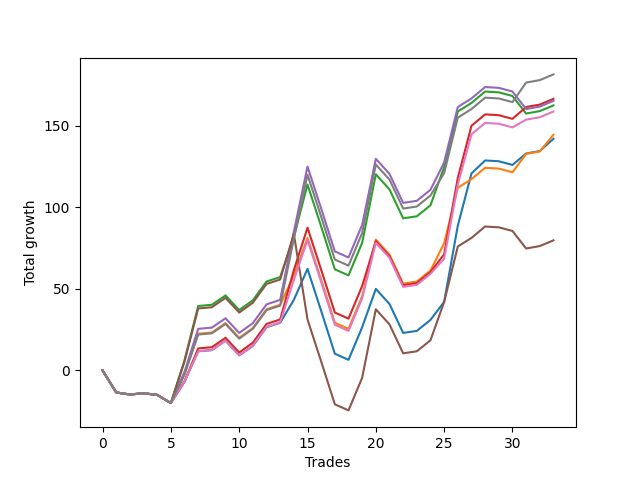

# Short Bulldog 005 
- Symbol: ES90d5mOut
- Date Range: 03/18/2022 - 07/08/2022
- Trading Period: 7:20-12:30
- Number of Trades: 33



| Name | Win Percent | Profit | Avg Profit / Trade |     | Name | Win Percent | Profit | Avg Profit / Trade |
| ---- | ----------- | ------ | ------------------ | --- | ---- | ----------- | ------ | ------------------ |
| Sorted By <br> Profit | | | | | Sorted By <br> Win Percentage ||||
| Seven | 63.64 | 90750.00 | 2750.00 |     | Seven | 63.64 | 90750.00 | 2750.00 |
| Three | 63.64 | 83250.00 | 2522.73 |     | Three | 63.64 | 83250.00 | 2522.73 |
| Four | 60.61 | 82625.00 | 2503.79 |     | Six | 63.64 | 79375.00 | 2405.30 |
| Two | 60.61 | 81250.00 | 2462.12 |     | One | 63.64 | 72250.00 | 2189.39 |
| Six | 63.64 | 79375.00 | 2405.30 |     | Zero | 63.64 | 71000.00 | 2151.52 |
| One | 63.64 | 72250.00 | 2189.39 |     | Four | 60.61 | 82625.00 | 2503.79 |
| Zero | 63.64 | 71000.00 | 2151.52 |     | Two | 60.61 | 81250.00 | 2462.12 |
| Five | 57.58 | 39875.00 | 1208.33 |     | Five | 57.58 | 39875.00 | 1208.33 |

### Test Zero
* Sell when price hits the middle line of the 20p bollinger
* No Stoploss
* Results:
```
Total Trades: 33
Percent Up: 36.36
Percent Down: 63.64
Total Points Moved Down: 142.00
Potential Profit: 71000.00
Total Points Ups: 115.25 Count Ups: 12
Total Points Downs: 257.25 Count Downs: 21
```

<details><summary>Trades</summary>

<code>In: 2022-03-24 08:05:00		Out: 2022-03-24 08:35:55		Total Position Time: 30:55		Total Move Down: -13.50		Total to Date: -13.50</code> <br />
<code>In: 2022-03-24 08:30:00		Out: 2022-03-24 09:00:55		Total Position Time: 30:55		Total Move Down: -1.25		Total to Date: -14.75</code> <br />
<code>In: 2022-03-25 07:25:00		Out: 2022-03-25 07:55:55		Total Position Time: 30:55		Total Move Down: 0.75		Total to Date: -14.00</code> <br />
<code>In: 2022-03-28 12:00:00		Out: 2022-03-28 12:30:55		Total Position Time: 30:55		Total Move Down: -1.00		Total to Date: -15.00</code> <br />
<code>In: 2022-03-29 12:10:00		Out: 2022-03-29 12:40:55		Total Position Time: 30:55		Total Move Down: -5.00		Total to Date: -20.00</code> <br />
<code>In: 2022-04-06 10:50:00		Out: 2022-04-06 11:00:10		Total Position Time: 10:10		Total Move Down: 13.25		Total to Date: -6.75</code> <br />
<code>In: 2022-04-06 11:05:00		Out: 2022-04-06 11:08:10		Total Position Time: 03:10		Total Move Down: 18.50		Total to Date: 11.75</code> <br />
<code>In: 2022-04-07 12:15:00		Out: 2022-04-07 12:45:55		Total Position Time: 30:55		Total Move Down: 0.75		Total to Date: 12.50</code> <br />
<code>In: 2022-04-08 08:05:00		Out: 2022-04-08 08:35:55		Total Position Time: 30:55		Total Move Down: 5.75		Total to Date: 18.25</code> <br />
<code>In: 2022-04-13 08:05:00		Out: 2022-04-13 08:35:55		Total Position Time: 30:55		Total Move Down: -9.00		Total to Date: 9.25</code> <br />
<code>In: 2022-04-20 10:45:00		Out: 2022-04-20 11:13:25		Total Position Time: 28:25		Total Move Down: 5.75		Total to Date: 15.00</code> <br />
<code>In: 2022-04-25 11:35:00		Out: 2022-04-25 12:05:55		Total Position Time: 30:55		Total Move Down: 11.50		Total to Date: 26.50</code> <br />
<code>In: 2022-05-04 09:40:00		Out: 2022-05-04 10:10:55		Total Position Time: 30:55		Total Move Down: 2.75		Total to Date: 29.25</code> <br />
<code>In: 2022-05-04 11:05:00		Out: 2022-05-04 11:07:15		Total Position Time: 02:15		Total Move Down: 14.00		Total to Date: 43.25</code> <br />
<code>In: 2022-05-04 11:30:00		Out: 2022-05-04 11:31:10		Total Position Time: 01:10		Total Move Down: 19.00		Total to Date: 62.25</code> <br />
<code>In: 2022-05-04 11:55:00		Out: 2022-05-04 12:25:55		Total Position Time: 30:55		Total Move Down: -25.75		Total to Date: 36.50</code> <br />
<code>In: 2022-05-04 12:15:00		Out: 2022-05-04 12:45:55		Total Position Time: 30:55		Total Move Down: -26.25		Total to Date: 10.25</code> <br />
<code>In: 2022-05-16 10:35:00		Out: 2022-05-16 11:05:55		Total Position Time: 30:55		Total Move Down: -3.75		Total to Date: 6.50</code> <br />
<code>In: 2022-05-19 08:50:00		Out: 2022-05-19 09:20:55		Total Position Time: 30:55		Total Move Down: 20.00		Total to Date: 26.50</code> <br />
<code>In: 2022-05-19 12:05:00		Out: 2022-05-19 12:18:20		Total Position Time: 13:20		Total Move Down: 23.50		Total to Date: 50.00</code> <br />
<code>In: 2022-05-24 10:55:00		Out: 2022-05-24 11:25:55		Total Position Time: 30:55		Total Move Down: -9.25		Total to Date: 40.75</code> <br />
<code>In: 2022-05-25 11:35:00		Out: 2022-05-25 12:05:55		Total Position Time: 30:55		Total Move Down: -17.75		Total to Date: 23.00</code> <br />
<code>In: 2022-05-27 12:10:00		Out: 2022-05-27 12:40:55		Total Position Time: 30:55		Total Move Down: 1.25		Total to Date: 24.25</code> <br />
<code>In: 2022-05-31 09:05:00		Out: 2022-05-31 09:35:55		Total Position Time: 30:55		Total Move Down: 6.75		Total to Date: 31.00</code> <br />
<code>In: 2022-06-15 11:00:00		Out: 2022-06-15 11:01:15		Total Position Time: 01:15		Total Move Down: 11.00		Total to Date: 42.00</code> <br />
<code>In: 2022-06-15 11:45:00		Out: 2022-06-15 11:58:05		Total Position Time: 13:05		Total Move Down: 46.75		Total to Date: 88.75</code> <br />
<code>In: 2022-06-15 11:50:00		Out: 2022-06-15 11:58:05		Total Position Time: 08:05		Total Move Down: 32.00		Total to Date: 120.75</code> <br />
<code>In: 2022-06-21 12:05:00		Out: 2022-06-21 12:35:35		Total Position Time: 30:35		Total Move Down: 8.00		Total to Date: 128.75</code> <br />
<code>In: 2022-07-05 10:40:00		Out: 2022-07-05 11:10:55		Total Position Time: 30:55		Total Move Down: -0.50		Total to Date: 128.25</code> <br />
<code>In: 2022-07-05 11:40:00		Out: 2022-07-05 12:10:55		Total Position Time: 30:55		Total Move Down: -2.25		Total to Date: 126.00</code> <br />
<code>In: 2022-07-06 11:00:00		Out: 2022-07-06 11:02:25		Total Position Time: 02:25		Total Move Down: 7.00		Total to Date: 133.00</code> <br />
<code>In: 2022-07-06 11:45:00		Out: 2022-07-06 12:15:55		Total Position Time: 30:55		Total Move Down: 1.50		Total to Date: 134.50</code> <br />
<code>In: 2022-07-07 12:20:00		Out: 2022-07-07 12:38:25		Total Position Time: 18:25		Total Move Down: 7.50		Total to Date: 142.00</code> <br />


</details>

### Test One
* Sell when the price hits the upper line of the 20p 1std bollinger
* No Stoploss
* Results:
```
Total Trades: 33
Percent Up: 36.36
Percent Down: 63.64
Total Points Moved Down: 144.50
Potential Profit: 72250.00
Total Points Ups: 115.25 Count Ups: 12
Total Points Downs: 259.75 Count Downs: 21
```

<details><summary>Trades</summary>

<code>In: 2022-03-24 08:05:00		Out: 2022-03-24 08:35:55		Total Position Time: 30:55		Total Move Down: -13.50		Total to Date: -13.50</code> <br />
<code>In: 2022-03-24 08:30:00		Out: 2022-03-24 09:00:55		Total Position Time: 30:55		Total Move Down: -1.25		Total to Date: -14.75</code> <br />
<code>In: 2022-03-25 07:25:00		Out: 2022-03-25 07:55:55		Total Position Time: 30:55		Total Move Down: 0.75		Total to Date: -14.00</code> <br />
<code>In: 2022-03-28 12:00:00		Out: 2022-03-28 12:30:55		Total Position Time: 30:55		Total Move Down: -1.00		Total to Date: -15.00</code> <br />
<code>In: 2022-03-29 12:10:00		Out: 2022-03-29 12:40:55		Total Position Time: 30:55		Total Move Down: -5.00		Total to Date: -20.00</code> <br />
<code>In: 2022-04-06 10:50:00		Out: 2022-04-06 11:09:45		Total Position Time: 19:45		Total Move Down: 17.75		Total to Date: -2.25</code> <br />
<code>In: 2022-04-06 11:05:00		Out: 2022-04-06 11:09:45		Total Position Time: 04:45		Total Move Down: 24.75		Total to Date: 22.50</code> <br />
<code>In: 2022-04-07 12:15:00		Out: 2022-04-07 12:45:55		Total Position Time: 30:55		Total Move Down: 0.75		Total to Date: 23.25</code> <br />
<code>In: 2022-04-08 08:05:00		Out: 2022-04-08 08:35:55		Total Position Time: 30:55		Total Move Down: 5.75		Total to Date: 29.00</code> <br />
<code>In: 2022-04-13 08:05:00		Out: 2022-04-13 08:35:55		Total Position Time: 30:55		Total Move Down: -9.00		Total to Date: 20.00</code> <br />
<code>In: 2022-04-20 10:45:00		Out: 2022-04-20 11:15:55		Total Position Time: 30:55		Total Move Down: 6.00		Total to Date: 26.00</code> <br />
<code>In: 2022-04-25 11:35:00		Out: 2022-04-25 12:05:55		Total Position Time: 30:55		Total Move Down: 11.50		Total to Date: 37.50</code> <br />
<code>In: 2022-05-04 09:40:00		Out: 2022-05-04 10:10:55		Total Position Time: 30:55		Total Move Down: 2.75		Total to Date: 40.25</code> <br />
<code>In: 2022-05-04 11:05:00		Out: 2022-05-04 11:07:20		Total Position Time: 02:20		Total Move Down: 18.00		Total to Date: 58.25</code> <br />
<code>In: 2022-05-04 11:30:00		Out: 2022-05-04 11:31:20		Total Position Time: 01:20		Total Move Down: 23.00		Total to Date: 81.25</code> <br />
<code>In: 2022-05-04 11:55:00		Out: 2022-05-04 12:25:55		Total Position Time: 30:55		Total Move Down: -25.75		Total to Date: 55.50</code> <br />
<code>In: 2022-05-04 12:15:00		Out: 2022-05-04 12:45:55		Total Position Time: 30:55		Total Move Down: -26.25		Total to Date: 29.25</code> <br />
<code>In: 2022-05-16 10:35:00		Out: 2022-05-16 11:05:55		Total Position Time: 30:55		Total Move Down: -3.75		Total to Date: 25.50</code> <br />
<code>In: 2022-05-19 08:50:00		Out: 2022-05-19 09:20:55		Total Position Time: 30:55		Total Move Down: 20.00		Total to Date: 45.50</code> <br />
<code>In: 2022-05-19 12:05:00		Out: 2022-05-19 12:24:50		Total Position Time: 19:50		Total Move Down: 34.75		Total to Date: 80.25</code> <br />
<code>In: 2022-05-24 10:55:00		Out: 2022-05-24 11:25:55		Total Position Time: 30:55		Total Move Down: -9.25		Total to Date: 71.00</code> <br />
<code>In: 2022-05-25 11:35:00		Out: 2022-05-25 12:05:55		Total Position Time: 30:55		Total Move Down: -17.75		Total to Date: 53.25</code> <br />
<code>In: 2022-05-27 12:10:00		Out: 2022-05-27 12:40:55		Total Position Time: 30:55		Total Move Down: 1.25		Total to Date: 54.50</code> <br />
<code>In: 2022-05-31 09:05:00		Out: 2022-05-31 09:35:55		Total Position Time: 30:55		Total Move Down: 6.75		Total to Date: 61.25</code> <br />
<code>In: 2022-06-15 11:00:00		Out: 2022-06-15 11:01:25		Total Position Time: 01:25		Total Move Down: 16.75		Total to Date: 78.00</code> <br />
<code>In: 2022-06-15 11:45:00		Out: 2022-06-15 12:15:55		Total Position Time: 30:55		Total Move Down: 34.00		Total to Date: 112.00</code> <br />
<code>In: 2022-06-15 11:50:00		Out: 2022-06-15 12:20:55		Total Position Time: 30:55		Total Move Down: 5.25		Total to Date: 117.25</code> <br />
<code>In: 2022-06-21 12:05:00		Out: 2022-06-21 12:35:55		Total Position Time: 30:55		Total Move Down: 7.00		Total to Date: 124.25</code> <br />
<code>In: 2022-07-05 10:40:00		Out: 2022-07-05 11:10:55		Total Position Time: 30:55		Total Move Down: -0.50		Total to Date: 123.75</code> <br />
<code>In: 2022-07-05 11:40:00		Out: 2022-07-05 12:10:55		Total Position Time: 30:55		Total Move Down: -2.25		Total to Date: 121.50</code> <br />
<code>In: 2022-07-06 11:00:00		Out: 2022-07-06 11:12:15		Total Position Time: 12:15		Total Move Down: 11.25		Total to Date: 132.75</code> <br />
<code>In: 2022-07-06 11:45:00		Out: 2022-07-06 12:15:55		Total Position Time: 30:55		Total Move Down: 1.50		Total to Date: 134.25</code> <br />
<code>In: 2022-07-07 12:20:00		Out: 2022-07-07 12:46:35		Total Position Time: 26:35		Total Move Down: 10.25		Total to Date: 144.50</code> <br />


</details>

### Test Two
* Sell when the price hits the upper line of the 20p 2std bollinger
* No Stoploss
* Results:
```
Total Trades: 33
Percent Up: 39.39
Percent Down: 60.61
Total Points Moved Down: 162.50
Potential Profit: 81250.00
Total Points Ups: 126.00 Count Ups: 13
Total Points Downs: 288.50 Count Downs: 20
```

<details><summary>Trades</summary>

<code>In: 2022-03-24 08:05:00		Out: 2022-03-24 08:35:55		Total Position Time: 30:55		Total Move Down: -13.50		Total to Date: -13.50</code> <br />
<code>In: 2022-03-24 08:30:00		Out: 2022-03-24 09:00:55		Total Position Time: 30:55		Total Move Down: -1.25		Total to Date: -14.75</code> <br />
<code>In: 2022-03-25 07:25:00		Out: 2022-03-25 07:55:55		Total Position Time: 30:55		Total Move Down: 0.75		Total to Date: -14.00</code> <br />
<code>In: 2022-03-28 12:00:00		Out: 2022-03-28 12:30:55		Total Position Time: 30:55		Total Move Down: -1.00		Total to Date: -15.00</code> <br />
<code>In: 2022-03-29 12:10:00		Out: 2022-03-29 12:40:55		Total Position Time: 30:55		Total Move Down: -5.00		Total to Date: -20.00</code> <br />
<code>In: 2022-04-06 10:50:00		Out: 2022-04-06 11:15:15		Total Position Time: 25:15		Total Move Down: 26.25		Total to Date: 6.25</code> <br />
<code>In: 2022-04-06 11:05:00		Out: 2022-04-06 11:15:15		Total Position Time: 10:15		Total Move Down: 33.25		Total to Date: 39.50</code> <br />
<code>In: 2022-04-07 12:15:00		Out: 2022-04-07 12:45:55		Total Position Time: 30:55		Total Move Down: 0.75		Total to Date: 40.25</code> <br />
<code>In: 2022-04-08 08:05:00		Out: 2022-04-08 08:35:55		Total Position Time: 30:55		Total Move Down: 5.75		Total to Date: 46.00</code> <br />
<code>In: 2022-04-13 08:05:00		Out: 2022-04-13 08:35:55		Total Position Time: 30:55		Total Move Down: -9.00		Total to Date: 37.00</code> <br />
<code>In: 2022-04-20 10:45:00		Out: 2022-04-20 11:15:55		Total Position Time: 30:55		Total Move Down: 6.00		Total to Date: 43.00</code> <br />
<code>In: 2022-04-25 11:35:00		Out: 2022-04-25 12:05:55		Total Position Time: 30:55		Total Move Down: 11.50		Total to Date: 54.50</code> <br />
<code>In: 2022-05-04 09:40:00		Out: 2022-05-04 10:10:55		Total Position Time: 30:55		Total Move Down: 2.75		Total to Date: 57.25</code> <br />
<code>In: 2022-05-04 11:05:00		Out: 2022-05-04 11:07:40		Total Position Time: 02:40		Total Move Down: 24.50		Total to Date: 81.75</code> <br />
<code>In: 2022-05-04 11:30:00		Out: 2022-05-04 11:32:25		Total Position Time: 02:25		Total Move Down: 32.25		Total to Date: 114.00</code> <br />
<code>In: 2022-05-04 11:55:00		Out: 2022-05-04 12:25:55		Total Position Time: 30:55		Total Move Down: -25.75		Total to Date: 88.25</code> <br />
<code>In: 2022-05-04 12:15:00		Out: 2022-05-04 12:45:55		Total Position Time: 30:55		Total Move Down: -26.25		Total to Date: 62.00</code> <br />
<code>In: 2022-05-16 10:35:00		Out: 2022-05-16 11:05:55		Total Position Time: 30:55		Total Move Down: -3.75		Total to Date: 58.25</code> <br />
<code>In: 2022-05-19 08:50:00		Out: 2022-05-19 09:20:55		Total Position Time: 30:55		Total Move Down: 20.00		Total to Date: 78.25</code> <br />
<code>In: 2022-05-19 12:05:00		Out: 2022-05-19 12:35:55		Total Position Time: 30:55		Total Move Down: 42.00		Total to Date: 120.25</code> <br />
<code>In: 2022-05-24 10:55:00		Out: 2022-05-24 11:25:55		Total Position Time: 30:55		Total Move Down: -9.25		Total to Date: 111.00</code> <br />
<code>In: 2022-05-25 11:35:00		Out: 2022-05-25 12:05:55		Total Position Time: 30:55		Total Move Down: -17.75		Total to Date: 93.25</code> <br />
<code>In: 2022-05-27 12:10:00		Out: 2022-05-27 12:40:55		Total Position Time: 30:55		Total Move Down: 1.25		Total to Date: 94.50</code> <br />
<code>In: 2022-05-31 09:05:00		Out: 2022-05-31 09:35:55		Total Position Time: 30:55		Total Move Down: 6.75		Total to Date: 101.25</code> <br />
<code>In: 2022-06-15 11:00:00		Out: 2022-06-15 11:01:40		Total Position Time: 01:40		Total Move Down: 23.50		Total to Date: 124.75</code> <br />
<code>In: 2022-06-15 11:45:00		Out: 2022-06-15 12:15:55		Total Position Time: 30:55		Total Move Down: 34.00		Total to Date: 158.75</code> <br />
<code>In: 2022-06-15 11:50:00		Out: 2022-06-15 12:20:55		Total Position Time: 30:55		Total Move Down: 5.25		Total to Date: 164.00</code> <br />
<code>In: 2022-06-21 12:05:00		Out: 2022-06-21 12:35:55		Total Position Time: 30:55		Total Move Down: 7.00		Total to Date: 171.00</code> <br />
<code>In: 2022-07-05 10:40:00		Out: 2022-07-05 11:10:55		Total Position Time: 30:55		Total Move Down: -0.50		Total to Date: 170.50</code> <br />
<code>In: 2022-07-05 11:40:00		Out: 2022-07-05 12:10:55		Total Position Time: 30:55		Total Move Down: -2.25		Total to Date: 168.25</code> <br />
<code>In: 2022-07-06 11:00:00		Out: 2022-07-06 11:30:55		Total Position Time: 30:55		Total Move Down: -10.75		Total to Date: 157.50</code> <br />
<code>In: 2022-07-06 11:45:00		Out: 2022-07-06 12:15:55		Total Position Time: 30:55		Total Move Down: 1.50		Total to Date: 159.00</code> <br />
<code>In: 2022-07-07 12:20:00		Out: 2022-07-07 12:50:55		Total Position Time: 30:55		Total Move Down: 3.50		Total to Date: 162.50</code> <br />


</details>

### Test Three
* Sell when price hits the middle line of the 50p bollinger
* No Stoploss
* Results:
```
Total Trades: 33
Percent Up: 36.36
Percent Down: 63.64
Total Points Moved Down: 166.50
Potential Profit: 83250.00
Total Points Ups: 115.25 Count Ups: 12
Total Points Downs: 281.75 Count Downs: 21
```

<details><summary>Trades</summary>

<code>In: 2022-03-24 08:05:00		Out: 2022-03-24 08:35:55		Total Position Time: 30:55		Total Move Down: -13.50		Total to Date: -13.50</code> <br />
<code>In: 2022-03-24 08:30:00		Out: 2022-03-24 09:00:55		Total Position Time: 30:55		Total Move Down: -1.25		Total to Date: -14.75</code> <br />
<code>In: 2022-03-25 07:25:00		Out: 2022-03-25 07:55:55		Total Position Time: 30:55		Total Move Down: 0.75		Total to Date: -14.00</code> <br />
<code>In: 2022-03-28 12:00:00		Out: 2022-03-28 12:30:55		Total Position Time: 30:55		Total Move Down: -1.00		Total to Date: -15.00</code> <br />
<code>In: 2022-03-29 12:10:00		Out: 2022-03-29 12:40:55		Total Position Time: 30:55		Total Move Down: -5.00		Total to Date: -20.00</code> <br />
<code>In: 2022-04-06 10:50:00		Out: 2022-04-06 11:08:35		Total Position Time: 18:35		Total Move Down: 13.25		Total to Date: -6.75</code> <br />
<code>In: 2022-04-06 11:05:00		Out: 2022-04-06 11:08:35		Total Position Time: 03:35		Total Move Down: 20.25		Total to Date: 13.50</code> <br />
<code>In: 2022-04-07 12:15:00		Out: 2022-04-07 12:45:55		Total Position Time: 30:55		Total Move Down: 0.75		Total to Date: 14.25</code> <br />
<code>In: 2022-04-08 08:05:00		Out: 2022-04-08 08:35:55		Total Position Time: 30:55		Total Move Down: 5.75		Total to Date: 20.00</code> <br />
<code>In: 2022-04-13 08:05:00		Out: 2022-04-13 08:35:55		Total Position Time: 30:55		Total Move Down: -9.00		Total to Date: 11.00</code> <br />
<code>In: 2022-04-20 10:45:00		Out: 2022-04-20 11:15:55		Total Position Time: 30:55		Total Move Down: 6.00		Total to Date: 17.00</code> <br />
<code>In: 2022-04-25 11:35:00		Out: 2022-04-25 12:05:55		Total Position Time: 30:55		Total Move Down: 11.50		Total to Date: 28.50</code> <br />
<code>In: 2022-05-04 09:40:00		Out: 2022-05-04 10:10:55		Total Position Time: 30:55		Total Move Down: 2.75		Total to Date: 31.25</code> <br />
<code>In: 2022-05-04 11:05:00		Out: 2022-05-04 11:20:50		Total Position Time: 15:50		Total Move Down: 30.25		Total to Date: 61.50</code> <br />
<code>In: 2022-05-04 11:30:00		Out: 2022-05-04 11:31:40		Total Position Time: 01:40		Total Move Down: 26.00		Total to Date: 87.50</code> <br />
<code>In: 2022-05-04 11:55:00		Out: 2022-05-04 12:25:55		Total Position Time: 30:55		Total Move Down: -25.75		Total to Date: 61.75</code> <br />
<code>In: 2022-05-04 12:15:00		Out: 2022-05-04 12:45:55		Total Position Time: 30:55		Total Move Down: -26.25		Total to Date: 35.50</code> <br />
<code>In: 2022-05-16 10:35:00		Out: 2022-05-16 11:05:55		Total Position Time: 30:55		Total Move Down: -3.75		Total to Date: 31.75</code> <br />
<code>In: 2022-05-19 08:50:00		Out: 2022-05-19 09:20:55		Total Position Time: 30:55		Total Move Down: 20.00		Total to Date: 51.75</code> <br />
<code>In: 2022-05-19 12:05:00		Out: 2022-05-19 12:21:15		Total Position Time: 16:15		Total Move Down: 27.50		Total to Date: 79.25</code> <br />
<code>In: 2022-05-24 10:55:00		Out: 2022-05-24 11:25:55		Total Position Time: 30:55		Total Move Down: -9.25		Total to Date: 70.00</code> <br />
<code>In: 2022-05-25 11:35:00		Out: 2022-05-25 12:05:55		Total Position Time: 30:55		Total Move Down: -17.75		Total to Date: 52.25</code> <br />
<code>In: 2022-05-27 12:10:00		Out: 2022-05-27 12:40:55		Total Position Time: 30:55		Total Move Down: 1.25		Total to Date: 53.50</code> <br />
<code>In: 2022-05-31 09:05:00		Out: 2022-05-31 09:35:55		Total Position Time: 30:55		Total Move Down: 6.75		Total to Date: 60.25</code> <br />
<code>In: 2022-06-15 11:00:00		Out: 2022-06-15 11:01:15		Total Position Time: 01:15		Total Move Down: 11.00		Total to Date: 71.25</code> <br />
<code>In: 2022-06-15 11:45:00		Out: 2022-06-15 11:58:05		Total Position Time: 13:05		Total Move Down: 46.75		Total to Date: 118.00</code> <br />
<code>In: 2022-06-15 11:50:00		Out: 2022-06-15 11:58:05		Total Position Time: 08:05		Total Move Down: 32.00		Total to Date: 150.00</code> <br />
<code>In: 2022-06-21 12:05:00		Out: 2022-06-21 12:35:55		Total Position Time: 30:55		Total Move Down: 7.00		Total to Date: 157.00</code> <br />
<code>In: 2022-07-05 10:40:00		Out: 2022-07-05 11:10:55		Total Position Time: 30:55		Total Move Down: -0.50		Total to Date: 156.50</code> <br />
<code>In: 2022-07-05 11:40:00		Out: 2022-07-05 12:10:55		Total Position Time: 30:55		Total Move Down: -2.25		Total to Date: 154.25</code> <br />
<code>In: 2022-07-06 11:00:00		Out: 2022-07-06 11:11:50		Total Position Time: 11:50		Total Move Down: 7.25		Total to Date: 161.50</code> <br />
<code>In: 2022-07-06 11:45:00		Out: 2022-07-06 12:15:55		Total Position Time: 30:55		Total Move Down: 1.50		Total to Date: 163.00</code> <br />
<code>In: 2022-07-07 12:20:00		Out: 2022-07-07 12:50:55		Total Position Time: 30:55		Total Move Down: 3.50		Total to Date: 166.50</code> <br />


</details>

### Test Four
* Sell when the price hits the upper line of the 50p 1std bollinger
* No Stoploss
* Results:
```
Total Trades: 33
Percent Up: 39.39
Percent Down: 60.61
Total Points Moved Down: 165.25
Potential Profit: 82625.00
Total Points Ups: 126.00 Count Ups: 13
Total Points Downs: 291.25 Count Downs: 20
```

<details><summary>Trades</summary>

<code>In: 2022-03-24 08:05:00		Out: 2022-03-24 08:35:55		Total Position Time: 30:55		Total Move Down: -13.50		Total to Date: -13.50</code> <br />
<code>In: 2022-03-24 08:30:00		Out: 2022-03-24 09:00:55		Total Position Time: 30:55		Total Move Down: -1.25		Total to Date: -14.75</code> <br />
<code>In: 2022-03-25 07:25:00		Out: 2022-03-25 07:55:55		Total Position Time: 30:55		Total Move Down: 0.75		Total to Date: -14.00</code> <br />
<code>In: 2022-03-28 12:00:00		Out: 2022-03-28 12:30:55		Total Position Time: 30:55		Total Move Down: -1.00		Total to Date: -15.00</code> <br />
<code>In: 2022-03-29 12:10:00		Out: 2022-03-29 12:40:55		Total Position Time: 30:55		Total Move Down: -5.00		Total to Date: -20.00</code> <br />
<code>In: 2022-04-06 10:50:00		Out: 2022-04-06 11:11:20		Total Position Time: 21:20		Total Move Down: 19.25		Total to Date: -0.75</code> <br />
<code>In: 2022-04-06 11:05:00		Out: 2022-04-06 11:11:20		Total Position Time: 06:20		Total Move Down: 26.25		Total to Date: 25.50</code> <br />
<code>In: 2022-04-07 12:15:00		Out: 2022-04-07 12:45:55		Total Position Time: 30:55		Total Move Down: 0.75		Total to Date: 26.25</code> <br />
<code>In: 2022-04-08 08:05:00		Out: 2022-04-08 08:35:55		Total Position Time: 30:55		Total Move Down: 5.75		Total to Date: 32.00</code> <br />
<code>In: 2022-04-13 08:05:00		Out: 2022-04-13 08:35:55		Total Position Time: 30:55		Total Move Down: -9.00		Total to Date: 23.00</code> <br />
<code>In: 2022-04-20 10:45:00		Out: 2022-04-20 11:15:55		Total Position Time: 30:55		Total Move Down: 6.00		Total to Date: 29.00</code> <br />
<code>In: 2022-04-25 11:35:00		Out: 2022-04-25 12:05:55		Total Position Time: 30:55		Total Move Down: 11.50		Total to Date: 40.50</code> <br />
<code>In: 2022-05-04 09:40:00		Out: 2022-05-04 10:10:55		Total Position Time: 30:55		Total Move Down: 2.75		Total to Date: 43.25</code> <br />
<code>In: 2022-05-04 11:05:00		Out: 2022-05-04 11:34:10		Total Position Time: 29:10		Total Move Down: 41.75		Total to Date: 85.00</code> <br />
<code>In: 2022-05-04 11:30:00		Out: 2022-05-04 11:34:10		Total Position Time: 04:10		Total Move Down: 40.00		Total to Date: 125.00</code> <br />
<code>In: 2022-05-04 11:55:00		Out: 2022-05-04 12:25:55		Total Position Time: 30:55		Total Move Down: -25.75		Total to Date: 99.25</code> <br />
<code>In: 2022-05-04 12:15:00		Out: 2022-05-04 12:45:55		Total Position Time: 30:55		Total Move Down: -26.25		Total to Date: 73.00</code> <br />
<code>In: 2022-05-16 10:35:00		Out: 2022-05-16 11:05:55		Total Position Time: 30:55		Total Move Down: -3.75		Total to Date: 69.25</code> <br />
<code>In: 2022-05-19 08:50:00		Out: 2022-05-19 09:20:55		Total Position Time: 30:55		Total Move Down: 20.00		Total to Date: 89.25</code> <br />
<code>In: 2022-05-19 12:05:00		Out: 2022-05-19 12:30:05		Total Position Time: 25:05		Total Move Down: 40.50		Total to Date: 129.75</code> <br />
<code>In: 2022-05-24 10:55:00		Out: 2022-05-24 11:25:55		Total Position Time: 30:55		Total Move Down: -9.25		Total to Date: 120.50</code> <br />
<code>In: 2022-05-25 11:35:00		Out: 2022-05-25 12:05:55		Total Position Time: 30:55		Total Move Down: -17.75		Total to Date: 102.75</code> <br />
<code>In: 2022-05-27 12:10:00		Out: 2022-05-27 12:40:55		Total Position Time: 30:55		Total Move Down: 1.25		Total to Date: 104.00</code> <br />
<code>In: 2022-05-31 09:05:00		Out: 2022-05-31 09:35:55		Total Position Time: 30:55		Total Move Down: 6.75		Total to Date: 110.75</code> <br />
<code>In: 2022-06-15 11:00:00		Out: 2022-06-15 11:01:25		Total Position Time: 01:25		Total Move Down: 16.75		Total to Date: 127.50</code> <br />
<code>In: 2022-06-15 11:45:00		Out: 2022-06-15 12:15:55		Total Position Time: 30:55		Total Move Down: 34.00		Total to Date: 161.50</code> <br />
<code>In: 2022-06-15 11:50:00		Out: 2022-06-15 12:20:55		Total Position Time: 30:55		Total Move Down: 5.25		Total to Date: 166.75</code> <br />
<code>In: 2022-06-21 12:05:00		Out: 2022-06-21 12:35:55		Total Position Time: 30:55		Total Move Down: 7.00		Total to Date: 173.75</code> <br />
<code>In: 2022-07-05 10:40:00		Out: 2022-07-05 11:10:55		Total Position Time: 30:55		Total Move Down: -0.50		Total to Date: 173.25</code> <br />
<code>In: 2022-07-05 11:40:00		Out: 2022-07-05 12:10:55		Total Position Time: 30:55		Total Move Down: -2.25		Total to Date: 171.00</code> <br />
<code>In: 2022-07-06 11:00:00		Out: 2022-07-06 11:30:55		Total Position Time: 30:55		Total Move Down: -10.75		Total to Date: 160.25</code> <br />
<code>In: 2022-07-06 11:45:00		Out: 2022-07-06 12:15:55		Total Position Time: 30:55		Total Move Down: 1.50		Total to Date: 161.75</code> <br />
<code>In: 2022-07-07 12:20:00		Out: 2022-07-07 12:50:55		Total Position Time: 30:55		Total Move Down: 3.50		Total to Date: 165.25</code> <br />


</details>

### Test Five
* Sell when the price hits the upper line of the 50p 2std bollinger
* No Stoploss
* Results:
```
Total Trades: 33
Percent Up: 42.42
Percent Down: 57.58
Total Points Moved Down: 79.75
Potential Profit: 39875.00
Total Points Ups: 178.50 Count Ups: 14
Total Points Downs: 258.25 Count Downs: 19
```

<details><summary>Trades</summary>

<code>In: 2022-03-24 08:05:00		Out: 2022-03-24 08:35:55		Total Position Time: 30:55		Total Move Down: -13.50		Total to Date: -13.50</code> <br />
<code>In: 2022-03-24 08:30:00		Out: 2022-03-24 09:00:55		Total Position Time: 30:55		Total Move Down: -1.25		Total to Date: -14.75</code> <br />
<code>In: 2022-03-25 07:25:00		Out: 2022-03-25 07:55:55		Total Position Time: 30:55		Total Move Down: 0.75		Total to Date: -14.00</code> <br />
<code>In: 2022-03-28 12:00:00		Out: 2022-03-28 12:30:55		Total Position Time: 30:55		Total Move Down: -1.00		Total to Date: -15.00</code> <br />
<code>In: 2022-03-29 12:10:00		Out: 2022-03-29 12:40:55		Total Position Time: 30:55		Total Move Down: -5.00		Total to Date: -20.00</code> <br />
<code>In: 2022-04-06 10:50:00		Out: 2022-04-06 11:15:05		Total Position Time: 25:05		Total Move Down: 25.50		Total to Date: 5.50</code> <br />
<code>In: 2022-04-06 11:05:00		Out: 2022-04-06 11:15:05		Total Position Time: 10:05		Total Move Down: 32.50		Total to Date: 38.00</code> <br />
<code>In: 2022-04-07 12:15:00		Out: 2022-04-07 12:45:55		Total Position Time: 30:55		Total Move Down: 0.75		Total to Date: 38.75</code> <br />
<code>In: 2022-04-08 08:05:00		Out: 2022-04-08 08:35:55		Total Position Time: 30:55		Total Move Down: 5.75		Total to Date: 44.50</code> <br />
<code>In: 2022-04-13 08:05:00		Out: 2022-04-13 08:35:55		Total Position Time: 30:55		Total Move Down: -9.00		Total to Date: 35.50</code> <br />
<code>In: 2022-04-20 10:45:00		Out: 2022-04-20 11:15:55		Total Position Time: 30:55		Total Move Down: 6.00		Total to Date: 41.50</code> <br />
<code>In: 2022-04-25 11:35:00		Out: 2022-04-25 12:05:55		Total Position Time: 30:55		Total Move Down: 11.50		Total to Date: 53.00</code> <br />
<code>In: 2022-05-04 09:40:00		Out: 2022-05-04 10:10:55		Total Position Time: 30:55		Total Move Down: 2.75		Total to Date: 55.75</code> <br />
<code>In: 2022-05-04 11:05:00		Out: 2022-05-04 11:35:55		Total Position Time: 30:55		Total Move Down: 28.00		Total to Date: 83.75</code> <br />
<code>In: 2022-05-04 11:30:00		Out: 2022-05-04 12:00:55		Total Position Time: 30:55		Total Move Down: -52.50		Total to Date: 31.25</code> <br />
<code>In: 2022-05-04 11:55:00		Out: 2022-05-04 12:25:55		Total Position Time: 30:55		Total Move Down: -25.75		Total to Date: 5.50</code> <br />
<code>In: 2022-05-04 12:15:00		Out: 2022-05-04 12:45:55		Total Position Time: 30:55		Total Move Down: -26.25		Total to Date: -20.75</code> <br />
<code>In: 2022-05-16 10:35:00		Out: 2022-05-16 11:05:55		Total Position Time: 30:55		Total Move Down: -3.75		Total to Date: -24.50</code> <br />
<code>In: 2022-05-19 08:50:00		Out: 2022-05-19 09:20:55		Total Position Time: 30:55		Total Move Down: 20.00		Total to Date: -4.50</code> <br />
<code>In: 2022-05-19 12:05:00		Out: 2022-05-19 12:35:55		Total Position Time: 30:55		Total Move Down: 42.00		Total to Date: 37.50</code> <br />
<code>In: 2022-05-24 10:55:00		Out: 2022-05-24 11:25:55		Total Position Time: 30:55		Total Move Down: -9.25		Total to Date: 28.25</code> <br />
<code>In: 2022-05-25 11:35:00		Out: 2022-05-25 12:05:55		Total Position Time: 30:55		Total Move Down: -17.75		Total to Date: 10.50</code> <br />
<code>In: 2022-05-27 12:10:00		Out: 2022-05-27 12:40:55		Total Position Time: 30:55		Total Move Down: 1.25		Total to Date: 11.75</code> <br />
<code>In: 2022-05-31 09:05:00		Out: 2022-05-31 09:35:55		Total Position Time: 30:55		Total Move Down: 6.75		Total to Date: 18.50</code> <br />
<code>In: 2022-06-15 11:00:00		Out: 2022-06-15 11:01:40		Total Position Time: 01:40		Total Move Down: 23.50		Total to Date: 42.00</code> <br />
<code>In: 2022-06-15 11:45:00		Out: 2022-06-15 12:15:55		Total Position Time: 30:55		Total Move Down: 34.00		Total to Date: 76.00</code> <br />
<code>In: 2022-06-15 11:50:00		Out: 2022-06-15 12:20:55		Total Position Time: 30:55		Total Move Down: 5.25		Total to Date: 81.25</code> <br />
<code>In: 2022-06-21 12:05:00		Out: 2022-06-21 12:35:55		Total Position Time: 30:55		Total Move Down: 7.00		Total to Date: 88.25</code> <br />
<code>In: 2022-07-05 10:40:00		Out: 2022-07-05 11:10:55		Total Position Time: 30:55		Total Move Down: -0.50		Total to Date: 87.75</code> <br />
<code>In: 2022-07-05 11:40:00		Out: 2022-07-05 12:10:55		Total Position Time: 30:55		Total Move Down: -2.25		Total to Date: 85.50</code> <br />
<code>In: 2022-07-06 11:00:00		Out: 2022-07-06 11:30:55		Total Position Time: 30:55		Total Move Down: -10.75		Total to Date: 74.75</code> <br />
<code>In: 2022-07-06 11:45:00		Out: 2022-07-06 12:15:55		Total Position Time: 30:55		Total Move Down: 1.50		Total to Date: 76.25</code> <br />
<code>In: 2022-07-07 12:20:00		Out: 2022-07-07 12:50:55		Total Position Time: 30:55		Total Move Down: 3.50		Total to Date: 79.75</code> <br />


</details>

### Test Six
* Sell when the price hits the middle line of the 1std VWAP
* No Stoploss
* Results:
```
Total Trades: 33
Percent Up: 36.36
Percent Down: 63.64
Total Points Moved Down: 158.75
Potential Profit: 79375.00
Total Points Ups: 115.25 Count Ups: 12
Total Points Downs: 274.00 Count Downs: 21
```

<details><summary>Trades</summary>

<code>In: 2022-03-24 08:05:00		Out: 2022-03-24 08:35:55		Total Position Time: 30:55		Total Move Down: -13.50		Total to Date: -13.50</code> <br />
<code>In: 2022-03-24 08:30:00		Out: 2022-03-24 09:00:55		Total Position Time: 30:55		Total Move Down: -1.25		Total to Date: -14.75</code> <br />
<code>In: 2022-03-25 07:25:00		Out: 2022-03-25 07:55:55		Total Position Time: 30:55		Total Move Down: 0.75		Total to Date: -14.00</code> <br />
<code>In: 2022-03-28 12:00:00		Out: 2022-03-28 12:30:55		Total Position Time: 30:55		Total Move Down: -1.00		Total to Date: -15.00</code> <br />
<code>In: 2022-03-29 12:10:00		Out: 2022-03-29 12:40:55		Total Position Time: 30:55		Total Move Down: -5.00		Total to Date: -20.00</code> <br />
<code>In: 2022-04-06 10:50:00		Out: 2022-04-06 11:00:10		Total Position Time: 10:10		Total Move Down: 13.25		Total to Date: -6.75</code> <br />
<code>In: 2022-04-06 11:05:00		Out: 2022-04-06 11:08:10		Total Position Time: 03:10		Total Move Down: 18.50		Total to Date: 11.75</code> <br />
<code>In: 2022-04-07 12:15:00		Out: 2022-04-07 12:45:55		Total Position Time: 30:55		Total Move Down: 0.75		Total to Date: 12.50</code> <br />
<code>In: 2022-04-08 08:05:00		Out: 2022-04-08 08:35:55		Total Position Time: 30:55		Total Move Down: 5.75		Total to Date: 18.25</code> <br />
<code>In: 2022-04-13 08:05:00		Out: 2022-04-13 08:35:55		Total Position Time: 30:55		Total Move Down: -9.00		Total to Date: 9.25</code> <br />
<code>In: 2022-04-20 10:45:00		Out: 2022-04-20 11:15:55		Total Position Time: 30:55		Total Move Down: 6.00		Total to Date: 15.25</code> <br />
<code>In: 2022-04-25 11:35:00		Out: 2022-04-25 12:05:55		Total Position Time: 30:55		Total Move Down: 11.50		Total to Date: 26.75</code> <br />
<code>In: 2022-05-04 09:40:00		Out: 2022-05-04 10:10:55		Total Position Time: 30:55		Total Move Down: 2.75		Total to Date: 29.50</code> <br />
<code>In: 2022-05-04 11:05:00		Out: 2022-05-04 11:20:20		Total Position Time: 15:20		Total Move Down: 26.00		Total to Date: 55.50</code> <br />
<code>In: 2022-05-04 11:30:00		Out: 2022-05-04 11:31:25		Total Position Time: 01:25		Total Move Down: 24.50		Total to Date: 80.00</code> <br />
<code>In: 2022-05-04 11:55:00		Out: 2022-05-04 12:25:55		Total Position Time: 30:55		Total Move Down: -25.75		Total to Date: 54.25</code> <br />
<code>In: 2022-05-04 12:15:00		Out: 2022-05-04 12:45:55		Total Position Time: 30:55		Total Move Down: -26.25		Total to Date: 28.00</code> <br />
<code>In: 2022-05-16 10:35:00		Out: 2022-05-16 11:05:55		Total Position Time: 30:55		Total Move Down: -3.75		Total to Date: 24.25</code> <br />
<code>In: 2022-05-19 08:50:00		Out: 2022-05-19 09:20:55		Total Position Time: 30:55		Total Move Down: 20.00		Total to Date: 44.25</code> <br />
<code>In: 2022-05-19 12:05:00		Out: 2022-05-19 12:24:45		Total Position Time: 19:45		Total Move Down: 34.00		Total to Date: 78.25</code> <br />
<code>In: 2022-05-24 10:55:00		Out: 2022-05-24 11:25:55		Total Position Time: 30:55		Total Move Down: -9.25		Total to Date: 69.00</code> <br />
<code>In: 2022-05-25 11:35:00		Out: 2022-05-25 12:05:55		Total Position Time: 30:55		Total Move Down: -17.75		Total to Date: 51.25</code> <br />
<code>In: 2022-05-27 12:10:00		Out: 2022-05-27 12:40:55		Total Position Time: 30:55		Total Move Down: 1.25		Total to Date: 52.50</code> <br />
<code>In: 2022-05-31 09:05:00		Out: 2022-05-31 09:35:55		Total Position Time: 30:55		Total Move Down: 6.75		Total to Date: 59.25</code> <br />
<code>In: 2022-06-15 11:00:00		Out: 2022-06-15 11:01:10		Total Position Time: 01:10		Total Move Down: 9.25		Total to Date: 68.50</code> <br />
<code>In: 2022-06-15 11:45:00		Out: 2022-06-15 11:57:55		Total Position Time: 12:55		Total Move Down: 45.50		Total to Date: 114.00</code> <br />
<code>In: 2022-06-15 11:50:00		Out: 2022-06-15 11:57:55		Total Position Time: 07:55		Total Move Down: 30.75		Total to Date: 144.75</code> <br />
<code>In: 2022-06-21 12:05:00		Out: 2022-06-21 12:35:55		Total Position Time: 30:55		Total Move Down: 7.00		Total to Date: 151.75</code> <br />
<code>In: 2022-07-05 10:40:00		Out: 2022-07-05 11:10:55		Total Position Time: 30:55		Total Move Down: -0.50		Total to Date: 151.25</code> <br />
<code>In: 2022-07-05 11:40:00		Out: 2022-07-05 12:10:55		Total Position Time: 30:55		Total Move Down: -2.25		Total to Date: 149.00</code> <br />
<code>In: 2022-07-06 11:00:00		Out: 2022-07-06 11:01:15		Total Position Time: 01:15		Total Move Down: 4.75		Total to Date: 153.75</code> <br />
<code>In: 2022-07-06 11:45:00		Out: 2022-07-06 12:15:55		Total Position Time: 30:55		Total Move Down: 1.50		Total to Date: 155.25</code> <br />
<code>In: 2022-07-07 12:20:00		Out: 2022-07-07 12:50:55		Total Position Time: 30:55		Total Move Down: 3.50		Total to Date: 158.75</code> <br />


</details>

### Test Seven
* Sell when the price hits the upper line of the 1std VWAP
* No Stoploss
* Results:
```
Total Trades: 33
Percent Up: 36.36
Percent Down: 63.64
Total Points Moved Down: 181.50
Potential Profit: 90750.00
Total Points Ups: 115.25 Count Ups: 12
Total Points Downs: 296.75 Count Downs: 21
```

<details><summary>Trades</summary>

<code>In: 2022-03-24 08:05:00		Out: 2022-03-24 08:35:55		Total Position Time: 30:55		Total Move Down: -13.50		Total to Date: -13.50</code> <br />
<code>In: 2022-03-24 08:30:00		Out: 2022-03-24 09:00:55		Total Position Time: 30:55		Total Move Down: -1.25		Total to Date: -14.75</code> <br />
<code>In: 2022-03-25 07:25:00		Out: 2022-03-25 07:55:55		Total Position Time: 30:55		Total Move Down: 0.75		Total to Date: -14.00</code> <br />
<code>In: 2022-03-28 12:00:00		Out: 2022-03-28 12:30:55		Total Position Time: 30:55		Total Move Down: -1.00		Total to Date: -15.00</code> <br />
<code>In: 2022-03-29 12:10:00		Out: 2022-03-29 12:40:55		Total Position Time: 30:55		Total Move Down: -5.00		Total to Date: -20.00</code> <br />
<code>In: 2022-04-06 10:50:00		Out: 2022-04-06 11:09:40		Total Position Time: 19:40		Total Move Down: 17.50		Total to Date: -2.50</code> <br />
<code>In: 2022-04-06 11:05:00		Out: 2022-04-06 11:09:40		Total Position Time: 04:40		Total Move Down: 24.50		Total to Date: 22.00</code> <br />
<code>In: 2022-04-07 12:15:00		Out: 2022-04-07 12:45:55		Total Position Time: 30:55		Total Move Down: 0.75		Total to Date: 22.75</code> <br />
<code>In: 2022-04-08 08:05:00		Out: 2022-04-08 08:35:55		Total Position Time: 30:55		Total Move Down: 5.75		Total to Date: 28.50</code> <br />
<code>In: 2022-04-13 08:05:00		Out: 2022-04-13 08:35:55		Total Position Time: 30:55		Total Move Down: -9.00		Total to Date: 19.50</code> <br />
<code>In: 2022-04-20 10:45:00		Out: 2022-04-20 11:15:55		Total Position Time: 30:55		Total Move Down: 6.00		Total to Date: 25.50</code> <br />
<code>In: 2022-04-25 11:35:00		Out: 2022-04-25 12:05:55		Total Position Time: 30:55		Total Move Down: 11.50		Total to Date: 37.00</code> <br />
<code>In: 2022-05-04 09:40:00		Out: 2022-05-04 10:10:55		Total Position Time: 30:55		Total Move Down: 2.75		Total to Date: 39.75</code> <br />
<code>In: 2022-05-04 11:05:00		Out: 2022-05-04 11:34:05		Total Position Time: 29:05		Total Move Down: 41.00		Total to Date: 80.75</code> <br />
<code>In: 2022-05-04 11:30:00		Out: 2022-05-04 11:34:05		Total Position Time: 04:05		Total Move Down: 39.25		Total to Date: 120.00</code> <br />
<code>In: 2022-05-04 11:55:00		Out: 2022-05-04 12:25:55		Total Position Time: 30:55		Total Move Down: -25.75		Total to Date: 94.25</code> <br />
<code>In: 2022-05-04 12:15:00		Out: 2022-05-04 12:45:55		Total Position Time: 30:55		Total Move Down: -26.25		Total to Date: 68.00</code> <br />
<code>In: 2022-05-16 10:35:00		Out: 2022-05-16 11:05:55		Total Position Time: 30:55		Total Move Down: -3.75		Total to Date: 64.25</code> <br />
<code>In: 2022-05-19 08:50:00		Out: 2022-05-19 09:20:55		Total Position Time: 30:55		Total Move Down: 20.00		Total to Date: 84.25</code> <br />
<code>In: 2022-05-19 12:05:00		Out: 2022-05-19 12:35:55		Total Position Time: 30:55		Total Move Down: 42.00		Total to Date: 126.25</code> <br />
<code>In: 2022-05-24 10:55:00		Out: 2022-05-24 11:25:55		Total Position Time: 30:55		Total Move Down: -9.25		Total to Date: 117.00</code> <br />
<code>In: 2022-05-25 11:35:00		Out: 2022-05-25 12:05:55		Total Position Time: 30:55		Total Move Down: -17.75		Total to Date: 99.25</code> <br />
<code>In: 2022-05-27 12:10:00		Out: 2022-05-27 12:40:55		Total Position Time: 30:55		Total Move Down: 1.25		Total to Date: 100.50</code> <br />
<code>In: 2022-05-31 09:05:00		Out: 2022-05-31 09:35:55		Total Position Time: 30:55		Total Move Down: 6.75		Total to Date: 107.25</code> <br />
<code>In: 2022-06-15 11:00:00		Out: 2022-06-15 11:01:20		Total Position Time: 01:20		Total Move Down: 13.75		Total to Date: 121.00</code> <br />
<code>In: 2022-06-15 11:45:00		Out: 2022-06-15 12:15:55		Total Position Time: 30:55		Total Move Down: 34.00		Total to Date: 155.00</code> <br />
<code>In: 2022-06-15 11:50:00		Out: 2022-06-15 12:20:55		Total Position Time: 30:55		Total Move Down: 5.25		Total to Date: 160.25</code> <br />
<code>In: 2022-06-21 12:05:00		Out: 2022-06-21 12:35:55		Total Position Time: 30:55		Total Move Down: 7.00		Total to Date: 167.25</code> <br />
<code>In: 2022-07-05 10:40:00		Out: 2022-07-05 11:10:55		Total Position Time: 30:55		Total Move Down: -0.50		Total to Date: 166.75</code> <br />
<code>In: 2022-07-05 11:40:00		Out: 2022-07-05 12:10:55		Total Position Time: 30:55		Total Move Down: -2.25		Total to Date: 164.50</code> <br />
<code>In: 2022-07-06 11:00:00		Out: 2022-07-06 11:12:25		Total Position Time: 12:25		Total Move Down: 12.00		Total to Date: 176.50</code> <br />
<code>In: 2022-07-06 11:45:00		Out: 2022-07-06 12:15:55		Total Position Time: 30:55		Total Move Down: 1.50		Total to Date: 178.00</code> <br />
<code>In: 2022-07-07 12:20:00		Out: 2022-07-07 12:50:55		Total Position Time: 30:55		Total Move Down: 3.50		Total to Date: 181.50</code> <br />


</details>