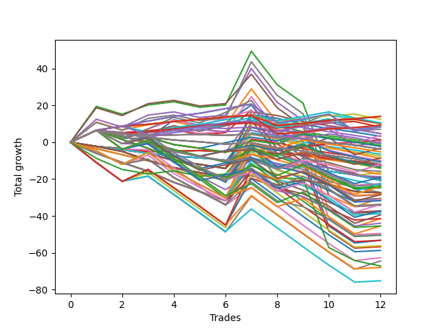

# Short Bulldog 006 
- Symbol: ES90d5m30m
- Date Range: 03/18/2022 - 07/08/2022
- Trading Period: 7:20-12:30
- Number of Trades: 12



| Name | Win Percent | Profit | Avg Profit / Trade | Avg Time / Trade |      | Name | Win Percent | Profit | Avg Profit / Trade | Avg Time / Trade |
| ---- | ----------- | ------ | ------------------ | ---------------- | ---- | ---- | ----------- | ------ | ------------------ | ---------------- |
| Sorted By <br> Profit | | | | | | Sorted By <br> Win Percentage ||||
| One Hundred Eleven | 91.67 | 7125.00 | 593.75 | 00:00 |     | One Hundred Eleven | 91.67 | 7125.00 | 593.75 | 00:00 |
| One Hundred Sixteen | 91.67 | 7000.00 | 583.33 | 00:00 |     | One Hundred Sixteen | 91.67 | 7000.00 | 583.33 | 00:00 |
| One Hundred One | 83.33 | 6250.00 | 520.83 | 00:00 |     | One Hundred Twenty-Six | 91.67 | 4625.00 | 385.42 | 00:00 |
| One Hundred Two | 66.67 | 5250.00 | 437.50 | 00:00 |     | One Hundred Twenty-One | 91.67 | 4625.00 | 385.42 | 00:00 |
| Ninety-Two | 58.33 | 5250.00 | 437.50 | 00:00 |     | Eighty-One | 91.67 | 625.00 | 52.08 | 00:00 |
| Ninety-Six | 75.00 | 5125.00 | 427.08 | 00:00 |     | One Hundred One | 83.33 | 6250.00 | 520.83 | 00:00 |
| Ninety-One | 75.00 | 5000.00 | 416.67 | 00:00 |     | One Hundred Twenty-Seven | 83.33 | 4125.00 | 343.75 | 00:00 |
| One Hundred Twenty-Six | 91.67 | 4625.00 | 385.42 | 00:00 |     | One Hundred Twenty-Two | 83.33 | 4125.00 | 343.75 | 00:00 |
| One Hundred Twenty-One | 91.67 | 4625.00 | 385.42 | 00:00 |     | Eighty-Two | 83.33 | 125.00 | 10.42 | 00:00 |
| One Hundred Seventeen | 75.00 | 4625.00 | 385.42 | 00:00 |     | Ninety-Six | 75.00 | 5125.00 | 427.08 | 00:00 |
| One Hundred Twelve | 75.00 | 4500.00 | 375.00 | 00:00 |     | Ninety-One | 75.00 | 5000.00 | 416.67 | 00:00 |
| One Hundred Twenty-Seven | 83.33 | 4125.00 | 343.75 | 00:00 |     | One Hundred Seventeen | 75.00 | 4625.00 | 385.42 | 00:00 |
| One Hundred Twenty-Two | 83.33 | 4125.00 | 343.75 | 00:00 |     | One Hundred Twelve | 75.00 | 4500.00 | 375.00 | 00:00 |
| One Hundred Six | 75.00 | 4125.00 | 343.75 | 00:00 |     | One Hundred Six | 75.00 | 4125.00 | 343.75 | 00:00 |
| Eighty-Five | 66.67 | 3500.00 | 291.67 | 00:00 |     | One Hundred Two | 66.67 | 5250.00 | 437.50 | 00:00 |
| Ninety-Seven | 41.67 | 2375.00 | 197.92 | 00:00 |     | Eighty-Five | 66.67 | 3500.00 | 291.67 | 00:00 |
| Fifteen | 8.33 | 2375.00 | 197.92 | 00:00 |     | Eighty-Four | 66.67 | 1875.00 | 156.25 | 00:00 |
| Eighty-Four | 66.67 | 1875.00 | 156.25 | 00:00 |     | Eighty-Three | 66.67 | -1625.00 | -135.42 | 00:00 |
| Ten | 8.33 | 1625.00 | 135.42 | 00:00 |     | Ninety-Two | 58.33 | 5250.00 | 437.50 | 00:00 |
| Fourteen | 16.67 | 750.00 | 62.50 | 00:00 |     | Two | 50.00 | -12375.00 | -1031.25 | 00:00 |
| Eighty-One | 91.67 | 625.00 | 52.08 | 00:00 |     | One Hundred Twenty-Eight | 50.00 | -14250.00 | -1187.50 | 00:00 |
| Eighty-Two | 83.33 | 125.00 | 10.42 | 00:00 |     | Seven | 50.00 | -15250.00 | -1270.83 | 00:00 |
| One Hundred Seven | 41.67 | -250.00 | -20.83 | 00:00 |     | Four | 50.00 | -17125.00 | -1427.08 | 00:00 |
| Twelve | 8.33 | -375.00 | -31.25 | 00:00 |     | One Hundred Twenty-Three | 50.00 | -18625.00 | -1552.08 | 00:00 |
| Ninety-Five | 25.00 | -875.00 | -72.92 | 00:00 |     | Five | 50.00 | -18625.00 | -1552.08 | 00:00 |
| Ninety-Three | 33.33 | -1125.00 | -93.75 | 00:00 |     | One | 50.00 | -20750.00 | -1729.17 | 00:00 |
| Eighty-Three | 66.67 | -1625.00 | -135.42 | 00:00 |     | Six | 50.00 | -24750.00 | -2062.50 | 00:00 |
| One Hundred | 33.33 | -1875.00 | -156.25 | 00:00 |     | Three | 50.00 | -28375.00 | -2364.58 | 00:00 |
| Ninety-Nine | 33.33 | -1875.00 | -156.25 | 00:00 |     | Ninety-Seven | 41.67 | 2375.00 | 197.92 | 00:00 |
| Ninety-Eight | 33.33 | -1875.00 | -156.25 | 00:00 |     | One Hundred Seven | 41.67 | -250.00 | -20.83 | 00:00 |
| Twenty-Two | 33.33 | -1875.00 | -156.25 | 00:00 |     | One Hundred Eighteen | 41.67 | -4250.00 | -354.17 | 00:00 |
| Sixten | 33.33 | -1875.00 | -156.25 | 00:00 |     | One Hundred Thirteen | 41.67 | -9500.00 | -791.67 | 00:00 |
| Ninety-Four | 25.00 | -2625.00 | -218.75 | 00:00 |     | One Hundred Thirty | 41.67 | -16875.00 | -1406.25 | 00:00 |
| Nine | 8.33 | -3250.00 | -270.83 | 00:00 |     | One Hundred Twenty-Nine | 41.67 | -16875.00 | -1406.25 | 00:00 |
| Eight | 16.67 | -3750.00 | -312.50 | 00:00 |     | One Hundred Twenty-Five | 41.67 | -22750.00 | -1895.83 | 00:00 |
| One Hundred Eighteen | 41.67 | -4250.00 | -354.17 | 00:00 |     | One Hundred Twenty-Four | 41.67 | -22750.00 | -1895.83 | 00:00 |
| Thirty-One | 8.33 | -4375.00 | -364.58 | 00:00 |     | Zero | 41.67 | -26625.00 | -2218.75 | 00:00 |
| Thirteen | 8.33 | -5000.00 | -416.67 | 00:00 |     | Ninety-Three | 33.33 | -1125.00 | -93.75 | 00:00 |
| Twenty-Six | 8.33 | -5125.00 | -427.08 | 00:00 |     | One Hundred | 33.33 | -1875.00 | -156.25 | 00:00 |
| Thirty | 16.67 | -5375.00 | -447.92 | 00:00 |     | Ninety-Nine | 33.33 | -1875.00 | -156.25 | 00:00 |
| One Hundred Ninteen | 33.33 | -6000.00 | -500.00 | 00:00 |     | Ninety-Eight | 33.33 | -1875.00 | -156.25 | 00:00 |
| One Hundred Ten | 16.67 | -6000.00 | -500.00 | 00:00 |     | Twenty-Two | 33.33 | -1875.00 | -156.25 | 00:00 |
| One Hundred Nine | 16.67 | -6000.00 | -500.00 | 00:00 |     | Sixten | 33.33 | -1875.00 | -156.25 | 00:00 |
| One Hundred Eight | 16.67 | -6000.00 | -500.00 | 00:00 |     | One Hundred Ninteen | 33.33 | -6000.00 | -500.00 | 00:00 |
| Thirty-Eight | 16.67 | -6000.00 | -500.00 | 00:00 |     | One Hundred Three | 33.33 | -6750.00 | -562.50 | 00:00 |
| Thirty-Two | 16.67 | -6000.00 | -500.00 | 00:00 |     | Forty-Eight | 33.33 | -8250.00 | -687.50 | 00:00 |
| Twenty-Three | 25.00 | -6250.00 | -520.83 | 00:00 |     | One Hundred Fifteen | 33.33 | -12000.00 | -1000.00 | 00:00 |
| Twenty-One | 25.00 | -6250.00 | -520.83 | 00:00 |     | One Hundred Fourteen | 33.33 | -12000.00 | -1000.00 | 00:00 |
| Twenty | 25.00 | -6250.00 | -520.83 | 00:00 |     | Seventy | 33.33 | -15875.00 | -1322.92 | 00:00 |
| Nineteen | 25.00 | -6250.00 | -520.83 | 00:00 |     | Sixty-Two | 33.33 | -25250.00 | -2104.17 | 00:00 |
| Eighteen | 25.00 | -6250.00 | -520.83 | 00:00 |     | Ninety-Five | 25.00 | -875.00 | -72.92 | 00:00 |
| Seventeen | 25.00 | -6250.00 | -520.83 | 00:00 |     | Ninety-Four | 25.00 | -2625.00 | -218.75 | 00:00 |
| One Hundred Three | 33.33 | -6750.00 | -562.50 | 00:00 |     | Twenty-Three | 25.00 | -6250.00 | -520.83 | 00:00 |
| Eleven | 8.33 | -6875.00 | -572.92 | 00:00 |     | Twenty-One | 25.00 | -6250.00 | -520.83 | 00:00 |
| One Hundred Five | 25.00 | -7000.00 | -583.33 | 00:00 |     | Twenty | 25.00 | -6250.00 | -520.83 | 00:00 |
| Twenty-Eight | 8.33 | -7125.00 | -593.75 | 00:00 |     | Nineteen | 25.00 | -6250.00 | -520.83 | 00:00 |
| One Hundred Twenty | 25.00 | -7875.00 | -656.25 | 00:00 |     | Eighteen | 25.00 | -6250.00 | -520.83 | 00:00 |
| Forty-Eight | 33.33 | -8250.00 | -687.50 | 00:00 |     | Seventeen | 25.00 | -6250.00 | -520.83 | 00:00 |
| One Hundred Four | 25.00 | -8750.00 | -729.17 | 00:00 |     | One Hundred Five | 25.00 | -7000.00 | -583.33 | 00:00 |
| Fifty-Four | 25.00 | -9375.00 | -781.25 | 00:00 |     | One Hundred Twenty | 25.00 | -7875.00 | -656.25 | 00:00 |
| One Hundred Thirteen | 41.67 | -9500.00 | -791.67 | 00:00 |     | One Hundred Four | 25.00 | -8750.00 | -729.17 | 00:00 |
| Twenty-Four | 16.67 | -9875.00 | -822.92 | 00:00 |     | Fifty-Four | 25.00 | -9375.00 | -781.25 | 00:00 |
| Twenty-Five | 8.33 | -10000.00 | -833.33 | 00:00 |     | Forty-Nine | 25.00 | -11125.00 | -927.08 | 00:00 |
| Thirty-Nine | 8.33 | -10375.00 | -864.58 | 00:00 |     | Forty-Six | 25.00 | -11250.00 | -937.50 | 00:00 |
| Thirty-Seven | 8.33 | -10375.00 | -864.58 | 00:00 |     | Seventy-One | 25.00 | -14125.00 | -1177.08 | 00:00 |
| Thirty-Six | 8.33 | -10375.00 | -864.58 | 00:00 |     | Forty | 25.00 | -15375.00 | -1281.25 | 00:00 |
| Thirty-Five | 8.33 | -10375.00 | -864.58 | 00:00 |     | Sixty-Six | 25.00 | -15625.00 | -1302.08 | 00:00 |
| Thirty-Four | 8.33 | -10375.00 | -864.58 | 00:00 |     | Sixty-Eight | 25.00 | -16875.00 | -1406.25 | 00:00 |
| Thirty-Three | 8.33 | -10375.00 | -864.58 | 00:00 |     | Sixty-Nine | 25.00 | -19375.00 | -1614.58 | 00:00 |
| Forty-Nine | 25.00 | -11125.00 | -927.08 | 00:00 |     | Sixty-Five | 25.00 | -19750.00 | -1645.83 | 00:00 |
| Forty-Six | 25.00 | -11250.00 | -937.50 | 00:00 |     | Sixty-Four | 25.00 | -22000.00 | -1833.33 | 00:00 |
| Forty-Seven | 16.67 | -11500.00 | -958.33 | 00:00 |     | Sixty-Seven | 25.00 | -25125.00 | -2093.75 | 00:00 |
| Twenty-Nine | 8.33 | -11750.00 | -979.17 | 00:00 |     | Sixty-Three | 25.00 | -26625.00 | -2218.75 | 00:00 |
| One Hundred Fifteen | 33.33 | -12000.00 | -1000.00 | 00:00 |     | Fifty-Eight | 25.00 | -28125.00 | -2343.75 | 00:00 |
| One Hundred Fourteen | 33.33 | -12000.00 | -1000.00 | 00:00 |     | Sixty | 25.00 | -29375.00 | -2447.92 | 00:00 |
| Forty-Two | 16.67 | -12250.00 | -1020.83 | 00:00 |     | Fifty-Six | 25.00 | -31375.00 | -2614.58 | 00:00 |
| Two | 50.00 | -12375.00 | -1031.25 | 00:00 |     | Fifty-Seven | 25.00 | -32250.00 | -2687.50 | 00:00 |
| twenty-Seven | 8.33 | -13625.00 | -1135.42 | 00:00 |     | Seventy-Three | 25.00 | -33625.00 | -2802.08 | 00:00 |
| Fifty-Five | 16.67 | -13750.00 | -1145.83 | 00:00 |     | Sixty-One | 25.00 | -34000.00 | -2833.33 | 00:00 |
| Fifty-Three | 16.67 | -13750.00 | -1145.83 | 00:00 |     | Fifty-Nine | 25.00 | -37625.00 | -3135.42 | 00:00 |
| Fifty-Two | 16.67 | -13750.00 | -1145.83 | 00:00 |     | Fourteen | 16.67 | 750.00 | 62.50 | 00:00 |
| Fifty-One | 16.67 | -13750.00 | -1145.83 | 00:00 |     | Eight | 16.67 | -3750.00 | -312.50 | 00:00 |
| Fifty | 16.67 | -13750.00 | -1145.83 | 00:00 |     | Thirty | 16.67 | -5375.00 | -447.92 | 00:00 |
| Seventy-One | 25.00 | -14125.00 | -1177.08 | 00:00 |     | One Hundred Ten | 16.67 | -6000.00 | -500.00 | 00:00 |
| One Hundred Twenty-Eight | 50.00 | -14250.00 | -1187.50 | 00:00 |     | One Hundred Nine | 16.67 | -6000.00 | -500.00 | 00:00 |
| Forty-Four | 16.67 | -14250.00 | -1187.50 | 00:00 |     | One Hundred Eight | 16.67 | -6000.00 | -500.00 | 00:00 |
| Seven | 50.00 | -15250.00 | -1270.83 | 00:00 |     | Thirty-Eight | 16.67 | -6000.00 | -500.00 | 00:00 |
| Forty-One | 16.67 | -15250.00 | -1270.83 | 00:00 |     | Thirty-Two | 16.67 | -6000.00 | -500.00 | 00:00 |
| Forty | 25.00 | -15375.00 | -1281.25 | 00:00 |     | Twenty-Four | 16.67 | -9875.00 | -822.92 | 00:00 |
| Sixty-Six | 25.00 | -15625.00 | -1302.08 | 00:00 |     | Forty-Seven | 16.67 | -11500.00 | -958.33 | 00:00 |
| Seventy | 33.33 | -15875.00 | -1322.92 | 00:00 |     | Forty-Two | 16.67 | -12250.00 | -1020.83 | 00:00 |
| One Hundred Thirty | 41.67 | -16875.00 | -1406.25 | 00:00 |     | Fifty-Five | 16.67 | -13750.00 | -1145.83 | 00:00 |
| One Hundred Twenty-Nine | 41.67 | -16875.00 | -1406.25 | 00:00 |     | Fifty-Three | 16.67 | -13750.00 | -1145.83 | 00:00 |
| Sixty-Eight | 25.00 | -16875.00 | -1406.25 | 00:00 |     | Fifty-Two | 16.67 | -13750.00 | -1145.83 | 00:00 |
| Four | 50.00 | -17125.00 | -1427.08 | 00:00 |     | Fifty-One | 16.67 | -13750.00 | -1145.83 | 00:00 |
| One Hundred Twenty-Three | 50.00 | -18625.00 | -1552.08 | 00:00 |     | Fifty | 16.67 | -13750.00 | -1145.83 | 00:00 |
| Five | 50.00 | -18625.00 | -1552.08 | 00:00 |     | Forty-Four | 16.67 | -14250.00 | -1187.50 | 00:00 |
| Forty-Five | 16.67 | -18875.00 | -1572.92 | 00:00 |     | Forty-One | 16.67 | -15250.00 | -1270.83 | 00:00 |
| Sixty-Nine | 25.00 | -19375.00 | -1614.58 | 00:00 |     | Forty-Five | 16.67 | -18875.00 | -1572.92 | 00:00 |
| Sixty-Five | 25.00 | -19750.00 | -1645.83 | 00:00 |     | Forty-Three | 16.67 | -20750.00 | -1729.17 | 00:00 |
| One | 50.00 | -20750.00 | -1729.17 | 00:00 |     | Fifteen | 8.33 | 2375.00 | 197.92 | 00:00 |
| Forty-Three | 16.67 | -20750.00 | -1729.17 | 00:00 |     | Ten | 8.33 | 1625.00 | 135.42 | 00:00 |
| Sixty-Four | 25.00 | -22000.00 | -1833.33 | 00:00 |     | Twelve | 8.33 | -375.00 | -31.25 | 00:00 |
| One Hundred Twenty-Five | 41.67 | -22750.00 | -1895.83 | 00:00 |     | Nine | 8.33 | -3250.00 | -270.83 | 00:00 |
| One Hundred Twenty-Four | 41.67 | -22750.00 | -1895.83 | 00:00 |     | Thirty-One | 8.33 | -4375.00 | -364.58 | 00:00 |
| Six | 50.00 | -24750.00 | -2062.50 | 00:00 |     | Thirteen | 8.33 | -5000.00 | -416.67 | 00:00 |
| Sixty-Seven | 25.00 | -25125.00 | -2093.75 | 00:00 |     | Twenty-Six | 8.33 | -5125.00 | -427.08 | 00:00 |
| Sixty-Two | 33.33 | -25250.00 | -2104.17 | 00:00 |     | Eleven | 8.33 | -6875.00 | -572.92 | 00:00 |
| Zero | 41.67 | -26625.00 | -2218.75 | 00:00 |     | Twenty-Eight | 8.33 | -7125.00 | -593.75 | 00:00 |
| Sixty-Three | 25.00 | -26625.00 | -2218.75 | 00:00 |     | Twenty-Five | 8.33 | -10000.00 | -833.33 | 00:00 |
| Fifty-Eight | 25.00 | -28125.00 | -2343.75 | 00:00 |     | Thirty-Nine | 8.33 | -10375.00 | -864.58 | 00:00 |
| Three | 50.00 | -28375.00 | -2364.58 | 00:00 |     | Thirty-Seven | 8.33 | -10375.00 | -864.58 | 00:00 |
| Sixty | 25.00 | -29375.00 | -2447.92 | 00:00 |     | Thirty-Six | 8.33 | -10375.00 | -864.58 | 00:00 |
| Fifty-Six | 25.00 | -31375.00 | -2614.58 | 00:00 |     | Thirty-Five | 8.33 | -10375.00 | -864.58 | 00:00 |
| Fifty-Seven | 25.00 | -32250.00 | -2687.50 | 00:00 |     | Thirty-Four | 8.33 | -10375.00 | -864.58 | 00:00 |
| Seventy-Three | 25.00 | -33625.00 | -2802.08 | 00:00 |     | Thirty-Three | 8.33 | -10375.00 | -864.58 | 00:00 |
| Sixty-One | 25.00 | -34000.00 | -2833.33 | 00:00 |     | Twenty-Nine | 8.33 | -11750.00 | -979.17 | 00:00 |
| Fifty-Nine | 25.00 | -37625.00 | -3135.42 | 00:00 |     | twenty-Seven | 8.33 | -13625.00 | -1135.42 | 00:00 |

## NO STOPLOSS

### Test Zero
* Sell when price hits the middle line of the 20p bollinger
* No Stoploss
* Results:
```
Total Trades: 12
Percent Up: 58.33
Percent Down: 41.67
Total Points Moved Down: -53.25
Potential Profit: -26625.00
Total Points Ups: 82.50 Count Ups: 7
Total Points Downs: 29.25 Count Downs: 5
```

<details><summary>Trades</summary>

<code>In: 2022-04-06 11:00:00		Out: 2022-04-06 11:00:10		Total Position Time: 00:10		Total Move Down: 6.50		Total to Date: 6.50</code> <br />
<code>In: 2022-04-07 12:25:00		Out: 2022-04-07 12:50:00		Total Position Time: 25:00		Total Move Down: -4.25		Total to Date: 2.25</code> <br />
<code>In: 2022-04-20 10:55:00		Out: 2022-04-20 11:13:35		Total Position Time: 18:35		Total Move Down: -0.25		Total to Date: 2.00</code> <br />
<code>In: 2022-04-25 11:45:00		Out: 2022-04-25 12:07:25		Total Position Time: 22:25		Total Move Down: 10.25		Total to Date: 12.25</code> <br />
<code>In: 2022-05-04 09:50:00		Out: 2022-05-04 10:19:55		Total Position Time: 29:55		Total Move Down: -3.00		Total to Date: 9.25</code> <br />
<code>In: 2022-05-19 09:00:00		Out: 2022-05-19 09:29:55		Total Position Time: 29:55		Total Move Down: 1.25		Total to Date: 10.50</code> <br />
<code>In: 2022-05-19 12:15:00		Out: 2022-05-19 12:18:25		Total Position Time: 03:25		Total Move Down: 9.75		Total to Date: 20.25</code> <br />
<code>In: 2022-05-24 11:05:00		Out: 2022-05-24 11:34:55		Total Position Time: 29:55		Total Move Down: -18.25		Total to Date: 2.00</code> <br />
<code>In: 2022-05-31 09:15:00		Out: 2022-05-31 09:44:55		Total Position Time: 29:55		Total Move Down: -10.00		Total to Date: -8.00</code> <br />
<code>In: 2022-06-15 12:00:00		Out: 2022-06-15 12:29:55		Total Position Time: 29:55		Total Move Down: -37.50		Total to Date: -45.50</code> <br />
<code>In: 2022-07-05 10:50:00		Out: 2022-07-05 11:19:55		Total Position Time: 29:55		Total Move Down: -9.25		Total to Date: -54.75</code> <br />
<code>In: 2022-07-07 12:30:00		Out: 2022-07-07 12:38:25		Total Position Time: 08:25		Total Move Down: 1.50		Total to Date: -53.25</code> <br />


</details>

### Test One
* Sell when the price hits the upper line of the 20p 1std bollinger
* No Stoploss
* Results:
```
Total Trades: 12
Percent Up: 50.00
Percent Down: 50.00
Total Points Moved Down: -41.50
Potential Profit: -20750.00
Total Points Ups: 82.25 Count Ups: 6
Total Points Downs: 40.75 Count Downs: 6
```

<details><summary>Trades</summary>

<code>In: 2022-04-06 11:00:00		Out: 2022-04-06 11:09:45		Total Position Time: 09:45		Total Move Down: 11.00		Total to Date: 11.00</code> <br />
<code>In: 2022-04-07 12:25:00		Out: 2022-04-07 12:50:00		Total Position Time: 25:00		Total Move Down: -4.25		Total to Date: 6.75</code> <br />
<code>In: 2022-04-20 10:55:00		Out: 2022-04-20 11:17:15		Total Position Time: 22:15		Total Move Down: 2.75		Total to Date: 9.50</code> <br />
<code>In: 2022-04-25 11:45:00		Out: 2022-04-25 12:14:55		Total Position Time: 29:55		Total Move Down: 1.75		Total to Date: 11.25</code> <br />
<code>In: 2022-05-04 09:50:00		Out: 2022-05-04 10:19:55		Total Position Time: 29:55		Total Move Down: -3.00		Total to Date: 8.25</code> <br />
<code>In: 2022-05-19 09:00:00		Out: 2022-05-19 09:29:55		Total Position Time: 29:55		Total Move Down: 1.25		Total to Date: 9.50</code> <br />
<code>In: 2022-05-19 12:15:00		Out: 2022-05-19 12:24:50		Total Position Time: 09:50		Total Move Down: 19.50		Total to Date: 29.00</code> <br />
<code>In: 2022-05-24 11:05:00		Out: 2022-05-24 11:34:55		Total Position Time: 29:55		Total Move Down: -18.25		Total to Date: 10.75</code> <br />
<code>In: 2022-05-31 09:15:00		Out: 2022-05-31 09:44:55		Total Position Time: 29:55		Total Move Down: -10.00		Total to Date: 0.75</code> <br />
<code>In: 2022-06-15 12:00:00		Out: 2022-06-15 12:29:55		Total Position Time: 29:55		Total Move Down: -37.50		Total to Date: -36.75</code> <br />
<code>In: 2022-07-05 10:50:00		Out: 2022-07-05 11:19:55		Total Position Time: 29:55		Total Move Down: -9.25		Total to Date: -46.00</code> <br />
<code>In: 2022-07-07 12:30:00		Out: 2022-07-07 12:46:45		Total Position Time: 16:45		Total Move Down: 4.50		Total to Date: -41.50</code> <br />


</details>

### Test Two
* Sell when the price hits the upper line of the 20p 2std bollinger
* No Stoploss
* Results:
```
Total Trades: 12
Percent Up: 50.00
Percent Down: 50.00
Total Points Moved Down: -24.75
Potential Profit: -12375.00
Total Points Ups: 82.25 Count Ups: 6
Total Points Downs: 57.50 Count Downs: 6
```

<details><summary>Trades</summary>

<code>In: 2022-04-06 11:00:00		Out: 2022-04-06 11:15:15		Total Position Time: 15:15		Total Move Down: 19.50		Total to Date: 19.50</code> <br />
<code>In: 2022-04-07 12:25:00		Out: 2022-04-07 12:50:00		Total Position Time: 25:00		Total Move Down: -4.25		Total to Date: 15.25</code> <br />
<code>In: 2022-04-20 10:55:00		Out: 2022-04-20 11:18:30		Total Position Time: 23:30		Total Move Down: 5.00		Total to Date: 20.25</code> <br />
<code>In: 2022-04-25 11:45:00		Out: 2022-04-25 12:14:55		Total Position Time: 29:55		Total Move Down: 1.75		Total to Date: 22.00</code> <br />
<code>In: 2022-05-04 09:50:00		Out: 2022-05-04 10:19:55		Total Position Time: 29:55		Total Move Down: -3.00		Total to Date: 19.00</code> <br />
<code>In: 2022-05-19 09:00:00		Out: 2022-05-19 09:29:55		Total Position Time: 29:55		Total Move Down: 1.25		Total to Date: 20.25</code> <br />
<code>In: 2022-05-19 12:15:00		Out: 2022-05-19 12:36:30		Total Position Time: 21:30		Total Move Down: 29.25		Total to Date: 49.50</code> <br />
<code>In: 2022-05-24 11:05:00		Out: 2022-05-24 11:34:55		Total Position Time: 29:55		Total Move Down: -18.25		Total to Date: 31.25</code> <br />
<code>In: 2022-05-31 09:15:00		Out: 2022-05-31 09:44:55		Total Position Time: 29:55		Total Move Down: -10.00		Total to Date: 21.25</code> <br />
<code>In: 2022-06-15 12:00:00		Out: 2022-06-15 12:29:55		Total Position Time: 29:55		Total Move Down: -37.50		Total to Date: -16.25</code> <br />
<code>In: 2022-07-05 10:50:00		Out: 2022-07-05 11:19:55		Total Position Time: 29:55		Total Move Down: -9.25		Total to Date: -25.50</code> <br />
<code>In: 2022-07-07 12:30:00		Out: 2022-07-07 12:50:00		Total Position Time: 20:00		Total Move Down: 0.75		Total to Date: -24.75</code> <br />


</details>

### Test Three
* Sell when price hits the middle line of the 50p bollinger
* No Stoploss
* Results:
```
Total Trades: 12
Percent Up: 50.00
Percent Down: 50.00
Total Points Moved Down: -56.75
Potential Profit: -28375.00
Total Points Ups: 82.25 Count Ups: 6
Total Points Downs: 25.50 Count Downs: 6
```

<details><summary>Trades</summary>

<code>In: 2022-04-06 11:00:00		Out: 2022-04-06 11:08:35		Total Position Time: 08:35		Total Move Down: 6.50		Total to Date: 6.50</code> <br />
<code>In: 2022-04-07 12:25:00		Out: 2022-04-07 12:50:00		Total Position Time: 25:00		Total Move Down: -4.25		Total to Date: 2.25</code> <br />
<code>In: 2022-04-20 10:55:00		Out: 2022-04-20 11:17:40		Total Position Time: 22:40		Total Move Down: 3.00		Total to Date: 5.25</code> <br />
<code>In: 2022-04-25 11:45:00		Out: 2022-04-25 12:14:55		Total Position Time: 29:55		Total Move Down: 1.75		Total to Date: 7.00</code> <br />
<code>In: 2022-05-04 09:50:00		Out: 2022-05-04 10:19:55		Total Position Time: 29:55		Total Move Down: -3.00		Total to Date: 4.00</code> <br />
<code>In: 2022-05-19 09:00:00		Out: 2022-05-19 09:29:55		Total Position Time: 29:55		Total Move Down: 1.25		Total to Date: 5.25</code> <br />
<code>In: 2022-05-19 12:15:00		Out: 2022-05-19 12:21:15		Total Position Time: 06:15		Total Move Down: 12.25		Total to Date: 17.50</code> <br />
<code>In: 2022-05-24 11:05:00		Out: 2022-05-24 11:34:55		Total Position Time: 29:55		Total Move Down: -18.25		Total to Date: -0.75</code> <br />
<code>In: 2022-05-31 09:15:00		Out: 2022-05-31 09:44:55		Total Position Time: 29:55		Total Move Down: -10.00		Total to Date: -10.75</code> <br />
<code>In: 2022-06-15 12:00:00		Out: 2022-06-15 12:29:55		Total Position Time: 29:55		Total Move Down: -37.50		Total to Date: -48.25</code> <br />
<code>In: 2022-07-05 10:50:00		Out: 2022-07-05 11:19:55		Total Position Time: 29:55		Total Move Down: -9.25		Total to Date: -57.50</code> <br />
<code>In: 2022-07-07 12:30:00		Out: 2022-07-07 12:50:00		Total Position Time: 20:00		Total Move Down: 0.75		Total to Date: -56.75</code> <br />


</details>

### Test Four
* Sell when the price hits the upper line of the 50p 1std bollinger
* No Stoploss
* Results:
```
Total Trades: 12
Percent Up: 50.00
Percent Down: 50.00
Total Points Moved Down: -34.25
Potential Profit: -17125.00
Total Points Ups: 82.25 Count Ups: 6
Total Points Downs: 48.00 Count Downs: 6
```

<details><summary>Trades</summary>

<code>In: 2022-04-06 11:00:00		Out: 2022-04-06 11:11:20		Total Position Time: 11:20		Total Move Down: 12.50		Total to Date: 12.50</code> <br />
<code>In: 2022-04-07 12:25:00		Out: 2022-04-07 12:50:00		Total Position Time: 25:00		Total Move Down: -4.25		Total to Date: 8.25</code> <br />
<code>In: 2022-04-20 10:55:00		Out: 2022-04-20 11:24:55		Total Position Time: 29:55		Total Move Down: 6.50		Total to Date: 14.75</code> <br />
<code>In: 2022-04-25 11:45:00		Out: 2022-04-25 12:14:55		Total Position Time: 29:55		Total Move Down: 1.75		Total to Date: 16.50</code> <br />
<code>In: 2022-05-04 09:50:00		Out: 2022-05-04 10:19:55		Total Position Time: 29:55		Total Move Down: -3.00		Total to Date: 13.50</code> <br />
<code>In: 2022-05-19 09:00:00		Out: 2022-05-19 09:29:55		Total Position Time: 29:55		Total Move Down: 1.25		Total to Date: 14.75</code> <br />
<code>In: 2022-05-19 12:15:00		Out: 2022-05-19 12:30:05		Total Position Time: 15:05		Total Move Down: 25.25		Total to Date: 40.00</code> <br />
<code>In: 2022-05-24 11:05:00		Out: 2022-05-24 11:34:55		Total Position Time: 29:55		Total Move Down: -18.25		Total to Date: 21.75</code> <br />
<code>In: 2022-05-31 09:15:00		Out: 2022-05-31 09:44:55		Total Position Time: 29:55		Total Move Down: -10.00		Total to Date: 11.75</code> <br />
<code>In: 2022-06-15 12:00:00		Out: 2022-06-15 12:29:55		Total Position Time: 29:55		Total Move Down: -37.50		Total to Date: -25.75</code> <br />
<code>In: 2022-07-05 10:50:00		Out: 2022-07-05 11:19:55		Total Position Time: 29:55		Total Move Down: -9.25		Total to Date: -35.00</code> <br />
<code>In: 2022-07-07 12:30:00		Out: 2022-07-07 12:50:00		Total Position Time: 20:00		Total Move Down: 0.75		Total to Date: -34.25</code> <br />


</details>

### Test Five
* Sell when the price hits the upper line of the 50p 2std bollinger
* No Stoploss
* Results:
```
Total Trades: 12
Percent Up: 50.00
Percent Down: 50.00
Total Points Moved Down: -37.25
Potential Profit: -18625.00
Total Points Ups: 82.25 Count Ups: 6
Total Points Downs: 45.00 Count Downs: 6
```

<details><summary>Trades</summary>

<code>In: 2022-04-06 11:00:00		Out: 2022-04-06 11:15:05		Total Position Time: 15:05		Total Move Down: 18.75		Total to Date: 18.75</code> <br />
<code>In: 2022-04-07 12:25:00		Out: 2022-04-07 12:50:00		Total Position Time: 25:00		Total Move Down: -4.25		Total to Date: 14.50</code> <br />
<code>In: 2022-04-20 10:55:00		Out: 2022-04-20 11:24:55		Total Position Time: 29:55		Total Move Down: 6.50		Total to Date: 21.00</code> <br />
<code>In: 2022-04-25 11:45:00		Out: 2022-04-25 12:14:55		Total Position Time: 29:55		Total Move Down: 1.75		Total to Date: 22.75</code> <br />
<code>In: 2022-05-04 09:50:00		Out: 2022-05-04 10:19:55		Total Position Time: 29:55		Total Move Down: -3.00		Total to Date: 19.75</code> <br />
<code>In: 2022-05-19 09:00:00		Out: 2022-05-19 09:29:55		Total Position Time: 29:55		Total Move Down: 1.25		Total to Date: 21.00</code> <br />
<code>In: 2022-05-19 12:15:00		Out: 2022-05-19 12:44:55		Total Position Time: 29:55		Total Move Down: 16.00		Total to Date: 37.00</code> <br />
<code>In: 2022-05-24 11:05:00		Out: 2022-05-24 11:34:55		Total Position Time: 29:55		Total Move Down: -18.25		Total to Date: 18.75</code> <br />
<code>In: 2022-05-31 09:15:00		Out: 2022-05-31 09:44:55		Total Position Time: 29:55		Total Move Down: -10.00		Total to Date: 8.75</code> <br />
<code>In: 2022-06-15 12:00:00		Out: 2022-06-15 12:29:55		Total Position Time: 29:55		Total Move Down: -37.50		Total to Date: -28.75</code> <br />
<code>In: 2022-07-05 10:50:00		Out: 2022-07-05 11:19:55		Total Position Time: 29:55		Total Move Down: -9.25		Total to Date: -38.00</code> <br />
<code>In: 2022-07-07 12:30:00		Out: 2022-07-07 12:50:00		Total Position Time: 20:00		Total Move Down: 0.75		Total to Date: -37.25</code> <br />


</details>

### Test Six
* Sell when the price hits the middle line of the 1std VWAP
* No Stoploss
* Results:
```
Total Trades: 12
Percent Up: 50.00
Percent Down: 50.00
Total Points Moved Down: -49.50
Potential Profit: -24750.00
Total Points Ups: 82.25 Count Ups: 6
Total Points Downs: 32.75 Count Downs: 6
```

<details><summary>Trades</summary>

<code>In: 2022-04-06 11:00:00		Out: 2022-04-06 11:00:10		Total Position Time: 00:10		Total Move Down: 6.50		Total to Date: 6.50</code> <br />
<code>In: 2022-04-07 12:25:00		Out: 2022-04-07 12:50:00		Total Position Time: 25:00		Total Move Down: -4.25		Total to Date: 2.25</code> <br />
<code>In: 2022-04-20 10:55:00		Out: 2022-04-20 11:18:20		Total Position Time: 23:20		Total Move Down: 3.75		Total to Date: 6.00</code> <br />
<code>In: 2022-04-25 11:45:00		Out: 2022-04-25 12:14:55		Total Position Time: 29:55		Total Move Down: 1.75		Total to Date: 7.75</code> <br />
<code>In: 2022-05-04 09:50:00		Out: 2022-05-04 10:19:55		Total Position Time: 29:55		Total Move Down: -3.00		Total to Date: 4.75</code> <br />
<code>In: 2022-05-19 09:00:00		Out: 2022-05-19 09:29:55		Total Position Time: 29:55		Total Move Down: 1.25		Total to Date: 6.00</code> <br />
<code>In: 2022-05-19 12:15:00		Out: 2022-05-19 12:24:45		Total Position Time: 09:45		Total Move Down: 18.75		Total to Date: 24.75</code> <br />
<code>In: 2022-05-24 11:05:00		Out: 2022-05-24 11:34:55		Total Position Time: 29:55		Total Move Down: -18.25		Total to Date: 6.50</code> <br />
<code>In: 2022-05-31 09:15:00		Out: 2022-05-31 09:44:55		Total Position Time: 29:55		Total Move Down: -10.00		Total to Date: -3.50</code> <br />
<code>In: 2022-06-15 12:00:00		Out: 2022-06-15 12:29:55		Total Position Time: 29:55		Total Move Down: -37.50		Total to Date: -41.00</code> <br />
<code>In: 2022-07-05 10:50:00		Out: 2022-07-05 11:19:55		Total Position Time: 29:55		Total Move Down: -9.25		Total to Date: -50.25</code> <br />
<code>In: 2022-07-07 12:30:00		Out: 2022-07-07 12:50:00		Total Position Time: 20:00		Total Move Down: 0.75		Total to Date: -49.50</code> <br />


</details>

### Test Seven
* Sell when the price hits the upper line of the 1std VWAP
* No Stoploss
* Results:
```
Total Trades: 12
Percent Up: 50.00
Percent Down: 50.00
Total Points Moved Down: -30.50
Potential Profit: -15250.00
Total Points Ups: 82.25 Count Ups: 6
Total Points Downs: 51.75 Count Downs: 6
```

<details><summary>Trades</summary>

<code>In: 2022-04-06 11:00:00		Out: 2022-04-06 11:09:40		Total Position Time: 09:40		Total Move Down: 10.75		Total to Date: 10.75</code> <br />
<code>In: 2022-04-07 12:25:00		Out: 2022-04-07 12:50:00		Total Position Time: 25:00		Total Move Down: -4.25		Total to Date: 6.50</code> <br />
<code>In: 2022-04-20 10:55:00		Out: 2022-04-20 11:24:55		Total Position Time: 29:55		Total Move Down: 6.50		Total to Date: 13.00</code> <br />
<code>In: 2022-04-25 11:45:00		Out: 2022-04-25 12:14:55		Total Position Time: 29:55		Total Move Down: 1.75		Total to Date: 14.75</code> <br />
<code>In: 2022-05-04 09:50:00		Out: 2022-05-04 10:19:55		Total Position Time: 29:55		Total Move Down: -3.00		Total to Date: 11.75</code> <br />
<code>In: 2022-05-19 09:00:00		Out: 2022-05-19 09:29:55		Total Position Time: 29:55		Total Move Down: 1.25		Total to Date: 13.00</code> <br />
<code>In: 2022-05-19 12:15:00		Out: 2022-05-19 12:42:25		Total Position Time: 27:25		Total Move Down: 30.75		Total to Date: 43.75</code> <br />
<code>In: 2022-05-24 11:05:00		Out: 2022-05-24 11:34:55		Total Position Time: 29:55		Total Move Down: -18.25		Total to Date: 25.50</code> <br />
<code>In: 2022-05-31 09:15:00		Out: 2022-05-31 09:44:55		Total Position Time: 29:55		Total Move Down: -10.00		Total to Date: 15.50</code> <br />
<code>In: 2022-06-15 12:00:00		Out: 2022-06-15 12:29:55		Total Position Time: 29:55		Total Move Down: -37.50		Total to Date: -22.00</code> <br />
<code>In: 2022-07-05 10:50:00		Out: 2022-07-05 11:19:55		Total Position Time: 29:55		Total Move Down: -9.25		Total to Date: -31.25</code> <br />
<code>In: 2022-07-07 12:30:00		Out: 2022-07-07 12:50:00		Total Position Time: 20:00		Total Move Down: 0.75		Total to Date: -30.50</code> <br />


</details>

## STOPLOSS OF 2

### Test Eight
* Sell when price hits the middle line of the 20p bollinger
* Stoploss is -2 points
* Results:
```
Total Trades: 12
Percent Up: 83.33
Percent Down: 16.67
Total Points Moved Down: -7.50
Potential Profit: -3750.00
Total Points Ups: 23.75 Count Ups: 10
Total Points Downs: 16.25 Count Downs: 2
```

<details><summary>Trades</summary>

<code>In: 2022-04-06 11:00:00		Out: 2022-04-06 11:00:10		Total Position Time: 00:10		Total Move Down: 6.50		Total to Date: 6.50</code> <br />
<code>In: 2022-04-07 12:25:00		Out: 2022-04-07 12:25:30		Total Position Time: 00:30		Total Move Down: -1.75		Total to Date: 4.75</code> <br />
<code>In: 2022-04-20 10:55:00		Out: 2022-04-20 10:57:30		Total Position Time: 02:30		Total Move Down: -2.00		Total to Date: 2.75</code> <br />
<code>In: 2022-04-25 11:45:00		Out: 2022-04-25 11:46:00		Total Position Time: 01:00		Total Move Down: -4.00		Total to Date: -1.25</code> <br />
<code>In: 2022-05-04 09:50:00		Out: 2022-05-04 09:52:25		Total Position Time: 02:25		Total Move Down: -2.00		Total to Date: -3.25</code> <br />
<code>In: 2022-05-19 09:00:00		Out: 2022-05-19 09:03:40		Total Position Time: 03:40		Total Move Down: -2.25		Total to Date: -5.50</code> <br />
<code>In: 2022-05-19 12:15:00		Out: 2022-05-19 12:18:25		Total Position Time: 03:25		Total Move Down: 9.75		Total to Date: 4.25</code> <br />
<code>In: 2022-05-24 11:05:00		Out: 2022-05-24 11:05:45		Total Position Time: 00:45		Total Move Down: -2.00		Total to Date: 2.25</code> <br />
<code>In: 2022-05-31 09:15:00		Out: 2022-05-31 09:35:05		Total Position Time: 20:05		Total Move Down: -3.25		Total to Date: -1.00</code> <br />
<code>In: 2022-06-15 12:00:00		Out: 2022-06-15 12:00:25		Total Position Time: 00:25		Total Move Down: -2.25		Total to Date: -3.25</code> <br />
<code>In: 2022-07-05 10:50:00		Out: 2022-07-05 10:53:35		Total Position Time: 03:35		Total Move Down: -2.00		Total to Date: -5.25</code> <br />
<code>In: 2022-07-07 12:30:00		Out: 2022-07-07 12:30:50		Total Position Time: 00:50		Total Move Down: -2.25		Total to Date: -7.50</code> <br />


</details>

### Test Nine
* Sell when the price hits the upper line of the 20p 1std bollinger
* Stoploss is -2 points
* Results:
```
Total Trades: 12
Percent Up: 91.67
Percent Down: 8.33
Total Points Moved Down: -6.50
Potential Profit: -3250.00
Total Points Ups: 26.00 Count Ups: 11
Total Points Downs: 19.50 Count Downs: 1
```

<details><summary>Trades</summary>

<code>In: 2022-04-06 11:00:00		Out: 2022-04-06 11:00:15		Total Position Time: 00:15		Total Move Down: -2.25		Total to Date: -2.25</code> <br />
<code>In: 2022-04-07 12:25:00		Out: 2022-04-07 12:25:30		Total Position Time: 00:30		Total Move Down: -1.75		Total to Date: -4.00</code> <br />
<code>In: 2022-04-20 10:55:00		Out: 2022-04-20 10:57:30		Total Position Time: 02:30		Total Move Down: -2.00		Total to Date: -6.00</code> <br />
<code>In: 2022-04-25 11:45:00		Out: 2022-04-25 11:46:00		Total Position Time: 01:00		Total Move Down: -4.00		Total to Date: -10.00</code> <br />
<code>In: 2022-05-04 09:50:00		Out: 2022-05-04 09:52:25		Total Position Time: 02:25		Total Move Down: -2.00		Total to Date: -12.00</code> <br />
<code>In: 2022-05-19 09:00:00		Out: 2022-05-19 09:03:40		Total Position Time: 03:40		Total Move Down: -2.25		Total to Date: -14.25</code> <br />
<code>In: 2022-05-19 12:15:00		Out: 2022-05-19 12:24:50		Total Position Time: 09:50		Total Move Down: 19.50		Total to Date: 5.25</code> <br />
<code>In: 2022-05-24 11:05:00		Out: 2022-05-24 11:05:45		Total Position Time: 00:45		Total Move Down: -2.00		Total to Date: 3.25</code> <br />
<code>In: 2022-05-31 09:15:00		Out: 2022-05-31 09:35:05		Total Position Time: 20:05		Total Move Down: -3.25		Total to Date: 0.00</code> <br />
<code>In: 2022-06-15 12:00:00		Out: 2022-06-15 12:00:25		Total Position Time: 00:25		Total Move Down: -2.25		Total to Date: -2.25</code> <br />
<code>In: 2022-07-05 10:50:00		Out: 2022-07-05 10:53:35		Total Position Time: 03:35		Total Move Down: -2.00		Total to Date: -4.25</code> <br />
<code>In: 2022-07-07 12:30:00		Out: 2022-07-07 12:30:50		Total Position Time: 00:50		Total Move Down: -2.25		Total to Date: -6.50</code> <br />


</details>

### Test Ten
* Sell when the price hits the upper line of the 20p 2std bollinger
* Stoploss is -2 points
* Results:
```
Total Trades: 12
Percent Up: 91.67
Percent Down: 8.33
Total Points Moved Down: 3.25
Potential Profit: 1625.00
Total Points Ups: 26.00 Count Ups: 11
Total Points Downs: 29.25 Count Downs: 1
```

<details><summary>Trades</summary>

<code>In: 2022-04-06 11:00:00		Out: 2022-04-06 11:00:15		Total Position Time: 00:15		Total Move Down: -2.25		Total to Date: -2.25</code> <br />
<code>In: 2022-04-07 12:25:00		Out: 2022-04-07 12:25:30		Total Position Time: 00:30		Total Move Down: -1.75		Total to Date: -4.00</code> <br />
<code>In: 2022-04-20 10:55:00		Out: 2022-04-20 10:57:30		Total Position Time: 02:30		Total Move Down: -2.00		Total to Date: -6.00</code> <br />
<code>In: 2022-04-25 11:45:00		Out: 2022-04-25 11:46:00		Total Position Time: 01:00		Total Move Down: -4.00		Total to Date: -10.00</code> <br />
<code>In: 2022-05-04 09:50:00		Out: 2022-05-04 09:52:25		Total Position Time: 02:25		Total Move Down: -2.00		Total to Date: -12.00</code> <br />
<code>In: 2022-05-19 09:00:00		Out: 2022-05-19 09:03:40		Total Position Time: 03:40		Total Move Down: -2.25		Total to Date: -14.25</code> <br />
<code>In: 2022-05-19 12:15:00		Out: 2022-05-19 12:36:30		Total Position Time: 21:30		Total Move Down: 29.25		Total to Date: 15.00</code> <br />
<code>In: 2022-05-24 11:05:00		Out: 2022-05-24 11:05:45		Total Position Time: 00:45		Total Move Down: -2.00		Total to Date: 13.00</code> <br />
<code>In: 2022-05-31 09:15:00		Out: 2022-05-31 09:35:05		Total Position Time: 20:05		Total Move Down: -3.25		Total to Date: 9.75</code> <br />
<code>In: 2022-06-15 12:00:00		Out: 2022-06-15 12:00:25		Total Position Time: 00:25		Total Move Down: -2.25		Total to Date: 7.50</code> <br />
<code>In: 2022-07-05 10:50:00		Out: 2022-07-05 10:53:35		Total Position Time: 03:35		Total Move Down: -2.00		Total to Date: 5.50</code> <br />
<code>In: 2022-07-07 12:30:00		Out: 2022-07-07 12:30:50		Total Position Time: 00:50		Total Move Down: -2.25		Total to Date: 3.25</code> <br />


</details>

### Test Eleven
* Sell when price hits the middle line of the 50p bollinger
* Stoploss is -2 points
* Results:
```
Total Trades: 12
Percent Up: 91.67
Percent Down: 8.33
Total Points Moved Down: -13.75
Potential Profit: -6875.00
Total Points Ups: 26.00 Count Ups: 11
Total Points Downs: 12.25 Count Downs: 1
```

<details><summary>Trades</summary>

<code>In: 2022-04-06 11:00:00		Out: 2022-04-06 11:00:15		Total Position Time: 00:15		Total Move Down: -2.25		Total to Date: -2.25</code> <br />
<code>In: 2022-04-07 12:25:00		Out: 2022-04-07 12:25:30		Total Position Time: 00:30		Total Move Down: -1.75		Total to Date: -4.00</code> <br />
<code>In: 2022-04-20 10:55:00		Out: 2022-04-20 10:57:30		Total Position Time: 02:30		Total Move Down: -2.00		Total to Date: -6.00</code> <br />
<code>In: 2022-04-25 11:45:00		Out: 2022-04-25 11:46:00		Total Position Time: 01:00		Total Move Down: -4.00		Total to Date: -10.00</code> <br />
<code>In: 2022-05-04 09:50:00		Out: 2022-05-04 09:52:25		Total Position Time: 02:25		Total Move Down: -2.00		Total to Date: -12.00</code> <br />
<code>In: 2022-05-19 09:00:00		Out: 2022-05-19 09:03:40		Total Position Time: 03:40		Total Move Down: -2.25		Total to Date: -14.25</code> <br />
<code>In: 2022-05-19 12:15:00		Out: 2022-05-19 12:21:15		Total Position Time: 06:15		Total Move Down: 12.25		Total to Date: -2.00</code> <br />
<code>In: 2022-05-24 11:05:00		Out: 2022-05-24 11:05:45		Total Position Time: 00:45		Total Move Down: -2.00		Total to Date: -4.00</code> <br />
<code>In: 2022-05-31 09:15:00		Out: 2022-05-31 09:35:05		Total Position Time: 20:05		Total Move Down: -3.25		Total to Date: -7.25</code> <br />
<code>In: 2022-06-15 12:00:00		Out: 2022-06-15 12:00:25		Total Position Time: 00:25		Total Move Down: -2.25		Total to Date: -9.50</code> <br />
<code>In: 2022-07-05 10:50:00		Out: 2022-07-05 10:53:35		Total Position Time: 03:35		Total Move Down: -2.00		Total to Date: -11.50</code> <br />
<code>In: 2022-07-07 12:30:00		Out: 2022-07-07 12:30:50		Total Position Time: 00:50		Total Move Down: -2.25		Total to Date: -13.75</code> <br />


</details>

### Test Twelve
* Sell when the price hits the upper line of the 50p 1std bollinger
* Stoploss is -2 points
* Results:
```
Total Trades: 12
Percent Up: 91.67
Percent Down: 8.33
Total Points Moved Down: -0.75
Potential Profit: -375.00
Total Points Ups: 26.00 Count Ups: 11
Total Points Downs: 25.25 Count Downs: 1
```

<details><summary>Trades</summary>

<code>In: 2022-04-06 11:00:00		Out: 2022-04-06 11:00:15		Total Position Time: 00:15		Total Move Down: -2.25		Total to Date: -2.25</code> <br />
<code>In: 2022-04-07 12:25:00		Out: 2022-04-07 12:25:30		Total Position Time: 00:30		Total Move Down: -1.75		Total to Date: -4.00</code> <br />
<code>In: 2022-04-20 10:55:00		Out: 2022-04-20 10:57:30		Total Position Time: 02:30		Total Move Down: -2.00		Total to Date: -6.00</code> <br />
<code>In: 2022-04-25 11:45:00		Out: 2022-04-25 11:46:00		Total Position Time: 01:00		Total Move Down: -4.00		Total to Date: -10.00</code> <br />
<code>In: 2022-05-04 09:50:00		Out: 2022-05-04 09:52:25		Total Position Time: 02:25		Total Move Down: -2.00		Total to Date: -12.00</code> <br />
<code>In: 2022-05-19 09:00:00		Out: 2022-05-19 09:03:40		Total Position Time: 03:40		Total Move Down: -2.25		Total to Date: -14.25</code> <br />
<code>In: 2022-05-19 12:15:00		Out: 2022-05-19 12:30:05		Total Position Time: 15:05		Total Move Down: 25.25		Total to Date: 11.00</code> <br />
<code>In: 2022-05-24 11:05:00		Out: 2022-05-24 11:05:45		Total Position Time: 00:45		Total Move Down: -2.00		Total to Date: 9.00</code> <br />
<code>In: 2022-05-31 09:15:00		Out: 2022-05-31 09:35:05		Total Position Time: 20:05		Total Move Down: -3.25		Total to Date: 5.75</code> <br />
<code>In: 2022-06-15 12:00:00		Out: 2022-06-15 12:00:25		Total Position Time: 00:25		Total Move Down: -2.25		Total to Date: 3.50</code> <br />
<code>In: 2022-07-05 10:50:00		Out: 2022-07-05 10:53:35		Total Position Time: 03:35		Total Move Down: -2.00		Total to Date: 1.50</code> <br />
<code>In: 2022-07-07 12:30:00		Out: 2022-07-07 12:30:50		Total Position Time: 00:50		Total Move Down: -2.25		Total to Date: -0.75</code> <br />


</details>

### Test Thirteen
* Sell when the price hits the upper line of the 50p 2std bollinger
* Stoploss is -2 points
* Results:
```
Total Trades: 12
Percent Up: 91.67
Percent Down: 8.33
Total Points Moved Down: -10.00
Potential Profit: -5000.00
Total Points Ups: 26.00 Count Ups: 11
Total Points Downs: 16.00 Count Downs: 1
```

<details><summary>Trades</summary>

<code>In: 2022-04-06 11:00:00		Out: 2022-04-06 11:00:15		Total Position Time: 00:15		Total Move Down: -2.25		Total to Date: -2.25</code> <br />
<code>In: 2022-04-07 12:25:00		Out: 2022-04-07 12:25:30		Total Position Time: 00:30		Total Move Down: -1.75		Total to Date: -4.00</code> <br />
<code>In: 2022-04-20 10:55:00		Out: 2022-04-20 10:57:30		Total Position Time: 02:30		Total Move Down: -2.00		Total to Date: -6.00</code> <br />
<code>In: 2022-04-25 11:45:00		Out: 2022-04-25 11:46:00		Total Position Time: 01:00		Total Move Down: -4.00		Total to Date: -10.00</code> <br />
<code>In: 2022-05-04 09:50:00		Out: 2022-05-04 09:52:25		Total Position Time: 02:25		Total Move Down: -2.00		Total to Date: -12.00</code> <br />
<code>In: 2022-05-19 09:00:00		Out: 2022-05-19 09:03:40		Total Position Time: 03:40		Total Move Down: -2.25		Total to Date: -14.25</code> <br />
<code>In: 2022-05-19 12:15:00		Out: 2022-05-19 12:44:55		Total Position Time: 29:55		Total Move Down: 16.00		Total to Date: 1.75</code> <br />
<code>In: 2022-05-24 11:05:00		Out: 2022-05-24 11:05:45		Total Position Time: 00:45		Total Move Down: -2.00		Total to Date: -0.25</code> <br />
<code>In: 2022-05-31 09:15:00		Out: 2022-05-31 09:35:05		Total Position Time: 20:05		Total Move Down: -3.25		Total to Date: -3.50</code> <br />
<code>In: 2022-06-15 12:00:00		Out: 2022-06-15 12:00:25		Total Position Time: 00:25		Total Move Down: -2.25		Total to Date: -5.75</code> <br />
<code>In: 2022-07-05 10:50:00		Out: 2022-07-05 10:53:35		Total Position Time: 03:35		Total Move Down: -2.00		Total to Date: -7.75</code> <br />
<code>In: 2022-07-07 12:30:00		Out: 2022-07-07 12:30:50		Total Position Time: 00:50		Total Move Down: -2.25		Total to Date: -10.00</code> <br />


</details>

### Test Fourteen
* Sell when the price hits the middle line of the 1std VWAP
* Stoploss is -2 points
* Results:
```
Total Trades: 12
Percent Up: 83.33
Percent Down: 16.67
Total Points Moved Down: 1.50
Potential Profit: 750.00
Total Points Ups: 23.75 Count Ups: 10
Total Points Downs: 25.25 Count Downs: 2
```

<details><summary>Trades</summary>

<code>In: 2022-04-06 11:00:00		Out: 2022-04-06 11:00:10		Total Position Time: 00:10		Total Move Down: 6.50		Total to Date: 6.50</code> <br />
<code>In: 2022-04-07 12:25:00		Out: 2022-04-07 12:25:30		Total Position Time: 00:30		Total Move Down: -1.75		Total to Date: 4.75</code> <br />
<code>In: 2022-04-20 10:55:00		Out: 2022-04-20 10:57:30		Total Position Time: 02:30		Total Move Down: -2.00		Total to Date: 2.75</code> <br />
<code>In: 2022-04-25 11:45:00		Out: 2022-04-25 11:46:00		Total Position Time: 01:00		Total Move Down: -4.00		Total to Date: -1.25</code> <br />
<code>In: 2022-05-04 09:50:00		Out: 2022-05-04 09:52:25		Total Position Time: 02:25		Total Move Down: -2.00		Total to Date: -3.25</code> <br />
<code>In: 2022-05-19 09:00:00		Out: 2022-05-19 09:03:40		Total Position Time: 03:40		Total Move Down: -2.25		Total to Date: -5.50</code> <br />
<code>In: 2022-05-19 12:15:00		Out: 2022-05-19 12:24:45		Total Position Time: 09:45		Total Move Down: 18.75		Total to Date: 13.25</code> <br />
<code>In: 2022-05-24 11:05:00		Out: 2022-05-24 11:05:45		Total Position Time: 00:45		Total Move Down: -2.00		Total to Date: 11.25</code> <br />
<code>In: 2022-05-31 09:15:00		Out: 2022-05-31 09:35:05		Total Position Time: 20:05		Total Move Down: -3.25		Total to Date: 8.00</code> <br />
<code>In: 2022-06-15 12:00:00		Out: 2022-06-15 12:00:25		Total Position Time: 00:25		Total Move Down: -2.25		Total to Date: 5.75</code> <br />
<code>In: 2022-07-05 10:50:00		Out: 2022-07-05 10:53:35		Total Position Time: 03:35		Total Move Down: -2.00		Total to Date: 3.75</code> <br />
<code>In: 2022-07-07 12:30:00		Out: 2022-07-07 12:30:50		Total Position Time: 00:50		Total Move Down: -2.25		Total to Date: 1.50</code> <br />


</details>

### Test Fifteen
* Sell when the price hits the upper line of the 1std VWAP
* Stoploss is -2 points
* Results:
```
Total Trades: 12
Percent Up: 91.67
Percent Down: 8.33
Total Points Moved Down: 4.75
Potential Profit: 2375.00
Total Points Ups: 26.00 Count Ups: 11
Total Points Downs: 30.75 Count Downs: 1
```

<details><summary>Trades</summary>

<code>In: 2022-04-06 11:00:00		Out: 2022-04-06 11:00:15		Total Position Time: 00:15		Total Move Down: -2.25		Total to Date: -2.25</code> <br />
<code>In: 2022-04-07 12:25:00		Out: 2022-04-07 12:25:30		Total Position Time: 00:30		Total Move Down: -1.75		Total to Date: -4.00</code> <br />
<code>In: 2022-04-20 10:55:00		Out: 2022-04-20 10:57:30		Total Position Time: 02:30		Total Move Down: -2.00		Total to Date: -6.00</code> <br />
<code>In: 2022-04-25 11:45:00		Out: 2022-04-25 11:46:00		Total Position Time: 01:00		Total Move Down: -4.00		Total to Date: -10.00</code> <br />
<code>In: 2022-05-04 09:50:00		Out: 2022-05-04 09:52:25		Total Position Time: 02:25		Total Move Down: -2.00		Total to Date: -12.00</code> <br />
<code>In: 2022-05-19 09:00:00		Out: 2022-05-19 09:03:40		Total Position Time: 03:40		Total Move Down: -2.25		Total to Date: -14.25</code> <br />
<code>In: 2022-05-19 12:15:00		Out: 2022-05-19 12:42:25		Total Position Time: 27:25		Total Move Down: 30.75		Total to Date: 16.50</code> <br />
<code>In: 2022-05-24 11:05:00		Out: 2022-05-24 11:05:45		Total Position Time: 00:45		Total Move Down: -2.00		Total to Date: 14.50</code> <br />
<code>In: 2022-05-31 09:15:00		Out: 2022-05-31 09:35:05		Total Position Time: 20:05		Total Move Down: -3.25		Total to Date: 11.25</code> <br />
<code>In: 2022-06-15 12:00:00		Out: 2022-06-15 12:00:25		Total Position Time: 00:25		Total Move Down: -2.25		Total to Date: 9.00</code> <br />
<code>In: 2022-07-05 10:50:00		Out: 2022-07-05 10:53:35		Total Position Time: 03:35		Total Move Down: -2.00		Total to Date: 7.00</code> <br />
<code>In: 2022-07-07 12:30:00		Out: 2022-07-07 12:30:50		Total Position Time: 00:50		Total Move Down: -2.25		Total to Date: 4.75</code> <br />


</details>

## TRAIL STOP OF 2

### Test Sixten
* Sell when price hits the middle line of the 20p bollinger
* Trailing Stop is -2 points
* Results:
```
Total Trades: 12
Percent Up: 66.67
Percent Down: 33.33
Total Points Moved Down: -3.75
Potential Profit: -1875.00
Total Points Ups: 11.50 Count Ups: 8
Total Points Downs: 7.75 Count Downs: 4
```

<details><summary>Trades</summary>

<code>In: 2022-04-06 11:00:00		Out: 2022-04-06 11:00:10		Total Position Time: 00:10		Total Move Down: 6.50		Total to Date: 6.50</code> <br />
<code>In: 2022-04-07 12:25:00		Out: 2022-04-07 12:25:20		Total Position Time: 00:20		Total Move Down: -1.25		Total to Date: 5.25</code> <br />
<code>In: 2022-04-20 10:55:00		Out: 2022-04-20 10:57:00		Total Position Time: 02:00		Total Move Down: -1.50		Total to Date: 3.75</code> <br />
<code>In: 2022-04-25 11:45:00		Out: 2022-04-25 11:45:40		Total Position Time: 00:40		Total Move Down: 0.25		Total to Date: 4.00</code> <br />
<code>In: 2022-05-04 09:50:00		Out: 2022-05-04 09:51:25		Total Position Time: 01:25		Total Move Down: 0.25		Total to Date: 4.25</code> <br />
<code>In: 2022-05-19 09:00:00		Out: 2022-05-19 09:00:30		Total Position Time: 00:30		Total Move Down: -0.50		Total to Date: 3.75</code> <br />
<code>In: 2022-05-19 12:15:00		Out: 2022-05-19 12:15:10		Total Position Time: 00:10		Total Move Down: 0.75		Total to Date: 4.50</code> <br />
<code>In: 2022-05-24 11:05:00		Out: 2022-05-24 11:05:45		Total Position Time: 00:45		Total Move Down: -2.00		Total to Date: 2.50</code> <br />
<code>In: 2022-05-31 09:15:00		Out: 2022-05-31 09:15:15		Total Position Time: 00:15		Total Move Down: -0.50		Total to Date: 2.00</code> <br />
<code>In: 2022-06-15 12:00:00		Out: 2022-06-15 12:00:25		Total Position Time: 00:25		Total Move Down: -2.25		Total to Date: -0.25</code> <br />
<code>In: 2022-07-05 10:50:00		Out: 2022-07-05 10:51:45		Total Position Time: 01:45		Total Move Down: -1.25		Total to Date: -1.50</code> <br />
<code>In: 2022-07-07 12:30:00		Out: 2022-07-07 12:30:50		Total Position Time: 00:50		Total Move Down: -2.25		Total to Date: -3.75</code> <br />


</details>

### Test Seventeen
* Sell when the price hits the upper line of the 20p 1std bollinger
* Trailing Stop is -2 points
* Results:
```
Total Trades: 12
Percent Up: 75.00
Percent Down: 25.00
Total Points Moved Down: -12.50
Potential Profit: -6250.00
Total Points Ups: 13.75 Count Ups: 9
Total Points Downs: 1.25 Count Downs: 3
```

<details><summary>Trades</summary>

<code>In: 2022-04-06 11:00:00		Out: 2022-04-06 11:00:15		Total Position Time: 00:15		Total Move Down: -2.25		Total to Date: -2.25</code> <br />
<code>In: 2022-04-07 12:25:00		Out: 2022-04-07 12:25:20		Total Position Time: 00:20		Total Move Down: -1.25		Total to Date: -3.50</code> <br />
<code>In: 2022-04-20 10:55:00		Out: 2022-04-20 10:57:00		Total Position Time: 02:00		Total Move Down: -1.50		Total to Date: -5.00</code> <br />
<code>In: 2022-04-25 11:45:00		Out: 2022-04-25 11:45:40		Total Position Time: 00:40		Total Move Down: 0.25		Total to Date: -4.75</code> <br />
<code>In: 2022-05-04 09:50:00		Out: 2022-05-04 09:51:25		Total Position Time: 01:25		Total Move Down: 0.25		Total to Date: -4.50</code> <br />
<code>In: 2022-05-19 09:00:00		Out: 2022-05-19 09:00:30		Total Position Time: 00:30		Total Move Down: -0.50		Total to Date: -5.00</code> <br />
<code>In: 2022-05-19 12:15:00		Out: 2022-05-19 12:15:10		Total Position Time: 00:10		Total Move Down: 0.75		Total to Date: -4.25</code> <br />
<code>In: 2022-05-24 11:05:00		Out: 2022-05-24 11:05:45		Total Position Time: 00:45		Total Move Down: -2.00		Total to Date: -6.25</code> <br />
<code>In: 2022-05-31 09:15:00		Out: 2022-05-31 09:15:15		Total Position Time: 00:15		Total Move Down: -0.50		Total to Date: -6.75</code> <br />
<code>In: 2022-06-15 12:00:00		Out: 2022-06-15 12:00:25		Total Position Time: 00:25		Total Move Down: -2.25		Total to Date: -9.00</code> <br />
<code>In: 2022-07-05 10:50:00		Out: 2022-07-05 10:51:45		Total Position Time: 01:45		Total Move Down: -1.25		Total to Date: -10.25</code> <br />
<code>In: 2022-07-07 12:30:00		Out: 2022-07-07 12:30:50		Total Position Time: 00:50		Total Move Down: -2.25		Total to Date: -12.50</code> <br />


</details>

### Test Eighteen
* Sell when the price hits the upper line of the 20p 2std bollinger
* Trailing Stop is -2 points
* Results:
```
Total Trades: 12
Percent Up: 75.00
Percent Down: 25.00
Total Points Moved Down: -12.50
Potential Profit: -6250.00
Total Points Ups: 13.75 Count Ups: 9
Total Points Downs: 1.25 Count Downs: 3
```

<details><summary>Trades</summary>

<code>In: 2022-04-06 11:00:00		Out: 2022-04-06 11:00:15		Total Position Time: 00:15		Total Move Down: -2.25		Total to Date: -2.25</code> <br />
<code>In: 2022-04-07 12:25:00		Out: 2022-04-07 12:25:20		Total Position Time: 00:20		Total Move Down: -1.25		Total to Date: -3.50</code> <br />
<code>In: 2022-04-20 10:55:00		Out: 2022-04-20 10:57:00		Total Position Time: 02:00		Total Move Down: -1.50		Total to Date: -5.00</code> <br />
<code>In: 2022-04-25 11:45:00		Out: 2022-04-25 11:45:40		Total Position Time: 00:40		Total Move Down: 0.25		Total to Date: -4.75</code> <br />
<code>In: 2022-05-04 09:50:00		Out: 2022-05-04 09:51:25		Total Position Time: 01:25		Total Move Down: 0.25		Total to Date: -4.50</code> <br />
<code>In: 2022-05-19 09:00:00		Out: 2022-05-19 09:00:30		Total Position Time: 00:30		Total Move Down: -0.50		Total to Date: -5.00</code> <br />
<code>In: 2022-05-19 12:15:00		Out: 2022-05-19 12:15:10		Total Position Time: 00:10		Total Move Down: 0.75		Total to Date: -4.25</code> <br />
<code>In: 2022-05-24 11:05:00		Out: 2022-05-24 11:05:45		Total Position Time: 00:45		Total Move Down: -2.00		Total to Date: -6.25</code> <br />
<code>In: 2022-05-31 09:15:00		Out: 2022-05-31 09:15:15		Total Position Time: 00:15		Total Move Down: -0.50		Total to Date: -6.75</code> <br />
<code>In: 2022-06-15 12:00:00		Out: 2022-06-15 12:00:25		Total Position Time: 00:25		Total Move Down: -2.25		Total to Date: -9.00</code> <br />
<code>In: 2022-07-05 10:50:00		Out: 2022-07-05 10:51:45		Total Position Time: 01:45		Total Move Down: -1.25		Total to Date: -10.25</code> <br />
<code>In: 2022-07-07 12:30:00		Out: 2022-07-07 12:30:50		Total Position Time: 00:50		Total Move Down: -2.25		Total to Date: -12.50</code> <br />


</details>

### Test Nineteen
* Sell when price hits the middle line of the 50p bollinger
* Trailing Stop is -2 points
* Results:
```
Total Trades: 12
Percent Up: 75.00
Percent Down: 25.00
Total Points Moved Down: -12.50
Potential Profit: -6250.00
Total Points Ups: 13.75 Count Ups: 9
Total Points Downs: 1.25 Count Downs: 3
```

<details><summary>Trades</summary>

<code>In: 2022-04-06 11:00:00		Out: 2022-04-06 11:00:15		Total Position Time: 00:15		Total Move Down: -2.25		Total to Date: -2.25</code> <br />
<code>In: 2022-04-07 12:25:00		Out: 2022-04-07 12:25:20		Total Position Time: 00:20		Total Move Down: -1.25		Total to Date: -3.50</code> <br />
<code>In: 2022-04-20 10:55:00		Out: 2022-04-20 10:57:00		Total Position Time: 02:00		Total Move Down: -1.50		Total to Date: -5.00</code> <br />
<code>In: 2022-04-25 11:45:00		Out: 2022-04-25 11:45:40		Total Position Time: 00:40		Total Move Down: 0.25		Total to Date: -4.75</code> <br />
<code>In: 2022-05-04 09:50:00		Out: 2022-05-04 09:51:25		Total Position Time: 01:25		Total Move Down: 0.25		Total to Date: -4.50</code> <br />
<code>In: 2022-05-19 09:00:00		Out: 2022-05-19 09:00:30		Total Position Time: 00:30		Total Move Down: -0.50		Total to Date: -5.00</code> <br />
<code>In: 2022-05-19 12:15:00		Out: 2022-05-19 12:15:10		Total Position Time: 00:10		Total Move Down: 0.75		Total to Date: -4.25</code> <br />
<code>In: 2022-05-24 11:05:00		Out: 2022-05-24 11:05:45		Total Position Time: 00:45		Total Move Down: -2.00		Total to Date: -6.25</code> <br />
<code>In: 2022-05-31 09:15:00		Out: 2022-05-31 09:15:15		Total Position Time: 00:15		Total Move Down: -0.50		Total to Date: -6.75</code> <br />
<code>In: 2022-06-15 12:00:00		Out: 2022-06-15 12:00:25		Total Position Time: 00:25		Total Move Down: -2.25		Total to Date: -9.00</code> <br />
<code>In: 2022-07-05 10:50:00		Out: 2022-07-05 10:51:45		Total Position Time: 01:45		Total Move Down: -1.25		Total to Date: -10.25</code> <br />
<code>In: 2022-07-07 12:30:00		Out: 2022-07-07 12:30:50		Total Position Time: 00:50		Total Move Down: -2.25		Total to Date: -12.50</code> <br />


</details>

### Test Twenty
* Sell when the price hits the upper line of the 50p 1std bollinger
* Trailing Stop is -2 points
* Results:
```
Total Trades: 12
Percent Up: 75.00
Percent Down: 25.00
Total Points Moved Down: -12.50
Potential Profit: -6250.00
Total Points Ups: 13.75 Count Ups: 9
Total Points Downs: 1.25 Count Downs: 3
```

<details><summary>Trades</summary>

<code>In: 2022-04-06 11:00:00		Out: 2022-04-06 11:00:15		Total Position Time: 00:15		Total Move Down: -2.25		Total to Date: -2.25</code> <br />
<code>In: 2022-04-07 12:25:00		Out: 2022-04-07 12:25:20		Total Position Time: 00:20		Total Move Down: -1.25		Total to Date: -3.50</code> <br />
<code>In: 2022-04-20 10:55:00		Out: 2022-04-20 10:57:00		Total Position Time: 02:00		Total Move Down: -1.50		Total to Date: -5.00</code> <br />
<code>In: 2022-04-25 11:45:00		Out: 2022-04-25 11:45:40		Total Position Time: 00:40		Total Move Down: 0.25		Total to Date: -4.75</code> <br />
<code>In: 2022-05-04 09:50:00		Out: 2022-05-04 09:51:25		Total Position Time: 01:25		Total Move Down: 0.25		Total to Date: -4.50</code> <br />
<code>In: 2022-05-19 09:00:00		Out: 2022-05-19 09:00:30		Total Position Time: 00:30		Total Move Down: -0.50		Total to Date: -5.00</code> <br />
<code>In: 2022-05-19 12:15:00		Out: 2022-05-19 12:15:10		Total Position Time: 00:10		Total Move Down: 0.75		Total to Date: -4.25</code> <br />
<code>In: 2022-05-24 11:05:00		Out: 2022-05-24 11:05:45		Total Position Time: 00:45		Total Move Down: -2.00		Total to Date: -6.25</code> <br />
<code>In: 2022-05-31 09:15:00		Out: 2022-05-31 09:15:15		Total Position Time: 00:15		Total Move Down: -0.50		Total to Date: -6.75</code> <br />
<code>In: 2022-06-15 12:00:00		Out: 2022-06-15 12:00:25		Total Position Time: 00:25		Total Move Down: -2.25		Total to Date: -9.00</code> <br />
<code>In: 2022-07-05 10:50:00		Out: 2022-07-05 10:51:45		Total Position Time: 01:45		Total Move Down: -1.25		Total to Date: -10.25</code> <br />
<code>In: 2022-07-07 12:30:00		Out: 2022-07-07 12:30:50		Total Position Time: 00:50		Total Move Down: -2.25		Total to Date: -12.50</code> <br />


</details>

### Test Twenty-One
* Sell when the price hits the upper line of the 50p 2std bollinger
* Trailing Stop is -2 points
* Results:
```
Total Trades: 12
Percent Up: 75.00
Percent Down: 25.00
Total Points Moved Down: -12.50
Potential Profit: -6250.00
Total Points Ups: 13.75 Count Ups: 9
Total Points Downs: 1.25 Count Downs: 3
```

<details><summary>Trades</summary>

<code>In: 2022-04-06 11:00:00		Out: 2022-04-06 11:00:15		Total Position Time: 00:15		Total Move Down: -2.25		Total to Date: -2.25</code> <br />
<code>In: 2022-04-07 12:25:00		Out: 2022-04-07 12:25:20		Total Position Time: 00:20		Total Move Down: -1.25		Total to Date: -3.50</code> <br />
<code>In: 2022-04-20 10:55:00		Out: 2022-04-20 10:57:00		Total Position Time: 02:00		Total Move Down: -1.50		Total to Date: -5.00</code> <br />
<code>In: 2022-04-25 11:45:00		Out: 2022-04-25 11:45:40		Total Position Time: 00:40		Total Move Down: 0.25		Total to Date: -4.75</code> <br />
<code>In: 2022-05-04 09:50:00		Out: 2022-05-04 09:51:25		Total Position Time: 01:25		Total Move Down: 0.25		Total to Date: -4.50</code> <br />
<code>In: 2022-05-19 09:00:00		Out: 2022-05-19 09:00:30		Total Position Time: 00:30		Total Move Down: -0.50		Total to Date: -5.00</code> <br />
<code>In: 2022-05-19 12:15:00		Out: 2022-05-19 12:15:10		Total Position Time: 00:10		Total Move Down: 0.75		Total to Date: -4.25</code> <br />
<code>In: 2022-05-24 11:05:00		Out: 2022-05-24 11:05:45		Total Position Time: 00:45		Total Move Down: -2.00		Total to Date: -6.25</code> <br />
<code>In: 2022-05-31 09:15:00		Out: 2022-05-31 09:15:15		Total Position Time: 00:15		Total Move Down: -0.50		Total to Date: -6.75</code> <br />
<code>In: 2022-06-15 12:00:00		Out: 2022-06-15 12:00:25		Total Position Time: 00:25		Total Move Down: -2.25		Total to Date: -9.00</code> <br />
<code>In: 2022-07-05 10:50:00		Out: 2022-07-05 10:51:45		Total Position Time: 01:45		Total Move Down: -1.25		Total to Date: -10.25</code> <br />
<code>In: 2022-07-07 12:30:00		Out: 2022-07-07 12:30:50		Total Position Time: 00:50		Total Move Down: -2.25		Total to Date: -12.50</code> <br />


</details>

### Test Twenty-Two
* Sell when the price hits the middle line of the 1std VWAP
* Trailing Stop is -2 points
* Results:
```
Total Trades: 12
Percent Up: 66.67
Percent Down: 33.33
Total Points Moved Down: -3.75
Potential Profit: -1875.00
Total Points Ups: 11.50 Count Ups: 8
Total Points Downs: 7.75 Count Downs: 4
```

<details><summary>Trades</summary>

<code>In: 2022-04-06 11:00:00		Out: 2022-04-06 11:00:10		Total Position Time: 00:10		Total Move Down: 6.50		Total to Date: 6.50</code> <br />
<code>In: 2022-04-07 12:25:00		Out: 2022-04-07 12:25:20		Total Position Time: 00:20		Total Move Down: -1.25		Total to Date: 5.25</code> <br />
<code>In: 2022-04-20 10:55:00		Out: 2022-04-20 10:57:00		Total Position Time: 02:00		Total Move Down: -1.50		Total to Date: 3.75</code> <br />
<code>In: 2022-04-25 11:45:00		Out: 2022-04-25 11:45:40		Total Position Time: 00:40		Total Move Down: 0.25		Total to Date: 4.00</code> <br />
<code>In: 2022-05-04 09:50:00		Out: 2022-05-04 09:51:25		Total Position Time: 01:25		Total Move Down: 0.25		Total to Date: 4.25</code> <br />
<code>In: 2022-05-19 09:00:00		Out: 2022-05-19 09:00:30		Total Position Time: 00:30		Total Move Down: -0.50		Total to Date: 3.75</code> <br />
<code>In: 2022-05-19 12:15:00		Out: 2022-05-19 12:15:10		Total Position Time: 00:10		Total Move Down: 0.75		Total to Date: 4.50</code> <br />
<code>In: 2022-05-24 11:05:00		Out: 2022-05-24 11:05:45		Total Position Time: 00:45		Total Move Down: -2.00		Total to Date: 2.50</code> <br />
<code>In: 2022-05-31 09:15:00		Out: 2022-05-31 09:15:15		Total Position Time: 00:15		Total Move Down: -0.50		Total to Date: 2.00</code> <br />
<code>In: 2022-06-15 12:00:00		Out: 2022-06-15 12:00:25		Total Position Time: 00:25		Total Move Down: -2.25		Total to Date: -0.25</code> <br />
<code>In: 2022-07-05 10:50:00		Out: 2022-07-05 10:51:45		Total Position Time: 01:45		Total Move Down: -1.25		Total to Date: -1.50</code> <br />
<code>In: 2022-07-07 12:30:00		Out: 2022-07-07 12:30:50		Total Position Time: 00:50		Total Move Down: -2.25		Total to Date: -3.75</code> <br />


</details>

### Test Twenty-Three
* Sell when the price hits the upper line of the 1std VWAP
* Trailing Stop is -2 points
* Results:
```
Total Trades: 12
Percent Up: 75.00
Percent Down: 25.00
Total Points Moved Down: -12.50
Potential Profit: -6250.00
Total Points Ups: 13.75 Count Ups: 9
Total Points Downs: 1.25 Count Downs: 3
```

<details><summary>Trades</summary>

<code>In: 2022-04-06 11:00:00		Out: 2022-04-06 11:00:15		Total Position Time: 00:15		Total Move Down: -2.25		Total to Date: -2.25</code> <br />
<code>In: 2022-04-07 12:25:00		Out: 2022-04-07 12:25:20		Total Position Time: 00:20		Total Move Down: -1.25		Total to Date: -3.50</code> <br />
<code>In: 2022-04-20 10:55:00		Out: 2022-04-20 10:57:00		Total Position Time: 02:00		Total Move Down: -1.50		Total to Date: -5.00</code> <br />
<code>In: 2022-04-25 11:45:00		Out: 2022-04-25 11:45:40		Total Position Time: 00:40		Total Move Down: 0.25		Total to Date: -4.75</code> <br />
<code>In: 2022-05-04 09:50:00		Out: 2022-05-04 09:51:25		Total Position Time: 01:25		Total Move Down: 0.25		Total to Date: -4.50</code> <br />
<code>In: 2022-05-19 09:00:00		Out: 2022-05-19 09:00:30		Total Position Time: 00:30		Total Move Down: -0.50		Total to Date: -5.00</code> <br />
<code>In: 2022-05-19 12:15:00		Out: 2022-05-19 12:15:10		Total Position Time: 00:10		Total Move Down: 0.75		Total to Date: -4.25</code> <br />
<code>In: 2022-05-24 11:05:00		Out: 2022-05-24 11:05:45		Total Position Time: 00:45		Total Move Down: -2.00		Total to Date: -6.25</code> <br />
<code>In: 2022-05-31 09:15:00		Out: 2022-05-31 09:15:15		Total Position Time: 00:15		Total Move Down: -0.50		Total to Date: -6.75</code> <br />
<code>In: 2022-06-15 12:00:00		Out: 2022-06-15 12:00:25		Total Position Time: 00:25		Total Move Down: -2.25		Total to Date: -9.00</code> <br />
<code>In: 2022-07-05 10:50:00		Out: 2022-07-05 10:51:45		Total Position Time: 01:45		Total Move Down: -1.25		Total to Date: -10.25</code> <br />
<code>In: 2022-07-07 12:30:00		Out: 2022-07-07 12:30:50		Total Position Time: 00:50		Total Move Down: -2.25		Total to Date: -12.50</code> <br />


</details>

## STOPLOSS OF 3

### Test Twenty-Four
* Sell when price hits the middle line of the 20p bollinger
* Stoploss is -3 points
* Results:
```
Total Trades: 12
Percent Up: 83.33
Percent Down: 16.67
Total Points Moved Down: -19.75
Potential Profit: -9875.00
Total Points Ups: 36.00 Count Ups: 10
Total Points Downs: 16.25 Count Downs: 2
```

<details><summary>Trades</summary>

<code>In: 2022-04-06 11:00:00		Out: 2022-04-06 11:00:10		Total Position Time: 00:10		Total Move Down: 6.50		Total to Date: 6.50</code> <br />
<code>In: 2022-04-07 12:25:00		Out: 2022-04-07 12:31:35		Total Position Time: 06:35		Total Move Down: -3.25		Total to Date: 3.25</code> <br />
<code>In: 2022-04-20 10:55:00		Out: 2022-04-20 10:58:55		Total Position Time: 03:55		Total Move Down: -3.25		Total to Date: 0.00</code> <br />
<code>In: 2022-04-25 11:45:00		Out: 2022-04-25 11:46:00		Total Position Time: 01:00		Total Move Down: -4.00		Total to Date: -4.00</code> <br />
<code>In: 2022-05-04 09:50:00		Out: 2022-05-04 09:52:50		Total Position Time: 02:50		Total Move Down: -3.50		Total to Date: -7.50</code> <br />
<code>In: 2022-05-19 09:00:00		Out: 2022-05-19 09:04:50		Total Position Time: 04:50		Total Move Down: -3.25		Total to Date: -10.75</code> <br />
<code>In: 2022-05-19 12:15:00		Out: 2022-05-19 12:18:25		Total Position Time: 03:25		Total Move Down: 9.75		Total to Date: -1.00</code> <br />
<code>In: 2022-05-24 11:05:00		Out: 2022-05-24 11:06:10		Total Position Time: 01:10		Total Move Down: -3.00		Total to Date: -4.00</code> <br />
<code>In: 2022-05-31 09:15:00		Out: 2022-05-31 09:35:05		Total Position Time: 20:05		Total Move Down: -3.25		Total to Date: -7.25</code> <br />
<code>In: 2022-06-15 12:00:00		Out: 2022-06-15 12:00:30		Total Position Time: 00:30		Total Move Down: -6.50		Total to Date: -13.75</code> <br />
<code>In: 2022-07-05 10:50:00		Out: 2022-07-05 11:02:00		Total Position Time: 12:00		Total Move Down: -3.25		Total to Date: -17.00</code> <br />
<code>In: 2022-07-07 12:30:00		Out: 2022-07-07 12:31:05		Total Position Time: 01:05		Total Move Down: -2.75		Total to Date: -19.75</code> <br />


</details>

### Test Twenty-Five
* Sell when the price hits the upper line of the 20p 1std bollinger
* Stoploss is -3 points
* Results:
```
Total Trades: 12
Percent Up: 91.67
Percent Down: 8.33
Total Points Moved Down: -20.00
Potential Profit: -10000.00
Total Points Ups: 39.50 Count Ups: 11
Total Points Downs: 19.50 Count Downs: 1
```

<details><summary>Trades</summary>

<code>In: 2022-04-06 11:00:00		Out: 2022-04-06 11:00:20		Total Position Time: 00:20		Total Move Down: -3.50		Total to Date: -3.50</code> <br />
<code>In: 2022-04-07 12:25:00		Out: 2022-04-07 12:31:35		Total Position Time: 06:35		Total Move Down: -3.25		Total to Date: -6.75</code> <br />
<code>In: 2022-04-20 10:55:00		Out: 2022-04-20 10:58:55		Total Position Time: 03:55		Total Move Down: -3.25		Total to Date: -10.00</code> <br />
<code>In: 2022-04-25 11:45:00		Out: 2022-04-25 11:46:00		Total Position Time: 01:00		Total Move Down: -4.00		Total to Date: -14.00</code> <br />
<code>In: 2022-05-04 09:50:00		Out: 2022-05-04 09:52:50		Total Position Time: 02:50		Total Move Down: -3.50		Total to Date: -17.50</code> <br />
<code>In: 2022-05-19 09:00:00		Out: 2022-05-19 09:04:50		Total Position Time: 04:50		Total Move Down: -3.25		Total to Date: -20.75</code> <br />
<code>In: 2022-05-19 12:15:00		Out: 2022-05-19 12:24:50		Total Position Time: 09:50		Total Move Down: 19.50		Total to Date: -1.25</code> <br />
<code>In: 2022-05-24 11:05:00		Out: 2022-05-24 11:06:10		Total Position Time: 01:10		Total Move Down: -3.00		Total to Date: -4.25</code> <br />
<code>In: 2022-05-31 09:15:00		Out: 2022-05-31 09:35:05		Total Position Time: 20:05		Total Move Down: -3.25		Total to Date: -7.50</code> <br />
<code>In: 2022-06-15 12:00:00		Out: 2022-06-15 12:00:30		Total Position Time: 00:30		Total Move Down: -6.50		Total to Date: -14.00</code> <br />
<code>In: 2022-07-05 10:50:00		Out: 2022-07-05 11:02:00		Total Position Time: 12:00		Total Move Down: -3.25		Total to Date: -17.25</code> <br />
<code>In: 2022-07-07 12:30:00		Out: 2022-07-07 12:31:05		Total Position Time: 01:05		Total Move Down: -2.75		Total to Date: -20.00</code> <br />


</details>

### Test Twenty-Six
* Sell when the price hits the upper line of the 20p 2std bollinger
* Stoploss is -3 points
* Results:
```
Total Trades: 12
Percent Up: 91.67
Percent Down: 8.33
Total Points Moved Down: -10.25
Potential Profit: -5125.00
Total Points Ups: 39.50 Count Ups: 11
Total Points Downs: 29.25 Count Downs: 1
```

<details><summary>Trades</summary>

<code>In: 2022-04-06 11:00:00		Out: 2022-04-06 11:00:20		Total Position Time: 00:20		Total Move Down: -3.50		Total to Date: -3.50</code> <br />
<code>In: 2022-04-07 12:25:00		Out: 2022-04-07 12:31:35		Total Position Time: 06:35		Total Move Down: -3.25		Total to Date: -6.75</code> <br />
<code>In: 2022-04-20 10:55:00		Out: 2022-04-20 10:58:55		Total Position Time: 03:55		Total Move Down: -3.25		Total to Date: -10.00</code> <br />
<code>In: 2022-04-25 11:45:00		Out: 2022-04-25 11:46:00		Total Position Time: 01:00		Total Move Down: -4.00		Total to Date: -14.00</code> <br />
<code>In: 2022-05-04 09:50:00		Out: 2022-05-04 09:52:50		Total Position Time: 02:50		Total Move Down: -3.50		Total to Date: -17.50</code> <br />
<code>In: 2022-05-19 09:00:00		Out: 2022-05-19 09:04:50		Total Position Time: 04:50		Total Move Down: -3.25		Total to Date: -20.75</code> <br />
<code>In: 2022-05-19 12:15:00		Out: 2022-05-19 12:36:30		Total Position Time: 21:30		Total Move Down: 29.25		Total to Date: 8.50</code> <br />
<code>In: 2022-05-24 11:05:00		Out: 2022-05-24 11:06:10		Total Position Time: 01:10		Total Move Down: -3.00		Total to Date: 5.50</code> <br />
<code>In: 2022-05-31 09:15:00		Out: 2022-05-31 09:35:05		Total Position Time: 20:05		Total Move Down: -3.25		Total to Date: 2.25</code> <br />
<code>In: 2022-06-15 12:00:00		Out: 2022-06-15 12:00:30		Total Position Time: 00:30		Total Move Down: -6.50		Total to Date: -4.25</code> <br />
<code>In: 2022-07-05 10:50:00		Out: 2022-07-05 11:02:00		Total Position Time: 12:00		Total Move Down: -3.25		Total to Date: -7.50</code> <br />
<code>In: 2022-07-07 12:30:00		Out: 2022-07-07 12:31:05		Total Position Time: 01:05		Total Move Down: -2.75		Total to Date: -10.25</code> <br />


</details>

### Test twenty-Seven
* Sell when price hits the middle line of the 50p bollinger
* Stoploss is -3 points
* Results:
```
Total Trades: 12
Percent Up: 91.67
Percent Down: 8.33
Total Points Moved Down: -27.25
Potential Profit: -13625.00
Total Points Ups: 39.50 Count Ups: 11
Total Points Downs: 12.25 Count Downs: 1
```

<details><summary>Trades</summary>

<code>In: 2022-04-06 11:00:00		Out: 2022-04-06 11:00:20		Total Position Time: 00:20		Total Move Down: -3.50		Total to Date: -3.50</code> <br />
<code>In: 2022-04-07 12:25:00		Out: 2022-04-07 12:31:35		Total Position Time: 06:35		Total Move Down: -3.25		Total to Date: -6.75</code> <br />
<code>In: 2022-04-20 10:55:00		Out: 2022-04-20 10:58:55		Total Position Time: 03:55		Total Move Down: -3.25		Total to Date: -10.00</code> <br />
<code>In: 2022-04-25 11:45:00		Out: 2022-04-25 11:46:00		Total Position Time: 01:00		Total Move Down: -4.00		Total to Date: -14.00</code> <br />
<code>In: 2022-05-04 09:50:00		Out: 2022-05-04 09:52:50		Total Position Time: 02:50		Total Move Down: -3.50		Total to Date: -17.50</code> <br />
<code>In: 2022-05-19 09:00:00		Out: 2022-05-19 09:04:50		Total Position Time: 04:50		Total Move Down: -3.25		Total to Date: -20.75</code> <br />
<code>In: 2022-05-19 12:15:00		Out: 2022-05-19 12:21:15		Total Position Time: 06:15		Total Move Down: 12.25		Total to Date: -8.50</code> <br />
<code>In: 2022-05-24 11:05:00		Out: 2022-05-24 11:06:10		Total Position Time: 01:10		Total Move Down: -3.00		Total to Date: -11.50</code> <br />
<code>In: 2022-05-31 09:15:00		Out: 2022-05-31 09:35:05		Total Position Time: 20:05		Total Move Down: -3.25		Total to Date: -14.75</code> <br />
<code>In: 2022-06-15 12:00:00		Out: 2022-06-15 12:00:30		Total Position Time: 00:30		Total Move Down: -6.50		Total to Date: -21.25</code> <br />
<code>In: 2022-07-05 10:50:00		Out: 2022-07-05 11:02:00		Total Position Time: 12:00		Total Move Down: -3.25		Total to Date: -24.50</code> <br />
<code>In: 2022-07-07 12:30:00		Out: 2022-07-07 12:31:05		Total Position Time: 01:05		Total Move Down: -2.75		Total to Date: -27.25</code> <br />


</details>

### Test Twenty-Eight
* Sell when the price hits the upper line of the 50p 1std bollinger
* Stoploss is -3 points
* Results:
```
Total Trades: 12
Percent Up: 91.67
Percent Down: 8.33
Total Points Moved Down: -14.25
Potential Profit: -7125.00
Total Points Ups: 39.50 Count Ups: 11
Total Points Downs: 25.25 Count Downs: 1
```

<details><summary>Trades</summary>

<code>In: 2022-04-06 11:00:00		Out: 2022-04-06 11:00:20		Total Position Time: 00:20		Total Move Down: -3.50		Total to Date: -3.50</code> <br />
<code>In: 2022-04-07 12:25:00		Out: 2022-04-07 12:31:35		Total Position Time: 06:35		Total Move Down: -3.25		Total to Date: -6.75</code> <br />
<code>In: 2022-04-20 10:55:00		Out: 2022-04-20 10:58:55		Total Position Time: 03:55		Total Move Down: -3.25		Total to Date: -10.00</code> <br />
<code>In: 2022-04-25 11:45:00		Out: 2022-04-25 11:46:00		Total Position Time: 01:00		Total Move Down: -4.00		Total to Date: -14.00</code> <br />
<code>In: 2022-05-04 09:50:00		Out: 2022-05-04 09:52:50		Total Position Time: 02:50		Total Move Down: -3.50		Total to Date: -17.50</code> <br />
<code>In: 2022-05-19 09:00:00		Out: 2022-05-19 09:04:50		Total Position Time: 04:50		Total Move Down: -3.25		Total to Date: -20.75</code> <br />
<code>In: 2022-05-19 12:15:00		Out: 2022-05-19 12:30:05		Total Position Time: 15:05		Total Move Down: 25.25		Total to Date: 4.50</code> <br />
<code>In: 2022-05-24 11:05:00		Out: 2022-05-24 11:06:10		Total Position Time: 01:10		Total Move Down: -3.00		Total to Date: 1.50</code> <br />
<code>In: 2022-05-31 09:15:00		Out: 2022-05-31 09:35:05		Total Position Time: 20:05		Total Move Down: -3.25		Total to Date: -1.75</code> <br />
<code>In: 2022-06-15 12:00:00		Out: 2022-06-15 12:00:30		Total Position Time: 00:30		Total Move Down: -6.50		Total to Date: -8.25</code> <br />
<code>In: 2022-07-05 10:50:00		Out: 2022-07-05 11:02:00		Total Position Time: 12:00		Total Move Down: -3.25		Total to Date: -11.50</code> <br />
<code>In: 2022-07-07 12:30:00		Out: 2022-07-07 12:31:05		Total Position Time: 01:05		Total Move Down: -2.75		Total to Date: -14.25</code> <br />


</details>

### Test Twenty-Nine
* Sell when the price hits the upper line of the 50p 2std bollinger
* Stoploss is -3 points
* Results:
```
Total Trades: 12
Percent Up: 91.67
Percent Down: 8.33
Total Points Moved Down: -23.50
Potential Profit: -11750.00
Total Points Ups: 39.50 Count Ups: 11
Total Points Downs: 16.00 Count Downs: 1
```

<details><summary>Trades</summary>

<code>In: 2022-04-06 11:00:00		Out: 2022-04-06 11:00:20		Total Position Time: 00:20		Total Move Down: -3.50		Total to Date: -3.50</code> <br />
<code>In: 2022-04-07 12:25:00		Out: 2022-04-07 12:31:35		Total Position Time: 06:35		Total Move Down: -3.25		Total to Date: -6.75</code> <br />
<code>In: 2022-04-20 10:55:00		Out: 2022-04-20 10:58:55		Total Position Time: 03:55		Total Move Down: -3.25		Total to Date: -10.00</code> <br />
<code>In: 2022-04-25 11:45:00		Out: 2022-04-25 11:46:00		Total Position Time: 01:00		Total Move Down: -4.00		Total to Date: -14.00</code> <br />
<code>In: 2022-05-04 09:50:00		Out: 2022-05-04 09:52:50		Total Position Time: 02:50		Total Move Down: -3.50		Total to Date: -17.50</code> <br />
<code>In: 2022-05-19 09:00:00		Out: 2022-05-19 09:04:50		Total Position Time: 04:50		Total Move Down: -3.25		Total to Date: -20.75</code> <br />
<code>In: 2022-05-19 12:15:00		Out: 2022-05-19 12:44:55		Total Position Time: 29:55		Total Move Down: 16.00		Total to Date: -4.75</code> <br />
<code>In: 2022-05-24 11:05:00		Out: 2022-05-24 11:06:10		Total Position Time: 01:10		Total Move Down: -3.00		Total to Date: -7.75</code> <br />
<code>In: 2022-05-31 09:15:00		Out: 2022-05-31 09:35:05		Total Position Time: 20:05		Total Move Down: -3.25		Total to Date: -11.00</code> <br />
<code>In: 2022-06-15 12:00:00		Out: 2022-06-15 12:00:30		Total Position Time: 00:30		Total Move Down: -6.50		Total to Date: -17.50</code> <br />
<code>In: 2022-07-05 10:50:00		Out: 2022-07-05 11:02:00		Total Position Time: 12:00		Total Move Down: -3.25		Total to Date: -20.75</code> <br />
<code>In: 2022-07-07 12:30:00		Out: 2022-07-07 12:31:05		Total Position Time: 01:05		Total Move Down: -2.75		Total to Date: -23.50</code> <br />


</details>

### Test Thirty
* Sell when the price hits the middle line of the 1std VWAP
* Stoploss is -3 points
* Results:
```
Total Trades: 12
Percent Up: 83.33
Percent Down: 16.67
Total Points Moved Down: -10.75
Potential Profit: -5375.00
Total Points Ups: 36.00 Count Ups: 10
Total Points Downs: 25.25 Count Downs: 2
```

<details><summary>Trades</summary>

<code>In: 2022-04-06 11:00:00		Out: 2022-04-06 11:00:10		Total Position Time: 00:10		Total Move Down: 6.50		Total to Date: 6.50</code> <br />
<code>In: 2022-04-07 12:25:00		Out: 2022-04-07 12:31:35		Total Position Time: 06:35		Total Move Down: -3.25		Total to Date: 3.25</code> <br />
<code>In: 2022-04-20 10:55:00		Out: 2022-04-20 10:58:55		Total Position Time: 03:55		Total Move Down: -3.25		Total to Date: 0.00</code> <br />
<code>In: 2022-04-25 11:45:00		Out: 2022-04-25 11:46:00		Total Position Time: 01:00		Total Move Down: -4.00		Total to Date: -4.00</code> <br />
<code>In: 2022-05-04 09:50:00		Out: 2022-05-04 09:52:50		Total Position Time: 02:50		Total Move Down: -3.50		Total to Date: -7.50</code> <br />
<code>In: 2022-05-19 09:00:00		Out: 2022-05-19 09:04:50		Total Position Time: 04:50		Total Move Down: -3.25		Total to Date: -10.75</code> <br />
<code>In: 2022-05-19 12:15:00		Out: 2022-05-19 12:24:45		Total Position Time: 09:45		Total Move Down: 18.75		Total to Date: 8.00</code> <br />
<code>In: 2022-05-24 11:05:00		Out: 2022-05-24 11:06:10		Total Position Time: 01:10		Total Move Down: -3.00		Total to Date: 5.00</code> <br />
<code>In: 2022-05-31 09:15:00		Out: 2022-05-31 09:35:05		Total Position Time: 20:05		Total Move Down: -3.25		Total to Date: 1.75</code> <br />
<code>In: 2022-06-15 12:00:00		Out: 2022-06-15 12:00:30		Total Position Time: 00:30		Total Move Down: -6.50		Total to Date: -4.75</code> <br />
<code>In: 2022-07-05 10:50:00		Out: 2022-07-05 11:02:00		Total Position Time: 12:00		Total Move Down: -3.25		Total to Date: -8.00</code> <br />
<code>In: 2022-07-07 12:30:00		Out: 2022-07-07 12:31:05		Total Position Time: 01:05		Total Move Down: -2.75		Total to Date: -10.75</code> <br />


</details>

### Test Thirty-One
* Sell when the price hits the upper line of the 1std VWAP
* Stoploss is -3 points
* Results:
```
Total Trades: 12
Percent Up: 91.67
Percent Down: 8.33
Total Points Moved Down: -8.75
Potential Profit: -4375.00
Total Points Ups: 39.50 Count Ups: 11
Total Points Downs: 30.75 Count Downs: 1
```

<details><summary>Trades</summary>

<code>In: 2022-04-06 11:00:00		Out: 2022-04-06 11:00:20		Total Position Time: 00:20		Total Move Down: -3.50		Total to Date: -3.50</code> <br />
<code>In: 2022-04-07 12:25:00		Out: 2022-04-07 12:31:35		Total Position Time: 06:35		Total Move Down: -3.25		Total to Date: -6.75</code> <br />
<code>In: 2022-04-20 10:55:00		Out: 2022-04-20 10:58:55		Total Position Time: 03:55		Total Move Down: -3.25		Total to Date: -10.00</code> <br />
<code>In: 2022-04-25 11:45:00		Out: 2022-04-25 11:46:00		Total Position Time: 01:00		Total Move Down: -4.00		Total to Date: -14.00</code> <br />
<code>In: 2022-05-04 09:50:00		Out: 2022-05-04 09:52:50		Total Position Time: 02:50		Total Move Down: -3.50		Total to Date: -17.50</code> <br />
<code>In: 2022-05-19 09:00:00		Out: 2022-05-19 09:04:50		Total Position Time: 04:50		Total Move Down: -3.25		Total to Date: -20.75</code> <br />
<code>In: 2022-05-19 12:15:00		Out: 2022-05-19 12:42:25		Total Position Time: 27:25		Total Move Down: 30.75		Total to Date: 10.00</code> <br />
<code>In: 2022-05-24 11:05:00		Out: 2022-05-24 11:06:10		Total Position Time: 01:10		Total Move Down: -3.00		Total to Date: 7.00</code> <br />
<code>In: 2022-05-31 09:15:00		Out: 2022-05-31 09:35:05		Total Position Time: 20:05		Total Move Down: -3.25		Total to Date: 3.75</code> <br />
<code>In: 2022-06-15 12:00:00		Out: 2022-06-15 12:00:30		Total Position Time: 00:30		Total Move Down: -6.50		Total to Date: -2.75</code> <br />
<code>In: 2022-07-05 10:50:00		Out: 2022-07-05 11:02:00		Total Position Time: 12:00		Total Move Down: -3.25		Total to Date: -6.00</code> <br />
<code>In: 2022-07-07 12:30:00		Out: 2022-07-07 12:31:05		Total Position Time: 01:05		Total Move Down: -2.75		Total to Date: -8.75</code> <br />


</details>

## TRAIL STOP OF 3

### Test Thirty-Two
* Sell when price hits the middle line of the 20p bollinger
* Trailing Stop is -3 points
* Results:
```
Total Trades: 12
Percent Up: 83.33
Percent Down: 16.67
Total Points Moved Down: -12.00
Potential Profit: -6000.00
Total Points Ups: 19.25 Count Ups: 10
Total Points Downs: 7.25 Count Downs: 2
```

<details><summary>Trades</summary>

<code>In: 2022-04-06 11:00:00		Out: 2022-04-06 11:00:10		Total Position Time: 00:10		Total Move Down: 6.50		Total to Date: 6.50</code> <br />
<code>In: 2022-04-07 12:25:00		Out: 2022-04-07 12:25:30		Total Position Time: 00:30		Total Move Down: -1.75		Total to Date: 4.75</code> <br />
<code>In: 2022-04-20 10:55:00		Out: 2022-04-20 10:57:30		Total Position Time: 02:30		Total Move Down: -2.00		Total to Date: 2.75</code> <br />
<code>In: 2022-04-25 11:45:00		Out: 2022-04-25 11:45:55		Total Position Time: 00:55		Total Move Down: -1.50		Total to Date: 1.25</code> <br />
<code>In: 2022-05-04 09:50:00		Out: 2022-05-04 09:51:55		Total Position Time: 01:55		Total Move Down: -1.00		Total to Date: 0.25</code> <br />
<code>In: 2022-05-19 09:00:00		Out: 2022-05-19 09:00:45		Total Position Time: 00:45		Total Move Down: -1.25		Total to Date: -1.00</code> <br />
<code>In: 2022-05-19 12:15:00		Out: 2022-05-19 12:15:10		Total Position Time: 00:10		Total Move Down: 0.75		Total to Date: -0.25</code> <br />
<code>In: 2022-05-24 11:05:00		Out: 2022-05-24 11:06:05		Total Position Time: 01:05		Total Move Down: -2.75		Total to Date: -3.00</code> <br />
<code>In: 2022-05-31 09:15:00		Out: 2022-05-31 09:15:30		Total Position Time: 00:30		Total Move Down: -1.75		Total to Date: -4.75</code> <br />
<code>In: 2022-06-15 12:00:00		Out: 2022-06-15 12:00:25		Total Position Time: 00:25		Total Move Down: -2.25		Total to Date: -7.00</code> <br />
<code>In: 2022-07-05 10:50:00		Out: 2022-07-05 10:53:35		Total Position Time: 03:35		Total Move Down: -2.00		Total to Date: -9.00</code> <br />
<code>In: 2022-07-07 12:30:00		Out: 2022-07-07 12:31:20		Total Position Time: 01:20		Total Move Down: -3.00		Total to Date: -12.00</code> <br />


</details>

### Test Thirty-Three
* Sell when the price hits the upper line of the 20p 1std bollinger
* Trailing Stop is -3 points
* Results:
```
Total Trades: 12
Percent Up: 91.67
Percent Down: 8.33
Total Points Moved Down: -20.75
Potential Profit: -10375.00
Total Points Ups: 21.50 Count Ups: 11
Total Points Downs: 0.75 Count Downs: 1
```

<details><summary>Trades</summary>

<code>In: 2022-04-06 11:00:00		Out: 2022-04-06 11:00:15		Total Position Time: 00:15		Total Move Down: -2.25		Total to Date: -2.25</code> <br />
<code>In: 2022-04-07 12:25:00		Out: 2022-04-07 12:25:30		Total Position Time: 00:30		Total Move Down: -1.75		Total to Date: -4.00</code> <br />
<code>In: 2022-04-20 10:55:00		Out: 2022-04-20 10:57:30		Total Position Time: 02:30		Total Move Down: -2.00		Total to Date: -6.00</code> <br />
<code>In: 2022-04-25 11:45:00		Out: 2022-04-25 11:45:55		Total Position Time: 00:55		Total Move Down: -1.50		Total to Date: -7.50</code> <br />
<code>In: 2022-05-04 09:50:00		Out: 2022-05-04 09:51:55		Total Position Time: 01:55		Total Move Down: -1.00		Total to Date: -8.50</code> <br />
<code>In: 2022-05-19 09:00:00		Out: 2022-05-19 09:00:45		Total Position Time: 00:45		Total Move Down: -1.25		Total to Date: -9.75</code> <br />
<code>In: 2022-05-19 12:15:00		Out: 2022-05-19 12:15:10		Total Position Time: 00:10		Total Move Down: 0.75		Total to Date: -9.00</code> <br />
<code>In: 2022-05-24 11:05:00		Out: 2022-05-24 11:06:05		Total Position Time: 01:05		Total Move Down: -2.75		Total to Date: -11.75</code> <br />
<code>In: 2022-05-31 09:15:00		Out: 2022-05-31 09:15:30		Total Position Time: 00:30		Total Move Down: -1.75		Total to Date: -13.50</code> <br />
<code>In: 2022-06-15 12:00:00		Out: 2022-06-15 12:00:25		Total Position Time: 00:25		Total Move Down: -2.25		Total to Date: -15.75</code> <br />
<code>In: 2022-07-05 10:50:00		Out: 2022-07-05 10:53:35		Total Position Time: 03:35		Total Move Down: -2.00		Total to Date: -17.75</code> <br />
<code>In: 2022-07-07 12:30:00		Out: 2022-07-07 12:31:20		Total Position Time: 01:20		Total Move Down: -3.00		Total to Date: -20.75</code> <br />


</details>

### Test Thirty-Four
* Sell when the price hits the upper line of the 20p 2std bollinger
* Trailing Stop is -3 points
* Results:
```
Total Trades: 12
Percent Up: 91.67
Percent Down: 8.33
Total Points Moved Down: -20.75
Potential Profit: -10375.00
Total Points Ups: 21.50 Count Ups: 11
Total Points Downs: 0.75 Count Downs: 1
```

<details><summary>Trades</summary>

<code>In: 2022-04-06 11:00:00		Out: 2022-04-06 11:00:15		Total Position Time: 00:15		Total Move Down: -2.25		Total to Date: -2.25</code> <br />
<code>In: 2022-04-07 12:25:00		Out: 2022-04-07 12:25:30		Total Position Time: 00:30		Total Move Down: -1.75		Total to Date: -4.00</code> <br />
<code>In: 2022-04-20 10:55:00		Out: 2022-04-20 10:57:30		Total Position Time: 02:30		Total Move Down: -2.00		Total to Date: -6.00</code> <br />
<code>In: 2022-04-25 11:45:00		Out: 2022-04-25 11:45:55		Total Position Time: 00:55		Total Move Down: -1.50		Total to Date: -7.50</code> <br />
<code>In: 2022-05-04 09:50:00		Out: 2022-05-04 09:51:55		Total Position Time: 01:55		Total Move Down: -1.00		Total to Date: -8.50</code> <br />
<code>In: 2022-05-19 09:00:00		Out: 2022-05-19 09:00:45		Total Position Time: 00:45		Total Move Down: -1.25		Total to Date: -9.75</code> <br />
<code>In: 2022-05-19 12:15:00		Out: 2022-05-19 12:15:10		Total Position Time: 00:10		Total Move Down: 0.75		Total to Date: -9.00</code> <br />
<code>In: 2022-05-24 11:05:00		Out: 2022-05-24 11:06:05		Total Position Time: 01:05		Total Move Down: -2.75		Total to Date: -11.75</code> <br />
<code>In: 2022-05-31 09:15:00		Out: 2022-05-31 09:15:30		Total Position Time: 00:30		Total Move Down: -1.75		Total to Date: -13.50</code> <br />
<code>In: 2022-06-15 12:00:00		Out: 2022-06-15 12:00:25		Total Position Time: 00:25		Total Move Down: -2.25		Total to Date: -15.75</code> <br />
<code>In: 2022-07-05 10:50:00		Out: 2022-07-05 10:53:35		Total Position Time: 03:35		Total Move Down: -2.00		Total to Date: -17.75</code> <br />
<code>In: 2022-07-07 12:30:00		Out: 2022-07-07 12:31:20		Total Position Time: 01:20		Total Move Down: -3.00		Total to Date: -20.75</code> <br />


</details>

### Test Thirty-Five
* Sell when price hits the middle line of the 50p bollinger
* Trailing Stop is -3 points
* Results:
```
Total Trades: 12
Percent Up: 91.67
Percent Down: 8.33
Total Points Moved Down: -20.75
Potential Profit: -10375.00
Total Points Ups: 21.50 Count Ups: 11
Total Points Downs: 0.75 Count Downs: 1
```

<details><summary>Trades</summary>

<code>In: 2022-04-06 11:00:00		Out: 2022-04-06 11:00:15		Total Position Time: 00:15		Total Move Down: -2.25		Total to Date: -2.25</code> <br />
<code>In: 2022-04-07 12:25:00		Out: 2022-04-07 12:25:30		Total Position Time: 00:30		Total Move Down: -1.75		Total to Date: -4.00</code> <br />
<code>In: 2022-04-20 10:55:00		Out: 2022-04-20 10:57:30		Total Position Time: 02:30		Total Move Down: -2.00		Total to Date: -6.00</code> <br />
<code>In: 2022-04-25 11:45:00		Out: 2022-04-25 11:45:55		Total Position Time: 00:55		Total Move Down: -1.50		Total to Date: -7.50</code> <br />
<code>In: 2022-05-04 09:50:00		Out: 2022-05-04 09:51:55		Total Position Time: 01:55		Total Move Down: -1.00		Total to Date: -8.50</code> <br />
<code>In: 2022-05-19 09:00:00		Out: 2022-05-19 09:00:45		Total Position Time: 00:45		Total Move Down: -1.25		Total to Date: -9.75</code> <br />
<code>In: 2022-05-19 12:15:00		Out: 2022-05-19 12:15:10		Total Position Time: 00:10		Total Move Down: 0.75		Total to Date: -9.00</code> <br />
<code>In: 2022-05-24 11:05:00		Out: 2022-05-24 11:06:05		Total Position Time: 01:05		Total Move Down: -2.75		Total to Date: -11.75</code> <br />
<code>In: 2022-05-31 09:15:00		Out: 2022-05-31 09:15:30		Total Position Time: 00:30		Total Move Down: -1.75		Total to Date: -13.50</code> <br />
<code>In: 2022-06-15 12:00:00		Out: 2022-06-15 12:00:25		Total Position Time: 00:25		Total Move Down: -2.25		Total to Date: -15.75</code> <br />
<code>In: 2022-07-05 10:50:00		Out: 2022-07-05 10:53:35		Total Position Time: 03:35		Total Move Down: -2.00		Total to Date: -17.75</code> <br />
<code>In: 2022-07-07 12:30:00		Out: 2022-07-07 12:31:20		Total Position Time: 01:20		Total Move Down: -3.00		Total to Date: -20.75</code> <br />


</details>

### Test Thirty-Six
* Sell when the price hits the upper line of the 50p 1std bollinger
* Trailing Stop is -3 points
* Results:
```
Total Trades: 12
Percent Up: 91.67
Percent Down: 8.33
Total Points Moved Down: -20.75
Potential Profit: -10375.00
Total Points Ups: 21.50 Count Ups: 11
Total Points Downs: 0.75 Count Downs: 1
```

<details><summary>Trades</summary>

<code>In: 2022-04-06 11:00:00		Out: 2022-04-06 11:00:15		Total Position Time: 00:15		Total Move Down: -2.25		Total to Date: -2.25</code> <br />
<code>In: 2022-04-07 12:25:00		Out: 2022-04-07 12:25:30		Total Position Time: 00:30		Total Move Down: -1.75		Total to Date: -4.00</code> <br />
<code>In: 2022-04-20 10:55:00		Out: 2022-04-20 10:57:30		Total Position Time: 02:30		Total Move Down: -2.00		Total to Date: -6.00</code> <br />
<code>In: 2022-04-25 11:45:00		Out: 2022-04-25 11:45:55		Total Position Time: 00:55		Total Move Down: -1.50		Total to Date: -7.50</code> <br />
<code>In: 2022-05-04 09:50:00		Out: 2022-05-04 09:51:55		Total Position Time: 01:55		Total Move Down: -1.00		Total to Date: -8.50</code> <br />
<code>In: 2022-05-19 09:00:00		Out: 2022-05-19 09:00:45		Total Position Time: 00:45		Total Move Down: -1.25		Total to Date: -9.75</code> <br />
<code>In: 2022-05-19 12:15:00		Out: 2022-05-19 12:15:10		Total Position Time: 00:10		Total Move Down: 0.75		Total to Date: -9.00</code> <br />
<code>In: 2022-05-24 11:05:00		Out: 2022-05-24 11:06:05		Total Position Time: 01:05		Total Move Down: -2.75		Total to Date: -11.75</code> <br />
<code>In: 2022-05-31 09:15:00		Out: 2022-05-31 09:15:30		Total Position Time: 00:30		Total Move Down: -1.75		Total to Date: -13.50</code> <br />
<code>In: 2022-06-15 12:00:00		Out: 2022-06-15 12:00:25		Total Position Time: 00:25		Total Move Down: -2.25		Total to Date: -15.75</code> <br />
<code>In: 2022-07-05 10:50:00		Out: 2022-07-05 10:53:35		Total Position Time: 03:35		Total Move Down: -2.00		Total to Date: -17.75</code> <br />
<code>In: 2022-07-07 12:30:00		Out: 2022-07-07 12:31:20		Total Position Time: 01:20		Total Move Down: -3.00		Total to Date: -20.75</code> <br />


</details>

### Test Thirty-Seven
* Sell when the price hits the upper line of the 50p 2std bollinger
* Trailing Stop is -3 points
* Results:
```
Total Trades: 12
Percent Up: 91.67
Percent Down: 8.33
Total Points Moved Down: -20.75
Potential Profit: -10375.00
Total Points Ups: 21.50 Count Ups: 11
Total Points Downs: 0.75 Count Downs: 1
```

<details><summary>Trades</summary>

<code>In: 2022-04-06 11:00:00		Out: 2022-04-06 11:00:15		Total Position Time: 00:15		Total Move Down: -2.25		Total to Date: -2.25</code> <br />
<code>In: 2022-04-07 12:25:00		Out: 2022-04-07 12:25:30		Total Position Time: 00:30		Total Move Down: -1.75		Total to Date: -4.00</code> <br />
<code>In: 2022-04-20 10:55:00		Out: 2022-04-20 10:57:30		Total Position Time: 02:30		Total Move Down: -2.00		Total to Date: -6.00</code> <br />
<code>In: 2022-04-25 11:45:00		Out: 2022-04-25 11:45:55		Total Position Time: 00:55		Total Move Down: -1.50		Total to Date: -7.50</code> <br />
<code>In: 2022-05-04 09:50:00		Out: 2022-05-04 09:51:55		Total Position Time: 01:55		Total Move Down: -1.00		Total to Date: -8.50</code> <br />
<code>In: 2022-05-19 09:00:00		Out: 2022-05-19 09:00:45		Total Position Time: 00:45		Total Move Down: -1.25		Total to Date: -9.75</code> <br />
<code>In: 2022-05-19 12:15:00		Out: 2022-05-19 12:15:10		Total Position Time: 00:10		Total Move Down: 0.75		Total to Date: -9.00</code> <br />
<code>In: 2022-05-24 11:05:00		Out: 2022-05-24 11:06:05		Total Position Time: 01:05		Total Move Down: -2.75		Total to Date: -11.75</code> <br />
<code>In: 2022-05-31 09:15:00		Out: 2022-05-31 09:15:30		Total Position Time: 00:30		Total Move Down: -1.75		Total to Date: -13.50</code> <br />
<code>In: 2022-06-15 12:00:00		Out: 2022-06-15 12:00:25		Total Position Time: 00:25		Total Move Down: -2.25		Total to Date: -15.75</code> <br />
<code>In: 2022-07-05 10:50:00		Out: 2022-07-05 10:53:35		Total Position Time: 03:35		Total Move Down: -2.00		Total to Date: -17.75</code> <br />
<code>In: 2022-07-07 12:30:00		Out: 2022-07-07 12:31:20		Total Position Time: 01:20		Total Move Down: -3.00		Total to Date: -20.75</code> <br />


</details>

### Test Thirty-Eight
* Sell when the price hits the middle line of the 1std VWAP
* Trailing Stop is -3 points
* Results:
```
Total Trades: 12
Percent Up: 83.33
Percent Down: 16.67
Total Points Moved Down: -12.00
Potential Profit: -6000.00
Total Points Ups: 19.25 Count Ups: 10
Total Points Downs: 7.25 Count Downs: 2
```

<details><summary>Trades</summary>

<code>In: 2022-04-06 11:00:00		Out: 2022-04-06 11:00:10		Total Position Time: 00:10		Total Move Down: 6.50		Total to Date: 6.50</code> <br />
<code>In: 2022-04-07 12:25:00		Out: 2022-04-07 12:25:30		Total Position Time: 00:30		Total Move Down: -1.75		Total to Date: 4.75</code> <br />
<code>In: 2022-04-20 10:55:00		Out: 2022-04-20 10:57:30		Total Position Time: 02:30		Total Move Down: -2.00		Total to Date: 2.75</code> <br />
<code>In: 2022-04-25 11:45:00		Out: 2022-04-25 11:45:55		Total Position Time: 00:55		Total Move Down: -1.50		Total to Date: 1.25</code> <br />
<code>In: 2022-05-04 09:50:00		Out: 2022-05-04 09:51:55		Total Position Time: 01:55		Total Move Down: -1.00		Total to Date: 0.25</code> <br />
<code>In: 2022-05-19 09:00:00		Out: 2022-05-19 09:00:45		Total Position Time: 00:45		Total Move Down: -1.25		Total to Date: -1.00</code> <br />
<code>In: 2022-05-19 12:15:00		Out: 2022-05-19 12:15:10		Total Position Time: 00:10		Total Move Down: 0.75		Total to Date: -0.25</code> <br />
<code>In: 2022-05-24 11:05:00		Out: 2022-05-24 11:06:05		Total Position Time: 01:05		Total Move Down: -2.75		Total to Date: -3.00</code> <br />
<code>In: 2022-05-31 09:15:00		Out: 2022-05-31 09:15:30		Total Position Time: 00:30		Total Move Down: -1.75		Total to Date: -4.75</code> <br />
<code>In: 2022-06-15 12:00:00		Out: 2022-06-15 12:00:25		Total Position Time: 00:25		Total Move Down: -2.25		Total to Date: -7.00</code> <br />
<code>In: 2022-07-05 10:50:00		Out: 2022-07-05 10:53:35		Total Position Time: 03:35		Total Move Down: -2.00		Total to Date: -9.00</code> <br />
<code>In: 2022-07-07 12:30:00		Out: 2022-07-07 12:31:20		Total Position Time: 01:20		Total Move Down: -3.00		Total to Date: -12.00</code> <br />


</details>

### Test Thirty-Nine
* Sell when the price hits the upper line of the 1std VWAP
* Trailing Stop is -3 points
* Results:
```
Total Trades: 12
Percent Up: 91.67
Percent Down: 8.33
Total Points Moved Down: -20.75
Potential Profit: -10375.00
Total Points Ups: 21.50 Count Ups: 11
Total Points Downs: 0.75 Count Downs: 1
```

<details><summary>Trades</summary>

<code>In: 2022-04-06 11:00:00		Out: 2022-04-06 11:00:15		Total Position Time: 00:15		Total Move Down: -2.25		Total to Date: -2.25</code> <br />
<code>In: 2022-04-07 12:25:00		Out: 2022-04-07 12:25:30		Total Position Time: 00:30		Total Move Down: -1.75		Total to Date: -4.00</code> <br />
<code>In: 2022-04-20 10:55:00		Out: 2022-04-20 10:57:30		Total Position Time: 02:30		Total Move Down: -2.00		Total to Date: -6.00</code> <br />
<code>In: 2022-04-25 11:45:00		Out: 2022-04-25 11:45:55		Total Position Time: 00:55		Total Move Down: -1.50		Total to Date: -7.50</code> <br />
<code>In: 2022-05-04 09:50:00		Out: 2022-05-04 09:51:55		Total Position Time: 01:55		Total Move Down: -1.00		Total to Date: -8.50</code> <br />
<code>In: 2022-05-19 09:00:00		Out: 2022-05-19 09:00:45		Total Position Time: 00:45		Total Move Down: -1.25		Total to Date: -9.75</code> <br />
<code>In: 2022-05-19 12:15:00		Out: 2022-05-19 12:15:10		Total Position Time: 00:10		Total Move Down: 0.75		Total to Date: -9.00</code> <br />
<code>In: 2022-05-24 11:05:00		Out: 2022-05-24 11:06:05		Total Position Time: 01:05		Total Move Down: -2.75		Total to Date: -11.75</code> <br />
<code>In: 2022-05-31 09:15:00		Out: 2022-05-31 09:15:30		Total Position Time: 00:30		Total Move Down: -1.75		Total to Date: -13.50</code> <br />
<code>In: 2022-06-15 12:00:00		Out: 2022-06-15 12:00:25		Total Position Time: 00:25		Total Move Down: -2.25		Total to Date: -15.75</code> <br />
<code>In: 2022-07-05 10:50:00		Out: 2022-07-05 10:53:35		Total Position Time: 03:35		Total Move Down: -2.00		Total to Date: -17.75</code> <br />
<code>In: 2022-07-07 12:30:00		Out: 2022-07-07 12:31:20		Total Position Time: 01:20		Total Move Down: -3.00		Total to Date: -20.75</code> <br />


</details>

## STOPLOSS OF 5

### Test Forty
* Sell when price hits the middle line of the 20p bollinger
* Stoploss is -5 points
* Results:
```
Total Trades: 12
Percent Up: 75.00
Percent Down: 25.00
Total Points Moved Down: -30.75
Potential Profit: -15375.00
Total Points Ups: 48.50 Count Ups: 9
Total Points Downs: 17.75 Count Downs: 3
```

<details><summary>Trades</summary>

<code>In: 2022-04-06 11:00:00		Out: 2022-04-06 11:00:10		Total Position Time: 00:10		Total Move Down: 6.50		Total to Date: 6.50</code> <br />
<code>In: 2022-04-07 12:25:00		Out: 2022-04-07 12:33:05		Total Position Time: 08:05		Total Move Down: -5.00		Total to Date: 1.50</code> <br />
<code>In: 2022-04-20 10:55:00		Out: 2022-04-20 11:01:40		Total Position Time: 06:40		Total Move Down: -4.75		Total to Date: -3.25</code> <br />
<code>In: 2022-04-25 11:45:00		Out: 2022-04-25 11:46:15		Total Position Time: 01:15		Total Move Down: -6.00		Total to Date: -9.25</code> <br />
<code>In: 2022-05-04 09:50:00		Out: 2022-05-04 09:54:25		Total Position Time: 04:25		Total Move Down: -5.00		Total to Date: -14.25</code> <br />
<code>In: 2022-05-19 09:00:00		Out: 2022-05-19 09:10:20		Total Position Time: 10:20		Total Move Down: -5.00		Total to Date: -19.25</code> <br />
<code>In: 2022-05-19 12:15:00		Out: 2022-05-19 12:18:25		Total Position Time: 03:25		Total Move Down: 9.75		Total to Date: -9.50</code> <br />
<code>In: 2022-05-24 11:05:00		Out: 2022-05-24 11:07:25		Total Position Time: 02:25		Total Move Down: -5.25		Total to Date: -14.75</code> <br />
<code>In: 2022-05-31 09:15:00		Out: 2022-05-31 09:35:35		Total Position Time: 20:35		Total Move Down: -5.00		Total to Date: -19.75</code> <br />
<code>In: 2022-06-15 12:00:00		Out: 2022-06-15 12:00:30		Total Position Time: 00:30		Total Move Down: -6.50		Total to Date: -26.25</code> <br />
<code>In: 2022-07-05 10:50:00		Out: 2022-07-05 11:03:15		Total Position Time: 13:15		Total Move Down: -6.00		Total to Date: -32.25</code> <br />
<code>In: 2022-07-07 12:30:00		Out: 2022-07-07 12:38:25		Total Position Time: 08:25		Total Move Down: 1.50		Total to Date: -30.75</code> <br />


</details>

### Test Forty-One
* Sell when the price hits the upper line of the 20p 1std bollinger
* Stoploss is -5 points
* Results:
```
Total Trades: 12
Percent Up: 83.33
Percent Down: 16.67
Total Points Moved Down: -30.50
Potential Profit: -15250.00
Total Points Ups: 54.50 Count Ups: 10
Total Points Downs: 24.00 Count Downs: 2
```

<details><summary>Trades</summary>

<code>In: 2022-04-06 11:00:00		Out: 2022-04-06 11:00:40		Total Position Time: 00:40		Total Move Down: -6.00		Total to Date: -6.00</code> <br />
<code>In: 2022-04-07 12:25:00		Out: 2022-04-07 12:33:05		Total Position Time: 08:05		Total Move Down: -5.00		Total to Date: -11.00</code> <br />
<code>In: 2022-04-20 10:55:00		Out: 2022-04-20 11:01:40		Total Position Time: 06:40		Total Move Down: -4.75		Total to Date: -15.75</code> <br />
<code>In: 2022-04-25 11:45:00		Out: 2022-04-25 11:46:15		Total Position Time: 01:15		Total Move Down: -6.00		Total to Date: -21.75</code> <br />
<code>In: 2022-05-04 09:50:00		Out: 2022-05-04 09:54:25		Total Position Time: 04:25		Total Move Down: -5.00		Total to Date: -26.75</code> <br />
<code>In: 2022-05-19 09:00:00		Out: 2022-05-19 09:10:20		Total Position Time: 10:20		Total Move Down: -5.00		Total to Date: -31.75</code> <br />
<code>In: 2022-05-19 12:15:00		Out: 2022-05-19 12:24:50		Total Position Time: 09:50		Total Move Down: 19.50		Total to Date: -12.25</code> <br />
<code>In: 2022-05-24 11:05:00		Out: 2022-05-24 11:07:25		Total Position Time: 02:25		Total Move Down: -5.25		Total to Date: -17.50</code> <br />
<code>In: 2022-05-31 09:15:00		Out: 2022-05-31 09:35:35		Total Position Time: 20:35		Total Move Down: -5.00		Total to Date: -22.50</code> <br />
<code>In: 2022-06-15 12:00:00		Out: 2022-06-15 12:00:30		Total Position Time: 00:30		Total Move Down: -6.50		Total to Date: -29.00</code> <br />
<code>In: 2022-07-05 10:50:00		Out: 2022-07-05 11:03:15		Total Position Time: 13:15		Total Move Down: -6.00		Total to Date: -35.00</code> <br />
<code>In: 2022-07-07 12:30:00		Out: 2022-07-07 12:46:45		Total Position Time: 16:45		Total Move Down: 4.50		Total to Date: -30.50</code> <br />


</details>

### Test Forty-Two
* Sell when the price hits the upper line of the 20p 2std bollinger
* Stoploss is -5 points
* Results:
```
Total Trades: 12
Percent Up: 83.33
Percent Down: 16.67
Total Points Moved Down: -24.50
Potential Profit: -12250.00
Total Points Ups: 54.50 Count Ups: 10
Total Points Downs: 30.00 Count Downs: 2
```

<details><summary>Trades</summary>

<code>In: 2022-04-06 11:00:00		Out: 2022-04-06 11:00:40		Total Position Time: 00:40		Total Move Down: -6.00		Total to Date: -6.00</code> <br />
<code>In: 2022-04-07 12:25:00		Out: 2022-04-07 12:33:05		Total Position Time: 08:05		Total Move Down: -5.00		Total to Date: -11.00</code> <br />
<code>In: 2022-04-20 10:55:00		Out: 2022-04-20 11:01:40		Total Position Time: 06:40		Total Move Down: -4.75		Total to Date: -15.75</code> <br />
<code>In: 2022-04-25 11:45:00		Out: 2022-04-25 11:46:15		Total Position Time: 01:15		Total Move Down: -6.00		Total to Date: -21.75</code> <br />
<code>In: 2022-05-04 09:50:00		Out: 2022-05-04 09:54:25		Total Position Time: 04:25		Total Move Down: -5.00		Total to Date: -26.75</code> <br />
<code>In: 2022-05-19 09:00:00		Out: 2022-05-19 09:10:20		Total Position Time: 10:20		Total Move Down: -5.00		Total to Date: -31.75</code> <br />
<code>In: 2022-05-19 12:15:00		Out: 2022-05-19 12:36:30		Total Position Time: 21:30		Total Move Down: 29.25		Total to Date: -2.50</code> <br />
<code>In: 2022-05-24 11:05:00		Out: 2022-05-24 11:07:25		Total Position Time: 02:25		Total Move Down: -5.25		Total to Date: -7.75</code> <br />
<code>In: 2022-05-31 09:15:00		Out: 2022-05-31 09:35:35		Total Position Time: 20:35		Total Move Down: -5.00		Total to Date: -12.75</code> <br />
<code>In: 2022-06-15 12:00:00		Out: 2022-06-15 12:00:30		Total Position Time: 00:30		Total Move Down: -6.50		Total to Date: -19.25</code> <br />
<code>In: 2022-07-05 10:50:00		Out: 2022-07-05 11:03:15		Total Position Time: 13:15		Total Move Down: -6.00		Total to Date: -25.25</code> <br />
<code>In: 2022-07-07 12:30:00		Out: 2022-07-07 12:50:00		Total Position Time: 20:00		Total Move Down: 0.75		Total to Date: -24.50</code> <br />


</details>

### Test Forty-Three
* Sell when price hits the middle line of the 50p bollinger
* Stoploss is -5 points
* Results:
```
Total Trades: 12
Percent Up: 83.33
Percent Down: 16.67
Total Points Moved Down: -41.50
Potential Profit: -20750.00
Total Points Ups: 54.50 Count Ups: 10
Total Points Downs: 13.00 Count Downs: 2
```

<details><summary>Trades</summary>

<code>In: 2022-04-06 11:00:00		Out: 2022-04-06 11:00:40		Total Position Time: 00:40		Total Move Down: -6.00		Total to Date: -6.00</code> <br />
<code>In: 2022-04-07 12:25:00		Out: 2022-04-07 12:33:05		Total Position Time: 08:05		Total Move Down: -5.00		Total to Date: -11.00</code> <br />
<code>In: 2022-04-20 10:55:00		Out: 2022-04-20 11:01:40		Total Position Time: 06:40		Total Move Down: -4.75		Total to Date: -15.75</code> <br />
<code>In: 2022-04-25 11:45:00		Out: 2022-04-25 11:46:15		Total Position Time: 01:15		Total Move Down: -6.00		Total to Date: -21.75</code> <br />
<code>In: 2022-05-04 09:50:00		Out: 2022-05-04 09:54:25		Total Position Time: 04:25		Total Move Down: -5.00		Total to Date: -26.75</code> <br />
<code>In: 2022-05-19 09:00:00		Out: 2022-05-19 09:10:20		Total Position Time: 10:20		Total Move Down: -5.00		Total to Date: -31.75</code> <br />
<code>In: 2022-05-19 12:15:00		Out: 2022-05-19 12:21:15		Total Position Time: 06:15		Total Move Down: 12.25		Total to Date: -19.50</code> <br />
<code>In: 2022-05-24 11:05:00		Out: 2022-05-24 11:07:25		Total Position Time: 02:25		Total Move Down: -5.25		Total to Date: -24.75</code> <br />
<code>In: 2022-05-31 09:15:00		Out: 2022-05-31 09:35:35		Total Position Time: 20:35		Total Move Down: -5.00		Total to Date: -29.75</code> <br />
<code>In: 2022-06-15 12:00:00		Out: 2022-06-15 12:00:30		Total Position Time: 00:30		Total Move Down: -6.50		Total to Date: -36.25</code> <br />
<code>In: 2022-07-05 10:50:00		Out: 2022-07-05 11:03:15		Total Position Time: 13:15		Total Move Down: -6.00		Total to Date: -42.25</code> <br />
<code>In: 2022-07-07 12:30:00		Out: 2022-07-07 12:50:00		Total Position Time: 20:00		Total Move Down: 0.75		Total to Date: -41.50</code> <br />


</details>

### Test Forty-Four
* Sell when the price hits the upper line of the 50p 1std bollinger
* Stoploss is -5 points
* Results:
```
Total Trades: 12
Percent Up: 83.33
Percent Down: 16.67
Total Points Moved Down: -28.50
Potential Profit: -14250.00
Total Points Ups: 54.50 Count Ups: 10
Total Points Downs: 26.00 Count Downs: 2
```

<details><summary>Trades</summary>

<code>In: 2022-04-06 11:00:00		Out: 2022-04-06 11:00:40		Total Position Time: 00:40		Total Move Down: -6.00		Total to Date: -6.00</code> <br />
<code>In: 2022-04-07 12:25:00		Out: 2022-04-07 12:33:05		Total Position Time: 08:05		Total Move Down: -5.00		Total to Date: -11.00</code> <br />
<code>In: 2022-04-20 10:55:00		Out: 2022-04-20 11:01:40		Total Position Time: 06:40		Total Move Down: -4.75		Total to Date: -15.75</code> <br />
<code>In: 2022-04-25 11:45:00		Out: 2022-04-25 11:46:15		Total Position Time: 01:15		Total Move Down: -6.00		Total to Date: -21.75</code> <br />
<code>In: 2022-05-04 09:50:00		Out: 2022-05-04 09:54:25		Total Position Time: 04:25		Total Move Down: -5.00		Total to Date: -26.75</code> <br />
<code>In: 2022-05-19 09:00:00		Out: 2022-05-19 09:10:20		Total Position Time: 10:20		Total Move Down: -5.00		Total to Date: -31.75</code> <br />
<code>In: 2022-05-19 12:15:00		Out: 2022-05-19 12:30:05		Total Position Time: 15:05		Total Move Down: 25.25		Total to Date: -6.50</code> <br />
<code>In: 2022-05-24 11:05:00		Out: 2022-05-24 11:07:25		Total Position Time: 02:25		Total Move Down: -5.25		Total to Date: -11.75</code> <br />
<code>In: 2022-05-31 09:15:00		Out: 2022-05-31 09:35:35		Total Position Time: 20:35		Total Move Down: -5.00		Total to Date: -16.75</code> <br />
<code>In: 2022-06-15 12:00:00		Out: 2022-06-15 12:00:30		Total Position Time: 00:30		Total Move Down: -6.50		Total to Date: -23.25</code> <br />
<code>In: 2022-07-05 10:50:00		Out: 2022-07-05 11:03:15		Total Position Time: 13:15		Total Move Down: -6.00		Total to Date: -29.25</code> <br />
<code>In: 2022-07-07 12:30:00		Out: 2022-07-07 12:50:00		Total Position Time: 20:00		Total Move Down: 0.75		Total to Date: -28.50</code> <br />


</details>

### Test Forty-Five
* Sell when the price hits the upper line of the 50p 2std bollinger
* Stoploss is -5 points
* Results:
```
Total Trades: 12
Percent Up: 83.33
Percent Down: 16.67
Total Points Moved Down: -37.75
Potential Profit: -18875.00
Total Points Ups: 54.50 Count Ups: 10
Total Points Downs: 16.75 Count Downs: 2
```

<details><summary>Trades</summary>

<code>In: 2022-04-06 11:00:00		Out: 2022-04-06 11:00:40		Total Position Time: 00:40		Total Move Down: -6.00		Total to Date: -6.00</code> <br />
<code>In: 2022-04-07 12:25:00		Out: 2022-04-07 12:33:05		Total Position Time: 08:05		Total Move Down: -5.00		Total to Date: -11.00</code> <br />
<code>In: 2022-04-20 10:55:00		Out: 2022-04-20 11:01:40		Total Position Time: 06:40		Total Move Down: -4.75		Total to Date: -15.75</code> <br />
<code>In: 2022-04-25 11:45:00		Out: 2022-04-25 11:46:15		Total Position Time: 01:15		Total Move Down: -6.00		Total to Date: -21.75</code> <br />
<code>In: 2022-05-04 09:50:00		Out: 2022-05-04 09:54:25		Total Position Time: 04:25		Total Move Down: -5.00		Total to Date: -26.75</code> <br />
<code>In: 2022-05-19 09:00:00		Out: 2022-05-19 09:10:20		Total Position Time: 10:20		Total Move Down: -5.00		Total to Date: -31.75</code> <br />
<code>In: 2022-05-19 12:15:00		Out: 2022-05-19 12:44:55		Total Position Time: 29:55		Total Move Down: 16.00		Total to Date: -15.75</code> <br />
<code>In: 2022-05-24 11:05:00		Out: 2022-05-24 11:07:25		Total Position Time: 02:25		Total Move Down: -5.25		Total to Date: -21.00</code> <br />
<code>In: 2022-05-31 09:15:00		Out: 2022-05-31 09:35:35		Total Position Time: 20:35		Total Move Down: -5.00		Total to Date: -26.00</code> <br />
<code>In: 2022-06-15 12:00:00		Out: 2022-06-15 12:00:30		Total Position Time: 00:30		Total Move Down: -6.50		Total to Date: -32.50</code> <br />
<code>In: 2022-07-05 10:50:00		Out: 2022-07-05 11:03:15		Total Position Time: 13:15		Total Move Down: -6.00		Total to Date: -38.50</code> <br />
<code>In: 2022-07-07 12:30:00		Out: 2022-07-07 12:50:00		Total Position Time: 20:00		Total Move Down: 0.75		Total to Date: -37.75</code> <br />


</details>

### Test Forty-Six
* Sell when the price hits the middle line of the 1std VWAP
* Stoploss is -5 points
* Results:
```
Total Trades: 12
Percent Up: 75.00
Percent Down: 25.00
Total Points Moved Down: -22.50
Potential Profit: -11250.00
Total Points Ups: 48.50 Count Ups: 9
Total Points Downs: 26.00 Count Downs: 3
```

<details><summary>Trades</summary>

<code>In: 2022-04-06 11:00:00		Out: 2022-04-06 11:00:10		Total Position Time: 00:10		Total Move Down: 6.50		Total to Date: 6.50</code> <br />
<code>In: 2022-04-07 12:25:00		Out: 2022-04-07 12:33:05		Total Position Time: 08:05		Total Move Down: -5.00		Total to Date: 1.50</code> <br />
<code>In: 2022-04-20 10:55:00		Out: 2022-04-20 11:01:40		Total Position Time: 06:40		Total Move Down: -4.75		Total to Date: -3.25</code> <br />
<code>In: 2022-04-25 11:45:00		Out: 2022-04-25 11:46:15		Total Position Time: 01:15		Total Move Down: -6.00		Total to Date: -9.25</code> <br />
<code>In: 2022-05-04 09:50:00		Out: 2022-05-04 09:54:25		Total Position Time: 04:25		Total Move Down: -5.00		Total to Date: -14.25</code> <br />
<code>In: 2022-05-19 09:00:00		Out: 2022-05-19 09:10:20		Total Position Time: 10:20		Total Move Down: -5.00		Total to Date: -19.25</code> <br />
<code>In: 2022-05-19 12:15:00		Out: 2022-05-19 12:24:45		Total Position Time: 09:45		Total Move Down: 18.75		Total to Date: -0.50</code> <br />
<code>In: 2022-05-24 11:05:00		Out: 2022-05-24 11:07:25		Total Position Time: 02:25		Total Move Down: -5.25		Total to Date: -5.75</code> <br />
<code>In: 2022-05-31 09:15:00		Out: 2022-05-31 09:35:35		Total Position Time: 20:35		Total Move Down: -5.00		Total to Date: -10.75</code> <br />
<code>In: 2022-06-15 12:00:00		Out: 2022-06-15 12:00:30		Total Position Time: 00:30		Total Move Down: -6.50		Total to Date: -17.25</code> <br />
<code>In: 2022-07-05 10:50:00		Out: 2022-07-05 11:03:15		Total Position Time: 13:15		Total Move Down: -6.00		Total to Date: -23.25</code> <br />
<code>In: 2022-07-07 12:30:00		Out: 2022-07-07 12:50:00		Total Position Time: 20:00		Total Move Down: 0.75		Total to Date: -22.50</code> <br />


</details>

### Test Forty-Seven
* Sell when the price hits the upper line of the 1std VWAP
* Stoploss is -5 points
* Results:
```
Total Trades: 12
Percent Up: 83.33
Percent Down: 16.67
Total Points Moved Down: -23.00
Potential Profit: -11500.00
Total Points Ups: 54.50 Count Ups: 10
Total Points Downs: 31.50 Count Downs: 2
```

<details><summary>Trades</summary>

<code>In: 2022-04-06 11:00:00		Out: 2022-04-06 11:00:40		Total Position Time: 00:40		Total Move Down: -6.00		Total to Date: -6.00</code> <br />
<code>In: 2022-04-07 12:25:00		Out: 2022-04-07 12:33:05		Total Position Time: 08:05		Total Move Down: -5.00		Total to Date: -11.00</code> <br />
<code>In: 2022-04-20 10:55:00		Out: 2022-04-20 11:01:40		Total Position Time: 06:40		Total Move Down: -4.75		Total to Date: -15.75</code> <br />
<code>In: 2022-04-25 11:45:00		Out: 2022-04-25 11:46:15		Total Position Time: 01:15		Total Move Down: -6.00		Total to Date: -21.75</code> <br />
<code>In: 2022-05-04 09:50:00		Out: 2022-05-04 09:54:25		Total Position Time: 04:25		Total Move Down: -5.00		Total to Date: -26.75</code> <br />
<code>In: 2022-05-19 09:00:00		Out: 2022-05-19 09:10:20		Total Position Time: 10:20		Total Move Down: -5.00		Total to Date: -31.75</code> <br />
<code>In: 2022-05-19 12:15:00		Out: 2022-05-19 12:42:25		Total Position Time: 27:25		Total Move Down: 30.75		Total to Date: -1.00</code> <br />
<code>In: 2022-05-24 11:05:00		Out: 2022-05-24 11:07:25		Total Position Time: 02:25		Total Move Down: -5.25		Total to Date: -6.25</code> <br />
<code>In: 2022-05-31 09:15:00		Out: 2022-05-31 09:35:35		Total Position Time: 20:35		Total Move Down: -5.00		Total to Date: -11.25</code> <br />
<code>In: 2022-06-15 12:00:00		Out: 2022-06-15 12:00:30		Total Position Time: 00:30		Total Move Down: -6.50		Total to Date: -17.75</code> <br />
<code>In: 2022-07-05 10:50:00		Out: 2022-07-05 11:03:15		Total Position Time: 13:15		Total Move Down: -6.00		Total to Date: -23.75</code> <br />
<code>In: 2022-07-07 12:30:00		Out: 2022-07-07 12:50:00		Total Position Time: 20:00		Total Move Down: 0.75		Total to Date: -23.00</code> <br />


</details>

## TRAIL STOP OF 5

### Test Forty-Eight
* Sell when price hits the middle line of the 20p bollinger
* Trailing Stop is -5 points
* Results:
```
Total Trades: 12
Percent Up: 66.67
Percent Down: 33.33
Total Points Moved Down: -16.50
Potential Profit: -8250.00
Total Points Ups: 28.00 Count Ups: 8
Total Points Downs: 11.50 Count Downs: 4
```

<details><summary>Trades</summary>

<code>In: 2022-04-06 11:00:00		Out: 2022-04-06 11:00:10		Total Position Time: 00:10		Total Move Down: 6.50		Total to Date: 6.50</code> <br />
<code>In: 2022-04-07 12:25:00		Out: 2022-04-07 12:31:15		Total Position Time: 06:15		Total Move Down: -2.75		Total to Date: 3.75</code> <br />
<code>In: 2022-04-20 10:55:00		Out: 2022-04-20 11:01:40		Total Position Time: 06:40		Total Move Down: -4.75		Total to Date: -1.00</code> <br />
<code>In: 2022-04-25 11:45:00		Out: 2022-04-25 11:46:00		Total Position Time: 01:00		Total Move Down: -4.00		Total to Date: -5.00</code> <br />
<code>In: 2022-05-04 09:50:00		Out: 2022-05-04 09:52:35		Total Position Time: 02:35		Total Move Down: -2.75		Total to Date: -7.75</code> <br />
<code>In: 2022-05-19 09:00:00		Out: 2022-05-19 09:03:40		Total Position Time: 03:40		Total Move Down: -2.25		Total to Date: -10.00</code> <br />
<code>In: 2022-05-19 12:15:00		Out: 2022-05-19 12:15:10		Total Position Time: 00:10		Total Move Down: 0.75		Total to Date: -9.25</code> <br />
<code>In: 2022-05-24 11:05:00		Out: 2022-05-24 11:07:25		Total Position Time: 02:25		Total Move Down: -5.25		Total to Date: -14.50</code> <br />
<code>In: 2022-05-31 09:15:00		Out: 2022-05-31 09:27:20		Total Position Time: 12:20		Total Move Down: 2.75		Total to Date: -11.75</code> <br />
<code>In: 2022-06-15 12:00:00		Out: 2022-06-15 12:00:25		Total Position Time: 00:25		Total Move Down: -2.25		Total to Date: -14.00</code> <br />
<code>In: 2022-07-05 10:50:00		Out: 2022-07-05 11:02:40		Total Position Time: 12:40		Total Move Down: -4.00		Total to Date: -18.00</code> <br />
<code>In: 2022-07-07 12:30:00		Out: 2022-07-07 12:38:25		Total Position Time: 08:25		Total Move Down: 1.50		Total to Date: -16.50</code> <br />


</details>

### Test Forty-Nine
* Sell when the price hits the upper line of the 20p 1std bollinger
* Trailing Stop is -5 points
* Results:
```
Total Trades: 12
Percent Up: 75.00
Percent Down: 25.00
Total Points Moved Down: -22.25
Potential Profit: -11125.00
Total Points Ups: 30.25 Count Ups: 9
Total Points Downs: 8.00 Count Downs: 3
```

<details><summary>Trades</summary>

<code>In: 2022-04-06 11:00:00		Out: 2022-04-06 11:00:15		Total Position Time: 00:15		Total Move Down: -2.25		Total to Date: -2.25</code> <br />
<code>In: 2022-04-07 12:25:00		Out: 2022-04-07 12:31:15		Total Position Time: 06:15		Total Move Down: -2.75		Total to Date: -5.00</code> <br />
<code>In: 2022-04-20 10:55:00		Out: 2022-04-20 11:01:40		Total Position Time: 06:40		Total Move Down: -4.75		Total to Date: -9.75</code> <br />
<code>In: 2022-04-25 11:45:00		Out: 2022-04-25 11:46:00		Total Position Time: 01:00		Total Move Down: -4.00		Total to Date: -13.75</code> <br />
<code>In: 2022-05-04 09:50:00		Out: 2022-05-04 09:52:35		Total Position Time: 02:35		Total Move Down: -2.75		Total to Date: -16.50</code> <br />
<code>In: 2022-05-19 09:00:00		Out: 2022-05-19 09:03:40		Total Position Time: 03:40		Total Move Down: -2.25		Total to Date: -18.75</code> <br />
<code>In: 2022-05-19 12:15:00		Out: 2022-05-19 12:15:10		Total Position Time: 00:10		Total Move Down: 0.75		Total to Date: -18.00</code> <br />
<code>In: 2022-05-24 11:05:00		Out: 2022-05-24 11:07:25		Total Position Time: 02:25		Total Move Down: -5.25		Total to Date: -23.25</code> <br />
<code>In: 2022-05-31 09:15:00		Out: 2022-05-31 09:27:20		Total Position Time: 12:20		Total Move Down: 2.75		Total to Date: -20.50</code> <br />
<code>In: 2022-06-15 12:00:00		Out: 2022-06-15 12:00:25		Total Position Time: 00:25		Total Move Down: -2.25		Total to Date: -22.75</code> <br />
<code>In: 2022-07-05 10:50:00		Out: 2022-07-05 11:02:40		Total Position Time: 12:40		Total Move Down: -4.00		Total to Date: -26.75</code> <br />
<code>In: 2022-07-07 12:30:00		Out: 2022-07-07 12:46:45		Total Position Time: 16:45		Total Move Down: 4.50		Total to Date: -22.25</code> <br />


</details>

### Test Fifty
* Sell when the price hits the upper line of the 20p 2std bollinger
* Trailing Stop is -5 points
* Results:
```
Total Trades: 12
Percent Up: 83.33
Percent Down: 16.67
Total Points Moved Down: -27.50
Potential Profit: -13750.00
Total Points Ups: 31.00 Count Ups: 10
Total Points Downs: 3.50 Count Downs: 2
```

<details><summary>Trades</summary>

<code>In: 2022-04-06 11:00:00		Out: 2022-04-06 11:00:15		Total Position Time: 00:15		Total Move Down: -2.25		Total to Date: -2.25</code> <br />
<code>In: 2022-04-07 12:25:00		Out: 2022-04-07 12:31:15		Total Position Time: 06:15		Total Move Down: -2.75		Total to Date: -5.00</code> <br />
<code>In: 2022-04-20 10:55:00		Out: 2022-04-20 11:01:40		Total Position Time: 06:40		Total Move Down: -4.75		Total to Date: -9.75</code> <br />
<code>In: 2022-04-25 11:45:00		Out: 2022-04-25 11:46:00		Total Position Time: 01:00		Total Move Down: -4.00		Total to Date: -13.75</code> <br />
<code>In: 2022-05-04 09:50:00		Out: 2022-05-04 09:52:35		Total Position Time: 02:35		Total Move Down: -2.75		Total to Date: -16.50</code> <br />
<code>In: 2022-05-19 09:00:00		Out: 2022-05-19 09:03:40		Total Position Time: 03:40		Total Move Down: -2.25		Total to Date: -18.75</code> <br />
<code>In: 2022-05-19 12:15:00		Out: 2022-05-19 12:15:10		Total Position Time: 00:10		Total Move Down: 0.75		Total to Date: -18.00</code> <br />
<code>In: 2022-05-24 11:05:00		Out: 2022-05-24 11:07:25		Total Position Time: 02:25		Total Move Down: -5.25		Total to Date: -23.25</code> <br />
<code>In: 2022-05-31 09:15:00		Out: 2022-05-31 09:27:20		Total Position Time: 12:20		Total Move Down: 2.75		Total to Date: -20.50</code> <br />
<code>In: 2022-06-15 12:00:00		Out: 2022-06-15 12:00:25		Total Position Time: 00:25		Total Move Down: -2.25		Total to Date: -22.75</code> <br />
<code>In: 2022-07-05 10:50:00		Out: 2022-07-05 11:02:40		Total Position Time: 12:40		Total Move Down: -4.00		Total to Date: -26.75</code> <br />
<code>In: 2022-07-07 12:30:00		Out: 2022-07-07 12:49:10		Total Position Time: 19:10		Total Move Down: -0.75		Total to Date: -27.50</code> <br />


</details>

### Test Fifty-One
* Sell when price hits the middle line of the 50p bollinger
* Trailing Stop is -5 points
* Results:
```
Total Trades: 12
Percent Up: 83.33
Percent Down: 16.67
Total Points Moved Down: -27.50
Potential Profit: -13750.00
Total Points Ups: 31.00 Count Ups: 10
Total Points Downs: 3.50 Count Downs: 2
```

<details><summary>Trades</summary>

<code>In: 2022-04-06 11:00:00		Out: 2022-04-06 11:00:15		Total Position Time: 00:15		Total Move Down: -2.25		Total to Date: -2.25</code> <br />
<code>In: 2022-04-07 12:25:00		Out: 2022-04-07 12:31:15		Total Position Time: 06:15		Total Move Down: -2.75		Total to Date: -5.00</code> <br />
<code>In: 2022-04-20 10:55:00		Out: 2022-04-20 11:01:40		Total Position Time: 06:40		Total Move Down: -4.75		Total to Date: -9.75</code> <br />
<code>In: 2022-04-25 11:45:00		Out: 2022-04-25 11:46:00		Total Position Time: 01:00		Total Move Down: -4.00		Total to Date: -13.75</code> <br />
<code>In: 2022-05-04 09:50:00		Out: 2022-05-04 09:52:35		Total Position Time: 02:35		Total Move Down: -2.75		Total to Date: -16.50</code> <br />
<code>In: 2022-05-19 09:00:00		Out: 2022-05-19 09:03:40		Total Position Time: 03:40		Total Move Down: -2.25		Total to Date: -18.75</code> <br />
<code>In: 2022-05-19 12:15:00		Out: 2022-05-19 12:15:10		Total Position Time: 00:10		Total Move Down: 0.75		Total to Date: -18.00</code> <br />
<code>In: 2022-05-24 11:05:00		Out: 2022-05-24 11:07:25		Total Position Time: 02:25		Total Move Down: -5.25		Total to Date: -23.25</code> <br />
<code>In: 2022-05-31 09:15:00		Out: 2022-05-31 09:27:20		Total Position Time: 12:20		Total Move Down: 2.75		Total to Date: -20.50</code> <br />
<code>In: 2022-06-15 12:00:00		Out: 2022-06-15 12:00:25		Total Position Time: 00:25		Total Move Down: -2.25		Total to Date: -22.75</code> <br />
<code>In: 2022-07-05 10:50:00		Out: 2022-07-05 11:02:40		Total Position Time: 12:40		Total Move Down: -4.00		Total to Date: -26.75</code> <br />
<code>In: 2022-07-07 12:30:00		Out: 2022-07-07 12:49:10		Total Position Time: 19:10		Total Move Down: -0.75		Total to Date: -27.50</code> <br />


</details>

### Test Fifty-Two
* Sell when the price hits the upper line of the 50p 1std bollinger
* Trailing Stop is -5 points
* Results:
```
Total Trades: 12
Percent Up: 83.33
Percent Down: 16.67
Total Points Moved Down: -27.50
Potential Profit: -13750.00
Total Points Ups: 31.00 Count Ups: 10
Total Points Downs: 3.50 Count Downs: 2
```

<details><summary>Trades</summary>

<code>In: 2022-04-06 11:00:00		Out: 2022-04-06 11:00:15		Total Position Time: 00:15		Total Move Down: -2.25		Total to Date: -2.25</code> <br />
<code>In: 2022-04-07 12:25:00		Out: 2022-04-07 12:31:15		Total Position Time: 06:15		Total Move Down: -2.75		Total to Date: -5.00</code> <br />
<code>In: 2022-04-20 10:55:00		Out: 2022-04-20 11:01:40		Total Position Time: 06:40		Total Move Down: -4.75		Total to Date: -9.75</code> <br />
<code>In: 2022-04-25 11:45:00		Out: 2022-04-25 11:46:00		Total Position Time: 01:00		Total Move Down: -4.00		Total to Date: -13.75</code> <br />
<code>In: 2022-05-04 09:50:00		Out: 2022-05-04 09:52:35		Total Position Time: 02:35		Total Move Down: -2.75		Total to Date: -16.50</code> <br />
<code>In: 2022-05-19 09:00:00		Out: 2022-05-19 09:03:40		Total Position Time: 03:40		Total Move Down: -2.25		Total to Date: -18.75</code> <br />
<code>In: 2022-05-19 12:15:00		Out: 2022-05-19 12:15:10		Total Position Time: 00:10		Total Move Down: 0.75		Total to Date: -18.00</code> <br />
<code>In: 2022-05-24 11:05:00		Out: 2022-05-24 11:07:25		Total Position Time: 02:25		Total Move Down: -5.25		Total to Date: -23.25</code> <br />
<code>In: 2022-05-31 09:15:00		Out: 2022-05-31 09:27:20		Total Position Time: 12:20		Total Move Down: 2.75		Total to Date: -20.50</code> <br />
<code>In: 2022-06-15 12:00:00		Out: 2022-06-15 12:00:25		Total Position Time: 00:25		Total Move Down: -2.25		Total to Date: -22.75</code> <br />
<code>In: 2022-07-05 10:50:00		Out: 2022-07-05 11:02:40		Total Position Time: 12:40		Total Move Down: -4.00		Total to Date: -26.75</code> <br />
<code>In: 2022-07-07 12:30:00		Out: 2022-07-07 12:49:10		Total Position Time: 19:10		Total Move Down: -0.75		Total to Date: -27.50</code> <br />


</details>

### Test Fifty-Three
* Sell when the price hits the upper line of the 50p 2std bollinger
* Trailing Stop is -5 points
* Results:
```
Total Trades: 12
Percent Up: 83.33
Percent Down: 16.67
Total Points Moved Down: -27.50
Potential Profit: -13750.00
Total Points Ups: 31.00 Count Ups: 10
Total Points Downs: 3.50 Count Downs: 2
```

<details><summary>Trades</summary>

<code>In: 2022-04-06 11:00:00		Out: 2022-04-06 11:00:15		Total Position Time: 00:15		Total Move Down: -2.25		Total to Date: -2.25</code> <br />
<code>In: 2022-04-07 12:25:00		Out: 2022-04-07 12:31:15		Total Position Time: 06:15		Total Move Down: -2.75		Total to Date: -5.00</code> <br />
<code>In: 2022-04-20 10:55:00		Out: 2022-04-20 11:01:40		Total Position Time: 06:40		Total Move Down: -4.75		Total to Date: -9.75</code> <br />
<code>In: 2022-04-25 11:45:00		Out: 2022-04-25 11:46:00		Total Position Time: 01:00		Total Move Down: -4.00		Total to Date: -13.75</code> <br />
<code>In: 2022-05-04 09:50:00		Out: 2022-05-04 09:52:35		Total Position Time: 02:35		Total Move Down: -2.75		Total to Date: -16.50</code> <br />
<code>In: 2022-05-19 09:00:00		Out: 2022-05-19 09:03:40		Total Position Time: 03:40		Total Move Down: -2.25		Total to Date: -18.75</code> <br />
<code>In: 2022-05-19 12:15:00		Out: 2022-05-19 12:15:10		Total Position Time: 00:10		Total Move Down: 0.75		Total to Date: -18.00</code> <br />
<code>In: 2022-05-24 11:05:00		Out: 2022-05-24 11:07:25		Total Position Time: 02:25		Total Move Down: -5.25		Total to Date: -23.25</code> <br />
<code>In: 2022-05-31 09:15:00		Out: 2022-05-31 09:27:20		Total Position Time: 12:20		Total Move Down: 2.75		Total to Date: -20.50</code> <br />
<code>In: 2022-06-15 12:00:00		Out: 2022-06-15 12:00:25		Total Position Time: 00:25		Total Move Down: -2.25		Total to Date: -22.75</code> <br />
<code>In: 2022-07-05 10:50:00		Out: 2022-07-05 11:02:40		Total Position Time: 12:40		Total Move Down: -4.00		Total to Date: -26.75</code> <br />
<code>In: 2022-07-07 12:30:00		Out: 2022-07-07 12:49:10		Total Position Time: 19:10		Total Move Down: -0.75		Total to Date: -27.50</code> <br />


</details>

### Test Fifty-Four
* Sell when the price hits the middle line of the 1std VWAP
* Trailing Stop is -5 points
* Results:
```
Total Trades: 12
Percent Up: 75.00
Percent Down: 25.00
Total Points Moved Down: -18.75
Potential Profit: -9375.00
Total Points Ups: 28.75 Count Ups: 9
Total Points Downs: 10.00 Count Downs: 3
```

<details><summary>Trades</summary>

<code>In: 2022-04-06 11:00:00		Out: 2022-04-06 11:00:10		Total Position Time: 00:10		Total Move Down: 6.50		Total to Date: 6.50</code> <br />
<code>In: 2022-04-07 12:25:00		Out: 2022-04-07 12:31:15		Total Position Time: 06:15		Total Move Down: -2.75		Total to Date: 3.75</code> <br />
<code>In: 2022-04-20 10:55:00		Out: 2022-04-20 11:01:40		Total Position Time: 06:40		Total Move Down: -4.75		Total to Date: -1.00</code> <br />
<code>In: 2022-04-25 11:45:00		Out: 2022-04-25 11:46:00		Total Position Time: 01:00		Total Move Down: -4.00		Total to Date: -5.00</code> <br />
<code>In: 2022-05-04 09:50:00		Out: 2022-05-04 09:52:35		Total Position Time: 02:35		Total Move Down: -2.75		Total to Date: -7.75</code> <br />
<code>In: 2022-05-19 09:00:00		Out: 2022-05-19 09:03:40		Total Position Time: 03:40		Total Move Down: -2.25		Total to Date: -10.00</code> <br />
<code>In: 2022-05-19 12:15:00		Out: 2022-05-19 12:15:10		Total Position Time: 00:10		Total Move Down: 0.75		Total to Date: -9.25</code> <br />
<code>In: 2022-05-24 11:05:00		Out: 2022-05-24 11:07:25		Total Position Time: 02:25		Total Move Down: -5.25		Total to Date: -14.50</code> <br />
<code>In: 2022-05-31 09:15:00		Out: 2022-05-31 09:27:20		Total Position Time: 12:20		Total Move Down: 2.75		Total to Date: -11.75</code> <br />
<code>In: 2022-06-15 12:00:00		Out: 2022-06-15 12:00:25		Total Position Time: 00:25		Total Move Down: -2.25		Total to Date: -14.00</code> <br />
<code>In: 2022-07-05 10:50:00		Out: 2022-07-05 11:02:40		Total Position Time: 12:40		Total Move Down: -4.00		Total to Date: -18.00</code> <br />
<code>In: 2022-07-07 12:30:00		Out: 2022-07-07 12:49:10		Total Position Time: 19:10		Total Move Down: -0.75		Total to Date: -18.75</code> <br />


</details>

### Test Fifty-Five
* Sell when the price hits the upper line of the 1std VWAP
* Trailing Stop is -5 points
* Results:
```
Total Trades: 12
Percent Up: 83.33
Percent Down: 16.67
Total Points Moved Down: -27.50
Potential Profit: -13750.00
Total Points Ups: 31.00 Count Ups: 10
Total Points Downs: 3.50 Count Downs: 2
```

<details><summary>Trades</summary>

<code>In: 2022-04-06 11:00:00		Out: 2022-04-06 11:00:15		Total Position Time: 00:15		Total Move Down: -2.25		Total to Date: -2.25</code> <br />
<code>In: 2022-04-07 12:25:00		Out: 2022-04-07 12:31:15		Total Position Time: 06:15		Total Move Down: -2.75		Total to Date: -5.00</code> <br />
<code>In: 2022-04-20 10:55:00		Out: 2022-04-20 11:01:40		Total Position Time: 06:40		Total Move Down: -4.75		Total to Date: -9.75</code> <br />
<code>In: 2022-04-25 11:45:00		Out: 2022-04-25 11:46:00		Total Position Time: 01:00		Total Move Down: -4.00		Total to Date: -13.75</code> <br />
<code>In: 2022-05-04 09:50:00		Out: 2022-05-04 09:52:35		Total Position Time: 02:35		Total Move Down: -2.75		Total to Date: -16.50</code> <br />
<code>In: 2022-05-19 09:00:00		Out: 2022-05-19 09:03:40		Total Position Time: 03:40		Total Move Down: -2.25		Total to Date: -18.75</code> <br />
<code>In: 2022-05-19 12:15:00		Out: 2022-05-19 12:15:10		Total Position Time: 00:10		Total Move Down: 0.75		Total to Date: -18.00</code> <br />
<code>In: 2022-05-24 11:05:00		Out: 2022-05-24 11:07:25		Total Position Time: 02:25		Total Move Down: -5.25		Total to Date: -23.25</code> <br />
<code>In: 2022-05-31 09:15:00		Out: 2022-05-31 09:27:20		Total Position Time: 12:20		Total Move Down: 2.75		Total to Date: -20.50</code> <br />
<code>In: 2022-06-15 12:00:00		Out: 2022-06-15 12:00:25		Total Position Time: 00:25		Total Move Down: -2.25		Total to Date: -22.75</code> <br />
<code>In: 2022-07-05 10:50:00		Out: 2022-07-05 11:02:40		Total Position Time: 12:40		Total Move Down: -4.00		Total to Date: -26.75</code> <br />
<code>In: 2022-07-07 12:30:00		Out: 2022-07-07 12:49:10		Total Position Time: 19:10		Total Move Down: -0.75		Total to Date: -27.50</code> <br />


</details>

## STOPLOSS OF 10

### Test Fifty-Six
* Sell when price hits the middle line of the 20p bollinger
* Stoploss is -10 points
* Results:
```
Total Trades: 12
Percent Up: 75.00
Percent Down: 25.00
Total Points Moved Down: -62.75
Potential Profit: -31375.00
Total Points Ups: 80.50 Count Ups: 9
Total Points Downs: 17.75 Count Downs: 3
```

<details><summary>Trades</summary>

<code>In: 2022-04-06 11:00:00		Out: 2022-04-06 11:00:10		Total Position Time: 00:10		Total Move Down: 6.50		Total to Date: 6.50</code> <br />
<code>In: 2022-04-07 12:25:00		Out: 2022-04-07 12:40:55		Total Position Time: 15:55		Total Move Down: -10.25		Total to Date: -3.75</code> <br />
<code>In: 2022-04-20 10:55:00		Out: 2022-04-20 11:13:35		Total Position Time: 18:35		Total Move Down: -0.25		Total to Date: -4.00</code> <br />
<code>In: 2022-04-25 11:45:00		Out: 2022-04-25 11:46:35		Total Position Time: 01:35		Total Move Down: -10.00		Total to Date: -14.00</code> <br />
<code>In: 2022-05-04 09:50:00		Out: 2022-05-04 10:00:10		Total Position Time: 10:10		Total Move Down: -10.00		Total to Date: -24.00</code> <br />
<code>In: 2022-05-19 09:00:00		Out: 2022-05-19 09:16:30		Total Position Time: 16:30		Total Move Down: -10.25		Total to Date: -34.25</code> <br />
<code>In: 2022-05-19 12:15:00		Out: 2022-05-19 12:18:25		Total Position Time: 03:25		Total Move Down: 9.75		Total to Date: -24.50</code> <br />
<code>In: 2022-05-24 11:05:00		Out: 2022-05-24 11:09:05		Total Position Time: 04:05		Total Move Down: -10.25		Total to Date: -34.75</code> <br />
<code>In: 2022-05-31 09:15:00		Out: 2022-05-31 09:41:00		Total Position Time: 26:00		Total Move Down: -10.25		Total to Date: -45.00</code> <br />
<code>In: 2022-06-15 12:00:00		Out: 2022-06-15 12:00:50		Total Position Time: 00:50		Total Move Down: -10.00		Total to Date: -55.00</code> <br />
<code>In: 2022-07-05 10:50:00		Out: 2022-07-05 11:19:55		Total Position Time: 29:55		Total Move Down: -9.25		Total to Date: -64.25</code> <br />
<code>In: 2022-07-07 12:30:00		Out: 2022-07-07 12:38:25		Total Position Time: 08:25		Total Move Down: 1.50		Total to Date: -62.75</code> <br />


</details>

### Test Fifty-Seven
* Sell when the price hits the upper line of the 20p 1std bollinger
* Stoploss is -10 points
* Results:
```
Total Trades: 12
Percent Up: 75.00
Percent Down: 25.00
Total Points Moved Down: -64.50
Potential Profit: -32250.00
Total Points Ups: 91.25 Count Ups: 9
Total Points Downs: 26.75 Count Downs: 3
```

<details><summary>Trades</summary>

<code>In: 2022-04-06 11:00:00		Out: 2022-04-06 11:01:40		Total Position Time: 01:40		Total Move Down: -11.00		Total to Date: -11.00</code> <br />
<code>In: 2022-04-07 12:25:00		Out: 2022-04-07 12:40:55		Total Position Time: 15:55		Total Move Down: -10.25		Total to Date: -21.25</code> <br />
<code>In: 2022-04-20 10:55:00		Out: 2022-04-20 11:17:15		Total Position Time: 22:15		Total Move Down: 2.75		Total to Date: -18.50</code> <br />
<code>In: 2022-04-25 11:45:00		Out: 2022-04-25 11:46:35		Total Position Time: 01:35		Total Move Down: -10.00		Total to Date: -28.50</code> <br />
<code>In: 2022-05-04 09:50:00		Out: 2022-05-04 10:00:10		Total Position Time: 10:10		Total Move Down: -10.00		Total to Date: -38.50</code> <br />
<code>In: 2022-05-19 09:00:00		Out: 2022-05-19 09:16:30		Total Position Time: 16:30		Total Move Down: -10.25		Total to Date: -48.75</code> <br />
<code>In: 2022-05-19 12:15:00		Out: 2022-05-19 12:24:50		Total Position Time: 09:50		Total Move Down: 19.50		Total to Date: -29.25</code> <br />
<code>In: 2022-05-24 11:05:00		Out: 2022-05-24 11:09:05		Total Position Time: 04:05		Total Move Down: -10.25		Total to Date: -39.50</code> <br />
<code>In: 2022-05-31 09:15:00		Out: 2022-05-31 09:41:00		Total Position Time: 26:00		Total Move Down: -10.25		Total to Date: -49.75</code> <br />
<code>In: 2022-06-15 12:00:00		Out: 2022-06-15 12:00:50		Total Position Time: 00:50		Total Move Down: -10.00		Total to Date: -59.75</code> <br />
<code>In: 2022-07-05 10:50:00		Out: 2022-07-05 11:19:55		Total Position Time: 29:55		Total Move Down: -9.25		Total to Date: -69.00</code> <br />
<code>In: 2022-07-07 12:30:00		Out: 2022-07-07 12:46:45		Total Position Time: 16:45		Total Move Down: 4.50		Total to Date: -64.50</code> <br />


</details>

### Test Fifty-Eight
* Sell when the price hits the upper line of the 20p 2std bollinger
* Stoploss is -10 points
* Results:
```
Total Trades: 12
Percent Up: 75.00
Percent Down: 25.00
Total Points Moved Down: -56.25
Potential Profit: -28125.00
Total Points Ups: 91.25 Count Ups: 9
Total Points Downs: 35.00 Count Downs: 3
```

<details><summary>Trades</summary>

<code>In: 2022-04-06 11:00:00		Out: 2022-04-06 11:01:40		Total Position Time: 01:40		Total Move Down: -11.00		Total to Date: -11.00</code> <br />
<code>In: 2022-04-07 12:25:00		Out: 2022-04-07 12:40:55		Total Position Time: 15:55		Total Move Down: -10.25		Total to Date: -21.25</code> <br />
<code>In: 2022-04-20 10:55:00		Out: 2022-04-20 11:18:30		Total Position Time: 23:30		Total Move Down: 5.00		Total to Date: -16.25</code> <br />
<code>In: 2022-04-25 11:45:00		Out: 2022-04-25 11:46:35		Total Position Time: 01:35		Total Move Down: -10.00		Total to Date: -26.25</code> <br />
<code>In: 2022-05-04 09:50:00		Out: 2022-05-04 10:00:10		Total Position Time: 10:10		Total Move Down: -10.00		Total to Date: -36.25</code> <br />
<code>In: 2022-05-19 09:00:00		Out: 2022-05-19 09:16:30		Total Position Time: 16:30		Total Move Down: -10.25		Total to Date: -46.50</code> <br />
<code>In: 2022-05-19 12:15:00		Out: 2022-05-19 12:36:30		Total Position Time: 21:30		Total Move Down: 29.25		Total to Date: -17.25</code> <br />
<code>In: 2022-05-24 11:05:00		Out: 2022-05-24 11:09:05		Total Position Time: 04:05		Total Move Down: -10.25		Total to Date: -27.50</code> <br />
<code>In: 2022-05-31 09:15:00		Out: 2022-05-31 09:41:00		Total Position Time: 26:00		Total Move Down: -10.25		Total to Date: -37.75</code> <br />
<code>In: 2022-06-15 12:00:00		Out: 2022-06-15 12:00:50		Total Position Time: 00:50		Total Move Down: -10.00		Total to Date: -47.75</code> <br />
<code>In: 2022-07-05 10:50:00		Out: 2022-07-05 11:19:55		Total Position Time: 29:55		Total Move Down: -9.25		Total to Date: -57.00</code> <br />
<code>In: 2022-07-07 12:30:00		Out: 2022-07-07 12:50:00		Total Position Time: 20:00		Total Move Down: 0.75		Total to Date: -56.25</code> <br />


</details>

### Test Fifty-Nine
* Sell when price hits the middle line of the 50p bollinger
* Stoploss is -10 points
* Results:
```
Total Trades: 12
Percent Up: 75.00
Percent Down: 25.00
Total Points Moved Down: -75.25
Potential Profit: -37625.00
Total Points Ups: 91.25 Count Ups: 9
Total Points Downs: 16.00 Count Downs: 3
```

<details><summary>Trades</summary>

<code>In: 2022-04-06 11:00:00		Out: 2022-04-06 11:01:40		Total Position Time: 01:40		Total Move Down: -11.00		Total to Date: -11.00</code> <br />
<code>In: 2022-04-07 12:25:00		Out: 2022-04-07 12:40:55		Total Position Time: 15:55		Total Move Down: -10.25		Total to Date: -21.25</code> <br />
<code>In: 2022-04-20 10:55:00		Out: 2022-04-20 11:17:40		Total Position Time: 22:40		Total Move Down: 3.00		Total to Date: -18.25</code> <br />
<code>In: 2022-04-25 11:45:00		Out: 2022-04-25 11:46:35		Total Position Time: 01:35		Total Move Down: -10.00		Total to Date: -28.25</code> <br />
<code>In: 2022-05-04 09:50:00		Out: 2022-05-04 10:00:10		Total Position Time: 10:10		Total Move Down: -10.00		Total to Date: -38.25</code> <br />
<code>In: 2022-05-19 09:00:00		Out: 2022-05-19 09:16:30		Total Position Time: 16:30		Total Move Down: -10.25		Total to Date: -48.50</code> <br />
<code>In: 2022-05-19 12:15:00		Out: 2022-05-19 12:21:15		Total Position Time: 06:15		Total Move Down: 12.25		Total to Date: -36.25</code> <br />
<code>In: 2022-05-24 11:05:00		Out: 2022-05-24 11:09:05		Total Position Time: 04:05		Total Move Down: -10.25		Total to Date: -46.50</code> <br />
<code>In: 2022-05-31 09:15:00		Out: 2022-05-31 09:41:00		Total Position Time: 26:00		Total Move Down: -10.25		Total to Date: -56.75</code> <br />
<code>In: 2022-06-15 12:00:00		Out: 2022-06-15 12:00:50		Total Position Time: 00:50		Total Move Down: -10.00		Total to Date: -66.75</code> <br />
<code>In: 2022-07-05 10:50:00		Out: 2022-07-05 11:19:55		Total Position Time: 29:55		Total Move Down: -9.25		Total to Date: -76.00</code> <br />
<code>In: 2022-07-07 12:30:00		Out: 2022-07-07 12:50:00		Total Position Time: 20:00		Total Move Down: 0.75		Total to Date: -75.25</code> <br />


</details>

### Test Sixty
* Sell when the price hits the upper line of the 50p 1std bollinger
* Stoploss is -10 points
* Results:
```
Total Trades: 12
Percent Up: 75.00
Percent Down: 25.00
Total Points Moved Down: -58.75
Potential Profit: -29375.00
Total Points Ups: 91.25 Count Ups: 9
Total Points Downs: 32.50 Count Downs: 3
```

<details><summary>Trades</summary>

<code>In: 2022-04-06 11:00:00		Out: 2022-04-06 11:01:40		Total Position Time: 01:40		Total Move Down: -11.00		Total to Date: -11.00</code> <br />
<code>In: 2022-04-07 12:25:00		Out: 2022-04-07 12:40:55		Total Position Time: 15:55		Total Move Down: -10.25		Total to Date: -21.25</code> <br />
<code>In: 2022-04-20 10:55:00		Out: 2022-04-20 11:24:55		Total Position Time: 29:55		Total Move Down: 6.50		Total to Date: -14.75</code> <br />
<code>In: 2022-04-25 11:45:00		Out: 2022-04-25 11:46:35		Total Position Time: 01:35		Total Move Down: -10.00		Total to Date: -24.75</code> <br />
<code>In: 2022-05-04 09:50:00		Out: 2022-05-04 10:00:10		Total Position Time: 10:10		Total Move Down: -10.00		Total to Date: -34.75</code> <br />
<code>In: 2022-05-19 09:00:00		Out: 2022-05-19 09:16:30		Total Position Time: 16:30		Total Move Down: -10.25		Total to Date: -45.00</code> <br />
<code>In: 2022-05-19 12:15:00		Out: 2022-05-19 12:30:05		Total Position Time: 15:05		Total Move Down: 25.25		Total to Date: -19.75</code> <br />
<code>In: 2022-05-24 11:05:00		Out: 2022-05-24 11:09:05		Total Position Time: 04:05		Total Move Down: -10.25		Total to Date: -30.00</code> <br />
<code>In: 2022-05-31 09:15:00		Out: 2022-05-31 09:41:00		Total Position Time: 26:00		Total Move Down: -10.25		Total to Date: -40.25</code> <br />
<code>In: 2022-06-15 12:00:00		Out: 2022-06-15 12:00:50		Total Position Time: 00:50		Total Move Down: -10.00		Total to Date: -50.25</code> <br />
<code>In: 2022-07-05 10:50:00		Out: 2022-07-05 11:19:55		Total Position Time: 29:55		Total Move Down: -9.25		Total to Date: -59.50</code> <br />
<code>In: 2022-07-07 12:30:00		Out: 2022-07-07 12:50:00		Total Position Time: 20:00		Total Move Down: 0.75		Total to Date: -58.75</code> <br />


</details>

### Test Sixty-One
* Sell when the price hits the upper line of the 50p 2std bollinger
* Stoploss is -10 points
* Results:
```
Total Trades: 12
Percent Up: 75.00
Percent Down: 25.00
Total Points Moved Down: -68.00
Potential Profit: -34000.00
Total Points Ups: 91.25 Count Ups: 9
Total Points Downs: 23.25 Count Downs: 3
```

<details><summary>Trades</summary>

<code>In: 2022-04-06 11:00:00		Out: 2022-04-06 11:01:40		Total Position Time: 01:40		Total Move Down: -11.00		Total to Date: -11.00</code> <br />
<code>In: 2022-04-07 12:25:00		Out: 2022-04-07 12:40:55		Total Position Time: 15:55		Total Move Down: -10.25		Total to Date: -21.25</code> <br />
<code>In: 2022-04-20 10:55:00		Out: 2022-04-20 11:24:55		Total Position Time: 29:55		Total Move Down: 6.50		Total to Date: -14.75</code> <br />
<code>In: 2022-04-25 11:45:00		Out: 2022-04-25 11:46:35		Total Position Time: 01:35		Total Move Down: -10.00		Total to Date: -24.75</code> <br />
<code>In: 2022-05-04 09:50:00		Out: 2022-05-04 10:00:10		Total Position Time: 10:10		Total Move Down: -10.00		Total to Date: -34.75</code> <br />
<code>In: 2022-05-19 09:00:00		Out: 2022-05-19 09:16:30		Total Position Time: 16:30		Total Move Down: -10.25		Total to Date: -45.00</code> <br />
<code>In: 2022-05-19 12:15:00		Out: 2022-05-19 12:44:55		Total Position Time: 29:55		Total Move Down: 16.00		Total to Date: -29.00</code> <br />
<code>In: 2022-05-24 11:05:00		Out: 2022-05-24 11:09:05		Total Position Time: 04:05		Total Move Down: -10.25		Total to Date: -39.25</code> <br />
<code>In: 2022-05-31 09:15:00		Out: 2022-05-31 09:41:00		Total Position Time: 26:00		Total Move Down: -10.25		Total to Date: -49.50</code> <br />
<code>In: 2022-06-15 12:00:00		Out: 2022-06-15 12:00:50		Total Position Time: 00:50		Total Move Down: -10.00		Total to Date: -59.50</code> <br />
<code>In: 2022-07-05 10:50:00		Out: 2022-07-05 11:19:55		Total Position Time: 29:55		Total Move Down: -9.25		Total to Date: -68.75</code> <br />
<code>In: 2022-07-07 12:30:00		Out: 2022-07-07 12:50:00		Total Position Time: 20:00		Total Move Down: 0.75		Total to Date: -68.00</code> <br />


</details>

### Test Sixty-Two
* Sell when the price hits the middle line of the 1std VWAP
* Stoploss is -10 points
* Results:
```
Total Trades: 12
Percent Up: 66.67
Percent Down: 33.33
Total Points Moved Down: -50.50
Potential Profit: -25250.00
Total Points Ups: 80.25 Count Ups: 8
Total Points Downs: 29.75 Count Downs: 4
```

<details><summary>Trades</summary>

<code>In: 2022-04-06 11:00:00		Out: 2022-04-06 11:00:10		Total Position Time: 00:10		Total Move Down: 6.50		Total to Date: 6.50</code> <br />
<code>In: 2022-04-07 12:25:00		Out: 2022-04-07 12:40:55		Total Position Time: 15:55		Total Move Down: -10.25		Total to Date: -3.75</code> <br />
<code>In: 2022-04-20 10:55:00		Out: 2022-04-20 11:18:20		Total Position Time: 23:20		Total Move Down: 3.75		Total to Date: 0.00</code> <br />
<code>In: 2022-04-25 11:45:00		Out: 2022-04-25 11:46:35		Total Position Time: 01:35		Total Move Down: -10.00		Total to Date: -10.00</code> <br />
<code>In: 2022-05-04 09:50:00		Out: 2022-05-04 10:00:10		Total Position Time: 10:10		Total Move Down: -10.00		Total to Date: -20.00</code> <br />
<code>In: 2022-05-19 09:00:00		Out: 2022-05-19 09:16:30		Total Position Time: 16:30		Total Move Down: -10.25		Total to Date: -30.25</code> <br />
<code>In: 2022-05-19 12:15:00		Out: 2022-05-19 12:24:45		Total Position Time: 09:45		Total Move Down: 18.75		Total to Date: -11.50</code> <br />
<code>In: 2022-05-24 11:05:00		Out: 2022-05-24 11:09:05		Total Position Time: 04:05		Total Move Down: -10.25		Total to Date: -21.75</code> <br />
<code>In: 2022-05-31 09:15:00		Out: 2022-05-31 09:41:00		Total Position Time: 26:00		Total Move Down: -10.25		Total to Date: -32.00</code> <br />
<code>In: 2022-06-15 12:00:00		Out: 2022-06-15 12:00:50		Total Position Time: 00:50		Total Move Down: -10.00		Total to Date: -42.00</code> <br />
<code>In: 2022-07-05 10:50:00		Out: 2022-07-05 11:19:55		Total Position Time: 29:55		Total Move Down: -9.25		Total to Date: -51.25</code> <br />
<code>In: 2022-07-07 12:30:00		Out: 2022-07-07 12:50:00		Total Position Time: 20:00		Total Move Down: 0.75		Total to Date: -50.50</code> <br />


</details>

### Test Sixty-Three
* Sell when the price hits the upper line of the 1std VWAP
* Stoploss is -10 points
* Results:
```
Total Trades: 12
Percent Up: 75.00
Percent Down: 25.00
Total Points Moved Down: -53.25
Potential Profit: -26625.00
Total Points Ups: 91.25 Count Ups: 9
Total Points Downs: 38.00 Count Downs: 3
```

<details><summary>Trades</summary>

<code>In: 2022-04-06 11:00:00		Out: 2022-04-06 11:01:40		Total Position Time: 01:40		Total Move Down: -11.00		Total to Date: -11.00</code> <br />
<code>In: 2022-04-07 12:25:00		Out: 2022-04-07 12:40:55		Total Position Time: 15:55		Total Move Down: -10.25		Total to Date: -21.25</code> <br />
<code>In: 2022-04-20 10:55:00		Out: 2022-04-20 11:24:55		Total Position Time: 29:55		Total Move Down: 6.50		Total to Date: -14.75</code> <br />
<code>In: 2022-04-25 11:45:00		Out: 2022-04-25 11:46:35		Total Position Time: 01:35		Total Move Down: -10.00		Total to Date: -24.75</code> <br />
<code>In: 2022-05-04 09:50:00		Out: 2022-05-04 10:00:10		Total Position Time: 10:10		Total Move Down: -10.00		Total to Date: -34.75</code> <br />
<code>In: 2022-05-19 09:00:00		Out: 2022-05-19 09:16:30		Total Position Time: 16:30		Total Move Down: -10.25		Total to Date: -45.00</code> <br />
<code>In: 2022-05-19 12:15:00		Out: 2022-05-19 12:42:25		Total Position Time: 27:25		Total Move Down: 30.75		Total to Date: -14.25</code> <br />
<code>In: 2022-05-24 11:05:00		Out: 2022-05-24 11:09:05		Total Position Time: 04:05		Total Move Down: -10.25		Total to Date: -24.50</code> <br />
<code>In: 2022-05-31 09:15:00		Out: 2022-05-31 09:41:00		Total Position Time: 26:00		Total Move Down: -10.25		Total to Date: -34.75</code> <br />
<code>In: 2022-06-15 12:00:00		Out: 2022-06-15 12:00:50		Total Position Time: 00:50		Total Move Down: -10.00		Total to Date: -44.75</code> <br />
<code>In: 2022-07-05 10:50:00		Out: 2022-07-05 11:19:55		Total Position Time: 29:55		Total Move Down: -9.25		Total to Date: -54.00</code> <br />
<code>In: 2022-07-07 12:30:00		Out: 2022-07-07 12:50:00		Total Position Time: 20:00		Total Move Down: 0.75		Total to Date: -53.25</code> <br />


</details>

## TRAIL STOP OF 10

### Test Sixty-Four
* Sell when price hits the middle line of the 20p bollinger
* Trailing Stop is -10 points
* Results:
```
Total Trades: 12
Percent Up: 75.00
Percent Down: 25.00
Total Points Moved Down: -44.00
Potential Profit: -22000.00
Total Points Ups: 61.75 Count Ups: 9
Total Points Downs: 17.75 Count Downs: 3
```

<details><summary>Trades</summary>

<code>In: 2022-04-06 11:00:00		Out: 2022-04-06 11:00:10		Total Position Time: 00:10		Total Move Down: 6.50		Total to Date: 6.50</code> <br />
<code>In: 2022-04-07 12:25:00		Out: 2022-04-07 12:40:00		Total Position Time: 15:00		Total Move Down: -7.25		Total to Date: -0.75</code> <br />
<code>In: 2022-04-20 10:55:00		Out: 2022-04-20 11:13:35		Total Position Time: 18:35		Total Move Down: -0.25		Total to Date: -1.00</code> <br />
<code>In: 2022-04-25 11:45:00		Out: 2022-04-25 11:46:35		Total Position Time: 01:35		Total Move Down: -10.00		Total to Date: -11.00</code> <br />
<code>In: 2022-05-04 09:50:00		Out: 2022-05-04 09:55:30		Total Position Time: 05:30		Total Move Down: -7.50		Total to Date: -18.50</code> <br />
<code>In: 2022-05-19 09:00:00		Out: 2022-05-19 09:11:15		Total Position Time: 11:15		Total Move Down: -7.25		Total to Date: -25.75</code> <br />
<code>In: 2022-05-19 12:15:00		Out: 2022-05-19 12:18:25		Total Position Time: 03:25		Total Move Down: 9.75		Total to Date: -16.00</code> <br />
<code>In: 2022-05-24 11:05:00		Out: 2022-05-24 11:09:05		Total Position Time: 04:05		Total Move Down: -10.25		Total to Date: -26.25</code> <br />
<code>In: 2022-05-31 09:15:00		Out: 2022-05-31 09:35:05		Total Position Time: 20:05		Total Move Down: -3.25		Total to Date: -29.50</code> <br />
<code>In: 2022-06-15 12:00:00		Out: 2022-06-15 12:00:35		Total Position Time: 00:35		Total Move Down: -6.75		Total to Date: -36.25</code> <br />
<code>In: 2022-07-05 10:50:00		Out: 2022-07-05 11:04:40		Total Position Time: 14:40		Total Move Down: -9.25		Total to Date: -45.50</code> <br />
<code>In: 2022-07-07 12:30:00		Out: 2022-07-07 12:38:25		Total Position Time: 08:25		Total Move Down: 1.50		Total to Date: -44.00</code> <br />


</details>

### Test Sixty-Five
* Sell when the price hits the upper line of the 20p 1std bollinger
* Trailing Stop is -10 points
* Results:
```
Total Trades: 12
Percent Up: 75.00
Percent Down: 25.00
Total Points Moved Down: -39.50
Potential Profit: -19750.00
Total Points Ups: 66.25 Count Ups: 9
Total Points Downs: 26.75 Count Downs: 3
```

<details><summary>Trades</summary>

<code>In: 2022-04-06 11:00:00		Out: 2022-04-06 11:00:25		Total Position Time: 00:25		Total Move Down: -4.75		Total to Date: -4.75</code> <br />
<code>In: 2022-04-07 12:25:00		Out: 2022-04-07 12:40:00		Total Position Time: 15:00		Total Move Down: -7.25		Total to Date: -12.00</code> <br />
<code>In: 2022-04-20 10:55:00		Out: 2022-04-20 11:17:15		Total Position Time: 22:15		Total Move Down: 2.75		Total to Date: -9.25</code> <br />
<code>In: 2022-04-25 11:45:00		Out: 2022-04-25 11:46:35		Total Position Time: 01:35		Total Move Down: -10.00		Total to Date: -19.25</code> <br />
<code>In: 2022-05-04 09:50:00		Out: 2022-05-04 09:55:30		Total Position Time: 05:30		Total Move Down: -7.50		Total to Date: -26.75</code> <br />
<code>In: 2022-05-19 09:00:00		Out: 2022-05-19 09:11:15		Total Position Time: 11:15		Total Move Down: -7.25		Total to Date: -34.00</code> <br />
<code>In: 2022-05-19 12:15:00		Out: 2022-05-19 12:24:50		Total Position Time: 09:50		Total Move Down: 19.50		Total to Date: -14.50</code> <br />
<code>In: 2022-05-24 11:05:00		Out: 2022-05-24 11:09:05		Total Position Time: 04:05		Total Move Down: -10.25		Total to Date: -24.75</code> <br />
<code>In: 2022-05-31 09:15:00		Out: 2022-05-31 09:35:05		Total Position Time: 20:05		Total Move Down: -3.25		Total to Date: -28.00</code> <br />
<code>In: 2022-06-15 12:00:00		Out: 2022-06-15 12:00:35		Total Position Time: 00:35		Total Move Down: -6.75		Total to Date: -34.75</code> <br />
<code>In: 2022-07-05 10:50:00		Out: 2022-07-05 11:04:40		Total Position Time: 14:40		Total Move Down: -9.25		Total to Date: -44.00</code> <br />
<code>In: 2022-07-07 12:30:00		Out: 2022-07-07 12:46:45		Total Position Time: 16:45		Total Move Down: 4.50		Total to Date: -39.50</code> <br />


</details>

### Test Sixty-Six
* Sell when the price hits the upper line of the 20p 2std bollinger
* Trailing Stop is -10 points
* Results:
```
Total Trades: 12
Percent Up: 75.00
Percent Down: 25.00
Total Points Moved Down: -31.25
Potential Profit: -15625.00
Total Points Ups: 66.25 Count Ups: 9
Total Points Downs: 35.00 Count Downs: 3
```

<details><summary>Trades</summary>

<code>In: 2022-04-06 11:00:00		Out: 2022-04-06 11:00:25		Total Position Time: 00:25		Total Move Down: -4.75		Total to Date: -4.75</code> <br />
<code>In: 2022-04-07 12:25:00		Out: 2022-04-07 12:40:00		Total Position Time: 15:00		Total Move Down: -7.25		Total to Date: -12.00</code> <br />
<code>In: 2022-04-20 10:55:00		Out: 2022-04-20 11:18:30		Total Position Time: 23:30		Total Move Down: 5.00		Total to Date: -7.00</code> <br />
<code>In: 2022-04-25 11:45:00		Out: 2022-04-25 11:46:35		Total Position Time: 01:35		Total Move Down: -10.00		Total to Date: -17.00</code> <br />
<code>In: 2022-05-04 09:50:00		Out: 2022-05-04 09:55:30		Total Position Time: 05:30		Total Move Down: -7.50		Total to Date: -24.50</code> <br />
<code>In: 2022-05-19 09:00:00		Out: 2022-05-19 09:11:15		Total Position Time: 11:15		Total Move Down: -7.25		Total to Date: -31.75</code> <br />
<code>In: 2022-05-19 12:15:00		Out: 2022-05-19 12:36:30		Total Position Time: 21:30		Total Move Down: 29.25		Total to Date: -2.50</code> <br />
<code>In: 2022-05-24 11:05:00		Out: 2022-05-24 11:09:05		Total Position Time: 04:05		Total Move Down: -10.25		Total to Date: -12.75</code> <br />
<code>In: 2022-05-31 09:15:00		Out: 2022-05-31 09:35:05		Total Position Time: 20:05		Total Move Down: -3.25		Total to Date: -16.00</code> <br />
<code>In: 2022-06-15 12:00:00		Out: 2022-06-15 12:00:35		Total Position Time: 00:35		Total Move Down: -6.75		Total to Date: -22.75</code> <br />
<code>In: 2022-07-05 10:50:00		Out: 2022-07-05 11:04:40		Total Position Time: 14:40		Total Move Down: -9.25		Total to Date: -32.00</code> <br />
<code>In: 2022-07-07 12:30:00		Out: 2022-07-07 12:50:00		Total Position Time: 20:00		Total Move Down: 0.75		Total to Date: -31.25</code> <br />


</details>

### Test Sixty-Seven
* Sell when price hits the middle line of the 50p bollinger
* Trailing Stop is -10 points
* Results:
```
Total Trades: 12
Percent Up: 75.00
Percent Down: 25.00
Total Points Moved Down: -50.25
Potential Profit: -25125.00
Total Points Ups: 66.25 Count Ups: 9
Total Points Downs: 16.00 Count Downs: 3
```

<details><summary>Trades</summary>

<code>In: 2022-04-06 11:00:00		Out: 2022-04-06 11:00:25		Total Position Time: 00:25		Total Move Down: -4.75		Total to Date: -4.75</code> <br />
<code>In: 2022-04-07 12:25:00		Out: 2022-04-07 12:40:00		Total Position Time: 15:00		Total Move Down: -7.25		Total to Date: -12.00</code> <br />
<code>In: 2022-04-20 10:55:00		Out: 2022-04-20 11:17:40		Total Position Time: 22:40		Total Move Down: 3.00		Total to Date: -9.00</code> <br />
<code>In: 2022-04-25 11:45:00		Out: 2022-04-25 11:46:35		Total Position Time: 01:35		Total Move Down: -10.00		Total to Date: -19.00</code> <br />
<code>In: 2022-05-04 09:50:00		Out: 2022-05-04 09:55:30		Total Position Time: 05:30		Total Move Down: -7.50		Total to Date: -26.50</code> <br />
<code>In: 2022-05-19 09:00:00		Out: 2022-05-19 09:11:15		Total Position Time: 11:15		Total Move Down: -7.25		Total to Date: -33.75</code> <br />
<code>In: 2022-05-19 12:15:00		Out: 2022-05-19 12:21:15		Total Position Time: 06:15		Total Move Down: 12.25		Total to Date: -21.50</code> <br />
<code>In: 2022-05-24 11:05:00		Out: 2022-05-24 11:09:05		Total Position Time: 04:05		Total Move Down: -10.25		Total to Date: -31.75</code> <br />
<code>In: 2022-05-31 09:15:00		Out: 2022-05-31 09:35:05		Total Position Time: 20:05		Total Move Down: -3.25		Total to Date: -35.00</code> <br />
<code>In: 2022-06-15 12:00:00		Out: 2022-06-15 12:00:35		Total Position Time: 00:35		Total Move Down: -6.75		Total to Date: -41.75</code> <br />
<code>In: 2022-07-05 10:50:00		Out: 2022-07-05 11:04:40		Total Position Time: 14:40		Total Move Down: -9.25		Total to Date: -51.00</code> <br />
<code>In: 2022-07-07 12:30:00		Out: 2022-07-07 12:50:00		Total Position Time: 20:00		Total Move Down: 0.75		Total to Date: -50.25</code> <br />


</details>

### Test Sixty-Eight
* Sell when the price hits the upper line of the 50p 1std bollinger
* Trailing Stop is -10 points
* Results:
```
Total Trades: 12
Percent Up: 75.00
Percent Down: 25.00
Total Points Moved Down: -33.75
Potential Profit: -16875.00
Total Points Ups: 66.25 Count Ups: 9
Total Points Downs: 32.50 Count Downs: 3
```

<details><summary>Trades</summary>

<code>In: 2022-04-06 11:00:00		Out: 2022-04-06 11:00:25		Total Position Time: 00:25		Total Move Down: -4.75		Total to Date: -4.75</code> <br />
<code>In: 2022-04-07 12:25:00		Out: 2022-04-07 12:40:00		Total Position Time: 15:00		Total Move Down: -7.25		Total to Date: -12.00</code> <br />
<code>In: 2022-04-20 10:55:00		Out: 2022-04-20 11:24:55		Total Position Time: 29:55		Total Move Down: 6.50		Total to Date: -5.50</code> <br />
<code>In: 2022-04-25 11:45:00		Out: 2022-04-25 11:46:35		Total Position Time: 01:35		Total Move Down: -10.00		Total to Date: -15.50</code> <br />
<code>In: 2022-05-04 09:50:00		Out: 2022-05-04 09:55:30		Total Position Time: 05:30		Total Move Down: -7.50		Total to Date: -23.00</code> <br />
<code>In: 2022-05-19 09:00:00		Out: 2022-05-19 09:11:15		Total Position Time: 11:15		Total Move Down: -7.25		Total to Date: -30.25</code> <br />
<code>In: 2022-05-19 12:15:00		Out: 2022-05-19 12:30:05		Total Position Time: 15:05		Total Move Down: 25.25		Total to Date: -5.00</code> <br />
<code>In: 2022-05-24 11:05:00		Out: 2022-05-24 11:09:05		Total Position Time: 04:05		Total Move Down: -10.25		Total to Date: -15.25</code> <br />
<code>In: 2022-05-31 09:15:00		Out: 2022-05-31 09:35:05		Total Position Time: 20:05		Total Move Down: -3.25		Total to Date: -18.50</code> <br />
<code>In: 2022-06-15 12:00:00		Out: 2022-06-15 12:00:35		Total Position Time: 00:35		Total Move Down: -6.75		Total to Date: -25.25</code> <br />
<code>In: 2022-07-05 10:50:00		Out: 2022-07-05 11:04:40		Total Position Time: 14:40		Total Move Down: -9.25		Total to Date: -34.50</code> <br />
<code>In: 2022-07-07 12:30:00		Out: 2022-07-07 12:50:00		Total Position Time: 20:00		Total Move Down: 0.75		Total to Date: -33.75</code> <br />


</details>

### Test Sixty-Nine
* Sell when the price hits the upper line of the 50p 2std bollinger
* Trailing Stop is -10 points
* Results:
```
Total Trades: 12
Percent Up: 75.00
Percent Down: 25.00
Total Points Moved Down: -38.75
Potential Profit: -19375.00
Total Points Ups: 66.25 Count Ups: 9
Total Points Downs: 27.50 Count Downs: 3
```

<details><summary>Trades</summary>

<code>In: 2022-04-06 11:00:00		Out: 2022-04-06 11:00:25		Total Position Time: 00:25		Total Move Down: -4.75		Total to Date: -4.75</code> <br />
<code>In: 2022-04-07 12:25:00		Out: 2022-04-07 12:40:00		Total Position Time: 15:00		Total Move Down: -7.25		Total to Date: -12.00</code> <br />
<code>In: 2022-04-20 10:55:00		Out: 2022-04-20 11:24:55		Total Position Time: 29:55		Total Move Down: 6.50		Total to Date: -5.50</code> <br />
<code>In: 2022-04-25 11:45:00		Out: 2022-04-25 11:46:35		Total Position Time: 01:35		Total Move Down: -10.00		Total to Date: -15.50</code> <br />
<code>In: 2022-05-04 09:50:00		Out: 2022-05-04 09:55:30		Total Position Time: 05:30		Total Move Down: -7.50		Total to Date: -23.00</code> <br />
<code>In: 2022-05-19 09:00:00		Out: 2022-05-19 09:11:15		Total Position Time: 11:15		Total Move Down: -7.25		Total to Date: -30.25</code> <br />
<code>In: 2022-05-19 12:15:00		Out: 2022-05-19 12:43:15		Total Position Time: 28:15		Total Move Down: 20.25		Total to Date: -10.00</code> <br />
<code>In: 2022-05-24 11:05:00		Out: 2022-05-24 11:09:05		Total Position Time: 04:05		Total Move Down: -10.25		Total to Date: -20.25</code> <br />
<code>In: 2022-05-31 09:15:00		Out: 2022-05-31 09:35:05		Total Position Time: 20:05		Total Move Down: -3.25		Total to Date: -23.50</code> <br />
<code>In: 2022-06-15 12:00:00		Out: 2022-06-15 12:00:35		Total Position Time: 00:35		Total Move Down: -6.75		Total to Date: -30.25</code> <br />
<code>In: 2022-07-05 10:50:00		Out: 2022-07-05 11:04:40		Total Position Time: 14:40		Total Move Down: -9.25		Total to Date: -39.50</code> <br />
<code>In: 2022-07-07 12:30:00		Out: 2022-07-07 12:50:00		Total Position Time: 20:00		Total Move Down: 0.75		Total to Date: -38.75</code> <br />


</details>

### Test Seventy
* Sell when the price hits the middle line of the 1std VWAP
* Trailing Stop is -10 points
* Results:
```
Total Trades: 12
Percent Up: 66.67
Percent Down: 33.33
Total Points Moved Down: -31.75
Potential Profit: -15875.00
Total Points Ups: 61.50 Count Ups: 8
Total Points Downs: 29.75 Count Downs: 4
```

<details><summary>Trades</summary>

<code>In: 2022-04-06 11:00:00		Out: 2022-04-06 11:00:10		Total Position Time: 00:10		Total Move Down: 6.50		Total to Date: 6.50</code> <br />
<code>In: 2022-04-07 12:25:00		Out: 2022-04-07 12:40:00		Total Position Time: 15:00		Total Move Down: -7.25		Total to Date: -0.75</code> <br />
<code>In: 2022-04-20 10:55:00		Out: 2022-04-20 11:18:20		Total Position Time: 23:20		Total Move Down: 3.75		Total to Date: 3.00</code> <br />
<code>In: 2022-04-25 11:45:00		Out: 2022-04-25 11:46:35		Total Position Time: 01:35		Total Move Down: -10.00		Total to Date: -7.00</code> <br />
<code>In: 2022-05-04 09:50:00		Out: 2022-05-04 09:55:30		Total Position Time: 05:30		Total Move Down: -7.50		Total to Date: -14.50</code> <br />
<code>In: 2022-05-19 09:00:00		Out: 2022-05-19 09:11:15		Total Position Time: 11:15		Total Move Down: -7.25		Total to Date: -21.75</code> <br />
<code>In: 2022-05-19 12:15:00		Out: 2022-05-19 12:24:45		Total Position Time: 09:45		Total Move Down: 18.75		Total to Date: -3.00</code> <br />
<code>In: 2022-05-24 11:05:00		Out: 2022-05-24 11:09:05		Total Position Time: 04:05		Total Move Down: -10.25		Total to Date: -13.25</code> <br />
<code>In: 2022-05-31 09:15:00		Out: 2022-05-31 09:35:05		Total Position Time: 20:05		Total Move Down: -3.25		Total to Date: -16.50</code> <br />
<code>In: 2022-06-15 12:00:00		Out: 2022-06-15 12:00:35		Total Position Time: 00:35		Total Move Down: -6.75		Total to Date: -23.25</code> <br />
<code>In: 2022-07-05 10:50:00		Out: 2022-07-05 11:04:40		Total Position Time: 14:40		Total Move Down: -9.25		Total to Date: -32.50</code> <br />
<code>In: 2022-07-07 12:30:00		Out: 2022-07-07 12:50:00		Total Position Time: 20:00		Total Move Down: 0.75		Total to Date: -31.75</code> <br />


</details>

### Test Seventy-One
* Sell when the price hits the upper line of the 1std VWAP
* Trailing Stop is -10 points
* Results:
```
Total Trades: 12
Percent Up: 75.00
Percent Down: 25.00
Total Points Moved Down: -28.25
Potential Profit: -14125.00
Total Points Ups: 66.25 Count Ups: 9
Total Points Downs: 38.00 Count Downs: 3
```

<details><summary>Trades</summary>

<code>In: 2022-04-06 11:00:00		Out: 2022-04-06 11:00:25		Total Position Time: 00:25		Total Move Down: -4.75		Total to Date: -4.75</code> <br />
<code>In: 2022-04-07 12:25:00		Out: 2022-04-07 12:40:00		Total Position Time: 15:00		Total Move Down: -7.25		Total to Date: -12.00</code> <br />
<code>In: 2022-04-20 10:55:00		Out: 2022-04-20 11:24:55		Total Position Time: 29:55		Total Move Down: 6.50		Total to Date: -5.50</code> <br />
<code>In: 2022-04-25 11:45:00		Out: 2022-04-25 11:46:35		Total Position Time: 01:35		Total Move Down: -10.00		Total to Date: -15.50</code> <br />
<code>In: 2022-05-04 09:50:00		Out: 2022-05-04 09:55:30		Total Position Time: 05:30		Total Move Down: -7.50		Total to Date: -23.00</code> <br />
<code>In: 2022-05-19 09:00:00		Out: 2022-05-19 09:11:15		Total Position Time: 11:15		Total Move Down: -7.25		Total to Date: -30.25</code> <br />
<code>In: 2022-05-19 12:15:00		Out: 2022-05-19 12:42:25		Total Position Time: 27:25		Total Move Down: 30.75		Total to Date: 0.50</code> <br />
<code>In: 2022-05-24 11:05:00		Out: 2022-05-24 11:09:05		Total Position Time: 04:05		Total Move Down: -10.25		Total to Date: -9.75</code> <br />
<code>In: 2022-05-31 09:15:00		Out: 2022-05-31 09:35:05		Total Position Time: 20:05		Total Move Down: -3.25		Total to Date: -13.00</code> <br />
<code>In: 2022-06-15 12:00:00		Out: 2022-06-15 12:00:35		Total Position Time: 00:35		Total Move Down: -6.75		Total to Date: -19.75</code> <br />
<code>In: 2022-07-05 10:50:00		Out: 2022-07-05 11:04:40		Total Position Time: 14:40		Total Move Down: -9.25		Total to Date: -29.00</code> <br />
<code>In: 2022-07-07 12:30:00		Out: 2022-07-07 12:50:00		Total Position Time: 20:00		Total Move Down: 0.75		Total to Date: -28.25</code> <br />


</details>

## SPECIAL EXIT CONDITIONS 

### Test Seventy-Three
* Sell when the linear regression slope changes to negative
* No Stoploss
* Results:
```
Total Trades: 12
Percent Up: 75.00
Percent Down: 25.00
Total Points Moved Down: -67.25
Potential Profit: -33625.00
Total Points Ups: 86.25 Count Ups: 9
Total Points Downs: 19.00 Count Downs: 3
```

<details><summary>Trades</summary>

<code>In: 2022-04-06 11:00:00		Out: 2022-04-06 11:05:05		Total Position Time: 05:05		Total Move Down: -8.75		Total to Date: -8.75</code> <br />
<code>In: 2022-04-07 12:25:00		Out: 2022-04-07 12:35:05		Total Position Time: 10:05		Total Move Down: -6.00		Total to Date: -14.75</code> <br />
<code>In: 2022-04-20 10:55:00		Out: 2022-04-20 11:00:05		Total Position Time: 05:05		Total Move Down: -2.50		Total to Date: -17.25</code> <br />
<code>In: 2022-04-25 11:45:00		Out: 2022-04-25 12:14:55		Total Position Time: 29:55		Total Move Down: 1.75		Total to Date: -15.50</code> <br />
<code>In: 2022-05-04 09:50:00		Out: 2022-05-04 10:19:55		Total Position Time: 29:55		Total Move Down: -3.00		Total to Date: -18.50</code> <br />
<code>In: 2022-05-19 09:00:00		Out: 2022-05-19 09:29:55		Total Position Time: 29:55		Total Move Down: 1.25		Total to Date: -17.25</code> <br />
<code>In: 2022-05-19 12:15:00		Out: 2022-05-19 12:44:55		Total Position Time: 29:55		Total Move Down: 16.00		Total to Date: -1.25</code> <br />
<code>In: 2022-05-24 11:05:00		Out: 2022-05-24 11:34:55		Total Position Time: 29:55		Total Move Down: -18.25		Total to Date: -19.50</code> <br />
<code>In: 2022-05-31 09:15:00		Out: 2022-05-31 09:30:05		Total Position Time: 15:05		Total Move Down: -0.25		Total to Date: -19.75</code> <br />
<code>In: 2022-06-15 12:00:00		Out: 2022-06-15 12:29:55		Total Position Time: 29:55		Total Move Down: -37.50		Total to Date: -57.25</code> <br />
<code>In: 2022-07-05 10:50:00		Out: 2022-07-05 11:15:05		Total Position Time: 25:05		Total Move Down: -7.00		Total to Date: -64.25</code> <br />
<code>In: 2022-07-07 12:30:00		Out: 2022-07-07 12:35:05		Total Position Time: 05:05		Total Move Down: -3.00		Total to Date: -67.25</code> <br />


</details>

## TAKE PROFIT

### Test Eighty-One
* Take Profit of 1 Point
* No Stoploss
* Results:
```
Total Trades: 12
Percent Up: 8.33
Percent Down: 91.67
Total Points Moved Down: 1.25
Potential Profit: 625.00
Total Points Ups: 18.25 Count Ups: 1
Total Points Downs: 19.50 Count Downs: 11
```

<details><summary>Trades</summary>

<code>In: 2022-04-06 11:00:00		Out: 2022-04-06 11:00:10		Total Position Time: 00:10		Total Move Down: 6.50		Total to Date: 6.50</code> <br />
<code>In: 2022-04-07 12:25:00		Out: 2022-04-07 12:27:40		Total Position Time: 02:40		Total Move Down: 2.25		Total to Date: 8.75</code> <br />
<code>In: 2022-04-20 10:55:00		Out: 2022-04-20 10:56:10		Total Position Time: 01:10		Total Move Down: 1.00		Total to Date: 9.75</code> <br />
<code>In: 2022-04-25 11:45:00		Out: 2022-04-25 11:45:10		Total Position Time: 00:10		Total Move Down: 1.50		Total to Date: 11.25</code> <br />
<code>In: 2022-05-04 09:50:00		Out: 2022-05-04 09:50:10		Total Position Time: 00:10		Total Move Down: 1.25		Total to Date: 12.50</code> <br />
<code>In: 2022-05-19 09:00:00		Out: 2022-05-19 09:00:15		Total Position Time: 00:15		Total Move Down: 1.25		Total to Date: 13.75</code> <br />
<code>In: 2022-05-19 12:15:00		Out: 2022-05-19 12:15:15		Total Position Time: 00:15		Total Move Down: 1.00		Total to Date: 14.75</code> <br />
<code>In: 2022-05-24 11:05:00		Out: 2022-05-24 11:34:55		Total Position Time: 29:55		Total Move Down: -18.25		Total to Date: -3.50</code> <br />
<code>In: 2022-05-31 09:15:00		Out: 2022-05-31 09:15:10		Total Position Time: 00:10		Total Move Down: 1.00		Total to Date: -2.50</code> <br />
<code>In: 2022-06-15 12:00:00		Out: 2022-06-15 12:00:10		Total Position Time: 00:10		Total Move Down: 1.75		Total to Date: -0.75</code> <br />
<code>In: 2022-07-05 10:50:00		Out: 2022-07-05 10:51:25		Total Position Time: 01:25		Total Move Down: 0.75		Total to Date: 0.00</code> <br />
<code>In: 2022-07-07 12:30:00		Out: 2022-07-07 12:38:20		Total Position Time: 08:20		Total Move Down: 1.25		Total to Date: 1.25</code> <br />


</details>

### Test Eighty-Two
* Take Profit of 2 Point
* No Stoploss
* Results:
```
Total Trades: 12
Percent Up: 16.67
Percent Down: 83.33
Total Points Moved Down: 0.25
Potential Profit: 125.00
Total Points Ups: 27.50 Count Ups: 2
Total Points Downs: 27.75 Count Downs: 10
```

<details><summary>Trades</summary>

<code>In: 2022-04-06 11:00:00		Out: 2022-04-06 11:00:10		Total Position Time: 00:10		Total Move Down: 6.50		Total to Date: 6.50</code> <br />
<code>In: 2022-04-07 12:25:00		Out: 2022-04-07 12:27:40		Total Position Time: 02:40		Total Move Down: 2.25		Total to Date: 8.75</code> <br />
<code>In: 2022-04-20 10:55:00		Out: 2022-04-20 11:17:15		Total Position Time: 22:15		Total Move Down: 2.75		Total to Date: 11.50</code> <br />
<code>In: 2022-04-25 11:45:00		Out: 2022-04-25 11:45:15		Total Position Time: 00:15		Total Move Down: 2.50		Total to Date: 14.00</code> <br />
<code>In: 2022-05-04 09:50:00		Out: 2022-05-04 09:51:05		Total Position Time: 01:05		Total Move Down: 1.75		Total to Date: 15.75</code> <br />
<code>In: 2022-05-19 09:00:00		Out: 2022-05-19 09:01:25		Total Position Time: 01:25		Total Move Down: 2.50		Total to Date: 18.25</code> <br />
<code>In: 2022-05-19 12:15:00		Out: 2022-05-19 12:16:30		Total Position Time: 01:30		Total Move Down: 2.50		Total to Date: 20.75</code> <br />
<code>In: 2022-05-24 11:05:00		Out: 2022-05-24 11:34:55		Total Position Time: 29:55		Total Move Down: -18.25		Total to Date: 2.50</code> <br />
<code>In: 2022-05-31 09:15:00		Out: 2022-05-31 09:15:55		Total Position Time: 00:55		Total Move Down: 2.25		Total to Date: 4.75</code> <br />
<code>In: 2022-06-15 12:00:00		Out: 2022-06-15 12:00:20		Total Position Time: 00:20		Total Move Down: 2.50		Total to Date: 7.25</code> <br />
<code>In: 2022-07-05 10:50:00		Out: 2022-07-05 11:19:55		Total Position Time: 29:55		Total Move Down: -9.25		Total to Date: -2.00</code> <br />
<code>In: 2022-07-07 12:30:00		Out: 2022-07-07 12:38:40		Total Position Time: 08:40		Total Move Down: 2.25		Total to Date: 0.25</code> <br />


</details>

### Test Eighty-Three
* Take Profit of 3 Point
* No Stoploss
* Results:
```
Total Trades: 12
Percent Up: 33.33
Percent Down: 66.67
Total Points Moved Down: -3.25
Potential Profit: -1625.00
Total Points Ups: 34.75 Count Ups: 4
Total Points Downs: 31.50 Count Downs: 8
```

<details><summary>Trades</summary>

<code>In: 2022-04-06 11:00:00		Out: 2022-04-06 11:00:10		Total Position Time: 00:10		Total Move Down: 6.50		Total to Date: 6.50</code> <br />
<code>In: 2022-04-07 12:25:00		Out: 2022-04-07 12:50:00		Total Position Time: 25:00		Total Move Down: -4.25		Total to Date: 2.25</code> <br />
<code>In: 2022-04-20 10:55:00		Out: 2022-04-20 11:17:40		Total Position Time: 22:40		Total Move Down: 3.00		Total to Date: 5.25</code> <br />
<code>In: 2022-04-25 11:45:00		Out: 2022-04-25 12:03:15		Total Position Time: 18:15		Total Move Down: 3.75		Total to Date: 9.00</code> <br />
<code>In: 2022-05-04 09:50:00		Out: 2022-05-04 10:19:55		Total Position Time: 29:55		Total Move Down: -3.00		Total to Date: 6.00</code> <br />
<code>In: 2022-05-19 09:00:00		Out: 2022-05-19 09:01:30		Total Position Time: 01:30		Total Move Down: 3.00		Total to Date: 9.00</code> <br />
<code>In: 2022-05-19 12:15:00		Out: 2022-05-19 12:16:40		Total Position Time: 01:40		Total Move Down: 3.00		Total to Date: 12.00</code> <br />
<code>In: 2022-05-24 11:05:00		Out: 2022-05-24 11:34:55		Total Position Time: 29:55		Total Move Down: -18.25		Total to Date: -6.25</code> <br />
<code>In: 2022-05-31 09:15:00		Out: 2022-05-31 09:18:40		Total Position Time: 03:40		Total Move Down: 3.50		Total to Date: -2.75</code> <br />
<code>In: 2022-06-15 12:00:00		Out: 2022-06-15 12:13:05		Total Position Time: 13:05		Total Move Down: 5.25		Total to Date: 2.50</code> <br />
<code>In: 2022-07-05 10:50:00		Out: 2022-07-05 11:19:55		Total Position Time: 29:55		Total Move Down: -9.25		Total to Date: -6.75</code> <br />
<code>In: 2022-07-07 12:30:00		Out: 2022-07-07 12:38:55		Total Position Time: 08:55		Total Move Down: 3.50		Total to Date: -3.25</code> <br />


</details>

### Test Eighty-Four
* Take Profit of 4 Point
* No Stoploss
* Results:
```
Total Trades: 12
Percent Up: 33.33
Percent Down: 66.67
Total Points Moved Down: 3.75
Potential Profit: 1875.00
Total Points Ups: 34.75 Count Ups: 4
Total Points Downs: 38.50 Count Downs: 8
```

<details><summary>Trades</summary>

<code>In: 2022-04-06 11:00:00		Out: 2022-04-06 11:00:10		Total Position Time: 00:10		Total Move Down: 6.50		Total to Date: 6.50</code> <br />
<code>In: 2022-04-07 12:25:00		Out: 2022-04-07 12:50:00		Total Position Time: 25:00		Total Move Down: -4.25		Total to Date: 2.25</code> <br />
<code>In: 2022-04-20 10:55:00		Out: 2022-04-20 11:18:30		Total Position Time: 23:30		Total Move Down: 5.00		Total to Date: 7.25</code> <br />
<code>In: 2022-04-25 11:45:00		Out: 2022-04-25 12:03:20		Total Position Time: 18:20		Total Move Down: 4.75		Total to Date: 12.00</code> <br />
<code>In: 2022-05-04 09:50:00		Out: 2022-05-04 10:19:55		Total Position Time: 29:55		Total Move Down: -3.00		Total to Date: 9.00</code> <br />
<code>In: 2022-05-19 09:00:00		Out: 2022-05-19 09:20:30		Total Position Time: 20:30		Total Move Down: 4.00		Total to Date: 13.00</code> <br />
<code>In: 2022-05-19 12:15:00		Out: 2022-05-19 12:18:05		Total Position Time: 03:05		Total Move Down: 4.25		Total to Date: 17.25</code> <br />
<code>In: 2022-05-24 11:05:00		Out: 2022-05-24 11:34:55		Total Position Time: 29:55		Total Move Down: -18.25		Total to Date: -1.00</code> <br />
<code>In: 2022-05-31 09:15:00		Out: 2022-05-31 09:18:55		Total Position Time: 03:55		Total Move Down: 4.50		Total to Date: 3.50</code> <br />
<code>In: 2022-06-15 12:00:00		Out: 2022-06-15 12:13:05		Total Position Time: 13:05		Total Move Down: 5.25		Total to Date: 8.75</code> <br />
<code>In: 2022-07-05 10:50:00		Out: 2022-07-05 11:19:55		Total Position Time: 29:55		Total Move Down: -9.25		Total to Date: -0.50</code> <br />
<code>In: 2022-07-07 12:30:00		Out: 2022-07-07 12:46:35		Total Position Time: 16:35		Total Move Down: 4.25		Total to Date: 3.75</code> <br />


</details>

### Test Eighty-Five
* Take Profit of 5 Point
* No Stoploss
* Results:
```
Total Trades: 12
Percent Up: 33.33
Percent Down: 66.67
Total Points Moved Down: 7.00
Potential Profit: 3500.00
Total Points Ups: 34.75 Count Ups: 4
Total Points Downs: 41.75 Count Downs: 8
```

<details><summary>Trades</summary>

<code>In: 2022-04-06 11:00:00		Out: 2022-04-06 11:00:10		Total Position Time: 00:10		Total Move Down: 6.50		Total to Date: 6.50</code> <br />
<code>In: 2022-04-07 12:25:00		Out: 2022-04-07 12:50:00		Total Position Time: 25:00		Total Move Down: -4.25		Total to Date: 2.25</code> <br />
<code>In: 2022-04-20 10:55:00		Out: 2022-04-20 11:19:00		Total Position Time: 24:00		Total Move Down: 5.00		Total to Date: 7.25</code> <br />
<code>In: 2022-04-25 11:45:00		Out: 2022-04-25 12:03:25		Total Position Time: 18:25		Total Move Down: 6.25		Total to Date: 13.50</code> <br />
<code>In: 2022-05-04 09:50:00		Out: 2022-05-04 10:19:55		Total Position Time: 29:55		Total Move Down: -3.00		Total to Date: 10.50</code> <br />
<code>In: 2022-05-19 09:00:00		Out: 2022-05-19 09:20:45		Total Position Time: 20:45		Total Move Down: 5.75		Total to Date: 16.25</code> <br />
<code>In: 2022-05-19 12:15:00		Out: 2022-05-19 12:18:15		Total Position Time: 03:15		Total Move Down: 6.50		Total to Date: 22.75</code> <br />
<code>In: 2022-05-24 11:05:00		Out: 2022-05-24 11:34:55		Total Position Time: 29:55		Total Move Down: -18.25		Total to Date: 4.50</code> <br />
<code>In: 2022-05-31 09:15:00		Out: 2022-05-31 09:19:00		Total Position Time: 04:00		Total Move Down: 5.75		Total to Date: 10.25</code> <br />
<code>In: 2022-06-15 12:00:00		Out: 2022-06-15 12:13:05		Total Position Time: 13:05		Total Move Down: 5.25		Total to Date: 15.50</code> <br />
<code>In: 2022-07-05 10:50:00		Out: 2022-07-05 11:19:55		Total Position Time: 29:55		Total Move Down: -9.25		Total to Date: 6.25</code> <br />
<code>In: 2022-07-07 12:30:00		Out: 2022-07-07 12:50:00		Total Position Time: 20:00		Total Move Down: 0.75		Total to Date: 7.00</code> <br />


</details>

## TAKE PROFIT Stoploss of Two

### Test Ninety-One
* Take Profit of 1 Point
* Stoploss is -2 points
* Results:
```
Total Trades: 12
Percent Up: 25.00
Percent Down: 75.00
Total Points Moved Down: 10.00
Potential Profit: 5000.00
Total Points Ups: 6.00 Count Ups: 3
Total Points Downs: 16.00 Count Downs: 9
```

<details><summary>Trades</summary>

<code>In: 2022-04-06 11:00:00		Out: 2022-04-06 11:00:10		Total Position Time: 00:10		Total Move Down: 6.50		Total to Date: 6.50</code> <br />
<code>In: 2022-04-07 12:25:00		Out: 2022-04-07 12:25:30		Total Position Time: 00:30		Total Move Down: -1.75		Total to Date: 4.75</code> <br />
<code>In: 2022-04-20 10:55:00		Out: 2022-04-20 10:56:10		Total Position Time: 01:10		Total Move Down: 1.00		Total to Date: 5.75</code> <br />
<code>In: 2022-04-25 11:45:00		Out: 2022-04-25 11:45:10		Total Position Time: 00:10		Total Move Down: 1.50		Total to Date: 7.25</code> <br />
<code>In: 2022-05-04 09:50:00		Out: 2022-05-04 09:50:10		Total Position Time: 00:10		Total Move Down: 1.25		Total to Date: 8.50</code> <br />
<code>In: 2022-05-19 09:00:00		Out: 2022-05-19 09:00:15		Total Position Time: 00:15		Total Move Down: 1.25		Total to Date: 9.75</code> <br />
<code>In: 2022-05-19 12:15:00		Out: 2022-05-19 12:15:15		Total Position Time: 00:15		Total Move Down: 1.00		Total to Date: 10.75</code> <br />
<code>In: 2022-05-24 11:05:00		Out: 2022-05-24 11:05:45		Total Position Time: 00:45		Total Move Down: -2.00		Total to Date: 8.75</code> <br />
<code>In: 2022-05-31 09:15:00		Out: 2022-05-31 09:15:10		Total Position Time: 00:10		Total Move Down: 1.00		Total to Date: 9.75</code> <br />
<code>In: 2022-06-15 12:00:00		Out: 2022-06-15 12:00:10		Total Position Time: 00:10		Total Move Down: 1.75		Total to Date: 11.50</code> <br />
<code>In: 2022-07-05 10:50:00		Out: 2022-07-05 10:51:25		Total Position Time: 01:25		Total Move Down: 0.75		Total to Date: 12.25</code> <br />
<code>In: 2022-07-07 12:30:00		Out: 2022-07-07 12:30:50		Total Position Time: 00:50		Total Move Down: -2.25		Total to Date: 10.00</code> <br />


</details>

### Test Ninety-Two
* Take Profit of 2 Point
* Stoploss is -2 points
* Results:
```
Total Trades: 12
Percent Up: 41.67
Percent Down: 58.33
Total Points Moved Down: 10.50
Potential Profit: 5250.00
Total Points Ups: 10.00 Count Ups: 5
Total Points Downs: 20.50 Count Downs: 7
```

<details><summary>Trades</summary>

<code>In: 2022-04-06 11:00:00		Out: 2022-04-06 11:00:10		Total Position Time: 00:10		Total Move Down: 6.50		Total to Date: 6.50</code> <br />
<code>In: 2022-04-07 12:25:00		Out: 2022-04-07 12:25:30		Total Position Time: 00:30		Total Move Down: -1.75		Total to Date: 4.75</code> <br />
<code>In: 2022-04-20 10:55:00		Out: 2022-04-20 10:57:30		Total Position Time: 02:30		Total Move Down: -2.00		Total to Date: 2.75</code> <br />
<code>In: 2022-04-25 11:45:00		Out: 2022-04-25 11:45:15		Total Position Time: 00:15		Total Move Down: 2.50		Total to Date: 5.25</code> <br />
<code>In: 2022-05-04 09:50:00		Out: 2022-05-04 09:51:05		Total Position Time: 01:05		Total Move Down: 1.75		Total to Date: 7.00</code> <br />
<code>In: 2022-05-19 09:00:00		Out: 2022-05-19 09:01:25		Total Position Time: 01:25		Total Move Down: 2.50		Total to Date: 9.50</code> <br />
<code>In: 2022-05-19 12:15:00		Out: 2022-05-19 12:16:30		Total Position Time: 01:30		Total Move Down: 2.50		Total to Date: 12.00</code> <br />
<code>In: 2022-05-24 11:05:00		Out: 2022-05-24 11:05:45		Total Position Time: 00:45		Total Move Down: -2.00		Total to Date: 10.00</code> <br />
<code>In: 2022-05-31 09:15:00		Out: 2022-05-31 09:15:55		Total Position Time: 00:55		Total Move Down: 2.25		Total to Date: 12.25</code> <br />
<code>In: 2022-06-15 12:00:00		Out: 2022-06-15 12:00:20		Total Position Time: 00:20		Total Move Down: 2.50		Total to Date: 14.75</code> <br />
<code>In: 2022-07-05 10:50:00		Out: 2022-07-05 10:53:35		Total Position Time: 03:35		Total Move Down: -2.00		Total to Date: 12.75</code> <br />
<code>In: 2022-07-07 12:30:00		Out: 2022-07-07 12:30:50		Total Position Time: 00:50		Total Move Down: -2.25		Total to Date: 10.50</code> <br />


</details>

### Test Ninety-Three
* Take Profit of 3 Point
* Stoploss is -2 points
* Results:
```
Total Trades: 12
Percent Up: 66.67
Percent Down: 33.33
Total Points Moved Down: -2.25
Potential Profit: -1125.00
Total Points Ups: 18.25 Count Ups: 8
Total Points Downs: 16.00 Count Downs: 4
```

<details><summary>Trades</summary>

<code>In: 2022-04-06 11:00:00		Out: 2022-04-06 11:00:10		Total Position Time: 00:10		Total Move Down: 6.50		Total to Date: 6.50</code> <br />
<code>In: 2022-04-07 12:25:00		Out: 2022-04-07 12:25:30		Total Position Time: 00:30		Total Move Down: -1.75		Total to Date: 4.75</code> <br />
<code>In: 2022-04-20 10:55:00		Out: 2022-04-20 10:57:30		Total Position Time: 02:30		Total Move Down: -2.00		Total to Date: 2.75</code> <br />
<code>In: 2022-04-25 11:45:00		Out: 2022-04-25 11:46:00		Total Position Time: 01:00		Total Move Down: -4.00		Total to Date: -1.25</code> <br />
<code>In: 2022-05-04 09:50:00		Out: 2022-05-04 09:52:25		Total Position Time: 02:25		Total Move Down: -2.00		Total to Date: -3.25</code> <br />
<code>In: 2022-05-19 09:00:00		Out: 2022-05-19 09:01:30		Total Position Time: 01:30		Total Move Down: 3.00		Total to Date: -0.25</code> <br />
<code>In: 2022-05-19 12:15:00		Out: 2022-05-19 12:16:40		Total Position Time: 01:40		Total Move Down: 3.00		Total to Date: 2.75</code> <br />
<code>In: 2022-05-24 11:05:00		Out: 2022-05-24 11:05:45		Total Position Time: 00:45		Total Move Down: -2.00		Total to Date: 0.75</code> <br />
<code>In: 2022-05-31 09:15:00		Out: 2022-05-31 09:18:40		Total Position Time: 03:40		Total Move Down: 3.50		Total to Date: 4.25</code> <br />
<code>In: 2022-06-15 12:00:00		Out: 2022-06-15 12:00:25		Total Position Time: 00:25		Total Move Down: -2.25		Total to Date: 2.00</code> <br />
<code>In: 2022-07-05 10:50:00		Out: 2022-07-05 10:53:35		Total Position Time: 03:35		Total Move Down: -2.00		Total to Date: 0.00</code> <br />
<code>In: 2022-07-07 12:30:00		Out: 2022-07-07 12:30:50		Total Position Time: 00:50		Total Move Down: -2.25		Total to Date: -2.25</code> <br />


</details>

### Test Ninety-Four
* Take Profit of 4 Point
* Stoploss is -2 points
* Results:
```
Total Trades: 12
Percent Up: 75.00
Percent Down: 25.00
Total Points Moved Down: -5.25
Potential Profit: -2625.00
Total Points Ups: 20.50 Count Ups: 9
Total Points Downs: 15.25 Count Downs: 3
```

<details><summary>Trades</summary>

<code>In: 2022-04-06 11:00:00		Out: 2022-04-06 11:00:10		Total Position Time: 00:10		Total Move Down: 6.50		Total to Date: 6.50</code> <br />
<code>In: 2022-04-07 12:25:00		Out: 2022-04-07 12:25:30		Total Position Time: 00:30		Total Move Down: -1.75		Total to Date: 4.75</code> <br />
<code>In: 2022-04-20 10:55:00		Out: 2022-04-20 10:57:30		Total Position Time: 02:30		Total Move Down: -2.00		Total to Date: 2.75</code> <br />
<code>In: 2022-04-25 11:45:00		Out: 2022-04-25 11:46:00		Total Position Time: 01:00		Total Move Down: -4.00		Total to Date: -1.25</code> <br />
<code>In: 2022-05-04 09:50:00		Out: 2022-05-04 09:52:25		Total Position Time: 02:25		Total Move Down: -2.00		Total to Date: -3.25</code> <br />
<code>In: 2022-05-19 09:00:00		Out: 2022-05-19 09:03:40		Total Position Time: 03:40		Total Move Down: -2.25		Total to Date: -5.50</code> <br />
<code>In: 2022-05-19 12:15:00		Out: 2022-05-19 12:18:05		Total Position Time: 03:05		Total Move Down: 4.25		Total to Date: -1.25</code> <br />
<code>In: 2022-05-24 11:05:00		Out: 2022-05-24 11:05:45		Total Position Time: 00:45		Total Move Down: -2.00		Total to Date: -3.25</code> <br />
<code>In: 2022-05-31 09:15:00		Out: 2022-05-31 09:18:55		Total Position Time: 03:55		Total Move Down: 4.50		Total to Date: 1.25</code> <br />
<code>In: 2022-06-15 12:00:00		Out: 2022-06-15 12:00:25		Total Position Time: 00:25		Total Move Down: -2.25		Total to Date: -1.00</code> <br />
<code>In: 2022-07-05 10:50:00		Out: 2022-07-05 10:53:35		Total Position Time: 03:35		Total Move Down: -2.00		Total to Date: -3.00</code> <br />
<code>In: 2022-07-07 12:30:00		Out: 2022-07-07 12:30:50		Total Position Time: 00:50		Total Move Down: -2.25		Total to Date: -5.25</code> <br />


</details>

### Test Ninety-Five
* Take Profit of 5 Point
* Stoploss is -2 points
* Results:
```
Total Trades: 12
Percent Up: 75.00
Percent Down: 25.00
Total Points Moved Down: -1.75
Potential Profit: -875.00
Total Points Ups: 20.50 Count Ups: 9
Total Points Downs: 18.75 Count Downs: 3
```

<details><summary>Trades</summary>

<code>In: 2022-04-06 11:00:00		Out: 2022-04-06 11:00:10		Total Position Time: 00:10		Total Move Down: 6.50		Total to Date: 6.50</code> <br />
<code>In: 2022-04-07 12:25:00		Out: 2022-04-07 12:25:30		Total Position Time: 00:30		Total Move Down: -1.75		Total to Date: 4.75</code> <br />
<code>In: 2022-04-20 10:55:00		Out: 2022-04-20 10:57:30		Total Position Time: 02:30		Total Move Down: -2.00		Total to Date: 2.75</code> <br />
<code>In: 2022-04-25 11:45:00		Out: 2022-04-25 11:46:00		Total Position Time: 01:00		Total Move Down: -4.00		Total to Date: -1.25</code> <br />
<code>In: 2022-05-04 09:50:00		Out: 2022-05-04 09:52:25		Total Position Time: 02:25		Total Move Down: -2.00		Total to Date: -3.25</code> <br />
<code>In: 2022-05-19 09:00:00		Out: 2022-05-19 09:03:40		Total Position Time: 03:40		Total Move Down: -2.25		Total to Date: -5.50</code> <br />
<code>In: 2022-05-19 12:15:00		Out: 2022-05-19 12:18:15		Total Position Time: 03:15		Total Move Down: 6.50		Total to Date: 1.00</code> <br />
<code>In: 2022-05-24 11:05:00		Out: 2022-05-24 11:05:45		Total Position Time: 00:45		Total Move Down: -2.00		Total to Date: -1.00</code> <br />
<code>In: 2022-05-31 09:15:00		Out: 2022-05-31 09:19:00		Total Position Time: 04:00		Total Move Down: 5.75		Total to Date: 4.75</code> <br />
<code>In: 2022-06-15 12:00:00		Out: 2022-06-15 12:00:25		Total Position Time: 00:25		Total Move Down: -2.25		Total to Date: 2.50</code> <br />
<code>In: 2022-07-05 10:50:00		Out: 2022-07-05 10:53:35		Total Position Time: 03:35		Total Move Down: -2.00		Total to Date: 0.50</code> <br />
<code>In: 2022-07-07 12:30:00		Out: 2022-07-07 12:30:50		Total Position Time: 00:50		Total Move Down: -2.25		Total to Date: -1.75</code> <br />


</details>

## TAKE PROFIT Trailstop of Two

### Test Ninety-Six
* Take Profit of 1 Point
* Trailing stop is -2 points
* Results:
```
Total Trades: 12
Percent Up: 25.00
Percent Down: 75.00
Total Points Moved Down: 10.25
Potential Profit: 5125.00
Total Points Ups: 5.50 Count Ups: 3
Total Points Downs: 15.75 Count Downs: 9
```

<details><summary>Trades</summary>

<code>In: 2022-04-06 11:00:00		Out: 2022-04-06 11:00:10		Total Position Time: 00:10		Total Move Down: 6.50		Total to Date: 6.50</code> <br />
<code>In: 2022-04-07 12:25:00		Out: 2022-04-07 12:25:20		Total Position Time: 00:20		Total Move Down: -1.25		Total to Date: 5.25</code> <br />
<code>In: 2022-04-20 10:55:00		Out: 2022-04-20 10:56:10		Total Position Time: 01:10		Total Move Down: 1.00		Total to Date: 6.25</code> <br />
<code>In: 2022-04-25 11:45:00		Out: 2022-04-25 11:45:10		Total Position Time: 00:10		Total Move Down: 1.50		Total to Date: 7.75</code> <br />
<code>In: 2022-05-04 09:50:00		Out: 2022-05-04 09:50:10		Total Position Time: 00:10		Total Move Down: 1.25		Total to Date: 9.00</code> <br />
<code>In: 2022-05-19 09:00:00		Out: 2022-05-19 09:00:15		Total Position Time: 00:15		Total Move Down: 1.25		Total to Date: 10.25</code> <br />
<code>In: 2022-05-19 12:15:00		Out: 2022-05-19 12:15:10		Total Position Time: 00:10		Total Move Down: 0.75		Total to Date: 11.00</code> <br />
<code>In: 2022-05-24 11:05:00		Out: 2022-05-24 11:05:45		Total Position Time: 00:45		Total Move Down: -2.00		Total to Date: 9.00</code> <br />
<code>In: 2022-05-31 09:15:00		Out: 2022-05-31 09:15:10		Total Position Time: 00:10		Total Move Down: 1.00		Total to Date: 10.00</code> <br />
<code>In: 2022-06-15 12:00:00		Out: 2022-06-15 12:00:10		Total Position Time: 00:10		Total Move Down: 1.75		Total to Date: 11.75</code> <br />
<code>In: 2022-07-05 10:50:00		Out: 2022-07-05 10:51:25		Total Position Time: 01:25		Total Move Down: 0.75		Total to Date: 12.50</code> <br />
<code>In: 2022-07-07 12:30:00		Out: 2022-07-07 12:30:50		Total Position Time: 00:50		Total Move Down: -2.25		Total to Date: 10.25</code> <br />


</details>

### Test Ninety-Seven
* Take Profit of 2 Point
* Trailing stop is -2 points
* Results:
```
Total Trades: 12
Percent Up: 58.33
Percent Down: 41.67
Total Points Moved Down: 4.75
Potential Profit: 2375.00
Total Points Ups: 9.25 Count Ups: 7
Total Points Downs: 14.00 Count Downs: 5
```

<details><summary>Trades</summary>

<code>In: 2022-04-06 11:00:00		Out: 2022-04-06 11:00:10		Total Position Time: 00:10		Total Move Down: 6.50		Total to Date: 6.50</code> <br />
<code>In: 2022-04-07 12:25:00		Out: 2022-04-07 12:25:20		Total Position Time: 00:20		Total Move Down: -1.25		Total to Date: 5.25</code> <br />
<code>In: 2022-04-20 10:55:00		Out: 2022-04-20 10:57:00		Total Position Time: 02:00		Total Move Down: -1.50		Total to Date: 3.75</code> <br />
<code>In: 2022-04-25 11:45:00		Out: 2022-04-25 11:45:15		Total Position Time: 00:15		Total Move Down: 2.50		Total to Date: 6.25</code> <br />
<code>In: 2022-05-04 09:50:00		Out: 2022-05-04 09:51:05		Total Position Time: 01:05		Total Move Down: 1.75		Total to Date: 8.00</code> <br />
<code>In: 2022-05-19 09:00:00		Out: 2022-05-19 09:00:30		Total Position Time: 00:30		Total Move Down: -0.50		Total to Date: 7.50</code> <br />
<code>In: 2022-05-19 12:15:00		Out: 2022-05-19 12:15:10		Total Position Time: 00:10		Total Move Down: 0.75		Total to Date: 8.25</code> <br />
<code>In: 2022-05-24 11:05:00		Out: 2022-05-24 11:05:45		Total Position Time: 00:45		Total Move Down: -2.00		Total to Date: 6.25</code> <br />
<code>In: 2022-05-31 09:15:00		Out: 2022-05-31 09:15:15		Total Position Time: 00:15		Total Move Down: -0.50		Total to Date: 5.75</code> <br />
<code>In: 2022-06-15 12:00:00		Out: 2022-06-15 12:00:20		Total Position Time: 00:20		Total Move Down: 2.50		Total to Date: 8.25</code> <br />
<code>In: 2022-07-05 10:50:00		Out: 2022-07-05 10:51:45		Total Position Time: 01:45		Total Move Down: -1.25		Total to Date: 7.00</code> <br />
<code>In: 2022-07-07 12:30:00		Out: 2022-07-07 12:30:50		Total Position Time: 00:50		Total Move Down: -2.25		Total to Date: 4.75</code> <br />


</details>

### Test Ninety-Eight
* Take Profit of 3 Point
* Trailing stop is -2 points
* Results:
```
Total Trades: 12
Percent Up: 66.67
Percent Down: 33.33
Total Points Moved Down: -3.75
Potential Profit: -1875.00
Total Points Ups: 11.50 Count Ups: 8
Total Points Downs: 7.75 Count Downs: 4
```

<details><summary>Trades</summary>

<code>In: 2022-04-06 11:00:00		Out: 2022-04-06 11:00:10		Total Position Time: 00:10		Total Move Down: 6.50		Total to Date: 6.50</code> <br />
<code>In: 2022-04-07 12:25:00		Out: 2022-04-07 12:25:20		Total Position Time: 00:20		Total Move Down: -1.25		Total to Date: 5.25</code> <br />
<code>In: 2022-04-20 10:55:00		Out: 2022-04-20 10:57:00		Total Position Time: 02:00		Total Move Down: -1.50		Total to Date: 3.75</code> <br />
<code>In: 2022-04-25 11:45:00		Out: 2022-04-25 11:45:40		Total Position Time: 00:40		Total Move Down: 0.25		Total to Date: 4.00</code> <br />
<code>In: 2022-05-04 09:50:00		Out: 2022-05-04 09:51:25		Total Position Time: 01:25		Total Move Down: 0.25		Total to Date: 4.25</code> <br />
<code>In: 2022-05-19 09:00:00		Out: 2022-05-19 09:00:30		Total Position Time: 00:30		Total Move Down: -0.50		Total to Date: 3.75</code> <br />
<code>In: 2022-05-19 12:15:00		Out: 2022-05-19 12:15:10		Total Position Time: 00:10		Total Move Down: 0.75		Total to Date: 4.50</code> <br />
<code>In: 2022-05-24 11:05:00		Out: 2022-05-24 11:05:45		Total Position Time: 00:45		Total Move Down: -2.00		Total to Date: 2.50</code> <br />
<code>In: 2022-05-31 09:15:00		Out: 2022-05-31 09:15:15		Total Position Time: 00:15		Total Move Down: -0.50		Total to Date: 2.00</code> <br />
<code>In: 2022-06-15 12:00:00		Out: 2022-06-15 12:00:25		Total Position Time: 00:25		Total Move Down: -2.25		Total to Date: -0.25</code> <br />
<code>In: 2022-07-05 10:50:00		Out: 2022-07-05 10:51:45		Total Position Time: 01:45		Total Move Down: -1.25		Total to Date: -1.50</code> <br />
<code>In: 2022-07-07 12:30:00		Out: 2022-07-07 12:30:50		Total Position Time: 00:50		Total Move Down: -2.25		Total to Date: -3.75</code> <br />


</details>

### Test Ninety-Nine
* Take Profit of 4 Point
* Trailing stop is -2 points
* Results:
```
Total Trades: 12
Percent Up: 66.67
Percent Down: 33.33
Total Points Moved Down: -3.75
Potential Profit: -1875.00
Total Points Ups: 11.50 Count Ups: 8
Total Points Downs: 7.75 Count Downs: 4
```

<details><summary>Trades</summary>

<code>In: 2022-04-06 11:00:00		Out: 2022-04-06 11:00:10		Total Position Time: 00:10		Total Move Down: 6.50		Total to Date: 6.50</code> <br />
<code>In: 2022-04-07 12:25:00		Out: 2022-04-07 12:25:20		Total Position Time: 00:20		Total Move Down: -1.25		Total to Date: 5.25</code> <br />
<code>In: 2022-04-20 10:55:00		Out: 2022-04-20 10:57:00		Total Position Time: 02:00		Total Move Down: -1.50		Total to Date: 3.75</code> <br />
<code>In: 2022-04-25 11:45:00		Out: 2022-04-25 11:45:40		Total Position Time: 00:40		Total Move Down: 0.25		Total to Date: 4.00</code> <br />
<code>In: 2022-05-04 09:50:00		Out: 2022-05-04 09:51:25		Total Position Time: 01:25		Total Move Down: 0.25		Total to Date: 4.25</code> <br />
<code>In: 2022-05-19 09:00:00		Out: 2022-05-19 09:00:30		Total Position Time: 00:30		Total Move Down: -0.50		Total to Date: 3.75</code> <br />
<code>In: 2022-05-19 12:15:00		Out: 2022-05-19 12:15:10		Total Position Time: 00:10		Total Move Down: 0.75		Total to Date: 4.50</code> <br />
<code>In: 2022-05-24 11:05:00		Out: 2022-05-24 11:05:45		Total Position Time: 00:45		Total Move Down: -2.00		Total to Date: 2.50</code> <br />
<code>In: 2022-05-31 09:15:00		Out: 2022-05-31 09:15:15		Total Position Time: 00:15		Total Move Down: -0.50		Total to Date: 2.00</code> <br />
<code>In: 2022-06-15 12:00:00		Out: 2022-06-15 12:00:25		Total Position Time: 00:25		Total Move Down: -2.25		Total to Date: -0.25</code> <br />
<code>In: 2022-07-05 10:50:00		Out: 2022-07-05 10:51:45		Total Position Time: 01:45		Total Move Down: -1.25		Total to Date: -1.50</code> <br />
<code>In: 2022-07-07 12:30:00		Out: 2022-07-07 12:30:50		Total Position Time: 00:50		Total Move Down: -2.25		Total to Date: -3.75</code> <br />


</details>

### Test One Hundred
* Take Profit of 5 Point
* Trailing stop is -2 points
* Results:
```
Total Trades: 12
Percent Up: 66.67
Percent Down: 33.33
Total Points Moved Down: -3.75
Potential Profit: -1875.00
Total Points Ups: 11.50 Count Ups: 8
Total Points Downs: 7.75 Count Downs: 4
```

<details><summary>Trades</summary>

<code>In: 2022-04-06 11:00:00		Out: 2022-04-06 11:00:10		Total Position Time: 00:10		Total Move Down: 6.50		Total to Date: 6.50</code> <br />
<code>In: 2022-04-07 12:25:00		Out: 2022-04-07 12:25:20		Total Position Time: 00:20		Total Move Down: -1.25		Total to Date: 5.25</code> <br />
<code>In: 2022-04-20 10:55:00		Out: 2022-04-20 10:57:00		Total Position Time: 02:00		Total Move Down: -1.50		Total to Date: 3.75</code> <br />
<code>In: 2022-04-25 11:45:00		Out: 2022-04-25 11:45:40		Total Position Time: 00:40		Total Move Down: 0.25		Total to Date: 4.00</code> <br />
<code>In: 2022-05-04 09:50:00		Out: 2022-05-04 09:51:25		Total Position Time: 01:25		Total Move Down: 0.25		Total to Date: 4.25</code> <br />
<code>In: 2022-05-19 09:00:00		Out: 2022-05-19 09:00:30		Total Position Time: 00:30		Total Move Down: -0.50		Total to Date: 3.75</code> <br />
<code>In: 2022-05-19 12:15:00		Out: 2022-05-19 12:15:10		Total Position Time: 00:10		Total Move Down: 0.75		Total to Date: 4.50</code> <br />
<code>In: 2022-05-24 11:05:00		Out: 2022-05-24 11:05:45		Total Position Time: 00:45		Total Move Down: -2.00		Total to Date: 2.50</code> <br />
<code>In: 2022-05-31 09:15:00		Out: 2022-05-31 09:15:15		Total Position Time: 00:15		Total Move Down: -0.50		Total to Date: 2.00</code> <br />
<code>In: 2022-06-15 12:00:00		Out: 2022-06-15 12:00:25		Total Position Time: 00:25		Total Move Down: -2.25		Total to Date: -0.25</code> <br />
<code>In: 2022-07-05 10:50:00		Out: 2022-07-05 10:51:45		Total Position Time: 01:45		Total Move Down: -1.25		Total to Date: -1.50</code> <br />
<code>In: 2022-07-07 12:30:00		Out: 2022-07-07 12:30:50		Total Position Time: 00:50		Total Move Down: -2.25		Total to Date: -3.75</code> <br />


</details>

## TAKE PROFIT Stoploss of Three

### Test One Hundred One
* Take Profit of 1 Point
* Stoploss is -3 points
* Results:
```
Total Trades: 12
Percent Up: 16.67
Percent Down: 83.33
Total Points Moved Down: 12.50
Potential Profit: 6250.00
Total Points Ups: 5.75 Count Ups: 2
Total Points Downs: 18.25 Count Downs: 10
```

<details><summary>Trades</summary>

<code>In: 2022-04-06 11:00:00		Out: 2022-04-06 11:00:10		Total Position Time: 00:10		Total Move Down: 6.50		Total to Date: 6.50</code> <br />
<code>In: 2022-04-07 12:25:00		Out: 2022-04-07 12:27:40		Total Position Time: 02:40		Total Move Down: 2.25		Total to Date: 8.75</code> <br />
<code>In: 2022-04-20 10:55:00		Out: 2022-04-20 10:56:10		Total Position Time: 01:10		Total Move Down: 1.00		Total to Date: 9.75</code> <br />
<code>In: 2022-04-25 11:45:00		Out: 2022-04-25 11:45:10		Total Position Time: 00:10		Total Move Down: 1.50		Total to Date: 11.25</code> <br />
<code>In: 2022-05-04 09:50:00		Out: 2022-05-04 09:50:10		Total Position Time: 00:10		Total Move Down: 1.25		Total to Date: 12.50</code> <br />
<code>In: 2022-05-19 09:00:00		Out: 2022-05-19 09:00:15		Total Position Time: 00:15		Total Move Down: 1.25		Total to Date: 13.75</code> <br />
<code>In: 2022-05-19 12:15:00		Out: 2022-05-19 12:15:15		Total Position Time: 00:15		Total Move Down: 1.00		Total to Date: 14.75</code> <br />
<code>In: 2022-05-24 11:05:00		Out: 2022-05-24 11:06:10		Total Position Time: 01:10		Total Move Down: -3.00		Total to Date: 11.75</code> <br />
<code>In: 2022-05-31 09:15:00		Out: 2022-05-31 09:15:10		Total Position Time: 00:10		Total Move Down: 1.00		Total to Date: 12.75</code> <br />
<code>In: 2022-06-15 12:00:00		Out: 2022-06-15 12:00:10		Total Position Time: 00:10		Total Move Down: 1.75		Total to Date: 14.50</code> <br />
<code>In: 2022-07-05 10:50:00		Out: 2022-07-05 10:51:25		Total Position Time: 01:25		Total Move Down: 0.75		Total to Date: 15.25</code> <br />
<code>In: 2022-07-07 12:30:00		Out: 2022-07-07 12:31:05		Total Position Time: 01:05		Total Move Down: -2.75		Total to Date: 12.50</code> <br />


</details>

### Test One Hundred Two
* Take Profit of 2 Point
* Stoploss is -3 points
* Results:
```
Total Trades: 12
Percent Up: 33.33
Percent Down: 66.67
Total Points Moved Down: 10.50
Potential Profit: 5250.00
Total Points Ups: 12.25 Count Ups: 4
Total Points Downs: 22.75 Count Downs: 8
```

<details><summary>Trades</summary>

<code>In: 2022-04-06 11:00:00		Out: 2022-04-06 11:00:10		Total Position Time: 00:10		Total Move Down: 6.50		Total to Date: 6.50</code> <br />
<code>In: 2022-04-07 12:25:00		Out: 2022-04-07 12:27:40		Total Position Time: 02:40		Total Move Down: 2.25		Total to Date: 8.75</code> <br />
<code>In: 2022-04-20 10:55:00		Out: 2022-04-20 10:58:55		Total Position Time: 03:55		Total Move Down: -3.25		Total to Date: 5.50</code> <br />
<code>In: 2022-04-25 11:45:00		Out: 2022-04-25 11:45:15		Total Position Time: 00:15		Total Move Down: 2.50		Total to Date: 8.00</code> <br />
<code>In: 2022-05-04 09:50:00		Out: 2022-05-04 09:51:05		Total Position Time: 01:05		Total Move Down: 1.75		Total to Date: 9.75</code> <br />
<code>In: 2022-05-19 09:00:00		Out: 2022-05-19 09:01:25		Total Position Time: 01:25		Total Move Down: 2.50		Total to Date: 12.25</code> <br />
<code>In: 2022-05-19 12:15:00		Out: 2022-05-19 12:16:30		Total Position Time: 01:30		Total Move Down: 2.50		Total to Date: 14.75</code> <br />
<code>In: 2022-05-24 11:05:00		Out: 2022-05-24 11:06:10		Total Position Time: 01:10		Total Move Down: -3.00		Total to Date: 11.75</code> <br />
<code>In: 2022-05-31 09:15:00		Out: 2022-05-31 09:15:55		Total Position Time: 00:55		Total Move Down: 2.25		Total to Date: 14.00</code> <br />
<code>In: 2022-06-15 12:00:00		Out: 2022-06-15 12:00:20		Total Position Time: 00:20		Total Move Down: 2.50		Total to Date: 16.50</code> <br />
<code>In: 2022-07-05 10:50:00		Out: 2022-07-05 11:02:00		Total Position Time: 12:00		Total Move Down: -3.25		Total to Date: 13.25</code> <br />
<code>In: 2022-07-07 12:30:00		Out: 2022-07-07 12:31:05		Total Position Time: 01:05		Total Move Down: -2.75		Total to Date: 10.50</code> <br />


</details>

### Test One Hundred Three
* Take Profit of 3 Point
* Stoploss is -3 points
* Results:
```
Total Trades: 12
Percent Up: 66.67
Percent Down: 33.33
Total Points Moved Down: -13.50
Potential Profit: -6750.00
Total Points Ups: 29.50 Count Ups: 8
Total Points Downs: 16.00 Count Downs: 4
```

<details><summary>Trades</summary>

<code>In: 2022-04-06 11:00:00		Out: 2022-04-06 11:00:10		Total Position Time: 00:10		Total Move Down: 6.50		Total to Date: 6.50</code> <br />
<code>In: 2022-04-07 12:25:00		Out: 2022-04-07 12:31:35		Total Position Time: 06:35		Total Move Down: -3.25		Total to Date: 3.25</code> <br />
<code>In: 2022-04-20 10:55:00		Out: 2022-04-20 10:58:55		Total Position Time: 03:55		Total Move Down: -3.25		Total to Date: 0.00</code> <br />
<code>In: 2022-04-25 11:45:00		Out: 2022-04-25 11:46:00		Total Position Time: 01:00		Total Move Down: -4.00		Total to Date: -4.00</code> <br />
<code>In: 2022-05-04 09:50:00		Out: 2022-05-04 09:52:50		Total Position Time: 02:50		Total Move Down: -3.50		Total to Date: -7.50</code> <br />
<code>In: 2022-05-19 09:00:00		Out: 2022-05-19 09:01:30		Total Position Time: 01:30		Total Move Down: 3.00		Total to Date: -4.50</code> <br />
<code>In: 2022-05-19 12:15:00		Out: 2022-05-19 12:16:40		Total Position Time: 01:40		Total Move Down: 3.00		Total to Date: -1.50</code> <br />
<code>In: 2022-05-24 11:05:00		Out: 2022-05-24 11:06:10		Total Position Time: 01:10		Total Move Down: -3.00		Total to Date: -4.50</code> <br />
<code>In: 2022-05-31 09:15:00		Out: 2022-05-31 09:18:40		Total Position Time: 03:40		Total Move Down: 3.50		Total to Date: -1.00</code> <br />
<code>In: 2022-06-15 12:00:00		Out: 2022-06-15 12:00:30		Total Position Time: 00:30		Total Move Down: -6.50		Total to Date: -7.50</code> <br />
<code>In: 2022-07-05 10:50:00		Out: 2022-07-05 11:02:00		Total Position Time: 12:00		Total Move Down: -3.25		Total to Date: -10.75</code> <br />
<code>In: 2022-07-07 12:30:00		Out: 2022-07-07 12:31:05		Total Position Time: 01:05		Total Move Down: -2.75		Total to Date: -13.50</code> <br />


</details>

### Test One Hundred Four
* Take Profit of 4 Point
* Stoploss is -3 points
* Results:
```
Total Trades: 12
Percent Up: 75.00
Percent Down: 25.00
Total Points Moved Down: -17.50
Potential Profit: -8750.00
Total Points Ups: 32.75 Count Ups: 9
Total Points Downs: 15.25 Count Downs: 3
```

<details><summary>Trades</summary>

<code>In: 2022-04-06 11:00:00		Out: 2022-04-06 11:00:10		Total Position Time: 00:10		Total Move Down: 6.50		Total to Date: 6.50</code> <br />
<code>In: 2022-04-07 12:25:00		Out: 2022-04-07 12:31:35		Total Position Time: 06:35		Total Move Down: -3.25		Total to Date: 3.25</code> <br />
<code>In: 2022-04-20 10:55:00		Out: 2022-04-20 10:58:55		Total Position Time: 03:55		Total Move Down: -3.25		Total to Date: 0.00</code> <br />
<code>In: 2022-04-25 11:45:00		Out: 2022-04-25 11:46:00		Total Position Time: 01:00		Total Move Down: -4.00		Total to Date: -4.00</code> <br />
<code>In: 2022-05-04 09:50:00		Out: 2022-05-04 09:52:50		Total Position Time: 02:50		Total Move Down: -3.50		Total to Date: -7.50</code> <br />
<code>In: 2022-05-19 09:00:00		Out: 2022-05-19 09:04:50		Total Position Time: 04:50		Total Move Down: -3.25		Total to Date: -10.75</code> <br />
<code>In: 2022-05-19 12:15:00		Out: 2022-05-19 12:18:05		Total Position Time: 03:05		Total Move Down: 4.25		Total to Date: -6.50</code> <br />
<code>In: 2022-05-24 11:05:00		Out: 2022-05-24 11:06:10		Total Position Time: 01:10		Total Move Down: -3.00		Total to Date: -9.50</code> <br />
<code>In: 2022-05-31 09:15:00		Out: 2022-05-31 09:18:55		Total Position Time: 03:55		Total Move Down: 4.50		Total to Date: -5.00</code> <br />
<code>In: 2022-06-15 12:00:00		Out: 2022-06-15 12:00:30		Total Position Time: 00:30		Total Move Down: -6.50		Total to Date: -11.50</code> <br />
<code>In: 2022-07-05 10:50:00		Out: 2022-07-05 11:02:00		Total Position Time: 12:00		Total Move Down: -3.25		Total to Date: -14.75</code> <br />
<code>In: 2022-07-07 12:30:00		Out: 2022-07-07 12:31:05		Total Position Time: 01:05		Total Move Down: -2.75		Total to Date: -17.50</code> <br />


</details>

### Test One Hundred Five
* Take Profit of 5 Point
* Stoploss is -3 points
* Results:
```
Total Trades: 12
Percent Up: 75.00
Percent Down: 25.00
Total Points Moved Down: -14.00
Potential Profit: -7000.00
Total Points Ups: 32.75 Count Ups: 9
Total Points Downs: 18.75 Count Downs: 3
```

<details><summary>Trades</summary>

<code>In: 2022-04-06 11:00:00		Out: 2022-04-06 11:00:10		Total Position Time: 00:10		Total Move Down: 6.50		Total to Date: 6.50</code> <br />
<code>In: 2022-04-07 12:25:00		Out: 2022-04-07 12:31:35		Total Position Time: 06:35		Total Move Down: -3.25		Total to Date: 3.25</code> <br />
<code>In: 2022-04-20 10:55:00		Out: 2022-04-20 10:58:55		Total Position Time: 03:55		Total Move Down: -3.25		Total to Date: 0.00</code> <br />
<code>In: 2022-04-25 11:45:00		Out: 2022-04-25 11:46:00		Total Position Time: 01:00		Total Move Down: -4.00		Total to Date: -4.00</code> <br />
<code>In: 2022-05-04 09:50:00		Out: 2022-05-04 09:52:50		Total Position Time: 02:50		Total Move Down: -3.50		Total to Date: -7.50</code> <br />
<code>In: 2022-05-19 09:00:00		Out: 2022-05-19 09:04:50		Total Position Time: 04:50		Total Move Down: -3.25		Total to Date: -10.75</code> <br />
<code>In: 2022-05-19 12:15:00		Out: 2022-05-19 12:18:15		Total Position Time: 03:15		Total Move Down: 6.50		Total to Date: -4.25</code> <br />
<code>In: 2022-05-24 11:05:00		Out: 2022-05-24 11:06:10		Total Position Time: 01:10		Total Move Down: -3.00		Total to Date: -7.25</code> <br />
<code>In: 2022-05-31 09:15:00		Out: 2022-05-31 09:19:00		Total Position Time: 04:00		Total Move Down: 5.75		Total to Date: -1.50</code> <br />
<code>In: 2022-06-15 12:00:00		Out: 2022-06-15 12:00:30		Total Position Time: 00:30		Total Move Down: -6.50		Total to Date: -8.00</code> <br />
<code>In: 2022-07-05 10:50:00		Out: 2022-07-05 11:02:00		Total Position Time: 12:00		Total Move Down: -3.25		Total to Date: -11.25</code> <br />
<code>In: 2022-07-07 12:30:00		Out: 2022-07-07 12:31:05		Total Position Time: 01:05		Total Move Down: -2.75		Total to Date: -14.00</code> <br />


</details>

## TAKE PROFIT Trailstop of Three

### Test One Hundred Six
* Take Profit of 1 Point
* Trailing stop is -3 points
* Results:
```
Total Trades: 12
Percent Up: 25.00
Percent Down: 75.00
Total Points Moved Down: 8.25
Potential Profit: 4125.00
Total Points Ups: 7.50 Count Ups: 3
Total Points Downs: 15.75 Count Downs: 9
```

<details><summary>Trades</summary>

<code>In: 2022-04-06 11:00:00		Out: 2022-04-06 11:00:10		Total Position Time: 00:10		Total Move Down: 6.50		Total to Date: 6.50</code> <br />
<code>In: 2022-04-07 12:25:00		Out: 2022-04-07 12:25:30		Total Position Time: 00:30		Total Move Down: -1.75		Total to Date: 4.75</code> <br />
<code>In: 2022-04-20 10:55:00		Out: 2022-04-20 10:56:10		Total Position Time: 01:10		Total Move Down: 1.00		Total to Date: 5.75</code> <br />
<code>In: 2022-04-25 11:45:00		Out: 2022-04-25 11:45:10		Total Position Time: 00:10		Total Move Down: 1.50		Total to Date: 7.25</code> <br />
<code>In: 2022-05-04 09:50:00		Out: 2022-05-04 09:50:10		Total Position Time: 00:10		Total Move Down: 1.25		Total to Date: 8.50</code> <br />
<code>In: 2022-05-19 09:00:00		Out: 2022-05-19 09:00:15		Total Position Time: 00:15		Total Move Down: 1.25		Total to Date: 9.75</code> <br />
<code>In: 2022-05-19 12:15:00		Out: 2022-05-19 12:15:10		Total Position Time: 00:10		Total Move Down: 0.75		Total to Date: 10.50</code> <br />
<code>In: 2022-05-24 11:05:00		Out: 2022-05-24 11:06:05		Total Position Time: 01:05		Total Move Down: -2.75		Total to Date: 7.75</code> <br />
<code>In: 2022-05-31 09:15:00		Out: 2022-05-31 09:15:10		Total Position Time: 00:10		Total Move Down: 1.00		Total to Date: 8.75</code> <br />
<code>In: 2022-06-15 12:00:00		Out: 2022-06-15 12:00:10		Total Position Time: 00:10		Total Move Down: 1.75		Total to Date: 10.50</code> <br />
<code>In: 2022-07-05 10:50:00		Out: 2022-07-05 10:51:25		Total Position Time: 01:25		Total Move Down: 0.75		Total to Date: 11.25</code> <br />
<code>In: 2022-07-07 12:30:00		Out: 2022-07-07 12:31:20		Total Position Time: 01:20		Total Move Down: -3.00		Total to Date: 8.25</code> <br />


</details>

### Test One Hundred Seven
* Take Profit of 2 Point
* Trailing stop is -3 points
* Results:
```
Total Trades: 12
Percent Up: 58.33
Percent Down: 41.67
Total Points Moved Down: -0.50
Potential Profit: -250.00
Total Points Ups: 14.50 Count Ups: 7
Total Points Downs: 14.00 Count Downs: 5
```

<details><summary>Trades</summary>

<code>In: 2022-04-06 11:00:00		Out: 2022-04-06 11:00:10		Total Position Time: 00:10		Total Move Down: 6.50		Total to Date: 6.50</code> <br />
<code>In: 2022-04-07 12:25:00		Out: 2022-04-07 12:25:30		Total Position Time: 00:30		Total Move Down: -1.75		Total to Date: 4.75</code> <br />
<code>In: 2022-04-20 10:55:00		Out: 2022-04-20 10:57:30		Total Position Time: 02:30		Total Move Down: -2.00		Total to Date: 2.75</code> <br />
<code>In: 2022-04-25 11:45:00		Out: 2022-04-25 11:45:15		Total Position Time: 00:15		Total Move Down: 2.50		Total to Date: 5.25</code> <br />
<code>In: 2022-05-04 09:50:00		Out: 2022-05-04 09:51:05		Total Position Time: 01:05		Total Move Down: 1.75		Total to Date: 7.00</code> <br />
<code>In: 2022-05-19 09:00:00		Out: 2022-05-19 09:00:45		Total Position Time: 00:45		Total Move Down: -1.25		Total to Date: 5.75</code> <br />
<code>In: 2022-05-19 12:15:00		Out: 2022-05-19 12:15:10		Total Position Time: 00:10		Total Move Down: 0.75		Total to Date: 6.50</code> <br />
<code>In: 2022-05-24 11:05:00		Out: 2022-05-24 11:06:05		Total Position Time: 01:05		Total Move Down: -2.75		Total to Date: 3.75</code> <br />
<code>In: 2022-05-31 09:15:00		Out: 2022-05-31 09:15:30		Total Position Time: 00:30		Total Move Down: -1.75		Total to Date: 2.00</code> <br />
<code>In: 2022-06-15 12:00:00		Out: 2022-06-15 12:00:20		Total Position Time: 00:20		Total Move Down: 2.50		Total to Date: 4.50</code> <br />
<code>In: 2022-07-05 10:50:00		Out: 2022-07-05 10:53:35		Total Position Time: 03:35		Total Move Down: -2.00		Total to Date: 2.50</code> <br />
<code>In: 2022-07-07 12:30:00		Out: 2022-07-07 12:31:20		Total Position Time: 01:20		Total Move Down: -3.00		Total to Date: -0.50</code> <br />


</details>

### Test One Hundred Eight
* Take Profit of 3 Point
* Trailing stop is -3 points
* Results:
```
Total Trades: 12
Percent Up: 83.33
Percent Down: 16.67
Total Points Moved Down: -12.00
Potential Profit: -6000.00
Total Points Ups: 19.25 Count Ups: 10
Total Points Downs: 7.25 Count Downs: 2
```

<details><summary>Trades</summary>

<code>In: 2022-04-06 11:00:00		Out: 2022-04-06 11:00:10		Total Position Time: 00:10		Total Move Down: 6.50		Total to Date: 6.50</code> <br />
<code>In: 2022-04-07 12:25:00		Out: 2022-04-07 12:25:30		Total Position Time: 00:30		Total Move Down: -1.75		Total to Date: 4.75</code> <br />
<code>In: 2022-04-20 10:55:00		Out: 2022-04-20 10:57:30		Total Position Time: 02:30		Total Move Down: -2.00		Total to Date: 2.75</code> <br />
<code>In: 2022-04-25 11:45:00		Out: 2022-04-25 11:45:55		Total Position Time: 00:55		Total Move Down: -1.50		Total to Date: 1.25</code> <br />
<code>In: 2022-05-04 09:50:00		Out: 2022-05-04 09:51:55		Total Position Time: 01:55		Total Move Down: -1.00		Total to Date: 0.25</code> <br />
<code>In: 2022-05-19 09:00:00		Out: 2022-05-19 09:00:45		Total Position Time: 00:45		Total Move Down: -1.25		Total to Date: -1.00</code> <br />
<code>In: 2022-05-19 12:15:00		Out: 2022-05-19 12:15:10		Total Position Time: 00:10		Total Move Down: 0.75		Total to Date: -0.25</code> <br />
<code>In: 2022-05-24 11:05:00		Out: 2022-05-24 11:06:05		Total Position Time: 01:05		Total Move Down: -2.75		Total to Date: -3.00</code> <br />
<code>In: 2022-05-31 09:15:00		Out: 2022-05-31 09:15:30		Total Position Time: 00:30		Total Move Down: -1.75		Total to Date: -4.75</code> <br />
<code>In: 2022-06-15 12:00:00		Out: 2022-06-15 12:00:25		Total Position Time: 00:25		Total Move Down: -2.25		Total to Date: -7.00</code> <br />
<code>In: 2022-07-05 10:50:00		Out: 2022-07-05 10:53:35		Total Position Time: 03:35		Total Move Down: -2.00		Total to Date: -9.00</code> <br />
<code>In: 2022-07-07 12:30:00		Out: 2022-07-07 12:31:20		Total Position Time: 01:20		Total Move Down: -3.00		Total to Date: -12.00</code> <br />


</details>

### Test One Hundred Nine
* Take Profit of 4 Point
* Trailing stop is -3 points
* Results:
```
Total Trades: 12
Percent Up: 83.33
Percent Down: 16.67
Total Points Moved Down: -12.00
Potential Profit: -6000.00
Total Points Ups: 19.25 Count Ups: 10
Total Points Downs: 7.25 Count Downs: 2
```

<details><summary>Trades</summary>

<code>In: 2022-04-06 11:00:00		Out: 2022-04-06 11:00:10		Total Position Time: 00:10		Total Move Down: 6.50		Total to Date: 6.50</code> <br />
<code>In: 2022-04-07 12:25:00		Out: 2022-04-07 12:25:30		Total Position Time: 00:30		Total Move Down: -1.75		Total to Date: 4.75</code> <br />
<code>In: 2022-04-20 10:55:00		Out: 2022-04-20 10:57:30		Total Position Time: 02:30		Total Move Down: -2.00		Total to Date: 2.75</code> <br />
<code>In: 2022-04-25 11:45:00		Out: 2022-04-25 11:45:55		Total Position Time: 00:55		Total Move Down: -1.50		Total to Date: 1.25</code> <br />
<code>In: 2022-05-04 09:50:00		Out: 2022-05-04 09:51:55		Total Position Time: 01:55		Total Move Down: -1.00		Total to Date: 0.25</code> <br />
<code>In: 2022-05-19 09:00:00		Out: 2022-05-19 09:00:45		Total Position Time: 00:45		Total Move Down: -1.25		Total to Date: -1.00</code> <br />
<code>In: 2022-05-19 12:15:00		Out: 2022-05-19 12:15:10		Total Position Time: 00:10		Total Move Down: 0.75		Total to Date: -0.25</code> <br />
<code>In: 2022-05-24 11:05:00		Out: 2022-05-24 11:06:05		Total Position Time: 01:05		Total Move Down: -2.75		Total to Date: -3.00</code> <br />
<code>In: 2022-05-31 09:15:00		Out: 2022-05-31 09:15:30		Total Position Time: 00:30		Total Move Down: -1.75		Total to Date: -4.75</code> <br />
<code>In: 2022-06-15 12:00:00		Out: 2022-06-15 12:00:25		Total Position Time: 00:25		Total Move Down: -2.25		Total to Date: -7.00</code> <br />
<code>In: 2022-07-05 10:50:00		Out: 2022-07-05 10:53:35		Total Position Time: 03:35		Total Move Down: -2.00		Total to Date: -9.00</code> <br />
<code>In: 2022-07-07 12:30:00		Out: 2022-07-07 12:31:20		Total Position Time: 01:20		Total Move Down: -3.00		Total to Date: -12.00</code> <br />


</details>

### Test One Hundred Ten
* Take Profit of 5 Point
* Trailing stop is -3 points
* Results:
```
Total Trades: 12
Percent Up: 83.33
Percent Down: 16.67
Total Points Moved Down: -12.00
Potential Profit: -6000.00
Total Points Ups: 19.25 Count Ups: 10
Total Points Downs: 7.25 Count Downs: 2
```

<details><summary>Trades</summary>

<code>In: 2022-04-06 11:00:00		Out: 2022-04-06 11:00:10		Total Position Time: 00:10		Total Move Down: 6.50		Total to Date: 6.50</code> <br />
<code>In: 2022-04-07 12:25:00		Out: 2022-04-07 12:25:30		Total Position Time: 00:30		Total Move Down: -1.75		Total to Date: 4.75</code> <br />
<code>In: 2022-04-20 10:55:00		Out: 2022-04-20 10:57:30		Total Position Time: 02:30		Total Move Down: -2.00		Total to Date: 2.75</code> <br />
<code>In: 2022-04-25 11:45:00		Out: 2022-04-25 11:45:55		Total Position Time: 00:55		Total Move Down: -1.50		Total to Date: 1.25</code> <br />
<code>In: 2022-05-04 09:50:00		Out: 2022-05-04 09:51:55		Total Position Time: 01:55		Total Move Down: -1.00		Total to Date: 0.25</code> <br />
<code>In: 2022-05-19 09:00:00		Out: 2022-05-19 09:00:45		Total Position Time: 00:45		Total Move Down: -1.25		Total to Date: -1.00</code> <br />
<code>In: 2022-05-19 12:15:00		Out: 2022-05-19 12:15:10		Total Position Time: 00:10		Total Move Down: 0.75		Total to Date: -0.25</code> <br />
<code>In: 2022-05-24 11:05:00		Out: 2022-05-24 11:06:05		Total Position Time: 01:05		Total Move Down: -2.75		Total to Date: -3.00</code> <br />
<code>In: 2022-05-31 09:15:00		Out: 2022-05-31 09:15:30		Total Position Time: 00:30		Total Move Down: -1.75		Total to Date: -4.75</code> <br />
<code>In: 2022-06-15 12:00:00		Out: 2022-06-15 12:00:25		Total Position Time: 00:25		Total Move Down: -2.25		Total to Date: -7.00</code> <br />
<code>In: 2022-07-05 10:50:00		Out: 2022-07-05 10:53:35		Total Position Time: 03:35		Total Move Down: -2.00		Total to Date: -9.00</code> <br />
<code>In: 2022-07-07 12:30:00		Out: 2022-07-07 12:31:20		Total Position Time: 01:20		Total Move Down: -3.00		Total to Date: -12.00</code> <br />


</details>

## TAKE PROFIT Stoploss of Five

### Test One Hundred Eleven
* Take Profit of 1 Point
* Stoploss is -5 points
* Results:
```
Total Trades: 12
Percent Up: 8.33
Percent Down: 91.67
Total Points Moved Down: 14.25
Potential Profit: 7125.00
Total Points Ups: 5.25 Count Ups: 1
Total Points Downs: 19.50 Count Downs: 11
```

<details><summary>Trades</summary>

<code>In: 2022-04-06 11:00:00		Out: 2022-04-06 11:00:10		Total Position Time: 00:10		Total Move Down: 6.50		Total to Date: 6.50</code> <br />
<code>In: 2022-04-07 12:25:00		Out: 2022-04-07 12:27:40		Total Position Time: 02:40		Total Move Down: 2.25		Total to Date: 8.75</code> <br />
<code>In: 2022-04-20 10:55:00		Out: 2022-04-20 10:56:10		Total Position Time: 01:10		Total Move Down: 1.00		Total to Date: 9.75</code> <br />
<code>In: 2022-04-25 11:45:00		Out: 2022-04-25 11:45:10		Total Position Time: 00:10		Total Move Down: 1.50		Total to Date: 11.25</code> <br />
<code>In: 2022-05-04 09:50:00		Out: 2022-05-04 09:50:10		Total Position Time: 00:10		Total Move Down: 1.25		Total to Date: 12.50</code> <br />
<code>In: 2022-05-19 09:00:00		Out: 2022-05-19 09:00:15		Total Position Time: 00:15		Total Move Down: 1.25		Total to Date: 13.75</code> <br />
<code>In: 2022-05-19 12:15:00		Out: 2022-05-19 12:15:15		Total Position Time: 00:15		Total Move Down: 1.00		Total to Date: 14.75</code> <br />
<code>In: 2022-05-24 11:05:00		Out: 2022-05-24 11:07:25		Total Position Time: 02:25		Total Move Down: -5.25		Total to Date: 9.50</code> <br />
<code>In: 2022-05-31 09:15:00		Out: 2022-05-31 09:15:10		Total Position Time: 00:10		Total Move Down: 1.00		Total to Date: 10.50</code> <br />
<code>In: 2022-06-15 12:00:00		Out: 2022-06-15 12:00:10		Total Position Time: 00:10		Total Move Down: 1.75		Total to Date: 12.25</code> <br />
<code>In: 2022-07-05 10:50:00		Out: 2022-07-05 10:51:25		Total Position Time: 01:25		Total Move Down: 0.75		Total to Date: 13.00</code> <br />
<code>In: 2022-07-07 12:30:00		Out: 2022-07-07 12:38:20		Total Position Time: 08:20		Total Move Down: 1.25		Total to Date: 14.25</code> <br />


</details>

### Test One Hundred Twelve
* Take Profit of 2 Point
* Stoploss is -5 points
* Results:
```
Total Trades: 12
Percent Up: 25.00
Percent Down: 75.00
Total Points Moved Down: 9.00
Potential Profit: 4500.00
Total Points Ups: 16.00 Count Ups: 3
Total Points Downs: 25.00 Count Downs: 9
```

<details><summary>Trades</summary>

<code>In: 2022-04-06 11:00:00		Out: 2022-04-06 11:00:10		Total Position Time: 00:10		Total Move Down: 6.50		Total to Date: 6.50</code> <br />
<code>In: 2022-04-07 12:25:00		Out: 2022-04-07 12:27:40		Total Position Time: 02:40		Total Move Down: 2.25		Total to Date: 8.75</code> <br />
<code>In: 2022-04-20 10:55:00		Out: 2022-04-20 11:01:40		Total Position Time: 06:40		Total Move Down: -4.75		Total to Date: 4.00</code> <br />
<code>In: 2022-04-25 11:45:00		Out: 2022-04-25 11:45:15		Total Position Time: 00:15		Total Move Down: 2.50		Total to Date: 6.50</code> <br />
<code>In: 2022-05-04 09:50:00		Out: 2022-05-04 09:51:05		Total Position Time: 01:05		Total Move Down: 1.75		Total to Date: 8.25</code> <br />
<code>In: 2022-05-19 09:00:00		Out: 2022-05-19 09:01:25		Total Position Time: 01:25		Total Move Down: 2.50		Total to Date: 10.75</code> <br />
<code>In: 2022-05-19 12:15:00		Out: 2022-05-19 12:16:30		Total Position Time: 01:30		Total Move Down: 2.50		Total to Date: 13.25</code> <br />
<code>In: 2022-05-24 11:05:00		Out: 2022-05-24 11:07:25		Total Position Time: 02:25		Total Move Down: -5.25		Total to Date: 8.00</code> <br />
<code>In: 2022-05-31 09:15:00		Out: 2022-05-31 09:15:55		Total Position Time: 00:55		Total Move Down: 2.25		Total to Date: 10.25</code> <br />
<code>In: 2022-06-15 12:00:00		Out: 2022-06-15 12:00:20		Total Position Time: 00:20		Total Move Down: 2.50		Total to Date: 12.75</code> <br />
<code>In: 2022-07-05 10:50:00		Out: 2022-07-05 11:03:15		Total Position Time: 13:15		Total Move Down: -6.00		Total to Date: 6.75</code> <br />
<code>In: 2022-07-07 12:30:00		Out: 2022-07-07 12:38:40		Total Position Time: 08:40		Total Move Down: 2.25		Total to Date: 9.00</code> <br />


</details>

### Test One Hundred Thirteen
* Take Profit of 3 Point
* Stoploss is -5 points
* Results:
```
Total Trades: 12
Percent Up: 58.33
Percent Down: 41.67
Total Points Moved Down: -19.00
Potential Profit: -9500.00
Total Points Ups: 38.50 Count Ups: 7
Total Points Downs: 19.50 Count Downs: 5
```

<details><summary>Trades</summary>

<code>In: 2022-04-06 11:00:00		Out: 2022-04-06 11:00:10		Total Position Time: 00:10		Total Move Down: 6.50		Total to Date: 6.50</code> <br />
<code>In: 2022-04-07 12:25:00		Out: 2022-04-07 12:33:05		Total Position Time: 08:05		Total Move Down: -5.00		Total to Date: 1.50</code> <br />
<code>In: 2022-04-20 10:55:00		Out: 2022-04-20 11:01:40		Total Position Time: 06:40		Total Move Down: -4.75		Total to Date: -3.25</code> <br />
<code>In: 2022-04-25 11:45:00		Out: 2022-04-25 11:46:15		Total Position Time: 01:15		Total Move Down: -6.00		Total to Date: -9.25</code> <br />
<code>In: 2022-05-04 09:50:00		Out: 2022-05-04 09:54:25		Total Position Time: 04:25		Total Move Down: -5.00		Total to Date: -14.25</code> <br />
<code>In: 2022-05-19 09:00:00		Out: 2022-05-19 09:01:30		Total Position Time: 01:30		Total Move Down: 3.00		Total to Date: -11.25</code> <br />
<code>In: 2022-05-19 12:15:00		Out: 2022-05-19 12:16:40		Total Position Time: 01:40		Total Move Down: 3.00		Total to Date: -8.25</code> <br />
<code>In: 2022-05-24 11:05:00		Out: 2022-05-24 11:07:25		Total Position Time: 02:25		Total Move Down: -5.25		Total to Date: -13.50</code> <br />
<code>In: 2022-05-31 09:15:00		Out: 2022-05-31 09:18:40		Total Position Time: 03:40		Total Move Down: 3.50		Total to Date: -10.00</code> <br />
<code>In: 2022-06-15 12:00:00		Out: 2022-06-15 12:00:30		Total Position Time: 00:30		Total Move Down: -6.50		Total to Date: -16.50</code> <br />
<code>In: 2022-07-05 10:50:00		Out: 2022-07-05 11:03:15		Total Position Time: 13:15		Total Move Down: -6.00		Total to Date: -22.50</code> <br />
<code>In: 2022-07-07 12:30:00		Out: 2022-07-07 12:38:55		Total Position Time: 08:55		Total Move Down: 3.50		Total to Date: -19.00</code> <br />


</details>

### Test One Hundred Fourteen
* Take Profit of 4 Point
* Stoploss is -5 points
* Results:
```
Total Trades: 12
Percent Up: 66.67
Percent Down: 33.33
Total Points Moved Down: -24.00
Potential Profit: -12000.00
Total Points Ups: 43.50 Count Ups: 8
Total Points Downs: 19.50 Count Downs: 4
```

<details><summary>Trades</summary>

<code>In: 2022-04-06 11:00:00		Out: 2022-04-06 11:00:10		Total Position Time: 00:10		Total Move Down: 6.50		Total to Date: 6.50</code> <br />
<code>In: 2022-04-07 12:25:00		Out: 2022-04-07 12:33:05		Total Position Time: 08:05		Total Move Down: -5.00		Total to Date: 1.50</code> <br />
<code>In: 2022-04-20 10:55:00		Out: 2022-04-20 11:01:40		Total Position Time: 06:40		Total Move Down: -4.75		Total to Date: -3.25</code> <br />
<code>In: 2022-04-25 11:45:00		Out: 2022-04-25 11:46:15		Total Position Time: 01:15		Total Move Down: -6.00		Total to Date: -9.25</code> <br />
<code>In: 2022-05-04 09:50:00		Out: 2022-05-04 09:54:25		Total Position Time: 04:25		Total Move Down: -5.00		Total to Date: -14.25</code> <br />
<code>In: 2022-05-19 09:00:00		Out: 2022-05-19 09:10:20		Total Position Time: 10:20		Total Move Down: -5.00		Total to Date: -19.25</code> <br />
<code>In: 2022-05-19 12:15:00		Out: 2022-05-19 12:18:05		Total Position Time: 03:05		Total Move Down: 4.25		Total to Date: -15.00</code> <br />
<code>In: 2022-05-24 11:05:00		Out: 2022-05-24 11:07:25		Total Position Time: 02:25		Total Move Down: -5.25		Total to Date: -20.25</code> <br />
<code>In: 2022-05-31 09:15:00		Out: 2022-05-31 09:18:55		Total Position Time: 03:55		Total Move Down: 4.50		Total to Date: -15.75</code> <br />
<code>In: 2022-06-15 12:00:00		Out: 2022-06-15 12:00:30		Total Position Time: 00:30		Total Move Down: -6.50		Total to Date: -22.25</code> <br />
<code>In: 2022-07-05 10:50:00		Out: 2022-07-05 11:03:15		Total Position Time: 13:15		Total Move Down: -6.00		Total to Date: -28.25</code> <br />
<code>In: 2022-07-07 12:30:00		Out: 2022-07-07 12:46:35		Total Position Time: 16:35		Total Move Down: 4.25		Total to Date: -24.00</code> <br />


</details>

### Test One Hundred Fifteen
* Take Profit of 5 Point
* Stoploss is -5 points
* Results:
```
Total Trades: 12
Percent Up: 66.67
Percent Down: 33.33
Total Points Moved Down: -24.00
Potential Profit: -12000.00
Total Points Ups: 43.50 Count Ups: 8
Total Points Downs: 19.50 Count Downs: 4
```

<details><summary>Trades</summary>

<code>In: 2022-04-06 11:00:00		Out: 2022-04-06 11:00:10		Total Position Time: 00:10		Total Move Down: 6.50		Total to Date: 6.50</code> <br />
<code>In: 2022-04-07 12:25:00		Out: 2022-04-07 12:33:05		Total Position Time: 08:05		Total Move Down: -5.00		Total to Date: 1.50</code> <br />
<code>In: 2022-04-20 10:55:00		Out: 2022-04-20 11:01:40		Total Position Time: 06:40		Total Move Down: -4.75		Total to Date: -3.25</code> <br />
<code>In: 2022-04-25 11:45:00		Out: 2022-04-25 11:46:15		Total Position Time: 01:15		Total Move Down: -6.00		Total to Date: -9.25</code> <br />
<code>In: 2022-05-04 09:50:00		Out: 2022-05-04 09:54:25		Total Position Time: 04:25		Total Move Down: -5.00		Total to Date: -14.25</code> <br />
<code>In: 2022-05-19 09:00:00		Out: 2022-05-19 09:10:20		Total Position Time: 10:20		Total Move Down: -5.00		Total to Date: -19.25</code> <br />
<code>In: 2022-05-19 12:15:00		Out: 2022-05-19 12:18:15		Total Position Time: 03:15		Total Move Down: 6.50		Total to Date: -12.75</code> <br />
<code>In: 2022-05-24 11:05:00		Out: 2022-05-24 11:07:25		Total Position Time: 02:25		Total Move Down: -5.25		Total to Date: -18.00</code> <br />
<code>In: 2022-05-31 09:15:00		Out: 2022-05-31 09:19:00		Total Position Time: 04:00		Total Move Down: 5.75		Total to Date: -12.25</code> <br />
<code>In: 2022-06-15 12:00:00		Out: 2022-06-15 12:00:30		Total Position Time: 00:30		Total Move Down: -6.50		Total to Date: -18.75</code> <br />
<code>In: 2022-07-05 10:50:00		Out: 2022-07-05 11:03:15		Total Position Time: 13:15		Total Move Down: -6.00		Total to Date: -24.75</code> <br />
<code>In: 2022-07-07 12:30:00		Out: 2022-07-07 12:50:00		Total Position Time: 20:00		Total Move Down: 0.75		Total to Date: -24.00</code> <br />


</details>

## TAKE PROFIT Trailstop of Five

### Test One Hundred Sixteen
* Take Profit of 1 Point
* Trailing stop is -5 points
* Results:
```
Total Trades: 12
Percent Up: 8.33
Percent Down: 91.67
Total Points Moved Down: 14.00
Potential Profit: 7000.00
Total Points Ups: 5.25 Count Ups: 1
Total Points Downs: 19.25 Count Downs: 11
```

<details><summary>Trades</summary>

<code>In: 2022-04-06 11:00:00		Out: 2022-04-06 11:00:10		Total Position Time: 00:10		Total Move Down: 6.50		Total to Date: 6.50</code> <br />
<code>In: 2022-04-07 12:25:00		Out: 2022-04-07 12:27:40		Total Position Time: 02:40		Total Move Down: 2.25		Total to Date: 8.75</code> <br />
<code>In: 2022-04-20 10:55:00		Out: 2022-04-20 10:56:10		Total Position Time: 01:10		Total Move Down: 1.00		Total to Date: 9.75</code> <br />
<code>In: 2022-04-25 11:45:00		Out: 2022-04-25 11:45:10		Total Position Time: 00:10		Total Move Down: 1.50		Total to Date: 11.25</code> <br />
<code>In: 2022-05-04 09:50:00		Out: 2022-05-04 09:50:10		Total Position Time: 00:10		Total Move Down: 1.25		Total to Date: 12.50</code> <br />
<code>In: 2022-05-19 09:00:00		Out: 2022-05-19 09:00:15		Total Position Time: 00:15		Total Move Down: 1.25		Total to Date: 13.75</code> <br />
<code>In: 2022-05-19 12:15:00		Out: 2022-05-19 12:15:10		Total Position Time: 00:10		Total Move Down: 0.75		Total to Date: 14.50</code> <br />
<code>In: 2022-05-24 11:05:00		Out: 2022-05-24 11:07:25		Total Position Time: 02:25		Total Move Down: -5.25		Total to Date: 9.25</code> <br />
<code>In: 2022-05-31 09:15:00		Out: 2022-05-31 09:15:10		Total Position Time: 00:10		Total Move Down: 1.00		Total to Date: 10.25</code> <br />
<code>In: 2022-06-15 12:00:00		Out: 2022-06-15 12:00:10		Total Position Time: 00:10		Total Move Down: 1.75		Total to Date: 12.00</code> <br />
<code>In: 2022-07-05 10:50:00		Out: 2022-07-05 10:51:25		Total Position Time: 01:25		Total Move Down: 0.75		Total to Date: 12.75</code> <br />
<code>In: 2022-07-07 12:30:00		Out: 2022-07-07 12:38:20		Total Position Time: 08:20		Total Move Down: 1.25		Total to Date: 14.00</code> <br />


</details>

### Test One Hundred Seventeen
* Take Profit of 2 Point
* Trailing stop is -5 points
* Results:
```
Total Trades: 12
Percent Up: 25.00
Percent Down: 75.00
Total Points Moved Down: 9.25
Potential Profit: 4625.00
Total Points Ups: 14.00 Count Ups: 3
Total Points Downs: 23.25 Count Downs: 9
```

<details><summary>Trades</summary>

<code>In: 2022-04-06 11:00:00		Out: 2022-04-06 11:00:10		Total Position Time: 00:10		Total Move Down: 6.50		Total to Date: 6.50</code> <br />
<code>In: 2022-04-07 12:25:00		Out: 2022-04-07 12:27:40		Total Position Time: 02:40		Total Move Down: 2.25		Total to Date: 8.75</code> <br />
<code>In: 2022-04-20 10:55:00		Out: 2022-04-20 11:01:40		Total Position Time: 06:40		Total Move Down: -4.75		Total to Date: 4.00</code> <br />
<code>In: 2022-04-25 11:45:00		Out: 2022-04-25 11:45:15		Total Position Time: 00:15		Total Move Down: 2.50		Total to Date: 6.50</code> <br />
<code>In: 2022-05-04 09:50:00		Out: 2022-05-04 09:51:05		Total Position Time: 01:05		Total Move Down: 1.75		Total to Date: 8.25</code> <br />
<code>In: 2022-05-19 09:00:00		Out: 2022-05-19 09:01:25		Total Position Time: 01:25		Total Move Down: 2.50		Total to Date: 10.75</code> <br />
<code>In: 2022-05-19 12:15:00		Out: 2022-05-19 12:15:10		Total Position Time: 00:10		Total Move Down: 0.75		Total to Date: 11.50</code> <br />
<code>In: 2022-05-24 11:05:00		Out: 2022-05-24 11:07:25		Total Position Time: 02:25		Total Move Down: -5.25		Total to Date: 6.25</code> <br />
<code>In: 2022-05-31 09:15:00		Out: 2022-05-31 09:15:55		Total Position Time: 00:55		Total Move Down: 2.25		Total to Date: 8.50</code> <br />
<code>In: 2022-06-15 12:00:00		Out: 2022-06-15 12:00:20		Total Position Time: 00:20		Total Move Down: 2.50		Total to Date: 11.00</code> <br />
<code>In: 2022-07-05 10:50:00		Out: 2022-07-05 11:02:40		Total Position Time: 12:40		Total Move Down: -4.00		Total to Date: 7.00</code> <br />
<code>In: 2022-07-07 12:30:00		Out: 2022-07-07 12:38:40		Total Position Time: 08:40		Total Move Down: 2.25		Total to Date: 9.25</code> <br />


</details>

### Test One Hundred Eighteen
* Take Profit of 3 Point
* Trailing stop is -5 points
* Results:
```
Total Trades: 12
Percent Up: 58.33
Percent Down: 41.67
Total Points Moved Down: -8.50
Potential Profit: -4250.00
Total Points Ups: 25.75 Count Ups: 7
Total Points Downs: 17.25 Count Downs: 5
```

<details><summary>Trades</summary>

<code>In: 2022-04-06 11:00:00		Out: 2022-04-06 11:00:10		Total Position Time: 00:10		Total Move Down: 6.50		Total to Date: 6.50</code> <br />
<code>In: 2022-04-07 12:25:00		Out: 2022-04-07 12:31:15		Total Position Time: 06:15		Total Move Down: -2.75		Total to Date: 3.75</code> <br />
<code>In: 2022-04-20 10:55:00		Out: 2022-04-20 11:01:40		Total Position Time: 06:40		Total Move Down: -4.75		Total to Date: -1.00</code> <br />
<code>In: 2022-04-25 11:45:00		Out: 2022-04-25 11:46:00		Total Position Time: 01:00		Total Move Down: -4.00		Total to Date: -5.00</code> <br />
<code>In: 2022-05-04 09:50:00		Out: 2022-05-04 09:52:35		Total Position Time: 02:35		Total Move Down: -2.75		Total to Date: -7.75</code> <br />
<code>In: 2022-05-19 09:00:00		Out: 2022-05-19 09:01:30		Total Position Time: 01:30		Total Move Down: 3.00		Total to Date: -4.75</code> <br />
<code>In: 2022-05-19 12:15:00		Out: 2022-05-19 12:15:10		Total Position Time: 00:10		Total Move Down: 0.75		Total to Date: -4.00</code> <br />
<code>In: 2022-05-24 11:05:00		Out: 2022-05-24 11:07:25		Total Position Time: 02:25		Total Move Down: -5.25		Total to Date: -9.25</code> <br />
<code>In: 2022-05-31 09:15:00		Out: 2022-05-31 09:18:40		Total Position Time: 03:40		Total Move Down: 3.50		Total to Date: -5.75</code> <br />
<code>In: 2022-06-15 12:00:00		Out: 2022-06-15 12:00:25		Total Position Time: 00:25		Total Move Down: -2.25		Total to Date: -8.00</code> <br />
<code>In: 2022-07-05 10:50:00		Out: 2022-07-05 11:02:40		Total Position Time: 12:40		Total Move Down: -4.00		Total to Date: -12.00</code> <br />
<code>In: 2022-07-07 12:30:00		Out: 2022-07-07 12:38:55		Total Position Time: 08:55		Total Move Down: 3.50		Total to Date: -8.50</code> <br />


</details>

### Test One Hundred Ninteen
* Take Profit of 4 Point
* Trailing stop is -5 points
* Results:
```
Total Trades: 12
Percent Up: 66.67
Percent Down: 33.33
Total Points Moved Down: -12.00
Potential Profit: -6000.00
Total Points Ups: 28.00 Count Ups: 8
Total Points Downs: 16.00 Count Downs: 4
```

<details><summary>Trades</summary>

<code>In: 2022-04-06 11:00:00		Out: 2022-04-06 11:00:10		Total Position Time: 00:10		Total Move Down: 6.50		Total to Date: 6.50</code> <br />
<code>In: 2022-04-07 12:25:00		Out: 2022-04-07 12:31:15		Total Position Time: 06:15		Total Move Down: -2.75		Total to Date: 3.75</code> <br />
<code>In: 2022-04-20 10:55:00		Out: 2022-04-20 11:01:40		Total Position Time: 06:40		Total Move Down: -4.75		Total to Date: -1.00</code> <br />
<code>In: 2022-04-25 11:45:00		Out: 2022-04-25 11:46:00		Total Position Time: 01:00		Total Move Down: -4.00		Total to Date: -5.00</code> <br />
<code>In: 2022-05-04 09:50:00		Out: 2022-05-04 09:52:35		Total Position Time: 02:35		Total Move Down: -2.75		Total to Date: -7.75</code> <br />
<code>In: 2022-05-19 09:00:00		Out: 2022-05-19 09:03:40		Total Position Time: 03:40		Total Move Down: -2.25		Total to Date: -10.00</code> <br />
<code>In: 2022-05-19 12:15:00		Out: 2022-05-19 12:15:10		Total Position Time: 00:10		Total Move Down: 0.75		Total to Date: -9.25</code> <br />
<code>In: 2022-05-24 11:05:00		Out: 2022-05-24 11:07:25		Total Position Time: 02:25		Total Move Down: -5.25		Total to Date: -14.50</code> <br />
<code>In: 2022-05-31 09:15:00		Out: 2022-05-31 09:18:55		Total Position Time: 03:55		Total Move Down: 4.50		Total to Date: -10.00</code> <br />
<code>In: 2022-06-15 12:00:00		Out: 2022-06-15 12:00:25		Total Position Time: 00:25		Total Move Down: -2.25		Total to Date: -12.25</code> <br />
<code>In: 2022-07-05 10:50:00		Out: 2022-07-05 11:02:40		Total Position Time: 12:40		Total Move Down: -4.00		Total to Date: -16.25</code> <br />
<code>In: 2022-07-07 12:30:00		Out: 2022-07-07 12:46:35		Total Position Time: 16:35		Total Move Down: 4.25		Total to Date: -12.00</code> <br />


</details>

### Test One Hundred Twenty
* Take Profit of 5 Point
* Trailing stop is -5 points
* Results:
```
Total Trades: 12
Percent Up: 75.00
Percent Down: 25.00
Total Points Moved Down: -15.75
Potential Profit: -7875.00
Total Points Ups: 28.75 Count Ups: 9
Total Points Downs: 13.00 Count Downs: 3
```

<details><summary>Trades</summary>

<code>In: 2022-04-06 11:00:00		Out: 2022-04-06 11:00:10		Total Position Time: 00:10		Total Move Down: 6.50		Total to Date: 6.50</code> <br />
<code>In: 2022-04-07 12:25:00		Out: 2022-04-07 12:31:15		Total Position Time: 06:15		Total Move Down: -2.75		Total to Date: 3.75</code> <br />
<code>In: 2022-04-20 10:55:00		Out: 2022-04-20 11:01:40		Total Position Time: 06:40		Total Move Down: -4.75		Total to Date: -1.00</code> <br />
<code>In: 2022-04-25 11:45:00		Out: 2022-04-25 11:46:00		Total Position Time: 01:00		Total Move Down: -4.00		Total to Date: -5.00</code> <br />
<code>In: 2022-05-04 09:50:00		Out: 2022-05-04 09:52:35		Total Position Time: 02:35		Total Move Down: -2.75		Total to Date: -7.75</code> <br />
<code>In: 2022-05-19 09:00:00		Out: 2022-05-19 09:03:40		Total Position Time: 03:40		Total Move Down: -2.25		Total to Date: -10.00</code> <br />
<code>In: 2022-05-19 12:15:00		Out: 2022-05-19 12:15:10		Total Position Time: 00:10		Total Move Down: 0.75		Total to Date: -9.25</code> <br />
<code>In: 2022-05-24 11:05:00		Out: 2022-05-24 11:07:25		Total Position Time: 02:25		Total Move Down: -5.25		Total to Date: -14.50</code> <br />
<code>In: 2022-05-31 09:15:00		Out: 2022-05-31 09:19:00		Total Position Time: 04:00		Total Move Down: 5.75		Total to Date: -8.75</code> <br />
<code>In: 2022-06-15 12:00:00		Out: 2022-06-15 12:00:25		Total Position Time: 00:25		Total Move Down: -2.25		Total to Date: -11.00</code> <br />
<code>In: 2022-07-05 10:50:00		Out: 2022-07-05 11:02:40		Total Position Time: 12:40		Total Move Down: -4.00		Total to Date: -15.00</code> <br />
<code>In: 2022-07-07 12:30:00		Out: 2022-07-07 12:49:10		Total Position Time: 19:10		Total Move Down: -0.75		Total to Date: -15.75</code> <br />


</details>

## TAKE PROFIT Stoploss of Ten

### Test One Hundred Twenty-One
* Take Profit of 1 Point
* Stoploss is -10 points
* Results:
```
Total Trades: 12
Percent Up: 8.33
Percent Down: 91.67
Total Points Moved Down: 9.25
Potential Profit: 4625.00
Total Points Ups: 10.25 Count Ups: 1
Total Points Downs: 19.50 Count Downs: 11
```

<details><summary>Trades</summary>

<code>In: 2022-04-06 11:00:00		Out: 2022-04-06 11:00:10		Total Position Time: 00:10		Total Move Down: 6.50		Total to Date: 6.50</code> <br />
<code>In: 2022-04-07 12:25:00		Out: 2022-04-07 12:27:40		Total Position Time: 02:40		Total Move Down: 2.25		Total to Date: 8.75</code> <br />
<code>In: 2022-04-20 10:55:00		Out: 2022-04-20 10:56:10		Total Position Time: 01:10		Total Move Down: 1.00		Total to Date: 9.75</code> <br />
<code>In: 2022-04-25 11:45:00		Out: 2022-04-25 11:45:10		Total Position Time: 00:10		Total Move Down: 1.50		Total to Date: 11.25</code> <br />
<code>In: 2022-05-04 09:50:00		Out: 2022-05-04 09:50:10		Total Position Time: 00:10		Total Move Down: 1.25		Total to Date: 12.50</code> <br />
<code>In: 2022-05-19 09:00:00		Out: 2022-05-19 09:00:15		Total Position Time: 00:15		Total Move Down: 1.25		Total to Date: 13.75</code> <br />
<code>In: 2022-05-19 12:15:00		Out: 2022-05-19 12:15:15		Total Position Time: 00:15		Total Move Down: 1.00		Total to Date: 14.75</code> <br />
<code>In: 2022-05-24 11:05:00		Out: 2022-05-24 11:09:05		Total Position Time: 04:05		Total Move Down: -10.25		Total to Date: 4.50</code> <br />
<code>In: 2022-05-31 09:15:00		Out: 2022-05-31 09:15:10		Total Position Time: 00:10		Total Move Down: 1.00		Total to Date: 5.50</code> <br />
<code>In: 2022-06-15 12:00:00		Out: 2022-06-15 12:00:10		Total Position Time: 00:10		Total Move Down: 1.75		Total to Date: 7.25</code> <br />
<code>In: 2022-07-05 10:50:00		Out: 2022-07-05 10:51:25		Total Position Time: 01:25		Total Move Down: 0.75		Total to Date: 8.00</code> <br />
<code>In: 2022-07-07 12:30:00		Out: 2022-07-07 12:38:20		Total Position Time: 08:20		Total Move Down: 1.25		Total to Date: 9.25</code> <br />


</details>

### Test One Hundred Twenty-Two
* Take Profit of 2 Point
* Stoploss is -10 points
* Results:
```
Total Trades: 12
Percent Up: 16.67
Percent Down: 83.33
Total Points Moved Down: 8.25
Potential Profit: 4125.00
Total Points Ups: 19.50 Count Ups: 2
Total Points Downs: 27.75 Count Downs: 10
```

<details><summary>Trades</summary>

<code>In: 2022-04-06 11:00:00		Out: 2022-04-06 11:00:10		Total Position Time: 00:10		Total Move Down: 6.50		Total to Date: 6.50</code> <br />
<code>In: 2022-04-07 12:25:00		Out: 2022-04-07 12:27:40		Total Position Time: 02:40		Total Move Down: 2.25		Total to Date: 8.75</code> <br />
<code>In: 2022-04-20 10:55:00		Out: 2022-04-20 11:17:15		Total Position Time: 22:15		Total Move Down: 2.75		Total to Date: 11.50</code> <br />
<code>In: 2022-04-25 11:45:00		Out: 2022-04-25 11:45:15		Total Position Time: 00:15		Total Move Down: 2.50		Total to Date: 14.00</code> <br />
<code>In: 2022-05-04 09:50:00		Out: 2022-05-04 09:51:05		Total Position Time: 01:05		Total Move Down: 1.75		Total to Date: 15.75</code> <br />
<code>In: 2022-05-19 09:00:00		Out: 2022-05-19 09:01:25		Total Position Time: 01:25		Total Move Down: 2.50		Total to Date: 18.25</code> <br />
<code>In: 2022-05-19 12:15:00		Out: 2022-05-19 12:16:30		Total Position Time: 01:30		Total Move Down: 2.50		Total to Date: 20.75</code> <br />
<code>In: 2022-05-24 11:05:00		Out: 2022-05-24 11:09:05		Total Position Time: 04:05		Total Move Down: -10.25		Total to Date: 10.50</code> <br />
<code>In: 2022-05-31 09:15:00		Out: 2022-05-31 09:15:55		Total Position Time: 00:55		Total Move Down: 2.25		Total to Date: 12.75</code> <br />
<code>In: 2022-06-15 12:00:00		Out: 2022-06-15 12:00:20		Total Position Time: 00:20		Total Move Down: 2.50		Total to Date: 15.25</code> <br />
<code>In: 2022-07-05 10:50:00		Out: 2022-07-05 11:19:55		Total Position Time: 29:55		Total Move Down: -9.25		Total to Date: 6.00</code> <br />
<code>In: 2022-07-07 12:30:00		Out: 2022-07-07 12:38:40		Total Position Time: 08:40		Total Move Down: 2.25		Total to Date: 8.25</code> <br />


</details>

### Test One Hundred Twenty-Three
* Take Profit of 3 Point
* Stoploss is -10 points
* Results:
```
Total Trades: 12
Percent Up: 50.00
Percent Down: 50.00
Total Points Moved Down: -37.25
Potential Profit: -18625.00
Total Points Ups: 59.75 Count Ups: 6
Total Points Downs: 22.50 Count Downs: 6
```

<details><summary>Trades</summary>

<code>In: 2022-04-06 11:00:00		Out: 2022-04-06 11:00:10		Total Position Time: 00:10		Total Move Down: 6.50		Total to Date: 6.50</code> <br />
<code>In: 2022-04-07 12:25:00		Out: 2022-04-07 12:40:55		Total Position Time: 15:55		Total Move Down: -10.25		Total to Date: -3.75</code> <br />
<code>In: 2022-04-20 10:55:00		Out: 2022-04-20 11:17:40		Total Position Time: 22:40		Total Move Down: 3.00		Total to Date: -0.75</code> <br />
<code>In: 2022-04-25 11:45:00		Out: 2022-04-25 11:46:35		Total Position Time: 01:35		Total Move Down: -10.00		Total to Date: -10.75</code> <br />
<code>In: 2022-05-04 09:50:00		Out: 2022-05-04 10:00:10		Total Position Time: 10:10		Total Move Down: -10.00		Total to Date: -20.75</code> <br />
<code>In: 2022-05-19 09:00:00		Out: 2022-05-19 09:01:30		Total Position Time: 01:30		Total Move Down: 3.00		Total to Date: -17.75</code> <br />
<code>In: 2022-05-19 12:15:00		Out: 2022-05-19 12:16:40		Total Position Time: 01:40		Total Move Down: 3.00		Total to Date: -14.75</code> <br />
<code>In: 2022-05-24 11:05:00		Out: 2022-05-24 11:09:05		Total Position Time: 04:05		Total Move Down: -10.25		Total to Date: -25.00</code> <br />
<code>In: 2022-05-31 09:15:00		Out: 2022-05-31 09:18:40		Total Position Time: 03:40		Total Move Down: 3.50		Total to Date: -21.50</code> <br />
<code>In: 2022-06-15 12:00:00		Out: 2022-06-15 12:00:50		Total Position Time: 00:50		Total Move Down: -10.00		Total to Date: -31.50</code> <br />
<code>In: 2022-07-05 10:50:00		Out: 2022-07-05 11:19:55		Total Position Time: 29:55		Total Move Down: -9.25		Total to Date: -40.75</code> <br />
<code>In: 2022-07-07 12:30:00		Out: 2022-07-07 12:38:55		Total Position Time: 08:55		Total Move Down: 3.50		Total to Date: -37.25</code> <br />


</details>

### Test One Hundred Twenty-Four
* Take Profit of 4 Point
* Stoploss is -10 points
* Results:
```
Total Trades: 12
Percent Up: 58.33
Percent Down: 41.67
Total Points Moved Down: -45.50
Potential Profit: -22750.00
Total Points Ups: 70.00 Count Ups: 7
Total Points Downs: 24.50 Count Downs: 5
```

<details><summary>Trades</summary>

<code>In: 2022-04-06 11:00:00		Out: 2022-04-06 11:00:10		Total Position Time: 00:10		Total Move Down: 6.50		Total to Date: 6.50</code> <br />
<code>In: 2022-04-07 12:25:00		Out: 2022-04-07 12:40:55		Total Position Time: 15:55		Total Move Down: -10.25		Total to Date: -3.75</code> <br />
<code>In: 2022-04-20 10:55:00		Out: 2022-04-20 11:18:30		Total Position Time: 23:30		Total Move Down: 5.00		Total to Date: 1.25</code> <br />
<code>In: 2022-04-25 11:45:00		Out: 2022-04-25 11:46:35		Total Position Time: 01:35		Total Move Down: -10.00		Total to Date: -8.75</code> <br />
<code>In: 2022-05-04 09:50:00		Out: 2022-05-04 10:00:10		Total Position Time: 10:10		Total Move Down: -10.00		Total to Date: -18.75</code> <br />
<code>In: 2022-05-19 09:00:00		Out: 2022-05-19 09:16:30		Total Position Time: 16:30		Total Move Down: -10.25		Total to Date: -29.00</code> <br />
<code>In: 2022-05-19 12:15:00		Out: 2022-05-19 12:18:05		Total Position Time: 03:05		Total Move Down: 4.25		Total to Date: -24.75</code> <br />
<code>In: 2022-05-24 11:05:00		Out: 2022-05-24 11:09:05		Total Position Time: 04:05		Total Move Down: -10.25		Total to Date: -35.00</code> <br />
<code>In: 2022-05-31 09:15:00		Out: 2022-05-31 09:18:55		Total Position Time: 03:55		Total Move Down: 4.50		Total to Date: -30.50</code> <br />
<code>In: 2022-06-15 12:00:00		Out: 2022-06-15 12:00:50		Total Position Time: 00:50		Total Move Down: -10.00		Total to Date: -40.50</code> <br />
<code>In: 2022-07-05 10:50:00		Out: 2022-07-05 11:19:55		Total Position Time: 29:55		Total Move Down: -9.25		Total to Date: -49.75</code> <br />
<code>In: 2022-07-07 12:30:00		Out: 2022-07-07 12:46:35		Total Position Time: 16:35		Total Move Down: 4.25		Total to Date: -45.50</code> <br />


</details>

### Test One Hundred Twenty-Five
* Take Profit of 5 Point
* Stoploss is -10 points
* Results:
```
Total Trades: 12
Percent Up: 58.33
Percent Down: 41.67
Total Points Moved Down: -45.50
Potential Profit: -22750.00
Total Points Ups: 70.00 Count Ups: 7
Total Points Downs: 24.50 Count Downs: 5
```

<details><summary>Trades</summary>

<code>In: 2022-04-06 11:00:00		Out: 2022-04-06 11:00:10		Total Position Time: 00:10		Total Move Down: 6.50		Total to Date: 6.50</code> <br />
<code>In: 2022-04-07 12:25:00		Out: 2022-04-07 12:40:55		Total Position Time: 15:55		Total Move Down: -10.25		Total to Date: -3.75</code> <br />
<code>In: 2022-04-20 10:55:00		Out: 2022-04-20 11:19:00		Total Position Time: 24:00		Total Move Down: 5.00		Total to Date: 1.25</code> <br />
<code>In: 2022-04-25 11:45:00		Out: 2022-04-25 11:46:35		Total Position Time: 01:35		Total Move Down: -10.00		Total to Date: -8.75</code> <br />
<code>In: 2022-05-04 09:50:00		Out: 2022-05-04 10:00:10		Total Position Time: 10:10		Total Move Down: -10.00		Total to Date: -18.75</code> <br />
<code>In: 2022-05-19 09:00:00		Out: 2022-05-19 09:16:30		Total Position Time: 16:30		Total Move Down: -10.25		Total to Date: -29.00</code> <br />
<code>In: 2022-05-19 12:15:00		Out: 2022-05-19 12:18:15		Total Position Time: 03:15		Total Move Down: 6.50		Total to Date: -22.50</code> <br />
<code>In: 2022-05-24 11:05:00		Out: 2022-05-24 11:09:05		Total Position Time: 04:05		Total Move Down: -10.25		Total to Date: -32.75</code> <br />
<code>In: 2022-05-31 09:15:00		Out: 2022-05-31 09:19:00		Total Position Time: 04:00		Total Move Down: 5.75		Total to Date: -27.00</code> <br />
<code>In: 2022-06-15 12:00:00		Out: 2022-06-15 12:00:50		Total Position Time: 00:50		Total Move Down: -10.00		Total to Date: -37.00</code> <br />
<code>In: 2022-07-05 10:50:00		Out: 2022-07-05 11:19:55		Total Position Time: 29:55		Total Move Down: -9.25		Total to Date: -46.25</code> <br />
<code>In: 2022-07-07 12:30:00		Out: 2022-07-07 12:50:00		Total Position Time: 20:00		Total Move Down: 0.75		Total to Date: -45.50</code> <br />


</details>

## TAKE PROFIT Trailstop of Ten

### Test One Hundred Twenty-Six
* Take Profit of 1 Point
* Trailing stop is -10 points
* Results:
```
Total Trades: 12
Percent Up: 8.33
Percent Down: 91.67
Total Points Moved Down: 9.25
Potential Profit: 4625.00
Total Points Ups: 10.25 Count Ups: 1
Total Points Downs: 19.50 Count Downs: 11
```

<details><summary>Trades</summary>

<code>In: 2022-04-06 11:00:00		Out: 2022-04-06 11:00:10		Total Position Time: 00:10		Total Move Down: 6.50		Total to Date: 6.50</code> <br />
<code>In: 2022-04-07 12:25:00		Out: 2022-04-07 12:27:40		Total Position Time: 02:40		Total Move Down: 2.25		Total to Date: 8.75</code> <br />
<code>In: 2022-04-20 10:55:00		Out: 2022-04-20 10:56:10		Total Position Time: 01:10		Total Move Down: 1.00		Total to Date: 9.75</code> <br />
<code>In: 2022-04-25 11:45:00		Out: 2022-04-25 11:45:10		Total Position Time: 00:10		Total Move Down: 1.50		Total to Date: 11.25</code> <br />
<code>In: 2022-05-04 09:50:00		Out: 2022-05-04 09:50:10		Total Position Time: 00:10		Total Move Down: 1.25		Total to Date: 12.50</code> <br />
<code>In: 2022-05-19 09:00:00		Out: 2022-05-19 09:00:15		Total Position Time: 00:15		Total Move Down: 1.25		Total to Date: 13.75</code> <br />
<code>In: 2022-05-19 12:15:00		Out: 2022-05-19 12:15:15		Total Position Time: 00:15		Total Move Down: 1.00		Total to Date: 14.75</code> <br />
<code>In: 2022-05-24 11:05:00		Out: 2022-05-24 11:09:05		Total Position Time: 04:05		Total Move Down: -10.25		Total to Date: 4.50</code> <br />
<code>In: 2022-05-31 09:15:00		Out: 2022-05-31 09:15:10		Total Position Time: 00:10		Total Move Down: 1.00		Total to Date: 5.50</code> <br />
<code>In: 2022-06-15 12:00:00		Out: 2022-06-15 12:00:10		Total Position Time: 00:10		Total Move Down: 1.75		Total to Date: 7.25</code> <br />
<code>In: 2022-07-05 10:50:00		Out: 2022-07-05 10:51:25		Total Position Time: 01:25		Total Move Down: 0.75		Total to Date: 8.00</code> <br />
<code>In: 2022-07-07 12:30:00		Out: 2022-07-07 12:38:20		Total Position Time: 08:20		Total Move Down: 1.25		Total to Date: 9.25</code> <br />


</details>

### Test One Hundred Twenty-Seven
* Take Profit of 2 Point
* Trailing stop is -10 points
* Results:
```
Total Trades: 12
Percent Up: 16.67
Percent Down: 83.33
Total Points Moved Down: 8.25
Potential Profit: 4125.00
Total Points Ups: 19.50 Count Ups: 2
Total Points Downs: 27.75 Count Downs: 10
```

<details><summary>Trades</summary>

<code>In: 2022-04-06 11:00:00		Out: 2022-04-06 11:00:10		Total Position Time: 00:10		Total Move Down: 6.50		Total to Date: 6.50</code> <br />
<code>In: 2022-04-07 12:25:00		Out: 2022-04-07 12:27:40		Total Position Time: 02:40		Total Move Down: 2.25		Total to Date: 8.75</code> <br />
<code>In: 2022-04-20 10:55:00		Out: 2022-04-20 11:17:15		Total Position Time: 22:15		Total Move Down: 2.75		Total to Date: 11.50</code> <br />
<code>In: 2022-04-25 11:45:00		Out: 2022-04-25 11:45:15		Total Position Time: 00:15		Total Move Down: 2.50		Total to Date: 14.00</code> <br />
<code>In: 2022-05-04 09:50:00		Out: 2022-05-04 09:51:05		Total Position Time: 01:05		Total Move Down: 1.75		Total to Date: 15.75</code> <br />
<code>In: 2022-05-19 09:00:00		Out: 2022-05-19 09:01:25		Total Position Time: 01:25		Total Move Down: 2.50		Total to Date: 18.25</code> <br />
<code>In: 2022-05-19 12:15:00		Out: 2022-05-19 12:16:30		Total Position Time: 01:30		Total Move Down: 2.50		Total to Date: 20.75</code> <br />
<code>In: 2022-05-24 11:05:00		Out: 2022-05-24 11:09:05		Total Position Time: 04:05		Total Move Down: -10.25		Total to Date: 10.50</code> <br />
<code>In: 2022-05-31 09:15:00		Out: 2022-05-31 09:15:55		Total Position Time: 00:55		Total Move Down: 2.25		Total to Date: 12.75</code> <br />
<code>In: 2022-06-15 12:00:00		Out: 2022-06-15 12:00:20		Total Position Time: 00:20		Total Move Down: 2.50		Total to Date: 15.25</code> <br />
<code>In: 2022-07-05 10:50:00		Out: 2022-07-05 11:04:40		Total Position Time: 14:40		Total Move Down: -9.25		Total to Date: 6.00</code> <br />
<code>In: 2022-07-07 12:30:00		Out: 2022-07-07 12:38:40		Total Position Time: 08:40		Total Move Down: 2.25		Total to Date: 8.25</code> <br />


</details>

### Test One Hundred Twenty-Eight
* Take Profit of 3 Point
* Trailing stop is -10 points
* Results:
```
Total Trades: 12
Percent Up: 50.00
Percent Down: 50.00
Total Points Moved Down: -28.50
Potential Profit: -14250.00
Total Points Ups: 51.00 Count Ups: 6
Total Points Downs: 22.50 Count Downs: 6
```

<details><summary>Trades</summary>

<code>In: 2022-04-06 11:00:00		Out: 2022-04-06 11:00:10		Total Position Time: 00:10		Total Move Down: 6.50		Total to Date: 6.50</code> <br />
<code>In: 2022-04-07 12:25:00		Out: 2022-04-07 12:40:00		Total Position Time: 15:00		Total Move Down: -7.25		Total to Date: -0.75</code> <br />
<code>In: 2022-04-20 10:55:00		Out: 2022-04-20 11:17:40		Total Position Time: 22:40		Total Move Down: 3.00		Total to Date: 2.25</code> <br />
<code>In: 2022-04-25 11:45:00		Out: 2022-04-25 11:46:35		Total Position Time: 01:35		Total Move Down: -10.00		Total to Date: -7.75</code> <br />
<code>In: 2022-05-04 09:50:00		Out: 2022-05-04 09:55:30		Total Position Time: 05:30		Total Move Down: -7.50		Total to Date: -15.25</code> <br />
<code>In: 2022-05-19 09:00:00		Out: 2022-05-19 09:01:30		Total Position Time: 01:30		Total Move Down: 3.00		Total to Date: -12.25</code> <br />
<code>In: 2022-05-19 12:15:00		Out: 2022-05-19 12:16:40		Total Position Time: 01:40		Total Move Down: 3.00		Total to Date: -9.25</code> <br />
<code>In: 2022-05-24 11:05:00		Out: 2022-05-24 11:09:05		Total Position Time: 04:05		Total Move Down: -10.25		Total to Date: -19.50</code> <br />
<code>In: 2022-05-31 09:15:00		Out: 2022-05-31 09:18:40		Total Position Time: 03:40		Total Move Down: 3.50		Total to Date: -16.00</code> <br />
<code>In: 2022-06-15 12:00:00		Out: 2022-06-15 12:00:35		Total Position Time: 00:35		Total Move Down: -6.75		Total to Date: -22.75</code> <br />
<code>In: 2022-07-05 10:50:00		Out: 2022-07-05 11:04:40		Total Position Time: 14:40		Total Move Down: -9.25		Total to Date: -32.00</code> <br />
<code>In: 2022-07-07 12:30:00		Out: 2022-07-07 12:38:55		Total Position Time: 08:55		Total Move Down: 3.50		Total to Date: -28.50</code> <br />


</details>

### Test One Hundred Twenty-Nine
* Take Profit of 4 Point
* Trailing stop is -10 points
* Results:
```
Total Trades: 12
Percent Up: 58.33
Percent Down: 41.67
Total Points Moved Down: -33.75
Potential Profit: -16875.00
Total Points Ups: 58.25 Count Ups: 7
Total Points Downs: 24.50 Count Downs: 5
```

<details><summary>Trades</summary>

<code>In: 2022-04-06 11:00:00		Out: 2022-04-06 11:00:10		Total Position Time: 00:10		Total Move Down: 6.50		Total to Date: 6.50</code> <br />
<code>In: 2022-04-07 12:25:00		Out: 2022-04-07 12:40:00		Total Position Time: 15:00		Total Move Down: -7.25		Total to Date: -0.75</code> <br />
<code>In: 2022-04-20 10:55:00		Out: 2022-04-20 11:18:30		Total Position Time: 23:30		Total Move Down: 5.00		Total to Date: 4.25</code> <br />
<code>In: 2022-04-25 11:45:00		Out: 2022-04-25 11:46:35		Total Position Time: 01:35		Total Move Down: -10.00		Total to Date: -5.75</code> <br />
<code>In: 2022-05-04 09:50:00		Out: 2022-05-04 09:55:30		Total Position Time: 05:30		Total Move Down: -7.50		Total to Date: -13.25</code> <br />
<code>In: 2022-05-19 09:00:00		Out: 2022-05-19 09:11:15		Total Position Time: 11:15		Total Move Down: -7.25		Total to Date: -20.50</code> <br />
<code>In: 2022-05-19 12:15:00		Out: 2022-05-19 12:18:05		Total Position Time: 03:05		Total Move Down: 4.25		Total to Date: -16.25</code> <br />
<code>In: 2022-05-24 11:05:00		Out: 2022-05-24 11:09:05		Total Position Time: 04:05		Total Move Down: -10.25		Total to Date: -26.50</code> <br />
<code>In: 2022-05-31 09:15:00		Out: 2022-05-31 09:18:55		Total Position Time: 03:55		Total Move Down: 4.50		Total to Date: -22.00</code> <br />
<code>In: 2022-06-15 12:00:00		Out: 2022-06-15 12:00:35		Total Position Time: 00:35		Total Move Down: -6.75		Total to Date: -28.75</code> <br />
<code>In: 2022-07-05 10:50:00		Out: 2022-07-05 11:04:40		Total Position Time: 14:40		Total Move Down: -9.25		Total to Date: -38.00</code> <br />
<code>In: 2022-07-07 12:30:00		Out: 2022-07-07 12:46:35		Total Position Time: 16:35		Total Move Down: 4.25		Total to Date: -33.75</code> <br />


</details>

### Test One Hundred Thirty
* Take Profit of 5 Point
* Trailing stop is -10 points
* Results:
```
Total Trades: 12
Percent Up: 58.33
Percent Down: 41.67
Total Points Moved Down: -33.75
Potential Profit: -16875.00
Total Points Ups: 58.25 Count Ups: 7
Total Points Downs: 24.50 Count Downs: 5
```

<details><summary>Trades</summary>

<code>In: 2022-04-06 11:00:00		Out: 2022-04-06 11:00:10		Total Position Time: 00:10		Total Move Down: 6.50		Total to Date: 6.50</code> <br />
<code>In: 2022-04-07 12:25:00		Out: 2022-04-07 12:40:00		Total Position Time: 15:00		Total Move Down: -7.25		Total to Date: -0.75</code> <br />
<code>In: 2022-04-20 10:55:00		Out: 2022-04-20 11:19:00		Total Position Time: 24:00		Total Move Down: 5.00		Total to Date: 4.25</code> <br />
<code>In: 2022-04-25 11:45:00		Out: 2022-04-25 11:46:35		Total Position Time: 01:35		Total Move Down: -10.00		Total to Date: -5.75</code> <br />
<code>In: 2022-05-04 09:50:00		Out: 2022-05-04 09:55:30		Total Position Time: 05:30		Total Move Down: -7.50		Total to Date: -13.25</code> <br />
<code>In: 2022-05-19 09:00:00		Out: 2022-05-19 09:11:15		Total Position Time: 11:15		Total Move Down: -7.25		Total to Date: -20.50</code> <br />
<code>In: 2022-05-19 12:15:00		Out: 2022-05-19 12:18:15		Total Position Time: 03:15		Total Move Down: 6.50		Total to Date: -14.00</code> <br />
<code>In: 2022-05-24 11:05:00		Out: 2022-05-24 11:09:05		Total Position Time: 04:05		Total Move Down: -10.25		Total to Date: -24.25</code> <br />
<code>In: 2022-05-31 09:15:00		Out: 2022-05-31 09:19:00		Total Position Time: 04:00		Total Move Down: 5.75		Total to Date: -18.50</code> <br />
<code>In: 2022-06-15 12:00:00		Out: 2022-06-15 12:00:35		Total Position Time: 00:35		Total Move Down: -6.75		Total to Date: -25.25</code> <br />
<code>In: 2022-07-05 10:50:00		Out: 2022-07-05 11:04:40		Total Position Time: 14:40		Total Move Down: -9.25		Total to Date: -34.50</code> <br />
<code>In: 2022-07-07 12:30:00		Out: 2022-07-07 12:50:00		Total Position Time: 20:00		Total Move Down: 0.75		Total to Date: -33.75</code> <br />


</details>