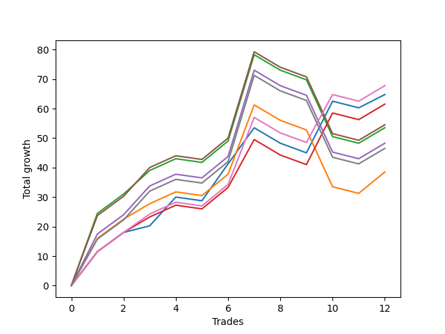

# Short Bulldog 006 
- Symbol: ES90d5mOut
- Date Range: 03/18/2022 - 07/08/2022
- Trading Period: 7:20-12:30
- Number of Trades: 12



| Name | Win Percent | Profit | Avg Profit / Trade |     | Name | Win Percent | Profit | Avg Profit / Trade |
| ---- | ----------- | ------ | ------------------ | --- | ---- | ----------- | ------ | ------------------ |
| Sorted By <br> Profit | | | | | Sorted By <br> Win Percentage ||||
| Six | 66.67 | 33875.00 | 2822.92 |     | Six | 66.67 | 33875.00 | 2822.92 |
| Zero | 66.67 | 32375.00 | 2697.92 |     | Zero | 66.67 | 32375.00 | 2697.92 |
| Three | 66.67 | 30750.00 | 2562.50 |     | Three | 66.67 | 30750.00 | 2562.50 |
| Five | 58.33 | 27250.00 | 2270.83 |     | Five | 58.33 | 27250.00 | 2270.83 |
| Two | 58.33 | 26750.00 | 2229.17 |     | Two | 58.33 | 26750.00 | 2229.17 |
| Four | 58.33 | 24125.00 | 2010.42 |     | Four | 58.33 | 24125.00 | 2010.42 |
| Seven | 58.33 | 23250.00 | 1937.50 |     | Seven | 58.33 | 23250.00 | 1937.50 |
| One | 58.33 | 19250.00 | 1604.17 |     | One | 58.33 | 19250.00 | 1604.17 |

### Test Zero
* Sell when price hits the middle line of the 20p bollinger
* No Stoploss
* Results:
```
Total Trades: 12
Percent Up: 33.33
Percent Down: 66.67
Total Points Moved Down: 64.75
Potential Profit: 32375.00
Total Points Ups: 12.00 Count Ups: 4
Total Points Downs: 76.75 Count Downs: 8
```

<details><summary>Trades</summary>

<code>In: 2022-04-06 10:55:00		Out: 2022-04-06 11:00:10		Total Position Time: 05:10		Total Move Down: 11.50		Total to Date: 11.50</code> <br />
<code>In: 2022-04-07 12:20:00		Out: 2022-04-07 12:50:55		Total Position Time: 30:55		Total Move Down: 6.50		Total to Date: 18.00</code> <br />
<code>In: 2022-04-20 10:50:00		Out: 2022-04-20 11:13:25		Total Position Time: 23:25		Total Move Down: 2.25		Total to Date: 20.25</code> <br />
<code>In: 2022-04-25 11:40:00		Out: 2022-04-25 12:07:15		Total Position Time: 27:15		Total Move Down: 9.75		Total to Date: 30.00</code> <br />
<code>In: 2022-05-04 09:45:00		Out: 2022-05-04 10:15:55		Total Position Time: 30:55		Total Move Down: -1.25		Total to Date: 28.75</code> <br />
<code>In: 2022-05-19 08:55:00		Out: 2022-05-19 09:21:05		Total Position Time: 26:05		Total Move Down: 12.50		Total to Date: 41.25</code> <br />
<code>In: 2022-05-19 12:10:00		Out: 2022-05-19 12:18:20		Total Position Time: 08:20		Total Move Down: 12.25		Total to Date: 53.50</code> <br />
<code>In: 2022-05-24 11:00:00		Out: 2022-05-24 11:30:55		Total Position Time: 30:55		Total Move Down: -5.25		Total to Date: 48.25</code> <br />
<code>In: 2022-05-31 09:10:00		Out: 2022-05-31 09:40:55		Total Position Time: 30:55		Total Move Down: -3.25		Total to Date: 45.00</code> <br />
<code>In: 2022-06-15 11:55:00		Out: 2022-06-15 11:58:05		Total Position Time: 03:05		Total Move Down: 17.50		Total to Date: 62.50</code> <br />
<code>In: 2022-07-05 10:45:00		Out: 2022-07-05 11:15:55		Total Position Time: 30:55		Total Move Down: -2.25		Total to Date: 60.25</code> <br />
<code>In: 2022-07-07 12:25:00		Out: 2022-07-07 12:38:25		Total Position Time: 13:25		Total Move Down: 4.50		Total to Date: 64.75</code> <br />


</details>

### Test One
* Sell when the price hits the upper line of the 20p 1std bollinger
* No Stoploss
* Results:
```
Total Trades: 12
Percent Up: 41.67
Percent Down: 58.33
Total Points Moved Down: 38.50
Potential Profit: 19250.00
Total Points Ups: 31.25 Count Ups: 5
Total Points Downs: 69.75 Count Downs: 7
```

<details><summary>Trades</summary>

<code>In: 2022-04-06 10:55:00		Out: 2022-04-06 11:09:45		Total Position Time: 14:45		Total Move Down: 16.00		Total to Date: 16.00</code> <br />
<code>In: 2022-04-07 12:20:00		Out: 2022-04-07 12:50:55		Total Position Time: 30:55		Total Move Down: 6.50		Total to Date: 22.50</code> <br />
<code>In: 2022-04-20 10:50:00		Out: 2022-04-20 11:17:15		Total Position Time: 27:15		Total Move Down: 5.25		Total to Date: 27.75</code> <br />
<code>In: 2022-04-25 11:40:00		Out: 2022-04-25 12:10:55		Total Position Time: 30:55		Total Move Down: 4.00		Total to Date: 31.75</code> <br />
<code>In: 2022-05-04 09:45:00		Out: 2022-05-04 10:15:55		Total Position Time: 30:55		Total Move Down: -1.25		Total to Date: 30.50</code> <br />
<code>In: 2022-05-19 08:55:00		Out: 2022-05-19 09:25:55		Total Position Time: 30:55		Total Move Down: 7.25		Total to Date: 37.75</code> <br />
<code>In: 2022-05-19 12:10:00		Out: 2022-05-19 12:24:50		Total Position Time: 14:50		Total Move Down: 23.50		Total to Date: 61.25</code> <br />
<code>In: 2022-05-24 11:00:00		Out: 2022-05-24 11:30:55		Total Position Time: 30:55		Total Move Down: -5.25		Total to Date: 56.00</code> <br />
<code>In: 2022-05-31 09:10:00		Out: 2022-05-31 09:40:55		Total Position Time: 30:55		Total Move Down: -3.25		Total to Date: 52.75</code> <br />
<code>In: 2022-06-15 11:55:00		Out: 2022-06-15 12:25:55		Total Position Time: 30:55		Total Move Down: -19.25		Total to Date: 33.50</code> <br />
<code>In: 2022-07-05 10:45:00		Out: 2022-07-05 11:15:55		Total Position Time: 30:55		Total Move Down: -2.25		Total to Date: 31.25</code> <br />
<code>In: 2022-07-07 12:25:00		Out: 2022-07-07 12:46:35		Total Position Time: 21:35		Total Move Down: 7.25		Total to Date: 38.50</code> <br />


</details>

### Test Two
* Sell when the price hits the upper line of the 20p 2std bollinger
* No Stoploss
* Results:
```
Total Trades: 12
Percent Up: 41.67
Percent Down: 58.33
Total Points Moved Down: 53.50
Potential Profit: 26750.00
Total Points Ups: 31.25 Count Ups: 5
Total Points Downs: 84.75 Count Downs: 7
```

<details><summary>Trades</summary>

<code>In: 2022-04-06 10:55:00		Out: 2022-04-06 11:15:15		Total Position Time: 20:15		Total Move Down: 24.50		Total to Date: 24.50</code> <br />
<code>In: 2022-04-07 12:20:00		Out: 2022-04-07 12:50:55		Total Position Time: 30:55		Total Move Down: 6.50		Total to Date: 31.00</code> <br />
<code>In: 2022-04-20 10:50:00		Out: 2022-04-20 11:19:15		Total Position Time: 29:15		Total Move Down: 8.00		Total to Date: 39.00</code> <br />
<code>In: 2022-04-25 11:40:00		Out: 2022-04-25 12:10:55		Total Position Time: 30:55		Total Move Down: 4.00		Total to Date: 43.00</code> <br />
<code>In: 2022-05-04 09:45:00		Out: 2022-05-04 10:15:55		Total Position Time: 30:55		Total Move Down: -1.25		Total to Date: 41.75</code> <br />
<code>In: 2022-05-19 08:55:00		Out: 2022-05-19 09:25:55		Total Position Time: 30:55		Total Move Down: 7.25		Total to Date: 49.00</code> <br />
<code>In: 2022-05-19 12:10:00		Out: 2022-05-19 12:40:55		Total Position Time: 30:55		Total Move Down: 29.25		Total to Date: 78.25</code> <br />
<code>In: 2022-05-24 11:00:00		Out: 2022-05-24 11:30:55		Total Position Time: 30:55		Total Move Down: -5.25		Total to Date: 73.00</code> <br />
<code>In: 2022-05-31 09:10:00		Out: 2022-05-31 09:40:55		Total Position Time: 30:55		Total Move Down: -3.25		Total to Date: 69.75</code> <br />
<code>In: 2022-06-15 11:55:00		Out: 2022-06-15 12:25:55		Total Position Time: 30:55		Total Move Down: -19.25		Total to Date: 50.50</code> <br />
<code>In: 2022-07-05 10:45:00		Out: 2022-07-05 11:15:55		Total Position Time: 30:55		Total Move Down: -2.25		Total to Date: 48.25</code> <br />
<code>In: 2022-07-07 12:25:00		Out: 2022-07-07 12:55:55		Total Position Time: 30:55		Total Move Down: 5.25		Total to Date: 53.50</code> <br />


</details>

### Test Three
* Sell when price hits the middle line of the 50p bollinger
* No Stoploss
* Results:
```
Total Trades: 12
Percent Up: 33.33
Percent Down: 66.67
Total Points Moved Down: 61.50
Potential Profit: 30750.00
Total Points Ups: 12.00 Count Ups: 4
Total Points Downs: 73.50 Count Downs: 8
```

<details><summary>Trades</summary>

<code>In: 2022-04-06 10:55:00		Out: 2022-04-06 11:08:35		Total Position Time: 13:35		Total Move Down: 11.50		Total to Date: 11.50</code> <br />
<code>In: 2022-04-07 12:20:00		Out: 2022-04-07 12:50:55		Total Position Time: 30:55		Total Move Down: 6.50		Total to Date: 18.00</code> <br />
<code>In: 2022-04-20 10:50:00		Out: 2022-04-20 11:17:15		Total Position Time: 27:15		Total Move Down: 5.25		Total to Date: 23.25</code> <br />
<code>In: 2022-04-25 11:40:00		Out: 2022-04-25 12:10:55		Total Position Time: 30:55		Total Move Down: 4.00		Total to Date: 27.25</code> <br />
<code>In: 2022-05-04 09:45:00		Out: 2022-05-04 10:15:55		Total Position Time: 30:55		Total Move Down: -1.25		Total to Date: 26.00</code> <br />
<code>In: 2022-05-19 08:55:00		Out: 2022-05-19 09:25:55		Total Position Time: 30:55		Total Move Down: 7.25		Total to Date: 33.25</code> <br />
<code>In: 2022-05-19 12:10:00		Out: 2022-05-19 12:21:15		Total Position Time: 11:15		Total Move Down: 16.25		Total to Date: 49.50</code> <br />
<code>In: 2022-05-24 11:00:00		Out: 2022-05-24 11:30:55		Total Position Time: 30:55		Total Move Down: -5.25		Total to Date: 44.25</code> <br />
<code>In: 2022-05-31 09:10:00		Out: 2022-05-31 09:40:55		Total Position Time: 30:55		Total Move Down: -3.25		Total to Date: 41.00</code> <br />
<code>In: 2022-06-15 11:55:00		Out: 2022-06-15 11:58:05		Total Position Time: 03:05		Total Move Down: 17.50		Total to Date: 58.50</code> <br />
<code>In: 2022-07-05 10:45:00		Out: 2022-07-05 11:15:55		Total Position Time: 30:55		Total Move Down: -2.25		Total to Date: 56.25</code> <br />
<code>In: 2022-07-07 12:25:00		Out: 2022-07-07 12:55:55		Total Position Time: 30:55		Total Move Down: 5.25		Total to Date: 61.50</code> <br />


</details>

### Test Four
* Sell when the price hits the upper line of the 50p 1std bollinger
* No Stoploss
* Results:
```
Total Trades: 12
Percent Up: 41.67
Percent Down: 58.33
Total Points Moved Down: 48.25
Potential Profit: 24125.00
Total Points Ups: 31.25 Count Ups: 5
Total Points Downs: 79.50 Count Downs: 7
```

<details><summary>Trades</summary>

<code>In: 2022-04-06 10:55:00		Out: 2022-04-06 11:11:20		Total Position Time: 16:20		Total Move Down: 17.50		Total to Date: 17.50</code> <br />
<code>In: 2022-04-07 12:20:00		Out: 2022-04-07 12:50:55		Total Position Time: 30:55		Total Move Down: 6.50		Total to Date: 24.00</code> <br />
<code>In: 2022-04-20 10:50:00		Out: 2022-04-20 11:20:55		Total Position Time: 30:55		Total Move Down: 9.75		Total to Date: 33.75</code> <br />
<code>In: 2022-04-25 11:40:00		Out: 2022-04-25 12:10:55		Total Position Time: 30:55		Total Move Down: 4.00		Total to Date: 37.75</code> <br />
<code>In: 2022-05-04 09:45:00		Out: 2022-05-04 10:15:55		Total Position Time: 30:55		Total Move Down: -1.25		Total to Date: 36.50</code> <br />
<code>In: 2022-05-19 08:55:00		Out: 2022-05-19 09:25:55		Total Position Time: 30:55		Total Move Down: 7.25		Total to Date: 43.75</code> <br />
<code>In: 2022-05-19 12:10:00		Out: 2022-05-19 12:30:05		Total Position Time: 20:05		Total Move Down: 29.25		Total to Date: 73.00</code> <br />
<code>In: 2022-05-24 11:00:00		Out: 2022-05-24 11:30:55		Total Position Time: 30:55		Total Move Down: -5.25		Total to Date: 67.75</code> <br />
<code>In: 2022-05-31 09:10:00		Out: 2022-05-31 09:40:55		Total Position Time: 30:55		Total Move Down: -3.25		Total to Date: 64.50</code> <br />
<code>In: 2022-06-15 11:55:00		Out: 2022-06-15 12:25:55		Total Position Time: 30:55		Total Move Down: -19.25		Total to Date: 45.25</code> <br />
<code>In: 2022-07-05 10:45:00		Out: 2022-07-05 11:15:55		Total Position Time: 30:55		Total Move Down: -2.25		Total to Date: 43.00</code> <br />
<code>In: 2022-07-07 12:25:00		Out: 2022-07-07 12:55:55		Total Position Time: 30:55		Total Move Down: 5.25		Total to Date: 48.25</code> <br />


</details>

### Test Five
* Sell when the price hits the upper line of the 50p 2std bollinger
* No Stoploss
* Results:
```
Total Trades: 12
Percent Up: 41.67
Percent Down: 58.33
Total Points Moved Down: 54.50
Potential Profit: 27250.00
Total Points Ups: 31.25 Count Ups: 5
Total Points Downs: 85.75 Count Downs: 7
```

<details><summary>Trades</summary>

<code>In: 2022-04-06 10:55:00		Out: 2022-04-06 11:15:05		Total Position Time: 20:05		Total Move Down: 23.75		Total to Date: 23.75</code> <br />
<code>In: 2022-04-07 12:20:00		Out: 2022-04-07 12:50:55		Total Position Time: 30:55		Total Move Down: 6.50		Total to Date: 30.25</code> <br />
<code>In: 2022-04-20 10:50:00		Out: 2022-04-20 11:20:55		Total Position Time: 30:55		Total Move Down: 9.75		Total to Date: 40.00</code> <br />
<code>In: 2022-04-25 11:40:00		Out: 2022-04-25 12:10:55		Total Position Time: 30:55		Total Move Down: 4.00		Total to Date: 44.00</code> <br />
<code>In: 2022-05-04 09:45:00		Out: 2022-05-04 10:15:55		Total Position Time: 30:55		Total Move Down: -1.25		Total to Date: 42.75</code> <br />
<code>In: 2022-05-19 08:55:00		Out: 2022-05-19 09:25:55		Total Position Time: 30:55		Total Move Down: 7.25		Total to Date: 50.00</code> <br />
<code>In: 2022-05-19 12:10:00		Out: 2022-05-19 12:40:55		Total Position Time: 30:55		Total Move Down: 29.25		Total to Date: 79.25</code> <br />
<code>In: 2022-05-24 11:00:00		Out: 2022-05-24 11:30:55		Total Position Time: 30:55		Total Move Down: -5.25		Total to Date: 74.00</code> <br />
<code>In: 2022-05-31 09:10:00		Out: 2022-05-31 09:40:55		Total Position Time: 30:55		Total Move Down: -3.25		Total to Date: 70.75</code> <br />
<code>In: 2022-06-15 11:55:00		Out: 2022-06-15 12:25:55		Total Position Time: 30:55		Total Move Down: -19.25		Total to Date: 51.50</code> <br />
<code>In: 2022-07-05 10:45:00		Out: 2022-07-05 11:15:55		Total Position Time: 30:55		Total Move Down: -2.25		Total to Date: 49.25</code> <br />
<code>In: 2022-07-07 12:25:00		Out: 2022-07-07 12:55:55		Total Position Time: 30:55		Total Move Down: 5.25		Total to Date: 54.50</code> <br />


</details>

### Test Six
* Sell when the price hits the middle line of the 1std VWAP
* No Stoploss
* Results:
```
Total Trades: 12
Percent Up: 33.33
Percent Down: 66.67
Total Points Moved Down: 67.75
Potential Profit: 33875.00
Total Points Ups: 12.00 Count Ups: 4
Total Points Downs: 79.75 Count Downs: 8
```

<details><summary>Trades</summary>

<code>In: 2022-04-06 10:55:00		Out: 2022-04-06 11:00:10		Total Position Time: 05:10		Total Move Down: 11.50		Total to Date: 11.50</code> <br />
<code>In: 2022-04-07 12:20:00		Out: 2022-04-07 12:50:55		Total Position Time: 30:55		Total Move Down: 6.50		Total to Date: 18.00</code> <br />
<code>In: 2022-04-20 10:50:00		Out: 2022-04-20 11:18:20		Total Position Time: 28:20		Total Move Down: 6.25		Total to Date: 24.25</code> <br />
<code>In: 2022-04-25 11:40:00		Out: 2022-04-25 12:10:55		Total Position Time: 30:55		Total Move Down: 4.00		Total to Date: 28.25</code> <br />
<code>In: 2022-05-04 09:45:00		Out: 2022-05-04 10:15:55		Total Position Time: 30:55		Total Move Down: -1.25		Total to Date: 27.00</code> <br />
<code>In: 2022-05-19 08:55:00		Out: 2022-05-19 09:25:55		Total Position Time: 30:55		Total Move Down: 7.25		Total to Date: 34.25</code> <br />
<code>In: 2022-05-19 12:10:00		Out: 2022-05-19 12:24:45		Total Position Time: 14:45		Total Move Down: 22.75		Total to Date: 57.00</code> <br />
<code>In: 2022-05-24 11:00:00		Out: 2022-05-24 11:30:55		Total Position Time: 30:55		Total Move Down: -5.25		Total to Date: 51.75</code> <br />
<code>In: 2022-05-31 09:10:00		Out: 2022-05-31 09:40:55		Total Position Time: 30:55		Total Move Down: -3.25		Total to Date: 48.50</code> <br />
<code>In: 2022-06-15 11:55:00		Out: 2022-06-15 11:57:55		Total Position Time: 02:55		Total Move Down: 16.25		Total to Date: 64.75</code> <br />
<code>In: 2022-07-05 10:45:00		Out: 2022-07-05 11:15:55		Total Position Time: 30:55		Total Move Down: -2.25		Total to Date: 62.50</code> <br />
<code>In: 2022-07-07 12:25:00		Out: 2022-07-07 12:55:55		Total Position Time: 30:55		Total Move Down: 5.25		Total to Date: 67.75</code> <br />


</details>

### Test Seven
* Sell when the price hits the upper line of the 1std VWAP
* No Stoploss
* Results:
```
Total Trades: 12
Percent Up: 41.67
Percent Down: 58.33
Total Points Moved Down: 46.50
Potential Profit: 23250.00
Total Points Ups: 31.25 Count Ups: 5
Total Points Downs: 77.75 Count Downs: 7
```

<details><summary>Trades</summary>

<code>In: 2022-04-06 10:55:00		Out: 2022-04-06 11:09:40		Total Position Time: 14:40		Total Move Down: 15.75		Total to Date: 15.75</code> <br />
<code>In: 2022-04-07 12:20:00		Out: 2022-04-07 12:50:55		Total Position Time: 30:55		Total Move Down: 6.50		Total to Date: 22.25</code> <br />
<code>In: 2022-04-20 10:50:00		Out: 2022-04-20 11:20:55		Total Position Time: 30:55		Total Move Down: 9.75		Total to Date: 32.00</code> <br />
<code>In: 2022-04-25 11:40:00		Out: 2022-04-25 12:10:55		Total Position Time: 30:55		Total Move Down: 4.00		Total to Date: 36.00</code> <br />
<code>In: 2022-05-04 09:45:00		Out: 2022-05-04 10:15:55		Total Position Time: 30:55		Total Move Down: -1.25		Total to Date: 34.75</code> <br />
<code>In: 2022-05-19 08:55:00		Out: 2022-05-19 09:25:55		Total Position Time: 30:55		Total Move Down: 7.25		Total to Date: 42.00</code> <br />
<code>In: 2022-05-19 12:10:00		Out: 2022-05-19 12:40:55		Total Position Time: 30:55		Total Move Down: 29.25		Total to Date: 71.25</code> <br />
<code>In: 2022-05-24 11:00:00		Out: 2022-05-24 11:30:55		Total Position Time: 30:55		Total Move Down: -5.25		Total to Date: 66.00</code> <br />
<code>In: 2022-05-31 09:10:00		Out: 2022-05-31 09:40:55		Total Position Time: 30:55		Total Move Down: -3.25		Total to Date: 62.75</code> <br />
<code>In: 2022-06-15 11:55:00		Out: 2022-06-15 12:25:55		Total Position Time: 30:55		Total Move Down: -19.25		Total to Date: 43.50</code> <br />
<code>In: 2022-07-05 10:45:00		Out: 2022-07-05 11:15:55		Total Position Time: 30:55		Total Move Down: -2.25		Total to Date: 41.25</code> <br />
<code>In: 2022-07-07 12:25:00		Out: 2022-07-07 12:55:55		Total Position Time: 30:55		Total Move Down: 5.25		Total to Date: 46.50</code> <br />


</details>