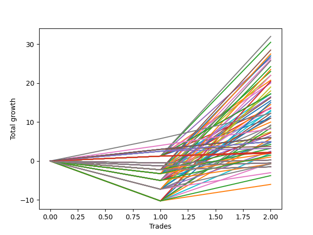

# Short Entry Wallace MJ 007 
- Symbol: ES90d5m30m
- Date Range: 03/18/2022 - 07/08/2022
- Trading Period: 7:20-12:30
- Number of Trades: 2



| Name | Win Percent | Profit | Avg Profit / Trade | Avg Time / Trade |      | Name | Win Percent | Profit | Avg Profit / Trade | Avg Time / Trade |
| ---- | ----------- | ------ | ------------------ | ---------------- | ---- | ---- | ----------- | ------ | ------------------ | ---------------- |
| Sorted By <br> Profit | | | | | | Sorted By <br> Win Percentage ||||
| Seven | 100.00 | 16000.00 | 8000.00 | 00:00 |     | Seven | 100.00 | 16000.00 | 8000.00 | 00:00 |
| Two | 100.00 | 15250.00 | 7625.00 | 00:00 |     | Two | 100.00 | 15250.00 | 7625.00 | 00:00 |
| Fifteen | 50.00 | 14250.00 | 7125.00 | 00:00 |     | Four | 100.00 | 13250.00 | 6625.00 | 00:00 |
| Thirty-One | 50.00 | 13750.00 | 6875.00 | 00:00 |     | One | 100.00 | 10375.00 | 5187.50 | 00:00 |
| Ten | 50.00 | 13500.00 | 6750.00 | 00:00 |     | Six | 100.00 | 10000.00 | 5000.00 | 00:00 |
| Four | 100.00 | 13250.00 | 6625.00 | 00:00 |     | Seventy-Three | 100.00 | 8625.00 | 4312.50 | 00:00 |
| Twenty-Six | 50.00 | 13000.00 | 6500.00 | 00:00 |     | Five | 100.00 | 8625.00 | 4312.50 | 00:00 |
| Forty-Seven | 50.00 | 12875.00 | 6437.50 | 00:00 |     | Three | 100.00 | 6750.00 | 3375.00 | 00:00 |
| Forty-Two | 50.00 | 12125.00 | 6062.50 | 00:00 |     | Eighty-Five | 100.00 | 6125.00 | 3062.50 | 00:00 |
| Seventy-One | 50.00 | 11750.00 | 5875.00 | 00:00 |     | Zero | 100.00 | 5500.00 | 2750.00 | 00:00 |
| Twelve | 50.00 | 11500.00 | 5750.00 | 00:00 |     | Eighty-Four | 100.00 | 4125.00 | 2062.50 | 00:00 |
| Sixty-Six | 50.00 | 11000.00 | 5500.00 | 00:00 |     | One Hundred Twenty-Eight | 100.00 | 3000.00 | 1500.00 | 00:00 |
| Twenty-Eight | 50.00 | 11000.00 | 5500.00 | 00:00 |     | One Hundred Twenty-Three | 100.00 | 3000.00 | 1500.00 | 00:00 |
| One | 100.00 | 10375.00 | 5187.50 | 00:00 |     | One Hundred Thirteen | 100.00 | 3000.00 | 1500.00 | 00:00 |
| Sixty-Three | 50.00 | 10250.00 | 5125.00 | 00:00 |     | One Hundred Three | 100.00 | 3000.00 | 1500.00 | 00:00 |
| Forty-Four | 50.00 | 10125.00 | 5062.50 | 00:00 |     | Ninety-Three | 100.00 | 3000.00 | 1500.00 | 00:00 |
| Six | 100.00 | 10000.00 | 5000.00 | 00:00 |     | Eighty-Three | 100.00 | 3000.00 | 1500.00 | 00:00 |
| Fifty-Eight | 50.00 | 9500.00 | 4750.00 | 00:00 |     | One Hundred Twenty-Seven | 100.00 | 2500.00 | 1250.00 | 00:00 |
| Sixty-Eight | 50.00 | 9000.00 | 4500.00 | 00:00 |     | One Hundred Twenty-Two | 100.00 | 2500.00 | 1250.00 | 00:00 |
| Seventy-Three | 100.00 | 8625.00 | 4312.50 | 00:00 |     | One Hundred Twelve | 100.00 | 2500.00 | 1250.00 | 00:00 |
| Five | 100.00 | 8625.00 | 4312.50 | 00:00 |     | One Hundred Two | 100.00 | 2500.00 | 1250.00 | 00:00 |
| Nine | 50.00 | 8625.00 | 4312.50 | 00:00 |     | Ninety-Two | 100.00 | 2500.00 | 1250.00 | 00:00 |
| Fourteen | 50.00 | 8250.00 | 4125.00 | 00:00 |     | Eighty-Two | 100.00 | 2500.00 | 1250.00 | 00:00 |
| Twenty-Five | 50.00 | 8125.00 | 4062.50 | 00:00 |     | One Hundred Eighteen | 100.00 | 1875.00 | 937.50 | 00:00 |
| Thirty | 50.00 | 7750.00 | 3875.00 | 00:00 |     | One Hundred Seventeen | 100.00 | 1625.00 | 812.50 | 00:00 |
| Sixty | 50.00 | 7500.00 | 3750.00 | 00:00 |     | One Hundred Twenty-Six | 100.00 | 1125.00 | 562.50 | 00:00 |
| Forty-One | 50.00 | 7250.00 | 3625.00 | 00:00 |     | One Hundred Twenty-One | 100.00 | 1125.00 | 562.50 | 00:00 |
| Forty-Six | 50.00 | 6875.00 | 3437.50 | 00:00 |     | One Hundred Eleven | 100.00 | 1125.00 | 562.50 | 00:00 |
| Thirteen | 50.00 | 6875.00 | 3437.50 | 00:00 |     | One Hundred One | 100.00 | 1125.00 | 562.50 | 00:00 |
| Three | 100.00 | 6750.00 | 3375.00 | 00:00 |     | Ninety-One | 100.00 | 1125.00 | 562.50 | 00:00 |
| Sixty-Nine | 50.00 | 6500.00 | 3250.00 | 00:00 |     | Eighty-One | 100.00 | 1125.00 | 562.50 | 00:00 |
| Twenty-Nine | 50.00 | 6375.00 | 3187.50 | 00:00 |     | One Hundred Sixteen | 100.00 | 1000.00 | 500.00 | 00:00 |
| Eighty-Five | 100.00 | 6125.00 | 3062.50 | 00:00 |     | One Hundred Six | 100.00 | 1000.00 | 500.00 | 00:00 |
| Sixty-Five | 50.00 | 6125.00 | 3062.50 | 00:00 |     | Ninety-Six | 100.00 | 1000.00 | 500.00 | 00:00 |
| Seventy | 50.00 | 5750.00 | 2875.00 | 00:00 |     | Fifteen | 50.00 | 14250.00 | 7125.00 | 00:00 |
| Zero | 100.00 | 5500.00 | 2750.00 | 00:00 |     | Thirty-One | 50.00 | 13750.00 | 6875.00 | 00:00 |
| Forty-Five | 50.00 | 5500.00 | 2750.00 | 00:00 |     | Ten | 50.00 | 13500.00 | 6750.00 | 00:00 |
| Eleven | 50.00 | 5000.00 | 2500.00 | 00:00 |     | Twenty-Six | 50.00 | 13000.00 | 6500.00 | 00:00 |
| Fifty-Seven | 50.00 | 4625.00 | 2312.50 | 00:00 |     | Forty-Seven | 50.00 | 12875.00 | 6437.50 | 00:00 |
| twenty-Seven | 50.00 | 4500.00 | 2250.00 | 00:00 |     | Forty-Two | 50.00 | 12125.00 | 6062.50 | 00:00 |
| Sixty-Two | 50.00 | 4250.00 | 2125.00 | 00:00 |     | Seventy-One | 50.00 | 11750.00 | 5875.00 | 00:00 |
| Eighty-Four | 100.00 | 4125.00 | 2062.50 | 00:00 |     | Twelve | 50.00 | 11500.00 | 5750.00 | 00:00 |
| Eight | 50.00 | 3750.00 | 1875.00 | 00:00 |     | Sixty-Six | 50.00 | 11000.00 | 5500.00 | 00:00 |
| Forty-Three | 50.00 | 3625.00 | 1812.50 | 00:00 |     | Twenty-Eight | 50.00 | 11000.00 | 5500.00 | 00:00 |
| Twenty-Four | 50.00 | 3250.00 | 1625.00 | 00:00 |     | Sixty-Three | 50.00 | 10250.00 | 5125.00 | 00:00 |
| One Hundred Twenty-Eight | 100.00 | 3000.00 | 1500.00 | 00:00 |     | Forty-Four | 50.00 | 10125.00 | 5062.50 | 00:00 |
| One Hundred Twenty-Three | 100.00 | 3000.00 | 1500.00 | 00:00 |     | Fifty-Eight | 50.00 | 9500.00 | 4750.00 | 00:00 |
| One Hundred Thirteen | 100.00 | 3000.00 | 1500.00 | 00:00 |     | Sixty-Eight | 50.00 | 9000.00 | 4500.00 | 00:00 |
| One Hundred Three | 100.00 | 3000.00 | 1500.00 | 00:00 |     | Nine | 50.00 | 8625.00 | 4312.50 | 00:00 |
| Ninety-Three | 100.00 | 3000.00 | 1500.00 | 00:00 |     | Fourteen | 50.00 | 8250.00 | 4125.00 | 00:00 |
| Eighty-Three | 100.00 | 3000.00 | 1500.00 | 00:00 |     | Twenty-Five | 50.00 | 8125.00 | 4062.50 | 00:00 |
| Sixty-One | 50.00 | 2875.00 | 1437.50 | 00:00 |     | Thirty | 50.00 | 7750.00 | 3875.00 | 00:00 |
| One Hundred Twenty-Seven | 100.00 | 2500.00 | 1250.00 | 00:00 |     | Sixty | 50.00 | 7500.00 | 3750.00 | 00:00 |
| One Hundred Twenty-Two | 100.00 | 2500.00 | 1250.00 | 00:00 |     | Forty-One | 50.00 | 7250.00 | 3625.00 | 00:00 |
| One Hundred Twelve | 100.00 | 2500.00 | 1250.00 | 00:00 |     | Forty-Six | 50.00 | 6875.00 | 3437.50 | 00:00 |
| One Hundred Two | 100.00 | 2500.00 | 1250.00 | 00:00 |     | Thirteen | 50.00 | 6875.00 | 3437.50 | 00:00 |
| Ninety-Two | 100.00 | 2500.00 | 1250.00 | 00:00 |     | Sixty-Nine | 50.00 | 6500.00 | 3250.00 | 00:00 |
| Eighty-Two | 100.00 | 2500.00 | 1250.00 | 00:00 |     | Twenty-Nine | 50.00 | 6375.00 | 3187.50 | 00:00 |
| Sixty-Seven | 50.00 | 2500.00 | 1250.00 | 00:00 |     | Sixty-Five | 50.00 | 6125.00 | 3062.50 | 00:00 |
| Forty | 50.00 | 2375.00 | 1187.50 | 00:00 |     | Seventy | 50.00 | 5750.00 | 2875.00 | 00:00 |
| Ninety-Five | 50.00 | 2125.00 | 1062.50 | 00:00 |     | Forty-Five | 50.00 | 5500.00 | 2750.00 | 00:00 |
| One Hundred Eighteen | 100.00 | 1875.00 | 937.50 | 00:00 |     | Eleven | 50.00 | 5000.00 | 2500.00 | 00:00 |
| One Hundred Seventeen | 100.00 | 1625.00 | 812.50 | 00:00 |     | Fifty-Seven | 50.00 | 4625.00 | 2312.50 | 00:00 |
| One Hundred Five | 50.00 | 1625.00 | 812.50 | 00:00 |     | twenty-Seven | 50.00 | 4500.00 | 2250.00 | 00:00 |
| Sixty-Four | 50.00 | 1250.00 | 625.00 | 00:00 |     | Sixty-Two | 50.00 | 4250.00 | 2125.00 | 00:00 |
| One Hundred Twenty-Six | 100.00 | 1125.00 | 562.50 | 00:00 |     | Eight | 50.00 | 3750.00 | 1875.00 | 00:00 |
| One Hundred Twenty-One | 100.00 | 1125.00 | 562.50 | 00:00 |     | Forty-Three | 50.00 | 3625.00 | 1812.50 | 00:00 |
| One Hundred Eleven | 100.00 | 1125.00 | 562.50 | 00:00 |     | Twenty-Four | 50.00 | 3250.00 | 1625.00 | 00:00 |
| One Hundred One | 100.00 | 1125.00 | 562.50 | 00:00 |     | Sixty-One | 50.00 | 2875.00 | 1437.50 | 00:00 |
| Ninety-One | 100.00 | 1125.00 | 562.50 | 00:00 |     | Sixty-Seven | 50.00 | 2500.00 | 1250.00 | 00:00 |
| Eighty-One | 100.00 | 1125.00 | 562.50 | 00:00 |     | Forty | 50.00 | 2375.00 | 1187.50 | 00:00 |
| One Hundred Sixteen | 100.00 | 1000.00 | 500.00 | 00:00 |     | Ninety-Five | 50.00 | 2125.00 | 1062.50 | 00:00 |
| One Hundred Six | 100.00 | 1000.00 | 500.00 | 00:00 |     | One Hundred Five | 50.00 | 1625.00 | 812.50 | 00:00 |
| Ninety-Six | 100.00 | 1000.00 | 500.00 | 00:00 |     | Sixty-Four | 50.00 | 1250.00 | 625.00 | 00:00 |
| Ninety-Four | 50.00 | 1000.00 | 500.00 | 00:00 |     | Ninety-Four | 50.00 | 1000.00 | 500.00 | 00:00 |
| Fifty-Nine | 50.00 | 1000.00 | 500.00 | 00:00 |     | Fifty-Nine | 50.00 | 1000.00 | 500.00 | 00:00 |
| One Hundred Fifteen | 50.00 | 750.00 | 375.00 | 00:00 |     | One Hundred Fifteen | 50.00 | 750.00 | 375.00 | 00:00 |
| One Hundred Four | 50.00 | 500.00 | 250.00 | 00:00 |     | One Hundred Four | 50.00 | 500.00 | 250.00 | 00:00 |
| One Hundred | 50.00 | 125.00 | 62.50 | 00:00 |     | One Hundred | 50.00 | 125.00 | 62.50 | 00:00 |
| Ninety-Nine | 50.00 | 125.00 | 62.50 | 00:00 |     | Ninety-Nine | 50.00 | 125.00 | 62.50 | 00:00 |
| Ninety-Eight | 50.00 | 125.00 | 62.50 | 00:00 |     | Ninety-Eight | 50.00 | 125.00 | 62.50 | 00:00 |
| Ninety-Seven | 50.00 | 125.00 | 62.50 | 00:00 |     | Ninety-Seven | 50.00 | 125.00 | 62.50 | 00:00 |
| Twenty-Three | 50.00 | 125.00 | 62.50 | 00:00 |     | Twenty-Three | 50.00 | 125.00 | 62.50 | 00:00 |
| Twenty-Two | 50.00 | 125.00 | 62.50 | 00:00 |     | Twenty-Two | 50.00 | 125.00 | 62.50 | 00:00 |
| Twenty-One | 50.00 | 125.00 | 62.50 | 00:00 |     | Twenty-One | 50.00 | 125.00 | 62.50 | 00:00 |
| Twenty | 50.00 | 125.00 | 62.50 | 00:00 |     | Twenty | 50.00 | 125.00 | 62.50 | 00:00 |
| Nineteen | 50.00 | 125.00 | 62.50 | 00:00 |     | Nineteen | 50.00 | 125.00 | 62.50 | 00:00 |
| Eighteen | 50.00 | 125.00 | 62.50 | 00:00 |     | Eighteen | 50.00 | 125.00 | 62.50 | 00:00 |
| Seventeen | 50.00 | 125.00 | 62.50 | 00:00 |     | Seventeen | 50.00 | 125.00 | 62.50 | 00:00 |
| Sixten | 50.00 | 125.00 | 62.50 | 00:00 |     | Sixten | 50.00 | 125.00 | 62.50 | 00:00 |
| One Hundred Ten | 50.00 | -250.00 | -125.00 | 00:00 |     | One Hundred Ten | 50.00 | -250.00 | -125.00 | 00:00 |
| One Hundred Nine | 50.00 | -250.00 | -125.00 | 00:00 |     | One Hundred Nine | 50.00 | -250.00 | -125.00 | 00:00 |
| One Hundred Eight | 50.00 | -250.00 | -125.00 | 00:00 |     | One Hundred Eight | 50.00 | -250.00 | -125.00 | 00:00 |
| One Hundred Seven | 50.00 | -250.00 | -125.00 | 00:00 |     | One Hundred Seven | 50.00 | -250.00 | -125.00 | 00:00 |
| Fifty-Six | 50.00 | -250.00 | -125.00 | 00:00 |     | Fifty-Six | 50.00 | -250.00 | -125.00 | 00:00 |
| Thirty-Nine | 50.00 | -250.00 | -125.00 | 00:00 |     | Thirty-Nine | 50.00 | -250.00 | -125.00 | 00:00 |
| Thirty-Eight | 50.00 | -250.00 | -125.00 | 00:00 |     | Thirty-Eight | 50.00 | -250.00 | -125.00 | 00:00 |
| Thirty-Seven | 50.00 | -250.00 | -125.00 | 00:00 |     | Thirty-Seven | 50.00 | -250.00 | -125.00 | 00:00 |
| Thirty-Six | 50.00 | -250.00 | -125.00 | 00:00 |     | Thirty-Six | 50.00 | -250.00 | -125.00 | 00:00 |
| Thirty-Five | 50.00 | -250.00 | -125.00 | 00:00 |     | Thirty-Five | 50.00 | -250.00 | -125.00 | 00:00 |
| Thirty-Four | 50.00 | -250.00 | -125.00 | 00:00 |     | Thirty-Four | 50.00 | -250.00 | -125.00 | 00:00 |
| Thirty-Three | 50.00 | -250.00 | -125.00 | 00:00 |     | Thirty-Three | 50.00 | -250.00 | -125.00 | 00:00 |
| Thirty-Two | 50.00 | -250.00 | -125.00 | 00:00 |     | Thirty-Two | 50.00 | -250.00 | -125.00 | 00:00 |
| One Hundred Thirty | 50.00 | -375.00 | -187.50 | 00:00 |     | One Hundred Thirty | 50.00 | -375.00 | -187.50 | 00:00 |
| One Hundred Fourteen | 50.00 | -375.00 | -187.50 | 00:00 |     | One Hundred Fourteen | 50.00 | -375.00 | -187.50 | 00:00 |
| One Hundred Twenty | 50.00 | -750.00 | -375.00 | 00:00 |     | One Hundred Twenty | 50.00 | -750.00 | -375.00 | 00:00 |
| One Hundred Ninteen | 50.00 | -750.00 | -375.00 | 00:00 |     | One Hundred Ninteen | 50.00 | -750.00 | -375.00 | 00:00 |
| Fifty-Five | 50.00 | -750.00 | -375.00 | 00:00 |     | Fifty-Five | 50.00 | -750.00 | -375.00 | 00:00 |
| Fifty-Four | 50.00 | -750.00 | -375.00 | 00:00 |     | Fifty-Four | 50.00 | -750.00 | -375.00 | 00:00 |
| Fifty-Three | 50.00 | -750.00 | -375.00 | 00:00 |     | Fifty-Three | 50.00 | -750.00 | -375.00 | 00:00 |
| Fifty-Two | 50.00 | -750.00 | -375.00 | 00:00 |     | Fifty-Two | 50.00 | -750.00 | -375.00 | 00:00 |
| Fifty-One | 50.00 | -750.00 | -375.00 | 00:00 |     | Fifty-One | 50.00 | -750.00 | -375.00 | 00:00 |
| Fifty | 50.00 | -750.00 | -375.00 | 00:00 |     | Fifty | 50.00 | -750.00 | -375.00 | 00:00 |
| Forty-Nine | 50.00 | -750.00 | -375.00 | 00:00 |     | Forty-Nine | 50.00 | -750.00 | -375.00 | 00:00 |
| Forty-Eight | 50.00 | -750.00 | -375.00 | 00:00 |     | Forty-Eight | 50.00 | -750.00 | -375.00 | 00:00 |
| One Hundred Twenty-Nine | 50.00 | -1500.00 | -750.00 | 00:00 |     | One Hundred Twenty-Nine | 50.00 | -1500.00 | -750.00 | 00:00 |
| One Hundred Twenty-Five | 50.00 | -1875.00 | -937.50 | 00:00 |     | One Hundred Twenty-Five | 50.00 | -1875.00 | -937.50 | 00:00 |
| One Hundred Twenty-Four | 50.00 | -3000.00 | -1500.00 | 00:00 |     | One Hundred Twenty-Four | 50.00 | -3000.00 | -1500.00 | 00:00 |

## NO STOPLOSS

### Test Zero
* Sell when price hits the middle line of the 20p bollinger
* No Stoploss
* Results:
```
Total Trades: 2
Percent Up: 0.00
Percent Down: 100.00
Total Points Moved Down: 11.00
Potential Profit: 5500.00
Total Points Ups: 0.00 Count Ups: 0
Total Points Downs: 11.00 Count Downs: 2
```

<details><summary>Trades</summary>

<code>In: 2022-05-19 09:00:00		Out: 2022-05-19 09:29:55		Total Position Time: 29:55		Total Move Down: 1.25		Total to Date: 1.25</code> <br />
<code>In: 2022-05-19 12:15:00		Out: 2022-05-19 12:18:25		Total Position Time: 03:25		Total Move Down: 9.75		Total to Date: 11.00</code> <br />


</details>

### Test One
* Sell when the price hits the upper line of the 20p 1std bollinger
* No Stoploss
* Results:
```
Total Trades: 2
Percent Up: 0.00
Percent Down: 100.00
Total Points Moved Down: 20.75
Potential Profit: 10375.00
Total Points Ups: 0.00 Count Ups: 0
Total Points Downs: 20.75 Count Downs: 2
```

<details><summary>Trades</summary>

<code>In: 2022-05-19 09:00:00		Out: 2022-05-19 09:29:55		Total Position Time: 29:55		Total Move Down: 1.25		Total to Date: 1.25</code> <br />
<code>In: 2022-05-19 12:15:00		Out: 2022-05-19 12:24:50		Total Position Time: 09:50		Total Move Down: 19.50		Total to Date: 20.75</code> <br />


</details>

### Test Two
* Sell when the price hits the upper line of the 20p 2std bollinger
* No Stoploss
* Results:
```
Total Trades: 2
Percent Up: 0.00
Percent Down: 100.00
Total Points Moved Down: 30.50
Potential Profit: 15250.00
Total Points Ups: 0.00 Count Ups: 0
Total Points Downs: 30.50 Count Downs: 2
```

<details><summary>Trades</summary>

<code>In: 2022-05-19 09:00:00		Out: 2022-05-19 09:29:55		Total Position Time: 29:55		Total Move Down: 1.25		Total to Date: 1.25</code> <br />
<code>In: 2022-05-19 12:15:00		Out: 2022-05-19 12:36:30		Total Position Time: 21:30		Total Move Down: 29.25		Total to Date: 30.50</code> <br />


</details>

### Test Three
* Sell when price hits the middle line of the 50p bollinger
* No Stoploss
* Results:
```
Total Trades: 2
Percent Up: 0.00
Percent Down: 100.00
Total Points Moved Down: 13.50
Potential Profit: 6750.00
Total Points Ups: 0.00 Count Ups: 0
Total Points Downs: 13.50 Count Downs: 2
```

<details><summary>Trades</summary>

<code>In: 2022-05-19 09:00:00		Out: 2022-05-19 09:29:55		Total Position Time: 29:55		Total Move Down: 1.25		Total to Date: 1.25</code> <br />
<code>In: 2022-05-19 12:15:00		Out: 2022-05-19 12:21:15		Total Position Time: 06:15		Total Move Down: 12.25		Total to Date: 13.50</code> <br />


</details>

### Test Four
* Sell when the price hits the upper line of the 50p 1std bollinger
* No Stoploss
* Results:
```
Total Trades: 2
Percent Up: 0.00
Percent Down: 100.00
Total Points Moved Down: 26.50
Potential Profit: 13250.00
Total Points Ups: 0.00 Count Ups: 0
Total Points Downs: 26.50 Count Downs: 2
```

<details><summary>Trades</summary>

<code>In: 2022-05-19 09:00:00		Out: 2022-05-19 09:29:55		Total Position Time: 29:55		Total Move Down: 1.25		Total to Date: 1.25</code> <br />
<code>In: 2022-05-19 12:15:00		Out: 2022-05-19 12:30:05		Total Position Time: 15:05		Total Move Down: 25.25		Total to Date: 26.50</code> <br />


</details>

### Test Five
* Sell when the price hits the upper line of the 50p 2std bollinger
* No Stoploss
* Results:
```
Total Trades: 2
Percent Up: 0.00
Percent Down: 100.00
Total Points Moved Down: 17.25
Potential Profit: 8625.00
Total Points Ups: 0.00 Count Ups: 0
Total Points Downs: 17.25 Count Downs: 2
```

<details><summary>Trades</summary>

<code>In: 2022-05-19 09:00:00		Out: 2022-05-19 09:29:55		Total Position Time: 29:55		Total Move Down: 1.25		Total to Date: 1.25</code> <br />
<code>In: 2022-05-19 12:15:00		Out: 2022-05-19 12:44:55		Total Position Time: 29:55		Total Move Down: 16.00		Total to Date: 17.25</code> <br />


</details>

### Test Six
* Sell when the price hits the middle line of the 1std VWAP
* No Stoploss
* Results:
```
Total Trades: 2
Percent Up: 0.00
Percent Down: 100.00
Total Points Moved Down: 20.00
Potential Profit: 10000.00
Total Points Ups: 0.00 Count Ups: 0
Total Points Downs: 20.00 Count Downs: 2
```

<details><summary>Trades</summary>

<code>In: 2022-05-19 09:00:00		Out: 2022-05-19 09:29:55		Total Position Time: 29:55		Total Move Down: 1.25		Total to Date: 1.25</code> <br />
<code>In: 2022-05-19 12:15:00		Out: 2022-05-19 12:24:45		Total Position Time: 09:45		Total Move Down: 18.75		Total to Date: 20.00</code> <br />


</details>

### Test Seven
* Sell when the price hits the upper line of the 1std VWAP
* No Stoploss
* Results:
```
Total Trades: 2
Percent Up: 0.00
Percent Down: 100.00
Total Points Moved Down: 32.00
Potential Profit: 16000.00
Total Points Ups: 0.00 Count Ups: 0
Total Points Downs: 32.00 Count Downs: 2
```

<details><summary>Trades</summary>

<code>In: 2022-05-19 09:00:00		Out: 2022-05-19 09:29:55		Total Position Time: 29:55		Total Move Down: 1.25		Total to Date: 1.25</code> <br />
<code>In: 2022-05-19 12:15:00		Out: 2022-05-19 12:42:25		Total Position Time: 27:25		Total Move Down: 30.75		Total to Date: 32.00</code> <br />


</details>

## STOPLOSS OF 2

### Test Eight
* Sell when price hits the middle line of the 20p bollinger
* Stoploss is -2 points
* Results:
```
Total Trades: 2
Percent Up: 50.00
Percent Down: 50.00
Total Points Moved Down: 7.50
Potential Profit: 3750.00
Total Points Ups: 2.25 Count Ups: 1
Total Points Downs: 9.75 Count Downs: 1
```

<details><summary>Trades</summary>

<code>In: 2022-05-19 09:00:00		Out: 2022-05-19 09:03:40		Total Position Time: 03:40		Total Move Down: -2.25		Total to Date: -2.25</code> <br />
<code>In: 2022-05-19 12:15:00		Out: 2022-05-19 12:18:25		Total Position Time: 03:25		Total Move Down: 9.75		Total to Date: 7.50</code> <br />


</details>

### Test Nine
* Sell when the price hits the upper line of the 20p 1std bollinger
* Stoploss is -2 points
* Results:
```
Total Trades: 2
Percent Up: 50.00
Percent Down: 50.00
Total Points Moved Down: 17.25
Potential Profit: 8625.00
Total Points Ups: 2.25 Count Ups: 1
Total Points Downs: 19.50 Count Downs: 1
```

<details><summary>Trades</summary>

<code>In: 2022-05-19 09:00:00		Out: 2022-05-19 09:03:40		Total Position Time: 03:40		Total Move Down: -2.25		Total to Date: -2.25</code> <br />
<code>In: 2022-05-19 12:15:00		Out: 2022-05-19 12:24:50		Total Position Time: 09:50		Total Move Down: 19.50		Total to Date: 17.25</code> <br />


</details>

### Test Ten
* Sell when the price hits the upper line of the 20p 2std bollinger
* Stoploss is -2 points
* Results:
```
Total Trades: 2
Percent Up: 50.00
Percent Down: 50.00
Total Points Moved Down: 27.00
Potential Profit: 13500.00
Total Points Ups: 2.25 Count Ups: 1
Total Points Downs: 29.25 Count Downs: 1
```

<details><summary>Trades</summary>

<code>In: 2022-05-19 09:00:00		Out: 2022-05-19 09:03:40		Total Position Time: 03:40		Total Move Down: -2.25		Total to Date: -2.25</code> <br />
<code>In: 2022-05-19 12:15:00		Out: 2022-05-19 12:36:30		Total Position Time: 21:30		Total Move Down: 29.25		Total to Date: 27.00</code> <br />


</details>

### Test Eleven
* Sell when price hits the middle line of the 50p bollinger
* Stoploss is -2 points
* Results:
```
Total Trades: 2
Percent Up: 50.00
Percent Down: 50.00
Total Points Moved Down: 10.00
Potential Profit: 5000.00
Total Points Ups: 2.25 Count Ups: 1
Total Points Downs: 12.25 Count Downs: 1
```

<details><summary>Trades</summary>

<code>In: 2022-05-19 09:00:00		Out: 2022-05-19 09:03:40		Total Position Time: 03:40		Total Move Down: -2.25		Total to Date: -2.25</code> <br />
<code>In: 2022-05-19 12:15:00		Out: 2022-05-19 12:21:15		Total Position Time: 06:15		Total Move Down: 12.25		Total to Date: 10.00</code> <br />


</details>

### Test Twelve
* Sell when the price hits the upper line of the 50p 1std bollinger
* Stoploss is -2 points
* Results:
```
Total Trades: 2
Percent Up: 50.00
Percent Down: 50.00
Total Points Moved Down: 23.00
Potential Profit: 11500.00
Total Points Ups: 2.25 Count Ups: 1
Total Points Downs: 25.25 Count Downs: 1
```

<details><summary>Trades</summary>

<code>In: 2022-05-19 09:00:00		Out: 2022-05-19 09:03:40		Total Position Time: 03:40		Total Move Down: -2.25		Total to Date: -2.25</code> <br />
<code>In: 2022-05-19 12:15:00		Out: 2022-05-19 12:30:05		Total Position Time: 15:05		Total Move Down: 25.25		Total to Date: 23.00</code> <br />


</details>

### Test Thirteen
* Sell when the price hits the upper line of the 50p 2std bollinger
* Stoploss is -2 points
* Results:
```
Total Trades: 2
Percent Up: 50.00
Percent Down: 50.00
Total Points Moved Down: 13.75
Potential Profit: 6875.00
Total Points Ups: 2.25 Count Ups: 1
Total Points Downs: 16.00 Count Downs: 1
```

<details><summary>Trades</summary>

<code>In: 2022-05-19 09:00:00		Out: 2022-05-19 09:03:40		Total Position Time: 03:40		Total Move Down: -2.25		Total to Date: -2.25</code> <br />
<code>In: 2022-05-19 12:15:00		Out: 2022-05-19 12:44:55		Total Position Time: 29:55		Total Move Down: 16.00		Total to Date: 13.75</code> <br />


</details>

### Test Fourteen
* Sell when the price hits the middle line of the 1std VWAP
* Stoploss is -2 points
* Results:
```
Total Trades: 2
Percent Up: 50.00
Percent Down: 50.00
Total Points Moved Down: 16.50
Potential Profit: 8250.00
Total Points Ups: 2.25 Count Ups: 1
Total Points Downs: 18.75 Count Downs: 1
```

<details><summary>Trades</summary>

<code>In: 2022-05-19 09:00:00		Out: 2022-05-19 09:03:40		Total Position Time: 03:40		Total Move Down: -2.25		Total to Date: -2.25</code> <br />
<code>In: 2022-05-19 12:15:00		Out: 2022-05-19 12:24:45		Total Position Time: 09:45		Total Move Down: 18.75		Total to Date: 16.50</code> <br />


</details>

### Test Fifteen
* Sell when the price hits the upper line of the 1std VWAP
* Stoploss is -2 points
* Results:
```
Total Trades: 2
Percent Up: 50.00
Percent Down: 50.00
Total Points Moved Down: 28.50
Potential Profit: 14250.00
Total Points Ups: 2.25 Count Ups: 1
Total Points Downs: 30.75 Count Downs: 1
```

<details><summary>Trades</summary>

<code>In: 2022-05-19 09:00:00		Out: 2022-05-19 09:03:40		Total Position Time: 03:40		Total Move Down: -2.25		Total to Date: -2.25</code> <br />
<code>In: 2022-05-19 12:15:00		Out: 2022-05-19 12:42:25		Total Position Time: 27:25		Total Move Down: 30.75		Total to Date: 28.50</code> <br />


</details>

## TRAIL STOP OF 2

### Test Sixten
* Sell when price hits the middle line of the 20p bollinger
* Trailing Stop is -2 points
* Results:
```
Total Trades: 2
Percent Up: 50.00
Percent Down: 50.00
Total Points Moved Down: 0.25
Potential Profit: 125.00
Total Points Ups: 0.50 Count Ups: 1
Total Points Downs: 0.75 Count Downs: 1
```

<details><summary>Trades</summary>

<code>In: 2022-05-19 09:00:00		Out: 2022-05-19 09:00:30		Total Position Time: 00:30		Total Move Down: -0.50		Total to Date: -0.50</code> <br />
<code>In: 2022-05-19 12:15:00		Out: 2022-05-19 12:15:10		Total Position Time: 00:10		Total Move Down: 0.75		Total to Date: 0.25</code> <br />


</details>

### Test Seventeen
* Sell when the price hits the upper line of the 20p 1std bollinger
* Trailing Stop is -2 points
* Results:
```
Total Trades: 2
Percent Up: 50.00
Percent Down: 50.00
Total Points Moved Down: 0.25
Potential Profit: 125.00
Total Points Ups: 0.50 Count Ups: 1
Total Points Downs: 0.75 Count Downs: 1
```

<details><summary>Trades</summary>

<code>In: 2022-05-19 09:00:00		Out: 2022-05-19 09:00:30		Total Position Time: 00:30		Total Move Down: -0.50		Total to Date: -0.50</code> <br />
<code>In: 2022-05-19 12:15:00		Out: 2022-05-19 12:15:10		Total Position Time: 00:10		Total Move Down: 0.75		Total to Date: 0.25</code> <br />


</details>

### Test Eighteen
* Sell when the price hits the upper line of the 20p 2std bollinger
* Trailing Stop is -2 points
* Results:
```
Total Trades: 2
Percent Up: 50.00
Percent Down: 50.00
Total Points Moved Down: 0.25
Potential Profit: 125.00
Total Points Ups: 0.50 Count Ups: 1
Total Points Downs: 0.75 Count Downs: 1
```

<details><summary>Trades</summary>

<code>In: 2022-05-19 09:00:00		Out: 2022-05-19 09:00:30		Total Position Time: 00:30		Total Move Down: -0.50		Total to Date: -0.50</code> <br />
<code>In: 2022-05-19 12:15:00		Out: 2022-05-19 12:15:10		Total Position Time: 00:10		Total Move Down: 0.75		Total to Date: 0.25</code> <br />


</details>

### Test Nineteen
* Sell when price hits the middle line of the 50p bollinger
* Trailing Stop is -2 points
* Results:
```
Total Trades: 2
Percent Up: 50.00
Percent Down: 50.00
Total Points Moved Down: 0.25
Potential Profit: 125.00
Total Points Ups: 0.50 Count Ups: 1
Total Points Downs: 0.75 Count Downs: 1
```

<details><summary>Trades</summary>

<code>In: 2022-05-19 09:00:00		Out: 2022-05-19 09:00:30		Total Position Time: 00:30		Total Move Down: -0.50		Total to Date: -0.50</code> <br />
<code>In: 2022-05-19 12:15:00		Out: 2022-05-19 12:15:10		Total Position Time: 00:10		Total Move Down: 0.75		Total to Date: 0.25</code> <br />


</details>

### Test Twenty
* Sell when the price hits the upper line of the 50p 1std bollinger
* Trailing Stop is -2 points
* Results:
```
Total Trades: 2
Percent Up: 50.00
Percent Down: 50.00
Total Points Moved Down: 0.25
Potential Profit: 125.00
Total Points Ups: 0.50 Count Ups: 1
Total Points Downs: 0.75 Count Downs: 1
```

<details><summary>Trades</summary>

<code>In: 2022-05-19 09:00:00		Out: 2022-05-19 09:00:30		Total Position Time: 00:30		Total Move Down: -0.50		Total to Date: -0.50</code> <br />
<code>In: 2022-05-19 12:15:00		Out: 2022-05-19 12:15:10		Total Position Time: 00:10		Total Move Down: 0.75		Total to Date: 0.25</code> <br />


</details>

### Test Twenty-One
* Sell when the price hits the upper line of the 50p 2std bollinger
* Trailing Stop is -2 points
* Results:
```
Total Trades: 2
Percent Up: 50.00
Percent Down: 50.00
Total Points Moved Down: 0.25
Potential Profit: 125.00
Total Points Ups: 0.50 Count Ups: 1
Total Points Downs: 0.75 Count Downs: 1
```

<details><summary>Trades</summary>

<code>In: 2022-05-19 09:00:00		Out: 2022-05-19 09:00:30		Total Position Time: 00:30		Total Move Down: -0.50		Total to Date: -0.50</code> <br />
<code>In: 2022-05-19 12:15:00		Out: 2022-05-19 12:15:10		Total Position Time: 00:10		Total Move Down: 0.75		Total to Date: 0.25</code> <br />


</details>

### Test Twenty-Two
* Sell when the price hits the middle line of the 1std VWAP
* Trailing Stop is -2 points
* Results:
```
Total Trades: 2
Percent Up: 50.00
Percent Down: 50.00
Total Points Moved Down: 0.25
Potential Profit: 125.00
Total Points Ups: 0.50 Count Ups: 1
Total Points Downs: 0.75 Count Downs: 1
```

<details><summary>Trades</summary>

<code>In: 2022-05-19 09:00:00		Out: 2022-05-19 09:00:30		Total Position Time: 00:30		Total Move Down: -0.50		Total to Date: -0.50</code> <br />
<code>In: 2022-05-19 12:15:00		Out: 2022-05-19 12:15:10		Total Position Time: 00:10		Total Move Down: 0.75		Total to Date: 0.25</code> <br />


</details>

### Test Twenty-Three
* Sell when the price hits the upper line of the 1std VWAP
* Trailing Stop is -2 points
* Results:
```
Total Trades: 2
Percent Up: 50.00
Percent Down: 50.00
Total Points Moved Down: 0.25
Potential Profit: 125.00
Total Points Ups: 0.50 Count Ups: 1
Total Points Downs: 0.75 Count Downs: 1
```

<details><summary>Trades</summary>

<code>In: 2022-05-19 09:00:00		Out: 2022-05-19 09:00:30		Total Position Time: 00:30		Total Move Down: -0.50		Total to Date: -0.50</code> <br />
<code>In: 2022-05-19 12:15:00		Out: 2022-05-19 12:15:10		Total Position Time: 00:10		Total Move Down: 0.75		Total to Date: 0.25</code> <br />


</details>

## STOPLOSS OF 3

### Test Twenty-Four
* Sell when price hits the middle line of the 20p bollinger
* Stoploss is -3 points
* Results:
```
Total Trades: 2
Percent Up: 50.00
Percent Down: 50.00
Total Points Moved Down: 6.50
Potential Profit: 3250.00
Total Points Ups: 3.25 Count Ups: 1
Total Points Downs: 9.75 Count Downs: 1
```

<details><summary>Trades</summary>

<code>In: 2022-05-19 09:00:00		Out: 2022-05-19 09:04:50		Total Position Time: 04:50		Total Move Down: -3.25		Total to Date: -3.25</code> <br />
<code>In: 2022-05-19 12:15:00		Out: 2022-05-19 12:18:25		Total Position Time: 03:25		Total Move Down: 9.75		Total to Date: 6.50</code> <br />


</details>

### Test Twenty-Five
* Sell when the price hits the upper line of the 20p 1std bollinger
* Stoploss is -3 points
* Results:
```
Total Trades: 2
Percent Up: 50.00
Percent Down: 50.00
Total Points Moved Down: 16.25
Potential Profit: 8125.00
Total Points Ups: 3.25 Count Ups: 1
Total Points Downs: 19.50 Count Downs: 1
```

<details><summary>Trades</summary>

<code>In: 2022-05-19 09:00:00		Out: 2022-05-19 09:04:50		Total Position Time: 04:50		Total Move Down: -3.25		Total to Date: -3.25</code> <br />
<code>In: 2022-05-19 12:15:00		Out: 2022-05-19 12:24:50		Total Position Time: 09:50		Total Move Down: 19.50		Total to Date: 16.25</code> <br />


</details>

### Test Twenty-Six
* Sell when the price hits the upper line of the 20p 2std bollinger
* Stoploss is -3 points
* Results:
```
Total Trades: 2
Percent Up: 50.00
Percent Down: 50.00
Total Points Moved Down: 26.00
Potential Profit: 13000.00
Total Points Ups: 3.25 Count Ups: 1
Total Points Downs: 29.25 Count Downs: 1
```

<details><summary>Trades</summary>

<code>In: 2022-05-19 09:00:00		Out: 2022-05-19 09:04:50		Total Position Time: 04:50		Total Move Down: -3.25		Total to Date: -3.25</code> <br />
<code>In: 2022-05-19 12:15:00		Out: 2022-05-19 12:36:30		Total Position Time: 21:30		Total Move Down: 29.25		Total to Date: 26.00</code> <br />


</details>

### Test twenty-Seven
* Sell when price hits the middle line of the 50p bollinger
* Stoploss is -3 points
* Results:
```
Total Trades: 2
Percent Up: 50.00
Percent Down: 50.00
Total Points Moved Down: 9.00
Potential Profit: 4500.00
Total Points Ups: 3.25 Count Ups: 1
Total Points Downs: 12.25 Count Downs: 1
```

<details><summary>Trades</summary>

<code>In: 2022-05-19 09:00:00		Out: 2022-05-19 09:04:50		Total Position Time: 04:50		Total Move Down: -3.25		Total to Date: -3.25</code> <br />
<code>In: 2022-05-19 12:15:00		Out: 2022-05-19 12:21:15		Total Position Time: 06:15		Total Move Down: 12.25		Total to Date: 9.00</code> <br />


</details>

### Test Twenty-Eight
* Sell when the price hits the upper line of the 50p 1std bollinger
* Stoploss is -3 points
* Results:
```
Total Trades: 2
Percent Up: 50.00
Percent Down: 50.00
Total Points Moved Down: 22.00
Potential Profit: 11000.00
Total Points Ups: 3.25 Count Ups: 1
Total Points Downs: 25.25 Count Downs: 1
```

<details><summary>Trades</summary>

<code>In: 2022-05-19 09:00:00		Out: 2022-05-19 09:04:50		Total Position Time: 04:50		Total Move Down: -3.25		Total to Date: -3.25</code> <br />
<code>In: 2022-05-19 12:15:00		Out: 2022-05-19 12:30:05		Total Position Time: 15:05		Total Move Down: 25.25		Total to Date: 22.00</code> <br />


</details>

### Test Twenty-Nine
* Sell when the price hits the upper line of the 50p 2std bollinger
* Stoploss is -3 points
* Results:
```
Total Trades: 2
Percent Up: 50.00
Percent Down: 50.00
Total Points Moved Down: 12.75
Potential Profit: 6375.00
Total Points Ups: 3.25 Count Ups: 1
Total Points Downs: 16.00 Count Downs: 1
```

<details><summary>Trades</summary>

<code>In: 2022-05-19 09:00:00		Out: 2022-05-19 09:04:50		Total Position Time: 04:50		Total Move Down: -3.25		Total to Date: -3.25</code> <br />
<code>In: 2022-05-19 12:15:00		Out: 2022-05-19 12:44:55		Total Position Time: 29:55		Total Move Down: 16.00		Total to Date: 12.75</code> <br />


</details>

### Test Thirty
* Sell when the price hits the middle line of the 1std VWAP
* Stoploss is -3 points
* Results:
```
Total Trades: 2
Percent Up: 50.00
Percent Down: 50.00
Total Points Moved Down: 15.50
Potential Profit: 7750.00
Total Points Ups: 3.25 Count Ups: 1
Total Points Downs: 18.75 Count Downs: 1
```

<details><summary>Trades</summary>

<code>In: 2022-05-19 09:00:00		Out: 2022-05-19 09:04:50		Total Position Time: 04:50		Total Move Down: -3.25		Total to Date: -3.25</code> <br />
<code>In: 2022-05-19 12:15:00		Out: 2022-05-19 12:24:45		Total Position Time: 09:45		Total Move Down: 18.75		Total to Date: 15.50</code> <br />


</details>

### Test Thirty-One
* Sell when the price hits the upper line of the 1std VWAP
* Stoploss is -3 points
* Results:
```
Total Trades: 2
Percent Up: 50.00
Percent Down: 50.00
Total Points Moved Down: 27.50
Potential Profit: 13750.00
Total Points Ups: 3.25 Count Ups: 1
Total Points Downs: 30.75 Count Downs: 1
```

<details><summary>Trades</summary>

<code>In: 2022-05-19 09:00:00		Out: 2022-05-19 09:04:50		Total Position Time: 04:50		Total Move Down: -3.25		Total to Date: -3.25</code> <br />
<code>In: 2022-05-19 12:15:00		Out: 2022-05-19 12:42:25		Total Position Time: 27:25		Total Move Down: 30.75		Total to Date: 27.50</code> <br />


</details>

## TRAIL STOP OF 3

### Test Thirty-Two
* Sell when price hits the middle line of the 20p bollinger
* Trailing Stop is -3 points
* Results:
```
Total Trades: 2
Percent Up: 50.00
Percent Down: 50.00
Total Points Moved Down: -0.50
Potential Profit: -250.00
Total Points Ups: 1.25 Count Ups: 1
Total Points Downs: 0.75 Count Downs: 1
```

<details><summary>Trades</summary>

<code>In: 2022-05-19 09:00:00		Out: 2022-05-19 09:00:45		Total Position Time: 00:45		Total Move Down: -1.25		Total to Date: -1.25</code> <br />
<code>In: 2022-05-19 12:15:00		Out: 2022-05-19 12:15:10		Total Position Time: 00:10		Total Move Down: 0.75		Total to Date: -0.50</code> <br />


</details>

### Test Thirty-Three
* Sell when the price hits the upper line of the 20p 1std bollinger
* Trailing Stop is -3 points
* Results:
```
Total Trades: 2
Percent Up: 50.00
Percent Down: 50.00
Total Points Moved Down: -0.50
Potential Profit: -250.00
Total Points Ups: 1.25 Count Ups: 1
Total Points Downs: 0.75 Count Downs: 1
```

<details><summary>Trades</summary>

<code>In: 2022-05-19 09:00:00		Out: 2022-05-19 09:00:45		Total Position Time: 00:45		Total Move Down: -1.25		Total to Date: -1.25</code> <br />
<code>In: 2022-05-19 12:15:00		Out: 2022-05-19 12:15:10		Total Position Time: 00:10		Total Move Down: 0.75		Total to Date: -0.50</code> <br />


</details>

### Test Thirty-Four
* Sell when the price hits the upper line of the 20p 2std bollinger
* Trailing Stop is -3 points
* Results:
```
Total Trades: 2
Percent Up: 50.00
Percent Down: 50.00
Total Points Moved Down: -0.50
Potential Profit: -250.00
Total Points Ups: 1.25 Count Ups: 1
Total Points Downs: 0.75 Count Downs: 1
```

<details><summary>Trades</summary>

<code>In: 2022-05-19 09:00:00		Out: 2022-05-19 09:00:45		Total Position Time: 00:45		Total Move Down: -1.25		Total to Date: -1.25</code> <br />
<code>In: 2022-05-19 12:15:00		Out: 2022-05-19 12:15:10		Total Position Time: 00:10		Total Move Down: 0.75		Total to Date: -0.50</code> <br />


</details>

### Test Thirty-Five
* Sell when price hits the middle line of the 50p bollinger
* Trailing Stop is -3 points
* Results:
```
Total Trades: 2
Percent Up: 50.00
Percent Down: 50.00
Total Points Moved Down: -0.50
Potential Profit: -250.00
Total Points Ups: 1.25 Count Ups: 1
Total Points Downs: 0.75 Count Downs: 1
```

<details><summary>Trades</summary>

<code>In: 2022-05-19 09:00:00		Out: 2022-05-19 09:00:45		Total Position Time: 00:45		Total Move Down: -1.25		Total to Date: -1.25</code> <br />
<code>In: 2022-05-19 12:15:00		Out: 2022-05-19 12:15:10		Total Position Time: 00:10		Total Move Down: 0.75		Total to Date: -0.50</code> <br />


</details>

### Test Thirty-Six
* Sell when the price hits the upper line of the 50p 1std bollinger
* Trailing Stop is -3 points
* Results:
```
Total Trades: 2
Percent Up: 50.00
Percent Down: 50.00
Total Points Moved Down: -0.50
Potential Profit: -250.00
Total Points Ups: 1.25 Count Ups: 1
Total Points Downs: 0.75 Count Downs: 1
```

<details><summary>Trades</summary>

<code>In: 2022-05-19 09:00:00		Out: 2022-05-19 09:00:45		Total Position Time: 00:45		Total Move Down: -1.25		Total to Date: -1.25</code> <br />
<code>In: 2022-05-19 12:15:00		Out: 2022-05-19 12:15:10		Total Position Time: 00:10		Total Move Down: 0.75		Total to Date: -0.50</code> <br />


</details>

### Test Thirty-Seven
* Sell when the price hits the upper line of the 50p 2std bollinger
* Trailing Stop is -3 points
* Results:
```
Total Trades: 2
Percent Up: 50.00
Percent Down: 50.00
Total Points Moved Down: -0.50
Potential Profit: -250.00
Total Points Ups: 1.25 Count Ups: 1
Total Points Downs: 0.75 Count Downs: 1
```

<details><summary>Trades</summary>

<code>In: 2022-05-19 09:00:00		Out: 2022-05-19 09:00:45		Total Position Time: 00:45		Total Move Down: -1.25		Total to Date: -1.25</code> <br />
<code>In: 2022-05-19 12:15:00		Out: 2022-05-19 12:15:10		Total Position Time: 00:10		Total Move Down: 0.75		Total to Date: -0.50</code> <br />


</details>

### Test Thirty-Eight
* Sell when the price hits the middle line of the 1std VWAP
* Trailing Stop is -3 points
* Results:
```
Total Trades: 2
Percent Up: 50.00
Percent Down: 50.00
Total Points Moved Down: -0.50
Potential Profit: -250.00
Total Points Ups: 1.25 Count Ups: 1
Total Points Downs: 0.75 Count Downs: 1
```

<details><summary>Trades</summary>

<code>In: 2022-05-19 09:00:00		Out: 2022-05-19 09:00:45		Total Position Time: 00:45		Total Move Down: -1.25		Total to Date: -1.25</code> <br />
<code>In: 2022-05-19 12:15:00		Out: 2022-05-19 12:15:10		Total Position Time: 00:10		Total Move Down: 0.75		Total to Date: -0.50</code> <br />


</details>

### Test Thirty-Nine
* Sell when the price hits the upper line of the 1std VWAP
* Trailing Stop is -3 points
* Results:
```
Total Trades: 2
Percent Up: 50.00
Percent Down: 50.00
Total Points Moved Down: -0.50
Potential Profit: -250.00
Total Points Ups: 1.25 Count Ups: 1
Total Points Downs: 0.75 Count Downs: 1
```

<details><summary>Trades</summary>

<code>In: 2022-05-19 09:00:00		Out: 2022-05-19 09:00:45		Total Position Time: 00:45		Total Move Down: -1.25		Total to Date: -1.25</code> <br />
<code>In: 2022-05-19 12:15:00		Out: 2022-05-19 12:15:10		Total Position Time: 00:10		Total Move Down: 0.75		Total to Date: -0.50</code> <br />


</details>

## STOPLOSS OF 5

### Test Forty
* Sell when price hits the middle line of the 20p bollinger
* Stoploss is -5 points
* Results:
```
Total Trades: 2
Percent Up: 50.00
Percent Down: 50.00
Total Points Moved Down: 4.75
Potential Profit: 2375.00
Total Points Ups: 5.00 Count Ups: 1
Total Points Downs: 9.75 Count Downs: 1
```

<details><summary>Trades</summary>

<code>In: 2022-05-19 09:00:00		Out: 2022-05-19 09:10:20		Total Position Time: 10:20		Total Move Down: -5.00		Total to Date: -5.00</code> <br />
<code>In: 2022-05-19 12:15:00		Out: 2022-05-19 12:18:25		Total Position Time: 03:25		Total Move Down: 9.75		Total to Date: 4.75</code> <br />


</details>

### Test Forty-One
* Sell when the price hits the upper line of the 20p 1std bollinger
* Stoploss is -5 points
* Results:
```
Total Trades: 2
Percent Up: 50.00
Percent Down: 50.00
Total Points Moved Down: 14.50
Potential Profit: 7250.00
Total Points Ups: 5.00 Count Ups: 1
Total Points Downs: 19.50 Count Downs: 1
```

<details><summary>Trades</summary>

<code>In: 2022-05-19 09:00:00		Out: 2022-05-19 09:10:20		Total Position Time: 10:20		Total Move Down: -5.00		Total to Date: -5.00</code> <br />
<code>In: 2022-05-19 12:15:00		Out: 2022-05-19 12:24:50		Total Position Time: 09:50		Total Move Down: 19.50		Total to Date: 14.50</code> <br />


</details>

### Test Forty-Two
* Sell when the price hits the upper line of the 20p 2std bollinger
* Stoploss is -5 points
* Results:
```
Total Trades: 2
Percent Up: 50.00
Percent Down: 50.00
Total Points Moved Down: 24.25
Potential Profit: 12125.00
Total Points Ups: 5.00 Count Ups: 1
Total Points Downs: 29.25 Count Downs: 1
```

<details><summary>Trades</summary>

<code>In: 2022-05-19 09:00:00		Out: 2022-05-19 09:10:20		Total Position Time: 10:20		Total Move Down: -5.00		Total to Date: -5.00</code> <br />
<code>In: 2022-05-19 12:15:00		Out: 2022-05-19 12:36:30		Total Position Time: 21:30		Total Move Down: 29.25		Total to Date: 24.25</code> <br />


</details>

### Test Forty-Three
* Sell when price hits the middle line of the 50p bollinger
* Stoploss is -5 points
* Results:
```
Total Trades: 2
Percent Up: 50.00
Percent Down: 50.00
Total Points Moved Down: 7.25
Potential Profit: 3625.00
Total Points Ups: 5.00 Count Ups: 1
Total Points Downs: 12.25 Count Downs: 1
```

<details><summary>Trades</summary>

<code>In: 2022-05-19 09:00:00		Out: 2022-05-19 09:10:20		Total Position Time: 10:20		Total Move Down: -5.00		Total to Date: -5.00</code> <br />
<code>In: 2022-05-19 12:15:00		Out: 2022-05-19 12:21:15		Total Position Time: 06:15		Total Move Down: 12.25		Total to Date: 7.25</code> <br />


</details>

### Test Forty-Four
* Sell when the price hits the upper line of the 50p 1std bollinger
* Stoploss is -5 points
* Results:
```
Total Trades: 2
Percent Up: 50.00
Percent Down: 50.00
Total Points Moved Down: 20.25
Potential Profit: 10125.00
Total Points Ups: 5.00 Count Ups: 1
Total Points Downs: 25.25 Count Downs: 1
```

<details><summary>Trades</summary>

<code>In: 2022-05-19 09:00:00		Out: 2022-05-19 09:10:20		Total Position Time: 10:20		Total Move Down: -5.00		Total to Date: -5.00</code> <br />
<code>In: 2022-05-19 12:15:00		Out: 2022-05-19 12:30:05		Total Position Time: 15:05		Total Move Down: 25.25		Total to Date: 20.25</code> <br />


</details>

### Test Forty-Five
* Sell when the price hits the upper line of the 50p 2std bollinger
* Stoploss is -5 points
* Results:
```
Total Trades: 2
Percent Up: 50.00
Percent Down: 50.00
Total Points Moved Down: 11.00
Potential Profit: 5500.00
Total Points Ups: 5.00 Count Ups: 1
Total Points Downs: 16.00 Count Downs: 1
```

<details><summary>Trades</summary>

<code>In: 2022-05-19 09:00:00		Out: 2022-05-19 09:10:20		Total Position Time: 10:20		Total Move Down: -5.00		Total to Date: -5.00</code> <br />
<code>In: 2022-05-19 12:15:00		Out: 2022-05-19 12:44:55		Total Position Time: 29:55		Total Move Down: 16.00		Total to Date: 11.00</code> <br />


</details>

### Test Forty-Six
* Sell when the price hits the middle line of the 1std VWAP
* Stoploss is -5 points
* Results:
```
Total Trades: 2
Percent Up: 50.00
Percent Down: 50.00
Total Points Moved Down: 13.75
Potential Profit: 6875.00
Total Points Ups: 5.00 Count Ups: 1
Total Points Downs: 18.75 Count Downs: 1
```

<details><summary>Trades</summary>

<code>In: 2022-05-19 09:00:00		Out: 2022-05-19 09:10:20		Total Position Time: 10:20		Total Move Down: -5.00		Total to Date: -5.00</code> <br />
<code>In: 2022-05-19 12:15:00		Out: 2022-05-19 12:24:45		Total Position Time: 09:45		Total Move Down: 18.75		Total to Date: 13.75</code> <br />


</details>

### Test Forty-Seven
* Sell when the price hits the upper line of the 1std VWAP
* Stoploss is -5 points
* Results:
```
Total Trades: 2
Percent Up: 50.00
Percent Down: 50.00
Total Points Moved Down: 25.75
Potential Profit: 12875.00
Total Points Ups: 5.00 Count Ups: 1
Total Points Downs: 30.75 Count Downs: 1
```

<details><summary>Trades</summary>

<code>In: 2022-05-19 09:00:00		Out: 2022-05-19 09:10:20		Total Position Time: 10:20		Total Move Down: -5.00		Total to Date: -5.00</code> <br />
<code>In: 2022-05-19 12:15:00		Out: 2022-05-19 12:42:25		Total Position Time: 27:25		Total Move Down: 30.75		Total to Date: 25.75</code> <br />


</details>

## TRAIL STOP OF 5

### Test Forty-Eight
* Sell when price hits the middle line of the 20p bollinger
* Trailing Stop is -5 points
* Results:
```
Total Trades: 2
Percent Up: 50.00
Percent Down: 50.00
Total Points Moved Down: -1.50
Potential Profit: -750.00
Total Points Ups: 2.25 Count Ups: 1
Total Points Downs: 0.75 Count Downs: 1
```

<details><summary>Trades</summary>

<code>In: 2022-05-19 09:00:00		Out: 2022-05-19 09:03:40		Total Position Time: 03:40		Total Move Down: -2.25		Total to Date: -2.25</code> <br />
<code>In: 2022-05-19 12:15:00		Out: 2022-05-19 12:15:10		Total Position Time: 00:10		Total Move Down: 0.75		Total to Date: -1.50</code> <br />


</details>

### Test Forty-Nine
* Sell when the price hits the upper line of the 20p 1std bollinger
* Trailing Stop is -5 points
* Results:
```
Total Trades: 2
Percent Up: 50.00
Percent Down: 50.00
Total Points Moved Down: -1.50
Potential Profit: -750.00
Total Points Ups: 2.25 Count Ups: 1
Total Points Downs: 0.75 Count Downs: 1
```

<details><summary>Trades</summary>

<code>In: 2022-05-19 09:00:00		Out: 2022-05-19 09:03:40		Total Position Time: 03:40		Total Move Down: -2.25		Total to Date: -2.25</code> <br />
<code>In: 2022-05-19 12:15:00		Out: 2022-05-19 12:15:10		Total Position Time: 00:10		Total Move Down: 0.75		Total to Date: -1.50</code> <br />


</details>

### Test Fifty
* Sell when the price hits the upper line of the 20p 2std bollinger
* Trailing Stop is -5 points
* Results:
```
Total Trades: 2
Percent Up: 50.00
Percent Down: 50.00
Total Points Moved Down: -1.50
Potential Profit: -750.00
Total Points Ups: 2.25 Count Ups: 1
Total Points Downs: 0.75 Count Downs: 1
```

<details><summary>Trades</summary>

<code>In: 2022-05-19 09:00:00		Out: 2022-05-19 09:03:40		Total Position Time: 03:40		Total Move Down: -2.25		Total to Date: -2.25</code> <br />
<code>In: 2022-05-19 12:15:00		Out: 2022-05-19 12:15:10		Total Position Time: 00:10		Total Move Down: 0.75		Total to Date: -1.50</code> <br />


</details>

### Test Fifty-One
* Sell when price hits the middle line of the 50p bollinger
* Trailing Stop is -5 points
* Results:
```
Total Trades: 2
Percent Up: 50.00
Percent Down: 50.00
Total Points Moved Down: -1.50
Potential Profit: -750.00
Total Points Ups: 2.25 Count Ups: 1
Total Points Downs: 0.75 Count Downs: 1
```

<details><summary>Trades</summary>

<code>In: 2022-05-19 09:00:00		Out: 2022-05-19 09:03:40		Total Position Time: 03:40		Total Move Down: -2.25		Total to Date: -2.25</code> <br />
<code>In: 2022-05-19 12:15:00		Out: 2022-05-19 12:15:10		Total Position Time: 00:10		Total Move Down: 0.75		Total to Date: -1.50</code> <br />


</details>

### Test Fifty-Two
* Sell when the price hits the upper line of the 50p 1std bollinger
* Trailing Stop is -5 points
* Results:
```
Total Trades: 2
Percent Up: 50.00
Percent Down: 50.00
Total Points Moved Down: -1.50
Potential Profit: -750.00
Total Points Ups: 2.25 Count Ups: 1
Total Points Downs: 0.75 Count Downs: 1
```

<details><summary>Trades</summary>

<code>In: 2022-05-19 09:00:00		Out: 2022-05-19 09:03:40		Total Position Time: 03:40		Total Move Down: -2.25		Total to Date: -2.25</code> <br />
<code>In: 2022-05-19 12:15:00		Out: 2022-05-19 12:15:10		Total Position Time: 00:10		Total Move Down: 0.75		Total to Date: -1.50</code> <br />


</details>

### Test Fifty-Three
* Sell when the price hits the upper line of the 50p 2std bollinger
* Trailing Stop is -5 points
* Results:
```
Total Trades: 2
Percent Up: 50.00
Percent Down: 50.00
Total Points Moved Down: -1.50
Potential Profit: -750.00
Total Points Ups: 2.25 Count Ups: 1
Total Points Downs: 0.75 Count Downs: 1
```

<details><summary>Trades</summary>

<code>In: 2022-05-19 09:00:00		Out: 2022-05-19 09:03:40		Total Position Time: 03:40		Total Move Down: -2.25		Total to Date: -2.25</code> <br />
<code>In: 2022-05-19 12:15:00		Out: 2022-05-19 12:15:10		Total Position Time: 00:10		Total Move Down: 0.75		Total to Date: -1.50</code> <br />


</details>

### Test Fifty-Four
* Sell when the price hits the middle line of the 1std VWAP
* Trailing Stop is -5 points
* Results:
```
Total Trades: 2
Percent Up: 50.00
Percent Down: 50.00
Total Points Moved Down: -1.50
Potential Profit: -750.00
Total Points Ups: 2.25 Count Ups: 1
Total Points Downs: 0.75 Count Downs: 1
```

<details><summary>Trades</summary>

<code>In: 2022-05-19 09:00:00		Out: 2022-05-19 09:03:40		Total Position Time: 03:40		Total Move Down: -2.25		Total to Date: -2.25</code> <br />
<code>In: 2022-05-19 12:15:00		Out: 2022-05-19 12:15:10		Total Position Time: 00:10		Total Move Down: 0.75		Total to Date: -1.50</code> <br />


</details>

### Test Fifty-Five
* Sell when the price hits the upper line of the 1std VWAP
* Trailing Stop is -5 points
* Results:
```
Total Trades: 2
Percent Up: 50.00
Percent Down: 50.00
Total Points Moved Down: -1.50
Potential Profit: -750.00
Total Points Ups: 2.25 Count Ups: 1
Total Points Downs: 0.75 Count Downs: 1
```

<details><summary>Trades</summary>

<code>In: 2022-05-19 09:00:00		Out: 2022-05-19 09:03:40		Total Position Time: 03:40		Total Move Down: -2.25		Total to Date: -2.25</code> <br />
<code>In: 2022-05-19 12:15:00		Out: 2022-05-19 12:15:10		Total Position Time: 00:10		Total Move Down: 0.75		Total to Date: -1.50</code> <br />


</details>

## STOPLOSS OF 10

### Test Fifty-Six
* Sell when price hits the middle line of the 20p bollinger
* Stoploss is -10 points
* Results:
```
Total Trades: 2
Percent Up: 50.00
Percent Down: 50.00
Total Points Moved Down: -0.50
Potential Profit: -250.00
Total Points Ups: 10.25 Count Ups: 1
Total Points Downs: 9.75 Count Downs: 1
```

<details><summary>Trades</summary>

<code>In: 2022-05-19 09:00:00		Out: 2022-05-19 09:16:30		Total Position Time: 16:30		Total Move Down: -10.25		Total to Date: -10.25</code> <br />
<code>In: 2022-05-19 12:15:00		Out: 2022-05-19 12:18:25		Total Position Time: 03:25		Total Move Down: 9.75		Total to Date: -0.50</code> <br />


</details>

### Test Fifty-Seven
* Sell when the price hits the upper line of the 20p 1std bollinger
* Stoploss is -10 points
* Results:
```
Total Trades: 2
Percent Up: 50.00
Percent Down: 50.00
Total Points Moved Down: 9.25
Potential Profit: 4625.00
Total Points Ups: 10.25 Count Ups: 1
Total Points Downs: 19.50 Count Downs: 1
```

<details><summary>Trades</summary>

<code>In: 2022-05-19 09:00:00		Out: 2022-05-19 09:16:30		Total Position Time: 16:30		Total Move Down: -10.25		Total to Date: -10.25</code> <br />
<code>In: 2022-05-19 12:15:00		Out: 2022-05-19 12:24:50		Total Position Time: 09:50		Total Move Down: 19.50		Total to Date: 9.25</code> <br />


</details>

### Test Fifty-Eight
* Sell when the price hits the upper line of the 20p 2std bollinger
* Stoploss is -10 points
* Results:
```
Total Trades: 2
Percent Up: 50.00
Percent Down: 50.00
Total Points Moved Down: 19.00
Potential Profit: 9500.00
Total Points Ups: 10.25 Count Ups: 1
Total Points Downs: 29.25 Count Downs: 1
```

<details><summary>Trades</summary>

<code>In: 2022-05-19 09:00:00		Out: 2022-05-19 09:16:30		Total Position Time: 16:30		Total Move Down: -10.25		Total to Date: -10.25</code> <br />
<code>In: 2022-05-19 12:15:00		Out: 2022-05-19 12:36:30		Total Position Time: 21:30		Total Move Down: 29.25		Total to Date: 19.00</code> <br />


</details>

### Test Fifty-Nine
* Sell when price hits the middle line of the 50p bollinger
* Stoploss is -10 points
* Results:
```
Total Trades: 2
Percent Up: 50.00
Percent Down: 50.00
Total Points Moved Down: 2.00
Potential Profit: 1000.00
Total Points Ups: 10.25 Count Ups: 1
Total Points Downs: 12.25 Count Downs: 1
```

<details><summary>Trades</summary>

<code>In: 2022-05-19 09:00:00		Out: 2022-05-19 09:16:30		Total Position Time: 16:30		Total Move Down: -10.25		Total to Date: -10.25</code> <br />
<code>In: 2022-05-19 12:15:00		Out: 2022-05-19 12:21:15		Total Position Time: 06:15		Total Move Down: 12.25		Total to Date: 2.00</code> <br />


</details>

### Test Sixty
* Sell when the price hits the upper line of the 50p 1std bollinger
* Stoploss is -10 points
* Results:
```
Total Trades: 2
Percent Up: 50.00
Percent Down: 50.00
Total Points Moved Down: 15.00
Potential Profit: 7500.00
Total Points Ups: 10.25 Count Ups: 1
Total Points Downs: 25.25 Count Downs: 1
```

<details><summary>Trades</summary>

<code>In: 2022-05-19 09:00:00		Out: 2022-05-19 09:16:30		Total Position Time: 16:30		Total Move Down: -10.25		Total to Date: -10.25</code> <br />
<code>In: 2022-05-19 12:15:00		Out: 2022-05-19 12:30:05		Total Position Time: 15:05		Total Move Down: 25.25		Total to Date: 15.00</code> <br />


</details>

### Test Sixty-One
* Sell when the price hits the upper line of the 50p 2std bollinger
* Stoploss is -10 points
* Results:
```
Total Trades: 2
Percent Up: 50.00
Percent Down: 50.00
Total Points Moved Down: 5.75
Potential Profit: 2875.00
Total Points Ups: 10.25 Count Ups: 1
Total Points Downs: 16.00 Count Downs: 1
```

<details><summary>Trades</summary>

<code>In: 2022-05-19 09:00:00		Out: 2022-05-19 09:16:30		Total Position Time: 16:30		Total Move Down: -10.25		Total to Date: -10.25</code> <br />
<code>In: 2022-05-19 12:15:00		Out: 2022-05-19 12:44:55		Total Position Time: 29:55		Total Move Down: 16.00		Total to Date: 5.75</code> <br />


</details>

### Test Sixty-Two
* Sell when the price hits the middle line of the 1std VWAP
* Stoploss is -10 points
* Results:
```
Total Trades: 2
Percent Up: 50.00
Percent Down: 50.00
Total Points Moved Down: 8.50
Potential Profit: 4250.00
Total Points Ups: 10.25 Count Ups: 1
Total Points Downs: 18.75 Count Downs: 1
```

<details><summary>Trades</summary>

<code>In: 2022-05-19 09:00:00		Out: 2022-05-19 09:16:30		Total Position Time: 16:30		Total Move Down: -10.25		Total to Date: -10.25</code> <br />
<code>In: 2022-05-19 12:15:00		Out: 2022-05-19 12:24:45		Total Position Time: 09:45		Total Move Down: 18.75		Total to Date: 8.50</code> <br />


</details>

### Test Sixty-Three
* Sell when the price hits the upper line of the 1std VWAP
* Stoploss is -10 points
* Results:
```
Total Trades: 2
Percent Up: 50.00
Percent Down: 50.00
Total Points Moved Down: 20.50
Potential Profit: 10250.00
Total Points Ups: 10.25 Count Ups: 1
Total Points Downs: 30.75 Count Downs: 1
```

<details><summary>Trades</summary>

<code>In: 2022-05-19 09:00:00		Out: 2022-05-19 09:16:30		Total Position Time: 16:30		Total Move Down: -10.25		Total to Date: -10.25</code> <br />
<code>In: 2022-05-19 12:15:00		Out: 2022-05-19 12:42:25		Total Position Time: 27:25		Total Move Down: 30.75		Total to Date: 20.50</code> <br />


</details>

## TRAIL STOP OF 10

### Test Sixty-Four
* Sell when price hits the middle line of the 20p bollinger
* Trailing Stop is -10 points
* Results:
```
Total Trades: 2
Percent Up: 50.00
Percent Down: 50.00
Total Points Moved Down: 2.50
Potential Profit: 1250.00
Total Points Ups: 7.25 Count Ups: 1
Total Points Downs: 9.75 Count Downs: 1
```

<details><summary>Trades</summary>

<code>In: 2022-05-19 09:00:00		Out: 2022-05-19 09:11:15		Total Position Time: 11:15		Total Move Down: -7.25		Total to Date: -7.25</code> <br />
<code>In: 2022-05-19 12:15:00		Out: 2022-05-19 12:18:25		Total Position Time: 03:25		Total Move Down: 9.75		Total to Date: 2.50</code> <br />


</details>

### Test Sixty-Five
* Sell when the price hits the upper line of the 20p 1std bollinger
* Trailing Stop is -10 points
* Results:
```
Total Trades: 2
Percent Up: 50.00
Percent Down: 50.00
Total Points Moved Down: 12.25
Potential Profit: 6125.00
Total Points Ups: 7.25 Count Ups: 1
Total Points Downs: 19.50 Count Downs: 1
```

<details><summary>Trades</summary>

<code>In: 2022-05-19 09:00:00		Out: 2022-05-19 09:11:15		Total Position Time: 11:15		Total Move Down: -7.25		Total to Date: -7.25</code> <br />
<code>In: 2022-05-19 12:15:00		Out: 2022-05-19 12:24:50		Total Position Time: 09:50		Total Move Down: 19.50		Total to Date: 12.25</code> <br />


</details>

### Test Sixty-Six
* Sell when the price hits the upper line of the 20p 2std bollinger
* Trailing Stop is -10 points
* Results:
```
Total Trades: 2
Percent Up: 50.00
Percent Down: 50.00
Total Points Moved Down: 22.00
Potential Profit: 11000.00
Total Points Ups: 7.25 Count Ups: 1
Total Points Downs: 29.25 Count Downs: 1
```

<details><summary>Trades</summary>

<code>In: 2022-05-19 09:00:00		Out: 2022-05-19 09:11:15		Total Position Time: 11:15		Total Move Down: -7.25		Total to Date: -7.25</code> <br />
<code>In: 2022-05-19 12:15:00		Out: 2022-05-19 12:36:30		Total Position Time: 21:30		Total Move Down: 29.25		Total to Date: 22.00</code> <br />


</details>

### Test Sixty-Seven
* Sell when price hits the middle line of the 50p bollinger
* Trailing Stop is -10 points
* Results:
```
Total Trades: 2
Percent Up: 50.00
Percent Down: 50.00
Total Points Moved Down: 5.00
Potential Profit: 2500.00
Total Points Ups: 7.25 Count Ups: 1
Total Points Downs: 12.25 Count Downs: 1
```

<details><summary>Trades</summary>

<code>In: 2022-05-19 09:00:00		Out: 2022-05-19 09:11:15		Total Position Time: 11:15		Total Move Down: -7.25		Total to Date: -7.25</code> <br />
<code>In: 2022-05-19 12:15:00		Out: 2022-05-19 12:21:15		Total Position Time: 06:15		Total Move Down: 12.25		Total to Date: 5.00</code> <br />


</details>

### Test Sixty-Eight
* Sell when the price hits the upper line of the 50p 1std bollinger
* Trailing Stop is -10 points
* Results:
```
Total Trades: 2
Percent Up: 50.00
Percent Down: 50.00
Total Points Moved Down: 18.00
Potential Profit: 9000.00
Total Points Ups: 7.25 Count Ups: 1
Total Points Downs: 25.25 Count Downs: 1
```

<details><summary>Trades</summary>

<code>In: 2022-05-19 09:00:00		Out: 2022-05-19 09:11:15		Total Position Time: 11:15		Total Move Down: -7.25		Total to Date: -7.25</code> <br />
<code>In: 2022-05-19 12:15:00		Out: 2022-05-19 12:30:05		Total Position Time: 15:05		Total Move Down: 25.25		Total to Date: 18.00</code> <br />


</details>

### Test Sixty-Nine
* Sell when the price hits the upper line of the 50p 2std bollinger
* Trailing Stop is -10 points
* Results:
```
Total Trades: 2
Percent Up: 50.00
Percent Down: 50.00
Total Points Moved Down: 13.00
Potential Profit: 6500.00
Total Points Ups: 7.25 Count Ups: 1
Total Points Downs: 20.25 Count Downs: 1
```

<details><summary>Trades</summary>

<code>In: 2022-05-19 09:00:00		Out: 2022-05-19 09:11:15		Total Position Time: 11:15		Total Move Down: -7.25		Total to Date: -7.25</code> <br />
<code>In: 2022-05-19 12:15:00		Out: 2022-05-19 12:43:15		Total Position Time: 28:15		Total Move Down: 20.25		Total to Date: 13.00</code> <br />


</details>

### Test Seventy
* Sell when the price hits the middle line of the 1std VWAP
* Trailing Stop is -10 points
* Results:
```
Total Trades: 2
Percent Up: 50.00
Percent Down: 50.00
Total Points Moved Down: 11.50
Potential Profit: 5750.00
Total Points Ups: 7.25 Count Ups: 1
Total Points Downs: 18.75 Count Downs: 1
```

<details><summary>Trades</summary>

<code>In: 2022-05-19 09:00:00		Out: 2022-05-19 09:11:15		Total Position Time: 11:15		Total Move Down: -7.25		Total to Date: -7.25</code> <br />
<code>In: 2022-05-19 12:15:00		Out: 2022-05-19 12:24:45		Total Position Time: 09:45		Total Move Down: 18.75		Total to Date: 11.50</code> <br />


</details>

### Test Seventy-One
* Sell when the price hits the upper line of the 1std VWAP
* Trailing Stop is -10 points
* Results:
```
Total Trades: 2
Percent Up: 50.00
Percent Down: 50.00
Total Points Moved Down: 23.50
Potential Profit: 11750.00
Total Points Ups: 7.25 Count Ups: 1
Total Points Downs: 30.75 Count Downs: 1
```

<details><summary>Trades</summary>

<code>In: 2022-05-19 09:00:00		Out: 2022-05-19 09:11:15		Total Position Time: 11:15		Total Move Down: -7.25		Total to Date: -7.25</code> <br />
<code>In: 2022-05-19 12:15:00		Out: 2022-05-19 12:42:25		Total Position Time: 27:25		Total Move Down: 30.75		Total to Date: 23.50</code> <br />


</details>

## SPECIAL EXIT CONDITIONS 

### Test Seventy-Three
* Sell when the linear regression slope changes to negative
* No Stoploss
* Results:
```
Total Trades: 2
Percent Up: 0.00
Percent Down: 100.00
Total Points Moved Down: 17.25
Potential Profit: 8625.00
Total Points Ups: 0.00 Count Ups: 0
Total Points Downs: 17.25 Count Downs: 2
```

<details><summary>Trades</summary>

<code>In: 2022-05-19 09:00:00		Out: 2022-05-19 09:29:55		Total Position Time: 29:55		Total Move Down: 1.25		Total to Date: 1.25</code> <br />
<code>In: 2022-05-19 12:15:00		Out: 2022-05-19 12:44:55		Total Position Time: 29:55		Total Move Down: 16.00		Total to Date: 17.25</code> <br />


</details>

## TAKE PROFIT

### Test Eighty-One
* Take Profit of 1 Point
* No Stoploss
* Results:
```
Total Trades: 2
Percent Up: 0.00
Percent Down: 100.00
Total Points Moved Down: 2.25
Potential Profit: 1125.00
Total Points Ups: 0.00 Count Ups: 0
Total Points Downs: 2.25 Count Downs: 2
```

<details><summary>Trades</summary>

<code>In: 2022-05-19 09:00:00		Out: 2022-05-19 09:00:15		Total Position Time: 00:15		Total Move Down: 1.25		Total to Date: 1.25</code> <br />
<code>In: 2022-05-19 12:15:00		Out: 2022-05-19 12:15:15		Total Position Time: 00:15		Total Move Down: 1.00		Total to Date: 2.25</code> <br />


</details>

### Test Eighty-Two
* Take Profit of 2 Point
* No Stoploss
* Results:
```
Total Trades: 2
Percent Up: 0.00
Percent Down: 100.00
Total Points Moved Down: 5.00
Potential Profit: 2500.00
Total Points Ups: 0.00 Count Ups: 0
Total Points Downs: 5.00 Count Downs: 2
```

<details><summary>Trades</summary>

<code>In: 2022-05-19 09:00:00		Out: 2022-05-19 09:01:25		Total Position Time: 01:25		Total Move Down: 2.50		Total to Date: 2.50</code> <br />
<code>In: 2022-05-19 12:15:00		Out: 2022-05-19 12:16:30		Total Position Time: 01:30		Total Move Down: 2.50		Total to Date: 5.00</code> <br />


</details>

### Test Eighty-Three
* Take Profit of 3 Point
* No Stoploss
* Results:
```
Total Trades: 2
Percent Up: 0.00
Percent Down: 100.00
Total Points Moved Down: 6.00
Potential Profit: 3000.00
Total Points Ups: 0.00 Count Ups: 0
Total Points Downs: 6.00 Count Downs: 2
```

<details><summary>Trades</summary>

<code>In: 2022-05-19 09:00:00		Out: 2022-05-19 09:01:30		Total Position Time: 01:30		Total Move Down: 3.00		Total to Date: 3.00</code> <br />
<code>In: 2022-05-19 12:15:00		Out: 2022-05-19 12:16:40		Total Position Time: 01:40		Total Move Down: 3.00		Total to Date: 6.00</code> <br />


</details>

### Test Eighty-Four
* Take Profit of 4 Point
* No Stoploss
* Results:
```
Total Trades: 2
Percent Up: 0.00
Percent Down: 100.00
Total Points Moved Down: 8.25
Potential Profit: 4125.00
Total Points Ups: 0.00 Count Ups: 0
Total Points Downs: 8.25 Count Downs: 2
```

<details><summary>Trades</summary>

<code>In: 2022-05-19 09:00:00		Out: 2022-05-19 09:20:30		Total Position Time: 20:30		Total Move Down: 4.00		Total to Date: 4.00</code> <br />
<code>In: 2022-05-19 12:15:00		Out: 2022-05-19 12:18:05		Total Position Time: 03:05		Total Move Down: 4.25		Total to Date: 8.25</code> <br />


</details>

### Test Eighty-Five
* Take Profit of 5 Point
* No Stoploss
* Results:
```
Total Trades: 2
Percent Up: 0.00
Percent Down: 100.00
Total Points Moved Down: 12.25
Potential Profit: 6125.00
Total Points Ups: 0.00 Count Ups: 0
Total Points Downs: 12.25 Count Downs: 2
```

<details><summary>Trades</summary>

<code>In: 2022-05-19 09:00:00		Out: 2022-05-19 09:20:45		Total Position Time: 20:45		Total Move Down: 5.75		Total to Date: 5.75</code> <br />
<code>In: 2022-05-19 12:15:00		Out: 2022-05-19 12:18:15		Total Position Time: 03:15		Total Move Down: 6.50		Total to Date: 12.25</code> <br />


</details>

## TAKE PROFIT Stoploss of Two

### Test Ninety-One
* Take Profit of 1 Point
* Stoploss is -2 points
* Results:
```
Total Trades: 2
Percent Up: 0.00
Percent Down: 100.00
Total Points Moved Down: 2.25
Potential Profit: 1125.00
Total Points Ups: 0.00 Count Ups: 0
Total Points Downs: 2.25 Count Downs: 2
```

<details><summary>Trades</summary>

<code>In: 2022-05-19 09:00:00		Out: 2022-05-19 09:00:15		Total Position Time: 00:15		Total Move Down: 1.25		Total to Date: 1.25</code> <br />
<code>In: 2022-05-19 12:15:00		Out: 2022-05-19 12:15:15		Total Position Time: 00:15		Total Move Down: 1.00		Total to Date: 2.25</code> <br />


</details>

### Test Ninety-Two
* Take Profit of 2 Point
* Stoploss is -2 points
* Results:
```
Total Trades: 2
Percent Up: 0.00
Percent Down: 100.00
Total Points Moved Down: 5.00
Potential Profit: 2500.00
Total Points Ups: 0.00 Count Ups: 0
Total Points Downs: 5.00 Count Downs: 2
```

<details><summary>Trades</summary>

<code>In: 2022-05-19 09:00:00		Out: 2022-05-19 09:01:25		Total Position Time: 01:25		Total Move Down: 2.50		Total to Date: 2.50</code> <br />
<code>In: 2022-05-19 12:15:00		Out: 2022-05-19 12:16:30		Total Position Time: 01:30		Total Move Down: 2.50		Total to Date: 5.00</code> <br />


</details>

### Test Ninety-Three
* Take Profit of 3 Point
* Stoploss is -2 points
* Results:
```
Total Trades: 2
Percent Up: 0.00
Percent Down: 100.00
Total Points Moved Down: 6.00
Potential Profit: 3000.00
Total Points Ups: 0.00 Count Ups: 0
Total Points Downs: 6.00 Count Downs: 2
```

<details><summary>Trades</summary>

<code>In: 2022-05-19 09:00:00		Out: 2022-05-19 09:01:30		Total Position Time: 01:30		Total Move Down: 3.00		Total to Date: 3.00</code> <br />
<code>In: 2022-05-19 12:15:00		Out: 2022-05-19 12:16:40		Total Position Time: 01:40		Total Move Down: 3.00		Total to Date: 6.00</code> <br />


</details>

### Test Ninety-Four
* Take Profit of 4 Point
* Stoploss is -2 points
* Results:
```
Total Trades: 2
Percent Up: 50.00
Percent Down: 50.00
Total Points Moved Down: 2.00
Potential Profit: 1000.00
Total Points Ups: 2.25 Count Ups: 1
Total Points Downs: 4.25 Count Downs: 1
```

<details><summary>Trades</summary>

<code>In: 2022-05-19 09:00:00		Out: 2022-05-19 09:03:40		Total Position Time: 03:40		Total Move Down: -2.25		Total to Date: -2.25</code> <br />
<code>In: 2022-05-19 12:15:00		Out: 2022-05-19 12:18:05		Total Position Time: 03:05		Total Move Down: 4.25		Total to Date: 2.00</code> <br />


</details>

### Test Ninety-Five
* Take Profit of 5 Point
* Stoploss is -2 points
* Results:
```
Total Trades: 2
Percent Up: 50.00
Percent Down: 50.00
Total Points Moved Down: 4.25
Potential Profit: 2125.00
Total Points Ups: 2.25 Count Ups: 1
Total Points Downs: 6.50 Count Downs: 1
```

<details><summary>Trades</summary>

<code>In: 2022-05-19 09:00:00		Out: 2022-05-19 09:03:40		Total Position Time: 03:40		Total Move Down: -2.25		Total to Date: -2.25</code> <br />
<code>In: 2022-05-19 12:15:00		Out: 2022-05-19 12:18:15		Total Position Time: 03:15		Total Move Down: 6.50		Total to Date: 4.25</code> <br />


</details>

## TAKE PROFIT Trailstop of Two

### Test Ninety-Six
* Take Profit of 1 Point
* Trailing stop is -2 points
* Results:
```
Total Trades: 2
Percent Up: 0.00
Percent Down: 100.00
Total Points Moved Down: 2.00
Potential Profit: 1000.00
Total Points Ups: 0.00 Count Ups: 0
Total Points Downs: 2.00 Count Downs: 2
```

<details><summary>Trades</summary>

<code>In: 2022-05-19 09:00:00		Out: 2022-05-19 09:00:15		Total Position Time: 00:15		Total Move Down: 1.25		Total to Date: 1.25</code> <br />
<code>In: 2022-05-19 12:15:00		Out: 2022-05-19 12:15:10		Total Position Time: 00:10		Total Move Down: 0.75		Total to Date: 2.00</code> <br />


</details>

### Test Ninety-Seven
* Take Profit of 2 Point
* Trailing stop is -2 points
* Results:
```
Total Trades: 2
Percent Up: 50.00
Percent Down: 50.00
Total Points Moved Down: 0.25
Potential Profit: 125.00
Total Points Ups: 0.50 Count Ups: 1
Total Points Downs: 0.75 Count Downs: 1
```

<details><summary>Trades</summary>

<code>In: 2022-05-19 09:00:00		Out: 2022-05-19 09:00:30		Total Position Time: 00:30		Total Move Down: -0.50		Total to Date: -0.50</code> <br />
<code>In: 2022-05-19 12:15:00		Out: 2022-05-19 12:15:10		Total Position Time: 00:10		Total Move Down: 0.75		Total to Date: 0.25</code> <br />


</details>

### Test Ninety-Eight
* Take Profit of 3 Point
* Trailing stop is -2 points
* Results:
```
Total Trades: 2
Percent Up: 50.00
Percent Down: 50.00
Total Points Moved Down: 0.25
Potential Profit: 125.00
Total Points Ups: 0.50 Count Ups: 1
Total Points Downs: 0.75 Count Downs: 1
```

<details><summary>Trades</summary>

<code>In: 2022-05-19 09:00:00		Out: 2022-05-19 09:00:30		Total Position Time: 00:30		Total Move Down: -0.50		Total to Date: -0.50</code> <br />
<code>In: 2022-05-19 12:15:00		Out: 2022-05-19 12:15:10		Total Position Time: 00:10		Total Move Down: 0.75		Total to Date: 0.25</code> <br />


</details>

### Test Ninety-Nine
* Take Profit of 4 Point
* Trailing stop is -2 points
* Results:
```
Total Trades: 2
Percent Up: 50.00
Percent Down: 50.00
Total Points Moved Down: 0.25
Potential Profit: 125.00
Total Points Ups: 0.50 Count Ups: 1
Total Points Downs: 0.75 Count Downs: 1
```

<details><summary>Trades</summary>

<code>In: 2022-05-19 09:00:00		Out: 2022-05-19 09:00:30		Total Position Time: 00:30		Total Move Down: -0.50		Total to Date: -0.50</code> <br />
<code>In: 2022-05-19 12:15:00		Out: 2022-05-19 12:15:10		Total Position Time: 00:10		Total Move Down: 0.75		Total to Date: 0.25</code> <br />


</details>

### Test One Hundred
* Take Profit of 5 Point
* Trailing stop is -2 points
* Results:
```
Total Trades: 2
Percent Up: 50.00
Percent Down: 50.00
Total Points Moved Down: 0.25
Potential Profit: 125.00
Total Points Ups: 0.50 Count Ups: 1
Total Points Downs: 0.75 Count Downs: 1
```

<details><summary>Trades</summary>

<code>In: 2022-05-19 09:00:00		Out: 2022-05-19 09:00:30		Total Position Time: 00:30		Total Move Down: -0.50		Total to Date: -0.50</code> <br />
<code>In: 2022-05-19 12:15:00		Out: 2022-05-19 12:15:10		Total Position Time: 00:10		Total Move Down: 0.75		Total to Date: 0.25</code> <br />


</details>

## TAKE PROFIT Stoploss of Three

### Test One Hundred One
* Take Profit of 1 Point
* Stoploss is -3 points
* Results:
```
Total Trades: 2
Percent Up: 0.00
Percent Down: 100.00
Total Points Moved Down: 2.25
Potential Profit: 1125.00
Total Points Ups: 0.00 Count Ups: 0
Total Points Downs: 2.25 Count Downs: 2
```

<details><summary>Trades</summary>

<code>In: 2022-05-19 09:00:00		Out: 2022-05-19 09:00:15		Total Position Time: 00:15		Total Move Down: 1.25		Total to Date: 1.25</code> <br />
<code>In: 2022-05-19 12:15:00		Out: 2022-05-19 12:15:15		Total Position Time: 00:15		Total Move Down: 1.00		Total to Date: 2.25</code> <br />


</details>

### Test One Hundred Two
* Take Profit of 2 Point
* Stoploss is -3 points
* Results:
```
Total Trades: 2
Percent Up: 0.00
Percent Down: 100.00
Total Points Moved Down: 5.00
Potential Profit: 2500.00
Total Points Ups: 0.00 Count Ups: 0
Total Points Downs: 5.00 Count Downs: 2
```

<details><summary>Trades</summary>

<code>In: 2022-05-19 09:00:00		Out: 2022-05-19 09:01:25		Total Position Time: 01:25		Total Move Down: 2.50		Total to Date: 2.50</code> <br />
<code>In: 2022-05-19 12:15:00		Out: 2022-05-19 12:16:30		Total Position Time: 01:30		Total Move Down: 2.50		Total to Date: 5.00</code> <br />


</details>

### Test One Hundred Three
* Take Profit of 3 Point
* Stoploss is -3 points
* Results:
```
Total Trades: 2
Percent Up: 0.00
Percent Down: 100.00
Total Points Moved Down: 6.00
Potential Profit: 3000.00
Total Points Ups: 0.00 Count Ups: 0
Total Points Downs: 6.00 Count Downs: 2
```

<details><summary>Trades</summary>

<code>In: 2022-05-19 09:00:00		Out: 2022-05-19 09:01:30		Total Position Time: 01:30		Total Move Down: 3.00		Total to Date: 3.00</code> <br />
<code>In: 2022-05-19 12:15:00		Out: 2022-05-19 12:16:40		Total Position Time: 01:40		Total Move Down: 3.00		Total to Date: 6.00</code> <br />


</details>

### Test One Hundred Four
* Take Profit of 4 Point
* Stoploss is -3 points
* Results:
```
Total Trades: 2
Percent Up: 50.00
Percent Down: 50.00
Total Points Moved Down: 1.00
Potential Profit: 500.00
Total Points Ups: 3.25 Count Ups: 1
Total Points Downs: 4.25 Count Downs: 1
```

<details><summary>Trades</summary>

<code>In: 2022-05-19 09:00:00		Out: 2022-05-19 09:04:50		Total Position Time: 04:50		Total Move Down: -3.25		Total to Date: -3.25</code> <br />
<code>In: 2022-05-19 12:15:00		Out: 2022-05-19 12:18:05		Total Position Time: 03:05		Total Move Down: 4.25		Total to Date: 1.00</code> <br />


</details>

### Test One Hundred Five
* Take Profit of 5 Point
* Stoploss is -3 points
* Results:
```
Total Trades: 2
Percent Up: 50.00
Percent Down: 50.00
Total Points Moved Down: 3.25
Potential Profit: 1625.00
Total Points Ups: 3.25 Count Ups: 1
Total Points Downs: 6.50 Count Downs: 1
```

<details><summary>Trades</summary>

<code>In: 2022-05-19 09:00:00		Out: 2022-05-19 09:04:50		Total Position Time: 04:50		Total Move Down: -3.25		Total to Date: -3.25</code> <br />
<code>In: 2022-05-19 12:15:00		Out: 2022-05-19 12:18:15		Total Position Time: 03:15		Total Move Down: 6.50		Total to Date: 3.25</code> <br />


</details>

## TAKE PROFIT Trailstop of Three

### Test One Hundred Six
* Take Profit of 1 Point
* Trailing stop is -3 points
* Results:
```
Total Trades: 2
Percent Up: 0.00
Percent Down: 100.00
Total Points Moved Down: 2.00
Potential Profit: 1000.00
Total Points Ups: 0.00 Count Ups: 0
Total Points Downs: 2.00 Count Downs: 2
```

<details><summary>Trades</summary>

<code>In: 2022-05-19 09:00:00		Out: 2022-05-19 09:00:15		Total Position Time: 00:15		Total Move Down: 1.25		Total to Date: 1.25</code> <br />
<code>In: 2022-05-19 12:15:00		Out: 2022-05-19 12:15:10		Total Position Time: 00:10		Total Move Down: 0.75		Total to Date: 2.00</code> <br />


</details>

### Test One Hundred Seven
* Take Profit of 2 Point
* Trailing stop is -3 points
* Results:
```
Total Trades: 2
Percent Up: 50.00
Percent Down: 50.00
Total Points Moved Down: -0.50
Potential Profit: -250.00
Total Points Ups: 1.25 Count Ups: 1
Total Points Downs: 0.75 Count Downs: 1
```

<details><summary>Trades</summary>

<code>In: 2022-05-19 09:00:00		Out: 2022-05-19 09:00:45		Total Position Time: 00:45		Total Move Down: -1.25		Total to Date: -1.25</code> <br />
<code>In: 2022-05-19 12:15:00		Out: 2022-05-19 12:15:10		Total Position Time: 00:10		Total Move Down: 0.75		Total to Date: -0.50</code> <br />


</details>

### Test One Hundred Eight
* Take Profit of 3 Point
* Trailing stop is -3 points
* Results:
```
Total Trades: 2
Percent Up: 50.00
Percent Down: 50.00
Total Points Moved Down: -0.50
Potential Profit: -250.00
Total Points Ups: 1.25 Count Ups: 1
Total Points Downs: 0.75 Count Downs: 1
```

<details><summary>Trades</summary>

<code>In: 2022-05-19 09:00:00		Out: 2022-05-19 09:00:45		Total Position Time: 00:45		Total Move Down: -1.25		Total to Date: -1.25</code> <br />
<code>In: 2022-05-19 12:15:00		Out: 2022-05-19 12:15:10		Total Position Time: 00:10		Total Move Down: 0.75		Total to Date: -0.50</code> <br />


</details>

### Test One Hundred Nine
* Take Profit of 4 Point
* Trailing stop is -3 points
* Results:
```
Total Trades: 2
Percent Up: 50.00
Percent Down: 50.00
Total Points Moved Down: -0.50
Potential Profit: -250.00
Total Points Ups: 1.25 Count Ups: 1
Total Points Downs: 0.75 Count Downs: 1
```

<details><summary>Trades</summary>

<code>In: 2022-05-19 09:00:00		Out: 2022-05-19 09:00:45		Total Position Time: 00:45		Total Move Down: -1.25		Total to Date: -1.25</code> <br />
<code>In: 2022-05-19 12:15:00		Out: 2022-05-19 12:15:10		Total Position Time: 00:10		Total Move Down: 0.75		Total to Date: -0.50</code> <br />


</details>

### Test One Hundred Ten
* Take Profit of 5 Point
* Trailing stop is -3 points
* Results:
```
Total Trades: 2
Percent Up: 50.00
Percent Down: 50.00
Total Points Moved Down: -0.50
Potential Profit: -250.00
Total Points Ups: 1.25 Count Ups: 1
Total Points Downs: 0.75 Count Downs: 1
```

<details><summary>Trades</summary>

<code>In: 2022-05-19 09:00:00		Out: 2022-05-19 09:00:45		Total Position Time: 00:45		Total Move Down: -1.25		Total to Date: -1.25</code> <br />
<code>In: 2022-05-19 12:15:00		Out: 2022-05-19 12:15:10		Total Position Time: 00:10		Total Move Down: 0.75		Total to Date: -0.50</code> <br />


</details>

## TAKE PROFIT Stoploss of Five

### Test One Hundred Eleven
* Take Profit of 1 Point
* Stoploss is -5 points
* Results:
```
Total Trades: 2
Percent Up: 0.00
Percent Down: 100.00
Total Points Moved Down: 2.25
Potential Profit: 1125.00
Total Points Ups: 0.00 Count Ups: 0
Total Points Downs: 2.25 Count Downs: 2
```

<details><summary>Trades</summary>

<code>In: 2022-05-19 09:00:00		Out: 2022-05-19 09:00:15		Total Position Time: 00:15		Total Move Down: 1.25		Total to Date: 1.25</code> <br />
<code>In: 2022-05-19 12:15:00		Out: 2022-05-19 12:15:15		Total Position Time: 00:15		Total Move Down: 1.00		Total to Date: 2.25</code> <br />


</details>

### Test One Hundred Twelve
* Take Profit of 2 Point
* Stoploss is -5 points
* Results:
```
Total Trades: 2
Percent Up: 0.00
Percent Down: 100.00
Total Points Moved Down: 5.00
Potential Profit: 2500.00
Total Points Ups: 0.00 Count Ups: 0
Total Points Downs: 5.00 Count Downs: 2
```

<details><summary>Trades</summary>

<code>In: 2022-05-19 09:00:00		Out: 2022-05-19 09:01:25		Total Position Time: 01:25		Total Move Down: 2.50		Total to Date: 2.50</code> <br />
<code>In: 2022-05-19 12:15:00		Out: 2022-05-19 12:16:30		Total Position Time: 01:30		Total Move Down: 2.50		Total to Date: 5.00</code> <br />


</details>

### Test One Hundred Thirteen
* Take Profit of 3 Point
* Stoploss is -5 points
* Results:
```
Total Trades: 2
Percent Up: 0.00
Percent Down: 100.00
Total Points Moved Down: 6.00
Potential Profit: 3000.00
Total Points Ups: 0.00 Count Ups: 0
Total Points Downs: 6.00 Count Downs: 2
```

<details><summary>Trades</summary>

<code>In: 2022-05-19 09:00:00		Out: 2022-05-19 09:01:30		Total Position Time: 01:30		Total Move Down: 3.00		Total to Date: 3.00</code> <br />
<code>In: 2022-05-19 12:15:00		Out: 2022-05-19 12:16:40		Total Position Time: 01:40		Total Move Down: 3.00		Total to Date: 6.00</code> <br />


</details>

### Test One Hundred Fourteen
* Take Profit of 4 Point
* Stoploss is -5 points
* Results:
```
Total Trades: 2
Percent Up: 50.00
Percent Down: 50.00
Total Points Moved Down: -0.75
Potential Profit: -375.00
Total Points Ups: 5.00 Count Ups: 1
Total Points Downs: 4.25 Count Downs: 1
```

<details><summary>Trades</summary>

<code>In: 2022-05-19 09:00:00		Out: 2022-05-19 09:10:20		Total Position Time: 10:20		Total Move Down: -5.00		Total to Date: -5.00</code> <br />
<code>In: 2022-05-19 12:15:00		Out: 2022-05-19 12:18:05		Total Position Time: 03:05		Total Move Down: 4.25		Total to Date: -0.75</code> <br />


</details>

### Test One Hundred Fifteen
* Take Profit of 5 Point
* Stoploss is -5 points
* Results:
```
Total Trades: 2
Percent Up: 50.00
Percent Down: 50.00
Total Points Moved Down: 1.50
Potential Profit: 750.00
Total Points Ups: 5.00 Count Ups: 1
Total Points Downs: 6.50 Count Downs: 1
```

<details><summary>Trades</summary>

<code>In: 2022-05-19 09:00:00		Out: 2022-05-19 09:10:20		Total Position Time: 10:20		Total Move Down: -5.00		Total to Date: -5.00</code> <br />
<code>In: 2022-05-19 12:15:00		Out: 2022-05-19 12:18:15		Total Position Time: 03:15		Total Move Down: 6.50		Total to Date: 1.50</code> <br />


</details>

## TAKE PROFIT Trailstop of Five

### Test One Hundred Sixteen
* Take Profit of 1 Point
* Trailing stop is -5 points
* Results:
```
Total Trades: 2
Percent Up: 0.00
Percent Down: 100.00
Total Points Moved Down: 2.00
Potential Profit: 1000.00
Total Points Ups: 0.00 Count Ups: 0
Total Points Downs: 2.00 Count Downs: 2
```

<details><summary>Trades</summary>

<code>In: 2022-05-19 09:00:00		Out: 2022-05-19 09:00:15		Total Position Time: 00:15		Total Move Down: 1.25		Total to Date: 1.25</code> <br />
<code>In: 2022-05-19 12:15:00		Out: 2022-05-19 12:15:10		Total Position Time: 00:10		Total Move Down: 0.75		Total to Date: 2.00</code> <br />


</details>

### Test One Hundred Seventeen
* Take Profit of 2 Point
* Trailing stop is -5 points
* Results:
```
Total Trades: 2
Percent Up: 0.00
Percent Down: 100.00
Total Points Moved Down: 3.25
Potential Profit: 1625.00
Total Points Ups: 0.00 Count Ups: 0
Total Points Downs: 3.25 Count Downs: 2
```

<details><summary>Trades</summary>

<code>In: 2022-05-19 09:00:00		Out: 2022-05-19 09:01:25		Total Position Time: 01:25		Total Move Down: 2.50		Total to Date: 2.50</code> <br />
<code>In: 2022-05-19 12:15:00		Out: 2022-05-19 12:15:10		Total Position Time: 00:10		Total Move Down: 0.75		Total to Date: 3.25</code> <br />


</details>

### Test One Hundred Eighteen
* Take Profit of 3 Point
* Trailing stop is -5 points
* Results:
```
Total Trades: 2
Percent Up: 0.00
Percent Down: 100.00
Total Points Moved Down: 3.75
Potential Profit: 1875.00
Total Points Ups: 0.00 Count Ups: 0
Total Points Downs: 3.75 Count Downs: 2
```

<details><summary>Trades</summary>

<code>In: 2022-05-19 09:00:00		Out: 2022-05-19 09:01:30		Total Position Time: 01:30		Total Move Down: 3.00		Total to Date: 3.00</code> <br />
<code>In: 2022-05-19 12:15:00		Out: 2022-05-19 12:15:10		Total Position Time: 00:10		Total Move Down: 0.75		Total to Date: 3.75</code> <br />


</details>

### Test One Hundred Ninteen
* Take Profit of 4 Point
* Trailing stop is -5 points
* Results:
```
Total Trades: 2
Percent Up: 50.00
Percent Down: 50.00
Total Points Moved Down: -1.50
Potential Profit: -750.00
Total Points Ups: 2.25 Count Ups: 1
Total Points Downs: 0.75 Count Downs: 1
```

<details><summary>Trades</summary>

<code>In: 2022-05-19 09:00:00		Out: 2022-05-19 09:03:40		Total Position Time: 03:40		Total Move Down: -2.25		Total to Date: -2.25</code> <br />
<code>In: 2022-05-19 12:15:00		Out: 2022-05-19 12:15:10		Total Position Time: 00:10		Total Move Down: 0.75		Total to Date: -1.50</code> <br />


</details>

### Test One Hundred Twenty
* Take Profit of 5 Point
* Trailing stop is -5 points
* Results:
```
Total Trades: 2
Percent Up: 50.00
Percent Down: 50.00
Total Points Moved Down: -1.50
Potential Profit: -750.00
Total Points Ups: 2.25 Count Ups: 1
Total Points Downs: 0.75 Count Downs: 1
```

<details><summary>Trades</summary>

<code>In: 2022-05-19 09:00:00		Out: 2022-05-19 09:03:40		Total Position Time: 03:40		Total Move Down: -2.25		Total to Date: -2.25</code> <br />
<code>In: 2022-05-19 12:15:00		Out: 2022-05-19 12:15:10		Total Position Time: 00:10		Total Move Down: 0.75		Total to Date: -1.50</code> <br />


</details>

## TAKE PROFIT Stoploss of Ten

### Test One Hundred Twenty-One
* Take Profit of 1 Point
* Stoploss is -10 points
* Results:
```
Total Trades: 2
Percent Up: 0.00
Percent Down: 100.00
Total Points Moved Down: 2.25
Potential Profit: 1125.00
Total Points Ups: 0.00 Count Ups: 0
Total Points Downs: 2.25 Count Downs: 2
```

<details><summary>Trades</summary>

<code>In: 2022-05-19 09:00:00		Out: 2022-05-19 09:00:15		Total Position Time: 00:15		Total Move Down: 1.25		Total to Date: 1.25</code> <br />
<code>In: 2022-05-19 12:15:00		Out: 2022-05-19 12:15:15		Total Position Time: 00:15		Total Move Down: 1.00		Total to Date: 2.25</code> <br />


</details>

### Test One Hundred Twenty-Two
* Take Profit of 2 Point
* Stoploss is -10 points
* Results:
```
Total Trades: 2
Percent Up: 0.00
Percent Down: 100.00
Total Points Moved Down: 5.00
Potential Profit: 2500.00
Total Points Ups: 0.00 Count Ups: 0
Total Points Downs: 5.00 Count Downs: 2
```

<details><summary>Trades</summary>

<code>In: 2022-05-19 09:00:00		Out: 2022-05-19 09:01:25		Total Position Time: 01:25		Total Move Down: 2.50		Total to Date: 2.50</code> <br />
<code>In: 2022-05-19 12:15:00		Out: 2022-05-19 12:16:30		Total Position Time: 01:30		Total Move Down: 2.50		Total to Date: 5.00</code> <br />


</details>

### Test One Hundred Twenty-Three
* Take Profit of 3 Point
* Stoploss is -10 points
* Results:
```
Total Trades: 2
Percent Up: 0.00
Percent Down: 100.00
Total Points Moved Down: 6.00
Potential Profit: 3000.00
Total Points Ups: 0.00 Count Ups: 0
Total Points Downs: 6.00 Count Downs: 2
```

<details><summary>Trades</summary>

<code>In: 2022-05-19 09:00:00		Out: 2022-05-19 09:01:30		Total Position Time: 01:30		Total Move Down: 3.00		Total to Date: 3.00</code> <br />
<code>In: 2022-05-19 12:15:00		Out: 2022-05-19 12:16:40		Total Position Time: 01:40		Total Move Down: 3.00		Total to Date: 6.00</code> <br />


</details>

### Test One Hundred Twenty-Four
* Take Profit of 4 Point
* Stoploss is -10 points
* Results:
```
Total Trades: 2
Percent Up: 50.00
Percent Down: 50.00
Total Points Moved Down: -6.00
Potential Profit: -3000.00
Total Points Ups: 10.25 Count Ups: 1
Total Points Downs: 4.25 Count Downs: 1
```

<details><summary>Trades</summary>

<code>In: 2022-05-19 09:00:00		Out: 2022-05-19 09:16:30		Total Position Time: 16:30		Total Move Down: -10.25		Total to Date: -10.25</code> <br />
<code>In: 2022-05-19 12:15:00		Out: 2022-05-19 12:18:05		Total Position Time: 03:05		Total Move Down: 4.25		Total to Date: -6.00</code> <br />


</details>

### Test One Hundred Twenty-Five
* Take Profit of 5 Point
* Stoploss is -10 points
* Results:
```
Total Trades: 2
Percent Up: 50.00
Percent Down: 50.00
Total Points Moved Down: -3.75
Potential Profit: -1875.00
Total Points Ups: 10.25 Count Ups: 1
Total Points Downs: 6.50 Count Downs: 1
```

<details><summary>Trades</summary>

<code>In: 2022-05-19 09:00:00		Out: 2022-05-19 09:16:30		Total Position Time: 16:30		Total Move Down: -10.25		Total to Date: -10.25</code> <br />
<code>In: 2022-05-19 12:15:00		Out: 2022-05-19 12:18:15		Total Position Time: 03:15		Total Move Down: 6.50		Total to Date: -3.75</code> <br />


</details>

## TAKE PROFIT Trailstop of Ten

### Test One Hundred Twenty-Six
* Take Profit of 1 Point
* Trailing stop is -10 points
* Results:
```
Total Trades: 2
Percent Up: 0.00
Percent Down: 100.00
Total Points Moved Down: 2.25
Potential Profit: 1125.00
Total Points Ups: 0.00 Count Ups: 0
Total Points Downs: 2.25 Count Downs: 2
```

<details><summary>Trades</summary>

<code>In: 2022-05-19 09:00:00		Out: 2022-05-19 09:00:15		Total Position Time: 00:15		Total Move Down: 1.25		Total to Date: 1.25</code> <br />
<code>In: 2022-05-19 12:15:00		Out: 2022-05-19 12:15:15		Total Position Time: 00:15		Total Move Down: 1.00		Total to Date: 2.25</code> <br />


</details>

### Test One Hundred Twenty-Seven
* Take Profit of 2 Point
* Trailing stop is -10 points
* Results:
```
Total Trades: 2
Percent Up: 0.00
Percent Down: 100.00
Total Points Moved Down: 5.00
Potential Profit: 2500.00
Total Points Ups: 0.00 Count Ups: 0
Total Points Downs: 5.00 Count Downs: 2
```

<details><summary>Trades</summary>

<code>In: 2022-05-19 09:00:00		Out: 2022-05-19 09:01:25		Total Position Time: 01:25		Total Move Down: 2.50		Total to Date: 2.50</code> <br />
<code>In: 2022-05-19 12:15:00		Out: 2022-05-19 12:16:30		Total Position Time: 01:30		Total Move Down: 2.50		Total to Date: 5.00</code> <br />


</details>

### Test One Hundred Twenty-Eight
* Take Profit of 3 Point
* Trailing stop is -10 points
* Results:
```
Total Trades: 2
Percent Up: 0.00
Percent Down: 100.00
Total Points Moved Down: 6.00
Potential Profit: 3000.00
Total Points Ups: 0.00 Count Ups: 0
Total Points Downs: 6.00 Count Downs: 2
```

<details><summary>Trades</summary>

<code>In: 2022-05-19 09:00:00		Out: 2022-05-19 09:01:30		Total Position Time: 01:30		Total Move Down: 3.00		Total to Date: 3.00</code> <br />
<code>In: 2022-05-19 12:15:00		Out: 2022-05-19 12:16:40		Total Position Time: 01:40		Total Move Down: 3.00		Total to Date: 6.00</code> <br />


</details>

### Test One Hundred Twenty-Nine
* Take Profit of 4 Point
* Trailing stop is -10 points
* Results:
```
Total Trades: 2
Percent Up: 50.00
Percent Down: 50.00
Total Points Moved Down: -3.00
Potential Profit: -1500.00
Total Points Ups: 7.25 Count Ups: 1
Total Points Downs: 4.25 Count Downs: 1
```

<details><summary>Trades</summary>

<code>In: 2022-05-19 09:00:00		Out: 2022-05-19 09:11:15		Total Position Time: 11:15		Total Move Down: -7.25		Total to Date: -7.25</code> <br />
<code>In: 2022-05-19 12:15:00		Out: 2022-05-19 12:18:05		Total Position Time: 03:05		Total Move Down: 4.25		Total to Date: -3.00</code> <br />


</details>

### Test One Hundred Thirty
* Take Profit of 5 Point
* Trailing stop is -10 points
* Results:
```
Total Trades: 2
Percent Up: 50.00
Percent Down: 50.00
Total Points Moved Down: -0.75
Potential Profit: -375.00
Total Points Ups: 7.25 Count Ups: 1
Total Points Downs: 6.50 Count Downs: 1
```

<details><summary>Trades</summary>

<code>In: 2022-05-19 09:00:00		Out: 2022-05-19 09:11:15		Total Position Time: 11:15		Total Move Down: -7.25		Total to Date: -7.25</code> <br />
<code>In: 2022-05-19 12:15:00		Out: 2022-05-19 12:18:15		Total Position Time: 03:15		Total Move Down: 6.50		Total to Date: -0.75</code> <br />


</details>