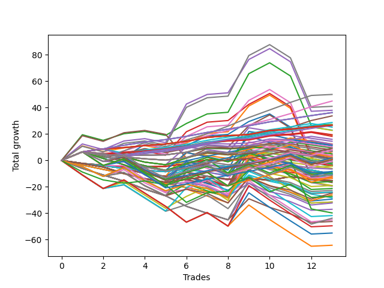

# Short Wallace 004 
- Symbol: ES90d5m30m
- Date Range: 03/18/2022 - 07/08/2022
- Trading Period: 7:20-12:30
- Number of Trades: 13



| Name | Win Percent | Profit | Avg Profit / Trade |     | Name | Win Percent | Profit | Avg Profit / Trade |
| ---- | ----------- | ------ | ------------------ | --- | ---- | ----------- | ------ | ------------------ |
| Sorted By <br> Profit | | | | | Sorted By <br> Win Percentage ||||
| Six | 76.92 | 54500.00 | 4192.31 |     | Six | 76.92 | 54500.00 | 4192.31 |
| Three | 76.92 | 53500.00 | 4115.38 |     | Three | 76.92 | 53500.00 | 4115.38 |
| Four | 69.23 | 52625.00 | 4048.08 |     | Zero | 76.92 | 47125.00 | 3625.00 |
| Seven | 69.23 | 51375.00 | 3951.92 |     | Four | 69.23 | 52625.00 | 4048.08 |
| Zero | 76.92 | 47125.00 | 3625.00 |     | Seven | 69.23 | 51375.00 | 3951.92 |
| Five | 69.23 | 45875.00 | 3528.85 |     | Five | 69.23 | 45875.00 | 3528.85 |
| Two | 69.23 | 45750.00 | 3519.23 |     | Two | 69.23 | 45750.00 | 3519.23 |
| One | 69.23 | 35875.00 | 2759.62 |     | One | 69.23 | 35875.00 | 2759.62 |
| Seventy-Three | 69.23 | 13625.00 | 1048.08 |     | Seventy-Three | 69.23 | 13625.00 | 1048.08 |

## NO STOPLOSS

### Test Zero
* Sell when price hits the middle line of the 20p bollinger
* No Stoploss
* Results:
```
Total Trades: 13
Percent Up: 23.08
Percent Down: 76.92
Total Points Moved Down: 94.25
Potential Profit: 47125.00
Total Points Ups: 7.75 Count Ups: 3
Total Points Downs: 102.00 Count Downs: 10
```

<details><summary>Trades</summary>

<code>In: 2022-04-06 10:55:00		Out: 2022-04-06 11:00:10		Total Position Time: 05:10		Total Move Down: 11.50		Total to Date: 11.50</code> <br />
<code>In: 2022-04-07 12:20:00		Out: 2022-04-07 12:46:00		Total Position Time: 26:00		Total Move Down: -3.25		Total to Date: 8.25</code> <br />
<code>In: 2022-04-20 10:50:00		Out: 2022-04-20 11:13:25		Total Position Time: 23:25		Total Move Down: 2.25		Total to Date: 10.50</code> <br />
<code>In: 2022-04-25 11:40:00		Out: 2022-04-25 12:07:15		Total Position Time: 27:15		Total Move Down: 9.75		Total to Date: 20.25</code> <br />
<code>In: 2022-05-04 09:45:00		Out: 2022-05-04 10:15:55		Total Position Time: 30:55		Total Move Down: -1.25		Total to Date: 19.00</code> <br />
<code>In: 2022-05-04 11:10:00		Out: 2022-05-04 11:11:20		Total Position Time: 01:20		Total Move Down: 2.75		Total to Date: 21.75</code> <br />
<code>In: 2022-05-19 08:50:00		Out: 2022-05-19 09:20:55		Total Position Time: 30:55		Total Move Down: 20.00		Total to Date: 41.75</code> <br />
<code>In: 2022-05-19 08:55:00		Out: 2022-05-19 09:21:05		Total Position Time: 26:05		Total Move Down: 12.50		Total to Date: 54.25</code> <br />
<code>In: 2022-05-19 12:10:00		Out: 2022-05-19 12:18:20		Total Position Time: 08:20		Total Move Down: 12.25		Total to Date: 66.50</code> <br />
<code>In: 2022-05-24 11:15:00		Out: 2022-05-24 11:45:55		Total Position Time: 30:55		Total Move Down: 9.00		Total to Date: 75.50</code> <br />
<code>In: 2022-05-31 09:10:00		Out: 2022-05-31 09:40:55		Total Position Time: 30:55		Total Move Down: -3.25		Total to Date: 72.25</code> <br />
<code>In: 2022-06-15 11:55:00		Out: 2022-06-15 11:58:05		Total Position Time: 03:05		Total Move Down: 17.50		Total to Date: 89.75</code> <br />
<code>In: 2022-07-07 12:25:00		Out: 2022-07-07 12:38:25		Total Position Time: 13:25		Total Move Down: 4.50		Total to Date: 94.25</code> <br />


</details>

### Test One
* Sell when the price hits the upper line of the 20p 1std bollinger
* No Stoploss
* Results:
```
Total Trades: 13
Percent Up: 30.77
Percent Down: 69.23
Total Points Moved Down: 71.75
Potential Profit: 35875.00
Total Points Ups: 27.00 Count Ups: 4
Total Points Downs: 98.75 Count Downs: 9
```

<details><summary>Trades</summary>

<code>In: 2022-04-06 10:55:00		Out: 2022-04-06 11:09:45		Total Position Time: 14:45		Total Move Down: 16.00		Total to Date: 16.00</code> <br />
<code>In: 2022-04-07 12:20:00		Out: 2022-04-07 12:46:00		Total Position Time: 26:00		Total Move Down: -3.25		Total to Date: 12.75</code> <br />
<code>In: 2022-04-20 10:50:00		Out: 2022-04-20 11:17:15		Total Position Time: 27:15		Total Move Down: 5.25		Total to Date: 18.00</code> <br />
<code>In: 2022-04-25 11:40:00		Out: 2022-04-25 12:10:55		Total Position Time: 30:55		Total Move Down: 4.00		Total to Date: 22.00</code> <br />
<code>In: 2022-05-04 09:45:00		Out: 2022-05-04 10:15:55		Total Position Time: 30:55		Total Move Down: -1.25		Total to Date: 20.75</code> <br />
<code>In: 2022-05-04 11:10:00		Out: 2022-05-04 11:18:20		Total Position Time: 08:20		Total Move Down: 8.50		Total to Date: 29.25</code> <br />
<code>In: 2022-05-19 08:50:00		Out: 2022-05-19 09:20:55		Total Position Time: 30:55		Total Move Down: 20.00		Total to Date: 49.25</code> <br />
<code>In: 2022-05-19 08:55:00		Out: 2022-05-19 09:25:55		Total Position Time: 30:55		Total Move Down: 7.25		Total to Date: 56.50</code> <br />
<code>In: 2022-05-19 12:10:00		Out: 2022-05-19 12:24:50		Total Position Time: 14:50		Total Move Down: 23.50		Total to Date: 80.00</code> <br />
<code>In: 2022-05-24 11:15:00		Out: 2022-05-24 11:45:55		Total Position Time: 30:55		Total Move Down: 9.00		Total to Date: 89.00</code> <br />
<code>In: 2022-05-31 09:10:00		Out: 2022-05-31 09:40:55		Total Position Time: 30:55		Total Move Down: -3.25		Total to Date: 85.75</code> <br />
<code>In: 2022-06-15 11:55:00		Out: 2022-06-15 12:25:55		Total Position Time: 30:55		Total Move Down: -19.25		Total to Date: 66.50</code> <br />
<code>In: 2022-07-07 12:25:00		Out: 2022-07-07 12:46:00		Total Position Time: 21:00		Total Move Down: 5.25		Total to Date: 71.75</code> <br />


</details>

### Test Two
* Sell when the price hits the upper line of the 20p 2std bollinger
* No Stoploss
* Results:
```
Total Trades: 13
Percent Up: 30.77
Percent Down: 69.23
Total Points Moved Down: 91.50
Potential Profit: 45750.00
Total Points Ups: 27.00 Count Ups: 4
Total Points Downs: 118.50 Count Downs: 9
```

<details><summary>Trades</summary>

<code>In: 2022-04-06 10:55:00		Out: 2022-04-06 11:15:15		Total Position Time: 20:15		Total Move Down: 24.50		Total to Date: 24.50</code> <br />
<code>In: 2022-04-07 12:20:00		Out: 2022-04-07 12:46:00		Total Position Time: 26:00		Total Move Down: -3.25		Total to Date: 21.25</code> <br />
<code>In: 2022-04-20 10:50:00		Out: 2022-04-20 11:19:15		Total Position Time: 29:15		Total Move Down: 8.00		Total to Date: 29.25</code> <br />
<code>In: 2022-04-25 11:40:00		Out: 2022-04-25 12:10:55		Total Position Time: 30:55		Total Move Down: 4.00		Total to Date: 33.25</code> <br />
<code>In: 2022-05-04 09:45:00		Out: 2022-05-04 10:15:55		Total Position Time: 30:55		Total Move Down: -1.25		Total to Date: 32.00</code> <br />
<code>In: 2022-05-04 11:10:00		Out: 2022-05-04 11:18:40		Total Position Time: 08:40		Total Move Down: 11.25		Total to Date: 43.25</code> <br />
<code>In: 2022-05-19 08:50:00		Out: 2022-05-19 09:20:55		Total Position Time: 30:55		Total Move Down: 20.00		Total to Date: 63.25</code> <br />
<code>In: 2022-05-19 08:55:00		Out: 2022-05-19 09:25:55		Total Position Time: 30:55		Total Move Down: 7.25		Total to Date: 70.50</code> <br />
<code>In: 2022-05-19 12:10:00		Out: 2022-05-19 12:40:55		Total Position Time: 30:55		Total Move Down: 29.25		Total to Date: 99.75</code> <br />
<code>In: 2022-05-24 11:15:00		Out: 2022-05-24 11:45:55		Total Position Time: 30:55		Total Move Down: 9.00		Total to Date: 108.75</code> <br />
<code>In: 2022-05-31 09:10:00		Out: 2022-05-31 09:40:55		Total Position Time: 30:55		Total Move Down: -3.25		Total to Date: 105.50</code> <br />
<code>In: 2022-06-15 11:55:00		Out: 2022-06-15 12:25:55		Total Position Time: 30:55		Total Move Down: -19.25		Total to Date: 86.25</code> <br />
<code>In: 2022-07-07 12:25:00		Out: 2022-07-07 12:46:00		Total Position Time: 21:00		Total Move Down: 5.25		Total to Date: 91.50</code> <br />


</details>

### Test Three
* Sell when price hits the middle line of the 50p bollinger
* No Stoploss
* Results:
```
Total Trades: 13
Percent Up: 23.08
Percent Down: 76.92
Total Points Moved Down: 107.00
Potential Profit: 53500.00
Total Points Ups: 7.75 Count Ups: 3
Total Points Downs: 114.75 Count Downs: 10
```

<details><summary>Trades</summary>

<code>In: 2022-04-06 10:55:00		Out: 2022-04-06 11:08:35		Total Position Time: 13:35		Total Move Down: 11.50		Total to Date: 11.50</code> <br />
<code>In: 2022-04-07 12:20:00		Out: 2022-04-07 12:46:00		Total Position Time: 26:00		Total Move Down: -3.25		Total to Date: 8.25</code> <br />
<code>In: 2022-04-20 10:50:00		Out: 2022-04-20 11:17:15		Total Position Time: 27:15		Total Move Down: 5.25		Total to Date: 13.50</code> <br />
<code>In: 2022-04-25 11:40:00		Out: 2022-04-25 12:10:55		Total Position Time: 30:55		Total Move Down: 4.00		Total to Date: 17.50</code> <br />
<code>In: 2022-05-04 09:45:00		Out: 2022-05-04 10:15:55		Total Position Time: 30:55		Total Move Down: -1.25		Total to Date: 16.25</code> <br />
<code>In: 2022-05-04 11:10:00		Out: 2022-05-04 11:20:50		Total Position Time: 10:50		Total Move Down: 18.75		Total to Date: 35.00</code> <br />
<code>In: 2022-05-19 08:50:00		Out: 2022-05-19 09:20:55		Total Position Time: 30:55		Total Move Down: 20.00		Total to Date: 55.00</code> <br />
<code>In: 2022-05-19 08:55:00		Out: 2022-05-19 09:25:55		Total Position Time: 30:55		Total Move Down: 7.25		Total to Date: 62.25</code> <br />
<code>In: 2022-05-19 12:10:00		Out: 2022-05-19 12:21:15		Total Position Time: 11:15		Total Move Down: 16.25		Total to Date: 78.50</code> <br />
<code>In: 2022-05-24 11:15:00		Out: 2022-05-24 11:45:55		Total Position Time: 30:55		Total Move Down: 9.00		Total to Date: 87.50</code> <br />
<code>In: 2022-05-31 09:10:00		Out: 2022-05-31 09:40:55		Total Position Time: 30:55		Total Move Down: -3.25		Total to Date: 84.25</code> <br />
<code>In: 2022-06-15 11:55:00		Out: 2022-06-15 11:58:05		Total Position Time: 03:05		Total Move Down: 17.50		Total to Date: 101.75</code> <br />
<code>In: 2022-07-07 12:25:00		Out: 2022-07-07 12:46:00		Total Position Time: 21:00		Total Move Down: 5.25		Total to Date: 107.00</code> <br />


</details>

### Test Four
* Sell when the price hits the upper line of the 50p 1std bollinger
* No Stoploss
* Results:
```
Total Trades: 13
Percent Up: 30.77
Percent Down: 69.23
Total Points Moved Down: 105.25
Potential Profit: 52625.00
Total Points Ups: 27.00 Count Ups: 4
Total Points Downs: 132.25 Count Downs: 9
```

<details><summary>Trades</summary>

<code>In: 2022-04-06 10:55:00		Out: 2022-04-06 11:11:20		Total Position Time: 16:20		Total Move Down: 17.50		Total to Date: 17.50</code> <br />
<code>In: 2022-04-07 12:20:00		Out: 2022-04-07 12:46:00		Total Position Time: 26:00		Total Move Down: -3.25		Total to Date: 14.25</code> <br />
<code>In: 2022-04-20 10:50:00		Out: 2022-04-20 11:20:55		Total Position Time: 30:55		Total Move Down: 9.75		Total to Date: 24.00</code> <br />
<code>In: 2022-04-25 11:40:00		Out: 2022-04-25 12:10:55		Total Position Time: 30:55		Total Move Down: 4.00		Total to Date: 28.00</code> <br />
<code>In: 2022-05-04 09:45:00		Out: 2022-05-04 10:15:55		Total Position Time: 30:55		Total Move Down: -1.25		Total to Date: 26.75</code> <br />
<code>In: 2022-05-04 11:10:00		Out: 2022-05-04 11:34:10		Total Position Time: 24:10		Total Move Down: 30.25		Total to Date: 57.00</code> <br />
<code>In: 2022-05-19 08:50:00		Out: 2022-05-19 09:20:55		Total Position Time: 30:55		Total Move Down: 20.00		Total to Date: 77.00</code> <br />
<code>In: 2022-05-19 08:55:00		Out: 2022-05-19 09:25:55		Total Position Time: 30:55		Total Move Down: 7.25		Total to Date: 84.25</code> <br />
<code>In: 2022-05-19 12:10:00		Out: 2022-05-19 12:30:05		Total Position Time: 20:05		Total Move Down: 29.25		Total to Date: 113.50</code> <br />
<code>In: 2022-05-24 11:15:00		Out: 2022-05-24 11:45:55		Total Position Time: 30:55		Total Move Down: 9.00		Total to Date: 122.50</code> <br />
<code>In: 2022-05-31 09:10:00		Out: 2022-05-31 09:40:55		Total Position Time: 30:55		Total Move Down: -3.25		Total to Date: 119.25</code> <br />
<code>In: 2022-06-15 11:55:00		Out: 2022-06-15 12:25:55		Total Position Time: 30:55		Total Move Down: -19.25		Total to Date: 100.00</code> <br />
<code>In: 2022-07-07 12:25:00		Out: 2022-07-07 12:46:00		Total Position Time: 21:00		Total Move Down: 5.25		Total to Date: 105.25</code> <br />


</details>

### Test Five
* Sell when the price hits the upper line of the 50p 2std bollinger
* No Stoploss
* Results:
```
Total Trades: 13
Percent Up: 30.77
Percent Down: 69.23
Total Points Moved Down: 91.75
Potential Profit: 45875.00
Total Points Ups: 27.00 Count Ups: 4
Total Points Downs: 118.75 Count Downs: 9
```

<details><summary>Trades</summary>

<code>In: 2022-04-06 10:55:00		Out: 2022-04-06 11:15:05		Total Position Time: 20:05		Total Move Down: 23.75		Total to Date: 23.75</code> <br />
<code>In: 2022-04-07 12:20:00		Out: 2022-04-07 12:46:00		Total Position Time: 26:00		Total Move Down: -3.25		Total to Date: 20.50</code> <br />
<code>In: 2022-04-20 10:50:00		Out: 2022-04-20 11:20:55		Total Position Time: 30:55		Total Move Down: 9.75		Total to Date: 30.25</code> <br />
<code>In: 2022-04-25 11:40:00		Out: 2022-04-25 12:10:55		Total Position Time: 30:55		Total Move Down: 4.00		Total to Date: 34.25</code> <br />
<code>In: 2022-05-04 09:45:00		Out: 2022-05-04 10:15:55		Total Position Time: 30:55		Total Move Down: -1.25		Total to Date: 33.00</code> <br />
<code>In: 2022-05-04 11:10:00		Out: 2022-05-04 11:40:55		Total Position Time: 30:55		Total Move Down: 10.50		Total to Date: 43.50</code> <br />
<code>In: 2022-05-19 08:50:00		Out: 2022-05-19 09:20:55		Total Position Time: 30:55		Total Move Down: 20.00		Total to Date: 63.50</code> <br />
<code>In: 2022-05-19 08:55:00		Out: 2022-05-19 09:25:55		Total Position Time: 30:55		Total Move Down: 7.25		Total to Date: 70.75</code> <br />
<code>In: 2022-05-19 12:10:00		Out: 2022-05-19 12:40:55		Total Position Time: 30:55		Total Move Down: 29.25		Total to Date: 100.00</code> <br />
<code>In: 2022-05-24 11:15:00		Out: 2022-05-24 11:45:55		Total Position Time: 30:55		Total Move Down: 9.00		Total to Date: 109.00</code> <br />
<code>In: 2022-05-31 09:10:00		Out: 2022-05-31 09:40:55		Total Position Time: 30:55		Total Move Down: -3.25		Total to Date: 105.75</code> <br />
<code>In: 2022-06-15 11:55:00		Out: 2022-06-15 12:25:55		Total Position Time: 30:55		Total Move Down: -19.25		Total to Date: 86.50</code> <br />
<code>In: 2022-07-07 12:25:00		Out: 2022-07-07 12:46:00		Total Position Time: 21:00		Total Move Down: 5.25		Total to Date: 91.75</code> <br />


</details>

### Test Six
* Sell when the price hits the middle line of the 1std VWAP
* No Stoploss
* Results:
```
Total Trades: 13
Percent Up: 23.08
Percent Down: 76.92
Total Points Moved Down: 109.00
Potential Profit: 54500.00
Total Points Ups: 7.75 Count Ups: 3
Total Points Downs: 116.75 Count Downs: 10
```

<details><summary>Trades</summary>

<code>In: 2022-04-06 10:55:00		Out: 2022-04-06 11:00:10		Total Position Time: 05:10		Total Move Down: 11.50		Total to Date: 11.50</code> <br />
<code>In: 2022-04-07 12:20:00		Out: 2022-04-07 12:46:00		Total Position Time: 26:00		Total Move Down: -3.25		Total to Date: 8.25</code> <br />
<code>In: 2022-04-20 10:50:00		Out: 2022-04-20 11:18:20		Total Position Time: 28:20		Total Move Down: 6.25		Total to Date: 14.50</code> <br />
<code>In: 2022-04-25 11:40:00		Out: 2022-04-25 12:10:55		Total Position Time: 30:55		Total Move Down: 4.00		Total to Date: 18.50</code> <br />
<code>In: 2022-05-04 09:45:00		Out: 2022-05-04 10:15:55		Total Position Time: 30:55		Total Move Down: -1.25		Total to Date: 17.25</code> <br />
<code>In: 2022-05-04 11:10:00		Out: 2022-05-04 11:20:20		Total Position Time: 10:20		Total Move Down: 14.50		Total to Date: 31.75</code> <br />
<code>In: 2022-05-19 08:50:00		Out: 2022-05-19 09:20:55		Total Position Time: 30:55		Total Move Down: 20.00		Total to Date: 51.75</code> <br />
<code>In: 2022-05-19 08:55:00		Out: 2022-05-19 09:25:55		Total Position Time: 30:55		Total Move Down: 7.25		Total to Date: 59.00</code> <br />
<code>In: 2022-05-19 12:10:00		Out: 2022-05-19 12:24:45		Total Position Time: 14:45		Total Move Down: 22.75		Total to Date: 81.75</code> <br />
<code>In: 2022-05-24 11:15:00		Out: 2022-05-24 11:45:55		Total Position Time: 30:55		Total Move Down: 9.00		Total to Date: 90.75</code> <br />
<code>In: 2022-05-31 09:10:00		Out: 2022-05-31 09:40:55		Total Position Time: 30:55		Total Move Down: -3.25		Total to Date: 87.50</code> <br />
<code>In: 2022-06-15 11:55:00		Out: 2022-06-15 11:57:55		Total Position Time: 02:55		Total Move Down: 16.25		Total to Date: 103.75</code> <br />
<code>In: 2022-07-07 12:25:00		Out: 2022-07-07 12:46:00		Total Position Time: 21:00		Total Move Down: 5.25		Total to Date: 109.00</code> <br />


</details>

### Test Seven
* Sell when the price hits the upper line of the 1std VWAP
* No Stoploss
* Results:
```
Total Trades: 13
Percent Up: 30.77
Percent Down: 69.23
Total Points Moved Down: 102.75
Potential Profit: 51375.00
Total Points Ups: 27.00 Count Ups: 4
Total Points Downs: 129.75 Count Downs: 9
```

<details><summary>Trades</summary>

<code>In: 2022-04-06 10:55:00		Out: 2022-04-06 11:09:40		Total Position Time: 14:40		Total Move Down: 15.75		Total to Date: 15.75</code> <br />
<code>In: 2022-04-07 12:20:00		Out: 2022-04-07 12:46:00		Total Position Time: 26:00		Total Move Down: -3.25		Total to Date: 12.50</code> <br />
<code>In: 2022-04-20 10:50:00		Out: 2022-04-20 11:20:55		Total Position Time: 30:55		Total Move Down: 9.75		Total to Date: 22.25</code> <br />
<code>In: 2022-04-25 11:40:00		Out: 2022-04-25 12:10:55		Total Position Time: 30:55		Total Move Down: 4.00		Total to Date: 26.25</code> <br />
<code>In: 2022-05-04 09:45:00		Out: 2022-05-04 10:15:55		Total Position Time: 30:55		Total Move Down: -1.25		Total to Date: 25.00</code> <br />
<code>In: 2022-05-04 11:10:00		Out: 2022-05-04 11:34:05		Total Position Time: 24:05		Total Move Down: 29.50		Total to Date: 54.50</code> <br />
<code>In: 2022-05-19 08:50:00		Out: 2022-05-19 09:20:55		Total Position Time: 30:55		Total Move Down: 20.00		Total to Date: 74.50</code> <br />
<code>In: 2022-05-19 08:55:00		Out: 2022-05-19 09:25:55		Total Position Time: 30:55		Total Move Down: 7.25		Total to Date: 81.75</code> <br />
<code>In: 2022-05-19 12:10:00		Out: 2022-05-19 12:40:55		Total Position Time: 30:55		Total Move Down: 29.25		Total to Date: 111.00</code> <br />
<code>In: 2022-05-24 11:15:00		Out: 2022-05-24 11:45:55		Total Position Time: 30:55		Total Move Down: 9.00		Total to Date: 120.00</code> <br />
<code>In: 2022-05-31 09:10:00		Out: 2022-05-31 09:40:55		Total Position Time: 30:55		Total Move Down: -3.25		Total to Date: 116.75</code> <br />
<code>In: 2022-06-15 11:55:00		Out: 2022-06-15 12:25:55		Total Position Time: 30:55		Total Move Down: -19.25		Total to Date: 97.50</code> <br />
<code>In: 2022-07-07 12:25:00		Out: 2022-07-07 12:46:00		Total Position Time: 21:00		Total Move Down: 5.25		Total to Date: 102.75</code> <br />


</details>

## SPECIAL EXIT CONDITIONS 

### Test Seventy-Three
* Sell when the linear regression slope changes to negative
* No Stoploss
* Results:
```
Total Trades: 13
Percent Up: 30.77
Percent Down: 69.23
Total Points Moved Down: 27.25
Potential Profit: 13625.00
Total Points Ups: 26.00 Count Ups: 4
Total Points Downs: 53.25 Count Downs: 9
```

<details><summary>Trades</summary>

<code>In: 2022-04-06 10:55:00		Out: 2022-04-06 10:58:05		Total Position Time: 03:05		Total Move Down: 4.50		Total to Date: 4.50</code> <br />
<code>In: 2022-04-07 12:20:00		Out: 2022-04-07 12:24:05		Total Position Time: 04:05		Total Move Down: 5.00		Total to Date: 9.50</code> <br />
<code>In: 2022-04-20 10:50:00		Out: 2022-04-20 10:53:05		Total Position Time: 03:05		Total Move Down: 2.25		Total to Date: 11.75</code> <br />
<code>In: 2022-04-25 11:40:00		Out: 2022-04-25 11:49:05		Total Position Time: 09:05		Total Move Down: -12.00		Total to Date: -0.25</code> <br />
<code>In: 2022-05-04 09:45:00		Out: 2022-05-04 10:01:05		Total Position Time: 16:05		Total Move Down: -9.00		Total to Date: -9.25</code> <br />
<code>In: 2022-05-04 11:10:00		Out: 2022-05-04 11:15:05		Total Position Time: 05:05		Total Move Down: 2.75		Total to Date: -6.50</code> <br />
<code>In: 2022-05-19 08:50:00		Out: 2022-05-19 09:09:05		Total Position Time: 19:05		Total Move Down: 7.00		Total to Date: 0.50</code> <br />
<code>In: 2022-05-19 08:55:00		Out: 2022-05-19 09:13:05		Total Position Time: 18:05		Total Move Down: -4.50		Total to Date: -4.00</code> <br />
<code>In: 2022-05-19 12:10:00		Out: 2022-05-19 12:24:05		Total Position Time: 14:05		Total Move Down: 21.00		Total to Date: 17.00</code> <br />
<code>In: 2022-05-24 11:15:00		Out: 2022-05-24 11:26:05		Total Position Time: 11:05		Total Move Down: -0.50		Total to Date: 16.50</code> <br />
<code>In: 2022-05-31 09:10:00		Out: 2022-05-31 09:15:05		Total Position Time: 05:05		Total Move Down: 5.25		Total to Date: 21.75</code> <br />
<code>In: 2022-06-15 11:55:00		Out: 2022-06-15 12:17:05		Total Position Time: 22:05		Total Move Down: 4.25		Total to Date: 26.00</code> <br />
<code>In: 2022-07-07 12:25:00		Out: 2022-07-07 12:28:05		Total Position Time: 03:05		Total Move Down: 1.25		Total to Date: 27.25</code> <br />


</details>