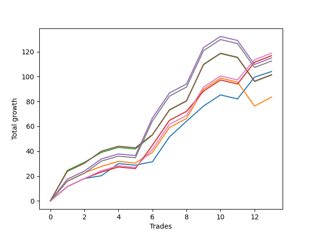

# Short Wallace 004 
- Symbol: ES90d5mOut
- Date Range: 03/18/2022 - 07/08/2022
- Trading Period: 7:20-12:30
- Number of Trades: 13



| Name | Win Percent | Profit | Avg Profit / Trade |     | Name | Win Percent | Profit | Avg Profit / Trade |
| ---- | ----------- | ------ | ------------------ | --- | ---- | ----------- | ------ | ------------------ |
| Sorted By <br> Profit | | | | | Sorted By <br> Win Percentage ||||
| Six | 84.62 | 59375.00 | 4567.31 |     | Six | 84.62 | 59375.00 | 4567.31 |
| Three | 84.62 | 58375.00 | 4490.38 |     | Three | 84.62 | 58375.00 | 4490.38 |
| Four | 76.92 | 57500.00 | 4423.08 |     | Zero | 84.62 | 52000.00 | 4000.00 |
| Seven | 76.92 | 56250.00 | 4326.92 |     | Four | 76.92 | 57500.00 | 4423.08 |
| Zero | 84.62 | 52000.00 | 4000.00 |     | Seven | 76.92 | 56250.00 | 4326.92 |
| Five | 76.92 | 50750.00 | 3903.85 |     | Five | 76.92 | 50750.00 | 3903.85 |
| Two | 76.92 | 50625.00 | 3894.23 |     | Two | 76.92 | 50625.00 | 3894.23 |
| One | 76.92 | 41750.00 | 3211.54 |     | One | 76.92 | 41750.00 | 3211.54 |

### Test Zero
* Sell when price hits the middle line of the 20p bollinger
* No Stoploss
* Results:
```
Total Trades: 13
Percent Up: 15.38
Percent Down: 84.62
Total Points Moved Down: 104.00
Potential Profit: 52000.00
Total Points Ups: 4.50 Count Ups: 2
Total Points Downs: 108.50 Count Downs: 11
```

<details><summary>Trades</summary>

<code>In: 2022-04-06 10:55:00		Out: 2022-04-06 11:00:10		Total Position Time: 05:10		Total Move Down: 11.50		Total to Date: 11.50</code> <br />
<code>In: 2022-04-07 12:20:00		Out: 2022-04-07 12:50:55		Total Position Time: 30:55		Total Move Down: 6.50		Total to Date: 18.00</code> <br />
<code>In: 2022-04-20 10:50:00		Out: 2022-04-20 11:13:25		Total Position Time: 23:25		Total Move Down: 2.25		Total to Date: 20.25</code> <br />
<code>In: 2022-04-25 11:40:00		Out: 2022-04-25 12:07:15		Total Position Time: 27:15		Total Move Down: 9.75		Total to Date: 30.00</code> <br />
<code>In: 2022-05-04 09:45:00		Out: 2022-05-04 10:15:55		Total Position Time: 30:55		Total Move Down: -1.25		Total to Date: 28.75</code> <br />
<code>In: 2022-05-04 11:10:00		Out: 2022-05-04 11:11:20		Total Position Time: 01:20		Total Move Down: 2.75		Total to Date: 31.50</code> <br />
<code>In: 2022-05-19 08:50:00		Out: 2022-05-19 09:20:55		Total Position Time: 30:55		Total Move Down: 20.00		Total to Date: 51.50</code> <br />
<code>In: 2022-05-19 08:55:00		Out: 2022-05-19 09:21:05		Total Position Time: 26:05		Total Move Down: 12.50		Total to Date: 64.00</code> <br />
<code>In: 2022-05-19 12:10:00		Out: 2022-05-19 12:18:20		Total Position Time: 08:20		Total Move Down: 12.25		Total to Date: 76.25</code> <br />
<code>In: 2022-05-24 11:15:00		Out: 2022-05-24 11:45:55		Total Position Time: 30:55		Total Move Down: 9.00		Total to Date: 85.25</code> <br />
<code>In: 2022-05-31 09:10:00		Out: 2022-05-31 09:40:55		Total Position Time: 30:55		Total Move Down: -3.25		Total to Date: 82.00</code> <br />
<code>In: 2022-06-15 11:55:00		Out: 2022-06-15 11:58:05		Total Position Time: 03:05		Total Move Down: 17.50		Total to Date: 99.50</code> <br />
<code>In: 2022-07-07 12:25:00		Out: 2022-07-07 12:38:25		Total Position Time: 13:25		Total Move Down: 4.50		Total to Date: 104.00</code> <br />


</details>

### Test One
* Sell when the price hits the upper line of the 20p 1std bollinger
* No Stoploss
* Results:
```
Total Trades: 13
Percent Up: 23.08
Percent Down: 76.92
Total Points Moved Down: 83.50
Potential Profit: 41750.00
Total Points Ups: 23.75 Count Ups: 3
Total Points Downs: 107.25 Count Downs: 10
```

<details><summary>Trades</summary>

<code>In: 2022-04-06 10:55:00		Out: 2022-04-06 11:09:45		Total Position Time: 14:45		Total Move Down: 16.00		Total to Date: 16.00</code> <br />
<code>In: 2022-04-07 12:20:00		Out: 2022-04-07 12:50:55		Total Position Time: 30:55		Total Move Down: 6.50		Total to Date: 22.50</code> <br />
<code>In: 2022-04-20 10:50:00		Out: 2022-04-20 11:17:15		Total Position Time: 27:15		Total Move Down: 5.25		Total to Date: 27.75</code> <br />
<code>In: 2022-04-25 11:40:00		Out: 2022-04-25 12:10:55		Total Position Time: 30:55		Total Move Down: 4.00		Total to Date: 31.75</code> <br />
<code>In: 2022-05-04 09:45:00		Out: 2022-05-04 10:15:55		Total Position Time: 30:55		Total Move Down: -1.25		Total to Date: 30.50</code> <br />
<code>In: 2022-05-04 11:10:00		Out: 2022-05-04 11:18:20		Total Position Time: 08:20		Total Move Down: 8.50		Total to Date: 39.00</code> <br />
<code>In: 2022-05-19 08:50:00		Out: 2022-05-19 09:20:55		Total Position Time: 30:55		Total Move Down: 20.00		Total to Date: 59.00</code> <br />
<code>In: 2022-05-19 08:55:00		Out: 2022-05-19 09:25:55		Total Position Time: 30:55		Total Move Down: 7.25		Total to Date: 66.25</code> <br />
<code>In: 2022-05-19 12:10:00		Out: 2022-05-19 12:24:50		Total Position Time: 14:50		Total Move Down: 23.50		Total to Date: 89.75</code> <br />
<code>In: 2022-05-24 11:15:00		Out: 2022-05-24 11:45:55		Total Position Time: 30:55		Total Move Down: 9.00		Total to Date: 98.75</code> <br />
<code>In: 2022-05-31 09:10:00		Out: 2022-05-31 09:40:55		Total Position Time: 30:55		Total Move Down: -3.25		Total to Date: 95.50</code> <br />
<code>In: 2022-06-15 11:55:00		Out: 2022-06-15 12:25:55		Total Position Time: 30:55		Total Move Down: -19.25		Total to Date: 76.25</code> <br />
<code>In: 2022-07-07 12:25:00		Out: 2022-07-07 12:46:35		Total Position Time: 21:35		Total Move Down: 7.25		Total to Date: 83.50</code> <br />


</details>

### Test Two
* Sell when the price hits the upper line of the 20p 2std bollinger
* No Stoploss
* Results:
```
Total Trades: 13
Percent Up: 23.08
Percent Down: 76.92
Total Points Moved Down: 101.25
Potential Profit: 50625.00
Total Points Ups: 23.75 Count Ups: 3
Total Points Downs: 125.00 Count Downs: 10
```

<details><summary>Trades</summary>

<code>In: 2022-04-06 10:55:00		Out: 2022-04-06 11:15:15		Total Position Time: 20:15		Total Move Down: 24.50		Total to Date: 24.50</code> <br />
<code>In: 2022-04-07 12:20:00		Out: 2022-04-07 12:50:55		Total Position Time: 30:55		Total Move Down: 6.50		Total to Date: 31.00</code> <br />
<code>In: 2022-04-20 10:50:00		Out: 2022-04-20 11:19:15		Total Position Time: 29:15		Total Move Down: 8.00		Total to Date: 39.00</code> <br />
<code>In: 2022-04-25 11:40:00		Out: 2022-04-25 12:10:55		Total Position Time: 30:55		Total Move Down: 4.00		Total to Date: 43.00</code> <br />
<code>In: 2022-05-04 09:45:00		Out: 2022-05-04 10:15:55		Total Position Time: 30:55		Total Move Down: -1.25		Total to Date: 41.75</code> <br />
<code>In: 2022-05-04 11:10:00		Out: 2022-05-04 11:18:40		Total Position Time: 08:40		Total Move Down: 11.25		Total to Date: 53.00</code> <br />
<code>In: 2022-05-19 08:50:00		Out: 2022-05-19 09:20:55		Total Position Time: 30:55		Total Move Down: 20.00		Total to Date: 73.00</code> <br />
<code>In: 2022-05-19 08:55:00		Out: 2022-05-19 09:25:55		Total Position Time: 30:55		Total Move Down: 7.25		Total to Date: 80.25</code> <br />
<code>In: 2022-05-19 12:10:00		Out: 2022-05-19 12:40:55		Total Position Time: 30:55		Total Move Down: 29.25		Total to Date: 109.50</code> <br />
<code>In: 2022-05-24 11:15:00		Out: 2022-05-24 11:45:55		Total Position Time: 30:55		Total Move Down: 9.00		Total to Date: 118.50</code> <br />
<code>In: 2022-05-31 09:10:00		Out: 2022-05-31 09:40:55		Total Position Time: 30:55		Total Move Down: -3.25		Total to Date: 115.25</code> <br />
<code>In: 2022-06-15 11:55:00		Out: 2022-06-15 12:25:55		Total Position Time: 30:55		Total Move Down: -19.25		Total to Date: 96.00</code> <br />
<code>In: 2022-07-07 12:25:00		Out: 2022-07-07 12:55:55		Total Position Time: 30:55		Total Move Down: 5.25		Total to Date: 101.25</code> <br />


</details>

### Test Three
* Sell when price hits the middle line of the 50p bollinger
* No Stoploss
* Results:
```
Total Trades: 13
Percent Up: 15.38
Percent Down: 84.62
Total Points Moved Down: 116.75
Potential Profit: 58375.00
Total Points Ups: 4.50 Count Ups: 2
Total Points Downs: 121.25 Count Downs: 11
```

<details><summary>Trades</summary>

<code>In: 2022-04-06 10:55:00		Out: 2022-04-06 11:08:35		Total Position Time: 13:35		Total Move Down: 11.50		Total to Date: 11.50</code> <br />
<code>In: 2022-04-07 12:20:00		Out: 2022-04-07 12:50:55		Total Position Time: 30:55		Total Move Down: 6.50		Total to Date: 18.00</code> <br />
<code>In: 2022-04-20 10:50:00		Out: 2022-04-20 11:17:15		Total Position Time: 27:15		Total Move Down: 5.25		Total to Date: 23.25</code> <br />
<code>In: 2022-04-25 11:40:00		Out: 2022-04-25 12:10:55		Total Position Time: 30:55		Total Move Down: 4.00		Total to Date: 27.25</code> <br />
<code>In: 2022-05-04 09:45:00		Out: 2022-05-04 10:15:55		Total Position Time: 30:55		Total Move Down: -1.25		Total to Date: 26.00</code> <br />
<code>In: 2022-05-04 11:10:00		Out: 2022-05-04 11:20:50		Total Position Time: 10:50		Total Move Down: 18.75		Total to Date: 44.75</code> <br />
<code>In: 2022-05-19 08:50:00		Out: 2022-05-19 09:20:55		Total Position Time: 30:55		Total Move Down: 20.00		Total to Date: 64.75</code> <br />
<code>In: 2022-05-19 08:55:00		Out: 2022-05-19 09:25:55		Total Position Time: 30:55		Total Move Down: 7.25		Total to Date: 72.00</code> <br />
<code>In: 2022-05-19 12:10:00		Out: 2022-05-19 12:21:15		Total Position Time: 11:15		Total Move Down: 16.25		Total to Date: 88.25</code> <br />
<code>In: 2022-05-24 11:15:00		Out: 2022-05-24 11:45:55		Total Position Time: 30:55		Total Move Down: 9.00		Total to Date: 97.25</code> <br />
<code>In: 2022-05-31 09:10:00		Out: 2022-05-31 09:40:55		Total Position Time: 30:55		Total Move Down: -3.25		Total to Date: 94.00</code> <br />
<code>In: 2022-06-15 11:55:00		Out: 2022-06-15 11:58:05		Total Position Time: 03:05		Total Move Down: 17.50		Total to Date: 111.50</code> <br />
<code>In: 2022-07-07 12:25:00		Out: 2022-07-07 12:55:55		Total Position Time: 30:55		Total Move Down: 5.25		Total to Date: 116.75</code> <br />


</details>

### Test Four
* Sell when the price hits the upper line of the 50p 1std bollinger
* No Stoploss
* Results:
```
Total Trades: 13
Percent Up: 23.08
Percent Down: 76.92
Total Points Moved Down: 115.00
Potential Profit: 57500.00
Total Points Ups: 23.75 Count Ups: 3
Total Points Downs: 138.75 Count Downs: 10
```

<details><summary>Trades</summary>

<code>In: 2022-04-06 10:55:00		Out: 2022-04-06 11:11:20		Total Position Time: 16:20		Total Move Down: 17.50		Total to Date: 17.50</code> <br />
<code>In: 2022-04-07 12:20:00		Out: 2022-04-07 12:50:55		Total Position Time: 30:55		Total Move Down: 6.50		Total to Date: 24.00</code> <br />
<code>In: 2022-04-20 10:50:00		Out: 2022-04-20 11:20:55		Total Position Time: 30:55		Total Move Down: 9.75		Total to Date: 33.75</code> <br />
<code>In: 2022-04-25 11:40:00		Out: 2022-04-25 12:10:55		Total Position Time: 30:55		Total Move Down: 4.00		Total to Date: 37.75</code> <br />
<code>In: 2022-05-04 09:45:00		Out: 2022-05-04 10:15:55		Total Position Time: 30:55		Total Move Down: -1.25		Total to Date: 36.50</code> <br />
<code>In: 2022-05-04 11:10:00		Out: 2022-05-04 11:34:10		Total Position Time: 24:10		Total Move Down: 30.25		Total to Date: 66.75</code> <br />
<code>In: 2022-05-19 08:50:00		Out: 2022-05-19 09:20:55		Total Position Time: 30:55		Total Move Down: 20.00		Total to Date: 86.75</code> <br />
<code>In: 2022-05-19 08:55:00		Out: 2022-05-19 09:25:55		Total Position Time: 30:55		Total Move Down: 7.25		Total to Date: 94.00</code> <br />
<code>In: 2022-05-19 12:10:00		Out: 2022-05-19 12:30:05		Total Position Time: 20:05		Total Move Down: 29.25		Total to Date: 123.25</code> <br />
<code>In: 2022-05-24 11:15:00		Out: 2022-05-24 11:45:55		Total Position Time: 30:55		Total Move Down: 9.00		Total to Date: 132.25</code> <br />
<code>In: 2022-05-31 09:10:00		Out: 2022-05-31 09:40:55		Total Position Time: 30:55		Total Move Down: -3.25		Total to Date: 129.00</code> <br />
<code>In: 2022-06-15 11:55:00		Out: 2022-06-15 12:25:55		Total Position Time: 30:55		Total Move Down: -19.25		Total to Date: 109.75</code> <br />
<code>In: 2022-07-07 12:25:00		Out: 2022-07-07 12:55:55		Total Position Time: 30:55		Total Move Down: 5.25		Total to Date: 115.00</code> <br />


</details>

### Test Five
* Sell when the price hits the upper line of the 50p 2std bollinger
* No Stoploss
* Results:
```
Total Trades: 13
Percent Up: 23.08
Percent Down: 76.92
Total Points Moved Down: 101.50
Potential Profit: 50750.00
Total Points Ups: 23.75 Count Ups: 3
Total Points Downs: 125.25 Count Downs: 10
```

<details><summary>Trades</summary>

<code>In: 2022-04-06 10:55:00		Out: 2022-04-06 11:15:05		Total Position Time: 20:05		Total Move Down: 23.75		Total to Date: 23.75</code> <br />
<code>In: 2022-04-07 12:20:00		Out: 2022-04-07 12:50:55		Total Position Time: 30:55		Total Move Down: 6.50		Total to Date: 30.25</code> <br />
<code>In: 2022-04-20 10:50:00		Out: 2022-04-20 11:20:55		Total Position Time: 30:55		Total Move Down: 9.75		Total to Date: 40.00</code> <br />
<code>In: 2022-04-25 11:40:00		Out: 2022-04-25 12:10:55		Total Position Time: 30:55		Total Move Down: 4.00		Total to Date: 44.00</code> <br />
<code>In: 2022-05-04 09:45:00		Out: 2022-05-04 10:15:55		Total Position Time: 30:55		Total Move Down: -1.25		Total to Date: 42.75</code> <br />
<code>In: 2022-05-04 11:10:00		Out: 2022-05-04 11:40:55		Total Position Time: 30:55		Total Move Down: 10.50		Total to Date: 53.25</code> <br />
<code>In: 2022-05-19 08:50:00		Out: 2022-05-19 09:20:55		Total Position Time: 30:55		Total Move Down: 20.00		Total to Date: 73.25</code> <br />
<code>In: 2022-05-19 08:55:00		Out: 2022-05-19 09:25:55		Total Position Time: 30:55		Total Move Down: 7.25		Total to Date: 80.50</code> <br />
<code>In: 2022-05-19 12:10:00		Out: 2022-05-19 12:40:55		Total Position Time: 30:55		Total Move Down: 29.25		Total to Date: 109.75</code> <br />
<code>In: 2022-05-24 11:15:00		Out: 2022-05-24 11:45:55		Total Position Time: 30:55		Total Move Down: 9.00		Total to Date: 118.75</code> <br />
<code>In: 2022-05-31 09:10:00		Out: 2022-05-31 09:40:55		Total Position Time: 30:55		Total Move Down: -3.25		Total to Date: 115.50</code> <br />
<code>In: 2022-06-15 11:55:00		Out: 2022-06-15 12:25:55		Total Position Time: 30:55		Total Move Down: -19.25		Total to Date: 96.25</code> <br />
<code>In: 2022-07-07 12:25:00		Out: 2022-07-07 12:55:55		Total Position Time: 30:55		Total Move Down: 5.25		Total to Date: 101.50</code> <br />


</details>

### Test Six
* Sell when the price hits the middle line of the 1std VWAP
* No Stoploss
* Results:
```
Total Trades: 13
Percent Up: 15.38
Percent Down: 84.62
Total Points Moved Down: 118.75
Potential Profit: 59375.00
Total Points Ups: 4.50 Count Ups: 2
Total Points Downs: 123.25 Count Downs: 11
```

<details><summary>Trades</summary>

<code>In: 2022-04-06 10:55:00		Out: 2022-04-06 11:00:10		Total Position Time: 05:10		Total Move Down: 11.50		Total to Date: 11.50</code> <br />
<code>In: 2022-04-07 12:20:00		Out: 2022-04-07 12:50:55		Total Position Time: 30:55		Total Move Down: 6.50		Total to Date: 18.00</code> <br />
<code>In: 2022-04-20 10:50:00		Out: 2022-04-20 11:18:20		Total Position Time: 28:20		Total Move Down: 6.25		Total to Date: 24.25</code> <br />
<code>In: 2022-04-25 11:40:00		Out: 2022-04-25 12:10:55		Total Position Time: 30:55		Total Move Down: 4.00		Total to Date: 28.25</code> <br />
<code>In: 2022-05-04 09:45:00		Out: 2022-05-04 10:15:55		Total Position Time: 30:55		Total Move Down: -1.25		Total to Date: 27.00</code> <br />
<code>In: 2022-05-04 11:10:00		Out: 2022-05-04 11:20:20		Total Position Time: 10:20		Total Move Down: 14.50		Total to Date: 41.50</code> <br />
<code>In: 2022-05-19 08:50:00		Out: 2022-05-19 09:20:55		Total Position Time: 30:55		Total Move Down: 20.00		Total to Date: 61.50</code> <br />
<code>In: 2022-05-19 08:55:00		Out: 2022-05-19 09:25:55		Total Position Time: 30:55		Total Move Down: 7.25		Total to Date: 68.75</code> <br />
<code>In: 2022-05-19 12:10:00		Out: 2022-05-19 12:24:45		Total Position Time: 14:45		Total Move Down: 22.75		Total to Date: 91.50</code> <br />
<code>In: 2022-05-24 11:15:00		Out: 2022-05-24 11:45:55		Total Position Time: 30:55		Total Move Down: 9.00		Total to Date: 100.50</code> <br />
<code>In: 2022-05-31 09:10:00		Out: 2022-05-31 09:40:55		Total Position Time: 30:55		Total Move Down: -3.25		Total to Date: 97.25</code> <br />
<code>In: 2022-06-15 11:55:00		Out: 2022-06-15 11:57:55		Total Position Time: 02:55		Total Move Down: 16.25		Total to Date: 113.50</code> <br />
<code>In: 2022-07-07 12:25:00		Out: 2022-07-07 12:55:55		Total Position Time: 30:55		Total Move Down: 5.25		Total to Date: 118.75</code> <br />


</details>

### Test Seven
* Sell when the price hits the upper line of the 1std VWAP
* No Stoploss
* Results:
```
Total Trades: 13
Percent Up: 23.08
Percent Down: 76.92
Total Points Moved Down: 112.50
Potential Profit: 56250.00
Total Points Ups: 23.75 Count Ups: 3
Total Points Downs: 136.25 Count Downs: 10
```

<details><summary>Trades</summary>

<code>In: 2022-04-06 10:55:00		Out: 2022-04-06 11:09:40		Total Position Time: 14:40		Total Move Down: 15.75		Total to Date: 15.75</code> <br />
<code>In: 2022-04-07 12:20:00		Out: 2022-04-07 12:50:55		Total Position Time: 30:55		Total Move Down: 6.50		Total to Date: 22.25</code> <br />
<code>In: 2022-04-20 10:50:00		Out: 2022-04-20 11:20:55		Total Position Time: 30:55		Total Move Down: 9.75		Total to Date: 32.00</code> <br />
<code>In: 2022-04-25 11:40:00		Out: 2022-04-25 12:10:55		Total Position Time: 30:55		Total Move Down: 4.00		Total to Date: 36.00</code> <br />
<code>In: 2022-05-04 09:45:00		Out: 2022-05-04 10:15:55		Total Position Time: 30:55		Total Move Down: -1.25		Total to Date: 34.75</code> <br />
<code>In: 2022-05-04 11:10:00		Out: 2022-05-04 11:34:05		Total Position Time: 24:05		Total Move Down: 29.50		Total to Date: 64.25</code> <br />
<code>In: 2022-05-19 08:50:00		Out: 2022-05-19 09:20:55		Total Position Time: 30:55		Total Move Down: 20.00		Total to Date: 84.25</code> <br />
<code>In: 2022-05-19 08:55:00		Out: 2022-05-19 09:25:55		Total Position Time: 30:55		Total Move Down: 7.25		Total to Date: 91.50</code> <br />
<code>In: 2022-05-19 12:10:00		Out: 2022-05-19 12:40:55		Total Position Time: 30:55		Total Move Down: 29.25		Total to Date: 120.75</code> <br />
<code>In: 2022-05-24 11:15:00		Out: 2022-05-24 11:45:55		Total Position Time: 30:55		Total Move Down: 9.00		Total to Date: 129.75</code> <br />
<code>In: 2022-05-31 09:10:00		Out: 2022-05-31 09:40:55		Total Position Time: 30:55		Total Move Down: -3.25		Total to Date: 126.50</code> <br />
<code>In: 2022-06-15 11:55:00		Out: 2022-06-15 12:25:55		Total Position Time: 30:55		Total Move Down: -19.25		Total to Date: 107.25</code> <br />
<code>In: 2022-07-07 12:25:00		Out: 2022-07-07 12:55:55		Total Position Time: 30:55		Total Move Down: 5.25		Total to Date: 112.50</code> <br />


</details>