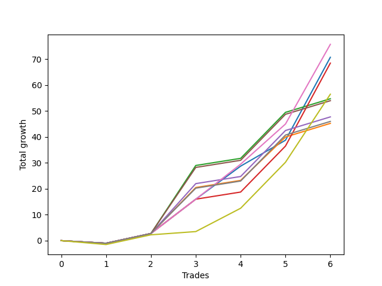

# Short Wallace Doodle 011 
- Symbol: ES90d5m30m
- Date Range: 03/18/2022 - 07/08/2022
- Trading Period: 7:20-12:30
- Number of Trades: 6



| Name | Win Percent | Profit | Avg Profit / Trade |     | Name | Win Percent | Profit | Avg Profit / Trade |
| ---- | ----------- | ------ | ------------------ | --- | ---- | ----------- | ------ | ------------------ |
| Sorted By <br> Profit | | | | | Sorted By <br> Win Percentage ||||
| Six | 83.33 | 37875.00 | 6312.50 |     | Six | 83.33 | 37875.00 | 6312.50 |
| Zero | 83.33 | 35375.00 | 5895.83 |     | Zero | 83.33 | 35375.00 | 5895.83 |
| Three | 83.33 | 34250.00 | 5708.33 |     | Three | 83.33 | 34250.00 | 5708.33 |
| Seventy-Three | 83.33 | 28250.00 | 4708.33 |     | Seventy-Three | 83.33 | 28250.00 | 4708.33 |
| Two | 83.33 | 27375.00 | 4562.50 |     | Two | 83.33 | 27375.00 | 4562.50 |
| Five | 83.33 | 27000.00 | 4500.00 |     | Five | 83.33 | 27000.00 | 4500.00 |
| Four | 83.33 | 23875.00 | 3979.17 |     | Four | 83.33 | 23875.00 | 3979.17 |
| Seven | 83.33 | 23000.00 | 3833.33 |     | Seven | 83.33 | 23000.00 | 3833.33 |
| One | 83.33 | 22625.00 | 3770.83 |     | One | 83.33 | 22625.00 | 3770.83 |

## NO STOPLOSS

### Test Zero
* Sell when price hits the middle line of the 20p bollinger
* No Stoploss
* Results:
```
Total Trades: 6
Percent Up: 16.67
Percent Down: 83.33
Total Points Moved Down: 70.75
Potential Profit: 35375.00
Total Points Ups: 1.00 Count Ups: 1
Total Points Downs: 71.75 Count Downs: 5
```

<details><summary>Trades</summary>

<code>In: 2022-03-28 12:00:00		Out: 2022-03-28 12:30:55		Total Position Time: 30:55		Total Move Down: -1.00		Total to Date: -1.00</code> <br />
<code>In: 2022-04-01 11:35:00		Out: 2022-04-01 12:05:55		Total Position Time: 30:55		Total Move Down: 3.75		Total to Date: 2.75</code> <br />
<code>In: 2022-04-06 10:50:00		Out: 2022-04-06 11:00:10		Total Position Time: 10:10		Total Move Down: 13.25		Total to Date: 16.00</code> <br />
<code>In: 2022-06-10 12:00:00		Out: 2022-06-10 12:05:20		Total Position Time: 05:20		Total Move Down: 12.75		Total to Date: 28.75</code> <br />
<code>In: 2022-06-10 12:30:00		Out: 2022-06-10 12:42:35		Total Position Time: 12:35		Total Move Down: 10.00		Total to Date: 38.75</code> <br />
<code>In: 2022-06-15 11:50:00		Out: 2022-06-15 11:58:05		Total Position Time: 08:05		Total Move Down: 32.00		Total to Date: 70.75</code> <br />


</details>

### Test One
* Sell when the price hits the upper line of the 20p 1std bollinger
* No Stoploss
* Results:
```
Total Trades: 6
Percent Up: 16.67
Percent Down: 83.33
Total Points Moved Down: 45.25
Potential Profit: 22625.00
Total Points Ups: 1.00 Count Ups: 1
Total Points Downs: 46.25 Count Downs: 5
```

<details><summary>Trades</summary>

<code>In: 2022-03-28 12:00:00		Out: 2022-03-28 12:30:55		Total Position Time: 30:55		Total Move Down: -1.00		Total to Date: -1.00</code> <br />
<code>In: 2022-04-01 11:35:00		Out: 2022-04-01 12:05:55		Total Position Time: 30:55		Total Move Down: 3.75		Total to Date: 2.75</code> <br />
<code>In: 2022-04-06 10:50:00		Out: 2022-04-06 11:09:45		Total Position Time: 19:45		Total Move Down: 17.75		Total to Date: 20.50</code> <br />
<code>In: 2022-06-10 12:00:00		Out: 2022-06-10 12:30:55		Total Position Time: 30:55		Total Move Down: 2.75		Total to Date: 23.25</code> <br />
<code>In: 2022-06-10 12:30:00		Out: 2022-06-10 12:45:40		Total Position Time: 15:40		Total Move Down: 16.75		Total to Date: 40.00</code> <br />
<code>In: 2022-06-15 11:50:00		Out: 2022-06-15 12:20:55		Total Position Time: 30:55		Total Move Down: 5.25		Total to Date: 45.25</code> <br />


</details>

### Test Two
* Sell when the price hits the upper line of the 20p 2std bollinger
* No Stoploss
* Results:
```
Total Trades: 6
Percent Up: 16.67
Percent Down: 83.33
Total Points Moved Down: 54.75
Potential Profit: 27375.00
Total Points Ups: 1.00 Count Ups: 1
Total Points Downs: 55.75 Count Downs: 5
```

<details><summary>Trades</summary>

<code>In: 2022-03-28 12:00:00		Out: 2022-03-28 12:30:55		Total Position Time: 30:55		Total Move Down: -1.00		Total to Date: -1.00</code> <br />
<code>In: 2022-04-01 11:35:00		Out: 2022-04-01 12:05:55		Total Position Time: 30:55		Total Move Down: 3.75		Total to Date: 2.75</code> <br />
<code>In: 2022-04-06 10:50:00		Out: 2022-04-06 11:15:15		Total Position Time: 25:15		Total Move Down: 26.25		Total to Date: 29.00</code> <br />
<code>In: 2022-06-10 12:00:00		Out: 2022-06-10 12:30:55		Total Position Time: 30:55		Total Move Down: 2.75		Total to Date: 31.75</code> <br />
<code>In: 2022-06-10 12:30:00		Out: 2022-06-10 12:46:00		Total Position Time: 16:00		Total Move Down: 17.75		Total to Date: 49.50</code> <br />
<code>In: 2022-06-15 11:50:00		Out: 2022-06-15 12:20:55		Total Position Time: 30:55		Total Move Down: 5.25		Total to Date: 54.75</code> <br />


</details>

### Test Three
* Sell when price hits the middle line of the 50p bollinger
* No Stoploss
* Results:
```
Total Trades: 6
Percent Up: 16.67
Percent Down: 83.33
Total Points Moved Down: 68.50
Potential Profit: 34250.00
Total Points Ups: 1.00 Count Ups: 1
Total Points Downs: 69.50 Count Downs: 5
```

<details><summary>Trades</summary>

<code>In: 2022-03-28 12:00:00		Out: 2022-03-28 12:30:55		Total Position Time: 30:55		Total Move Down: -1.00		Total to Date: -1.00</code> <br />
<code>In: 2022-04-01 11:35:00		Out: 2022-04-01 12:05:55		Total Position Time: 30:55		Total Move Down: 3.75		Total to Date: 2.75</code> <br />
<code>In: 2022-04-06 10:50:00		Out: 2022-04-06 11:08:35		Total Position Time: 18:35		Total Move Down: 13.25		Total to Date: 16.00</code> <br />
<code>In: 2022-06-10 12:00:00		Out: 2022-06-10 12:30:55		Total Position Time: 30:55		Total Move Down: 2.75		Total to Date: 18.75</code> <br />
<code>In: 2022-06-10 12:30:00		Out: 2022-06-10 12:46:00		Total Position Time: 16:00		Total Move Down: 17.75		Total to Date: 36.50</code> <br />
<code>In: 2022-06-15 11:50:00		Out: 2022-06-15 11:58:05		Total Position Time: 08:05		Total Move Down: 32.00		Total to Date: 68.50</code> <br />


</details>

### Test Four
* Sell when the price hits the upper line of the 50p 1std bollinger
* No Stoploss
* Results:
```
Total Trades: 6
Percent Up: 16.67
Percent Down: 83.33
Total Points Moved Down: 47.75
Potential Profit: 23875.00
Total Points Ups: 1.00 Count Ups: 1
Total Points Downs: 48.75 Count Downs: 5
```

<details><summary>Trades</summary>

<code>In: 2022-03-28 12:00:00		Out: 2022-03-28 12:30:55		Total Position Time: 30:55		Total Move Down: -1.00		Total to Date: -1.00</code> <br />
<code>In: 2022-04-01 11:35:00		Out: 2022-04-01 12:05:55		Total Position Time: 30:55		Total Move Down: 3.75		Total to Date: 2.75</code> <br />
<code>In: 2022-04-06 10:50:00		Out: 2022-04-06 11:11:20		Total Position Time: 21:20		Total Move Down: 19.25		Total to Date: 22.00</code> <br />
<code>In: 2022-06-10 12:00:00		Out: 2022-06-10 12:30:55		Total Position Time: 30:55		Total Move Down: 2.75		Total to Date: 24.75</code> <br />
<code>In: 2022-06-10 12:30:00		Out: 2022-06-10 12:46:00		Total Position Time: 16:00		Total Move Down: 17.75		Total to Date: 42.50</code> <br />
<code>In: 2022-06-15 11:50:00		Out: 2022-06-15 12:20:55		Total Position Time: 30:55		Total Move Down: 5.25		Total to Date: 47.75</code> <br />


</details>

### Test Five
* Sell when the price hits the upper line of the 50p 2std bollinger
* No Stoploss
* Results:
```
Total Trades: 6
Percent Up: 16.67
Percent Down: 83.33
Total Points Moved Down: 54.00
Potential Profit: 27000.00
Total Points Ups: 1.00 Count Ups: 1
Total Points Downs: 55.00 Count Downs: 5
```

<details><summary>Trades</summary>

<code>In: 2022-03-28 12:00:00		Out: 2022-03-28 12:30:55		Total Position Time: 30:55		Total Move Down: -1.00		Total to Date: -1.00</code> <br />
<code>In: 2022-04-01 11:35:00		Out: 2022-04-01 12:05:55		Total Position Time: 30:55		Total Move Down: 3.75		Total to Date: 2.75</code> <br />
<code>In: 2022-04-06 10:50:00		Out: 2022-04-06 11:15:05		Total Position Time: 25:05		Total Move Down: 25.50		Total to Date: 28.25</code> <br />
<code>In: 2022-06-10 12:00:00		Out: 2022-06-10 12:30:55		Total Position Time: 30:55		Total Move Down: 2.75		Total to Date: 31.00</code> <br />
<code>In: 2022-06-10 12:30:00		Out: 2022-06-10 12:46:00		Total Position Time: 16:00		Total Move Down: 17.75		Total to Date: 48.75</code> <br />
<code>In: 2022-06-15 11:50:00		Out: 2022-06-15 12:20:55		Total Position Time: 30:55		Total Move Down: 5.25		Total to Date: 54.00</code> <br />


</details>

### Test Six
* Sell when the price hits the middle line of the 1std VWAP
* No Stoploss
* Results:
```
Total Trades: 6
Percent Up: 16.67
Percent Down: 83.33
Total Points Moved Down: 75.75
Potential Profit: 37875.00
Total Points Ups: 1.00 Count Ups: 1
Total Points Downs: 76.75 Count Downs: 5
```

<details><summary>Trades</summary>

<code>In: 2022-03-28 12:00:00		Out: 2022-03-28 12:30:55		Total Position Time: 30:55		Total Move Down: -1.00		Total to Date: -1.00</code> <br />
<code>In: 2022-04-01 11:35:00		Out: 2022-04-01 12:05:55		Total Position Time: 30:55		Total Move Down: 3.75		Total to Date: 2.75</code> <br />
<code>In: 2022-04-06 10:50:00		Out: 2022-04-06 11:00:10		Total Position Time: 10:10		Total Move Down: 13.25		Total to Date: 16.00</code> <br />
<code>In: 2022-06-10 12:00:00		Out: 2022-06-10 12:05:35		Total Position Time: 05:35		Total Move Down: 13.50		Total to Date: 29.50</code> <br />
<code>In: 2022-06-10 12:30:00		Out: 2022-06-10 12:44:05		Total Position Time: 14:05		Total Move Down: 15.50		Total to Date: 45.00</code> <br />
<code>In: 2022-06-15 11:50:00		Out: 2022-06-15 11:57:55		Total Position Time: 07:55		Total Move Down: 30.75		Total to Date: 75.75</code> <br />


</details>

### Test Seven
* Sell when the price hits the upper line of the 1std VWAP
* No Stoploss
* Results:
```
Total Trades: 6
Percent Up: 16.67
Percent Down: 83.33
Total Points Moved Down: 46.00
Potential Profit: 23000.00
Total Points Ups: 1.00 Count Ups: 1
Total Points Downs: 47.00 Count Downs: 5
```

<details><summary>Trades</summary>

<code>In: 2022-03-28 12:00:00		Out: 2022-03-28 12:30:55		Total Position Time: 30:55		Total Move Down: -1.00		Total to Date: -1.00</code> <br />
<code>In: 2022-04-01 11:35:00		Out: 2022-04-01 12:05:55		Total Position Time: 30:55		Total Move Down: 3.75		Total to Date: 2.75</code> <br />
<code>In: 2022-04-06 10:50:00		Out: 2022-04-06 11:09:40		Total Position Time: 19:40		Total Move Down: 17.50		Total to Date: 20.25</code> <br />
<code>In: 2022-06-10 12:00:00		Out: 2022-06-10 12:30:55		Total Position Time: 30:55		Total Move Down: 2.75		Total to Date: 23.00</code> <br />
<code>In: 2022-06-10 12:30:00		Out: 2022-06-10 12:46:00		Total Position Time: 16:00		Total Move Down: 17.75		Total to Date: 40.75</code> <br />
<code>In: 2022-06-15 11:50:00		Out: 2022-06-15 12:20:55		Total Position Time: 30:55		Total Move Down: 5.25		Total to Date: 46.00</code> <br />


</details>

## SPECIAL EXIT CONDITIONS 

### Test Seventy-Three
* Sell when the linear regression slope changes to negative
* No Stoploss
* Results:
```
Total Trades: 6
Percent Up: 16.67
Percent Down: 83.33
Total Points Moved Down: 56.50
Potential Profit: 28250.00
Total Points Ups: 1.50 Count Ups: 1
Total Points Downs: 58.00 Count Downs: 5
```

<details><summary>Trades</summary>

<code>In: 2022-03-28 12:00:00		Out: 2022-03-28 12:26:05		Total Position Time: 26:05		Total Move Down: -1.50		Total to Date: -1.50</code> <br />
<code>In: 2022-04-01 11:35:00		Out: 2022-04-01 11:52:05		Total Position Time: 17:05		Total Move Down: 3.75		Total to Date: 2.25</code> <br />
<code>In: 2022-04-06 10:50:00		Out: 2022-04-06 10:54:05		Total Position Time: 04:05		Total Move Down: 1.25		Total to Date: 3.50</code> <br />
<code>In: 2022-06-10 12:00:00		Out: 2022-06-10 12:04:05		Total Position Time: 04:05		Total Move Down: 9.00		Total to Date: 12.50</code> <br />
<code>In: 2022-06-10 12:30:00		Out: 2022-06-10 12:46:00		Total Position Time: 16:00		Total Move Down: 17.75		Total to Date: 30.25</code> <br />
<code>In: 2022-06-15 11:50:00		Out: 2022-06-15 12:13:05		Total Position Time: 23:05		Total Move Down: 26.25		Total to Date: 56.50</code> <br />


</details>