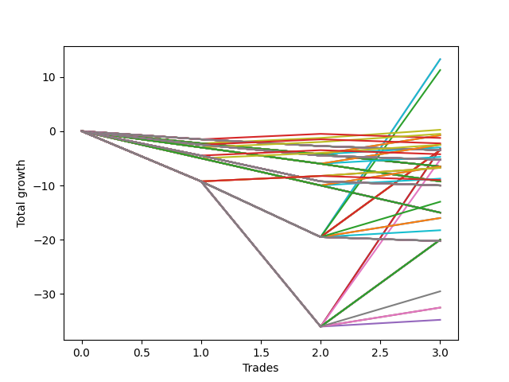

# Short Wallace Doodle 013 
- Symbol: ES90d5m30m
- Date Range: 03/18/2022 - 07/08/2022
- Trading Period: 7:20-12:30
- Number of Trades: 3



| Name | Win Percent | Profit | Avg Profit / Trade |     | Name | Win Percent | Profit | Avg Profit / Trade |
| ---- | ----------- | ------ | ------------------ | --- | ---- | ----------- | ------ | ------------------ |
| Sorted By <br> Profit | | | | | Sorted By <br> Win Percentage ||||
| Three | 33.33 | 14000.00 | 4666.67 |     | Three | 33.33 | 14000.00 | 4666.67 |
| Zero | 33.33 | 14000.00 | 4666.67 |     | Zero | 33.33 | 14000.00 | 4666.67 |
| Six | 33.33 | 13375.00 | 4458.33 |     | Six | 33.33 | 13375.00 | 4458.33 |
| Seven | 33.33 | 7625.00 | 2541.67 |     | Seven | 33.33 | 7625.00 | 2541.67 |
| Five | 33.33 | 7625.00 | 2541.67 |     | Five | 33.33 | 7625.00 | 2541.67 |
| Four | 33.33 | 7625.00 | 2541.67 |     | Four | 33.33 | 7625.00 | 2541.67 |
| Two | 33.33 | 7625.00 | 2541.67 |     | Two | 33.33 | 7625.00 | 2541.67 |
| One | 33.33 | 7625.00 | 2541.67 |     | One | 33.33 | 7625.00 | 2541.67 |
| Seventy-Three | 33.33 | 7250.00 | 2416.67 |     | Seventy-Three | 33.33 | 7250.00 | 2416.67 |

## NO STOPLOSS

### Test Zero
* Sell when price hits the middle line of the 20p bollinger
* No Stoploss
* Results:
```
Total Trades: 3
Percent Up: 66.67
Percent Down: 33.33
Total Points Moved Down: 28.00
Potential Profit: 14000.00
Total Points Ups: 18.75 Count Ups: 2
Total Points Downs: 46.75 Count Downs: 1
```

<details><summary>Trades</summary>

<code>In: 2022-03-28 12:00:00		Out: 2022-03-28 12:30:55		Total Position Time: 30:55		Total Move Down: -1.00		Total to Date: -1.00</code> <br />
<code>In: 2022-05-25 11:35:00		Out: 2022-05-25 12:05:55		Total Position Time: 30:55		Total Move Down: -17.75		Total to Date: -18.75</code> <br />
<code>In: 2022-06-15 11:45:00		Out: 2022-06-15 11:58:05		Total Position Time: 13:05		Total Move Down: 46.75		Total to Date: 28.00</code> <br />


</details>

### Test One
* Sell when the price hits the upper line of the 20p 1std bollinger
* No Stoploss
* Results:
```
Total Trades: 3
Percent Up: 66.67
Percent Down: 33.33
Total Points Moved Down: 15.25
Potential Profit: 7625.00
Total Points Ups: 18.75 Count Ups: 2
Total Points Downs: 34.00 Count Downs: 1
```

<details><summary>Trades</summary>

<code>In: 2022-03-28 12:00:00		Out: 2022-03-28 12:30:55		Total Position Time: 30:55		Total Move Down: -1.00		Total to Date: -1.00</code> <br />
<code>In: 2022-05-25 11:35:00		Out: 2022-05-25 12:05:55		Total Position Time: 30:55		Total Move Down: -17.75		Total to Date: -18.75</code> <br />
<code>In: 2022-06-15 11:45:00		Out: 2022-06-15 12:15:55		Total Position Time: 30:55		Total Move Down: 34.00		Total to Date: 15.25</code> <br />


</details>

### Test Two
* Sell when the price hits the upper line of the 20p 2std bollinger
* No Stoploss
* Results:
```
Total Trades: 3
Percent Up: 66.67
Percent Down: 33.33
Total Points Moved Down: 15.25
Potential Profit: 7625.00
Total Points Ups: 18.75 Count Ups: 2
Total Points Downs: 34.00 Count Downs: 1
```

<details><summary>Trades</summary>

<code>In: 2022-03-28 12:00:00		Out: 2022-03-28 12:30:55		Total Position Time: 30:55		Total Move Down: -1.00		Total to Date: -1.00</code> <br />
<code>In: 2022-05-25 11:35:00		Out: 2022-05-25 12:05:55		Total Position Time: 30:55		Total Move Down: -17.75		Total to Date: -18.75</code> <br />
<code>In: 2022-06-15 11:45:00		Out: 2022-06-15 12:15:55		Total Position Time: 30:55		Total Move Down: 34.00		Total to Date: 15.25</code> <br />


</details>

### Test Three
* Sell when price hits the middle line of the 50p bollinger
* No Stoploss
* Results:
```
Total Trades: 3
Percent Up: 66.67
Percent Down: 33.33
Total Points Moved Down: 28.00
Potential Profit: 14000.00
Total Points Ups: 18.75 Count Ups: 2
Total Points Downs: 46.75 Count Downs: 1
```

<details><summary>Trades</summary>

<code>In: 2022-03-28 12:00:00		Out: 2022-03-28 12:30:55		Total Position Time: 30:55		Total Move Down: -1.00		Total to Date: -1.00</code> <br />
<code>In: 2022-05-25 11:35:00		Out: 2022-05-25 12:05:55		Total Position Time: 30:55		Total Move Down: -17.75		Total to Date: -18.75</code> <br />
<code>In: 2022-06-15 11:45:00		Out: 2022-06-15 11:58:05		Total Position Time: 13:05		Total Move Down: 46.75		Total to Date: 28.00</code> <br />


</details>

### Test Four
* Sell when the price hits the upper line of the 50p 1std bollinger
* No Stoploss
* Results:
```
Total Trades: 3
Percent Up: 66.67
Percent Down: 33.33
Total Points Moved Down: 15.25
Potential Profit: 7625.00
Total Points Ups: 18.75 Count Ups: 2
Total Points Downs: 34.00 Count Downs: 1
```

<details><summary>Trades</summary>

<code>In: 2022-03-28 12:00:00		Out: 2022-03-28 12:30:55		Total Position Time: 30:55		Total Move Down: -1.00		Total to Date: -1.00</code> <br />
<code>In: 2022-05-25 11:35:00		Out: 2022-05-25 12:05:55		Total Position Time: 30:55		Total Move Down: -17.75		Total to Date: -18.75</code> <br />
<code>In: 2022-06-15 11:45:00		Out: 2022-06-15 12:15:55		Total Position Time: 30:55		Total Move Down: 34.00		Total to Date: 15.25</code> <br />


</details>

### Test Five
* Sell when the price hits the upper line of the 50p 2std bollinger
* No Stoploss
* Results:
```
Total Trades: 3
Percent Up: 66.67
Percent Down: 33.33
Total Points Moved Down: 15.25
Potential Profit: 7625.00
Total Points Ups: 18.75 Count Ups: 2
Total Points Downs: 34.00 Count Downs: 1
```

<details><summary>Trades</summary>

<code>In: 2022-03-28 12:00:00		Out: 2022-03-28 12:30:55		Total Position Time: 30:55		Total Move Down: -1.00		Total to Date: -1.00</code> <br />
<code>In: 2022-05-25 11:35:00		Out: 2022-05-25 12:05:55		Total Position Time: 30:55		Total Move Down: -17.75		Total to Date: -18.75</code> <br />
<code>In: 2022-06-15 11:45:00		Out: 2022-06-15 12:15:55		Total Position Time: 30:55		Total Move Down: 34.00		Total to Date: 15.25</code> <br />


</details>

### Test Six
* Sell when the price hits the middle line of the 1std VWAP
* No Stoploss
* Results:
```
Total Trades: 3
Percent Up: 66.67
Percent Down: 33.33
Total Points Moved Down: 26.75
Potential Profit: 13375.00
Total Points Ups: 18.75 Count Ups: 2
Total Points Downs: 45.50 Count Downs: 1
```

<details><summary>Trades</summary>

<code>In: 2022-03-28 12:00:00		Out: 2022-03-28 12:30:55		Total Position Time: 30:55		Total Move Down: -1.00		Total to Date: -1.00</code> <br />
<code>In: 2022-05-25 11:35:00		Out: 2022-05-25 12:05:55		Total Position Time: 30:55		Total Move Down: -17.75		Total to Date: -18.75</code> <br />
<code>In: 2022-06-15 11:45:00		Out: 2022-06-15 11:57:55		Total Position Time: 12:55		Total Move Down: 45.50		Total to Date: 26.75</code> <br />


</details>

### Test Seven
* Sell when the price hits the upper line of the 1std VWAP
* No Stoploss
* Results:
```
Total Trades: 3
Percent Up: 66.67
Percent Down: 33.33
Total Points Moved Down: 15.25
Potential Profit: 7625.00
Total Points Ups: 18.75 Count Ups: 2
Total Points Downs: 34.00 Count Downs: 1
```

<details><summary>Trades</summary>

<code>In: 2022-03-28 12:00:00		Out: 2022-03-28 12:30:55		Total Position Time: 30:55		Total Move Down: -1.00		Total to Date: -1.00</code> <br />
<code>In: 2022-05-25 11:35:00		Out: 2022-05-25 12:05:55		Total Position Time: 30:55		Total Move Down: -17.75		Total to Date: -18.75</code> <br />
<code>In: 2022-06-15 11:45:00		Out: 2022-06-15 12:15:55		Total Position Time: 30:55		Total Move Down: 34.00		Total to Date: 15.25</code> <br />


</details>

## SPECIAL EXIT CONDITIONS 

### Test Seventy-Three
* Sell when the linear regression slope changes to negative
* No Stoploss
* Results:
```
Total Trades: 3
Percent Up: 66.67
Percent Down: 33.33
Total Points Moved Down: 14.50
Potential Profit: 7250.00
Total Points Ups: 11.75 Count Ups: 2
Total Points Downs: 26.25 Count Downs: 1
```

<details><summary>Trades</summary>

<code>In: 2022-03-28 12:00:00		Out: 2022-03-28 12:26:05		Total Position Time: 26:05		Total Move Down: -1.50		Total to Date: -1.50</code> <br />
<code>In: 2022-05-25 11:35:00		Out: 2022-05-25 12:01:05		Total Position Time: 26:05		Total Move Down: -10.25		Total to Date: -11.75</code> <br />
<code>In: 2022-06-15 11:45:00		Out: 2022-06-15 12:09:05		Total Position Time: 24:05		Total Move Down: 26.25		Total to Date: 14.50</code> <br />


</details>