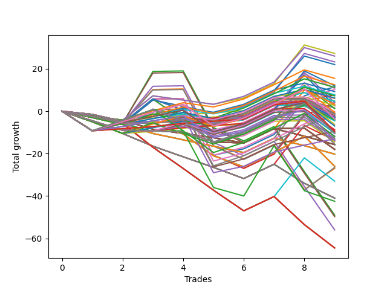

# Short Wallace Doodle 014 
- Symbol: ES90d5m30m
- Date Range: 03/18/2022 - 07/08/2022
- Trading Period: 7:20-12:30
- Number of Trades: 9



| Name | Win Percent | Profit | Avg Profit / Trade |     | Name | Win Percent | Profit | Avg Profit / Trade |
| ---- | ----------- | ------ | ------------------ | --- | ---- | ----------- | ------ | ------------------ |
| Sorted By <br> Profit | | | | | Sorted By <br> Win Percentage ||||
| Seventy-Three | 66.67 | 34750.00 | 3861.11 |     | Zero | 77.78 | 31875.00 | 3541.67 |
| Zero | 77.78 | 31875.00 | 3541.67 |     | Six | 77.78 | 29625.00 | 3291.67 |
| Six | 77.78 | 29625.00 | 3291.67 |     | Three | 77.78 | 27000.00 | 3000.00 |
| Three | 77.78 | 27000.00 | 3000.00 |     | One | 77.78 | 20750.00 | 2305.56 |
| One | 77.78 | 20750.00 | 2305.56 |     | Seven | 77.78 | 19500.00 | 2166.67 |
| Seven | 77.78 | 19500.00 | 2166.67 |     | Seventy-Three | 66.67 | 34750.00 | 3861.11 |
| Two | 66.67 | 17375.00 | 1930.56 |     | Two | 66.67 | 17375.00 | 1930.56 |
| Five | 66.67 | 17000.00 | 1888.89 |     | Five | 66.67 | 17000.00 | 1888.89 |
| Four | 66.67 | 10500.00 | 1166.67 |     | Four | 66.67 | 10500.00 | 1166.67 |

## NO STOPLOSS

### Test Zero
* Sell when price hits the middle line of the 20p bollinger
* No Stoploss
* Results:
```
Total Trades: 9
Percent Up: 22.22
Percent Down: 77.78
Total Points Moved Down: 63.75
Potential Profit: 31875.00
Total Points Ups: 18.75 Count Ups: 2
Total Points Downs: 82.50 Count Downs: 7
```

<details><summary>Trades</summary>

<code>In: 2022-03-28 12:00:00		Out: 2022-03-28 12:30:55		Total Position Time: 30:55		Total Move Down: -1.00		Total to Date: -1.00</code> <br />
<code>In: 2022-04-01 11:35:00		Out: 2022-04-01 12:05:55		Total Position Time: 30:55		Total Move Down: 3.75		Total to Date: 2.75</code> <br />
<code>In: 2022-04-06 10:50:00		Out: 2022-04-06 11:00:10		Total Position Time: 10:10		Total Move Down: 13.25		Total to Date: 16.00</code> <br />
<code>In: 2022-05-04 09:40:00		Out: 2022-05-04 10:10:55		Total Position Time: 30:55		Total Move Down: 2.75		Total to Date: 18.75</code> <br />
<code>In: 2022-05-25 11:35:00		Out: 2022-05-25 12:05:55		Total Position Time: 30:55		Total Move Down: -17.75		Total to Date: 1.00</code> <br />
<code>In: 2022-06-10 12:00:00		Out: 2022-06-10 12:05:20		Total Position Time: 05:20		Total Move Down: 12.75		Total to Date: 13.75</code> <br />
<code>In: 2022-06-15 11:00:00		Out: 2022-06-15 11:01:15		Total Position Time: 01:15		Total Move Down: 11.00		Total to Date: 24.75</code> <br />
<code>In: 2022-06-15 11:50:00		Out: 2022-06-15 11:58:05		Total Position Time: 08:05		Total Move Down: 32.00		Total to Date: 56.75</code> <br />
<code>In: 2022-07-06 11:00:00		Out: 2022-07-06 11:02:25		Total Position Time: 02:25		Total Move Down: 7.00		Total to Date: 63.75</code> <br />


</details>

### Test One
* Sell when the price hits the upper line of the 20p 1std bollinger
* No Stoploss
* Results:
```
Total Trades: 9
Percent Up: 22.22
Percent Down: 77.78
Total Points Moved Down: 41.50
Potential Profit: 20750.00
Total Points Ups: 18.75 Count Ups: 2
Total Points Downs: 60.25 Count Downs: 7
```

<details><summary>Trades</summary>

<code>In: 2022-03-28 12:00:00		Out: 2022-03-28 12:30:55		Total Position Time: 30:55		Total Move Down: -1.00		Total to Date: -1.00</code> <br />
<code>In: 2022-04-01 11:35:00		Out: 2022-04-01 12:05:55		Total Position Time: 30:55		Total Move Down: 3.75		Total to Date: 2.75</code> <br />
<code>In: 2022-04-06 10:50:00		Out: 2022-04-06 11:09:45		Total Position Time: 19:45		Total Move Down: 17.75		Total to Date: 20.50</code> <br />
<code>In: 2022-05-04 09:40:00		Out: 2022-05-04 10:10:55		Total Position Time: 30:55		Total Move Down: 2.75		Total to Date: 23.25</code> <br />
<code>In: 2022-05-25 11:35:00		Out: 2022-05-25 12:05:55		Total Position Time: 30:55		Total Move Down: -17.75		Total to Date: 5.50</code> <br />
<code>In: 2022-06-10 12:00:00		Out: 2022-06-10 12:30:55		Total Position Time: 30:55		Total Move Down: 2.75		Total to Date: 8.25</code> <br />
<code>In: 2022-06-15 11:00:00		Out: 2022-06-15 11:01:25		Total Position Time: 01:25		Total Move Down: 16.75		Total to Date: 25.00</code> <br />
<code>In: 2022-06-15 11:50:00		Out: 2022-06-15 12:20:55		Total Position Time: 30:55		Total Move Down: 5.25		Total to Date: 30.25</code> <br />
<code>In: 2022-07-06 11:00:00		Out: 2022-07-06 11:12:15		Total Position Time: 12:15		Total Move Down: 11.25		Total to Date: 41.50</code> <br />


</details>

### Test Two
* Sell when the price hits the upper line of the 20p 2std bollinger
* No Stoploss
* Results:
```
Total Trades: 9
Percent Up: 33.33
Percent Down: 66.67
Total Points Moved Down: 34.75
Potential Profit: 17375.00
Total Points Ups: 29.50 Count Ups: 3
Total Points Downs: 64.25 Count Downs: 6
```

<details><summary>Trades</summary>

<code>In: 2022-03-28 12:00:00		Out: 2022-03-28 12:30:55		Total Position Time: 30:55		Total Move Down: -1.00		Total to Date: -1.00</code> <br />
<code>In: 2022-04-01 11:35:00		Out: 2022-04-01 12:05:55		Total Position Time: 30:55		Total Move Down: 3.75		Total to Date: 2.75</code> <br />
<code>In: 2022-04-06 10:50:00		Out: 2022-04-06 11:15:15		Total Position Time: 25:15		Total Move Down: 26.25		Total to Date: 29.00</code> <br />
<code>In: 2022-05-04 09:40:00		Out: 2022-05-04 10:10:55		Total Position Time: 30:55		Total Move Down: 2.75		Total to Date: 31.75</code> <br />
<code>In: 2022-05-25 11:35:00		Out: 2022-05-25 12:05:55		Total Position Time: 30:55		Total Move Down: -17.75		Total to Date: 14.00</code> <br />
<code>In: 2022-06-10 12:00:00		Out: 2022-06-10 12:30:55		Total Position Time: 30:55		Total Move Down: 2.75		Total to Date: 16.75</code> <br />
<code>In: 2022-06-15 11:00:00		Out: 2022-06-15 11:01:40		Total Position Time: 01:40		Total Move Down: 23.50		Total to Date: 40.25</code> <br />
<code>In: 2022-06-15 11:50:00		Out: 2022-06-15 12:20:55		Total Position Time: 30:55		Total Move Down: 5.25		Total to Date: 45.50</code> <br />
<code>In: 2022-07-06 11:00:00		Out: 2022-07-06 11:30:55		Total Position Time: 30:55		Total Move Down: -10.75		Total to Date: 34.75</code> <br />


</details>

### Test Three
* Sell when price hits the middle line of the 50p bollinger
* No Stoploss
* Results:
```
Total Trades: 9
Percent Up: 22.22
Percent Down: 77.78
Total Points Moved Down: 54.00
Potential Profit: 27000.00
Total Points Ups: 18.75 Count Ups: 2
Total Points Downs: 72.75 Count Downs: 7
```

<details><summary>Trades</summary>

<code>In: 2022-03-28 12:00:00		Out: 2022-03-28 12:30:55		Total Position Time: 30:55		Total Move Down: -1.00		Total to Date: -1.00</code> <br />
<code>In: 2022-04-01 11:35:00		Out: 2022-04-01 12:05:55		Total Position Time: 30:55		Total Move Down: 3.75		Total to Date: 2.75</code> <br />
<code>In: 2022-04-06 10:50:00		Out: 2022-04-06 11:08:35		Total Position Time: 18:35		Total Move Down: 13.25		Total to Date: 16.00</code> <br />
<code>In: 2022-05-04 09:40:00		Out: 2022-05-04 10:10:55		Total Position Time: 30:55		Total Move Down: 2.75		Total to Date: 18.75</code> <br />
<code>In: 2022-05-25 11:35:00		Out: 2022-05-25 12:05:55		Total Position Time: 30:55		Total Move Down: -17.75		Total to Date: 1.00</code> <br />
<code>In: 2022-06-10 12:00:00		Out: 2022-06-10 12:30:55		Total Position Time: 30:55		Total Move Down: 2.75		Total to Date: 3.75</code> <br />
<code>In: 2022-06-15 11:00:00		Out: 2022-06-15 11:01:15		Total Position Time: 01:15		Total Move Down: 11.00		Total to Date: 14.75</code> <br />
<code>In: 2022-06-15 11:50:00		Out: 2022-06-15 11:58:05		Total Position Time: 08:05		Total Move Down: 32.00		Total to Date: 46.75</code> <br />
<code>In: 2022-07-06 11:00:00		Out: 2022-07-06 11:11:50		Total Position Time: 11:50		Total Move Down: 7.25		Total to Date: 54.00</code> <br />


</details>

### Test Four
* Sell when the price hits the upper line of the 50p 1std bollinger
* No Stoploss
* Results:
```
Total Trades: 9
Percent Up: 33.33
Percent Down: 66.67
Total Points Moved Down: 21.00
Potential Profit: 10500.00
Total Points Ups: 29.50 Count Ups: 3
Total Points Downs: 50.50 Count Downs: 6
```

<details><summary>Trades</summary>

<code>In: 2022-03-28 12:00:00		Out: 2022-03-28 12:30:55		Total Position Time: 30:55		Total Move Down: -1.00		Total to Date: -1.00</code> <br />
<code>In: 2022-04-01 11:35:00		Out: 2022-04-01 12:05:55		Total Position Time: 30:55		Total Move Down: 3.75		Total to Date: 2.75</code> <br />
<code>In: 2022-04-06 10:50:00		Out: 2022-04-06 11:11:20		Total Position Time: 21:20		Total Move Down: 19.25		Total to Date: 22.00</code> <br />
<code>In: 2022-05-04 09:40:00		Out: 2022-05-04 10:10:55		Total Position Time: 30:55		Total Move Down: 2.75		Total to Date: 24.75</code> <br />
<code>In: 2022-05-25 11:35:00		Out: 2022-05-25 12:05:55		Total Position Time: 30:55		Total Move Down: -17.75		Total to Date: 7.00</code> <br />
<code>In: 2022-06-10 12:00:00		Out: 2022-06-10 12:30:55		Total Position Time: 30:55		Total Move Down: 2.75		Total to Date: 9.75</code> <br />
<code>In: 2022-06-15 11:00:00		Out: 2022-06-15 11:01:25		Total Position Time: 01:25		Total Move Down: 16.75		Total to Date: 26.50</code> <br />
<code>In: 2022-06-15 11:50:00		Out: 2022-06-15 12:20:55		Total Position Time: 30:55		Total Move Down: 5.25		Total to Date: 31.75</code> <br />
<code>In: 2022-07-06 11:00:00		Out: 2022-07-06 11:30:55		Total Position Time: 30:55		Total Move Down: -10.75		Total to Date: 21.00</code> <br />


</details>

### Test Five
* Sell when the price hits the upper line of the 50p 2std bollinger
* No Stoploss
* Results:
```
Total Trades: 9
Percent Up: 33.33
Percent Down: 66.67
Total Points Moved Down: 34.00
Potential Profit: 17000.00
Total Points Ups: 29.50 Count Ups: 3
Total Points Downs: 63.50 Count Downs: 6
```

<details><summary>Trades</summary>

<code>In: 2022-03-28 12:00:00		Out: 2022-03-28 12:30:55		Total Position Time: 30:55		Total Move Down: -1.00		Total to Date: -1.00</code> <br />
<code>In: 2022-04-01 11:35:00		Out: 2022-04-01 12:05:55		Total Position Time: 30:55		Total Move Down: 3.75		Total to Date: 2.75</code> <br />
<code>In: 2022-04-06 10:50:00		Out: 2022-04-06 11:15:05		Total Position Time: 25:05		Total Move Down: 25.50		Total to Date: 28.25</code> <br />
<code>In: 2022-05-04 09:40:00		Out: 2022-05-04 10:10:55		Total Position Time: 30:55		Total Move Down: 2.75		Total to Date: 31.00</code> <br />
<code>In: 2022-05-25 11:35:00		Out: 2022-05-25 12:05:55		Total Position Time: 30:55		Total Move Down: -17.75		Total to Date: 13.25</code> <br />
<code>In: 2022-06-10 12:00:00		Out: 2022-06-10 12:30:55		Total Position Time: 30:55		Total Move Down: 2.75		Total to Date: 16.00</code> <br />
<code>In: 2022-06-15 11:00:00		Out: 2022-06-15 11:01:40		Total Position Time: 01:40		Total Move Down: 23.50		Total to Date: 39.50</code> <br />
<code>In: 2022-06-15 11:50:00		Out: 2022-06-15 12:20:55		Total Position Time: 30:55		Total Move Down: 5.25		Total to Date: 44.75</code> <br />
<code>In: 2022-07-06 11:00:00		Out: 2022-07-06 11:30:55		Total Position Time: 30:55		Total Move Down: -10.75		Total to Date: 34.00</code> <br />


</details>

### Test Six
* Sell when the price hits the middle line of the 1std VWAP
* No Stoploss
* Results:
```
Total Trades: 9
Percent Up: 22.22
Percent Down: 77.78
Total Points Moved Down: 59.25
Potential Profit: 29625.00
Total Points Ups: 18.75 Count Ups: 2
Total Points Downs: 78.00 Count Downs: 7
```

<details><summary>Trades</summary>

<code>In: 2022-03-28 12:00:00		Out: 2022-03-28 12:30:55		Total Position Time: 30:55		Total Move Down: -1.00		Total to Date: -1.00</code> <br />
<code>In: 2022-04-01 11:35:00		Out: 2022-04-01 12:05:55		Total Position Time: 30:55		Total Move Down: 3.75		Total to Date: 2.75</code> <br />
<code>In: 2022-04-06 10:50:00		Out: 2022-04-06 11:00:10		Total Position Time: 10:10		Total Move Down: 13.25		Total to Date: 16.00</code> <br />
<code>In: 2022-05-04 09:40:00		Out: 2022-05-04 10:10:55		Total Position Time: 30:55		Total Move Down: 2.75		Total to Date: 18.75</code> <br />
<code>In: 2022-05-25 11:35:00		Out: 2022-05-25 12:05:55		Total Position Time: 30:55		Total Move Down: -17.75		Total to Date: 1.00</code> <br />
<code>In: 2022-06-10 12:00:00		Out: 2022-06-10 12:05:35		Total Position Time: 05:35		Total Move Down: 13.50		Total to Date: 14.50</code> <br />
<code>In: 2022-06-15 11:00:00		Out: 2022-06-15 11:01:10		Total Position Time: 01:10		Total Move Down: 9.25		Total to Date: 23.75</code> <br />
<code>In: 2022-06-15 11:50:00		Out: 2022-06-15 11:57:55		Total Position Time: 07:55		Total Move Down: 30.75		Total to Date: 54.50</code> <br />
<code>In: 2022-07-06 11:00:00		Out: 2022-07-06 11:01:15		Total Position Time: 01:15		Total Move Down: 4.75		Total to Date: 59.25</code> <br />


</details>

### Test Seven
* Sell when the price hits the upper line of the 1std VWAP
* No Stoploss
* Results:
```
Total Trades: 9
Percent Up: 22.22
Percent Down: 77.78
Total Points Moved Down: 39.00
Potential Profit: 19500.00
Total Points Ups: 18.75 Count Ups: 2
Total Points Downs: 57.75 Count Downs: 7
```

<details><summary>Trades</summary>

<code>In: 2022-03-28 12:00:00		Out: 2022-03-28 12:30:55		Total Position Time: 30:55		Total Move Down: -1.00		Total to Date: -1.00</code> <br />
<code>In: 2022-04-01 11:35:00		Out: 2022-04-01 12:05:55		Total Position Time: 30:55		Total Move Down: 3.75		Total to Date: 2.75</code> <br />
<code>In: 2022-04-06 10:50:00		Out: 2022-04-06 11:09:40		Total Position Time: 19:40		Total Move Down: 17.50		Total to Date: 20.25</code> <br />
<code>In: 2022-05-04 09:40:00		Out: 2022-05-04 10:10:55		Total Position Time: 30:55		Total Move Down: 2.75		Total to Date: 23.00</code> <br />
<code>In: 2022-05-25 11:35:00		Out: 2022-05-25 12:05:55		Total Position Time: 30:55		Total Move Down: -17.75		Total to Date: 5.25</code> <br />
<code>In: 2022-06-10 12:00:00		Out: 2022-06-10 12:30:55		Total Position Time: 30:55		Total Move Down: 2.75		Total to Date: 8.00</code> <br />
<code>In: 2022-06-15 11:00:00		Out: 2022-06-15 11:01:20		Total Position Time: 01:20		Total Move Down: 13.75		Total to Date: 21.75</code> <br />
<code>In: 2022-06-15 11:50:00		Out: 2022-06-15 12:20:55		Total Position Time: 30:55		Total Move Down: 5.25		Total to Date: 27.00</code> <br />
<code>In: 2022-07-06 11:00:00		Out: 2022-07-06 11:12:25		Total Position Time: 12:25		Total Move Down: 12.00		Total to Date: 39.00</code> <br />


</details>

## SPECIAL EXIT CONDITIONS 

### Test Seventy-Three
* Sell when the linear regression slope changes to negative
* No Stoploss
* Results:
```
Total Trades: 9
Percent Up: 33.33
Percent Down: 66.67
Total Points Moved Down: 69.50
Potential Profit: 34750.00
Total Points Ups: 15.50 Count Ups: 3
Total Points Downs: 85.00 Count Downs: 6
```

<details><summary>Trades</summary>

<code>In: 2022-03-28 12:00:00		Out: 2022-03-28 12:26:05		Total Position Time: 26:05		Total Move Down: -1.50		Total to Date: -1.50</code> <br />
<code>In: 2022-04-01 11:35:00		Out: 2022-04-01 11:52:05		Total Position Time: 17:05		Total Move Down: 3.75		Total to Date: 2.25</code> <br />
<code>In: 2022-04-06 10:50:00		Out: 2022-04-06 10:54:05		Total Position Time: 04:05		Total Move Down: 1.25		Total to Date: 3.50</code> <br />
<code>In: 2022-05-04 09:40:00		Out: 2022-05-04 09:57:05		Total Position Time: 17:05		Total Move Down: -3.75		Total to Date: -0.25</code> <br />
<code>In: 2022-05-25 11:35:00		Out: 2022-05-25 12:01:05		Total Position Time: 26:05		Total Move Down: -10.25		Total to Date: -10.50</code> <br />
<code>In: 2022-06-10 12:00:00		Out: 2022-06-10 12:04:05		Total Position Time: 04:05		Total Move Down: 9.00		Total to Date: -1.50</code> <br />
<code>In: 2022-06-15 11:00:00		Out: 2022-06-15 11:09:05		Total Position Time: 09:05		Total Move Down: 42.75		Total to Date: 41.25</code> <br />
<code>In: 2022-06-15 11:50:00		Out: 2022-06-15 12:13:05		Total Position Time: 23:05		Total Move Down: 26.25		Total to Date: 67.50</code> <br />
<code>In: 2022-07-06 11:00:00		Out: 2022-07-06 11:03:05		Total Position Time: 03:05		Total Move Down: 2.00		Total to Date: 69.50</code> <br />


</details>