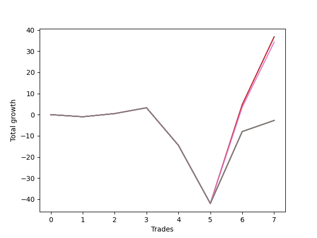

# Short Wallace Doodle 019 
- Symbol: ES90d5mOut
- Date Range: 03/18/2022 - 07/08/2022
- Trading Period: 7:20-12:30
- Number of Trades: 7



| Name | Win Percent | Profit | Avg Profit / Trade |     | Name | Win Percent | Profit | Avg Profit / Trade |
| ---- | ----------- | ------ | ------------------ | --- | ---- | ----------- | ------ | ------------------ |
| Sorted By <br> Profit | | | | | Sorted By <br> Win Percentage ||||
| Three | 57.14 | 18375.00 | 2625.00 |     | Three | 57.14 | 18375.00 | 2625.00 |
| Zero | 57.14 | 18375.00 | 2625.00 |     | Zero | 57.14 | 18375.00 | 2625.00 |
| Six | 57.14 | 17125.00 | 2446.43 |     | Six | 57.14 | 17125.00 | 2446.43 |
| Seven | 57.14 | -1375.00 | -196.43 |     | Seven | 57.14 | -1375.00 | -196.43 |
| Five | 57.14 | -1375.00 | -196.43 |     | Five | 57.14 | -1375.00 | -196.43 |
| Four | 57.14 | -1375.00 | -196.43 |     | Four | 57.14 | -1375.00 | -196.43 |
| Two | 57.14 | -1375.00 | -196.43 |     | Two | 57.14 | -1375.00 | -196.43 |
| One | 57.14 | -1375.00 | -196.43 |     | One | 57.14 | -1375.00 | -196.43 |

### Test Zero
* Sell when price hits the middle line of the 20p bollinger
* No Stoploss
* Results:
```
Total Trades: 7
Percent Up: 42.86
Percent Down: 57.14
Total Points Moved Down: 36.75
Potential Profit: 18375.00
Total Points Ups: 46.25 Count Ups: 3
Total Points Downs: 83.00 Count Downs: 4
```

<details><summary>Trades</summary>

<code>In: 2022-03-28 12:00:00		Out: 2022-03-28 12:30:55		Total Position Time: 30:55		Total Move Down: -1.00		Total to Date: -1.00</code> <br />
<code>In: 2022-04-07 11:00:00		Out: 2022-04-07 11:30:55		Total Position Time: 30:55		Total Move Down: 1.50		Total to Date: 0.50</code> <br />
<code>In: 2022-05-04 09:40:00		Out: 2022-05-04 10:10:55		Total Position Time: 30:55		Total Move Down: 2.75		Total to Date: 3.25</code> <br />
<code>In: 2022-05-25 11:35:00		Out: 2022-05-25 12:05:55		Total Position Time: 30:55		Total Move Down: -17.75		Total to Date: -14.50</code> <br />
<code>In: 2022-05-25 11:40:00		Out: 2022-05-25 12:10:55		Total Position Time: 30:55		Total Move Down: -27.50		Total to Date: -42.00</code> <br />
<code>In: 2022-06-15 11:45:00		Out: 2022-06-15 11:58:05		Total Position Time: 13:05		Total Move Down: 46.75		Total to Date: 4.75</code> <br />
<code>In: 2022-06-15 11:50:00		Out: 2022-06-15 11:58:05		Total Position Time: 08:05		Total Move Down: 32.00		Total to Date: 36.75</code> <br />


</details>

### Test One
* Sell when the price hits the upper line of the 20p 1std bollinger
* No Stoploss
* Results:
```
Total Trades: 7
Percent Up: 42.86
Percent Down: 57.14
Total Points Moved Down: -2.75
Potential Profit: -1375.00
Total Points Ups: 46.25 Count Ups: 3
Total Points Downs: 43.50 Count Downs: 4
```

<details><summary>Trades</summary>

<code>In: 2022-03-28 12:00:00		Out: 2022-03-28 12:30:55		Total Position Time: 30:55		Total Move Down: -1.00		Total to Date: -1.00</code> <br />
<code>In: 2022-04-07 11:00:00		Out: 2022-04-07 11:30:55		Total Position Time: 30:55		Total Move Down: 1.50		Total to Date: 0.50</code> <br />
<code>In: 2022-05-04 09:40:00		Out: 2022-05-04 10:10:55		Total Position Time: 30:55		Total Move Down: 2.75		Total to Date: 3.25</code> <br />
<code>In: 2022-05-25 11:35:00		Out: 2022-05-25 12:05:55		Total Position Time: 30:55		Total Move Down: -17.75		Total to Date: -14.50</code> <br />
<code>In: 2022-05-25 11:40:00		Out: 2022-05-25 12:10:55		Total Position Time: 30:55		Total Move Down: -27.50		Total to Date: -42.00</code> <br />
<code>In: 2022-06-15 11:45:00		Out: 2022-06-15 12:15:55		Total Position Time: 30:55		Total Move Down: 34.00		Total to Date: -8.00</code> <br />
<code>In: 2022-06-15 11:50:00		Out: 2022-06-15 12:20:55		Total Position Time: 30:55		Total Move Down: 5.25		Total to Date: -2.75</code> <br />


</details>

### Test Two
* Sell when the price hits the upper line of the 20p 2std bollinger
* No Stoploss
* Results:
```
Total Trades: 7
Percent Up: 42.86
Percent Down: 57.14
Total Points Moved Down: -2.75
Potential Profit: -1375.00
Total Points Ups: 46.25 Count Ups: 3
Total Points Downs: 43.50 Count Downs: 4
```

<details><summary>Trades</summary>

<code>In: 2022-03-28 12:00:00		Out: 2022-03-28 12:30:55		Total Position Time: 30:55		Total Move Down: -1.00		Total to Date: -1.00</code> <br />
<code>In: 2022-04-07 11:00:00		Out: 2022-04-07 11:30:55		Total Position Time: 30:55		Total Move Down: 1.50		Total to Date: 0.50</code> <br />
<code>In: 2022-05-04 09:40:00		Out: 2022-05-04 10:10:55		Total Position Time: 30:55		Total Move Down: 2.75		Total to Date: 3.25</code> <br />
<code>In: 2022-05-25 11:35:00		Out: 2022-05-25 12:05:55		Total Position Time: 30:55		Total Move Down: -17.75		Total to Date: -14.50</code> <br />
<code>In: 2022-05-25 11:40:00		Out: 2022-05-25 12:10:55		Total Position Time: 30:55		Total Move Down: -27.50		Total to Date: -42.00</code> <br />
<code>In: 2022-06-15 11:45:00		Out: 2022-06-15 12:15:55		Total Position Time: 30:55		Total Move Down: 34.00		Total to Date: -8.00</code> <br />
<code>In: 2022-06-15 11:50:00		Out: 2022-06-15 12:20:55		Total Position Time: 30:55		Total Move Down: 5.25		Total to Date: -2.75</code> <br />


</details>

### Test Three
* Sell when price hits the middle line of the 50p bollinger
* No Stoploss
* Results:
```
Total Trades: 7
Percent Up: 42.86
Percent Down: 57.14
Total Points Moved Down: 36.75
Potential Profit: 18375.00
Total Points Ups: 46.25 Count Ups: 3
Total Points Downs: 83.00 Count Downs: 4
```

<details><summary>Trades</summary>

<code>In: 2022-03-28 12:00:00		Out: 2022-03-28 12:30:55		Total Position Time: 30:55		Total Move Down: -1.00		Total to Date: -1.00</code> <br />
<code>In: 2022-04-07 11:00:00		Out: 2022-04-07 11:30:55		Total Position Time: 30:55		Total Move Down: 1.50		Total to Date: 0.50</code> <br />
<code>In: 2022-05-04 09:40:00		Out: 2022-05-04 10:10:55		Total Position Time: 30:55		Total Move Down: 2.75		Total to Date: 3.25</code> <br />
<code>In: 2022-05-25 11:35:00		Out: 2022-05-25 12:05:55		Total Position Time: 30:55		Total Move Down: -17.75		Total to Date: -14.50</code> <br />
<code>In: 2022-05-25 11:40:00		Out: 2022-05-25 12:10:55		Total Position Time: 30:55		Total Move Down: -27.50		Total to Date: -42.00</code> <br />
<code>In: 2022-06-15 11:45:00		Out: 2022-06-15 11:58:05		Total Position Time: 13:05		Total Move Down: 46.75		Total to Date: 4.75</code> <br />
<code>In: 2022-06-15 11:50:00		Out: 2022-06-15 11:58:05		Total Position Time: 08:05		Total Move Down: 32.00		Total to Date: 36.75</code> <br />


</details>

### Test Four
* Sell when the price hits the upper line of the 50p 1std bollinger
* No Stoploss
* Results:
```
Total Trades: 7
Percent Up: 42.86
Percent Down: 57.14
Total Points Moved Down: -2.75
Potential Profit: -1375.00
Total Points Ups: 46.25 Count Ups: 3
Total Points Downs: 43.50 Count Downs: 4
```

<details><summary>Trades</summary>

<code>In: 2022-03-28 12:00:00		Out: 2022-03-28 12:30:55		Total Position Time: 30:55		Total Move Down: -1.00		Total to Date: -1.00</code> <br />
<code>In: 2022-04-07 11:00:00		Out: 2022-04-07 11:30:55		Total Position Time: 30:55		Total Move Down: 1.50		Total to Date: 0.50</code> <br />
<code>In: 2022-05-04 09:40:00		Out: 2022-05-04 10:10:55		Total Position Time: 30:55		Total Move Down: 2.75		Total to Date: 3.25</code> <br />
<code>In: 2022-05-25 11:35:00		Out: 2022-05-25 12:05:55		Total Position Time: 30:55		Total Move Down: -17.75		Total to Date: -14.50</code> <br />
<code>In: 2022-05-25 11:40:00		Out: 2022-05-25 12:10:55		Total Position Time: 30:55		Total Move Down: -27.50		Total to Date: -42.00</code> <br />
<code>In: 2022-06-15 11:45:00		Out: 2022-06-15 12:15:55		Total Position Time: 30:55		Total Move Down: 34.00		Total to Date: -8.00</code> <br />
<code>In: 2022-06-15 11:50:00		Out: 2022-06-15 12:20:55		Total Position Time: 30:55		Total Move Down: 5.25		Total to Date: -2.75</code> <br />


</details>

### Test Five
* Sell when the price hits the upper line of the 50p 2std bollinger
* No Stoploss
* Results:
```
Total Trades: 7
Percent Up: 42.86
Percent Down: 57.14
Total Points Moved Down: -2.75
Potential Profit: -1375.00
Total Points Ups: 46.25 Count Ups: 3
Total Points Downs: 43.50 Count Downs: 4
```

<details><summary>Trades</summary>

<code>In: 2022-03-28 12:00:00		Out: 2022-03-28 12:30:55		Total Position Time: 30:55		Total Move Down: -1.00		Total to Date: -1.00</code> <br />
<code>In: 2022-04-07 11:00:00		Out: 2022-04-07 11:30:55		Total Position Time: 30:55		Total Move Down: 1.50		Total to Date: 0.50</code> <br />
<code>In: 2022-05-04 09:40:00		Out: 2022-05-04 10:10:55		Total Position Time: 30:55		Total Move Down: 2.75		Total to Date: 3.25</code> <br />
<code>In: 2022-05-25 11:35:00		Out: 2022-05-25 12:05:55		Total Position Time: 30:55		Total Move Down: -17.75		Total to Date: -14.50</code> <br />
<code>In: 2022-05-25 11:40:00		Out: 2022-05-25 12:10:55		Total Position Time: 30:55		Total Move Down: -27.50		Total to Date: -42.00</code> <br />
<code>In: 2022-06-15 11:45:00		Out: 2022-06-15 12:15:55		Total Position Time: 30:55		Total Move Down: 34.00		Total to Date: -8.00</code> <br />
<code>In: 2022-06-15 11:50:00		Out: 2022-06-15 12:20:55		Total Position Time: 30:55		Total Move Down: 5.25		Total to Date: -2.75</code> <br />


</details>

### Test Six
* Sell when the price hits the middle line of the 1std VWAP
* No Stoploss
* Results:
```
Total Trades: 7
Percent Up: 42.86
Percent Down: 57.14
Total Points Moved Down: 34.25
Potential Profit: 17125.00
Total Points Ups: 46.25 Count Ups: 3
Total Points Downs: 80.50 Count Downs: 4
```

<details><summary>Trades</summary>

<code>In: 2022-03-28 12:00:00		Out: 2022-03-28 12:30:55		Total Position Time: 30:55		Total Move Down: -1.00		Total to Date: -1.00</code> <br />
<code>In: 2022-04-07 11:00:00		Out: 2022-04-07 11:30:55		Total Position Time: 30:55		Total Move Down: 1.50		Total to Date: 0.50</code> <br />
<code>In: 2022-05-04 09:40:00		Out: 2022-05-04 10:10:55		Total Position Time: 30:55		Total Move Down: 2.75		Total to Date: 3.25</code> <br />
<code>In: 2022-05-25 11:35:00		Out: 2022-05-25 12:05:55		Total Position Time: 30:55		Total Move Down: -17.75		Total to Date: -14.50</code> <br />
<code>In: 2022-05-25 11:40:00		Out: 2022-05-25 12:10:55		Total Position Time: 30:55		Total Move Down: -27.50		Total to Date: -42.00</code> <br />
<code>In: 2022-06-15 11:45:00		Out: 2022-06-15 11:57:55		Total Position Time: 12:55		Total Move Down: 45.50		Total to Date: 3.50</code> <br />
<code>In: 2022-06-15 11:50:00		Out: 2022-06-15 11:57:55		Total Position Time: 07:55		Total Move Down: 30.75		Total to Date: 34.25</code> <br />


</details>

### Test Seven
* Sell when the price hits the upper line of the 1std VWAP
* No Stoploss
* Results:
```
Total Trades: 7
Percent Up: 42.86
Percent Down: 57.14
Total Points Moved Down: -2.75
Potential Profit: -1375.00
Total Points Ups: 46.25 Count Ups: 3
Total Points Downs: 43.50 Count Downs: 4
```

<details><summary>Trades</summary>

<code>In: 2022-03-28 12:00:00		Out: 2022-03-28 12:30:55		Total Position Time: 30:55		Total Move Down: -1.00		Total to Date: -1.00</code> <br />
<code>In: 2022-04-07 11:00:00		Out: 2022-04-07 11:30:55		Total Position Time: 30:55		Total Move Down: 1.50		Total to Date: 0.50</code> <br />
<code>In: 2022-05-04 09:40:00		Out: 2022-05-04 10:10:55		Total Position Time: 30:55		Total Move Down: 2.75		Total to Date: 3.25</code> <br />
<code>In: 2022-05-25 11:35:00		Out: 2022-05-25 12:05:55		Total Position Time: 30:55		Total Move Down: -17.75		Total to Date: -14.50</code> <br />
<code>In: 2022-05-25 11:40:00		Out: 2022-05-25 12:10:55		Total Position Time: 30:55		Total Move Down: -27.50		Total to Date: -42.00</code> <br />
<code>In: 2022-06-15 11:45:00		Out: 2022-06-15 12:15:55		Total Position Time: 30:55		Total Move Down: 34.00		Total to Date: -8.00</code> <br />
<code>In: 2022-06-15 11:50:00		Out: 2022-06-15 12:20:55		Total Position Time: 30:55		Total Move Down: 5.25		Total to Date: -2.75</code> <br />


</details>