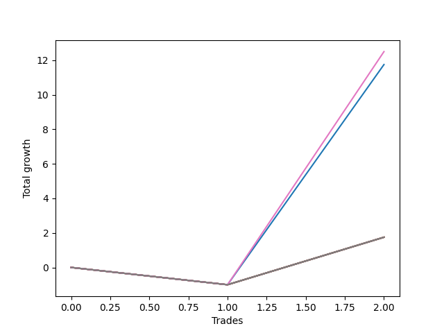

# Short Wallace Doodle 0225_009 
- Symbol: ES90d5mOut
- Date Range: 03/18/2022 - 07/08/2022
- Trading Period: 7:20-12:30
- Number of Trades: 2



| Name | Win Percent | Profit | Avg Profit / Trade |     | Name | Win Percent | Profit | Avg Profit / Trade |
| ---- | ----------- | ------ | ------------------ | --- | ---- | ----------- | ------ | ------------------ |
| Sorted By <br> Profit | | | | | Sorted By <br> Win Percentage ||||
| Six | 50.00 | 6250.00 | 3125.00 |     | Six | 50.00 | 6250.00 | 3125.00 |
| Zero | 50.00 | 5875.00 | 2937.50 |     | Zero | 50.00 | 5875.00 | 2937.50 |
| Seven | 50.00 | 875.00 | 437.50 |     | Seven | 50.00 | 875.00 | 437.50 |
| Five | 50.00 | 875.00 | 437.50 |     | Five | 50.00 | 875.00 | 437.50 |
| Four | 50.00 | 875.00 | 437.50 |     | Four | 50.00 | 875.00 | 437.50 |
| Three | 50.00 | 875.00 | 437.50 |     | Three | 50.00 | 875.00 | 437.50 |
| Two | 50.00 | 875.00 | 437.50 |     | Two | 50.00 | 875.00 | 437.50 |
| One | 50.00 | 875.00 | 437.50 |     | One | 50.00 | 875.00 | 437.50 |

### Test Zero
* Sell when price hits the middle line of the 20p bollinger
* No Stoploss
* Results:
```
Total Trades: 2
Percent Up: 50.00
Percent Down: 50.00
Total Points Moved Down: 11.75
Potential Profit: 5875.00
Total Points Ups: 1.00 Count Ups: 1
Total Points Downs: 12.75 Count Downs: 1
```

<details><summary>Trades</summary>

<code>In: 2022-03-28 12:00:00		Out: 2022-03-28 12:30:55		Total Position Time: 30:55		Total Move Down: -1.00		Total to Date: -1.00</code> <br />
<code>In: 2022-06-10 12:00:00		Out: 2022-06-10 12:05:20		Total Position Time: 05:20		Total Move Down: 12.75		Total to Date: 11.75</code> <br />


</details>

### Test One
* Sell when the price hits the upper line of the 20p 1std bollinger
* No Stoploss
* Results:
```
Total Trades: 2
Percent Up: 50.00
Percent Down: 50.00
Total Points Moved Down: 1.75
Potential Profit: 875.00
Total Points Ups: 1.00 Count Ups: 1
Total Points Downs: 2.75 Count Downs: 1
```

<details><summary>Trades</summary>

<code>In: 2022-03-28 12:00:00		Out: 2022-03-28 12:30:55		Total Position Time: 30:55		Total Move Down: -1.00		Total to Date: -1.00</code> <br />
<code>In: 2022-06-10 12:00:00		Out: 2022-06-10 12:30:55		Total Position Time: 30:55		Total Move Down: 2.75		Total to Date: 1.75</code> <br />


</details>

### Test Two
* Sell when the price hits the upper line of the 20p 2std bollinger
* No Stoploss
* Results:
```
Total Trades: 2
Percent Up: 50.00
Percent Down: 50.00
Total Points Moved Down: 1.75
Potential Profit: 875.00
Total Points Ups: 1.00 Count Ups: 1
Total Points Downs: 2.75 Count Downs: 1
```

<details><summary>Trades</summary>

<code>In: 2022-03-28 12:00:00		Out: 2022-03-28 12:30:55		Total Position Time: 30:55		Total Move Down: -1.00		Total to Date: -1.00</code> <br />
<code>In: 2022-06-10 12:00:00		Out: 2022-06-10 12:30:55		Total Position Time: 30:55		Total Move Down: 2.75		Total to Date: 1.75</code> <br />


</details>

### Test Three
* Sell when price hits the middle line of the 50p bollinger
* No Stoploss
* Results:
```
Total Trades: 2
Percent Up: 50.00
Percent Down: 50.00
Total Points Moved Down: 1.75
Potential Profit: 875.00
Total Points Ups: 1.00 Count Ups: 1
Total Points Downs: 2.75 Count Downs: 1
```

<details><summary>Trades</summary>

<code>In: 2022-03-28 12:00:00		Out: 2022-03-28 12:30:55		Total Position Time: 30:55		Total Move Down: -1.00		Total to Date: -1.00</code> <br />
<code>In: 2022-06-10 12:00:00		Out: 2022-06-10 12:30:55		Total Position Time: 30:55		Total Move Down: 2.75		Total to Date: 1.75</code> <br />


</details>

### Test Four
* Sell when the price hits the upper line of the 50p 1std bollinger
* No Stoploss
* Results:
```
Total Trades: 2
Percent Up: 50.00
Percent Down: 50.00
Total Points Moved Down: 1.75
Potential Profit: 875.00
Total Points Ups: 1.00 Count Ups: 1
Total Points Downs: 2.75 Count Downs: 1
```

<details><summary>Trades</summary>

<code>In: 2022-03-28 12:00:00		Out: 2022-03-28 12:30:55		Total Position Time: 30:55		Total Move Down: -1.00		Total to Date: -1.00</code> <br />
<code>In: 2022-06-10 12:00:00		Out: 2022-06-10 12:30:55		Total Position Time: 30:55		Total Move Down: 2.75		Total to Date: 1.75</code> <br />


</details>

### Test Five
* Sell when the price hits the upper line of the 50p 2std bollinger
* No Stoploss
* Results:
```
Total Trades: 2
Percent Up: 50.00
Percent Down: 50.00
Total Points Moved Down: 1.75
Potential Profit: 875.00
Total Points Ups: 1.00 Count Ups: 1
Total Points Downs: 2.75 Count Downs: 1
```

<details><summary>Trades</summary>

<code>In: 2022-03-28 12:00:00		Out: 2022-03-28 12:30:55		Total Position Time: 30:55		Total Move Down: -1.00		Total to Date: -1.00</code> <br />
<code>In: 2022-06-10 12:00:00		Out: 2022-06-10 12:30:55		Total Position Time: 30:55		Total Move Down: 2.75		Total to Date: 1.75</code> <br />


</details>

### Test Six
* Sell when the price hits the middle line of the 1std VWAP
* No Stoploss
* Results:
```
Total Trades: 2
Percent Up: 50.00
Percent Down: 50.00
Total Points Moved Down: 12.50
Potential Profit: 6250.00
Total Points Ups: 1.00 Count Ups: 1
Total Points Downs: 13.50 Count Downs: 1
```

<details><summary>Trades</summary>

<code>In: 2022-03-28 12:00:00		Out: 2022-03-28 12:30:55		Total Position Time: 30:55		Total Move Down: -1.00		Total to Date: -1.00</code> <br />
<code>In: 2022-06-10 12:00:00		Out: 2022-06-10 12:05:35		Total Position Time: 05:35		Total Move Down: 13.50		Total to Date: 12.50</code> <br />


</details>

### Test Seven
* Sell when the price hits the upper line of the 1std VWAP
* No Stoploss
* Results:
```
Total Trades: 2
Percent Up: 50.00
Percent Down: 50.00
Total Points Moved Down: 1.75
Potential Profit: 875.00
Total Points Ups: 1.00 Count Ups: 1
Total Points Downs: 2.75 Count Downs: 1
```

<details><summary>Trades</summary>

<code>In: 2022-03-28 12:00:00		Out: 2022-03-28 12:30:55		Total Position Time: 30:55		Total Move Down: -1.00		Total to Date: -1.00</code> <br />
<code>In: 2022-06-10 12:00:00		Out: 2022-06-10 12:30:55		Total Position Time: 30:55		Total Move Down: 2.75		Total to Date: 1.75</code> <br />


</details>