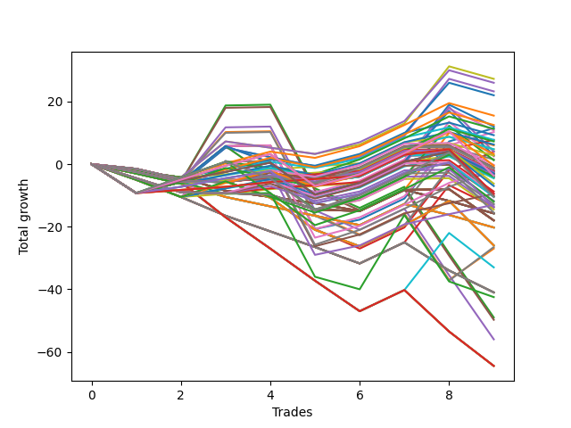

# Short Wallace Doodle 014 
- Symbol: ES90d5m30m
- Date Range: 03/18/2022 - 07/08/2022
- Trading Period: 7:20-12:30
- Number of Trades: 9



| Name | Win Percent | Profit | Avg Profit / Trade | Avg Time / Trade |      | Name | Win Percent | Profit | Avg Profit / Trade | Avg Time / Trade |
| ---- | ----------- | ------ | ------------------ | ---------------- | ---- | ---- | ----------- | ------ | ------------------ | ---------------- |
| Sorted By <br> Profit | | | | | | Sorted By <br> Win Percentage ||||
| Eight | 44.44 | 13625.00 | 1513.89 | 00:00 |     | Eighty-One | 88.89 | 3875.00 | 430.56 | 00:00 |
| Fourteen | 44.44 | 13000.00 | 1444.44 | 00:00 |     | Zero | 77.78 | 5750.00 | 638.89 | 00:00 |
| Twenty-Four | 44.44 | 11625.00 | 1291.67 | 00:00 |     | Six | 77.78 | 5125.00 | 569.44 | 00:00 |
| Thirty | 44.44 | 11000.00 | 1222.22 | 00:00 |     | Eighty-Four | 77.78 | -875.00 | -97.22 | 00:00 |
| Ninety-Four | 55.56 | 7750.00 | 861.11 | 00:00 |     | Eighty-Five | 77.78 | -1000.00 | -111.11 | 00:00 |
| One Hundred Four | 55.56 | 6250.00 | 694.44 | 00:00 |     | One Hundred Twenty-One | 77.78 | -3125.00 | -347.22 | 00:00 |
| Forty | 44.44 | 6000.00 | 666.67 | 00:00 |     | One Hundred Twenty-Six | 77.78 | -4750.00 | -527.78 | 00:00 |
| Zero | 77.78 | 5750.00 | 638.89 | 00:00 |     | Eighty-Three | 77.78 | -4750.00 | -527.78 | 00:00 |
| Ninety-Five | 44.44 | 5625.00 | 625.00 | 00:00 |     | Eighty-Two | 77.78 | -6500.00 | -722.22 | 00:00 |
| Forty-Six | 44.44 | 5375.00 | 597.22 | 00:00 |     | Ninety-One | 66.67 | 2375.00 | 263.89 | 00:00 |
| Six | 77.78 | 5125.00 | 569.44 | 00:00 |     | Three | 66.67 | 2000.00 | 222.22 | 00:00 |
| Ninety-Three | 55.56 | 4625.00 | 513.89 | 00:00 |     | One Hundred One | 66.67 | 1375.00 | 152.78 | 00:00 |
| Eighty-One | 88.89 | 3875.00 | 430.56 | 00:00 |     | One Hundred Twenty-Four | 66.67 | -250.00 | -27.78 | 00:00 |
| Ninety-Two | 55.56 | 3875.00 | 430.56 | 00:00 |     | One Hundred Twenty-Nine | 66.67 | -1875.00 | -208.33 | 00:00 |
| One Hundred Five | 44.44 | 3625.00 | 402.78 | 00:00 |     | One Hundred Eleven | 66.67 | -2250.00 | -250.00 | 00:00 |
| One Hundred Three | 55.56 | 3125.00 | 347.22 | 00:00 |     | One Hundred Twenty-Three | 66.67 | -3500.00 | -388.89 | 00:00 |
| Eleven | 22.22 | 3000.00 | 333.33 | 00:00 |     | One Hundred Twenty-Eight | 66.67 | -5125.00 | -569.44 | 00:00 |
| Ninety-One | 66.67 | 2375.00 | 263.89 | 00:00 |     | One Hundred Twenty-Two | 66.67 | -5250.00 | -583.33 | 00:00 |
| One Hundred Two | 55.56 | 2375.00 | 263.89 | 00:00 |     | One Hundred Twenty-Seven | 66.67 | -6875.00 | -763.89 | 00:00 |
| Three | 66.67 | 2000.00 | 222.22 | 00:00 |     | Ninety-Four | 55.56 | 7750.00 | 861.11 | 00:00 |
| Sixty-Four | 55.56 | 2000.00 | 222.22 | 00:00 |     | One Hundred Four | 55.56 | 6250.00 | 694.44 | 00:00 |
| One Hundred Fourteen | 55.56 | 1625.00 | 180.56 | 00:00 |     | Ninety-Three | 55.56 | 4625.00 | 513.89 | 00:00 |
| One Hundred One | 66.67 | 1375.00 | 152.78 | 00:00 |     | Ninety-Two | 55.56 | 3875.00 | 430.56 | 00:00 |
| Seventy | 55.56 | 1375.00 | 152.78 | 00:00 |     | One Hundred Three | 55.56 | 3125.00 | 347.22 | 00:00 |
| Fifty-Six | 55.56 | 1250.00 | 138.89 | 00:00 |     | One Hundred Two | 55.56 | 2375.00 | 263.89 | 00:00 |
| twenty-Seven | 22.22 | 750.00 | 83.33 | 00:00 |     | Sixty-Four | 55.56 | 2000.00 | 222.22 | 00:00 |
| Sixty-Two | 55.56 | 625.00 | 69.44 | 00:00 |     | One Hundred Fourteen | 55.56 | 1625.00 | 180.56 | 00:00 |
| One Hundred Nine | 44.44 | -125.00 | -13.89 | 00:00 |     | Seventy | 55.56 | 1375.00 | 152.78 | 00:00 |
| One Hundred Twenty-Four | 66.67 | -250.00 | -27.78 | 00:00 |     | Fifty-Six | 55.56 | 1250.00 | 138.89 | 00:00 |
| One Hundred Eight | 44.44 | -500.00 | -55.56 | 00:00 |     | Sixty-Two | 55.56 | 625.00 | 69.44 | 00:00 |
| One Hundred Ten | 44.44 | -625.00 | -69.44 | 00:00 |     | One Hundred Six | 55.56 | -1125.00 | -125.00 | 00:00 |
| One Hundred | 33.33 | -750.00 | -83.33 | 00:00 |     | One Hundred Thirteen | 55.56 | -1500.00 | -166.67 | 00:00 |
| Eighty-Four | 77.78 | -875.00 | -97.22 | 00:00 |     | One Hundred Twelve | 55.56 | -2250.00 | -250.00 | 00:00 |
| Eighty-Five | 77.78 | -1000.00 | -111.11 | 00:00 |     | One Hundred Sixteen | 55.56 | -4375.00 | -486.11 | 00:00 |
| One Hundred Six | 55.56 | -1125.00 | -125.00 | 00:00 |     | One Hundred Thirty | 55.56 | -5250.00 | -583.33 | 00:00 |
| Thirty-Eight | 44.44 | -1125.00 | -125.00 | 00:00 |     | One Hundred Twenty-Five | 55.56 | -6000.00 | -666.67 | 00:00 |
| One Hundred Seven | 44.44 | -1250.00 | -138.89 | 00:00 |     | Seven | 55.56 | -13250.00 | -1472.22 | 00:00 |
| Ninety-Nine | 33.33 | -1250.00 | -138.89 | 00:00 |     | One | 55.56 | -13500.00 | -1500.00 | 00:00 |
| Ninety-Eight | 33.33 | -1250.00 | -138.89 | 00:00 |     | Eight | 44.44 | 13625.00 | 1513.89 | 00:00 |
| Twenty-Two | 33.33 | -1250.00 | -138.89 | 00:00 |     | Fourteen | 44.44 | 13000.00 | 1444.44 | 00:00 |
| One Hundred Thirteen | 55.56 | -1500.00 | -166.67 | 00:00 |     | Twenty-Four | 44.44 | 11625.00 | 1291.67 | 00:00 |
| Ninety-Six | 44.44 | -1500.00 | -166.67 | 00:00 |     | Thirty | 44.44 | 11000.00 | 1222.22 | 00:00 |
| Thirty-Two | 44.44 | -1500.00 | -166.67 | 00:00 |     | Forty | 44.44 | 6000.00 | 666.67 | 00:00 |
| Ninety-Seven | 33.33 | -1625.00 | -180.56 | 00:00 |     | Ninety-Five | 44.44 | 5625.00 | 625.00 | 00:00 |
| Twenty-Three | 33.33 | -1625.00 | -180.56 | 00:00 |     | Forty-Six | 44.44 | 5375.00 | 597.22 | 00:00 |
| Twenty-One | 33.33 | -1625.00 | -180.56 | 00:00 |     | One Hundred Five | 44.44 | 3625.00 | 402.78 | 00:00 |
| Twenty | 33.33 | -1625.00 | -180.56 | 00:00 |     | One Hundred Nine | 44.44 | -125.00 | -13.89 | 00:00 |
| Nineteen | 33.33 | -1625.00 | -180.56 | 00:00 |     | One Hundred Eight | 44.44 | -500.00 | -55.56 | 00:00 |
| Eighteen | 33.33 | -1625.00 | -180.56 | 00:00 |     | One Hundred Ten | 44.44 | -625.00 | -69.44 | 00:00 |
| Seventeen | 33.33 | -1625.00 | -180.56 | 00:00 |     | Thirty-Eight | 44.44 | -1125.00 | -125.00 | 00:00 |
| Sixten | 33.33 | -1625.00 | -180.56 | 00:00 |     | One Hundred Seven | 44.44 | -1250.00 | -138.89 | 00:00 |
| One Hundred Twenty-Nine | 66.67 | -1875.00 | -208.33 | 00:00 |     | Ninety-Six | 44.44 | -1500.00 | -166.67 | 00:00 |
| One Hundred Fifteen | 44.44 | -2000.00 | -222.22 | 00:00 |     | Thirty-Two | 44.44 | -1500.00 | -166.67 | 00:00 |
| Thirty-Nine | 44.44 | -2000.00 | -222.22 | 00:00 |     | One Hundred Fifteen | 44.44 | -2000.00 | -222.22 | 00:00 |
| Thirty-Seven | 44.44 | -2000.00 | -222.22 | 00:00 |     | Thirty-Nine | 44.44 | -2000.00 | -222.22 | 00:00 |
| Thirty-Six | 44.44 | -2000.00 | -222.22 | 00:00 |     | Thirty-Seven | 44.44 | -2000.00 | -222.22 | 00:00 |
| Thirty-Five | 44.44 | -2000.00 | -222.22 | 00:00 |     | Thirty-Six | 44.44 | -2000.00 | -222.22 | 00:00 |
| Thirty-Four | 44.44 | -2000.00 | -222.22 | 00:00 |     | Thirty-Five | 44.44 | -2000.00 | -222.22 | 00:00 |
| Thirty-Three | 44.44 | -2000.00 | -222.22 | 00:00 |     | Thirty-Four | 44.44 | -2000.00 | -222.22 | 00:00 |
| One Hundred Eleven | 66.67 | -2250.00 | -250.00 | 00:00 |     | Thirty-Three | 44.44 | -2000.00 | -222.22 | 00:00 |
| One Hundred Twelve | 55.56 | -2250.00 | -250.00 | 00:00 |     | One Hundred Ninteen | 44.44 | -4750.00 | -527.78 | 00:00 |
| One Hundred Twenty-One | 77.78 | -3125.00 | -347.22 | 00:00 |     | One Hundred Eighteen | 44.44 | -5125.00 | -569.44 | 00:00 |
| One Hundred Twenty-Three | 66.67 | -3500.00 | -388.89 | 00:00 |     | One Hundred Seventeen | 44.44 | -5875.00 | -652.78 | 00:00 |
| One Hundred Sixteen | 55.56 | -4375.00 | -486.11 | 00:00 |     | Sixty-Seven | 44.44 | -7750.00 | -861.11 | 00:00 |
| One Hundred Twenty-Six | 77.78 | -4750.00 | -527.78 | 00:00 |     | Seventy-One | 44.44 | -13000.00 | -1444.44 | 00:00 |
| Eighty-Three | 77.78 | -4750.00 | -527.78 | 00:00 |     | Sixty-Nine | 44.44 | -13000.00 | -1444.44 | 00:00 |
| One Hundred Ninteen | 44.44 | -4750.00 | -527.78 | 00:00 |     | Sixty-Eight | 44.44 | -13000.00 | -1444.44 | 00:00 |
| One Hundred Twenty-Eight | 66.67 | -5125.00 | -569.44 | 00:00 |     | Sixty-Six | 44.44 | -13000.00 | -1444.44 | 00:00 |
| One Hundred Eighteen | 44.44 | -5125.00 | -569.44 | 00:00 |     | Sixty-Five | 44.44 | -13000.00 | -1444.44 | 00:00 |
| One Hundred Twenty-Two | 66.67 | -5250.00 | -583.33 | 00:00 |     | Two | 44.44 | -24500.00 | -2722.22 | 00:00 |
| One Hundred Thirty | 55.56 | -5250.00 | -583.33 | 00:00 |     | Five | 44.44 | -24875.00 | -2763.89 | 00:00 |
| One Hundred Seventeen | 44.44 | -5875.00 | -652.78 | 00:00 |     | Four | 44.44 | -28000.00 | -3111.11 | 00:00 |
| One Hundred Twenty-Five | 55.56 | -6000.00 | -666.67 | 00:00 |     | One Hundred | 33.33 | -750.00 | -83.33 | 00:00 |
| One Hundred Twenty | 33.33 | -6375.00 | -708.33 | 00:00 |     | Ninety-Nine | 33.33 | -1250.00 | -138.89 | 00:00 |
| Eighty-Two | 77.78 | -6500.00 | -722.22 | 00:00 |     | Ninety-Eight | 33.33 | -1250.00 | -138.89 | 00:00 |
| One Hundred Twenty-Seven | 66.67 | -6875.00 | -763.89 | 00:00 |     | Twenty-Two | 33.33 | -1250.00 | -138.89 | 00:00 |
| Fifty-Four | 33.33 | -6875.00 | -763.89 | 00:00 |     | Ninety-Seven | 33.33 | -1625.00 | -180.56 | 00:00 |
| Forty-Three | 22.22 | -6875.00 | -763.89 | 00:00 |     | Twenty-Three | 33.33 | -1625.00 | -180.56 | 00:00 |
| Forty-Eight | 33.33 | -7250.00 | -805.56 | 00:00 |     | Twenty-One | 33.33 | -1625.00 | -180.56 | 00:00 |
| Sixty-Seven | 44.44 | -7750.00 | -861.11 | 00:00 |     | Twenty | 33.33 | -1625.00 | -180.56 | 00:00 |
| Fifteen | 11.11 | -7875.00 | -875.00 | 00:00 |     | Nineteen | 33.33 | -1625.00 | -180.56 | 00:00 |
| Thirteen | 11.11 | -7875.00 | -875.00 | 00:00 |     | Eighteen | 33.33 | -1625.00 | -180.56 | 00:00 |
| Twelve | 11.11 | -7875.00 | -875.00 | 00:00 |     | Seventeen | 33.33 | -1625.00 | -180.56 | 00:00 |
| Ten | 11.11 | -7875.00 | -875.00 | 00:00 |     | Sixten | 33.33 | -1625.00 | -180.56 | 00:00 |
| Nine | 11.11 | -7875.00 | -875.00 | 00:00 |     | One Hundred Twenty | 33.33 | -6375.00 | -708.33 | 00:00 |
| Fifty-Five | 22.22 | -9000.00 | -1000.00 | 00:00 |     | Fifty-Four | 33.33 | -6875.00 | -763.89 | 00:00 |
| Fifty-Three | 22.22 | -9000.00 | -1000.00 | 00:00 |     | Forty-Eight | 33.33 | -7250.00 | -805.56 | 00:00 |
| Fifty-Two | 22.22 | -9000.00 | -1000.00 | 00:00 |     | Fifty-Nine | 33.33 | -16500.00 | -1833.33 | 00:00 |
| Fifty-One | 22.22 | -9000.00 | -1000.00 | 00:00 |     | Seventy-Three | 33.33 | -21250.00 | -2361.11 | 00:00 |
| Fifty | 22.22 | -9000.00 | -1000.00 | 00:00 |     | Eleven | 22.22 | 3000.00 | 333.33 | 00:00 |
| Forty-Nine | 22.22 | -9000.00 | -1000.00 | 00:00 |     | twenty-Seven | 22.22 | 750.00 | 83.33 | 00:00 |
| Thirty-One | 11.11 | -10125.00 | -1125.00 | 00:00 |     | Forty-Three | 22.22 | -6875.00 | -763.89 | 00:00 |
| Twenty-Nine | 11.11 | -10125.00 | -1125.00 | 00:00 |     | Fifty-Five | 22.22 | -9000.00 | -1000.00 | 00:00 |
| Twenty-Eight | 11.11 | -10125.00 | -1125.00 | 00:00 |     | Fifty-Three | 22.22 | -9000.00 | -1000.00 | 00:00 |
| Twenty-Six | 11.11 | -10125.00 | -1125.00 | 00:00 |     | Fifty-Two | 22.22 | -9000.00 | -1000.00 | 00:00 |
| Twenty-Five | 11.11 | -10125.00 | -1125.00 | 00:00 |     | Fifty-One | 22.22 | -9000.00 | -1000.00 | 00:00 |
| Seventy-One | 44.44 | -13000.00 | -1444.44 | 00:00 |     | Fifty | 22.22 | -9000.00 | -1000.00 | 00:00 |
| Sixty-Nine | 44.44 | -13000.00 | -1444.44 | 00:00 |     | Forty-Nine | 22.22 | -9000.00 | -1000.00 | 00:00 |
| Sixty-Eight | 44.44 | -13000.00 | -1444.44 | 00:00 |     | Sixty-Three | 22.22 | -32250.00 | -3583.33 | 00:00 |
| Sixty-Six | 44.44 | -13000.00 | -1444.44 | 00:00 |     | Sixty-One | 22.22 | -32250.00 | -3583.33 | 00:00 |
| Sixty-Five | 44.44 | -13000.00 | -1444.44 | 00:00 |     | Sixty | 22.22 | -32250.00 | -3583.33 | 00:00 |
| Seven | 55.56 | -13250.00 | -1472.22 | 00:00 |     | Fifty-Eight | 22.22 | -32250.00 | -3583.33 | 00:00 |
| One | 55.56 | -13500.00 | -1500.00 | 00:00 |     | Fifty-Seven | 22.22 | -32250.00 | -3583.33 | 00:00 |
| Fifty-Nine | 33.33 | -16500.00 | -1833.33 | 00:00 |     | Fifteen | 11.11 | -7875.00 | -875.00 | 00:00 |
| Forty-Seven | 11.11 | -20500.00 | -2277.78 | 00:00 |     | Thirteen | 11.11 | -7875.00 | -875.00 | 00:00 |
| Forty-Five | 11.11 | -20500.00 | -2277.78 | 00:00 |     | Twelve | 11.11 | -7875.00 | -875.00 | 00:00 |
| Forty-Four | 11.11 | -20500.00 | -2277.78 | 00:00 |     | Ten | 11.11 | -7875.00 | -875.00 | 00:00 |
| Forty-Two | 11.11 | -20500.00 | -2277.78 | 00:00 |     | Nine | 11.11 | -7875.00 | -875.00 | 00:00 |
| Forty-One | 11.11 | -20500.00 | -2277.78 | 00:00 |     | Thirty-One | 11.11 | -10125.00 | -1125.00 | 00:00 |
| Seventy-Three | 33.33 | -21250.00 | -2361.11 | 00:00 |     | Twenty-Nine | 11.11 | -10125.00 | -1125.00 | 00:00 |
| Two | 44.44 | -24500.00 | -2722.22 | 00:00 |     | Twenty-Eight | 11.11 | -10125.00 | -1125.00 | 00:00 |
| Five | 44.44 | -24875.00 | -2763.89 | 00:00 |     | Twenty-Six | 11.11 | -10125.00 | -1125.00 | 00:00 |
| Four | 44.44 | -28000.00 | -3111.11 | 00:00 |     | Twenty-Five | 11.11 | -10125.00 | -1125.00 | 00:00 |
| Sixty-Three | 22.22 | -32250.00 | -3583.33 | 00:00 |     | Forty-Seven | 11.11 | -20500.00 | -2277.78 | 00:00 |
| Sixty-One | 22.22 | -32250.00 | -3583.33 | 00:00 |     | Forty-Five | 11.11 | -20500.00 | -2277.78 | 00:00 |
| Sixty | 22.22 | -32250.00 | -3583.33 | 00:00 |     | Forty-Four | 11.11 | -20500.00 | -2277.78 | 00:00 |
| Fifty-Eight | 22.22 | -32250.00 | -3583.33 | 00:00 |     | Forty-Two | 11.11 | -20500.00 | -2277.78 | 00:00 |
| Fifty-Seven | 22.22 | -32250.00 | -3583.33 | 00:00 |     | Forty-One | 11.11 | -20500.00 | -2277.78 | 00:00 |

## NO STOPLOSS

### Test Zero
* Sell when price hits the middle line of the 20p bollinger
* No Stoploss
* Results:
```
Total Trades: 9
Percent Up: 22.22
Percent Down: 77.78
Total Points Moved Down: 11.50
Potential Profit: 5750.00
Total Points Ups: 36.00 Count Ups: 2
Total Points Downs: 47.50 Count Downs: 7
```

<details><summary>Trades</summary>

<code>In: 2022-03-28 12:05:00		Out: 2022-03-28 12:34:55		Total Position Time: 29:55		Total Move Down: -9.25		Total to Date: -9.25</code> <br />
<code>In: 2022-04-01 11:40:00		Out: 2022-04-01 12:09:55		Total Position Time: 29:55		Total Move Down: 3.50		Total to Date: -5.75</code> <br />
<code>In: 2022-04-06 10:55:00		Out: 2022-04-06 11:00:10		Total Position Time: 05:10		Total Move Down: 11.50		Total to Date: 5.75</code> <br />
<code>In: 2022-05-04 09:45:00		Out: 2022-05-04 10:14:55		Total Position Time: 29:55		Total Move Down: 0.25		Total to Date: 6.00</code> <br />
<code>In: 2022-05-25 11:40:00		Out: 2022-05-25 12:09:55		Total Position Time: 29:55		Total Move Down: -26.75		Total to Date: -20.75</code> <br />
<code>In: 2022-06-10 12:05:00		Out: 2022-06-10 12:05:20		Total Position Time: 00:20		Total Move Down: 3.00		Total to Date: -17.75</code> <br />
<code>In: 2022-06-15 11:05:00		Out: 2022-06-15 11:05:10		Total Position Time: 00:10		Total Move Down: 6.75		Total to Date: -11.00</code> <br />
<code>In: 2022-06-15 11:55:00		Out: 2022-06-15 11:58:10		Total Position Time: 03:10		Total Move Down: 18.25		Total to Date: 7.25</code> <br />
<code>In: 2022-07-06 11:05:00		Out: 2022-07-06 11:11:35		Total Position Time: 06:35		Total Move Down: 4.25		Total to Date: 11.50</code> <br />


</details>

### Test One
* Sell when the price hits the upper line of the 20p 1std bollinger
* No Stoploss
* Results:
```
Total Trades: 9
Percent Up: 44.44
Percent Down: 55.56
Total Points Moved Down: -27.00
Potential Profit: -13500.00
Total Points Ups: 63.50 Count Ups: 4
Total Points Downs: 36.50 Count Downs: 5
```

<details><summary>Trades</summary>

<code>In: 2022-03-28 12:05:00		Out: 2022-03-28 12:34:55		Total Position Time: 29:55		Total Move Down: -9.25		Total to Date: -9.25</code> <br />
<code>In: 2022-04-01 11:40:00		Out: 2022-04-01 12:09:55		Total Position Time: 29:55		Total Move Down: 3.50		Total to Date: -5.75</code> <br />
<code>In: 2022-04-06 10:55:00		Out: 2022-04-06 11:09:45		Total Position Time: 14:45		Total Move Down: 16.00		Total to Date: 10.25</code> <br />
<code>In: 2022-05-04 09:45:00		Out: 2022-05-04 10:14:55		Total Position Time: 29:55		Total Move Down: 0.25		Total to Date: 10.50</code> <br />
<code>In: 2022-05-25 11:40:00		Out: 2022-05-25 12:09:55		Total Position Time: 29:55		Total Move Down: -26.75		Total to Date: -16.25</code> <br />
<code>In: 2022-06-10 12:05:00		Out: 2022-06-10 12:34:55		Total Position Time: 29:55		Total Move Down: -6.25		Total to Date: -22.50</code> <br />
<code>In: 2022-06-15 11:05:00		Out: 2022-06-15 11:05:10		Total Position Time: 00:10		Total Move Down: 6.75		Total to Date: -15.75</code> <br />
<code>In: 2022-06-15 11:55:00		Out: 2022-06-15 12:24:55		Total Position Time: 29:55		Total Move Down: -21.25		Total to Date: -37.00</code> <br />
<code>In: 2022-07-06 11:05:00		Out: 2022-07-06 11:12:15		Total Position Time: 07:15		Total Move Down: 10.00		Total to Date: -27.00</code> <br />


</details>

### Test Two
* Sell when the price hits the upper line of the 20p 2std bollinger
* No Stoploss
* Results:
```
Total Trades: 9
Percent Up: 55.56
Percent Down: 44.44
Total Points Moved Down: -49.00
Potential Profit: -24500.00
Total Points Ups: 84.00 Count Ups: 5
Total Points Downs: 35.00 Count Downs: 4
```

<details><summary>Trades</summary>

<code>In: 2022-03-28 12:05:00		Out: 2022-03-28 12:34:55		Total Position Time: 29:55		Total Move Down: -9.25		Total to Date: -9.25</code> <br />
<code>In: 2022-04-01 11:40:00		Out: 2022-04-01 12:09:55		Total Position Time: 29:55		Total Move Down: 3.50		Total to Date: -5.75</code> <br />
<code>In: 2022-04-06 10:55:00		Out: 2022-04-06 11:15:15		Total Position Time: 20:15		Total Move Down: 24.50		Total to Date: 18.75</code> <br />
<code>In: 2022-05-04 09:45:00		Out: 2022-05-04 10:14:55		Total Position Time: 29:55		Total Move Down: 0.25		Total to Date: 19.00</code> <br />
<code>In: 2022-05-25 11:40:00		Out: 2022-05-25 12:09:55		Total Position Time: 29:55		Total Move Down: -26.75		Total to Date: -7.75</code> <br />
<code>In: 2022-06-10 12:05:00		Out: 2022-06-10 12:34:55		Total Position Time: 29:55		Total Move Down: -6.25		Total to Date: -14.00</code> <br />
<code>In: 2022-06-15 11:05:00		Out: 2022-06-15 11:05:10		Total Position Time: 00:10		Total Move Down: 6.75		Total to Date: -7.25</code> <br />
<code>In: 2022-06-15 11:55:00		Out: 2022-06-15 12:24:55		Total Position Time: 29:55		Total Move Down: -21.25		Total to Date: -28.50</code> <br />
<code>In: 2022-07-06 11:05:00		Out: 2022-07-06 11:34:55		Total Position Time: 29:55		Total Move Down: -20.50		Total to Date: -49.00</code> <br />


</details>

### Test Three
* Sell when price hits the middle line of the 50p bollinger
* No Stoploss
* Results:
```
Total Trades: 9
Percent Up: 33.33
Percent Down: 66.67
Total Points Moved Down: 4.00
Potential Profit: 2000.00
Total Points Ups: 42.25 Count Ups: 3
Total Points Downs: 46.25 Count Downs: 6
```

<details><summary>Trades</summary>

<code>In: 2022-03-28 12:05:00		Out: 2022-03-28 12:34:55		Total Position Time: 29:55		Total Move Down: -9.25		Total to Date: -9.25</code> <br />
<code>In: 2022-04-01 11:40:00		Out: 2022-04-01 12:09:55		Total Position Time: 29:55		Total Move Down: 3.50		Total to Date: -5.75</code> <br />
<code>In: 2022-04-06 10:55:00		Out: 2022-04-06 11:08:35		Total Position Time: 13:35		Total Move Down: 11.50		Total to Date: 5.75</code> <br />
<code>In: 2022-05-04 09:45:00		Out: 2022-05-04 10:14:55		Total Position Time: 29:55		Total Move Down: 0.25		Total to Date: 6.00</code> <br />
<code>In: 2022-05-25 11:40:00		Out: 2022-05-25 12:09:55		Total Position Time: 29:55		Total Move Down: -26.75		Total to Date: -20.75</code> <br />
<code>In: 2022-06-10 12:05:00		Out: 2022-06-10 12:34:55		Total Position Time: 29:55		Total Move Down: -6.25		Total to Date: -27.00</code> <br />
<code>In: 2022-06-15 11:05:00		Out: 2022-06-15 11:05:10		Total Position Time: 00:10		Total Move Down: 6.75		Total to Date: -20.25</code> <br />
<code>In: 2022-06-15 11:55:00		Out: 2022-06-15 11:58:10		Total Position Time: 03:10		Total Move Down: 18.25		Total to Date: -2.00</code> <br />
<code>In: 2022-07-06 11:05:00		Out: 2022-07-06 11:11:50		Total Position Time: 06:50		Total Move Down: 6.00		Total to Date: 4.00</code> <br />


</details>

### Test Four
* Sell when the price hits the upper line of the 50p 1std bollinger
* No Stoploss
* Results:
```
Total Trades: 9
Percent Up: 55.56
Percent Down: 44.44
Total Points Moved Down: -56.00
Potential Profit: -28000.00
Total Points Ups: 84.00 Count Ups: 5
Total Points Downs: 28.00 Count Downs: 4
```

<details><summary>Trades</summary>

<code>In: 2022-03-28 12:05:00		Out: 2022-03-28 12:34:55		Total Position Time: 29:55		Total Move Down: -9.25		Total to Date: -9.25</code> <br />
<code>In: 2022-04-01 11:40:00		Out: 2022-04-01 12:09:55		Total Position Time: 29:55		Total Move Down: 3.50		Total to Date: -5.75</code> <br />
<code>In: 2022-04-06 10:55:00		Out: 2022-04-06 11:11:20		Total Position Time: 16:20		Total Move Down: 17.50		Total to Date: 11.75</code> <br />
<code>In: 2022-05-04 09:45:00		Out: 2022-05-04 10:14:55		Total Position Time: 29:55		Total Move Down: 0.25		Total to Date: 12.00</code> <br />
<code>In: 2022-05-25 11:40:00		Out: 2022-05-25 12:09:55		Total Position Time: 29:55		Total Move Down: -26.75		Total to Date: -14.75</code> <br />
<code>In: 2022-06-10 12:05:00		Out: 2022-06-10 12:34:55		Total Position Time: 29:55		Total Move Down: -6.25		Total to Date: -21.00</code> <br />
<code>In: 2022-06-15 11:05:00		Out: 2022-06-15 11:05:10		Total Position Time: 00:10		Total Move Down: 6.75		Total to Date: -14.25</code> <br />
<code>In: 2022-06-15 11:55:00		Out: 2022-06-15 12:24:55		Total Position Time: 29:55		Total Move Down: -21.25		Total to Date: -35.50</code> <br />
<code>In: 2022-07-06 11:05:00		Out: 2022-07-06 11:34:55		Total Position Time: 29:55		Total Move Down: -20.50		Total to Date: -56.00</code> <br />


</details>

### Test Five
* Sell when the price hits the upper line of the 50p 2std bollinger
* No Stoploss
* Results:
```
Total Trades: 9
Percent Up: 55.56
Percent Down: 44.44
Total Points Moved Down: -49.75
Potential Profit: -24875.00
Total Points Ups: 84.00 Count Ups: 5
Total Points Downs: 34.25 Count Downs: 4
```

<details><summary>Trades</summary>

<code>In: 2022-03-28 12:05:00		Out: 2022-03-28 12:34:55		Total Position Time: 29:55		Total Move Down: -9.25		Total to Date: -9.25</code> <br />
<code>In: 2022-04-01 11:40:00		Out: 2022-04-01 12:09:55		Total Position Time: 29:55		Total Move Down: 3.50		Total to Date: -5.75</code> <br />
<code>In: 2022-04-06 10:55:00		Out: 2022-04-06 11:15:05		Total Position Time: 20:05		Total Move Down: 23.75		Total to Date: 18.00</code> <br />
<code>In: 2022-05-04 09:45:00		Out: 2022-05-04 10:14:55		Total Position Time: 29:55		Total Move Down: 0.25		Total to Date: 18.25</code> <br />
<code>In: 2022-05-25 11:40:00		Out: 2022-05-25 12:09:55		Total Position Time: 29:55		Total Move Down: -26.75		Total to Date: -8.50</code> <br />
<code>In: 2022-06-10 12:05:00		Out: 2022-06-10 12:34:55		Total Position Time: 29:55		Total Move Down: -6.25		Total to Date: -14.75</code> <br />
<code>In: 2022-06-15 11:05:00		Out: 2022-06-15 11:05:10		Total Position Time: 00:10		Total Move Down: 6.75		Total to Date: -8.00</code> <br />
<code>In: 2022-06-15 11:55:00		Out: 2022-06-15 12:24:55		Total Position Time: 29:55		Total Move Down: -21.25		Total to Date: -29.25</code> <br />
<code>In: 2022-07-06 11:05:00		Out: 2022-07-06 11:34:55		Total Position Time: 29:55		Total Move Down: -20.50		Total to Date: -49.75</code> <br />


</details>

### Test Six
* Sell when the price hits the middle line of the 1std VWAP
* No Stoploss
* Results:
```
Total Trades: 9
Percent Up: 22.22
Percent Down: 77.78
Total Points Moved Down: 10.25
Potential Profit: 5125.00
Total Points Ups: 36.00 Count Ups: 2
Total Points Downs: 46.25 Count Downs: 7
```

<details><summary>Trades</summary>

<code>In: 2022-03-28 12:05:00		Out: 2022-03-28 12:34:55		Total Position Time: 29:55		Total Move Down: -9.25		Total to Date: -9.25</code> <br />
<code>In: 2022-04-01 11:40:00		Out: 2022-04-01 12:09:55		Total Position Time: 29:55		Total Move Down: 3.50		Total to Date: -5.75</code> <br />
<code>In: 2022-04-06 10:55:00		Out: 2022-04-06 11:00:10		Total Position Time: 05:10		Total Move Down: 11.50		Total to Date: 5.75</code> <br />
<code>In: 2022-05-04 09:45:00		Out: 2022-05-04 10:14:55		Total Position Time: 29:55		Total Move Down: 0.25		Total to Date: 6.00</code> <br />
<code>In: 2022-05-25 11:40:00		Out: 2022-05-25 12:09:55		Total Position Time: 29:55		Total Move Down: -26.75		Total to Date: -20.75</code> <br />
<code>In: 2022-06-10 12:05:00		Out: 2022-06-10 12:05:35		Total Position Time: 00:35		Total Move Down: 3.75		Total to Date: -17.00</code> <br />
<code>In: 2022-06-15 11:05:00		Out: 2022-06-15 11:05:10		Total Position Time: 00:10		Total Move Down: 6.75		Total to Date: -10.25</code> <br />
<code>In: 2022-06-15 11:55:00		Out: 2022-06-15 11:57:55		Total Position Time: 02:55		Total Move Down: 16.25		Total to Date: 6.00</code> <br />
<code>In: 2022-07-06 11:05:00		Out: 2022-07-06 11:11:35		Total Position Time: 06:35		Total Move Down: 4.25		Total to Date: 10.25</code> <br />


</details>

### Test Seven
* Sell when the price hits the upper line of the 1std VWAP
* No Stoploss
* Results:
```
Total Trades: 9
Percent Up: 44.44
Percent Down: 55.56
Total Points Moved Down: -26.50
Potential Profit: -13250.00
Total Points Ups: 63.50 Count Ups: 4
Total Points Downs: 37.00 Count Downs: 5
```

<details><summary>Trades</summary>

<code>In: 2022-03-28 12:05:00		Out: 2022-03-28 12:34:55		Total Position Time: 29:55		Total Move Down: -9.25		Total to Date: -9.25</code> <br />
<code>In: 2022-04-01 11:40:00		Out: 2022-04-01 12:09:55		Total Position Time: 29:55		Total Move Down: 3.50		Total to Date: -5.75</code> <br />
<code>In: 2022-04-06 10:55:00		Out: 2022-04-06 11:09:40		Total Position Time: 14:40		Total Move Down: 15.75		Total to Date: 10.00</code> <br />
<code>In: 2022-05-04 09:45:00		Out: 2022-05-04 10:14:55		Total Position Time: 29:55		Total Move Down: 0.25		Total to Date: 10.25</code> <br />
<code>In: 2022-05-25 11:40:00		Out: 2022-05-25 12:09:55		Total Position Time: 29:55		Total Move Down: -26.75		Total to Date: -16.50</code> <br />
<code>In: 2022-06-10 12:05:00		Out: 2022-06-10 12:34:55		Total Position Time: 29:55		Total Move Down: -6.25		Total to Date: -22.75</code> <br />
<code>In: 2022-06-15 11:05:00		Out: 2022-06-15 11:05:10		Total Position Time: 00:10		Total Move Down: 6.75		Total to Date: -16.00</code> <br />
<code>In: 2022-06-15 11:55:00		Out: 2022-06-15 12:24:55		Total Position Time: 29:55		Total Move Down: -21.25		Total to Date: -37.25</code> <br />
<code>In: 2022-07-06 11:05:00		Out: 2022-07-06 11:12:25		Total Position Time: 07:25		Total Move Down: 10.75		Total to Date: -26.50</code> <br />


</details>

## STOPLOSS OF 2

### Test Eight
* Sell when price hits the middle line of the 20p bollinger
* Stoploss is -2 points
* Results:
```
Total Trades: 9
Percent Up: 55.56
Percent Down: 44.44
Total Points Moved Down: 27.25
Potential Profit: 13625.00
Total Points Ups: 12.25 Count Ups: 5
Total Points Downs: 39.50 Count Downs: 4
```

<details><summary>Trades</summary>

<code>In: 2022-03-28 12:05:00		Out: 2022-03-28 12:09:35		Total Position Time: 04:35		Total Move Down: -2.25		Total to Date: -2.25</code> <br />
<code>In: 2022-04-01 11:40:00		Out: 2022-04-01 11:41:00		Total Position Time: 01:00		Total Move Down: -2.00		Total to Date: -4.25</code> <br />
<code>In: 2022-04-06 10:55:00		Out: 2022-04-06 11:00:10		Total Position Time: 05:10		Total Move Down: 11.50		Total to Date: 7.25</code> <br />
<code>In: 2022-05-04 09:45:00		Out: 2022-05-04 09:54:15		Total Position Time: 09:15		Total Move Down: -2.00		Total to Date: 5.25</code> <br />
<code>In: 2022-05-25 11:40:00		Out: 2022-05-25 11:40:30		Total Position Time: 00:30		Total Move Down: -2.00		Total to Date: 3.25</code> <br />
<code>In: 2022-06-10 12:05:00		Out: 2022-06-10 12:05:20		Total Position Time: 00:20		Total Move Down: 3.00		Total to Date: 6.25</code> <br />
<code>In: 2022-06-15 11:05:00		Out: 2022-06-15 11:05:10		Total Position Time: 00:10		Total Move Down: 6.75		Total to Date: 13.00</code> <br />
<code>In: 2022-06-15 11:55:00		Out: 2022-06-15 11:58:10		Total Position Time: 03:10		Total Move Down: 18.25		Total to Date: 31.25</code> <br />
<code>In: 2022-07-06 11:05:00		Out: 2022-07-06 11:05:10		Total Position Time: 00:10		Total Move Down: -4.00		Total to Date: 27.25</code> <br />


</details>

### Test Nine
* Sell when the price hits the upper line of the 20p 1std bollinger
* Stoploss is -2 points
* Results:
```
Total Trades: 9
Percent Up: 88.89
Percent Down: 11.11
Total Points Moved Down: -15.75
Potential Profit: -7875.00
Total Points Ups: 22.50 Count Ups: 8
Total Points Downs: 6.75 Count Downs: 1
```

<details><summary>Trades</summary>

<code>In: 2022-03-28 12:05:00		Out: 2022-03-28 12:09:35		Total Position Time: 04:35		Total Move Down: -2.25		Total to Date: -2.25</code> <br />
<code>In: 2022-04-01 11:40:00		Out: 2022-04-01 11:41:00		Total Position Time: 01:00		Total Move Down: -2.00		Total to Date: -4.25</code> <br />
<code>In: 2022-04-06 10:55:00		Out: 2022-04-06 11:00:55		Total Position Time: 05:55		Total Move Down: -4.25		Total to Date: -8.50</code> <br />
<code>In: 2022-05-04 09:45:00		Out: 2022-05-04 09:54:15		Total Position Time: 09:15		Total Move Down: -2.00		Total to Date: -10.50</code> <br />
<code>In: 2022-05-25 11:40:00		Out: 2022-05-25 11:40:30		Total Position Time: 00:30		Total Move Down: -2.00		Total to Date: -12.50</code> <br />
<code>In: 2022-06-10 12:05:00		Out: 2022-06-10 12:10:50		Total Position Time: 05:50		Total Move Down: -2.50		Total to Date: -15.00</code> <br />
<code>In: 2022-06-15 11:05:00		Out: 2022-06-15 11:05:10		Total Position Time: 00:10		Total Move Down: 6.75		Total to Date: -8.25</code> <br />
<code>In: 2022-06-15 11:55:00		Out: 2022-06-15 12:00:50		Total Position Time: 05:50		Total Move Down: -3.50		Total to Date: -11.75</code> <br />
<code>In: 2022-07-06 11:05:00		Out: 2022-07-06 11:05:10		Total Position Time: 00:10		Total Move Down: -4.00		Total to Date: -15.75</code> <br />


</details>

### Test Ten
* Sell when the price hits the upper line of the 20p 2std bollinger
* Stoploss is -2 points
* Results:
```
Total Trades: 9
Percent Up: 88.89
Percent Down: 11.11
Total Points Moved Down: -15.75
Potential Profit: -7875.00
Total Points Ups: 22.50 Count Ups: 8
Total Points Downs: 6.75 Count Downs: 1
```

<details><summary>Trades</summary>

<code>In: 2022-03-28 12:05:00		Out: 2022-03-28 12:09:35		Total Position Time: 04:35		Total Move Down: -2.25		Total to Date: -2.25</code> <br />
<code>In: 2022-04-01 11:40:00		Out: 2022-04-01 11:41:00		Total Position Time: 01:00		Total Move Down: -2.00		Total to Date: -4.25</code> <br />
<code>In: 2022-04-06 10:55:00		Out: 2022-04-06 11:00:55		Total Position Time: 05:55		Total Move Down: -4.25		Total to Date: -8.50</code> <br />
<code>In: 2022-05-04 09:45:00		Out: 2022-05-04 09:54:15		Total Position Time: 09:15		Total Move Down: -2.00		Total to Date: -10.50</code> <br />
<code>In: 2022-05-25 11:40:00		Out: 2022-05-25 11:40:30		Total Position Time: 00:30		Total Move Down: -2.00		Total to Date: -12.50</code> <br />
<code>In: 2022-06-10 12:05:00		Out: 2022-06-10 12:10:50		Total Position Time: 05:50		Total Move Down: -2.50		Total to Date: -15.00</code> <br />
<code>In: 2022-06-15 11:05:00		Out: 2022-06-15 11:05:10		Total Position Time: 00:10		Total Move Down: 6.75		Total to Date: -8.25</code> <br />
<code>In: 2022-06-15 11:55:00		Out: 2022-06-15 12:00:50		Total Position Time: 05:50		Total Move Down: -3.50		Total to Date: -11.75</code> <br />
<code>In: 2022-07-06 11:05:00		Out: 2022-07-06 11:05:10		Total Position Time: 00:10		Total Move Down: -4.00		Total to Date: -15.75</code> <br />


</details>

### Test Eleven
* Sell when price hits the middle line of the 50p bollinger
* Stoploss is -2 points
* Results:
```
Total Trades: 9
Percent Up: 77.78
Percent Down: 22.22
Total Points Moved Down: 6.00
Potential Profit: 3000.00
Total Points Ups: 19.00 Count Ups: 7
Total Points Downs: 25.00 Count Downs: 2
```

<details><summary>Trades</summary>

<code>In: 2022-03-28 12:05:00		Out: 2022-03-28 12:09:35		Total Position Time: 04:35		Total Move Down: -2.25		Total to Date: -2.25</code> <br />
<code>In: 2022-04-01 11:40:00		Out: 2022-04-01 11:41:00		Total Position Time: 01:00		Total Move Down: -2.00		Total to Date: -4.25</code> <br />
<code>In: 2022-04-06 10:55:00		Out: 2022-04-06 11:00:55		Total Position Time: 05:55		Total Move Down: -4.25		Total to Date: -8.50</code> <br />
<code>In: 2022-05-04 09:45:00		Out: 2022-05-04 09:54:15		Total Position Time: 09:15		Total Move Down: -2.00		Total to Date: -10.50</code> <br />
<code>In: 2022-05-25 11:40:00		Out: 2022-05-25 11:40:30		Total Position Time: 00:30		Total Move Down: -2.00		Total to Date: -12.50</code> <br />
<code>In: 2022-06-10 12:05:00		Out: 2022-06-10 12:10:50		Total Position Time: 05:50		Total Move Down: -2.50		Total to Date: -15.00</code> <br />
<code>In: 2022-06-15 11:05:00		Out: 2022-06-15 11:05:10		Total Position Time: 00:10		Total Move Down: 6.75		Total to Date: -8.25</code> <br />
<code>In: 2022-06-15 11:55:00		Out: 2022-06-15 11:58:10		Total Position Time: 03:10		Total Move Down: 18.25		Total to Date: 10.00</code> <br />
<code>In: 2022-07-06 11:05:00		Out: 2022-07-06 11:05:10		Total Position Time: 00:10		Total Move Down: -4.00		Total to Date: 6.00</code> <br />


</details>

### Test Twelve
* Sell when the price hits the upper line of the 50p 1std bollinger
* Stoploss is -2 points
* Results:
```
Total Trades: 9
Percent Up: 88.89
Percent Down: 11.11
Total Points Moved Down: -15.75
Potential Profit: -7875.00
Total Points Ups: 22.50 Count Ups: 8
Total Points Downs: 6.75 Count Downs: 1
```

<details><summary>Trades</summary>

<code>In: 2022-03-28 12:05:00		Out: 2022-03-28 12:09:35		Total Position Time: 04:35		Total Move Down: -2.25		Total to Date: -2.25</code> <br />
<code>In: 2022-04-01 11:40:00		Out: 2022-04-01 11:41:00		Total Position Time: 01:00		Total Move Down: -2.00		Total to Date: -4.25</code> <br />
<code>In: 2022-04-06 10:55:00		Out: 2022-04-06 11:00:55		Total Position Time: 05:55		Total Move Down: -4.25		Total to Date: -8.50</code> <br />
<code>In: 2022-05-04 09:45:00		Out: 2022-05-04 09:54:15		Total Position Time: 09:15		Total Move Down: -2.00		Total to Date: -10.50</code> <br />
<code>In: 2022-05-25 11:40:00		Out: 2022-05-25 11:40:30		Total Position Time: 00:30		Total Move Down: -2.00		Total to Date: -12.50</code> <br />
<code>In: 2022-06-10 12:05:00		Out: 2022-06-10 12:10:50		Total Position Time: 05:50		Total Move Down: -2.50		Total to Date: -15.00</code> <br />
<code>In: 2022-06-15 11:05:00		Out: 2022-06-15 11:05:10		Total Position Time: 00:10		Total Move Down: 6.75		Total to Date: -8.25</code> <br />
<code>In: 2022-06-15 11:55:00		Out: 2022-06-15 12:00:50		Total Position Time: 05:50		Total Move Down: -3.50		Total to Date: -11.75</code> <br />
<code>In: 2022-07-06 11:05:00		Out: 2022-07-06 11:05:10		Total Position Time: 00:10		Total Move Down: -4.00		Total to Date: -15.75</code> <br />


</details>

### Test Thirteen
* Sell when the price hits the upper line of the 50p 2std bollinger
* Stoploss is -2 points
* Results:
```
Total Trades: 9
Percent Up: 88.89
Percent Down: 11.11
Total Points Moved Down: -15.75
Potential Profit: -7875.00
Total Points Ups: 22.50 Count Ups: 8
Total Points Downs: 6.75 Count Downs: 1
```

<details><summary>Trades</summary>

<code>In: 2022-03-28 12:05:00		Out: 2022-03-28 12:09:35		Total Position Time: 04:35		Total Move Down: -2.25		Total to Date: -2.25</code> <br />
<code>In: 2022-04-01 11:40:00		Out: 2022-04-01 11:41:00		Total Position Time: 01:00		Total Move Down: -2.00		Total to Date: -4.25</code> <br />
<code>In: 2022-04-06 10:55:00		Out: 2022-04-06 11:00:55		Total Position Time: 05:55		Total Move Down: -4.25		Total to Date: -8.50</code> <br />
<code>In: 2022-05-04 09:45:00		Out: 2022-05-04 09:54:15		Total Position Time: 09:15		Total Move Down: -2.00		Total to Date: -10.50</code> <br />
<code>In: 2022-05-25 11:40:00		Out: 2022-05-25 11:40:30		Total Position Time: 00:30		Total Move Down: -2.00		Total to Date: -12.50</code> <br />
<code>In: 2022-06-10 12:05:00		Out: 2022-06-10 12:10:50		Total Position Time: 05:50		Total Move Down: -2.50		Total to Date: -15.00</code> <br />
<code>In: 2022-06-15 11:05:00		Out: 2022-06-15 11:05:10		Total Position Time: 00:10		Total Move Down: 6.75		Total to Date: -8.25</code> <br />
<code>In: 2022-06-15 11:55:00		Out: 2022-06-15 12:00:50		Total Position Time: 05:50		Total Move Down: -3.50		Total to Date: -11.75</code> <br />
<code>In: 2022-07-06 11:05:00		Out: 2022-07-06 11:05:10		Total Position Time: 00:10		Total Move Down: -4.00		Total to Date: -15.75</code> <br />


</details>

### Test Fourteen
* Sell when the price hits the middle line of the 1std VWAP
* Stoploss is -2 points
* Results:
```
Total Trades: 9
Percent Up: 55.56
Percent Down: 44.44
Total Points Moved Down: 26.00
Potential Profit: 13000.00
Total Points Ups: 12.25 Count Ups: 5
Total Points Downs: 38.25 Count Downs: 4
```

<details><summary>Trades</summary>

<code>In: 2022-03-28 12:05:00		Out: 2022-03-28 12:09:35		Total Position Time: 04:35		Total Move Down: -2.25		Total to Date: -2.25</code> <br />
<code>In: 2022-04-01 11:40:00		Out: 2022-04-01 11:41:00		Total Position Time: 01:00		Total Move Down: -2.00		Total to Date: -4.25</code> <br />
<code>In: 2022-04-06 10:55:00		Out: 2022-04-06 11:00:10		Total Position Time: 05:10		Total Move Down: 11.50		Total to Date: 7.25</code> <br />
<code>In: 2022-05-04 09:45:00		Out: 2022-05-04 09:54:15		Total Position Time: 09:15		Total Move Down: -2.00		Total to Date: 5.25</code> <br />
<code>In: 2022-05-25 11:40:00		Out: 2022-05-25 11:40:30		Total Position Time: 00:30		Total Move Down: -2.00		Total to Date: 3.25</code> <br />
<code>In: 2022-06-10 12:05:00		Out: 2022-06-10 12:05:35		Total Position Time: 00:35		Total Move Down: 3.75		Total to Date: 7.00</code> <br />
<code>In: 2022-06-15 11:05:00		Out: 2022-06-15 11:05:10		Total Position Time: 00:10		Total Move Down: 6.75		Total to Date: 13.75</code> <br />
<code>In: 2022-06-15 11:55:00		Out: 2022-06-15 11:57:55		Total Position Time: 02:55		Total Move Down: 16.25		Total to Date: 30.00</code> <br />
<code>In: 2022-07-06 11:05:00		Out: 2022-07-06 11:05:10		Total Position Time: 00:10		Total Move Down: -4.00		Total to Date: 26.00</code> <br />


</details>

### Test Fifteen
* Sell when the price hits the upper line of the 1std VWAP
* Stoploss is -2 points
* Results:
```
Total Trades: 9
Percent Up: 88.89
Percent Down: 11.11
Total Points Moved Down: -15.75
Potential Profit: -7875.00
Total Points Ups: 22.50 Count Ups: 8
Total Points Downs: 6.75 Count Downs: 1
```

<details><summary>Trades</summary>

<code>In: 2022-03-28 12:05:00		Out: 2022-03-28 12:09:35		Total Position Time: 04:35		Total Move Down: -2.25		Total to Date: -2.25</code> <br />
<code>In: 2022-04-01 11:40:00		Out: 2022-04-01 11:41:00		Total Position Time: 01:00		Total Move Down: -2.00		Total to Date: -4.25</code> <br />
<code>In: 2022-04-06 10:55:00		Out: 2022-04-06 11:00:55		Total Position Time: 05:55		Total Move Down: -4.25		Total to Date: -8.50</code> <br />
<code>In: 2022-05-04 09:45:00		Out: 2022-05-04 09:54:15		Total Position Time: 09:15		Total Move Down: -2.00		Total to Date: -10.50</code> <br />
<code>In: 2022-05-25 11:40:00		Out: 2022-05-25 11:40:30		Total Position Time: 00:30		Total Move Down: -2.00		Total to Date: -12.50</code> <br />
<code>In: 2022-06-10 12:05:00		Out: 2022-06-10 12:10:50		Total Position Time: 05:50		Total Move Down: -2.50		Total to Date: -15.00</code> <br />
<code>In: 2022-06-15 11:05:00		Out: 2022-06-15 11:05:10		Total Position Time: 00:10		Total Move Down: 6.75		Total to Date: -8.25</code> <br />
<code>In: 2022-06-15 11:55:00		Out: 2022-06-15 12:00:50		Total Position Time: 05:50		Total Move Down: -3.50		Total to Date: -11.75</code> <br />
<code>In: 2022-07-06 11:05:00		Out: 2022-07-06 11:05:10		Total Position Time: 00:10		Total Move Down: -4.00		Total to Date: -15.75</code> <br />


</details>

## TRAIL STOP OF 2

### Test Sixten
* Sell when price hits the middle line of the 20p bollinger
* Trailing Stop is -2 points
* Results:
```
Total Trades: 9
Percent Up: 66.67
Percent Down: 33.33
Total Points Moved Down: -3.25
Potential Profit: -1625.00
Total Points Ups: 13.25 Count Ups: 6
Total Points Downs: 10.00 Count Downs: 3
```

<details><summary>Trades</summary>

<code>In: 2022-03-28 12:05:00		Out: 2022-03-28 12:09:20		Total Position Time: 04:20		Total Move Down: -1.50		Total to Date: -1.50</code> <br />
<code>In: 2022-04-01 11:40:00		Out: 2022-04-01 11:41:05		Total Position Time: 01:05		Total Move Down: -3.25		Total to Date: -4.75</code> <br />
<code>In: 2022-04-06 10:55:00		Out: 2022-04-06 10:55:10		Total Position Time: 00:10		Total Move Down: -0.25		Total to Date: -5.00</code> <br />
<code>In: 2022-05-04 09:45:00		Out: 2022-05-04 09:45:10		Total Position Time: 00:10		Total Move Down: -0.00		Total to Date: -5.00</code> <br />
<code>In: 2022-05-25 11:40:00		Out: 2022-05-25 11:40:25		Total Position Time: 00:25		Total Move Down: -1.25		Total to Date: -6.25</code> <br />
<code>In: 2022-06-10 12:05:00		Out: 2022-06-10 12:05:20		Total Position Time: 00:20		Total Move Down: 3.00		Total to Date: -3.25</code> <br />
<code>In: 2022-06-15 11:05:00		Out: 2022-06-15 11:05:10		Total Position Time: 00:10		Total Move Down: 6.75		Total to Date: 3.50</code> <br />
<code>In: 2022-06-15 11:55:00		Out: 2022-06-15 11:55:10		Total Position Time: 00:10		Total Move Down: 0.25		Total to Date: 3.75</code> <br />
<code>In: 2022-07-06 11:05:00		Out: 2022-07-06 11:05:15		Total Position Time: 00:15		Total Move Down: -7.00		Total to Date: -3.25</code> <br />


</details>

### Test Seventeen
* Sell when the price hits the upper line of the 20p 1std bollinger
* Trailing Stop is -2 points
* Results:
```
Total Trades: 9
Percent Up: 66.67
Percent Down: 33.33
Total Points Moved Down: -3.25
Potential Profit: -1625.00
Total Points Ups: 13.25 Count Ups: 6
Total Points Downs: 10.00 Count Downs: 3
```

<details><summary>Trades</summary>

<code>In: 2022-03-28 12:05:00		Out: 2022-03-28 12:09:20		Total Position Time: 04:20		Total Move Down: -1.50		Total to Date: -1.50</code> <br />
<code>In: 2022-04-01 11:40:00		Out: 2022-04-01 11:41:05		Total Position Time: 01:05		Total Move Down: -3.25		Total to Date: -4.75</code> <br />
<code>In: 2022-04-06 10:55:00		Out: 2022-04-06 10:55:10		Total Position Time: 00:10		Total Move Down: -0.25		Total to Date: -5.00</code> <br />
<code>In: 2022-05-04 09:45:00		Out: 2022-05-04 09:45:10		Total Position Time: 00:10		Total Move Down: -0.00		Total to Date: -5.00</code> <br />
<code>In: 2022-05-25 11:40:00		Out: 2022-05-25 11:40:25		Total Position Time: 00:25		Total Move Down: -1.25		Total to Date: -6.25</code> <br />
<code>In: 2022-06-10 12:05:00		Out: 2022-06-10 12:06:10		Total Position Time: 01:10		Total Move Down: 3.00		Total to Date: -3.25</code> <br />
<code>In: 2022-06-15 11:05:00		Out: 2022-06-15 11:05:10		Total Position Time: 00:10		Total Move Down: 6.75		Total to Date: 3.50</code> <br />
<code>In: 2022-06-15 11:55:00		Out: 2022-06-15 11:55:10		Total Position Time: 00:10		Total Move Down: 0.25		Total to Date: 3.75</code> <br />
<code>In: 2022-07-06 11:05:00		Out: 2022-07-06 11:05:15		Total Position Time: 00:15		Total Move Down: -7.00		Total to Date: -3.25</code> <br />


</details>

### Test Eighteen
* Sell when the price hits the upper line of the 20p 2std bollinger
* Trailing Stop is -2 points
* Results:
```
Total Trades: 9
Percent Up: 66.67
Percent Down: 33.33
Total Points Moved Down: -3.25
Potential Profit: -1625.00
Total Points Ups: 13.25 Count Ups: 6
Total Points Downs: 10.00 Count Downs: 3
```

<details><summary>Trades</summary>

<code>In: 2022-03-28 12:05:00		Out: 2022-03-28 12:09:20		Total Position Time: 04:20		Total Move Down: -1.50		Total to Date: -1.50</code> <br />
<code>In: 2022-04-01 11:40:00		Out: 2022-04-01 11:41:05		Total Position Time: 01:05		Total Move Down: -3.25		Total to Date: -4.75</code> <br />
<code>In: 2022-04-06 10:55:00		Out: 2022-04-06 10:55:10		Total Position Time: 00:10		Total Move Down: -0.25		Total to Date: -5.00</code> <br />
<code>In: 2022-05-04 09:45:00		Out: 2022-05-04 09:45:10		Total Position Time: 00:10		Total Move Down: -0.00		Total to Date: -5.00</code> <br />
<code>In: 2022-05-25 11:40:00		Out: 2022-05-25 11:40:25		Total Position Time: 00:25		Total Move Down: -1.25		Total to Date: -6.25</code> <br />
<code>In: 2022-06-10 12:05:00		Out: 2022-06-10 12:06:10		Total Position Time: 01:10		Total Move Down: 3.00		Total to Date: -3.25</code> <br />
<code>In: 2022-06-15 11:05:00		Out: 2022-06-15 11:05:10		Total Position Time: 00:10		Total Move Down: 6.75		Total to Date: 3.50</code> <br />
<code>In: 2022-06-15 11:55:00		Out: 2022-06-15 11:55:10		Total Position Time: 00:10		Total Move Down: 0.25		Total to Date: 3.75</code> <br />
<code>In: 2022-07-06 11:05:00		Out: 2022-07-06 11:05:15		Total Position Time: 00:15		Total Move Down: -7.00		Total to Date: -3.25</code> <br />


</details>

### Test Nineteen
* Sell when price hits the middle line of the 50p bollinger
* Trailing Stop is -2 points
* Results:
```
Total Trades: 9
Percent Up: 66.67
Percent Down: 33.33
Total Points Moved Down: -3.25
Potential Profit: -1625.00
Total Points Ups: 13.25 Count Ups: 6
Total Points Downs: 10.00 Count Downs: 3
```

<details><summary>Trades</summary>

<code>In: 2022-03-28 12:05:00		Out: 2022-03-28 12:09:20		Total Position Time: 04:20		Total Move Down: -1.50		Total to Date: -1.50</code> <br />
<code>In: 2022-04-01 11:40:00		Out: 2022-04-01 11:41:05		Total Position Time: 01:05		Total Move Down: -3.25		Total to Date: -4.75</code> <br />
<code>In: 2022-04-06 10:55:00		Out: 2022-04-06 10:55:10		Total Position Time: 00:10		Total Move Down: -0.25		Total to Date: -5.00</code> <br />
<code>In: 2022-05-04 09:45:00		Out: 2022-05-04 09:45:10		Total Position Time: 00:10		Total Move Down: -0.00		Total to Date: -5.00</code> <br />
<code>In: 2022-05-25 11:40:00		Out: 2022-05-25 11:40:25		Total Position Time: 00:25		Total Move Down: -1.25		Total to Date: -6.25</code> <br />
<code>In: 2022-06-10 12:05:00		Out: 2022-06-10 12:06:10		Total Position Time: 01:10		Total Move Down: 3.00		Total to Date: -3.25</code> <br />
<code>In: 2022-06-15 11:05:00		Out: 2022-06-15 11:05:10		Total Position Time: 00:10		Total Move Down: 6.75		Total to Date: 3.50</code> <br />
<code>In: 2022-06-15 11:55:00		Out: 2022-06-15 11:55:10		Total Position Time: 00:10		Total Move Down: 0.25		Total to Date: 3.75</code> <br />
<code>In: 2022-07-06 11:05:00		Out: 2022-07-06 11:05:15		Total Position Time: 00:15		Total Move Down: -7.00		Total to Date: -3.25</code> <br />


</details>

### Test Twenty
* Sell when the price hits the upper line of the 50p 1std bollinger
* Trailing Stop is -2 points
* Results:
```
Total Trades: 9
Percent Up: 66.67
Percent Down: 33.33
Total Points Moved Down: -3.25
Potential Profit: -1625.00
Total Points Ups: 13.25 Count Ups: 6
Total Points Downs: 10.00 Count Downs: 3
```

<details><summary>Trades</summary>

<code>In: 2022-03-28 12:05:00		Out: 2022-03-28 12:09:20		Total Position Time: 04:20		Total Move Down: -1.50		Total to Date: -1.50</code> <br />
<code>In: 2022-04-01 11:40:00		Out: 2022-04-01 11:41:05		Total Position Time: 01:05		Total Move Down: -3.25		Total to Date: -4.75</code> <br />
<code>In: 2022-04-06 10:55:00		Out: 2022-04-06 10:55:10		Total Position Time: 00:10		Total Move Down: -0.25		Total to Date: -5.00</code> <br />
<code>In: 2022-05-04 09:45:00		Out: 2022-05-04 09:45:10		Total Position Time: 00:10		Total Move Down: -0.00		Total to Date: -5.00</code> <br />
<code>In: 2022-05-25 11:40:00		Out: 2022-05-25 11:40:25		Total Position Time: 00:25		Total Move Down: -1.25		Total to Date: -6.25</code> <br />
<code>In: 2022-06-10 12:05:00		Out: 2022-06-10 12:06:10		Total Position Time: 01:10		Total Move Down: 3.00		Total to Date: -3.25</code> <br />
<code>In: 2022-06-15 11:05:00		Out: 2022-06-15 11:05:10		Total Position Time: 00:10		Total Move Down: 6.75		Total to Date: 3.50</code> <br />
<code>In: 2022-06-15 11:55:00		Out: 2022-06-15 11:55:10		Total Position Time: 00:10		Total Move Down: 0.25		Total to Date: 3.75</code> <br />
<code>In: 2022-07-06 11:05:00		Out: 2022-07-06 11:05:15		Total Position Time: 00:15		Total Move Down: -7.00		Total to Date: -3.25</code> <br />


</details>

### Test Twenty-One
* Sell when the price hits the upper line of the 50p 2std bollinger
* Trailing Stop is -2 points
* Results:
```
Total Trades: 9
Percent Up: 66.67
Percent Down: 33.33
Total Points Moved Down: -3.25
Potential Profit: -1625.00
Total Points Ups: 13.25 Count Ups: 6
Total Points Downs: 10.00 Count Downs: 3
```

<details><summary>Trades</summary>

<code>In: 2022-03-28 12:05:00		Out: 2022-03-28 12:09:20		Total Position Time: 04:20		Total Move Down: -1.50		Total to Date: -1.50</code> <br />
<code>In: 2022-04-01 11:40:00		Out: 2022-04-01 11:41:05		Total Position Time: 01:05		Total Move Down: -3.25		Total to Date: -4.75</code> <br />
<code>In: 2022-04-06 10:55:00		Out: 2022-04-06 10:55:10		Total Position Time: 00:10		Total Move Down: -0.25		Total to Date: -5.00</code> <br />
<code>In: 2022-05-04 09:45:00		Out: 2022-05-04 09:45:10		Total Position Time: 00:10		Total Move Down: -0.00		Total to Date: -5.00</code> <br />
<code>In: 2022-05-25 11:40:00		Out: 2022-05-25 11:40:25		Total Position Time: 00:25		Total Move Down: -1.25		Total to Date: -6.25</code> <br />
<code>In: 2022-06-10 12:05:00		Out: 2022-06-10 12:06:10		Total Position Time: 01:10		Total Move Down: 3.00		Total to Date: -3.25</code> <br />
<code>In: 2022-06-15 11:05:00		Out: 2022-06-15 11:05:10		Total Position Time: 00:10		Total Move Down: 6.75		Total to Date: 3.50</code> <br />
<code>In: 2022-06-15 11:55:00		Out: 2022-06-15 11:55:10		Total Position Time: 00:10		Total Move Down: 0.25		Total to Date: 3.75</code> <br />
<code>In: 2022-07-06 11:05:00		Out: 2022-07-06 11:05:15		Total Position Time: 00:15		Total Move Down: -7.00		Total to Date: -3.25</code> <br />


</details>

### Test Twenty-Two
* Sell when the price hits the middle line of the 1std VWAP
* Trailing Stop is -2 points
* Results:
```
Total Trades: 9
Percent Up: 66.67
Percent Down: 33.33
Total Points Moved Down: -2.50
Potential Profit: -1250.00
Total Points Ups: 13.25 Count Ups: 6
Total Points Downs: 10.75 Count Downs: 3
```

<details><summary>Trades</summary>

<code>In: 2022-03-28 12:05:00		Out: 2022-03-28 12:09:20		Total Position Time: 04:20		Total Move Down: -1.50		Total to Date: -1.50</code> <br />
<code>In: 2022-04-01 11:40:00		Out: 2022-04-01 11:41:05		Total Position Time: 01:05		Total Move Down: -3.25		Total to Date: -4.75</code> <br />
<code>In: 2022-04-06 10:55:00		Out: 2022-04-06 10:55:10		Total Position Time: 00:10		Total Move Down: -0.25		Total to Date: -5.00</code> <br />
<code>In: 2022-05-04 09:45:00		Out: 2022-05-04 09:45:10		Total Position Time: 00:10		Total Move Down: -0.00		Total to Date: -5.00</code> <br />
<code>In: 2022-05-25 11:40:00		Out: 2022-05-25 11:40:25		Total Position Time: 00:25		Total Move Down: -1.25		Total to Date: -6.25</code> <br />
<code>In: 2022-06-10 12:05:00		Out: 2022-06-10 12:05:35		Total Position Time: 00:35		Total Move Down: 3.75		Total to Date: -2.50</code> <br />
<code>In: 2022-06-15 11:05:00		Out: 2022-06-15 11:05:10		Total Position Time: 00:10		Total Move Down: 6.75		Total to Date: 4.25</code> <br />
<code>In: 2022-06-15 11:55:00		Out: 2022-06-15 11:55:10		Total Position Time: 00:10		Total Move Down: 0.25		Total to Date: 4.50</code> <br />
<code>In: 2022-07-06 11:05:00		Out: 2022-07-06 11:05:15		Total Position Time: 00:15		Total Move Down: -7.00		Total to Date: -2.50</code> <br />


</details>

### Test Twenty-Three
* Sell when the price hits the upper line of the 1std VWAP
* Trailing Stop is -2 points
* Results:
```
Total Trades: 9
Percent Up: 66.67
Percent Down: 33.33
Total Points Moved Down: -3.25
Potential Profit: -1625.00
Total Points Ups: 13.25 Count Ups: 6
Total Points Downs: 10.00 Count Downs: 3
```

<details><summary>Trades</summary>

<code>In: 2022-03-28 12:05:00		Out: 2022-03-28 12:09:20		Total Position Time: 04:20		Total Move Down: -1.50		Total to Date: -1.50</code> <br />
<code>In: 2022-04-01 11:40:00		Out: 2022-04-01 11:41:05		Total Position Time: 01:05		Total Move Down: -3.25		Total to Date: -4.75</code> <br />
<code>In: 2022-04-06 10:55:00		Out: 2022-04-06 10:55:10		Total Position Time: 00:10		Total Move Down: -0.25		Total to Date: -5.00</code> <br />
<code>In: 2022-05-04 09:45:00		Out: 2022-05-04 09:45:10		Total Position Time: 00:10		Total Move Down: -0.00		Total to Date: -5.00</code> <br />
<code>In: 2022-05-25 11:40:00		Out: 2022-05-25 11:40:25		Total Position Time: 00:25		Total Move Down: -1.25		Total to Date: -6.25</code> <br />
<code>In: 2022-06-10 12:05:00		Out: 2022-06-10 12:06:10		Total Position Time: 01:10		Total Move Down: 3.00		Total to Date: -3.25</code> <br />
<code>In: 2022-06-15 11:05:00		Out: 2022-06-15 11:05:10		Total Position Time: 00:10		Total Move Down: 6.75		Total to Date: 3.50</code> <br />
<code>In: 2022-06-15 11:55:00		Out: 2022-06-15 11:55:10		Total Position Time: 00:10		Total Move Down: 0.25		Total to Date: 3.75</code> <br />
<code>In: 2022-07-06 11:05:00		Out: 2022-07-06 11:05:15		Total Position Time: 00:15		Total Move Down: -7.00		Total to Date: -3.25</code> <br />


</details>

## STOPLOSS OF 3

### Test Twenty-Four
* Sell when price hits the middle line of the 20p bollinger
* Stoploss is -3 points
* Results:
```
Total Trades: 9
Percent Up: 55.56
Percent Down: 44.44
Total Points Moved Down: 23.25
Potential Profit: 11625.00
Total Points Ups: 16.25 Count Ups: 5
Total Points Downs: 39.50 Count Downs: 4
```

<details><summary>Trades</summary>

<code>In: 2022-03-28 12:05:00		Out: 2022-03-28 12:14:25		Total Position Time: 09:25		Total Move Down: -3.00		Total to Date: -3.00</code> <br />
<code>In: 2022-04-01 11:40:00		Out: 2022-04-01 11:41:05		Total Position Time: 01:05		Total Move Down: -3.25		Total to Date: -6.25</code> <br />
<code>In: 2022-04-06 10:55:00		Out: 2022-04-06 11:00:10		Total Position Time: 05:10		Total Move Down: 11.50		Total to Date: 5.25</code> <br />
<code>In: 2022-05-04 09:45:00		Out: 2022-05-04 09:54:30		Total Position Time: 09:30		Total Move Down: -3.00		Total to Date: 2.25</code> <br />
<code>In: 2022-05-25 11:40:00		Out: 2022-05-25 11:40:35		Total Position Time: 00:35		Total Move Down: -3.00		Total to Date: -0.75</code> <br />
<code>In: 2022-06-10 12:05:00		Out: 2022-06-10 12:05:20		Total Position Time: 00:20		Total Move Down: 3.00		Total to Date: 2.25</code> <br />
<code>In: 2022-06-15 11:05:00		Out: 2022-06-15 11:05:10		Total Position Time: 00:10		Total Move Down: 6.75		Total to Date: 9.00</code> <br />
<code>In: 2022-06-15 11:55:00		Out: 2022-06-15 11:58:10		Total Position Time: 03:10		Total Move Down: 18.25		Total to Date: 27.25</code> <br />
<code>In: 2022-07-06 11:05:00		Out: 2022-07-06 11:05:10		Total Position Time: 00:10		Total Move Down: -4.00		Total to Date: 23.25</code> <br />


</details>

### Test Twenty-Five
* Sell when the price hits the upper line of the 20p 1std bollinger
* Stoploss is -3 points
* Results:
```
Total Trades: 9
Percent Up: 88.89
Percent Down: 11.11
Total Points Moved Down: -20.25
Potential Profit: -10125.00
Total Points Ups: 27.00 Count Ups: 8
Total Points Downs: 6.75 Count Downs: 1
```

<details><summary>Trades</summary>

<code>In: 2022-03-28 12:05:00		Out: 2022-03-28 12:14:25		Total Position Time: 09:25		Total Move Down: -3.00		Total to Date: -3.00</code> <br />
<code>In: 2022-04-01 11:40:00		Out: 2022-04-01 11:41:05		Total Position Time: 01:05		Total Move Down: -3.25		Total to Date: -6.25</code> <br />
<code>In: 2022-04-06 10:55:00		Out: 2022-04-06 11:00:55		Total Position Time: 05:55		Total Move Down: -4.25		Total to Date: -10.50</code> <br />
<code>In: 2022-05-04 09:45:00		Out: 2022-05-04 09:54:30		Total Position Time: 09:30		Total Move Down: -3.00		Total to Date: -13.50</code> <br />
<code>In: 2022-05-25 11:40:00		Out: 2022-05-25 11:40:35		Total Position Time: 00:35		Total Move Down: -3.00		Total to Date: -16.50</code> <br />
<code>In: 2022-06-10 12:05:00		Out: 2022-06-10 12:11:10		Total Position Time: 06:10		Total Move Down: -3.00		Total to Date: -19.50</code> <br />
<code>In: 2022-06-15 11:05:00		Out: 2022-06-15 11:05:10		Total Position Time: 00:10		Total Move Down: 6.75		Total to Date: -12.75</code> <br />
<code>In: 2022-06-15 11:55:00		Out: 2022-06-15 12:00:50		Total Position Time: 05:50		Total Move Down: -3.50		Total to Date: -16.25</code> <br />
<code>In: 2022-07-06 11:05:00		Out: 2022-07-06 11:05:10		Total Position Time: 00:10		Total Move Down: -4.00		Total to Date: -20.25</code> <br />


</details>

### Test Twenty-Six
* Sell when the price hits the upper line of the 20p 2std bollinger
* Stoploss is -3 points
* Results:
```
Total Trades: 9
Percent Up: 88.89
Percent Down: 11.11
Total Points Moved Down: -20.25
Potential Profit: -10125.00
Total Points Ups: 27.00 Count Ups: 8
Total Points Downs: 6.75 Count Downs: 1
```

<details><summary>Trades</summary>

<code>In: 2022-03-28 12:05:00		Out: 2022-03-28 12:14:25		Total Position Time: 09:25		Total Move Down: -3.00		Total to Date: -3.00</code> <br />
<code>In: 2022-04-01 11:40:00		Out: 2022-04-01 11:41:05		Total Position Time: 01:05		Total Move Down: -3.25		Total to Date: -6.25</code> <br />
<code>In: 2022-04-06 10:55:00		Out: 2022-04-06 11:00:55		Total Position Time: 05:55		Total Move Down: -4.25		Total to Date: -10.50</code> <br />
<code>In: 2022-05-04 09:45:00		Out: 2022-05-04 09:54:30		Total Position Time: 09:30		Total Move Down: -3.00		Total to Date: -13.50</code> <br />
<code>In: 2022-05-25 11:40:00		Out: 2022-05-25 11:40:35		Total Position Time: 00:35		Total Move Down: -3.00		Total to Date: -16.50</code> <br />
<code>In: 2022-06-10 12:05:00		Out: 2022-06-10 12:11:10		Total Position Time: 06:10		Total Move Down: -3.00		Total to Date: -19.50</code> <br />
<code>In: 2022-06-15 11:05:00		Out: 2022-06-15 11:05:10		Total Position Time: 00:10		Total Move Down: 6.75		Total to Date: -12.75</code> <br />
<code>In: 2022-06-15 11:55:00		Out: 2022-06-15 12:00:50		Total Position Time: 05:50		Total Move Down: -3.50		Total to Date: -16.25</code> <br />
<code>In: 2022-07-06 11:05:00		Out: 2022-07-06 11:05:10		Total Position Time: 00:10		Total Move Down: -4.00		Total to Date: -20.25</code> <br />


</details>

### Test twenty-Seven
* Sell when price hits the middle line of the 50p bollinger
* Stoploss is -3 points
* Results:
```
Total Trades: 9
Percent Up: 77.78
Percent Down: 22.22
Total Points Moved Down: 1.50
Potential Profit: 750.00
Total Points Ups: 23.50 Count Ups: 7
Total Points Downs: 25.00 Count Downs: 2
```

<details><summary>Trades</summary>

<code>In: 2022-03-28 12:05:00		Out: 2022-03-28 12:14:25		Total Position Time: 09:25		Total Move Down: -3.00		Total to Date: -3.00</code> <br />
<code>In: 2022-04-01 11:40:00		Out: 2022-04-01 11:41:05		Total Position Time: 01:05		Total Move Down: -3.25		Total to Date: -6.25</code> <br />
<code>In: 2022-04-06 10:55:00		Out: 2022-04-06 11:00:55		Total Position Time: 05:55		Total Move Down: -4.25		Total to Date: -10.50</code> <br />
<code>In: 2022-05-04 09:45:00		Out: 2022-05-04 09:54:30		Total Position Time: 09:30		Total Move Down: -3.00		Total to Date: -13.50</code> <br />
<code>In: 2022-05-25 11:40:00		Out: 2022-05-25 11:40:35		Total Position Time: 00:35		Total Move Down: -3.00		Total to Date: -16.50</code> <br />
<code>In: 2022-06-10 12:05:00		Out: 2022-06-10 12:11:10		Total Position Time: 06:10		Total Move Down: -3.00		Total to Date: -19.50</code> <br />
<code>In: 2022-06-15 11:05:00		Out: 2022-06-15 11:05:10		Total Position Time: 00:10		Total Move Down: 6.75		Total to Date: -12.75</code> <br />
<code>In: 2022-06-15 11:55:00		Out: 2022-06-15 11:58:10		Total Position Time: 03:10		Total Move Down: 18.25		Total to Date: 5.50</code> <br />
<code>In: 2022-07-06 11:05:00		Out: 2022-07-06 11:05:10		Total Position Time: 00:10		Total Move Down: -4.00		Total to Date: 1.50</code> <br />


</details>

### Test Twenty-Eight
* Sell when the price hits the upper line of the 50p 1std bollinger
* Stoploss is -3 points
* Results:
```
Total Trades: 9
Percent Up: 88.89
Percent Down: 11.11
Total Points Moved Down: -20.25
Potential Profit: -10125.00
Total Points Ups: 27.00 Count Ups: 8
Total Points Downs: 6.75 Count Downs: 1
```

<details><summary>Trades</summary>

<code>In: 2022-03-28 12:05:00		Out: 2022-03-28 12:14:25		Total Position Time: 09:25		Total Move Down: -3.00		Total to Date: -3.00</code> <br />
<code>In: 2022-04-01 11:40:00		Out: 2022-04-01 11:41:05		Total Position Time: 01:05		Total Move Down: -3.25		Total to Date: -6.25</code> <br />
<code>In: 2022-04-06 10:55:00		Out: 2022-04-06 11:00:55		Total Position Time: 05:55		Total Move Down: -4.25		Total to Date: -10.50</code> <br />
<code>In: 2022-05-04 09:45:00		Out: 2022-05-04 09:54:30		Total Position Time: 09:30		Total Move Down: -3.00		Total to Date: -13.50</code> <br />
<code>In: 2022-05-25 11:40:00		Out: 2022-05-25 11:40:35		Total Position Time: 00:35		Total Move Down: -3.00		Total to Date: -16.50</code> <br />
<code>In: 2022-06-10 12:05:00		Out: 2022-06-10 12:11:10		Total Position Time: 06:10		Total Move Down: -3.00		Total to Date: -19.50</code> <br />
<code>In: 2022-06-15 11:05:00		Out: 2022-06-15 11:05:10		Total Position Time: 00:10		Total Move Down: 6.75		Total to Date: -12.75</code> <br />
<code>In: 2022-06-15 11:55:00		Out: 2022-06-15 12:00:50		Total Position Time: 05:50		Total Move Down: -3.50		Total to Date: -16.25</code> <br />
<code>In: 2022-07-06 11:05:00		Out: 2022-07-06 11:05:10		Total Position Time: 00:10		Total Move Down: -4.00		Total to Date: -20.25</code> <br />


</details>

### Test Twenty-Nine
* Sell when the price hits the upper line of the 50p 2std bollinger
* Stoploss is -3 points
* Results:
```
Total Trades: 9
Percent Up: 88.89
Percent Down: 11.11
Total Points Moved Down: -20.25
Potential Profit: -10125.00
Total Points Ups: 27.00 Count Ups: 8
Total Points Downs: 6.75 Count Downs: 1
```

<details><summary>Trades</summary>

<code>In: 2022-03-28 12:05:00		Out: 2022-03-28 12:14:25		Total Position Time: 09:25		Total Move Down: -3.00		Total to Date: -3.00</code> <br />
<code>In: 2022-04-01 11:40:00		Out: 2022-04-01 11:41:05		Total Position Time: 01:05		Total Move Down: -3.25		Total to Date: -6.25</code> <br />
<code>In: 2022-04-06 10:55:00		Out: 2022-04-06 11:00:55		Total Position Time: 05:55		Total Move Down: -4.25		Total to Date: -10.50</code> <br />
<code>In: 2022-05-04 09:45:00		Out: 2022-05-04 09:54:30		Total Position Time: 09:30		Total Move Down: -3.00		Total to Date: -13.50</code> <br />
<code>In: 2022-05-25 11:40:00		Out: 2022-05-25 11:40:35		Total Position Time: 00:35		Total Move Down: -3.00		Total to Date: -16.50</code> <br />
<code>In: 2022-06-10 12:05:00		Out: 2022-06-10 12:11:10		Total Position Time: 06:10		Total Move Down: -3.00		Total to Date: -19.50</code> <br />
<code>In: 2022-06-15 11:05:00		Out: 2022-06-15 11:05:10		Total Position Time: 00:10		Total Move Down: 6.75		Total to Date: -12.75</code> <br />
<code>In: 2022-06-15 11:55:00		Out: 2022-06-15 12:00:50		Total Position Time: 05:50		Total Move Down: -3.50		Total to Date: -16.25</code> <br />
<code>In: 2022-07-06 11:05:00		Out: 2022-07-06 11:05:10		Total Position Time: 00:10		Total Move Down: -4.00		Total to Date: -20.25</code> <br />


</details>

### Test Thirty
* Sell when the price hits the middle line of the 1std VWAP
* Stoploss is -3 points
* Results:
```
Total Trades: 9
Percent Up: 55.56
Percent Down: 44.44
Total Points Moved Down: 22.00
Potential Profit: 11000.00
Total Points Ups: 16.25 Count Ups: 5
Total Points Downs: 38.25 Count Downs: 4
```

<details><summary>Trades</summary>

<code>In: 2022-03-28 12:05:00		Out: 2022-03-28 12:14:25		Total Position Time: 09:25		Total Move Down: -3.00		Total to Date: -3.00</code> <br />
<code>In: 2022-04-01 11:40:00		Out: 2022-04-01 11:41:05		Total Position Time: 01:05		Total Move Down: -3.25		Total to Date: -6.25</code> <br />
<code>In: 2022-04-06 10:55:00		Out: 2022-04-06 11:00:10		Total Position Time: 05:10		Total Move Down: 11.50		Total to Date: 5.25</code> <br />
<code>In: 2022-05-04 09:45:00		Out: 2022-05-04 09:54:30		Total Position Time: 09:30		Total Move Down: -3.00		Total to Date: 2.25</code> <br />
<code>In: 2022-05-25 11:40:00		Out: 2022-05-25 11:40:35		Total Position Time: 00:35		Total Move Down: -3.00		Total to Date: -0.75</code> <br />
<code>In: 2022-06-10 12:05:00		Out: 2022-06-10 12:05:35		Total Position Time: 00:35		Total Move Down: 3.75		Total to Date: 3.00</code> <br />
<code>In: 2022-06-15 11:05:00		Out: 2022-06-15 11:05:10		Total Position Time: 00:10		Total Move Down: 6.75		Total to Date: 9.75</code> <br />
<code>In: 2022-06-15 11:55:00		Out: 2022-06-15 11:57:55		Total Position Time: 02:55		Total Move Down: 16.25		Total to Date: 26.00</code> <br />
<code>In: 2022-07-06 11:05:00		Out: 2022-07-06 11:05:10		Total Position Time: 00:10		Total Move Down: -4.00		Total to Date: 22.00</code> <br />


</details>

### Test Thirty-One
* Sell when the price hits the upper line of the 1std VWAP
* Stoploss is -3 points
* Results:
```
Total Trades: 9
Percent Up: 88.89
Percent Down: 11.11
Total Points Moved Down: -20.25
Potential Profit: -10125.00
Total Points Ups: 27.00 Count Ups: 8
Total Points Downs: 6.75 Count Downs: 1
```

<details><summary>Trades</summary>

<code>In: 2022-03-28 12:05:00		Out: 2022-03-28 12:14:25		Total Position Time: 09:25		Total Move Down: -3.00		Total to Date: -3.00</code> <br />
<code>In: 2022-04-01 11:40:00		Out: 2022-04-01 11:41:05		Total Position Time: 01:05		Total Move Down: -3.25		Total to Date: -6.25</code> <br />
<code>In: 2022-04-06 10:55:00		Out: 2022-04-06 11:00:55		Total Position Time: 05:55		Total Move Down: -4.25		Total to Date: -10.50</code> <br />
<code>In: 2022-05-04 09:45:00		Out: 2022-05-04 09:54:30		Total Position Time: 09:30		Total Move Down: -3.00		Total to Date: -13.50</code> <br />
<code>In: 2022-05-25 11:40:00		Out: 2022-05-25 11:40:35		Total Position Time: 00:35		Total Move Down: -3.00		Total to Date: -16.50</code> <br />
<code>In: 2022-06-10 12:05:00		Out: 2022-06-10 12:11:10		Total Position Time: 06:10		Total Move Down: -3.00		Total to Date: -19.50</code> <br />
<code>In: 2022-06-15 11:05:00		Out: 2022-06-15 11:05:10		Total Position Time: 00:10		Total Move Down: 6.75		Total to Date: -12.75</code> <br />
<code>In: 2022-06-15 11:55:00		Out: 2022-06-15 12:00:50		Total Position Time: 05:50		Total Move Down: -3.50		Total to Date: -16.25</code> <br />
<code>In: 2022-07-06 11:05:00		Out: 2022-07-06 11:05:10		Total Position Time: 00:10		Total Move Down: -4.00		Total to Date: -20.25</code> <br />


</details>

## TRAIL STOP OF 3

### Test Thirty-Two
* Sell when price hits the middle line of the 20p bollinger
* Trailing Stop is -3 points
* Results:
```
Total Trades: 9
Percent Up: 55.56
Percent Down: 44.44
Total Points Moved Down: -3.00
Potential Profit: -1500.00
Total Points Ups: 14.75 Count Ups: 5
Total Points Downs: 11.75 Count Downs: 4
```

<details><summary>Trades</summary>

<code>In: 2022-03-28 12:05:00		Out: 2022-03-28 12:11:15		Total Position Time: 06:15		Total Move Down: -2.50		Total to Date: -2.50</code> <br />
<code>In: 2022-04-01 11:40:00		Out: 2022-04-01 11:41:10		Total Position Time: 01:10		Total Move Down: -3.00		Total to Date: -5.50</code> <br />
<code>In: 2022-04-06 10:55:00		Out: 2022-04-06 10:55:10		Total Position Time: 00:10		Total Move Down: -0.25		Total to Date: -5.75</code> <br />
<code>In: 2022-05-04 09:45:00		Out: 2022-05-04 09:48:50		Total Position Time: 03:50		Total Move Down: 1.75		Total to Date: -4.00</code> <br />
<code>In: 2022-05-25 11:40:00		Out: 2022-05-25 11:40:30		Total Position Time: 00:30		Total Move Down: -2.00		Total to Date: -6.00</code> <br />
<code>In: 2022-06-10 12:05:00		Out: 2022-06-10 12:05:20		Total Position Time: 00:20		Total Move Down: 3.00		Total to Date: -3.00</code> <br />
<code>In: 2022-06-15 11:05:00		Out: 2022-06-15 11:05:10		Total Position Time: 00:10		Total Move Down: 6.75		Total to Date: 3.75</code> <br />
<code>In: 2022-06-15 11:55:00		Out: 2022-06-15 11:55:10		Total Position Time: 00:10		Total Move Down: 0.25		Total to Date: 4.00</code> <br />
<code>In: 2022-07-06 11:05:00		Out: 2022-07-06 11:05:15		Total Position Time: 00:15		Total Move Down: -7.00		Total to Date: -3.00</code> <br />


</details>

### Test Thirty-Three
* Sell when the price hits the upper line of the 20p 1std bollinger
* Trailing Stop is -3 points
* Results:
```
Total Trades: 9
Percent Up: 55.56
Percent Down: 44.44
Total Points Moved Down: -4.00
Potential Profit: -2000.00
Total Points Ups: 14.75 Count Ups: 5
Total Points Downs: 10.75 Count Downs: 4
```

<details><summary>Trades</summary>

<code>In: 2022-03-28 12:05:00		Out: 2022-03-28 12:11:15		Total Position Time: 06:15		Total Move Down: -2.50		Total to Date: -2.50</code> <br />
<code>In: 2022-04-01 11:40:00		Out: 2022-04-01 11:41:10		Total Position Time: 01:10		Total Move Down: -3.00		Total to Date: -5.50</code> <br />
<code>In: 2022-04-06 10:55:00		Out: 2022-04-06 10:55:10		Total Position Time: 00:10		Total Move Down: -0.25		Total to Date: -5.75</code> <br />
<code>In: 2022-05-04 09:45:00		Out: 2022-05-04 09:48:50		Total Position Time: 03:50		Total Move Down: 1.75		Total to Date: -4.00</code> <br />
<code>In: 2022-05-25 11:40:00		Out: 2022-05-25 11:40:30		Total Position Time: 00:30		Total Move Down: -2.00		Total to Date: -6.00</code> <br />
<code>In: 2022-06-10 12:05:00		Out: 2022-06-10 12:06:25		Total Position Time: 01:25		Total Move Down: 2.00		Total to Date: -4.00</code> <br />
<code>In: 2022-06-15 11:05:00		Out: 2022-06-15 11:05:10		Total Position Time: 00:10		Total Move Down: 6.75		Total to Date: 2.75</code> <br />
<code>In: 2022-06-15 11:55:00		Out: 2022-06-15 11:55:10		Total Position Time: 00:10		Total Move Down: 0.25		Total to Date: 3.00</code> <br />
<code>In: 2022-07-06 11:05:00		Out: 2022-07-06 11:05:15		Total Position Time: 00:15		Total Move Down: -7.00		Total to Date: -4.00</code> <br />


</details>

### Test Thirty-Four
* Sell when the price hits the upper line of the 20p 2std bollinger
* Trailing Stop is -3 points
* Results:
```
Total Trades: 9
Percent Up: 55.56
Percent Down: 44.44
Total Points Moved Down: -4.00
Potential Profit: -2000.00
Total Points Ups: 14.75 Count Ups: 5
Total Points Downs: 10.75 Count Downs: 4
```

<details><summary>Trades</summary>

<code>In: 2022-03-28 12:05:00		Out: 2022-03-28 12:11:15		Total Position Time: 06:15		Total Move Down: -2.50		Total to Date: -2.50</code> <br />
<code>In: 2022-04-01 11:40:00		Out: 2022-04-01 11:41:10		Total Position Time: 01:10		Total Move Down: -3.00		Total to Date: -5.50</code> <br />
<code>In: 2022-04-06 10:55:00		Out: 2022-04-06 10:55:10		Total Position Time: 00:10		Total Move Down: -0.25		Total to Date: -5.75</code> <br />
<code>In: 2022-05-04 09:45:00		Out: 2022-05-04 09:48:50		Total Position Time: 03:50		Total Move Down: 1.75		Total to Date: -4.00</code> <br />
<code>In: 2022-05-25 11:40:00		Out: 2022-05-25 11:40:30		Total Position Time: 00:30		Total Move Down: -2.00		Total to Date: -6.00</code> <br />
<code>In: 2022-06-10 12:05:00		Out: 2022-06-10 12:06:25		Total Position Time: 01:25		Total Move Down: 2.00		Total to Date: -4.00</code> <br />
<code>In: 2022-06-15 11:05:00		Out: 2022-06-15 11:05:10		Total Position Time: 00:10		Total Move Down: 6.75		Total to Date: 2.75</code> <br />
<code>In: 2022-06-15 11:55:00		Out: 2022-06-15 11:55:10		Total Position Time: 00:10		Total Move Down: 0.25		Total to Date: 3.00</code> <br />
<code>In: 2022-07-06 11:05:00		Out: 2022-07-06 11:05:15		Total Position Time: 00:15		Total Move Down: -7.00		Total to Date: -4.00</code> <br />


</details>

### Test Thirty-Five
* Sell when price hits the middle line of the 50p bollinger
* Trailing Stop is -3 points
* Results:
```
Total Trades: 9
Percent Up: 55.56
Percent Down: 44.44
Total Points Moved Down: -4.00
Potential Profit: -2000.00
Total Points Ups: 14.75 Count Ups: 5
Total Points Downs: 10.75 Count Downs: 4
```

<details><summary>Trades</summary>

<code>In: 2022-03-28 12:05:00		Out: 2022-03-28 12:11:15		Total Position Time: 06:15		Total Move Down: -2.50		Total to Date: -2.50</code> <br />
<code>In: 2022-04-01 11:40:00		Out: 2022-04-01 11:41:10		Total Position Time: 01:10		Total Move Down: -3.00		Total to Date: -5.50</code> <br />
<code>In: 2022-04-06 10:55:00		Out: 2022-04-06 10:55:10		Total Position Time: 00:10		Total Move Down: -0.25		Total to Date: -5.75</code> <br />
<code>In: 2022-05-04 09:45:00		Out: 2022-05-04 09:48:50		Total Position Time: 03:50		Total Move Down: 1.75		Total to Date: -4.00</code> <br />
<code>In: 2022-05-25 11:40:00		Out: 2022-05-25 11:40:30		Total Position Time: 00:30		Total Move Down: -2.00		Total to Date: -6.00</code> <br />
<code>In: 2022-06-10 12:05:00		Out: 2022-06-10 12:06:25		Total Position Time: 01:25		Total Move Down: 2.00		Total to Date: -4.00</code> <br />
<code>In: 2022-06-15 11:05:00		Out: 2022-06-15 11:05:10		Total Position Time: 00:10		Total Move Down: 6.75		Total to Date: 2.75</code> <br />
<code>In: 2022-06-15 11:55:00		Out: 2022-06-15 11:55:10		Total Position Time: 00:10		Total Move Down: 0.25		Total to Date: 3.00</code> <br />
<code>In: 2022-07-06 11:05:00		Out: 2022-07-06 11:05:15		Total Position Time: 00:15		Total Move Down: -7.00		Total to Date: -4.00</code> <br />


</details>

### Test Thirty-Six
* Sell when the price hits the upper line of the 50p 1std bollinger
* Trailing Stop is -3 points
* Results:
```
Total Trades: 9
Percent Up: 55.56
Percent Down: 44.44
Total Points Moved Down: -4.00
Potential Profit: -2000.00
Total Points Ups: 14.75 Count Ups: 5
Total Points Downs: 10.75 Count Downs: 4
```

<details><summary>Trades</summary>

<code>In: 2022-03-28 12:05:00		Out: 2022-03-28 12:11:15		Total Position Time: 06:15		Total Move Down: -2.50		Total to Date: -2.50</code> <br />
<code>In: 2022-04-01 11:40:00		Out: 2022-04-01 11:41:10		Total Position Time: 01:10		Total Move Down: -3.00		Total to Date: -5.50</code> <br />
<code>In: 2022-04-06 10:55:00		Out: 2022-04-06 10:55:10		Total Position Time: 00:10		Total Move Down: -0.25		Total to Date: -5.75</code> <br />
<code>In: 2022-05-04 09:45:00		Out: 2022-05-04 09:48:50		Total Position Time: 03:50		Total Move Down: 1.75		Total to Date: -4.00</code> <br />
<code>In: 2022-05-25 11:40:00		Out: 2022-05-25 11:40:30		Total Position Time: 00:30		Total Move Down: -2.00		Total to Date: -6.00</code> <br />
<code>In: 2022-06-10 12:05:00		Out: 2022-06-10 12:06:25		Total Position Time: 01:25		Total Move Down: 2.00		Total to Date: -4.00</code> <br />
<code>In: 2022-06-15 11:05:00		Out: 2022-06-15 11:05:10		Total Position Time: 00:10		Total Move Down: 6.75		Total to Date: 2.75</code> <br />
<code>In: 2022-06-15 11:55:00		Out: 2022-06-15 11:55:10		Total Position Time: 00:10		Total Move Down: 0.25		Total to Date: 3.00</code> <br />
<code>In: 2022-07-06 11:05:00		Out: 2022-07-06 11:05:15		Total Position Time: 00:15		Total Move Down: -7.00		Total to Date: -4.00</code> <br />


</details>

### Test Thirty-Seven
* Sell when the price hits the upper line of the 50p 2std bollinger
* Trailing Stop is -3 points
* Results:
```
Total Trades: 9
Percent Up: 55.56
Percent Down: 44.44
Total Points Moved Down: -4.00
Potential Profit: -2000.00
Total Points Ups: 14.75 Count Ups: 5
Total Points Downs: 10.75 Count Downs: 4
```

<details><summary>Trades</summary>

<code>In: 2022-03-28 12:05:00		Out: 2022-03-28 12:11:15		Total Position Time: 06:15		Total Move Down: -2.50		Total to Date: -2.50</code> <br />
<code>In: 2022-04-01 11:40:00		Out: 2022-04-01 11:41:10		Total Position Time: 01:10		Total Move Down: -3.00		Total to Date: -5.50</code> <br />
<code>In: 2022-04-06 10:55:00		Out: 2022-04-06 10:55:10		Total Position Time: 00:10		Total Move Down: -0.25		Total to Date: -5.75</code> <br />
<code>In: 2022-05-04 09:45:00		Out: 2022-05-04 09:48:50		Total Position Time: 03:50		Total Move Down: 1.75		Total to Date: -4.00</code> <br />
<code>In: 2022-05-25 11:40:00		Out: 2022-05-25 11:40:30		Total Position Time: 00:30		Total Move Down: -2.00		Total to Date: -6.00</code> <br />
<code>In: 2022-06-10 12:05:00		Out: 2022-06-10 12:06:25		Total Position Time: 01:25		Total Move Down: 2.00		Total to Date: -4.00</code> <br />
<code>In: 2022-06-15 11:05:00		Out: 2022-06-15 11:05:10		Total Position Time: 00:10		Total Move Down: 6.75		Total to Date: 2.75</code> <br />
<code>In: 2022-06-15 11:55:00		Out: 2022-06-15 11:55:10		Total Position Time: 00:10		Total Move Down: 0.25		Total to Date: 3.00</code> <br />
<code>In: 2022-07-06 11:05:00		Out: 2022-07-06 11:05:15		Total Position Time: 00:15		Total Move Down: -7.00		Total to Date: -4.00</code> <br />


</details>

### Test Thirty-Eight
* Sell when the price hits the middle line of the 1std VWAP
* Trailing Stop is -3 points
* Results:
```
Total Trades: 9
Percent Up: 55.56
Percent Down: 44.44
Total Points Moved Down: -2.25
Potential Profit: -1125.00
Total Points Ups: 14.75 Count Ups: 5
Total Points Downs: 12.50 Count Downs: 4
```

<details><summary>Trades</summary>

<code>In: 2022-03-28 12:05:00		Out: 2022-03-28 12:11:15		Total Position Time: 06:15		Total Move Down: -2.50		Total to Date: -2.50</code> <br />
<code>In: 2022-04-01 11:40:00		Out: 2022-04-01 11:41:10		Total Position Time: 01:10		Total Move Down: -3.00		Total to Date: -5.50</code> <br />
<code>In: 2022-04-06 10:55:00		Out: 2022-04-06 10:55:10		Total Position Time: 00:10		Total Move Down: -0.25		Total to Date: -5.75</code> <br />
<code>In: 2022-05-04 09:45:00		Out: 2022-05-04 09:48:50		Total Position Time: 03:50		Total Move Down: 1.75		Total to Date: -4.00</code> <br />
<code>In: 2022-05-25 11:40:00		Out: 2022-05-25 11:40:30		Total Position Time: 00:30		Total Move Down: -2.00		Total to Date: -6.00</code> <br />
<code>In: 2022-06-10 12:05:00		Out: 2022-06-10 12:05:35		Total Position Time: 00:35		Total Move Down: 3.75		Total to Date: -2.25</code> <br />
<code>In: 2022-06-15 11:05:00		Out: 2022-06-15 11:05:10		Total Position Time: 00:10		Total Move Down: 6.75		Total to Date: 4.50</code> <br />
<code>In: 2022-06-15 11:55:00		Out: 2022-06-15 11:55:10		Total Position Time: 00:10		Total Move Down: 0.25		Total to Date: 4.75</code> <br />
<code>In: 2022-07-06 11:05:00		Out: 2022-07-06 11:05:15		Total Position Time: 00:15		Total Move Down: -7.00		Total to Date: -2.25</code> <br />


</details>

### Test Thirty-Nine
* Sell when the price hits the upper line of the 1std VWAP
* Trailing Stop is -3 points
* Results:
```
Total Trades: 9
Percent Up: 55.56
Percent Down: 44.44
Total Points Moved Down: -4.00
Potential Profit: -2000.00
Total Points Ups: 14.75 Count Ups: 5
Total Points Downs: 10.75 Count Downs: 4
```

<details><summary>Trades</summary>

<code>In: 2022-03-28 12:05:00		Out: 2022-03-28 12:11:15		Total Position Time: 06:15		Total Move Down: -2.50		Total to Date: -2.50</code> <br />
<code>In: 2022-04-01 11:40:00		Out: 2022-04-01 11:41:10		Total Position Time: 01:10		Total Move Down: -3.00		Total to Date: -5.50</code> <br />
<code>In: 2022-04-06 10:55:00		Out: 2022-04-06 10:55:10		Total Position Time: 00:10		Total Move Down: -0.25		Total to Date: -5.75</code> <br />
<code>In: 2022-05-04 09:45:00		Out: 2022-05-04 09:48:50		Total Position Time: 03:50		Total Move Down: 1.75		Total to Date: -4.00</code> <br />
<code>In: 2022-05-25 11:40:00		Out: 2022-05-25 11:40:30		Total Position Time: 00:30		Total Move Down: -2.00		Total to Date: -6.00</code> <br />
<code>In: 2022-06-10 12:05:00		Out: 2022-06-10 12:06:25		Total Position Time: 01:25		Total Move Down: 2.00		Total to Date: -4.00</code> <br />
<code>In: 2022-06-15 11:05:00		Out: 2022-06-15 11:05:10		Total Position Time: 00:10		Total Move Down: 6.75		Total to Date: 2.75</code> <br />
<code>In: 2022-06-15 11:55:00		Out: 2022-06-15 11:55:10		Total Position Time: 00:10		Total Move Down: 0.25		Total to Date: 3.00</code> <br />
<code>In: 2022-07-06 11:05:00		Out: 2022-07-06 11:05:15		Total Position Time: 00:15		Total Move Down: -7.00		Total to Date: -4.00</code> <br />


</details>

## STOPLOSS OF 5

### Test Forty
* Sell when price hits the middle line of the 20p bollinger
* Stoploss is -5 points
* Results:
```
Total Trades: 9
Percent Up: 55.56
Percent Down: 44.44
Total Points Moved Down: 12.00
Potential Profit: 6000.00
Total Points Ups: 27.50 Count Ups: 5
Total Points Downs: 39.50 Count Downs: 4
```

<details><summary>Trades</summary>

<code>In: 2022-03-28 12:05:00		Out: 2022-03-28 12:23:45		Total Position Time: 18:45		Total Move Down: -5.00		Total to Date: -5.00</code> <br />
<code>In: 2022-04-01 11:40:00		Out: 2022-04-01 11:45:40		Total Position Time: 05:40		Total Move Down: -5.50		Total to Date: -10.50</code> <br />
<code>In: 2022-04-06 10:55:00		Out: 2022-04-06 11:00:10		Total Position Time: 05:10		Total Move Down: 11.50		Total to Date: 1.00</code> <br />
<code>In: 2022-05-04 09:45:00		Out: 2022-05-04 09:55:25		Total Position Time: 10:25		Total Move Down: -5.00		Total to Date: -4.00</code> <br />
<code>In: 2022-05-25 11:40:00		Out: 2022-05-25 11:41:10		Total Position Time: 01:10		Total Move Down: -5.00		Total to Date: -9.00</code> <br />
<code>In: 2022-06-10 12:05:00		Out: 2022-06-10 12:05:20		Total Position Time: 00:20		Total Move Down: 3.00		Total to Date: -6.00</code> <br />
<code>In: 2022-06-15 11:05:00		Out: 2022-06-15 11:05:10		Total Position Time: 00:10		Total Move Down: 6.75		Total to Date: 0.75</code> <br />
<code>In: 2022-06-15 11:55:00		Out: 2022-06-15 11:58:10		Total Position Time: 03:10		Total Move Down: 18.25		Total to Date: 19.00</code> <br />
<code>In: 2022-07-06 11:05:00		Out: 2022-07-06 11:05:15		Total Position Time: 00:15		Total Move Down: -7.00		Total to Date: 12.00</code> <br />


</details>

### Test Forty-One
* Sell when the price hits the upper line of the 20p 1std bollinger
* Stoploss is -5 points
* Results:
```
Total Trades: 9
Percent Up: 88.89
Percent Down: 11.11
Total Points Moved Down: -41.00
Potential Profit: -20500.00
Total Points Ups: 47.75 Count Ups: 8
Total Points Downs: 6.75 Count Downs: 1
```

<details><summary>Trades</summary>

<code>In: 2022-03-28 12:05:00		Out: 2022-03-28 12:23:45		Total Position Time: 18:45		Total Move Down: -5.00		Total to Date: -5.00</code> <br />
<code>In: 2022-04-01 11:40:00		Out: 2022-04-01 11:45:40		Total Position Time: 05:40		Total Move Down: -5.50		Total to Date: -10.50</code> <br />
<code>In: 2022-04-06 10:55:00		Out: 2022-04-06 11:01:40		Total Position Time: 06:40		Total Move Down: -6.00		Total to Date: -16.50</code> <br />
<code>In: 2022-05-04 09:45:00		Out: 2022-05-04 09:55:25		Total Position Time: 10:25		Total Move Down: -5.00		Total to Date: -21.50</code> <br />
<code>In: 2022-05-25 11:40:00		Out: 2022-05-25 11:41:10		Total Position Time: 01:10		Total Move Down: -5.00		Total to Date: -26.50</code> <br />
<code>In: 2022-06-10 12:05:00		Out: 2022-06-10 12:13:20		Total Position Time: 08:20		Total Move Down: -5.25		Total to Date: -31.75</code> <br />
<code>In: 2022-06-15 11:05:00		Out: 2022-06-15 11:05:10		Total Position Time: 00:10		Total Move Down: 6.75		Total to Date: -25.00</code> <br />
<code>In: 2022-06-15 11:55:00		Out: 2022-06-15 12:00:55		Total Position Time: 05:55		Total Move Down: -9.00		Total to Date: -34.00</code> <br />
<code>In: 2022-07-06 11:05:00		Out: 2022-07-06 11:05:15		Total Position Time: 00:15		Total Move Down: -7.00		Total to Date: -41.00</code> <br />


</details>

### Test Forty-Two
* Sell when the price hits the upper line of the 20p 2std bollinger
* Stoploss is -5 points
* Results:
```
Total Trades: 9
Percent Up: 88.89
Percent Down: 11.11
Total Points Moved Down: -41.00
Potential Profit: -20500.00
Total Points Ups: 47.75 Count Ups: 8
Total Points Downs: 6.75 Count Downs: 1
```

<details><summary>Trades</summary>

<code>In: 2022-03-28 12:05:00		Out: 2022-03-28 12:23:45		Total Position Time: 18:45		Total Move Down: -5.00		Total to Date: -5.00</code> <br />
<code>In: 2022-04-01 11:40:00		Out: 2022-04-01 11:45:40		Total Position Time: 05:40		Total Move Down: -5.50		Total to Date: -10.50</code> <br />
<code>In: 2022-04-06 10:55:00		Out: 2022-04-06 11:01:40		Total Position Time: 06:40		Total Move Down: -6.00		Total to Date: -16.50</code> <br />
<code>In: 2022-05-04 09:45:00		Out: 2022-05-04 09:55:25		Total Position Time: 10:25		Total Move Down: -5.00		Total to Date: -21.50</code> <br />
<code>In: 2022-05-25 11:40:00		Out: 2022-05-25 11:41:10		Total Position Time: 01:10		Total Move Down: -5.00		Total to Date: -26.50</code> <br />
<code>In: 2022-06-10 12:05:00		Out: 2022-06-10 12:13:20		Total Position Time: 08:20		Total Move Down: -5.25		Total to Date: -31.75</code> <br />
<code>In: 2022-06-15 11:05:00		Out: 2022-06-15 11:05:10		Total Position Time: 00:10		Total Move Down: 6.75		Total to Date: -25.00</code> <br />
<code>In: 2022-06-15 11:55:00		Out: 2022-06-15 12:00:55		Total Position Time: 05:55		Total Move Down: -9.00		Total to Date: -34.00</code> <br />
<code>In: 2022-07-06 11:05:00		Out: 2022-07-06 11:05:15		Total Position Time: 00:15		Total Move Down: -7.00		Total to Date: -41.00</code> <br />


</details>

### Test Forty-Three
* Sell when price hits the middle line of the 50p bollinger
* Stoploss is -5 points
* Results:
```
Total Trades: 9
Percent Up: 77.78
Percent Down: 22.22
Total Points Moved Down: -13.75
Potential Profit: -6875.00
Total Points Ups: 38.75 Count Ups: 7
Total Points Downs: 25.00 Count Downs: 2
```

<details><summary>Trades</summary>

<code>In: 2022-03-28 12:05:00		Out: 2022-03-28 12:23:45		Total Position Time: 18:45		Total Move Down: -5.00		Total to Date: -5.00</code> <br />
<code>In: 2022-04-01 11:40:00		Out: 2022-04-01 11:45:40		Total Position Time: 05:40		Total Move Down: -5.50		Total to Date: -10.50</code> <br />
<code>In: 2022-04-06 10:55:00		Out: 2022-04-06 11:01:40		Total Position Time: 06:40		Total Move Down: -6.00		Total to Date: -16.50</code> <br />
<code>In: 2022-05-04 09:45:00		Out: 2022-05-04 09:55:25		Total Position Time: 10:25		Total Move Down: -5.00		Total to Date: -21.50</code> <br />
<code>In: 2022-05-25 11:40:00		Out: 2022-05-25 11:41:10		Total Position Time: 01:10		Total Move Down: -5.00		Total to Date: -26.50</code> <br />
<code>In: 2022-06-10 12:05:00		Out: 2022-06-10 12:13:20		Total Position Time: 08:20		Total Move Down: -5.25		Total to Date: -31.75</code> <br />
<code>In: 2022-06-15 11:05:00		Out: 2022-06-15 11:05:10		Total Position Time: 00:10		Total Move Down: 6.75		Total to Date: -25.00</code> <br />
<code>In: 2022-06-15 11:55:00		Out: 2022-06-15 11:58:10		Total Position Time: 03:10		Total Move Down: 18.25		Total to Date: -6.75</code> <br />
<code>In: 2022-07-06 11:05:00		Out: 2022-07-06 11:05:15		Total Position Time: 00:15		Total Move Down: -7.00		Total to Date: -13.75</code> <br />


</details>

### Test Forty-Four
* Sell when the price hits the upper line of the 50p 1std bollinger
* Stoploss is -5 points
* Results:
```
Total Trades: 9
Percent Up: 88.89
Percent Down: 11.11
Total Points Moved Down: -41.00
Potential Profit: -20500.00
Total Points Ups: 47.75 Count Ups: 8
Total Points Downs: 6.75 Count Downs: 1
```

<details><summary>Trades</summary>

<code>In: 2022-03-28 12:05:00		Out: 2022-03-28 12:23:45		Total Position Time: 18:45		Total Move Down: -5.00		Total to Date: -5.00</code> <br />
<code>In: 2022-04-01 11:40:00		Out: 2022-04-01 11:45:40		Total Position Time: 05:40		Total Move Down: -5.50		Total to Date: -10.50</code> <br />
<code>In: 2022-04-06 10:55:00		Out: 2022-04-06 11:01:40		Total Position Time: 06:40		Total Move Down: -6.00		Total to Date: -16.50</code> <br />
<code>In: 2022-05-04 09:45:00		Out: 2022-05-04 09:55:25		Total Position Time: 10:25		Total Move Down: -5.00		Total to Date: -21.50</code> <br />
<code>In: 2022-05-25 11:40:00		Out: 2022-05-25 11:41:10		Total Position Time: 01:10		Total Move Down: -5.00		Total to Date: -26.50</code> <br />
<code>In: 2022-06-10 12:05:00		Out: 2022-06-10 12:13:20		Total Position Time: 08:20		Total Move Down: -5.25		Total to Date: -31.75</code> <br />
<code>In: 2022-06-15 11:05:00		Out: 2022-06-15 11:05:10		Total Position Time: 00:10		Total Move Down: 6.75		Total to Date: -25.00</code> <br />
<code>In: 2022-06-15 11:55:00		Out: 2022-06-15 12:00:55		Total Position Time: 05:55		Total Move Down: -9.00		Total to Date: -34.00</code> <br />
<code>In: 2022-07-06 11:05:00		Out: 2022-07-06 11:05:15		Total Position Time: 00:15		Total Move Down: -7.00		Total to Date: -41.00</code> <br />


</details>

### Test Forty-Five
* Sell when the price hits the upper line of the 50p 2std bollinger
* Stoploss is -5 points
* Results:
```
Total Trades: 9
Percent Up: 88.89
Percent Down: 11.11
Total Points Moved Down: -41.00
Potential Profit: -20500.00
Total Points Ups: 47.75 Count Ups: 8
Total Points Downs: 6.75 Count Downs: 1
```

<details><summary>Trades</summary>

<code>In: 2022-03-28 12:05:00		Out: 2022-03-28 12:23:45		Total Position Time: 18:45		Total Move Down: -5.00		Total to Date: -5.00</code> <br />
<code>In: 2022-04-01 11:40:00		Out: 2022-04-01 11:45:40		Total Position Time: 05:40		Total Move Down: -5.50		Total to Date: -10.50</code> <br />
<code>In: 2022-04-06 10:55:00		Out: 2022-04-06 11:01:40		Total Position Time: 06:40		Total Move Down: -6.00		Total to Date: -16.50</code> <br />
<code>In: 2022-05-04 09:45:00		Out: 2022-05-04 09:55:25		Total Position Time: 10:25		Total Move Down: -5.00		Total to Date: -21.50</code> <br />
<code>In: 2022-05-25 11:40:00		Out: 2022-05-25 11:41:10		Total Position Time: 01:10		Total Move Down: -5.00		Total to Date: -26.50</code> <br />
<code>In: 2022-06-10 12:05:00		Out: 2022-06-10 12:13:20		Total Position Time: 08:20		Total Move Down: -5.25		Total to Date: -31.75</code> <br />
<code>In: 2022-06-15 11:05:00		Out: 2022-06-15 11:05:10		Total Position Time: 00:10		Total Move Down: 6.75		Total to Date: -25.00</code> <br />
<code>In: 2022-06-15 11:55:00		Out: 2022-06-15 12:00:55		Total Position Time: 05:55		Total Move Down: -9.00		Total to Date: -34.00</code> <br />
<code>In: 2022-07-06 11:05:00		Out: 2022-07-06 11:05:15		Total Position Time: 00:15		Total Move Down: -7.00		Total to Date: -41.00</code> <br />


</details>

### Test Forty-Six
* Sell when the price hits the middle line of the 1std VWAP
* Stoploss is -5 points
* Results:
```
Total Trades: 9
Percent Up: 55.56
Percent Down: 44.44
Total Points Moved Down: 10.75
Potential Profit: 5375.00
Total Points Ups: 27.50 Count Ups: 5
Total Points Downs: 38.25 Count Downs: 4
```

<details><summary>Trades</summary>

<code>In: 2022-03-28 12:05:00		Out: 2022-03-28 12:23:45		Total Position Time: 18:45		Total Move Down: -5.00		Total to Date: -5.00</code> <br />
<code>In: 2022-04-01 11:40:00		Out: 2022-04-01 11:45:40		Total Position Time: 05:40		Total Move Down: -5.50		Total to Date: -10.50</code> <br />
<code>In: 2022-04-06 10:55:00		Out: 2022-04-06 11:00:10		Total Position Time: 05:10		Total Move Down: 11.50		Total to Date: 1.00</code> <br />
<code>In: 2022-05-04 09:45:00		Out: 2022-05-04 09:55:25		Total Position Time: 10:25		Total Move Down: -5.00		Total to Date: -4.00</code> <br />
<code>In: 2022-05-25 11:40:00		Out: 2022-05-25 11:41:10		Total Position Time: 01:10		Total Move Down: -5.00		Total to Date: -9.00</code> <br />
<code>In: 2022-06-10 12:05:00		Out: 2022-06-10 12:05:35		Total Position Time: 00:35		Total Move Down: 3.75		Total to Date: -5.25</code> <br />
<code>In: 2022-06-15 11:05:00		Out: 2022-06-15 11:05:10		Total Position Time: 00:10		Total Move Down: 6.75		Total to Date: 1.50</code> <br />
<code>In: 2022-06-15 11:55:00		Out: 2022-06-15 11:57:55		Total Position Time: 02:55		Total Move Down: 16.25		Total to Date: 17.75</code> <br />
<code>In: 2022-07-06 11:05:00		Out: 2022-07-06 11:05:15		Total Position Time: 00:15		Total Move Down: -7.00		Total to Date: 10.75</code> <br />


</details>

### Test Forty-Seven
* Sell when the price hits the upper line of the 1std VWAP
* Stoploss is -5 points
* Results:
```
Total Trades: 9
Percent Up: 88.89
Percent Down: 11.11
Total Points Moved Down: -41.00
Potential Profit: -20500.00
Total Points Ups: 47.75 Count Ups: 8
Total Points Downs: 6.75 Count Downs: 1
```

<details><summary>Trades</summary>

<code>In: 2022-03-28 12:05:00		Out: 2022-03-28 12:23:45		Total Position Time: 18:45		Total Move Down: -5.00		Total to Date: -5.00</code> <br />
<code>In: 2022-04-01 11:40:00		Out: 2022-04-01 11:45:40		Total Position Time: 05:40		Total Move Down: -5.50		Total to Date: -10.50</code> <br />
<code>In: 2022-04-06 10:55:00		Out: 2022-04-06 11:01:40		Total Position Time: 06:40		Total Move Down: -6.00		Total to Date: -16.50</code> <br />
<code>In: 2022-05-04 09:45:00		Out: 2022-05-04 09:55:25		Total Position Time: 10:25		Total Move Down: -5.00		Total to Date: -21.50</code> <br />
<code>In: 2022-05-25 11:40:00		Out: 2022-05-25 11:41:10		Total Position Time: 01:10		Total Move Down: -5.00		Total to Date: -26.50</code> <br />
<code>In: 2022-06-10 12:05:00		Out: 2022-06-10 12:13:20		Total Position Time: 08:20		Total Move Down: -5.25		Total to Date: -31.75</code> <br />
<code>In: 2022-06-15 11:05:00		Out: 2022-06-15 11:05:10		Total Position Time: 00:10		Total Move Down: 6.75		Total to Date: -25.00</code> <br />
<code>In: 2022-06-15 11:55:00		Out: 2022-06-15 12:00:55		Total Position Time: 05:55		Total Move Down: -9.00		Total to Date: -34.00</code> <br />
<code>In: 2022-07-06 11:05:00		Out: 2022-07-06 11:05:15		Total Position Time: 00:15		Total Move Down: -7.00		Total to Date: -41.00</code> <br />


</details>

## TRAIL STOP OF 5

### Test Forty-Eight
* Sell when price hits the middle line of the 20p bollinger
* Trailing Stop is -5 points
* Results:
```
Total Trades: 9
Percent Up: 66.67
Percent Down: 33.33
Total Points Moved Down: -14.50
Potential Profit: -7250.00
Total Points Ups: 24.50 Count Ups: 6
Total Points Downs: 10.00 Count Downs: 3
```

<details><summary>Trades</summary>

<code>In: 2022-03-28 12:05:00		Out: 2022-03-28 12:21:45		Total Position Time: 16:45		Total Move Down: -4.50		Total to Date: -4.50</code> <br />
<code>In: 2022-04-01 11:40:00		Out: 2022-04-01 11:45:35		Total Position Time: 05:35		Total Move Down: -4.50		Total to Date: -9.00</code> <br />
<code>In: 2022-04-06 10:55:00		Out: 2022-04-06 10:55:10		Total Position Time: 00:10		Total Move Down: -0.25		Total to Date: -9.25</code> <br />
<code>In: 2022-05-04 09:45:00		Out: 2022-05-04 09:52:35		Total Position Time: 07:35		Total Move Down: -0.50		Total to Date: -9.75</code> <br />
<code>In: 2022-05-25 11:40:00		Out: 2022-05-25 11:41:05		Total Position Time: 01:05		Total Move Down: -4.75		Total to Date: -14.50</code> <br />
<code>In: 2022-06-10 12:05:00		Out: 2022-06-10 12:05:20		Total Position Time: 00:20		Total Move Down: 3.00		Total to Date: -11.50</code> <br />
<code>In: 2022-06-15 11:05:00		Out: 2022-06-15 11:05:10		Total Position Time: 00:10		Total Move Down: 6.75		Total to Date: -4.75</code> <br />
<code>In: 2022-06-15 11:55:00		Out: 2022-06-15 11:55:10		Total Position Time: 00:10		Total Move Down: 0.25		Total to Date: -4.50</code> <br />
<code>In: 2022-07-06 11:05:00		Out: 2022-07-06 11:06:45		Total Position Time: 01:45		Total Move Down: -10.00		Total to Date: -14.50</code> <br />


</details>

### Test Forty-Nine
* Sell when the price hits the upper line of the 20p 1std bollinger
* Trailing Stop is -5 points
* Results:
```
Total Trades: 9
Percent Up: 77.78
Percent Down: 22.22
Total Points Moved Down: -18.00
Potential Profit: -9000.00
Total Points Ups: 25.00 Count Ups: 7
Total Points Downs: 7.00 Count Downs: 2
```

<details><summary>Trades</summary>

<code>In: 2022-03-28 12:05:00		Out: 2022-03-28 12:21:45		Total Position Time: 16:45		Total Move Down: -4.50		Total to Date: -4.50</code> <br />
<code>In: 2022-04-01 11:40:00		Out: 2022-04-01 11:45:35		Total Position Time: 05:35		Total Move Down: -4.50		Total to Date: -9.00</code> <br />
<code>In: 2022-04-06 10:55:00		Out: 2022-04-06 10:55:10		Total Position Time: 00:10		Total Move Down: -0.25		Total to Date: -9.25</code> <br />
<code>In: 2022-05-04 09:45:00		Out: 2022-05-04 09:52:35		Total Position Time: 07:35		Total Move Down: -0.50		Total to Date: -9.75</code> <br />
<code>In: 2022-05-25 11:40:00		Out: 2022-05-25 11:41:05		Total Position Time: 01:05		Total Move Down: -4.75		Total to Date: -14.50</code> <br />
<code>In: 2022-06-10 12:05:00		Out: 2022-06-10 12:07:45		Total Position Time: 02:45		Total Move Down: -0.50		Total to Date: -15.00</code> <br />
<code>In: 2022-06-15 11:05:00		Out: 2022-06-15 11:05:10		Total Position Time: 00:10		Total Move Down: 6.75		Total to Date: -8.25</code> <br />
<code>In: 2022-06-15 11:55:00		Out: 2022-06-15 11:55:10		Total Position Time: 00:10		Total Move Down: 0.25		Total to Date: -8.00</code> <br />
<code>In: 2022-07-06 11:05:00		Out: 2022-07-06 11:06:45		Total Position Time: 01:45		Total Move Down: -10.00		Total to Date: -18.00</code> <br />


</details>

### Test Fifty
* Sell when the price hits the upper line of the 20p 2std bollinger
* Trailing Stop is -5 points
* Results:
```
Total Trades: 9
Percent Up: 77.78
Percent Down: 22.22
Total Points Moved Down: -18.00
Potential Profit: -9000.00
Total Points Ups: 25.00 Count Ups: 7
Total Points Downs: 7.00 Count Downs: 2
```

<details><summary>Trades</summary>

<code>In: 2022-03-28 12:05:00		Out: 2022-03-28 12:21:45		Total Position Time: 16:45		Total Move Down: -4.50		Total to Date: -4.50</code> <br />
<code>In: 2022-04-01 11:40:00		Out: 2022-04-01 11:45:35		Total Position Time: 05:35		Total Move Down: -4.50		Total to Date: -9.00</code> <br />
<code>In: 2022-04-06 10:55:00		Out: 2022-04-06 10:55:10		Total Position Time: 00:10		Total Move Down: -0.25		Total to Date: -9.25</code> <br />
<code>In: 2022-05-04 09:45:00		Out: 2022-05-04 09:52:35		Total Position Time: 07:35		Total Move Down: -0.50		Total to Date: -9.75</code> <br />
<code>In: 2022-05-25 11:40:00		Out: 2022-05-25 11:41:05		Total Position Time: 01:05		Total Move Down: -4.75		Total to Date: -14.50</code> <br />
<code>In: 2022-06-10 12:05:00		Out: 2022-06-10 12:07:45		Total Position Time: 02:45		Total Move Down: -0.50		Total to Date: -15.00</code> <br />
<code>In: 2022-06-15 11:05:00		Out: 2022-06-15 11:05:10		Total Position Time: 00:10		Total Move Down: 6.75		Total to Date: -8.25</code> <br />
<code>In: 2022-06-15 11:55:00		Out: 2022-06-15 11:55:10		Total Position Time: 00:10		Total Move Down: 0.25		Total to Date: -8.00</code> <br />
<code>In: 2022-07-06 11:05:00		Out: 2022-07-06 11:06:45		Total Position Time: 01:45		Total Move Down: -10.00		Total to Date: -18.00</code> <br />


</details>

### Test Fifty-One
* Sell when price hits the middle line of the 50p bollinger
* Trailing Stop is -5 points
* Results:
```
Total Trades: 9
Percent Up: 77.78
Percent Down: 22.22
Total Points Moved Down: -18.00
Potential Profit: -9000.00
Total Points Ups: 25.00 Count Ups: 7
Total Points Downs: 7.00 Count Downs: 2
```

<details><summary>Trades</summary>

<code>In: 2022-03-28 12:05:00		Out: 2022-03-28 12:21:45		Total Position Time: 16:45		Total Move Down: -4.50		Total to Date: -4.50</code> <br />
<code>In: 2022-04-01 11:40:00		Out: 2022-04-01 11:45:35		Total Position Time: 05:35		Total Move Down: -4.50		Total to Date: -9.00</code> <br />
<code>In: 2022-04-06 10:55:00		Out: 2022-04-06 10:55:10		Total Position Time: 00:10		Total Move Down: -0.25		Total to Date: -9.25</code> <br />
<code>In: 2022-05-04 09:45:00		Out: 2022-05-04 09:52:35		Total Position Time: 07:35		Total Move Down: -0.50		Total to Date: -9.75</code> <br />
<code>In: 2022-05-25 11:40:00		Out: 2022-05-25 11:41:05		Total Position Time: 01:05		Total Move Down: -4.75		Total to Date: -14.50</code> <br />
<code>In: 2022-06-10 12:05:00		Out: 2022-06-10 12:07:45		Total Position Time: 02:45		Total Move Down: -0.50		Total to Date: -15.00</code> <br />
<code>In: 2022-06-15 11:05:00		Out: 2022-06-15 11:05:10		Total Position Time: 00:10		Total Move Down: 6.75		Total to Date: -8.25</code> <br />
<code>In: 2022-06-15 11:55:00		Out: 2022-06-15 11:55:10		Total Position Time: 00:10		Total Move Down: 0.25		Total to Date: -8.00</code> <br />
<code>In: 2022-07-06 11:05:00		Out: 2022-07-06 11:06:45		Total Position Time: 01:45		Total Move Down: -10.00		Total to Date: -18.00</code> <br />


</details>

### Test Fifty-Two
* Sell when the price hits the upper line of the 50p 1std bollinger
* Trailing Stop is -5 points
* Results:
```
Total Trades: 9
Percent Up: 77.78
Percent Down: 22.22
Total Points Moved Down: -18.00
Potential Profit: -9000.00
Total Points Ups: 25.00 Count Ups: 7
Total Points Downs: 7.00 Count Downs: 2
```

<details><summary>Trades</summary>

<code>In: 2022-03-28 12:05:00		Out: 2022-03-28 12:21:45		Total Position Time: 16:45		Total Move Down: -4.50		Total to Date: -4.50</code> <br />
<code>In: 2022-04-01 11:40:00		Out: 2022-04-01 11:45:35		Total Position Time: 05:35		Total Move Down: -4.50		Total to Date: -9.00</code> <br />
<code>In: 2022-04-06 10:55:00		Out: 2022-04-06 10:55:10		Total Position Time: 00:10		Total Move Down: -0.25		Total to Date: -9.25</code> <br />
<code>In: 2022-05-04 09:45:00		Out: 2022-05-04 09:52:35		Total Position Time: 07:35		Total Move Down: -0.50		Total to Date: -9.75</code> <br />
<code>In: 2022-05-25 11:40:00		Out: 2022-05-25 11:41:05		Total Position Time: 01:05		Total Move Down: -4.75		Total to Date: -14.50</code> <br />
<code>In: 2022-06-10 12:05:00		Out: 2022-06-10 12:07:45		Total Position Time: 02:45		Total Move Down: -0.50		Total to Date: -15.00</code> <br />
<code>In: 2022-06-15 11:05:00		Out: 2022-06-15 11:05:10		Total Position Time: 00:10		Total Move Down: 6.75		Total to Date: -8.25</code> <br />
<code>In: 2022-06-15 11:55:00		Out: 2022-06-15 11:55:10		Total Position Time: 00:10		Total Move Down: 0.25		Total to Date: -8.00</code> <br />
<code>In: 2022-07-06 11:05:00		Out: 2022-07-06 11:06:45		Total Position Time: 01:45		Total Move Down: -10.00		Total to Date: -18.00</code> <br />


</details>

### Test Fifty-Three
* Sell when the price hits the upper line of the 50p 2std bollinger
* Trailing Stop is -5 points
* Results:
```
Total Trades: 9
Percent Up: 77.78
Percent Down: 22.22
Total Points Moved Down: -18.00
Potential Profit: -9000.00
Total Points Ups: 25.00 Count Ups: 7
Total Points Downs: 7.00 Count Downs: 2
```

<details><summary>Trades</summary>

<code>In: 2022-03-28 12:05:00		Out: 2022-03-28 12:21:45		Total Position Time: 16:45		Total Move Down: -4.50		Total to Date: -4.50</code> <br />
<code>In: 2022-04-01 11:40:00		Out: 2022-04-01 11:45:35		Total Position Time: 05:35		Total Move Down: -4.50		Total to Date: -9.00</code> <br />
<code>In: 2022-04-06 10:55:00		Out: 2022-04-06 10:55:10		Total Position Time: 00:10		Total Move Down: -0.25		Total to Date: -9.25</code> <br />
<code>In: 2022-05-04 09:45:00		Out: 2022-05-04 09:52:35		Total Position Time: 07:35		Total Move Down: -0.50		Total to Date: -9.75</code> <br />
<code>In: 2022-05-25 11:40:00		Out: 2022-05-25 11:41:05		Total Position Time: 01:05		Total Move Down: -4.75		Total to Date: -14.50</code> <br />
<code>In: 2022-06-10 12:05:00		Out: 2022-06-10 12:07:45		Total Position Time: 02:45		Total Move Down: -0.50		Total to Date: -15.00</code> <br />
<code>In: 2022-06-15 11:05:00		Out: 2022-06-15 11:05:10		Total Position Time: 00:10		Total Move Down: 6.75		Total to Date: -8.25</code> <br />
<code>In: 2022-06-15 11:55:00		Out: 2022-06-15 11:55:10		Total Position Time: 00:10		Total Move Down: 0.25		Total to Date: -8.00</code> <br />
<code>In: 2022-07-06 11:05:00		Out: 2022-07-06 11:06:45		Total Position Time: 01:45		Total Move Down: -10.00		Total to Date: -18.00</code> <br />


</details>

### Test Fifty-Four
* Sell when the price hits the middle line of the 1std VWAP
* Trailing Stop is -5 points
* Results:
```
Total Trades: 9
Percent Up: 66.67
Percent Down: 33.33
Total Points Moved Down: -13.75
Potential Profit: -6875.00
Total Points Ups: 24.50 Count Ups: 6
Total Points Downs: 10.75 Count Downs: 3
```

<details><summary>Trades</summary>

<code>In: 2022-03-28 12:05:00		Out: 2022-03-28 12:21:45		Total Position Time: 16:45		Total Move Down: -4.50		Total to Date: -4.50</code> <br />
<code>In: 2022-04-01 11:40:00		Out: 2022-04-01 11:45:35		Total Position Time: 05:35		Total Move Down: -4.50		Total to Date: -9.00</code> <br />
<code>In: 2022-04-06 10:55:00		Out: 2022-04-06 10:55:10		Total Position Time: 00:10		Total Move Down: -0.25		Total to Date: -9.25</code> <br />
<code>In: 2022-05-04 09:45:00		Out: 2022-05-04 09:52:35		Total Position Time: 07:35		Total Move Down: -0.50		Total to Date: -9.75</code> <br />
<code>In: 2022-05-25 11:40:00		Out: 2022-05-25 11:41:05		Total Position Time: 01:05		Total Move Down: -4.75		Total to Date: -14.50</code> <br />
<code>In: 2022-06-10 12:05:00		Out: 2022-06-10 12:05:35		Total Position Time: 00:35		Total Move Down: 3.75		Total to Date: -10.75</code> <br />
<code>In: 2022-06-15 11:05:00		Out: 2022-06-15 11:05:10		Total Position Time: 00:10		Total Move Down: 6.75		Total to Date: -4.00</code> <br />
<code>In: 2022-06-15 11:55:00		Out: 2022-06-15 11:55:10		Total Position Time: 00:10		Total Move Down: 0.25		Total to Date: -3.75</code> <br />
<code>In: 2022-07-06 11:05:00		Out: 2022-07-06 11:06:45		Total Position Time: 01:45		Total Move Down: -10.00		Total to Date: -13.75</code> <br />


</details>

### Test Fifty-Five
* Sell when the price hits the upper line of the 1std VWAP
* Trailing Stop is -5 points
* Results:
```
Total Trades: 9
Percent Up: 77.78
Percent Down: 22.22
Total Points Moved Down: -18.00
Potential Profit: -9000.00
Total Points Ups: 25.00 Count Ups: 7
Total Points Downs: 7.00 Count Downs: 2
```

<details><summary>Trades</summary>

<code>In: 2022-03-28 12:05:00		Out: 2022-03-28 12:21:45		Total Position Time: 16:45		Total Move Down: -4.50		Total to Date: -4.50</code> <br />
<code>In: 2022-04-01 11:40:00		Out: 2022-04-01 11:45:35		Total Position Time: 05:35		Total Move Down: -4.50		Total to Date: -9.00</code> <br />
<code>In: 2022-04-06 10:55:00		Out: 2022-04-06 10:55:10		Total Position Time: 00:10		Total Move Down: -0.25		Total to Date: -9.25</code> <br />
<code>In: 2022-05-04 09:45:00		Out: 2022-05-04 09:52:35		Total Position Time: 07:35		Total Move Down: -0.50		Total to Date: -9.75</code> <br />
<code>In: 2022-05-25 11:40:00		Out: 2022-05-25 11:41:05		Total Position Time: 01:05		Total Move Down: -4.75		Total to Date: -14.50</code> <br />
<code>In: 2022-06-10 12:05:00		Out: 2022-06-10 12:07:45		Total Position Time: 02:45		Total Move Down: -0.50		Total to Date: -15.00</code> <br />
<code>In: 2022-06-15 11:05:00		Out: 2022-06-15 11:05:10		Total Position Time: 00:10		Total Move Down: 6.75		Total to Date: -8.25</code> <br />
<code>In: 2022-06-15 11:55:00		Out: 2022-06-15 11:55:10		Total Position Time: 00:10		Total Move Down: 0.25		Total to Date: -8.00</code> <br />
<code>In: 2022-07-06 11:05:00		Out: 2022-07-06 11:06:45		Total Position Time: 01:45		Total Move Down: -10.00		Total to Date: -18.00</code> <br />


</details>

## STOPLOSS OF 10

### Test Fifty-Six
* Sell when price hits the middle line of the 20p bollinger
* Stoploss is -10 points
* Results:
```
Total Trades: 9
Percent Up: 44.44
Percent Down: 55.56
Total Points Moved Down: 2.50
Potential Profit: 1250.00
Total Points Ups: 40.50 Count Ups: 4
Total Points Downs: 43.00 Count Downs: 5
```

<details><summary>Trades</summary>

<code>In: 2022-03-28 12:05:00		Out: 2022-03-28 12:34:55		Total Position Time: 29:55		Total Move Down: -9.25		Total to Date: -9.25</code> <br />
<code>In: 2022-04-01 11:40:00		Out: 2022-04-01 12:09:55		Total Position Time: 29:55		Total Move Down: 3.50		Total to Date: -5.75</code> <br />
<code>In: 2022-04-06 10:55:00		Out: 2022-04-06 11:00:10		Total Position Time: 05:10		Total Move Down: 11.50		Total to Date: 5.75</code> <br />
<code>In: 2022-05-04 09:45:00		Out: 2022-05-04 10:01:35		Total Position Time: 16:35		Total Move Down: -10.00		Total to Date: -4.25</code> <br />
<code>In: 2022-05-25 11:40:00		Out: 2022-05-25 11:43:10		Total Position Time: 03:10		Total Move Down: -10.25		Total to Date: -14.50</code> <br />
<code>In: 2022-06-10 12:05:00		Out: 2022-06-10 12:05:20		Total Position Time: 00:20		Total Move Down: 3.00		Total to Date: -11.50</code> <br />
<code>In: 2022-06-15 11:05:00		Out: 2022-06-15 11:05:10		Total Position Time: 00:10		Total Move Down: 6.75		Total to Date: -4.75</code> <br />
<code>In: 2022-06-15 11:55:00		Out: 2022-06-15 11:58:10		Total Position Time: 03:10		Total Move Down: 18.25		Total to Date: 13.50</code> <br />
<code>In: 2022-07-06 11:05:00		Out: 2022-07-06 11:06:50		Total Position Time: 01:50		Total Move Down: -11.00		Total to Date: 2.50</code> <br />


</details>

### Test Fifty-Seven
* Sell when the price hits the upper line of the 20p 1std bollinger
* Stoploss is -10 points
* Results:
```
Total Trades: 9
Percent Up: 77.78
Percent Down: 22.22
Total Points Moved Down: -64.50
Potential Profit: -32250.00
Total Points Ups: 74.75 Count Ups: 7
Total Points Downs: 10.25 Count Downs: 2
```

<details><summary>Trades</summary>

<code>In: 2022-03-28 12:05:00		Out: 2022-03-28 12:34:55		Total Position Time: 29:55		Total Move Down: -9.25		Total to Date: -9.25</code> <br />
<code>In: 2022-04-01 11:40:00		Out: 2022-04-01 12:09:55		Total Position Time: 29:55		Total Move Down: 3.50		Total to Date: -5.75</code> <br />
<code>In: 2022-04-06 10:55:00		Out: 2022-04-06 11:02:05		Total Position Time: 07:05		Total Move Down: -11.25		Total to Date: -17.00</code> <br />
<code>In: 2022-05-04 09:45:00		Out: 2022-05-04 10:01:35		Total Position Time: 16:35		Total Move Down: -10.00		Total to Date: -27.00</code> <br />
<code>In: 2022-05-25 11:40:00		Out: 2022-05-25 11:43:10		Total Position Time: 03:10		Total Move Down: -10.25		Total to Date: -37.25</code> <br />
<code>In: 2022-06-10 12:05:00		Out: 2022-06-10 12:18:45		Total Position Time: 13:45		Total Move Down: -9.75		Total to Date: -47.00</code> <br />
<code>In: 2022-06-15 11:05:00		Out: 2022-06-15 11:05:10		Total Position Time: 00:10		Total Move Down: 6.75		Total to Date: -40.25</code> <br />
<code>In: 2022-06-15 11:55:00		Out: 2022-06-15 12:21:10		Total Position Time: 26:10		Total Move Down: -13.25		Total to Date: -53.50</code> <br />
<code>In: 2022-07-06 11:05:00		Out: 2022-07-06 11:06:50		Total Position Time: 01:50		Total Move Down: -11.00		Total to Date: -64.50</code> <br />


</details>

### Test Fifty-Eight
* Sell when the price hits the upper line of the 20p 2std bollinger
* Stoploss is -10 points
* Results:
```
Total Trades: 9
Percent Up: 77.78
Percent Down: 22.22
Total Points Moved Down: -64.50
Potential Profit: -32250.00
Total Points Ups: 74.75 Count Ups: 7
Total Points Downs: 10.25 Count Downs: 2
```

<details><summary>Trades</summary>

<code>In: 2022-03-28 12:05:00		Out: 2022-03-28 12:34:55		Total Position Time: 29:55		Total Move Down: -9.25		Total to Date: -9.25</code> <br />
<code>In: 2022-04-01 11:40:00		Out: 2022-04-01 12:09:55		Total Position Time: 29:55		Total Move Down: 3.50		Total to Date: -5.75</code> <br />
<code>In: 2022-04-06 10:55:00		Out: 2022-04-06 11:02:05		Total Position Time: 07:05		Total Move Down: -11.25		Total to Date: -17.00</code> <br />
<code>In: 2022-05-04 09:45:00		Out: 2022-05-04 10:01:35		Total Position Time: 16:35		Total Move Down: -10.00		Total to Date: -27.00</code> <br />
<code>In: 2022-05-25 11:40:00		Out: 2022-05-25 11:43:10		Total Position Time: 03:10		Total Move Down: -10.25		Total to Date: -37.25</code> <br />
<code>In: 2022-06-10 12:05:00		Out: 2022-06-10 12:18:45		Total Position Time: 13:45		Total Move Down: -9.75		Total to Date: -47.00</code> <br />
<code>In: 2022-06-15 11:05:00		Out: 2022-06-15 11:05:10		Total Position Time: 00:10		Total Move Down: 6.75		Total to Date: -40.25</code> <br />
<code>In: 2022-06-15 11:55:00		Out: 2022-06-15 12:21:10		Total Position Time: 26:10		Total Move Down: -13.25		Total to Date: -53.50</code> <br />
<code>In: 2022-07-06 11:05:00		Out: 2022-07-06 11:06:50		Total Position Time: 01:50		Total Move Down: -11.00		Total to Date: -64.50</code> <br />


</details>

### Test Fifty-Nine
* Sell when price hits the middle line of the 50p bollinger
* Stoploss is -10 points
* Results:
```
Total Trades: 9
Percent Up: 66.67
Percent Down: 33.33
Total Points Moved Down: -33.00
Potential Profit: -16500.00
Total Points Ups: 61.50 Count Ups: 6
Total Points Downs: 28.50 Count Downs: 3
```

<details><summary>Trades</summary>

<code>In: 2022-03-28 12:05:00		Out: 2022-03-28 12:34:55		Total Position Time: 29:55		Total Move Down: -9.25		Total to Date: -9.25</code> <br />
<code>In: 2022-04-01 11:40:00		Out: 2022-04-01 12:09:55		Total Position Time: 29:55		Total Move Down: 3.50		Total to Date: -5.75</code> <br />
<code>In: 2022-04-06 10:55:00		Out: 2022-04-06 11:02:05		Total Position Time: 07:05		Total Move Down: -11.25		Total to Date: -17.00</code> <br />
<code>In: 2022-05-04 09:45:00		Out: 2022-05-04 10:01:35		Total Position Time: 16:35		Total Move Down: -10.00		Total to Date: -27.00</code> <br />
<code>In: 2022-05-25 11:40:00		Out: 2022-05-25 11:43:10		Total Position Time: 03:10		Total Move Down: -10.25		Total to Date: -37.25</code> <br />
<code>In: 2022-06-10 12:05:00		Out: 2022-06-10 12:18:45		Total Position Time: 13:45		Total Move Down: -9.75		Total to Date: -47.00</code> <br />
<code>In: 2022-06-15 11:05:00		Out: 2022-06-15 11:05:10		Total Position Time: 00:10		Total Move Down: 6.75		Total to Date: -40.25</code> <br />
<code>In: 2022-06-15 11:55:00		Out: 2022-06-15 11:58:10		Total Position Time: 03:10		Total Move Down: 18.25		Total to Date: -22.00</code> <br />
<code>In: 2022-07-06 11:05:00		Out: 2022-07-06 11:06:50		Total Position Time: 01:50		Total Move Down: -11.00		Total to Date: -33.00</code> <br />


</details>

### Test Sixty
* Sell when the price hits the upper line of the 50p 1std bollinger
* Stoploss is -10 points
* Results:
```
Total Trades: 9
Percent Up: 77.78
Percent Down: 22.22
Total Points Moved Down: -64.50
Potential Profit: -32250.00
Total Points Ups: 74.75 Count Ups: 7
Total Points Downs: 10.25 Count Downs: 2
```

<details><summary>Trades</summary>

<code>In: 2022-03-28 12:05:00		Out: 2022-03-28 12:34:55		Total Position Time: 29:55		Total Move Down: -9.25		Total to Date: -9.25</code> <br />
<code>In: 2022-04-01 11:40:00		Out: 2022-04-01 12:09:55		Total Position Time: 29:55		Total Move Down: 3.50		Total to Date: -5.75</code> <br />
<code>In: 2022-04-06 10:55:00		Out: 2022-04-06 11:02:05		Total Position Time: 07:05		Total Move Down: -11.25		Total to Date: -17.00</code> <br />
<code>In: 2022-05-04 09:45:00		Out: 2022-05-04 10:01:35		Total Position Time: 16:35		Total Move Down: -10.00		Total to Date: -27.00</code> <br />
<code>In: 2022-05-25 11:40:00		Out: 2022-05-25 11:43:10		Total Position Time: 03:10		Total Move Down: -10.25		Total to Date: -37.25</code> <br />
<code>In: 2022-06-10 12:05:00		Out: 2022-06-10 12:18:45		Total Position Time: 13:45		Total Move Down: -9.75		Total to Date: -47.00</code> <br />
<code>In: 2022-06-15 11:05:00		Out: 2022-06-15 11:05:10		Total Position Time: 00:10		Total Move Down: 6.75		Total to Date: -40.25</code> <br />
<code>In: 2022-06-15 11:55:00		Out: 2022-06-15 12:21:10		Total Position Time: 26:10		Total Move Down: -13.25		Total to Date: -53.50</code> <br />
<code>In: 2022-07-06 11:05:00		Out: 2022-07-06 11:06:50		Total Position Time: 01:50		Total Move Down: -11.00		Total to Date: -64.50</code> <br />


</details>

### Test Sixty-One
* Sell when the price hits the upper line of the 50p 2std bollinger
* Stoploss is -10 points
* Results:
```
Total Trades: 9
Percent Up: 77.78
Percent Down: 22.22
Total Points Moved Down: -64.50
Potential Profit: -32250.00
Total Points Ups: 74.75 Count Ups: 7
Total Points Downs: 10.25 Count Downs: 2
```

<details><summary>Trades</summary>

<code>In: 2022-03-28 12:05:00		Out: 2022-03-28 12:34:55		Total Position Time: 29:55		Total Move Down: -9.25		Total to Date: -9.25</code> <br />
<code>In: 2022-04-01 11:40:00		Out: 2022-04-01 12:09:55		Total Position Time: 29:55		Total Move Down: 3.50		Total to Date: -5.75</code> <br />
<code>In: 2022-04-06 10:55:00		Out: 2022-04-06 11:02:05		Total Position Time: 07:05		Total Move Down: -11.25		Total to Date: -17.00</code> <br />
<code>In: 2022-05-04 09:45:00		Out: 2022-05-04 10:01:35		Total Position Time: 16:35		Total Move Down: -10.00		Total to Date: -27.00</code> <br />
<code>In: 2022-05-25 11:40:00		Out: 2022-05-25 11:43:10		Total Position Time: 03:10		Total Move Down: -10.25		Total to Date: -37.25</code> <br />
<code>In: 2022-06-10 12:05:00		Out: 2022-06-10 12:18:45		Total Position Time: 13:45		Total Move Down: -9.75		Total to Date: -47.00</code> <br />
<code>In: 2022-06-15 11:05:00		Out: 2022-06-15 11:05:10		Total Position Time: 00:10		Total Move Down: 6.75		Total to Date: -40.25</code> <br />
<code>In: 2022-06-15 11:55:00		Out: 2022-06-15 12:21:10		Total Position Time: 26:10		Total Move Down: -13.25		Total to Date: -53.50</code> <br />
<code>In: 2022-07-06 11:05:00		Out: 2022-07-06 11:06:50		Total Position Time: 01:50		Total Move Down: -11.00		Total to Date: -64.50</code> <br />


</details>

### Test Sixty-Two
* Sell when the price hits the middle line of the 1std VWAP
* Stoploss is -10 points
* Results:
```
Total Trades: 9
Percent Up: 44.44
Percent Down: 55.56
Total Points Moved Down: 1.25
Potential Profit: 625.00
Total Points Ups: 40.50 Count Ups: 4
Total Points Downs: 41.75 Count Downs: 5
```

<details><summary>Trades</summary>

<code>In: 2022-03-28 12:05:00		Out: 2022-03-28 12:34:55		Total Position Time: 29:55		Total Move Down: -9.25		Total to Date: -9.25</code> <br />
<code>In: 2022-04-01 11:40:00		Out: 2022-04-01 12:09:55		Total Position Time: 29:55		Total Move Down: 3.50		Total to Date: -5.75</code> <br />
<code>In: 2022-04-06 10:55:00		Out: 2022-04-06 11:00:10		Total Position Time: 05:10		Total Move Down: 11.50		Total to Date: 5.75</code> <br />
<code>In: 2022-05-04 09:45:00		Out: 2022-05-04 10:01:35		Total Position Time: 16:35		Total Move Down: -10.00		Total to Date: -4.25</code> <br />
<code>In: 2022-05-25 11:40:00		Out: 2022-05-25 11:43:10		Total Position Time: 03:10		Total Move Down: -10.25		Total to Date: -14.50</code> <br />
<code>In: 2022-06-10 12:05:00		Out: 2022-06-10 12:05:35		Total Position Time: 00:35		Total Move Down: 3.75		Total to Date: -10.75</code> <br />
<code>In: 2022-06-15 11:05:00		Out: 2022-06-15 11:05:10		Total Position Time: 00:10		Total Move Down: 6.75		Total to Date: -4.00</code> <br />
<code>In: 2022-06-15 11:55:00		Out: 2022-06-15 11:57:55		Total Position Time: 02:55		Total Move Down: 16.25		Total to Date: 12.25</code> <br />
<code>In: 2022-07-06 11:05:00		Out: 2022-07-06 11:06:50		Total Position Time: 01:50		Total Move Down: -11.00		Total to Date: 1.25</code> <br />


</details>

### Test Sixty-Three
* Sell when the price hits the upper line of the 1std VWAP
* Stoploss is -10 points
* Results:
```
Total Trades: 9
Percent Up: 77.78
Percent Down: 22.22
Total Points Moved Down: -64.50
Potential Profit: -32250.00
Total Points Ups: 74.75 Count Ups: 7
Total Points Downs: 10.25 Count Downs: 2
```

<details><summary>Trades</summary>

<code>In: 2022-03-28 12:05:00		Out: 2022-03-28 12:34:55		Total Position Time: 29:55		Total Move Down: -9.25		Total to Date: -9.25</code> <br />
<code>In: 2022-04-01 11:40:00		Out: 2022-04-01 12:09:55		Total Position Time: 29:55		Total Move Down: 3.50		Total to Date: -5.75</code> <br />
<code>In: 2022-04-06 10:55:00		Out: 2022-04-06 11:02:05		Total Position Time: 07:05		Total Move Down: -11.25		Total to Date: -17.00</code> <br />
<code>In: 2022-05-04 09:45:00		Out: 2022-05-04 10:01:35		Total Position Time: 16:35		Total Move Down: -10.00		Total to Date: -27.00</code> <br />
<code>In: 2022-05-25 11:40:00		Out: 2022-05-25 11:43:10		Total Position Time: 03:10		Total Move Down: -10.25		Total to Date: -37.25</code> <br />
<code>In: 2022-06-10 12:05:00		Out: 2022-06-10 12:18:45		Total Position Time: 13:45		Total Move Down: -9.75		Total to Date: -47.00</code> <br />
<code>In: 2022-06-15 11:05:00		Out: 2022-06-15 11:05:10		Total Position Time: 00:10		Total Move Down: 6.75		Total to Date: -40.25</code> <br />
<code>In: 2022-06-15 11:55:00		Out: 2022-06-15 12:21:10		Total Position Time: 26:10		Total Move Down: -13.25		Total to Date: -53.50</code> <br />
<code>In: 2022-07-06 11:05:00		Out: 2022-07-06 11:06:50		Total Position Time: 01:50		Total Move Down: -11.00		Total to Date: -64.50</code> <br />


</details>

## TRAIL STOP OF 10

### Test Sixty-Four
* Sell when price hits the middle line of the 20p bollinger
* Trailing Stop is -10 points
* Results:
```
Total Trades: 9
Percent Up: 44.44
Percent Down: 55.56
Total Points Moved Down: 4.00
Potential Profit: 2000.00
Total Points Ups: 39.00 Count Ups: 4
Total Points Downs: 43.00 Count Downs: 5
```

<details><summary>Trades</summary>

<code>In: 2022-03-28 12:05:00		Out: 2022-03-28 12:34:40		Total Position Time: 29:40		Total Move Down: -9.25		Total to Date: -9.25</code> <br />
<code>In: 2022-04-01 11:40:00		Out: 2022-04-01 12:09:55		Total Position Time: 29:55		Total Move Down: 3.50		Total to Date: -5.75</code> <br />
<code>In: 2022-04-06 10:55:00		Out: 2022-04-06 11:00:10		Total Position Time: 05:10		Total Move Down: 11.50		Total to Date: 5.75</code> <br />
<code>In: 2022-05-04 09:45:00		Out: 2022-05-04 09:55:30		Total Position Time: 10:30		Total Move Down: -5.25		Total to Date: 0.50</code> <br />
<code>In: 2022-05-25 11:40:00		Out: 2022-05-25 11:43:10		Total Position Time: 03:10		Total Move Down: -10.25		Total to Date: -9.75</code> <br />
<code>In: 2022-06-10 12:05:00		Out: 2022-06-10 12:05:20		Total Position Time: 00:20		Total Move Down: 3.00		Total to Date: -6.75</code> <br />
<code>In: 2022-06-15 11:05:00		Out: 2022-06-15 11:05:10		Total Position Time: 00:10		Total Move Down: 6.75		Total to Date: 0.00</code> <br />
<code>In: 2022-06-15 11:55:00		Out: 2022-06-15 11:58:10		Total Position Time: 03:10		Total Move Down: 18.25		Total to Date: 18.25</code> <br />
<code>In: 2022-07-06 11:05:00		Out: 2022-07-06 11:07:40		Total Position Time: 02:40		Total Move Down: -14.25		Total to Date: 4.00</code> <br />


</details>

### Test Sixty-Five
* Sell when the price hits the upper line of the 20p 1std bollinger
* Trailing Stop is -10 points
* Results:
```
Total Trades: 9
Percent Up: 55.56
Percent Down: 44.44
Total Points Moved Down: -26.00
Potential Profit: -13000.00
Total Points Ups: 44.25 Count Ups: 5
Total Points Downs: 18.25 Count Downs: 4
```

<details><summary>Trades</summary>

<code>In: 2022-03-28 12:05:00		Out: 2022-03-28 12:34:40		Total Position Time: 29:40		Total Move Down: -9.25		Total to Date: -9.25</code> <br />
<code>In: 2022-04-01 11:40:00		Out: 2022-04-01 12:09:55		Total Position Time: 29:55		Total Move Down: 3.50		Total to Date: -5.75</code> <br />
<code>In: 2022-04-06 10:55:00		Out: 2022-04-06 11:00:25		Total Position Time: 05:25		Total Move Down: 0.25		Total to Date: -5.50</code> <br />
<code>In: 2022-05-04 09:45:00		Out: 2022-05-04 09:55:30		Total Position Time: 10:30		Total Move Down: -5.25		Total to Date: -10.75</code> <br />
<code>In: 2022-05-25 11:40:00		Out: 2022-05-25 11:43:10		Total Position Time: 03:10		Total Move Down: -10.25		Total to Date: -21.00</code> <br />
<code>In: 2022-06-10 12:05:00		Out: 2022-06-10 12:13:20		Total Position Time: 08:20		Total Move Down: -5.25		Total to Date: -26.25</code> <br />
<code>In: 2022-06-15 11:05:00		Out: 2022-06-15 11:05:10		Total Position Time: 00:10		Total Move Down: 6.75		Total to Date: -19.50</code> <br />
<code>In: 2022-06-15 11:55:00		Out: 2022-06-15 11:58:35		Total Position Time: 03:35		Total Move Down: 7.75		Total to Date: -11.75</code> <br />
<code>In: 2022-07-06 11:05:00		Out: 2022-07-06 11:07:40		Total Position Time: 02:40		Total Move Down: -14.25		Total to Date: -26.00</code> <br />


</details>

### Test Sixty-Six
* Sell when the price hits the upper line of the 20p 2std bollinger
* Trailing Stop is -10 points
* Results:
```
Total Trades: 9
Percent Up: 55.56
Percent Down: 44.44
Total Points Moved Down: -26.00
Potential Profit: -13000.00
Total Points Ups: 44.25 Count Ups: 5
Total Points Downs: 18.25 Count Downs: 4
```

<details><summary>Trades</summary>

<code>In: 2022-03-28 12:05:00		Out: 2022-03-28 12:34:40		Total Position Time: 29:40		Total Move Down: -9.25		Total to Date: -9.25</code> <br />
<code>In: 2022-04-01 11:40:00		Out: 2022-04-01 12:09:55		Total Position Time: 29:55		Total Move Down: 3.50		Total to Date: -5.75</code> <br />
<code>In: 2022-04-06 10:55:00		Out: 2022-04-06 11:00:25		Total Position Time: 05:25		Total Move Down: 0.25		Total to Date: -5.50</code> <br />
<code>In: 2022-05-04 09:45:00		Out: 2022-05-04 09:55:30		Total Position Time: 10:30		Total Move Down: -5.25		Total to Date: -10.75</code> <br />
<code>In: 2022-05-25 11:40:00		Out: 2022-05-25 11:43:10		Total Position Time: 03:10		Total Move Down: -10.25		Total to Date: -21.00</code> <br />
<code>In: 2022-06-10 12:05:00		Out: 2022-06-10 12:13:20		Total Position Time: 08:20		Total Move Down: -5.25		Total to Date: -26.25</code> <br />
<code>In: 2022-06-15 11:05:00		Out: 2022-06-15 11:05:10		Total Position Time: 00:10		Total Move Down: 6.75		Total to Date: -19.50</code> <br />
<code>In: 2022-06-15 11:55:00		Out: 2022-06-15 11:58:35		Total Position Time: 03:35		Total Move Down: 7.75		Total to Date: -11.75</code> <br />
<code>In: 2022-07-06 11:05:00		Out: 2022-07-06 11:07:40		Total Position Time: 02:40		Total Move Down: -14.25		Total to Date: -26.00</code> <br />


</details>

### Test Sixty-Seven
* Sell when price hits the middle line of the 50p bollinger
* Trailing Stop is -10 points
* Results:
```
Total Trades: 9
Percent Up: 55.56
Percent Down: 44.44
Total Points Moved Down: -15.50
Potential Profit: -7750.00
Total Points Ups: 44.25 Count Ups: 5
Total Points Downs: 28.75 Count Downs: 4
```

<details><summary>Trades</summary>

<code>In: 2022-03-28 12:05:00		Out: 2022-03-28 12:34:40		Total Position Time: 29:40		Total Move Down: -9.25		Total to Date: -9.25</code> <br />
<code>In: 2022-04-01 11:40:00		Out: 2022-04-01 12:09:55		Total Position Time: 29:55		Total Move Down: 3.50		Total to Date: -5.75</code> <br />
<code>In: 2022-04-06 10:55:00		Out: 2022-04-06 11:00:25		Total Position Time: 05:25		Total Move Down: 0.25		Total to Date: -5.50</code> <br />
<code>In: 2022-05-04 09:45:00		Out: 2022-05-04 09:55:30		Total Position Time: 10:30		Total Move Down: -5.25		Total to Date: -10.75</code> <br />
<code>In: 2022-05-25 11:40:00		Out: 2022-05-25 11:43:10		Total Position Time: 03:10		Total Move Down: -10.25		Total to Date: -21.00</code> <br />
<code>In: 2022-06-10 12:05:00		Out: 2022-06-10 12:13:20		Total Position Time: 08:20		Total Move Down: -5.25		Total to Date: -26.25</code> <br />
<code>In: 2022-06-15 11:05:00		Out: 2022-06-15 11:05:10		Total Position Time: 00:10		Total Move Down: 6.75		Total to Date: -19.50</code> <br />
<code>In: 2022-06-15 11:55:00		Out: 2022-06-15 11:58:10		Total Position Time: 03:10		Total Move Down: 18.25		Total to Date: -1.25</code> <br />
<code>In: 2022-07-06 11:05:00		Out: 2022-07-06 11:07:40		Total Position Time: 02:40		Total Move Down: -14.25		Total to Date: -15.50</code> <br />


</details>

### Test Sixty-Eight
* Sell when the price hits the upper line of the 50p 1std bollinger
* Trailing Stop is -10 points
* Results:
```
Total Trades: 9
Percent Up: 55.56
Percent Down: 44.44
Total Points Moved Down: -26.00
Potential Profit: -13000.00
Total Points Ups: 44.25 Count Ups: 5
Total Points Downs: 18.25 Count Downs: 4
```

<details><summary>Trades</summary>

<code>In: 2022-03-28 12:05:00		Out: 2022-03-28 12:34:40		Total Position Time: 29:40		Total Move Down: -9.25		Total to Date: -9.25</code> <br />
<code>In: 2022-04-01 11:40:00		Out: 2022-04-01 12:09:55		Total Position Time: 29:55		Total Move Down: 3.50		Total to Date: -5.75</code> <br />
<code>In: 2022-04-06 10:55:00		Out: 2022-04-06 11:00:25		Total Position Time: 05:25		Total Move Down: 0.25		Total to Date: -5.50</code> <br />
<code>In: 2022-05-04 09:45:00		Out: 2022-05-04 09:55:30		Total Position Time: 10:30		Total Move Down: -5.25		Total to Date: -10.75</code> <br />
<code>In: 2022-05-25 11:40:00		Out: 2022-05-25 11:43:10		Total Position Time: 03:10		Total Move Down: -10.25		Total to Date: -21.00</code> <br />
<code>In: 2022-06-10 12:05:00		Out: 2022-06-10 12:13:20		Total Position Time: 08:20		Total Move Down: -5.25		Total to Date: -26.25</code> <br />
<code>In: 2022-06-15 11:05:00		Out: 2022-06-15 11:05:10		Total Position Time: 00:10		Total Move Down: 6.75		Total to Date: -19.50</code> <br />
<code>In: 2022-06-15 11:55:00		Out: 2022-06-15 11:58:35		Total Position Time: 03:35		Total Move Down: 7.75		Total to Date: -11.75</code> <br />
<code>In: 2022-07-06 11:05:00		Out: 2022-07-06 11:07:40		Total Position Time: 02:40		Total Move Down: -14.25		Total to Date: -26.00</code> <br />


</details>

### Test Sixty-Nine
* Sell when the price hits the upper line of the 50p 2std bollinger
* Trailing Stop is -10 points
* Results:
```
Total Trades: 9
Percent Up: 55.56
Percent Down: 44.44
Total Points Moved Down: -26.00
Potential Profit: -13000.00
Total Points Ups: 44.25 Count Ups: 5
Total Points Downs: 18.25 Count Downs: 4
```

<details><summary>Trades</summary>

<code>In: 2022-03-28 12:05:00		Out: 2022-03-28 12:34:40		Total Position Time: 29:40		Total Move Down: -9.25		Total to Date: -9.25</code> <br />
<code>In: 2022-04-01 11:40:00		Out: 2022-04-01 12:09:55		Total Position Time: 29:55		Total Move Down: 3.50		Total to Date: -5.75</code> <br />
<code>In: 2022-04-06 10:55:00		Out: 2022-04-06 11:00:25		Total Position Time: 05:25		Total Move Down: 0.25		Total to Date: -5.50</code> <br />
<code>In: 2022-05-04 09:45:00		Out: 2022-05-04 09:55:30		Total Position Time: 10:30		Total Move Down: -5.25		Total to Date: -10.75</code> <br />
<code>In: 2022-05-25 11:40:00		Out: 2022-05-25 11:43:10		Total Position Time: 03:10		Total Move Down: -10.25		Total to Date: -21.00</code> <br />
<code>In: 2022-06-10 12:05:00		Out: 2022-06-10 12:13:20		Total Position Time: 08:20		Total Move Down: -5.25		Total to Date: -26.25</code> <br />
<code>In: 2022-06-15 11:05:00		Out: 2022-06-15 11:05:10		Total Position Time: 00:10		Total Move Down: 6.75		Total to Date: -19.50</code> <br />
<code>In: 2022-06-15 11:55:00		Out: 2022-06-15 11:58:35		Total Position Time: 03:35		Total Move Down: 7.75		Total to Date: -11.75</code> <br />
<code>In: 2022-07-06 11:05:00		Out: 2022-07-06 11:07:40		Total Position Time: 02:40		Total Move Down: -14.25		Total to Date: -26.00</code> <br />


</details>

### Test Seventy
* Sell when the price hits the middle line of the 1std VWAP
* Trailing Stop is -10 points
* Results:
```
Total Trades: 9
Percent Up: 44.44
Percent Down: 55.56
Total Points Moved Down: 2.75
Potential Profit: 1375.00
Total Points Ups: 39.00 Count Ups: 4
Total Points Downs: 41.75 Count Downs: 5
```

<details><summary>Trades</summary>

<code>In: 2022-03-28 12:05:00		Out: 2022-03-28 12:34:40		Total Position Time: 29:40		Total Move Down: -9.25		Total to Date: -9.25</code> <br />
<code>In: 2022-04-01 11:40:00		Out: 2022-04-01 12:09:55		Total Position Time: 29:55		Total Move Down: 3.50		Total to Date: -5.75</code> <br />
<code>In: 2022-04-06 10:55:00		Out: 2022-04-06 11:00:10		Total Position Time: 05:10		Total Move Down: 11.50		Total to Date: 5.75</code> <br />
<code>In: 2022-05-04 09:45:00		Out: 2022-05-04 09:55:30		Total Position Time: 10:30		Total Move Down: -5.25		Total to Date: 0.50</code> <br />
<code>In: 2022-05-25 11:40:00		Out: 2022-05-25 11:43:10		Total Position Time: 03:10		Total Move Down: -10.25		Total to Date: -9.75</code> <br />
<code>In: 2022-06-10 12:05:00		Out: 2022-06-10 12:05:35		Total Position Time: 00:35		Total Move Down: 3.75		Total to Date: -6.00</code> <br />
<code>In: 2022-06-15 11:05:00		Out: 2022-06-15 11:05:10		Total Position Time: 00:10		Total Move Down: 6.75		Total to Date: 0.75</code> <br />
<code>In: 2022-06-15 11:55:00		Out: 2022-06-15 11:57:55		Total Position Time: 02:55		Total Move Down: 16.25		Total to Date: 17.00</code> <br />
<code>In: 2022-07-06 11:05:00		Out: 2022-07-06 11:07:40		Total Position Time: 02:40		Total Move Down: -14.25		Total to Date: 2.75</code> <br />


</details>

### Test Seventy-One
* Sell when the price hits the upper line of the 1std VWAP
* Trailing Stop is -10 points
* Results:
```
Total Trades: 9
Percent Up: 55.56
Percent Down: 44.44
Total Points Moved Down: -26.00
Potential Profit: -13000.00
Total Points Ups: 44.25 Count Ups: 5
Total Points Downs: 18.25 Count Downs: 4
```

<details><summary>Trades</summary>

<code>In: 2022-03-28 12:05:00		Out: 2022-03-28 12:34:40		Total Position Time: 29:40		Total Move Down: -9.25		Total to Date: -9.25</code> <br />
<code>In: 2022-04-01 11:40:00		Out: 2022-04-01 12:09:55		Total Position Time: 29:55		Total Move Down: 3.50		Total to Date: -5.75</code> <br />
<code>In: 2022-04-06 10:55:00		Out: 2022-04-06 11:00:25		Total Position Time: 05:25		Total Move Down: 0.25		Total to Date: -5.50</code> <br />
<code>In: 2022-05-04 09:45:00		Out: 2022-05-04 09:55:30		Total Position Time: 10:30		Total Move Down: -5.25		Total to Date: -10.75</code> <br />
<code>In: 2022-05-25 11:40:00		Out: 2022-05-25 11:43:10		Total Position Time: 03:10		Total Move Down: -10.25		Total to Date: -21.00</code> <br />
<code>In: 2022-06-10 12:05:00		Out: 2022-06-10 12:13:20		Total Position Time: 08:20		Total Move Down: -5.25		Total to Date: -26.25</code> <br />
<code>In: 2022-06-15 11:05:00		Out: 2022-06-15 11:05:10		Total Position Time: 00:10		Total Move Down: 6.75		Total to Date: -19.50</code> <br />
<code>In: 2022-06-15 11:55:00		Out: 2022-06-15 11:58:35		Total Position Time: 03:35		Total Move Down: 7.75		Total to Date: -11.75</code> <br />
<code>In: 2022-07-06 11:05:00		Out: 2022-07-06 11:07:40		Total Position Time: 02:40		Total Move Down: -14.25		Total to Date: -26.00</code> <br />


</details>

## SPECIAL EXIT CONDITIONS 

### Test Seventy-Three
* Sell when the linear regression slope changes to negative
* No Stoploss
* Results:
```
Total Trades: 9
Percent Up: 66.67
Percent Down: 33.33
Total Points Moved Down: -42.50
Potential Profit: -21250.00
Total Points Ups: 70.00 Count Ups: 6
Total Points Downs: 27.50 Count Downs: 3
```

<details><summary>Trades</summary>

<code>In: 2022-03-28 12:05:00		Out: 2022-03-28 12:34:55		Total Position Time: 29:55		Total Move Down: -9.25		Total to Date: -9.25</code> <br />
<code>In: 2022-04-01 11:40:00		Out: 2022-04-01 12:09:55		Total Position Time: 29:55		Total Move Down: 3.50		Total to Date: -5.75</code> <br />
<code>In: 2022-04-06 10:55:00		Out: 2022-04-06 11:05:05		Total Position Time: 10:05		Total Move Down: -3.75		Total to Date: -9.50</code> <br />
<code>In: 2022-05-04 09:45:00		Out: 2022-05-04 10:14:55		Total Position Time: 29:55		Total Move Down: 0.25		Total to Date: -9.25</code> <br />
<code>In: 2022-05-25 11:40:00		Out: 2022-05-25 12:09:55		Total Position Time: 29:55		Total Move Down: -26.75		Total to Date: -36.00</code> <br />
<code>In: 2022-06-10 12:05:00		Out: 2022-06-10 12:15:05		Total Position Time: 10:05		Total Move Down: -4.00		Total to Date: -40.00</code> <br />
<code>In: 2022-06-15 11:05:00		Out: 2022-06-15 11:34:55		Total Position Time: 29:55		Total Move Down: 23.75		Total to Date: -16.25</code> <br />
<code>In: 2022-06-15 11:55:00		Out: 2022-06-15 12:24:55		Total Position Time: 29:55		Total Move Down: -21.25		Total to Date: -37.50</code> <br />
<code>In: 2022-07-06 11:05:00		Out: 2022-07-06 11:10:05		Total Position Time: 05:05		Total Move Down: -5.00		Total to Date: -42.50</code> <br />


</details>

## TAKE PROFIT

### Test Eighty-One
* Take Profit of 1 Point
* No Stoploss
* Results:
```
Total Trades: 9
Percent Up: 11.11
Percent Down: 88.89
Total Points Moved Down: 7.75
Potential Profit: 3875.00
Total Points Ups: 9.25 Count Ups: 1
Total Points Downs: 17.00 Count Downs: 8
```

<details><summary>Trades</summary>

<code>In: 2022-03-28 12:05:00		Out: 2022-03-28 12:34:55		Total Position Time: 29:55		Total Move Down: -9.25		Total to Date: -9.25</code> <br />
<code>In: 2022-04-01 11:40:00		Out: 2022-04-01 11:50:15		Total Position Time: 10:15		Total Move Down: 1.00		Total to Date: -8.25</code> <br />
<code>In: 2022-04-06 10:55:00		Out: 2022-04-06 10:55:45		Total Position Time: 00:45		Total Move Down: 1.00		Total to Date: -7.25</code> <br />
<code>In: 2022-05-04 09:45:00		Out: 2022-05-04 09:45:15		Total Position Time: 00:15		Total Move Down: 1.50		Total to Date: -5.75</code> <br />
<code>In: 2022-05-25 11:40:00		Out: 2022-05-25 11:40:10		Total Position Time: 00:10		Total Move Down: 1.00		Total to Date: -4.75</code> <br />
<code>In: 2022-06-10 12:05:00		Out: 2022-06-10 12:05:10		Total Position Time: 00:10		Total Move Down: 1.00		Total to Date: -3.75</code> <br />
<code>In: 2022-06-15 11:05:00		Out: 2022-06-15 11:05:10		Total Position Time: 00:10		Total Move Down: 6.75		Total to Date: 3.00</code> <br />
<code>In: 2022-06-15 11:55:00		Out: 2022-06-15 11:55:20		Total Position Time: 00:20		Total Move Down: 1.75		Total to Date: 4.75</code> <br />
<code>In: 2022-07-06 11:05:00		Out: 2022-07-06 11:11:10		Total Position Time: 06:10		Total Move Down: 3.00		Total to Date: 7.75</code> <br />


</details>

### Test Eighty-Two
* Take Profit of 2 Point
* No Stoploss
* Results:
```
Total Trades: 9
Percent Up: 22.22
Percent Down: 77.78
Total Points Moved Down: -13.00
Potential Profit: -6500.00
Total Points Ups: 36.00 Count Ups: 2
Total Points Downs: 23.00 Count Downs: 7
```

<details><summary>Trades</summary>

<code>In: 2022-03-28 12:05:00		Out: 2022-03-28 12:34:55		Total Position Time: 29:55		Total Move Down: -9.25		Total to Date: -9.25</code> <br />
<code>In: 2022-04-01 11:40:00		Out: 2022-04-01 11:50:55		Total Position Time: 10:55		Total Move Down: 2.00		Total to Date: -7.25</code> <br />
<code>In: 2022-04-06 10:55:00		Out: 2022-04-06 10:56:55		Total Position Time: 01:55		Total Move Down: 2.75		Total to Date: -4.50</code> <br />
<code>In: 2022-05-04 09:45:00		Out: 2022-05-04 09:45:25		Total Position Time: 00:25		Total Move Down: 2.25		Total to Date: -2.25</code> <br />
<code>In: 2022-05-25 11:40:00		Out: 2022-05-25 12:09:55		Total Position Time: 29:55		Total Move Down: -26.75		Total to Date: -29.00</code> <br />
<code>In: 2022-06-10 12:05:00		Out: 2022-06-10 12:05:20		Total Position Time: 00:20		Total Move Down: 3.00		Total to Date: -26.00</code> <br />
<code>In: 2022-06-15 11:05:00		Out: 2022-06-15 11:05:10		Total Position Time: 00:10		Total Move Down: 6.75		Total to Date: -19.25</code> <br />
<code>In: 2022-06-15 11:55:00		Out: 2022-06-15 11:55:25		Total Position Time: 00:25		Total Move Down: 3.25		Total to Date: -16.00</code> <br />
<code>In: 2022-07-06 11:05:00		Out: 2022-07-06 11:11:10		Total Position Time: 06:10		Total Move Down: 3.00		Total to Date: -13.00</code> <br />


</details>

### Test Eighty-Three
* Take Profit of 3 Point
* No Stoploss
* Results:
```
Total Trades: 9
Percent Up: 22.22
Percent Down: 77.78
Total Points Moved Down: -9.50
Potential Profit: -4750.00
Total Points Ups: 36.00 Count Ups: 2
Total Points Downs: 26.50 Count Downs: 7
```

<details><summary>Trades</summary>

<code>In: 2022-03-28 12:05:00		Out: 2022-03-28 12:34:55		Total Position Time: 29:55		Total Move Down: -9.25		Total to Date: -9.25</code> <br />
<code>In: 2022-04-01 11:40:00		Out: 2022-04-01 11:58:10		Total Position Time: 18:10		Total Move Down: 4.00		Total to Date: -5.25</code> <br />
<code>In: 2022-04-06 10:55:00		Out: 2022-04-06 10:56:55		Total Position Time: 01:55		Total Move Down: 2.75		Total to Date: -2.50</code> <br />
<code>In: 2022-05-04 09:45:00		Out: 2022-05-04 09:45:30		Total Position Time: 00:30		Total Move Down: 3.00		Total to Date: 0.50</code> <br />
<code>In: 2022-05-25 11:40:00		Out: 2022-05-25 12:09:55		Total Position Time: 29:55		Total Move Down: -26.75		Total to Date: -26.25</code> <br />
<code>In: 2022-06-10 12:05:00		Out: 2022-06-10 12:05:30		Total Position Time: 00:30		Total Move Down: 3.75		Total to Date: -22.50</code> <br />
<code>In: 2022-06-15 11:05:00		Out: 2022-06-15 11:05:10		Total Position Time: 00:10		Total Move Down: 6.75		Total to Date: -15.75</code> <br />
<code>In: 2022-06-15 11:55:00		Out: 2022-06-15 11:55:25		Total Position Time: 00:25		Total Move Down: 3.25		Total to Date: -12.50</code> <br />
<code>In: 2022-07-06 11:05:00		Out: 2022-07-06 11:11:10		Total Position Time: 06:10		Total Move Down: 3.00		Total to Date: -9.50</code> <br />


</details>

### Test Eighty-Four
* Take Profit of 4 Point
* No Stoploss
* Results:
```
Total Trades: 9
Percent Up: 22.22
Percent Down: 77.78
Total Points Moved Down: -1.75
Potential Profit: -875.00
Total Points Ups: 36.00 Count Ups: 2
Total Points Downs: 34.25 Count Downs: 7
```

<details><summary>Trades</summary>

<code>In: 2022-03-28 12:05:00		Out: 2022-03-28 12:34:55		Total Position Time: 29:55		Total Move Down: -9.25		Total to Date: -9.25</code> <br />
<code>In: 2022-04-01 11:40:00		Out: 2022-04-01 11:58:30		Total Position Time: 18:30		Total Move Down: 4.25		Total to Date: -5.00</code> <br />
<code>In: 2022-04-06 10:55:00		Out: 2022-04-06 10:58:00		Total Position Time: 03:00		Total Move Down: 4.50		Total to Date: -0.50</code> <br />
<code>In: 2022-05-04 09:45:00		Out: 2022-05-04 09:46:25		Total Position Time: 01:25		Total Move Down: 3.75		Total to Date: 3.25</code> <br />
<code>In: 2022-05-25 11:40:00		Out: 2022-05-25 12:09:55		Total Position Time: 29:55		Total Move Down: -26.75		Total to Date: -23.50</code> <br />
<code>In: 2022-06-10 12:05:00		Out: 2022-06-10 12:05:35		Total Position Time: 00:35		Total Move Down: 3.75		Total to Date: -19.75</code> <br />
<code>In: 2022-06-15 11:05:00		Out: 2022-06-15 11:05:10		Total Position Time: 00:10		Total Move Down: 6.75		Total to Date: -13.00</code> <br />
<code>In: 2022-06-15 11:55:00		Out: 2022-06-15 11:56:10		Total Position Time: 01:10		Total Move Down: 7.00		Total to Date: -6.00</code> <br />
<code>In: 2022-07-06 11:05:00		Out: 2022-07-06 11:11:35		Total Position Time: 06:35		Total Move Down: 4.25		Total to Date: -1.75</code> <br />


</details>

### Test Eighty-Five
* Take Profit of 5 Point
* No Stoploss
* Results:
```
Total Trades: 9
Percent Up: 22.22
Percent Down: 77.78
Total Points Moved Down: -2.00
Potential Profit: -1000.00
Total Points Ups: 36.00 Count Ups: 2
Total Points Downs: 34.00 Count Downs: 7
```

<details><summary>Trades</summary>

<code>In: 2022-03-28 12:05:00		Out: 2022-03-28 12:34:55		Total Position Time: 29:55		Total Move Down: -9.25		Total to Date: -9.25</code> <br />
<code>In: 2022-04-01 11:40:00		Out: 2022-04-01 11:58:45		Total Position Time: 18:45		Total Move Down: 5.00		Total to Date: -4.25</code> <br />
<code>In: 2022-04-06 10:55:00		Out: 2022-04-06 11:00:00		Total Position Time: 05:00		Total Move Down: 5.00		Total to Date: 0.75</code> <br />
<code>In: 2022-05-04 09:45:00		Out: 2022-05-04 10:14:55		Total Position Time: 29:55		Total Move Down: 0.25		Total to Date: 1.00</code> <br />
<code>In: 2022-05-25 11:40:00		Out: 2022-05-25 12:09:55		Total Position Time: 29:55		Total Move Down: -26.75		Total to Date: -25.75</code> <br />
<code>In: 2022-06-10 12:05:00		Out: 2022-06-10 12:06:05		Total Position Time: 01:05		Total Move Down: 4.75		Total to Date: -21.00</code> <br />
<code>In: 2022-06-15 11:05:00		Out: 2022-06-15 11:05:10		Total Position Time: 00:10		Total Move Down: 6.75		Total to Date: -14.25</code> <br />
<code>In: 2022-06-15 11:55:00		Out: 2022-06-15 11:56:10		Total Position Time: 01:10		Total Move Down: 7.00		Total to Date: -7.25</code> <br />
<code>In: 2022-07-06 11:05:00		Out: 2022-07-06 11:11:40		Total Position Time: 06:40		Total Move Down: 5.25		Total to Date: -2.00</code> <br />


</details>

## TAKE PROFIT Stoploss of Two

### Test Ninety-One
* Take Profit of 1 Point
* Stoploss is -2 points
* Results:
```
Total Trades: 9
Percent Up: 33.33
Percent Down: 66.67
Total Points Moved Down: 4.75
Potential Profit: 2375.00
Total Points Ups: 8.25 Count Ups: 3
Total Points Downs: 13.00 Count Downs: 6
```

<details><summary>Trades</summary>

<code>In: 2022-03-28 12:05:00		Out: 2022-03-28 12:09:35		Total Position Time: 04:35		Total Move Down: -2.25		Total to Date: -2.25</code> <br />
<code>In: 2022-04-01 11:40:00		Out: 2022-04-01 11:41:00		Total Position Time: 01:00		Total Move Down: -2.00		Total to Date: -4.25</code> <br />
<code>In: 2022-04-06 10:55:00		Out: 2022-04-06 10:55:45		Total Position Time: 00:45		Total Move Down: 1.00		Total to Date: -3.25</code> <br />
<code>In: 2022-05-04 09:45:00		Out: 2022-05-04 09:45:15		Total Position Time: 00:15		Total Move Down: 1.50		Total to Date: -1.75</code> <br />
<code>In: 2022-05-25 11:40:00		Out: 2022-05-25 11:40:10		Total Position Time: 00:10		Total Move Down: 1.00		Total to Date: -0.75</code> <br />
<code>In: 2022-06-10 12:05:00		Out: 2022-06-10 12:05:10		Total Position Time: 00:10		Total Move Down: 1.00		Total to Date: 0.25</code> <br />
<code>In: 2022-06-15 11:05:00		Out: 2022-06-15 11:05:10		Total Position Time: 00:10		Total Move Down: 6.75		Total to Date: 7.00</code> <br />
<code>In: 2022-06-15 11:55:00		Out: 2022-06-15 11:55:20		Total Position Time: 00:20		Total Move Down: 1.75		Total to Date: 8.75</code> <br />
<code>In: 2022-07-06 11:05:00		Out: 2022-07-06 11:05:10		Total Position Time: 00:10		Total Move Down: -4.00		Total to Date: 4.75</code> <br />


</details>

### Test Ninety-Two
* Take Profit of 2 Point
* Stoploss is -2 points
* Results:
```
Total Trades: 9
Percent Up: 44.44
Percent Down: 55.56
Total Points Moved Down: 7.75
Potential Profit: 3875.00
Total Points Ups: 10.25 Count Ups: 4
Total Points Downs: 18.00 Count Downs: 5
```

<details><summary>Trades</summary>

<code>In: 2022-03-28 12:05:00		Out: 2022-03-28 12:09:35		Total Position Time: 04:35		Total Move Down: -2.25		Total to Date: -2.25</code> <br />
<code>In: 2022-04-01 11:40:00		Out: 2022-04-01 11:41:00		Total Position Time: 01:00		Total Move Down: -2.00		Total to Date: -4.25</code> <br />
<code>In: 2022-04-06 10:55:00		Out: 2022-04-06 10:56:55		Total Position Time: 01:55		Total Move Down: 2.75		Total to Date: -1.50</code> <br />
<code>In: 2022-05-04 09:45:00		Out: 2022-05-04 09:45:25		Total Position Time: 00:25		Total Move Down: 2.25		Total to Date: 0.75</code> <br />
<code>In: 2022-05-25 11:40:00		Out: 2022-05-25 11:40:30		Total Position Time: 00:30		Total Move Down: -2.00		Total to Date: -1.25</code> <br />
<code>In: 2022-06-10 12:05:00		Out: 2022-06-10 12:05:20		Total Position Time: 00:20		Total Move Down: 3.00		Total to Date: 1.75</code> <br />
<code>In: 2022-06-15 11:05:00		Out: 2022-06-15 11:05:10		Total Position Time: 00:10		Total Move Down: 6.75		Total to Date: 8.50</code> <br />
<code>In: 2022-06-15 11:55:00		Out: 2022-06-15 11:55:25		Total Position Time: 00:25		Total Move Down: 3.25		Total to Date: 11.75</code> <br />
<code>In: 2022-07-06 11:05:00		Out: 2022-07-06 11:05:10		Total Position Time: 00:10		Total Move Down: -4.00		Total to Date: 7.75</code> <br />


</details>

### Test Ninety-Three
* Take Profit of 3 Point
* Stoploss is -2 points
* Results:
```
Total Trades: 9
Percent Up: 44.44
Percent Down: 55.56
Total Points Moved Down: 9.25
Potential Profit: 4625.00
Total Points Ups: 10.25 Count Ups: 4
Total Points Downs: 19.50 Count Downs: 5
```

<details><summary>Trades</summary>

<code>In: 2022-03-28 12:05:00		Out: 2022-03-28 12:09:35		Total Position Time: 04:35		Total Move Down: -2.25		Total to Date: -2.25</code> <br />
<code>In: 2022-04-01 11:40:00		Out: 2022-04-01 11:41:00		Total Position Time: 01:00		Total Move Down: -2.00		Total to Date: -4.25</code> <br />
<code>In: 2022-04-06 10:55:00		Out: 2022-04-06 10:56:55		Total Position Time: 01:55		Total Move Down: 2.75		Total to Date: -1.50</code> <br />
<code>In: 2022-05-04 09:45:00		Out: 2022-05-04 09:45:30		Total Position Time: 00:30		Total Move Down: 3.00		Total to Date: 1.50</code> <br />
<code>In: 2022-05-25 11:40:00		Out: 2022-05-25 11:40:30		Total Position Time: 00:30		Total Move Down: -2.00		Total to Date: -0.50</code> <br />
<code>In: 2022-06-10 12:05:00		Out: 2022-06-10 12:05:30		Total Position Time: 00:30		Total Move Down: 3.75		Total to Date: 3.25</code> <br />
<code>In: 2022-06-15 11:05:00		Out: 2022-06-15 11:05:10		Total Position Time: 00:10		Total Move Down: 6.75		Total to Date: 10.00</code> <br />
<code>In: 2022-06-15 11:55:00		Out: 2022-06-15 11:55:25		Total Position Time: 00:25		Total Move Down: 3.25		Total to Date: 13.25</code> <br />
<code>In: 2022-07-06 11:05:00		Out: 2022-07-06 11:05:10		Total Position Time: 00:10		Total Move Down: -4.00		Total to Date: 9.25</code> <br />


</details>

### Test Ninety-Four
* Take Profit of 4 Point
* Stoploss is -2 points
* Results:
```
Total Trades: 9
Percent Up: 44.44
Percent Down: 55.56
Total Points Moved Down: 15.50
Potential Profit: 7750.00
Total Points Ups: 10.25 Count Ups: 4
Total Points Downs: 25.75 Count Downs: 5
```

<details><summary>Trades</summary>

<code>In: 2022-03-28 12:05:00		Out: 2022-03-28 12:09:35		Total Position Time: 04:35		Total Move Down: -2.25		Total to Date: -2.25</code> <br />
<code>In: 2022-04-01 11:40:00		Out: 2022-04-01 11:41:00		Total Position Time: 01:00		Total Move Down: -2.00		Total to Date: -4.25</code> <br />
<code>In: 2022-04-06 10:55:00		Out: 2022-04-06 10:58:00		Total Position Time: 03:00		Total Move Down: 4.50		Total to Date: 0.25</code> <br />
<code>In: 2022-05-04 09:45:00		Out: 2022-05-04 09:46:25		Total Position Time: 01:25		Total Move Down: 3.75		Total to Date: 4.00</code> <br />
<code>In: 2022-05-25 11:40:00		Out: 2022-05-25 11:40:30		Total Position Time: 00:30		Total Move Down: -2.00		Total to Date: 2.00</code> <br />
<code>In: 2022-06-10 12:05:00		Out: 2022-06-10 12:05:35		Total Position Time: 00:35		Total Move Down: 3.75		Total to Date: 5.75</code> <br />
<code>In: 2022-06-15 11:05:00		Out: 2022-06-15 11:05:10		Total Position Time: 00:10		Total Move Down: 6.75		Total to Date: 12.50</code> <br />
<code>In: 2022-06-15 11:55:00		Out: 2022-06-15 11:56:10		Total Position Time: 01:10		Total Move Down: 7.00		Total to Date: 19.50</code> <br />
<code>In: 2022-07-06 11:05:00		Out: 2022-07-06 11:05:10		Total Position Time: 00:10		Total Move Down: -4.00		Total to Date: 15.50</code> <br />


</details>

### Test Ninety-Five
* Take Profit of 5 Point
* Stoploss is -2 points
* Results:
```
Total Trades: 9
Percent Up: 55.56
Percent Down: 44.44
Total Points Moved Down: 11.25
Potential Profit: 5625.00
Total Points Ups: 12.25 Count Ups: 5
Total Points Downs: 23.50 Count Downs: 4
```

<details><summary>Trades</summary>

<code>In: 2022-03-28 12:05:00		Out: 2022-03-28 12:09:35		Total Position Time: 04:35		Total Move Down: -2.25		Total to Date: -2.25</code> <br />
<code>In: 2022-04-01 11:40:00		Out: 2022-04-01 11:41:00		Total Position Time: 01:00		Total Move Down: -2.00		Total to Date: -4.25</code> <br />
<code>In: 2022-04-06 10:55:00		Out: 2022-04-06 11:00:00		Total Position Time: 05:00		Total Move Down: 5.00		Total to Date: 0.75</code> <br />
<code>In: 2022-05-04 09:45:00		Out: 2022-05-04 09:54:15		Total Position Time: 09:15		Total Move Down: -2.00		Total to Date: -1.25</code> <br />
<code>In: 2022-05-25 11:40:00		Out: 2022-05-25 11:40:30		Total Position Time: 00:30		Total Move Down: -2.00		Total to Date: -3.25</code> <br />
<code>In: 2022-06-10 12:05:00		Out: 2022-06-10 12:06:05		Total Position Time: 01:05		Total Move Down: 4.75		Total to Date: 1.50</code> <br />
<code>In: 2022-06-15 11:05:00		Out: 2022-06-15 11:05:10		Total Position Time: 00:10		Total Move Down: 6.75		Total to Date: 8.25</code> <br />
<code>In: 2022-06-15 11:55:00		Out: 2022-06-15 11:56:10		Total Position Time: 01:10		Total Move Down: 7.00		Total to Date: 15.25</code> <br />
<code>In: 2022-07-06 11:05:00		Out: 2022-07-06 11:05:10		Total Position Time: 00:10		Total Move Down: -4.00		Total to Date: 11.25</code> <br />


</details>

## TAKE PROFIT Trailstop of Two

### Test Ninety-Six
* Take Profit of 1 Point
* Trailing stop is -2 points
* Results:
```
Total Trades: 9
Percent Up: 55.56
Percent Down: 44.44
Total Points Moved Down: -3.00
Potential Profit: -1500.00
Total Points Ups: 12.00 Count Ups: 5
Total Points Downs: 9.00 Count Downs: 4
```

<details><summary>Trades</summary>

<code>In: 2022-03-28 12:05:00		Out: 2022-03-28 12:09:20		Total Position Time: 04:20		Total Move Down: -1.50		Total to Date: -1.50</code> <br />
<code>In: 2022-04-01 11:40:00		Out: 2022-04-01 11:41:05		Total Position Time: 01:05		Total Move Down: -3.25		Total to Date: -4.75</code> <br />
<code>In: 2022-04-06 10:55:00		Out: 2022-04-06 10:55:10		Total Position Time: 00:10		Total Move Down: -0.25		Total to Date: -5.00</code> <br />
<code>In: 2022-05-04 09:45:00		Out: 2022-05-04 09:45:10		Total Position Time: 00:10		Total Move Down: -0.00		Total to Date: -5.00</code> <br />
<code>In: 2022-05-25 11:40:00		Out: 2022-05-25 11:40:10		Total Position Time: 00:10		Total Move Down: 1.00		Total to Date: -4.00</code> <br />
<code>In: 2022-06-10 12:05:00		Out: 2022-06-10 12:05:10		Total Position Time: 00:10		Total Move Down: 1.00		Total to Date: -3.00</code> <br />
<code>In: 2022-06-15 11:05:00		Out: 2022-06-15 11:05:10		Total Position Time: 00:10		Total Move Down: 6.75		Total to Date: 3.75</code> <br />
<code>In: 2022-06-15 11:55:00		Out: 2022-06-15 11:55:10		Total Position Time: 00:10		Total Move Down: 0.25		Total to Date: 4.00</code> <br />
<code>In: 2022-07-06 11:05:00		Out: 2022-07-06 11:05:15		Total Position Time: 00:15		Total Move Down: -7.00		Total to Date: -3.00</code> <br />


</details>

### Test Ninety-Seven
* Take Profit of 2 Point
* Trailing stop is -2 points
* Results:
```
Total Trades: 9
Percent Up: 66.67
Percent Down: 33.33
Total Points Moved Down: -3.25
Potential Profit: -1625.00
Total Points Ups: 13.25 Count Ups: 6
Total Points Downs: 10.00 Count Downs: 3
```

<details><summary>Trades</summary>

<code>In: 2022-03-28 12:05:00		Out: 2022-03-28 12:09:20		Total Position Time: 04:20		Total Move Down: -1.50		Total to Date: -1.50</code> <br />
<code>In: 2022-04-01 11:40:00		Out: 2022-04-01 11:41:05		Total Position Time: 01:05		Total Move Down: -3.25		Total to Date: -4.75</code> <br />
<code>In: 2022-04-06 10:55:00		Out: 2022-04-06 10:55:10		Total Position Time: 00:10		Total Move Down: -0.25		Total to Date: -5.00</code> <br />
<code>In: 2022-05-04 09:45:00		Out: 2022-05-04 09:45:10		Total Position Time: 00:10		Total Move Down: -0.00		Total to Date: -5.00</code> <br />
<code>In: 2022-05-25 11:40:00		Out: 2022-05-25 11:40:25		Total Position Time: 00:25		Total Move Down: -1.25		Total to Date: -6.25</code> <br />
<code>In: 2022-06-10 12:05:00		Out: 2022-06-10 12:05:20		Total Position Time: 00:20		Total Move Down: 3.00		Total to Date: -3.25</code> <br />
<code>In: 2022-06-15 11:05:00		Out: 2022-06-15 11:05:10		Total Position Time: 00:10		Total Move Down: 6.75		Total to Date: 3.50</code> <br />
<code>In: 2022-06-15 11:55:00		Out: 2022-06-15 11:55:10		Total Position Time: 00:10		Total Move Down: 0.25		Total to Date: 3.75</code> <br />
<code>In: 2022-07-06 11:05:00		Out: 2022-07-06 11:05:15		Total Position Time: 00:15		Total Move Down: -7.00		Total to Date: -3.25</code> <br />


</details>

### Test Ninety-Eight
* Take Profit of 3 Point
* Trailing stop is -2 points
* Results:
```
Total Trades: 9
Percent Up: 66.67
Percent Down: 33.33
Total Points Moved Down: -2.50
Potential Profit: -1250.00
Total Points Ups: 13.25 Count Ups: 6
Total Points Downs: 10.75 Count Downs: 3
```

<details><summary>Trades</summary>

<code>In: 2022-03-28 12:05:00		Out: 2022-03-28 12:09:20		Total Position Time: 04:20		Total Move Down: -1.50		Total to Date: -1.50</code> <br />
<code>In: 2022-04-01 11:40:00		Out: 2022-04-01 11:41:05		Total Position Time: 01:05		Total Move Down: -3.25		Total to Date: -4.75</code> <br />
<code>In: 2022-04-06 10:55:00		Out: 2022-04-06 10:55:10		Total Position Time: 00:10		Total Move Down: -0.25		Total to Date: -5.00</code> <br />
<code>In: 2022-05-04 09:45:00		Out: 2022-05-04 09:45:10		Total Position Time: 00:10		Total Move Down: -0.00		Total to Date: -5.00</code> <br />
<code>In: 2022-05-25 11:40:00		Out: 2022-05-25 11:40:25		Total Position Time: 00:25		Total Move Down: -1.25		Total to Date: -6.25</code> <br />
<code>In: 2022-06-10 12:05:00		Out: 2022-06-10 12:05:30		Total Position Time: 00:30		Total Move Down: 3.75		Total to Date: -2.50</code> <br />
<code>In: 2022-06-15 11:05:00		Out: 2022-06-15 11:05:10		Total Position Time: 00:10		Total Move Down: 6.75		Total to Date: 4.25</code> <br />
<code>In: 2022-06-15 11:55:00		Out: 2022-06-15 11:55:10		Total Position Time: 00:10		Total Move Down: 0.25		Total to Date: 4.50</code> <br />
<code>In: 2022-07-06 11:05:00		Out: 2022-07-06 11:05:15		Total Position Time: 00:15		Total Move Down: -7.00		Total to Date: -2.50</code> <br />


</details>

### Test Ninety-Nine
* Take Profit of 4 Point
* Trailing stop is -2 points
* Results:
```
Total Trades: 9
Percent Up: 66.67
Percent Down: 33.33
Total Points Moved Down: -2.50
Potential Profit: -1250.00
Total Points Ups: 13.25 Count Ups: 6
Total Points Downs: 10.75 Count Downs: 3
```

<details><summary>Trades</summary>

<code>In: 2022-03-28 12:05:00		Out: 2022-03-28 12:09:20		Total Position Time: 04:20		Total Move Down: -1.50		Total to Date: -1.50</code> <br />
<code>In: 2022-04-01 11:40:00		Out: 2022-04-01 11:41:05		Total Position Time: 01:05		Total Move Down: -3.25		Total to Date: -4.75</code> <br />
<code>In: 2022-04-06 10:55:00		Out: 2022-04-06 10:55:10		Total Position Time: 00:10		Total Move Down: -0.25		Total to Date: -5.00</code> <br />
<code>In: 2022-05-04 09:45:00		Out: 2022-05-04 09:45:10		Total Position Time: 00:10		Total Move Down: -0.00		Total to Date: -5.00</code> <br />
<code>In: 2022-05-25 11:40:00		Out: 2022-05-25 11:40:25		Total Position Time: 00:25		Total Move Down: -1.25		Total to Date: -6.25</code> <br />
<code>In: 2022-06-10 12:05:00		Out: 2022-06-10 12:05:35		Total Position Time: 00:35		Total Move Down: 3.75		Total to Date: -2.50</code> <br />
<code>In: 2022-06-15 11:05:00		Out: 2022-06-15 11:05:10		Total Position Time: 00:10		Total Move Down: 6.75		Total to Date: 4.25</code> <br />
<code>In: 2022-06-15 11:55:00		Out: 2022-06-15 11:55:10		Total Position Time: 00:10		Total Move Down: 0.25		Total to Date: 4.50</code> <br />
<code>In: 2022-07-06 11:05:00		Out: 2022-07-06 11:05:15		Total Position Time: 00:15		Total Move Down: -7.00		Total to Date: -2.50</code> <br />


</details>

### Test One Hundred
* Take Profit of 5 Point
* Trailing stop is -2 points
* Results:
```
Total Trades: 9
Percent Up: 66.67
Percent Down: 33.33
Total Points Moved Down: -1.50
Potential Profit: -750.00
Total Points Ups: 13.25 Count Ups: 6
Total Points Downs: 11.75 Count Downs: 3
```

<details><summary>Trades</summary>

<code>In: 2022-03-28 12:05:00		Out: 2022-03-28 12:09:20		Total Position Time: 04:20		Total Move Down: -1.50		Total to Date: -1.50</code> <br />
<code>In: 2022-04-01 11:40:00		Out: 2022-04-01 11:41:05		Total Position Time: 01:05		Total Move Down: -3.25		Total to Date: -4.75</code> <br />
<code>In: 2022-04-06 10:55:00		Out: 2022-04-06 10:55:10		Total Position Time: 00:10		Total Move Down: -0.25		Total to Date: -5.00</code> <br />
<code>In: 2022-05-04 09:45:00		Out: 2022-05-04 09:45:10		Total Position Time: 00:10		Total Move Down: -0.00		Total to Date: -5.00</code> <br />
<code>In: 2022-05-25 11:40:00		Out: 2022-05-25 11:40:25		Total Position Time: 00:25		Total Move Down: -1.25		Total to Date: -6.25</code> <br />
<code>In: 2022-06-10 12:05:00		Out: 2022-06-10 12:06:05		Total Position Time: 01:05		Total Move Down: 4.75		Total to Date: -1.50</code> <br />
<code>In: 2022-06-15 11:05:00		Out: 2022-06-15 11:05:10		Total Position Time: 00:10		Total Move Down: 6.75		Total to Date: 5.25</code> <br />
<code>In: 2022-06-15 11:55:00		Out: 2022-06-15 11:55:10		Total Position Time: 00:10		Total Move Down: 0.25		Total to Date: 5.50</code> <br />
<code>In: 2022-07-06 11:05:00		Out: 2022-07-06 11:05:15		Total Position Time: 00:15		Total Move Down: -7.00		Total to Date: -1.50</code> <br />


</details>

## TAKE PROFIT Stoploss of Three

### Test One Hundred One
* Take Profit of 1 Point
* Stoploss is -3 points
* Results:
```
Total Trades: 9
Percent Up: 33.33
Percent Down: 66.67
Total Points Moved Down: 2.75
Potential Profit: 1375.00
Total Points Ups: 10.25 Count Ups: 3
Total Points Downs: 13.00 Count Downs: 6
```

<details><summary>Trades</summary>

<code>In: 2022-03-28 12:05:00		Out: 2022-03-28 12:14:25		Total Position Time: 09:25		Total Move Down: -3.00		Total to Date: -3.00</code> <br />
<code>In: 2022-04-01 11:40:00		Out: 2022-04-01 11:41:05		Total Position Time: 01:05		Total Move Down: -3.25		Total to Date: -6.25</code> <br />
<code>In: 2022-04-06 10:55:00		Out: 2022-04-06 10:55:45		Total Position Time: 00:45		Total Move Down: 1.00		Total to Date: -5.25</code> <br />
<code>In: 2022-05-04 09:45:00		Out: 2022-05-04 09:45:15		Total Position Time: 00:15		Total Move Down: 1.50		Total to Date: -3.75</code> <br />
<code>In: 2022-05-25 11:40:00		Out: 2022-05-25 11:40:10		Total Position Time: 00:10		Total Move Down: 1.00		Total to Date: -2.75</code> <br />
<code>In: 2022-06-10 12:05:00		Out: 2022-06-10 12:05:10		Total Position Time: 00:10		Total Move Down: 1.00		Total to Date: -1.75</code> <br />
<code>In: 2022-06-15 11:05:00		Out: 2022-06-15 11:05:10		Total Position Time: 00:10		Total Move Down: 6.75		Total to Date: 5.00</code> <br />
<code>In: 2022-06-15 11:55:00		Out: 2022-06-15 11:55:20		Total Position Time: 00:20		Total Move Down: 1.75		Total to Date: 6.75</code> <br />
<code>In: 2022-07-06 11:05:00		Out: 2022-07-06 11:05:10		Total Position Time: 00:10		Total Move Down: -4.00		Total to Date: 2.75</code> <br />


</details>

### Test One Hundred Two
* Take Profit of 2 Point
* Stoploss is -3 points
* Results:
```
Total Trades: 9
Percent Up: 44.44
Percent Down: 55.56
Total Points Moved Down: 4.75
Potential Profit: 2375.00
Total Points Ups: 13.25 Count Ups: 4
Total Points Downs: 18.00 Count Downs: 5
```

<details><summary>Trades</summary>

<code>In: 2022-03-28 12:05:00		Out: 2022-03-28 12:14:25		Total Position Time: 09:25		Total Move Down: -3.00		Total to Date: -3.00</code> <br />
<code>In: 2022-04-01 11:40:00		Out: 2022-04-01 11:41:05		Total Position Time: 01:05		Total Move Down: -3.25		Total to Date: -6.25</code> <br />
<code>In: 2022-04-06 10:55:00		Out: 2022-04-06 10:56:55		Total Position Time: 01:55		Total Move Down: 2.75		Total to Date: -3.50</code> <br />
<code>In: 2022-05-04 09:45:00		Out: 2022-05-04 09:45:25		Total Position Time: 00:25		Total Move Down: 2.25		Total to Date: -1.25</code> <br />
<code>In: 2022-05-25 11:40:00		Out: 2022-05-25 11:40:35		Total Position Time: 00:35		Total Move Down: -3.00		Total to Date: -4.25</code> <br />
<code>In: 2022-06-10 12:05:00		Out: 2022-06-10 12:05:20		Total Position Time: 00:20		Total Move Down: 3.00		Total to Date: -1.25</code> <br />
<code>In: 2022-06-15 11:05:00		Out: 2022-06-15 11:05:10		Total Position Time: 00:10		Total Move Down: 6.75		Total to Date: 5.50</code> <br />
<code>In: 2022-06-15 11:55:00		Out: 2022-06-15 11:55:25		Total Position Time: 00:25		Total Move Down: 3.25		Total to Date: 8.75</code> <br />
<code>In: 2022-07-06 11:05:00		Out: 2022-07-06 11:05:10		Total Position Time: 00:10		Total Move Down: -4.00		Total to Date: 4.75</code> <br />


</details>

### Test One Hundred Three
* Take Profit of 3 Point
* Stoploss is -3 points
* Results:
```
Total Trades: 9
Percent Up: 44.44
Percent Down: 55.56
Total Points Moved Down: 6.25
Potential Profit: 3125.00
Total Points Ups: 13.25 Count Ups: 4
Total Points Downs: 19.50 Count Downs: 5
```

<details><summary>Trades</summary>

<code>In: 2022-03-28 12:05:00		Out: 2022-03-28 12:14:25		Total Position Time: 09:25		Total Move Down: -3.00		Total to Date: -3.00</code> <br />
<code>In: 2022-04-01 11:40:00		Out: 2022-04-01 11:41:05		Total Position Time: 01:05		Total Move Down: -3.25		Total to Date: -6.25</code> <br />
<code>In: 2022-04-06 10:55:00		Out: 2022-04-06 10:56:55		Total Position Time: 01:55		Total Move Down: 2.75		Total to Date: -3.50</code> <br />
<code>In: 2022-05-04 09:45:00		Out: 2022-05-04 09:45:30		Total Position Time: 00:30		Total Move Down: 3.00		Total to Date: -0.50</code> <br />
<code>In: 2022-05-25 11:40:00		Out: 2022-05-25 11:40:35		Total Position Time: 00:35		Total Move Down: -3.00		Total to Date: -3.50</code> <br />
<code>In: 2022-06-10 12:05:00		Out: 2022-06-10 12:05:30		Total Position Time: 00:30		Total Move Down: 3.75		Total to Date: 0.25</code> <br />
<code>In: 2022-06-15 11:05:00		Out: 2022-06-15 11:05:10		Total Position Time: 00:10		Total Move Down: 6.75		Total to Date: 7.00</code> <br />
<code>In: 2022-06-15 11:55:00		Out: 2022-06-15 11:55:25		Total Position Time: 00:25		Total Move Down: 3.25		Total to Date: 10.25</code> <br />
<code>In: 2022-07-06 11:05:00		Out: 2022-07-06 11:05:10		Total Position Time: 00:10		Total Move Down: -4.00		Total to Date: 6.25</code> <br />


</details>

### Test One Hundred Four
* Take Profit of 4 Point
* Stoploss is -3 points
* Results:
```
Total Trades: 9
Percent Up: 44.44
Percent Down: 55.56
Total Points Moved Down: 12.50
Potential Profit: 6250.00
Total Points Ups: 13.25 Count Ups: 4
Total Points Downs: 25.75 Count Downs: 5
```

<details><summary>Trades</summary>

<code>In: 2022-03-28 12:05:00		Out: 2022-03-28 12:14:25		Total Position Time: 09:25		Total Move Down: -3.00		Total to Date: -3.00</code> <br />
<code>In: 2022-04-01 11:40:00		Out: 2022-04-01 11:41:05		Total Position Time: 01:05		Total Move Down: -3.25		Total to Date: -6.25</code> <br />
<code>In: 2022-04-06 10:55:00		Out: 2022-04-06 10:58:00		Total Position Time: 03:00		Total Move Down: 4.50		Total to Date: -1.75</code> <br />
<code>In: 2022-05-04 09:45:00		Out: 2022-05-04 09:46:25		Total Position Time: 01:25		Total Move Down: 3.75		Total to Date: 2.00</code> <br />
<code>In: 2022-05-25 11:40:00		Out: 2022-05-25 11:40:35		Total Position Time: 00:35		Total Move Down: -3.00		Total to Date: -1.00</code> <br />
<code>In: 2022-06-10 12:05:00		Out: 2022-06-10 12:05:35		Total Position Time: 00:35		Total Move Down: 3.75		Total to Date: 2.75</code> <br />
<code>In: 2022-06-15 11:05:00		Out: 2022-06-15 11:05:10		Total Position Time: 00:10		Total Move Down: 6.75		Total to Date: 9.50</code> <br />
<code>In: 2022-06-15 11:55:00		Out: 2022-06-15 11:56:10		Total Position Time: 01:10		Total Move Down: 7.00		Total to Date: 16.50</code> <br />
<code>In: 2022-07-06 11:05:00		Out: 2022-07-06 11:05:10		Total Position Time: 00:10		Total Move Down: -4.00		Total to Date: 12.50</code> <br />


</details>

### Test One Hundred Five
* Take Profit of 5 Point
* Stoploss is -3 points
* Results:
```
Total Trades: 9
Percent Up: 55.56
Percent Down: 44.44
Total Points Moved Down: 7.25
Potential Profit: 3625.00
Total Points Ups: 16.25 Count Ups: 5
Total Points Downs: 23.50 Count Downs: 4
```

<details><summary>Trades</summary>

<code>In: 2022-03-28 12:05:00		Out: 2022-03-28 12:14:25		Total Position Time: 09:25		Total Move Down: -3.00		Total to Date: -3.00</code> <br />
<code>In: 2022-04-01 11:40:00		Out: 2022-04-01 11:41:05		Total Position Time: 01:05		Total Move Down: -3.25		Total to Date: -6.25</code> <br />
<code>In: 2022-04-06 10:55:00		Out: 2022-04-06 11:00:00		Total Position Time: 05:00		Total Move Down: 5.00		Total to Date: -1.25</code> <br />
<code>In: 2022-05-04 09:45:00		Out: 2022-05-04 09:54:30		Total Position Time: 09:30		Total Move Down: -3.00		Total to Date: -4.25</code> <br />
<code>In: 2022-05-25 11:40:00		Out: 2022-05-25 11:40:35		Total Position Time: 00:35		Total Move Down: -3.00		Total to Date: -7.25</code> <br />
<code>In: 2022-06-10 12:05:00		Out: 2022-06-10 12:06:05		Total Position Time: 01:05		Total Move Down: 4.75		Total to Date: -2.50</code> <br />
<code>In: 2022-06-15 11:05:00		Out: 2022-06-15 11:05:10		Total Position Time: 00:10		Total Move Down: 6.75		Total to Date: 4.25</code> <br />
<code>In: 2022-06-15 11:55:00		Out: 2022-06-15 11:56:10		Total Position Time: 01:10		Total Move Down: 7.00		Total to Date: 11.25</code> <br />
<code>In: 2022-07-06 11:05:00		Out: 2022-07-06 11:05:10		Total Position Time: 00:10		Total Move Down: -4.00		Total to Date: 7.25</code> <br />


</details>

## TAKE PROFIT Trailstop of Three

### Test One Hundred Six
* Take Profit of 1 Point
* Trailing stop is -3 points
* Results:
```
Total Trades: 9
Percent Up: 44.44
Percent Down: 55.56
Total Points Moved Down: -2.25
Potential Profit: -1125.00
Total Points Ups: 12.75 Count Ups: 4
Total Points Downs: 10.50 Count Downs: 5
```

<details><summary>Trades</summary>

<code>In: 2022-03-28 12:05:00		Out: 2022-03-28 12:11:15		Total Position Time: 06:15		Total Move Down: -2.50		Total to Date: -2.50</code> <br />
<code>In: 2022-04-01 11:40:00		Out: 2022-04-01 11:41:10		Total Position Time: 01:10		Total Move Down: -3.00		Total to Date: -5.50</code> <br />
<code>In: 2022-04-06 10:55:00		Out: 2022-04-06 10:55:10		Total Position Time: 00:10		Total Move Down: -0.25		Total to Date: -5.75</code> <br />
<code>In: 2022-05-04 09:45:00		Out: 2022-05-04 09:45:15		Total Position Time: 00:15		Total Move Down: 1.50		Total to Date: -4.25</code> <br />
<code>In: 2022-05-25 11:40:00		Out: 2022-05-25 11:40:10		Total Position Time: 00:10		Total Move Down: 1.00		Total to Date: -3.25</code> <br />
<code>In: 2022-06-10 12:05:00		Out: 2022-06-10 12:05:10		Total Position Time: 00:10		Total Move Down: 1.00		Total to Date: -2.25</code> <br />
<code>In: 2022-06-15 11:05:00		Out: 2022-06-15 11:05:10		Total Position Time: 00:10		Total Move Down: 6.75		Total to Date: 4.50</code> <br />
<code>In: 2022-06-15 11:55:00		Out: 2022-06-15 11:55:10		Total Position Time: 00:10		Total Move Down: 0.25		Total to Date: 4.75</code> <br />
<code>In: 2022-07-06 11:05:00		Out: 2022-07-06 11:05:15		Total Position Time: 00:15		Total Move Down: -7.00		Total to Date: -2.25</code> <br />


</details>

### Test One Hundred Seven
* Take Profit of 2 Point
* Trailing stop is -3 points
* Results:
```
Total Trades: 9
Percent Up: 55.56
Percent Down: 44.44
Total Points Moved Down: -2.50
Potential Profit: -1250.00
Total Points Ups: 14.75 Count Ups: 5
Total Points Downs: 12.25 Count Downs: 4
```

<details><summary>Trades</summary>

<code>In: 2022-03-28 12:05:00		Out: 2022-03-28 12:11:15		Total Position Time: 06:15		Total Move Down: -2.50		Total to Date: -2.50</code> <br />
<code>In: 2022-04-01 11:40:00		Out: 2022-04-01 11:41:10		Total Position Time: 01:10		Total Move Down: -3.00		Total to Date: -5.50</code> <br />
<code>In: 2022-04-06 10:55:00		Out: 2022-04-06 10:55:10		Total Position Time: 00:10		Total Move Down: -0.25		Total to Date: -5.75</code> <br />
<code>In: 2022-05-04 09:45:00		Out: 2022-05-04 09:45:25		Total Position Time: 00:25		Total Move Down: 2.25		Total to Date: -3.50</code> <br />
<code>In: 2022-05-25 11:40:00		Out: 2022-05-25 11:40:30		Total Position Time: 00:30		Total Move Down: -2.00		Total to Date: -5.50</code> <br />
<code>In: 2022-06-10 12:05:00		Out: 2022-06-10 12:05:20		Total Position Time: 00:20		Total Move Down: 3.00		Total to Date: -2.50</code> <br />
<code>In: 2022-06-15 11:05:00		Out: 2022-06-15 11:05:10		Total Position Time: 00:10		Total Move Down: 6.75		Total to Date: 4.25</code> <br />
<code>In: 2022-06-15 11:55:00		Out: 2022-06-15 11:55:10		Total Position Time: 00:10		Total Move Down: 0.25		Total to Date: 4.50</code> <br />
<code>In: 2022-07-06 11:05:00		Out: 2022-07-06 11:05:15		Total Position Time: 00:15		Total Move Down: -7.00		Total to Date: -2.50</code> <br />


</details>

### Test One Hundred Eight
* Take Profit of 3 Point
* Trailing stop is -3 points
* Results:
```
Total Trades: 9
Percent Up: 55.56
Percent Down: 44.44
Total Points Moved Down: -1.00
Potential Profit: -500.00
Total Points Ups: 14.75 Count Ups: 5
Total Points Downs: 13.75 Count Downs: 4
```

<details><summary>Trades</summary>

<code>In: 2022-03-28 12:05:00		Out: 2022-03-28 12:11:15		Total Position Time: 06:15		Total Move Down: -2.50		Total to Date: -2.50</code> <br />
<code>In: 2022-04-01 11:40:00		Out: 2022-04-01 11:41:10		Total Position Time: 01:10		Total Move Down: -3.00		Total to Date: -5.50</code> <br />
<code>In: 2022-04-06 10:55:00		Out: 2022-04-06 10:55:10		Total Position Time: 00:10		Total Move Down: -0.25		Total to Date: -5.75</code> <br />
<code>In: 2022-05-04 09:45:00		Out: 2022-05-04 09:45:30		Total Position Time: 00:30		Total Move Down: 3.00		Total to Date: -2.75</code> <br />
<code>In: 2022-05-25 11:40:00		Out: 2022-05-25 11:40:30		Total Position Time: 00:30		Total Move Down: -2.00		Total to Date: -4.75</code> <br />
<code>In: 2022-06-10 12:05:00		Out: 2022-06-10 12:05:30		Total Position Time: 00:30		Total Move Down: 3.75		Total to Date: -1.00</code> <br />
<code>In: 2022-06-15 11:05:00		Out: 2022-06-15 11:05:10		Total Position Time: 00:10		Total Move Down: 6.75		Total to Date: 5.75</code> <br />
<code>In: 2022-06-15 11:55:00		Out: 2022-06-15 11:55:10		Total Position Time: 00:10		Total Move Down: 0.25		Total to Date: 6.00</code> <br />
<code>In: 2022-07-06 11:05:00		Out: 2022-07-06 11:05:15		Total Position Time: 00:15		Total Move Down: -7.00		Total to Date: -1.00</code> <br />


</details>

### Test One Hundred Nine
* Take Profit of 4 Point
* Trailing stop is -3 points
* Results:
```
Total Trades: 9
Percent Up: 55.56
Percent Down: 44.44
Total Points Moved Down: -0.25
Potential Profit: -125.00
Total Points Ups: 14.75 Count Ups: 5
Total Points Downs: 14.50 Count Downs: 4
```

<details><summary>Trades</summary>

<code>In: 2022-03-28 12:05:00		Out: 2022-03-28 12:11:15		Total Position Time: 06:15		Total Move Down: -2.50		Total to Date: -2.50</code> <br />
<code>In: 2022-04-01 11:40:00		Out: 2022-04-01 11:41:10		Total Position Time: 01:10		Total Move Down: -3.00		Total to Date: -5.50</code> <br />
<code>In: 2022-04-06 10:55:00		Out: 2022-04-06 10:55:10		Total Position Time: 00:10		Total Move Down: -0.25		Total to Date: -5.75</code> <br />
<code>In: 2022-05-04 09:45:00		Out: 2022-05-04 09:46:25		Total Position Time: 01:25		Total Move Down: 3.75		Total to Date: -2.00</code> <br />
<code>In: 2022-05-25 11:40:00		Out: 2022-05-25 11:40:30		Total Position Time: 00:30		Total Move Down: -2.00		Total to Date: -4.00</code> <br />
<code>In: 2022-06-10 12:05:00		Out: 2022-06-10 12:05:35		Total Position Time: 00:35		Total Move Down: 3.75		Total to Date: -0.25</code> <br />
<code>In: 2022-06-15 11:05:00		Out: 2022-06-15 11:05:10		Total Position Time: 00:10		Total Move Down: 6.75		Total to Date: 6.50</code> <br />
<code>In: 2022-06-15 11:55:00		Out: 2022-06-15 11:55:10		Total Position Time: 00:10		Total Move Down: 0.25		Total to Date: 6.75</code> <br />
<code>In: 2022-07-06 11:05:00		Out: 2022-07-06 11:05:15		Total Position Time: 00:15		Total Move Down: -7.00		Total to Date: -0.25</code> <br />


</details>

### Test One Hundred Ten
* Take Profit of 5 Point
* Trailing stop is -3 points
* Results:
```
Total Trades: 9
Percent Up: 55.56
Percent Down: 44.44
Total Points Moved Down: -1.25
Potential Profit: -625.00
Total Points Ups: 14.75 Count Ups: 5
Total Points Downs: 13.50 Count Downs: 4
```

<details><summary>Trades</summary>

<code>In: 2022-03-28 12:05:00		Out: 2022-03-28 12:11:15		Total Position Time: 06:15		Total Move Down: -2.50		Total to Date: -2.50</code> <br />
<code>In: 2022-04-01 11:40:00		Out: 2022-04-01 11:41:10		Total Position Time: 01:10		Total Move Down: -3.00		Total to Date: -5.50</code> <br />
<code>In: 2022-04-06 10:55:00		Out: 2022-04-06 10:55:10		Total Position Time: 00:10		Total Move Down: -0.25		Total to Date: -5.75</code> <br />
<code>In: 2022-05-04 09:45:00		Out: 2022-05-04 09:48:50		Total Position Time: 03:50		Total Move Down: 1.75		Total to Date: -4.00</code> <br />
<code>In: 2022-05-25 11:40:00		Out: 2022-05-25 11:40:30		Total Position Time: 00:30		Total Move Down: -2.00		Total to Date: -6.00</code> <br />
<code>In: 2022-06-10 12:05:00		Out: 2022-06-10 12:06:05		Total Position Time: 01:05		Total Move Down: 4.75		Total to Date: -1.25</code> <br />
<code>In: 2022-06-15 11:05:00		Out: 2022-06-15 11:05:10		Total Position Time: 00:10		Total Move Down: 6.75		Total to Date: 5.50</code> <br />
<code>In: 2022-06-15 11:55:00		Out: 2022-06-15 11:55:10		Total Position Time: 00:10		Total Move Down: 0.25		Total to Date: 5.75</code> <br />
<code>In: 2022-07-06 11:05:00		Out: 2022-07-06 11:05:15		Total Position Time: 00:15		Total Move Down: -7.00		Total to Date: -1.25</code> <br />


</details>

## TAKE PROFIT Stoploss of Five

### Test One Hundred Eleven
* Take Profit of 1 Point
* Stoploss is -5 points
* Results:
```
Total Trades: 9
Percent Up: 33.33
Percent Down: 66.67
Total Points Moved Down: -4.50
Potential Profit: -2250.00
Total Points Ups: 17.50 Count Ups: 3
Total Points Downs: 13.00 Count Downs: 6
```

<details><summary>Trades</summary>

<code>In: 2022-03-28 12:05:00		Out: 2022-03-28 12:23:45		Total Position Time: 18:45		Total Move Down: -5.00		Total to Date: -5.00</code> <br />
<code>In: 2022-04-01 11:40:00		Out: 2022-04-01 11:45:40		Total Position Time: 05:40		Total Move Down: -5.50		Total to Date: -10.50</code> <br />
<code>In: 2022-04-06 10:55:00		Out: 2022-04-06 10:55:45		Total Position Time: 00:45		Total Move Down: 1.00		Total to Date: -9.50</code> <br />
<code>In: 2022-05-04 09:45:00		Out: 2022-05-04 09:45:15		Total Position Time: 00:15		Total Move Down: 1.50		Total to Date: -8.00</code> <br />
<code>In: 2022-05-25 11:40:00		Out: 2022-05-25 11:40:10		Total Position Time: 00:10		Total Move Down: 1.00		Total to Date: -7.00</code> <br />
<code>In: 2022-06-10 12:05:00		Out: 2022-06-10 12:05:10		Total Position Time: 00:10		Total Move Down: 1.00		Total to Date: -6.00</code> <br />
<code>In: 2022-06-15 11:05:00		Out: 2022-06-15 11:05:10		Total Position Time: 00:10		Total Move Down: 6.75		Total to Date: 0.75</code> <br />
<code>In: 2022-06-15 11:55:00		Out: 2022-06-15 11:55:20		Total Position Time: 00:20		Total Move Down: 1.75		Total to Date: 2.50</code> <br />
<code>In: 2022-07-06 11:05:00		Out: 2022-07-06 11:05:15		Total Position Time: 00:15		Total Move Down: -7.00		Total to Date: -4.50</code> <br />


</details>

### Test One Hundred Twelve
* Take Profit of 2 Point
* Stoploss is -5 points
* Results:
```
Total Trades: 9
Percent Up: 44.44
Percent Down: 55.56
Total Points Moved Down: -4.50
Potential Profit: -2250.00
Total Points Ups: 22.50 Count Ups: 4
Total Points Downs: 18.00 Count Downs: 5
```

<details><summary>Trades</summary>

<code>In: 2022-03-28 12:05:00		Out: 2022-03-28 12:23:45		Total Position Time: 18:45		Total Move Down: -5.00		Total to Date: -5.00</code> <br />
<code>In: 2022-04-01 11:40:00		Out: 2022-04-01 11:45:40		Total Position Time: 05:40		Total Move Down: -5.50		Total to Date: -10.50</code> <br />
<code>In: 2022-04-06 10:55:00		Out: 2022-04-06 10:56:55		Total Position Time: 01:55		Total Move Down: 2.75		Total to Date: -7.75</code> <br />
<code>In: 2022-05-04 09:45:00		Out: 2022-05-04 09:45:25		Total Position Time: 00:25		Total Move Down: 2.25		Total to Date: -5.50</code> <br />
<code>In: 2022-05-25 11:40:00		Out: 2022-05-25 11:41:10		Total Position Time: 01:10		Total Move Down: -5.00		Total to Date: -10.50</code> <br />
<code>In: 2022-06-10 12:05:00		Out: 2022-06-10 12:05:20		Total Position Time: 00:20		Total Move Down: 3.00		Total to Date: -7.50</code> <br />
<code>In: 2022-06-15 11:05:00		Out: 2022-06-15 11:05:10		Total Position Time: 00:10		Total Move Down: 6.75		Total to Date: -0.75</code> <br />
<code>In: 2022-06-15 11:55:00		Out: 2022-06-15 11:55:25		Total Position Time: 00:25		Total Move Down: 3.25		Total to Date: 2.50</code> <br />
<code>In: 2022-07-06 11:05:00		Out: 2022-07-06 11:05:15		Total Position Time: 00:15		Total Move Down: -7.00		Total to Date: -4.50</code> <br />


</details>

### Test One Hundred Thirteen
* Take Profit of 3 Point
* Stoploss is -5 points
* Results:
```
Total Trades: 9
Percent Up: 44.44
Percent Down: 55.56
Total Points Moved Down: -3.00
Potential Profit: -1500.00
Total Points Ups: 22.50 Count Ups: 4
Total Points Downs: 19.50 Count Downs: 5
```

<details><summary>Trades</summary>

<code>In: 2022-03-28 12:05:00		Out: 2022-03-28 12:23:45		Total Position Time: 18:45		Total Move Down: -5.00		Total to Date: -5.00</code> <br />
<code>In: 2022-04-01 11:40:00		Out: 2022-04-01 11:45:40		Total Position Time: 05:40		Total Move Down: -5.50		Total to Date: -10.50</code> <br />
<code>In: 2022-04-06 10:55:00		Out: 2022-04-06 10:56:55		Total Position Time: 01:55		Total Move Down: 2.75		Total to Date: -7.75</code> <br />
<code>In: 2022-05-04 09:45:00		Out: 2022-05-04 09:45:30		Total Position Time: 00:30		Total Move Down: 3.00		Total to Date: -4.75</code> <br />
<code>In: 2022-05-25 11:40:00		Out: 2022-05-25 11:41:10		Total Position Time: 01:10		Total Move Down: -5.00		Total to Date: -9.75</code> <br />
<code>In: 2022-06-10 12:05:00		Out: 2022-06-10 12:05:30		Total Position Time: 00:30		Total Move Down: 3.75		Total to Date: -6.00</code> <br />
<code>In: 2022-06-15 11:05:00		Out: 2022-06-15 11:05:10		Total Position Time: 00:10		Total Move Down: 6.75		Total to Date: 0.75</code> <br />
<code>In: 2022-06-15 11:55:00		Out: 2022-06-15 11:55:25		Total Position Time: 00:25		Total Move Down: 3.25		Total to Date: 4.00</code> <br />
<code>In: 2022-07-06 11:05:00		Out: 2022-07-06 11:05:15		Total Position Time: 00:15		Total Move Down: -7.00		Total to Date: -3.00</code> <br />


</details>

### Test One Hundred Fourteen
* Take Profit of 4 Point
* Stoploss is -5 points
* Results:
```
Total Trades: 9
Percent Up: 44.44
Percent Down: 55.56
Total Points Moved Down: 3.25
Potential Profit: 1625.00
Total Points Ups: 22.50 Count Ups: 4
Total Points Downs: 25.75 Count Downs: 5
```

<details><summary>Trades</summary>

<code>In: 2022-03-28 12:05:00		Out: 2022-03-28 12:23:45		Total Position Time: 18:45		Total Move Down: -5.00		Total to Date: -5.00</code> <br />
<code>In: 2022-04-01 11:40:00		Out: 2022-04-01 11:45:40		Total Position Time: 05:40		Total Move Down: -5.50		Total to Date: -10.50</code> <br />
<code>In: 2022-04-06 10:55:00		Out: 2022-04-06 10:58:00		Total Position Time: 03:00		Total Move Down: 4.50		Total to Date: -6.00</code> <br />
<code>In: 2022-05-04 09:45:00		Out: 2022-05-04 09:46:25		Total Position Time: 01:25		Total Move Down: 3.75		Total to Date: -2.25</code> <br />
<code>In: 2022-05-25 11:40:00		Out: 2022-05-25 11:41:10		Total Position Time: 01:10		Total Move Down: -5.00		Total to Date: -7.25</code> <br />
<code>In: 2022-06-10 12:05:00		Out: 2022-06-10 12:05:35		Total Position Time: 00:35		Total Move Down: 3.75		Total to Date: -3.50</code> <br />
<code>In: 2022-06-15 11:05:00		Out: 2022-06-15 11:05:10		Total Position Time: 00:10		Total Move Down: 6.75		Total to Date: 3.25</code> <br />
<code>In: 2022-06-15 11:55:00		Out: 2022-06-15 11:56:10		Total Position Time: 01:10		Total Move Down: 7.00		Total to Date: 10.25</code> <br />
<code>In: 2022-07-06 11:05:00		Out: 2022-07-06 11:05:15		Total Position Time: 00:15		Total Move Down: -7.00		Total to Date: 3.25</code> <br />


</details>

### Test One Hundred Fifteen
* Take Profit of 5 Point
* Stoploss is -5 points
* Results:
```
Total Trades: 9
Percent Up: 55.56
Percent Down: 44.44
Total Points Moved Down: -4.00
Potential Profit: -2000.00
Total Points Ups: 27.50 Count Ups: 5
Total Points Downs: 23.50 Count Downs: 4
```

<details><summary>Trades</summary>

<code>In: 2022-03-28 12:05:00		Out: 2022-03-28 12:23:45		Total Position Time: 18:45		Total Move Down: -5.00		Total to Date: -5.00</code> <br />
<code>In: 2022-04-01 11:40:00		Out: 2022-04-01 11:45:40		Total Position Time: 05:40		Total Move Down: -5.50		Total to Date: -10.50</code> <br />
<code>In: 2022-04-06 10:55:00		Out: 2022-04-06 11:00:00		Total Position Time: 05:00		Total Move Down: 5.00		Total to Date: -5.50</code> <br />
<code>In: 2022-05-04 09:45:00		Out: 2022-05-04 09:55:25		Total Position Time: 10:25		Total Move Down: -5.00		Total to Date: -10.50</code> <br />
<code>In: 2022-05-25 11:40:00		Out: 2022-05-25 11:41:10		Total Position Time: 01:10		Total Move Down: -5.00		Total to Date: -15.50</code> <br />
<code>In: 2022-06-10 12:05:00		Out: 2022-06-10 12:06:05		Total Position Time: 01:05		Total Move Down: 4.75		Total to Date: -10.75</code> <br />
<code>In: 2022-06-15 11:05:00		Out: 2022-06-15 11:05:10		Total Position Time: 00:10		Total Move Down: 6.75		Total to Date: -4.00</code> <br />
<code>In: 2022-06-15 11:55:00		Out: 2022-06-15 11:56:10		Total Position Time: 01:10		Total Move Down: 7.00		Total to Date: 3.00</code> <br />
<code>In: 2022-07-06 11:05:00		Out: 2022-07-06 11:05:15		Total Position Time: 00:15		Total Move Down: -7.00		Total to Date: -4.00</code> <br />


</details>

## TAKE PROFIT Trailstop of Five

### Test One Hundred Sixteen
* Take Profit of 1 Point
* Trailing stop is -5 points
* Results:
```
Total Trades: 9
Percent Up: 44.44
Percent Down: 55.56
Total Points Moved Down: -8.75
Potential Profit: -4375.00
Total Points Ups: 19.25 Count Ups: 4
Total Points Downs: 10.50 Count Downs: 5
```

<details><summary>Trades</summary>

<code>In: 2022-03-28 12:05:00		Out: 2022-03-28 12:21:45		Total Position Time: 16:45		Total Move Down: -4.50		Total to Date: -4.50</code> <br />
<code>In: 2022-04-01 11:40:00		Out: 2022-04-01 11:45:35		Total Position Time: 05:35		Total Move Down: -4.50		Total to Date: -9.00</code> <br />
<code>In: 2022-04-06 10:55:00		Out: 2022-04-06 10:55:10		Total Position Time: 00:10		Total Move Down: -0.25		Total to Date: -9.25</code> <br />
<code>In: 2022-05-04 09:45:00		Out: 2022-05-04 09:45:15		Total Position Time: 00:15		Total Move Down: 1.50		Total to Date: -7.75</code> <br />
<code>In: 2022-05-25 11:40:00		Out: 2022-05-25 11:40:10		Total Position Time: 00:10		Total Move Down: 1.00		Total to Date: -6.75</code> <br />
<code>In: 2022-06-10 12:05:00		Out: 2022-06-10 12:05:10		Total Position Time: 00:10		Total Move Down: 1.00		Total to Date: -5.75</code> <br />
<code>In: 2022-06-15 11:05:00		Out: 2022-06-15 11:05:10		Total Position Time: 00:10		Total Move Down: 6.75		Total to Date: 1.00</code> <br />
<code>In: 2022-06-15 11:55:00		Out: 2022-06-15 11:55:10		Total Position Time: 00:10		Total Move Down: 0.25		Total to Date: 1.25</code> <br />
<code>In: 2022-07-06 11:05:00		Out: 2022-07-06 11:06:45		Total Position Time: 01:45		Total Move Down: -10.00		Total to Date: -8.75</code> <br />


</details>

### Test One Hundred Seventeen
* Take Profit of 2 Point
* Trailing stop is -5 points
* Results:
```
Total Trades: 9
Percent Up: 55.56
Percent Down: 44.44
Total Points Moved Down: -11.75
Potential Profit: -5875.00
Total Points Ups: 24.00 Count Ups: 5
Total Points Downs: 12.25 Count Downs: 4
```

<details><summary>Trades</summary>

<code>In: 2022-03-28 12:05:00		Out: 2022-03-28 12:21:45		Total Position Time: 16:45		Total Move Down: -4.50		Total to Date: -4.50</code> <br />
<code>In: 2022-04-01 11:40:00		Out: 2022-04-01 11:45:35		Total Position Time: 05:35		Total Move Down: -4.50		Total to Date: -9.00</code> <br />
<code>In: 2022-04-06 10:55:00		Out: 2022-04-06 10:55:10		Total Position Time: 00:10		Total Move Down: -0.25		Total to Date: -9.25</code> <br />
<code>In: 2022-05-04 09:45:00		Out: 2022-05-04 09:45:25		Total Position Time: 00:25		Total Move Down: 2.25		Total to Date: -7.00</code> <br />
<code>In: 2022-05-25 11:40:00		Out: 2022-05-25 11:41:05		Total Position Time: 01:05		Total Move Down: -4.75		Total to Date: -11.75</code> <br />
<code>In: 2022-06-10 12:05:00		Out: 2022-06-10 12:05:20		Total Position Time: 00:20		Total Move Down: 3.00		Total to Date: -8.75</code> <br />
<code>In: 2022-06-15 11:05:00		Out: 2022-06-15 11:05:10		Total Position Time: 00:10		Total Move Down: 6.75		Total to Date: -2.00</code> <br />
<code>In: 2022-06-15 11:55:00		Out: 2022-06-15 11:55:10		Total Position Time: 00:10		Total Move Down: 0.25		Total to Date: -1.75</code> <br />
<code>In: 2022-07-06 11:05:00		Out: 2022-07-06 11:06:45		Total Position Time: 01:45		Total Move Down: -10.00		Total to Date: -11.75</code> <br />


</details>

### Test One Hundred Eighteen
* Take Profit of 3 Point
* Trailing stop is -5 points
* Results:
```
Total Trades: 9
Percent Up: 55.56
Percent Down: 44.44
Total Points Moved Down: -10.25
Potential Profit: -5125.00
Total Points Ups: 24.00 Count Ups: 5
Total Points Downs: 13.75 Count Downs: 4
```

<details><summary>Trades</summary>

<code>In: 2022-03-28 12:05:00		Out: 2022-03-28 12:21:45		Total Position Time: 16:45		Total Move Down: -4.50		Total to Date: -4.50</code> <br />
<code>In: 2022-04-01 11:40:00		Out: 2022-04-01 11:45:35		Total Position Time: 05:35		Total Move Down: -4.50		Total to Date: -9.00</code> <br />
<code>In: 2022-04-06 10:55:00		Out: 2022-04-06 10:55:10		Total Position Time: 00:10		Total Move Down: -0.25		Total to Date: -9.25</code> <br />
<code>In: 2022-05-04 09:45:00		Out: 2022-05-04 09:45:30		Total Position Time: 00:30		Total Move Down: 3.00		Total to Date: -6.25</code> <br />
<code>In: 2022-05-25 11:40:00		Out: 2022-05-25 11:41:05		Total Position Time: 01:05		Total Move Down: -4.75		Total to Date: -11.00</code> <br />
<code>In: 2022-06-10 12:05:00		Out: 2022-06-10 12:05:30		Total Position Time: 00:30		Total Move Down: 3.75		Total to Date: -7.25</code> <br />
<code>In: 2022-06-15 11:05:00		Out: 2022-06-15 11:05:10		Total Position Time: 00:10		Total Move Down: 6.75		Total to Date: -0.50</code> <br />
<code>In: 2022-06-15 11:55:00		Out: 2022-06-15 11:55:10		Total Position Time: 00:10		Total Move Down: 0.25		Total to Date: -0.25</code> <br />
<code>In: 2022-07-06 11:05:00		Out: 2022-07-06 11:06:45		Total Position Time: 01:45		Total Move Down: -10.00		Total to Date: -10.25</code> <br />


</details>

### Test One Hundred Ninteen
* Take Profit of 4 Point
* Trailing stop is -5 points
* Results:
```
Total Trades: 9
Percent Up: 55.56
Percent Down: 44.44
Total Points Moved Down: -9.50
Potential Profit: -4750.00
Total Points Ups: 24.00 Count Ups: 5
Total Points Downs: 14.50 Count Downs: 4
```

<details><summary>Trades</summary>

<code>In: 2022-03-28 12:05:00		Out: 2022-03-28 12:21:45		Total Position Time: 16:45		Total Move Down: -4.50		Total to Date: -4.50</code> <br />
<code>In: 2022-04-01 11:40:00		Out: 2022-04-01 11:45:35		Total Position Time: 05:35		Total Move Down: -4.50		Total to Date: -9.00</code> <br />
<code>In: 2022-04-06 10:55:00		Out: 2022-04-06 10:55:10		Total Position Time: 00:10		Total Move Down: -0.25		Total to Date: -9.25</code> <br />
<code>In: 2022-05-04 09:45:00		Out: 2022-05-04 09:46:25		Total Position Time: 01:25		Total Move Down: 3.75		Total to Date: -5.50</code> <br />
<code>In: 2022-05-25 11:40:00		Out: 2022-05-25 11:41:05		Total Position Time: 01:05		Total Move Down: -4.75		Total to Date: -10.25</code> <br />
<code>In: 2022-06-10 12:05:00		Out: 2022-06-10 12:05:35		Total Position Time: 00:35		Total Move Down: 3.75		Total to Date: -6.50</code> <br />
<code>In: 2022-06-15 11:05:00		Out: 2022-06-15 11:05:10		Total Position Time: 00:10		Total Move Down: 6.75		Total to Date: 0.25</code> <br />
<code>In: 2022-06-15 11:55:00		Out: 2022-06-15 11:55:10		Total Position Time: 00:10		Total Move Down: 0.25		Total to Date: 0.50</code> <br />
<code>In: 2022-07-06 11:05:00		Out: 2022-07-06 11:06:45		Total Position Time: 01:45		Total Move Down: -10.00		Total to Date: -9.50</code> <br />


</details>

### Test One Hundred Twenty
* Take Profit of 5 Point
* Trailing stop is -5 points
* Results:
```
Total Trades: 9
Percent Up: 66.67
Percent Down: 33.33
Total Points Moved Down: -12.75
Potential Profit: -6375.00
Total Points Ups: 24.50 Count Ups: 6
Total Points Downs: 11.75 Count Downs: 3
```

<details><summary>Trades</summary>

<code>In: 2022-03-28 12:05:00		Out: 2022-03-28 12:21:45		Total Position Time: 16:45		Total Move Down: -4.50		Total to Date: -4.50</code> <br />
<code>In: 2022-04-01 11:40:00		Out: 2022-04-01 11:45:35		Total Position Time: 05:35		Total Move Down: -4.50		Total to Date: -9.00</code> <br />
<code>In: 2022-04-06 10:55:00		Out: 2022-04-06 10:55:10		Total Position Time: 00:10		Total Move Down: -0.25		Total to Date: -9.25</code> <br />
<code>In: 2022-05-04 09:45:00		Out: 2022-05-04 09:52:35		Total Position Time: 07:35		Total Move Down: -0.50		Total to Date: -9.75</code> <br />
<code>In: 2022-05-25 11:40:00		Out: 2022-05-25 11:41:05		Total Position Time: 01:05		Total Move Down: -4.75		Total to Date: -14.50</code> <br />
<code>In: 2022-06-10 12:05:00		Out: 2022-06-10 12:06:05		Total Position Time: 01:05		Total Move Down: 4.75		Total to Date: -9.75</code> <br />
<code>In: 2022-06-15 11:05:00		Out: 2022-06-15 11:05:10		Total Position Time: 00:10		Total Move Down: 6.75		Total to Date: -3.00</code> <br />
<code>In: 2022-06-15 11:55:00		Out: 2022-06-15 11:55:10		Total Position Time: 00:10		Total Move Down: 0.25		Total to Date: -2.75</code> <br />
<code>In: 2022-07-06 11:05:00		Out: 2022-07-06 11:06:45		Total Position Time: 01:45		Total Move Down: -10.00		Total to Date: -12.75</code> <br />


</details>

## TAKE PROFIT Stoploss of Ten

### Test One Hundred Twenty-One
* Take Profit of 1 Point
* Stoploss is -10 points
* Results:
```
Total Trades: 9
Percent Up: 22.22
Percent Down: 77.78
Total Points Moved Down: -6.25
Potential Profit: -3125.00
Total Points Ups: 20.25 Count Ups: 2
Total Points Downs: 14.00 Count Downs: 7
```

<details><summary>Trades</summary>

<code>In: 2022-03-28 12:05:00		Out: 2022-03-28 12:34:55		Total Position Time: 29:55		Total Move Down: -9.25		Total to Date: -9.25</code> <br />
<code>In: 2022-04-01 11:40:00		Out: 2022-04-01 11:50:15		Total Position Time: 10:15		Total Move Down: 1.00		Total to Date: -8.25</code> <br />
<code>In: 2022-04-06 10:55:00		Out: 2022-04-06 10:55:45		Total Position Time: 00:45		Total Move Down: 1.00		Total to Date: -7.25</code> <br />
<code>In: 2022-05-04 09:45:00		Out: 2022-05-04 09:45:15		Total Position Time: 00:15		Total Move Down: 1.50		Total to Date: -5.75</code> <br />
<code>In: 2022-05-25 11:40:00		Out: 2022-05-25 11:40:10		Total Position Time: 00:10		Total Move Down: 1.00		Total to Date: -4.75</code> <br />
<code>In: 2022-06-10 12:05:00		Out: 2022-06-10 12:05:10		Total Position Time: 00:10		Total Move Down: 1.00		Total to Date: -3.75</code> <br />
<code>In: 2022-06-15 11:05:00		Out: 2022-06-15 11:05:10		Total Position Time: 00:10		Total Move Down: 6.75		Total to Date: 3.00</code> <br />
<code>In: 2022-06-15 11:55:00		Out: 2022-06-15 11:55:20		Total Position Time: 00:20		Total Move Down: 1.75		Total to Date: 4.75</code> <br />
<code>In: 2022-07-06 11:05:00		Out: 2022-07-06 11:06:50		Total Position Time: 01:50		Total Move Down: -11.00		Total to Date: -6.25</code> <br />


</details>

### Test One Hundred Twenty-Two
* Take Profit of 2 Point
* Stoploss is -10 points
* Results:
```
Total Trades: 9
Percent Up: 33.33
Percent Down: 66.67
Total Points Moved Down: -10.50
Potential Profit: -5250.00
Total Points Ups: 30.50 Count Ups: 3
Total Points Downs: 20.00 Count Downs: 6
```

<details><summary>Trades</summary>

<code>In: 2022-03-28 12:05:00		Out: 2022-03-28 12:34:55		Total Position Time: 29:55		Total Move Down: -9.25		Total to Date: -9.25</code> <br />
<code>In: 2022-04-01 11:40:00		Out: 2022-04-01 11:50:55		Total Position Time: 10:55		Total Move Down: 2.00		Total to Date: -7.25</code> <br />
<code>In: 2022-04-06 10:55:00		Out: 2022-04-06 10:56:55		Total Position Time: 01:55		Total Move Down: 2.75		Total to Date: -4.50</code> <br />
<code>In: 2022-05-04 09:45:00		Out: 2022-05-04 09:45:25		Total Position Time: 00:25		Total Move Down: 2.25		Total to Date: -2.25</code> <br />
<code>In: 2022-05-25 11:40:00		Out: 2022-05-25 11:43:10		Total Position Time: 03:10		Total Move Down: -10.25		Total to Date: -12.50</code> <br />
<code>In: 2022-06-10 12:05:00		Out: 2022-06-10 12:05:20		Total Position Time: 00:20		Total Move Down: 3.00		Total to Date: -9.50</code> <br />
<code>In: 2022-06-15 11:05:00		Out: 2022-06-15 11:05:10		Total Position Time: 00:10		Total Move Down: 6.75		Total to Date: -2.75</code> <br />
<code>In: 2022-06-15 11:55:00		Out: 2022-06-15 11:55:25		Total Position Time: 00:25		Total Move Down: 3.25		Total to Date: 0.50</code> <br />
<code>In: 2022-07-06 11:05:00		Out: 2022-07-06 11:06:50		Total Position Time: 01:50		Total Move Down: -11.00		Total to Date: -10.50</code> <br />


</details>

### Test One Hundred Twenty-Three
* Take Profit of 3 Point
* Stoploss is -10 points
* Results:
```
Total Trades: 9
Percent Up: 33.33
Percent Down: 66.67
Total Points Moved Down: -7.00
Potential Profit: -3500.00
Total Points Ups: 30.50 Count Ups: 3
Total Points Downs: 23.50 Count Downs: 6
```

<details><summary>Trades</summary>

<code>In: 2022-03-28 12:05:00		Out: 2022-03-28 12:34:55		Total Position Time: 29:55		Total Move Down: -9.25		Total to Date: -9.25</code> <br />
<code>In: 2022-04-01 11:40:00		Out: 2022-04-01 11:58:10		Total Position Time: 18:10		Total Move Down: 4.00		Total to Date: -5.25</code> <br />
<code>In: 2022-04-06 10:55:00		Out: 2022-04-06 10:56:55		Total Position Time: 01:55		Total Move Down: 2.75		Total to Date: -2.50</code> <br />
<code>In: 2022-05-04 09:45:00		Out: 2022-05-04 09:45:30		Total Position Time: 00:30		Total Move Down: 3.00		Total to Date: 0.50</code> <br />
<code>In: 2022-05-25 11:40:00		Out: 2022-05-25 11:43:10		Total Position Time: 03:10		Total Move Down: -10.25		Total to Date: -9.75</code> <br />
<code>In: 2022-06-10 12:05:00		Out: 2022-06-10 12:05:30		Total Position Time: 00:30		Total Move Down: 3.75		Total to Date: -6.00</code> <br />
<code>In: 2022-06-15 11:05:00		Out: 2022-06-15 11:05:10		Total Position Time: 00:10		Total Move Down: 6.75		Total to Date: 0.75</code> <br />
<code>In: 2022-06-15 11:55:00		Out: 2022-06-15 11:55:25		Total Position Time: 00:25		Total Move Down: 3.25		Total to Date: 4.00</code> <br />
<code>In: 2022-07-06 11:05:00		Out: 2022-07-06 11:06:50		Total Position Time: 01:50		Total Move Down: -11.00		Total to Date: -7.00</code> <br />


</details>

### Test One Hundred Twenty-Four
* Take Profit of 4 Point
* Stoploss is -10 points
* Results:
```
Total Trades: 9
Percent Up: 33.33
Percent Down: 66.67
Total Points Moved Down: -0.50
Potential Profit: -250.00
Total Points Ups: 30.50 Count Ups: 3
Total Points Downs: 30.00 Count Downs: 6
```

<details><summary>Trades</summary>

<code>In: 2022-03-28 12:05:00		Out: 2022-03-28 12:34:55		Total Position Time: 29:55		Total Move Down: -9.25		Total to Date: -9.25</code> <br />
<code>In: 2022-04-01 11:40:00		Out: 2022-04-01 11:58:30		Total Position Time: 18:30		Total Move Down: 4.25		Total to Date: -5.00</code> <br />
<code>In: 2022-04-06 10:55:00		Out: 2022-04-06 10:58:00		Total Position Time: 03:00		Total Move Down: 4.50		Total to Date: -0.50</code> <br />
<code>In: 2022-05-04 09:45:00		Out: 2022-05-04 09:46:25		Total Position Time: 01:25		Total Move Down: 3.75		Total to Date: 3.25</code> <br />
<code>In: 2022-05-25 11:40:00		Out: 2022-05-25 11:43:10		Total Position Time: 03:10		Total Move Down: -10.25		Total to Date: -7.00</code> <br />
<code>In: 2022-06-10 12:05:00		Out: 2022-06-10 12:05:35		Total Position Time: 00:35		Total Move Down: 3.75		Total to Date: -3.25</code> <br />
<code>In: 2022-06-15 11:05:00		Out: 2022-06-15 11:05:10		Total Position Time: 00:10		Total Move Down: 6.75		Total to Date: 3.50</code> <br />
<code>In: 2022-06-15 11:55:00		Out: 2022-06-15 11:56:10		Total Position Time: 01:10		Total Move Down: 7.00		Total to Date: 10.50</code> <br />
<code>In: 2022-07-06 11:05:00		Out: 2022-07-06 11:06:50		Total Position Time: 01:50		Total Move Down: -11.00		Total to Date: -0.50</code> <br />


</details>

### Test One Hundred Twenty-Five
* Take Profit of 5 Point
* Stoploss is -10 points
* Results:
```
Total Trades: 9
Percent Up: 44.44
Percent Down: 55.56
Total Points Moved Down: -12.00
Potential Profit: -6000.00
Total Points Ups: 40.50 Count Ups: 4
Total Points Downs: 28.50 Count Downs: 5
```

<details><summary>Trades</summary>

<code>In: 2022-03-28 12:05:00		Out: 2022-03-28 12:34:55		Total Position Time: 29:55		Total Move Down: -9.25		Total to Date: -9.25</code> <br />
<code>In: 2022-04-01 11:40:00		Out: 2022-04-01 11:58:45		Total Position Time: 18:45		Total Move Down: 5.00		Total to Date: -4.25</code> <br />
<code>In: 2022-04-06 10:55:00		Out: 2022-04-06 11:00:00		Total Position Time: 05:00		Total Move Down: 5.00		Total to Date: 0.75</code> <br />
<code>In: 2022-05-04 09:45:00		Out: 2022-05-04 10:01:35		Total Position Time: 16:35		Total Move Down: -10.00		Total to Date: -9.25</code> <br />
<code>In: 2022-05-25 11:40:00		Out: 2022-05-25 11:43:10		Total Position Time: 03:10		Total Move Down: -10.25		Total to Date: -19.50</code> <br />
<code>In: 2022-06-10 12:05:00		Out: 2022-06-10 12:06:05		Total Position Time: 01:05		Total Move Down: 4.75		Total to Date: -14.75</code> <br />
<code>In: 2022-06-15 11:05:00		Out: 2022-06-15 11:05:10		Total Position Time: 00:10		Total Move Down: 6.75		Total to Date: -8.00</code> <br />
<code>In: 2022-06-15 11:55:00		Out: 2022-06-15 11:56:10		Total Position Time: 01:10		Total Move Down: 7.00		Total to Date: -1.00</code> <br />
<code>In: 2022-07-06 11:05:00		Out: 2022-07-06 11:06:50		Total Position Time: 01:50		Total Move Down: -11.00		Total to Date: -12.00</code> <br />


</details>

## TAKE PROFIT Trailstop of Ten

### Test One Hundred Twenty-Six
* Take Profit of 1 Point
* Trailing stop is -10 points
* Results:
```
Total Trades: 9
Percent Up: 22.22
Percent Down: 77.78
Total Points Moved Down: -9.50
Potential Profit: -4750.00
Total Points Ups: 23.50 Count Ups: 2
Total Points Downs: 14.00 Count Downs: 7
```

<details><summary>Trades</summary>

<code>In: 2022-03-28 12:05:00		Out: 2022-03-28 12:34:40		Total Position Time: 29:40		Total Move Down: -9.25		Total to Date: -9.25</code> <br />
<code>In: 2022-04-01 11:40:00		Out: 2022-04-01 11:50:15		Total Position Time: 10:15		Total Move Down: 1.00		Total to Date: -8.25</code> <br />
<code>In: 2022-04-06 10:55:00		Out: 2022-04-06 10:55:45		Total Position Time: 00:45		Total Move Down: 1.00		Total to Date: -7.25</code> <br />
<code>In: 2022-05-04 09:45:00		Out: 2022-05-04 09:45:15		Total Position Time: 00:15		Total Move Down: 1.50		Total to Date: -5.75</code> <br />
<code>In: 2022-05-25 11:40:00		Out: 2022-05-25 11:40:10		Total Position Time: 00:10		Total Move Down: 1.00		Total to Date: -4.75</code> <br />
<code>In: 2022-06-10 12:05:00		Out: 2022-06-10 12:05:10		Total Position Time: 00:10		Total Move Down: 1.00		Total to Date: -3.75</code> <br />
<code>In: 2022-06-15 11:05:00		Out: 2022-06-15 11:05:10		Total Position Time: 00:10		Total Move Down: 6.75		Total to Date: 3.00</code> <br />
<code>In: 2022-06-15 11:55:00		Out: 2022-06-15 11:55:20		Total Position Time: 00:20		Total Move Down: 1.75		Total to Date: 4.75</code> <br />
<code>In: 2022-07-06 11:05:00		Out: 2022-07-06 11:07:40		Total Position Time: 02:40		Total Move Down: -14.25		Total to Date: -9.50</code> <br />


</details>

### Test One Hundred Twenty-Seven
* Take Profit of 2 Point
* Trailing stop is -10 points
* Results:
```
Total Trades: 9
Percent Up: 33.33
Percent Down: 66.67
Total Points Moved Down: -13.75
Potential Profit: -6875.00
Total Points Ups: 33.75 Count Ups: 3
Total Points Downs: 20.00 Count Downs: 6
```

<details><summary>Trades</summary>

<code>In: 2022-03-28 12:05:00		Out: 2022-03-28 12:34:40		Total Position Time: 29:40		Total Move Down: -9.25		Total to Date: -9.25</code> <br />
<code>In: 2022-04-01 11:40:00		Out: 2022-04-01 11:50:55		Total Position Time: 10:55		Total Move Down: 2.00		Total to Date: -7.25</code> <br />
<code>In: 2022-04-06 10:55:00		Out: 2022-04-06 10:56:55		Total Position Time: 01:55		Total Move Down: 2.75		Total to Date: -4.50</code> <br />
<code>In: 2022-05-04 09:45:00		Out: 2022-05-04 09:45:25		Total Position Time: 00:25		Total Move Down: 2.25		Total to Date: -2.25</code> <br />
<code>In: 2022-05-25 11:40:00		Out: 2022-05-25 11:43:10		Total Position Time: 03:10		Total Move Down: -10.25		Total to Date: -12.50</code> <br />
<code>In: 2022-06-10 12:05:00		Out: 2022-06-10 12:05:20		Total Position Time: 00:20		Total Move Down: 3.00		Total to Date: -9.50</code> <br />
<code>In: 2022-06-15 11:05:00		Out: 2022-06-15 11:05:10		Total Position Time: 00:10		Total Move Down: 6.75		Total to Date: -2.75</code> <br />
<code>In: 2022-06-15 11:55:00		Out: 2022-06-15 11:55:25		Total Position Time: 00:25		Total Move Down: 3.25		Total to Date: 0.50</code> <br />
<code>In: 2022-07-06 11:05:00		Out: 2022-07-06 11:07:40		Total Position Time: 02:40		Total Move Down: -14.25		Total to Date: -13.75</code> <br />


</details>

### Test One Hundred Twenty-Eight
* Take Profit of 3 Point
* Trailing stop is -10 points
* Results:
```
Total Trades: 9
Percent Up: 33.33
Percent Down: 66.67
Total Points Moved Down: -10.25
Potential Profit: -5125.00
Total Points Ups: 33.75 Count Ups: 3
Total Points Downs: 23.50 Count Downs: 6
```

<details><summary>Trades</summary>

<code>In: 2022-03-28 12:05:00		Out: 2022-03-28 12:34:40		Total Position Time: 29:40		Total Move Down: -9.25		Total to Date: -9.25</code> <br />
<code>In: 2022-04-01 11:40:00		Out: 2022-04-01 11:58:10		Total Position Time: 18:10		Total Move Down: 4.00		Total to Date: -5.25</code> <br />
<code>In: 2022-04-06 10:55:00		Out: 2022-04-06 10:56:55		Total Position Time: 01:55		Total Move Down: 2.75		Total to Date: -2.50</code> <br />
<code>In: 2022-05-04 09:45:00		Out: 2022-05-04 09:45:30		Total Position Time: 00:30		Total Move Down: 3.00		Total to Date: 0.50</code> <br />
<code>In: 2022-05-25 11:40:00		Out: 2022-05-25 11:43:10		Total Position Time: 03:10		Total Move Down: -10.25		Total to Date: -9.75</code> <br />
<code>In: 2022-06-10 12:05:00		Out: 2022-06-10 12:05:30		Total Position Time: 00:30		Total Move Down: 3.75		Total to Date: -6.00</code> <br />
<code>In: 2022-06-15 11:05:00		Out: 2022-06-15 11:05:10		Total Position Time: 00:10		Total Move Down: 6.75		Total to Date: 0.75</code> <br />
<code>In: 2022-06-15 11:55:00		Out: 2022-06-15 11:55:25		Total Position Time: 00:25		Total Move Down: 3.25		Total to Date: 4.00</code> <br />
<code>In: 2022-07-06 11:05:00		Out: 2022-07-06 11:07:40		Total Position Time: 02:40		Total Move Down: -14.25		Total to Date: -10.25</code> <br />


</details>

### Test One Hundred Twenty-Nine
* Take Profit of 4 Point
* Trailing stop is -10 points
* Results:
```
Total Trades: 9
Percent Up: 33.33
Percent Down: 66.67
Total Points Moved Down: -3.75
Potential Profit: -1875.00
Total Points Ups: 33.75 Count Ups: 3
Total Points Downs: 30.00 Count Downs: 6
```

<details><summary>Trades</summary>

<code>In: 2022-03-28 12:05:00		Out: 2022-03-28 12:34:40		Total Position Time: 29:40		Total Move Down: -9.25		Total to Date: -9.25</code> <br />
<code>In: 2022-04-01 11:40:00		Out: 2022-04-01 11:58:30		Total Position Time: 18:30		Total Move Down: 4.25		Total to Date: -5.00</code> <br />
<code>In: 2022-04-06 10:55:00		Out: 2022-04-06 10:58:00		Total Position Time: 03:00		Total Move Down: 4.50		Total to Date: -0.50</code> <br />
<code>In: 2022-05-04 09:45:00		Out: 2022-05-04 09:46:25		Total Position Time: 01:25		Total Move Down: 3.75		Total to Date: 3.25</code> <br />
<code>In: 2022-05-25 11:40:00		Out: 2022-05-25 11:43:10		Total Position Time: 03:10		Total Move Down: -10.25		Total to Date: -7.00</code> <br />
<code>In: 2022-06-10 12:05:00		Out: 2022-06-10 12:05:35		Total Position Time: 00:35		Total Move Down: 3.75		Total to Date: -3.25</code> <br />
<code>In: 2022-06-15 11:05:00		Out: 2022-06-15 11:05:10		Total Position Time: 00:10		Total Move Down: 6.75		Total to Date: 3.50</code> <br />
<code>In: 2022-06-15 11:55:00		Out: 2022-06-15 11:56:10		Total Position Time: 01:10		Total Move Down: 7.00		Total to Date: 10.50</code> <br />
<code>In: 2022-07-06 11:05:00		Out: 2022-07-06 11:07:40		Total Position Time: 02:40		Total Move Down: -14.25		Total to Date: -3.75</code> <br />


</details>

### Test One Hundred Thirty
* Take Profit of 5 Point
* Trailing stop is -10 points
* Results:
```
Total Trades: 9
Percent Up: 44.44
Percent Down: 55.56
Total Points Moved Down: -10.50
Potential Profit: -5250.00
Total Points Ups: 39.00 Count Ups: 4
Total Points Downs: 28.50 Count Downs: 5
```

<details><summary>Trades</summary>

<code>In: 2022-03-28 12:05:00		Out: 2022-03-28 12:34:40		Total Position Time: 29:40		Total Move Down: -9.25		Total to Date: -9.25</code> <br />
<code>In: 2022-04-01 11:40:00		Out: 2022-04-01 11:58:45		Total Position Time: 18:45		Total Move Down: 5.00		Total to Date: -4.25</code> <br />
<code>In: 2022-04-06 10:55:00		Out: 2022-04-06 11:00:00		Total Position Time: 05:00		Total Move Down: 5.00		Total to Date: 0.75</code> <br />
<code>In: 2022-05-04 09:45:00		Out: 2022-05-04 09:55:30		Total Position Time: 10:30		Total Move Down: -5.25		Total to Date: -4.50</code> <br />
<code>In: 2022-05-25 11:40:00		Out: 2022-05-25 11:43:10		Total Position Time: 03:10		Total Move Down: -10.25		Total to Date: -14.75</code> <br />
<code>In: 2022-06-10 12:05:00		Out: 2022-06-10 12:06:05		Total Position Time: 01:05		Total Move Down: 4.75		Total to Date: -10.00</code> <br />
<code>In: 2022-06-15 11:05:00		Out: 2022-06-15 11:05:10		Total Position Time: 00:10		Total Move Down: 6.75		Total to Date: -3.25</code> <br />
<code>In: 2022-06-15 11:55:00		Out: 2022-06-15 11:56:10		Total Position Time: 01:10		Total Move Down: 7.00		Total to Date: 3.75</code> <br />
<code>In: 2022-07-06 11:05:00		Out: 2022-07-06 11:07:40		Total Position Time: 02:40		Total Move Down: -14.25		Total to Date: -10.50</code> <br />


</details>