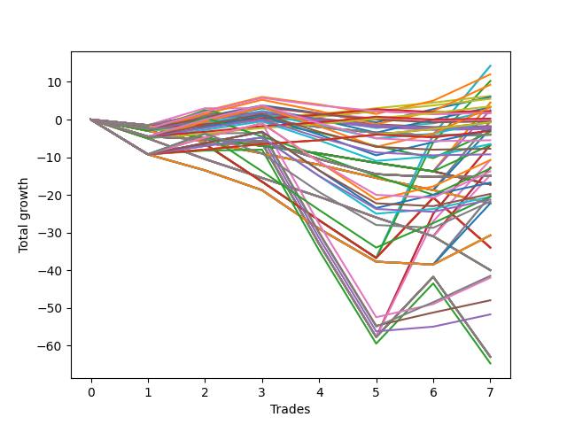

# Short Wallace Doodle 019 
- Symbol: ES90d5m30m
- Date Range: 03/18/2022 - 07/08/2022
- Trading Period: 7:20-12:30
- Number of Trades: 7



| Name | Win Percent | Profit | Avg Profit / Trade | Avg Time / Trade |      | Name | Win Percent | Profit | Avg Profit / Trade | Avg Time / Trade |
| ---- | ----------- | ------ | ------------------ | ---------------- | ---- | ---- | ----------- | ------ | ------------------ | ---------------- |
| Sorted By <br> Profit | | | | | | Sorted By <br> Win Percentage ||||
| Fifty-Nine | 42.86 | 7125.00 | 1017.86 | 00:00 |     | Ninety-One | 85.71 | 3125.00 | 446.43 | 00:00 |
| Fifty-Six | 42.86 | 7125.00 | 1017.86 | 00:00 |     | One Hundred One | 85.71 | 2750.00 | 392.86 | 00:00 |
| Ninety-Four | 57.14 | 6000.00 | 857.14 | 00:00 |     | One Hundred Eleven | 85.71 | 1750.00 | 250.00 | 00:00 |
| Sixty-Two | 42.86 | 5125.00 | 732.14 | 00:00 |     | One Hundred Twenty-One | 85.71 | -375.00 | -53.57 | 00:00 |
| One Hundred Four | 57.14 | 4625.00 | 660.71 | 00:00 |     | Eighty-One | 85.71 | -375.00 | -53.57 | 00:00 |
| Ninety-One | 85.71 | 3125.00 | 446.43 | 00:00 |     | One Hundred Six | 71.43 | 1125.00 | 160.71 | 00:00 |
| Ninety-Three | 57.14 | 3000.00 | 428.57 | 00:00 |     | One Hundred Sixteen | 71.43 | 125.00 | 17.86 | 00:00 |
| One Hundred One | 85.71 | 2750.00 | 392.86 | 00:00 |     | One Hundred Twenty-Six | 71.43 | -1500.00 | -214.29 | 00:00 |
| Eleven | 14.29 | 2250.00 | 321.43 | 00:00 |     | Ninety-Four | 57.14 | 6000.00 | 857.14 | 00:00 |
| Eight | 14.29 | 2250.00 | 321.43 | 00:00 |     | One Hundred Four | 57.14 | 4625.00 | 660.71 | 00:00 |
| One Hundred Eleven | 85.71 | 1750.00 | 250.00 | 00:00 |     | Ninety-Three | 57.14 | 3000.00 | 428.57 | 00:00 |
| One Hundred Fourteen | 57.14 | 1625.00 | 232.14 | 00:00 |     | One Hundred Fourteen | 57.14 | 1625.00 | 232.14 | 00:00 |
| One Hundred Three | 57.14 | 1625.00 | 232.14 | 00:00 |     | One Hundred Three | 57.14 | 1625.00 | 232.14 | 00:00 |
| Fourteen | 14.29 | 1250.00 | 178.57 | 00:00 |     | Ninety-Two | 57.14 | 1125.00 | 160.71 | 00:00 |
| One Hundred Six | 71.43 | 1125.00 | 160.71 | 00:00 |     | Ninety-Six | 57.14 | 875.00 | 125.00 | 00:00 |
| Ninety-Two | 57.14 | 1125.00 | 160.71 | 00:00 |     | One Hundred Two | 57.14 | -250.00 | -35.71 | 00:00 |
| Ninety-Six | 57.14 | 875.00 | 125.00 | 00:00 |     | One Hundred Thirteen | 57.14 | -1375.00 | -196.43 | 00:00 |
| One Hundred Nine | 42.86 | 875.00 | 125.00 | 00:00 |     | One Hundred Twelve | 57.14 | -3250.00 | -464.29 | 00:00 |
| One Hundred Sixteen | 71.43 | 125.00 | 17.86 | 00:00 |     | Three | 57.14 | -3375.00 | -482.14 | 00:00 |
| Ninety-Nine | 28.57 | -125.00 | -17.86 | 00:00 |     | Zero | 57.14 | -3375.00 | -482.14 | 00:00 |
| One Hundred Two | 57.14 | -250.00 | -35.71 | 00:00 |     | One Hundred Twenty-Four | 57.14 | -5375.00 | -767.86 | 00:00 |
| One Hundred Eight | 42.86 | -250.00 | -35.71 | 00:00 |     | Six | 57.14 | -5375.00 | -767.86 | 00:00 |
| twenty-Seven | 14.29 | -250.00 | -35.71 | 00:00 |     | One Hundred Twenty-Three | 57.14 | -8375.00 | -1196.43 | 00:00 |
| Twenty-Four | 14.29 | -250.00 | -35.71 | 00:00 |     | One Hundred Twenty-Two | 57.14 | -10250.00 | -1464.29 | 00:00 |
| One Hundred Twenty-One | 85.71 | -375.00 | -53.57 | 00:00 |     | Eighty-Five | 57.14 | -20750.00 | -2964.29 | 00:00 |
| Eighty-One | 85.71 | -375.00 | -53.57 | 00:00 |     | Eighty-Four | 57.14 | -21000.00 | -3000.00 | 00:00 |
| Ninety-Eight | 28.57 | -875.00 | -125.00 | 00:00 |     | Eighty-Three | 57.14 | -24000.00 | -3428.57 | 00:00 |
| One Hundred Seven | 42.86 | -1000.00 | -142.86 | 00:00 |     | Eighty-Two | 57.14 | -25875.00 | -3696.43 | 00:00 |
| One Hundred | 28.57 | -1000.00 | -142.86 | 00:00 |     | Fifty-Nine | 42.86 | 7125.00 | 1017.86 | 00:00 |
| Twenty-Three | 28.57 | -1000.00 | -142.86 | 00:00 |     | Fifty-Six | 42.86 | 7125.00 | 1017.86 | 00:00 |
| Twenty-Two | 28.57 | -1000.00 | -142.86 | 00:00 |     | Sixty-Two | 42.86 | 5125.00 | 732.14 | 00:00 |
| Twenty-One | 28.57 | -1000.00 | -142.86 | 00:00 |     | One Hundred Nine | 42.86 | 875.00 | 125.00 | 00:00 |
| Twenty | 28.57 | -1000.00 | -142.86 | 00:00 |     | One Hundred Eight | 42.86 | -250.00 | -35.71 | 00:00 |
| Nineteen | 28.57 | -1000.00 | -142.86 | 00:00 |     | One Hundred Seven | 42.86 | -1000.00 | -142.86 | 00:00 |
| Eighteen | 28.57 | -1000.00 | -142.86 | 00:00 |     | One Hundred Ten | 42.86 | -2000.00 | -285.71 | 00:00 |
| Seventeen | 28.57 | -1000.00 | -142.86 | 00:00 |     | Thirty-Nine | 42.86 | -2000.00 | -285.71 | 00:00 |
| Sixten | 28.57 | -1000.00 | -142.86 | 00:00 |     | Thirty-Eight | 42.86 | -2000.00 | -285.71 | 00:00 |
| Ninety-Seven | 28.57 | -1250.00 | -178.57 | 00:00 |     | Thirty-Seven | 42.86 | -2000.00 | -285.71 | 00:00 |
| Thirty | 14.29 | -1250.00 | -178.57 | 00:00 |     | Thirty-Six | 42.86 | -2000.00 | -285.71 | 00:00 |
| One Hundred Thirteen | 57.14 | -1375.00 | -196.43 | 00:00 |     | Thirty-Five | 42.86 | -2000.00 | -285.71 | 00:00 |
| One Hundred Twenty-Six | 71.43 | -1500.00 | -214.29 | 00:00 |     | Thirty-Four | 42.86 | -2000.00 | -285.71 | 00:00 |
| One Hundred Five | 28.57 | -1625.00 | -232.14 | 00:00 |     | Thirty-Three | 42.86 | -2000.00 | -285.71 | 00:00 |
| One Hundred Ten | 42.86 | -2000.00 | -285.71 | 00:00 |     | Thirty-Two | 42.86 | -2000.00 | -285.71 | 00:00 |
| Thirty-Nine | 42.86 | -2000.00 | -285.71 | 00:00 |     | One Hundred Ninteen | 42.86 | -2750.00 | -392.86 | 00:00 |
| Thirty-Eight | 42.86 | -2000.00 | -285.71 | 00:00 |     | One Hundred Eighteen | 42.86 | -3875.00 | -553.57 | 00:00 |
| Thirty-Seven | 42.86 | -2000.00 | -285.71 | 00:00 |     | One Hundred Seventeen | 42.86 | -4625.00 | -660.71 | 00:00 |
| Thirty-Six | 42.86 | -2000.00 | -285.71 | 00:00 |     | One Hundred Twenty-Nine | 42.86 | -6875.00 | -982.14 | 00:00 |
| Thirty-Five | 42.86 | -2000.00 | -285.71 | 00:00 |     | One Hundred Twenty-Eight | 42.86 | -9875.00 | -1410.71 | 00:00 |
| Thirty-Four | 42.86 | -2000.00 | -285.71 | 00:00 |     | One Hundred Twenty-Five | 42.86 | -10250.00 | -1464.29 | 00:00 |
| Thirty-Three | 42.86 | -2000.00 | -285.71 | 00:00 |     | One Hundred Twenty-Seven | 42.86 | -10625.00 | -1517.86 | 00:00 |
| Thirty-Two | 42.86 | -2000.00 | -285.71 | 00:00 |     | Seven | 42.86 | -31500.00 | -4500.00 | 00:00 |
| One Hundred Ninteen | 42.86 | -2750.00 | -392.86 | 00:00 |     | Five | 42.86 | -31500.00 | -4500.00 | 00:00 |
| One Hundred Twelve | 57.14 | -3250.00 | -464.29 | 00:00 |     | Four | 42.86 | -31500.00 | -4500.00 | 00:00 |
| Three | 57.14 | -3375.00 | -482.14 | 00:00 |     | Two | 42.86 | -31500.00 | -4500.00 | 00:00 |
| Zero | 57.14 | -3375.00 | -482.14 | 00:00 |     | One | 42.86 | -31500.00 | -4500.00 | 00:00 |
| Ninety-Five | 14.29 | -3375.00 | -482.14 | 00:00 |     | Seventy-Three | 42.86 | -32375.00 | -4625.00 | 00:00 |
| One Hundred Eighteen | 42.86 | -3875.00 | -553.57 | 00:00 |     | Ninety-Nine | 28.57 | -125.00 | -17.86 | 00:00 |
| One Hundred Seventeen | 42.86 | -4625.00 | -660.71 | 00:00 |     | Ninety-Eight | 28.57 | -875.00 | -125.00 | 00:00 |
| One Hundred Twenty-Four | 57.14 | -5375.00 | -767.86 | 00:00 |     | One Hundred | 28.57 | -1000.00 | -142.86 | 00:00 |
| Six | 57.14 | -5375.00 | -767.86 | 00:00 |     | Twenty-Three | 28.57 | -1000.00 | -142.86 | 00:00 |
| Forty-Three | 14.29 | -6375.00 | -910.71 | 00:00 |     | Twenty-Two | 28.57 | -1000.00 | -142.86 | 00:00 |
| Forty | 14.29 | -6375.00 | -910.71 | 00:00 |     | Twenty-One | 28.57 | -1000.00 | -142.86 | 00:00 |
| One Hundred Fifteen | 28.57 | -6500.00 | -928.57 | 00:00 |     | Twenty | 28.57 | -1000.00 | -142.86 | 00:00 |
| One Hundred Twenty-Nine | 42.86 | -6875.00 | -982.14 | 00:00 |     | Nineteen | 28.57 | -1000.00 | -142.86 | 00:00 |
| Forty-Six | 14.29 | -7375.00 | -1053.57 | 00:00 |     | Eighteen | 28.57 | -1000.00 | -142.86 | 00:00 |
| One Hundred Twenty | 14.29 | -7500.00 | -1071.43 | 00:00 |     | Seventeen | 28.57 | -1000.00 | -142.86 | 00:00 |
| Fifty-Five | 14.29 | -7500.00 | -1071.43 | 00:00 |     | Sixten | 28.57 | -1000.00 | -142.86 | 00:00 |
| Fifty-Four | 14.29 | -7500.00 | -1071.43 | 00:00 |     | Ninety-Seven | 28.57 | -1250.00 | -178.57 | 00:00 |
| Fifty-Three | 14.29 | -7500.00 | -1071.43 | 00:00 |     | One Hundred Five | 28.57 | -1625.00 | -232.14 | 00:00 |
| Fifty-Two | 14.29 | -7500.00 | -1071.43 | 00:00 |     | One Hundred Fifteen | 28.57 | -6500.00 | -928.57 | 00:00 |
| Fifty-One | 14.29 | -7500.00 | -1071.43 | 00:00 |     | One Hundred Thirty | 28.57 | -10875.00 | -1553.57 | 00:00 |
| Fifty | 14.29 | -7500.00 | -1071.43 | 00:00 |     | Sixty-Three | 28.57 | -17000.00 | -2428.57 | 00:00 |
| Forty-Nine | 14.29 | -7500.00 | -1071.43 | 00:00 |     | Sixty-One | 28.57 | -17000.00 | -2428.57 | 00:00 |
| Forty-Eight | 14.29 | -7500.00 | -1071.43 | 00:00 |     | Sixty | 28.57 | -17000.00 | -2428.57 | 00:00 |
| One Hundred Twenty-Three | 57.14 | -8375.00 | -1196.43 | 00:00 |     | Fifty-Eight | 28.57 | -17000.00 | -2428.57 | 00:00 |
| Fifteen | 0.00 | -8625.00 | -1232.14 | 00:00 |     | Fifty-Seven | 28.57 | -17000.00 | -2428.57 | 00:00 |
| Thirteen | 0.00 | -8625.00 | -1232.14 | 00:00 |     | Eleven | 14.29 | 2250.00 | 321.43 | 00:00 |
| Twelve | 0.00 | -8625.00 | -1232.14 | 00:00 |     | Eight | 14.29 | 2250.00 | 321.43 | 00:00 |
| Ten | 0.00 | -8625.00 | -1232.14 | 00:00 |     | Fourteen | 14.29 | 1250.00 | 178.57 | 00:00 |
| Nine | 0.00 | -8625.00 | -1232.14 | 00:00 |     | twenty-Seven | 14.29 | -250.00 | -35.71 | 00:00 |
| One Hundred Twenty-Eight | 42.86 | -9875.00 | -1410.71 | 00:00 |     | Twenty-Four | 14.29 | -250.00 | -35.71 | 00:00 |
| Sixty-Seven | 14.29 | -10125.00 | -1446.43 | 00:00 |     | Thirty | 14.29 | -1250.00 | -178.57 | 00:00 |
| Sixty-Four | 14.29 | -10125.00 | -1446.43 | 00:00 |     | Ninety-Five | 14.29 | -3375.00 | -482.14 | 00:00 |
| One Hundred Twenty-Two | 57.14 | -10250.00 | -1464.29 | 00:00 |     | Forty-Three | 14.29 | -6375.00 | -910.71 | 00:00 |
| One Hundred Twenty-Five | 42.86 | -10250.00 | -1464.29 | 00:00 |     | Forty | 14.29 | -6375.00 | -910.71 | 00:00 |
| One Hundred Twenty-Seven | 42.86 | -10625.00 | -1517.86 | 00:00 |     | Forty-Six | 14.29 | -7375.00 | -1053.57 | 00:00 |
| One Hundred Thirty | 28.57 | -10875.00 | -1553.57 | 00:00 |     | One Hundred Twenty | 14.29 | -7500.00 | -1071.43 | 00:00 |
| Seventy | 14.29 | -11125.00 | -1589.29 | 00:00 |     | Fifty-Five | 14.29 | -7500.00 | -1071.43 | 00:00 |
| Thirty-One | 0.00 | -11125.00 | -1589.29 | 00:00 |     | Fifty-Four | 14.29 | -7500.00 | -1071.43 | 00:00 |
| Twenty-Nine | 0.00 | -11125.00 | -1589.29 | 00:00 |     | Fifty-Three | 14.29 | -7500.00 | -1071.43 | 00:00 |
| Twenty-Eight | 0.00 | -11125.00 | -1589.29 | 00:00 |     | Fifty-Two | 14.29 | -7500.00 | -1071.43 | 00:00 |
| Twenty-Six | 0.00 | -11125.00 | -1589.29 | 00:00 |     | Fifty-One | 14.29 | -7500.00 | -1071.43 | 00:00 |
| Twenty-Five | 0.00 | -11125.00 | -1589.29 | 00:00 |     | Fifty | 14.29 | -7500.00 | -1071.43 | 00:00 |
| Seventy-One | 14.29 | -15375.00 | -2196.43 | 00:00 |     | Forty-Nine | 14.29 | -7500.00 | -1071.43 | 00:00 |
| Sixty-Nine | 14.29 | -15375.00 | -2196.43 | 00:00 |     | Forty-Eight | 14.29 | -7500.00 | -1071.43 | 00:00 |
| Sixty-Eight | 14.29 | -15375.00 | -2196.43 | 00:00 |     | Sixty-Seven | 14.29 | -10125.00 | -1446.43 | 00:00 |
| Sixty-Six | 14.29 | -15375.00 | -2196.43 | 00:00 |     | Sixty-Four | 14.29 | -10125.00 | -1446.43 | 00:00 |
| Sixty-Five | 14.29 | -15375.00 | -2196.43 | 00:00 |     | Seventy | 14.29 | -11125.00 | -1589.29 | 00:00 |
| Sixty-Three | 28.57 | -17000.00 | -2428.57 | 00:00 |     | Seventy-One | 14.29 | -15375.00 | -2196.43 | 00:00 |
| Sixty-One | 28.57 | -17000.00 | -2428.57 | 00:00 |     | Sixty-Nine | 14.29 | -15375.00 | -2196.43 | 00:00 |
| Sixty | 28.57 | -17000.00 | -2428.57 | 00:00 |     | Sixty-Eight | 14.29 | -15375.00 | -2196.43 | 00:00 |
| Fifty-Eight | 28.57 | -17000.00 | -2428.57 | 00:00 |     | Sixty-Six | 14.29 | -15375.00 | -2196.43 | 00:00 |
| Fifty-Seven | 28.57 | -17000.00 | -2428.57 | 00:00 |     | Sixty-Five | 14.29 | -15375.00 | -2196.43 | 00:00 |
| Forty-Seven | 0.00 | -20000.00 | -2857.14 | 00:00 |     | Fifteen | 0.00 | -8625.00 | -1232.14 | 00:00 |
| Forty-Five | 0.00 | -20000.00 | -2857.14 | 00:00 |     | Thirteen | 0.00 | -8625.00 | -1232.14 | 00:00 |
| Forty-Four | 0.00 | -20000.00 | -2857.14 | 00:00 |     | Twelve | 0.00 | -8625.00 | -1232.14 | 00:00 |
| Forty-Two | 0.00 | -20000.00 | -2857.14 | 00:00 |     | Ten | 0.00 | -8625.00 | -1232.14 | 00:00 |
| Forty-One | 0.00 | -20000.00 | -2857.14 | 00:00 |     | Nine | 0.00 | -8625.00 | -1232.14 | 00:00 |
| Eighty-Five | 57.14 | -20750.00 | -2964.29 | 00:00 |     | Thirty-One | 0.00 | -11125.00 | -1589.29 | 00:00 |
| Eighty-Four | 57.14 | -21000.00 | -3000.00 | 00:00 |     | Twenty-Nine | 0.00 | -11125.00 | -1589.29 | 00:00 |
| Eighty-Three | 57.14 | -24000.00 | -3428.57 | 00:00 |     | Twenty-Eight | 0.00 | -11125.00 | -1589.29 | 00:00 |
| Eighty-Two | 57.14 | -25875.00 | -3696.43 | 00:00 |     | Twenty-Six | 0.00 | -11125.00 | -1589.29 | 00:00 |
| Seven | 42.86 | -31500.00 | -4500.00 | 00:00 |     | Twenty-Five | 0.00 | -11125.00 | -1589.29 | 00:00 |
| Five | 42.86 | -31500.00 | -4500.00 | 00:00 |     | Forty-Seven | 0.00 | -20000.00 | -2857.14 | 00:00 |
| Four | 42.86 | -31500.00 | -4500.00 | 00:00 |     | Forty-Five | 0.00 | -20000.00 | -2857.14 | 00:00 |
| Two | 42.86 | -31500.00 | -4500.00 | 00:00 |     | Forty-Four | 0.00 | -20000.00 | -2857.14 | 00:00 |
| One | 42.86 | -31500.00 | -4500.00 | 00:00 |     | Forty-Two | 0.00 | -20000.00 | -2857.14 | 00:00 |
| Seventy-Three | 42.86 | -32375.00 | -4625.00 | 00:00 |     | Forty-One | 0.00 | -20000.00 | -2857.14 | 00:00 |

## NO STOPLOSS

### Test Zero
* Sell when price hits the middle line of the 20p bollinger
* No Stoploss
* Results:
```
Total Trades: 7
Percent Up: 42.86
Percent Down: 57.14
Total Points Moved Down: -6.75
Potential Profit: -3375.00
Total Points Ups: 60.75 Count Ups: 3
Total Points Downs: 54.00 Count Downs: 4
```

<details><summary>Trades</summary>

<code>In: 2022-03-28 12:05:00		Out: 2022-03-28 12:34:55		Total Position Time: 29:55		Total Move Down: -9.25		Total to Date: -9.25</code> <br />
<code>In: 2022-04-07 11:05:00		Out: 2022-04-07 11:34:55		Total Position Time: 29:55		Total Move Down: 2.75		Total to Date: -6.50</code> <br />
<code>In: 2022-05-04 09:45:00		Out: 2022-05-04 10:14:55		Total Position Time: 29:55		Total Move Down: 0.25		Total to Date: -6.25</code> <br />
<code>In: 2022-05-25 11:40:00		Out: 2022-05-25 12:09:55		Total Position Time: 29:55		Total Move Down: -26.75		Total to Date: -33.00</code> <br />
<code>In: 2022-05-25 11:45:00		Out: 2022-05-25 12:14:55		Total Position Time: 29:55		Total Move Down: -24.75		Total to Date: -57.75</code> <br />
<code>In: 2022-06-15 11:50:00		Out: 2022-06-15 11:58:10		Total Position Time: 08:10		Total Move Down: 32.75		Total to Date: -25.00</code> <br />
<code>In: 2022-06-15 11:55:00		Out: 2022-06-15 11:58:10		Total Position Time: 03:10		Total Move Down: 18.25		Total to Date: -6.75</code> <br />


</details>

### Test One
* Sell when the price hits the upper line of the 20p 1std bollinger
* No Stoploss
* Results:
```
Total Trades: 7
Percent Up: 57.14
Percent Down: 42.86
Total Points Moved Down: -63.00
Potential Profit: -31500.00
Total Points Ups: 82.00 Count Ups: 4
Total Points Downs: 19.00 Count Downs: 3
```

<details><summary>Trades</summary>

<code>In: 2022-03-28 12:05:00		Out: 2022-03-28 12:34:55		Total Position Time: 29:55		Total Move Down: -9.25		Total to Date: -9.25</code> <br />
<code>In: 2022-04-07 11:05:00		Out: 2022-04-07 11:34:55		Total Position Time: 29:55		Total Move Down: 2.75		Total to Date: -6.50</code> <br />
<code>In: 2022-05-04 09:45:00		Out: 2022-05-04 10:14:55		Total Position Time: 29:55		Total Move Down: 0.25		Total to Date: -6.25</code> <br />
<code>In: 2022-05-25 11:40:00		Out: 2022-05-25 12:09:55		Total Position Time: 29:55		Total Move Down: -26.75		Total to Date: -33.00</code> <br />
<code>In: 2022-05-25 11:45:00		Out: 2022-05-25 12:14:55		Total Position Time: 29:55		Total Move Down: -24.75		Total to Date: -57.75</code> <br />
<code>In: 2022-06-15 11:50:00		Out: 2022-06-15 12:19:55		Total Position Time: 29:55		Total Move Down: 16.00		Total to Date: -41.75</code> <br />
<code>In: 2022-06-15 11:55:00		Out: 2022-06-15 12:24:55		Total Position Time: 29:55		Total Move Down: -21.25		Total to Date: -63.00</code> <br />


</details>

### Test Two
* Sell when the price hits the upper line of the 20p 2std bollinger
* No Stoploss
* Results:
```
Total Trades: 7
Percent Up: 57.14
Percent Down: 42.86
Total Points Moved Down: -63.00
Potential Profit: -31500.00
Total Points Ups: 82.00 Count Ups: 4
Total Points Downs: 19.00 Count Downs: 3
```

<details><summary>Trades</summary>

<code>In: 2022-03-28 12:05:00		Out: 2022-03-28 12:34:55		Total Position Time: 29:55		Total Move Down: -9.25		Total to Date: -9.25</code> <br />
<code>In: 2022-04-07 11:05:00		Out: 2022-04-07 11:34:55		Total Position Time: 29:55		Total Move Down: 2.75		Total to Date: -6.50</code> <br />
<code>In: 2022-05-04 09:45:00		Out: 2022-05-04 10:14:55		Total Position Time: 29:55		Total Move Down: 0.25		Total to Date: -6.25</code> <br />
<code>In: 2022-05-25 11:40:00		Out: 2022-05-25 12:09:55		Total Position Time: 29:55		Total Move Down: -26.75		Total to Date: -33.00</code> <br />
<code>In: 2022-05-25 11:45:00		Out: 2022-05-25 12:14:55		Total Position Time: 29:55		Total Move Down: -24.75		Total to Date: -57.75</code> <br />
<code>In: 2022-06-15 11:50:00		Out: 2022-06-15 12:19:55		Total Position Time: 29:55		Total Move Down: 16.00		Total to Date: -41.75</code> <br />
<code>In: 2022-06-15 11:55:00		Out: 2022-06-15 12:24:55		Total Position Time: 29:55		Total Move Down: -21.25		Total to Date: -63.00</code> <br />


</details>

### Test Three
* Sell when price hits the middle line of the 50p bollinger
* No Stoploss
* Results:
```
Total Trades: 7
Percent Up: 42.86
Percent Down: 57.14
Total Points Moved Down: -6.75
Potential Profit: -3375.00
Total Points Ups: 60.75 Count Ups: 3
Total Points Downs: 54.00 Count Downs: 4
```

<details><summary>Trades</summary>

<code>In: 2022-03-28 12:05:00		Out: 2022-03-28 12:34:55		Total Position Time: 29:55		Total Move Down: -9.25		Total to Date: -9.25</code> <br />
<code>In: 2022-04-07 11:05:00		Out: 2022-04-07 11:34:55		Total Position Time: 29:55		Total Move Down: 2.75		Total to Date: -6.50</code> <br />
<code>In: 2022-05-04 09:45:00		Out: 2022-05-04 10:14:55		Total Position Time: 29:55		Total Move Down: 0.25		Total to Date: -6.25</code> <br />
<code>In: 2022-05-25 11:40:00		Out: 2022-05-25 12:09:55		Total Position Time: 29:55		Total Move Down: -26.75		Total to Date: -33.00</code> <br />
<code>In: 2022-05-25 11:45:00		Out: 2022-05-25 12:14:55		Total Position Time: 29:55		Total Move Down: -24.75		Total to Date: -57.75</code> <br />
<code>In: 2022-06-15 11:50:00		Out: 2022-06-15 11:58:10		Total Position Time: 08:10		Total Move Down: 32.75		Total to Date: -25.00</code> <br />
<code>In: 2022-06-15 11:55:00		Out: 2022-06-15 11:58:10		Total Position Time: 03:10		Total Move Down: 18.25		Total to Date: -6.75</code> <br />


</details>

### Test Four
* Sell when the price hits the upper line of the 50p 1std bollinger
* No Stoploss
* Results:
```
Total Trades: 7
Percent Up: 57.14
Percent Down: 42.86
Total Points Moved Down: -63.00
Potential Profit: -31500.00
Total Points Ups: 82.00 Count Ups: 4
Total Points Downs: 19.00 Count Downs: 3
```

<details><summary>Trades</summary>

<code>In: 2022-03-28 12:05:00		Out: 2022-03-28 12:34:55		Total Position Time: 29:55		Total Move Down: -9.25		Total to Date: -9.25</code> <br />
<code>In: 2022-04-07 11:05:00		Out: 2022-04-07 11:34:55		Total Position Time: 29:55		Total Move Down: 2.75		Total to Date: -6.50</code> <br />
<code>In: 2022-05-04 09:45:00		Out: 2022-05-04 10:14:55		Total Position Time: 29:55		Total Move Down: 0.25		Total to Date: -6.25</code> <br />
<code>In: 2022-05-25 11:40:00		Out: 2022-05-25 12:09:55		Total Position Time: 29:55		Total Move Down: -26.75		Total to Date: -33.00</code> <br />
<code>In: 2022-05-25 11:45:00		Out: 2022-05-25 12:14:55		Total Position Time: 29:55		Total Move Down: -24.75		Total to Date: -57.75</code> <br />
<code>In: 2022-06-15 11:50:00		Out: 2022-06-15 12:19:55		Total Position Time: 29:55		Total Move Down: 16.00		Total to Date: -41.75</code> <br />
<code>In: 2022-06-15 11:55:00		Out: 2022-06-15 12:24:55		Total Position Time: 29:55		Total Move Down: -21.25		Total to Date: -63.00</code> <br />


</details>

### Test Five
* Sell when the price hits the upper line of the 50p 2std bollinger
* No Stoploss
* Results:
```
Total Trades: 7
Percent Up: 57.14
Percent Down: 42.86
Total Points Moved Down: -63.00
Potential Profit: -31500.00
Total Points Ups: 82.00 Count Ups: 4
Total Points Downs: 19.00 Count Downs: 3
```

<details><summary>Trades</summary>

<code>In: 2022-03-28 12:05:00		Out: 2022-03-28 12:34:55		Total Position Time: 29:55		Total Move Down: -9.25		Total to Date: -9.25</code> <br />
<code>In: 2022-04-07 11:05:00		Out: 2022-04-07 11:34:55		Total Position Time: 29:55		Total Move Down: 2.75		Total to Date: -6.50</code> <br />
<code>In: 2022-05-04 09:45:00		Out: 2022-05-04 10:14:55		Total Position Time: 29:55		Total Move Down: 0.25		Total to Date: -6.25</code> <br />
<code>In: 2022-05-25 11:40:00		Out: 2022-05-25 12:09:55		Total Position Time: 29:55		Total Move Down: -26.75		Total to Date: -33.00</code> <br />
<code>In: 2022-05-25 11:45:00		Out: 2022-05-25 12:14:55		Total Position Time: 29:55		Total Move Down: -24.75		Total to Date: -57.75</code> <br />
<code>In: 2022-06-15 11:50:00		Out: 2022-06-15 12:19:55		Total Position Time: 29:55		Total Move Down: 16.00		Total to Date: -41.75</code> <br />
<code>In: 2022-06-15 11:55:00		Out: 2022-06-15 12:24:55		Total Position Time: 29:55		Total Move Down: -21.25		Total to Date: -63.00</code> <br />


</details>

### Test Six
* Sell when the price hits the middle line of the 1std VWAP
* No Stoploss
* Results:
```
Total Trades: 7
Percent Up: 42.86
Percent Down: 57.14
Total Points Moved Down: -10.75
Potential Profit: -5375.00
Total Points Ups: 60.75 Count Ups: 3
Total Points Downs: 50.00 Count Downs: 4
```

<details><summary>Trades</summary>

<code>In: 2022-03-28 12:05:00		Out: 2022-03-28 12:34:55		Total Position Time: 29:55		Total Move Down: -9.25		Total to Date: -9.25</code> <br />
<code>In: 2022-04-07 11:05:00		Out: 2022-04-07 11:34:55		Total Position Time: 29:55		Total Move Down: 2.75		Total to Date: -6.50</code> <br />
<code>In: 2022-05-04 09:45:00		Out: 2022-05-04 10:14:55		Total Position Time: 29:55		Total Move Down: 0.25		Total to Date: -6.25</code> <br />
<code>In: 2022-05-25 11:40:00		Out: 2022-05-25 12:09:55		Total Position Time: 29:55		Total Move Down: -26.75		Total to Date: -33.00</code> <br />
<code>In: 2022-05-25 11:45:00		Out: 2022-05-25 12:14:55		Total Position Time: 29:55		Total Move Down: -24.75		Total to Date: -57.75</code> <br />
<code>In: 2022-06-15 11:50:00		Out: 2022-06-15 11:57:55		Total Position Time: 07:55		Total Move Down: 30.75		Total to Date: -27.00</code> <br />
<code>In: 2022-06-15 11:55:00		Out: 2022-06-15 11:57:55		Total Position Time: 02:55		Total Move Down: 16.25		Total to Date: -10.75</code> <br />


</details>

### Test Seven
* Sell when the price hits the upper line of the 1std VWAP
* No Stoploss
* Results:
```
Total Trades: 7
Percent Up: 57.14
Percent Down: 42.86
Total Points Moved Down: -63.00
Potential Profit: -31500.00
Total Points Ups: 82.00 Count Ups: 4
Total Points Downs: 19.00 Count Downs: 3
```

<details><summary>Trades</summary>

<code>In: 2022-03-28 12:05:00		Out: 2022-03-28 12:34:55		Total Position Time: 29:55		Total Move Down: -9.25		Total to Date: -9.25</code> <br />
<code>In: 2022-04-07 11:05:00		Out: 2022-04-07 11:34:55		Total Position Time: 29:55		Total Move Down: 2.75		Total to Date: -6.50</code> <br />
<code>In: 2022-05-04 09:45:00		Out: 2022-05-04 10:14:55		Total Position Time: 29:55		Total Move Down: 0.25		Total to Date: -6.25</code> <br />
<code>In: 2022-05-25 11:40:00		Out: 2022-05-25 12:09:55		Total Position Time: 29:55		Total Move Down: -26.75		Total to Date: -33.00</code> <br />
<code>In: 2022-05-25 11:45:00		Out: 2022-05-25 12:14:55		Total Position Time: 29:55		Total Move Down: -24.75		Total to Date: -57.75</code> <br />
<code>In: 2022-06-15 11:50:00		Out: 2022-06-15 12:19:55		Total Position Time: 29:55		Total Move Down: 16.00		Total to Date: -41.75</code> <br />
<code>In: 2022-06-15 11:55:00		Out: 2022-06-15 12:24:55		Total Position Time: 29:55		Total Move Down: -21.25		Total to Date: -63.00</code> <br />


</details>

## STOPLOSS OF 2

### Test Eight
* Sell when price hits the middle line of the 20p bollinger
* Stoploss is -2 points
* Results:
```
Total Trades: 7
Percent Up: 85.71
Percent Down: 14.29
Total Points Moved Down: 4.50
Potential Profit: 2250.00
Total Points Ups: 13.75 Count Ups: 6
Total Points Downs: 18.25 Count Downs: 1
```

<details><summary>Trades</summary>

<code>In: 2022-03-28 12:05:00		Out: 2022-03-28 12:09:35		Total Position Time: 04:35		Total Move Down: -2.25		Total to Date: -2.25</code> <br />
<code>In: 2022-04-07 11:05:00		Out: 2022-04-07 11:14:15		Total Position Time: 09:15		Total Move Down: -2.75		Total to Date: -5.00</code> <br />
<code>In: 2022-05-04 09:45:00		Out: 2022-05-04 09:54:15		Total Position Time: 09:15		Total Move Down: -2.00		Total to Date: -7.00</code> <br />
<code>In: 2022-05-25 11:40:00		Out: 2022-05-25 11:40:30		Total Position Time: 00:30		Total Move Down: -2.00		Total to Date: -9.00</code> <br />
<code>In: 2022-05-25 11:45:00		Out: 2022-05-25 11:45:45		Total Position Time: 00:45		Total Move Down: -2.50		Total to Date: -11.50</code> <br />
<code>In: 2022-06-15 11:50:00		Out: 2022-06-15 11:50:35		Total Position Time: 00:35		Total Move Down: -2.25		Total to Date: -13.75</code> <br />
<code>In: 2022-06-15 11:55:00		Out: 2022-06-15 11:58:10		Total Position Time: 03:10		Total Move Down: 18.25		Total to Date: 4.50</code> <br />


</details>

### Test Nine
* Sell when the price hits the upper line of the 20p 1std bollinger
* Stoploss is -2 points
* Results:
```
Total Trades: 7
Percent Up: 100.00
Percent Down: 0.00
Total Points Moved Down: -17.25
Potential Profit: -8625.00
Total Points Ups: 17.25 Count Ups: 7
Total Points Downs: 0.00 Count Downs: 0
```

<details><summary>Trades</summary>

<code>In: 2022-03-28 12:05:00		Out: 2022-03-28 12:09:35		Total Position Time: 04:35		Total Move Down: -2.25		Total to Date: -2.25</code> <br />
<code>In: 2022-04-07 11:05:00		Out: 2022-04-07 11:14:15		Total Position Time: 09:15		Total Move Down: -2.75		Total to Date: -5.00</code> <br />
<code>In: 2022-05-04 09:45:00		Out: 2022-05-04 09:54:15		Total Position Time: 09:15		Total Move Down: -2.00		Total to Date: -7.00</code> <br />
<code>In: 2022-05-25 11:40:00		Out: 2022-05-25 11:40:30		Total Position Time: 00:30		Total Move Down: -2.00		Total to Date: -9.00</code> <br />
<code>In: 2022-05-25 11:45:00		Out: 2022-05-25 11:45:45		Total Position Time: 00:45		Total Move Down: -2.50		Total to Date: -11.50</code> <br />
<code>In: 2022-06-15 11:50:00		Out: 2022-06-15 11:50:35		Total Position Time: 00:35		Total Move Down: -2.25		Total to Date: -13.75</code> <br />
<code>In: 2022-06-15 11:55:00		Out: 2022-06-15 12:00:50		Total Position Time: 05:50		Total Move Down: -3.50		Total to Date: -17.25</code> <br />


</details>

### Test Ten
* Sell when the price hits the upper line of the 20p 2std bollinger
* Stoploss is -2 points
* Results:
```
Total Trades: 7
Percent Up: 100.00
Percent Down: 0.00
Total Points Moved Down: -17.25
Potential Profit: -8625.00
Total Points Ups: 17.25 Count Ups: 7
Total Points Downs: 0.00 Count Downs: 0
```

<details><summary>Trades</summary>

<code>In: 2022-03-28 12:05:00		Out: 2022-03-28 12:09:35		Total Position Time: 04:35		Total Move Down: -2.25		Total to Date: -2.25</code> <br />
<code>In: 2022-04-07 11:05:00		Out: 2022-04-07 11:14:15		Total Position Time: 09:15		Total Move Down: -2.75		Total to Date: -5.00</code> <br />
<code>In: 2022-05-04 09:45:00		Out: 2022-05-04 09:54:15		Total Position Time: 09:15		Total Move Down: -2.00		Total to Date: -7.00</code> <br />
<code>In: 2022-05-25 11:40:00		Out: 2022-05-25 11:40:30		Total Position Time: 00:30		Total Move Down: -2.00		Total to Date: -9.00</code> <br />
<code>In: 2022-05-25 11:45:00		Out: 2022-05-25 11:45:45		Total Position Time: 00:45		Total Move Down: -2.50		Total to Date: -11.50</code> <br />
<code>In: 2022-06-15 11:50:00		Out: 2022-06-15 11:50:35		Total Position Time: 00:35		Total Move Down: -2.25		Total to Date: -13.75</code> <br />
<code>In: 2022-06-15 11:55:00		Out: 2022-06-15 12:00:50		Total Position Time: 05:50		Total Move Down: -3.50		Total to Date: -17.25</code> <br />


</details>

### Test Eleven
* Sell when price hits the middle line of the 50p bollinger
* Stoploss is -2 points
* Results:
```
Total Trades: 7
Percent Up: 85.71
Percent Down: 14.29
Total Points Moved Down: 4.50
Potential Profit: 2250.00
Total Points Ups: 13.75 Count Ups: 6
Total Points Downs: 18.25 Count Downs: 1
```

<details><summary>Trades</summary>

<code>In: 2022-03-28 12:05:00		Out: 2022-03-28 12:09:35		Total Position Time: 04:35		Total Move Down: -2.25		Total to Date: -2.25</code> <br />
<code>In: 2022-04-07 11:05:00		Out: 2022-04-07 11:14:15		Total Position Time: 09:15		Total Move Down: -2.75		Total to Date: -5.00</code> <br />
<code>In: 2022-05-04 09:45:00		Out: 2022-05-04 09:54:15		Total Position Time: 09:15		Total Move Down: -2.00		Total to Date: -7.00</code> <br />
<code>In: 2022-05-25 11:40:00		Out: 2022-05-25 11:40:30		Total Position Time: 00:30		Total Move Down: -2.00		Total to Date: -9.00</code> <br />
<code>In: 2022-05-25 11:45:00		Out: 2022-05-25 11:45:45		Total Position Time: 00:45		Total Move Down: -2.50		Total to Date: -11.50</code> <br />
<code>In: 2022-06-15 11:50:00		Out: 2022-06-15 11:50:35		Total Position Time: 00:35		Total Move Down: -2.25		Total to Date: -13.75</code> <br />
<code>In: 2022-06-15 11:55:00		Out: 2022-06-15 11:58:10		Total Position Time: 03:10		Total Move Down: 18.25		Total to Date: 4.50</code> <br />


</details>

### Test Twelve
* Sell when the price hits the upper line of the 50p 1std bollinger
* Stoploss is -2 points
* Results:
```
Total Trades: 7
Percent Up: 100.00
Percent Down: 0.00
Total Points Moved Down: -17.25
Potential Profit: -8625.00
Total Points Ups: 17.25 Count Ups: 7
Total Points Downs: 0.00 Count Downs: 0
```

<details><summary>Trades</summary>

<code>In: 2022-03-28 12:05:00		Out: 2022-03-28 12:09:35		Total Position Time: 04:35		Total Move Down: -2.25		Total to Date: -2.25</code> <br />
<code>In: 2022-04-07 11:05:00		Out: 2022-04-07 11:14:15		Total Position Time: 09:15		Total Move Down: -2.75		Total to Date: -5.00</code> <br />
<code>In: 2022-05-04 09:45:00		Out: 2022-05-04 09:54:15		Total Position Time: 09:15		Total Move Down: -2.00		Total to Date: -7.00</code> <br />
<code>In: 2022-05-25 11:40:00		Out: 2022-05-25 11:40:30		Total Position Time: 00:30		Total Move Down: -2.00		Total to Date: -9.00</code> <br />
<code>In: 2022-05-25 11:45:00		Out: 2022-05-25 11:45:45		Total Position Time: 00:45		Total Move Down: -2.50		Total to Date: -11.50</code> <br />
<code>In: 2022-06-15 11:50:00		Out: 2022-06-15 11:50:35		Total Position Time: 00:35		Total Move Down: -2.25		Total to Date: -13.75</code> <br />
<code>In: 2022-06-15 11:55:00		Out: 2022-06-15 12:00:50		Total Position Time: 05:50		Total Move Down: -3.50		Total to Date: -17.25</code> <br />


</details>

### Test Thirteen
* Sell when the price hits the upper line of the 50p 2std bollinger
* Stoploss is -2 points
* Results:
```
Total Trades: 7
Percent Up: 100.00
Percent Down: 0.00
Total Points Moved Down: -17.25
Potential Profit: -8625.00
Total Points Ups: 17.25 Count Ups: 7
Total Points Downs: 0.00 Count Downs: 0
```

<details><summary>Trades</summary>

<code>In: 2022-03-28 12:05:00		Out: 2022-03-28 12:09:35		Total Position Time: 04:35		Total Move Down: -2.25		Total to Date: -2.25</code> <br />
<code>In: 2022-04-07 11:05:00		Out: 2022-04-07 11:14:15		Total Position Time: 09:15		Total Move Down: -2.75		Total to Date: -5.00</code> <br />
<code>In: 2022-05-04 09:45:00		Out: 2022-05-04 09:54:15		Total Position Time: 09:15		Total Move Down: -2.00		Total to Date: -7.00</code> <br />
<code>In: 2022-05-25 11:40:00		Out: 2022-05-25 11:40:30		Total Position Time: 00:30		Total Move Down: -2.00		Total to Date: -9.00</code> <br />
<code>In: 2022-05-25 11:45:00		Out: 2022-05-25 11:45:45		Total Position Time: 00:45		Total Move Down: -2.50		Total to Date: -11.50</code> <br />
<code>In: 2022-06-15 11:50:00		Out: 2022-06-15 11:50:35		Total Position Time: 00:35		Total Move Down: -2.25		Total to Date: -13.75</code> <br />
<code>In: 2022-06-15 11:55:00		Out: 2022-06-15 12:00:50		Total Position Time: 05:50		Total Move Down: -3.50		Total to Date: -17.25</code> <br />


</details>

### Test Fourteen
* Sell when the price hits the middle line of the 1std VWAP
* Stoploss is -2 points
* Results:
```
Total Trades: 7
Percent Up: 85.71
Percent Down: 14.29
Total Points Moved Down: 2.50
Potential Profit: 1250.00
Total Points Ups: 13.75 Count Ups: 6
Total Points Downs: 16.25 Count Downs: 1
```

<details><summary>Trades</summary>

<code>In: 2022-03-28 12:05:00		Out: 2022-03-28 12:09:35		Total Position Time: 04:35		Total Move Down: -2.25		Total to Date: -2.25</code> <br />
<code>In: 2022-04-07 11:05:00		Out: 2022-04-07 11:14:15		Total Position Time: 09:15		Total Move Down: -2.75		Total to Date: -5.00</code> <br />
<code>In: 2022-05-04 09:45:00		Out: 2022-05-04 09:54:15		Total Position Time: 09:15		Total Move Down: -2.00		Total to Date: -7.00</code> <br />
<code>In: 2022-05-25 11:40:00		Out: 2022-05-25 11:40:30		Total Position Time: 00:30		Total Move Down: -2.00		Total to Date: -9.00</code> <br />
<code>In: 2022-05-25 11:45:00		Out: 2022-05-25 11:45:45		Total Position Time: 00:45		Total Move Down: -2.50		Total to Date: -11.50</code> <br />
<code>In: 2022-06-15 11:50:00		Out: 2022-06-15 11:50:35		Total Position Time: 00:35		Total Move Down: -2.25		Total to Date: -13.75</code> <br />
<code>In: 2022-06-15 11:55:00		Out: 2022-06-15 11:57:55		Total Position Time: 02:55		Total Move Down: 16.25		Total to Date: 2.50</code> <br />


</details>

### Test Fifteen
* Sell when the price hits the upper line of the 1std VWAP
* Stoploss is -2 points
* Results:
```
Total Trades: 7
Percent Up: 100.00
Percent Down: 0.00
Total Points Moved Down: -17.25
Potential Profit: -8625.00
Total Points Ups: 17.25 Count Ups: 7
Total Points Downs: 0.00 Count Downs: 0
```

<details><summary>Trades</summary>

<code>In: 2022-03-28 12:05:00		Out: 2022-03-28 12:09:35		Total Position Time: 04:35		Total Move Down: -2.25		Total to Date: -2.25</code> <br />
<code>In: 2022-04-07 11:05:00		Out: 2022-04-07 11:14:15		Total Position Time: 09:15		Total Move Down: -2.75		Total to Date: -5.00</code> <br />
<code>In: 2022-05-04 09:45:00		Out: 2022-05-04 09:54:15		Total Position Time: 09:15		Total Move Down: -2.00		Total to Date: -7.00</code> <br />
<code>In: 2022-05-25 11:40:00		Out: 2022-05-25 11:40:30		Total Position Time: 00:30		Total Move Down: -2.00		Total to Date: -9.00</code> <br />
<code>In: 2022-05-25 11:45:00		Out: 2022-05-25 11:45:45		Total Position Time: 00:45		Total Move Down: -2.50		Total to Date: -11.50</code> <br />
<code>In: 2022-06-15 11:50:00		Out: 2022-06-15 11:50:35		Total Position Time: 00:35		Total Move Down: -2.25		Total to Date: -13.75</code> <br />
<code>In: 2022-06-15 11:55:00		Out: 2022-06-15 12:00:50		Total Position Time: 05:50		Total Move Down: -3.50		Total to Date: -17.25</code> <br />


</details>

## TRAIL STOP OF 2

### Test Sixten
* Sell when price hits the middle line of the 20p bollinger
* Trailing Stop is -2 points
* Results:
```
Total Trades: 7
Percent Up: 71.43
Percent Down: 28.57
Total Points Moved Down: -2.00
Potential Profit: -1000.00
Total Points Ups: 5.00 Count Ups: 5
Total Points Downs: 3.00 Count Downs: 2
```

<details><summary>Trades</summary>

<code>In: 2022-03-28 12:05:00		Out: 2022-03-28 12:09:20		Total Position Time: 04:20		Total Move Down: -1.50		Total to Date: -1.50</code> <br />
<code>In: 2022-04-07 11:05:00		Out: 2022-04-07 11:07:20		Total Position Time: 02:20		Total Move Down: 2.75		Total to Date: 1.25</code> <br />
<code>In: 2022-05-04 09:45:00		Out: 2022-05-04 09:45:10		Total Position Time: 00:10		Total Move Down: -0.00		Total to Date: 1.25</code> <br />
<code>In: 2022-05-25 11:40:00		Out: 2022-05-25 11:40:25		Total Position Time: 00:25		Total Move Down: -1.25		Total to Date: 0.00</code> <br />
<code>In: 2022-05-25 11:45:00		Out: 2022-05-25 11:45:30		Total Position Time: 00:30		Total Move Down: -1.50		Total to Date: -1.50</code> <br />
<code>In: 2022-06-15 11:50:00		Out: 2022-06-15 11:50:10		Total Position Time: 00:10		Total Move Down: -0.75		Total to Date: -2.25</code> <br />
<code>In: 2022-06-15 11:55:00		Out: 2022-06-15 11:55:10		Total Position Time: 00:10		Total Move Down: 0.25		Total to Date: -2.00</code> <br />


</details>

### Test Seventeen
* Sell when the price hits the upper line of the 20p 1std bollinger
* Trailing Stop is -2 points
* Results:
```
Total Trades: 7
Percent Up: 71.43
Percent Down: 28.57
Total Points Moved Down: -2.00
Potential Profit: -1000.00
Total Points Ups: 5.00 Count Ups: 5
Total Points Downs: 3.00 Count Downs: 2
```

<details><summary>Trades</summary>

<code>In: 2022-03-28 12:05:00		Out: 2022-03-28 12:09:20		Total Position Time: 04:20		Total Move Down: -1.50		Total to Date: -1.50</code> <br />
<code>In: 2022-04-07 11:05:00		Out: 2022-04-07 11:07:20		Total Position Time: 02:20		Total Move Down: 2.75		Total to Date: 1.25</code> <br />
<code>In: 2022-05-04 09:45:00		Out: 2022-05-04 09:45:10		Total Position Time: 00:10		Total Move Down: -0.00		Total to Date: 1.25</code> <br />
<code>In: 2022-05-25 11:40:00		Out: 2022-05-25 11:40:25		Total Position Time: 00:25		Total Move Down: -1.25		Total to Date: 0.00</code> <br />
<code>In: 2022-05-25 11:45:00		Out: 2022-05-25 11:45:30		Total Position Time: 00:30		Total Move Down: -1.50		Total to Date: -1.50</code> <br />
<code>In: 2022-06-15 11:50:00		Out: 2022-06-15 11:50:10		Total Position Time: 00:10		Total Move Down: -0.75		Total to Date: -2.25</code> <br />
<code>In: 2022-06-15 11:55:00		Out: 2022-06-15 11:55:10		Total Position Time: 00:10		Total Move Down: 0.25		Total to Date: -2.00</code> <br />


</details>

### Test Eighteen
* Sell when the price hits the upper line of the 20p 2std bollinger
* Trailing Stop is -2 points
* Results:
```
Total Trades: 7
Percent Up: 71.43
Percent Down: 28.57
Total Points Moved Down: -2.00
Potential Profit: -1000.00
Total Points Ups: 5.00 Count Ups: 5
Total Points Downs: 3.00 Count Downs: 2
```

<details><summary>Trades</summary>

<code>In: 2022-03-28 12:05:00		Out: 2022-03-28 12:09:20		Total Position Time: 04:20		Total Move Down: -1.50		Total to Date: -1.50</code> <br />
<code>In: 2022-04-07 11:05:00		Out: 2022-04-07 11:07:20		Total Position Time: 02:20		Total Move Down: 2.75		Total to Date: 1.25</code> <br />
<code>In: 2022-05-04 09:45:00		Out: 2022-05-04 09:45:10		Total Position Time: 00:10		Total Move Down: -0.00		Total to Date: 1.25</code> <br />
<code>In: 2022-05-25 11:40:00		Out: 2022-05-25 11:40:25		Total Position Time: 00:25		Total Move Down: -1.25		Total to Date: 0.00</code> <br />
<code>In: 2022-05-25 11:45:00		Out: 2022-05-25 11:45:30		Total Position Time: 00:30		Total Move Down: -1.50		Total to Date: -1.50</code> <br />
<code>In: 2022-06-15 11:50:00		Out: 2022-06-15 11:50:10		Total Position Time: 00:10		Total Move Down: -0.75		Total to Date: -2.25</code> <br />
<code>In: 2022-06-15 11:55:00		Out: 2022-06-15 11:55:10		Total Position Time: 00:10		Total Move Down: 0.25		Total to Date: -2.00</code> <br />


</details>

### Test Nineteen
* Sell when price hits the middle line of the 50p bollinger
* Trailing Stop is -2 points
* Results:
```
Total Trades: 7
Percent Up: 71.43
Percent Down: 28.57
Total Points Moved Down: -2.00
Potential Profit: -1000.00
Total Points Ups: 5.00 Count Ups: 5
Total Points Downs: 3.00 Count Downs: 2
```

<details><summary>Trades</summary>

<code>In: 2022-03-28 12:05:00		Out: 2022-03-28 12:09:20		Total Position Time: 04:20		Total Move Down: -1.50		Total to Date: -1.50</code> <br />
<code>In: 2022-04-07 11:05:00		Out: 2022-04-07 11:07:20		Total Position Time: 02:20		Total Move Down: 2.75		Total to Date: 1.25</code> <br />
<code>In: 2022-05-04 09:45:00		Out: 2022-05-04 09:45:10		Total Position Time: 00:10		Total Move Down: -0.00		Total to Date: 1.25</code> <br />
<code>In: 2022-05-25 11:40:00		Out: 2022-05-25 11:40:25		Total Position Time: 00:25		Total Move Down: -1.25		Total to Date: 0.00</code> <br />
<code>In: 2022-05-25 11:45:00		Out: 2022-05-25 11:45:30		Total Position Time: 00:30		Total Move Down: -1.50		Total to Date: -1.50</code> <br />
<code>In: 2022-06-15 11:50:00		Out: 2022-06-15 11:50:10		Total Position Time: 00:10		Total Move Down: -0.75		Total to Date: -2.25</code> <br />
<code>In: 2022-06-15 11:55:00		Out: 2022-06-15 11:55:10		Total Position Time: 00:10		Total Move Down: 0.25		Total to Date: -2.00</code> <br />


</details>

### Test Twenty
* Sell when the price hits the upper line of the 50p 1std bollinger
* Trailing Stop is -2 points
* Results:
```
Total Trades: 7
Percent Up: 71.43
Percent Down: 28.57
Total Points Moved Down: -2.00
Potential Profit: -1000.00
Total Points Ups: 5.00 Count Ups: 5
Total Points Downs: 3.00 Count Downs: 2
```

<details><summary>Trades</summary>

<code>In: 2022-03-28 12:05:00		Out: 2022-03-28 12:09:20		Total Position Time: 04:20		Total Move Down: -1.50		Total to Date: -1.50</code> <br />
<code>In: 2022-04-07 11:05:00		Out: 2022-04-07 11:07:20		Total Position Time: 02:20		Total Move Down: 2.75		Total to Date: 1.25</code> <br />
<code>In: 2022-05-04 09:45:00		Out: 2022-05-04 09:45:10		Total Position Time: 00:10		Total Move Down: -0.00		Total to Date: 1.25</code> <br />
<code>In: 2022-05-25 11:40:00		Out: 2022-05-25 11:40:25		Total Position Time: 00:25		Total Move Down: -1.25		Total to Date: 0.00</code> <br />
<code>In: 2022-05-25 11:45:00		Out: 2022-05-25 11:45:30		Total Position Time: 00:30		Total Move Down: -1.50		Total to Date: -1.50</code> <br />
<code>In: 2022-06-15 11:50:00		Out: 2022-06-15 11:50:10		Total Position Time: 00:10		Total Move Down: -0.75		Total to Date: -2.25</code> <br />
<code>In: 2022-06-15 11:55:00		Out: 2022-06-15 11:55:10		Total Position Time: 00:10		Total Move Down: 0.25		Total to Date: -2.00</code> <br />


</details>

### Test Twenty-One
* Sell when the price hits the upper line of the 50p 2std bollinger
* Trailing Stop is -2 points
* Results:
```
Total Trades: 7
Percent Up: 71.43
Percent Down: 28.57
Total Points Moved Down: -2.00
Potential Profit: -1000.00
Total Points Ups: 5.00 Count Ups: 5
Total Points Downs: 3.00 Count Downs: 2
```

<details><summary>Trades</summary>

<code>In: 2022-03-28 12:05:00		Out: 2022-03-28 12:09:20		Total Position Time: 04:20		Total Move Down: -1.50		Total to Date: -1.50</code> <br />
<code>In: 2022-04-07 11:05:00		Out: 2022-04-07 11:07:20		Total Position Time: 02:20		Total Move Down: 2.75		Total to Date: 1.25</code> <br />
<code>In: 2022-05-04 09:45:00		Out: 2022-05-04 09:45:10		Total Position Time: 00:10		Total Move Down: -0.00		Total to Date: 1.25</code> <br />
<code>In: 2022-05-25 11:40:00		Out: 2022-05-25 11:40:25		Total Position Time: 00:25		Total Move Down: -1.25		Total to Date: 0.00</code> <br />
<code>In: 2022-05-25 11:45:00		Out: 2022-05-25 11:45:30		Total Position Time: 00:30		Total Move Down: -1.50		Total to Date: -1.50</code> <br />
<code>In: 2022-06-15 11:50:00		Out: 2022-06-15 11:50:10		Total Position Time: 00:10		Total Move Down: -0.75		Total to Date: -2.25</code> <br />
<code>In: 2022-06-15 11:55:00		Out: 2022-06-15 11:55:10		Total Position Time: 00:10		Total Move Down: 0.25		Total to Date: -2.00</code> <br />


</details>

### Test Twenty-Two
* Sell when the price hits the middle line of the 1std VWAP
* Trailing Stop is -2 points
* Results:
```
Total Trades: 7
Percent Up: 71.43
Percent Down: 28.57
Total Points Moved Down: -2.00
Potential Profit: -1000.00
Total Points Ups: 5.00 Count Ups: 5
Total Points Downs: 3.00 Count Downs: 2
```

<details><summary>Trades</summary>

<code>In: 2022-03-28 12:05:00		Out: 2022-03-28 12:09:20		Total Position Time: 04:20		Total Move Down: -1.50		Total to Date: -1.50</code> <br />
<code>In: 2022-04-07 11:05:00		Out: 2022-04-07 11:07:20		Total Position Time: 02:20		Total Move Down: 2.75		Total to Date: 1.25</code> <br />
<code>In: 2022-05-04 09:45:00		Out: 2022-05-04 09:45:10		Total Position Time: 00:10		Total Move Down: -0.00		Total to Date: 1.25</code> <br />
<code>In: 2022-05-25 11:40:00		Out: 2022-05-25 11:40:25		Total Position Time: 00:25		Total Move Down: -1.25		Total to Date: 0.00</code> <br />
<code>In: 2022-05-25 11:45:00		Out: 2022-05-25 11:45:30		Total Position Time: 00:30		Total Move Down: -1.50		Total to Date: -1.50</code> <br />
<code>In: 2022-06-15 11:50:00		Out: 2022-06-15 11:50:10		Total Position Time: 00:10		Total Move Down: -0.75		Total to Date: -2.25</code> <br />
<code>In: 2022-06-15 11:55:00		Out: 2022-06-15 11:55:10		Total Position Time: 00:10		Total Move Down: 0.25		Total to Date: -2.00</code> <br />


</details>

### Test Twenty-Three
* Sell when the price hits the upper line of the 1std VWAP
* Trailing Stop is -2 points
* Results:
```
Total Trades: 7
Percent Up: 71.43
Percent Down: 28.57
Total Points Moved Down: -2.00
Potential Profit: -1000.00
Total Points Ups: 5.00 Count Ups: 5
Total Points Downs: 3.00 Count Downs: 2
```

<details><summary>Trades</summary>

<code>In: 2022-03-28 12:05:00		Out: 2022-03-28 12:09:20		Total Position Time: 04:20		Total Move Down: -1.50		Total to Date: -1.50</code> <br />
<code>In: 2022-04-07 11:05:00		Out: 2022-04-07 11:07:20		Total Position Time: 02:20		Total Move Down: 2.75		Total to Date: 1.25</code> <br />
<code>In: 2022-05-04 09:45:00		Out: 2022-05-04 09:45:10		Total Position Time: 00:10		Total Move Down: -0.00		Total to Date: 1.25</code> <br />
<code>In: 2022-05-25 11:40:00		Out: 2022-05-25 11:40:25		Total Position Time: 00:25		Total Move Down: -1.25		Total to Date: 0.00</code> <br />
<code>In: 2022-05-25 11:45:00		Out: 2022-05-25 11:45:30		Total Position Time: 00:30		Total Move Down: -1.50		Total to Date: -1.50</code> <br />
<code>In: 2022-06-15 11:50:00		Out: 2022-06-15 11:50:10		Total Position Time: 00:10		Total Move Down: -0.75		Total to Date: -2.25</code> <br />
<code>In: 2022-06-15 11:55:00		Out: 2022-06-15 11:55:10		Total Position Time: 00:10		Total Move Down: 0.25		Total to Date: -2.00</code> <br />


</details>

## STOPLOSS OF 3

### Test Twenty-Four
* Sell when price hits the middle line of the 20p bollinger
* Stoploss is -3 points
* Results:
```
Total Trades: 7
Percent Up: 85.71
Percent Down: 14.29
Total Points Moved Down: -0.50
Potential Profit: -250.00
Total Points Ups: 18.75 Count Ups: 6
Total Points Downs: 18.25 Count Downs: 1
```

<details><summary>Trades</summary>

<code>In: 2022-03-28 12:05:00		Out: 2022-03-28 12:14:25		Total Position Time: 09:25		Total Move Down: -3.00		Total to Date: -3.00</code> <br />
<code>In: 2022-04-07 11:05:00		Out: 2022-04-07 11:26:05		Total Position Time: 21:05		Total Move Down: -3.00		Total to Date: -6.00</code> <br />
<code>In: 2022-05-04 09:45:00		Out: 2022-05-04 09:54:30		Total Position Time: 09:30		Total Move Down: -3.00		Total to Date: -9.00</code> <br />
<code>In: 2022-05-25 11:40:00		Out: 2022-05-25 11:40:35		Total Position Time: 00:35		Total Move Down: -3.00		Total to Date: -12.00</code> <br />
<code>In: 2022-05-25 11:45:00		Out: 2022-05-25 11:47:40		Total Position Time: 02:40		Total Move Down: -3.50		Total to Date: -15.50</code> <br />
<code>In: 2022-06-15 11:50:00		Out: 2022-06-15 11:50:50		Total Position Time: 00:50		Total Move Down: -3.25		Total to Date: -18.75</code> <br />
<code>In: 2022-06-15 11:55:00		Out: 2022-06-15 11:58:10		Total Position Time: 03:10		Total Move Down: 18.25		Total to Date: -0.50</code> <br />


</details>

### Test Twenty-Five
* Sell when the price hits the upper line of the 20p 1std bollinger
* Stoploss is -3 points
* Results:
```
Total Trades: 7
Percent Up: 100.00
Percent Down: 0.00
Total Points Moved Down: -22.25
Potential Profit: -11125.00
Total Points Ups: 22.25 Count Ups: 7
Total Points Downs: 0.00 Count Downs: 0
```

<details><summary>Trades</summary>

<code>In: 2022-03-28 12:05:00		Out: 2022-03-28 12:14:25		Total Position Time: 09:25		Total Move Down: -3.00		Total to Date: -3.00</code> <br />
<code>In: 2022-04-07 11:05:00		Out: 2022-04-07 11:26:05		Total Position Time: 21:05		Total Move Down: -3.00		Total to Date: -6.00</code> <br />
<code>In: 2022-05-04 09:45:00		Out: 2022-05-04 09:54:30		Total Position Time: 09:30		Total Move Down: -3.00		Total to Date: -9.00</code> <br />
<code>In: 2022-05-25 11:40:00		Out: 2022-05-25 11:40:35		Total Position Time: 00:35		Total Move Down: -3.00		Total to Date: -12.00</code> <br />
<code>In: 2022-05-25 11:45:00		Out: 2022-05-25 11:47:40		Total Position Time: 02:40		Total Move Down: -3.50		Total to Date: -15.50</code> <br />
<code>In: 2022-06-15 11:50:00		Out: 2022-06-15 11:50:50		Total Position Time: 00:50		Total Move Down: -3.25		Total to Date: -18.75</code> <br />
<code>In: 2022-06-15 11:55:00		Out: 2022-06-15 12:00:50		Total Position Time: 05:50		Total Move Down: -3.50		Total to Date: -22.25</code> <br />


</details>

### Test Twenty-Six
* Sell when the price hits the upper line of the 20p 2std bollinger
* Stoploss is -3 points
* Results:
```
Total Trades: 7
Percent Up: 100.00
Percent Down: 0.00
Total Points Moved Down: -22.25
Potential Profit: -11125.00
Total Points Ups: 22.25 Count Ups: 7
Total Points Downs: 0.00 Count Downs: 0
```

<details><summary>Trades</summary>

<code>In: 2022-03-28 12:05:00		Out: 2022-03-28 12:14:25		Total Position Time: 09:25		Total Move Down: -3.00		Total to Date: -3.00</code> <br />
<code>In: 2022-04-07 11:05:00		Out: 2022-04-07 11:26:05		Total Position Time: 21:05		Total Move Down: -3.00		Total to Date: -6.00</code> <br />
<code>In: 2022-05-04 09:45:00		Out: 2022-05-04 09:54:30		Total Position Time: 09:30		Total Move Down: -3.00		Total to Date: -9.00</code> <br />
<code>In: 2022-05-25 11:40:00		Out: 2022-05-25 11:40:35		Total Position Time: 00:35		Total Move Down: -3.00		Total to Date: -12.00</code> <br />
<code>In: 2022-05-25 11:45:00		Out: 2022-05-25 11:47:40		Total Position Time: 02:40		Total Move Down: -3.50		Total to Date: -15.50</code> <br />
<code>In: 2022-06-15 11:50:00		Out: 2022-06-15 11:50:50		Total Position Time: 00:50		Total Move Down: -3.25		Total to Date: -18.75</code> <br />
<code>In: 2022-06-15 11:55:00		Out: 2022-06-15 12:00:50		Total Position Time: 05:50		Total Move Down: -3.50		Total to Date: -22.25</code> <br />


</details>

### Test twenty-Seven
* Sell when price hits the middle line of the 50p bollinger
* Stoploss is -3 points
* Results:
```
Total Trades: 7
Percent Up: 85.71
Percent Down: 14.29
Total Points Moved Down: -0.50
Potential Profit: -250.00
Total Points Ups: 18.75 Count Ups: 6
Total Points Downs: 18.25 Count Downs: 1
```

<details><summary>Trades</summary>

<code>In: 2022-03-28 12:05:00		Out: 2022-03-28 12:14:25		Total Position Time: 09:25		Total Move Down: -3.00		Total to Date: -3.00</code> <br />
<code>In: 2022-04-07 11:05:00		Out: 2022-04-07 11:26:05		Total Position Time: 21:05		Total Move Down: -3.00		Total to Date: -6.00</code> <br />
<code>In: 2022-05-04 09:45:00		Out: 2022-05-04 09:54:30		Total Position Time: 09:30		Total Move Down: -3.00		Total to Date: -9.00</code> <br />
<code>In: 2022-05-25 11:40:00		Out: 2022-05-25 11:40:35		Total Position Time: 00:35		Total Move Down: -3.00		Total to Date: -12.00</code> <br />
<code>In: 2022-05-25 11:45:00		Out: 2022-05-25 11:47:40		Total Position Time: 02:40		Total Move Down: -3.50		Total to Date: -15.50</code> <br />
<code>In: 2022-06-15 11:50:00		Out: 2022-06-15 11:50:50		Total Position Time: 00:50		Total Move Down: -3.25		Total to Date: -18.75</code> <br />
<code>In: 2022-06-15 11:55:00		Out: 2022-06-15 11:58:10		Total Position Time: 03:10		Total Move Down: 18.25		Total to Date: -0.50</code> <br />


</details>

### Test Twenty-Eight
* Sell when the price hits the upper line of the 50p 1std bollinger
* Stoploss is -3 points
* Results:
```
Total Trades: 7
Percent Up: 100.00
Percent Down: 0.00
Total Points Moved Down: -22.25
Potential Profit: -11125.00
Total Points Ups: 22.25 Count Ups: 7
Total Points Downs: 0.00 Count Downs: 0
```

<details><summary>Trades</summary>

<code>In: 2022-03-28 12:05:00		Out: 2022-03-28 12:14:25		Total Position Time: 09:25		Total Move Down: -3.00		Total to Date: -3.00</code> <br />
<code>In: 2022-04-07 11:05:00		Out: 2022-04-07 11:26:05		Total Position Time: 21:05		Total Move Down: -3.00		Total to Date: -6.00</code> <br />
<code>In: 2022-05-04 09:45:00		Out: 2022-05-04 09:54:30		Total Position Time: 09:30		Total Move Down: -3.00		Total to Date: -9.00</code> <br />
<code>In: 2022-05-25 11:40:00		Out: 2022-05-25 11:40:35		Total Position Time: 00:35		Total Move Down: -3.00		Total to Date: -12.00</code> <br />
<code>In: 2022-05-25 11:45:00		Out: 2022-05-25 11:47:40		Total Position Time: 02:40		Total Move Down: -3.50		Total to Date: -15.50</code> <br />
<code>In: 2022-06-15 11:50:00		Out: 2022-06-15 11:50:50		Total Position Time: 00:50		Total Move Down: -3.25		Total to Date: -18.75</code> <br />
<code>In: 2022-06-15 11:55:00		Out: 2022-06-15 12:00:50		Total Position Time: 05:50		Total Move Down: -3.50		Total to Date: -22.25</code> <br />


</details>

### Test Twenty-Nine
* Sell when the price hits the upper line of the 50p 2std bollinger
* Stoploss is -3 points
* Results:
```
Total Trades: 7
Percent Up: 100.00
Percent Down: 0.00
Total Points Moved Down: -22.25
Potential Profit: -11125.00
Total Points Ups: 22.25 Count Ups: 7
Total Points Downs: 0.00 Count Downs: 0
```

<details><summary>Trades</summary>

<code>In: 2022-03-28 12:05:00		Out: 2022-03-28 12:14:25		Total Position Time: 09:25		Total Move Down: -3.00		Total to Date: -3.00</code> <br />
<code>In: 2022-04-07 11:05:00		Out: 2022-04-07 11:26:05		Total Position Time: 21:05		Total Move Down: -3.00		Total to Date: -6.00</code> <br />
<code>In: 2022-05-04 09:45:00		Out: 2022-05-04 09:54:30		Total Position Time: 09:30		Total Move Down: -3.00		Total to Date: -9.00</code> <br />
<code>In: 2022-05-25 11:40:00		Out: 2022-05-25 11:40:35		Total Position Time: 00:35		Total Move Down: -3.00		Total to Date: -12.00</code> <br />
<code>In: 2022-05-25 11:45:00		Out: 2022-05-25 11:47:40		Total Position Time: 02:40		Total Move Down: -3.50		Total to Date: -15.50</code> <br />
<code>In: 2022-06-15 11:50:00		Out: 2022-06-15 11:50:50		Total Position Time: 00:50		Total Move Down: -3.25		Total to Date: -18.75</code> <br />
<code>In: 2022-06-15 11:55:00		Out: 2022-06-15 12:00:50		Total Position Time: 05:50		Total Move Down: -3.50		Total to Date: -22.25</code> <br />


</details>

### Test Thirty
* Sell when the price hits the middle line of the 1std VWAP
* Stoploss is -3 points
* Results:
```
Total Trades: 7
Percent Up: 85.71
Percent Down: 14.29
Total Points Moved Down: -2.50
Potential Profit: -1250.00
Total Points Ups: 18.75 Count Ups: 6
Total Points Downs: 16.25 Count Downs: 1
```

<details><summary>Trades</summary>

<code>In: 2022-03-28 12:05:00		Out: 2022-03-28 12:14:25		Total Position Time: 09:25		Total Move Down: -3.00		Total to Date: -3.00</code> <br />
<code>In: 2022-04-07 11:05:00		Out: 2022-04-07 11:26:05		Total Position Time: 21:05		Total Move Down: -3.00		Total to Date: -6.00</code> <br />
<code>In: 2022-05-04 09:45:00		Out: 2022-05-04 09:54:30		Total Position Time: 09:30		Total Move Down: -3.00		Total to Date: -9.00</code> <br />
<code>In: 2022-05-25 11:40:00		Out: 2022-05-25 11:40:35		Total Position Time: 00:35		Total Move Down: -3.00		Total to Date: -12.00</code> <br />
<code>In: 2022-05-25 11:45:00		Out: 2022-05-25 11:47:40		Total Position Time: 02:40		Total Move Down: -3.50		Total to Date: -15.50</code> <br />
<code>In: 2022-06-15 11:50:00		Out: 2022-06-15 11:50:50		Total Position Time: 00:50		Total Move Down: -3.25		Total to Date: -18.75</code> <br />
<code>In: 2022-06-15 11:55:00		Out: 2022-06-15 11:57:55		Total Position Time: 02:55		Total Move Down: 16.25		Total to Date: -2.50</code> <br />


</details>

### Test Thirty-One
* Sell when the price hits the upper line of the 1std VWAP
* Stoploss is -3 points
* Results:
```
Total Trades: 7
Percent Up: 100.00
Percent Down: 0.00
Total Points Moved Down: -22.25
Potential Profit: -11125.00
Total Points Ups: 22.25 Count Ups: 7
Total Points Downs: 0.00 Count Downs: 0
```

<details><summary>Trades</summary>

<code>In: 2022-03-28 12:05:00		Out: 2022-03-28 12:14:25		Total Position Time: 09:25		Total Move Down: -3.00		Total to Date: -3.00</code> <br />
<code>In: 2022-04-07 11:05:00		Out: 2022-04-07 11:26:05		Total Position Time: 21:05		Total Move Down: -3.00		Total to Date: -6.00</code> <br />
<code>In: 2022-05-04 09:45:00		Out: 2022-05-04 09:54:30		Total Position Time: 09:30		Total Move Down: -3.00		Total to Date: -9.00</code> <br />
<code>In: 2022-05-25 11:40:00		Out: 2022-05-25 11:40:35		Total Position Time: 00:35		Total Move Down: -3.00		Total to Date: -12.00</code> <br />
<code>In: 2022-05-25 11:45:00		Out: 2022-05-25 11:47:40		Total Position Time: 02:40		Total Move Down: -3.50		Total to Date: -15.50</code> <br />
<code>In: 2022-06-15 11:50:00		Out: 2022-06-15 11:50:50		Total Position Time: 00:50		Total Move Down: -3.25		Total to Date: -18.75</code> <br />
<code>In: 2022-06-15 11:55:00		Out: 2022-06-15 12:00:50		Total Position Time: 05:50		Total Move Down: -3.50		Total to Date: -22.25</code> <br />


</details>

## TRAIL STOP OF 3

### Test Thirty-Two
* Sell when price hits the middle line of the 20p bollinger
* Trailing Stop is -3 points
* Results:
```
Total Trades: 7
Percent Up: 57.14
Percent Down: 42.86
Total Points Moved Down: -4.00
Potential Profit: -2000.00
Total Points Ups: 6.75 Count Ups: 4
Total Points Downs: 2.75 Count Downs: 3
```

<details><summary>Trades</summary>

<code>In: 2022-03-28 12:05:00		Out: 2022-03-28 12:11:15		Total Position Time: 06:15		Total Move Down: -2.50		Total to Date: -2.50</code> <br />
<code>In: 2022-04-07 11:05:00		Out: 2022-04-07 11:09:10		Total Position Time: 04:10		Total Move Down: 0.75		Total to Date: -1.75</code> <br />
<code>In: 2022-05-04 09:45:00		Out: 2022-05-04 09:48:50		Total Position Time: 03:50		Total Move Down: 1.75		Total to Date: 0.00</code> <br />
<code>In: 2022-05-25 11:40:00		Out: 2022-05-25 11:40:30		Total Position Time: 00:30		Total Move Down: -2.00		Total to Date: -2.00</code> <br />
<code>In: 2022-05-25 11:45:00		Out: 2022-05-25 11:45:30		Total Position Time: 00:30		Total Move Down: -1.50		Total to Date: -3.50</code> <br />
<code>In: 2022-06-15 11:50:00		Out: 2022-06-15 11:50:10		Total Position Time: 00:10		Total Move Down: -0.75		Total to Date: -4.25</code> <br />
<code>In: 2022-06-15 11:55:00		Out: 2022-06-15 11:55:10		Total Position Time: 00:10		Total Move Down: 0.25		Total to Date: -4.00</code> <br />


</details>

### Test Thirty-Three
* Sell when the price hits the upper line of the 20p 1std bollinger
* Trailing Stop is -3 points
* Results:
```
Total Trades: 7
Percent Up: 57.14
Percent Down: 42.86
Total Points Moved Down: -4.00
Potential Profit: -2000.00
Total Points Ups: 6.75 Count Ups: 4
Total Points Downs: 2.75 Count Downs: 3
```

<details><summary>Trades</summary>

<code>In: 2022-03-28 12:05:00		Out: 2022-03-28 12:11:15		Total Position Time: 06:15		Total Move Down: -2.50		Total to Date: -2.50</code> <br />
<code>In: 2022-04-07 11:05:00		Out: 2022-04-07 11:09:10		Total Position Time: 04:10		Total Move Down: 0.75		Total to Date: -1.75</code> <br />
<code>In: 2022-05-04 09:45:00		Out: 2022-05-04 09:48:50		Total Position Time: 03:50		Total Move Down: 1.75		Total to Date: 0.00</code> <br />
<code>In: 2022-05-25 11:40:00		Out: 2022-05-25 11:40:30		Total Position Time: 00:30		Total Move Down: -2.00		Total to Date: -2.00</code> <br />
<code>In: 2022-05-25 11:45:00		Out: 2022-05-25 11:45:30		Total Position Time: 00:30		Total Move Down: -1.50		Total to Date: -3.50</code> <br />
<code>In: 2022-06-15 11:50:00		Out: 2022-06-15 11:50:10		Total Position Time: 00:10		Total Move Down: -0.75		Total to Date: -4.25</code> <br />
<code>In: 2022-06-15 11:55:00		Out: 2022-06-15 11:55:10		Total Position Time: 00:10		Total Move Down: 0.25		Total to Date: -4.00</code> <br />


</details>

### Test Thirty-Four
* Sell when the price hits the upper line of the 20p 2std bollinger
* Trailing Stop is -3 points
* Results:
```
Total Trades: 7
Percent Up: 57.14
Percent Down: 42.86
Total Points Moved Down: -4.00
Potential Profit: -2000.00
Total Points Ups: 6.75 Count Ups: 4
Total Points Downs: 2.75 Count Downs: 3
```

<details><summary>Trades</summary>

<code>In: 2022-03-28 12:05:00		Out: 2022-03-28 12:11:15		Total Position Time: 06:15		Total Move Down: -2.50		Total to Date: -2.50</code> <br />
<code>In: 2022-04-07 11:05:00		Out: 2022-04-07 11:09:10		Total Position Time: 04:10		Total Move Down: 0.75		Total to Date: -1.75</code> <br />
<code>In: 2022-05-04 09:45:00		Out: 2022-05-04 09:48:50		Total Position Time: 03:50		Total Move Down: 1.75		Total to Date: 0.00</code> <br />
<code>In: 2022-05-25 11:40:00		Out: 2022-05-25 11:40:30		Total Position Time: 00:30		Total Move Down: -2.00		Total to Date: -2.00</code> <br />
<code>In: 2022-05-25 11:45:00		Out: 2022-05-25 11:45:30		Total Position Time: 00:30		Total Move Down: -1.50		Total to Date: -3.50</code> <br />
<code>In: 2022-06-15 11:50:00		Out: 2022-06-15 11:50:10		Total Position Time: 00:10		Total Move Down: -0.75		Total to Date: -4.25</code> <br />
<code>In: 2022-06-15 11:55:00		Out: 2022-06-15 11:55:10		Total Position Time: 00:10		Total Move Down: 0.25		Total to Date: -4.00</code> <br />


</details>

### Test Thirty-Five
* Sell when price hits the middle line of the 50p bollinger
* Trailing Stop is -3 points
* Results:
```
Total Trades: 7
Percent Up: 57.14
Percent Down: 42.86
Total Points Moved Down: -4.00
Potential Profit: -2000.00
Total Points Ups: 6.75 Count Ups: 4
Total Points Downs: 2.75 Count Downs: 3
```

<details><summary>Trades</summary>

<code>In: 2022-03-28 12:05:00		Out: 2022-03-28 12:11:15		Total Position Time: 06:15		Total Move Down: -2.50		Total to Date: -2.50</code> <br />
<code>In: 2022-04-07 11:05:00		Out: 2022-04-07 11:09:10		Total Position Time: 04:10		Total Move Down: 0.75		Total to Date: -1.75</code> <br />
<code>In: 2022-05-04 09:45:00		Out: 2022-05-04 09:48:50		Total Position Time: 03:50		Total Move Down: 1.75		Total to Date: 0.00</code> <br />
<code>In: 2022-05-25 11:40:00		Out: 2022-05-25 11:40:30		Total Position Time: 00:30		Total Move Down: -2.00		Total to Date: -2.00</code> <br />
<code>In: 2022-05-25 11:45:00		Out: 2022-05-25 11:45:30		Total Position Time: 00:30		Total Move Down: -1.50		Total to Date: -3.50</code> <br />
<code>In: 2022-06-15 11:50:00		Out: 2022-06-15 11:50:10		Total Position Time: 00:10		Total Move Down: -0.75		Total to Date: -4.25</code> <br />
<code>In: 2022-06-15 11:55:00		Out: 2022-06-15 11:55:10		Total Position Time: 00:10		Total Move Down: 0.25		Total to Date: -4.00</code> <br />


</details>

### Test Thirty-Six
* Sell when the price hits the upper line of the 50p 1std bollinger
* Trailing Stop is -3 points
* Results:
```
Total Trades: 7
Percent Up: 57.14
Percent Down: 42.86
Total Points Moved Down: -4.00
Potential Profit: -2000.00
Total Points Ups: 6.75 Count Ups: 4
Total Points Downs: 2.75 Count Downs: 3
```

<details><summary>Trades</summary>

<code>In: 2022-03-28 12:05:00		Out: 2022-03-28 12:11:15		Total Position Time: 06:15		Total Move Down: -2.50		Total to Date: -2.50</code> <br />
<code>In: 2022-04-07 11:05:00		Out: 2022-04-07 11:09:10		Total Position Time: 04:10		Total Move Down: 0.75		Total to Date: -1.75</code> <br />
<code>In: 2022-05-04 09:45:00		Out: 2022-05-04 09:48:50		Total Position Time: 03:50		Total Move Down: 1.75		Total to Date: 0.00</code> <br />
<code>In: 2022-05-25 11:40:00		Out: 2022-05-25 11:40:30		Total Position Time: 00:30		Total Move Down: -2.00		Total to Date: -2.00</code> <br />
<code>In: 2022-05-25 11:45:00		Out: 2022-05-25 11:45:30		Total Position Time: 00:30		Total Move Down: -1.50		Total to Date: -3.50</code> <br />
<code>In: 2022-06-15 11:50:00		Out: 2022-06-15 11:50:10		Total Position Time: 00:10		Total Move Down: -0.75		Total to Date: -4.25</code> <br />
<code>In: 2022-06-15 11:55:00		Out: 2022-06-15 11:55:10		Total Position Time: 00:10		Total Move Down: 0.25		Total to Date: -4.00</code> <br />


</details>

### Test Thirty-Seven
* Sell when the price hits the upper line of the 50p 2std bollinger
* Trailing Stop is -3 points
* Results:
```
Total Trades: 7
Percent Up: 57.14
Percent Down: 42.86
Total Points Moved Down: -4.00
Potential Profit: -2000.00
Total Points Ups: 6.75 Count Ups: 4
Total Points Downs: 2.75 Count Downs: 3
```

<details><summary>Trades</summary>

<code>In: 2022-03-28 12:05:00		Out: 2022-03-28 12:11:15		Total Position Time: 06:15		Total Move Down: -2.50		Total to Date: -2.50</code> <br />
<code>In: 2022-04-07 11:05:00		Out: 2022-04-07 11:09:10		Total Position Time: 04:10		Total Move Down: 0.75		Total to Date: -1.75</code> <br />
<code>In: 2022-05-04 09:45:00		Out: 2022-05-04 09:48:50		Total Position Time: 03:50		Total Move Down: 1.75		Total to Date: 0.00</code> <br />
<code>In: 2022-05-25 11:40:00		Out: 2022-05-25 11:40:30		Total Position Time: 00:30		Total Move Down: -2.00		Total to Date: -2.00</code> <br />
<code>In: 2022-05-25 11:45:00		Out: 2022-05-25 11:45:30		Total Position Time: 00:30		Total Move Down: -1.50		Total to Date: -3.50</code> <br />
<code>In: 2022-06-15 11:50:00		Out: 2022-06-15 11:50:10		Total Position Time: 00:10		Total Move Down: -0.75		Total to Date: -4.25</code> <br />
<code>In: 2022-06-15 11:55:00		Out: 2022-06-15 11:55:10		Total Position Time: 00:10		Total Move Down: 0.25		Total to Date: -4.00</code> <br />


</details>

### Test Thirty-Eight
* Sell when the price hits the middle line of the 1std VWAP
* Trailing Stop is -3 points
* Results:
```
Total Trades: 7
Percent Up: 57.14
Percent Down: 42.86
Total Points Moved Down: -4.00
Potential Profit: -2000.00
Total Points Ups: 6.75 Count Ups: 4
Total Points Downs: 2.75 Count Downs: 3
```

<details><summary>Trades</summary>

<code>In: 2022-03-28 12:05:00		Out: 2022-03-28 12:11:15		Total Position Time: 06:15		Total Move Down: -2.50		Total to Date: -2.50</code> <br />
<code>In: 2022-04-07 11:05:00		Out: 2022-04-07 11:09:10		Total Position Time: 04:10		Total Move Down: 0.75		Total to Date: -1.75</code> <br />
<code>In: 2022-05-04 09:45:00		Out: 2022-05-04 09:48:50		Total Position Time: 03:50		Total Move Down: 1.75		Total to Date: 0.00</code> <br />
<code>In: 2022-05-25 11:40:00		Out: 2022-05-25 11:40:30		Total Position Time: 00:30		Total Move Down: -2.00		Total to Date: -2.00</code> <br />
<code>In: 2022-05-25 11:45:00		Out: 2022-05-25 11:45:30		Total Position Time: 00:30		Total Move Down: -1.50		Total to Date: -3.50</code> <br />
<code>In: 2022-06-15 11:50:00		Out: 2022-06-15 11:50:10		Total Position Time: 00:10		Total Move Down: -0.75		Total to Date: -4.25</code> <br />
<code>In: 2022-06-15 11:55:00		Out: 2022-06-15 11:55:10		Total Position Time: 00:10		Total Move Down: 0.25		Total to Date: -4.00</code> <br />


</details>

### Test Thirty-Nine
* Sell when the price hits the upper line of the 1std VWAP
* Trailing Stop is -3 points
* Results:
```
Total Trades: 7
Percent Up: 57.14
Percent Down: 42.86
Total Points Moved Down: -4.00
Potential Profit: -2000.00
Total Points Ups: 6.75 Count Ups: 4
Total Points Downs: 2.75 Count Downs: 3
```

<details><summary>Trades</summary>

<code>In: 2022-03-28 12:05:00		Out: 2022-03-28 12:11:15		Total Position Time: 06:15		Total Move Down: -2.50		Total to Date: -2.50</code> <br />
<code>In: 2022-04-07 11:05:00		Out: 2022-04-07 11:09:10		Total Position Time: 04:10		Total Move Down: 0.75		Total to Date: -1.75</code> <br />
<code>In: 2022-05-04 09:45:00		Out: 2022-05-04 09:48:50		Total Position Time: 03:50		Total Move Down: 1.75		Total to Date: 0.00</code> <br />
<code>In: 2022-05-25 11:40:00		Out: 2022-05-25 11:40:30		Total Position Time: 00:30		Total Move Down: -2.00		Total to Date: -2.00</code> <br />
<code>In: 2022-05-25 11:45:00		Out: 2022-05-25 11:45:30		Total Position Time: 00:30		Total Move Down: -1.50		Total to Date: -3.50</code> <br />
<code>In: 2022-06-15 11:50:00		Out: 2022-06-15 11:50:10		Total Position Time: 00:10		Total Move Down: -0.75		Total to Date: -4.25</code> <br />
<code>In: 2022-06-15 11:55:00		Out: 2022-06-15 11:55:10		Total Position Time: 00:10		Total Move Down: 0.25		Total to Date: -4.00</code> <br />


</details>

## STOPLOSS OF 5

### Test Forty
* Sell when price hits the middle line of the 20p bollinger
* Stoploss is -5 points
* Results:
```
Total Trades: 7
Percent Up: 85.71
Percent Down: 14.29
Total Points Moved Down: -12.75
Potential Profit: -6375.00
Total Points Ups: 31.00 Count Ups: 6
Total Points Downs: 18.25 Count Downs: 1
```

<details><summary>Trades</summary>

<code>In: 2022-03-28 12:05:00		Out: 2022-03-28 12:23:45		Total Position Time: 18:45		Total Move Down: -5.00		Total to Date: -5.00</code> <br />
<code>In: 2022-04-07 11:05:00		Out: 2022-04-07 11:26:15		Total Position Time: 21:15		Total Move Down: -5.50		Total to Date: -10.50</code> <br />
<code>In: 2022-05-04 09:45:00		Out: 2022-05-04 09:55:25		Total Position Time: 10:25		Total Move Down: -5.00		Total to Date: -15.50</code> <br />
<code>In: 2022-05-25 11:40:00		Out: 2022-05-25 11:41:10		Total Position Time: 01:10		Total Move Down: -5.00		Total to Date: -20.50</code> <br />
<code>In: 2022-05-25 11:45:00		Out: 2022-05-25 11:51:00		Total Position Time: 06:00		Total Move Down: -5.50		Total to Date: -26.00</code> <br />
<code>In: 2022-06-15 11:50:00		Out: 2022-06-15 11:51:05		Total Position Time: 01:05		Total Move Down: -5.00		Total to Date: -31.00</code> <br />
<code>In: 2022-06-15 11:55:00		Out: 2022-06-15 11:58:10		Total Position Time: 03:10		Total Move Down: 18.25		Total to Date: -12.75</code> <br />


</details>

### Test Forty-One
* Sell when the price hits the upper line of the 20p 1std bollinger
* Stoploss is -5 points
* Results:
```
Total Trades: 7
Percent Up: 100.00
Percent Down: 0.00
Total Points Moved Down: -40.00
Potential Profit: -20000.00
Total Points Ups: 40.00 Count Ups: 7
Total Points Downs: 0.00 Count Downs: 0
```

<details><summary>Trades</summary>

<code>In: 2022-03-28 12:05:00		Out: 2022-03-28 12:23:45		Total Position Time: 18:45		Total Move Down: -5.00		Total to Date: -5.00</code> <br />
<code>In: 2022-04-07 11:05:00		Out: 2022-04-07 11:26:15		Total Position Time: 21:15		Total Move Down: -5.50		Total to Date: -10.50</code> <br />
<code>In: 2022-05-04 09:45:00		Out: 2022-05-04 09:55:25		Total Position Time: 10:25		Total Move Down: -5.00		Total to Date: -15.50</code> <br />
<code>In: 2022-05-25 11:40:00		Out: 2022-05-25 11:41:10		Total Position Time: 01:10		Total Move Down: -5.00		Total to Date: -20.50</code> <br />
<code>In: 2022-05-25 11:45:00		Out: 2022-05-25 11:51:00		Total Position Time: 06:00		Total Move Down: -5.50		Total to Date: -26.00</code> <br />
<code>In: 2022-06-15 11:50:00		Out: 2022-06-15 11:51:05		Total Position Time: 01:05		Total Move Down: -5.00		Total to Date: -31.00</code> <br />
<code>In: 2022-06-15 11:55:00		Out: 2022-06-15 12:00:55		Total Position Time: 05:55		Total Move Down: -9.00		Total to Date: -40.00</code> <br />


</details>

### Test Forty-Two
* Sell when the price hits the upper line of the 20p 2std bollinger
* Stoploss is -5 points
* Results:
```
Total Trades: 7
Percent Up: 100.00
Percent Down: 0.00
Total Points Moved Down: -40.00
Potential Profit: -20000.00
Total Points Ups: 40.00 Count Ups: 7
Total Points Downs: 0.00 Count Downs: 0
```

<details><summary>Trades</summary>

<code>In: 2022-03-28 12:05:00		Out: 2022-03-28 12:23:45		Total Position Time: 18:45		Total Move Down: -5.00		Total to Date: -5.00</code> <br />
<code>In: 2022-04-07 11:05:00		Out: 2022-04-07 11:26:15		Total Position Time: 21:15		Total Move Down: -5.50		Total to Date: -10.50</code> <br />
<code>In: 2022-05-04 09:45:00		Out: 2022-05-04 09:55:25		Total Position Time: 10:25		Total Move Down: -5.00		Total to Date: -15.50</code> <br />
<code>In: 2022-05-25 11:40:00		Out: 2022-05-25 11:41:10		Total Position Time: 01:10		Total Move Down: -5.00		Total to Date: -20.50</code> <br />
<code>In: 2022-05-25 11:45:00		Out: 2022-05-25 11:51:00		Total Position Time: 06:00		Total Move Down: -5.50		Total to Date: -26.00</code> <br />
<code>In: 2022-06-15 11:50:00		Out: 2022-06-15 11:51:05		Total Position Time: 01:05		Total Move Down: -5.00		Total to Date: -31.00</code> <br />
<code>In: 2022-06-15 11:55:00		Out: 2022-06-15 12:00:55		Total Position Time: 05:55		Total Move Down: -9.00		Total to Date: -40.00</code> <br />


</details>

### Test Forty-Three
* Sell when price hits the middle line of the 50p bollinger
* Stoploss is -5 points
* Results:
```
Total Trades: 7
Percent Up: 85.71
Percent Down: 14.29
Total Points Moved Down: -12.75
Potential Profit: -6375.00
Total Points Ups: 31.00 Count Ups: 6
Total Points Downs: 18.25 Count Downs: 1
```

<details><summary>Trades</summary>

<code>In: 2022-03-28 12:05:00		Out: 2022-03-28 12:23:45		Total Position Time: 18:45		Total Move Down: -5.00		Total to Date: -5.00</code> <br />
<code>In: 2022-04-07 11:05:00		Out: 2022-04-07 11:26:15		Total Position Time: 21:15		Total Move Down: -5.50		Total to Date: -10.50</code> <br />
<code>In: 2022-05-04 09:45:00		Out: 2022-05-04 09:55:25		Total Position Time: 10:25		Total Move Down: -5.00		Total to Date: -15.50</code> <br />
<code>In: 2022-05-25 11:40:00		Out: 2022-05-25 11:41:10		Total Position Time: 01:10		Total Move Down: -5.00		Total to Date: -20.50</code> <br />
<code>In: 2022-05-25 11:45:00		Out: 2022-05-25 11:51:00		Total Position Time: 06:00		Total Move Down: -5.50		Total to Date: -26.00</code> <br />
<code>In: 2022-06-15 11:50:00		Out: 2022-06-15 11:51:05		Total Position Time: 01:05		Total Move Down: -5.00		Total to Date: -31.00</code> <br />
<code>In: 2022-06-15 11:55:00		Out: 2022-06-15 11:58:10		Total Position Time: 03:10		Total Move Down: 18.25		Total to Date: -12.75</code> <br />


</details>

### Test Forty-Four
* Sell when the price hits the upper line of the 50p 1std bollinger
* Stoploss is -5 points
* Results:
```
Total Trades: 7
Percent Up: 100.00
Percent Down: 0.00
Total Points Moved Down: -40.00
Potential Profit: -20000.00
Total Points Ups: 40.00 Count Ups: 7
Total Points Downs: 0.00 Count Downs: 0
```

<details><summary>Trades</summary>

<code>In: 2022-03-28 12:05:00		Out: 2022-03-28 12:23:45		Total Position Time: 18:45		Total Move Down: -5.00		Total to Date: -5.00</code> <br />
<code>In: 2022-04-07 11:05:00		Out: 2022-04-07 11:26:15		Total Position Time: 21:15		Total Move Down: -5.50		Total to Date: -10.50</code> <br />
<code>In: 2022-05-04 09:45:00		Out: 2022-05-04 09:55:25		Total Position Time: 10:25		Total Move Down: -5.00		Total to Date: -15.50</code> <br />
<code>In: 2022-05-25 11:40:00		Out: 2022-05-25 11:41:10		Total Position Time: 01:10		Total Move Down: -5.00		Total to Date: -20.50</code> <br />
<code>In: 2022-05-25 11:45:00		Out: 2022-05-25 11:51:00		Total Position Time: 06:00		Total Move Down: -5.50		Total to Date: -26.00</code> <br />
<code>In: 2022-06-15 11:50:00		Out: 2022-06-15 11:51:05		Total Position Time: 01:05		Total Move Down: -5.00		Total to Date: -31.00</code> <br />
<code>In: 2022-06-15 11:55:00		Out: 2022-06-15 12:00:55		Total Position Time: 05:55		Total Move Down: -9.00		Total to Date: -40.00</code> <br />


</details>

### Test Forty-Five
* Sell when the price hits the upper line of the 50p 2std bollinger
* Stoploss is -5 points
* Results:
```
Total Trades: 7
Percent Up: 100.00
Percent Down: 0.00
Total Points Moved Down: -40.00
Potential Profit: -20000.00
Total Points Ups: 40.00 Count Ups: 7
Total Points Downs: 0.00 Count Downs: 0
```

<details><summary>Trades</summary>

<code>In: 2022-03-28 12:05:00		Out: 2022-03-28 12:23:45		Total Position Time: 18:45		Total Move Down: -5.00		Total to Date: -5.00</code> <br />
<code>In: 2022-04-07 11:05:00		Out: 2022-04-07 11:26:15		Total Position Time: 21:15		Total Move Down: -5.50		Total to Date: -10.50</code> <br />
<code>In: 2022-05-04 09:45:00		Out: 2022-05-04 09:55:25		Total Position Time: 10:25		Total Move Down: -5.00		Total to Date: -15.50</code> <br />
<code>In: 2022-05-25 11:40:00		Out: 2022-05-25 11:41:10		Total Position Time: 01:10		Total Move Down: -5.00		Total to Date: -20.50</code> <br />
<code>In: 2022-05-25 11:45:00		Out: 2022-05-25 11:51:00		Total Position Time: 06:00		Total Move Down: -5.50		Total to Date: -26.00</code> <br />
<code>In: 2022-06-15 11:50:00		Out: 2022-06-15 11:51:05		Total Position Time: 01:05		Total Move Down: -5.00		Total to Date: -31.00</code> <br />
<code>In: 2022-06-15 11:55:00		Out: 2022-06-15 12:00:55		Total Position Time: 05:55		Total Move Down: -9.00		Total to Date: -40.00</code> <br />


</details>

### Test Forty-Six
* Sell when the price hits the middle line of the 1std VWAP
* Stoploss is -5 points
* Results:
```
Total Trades: 7
Percent Up: 85.71
Percent Down: 14.29
Total Points Moved Down: -14.75
Potential Profit: -7375.00
Total Points Ups: 31.00 Count Ups: 6
Total Points Downs: 16.25 Count Downs: 1
```

<details><summary>Trades</summary>

<code>In: 2022-03-28 12:05:00		Out: 2022-03-28 12:23:45		Total Position Time: 18:45		Total Move Down: -5.00		Total to Date: -5.00</code> <br />
<code>In: 2022-04-07 11:05:00		Out: 2022-04-07 11:26:15		Total Position Time: 21:15		Total Move Down: -5.50		Total to Date: -10.50</code> <br />
<code>In: 2022-05-04 09:45:00		Out: 2022-05-04 09:55:25		Total Position Time: 10:25		Total Move Down: -5.00		Total to Date: -15.50</code> <br />
<code>In: 2022-05-25 11:40:00		Out: 2022-05-25 11:41:10		Total Position Time: 01:10		Total Move Down: -5.00		Total to Date: -20.50</code> <br />
<code>In: 2022-05-25 11:45:00		Out: 2022-05-25 11:51:00		Total Position Time: 06:00		Total Move Down: -5.50		Total to Date: -26.00</code> <br />
<code>In: 2022-06-15 11:50:00		Out: 2022-06-15 11:51:05		Total Position Time: 01:05		Total Move Down: -5.00		Total to Date: -31.00</code> <br />
<code>In: 2022-06-15 11:55:00		Out: 2022-06-15 11:57:55		Total Position Time: 02:55		Total Move Down: 16.25		Total to Date: -14.75</code> <br />


</details>

### Test Forty-Seven
* Sell when the price hits the upper line of the 1std VWAP
* Stoploss is -5 points
* Results:
```
Total Trades: 7
Percent Up: 100.00
Percent Down: 0.00
Total Points Moved Down: -40.00
Potential Profit: -20000.00
Total Points Ups: 40.00 Count Ups: 7
Total Points Downs: 0.00 Count Downs: 0
```

<details><summary>Trades</summary>

<code>In: 2022-03-28 12:05:00		Out: 2022-03-28 12:23:45		Total Position Time: 18:45		Total Move Down: -5.00		Total to Date: -5.00</code> <br />
<code>In: 2022-04-07 11:05:00		Out: 2022-04-07 11:26:15		Total Position Time: 21:15		Total Move Down: -5.50		Total to Date: -10.50</code> <br />
<code>In: 2022-05-04 09:45:00		Out: 2022-05-04 09:55:25		Total Position Time: 10:25		Total Move Down: -5.00		Total to Date: -15.50</code> <br />
<code>In: 2022-05-25 11:40:00		Out: 2022-05-25 11:41:10		Total Position Time: 01:10		Total Move Down: -5.00		Total to Date: -20.50</code> <br />
<code>In: 2022-05-25 11:45:00		Out: 2022-05-25 11:51:00		Total Position Time: 06:00		Total Move Down: -5.50		Total to Date: -26.00</code> <br />
<code>In: 2022-06-15 11:50:00		Out: 2022-06-15 11:51:05		Total Position Time: 01:05		Total Move Down: -5.00		Total to Date: -31.00</code> <br />
<code>In: 2022-06-15 11:55:00		Out: 2022-06-15 12:00:55		Total Position Time: 05:55		Total Move Down: -9.00		Total to Date: -40.00</code> <br />


</details>

## TRAIL STOP OF 5

### Test Forty-Eight
* Sell when price hits the middle line of the 20p bollinger
* Trailing Stop is -5 points
* Results:
```
Total Trades: 7
Percent Up: 85.71
Percent Down: 14.29
Total Points Moved Down: -15.00
Potential Profit: -7500.00
Total Points Ups: 15.25 Count Ups: 6
Total Points Downs: 0.25 Count Downs: 1
```

<details><summary>Trades</summary>

<code>In: 2022-03-28 12:05:00		Out: 2022-03-28 12:21:45		Total Position Time: 16:45		Total Move Down: -4.50		Total to Date: -4.50</code> <br />
<code>In: 2022-04-07 11:05:00		Out: 2022-04-07 11:09:45		Total Position Time: 04:45		Total Move Down: -0.75		Total to Date: -5.25</code> <br />
<code>In: 2022-05-04 09:45:00		Out: 2022-05-04 09:52:35		Total Position Time: 07:35		Total Move Down: -0.50		Total to Date: -5.75</code> <br />
<code>In: 2022-05-25 11:40:00		Out: 2022-05-25 11:41:05		Total Position Time: 01:05		Total Move Down: -4.75		Total to Date: -10.50</code> <br />
<code>In: 2022-05-25 11:45:00		Out: 2022-05-25 11:50:15		Total Position Time: 05:15		Total Move Down: -4.00		Total to Date: -14.50</code> <br />
<code>In: 2022-06-15 11:50:00		Out: 2022-06-15 11:50:10		Total Position Time: 00:10		Total Move Down: -0.75		Total to Date: -15.25</code> <br />
<code>In: 2022-06-15 11:55:00		Out: 2022-06-15 11:55:10		Total Position Time: 00:10		Total Move Down: 0.25		Total to Date: -15.00</code> <br />


</details>

### Test Forty-Nine
* Sell when the price hits the upper line of the 20p 1std bollinger
* Trailing Stop is -5 points
* Results:
```
Total Trades: 7
Percent Up: 85.71
Percent Down: 14.29
Total Points Moved Down: -15.00
Potential Profit: -7500.00
Total Points Ups: 15.25 Count Ups: 6
Total Points Downs: 0.25 Count Downs: 1
```

<details><summary>Trades</summary>

<code>In: 2022-03-28 12:05:00		Out: 2022-03-28 12:21:45		Total Position Time: 16:45		Total Move Down: -4.50		Total to Date: -4.50</code> <br />
<code>In: 2022-04-07 11:05:00		Out: 2022-04-07 11:09:45		Total Position Time: 04:45		Total Move Down: -0.75		Total to Date: -5.25</code> <br />
<code>In: 2022-05-04 09:45:00		Out: 2022-05-04 09:52:35		Total Position Time: 07:35		Total Move Down: -0.50		Total to Date: -5.75</code> <br />
<code>In: 2022-05-25 11:40:00		Out: 2022-05-25 11:41:05		Total Position Time: 01:05		Total Move Down: -4.75		Total to Date: -10.50</code> <br />
<code>In: 2022-05-25 11:45:00		Out: 2022-05-25 11:50:15		Total Position Time: 05:15		Total Move Down: -4.00		Total to Date: -14.50</code> <br />
<code>In: 2022-06-15 11:50:00		Out: 2022-06-15 11:50:10		Total Position Time: 00:10		Total Move Down: -0.75		Total to Date: -15.25</code> <br />
<code>In: 2022-06-15 11:55:00		Out: 2022-06-15 11:55:10		Total Position Time: 00:10		Total Move Down: 0.25		Total to Date: -15.00</code> <br />


</details>

### Test Fifty
* Sell when the price hits the upper line of the 20p 2std bollinger
* Trailing Stop is -5 points
* Results:
```
Total Trades: 7
Percent Up: 85.71
Percent Down: 14.29
Total Points Moved Down: -15.00
Potential Profit: -7500.00
Total Points Ups: 15.25 Count Ups: 6
Total Points Downs: 0.25 Count Downs: 1
```

<details><summary>Trades</summary>

<code>In: 2022-03-28 12:05:00		Out: 2022-03-28 12:21:45		Total Position Time: 16:45		Total Move Down: -4.50		Total to Date: -4.50</code> <br />
<code>In: 2022-04-07 11:05:00		Out: 2022-04-07 11:09:45		Total Position Time: 04:45		Total Move Down: -0.75		Total to Date: -5.25</code> <br />
<code>In: 2022-05-04 09:45:00		Out: 2022-05-04 09:52:35		Total Position Time: 07:35		Total Move Down: -0.50		Total to Date: -5.75</code> <br />
<code>In: 2022-05-25 11:40:00		Out: 2022-05-25 11:41:05		Total Position Time: 01:05		Total Move Down: -4.75		Total to Date: -10.50</code> <br />
<code>In: 2022-05-25 11:45:00		Out: 2022-05-25 11:50:15		Total Position Time: 05:15		Total Move Down: -4.00		Total to Date: -14.50</code> <br />
<code>In: 2022-06-15 11:50:00		Out: 2022-06-15 11:50:10		Total Position Time: 00:10		Total Move Down: -0.75		Total to Date: -15.25</code> <br />
<code>In: 2022-06-15 11:55:00		Out: 2022-06-15 11:55:10		Total Position Time: 00:10		Total Move Down: 0.25		Total to Date: -15.00</code> <br />


</details>

### Test Fifty-One
* Sell when price hits the middle line of the 50p bollinger
* Trailing Stop is -5 points
* Results:
```
Total Trades: 7
Percent Up: 85.71
Percent Down: 14.29
Total Points Moved Down: -15.00
Potential Profit: -7500.00
Total Points Ups: 15.25 Count Ups: 6
Total Points Downs: 0.25 Count Downs: 1
```

<details><summary>Trades</summary>

<code>In: 2022-03-28 12:05:00		Out: 2022-03-28 12:21:45		Total Position Time: 16:45		Total Move Down: -4.50		Total to Date: -4.50</code> <br />
<code>In: 2022-04-07 11:05:00		Out: 2022-04-07 11:09:45		Total Position Time: 04:45		Total Move Down: -0.75		Total to Date: -5.25</code> <br />
<code>In: 2022-05-04 09:45:00		Out: 2022-05-04 09:52:35		Total Position Time: 07:35		Total Move Down: -0.50		Total to Date: -5.75</code> <br />
<code>In: 2022-05-25 11:40:00		Out: 2022-05-25 11:41:05		Total Position Time: 01:05		Total Move Down: -4.75		Total to Date: -10.50</code> <br />
<code>In: 2022-05-25 11:45:00		Out: 2022-05-25 11:50:15		Total Position Time: 05:15		Total Move Down: -4.00		Total to Date: -14.50</code> <br />
<code>In: 2022-06-15 11:50:00		Out: 2022-06-15 11:50:10		Total Position Time: 00:10		Total Move Down: -0.75		Total to Date: -15.25</code> <br />
<code>In: 2022-06-15 11:55:00		Out: 2022-06-15 11:55:10		Total Position Time: 00:10		Total Move Down: 0.25		Total to Date: -15.00</code> <br />


</details>

### Test Fifty-Two
* Sell when the price hits the upper line of the 50p 1std bollinger
* Trailing Stop is -5 points
* Results:
```
Total Trades: 7
Percent Up: 85.71
Percent Down: 14.29
Total Points Moved Down: -15.00
Potential Profit: -7500.00
Total Points Ups: 15.25 Count Ups: 6
Total Points Downs: 0.25 Count Downs: 1
```

<details><summary>Trades</summary>

<code>In: 2022-03-28 12:05:00		Out: 2022-03-28 12:21:45		Total Position Time: 16:45		Total Move Down: -4.50		Total to Date: -4.50</code> <br />
<code>In: 2022-04-07 11:05:00		Out: 2022-04-07 11:09:45		Total Position Time: 04:45		Total Move Down: -0.75		Total to Date: -5.25</code> <br />
<code>In: 2022-05-04 09:45:00		Out: 2022-05-04 09:52:35		Total Position Time: 07:35		Total Move Down: -0.50		Total to Date: -5.75</code> <br />
<code>In: 2022-05-25 11:40:00		Out: 2022-05-25 11:41:05		Total Position Time: 01:05		Total Move Down: -4.75		Total to Date: -10.50</code> <br />
<code>In: 2022-05-25 11:45:00		Out: 2022-05-25 11:50:15		Total Position Time: 05:15		Total Move Down: -4.00		Total to Date: -14.50</code> <br />
<code>In: 2022-06-15 11:50:00		Out: 2022-06-15 11:50:10		Total Position Time: 00:10		Total Move Down: -0.75		Total to Date: -15.25</code> <br />
<code>In: 2022-06-15 11:55:00		Out: 2022-06-15 11:55:10		Total Position Time: 00:10		Total Move Down: 0.25		Total to Date: -15.00</code> <br />


</details>

### Test Fifty-Three
* Sell when the price hits the upper line of the 50p 2std bollinger
* Trailing Stop is -5 points
* Results:
```
Total Trades: 7
Percent Up: 85.71
Percent Down: 14.29
Total Points Moved Down: -15.00
Potential Profit: -7500.00
Total Points Ups: 15.25 Count Ups: 6
Total Points Downs: 0.25 Count Downs: 1
```

<details><summary>Trades</summary>

<code>In: 2022-03-28 12:05:00		Out: 2022-03-28 12:21:45		Total Position Time: 16:45		Total Move Down: -4.50		Total to Date: -4.50</code> <br />
<code>In: 2022-04-07 11:05:00		Out: 2022-04-07 11:09:45		Total Position Time: 04:45		Total Move Down: -0.75		Total to Date: -5.25</code> <br />
<code>In: 2022-05-04 09:45:00		Out: 2022-05-04 09:52:35		Total Position Time: 07:35		Total Move Down: -0.50		Total to Date: -5.75</code> <br />
<code>In: 2022-05-25 11:40:00		Out: 2022-05-25 11:41:05		Total Position Time: 01:05		Total Move Down: -4.75		Total to Date: -10.50</code> <br />
<code>In: 2022-05-25 11:45:00		Out: 2022-05-25 11:50:15		Total Position Time: 05:15		Total Move Down: -4.00		Total to Date: -14.50</code> <br />
<code>In: 2022-06-15 11:50:00		Out: 2022-06-15 11:50:10		Total Position Time: 00:10		Total Move Down: -0.75		Total to Date: -15.25</code> <br />
<code>In: 2022-06-15 11:55:00		Out: 2022-06-15 11:55:10		Total Position Time: 00:10		Total Move Down: 0.25		Total to Date: -15.00</code> <br />


</details>

### Test Fifty-Four
* Sell when the price hits the middle line of the 1std VWAP
* Trailing Stop is -5 points
* Results:
```
Total Trades: 7
Percent Up: 85.71
Percent Down: 14.29
Total Points Moved Down: -15.00
Potential Profit: -7500.00
Total Points Ups: 15.25 Count Ups: 6
Total Points Downs: 0.25 Count Downs: 1
```

<details><summary>Trades</summary>

<code>In: 2022-03-28 12:05:00		Out: 2022-03-28 12:21:45		Total Position Time: 16:45		Total Move Down: -4.50		Total to Date: -4.50</code> <br />
<code>In: 2022-04-07 11:05:00		Out: 2022-04-07 11:09:45		Total Position Time: 04:45		Total Move Down: -0.75		Total to Date: -5.25</code> <br />
<code>In: 2022-05-04 09:45:00		Out: 2022-05-04 09:52:35		Total Position Time: 07:35		Total Move Down: -0.50		Total to Date: -5.75</code> <br />
<code>In: 2022-05-25 11:40:00		Out: 2022-05-25 11:41:05		Total Position Time: 01:05		Total Move Down: -4.75		Total to Date: -10.50</code> <br />
<code>In: 2022-05-25 11:45:00		Out: 2022-05-25 11:50:15		Total Position Time: 05:15		Total Move Down: -4.00		Total to Date: -14.50</code> <br />
<code>In: 2022-06-15 11:50:00		Out: 2022-06-15 11:50:10		Total Position Time: 00:10		Total Move Down: -0.75		Total to Date: -15.25</code> <br />
<code>In: 2022-06-15 11:55:00		Out: 2022-06-15 11:55:10		Total Position Time: 00:10		Total Move Down: 0.25		Total to Date: -15.00</code> <br />


</details>

### Test Fifty-Five
* Sell when the price hits the upper line of the 1std VWAP
* Trailing Stop is -5 points
* Results:
```
Total Trades: 7
Percent Up: 85.71
Percent Down: 14.29
Total Points Moved Down: -15.00
Potential Profit: -7500.00
Total Points Ups: 15.25 Count Ups: 6
Total Points Downs: 0.25 Count Downs: 1
```

<details><summary>Trades</summary>

<code>In: 2022-03-28 12:05:00		Out: 2022-03-28 12:21:45		Total Position Time: 16:45		Total Move Down: -4.50		Total to Date: -4.50</code> <br />
<code>In: 2022-04-07 11:05:00		Out: 2022-04-07 11:09:45		Total Position Time: 04:45		Total Move Down: -0.75		Total to Date: -5.25</code> <br />
<code>In: 2022-05-04 09:45:00		Out: 2022-05-04 09:52:35		Total Position Time: 07:35		Total Move Down: -0.50		Total to Date: -5.75</code> <br />
<code>In: 2022-05-25 11:40:00		Out: 2022-05-25 11:41:05		Total Position Time: 01:05		Total Move Down: -4.75		Total to Date: -10.50</code> <br />
<code>In: 2022-05-25 11:45:00		Out: 2022-05-25 11:50:15		Total Position Time: 05:15		Total Move Down: -4.00		Total to Date: -14.50</code> <br />
<code>In: 2022-06-15 11:50:00		Out: 2022-06-15 11:50:10		Total Position Time: 00:10		Total Move Down: -0.75		Total to Date: -15.25</code> <br />
<code>In: 2022-06-15 11:55:00		Out: 2022-06-15 11:55:10		Total Position Time: 00:10		Total Move Down: 0.25		Total to Date: -15.00</code> <br />


</details>

## STOPLOSS OF 10

### Test Fifty-Six
* Sell when price hits the middle line of the 20p bollinger
* Stoploss is -10 points
* Results:
```
Total Trades: 7
Percent Up: 57.14
Percent Down: 42.86
Total Points Moved Down: 14.25
Potential Profit: 7125.00
Total Points Ups: 39.50 Count Ups: 4
Total Points Downs: 53.75 Count Downs: 3
```

<details><summary>Trades</summary>

<code>In: 2022-03-28 12:05:00		Out: 2022-03-28 12:34:55		Total Position Time: 29:55		Total Move Down: -9.25		Total to Date: -9.25</code> <br />
<code>In: 2022-04-07 11:05:00		Out: 2022-04-07 11:34:55		Total Position Time: 29:55		Total Move Down: 2.75		Total to Date: -6.50</code> <br />
<code>In: 2022-05-04 09:45:00		Out: 2022-05-04 10:01:35		Total Position Time: 16:35		Total Move Down: -10.00		Total to Date: -16.50</code> <br />
<code>In: 2022-05-25 11:40:00		Out: 2022-05-25 11:43:10		Total Position Time: 03:10		Total Move Down: -10.25		Total to Date: -26.75</code> <br />
<code>In: 2022-05-25 11:45:00		Out: 2022-05-25 11:54:55		Total Position Time: 09:55		Total Move Down: -10.00		Total to Date: -36.75</code> <br />
<code>In: 2022-06-15 11:50:00		Out: 2022-06-15 11:58:10		Total Position Time: 08:10		Total Move Down: 32.75		Total to Date: -4.00</code> <br />
<code>In: 2022-06-15 11:55:00		Out: 2022-06-15 11:58:10		Total Position Time: 03:10		Total Move Down: 18.25		Total to Date: 14.25</code> <br />


</details>

### Test Fifty-Seven
* Sell when the price hits the upper line of the 20p 1std bollinger
* Stoploss is -10 points
* Results:
```
Total Trades: 7
Percent Up: 71.43
Percent Down: 28.57
Total Points Moved Down: -34.00
Potential Profit: -17000.00
Total Points Ups: 52.75 Count Ups: 5
Total Points Downs: 18.75 Count Downs: 2
```

<details><summary>Trades</summary>

<code>In: 2022-03-28 12:05:00		Out: 2022-03-28 12:34:55		Total Position Time: 29:55		Total Move Down: -9.25		Total to Date: -9.25</code> <br />
<code>In: 2022-04-07 11:05:00		Out: 2022-04-07 11:34:55		Total Position Time: 29:55		Total Move Down: 2.75		Total to Date: -6.50</code> <br />
<code>In: 2022-05-04 09:45:00		Out: 2022-05-04 10:01:35		Total Position Time: 16:35		Total Move Down: -10.00		Total to Date: -16.50</code> <br />
<code>In: 2022-05-25 11:40:00		Out: 2022-05-25 11:43:10		Total Position Time: 03:10		Total Move Down: -10.25		Total to Date: -26.75</code> <br />
<code>In: 2022-05-25 11:45:00		Out: 2022-05-25 11:54:55		Total Position Time: 09:55		Total Move Down: -10.00		Total to Date: -36.75</code> <br />
<code>In: 2022-06-15 11:50:00		Out: 2022-06-15 12:19:55		Total Position Time: 29:55		Total Move Down: 16.00		Total to Date: -20.75</code> <br />
<code>In: 2022-06-15 11:55:00		Out: 2022-06-15 12:21:10		Total Position Time: 26:10		Total Move Down: -13.25		Total to Date: -34.00</code> <br />


</details>

### Test Fifty-Eight
* Sell when the price hits the upper line of the 20p 2std bollinger
* Stoploss is -10 points
* Results:
```
Total Trades: 7
Percent Up: 71.43
Percent Down: 28.57
Total Points Moved Down: -34.00
Potential Profit: -17000.00
Total Points Ups: 52.75 Count Ups: 5
Total Points Downs: 18.75 Count Downs: 2
```

<details><summary>Trades</summary>

<code>In: 2022-03-28 12:05:00		Out: 2022-03-28 12:34:55		Total Position Time: 29:55		Total Move Down: -9.25		Total to Date: -9.25</code> <br />
<code>In: 2022-04-07 11:05:00		Out: 2022-04-07 11:34:55		Total Position Time: 29:55		Total Move Down: 2.75		Total to Date: -6.50</code> <br />
<code>In: 2022-05-04 09:45:00		Out: 2022-05-04 10:01:35		Total Position Time: 16:35		Total Move Down: -10.00		Total to Date: -16.50</code> <br />
<code>In: 2022-05-25 11:40:00		Out: 2022-05-25 11:43:10		Total Position Time: 03:10		Total Move Down: -10.25		Total to Date: -26.75</code> <br />
<code>In: 2022-05-25 11:45:00		Out: 2022-05-25 11:54:55		Total Position Time: 09:55		Total Move Down: -10.00		Total to Date: -36.75</code> <br />
<code>In: 2022-06-15 11:50:00		Out: 2022-06-15 12:19:55		Total Position Time: 29:55		Total Move Down: 16.00		Total to Date: -20.75</code> <br />
<code>In: 2022-06-15 11:55:00		Out: 2022-06-15 12:21:10		Total Position Time: 26:10		Total Move Down: -13.25		Total to Date: -34.00</code> <br />


</details>

### Test Fifty-Nine
* Sell when price hits the middle line of the 50p bollinger
* Stoploss is -10 points
* Results:
```
Total Trades: 7
Percent Up: 57.14
Percent Down: 42.86
Total Points Moved Down: 14.25
Potential Profit: 7125.00
Total Points Ups: 39.50 Count Ups: 4
Total Points Downs: 53.75 Count Downs: 3
```

<details><summary>Trades</summary>

<code>In: 2022-03-28 12:05:00		Out: 2022-03-28 12:34:55		Total Position Time: 29:55		Total Move Down: -9.25		Total to Date: -9.25</code> <br />
<code>In: 2022-04-07 11:05:00		Out: 2022-04-07 11:34:55		Total Position Time: 29:55		Total Move Down: 2.75		Total to Date: -6.50</code> <br />
<code>In: 2022-05-04 09:45:00		Out: 2022-05-04 10:01:35		Total Position Time: 16:35		Total Move Down: -10.00		Total to Date: -16.50</code> <br />
<code>In: 2022-05-25 11:40:00		Out: 2022-05-25 11:43:10		Total Position Time: 03:10		Total Move Down: -10.25		Total to Date: -26.75</code> <br />
<code>In: 2022-05-25 11:45:00		Out: 2022-05-25 11:54:55		Total Position Time: 09:55		Total Move Down: -10.00		Total to Date: -36.75</code> <br />
<code>In: 2022-06-15 11:50:00		Out: 2022-06-15 11:58:10		Total Position Time: 08:10		Total Move Down: 32.75		Total to Date: -4.00</code> <br />
<code>In: 2022-06-15 11:55:00		Out: 2022-06-15 11:58:10		Total Position Time: 03:10		Total Move Down: 18.25		Total to Date: 14.25</code> <br />


</details>

### Test Sixty
* Sell when the price hits the upper line of the 50p 1std bollinger
* Stoploss is -10 points
* Results:
```
Total Trades: 7
Percent Up: 71.43
Percent Down: 28.57
Total Points Moved Down: -34.00
Potential Profit: -17000.00
Total Points Ups: 52.75 Count Ups: 5
Total Points Downs: 18.75 Count Downs: 2
```

<details><summary>Trades</summary>

<code>In: 2022-03-28 12:05:00		Out: 2022-03-28 12:34:55		Total Position Time: 29:55		Total Move Down: -9.25		Total to Date: -9.25</code> <br />
<code>In: 2022-04-07 11:05:00		Out: 2022-04-07 11:34:55		Total Position Time: 29:55		Total Move Down: 2.75		Total to Date: -6.50</code> <br />
<code>In: 2022-05-04 09:45:00		Out: 2022-05-04 10:01:35		Total Position Time: 16:35		Total Move Down: -10.00		Total to Date: -16.50</code> <br />
<code>In: 2022-05-25 11:40:00		Out: 2022-05-25 11:43:10		Total Position Time: 03:10		Total Move Down: -10.25		Total to Date: -26.75</code> <br />
<code>In: 2022-05-25 11:45:00		Out: 2022-05-25 11:54:55		Total Position Time: 09:55		Total Move Down: -10.00		Total to Date: -36.75</code> <br />
<code>In: 2022-06-15 11:50:00		Out: 2022-06-15 12:19:55		Total Position Time: 29:55		Total Move Down: 16.00		Total to Date: -20.75</code> <br />
<code>In: 2022-06-15 11:55:00		Out: 2022-06-15 12:21:10		Total Position Time: 26:10		Total Move Down: -13.25		Total to Date: -34.00</code> <br />


</details>

### Test Sixty-One
* Sell when the price hits the upper line of the 50p 2std bollinger
* Stoploss is -10 points
* Results:
```
Total Trades: 7
Percent Up: 71.43
Percent Down: 28.57
Total Points Moved Down: -34.00
Potential Profit: -17000.00
Total Points Ups: 52.75 Count Ups: 5
Total Points Downs: 18.75 Count Downs: 2
```

<details><summary>Trades</summary>

<code>In: 2022-03-28 12:05:00		Out: 2022-03-28 12:34:55		Total Position Time: 29:55		Total Move Down: -9.25		Total to Date: -9.25</code> <br />
<code>In: 2022-04-07 11:05:00		Out: 2022-04-07 11:34:55		Total Position Time: 29:55		Total Move Down: 2.75		Total to Date: -6.50</code> <br />
<code>In: 2022-05-04 09:45:00		Out: 2022-05-04 10:01:35		Total Position Time: 16:35		Total Move Down: -10.00		Total to Date: -16.50</code> <br />
<code>In: 2022-05-25 11:40:00		Out: 2022-05-25 11:43:10		Total Position Time: 03:10		Total Move Down: -10.25		Total to Date: -26.75</code> <br />
<code>In: 2022-05-25 11:45:00		Out: 2022-05-25 11:54:55		Total Position Time: 09:55		Total Move Down: -10.00		Total to Date: -36.75</code> <br />
<code>In: 2022-06-15 11:50:00		Out: 2022-06-15 12:19:55		Total Position Time: 29:55		Total Move Down: 16.00		Total to Date: -20.75</code> <br />
<code>In: 2022-06-15 11:55:00		Out: 2022-06-15 12:21:10		Total Position Time: 26:10		Total Move Down: -13.25		Total to Date: -34.00</code> <br />


</details>

### Test Sixty-Two
* Sell when the price hits the middle line of the 1std VWAP
* Stoploss is -10 points
* Results:
```
Total Trades: 7
Percent Up: 57.14
Percent Down: 42.86
Total Points Moved Down: 10.25
Potential Profit: 5125.00
Total Points Ups: 39.50 Count Ups: 4
Total Points Downs: 49.75 Count Downs: 3
```

<details><summary>Trades</summary>

<code>In: 2022-03-28 12:05:00		Out: 2022-03-28 12:34:55		Total Position Time: 29:55		Total Move Down: -9.25		Total to Date: -9.25</code> <br />
<code>In: 2022-04-07 11:05:00		Out: 2022-04-07 11:34:55		Total Position Time: 29:55		Total Move Down: 2.75		Total to Date: -6.50</code> <br />
<code>In: 2022-05-04 09:45:00		Out: 2022-05-04 10:01:35		Total Position Time: 16:35		Total Move Down: -10.00		Total to Date: -16.50</code> <br />
<code>In: 2022-05-25 11:40:00		Out: 2022-05-25 11:43:10		Total Position Time: 03:10		Total Move Down: -10.25		Total to Date: -26.75</code> <br />
<code>In: 2022-05-25 11:45:00		Out: 2022-05-25 11:54:55		Total Position Time: 09:55		Total Move Down: -10.00		Total to Date: -36.75</code> <br />
<code>In: 2022-06-15 11:50:00		Out: 2022-06-15 11:57:55		Total Position Time: 07:55		Total Move Down: 30.75		Total to Date: -6.00</code> <br />
<code>In: 2022-06-15 11:55:00		Out: 2022-06-15 11:57:55		Total Position Time: 02:55		Total Move Down: 16.25		Total to Date: 10.25</code> <br />


</details>

### Test Sixty-Three
* Sell when the price hits the upper line of the 1std VWAP
* Stoploss is -10 points
* Results:
```
Total Trades: 7
Percent Up: 71.43
Percent Down: 28.57
Total Points Moved Down: -34.00
Potential Profit: -17000.00
Total Points Ups: 52.75 Count Ups: 5
Total Points Downs: 18.75 Count Downs: 2
```

<details><summary>Trades</summary>

<code>In: 2022-03-28 12:05:00		Out: 2022-03-28 12:34:55		Total Position Time: 29:55		Total Move Down: -9.25		Total to Date: -9.25</code> <br />
<code>In: 2022-04-07 11:05:00		Out: 2022-04-07 11:34:55		Total Position Time: 29:55		Total Move Down: 2.75		Total to Date: -6.50</code> <br />
<code>In: 2022-05-04 09:45:00		Out: 2022-05-04 10:01:35		Total Position Time: 16:35		Total Move Down: -10.00		Total to Date: -16.50</code> <br />
<code>In: 2022-05-25 11:40:00		Out: 2022-05-25 11:43:10		Total Position Time: 03:10		Total Move Down: -10.25		Total to Date: -26.75</code> <br />
<code>In: 2022-05-25 11:45:00		Out: 2022-05-25 11:54:55		Total Position Time: 09:55		Total Move Down: -10.00		Total to Date: -36.75</code> <br />
<code>In: 2022-06-15 11:50:00		Out: 2022-06-15 12:19:55		Total Position Time: 29:55		Total Move Down: 16.00		Total to Date: -20.75</code> <br />
<code>In: 2022-06-15 11:55:00		Out: 2022-06-15 12:21:10		Total Position Time: 26:10		Total Move Down: -13.25		Total to Date: -34.00</code> <br />


</details>

## TRAIL STOP OF 10

### Test Sixty-Four
* Sell when price hits the middle line of the 20p bollinger
* Trailing Stop is -10 points
* Results:
```
Total Trades: 7
Percent Up: 85.71
Percent Down: 14.29
Total Points Moved Down: -20.25
Potential Profit: -10125.00
Total Points Ups: 38.50 Count Ups: 6
Total Points Downs: 18.25 Count Downs: 1
```

<details><summary>Trades</summary>

<code>In: 2022-03-28 12:05:00		Out: 2022-03-28 12:34:40		Total Position Time: 29:40		Total Move Down: -9.25		Total to Date: -9.25</code> <br />
<code>In: 2022-04-07 11:05:00		Out: 2022-04-07 11:26:10		Total Position Time: 21:10		Total Move Down: -4.25		Total to Date: -13.50</code> <br />
<code>In: 2022-05-04 09:45:00		Out: 2022-05-04 09:55:30		Total Position Time: 10:30		Total Move Down: -5.25		Total to Date: -18.75</code> <br />
<code>In: 2022-05-25 11:40:00		Out: 2022-05-25 11:43:10		Total Position Time: 03:10		Total Move Down: -10.25		Total to Date: -29.00</code> <br />
<code>In: 2022-05-25 11:45:00		Out: 2022-05-25 11:51:15		Total Position Time: 06:15		Total Move Down: -8.75		Total to Date: -37.75</code> <br />
<code>In: 2022-06-15 11:50:00		Out: 2022-06-15 11:50:10		Total Position Time: 00:10		Total Move Down: -0.75		Total to Date: -38.50</code> <br />
<code>In: 2022-06-15 11:55:00		Out: 2022-06-15 11:58:10		Total Position Time: 03:10		Total Move Down: 18.25		Total to Date: -20.25</code> <br />


</details>

### Test Sixty-Five
* Sell when the price hits the upper line of the 20p 1std bollinger
* Trailing Stop is -10 points
* Results:
```
Total Trades: 7
Percent Up: 85.71
Percent Down: 14.29
Total Points Moved Down: -30.75
Potential Profit: -15375.00
Total Points Ups: 38.50 Count Ups: 6
Total Points Downs: 7.75 Count Downs: 1
```

<details><summary>Trades</summary>

<code>In: 2022-03-28 12:05:00		Out: 2022-03-28 12:34:40		Total Position Time: 29:40		Total Move Down: -9.25		Total to Date: -9.25</code> <br />
<code>In: 2022-04-07 11:05:00		Out: 2022-04-07 11:26:10		Total Position Time: 21:10		Total Move Down: -4.25		Total to Date: -13.50</code> <br />
<code>In: 2022-05-04 09:45:00		Out: 2022-05-04 09:55:30		Total Position Time: 10:30		Total Move Down: -5.25		Total to Date: -18.75</code> <br />
<code>In: 2022-05-25 11:40:00		Out: 2022-05-25 11:43:10		Total Position Time: 03:10		Total Move Down: -10.25		Total to Date: -29.00</code> <br />
<code>In: 2022-05-25 11:45:00		Out: 2022-05-25 11:51:15		Total Position Time: 06:15		Total Move Down: -8.75		Total to Date: -37.75</code> <br />
<code>In: 2022-06-15 11:50:00		Out: 2022-06-15 11:50:10		Total Position Time: 00:10		Total Move Down: -0.75		Total to Date: -38.50</code> <br />
<code>In: 2022-06-15 11:55:00		Out: 2022-06-15 11:58:35		Total Position Time: 03:35		Total Move Down: 7.75		Total to Date: -30.75</code> <br />


</details>

### Test Sixty-Six
* Sell when the price hits the upper line of the 20p 2std bollinger
* Trailing Stop is -10 points
* Results:
```
Total Trades: 7
Percent Up: 85.71
Percent Down: 14.29
Total Points Moved Down: -30.75
Potential Profit: -15375.00
Total Points Ups: 38.50 Count Ups: 6
Total Points Downs: 7.75 Count Downs: 1
```

<details><summary>Trades</summary>

<code>In: 2022-03-28 12:05:00		Out: 2022-03-28 12:34:40		Total Position Time: 29:40		Total Move Down: -9.25		Total to Date: -9.25</code> <br />
<code>In: 2022-04-07 11:05:00		Out: 2022-04-07 11:26:10		Total Position Time: 21:10		Total Move Down: -4.25		Total to Date: -13.50</code> <br />
<code>In: 2022-05-04 09:45:00		Out: 2022-05-04 09:55:30		Total Position Time: 10:30		Total Move Down: -5.25		Total to Date: -18.75</code> <br />
<code>In: 2022-05-25 11:40:00		Out: 2022-05-25 11:43:10		Total Position Time: 03:10		Total Move Down: -10.25		Total to Date: -29.00</code> <br />
<code>In: 2022-05-25 11:45:00		Out: 2022-05-25 11:51:15		Total Position Time: 06:15		Total Move Down: -8.75		Total to Date: -37.75</code> <br />
<code>In: 2022-06-15 11:50:00		Out: 2022-06-15 11:50:10		Total Position Time: 00:10		Total Move Down: -0.75		Total to Date: -38.50</code> <br />
<code>In: 2022-06-15 11:55:00		Out: 2022-06-15 11:58:35		Total Position Time: 03:35		Total Move Down: 7.75		Total to Date: -30.75</code> <br />


</details>

### Test Sixty-Seven
* Sell when price hits the middle line of the 50p bollinger
* Trailing Stop is -10 points
* Results:
```
Total Trades: 7
Percent Up: 85.71
Percent Down: 14.29
Total Points Moved Down: -20.25
Potential Profit: -10125.00
Total Points Ups: 38.50 Count Ups: 6
Total Points Downs: 18.25 Count Downs: 1
```

<details><summary>Trades</summary>

<code>In: 2022-03-28 12:05:00		Out: 2022-03-28 12:34:40		Total Position Time: 29:40		Total Move Down: -9.25		Total to Date: -9.25</code> <br />
<code>In: 2022-04-07 11:05:00		Out: 2022-04-07 11:26:10		Total Position Time: 21:10		Total Move Down: -4.25		Total to Date: -13.50</code> <br />
<code>In: 2022-05-04 09:45:00		Out: 2022-05-04 09:55:30		Total Position Time: 10:30		Total Move Down: -5.25		Total to Date: -18.75</code> <br />
<code>In: 2022-05-25 11:40:00		Out: 2022-05-25 11:43:10		Total Position Time: 03:10		Total Move Down: -10.25		Total to Date: -29.00</code> <br />
<code>In: 2022-05-25 11:45:00		Out: 2022-05-25 11:51:15		Total Position Time: 06:15		Total Move Down: -8.75		Total to Date: -37.75</code> <br />
<code>In: 2022-06-15 11:50:00		Out: 2022-06-15 11:50:10		Total Position Time: 00:10		Total Move Down: -0.75		Total to Date: -38.50</code> <br />
<code>In: 2022-06-15 11:55:00		Out: 2022-06-15 11:58:10		Total Position Time: 03:10		Total Move Down: 18.25		Total to Date: -20.25</code> <br />


</details>

### Test Sixty-Eight
* Sell when the price hits the upper line of the 50p 1std bollinger
* Trailing Stop is -10 points
* Results:
```
Total Trades: 7
Percent Up: 85.71
Percent Down: 14.29
Total Points Moved Down: -30.75
Potential Profit: -15375.00
Total Points Ups: 38.50 Count Ups: 6
Total Points Downs: 7.75 Count Downs: 1
```

<details><summary>Trades</summary>

<code>In: 2022-03-28 12:05:00		Out: 2022-03-28 12:34:40		Total Position Time: 29:40		Total Move Down: -9.25		Total to Date: -9.25</code> <br />
<code>In: 2022-04-07 11:05:00		Out: 2022-04-07 11:26:10		Total Position Time: 21:10		Total Move Down: -4.25		Total to Date: -13.50</code> <br />
<code>In: 2022-05-04 09:45:00		Out: 2022-05-04 09:55:30		Total Position Time: 10:30		Total Move Down: -5.25		Total to Date: -18.75</code> <br />
<code>In: 2022-05-25 11:40:00		Out: 2022-05-25 11:43:10		Total Position Time: 03:10		Total Move Down: -10.25		Total to Date: -29.00</code> <br />
<code>In: 2022-05-25 11:45:00		Out: 2022-05-25 11:51:15		Total Position Time: 06:15		Total Move Down: -8.75		Total to Date: -37.75</code> <br />
<code>In: 2022-06-15 11:50:00		Out: 2022-06-15 11:50:10		Total Position Time: 00:10		Total Move Down: -0.75		Total to Date: -38.50</code> <br />
<code>In: 2022-06-15 11:55:00		Out: 2022-06-15 11:58:35		Total Position Time: 03:35		Total Move Down: 7.75		Total to Date: -30.75</code> <br />


</details>

### Test Sixty-Nine
* Sell when the price hits the upper line of the 50p 2std bollinger
* Trailing Stop is -10 points
* Results:
```
Total Trades: 7
Percent Up: 85.71
Percent Down: 14.29
Total Points Moved Down: -30.75
Potential Profit: -15375.00
Total Points Ups: 38.50 Count Ups: 6
Total Points Downs: 7.75 Count Downs: 1
```

<details><summary>Trades</summary>

<code>In: 2022-03-28 12:05:00		Out: 2022-03-28 12:34:40		Total Position Time: 29:40		Total Move Down: -9.25		Total to Date: -9.25</code> <br />
<code>In: 2022-04-07 11:05:00		Out: 2022-04-07 11:26:10		Total Position Time: 21:10		Total Move Down: -4.25		Total to Date: -13.50</code> <br />
<code>In: 2022-05-04 09:45:00		Out: 2022-05-04 09:55:30		Total Position Time: 10:30		Total Move Down: -5.25		Total to Date: -18.75</code> <br />
<code>In: 2022-05-25 11:40:00		Out: 2022-05-25 11:43:10		Total Position Time: 03:10		Total Move Down: -10.25		Total to Date: -29.00</code> <br />
<code>In: 2022-05-25 11:45:00		Out: 2022-05-25 11:51:15		Total Position Time: 06:15		Total Move Down: -8.75		Total to Date: -37.75</code> <br />
<code>In: 2022-06-15 11:50:00		Out: 2022-06-15 11:50:10		Total Position Time: 00:10		Total Move Down: -0.75		Total to Date: -38.50</code> <br />
<code>In: 2022-06-15 11:55:00		Out: 2022-06-15 11:58:35		Total Position Time: 03:35		Total Move Down: 7.75		Total to Date: -30.75</code> <br />


</details>

### Test Seventy
* Sell when the price hits the middle line of the 1std VWAP
* Trailing Stop is -10 points
* Results:
```
Total Trades: 7
Percent Up: 85.71
Percent Down: 14.29
Total Points Moved Down: -22.25
Potential Profit: -11125.00
Total Points Ups: 38.50 Count Ups: 6
Total Points Downs: 16.25 Count Downs: 1
```

<details><summary>Trades</summary>

<code>In: 2022-03-28 12:05:00		Out: 2022-03-28 12:34:40		Total Position Time: 29:40		Total Move Down: -9.25		Total to Date: -9.25</code> <br />
<code>In: 2022-04-07 11:05:00		Out: 2022-04-07 11:26:10		Total Position Time: 21:10		Total Move Down: -4.25		Total to Date: -13.50</code> <br />
<code>In: 2022-05-04 09:45:00		Out: 2022-05-04 09:55:30		Total Position Time: 10:30		Total Move Down: -5.25		Total to Date: -18.75</code> <br />
<code>In: 2022-05-25 11:40:00		Out: 2022-05-25 11:43:10		Total Position Time: 03:10		Total Move Down: -10.25		Total to Date: -29.00</code> <br />
<code>In: 2022-05-25 11:45:00		Out: 2022-05-25 11:51:15		Total Position Time: 06:15		Total Move Down: -8.75		Total to Date: -37.75</code> <br />
<code>In: 2022-06-15 11:50:00		Out: 2022-06-15 11:50:10		Total Position Time: 00:10		Total Move Down: -0.75		Total to Date: -38.50</code> <br />
<code>In: 2022-06-15 11:55:00		Out: 2022-06-15 11:57:55		Total Position Time: 02:55		Total Move Down: 16.25		Total to Date: -22.25</code> <br />


</details>

### Test Seventy-One
* Sell when the price hits the upper line of the 1std VWAP
* Trailing Stop is -10 points
* Results:
```
Total Trades: 7
Percent Up: 85.71
Percent Down: 14.29
Total Points Moved Down: -30.75
Potential Profit: -15375.00
Total Points Ups: 38.50 Count Ups: 6
Total Points Downs: 7.75 Count Downs: 1
```

<details><summary>Trades</summary>

<code>In: 2022-03-28 12:05:00		Out: 2022-03-28 12:34:40		Total Position Time: 29:40		Total Move Down: -9.25		Total to Date: -9.25</code> <br />
<code>In: 2022-04-07 11:05:00		Out: 2022-04-07 11:26:10		Total Position Time: 21:10		Total Move Down: -4.25		Total to Date: -13.50</code> <br />
<code>In: 2022-05-04 09:45:00		Out: 2022-05-04 09:55:30		Total Position Time: 10:30		Total Move Down: -5.25		Total to Date: -18.75</code> <br />
<code>In: 2022-05-25 11:40:00		Out: 2022-05-25 11:43:10		Total Position Time: 03:10		Total Move Down: -10.25		Total to Date: -29.00</code> <br />
<code>In: 2022-05-25 11:45:00		Out: 2022-05-25 11:51:15		Total Position Time: 06:15		Total Move Down: -8.75		Total to Date: -37.75</code> <br />
<code>In: 2022-06-15 11:50:00		Out: 2022-06-15 11:50:10		Total Position Time: 00:10		Total Move Down: -0.75		Total to Date: -38.50</code> <br />
<code>In: 2022-06-15 11:55:00		Out: 2022-06-15 11:58:35		Total Position Time: 03:35		Total Move Down: 7.75		Total to Date: -30.75</code> <br />


</details>

## SPECIAL EXIT CONDITIONS 

### Test Seventy-Three
* Sell when the linear regression slope changes to negative
* No Stoploss
* Results:
```
Total Trades: 7
Percent Up: 57.14
Percent Down: 42.86
Total Points Moved Down: -64.75
Potential Profit: -32375.00
Total Points Ups: 82.00 Count Ups: 4
Total Points Downs: 17.25 Count Downs: 3
```

<details><summary>Trades</summary>

<code>In: 2022-03-28 12:05:00		Out: 2022-03-28 12:34:55		Total Position Time: 29:55		Total Move Down: -9.25		Total to Date: -9.25</code> <br />
<code>In: 2022-04-07 11:05:00		Out: 2022-04-07 11:25:05		Total Position Time: 20:05		Total Move Down: 1.00		Total to Date: -8.25</code> <br />
<code>In: 2022-05-04 09:45:00		Out: 2022-05-04 10:14:55		Total Position Time: 29:55		Total Move Down: 0.25		Total to Date: -8.00</code> <br />
<code>In: 2022-05-25 11:40:00		Out: 2022-05-25 12:09:55		Total Position Time: 29:55		Total Move Down: -26.75		Total to Date: -34.75</code> <br />
<code>In: 2022-05-25 11:45:00		Out: 2022-05-25 12:14:55		Total Position Time: 29:55		Total Move Down: -24.75		Total to Date: -59.50</code> <br />
<code>In: 2022-06-15 11:50:00		Out: 2022-06-15 12:19:55		Total Position Time: 29:55		Total Move Down: 16.00		Total to Date: -43.50</code> <br />
<code>In: 2022-06-15 11:55:00		Out: 2022-06-15 12:24:55		Total Position Time: 29:55		Total Move Down: -21.25		Total to Date: -64.75</code> <br />


</details>

## TAKE PROFIT

### Test Eighty-One
* Take Profit of 1 Point
* No Stoploss
* Results:
```
Total Trades: 7
Percent Up: 14.29
Percent Down: 85.71
Total Points Moved Down: -0.75
Potential Profit: -375.00
Total Points Ups: 9.25 Count Ups: 1
Total Points Downs: 8.50 Count Downs: 6
```

<details><summary>Trades</summary>

<code>In: 2022-03-28 12:05:00		Out: 2022-03-28 12:34:55		Total Position Time: 29:55		Total Move Down: -9.25		Total to Date: -9.25</code> <br />
<code>In: 2022-04-07 11:05:00		Out: 2022-04-07 11:05:10		Total Position Time: 00:10		Total Move Down: 1.25		Total to Date: -8.00</code> <br />
<code>In: 2022-05-04 09:45:00		Out: 2022-05-04 09:45:15		Total Position Time: 00:15		Total Move Down: 1.50		Total to Date: -6.50</code> <br />
<code>In: 2022-05-25 11:40:00		Out: 2022-05-25 11:40:10		Total Position Time: 00:10		Total Move Down: 1.00		Total to Date: -5.50</code> <br />
<code>In: 2022-05-25 11:45:00		Out: 2022-05-25 11:45:25		Total Position Time: 00:25		Total Move Down: 1.50		Total to Date: -4.00</code> <br />
<code>In: 2022-06-15 11:50:00		Out: 2022-06-15 11:50:15		Total Position Time: 00:15		Total Move Down: 1.50		Total to Date: -2.50</code> <br />
<code>In: 2022-06-15 11:55:00		Out: 2022-06-15 11:55:20		Total Position Time: 00:20		Total Move Down: 1.75		Total to Date: -0.75</code> <br />


</details>

### Test Eighty-Two
* Take Profit of 2 Point
* No Stoploss
* Results:
```
Total Trades: 7
Percent Up: 42.86
Percent Down: 57.14
Total Points Moved Down: -51.75
Potential Profit: -25875.00
Total Points Ups: 60.75 Count Ups: 3
Total Points Downs: 9.00 Count Downs: 4
```

<details><summary>Trades</summary>

<code>In: 2022-03-28 12:05:00		Out: 2022-03-28 12:34:55		Total Position Time: 29:55		Total Move Down: -9.25		Total to Date: -9.25</code> <br />
<code>In: 2022-04-07 11:05:00		Out: 2022-04-07 11:06:00		Total Position Time: 01:00		Total Move Down: 2.25		Total to Date: -7.00</code> <br />
<code>In: 2022-05-04 09:45:00		Out: 2022-05-04 09:45:25		Total Position Time: 00:25		Total Move Down: 2.25		Total to Date: -4.75</code> <br />
<code>In: 2022-05-25 11:40:00		Out: 2022-05-25 12:09:55		Total Position Time: 29:55		Total Move Down: -26.75		Total to Date: -31.50</code> <br />
<code>In: 2022-05-25 11:45:00		Out: 2022-05-25 12:14:55		Total Position Time: 29:55		Total Move Down: -24.75		Total to Date: -56.25</code> <br />
<code>In: 2022-06-15 11:50:00		Out: 2022-06-15 11:50:20		Total Position Time: 00:20		Total Move Down: 1.25		Total to Date: -55.00</code> <br />
<code>In: 2022-06-15 11:55:00		Out: 2022-06-15 11:55:25		Total Position Time: 00:25		Total Move Down: 3.25		Total to Date: -51.75</code> <br />


</details>

### Test Eighty-Three
* Take Profit of 3 Point
* No Stoploss
* Results:
```
Total Trades: 7
Percent Up: 42.86
Percent Down: 57.14
Total Points Moved Down: -48.00
Potential Profit: -24000.00
Total Points Ups: 60.75 Count Ups: 3
Total Points Downs: 12.75 Count Downs: 4
```

<details><summary>Trades</summary>

<code>In: 2022-03-28 12:05:00		Out: 2022-03-28 12:34:55		Total Position Time: 29:55		Total Move Down: -9.25		Total to Date: -9.25</code> <br />
<code>In: 2022-04-07 11:05:00		Out: 2022-04-07 11:06:10		Total Position Time: 01:10		Total Move Down: 3.00		Total to Date: -6.25</code> <br />
<code>In: 2022-05-04 09:45:00		Out: 2022-05-04 09:45:30		Total Position Time: 00:30		Total Move Down: 3.00		Total to Date: -3.25</code> <br />
<code>In: 2022-05-25 11:40:00		Out: 2022-05-25 12:09:55		Total Position Time: 29:55		Total Move Down: -26.75		Total to Date: -30.00</code> <br />
<code>In: 2022-05-25 11:45:00		Out: 2022-05-25 12:14:55		Total Position Time: 29:55		Total Move Down: -24.75		Total to Date: -54.75</code> <br />
<code>In: 2022-06-15 11:50:00		Out: 2022-06-15 11:50:25		Total Position Time: 00:25		Total Move Down: 3.50		Total to Date: -51.25</code> <br />
<code>In: 2022-06-15 11:55:00		Out: 2022-06-15 11:55:25		Total Position Time: 00:25		Total Move Down: 3.25		Total to Date: -48.00</code> <br />


</details>

### Test Eighty-Four
* Take Profit of 4 Point
* No Stoploss
* Results:
```
Total Trades: 7
Percent Up: 42.86
Percent Down: 57.14
Total Points Moved Down: -42.00
Potential Profit: -21000.00
Total Points Ups: 60.75 Count Ups: 3
Total Points Downs: 18.75 Count Downs: 4
```

<details><summary>Trades</summary>

<code>In: 2022-03-28 12:05:00		Out: 2022-03-28 12:34:55		Total Position Time: 29:55		Total Move Down: -9.25		Total to Date: -9.25</code> <br />
<code>In: 2022-04-07 11:05:00		Out: 2022-04-07 11:06:40		Total Position Time: 01:40		Total Move Down: 4.50		Total to Date: -4.75</code> <br />
<code>In: 2022-05-04 09:45:00		Out: 2022-05-04 09:46:25		Total Position Time: 01:25		Total Move Down: 3.75		Total to Date: -1.00</code> <br />
<code>In: 2022-05-25 11:40:00		Out: 2022-05-25 12:09:55		Total Position Time: 29:55		Total Move Down: -26.75		Total to Date: -27.75</code> <br />
<code>In: 2022-05-25 11:45:00		Out: 2022-05-25 12:14:55		Total Position Time: 29:55		Total Move Down: -24.75		Total to Date: -52.50</code> <br />
<code>In: 2022-06-15 11:50:00		Out: 2022-06-15 11:50:25		Total Position Time: 00:25		Total Move Down: 3.50		Total to Date: -49.00</code> <br />
<code>In: 2022-06-15 11:55:00		Out: 2022-06-15 11:56:10		Total Position Time: 01:10		Total Move Down: 7.00		Total to Date: -42.00</code> <br />


</details>

### Test Eighty-Five
* Take Profit of 5 Point
* No Stoploss
* Results:
```
Total Trades: 7
Percent Up: 42.86
Percent Down: 57.14
Total Points Moved Down: -41.50
Potential Profit: -20750.00
Total Points Ups: 60.75 Count Ups: 3
Total Points Downs: 19.25 Count Downs: 4
```

<details><summary>Trades</summary>

<code>In: 2022-03-28 12:05:00		Out: 2022-03-28 12:34:55		Total Position Time: 29:55		Total Move Down: -9.25		Total to Date: -9.25</code> <br />
<code>In: 2022-04-07 11:05:00		Out: 2022-04-07 11:18:40		Total Position Time: 13:40		Total Move Down: 5.50		Total to Date: -3.75</code> <br />
<code>In: 2022-05-04 09:45:00		Out: 2022-05-04 10:14:55		Total Position Time: 29:55		Total Move Down: 0.25		Total to Date: -3.50</code> <br />
<code>In: 2022-05-25 11:40:00		Out: 2022-05-25 12:09:55		Total Position Time: 29:55		Total Move Down: -26.75		Total to Date: -30.25</code> <br />
<code>In: 2022-05-25 11:45:00		Out: 2022-05-25 12:14:55		Total Position Time: 29:55		Total Move Down: -24.75		Total to Date: -55.00</code> <br />
<code>In: 2022-06-15 11:50:00		Out: 2022-06-15 11:52:05		Total Position Time: 02:05		Total Move Down: 6.50		Total to Date: -48.50</code> <br />
<code>In: 2022-06-15 11:55:00		Out: 2022-06-15 11:56:10		Total Position Time: 01:10		Total Move Down: 7.00		Total to Date: -41.50</code> <br />


</details>

## TAKE PROFIT Stoploss of Two

### Test Ninety-One
* Take Profit of 1 Point
* Stoploss is -2 points
* Results:
```
Total Trades: 7
Percent Up: 14.29
Percent Down: 85.71
Total Points Moved Down: 6.25
Potential Profit: 3125.00
Total Points Ups: 2.25 Count Ups: 1
Total Points Downs: 8.50 Count Downs: 6
```

<details><summary>Trades</summary>

<code>In: 2022-03-28 12:05:00		Out: 2022-03-28 12:09:35		Total Position Time: 04:35		Total Move Down: -2.25		Total to Date: -2.25</code> <br />
<code>In: 2022-04-07 11:05:00		Out: 2022-04-07 11:05:10		Total Position Time: 00:10		Total Move Down: 1.25		Total to Date: -1.00</code> <br />
<code>In: 2022-05-04 09:45:00		Out: 2022-05-04 09:45:15		Total Position Time: 00:15		Total Move Down: 1.50		Total to Date: 0.50</code> <br />
<code>In: 2022-05-25 11:40:00		Out: 2022-05-25 11:40:10		Total Position Time: 00:10		Total Move Down: 1.00		Total to Date: 1.50</code> <br />
<code>In: 2022-05-25 11:45:00		Out: 2022-05-25 11:45:25		Total Position Time: 00:25		Total Move Down: 1.50		Total to Date: 3.00</code> <br />
<code>In: 2022-06-15 11:50:00		Out: 2022-06-15 11:50:15		Total Position Time: 00:15		Total Move Down: 1.50		Total to Date: 4.50</code> <br />
<code>In: 2022-06-15 11:55:00		Out: 2022-06-15 11:55:20		Total Position Time: 00:20		Total Move Down: 1.75		Total to Date: 6.25</code> <br />


</details>

### Test Ninety-Two
* Take Profit of 2 Point
* Stoploss is -2 points
* Results:
```
Total Trades: 7
Percent Up: 42.86
Percent Down: 57.14
Total Points Moved Down: 2.25
Potential Profit: 1125.00
Total Points Ups: 6.75 Count Ups: 3
Total Points Downs: 9.00 Count Downs: 4
```

<details><summary>Trades</summary>

<code>In: 2022-03-28 12:05:00		Out: 2022-03-28 12:09:35		Total Position Time: 04:35		Total Move Down: -2.25		Total to Date: -2.25</code> <br />
<code>In: 2022-04-07 11:05:00		Out: 2022-04-07 11:06:00		Total Position Time: 01:00		Total Move Down: 2.25		Total to Date: 0.00</code> <br />
<code>In: 2022-05-04 09:45:00		Out: 2022-05-04 09:45:25		Total Position Time: 00:25		Total Move Down: 2.25		Total to Date: 2.25</code> <br />
<code>In: 2022-05-25 11:40:00		Out: 2022-05-25 11:40:30		Total Position Time: 00:30		Total Move Down: -2.00		Total to Date: 0.25</code> <br />
<code>In: 2022-05-25 11:45:00		Out: 2022-05-25 11:45:45		Total Position Time: 00:45		Total Move Down: -2.50		Total to Date: -2.25</code> <br />
<code>In: 2022-06-15 11:50:00		Out: 2022-06-15 11:50:20		Total Position Time: 00:20		Total Move Down: 1.25		Total to Date: -1.00</code> <br />
<code>In: 2022-06-15 11:55:00		Out: 2022-06-15 11:55:25		Total Position Time: 00:25		Total Move Down: 3.25		Total to Date: 2.25</code> <br />


</details>

### Test Ninety-Three
* Take Profit of 3 Point
* Stoploss is -2 points
* Results:
```
Total Trades: 7
Percent Up: 42.86
Percent Down: 57.14
Total Points Moved Down: 6.00
Potential Profit: 3000.00
Total Points Ups: 6.75 Count Ups: 3
Total Points Downs: 12.75 Count Downs: 4
```

<details><summary>Trades</summary>

<code>In: 2022-03-28 12:05:00		Out: 2022-03-28 12:09:35		Total Position Time: 04:35		Total Move Down: -2.25		Total to Date: -2.25</code> <br />
<code>In: 2022-04-07 11:05:00		Out: 2022-04-07 11:06:10		Total Position Time: 01:10		Total Move Down: 3.00		Total to Date: 0.75</code> <br />
<code>In: 2022-05-04 09:45:00		Out: 2022-05-04 09:45:30		Total Position Time: 00:30		Total Move Down: 3.00		Total to Date: 3.75</code> <br />
<code>In: 2022-05-25 11:40:00		Out: 2022-05-25 11:40:30		Total Position Time: 00:30		Total Move Down: -2.00		Total to Date: 1.75</code> <br />
<code>In: 2022-05-25 11:45:00		Out: 2022-05-25 11:45:45		Total Position Time: 00:45		Total Move Down: -2.50		Total to Date: -0.75</code> <br />
<code>In: 2022-06-15 11:50:00		Out: 2022-06-15 11:50:25		Total Position Time: 00:25		Total Move Down: 3.50		Total to Date: 2.75</code> <br />
<code>In: 2022-06-15 11:55:00		Out: 2022-06-15 11:55:25		Total Position Time: 00:25		Total Move Down: 3.25		Total to Date: 6.00</code> <br />


</details>

### Test Ninety-Four
* Take Profit of 4 Point
* Stoploss is -2 points
* Results:
```
Total Trades: 7
Percent Up: 42.86
Percent Down: 57.14
Total Points Moved Down: 12.00
Potential Profit: 6000.00
Total Points Ups: 6.75 Count Ups: 3
Total Points Downs: 18.75 Count Downs: 4
```

<details><summary>Trades</summary>

<code>In: 2022-03-28 12:05:00		Out: 2022-03-28 12:09:35		Total Position Time: 04:35		Total Move Down: -2.25		Total to Date: -2.25</code> <br />
<code>In: 2022-04-07 11:05:00		Out: 2022-04-07 11:06:40		Total Position Time: 01:40		Total Move Down: 4.50		Total to Date: 2.25</code> <br />
<code>In: 2022-05-04 09:45:00		Out: 2022-05-04 09:46:25		Total Position Time: 01:25		Total Move Down: 3.75		Total to Date: 6.00</code> <br />
<code>In: 2022-05-25 11:40:00		Out: 2022-05-25 11:40:30		Total Position Time: 00:30		Total Move Down: -2.00		Total to Date: 4.00</code> <br />
<code>In: 2022-05-25 11:45:00		Out: 2022-05-25 11:45:45		Total Position Time: 00:45		Total Move Down: -2.50		Total to Date: 1.50</code> <br />
<code>In: 2022-06-15 11:50:00		Out: 2022-06-15 11:50:25		Total Position Time: 00:25		Total Move Down: 3.50		Total to Date: 5.00</code> <br />
<code>In: 2022-06-15 11:55:00		Out: 2022-06-15 11:56:10		Total Position Time: 01:10		Total Move Down: 7.00		Total to Date: 12.00</code> <br />


</details>

### Test Ninety-Five
* Take Profit of 5 Point
* Stoploss is -2 points
* Results:
```
Total Trades: 7
Percent Up: 85.71
Percent Down: 14.29
Total Points Moved Down: -6.75
Potential Profit: -3375.00
Total Points Ups: 13.75 Count Ups: 6
Total Points Downs: 7.00 Count Downs: 1
```

<details><summary>Trades</summary>

<code>In: 2022-03-28 12:05:00		Out: 2022-03-28 12:09:35		Total Position Time: 04:35		Total Move Down: -2.25		Total to Date: -2.25</code> <br />
<code>In: 2022-04-07 11:05:00		Out: 2022-04-07 11:14:15		Total Position Time: 09:15		Total Move Down: -2.75		Total to Date: -5.00</code> <br />
<code>In: 2022-05-04 09:45:00		Out: 2022-05-04 09:54:15		Total Position Time: 09:15		Total Move Down: -2.00		Total to Date: -7.00</code> <br />
<code>In: 2022-05-25 11:40:00		Out: 2022-05-25 11:40:30		Total Position Time: 00:30		Total Move Down: -2.00		Total to Date: -9.00</code> <br />
<code>In: 2022-05-25 11:45:00		Out: 2022-05-25 11:45:45		Total Position Time: 00:45		Total Move Down: -2.50		Total to Date: -11.50</code> <br />
<code>In: 2022-06-15 11:50:00		Out: 2022-06-15 11:50:35		Total Position Time: 00:35		Total Move Down: -2.25		Total to Date: -13.75</code> <br />
<code>In: 2022-06-15 11:55:00		Out: 2022-06-15 11:56:10		Total Position Time: 01:10		Total Move Down: 7.00		Total to Date: -6.75</code> <br />


</details>

## TAKE PROFIT Trailstop of Two

### Test Ninety-Six
* Take Profit of 1 Point
* Trailing stop is -2 points
* Results:
```
Total Trades: 7
Percent Up: 42.86
Percent Down: 57.14
Total Points Moved Down: 1.75
Potential Profit: 875.00
Total Points Ups: 2.25 Count Ups: 3
Total Points Downs: 4.00 Count Downs: 4
```

<details><summary>Trades</summary>

<code>In: 2022-03-28 12:05:00		Out: 2022-03-28 12:09:20		Total Position Time: 04:20		Total Move Down: -1.50		Total to Date: -1.50</code> <br />
<code>In: 2022-04-07 11:05:00		Out: 2022-04-07 11:05:10		Total Position Time: 00:10		Total Move Down: 1.25		Total to Date: -0.25</code> <br />
<code>In: 2022-05-04 09:45:00		Out: 2022-05-04 09:45:10		Total Position Time: 00:10		Total Move Down: -0.00		Total to Date: -0.25</code> <br />
<code>In: 2022-05-25 11:40:00		Out: 2022-05-25 11:40:10		Total Position Time: 00:10		Total Move Down: 1.00		Total to Date: 0.75</code> <br />
<code>In: 2022-05-25 11:45:00		Out: 2022-05-25 11:45:25		Total Position Time: 00:25		Total Move Down: 1.50		Total to Date: 2.25</code> <br />
<code>In: 2022-06-15 11:50:00		Out: 2022-06-15 11:50:10		Total Position Time: 00:10		Total Move Down: -0.75		Total to Date: 1.50</code> <br />
<code>In: 2022-06-15 11:55:00		Out: 2022-06-15 11:55:10		Total Position Time: 00:10		Total Move Down: 0.25		Total to Date: 1.75</code> <br />


</details>

### Test Ninety-Seven
* Take Profit of 2 Point
* Trailing stop is -2 points
* Results:
```
Total Trades: 7
Percent Up: 71.43
Percent Down: 28.57
Total Points Moved Down: -2.50
Potential Profit: -1250.00
Total Points Ups: 5.00 Count Ups: 5
Total Points Downs: 2.50 Count Downs: 2
```

<details><summary>Trades</summary>

<code>In: 2022-03-28 12:05:00		Out: 2022-03-28 12:09:20		Total Position Time: 04:20		Total Move Down: -1.50		Total to Date: -1.50</code> <br />
<code>In: 2022-04-07 11:05:00		Out: 2022-04-07 11:06:00		Total Position Time: 01:00		Total Move Down: 2.25		Total to Date: 0.75</code> <br />
<code>In: 2022-05-04 09:45:00		Out: 2022-05-04 09:45:10		Total Position Time: 00:10		Total Move Down: -0.00		Total to Date: 0.75</code> <br />
<code>In: 2022-05-25 11:40:00		Out: 2022-05-25 11:40:25		Total Position Time: 00:25		Total Move Down: -1.25		Total to Date: -0.50</code> <br />
<code>In: 2022-05-25 11:45:00		Out: 2022-05-25 11:45:30		Total Position Time: 00:30		Total Move Down: -1.50		Total to Date: -2.00</code> <br />
<code>In: 2022-06-15 11:50:00		Out: 2022-06-15 11:50:10		Total Position Time: 00:10		Total Move Down: -0.75		Total to Date: -2.75</code> <br />
<code>In: 2022-06-15 11:55:00		Out: 2022-06-15 11:55:10		Total Position Time: 00:10		Total Move Down: 0.25		Total to Date: -2.50</code> <br />


</details>

### Test Ninety-Eight
* Take Profit of 3 Point
* Trailing stop is -2 points
* Results:
```
Total Trades: 7
Percent Up: 71.43
Percent Down: 28.57
Total Points Moved Down: -1.75
Potential Profit: -875.00
Total Points Ups: 5.00 Count Ups: 5
Total Points Downs: 3.25 Count Downs: 2
```

<details><summary>Trades</summary>

<code>In: 2022-03-28 12:05:00		Out: 2022-03-28 12:09:20		Total Position Time: 04:20		Total Move Down: -1.50		Total to Date: -1.50</code> <br />
<code>In: 2022-04-07 11:05:00		Out: 2022-04-07 11:06:10		Total Position Time: 01:10		Total Move Down: 3.00		Total to Date: 1.50</code> <br />
<code>In: 2022-05-04 09:45:00		Out: 2022-05-04 09:45:10		Total Position Time: 00:10		Total Move Down: -0.00		Total to Date: 1.50</code> <br />
<code>In: 2022-05-25 11:40:00		Out: 2022-05-25 11:40:25		Total Position Time: 00:25		Total Move Down: -1.25		Total to Date: 0.25</code> <br />
<code>In: 2022-05-25 11:45:00		Out: 2022-05-25 11:45:30		Total Position Time: 00:30		Total Move Down: -1.50		Total to Date: -1.25</code> <br />
<code>In: 2022-06-15 11:50:00		Out: 2022-06-15 11:50:10		Total Position Time: 00:10		Total Move Down: -0.75		Total to Date: -2.00</code> <br />
<code>In: 2022-06-15 11:55:00		Out: 2022-06-15 11:55:10		Total Position Time: 00:10		Total Move Down: 0.25		Total to Date: -1.75</code> <br />


</details>

### Test Ninety-Nine
* Take Profit of 4 Point
* Trailing stop is -2 points
* Results:
```
Total Trades: 7
Percent Up: 71.43
Percent Down: 28.57
Total Points Moved Down: -0.25
Potential Profit: -125.00
Total Points Ups: 5.00 Count Ups: 5
Total Points Downs: 4.75 Count Downs: 2
```

<details><summary>Trades</summary>

<code>In: 2022-03-28 12:05:00		Out: 2022-03-28 12:09:20		Total Position Time: 04:20		Total Move Down: -1.50		Total to Date: -1.50</code> <br />
<code>In: 2022-04-07 11:05:00		Out: 2022-04-07 11:06:40		Total Position Time: 01:40		Total Move Down: 4.50		Total to Date: 3.00</code> <br />
<code>In: 2022-05-04 09:45:00		Out: 2022-05-04 09:45:10		Total Position Time: 00:10		Total Move Down: -0.00		Total to Date: 3.00</code> <br />
<code>In: 2022-05-25 11:40:00		Out: 2022-05-25 11:40:25		Total Position Time: 00:25		Total Move Down: -1.25		Total to Date: 1.75</code> <br />
<code>In: 2022-05-25 11:45:00		Out: 2022-05-25 11:45:30		Total Position Time: 00:30		Total Move Down: -1.50		Total to Date: 0.25</code> <br />
<code>In: 2022-06-15 11:50:00		Out: 2022-06-15 11:50:10		Total Position Time: 00:10		Total Move Down: -0.75		Total to Date: -0.50</code> <br />
<code>In: 2022-06-15 11:55:00		Out: 2022-06-15 11:55:10		Total Position Time: 00:10		Total Move Down: 0.25		Total to Date: -0.25</code> <br />


</details>

### Test One Hundred
* Take Profit of 5 Point
* Trailing stop is -2 points
* Results:
```
Total Trades: 7
Percent Up: 71.43
Percent Down: 28.57
Total Points Moved Down: -2.00
Potential Profit: -1000.00
Total Points Ups: 5.00 Count Ups: 5
Total Points Downs: 3.00 Count Downs: 2
```

<details><summary>Trades</summary>

<code>In: 2022-03-28 12:05:00		Out: 2022-03-28 12:09:20		Total Position Time: 04:20		Total Move Down: -1.50		Total to Date: -1.50</code> <br />
<code>In: 2022-04-07 11:05:00		Out: 2022-04-07 11:07:20		Total Position Time: 02:20		Total Move Down: 2.75		Total to Date: 1.25</code> <br />
<code>In: 2022-05-04 09:45:00		Out: 2022-05-04 09:45:10		Total Position Time: 00:10		Total Move Down: -0.00		Total to Date: 1.25</code> <br />
<code>In: 2022-05-25 11:40:00		Out: 2022-05-25 11:40:25		Total Position Time: 00:25		Total Move Down: -1.25		Total to Date: 0.00</code> <br />
<code>In: 2022-05-25 11:45:00		Out: 2022-05-25 11:45:30		Total Position Time: 00:30		Total Move Down: -1.50		Total to Date: -1.50</code> <br />
<code>In: 2022-06-15 11:50:00		Out: 2022-06-15 11:50:10		Total Position Time: 00:10		Total Move Down: -0.75		Total to Date: -2.25</code> <br />
<code>In: 2022-06-15 11:55:00		Out: 2022-06-15 11:55:10		Total Position Time: 00:10		Total Move Down: 0.25		Total to Date: -2.00</code> <br />


</details>

## TAKE PROFIT Stoploss of Three

### Test One Hundred One
* Take Profit of 1 Point
* Stoploss is -3 points
* Results:
```
Total Trades: 7
Percent Up: 14.29
Percent Down: 85.71
Total Points Moved Down: 5.50
Potential Profit: 2750.00
Total Points Ups: 3.00 Count Ups: 1
Total Points Downs: 8.50 Count Downs: 6
```

<details><summary>Trades</summary>

<code>In: 2022-03-28 12:05:00		Out: 2022-03-28 12:14:25		Total Position Time: 09:25		Total Move Down: -3.00		Total to Date: -3.00</code> <br />
<code>In: 2022-04-07 11:05:00		Out: 2022-04-07 11:05:10		Total Position Time: 00:10		Total Move Down: 1.25		Total to Date: -1.75</code> <br />
<code>In: 2022-05-04 09:45:00		Out: 2022-05-04 09:45:15		Total Position Time: 00:15		Total Move Down: 1.50		Total to Date: -0.25</code> <br />
<code>In: 2022-05-25 11:40:00		Out: 2022-05-25 11:40:10		Total Position Time: 00:10		Total Move Down: 1.00		Total to Date: 0.75</code> <br />
<code>In: 2022-05-25 11:45:00		Out: 2022-05-25 11:45:25		Total Position Time: 00:25		Total Move Down: 1.50		Total to Date: 2.25</code> <br />
<code>In: 2022-06-15 11:50:00		Out: 2022-06-15 11:50:15		Total Position Time: 00:15		Total Move Down: 1.50		Total to Date: 3.75</code> <br />
<code>In: 2022-06-15 11:55:00		Out: 2022-06-15 11:55:20		Total Position Time: 00:20		Total Move Down: 1.75		Total to Date: 5.50</code> <br />


</details>

### Test One Hundred Two
* Take Profit of 2 Point
* Stoploss is -3 points
* Results:
```
Total Trades: 7
Percent Up: 42.86
Percent Down: 57.14
Total Points Moved Down: -0.50
Potential Profit: -250.00
Total Points Ups: 9.50 Count Ups: 3
Total Points Downs: 9.00 Count Downs: 4
```

<details><summary>Trades</summary>

<code>In: 2022-03-28 12:05:00		Out: 2022-03-28 12:14:25		Total Position Time: 09:25		Total Move Down: -3.00		Total to Date: -3.00</code> <br />
<code>In: 2022-04-07 11:05:00		Out: 2022-04-07 11:06:00		Total Position Time: 01:00		Total Move Down: 2.25		Total to Date: -0.75</code> <br />
<code>In: 2022-05-04 09:45:00		Out: 2022-05-04 09:45:25		Total Position Time: 00:25		Total Move Down: 2.25		Total to Date: 1.50</code> <br />
<code>In: 2022-05-25 11:40:00		Out: 2022-05-25 11:40:35		Total Position Time: 00:35		Total Move Down: -3.00		Total to Date: -1.50</code> <br />
<code>In: 2022-05-25 11:45:00		Out: 2022-05-25 11:47:40		Total Position Time: 02:40		Total Move Down: -3.50		Total to Date: -5.00</code> <br />
<code>In: 2022-06-15 11:50:00		Out: 2022-06-15 11:50:20		Total Position Time: 00:20		Total Move Down: 1.25		Total to Date: -3.75</code> <br />
<code>In: 2022-06-15 11:55:00		Out: 2022-06-15 11:55:25		Total Position Time: 00:25		Total Move Down: 3.25		Total to Date: -0.50</code> <br />


</details>

### Test One Hundred Three
* Take Profit of 3 Point
* Stoploss is -3 points
* Results:
```
Total Trades: 7
Percent Up: 42.86
Percent Down: 57.14
Total Points Moved Down: 3.25
Potential Profit: 1625.00
Total Points Ups: 9.50 Count Ups: 3
Total Points Downs: 12.75 Count Downs: 4
```

<details><summary>Trades</summary>

<code>In: 2022-03-28 12:05:00		Out: 2022-03-28 12:14:25		Total Position Time: 09:25		Total Move Down: -3.00		Total to Date: -3.00</code> <br />
<code>In: 2022-04-07 11:05:00		Out: 2022-04-07 11:06:10		Total Position Time: 01:10		Total Move Down: 3.00		Total to Date: 0.00</code> <br />
<code>In: 2022-05-04 09:45:00		Out: 2022-05-04 09:45:30		Total Position Time: 00:30		Total Move Down: 3.00		Total to Date: 3.00</code> <br />
<code>In: 2022-05-25 11:40:00		Out: 2022-05-25 11:40:35		Total Position Time: 00:35		Total Move Down: -3.00		Total to Date: 0.00</code> <br />
<code>In: 2022-05-25 11:45:00		Out: 2022-05-25 11:47:40		Total Position Time: 02:40		Total Move Down: -3.50		Total to Date: -3.50</code> <br />
<code>In: 2022-06-15 11:50:00		Out: 2022-06-15 11:50:25		Total Position Time: 00:25		Total Move Down: 3.50		Total to Date: 0.00</code> <br />
<code>In: 2022-06-15 11:55:00		Out: 2022-06-15 11:55:25		Total Position Time: 00:25		Total Move Down: 3.25		Total to Date: 3.25</code> <br />


</details>

### Test One Hundred Four
* Take Profit of 4 Point
* Stoploss is -3 points
* Results:
```
Total Trades: 7
Percent Up: 42.86
Percent Down: 57.14
Total Points Moved Down: 9.25
Potential Profit: 4625.00
Total Points Ups: 9.50 Count Ups: 3
Total Points Downs: 18.75 Count Downs: 4
```

<details><summary>Trades</summary>

<code>In: 2022-03-28 12:05:00		Out: 2022-03-28 12:14:25		Total Position Time: 09:25		Total Move Down: -3.00		Total to Date: -3.00</code> <br />
<code>In: 2022-04-07 11:05:00		Out: 2022-04-07 11:06:40		Total Position Time: 01:40		Total Move Down: 4.50		Total to Date: 1.50</code> <br />
<code>In: 2022-05-04 09:45:00		Out: 2022-05-04 09:46:25		Total Position Time: 01:25		Total Move Down: 3.75		Total to Date: 5.25</code> <br />
<code>In: 2022-05-25 11:40:00		Out: 2022-05-25 11:40:35		Total Position Time: 00:35		Total Move Down: -3.00		Total to Date: 2.25</code> <br />
<code>In: 2022-05-25 11:45:00		Out: 2022-05-25 11:47:40		Total Position Time: 02:40		Total Move Down: -3.50		Total to Date: -1.25</code> <br />
<code>In: 2022-06-15 11:50:00		Out: 2022-06-15 11:50:25		Total Position Time: 00:25		Total Move Down: 3.50		Total to Date: 2.25</code> <br />
<code>In: 2022-06-15 11:55:00		Out: 2022-06-15 11:56:10		Total Position Time: 01:10		Total Move Down: 7.00		Total to Date: 9.25</code> <br />


</details>

### Test One Hundred Five
* Take Profit of 5 Point
* Stoploss is -3 points
* Results:
```
Total Trades: 7
Percent Up: 71.43
Percent Down: 28.57
Total Points Moved Down: -3.25
Potential Profit: -1625.00
Total Points Ups: 15.75 Count Ups: 5
Total Points Downs: 12.50 Count Downs: 2
```

<details><summary>Trades</summary>

<code>In: 2022-03-28 12:05:00		Out: 2022-03-28 12:14:25		Total Position Time: 09:25		Total Move Down: -3.00		Total to Date: -3.00</code> <br />
<code>In: 2022-04-07 11:05:00		Out: 2022-04-07 11:18:40		Total Position Time: 13:40		Total Move Down: 5.50		Total to Date: 2.50</code> <br />
<code>In: 2022-05-04 09:45:00		Out: 2022-05-04 09:54:30		Total Position Time: 09:30		Total Move Down: -3.00		Total to Date: -0.50</code> <br />
<code>In: 2022-05-25 11:40:00		Out: 2022-05-25 11:40:35		Total Position Time: 00:35		Total Move Down: -3.00		Total to Date: -3.50</code> <br />
<code>In: 2022-05-25 11:45:00		Out: 2022-05-25 11:47:40		Total Position Time: 02:40		Total Move Down: -3.50		Total to Date: -7.00</code> <br />
<code>In: 2022-06-15 11:50:00		Out: 2022-06-15 11:50:50		Total Position Time: 00:50		Total Move Down: -3.25		Total to Date: -10.25</code> <br />
<code>In: 2022-06-15 11:55:00		Out: 2022-06-15 11:56:10		Total Position Time: 01:10		Total Move Down: 7.00		Total to Date: -3.25</code> <br />


</details>

## TAKE PROFIT Trailstop of Three

### Test One Hundred Six
* Take Profit of 1 Point
* Trailing stop is -3 points
* Results:
```
Total Trades: 7
Percent Up: 28.57
Percent Down: 71.43
Total Points Moved Down: 2.25
Potential Profit: 1125.00
Total Points Ups: 3.25 Count Ups: 2
Total Points Downs: 5.50 Count Downs: 5
```

<details><summary>Trades</summary>

<code>In: 2022-03-28 12:05:00		Out: 2022-03-28 12:11:15		Total Position Time: 06:15		Total Move Down: -2.50		Total to Date: -2.50</code> <br />
<code>In: 2022-04-07 11:05:00		Out: 2022-04-07 11:05:10		Total Position Time: 00:10		Total Move Down: 1.25		Total to Date: -1.25</code> <br />
<code>In: 2022-05-04 09:45:00		Out: 2022-05-04 09:45:15		Total Position Time: 00:15		Total Move Down: 1.50		Total to Date: 0.25</code> <br />
<code>In: 2022-05-25 11:40:00		Out: 2022-05-25 11:40:10		Total Position Time: 00:10		Total Move Down: 1.00		Total to Date: 1.25</code> <br />
<code>In: 2022-05-25 11:45:00		Out: 2022-05-25 11:45:25		Total Position Time: 00:25		Total Move Down: 1.50		Total to Date: 2.75</code> <br />
<code>In: 2022-06-15 11:50:00		Out: 2022-06-15 11:50:10		Total Position Time: 00:10		Total Move Down: -0.75		Total to Date: 2.00</code> <br />
<code>In: 2022-06-15 11:55:00		Out: 2022-06-15 11:55:10		Total Position Time: 00:10		Total Move Down: 0.25		Total to Date: 2.25</code> <br />


</details>

### Test One Hundred Seven
* Take Profit of 2 Point
* Trailing stop is -3 points
* Results:
```
Total Trades: 7
Percent Up: 57.14
Percent Down: 42.86
Total Points Moved Down: -2.00
Potential Profit: -1000.00
Total Points Ups: 6.75 Count Ups: 4
Total Points Downs: 4.75 Count Downs: 3
```

<details><summary>Trades</summary>

<code>In: 2022-03-28 12:05:00		Out: 2022-03-28 12:11:15		Total Position Time: 06:15		Total Move Down: -2.50		Total to Date: -2.50</code> <br />
<code>In: 2022-04-07 11:05:00		Out: 2022-04-07 11:06:00		Total Position Time: 01:00		Total Move Down: 2.25		Total to Date: -0.25</code> <br />
<code>In: 2022-05-04 09:45:00		Out: 2022-05-04 09:45:25		Total Position Time: 00:25		Total Move Down: 2.25		Total to Date: 2.00</code> <br />
<code>In: 2022-05-25 11:40:00		Out: 2022-05-25 11:40:30		Total Position Time: 00:30		Total Move Down: -2.00		Total to Date: 0.00</code> <br />
<code>In: 2022-05-25 11:45:00		Out: 2022-05-25 11:45:30		Total Position Time: 00:30		Total Move Down: -1.50		Total to Date: -1.50</code> <br />
<code>In: 2022-06-15 11:50:00		Out: 2022-06-15 11:50:10		Total Position Time: 00:10		Total Move Down: -0.75		Total to Date: -2.25</code> <br />
<code>In: 2022-06-15 11:55:00		Out: 2022-06-15 11:55:10		Total Position Time: 00:10		Total Move Down: 0.25		Total to Date: -2.00</code> <br />


</details>

### Test One Hundred Eight
* Take Profit of 3 Point
* Trailing stop is -3 points
* Results:
```
Total Trades: 7
Percent Up: 57.14
Percent Down: 42.86
Total Points Moved Down: -0.50
Potential Profit: -250.00
Total Points Ups: 6.75 Count Ups: 4
Total Points Downs: 6.25 Count Downs: 3
```

<details><summary>Trades</summary>

<code>In: 2022-03-28 12:05:00		Out: 2022-03-28 12:11:15		Total Position Time: 06:15		Total Move Down: -2.50		Total to Date: -2.50</code> <br />
<code>In: 2022-04-07 11:05:00		Out: 2022-04-07 11:06:10		Total Position Time: 01:10		Total Move Down: 3.00		Total to Date: 0.50</code> <br />
<code>In: 2022-05-04 09:45:00		Out: 2022-05-04 09:45:30		Total Position Time: 00:30		Total Move Down: 3.00		Total to Date: 3.50</code> <br />
<code>In: 2022-05-25 11:40:00		Out: 2022-05-25 11:40:30		Total Position Time: 00:30		Total Move Down: -2.00		Total to Date: 1.50</code> <br />
<code>In: 2022-05-25 11:45:00		Out: 2022-05-25 11:45:30		Total Position Time: 00:30		Total Move Down: -1.50		Total to Date: 0.00</code> <br />
<code>In: 2022-06-15 11:50:00		Out: 2022-06-15 11:50:10		Total Position Time: 00:10		Total Move Down: -0.75		Total to Date: -0.75</code> <br />
<code>In: 2022-06-15 11:55:00		Out: 2022-06-15 11:55:10		Total Position Time: 00:10		Total Move Down: 0.25		Total to Date: -0.50</code> <br />


</details>

### Test One Hundred Nine
* Take Profit of 4 Point
* Trailing stop is -3 points
* Results:
```
Total Trades: 7
Percent Up: 57.14
Percent Down: 42.86
Total Points Moved Down: 1.75
Potential Profit: 875.00
Total Points Ups: 6.75 Count Ups: 4
Total Points Downs: 8.50 Count Downs: 3
```

<details><summary>Trades</summary>

<code>In: 2022-03-28 12:05:00		Out: 2022-03-28 12:11:15		Total Position Time: 06:15		Total Move Down: -2.50		Total to Date: -2.50</code> <br />
<code>In: 2022-04-07 11:05:00		Out: 2022-04-07 11:06:40		Total Position Time: 01:40		Total Move Down: 4.50		Total to Date: 2.00</code> <br />
<code>In: 2022-05-04 09:45:00		Out: 2022-05-04 09:46:25		Total Position Time: 01:25		Total Move Down: 3.75		Total to Date: 5.75</code> <br />
<code>In: 2022-05-25 11:40:00		Out: 2022-05-25 11:40:30		Total Position Time: 00:30		Total Move Down: -2.00		Total to Date: 3.75</code> <br />
<code>In: 2022-05-25 11:45:00		Out: 2022-05-25 11:45:30		Total Position Time: 00:30		Total Move Down: -1.50		Total to Date: 2.25</code> <br />
<code>In: 2022-06-15 11:50:00		Out: 2022-06-15 11:50:10		Total Position Time: 00:10		Total Move Down: -0.75		Total to Date: 1.50</code> <br />
<code>In: 2022-06-15 11:55:00		Out: 2022-06-15 11:55:10		Total Position Time: 00:10		Total Move Down: 0.25		Total to Date: 1.75</code> <br />


</details>

### Test One Hundred Ten
* Take Profit of 5 Point
* Trailing stop is -3 points
* Results:
```
Total Trades: 7
Percent Up: 57.14
Percent Down: 42.86
Total Points Moved Down: -4.00
Potential Profit: -2000.00
Total Points Ups: 6.75 Count Ups: 4
Total Points Downs: 2.75 Count Downs: 3
```

<details><summary>Trades</summary>

<code>In: 2022-03-28 12:05:00		Out: 2022-03-28 12:11:15		Total Position Time: 06:15		Total Move Down: -2.50		Total to Date: -2.50</code> <br />
<code>In: 2022-04-07 11:05:00		Out: 2022-04-07 11:09:10		Total Position Time: 04:10		Total Move Down: 0.75		Total to Date: -1.75</code> <br />
<code>In: 2022-05-04 09:45:00		Out: 2022-05-04 09:48:50		Total Position Time: 03:50		Total Move Down: 1.75		Total to Date: 0.00</code> <br />
<code>In: 2022-05-25 11:40:00		Out: 2022-05-25 11:40:30		Total Position Time: 00:30		Total Move Down: -2.00		Total to Date: -2.00</code> <br />
<code>In: 2022-05-25 11:45:00		Out: 2022-05-25 11:45:30		Total Position Time: 00:30		Total Move Down: -1.50		Total to Date: -3.50</code> <br />
<code>In: 2022-06-15 11:50:00		Out: 2022-06-15 11:50:10		Total Position Time: 00:10		Total Move Down: -0.75		Total to Date: -4.25</code> <br />
<code>In: 2022-06-15 11:55:00		Out: 2022-06-15 11:55:10		Total Position Time: 00:10		Total Move Down: 0.25		Total to Date: -4.00</code> <br />


</details>

## TAKE PROFIT Stoploss of Five

### Test One Hundred Eleven
* Take Profit of 1 Point
* Stoploss is -5 points
* Results:
```
Total Trades: 7
Percent Up: 14.29
Percent Down: 85.71
Total Points Moved Down: 3.50
Potential Profit: 1750.00
Total Points Ups: 5.00 Count Ups: 1
Total Points Downs: 8.50 Count Downs: 6
```

<details><summary>Trades</summary>

<code>In: 2022-03-28 12:05:00		Out: 2022-03-28 12:23:45		Total Position Time: 18:45		Total Move Down: -5.00		Total to Date: -5.00</code> <br />
<code>In: 2022-04-07 11:05:00		Out: 2022-04-07 11:05:10		Total Position Time: 00:10		Total Move Down: 1.25		Total to Date: -3.75</code> <br />
<code>In: 2022-05-04 09:45:00		Out: 2022-05-04 09:45:15		Total Position Time: 00:15		Total Move Down: 1.50		Total to Date: -2.25</code> <br />
<code>In: 2022-05-25 11:40:00		Out: 2022-05-25 11:40:10		Total Position Time: 00:10		Total Move Down: 1.00		Total to Date: -1.25</code> <br />
<code>In: 2022-05-25 11:45:00		Out: 2022-05-25 11:45:25		Total Position Time: 00:25		Total Move Down: 1.50		Total to Date: 0.25</code> <br />
<code>In: 2022-06-15 11:50:00		Out: 2022-06-15 11:50:15		Total Position Time: 00:15		Total Move Down: 1.50		Total to Date: 1.75</code> <br />
<code>In: 2022-06-15 11:55:00		Out: 2022-06-15 11:55:20		Total Position Time: 00:20		Total Move Down: 1.75		Total to Date: 3.50</code> <br />


</details>

### Test One Hundred Twelve
* Take Profit of 2 Point
* Stoploss is -5 points
* Results:
```
Total Trades: 7
Percent Up: 42.86
Percent Down: 57.14
Total Points Moved Down: -6.50
Potential Profit: -3250.00
Total Points Ups: 15.50 Count Ups: 3
Total Points Downs: 9.00 Count Downs: 4
```

<details><summary>Trades</summary>

<code>In: 2022-03-28 12:05:00		Out: 2022-03-28 12:23:45		Total Position Time: 18:45		Total Move Down: -5.00		Total to Date: -5.00</code> <br />
<code>In: 2022-04-07 11:05:00		Out: 2022-04-07 11:06:00		Total Position Time: 01:00		Total Move Down: 2.25		Total to Date: -2.75</code> <br />
<code>In: 2022-05-04 09:45:00		Out: 2022-05-04 09:45:25		Total Position Time: 00:25		Total Move Down: 2.25		Total to Date: -0.50</code> <br />
<code>In: 2022-05-25 11:40:00		Out: 2022-05-25 11:41:10		Total Position Time: 01:10		Total Move Down: -5.00		Total to Date: -5.50</code> <br />
<code>In: 2022-05-25 11:45:00		Out: 2022-05-25 11:51:00		Total Position Time: 06:00		Total Move Down: -5.50		Total to Date: -11.00</code> <br />
<code>In: 2022-06-15 11:50:00		Out: 2022-06-15 11:50:20		Total Position Time: 00:20		Total Move Down: 1.25		Total to Date: -9.75</code> <br />
<code>In: 2022-06-15 11:55:00		Out: 2022-06-15 11:55:25		Total Position Time: 00:25		Total Move Down: 3.25		Total to Date: -6.50</code> <br />


</details>

### Test One Hundred Thirteen
* Take Profit of 3 Point
* Stoploss is -5 points
* Results:
```
Total Trades: 7
Percent Up: 42.86
Percent Down: 57.14
Total Points Moved Down: -2.75
Potential Profit: -1375.00
Total Points Ups: 15.50 Count Ups: 3
Total Points Downs: 12.75 Count Downs: 4
```

<details><summary>Trades</summary>

<code>In: 2022-03-28 12:05:00		Out: 2022-03-28 12:23:45		Total Position Time: 18:45		Total Move Down: -5.00		Total to Date: -5.00</code> <br />
<code>In: 2022-04-07 11:05:00		Out: 2022-04-07 11:06:10		Total Position Time: 01:10		Total Move Down: 3.00		Total to Date: -2.00</code> <br />
<code>In: 2022-05-04 09:45:00		Out: 2022-05-04 09:45:30		Total Position Time: 00:30		Total Move Down: 3.00		Total to Date: 1.00</code> <br />
<code>In: 2022-05-25 11:40:00		Out: 2022-05-25 11:41:10		Total Position Time: 01:10		Total Move Down: -5.00		Total to Date: -4.00</code> <br />
<code>In: 2022-05-25 11:45:00		Out: 2022-05-25 11:51:00		Total Position Time: 06:00		Total Move Down: -5.50		Total to Date: -9.50</code> <br />
<code>In: 2022-06-15 11:50:00		Out: 2022-06-15 11:50:25		Total Position Time: 00:25		Total Move Down: 3.50		Total to Date: -6.00</code> <br />
<code>In: 2022-06-15 11:55:00		Out: 2022-06-15 11:55:25		Total Position Time: 00:25		Total Move Down: 3.25		Total to Date: -2.75</code> <br />


</details>

### Test One Hundred Fourteen
* Take Profit of 4 Point
* Stoploss is -5 points
* Results:
```
Total Trades: 7
Percent Up: 42.86
Percent Down: 57.14
Total Points Moved Down: 3.25
Potential Profit: 1625.00
Total Points Ups: 15.50 Count Ups: 3
Total Points Downs: 18.75 Count Downs: 4
```

<details><summary>Trades</summary>

<code>In: 2022-03-28 12:05:00		Out: 2022-03-28 12:23:45		Total Position Time: 18:45		Total Move Down: -5.00		Total to Date: -5.00</code> <br />
<code>In: 2022-04-07 11:05:00		Out: 2022-04-07 11:06:40		Total Position Time: 01:40		Total Move Down: 4.50		Total to Date: -0.50</code> <br />
<code>In: 2022-05-04 09:45:00		Out: 2022-05-04 09:46:25		Total Position Time: 01:25		Total Move Down: 3.75		Total to Date: 3.25</code> <br />
<code>In: 2022-05-25 11:40:00		Out: 2022-05-25 11:41:10		Total Position Time: 01:10		Total Move Down: -5.00		Total to Date: -1.75</code> <br />
<code>In: 2022-05-25 11:45:00		Out: 2022-05-25 11:51:00		Total Position Time: 06:00		Total Move Down: -5.50		Total to Date: -7.25</code> <br />
<code>In: 2022-06-15 11:50:00		Out: 2022-06-15 11:50:25		Total Position Time: 00:25		Total Move Down: 3.50		Total to Date: -3.75</code> <br />
<code>In: 2022-06-15 11:55:00		Out: 2022-06-15 11:56:10		Total Position Time: 01:10		Total Move Down: 7.00		Total to Date: 3.25</code> <br />


</details>

### Test One Hundred Fifteen
* Take Profit of 5 Point
* Stoploss is -5 points
* Results:
```
Total Trades: 7
Percent Up: 71.43
Percent Down: 28.57
Total Points Moved Down: -13.00
Potential Profit: -6500.00
Total Points Ups: 25.50 Count Ups: 5
Total Points Downs: 12.50 Count Downs: 2
```

<details><summary>Trades</summary>

<code>In: 2022-03-28 12:05:00		Out: 2022-03-28 12:23:45		Total Position Time: 18:45		Total Move Down: -5.00		Total to Date: -5.00</code> <br />
<code>In: 2022-04-07 11:05:00		Out: 2022-04-07 11:18:40		Total Position Time: 13:40		Total Move Down: 5.50		Total to Date: 0.50</code> <br />
<code>In: 2022-05-04 09:45:00		Out: 2022-05-04 09:55:25		Total Position Time: 10:25		Total Move Down: -5.00		Total to Date: -4.50</code> <br />
<code>In: 2022-05-25 11:40:00		Out: 2022-05-25 11:41:10		Total Position Time: 01:10		Total Move Down: -5.00		Total to Date: -9.50</code> <br />
<code>In: 2022-05-25 11:45:00		Out: 2022-05-25 11:51:00		Total Position Time: 06:00		Total Move Down: -5.50		Total to Date: -15.00</code> <br />
<code>In: 2022-06-15 11:50:00		Out: 2022-06-15 11:51:05		Total Position Time: 01:05		Total Move Down: -5.00		Total to Date: -20.00</code> <br />
<code>In: 2022-06-15 11:55:00		Out: 2022-06-15 11:56:10		Total Position Time: 01:10		Total Move Down: 7.00		Total to Date: -13.00</code> <br />


</details>

## TAKE PROFIT Trailstop of Five

### Test One Hundred Sixteen
* Take Profit of 1 Point
* Trailing stop is -5 points
* Results:
```
Total Trades: 7
Percent Up: 28.57
Percent Down: 71.43
Total Points Moved Down: 0.25
Potential Profit: 125.00
Total Points Ups: 5.25 Count Ups: 2
Total Points Downs: 5.50 Count Downs: 5
```

<details><summary>Trades</summary>

<code>In: 2022-03-28 12:05:00		Out: 2022-03-28 12:21:45		Total Position Time: 16:45		Total Move Down: -4.50		Total to Date: -4.50</code> <br />
<code>In: 2022-04-07 11:05:00		Out: 2022-04-07 11:05:10		Total Position Time: 00:10		Total Move Down: 1.25		Total to Date: -3.25</code> <br />
<code>In: 2022-05-04 09:45:00		Out: 2022-05-04 09:45:15		Total Position Time: 00:15		Total Move Down: 1.50		Total to Date: -1.75</code> <br />
<code>In: 2022-05-25 11:40:00		Out: 2022-05-25 11:40:10		Total Position Time: 00:10		Total Move Down: 1.00		Total to Date: -0.75</code> <br />
<code>In: 2022-05-25 11:45:00		Out: 2022-05-25 11:45:25		Total Position Time: 00:25		Total Move Down: 1.50		Total to Date: 0.75</code> <br />
<code>In: 2022-06-15 11:50:00		Out: 2022-06-15 11:50:10		Total Position Time: 00:10		Total Move Down: -0.75		Total to Date: 0.00</code> <br />
<code>In: 2022-06-15 11:55:00		Out: 2022-06-15 11:55:10		Total Position Time: 00:10		Total Move Down: 0.25		Total to Date: 0.25</code> <br />


</details>

### Test One Hundred Seventeen
* Take Profit of 2 Point
* Trailing stop is -5 points
* Results:
```
Total Trades: 7
Percent Up: 57.14
Percent Down: 42.86
Total Points Moved Down: -9.25
Potential Profit: -4625.00
Total Points Ups: 14.00 Count Ups: 4
Total Points Downs: 4.75 Count Downs: 3
```

<details><summary>Trades</summary>

<code>In: 2022-03-28 12:05:00		Out: 2022-03-28 12:21:45		Total Position Time: 16:45		Total Move Down: -4.50		Total to Date: -4.50</code> <br />
<code>In: 2022-04-07 11:05:00		Out: 2022-04-07 11:06:00		Total Position Time: 01:00		Total Move Down: 2.25		Total to Date: -2.25</code> <br />
<code>In: 2022-05-04 09:45:00		Out: 2022-05-04 09:45:25		Total Position Time: 00:25		Total Move Down: 2.25		Total to Date: 0.00</code> <br />
<code>In: 2022-05-25 11:40:00		Out: 2022-05-25 11:41:05		Total Position Time: 01:05		Total Move Down: -4.75		Total to Date: -4.75</code> <br />
<code>In: 2022-05-25 11:45:00		Out: 2022-05-25 11:50:15		Total Position Time: 05:15		Total Move Down: -4.00		Total to Date: -8.75</code> <br />
<code>In: 2022-06-15 11:50:00		Out: 2022-06-15 11:50:10		Total Position Time: 00:10		Total Move Down: -0.75		Total to Date: -9.50</code> <br />
<code>In: 2022-06-15 11:55:00		Out: 2022-06-15 11:55:10		Total Position Time: 00:10		Total Move Down: 0.25		Total to Date: -9.25</code> <br />


</details>

### Test One Hundred Eighteen
* Take Profit of 3 Point
* Trailing stop is -5 points
* Results:
```
Total Trades: 7
Percent Up: 57.14
Percent Down: 42.86
Total Points Moved Down: -7.75
Potential Profit: -3875.00
Total Points Ups: 14.00 Count Ups: 4
Total Points Downs: 6.25 Count Downs: 3
```

<details><summary>Trades</summary>

<code>In: 2022-03-28 12:05:00		Out: 2022-03-28 12:21:45		Total Position Time: 16:45		Total Move Down: -4.50		Total to Date: -4.50</code> <br />
<code>In: 2022-04-07 11:05:00		Out: 2022-04-07 11:06:10		Total Position Time: 01:10		Total Move Down: 3.00		Total to Date: -1.50</code> <br />
<code>In: 2022-05-04 09:45:00		Out: 2022-05-04 09:45:30		Total Position Time: 00:30		Total Move Down: 3.00		Total to Date: 1.50</code> <br />
<code>In: 2022-05-25 11:40:00		Out: 2022-05-25 11:41:05		Total Position Time: 01:05		Total Move Down: -4.75		Total to Date: -3.25</code> <br />
<code>In: 2022-05-25 11:45:00		Out: 2022-05-25 11:50:15		Total Position Time: 05:15		Total Move Down: -4.00		Total to Date: -7.25</code> <br />
<code>In: 2022-06-15 11:50:00		Out: 2022-06-15 11:50:10		Total Position Time: 00:10		Total Move Down: -0.75		Total to Date: -8.00</code> <br />
<code>In: 2022-06-15 11:55:00		Out: 2022-06-15 11:55:10		Total Position Time: 00:10		Total Move Down: 0.25		Total to Date: -7.75</code> <br />


</details>

### Test One Hundred Ninteen
* Take Profit of 4 Point
* Trailing stop is -5 points
* Results:
```
Total Trades: 7
Percent Up: 57.14
Percent Down: 42.86
Total Points Moved Down: -5.50
Potential Profit: -2750.00
Total Points Ups: 14.00 Count Ups: 4
Total Points Downs: 8.50 Count Downs: 3
```

<details><summary>Trades</summary>

<code>In: 2022-03-28 12:05:00		Out: 2022-03-28 12:21:45		Total Position Time: 16:45		Total Move Down: -4.50		Total to Date: -4.50</code> <br />
<code>In: 2022-04-07 11:05:00		Out: 2022-04-07 11:06:40		Total Position Time: 01:40		Total Move Down: 4.50		Total to Date: 0.00</code> <br />
<code>In: 2022-05-04 09:45:00		Out: 2022-05-04 09:46:25		Total Position Time: 01:25		Total Move Down: 3.75		Total to Date: 3.75</code> <br />
<code>In: 2022-05-25 11:40:00		Out: 2022-05-25 11:41:05		Total Position Time: 01:05		Total Move Down: -4.75		Total to Date: -1.00</code> <br />
<code>In: 2022-05-25 11:45:00		Out: 2022-05-25 11:50:15		Total Position Time: 05:15		Total Move Down: -4.00		Total to Date: -5.00</code> <br />
<code>In: 2022-06-15 11:50:00		Out: 2022-06-15 11:50:10		Total Position Time: 00:10		Total Move Down: -0.75		Total to Date: -5.75</code> <br />
<code>In: 2022-06-15 11:55:00		Out: 2022-06-15 11:55:10		Total Position Time: 00:10		Total Move Down: 0.25		Total to Date: -5.50</code> <br />


</details>

### Test One Hundred Twenty
* Take Profit of 5 Point
* Trailing stop is -5 points
* Results:
```
Total Trades: 7
Percent Up: 85.71
Percent Down: 14.29
Total Points Moved Down: -15.00
Potential Profit: -7500.00
Total Points Ups: 15.25 Count Ups: 6
Total Points Downs: 0.25 Count Downs: 1
```

<details><summary>Trades</summary>

<code>In: 2022-03-28 12:05:00		Out: 2022-03-28 12:21:45		Total Position Time: 16:45		Total Move Down: -4.50		Total to Date: -4.50</code> <br />
<code>In: 2022-04-07 11:05:00		Out: 2022-04-07 11:09:45		Total Position Time: 04:45		Total Move Down: -0.75		Total to Date: -5.25</code> <br />
<code>In: 2022-05-04 09:45:00		Out: 2022-05-04 09:52:35		Total Position Time: 07:35		Total Move Down: -0.50		Total to Date: -5.75</code> <br />
<code>In: 2022-05-25 11:40:00		Out: 2022-05-25 11:41:05		Total Position Time: 01:05		Total Move Down: -4.75		Total to Date: -10.50</code> <br />
<code>In: 2022-05-25 11:45:00		Out: 2022-05-25 11:50:15		Total Position Time: 05:15		Total Move Down: -4.00		Total to Date: -14.50</code> <br />
<code>In: 2022-06-15 11:50:00		Out: 2022-06-15 11:50:10		Total Position Time: 00:10		Total Move Down: -0.75		Total to Date: -15.25</code> <br />
<code>In: 2022-06-15 11:55:00		Out: 2022-06-15 11:55:10		Total Position Time: 00:10		Total Move Down: 0.25		Total to Date: -15.00</code> <br />


</details>

## TAKE PROFIT Stoploss of Ten

### Test One Hundred Twenty-One
* Take Profit of 1 Point
* Stoploss is -10 points
* Results:
```
Total Trades: 7
Percent Up: 14.29
Percent Down: 85.71
Total Points Moved Down: -0.75
Potential Profit: -375.00
Total Points Ups: 9.25 Count Ups: 1
Total Points Downs: 8.50 Count Downs: 6
```

<details><summary>Trades</summary>

<code>In: 2022-03-28 12:05:00		Out: 2022-03-28 12:34:55		Total Position Time: 29:55		Total Move Down: -9.25		Total to Date: -9.25</code> <br />
<code>In: 2022-04-07 11:05:00		Out: 2022-04-07 11:05:10		Total Position Time: 00:10		Total Move Down: 1.25		Total to Date: -8.00</code> <br />
<code>In: 2022-05-04 09:45:00		Out: 2022-05-04 09:45:15		Total Position Time: 00:15		Total Move Down: 1.50		Total to Date: -6.50</code> <br />
<code>In: 2022-05-25 11:40:00		Out: 2022-05-25 11:40:10		Total Position Time: 00:10		Total Move Down: 1.00		Total to Date: -5.50</code> <br />
<code>In: 2022-05-25 11:45:00		Out: 2022-05-25 11:45:25		Total Position Time: 00:25		Total Move Down: 1.50		Total to Date: -4.00</code> <br />
<code>In: 2022-06-15 11:50:00		Out: 2022-06-15 11:50:15		Total Position Time: 00:15		Total Move Down: 1.50		Total to Date: -2.50</code> <br />
<code>In: 2022-06-15 11:55:00		Out: 2022-06-15 11:55:20		Total Position Time: 00:20		Total Move Down: 1.75		Total to Date: -0.75</code> <br />


</details>

### Test One Hundred Twenty-Two
* Take Profit of 2 Point
* Stoploss is -10 points
* Results:
```
Total Trades: 7
Percent Up: 42.86
Percent Down: 57.14
Total Points Moved Down: -20.50
Potential Profit: -10250.00
Total Points Ups: 29.50 Count Ups: 3
Total Points Downs: 9.00 Count Downs: 4
```

<details><summary>Trades</summary>

<code>In: 2022-03-28 12:05:00		Out: 2022-03-28 12:34:55		Total Position Time: 29:55		Total Move Down: -9.25		Total to Date: -9.25</code> <br />
<code>In: 2022-04-07 11:05:00		Out: 2022-04-07 11:06:00		Total Position Time: 01:00		Total Move Down: 2.25		Total to Date: -7.00</code> <br />
<code>In: 2022-05-04 09:45:00		Out: 2022-05-04 09:45:25		Total Position Time: 00:25		Total Move Down: 2.25		Total to Date: -4.75</code> <br />
<code>In: 2022-05-25 11:40:00		Out: 2022-05-25 11:43:10		Total Position Time: 03:10		Total Move Down: -10.25		Total to Date: -15.00</code> <br />
<code>In: 2022-05-25 11:45:00		Out: 2022-05-25 11:54:55		Total Position Time: 09:55		Total Move Down: -10.00		Total to Date: -25.00</code> <br />
<code>In: 2022-06-15 11:50:00		Out: 2022-06-15 11:50:20		Total Position Time: 00:20		Total Move Down: 1.25		Total to Date: -23.75</code> <br />
<code>In: 2022-06-15 11:55:00		Out: 2022-06-15 11:55:25		Total Position Time: 00:25		Total Move Down: 3.25		Total to Date: -20.50</code> <br />


</details>

### Test One Hundred Twenty-Three
* Take Profit of 3 Point
* Stoploss is -10 points
* Results:
```
Total Trades: 7
Percent Up: 42.86
Percent Down: 57.14
Total Points Moved Down: -16.75
Potential Profit: -8375.00
Total Points Ups: 29.50 Count Ups: 3
Total Points Downs: 12.75 Count Downs: 4
```

<details><summary>Trades</summary>

<code>In: 2022-03-28 12:05:00		Out: 2022-03-28 12:34:55		Total Position Time: 29:55		Total Move Down: -9.25		Total to Date: -9.25</code> <br />
<code>In: 2022-04-07 11:05:00		Out: 2022-04-07 11:06:10		Total Position Time: 01:10		Total Move Down: 3.00		Total to Date: -6.25</code> <br />
<code>In: 2022-05-04 09:45:00		Out: 2022-05-04 09:45:30		Total Position Time: 00:30		Total Move Down: 3.00		Total to Date: -3.25</code> <br />
<code>In: 2022-05-25 11:40:00		Out: 2022-05-25 11:43:10		Total Position Time: 03:10		Total Move Down: -10.25		Total to Date: -13.50</code> <br />
<code>In: 2022-05-25 11:45:00		Out: 2022-05-25 11:54:55		Total Position Time: 09:55		Total Move Down: -10.00		Total to Date: -23.50</code> <br />
<code>In: 2022-06-15 11:50:00		Out: 2022-06-15 11:50:25		Total Position Time: 00:25		Total Move Down: 3.50		Total to Date: -20.00</code> <br />
<code>In: 2022-06-15 11:55:00		Out: 2022-06-15 11:55:25		Total Position Time: 00:25		Total Move Down: 3.25		Total to Date: -16.75</code> <br />


</details>

### Test One Hundred Twenty-Four
* Take Profit of 4 Point
* Stoploss is -10 points
* Results:
```
Total Trades: 7
Percent Up: 42.86
Percent Down: 57.14
Total Points Moved Down: -10.75
Potential Profit: -5375.00
Total Points Ups: 29.50 Count Ups: 3
Total Points Downs: 18.75 Count Downs: 4
```

<details><summary>Trades</summary>

<code>In: 2022-03-28 12:05:00		Out: 2022-03-28 12:34:55		Total Position Time: 29:55		Total Move Down: -9.25		Total to Date: -9.25</code> <br />
<code>In: 2022-04-07 11:05:00		Out: 2022-04-07 11:06:40		Total Position Time: 01:40		Total Move Down: 4.50		Total to Date: -4.75</code> <br />
<code>In: 2022-05-04 09:45:00		Out: 2022-05-04 09:46:25		Total Position Time: 01:25		Total Move Down: 3.75		Total to Date: -1.00</code> <br />
<code>In: 2022-05-25 11:40:00		Out: 2022-05-25 11:43:10		Total Position Time: 03:10		Total Move Down: -10.25		Total to Date: -11.25</code> <br />
<code>In: 2022-05-25 11:45:00		Out: 2022-05-25 11:54:55		Total Position Time: 09:55		Total Move Down: -10.00		Total to Date: -21.25</code> <br />
<code>In: 2022-06-15 11:50:00		Out: 2022-06-15 11:50:25		Total Position Time: 00:25		Total Move Down: 3.50		Total to Date: -17.75</code> <br />
<code>In: 2022-06-15 11:55:00		Out: 2022-06-15 11:56:10		Total Position Time: 01:10		Total Move Down: 7.00		Total to Date: -10.75</code> <br />


</details>

### Test One Hundred Twenty-Five
* Take Profit of 5 Point
* Stoploss is -10 points
* Results:
```
Total Trades: 7
Percent Up: 57.14
Percent Down: 42.86
Total Points Moved Down: -20.50
Potential Profit: -10250.00
Total Points Ups: 39.50 Count Ups: 4
Total Points Downs: 19.00 Count Downs: 3
```

<details><summary>Trades</summary>

<code>In: 2022-03-28 12:05:00		Out: 2022-03-28 12:34:55		Total Position Time: 29:55		Total Move Down: -9.25		Total to Date: -9.25</code> <br />
<code>In: 2022-04-07 11:05:00		Out: 2022-04-07 11:18:40		Total Position Time: 13:40		Total Move Down: 5.50		Total to Date: -3.75</code> <br />
<code>In: 2022-05-04 09:45:00		Out: 2022-05-04 10:01:35		Total Position Time: 16:35		Total Move Down: -10.00		Total to Date: -13.75</code> <br />
<code>In: 2022-05-25 11:40:00		Out: 2022-05-25 11:43:10		Total Position Time: 03:10		Total Move Down: -10.25		Total to Date: -24.00</code> <br />
<code>In: 2022-05-25 11:45:00		Out: 2022-05-25 11:54:55		Total Position Time: 09:55		Total Move Down: -10.00		Total to Date: -34.00</code> <br />
<code>In: 2022-06-15 11:50:00		Out: 2022-06-15 11:52:05		Total Position Time: 02:05		Total Move Down: 6.50		Total to Date: -27.50</code> <br />
<code>In: 2022-06-15 11:55:00		Out: 2022-06-15 11:56:10		Total Position Time: 01:10		Total Move Down: 7.00		Total to Date: -20.50</code> <br />


</details>

## TAKE PROFIT Trailstop of Ten

### Test One Hundred Twenty-Six
* Take Profit of 1 Point
* Trailing stop is -10 points
* Results:
```
Total Trades: 7
Percent Up: 28.57
Percent Down: 71.43
Total Points Moved Down: -3.00
Potential Profit: -1500.00
Total Points Ups: 10.00 Count Ups: 2
Total Points Downs: 7.00 Count Downs: 5
```

<details><summary>Trades</summary>

<code>In: 2022-03-28 12:05:00		Out: 2022-03-28 12:34:40		Total Position Time: 29:40		Total Move Down: -9.25		Total to Date: -9.25</code> <br />
<code>In: 2022-04-07 11:05:00		Out: 2022-04-07 11:05:10		Total Position Time: 00:10		Total Move Down: 1.25		Total to Date: -8.00</code> <br />
<code>In: 2022-05-04 09:45:00		Out: 2022-05-04 09:45:15		Total Position Time: 00:15		Total Move Down: 1.50		Total to Date: -6.50</code> <br />
<code>In: 2022-05-25 11:40:00		Out: 2022-05-25 11:40:10		Total Position Time: 00:10		Total Move Down: 1.00		Total to Date: -5.50</code> <br />
<code>In: 2022-05-25 11:45:00		Out: 2022-05-25 11:45:25		Total Position Time: 00:25		Total Move Down: 1.50		Total to Date: -4.00</code> <br />
<code>In: 2022-06-15 11:50:00		Out: 2022-06-15 11:50:10		Total Position Time: 00:10		Total Move Down: -0.75		Total to Date: -4.75</code> <br />
<code>In: 2022-06-15 11:55:00		Out: 2022-06-15 11:55:20		Total Position Time: 00:20		Total Move Down: 1.75		Total to Date: -3.00</code> <br />


</details>

### Test One Hundred Twenty-Seven
* Take Profit of 2 Point
* Trailing stop is -10 points
* Results:
```
Total Trades: 7
Percent Up: 57.14
Percent Down: 42.86
Total Points Moved Down: -21.25
Potential Profit: -10625.00
Total Points Ups: 29.00 Count Ups: 4
Total Points Downs: 7.75 Count Downs: 3
```

<details><summary>Trades</summary>

<code>In: 2022-03-28 12:05:00		Out: 2022-03-28 12:34:40		Total Position Time: 29:40		Total Move Down: -9.25		Total to Date: -9.25</code> <br />
<code>In: 2022-04-07 11:05:00		Out: 2022-04-07 11:06:00		Total Position Time: 01:00		Total Move Down: 2.25		Total to Date: -7.00</code> <br />
<code>In: 2022-05-04 09:45:00		Out: 2022-05-04 09:45:25		Total Position Time: 00:25		Total Move Down: 2.25		Total to Date: -4.75</code> <br />
<code>In: 2022-05-25 11:40:00		Out: 2022-05-25 11:43:10		Total Position Time: 03:10		Total Move Down: -10.25		Total to Date: -15.00</code> <br />
<code>In: 2022-05-25 11:45:00		Out: 2022-05-25 11:51:15		Total Position Time: 06:15		Total Move Down: -8.75		Total to Date: -23.75</code> <br />
<code>In: 2022-06-15 11:50:00		Out: 2022-06-15 11:50:10		Total Position Time: 00:10		Total Move Down: -0.75		Total to Date: -24.50</code> <br />
<code>In: 2022-06-15 11:55:00		Out: 2022-06-15 11:55:25		Total Position Time: 00:25		Total Move Down: 3.25		Total to Date: -21.25</code> <br />


</details>

### Test One Hundred Twenty-Eight
* Take Profit of 3 Point
* Trailing stop is -10 points
* Results:
```
Total Trades: 7
Percent Up: 57.14
Percent Down: 42.86
Total Points Moved Down: -19.75
Potential Profit: -9875.00
Total Points Ups: 29.00 Count Ups: 4
Total Points Downs: 9.25 Count Downs: 3
```

<details><summary>Trades</summary>

<code>In: 2022-03-28 12:05:00		Out: 2022-03-28 12:34:40		Total Position Time: 29:40		Total Move Down: -9.25		Total to Date: -9.25</code> <br />
<code>In: 2022-04-07 11:05:00		Out: 2022-04-07 11:06:10		Total Position Time: 01:10		Total Move Down: 3.00		Total to Date: -6.25</code> <br />
<code>In: 2022-05-04 09:45:00		Out: 2022-05-04 09:45:30		Total Position Time: 00:30		Total Move Down: 3.00		Total to Date: -3.25</code> <br />
<code>In: 2022-05-25 11:40:00		Out: 2022-05-25 11:43:10		Total Position Time: 03:10		Total Move Down: -10.25		Total to Date: -13.50</code> <br />
<code>In: 2022-05-25 11:45:00		Out: 2022-05-25 11:51:15		Total Position Time: 06:15		Total Move Down: -8.75		Total to Date: -22.25</code> <br />
<code>In: 2022-06-15 11:50:00		Out: 2022-06-15 11:50:10		Total Position Time: 00:10		Total Move Down: -0.75		Total to Date: -23.00</code> <br />
<code>In: 2022-06-15 11:55:00		Out: 2022-06-15 11:55:25		Total Position Time: 00:25		Total Move Down: 3.25		Total to Date: -19.75</code> <br />


</details>

### Test One Hundred Twenty-Nine
* Take Profit of 4 Point
* Trailing stop is -10 points
* Results:
```
Total Trades: 7
Percent Up: 57.14
Percent Down: 42.86
Total Points Moved Down: -13.75
Potential Profit: -6875.00
Total Points Ups: 29.00 Count Ups: 4
Total Points Downs: 15.25 Count Downs: 3
```

<details><summary>Trades</summary>

<code>In: 2022-03-28 12:05:00		Out: 2022-03-28 12:34:40		Total Position Time: 29:40		Total Move Down: -9.25		Total to Date: -9.25</code> <br />
<code>In: 2022-04-07 11:05:00		Out: 2022-04-07 11:06:40		Total Position Time: 01:40		Total Move Down: 4.50		Total to Date: -4.75</code> <br />
<code>In: 2022-05-04 09:45:00		Out: 2022-05-04 09:46:25		Total Position Time: 01:25		Total Move Down: 3.75		Total to Date: -1.00</code> <br />
<code>In: 2022-05-25 11:40:00		Out: 2022-05-25 11:43:10		Total Position Time: 03:10		Total Move Down: -10.25		Total to Date: -11.25</code> <br />
<code>In: 2022-05-25 11:45:00		Out: 2022-05-25 11:51:15		Total Position Time: 06:15		Total Move Down: -8.75		Total to Date: -20.00</code> <br />
<code>In: 2022-06-15 11:50:00		Out: 2022-06-15 11:50:10		Total Position Time: 00:10		Total Move Down: -0.75		Total to Date: -20.75</code> <br />
<code>In: 2022-06-15 11:55:00		Out: 2022-06-15 11:56:10		Total Position Time: 01:10		Total Move Down: 7.00		Total to Date: -13.75</code> <br />


</details>

### Test One Hundred Thirty
* Take Profit of 5 Point
* Trailing stop is -10 points
* Results:
```
Total Trades: 7
Percent Up: 71.43
Percent Down: 28.57
Total Points Moved Down: -21.75
Potential Profit: -10875.00
Total Points Ups: 34.25 Count Ups: 5
Total Points Downs: 12.50 Count Downs: 2
```

<details><summary>Trades</summary>

<code>In: 2022-03-28 12:05:00		Out: 2022-03-28 12:34:40		Total Position Time: 29:40		Total Move Down: -9.25		Total to Date: -9.25</code> <br />
<code>In: 2022-04-07 11:05:00		Out: 2022-04-07 11:18:40		Total Position Time: 13:40		Total Move Down: 5.50		Total to Date: -3.75</code> <br />
<code>In: 2022-05-04 09:45:00		Out: 2022-05-04 09:55:30		Total Position Time: 10:30		Total Move Down: -5.25		Total to Date: -9.00</code> <br />
<code>In: 2022-05-25 11:40:00		Out: 2022-05-25 11:43:10		Total Position Time: 03:10		Total Move Down: -10.25		Total to Date: -19.25</code> <br />
<code>In: 2022-05-25 11:45:00		Out: 2022-05-25 11:51:15		Total Position Time: 06:15		Total Move Down: -8.75		Total to Date: -28.00</code> <br />
<code>In: 2022-06-15 11:50:00		Out: 2022-06-15 11:50:10		Total Position Time: 00:10		Total Move Down: -0.75		Total to Date: -28.75</code> <br />
<code>In: 2022-06-15 11:55:00		Out: 2022-06-15 11:56:10		Total Position Time: 01:10		Total Move Down: 7.00		Total to Date: -21.75</code> <br />


</details>