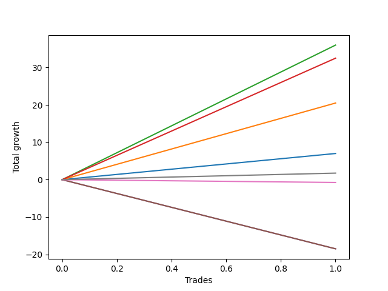

# Long Bulldog 002 
- Symbol: ES90d5m60m
- Date Range: 03/18/2022 - 07/08/2022
- Trading Period: 7:20-12:30
- Number of Trades: 1



| Name | Win Percent | Profit | Avg Profit / Trade |     | Name | Win Percent | Profit | Avg Profit / Trade |
| ---- | ----------- | ------ | ------------------ | --- | ---- | ----------- | ------ | ------------------ |
| Sorted By <br> Profit | | | | | Sorted By <br> Win Percentage ||||
| Two | 100.00 | 18000.00 | 18000.00 |     | Two | 100.00 | 18000.00 | 18000.00 |
| Three | 100.00 | 16250.00 | 16250.00 |     | Three | 100.00 | 16250.00 | 16250.00 |
| One | 100.00 | 10250.00 | 10250.00 |     | One | 100.00 | 10250.00 | 10250.00 |
| Zero | 100.00 | 3500.00 | 3500.00 |     | Zero | 100.00 | 3500.00 | 3500.00 |
| Seven | 100.00 | 875.00 | 875.00 |     | Seven | 100.00 | 875.00 | 875.00 |
| Six | 0.00 | -375.00 | -375.00 |     | Six | 0.00 | -375.00 | -375.00 |
| Five | 0.00 | -9250.00 | -9250.00 |     | Five | 0.00 | -9250.00 | -9250.00 |
| Four | 0.00 | -9250.00 | -9250.00 |     | Four | 0.00 | -9250.00 | -9250.00 |

### Test Zero
* Sell when price hits the middle line of the 20p bollinger
* No Stoploss
* Results:
```
Total Trades: 1
Percent Up: 100.00
Percent Down: 0.00
Total Points Moved Up: 7.00
Potential Profit: 3500.00
Total Points Ups: 7.00 Count Ups: 1
Total Points Downs: 0.00 Count Downs: 0
```

<details><summary>Trades</summary>

<code>In: 2022-05-02 07:20:00		Out: 2022-05-02 07:24:25		Total Position Time: 04:25		Total Move Up: 7.00		Total to Date: 7.00</code> <br />


</details>

### Test One
* Sell when the price hits the upper line of the 20p 1std bollinger
* No Stoploss
* Results:
```
Total Trades: 1
Percent Up: 100.00
Percent Down: 0.00
Total Points Moved Up: 20.50
Potential Profit: 10250.00
Total Points Ups: 20.50 Count Ups: 1
Total Points Downs: 0.00 Count Downs: 0
```

<details><summary>Trades</summary>

<code>In: 2022-05-02 07:20:00		Out: 2022-05-02 07:26:05		Total Position Time: 06:05		Total Move Up: 20.50		Total to Date: 20.50</code> <br />


</details>

### Test Two
* Sell when the price hits the upper line of the 20p 2std bollinger
* No Stoploss
* Results:
```
Total Trades: 1
Percent Up: 100.00
Percent Down: 0.00
Total Points Moved Up: 36.00
Potential Profit: 18000.00
Total Points Ups: 36.00 Count Ups: 1
Total Points Downs: 0.00 Count Downs: 0
```

<details><summary>Trades</summary>

<code>In: 2022-05-02 07:20:00		Out: 2022-05-02 07:31:15		Total Position Time: 11:15		Total Move Up: 36.00		Total to Date: 36.00</code> <br />


</details>

### Test Three
* Sell when price hits the middle line of the 50p bollinger
* No Stoploss
* Results:
```
Total Trades: 1
Percent Up: 100.00
Percent Down: 0.00
Total Points Moved Up: 32.50
Potential Profit: 16250.00
Total Points Ups: 32.50 Count Ups: 1
Total Points Downs: 0.00 Count Downs: 0
```

<details><summary>Trades</summary>

<code>In: 2022-05-02 07:20:00		Out: 2022-05-02 07:30:40		Total Position Time: 10:40		Total Move Up: 32.50		Total to Date: 32.50</code> <br />


</details>

### Test Four
* Sell when the price hits the upper line of the 50p 1std bollinger
* No Stoploss
* Results:
```
Total Trades: 1
Percent Up: 0.00
Percent Down: 100.00
Total Points Moved Up: -18.50
Potential Profit: -9250.00
Total Points Ups: 0.00 Count Ups: 0
Total Points Downs: -18.50 Count Downs: 1
```

<details><summary>Trades</summary>

<code>In: 2022-05-02 07:20:00		Out: 2022-05-02 08:20:55		Total Position Time: 60:55		Total Move Up: -18.50		Total to Date: -18.50</code> <br />


</details>

### Test Five
* Sell when the price hits the upper line of the 50p 2std bollinger
* No Stoploss
* Results:
```
Total Trades: 1
Percent Up: 0.00
Percent Down: 100.00
Total Points Moved Up: -18.50
Potential Profit: -9250.00
Total Points Ups: 0.00 Count Ups: 0
Total Points Downs: -18.50 Count Downs: 1
```

<details><summary>Trades</summary>

<code>In: 2022-05-02 07:20:00		Out: 2022-05-02 08:20:55		Total Position Time: 60:55		Total Move Up: -18.50		Total to Date: -18.50</code> <br />


</details>

### Test Six
* Sell when the price hits the middle line of the 1std VWAP
* No Stoploss
* Results:
```
Total Trades: 1
Percent Up: 0.00
Percent Down: 100.00
Total Points Moved Up: -0.75
Potential Profit: -375.00
Total Points Ups: 0.00 Count Ups: 0
Total Points Downs: -0.75 Count Downs: 1
```

<details><summary>Trades</summary>

<code>In: 2022-05-02 07:20:00		Out: 2022-05-02 07:21:10		Total Position Time: 01:10		Total Move Up: -0.75		Total to Date: -0.75</code> <br />


</details>

### Test Seven
* Sell when the price hits the upper line of the 1std VWAP
* No Stoploss
* Results:
```
Total Trades: 1
Percent Up: 100.00
Percent Down: 0.00
Total Points Moved Up: 1.75
Potential Profit: 875.00
Total Points Ups: 1.75 Count Ups: 1
Total Points Downs: 0.00 Count Downs: 0
```

<details><summary>Trades</summary>

<code>In: 2022-05-02 07:20:00		Out: 2022-05-02 07:23:35		Total Position Time: 03:35		Total Move Up: 1.75		Total to Date: 1.75</code> <br />


</details>