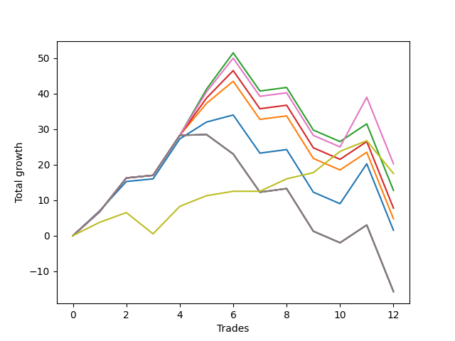

# Long Bulldog 003 
- Symbol: ES90d5m60m
- Date Range: 03/18/2022 - 07/08/2022
- Trading Period: 7:20-12:30
- Number of Trades: 12



| Name | Win Percent | Profit | Avg Profit / Trade |     | Name | Win Percent | Profit | Avg Profit / Trade |
| ---- | ----------- | ------ | ------------------ | --- | ---- | ----------- | ------ | ------------------ |
| Sorted By <br> Profit | | | | | Sorted By <br> Win Percentage ||||
| Six | 66.67 | 10125.00 | 843.75 |     | Seventy-Three | 83.33 | 8750.00 | 729.17 |
| Seventy-Three | 83.33 | 8750.00 | 729.17 |     | Six | 66.67 | 10125.00 | 843.75 |
| Two | 66.67 | 6375.00 | 531.25 |     | Two | 66.67 | 6375.00 | 531.25 |
| Three | 66.67 | 3875.00 | 322.92 |     | Three | 66.67 | 3875.00 | 322.92 |
| One | 66.67 | 2375.00 | 197.92 |     | One | 66.67 | 2375.00 | 197.92 |
| Zero | 66.67 | 750.00 | 62.50 |     | Zero | 66.67 | 750.00 | 62.50 |
| Seven | 58.33 | -7875.00 | -656.25 |     | Seven | 58.33 | -7875.00 | -656.25 |
| Five | 58.33 | -7875.00 | -656.25 |     | Five | 58.33 | -7875.00 | -656.25 |
| Four | 58.33 | -7875.00 | -656.25 |     | Four | 58.33 | -7875.00 | -656.25 |

## NO STOPLOSS

### Test Zero
* Sell when price hits the middle line of the 20p bollinger
* No Stoploss
* Results:
```
Total Trades: 12
Percent Up: 66.67
Percent Down: 33.33
Total Points Moved Up: 1.50
Potential Profit: 750.00
Total Points Ups: 46.25 Count Ups: 8
Total Points Downs: -44.75 Count Downs: 4
```

<details><summary>Trades</summary>

<code>In: 2022-03-23 10:30:00		Out: 2022-03-23 11:28:15		Total Position Time: 58:15		Total Move Up: 7.00		Total to Date: 7.00</code> <br />
<code>In: 2022-03-23 10:45:00		Out: 2022-03-23 11:28:15		Total Position Time: 43:15		Total Move Up: 8.25		Total to Date: 15.25</code> <br />
<code>In: 2022-03-30 12:10:00		Out: 2022-03-30 12:46:00		Total Position Time: 36:00		Total Move Up: 0.75		Total to Date: 16.00</code> <br />
<code>In: 2022-03-30 12:25:00		Out: 2022-03-30 12:46:00		Total Position Time: 21:00		Total Move Up: 11.25		Total to Date: 27.25</code> <br />
<code>In: 2022-03-31 11:20:00		Out: 2022-03-31 11:58:10		Total Position Time: 38:10		Total Move Up: 4.75		Total to Date: 32.00</code> <br />
<code>In: 2022-03-31 11:25:00		Out: 2022-03-31 11:58:10		Total Position Time: 33:10		Total Move Up: 2.00		Total to Date: 34.00</code> <br />
<code>In: 2022-04-18 08:40:00		Out: 2022-04-18 09:40:55		Total Position Time: 60:55		Total Move Up: -10.75		Total to Date: 23.25</code> <br />
<code>In: 2022-04-18 08:50:00		Out: 2022-04-18 09:50:55		Total Position Time: 60:55		Total Move Up: 1.00		Total to Date: 24.25</code> <br />
<code>In: 2022-05-12 10:50:00		Out: 2022-05-12 11:50:55		Total Position Time: 60:55		Total Move Up: -12.00		Total to Date: 12.25</code> <br />
<code>In: 2022-06-08 09:45:00		Out: 2022-06-08 10:45:55		Total Position Time: 60:55		Total Move Up: -3.25		Total to Date: 9.00</code> <br />
<code>In: 2022-06-09 08:05:00		Out: 2022-06-09 08:42:25		Total Position Time: 37:25		Total Move Up: 11.25		Total to Date: 20.25</code> <br />
<code>In: 2022-06-09 12:15:00		Out: 2022-06-09 12:46:00		Total Position Time: 31:00		Total Move Up: -18.75		Total to Date: 1.50</code> <br />


</details>

### Test One
* Sell when the price hits the upper line of the 20p 1std bollinger
* No Stoploss
* Results:
```
Total Trades: 12
Percent Up: 66.67
Percent Down: 33.33
Total Points Moved Up: 4.75
Potential Profit: 2375.00
Total Points Ups: 49.50 Count Ups: 8
Total Points Downs: -44.75 Count Downs: 4
```

<details><summary>Trades</summary>

<code>In: 2022-03-23 10:30:00		Out: 2022-03-23 11:30:55		Total Position Time: 60:55		Total Move Up: 6.75		Total to Date: 6.75</code> <br />
<code>In: 2022-03-23 10:45:00		Out: 2022-03-23 11:45:55		Total Position Time: 60:55		Total Move Up: 9.50		Total to Date: 16.25</code> <br />
<code>In: 2022-03-30 12:10:00		Out: 2022-03-30 12:46:00		Total Position Time: 36:00		Total Move Up: 0.75		Total to Date: 17.00</code> <br />
<code>In: 2022-03-30 12:25:00		Out: 2022-03-30 12:46:00		Total Position Time: 21:00		Total Move Up: 11.25		Total to Date: 28.25</code> <br />
<code>In: 2022-03-31 11:20:00		Out: 2022-03-31 12:00:20		Total Position Time: 40:20		Total Move Up: 9.00		Total to Date: 37.25</code> <br />
<code>In: 2022-03-31 11:25:00		Out: 2022-03-31 12:00:20		Total Position Time: 35:20		Total Move Up: 6.25		Total to Date: 43.50</code> <br />
<code>In: 2022-04-18 08:40:00		Out: 2022-04-18 09:40:55		Total Position Time: 60:55		Total Move Up: -10.75		Total to Date: 32.75</code> <br />
<code>In: 2022-04-18 08:50:00		Out: 2022-04-18 09:50:55		Total Position Time: 60:55		Total Move Up: 1.00		Total to Date: 33.75</code> <br />
<code>In: 2022-05-12 10:50:00		Out: 2022-05-12 11:50:55		Total Position Time: 60:55		Total Move Up: -12.00		Total to Date: 21.75</code> <br />
<code>In: 2022-06-08 09:45:00		Out: 2022-06-08 10:45:55		Total Position Time: 60:55		Total Move Up: -3.25		Total to Date: 18.50</code> <br />
<code>In: 2022-06-09 08:05:00		Out: 2022-06-09 09:05:55		Total Position Time: 60:55		Total Move Up: 5.00		Total to Date: 23.50</code> <br />
<code>In: 2022-06-09 12:15:00		Out: 2022-06-09 12:46:00		Total Position Time: 31:00		Total Move Up: -18.75		Total to Date: 4.75</code> <br />


</details>

### Test Two
* Sell when the price hits the upper line of the 20p 2std bollinger
* No Stoploss
* Results:
```
Total Trades: 12
Percent Up: 66.67
Percent Down: 33.33
Total Points Moved Up: 12.75
Potential Profit: 6375.00
Total Points Ups: 57.50 Count Ups: 8
Total Points Downs: -44.75 Count Downs: 4
```

<details><summary>Trades</summary>

<code>In: 2022-03-23 10:30:00		Out: 2022-03-23 11:30:55		Total Position Time: 60:55		Total Move Up: 6.75		Total to Date: 6.75</code> <br />
<code>In: 2022-03-23 10:45:00		Out: 2022-03-23 11:45:55		Total Position Time: 60:55		Total Move Up: 9.50		Total to Date: 16.25</code> <br />
<code>In: 2022-03-30 12:10:00		Out: 2022-03-30 12:46:00		Total Position Time: 36:00		Total Move Up: 0.75		Total to Date: 17.00</code> <br />
<code>In: 2022-03-30 12:25:00		Out: 2022-03-30 12:46:00		Total Position Time: 21:00		Total Move Up: 11.25		Total to Date: 28.25</code> <br />
<code>In: 2022-03-31 11:20:00		Out: 2022-03-31 12:02:55		Total Position Time: 42:55		Total Move Up: 13.00		Total to Date: 41.25</code> <br />
<code>In: 2022-03-31 11:25:00		Out: 2022-03-31 12:02:55		Total Position Time: 37:55		Total Move Up: 10.25		Total to Date: 51.50</code> <br />
<code>In: 2022-04-18 08:40:00		Out: 2022-04-18 09:40:55		Total Position Time: 60:55		Total Move Up: -10.75		Total to Date: 40.75</code> <br />
<code>In: 2022-04-18 08:50:00		Out: 2022-04-18 09:50:55		Total Position Time: 60:55		Total Move Up: 1.00		Total to Date: 41.75</code> <br />
<code>In: 2022-05-12 10:50:00		Out: 2022-05-12 11:50:55		Total Position Time: 60:55		Total Move Up: -12.00		Total to Date: 29.75</code> <br />
<code>In: 2022-06-08 09:45:00		Out: 2022-06-08 10:45:55		Total Position Time: 60:55		Total Move Up: -3.25		Total to Date: 26.50</code> <br />
<code>In: 2022-06-09 08:05:00		Out: 2022-06-09 09:05:55		Total Position Time: 60:55		Total Move Up: 5.00		Total to Date: 31.50</code> <br />
<code>In: 2022-06-09 12:15:00		Out: 2022-06-09 12:46:00		Total Position Time: 31:00		Total Move Up: -18.75		Total to Date: 12.75</code> <br />


</details>

### Test Three
* Sell when price hits the middle line of the 50p bollinger
* No Stoploss
* Results:
```
Total Trades: 12
Percent Up: 66.67
Percent Down: 33.33
Total Points Moved Up: 7.75
Potential Profit: 3875.00
Total Points Ups: 52.50 Count Ups: 8
Total Points Downs: -44.75 Count Downs: 4
```

<details><summary>Trades</summary>

<code>In: 2022-03-23 10:30:00		Out: 2022-03-23 11:30:55		Total Position Time: 60:55		Total Move Up: 6.75		Total to Date: 6.75</code> <br />
<code>In: 2022-03-23 10:45:00		Out: 2022-03-23 11:45:55		Total Position Time: 60:55		Total Move Up: 9.50		Total to Date: 16.25</code> <br />
<code>In: 2022-03-30 12:10:00		Out: 2022-03-30 12:46:00		Total Position Time: 36:00		Total Move Up: 0.75		Total to Date: 17.00</code> <br />
<code>In: 2022-03-30 12:25:00		Out: 2022-03-30 12:46:00		Total Position Time: 21:00		Total Move Up: 11.25		Total to Date: 28.25</code> <br />
<code>In: 2022-03-31 11:20:00		Out: 2022-03-31 12:01:05		Total Position Time: 41:05		Total Move Up: 10.50		Total to Date: 38.75</code> <br />
<code>In: 2022-03-31 11:25:00		Out: 2022-03-31 12:01:05		Total Position Time: 36:05		Total Move Up: 7.75		Total to Date: 46.50</code> <br />
<code>In: 2022-04-18 08:40:00		Out: 2022-04-18 09:40:55		Total Position Time: 60:55		Total Move Up: -10.75		Total to Date: 35.75</code> <br />
<code>In: 2022-04-18 08:50:00		Out: 2022-04-18 09:50:55		Total Position Time: 60:55		Total Move Up: 1.00		Total to Date: 36.75</code> <br />
<code>In: 2022-05-12 10:50:00		Out: 2022-05-12 11:50:55		Total Position Time: 60:55		Total Move Up: -12.00		Total to Date: 24.75</code> <br />
<code>In: 2022-06-08 09:45:00		Out: 2022-06-08 10:45:55		Total Position Time: 60:55		Total Move Up: -3.25		Total to Date: 21.50</code> <br />
<code>In: 2022-06-09 08:05:00		Out: 2022-06-09 09:05:55		Total Position Time: 60:55		Total Move Up: 5.00		Total to Date: 26.50</code> <br />
<code>In: 2022-06-09 12:15:00		Out: 2022-06-09 12:46:00		Total Position Time: 31:00		Total Move Up: -18.75		Total to Date: 7.75</code> <br />


</details>

### Test Four
* Sell when the price hits the upper line of the 50p 1std bollinger
* No Stoploss
* Results:
```
Total Trades: 12
Percent Up: 58.33
Percent Down: 41.67
Total Points Moved Up: -15.75
Potential Profit: -7875.00
Total Points Ups: 34.50 Count Ups: 7
Total Points Downs: -50.25 Count Downs: 5
```

<details><summary>Trades</summary>

<code>In: 2022-03-23 10:30:00		Out: 2022-03-23 11:30:55		Total Position Time: 60:55		Total Move Up: 6.75		Total to Date: 6.75</code> <br />
<code>In: 2022-03-23 10:45:00		Out: 2022-03-23 11:45:55		Total Position Time: 60:55		Total Move Up: 9.50		Total to Date: 16.25</code> <br />
<code>In: 2022-03-30 12:10:00		Out: 2022-03-30 12:46:00		Total Position Time: 36:00		Total Move Up: 0.75		Total to Date: 17.00</code> <br />
<code>In: 2022-03-30 12:25:00		Out: 2022-03-30 12:46:00		Total Position Time: 21:00		Total Move Up: 11.25		Total to Date: 28.25</code> <br />
<code>In: 2022-03-31 11:20:00		Out: 2022-03-31 12:20:55		Total Position Time: 60:55		Total Move Up: 0.25		Total to Date: 28.50</code> <br />
<code>In: 2022-03-31 11:25:00		Out: 2022-03-31 12:25:55		Total Position Time: 60:55		Total Move Up: -5.50		Total to Date: 23.00</code> <br />
<code>In: 2022-04-18 08:40:00		Out: 2022-04-18 09:40:55		Total Position Time: 60:55		Total Move Up: -10.75		Total to Date: 12.25</code> <br />
<code>In: 2022-04-18 08:50:00		Out: 2022-04-18 09:50:55		Total Position Time: 60:55		Total Move Up: 1.00		Total to Date: 13.25</code> <br />
<code>In: 2022-05-12 10:50:00		Out: 2022-05-12 11:50:55		Total Position Time: 60:55		Total Move Up: -12.00		Total to Date: 1.25</code> <br />
<code>In: 2022-06-08 09:45:00		Out: 2022-06-08 10:45:55		Total Position Time: 60:55		Total Move Up: -3.25		Total to Date: -2.00</code> <br />
<code>In: 2022-06-09 08:05:00		Out: 2022-06-09 09:05:55		Total Position Time: 60:55		Total Move Up: 5.00		Total to Date: 3.00</code> <br />
<code>In: 2022-06-09 12:15:00		Out: 2022-06-09 12:46:00		Total Position Time: 31:00		Total Move Up: -18.75		Total to Date: -15.75</code> <br />


</details>

### Test Five
* Sell when the price hits the upper line of the 50p 2std bollinger
* No Stoploss
* Results:
```
Total Trades: 12
Percent Up: 58.33
Percent Down: 41.67
Total Points Moved Up: -15.75
Potential Profit: -7875.00
Total Points Ups: 34.50 Count Ups: 7
Total Points Downs: -50.25 Count Downs: 5
```

<details><summary>Trades</summary>

<code>In: 2022-03-23 10:30:00		Out: 2022-03-23 11:30:55		Total Position Time: 60:55		Total Move Up: 6.75		Total to Date: 6.75</code> <br />
<code>In: 2022-03-23 10:45:00		Out: 2022-03-23 11:45:55		Total Position Time: 60:55		Total Move Up: 9.50		Total to Date: 16.25</code> <br />
<code>In: 2022-03-30 12:10:00		Out: 2022-03-30 12:46:00		Total Position Time: 36:00		Total Move Up: 0.75		Total to Date: 17.00</code> <br />
<code>In: 2022-03-30 12:25:00		Out: 2022-03-30 12:46:00		Total Position Time: 21:00		Total Move Up: 11.25		Total to Date: 28.25</code> <br />
<code>In: 2022-03-31 11:20:00		Out: 2022-03-31 12:20:55		Total Position Time: 60:55		Total Move Up: 0.25		Total to Date: 28.50</code> <br />
<code>In: 2022-03-31 11:25:00		Out: 2022-03-31 12:25:55		Total Position Time: 60:55		Total Move Up: -5.50		Total to Date: 23.00</code> <br />
<code>In: 2022-04-18 08:40:00		Out: 2022-04-18 09:40:55		Total Position Time: 60:55		Total Move Up: -10.75		Total to Date: 12.25</code> <br />
<code>In: 2022-04-18 08:50:00		Out: 2022-04-18 09:50:55		Total Position Time: 60:55		Total Move Up: 1.00		Total to Date: 13.25</code> <br />
<code>In: 2022-05-12 10:50:00		Out: 2022-05-12 11:50:55		Total Position Time: 60:55		Total Move Up: -12.00		Total to Date: 1.25</code> <br />
<code>In: 2022-06-08 09:45:00		Out: 2022-06-08 10:45:55		Total Position Time: 60:55		Total Move Up: -3.25		Total to Date: -2.00</code> <br />
<code>In: 2022-06-09 08:05:00		Out: 2022-06-09 09:05:55		Total Position Time: 60:55		Total Move Up: 5.00		Total to Date: 3.00</code> <br />
<code>In: 2022-06-09 12:15:00		Out: 2022-06-09 12:46:00		Total Position Time: 31:00		Total Move Up: -18.75		Total to Date: -15.75</code> <br />


</details>

### Test Six
* Sell when the price hits the middle line of the 1std VWAP
* No Stoploss
* Results:
```
Total Trades: 12
Percent Up: 66.67
Percent Down: 33.33
Total Points Moved Up: 20.25
Potential Profit: 10125.00
Total Points Ups: 65.00 Count Ups: 8
Total Points Downs: -44.75 Count Downs: 4
```

<details><summary>Trades</summary>

<code>In: 2022-03-23 10:30:00		Out: 2022-03-23 11:30:55		Total Position Time: 60:55		Total Move Up: 6.75		Total to Date: 6.75</code> <br />
<code>In: 2022-03-23 10:45:00		Out: 2022-03-23 11:45:55		Total Position Time: 60:55		Total Move Up: 9.50		Total to Date: 16.25</code> <br />
<code>In: 2022-03-30 12:10:00		Out: 2022-03-30 12:46:00		Total Position Time: 36:00		Total Move Up: 0.75		Total to Date: 17.00</code> <br />
<code>In: 2022-03-30 12:25:00		Out: 2022-03-30 12:46:00		Total Position Time: 21:00		Total Move Up: 11.25		Total to Date: 28.25</code> <br />
<code>In: 2022-03-31 11:20:00		Out: 2022-03-31 12:02:25		Total Position Time: 42:25		Total Move Up: 12.25		Total to Date: 40.50</code> <br />
<code>In: 2022-03-31 11:25:00		Out: 2022-03-31 12:02:25		Total Position Time: 37:25		Total Move Up: 9.50		Total to Date: 50.00</code> <br />
<code>In: 2022-04-18 08:40:00		Out: 2022-04-18 09:40:55		Total Position Time: 60:55		Total Move Up: -10.75		Total to Date: 39.25</code> <br />
<code>In: 2022-04-18 08:50:00		Out: 2022-04-18 09:50:55		Total Position Time: 60:55		Total Move Up: 1.00		Total to Date: 40.25</code> <br />
<code>In: 2022-05-12 10:50:00		Out: 2022-05-12 11:50:55		Total Position Time: 60:55		Total Move Up: -12.00		Total to Date: 28.25</code> <br />
<code>In: 2022-06-08 09:45:00		Out: 2022-06-08 10:45:55		Total Position Time: 60:55		Total Move Up: -3.25		Total to Date: 25.00</code> <br />
<code>In: 2022-06-09 08:05:00		Out: 2022-06-09 08:42:55		Total Position Time: 37:55		Total Move Up: 14.00		Total to Date: 39.00</code> <br />
<code>In: 2022-06-09 12:15:00		Out: 2022-06-09 12:46:00		Total Position Time: 31:00		Total Move Up: -18.75		Total to Date: 20.25</code> <br />


</details>

### Test Seven
* Sell when the price hits the upper line of the 1std VWAP
* No Stoploss
* Results:
```
Total Trades: 12
Percent Up: 58.33
Percent Down: 41.67
Total Points Moved Up: -15.75
Potential Profit: -7875.00
Total Points Ups: 34.50 Count Ups: 7
Total Points Downs: -50.25 Count Downs: 5
```

<details><summary>Trades</summary>

<code>In: 2022-03-23 10:30:00		Out: 2022-03-23 11:30:55		Total Position Time: 60:55		Total Move Up: 6.75		Total to Date: 6.75</code> <br />
<code>In: 2022-03-23 10:45:00		Out: 2022-03-23 11:45:55		Total Position Time: 60:55		Total Move Up: 9.50		Total to Date: 16.25</code> <br />
<code>In: 2022-03-30 12:10:00		Out: 2022-03-30 12:46:00		Total Position Time: 36:00		Total Move Up: 0.75		Total to Date: 17.00</code> <br />
<code>In: 2022-03-30 12:25:00		Out: 2022-03-30 12:46:00		Total Position Time: 21:00		Total Move Up: 11.25		Total to Date: 28.25</code> <br />
<code>In: 2022-03-31 11:20:00		Out: 2022-03-31 12:20:55		Total Position Time: 60:55		Total Move Up: 0.25		Total to Date: 28.50</code> <br />
<code>In: 2022-03-31 11:25:00		Out: 2022-03-31 12:25:55		Total Position Time: 60:55		Total Move Up: -5.50		Total to Date: 23.00</code> <br />
<code>In: 2022-04-18 08:40:00		Out: 2022-04-18 09:40:55		Total Position Time: 60:55		Total Move Up: -10.75		Total to Date: 12.25</code> <br />
<code>In: 2022-04-18 08:50:00		Out: 2022-04-18 09:50:55		Total Position Time: 60:55		Total Move Up: 1.00		Total to Date: 13.25</code> <br />
<code>In: 2022-05-12 10:50:00		Out: 2022-05-12 11:50:55		Total Position Time: 60:55		Total Move Up: -12.00		Total to Date: 1.25</code> <br />
<code>In: 2022-06-08 09:45:00		Out: 2022-06-08 10:45:55		Total Position Time: 60:55		Total Move Up: -3.25		Total to Date: -2.00</code> <br />
<code>In: 2022-06-09 08:05:00		Out: 2022-06-09 09:05:55		Total Position Time: 60:55		Total Move Up: 5.00		Total to Date: 3.00</code> <br />
<code>In: 2022-06-09 12:15:00		Out: 2022-06-09 12:46:00		Total Position Time: 31:00		Total Move Up: -18.75		Total to Date: -15.75</code> <br />


</details>

## SPECIAL EXIT CONDITIONS 

### Test Seventy-Three
* Sell when the linear regression slope changes to negative
* No Stoploss
* Results:
```
Total Trades: 12
Percent Up: 83.33
Percent Down: 16.67
Total Points Moved Up: 17.50
Potential Profit: 8750.00
Total Points Ups: 32.75 Count Ups: 10
Total Points Downs: -15.25 Count Downs: 2
```

<details><summary>Trades</summary>

<code>In: 2022-03-23 10:30:00		Out: 2022-03-23 10:39:05		Total Position Time: 09:05		Total Move Up: 3.75		Total to Date: 3.75</code> <br />
<code>In: 2022-03-23 10:45:00		Out: 2022-03-23 10:51:05		Total Position Time: 06:05		Total Move Up: 2.75		Total to Date: 6.50</code> <br />
<code>In: 2022-03-30 12:10:00		Out: 2022-03-30 12:20:05		Total Position Time: 10:05		Total Move Up: -6.00		Total to Date: 0.50</code> <br />
<code>In: 2022-03-30 12:25:00		Out: 2022-03-30 12:32:05		Total Position Time: 07:05		Total Move Up: 7.75		Total to Date: 8.25</code> <br />
<code>In: 2022-03-31 11:20:00		Out: 2022-03-31 11:33:05		Total Position Time: 13:05		Total Move Up: 3.00		Total to Date: 11.25</code> <br />
<code>In: 2022-03-31 11:25:00		Out: 2022-03-31 11:37:05		Total Position Time: 12:05		Total Move Up: 1.25		Total to Date: 12.50</code> <br />
<code>In: 2022-04-18 08:40:00		Out: 2022-04-18 08:46:05		Total Position Time: 06:05		Total Move Up: 0.00		Total to Date: 12.50</code> <br />
<code>In: 2022-04-18 08:50:00		Out: 2022-04-18 08:54:05		Total Position Time: 04:05		Total Move Up: 3.50		Total to Date: 16.00</code> <br />
<code>In: 2022-05-12 10:50:00		Out: 2022-05-12 10:55:05		Total Position Time: 05:05		Total Move Up: 1.75		Total to Date: 17.75</code> <br />
<code>In: 2022-06-08 09:45:00		Out: 2022-06-08 09:56:05		Total Position Time: 11:05		Total Move Up: 6.00		Total to Date: 23.75</code> <br />
<code>In: 2022-06-09 08:05:00		Out: 2022-06-09 08:19:05		Total Position Time: 14:05		Total Move Up: 3.00		Total to Date: 26.75</code> <br />
<code>In: 2022-06-09 12:15:00		Out: 2022-06-09 12:38:05		Total Position Time: 23:05		Total Move Up: -9.25		Total to Date: 17.50</code> <br />


</details>