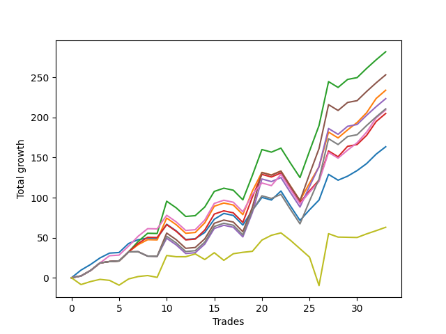

# Long Bulldog 005 
- Symbol: ES90d5m60m
- Date Range: 03/18/2022 - 07/08/2022
- Trading Period: 7:20-12:30
- Number of Trades: 33



| Name | Win Percent | Profit | Avg Profit / Trade |     | Name | Win Percent | Profit | Avg Profit / Trade |
| ---- | ----------- | ------ | ------------------ | --- | ---- | ----------- | ------ | ------------------ |
| Sorted By <br> Profit | | | | | Sorted By <br> Win Percentage ||||
| Two | 72.73 | 112375.00 | 3405.30 |     | Zero | 75.76 | 54250.00 | 1643.94 |
| Five | 69.70 | 89625.00 | 2715.91 |     | Two | 72.73 | 112375.00 | 3405.30 |
| One | 72.73 | 87250.00 | 2643.94 |     | One | 72.73 | 87250.00 | 2643.94 |
| Four | 69.70 | 74750.00 | 2265.15 |     | Three | 72.73 | 73000.00 | 2212.12 |
| Three | 72.73 | 73000.00 | 2212.12 |     | Six | 72.73 | 66125.00 | 2003.79 |
| Seven | 69.70 | 68375.00 | 2071.97 |     | Five | 69.70 | 89625.00 | 2715.91 |
| Six | 72.73 | 66125.00 | 2003.79 |     | Four | 69.70 | 74750.00 | 2265.15 |
| Zero | 75.76 | 54250.00 | 1643.94 |     | Seven | 69.70 | 68375.00 | 2071.97 |

### Test Zero
* Sell when price hits the middle line of the 20p bollinger
* No Stoploss
* Results:
```
Total Trades: 33
Percent Up: 75.76
Percent Down: 24.24
Total Points Moved Up: 108.50
Potential Profit: 54250.00
Total Points Ups: 254.25 Count Ups: 25
Total Points Downs: -145.75 Count Downs: 8
```

<details><summary>Trades</summary>

<code>In: 2022-03-21 10:05:00		Out: 2022-03-21 11:00:15		Total Position Time: 55:15		Total Move Up: 9.50		Total to Date: 9.50</code> <br />
<code>In: 2022-03-23 10:30:00		Out: 2022-03-23 11:28:15		Total Position Time: 58:15		Total Move Up: 7.00		Total to Date: 16.50</code> <br />
<code>In: 2022-03-23 10:45:00		Out: 2022-03-23 11:28:15		Total Position Time: 43:15		Total Move Up: 8.25		Total to Date: 24.75</code> <br />
<code>In: 2022-03-30 08:15:00		Out: 2022-03-30 09:00:30		Total Position Time: 45:30		Total Move Up: 6.00		Total to Date: 30.75</code> <br />
<code>In: 2022-03-30 12:10:00		Out: 2022-03-30 12:46:25		Total Position Time: 36:25		Total Move Up: 3.25		Total to Date: 34.00</code> <br />
<code>In: 2022-03-30 12:25:00		Out: 2022-03-30 12:46:25		Total Position Time: 21:25		Total Move Up: 13.75		Total to Date: 47.75</code> <br />
<code>In: 2022-03-31 11:20:00		Out: 2022-03-31 11:58:10		Total Position Time: 38:10		Total Move Up: 4.75		Total to Date: 52.50</code> <br />
<code>In: 2022-03-31 11:25:00		Out: 2022-03-31 11:58:10		Total Position Time: 33:10		Total Move Up: 2.00		Total to Date: 54.50</code> <br />
<code>In: 2022-04-01 09:05:00		Out: 2022-04-01 10:05:55		Total Position Time: 60:55		Total Move Up: -0.25		Total to Date: 54.25</code> <br />
<code>In: 2022-04-06 11:20:00		Out: 2022-04-06 11:32:35		Total Position Time: 12:35		Total Move Up: 17.50		Total to Date: 71.75</code> <br />
<code>In: 2022-04-12 11:00:00		Out: 2022-04-12 12:00:55		Total Position Time: 60:55		Total Move Up: -8.25		Total to Date: 63.50</code> <br />
<code>In: 2022-04-18 08:40:00		Out: 2022-04-18 09:40:55		Total Position Time: 60:55		Total Move Up: -10.75		Total to Date: 52.75</code> <br />
<code>In: 2022-04-18 08:50:00		Out: 2022-04-18 09:50:55		Total Position Time: 60:55		Total Move Up: 1.00		Total to Date: 53.75</code> <br />
<code>In: 2022-04-20 11:45:00		Out: 2022-04-20 12:24:15		Total Position Time: 39:15		Total Move Up: 7.75		Total to Date: 61.50</code> <br />
<code>In: 2022-04-20 11:55:00		Out: 2022-04-20 12:24:15		Total Position Time: 29:15		Total Move Up: 16.50		Total to Date: 78.00</code> <br />
<code>In: 2022-04-29 07:35:00		Out: 2022-04-29 08:32:00		Total Position Time: 57:00		Total Move Up: 7.25		Total to Date: 85.25</code> <br />
<code>In: 2022-05-02 10:05:00		Out: 2022-05-02 11:05:55		Total Position Time: 60:55		Total Move Up: -2.50		Total to Date: 82.75</code> <br />
<code>In: 2022-05-12 10:50:00		Out: 2022-05-12 11:50:55		Total Position Time: 60:55		Total Move Up: -12.00		Total to Date: 70.75</code> <br />
<code>In: 2022-05-13 11:05:00		Out: 2022-05-13 11:51:35		Total Position Time: 46:35		Total Move Up: 18.50		Total to Date: 89.25</code> <br />
<code>In: 2022-06-02 07:25:00		Out: 2022-06-02 07:38:55		Total Position Time: 13:55		Total Move Up: 16.00		Total to Date: 105.25</code> <br />
<code>In: 2022-06-08 09:45:00		Out: 2022-06-08 10:45:55		Total Position Time: 60:55		Total Move Up: -3.25		Total to Date: 102.00</code> <br />
<code>In: 2022-06-09 08:05:00		Out: 2022-06-09 08:42:25		Total Position Time: 37:25		Total Move Up: 11.25		Total to Date: 113.25</code> <br />
<code>In: 2022-06-09 12:15:00		Out: 2022-06-10 06:45:55		Total Position Time: 1110:55		Total Move Up: -101.50		Total to Date: 11.75</code> <br />
<code>In: 2022-06-13 12:15:00		Out: 2022-06-14 06:30:05		Total Position Time: 1095:05		Total Move Up: 4.75		Total to Date: 16.50</code> <br />
<code>In: 2022-06-15 11:10:00		Out: 2022-06-15 11:17:05		Total Position Time: 07:05		Total Move Up: 13.25		Total to Date: 29.75</code> <br />
<code>In: 2022-06-15 11:15:00		Out: 2022-06-15 11:17:05		Total Position Time: 02:05		Total Move Up: 12.25		Total to Date: 42.00</code> <br />
<code>In: 2022-06-15 11:35:00		Out: 2022-06-15 11:38:10		Total Position Time: 03:10		Total Move Up: 32.00		Total to Date: 74.00</code> <br />
<code>In: 2022-06-16 11:00:00		Out: 2022-06-16 12:00:55		Total Position Time: 60:55		Total Move Up: -7.25		Total to Date: 66.75</code> <br />
<code>In: 2022-06-16 11:10:00		Out: 2022-06-16 12:09:30		Total Position Time: 59:30		Total Move Up: 5.00		Total to Date: 71.75</code> <br />
<code>In: 2022-06-27 11:00:00		Out: 2022-06-27 11:19:05		Total Position Time: 19:05		Total Move Up: 7.00		Total to Date: 78.75</code> <br />
<code>In: 2022-06-27 12:05:00		Out: 2022-06-27 12:10:30		Total Position Time: 05:30		Total Move Up: 8.75		Total to Date: 87.50</code> <br />
<code>In: 2022-06-29 09:30:00		Out: 2022-06-29 10:01:50		Total Position Time: 31:50		Total Move Up: 11.75		Total to Date: 99.25</code> <br />
<code>In: 2022-07-06 08:45:00		Out: 2022-07-06 09:14:00		Total Position Time: 29:00		Total Move Up: 9.25		Total to Date: 108.50</code> <br />


</details>

### Test One
* Sell when the price hits the upper line of the 20p 1std bollinger
* No Stoploss
* Results:
```
Total Trades: 33
Percent Up: 72.73
Percent Down: 27.27
Total Points Moved Up: 174.50
Potential Profit: 87250.00
Total Points Ups: 332.00 Count Ups: 24
Total Points Downs: -157.50 Count Downs: 9
```

<details><summary>Trades</summary>

<code>In: 2022-03-21 10:05:00		Out: 2022-03-21 11:05:55		Total Position Time: 60:55		Total Move Up: 2.25		Total to Date: 2.25</code> <br />
<code>In: 2022-03-23 10:30:00		Out: 2022-03-23 11:30:55		Total Position Time: 60:55		Total Move Up: 6.75		Total to Date: 9.00</code> <br />
<code>In: 2022-03-23 10:45:00		Out: 2022-03-23 11:45:55		Total Position Time: 60:55		Total Move Up: 9.50		Total to Date: 18.50</code> <br />
<code>In: 2022-03-30 08:15:00		Out: 2022-03-30 09:15:55		Total Position Time: 60:55		Total Move Up: 1.75		Total to Date: 20.25</code> <br />
<code>In: 2022-03-30 12:10:00		Out: 2022-03-30 12:59:50		Total Position Time: 49:50		Total Move Up: 9.25		Total to Date: 29.50</code> <br />
<code>In: 2022-03-30 12:25:00		Out: 2022-03-30 12:59:50		Total Position Time: 34:50		Total Move Up: 19.75		Total to Date: 49.25</code> <br />
<code>In: 2022-03-31 11:20:00		Out: 2022-03-31 12:00:20		Total Position Time: 40:20		Total Move Up: 9.00		Total to Date: 58.25</code> <br />
<code>In: 2022-03-31 11:25:00		Out: 2022-03-31 12:00:20		Total Position Time: 35:20		Total Move Up: 6.25		Total to Date: 64.50</code> <br />
<code>In: 2022-04-01 09:05:00		Out: 2022-04-01 10:05:55		Total Position Time: 60:55		Total Move Up: -0.25		Total to Date: 64.25</code> <br />
<code>In: 2022-04-06 11:20:00		Out: 2022-04-06 11:34:05		Total Position Time: 14:05		Total Move Up: 27.25		Total to Date: 91.50</code> <br />
<code>In: 2022-04-12 11:00:00		Out: 2022-04-12 12:00:55		Total Position Time: 60:55		Total Move Up: -8.25		Total to Date: 83.25</code> <br />
<code>In: 2022-04-18 08:40:00		Out: 2022-04-18 09:40:55		Total Position Time: 60:55		Total Move Up: -10.75		Total to Date: 72.50</code> <br />
<code>In: 2022-04-18 08:50:00		Out: 2022-04-18 09:50:55		Total Position Time: 60:55		Total Move Up: 1.00		Total to Date: 73.50</code> <br />
<code>In: 2022-04-20 11:45:00		Out: 2022-04-20 12:45:15		Total Position Time: 60:15		Total Move Up: 12.00		Total to Date: 85.50</code> <br />
<code>In: 2022-04-20 11:55:00		Out: 2022-04-20 12:45:15		Total Position Time: 50:15		Total Move Up: 20.75		Total to Date: 106.25</code> <br />
<code>In: 2022-04-29 07:35:00		Out: 2022-04-29 08:35:55		Total Position Time: 60:55		Total Move Up: 4.00		Total to Date: 110.25</code> <br />
<code>In: 2022-05-02 10:05:00		Out: 2022-05-02 11:05:55		Total Position Time: 60:55		Total Move Up: -2.50		Total to Date: 107.75</code> <br />
<code>In: 2022-05-12 10:50:00		Out: 2022-05-12 11:50:55		Total Position Time: 60:55		Total Move Up: -12.00		Total to Date: 95.75</code> <br />
<code>In: 2022-05-13 11:05:00		Out: 2022-05-13 12:00:35		Total Position Time: 55:35		Total Move Up: 29.50		Total to Date: 125.25</code> <br />
<code>In: 2022-06-02 07:25:00		Out: 2022-06-02 07:56:05		Total Position Time: 31:05		Total Move Up: 23.25		Total to Date: 148.50</code> <br />
<code>In: 2022-06-08 09:45:00		Out: 2022-06-08 10:45:55		Total Position Time: 60:55		Total Move Up: -3.25		Total to Date: 145.25</code> <br />
<code>In: 2022-06-09 08:05:00		Out: 2022-06-09 09:05:55		Total Position Time: 60:55		Total Move Up: 5.00		Total to Date: 150.25</code> <br />
<code>In: 2022-06-09 12:15:00		Out: 2022-06-10 06:45:55		Total Position Time: 1110:55		Total Move Up: -101.50		Total to Date: 48.75</code> <br />
<code>In: 2022-06-13 12:15:00		Out: 2022-06-14 06:45:55		Total Position Time: 1110:55		Total Move Up: -11.75		Total to Date: 37.00</code> <br />
<code>In: 2022-06-15 11:10:00		Out: 2022-06-15 11:38:55		Total Position Time: 28:55		Total Move Up: 21.50		Total to Date: 58.50</code> <br />
<code>In: 2022-06-15 11:15:00		Out: 2022-06-15 11:38:55		Total Position Time: 23:55		Total Move Up: 20.50		Total to Date: 79.00</code> <br />
<code>In: 2022-06-15 11:35:00		Out: 2022-06-15 11:38:55		Total Position Time: 03:55		Total Move Up: 43.25		Total to Date: 122.25</code> <br />
<code>In: 2022-06-16 11:00:00		Out: 2022-06-16 12:00:55		Total Position Time: 60:55		Total Move Up: -7.25		Total to Date: 115.00</code> <br />
<code>In: 2022-06-16 11:10:00		Out: 2022-06-16 12:10:55		Total Position Time: 60:55		Total Move Up: 10.00		Total to Date: 125.00</code> <br />
<code>In: 2022-06-27 11:00:00		Out: 2022-06-27 11:38:50		Total Position Time: 38:50		Total Move Up: 9.25		Total to Date: 134.25</code> <br />
<code>In: 2022-06-27 12:05:00		Out: 2022-06-27 12:15:20		Total Position Time: 10:20		Total Move Up: 12.25		Total to Date: 146.50</code> <br />
<code>In: 2022-06-29 09:30:00		Out: 2022-06-29 10:11:05		Total Position Time: 41:05		Total Move Up: 17.75		Total to Date: 164.25</code> <br />
<code>In: 2022-07-06 08:45:00		Out: 2022-07-06 09:36:15		Total Position Time: 51:15		Total Move Up: 10.25		Total to Date: 174.50</code> <br />


</details>

### Test Two
* Sell when the price hits the upper line of the 20p 2std bollinger
* No Stoploss
* Results:
```
Total Trades: 33
Percent Up: 72.73
Percent Down: 27.27
Total Points Moved Up: 224.75
Potential Profit: 112375.00
Total Points Ups: 382.25 Count Ups: 24
Total Points Downs: -157.50 Count Downs: 9
```

<details><summary>Trades</summary>

<code>In: 2022-03-21 10:05:00		Out: 2022-03-21 11:05:55		Total Position Time: 60:55		Total Move Up: 2.25		Total to Date: 2.25</code> <br />
<code>In: 2022-03-23 10:30:00		Out: 2022-03-23 11:30:55		Total Position Time: 60:55		Total Move Up: 6.75		Total to Date: 9.00</code> <br />
<code>In: 2022-03-23 10:45:00		Out: 2022-03-23 11:45:55		Total Position Time: 60:55		Total Move Up: 9.50		Total to Date: 18.50</code> <br />
<code>In: 2022-03-30 08:15:00		Out: 2022-03-30 09:15:55		Total Position Time: 60:55		Total Move Up: 1.75		Total to Date: 20.25</code> <br />
<code>In: 2022-03-30 12:10:00		Out: 2022-03-31 06:40:55		Total Position Time: 1110:55		Total Move Up: 1.00		Total to Date: 21.25</code> <br />
<code>In: 2022-03-30 12:25:00		Out: 2022-03-31 06:55:55		Total Position Time: 1110:55		Total Move Up: 10.25		Total to Date: 31.50</code> <br />
<code>In: 2022-03-31 11:20:00		Out: 2022-03-31 12:02:55		Total Position Time: 42:55		Total Move Up: 13.00		Total to Date: 44.50</code> <br />
<code>In: 2022-03-31 11:25:00		Out: 2022-03-31 12:02:55		Total Position Time: 37:55		Total Move Up: 10.25		Total to Date: 54.75</code> <br />
<code>In: 2022-04-01 09:05:00		Out: 2022-04-01 10:05:55		Total Position Time: 60:55		Total Move Up: -0.25		Total to Date: 54.50</code> <br />
<code>In: 2022-04-06 11:20:00		Out: 2022-04-06 11:56:00		Total Position Time: 36:00		Total Move Up: 40.25		Total to Date: 94.75</code> <br />
<code>In: 2022-04-12 11:00:00		Out: 2022-04-12 12:00:55		Total Position Time: 60:55		Total Move Up: -8.25		Total to Date: 86.50</code> <br />
<code>In: 2022-04-18 08:40:00		Out: 2022-04-18 09:40:55		Total Position Time: 60:55		Total Move Up: -10.75		Total to Date: 75.75</code> <br />
<code>In: 2022-04-18 08:50:00		Out: 2022-04-18 09:50:55		Total Position Time: 60:55		Total Move Up: 1.00		Total to Date: 76.75</code> <br />
<code>In: 2022-04-20 11:45:00		Out: 2022-04-20 12:45:55		Total Position Time: 60:55		Total Move Up: 10.75		Total to Date: 87.50</code> <br />
<code>In: 2022-04-20 11:55:00		Out: 2022-04-20 12:48:00		Total Position Time: 53:00		Total Move Up: 26.00		Total to Date: 113.50</code> <br />
<code>In: 2022-04-29 07:35:00		Out: 2022-04-29 08:35:55		Total Position Time: 60:55		Total Move Up: 4.00		Total to Date: 117.50</code> <br />
<code>In: 2022-05-02 10:05:00		Out: 2022-05-02 11:05:55		Total Position Time: 60:55		Total Move Up: -2.50		Total to Date: 115.00</code> <br />
<code>In: 2022-05-12 10:50:00		Out: 2022-05-12 11:50:55		Total Position Time: 60:55		Total Move Up: -12.00		Total to Date: 103.00</code> <br />
<code>In: 2022-05-13 11:05:00		Out: 2022-05-13 12:05:55		Total Position Time: 60:55		Total Move Up: 30.50		Total to Date: 133.50</code> <br />
<code>In: 2022-06-02 07:25:00		Out: 2022-06-02 08:02:25		Total Position Time: 37:25		Total Move Up: 32.25		Total to Date: 165.75</code> <br />
<code>In: 2022-06-08 09:45:00		Out: 2022-06-08 10:45:55		Total Position Time: 60:55		Total Move Up: -3.25		Total to Date: 162.50</code> <br />
<code>In: 2022-06-09 08:05:00		Out: 2022-06-09 09:05:55		Total Position Time: 60:55		Total Move Up: 5.00		Total to Date: 167.50</code> <br />
<code>In: 2022-06-09 12:15:00		Out: 2022-06-10 06:45:55		Total Position Time: 1110:55		Total Move Up: -101.50		Total to Date: 66.00</code> <br />
<code>In: 2022-06-13 12:15:00		Out: 2022-06-14 06:45:55		Total Position Time: 1110:55		Total Move Up: -11.75		Total to Date: 54.25</code> <br />
<code>In: 2022-06-15 11:10:00		Out: 2022-06-15 11:41:00		Total Position Time: 31:00		Total Move Up: 33.00		Total to Date: 87.25</code> <br />
<code>In: 2022-06-15 11:15:00		Out: 2022-06-15 11:41:00		Total Position Time: 26:00		Total Move Up: 32.00		Total to Date: 119.25</code> <br />
<code>In: 2022-06-15 11:35:00		Out: 2022-06-15 11:41:00		Total Position Time: 06:00		Total Move Up: 54.75		Total to Date: 174.00</code> <br />
<code>In: 2022-06-16 11:00:00		Out: 2022-06-16 12:00:55		Total Position Time: 60:55		Total Move Up: -7.25		Total to Date: 166.75</code> <br />
<code>In: 2022-06-16 11:10:00		Out: 2022-06-16 12:10:55		Total Position Time: 60:55		Total Move Up: 10.00		Total to Date: 176.75</code> <br />
<code>In: 2022-06-27 11:00:00		Out: 2022-06-27 12:00:55		Total Position Time: 60:55		Total Move Up: 2.25		Total to Date: 179.00</code> <br />
<code>In: 2022-06-27 12:05:00		Out: 2022-06-28 06:30:05		Total Position Time: 1105:05		Total Move Up: 25.00		Total to Date: 204.00</code> <br />
<code>In: 2022-06-29 09:30:00		Out: 2022-06-29 10:30:55		Total Position Time: 60:55		Total Move Up: 10.75		Total to Date: 214.75</code> <br />
<code>In: 2022-07-06 08:45:00		Out: 2022-07-06 09:45:55		Total Position Time: 60:55		Total Move Up: 10.00		Total to Date: 224.75</code> <br />


</details>

### Test Three
* Sell when price hits the middle line of the 50p bollinger
* No Stoploss
* Results:
```
Total Trades: 33
Percent Up: 72.73
Percent Down: 27.27
Total Points Moved Up: 146.00
Potential Profit: 73000.00
Total Points Ups: 303.50 Count Ups: 24
Total Points Downs: -157.50 Count Downs: 9
```

<details><summary>Trades</summary>

<code>In: 2022-03-21 10:05:00		Out: 2022-03-21 11:05:55		Total Position Time: 60:55		Total Move Up: 2.25		Total to Date: 2.25</code> <br />
<code>In: 2022-03-23 10:30:00		Out: 2022-03-23 11:30:55		Total Position Time: 60:55		Total Move Up: 6.75		Total to Date: 9.00</code> <br />
<code>In: 2022-03-23 10:45:00		Out: 2022-03-23 11:45:55		Total Position Time: 60:55		Total Move Up: 9.50		Total to Date: 18.50</code> <br />
<code>In: 2022-03-30 08:15:00		Out: 2022-03-30 09:15:55		Total Position Time: 60:55		Total Move Up: 1.75		Total to Date: 20.25</code> <br />
<code>In: 2022-03-30 12:10:00		Out: 2022-03-31 06:30:00		Total Position Time: 1100:00		Total Move Up: 2.75		Total to Date: 23.00</code> <br />
<code>In: 2022-03-30 12:25:00		Out: 2022-03-31 06:30:00		Total Position Time: 1085:00		Total Move Up: 13.25		Total to Date: 36.25</code> <br />
<code>In: 2022-03-31 11:20:00		Out: 2022-03-31 12:01:05		Total Position Time: 41:05		Total Move Up: 10.50		Total to Date: 46.75</code> <br />
<code>In: 2022-03-31 11:25:00		Out: 2022-03-31 12:01:05		Total Position Time: 36:05		Total Move Up: 7.75		Total to Date: 54.50</code> <br />
<code>In: 2022-04-01 09:05:00		Out: 2022-04-01 10:05:55		Total Position Time: 60:55		Total Move Up: -0.25		Total to Date: 54.25</code> <br />
<code>In: 2022-04-06 11:20:00		Out: 2022-04-06 11:32:15		Total Position Time: 12:15		Total Move Up: 16.00		Total to Date: 70.25</code> <br />
<code>In: 2022-04-12 11:00:00		Out: 2022-04-12 12:00:55		Total Position Time: 60:55		Total Move Up: -8.25		Total to Date: 62.00</code> <br />
<code>In: 2022-04-18 08:40:00		Out: 2022-04-18 09:40:55		Total Position Time: 60:55		Total Move Up: -10.75		Total to Date: 51.25</code> <br />
<code>In: 2022-04-18 08:50:00		Out: 2022-04-18 09:50:55		Total Position Time: 60:55		Total Move Up: 1.00		Total to Date: 52.25</code> <br />
<code>In: 2022-04-20 11:45:00		Out: 2022-04-20 12:25:50		Total Position Time: 40:50		Total Move Up: 11.25		Total to Date: 63.50</code> <br />
<code>In: 2022-04-20 11:55:00		Out: 2022-04-20 12:25:50		Total Position Time: 30:50		Total Move Up: 20.00		Total to Date: 83.50</code> <br />
<code>In: 2022-04-29 07:35:00		Out: 2022-04-29 08:35:55		Total Position Time: 60:55		Total Move Up: 4.00		Total to Date: 87.50</code> <br />
<code>In: 2022-05-02 10:05:00		Out: 2022-05-02 11:05:55		Total Position Time: 60:55		Total Move Up: -2.50		Total to Date: 85.00</code> <br />
<code>In: 2022-05-12 10:50:00		Out: 2022-05-12 11:50:55		Total Position Time: 60:55		Total Move Up: -12.00		Total to Date: 73.00</code> <br />
<code>In: 2022-05-13 11:05:00		Out: 2022-05-13 12:01:10		Total Position Time: 56:10		Total Move Up: 31.75		Total to Date: 104.75</code> <br />
<code>In: 2022-06-02 07:25:00		Out: 2022-06-02 08:01:30		Total Position Time: 36:30		Total Move Up: 28.25		Total to Date: 133.00</code> <br />
<code>In: 2022-06-08 09:45:00		Out: 2022-06-08 10:45:55		Total Position Time: 60:55		Total Move Up: -3.25		Total to Date: 129.75</code> <br />
<code>In: 2022-06-09 08:05:00		Out: 2022-06-09 09:05:55		Total Position Time: 60:55		Total Move Up: 5.00		Total to Date: 134.75</code> <br />
<code>In: 2022-06-09 12:15:00		Out: 2022-06-10 06:45:55		Total Position Time: 1110:55		Total Move Up: -101.50		Total to Date: 33.25</code> <br />
<code>In: 2022-06-13 12:15:00		Out: 2022-06-14 06:45:55		Total Position Time: 1110:55		Total Move Up: -11.75		Total to Date: 21.50</code> <br />
<code>In: 2022-06-15 11:10:00		Out: 2022-06-15 11:38:45		Total Position Time: 28:45		Total Move Up: 14.50		Total to Date: 36.00</code> <br />
<code>In: 2022-06-15 11:15:00		Out: 2022-06-15 11:38:45		Total Position Time: 23:45		Total Move Up: 13.50		Total to Date: 49.50</code> <br />
<code>In: 2022-06-15 11:35:00		Out: 2022-06-15 11:38:45		Total Position Time: 03:45		Total Move Up: 36.25		Total to Date: 85.75</code> <br />
<code>In: 2022-06-16 11:00:00		Out: 2022-06-16 12:00:55		Total Position Time: 60:55		Total Move Up: -7.25		Total to Date: 78.50</code> <br />
<code>In: 2022-06-16 11:10:00		Out: 2022-06-16 12:10:20		Total Position Time: 60:20		Total Move Up: 13.00		Total to Date: 91.50</code> <br />
<code>In: 2022-06-27 11:00:00		Out: 2022-06-27 12:00:55		Total Position Time: 60:55		Total Move Up: 2.25		Total to Date: 93.75</code> <br />
<code>In: 2022-06-27 12:05:00		Out: 2022-06-28 06:30:05		Total Position Time: 1105:05		Total Move Up: 25.00		Total to Date: 118.75</code> <br />
<code>In: 2022-06-29 09:30:00		Out: 2022-06-29 10:10:45		Total Position Time: 40:45		Total Move Up: 17.25		Total to Date: 136.00</code> <br />
<code>In: 2022-07-06 08:45:00		Out: 2022-07-06 09:45:55		Total Position Time: 60:55		Total Move Up: 10.00		Total to Date: 146.00</code> <br />


</details>

### Test Four
* Sell when the price hits the upper line of the 50p 1std bollinger
* No Stoploss
* Results:
```
Total Trades: 33
Percent Up: 69.70
Percent Down: 30.30
Total Points Moved Up: 149.50
Potential Profit: 74750.00
Total Points Ups: 312.50 Count Ups: 23
Total Points Downs: -163.00 Count Downs: 10
```

<details><summary>Trades</summary>

<code>In: 2022-03-21 10:05:00		Out: 2022-03-21 11:05:55		Total Position Time: 60:55		Total Move Up: 2.25		Total to Date: 2.25</code> <br />
<code>In: 2022-03-23 10:30:00		Out: 2022-03-23 11:30:55		Total Position Time: 60:55		Total Move Up: 6.75		Total to Date: 9.00</code> <br />
<code>In: 2022-03-23 10:45:00		Out: 2022-03-23 11:45:55		Total Position Time: 60:55		Total Move Up: 9.50		Total to Date: 18.50</code> <br />
<code>In: 2022-03-30 08:15:00		Out: 2022-03-30 09:15:55		Total Position Time: 60:55		Total Move Up: 1.75		Total to Date: 20.25</code> <br />
<code>In: 2022-03-30 12:10:00		Out: 2022-03-31 06:40:55		Total Position Time: 1110:55		Total Move Up: 1.00		Total to Date: 21.25</code> <br />
<code>In: 2022-03-30 12:25:00		Out: 2022-03-31 06:55:55		Total Position Time: 1110:55		Total Move Up: 10.25		Total to Date: 31.50</code> <br />
<code>In: 2022-03-31 11:20:00		Out: 2022-03-31 12:20:55		Total Position Time: 60:55		Total Move Up: 0.25		Total to Date: 31.75</code> <br />
<code>In: 2022-03-31 11:25:00		Out: 2022-03-31 12:25:55		Total Position Time: 60:55		Total Move Up: -5.50		Total to Date: 26.25</code> <br />
<code>In: 2022-04-01 09:05:00		Out: 2022-04-01 10:05:55		Total Position Time: 60:55		Total Move Up: -0.25		Total to Date: 26.00</code> <br />
<code>In: 2022-04-06 11:20:00		Out: 2022-04-06 11:32:45		Total Position Time: 12:45		Total Move Up: 22.50		Total to Date: 48.50</code> <br />
<code>In: 2022-04-12 11:00:00		Out: 2022-04-12 12:00:55		Total Position Time: 60:55		Total Move Up: -8.25		Total to Date: 40.25</code> <br />
<code>In: 2022-04-18 08:40:00		Out: 2022-04-18 09:40:55		Total Position Time: 60:55		Total Move Up: -10.75		Total to Date: 29.50</code> <br />
<code>In: 2022-04-18 08:50:00		Out: 2022-04-18 09:50:55		Total Position Time: 60:55		Total Move Up: 1.00		Total to Date: 30.50</code> <br />
<code>In: 2022-04-20 11:45:00		Out: 2022-04-20 12:45:55		Total Position Time: 60:55		Total Move Up: 10.75		Total to Date: 41.25</code> <br />
<code>In: 2022-04-20 11:55:00		Out: 2022-04-20 12:55:55		Total Position Time: 60:55		Total Move Up: 9.25		Total to Date: 50.50</code> <br />
<code>In: 2022-04-29 07:35:00		Out: 2022-04-29 08:35:55		Total Position Time: 60:55		Total Move Up: 4.00		Total to Date: 54.50</code> <br />
<code>In: 2022-05-02 10:05:00		Out: 2022-05-02 11:05:55		Total Position Time: 60:55		Total Move Up: -2.50		Total to Date: 52.00</code> <br />
<code>In: 2022-05-12 10:50:00		Out: 2022-05-12 11:50:55		Total Position Time: 60:55		Total Move Up: -12.00		Total to Date: 40.00</code> <br />
<code>In: 2022-05-13 11:05:00		Out: 2022-05-13 12:05:55		Total Position Time: 60:55		Total Move Up: 30.50		Total to Date: 70.50</code> <br />
<code>In: 2022-06-02 07:25:00		Out: 2022-06-02 08:10:45		Total Position Time: 45:45		Total Move Up: 41.75		Total to Date: 112.25</code> <br />
<code>In: 2022-06-08 09:45:00		Out: 2022-06-08 10:45:55		Total Position Time: 60:55		Total Move Up: -3.25		Total to Date: 109.00</code> <br />
<code>In: 2022-06-09 08:05:00		Out: 2022-06-09 09:05:55		Total Position Time: 60:55		Total Move Up: 5.00		Total to Date: 114.00</code> <br />
<code>In: 2022-06-09 12:15:00		Out: 2022-06-10 06:45:55		Total Position Time: 1110:55		Total Move Up: -101.50		Total to Date: 12.50</code> <br />
<code>In: 2022-06-13 12:15:00		Out: 2022-06-14 06:45:55		Total Position Time: 1110:55		Total Move Up: -11.75		Total to Date: 0.75</code> <br />
<code>In: 2022-06-15 11:10:00		Out: 2022-06-15 11:39:00		Total Position Time: 29:00		Total Move Up: 25.75		Total to Date: 26.50</code> <br />
<code>In: 2022-06-15 11:15:00		Out: 2022-06-15 11:39:00		Total Position Time: 24:00		Total Move Up: 24.75		Total to Date: 51.25</code> <br />
<code>In: 2022-06-15 11:35:00		Out: 2022-06-15 11:39:00		Total Position Time: 04:00		Total Move Up: 47.50		Total to Date: 98.75</code> <br />
<code>In: 2022-06-16 11:00:00		Out: 2022-06-16 12:00:55		Total Position Time: 60:55		Total Move Up: -7.25		Total to Date: 91.50</code> <br />
<code>In: 2022-06-16 11:10:00		Out: 2022-06-16 12:10:55		Total Position Time: 60:55		Total Move Up: 10.00		Total to Date: 101.50</code> <br />
<code>In: 2022-06-27 11:00:00		Out: 2022-06-27 12:00:55		Total Position Time: 60:55		Total Move Up: 2.25		Total to Date: 103.75</code> <br />
<code>In: 2022-06-27 12:05:00		Out: 2022-06-28 06:30:05		Total Position Time: 1105:05		Total Move Up: 25.00		Total to Date: 128.75</code> <br />
<code>In: 2022-06-29 09:30:00		Out: 2022-06-29 10:30:55		Total Position Time: 60:55		Total Move Up: 10.75		Total to Date: 139.50</code> <br />
<code>In: 2022-07-06 08:45:00		Out: 2022-07-06 09:45:55		Total Position Time: 60:55		Total Move Up: 10.00		Total to Date: 149.50</code> <br />


</details>

### Test Five
* Sell when the price hits the upper line of the 50p 2std bollinger
* No Stoploss
* Results:
```
Total Trades: 33
Percent Up: 69.70
Percent Down: 30.30
Total Points Moved Up: 179.25
Potential Profit: 89625.00
Total Points Ups: 342.25 Count Ups: 23
Total Points Downs: -163.00 Count Downs: 10
```

<details><summary>Trades</summary>

<code>In: 2022-03-21 10:05:00		Out: 2022-03-21 11:05:55		Total Position Time: 60:55		Total Move Up: 2.25		Total to Date: 2.25</code> <br />
<code>In: 2022-03-23 10:30:00		Out: 2022-03-23 11:30:55		Total Position Time: 60:55		Total Move Up: 6.75		Total to Date: 9.00</code> <br />
<code>In: 2022-03-23 10:45:00		Out: 2022-03-23 11:45:55		Total Position Time: 60:55		Total Move Up: 9.50		Total to Date: 18.50</code> <br />
<code>In: 2022-03-30 08:15:00		Out: 2022-03-30 09:15:55		Total Position Time: 60:55		Total Move Up: 1.75		Total to Date: 20.25</code> <br />
<code>In: 2022-03-30 12:10:00		Out: 2022-03-31 06:40:55		Total Position Time: 1110:55		Total Move Up: 1.00		Total to Date: 21.25</code> <br />
<code>In: 2022-03-30 12:25:00		Out: 2022-03-31 06:55:55		Total Position Time: 1110:55		Total Move Up: 10.25		Total to Date: 31.50</code> <br />
<code>In: 2022-03-31 11:20:00		Out: 2022-03-31 12:20:55		Total Position Time: 60:55		Total Move Up: 0.25		Total to Date: 31.75</code> <br />
<code>In: 2022-03-31 11:25:00		Out: 2022-03-31 12:25:55		Total Position Time: 60:55		Total Move Up: -5.50		Total to Date: 26.25</code> <br />
<code>In: 2022-04-01 09:05:00		Out: 2022-04-01 10:05:55		Total Position Time: 60:55		Total Move Up: -0.25		Total to Date: 26.00</code> <br />
<code>In: 2022-04-06 11:20:00		Out: 2022-04-06 11:34:25		Total Position Time: 14:25		Total Move Up: 29.00		Total to Date: 55.00</code> <br />
<code>In: 2022-04-12 11:00:00		Out: 2022-04-12 12:00:55		Total Position Time: 60:55		Total Move Up: -8.25		Total to Date: 46.75</code> <br />
<code>In: 2022-04-18 08:40:00		Out: 2022-04-18 09:40:55		Total Position Time: 60:55		Total Move Up: -10.75		Total to Date: 36.00</code> <br />
<code>In: 2022-04-18 08:50:00		Out: 2022-04-18 09:50:55		Total Position Time: 60:55		Total Move Up: 1.00		Total to Date: 37.00</code> <br />
<code>In: 2022-04-20 11:45:00		Out: 2022-04-20 12:45:55		Total Position Time: 60:55		Total Move Up: 10.75		Total to Date: 47.75</code> <br />
<code>In: 2022-04-20 11:55:00		Out: 2022-04-20 12:55:55		Total Position Time: 60:55		Total Move Up: 9.25		Total to Date: 57.00</code> <br />
<code>In: 2022-04-29 07:35:00		Out: 2022-04-29 08:35:55		Total Position Time: 60:55		Total Move Up: 4.00		Total to Date: 61.00</code> <br />
<code>In: 2022-05-02 10:05:00		Out: 2022-05-02 11:05:55		Total Position Time: 60:55		Total Move Up: -2.50		Total to Date: 58.50</code> <br />
<code>In: 2022-05-12 10:50:00		Out: 2022-05-12 11:50:55		Total Position Time: 60:55		Total Move Up: -12.00		Total to Date: 46.50</code> <br />
<code>In: 2022-05-13 11:05:00		Out: 2022-05-13 12:05:55		Total Position Time: 60:55		Total Move Up: 30.50		Total to Date: 77.00</code> <br />
<code>In: 2022-06-02 07:25:00		Out: 2022-06-02 08:25:55		Total Position Time: 60:55		Total Move Up: 43.25		Total to Date: 120.25</code> <br />
<code>In: 2022-06-08 09:45:00		Out: 2022-06-08 10:45:55		Total Position Time: 60:55		Total Move Up: -3.25		Total to Date: 117.00</code> <br />
<code>In: 2022-06-09 08:05:00		Out: 2022-06-09 09:05:55		Total Position Time: 60:55		Total Move Up: 5.00		Total to Date: 122.00</code> <br />
<code>In: 2022-06-09 12:15:00		Out: 2022-06-10 06:45:55		Total Position Time: 1110:55		Total Move Up: -101.50		Total to Date: 20.50</code> <br />
<code>In: 2022-06-13 12:15:00		Out: 2022-06-14 06:45:55		Total Position Time: 1110:55		Total Move Up: -11.75		Total to Date: 8.75</code> <br />
<code>In: 2022-06-15 11:10:00		Out: 2022-06-15 11:41:00		Total Position Time: 31:00		Total Move Up: 33.00		Total to Date: 41.75</code> <br />
<code>In: 2022-06-15 11:15:00		Out: 2022-06-15 11:41:00		Total Position Time: 26:00		Total Move Up: 32.00		Total to Date: 73.75</code> <br />
<code>In: 2022-06-15 11:35:00		Out: 2022-06-15 11:41:00		Total Position Time: 06:00		Total Move Up: 54.75		Total to Date: 128.50</code> <br />
<code>In: 2022-06-16 11:00:00		Out: 2022-06-16 12:00:55		Total Position Time: 60:55		Total Move Up: -7.25		Total to Date: 121.25</code> <br />
<code>In: 2022-06-16 11:10:00		Out: 2022-06-16 12:10:55		Total Position Time: 60:55		Total Move Up: 10.00		Total to Date: 131.25</code> <br />
<code>In: 2022-06-27 11:00:00		Out: 2022-06-27 12:00:55		Total Position Time: 60:55		Total Move Up: 2.25		Total to Date: 133.50</code> <br />
<code>In: 2022-06-27 12:05:00		Out: 2022-06-28 06:30:05		Total Position Time: 1105:05		Total Move Up: 25.00		Total to Date: 158.50</code> <br />
<code>In: 2022-06-29 09:30:00		Out: 2022-06-29 10:30:55		Total Position Time: 60:55		Total Move Up: 10.75		Total to Date: 169.25</code> <br />
<code>In: 2022-07-06 08:45:00		Out: 2022-07-06 09:45:55		Total Position Time: 60:55		Total Move Up: 10.00		Total to Date: 179.25</code> <br />


</details>

### Test Six
* Sell when the price hits the middle line of the 1std VWAP
* No Stoploss
* Results:
```
Total Trades: 33
Percent Up: 72.73
Percent Down: 27.27
Total Points Moved Up: 132.25
Potential Profit: 66125.00
Total Points Ups: 289.75 Count Ups: 24
Total Points Downs: -157.50 Count Downs: 9
```

<details><summary>Trades</summary>

<code>In: 2022-03-21 10:05:00		Out: 2022-03-21 11:05:55		Total Position Time: 60:55		Total Move Up: 2.25		Total to Date: 2.25</code> <br />
<code>In: 2022-03-23 10:30:00		Out: 2022-03-23 11:30:55		Total Position Time: 60:55		Total Move Up: 6.75		Total to Date: 9.00</code> <br />
<code>In: 2022-03-23 10:45:00		Out: 2022-03-23 11:45:55		Total Position Time: 60:55		Total Move Up: 9.50		Total to Date: 18.50</code> <br />
<code>In: 2022-03-30 08:15:00		Out: 2022-03-30 09:03:05		Total Position Time: 48:05		Total Move Up: 9.00		Total to Date: 27.50</code> <br />
<code>In: 2022-03-30 12:10:00		Out: 2022-03-31 06:40:55		Total Position Time: 1110:55		Total Move Up: 1.00		Total to Date: 28.50</code> <br />
<code>In: 2022-03-30 12:25:00		Out: 2022-03-31 06:55:55		Total Position Time: 1110:55		Total Move Up: 10.25		Total to Date: 38.75</code> <br />
<code>In: 2022-03-31 11:20:00		Out: 2022-03-31 12:02:25		Total Position Time: 42:25		Total Move Up: 12.25		Total to Date: 51.00</code> <br />
<code>In: 2022-03-31 11:25:00		Out: 2022-03-31 12:02:25		Total Position Time: 37:25		Total Move Up: 9.50		Total to Date: 60.50</code> <br />
<code>In: 2022-04-01 09:05:00		Out: 2022-04-01 10:05:55		Total Position Time: 60:55		Total Move Up: -0.25		Total to Date: 60.25</code> <br />
<code>In: 2022-04-06 11:20:00		Out: 2022-04-06 11:32:25		Total Position Time: 12:25		Total Move Up: 17.00		Total to Date: 77.25</code> <br />
<code>In: 2022-04-12 11:00:00		Out: 2022-04-12 12:00:55		Total Position Time: 60:55		Total Move Up: -8.25		Total to Date: 69.00</code> <br />
<code>In: 2022-04-18 08:40:00		Out: 2022-04-18 09:40:55		Total Position Time: 60:55		Total Move Up: -10.75		Total to Date: 58.25</code> <br />
<code>In: 2022-04-18 08:50:00		Out: 2022-04-18 09:50:55		Total Position Time: 60:55		Total Move Up: 1.00		Total to Date: 59.25</code> <br />
<code>In: 2022-04-20 11:45:00		Out: 2022-04-20 12:26:10		Total Position Time: 41:10		Total Move Up: 12.00		Total to Date: 71.25</code> <br />
<code>In: 2022-04-20 11:55:00		Out: 2022-04-20 12:26:10		Total Position Time: 31:10		Total Move Up: 20.75		Total to Date: 92.00</code> <br />
<code>In: 2022-04-29 07:35:00		Out: 2022-04-29 08:35:55		Total Position Time: 60:55		Total Move Up: 4.00		Total to Date: 96.00</code> <br />
<code>In: 2022-05-02 10:05:00		Out: 2022-05-02 11:05:55		Total Position Time: 60:55		Total Move Up: -2.50		Total to Date: 93.50</code> <br />
<code>In: 2022-05-12 10:50:00		Out: 2022-05-12 11:50:55		Total Position Time: 60:55		Total Move Up: -12.00		Total to Date: 81.50</code> <br />
<code>In: 2022-05-13 11:05:00		Out: 2022-05-13 11:52:25		Total Position Time: 47:25		Total Move Up: 21.75		Total to Date: 103.25</code> <br />
<code>In: 2022-06-02 07:25:00		Out: 2022-06-02 07:34:25		Total Position Time: 09:25		Total Move Up: 14.25		Total to Date: 117.50</code> <br />
<code>In: 2022-06-08 09:45:00		Out: 2022-06-08 10:45:55		Total Position Time: 60:55		Total Move Up: -3.25		Total to Date: 114.25</code> <br />
<code>In: 2022-06-09 08:05:00		Out: 2022-06-09 08:42:55		Total Position Time: 37:55		Total Move Up: 14.00		Total to Date: 128.25</code> <br />
<code>In: 2022-06-09 12:15:00		Out: 2022-06-10 06:45:55		Total Position Time: 1110:55		Total Move Up: -101.50		Total to Date: 26.75</code> <br />
<code>In: 2022-06-13 12:15:00		Out: 2022-06-14 06:45:55		Total Position Time: 1110:55		Total Move Up: -11.75		Total to Date: 15.00</code> <br />
<code>In: 2022-06-15 11:10:00		Out: 2022-06-15 11:38:45		Total Position Time: 28:45		Total Move Up: 14.50		Total to Date: 29.50</code> <br />
<code>In: 2022-06-15 11:15:00		Out: 2022-06-15 11:38:45		Total Position Time: 23:45		Total Move Up: 13.50		Total to Date: 43.00</code> <br />
<code>In: 2022-06-15 11:35:00		Out: 2022-06-15 11:38:45		Total Position Time: 03:45		Total Move Up: 36.25		Total to Date: 79.25</code> <br />
<code>In: 2022-06-16 11:00:00		Out: 2022-06-16 12:00:55		Total Position Time: 60:55		Total Move Up: -7.25		Total to Date: 72.00</code> <br />
<code>In: 2022-06-16 11:10:00		Out: 2022-06-16 12:10:55		Total Position Time: 60:55		Total Move Up: 10.00		Total to Date: 82.00</code> <br />
<code>In: 2022-06-27 11:00:00		Out: 2022-06-27 11:38:50		Total Position Time: 38:50		Total Move Up: 9.25		Total to Date: 91.25</code> <br />
<code>In: 2022-06-27 12:05:00		Out: 2022-06-27 12:45:40		Total Position Time: 40:40		Total Move Up: 13.25		Total to Date: 104.50</code> <br />
<code>In: 2022-06-29 09:30:00		Out: 2022-06-29 10:10:55		Total Position Time: 40:55		Total Move Up: 17.75		Total to Date: 122.25</code> <br />
<code>In: 2022-07-06 08:45:00		Out: 2022-07-06 09:45:55		Total Position Time: 60:55		Total Move Up: 10.00		Total to Date: 132.25</code> <br />


</details>

### Test Seven
* Sell when the price hits the upper line of the 1std VWAP
* No Stoploss
* Results:
```
Total Trades: 33
Percent Up: 69.70
Percent Down: 30.30
Total Points Moved Up: 136.75
Potential Profit: 68375.00
Total Points Ups: 299.75 Count Ups: 23
Total Points Downs: -163.00 Count Downs: 10
```

<details><summary>Trades</summary>

<code>In: 2022-03-21 10:05:00		Out: 2022-03-21 11:05:55		Total Position Time: 60:55		Total Move Up: 2.25		Total to Date: 2.25</code> <br />
<code>In: 2022-03-23 10:30:00		Out: 2022-03-23 11:30:55		Total Position Time: 60:55		Total Move Up: 6.75		Total to Date: 9.00</code> <br />
<code>In: 2022-03-23 10:45:00		Out: 2022-03-23 11:45:55		Total Position Time: 60:55		Total Move Up: 9.50		Total to Date: 18.50</code> <br />
<code>In: 2022-03-30 08:15:00		Out: 2022-03-30 09:15:55		Total Position Time: 60:55		Total Move Up: 1.75		Total to Date: 20.25</code> <br />
<code>In: 2022-03-30 12:10:00		Out: 2022-03-31 06:40:55		Total Position Time: 1110:55		Total Move Up: 1.00		Total to Date: 21.25</code> <br />
<code>In: 2022-03-30 12:25:00		Out: 2022-03-31 06:55:55		Total Position Time: 1110:55		Total Move Up: 10.25		Total to Date: 31.50</code> <br />
<code>In: 2022-03-31 11:20:00		Out: 2022-03-31 12:20:55		Total Position Time: 60:55		Total Move Up: 0.25		Total to Date: 31.75</code> <br />
<code>In: 2022-03-31 11:25:00		Out: 2022-03-31 12:25:55		Total Position Time: 60:55		Total Move Up: -5.50		Total to Date: 26.25</code> <br />
<code>In: 2022-04-01 09:05:00		Out: 2022-04-01 10:05:55		Total Position Time: 60:55		Total Move Up: -0.25		Total to Date: 26.00</code> <br />
<code>In: 2022-04-06 11:20:00		Out: 2022-04-06 11:32:55		Total Position Time: 12:55		Total Move Up: 25.00		Total to Date: 51.00</code> <br />
<code>In: 2022-04-12 11:00:00		Out: 2022-04-12 12:00:55		Total Position Time: 60:55		Total Move Up: -8.25		Total to Date: 42.75</code> <br />
<code>In: 2022-04-18 08:40:00		Out: 2022-04-18 09:40:55		Total Position Time: 60:55		Total Move Up: -10.75		Total to Date: 32.00</code> <br />
<code>In: 2022-04-18 08:50:00		Out: 2022-04-18 09:50:55		Total Position Time: 60:55		Total Move Up: 1.00		Total to Date: 33.00</code> <br />
<code>In: 2022-04-20 11:45:00		Out: 2022-04-20 12:45:55		Total Position Time: 60:55		Total Move Up: 10.75		Total to Date: 43.75</code> <br />
<code>In: 2022-04-20 11:55:00		Out: 2022-04-20 12:55:55		Total Position Time: 60:55		Total Move Up: 9.25		Total to Date: 53.00</code> <br />
<code>In: 2022-04-29 07:35:00		Out: 2022-04-29 08:35:55		Total Position Time: 60:55		Total Move Up: 4.00		Total to Date: 57.00</code> <br />
<code>In: 2022-05-02 10:05:00		Out: 2022-05-02 11:05:55		Total Position Time: 60:55		Total Move Up: -2.50		Total to Date: 54.50</code> <br />
<code>In: 2022-05-12 10:50:00		Out: 2022-05-12 11:50:55		Total Position Time: 60:55		Total Move Up: -12.00		Total to Date: 42.50</code> <br />
<code>In: 2022-05-13 11:05:00		Out: 2022-05-13 12:05:55		Total Position Time: 60:55		Total Move Up: 30.50		Total to Date: 73.00</code> <br />
<code>In: 2022-06-02 07:25:00		Out: 2022-06-02 07:42:35		Total Position Time: 17:35		Total Move Up: 18.25		Total to Date: 91.25</code> <br />
<code>In: 2022-06-08 09:45:00		Out: 2022-06-08 10:45:55		Total Position Time: 60:55		Total Move Up: -3.25		Total to Date: 88.00</code> <br />
<code>In: 2022-06-09 08:05:00		Out: 2022-06-09 09:05:55		Total Position Time: 60:55		Total Move Up: 5.00		Total to Date: 93.00</code> <br />
<code>In: 2022-06-09 12:15:00		Out: 2022-06-10 06:45:55		Total Position Time: 1110:55		Total Move Up: -101.50		Total to Date: -8.50</code> <br />
<code>In: 2022-06-13 12:15:00		Out: 2022-06-14 06:45:55		Total Position Time: 1110:55		Total Move Up: -11.75		Total to Date: -20.25</code> <br />
<code>In: 2022-06-15 11:10:00		Out: 2022-06-15 11:40:55		Total Position Time: 30:55		Total Move Up: 28.50		Total to Date: 8.25</code> <br />
<code>In: 2022-06-15 11:15:00		Out: 2022-06-15 11:40:55		Total Position Time: 25:55		Total Move Up: 27.50		Total to Date: 35.75</code> <br />
<code>In: 2022-06-15 11:35:00		Out: 2022-06-15 11:40:55		Total Position Time: 05:55		Total Move Up: 50.25		Total to Date: 86.00</code> <br />
<code>In: 2022-06-16 11:00:00		Out: 2022-06-16 12:00:55		Total Position Time: 60:55		Total Move Up: -7.25		Total to Date: 78.75</code> <br />
<code>In: 2022-06-16 11:10:00		Out: 2022-06-16 12:10:55		Total Position Time: 60:55		Total Move Up: 10.00		Total to Date: 88.75</code> <br />
<code>In: 2022-06-27 11:00:00		Out: 2022-06-27 12:00:55		Total Position Time: 60:55		Total Move Up: 2.25		Total to Date: 91.00</code> <br />
<code>In: 2022-06-27 12:05:00		Out: 2022-06-28 06:30:05		Total Position Time: 1105:05		Total Move Up: 25.00		Total to Date: 116.00</code> <br />
<code>In: 2022-06-29 09:30:00		Out: 2022-06-29 10:30:55		Total Position Time: 60:55		Total Move Up: 10.75		Total to Date: 126.75</code> <br />
<code>In: 2022-07-06 08:45:00		Out: 2022-07-06 09:45:55		Total Position Time: 60:55		Total Move Up: 10.00		Total to Date: 136.75</code> <br />


</details>