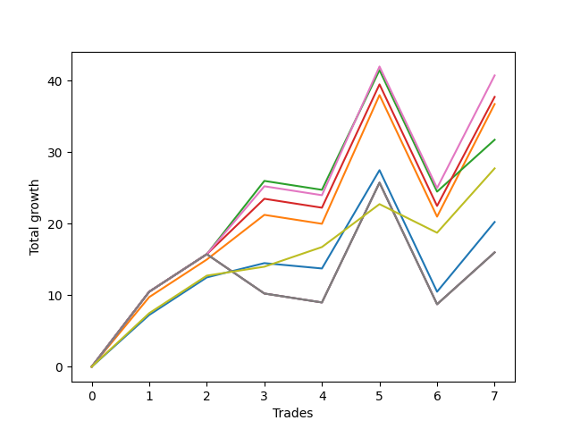

# Long Bulldog 006 
- Symbol: ES90d5m60m
- Date Range: 03/18/2022 - 07/08/2022
- Trading Period: 7:20-12:30
- Number of Trades: 7



| Name | Win Percent | Profit | Avg Profit / Trade |     | Name | Win Percent | Profit | Avg Profit / Trade |
| ---- | ----------- | ------ | ------------------ | --- | ---- | ----------- | ------ | ------------------ |
| Sorted By <br> Profit | | | | | Sorted By <br> Win Percentage ||||
| One | 71.43 | 22625.00 | 3232.14 |     | One | 71.43 | 22625.00 | 3232.14 |
| Three | 71.43 | 19875.00 | 2839.29 |     | Three | 71.43 | 19875.00 | 2839.29 |
| Seven | 42.86 | 19500.00 | 2785.71 |     | Zero | 71.43 | 11375.00 | 1625.00 |
| Five | 42.86 | 19500.00 | 2785.71 |     | Six | 57.14 | 16625.00 | 2375.00 |
| Four | 42.86 | 19500.00 | 2785.71 |     | Two | 57.14 | 15375.00 | 2196.43 |
| Six | 57.14 | 16625.00 | 2375.00 |     | Seven | 42.86 | 19500.00 | 2785.71 |
| Two | 57.14 | 15375.00 | 2196.43 |     | Five | 42.86 | 19500.00 | 2785.71 |
| Zero | 71.43 | 11375.00 | 1625.00 |     | Four | 42.86 | 19500.00 | 2785.71 |

### Test Zero
* Sell when price hits the middle line of the 20p bollinger
* No Stoploss
* Results:
```
Total Trades: 7
Percent Up: 71.43
Percent Down: 28.57
Total Points Moved Up: 22.75
Potential Profit: 11375.00
Total Points Ups: 40.50 Count Ups: 5
Total Points Downs: -17.75 Count Downs: 2
```

<details><summary>Trades</summary>

<code>In: 2022-03-23 10:50:00		Out: 2022-03-23 11:28:15		Total Position Time: 38:15		Total Move Up: 7.25		Total to Date: 7.25</code> <br />
<code>In: 2022-03-30 12:30:00		Out: 2022-03-30 12:46:25		Total Position Time: 16:25		Total Move Up: 7.75		Total to Date: 15.00</code> <br />
<code>In: 2022-03-31 11:25:00		Out: 2022-03-31 11:58:10		Total Position Time: 33:10		Total Move Up: 2.00		Total to Date: 17.00</code> <br />
<code>In: 2022-04-18 08:55:00		Out: 2022-04-18 09:54:40		Total Position Time: 59:40		Total Move Up: -0.75		Total to Date: 16.25</code> <br />
<code>In: 2022-04-20 12:00:00		Out: 2022-04-20 12:24:15		Total Position Time: 24:15		Total Move Up: 13.75		Total to Date: 30.00</code> <br />
<code>In: 2022-05-02 10:10:00		Out: 2022-05-02 11:10:55		Total Position Time: 60:55		Total Move Up: -17.00		Total to Date: 13.00</code> <br />
<code>In: 2022-06-29 09:35:00		Out: 2022-06-29 10:01:50		Total Position Time: 26:50		Total Move Up: 9.75		Total to Date: 22.75</code> <br />


</details>

### Test One
* Sell when the price hits the upper line of the 20p 1std bollinger
* No Stoploss
* Results:
```
Total Trades: 7
Percent Up: 71.43
Percent Down: 28.57
Total Points Moved Up: 45.25
Potential Profit: 22625.00
Total Points Ups: 63.50 Count Ups: 5
Total Points Downs: -18.25 Count Downs: 2
```

<details><summary>Trades</summary>

<code>In: 2022-03-23 10:50:00		Out: 2022-03-23 11:48:00		Total Position Time: 58:00		Total Move Up: 9.75		Total to Date: 9.75</code> <br />
<code>In: 2022-03-30 12:30:00		Out: 2022-03-30 12:59:50		Total Position Time: 29:50		Total Move Up: 13.75		Total to Date: 23.50</code> <br />
<code>In: 2022-03-31 11:25:00		Out: 2022-03-31 12:00:20		Total Position Time: 35:20		Total Move Up: 6.25		Total to Date: 29.75</code> <br />
<code>In: 2022-04-18 08:55:00		Out: 2022-04-18 09:55:55		Total Position Time: 60:55		Total Move Up: -1.25		Total to Date: 28.50</code> <br />
<code>In: 2022-04-20 12:00:00		Out: 2022-04-20 12:45:15		Total Position Time: 45:15		Total Move Up: 18.00		Total to Date: 46.50</code> <br />
<code>In: 2022-05-02 10:10:00		Out: 2022-05-02 11:10:55		Total Position Time: 60:55		Total Move Up: -17.00		Total to Date: 29.50</code> <br />
<code>In: 2022-06-29 09:35:00		Out: 2022-06-29 10:11:05		Total Position Time: 36:05		Total Move Up: 15.75		Total to Date: 45.25</code> <br />


</details>

### Test Two
* Sell when the price hits the upper line of the 20p 2std bollinger
* No Stoploss
* Results:
```
Total Trades: 7
Percent Up: 57.14
Percent Down: 42.86
Total Points Moved Up: 30.75
Potential Profit: 15375.00
Total Points Ups: 51.25 Count Ups: 4
Total Points Downs: -20.50 Count Downs: 3
```

<details><summary>Trades</summary>

<code>In: 2022-03-23 10:50:00		Out: 2022-03-23 11:50:55		Total Position Time: 60:55		Total Move Up: 10.50		Total to Date: 10.50</code> <br />
<code>In: 2022-03-30 12:30:00		Out: 2022-03-31 07:00:55		Total Position Time: 1110:55		Total Move Up: -2.25		Total to Date: 8.25</code> <br />
<code>In: 2022-03-31 11:25:00		Out: 2022-03-31 12:02:55		Total Position Time: 37:55		Total Move Up: 10.25		Total to Date: 18.50</code> <br />
<code>In: 2022-04-18 08:55:00		Out: 2022-04-18 09:55:55		Total Position Time: 60:55		Total Move Up: -1.25		Total to Date: 17.25</code> <br />
<code>In: 2022-04-20 12:00:00		Out: 2022-04-20 12:48:00		Total Position Time: 48:00		Total Move Up: 23.25		Total to Date: 40.50</code> <br />
<code>In: 2022-05-02 10:10:00		Out: 2022-05-02 11:10:55		Total Position Time: 60:55		Total Move Up: -17.00		Total to Date: 23.50</code> <br />
<code>In: 2022-06-29 09:35:00		Out: 2022-06-29 10:35:55		Total Position Time: 60:55		Total Move Up: 7.25		Total to Date: 30.75</code> <br />


</details>

### Test Three
* Sell when price hits the middle line of the 50p bollinger
* No Stoploss
* Results:
```
Total Trades: 7
Percent Up: 71.43
Percent Down: 28.57
Total Points Moved Up: 39.75
Potential Profit: 19875.00
Total Points Ups: 58.00 Count Ups: 5
Total Points Downs: -18.25 Count Downs: 2
```

<details><summary>Trades</summary>

<code>In: 2022-03-23 10:50:00		Out: 2022-03-23 11:50:55		Total Position Time: 60:55		Total Move Up: 10.50		Total to Date: 10.50</code> <br />
<code>In: 2022-03-30 12:30:00		Out: 2022-03-31 06:30:00		Total Position Time: 1080:00		Total Move Up: 7.25		Total to Date: 17.75</code> <br />
<code>In: 2022-03-31 11:25:00		Out: 2022-03-31 12:01:05		Total Position Time: 36:05		Total Move Up: 7.75		Total to Date: 25.50</code> <br />
<code>In: 2022-04-18 08:55:00		Out: 2022-04-18 09:55:55		Total Position Time: 60:55		Total Move Up: -1.25		Total to Date: 24.25</code> <br />
<code>In: 2022-04-20 12:00:00		Out: 2022-04-20 12:25:50		Total Position Time: 25:50		Total Move Up: 17.25		Total to Date: 41.50</code> <br />
<code>In: 2022-05-02 10:10:00		Out: 2022-05-02 11:10:55		Total Position Time: 60:55		Total Move Up: -17.00		Total to Date: 24.50</code> <br />
<code>In: 2022-06-29 09:35:00		Out: 2022-06-29 10:10:45		Total Position Time: 35:45		Total Move Up: 15.25		Total to Date: 39.75</code> <br />


</details>

### Test Four
* Sell when the price hits the upper line of the 50p 1std bollinger
* No Stoploss
* Results:
```
Total Trades: 7
Percent Up: 42.86
Percent Down: 57.14
Total Points Moved Up: 39.00
Potential Profit: 19500.00
Total Points Ups: 65.00 Count Ups: 3
Total Points Downs: -26.00 Count Downs: 4
```

<details><summary>Trades</summary>

<code>In: 2022-03-23 10:50:00		Out: 2022-03-23 11:50:55		Total Position Time: 60:55		Total Move Up: 10.50		Total to Date: 10.50</code> <br />
<code>In: 2022-03-30 12:30:00		Out: 2022-03-31 07:00:55		Total Position Time: 1110:55		Total Move Up: -2.25		Total to Date: 8.25</code> <br />
<code>In: 2022-03-31 11:25:00		Out: 2022-03-31 12:25:55		Total Position Time: 60:55		Total Move Up: -5.50		Total to Date: 2.75</code> <br />
<code>In: 2022-04-18 08:55:00		Out: 2022-04-18 09:55:55		Total Position Time: 60:55		Total Move Up: -1.25		Total to Date: 1.50</code> <br />
<code>In: 2022-04-20 12:00:00		Out: 2022-04-21 06:30:05		Total Position Time: 1110:05		Total Move Up: 47.25		Total to Date: 48.75</code> <br />
<code>In: 2022-05-02 10:10:00		Out: 2022-05-02 11:10:55		Total Position Time: 60:55		Total Move Up: -17.00		Total to Date: 31.75</code> <br />
<code>In: 2022-06-29 09:35:00		Out: 2022-06-29 10:35:55		Total Position Time: 60:55		Total Move Up: 7.25		Total to Date: 39.00</code> <br />


</details>

### Test Five
* Sell when the price hits the upper line of the 50p 2std bollinger
* No Stoploss
* Results:
```
Total Trades: 7
Percent Up: 42.86
Percent Down: 57.14
Total Points Moved Up: 39.00
Potential Profit: 19500.00
Total Points Ups: 65.00 Count Ups: 3
Total Points Downs: -26.00 Count Downs: 4
```

<details><summary>Trades</summary>

<code>In: 2022-03-23 10:50:00		Out: 2022-03-23 11:50:55		Total Position Time: 60:55		Total Move Up: 10.50		Total to Date: 10.50</code> <br />
<code>In: 2022-03-30 12:30:00		Out: 2022-03-31 07:00:55		Total Position Time: 1110:55		Total Move Up: -2.25		Total to Date: 8.25</code> <br />
<code>In: 2022-03-31 11:25:00		Out: 2022-03-31 12:25:55		Total Position Time: 60:55		Total Move Up: -5.50		Total to Date: 2.75</code> <br />
<code>In: 2022-04-18 08:55:00		Out: 2022-04-18 09:55:55		Total Position Time: 60:55		Total Move Up: -1.25		Total to Date: 1.50</code> <br />
<code>In: 2022-04-20 12:00:00		Out: 2022-04-21 06:30:05		Total Position Time: 1110:05		Total Move Up: 47.25		Total to Date: 48.75</code> <br />
<code>In: 2022-05-02 10:10:00		Out: 2022-05-02 11:10:55		Total Position Time: 60:55		Total Move Up: -17.00		Total to Date: 31.75</code> <br />
<code>In: 2022-06-29 09:35:00		Out: 2022-06-29 10:35:55		Total Position Time: 60:55		Total Move Up: 7.25		Total to Date: 39.00</code> <br />


</details>

### Test Six
* Sell when the price hits the middle line of the 1std VWAP
* No Stoploss
* Results:
```
Total Trades: 7
Percent Up: 57.14
Percent Down: 42.86
Total Points Moved Up: 33.25
Potential Profit: 16625.00
Total Points Ups: 53.75 Count Ups: 4
Total Points Downs: -20.50 Count Downs: 3
```

<details><summary>Trades</summary>

<code>In: 2022-03-23 10:50:00		Out: 2022-03-23 11:50:55		Total Position Time: 60:55		Total Move Up: 10.50		Total to Date: 10.50</code> <br />
<code>In: 2022-03-30 12:30:00		Out: 2022-03-31 07:00:55		Total Position Time: 1110:55		Total Move Up: -2.25		Total to Date: 8.25</code> <br />
<code>In: 2022-03-31 11:25:00		Out: 2022-03-31 12:02:25		Total Position Time: 37:25		Total Move Up: 9.50		Total to Date: 17.75</code> <br />
<code>In: 2022-04-18 08:55:00		Out: 2022-04-18 09:55:55		Total Position Time: 60:55		Total Move Up: -1.25		Total to Date: 16.50</code> <br />
<code>In: 2022-04-20 12:00:00		Out: 2022-04-20 12:26:10		Total Position Time: 26:10		Total Move Up: 18.00		Total to Date: 34.50</code> <br />
<code>In: 2022-05-02 10:10:00		Out: 2022-05-02 11:10:55		Total Position Time: 60:55		Total Move Up: -17.00		Total to Date: 17.50</code> <br />
<code>In: 2022-06-29 09:35:00		Out: 2022-06-29 10:10:55		Total Position Time: 35:55		Total Move Up: 15.75		Total to Date: 33.25</code> <br />


</details>

### Test Seven
* Sell when the price hits the upper line of the 1std VWAP
* No Stoploss
* Results:
```
Total Trades: 7
Percent Up: 42.86
Percent Down: 57.14
Total Points Moved Up: 39.00
Potential Profit: 19500.00
Total Points Ups: 65.00 Count Ups: 3
Total Points Downs: -26.00 Count Downs: 4
```

<details><summary>Trades</summary>

<code>In: 2022-03-23 10:50:00		Out: 2022-03-23 11:50:55		Total Position Time: 60:55		Total Move Up: 10.50		Total to Date: 10.50</code> <br />
<code>In: 2022-03-30 12:30:00		Out: 2022-03-31 07:00:55		Total Position Time: 1110:55		Total Move Up: -2.25		Total to Date: 8.25</code> <br />
<code>In: 2022-03-31 11:25:00		Out: 2022-03-31 12:25:55		Total Position Time: 60:55		Total Move Up: -5.50		Total to Date: 2.75</code> <br />
<code>In: 2022-04-18 08:55:00		Out: 2022-04-18 09:55:55		Total Position Time: 60:55		Total Move Up: -1.25		Total to Date: 1.50</code> <br />
<code>In: 2022-04-20 12:00:00		Out: 2022-04-21 06:30:05		Total Position Time: 1110:05		Total Move Up: 47.25		Total to Date: 48.75</code> <br />
<code>In: 2022-05-02 10:10:00		Out: 2022-05-02 11:10:55		Total Position Time: 60:55		Total Move Up: -17.00		Total to Date: 31.75</code> <br />
<code>In: 2022-06-29 09:35:00		Out: 2022-06-29 10:35:55		Total Position Time: 60:55		Total Move Up: 7.25		Total to Date: 39.00</code> <br />


</details>