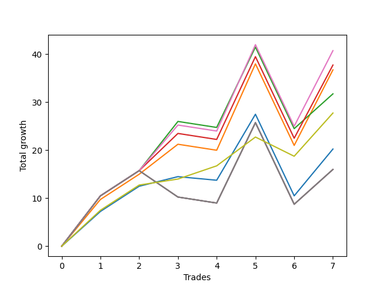

# Long Bulldog 006 
- Symbol: ES90d5m60m
- Date Range: 03/18/2022 - 07/08/2022
- Trading Period: 7:20-12:30
- Number of Trades: 7



| Name | Win Percent | Profit | Avg Profit / Trade |     | Name | Win Percent | Profit | Avg Profit / Trade |
| ---- | ----------- | ------ | ------------------ | --- | ---- | ----------- | ------ | ------------------ |
| Sorted By <br> Profit | | | | | Sorted By <br> Win Percentage ||||
| Six | 71.43 | 20375.00 | 2910.71 |     | Seventy-Three | 85.71 | 13875.00 | 1982.14 |
| Three | 71.43 | 18875.00 | 2696.43 |     | Six | 71.43 | 20375.00 | 2910.71 |
| One | 71.43 | 18375.00 | 2625.00 |     | Three | 71.43 | 18875.00 | 2696.43 |
| Two | 71.43 | 15875.00 | 2267.86 |     | One | 71.43 | 18375.00 | 2625.00 |
| Seventy-Three | 85.71 | 13875.00 | 1982.14 |     | Two | 71.43 | 15875.00 | 2267.86 |
| Zero | 71.43 | 10125.00 | 1446.43 |     | Zero | 71.43 | 10125.00 | 1446.43 |
| Seven | 57.14 | 8000.00 | 1142.86 |     | Seven | 57.14 | 8000.00 | 1142.86 |
| Five | 57.14 | 8000.00 | 1142.86 |     | Five | 57.14 | 8000.00 | 1142.86 |
| Four | 57.14 | 8000.00 | 1142.86 |     | Four | 57.14 | 8000.00 | 1142.86 |

## NO STOPLOSS

### Test Zero
* Sell when price hits the middle line of the 20p bollinger
* No Stoploss
* Results:
```
Total Trades: 7
Percent Up: 71.43
Percent Down: 28.57
Total Points Moved Up: 20.25
Potential Profit: 10125.00
Total Points Ups: 38.00 Count Ups: 5
Total Points Downs: -17.75 Count Downs: 2
```

<details><summary>Trades</summary>

<code>In: 2022-03-23 10:50:00		Out: 2022-03-23 11:28:15		Total Position Time: 38:15		Total Move Up: 7.25		Total to Date: 7.25</code> <br />
<code>In: 2022-03-30 12:30:00		Out: 2022-03-30 12:46:00		Total Position Time: 16:00		Total Move Up: 5.25		Total to Date: 12.50</code> <br />
<code>In: 2022-03-31 11:25:00		Out: 2022-03-31 11:58:10		Total Position Time: 33:10		Total Move Up: 2.00		Total to Date: 14.50</code> <br />
<code>In: 2022-04-18 08:55:00		Out: 2022-04-18 09:54:40		Total Position Time: 59:40		Total Move Up: -0.75		Total to Date: 13.75</code> <br />
<code>In: 2022-04-20 12:00:00		Out: 2022-04-20 12:24:15		Total Position Time: 24:15		Total Move Up: 13.75		Total to Date: 27.50</code> <br />
<code>In: 2022-05-02 10:10:00		Out: 2022-05-02 11:10:55		Total Position Time: 60:55		Total Move Up: -17.00		Total to Date: 10.50</code> <br />
<code>In: 2022-06-29 09:35:00		Out: 2022-06-29 10:01:50		Total Position Time: 26:50		Total Move Up: 9.75		Total to Date: 20.25</code> <br />


</details>

### Test One
* Sell when the price hits the upper line of the 20p 1std bollinger
* No Stoploss
* Results:
```
Total Trades: 7
Percent Up: 71.43
Percent Down: 28.57
Total Points Moved Up: 36.75
Potential Profit: 18375.00
Total Points Ups: 55.00 Count Ups: 5
Total Points Downs: -18.25 Count Downs: 2
```

<details><summary>Trades</summary>

<code>In: 2022-03-23 10:50:00		Out: 2022-03-23 11:48:00		Total Position Time: 58:00		Total Move Up: 9.75		Total to Date: 9.75</code> <br />
<code>In: 2022-03-30 12:30:00		Out: 2022-03-30 12:46:00		Total Position Time: 16:00		Total Move Up: 5.25		Total to Date: 15.00</code> <br />
<code>In: 2022-03-31 11:25:00		Out: 2022-03-31 12:00:20		Total Position Time: 35:20		Total Move Up: 6.25		Total to Date: 21.25</code> <br />
<code>In: 2022-04-18 08:55:00		Out: 2022-04-18 09:55:55		Total Position Time: 60:55		Total Move Up: -1.25		Total to Date: 20.00</code> <br />
<code>In: 2022-04-20 12:00:00		Out: 2022-04-20 12:45:15		Total Position Time: 45:15		Total Move Up: 18.00		Total to Date: 38.00</code> <br />
<code>In: 2022-05-02 10:10:00		Out: 2022-05-02 11:10:55		Total Position Time: 60:55		Total Move Up: -17.00		Total to Date: 21.00</code> <br />
<code>In: 2022-06-29 09:35:00		Out: 2022-06-29 10:11:05		Total Position Time: 36:05		Total Move Up: 15.75		Total to Date: 36.75</code> <br />


</details>

### Test Two
* Sell when the price hits the upper line of the 20p 2std bollinger
* No Stoploss
* Results:
```
Total Trades: 7
Percent Up: 71.43
Percent Down: 28.57
Total Points Moved Up: 31.75
Potential Profit: 15875.00
Total Points Ups: 50.00 Count Ups: 5
Total Points Downs: -18.25 Count Downs: 2
```

<details><summary>Trades</summary>

<code>In: 2022-03-23 10:50:00		Out: 2022-03-23 11:50:55		Total Position Time: 60:55		Total Move Up: 10.50		Total to Date: 10.50</code> <br />
<code>In: 2022-03-30 12:30:00		Out: 2022-03-30 12:46:00		Total Position Time: 16:00		Total Move Up: 5.25		Total to Date: 15.75</code> <br />
<code>In: 2022-03-31 11:25:00		Out: 2022-03-31 12:02:55		Total Position Time: 37:55		Total Move Up: 10.25		Total to Date: 26.00</code> <br />
<code>In: 2022-04-18 08:55:00		Out: 2022-04-18 09:55:55		Total Position Time: 60:55		Total Move Up: -1.25		Total to Date: 24.75</code> <br />
<code>In: 2022-04-20 12:00:00		Out: 2022-04-20 12:46:00		Total Position Time: 46:00		Total Move Up: 16.75		Total to Date: 41.50</code> <br />
<code>In: 2022-05-02 10:10:00		Out: 2022-05-02 11:10:55		Total Position Time: 60:55		Total Move Up: -17.00		Total to Date: 24.50</code> <br />
<code>In: 2022-06-29 09:35:00		Out: 2022-06-29 10:35:55		Total Position Time: 60:55		Total Move Up: 7.25		Total to Date: 31.75</code> <br />


</details>

### Test Three
* Sell when price hits the middle line of the 50p bollinger
* No Stoploss
* Results:
```
Total Trades: 7
Percent Up: 71.43
Percent Down: 28.57
Total Points Moved Up: 37.75
Potential Profit: 18875.00
Total Points Ups: 56.00 Count Ups: 5
Total Points Downs: -18.25 Count Downs: 2
```

<details><summary>Trades</summary>

<code>In: 2022-03-23 10:50:00		Out: 2022-03-23 11:50:55		Total Position Time: 60:55		Total Move Up: 10.50		Total to Date: 10.50</code> <br />
<code>In: 2022-03-30 12:30:00		Out: 2022-03-30 12:46:00		Total Position Time: 16:00		Total Move Up: 5.25		Total to Date: 15.75</code> <br />
<code>In: 2022-03-31 11:25:00		Out: 2022-03-31 12:01:05		Total Position Time: 36:05		Total Move Up: 7.75		Total to Date: 23.50</code> <br />
<code>In: 2022-04-18 08:55:00		Out: 2022-04-18 09:55:55		Total Position Time: 60:55		Total Move Up: -1.25		Total to Date: 22.25</code> <br />
<code>In: 2022-04-20 12:00:00		Out: 2022-04-20 12:25:50		Total Position Time: 25:50		Total Move Up: 17.25		Total to Date: 39.50</code> <br />
<code>In: 2022-05-02 10:10:00		Out: 2022-05-02 11:10:55		Total Position Time: 60:55		Total Move Up: -17.00		Total to Date: 22.50</code> <br />
<code>In: 2022-06-29 09:35:00		Out: 2022-06-29 10:10:45		Total Position Time: 35:45		Total Move Up: 15.25		Total to Date: 37.75</code> <br />


</details>

### Test Four
* Sell when the price hits the upper line of the 50p 1std bollinger
* No Stoploss
* Results:
```
Total Trades: 7
Percent Up: 57.14
Percent Down: 42.86
Total Points Moved Up: 16.00
Potential Profit: 8000.00
Total Points Ups: 39.75 Count Ups: 4
Total Points Downs: -23.75 Count Downs: 3
```

<details><summary>Trades</summary>

<code>In: 2022-03-23 10:50:00		Out: 2022-03-23 11:50:55		Total Position Time: 60:55		Total Move Up: 10.50		Total to Date: 10.50</code> <br />
<code>In: 2022-03-30 12:30:00		Out: 2022-03-30 12:46:00		Total Position Time: 16:00		Total Move Up: 5.25		Total to Date: 15.75</code> <br />
<code>In: 2022-03-31 11:25:00		Out: 2022-03-31 12:25:55		Total Position Time: 60:55		Total Move Up: -5.50		Total to Date: 10.25</code> <br />
<code>In: 2022-04-18 08:55:00		Out: 2022-04-18 09:55:55		Total Position Time: 60:55		Total Move Up: -1.25		Total to Date: 9.00</code> <br />
<code>In: 2022-04-20 12:00:00		Out: 2022-04-20 12:46:00		Total Position Time: 46:00		Total Move Up: 16.75		Total to Date: 25.75</code> <br />
<code>In: 2022-05-02 10:10:00		Out: 2022-05-02 11:10:55		Total Position Time: 60:55		Total Move Up: -17.00		Total to Date: 8.75</code> <br />
<code>In: 2022-06-29 09:35:00		Out: 2022-06-29 10:35:55		Total Position Time: 60:55		Total Move Up: 7.25		Total to Date: 16.00</code> <br />


</details>

### Test Five
* Sell when the price hits the upper line of the 50p 2std bollinger
* No Stoploss
* Results:
```
Total Trades: 7
Percent Up: 57.14
Percent Down: 42.86
Total Points Moved Up: 16.00
Potential Profit: 8000.00
Total Points Ups: 39.75 Count Ups: 4
Total Points Downs: -23.75 Count Downs: 3
```

<details><summary>Trades</summary>

<code>In: 2022-03-23 10:50:00		Out: 2022-03-23 11:50:55		Total Position Time: 60:55		Total Move Up: 10.50		Total to Date: 10.50</code> <br />
<code>In: 2022-03-30 12:30:00		Out: 2022-03-30 12:46:00		Total Position Time: 16:00		Total Move Up: 5.25		Total to Date: 15.75</code> <br />
<code>In: 2022-03-31 11:25:00		Out: 2022-03-31 12:25:55		Total Position Time: 60:55		Total Move Up: -5.50		Total to Date: 10.25</code> <br />
<code>In: 2022-04-18 08:55:00		Out: 2022-04-18 09:55:55		Total Position Time: 60:55		Total Move Up: -1.25		Total to Date: 9.00</code> <br />
<code>In: 2022-04-20 12:00:00		Out: 2022-04-20 12:46:00		Total Position Time: 46:00		Total Move Up: 16.75		Total to Date: 25.75</code> <br />
<code>In: 2022-05-02 10:10:00		Out: 2022-05-02 11:10:55		Total Position Time: 60:55		Total Move Up: -17.00		Total to Date: 8.75</code> <br />
<code>In: 2022-06-29 09:35:00		Out: 2022-06-29 10:35:55		Total Position Time: 60:55		Total Move Up: 7.25		Total to Date: 16.00</code> <br />


</details>

### Test Six
* Sell when the price hits the middle line of the 1std VWAP
* No Stoploss
* Results:
```
Total Trades: 7
Percent Up: 71.43
Percent Down: 28.57
Total Points Moved Up: 40.75
Potential Profit: 20375.00
Total Points Ups: 59.00 Count Ups: 5
Total Points Downs: -18.25 Count Downs: 2
```

<details><summary>Trades</summary>

<code>In: 2022-03-23 10:50:00		Out: 2022-03-23 11:50:55		Total Position Time: 60:55		Total Move Up: 10.50		Total to Date: 10.50</code> <br />
<code>In: 2022-03-30 12:30:00		Out: 2022-03-30 12:46:00		Total Position Time: 16:00		Total Move Up: 5.25		Total to Date: 15.75</code> <br />
<code>In: 2022-03-31 11:25:00		Out: 2022-03-31 12:02:25		Total Position Time: 37:25		Total Move Up: 9.50		Total to Date: 25.25</code> <br />
<code>In: 2022-04-18 08:55:00		Out: 2022-04-18 09:55:55		Total Position Time: 60:55		Total Move Up: -1.25		Total to Date: 24.00</code> <br />
<code>In: 2022-04-20 12:00:00		Out: 2022-04-20 12:26:10		Total Position Time: 26:10		Total Move Up: 18.00		Total to Date: 42.00</code> <br />
<code>In: 2022-05-02 10:10:00		Out: 2022-05-02 11:10:55		Total Position Time: 60:55		Total Move Up: -17.00		Total to Date: 25.00</code> <br />
<code>In: 2022-06-29 09:35:00		Out: 2022-06-29 10:10:55		Total Position Time: 35:55		Total Move Up: 15.75		Total to Date: 40.75</code> <br />


</details>

### Test Seven
* Sell when the price hits the upper line of the 1std VWAP
* No Stoploss
* Results:
```
Total Trades: 7
Percent Up: 57.14
Percent Down: 42.86
Total Points Moved Up: 16.00
Potential Profit: 8000.00
Total Points Ups: 39.75 Count Ups: 4
Total Points Downs: -23.75 Count Downs: 3
```

<details><summary>Trades</summary>

<code>In: 2022-03-23 10:50:00		Out: 2022-03-23 11:50:55		Total Position Time: 60:55		Total Move Up: 10.50		Total to Date: 10.50</code> <br />
<code>In: 2022-03-30 12:30:00		Out: 2022-03-30 12:46:00		Total Position Time: 16:00		Total Move Up: 5.25		Total to Date: 15.75</code> <br />
<code>In: 2022-03-31 11:25:00		Out: 2022-03-31 12:25:55		Total Position Time: 60:55		Total Move Up: -5.50		Total to Date: 10.25</code> <br />
<code>In: 2022-04-18 08:55:00		Out: 2022-04-18 09:55:55		Total Position Time: 60:55		Total Move Up: -1.25		Total to Date: 9.00</code> <br />
<code>In: 2022-04-20 12:00:00		Out: 2022-04-20 12:46:00		Total Position Time: 46:00		Total Move Up: 16.75		Total to Date: 25.75</code> <br />
<code>In: 2022-05-02 10:10:00		Out: 2022-05-02 11:10:55		Total Position Time: 60:55		Total Move Up: -17.00		Total to Date: 8.75</code> <br />
<code>In: 2022-06-29 09:35:00		Out: 2022-06-29 10:35:55		Total Position Time: 60:55		Total Move Up: 7.25		Total to Date: 16.00</code> <br />


</details>

## SPECIAL EXIT CONDITIONS 

### Test Seventy-Three
* Sell when the linear regression slope changes to negative
* No Stoploss
* Results:
```
Total Trades: 7
Percent Up: 85.71
Percent Down: 14.29
Total Points Moved Up: 27.75
Potential Profit: 13875.00
Total Points Ups: 31.75 Count Ups: 6
Total Points Downs: -4.00 Count Downs: 1
```

<details><summary>Trades</summary>

<code>In: 2022-03-23 10:50:00		Out: 2022-03-23 10:55:05		Total Position Time: 05:05		Total Move Up: 7.50		Total to Date: 7.50</code> <br />
<code>In: 2022-03-30 12:30:00		Out: 2022-03-30 12:36:05		Total Position Time: 06:05		Total Move Up: 5.25		Total to Date: 12.75</code> <br />
<code>In: 2022-03-31 11:25:00		Out: 2022-03-31 11:37:05		Total Position Time: 12:05		Total Move Up: 1.25		Total to Date: 14.00</code> <br />
<code>In: 2022-04-18 08:55:00		Out: 2022-04-18 08:58:05		Total Position Time: 03:05		Total Move Up: 2.75		Total to Date: 16.75</code> <br />
<code>In: 2022-04-20 12:00:00		Out: 2022-04-20 12:12:05		Total Position Time: 12:05		Total Move Up: 6.00		Total to Date: 22.75</code> <br />
<code>In: 2022-05-02 10:10:00		Out: 2022-05-02 10:23:05		Total Position Time: 13:05		Total Move Up: -4.00		Total to Date: 18.75</code> <br />
<code>In: 2022-06-29 09:35:00		Out: 2022-06-29 09:40:05		Total Position Time: 05:05		Total Move Up: 9.00		Total to Date: 27.75</code> <br />


</details>