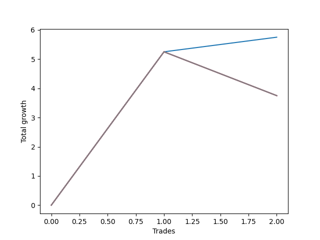

# Long Entry Wallace MJ 007 
- Symbol: ES90d5m60m
- Date Range: 03/18/2022 - 07/08/2022
- Trading Period: 7:20-12:30
- Number of Trades: 2



| Name | Win Percent | Profit | Avg Profit / Trade |     | Name | Win Percent | Profit | Avg Profit / Trade |
| ---- | ----------- | ------ | ------------------ | --- | ---- | ----------- | ------ | ------------------ |
| Sorted By <br> Profit | | | | | Sorted By <br> Win Percentage ||||
| Zero | 100.00 | 2875.00 | 1437.50 |     | Zero | 100.00 | 2875.00 | 1437.50 |
| Seven | 50.00 | 1875.00 | 937.50 |     | Seven | 50.00 | 1875.00 | 937.50 |
| Six | 50.00 | 1875.00 | 937.50 |     | Six | 50.00 | 1875.00 | 937.50 |
| Five | 50.00 | 1875.00 | 937.50 |     | Five | 50.00 | 1875.00 | 937.50 |
| Four | 50.00 | 1875.00 | 937.50 |     | Four | 50.00 | 1875.00 | 937.50 |
| Three | 50.00 | 1875.00 | 937.50 |     | Three | 50.00 | 1875.00 | 937.50 |
| Two | 50.00 | 1875.00 | 937.50 |     | Two | 50.00 | 1875.00 | 937.50 |
| One | 50.00 | 1875.00 | 937.50 |     | One | 50.00 | 1875.00 | 937.50 |

### Test Zero
* Sell when price hits the middle line of the 20p bollinger
* No Stoploss
* Results:
```
Total Trades: 2
Percent Up: 100.00
Percent Down: 0.00
Total Points Moved Up: 5.75
Potential Profit: 2875.00
Total Points Ups: 5.75 Count Ups: 2
Total Points Downs: 0.00 Count Downs: 0
```

<details><summary>Trades</summary>

<code>In: 2022-03-30 12:30:00		Out: 2022-03-30 12:46:00		Total Position Time: 16:00		Total Move Up: 5.25		Total to Date: 5.25</code> <br />
<code>In: 2022-03-31 09:40:00		Out: 2022-03-31 10:31:05		Total Position Time: 51:05		Total Move Up: 0.50		Total to Date: 5.75</code> <br />


</details>

### Test One
* Sell when the price hits the upper line of the 20p 1std bollinger
* No Stoploss
* Results:
```
Total Trades: 2
Percent Up: 50.00
Percent Down: 50.00
Total Points Moved Up: 3.75
Potential Profit: 1875.00
Total Points Ups: 5.25 Count Ups: 1
Total Points Downs: -1.50 Count Downs: 1
```

<details><summary>Trades</summary>

<code>In: 2022-03-30 12:30:00		Out: 2022-03-30 12:46:00		Total Position Time: 16:00		Total Move Up: 5.25		Total to Date: 5.25</code> <br />
<code>In: 2022-03-31 09:40:00		Out: 2022-03-31 10:40:55		Total Position Time: 60:55		Total Move Up: -1.50		Total to Date: 3.75</code> <br />


</details>

### Test Two
* Sell when the price hits the upper line of the 20p 2std bollinger
* No Stoploss
* Results:
```
Total Trades: 2
Percent Up: 50.00
Percent Down: 50.00
Total Points Moved Up: 3.75
Potential Profit: 1875.00
Total Points Ups: 5.25 Count Ups: 1
Total Points Downs: -1.50 Count Downs: 1
```

<details><summary>Trades</summary>

<code>In: 2022-03-30 12:30:00		Out: 2022-03-30 12:46:00		Total Position Time: 16:00		Total Move Up: 5.25		Total to Date: 5.25</code> <br />
<code>In: 2022-03-31 09:40:00		Out: 2022-03-31 10:40:55		Total Position Time: 60:55		Total Move Up: -1.50		Total to Date: 3.75</code> <br />


</details>

### Test Three
* Sell when price hits the middle line of the 50p bollinger
* No Stoploss
* Results:
```
Total Trades: 2
Percent Up: 50.00
Percent Down: 50.00
Total Points Moved Up: 3.75
Potential Profit: 1875.00
Total Points Ups: 5.25 Count Ups: 1
Total Points Downs: -1.50 Count Downs: 1
```

<details><summary>Trades</summary>

<code>In: 2022-03-30 12:30:00		Out: 2022-03-30 12:46:00		Total Position Time: 16:00		Total Move Up: 5.25		Total to Date: 5.25</code> <br />
<code>In: 2022-03-31 09:40:00		Out: 2022-03-31 10:40:55		Total Position Time: 60:55		Total Move Up: -1.50		Total to Date: 3.75</code> <br />


</details>

### Test Four
* Sell when the price hits the upper line of the 50p 1std bollinger
* No Stoploss
* Results:
```
Total Trades: 2
Percent Up: 50.00
Percent Down: 50.00
Total Points Moved Up: 3.75
Potential Profit: 1875.00
Total Points Ups: 5.25 Count Ups: 1
Total Points Downs: -1.50 Count Downs: 1
```

<details><summary>Trades</summary>

<code>In: 2022-03-30 12:30:00		Out: 2022-03-30 12:46:00		Total Position Time: 16:00		Total Move Up: 5.25		Total to Date: 5.25</code> <br />
<code>In: 2022-03-31 09:40:00		Out: 2022-03-31 10:40:55		Total Position Time: 60:55		Total Move Up: -1.50		Total to Date: 3.75</code> <br />


</details>

### Test Five
* Sell when the price hits the upper line of the 50p 2std bollinger
* No Stoploss
* Results:
```
Total Trades: 2
Percent Up: 50.00
Percent Down: 50.00
Total Points Moved Up: 3.75
Potential Profit: 1875.00
Total Points Ups: 5.25 Count Ups: 1
Total Points Downs: -1.50 Count Downs: 1
```

<details><summary>Trades</summary>

<code>In: 2022-03-30 12:30:00		Out: 2022-03-30 12:46:00		Total Position Time: 16:00		Total Move Up: 5.25		Total to Date: 5.25</code> <br />
<code>In: 2022-03-31 09:40:00		Out: 2022-03-31 10:40:55		Total Position Time: 60:55		Total Move Up: -1.50		Total to Date: 3.75</code> <br />


</details>

### Test Six
* Sell when the price hits the middle line of the 1std VWAP
* No Stoploss
* Results:
```
Total Trades: 2
Percent Up: 50.00
Percent Down: 50.00
Total Points Moved Up: 3.75
Potential Profit: 1875.00
Total Points Ups: 5.25 Count Ups: 1
Total Points Downs: -1.50 Count Downs: 1
```

<details><summary>Trades</summary>

<code>In: 2022-03-30 12:30:00		Out: 2022-03-30 12:46:00		Total Position Time: 16:00		Total Move Up: 5.25		Total to Date: 5.25</code> <br />
<code>In: 2022-03-31 09:40:00		Out: 2022-03-31 10:40:55		Total Position Time: 60:55		Total Move Up: -1.50		Total to Date: 3.75</code> <br />


</details>

### Test Seven
* Sell when the price hits the upper line of the 1std VWAP
* No Stoploss
* Results:
```
Total Trades: 2
Percent Up: 50.00
Percent Down: 50.00
Total Points Moved Up: 3.75
Potential Profit: 1875.00
Total Points Ups: 5.25 Count Ups: 1
Total Points Downs: -1.50 Count Downs: 1
```

<details><summary>Trades</summary>

<code>In: 2022-03-30 12:30:00		Out: 2022-03-30 12:46:00		Total Position Time: 16:00		Total Move Up: 5.25		Total to Date: 5.25</code> <br />
<code>In: 2022-03-31 09:40:00		Out: 2022-03-31 10:40:55		Total Position Time: 60:55		Total Move Up: -1.50		Total to Date: 3.75</code> <br />


</details>