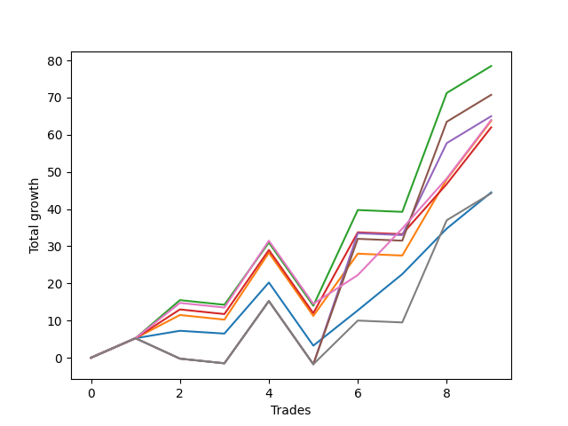

# Long Wallace 004 
- Symbol: ES90d5m60m
- Date Range: 03/18/2022 - 07/08/2022
- Trading Period: 7:20-12:30
- Number of Trades: 9



| Name | Win Percent | Profit | Avg Profit / Trade |     | Name | Win Percent | Profit | Avg Profit / Trade |
| ---- | ----------- | ------ | ------------------ | --- | ---- | ----------- | ------ | ------------------ |
| Sorted By <br> Profit | | | | | Sorted By <br> Win Percentage ||||
| Five | 44.44 | 46875.00 | 5208.33 |     | Zero | 77.78 | 23500.00 | 2611.11 |
| Four | 44.44 | 44000.00 | 4888.89 |     | One | 66.67 | 36125.00 | 4013.89 |
| Two | 55.56 | 38750.00 | 4305.56 |     | Three | 66.67 | 32000.00 | 3555.56 |
| One | 66.67 | 36125.00 | 4013.89 |     | Six | 66.67 | 28250.00 | 3138.89 |
| Seven | 44.44 | 33625.00 | 3736.11 |     | Two | 55.56 | 38750.00 | 4305.56 |
| Three | 66.67 | 32000.00 | 3555.56 |     | Five | 44.44 | 46875.00 | 5208.33 |
| Six | 66.67 | 28250.00 | 3138.89 |     | Four | 44.44 | 44000.00 | 4888.89 |
| Zero | 77.78 | 23500.00 | 2611.11 |     | Seven | 44.44 | 33625.00 | 3736.11 |

### Test Zero
* Sell when price hits the middle line of the 20p bollinger
* No Stoploss
* Results:
```
Total Trades: 9
Percent Up: 77.78
Percent Down: 22.22
Total Points Moved Up: 47.00
Potential Profit: 23500.00
Total Points Ups: 64.75 Count Ups: 7
Total Points Downs: -17.75 Count Downs: 2
```

<details><summary>Trades</summary>

<code>In: 2022-03-30 12:30:00		Out: 2022-03-30 12:46:25		Total Position Time: 16:25		Total Move Up: 7.75		Total to Date: 7.75</code> <br />
<code>In: 2022-03-31 11:25:00		Out: 2022-03-31 11:58:10		Total Position Time: 33:10		Total Move Up: 2.00		Total to Date: 9.75</code> <br />
<code>In: 2022-04-18 08:55:00		Out: 2022-04-18 09:54:40		Total Position Time: 59:40		Total Move Up: -0.75		Total to Date: 9.00</code> <br />
<code>In: 2022-04-20 12:00:00		Out: 2022-04-20 12:24:15		Total Position Time: 24:15		Total Move Up: 13.75		Total to Date: 22.75</code> <br />
<code>In: 2022-05-02 10:10:00		Out: 2022-05-02 11:10:55		Total Position Time: 60:55		Total Move Up: -17.00		Total to Date: 5.75</code> <br />
<code>In: 2022-06-02 07:30:00		Out: 2022-06-02 07:38:55		Total Position Time: 08:55		Total Move Up: 9.50		Total to Date: 15.25</code> <br />
<code>In: 2022-06-09 08:10:00		Out: 2022-06-09 08:42:25		Total Position Time: 32:25		Total Move Up: 9.75		Total to Date: 25.00</code> <br />
<code>In: 2022-06-15 11:15:00		Out: 2022-06-15 11:17:05		Total Position Time: 02:05		Total Move Up: 12.25		Total to Date: 37.25</code> <br />
<code>In: 2022-06-29 09:35:00		Out: 2022-06-29 10:01:50		Total Position Time: 26:50		Total Move Up: 9.75		Total to Date: 47.00</code> <br />


</details>

### Test One
* Sell when the price hits the upper line of the 20p 1std bollinger
* No Stoploss
* Results:
```
Total Trades: 9
Percent Up: 66.67
Percent Down: 33.33
Total Points Moved Up: 72.25
Potential Profit: 36125.00
Total Points Ups: 91.00 Count Ups: 6
Total Points Downs: -18.75 Count Downs: 3
```

<details><summary>Trades</summary>

<code>In: 2022-03-30 12:30:00		Out: 2022-03-30 12:59:50		Total Position Time: 29:50		Total Move Up: 13.75		Total to Date: 13.75</code> <br />
<code>In: 2022-03-31 11:25:00		Out: 2022-03-31 12:00:20		Total Position Time: 35:20		Total Move Up: 6.25		Total to Date: 20.00</code> <br />
<code>In: 2022-04-18 08:55:00		Out: 2022-04-18 09:55:55		Total Position Time: 60:55		Total Move Up: -1.25		Total to Date: 18.75</code> <br />
<code>In: 2022-04-20 12:00:00		Out: 2022-04-20 12:45:15		Total Position Time: 45:15		Total Move Up: 18.00		Total to Date: 36.75</code> <br />
<code>In: 2022-05-02 10:10:00		Out: 2022-05-02 11:10:55		Total Position Time: 60:55		Total Move Up: -17.00		Total to Date: 19.75</code> <br />
<code>In: 2022-06-02 07:30:00		Out: 2022-06-02 07:56:05		Total Position Time: 26:05		Total Move Up: 16.75		Total to Date: 36.50</code> <br />
<code>In: 2022-06-09 08:10:00		Out: 2022-06-09 09:10:55		Total Position Time: 60:55		Total Move Up: -0.50		Total to Date: 36.00</code> <br />
<code>In: 2022-06-15 11:15:00		Out: 2022-06-15 11:38:55		Total Position Time: 23:55		Total Move Up: 20.50		Total to Date: 56.50</code> <br />
<code>In: 2022-06-29 09:35:00		Out: 2022-06-29 10:11:05		Total Position Time: 36:05		Total Move Up: 15.75		Total to Date: 72.25</code> <br />


</details>

### Test Two
* Sell when the price hits the upper line of the 20p 2std bollinger
* No Stoploss
* Results:
```
Total Trades: 9
Percent Up: 55.56
Percent Down: 44.44
Total Points Moved Up: 77.50
Potential Profit: 38750.00
Total Points Ups: 98.50 Count Ups: 5
Total Points Downs: -21.00 Count Downs: 4
```

<details><summary>Trades</summary>

<code>In: 2022-03-30 12:30:00		Out: 2022-03-31 07:00:55		Total Position Time: 1110:55		Total Move Up: -2.25		Total to Date: -2.25</code> <br />
<code>In: 2022-03-31 11:25:00		Out: 2022-03-31 12:02:55		Total Position Time: 37:55		Total Move Up: 10.25		Total to Date: 8.00</code> <br />
<code>In: 2022-04-18 08:55:00		Out: 2022-04-18 09:55:55		Total Position Time: 60:55		Total Move Up: -1.25		Total to Date: 6.75</code> <br />
<code>In: 2022-04-20 12:00:00		Out: 2022-04-20 12:48:00		Total Position Time: 48:00		Total Move Up: 23.25		Total to Date: 30.00</code> <br />
<code>In: 2022-05-02 10:10:00		Out: 2022-05-02 11:10:55		Total Position Time: 60:55		Total Move Up: -17.00		Total to Date: 13.00</code> <br />
<code>In: 2022-06-02 07:30:00		Out: 2022-06-02 08:02:25		Total Position Time: 32:25		Total Move Up: 25.75		Total to Date: 38.75</code> <br />
<code>In: 2022-06-09 08:10:00		Out: 2022-06-09 09:10:55		Total Position Time: 60:55		Total Move Up: -0.50		Total to Date: 38.25</code> <br />
<code>In: 2022-06-15 11:15:00		Out: 2022-06-15 11:41:00		Total Position Time: 26:00		Total Move Up: 32.00		Total to Date: 70.25</code> <br />
<code>In: 2022-06-29 09:35:00		Out: 2022-06-29 10:35:55		Total Position Time: 60:55		Total Move Up: 7.25		Total to Date: 77.50</code> <br />


</details>

### Test Three
* Sell when price hits the middle line of the 50p bollinger
* No Stoploss
* Results:
```
Total Trades: 9
Percent Up: 66.67
Percent Down: 33.33
Total Points Moved Up: 64.00
Potential Profit: 32000.00
Total Points Ups: 82.75 Count Ups: 6
Total Points Downs: -18.75 Count Downs: 3
```

<details><summary>Trades</summary>

<code>In: 2022-03-30 12:30:00		Out: 2022-03-31 06:30:00		Total Position Time: 1080:00		Total Move Up: 7.25		Total to Date: 7.25</code> <br />
<code>In: 2022-03-31 11:25:00		Out: 2022-03-31 12:01:05		Total Position Time: 36:05		Total Move Up: 7.75		Total to Date: 15.00</code> <br />
<code>In: 2022-04-18 08:55:00		Out: 2022-04-18 09:55:55		Total Position Time: 60:55		Total Move Up: -1.25		Total to Date: 13.75</code> <br />
<code>In: 2022-04-20 12:00:00		Out: 2022-04-20 12:25:50		Total Position Time: 25:50		Total Move Up: 17.25		Total to Date: 31.00</code> <br />
<code>In: 2022-05-02 10:10:00		Out: 2022-05-02 11:10:55		Total Position Time: 60:55		Total Move Up: -17.00		Total to Date: 14.00</code> <br />
<code>In: 2022-06-02 07:30:00		Out: 2022-06-02 08:01:30		Total Position Time: 31:30		Total Move Up: 21.75		Total to Date: 35.75</code> <br />
<code>In: 2022-06-09 08:10:00		Out: 2022-06-09 09:10:55		Total Position Time: 60:55		Total Move Up: -0.50		Total to Date: 35.25</code> <br />
<code>In: 2022-06-15 11:15:00		Out: 2022-06-15 11:38:45		Total Position Time: 23:45		Total Move Up: 13.50		Total to Date: 48.75</code> <br />
<code>In: 2022-06-29 09:35:00		Out: 2022-06-29 10:10:45		Total Position Time: 35:45		Total Move Up: 15.25		Total to Date: 64.00</code> <br />


</details>

### Test Four
* Sell when the price hits the upper line of the 50p 1std bollinger
* No Stoploss
* Results:
```
Total Trades: 9
Percent Up: 44.44
Percent Down: 55.56
Total Points Moved Up: 88.00
Potential Profit: 44000.00
Total Points Ups: 114.50 Count Ups: 4
Total Points Downs: -26.50 Count Downs: 5
```

<details><summary>Trades</summary>

<code>In: 2022-03-30 12:30:00		Out: 2022-03-31 07:00:55		Total Position Time: 1110:55		Total Move Up: -2.25		Total to Date: -2.25</code> <br />
<code>In: 2022-03-31 11:25:00		Out: 2022-03-31 12:25:55		Total Position Time: 60:55		Total Move Up: -5.50		Total to Date: -7.75</code> <br />
<code>In: 2022-04-18 08:55:00		Out: 2022-04-18 09:55:55		Total Position Time: 60:55		Total Move Up: -1.25		Total to Date: -9.00</code> <br />
<code>In: 2022-04-20 12:00:00		Out: 2022-04-21 06:30:05		Total Position Time: 1110:05		Total Move Up: 47.25		Total to Date: 38.25</code> <br />
<code>In: 2022-05-02 10:10:00		Out: 2022-05-02 11:10:55		Total Position Time: 60:55		Total Move Up: -17.00		Total to Date: 21.25</code> <br />
<code>In: 2022-06-02 07:30:00		Out: 2022-06-02 08:10:45		Total Position Time: 40:45		Total Move Up: 35.25		Total to Date: 56.50</code> <br />
<code>In: 2022-06-09 08:10:00		Out: 2022-06-09 09:10:55		Total Position Time: 60:55		Total Move Up: -0.50		Total to Date: 56.00</code> <br />
<code>In: 2022-06-15 11:15:00		Out: 2022-06-15 11:39:00		Total Position Time: 24:00		Total Move Up: 24.75		Total to Date: 80.75</code> <br />
<code>In: 2022-06-29 09:35:00		Out: 2022-06-29 10:35:55		Total Position Time: 60:55		Total Move Up: 7.25		Total to Date: 88.00</code> <br />


</details>

### Test Five
* Sell when the price hits the upper line of the 50p 2std bollinger
* No Stoploss
* Results:
```
Total Trades: 9
Percent Up: 44.44
Percent Down: 55.56
Total Points Moved Up: 93.75
Potential Profit: 46875.00
Total Points Ups: 120.25 Count Ups: 4
Total Points Downs: -26.50 Count Downs: 5
```

<details><summary>Trades</summary>

<code>In: 2022-03-30 12:30:00		Out: 2022-03-31 07:00:55		Total Position Time: 1110:55		Total Move Up: -2.25		Total to Date: -2.25</code> <br />
<code>In: 2022-03-31 11:25:00		Out: 2022-03-31 12:25:55		Total Position Time: 60:55		Total Move Up: -5.50		Total to Date: -7.75</code> <br />
<code>In: 2022-04-18 08:55:00		Out: 2022-04-18 09:55:55		Total Position Time: 60:55		Total Move Up: -1.25		Total to Date: -9.00</code> <br />
<code>In: 2022-04-20 12:00:00		Out: 2022-04-21 06:30:05		Total Position Time: 1110:05		Total Move Up: 47.25		Total to Date: 38.25</code> <br />
<code>In: 2022-05-02 10:10:00		Out: 2022-05-02 11:10:55		Total Position Time: 60:55		Total Move Up: -17.00		Total to Date: 21.25</code> <br />
<code>In: 2022-06-02 07:30:00		Out: 2022-06-02 08:30:55		Total Position Time: 60:55		Total Move Up: 33.75		Total to Date: 55.00</code> <br />
<code>In: 2022-06-09 08:10:00		Out: 2022-06-09 09:10:55		Total Position Time: 60:55		Total Move Up: -0.50		Total to Date: 54.50</code> <br />
<code>In: 2022-06-15 11:15:00		Out: 2022-06-15 11:41:00		Total Position Time: 26:00		Total Move Up: 32.00		Total to Date: 86.50</code> <br />
<code>In: 2022-06-29 09:35:00		Out: 2022-06-29 10:35:55		Total Position Time: 60:55		Total Move Up: 7.25		Total to Date: 93.75</code> <br />


</details>

### Test Six
* Sell when the price hits the middle line of the 1std VWAP
* No Stoploss
* Results:
```
Total Trades: 9
Percent Up: 66.67
Percent Down: 33.33
Total Points Moved Up: 56.50
Potential Profit: 28250.00
Total Points Ups: 77.00 Count Ups: 6
Total Points Downs: -20.50 Count Downs: 3
```

<details><summary>Trades</summary>

<code>In: 2022-03-30 12:30:00		Out: 2022-03-31 07:00:55		Total Position Time: 1110:55		Total Move Up: -2.25		Total to Date: -2.25</code> <br />
<code>In: 2022-03-31 11:25:00		Out: 2022-03-31 12:02:25		Total Position Time: 37:25		Total Move Up: 9.50		Total to Date: 7.25</code> <br />
<code>In: 2022-04-18 08:55:00		Out: 2022-04-18 09:55:55		Total Position Time: 60:55		Total Move Up: -1.25		Total to Date: 6.00</code> <br />
<code>In: 2022-04-20 12:00:00		Out: 2022-04-20 12:26:10		Total Position Time: 26:10		Total Move Up: 18.00		Total to Date: 24.00</code> <br />
<code>In: 2022-05-02 10:10:00		Out: 2022-05-02 11:10:55		Total Position Time: 60:55		Total Move Up: -17.00		Total to Date: 7.00</code> <br />
<code>In: 2022-06-02 07:30:00		Out: 2022-06-02 07:34:25		Total Position Time: 04:25		Total Move Up: 7.75		Total to Date: 14.75</code> <br />
<code>In: 2022-06-09 08:10:00		Out: 2022-06-09 08:42:55		Total Position Time: 32:55		Total Move Up: 12.50		Total to Date: 27.25</code> <br />
<code>In: 2022-06-15 11:15:00		Out: 2022-06-15 11:38:45		Total Position Time: 23:45		Total Move Up: 13.50		Total to Date: 40.75</code> <br />
<code>In: 2022-06-29 09:35:00		Out: 2022-06-29 10:10:55		Total Position Time: 35:55		Total Move Up: 15.75		Total to Date: 56.50</code> <br />


</details>

### Test Seven
* Sell when the price hits the upper line of the 1std VWAP
* No Stoploss
* Results:
```
Total Trades: 9
Percent Up: 44.44
Percent Down: 55.56
Total Points Moved Up: 67.25
Potential Profit: 33625.00
Total Points Ups: 93.75 Count Ups: 4
Total Points Downs: -26.50 Count Downs: 5
```

<details><summary>Trades</summary>

<code>In: 2022-03-30 12:30:00		Out: 2022-03-31 07:00:55		Total Position Time: 1110:55		Total Move Up: -2.25		Total to Date: -2.25</code> <br />
<code>In: 2022-03-31 11:25:00		Out: 2022-03-31 12:25:55		Total Position Time: 60:55		Total Move Up: -5.50		Total to Date: -7.75</code> <br />
<code>In: 2022-04-18 08:55:00		Out: 2022-04-18 09:55:55		Total Position Time: 60:55		Total Move Up: -1.25		Total to Date: -9.00</code> <br />
<code>In: 2022-04-20 12:00:00		Out: 2022-04-21 06:30:05		Total Position Time: 1110:05		Total Move Up: 47.25		Total to Date: 38.25</code> <br />
<code>In: 2022-05-02 10:10:00		Out: 2022-05-02 11:10:55		Total Position Time: 60:55		Total Move Up: -17.00		Total to Date: 21.25</code> <br />
<code>In: 2022-06-02 07:30:00		Out: 2022-06-02 07:42:35		Total Position Time: 12:35		Total Move Up: 11.75		Total to Date: 33.00</code> <br />
<code>In: 2022-06-09 08:10:00		Out: 2022-06-09 09:10:55		Total Position Time: 60:55		Total Move Up: -0.50		Total to Date: 32.50</code> <br />
<code>In: 2022-06-15 11:15:00		Out: 2022-06-15 11:40:55		Total Position Time: 25:55		Total Move Up: 27.50		Total to Date: 60.00</code> <br />
<code>In: 2022-06-29 09:35:00		Out: 2022-06-29 10:35:55		Total Position Time: 60:55		Total Move Up: 7.25		Total to Date: 67.25</code> <br />


</details>