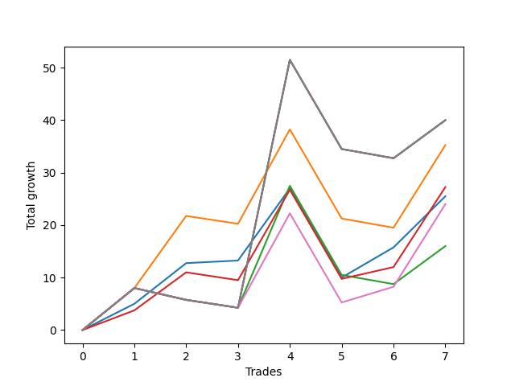

# Long Wallace 1226_003 
- Symbol: ES90d5m60m
- Date Range: 03/18/2022 - 07/08/2022
- Trading Period: 7:20-12:30
- Number of Trades: 7



| Name | Win Percent | Profit | Avg Profit / Trade |     | Name | Win Percent | Profit | Avg Profit / Trade |
| ---- | ----------- | ------ | ------------------ | --- | ---- | ----------- | ------ | ------------------ |
| Sorted By <br> Profit | | | | | Sorted By <br> Win Percentage ||||
| Six | 71.43 | 15750.00 | 2250.00 |     | Zero | 85.71 | 11500.00 | 1642.86 |
| One | 57.14 | 13375.00 | 1910.71 |     | Six | 71.43 | 15750.00 | 2250.00 |
| Three | 71.43 | 12625.00 | 1803.57 |     | Three | 71.43 | 12625.00 | 1803.57 |
| Zero | 85.71 | 11500.00 | 1642.86 |     | One | 57.14 | 13375.00 | 1910.71 |
| Seven | 57.14 | 8500.00 | 1214.29 |     | Seven | 57.14 | 8500.00 | 1214.29 |
| Five | 57.14 | 8500.00 | 1214.29 |     | Five | 57.14 | 8500.00 | 1214.29 |
| Four | 57.14 | 8500.00 | 1214.29 |     | Four | 57.14 | 8500.00 | 1214.29 |
| Two | 57.14 | 8500.00 | 1214.29 |     | Two | 57.14 | 8500.00 | 1214.29 |

### Test Zero
* Sell when price hits the middle line of the 20p bollinger
* No Stoploss
* Results:
```
Total Trades: 7
Percent Up: 85.71
Percent Down: 14.29
Total Points Moved Up: 23.00
Potential Profit: 11500.00
Total Points Ups: 40.00 Count Ups: 6
Total Points Downs: -17.00 Count Downs: 1
```

<details><summary>Trades</summary>

<code>In: 2022-03-29 09:40:00		Out: 2022-03-29 10:36:00		Total Position Time: 56:00		Total Move Up: 5.00		Total to Date: 5.00</code> <br />
<code>In: 2022-03-30 12:30:00		Out: 2022-03-30 12:46:00		Total Position Time: 16:00		Total Move Up: 5.25		Total to Date: 10.25</code> <br />
<code>In: 2022-03-31 09:40:00		Out: 2022-03-31 10:31:05		Total Position Time: 51:05		Total Move Up: 0.50		Total to Date: 10.75</code> <br />
<code>In: 2022-04-20 12:00:00		Out: 2022-04-20 12:24:15		Total Position Time: 24:15		Total Move Up: 13.75		Total to Date: 24.50</code> <br />
<code>In: 2022-05-02 10:10:00		Out: 2022-05-02 11:10:55		Total Position Time: 60:55		Total Move Up: -17.00		Total to Date: 7.50</code> <br />
<code>In: 2022-06-27 09:40:00		Out: 2022-06-27 10:21:30		Total Position Time: 41:30		Total Move Up: 5.75		Total to Date: 13.25</code> <br />
<code>In: 2022-06-29 09:35:00		Out: 2022-06-29 10:01:50		Total Position Time: 26:50		Total Move Up: 9.75		Total to Date: 23.00</code> <br />


</details>

### Test One
* Sell when the price hits the upper line of the 20p 1std bollinger
* No Stoploss
* Results:
```
Total Trades: 7
Percent Up: 57.14
Percent Down: 42.86
Total Points Moved Up: 26.75
Potential Profit: 13375.00
Total Points Ups: 47.00 Count Ups: 4
Total Points Downs: -20.25 Count Downs: 3
```

<details><summary>Trades</summary>

<code>In: 2022-03-29 09:40:00		Out: 2022-03-29 10:40:55		Total Position Time: 60:55		Total Move Up: 8.00		Total to Date: 8.00</code> <br />
<code>In: 2022-03-30 12:30:00		Out: 2022-03-30 12:46:00		Total Position Time: 16:00		Total Move Up: 5.25		Total to Date: 13.25</code> <br />
<code>In: 2022-03-31 09:40:00		Out: 2022-03-31 10:40:55		Total Position Time: 60:55		Total Move Up: -1.50		Total to Date: 11.75</code> <br />
<code>In: 2022-04-20 12:00:00		Out: 2022-04-20 12:45:15		Total Position Time: 45:15		Total Move Up: 18.00		Total to Date: 29.75</code> <br />
<code>In: 2022-05-02 10:10:00		Out: 2022-05-02 11:10:55		Total Position Time: 60:55		Total Move Up: -17.00		Total to Date: 12.75</code> <br />
<code>In: 2022-06-27 09:40:00		Out: 2022-06-27 10:40:55		Total Position Time: 60:55		Total Move Up: -1.75		Total to Date: 11.00</code> <br />
<code>In: 2022-06-29 09:35:00		Out: 2022-06-29 10:11:05		Total Position Time: 36:05		Total Move Up: 15.75		Total to Date: 26.75</code> <br />


</details>

### Test Two
* Sell when the price hits the upper line of the 20p 2std bollinger
* No Stoploss
* Results:
```
Total Trades: 7
Percent Up: 57.14
Percent Down: 42.86
Total Points Moved Up: 17.00
Potential Profit: 8500.00
Total Points Ups: 37.25 Count Ups: 4
Total Points Downs: -20.25 Count Downs: 3
```

<details><summary>Trades</summary>

<code>In: 2022-03-29 09:40:00		Out: 2022-03-29 10:40:55		Total Position Time: 60:55		Total Move Up: 8.00		Total to Date: 8.00</code> <br />
<code>In: 2022-03-30 12:30:00		Out: 2022-03-30 12:46:00		Total Position Time: 16:00		Total Move Up: 5.25		Total to Date: 13.25</code> <br />
<code>In: 2022-03-31 09:40:00		Out: 2022-03-31 10:40:55		Total Position Time: 60:55		Total Move Up: -1.50		Total to Date: 11.75</code> <br />
<code>In: 2022-04-20 12:00:00		Out: 2022-04-20 12:46:00		Total Position Time: 46:00		Total Move Up: 16.75		Total to Date: 28.50</code> <br />
<code>In: 2022-05-02 10:10:00		Out: 2022-05-02 11:10:55		Total Position Time: 60:55		Total Move Up: -17.00		Total to Date: 11.50</code> <br />
<code>In: 2022-06-27 09:40:00		Out: 2022-06-27 10:40:55		Total Position Time: 60:55		Total Move Up: -1.75		Total to Date: 9.75</code> <br />
<code>In: 2022-06-29 09:35:00		Out: 2022-06-29 10:35:55		Total Position Time: 60:55		Total Move Up: 7.25		Total to Date: 17.00</code> <br />


</details>

### Test Three
* Sell when price hits the middle line of the 50p bollinger
* No Stoploss
* Results:
```
Total Trades: 7
Percent Up: 71.43
Percent Down: 28.57
Total Points Moved Up: 25.25
Potential Profit: 12625.00
Total Points Ups: 43.75 Count Ups: 5
Total Points Downs: -18.50 Count Downs: 2
```

<details><summary>Trades</summary>

<code>In: 2022-03-29 09:40:00		Out: 2022-03-29 09:43:20		Total Position Time: 03:20		Total Move Up: 3.75		Total to Date: 3.75</code> <br />
<code>In: 2022-03-30 12:30:00		Out: 2022-03-30 12:46:00		Total Position Time: 16:00		Total Move Up: 5.25		Total to Date: 9.00</code> <br />
<code>In: 2022-03-31 09:40:00		Out: 2022-03-31 10:40:55		Total Position Time: 60:55		Total Move Up: -1.50		Total to Date: 7.50</code> <br />
<code>In: 2022-04-20 12:00:00		Out: 2022-04-20 12:25:50		Total Position Time: 25:50		Total Move Up: 17.25		Total to Date: 24.75</code> <br />
<code>In: 2022-05-02 10:10:00		Out: 2022-05-02 11:10:55		Total Position Time: 60:55		Total Move Up: -17.00		Total to Date: 7.75</code> <br />
<code>In: 2022-06-27 09:40:00		Out: 2022-06-27 09:41:15		Total Position Time: 01:15		Total Move Up: 2.25		Total to Date: 10.00</code> <br />
<code>In: 2022-06-29 09:35:00		Out: 2022-06-29 10:10:45		Total Position Time: 35:45		Total Move Up: 15.25		Total to Date: 25.25</code> <br />


</details>

### Test Four
* Sell when the price hits the upper line of the 50p 1std bollinger
* No Stoploss
* Results:
```
Total Trades: 7
Percent Up: 57.14
Percent Down: 42.86
Total Points Moved Up: 17.00
Potential Profit: 8500.00
Total Points Ups: 37.25 Count Ups: 4
Total Points Downs: -20.25 Count Downs: 3
```

<details><summary>Trades</summary>

<code>In: 2022-03-29 09:40:00		Out: 2022-03-29 10:40:55		Total Position Time: 60:55		Total Move Up: 8.00		Total to Date: 8.00</code> <br />
<code>In: 2022-03-30 12:30:00		Out: 2022-03-30 12:46:00		Total Position Time: 16:00		Total Move Up: 5.25		Total to Date: 13.25</code> <br />
<code>In: 2022-03-31 09:40:00		Out: 2022-03-31 10:40:55		Total Position Time: 60:55		Total Move Up: -1.50		Total to Date: 11.75</code> <br />
<code>In: 2022-04-20 12:00:00		Out: 2022-04-20 12:46:00		Total Position Time: 46:00		Total Move Up: 16.75		Total to Date: 28.50</code> <br />
<code>In: 2022-05-02 10:10:00		Out: 2022-05-02 11:10:55		Total Position Time: 60:55		Total Move Up: -17.00		Total to Date: 11.50</code> <br />
<code>In: 2022-06-27 09:40:00		Out: 2022-06-27 10:40:55		Total Position Time: 60:55		Total Move Up: -1.75		Total to Date: 9.75</code> <br />
<code>In: 2022-06-29 09:35:00		Out: 2022-06-29 10:35:55		Total Position Time: 60:55		Total Move Up: 7.25		Total to Date: 17.00</code> <br />


</details>

### Test Five
* Sell when the price hits the upper line of the 50p 2std bollinger
* No Stoploss
* Results:
```
Total Trades: 7
Percent Up: 57.14
Percent Down: 42.86
Total Points Moved Up: 17.00
Potential Profit: 8500.00
Total Points Ups: 37.25 Count Ups: 4
Total Points Downs: -20.25 Count Downs: 3
```

<details><summary>Trades</summary>

<code>In: 2022-03-29 09:40:00		Out: 2022-03-29 10:40:55		Total Position Time: 60:55		Total Move Up: 8.00		Total to Date: 8.00</code> <br />
<code>In: 2022-03-30 12:30:00		Out: 2022-03-30 12:46:00		Total Position Time: 16:00		Total Move Up: 5.25		Total to Date: 13.25</code> <br />
<code>In: 2022-03-31 09:40:00		Out: 2022-03-31 10:40:55		Total Position Time: 60:55		Total Move Up: -1.50		Total to Date: 11.75</code> <br />
<code>In: 2022-04-20 12:00:00		Out: 2022-04-20 12:46:00		Total Position Time: 46:00		Total Move Up: 16.75		Total to Date: 28.50</code> <br />
<code>In: 2022-05-02 10:10:00		Out: 2022-05-02 11:10:55		Total Position Time: 60:55		Total Move Up: -17.00		Total to Date: 11.50</code> <br />
<code>In: 2022-06-27 09:40:00		Out: 2022-06-27 10:40:55		Total Position Time: 60:55		Total Move Up: -1.75		Total to Date: 9.75</code> <br />
<code>In: 2022-06-29 09:35:00		Out: 2022-06-29 10:35:55		Total Position Time: 60:55		Total Move Up: 7.25		Total to Date: 17.00</code> <br />


</details>

### Test Six
* Sell when the price hits the middle line of the 1std VWAP
* No Stoploss
* Results:
```
Total Trades: 7
Percent Up: 71.43
Percent Down: 28.57
Total Points Moved Up: 31.50
Potential Profit: 15750.00
Total Points Ups: 50.00 Count Ups: 5
Total Points Downs: -18.50 Count Downs: 2
```

<details><summary>Trades</summary>

<code>In: 2022-03-29 09:40:00		Out: 2022-03-29 10:40:55		Total Position Time: 60:55		Total Move Up: 8.00		Total to Date: 8.00</code> <br />
<code>In: 2022-03-30 12:30:00		Out: 2022-03-30 12:46:00		Total Position Time: 16:00		Total Move Up: 5.25		Total to Date: 13.25</code> <br />
<code>In: 2022-03-31 09:40:00		Out: 2022-03-31 10:40:55		Total Position Time: 60:55		Total Move Up: -1.50		Total to Date: 11.75</code> <br />
<code>In: 2022-04-20 12:00:00		Out: 2022-04-20 12:26:10		Total Position Time: 26:10		Total Move Up: 18.00		Total to Date: 29.75</code> <br />
<code>In: 2022-05-02 10:10:00		Out: 2022-05-02 11:10:55		Total Position Time: 60:55		Total Move Up: -17.00		Total to Date: 12.75</code> <br />
<code>In: 2022-06-27 09:40:00		Out: 2022-06-27 09:44:15		Total Position Time: 04:15		Total Move Up: 3.00		Total to Date: 15.75</code> <br />
<code>In: 2022-06-29 09:35:00		Out: 2022-06-29 10:10:55		Total Position Time: 35:55		Total Move Up: 15.75		Total to Date: 31.50</code> <br />


</details>

### Test Seven
* Sell when the price hits the upper line of the 1std VWAP
* No Stoploss
* Results:
```
Total Trades: 7
Percent Up: 57.14
Percent Down: 42.86
Total Points Moved Up: 17.00
Potential Profit: 8500.00
Total Points Ups: 37.25 Count Ups: 4
Total Points Downs: -20.25 Count Downs: 3
```

<details><summary>Trades</summary>

<code>In: 2022-03-29 09:40:00		Out: 2022-03-29 10:40:55		Total Position Time: 60:55		Total Move Up: 8.00		Total to Date: 8.00</code> <br />
<code>In: 2022-03-30 12:30:00		Out: 2022-03-30 12:46:00		Total Position Time: 16:00		Total Move Up: 5.25		Total to Date: 13.25</code> <br />
<code>In: 2022-03-31 09:40:00		Out: 2022-03-31 10:40:55		Total Position Time: 60:55		Total Move Up: -1.50		Total to Date: 11.75</code> <br />
<code>In: 2022-04-20 12:00:00		Out: 2022-04-20 12:46:00		Total Position Time: 46:00		Total Move Up: 16.75		Total to Date: 28.50</code> <br />
<code>In: 2022-05-02 10:10:00		Out: 2022-05-02 11:10:55		Total Position Time: 60:55		Total Move Up: -17.00		Total to Date: 11.50</code> <br />
<code>In: 2022-06-27 09:40:00		Out: 2022-06-27 10:40:55		Total Position Time: 60:55		Total Move Up: -1.75		Total to Date: 9.75</code> <br />
<code>In: 2022-06-29 09:35:00		Out: 2022-06-29 10:35:55		Total Position Time: 60:55		Total Move Up: 7.25		Total to Date: 17.00</code> <br />


</details>