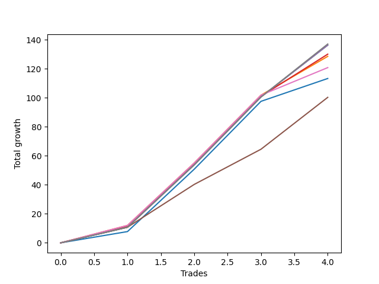

# Long Wallace Doodle 011 
- Symbol: ES90d5m60m
- Date Range: 03/18/2022 - 07/08/2022
- Trading Period: 7:20-12:30
- Number of Trades: 4



| Name | Win Percent | Profit | Avg Profit / Trade |     | Name | Win Percent | Profit | Avg Profit / Trade |
| ---- | ----------- | ------ | ------------------ | --- | ---- | ----------- | ------ | ------------------ |
| Sorted By <br> Profit | | | | | Sorted By <br> Win Percentage ||||
| Seven | 100.00 | 28500.00 | 7125.00 |     | Seven | 100.00 | 28500.00 | 7125.00 |
| Five | 100.00 | 28125.00 | 7031.25 |     | Five | 100.00 | 28125.00 | 7031.25 |
| Four | 100.00 | 28125.00 | 7031.25 |     | Four | 100.00 | 28125.00 | 7031.25 |
| Two | 100.00 | 28125.00 | 7031.25 |     | Two | 100.00 | 28125.00 | 7031.25 |
| Three | 100.00 | 25000.00 | 6250.00 |     | Three | 100.00 | 25000.00 | 6250.00 |
| One | 100.00 | 24250.00 | 6062.50 |     | One | 100.00 | 24250.00 | 6062.50 |
| Six | 100.00 | 20375.00 | 5093.75 |     | Six | 100.00 | 20375.00 | 5093.75 |
| Zero | 100.00 | 16625.00 | 4156.25 |     | Zero | 100.00 | 16625.00 | 4156.25 |

### Test Zero
* Sell when price hits the middle line of the 20p bollinger
* No Stoploss
* Results:
```
Total Trades: 4
Percent Up: 100.00
Percent Down: 0.00
Total Points Moved Up: 33.25
Potential Profit: 16625.00
Total Points Ups: 33.25 Count Ups: 4
Total Points Downs: 0.00 Count Downs: 0
```

<details><summary>Trades</summary>

<code>In: 2022-04-20 11:45:00		Out: 2022-04-20 12:24:15		Total Position Time: 39:15		Total Move Up: 7.75		Total to Date: 7.75</code> <br />
<code>In: 2022-04-27 12:10:00		Out: 2022-04-27 12:46:00		Total Position Time: 36:00		Total Move Up: 3.00		Total to Date: 10.75</code> <br />
<code>In: 2022-04-27 12:25:00		Out: 2022-04-27 12:46:00		Total Position Time: 21:00		Total Move Up: 6.75		Total to Date: 17.50</code> <br />
<code>In: 2022-05-13 11:15:00		Out: 2022-05-13 11:51:35		Total Position Time: 36:35		Total Move Up: 15.75		Total to Date: 33.25</code> <br />


</details>

### Test One
* Sell when the price hits the upper line of the 20p 1std bollinger
* No Stoploss
* Results:
```
Total Trades: 4
Percent Up: 100.00
Percent Down: 0.00
Total Points Moved Up: 48.50
Potential Profit: 24250.00
Total Points Ups: 48.50 Count Ups: 4
Total Points Downs: 0.00 Count Downs: 0
```

<details><summary>Trades</summary>

<code>In: 2022-04-20 11:45:00		Out: 2022-04-20 12:45:15		Total Position Time: 60:15		Total Move Up: 12.00		Total to Date: 12.00</code> <br />
<code>In: 2022-04-27 12:10:00		Out: 2022-04-27 12:46:00		Total Position Time: 36:00		Total Move Up: 3.00		Total to Date: 15.00</code> <br />
<code>In: 2022-04-27 12:25:00		Out: 2022-04-27 12:46:00		Total Position Time: 21:00		Total Move Up: 6.75		Total to Date: 21.75</code> <br />
<code>In: 2022-05-13 11:15:00		Out: 2022-05-13 12:00:35		Total Position Time: 45:35		Total Move Up: 26.75		Total to Date: 48.50</code> <br />


</details>

### Test Two
* Sell when the price hits the upper line of the 20p 2std bollinger
* No Stoploss
* Results:
```
Total Trades: 4
Percent Up: 100.00
Percent Down: 0.00
Total Points Moved Up: 56.25
Potential Profit: 28125.00
Total Points Ups: 56.25 Count Ups: 4
Total Points Downs: 0.00 Count Downs: 0
```

<details><summary>Trades</summary>

<code>In: 2022-04-20 11:45:00		Out: 2022-04-20 12:45:55		Total Position Time: 60:55		Total Move Up: 10.75		Total to Date: 10.75</code> <br />
<code>In: 2022-04-27 12:10:00		Out: 2022-04-27 12:46:00		Total Position Time: 36:00		Total Move Up: 3.00		Total to Date: 13.75</code> <br />
<code>In: 2022-04-27 12:25:00		Out: 2022-04-27 12:46:00		Total Position Time: 21:00		Total Move Up: 6.75		Total to Date: 20.50</code> <br />
<code>In: 2022-05-13 11:15:00		Out: 2022-05-13 12:15:55		Total Position Time: 60:55		Total Move Up: 35.75		Total to Date: 56.25</code> <br />


</details>

### Test Three
* Sell when price hits the middle line of the 50p bollinger
* No Stoploss
* Results:
```
Total Trades: 4
Percent Up: 100.00
Percent Down: 0.00
Total Points Moved Up: 50.00
Potential Profit: 25000.00
Total Points Ups: 50.00 Count Ups: 4
Total Points Downs: 0.00 Count Downs: 0
```

<details><summary>Trades</summary>

<code>In: 2022-04-20 11:45:00		Out: 2022-04-20 12:25:50		Total Position Time: 40:50		Total Move Up: 11.25		Total to Date: 11.25</code> <br />
<code>In: 2022-04-27 12:10:00		Out: 2022-04-27 12:46:00		Total Position Time: 36:00		Total Move Up: 3.00		Total to Date: 14.25</code> <br />
<code>In: 2022-04-27 12:25:00		Out: 2022-04-27 12:46:00		Total Position Time: 21:00		Total Move Up: 6.75		Total to Date: 21.00</code> <br />
<code>In: 2022-05-13 11:15:00		Out: 2022-05-13 12:01:10		Total Position Time: 46:10		Total Move Up: 29.00		Total to Date: 50.00</code> <br />


</details>

### Test Four
* Sell when the price hits the upper line of the 50p 1std bollinger
* No Stoploss
* Results:
```
Total Trades: 4
Percent Up: 100.00
Percent Down: 0.00
Total Points Moved Up: 56.25
Potential Profit: 28125.00
Total Points Ups: 56.25 Count Ups: 4
Total Points Downs: 0.00 Count Downs: 0
```

<details><summary>Trades</summary>

<code>In: 2022-04-20 11:45:00		Out: 2022-04-20 12:45:55		Total Position Time: 60:55		Total Move Up: 10.75		Total to Date: 10.75</code> <br />
<code>In: 2022-04-27 12:10:00		Out: 2022-04-27 12:46:00		Total Position Time: 36:00		Total Move Up: 3.00		Total to Date: 13.75</code> <br />
<code>In: 2022-04-27 12:25:00		Out: 2022-04-27 12:46:00		Total Position Time: 21:00		Total Move Up: 6.75		Total to Date: 20.50</code> <br />
<code>In: 2022-05-13 11:15:00		Out: 2022-05-13 12:15:55		Total Position Time: 60:55		Total Move Up: 35.75		Total to Date: 56.25</code> <br />


</details>

### Test Five
* Sell when the price hits the upper line of the 50p 2std bollinger
* No Stoploss
* Results:
```
Total Trades: 4
Percent Up: 100.00
Percent Down: 0.00
Total Points Moved Up: 56.25
Potential Profit: 28125.00
Total Points Ups: 56.25 Count Ups: 4
Total Points Downs: 0.00 Count Downs: 0
```

<details><summary>Trades</summary>

<code>In: 2022-04-20 11:45:00		Out: 2022-04-20 12:45:55		Total Position Time: 60:55		Total Move Up: 10.75		Total to Date: 10.75</code> <br />
<code>In: 2022-04-27 12:10:00		Out: 2022-04-27 12:46:00		Total Position Time: 36:00		Total Move Up: 3.00		Total to Date: 13.75</code> <br />
<code>In: 2022-04-27 12:25:00		Out: 2022-04-27 12:46:00		Total Position Time: 21:00		Total Move Up: 6.75		Total to Date: 20.50</code> <br />
<code>In: 2022-05-13 11:15:00		Out: 2022-05-13 12:15:55		Total Position Time: 60:55		Total Move Up: 35.75		Total to Date: 56.25</code> <br />


</details>

### Test Six
* Sell when the price hits the middle line of the 1std VWAP
* No Stoploss
* Results:
```
Total Trades: 4
Percent Up: 100.00
Percent Down: 0.00
Total Points Moved Up: 40.75
Potential Profit: 20375.00
Total Points Ups: 40.75 Count Ups: 4
Total Points Downs: 0.00 Count Downs: 0
```

<details><summary>Trades</summary>

<code>In: 2022-04-20 11:45:00		Out: 2022-04-20 12:26:10		Total Position Time: 41:10		Total Move Up: 12.00		Total to Date: 12.00</code> <br />
<code>In: 2022-04-27 12:10:00		Out: 2022-04-27 12:46:00		Total Position Time: 36:00		Total Move Up: 3.00		Total to Date: 15.00</code> <br />
<code>In: 2022-04-27 12:25:00		Out: 2022-04-27 12:46:00		Total Position Time: 21:00		Total Move Up: 6.75		Total to Date: 21.75</code> <br />
<code>In: 2022-05-13 11:15:00		Out: 2022-05-13 11:52:25		Total Position Time: 37:25		Total Move Up: 19.00		Total to Date: 40.75</code> <br />


</details>

### Test Seven
* Sell when the price hits the upper line of the 1std VWAP
* No Stoploss
* Results:
```
Total Trades: 4
Percent Up: 100.00
Percent Down: 0.00
Total Points Moved Up: 57.00
Potential Profit: 28500.00
Total Points Ups: 57.00 Count Ups: 4
Total Points Downs: 0.00 Count Downs: 0
```

<details><summary>Trades</summary>

<code>In: 2022-04-20 11:45:00		Out: 2022-04-20 12:45:55		Total Position Time: 60:55		Total Move Up: 10.75		Total to Date: 10.75</code> <br />
<code>In: 2022-04-27 12:10:00		Out: 2022-04-27 12:46:00		Total Position Time: 36:00		Total Move Up: 3.00		Total to Date: 13.75</code> <br />
<code>In: 2022-04-27 12:25:00		Out: 2022-04-27 12:46:00		Total Position Time: 21:00		Total Move Up: 6.75		Total to Date: 20.50</code> <br />
<code>In: 2022-05-13 11:15:00		Out: 2022-05-13 12:14:40		Total Position Time: 59:40		Total Move Up: 36.50		Total to Date: 57.00</code> <br />


</details>