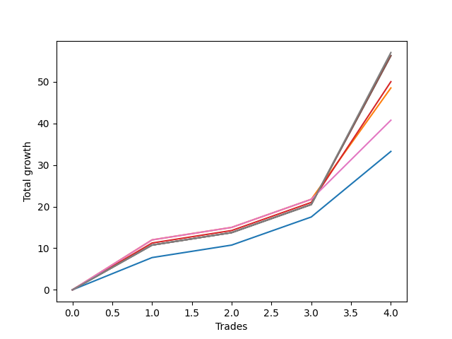

# Long Wallace Doodle 011 
- Symbol: ES90d5m60m
- Date Range: 03/18/2022 - 07/08/2022
- Trading Period: 7:20-12:30
- Number of Trades: 4



| Name | Win Percent | Profit | Avg Profit / Trade |     | Name | Win Percent | Profit | Avg Profit / Trade |
| ---- | ----------- | ------ | ------------------ | --- | ---- | ----------- | ------ | ------------------ |
| Sorted By <br> Profit | | | | | Sorted By <br> Win Percentage ||||
| Seven | 100.00 | 68500.00 | 17125.00 |     | Seven | 100.00 | 68500.00 | 17125.00 |
| Four | 100.00 | 68125.00 | 17031.25 |     | Four | 100.00 | 68125.00 | 17031.25 |
| Two | 100.00 | 68125.00 | 17031.25 |     | Two | 100.00 | 68125.00 | 17031.25 |
| Three | 100.00 | 65000.00 | 16250.00 |     | Three | 100.00 | 65000.00 | 16250.00 |
| One | 100.00 | 64250.00 | 16062.50 |     | One | 100.00 | 64250.00 | 16062.50 |
| Six | 100.00 | 60375.00 | 15093.75 |     | Six | 100.00 | 60375.00 | 15093.75 |
| Zero | 100.00 | 56625.00 | 14156.25 |     | Zero | 100.00 | 56625.00 | 14156.25 |
| Five | 100.00 | 50125.00 | 12531.25 |     | Five | 100.00 | 50125.00 | 12531.25 |

### Test Zero
* Sell when price hits the middle line of the 20p bollinger
* No Stoploss
* Results:
```
Total Trades: 4
Percent Up: 100.00
Percent Down: 0.00
Total Points Moved Up: 113.25
Potential Profit: 56625.00
Total Points Ups: 113.25 Count Ups: 4
Total Points Downs: 0.00 Count Downs: 0
```

<details><summary>Trades</summary>

<code>In: 2022-04-20 11:45:00		Out: 2022-04-20 12:24:15		Total Position Time: 39:15		Total Move Up: 7.75		Total to Date: 7.75</code> <br />
<code>In: 2022-04-27 12:10:00		Out: 2022-04-28 06:30:05		Total Position Time: 1100:05		Total Move Up: 43.00		Total to Date: 50.75</code> <br />
<code>In: 2022-04-27 12:25:00		Out: 2022-04-28 06:30:05		Total Position Time: 1085:05		Total Move Up: 46.75		Total to Date: 97.50</code> <br />
<code>In: 2022-05-13 11:15:00		Out: 2022-05-13 11:51:35		Total Position Time: 36:35		Total Move Up: 15.75		Total to Date: 113.25</code> <br />


</details>

### Test One
* Sell when the price hits the upper line of the 20p 1std bollinger
* No Stoploss
* Results:
```
Total Trades: 4
Percent Up: 100.00
Percent Down: 0.00
Total Points Moved Up: 128.50
Potential Profit: 64250.00
Total Points Ups: 128.50 Count Ups: 4
Total Points Downs: 0.00 Count Downs: 0
```

<details><summary>Trades</summary>

<code>In: 2022-04-20 11:45:00		Out: 2022-04-20 12:45:15		Total Position Time: 60:15		Total Move Up: 12.00		Total to Date: 12.00</code> <br />
<code>In: 2022-04-27 12:10:00		Out: 2022-04-28 06:30:05		Total Position Time: 1100:05		Total Move Up: 43.00		Total to Date: 55.00</code> <br />
<code>In: 2022-04-27 12:25:00		Out: 2022-04-28 06:30:05		Total Position Time: 1085:05		Total Move Up: 46.75		Total to Date: 101.75</code> <br />
<code>In: 2022-05-13 11:15:00		Out: 2022-05-13 12:00:35		Total Position Time: 45:35		Total Move Up: 26.75		Total to Date: 128.50</code> <br />


</details>

### Test Two
* Sell when the price hits the upper line of the 20p 2std bollinger
* No Stoploss
* Results:
```
Total Trades: 4
Percent Up: 100.00
Percent Down: 0.00
Total Points Moved Up: 136.25
Potential Profit: 68125.00
Total Points Ups: 136.25 Count Ups: 4
Total Points Downs: 0.00 Count Downs: 0
```

<details><summary>Trades</summary>

<code>In: 2022-04-20 11:45:00		Out: 2022-04-20 12:45:55		Total Position Time: 60:55		Total Move Up: 10.75		Total to Date: 10.75</code> <br />
<code>In: 2022-04-27 12:10:00		Out: 2022-04-28 06:30:05		Total Position Time: 1100:05		Total Move Up: 43.00		Total to Date: 53.75</code> <br />
<code>In: 2022-04-27 12:25:00		Out: 2022-04-28 06:30:05		Total Position Time: 1085:05		Total Move Up: 46.75		Total to Date: 100.50</code> <br />
<code>In: 2022-05-13 11:15:00		Out: 2022-05-13 12:15:55		Total Position Time: 60:55		Total Move Up: 35.75		Total to Date: 136.25</code> <br />


</details>

### Test Three
* Sell when price hits the middle line of the 50p bollinger
* No Stoploss
* Results:
```
Total Trades: 4
Percent Up: 100.00
Percent Down: 0.00
Total Points Moved Up: 130.00
Potential Profit: 65000.00
Total Points Ups: 130.00 Count Ups: 4
Total Points Downs: 0.00 Count Downs: 0
```

<details><summary>Trades</summary>

<code>In: 2022-04-20 11:45:00		Out: 2022-04-20 12:25:50		Total Position Time: 40:50		Total Move Up: 11.25		Total to Date: 11.25</code> <br />
<code>In: 2022-04-27 12:10:00		Out: 2022-04-28 06:30:05		Total Position Time: 1100:05		Total Move Up: 43.00		Total to Date: 54.25</code> <br />
<code>In: 2022-04-27 12:25:00		Out: 2022-04-28 06:30:05		Total Position Time: 1085:05		Total Move Up: 46.75		Total to Date: 101.00</code> <br />
<code>In: 2022-05-13 11:15:00		Out: 2022-05-13 12:01:10		Total Position Time: 46:10		Total Move Up: 29.00		Total to Date: 130.00</code> <br />


</details>

### Test Four
* Sell when the price hits the upper line of the 50p 1std bollinger
* No Stoploss
* Results:
```
Total Trades: 4
Percent Up: 100.00
Percent Down: 0.00
Total Points Moved Up: 136.25
Potential Profit: 68125.00
Total Points Ups: 136.25 Count Ups: 4
Total Points Downs: 0.00 Count Downs: 0
```

<details><summary>Trades</summary>

<code>In: 2022-04-20 11:45:00		Out: 2022-04-20 12:45:55		Total Position Time: 60:55		Total Move Up: 10.75		Total to Date: 10.75</code> <br />
<code>In: 2022-04-27 12:10:00		Out: 2022-04-28 06:30:05		Total Position Time: 1100:05		Total Move Up: 43.00		Total to Date: 53.75</code> <br />
<code>In: 2022-04-27 12:25:00		Out: 2022-04-28 06:30:05		Total Position Time: 1085:05		Total Move Up: 46.75		Total to Date: 100.50</code> <br />
<code>In: 2022-05-13 11:15:00		Out: 2022-05-13 12:15:55		Total Position Time: 60:55		Total Move Up: 35.75		Total to Date: 136.25</code> <br />


</details>

### Test Five
* Sell when the price hits the upper line of the 50p 2std bollinger
* No Stoploss
* Results:
```
Total Trades: 4
Percent Up: 100.00
Percent Down: 0.00
Total Points Moved Up: 100.25
Potential Profit: 50125.00
Total Points Ups: 100.25 Count Ups: 4
Total Points Downs: 0.00 Count Downs: 0
```

<details><summary>Trades</summary>

<code>In: 2022-04-20 11:45:00		Out: 2022-04-20 12:45:55		Total Position Time: 60:55		Total Move Up: 10.75		Total to Date: 10.75</code> <br />
<code>In: 2022-04-27 12:10:00		Out: 2022-04-28 06:40:55		Total Position Time: 1110:55		Total Move Up: 29.50		Total to Date: 40.25</code> <br />
<code>In: 2022-04-27 12:25:00		Out: 2022-04-28 06:55:55		Total Position Time: 1110:55		Total Move Up: 24.25		Total to Date: 64.50</code> <br />
<code>In: 2022-05-13 11:15:00		Out: 2022-05-13 12:15:55		Total Position Time: 60:55		Total Move Up: 35.75		Total to Date: 100.25</code> <br />


</details>

### Test Six
* Sell when the price hits the middle line of the 1std VWAP
* No Stoploss
* Results:
```
Total Trades: 4
Percent Up: 100.00
Percent Down: 0.00
Total Points Moved Up: 120.75
Potential Profit: 60375.00
Total Points Ups: 120.75 Count Ups: 4
Total Points Downs: 0.00 Count Downs: 0
```

<details><summary>Trades</summary>

<code>In: 2022-04-20 11:45:00		Out: 2022-04-20 12:26:10		Total Position Time: 41:10		Total Move Up: 12.00		Total to Date: 12.00</code> <br />
<code>In: 2022-04-27 12:10:00		Out: 2022-04-28 06:30:05		Total Position Time: 1100:05		Total Move Up: 43.00		Total to Date: 55.00</code> <br />
<code>In: 2022-04-27 12:25:00		Out: 2022-04-28 06:30:05		Total Position Time: 1085:05		Total Move Up: 46.75		Total to Date: 101.75</code> <br />
<code>In: 2022-05-13 11:15:00		Out: 2022-05-13 11:52:25		Total Position Time: 37:25		Total Move Up: 19.00		Total to Date: 120.75</code> <br />


</details>

### Test Seven
* Sell when the price hits the upper line of the 1std VWAP
* No Stoploss
* Results:
```
Total Trades: 4
Percent Up: 100.00
Percent Down: 0.00
Total Points Moved Up: 137.00
Potential Profit: 68500.00
Total Points Ups: 137.00 Count Ups: 4
Total Points Downs: 0.00 Count Downs: 0
```

<details><summary>Trades</summary>

<code>In: 2022-04-20 11:45:00		Out: 2022-04-20 12:45:55		Total Position Time: 60:55		Total Move Up: 10.75		Total to Date: 10.75</code> <br />
<code>In: 2022-04-27 12:10:00		Out: 2022-04-28 06:30:05		Total Position Time: 1100:05		Total Move Up: 43.00		Total to Date: 53.75</code> <br />
<code>In: 2022-04-27 12:25:00		Out: 2022-04-28 06:30:05		Total Position Time: 1085:05		Total Move Up: 46.75		Total to Date: 100.50</code> <br />
<code>In: 2022-05-13 11:15:00		Out: 2022-05-13 12:14:40		Total Position Time: 59:40		Total Move Up: 36.50		Total to Date: 137.00</code> <br />


</details>