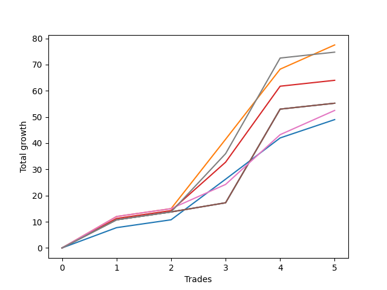

# Long Wallace Doodle 014 
- Symbol: ES90d5m60m
- Date Range: 03/18/2022 - 07/08/2022
- Trading Period: 7:20-12:30
- Number of Trades: 5



| Name | Win Percent | Profit | Avg Profit / Trade |     | Name | Win Percent | Profit | Avg Profit / Trade |
| ---- | ----------- | ------ | ------------------ | --- | ---- | ----------- | ------ | ------------------ |
| Sorted By <br> Profit | | | | | Sorted By <br> Win Percentage ||||
| One | 100.00 | 58750.00 | 11750.00 |     | One | 100.00 | 58750.00 | 11750.00 |
| Seven | 100.00 | 57375.00 | 11475.00 |     | Seven | 100.00 | 57375.00 | 11475.00 |
| Three | 100.00 | 52000.00 | 10400.00 |     | Three | 100.00 | 52000.00 | 10400.00 |
| Four | 100.00 | 47625.00 | 9525.00 |     | Four | 100.00 | 47625.00 | 9525.00 |
| Two | 100.00 | 47625.00 | 9525.00 |     | Two | 100.00 | 47625.00 | 9525.00 |
| Six | 100.00 | 46250.00 | 9250.00 |     | Six | 100.00 | 46250.00 | 9250.00 |
| Zero | 100.00 | 44500.00 | 8900.00 |     | Zero | 100.00 | 44500.00 | 8900.00 |
| Five | 100.00 | 40875.00 | 8175.00 |     | Five | 100.00 | 40875.00 | 8175.00 |

### Test Zero
* Sell when price hits the middle line of the 20p bollinger
* No Stoploss
* Results:
```
Total Trades: 5
Percent Up: 100.00
Percent Down: 0.00
Total Points Moved Up: 89.00
Potential Profit: 44500.00
Total Points Ups: 89.00 Count Ups: 5
Total Points Downs: 0.00 Count Downs: 0
```

<details><summary>Trades</summary>

<code>In: 2022-04-20 11:45:00		Out: 2022-04-20 12:24:15		Total Position Time: 39:15		Total Move Up: 7.75		Total to Date: 7.75</code> <br />
<code>In: 2022-04-27 12:10:00		Out: 2022-04-28 06:30:05		Total Position Time: 1100:05		Total Move Up: 43.00		Total to Date: 50.75</code> <br />
<code>In: 2022-05-03 11:40:00		Out: 2022-05-03 11:52:15		Total Position Time: 12:15		Total Move Up: 15.50		Total to Date: 66.25</code> <br />
<code>In: 2022-05-13 11:15:00		Out: 2022-05-13 11:51:35		Total Position Time: 36:35		Total Move Up: 15.75		Total to Date: 82.00</code> <br />
<code>In: 2022-06-27 11:00:00		Out: 2022-06-27 11:19:05		Total Position Time: 19:05		Total Move Up: 7.00		Total to Date: 89.00</code> <br />


</details>

### Test One
* Sell when the price hits the upper line of the 20p 1std bollinger
* No Stoploss
* Results:
```
Total Trades: 5
Percent Up: 100.00
Percent Down: 0.00
Total Points Moved Up: 117.50
Potential Profit: 58750.00
Total Points Ups: 117.50 Count Ups: 5
Total Points Downs: 0.00 Count Downs: 0
```

<details><summary>Trades</summary>

<code>In: 2022-04-20 11:45:00		Out: 2022-04-20 12:45:15		Total Position Time: 60:15		Total Move Up: 12.00		Total to Date: 12.00</code> <br />
<code>In: 2022-04-27 12:10:00		Out: 2022-04-28 06:30:05		Total Position Time: 1100:05		Total Move Up: 43.00		Total to Date: 55.00</code> <br />
<code>In: 2022-05-03 11:40:00		Out: 2022-05-03 12:07:55		Total Position Time: 27:55		Total Move Up: 26.50		Total to Date: 81.50</code> <br />
<code>In: 2022-05-13 11:15:00		Out: 2022-05-13 12:00:35		Total Position Time: 45:35		Total Move Up: 26.75		Total to Date: 108.25</code> <br />
<code>In: 2022-06-27 11:00:00		Out: 2022-06-27 11:38:50		Total Position Time: 38:50		Total Move Up: 9.25		Total to Date: 117.50</code> <br />


</details>

### Test Two
* Sell when the price hits the upper line of the 20p 2std bollinger
* No Stoploss
* Results:
```
Total Trades: 5
Percent Up: 100.00
Percent Down: 0.00
Total Points Moved Up: 95.25
Potential Profit: 47625.00
Total Points Ups: 95.25 Count Ups: 5
Total Points Downs: 0.00 Count Downs: 0
```

<details><summary>Trades</summary>

<code>In: 2022-04-20 11:45:00		Out: 2022-04-20 12:45:55		Total Position Time: 60:55		Total Move Up: 10.75		Total to Date: 10.75</code> <br />
<code>In: 2022-04-27 12:10:00		Out: 2022-04-28 06:30:05		Total Position Time: 1100:05		Total Move Up: 43.00		Total to Date: 53.75</code> <br />
<code>In: 2022-05-03 11:40:00		Out: 2022-05-03 12:40:55		Total Position Time: 60:55		Total Move Up: 3.50		Total to Date: 57.25</code> <br />
<code>In: 2022-05-13 11:15:00		Out: 2022-05-13 12:15:55		Total Position Time: 60:55		Total Move Up: 35.75		Total to Date: 93.00</code> <br />
<code>In: 2022-06-27 11:00:00		Out: 2022-06-27 12:00:55		Total Position Time: 60:55		Total Move Up: 2.25		Total to Date: 95.25</code> <br />


</details>

### Test Three
* Sell when price hits the middle line of the 50p bollinger
* No Stoploss
* Results:
```
Total Trades: 5
Percent Up: 100.00
Percent Down: 0.00
Total Points Moved Up: 104.00
Potential Profit: 52000.00
Total Points Ups: 104.00 Count Ups: 5
Total Points Downs: 0.00 Count Downs: 0
```

<details><summary>Trades</summary>

<code>In: 2022-04-20 11:45:00		Out: 2022-04-20 12:25:50		Total Position Time: 40:50		Total Move Up: 11.25		Total to Date: 11.25</code> <br />
<code>In: 2022-04-27 12:10:00		Out: 2022-04-28 06:30:05		Total Position Time: 1100:05		Total Move Up: 43.00		Total to Date: 54.25</code> <br />
<code>In: 2022-05-03 11:40:00		Out: 2022-05-03 11:59:05		Total Position Time: 19:05		Total Move Up: 18.50		Total to Date: 72.75</code> <br />
<code>In: 2022-05-13 11:15:00		Out: 2022-05-13 12:01:10		Total Position Time: 46:10		Total Move Up: 29.00		Total to Date: 101.75</code> <br />
<code>In: 2022-06-27 11:00:00		Out: 2022-06-27 12:00:55		Total Position Time: 60:55		Total Move Up: 2.25		Total to Date: 104.00</code> <br />


</details>

### Test Four
* Sell when the price hits the upper line of the 50p 1std bollinger
* No Stoploss
* Results:
```
Total Trades: 5
Percent Up: 100.00
Percent Down: 0.00
Total Points Moved Up: 95.25
Potential Profit: 47625.00
Total Points Ups: 95.25 Count Ups: 5
Total Points Downs: 0.00 Count Downs: 0
```

<details><summary>Trades</summary>

<code>In: 2022-04-20 11:45:00		Out: 2022-04-20 12:45:55		Total Position Time: 60:55		Total Move Up: 10.75		Total to Date: 10.75</code> <br />
<code>In: 2022-04-27 12:10:00		Out: 2022-04-28 06:30:05		Total Position Time: 1100:05		Total Move Up: 43.00		Total to Date: 53.75</code> <br />
<code>In: 2022-05-03 11:40:00		Out: 2022-05-03 12:40:55		Total Position Time: 60:55		Total Move Up: 3.50		Total to Date: 57.25</code> <br />
<code>In: 2022-05-13 11:15:00		Out: 2022-05-13 12:15:55		Total Position Time: 60:55		Total Move Up: 35.75		Total to Date: 93.00</code> <br />
<code>In: 2022-06-27 11:00:00		Out: 2022-06-27 12:00:55		Total Position Time: 60:55		Total Move Up: 2.25		Total to Date: 95.25</code> <br />


</details>

### Test Five
* Sell when the price hits the upper line of the 50p 2std bollinger
* No Stoploss
* Results:
```
Total Trades: 5
Percent Up: 100.00
Percent Down: 0.00
Total Points Moved Up: 81.75
Potential Profit: 40875.00
Total Points Ups: 81.75 Count Ups: 5
Total Points Downs: 0.00 Count Downs: 0
```

<details><summary>Trades</summary>

<code>In: 2022-04-20 11:45:00		Out: 2022-04-20 12:45:55		Total Position Time: 60:55		Total Move Up: 10.75		Total to Date: 10.75</code> <br />
<code>In: 2022-04-27 12:10:00		Out: 2022-04-28 06:40:55		Total Position Time: 1110:55		Total Move Up: 29.50		Total to Date: 40.25</code> <br />
<code>In: 2022-05-03 11:40:00		Out: 2022-05-03 12:40:55		Total Position Time: 60:55		Total Move Up: 3.50		Total to Date: 43.75</code> <br />
<code>In: 2022-05-13 11:15:00		Out: 2022-05-13 12:15:55		Total Position Time: 60:55		Total Move Up: 35.75		Total to Date: 79.50</code> <br />
<code>In: 2022-06-27 11:00:00		Out: 2022-06-27 12:00:55		Total Position Time: 60:55		Total Move Up: 2.25		Total to Date: 81.75</code> <br />


</details>

### Test Six
* Sell when the price hits the middle line of the 1std VWAP
* No Stoploss
* Results:
```
Total Trades: 5
Percent Up: 100.00
Percent Down: 0.00
Total Points Moved Up: 92.50
Potential Profit: 46250.00
Total Points Ups: 92.50 Count Ups: 5
Total Points Downs: 0.00 Count Downs: 0
```

<details><summary>Trades</summary>

<code>In: 2022-04-20 11:45:00		Out: 2022-04-20 12:26:10		Total Position Time: 41:10		Total Move Up: 12.00		Total to Date: 12.00</code> <br />
<code>In: 2022-04-27 12:10:00		Out: 2022-04-28 06:30:05		Total Position Time: 1100:05		Total Move Up: 43.00		Total to Date: 55.00</code> <br />
<code>In: 2022-05-03 11:40:00		Out: 2022-05-03 11:50:50		Total Position Time: 10:50		Total Move Up: 9.25		Total to Date: 64.25</code> <br />
<code>In: 2022-05-13 11:15:00		Out: 2022-05-13 11:52:25		Total Position Time: 37:25		Total Move Up: 19.00		Total to Date: 83.25</code> <br />
<code>In: 2022-06-27 11:00:00		Out: 2022-06-27 11:38:50		Total Position Time: 38:50		Total Move Up: 9.25		Total to Date: 92.50</code> <br />


</details>

### Test Seven
* Sell when the price hits the upper line of the 1std VWAP
* No Stoploss
* Results:
```
Total Trades: 5
Percent Up: 100.00
Percent Down: 0.00
Total Points Moved Up: 114.75
Potential Profit: 57375.00
Total Points Ups: 114.75 Count Ups: 5
Total Points Downs: 0.00 Count Downs: 0
```

<details><summary>Trades</summary>

<code>In: 2022-04-20 11:45:00		Out: 2022-04-20 12:45:55		Total Position Time: 60:55		Total Move Up: 10.75		Total to Date: 10.75</code> <br />
<code>In: 2022-04-27 12:10:00		Out: 2022-04-28 06:30:05		Total Position Time: 1100:05		Total Move Up: 43.00		Total to Date: 53.75</code> <br />
<code>In: 2022-05-03 11:40:00		Out: 2022-05-03 11:59:45		Total Position Time: 19:45		Total Move Up: 22.25		Total to Date: 76.00</code> <br />
<code>In: 2022-05-13 11:15:00		Out: 2022-05-13 12:14:40		Total Position Time: 59:40		Total Move Up: 36.50		Total to Date: 112.50</code> <br />
<code>In: 2022-06-27 11:00:00		Out: 2022-06-27 12:00:55		Total Position Time: 60:55		Total Move Up: 2.25		Total to Date: 114.75</code> <br />


</details>