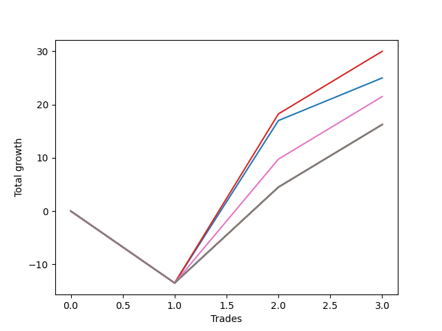

# Long Wallace Doodle 019 
- Symbol: ES90d5m60m
- Date Range: 03/18/2022 - 07/08/2022
- Trading Period: 7:20-12:30
- Number of Trades: 3



| Name | Win Percent | Profit | Avg Profit / Trade |     | Name | Win Percent | Profit | Avg Profit / Trade |
| ---- | ----------- | ------ | ------------------ | --- | ---- | ----------- | ------ | ------------------ |
| Sorted By <br> Profit | | | | | Sorted By <br> Win Percentage ||||
| Three | 66.67 | 15000.00 | 5000.00 |     | Three | 66.67 | 15000.00 | 5000.00 |
| Zero | 66.67 | 12500.00 | 4166.67 |     | Zero | 66.67 | 12500.00 | 4166.67 |
| Six | 66.67 | 10750.00 | 3583.33 |     | Six | 66.67 | 10750.00 | 3583.33 |
| Seven | 66.67 | 8125.00 | 2708.33 |     | Seven | 66.67 | 8125.00 | 2708.33 |
| Five | 66.67 | 8125.00 | 2708.33 |     | Five | 66.67 | 8125.00 | 2708.33 |
| Four | 66.67 | 8125.00 | 2708.33 |     | Four | 66.67 | 8125.00 | 2708.33 |
| Two | 66.67 | 8125.00 | 2708.33 |     | Two | 66.67 | 8125.00 | 2708.33 |
| One | 66.67 | 8125.00 | 2708.33 |     | One | 66.67 | 8125.00 | 2708.33 |

### Test Zero
* Sell when price hits the middle line of the 20p bollinger
* No Stoploss
* Results:
```
Total Trades: 3
Percent Up: 66.67
Percent Down: 33.33
Total Points Moved Up: 25.00
Potential Profit: 12500.00
Total Points Ups: 38.50 Count Ups: 2
Total Points Downs: -13.50 Count Downs: 1
```

<details><summary>Trades</summary>

<code>In: 2022-04-18 08:25:00		Out: 2022-04-18 09:25:55		Total Position Time: 60:55		Total Move Up: -13.50		Total to Date: -13.50</code> <br />
<code>In: 2022-05-12 09:00:00		Out: 2022-05-12 09:33:10		Total Position Time: 33:10		Total Move Up: 30.50		Total to Date: 17.00</code> <br />
<code>In: 2022-05-25 09:35:00		Out: 2022-05-25 10:18:30		Total Position Time: 43:30		Total Move Up: 8.00		Total to Date: 25.00</code> <br />


</details>

### Test One
* Sell when the price hits the upper line of the 20p 1std bollinger
* No Stoploss
* Results:
```
Total Trades: 3
Percent Up: 66.67
Percent Down: 33.33
Total Points Moved Up: 16.25
Potential Profit: 8125.00
Total Points Ups: 29.75 Count Ups: 2
Total Points Downs: -13.50 Count Downs: 1
```

<details><summary>Trades</summary>

<code>In: 2022-04-18 08:25:00		Out: 2022-04-18 09:25:55		Total Position Time: 60:55		Total Move Up: -13.50		Total to Date: -13.50</code> <br />
<code>In: 2022-05-12 09:00:00		Out: 2022-05-12 10:00:55		Total Position Time: 60:55		Total Move Up: 18.00		Total to Date: 4.50</code> <br />
<code>In: 2022-05-25 09:35:00		Out: 2022-05-25 10:35:55		Total Position Time: 60:55		Total Move Up: 11.75		Total to Date: 16.25</code> <br />


</details>

### Test Two
* Sell when the price hits the upper line of the 20p 2std bollinger
* No Stoploss
* Results:
```
Total Trades: 3
Percent Up: 66.67
Percent Down: 33.33
Total Points Moved Up: 16.25
Potential Profit: 8125.00
Total Points Ups: 29.75 Count Ups: 2
Total Points Downs: -13.50 Count Downs: 1
```

<details><summary>Trades</summary>

<code>In: 2022-04-18 08:25:00		Out: 2022-04-18 09:25:55		Total Position Time: 60:55		Total Move Up: -13.50		Total to Date: -13.50</code> <br />
<code>In: 2022-05-12 09:00:00		Out: 2022-05-12 10:00:55		Total Position Time: 60:55		Total Move Up: 18.00		Total to Date: 4.50</code> <br />
<code>In: 2022-05-25 09:35:00		Out: 2022-05-25 10:35:55		Total Position Time: 60:55		Total Move Up: 11.75		Total to Date: 16.25</code> <br />


</details>

### Test Three
* Sell when price hits the middle line of the 50p bollinger
* No Stoploss
* Results:
```
Total Trades: 3
Percent Up: 66.67
Percent Down: 33.33
Total Points Moved Up: 30.00
Potential Profit: 15000.00
Total Points Ups: 43.50 Count Ups: 2
Total Points Downs: -13.50 Count Downs: 1
```

<details><summary>Trades</summary>

<code>In: 2022-04-18 08:25:00		Out: 2022-04-18 09:25:55		Total Position Time: 60:55		Total Move Up: -13.50		Total to Date: -13.50</code> <br />
<code>In: 2022-05-12 09:00:00		Out: 2022-05-12 09:35:15		Total Position Time: 35:15		Total Move Up: 31.75		Total to Date: 18.25</code> <br />
<code>In: 2022-05-25 09:35:00		Out: 2022-05-25 10:35:55		Total Position Time: 60:55		Total Move Up: 11.75		Total to Date: 30.00</code> <br />


</details>

### Test Four
* Sell when the price hits the upper line of the 50p 1std bollinger
* No Stoploss
* Results:
```
Total Trades: 3
Percent Up: 66.67
Percent Down: 33.33
Total Points Moved Up: 16.25
Potential Profit: 8125.00
Total Points Ups: 29.75 Count Ups: 2
Total Points Downs: -13.50 Count Downs: 1
```

<details><summary>Trades</summary>

<code>In: 2022-04-18 08:25:00		Out: 2022-04-18 09:25:55		Total Position Time: 60:55		Total Move Up: -13.50		Total to Date: -13.50</code> <br />
<code>In: 2022-05-12 09:00:00		Out: 2022-05-12 10:00:55		Total Position Time: 60:55		Total Move Up: 18.00		Total to Date: 4.50</code> <br />
<code>In: 2022-05-25 09:35:00		Out: 2022-05-25 10:35:55		Total Position Time: 60:55		Total Move Up: 11.75		Total to Date: 16.25</code> <br />


</details>

### Test Five
* Sell when the price hits the upper line of the 50p 2std bollinger
* No Stoploss
* Results:
```
Total Trades: 3
Percent Up: 66.67
Percent Down: 33.33
Total Points Moved Up: 16.25
Potential Profit: 8125.00
Total Points Ups: 29.75 Count Ups: 2
Total Points Downs: -13.50 Count Downs: 1
```

<details><summary>Trades</summary>

<code>In: 2022-04-18 08:25:00		Out: 2022-04-18 09:25:55		Total Position Time: 60:55		Total Move Up: -13.50		Total to Date: -13.50</code> <br />
<code>In: 2022-05-12 09:00:00		Out: 2022-05-12 10:00:55		Total Position Time: 60:55		Total Move Up: 18.00		Total to Date: 4.50</code> <br />
<code>In: 2022-05-25 09:35:00		Out: 2022-05-25 10:35:55		Total Position Time: 60:55		Total Move Up: 11.75		Total to Date: 16.25</code> <br />


</details>

### Test Six
* Sell when the price hits the middle line of the 1std VWAP
* No Stoploss
* Results:
```
Total Trades: 3
Percent Up: 66.67
Percent Down: 33.33
Total Points Moved Up: 21.50
Potential Profit: 10750.00
Total Points Ups: 35.00 Count Ups: 2
Total Points Downs: -13.50 Count Downs: 1
```

<details><summary>Trades</summary>

<code>In: 2022-04-18 08:25:00		Out: 2022-04-18 09:25:55		Total Position Time: 60:55		Total Move Up: -13.50		Total to Date: -13.50</code> <br />
<code>In: 2022-05-12 09:00:00		Out: 2022-05-12 09:31:15		Total Position Time: 31:15		Total Move Up: 23.25		Total to Date: 9.75</code> <br />
<code>In: 2022-05-25 09:35:00		Out: 2022-05-25 10:35:55		Total Position Time: 60:55		Total Move Up: 11.75		Total to Date: 21.50</code> <br />


</details>

### Test Seven
* Sell when the price hits the upper line of the 1std VWAP
* No Stoploss
* Results:
```
Total Trades: 3
Percent Up: 66.67
Percent Down: 33.33
Total Points Moved Up: 16.25
Potential Profit: 8125.00
Total Points Ups: 29.75 Count Ups: 2
Total Points Downs: -13.50 Count Downs: 1
```

<details><summary>Trades</summary>

<code>In: 2022-04-18 08:25:00		Out: 2022-04-18 09:25:55		Total Position Time: 60:55		Total Move Up: -13.50		Total to Date: -13.50</code> <br />
<code>In: 2022-05-12 09:00:00		Out: 2022-05-12 10:00:55		Total Position Time: 60:55		Total Move Up: 18.00		Total to Date: 4.50</code> <br />
<code>In: 2022-05-25 09:35:00		Out: 2022-05-25 10:35:55		Total Position Time: 60:55		Total Move Up: 11.75		Total to Date: 16.25</code> <br />


</details>