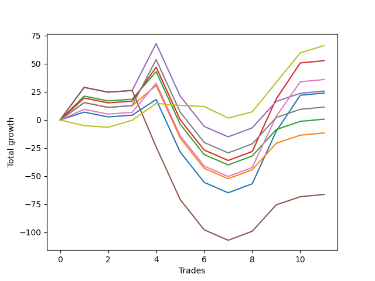

# Short Bulldog 003 
- Symbol: ES90d5m60m
- Date Range: 03/18/2022 - 07/08/2022
- Trading Period: 7:20-12:30
- Number of Trades: 11



| Name | Win Percent | Profit | Avg Profit / Trade |     | Name | Win Percent | Profit | Avg Profit / Trade |
| ---- | ----------- | ------ | ------------------ | --- | ---- | ----------- | ------ | ------------------ |
| Sorted By <br> Profit | | | | | Sorted By <br> Win Percentage ||||
| Three | 63.64 | 26375.00 | 2397.73 |     | Three | 63.64 | 26375.00 | 2397.73 |
| Six | 63.64 | 18000.00 | 1636.36 |     | Six | 63.64 | 18000.00 | 1636.36 |
| Four | 63.64 | 12875.00 | 1170.45 |     | Four | 63.64 | 12875.00 | 1170.45 |
| Zero | 63.64 | 12000.00 | 1090.91 |     | Zero | 63.64 | 12000.00 | 1090.91 |
| Seven | 63.64 | 5750.00 | 522.73 |     | Seven | 63.64 | 5750.00 | 522.73 |
| Two | 63.64 | 375.00 | 34.09 |     | Two | 63.64 | 375.00 | 34.09 |
| One | 63.64 | -5750.00 | -522.73 |     | One | 63.64 | -5750.00 | -522.73 |
| Five | 54.55 | -33125.00 | -3011.36 |     | Five | 54.55 | -33125.00 | -3011.36 |

### Test Zero
* Sell when price hits the middle line of the 20p bollinger
* No Stoploss
* Results:
```
Total Trades: 11
Percent Up: 36.36
Percent Down: 63.64
Total Points Moved Down: 24.00
Potential Profit: 12000.00
Total Points Ups: 87.25 Count Ups: 4
Total Points Downs: 111.25 Count Downs: 7
```

<details><summary>Trades</summary>

<code>In: 2022-03-25 07:25:00		Out: 2022-03-25 08:01:45		Total Position Time: 36:45		Total Move Down: 7.00		Total to Date: 7.00</code> <br />
<code>In: 2022-03-28 12:00:00		Out: 2022-03-28 12:46:00		Total Position Time: 46:00		Total Move Down: -4.25		Total to Date: 2.75</code> <br />
<code>In: 2022-04-07 12:15:00		Out: 2022-04-07 12:46:00		Total Position Time: 31:00		Total Move Down: 1.50		Total to Date: 4.25</code> <br />
<code>In: 2022-05-04 11:05:00		Out: 2022-05-04 11:07:15		Total Position Time: 02:15		Total Move Down: 14.00		Total to Date: 18.25</code> <br />
<code>In: 2022-05-04 11:55:00		Out: 2022-05-04 12:46:00		Total Position Time: 51:00		Total Move Down: -46.75		Total to Date: -28.50</code> <br />
<code>In: 2022-05-04 12:15:00		Out: 2022-05-04 12:46:00		Total Position Time: 31:00		Total Move Down: -27.00		Total to Date: -55.50</code> <br />
<code>In: 2022-05-25 11:35:00		Out: 2022-05-25 12:35:55		Total Position Time: 60:55		Total Move Down: -9.25		Total to Date: -64.75</code> <br />
<code>In: 2022-05-31 09:05:00		Out: 2022-05-31 10:05:55		Total Position Time: 60:55		Total Move Down: 8.00		Total to Date: -56.75</code> <br />
<code>In: 2022-06-15 11:45:00		Out: 2022-06-15 11:58:05		Total Position Time: 13:05		Total Move Down: 46.75		Total to Date: -10.00</code> <br />
<code>In: 2022-06-15 11:50:00		Out: 2022-06-15 11:58:05		Total Position Time: 08:05		Total Move Down: 32.00		Total to Date: 22.00</code> <br />
<code>In: 2022-07-06 11:45:00		Out: 2022-07-06 12:45:55		Total Position Time: 60:55		Total Move Down: 2.00		Total to Date: 24.00</code> <br />


</details>

### Test One
* Sell when the price hits the upper line of the 20p 1std bollinger
* No Stoploss
* Results:
```
Total Trades: 11
Percent Up: 36.36
Percent Down: 63.64
Total Points Moved Down: -11.50
Potential Profit: -5750.00
Total Points Ups: 87.25 Count Ups: 4
Total Points Downs: 75.75 Count Downs: 7
```

<details><summary>Trades</summary>

<code>In: 2022-03-25 07:25:00		Out: 2022-03-25 08:09:20		Total Position Time: 44:20		Total Move Down: 15.50		Total to Date: 15.50</code> <br />
<code>In: 2022-03-28 12:00:00		Out: 2022-03-28 12:46:00		Total Position Time: 46:00		Total Move Down: -4.25		Total to Date: 11.25</code> <br />
<code>In: 2022-04-07 12:15:00		Out: 2022-04-07 12:46:00		Total Position Time: 31:00		Total Move Down: 1.50		Total to Date: 12.75</code> <br />
<code>In: 2022-05-04 11:05:00		Out: 2022-05-04 11:07:20		Total Position Time: 02:20		Total Move Down: 18.00		Total to Date: 30.75</code> <br />
<code>In: 2022-05-04 11:55:00		Out: 2022-05-04 12:46:00		Total Position Time: 51:00		Total Move Down: -46.75		Total to Date: -16.00</code> <br />
<code>In: 2022-05-04 12:15:00		Out: 2022-05-04 12:46:00		Total Position Time: 31:00		Total Move Down: -27.00		Total to Date: -43.00</code> <br />
<code>In: 2022-05-25 11:35:00		Out: 2022-05-25 12:35:55		Total Position Time: 60:55		Total Move Down: -9.25		Total to Date: -52.25</code> <br />
<code>In: 2022-05-31 09:05:00		Out: 2022-05-31 10:05:55		Total Position Time: 60:55		Total Move Down: 8.00		Total to Date: -44.25</code> <br />
<code>In: 2022-06-15 11:45:00		Out: 2022-06-15 12:45:55		Total Position Time: 60:55		Total Move Down: 23.50		Total to Date: -20.75</code> <br />
<code>In: 2022-06-15 11:50:00		Out: 2022-06-15 12:46:00		Total Position Time: 56:00		Total Move Down: 7.25		Total to Date: -13.50</code> <br />
<code>In: 2022-07-06 11:45:00		Out: 2022-07-06 12:45:55		Total Position Time: 60:55		Total Move Down: 2.00		Total to Date: -11.50</code> <br />


</details>

### Test Two
* Sell when the price hits the upper line of the 20p 2std bollinger
* No Stoploss
* Results:
```
Total Trades: 11
Percent Up: 36.36
Percent Down: 63.64
Total Points Moved Down: 0.75
Potential Profit: 375.00
Total Points Ups: 87.25 Count Ups: 4
Total Points Downs: 88.00 Count Downs: 7
```

<details><summary>Trades</summary>

<code>In: 2022-03-25 07:25:00		Out: 2022-03-25 08:10:45		Total Position Time: 45:45		Total Move Down: 21.25		Total to Date: 21.25</code> <br />
<code>In: 2022-03-28 12:00:00		Out: 2022-03-28 12:46:00		Total Position Time: 46:00		Total Move Down: -4.25		Total to Date: 17.00</code> <br />
<code>In: 2022-04-07 12:15:00		Out: 2022-04-07 12:46:00		Total Position Time: 31:00		Total Move Down: 1.50		Total to Date: 18.50</code> <br />
<code>In: 2022-05-04 11:05:00		Out: 2022-05-04 11:07:40		Total Position Time: 02:40		Total Move Down: 24.50		Total to Date: 43.00</code> <br />
<code>In: 2022-05-04 11:55:00		Out: 2022-05-04 12:46:00		Total Position Time: 51:00		Total Move Down: -46.75		Total to Date: -3.75</code> <br />
<code>In: 2022-05-04 12:15:00		Out: 2022-05-04 12:46:00		Total Position Time: 31:00		Total Move Down: -27.00		Total to Date: -30.75</code> <br />
<code>In: 2022-05-25 11:35:00		Out: 2022-05-25 12:35:55		Total Position Time: 60:55		Total Move Down: -9.25		Total to Date: -40.00</code> <br />
<code>In: 2022-05-31 09:05:00		Out: 2022-05-31 10:05:55		Total Position Time: 60:55		Total Move Down: 8.00		Total to Date: -32.00</code> <br />
<code>In: 2022-06-15 11:45:00		Out: 2022-06-15 12:45:55		Total Position Time: 60:55		Total Move Down: 23.50		Total to Date: -8.50</code> <br />
<code>In: 2022-06-15 11:50:00		Out: 2022-06-15 12:46:00		Total Position Time: 56:00		Total Move Down: 7.25		Total to Date: -1.25</code> <br />
<code>In: 2022-07-06 11:45:00		Out: 2022-07-06 12:45:55		Total Position Time: 60:55		Total Move Down: 2.00		Total to Date: 0.75</code> <br />


</details>

### Test Three
* Sell when price hits the middle line of the 50p bollinger
* No Stoploss
* Results:
```
Total Trades: 11
Percent Up: 36.36
Percent Down: 63.64
Total Points Moved Down: 52.75
Potential Profit: 26375.00
Total Points Ups: 87.25 Count Ups: 4
Total Points Downs: 140.00 Count Downs: 7
```

<details><summary>Trades</summary>

<code>In: 2022-03-25 07:25:00		Out: 2022-03-25 08:10:15		Total Position Time: 45:15		Total Move Down: 19.50		Total to Date: 19.50</code> <br />
<code>In: 2022-03-28 12:00:00		Out: 2022-03-28 12:46:00		Total Position Time: 46:00		Total Move Down: -4.25		Total to Date: 15.25</code> <br />
<code>In: 2022-04-07 12:15:00		Out: 2022-04-07 12:46:00		Total Position Time: 31:00		Total Move Down: 1.50		Total to Date: 16.75</code> <br />
<code>In: 2022-05-04 11:05:00		Out: 2022-05-04 11:20:50		Total Position Time: 15:50		Total Move Down: 30.25		Total to Date: 47.00</code> <br />
<code>In: 2022-05-04 11:55:00		Out: 2022-05-04 12:46:00		Total Position Time: 51:00		Total Move Down: -46.75		Total to Date: 0.25</code> <br />
<code>In: 2022-05-04 12:15:00		Out: 2022-05-04 12:46:00		Total Position Time: 31:00		Total Move Down: -27.00		Total to Date: -26.75</code> <br />
<code>In: 2022-05-25 11:35:00		Out: 2022-05-25 12:35:55		Total Position Time: 60:55		Total Move Down: -9.25		Total to Date: -36.00</code> <br />
<code>In: 2022-05-31 09:05:00		Out: 2022-05-31 10:05:55		Total Position Time: 60:55		Total Move Down: 8.00		Total to Date: -28.00</code> <br />
<code>In: 2022-06-15 11:45:00		Out: 2022-06-15 11:58:05		Total Position Time: 13:05		Total Move Down: 46.75		Total to Date: 18.75</code> <br />
<code>In: 2022-06-15 11:50:00		Out: 2022-06-15 11:58:05		Total Position Time: 08:05		Total Move Down: 32.00		Total to Date: 50.75</code> <br />
<code>In: 2022-07-06 11:45:00		Out: 2022-07-06 12:45:55		Total Position Time: 60:55		Total Move Down: 2.00		Total to Date: 52.75</code> <br />


</details>

### Test Four
* Sell when the price hits the upper line of the 50p 1std bollinger
* No Stoploss
* Results:
```
Total Trades: 11
Percent Up: 36.36
Percent Down: 63.64
Total Points Moved Down: 25.75
Potential Profit: 12875.00
Total Points Ups: 87.25 Count Ups: 4
Total Points Downs: 113.00 Count Downs: 7
```

<details><summary>Trades</summary>

<code>In: 2022-03-25 07:25:00		Out: 2022-03-25 08:25:55		Total Position Time: 60:55		Total Move Down: 29.00		Total to Date: 29.00</code> <br />
<code>In: 2022-03-28 12:00:00		Out: 2022-03-28 12:46:00		Total Position Time: 46:00		Total Move Down: -4.25		Total to Date: 24.75</code> <br />
<code>In: 2022-04-07 12:15:00		Out: 2022-04-07 12:46:00		Total Position Time: 31:00		Total Move Down: 1.50		Total to Date: 26.25</code> <br />
<code>In: 2022-05-04 11:05:00		Out: 2022-05-04 11:34:10		Total Position Time: 29:10		Total Move Down: 41.75		Total to Date: 68.00</code> <br />
<code>In: 2022-05-04 11:55:00		Out: 2022-05-04 12:46:00		Total Position Time: 51:00		Total Move Down: -46.75		Total to Date: 21.25</code> <br />
<code>In: 2022-05-04 12:15:00		Out: 2022-05-04 12:46:00		Total Position Time: 31:00		Total Move Down: -27.00		Total to Date: -5.75</code> <br />
<code>In: 2022-05-25 11:35:00		Out: 2022-05-25 12:35:55		Total Position Time: 60:55		Total Move Down: -9.25		Total to Date: -15.00</code> <br />
<code>In: 2022-05-31 09:05:00		Out: 2022-05-31 10:05:55		Total Position Time: 60:55		Total Move Down: 8.00		Total to Date: -7.00</code> <br />
<code>In: 2022-06-15 11:45:00		Out: 2022-06-15 12:45:55		Total Position Time: 60:55		Total Move Down: 23.50		Total to Date: 16.50</code> <br />
<code>In: 2022-06-15 11:50:00		Out: 2022-06-15 12:46:00		Total Position Time: 56:00		Total Move Down: 7.25		Total to Date: 23.75</code> <br />
<code>In: 2022-07-06 11:45:00		Out: 2022-07-06 12:45:55		Total Position Time: 60:55		Total Move Down: 2.00		Total to Date: 25.75</code> <br />


</details>

### Test Five
* Sell when the price hits the upper line of the 50p 2std bollinger
* No Stoploss
* Results:
```
Total Trades: 11
Percent Up: 45.45
Percent Down: 54.55
Total Points Moved Down: -66.25
Potential Profit: -33125.00
Total Points Ups: 137.50 Count Ups: 5
Total Points Downs: 71.25 Count Downs: 6
```

<details><summary>Trades</summary>

<code>In: 2022-03-25 07:25:00		Out: 2022-03-25 08:25:55		Total Position Time: 60:55		Total Move Down: 29.00		Total to Date: 29.00</code> <br />
<code>In: 2022-03-28 12:00:00		Out: 2022-03-28 12:46:00		Total Position Time: 46:00		Total Move Down: -4.25		Total to Date: 24.75</code> <br />
<code>In: 2022-04-07 12:15:00		Out: 2022-04-07 12:46:00		Total Position Time: 31:00		Total Move Down: 1.50		Total to Date: 26.25</code> <br />
<code>In: 2022-05-04 11:05:00		Out: 2022-05-04 12:05:55		Total Position Time: 60:55		Total Move Down: -50.25		Total to Date: -24.00</code> <br />
<code>In: 2022-05-04 11:55:00		Out: 2022-05-04 12:46:00		Total Position Time: 51:00		Total Move Down: -46.75		Total to Date: -70.75</code> <br />
<code>In: 2022-05-04 12:15:00		Out: 2022-05-04 12:46:00		Total Position Time: 31:00		Total Move Down: -27.00		Total to Date: -97.75</code> <br />
<code>In: 2022-05-25 11:35:00		Out: 2022-05-25 12:35:55		Total Position Time: 60:55		Total Move Down: -9.25		Total to Date: -107.00</code> <br />
<code>In: 2022-05-31 09:05:00		Out: 2022-05-31 10:05:55		Total Position Time: 60:55		Total Move Down: 8.00		Total to Date: -99.00</code> <br />
<code>In: 2022-06-15 11:45:00		Out: 2022-06-15 12:45:55		Total Position Time: 60:55		Total Move Down: 23.50		Total to Date: -75.50</code> <br />
<code>In: 2022-06-15 11:50:00		Out: 2022-06-15 12:46:00		Total Position Time: 56:00		Total Move Down: 7.25		Total to Date: -68.25</code> <br />
<code>In: 2022-07-06 11:45:00		Out: 2022-07-06 12:45:55		Total Position Time: 60:55		Total Move Down: 2.00		Total to Date: -66.25</code> <br />


</details>

### Test Six
* Sell when the price hits the middle line of the 1std VWAP
* No Stoploss
* Results:
```
Total Trades: 11
Percent Up: 36.36
Percent Down: 63.64
Total Points Moved Down: 36.00
Potential Profit: 18000.00
Total Points Ups: 87.25 Count Ups: 4
Total Points Downs: 123.25 Count Downs: 7
```

<details><summary>Trades</summary>

<code>In: 2022-03-25 07:25:00		Out: 2022-03-25 08:08:15		Total Position Time: 43:15		Total Move Down: 9.50		Total to Date: 9.50</code> <br />
<code>In: 2022-03-28 12:00:00		Out: 2022-03-28 12:46:00		Total Position Time: 46:00		Total Move Down: -4.25		Total to Date: 5.25</code> <br />
<code>In: 2022-04-07 12:15:00		Out: 2022-04-07 12:46:00		Total Position Time: 31:00		Total Move Down: 1.50		Total to Date: 6.75</code> <br />
<code>In: 2022-05-04 11:05:00		Out: 2022-05-04 11:20:20		Total Position Time: 15:20		Total Move Down: 26.00		Total to Date: 32.75</code> <br />
<code>In: 2022-05-04 11:55:00		Out: 2022-05-04 12:46:00		Total Position Time: 51:00		Total Move Down: -46.75		Total to Date: -14.00</code> <br />
<code>In: 2022-05-04 12:15:00		Out: 2022-05-04 12:46:00		Total Position Time: 31:00		Total Move Down: -27.00		Total to Date: -41.00</code> <br />
<code>In: 2022-05-25 11:35:00		Out: 2022-05-25 12:35:55		Total Position Time: 60:55		Total Move Down: -9.25		Total to Date: -50.25</code> <br />
<code>In: 2022-05-31 09:05:00		Out: 2022-05-31 10:05:55		Total Position Time: 60:55		Total Move Down: 8.00		Total to Date: -42.25</code> <br />
<code>In: 2022-06-15 11:45:00		Out: 2022-06-15 11:57:55		Total Position Time: 12:55		Total Move Down: 45.50		Total to Date: 3.25</code> <br />
<code>In: 2022-06-15 11:50:00		Out: 2022-06-15 11:57:55		Total Position Time: 07:55		Total Move Down: 30.75		Total to Date: 34.00</code> <br />
<code>In: 2022-07-06 11:45:00		Out: 2022-07-06 12:45:55		Total Position Time: 60:55		Total Move Down: 2.00		Total to Date: 36.00</code> <br />


</details>

### Test Seven
* Sell when the price hits the upper line of the 1std VWAP
* No Stoploss
* Results:
```
Total Trades: 11
Percent Up: 36.36
Percent Down: 63.64
Total Points Moved Down: 11.50
Potential Profit: 5750.00
Total Points Ups: 87.25 Count Ups: 4
Total Points Downs: 98.75 Count Downs: 7
```

<details><summary>Trades</summary>

<code>In: 2022-03-25 07:25:00		Out: 2022-03-25 08:09:20		Total Position Time: 44:20		Total Move Down: 15.50		Total to Date: 15.50</code> <br />
<code>In: 2022-03-28 12:00:00		Out: 2022-03-28 12:46:00		Total Position Time: 46:00		Total Move Down: -4.25		Total to Date: 11.25</code> <br />
<code>In: 2022-04-07 12:15:00		Out: 2022-04-07 12:46:00		Total Position Time: 31:00		Total Move Down: 1.50		Total to Date: 12.75</code> <br />
<code>In: 2022-05-04 11:05:00		Out: 2022-05-04 11:34:05		Total Position Time: 29:05		Total Move Down: 41.00		Total to Date: 53.75</code> <br />
<code>In: 2022-05-04 11:55:00		Out: 2022-05-04 12:46:00		Total Position Time: 51:00		Total Move Down: -46.75		Total to Date: 7.00</code> <br />
<code>In: 2022-05-04 12:15:00		Out: 2022-05-04 12:46:00		Total Position Time: 31:00		Total Move Down: -27.00		Total to Date: -20.00</code> <br />
<code>In: 2022-05-25 11:35:00		Out: 2022-05-25 12:35:55		Total Position Time: 60:55		Total Move Down: -9.25		Total to Date: -29.25</code> <br />
<code>In: 2022-05-31 09:05:00		Out: 2022-05-31 10:05:55		Total Position Time: 60:55		Total Move Down: 8.00		Total to Date: -21.25</code> <br />
<code>In: 2022-06-15 11:45:00		Out: 2022-06-15 12:45:55		Total Position Time: 60:55		Total Move Down: 23.50		Total to Date: 2.25</code> <br />
<code>In: 2022-06-15 11:50:00		Out: 2022-06-15 12:46:00		Total Position Time: 56:00		Total Move Down: 7.25		Total to Date: 9.50</code> <br />
<code>In: 2022-07-06 11:45:00		Out: 2022-07-06 12:45:55		Total Position Time: 60:55		Total Move Down: 2.00		Total to Date: 11.50</code> <br />


</details>