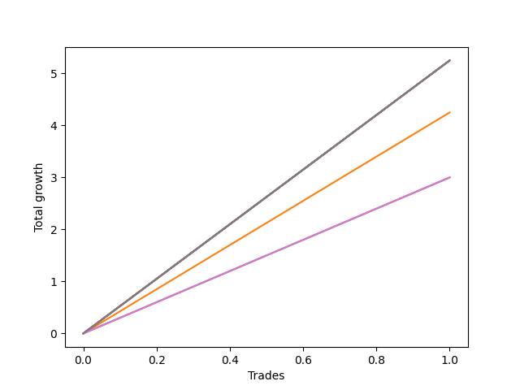

# Short Bulldog 004 
- Symbol: ES90d5m60m
- Date Range: 03/18/2022 - 07/08/2022
- Trading Period: 7:20-12:30
- Number of Trades: 1



| Name | Win Percent | Profit | Avg Profit / Trade |     | Name | Win Percent | Profit | Avg Profit / Trade |
| ---- | ----------- | ------ | ------------------ | --- | ---- | ----------- | ------ | ------------------ |
| Sorted By <br> Profit | | | | | Sorted By <br> Win Percentage ||||
| Five | 100.00 | 61125.00 | 61125.00 |     | Five | 100.00 | 61125.00 | 61125.00 |
| Seven | 100.00 | 9125.00 | 9125.00 |     | Seven | 100.00 | 9125.00 | 9125.00 |
| Four | 100.00 | 7750.00 | 7750.00 |     | Four | 100.00 | 7750.00 | 7750.00 |
| Two | 100.00 | 5875.00 | 5875.00 |     | Two | 100.00 | 5875.00 | 5875.00 |
| Three | 100.00 | 4000.00 | 4000.00 |     | Three | 100.00 | 4000.00 | 4000.00 |
| One | 100.00 | 2125.00 | 2125.00 |     | One | 100.00 | 2125.00 | 2125.00 |
| Six | 100.00 | 1500.00 | 1500.00 |     | Six | 100.00 | 1500.00 | 1500.00 |
| Zero | 100.00 | 1500.00 | 1500.00 |     | Zero | 100.00 | 1500.00 | 1500.00 |

### Test Zero
* Sell when price hits the middle line of the 20p bollinger
* No Stoploss
* Results:
```
Total Trades: 1
Percent Up: 0.00
Percent Down: 100.00
Total Points Moved Down: 3.00
Potential Profit: 1500.00
Total Points Ups: 0.00 Count Ups: 0
Total Points Downs: 3.00 Count Downs: 1
```

<details><summary>Trades</summary>

<code>In: 2022-06-10 12:05:00		Out: 2022-06-10 12:06:10		Total Position Time: 01:10		Total Move Down: 3.00		Total to Date: 3.00</code> <br />


</details>

### Test One
* Sell when the price hits the upper line of the 20p 1std bollinger
* No Stoploss
* Results:
```
Total Trades: 1
Percent Up: 0.00
Percent Down: 100.00
Total Points Moved Down: 4.25
Potential Profit: 2125.00
Total Points Ups: 0.00 Count Ups: 0
Total Points Downs: 4.25 Count Downs: 1
```

<details><summary>Trades</summary>

<code>In: 2022-06-10 12:05:00		Out: 2022-06-10 12:45:40		Total Position Time: 40:40		Total Move Down: 4.25		Total to Date: 4.25</code> <br />


</details>

### Test Two
* Sell when the price hits the upper line of the 20p 2std bollinger
* No Stoploss
* Results:
```
Total Trades: 1
Percent Up: 0.00
Percent Down: 100.00
Total Points Moved Down: 11.75
Potential Profit: 5875.00
Total Points Ups: 0.00 Count Ups: 0
Total Points Downs: 11.75 Count Downs: 1
```

<details><summary>Trades</summary>

<code>In: 2022-06-10 12:05:00		Out: 2022-06-10 12:47:15		Total Position Time: 42:15		Total Move Down: 11.75		Total to Date: 11.75</code> <br />


</details>

### Test Three
* Sell when price hits the middle line of the 50p bollinger
* No Stoploss
* Results:
```
Total Trades: 1
Percent Up: 0.00
Percent Down: 100.00
Total Points Moved Down: 8.00
Potential Profit: 4000.00
Total Points Ups: 0.00 Count Ups: 0
Total Points Downs: 8.00 Count Downs: 1
```

<details><summary>Trades</summary>

<code>In: 2022-06-10 12:05:00		Out: 2022-06-10 12:46:10		Total Position Time: 41:10		Total Move Down: 8.00		Total to Date: 8.00</code> <br />


</details>

### Test Four
* Sell when the price hits the upper line of the 50p 1std bollinger
* No Stoploss
* Results:
```
Total Trades: 1
Percent Up: 0.00
Percent Down: 100.00
Total Points Moved Down: 15.50
Potential Profit: 7750.00
Total Points Ups: 0.00 Count Ups: 0
Total Points Downs: 15.50 Count Downs: 1
```

<details><summary>Trades</summary>

<code>In: 2022-06-10 12:05:00		Out: 2022-06-10 12:59:05		Total Position Time: 54:05		Total Move Down: 15.50		Total to Date: 15.50</code> <br />


</details>

### Test Five
* Sell when the price hits the upper line of the 50p 2std bollinger
* No Stoploss
* Results:
```
Total Trades: 1
Percent Up: 0.00
Percent Down: 100.00
Total Points Moved Down: 122.25
Potential Profit: 61125.00
Total Points Ups: 0.00 Count Ups: 0
Total Points Downs: 122.25 Count Downs: 1
```

<details><summary>Trades</summary>

<code>In: 2022-06-10 12:05:00		Out: 2022-06-13 06:30:05		Total Position Time: 1105:05		Total Move Down: 122.25		Total to Date: 122.25</code> <br />


</details>

### Test Six
* Sell when the price hits the middle line of the 1std VWAP
* No Stoploss
* Results:
```
Total Trades: 1
Percent Up: 0.00
Percent Down: 100.00
Total Points Moved Down: 3.00
Potential Profit: 1500.00
Total Points Ups: 0.00 Count Ups: 0
Total Points Downs: 3.00 Count Downs: 1
```

<details><summary>Trades</summary>

<code>In: 2022-06-10 12:05:00		Out: 2022-06-10 12:44:05		Total Position Time: 39:05		Total Move Down: 3.00		Total to Date: 3.00</code> <br />


</details>

### Test Seven
* Sell when the price hits the upper line of the 1std VWAP
* No Stoploss
* Results:
```
Total Trades: 1
Percent Up: 0.00
Percent Down: 100.00
Total Points Moved Down: 18.25
Potential Profit: 9125.00
Total Points Ups: 0.00 Count Ups: 0
Total Points Downs: 18.25 Count Downs: 1
```

<details><summary>Trades</summary>

<code>In: 2022-06-10 12:05:00		Out: 2022-06-10 12:59:20		Total Position Time: 54:20		Total Move Down: 18.25		Total to Date: 18.25</code> <br />


</details>