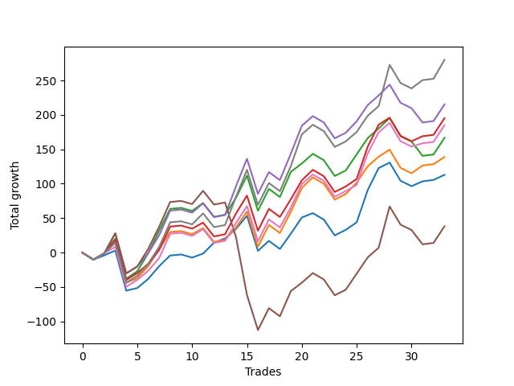

# Short Bulldog 005 
- Symbol: ES90d5m60m
- Date Range: 03/18/2022 - 07/08/2022
- Trading Period: 7:20-12:30
- Number of Trades: 33



| Name | Win Percent | Profit | Avg Profit / Trade |     | Name | Win Percent | Profit | Avg Profit / Trade |
| ---- | ----------- | ------ | ------------------ | --- | ---- | ----------- | ------ | ------------------ |
| Sorted By <br> Profit | | | | | Sorted By <br> Win Percentage ||||
| Seven | 63.64 | 86375.00 | 2617.42 |     | Zero | 66.67 | 64250.00 | 1946.97 |
| Four | 60.61 | 77750.00 | 2356.06 |     | Seven | 63.64 | 86375.00 | 2617.42 |
| Three | 63.64 | 74750.00 | 2265.15 |     | Three | 63.64 | 74750.00 | 2265.15 |
| Six | 63.64 | 67375.00 | 2041.67 |     | Six | 63.64 | 67375.00 | 2041.67 |
| Zero | 66.67 | 64250.00 | 1946.97 |     | One | 63.64 | 56625.00 | 1715.91 |
| Two | 60.61 | 63000.00 | 1909.09 |     | Four | 60.61 | 77750.00 | 2356.06 |
| One | 63.64 | 56625.00 | 1715.91 |     | Two | 60.61 | 63000.00 | 1909.09 |
| Five | 54.55 | -25500.00 | -772.73 |     | Five | 54.55 | -25500.00 | -772.73 |

### Test Zero
* Sell when price hits the middle line of the 20p bollinger
* No Stoploss
* Results:
```
Total Trades: 33
Percent Up: 33.33
Percent Down: 66.67
Total Points Moved Down: 128.50
Potential Profit: 64250.00
Total Points Ups: 154.50 Count Ups: 11
Total Points Downs: 283.00 Count Downs: 22
```

<details><summary>Trades</summary>

<code>In: 2022-03-24 08:05:00		Out: 2022-03-24 09:05:55		Total Position Time: 60:55		Total Move Down: -10.25		Total to Date: -10.25</code> <br />
<code>In: 2022-03-24 08:30:00		Out: 2022-03-24 09:17:15		Total Position Time: 47:15		Total Move Down: 6.25		Total to Date: -4.00</code> <br />
<code>In: 2022-03-25 07:25:00		Out: 2022-03-25 08:01:45		Total Position Time: 36:45		Total Move Down: 7.00		Total to Date: 3.00</code> <br />
<code>In: 2022-03-28 12:00:00		Out: 2022-03-28 12:46:00		Total Position Time: 46:00		Total Move Down: -4.25		Total to Date: -1.25</code> <br />
<code>In: 2022-03-29 12:10:00		Out: 2022-03-29 12:46:00		Total Position Time: 36:00		Total Move Down: -5.00		Total to Date: -6.25</code> <br />
<code>In: 2022-04-06 10:50:00		Out: 2022-04-06 11:00:10		Total Position Time: 10:10		Total Move Down: 13.25		Total to Date: 7.00</code> <br />
<code>In: 2022-04-06 11:05:00		Out: 2022-04-06 11:08:10		Total Position Time: 03:10		Total Move Down: 18.50		Total to Date: 25.50</code> <br />
<code>In: 2022-04-07 12:15:00		Out: 2022-04-07 12:46:00		Total Position Time: 31:00		Total Move Down: 1.50		Total to Date: 27.00</code> <br />
<code>In: 2022-04-08 08:05:00		Out: 2022-04-08 09:05:55		Total Position Time: 60:55		Total Move Down: 1.50		Total to Date: 28.50</code> <br />
<code>In: 2022-04-13 08:05:00		Out: 2022-04-13 09:05:55		Total Position Time: 60:55		Total Move Down: -4.50		Total to Date: 24.00</code> <br />
<code>In: 2022-04-20 10:45:00		Out: 2022-04-20 11:13:25		Total Position Time: 28:25		Total Move Down: 5.75		Total to Date: 29.75</code> <br />
<code>In: 2022-04-25 11:35:00		Out: 2022-04-25 12:07:15		Total Position Time: 32:15		Total Move Down: 16.00		Total to Date: 45.75</code> <br />
<code>In: 2022-05-04 09:40:00		Out: 2022-05-04 10:37:25		Total Position Time: 57:25		Total Move Down: 6.00		Total to Date: 51.75</code> <br />
<code>In: 2022-05-04 11:05:00		Out: 2022-05-04 11:07:15		Total Position Time: 02:15		Total Move Down: 14.00		Total to Date: 65.75</code> <br />
<code>In: 2022-05-04 11:30:00		Out: 2022-05-04 11:31:10		Total Position Time: 01:10		Total Move Down: 19.00		Total to Date: 84.75</code> <br />
<code>In: 2022-05-04 11:55:00		Out: 2022-05-04 12:46:00		Total Position Time: 51:00		Total Move Down: -46.75		Total to Date: 38.00</code> <br />
<code>In: 2022-05-04 12:15:00		Out: 2022-05-04 12:46:00		Total Position Time: 31:00		Total Move Down: -27.00		Total to Date: 11.00</code> <br />
<code>In: 2022-05-16 10:35:00		Out: 2022-05-16 11:35:55		Total Position Time: 60:55		Total Move Down: -11.75		Total to Date: -0.75</code> <br />
<code>In: 2022-05-19 08:50:00		Out: 2022-05-19 09:21:05		Total Position Time: 31:05		Total Move Down: 22.25		Total to Date: 21.50</code> <br />
<code>In: 2022-05-19 12:05:00		Out: 2022-05-19 12:18:20		Total Position Time: 13:20		Total Move Down: 23.50		Total to Date: 45.00</code> <br />
<code>In: 2022-05-24 10:55:00		Out: 2022-05-24 11:48:35		Total Position Time: 53:35		Total Move Down: 6.25		Total to Date: 51.25</code> <br />
<code>In: 2022-05-25 11:35:00		Out: 2022-05-25 12:35:55		Total Position Time: 60:55		Total Move Down: -9.25		Total to Date: 42.00</code> <br />
<code>In: 2022-05-27 12:10:00		Out: 2022-05-27 12:46:00		Total Position Time: 36:00		Total Move Down: -1.50		Total to Date: 40.50</code> <br />
<code>In: 2022-05-31 09:05:00		Out: 2022-05-31 10:05:55		Total Position Time: 60:55		Total Move Down: 8.00		Total to Date: 48.50</code> <br />
<code>In: 2022-06-15 11:00:00		Out: 2022-06-15 11:01:15		Total Position Time: 01:15		Total Move Down: 11.00		Total to Date: 59.50</code> <br />
<code>In: 2022-06-15 11:45:00		Out: 2022-06-15 11:58:05		Total Position Time: 13:05		Total Move Down: 46.75		Total to Date: 106.25</code> <br />
<code>In: 2022-06-15 11:50:00		Out: 2022-06-15 11:58:05		Total Position Time: 08:05		Total Move Down: 32.00		Total to Date: 138.25</code> <br />
<code>In: 2022-06-21 12:05:00		Out: 2022-06-21 12:35:35		Total Position Time: 30:35		Total Move Down: 8.00		Total to Date: 146.25</code> <br />
<code>In: 2022-07-05 10:40:00		Out: 2022-07-05 11:40:55		Total Position Time: 60:55		Total Move Down: -26.50		Total to Date: 119.75</code> <br />
<code>In: 2022-07-05 11:40:00		Out: 2022-07-05 12:40:55		Total Position Time: 60:55		Total Move Down: -7.75		Total to Date: 112.00</code> <br />
<code>In: 2022-07-06 11:00:00		Out: 2022-07-06 11:02:25		Total Position Time: 02:25		Total Move Down: 7.00		Total to Date: 119.00</code> <br />
<code>In: 2022-07-06 11:45:00		Out: 2022-07-06 12:45:55		Total Position Time: 60:55		Total Move Down: 2.00		Total to Date: 121.00</code> <br />
<code>In: 2022-07-07 12:20:00		Out: 2022-07-07 12:38:25		Total Position Time: 18:25		Total Move Down: 7.50		Total to Date: 128.50</code> <br />


</details>

### Test One
* Sell when the price hits the upper line of the 20p 1std bollinger
* No Stoploss
* Results:
```
Total Trades: 33
Percent Up: 36.36
Percent Down: 63.64
Total Points Moved Down: 113.25
Potential Profit: 56625.00
Total Points Ups: 174.50 Count Ups: 12
Total Points Downs: 287.75 Count Downs: 21
```

<details><summary>Trades</summary>

<code>In: 2022-03-24 08:05:00		Out: 2022-03-24 09:05:55		Total Position Time: 60:55		Total Move Down: -10.25		Total to Date: -10.25</code> <br />
<code>In: 2022-03-24 08:30:00		Out: 2022-03-24 09:30:55		Total Position Time: 60:55		Total Move Down: 9.25		Total to Date: -1.00</code> <br />
<code>In: 2022-03-25 07:25:00		Out: 2022-03-25 08:09:20		Total Position Time: 44:20		Total Move Down: 15.50		Total to Date: 14.50</code> <br />
<code>In: 2022-03-28 12:00:00		Out: 2022-03-28 12:46:00		Total Position Time: 46:00		Total Move Down: -4.25		Total to Date: 10.25</code> <br />
<code>In: 2022-03-29 12:10:00		Out: 2022-03-29 12:46:00		Total Position Time: 36:00		Total Move Down: -5.00		Total to Date: 5.25</code> <br />
<code>In: 2022-04-06 10:50:00		Out: 2022-04-06 11:09:45		Total Position Time: 19:45		Total Move Down: 17.75		Total to Date: 23.00</code> <br />
<code>In: 2022-04-06 11:05:00		Out: 2022-04-06 11:09:45		Total Position Time: 04:45		Total Move Down: 24.75		Total to Date: 47.75</code> <br />
<code>In: 2022-04-07 12:15:00		Out: 2022-04-07 12:46:00		Total Position Time: 31:00		Total Move Down: 1.50		Total to Date: 49.25</code> <br />
<code>In: 2022-04-08 08:05:00		Out: 2022-04-08 09:05:55		Total Position Time: 60:55		Total Move Down: 1.50		Total to Date: 50.75</code> <br />
<code>In: 2022-04-13 08:05:00		Out: 2022-04-13 09:05:55		Total Position Time: 60:55		Total Move Down: -4.50		Total to Date: 46.25</code> <br />
<code>In: 2022-04-20 10:45:00		Out: 2022-04-20 11:17:15		Total Position Time: 32:15		Total Move Down: 8.75		Total to Date: 55.00</code> <br />
<code>In: 2022-04-25 11:35:00		Out: 2022-04-25 12:35:55		Total Position Time: 60:55		Total Move Down: -20.00		Total to Date: 35.00</code> <br />
<code>In: 2022-05-04 09:40:00		Out: 2022-05-04 10:40:55		Total Position Time: 60:55		Total Move Down: 3.00		Total to Date: 38.00</code> <br />
<code>In: 2022-05-04 11:05:00		Out: 2022-05-04 11:07:20		Total Position Time: 02:20		Total Move Down: 18.00		Total to Date: 56.00</code> <br />
<code>In: 2022-05-04 11:30:00		Out: 2022-05-04 11:31:20		Total Position Time: 01:20		Total Move Down: 23.00		Total to Date: 79.00</code> <br />
<code>In: 2022-05-04 11:55:00		Out: 2022-05-04 12:46:00		Total Position Time: 51:00		Total Move Down: -46.75		Total to Date: 32.25</code> <br />
<code>In: 2022-05-04 12:15:00		Out: 2022-05-04 12:46:00		Total Position Time: 31:00		Total Move Down: -27.00		Total to Date: 5.25</code> <br />
<code>In: 2022-05-16 10:35:00		Out: 2022-05-16 11:35:55		Total Position Time: 60:55		Total Move Down: -11.75		Total to Date: -6.50</code> <br />
<code>In: 2022-05-19 08:50:00		Out: 2022-05-19 09:40:30		Total Position Time: 50:30		Total Move Down: 30.75		Total to Date: 24.25</code> <br />
<code>In: 2022-05-19 12:05:00		Out: 2022-05-19 12:24:50		Total Position Time: 19:50		Total Move Down: 34.75		Total to Date: 59.00</code> <br />
<code>In: 2022-05-24 10:55:00		Out: 2022-05-24 11:55:10		Total Position Time: 60:10		Total Move Down: 15.25		Total to Date: 74.25</code> <br />
<code>In: 2022-05-25 11:35:00		Out: 2022-05-25 12:35:55		Total Position Time: 60:55		Total Move Down: -9.25		Total to Date: 65.00</code> <br />
<code>In: 2022-05-27 12:10:00		Out: 2022-05-27 12:46:00		Total Position Time: 36:00		Total Move Down: -1.50		Total to Date: 63.50</code> <br />
<code>In: 2022-05-31 09:05:00		Out: 2022-05-31 10:05:55		Total Position Time: 60:55		Total Move Down: 8.00		Total to Date: 71.50</code> <br />
<code>In: 2022-06-15 11:00:00		Out: 2022-06-15 11:01:25		Total Position Time: 01:25		Total Move Down: 16.75		Total to Date: 88.25</code> <br />
<code>In: 2022-06-15 11:45:00		Out: 2022-06-15 12:45:55		Total Position Time: 60:55		Total Move Down: 23.50		Total to Date: 111.75</code> <br />
<code>In: 2022-06-15 11:50:00		Out: 2022-06-15 12:46:00		Total Position Time: 56:00		Total Move Down: 7.25		Total to Date: 119.00</code> <br />
<code>In: 2022-06-21 12:05:00		Out: 2022-06-21 12:46:00		Total Position Time: 41:00		Total Move Down: 7.00		Total to Date: 126.00</code> <br />
<code>In: 2022-07-05 10:40:00		Out: 2022-07-05 11:40:55		Total Position Time: 60:55		Total Move Down: -26.50		Total to Date: 99.50</code> <br />
<code>In: 2022-07-05 11:40:00		Out: 2022-07-05 12:40:55		Total Position Time: 60:55		Total Move Down: -7.75		Total to Date: 91.75</code> <br />
<code>In: 2022-07-06 11:00:00		Out: 2022-07-06 11:12:15		Total Position Time: 12:15		Total Move Down: 11.25		Total to Date: 103.00</code> <br />
<code>In: 2022-07-06 11:45:00		Out: 2022-07-06 12:45:55		Total Position Time: 60:55		Total Move Down: 2.00		Total to Date: 105.00</code> <br />
<code>In: 2022-07-07 12:20:00		Out: 2022-07-07 12:46:00		Total Position Time: 26:00		Total Move Down: 8.25		Total to Date: 113.25</code> <br />


</details>

### Test Two
* Sell when the price hits the upper line of the 20p 2std bollinger
* No Stoploss
* Results:
```
Total Trades: 33
Percent Up: 39.39
Percent Down: 60.61
Total Points Moved Down: 126.00
Potential Profit: 63000.00
Total Points Ups: 195.25 Count Ups: 13
Total Points Downs: 321.25 Count Downs: 20
```

<details><summary>Trades</summary>

<code>In: 2022-03-24 08:05:00		Out: 2022-03-24 09:05:55		Total Position Time: 60:55		Total Move Down: -10.25		Total to Date: -10.25</code> <br />
<code>In: 2022-03-24 08:30:00		Out: 2022-03-24 09:30:55		Total Position Time: 60:55		Total Move Down: 9.25		Total to Date: -1.00</code> <br />
<code>In: 2022-03-25 07:25:00		Out: 2022-03-25 08:10:45		Total Position Time: 45:45		Total Move Down: 21.25		Total to Date: 20.25</code> <br />
<code>In: 2022-03-28 12:00:00		Out: 2022-03-28 12:46:00		Total Position Time: 46:00		Total Move Down: -4.25		Total to Date: 16.00</code> <br />
<code>In: 2022-03-29 12:10:00		Out: 2022-03-29 12:46:00		Total Position Time: 36:00		Total Move Down: -5.00		Total to Date: 11.00</code> <br />
<code>In: 2022-04-06 10:50:00		Out: 2022-04-06 11:15:15		Total Position Time: 25:15		Total Move Down: 26.25		Total to Date: 37.25</code> <br />
<code>In: 2022-04-06 11:05:00		Out: 2022-04-06 11:15:15		Total Position Time: 10:15		Total Move Down: 33.25		Total to Date: 70.50</code> <br />
<code>In: 2022-04-07 12:15:00		Out: 2022-04-07 12:46:00		Total Position Time: 31:00		Total Move Down: 1.50		Total to Date: 72.00</code> <br />
<code>In: 2022-04-08 08:05:00		Out: 2022-04-08 09:05:55		Total Position Time: 60:55		Total Move Down: 1.50		Total to Date: 73.50</code> <br />
<code>In: 2022-04-13 08:05:00		Out: 2022-04-13 09:05:55		Total Position Time: 60:55		Total Move Down: -4.50		Total to Date: 69.00</code> <br />
<code>In: 2022-04-20 10:45:00		Out: 2022-04-20 11:19:15		Total Position Time: 34:15		Total Move Down: 11.50		Total to Date: 80.50</code> <br />
<code>In: 2022-04-25 11:35:00		Out: 2022-04-25 12:35:55		Total Position Time: 60:55		Total Move Down: -20.00		Total to Date: 60.50</code> <br />
<code>In: 2022-05-04 09:40:00		Out: 2022-05-04 10:40:55		Total Position Time: 60:55		Total Move Down: 3.00		Total to Date: 63.50</code> <br />
<code>In: 2022-05-04 11:05:00		Out: 2022-05-04 11:07:40		Total Position Time: 02:40		Total Move Down: 24.50		Total to Date: 88.00</code> <br />
<code>In: 2022-05-04 11:30:00		Out: 2022-05-04 11:32:25		Total Position Time: 02:25		Total Move Down: 32.25		Total to Date: 120.25</code> <br />
<code>In: 2022-05-04 11:55:00		Out: 2022-05-04 12:46:00		Total Position Time: 51:00		Total Move Down: -46.75		Total to Date: 73.50</code> <br />
<code>In: 2022-05-04 12:15:00		Out: 2022-05-04 12:46:00		Total Position Time: 31:00		Total Move Down: -27.00		Total to Date: 46.50</code> <br />
<code>In: 2022-05-16 10:35:00		Out: 2022-05-16 11:35:55		Total Position Time: 60:55		Total Move Down: -11.75		Total to Date: 34.75</code> <br />
<code>In: 2022-05-19 08:50:00		Out: 2022-05-19 09:50:55		Total Position Time: 60:55		Total Move Down: 36.50		Total to Date: 71.25</code> <br />
<code>In: 2022-05-19 12:05:00		Out: 2022-05-19 12:46:00		Total Position Time: 41:00		Total Move Down: 27.00		Total to Date: 98.25</code> <br />
<code>In: 2022-05-24 10:55:00		Out: 2022-05-24 11:55:55		Total Position Time: 60:55		Total Move Down: 14.00		Total to Date: 112.25</code> <br />
<code>In: 2022-05-25 11:35:00		Out: 2022-05-25 12:35:55		Total Position Time: 60:55		Total Move Down: -9.25		Total to Date: 103.00</code> <br />
<code>In: 2022-05-27 12:10:00		Out: 2022-05-27 12:46:00		Total Position Time: 36:00		Total Move Down: -1.50		Total to Date: 101.50</code> <br />
<code>In: 2022-05-31 09:05:00		Out: 2022-05-31 10:05:55		Total Position Time: 60:55		Total Move Down: 8.00		Total to Date: 109.50</code> <br />
<code>In: 2022-06-15 11:00:00		Out: 2022-06-15 11:01:40		Total Position Time: 01:40		Total Move Down: 23.50		Total to Date: 133.00</code> <br />
<code>In: 2022-06-15 11:45:00		Out: 2022-06-15 12:45:55		Total Position Time: 60:55		Total Move Down: 23.50		Total to Date: 156.50</code> <br />
<code>In: 2022-06-15 11:50:00		Out: 2022-06-15 12:46:00		Total Position Time: 56:00		Total Move Down: 7.25		Total to Date: 163.75</code> <br />
<code>In: 2022-06-21 12:05:00		Out: 2022-06-21 12:46:00		Total Position Time: 41:00		Total Move Down: 7.00		Total to Date: 170.75</code> <br />
<code>In: 2022-07-05 10:40:00		Out: 2022-07-05 11:40:55		Total Position Time: 60:55		Total Move Down: -26.50		Total to Date: 144.25</code> <br />
<code>In: 2022-07-05 11:40:00		Out: 2022-07-05 12:40:55		Total Position Time: 60:55		Total Move Down: -7.75		Total to Date: 136.50</code> <br />
<code>In: 2022-07-06 11:00:00		Out: 2022-07-06 12:00:55		Total Position Time: 60:55		Total Move Down: -20.75		Total to Date: 115.75</code> <br />
<code>In: 2022-07-06 11:45:00		Out: 2022-07-06 12:45:55		Total Position Time: 60:55		Total Move Down: 2.00		Total to Date: 117.75</code> <br />
<code>In: 2022-07-07 12:20:00		Out: 2022-07-07 12:46:00		Total Position Time: 26:00		Total Move Down: 8.25		Total to Date: 126.00</code> <br />


</details>

### Test Three
* Sell when price hits the middle line of the 50p bollinger
* No Stoploss
* Results:
```
Total Trades: 33
Percent Up: 36.36
Percent Down: 63.64
Total Points Moved Down: 149.50
Potential Profit: 74750.00
Total Points Ups: 174.50 Count Ups: 12
Total Points Downs: 324.00 Count Downs: 21
```

<details><summary>Trades</summary>

<code>In: 2022-03-24 08:05:00		Out: 2022-03-24 09:05:55		Total Position Time: 60:55		Total Move Down: -10.25		Total to Date: -10.25</code> <br />
<code>In: 2022-03-24 08:30:00		Out: 2022-03-24 09:30:55		Total Position Time: 60:55		Total Move Down: 9.25		Total to Date: -1.00</code> <br />
<code>In: 2022-03-25 07:25:00		Out: 2022-03-25 08:10:15		Total Position Time: 45:15		Total Move Down: 19.50		Total to Date: 18.50</code> <br />
<code>In: 2022-03-28 12:00:00		Out: 2022-03-28 12:46:00		Total Position Time: 46:00		Total Move Down: -4.25		Total to Date: 14.25</code> <br />
<code>In: 2022-03-29 12:10:00		Out: 2022-03-29 12:46:00		Total Position Time: 36:00		Total Move Down: -5.00		Total to Date: 9.25</code> <br />
<code>In: 2022-04-06 10:50:00		Out: 2022-04-06 11:08:35		Total Position Time: 18:35		Total Move Down: 13.25		Total to Date: 22.50</code> <br />
<code>In: 2022-04-06 11:05:00		Out: 2022-04-06 11:08:35		Total Position Time: 03:35		Total Move Down: 20.25		Total to Date: 42.75</code> <br />
<code>In: 2022-04-07 12:15:00		Out: 2022-04-07 12:46:00		Total Position Time: 31:00		Total Move Down: 1.50		Total to Date: 44.25</code> <br />
<code>In: 2022-04-08 08:05:00		Out: 2022-04-08 09:05:55		Total Position Time: 60:55		Total Move Down: 1.50		Total to Date: 45.75</code> <br />
<code>In: 2022-04-13 08:05:00		Out: 2022-04-13 09:05:55		Total Position Time: 60:55		Total Move Down: -4.50		Total to Date: 41.25</code> <br />
<code>In: 2022-04-20 10:45:00		Out: 2022-04-20 11:17:15		Total Position Time: 32:15		Total Move Down: 8.75		Total to Date: 50.00</code> <br />
<code>In: 2022-04-25 11:35:00		Out: 2022-04-25 12:35:55		Total Position Time: 60:55		Total Move Down: -20.00		Total to Date: 30.00</code> <br />
<code>In: 2022-05-04 09:40:00		Out: 2022-05-04 10:40:55		Total Position Time: 60:55		Total Move Down: 3.00		Total to Date: 33.00</code> <br />
<code>In: 2022-05-04 11:05:00		Out: 2022-05-04 11:20:50		Total Position Time: 15:50		Total Move Down: 30.25		Total to Date: 63.25</code> <br />
<code>In: 2022-05-04 11:30:00		Out: 2022-05-04 11:31:40		Total Position Time: 01:40		Total Move Down: 26.00		Total to Date: 89.25</code> <br />
<code>In: 2022-05-04 11:55:00		Out: 2022-05-04 12:46:00		Total Position Time: 51:00		Total Move Down: -46.75		Total to Date: 42.50</code> <br />
<code>In: 2022-05-04 12:15:00		Out: 2022-05-04 12:46:00		Total Position Time: 31:00		Total Move Down: -27.00		Total to Date: 15.50</code> <br />
<code>In: 2022-05-16 10:35:00		Out: 2022-05-16 11:35:55		Total Position Time: 60:55		Total Move Down: -11.75		Total to Date: 3.75</code> <br />
<code>In: 2022-05-19 08:50:00		Out: 2022-05-19 09:37:05		Total Position Time: 47:05		Total Move Down: 25.75		Total to Date: 29.50</code> <br />
<code>In: 2022-05-19 12:05:00		Out: 2022-05-19 12:21:15		Total Position Time: 16:15		Total Move Down: 27.50		Total to Date: 57.00</code> <br />
<code>In: 2022-05-24 10:55:00		Out: 2022-05-24 11:55:10		Total Position Time: 60:10		Total Move Down: 15.25		Total to Date: 72.25</code> <br />
<code>In: 2022-05-25 11:35:00		Out: 2022-05-25 12:35:55		Total Position Time: 60:55		Total Move Down: -9.25		Total to Date: 63.00</code> <br />
<code>In: 2022-05-27 12:10:00		Out: 2022-05-27 12:46:00		Total Position Time: 36:00		Total Move Down: -1.50		Total to Date: 61.50</code> <br />
<code>In: 2022-05-31 09:05:00		Out: 2022-05-31 10:05:55		Total Position Time: 60:55		Total Move Down: 8.00		Total to Date: 69.50</code> <br />
<code>In: 2022-06-15 11:00:00		Out: 2022-06-15 11:01:15		Total Position Time: 01:15		Total Move Down: 11.00		Total to Date: 80.50</code> <br />
<code>In: 2022-06-15 11:45:00		Out: 2022-06-15 11:58:05		Total Position Time: 13:05		Total Move Down: 46.75		Total to Date: 127.25</code> <br />
<code>In: 2022-06-15 11:50:00		Out: 2022-06-15 11:58:05		Total Position Time: 08:05		Total Move Down: 32.00		Total to Date: 159.25</code> <br />
<code>In: 2022-06-21 12:05:00		Out: 2022-06-21 12:46:00		Total Position Time: 41:00		Total Move Down: 7.00		Total to Date: 166.25</code> <br />
<code>In: 2022-07-05 10:40:00		Out: 2022-07-05 11:40:55		Total Position Time: 60:55		Total Move Down: -26.50		Total to Date: 139.75</code> <br />
<code>In: 2022-07-05 11:40:00		Out: 2022-07-05 12:40:55		Total Position Time: 60:55		Total Move Down: -7.75		Total to Date: 132.00</code> <br />
<code>In: 2022-07-06 11:00:00		Out: 2022-07-06 11:11:50		Total Position Time: 11:50		Total Move Down: 7.25		Total to Date: 139.25</code> <br />
<code>In: 2022-07-06 11:45:00		Out: 2022-07-06 12:45:55		Total Position Time: 60:55		Total Move Down: 2.00		Total to Date: 141.25</code> <br />
<code>In: 2022-07-07 12:20:00		Out: 2022-07-07 12:46:00		Total Position Time: 26:00		Total Move Down: 8.25		Total to Date: 149.50</code> <br />


</details>

### Test Four
* Sell when the price hits the upper line of the 50p 1std bollinger
* No Stoploss
* Results:
```
Total Trades: 33
Percent Up: 39.39
Percent Down: 60.61
Total Points Moved Down: 155.50
Potential Profit: 77750.00
Total Points Ups: 195.25 Count Ups: 13
Total Points Downs: 350.75 Count Downs: 20
```

<details><summary>Trades</summary>

<code>In: 2022-03-24 08:05:00		Out: 2022-03-24 09:05:55		Total Position Time: 60:55		Total Move Down: -10.25		Total to Date: -10.25</code> <br />
<code>In: 2022-03-24 08:30:00		Out: 2022-03-24 09:30:55		Total Position Time: 60:55		Total Move Down: 9.25		Total to Date: -1.00</code> <br />
<code>In: 2022-03-25 07:25:00		Out: 2022-03-25 08:25:55		Total Position Time: 60:55		Total Move Down: 29.00		Total to Date: 28.00</code> <br />
<code>In: 2022-03-28 12:00:00		Out: 2022-03-28 12:46:00		Total Position Time: 46:00		Total Move Down: -4.25		Total to Date: 23.75</code> <br />
<code>In: 2022-03-29 12:10:00		Out: 2022-03-29 12:46:00		Total Position Time: 36:00		Total Move Down: -5.00		Total to Date: 18.75</code> <br />
<code>In: 2022-04-06 10:50:00		Out: 2022-04-06 11:11:20		Total Position Time: 21:20		Total Move Down: 19.25		Total to Date: 38.00</code> <br />
<code>In: 2022-04-06 11:05:00		Out: 2022-04-06 11:11:20		Total Position Time: 06:20		Total Move Down: 26.25		Total to Date: 64.25</code> <br />
<code>In: 2022-04-07 12:15:00		Out: 2022-04-07 12:46:00		Total Position Time: 31:00		Total Move Down: 1.50		Total to Date: 65.75</code> <br />
<code>In: 2022-04-08 08:05:00		Out: 2022-04-08 09:05:55		Total Position Time: 60:55		Total Move Down: 1.50		Total to Date: 67.25</code> <br />
<code>In: 2022-04-13 08:05:00		Out: 2022-04-13 09:05:55		Total Position Time: 60:55		Total Move Down: -4.50		Total to Date: 62.75</code> <br />
<code>In: 2022-04-20 10:45:00		Out: 2022-04-20 11:21:05		Total Position Time: 36:05		Total Move Down: 13.50		Total to Date: 76.25</code> <br />
<code>In: 2022-04-25 11:35:00		Out: 2022-04-25 12:35:55		Total Position Time: 60:55		Total Move Down: -20.00		Total to Date: 56.25</code> <br />
<code>In: 2022-05-04 09:40:00		Out: 2022-05-04 10:40:55		Total Position Time: 60:55		Total Move Down: 3.00		Total to Date: 59.25</code> <br />
<code>In: 2022-05-04 11:05:00		Out: 2022-05-04 11:34:10		Total Position Time: 29:10		Total Move Down: 41.75		Total to Date: 101.00</code> <br />
<code>In: 2022-05-04 11:30:00		Out: 2022-05-04 11:34:10		Total Position Time: 04:10		Total Move Down: 40.00		Total to Date: 141.00</code> <br />
<code>In: 2022-05-04 11:55:00		Out: 2022-05-04 12:46:00		Total Position Time: 51:00		Total Move Down: -46.75		Total to Date: 94.25</code> <br />
<code>In: 2022-05-04 12:15:00		Out: 2022-05-04 12:46:00		Total Position Time: 31:00		Total Move Down: -27.00		Total to Date: 67.25</code> <br />
<code>In: 2022-05-16 10:35:00		Out: 2022-05-16 11:35:55		Total Position Time: 60:55		Total Move Down: -11.75		Total to Date: 55.50</code> <br />
<code>In: 2022-05-19 08:50:00		Out: 2022-05-19 09:45:45		Total Position Time: 55:45		Total Move Down: 38.50		Total to Date: 94.00</code> <br />
<code>In: 2022-05-19 12:05:00		Out: 2022-05-19 12:30:05		Total Position Time: 25:05		Total Move Down: 40.50		Total to Date: 134.50</code> <br />
<code>In: 2022-05-24 10:55:00		Out: 2022-05-24 11:55:55		Total Position Time: 60:55		Total Move Down: 14.00		Total to Date: 148.50</code> <br />
<code>In: 2022-05-25 11:35:00		Out: 2022-05-25 12:35:55		Total Position Time: 60:55		Total Move Down: -9.25		Total to Date: 139.25</code> <br />
<code>In: 2022-05-27 12:10:00		Out: 2022-05-27 12:46:00		Total Position Time: 36:00		Total Move Down: -1.50		Total to Date: 137.75</code> <br />
<code>In: 2022-05-31 09:05:00		Out: 2022-05-31 10:05:55		Total Position Time: 60:55		Total Move Down: 8.00		Total to Date: 145.75</code> <br />
<code>In: 2022-06-15 11:00:00		Out: 2022-06-15 11:01:25		Total Position Time: 01:25		Total Move Down: 16.75		Total to Date: 162.50</code> <br />
<code>In: 2022-06-15 11:45:00		Out: 2022-06-15 12:45:55		Total Position Time: 60:55		Total Move Down: 23.50		Total to Date: 186.00</code> <br />
<code>In: 2022-06-15 11:50:00		Out: 2022-06-15 12:46:00		Total Position Time: 56:00		Total Move Down: 7.25		Total to Date: 193.25</code> <br />
<code>In: 2022-06-21 12:05:00		Out: 2022-06-21 12:46:00		Total Position Time: 41:00		Total Move Down: 7.00		Total to Date: 200.25</code> <br />
<code>In: 2022-07-05 10:40:00		Out: 2022-07-05 11:40:55		Total Position Time: 60:55		Total Move Down: -26.50		Total to Date: 173.75</code> <br />
<code>In: 2022-07-05 11:40:00		Out: 2022-07-05 12:40:55		Total Position Time: 60:55		Total Move Down: -7.75		Total to Date: 166.00</code> <br />
<code>In: 2022-07-06 11:00:00		Out: 2022-07-06 12:00:55		Total Position Time: 60:55		Total Move Down: -20.75		Total to Date: 145.25</code> <br />
<code>In: 2022-07-06 11:45:00		Out: 2022-07-06 12:45:55		Total Position Time: 60:55		Total Move Down: 2.00		Total to Date: 147.25</code> <br />
<code>In: 2022-07-07 12:20:00		Out: 2022-07-07 12:46:00		Total Position Time: 26:00		Total Move Down: 8.25		Total to Date: 155.50</code> <br />


</details>

### Test Five
* Sell when the price hits the upper line of the 50p 2std bollinger
* No Stoploss
* Results:
```
Total Trades: 33
Percent Up: 45.45
Percent Down: 54.55
Total Points Moved Down: -51.00
Potential Profit: -25500.00
Total Points Ups: 329.50 Count Ups: 15
Total Points Downs: 278.50 Count Downs: 18
```

<details><summary>Trades</summary>

<code>In: 2022-03-24 08:05:00		Out: 2022-03-24 09:05:55		Total Position Time: 60:55		Total Move Down: -10.25		Total to Date: -10.25</code> <br />
<code>In: 2022-03-24 08:30:00		Out: 2022-03-24 09:30:55		Total Position Time: 60:55		Total Move Down: 9.25		Total to Date: -1.00</code> <br />
<code>In: 2022-03-25 07:25:00		Out: 2022-03-25 08:25:55		Total Position Time: 60:55		Total Move Down: 29.00		Total to Date: 28.00</code> <br />
<code>In: 2022-03-28 12:00:00		Out: 2022-03-28 12:46:00		Total Position Time: 46:00		Total Move Down: -4.25		Total to Date: 23.75</code> <br />
<code>In: 2022-03-29 12:10:00		Out: 2022-03-29 12:46:00		Total Position Time: 36:00		Total Move Down: -5.00		Total to Date: 18.75</code> <br />
<code>In: 2022-04-06 10:50:00		Out: 2022-04-06 11:15:05		Total Position Time: 25:05		Total Move Down: 25.50		Total to Date: 44.25</code> <br />
<code>In: 2022-04-06 11:05:00		Out: 2022-04-06 11:15:05		Total Position Time: 10:05		Total Move Down: 32.50		Total to Date: 76.75</code> <br />
<code>In: 2022-04-07 12:15:00		Out: 2022-04-07 12:46:00		Total Position Time: 31:00		Total Move Down: 1.50		Total to Date: 78.25</code> <br />
<code>In: 2022-04-08 08:05:00		Out: 2022-04-08 09:05:55		Total Position Time: 60:55		Total Move Down: 1.50		Total to Date: 79.75</code> <br />
<code>In: 2022-04-13 08:05:00		Out: 2022-04-13 09:05:55		Total Position Time: 60:55		Total Move Down: -4.50		Total to Date: 75.25</code> <br />
<code>In: 2022-04-20 10:45:00		Out: 2022-04-20 11:35:45		Total Position Time: 50:45		Total Move Down: 19.25		Total to Date: 94.50</code> <br />
<code>In: 2022-04-25 11:35:00		Out: 2022-04-25 12:35:55		Total Position Time: 60:55		Total Move Down: -20.00		Total to Date: 74.50</code> <br />
<code>In: 2022-05-04 09:40:00		Out: 2022-05-04 10:40:55		Total Position Time: 60:55		Total Move Down: 3.00		Total to Date: 77.50</code> <br />
<code>In: 2022-05-04 11:05:00		Out: 2022-05-04 12:05:55		Total Position Time: 60:55		Total Move Down: -50.25		Total to Date: 27.25</code> <br />
<code>In: 2022-05-04 11:30:00		Out: 2022-05-04 12:30:55		Total Position Time: 60:55		Total Move Down: -84.00		Total to Date: -56.75</code> <br />
<code>In: 2022-05-04 11:55:00		Out: 2022-05-04 12:46:00		Total Position Time: 51:00		Total Move Down: -46.75		Total to Date: -103.50</code> <br />
<code>In: 2022-05-04 12:15:00		Out: 2022-05-04 12:46:00		Total Position Time: 31:00		Total Move Down: -27.00		Total to Date: -130.50</code> <br />
<code>In: 2022-05-16 10:35:00		Out: 2022-05-16 11:35:55		Total Position Time: 60:55		Total Move Down: -11.75		Total to Date: -142.25</code> <br />
<code>In: 2022-05-19 08:50:00		Out: 2022-05-19 09:50:55		Total Position Time: 60:55		Total Move Down: 36.50		Total to Date: -105.75</code> <br />
<code>In: 2022-05-19 12:05:00		Out: 2022-05-19 12:46:00		Total Position Time: 41:00		Total Move Down: 27.00		Total to Date: -78.75</code> <br />
<code>In: 2022-05-24 10:55:00		Out: 2022-05-24 11:55:55		Total Position Time: 60:55		Total Move Down: 14.00		Total to Date: -64.75</code> <br />
<code>In: 2022-05-25 11:35:00		Out: 2022-05-25 12:35:55		Total Position Time: 60:55		Total Move Down: -9.25		Total to Date: -74.00</code> <br />
<code>In: 2022-05-27 12:10:00		Out: 2022-05-27 12:46:00		Total Position Time: 36:00		Total Move Down: -1.50		Total to Date: -75.50</code> <br />
<code>In: 2022-05-31 09:05:00		Out: 2022-05-31 10:05:55		Total Position Time: 60:55		Total Move Down: 8.00		Total to Date: -67.50</code> <br />
<code>In: 2022-06-15 11:00:00		Out: 2022-06-15 11:01:40		Total Position Time: 01:40		Total Move Down: 23.50		Total to Date: -44.00</code> <br />
<code>In: 2022-06-15 11:45:00		Out: 2022-06-15 12:45:55		Total Position Time: 60:55		Total Move Down: 23.50		Total to Date: -20.50</code> <br />
<code>In: 2022-06-15 11:50:00		Out: 2022-06-15 12:46:00		Total Position Time: 56:00		Total Move Down: 7.25		Total to Date: -13.25</code> <br />
<code>In: 2022-06-21 12:05:00		Out: 2022-06-21 12:46:00		Total Position Time: 41:00		Total Move Down: 7.00		Total to Date: -6.25</code> <br />
<code>In: 2022-07-05 10:40:00		Out: 2022-07-05 11:40:55		Total Position Time: 60:55		Total Move Down: -26.50		Total to Date: -32.75</code> <br />
<code>In: 2022-07-05 11:40:00		Out: 2022-07-05 12:40:55		Total Position Time: 60:55		Total Move Down: -7.75		Total to Date: -40.50</code> <br />
<code>In: 2022-07-06 11:00:00		Out: 2022-07-06 12:00:55		Total Position Time: 60:55		Total Move Down: -20.75		Total to Date: -61.25</code> <br />
<code>In: 2022-07-06 11:45:00		Out: 2022-07-06 12:45:55		Total Position Time: 60:55		Total Move Down: 2.00		Total to Date: -59.25</code> <br />
<code>In: 2022-07-07 12:20:00		Out: 2022-07-07 12:46:00		Total Position Time: 26:00		Total Move Down: 8.25		Total to Date: -51.00</code> <br />


</details>

### Test Six
* Sell when the price hits the middle line of the 1std VWAP
* No Stoploss
* Results:
```
Total Trades: 33
Percent Up: 36.36
Percent Down: 63.64
Total Points Moved Down: 134.75
Potential Profit: 67375.00
Total Points Ups: 174.50 Count Ups: 12
Total Points Downs: 309.25 Count Downs: 21
```

<details><summary>Trades</summary>

<code>In: 2022-03-24 08:05:00		Out: 2022-03-24 09:05:55		Total Position Time: 60:55		Total Move Down: -10.25		Total to Date: -10.25</code> <br />
<code>In: 2022-03-24 08:30:00		Out: 2022-03-24 09:30:55		Total Position Time: 60:55		Total Move Down: 9.25		Total to Date: -1.00</code> <br />
<code>In: 2022-03-25 07:25:00		Out: 2022-03-25 08:08:15		Total Position Time: 43:15		Total Move Down: 9.50		Total to Date: 8.50</code> <br />
<code>In: 2022-03-28 12:00:00		Out: 2022-03-28 12:46:00		Total Position Time: 46:00		Total Move Down: -4.25		Total to Date: 4.25</code> <br />
<code>In: 2022-03-29 12:10:00		Out: 2022-03-29 12:46:00		Total Position Time: 36:00		Total Move Down: -5.00		Total to Date: -0.75</code> <br />
<code>In: 2022-04-06 10:50:00		Out: 2022-04-06 11:00:10		Total Position Time: 10:10		Total Move Down: 13.25		Total to Date: 12.50</code> <br />
<code>In: 2022-04-06 11:05:00		Out: 2022-04-06 11:08:10		Total Position Time: 03:10		Total Move Down: 18.50		Total to Date: 31.00</code> <br />
<code>In: 2022-04-07 12:15:00		Out: 2022-04-07 12:46:00		Total Position Time: 31:00		Total Move Down: 1.50		Total to Date: 32.50</code> <br />
<code>In: 2022-04-08 08:05:00		Out: 2022-04-08 09:05:55		Total Position Time: 60:55		Total Move Down: 1.50		Total to Date: 34.00</code> <br />
<code>In: 2022-04-13 08:05:00		Out: 2022-04-13 09:05:55		Total Position Time: 60:55		Total Move Down: -4.50		Total to Date: 29.50</code> <br />
<code>In: 2022-04-20 10:45:00		Out: 2022-04-20 11:18:20		Total Position Time: 33:20		Total Move Down: 9.75		Total to Date: 39.25</code> <br />
<code>In: 2022-04-25 11:35:00		Out: 2022-04-25 12:35:55		Total Position Time: 60:55		Total Move Down: -20.00		Total to Date: 19.25</code> <br />
<code>In: 2022-05-04 09:40:00		Out: 2022-05-04 10:40:55		Total Position Time: 60:55		Total Move Down: 3.00		Total to Date: 22.25</code> <br />
<code>In: 2022-05-04 11:05:00		Out: 2022-05-04 11:20:20		Total Position Time: 15:20		Total Move Down: 26.00		Total to Date: 48.25</code> <br />
<code>In: 2022-05-04 11:30:00		Out: 2022-05-04 11:31:25		Total Position Time: 01:25		Total Move Down: 24.50		Total to Date: 72.75</code> <br />
<code>In: 2022-05-04 11:55:00		Out: 2022-05-04 12:46:00		Total Position Time: 51:00		Total Move Down: -46.75		Total to Date: 26.00</code> <br />
<code>In: 2022-05-04 12:15:00		Out: 2022-05-04 12:46:00		Total Position Time: 31:00		Total Move Down: -27.00		Total to Date: -1.00</code> <br />
<code>In: 2022-05-16 10:35:00		Out: 2022-05-16 11:35:55		Total Position Time: 60:55		Total Move Down: -11.75		Total to Date: -12.75</code> <br />
<code>In: 2022-05-19 08:50:00		Out: 2022-05-19 09:39:15		Total Position Time: 49:15		Total Move Down: 29.00		Total to Date: 16.25</code> <br />
<code>In: 2022-05-19 12:05:00		Out: 2022-05-19 12:24:45		Total Position Time: 19:45		Total Move Down: 34.00		Total to Date: 50.25</code> <br />
<code>In: 2022-05-24 10:55:00		Out: 2022-05-24 11:55:55		Total Position Time: 60:55		Total Move Down: 14.00		Total to Date: 64.25</code> <br />
<code>In: 2022-05-25 11:35:00		Out: 2022-05-25 12:35:55		Total Position Time: 60:55		Total Move Down: -9.25		Total to Date: 55.00</code> <br />
<code>In: 2022-05-27 12:10:00		Out: 2022-05-27 12:46:00		Total Position Time: 36:00		Total Move Down: -1.50		Total to Date: 53.50</code> <br />
<code>In: 2022-05-31 09:05:00		Out: 2022-05-31 10:05:55		Total Position Time: 60:55		Total Move Down: 8.00		Total to Date: 61.50</code> <br />
<code>In: 2022-06-15 11:00:00		Out: 2022-06-15 11:01:10		Total Position Time: 01:10		Total Move Down: 9.25		Total to Date: 70.75</code> <br />
<code>In: 2022-06-15 11:45:00		Out: 2022-06-15 11:57:55		Total Position Time: 12:55		Total Move Down: 45.50		Total to Date: 116.25</code> <br />
<code>In: 2022-06-15 11:50:00		Out: 2022-06-15 11:57:55		Total Position Time: 07:55		Total Move Down: 30.75		Total to Date: 147.00</code> <br />
<code>In: 2022-06-21 12:05:00		Out: 2022-06-21 12:46:00		Total Position Time: 41:00		Total Move Down: 7.00		Total to Date: 154.00</code> <br />
<code>In: 2022-07-05 10:40:00		Out: 2022-07-05 11:40:55		Total Position Time: 60:55		Total Move Down: -26.50		Total to Date: 127.50</code> <br />
<code>In: 2022-07-05 11:40:00		Out: 2022-07-05 12:40:55		Total Position Time: 60:55		Total Move Down: -7.75		Total to Date: 119.75</code> <br />
<code>In: 2022-07-06 11:00:00		Out: 2022-07-06 11:01:15		Total Position Time: 01:15		Total Move Down: 4.75		Total to Date: 124.50</code> <br />
<code>In: 2022-07-06 11:45:00		Out: 2022-07-06 12:45:55		Total Position Time: 60:55		Total Move Down: 2.00		Total to Date: 126.50</code> <br />
<code>In: 2022-07-07 12:20:00		Out: 2022-07-07 12:46:00		Total Position Time: 26:00		Total Move Down: 8.25		Total to Date: 134.75</code> <br />


</details>

### Test Seven
* Sell when the price hits the upper line of the 1std VWAP
* No Stoploss
* Results:
```
Total Trades: 33
Percent Up: 36.36
Percent Down: 63.64
Total Points Moved Down: 172.75
Potential Profit: 86375.00
Total Points Ups: 174.50 Count Ups: 12
Total Points Downs: 347.25 Count Downs: 21
```

<details><summary>Trades</summary>

<code>In: 2022-03-24 08:05:00		Out: 2022-03-24 09:05:55		Total Position Time: 60:55		Total Move Down: -10.25		Total to Date: -10.25</code> <br />
<code>In: 2022-03-24 08:30:00		Out: 2022-03-24 09:30:55		Total Position Time: 60:55		Total Move Down: 9.25		Total to Date: -1.00</code> <br />
<code>In: 2022-03-25 07:25:00		Out: 2022-03-25 08:09:20		Total Position Time: 44:20		Total Move Down: 15.50		Total to Date: 14.50</code> <br />
<code>In: 2022-03-28 12:00:00		Out: 2022-03-28 12:46:00		Total Position Time: 46:00		Total Move Down: -4.25		Total to Date: 10.25</code> <br />
<code>In: 2022-03-29 12:10:00		Out: 2022-03-29 12:46:00		Total Position Time: 36:00		Total Move Down: -5.00		Total to Date: 5.25</code> <br />
<code>In: 2022-04-06 10:50:00		Out: 2022-04-06 11:09:40		Total Position Time: 19:40		Total Move Down: 17.50		Total to Date: 22.75</code> <br />
<code>In: 2022-04-06 11:05:00		Out: 2022-04-06 11:09:40		Total Position Time: 04:40		Total Move Down: 24.50		Total to Date: 47.25</code> <br />
<code>In: 2022-04-07 12:15:00		Out: 2022-04-07 12:46:00		Total Position Time: 31:00		Total Move Down: 1.50		Total to Date: 48.75</code> <br />
<code>In: 2022-04-08 08:05:00		Out: 2022-04-08 09:05:55		Total Position Time: 60:55		Total Move Down: 1.50		Total to Date: 50.25</code> <br />
<code>In: 2022-04-13 08:05:00		Out: 2022-04-13 09:05:55		Total Position Time: 60:55		Total Move Down: -4.50		Total to Date: 45.75</code> <br />
<code>In: 2022-04-20 10:45:00		Out: 2022-04-20 11:30:15		Total Position Time: 45:15		Total Move Down: 16.00		Total to Date: 61.75</code> <br />
<code>In: 2022-04-25 11:35:00		Out: 2022-04-25 12:35:55		Total Position Time: 60:55		Total Move Down: -20.00		Total to Date: 41.75</code> <br />
<code>In: 2022-05-04 09:40:00		Out: 2022-05-04 10:40:55		Total Position Time: 60:55		Total Move Down: 3.00		Total to Date: 44.75</code> <br />
<code>In: 2022-05-04 11:05:00		Out: 2022-05-04 11:34:05		Total Position Time: 29:05		Total Move Down: 41.00		Total to Date: 85.75</code> <br />
<code>In: 2022-05-04 11:30:00		Out: 2022-05-04 11:34:05		Total Position Time: 04:05		Total Move Down: 39.25		Total to Date: 125.00</code> <br />
<code>In: 2022-05-04 11:55:00		Out: 2022-05-04 12:46:00		Total Position Time: 51:00		Total Move Down: -46.75		Total to Date: 78.25</code> <br />
<code>In: 2022-05-04 12:15:00		Out: 2022-05-04 12:46:00		Total Position Time: 31:00		Total Move Down: -27.00		Total to Date: 51.25</code> <br />
<code>In: 2022-05-16 10:35:00		Out: 2022-05-16 11:35:55		Total Position Time: 60:55		Total Move Down: -11.75		Total to Date: 39.50</code> <br />
<code>In: 2022-05-19 08:50:00		Out: 2022-05-19 09:50:55		Total Position Time: 60:55		Total Move Down: 36.50		Total to Date: 76.00</code> <br />
<code>In: 2022-05-19 12:05:00		Out: 2022-05-19 12:42:25		Total Position Time: 37:25		Total Move Down: 46.00		Total to Date: 122.00</code> <br />
<code>In: 2022-05-24 10:55:00		Out: 2022-05-24 11:55:55		Total Position Time: 60:55		Total Move Down: 14.00		Total to Date: 136.00</code> <br />
<code>In: 2022-05-25 11:35:00		Out: 2022-05-25 12:35:55		Total Position Time: 60:55		Total Move Down: -9.25		Total to Date: 126.75</code> <br />
<code>In: 2022-05-27 12:10:00		Out: 2022-05-27 12:46:00		Total Position Time: 36:00		Total Move Down: -1.50		Total to Date: 125.25</code> <br />
<code>In: 2022-05-31 09:05:00		Out: 2022-05-31 10:05:55		Total Position Time: 60:55		Total Move Down: 8.00		Total to Date: 133.25</code> <br />
<code>In: 2022-06-15 11:00:00		Out: 2022-06-15 11:01:20		Total Position Time: 01:20		Total Move Down: 13.75		Total to Date: 147.00</code> <br />
<code>In: 2022-06-15 11:45:00		Out: 2022-06-15 12:45:55		Total Position Time: 60:55		Total Move Down: 23.50		Total to Date: 170.50</code> <br />
<code>In: 2022-06-15 11:50:00		Out: 2022-06-15 12:46:00		Total Position Time: 56:00		Total Move Down: 7.25		Total to Date: 177.75</code> <br />
<code>In: 2022-06-21 12:05:00		Out: 2022-06-21 12:46:00		Total Position Time: 41:00		Total Move Down: 7.00		Total to Date: 184.75</code> <br />
<code>In: 2022-07-05 10:40:00		Out: 2022-07-05 11:40:55		Total Position Time: 60:55		Total Move Down: -26.50		Total to Date: 158.25</code> <br />
<code>In: 2022-07-05 11:40:00		Out: 2022-07-05 12:40:55		Total Position Time: 60:55		Total Move Down: -7.75		Total to Date: 150.50</code> <br />
<code>In: 2022-07-06 11:00:00		Out: 2022-07-06 11:12:25		Total Position Time: 12:25		Total Move Down: 12.00		Total to Date: 162.50</code> <br />
<code>In: 2022-07-06 11:45:00		Out: 2022-07-06 12:45:55		Total Position Time: 60:55		Total Move Down: 2.00		Total to Date: 164.50</code> <br />
<code>In: 2022-07-07 12:20:00		Out: 2022-07-07 12:46:00		Total Position Time: 26:00		Total Move Down: 8.25		Total to Date: 172.75</code> <br />


</details>