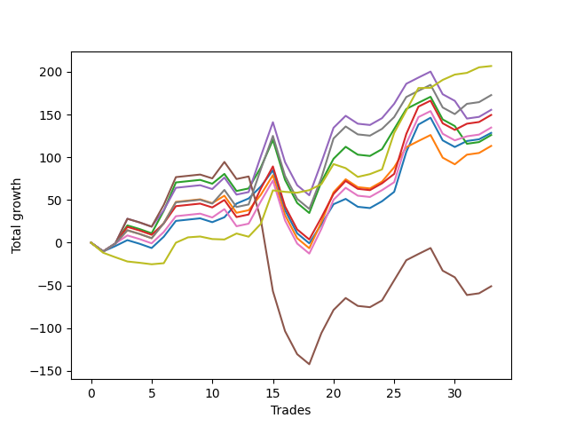

# Short Bulldog 005 
- Symbol: ES90d5m60m
- Date Range: 03/18/2022 - 07/08/2022
- Trading Period: 7:20-12:30
- Number of Trades: 33



| Name | Win Percent | Profit | Avg Profit / Trade |     | Name | Win Percent | Profit | Avg Profit / Trade |
| ---- | ----------- | ------ | ------------------ | --- | ---- | ----------- | ------ | ------------------ |
| Sorted By <br> Profit | | | | | Sorted By <br> Win Percentage ||||
| Seven | 69.70 | 140000.00 | 4242.42 |     | Zero | 72.73 | 56500.00 | 1712.12 |
| Four | 66.67 | 107625.00 | 3261.36 |     | Seven | 69.70 | 140000.00 | 4242.42 |
| Three | 69.70 | 97625.00 | 2958.33 |     | Three | 69.70 | 97625.00 | 2958.33 |
| Six | 69.70 | 92500.00 | 2803.03 |     | Six | 69.70 | 92500.00 | 2803.03 |
| Two | 66.67 | 83375.00 | 2526.52 |     | One | 69.70 | 69375.00 | 2102.27 |
| One | 69.70 | 69375.00 | 2102.27 |     | Four | 66.67 | 107625.00 | 3261.36 |
| Zero | 72.73 | 56500.00 | 1712.12 |     | Two | 66.67 | 83375.00 | 2526.52 |
| Five | 60.61 | 19125.00 | 579.55 |     | Five | 60.61 | 19125.00 | 579.55 |

### Test Zero
* Sell when price hits the middle line of the 20p bollinger
* No Stoploss
* Results:
```
Total Trades: 33
Percent Up: 27.27
Percent Down: 72.73
Total Points Moved Down: 113.00
Potential Profit: 56500.00
Total Points Ups: 202.25 Count Ups: 9
Total Points Downs: 315.25 Count Downs: 24
```

<details><summary>Trades</summary>

<code>In: 2022-03-24 08:05:00		Out: 2022-03-24 09:05:55		Total Position Time: 60:55		Total Move Down: -10.25		Total to Date: -10.25</code> <br />
<code>In: 2022-03-24 08:30:00		Out: 2022-03-24 09:17:15		Total Position Time: 47:15		Total Move Down: 6.25		Total to Date: -4.00</code> <br />
<code>In: 2022-03-25 07:25:00		Out: 2022-03-25 08:01:45		Total Position Time: 36:45		Total Move Down: 7.00		Total to Date: 3.00</code> <br />
<code>In: 2022-03-28 12:00:00		Out: 2022-03-29 06:30:55		Total Position Time: 1110:55		Total Move Down: -58.25		Total to Date: -55.25</code> <br />
<code>In: 2022-03-29 12:10:00		Out: 2022-03-29 12:53:35		Total Position Time: 43:35		Total Move Down: 3.75		Total to Date: -51.50</code> <br />
<code>In: 2022-04-06 10:50:00		Out: 2022-04-06 11:00:10		Total Position Time: 10:10		Total Move Down: 13.25		Total to Date: -38.25</code> <br />
<code>In: 2022-04-06 11:05:00		Out: 2022-04-06 11:08:10		Total Position Time: 03:10		Total Move Down: 18.50		Total to Date: -19.75</code> <br />
<code>In: 2022-04-07 12:15:00		Out: 2022-04-07 12:55:25		Total Position Time: 40:25		Total Move Down: 15.50		Total to Date: -4.25</code> <br />
<code>In: 2022-04-08 08:05:00		Out: 2022-04-08 09:05:55		Total Position Time: 60:55		Total Move Down: 1.50		Total to Date: -2.75</code> <br />
<code>In: 2022-04-13 08:05:00		Out: 2022-04-13 09:05:55		Total Position Time: 60:55		Total Move Down: -4.50		Total to Date: -7.25</code> <br />
<code>In: 2022-04-20 10:45:00		Out: 2022-04-20 11:13:25		Total Position Time: 28:25		Total Move Down: 5.75		Total to Date: -1.50</code> <br />
<code>In: 2022-04-25 11:35:00		Out: 2022-04-25 12:07:15		Total Position Time: 32:15		Total Move Down: 16.00		Total to Date: 14.50</code> <br />
<code>In: 2022-05-04 09:40:00		Out: 2022-05-04 10:37:25		Total Position Time: 57:25		Total Move Down: 6.00		Total to Date: 20.50</code> <br />
<code>In: 2022-05-04 11:05:00		Out: 2022-05-04 11:07:15		Total Position Time: 02:15		Total Move Down: 14.00		Total to Date: 34.50</code> <br />
<code>In: 2022-05-04 11:30:00		Out: 2022-05-04 11:31:10		Total Position Time: 01:10		Total Move Down: 19.00		Total to Date: 53.50</code> <br />
<code>In: 2022-05-04 11:55:00		Out: 2022-05-04 12:55:55		Total Position Time: 60:55		Total Move Down: -51.00		Total to Date: 2.50</code> <br />
<code>In: 2022-05-04 12:15:00		Out: 2022-05-05 06:31:05		Total Position Time: 1096:05		Total Move Down: 14.50		Total to Date: 17.00</code> <br />
<code>In: 2022-05-16 10:35:00		Out: 2022-05-16 11:35:55		Total Position Time: 60:55		Total Move Down: -11.75		Total to Date: 5.25</code> <br />
<code>In: 2022-05-19 08:50:00		Out: 2022-05-19 09:21:05		Total Position Time: 31:05		Total Move Down: 22.25		Total to Date: 27.50</code> <br />
<code>In: 2022-05-19 12:05:00		Out: 2022-05-19 12:18:20		Total Position Time: 13:20		Total Move Down: 23.50		Total to Date: 51.00</code> <br />
<code>In: 2022-05-24 10:55:00		Out: 2022-05-24 11:48:35		Total Position Time: 53:35		Total Move Down: 6.25		Total to Date: 57.25</code> <br />
<code>In: 2022-05-25 11:35:00		Out: 2022-05-25 12:35:55		Total Position Time: 60:55		Total Move Down: -9.25		Total to Date: 48.00</code> <br />
<code>In: 2022-05-27 12:10:00		Out: 2022-05-27 13:40:55		Total Position Time: 90:55		Total Move Down: -23.00		Total to Date: 25.00</code> <br />
<code>In: 2022-05-31 09:05:00		Out: 2022-05-31 10:05:55		Total Position Time: 60:55		Total Move Down: 8.00		Total to Date: 33.00</code> <br />
<code>In: 2022-06-15 11:00:00		Out: 2022-06-15 11:01:15		Total Position Time: 01:15		Total Move Down: 11.00		Total to Date: 44.00</code> <br />
<code>In: 2022-06-15 11:45:00		Out: 2022-06-15 11:58:05		Total Position Time: 13:05		Total Move Down: 46.75		Total to Date: 90.75</code> <br />
<code>In: 2022-06-15 11:50:00		Out: 2022-06-15 11:58:05		Total Position Time: 08:05		Total Move Down: 32.00		Total to Date: 122.75</code> <br />
<code>In: 2022-06-21 12:05:00		Out: 2022-06-21 12:35:35		Total Position Time: 30:35		Total Move Down: 8.00		Total to Date: 130.75</code> <br />
<code>In: 2022-07-05 10:40:00		Out: 2022-07-05 11:40:55		Total Position Time: 60:55		Total Move Down: -26.50		Total to Date: 104.25</code> <br />
<code>In: 2022-07-05 11:40:00		Out: 2022-07-05 12:40:55		Total Position Time: 60:55		Total Move Down: -7.75		Total to Date: 96.50</code> <br />
<code>In: 2022-07-06 11:00:00		Out: 2022-07-06 11:02:25		Total Position Time: 02:25		Total Move Down: 7.00		Total to Date: 103.50</code> <br />
<code>In: 2022-07-06 11:45:00		Out: 2022-07-06 12:45:55		Total Position Time: 60:55		Total Move Down: 2.00		Total to Date: 105.50</code> <br />
<code>In: 2022-07-07 12:20:00		Out: 2022-07-07 12:38:25		Total Position Time: 18:25		Total Move Down: 7.50		Total to Date: 113.00</code> <br />


</details>

### Test One
* Sell when the price hits the upper line of the 20p 1std bollinger
* No Stoploss
* Results:
```
Total Trades: 33
Percent Up: 30.30
Percent Down: 69.70
Total Points Moved Down: 138.75
Potential Profit: 69375.00
Total Points Ups: 222.25 Count Ups: 10
Total Points Downs: 361.00 Count Downs: 23
```

<details><summary>Trades</summary>

<code>In: 2022-03-24 08:05:00		Out: 2022-03-24 09:05:55		Total Position Time: 60:55		Total Move Down: -10.25		Total to Date: -10.25</code> <br />
<code>In: 2022-03-24 08:30:00		Out: 2022-03-24 09:30:55		Total Position Time: 60:55		Total Move Down: 9.25		Total to Date: -1.00</code> <br />
<code>In: 2022-03-25 07:25:00		Out: 2022-03-25 08:09:20		Total Position Time: 44:20		Total Move Down: 15.50		Total to Date: 14.50</code> <br />
<code>In: 2022-03-28 12:00:00		Out: 2022-03-29 06:30:55		Total Position Time: 1110:55		Total Move Down: -58.25		Total to Date: -43.75</code> <br />
<code>In: 2022-03-29 12:10:00		Out: 2022-03-30 06:36:15		Total Position Time: 1106:15		Total Move Down: 6.50		Total to Date: -37.25</code> <br />
<code>In: 2022-04-06 10:50:00		Out: 2022-04-06 11:09:45		Total Position Time: 19:45		Total Move Down: 17.75		Total to Date: -19.50</code> <br />
<code>In: 2022-04-06 11:05:00		Out: 2022-04-06 11:09:45		Total Position Time: 04:45		Total Move Down: 24.75		Total to Date: 5.25</code> <br />
<code>In: 2022-04-07 12:15:00		Out: 2022-04-08 06:31:00		Total Position Time: 1096:00		Total Move Down: 24.50		Total to Date: 29.75</code> <br />
<code>In: 2022-04-08 08:05:00		Out: 2022-04-08 09:05:55		Total Position Time: 60:55		Total Move Down: 1.50		Total to Date: 31.25</code> <br />
<code>In: 2022-04-13 08:05:00		Out: 2022-04-13 09:05:55		Total Position Time: 60:55		Total Move Down: -4.50		Total to Date: 26.75</code> <br />
<code>In: 2022-04-20 10:45:00		Out: 2022-04-20 11:17:15		Total Position Time: 32:15		Total Move Down: 8.75		Total to Date: 35.50</code> <br />
<code>In: 2022-04-25 11:35:00		Out: 2022-04-25 12:35:55		Total Position Time: 60:55		Total Move Down: -20.00		Total to Date: 15.50</code> <br />
<code>In: 2022-05-04 09:40:00		Out: 2022-05-04 10:40:55		Total Position Time: 60:55		Total Move Down: 3.00		Total to Date: 18.50</code> <br />
<code>In: 2022-05-04 11:05:00		Out: 2022-05-04 11:07:20		Total Position Time: 02:20		Total Move Down: 18.00		Total to Date: 36.50</code> <br />
<code>In: 2022-05-04 11:30:00		Out: 2022-05-04 11:31:20		Total Position Time: 01:20		Total Move Down: 23.00		Total to Date: 59.50</code> <br />
<code>In: 2022-05-04 11:55:00		Out: 2022-05-04 12:55:55		Total Position Time: 60:55		Total Move Down: -51.00		Total to Date: 8.50</code> <br />
<code>In: 2022-05-04 12:15:00		Out: 2022-05-05 06:45:55		Total Position Time: 1110:55		Total Move Down: 31.75		Total to Date: 40.25</code> <br />
<code>In: 2022-05-16 10:35:00		Out: 2022-05-16 11:35:55		Total Position Time: 60:55		Total Move Down: -11.75		Total to Date: 28.50</code> <br />
<code>In: 2022-05-19 08:50:00		Out: 2022-05-19 09:40:30		Total Position Time: 50:30		Total Move Down: 30.75		Total to Date: 59.25</code> <br />
<code>In: 2022-05-19 12:05:00		Out: 2022-05-19 12:24:50		Total Position Time: 19:50		Total Move Down: 34.75		Total to Date: 94.00</code> <br />
<code>In: 2022-05-24 10:55:00		Out: 2022-05-24 11:55:10		Total Position Time: 60:10		Total Move Down: 15.25		Total to Date: 109.25</code> <br />
<code>In: 2022-05-25 11:35:00		Out: 2022-05-25 12:35:55		Total Position Time: 60:55		Total Move Down: -9.25		Total to Date: 100.00</code> <br />
<code>In: 2022-05-27 12:10:00		Out: 2022-05-27 13:40:55		Total Position Time: 90:55		Total Move Down: -23.00		Total to Date: 77.00</code> <br />
<code>In: 2022-05-31 09:05:00		Out: 2022-05-31 10:05:55		Total Position Time: 60:55		Total Move Down: 8.00		Total to Date: 85.00</code> <br />
<code>In: 2022-06-15 11:00:00		Out: 2022-06-15 11:01:25		Total Position Time: 01:25		Total Move Down: 16.75		Total to Date: 101.75</code> <br />
<code>In: 2022-06-15 11:45:00		Out: 2022-06-15 12:45:55		Total Position Time: 60:55		Total Move Down: 23.50		Total to Date: 125.25</code> <br />
<code>In: 2022-06-15 11:50:00		Out: 2022-06-15 12:50:55		Total Position Time: 60:55		Total Move Down: 14.00		Total to Date: 139.25</code> <br />
<code>In: 2022-06-21 12:05:00		Out: 2022-06-21 12:55:25		Total Position Time: 50:25		Total Move Down: 10.25		Total to Date: 149.50</code> <br />
<code>In: 2022-07-05 10:40:00		Out: 2022-07-05 11:40:55		Total Position Time: 60:55		Total Move Down: -26.50		Total to Date: 123.00</code> <br />
<code>In: 2022-07-05 11:40:00		Out: 2022-07-05 12:40:55		Total Position Time: 60:55		Total Move Down: -7.75		Total to Date: 115.25</code> <br />
<code>In: 2022-07-06 11:00:00		Out: 2022-07-06 11:12:15		Total Position Time: 12:15		Total Move Down: 11.25		Total to Date: 126.50</code> <br />
<code>In: 2022-07-06 11:45:00		Out: 2022-07-06 12:45:55		Total Position Time: 60:55		Total Move Down: 2.00		Total to Date: 128.50</code> <br />
<code>In: 2022-07-07 12:20:00		Out: 2022-07-07 12:46:35		Total Position Time: 26:35		Total Move Down: 10.25		Total to Date: 138.75</code> <br />


</details>

### Test Two
* Sell when the price hits the upper line of the 20p 2std bollinger
* No Stoploss
* Results:
```
Total Trades: 33
Percent Up: 33.33
Percent Down: 66.67
Total Points Moved Down: 166.75
Potential Profit: 83375.00
Total Points Ups: 243.00 Count Ups: 11
Total Points Downs: 409.75 Count Downs: 22
```

<details><summary>Trades</summary>

<code>In: 2022-03-24 08:05:00		Out: 2022-03-24 09:05:55		Total Position Time: 60:55		Total Move Down: -10.25		Total to Date: -10.25</code> <br />
<code>In: 2022-03-24 08:30:00		Out: 2022-03-24 09:30:55		Total Position Time: 60:55		Total Move Down: 9.25		Total to Date: -1.00</code> <br />
<code>In: 2022-03-25 07:25:00		Out: 2022-03-25 08:10:45		Total Position Time: 45:45		Total Move Down: 21.25		Total to Date: 20.25</code> <br />
<code>In: 2022-03-28 12:00:00		Out: 2022-03-29 06:30:55		Total Position Time: 1110:55		Total Move Down: -58.25		Total to Date: -38.00</code> <br />
<code>In: 2022-03-29 12:10:00		Out: 2022-03-30 06:38:10		Total Position Time: 1108:10		Total Move Down: 10.75		Total to Date: -27.25</code> <br />
<code>In: 2022-04-06 10:50:00		Out: 2022-04-06 11:15:15		Total Position Time: 25:15		Total Move Down: 26.25		Total to Date: -1.00</code> <br />
<code>In: 2022-04-06 11:05:00		Out: 2022-04-06 11:15:15		Total Position Time: 10:15		Total Move Down: 33.25		Total to Date: 32.25</code> <br />
<code>In: 2022-04-07 12:15:00		Out: 2022-04-08 06:36:05		Total Position Time: 1101:05		Total Move Down: 31.25		Total to Date: 63.50</code> <br />
<code>In: 2022-04-08 08:05:00		Out: 2022-04-08 09:05:55		Total Position Time: 60:55		Total Move Down: 1.50		Total to Date: 65.00</code> <br />
<code>In: 2022-04-13 08:05:00		Out: 2022-04-13 09:05:55		Total Position Time: 60:55		Total Move Down: -4.50		Total to Date: 60.50</code> <br />
<code>In: 2022-04-20 10:45:00		Out: 2022-04-20 11:19:15		Total Position Time: 34:15		Total Move Down: 11.50		Total to Date: 72.00</code> <br />
<code>In: 2022-04-25 11:35:00		Out: 2022-04-25 12:35:55		Total Position Time: 60:55		Total Move Down: -20.00		Total to Date: 52.00</code> <br />
<code>In: 2022-05-04 09:40:00		Out: 2022-05-04 10:40:55		Total Position Time: 60:55		Total Move Down: 3.00		Total to Date: 55.00</code> <br />
<code>In: 2022-05-04 11:05:00		Out: 2022-05-04 11:07:40		Total Position Time: 02:40		Total Move Down: 24.50		Total to Date: 79.50</code> <br />
<code>In: 2022-05-04 11:30:00		Out: 2022-05-04 11:32:25		Total Position Time: 02:25		Total Move Down: 32.25		Total to Date: 111.75</code> <br />
<code>In: 2022-05-04 11:55:00		Out: 2022-05-04 12:55:55		Total Position Time: 60:55		Total Move Down: -51.00		Total to Date: 60.75</code> <br />
<code>In: 2022-05-04 12:15:00		Out: 2022-05-05 06:45:55		Total Position Time: 1110:55		Total Move Down: 31.75		Total to Date: 92.50</code> <br />
<code>In: 2022-05-16 10:35:00		Out: 2022-05-16 11:35:55		Total Position Time: 60:55		Total Move Down: -11.75		Total to Date: 80.75</code> <br />
<code>In: 2022-05-19 08:50:00		Out: 2022-05-19 09:50:55		Total Position Time: 60:55		Total Move Down: 36.50		Total to Date: 117.25</code> <br />
<code>In: 2022-05-19 12:05:00		Out: 2022-05-20 06:35:55		Total Position Time: 1110:55		Total Move Down: 12.25		Total to Date: 129.50</code> <br />
<code>In: 2022-05-24 10:55:00		Out: 2022-05-24 11:55:55		Total Position Time: 60:55		Total Move Down: 14.00		Total to Date: 143.50</code> <br />
<code>In: 2022-05-25 11:35:00		Out: 2022-05-25 12:35:55		Total Position Time: 60:55		Total Move Down: -9.25		Total to Date: 134.25</code> <br />
<code>In: 2022-05-27 12:10:00		Out: 2022-05-27 13:40:55		Total Position Time: 90:55		Total Move Down: -23.00		Total to Date: 111.25</code> <br />
<code>In: 2022-05-31 09:05:00		Out: 2022-05-31 10:05:55		Total Position Time: 60:55		Total Move Down: 8.00		Total to Date: 119.25</code> <br />
<code>In: 2022-06-15 11:00:00		Out: 2022-06-15 11:01:40		Total Position Time: 01:40		Total Move Down: 23.50		Total to Date: 142.75</code> <br />
<code>In: 2022-06-15 11:45:00		Out: 2022-06-15 12:45:55		Total Position Time: 60:55		Total Move Down: 23.50		Total to Date: 166.25</code> <br />
<code>In: 2022-06-15 11:50:00		Out: 2022-06-15 12:50:55		Total Position Time: 60:55		Total Move Down: 14.00		Total to Date: 180.25</code> <br />
<code>In: 2022-06-21 12:05:00		Out: 2022-06-21 12:57:50		Total Position Time: 52:50		Total Move Down: 15.25		Total to Date: 195.50</code> <br />
<code>In: 2022-07-05 10:40:00		Out: 2022-07-05 11:40:55		Total Position Time: 60:55		Total Move Down: -26.50		Total to Date: 169.00</code> <br />
<code>In: 2022-07-05 11:40:00		Out: 2022-07-05 12:40:55		Total Position Time: 60:55		Total Move Down: -7.75		Total to Date: 161.25</code> <br />
<code>In: 2022-07-06 11:00:00		Out: 2022-07-06 12:00:55		Total Position Time: 60:55		Total Move Down: -20.75		Total to Date: 140.50</code> <br />
<code>In: 2022-07-06 11:45:00		Out: 2022-07-06 12:45:55		Total Position Time: 60:55		Total Move Down: 2.00		Total to Date: 142.50</code> <br />
<code>In: 2022-07-07 12:20:00		Out: 2022-07-08 06:30:05		Total Position Time: 1090:05		Total Move Down: 24.25		Total to Date: 166.75</code> <br />


</details>

### Test Three
* Sell when price hits the middle line of the 50p bollinger
* No Stoploss
* Results:
```
Total Trades: 33
Percent Up: 30.30
Percent Down: 69.70
Total Points Moved Down: 195.25
Potential Profit: 97625.00
Total Points Ups: 222.25 Count Ups: 10
Total Points Downs: 417.50 Count Downs: 23
```

<details><summary>Trades</summary>

<code>In: 2022-03-24 08:05:00		Out: 2022-03-24 09:05:55		Total Position Time: 60:55		Total Move Down: -10.25		Total to Date: -10.25</code> <br />
<code>In: 2022-03-24 08:30:00		Out: 2022-03-24 09:30:55		Total Position Time: 60:55		Total Move Down: 9.25		Total to Date: -1.00</code> <br />
<code>In: 2022-03-25 07:25:00		Out: 2022-03-25 08:10:15		Total Position Time: 45:15		Total Move Down: 19.50		Total to Date: 18.50</code> <br />
<code>In: 2022-03-28 12:00:00		Out: 2022-03-29 06:30:55		Total Position Time: 1110:55		Total Move Down: -58.25		Total to Date: -39.75</code> <br />
<code>In: 2022-03-29 12:10:00		Out: 2022-03-30 06:40:55		Total Position Time: 1110:55		Total Move Down: 10.00		Total to Date: -29.75</code> <br />
<code>In: 2022-04-06 10:50:00		Out: 2022-04-06 11:08:35		Total Position Time: 18:35		Total Move Down: 13.25		Total to Date: -16.50</code> <br />
<code>In: 2022-04-06 11:05:00		Out: 2022-04-06 11:08:35		Total Position Time: 03:35		Total Move Down: 20.25		Total to Date: 3.75</code> <br />
<code>In: 2022-04-07 12:15:00		Out: 2022-04-08 06:40:30		Total Position Time: 1105:30		Total Move Down: 34.00		Total to Date: 37.75</code> <br />
<code>In: 2022-04-08 08:05:00		Out: 2022-04-08 09:05:55		Total Position Time: 60:55		Total Move Down: 1.50		Total to Date: 39.25</code> <br />
<code>In: 2022-04-13 08:05:00		Out: 2022-04-13 09:05:55		Total Position Time: 60:55		Total Move Down: -4.50		Total to Date: 34.75</code> <br />
<code>In: 2022-04-20 10:45:00		Out: 2022-04-20 11:17:15		Total Position Time: 32:15		Total Move Down: 8.75		Total to Date: 43.50</code> <br />
<code>In: 2022-04-25 11:35:00		Out: 2022-04-25 12:35:55		Total Position Time: 60:55		Total Move Down: -20.00		Total to Date: 23.50</code> <br />
<code>In: 2022-05-04 09:40:00		Out: 2022-05-04 10:40:55		Total Position Time: 60:55		Total Move Down: 3.00		Total to Date: 26.50</code> <br />
<code>In: 2022-05-04 11:05:00		Out: 2022-05-04 11:20:50		Total Position Time: 15:50		Total Move Down: 30.25		Total to Date: 56.75</code> <br />
<code>In: 2022-05-04 11:30:00		Out: 2022-05-04 11:31:40		Total Position Time: 01:40		Total Move Down: 26.00		Total to Date: 82.75</code> <br />
<code>In: 2022-05-04 11:55:00		Out: 2022-05-04 12:55:55		Total Position Time: 60:55		Total Move Down: -51.00		Total to Date: 31.75</code> <br />
<code>In: 2022-05-04 12:15:00		Out: 2022-05-05 06:45:55		Total Position Time: 1110:55		Total Move Down: 31.75		Total to Date: 63.50</code> <br />
<code>In: 2022-05-16 10:35:00		Out: 2022-05-16 11:35:55		Total Position Time: 60:55		Total Move Down: -11.75		Total to Date: 51.75</code> <br />
<code>In: 2022-05-19 08:50:00		Out: 2022-05-19 09:37:05		Total Position Time: 47:05		Total Move Down: 25.75		Total to Date: 77.50</code> <br />
<code>In: 2022-05-19 12:05:00		Out: 2022-05-19 12:21:15		Total Position Time: 16:15		Total Move Down: 27.50		Total to Date: 105.00</code> <br />
<code>In: 2022-05-24 10:55:00		Out: 2022-05-24 11:55:10		Total Position Time: 60:10		Total Move Down: 15.25		Total to Date: 120.25</code> <br />
<code>In: 2022-05-25 11:35:00		Out: 2022-05-25 12:35:55		Total Position Time: 60:55		Total Move Down: -9.25		Total to Date: 111.00</code> <br />
<code>In: 2022-05-27 12:10:00		Out: 2022-05-27 13:40:55		Total Position Time: 90:55		Total Move Down: -23.00		Total to Date: 88.00</code> <br />
<code>In: 2022-05-31 09:05:00		Out: 2022-05-31 10:05:55		Total Position Time: 60:55		Total Move Down: 8.00		Total to Date: 96.00</code> <br />
<code>In: 2022-06-15 11:00:00		Out: 2022-06-15 11:01:15		Total Position Time: 01:15		Total Move Down: 11.00		Total to Date: 107.00</code> <br />
<code>In: 2022-06-15 11:45:00		Out: 2022-06-15 11:58:05		Total Position Time: 13:05		Total Move Down: 46.75		Total to Date: 153.75</code> <br />
<code>In: 2022-06-15 11:50:00		Out: 2022-06-15 11:58:05		Total Position Time: 08:05		Total Move Down: 32.00		Total to Date: 185.75</code> <br />
<code>In: 2022-06-21 12:05:00		Out: 2022-06-21 12:55:25		Total Position Time: 50:25		Total Move Down: 10.25		Total to Date: 196.00</code> <br />
<code>In: 2022-07-05 10:40:00		Out: 2022-07-05 11:40:55		Total Position Time: 60:55		Total Move Down: -26.50		Total to Date: 169.50</code> <br />
<code>In: 2022-07-05 11:40:00		Out: 2022-07-05 12:40:55		Total Position Time: 60:55		Total Move Down: -7.75		Total to Date: 161.75</code> <br />
<code>In: 2022-07-06 11:00:00		Out: 2022-07-06 11:11:50		Total Position Time: 11:50		Total Move Down: 7.25		Total to Date: 169.00</code> <br />
<code>In: 2022-07-06 11:45:00		Out: 2022-07-06 12:45:55		Total Position Time: 60:55		Total Move Down: 2.00		Total to Date: 171.00</code> <br />
<code>In: 2022-07-07 12:20:00		Out: 2022-07-08 06:30:05		Total Position Time: 1090:05		Total Move Down: 24.25		Total to Date: 195.25</code> <br />


</details>

### Test Four
* Sell when the price hits the upper line of the 50p 1std bollinger
* No Stoploss
* Results:
```
Total Trades: 33
Percent Up: 33.33
Percent Down: 66.67
Total Points Moved Down: 215.25
Potential Profit: 107625.00
Total Points Ups: 243.00 Count Ups: 11
Total Points Downs: 458.25 Count Downs: 22
```

<details><summary>Trades</summary>

<code>In: 2022-03-24 08:05:00		Out: 2022-03-24 09:05:55		Total Position Time: 60:55		Total Move Down: -10.25		Total to Date: -10.25</code> <br />
<code>In: 2022-03-24 08:30:00		Out: 2022-03-24 09:30:55		Total Position Time: 60:55		Total Move Down: 9.25		Total to Date: -1.00</code> <br />
<code>In: 2022-03-25 07:25:00		Out: 2022-03-25 08:25:55		Total Position Time: 60:55		Total Move Down: 29.00		Total to Date: 28.00</code> <br />
<code>In: 2022-03-28 12:00:00		Out: 2022-03-29 06:30:55		Total Position Time: 1110:55		Total Move Down: -58.25		Total to Date: -30.25</code> <br />
<code>In: 2022-03-29 12:10:00		Out: 2022-03-30 06:40:55		Total Position Time: 1110:55		Total Move Down: 10.00		Total to Date: -20.25</code> <br />
<code>In: 2022-04-06 10:50:00		Out: 2022-04-06 11:11:20		Total Position Time: 21:20		Total Move Down: 19.25		Total to Date: -1.00</code> <br />
<code>In: 2022-04-06 11:05:00		Out: 2022-04-06 11:11:20		Total Position Time: 06:20		Total Move Down: 26.25		Total to Date: 25.25</code> <br />
<code>In: 2022-04-07 12:15:00		Out: 2022-04-08 06:45:55		Total Position Time: 1110:55		Total Move Down: 35.75		Total to Date: 61.00</code> <br />
<code>In: 2022-04-08 08:05:00		Out: 2022-04-08 09:05:55		Total Position Time: 60:55		Total Move Down: 1.50		Total to Date: 62.50</code> <br />
<code>In: 2022-04-13 08:05:00		Out: 2022-04-13 09:05:55		Total Position Time: 60:55		Total Move Down: -4.50		Total to Date: 58.00</code> <br />
<code>In: 2022-04-20 10:45:00		Out: 2022-04-20 11:21:05		Total Position Time: 36:05		Total Move Down: 13.50		Total to Date: 71.50</code> <br />
<code>In: 2022-04-25 11:35:00		Out: 2022-04-25 12:35:55		Total Position Time: 60:55		Total Move Down: -20.00		Total to Date: 51.50</code> <br />
<code>In: 2022-05-04 09:40:00		Out: 2022-05-04 10:40:55		Total Position Time: 60:55		Total Move Down: 3.00		Total to Date: 54.50</code> <br />
<code>In: 2022-05-04 11:05:00		Out: 2022-05-04 11:34:10		Total Position Time: 29:10		Total Move Down: 41.75		Total to Date: 96.25</code> <br />
<code>In: 2022-05-04 11:30:00		Out: 2022-05-04 11:34:10		Total Position Time: 04:10		Total Move Down: 40.00		Total to Date: 136.25</code> <br />
<code>In: 2022-05-04 11:55:00		Out: 2022-05-04 12:55:55		Total Position Time: 60:55		Total Move Down: -51.00		Total to Date: 85.25</code> <br />
<code>In: 2022-05-04 12:15:00		Out: 2022-05-05 06:45:55		Total Position Time: 1110:55		Total Move Down: 31.75		Total to Date: 117.00</code> <br />
<code>In: 2022-05-16 10:35:00		Out: 2022-05-16 11:35:55		Total Position Time: 60:55		Total Move Down: -11.75		Total to Date: 105.25</code> <br />
<code>In: 2022-05-19 08:50:00		Out: 2022-05-19 09:45:45		Total Position Time: 55:45		Total Move Down: 38.50		Total to Date: 143.75</code> <br />
<code>In: 2022-05-19 12:05:00		Out: 2022-05-19 12:30:05		Total Position Time: 25:05		Total Move Down: 40.50		Total to Date: 184.25</code> <br />
<code>In: 2022-05-24 10:55:00		Out: 2022-05-24 11:55:55		Total Position Time: 60:55		Total Move Down: 14.00		Total to Date: 198.25</code> <br />
<code>In: 2022-05-25 11:35:00		Out: 2022-05-25 12:35:55		Total Position Time: 60:55		Total Move Down: -9.25		Total to Date: 189.00</code> <br />
<code>In: 2022-05-27 12:10:00		Out: 2022-05-27 13:40:55		Total Position Time: 90:55		Total Move Down: -23.00		Total to Date: 166.00</code> <br />
<code>In: 2022-05-31 09:05:00		Out: 2022-05-31 10:05:55		Total Position Time: 60:55		Total Move Down: 8.00		Total to Date: 174.00</code> <br />
<code>In: 2022-06-15 11:00:00		Out: 2022-06-15 11:01:25		Total Position Time: 01:25		Total Move Down: 16.75		Total to Date: 190.75</code> <br />
<code>In: 2022-06-15 11:45:00		Out: 2022-06-15 12:45:55		Total Position Time: 60:55		Total Move Down: 23.50		Total to Date: 214.25</code> <br />
<code>In: 2022-06-15 11:50:00		Out: 2022-06-15 12:50:55		Total Position Time: 60:55		Total Move Down: 14.00		Total to Date: 228.25</code> <br />
<code>In: 2022-06-21 12:05:00		Out: 2022-06-21 12:58:20		Total Position Time: 53:20		Total Move Down: 15.75		Total to Date: 244.00</code> <br />
<code>In: 2022-07-05 10:40:00		Out: 2022-07-05 11:40:55		Total Position Time: 60:55		Total Move Down: -26.50		Total to Date: 217.50</code> <br />
<code>In: 2022-07-05 11:40:00		Out: 2022-07-05 12:40:55		Total Position Time: 60:55		Total Move Down: -7.75		Total to Date: 209.75</code> <br />
<code>In: 2022-07-06 11:00:00		Out: 2022-07-06 12:00:55		Total Position Time: 60:55		Total Move Down: -20.75		Total to Date: 189.00</code> <br />
<code>In: 2022-07-06 11:45:00		Out: 2022-07-06 12:45:55		Total Position Time: 60:55		Total Move Down: 2.00		Total to Date: 191.00</code> <br />
<code>In: 2022-07-07 12:20:00		Out: 2022-07-08 06:30:05		Total Position Time: 1090:05		Total Move Down: 24.25		Total to Date: 215.25</code> <br />


</details>

### Test Five
* Sell when the price hits the upper line of the 50p 2std bollinger
* No Stoploss
* Results:
```
Total Trades: 33
Percent Up: 39.39
Percent Down: 60.61
Total Points Moved Down: 38.25
Potential Profit: 19125.00
Total Points Ups: 377.25 Count Ups: 13
Total Points Downs: 415.50 Count Downs: 20
```

<details><summary>Trades</summary>

<code>In: 2022-03-24 08:05:00		Out: 2022-03-24 09:05:55		Total Position Time: 60:55		Total Move Down: -10.25		Total to Date: -10.25</code> <br />
<code>In: 2022-03-24 08:30:00		Out: 2022-03-24 09:30:55		Total Position Time: 60:55		Total Move Down: 9.25		Total to Date: -1.00</code> <br />
<code>In: 2022-03-25 07:25:00		Out: 2022-03-25 08:25:55		Total Position Time: 60:55		Total Move Down: 29.00		Total to Date: 28.00</code> <br />
<code>In: 2022-03-28 12:00:00		Out: 2022-03-29 06:30:55		Total Position Time: 1110:55		Total Move Down: -58.25		Total to Date: -30.25</code> <br />
<code>In: 2022-03-29 12:10:00		Out: 2022-03-30 06:40:55		Total Position Time: 1110:55		Total Move Down: 10.00		Total to Date: -20.25</code> <br />
<code>In: 2022-04-06 10:50:00		Out: 2022-04-06 11:15:05		Total Position Time: 25:05		Total Move Down: 25.50		Total to Date: 5.25</code> <br />
<code>In: 2022-04-06 11:05:00		Out: 2022-04-06 11:15:05		Total Position Time: 10:05		Total Move Down: 32.50		Total to Date: 37.75</code> <br />
<code>In: 2022-04-07 12:15:00		Out: 2022-04-08 06:45:55		Total Position Time: 1110:55		Total Move Down: 35.75		Total to Date: 73.50</code> <br />
<code>In: 2022-04-08 08:05:00		Out: 2022-04-08 09:05:55		Total Position Time: 60:55		Total Move Down: 1.50		Total to Date: 75.00</code> <br />
<code>In: 2022-04-13 08:05:00		Out: 2022-04-13 09:05:55		Total Position Time: 60:55		Total Move Down: -4.50		Total to Date: 70.50</code> <br />
<code>In: 2022-04-20 10:45:00		Out: 2022-04-20 11:35:45		Total Position Time: 50:45		Total Move Down: 19.25		Total to Date: 89.75</code> <br />
<code>In: 2022-04-25 11:35:00		Out: 2022-04-25 12:35:55		Total Position Time: 60:55		Total Move Down: -20.00		Total to Date: 69.75</code> <br />
<code>In: 2022-05-04 09:40:00		Out: 2022-05-04 10:40:55		Total Position Time: 60:55		Total Move Down: 3.00		Total to Date: 72.75</code> <br />
<code>In: 2022-05-04 11:05:00		Out: 2022-05-04 12:05:55		Total Position Time: 60:55		Total Move Down: -50.25		Total to Date: 22.50</code> <br />
<code>In: 2022-05-04 11:30:00		Out: 2022-05-04 12:30:55		Total Position Time: 60:55		Total Move Down: -84.00		Total to Date: -61.50</code> <br />
<code>In: 2022-05-04 11:55:00		Out: 2022-05-04 12:55:55		Total Position Time: 60:55		Total Move Down: -51.00		Total to Date: -112.50</code> <br />
<code>In: 2022-05-04 12:15:00		Out: 2022-05-05 06:45:55		Total Position Time: 1110:55		Total Move Down: 31.75		Total to Date: -80.75</code> <br />
<code>In: 2022-05-16 10:35:00		Out: 2022-05-16 11:35:55		Total Position Time: 60:55		Total Move Down: -11.75		Total to Date: -92.50</code> <br />
<code>In: 2022-05-19 08:50:00		Out: 2022-05-19 09:50:55		Total Position Time: 60:55		Total Move Down: 36.50		Total to Date: -56.00</code> <br />
<code>In: 2022-05-19 12:05:00		Out: 2022-05-20 06:35:55		Total Position Time: 1110:55		Total Move Down: 12.25		Total to Date: -43.75</code> <br />
<code>In: 2022-05-24 10:55:00		Out: 2022-05-24 11:55:55		Total Position Time: 60:55		Total Move Down: 14.00		Total to Date: -29.75</code> <br />
<code>In: 2022-05-25 11:35:00		Out: 2022-05-25 12:35:55		Total Position Time: 60:55		Total Move Down: -9.25		Total to Date: -39.00</code> <br />
<code>In: 2022-05-27 12:10:00		Out: 2022-05-27 13:40:55		Total Position Time: 90:55		Total Move Down: -23.00		Total to Date: -62.00</code> <br />
<code>In: 2022-05-31 09:05:00		Out: 2022-05-31 10:05:55		Total Position Time: 60:55		Total Move Down: 8.00		Total to Date: -54.00</code> <br />
<code>In: 2022-06-15 11:00:00		Out: 2022-06-15 11:01:40		Total Position Time: 01:40		Total Move Down: 23.50		Total to Date: -30.50</code> <br />
<code>In: 2022-06-15 11:45:00		Out: 2022-06-15 12:45:55		Total Position Time: 60:55		Total Move Down: 23.50		Total to Date: -7.00</code> <br />
<code>In: 2022-06-15 11:50:00		Out: 2022-06-15 12:50:55		Total Position Time: 60:55		Total Move Down: 14.00		Total to Date: 7.00</code> <br />
<code>In: 2022-06-21 12:05:00		Out: 2022-06-22 06:30:05		Total Position Time: 1105:05		Total Move Down: 60.00		Total to Date: 67.00</code> <br />
<code>In: 2022-07-05 10:40:00		Out: 2022-07-05 11:40:55		Total Position Time: 60:55		Total Move Down: -26.50		Total to Date: 40.50</code> <br />
<code>In: 2022-07-05 11:40:00		Out: 2022-07-05 12:40:55		Total Position Time: 60:55		Total Move Down: -7.75		Total to Date: 32.75</code> <br />
<code>In: 2022-07-06 11:00:00		Out: 2022-07-06 12:00:55		Total Position Time: 60:55		Total Move Down: -20.75		Total to Date: 12.00</code> <br />
<code>In: 2022-07-06 11:45:00		Out: 2022-07-06 12:45:55		Total Position Time: 60:55		Total Move Down: 2.00		Total to Date: 14.00</code> <br />
<code>In: 2022-07-07 12:20:00		Out: 2022-07-08 06:30:05		Total Position Time: 1090:05		Total Move Down: 24.25		Total to Date: 38.25</code> <br />


</details>

### Test Six
* Sell when the price hits the middle line of the 1std VWAP
* No Stoploss
* Results:
```
Total Trades: 33
Percent Up: 30.30
Percent Down: 69.70
Total Points Moved Down: 185.00
Potential Profit: 92500.00
Total Points Ups: 222.25 Count Ups: 10
Total Points Downs: 407.25 Count Downs: 23
```

<details><summary>Trades</summary>

<code>In: 2022-03-24 08:05:00		Out: 2022-03-24 09:05:55		Total Position Time: 60:55		Total Move Down: -10.25		Total to Date: -10.25</code> <br />
<code>In: 2022-03-24 08:30:00		Out: 2022-03-24 09:30:55		Total Position Time: 60:55		Total Move Down: 9.25		Total to Date: -1.00</code> <br />
<code>In: 2022-03-25 07:25:00		Out: 2022-03-25 08:08:15		Total Position Time: 43:15		Total Move Down: 9.50		Total to Date: 8.50</code> <br />
<code>In: 2022-03-28 12:00:00		Out: 2022-03-29 06:30:55		Total Position Time: 1110:55		Total Move Down: -58.25		Total to Date: -49.75</code> <br />
<code>In: 2022-03-29 12:10:00		Out: 2022-03-30 06:40:55		Total Position Time: 1110:55		Total Move Down: 10.00		Total to Date: -39.75</code> <br />
<code>In: 2022-04-06 10:50:00		Out: 2022-04-06 11:00:10		Total Position Time: 10:10		Total Move Down: 13.25		Total to Date: -26.50</code> <br />
<code>In: 2022-04-06 11:05:00		Out: 2022-04-06 11:08:10		Total Position Time: 03:10		Total Move Down: 18.50		Total to Date: -8.00</code> <br />
<code>In: 2022-04-07 12:15:00		Out: 2022-04-08 06:40:35		Total Position Time: 1105:35		Total Move Down: 35.25		Total to Date: 27.25</code> <br />
<code>In: 2022-04-08 08:05:00		Out: 2022-04-08 09:05:55		Total Position Time: 60:55		Total Move Down: 1.50		Total to Date: 28.75</code> <br />
<code>In: 2022-04-13 08:05:00		Out: 2022-04-13 09:05:55		Total Position Time: 60:55		Total Move Down: -4.50		Total to Date: 24.25</code> <br />
<code>In: 2022-04-20 10:45:00		Out: 2022-04-20 11:18:20		Total Position Time: 33:20		Total Move Down: 9.75		Total to Date: 34.00</code> <br />
<code>In: 2022-04-25 11:35:00		Out: 2022-04-25 12:35:55		Total Position Time: 60:55		Total Move Down: -20.00		Total to Date: 14.00</code> <br />
<code>In: 2022-05-04 09:40:00		Out: 2022-05-04 10:40:55		Total Position Time: 60:55		Total Move Down: 3.00		Total to Date: 17.00</code> <br />
<code>In: 2022-05-04 11:05:00		Out: 2022-05-04 11:20:20		Total Position Time: 15:20		Total Move Down: 26.00		Total to Date: 43.00</code> <br />
<code>In: 2022-05-04 11:30:00		Out: 2022-05-04 11:31:25		Total Position Time: 01:25		Total Move Down: 24.50		Total to Date: 67.50</code> <br />
<code>In: 2022-05-04 11:55:00		Out: 2022-05-04 12:55:55		Total Position Time: 60:55		Total Move Down: -51.00		Total to Date: 16.50</code> <br />
<code>In: 2022-05-04 12:15:00		Out: 2022-05-05 06:45:55		Total Position Time: 1110:55		Total Move Down: 31.75		Total to Date: 48.25</code> <br />
<code>In: 2022-05-16 10:35:00		Out: 2022-05-16 11:35:55		Total Position Time: 60:55		Total Move Down: -11.75		Total to Date: 36.50</code> <br />
<code>In: 2022-05-19 08:50:00		Out: 2022-05-19 09:39:15		Total Position Time: 49:15		Total Move Down: 29.00		Total to Date: 65.50</code> <br />
<code>In: 2022-05-19 12:05:00		Out: 2022-05-19 12:24:45		Total Position Time: 19:45		Total Move Down: 34.00		Total to Date: 99.50</code> <br />
<code>In: 2022-05-24 10:55:00		Out: 2022-05-24 11:55:55		Total Position Time: 60:55		Total Move Down: 14.00		Total to Date: 113.50</code> <br />
<code>In: 2022-05-25 11:35:00		Out: 2022-05-25 12:35:55		Total Position Time: 60:55		Total Move Down: -9.25		Total to Date: 104.25</code> <br />
<code>In: 2022-05-27 12:10:00		Out: 2022-05-27 13:40:55		Total Position Time: 90:55		Total Move Down: -23.00		Total to Date: 81.25</code> <br />
<code>In: 2022-05-31 09:05:00		Out: 2022-05-31 10:05:55		Total Position Time: 60:55		Total Move Down: 8.00		Total to Date: 89.25</code> <br />
<code>In: 2022-06-15 11:00:00		Out: 2022-06-15 11:01:10		Total Position Time: 01:10		Total Move Down: 9.25		Total to Date: 98.50</code> <br />
<code>In: 2022-06-15 11:45:00		Out: 2022-06-15 11:57:55		Total Position Time: 12:55		Total Move Down: 45.50		Total to Date: 144.00</code> <br />
<code>In: 2022-06-15 11:50:00		Out: 2022-06-15 11:57:55		Total Position Time: 07:55		Total Move Down: 30.75		Total to Date: 174.75</code> <br />
<code>In: 2022-06-21 12:05:00		Out: 2022-06-21 12:57:05		Total Position Time: 52:05		Total Move Down: 13.50		Total to Date: 188.25</code> <br />
<code>In: 2022-07-05 10:40:00		Out: 2022-07-05 11:40:55		Total Position Time: 60:55		Total Move Down: -26.50		Total to Date: 161.75</code> <br />
<code>In: 2022-07-05 11:40:00		Out: 2022-07-05 12:40:55		Total Position Time: 60:55		Total Move Down: -7.75		Total to Date: 154.00</code> <br />
<code>In: 2022-07-06 11:00:00		Out: 2022-07-06 11:01:15		Total Position Time: 01:15		Total Move Down: 4.75		Total to Date: 158.75</code> <br />
<code>In: 2022-07-06 11:45:00		Out: 2022-07-06 12:45:55		Total Position Time: 60:55		Total Move Down: 2.00		Total to Date: 160.75</code> <br />
<code>In: 2022-07-07 12:20:00		Out: 2022-07-08 06:30:05		Total Position Time: 1090:05		Total Move Down: 24.25		Total to Date: 185.00</code> <br />


</details>

### Test Seven
* Sell when the price hits the upper line of the 1std VWAP
* No Stoploss
* Results:
```
Total Trades: 33
Percent Up: 30.30
Percent Down: 69.70
Total Points Moved Down: 280.00
Potential Profit: 140000.00
Total Points Ups: 222.25 Count Ups: 10
Total Points Downs: 502.25 Count Downs: 23
```

<details><summary>Trades</summary>

<code>In: 2022-03-24 08:05:00		Out: 2022-03-24 09:05:55		Total Position Time: 60:55		Total Move Down: -10.25		Total to Date: -10.25</code> <br />
<code>In: 2022-03-24 08:30:00		Out: 2022-03-24 09:30:55		Total Position Time: 60:55		Total Move Down: 9.25		Total to Date: -1.00</code> <br />
<code>In: 2022-03-25 07:25:00		Out: 2022-03-25 08:09:20		Total Position Time: 44:20		Total Move Down: 15.50		Total to Date: 14.50</code> <br />
<code>In: 2022-03-28 12:00:00		Out: 2022-03-29 06:30:55		Total Position Time: 1110:55		Total Move Down: -58.25		Total to Date: -43.75</code> <br />
<code>In: 2022-03-29 12:10:00		Out: 2022-03-30 06:40:55		Total Position Time: 1110:55		Total Move Down: 10.00		Total to Date: -33.75</code> <br />
<code>In: 2022-04-06 10:50:00		Out: 2022-04-06 11:09:40		Total Position Time: 19:40		Total Move Down: 17.50		Total to Date: -16.25</code> <br />
<code>In: 2022-04-06 11:05:00		Out: 2022-04-06 11:09:40		Total Position Time: 04:40		Total Move Down: 24.50		Total to Date: 8.25</code> <br />
<code>In: 2022-04-07 12:15:00		Out: 2022-04-08 06:45:55		Total Position Time: 1110:55		Total Move Down: 35.75		Total to Date: 44.00</code> <br />
<code>In: 2022-04-08 08:05:00		Out: 2022-04-08 09:05:55		Total Position Time: 60:55		Total Move Down: 1.50		Total to Date: 45.50</code> <br />
<code>In: 2022-04-13 08:05:00		Out: 2022-04-13 09:05:55		Total Position Time: 60:55		Total Move Down: -4.50		Total to Date: 41.00</code> <br />
<code>In: 2022-04-20 10:45:00		Out: 2022-04-20 11:30:15		Total Position Time: 45:15		Total Move Down: 16.00		Total to Date: 57.00</code> <br />
<code>In: 2022-04-25 11:35:00		Out: 2022-04-25 12:35:55		Total Position Time: 60:55		Total Move Down: -20.00		Total to Date: 37.00</code> <br />
<code>In: 2022-05-04 09:40:00		Out: 2022-05-04 10:40:55		Total Position Time: 60:55		Total Move Down: 3.00		Total to Date: 40.00</code> <br />
<code>In: 2022-05-04 11:05:00		Out: 2022-05-04 11:34:05		Total Position Time: 29:05		Total Move Down: 41.00		Total to Date: 81.00</code> <br />
<code>In: 2022-05-04 11:30:00		Out: 2022-05-04 11:34:05		Total Position Time: 04:05		Total Move Down: 39.25		Total to Date: 120.25</code> <br />
<code>In: 2022-05-04 11:55:00		Out: 2022-05-04 12:55:55		Total Position Time: 60:55		Total Move Down: -51.00		Total to Date: 69.25</code> <br />
<code>In: 2022-05-04 12:15:00		Out: 2022-05-05 06:45:55		Total Position Time: 1110:55		Total Move Down: 31.75		Total to Date: 101.00</code> <br />
<code>In: 2022-05-16 10:35:00		Out: 2022-05-16 11:35:55		Total Position Time: 60:55		Total Move Down: -11.75		Total to Date: 89.25</code> <br />
<code>In: 2022-05-19 08:50:00		Out: 2022-05-19 09:50:55		Total Position Time: 60:55		Total Move Down: 36.50		Total to Date: 125.75</code> <br />
<code>In: 2022-05-19 12:05:00		Out: 2022-05-19 12:42:25		Total Position Time: 37:25		Total Move Down: 46.00		Total to Date: 171.75</code> <br />
<code>In: 2022-05-24 10:55:00		Out: 2022-05-24 11:55:55		Total Position Time: 60:55		Total Move Down: 14.00		Total to Date: 185.75</code> <br />
<code>In: 2022-05-25 11:35:00		Out: 2022-05-25 12:35:55		Total Position Time: 60:55		Total Move Down: -9.25		Total to Date: 176.50</code> <br />
<code>In: 2022-05-27 12:10:00		Out: 2022-05-27 13:40:55		Total Position Time: 90:55		Total Move Down: -23.00		Total to Date: 153.50</code> <br />
<code>In: 2022-05-31 09:05:00		Out: 2022-05-31 10:05:55		Total Position Time: 60:55		Total Move Down: 8.00		Total to Date: 161.50</code> <br />
<code>In: 2022-06-15 11:00:00		Out: 2022-06-15 11:01:20		Total Position Time: 01:20		Total Move Down: 13.75		Total to Date: 175.25</code> <br />
<code>In: 2022-06-15 11:45:00		Out: 2022-06-15 12:45:55		Total Position Time: 60:55		Total Move Down: 23.50		Total to Date: 198.75</code> <br />
<code>In: 2022-06-15 11:50:00		Out: 2022-06-15 12:50:55		Total Position Time: 60:55		Total Move Down: 14.00		Total to Date: 212.75</code> <br />
<code>In: 2022-06-21 12:05:00		Out: 2022-06-22 06:30:05		Total Position Time: 1105:05		Total Move Down: 60.00		Total to Date: 272.75</code> <br />
<code>In: 2022-07-05 10:40:00		Out: 2022-07-05 11:40:55		Total Position Time: 60:55		Total Move Down: -26.50		Total to Date: 246.25</code> <br />
<code>In: 2022-07-05 11:40:00		Out: 2022-07-05 12:40:55		Total Position Time: 60:55		Total Move Down: -7.75		Total to Date: 238.50</code> <br />
<code>In: 2022-07-06 11:00:00		Out: 2022-07-06 11:12:25		Total Position Time: 12:25		Total Move Down: 12.00		Total to Date: 250.50</code> <br />
<code>In: 2022-07-06 11:45:00		Out: 2022-07-06 12:45:55		Total Position Time: 60:55		Total Move Down: 2.00		Total to Date: 252.50</code> <br />
<code>In: 2022-07-07 12:20:00		Out: 2022-07-08 06:49:25		Total Position Time: 1109:25		Total Move Down: 27.50		Total to Date: 280.00</code> <br />


</details>