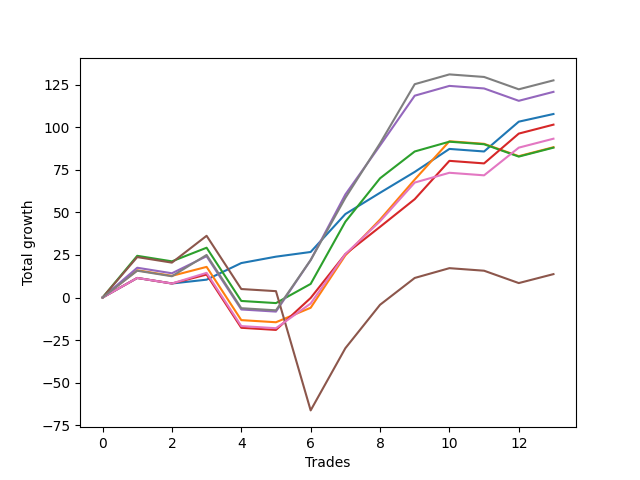

# Short Wallace 004 
- Symbol: ES90d5m60m
- Date Range: 03/18/2022 - 07/08/2022
- Trading Period: 7:20-12:30
- Number of Trades: 13



| Name | Win Percent | Profit | Avg Profit / Trade |     | Name | Win Percent | Profit | Avg Profit / Trade |
| ---- | ----------- | ------ | ------------------ | --- | ---- | ----------- | ------ | ------------------ |
| Sorted By <br> Profit | | | | | Sorted By <br> Win Percentage ||||
| Seven | 61.54 | 63750.00 | 4903.85 |     | Zero | 84.62 | 53875.00 | 4144.23 |
| Four | 61.54 | 60375.00 | 4644.23 |     | Three | 69.23 | 50750.00 | 3903.85 |
| Zero | 84.62 | 53875.00 | 4144.23 |     | Six | 69.23 | 46625.00 | 3586.54 |
| Three | 69.23 | 50750.00 | 3903.85 |     | Seven | 61.54 | 63750.00 | 4903.85 |
| Six | 69.23 | 46625.00 | 3586.54 |     | Four | 61.54 | 60375.00 | 4644.23 |
| One | 61.54 | 44125.00 | 3394.23 |     | One | 61.54 | 44125.00 | 3394.23 |
| Two | 61.54 | 44000.00 | 3384.62 |     | Two | 61.54 | 44000.00 | 3384.62 |
| Five | 53.85 | 6875.00 | 528.85 |     | Five | 53.85 | 6875.00 | 528.85 |

### Test Zero
* Sell when price hits the middle line of the 20p bollinger
* No Stoploss
* Results:
```
Total Trades: 13
Percent Up: 15.38
Percent Down: 84.62
Total Points Moved Down: 107.75
Potential Profit: 53875.00
Total Points Ups: 4.75 Count Ups: 2
Total Points Downs: 112.50 Count Downs: 11
```

<details><summary>Trades</summary>

<code>In: 2022-04-06 10:55:00		Out: 2022-04-06 11:00:10		Total Position Time: 05:10		Total Move Down: 11.50		Total to Date: 11.50</code> <br />
<code>In: 2022-04-07 12:20:00		Out: 2022-04-07 12:46:00		Total Position Time: 26:00		Total Move Down: -3.25		Total to Date: 8.25</code> <br />
<code>In: 2022-04-20 10:50:00		Out: 2022-04-20 11:13:25		Total Position Time: 23:25		Total Move Down: 2.25		Total to Date: 10.50</code> <br />
<code>In: 2022-04-25 11:40:00		Out: 2022-04-25 12:07:15		Total Position Time: 27:15		Total Move Down: 9.75		Total to Date: 20.25</code> <br />
<code>In: 2022-05-04 09:45:00		Out: 2022-05-04 10:37:25		Total Position Time: 52:25		Total Move Down: 3.75		Total to Date: 24.00</code> <br />
<code>In: 2022-05-04 11:10:00		Out: 2022-05-04 11:11:20		Total Position Time: 01:20		Total Move Down: 2.75		Total to Date: 26.75</code> <br />
<code>In: 2022-05-19 08:50:00		Out: 2022-05-19 09:21:05		Total Position Time: 31:05		Total Move Down: 22.25		Total to Date: 49.00</code> <br />
<code>In: 2022-05-19 08:55:00		Out: 2022-05-19 09:21:05		Total Position Time: 26:05		Total Move Down: 12.50		Total to Date: 61.50</code> <br />
<code>In: 2022-05-19 12:10:00		Out: 2022-05-19 12:18:20		Total Position Time: 08:20		Total Move Down: 12.25		Total to Date: 73.75</code> <br />
<code>In: 2022-05-24 11:15:00		Out: 2022-05-24 11:48:35		Total Position Time: 33:35		Total Move Down: 13.50		Total to Date: 87.25</code> <br />
<code>In: 2022-05-31 09:10:00		Out: 2022-05-31 10:10:55		Total Position Time: 60:55		Total Move Down: -1.50		Total to Date: 85.75</code> <br />
<code>In: 2022-06-15 11:55:00		Out: 2022-06-15 11:58:05		Total Position Time: 03:05		Total Move Down: 17.50		Total to Date: 103.25</code> <br />
<code>In: 2022-07-07 12:25:00		Out: 2022-07-07 12:38:25		Total Position Time: 13:25		Total Move Down: 4.50		Total to Date: 107.75</code> <br />


</details>

### Test One
* Sell when the price hits the upper line of the 20p 1std bollinger
* No Stoploss
* Results:
```
Total Trades: 13
Percent Up: 38.46
Percent Down: 61.54
Total Points Moved Down: 88.25
Potential Profit: 44125.00
Total Points Ups: 44.50 Count Ups: 5
Total Points Downs: 132.75 Count Downs: 8
```

<details><summary>Trades</summary>

<code>In: 2022-04-06 10:55:00		Out: 2022-04-06 11:09:45		Total Position Time: 14:45		Total Move Down: 16.00		Total to Date: 16.00</code> <br />
<code>In: 2022-04-07 12:20:00		Out: 2022-04-07 12:46:00		Total Position Time: 26:00		Total Move Down: -3.25		Total to Date: 12.75</code> <br />
<code>In: 2022-04-20 10:50:00		Out: 2022-04-20 11:17:15		Total Position Time: 27:15		Total Move Down: 5.25		Total to Date: 18.00</code> <br />
<code>In: 2022-04-25 11:40:00		Out: 2022-04-25 12:40:55		Total Position Time: 60:55		Total Move Down: -31.25		Total to Date: -13.25</code> <br />
<code>In: 2022-05-04 09:45:00		Out: 2022-05-04 10:45:55		Total Position Time: 60:55		Total Move Down: -1.25		Total to Date: -14.50</code> <br />
<code>In: 2022-05-04 11:10:00		Out: 2022-05-04 11:18:20		Total Position Time: 08:20		Total Move Down: 8.50		Total to Date: -6.00</code> <br />
<code>In: 2022-05-19 08:50:00		Out: 2022-05-19 09:40:30		Total Position Time: 50:30		Total Move Down: 30.75		Total to Date: 24.75</code> <br />
<code>In: 2022-05-19 08:55:00		Out: 2022-05-19 09:40:30		Total Position Time: 45:30		Total Move Down: 21.00		Total to Date: 45.75</code> <br />
<code>In: 2022-05-19 12:10:00		Out: 2022-05-19 12:24:50		Total Position Time: 14:50		Total Move Down: 23.50		Total to Date: 69.25</code> <br />
<code>In: 2022-05-24 11:15:00		Out: 2022-05-24 11:55:10		Total Position Time: 40:10		Total Move Down: 22.50		Total to Date: 91.75</code> <br />
<code>In: 2022-05-31 09:10:00		Out: 2022-05-31 10:10:55		Total Position Time: 60:55		Total Move Down: -1.50		Total to Date: 90.25</code> <br />
<code>In: 2022-06-15 11:55:00		Out: 2022-06-15 12:46:00		Total Position Time: 51:00		Total Move Down: -7.25		Total to Date: 83.00</code> <br />
<code>In: 2022-07-07 12:25:00		Out: 2022-07-07 12:46:00		Total Position Time: 21:00		Total Move Down: 5.25		Total to Date: 88.25</code> <br />


</details>

### Test Two
* Sell when the price hits the upper line of the 20p 2std bollinger
* No Stoploss
* Results:
```
Total Trades: 13
Percent Up: 38.46
Percent Down: 61.54
Total Points Moved Down: 88.00
Potential Profit: 44000.00
Total Points Ups: 44.50 Count Ups: 5
Total Points Downs: 132.50 Count Downs: 8
```

<details><summary>Trades</summary>

<code>In: 2022-04-06 10:55:00		Out: 2022-04-06 11:15:15		Total Position Time: 20:15		Total Move Down: 24.50		Total to Date: 24.50</code> <br />
<code>In: 2022-04-07 12:20:00		Out: 2022-04-07 12:46:00		Total Position Time: 26:00		Total Move Down: -3.25		Total to Date: 21.25</code> <br />
<code>In: 2022-04-20 10:50:00		Out: 2022-04-20 11:19:15		Total Position Time: 29:15		Total Move Down: 8.00		Total to Date: 29.25</code> <br />
<code>In: 2022-04-25 11:40:00		Out: 2022-04-25 12:40:55		Total Position Time: 60:55		Total Move Down: -31.25		Total to Date: -2.00</code> <br />
<code>In: 2022-05-04 09:45:00		Out: 2022-05-04 10:45:55		Total Position Time: 60:55		Total Move Down: -1.25		Total to Date: -3.25</code> <br />
<code>In: 2022-05-04 11:10:00		Out: 2022-05-04 11:18:40		Total Position Time: 08:40		Total Move Down: 11.25		Total to Date: 8.00</code> <br />
<code>In: 2022-05-19 08:50:00		Out: 2022-05-19 09:50:55		Total Position Time: 60:55		Total Move Down: 36.50		Total to Date: 44.50</code> <br />
<code>In: 2022-05-19 08:55:00		Out: 2022-05-19 09:55:55		Total Position Time: 60:55		Total Move Down: 25.50		Total to Date: 70.00</code> <br />
<code>In: 2022-05-19 12:10:00		Out: 2022-05-19 12:46:00		Total Position Time: 36:00		Total Move Down: 15.75		Total to Date: 85.75</code> <br />
<code>In: 2022-05-24 11:15:00		Out: 2022-05-24 12:15:55		Total Position Time: 60:55		Total Move Down: 5.75		Total to Date: 91.50</code> <br />
<code>In: 2022-05-31 09:10:00		Out: 2022-05-31 10:10:55		Total Position Time: 60:55		Total Move Down: -1.50		Total to Date: 90.00</code> <br />
<code>In: 2022-06-15 11:55:00		Out: 2022-06-15 12:46:00		Total Position Time: 51:00		Total Move Down: -7.25		Total to Date: 82.75</code> <br />
<code>In: 2022-07-07 12:25:00		Out: 2022-07-07 12:46:00		Total Position Time: 21:00		Total Move Down: 5.25		Total to Date: 88.00</code> <br />


</details>

### Test Three
* Sell when price hits the middle line of the 50p bollinger
* No Stoploss
* Results:
```
Total Trades: 13
Percent Up: 30.77
Percent Down: 69.23
Total Points Moved Down: 101.50
Potential Profit: 50750.00
Total Points Ups: 37.25 Count Ups: 4
Total Points Downs: 138.75 Count Downs: 9
```

<details><summary>Trades</summary>

<code>In: 2022-04-06 10:55:00		Out: 2022-04-06 11:08:35		Total Position Time: 13:35		Total Move Down: 11.50		Total to Date: 11.50</code> <br />
<code>In: 2022-04-07 12:20:00		Out: 2022-04-07 12:46:00		Total Position Time: 26:00		Total Move Down: -3.25		Total to Date: 8.25</code> <br />
<code>In: 2022-04-20 10:50:00		Out: 2022-04-20 11:17:15		Total Position Time: 27:15		Total Move Down: 5.25		Total to Date: 13.50</code> <br />
<code>In: 2022-04-25 11:40:00		Out: 2022-04-25 12:40:55		Total Position Time: 60:55		Total Move Down: -31.25		Total to Date: -17.75</code> <br />
<code>In: 2022-05-04 09:45:00		Out: 2022-05-04 10:45:55		Total Position Time: 60:55		Total Move Down: -1.25		Total to Date: -19.00</code> <br />
<code>In: 2022-05-04 11:10:00		Out: 2022-05-04 11:20:50		Total Position Time: 10:50		Total Move Down: 18.75		Total to Date: -0.25</code> <br />
<code>In: 2022-05-19 08:50:00		Out: 2022-05-19 09:37:05		Total Position Time: 47:05		Total Move Down: 25.75		Total to Date: 25.50</code> <br />
<code>In: 2022-05-19 08:55:00		Out: 2022-05-19 09:37:05		Total Position Time: 42:05		Total Move Down: 16.00		Total to Date: 41.50</code> <br />
<code>In: 2022-05-19 12:10:00		Out: 2022-05-19 12:21:15		Total Position Time: 11:15		Total Move Down: 16.25		Total to Date: 57.75</code> <br />
<code>In: 2022-05-24 11:15:00		Out: 2022-05-24 11:55:10		Total Position Time: 40:10		Total Move Down: 22.50		Total to Date: 80.25</code> <br />
<code>In: 2022-05-31 09:10:00		Out: 2022-05-31 10:10:55		Total Position Time: 60:55		Total Move Down: -1.50		Total to Date: 78.75</code> <br />
<code>In: 2022-06-15 11:55:00		Out: 2022-06-15 11:58:05		Total Position Time: 03:05		Total Move Down: 17.50		Total to Date: 96.25</code> <br />
<code>In: 2022-07-07 12:25:00		Out: 2022-07-07 12:46:00		Total Position Time: 21:00		Total Move Down: 5.25		Total to Date: 101.50</code> <br />


</details>

### Test Four
* Sell when the price hits the upper line of the 50p 1std bollinger
* No Stoploss
* Results:
```
Total Trades: 13
Percent Up: 38.46
Percent Down: 61.54
Total Points Moved Down: 120.75
Potential Profit: 60375.00
Total Points Ups: 44.50 Count Ups: 5
Total Points Downs: 165.25 Count Downs: 8
```

<details><summary>Trades</summary>

<code>In: 2022-04-06 10:55:00		Out: 2022-04-06 11:11:20		Total Position Time: 16:20		Total Move Down: 17.50		Total to Date: 17.50</code> <br />
<code>In: 2022-04-07 12:20:00		Out: 2022-04-07 12:46:00		Total Position Time: 26:00		Total Move Down: -3.25		Total to Date: 14.25</code> <br />
<code>In: 2022-04-20 10:50:00		Out: 2022-04-20 11:21:05		Total Position Time: 31:05		Total Move Down: 10.00		Total to Date: 24.25</code> <br />
<code>In: 2022-04-25 11:40:00		Out: 2022-04-25 12:40:55		Total Position Time: 60:55		Total Move Down: -31.25		Total to Date: -7.00</code> <br />
<code>In: 2022-05-04 09:45:00		Out: 2022-05-04 10:45:55		Total Position Time: 60:55		Total Move Down: -1.25		Total to Date: -8.25</code> <br />
<code>In: 2022-05-04 11:10:00		Out: 2022-05-04 11:34:10		Total Position Time: 24:10		Total Move Down: 30.25		Total to Date: 22.00</code> <br />
<code>In: 2022-05-19 08:50:00		Out: 2022-05-19 09:45:45		Total Position Time: 55:45		Total Move Down: 38.50		Total to Date: 60.50</code> <br />
<code>In: 2022-05-19 08:55:00		Out: 2022-05-19 09:45:45		Total Position Time: 50:45		Total Move Down: 28.75		Total to Date: 89.25</code> <br />
<code>In: 2022-05-19 12:10:00		Out: 2022-05-19 12:30:05		Total Position Time: 20:05		Total Move Down: 29.25		Total to Date: 118.50</code> <br />
<code>In: 2022-05-24 11:15:00		Out: 2022-05-24 12:15:55		Total Position Time: 60:55		Total Move Down: 5.75		Total to Date: 124.25</code> <br />
<code>In: 2022-05-31 09:10:00		Out: 2022-05-31 10:10:55		Total Position Time: 60:55		Total Move Down: -1.50		Total to Date: 122.75</code> <br />
<code>In: 2022-06-15 11:55:00		Out: 2022-06-15 12:46:00		Total Position Time: 51:00		Total Move Down: -7.25		Total to Date: 115.50</code> <br />
<code>In: 2022-07-07 12:25:00		Out: 2022-07-07 12:46:00		Total Position Time: 21:00		Total Move Down: 5.25		Total to Date: 120.75</code> <br />


</details>

### Test Five
* Sell when the price hits the upper line of the 50p 2std bollinger
* No Stoploss
* Results:
```
Total Trades: 13
Percent Up: 46.15
Percent Down: 53.85
Total Points Moved Down: 13.75
Potential Profit: 6875.00
Total Points Ups: 114.50 Count Ups: 6
Total Points Downs: 128.25 Count Downs: 7
```

<details><summary>Trades</summary>

<code>In: 2022-04-06 10:55:00		Out: 2022-04-06 11:15:05		Total Position Time: 20:05		Total Move Down: 23.75		Total to Date: 23.75</code> <br />
<code>In: 2022-04-07 12:20:00		Out: 2022-04-07 12:46:00		Total Position Time: 26:00		Total Move Down: -3.25		Total to Date: 20.50</code> <br />
<code>In: 2022-04-20 10:50:00		Out: 2022-04-20 11:35:45		Total Position Time: 45:45		Total Move Down: 15.75		Total to Date: 36.25</code> <br />
<code>In: 2022-04-25 11:40:00		Out: 2022-04-25 12:40:55		Total Position Time: 60:55		Total Move Down: -31.25		Total to Date: 5.00</code> <br />
<code>In: 2022-05-04 09:45:00		Out: 2022-05-04 10:45:55		Total Position Time: 60:55		Total Move Down: -1.25		Total to Date: 3.75</code> <br />
<code>In: 2022-05-04 11:10:00		Out: 2022-05-04 12:10:55		Total Position Time: 60:55		Total Move Down: -70.00		Total to Date: -66.25</code> <br />
<code>In: 2022-05-19 08:50:00		Out: 2022-05-19 09:50:55		Total Position Time: 60:55		Total Move Down: 36.50		Total to Date: -29.75</code> <br />
<code>In: 2022-05-19 08:55:00		Out: 2022-05-19 09:55:55		Total Position Time: 60:55		Total Move Down: 25.50		Total to Date: -4.25</code> <br />
<code>In: 2022-05-19 12:10:00		Out: 2022-05-19 12:46:00		Total Position Time: 36:00		Total Move Down: 15.75		Total to Date: 11.50</code> <br />
<code>In: 2022-05-24 11:15:00		Out: 2022-05-24 12:15:55		Total Position Time: 60:55		Total Move Down: 5.75		Total to Date: 17.25</code> <br />
<code>In: 2022-05-31 09:10:00		Out: 2022-05-31 10:10:55		Total Position Time: 60:55		Total Move Down: -1.50		Total to Date: 15.75</code> <br />
<code>In: 2022-06-15 11:55:00		Out: 2022-06-15 12:46:00		Total Position Time: 51:00		Total Move Down: -7.25		Total to Date: 8.50</code> <br />
<code>In: 2022-07-07 12:25:00		Out: 2022-07-07 12:46:00		Total Position Time: 21:00		Total Move Down: 5.25		Total to Date: 13.75</code> <br />


</details>

### Test Six
* Sell when the price hits the middle line of the 1std VWAP
* No Stoploss
* Results:
```
Total Trades: 13
Percent Up: 30.77
Percent Down: 69.23
Total Points Moved Down: 93.25
Potential Profit: 46625.00
Total Points Ups: 37.25 Count Ups: 4
Total Points Downs: 130.50 Count Downs: 9
```

<details><summary>Trades</summary>

<code>In: 2022-04-06 10:55:00		Out: 2022-04-06 11:00:10		Total Position Time: 05:10		Total Move Down: 11.50		Total to Date: 11.50</code> <br />
<code>In: 2022-04-07 12:20:00		Out: 2022-04-07 12:46:00		Total Position Time: 26:00		Total Move Down: -3.25		Total to Date: 8.25</code> <br />
<code>In: 2022-04-20 10:50:00		Out: 2022-04-20 11:18:20		Total Position Time: 28:20		Total Move Down: 6.25		Total to Date: 14.50</code> <br />
<code>In: 2022-04-25 11:40:00		Out: 2022-04-25 12:40:55		Total Position Time: 60:55		Total Move Down: -31.25		Total to Date: -16.75</code> <br />
<code>In: 2022-05-04 09:45:00		Out: 2022-05-04 10:45:55		Total Position Time: 60:55		Total Move Down: -1.25		Total to Date: -18.00</code> <br />
<code>In: 2022-05-04 11:10:00		Out: 2022-05-04 11:20:20		Total Position Time: 10:20		Total Move Down: 14.50		Total to Date: -3.50</code> <br />
<code>In: 2022-05-19 08:50:00		Out: 2022-05-19 09:39:15		Total Position Time: 49:15		Total Move Down: 29.00		Total to Date: 25.50</code> <br />
<code>In: 2022-05-19 08:55:00		Out: 2022-05-19 09:39:15		Total Position Time: 44:15		Total Move Down: 19.25		Total to Date: 44.75</code> <br />
<code>In: 2022-05-19 12:10:00		Out: 2022-05-19 12:24:45		Total Position Time: 14:45		Total Move Down: 22.75		Total to Date: 67.50</code> <br />
<code>In: 2022-05-24 11:15:00		Out: 2022-05-24 12:15:55		Total Position Time: 60:55		Total Move Down: 5.75		Total to Date: 73.25</code> <br />
<code>In: 2022-05-31 09:10:00		Out: 2022-05-31 10:10:55		Total Position Time: 60:55		Total Move Down: -1.50		Total to Date: 71.75</code> <br />
<code>In: 2022-06-15 11:55:00		Out: 2022-06-15 11:57:55		Total Position Time: 02:55		Total Move Down: 16.25		Total to Date: 88.00</code> <br />
<code>In: 2022-07-07 12:25:00		Out: 2022-07-07 12:46:00		Total Position Time: 21:00		Total Move Down: 5.25		Total to Date: 93.25</code> <br />


</details>

### Test Seven
* Sell when the price hits the upper line of the 1std VWAP
* No Stoploss
* Results:
```
Total Trades: 13
Percent Up: 38.46
Percent Down: 61.54
Total Points Moved Down: 127.50
Potential Profit: 63750.00
Total Points Ups: 44.50 Count Ups: 5
Total Points Downs: 172.00 Count Downs: 8
```

<details><summary>Trades</summary>

<code>In: 2022-04-06 10:55:00		Out: 2022-04-06 11:09:40		Total Position Time: 14:40		Total Move Down: 15.75		Total to Date: 15.75</code> <br />
<code>In: 2022-04-07 12:20:00		Out: 2022-04-07 12:46:00		Total Position Time: 26:00		Total Move Down: -3.25		Total to Date: 12.50</code> <br />
<code>In: 2022-04-20 10:50:00		Out: 2022-04-20 11:30:15		Total Position Time: 40:15		Total Move Down: 12.50		Total to Date: 25.00</code> <br />
<code>In: 2022-04-25 11:40:00		Out: 2022-04-25 12:40:55		Total Position Time: 60:55		Total Move Down: -31.25		Total to Date: -6.25</code> <br />
<code>In: 2022-05-04 09:45:00		Out: 2022-05-04 10:45:55		Total Position Time: 60:55		Total Move Down: -1.25		Total to Date: -7.50</code> <br />
<code>In: 2022-05-04 11:10:00		Out: 2022-05-04 11:34:05		Total Position Time: 24:05		Total Move Down: 29.50		Total to Date: 22.00</code> <br />
<code>In: 2022-05-19 08:50:00		Out: 2022-05-19 09:50:55		Total Position Time: 60:55		Total Move Down: 36.50		Total to Date: 58.50</code> <br />
<code>In: 2022-05-19 08:55:00		Out: 2022-05-19 09:55:15		Total Position Time: 60:15		Total Move Down: 32.00		Total to Date: 90.50</code> <br />
<code>In: 2022-05-19 12:10:00		Out: 2022-05-19 12:42:25		Total Position Time: 32:25		Total Move Down: 34.75		Total to Date: 125.25</code> <br />
<code>In: 2022-05-24 11:15:00		Out: 2022-05-24 12:15:55		Total Position Time: 60:55		Total Move Down: 5.75		Total to Date: 131.00</code> <br />
<code>In: 2022-05-31 09:10:00		Out: 2022-05-31 10:10:55		Total Position Time: 60:55		Total Move Down: -1.50		Total to Date: 129.50</code> <br />
<code>In: 2022-06-15 11:55:00		Out: 2022-06-15 12:46:00		Total Position Time: 51:00		Total Move Down: -7.25		Total to Date: 122.25</code> <br />
<code>In: 2022-07-07 12:25:00		Out: 2022-07-07 12:46:00		Total Position Time: 21:00		Total Move Down: 5.25		Total to Date: 127.50</code> <br />


</details>