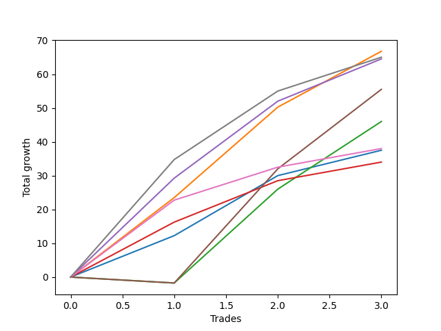

# Short Wallace 1226_003 
- Symbol: ES90d5m60m
- Date Range: 03/18/2022 - 07/08/2022
- Trading Period: 7:20-12:30
- Number of Trades: 3



| Name | Win Percent | Profit | Avg Profit / Trade |     | Name | Win Percent | Profit | Avg Profit / Trade |
| ---- | ----------- | ------ | ------------------ | --- | ---- | ----------- | ------ | ------------------ |
| Sorted By <br> Profit | | | | | Sorted By <br> Win Percentage ||||
| One | 100.00 | 33375.00 | 11125.00 |     | One | 100.00 | 33375.00 | 11125.00 |
| Seven | 100.00 | 32500.00 | 10833.33 |     | Seven | 100.00 | 32500.00 | 10833.33 |
| Four | 100.00 | 32250.00 | 10750.00 |     | Four | 100.00 | 32250.00 | 10750.00 |
| Five | 66.67 | 27750.00 | 9250.00 |     | Six | 100.00 | 19000.00 | 6333.33 |
| Two | 66.67 | 23000.00 | 7666.67 |     | Zero | 100.00 | 18750.00 | 6250.00 |
| Six | 100.00 | 19000.00 | 6333.33 |     | Three | 100.00 | 17000.00 | 5666.67 |
| Zero | 100.00 | 18750.00 | 6250.00 |     | Five | 66.67 | 27750.00 | 9250.00 |
| Three | 100.00 | 17000.00 | 5666.67 |     | Two | 66.67 | 23000.00 | 7666.67 |

### Test Zero
* Sell when price hits the middle line of the 20p bollinger
* No Stoploss
* Results:
```
Total Trades: 3
Percent Up: 0.00
Percent Down: 100.00
Total Points Moved Down: 37.50
Potential Profit: 18750.00
Total Points Ups: 0.00 Count Ups: 0
Total Points Downs: 37.50 Count Downs: 3
```

<details><summary>Trades</summary>

<code>In: 2022-05-19 12:10:00		Out: 2022-05-19 12:18:20		Total Position Time: 08:20		Total Move Down: 12.25		Total to Date: 12.25</code> <br />
<code>In: 2022-06-14 10:25:00		Out: 2022-06-14 10:34:00		Total Position Time: 09:00		Total Move Down: 17.75		Total to Date: 30.00</code> <br />
<code>In: 2022-06-14 10:30:00		Out: 2022-06-14 10:34:00		Total Position Time: 04:00		Total Move Down: 7.50		Total to Date: 37.50</code> <br />


</details>

### Test One
* Sell when the price hits the upper line of the 20p 1std bollinger
* No Stoploss
* Results:
```
Total Trades: 3
Percent Up: 0.00
Percent Down: 100.00
Total Points Moved Down: 66.75
Potential Profit: 33375.00
Total Points Ups: 0.00 Count Ups: 0
Total Points Downs: 66.75 Count Downs: 3
```

<details><summary>Trades</summary>

<code>In: 2022-05-19 12:10:00		Out: 2022-05-19 12:24:50		Total Position Time: 14:50		Total Move Down: 23.50		Total to Date: 23.50</code> <br />
<code>In: 2022-06-14 10:25:00		Out: 2022-06-14 10:40:05		Total Position Time: 15:05		Total Move Down: 26.75		Total to Date: 50.25</code> <br />
<code>In: 2022-06-14 10:30:00		Out: 2022-06-14 10:40:05		Total Position Time: 10:05		Total Move Down: 16.50		Total to Date: 66.75</code> <br />


</details>

### Test Two
* Sell when the price hits the upper line of the 20p 2std bollinger
* No Stoploss
* Results:
```
Total Trades: 3
Percent Up: 33.33
Percent Down: 66.67
Total Points Moved Down: 46.00
Potential Profit: 23000.00
Total Points Ups: 1.75 Count Ups: 1
Total Points Downs: 47.75 Count Downs: 2
```

<details><summary>Trades</summary>

<code>In: 2022-05-19 12:10:00		Out: 2022-05-20 06:40:55		Total Position Time: 1110:55		Total Move Down: -1.75		Total to Date: -1.75</code> <br />
<code>In: 2022-06-14 10:25:00		Out: 2022-06-14 11:25:55		Total Position Time: 60:55		Total Move Down: 27.75		Total to Date: 26.00</code> <br />
<code>In: 2022-06-14 10:30:00		Out: 2022-06-14 11:30:55		Total Position Time: 60:55		Total Move Down: 20.00		Total to Date: 46.00</code> <br />


</details>

### Test Three
* Sell when price hits the middle line of the 50p bollinger
* No Stoploss
* Results:
```
Total Trades: 3
Percent Up: 0.00
Percent Down: 100.00
Total Points Moved Down: 34.00
Potential Profit: 17000.00
Total Points Ups: 0.00 Count Ups: 0
Total Points Downs: 34.00 Count Downs: 3
```

<details><summary>Trades</summary>

<code>In: 2022-05-19 12:10:00		Out: 2022-05-19 12:21:15		Total Position Time: 11:15		Total Move Down: 16.25		Total to Date: 16.25</code> <br />
<code>In: 2022-06-14 10:25:00		Out: 2022-06-14 10:29:25		Total Position Time: 04:25		Total Move Down: 12.25		Total to Date: 28.50</code> <br />
<code>In: 2022-06-14 10:30:00		Out: 2022-06-14 10:31:10		Total Position Time: 01:10		Total Move Down: 5.50		Total to Date: 34.00</code> <br />


</details>

### Test Four
* Sell when the price hits the upper line of the 50p 1std bollinger
* No Stoploss
* Results:
```
Total Trades: 3
Percent Up: 0.00
Percent Down: 100.00
Total Points Moved Down: 64.50
Potential Profit: 32250.00
Total Points Ups: 0.00 Count Ups: 0
Total Points Downs: 64.50 Count Downs: 3
```

<details><summary>Trades</summary>

<code>In: 2022-05-19 12:10:00		Out: 2022-05-19 12:30:05		Total Position Time: 20:05		Total Move Down: 29.25		Total to Date: 29.25</code> <br />
<code>In: 2022-06-14 10:25:00		Out: 2022-06-14 10:36:10		Total Position Time: 11:10		Total Move Down: 22.75		Total to Date: 52.00</code> <br />
<code>In: 2022-06-14 10:30:00		Out: 2022-06-14 10:36:10		Total Position Time: 06:10		Total Move Down: 12.50		Total to Date: 64.50</code> <br />


</details>

### Test Five
* Sell when the price hits the upper line of the 50p 2std bollinger
* No Stoploss
* Results:
```
Total Trades: 3
Percent Up: 33.33
Percent Down: 66.67
Total Points Moved Down: 55.50
Potential Profit: 27750.00
Total Points Ups: 1.75 Count Ups: 1
Total Points Downs: 57.25 Count Downs: 2
```

<details><summary>Trades</summary>

<code>In: 2022-05-19 12:10:00		Out: 2022-05-20 06:40:55		Total Position Time: 1110:55		Total Move Down: -1.75		Total to Date: -1.75</code> <br />
<code>In: 2022-06-14 10:25:00		Out: 2022-06-14 10:44:05		Total Position Time: 19:05		Total Move Down: 33.75		Total to Date: 32.00</code> <br />
<code>In: 2022-06-14 10:30:00		Out: 2022-06-14 10:44:05		Total Position Time: 14:05		Total Move Down: 23.50		Total to Date: 55.50</code> <br />


</details>

### Test Six
* Sell when the price hits the middle line of the 1std VWAP
* No Stoploss
* Results:
```
Total Trades: 3
Percent Up: 0.00
Percent Down: 100.00
Total Points Moved Down: 38.00
Potential Profit: 19000.00
Total Points Ups: 0.00 Count Ups: 0
Total Points Downs: 38.00 Count Downs: 3
```

<details><summary>Trades</summary>

<code>In: 2022-05-19 12:10:00		Out: 2022-05-19 12:24:45		Total Position Time: 14:45		Total Move Down: 22.75		Total to Date: 22.75</code> <br />
<code>In: 2022-06-14 10:25:00		Out: 2022-06-14 10:26:55		Total Position Time: 01:55		Total Move Down: 9.75		Total to Date: 32.50</code> <br />
<code>In: 2022-06-14 10:30:00		Out: 2022-06-14 10:31:10		Total Position Time: 01:10		Total Move Down: 5.50		Total to Date: 38.00</code> <br />


</details>

### Test Seven
* Sell when the price hits the upper line of the 1std VWAP
* No Stoploss
* Results:
```
Total Trades: 3
Percent Up: 0.00
Percent Down: 100.00
Total Points Moved Down: 65.00
Potential Profit: 32500.00
Total Points Ups: 0.00 Count Ups: 0
Total Points Downs: 65.00 Count Downs: 3
```

<details><summary>Trades</summary>

<code>In: 2022-05-19 12:10:00		Out: 2022-05-19 12:42:25		Total Position Time: 32:25		Total Move Down: 34.75		Total to Date: 34.75</code> <br />
<code>In: 2022-06-14 10:25:00		Out: 2022-06-14 10:34:40		Total Position Time: 09:40		Total Move Down: 20.25		Total to Date: 55.00</code> <br />
<code>In: 2022-06-14 10:30:00		Out: 2022-06-14 10:34:40		Total Position Time: 04:40		Total Move Down: 10.00		Total to Date: 65.00</code> <br />


</details>