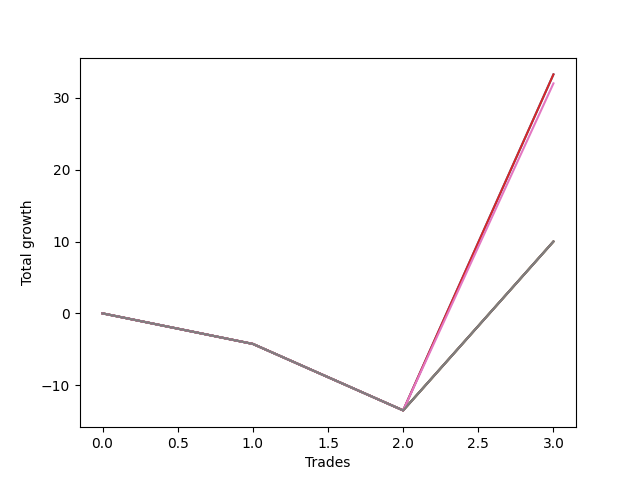

# Short Wallace Doodle 013 
- Symbol: ES90d5m60m
- Date Range: 03/18/2022 - 07/08/2022
- Trading Period: 7:20-12:30
- Number of Trades: 3



| Name | Win Percent | Profit | Avg Profit / Trade |     | Name | Win Percent | Profit | Avg Profit / Trade |
| ---- | ----------- | ------ | ------------------ | --- | ---- | ----------- | ------ | ------------------ |
| Sorted By <br> Profit | | | | | Sorted By <br> Win Percentage ||||
| Three | 33.33 | -10375.00 | -3458.33 |     | Three | 33.33 | -10375.00 | -3458.33 |
| Zero | 33.33 | -10375.00 | -3458.33 |     | Zero | 33.33 | -10375.00 | -3458.33 |
| Six | 33.33 | -11000.00 | -3666.67 |     | Six | 33.33 | -11000.00 | -3666.67 |
| Seven | 33.33 | -22000.00 | -7333.33 |     | Seven | 33.33 | -22000.00 | -7333.33 |
| Five | 33.33 | -22000.00 | -7333.33 |     | Five | 33.33 | -22000.00 | -7333.33 |
| Four | 33.33 | -22000.00 | -7333.33 |     | Four | 33.33 | -22000.00 | -7333.33 |
| Two | 33.33 | -22000.00 | -7333.33 |     | Two | 33.33 | -22000.00 | -7333.33 |
| One | 33.33 | -22000.00 | -7333.33 |     | One | 33.33 | -22000.00 | -7333.33 |

### Test Zero
* Sell when price hits the middle line of the 20p bollinger
* No Stoploss
* Results:
```
Total Trades: 3
Percent Up: 66.67
Percent Down: 33.33
Total Points Moved Down: -20.75
Potential Profit: -10375.00
Total Points Ups: 67.50 Count Ups: 2
Total Points Downs: 46.75 Count Downs: 1
```

<details><summary>Trades</summary>

<code>In: 2022-03-28 12:00:00		Out: 2022-03-29 06:30:55		Total Position Time: 1110:55		Total Move Down: -58.25		Total to Date: -58.25</code> <br />
<code>In: 2022-05-25 11:35:00		Out: 2022-05-25 12:35:55		Total Position Time: 60:55		Total Move Down: -9.25		Total to Date: -67.50</code> <br />
<code>In: 2022-06-15 11:45:00		Out: 2022-06-15 11:58:05		Total Position Time: 13:05		Total Move Down: 46.75		Total to Date: -20.75</code> <br />


</details>

### Test One
* Sell when the price hits the upper line of the 20p 1std bollinger
* No Stoploss
* Results:
```
Total Trades: 3
Percent Up: 66.67
Percent Down: 33.33
Total Points Moved Down: -44.00
Potential Profit: -22000.00
Total Points Ups: 67.50 Count Ups: 2
Total Points Downs: 23.50 Count Downs: 1
```

<details><summary>Trades</summary>

<code>In: 2022-03-28 12:00:00		Out: 2022-03-29 06:30:55		Total Position Time: 1110:55		Total Move Down: -58.25		Total to Date: -58.25</code> <br />
<code>In: 2022-05-25 11:35:00		Out: 2022-05-25 12:35:55		Total Position Time: 60:55		Total Move Down: -9.25		Total to Date: -67.50</code> <br />
<code>In: 2022-06-15 11:45:00		Out: 2022-06-15 12:45:55		Total Position Time: 60:55		Total Move Down: 23.50		Total to Date: -44.00</code> <br />


</details>

### Test Two
* Sell when the price hits the upper line of the 20p 2std bollinger
* No Stoploss
* Results:
```
Total Trades: 3
Percent Up: 66.67
Percent Down: 33.33
Total Points Moved Down: -44.00
Potential Profit: -22000.00
Total Points Ups: 67.50 Count Ups: 2
Total Points Downs: 23.50 Count Downs: 1
```

<details><summary>Trades</summary>

<code>In: 2022-03-28 12:00:00		Out: 2022-03-29 06:30:55		Total Position Time: 1110:55		Total Move Down: -58.25		Total to Date: -58.25</code> <br />
<code>In: 2022-05-25 11:35:00		Out: 2022-05-25 12:35:55		Total Position Time: 60:55		Total Move Down: -9.25		Total to Date: -67.50</code> <br />
<code>In: 2022-06-15 11:45:00		Out: 2022-06-15 12:45:55		Total Position Time: 60:55		Total Move Down: 23.50		Total to Date: -44.00</code> <br />


</details>

### Test Three
* Sell when price hits the middle line of the 50p bollinger
* No Stoploss
* Results:
```
Total Trades: 3
Percent Up: 66.67
Percent Down: 33.33
Total Points Moved Down: -20.75
Potential Profit: -10375.00
Total Points Ups: 67.50 Count Ups: 2
Total Points Downs: 46.75 Count Downs: 1
```

<details><summary>Trades</summary>

<code>In: 2022-03-28 12:00:00		Out: 2022-03-29 06:30:55		Total Position Time: 1110:55		Total Move Down: -58.25		Total to Date: -58.25</code> <br />
<code>In: 2022-05-25 11:35:00		Out: 2022-05-25 12:35:55		Total Position Time: 60:55		Total Move Down: -9.25		Total to Date: -67.50</code> <br />
<code>In: 2022-06-15 11:45:00		Out: 2022-06-15 11:58:05		Total Position Time: 13:05		Total Move Down: 46.75		Total to Date: -20.75</code> <br />


</details>

### Test Four
* Sell when the price hits the upper line of the 50p 1std bollinger
* No Stoploss
* Results:
```
Total Trades: 3
Percent Up: 66.67
Percent Down: 33.33
Total Points Moved Down: -44.00
Potential Profit: -22000.00
Total Points Ups: 67.50 Count Ups: 2
Total Points Downs: 23.50 Count Downs: 1
```

<details><summary>Trades</summary>

<code>In: 2022-03-28 12:00:00		Out: 2022-03-29 06:30:55		Total Position Time: 1110:55		Total Move Down: -58.25		Total to Date: -58.25</code> <br />
<code>In: 2022-05-25 11:35:00		Out: 2022-05-25 12:35:55		Total Position Time: 60:55		Total Move Down: -9.25		Total to Date: -67.50</code> <br />
<code>In: 2022-06-15 11:45:00		Out: 2022-06-15 12:45:55		Total Position Time: 60:55		Total Move Down: 23.50		Total to Date: -44.00</code> <br />


</details>

### Test Five
* Sell when the price hits the upper line of the 50p 2std bollinger
* No Stoploss
* Results:
```
Total Trades: 3
Percent Up: 66.67
Percent Down: 33.33
Total Points Moved Down: -44.00
Potential Profit: -22000.00
Total Points Ups: 67.50 Count Ups: 2
Total Points Downs: 23.50 Count Downs: 1
```

<details><summary>Trades</summary>

<code>In: 2022-03-28 12:00:00		Out: 2022-03-29 06:30:55		Total Position Time: 1110:55		Total Move Down: -58.25		Total to Date: -58.25</code> <br />
<code>In: 2022-05-25 11:35:00		Out: 2022-05-25 12:35:55		Total Position Time: 60:55		Total Move Down: -9.25		Total to Date: -67.50</code> <br />
<code>In: 2022-06-15 11:45:00		Out: 2022-06-15 12:45:55		Total Position Time: 60:55		Total Move Down: 23.50		Total to Date: -44.00</code> <br />


</details>

### Test Six
* Sell when the price hits the middle line of the 1std VWAP
* No Stoploss
* Results:
```
Total Trades: 3
Percent Up: 66.67
Percent Down: 33.33
Total Points Moved Down: -22.00
Potential Profit: -11000.00
Total Points Ups: 67.50 Count Ups: 2
Total Points Downs: 45.50 Count Downs: 1
```

<details><summary>Trades</summary>

<code>In: 2022-03-28 12:00:00		Out: 2022-03-29 06:30:55		Total Position Time: 1110:55		Total Move Down: -58.25		Total to Date: -58.25</code> <br />
<code>In: 2022-05-25 11:35:00		Out: 2022-05-25 12:35:55		Total Position Time: 60:55		Total Move Down: -9.25		Total to Date: -67.50</code> <br />
<code>In: 2022-06-15 11:45:00		Out: 2022-06-15 11:57:55		Total Position Time: 12:55		Total Move Down: 45.50		Total to Date: -22.00</code> <br />


</details>

### Test Seven
* Sell when the price hits the upper line of the 1std VWAP
* No Stoploss
* Results:
```
Total Trades: 3
Percent Up: 66.67
Percent Down: 33.33
Total Points Moved Down: -44.00
Potential Profit: -22000.00
Total Points Ups: 67.50 Count Ups: 2
Total Points Downs: 23.50 Count Downs: 1
```

<details><summary>Trades</summary>

<code>In: 2022-03-28 12:00:00		Out: 2022-03-29 06:30:55		Total Position Time: 1110:55		Total Move Down: -58.25		Total to Date: -58.25</code> <br />
<code>In: 2022-05-25 11:35:00		Out: 2022-05-25 12:35:55		Total Position Time: 60:55		Total Move Down: -9.25		Total to Date: -67.50</code> <br />
<code>In: 2022-06-15 11:45:00		Out: 2022-06-15 12:45:55		Total Position Time: 60:55		Total Move Down: 23.50		Total to Date: -44.00</code> <br />


</details>