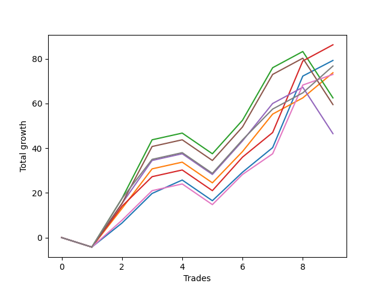

# Short Wallace Doodle 014 
- Symbol: ES90d5m60m
- Date Range: 03/18/2022 - 07/08/2022
- Trading Period: 7:20-12:30
- Number of Trades: 9



| Name | Win Percent | Profit | Avg Profit / Trade |     | Name | Win Percent | Profit | Avg Profit / Trade |
| ---- | ----------- | ------ | ------------------ | --- | ---- | ----------- | ------ | ------------------ |
| Sorted By <br> Profit | | | | | Sorted By <br> Win Percentage ||||
| Three | 77.78 | 43125.00 | 4791.67 |     | Three | 77.78 | 43125.00 | 4791.67 |
| Zero | 77.78 | 39625.00 | 4402.78 |     | Zero | 77.78 | 39625.00 | 4402.78 |
| Seven | 77.78 | 38375.00 | 4263.89 |     | Seven | 77.78 | 38375.00 | 4263.89 |
| One | 77.78 | 36875.00 | 4097.22 |     | One | 77.78 | 36875.00 | 4097.22 |
| Six | 77.78 | 36500.00 | 4055.56 |     | Six | 77.78 | 36500.00 | 4055.56 |
| Two | 66.67 | 31250.00 | 3472.22 |     | Two | 66.67 | 31250.00 | 3472.22 |
| Five | 66.67 | 29750.00 | 3305.56 |     | Five | 66.67 | 29750.00 | 3305.56 |
| Four | 66.67 | 23250.00 | 2583.33 |     | Four | 66.67 | 23250.00 | 2583.33 |

### Test Zero
* Sell when price hits the middle line of the 20p bollinger
* No Stoploss
* Results:
```
Total Trades: 9
Percent Up: 22.22
Percent Down: 77.78
Total Points Moved Down: 79.25
Potential Profit: 39625.00
Total Points Ups: 13.50 Count Ups: 2
Total Points Downs: 92.75 Count Downs: 7
```

<details><summary>Trades</summary>

<code>In: 2022-03-28 12:00:00		Out: 2022-03-28 12:46:00		Total Position Time: 46:00		Total Move Down: -4.25		Total to Date: -4.25</code> <br />
<code>In: 2022-04-01 11:35:00		Out: 2022-04-01 12:11:25		Total Position Time: 36:25		Total Move Down: 10.75		Total to Date: 6.50</code> <br />
<code>In: 2022-04-06 10:50:00		Out: 2022-04-06 11:00:10		Total Position Time: 10:10		Total Move Down: 13.25		Total to Date: 19.75</code> <br />
<code>In: 2022-05-04 09:40:00		Out: 2022-05-04 10:37:25		Total Position Time: 57:25		Total Move Down: 6.00		Total to Date: 25.75</code> <br />
<code>In: 2022-05-25 11:35:00		Out: 2022-05-25 12:35:55		Total Position Time: 60:55		Total Move Down: -9.25		Total to Date: 16.50</code> <br />
<code>In: 2022-06-10 12:00:00		Out: 2022-06-10 12:05:20		Total Position Time: 05:20		Total Move Down: 12.75		Total to Date: 29.25</code> <br />
<code>In: 2022-06-15 11:00:00		Out: 2022-06-15 11:01:15		Total Position Time: 01:15		Total Move Down: 11.00		Total to Date: 40.25</code> <br />
<code>In: 2022-06-15 11:50:00		Out: 2022-06-15 11:58:05		Total Position Time: 08:05		Total Move Down: 32.00		Total to Date: 72.25</code> <br />
<code>In: 2022-07-06 11:00:00		Out: 2022-07-06 11:02:25		Total Position Time: 02:25		Total Move Down: 7.00		Total to Date: 79.25</code> <br />


</details>

### Test One
* Sell when the price hits the upper line of the 20p 1std bollinger
* No Stoploss
* Results:
```
Total Trades: 9
Percent Up: 22.22
Percent Down: 77.78
Total Points Moved Down: 73.75
Potential Profit: 36875.00
Total Points Ups: 13.50 Count Ups: 2
Total Points Downs: 87.25 Count Downs: 7
```

<details><summary>Trades</summary>

<code>In: 2022-03-28 12:00:00		Out: 2022-03-28 12:46:00		Total Position Time: 46:00		Total Move Down: -4.25		Total to Date: -4.25</code> <br />
<code>In: 2022-04-01 11:35:00		Out: 2022-04-01 12:20:00		Total Position Time: 45:00		Total Move Down: 17.25		Total to Date: 13.00</code> <br />
<code>In: 2022-04-06 10:50:00		Out: 2022-04-06 11:09:45		Total Position Time: 19:45		Total Move Down: 17.75		Total to Date: 30.75</code> <br />
<code>In: 2022-05-04 09:40:00		Out: 2022-05-04 10:40:55		Total Position Time: 60:55		Total Move Down: 3.00		Total to Date: 33.75</code> <br />
<code>In: 2022-05-25 11:35:00		Out: 2022-05-25 12:35:55		Total Position Time: 60:55		Total Move Down: -9.25		Total to Date: 24.50</code> <br />
<code>In: 2022-06-10 12:00:00		Out: 2022-06-10 12:45:40		Total Position Time: 45:40		Total Move Down: 14.00		Total to Date: 38.50</code> <br />
<code>In: 2022-06-15 11:00:00		Out: 2022-06-15 11:01:25		Total Position Time: 01:25		Total Move Down: 16.75		Total to Date: 55.25</code> <br />
<code>In: 2022-06-15 11:50:00		Out: 2022-06-15 12:46:00		Total Position Time: 56:00		Total Move Down: 7.25		Total to Date: 62.50</code> <br />
<code>In: 2022-07-06 11:00:00		Out: 2022-07-06 11:12:15		Total Position Time: 12:15		Total Move Down: 11.25		Total to Date: 73.75</code> <br />


</details>

### Test Two
* Sell when the price hits the upper line of the 20p 2std bollinger
* No Stoploss
* Results:
```
Total Trades: 9
Percent Up: 33.33
Percent Down: 66.67
Total Points Moved Down: 62.50
Potential Profit: 31250.00
Total Points Ups: 34.25 Count Ups: 3
Total Points Downs: 96.75 Count Downs: 6
```

<details><summary>Trades</summary>

<code>In: 2022-03-28 12:00:00		Out: 2022-03-28 12:46:00		Total Position Time: 46:00		Total Move Down: -4.25		Total to Date: -4.25</code> <br />
<code>In: 2022-04-01 11:35:00		Out: 2022-04-01 12:33:30		Total Position Time: 58:30		Total Move Down: 21.75		Total to Date: 17.50</code> <br />
<code>In: 2022-04-06 10:50:00		Out: 2022-04-06 11:15:15		Total Position Time: 25:15		Total Move Down: 26.25		Total to Date: 43.75</code> <br />
<code>In: 2022-05-04 09:40:00		Out: 2022-05-04 10:40:55		Total Position Time: 60:55		Total Move Down: 3.00		Total to Date: 46.75</code> <br />
<code>In: 2022-05-25 11:35:00		Out: 2022-05-25 12:35:55		Total Position Time: 60:55		Total Move Down: -9.25		Total to Date: 37.50</code> <br />
<code>In: 2022-06-10 12:00:00		Out: 2022-06-10 12:46:00		Total Position Time: 46:00		Total Move Down: 15.00		Total to Date: 52.50</code> <br />
<code>In: 2022-06-15 11:00:00		Out: 2022-06-15 11:01:40		Total Position Time: 01:40		Total Move Down: 23.50		Total to Date: 76.00</code> <br />
<code>In: 2022-06-15 11:50:00		Out: 2022-06-15 12:46:00		Total Position Time: 56:00		Total Move Down: 7.25		Total to Date: 83.25</code> <br />
<code>In: 2022-07-06 11:00:00		Out: 2022-07-06 12:00:55		Total Position Time: 60:55		Total Move Down: -20.75		Total to Date: 62.50</code> <br />


</details>

### Test Three
* Sell when price hits the middle line of the 50p bollinger
* No Stoploss
* Results:
```
Total Trades: 9
Percent Up: 22.22
Percent Down: 77.78
Total Points Moved Down: 86.25
Potential Profit: 43125.00
Total Points Ups: 13.50 Count Ups: 2
Total Points Downs: 99.75 Count Downs: 7
```

<details><summary>Trades</summary>

<code>In: 2022-03-28 12:00:00		Out: 2022-03-28 12:46:00		Total Position Time: 46:00		Total Move Down: -4.25		Total to Date: -4.25</code> <br />
<code>In: 2022-04-01 11:35:00		Out: 2022-04-01 12:20:05		Total Position Time: 45:05		Total Move Down: 18.25		Total to Date: 14.00</code> <br />
<code>In: 2022-04-06 10:50:00		Out: 2022-04-06 11:08:35		Total Position Time: 18:35		Total Move Down: 13.25		Total to Date: 27.25</code> <br />
<code>In: 2022-05-04 09:40:00		Out: 2022-05-04 10:40:55		Total Position Time: 60:55		Total Move Down: 3.00		Total to Date: 30.25</code> <br />
<code>In: 2022-05-25 11:35:00		Out: 2022-05-25 12:35:55		Total Position Time: 60:55		Total Move Down: -9.25		Total to Date: 21.00</code> <br />
<code>In: 2022-06-10 12:00:00		Out: 2022-06-10 12:46:00		Total Position Time: 46:00		Total Move Down: 15.00		Total to Date: 36.00</code> <br />
<code>In: 2022-06-15 11:00:00		Out: 2022-06-15 11:01:15		Total Position Time: 01:15		Total Move Down: 11.00		Total to Date: 47.00</code> <br />
<code>In: 2022-06-15 11:50:00		Out: 2022-06-15 11:58:05		Total Position Time: 08:05		Total Move Down: 32.00		Total to Date: 79.00</code> <br />
<code>In: 2022-07-06 11:00:00		Out: 2022-07-06 11:11:50		Total Position Time: 11:50		Total Move Down: 7.25		Total to Date: 86.25</code> <br />


</details>

### Test Four
* Sell when the price hits the upper line of the 50p 1std bollinger
* No Stoploss
* Results:
```
Total Trades: 9
Percent Up: 33.33
Percent Down: 66.67
Total Points Moved Down: 46.50
Potential Profit: 23250.00
Total Points Ups: 34.25 Count Ups: 3
Total Points Downs: 80.75 Count Downs: 6
```

<details><summary>Trades</summary>

<code>In: 2022-03-28 12:00:00		Out: 2022-03-28 12:46:00		Total Position Time: 46:00		Total Move Down: -4.25		Total to Date: -4.25</code> <br />
<code>In: 2022-04-01 11:35:00		Out: 2022-04-01 12:35:55		Total Position Time: 60:55		Total Move Down: 19.50		Total to Date: 15.25</code> <br />
<code>In: 2022-04-06 10:50:00		Out: 2022-04-06 11:11:20		Total Position Time: 21:20		Total Move Down: 19.25		Total to Date: 34.50</code> <br />
<code>In: 2022-05-04 09:40:00		Out: 2022-05-04 10:40:55		Total Position Time: 60:55		Total Move Down: 3.00		Total to Date: 37.50</code> <br />
<code>In: 2022-05-25 11:35:00		Out: 2022-05-25 12:35:55		Total Position Time: 60:55		Total Move Down: -9.25		Total to Date: 28.25</code> <br />
<code>In: 2022-06-10 12:00:00		Out: 2022-06-10 12:46:00		Total Position Time: 46:00		Total Move Down: 15.00		Total to Date: 43.25</code> <br />
<code>In: 2022-06-15 11:00:00		Out: 2022-06-15 11:01:25		Total Position Time: 01:25		Total Move Down: 16.75		Total to Date: 60.00</code> <br />
<code>In: 2022-06-15 11:50:00		Out: 2022-06-15 12:46:00		Total Position Time: 56:00		Total Move Down: 7.25		Total to Date: 67.25</code> <br />
<code>In: 2022-07-06 11:00:00		Out: 2022-07-06 12:00:55		Total Position Time: 60:55		Total Move Down: -20.75		Total to Date: 46.50</code> <br />


</details>

### Test Five
* Sell when the price hits the upper line of the 50p 2std bollinger
* No Stoploss
* Results:
```
Total Trades: 9
Percent Up: 33.33
Percent Down: 66.67
Total Points Moved Down: 59.50
Potential Profit: 29750.00
Total Points Ups: 34.25 Count Ups: 3
Total Points Downs: 93.75 Count Downs: 6
```

<details><summary>Trades</summary>

<code>In: 2022-03-28 12:00:00		Out: 2022-03-28 12:46:00		Total Position Time: 46:00		Total Move Down: -4.25		Total to Date: -4.25</code> <br />
<code>In: 2022-04-01 11:35:00		Out: 2022-04-01 12:35:55		Total Position Time: 60:55		Total Move Down: 19.50		Total to Date: 15.25</code> <br />
<code>In: 2022-04-06 10:50:00		Out: 2022-04-06 11:15:05		Total Position Time: 25:05		Total Move Down: 25.50		Total to Date: 40.75</code> <br />
<code>In: 2022-05-04 09:40:00		Out: 2022-05-04 10:40:55		Total Position Time: 60:55		Total Move Down: 3.00		Total to Date: 43.75</code> <br />
<code>In: 2022-05-25 11:35:00		Out: 2022-05-25 12:35:55		Total Position Time: 60:55		Total Move Down: -9.25		Total to Date: 34.50</code> <br />
<code>In: 2022-06-10 12:00:00		Out: 2022-06-10 12:46:00		Total Position Time: 46:00		Total Move Down: 15.00		Total to Date: 49.50</code> <br />
<code>In: 2022-06-15 11:00:00		Out: 2022-06-15 11:01:40		Total Position Time: 01:40		Total Move Down: 23.50		Total to Date: 73.00</code> <br />
<code>In: 2022-06-15 11:50:00		Out: 2022-06-15 12:46:00		Total Position Time: 56:00		Total Move Down: 7.25		Total to Date: 80.25</code> <br />
<code>In: 2022-07-06 11:00:00		Out: 2022-07-06 12:00:55		Total Position Time: 60:55		Total Move Down: -20.75		Total to Date: 59.50</code> <br />


</details>

### Test Six
* Sell when the price hits the middle line of the 1std VWAP
* No Stoploss
* Results:
```
Total Trades: 9
Percent Up: 22.22
Percent Down: 77.78
Total Points Moved Down: 73.00
Potential Profit: 36500.00
Total Points Ups: 13.50 Count Ups: 2
Total Points Downs: 86.50 Count Downs: 7
```

<details><summary>Trades</summary>

<code>In: 2022-03-28 12:00:00		Out: 2022-03-28 12:46:00		Total Position Time: 46:00		Total Move Down: -4.25		Total to Date: -4.25</code> <br />
<code>In: 2022-04-01 11:35:00		Out: 2022-04-01 12:12:50		Total Position Time: 37:50		Total Move Down: 12.00		Total to Date: 7.75</code> <br />
<code>In: 2022-04-06 10:50:00		Out: 2022-04-06 11:00:10		Total Position Time: 10:10		Total Move Down: 13.25		Total to Date: 21.00</code> <br />
<code>In: 2022-05-04 09:40:00		Out: 2022-05-04 10:40:55		Total Position Time: 60:55		Total Move Down: 3.00		Total to Date: 24.00</code> <br />
<code>In: 2022-05-25 11:35:00		Out: 2022-05-25 12:35:55		Total Position Time: 60:55		Total Move Down: -9.25		Total to Date: 14.75</code> <br />
<code>In: 2022-06-10 12:00:00		Out: 2022-06-10 12:05:35		Total Position Time: 05:35		Total Move Down: 13.50		Total to Date: 28.25</code> <br />
<code>In: 2022-06-15 11:00:00		Out: 2022-06-15 11:01:10		Total Position Time: 01:10		Total Move Down: 9.25		Total to Date: 37.50</code> <br />
<code>In: 2022-06-15 11:50:00		Out: 2022-06-15 11:57:55		Total Position Time: 07:55		Total Move Down: 30.75		Total to Date: 68.25</code> <br />
<code>In: 2022-07-06 11:00:00		Out: 2022-07-06 11:01:15		Total Position Time: 01:15		Total Move Down: 4.75		Total to Date: 73.00</code> <br />


</details>

### Test Seven
* Sell when the price hits the upper line of the 1std VWAP
* No Stoploss
* Results:
```
Total Trades: 9
Percent Up: 22.22
Percent Down: 77.78
Total Points Moved Down: 76.75
Potential Profit: 38375.00
Total Points Ups: 13.50 Count Ups: 2
Total Points Downs: 90.25 Count Downs: 7
```

<details><summary>Trades</summary>

<code>In: 2022-03-28 12:00:00		Out: 2022-03-28 12:46:00		Total Position Time: 46:00		Total Move Down: -4.25		Total to Date: -4.25</code> <br />
<code>In: 2022-04-01 11:35:00		Out: 2022-04-01 12:33:30		Total Position Time: 58:30		Total Move Down: 21.75		Total to Date: 17.50</code> <br />
<code>In: 2022-04-06 10:50:00		Out: 2022-04-06 11:09:40		Total Position Time: 19:40		Total Move Down: 17.50		Total to Date: 35.00</code> <br />
<code>In: 2022-05-04 09:40:00		Out: 2022-05-04 10:40:55		Total Position Time: 60:55		Total Move Down: 3.00		Total to Date: 38.00</code> <br />
<code>In: 2022-05-25 11:35:00		Out: 2022-05-25 12:35:55		Total Position Time: 60:55		Total Move Down: -9.25		Total to Date: 28.75</code> <br />
<code>In: 2022-06-10 12:00:00		Out: 2022-06-10 12:46:00		Total Position Time: 46:00		Total Move Down: 15.00		Total to Date: 43.75</code> <br />
<code>In: 2022-06-15 11:00:00		Out: 2022-06-15 11:01:20		Total Position Time: 01:20		Total Move Down: 13.75		Total to Date: 57.50</code> <br />
<code>In: 2022-06-15 11:50:00		Out: 2022-06-15 12:46:00		Total Position Time: 56:00		Total Move Down: 7.25		Total to Date: 64.75</code> <br />
<code>In: 2022-07-06 11:00:00		Out: 2022-07-06 11:12:25		Total Position Time: 12:25		Total Move Down: 12.00		Total to Date: 76.75</code> <br />


</details>