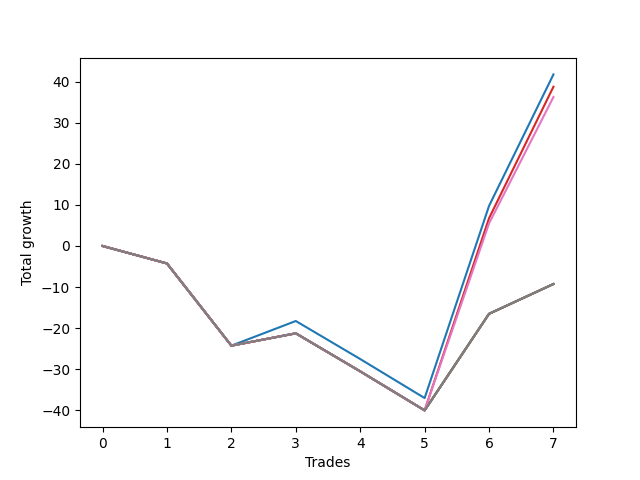

# Short Wallace Doodle 019 
- Symbol: ES90d5m60m
- Date Range: 03/18/2022 - 07/08/2022
- Trading Period: 7:20-12:30
- Number of Trades: 7



| Name | Win Percent | Profit | Avg Profit / Trade |     | Name | Win Percent | Profit | Avg Profit / Trade |
| ---- | ----------- | ------ | ------------------ | --- | ---- | ----------- | ------ | ------------------ |
| Sorted By <br> Profit | | | | | Sorted By <br> Win Percentage ||||
| Zero | 42.86 | 20875.00 | 2982.14 |     | Zero | 42.86 | 20875.00 | 2982.14 |
| Three | 42.86 | 19375.00 | 2767.86 |     | Three | 42.86 | 19375.00 | 2767.86 |
| Six | 42.86 | 18125.00 | 2589.29 |     | Six | 42.86 | 18125.00 | 2589.29 |
| Seven | 42.86 | -4625.00 | -660.71 |     | Seven | 42.86 | -4625.00 | -660.71 |
| Five | 42.86 | -4625.00 | -660.71 |     | Five | 42.86 | -4625.00 | -660.71 |
| Four | 42.86 | -4625.00 | -660.71 |     | Four | 42.86 | -4625.00 | -660.71 |
| Two | 42.86 | -4625.00 | -660.71 |     | Two | 42.86 | -4625.00 | -660.71 |
| One | 42.86 | -4625.00 | -660.71 |     | One | 42.86 | -4625.00 | -660.71 |

### Test Zero
* Sell when price hits the middle line of the 20p bollinger
* No Stoploss
* Results:
```
Total Trades: 7
Percent Up: 57.14
Percent Down: 42.86
Total Points Moved Down: 41.75
Potential Profit: 20875.00
Total Points Ups: 43.00 Count Ups: 4
Total Points Downs: 84.75 Count Downs: 3
```

<details><summary>Trades</summary>

<code>In: 2022-03-28 12:00:00		Out: 2022-03-28 12:46:00		Total Position Time: 46:00		Total Move Down: -4.25		Total to Date: -4.25</code> <br />
<code>In: 2022-04-07 11:00:00		Out: 2022-04-07 12:00:55		Total Position Time: 60:55		Total Move Down: -20.00		Total to Date: -24.25</code> <br />
<code>In: 2022-05-04 09:40:00		Out: 2022-05-04 10:37:25		Total Position Time: 57:25		Total Move Down: 6.00		Total to Date: -18.25</code> <br />
<code>In: 2022-05-25 11:35:00		Out: 2022-05-25 12:35:55		Total Position Time: 60:55		Total Move Down: -9.25		Total to Date: -27.50</code> <br />
<code>In: 2022-05-25 11:40:00		Out: 2022-05-25 12:40:55		Total Position Time: 60:55		Total Move Down: -9.50		Total to Date: -37.00</code> <br />
<code>In: 2022-06-15 11:45:00		Out: 2022-06-15 11:58:05		Total Position Time: 13:05		Total Move Down: 46.75		Total to Date: 9.75</code> <br />
<code>In: 2022-06-15 11:50:00		Out: 2022-06-15 11:58:05		Total Position Time: 08:05		Total Move Down: 32.00		Total to Date: 41.75</code> <br />


</details>

### Test One
* Sell when the price hits the upper line of the 20p 1std bollinger
* No Stoploss
* Results:
```
Total Trades: 7
Percent Up: 57.14
Percent Down: 42.86
Total Points Moved Down: -9.25
Potential Profit: -4625.00
Total Points Ups: 43.00 Count Ups: 4
Total Points Downs: 33.75 Count Downs: 3
```

<details><summary>Trades</summary>

<code>In: 2022-03-28 12:00:00		Out: 2022-03-28 12:46:00		Total Position Time: 46:00		Total Move Down: -4.25		Total to Date: -4.25</code> <br />
<code>In: 2022-04-07 11:00:00		Out: 2022-04-07 12:00:55		Total Position Time: 60:55		Total Move Down: -20.00		Total to Date: -24.25</code> <br />
<code>In: 2022-05-04 09:40:00		Out: 2022-05-04 10:40:55		Total Position Time: 60:55		Total Move Down: 3.00		Total to Date: -21.25</code> <br />
<code>In: 2022-05-25 11:35:00		Out: 2022-05-25 12:35:55		Total Position Time: 60:55		Total Move Down: -9.25		Total to Date: -30.50</code> <br />
<code>In: 2022-05-25 11:40:00		Out: 2022-05-25 12:40:55		Total Position Time: 60:55		Total Move Down: -9.50		Total to Date: -40.00</code> <br />
<code>In: 2022-06-15 11:45:00		Out: 2022-06-15 12:45:55		Total Position Time: 60:55		Total Move Down: 23.50		Total to Date: -16.50</code> <br />
<code>In: 2022-06-15 11:50:00		Out: 2022-06-15 12:46:00		Total Position Time: 56:00		Total Move Down: 7.25		Total to Date: -9.25</code> <br />


</details>

### Test Two
* Sell when the price hits the upper line of the 20p 2std bollinger
* No Stoploss
* Results:
```
Total Trades: 7
Percent Up: 57.14
Percent Down: 42.86
Total Points Moved Down: -9.25
Potential Profit: -4625.00
Total Points Ups: 43.00 Count Ups: 4
Total Points Downs: 33.75 Count Downs: 3
```

<details><summary>Trades</summary>

<code>In: 2022-03-28 12:00:00		Out: 2022-03-28 12:46:00		Total Position Time: 46:00		Total Move Down: -4.25		Total to Date: -4.25</code> <br />
<code>In: 2022-04-07 11:00:00		Out: 2022-04-07 12:00:55		Total Position Time: 60:55		Total Move Down: -20.00		Total to Date: -24.25</code> <br />
<code>In: 2022-05-04 09:40:00		Out: 2022-05-04 10:40:55		Total Position Time: 60:55		Total Move Down: 3.00		Total to Date: -21.25</code> <br />
<code>In: 2022-05-25 11:35:00		Out: 2022-05-25 12:35:55		Total Position Time: 60:55		Total Move Down: -9.25		Total to Date: -30.50</code> <br />
<code>In: 2022-05-25 11:40:00		Out: 2022-05-25 12:40:55		Total Position Time: 60:55		Total Move Down: -9.50		Total to Date: -40.00</code> <br />
<code>In: 2022-06-15 11:45:00		Out: 2022-06-15 12:45:55		Total Position Time: 60:55		Total Move Down: 23.50		Total to Date: -16.50</code> <br />
<code>In: 2022-06-15 11:50:00		Out: 2022-06-15 12:46:00		Total Position Time: 56:00		Total Move Down: 7.25		Total to Date: -9.25</code> <br />


</details>

### Test Three
* Sell when price hits the middle line of the 50p bollinger
* No Stoploss
* Results:
```
Total Trades: 7
Percent Up: 57.14
Percent Down: 42.86
Total Points Moved Down: 38.75
Potential Profit: 19375.00
Total Points Ups: 43.00 Count Ups: 4
Total Points Downs: 81.75 Count Downs: 3
```

<details><summary>Trades</summary>

<code>In: 2022-03-28 12:00:00		Out: 2022-03-28 12:46:00		Total Position Time: 46:00		Total Move Down: -4.25		Total to Date: -4.25</code> <br />
<code>In: 2022-04-07 11:00:00		Out: 2022-04-07 12:00:55		Total Position Time: 60:55		Total Move Down: -20.00		Total to Date: -24.25</code> <br />
<code>In: 2022-05-04 09:40:00		Out: 2022-05-04 10:40:55		Total Position Time: 60:55		Total Move Down: 3.00		Total to Date: -21.25</code> <br />
<code>In: 2022-05-25 11:35:00		Out: 2022-05-25 12:35:55		Total Position Time: 60:55		Total Move Down: -9.25		Total to Date: -30.50</code> <br />
<code>In: 2022-05-25 11:40:00		Out: 2022-05-25 12:40:55		Total Position Time: 60:55		Total Move Down: -9.50		Total to Date: -40.00</code> <br />
<code>In: 2022-06-15 11:45:00		Out: 2022-06-15 11:58:05		Total Position Time: 13:05		Total Move Down: 46.75		Total to Date: 6.75</code> <br />
<code>In: 2022-06-15 11:50:00		Out: 2022-06-15 11:58:05		Total Position Time: 08:05		Total Move Down: 32.00		Total to Date: 38.75</code> <br />


</details>

### Test Four
* Sell when the price hits the upper line of the 50p 1std bollinger
* No Stoploss
* Results:
```
Total Trades: 7
Percent Up: 57.14
Percent Down: 42.86
Total Points Moved Down: -9.25
Potential Profit: -4625.00
Total Points Ups: 43.00 Count Ups: 4
Total Points Downs: 33.75 Count Downs: 3
```

<details><summary>Trades</summary>

<code>In: 2022-03-28 12:00:00		Out: 2022-03-28 12:46:00		Total Position Time: 46:00		Total Move Down: -4.25		Total to Date: -4.25</code> <br />
<code>In: 2022-04-07 11:00:00		Out: 2022-04-07 12:00:55		Total Position Time: 60:55		Total Move Down: -20.00		Total to Date: -24.25</code> <br />
<code>In: 2022-05-04 09:40:00		Out: 2022-05-04 10:40:55		Total Position Time: 60:55		Total Move Down: 3.00		Total to Date: -21.25</code> <br />
<code>In: 2022-05-25 11:35:00		Out: 2022-05-25 12:35:55		Total Position Time: 60:55		Total Move Down: -9.25		Total to Date: -30.50</code> <br />
<code>In: 2022-05-25 11:40:00		Out: 2022-05-25 12:40:55		Total Position Time: 60:55		Total Move Down: -9.50		Total to Date: -40.00</code> <br />
<code>In: 2022-06-15 11:45:00		Out: 2022-06-15 12:45:55		Total Position Time: 60:55		Total Move Down: 23.50		Total to Date: -16.50</code> <br />
<code>In: 2022-06-15 11:50:00		Out: 2022-06-15 12:46:00		Total Position Time: 56:00		Total Move Down: 7.25		Total to Date: -9.25</code> <br />


</details>

### Test Five
* Sell when the price hits the upper line of the 50p 2std bollinger
* No Stoploss
* Results:
```
Total Trades: 7
Percent Up: 57.14
Percent Down: 42.86
Total Points Moved Down: -9.25
Potential Profit: -4625.00
Total Points Ups: 43.00 Count Ups: 4
Total Points Downs: 33.75 Count Downs: 3
```

<details><summary>Trades</summary>

<code>In: 2022-03-28 12:00:00		Out: 2022-03-28 12:46:00		Total Position Time: 46:00		Total Move Down: -4.25		Total to Date: -4.25</code> <br />
<code>In: 2022-04-07 11:00:00		Out: 2022-04-07 12:00:55		Total Position Time: 60:55		Total Move Down: -20.00		Total to Date: -24.25</code> <br />
<code>In: 2022-05-04 09:40:00		Out: 2022-05-04 10:40:55		Total Position Time: 60:55		Total Move Down: 3.00		Total to Date: -21.25</code> <br />
<code>In: 2022-05-25 11:35:00		Out: 2022-05-25 12:35:55		Total Position Time: 60:55		Total Move Down: -9.25		Total to Date: -30.50</code> <br />
<code>In: 2022-05-25 11:40:00		Out: 2022-05-25 12:40:55		Total Position Time: 60:55		Total Move Down: -9.50		Total to Date: -40.00</code> <br />
<code>In: 2022-06-15 11:45:00		Out: 2022-06-15 12:45:55		Total Position Time: 60:55		Total Move Down: 23.50		Total to Date: -16.50</code> <br />
<code>In: 2022-06-15 11:50:00		Out: 2022-06-15 12:46:00		Total Position Time: 56:00		Total Move Down: 7.25		Total to Date: -9.25</code> <br />


</details>

### Test Six
* Sell when the price hits the middle line of the 1std VWAP
* No Stoploss
* Results:
```
Total Trades: 7
Percent Up: 57.14
Percent Down: 42.86
Total Points Moved Down: 36.25
Potential Profit: 18125.00
Total Points Ups: 43.00 Count Ups: 4
Total Points Downs: 79.25 Count Downs: 3
```

<details><summary>Trades</summary>

<code>In: 2022-03-28 12:00:00		Out: 2022-03-28 12:46:00		Total Position Time: 46:00		Total Move Down: -4.25		Total to Date: -4.25</code> <br />
<code>In: 2022-04-07 11:00:00		Out: 2022-04-07 12:00:55		Total Position Time: 60:55		Total Move Down: -20.00		Total to Date: -24.25</code> <br />
<code>In: 2022-05-04 09:40:00		Out: 2022-05-04 10:40:55		Total Position Time: 60:55		Total Move Down: 3.00		Total to Date: -21.25</code> <br />
<code>In: 2022-05-25 11:35:00		Out: 2022-05-25 12:35:55		Total Position Time: 60:55		Total Move Down: -9.25		Total to Date: -30.50</code> <br />
<code>In: 2022-05-25 11:40:00		Out: 2022-05-25 12:40:55		Total Position Time: 60:55		Total Move Down: -9.50		Total to Date: -40.00</code> <br />
<code>In: 2022-06-15 11:45:00		Out: 2022-06-15 11:57:55		Total Position Time: 12:55		Total Move Down: 45.50		Total to Date: 5.50</code> <br />
<code>In: 2022-06-15 11:50:00		Out: 2022-06-15 11:57:55		Total Position Time: 07:55		Total Move Down: 30.75		Total to Date: 36.25</code> <br />


</details>

### Test Seven
* Sell when the price hits the upper line of the 1std VWAP
* No Stoploss
* Results:
```
Total Trades: 7
Percent Up: 57.14
Percent Down: 42.86
Total Points Moved Down: -9.25
Potential Profit: -4625.00
Total Points Ups: 43.00 Count Ups: 4
Total Points Downs: 33.75 Count Downs: 3
```

<details><summary>Trades</summary>

<code>In: 2022-03-28 12:00:00		Out: 2022-03-28 12:46:00		Total Position Time: 46:00		Total Move Down: -4.25		Total to Date: -4.25</code> <br />
<code>In: 2022-04-07 11:00:00		Out: 2022-04-07 12:00:55		Total Position Time: 60:55		Total Move Down: -20.00		Total to Date: -24.25</code> <br />
<code>In: 2022-05-04 09:40:00		Out: 2022-05-04 10:40:55		Total Position Time: 60:55		Total Move Down: 3.00		Total to Date: -21.25</code> <br />
<code>In: 2022-05-25 11:35:00		Out: 2022-05-25 12:35:55		Total Position Time: 60:55		Total Move Down: -9.25		Total to Date: -30.50</code> <br />
<code>In: 2022-05-25 11:40:00		Out: 2022-05-25 12:40:55		Total Position Time: 60:55		Total Move Down: -9.50		Total to Date: -40.00</code> <br />
<code>In: 2022-06-15 11:45:00		Out: 2022-06-15 12:45:55		Total Position Time: 60:55		Total Move Down: 23.50		Total to Date: -16.50</code> <br />
<code>In: 2022-06-15 11:50:00		Out: 2022-06-15 12:46:00		Total Position Time: 56:00		Total Move Down: 7.25		Total to Date: -9.25</code> <br />


</details>