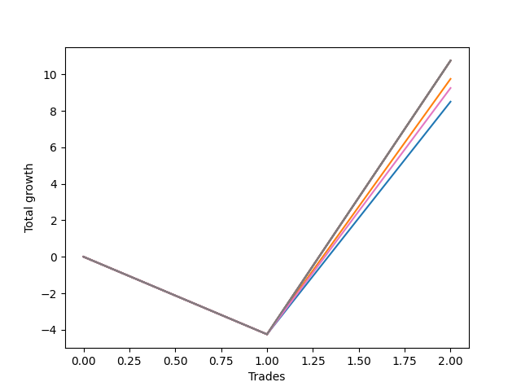

# Short Wallace Doodle 0225_009 
- Symbol: ES90d5m60m
- Date Range: 03/18/2022 - 07/08/2022
- Trading Period: 7:20-12:30
- Number of Trades: 2



| Name | Win Percent | Profit | Avg Profit / Trade |     | Name | Win Percent | Profit | Avg Profit / Trade |
| ---- | ----------- | ------ | ------------------ | --- | ---- | ----------- | ------ | ------------------ |
| Sorted By <br> Profit | | | | | Sorted By <br> Win Percentage ||||
| Five | 50.00 | 36875.00 | 18437.50 |     | Five | 50.00 | 36875.00 | 18437.50 |
| Seven | 50.00 | -15125.00 | -7562.50 |     | Seven | 50.00 | -15125.00 | -7562.50 |
| Four | 50.00 | -16500.00 | -8250.00 |     | Four | 50.00 | -16500.00 | -8250.00 |
| Two | 50.00 | -18375.00 | -9187.50 |     | Two | 50.00 | -18375.00 | -9187.50 |
| Three | 50.00 | -20250.00 | -10125.00 |     | Three | 50.00 | -20250.00 | -10125.00 |
| One | 50.00 | -22125.00 | -11062.50 |     | One | 50.00 | -22125.00 | -11062.50 |
| Six | 50.00 | -22375.00 | -11187.50 |     | Six | 50.00 | -22375.00 | -11187.50 |
| Zero | 50.00 | -22750.00 | -11375.00 |     | Zero | 50.00 | -22750.00 | -11375.00 |

### Test Zero
* Sell when price hits the middle line of the 20p bollinger
* No Stoploss
* Results:
```
Total Trades: 2
Percent Up: 50.00
Percent Down: 50.00
Total Points Moved Down: -45.50
Potential Profit: -22750.00
Total Points Ups: 58.25 Count Ups: 1
Total Points Downs: 12.75 Count Downs: 1
```

<details><summary>Trades</summary>

<code>In: 2022-03-28 12:00:00		Out: 2022-03-29 06:30:55		Total Position Time: 1110:55		Total Move Down: -58.25		Total to Date: -58.25</code> <br />
<code>In: 2022-06-10 12:00:00		Out: 2022-06-10 12:05:20		Total Position Time: 05:20		Total Move Down: 12.75		Total to Date: -45.50</code> <br />


</details>

### Test One
* Sell when the price hits the upper line of the 20p 1std bollinger
* No Stoploss
* Results:
```
Total Trades: 2
Percent Up: 50.00
Percent Down: 50.00
Total Points Moved Down: -44.25
Potential Profit: -22125.00
Total Points Ups: 58.25 Count Ups: 1
Total Points Downs: 14.00 Count Downs: 1
```

<details><summary>Trades</summary>

<code>In: 2022-03-28 12:00:00		Out: 2022-03-29 06:30:55		Total Position Time: 1110:55		Total Move Down: -58.25		Total to Date: -58.25</code> <br />
<code>In: 2022-06-10 12:00:00		Out: 2022-06-10 12:45:40		Total Position Time: 45:40		Total Move Down: 14.00		Total to Date: -44.25</code> <br />


</details>

### Test Two
* Sell when the price hits the upper line of the 20p 2std bollinger
* No Stoploss
* Results:
```
Total Trades: 2
Percent Up: 50.00
Percent Down: 50.00
Total Points Moved Down: -36.75
Potential Profit: -18375.00
Total Points Ups: 58.25 Count Ups: 1
Total Points Downs: 21.50 Count Downs: 1
```

<details><summary>Trades</summary>

<code>In: 2022-03-28 12:00:00		Out: 2022-03-29 06:30:55		Total Position Time: 1110:55		Total Move Down: -58.25		Total to Date: -58.25</code> <br />
<code>In: 2022-06-10 12:00:00		Out: 2022-06-10 12:47:15		Total Position Time: 47:15		Total Move Down: 21.50		Total to Date: -36.75</code> <br />


</details>

### Test Three
* Sell when price hits the middle line of the 50p bollinger
* No Stoploss
* Results:
```
Total Trades: 2
Percent Up: 50.00
Percent Down: 50.00
Total Points Moved Down: -40.50
Potential Profit: -20250.00
Total Points Ups: 58.25 Count Ups: 1
Total Points Downs: 17.75 Count Downs: 1
```

<details><summary>Trades</summary>

<code>In: 2022-03-28 12:00:00		Out: 2022-03-29 06:30:55		Total Position Time: 1110:55		Total Move Down: -58.25		Total to Date: -58.25</code> <br />
<code>In: 2022-06-10 12:00:00		Out: 2022-06-10 12:46:10		Total Position Time: 46:10		Total Move Down: 17.75		Total to Date: -40.50</code> <br />


</details>

### Test Four
* Sell when the price hits the upper line of the 50p 1std bollinger
* No Stoploss
* Results:
```
Total Trades: 2
Percent Up: 50.00
Percent Down: 50.00
Total Points Moved Down: -33.00
Potential Profit: -16500.00
Total Points Ups: 58.25 Count Ups: 1
Total Points Downs: 25.25 Count Downs: 1
```

<details><summary>Trades</summary>

<code>In: 2022-03-28 12:00:00		Out: 2022-03-29 06:30:55		Total Position Time: 1110:55		Total Move Down: -58.25		Total to Date: -58.25</code> <br />
<code>In: 2022-06-10 12:00:00		Out: 2022-06-10 12:59:05		Total Position Time: 59:05		Total Move Down: 25.25		Total to Date: -33.00</code> <br />


</details>

### Test Five
* Sell when the price hits the upper line of the 50p 2std bollinger
* No Stoploss
* Results:
```
Total Trades: 2
Percent Up: 50.00
Percent Down: 50.00
Total Points Moved Down: 73.75
Potential Profit: 36875.00
Total Points Ups: 58.25 Count Ups: 1
Total Points Downs: 132.00 Count Downs: 1
```

<details><summary>Trades</summary>

<code>In: 2022-03-28 12:00:00		Out: 2022-03-29 06:30:55		Total Position Time: 1110:55		Total Move Down: -58.25		Total to Date: -58.25</code> <br />
<code>In: 2022-06-10 12:00:00		Out: 2022-06-13 06:30:05		Total Position Time: 1110:05		Total Move Down: 132.00		Total to Date: 73.75</code> <br />


</details>

### Test Six
* Sell when the price hits the middle line of the 1std VWAP
* No Stoploss
* Results:
```
Total Trades: 2
Percent Up: 50.00
Percent Down: 50.00
Total Points Moved Down: -44.75
Potential Profit: -22375.00
Total Points Ups: 58.25 Count Ups: 1
Total Points Downs: 13.50 Count Downs: 1
```

<details><summary>Trades</summary>

<code>In: 2022-03-28 12:00:00		Out: 2022-03-29 06:30:55		Total Position Time: 1110:55		Total Move Down: -58.25		Total to Date: -58.25</code> <br />
<code>In: 2022-06-10 12:00:00		Out: 2022-06-10 12:05:35		Total Position Time: 05:35		Total Move Down: 13.50		Total to Date: -44.75</code> <br />


</details>

### Test Seven
* Sell when the price hits the upper line of the 1std VWAP
* No Stoploss
* Results:
```
Total Trades: 2
Percent Up: 50.00
Percent Down: 50.00
Total Points Moved Down: -30.25
Potential Profit: -15125.00
Total Points Ups: 58.25 Count Ups: 1
Total Points Downs: 28.00 Count Downs: 1
```

<details><summary>Trades</summary>

<code>In: 2022-03-28 12:00:00		Out: 2022-03-29 06:30:55		Total Position Time: 1110:55		Total Move Down: -58.25		Total to Date: -58.25</code> <br />
<code>In: 2022-06-10 12:00:00		Out: 2022-06-10 12:59:20		Total Position Time: 59:20		Total Move Down: 28.00		Total to Date: -30.25</code> <br />


</details>