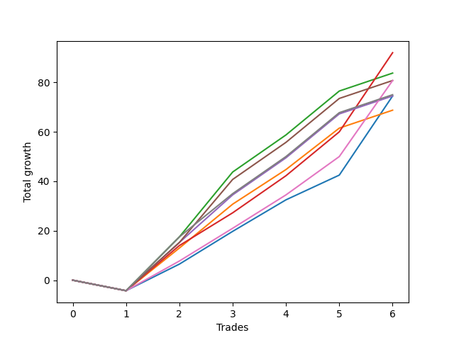

# Short Wallace Doodle 011 
- Symbol: ES90d5m60m
- Date Range: 03/18/2022 - 07/08/2022
- Trading Period: 7:20-12:30
- Number of Trades: 6



| Name | Win Percent | Profit | Avg Profit / Trade |     | Name | Win Percent | Profit | Avg Profit / Trade |
| ---- | ----------- | ------ | ------------------ | --- | ---- | ----------- | ------ | ------------------ |
| Sorted By <br> Profit | | | | | Sorted By <br> Win Percentage ||||
| Three | 83.33 | 46000.00 | 7666.67 |     | Three | 83.33 | 46000.00 | 7666.67 |
| Two | 83.33 | 41875.00 | 6979.17 |     | Two | 83.33 | 41875.00 | 6979.17 |
| Six | 83.33 | 40375.00 | 6729.17 |     | Six | 83.33 | 40375.00 | 6729.17 |
| Five | 83.33 | 40375.00 | 6729.17 |     | Five | 83.33 | 40375.00 | 6729.17 |
| Seven | 83.33 | 37500.00 | 6250.00 |     | Seven | 83.33 | 37500.00 | 6250.00 |
| Four | 83.33 | 37250.00 | 6208.33 |     | Four | 83.33 | 37250.00 | 6208.33 |
| Zero | 83.33 | 37250.00 | 6208.33 |     | Zero | 83.33 | 37250.00 | 6208.33 |
| One | 83.33 | 34375.00 | 5729.17 |     | One | 83.33 | 34375.00 | 5729.17 |

### Test Zero
* Sell when price hits the middle line of the 20p bollinger
* No Stoploss
* Results:
```
Total Trades: 6
Percent Up: 16.67
Percent Down: 83.33
Total Points Moved Down: 74.50
Potential Profit: 37250.00
Total Points Ups: 4.25 Count Ups: 1
Total Points Downs: 78.75 Count Downs: 5
```

<details><summary>Trades</summary>

<code>In: 2022-03-28 12:00:00		Out: 2022-03-28 12:46:00		Total Position Time: 46:00		Total Move Down: -4.25		Total to Date: -4.25</code> <br />
<code>In: 2022-04-01 11:35:00		Out: 2022-04-01 12:11:25		Total Position Time: 36:25		Total Move Down: 10.75		Total to Date: 6.50</code> <br />
<code>In: 2022-04-06 10:50:00		Out: 2022-04-06 11:00:10		Total Position Time: 10:10		Total Move Down: 13.25		Total to Date: 19.75</code> <br />
<code>In: 2022-06-10 12:00:00		Out: 2022-06-10 12:05:20		Total Position Time: 05:20		Total Move Down: 12.75		Total to Date: 32.50</code> <br />
<code>In: 2022-06-10 12:30:00		Out: 2022-06-10 12:42:35		Total Position Time: 12:35		Total Move Down: 10.00		Total to Date: 42.50</code> <br />
<code>In: 2022-06-15 11:50:00		Out: 2022-06-15 11:58:05		Total Position Time: 08:05		Total Move Down: 32.00		Total to Date: 74.50</code> <br />


</details>

### Test One
* Sell when the price hits the upper line of the 20p 1std bollinger
* No Stoploss
* Results:
```
Total Trades: 6
Percent Up: 16.67
Percent Down: 83.33
Total Points Moved Down: 68.75
Potential Profit: 34375.00
Total Points Ups: 4.25 Count Ups: 1
Total Points Downs: 73.00 Count Downs: 5
```

<details><summary>Trades</summary>

<code>In: 2022-03-28 12:00:00		Out: 2022-03-28 12:46:00		Total Position Time: 46:00		Total Move Down: -4.25		Total to Date: -4.25</code> <br />
<code>In: 2022-04-01 11:35:00		Out: 2022-04-01 12:20:00		Total Position Time: 45:00		Total Move Down: 17.25		Total to Date: 13.00</code> <br />
<code>In: 2022-04-06 10:50:00		Out: 2022-04-06 11:09:45		Total Position Time: 19:45		Total Move Down: 17.75		Total to Date: 30.75</code> <br />
<code>In: 2022-06-10 12:00:00		Out: 2022-06-10 12:45:40		Total Position Time: 45:40		Total Move Down: 14.00		Total to Date: 44.75</code> <br />
<code>In: 2022-06-10 12:30:00		Out: 2022-06-10 12:45:40		Total Position Time: 15:40		Total Move Down: 16.75		Total to Date: 61.50</code> <br />
<code>In: 2022-06-15 11:50:00		Out: 2022-06-15 12:46:00		Total Position Time: 56:00		Total Move Down: 7.25		Total to Date: 68.75</code> <br />


</details>

### Test Two
* Sell when the price hits the upper line of the 20p 2std bollinger
* No Stoploss
* Results:
```
Total Trades: 6
Percent Up: 16.67
Percent Down: 83.33
Total Points Moved Down: 83.75
Potential Profit: 41875.00
Total Points Ups: 4.25 Count Ups: 1
Total Points Downs: 88.00 Count Downs: 5
```

<details><summary>Trades</summary>

<code>In: 2022-03-28 12:00:00		Out: 2022-03-28 12:46:00		Total Position Time: 46:00		Total Move Down: -4.25		Total to Date: -4.25</code> <br />
<code>In: 2022-04-01 11:35:00		Out: 2022-04-01 12:33:30		Total Position Time: 58:30		Total Move Down: 21.75		Total to Date: 17.50</code> <br />
<code>In: 2022-04-06 10:50:00		Out: 2022-04-06 11:15:15		Total Position Time: 25:15		Total Move Down: 26.25		Total to Date: 43.75</code> <br />
<code>In: 2022-06-10 12:00:00		Out: 2022-06-10 12:46:00		Total Position Time: 46:00		Total Move Down: 15.00		Total to Date: 58.75</code> <br />
<code>In: 2022-06-10 12:30:00		Out: 2022-06-10 12:46:00		Total Position Time: 16:00		Total Move Down: 17.75		Total to Date: 76.50</code> <br />
<code>In: 2022-06-15 11:50:00		Out: 2022-06-15 12:46:00		Total Position Time: 56:00		Total Move Down: 7.25		Total to Date: 83.75</code> <br />


</details>

### Test Three
* Sell when price hits the middle line of the 50p bollinger
* No Stoploss
* Results:
```
Total Trades: 6
Percent Up: 16.67
Percent Down: 83.33
Total Points Moved Down: 92.00
Potential Profit: 46000.00
Total Points Ups: 4.25 Count Ups: 1
Total Points Downs: 96.25 Count Downs: 5
```

<details><summary>Trades</summary>

<code>In: 2022-03-28 12:00:00		Out: 2022-03-28 12:46:00		Total Position Time: 46:00		Total Move Down: -4.25		Total to Date: -4.25</code> <br />
<code>In: 2022-04-01 11:35:00		Out: 2022-04-01 12:20:05		Total Position Time: 45:05		Total Move Down: 18.25		Total to Date: 14.00</code> <br />
<code>In: 2022-04-06 10:50:00		Out: 2022-04-06 11:08:35		Total Position Time: 18:35		Total Move Down: 13.25		Total to Date: 27.25</code> <br />
<code>In: 2022-06-10 12:00:00		Out: 2022-06-10 12:46:00		Total Position Time: 46:00		Total Move Down: 15.00		Total to Date: 42.25</code> <br />
<code>In: 2022-06-10 12:30:00		Out: 2022-06-10 12:46:00		Total Position Time: 16:00		Total Move Down: 17.75		Total to Date: 60.00</code> <br />
<code>In: 2022-06-15 11:50:00		Out: 2022-06-15 11:58:05		Total Position Time: 08:05		Total Move Down: 32.00		Total to Date: 92.00</code> <br />


</details>

### Test Four
* Sell when the price hits the upper line of the 50p 1std bollinger
* No Stoploss
* Results:
```
Total Trades: 6
Percent Up: 16.67
Percent Down: 83.33
Total Points Moved Down: 74.50
Potential Profit: 37250.00
Total Points Ups: 4.25 Count Ups: 1
Total Points Downs: 78.75 Count Downs: 5
```

<details><summary>Trades</summary>

<code>In: 2022-03-28 12:00:00		Out: 2022-03-28 12:46:00		Total Position Time: 46:00		Total Move Down: -4.25		Total to Date: -4.25</code> <br />
<code>In: 2022-04-01 11:35:00		Out: 2022-04-01 12:35:55		Total Position Time: 60:55		Total Move Down: 19.50		Total to Date: 15.25</code> <br />
<code>In: 2022-04-06 10:50:00		Out: 2022-04-06 11:11:20		Total Position Time: 21:20		Total Move Down: 19.25		Total to Date: 34.50</code> <br />
<code>In: 2022-06-10 12:00:00		Out: 2022-06-10 12:46:00		Total Position Time: 46:00		Total Move Down: 15.00		Total to Date: 49.50</code> <br />
<code>In: 2022-06-10 12:30:00		Out: 2022-06-10 12:46:00		Total Position Time: 16:00		Total Move Down: 17.75		Total to Date: 67.25</code> <br />
<code>In: 2022-06-15 11:50:00		Out: 2022-06-15 12:46:00		Total Position Time: 56:00		Total Move Down: 7.25		Total to Date: 74.50</code> <br />


</details>

### Test Five
* Sell when the price hits the upper line of the 50p 2std bollinger
* No Stoploss
* Results:
```
Total Trades: 6
Percent Up: 16.67
Percent Down: 83.33
Total Points Moved Down: 80.75
Potential Profit: 40375.00
Total Points Ups: 4.25 Count Ups: 1
Total Points Downs: 85.00 Count Downs: 5
```

<details><summary>Trades</summary>

<code>In: 2022-03-28 12:00:00		Out: 2022-03-28 12:46:00		Total Position Time: 46:00		Total Move Down: -4.25		Total to Date: -4.25</code> <br />
<code>In: 2022-04-01 11:35:00		Out: 2022-04-01 12:35:55		Total Position Time: 60:55		Total Move Down: 19.50		Total to Date: 15.25</code> <br />
<code>In: 2022-04-06 10:50:00		Out: 2022-04-06 11:15:05		Total Position Time: 25:05		Total Move Down: 25.50		Total to Date: 40.75</code> <br />
<code>In: 2022-06-10 12:00:00		Out: 2022-06-10 12:46:00		Total Position Time: 46:00		Total Move Down: 15.00		Total to Date: 55.75</code> <br />
<code>In: 2022-06-10 12:30:00		Out: 2022-06-10 12:46:00		Total Position Time: 16:00		Total Move Down: 17.75		Total to Date: 73.50</code> <br />
<code>In: 2022-06-15 11:50:00		Out: 2022-06-15 12:46:00		Total Position Time: 56:00		Total Move Down: 7.25		Total to Date: 80.75</code> <br />


</details>

### Test Six
* Sell when the price hits the middle line of the 1std VWAP
* No Stoploss
* Results:
```
Total Trades: 6
Percent Up: 16.67
Percent Down: 83.33
Total Points Moved Down: 80.75
Potential Profit: 40375.00
Total Points Ups: 4.25 Count Ups: 1
Total Points Downs: 85.00 Count Downs: 5
```

<details><summary>Trades</summary>

<code>In: 2022-03-28 12:00:00		Out: 2022-03-28 12:46:00		Total Position Time: 46:00		Total Move Down: -4.25		Total to Date: -4.25</code> <br />
<code>In: 2022-04-01 11:35:00		Out: 2022-04-01 12:12:50		Total Position Time: 37:50		Total Move Down: 12.00		Total to Date: 7.75</code> <br />
<code>In: 2022-04-06 10:50:00		Out: 2022-04-06 11:00:10		Total Position Time: 10:10		Total Move Down: 13.25		Total to Date: 21.00</code> <br />
<code>In: 2022-06-10 12:00:00		Out: 2022-06-10 12:05:35		Total Position Time: 05:35		Total Move Down: 13.50		Total to Date: 34.50</code> <br />
<code>In: 2022-06-10 12:30:00		Out: 2022-06-10 12:44:05		Total Position Time: 14:05		Total Move Down: 15.50		Total to Date: 50.00</code> <br />
<code>In: 2022-06-15 11:50:00		Out: 2022-06-15 11:57:55		Total Position Time: 07:55		Total Move Down: 30.75		Total to Date: 80.75</code> <br />


</details>

### Test Seven
* Sell when the price hits the upper line of the 1std VWAP
* No Stoploss
* Results:
```
Total Trades: 6
Percent Up: 16.67
Percent Down: 83.33
Total Points Moved Down: 75.00
Potential Profit: 37500.00
Total Points Ups: 4.25 Count Ups: 1
Total Points Downs: 79.25 Count Downs: 5
```

<details><summary>Trades</summary>

<code>In: 2022-03-28 12:00:00		Out: 2022-03-28 12:46:00		Total Position Time: 46:00		Total Move Down: -4.25		Total to Date: -4.25</code> <br />
<code>In: 2022-04-01 11:35:00		Out: 2022-04-01 12:33:30		Total Position Time: 58:30		Total Move Down: 21.75		Total to Date: 17.50</code> <br />
<code>In: 2022-04-06 10:50:00		Out: 2022-04-06 11:09:40		Total Position Time: 19:40		Total Move Down: 17.50		Total to Date: 35.00</code> <br />
<code>In: 2022-06-10 12:00:00		Out: 2022-06-10 12:46:00		Total Position Time: 46:00		Total Move Down: 15.00		Total to Date: 50.00</code> <br />
<code>In: 2022-06-10 12:30:00		Out: 2022-06-10 12:46:00		Total Position Time: 16:00		Total Move Down: 17.75		Total to Date: 67.75</code> <br />
<code>In: 2022-06-15 11:50:00		Out: 2022-06-15 12:46:00		Total Position Time: 56:00		Total Move Down: 7.25		Total to Date: 75.00</code> <br />


</details>