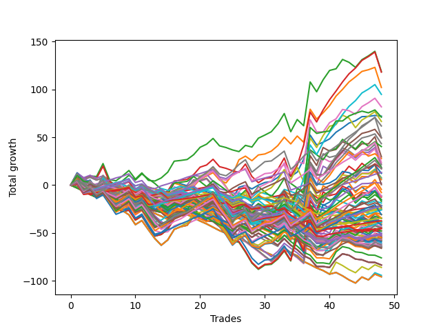

# Long Bulldog 003 
- Symbol: ESBIB
- Date Range: 03/18/2022 - 07/08/2022
- Trading Period: 7:20-12:30
- Number of Trades: 47



| Name | Win Percent | Profit | Avg Profit / Trade |     | Name | Win Percent | Profit | Avg Profit / Trade |
| ---- | ----------- | ------ | ------------------ | --- | ---- | ----------- | ------ | ------------------ |
| Sorted By <br> Profit | | | | | Sorted By <br> Win Percentage ||||
| Two | 63.83 | 69875.00 | 1486.70 |     | Seventy-Six | 85.11 | -11250.00 | -239.36 |
| Three | 65.96 | 69500.00 | 1478.72 |     | Seventy-Seven | 80.85 | 5625.00 | 119.68 |
| One | 72.34 | 61500.00 | 1308.51 |     | Eighty | 74.47 | 35375.00 | 752.66 |
| Seventy-Three | 51.06 | 39250.00 | 835.11 |     | Seventy-Nine | 74.47 | 22250.00 | 473.40 |
| Zero | 70.21 | 36375.00 | 773.94 |     | Seventy-Eight | 74.47 | 10750.00 | 228.72 |
| Eighty | 74.47 | 35375.00 | 752.66 |     | One | 72.34 | 61500.00 | 1308.51 |
| Five | 48.94 | 25250.00 | 537.23 |     | Zero | 70.21 | 36375.00 | 773.94 |
| Seventy-Nine | 74.47 | 22250.00 | 473.40 |     | Three | 65.96 | 69500.00 | 1478.72 |
| Seven | 48.94 | 21250.00 | 452.13 |     | Two | 63.83 | 69875.00 | 1486.70 |
| Four | 48.94 | 19625.00 | 417.55 |     | Seventy-Three | 51.06 | 39250.00 | 835.11 |
| Six | 48.94 | 19000.00 | 404.26 |     | Five | 48.94 | 25250.00 | 537.23 |
| Seventy-Eight | 74.47 | 10750.00 | 228.72 |     | Seven | 48.94 | 21250.00 | 452.13 |
| Seventy-Seven | 80.85 | 5625.00 | 119.68 |     | Four | 48.94 | 19625.00 | 417.55 |
| Seventy-Six | 85.11 | -11250.00 | -239.36 |     | Six | 48.94 | 19000.00 | 404.26 |

## NO STOPLOSS

### Test Zero
* Sell when price hits the middle line of the 20p bollinger
* No Stoploss
* Results:
```
Total Trades: 47
Percent Up: 70.21
Percent Down: 29.79
Total Points Moved Up: 72.75
Potential Profit: 36375.00
Total Points Ups: 155.00 Count Ups: 33
Total Points Downs: -82.25 Count Downs: 14
```

<details><summary>Trades</summary>

<code>In: 2022-03-21 10:21:00		Out: 2022-03-21 10:26:15		Total Position Time: 05:15		Total Move Up: 5.75		Total to Date: 5.75</code> <br />
<code>In: 2022-03-23 10:23:00		Out: 2022-03-23 10:38:15		Total Position Time: 15:15		Total Move Up: -3.75		Total to Date: 2.00</code> <br />
<code>In: 2022-03-23 10:28:00		Out: 2022-03-23 10:38:15		Total Position Time: 10:15		Total Move Up: 1.00		Total to Date: 3.00</code> <br />
<code>In: 2022-03-25 08:14:00		Out: 2022-03-25 08:36:40		Total Position Time: 22:40		Total Move Up: -6.00		Total to Date: -3.00</code> <br />
<code>In: 2022-03-25 08:29:00		Out: 2022-03-25 08:36:40		Total Position Time: 07:40		Total Move Up: 8.00		Total to Date: 5.00</code> <br />
<code>In: 2022-03-28 08:27:00		Out: 2022-03-28 08:56:55		Total Position Time: 29:55		Total Move Up: -16.75		Total to Date: -11.75</code> <br />
<code>In: 2022-03-28 08:38:00		Out: 2022-03-28 09:01:50		Total Position Time: 23:50		Total Move Up: -4.50		Total to Date: -16.25</code> <br />
<code>In: 2022-03-28 08:51:00		Out: 2022-03-28 09:01:50		Total Position Time: 10:50		Total Move Up: 1.75		Total to Date: -14.50</code> <br />
<code>In: 2022-03-28 08:55:00		Out: 2022-03-28 09:01:50		Total Position Time: 06:50		Total Move Up: 2.50		Total to Date: -12.00</code> <br />
<code>In: 2022-03-30 08:02:00		Out: 2022-03-30 08:19:20		Total Position Time: 17:20		Total Move Up: -5.50		Total to Date: -17.50</code> <br />
<code>In: 2022-03-30 08:13:00		Out: 2022-03-30 08:19:20		Total Position Time: 06:20		Total Move Up: 4.75		Total to Date: -12.75</code> <br />
<code>In: 2022-03-30 12:00:00		Out: 2022-03-30 12:28:15		Total Position Time: 28:15		Total Move Up: -6.75		Total to Date: -19.50</code> <br />
<code>In: 2022-03-30 12:06:00		Out: 2022-03-30 12:28:15		Total Position Time: 22:15		Total Move Up: -5.25		Total to Date: -24.75</code> <br />
<code>In: 2022-03-30 12:13:00		Out: 2022-03-30 12:28:15		Total Position Time: 15:15		Total Move Up: -2.00		Total to Date: -26.75</code> <br />
<code>In: 2022-03-30 12:20:00		Out: 2022-03-30 12:28:15		Total Position Time: 08:15		Total Move Up: 0.75		Total to Date: -26.00</code> <br />
<code>In: 2022-03-30 12:26:00		Out: 2022-03-30 12:28:15		Total Position Time: 02:15		Total Move Up: 6.25		Total to Date: -19.75</code> <br />
<code>In: 2022-03-31 10:00:00		Out: 2022-03-31 10:04:00		Total Position Time: 04:00		Total Move Up: 2.50		Total to Date: -17.25</code> <br />
<code>In: 2022-03-31 10:11:00		Out: 2022-03-31 10:19:05		Total Position Time: 08:05		Total Move Up: -0.50		Total to Date: -17.75</code> <br />
<code>In: 2022-04-01 07:24:00		Out: 2022-04-01 07:34:30		Total Position Time: 10:30		Total Move Up: 3.25		Total to Date: -14.50</code> <br />
<code>In: 2022-04-07 07:43:00		Out: 2022-04-07 07:55:15		Total Position Time: 12:15		Total Move Up: 2.75		Total to Date: -11.75</code> <br />
<code>In: 2022-04-12 09:28:00		Out: 2022-04-12 09:41:50		Total Position Time: 13:50		Total Move Up: 1.75		Total to Date: -10.00</code> <br />
<code>In: 2022-04-12 11:35:00		Out: 2022-04-12 11:35:50		Total Position Time: 00:50		Total Move Up: 1.50		Total to Date: -8.50</code> <br />
<code>In: 2022-04-18 08:26:00		Out: 2022-04-18 08:55:05		Total Position Time: 29:05		Total Move Up: -6.50		Total to Date: -15.00</code> <br />
<code>In: 2022-04-18 08:29:00		Out: 2022-04-18 08:55:05		Total Position Time: 26:05		Total Move Up: -4.50		Total to Date: -19.50</code> <br />
<code>In: 2022-05-02 10:02:00		Out: 2022-05-02 10:08:15		Total Position Time: 06:15		Total Move Up: 5.00		Total to Date: -14.50</code> <br />
<code>In: 2022-05-02 10:05:00		Out: 2022-05-02 10:08:15		Total Position Time: 03:15		Total Move Up: 12.25		Total to Date: -2.25</code> <br />
<code>In: 2022-05-02 10:49:00		Out: 2022-05-02 10:59:45		Total Position Time: 10:45		Total Move Up: 2.00		Total to Date: -0.25</code> <br />
<code>In: 2022-05-11 09:59:00		Out: 2022-05-11 10:15:25		Total Position Time: 16:25		Total Move Up: -3.75		Total to Date: -4.00</code> <br />
<code>In: 2022-05-18 08:32:00		Out: 2022-05-18 08:36:55		Total Position Time: 04:55		Total Move Up: 4.00		Total to Date: 0.00</code> <br />
<code>In: 2022-06-06 08:19:00		Out: 2022-06-06 08:31:35		Total Position Time: 12:35		Total Move Up: 2.75		Total to Date: 2.75</code> <br />
<code>In: 2022-06-08 09:41:00		Out: 2022-06-08 09:54:10		Total Position Time: 13:10		Total Move Up: 1.00		Total to Date: 3.75</code> <br />
<code>In: 2022-06-09 08:06:00		Out: 2022-06-09 08:11:10		Total Position Time: 05:10		Total Move Up: 4.25		Total to Date: 8.00</code> <br />
<code>In: 2022-06-09 08:09:00		Out: 2022-06-09 08:11:10		Total Position Time: 02:10		Total Move Up: 7.25		Total to Date: 15.25</code> <br />
<code>In: 2022-06-09 12:03:00		Out: 2022-06-09 12:19:25		Total Position Time: 16:25		Total Move Up: -6.25		Total to Date: 9.00</code> <br />
<code>In: 2022-06-14 12:16:00		Out: 2022-06-14 12:25:45		Total Position Time: 09:45		Total Move Up: 4.50		Total to Date: 13.50</code> <br />
<code>In: 2022-06-15 11:08:00		Out: 2022-06-15 11:16:45		Total Position Time: 08:45		Total Move Up: 13.50		Total to Date: 27.00</code> <br />
<code>In: 2022-06-15 11:34:00		Out: 2022-06-15 11:38:05		Total Position Time: 04:05		Total Move Up: 25.25		Total to Date: 52.25</code> <br />
<code>In: 2022-06-16 11:02:00		Out: 2022-06-16 11:31:55		Total Position Time: 29:55		Total Move Up: -10.25		Total to Date: 42.00</code> <br />
<code>In: 2022-06-17 07:37:00		Out: 2022-06-17 07:55:05		Total Position Time: 18:05		Total Move Up: 2.75		Total to Date: 44.75</code> <br />
<code>In: 2022-06-23 09:06:00		Out: 2022-06-23 09:17:10		Total Position Time: 11:10		Total Move Up: 3.50		Total to Date: 48.25</code> <br />
<code>In: 2022-06-27 12:07:00		Out: 2022-06-27 12:10:20		Total Position Time: 03:20		Total Move Up: 7.00		Total to Date: 55.25</code> <br />
<code>In: 2022-06-29 09:29:00		Out: 2022-06-29 09:36:40		Total Position Time: 07:40		Total Move Up: 4.50		Total to Date: 59.75</code> <br />
<code>In: 2022-07-06 08:05:00		Out: 2022-07-06 08:15:05		Total Position Time: 10:05		Total Move Up: 5.00		Total to Date: 64.75</code> <br />
<code>In: 2022-07-06 08:06:00		Out: 2022-07-06 08:15:05		Total Position Time: 09:05		Total Move Up: 2.50		Total to Date: 67.25</code> <br />
<code>In: 2022-07-06 08:34:00		Out: 2022-07-06 08:46:30		Total Position Time: 12:30		Total Move Up: 4.25		Total to Date: 71.50</code> <br />
<code>In: 2022-07-06 08:35:00		Out: 2022-07-06 08:46:30		Total Position Time: 11:30		Total Move Up: 0.25		Total to Date: 71.75</code> <br />
<code>In: 2022-07-06 08:46:00		Out: 2022-07-06 08:46:30		Total Position Time: 00:30		Total Move Up: 1.00		Total to Date: 72.75</code> <br />


</details>

### Test One
* Sell when the price hits the upper line of the 20p 1std bollinger
* No Stoploss
* Results:
```
Total Trades: 47
Percent Up: 72.34
Percent Down: 27.66
Total Points Moved Up: 123.00
Potential Profit: 61500.00
Total Points Ups: 210.75 Count Ups: 34
Total Points Downs: -87.75 Count Downs: 13
```

<details><summary>Trades</summary>

<code>In: 2022-03-21 10:21:00		Out: 2022-03-21 10:31:50		Total Position Time: 10:50		Total Move Up: 7.50		Total to Date: 7.50</code> <br />
<code>In: 2022-03-23 10:23:00		Out: 2022-03-23 10:51:50		Total Position Time: 28:50		Total Move Up: -4.50		Total to Date: 3.00</code> <br />
<code>In: 2022-03-23 10:28:00		Out: 2022-03-23 10:51:50		Total Position Time: 23:50		Total Move Up: 0.25		Total to Date: 3.25</code> <br />
<code>In: 2022-03-25 08:14:00		Out: 2022-03-25 08:41:05		Total Position Time: 27:05		Total Move Up: -4.75		Total to Date: -1.50</code> <br />
<code>In: 2022-03-25 08:29:00		Out: 2022-03-25 08:41:05		Total Position Time: 12:05		Total Move Up: 9.25		Total to Date: 7.75</code> <br />
<code>In: 2022-03-28 08:27:00		Out: 2022-03-28 08:56:55		Total Position Time: 29:55		Total Move Up: -16.75		Total to Date: -9.00</code> <br />
<code>In: 2022-03-28 08:38:00		Out: 2022-03-28 09:04:55		Total Position Time: 26:55		Total Move Up: -2.75		Total to Date: -11.75</code> <br />
<code>In: 2022-03-28 08:51:00		Out: 2022-03-28 09:04:55		Total Position Time: 13:55		Total Move Up: 3.50		Total to Date: -8.25</code> <br />
<code>In: 2022-03-28 08:55:00		Out: 2022-03-28 09:04:55		Total Position Time: 09:55		Total Move Up: 4.25		Total to Date: -4.00</code> <br />
<code>In: 2022-03-30 08:02:00		Out: 2022-03-30 08:31:55		Total Position Time: 29:55		Total Move Up: -9.00		Total to Date: -13.00</code> <br />
<code>In: 2022-03-30 08:13:00		Out: 2022-03-30 08:34:45		Total Position Time: 21:45		Total Move Up: 4.75		Total to Date: -8.25</code> <br />
<code>In: 2022-03-30 12:00:00		Out: 2022-03-30 12:29:55		Total Position Time: 29:55		Total Move Up: -7.75		Total to Date: -16.00</code> <br />
<code>In: 2022-03-30 12:06:00		Out: 2022-03-30 12:32:20		Total Position Time: 26:20		Total Move Up: -3.00		Total to Date: -19.00</code> <br />
<code>In: 2022-03-30 12:13:00		Out: 2022-03-30 12:32:20		Total Position Time: 19:20		Total Move Up: 0.25		Total to Date: -18.75</code> <br />
<code>In: 2022-03-30 12:20:00		Out: 2022-03-30 12:32:20		Total Position Time: 12:20		Total Move Up: 3.00		Total to Date: -15.75</code> <br />
<code>In: 2022-03-30 12:26:00		Out: 2022-03-30 12:32:20		Total Position Time: 06:20		Total Move Up: 8.50		Total to Date: -7.25</code> <br />
<code>In: 2022-03-31 10:00:00		Out: 2022-03-31 10:19:40		Total Position Time: 19:40		Total Move Up: 1.25		Total to Date: -6.00</code> <br />
<code>In: 2022-03-31 10:11:00		Out: 2022-03-31 10:19:40		Total Position Time: 08:40		Total Move Up: 1.50		Total to Date: -4.50</code> <br />
<code>In: 2022-04-01 07:24:00		Out: 2022-04-01 07:45:55		Total Position Time: 21:55		Total Move Up: 3.00		Total to Date: -1.50</code> <br />
<code>In: 2022-04-07 07:43:00		Out: 2022-04-07 08:00:05		Total Position Time: 17:05		Total Move Up: 7.75		Total to Date: 6.25</code> <br />
<code>In: 2022-04-12 09:28:00		Out: 2022-04-12 09:50:15		Total Position Time: 22:15		Total Move Up: 3.25		Total to Date: 9.50</code> <br />
<code>In: 2022-04-12 11:35:00		Out: 2022-04-12 11:37:20		Total Position Time: 02:20		Total Move Up: 3.50		Total to Date: 13.00</code> <br />
<code>In: 2022-04-18 08:26:00		Out: 2022-04-18 08:55:55		Total Position Time: 29:55		Total Move Up: -7.75		Total to Date: 5.25</code> <br />
<code>In: 2022-04-18 08:29:00		Out: 2022-04-18 08:57:20		Total Position Time: 28:20		Total Move Up: -3.00		Total to Date: 2.25</code> <br />
<code>In: 2022-05-02 10:02:00		Out: 2022-05-02 10:10:55		Total Position Time: 08:55		Total Move Up: 8.50		Total to Date: 10.75</code> <br />
<code>In: 2022-05-02 10:05:00		Out: 2022-05-02 10:10:55		Total Position Time: 05:55		Total Move Up: 15.75		Total to Date: 26.50</code> <br />
<code>In: 2022-05-02 10:49:00		Out: 2022-05-02 11:02:25		Total Position Time: 13:25		Total Move Up: 3.75		Total to Date: 30.25</code> <br />
<code>In: 2022-05-11 09:59:00		Out: 2022-05-11 10:24:35		Total Position Time: 25:35		Total Move Up: -4.75		Total to Date: 25.50</code> <br />
<code>In: 2022-05-18 08:32:00		Out: 2022-05-18 08:41:15		Total Position Time: 09:15		Total Move Up: 6.00		Total to Date: 31.50</code> <br />
<code>In: 2022-06-06 08:19:00		Out: 2022-06-06 08:39:15		Total Position Time: 20:15		Total Move Up: 1.00		Total to Date: 32.50</code> <br />
<code>In: 2022-06-08 09:41:00		Out: 2022-06-08 09:59:05		Total Position Time: 18:05		Total Move Up: 3.00		Total to Date: 35.50</code> <br />
<code>In: 2022-06-09 08:06:00		Out: 2022-06-09 08:21:10		Total Position Time: 15:10		Total Move Up: 5.75		Total to Date: 41.25</code> <br />
<code>In: 2022-06-09 08:09:00		Out: 2022-06-09 08:21:10		Total Position Time: 12:10		Total Move Up: 8.75		Total to Date: 50.00</code> <br />
<code>In: 2022-06-09 12:03:00		Out: 2022-06-09 12:24:30		Total Position Time: 21:30		Total Move Up: -7.00		Total to Date: 43.00</code> <br />
<code>In: 2022-06-14 12:16:00		Out: 2022-06-14 12:27:20		Total Position Time: 11:20		Total Move Up: 8.25		Total to Date: 51.25</code> <br />
<code>In: 2022-06-15 11:08:00		Out: 2022-06-15 11:37:55		Total Position Time: 29:55		Total Move Up: -6.50		Total to Date: 44.75</code> <br />
<code>In: 2022-06-15 11:34:00		Out: 2022-06-15 11:38:10		Total Position Time: 04:10		Total Move Up: 34.50		Total to Date: 79.25</code> <br />
<code>In: 2022-06-16 11:02:00		Out: 2022-06-16 11:31:55		Total Position Time: 29:55		Total Move Up: -10.25		Total to Date: 69.00</code> <br />
<code>In: 2022-06-17 07:37:00		Out: 2022-06-17 07:56:20		Total Position Time: 19:20		Total Move Up: 6.50		Total to Date: 75.50</code> <br />
<code>In: 2022-06-23 09:06:00		Out: 2022-06-23 09:18:25		Total Position Time: 12:25		Total Move Up: 7.50		Total to Date: 83.00</code> <br />
<code>In: 2022-06-27 12:07:00		Out: 2022-06-27 12:12:10		Total Position Time: 05:10		Total Move Up: 10.00		Total to Date: 93.00</code> <br />
<code>In: 2022-06-29 09:29:00		Out: 2022-06-29 09:37:20		Total Position Time: 08:20		Total Move Up: 7.00		Total to Date: 100.00</code> <br />
<code>In: 2022-07-06 08:05:00		Out: 2022-07-06 08:19:05		Total Position Time: 14:05		Total Move Up: 7.75		Total to Date: 107.75</code> <br />
<code>In: 2022-07-06 08:06:00		Out: 2022-07-06 08:19:05		Total Position Time: 13:05		Total Move Up: 5.25		Total to Date: 113.00</code> <br />
<code>In: 2022-07-06 08:34:00		Out: 2022-07-06 08:48:20		Total Position Time: 14:20		Total Move Up: 5.75		Total to Date: 118.75</code> <br />
<code>In: 2022-07-06 08:35:00		Out: 2022-07-06 08:48:20		Total Position Time: 13:20		Total Move Up: 1.75		Total to Date: 120.50</code> <br />
<code>In: 2022-07-06 08:46:00		Out: 2022-07-06 08:48:20		Total Position Time: 02:20		Total Move Up: 2.50		Total to Date: 123.00</code> <br />


</details>

### Test Two
* Sell when the price hits the upper line of the 20p 2std bollinger
* No Stoploss
* Results:
```
Total Trades: 47
Percent Up: 63.83
Percent Down: 36.17
Total Points Moved Up: 139.75
Potential Profit: 69875.00
Total Points Ups: 240.25 Count Ups: 30
Total Points Downs: -100.50 Count Downs: 17
```

<details><summary>Trades</summary>

<code>In: 2022-03-21 10:21:00		Out: 2022-03-21 10:34:15		Total Position Time: 13:15		Total Move Up: 11.75		Total to Date: 11.75</code> <br />
<code>In: 2022-03-23 10:23:00		Out: 2022-03-23 10:52:55		Total Position Time: 29:55		Total Move Up: -5.00		Total to Date: 6.75</code> <br />
<code>In: 2022-03-23 10:28:00		Out: 2022-03-23 10:54:30		Total Position Time: 26:30		Total Move Up: 2.75		Total to Date: 9.50</code> <br />
<code>In: 2022-03-25 08:14:00		Out: 2022-03-25 08:41:55		Total Position Time: 27:55		Total Move Up: -0.50		Total to Date: 9.00</code> <br />
<code>In: 2022-03-25 08:29:00		Out: 2022-03-25 08:41:55		Total Position Time: 12:55		Total Move Up: 13.50		Total to Date: 22.50</code> <br />
<code>In: 2022-03-28 08:27:00		Out: 2022-03-28 08:56:55		Total Position Time: 29:55		Total Move Up: -16.75		Total to Date: 5.75</code> <br />
<code>In: 2022-03-28 08:38:00		Out: 2022-03-28 09:07:10		Total Position Time: 29:10		Total Move Up: -1.25		Total to Date: 4.50</code> <br />
<code>In: 2022-03-28 08:51:00		Out: 2022-03-28 09:07:10		Total Position Time: 16:10		Total Move Up: 5.00		Total to Date: 9.50</code> <br />
<code>In: 2022-03-28 08:55:00		Out: 2022-03-28 09:07:10		Total Position Time: 12:10		Total Move Up: 5.75		Total to Date: 15.25</code> <br />
<code>In: 2022-03-30 08:02:00		Out: 2022-03-30 08:31:55		Total Position Time: 29:55		Total Move Up: -9.00		Total to Date: 6.25</code> <br />
<code>In: 2022-03-30 08:13:00		Out: 2022-03-30 08:35:15		Total Position Time: 22:15		Total Move Up: 6.50		Total to Date: 12.75</code> <br />
<code>In: 2022-03-30 12:00:00		Out: 2022-03-30 12:29:55		Total Position Time: 29:55		Total Move Up: -7.75		Total to Date: 5.00</code> <br />
<code>In: 2022-03-30 12:06:00		Out: 2022-03-30 12:35:55		Total Position Time: 29:55		Total Move Up: -0.75		Total to Date: 4.25</code> <br />
<code>In: 2022-03-30 12:13:00		Out: 2022-03-30 12:36:25		Total Position Time: 23:25		Total Move Up: 3.25		Total to Date: 7.50</code> <br />
<code>In: 2022-03-30 12:20:00		Out: 2022-03-30 12:36:25		Total Position Time: 16:25		Total Move Up: 6.00		Total to Date: 13.50</code> <br />
<code>In: 2022-03-30 12:26:00		Out: 2022-03-30 12:36:25		Total Position Time: 10:25		Total Move Up: 11.50		Total to Date: 25.00</code> <br />
<code>In: 2022-03-31 10:00:00		Out: 2022-03-31 10:28:00		Total Position Time: 28:00		Total Move Up: 0.75		Total to Date: 25.75</code> <br />
<code>In: 2022-03-31 10:11:00		Out: 2022-03-31 10:28:00		Total Position Time: 17:00		Total Move Up: 1.00		Total to Date: 26.75</code> <br />
<code>In: 2022-04-01 07:24:00		Out: 2022-04-01 07:46:55		Total Position Time: 22:55		Total Move Up: 5.00		Total to Date: 31.75</code> <br />
<code>In: 2022-04-07 07:43:00		Out: 2022-04-07 08:00:05		Total Position Time: 17:05		Total Move Up: 7.75		Total to Date: 39.50</code> <br />
<code>In: 2022-04-12 09:28:00		Out: 2022-04-12 09:50:15		Total Position Time: 22:15		Total Move Up: 3.25		Total to Date: 42.75</code> <br />
<code>In: 2022-04-12 11:35:00		Out: 2022-04-12 11:47:05		Total Position Time: 12:05		Total Move Up: 6.00		Total to Date: 48.75</code> <br />
<code>In: 2022-04-18 08:26:00		Out: 2022-04-18 08:55:55		Total Position Time: 29:55		Total Move Up: -7.75		Total to Date: 41.00</code> <br />
<code>In: 2022-04-18 08:29:00		Out: 2022-04-18 08:58:55		Total Position Time: 29:55		Total Move Up: -1.75		Total to Date: 39.25</code> <br />
<code>In: 2022-05-02 10:02:00		Out: 2022-05-02 10:31:55		Total Position Time: 29:55		Total Move Up: -2.50		Total to Date: 36.75</code> <br />
<code>In: 2022-05-02 10:05:00		Out: 2022-05-02 10:34:55		Total Position Time: 29:55		Total Move Up: -1.75		Total to Date: 35.00</code> <br />
<code>In: 2022-05-02 10:49:00		Out: 2022-05-02 11:03:45		Total Position Time: 14:45		Total Move Up: 6.50		Total to Date: 41.50</code> <br />
<code>In: 2022-05-11 09:59:00		Out: 2022-05-11 10:24:50		Total Position Time: 25:50		Total Move Up: -1.75		Total to Date: 39.75</code> <br />
<code>In: 2022-05-18 08:32:00		Out: 2022-05-18 08:43:00		Total Position Time: 11:00		Total Move Up: 9.25		Total to Date: 49.00</code> <br />
<code>In: 2022-06-06 08:19:00		Out: 2022-06-06 08:43:00		Total Position Time: 24:00		Total Move Up: 3.25		Total to Date: 52.25</code> <br />
<code>In: 2022-06-08 09:41:00		Out: 2022-06-08 09:59:10		Total Position Time: 18:10		Total Move Up: 3.50		Total to Date: 55.75</code> <br />
<code>In: 2022-06-09 08:06:00		Out: 2022-06-09 08:22:35		Total Position Time: 16:35		Total Move Up: 8.00		Total to Date: 63.75</code> <br />
<code>In: 2022-06-09 08:09:00		Out: 2022-06-09 08:22:35		Total Position Time: 13:35		Total Move Up: 11.00		Total to Date: 74.75</code> <br />
<code>In: 2022-06-09 12:03:00		Out: 2022-06-09 12:32:55		Total Position Time: 29:55		Total Move Up: -19.00		Total to Date: 55.75</code> <br />
<code>In: 2022-06-14 12:16:00		Out: 2022-06-14 12:29:35		Total Position Time: 13:35		Total Move Up: 12.75		Total to Date: 68.50</code> <br />
<code>In: 2022-06-15 11:08:00		Out: 2022-06-15 11:37:55		Total Position Time: 29:55		Total Move Up: -6.50		Total to Date: 62.00</code> <br />
<code>In: 2022-06-15 11:34:00		Out: 2022-06-15 11:38:55		Total Position Time: 04:55		Total Move Up: 45.75		Total to Date: 107.75</code> <br />
<code>In: 2022-06-16 11:02:00		Out: 2022-06-16 11:31:55		Total Position Time: 29:55		Total Move Up: -10.25		Total to Date: 97.50</code> <br />
<code>In: 2022-06-17 07:37:00		Out: 2022-06-17 08:02:30		Total Position Time: 25:30		Total Move Up: 12.50		Total to Date: 110.00</code> <br />
<code>In: 2022-06-23 09:06:00		Out: 2022-06-23 09:19:05		Total Position Time: 13:05		Total Move Up: 9.75		Total to Date: 119.75</code> <br />
<code>In: 2022-06-27 12:07:00		Out: 2022-06-27 12:36:55		Total Position Time: 29:55		Total Move Up: 1.75		Total to Date: 121.50</code> <br />
<code>In: 2022-06-29 09:29:00		Out: 2022-06-29 09:38:35		Total Position Time: 09:35		Total Move Up: 9.75		Total to Date: 131.25</code> <br />
<code>In: 2022-07-06 08:05:00		Out: 2022-07-06 08:34:55		Total Position Time: 29:55		Total Move Up: -3.00		Total to Date: 128.25</code> <br />
<code>In: 2022-07-06 08:06:00		Out: 2022-07-06 08:35:55		Total Position Time: 29:55		Total Move Up: -5.25		Total to Date: 123.00</code> <br />
<code>In: 2022-07-06 08:34:00		Out: 2022-07-06 08:51:15		Total Position Time: 17:15		Total Move Up: 8.00		Total to Date: 131.00</code> <br />
<code>In: 2022-07-06 08:35:00		Out: 2022-07-06 08:51:15		Total Position Time: 16:15		Total Move Up: 4.00		Total to Date: 135.00</code> <br />
<code>In: 2022-07-06 08:46:00		Out: 2022-07-06 08:51:15		Total Position Time: 05:15		Total Move Up: 4.75		Total to Date: 139.75</code> <br />


</details>

### Test Three
* Sell when price hits the middle line of the 50p bollinger
* No Stoploss
* Results:
```
Total Trades: 47
Percent Up: 65.96
Percent Down: 34.04
Total Points Moved Up: 139.00
Potential Profit: 69500.00
Total Points Ups: 250.25 Count Ups: 31
Total Points Downs: -111.25 Count Downs: 16
```

<details><summary>Trades</summary>

<code>In: 2022-03-21 10:21:00		Out: 2022-03-21 10:34:25		Total Position Time: 13:25		Total Move Up: 12.00		Total to Date: 12.00</code> <br />
<code>In: 2022-03-23 10:23:00		Out: 2022-03-23 10:52:55		Total Position Time: 29:55		Total Move Up: -5.00		Total to Date: 7.00</code> <br />
<code>In: 2022-03-23 10:28:00		Out: 2022-03-23 10:54:50		Total Position Time: 26:50		Total Move Up: 3.00		Total to Date: 10.00</code> <br />
<code>In: 2022-03-25 08:14:00		Out: 2022-03-25 08:43:55		Total Position Time: 29:55		Total Move Up: -3.00		Total to Date: 7.00</code> <br />
<code>In: 2022-03-25 08:29:00		Out: 2022-03-25 08:53:00		Total Position Time: 24:00		Total Move Up: 12.75		Total to Date: 19.75</code> <br />
<code>In: 2022-03-28 08:27:00		Out: 2022-03-28 08:56:55		Total Position Time: 29:55		Total Move Up: -16.75		Total to Date: 3.00</code> <br />
<code>In: 2022-03-28 08:38:00		Out: 2022-03-28 09:07:55		Total Position Time: 29:55		Total Move Up: -2.75		Total to Date: 0.25</code> <br />
<code>In: 2022-03-28 08:51:00		Out: 2022-03-28 09:20:55		Total Position Time: 29:55		Total Move Up: -3.25		Total to Date: -3.00</code> <br />
<code>In: 2022-03-28 08:55:00		Out: 2022-03-28 09:24:55		Total Position Time: 29:55		Total Move Up: 1.25		Total to Date: -1.75</code> <br />
<code>In: 2022-03-30 08:02:00		Out: 2022-03-30 08:31:55		Total Position Time: 29:55		Total Move Up: -9.00		Total to Date: -10.75</code> <br />
<code>In: 2022-03-30 08:13:00		Out: 2022-03-30 08:35:20		Total Position Time: 22:20		Total Move Up: 7.00		Total to Date: -3.75</code> <br />
<code>In: 2022-03-30 12:00:00		Out: 2022-03-30 12:29:55		Total Position Time: 29:55		Total Move Up: -7.75		Total to Date: -11.50</code> <br />
<code>In: 2022-03-30 12:06:00		Out: 2022-03-30 12:33:25		Total Position Time: 27:25		Total Move Up: -1.25		Total to Date: -12.75</code> <br />
<code>In: 2022-03-30 12:13:00		Out: 2022-03-30 12:33:25		Total Position Time: 20:25		Total Move Up: 2.00		Total to Date: -10.75</code> <br />
<code>In: 2022-03-30 12:20:00		Out: 2022-03-30 12:33:25		Total Position Time: 13:25		Total Move Up: 4.75		Total to Date: -6.00</code> <br />
<code>In: 2022-03-30 12:26:00		Out: 2022-03-30 12:33:25		Total Position Time: 07:25		Total Move Up: 10.25		Total to Date: 4.25</code> <br />
<code>In: 2022-03-31 10:00:00		Out: 2022-03-31 10:28:00		Total Position Time: 28:00		Total Move Up: 0.75		Total to Date: 5.00</code> <br />
<code>In: 2022-03-31 10:11:00		Out: 2022-03-31 10:28:00		Total Position Time: 17:00		Total Move Up: 1.00		Total to Date: 6.00</code> <br />
<code>In: 2022-04-01 07:24:00		Out: 2022-04-01 07:46:55		Total Position Time: 22:55		Total Move Up: 5.00		Total to Date: 11.00</code> <br />
<code>In: 2022-04-07 07:43:00		Out: 2022-04-07 08:00:05		Total Position Time: 17:05		Total Move Up: 7.75		Total to Date: 18.75</code> <br />
<code>In: 2022-04-12 09:28:00		Out: 2022-04-12 09:57:55		Total Position Time: 29:55		Total Move Up: 2.25		Total to Date: 21.00</code> <br />
<code>In: 2022-04-12 11:35:00		Out: 2022-04-12 11:47:05		Total Position Time: 12:05		Total Move Up: 6.00		Total to Date: 27.00</code> <br />
<code>In: 2022-04-18 08:26:00		Out: 2022-04-18 08:55:55		Total Position Time: 29:55		Total Move Up: -7.75		Total to Date: 19.25</code> <br />
<code>In: 2022-04-18 08:29:00		Out: 2022-04-18 08:58:55		Total Position Time: 29:55		Total Move Up: -1.75		Total to Date: 17.50</code> <br />
<code>In: 2022-05-02 10:02:00		Out: 2022-05-02 10:31:55		Total Position Time: 29:55		Total Move Up: -2.50		Total to Date: 15.00</code> <br />
<code>In: 2022-05-02 10:05:00		Out: 2022-05-02 10:34:55		Total Position Time: 29:55		Total Move Up: -1.75		Total to Date: 13.25</code> <br />
<code>In: 2022-05-02 10:49:00		Out: 2022-05-02 11:04:55		Total Position Time: 15:55		Total Move Up: 8.75		Total to Date: 22.00</code> <br />
<code>In: 2022-05-11 09:59:00		Out: 2022-05-11 10:28:55		Total Position Time: 29:55		Total Move Up: -13.00		Total to Date: 9.00</code> <br />
<code>In: 2022-05-18 08:32:00		Out: 2022-05-18 09:01:55		Total Position Time: 29:55		Total Move Up: -6.50		Total to Date: 2.50</code> <br />
<code>In: 2022-06-06 08:19:00		Out: 2022-06-06 08:48:55		Total Position Time: 29:55		Total Move Up: 4.50		Total to Date: 7.00</code> <br />
<code>In: 2022-06-08 09:41:00		Out: 2022-06-08 10:10:55		Total Position Time: 29:55		Total Move Up: 0.75		Total to Date: 7.75</code> <br />
<code>In: 2022-06-09 08:06:00		Out: 2022-06-09 08:22:45		Total Position Time: 16:45		Total Move Up: 8.75		Total to Date: 16.50</code> <br />
<code>In: 2022-06-09 08:09:00		Out: 2022-06-09 08:22:45		Total Position Time: 13:45		Total Move Up: 11.75		Total to Date: 28.25</code> <br />
<code>In: 2022-06-09 12:03:00		Out: 2022-06-09 12:32:55		Total Position Time: 29:55		Total Move Up: -19.00		Total to Date: 9.25</code> <br />
<code>In: 2022-06-14 12:16:00		Out: 2022-06-14 12:29:10		Total Position Time: 13:10		Total Move Up: 11.25		Total to Date: 20.50</code> <br />
<code>In: 2022-06-15 11:08:00		Out: 2022-06-15 11:17:05		Total Position Time: 09:05		Total Move Up: 21.25		Total to Date: 41.75</code> <br />
<code>In: 2022-06-15 11:34:00		Out: 2022-06-15 11:38:10		Total Position Time: 04:10		Total Move Up: 34.50		Total to Date: 76.25</code> <br />
<code>In: 2022-06-16 11:02:00		Out: 2022-06-16 11:31:55		Total Position Time: 29:55		Total Move Up: -10.25		Total to Date: 66.00</code> <br />
<code>In: 2022-06-17 07:37:00		Out: 2022-06-17 08:02:30		Total Position Time: 25:30		Total Move Up: 12.50		Total to Date: 78.50</code> <br />
<code>In: 2022-06-23 09:06:00		Out: 2022-06-23 09:21:10		Total Position Time: 15:10		Total Move Up: 10.75		Total to Date: 89.25</code> <br />
<code>In: 2022-06-27 12:07:00		Out: 2022-06-27 12:11:50		Total Position Time: 04:50		Total Move Up: 9.00		Total to Date: 98.25</code> <br />
<code>In: 2022-06-29 09:29:00		Out: 2022-06-29 09:38:30		Total Position Time: 09:30		Total Move Up: 9.50		Total to Date: 107.75</code> <br />
<code>In: 2022-07-06 08:05:00		Out: 2022-07-06 08:21:35		Total Position Time: 16:35		Total Move Up: 8.50		Total to Date: 116.25</code> <br />
<code>In: 2022-07-06 08:06:00		Out: 2022-07-06 08:21:35		Total Position Time: 15:35		Total Move Up: 6.00		Total to Date: 122.25</code> <br />
<code>In: 2022-07-06 08:34:00		Out: 2022-07-06 08:51:15		Total Position Time: 17:15		Total Move Up: 8.00		Total to Date: 130.25</code> <br />
<code>In: 2022-07-06 08:35:00		Out: 2022-07-06 08:51:15		Total Position Time: 16:15		Total Move Up: 4.00		Total to Date: 134.25</code> <br />
<code>In: 2022-07-06 08:46:00		Out: 2022-07-06 08:51:15		Total Position Time: 05:15		Total Move Up: 4.75		Total to Date: 139.00</code> <br />


</details>

### Test Four
* Sell when the price hits the upper line of the 50p 1std bollinger
* No Stoploss
* Results:
```
Total Trades: 47
Percent Up: 48.94
Percent Down: 51.06
Total Points Moved Up: 39.25
Potential Profit: 19625.00
Total Points Ups: 190.25 Count Ups: 23
Total Points Downs: -151.00 Count Downs: 24
```

<details><summary>Trades</summary>

<code>In: 2022-03-21 10:21:00		Out: 2022-03-21 10:50:05		Total Position Time: 29:05		Total Move Up: 12.75		Total to Date: 12.75</code> <br />
<code>In: 2022-03-23 10:23:00		Out: 2022-03-23 10:52:55		Total Position Time: 29:55		Total Move Up: -5.00		Total to Date: 7.75</code> <br />
<code>In: 2022-03-23 10:28:00		Out: 2022-03-23 10:57:55		Total Position Time: 29:55		Total Move Up: 2.50		Total to Date: 10.25</code> <br />
<code>In: 2022-03-25 08:14:00		Out: 2022-03-25 08:43:55		Total Position Time: 29:55		Total Move Up: -3.00		Total to Date: 7.25</code> <br />
<code>In: 2022-03-25 08:29:00		Out: 2022-03-25 08:58:55		Total Position Time: 29:55		Total Move Up: 2.50		Total to Date: 9.75</code> <br />
<code>In: 2022-03-28 08:27:00		Out: 2022-03-28 08:56:55		Total Position Time: 29:55		Total Move Up: -16.75		Total to Date: -7.00</code> <br />
<code>In: 2022-03-28 08:38:00		Out: 2022-03-28 09:07:55		Total Position Time: 29:55		Total Move Up: -2.75		Total to Date: -9.75</code> <br />
<code>In: 2022-03-28 08:51:00		Out: 2022-03-28 09:20:55		Total Position Time: 29:55		Total Move Up: -3.25		Total to Date: -13.00</code> <br />
<code>In: 2022-03-28 08:55:00		Out: 2022-03-28 09:24:55		Total Position Time: 29:55		Total Move Up: 1.25		Total to Date: -11.75</code> <br />
<code>In: 2022-03-30 08:02:00		Out: 2022-03-30 08:31:55		Total Position Time: 29:55		Total Move Up: -9.00		Total to Date: -20.75</code> <br />
<code>In: 2022-03-30 08:13:00		Out: 2022-03-30 08:42:55		Total Position Time: 29:55		Total Move Up: 4.25		Total to Date: -16.50</code> <br />
<code>In: 2022-03-30 12:00:00		Out: 2022-03-30 12:29:55		Total Position Time: 29:55		Total Move Up: -7.75		Total to Date: -24.25</code> <br />
<code>In: 2022-03-30 12:06:00		Out: 2022-03-30 12:35:55		Total Position Time: 29:55		Total Move Up: -0.75		Total to Date: -25.00</code> <br />
<code>In: 2022-03-30 12:13:00		Out: 2022-03-30 12:42:55		Total Position Time: 29:55		Total Move Up: 1.75		Total to Date: -23.25</code> <br />
<code>In: 2022-03-30 12:20:00		Out: 2022-03-30 12:46:00		Total Position Time: 26:00		Total Move Up: 5.50		Total to Date: -17.75</code> <br />
<code>In: 2022-03-30 12:26:00		Out: 2022-03-30 12:46:00		Total Position Time: 20:00		Total Move Up: 11.00		Total to Date: -6.75</code> <br />
<code>In: 2022-03-31 10:00:00		Out: 2022-03-31 10:29:50		Total Position Time: 29:50		Total Move Up: 3.25		Total to Date: -3.50</code> <br />
<code>In: 2022-03-31 10:11:00		Out: 2022-03-31 10:29:50		Total Position Time: 18:50		Total Move Up: 3.50		Total to Date: 0.00</code> <br />
<code>In: 2022-04-01 07:24:00		Out: 2022-04-01 07:52:25		Total Position Time: 28:25		Total Move Up: 10.00		Total to Date: 10.00</code> <br />
<code>In: 2022-04-07 07:43:00		Out: 2022-04-07 08:12:55		Total Position Time: 29:55		Total Move Up: -0.75		Total to Date: 9.25</code> <br />
<code>In: 2022-04-12 09:28:00		Out: 2022-04-12 09:57:55		Total Position Time: 29:55		Total Move Up: 2.25		Total to Date: 11.50</code> <br />
<code>In: 2022-04-12 11:35:00		Out: 2022-04-12 12:04:55		Total Position Time: 29:55		Total Move Up: -7.50		Total to Date: 4.00</code> <br />
<code>In: 2022-04-18 08:26:00		Out: 2022-04-18 08:55:55		Total Position Time: 29:55		Total Move Up: -7.75		Total to Date: -3.75</code> <br />
<code>In: 2022-04-18 08:29:00		Out: 2022-04-18 08:58:55		Total Position Time: 29:55		Total Move Up: -1.75		Total to Date: -5.50</code> <br />
<code>In: 2022-05-02 10:02:00		Out: 2022-05-02 10:31:55		Total Position Time: 29:55		Total Move Up: -2.50		Total to Date: -8.00</code> <br />
<code>In: 2022-05-02 10:05:00		Out: 2022-05-02 10:34:55		Total Position Time: 29:55		Total Move Up: -1.75		Total to Date: -9.75</code> <br />
<code>In: 2022-05-02 10:49:00		Out: 2022-05-02 11:18:55		Total Position Time: 29:55		Total Move Up: -13.25		Total to Date: -23.00</code> <br />
<code>In: 2022-05-11 09:59:00		Out: 2022-05-11 10:28:55		Total Position Time: 29:55		Total Move Up: -13.00		Total to Date: -36.00</code> <br />
<code>In: 2022-05-18 08:32:00		Out: 2022-05-18 09:01:55		Total Position Time: 29:55		Total Move Up: -6.50		Total to Date: -42.50</code> <br />
<code>In: 2022-06-06 08:19:00		Out: 2022-06-06 08:48:55		Total Position Time: 29:55		Total Move Up: 4.50		Total to Date: -38.00</code> <br />
<code>In: 2022-06-08 09:41:00		Out: 2022-06-08 10:10:55		Total Position Time: 29:55		Total Move Up: 0.75		Total to Date: -37.25</code> <br />
<code>In: 2022-06-09 08:06:00		Out: 2022-06-09 08:35:55		Total Position Time: 29:55		Total Move Up: 5.50		Total to Date: -31.75</code> <br />
<code>In: 2022-06-09 08:09:00		Out: 2022-06-09 08:38:55		Total Position Time: 29:55		Total Move Up: 8.50		Total to Date: -23.25</code> <br />
<code>In: 2022-06-09 12:03:00		Out: 2022-06-09 12:32:55		Total Position Time: 29:55		Total Move Up: -19.00		Total to Date: -42.25</code> <br />
<code>In: 2022-06-14 12:16:00		Out: 2022-06-14 12:30:35		Total Position Time: 14:35		Total Move Up: 18.00		Total to Date: -24.25</code> <br />
<code>In: 2022-06-15 11:08:00		Out: 2022-06-15 11:37:55		Total Position Time: 29:55		Total Move Up: -6.50		Total to Date: -30.75</code> <br />
<code>In: 2022-06-15 11:34:00		Out: 2022-06-15 11:38:50		Total Position Time: 04:50		Total Move Up: 40.50		Total to Date: 9.75</code> <br />
<code>In: 2022-06-16 11:02:00		Out: 2022-06-16 11:31:55		Total Position Time: 29:55		Total Move Up: -10.25		Total to Date: -0.50</code> <br />
<code>In: 2022-06-17 07:37:00		Out: 2022-06-17 08:06:05		Total Position Time: 29:05		Total Move Up: 20.25		Total to Date: 19.75</code> <br />
<code>In: 2022-06-23 09:06:00		Out: 2022-06-23 09:35:55		Total Position Time: 29:55		Total Move Up: -3.75		Total to Date: 16.00</code> <br />
<code>In: 2022-06-27 12:07:00		Out: 2022-06-27 12:15:30		Total Position Time: 08:30		Total Move Up: 12.50		Total to Date: 28.50</code> <br />
<code>In: 2022-06-29 09:29:00		Out: 2022-06-29 09:58:55		Total Position Time: 29:55		Total Move Up: 8.00		Total to Date: 36.50</code> <br />
<code>In: 2022-07-06 08:05:00		Out: 2022-07-06 08:34:55		Total Position Time: 29:55		Total Move Up: -3.00		Total to Date: 33.50</code> <br />
<code>In: 2022-07-06 08:06:00		Out: 2022-07-06 08:35:55		Total Position Time: 29:55		Total Move Up: -5.25		Total to Date: 28.25</code> <br />
<code>In: 2022-07-06 08:34:00		Out: 2022-07-06 09:03:55		Total Position Time: 29:55		Total Move Up: 6.25		Total to Date: 34.50</code> <br />
<code>In: 2022-07-06 08:35:00		Out: 2022-07-06 09:04:55		Total Position Time: 29:55		Total Move Up: -0.25		Total to Date: 34.25</code> <br />
<code>In: 2022-07-06 08:46:00		Out: 2022-07-06 09:13:25		Total Position Time: 27:25		Total Move Up: 5.00		Total to Date: 39.25</code> <br />


</details>

### Test Five
* Sell when the price hits the upper line of the 50p 2std bollinger
* No Stoploss
* Results:
```
Total Trades: 47
Percent Up: 48.94
Percent Down: 51.06
Total Points Moved Up: 50.50
Potential Profit: 25250.00
Total Points Ups: 201.50 Count Ups: 23
Total Points Downs: -151.00 Count Downs: 24
```

<details><summary>Trades</summary>

<code>In: 2022-03-21 10:21:00		Out: 2022-03-21 10:50:55		Total Position Time: 29:55		Total Move Up: 10.75		Total to Date: 10.75</code> <br />
<code>In: 2022-03-23 10:23:00		Out: 2022-03-23 10:52:55		Total Position Time: 29:55		Total Move Up: -5.00		Total to Date: 5.75</code> <br />
<code>In: 2022-03-23 10:28:00		Out: 2022-03-23 10:57:55		Total Position Time: 29:55		Total Move Up: 2.50		Total to Date: 8.25</code> <br />
<code>In: 2022-03-25 08:14:00		Out: 2022-03-25 08:43:55		Total Position Time: 29:55		Total Move Up: -3.00		Total to Date: 5.25</code> <br />
<code>In: 2022-03-25 08:29:00		Out: 2022-03-25 08:58:55		Total Position Time: 29:55		Total Move Up: 2.50		Total to Date: 7.75</code> <br />
<code>In: 2022-03-28 08:27:00		Out: 2022-03-28 08:56:55		Total Position Time: 29:55		Total Move Up: -16.75		Total to Date: -9.00</code> <br />
<code>In: 2022-03-28 08:38:00		Out: 2022-03-28 09:07:55		Total Position Time: 29:55		Total Move Up: -2.75		Total to Date: -11.75</code> <br />
<code>In: 2022-03-28 08:51:00		Out: 2022-03-28 09:20:55		Total Position Time: 29:55		Total Move Up: -3.25		Total to Date: -15.00</code> <br />
<code>In: 2022-03-28 08:55:00		Out: 2022-03-28 09:24:55		Total Position Time: 29:55		Total Move Up: 1.25		Total to Date: -13.75</code> <br />
<code>In: 2022-03-30 08:02:00		Out: 2022-03-30 08:31:55		Total Position Time: 29:55		Total Move Up: -9.00		Total to Date: -22.75</code> <br />
<code>In: 2022-03-30 08:13:00		Out: 2022-03-30 08:42:55		Total Position Time: 29:55		Total Move Up: 4.25		Total to Date: -18.50</code> <br />
<code>In: 2022-03-30 12:00:00		Out: 2022-03-30 12:29:55		Total Position Time: 29:55		Total Move Up: -7.75		Total to Date: -26.25</code> <br />
<code>In: 2022-03-30 12:06:00		Out: 2022-03-30 12:35:55		Total Position Time: 29:55		Total Move Up: -0.75		Total to Date: -27.00</code> <br />
<code>In: 2022-03-30 12:13:00		Out: 2022-03-30 12:42:55		Total Position Time: 29:55		Total Move Up: 1.75		Total to Date: -25.25</code> <br />
<code>In: 2022-03-30 12:20:00		Out: 2022-03-30 12:46:00		Total Position Time: 26:00		Total Move Up: 5.50		Total to Date: -19.75</code> <br />
<code>In: 2022-03-30 12:26:00		Out: 2022-03-30 12:46:00		Total Position Time: 20:00		Total Move Up: 11.00		Total to Date: -8.75</code> <br />
<code>In: 2022-03-31 10:00:00		Out: 2022-03-31 10:29:55		Total Position Time: 29:55		Total Move Up: 2.75		Total to Date: -6.00</code> <br />
<code>In: 2022-03-31 10:11:00		Out: 2022-03-31 10:40:55		Total Position Time: 29:55		Total Move Up: 1.50		Total to Date: -4.50</code> <br />
<code>In: 2022-04-01 07:24:00		Out: 2022-04-01 07:53:55		Total Position Time: 29:55		Total Move Up: 10.00		Total to Date: 5.50</code> <br />
<code>In: 2022-04-07 07:43:00		Out: 2022-04-07 08:12:55		Total Position Time: 29:55		Total Move Up: -0.75		Total to Date: 4.75</code> <br />
<code>In: 2022-04-12 09:28:00		Out: 2022-04-12 09:57:55		Total Position Time: 29:55		Total Move Up: 2.25		Total to Date: 7.00</code> <br />
<code>In: 2022-04-12 11:35:00		Out: 2022-04-12 12:04:55		Total Position Time: 29:55		Total Move Up: -7.50		Total to Date: -0.50</code> <br />
<code>In: 2022-04-18 08:26:00		Out: 2022-04-18 08:55:55		Total Position Time: 29:55		Total Move Up: -7.75		Total to Date: -8.25</code> <br />
<code>In: 2022-04-18 08:29:00		Out: 2022-04-18 08:58:55		Total Position Time: 29:55		Total Move Up: -1.75		Total to Date: -10.00</code> <br />
<code>In: 2022-05-02 10:02:00		Out: 2022-05-02 10:31:55		Total Position Time: 29:55		Total Move Up: -2.50		Total to Date: -12.50</code> <br />
<code>In: 2022-05-02 10:05:00		Out: 2022-05-02 10:34:55		Total Position Time: 29:55		Total Move Up: -1.75		Total to Date: -14.25</code> <br />
<code>In: 2022-05-02 10:49:00		Out: 2022-05-02 11:18:55		Total Position Time: 29:55		Total Move Up: -13.25		Total to Date: -27.50</code> <br />
<code>In: 2022-05-11 09:59:00		Out: 2022-05-11 10:28:55		Total Position Time: 29:55		Total Move Up: -13.00		Total to Date: -40.50</code> <br />
<code>In: 2022-05-18 08:32:00		Out: 2022-05-18 09:01:55		Total Position Time: 29:55		Total Move Up: -6.50		Total to Date: -47.00</code> <br />
<code>In: 2022-06-06 08:19:00		Out: 2022-06-06 08:48:55		Total Position Time: 29:55		Total Move Up: 4.50		Total to Date: -42.50</code> <br />
<code>In: 2022-06-08 09:41:00		Out: 2022-06-08 10:10:55		Total Position Time: 29:55		Total Move Up: 0.75		Total to Date: -41.75</code> <br />
<code>In: 2022-06-09 08:06:00		Out: 2022-06-09 08:35:55		Total Position Time: 29:55		Total Move Up: 5.50		Total to Date: -36.25</code> <br />
<code>In: 2022-06-09 08:09:00		Out: 2022-06-09 08:38:55		Total Position Time: 29:55		Total Move Up: 8.50		Total to Date: -27.75</code> <br />
<code>In: 2022-06-09 12:03:00		Out: 2022-06-09 12:32:55		Total Position Time: 29:55		Total Move Up: -19.00		Total to Date: -46.75</code> <br />
<code>In: 2022-06-14 12:16:00		Out: 2022-06-14 12:37:55		Total Position Time: 21:55		Total Move Up: 26.75		Total to Date: -20.00</code> <br />
<code>In: 2022-06-15 11:08:00		Out: 2022-06-15 11:37:55		Total Position Time: 29:55		Total Move Up: -6.50		Total to Date: -26.50</code> <br />
<code>In: 2022-06-15 11:34:00		Out: 2022-06-15 11:41:00		Total Position Time: 07:00		Total Move Up: 57.25		Total to Date: 30.75</code> <br />
<code>In: 2022-06-16 11:02:00		Out: 2022-06-16 11:31:55		Total Position Time: 29:55		Total Move Up: -10.25		Total to Date: 20.50</code> <br />
<code>In: 2022-06-17 07:37:00		Out: 2022-06-17 08:06:55		Total Position Time: 29:55		Total Move Up: 18.75		Total to Date: 39.25</code> <br />
<code>In: 2022-06-23 09:06:00		Out: 2022-06-23 09:35:55		Total Position Time: 29:55		Total Move Up: -3.75		Total to Date: 35.50</code> <br />
<code>In: 2022-06-27 12:07:00		Out: 2022-06-27 12:36:55		Total Position Time: 29:55		Total Move Up: 1.75		Total to Date: 37.25</code> <br />
<code>In: 2022-06-29 09:29:00		Out: 2022-06-29 09:58:55		Total Position Time: 29:55		Total Move Up: 8.00		Total to Date: 45.25</code> <br />
<code>In: 2022-07-06 08:05:00		Out: 2022-07-06 08:34:55		Total Position Time: 29:55		Total Move Up: -3.00		Total to Date: 42.25</code> <br />
<code>In: 2022-07-06 08:06:00		Out: 2022-07-06 08:35:55		Total Position Time: 29:55		Total Move Up: -5.25		Total to Date: 37.00</code> <br />
<code>In: 2022-07-06 08:34:00		Out: 2022-07-06 09:03:55		Total Position Time: 29:55		Total Move Up: 6.25		Total to Date: 43.25</code> <br />
<code>In: 2022-07-06 08:35:00		Out: 2022-07-06 09:04:55		Total Position Time: 29:55		Total Move Up: -0.25		Total to Date: 43.00</code> <br />
<code>In: 2022-07-06 08:46:00		Out: 2022-07-06 09:15:10		Total Position Time: 29:10		Total Move Up: 7.50		Total to Date: 50.50</code> <br />


</details>

### Test Six
* Sell when the price hits the middle line of the 1std VWAP
* No Stoploss
* Results:
```
Total Trades: 47
Percent Up: 48.94
Percent Down: 51.06
Total Points Moved Up: 38.00
Potential Profit: 19000.00
Total Points Ups: 189.00 Count Ups: 23
Total Points Downs: -151.00 Count Downs: 24
```

<details><summary>Trades</summary>

<code>In: 2022-03-21 10:21:00		Out: 2022-03-21 10:50:55		Total Position Time: 29:55		Total Move Up: 10.75		Total to Date: 10.75</code> <br />
<code>In: 2022-03-23 10:23:00		Out: 2022-03-23 10:52:55		Total Position Time: 29:55		Total Move Up: -5.00		Total to Date: 5.75</code> <br />
<code>In: 2022-03-23 10:28:00		Out: 2022-03-23 10:57:55		Total Position Time: 29:55		Total Move Up: 2.50		Total to Date: 8.25</code> <br />
<code>In: 2022-03-25 08:14:00		Out: 2022-03-25 08:43:55		Total Position Time: 29:55		Total Move Up: -3.00		Total to Date: 5.25</code> <br />
<code>In: 2022-03-25 08:29:00		Out: 2022-03-25 08:58:55		Total Position Time: 29:55		Total Move Up: 2.50		Total to Date: 7.75</code> <br />
<code>In: 2022-03-28 08:27:00		Out: 2022-03-28 08:56:55		Total Position Time: 29:55		Total Move Up: -16.75		Total to Date: -9.00</code> <br />
<code>In: 2022-03-28 08:38:00		Out: 2022-03-28 09:07:55		Total Position Time: 29:55		Total Move Up: -2.75		Total to Date: -11.75</code> <br />
<code>In: 2022-03-28 08:51:00		Out: 2022-03-28 09:20:55		Total Position Time: 29:55		Total Move Up: -3.25		Total to Date: -15.00</code> <br />
<code>In: 2022-03-28 08:55:00		Out: 2022-03-28 09:24:55		Total Position Time: 29:55		Total Move Up: 1.25		Total to Date: -13.75</code> <br />
<code>In: 2022-03-30 08:02:00		Out: 2022-03-30 08:31:55		Total Position Time: 29:55		Total Move Up: -9.00		Total to Date: -22.75</code> <br />
<code>In: 2022-03-30 08:13:00		Out: 2022-03-30 08:42:55		Total Position Time: 29:55		Total Move Up: 4.25		Total to Date: -18.50</code> <br />
<code>In: 2022-03-30 12:00:00		Out: 2022-03-30 12:29:55		Total Position Time: 29:55		Total Move Up: -7.75		Total to Date: -26.25</code> <br />
<code>In: 2022-03-30 12:06:00		Out: 2022-03-30 12:35:55		Total Position Time: 29:55		Total Move Up: -0.75		Total to Date: -27.00</code> <br />
<code>In: 2022-03-30 12:13:00		Out: 2022-03-30 12:42:55		Total Position Time: 29:55		Total Move Up: 1.75		Total to Date: -25.25</code> <br />
<code>In: 2022-03-30 12:20:00		Out: 2022-03-30 12:46:00		Total Position Time: 26:00		Total Move Up: 5.50		Total to Date: -19.75</code> <br />
<code>In: 2022-03-30 12:26:00		Out: 2022-03-30 12:46:00		Total Position Time: 20:00		Total Move Up: 11.00		Total to Date: -8.75</code> <br />
<code>In: 2022-03-31 10:00:00		Out: 2022-03-31 10:29:55		Total Position Time: 29:55		Total Move Up: 2.75		Total to Date: -6.00</code> <br />
<code>In: 2022-03-31 10:11:00		Out: 2022-03-31 10:40:55		Total Position Time: 29:55		Total Move Up: 1.50		Total to Date: -4.50</code> <br />
<code>In: 2022-04-01 07:24:00		Out: 2022-04-01 07:51:50		Total Position Time: 27:50		Total Move Up: 9.25		Total to Date: 4.75</code> <br />
<code>In: 2022-04-07 07:43:00		Out: 2022-04-07 08:12:55		Total Position Time: 29:55		Total Move Up: -0.75		Total to Date: 4.00</code> <br />
<code>In: 2022-04-12 09:28:00		Out: 2022-04-12 09:57:55		Total Position Time: 29:55		Total Move Up: 2.25		Total to Date: 6.25</code> <br />
<code>In: 2022-04-12 11:35:00		Out: 2022-04-12 12:04:55		Total Position Time: 29:55		Total Move Up: -7.50		Total to Date: -1.25</code> <br />
<code>In: 2022-04-18 08:26:00		Out: 2022-04-18 08:55:55		Total Position Time: 29:55		Total Move Up: -7.75		Total to Date: -9.00</code> <br />
<code>In: 2022-04-18 08:29:00		Out: 2022-04-18 08:58:55		Total Position Time: 29:55		Total Move Up: -1.75		Total to Date: -10.75</code> <br />
<code>In: 2022-05-02 10:02:00		Out: 2022-05-02 10:31:55		Total Position Time: 29:55		Total Move Up: -2.50		Total to Date: -13.25</code> <br />
<code>In: 2022-05-02 10:05:00		Out: 2022-05-02 10:34:55		Total Position Time: 29:55		Total Move Up: -1.75		Total to Date: -15.00</code> <br />
<code>In: 2022-05-02 10:49:00		Out: 2022-05-02 11:18:55		Total Position Time: 29:55		Total Move Up: -13.25		Total to Date: -28.25</code> <br />
<code>In: 2022-05-11 09:59:00		Out: 2022-05-11 10:28:55		Total Position Time: 29:55		Total Move Up: -13.00		Total to Date: -41.25</code> <br />
<code>In: 2022-05-18 08:32:00		Out: 2022-05-18 09:01:55		Total Position Time: 29:55		Total Move Up: -6.50		Total to Date: -47.75</code> <br />
<code>In: 2022-06-06 08:19:00		Out: 2022-06-06 08:48:55		Total Position Time: 29:55		Total Move Up: 4.50		Total to Date: -43.25</code> <br />
<code>In: 2022-06-08 09:41:00		Out: 2022-06-08 10:10:55		Total Position Time: 29:55		Total Move Up: 0.75		Total to Date: -42.50</code> <br />
<code>In: 2022-06-09 08:06:00		Out: 2022-06-09 08:35:55		Total Position Time: 29:55		Total Move Up: 5.50		Total to Date: -37.00</code> <br />
<code>In: 2022-06-09 08:09:00		Out: 2022-06-09 08:38:55		Total Position Time: 29:55		Total Move Up: 8.50		Total to Date: -28.50</code> <br />
<code>In: 2022-06-09 12:03:00		Out: 2022-06-09 12:32:55		Total Position Time: 29:55		Total Move Up: -19.00		Total to Date: -47.50</code> <br />
<code>In: 2022-06-14 12:16:00		Out: 2022-06-14 12:42:00		Total Position Time: 26:00		Total Move Up: 35.00		Total to Date: -12.50</code> <br />
<code>In: 2022-06-15 11:08:00		Out: 2022-06-15 11:37:55		Total Position Time: 29:55		Total Move Up: -6.50		Total to Date: -19.00</code> <br />
<code>In: 2022-06-15 11:34:00		Out: 2022-06-15 11:38:45		Total Position Time: 04:45		Total Move Up: 38.75		Total to Date: 19.75</code> <br />
<code>In: 2022-06-16 11:02:00		Out: 2022-06-16 11:31:55		Total Position Time: 29:55		Total Move Up: -10.25		Total to Date: 9.50</code> <br />
<code>In: 2022-06-17 07:37:00		Out: 2022-06-17 08:06:55		Total Position Time: 29:55		Total Move Up: 18.75		Total to Date: 28.25</code> <br />
<code>In: 2022-06-23 09:06:00		Out: 2022-06-23 09:35:55		Total Position Time: 29:55		Total Move Up: -3.75		Total to Date: 24.50</code> <br />
<code>In: 2022-06-27 12:07:00		Out: 2022-06-27 12:36:55		Total Position Time: 29:55		Total Move Up: 1.75		Total to Date: 26.25</code> <br />
<code>In: 2022-06-29 09:29:00		Out: 2022-06-29 09:58:55		Total Position Time: 29:55		Total Move Up: 8.00		Total to Date: 34.25</code> <br />
<code>In: 2022-07-06 08:05:00		Out: 2022-07-06 08:34:55		Total Position Time: 29:55		Total Move Up: -3.00		Total to Date: 31.25</code> <br />
<code>In: 2022-07-06 08:06:00		Out: 2022-07-06 08:35:55		Total Position Time: 29:55		Total Move Up: -5.25		Total to Date: 26.00</code> <br />
<code>In: 2022-07-06 08:34:00		Out: 2022-07-06 09:03:55		Total Position Time: 29:55		Total Move Up: 6.25		Total to Date: 32.25</code> <br />
<code>In: 2022-07-06 08:35:00		Out: 2022-07-06 09:04:55		Total Position Time: 29:55		Total Move Up: -0.25		Total to Date: 32.00</code> <br />
<code>In: 2022-07-06 08:46:00		Out: 2022-07-06 09:15:55		Total Position Time: 29:55		Total Move Up: 6.00		Total to Date: 38.00</code> <br />


</details>

### Test Seven
* Sell when the price hits the upper line of the 1std VWAP
* No Stoploss
* Results:
```
Total Trades: 47
Percent Up: 48.94
Percent Down: 51.06
Total Points Moved Up: 42.50
Potential Profit: 21250.00
Total Points Ups: 193.50 Count Ups: 23
Total Points Downs: -151.00 Count Downs: 24
```

<details><summary>Trades</summary>

<code>In: 2022-03-21 10:21:00		Out: 2022-03-21 10:50:55		Total Position Time: 29:55		Total Move Up: 10.75		Total to Date: 10.75</code> <br />
<code>In: 2022-03-23 10:23:00		Out: 2022-03-23 10:52:55		Total Position Time: 29:55		Total Move Up: -5.00		Total to Date: 5.75</code> <br />
<code>In: 2022-03-23 10:28:00		Out: 2022-03-23 10:57:55		Total Position Time: 29:55		Total Move Up: 2.50		Total to Date: 8.25</code> <br />
<code>In: 2022-03-25 08:14:00		Out: 2022-03-25 08:43:55		Total Position Time: 29:55		Total Move Up: -3.00		Total to Date: 5.25</code> <br />
<code>In: 2022-03-25 08:29:00		Out: 2022-03-25 08:58:55		Total Position Time: 29:55		Total Move Up: 2.50		Total to Date: 7.75</code> <br />
<code>In: 2022-03-28 08:27:00		Out: 2022-03-28 08:56:55		Total Position Time: 29:55		Total Move Up: -16.75		Total to Date: -9.00</code> <br />
<code>In: 2022-03-28 08:38:00		Out: 2022-03-28 09:07:55		Total Position Time: 29:55		Total Move Up: -2.75		Total to Date: -11.75</code> <br />
<code>In: 2022-03-28 08:51:00		Out: 2022-03-28 09:20:55		Total Position Time: 29:55		Total Move Up: -3.25		Total to Date: -15.00</code> <br />
<code>In: 2022-03-28 08:55:00		Out: 2022-03-28 09:24:55		Total Position Time: 29:55		Total Move Up: 1.25		Total to Date: -13.75</code> <br />
<code>In: 2022-03-30 08:02:00		Out: 2022-03-30 08:31:55		Total Position Time: 29:55		Total Move Up: -9.00		Total to Date: -22.75</code> <br />
<code>In: 2022-03-30 08:13:00		Out: 2022-03-30 08:42:55		Total Position Time: 29:55		Total Move Up: 4.25		Total to Date: -18.50</code> <br />
<code>In: 2022-03-30 12:00:00		Out: 2022-03-30 12:29:55		Total Position Time: 29:55		Total Move Up: -7.75		Total to Date: -26.25</code> <br />
<code>In: 2022-03-30 12:06:00		Out: 2022-03-30 12:35:55		Total Position Time: 29:55		Total Move Up: -0.75		Total to Date: -27.00</code> <br />
<code>In: 2022-03-30 12:13:00		Out: 2022-03-30 12:42:55		Total Position Time: 29:55		Total Move Up: 1.75		Total to Date: -25.25</code> <br />
<code>In: 2022-03-30 12:20:00		Out: 2022-03-30 12:46:00		Total Position Time: 26:00		Total Move Up: 5.50		Total to Date: -19.75</code> <br />
<code>In: 2022-03-30 12:26:00		Out: 2022-03-30 12:46:00		Total Position Time: 20:00		Total Move Up: 11.00		Total to Date: -8.75</code> <br />
<code>In: 2022-03-31 10:00:00		Out: 2022-03-31 10:29:55		Total Position Time: 29:55		Total Move Up: 2.75		Total to Date: -6.00</code> <br />
<code>In: 2022-03-31 10:11:00		Out: 2022-03-31 10:40:55		Total Position Time: 29:55		Total Move Up: 1.50		Total to Date: -4.50</code> <br />
<code>In: 2022-04-01 07:24:00		Out: 2022-04-01 07:53:55		Total Position Time: 29:55		Total Move Up: 10.00		Total to Date: 5.50</code> <br />
<code>In: 2022-04-07 07:43:00		Out: 2022-04-07 08:12:55		Total Position Time: 29:55		Total Move Up: -0.75		Total to Date: 4.75</code> <br />
<code>In: 2022-04-12 09:28:00		Out: 2022-04-12 09:57:55		Total Position Time: 29:55		Total Move Up: 2.25		Total to Date: 7.00</code> <br />
<code>In: 2022-04-12 11:35:00		Out: 2022-04-12 12:04:55		Total Position Time: 29:55		Total Move Up: -7.50		Total to Date: -0.50</code> <br />
<code>In: 2022-04-18 08:26:00		Out: 2022-04-18 08:55:55		Total Position Time: 29:55		Total Move Up: -7.75		Total to Date: -8.25</code> <br />
<code>In: 2022-04-18 08:29:00		Out: 2022-04-18 08:58:55		Total Position Time: 29:55		Total Move Up: -1.75		Total to Date: -10.00</code> <br />
<code>In: 2022-05-02 10:02:00		Out: 2022-05-02 10:31:55		Total Position Time: 29:55		Total Move Up: -2.50		Total to Date: -12.50</code> <br />
<code>In: 2022-05-02 10:05:00		Out: 2022-05-02 10:34:55		Total Position Time: 29:55		Total Move Up: -1.75		Total to Date: -14.25</code> <br />
<code>In: 2022-05-02 10:49:00		Out: 2022-05-02 11:18:55		Total Position Time: 29:55		Total Move Up: -13.25		Total to Date: -27.50</code> <br />
<code>In: 2022-05-11 09:59:00		Out: 2022-05-11 10:28:55		Total Position Time: 29:55		Total Move Up: -13.00		Total to Date: -40.50</code> <br />
<code>In: 2022-05-18 08:32:00		Out: 2022-05-18 09:01:55		Total Position Time: 29:55		Total Move Up: -6.50		Total to Date: -47.00</code> <br />
<code>In: 2022-06-06 08:19:00		Out: 2022-06-06 08:48:55		Total Position Time: 29:55		Total Move Up: 4.50		Total to Date: -42.50</code> <br />
<code>In: 2022-06-08 09:41:00		Out: 2022-06-08 10:10:55		Total Position Time: 29:55		Total Move Up: 0.75		Total to Date: -41.75</code> <br />
<code>In: 2022-06-09 08:06:00		Out: 2022-06-09 08:35:55		Total Position Time: 29:55		Total Move Up: 5.50		Total to Date: -36.25</code> <br />
<code>In: 2022-06-09 08:09:00		Out: 2022-06-09 08:38:55		Total Position Time: 29:55		Total Move Up: 8.50		Total to Date: -27.75</code> <br />
<code>In: 2022-06-09 12:03:00		Out: 2022-06-09 12:32:55		Total Position Time: 29:55		Total Move Up: -19.00		Total to Date: -46.75</code> <br />
<code>In: 2022-06-14 12:16:00		Out: 2022-06-14 12:45:55		Total Position Time: 29:55		Total Move Up: 24.75		Total to Date: -22.00</code> <br />
<code>In: 2022-06-15 11:08:00		Out: 2022-06-15 11:37:55		Total Position Time: 29:55		Total Move Up: -6.50		Total to Date: -28.50</code> <br />
<code>In: 2022-06-15 11:34:00		Out: 2022-06-15 11:40:55		Total Position Time: 06:55		Total Move Up: 52.75		Total to Date: 24.25</code> <br />
<code>In: 2022-06-16 11:02:00		Out: 2022-06-16 11:31:55		Total Position Time: 29:55		Total Move Up: -10.25		Total to Date: 14.00</code> <br />
<code>In: 2022-06-17 07:37:00		Out: 2022-06-17 08:06:55		Total Position Time: 29:55		Total Move Up: 18.75		Total to Date: 32.75</code> <br />
<code>In: 2022-06-23 09:06:00		Out: 2022-06-23 09:35:55		Total Position Time: 29:55		Total Move Up: -3.75		Total to Date: 29.00</code> <br />
<code>In: 2022-06-27 12:07:00		Out: 2022-06-27 12:36:55		Total Position Time: 29:55		Total Move Up: 1.75		Total to Date: 30.75</code> <br />
<code>In: 2022-06-29 09:29:00		Out: 2022-06-29 09:58:55		Total Position Time: 29:55		Total Move Up: 8.00		Total to Date: 38.75</code> <br />
<code>In: 2022-07-06 08:05:00		Out: 2022-07-06 08:34:55		Total Position Time: 29:55		Total Move Up: -3.00		Total to Date: 35.75</code> <br />
<code>In: 2022-07-06 08:06:00		Out: 2022-07-06 08:35:55		Total Position Time: 29:55		Total Move Up: -5.25		Total to Date: 30.50</code> <br />
<code>In: 2022-07-06 08:34:00		Out: 2022-07-06 09:03:55		Total Position Time: 29:55		Total Move Up: 6.25		Total to Date: 36.75</code> <br />
<code>In: 2022-07-06 08:35:00		Out: 2022-07-06 09:04:55		Total Position Time: 29:55		Total Move Up: -0.25		Total to Date: 36.50</code> <br />
<code>In: 2022-07-06 08:46:00		Out: 2022-07-06 09:15:55		Total Position Time: 29:55		Total Move Up: 6.00		Total to Date: 42.50</code> <br />


</details>

## SPECIAL EXIT CONDITIONS 

### Test Seventy-Three
* Sell when the linear regression slope changes to negative
* No Stoploss
* Results:
```
Total Trades: 47
Percent Up: 51.06
Percent Down: 48.94
Total Points Moved Up: 78.50
Potential Profit: 39250.00
Total Points Ups: 170.75 Count Ups: 24
Total Points Downs: -92.25 Count Downs: 23
```

<details><summary>Trades</summary>

<code>In: 2022-03-21 10:21:00		Out: 2022-03-21 10:37:05		Total Position Time: 16:05		Total Move Up: 10.00		Total to Date: 10.00</code> <br />
<code>In: 2022-03-23 10:23:00		Out: 2022-03-23 10:42:05		Total Position Time: 19:05		Total Move Up: -6.00		Total to Date: 4.00</code> <br />
<code>In: 2022-03-23 10:28:00		Out: 2022-03-23 10:42:05		Total Position Time: 14:05		Total Move Up: -1.25		Total to Date: 2.75</code> <br />
<code>In: 2022-03-25 08:14:00		Out: 2022-03-25 08:25:05		Total Position Time: 11:05		Total Move Up: -6.50		Total to Date: -3.75</code> <br />
<code>In: 2022-03-25 08:29:00		Out: 2022-03-25 08:33:05		Total Position Time: 04:05		Total Move Up: 1.75		Total to Date: -2.00</code> <br />
<code>In: 2022-03-28 08:27:00		Out: 2022-03-28 08:32:05		Total Position Time: 05:05		Total Move Up: -2.75		Total to Date: -4.75</code> <br />
<code>In: 2022-03-28 08:38:00		Out: 2022-03-28 08:48:05		Total Position Time: 10:05		Total Move Up: -2.50		Total to Date: -7.25</code> <br />
<code>In: 2022-03-28 08:51:00		Out: 2022-03-28 09:11:05		Total Position Time: 20:05		Total Move Up: -1.25		Total to Date: -8.50</code> <br />
<code>In: 2022-03-28 08:55:00		Out: 2022-03-28 09:11:05		Total Position Time: 16:05		Total Move Up: -0.50		Total to Date: -9.00</code> <br />
<code>In: 2022-03-30 08:02:00		Out: 2022-03-30 08:27:05		Total Position Time: 25:05		Total Move Up: -9.00		Total to Date: -18.00</code> <br />
<code>In: 2022-03-30 08:13:00		Out: 2022-03-30 08:27:05		Total Position Time: 14:05		Total Move Up: 1.25		Total to Date: -16.75</code> <br />
<code>In: 2022-03-30 12:00:00		Out: 2022-03-30 12:12:05		Total Position Time: 12:05		Total Move Up: -5.50		Total to Date: -22.25</code> <br />
<code>In: 2022-03-30 12:06:00		Out: 2022-03-30 12:12:05		Total Position Time: 06:05		Total Move Up: -4.00		Total to Date: -26.25</code> <br />
<code>In: 2022-03-30 12:13:00		Out: 2022-03-30 12:18:05		Total Position Time: 05:05		Total Move Up: -1.75		Total to Date: -28.00</code> <br />
<code>In: 2022-03-30 12:20:00		Out: 2022-03-30 12:40:05		Total Position Time: 20:05		Total Move Up: 0.75		Total to Date: -27.25</code> <br />
<code>In: 2022-03-30 12:26:00		Out: 2022-03-30 12:40:05		Total Position Time: 14:05		Total Move Up: 6.25		Total to Date: -21.00</code> <br />
<code>In: 2022-03-31 10:00:00		Out: 2022-03-31 10:06:05		Total Position Time: 06:05		Total Move Up: 0.75		Total to Date: -20.25</code> <br />
<code>In: 2022-03-31 10:11:00		Out: 2022-03-31 10:13:05		Total Position Time: 02:05		Total Move Up: -2.25		Total to Date: -22.50</code> <br />
<code>In: 2022-04-01 07:24:00		Out: 2022-04-01 07:41:05		Total Position Time: 17:05		Total Move Up: 0.25		Total to Date: -22.25</code> <br />
<code>In: 2022-04-07 07:43:00		Out: 2022-04-07 08:05:05		Total Position Time: 22:05		Total Move Up: 5.00		Total to Date: -17.25</code> <br />
<code>In: 2022-04-12 09:28:00		Out: 2022-04-12 09:36:05		Total Position Time: 08:05		Total Move Up: 0.00		Total to Date: -17.25</code> <br />
<code>In: 2022-04-12 11:35:00		Out: 2022-04-12 11:41:05		Total Position Time: 06:05		Total Move Up: -1.00		Total to Date: -18.25</code> <br />
<code>In: 2022-04-18 08:26:00		Out: 2022-04-18 08:38:05		Total Position Time: 12:05		Total Move Up: -5.50		Total to Date: -23.75</code> <br />
<code>In: 2022-04-18 08:29:00		Out: 2022-04-18 08:38:05		Total Position Time: 09:05		Total Move Up: -3.50		Total to Date: -27.25</code> <br />
<code>In: 2022-05-02 10:02:00		Out: 2022-05-02 10:18:05		Total Position Time: 16:05		Total Move Up: -1.00		Total to Date: -28.25</code> <br />
<code>In: 2022-05-02 10:05:00		Out: 2022-05-02 10:18:05		Total Position Time: 13:05		Total Move Up: 6.25		Total to Date: -22.00</code> <br />
<code>In: 2022-05-02 10:49:00		Out: 2022-05-02 11:02:05		Total Position Time: 13:05		Total Move Up: -0.75		Total to Date: -22.75</code> <br />
<code>In: 2022-05-11 09:59:00		Out: 2022-05-11 10:21:05		Total Position Time: 22:05		Total Move Up: -12.25		Total to Date: -35.00</code> <br />
<code>In: 2022-05-18 08:32:00		Out: 2022-05-18 08:47:05		Total Position Time: 15:05		Total Move Up: 4.00		Total to Date: -31.00</code> <br />
<code>In: 2022-06-06 08:19:00		Out: 2022-06-06 08:35:05		Total Position Time: 16:05		Total Move Up: -2.00		Total to Date: -33.00</code> <br />
<code>In: 2022-06-08 09:41:00		Out: 2022-06-08 10:00:05		Total Position Time: 19:05		Total Move Up: 2.50		Total to Date: -30.50</code> <br />
<code>In: 2022-06-09 08:06:00		Out: 2022-06-09 08:23:05		Total Position Time: 17:05		Total Move Up: 5.75		Total to Date: -24.75</code> <br />
<code>In: 2022-06-09 08:09:00		Out: 2022-06-09 08:23:05		Total Position Time: 14:05		Total Move Up: 8.75		Total to Date: -16.00</code> <br />
<code>In: 2022-06-09 12:03:00		Out: 2022-06-09 12:15:05		Total Position Time: 12:05		Total Move Up: -11.50		Total to Date: -27.50</code> <br />
<code>In: 2022-06-14 12:16:00		Out: 2022-06-14 12:45:05		Total Position Time: 29:05		Total Move Up: 24.00		Total to Date: -3.50</code> <br />
<code>In: 2022-06-15 11:08:00		Out: 2022-06-15 11:24:05		Total Position Time: 16:05		Total Move Up: -3.50		Total to Date: -7.00</code> <br />
<code>In: 2022-06-15 11:34:00		Out: 2022-06-15 11:49:05		Total Position Time: 15:05		Total Move Up: 67.25		Total to Date: 60.25</code> <br />
<code>In: 2022-06-16 11:02:00		Out: 2022-06-16 11:06:05		Total Position Time: 04:05		Total Move Up: -6.25		Total to Date: 54.00</code> <br />
<code>In: 2022-06-17 07:37:00		Out: 2022-06-17 07:42:05		Total Position Time: 05:05		Total Move Up: 1.50		Total to Date: 55.50</code> <br />
<code>In: 2022-06-23 09:06:00		Out: 2022-06-23 09:13:05		Total Position Time: 07:05		Total Move Up: 1.00		Total to Date: 56.50</code> <br />
<code>In: 2022-06-27 12:07:00		Out: 2022-06-27 12:22:05		Total Position Time: 15:05		Total Move Up: 10.50		Total to Date: 67.00</code> <br />
<code>In: 2022-06-29 09:29:00		Out: 2022-06-29 09:35:05		Total Position Time: 06:05		Total Move Up: 0.00		Total to Date: 67.00</code> <br />
<code>In: 2022-07-06 08:05:00		Out: 2022-07-06 08:24:05		Total Position Time: 19:05		Total Move Up: 5.25		Total to Date: 72.25</code> <br />
<code>In: 2022-07-06 08:06:00		Out: 2022-07-06 08:24:05		Total Position Time: 18:05		Total Move Up: 2.75		Total to Date: 75.00</code> <br />
<code>In: 2022-07-06 08:34:00		Out: 2022-07-06 08:43:05		Total Position Time: 09:05		Total Move Up: 2.25		Total to Date: 77.25</code> <br />
<code>In: 2022-07-06 08:35:00		Out: 2022-07-06 08:43:05		Total Position Time: 08:05		Total Move Up: -1.75		Total to Date: 75.50</code> <br />
<code>In: 2022-07-06 08:46:00		Out: 2022-07-06 08:56:05		Total Position Time: 10:05		Total Move Up: 3.00		Total to Date: 78.50</code> <br />


</details>

## TAKE PROFIT

### Test Seventy-Six
* Take Profit of 1 Point
* No Stoploss
* Results:
```
Total Trades: 47
Percent Up: 85.11
Percent Down: 14.89
Total Points Moved Up: -22.50
Potential Profit: -11250.00
Total Points Ups: 49.25 Count Ups: 40
Total Points Downs: -71.75 Count Downs: 7
```

<details><summary>Trades</summary>

<code>In: 2022-03-21 10:21:00		Out: 2022-03-21 10:23:45		Total Position Time: 02:45		Total Move Up: 0.75		Total to Date: 0.75</code> <br />
<code>In: 2022-03-23 10:23:00		Out: 2022-03-23 10:52:55		Total Position Time: 29:55		Total Move Up: -5.00		Total to Date: -4.25</code> <br />
<code>In: 2022-03-23 10:28:00		Out: 2022-03-23 10:34:30		Total Position Time: 06:30		Total Move Up: 0.75		Total to Date: -3.50</code> <br />
<code>In: 2022-03-25 08:14:00		Out: 2022-03-25 08:15:50		Total Position Time: 01:50		Total Move Up: 1.25		Total to Date: -2.25</code> <br />
<code>In: 2022-03-25 08:29:00		Out: 2022-03-25 08:29:10		Total Position Time: 00:10		Total Move Up: 1.00		Total to Date: -1.25</code> <br />
<code>In: 2022-03-28 08:27:00		Out: 2022-03-28 08:27:45		Total Position Time: 00:45		Total Move Up: 0.75		Total to Date: -0.50</code> <br />
<code>In: 2022-03-28 08:38:00		Out: 2022-03-28 08:38:50		Total Position Time: 00:50		Total Move Up: 1.00		Total to Date: 0.50</code> <br />
<code>In: 2022-03-28 08:51:00		Out: 2022-03-28 09:01:40		Total Position Time: 10:40		Total Move Up: 1.00		Total to Date: 1.50</code> <br />
<code>In: 2022-03-28 08:55:00		Out: 2022-03-28 09:01:40		Total Position Time: 06:40		Total Move Up: 1.75		Total to Date: 3.25</code> <br />
<code>In: 2022-03-30 08:02:00		Out: 2022-03-30 08:31:55		Total Position Time: 29:55		Total Move Up: -9.00		Total to Date: -5.75</code> <br />
<code>In: 2022-03-30 08:13:00		Out: 2022-03-30 08:13:25		Total Position Time: 00:25		Total Move Up: 1.50		Total to Date: -4.25</code> <br />
<code>In: 2022-03-30 12:00:00		Out: 2022-03-30 12:29:55		Total Position Time: 29:55		Total Move Up: -7.75		Total to Date: -12.00</code> <br />
<code>In: 2022-03-30 12:06:00		Out: 2022-03-30 12:06:45		Total Position Time: 00:45		Total Move Up: 1.00		Total to Date: -11.00</code> <br />
<code>In: 2022-03-30 12:13:00		Out: 2022-03-30 12:13:10		Total Position Time: 00:10		Total Move Up: 2.00		Total to Date: -9.00</code> <br />
<code>In: 2022-03-30 12:20:00		Out: 2022-03-30 12:28:50		Total Position Time: 08:50		Total Move Up: 1.00		Total to Date: -8.00</code> <br />
<code>In: 2022-03-30 12:26:00		Out: 2022-03-30 12:26:15		Total Position Time: 00:15		Total Move Up: 1.00		Total to Date: -7.00</code> <br />
<code>In: 2022-03-31 10:00:00		Out: 2022-03-31 10:01:25		Total Position Time: 01:25		Total Move Up: 0.75		Total to Date: -6.25</code> <br />
<code>In: 2022-03-31 10:11:00		Out: 2022-03-31 10:19:25		Total Position Time: 08:25		Total Move Up: 0.75		Total to Date: -5.50</code> <br />
<code>In: 2022-04-01 07:24:00		Out: 2022-04-01 07:25:05		Total Position Time: 01:05		Total Move Up: 1.00		Total to Date: -4.50</code> <br />
<code>In: 2022-04-07 07:43:00		Out: 2022-04-07 07:50:15		Total Position Time: 07:15		Total Move Up: 1.25		Total to Date: -3.25</code> <br />
<code>In: 2022-04-12 09:28:00		Out: 2022-04-12 09:31:30		Total Position Time: 03:30		Total Move Up: 1.25		Total to Date: -2.00</code> <br />
<code>In: 2022-04-12 11:35:00		Out: 2022-04-12 11:35:45		Total Position Time: 00:45		Total Move Up: 1.25		Total to Date: -0.75</code> <br />
<code>In: 2022-04-18 08:26:00		Out: 2022-04-18 08:55:55		Total Position Time: 29:55		Total Move Up: -7.75		Total to Date: -8.50</code> <br />
<code>In: 2022-04-18 08:29:00		Out: 2022-04-18 08:29:25		Total Position Time: 00:25		Total Move Up: 1.00		Total to Date: -7.50</code> <br />
<code>In: 2022-05-02 10:02:00		Out: 2022-05-02 10:08:10		Total Position Time: 06:10		Total Move Up: 1.00		Total to Date: -6.50</code> <br />
<code>In: 2022-05-02 10:05:00		Out: 2022-05-02 10:05:20		Total Position Time: 00:20		Total Move Up: 2.50		Total to Date: -4.00</code> <br />
<code>In: 2022-05-02 10:49:00		Out: 2022-05-02 10:50:55		Total Position Time: 01:55		Total Move Up: 1.00		Total to Date: -3.00</code> <br />
<code>In: 2022-05-11 09:59:00		Out: 2022-05-11 10:28:55		Total Position Time: 29:55		Total Move Up: -13.00		Total to Date: -16.00</code> <br />
<code>In: 2022-05-18 08:32:00		Out: 2022-05-18 08:33:20		Total Position Time: 01:20		Total Move Up: 1.25		Total to Date: -14.75</code> <br />
<code>In: 2022-06-06 08:19:00		Out: 2022-06-06 08:19:10		Total Position Time: 00:10		Total Move Up: 1.25		Total to Date: -13.50</code> <br />
<code>In: 2022-06-08 09:41:00		Out: 2022-06-08 09:41:35		Total Position Time: 00:35		Total Move Up: 1.00		Total to Date: -12.50</code> <br />
<code>In: 2022-06-09 08:06:00		Out: 2022-06-09 08:09:25		Total Position Time: 03:25		Total Move Up: 1.25		Total to Date: -11.25</code> <br />
<code>In: 2022-06-09 08:09:00		Out: 2022-06-09 08:09:10		Total Position Time: 00:10		Total Move Up: 1.75		Total to Date: -9.50</code> <br />
<code>In: 2022-06-09 12:03:00		Out: 2022-06-09 12:32:55		Total Position Time: 29:55		Total Move Up: -19.00		Total to Date: -28.50</code> <br />
<code>In: 2022-06-14 12:16:00		Out: 2022-06-14 12:22:05		Total Position Time: 06:05		Total Move Up: 1.00		Total to Date: -27.50</code> <br />
<code>In: 2022-06-15 11:08:00		Out: 2022-06-15 11:09:25		Total Position Time: 01:25		Total Move Up: 2.50		Total to Date: -25.00</code> <br />
<code>In: 2022-06-15 11:34:00		Out: 2022-06-15 11:34:35		Total Position Time: 00:35		Total Move Up: 2.25		Total to Date: -22.75</code> <br />
<code>In: 2022-06-16 11:02:00		Out: 2022-06-16 11:31:55		Total Position Time: 29:55		Total Move Up: -10.25		Total to Date: -33.00</code> <br />
<code>In: 2022-06-17 07:37:00		Out: 2022-06-17 07:37:20		Total Position Time: 00:20		Total Move Up: 1.25		Total to Date: -31.75</code> <br />
<code>In: 2022-06-23 09:06:00		Out: 2022-06-23 09:06:55		Total Position Time: 00:55		Total Move Up: 2.25		Total to Date: -29.50</code> <br />
<code>In: 2022-06-27 12:07:00		Out: 2022-06-27 12:07:50		Total Position Time: 00:50		Total Move Up: 1.00		Total to Date: -28.50</code> <br />
<code>In: 2022-06-29 09:29:00		Out: 2022-06-29 09:32:00		Total Position Time: 03:00		Total Move Up: 1.00		Total to Date: -27.50</code> <br />
<code>In: 2022-07-06 08:05:00		Out: 2022-07-06 08:05:15		Total Position Time: 00:15		Total Move Up: 0.75		Total to Date: -26.75</code> <br />
<code>In: 2022-07-06 08:06:00		Out: 2022-07-06 08:09:30		Total Position Time: 03:30		Total Move Up: 1.25		Total to Date: -25.50</code> <br />
<code>In: 2022-07-06 08:34:00		Out: 2022-07-06 08:34:30		Total Position Time: 00:30		Total Move Up: 1.00		Total to Date: -24.50</code> <br />
<code>In: 2022-07-06 08:35:00		Out: 2022-07-06 08:36:55		Total Position Time: 01:55		Total Move Up: 1.00		Total to Date: -23.50</code> <br />
<code>In: 2022-07-06 08:46:00		Out: 2022-07-06 08:46:30		Total Position Time: 00:30		Total Move Up: 1.00		Total to Date: -22.50</code> <br />


</details>

### Test Seventy-Seven
* Take Profit of 2 Point
* No Stoploss
* Results:
```
Total Trades: 47
Percent Up: 80.85
Percent Down: 19.15
Total Points Moved Up: 11.25
Potential Profit: 5625.00
Total Points Ups: 85.50 Count Ups: 38
Total Points Downs: -74.25 Count Downs: 9
```

<details><summary>Trades</summary>

<code>In: 2022-03-21 10:21:00		Out: 2022-03-21 10:23:50		Total Position Time: 02:50		Total Move Up: 2.00		Total to Date: 2.00</code> <br />
<code>In: 2022-03-23 10:23:00		Out: 2022-03-23 10:52:55		Total Position Time: 29:55		Total Move Up: -5.00		Total to Date: -3.00</code> <br />
<code>In: 2022-03-23 10:28:00		Out: 2022-03-23 10:54:25		Total Position Time: 26:25		Total Move Up: 2.00		Total to Date: -1.00</code> <br />
<code>In: 2022-03-25 08:14:00		Out: 2022-03-25 08:16:05		Total Position Time: 02:05		Total Move Up: 2.25		Total to Date: 1.25</code> <br />
<code>In: 2022-03-25 08:29:00		Out: 2022-03-25 08:29:20		Total Position Time: 00:20		Total Move Up: 2.00		Total to Date: 3.25</code> <br />
<code>In: 2022-03-28 08:27:00		Out: 2022-03-28 08:28:10		Total Position Time: 01:10		Total Move Up: 2.00		Total to Date: 5.25</code> <br />
<code>In: 2022-03-28 08:38:00		Out: 2022-03-28 08:44:40		Total Position Time: 06:40		Total Move Up: 2.25		Total to Date: 7.50</code> <br />
<code>In: 2022-03-28 08:51:00		Out: 2022-03-28 09:02:00		Total Position Time: 11:00		Total Move Up: 1.75		Total to Date: 9.25</code> <br />
<code>In: 2022-03-28 08:55:00		Out: 2022-03-28 09:01:50		Total Position Time: 06:50		Total Move Up: 2.50		Total to Date: 11.75</code> <br />
<code>In: 2022-03-30 08:02:00		Out: 2022-03-30 08:31:55		Total Position Time: 29:55		Total Move Up: -9.00		Total to Date: 2.75</code> <br />
<code>In: 2022-03-30 08:13:00		Out: 2022-03-30 08:13:35		Total Position Time: 00:35		Total Move Up: 2.00		Total to Date: 4.75</code> <br />
<code>In: 2022-03-30 12:00:00		Out: 2022-03-30 12:29:55		Total Position Time: 29:55		Total Move Up: -7.75		Total to Date: -3.00</code> <br />
<code>In: 2022-03-30 12:06:00		Out: 2022-03-30 12:35:55		Total Position Time: 29:55		Total Move Up: -0.75		Total to Date: -3.75</code> <br />
<code>In: 2022-03-30 12:13:00		Out: 2022-03-30 12:13:15		Total Position Time: 00:15		Total Move Up: 3.00		Total to Date: -0.75</code> <br />
<code>In: 2022-03-30 12:20:00		Out: 2022-03-30 12:32:05		Total Position Time: 12:05		Total Move Up: 2.00		Total to Date: 1.25</code> <br />
<code>In: 2022-03-30 12:26:00		Out: 2022-03-30 12:26:45		Total Position Time: 00:45		Total Move Up: 2.25		Total to Date: 3.50</code> <br />
<code>In: 2022-03-31 10:00:00		Out: 2022-03-31 10:03:55		Total Position Time: 03:55		Total Move Up: 2.25		Total to Date: 5.75</code> <br />
<code>In: 2022-03-31 10:11:00		Out: 2022-03-31 10:29:20		Total Position Time: 18:20		Total Move Up: 2.50		Total to Date: 8.25</code> <br />
<code>In: 2022-04-01 07:24:00		Out: 2022-04-01 07:31:25		Total Position Time: 07:25		Total Move Up: 2.00		Total to Date: 10.25</code> <br />
<code>In: 2022-04-07 07:43:00		Out: 2022-04-07 07:50:30		Total Position Time: 07:30		Total Move Up: 1.75		Total to Date: 12.00</code> <br />
<code>In: 2022-04-12 09:28:00		Out: 2022-04-12 09:33:30		Total Position Time: 05:30		Total Move Up: 2.25		Total to Date: 14.25</code> <br />
<code>In: 2022-04-12 11:35:00		Out: 2022-04-12 11:35:55		Total Position Time: 00:55		Total Move Up: 2.00		Total to Date: 16.25</code> <br />
<code>In: 2022-04-18 08:26:00		Out: 2022-04-18 08:55:55		Total Position Time: 29:55		Total Move Up: -7.75		Total to Date: 8.50</code> <br />
<code>In: 2022-04-18 08:29:00		Out: 2022-04-18 08:58:55		Total Position Time: 29:55		Total Move Up: -1.75		Total to Date: 6.75</code> <br />
<code>In: 2022-05-02 10:02:00		Out: 2022-05-02 10:08:15		Total Position Time: 06:15		Total Move Up: 5.00		Total to Date: 11.75</code> <br />
<code>In: 2022-05-02 10:05:00		Out: 2022-05-02 10:05:20		Total Position Time: 00:20		Total Move Up: 2.50		Total to Date: 14.25</code> <br />
<code>In: 2022-05-02 10:49:00		Out: 2022-05-02 10:55:45		Total Position Time: 06:45		Total Move Up: 2.25		Total to Date: 16.50</code> <br />
<code>In: 2022-05-11 09:59:00		Out: 2022-05-11 10:28:55		Total Position Time: 29:55		Total Move Up: -13.00		Total to Date: 3.50</code> <br />
<code>In: 2022-05-18 08:32:00		Out: 2022-05-18 08:35:00		Total Position Time: 03:00		Total Move Up: 2.25		Total to Date: 5.75</code> <br />
<code>In: 2022-06-06 08:19:00		Out: 2022-06-06 08:29:05		Total Position Time: 10:05		Total Move Up: 1.75		Total to Date: 7.50</code> <br />
<code>In: 2022-06-08 09:41:00		Out: 2022-06-08 09:57:10		Total Position Time: 16:10		Total Move Up: 1.75		Total to Date: 9.25</code> <br />
<code>In: 2022-06-09 08:06:00		Out: 2022-06-09 08:10:35		Total Position Time: 04:35		Total Move Up: 2.25		Total to Date: 11.50</code> <br />
<code>In: 2022-06-09 08:09:00		Out: 2022-06-09 08:09:15		Total Position Time: 00:15		Total Move Up: 2.25		Total to Date: 13.75</code> <br />
<code>In: 2022-06-09 12:03:00		Out: 2022-06-09 12:32:55		Total Position Time: 29:55		Total Move Up: -19.00		Total to Date: -5.25</code> <br />
<code>In: 2022-06-14 12:16:00		Out: 2022-06-14 12:25:35		Total Position Time: 09:35		Total Move Up: 2.50		Total to Date: -2.75</code> <br />
<code>In: 2022-06-15 11:08:00		Out: 2022-06-15 11:09:25		Total Position Time: 01:25		Total Move Up: 2.50		Total to Date: -0.25</code> <br />
<code>In: 2022-06-15 11:34:00		Out: 2022-06-15 11:34:35		Total Position Time: 00:35		Total Move Up: 2.25		Total to Date: 2.00</code> <br />
<code>In: 2022-06-16 11:02:00		Out: 2022-06-16 11:31:55		Total Position Time: 29:55		Total Move Up: -10.25		Total to Date: -8.25</code> <br />
<code>In: 2022-06-17 07:37:00		Out: 2022-06-17 07:37:25		Total Position Time: 00:25		Total Move Up: 2.25		Total to Date: -6.00</code> <br />
<code>In: 2022-06-23 09:06:00		Out: 2022-06-23 09:06:55		Total Position Time: 00:55		Total Move Up: 2.25		Total to Date: -3.75</code> <br />
<code>In: 2022-06-27 12:07:00		Out: 2022-06-27 12:08:30		Total Position Time: 01:30		Total Move Up: 1.75		Total to Date: -2.00</code> <br />
<code>In: 2022-06-29 09:29:00		Out: 2022-06-29 09:32:45		Total Position Time: 03:45		Total Move Up: 2.50		Total to Date: 0.50</code> <br />
<code>In: 2022-07-06 08:05:00		Out: 2022-07-06 08:05:40		Total Position Time: 00:40		Total Move Up: 2.00		Total to Date: 2.50</code> <br />
<code>In: 2022-07-06 08:06:00		Out: 2022-07-06 08:14:25		Total Position Time: 08:25		Total Move Up: 2.00		Total to Date: 4.50</code> <br />
<code>In: 2022-07-06 08:34:00		Out: 2022-07-06 08:34:40		Total Position Time: 00:40		Total Move Up: 2.25		Total to Date: 6.75</code> <br />
<code>In: 2022-07-06 08:35:00		Out: 2022-07-06 08:37:05		Total Position Time: 02:05		Total Move Up: 2.25		Total to Date: 9.00</code> <br />
<code>In: 2022-07-06 08:46:00		Out: 2022-07-06 08:47:00		Total Position Time: 01:00		Total Move Up: 2.25		Total to Date: 11.25</code> <br />


</details>

### Test Seventy-Eight
* Take Profit of 3 Point
* No Stoploss
* Results:
```
Total Trades: 47
Percent Up: 74.47
Percent Down: 25.53
Total Points Moved Up: 21.50
Potential Profit: 10750.00
Total Points Ups: 118.25 Count Ups: 35
Total Points Downs: -96.75 Count Downs: 12
```

<details><summary>Trades</summary>

<code>In: 2022-03-21 10:21:00		Out: 2022-03-21 10:23:55		Total Position Time: 02:55		Total Move Up: 2.75		Total to Date: 2.75</code> <br />
<code>In: 2022-03-23 10:23:00		Out: 2022-03-23 10:52:55		Total Position Time: 29:55		Total Move Up: -5.00		Total to Date: -2.25</code> <br />
<code>In: 2022-03-23 10:28:00		Out: 2022-03-23 10:54:50		Total Position Time: 26:50		Total Move Up: 3.00		Total to Date: 0.75</code> <br />
<code>In: 2022-03-25 08:14:00		Out: 2022-03-25 08:43:55		Total Position Time: 29:55		Total Move Up: -3.00		Total to Date: -2.25</code> <br />
<code>In: 2022-03-25 08:29:00		Out: 2022-03-25 08:29:55		Total Position Time: 00:55		Total Move Up: 3.75		Total to Date: 1.50</code> <br />
<code>In: 2022-03-28 08:27:00		Out: 2022-03-28 08:56:55		Total Position Time: 29:55		Total Move Up: -16.75		Total to Date: -15.25</code> <br />
<code>In: 2022-03-28 08:38:00		Out: 2022-03-28 09:07:55		Total Position Time: 29:55		Total Move Up: -2.75		Total to Date: -18.00</code> <br />
<code>In: 2022-03-28 08:51:00		Out: 2022-03-28 09:02:25		Total Position Time: 11:25		Total Move Up: 2.75		Total to Date: -15.25</code> <br />
<code>In: 2022-03-28 08:55:00		Out: 2022-03-28 09:02:10		Total Position Time: 07:10		Total Move Up: 3.50		Total to Date: -11.75</code> <br />
<code>In: 2022-03-30 08:02:00		Out: 2022-03-30 08:31:55		Total Position Time: 29:55		Total Move Up: -9.00		Total to Date: -20.75</code> <br />
<code>In: 2022-03-30 08:13:00		Out: 2022-03-30 08:15:25		Total Position Time: 02:25		Total Move Up: 2.75		Total to Date: -18.00</code> <br />
<code>In: 2022-03-30 12:00:00		Out: 2022-03-30 12:29:55		Total Position Time: 29:55		Total Move Up: -7.75		Total to Date: -25.75</code> <br />
<code>In: 2022-03-30 12:06:00		Out: 2022-03-30 12:35:55		Total Position Time: 29:55		Total Move Up: -0.75		Total to Date: -26.50</code> <br />
<code>In: 2022-03-30 12:13:00		Out: 2022-03-30 12:13:15		Total Position Time: 00:15		Total Move Up: 3.00		Total to Date: -23.50</code> <br />
<code>In: 2022-03-30 12:20:00		Out: 2022-03-30 12:32:20		Total Position Time: 12:20		Total Move Up: 3.00		Total to Date: -20.50</code> <br />
<code>In: 2022-03-30 12:26:00		Out: 2022-03-30 12:26:55		Total Position Time: 00:55		Total Move Up: 3.00		Total to Date: -17.50</code> <br />
<code>In: 2022-03-31 10:00:00		Out: 2022-03-31 10:29:50		Total Position Time: 29:50		Total Move Up: 3.25		Total to Date: -14.25</code> <br />
<code>In: 2022-03-31 10:11:00		Out: 2022-03-31 10:29:40		Total Position Time: 18:40		Total Move Up: 2.75		Total to Date: -11.50</code> <br />
<code>In: 2022-04-01 07:24:00		Out: 2022-04-01 07:34:30		Total Position Time: 10:30		Total Move Up: 3.25		Total to Date: -8.25</code> <br />
<code>In: 2022-04-07 07:43:00		Out: 2022-04-07 07:50:40		Total Position Time: 07:40		Total Move Up: 2.75		Total to Date: -5.50</code> <br />
<code>In: 2022-04-12 09:28:00		Out: 2022-04-12 09:50:15		Total Position Time: 22:15		Total Move Up: 3.25		Total to Date: -2.25</code> <br />
<code>In: 2022-04-12 11:35:00		Out: 2022-04-12 11:37:20		Total Position Time: 02:20		Total Move Up: 3.50		Total to Date: 1.25</code> <br />
<code>In: 2022-04-18 08:26:00		Out: 2022-04-18 08:55:55		Total Position Time: 29:55		Total Move Up: -7.75		Total to Date: -6.50</code> <br />
<code>In: 2022-04-18 08:29:00		Out: 2022-04-18 08:58:55		Total Position Time: 29:55		Total Move Up: -1.75		Total to Date: -8.25</code> <br />
<code>In: 2022-05-02 10:02:00		Out: 2022-05-02 10:08:15		Total Position Time: 06:15		Total Move Up: 5.00		Total to Date: -3.25</code> <br />
<code>In: 2022-05-02 10:05:00		Out: 2022-05-02 10:05:25		Total Position Time: 00:25		Total Move Up: 3.75		Total to Date: 0.50</code> <br />
<code>In: 2022-05-02 10:49:00		Out: 2022-05-02 10:56:00		Total Position Time: 07:00		Total Move Up: 3.00		Total to Date: 3.50</code> <br />
<code>In: 2022-05-11 09:59:00		Out: 2022-05-11 10:28:55		Total Position Time: 29:55		Total Move Up: -13.00		Total to Date: -9.50</code> <br />
<code>In: 2022-05-18 08:32:00		Out: 2022-05-18 08:35:30		Total Position Time: 03:30		Total Move Up: 3.75		Total to Date: -5.75</code> <br />
<code>In: 2022-06-06 08:19:00		Out: 2022-06-06 08:43:00		Total Position Time: 24:00		Total Move Up: 3.25		Total to Date: -2.50</code> <br />
<code>In: 2022-06-08 09:41:00		Out: 2022-06-08 09:59:05		Total Position Time: 18:05		Total Move Up: 3.00		Total to Date: 0.50</code> <br />
<code>In: 2022-06-09 08:06:00		Out: 2022-06-09 08:10:45		Total Position Time: 04:45		Total Move Up: 3.00		Total to Date: 3.50</code> <br />
<code>In: 2022-06-09 08:09:00		Out: 2022-06-09 08:09:25		Total Position Time: 00:25		Total Move Up: 4.25		Total to Date: 7.75</code> <br />
<code>In: 2022-06-09 12:03:00		Out: 2022-06-09 12:32:55		Total Position Time: 29:55		Total Move Up: -19.00		Total to Date: -11.25</code> <br />
<code>In: 2022-06-14 12:16:00		Out: 2022-06-14 12:25:40		Total Position Time: 09:40		Total Move Up: 3.25		Total to Date: -8.00</code> <br />
<code>In: 2022-06-15 11:08:00		Out: 2022-06-15 11:09:40		Total Position Time: 01:40		Total Move Up: 4.50		Total to Date: -3.50</code> <br />
<code>In: 2022-06-15 11:34:00		Out: 2022-06-15 11:34:40		Total Position Time: 00:40		Total Move Up: 5.50		Total to Date: 2.00</code> <br />
<code>In: 2022-06-16 11:02:00		Out: 2022-06-16 11:31:55		Total Position Time: 29:55		Total Move Up: -10.25		Total to Date: -8.25</code> <br />
<code>In: 2022-06-17 07:37:00		Out: 2022-06-17 07:37:40		Total Position Time: 00:40		Total Move Up: 4.00		Total to Date: -4.25</code> <br />
<code>In: 2022-06-23 09:06:00		Out: 2022-06-23 09:07:10		Total Position Time: 01:10		Total Move Up: 3.75		Total to Date: -0.50</code> <br />
<code>In: 2022-06-27 12:07:00		Out: 2022-06-27 12:09:10		Total Position Time: 02:10		Total Move Up: 3.00		Total to Date: 2.50</code> <br />
<code>In: 2022-06-29 09:29:00		Out: 2022-06-29 09:36:40		Total Position Time: 07:40		Total Move Up: 4.50		Total to Date: 7.00</code> <br />
<code>In: 2022-07-06 08:05:00		Out: 2022-07-06 08:09:25		Total Position Time: 04:25		Total Move Up: 2.75		Total to Date: 9.75</code> <br />
<code>In: 2022-07-06 08:06:00		Out: 2022-07-06 08:15:15		Total Position Time: 09:15		Total Move Up: 3.25		Total to Date: 13.00</code> <br />
<code>In: 2022-07-06 08:34:00		Out: 2022-07-06 08:34:45		Total Position Time: 00:45		Total Move Up: 3.00		Total to Date: 16.00</code> <br />
<code>In: 2022-07-06 08:35:00		Out: 2022-07-06 08:49:20		Total Position Time: 14:20		Total Move Up: 2.75		Total to Date: 18.75</code> <br />
<code>In: 2022-07-06 08:46:00		Out: 2022-07-06 08:48:25		Total Position Time: 02:25		Total Move Up: 2.75		Total to Date: 21.50</code> <br />


</details>

### Test Seventy-Nine
* Take Profit of 4 Point
* No Stoploss
* Results:
```
Total Trades: 47
Percent Up: 74.47
Percent Down: 25.53
Total Points Moved Up: 44.50
Potential Profit: 22250.00
Total Points Ups: 141.25 Count Ups: 35
Total Points Downs: -96.75 Count Downs: 12
```

<details><summary>Trades</summary>

<code>In: 2022-03-21 10:21:00		Out: 2022-03-21 10:25:30		Total Position Time: 04:30		Total Move Up: 4.00		Total to Date: 4.00</code> <br />
<code>In: 2022-03-23 10:23:00		Out: 2022-03-23 10:52:55		Total Position Time: 29:55		Total Move Up: -5.00		Total to Date: -1.00</code> <br />
<code>In: 2022-03-23 10:28:00		Out: 2022-03-23 10:55:05		Total Position Time: 27:05		Total Move Up: 4.00		Total to Date: 3.00</code> <br />
<code>In: 2022-03-25 08:14:00		Out: 2022-03-25 08:43:55		Total Position Time: 29:55		Total Move Up: -3.00		Total to Date: 0.00</code> <br />
<code>In: 2022-03-25 08:29:00		Out: 2022-03-25 08:29:55		Total Position Time: 00:55		Total Move Up: 3.75		Total to Date: 3.75</code> <br />
<code>In: 2022-03-28 08:27:00		Out: 2022-03-28 08:56:55		Total Position Time: 29:55		Total Move Up: -16.75		Total to Date: -13.00</code> <br />
<code>In: 2022-03-28 08:38:00		Out: 2022-03-28 09:07:55		Total Position Time: 29:55		Total Move Up: -2.75		Total to Date: -15.75</code> <br />
<code>In: 2022-03-28 08:51:00		Out: 2022-03-28 09:05:30		Total Position Time: 14:30		Total Move Up: 3.75		Total to Date: -12.00</code> <br />
<code>In: 2022-03-28 08:55:00		Out: 2022-03-28 09:02:50		Total Position Time: 07:50		Total Move Up: 4.25		Total to Date: -7.75</code> <br />
<code>In: 2022-03-30 08:02:00		Out: 2022-03-30 08:31:55		Total Position Time: 29:55		Total Move Up: -9.00		Total to Date: -16.75</code> <br />
<code>In: 2022-03-30 08:13:00		Out: 2022-03-30 08:15:40		Total Position Time: 02:40		Total Move Up: 4.00		Total to Date: -12.75</code> <br />
<code>In: 2022-03-30 12:00:00		Out: 2022-03-30 12:29:55		Total Position Time: 29:55		Total Move Up: -7.75		Total to Date: -20.50</code> <br />
<code>In: 2022-03-30 12:06:00		Out: 2022-03-30 12:35:55		Total Position Time: 29:55		Total Move Up: -0.75		Total to Date: -21.25</code> <br />
<code>In: 2022-03-30 12:13:00		Out: 2022-03-30 12:36:55		Total Position Time: 23:55		Total Move Up: 4.00		Total to Date: -17.25</code> <br />
<code>In: 2022-03-30 12:20:00		Out: 2022-03-30 12:32:30		Total Position Time: 12:30		Total Move Up: 3.75		Total to Date: -13.50</code> <br />
<code>In: 2022-03-30 12:26:00		Out: 2022-03-30 12:27:05		Total Position Time: 01:05		Total Move Up: 4.50		Total to Date: -9.00</code> <br />
<code>In: 2022-03-31 10:00:00		Out: 2022-03-31 10:29:55		Total Position Time: 29:55		Total Move Up: 2.75		Total to Date: -6.25</code> <br />
<code>In: 2022-03-31 10:11:00		Out: 2022-03-31 10:31:20		Total Position Time: 20:20		Total Move Up: 4.25		Total to Date: -2.00</code> <br />
<code>In: 2022-04-01 07:24:00		Out: 2022-04-01 07:35:25		Total Position Time: 11:25		Total Move Up: 4.25		Total to Date: 2.25</code> <br />
<code>In: 2022-04-07 07:43:00		Out: 2022-04-07 07:55:55		Total Position Time: 12:55		Total Move Up: 4.00		Total to Date: 6.25</code> <br />
<code>In: 2022-04-12 09:28:00		Out: 2022-04-12 09:50:35		Total Position Time: 22:35		Total Move Up: 4.25		Total to Date: 10.50</code> <br />
<code>In: 2022-04-12 11:35:00		Out: 2022-04-12 11:37:35		Total Position Time: 02:35		Total Move Up: 4.00		Total to Date: 14.50</code> <br />
<code>In: 2022-04-18 08:26:00		Out: 2022-04-18 08:55:55		Total Position Time: 29:55		Total Move Up: -7.75		Total to Date: 6.75</code> <br />
<code>In: 2022-04-18 08:29:00		Out: 2022-04-18 08:58:55		Total Position Time: 29:55		Total Move Up: -1.75		Total to Date: 5.00</code> <br />
<code>In: 2022-05-02 10:02:00		Out: 2022-05-02 10:08:15		Total Position Time: 06:15		Total Move Up: 5.00		Total to Date: 10.00</code> <br />
<code>In: 2022-05-02 10:05:00		Out: 2022-05-02 10:05:25		Total Position Time: 00:25		Total Move Up: 3.75		Total to Date: 13.75</code> <br />
<code>In: 2022-05-02 10:49:00		Out: 2022-05-02 11:02:25		Total Position Time: 13:25		Total Move Up: 3.75		Total to Date: 17.50</code> <br />
<code>In: 2022-05-11 09:59:00		Out: 2022-05-11 10:28:55		Total Position Time: 29:55		Total Move Up: -13.00		Total to Date: 4.50</code> <br />
<code>In: 2022-05-18 08:32:00		Out: 2022-05-18 08:35:35		Total Position Time: 03:35		Total Move Up: 3.75		Total to Date: 8.25</code> <br />
<code>In: 2022-06-06 08:19:00		Out: 2022-06-06 08:44:15		Total Position Time: 25:15		Total Move Up: 3.75		Total to Date: 12.00</code> <br />
<code>In: 2022-06-08 09:41:00		Out: 2022-06-08 10:10:55		Total Position Time: 29:55		Total Move Up: 0.75		Total to Date: 12.75</code> <br />
<code>In: 2022-06-09 08:06:00		Out: 2022-06-09 08:11:10		Total Position Time: 05:10		Total Move Up: 4.25		Total to Date: 17.00</code> <br />
<code>In: 2022-06-09 08:09:00		Out: 2022-06-09 08:09:25		Total Position Time: 00:25		Total Move Up: 4.25		Total to Date: 21.25</code> <br />
<code>In: 2022-06-09 12:03:00		Out: 2022-06-09 12:32:55		Total Position Time: 29:55		Total Move Up: -19.00		Total to Date: 2.25</code> <br />
<code>In: 2022-06-14 12:16:00		Out: 2022-06-14 12:25:45		Total Position Time: 09:45		Total Move Up: 4.50		Total to Date: 6.75</code> <br />
<code>In: 2022-06-15 11:08:00		Out: 2022-06-15 11:09:40		Total Position Time: 01:40		Total Move Up: 4.50		Total to Date: 11.25</code> <br />
<code>In: 2022-06-15 11:34:00		Out: 2022-06-15 11:34:40		Total Position Time: 00:40		Total Move Up: 5.50		Total to Date: 16.75</code> <br />
<code>In: 2022-06-16 11:02:00		Out: 2022-06-16 11:31:55		Total Position Time: 29:55		Total Move Up: -10.25		Total to Date: 6.50</code> <br />
<code>In: 2022-06-17 07:37:00		Out: 2022-06-17 07:37:40		Total Position Time: 00:40		Total Move Up: 4.00		Total to Date: 10.50</code> <br />
<code>In: 2022-06-23 09:06:00		Out: 2022-06-23 09:07:25		Total Position Time: 01:25		Total Move Up: 4.00		Total to Date: 14.50</code> <br />
<code>In: 2022-06-27 12:07:00		Out: 2022-06-27 12:09:30		Total Position Time: 02:30		Total Move Up: 4.75		Total to Date: 19.25</code> <br />
<code>In: 2022-06-29 09:29:00		Out: 2022-06-29 09:36:40		Total Position Time: 07:40		Total Move Up: 4.50		Total to Date: 23.75</code> <br />
<code>In: 2022-07-06 08:05:00		Out: 2022-07-06 08:13:15		Total Position Time: 08:15		Total Move Up: 4.00		Total to Date: 27.75</code> <br />
<code>In: 2022-07-06 08:06:00		Out: 2022-07-06 08:16:50		Total Position Time: 10:50		Total Move Up: 4.00		Total to Date: 31.75</code> <br />
<code>In: 2022-07-06 08:34:00		Out: 2022-07-06 08:35:00		Total Position Time: 01:00		Total Move Up: 4.00		Total to Date: 35.75</code> <br />
<code>In: 2022-07-06 08:35:00		Out: 2022-07-06 08:51:15		Total Position Time: 16:15		Total Move Up: 4.00		Total to Date: 39.75</code> <br />
<code>In: 2022-07-06 08:46:00		Out: 2022-07-06 08:51:15		Total Position Time: 05:15		Total Move Up: 4.75		Total to Date: 44.50</code> <br />


</details>

### Test Eighty
* Take Profit of 5 Point
* No Stoploss
* Results:
```
Total Trades: 47
Percent Up: 74.47
Percent Down: 25.53
Total Points Moved Up: 70.75
Potential Profit: 35375.00
Total Points Ups: 167.50 Count Ups: 35
Total Points Downs: -96.75 Count Downs: 12
```

<details><summary>Trades</summary>

<code>In: 2022-03-21 10:21:00		Out: 2022-03-21 10:25:55		Total Position Time: 04:55		Total Move Up: 5.00		Total to Date: 5.00</code> <br />
<code>In: 2022-03-23 10:23:00		Out: 2022-03-23 10:52:55		Total Position Time: 29:55		Total Move Up: -5.00		Total to Date: 0.00</code> <br />
<code>In: 2022-03-23 10:28:00		Out: 2022-03-23 10:57:55		Total Position Time: 29:55		Total Move Up: 2.50		Total to Date: 2.50</code> <br />
<code>In: 2022-03-25 08:14:00		Out: 2022-03-25 08:43:55		Total Position Time: 29:55		Total Move Up: -3.00		Total to Date: -0.50</code> <br />
<code>In: 2022-03-25 08:29:00		Out: 2022-03-25 08:30:20		Total Position Time: 01:20		Total Move Up: 5.50		Total to Date: 5.00</code> <br />
<code>In: 2022-03-28 08:27:00		Out: 2022-03-28 08:56:55		Total Position Time: 29:55		Total Move Up: -16.75		Total to Date: -11.75</code> <br />
<code>In: 2022-03-28 08:38:00		Out: 2022-03-28 09:07:55		Total Position Time: 29:55		Total Move Up: -2.75		Total to Date: -14.50</code> <br />
<code>In: 2022-03-28 08:51:00		Out: 2022-03-28 09:07:10		Total Position Time: 16:10		Total Move Up: 5.00		Total to Date: -9.50</code> <br />
<code>In: 2022-03-28 08:55:00		Out: 2022-03-28 09:07:05		Total Position Time: 12:05		Total Move Up: 5.25		Total to Date: -4.25</code> <br />
<code>In: 2022-03-30 08:02:00		Out: 2022-03-30 08:31:55		Total Position Time: 29:55		Total Move Up: -9.00		Total to Date: -13.25</code> <br />
<code>In: 2022-03-30 08:13:00		Out: 2022-03-30 08:19:20		Total Position Time: 06:20		Total Move Up: 4.75		Total to Date: -8.50</code> <br />
<code>In: 2022-03-30 12:00:00		Out: 2022-03-30 12:29:55		Total Position Time: 29:55		Total Move Up: -7.75		Total to Date: -16.25</code> <br />
<code>In: 2022-03-30 12:06:00		Out: 2022-03-30 12:35:55		Total Position Time: 29:55		Total Move Up: -0.75		Total to Date: -17.00</code> <br />
<code>In: 2022-03-30 12:13:00		Out: 2022-03-30 12:42:55		Total Position Time: 29:55		Total Move Up: 1.75		Total to Date: -15.25</code> <br />
<code>In: 2022-03-30 12:20:00		Out: 2022-03-30 12:33:40		Total Position Time: 13:40		Total Move Up: 4.75		Total to Date: -10.50</code> <br />
<code>In: 2022-03-30 12:26:00		Out: 2022-03-30 12:27:45		Total Position Time: 01:45		Total Move Up: 5.00		Total to Date: -5.50</code> <br />
<code>In: 2022-03-31 10:00:00		Out: 2022-03-31 10:29:55		Total Position Time: 29:55		Total Move Up: 2.75		Total to Date: -2.75</code> <br />
<code>In: 2022-03-31 10:11:00		Out: 2022-03-31 10:40:55		Total Position Time: 29:55		Total Move Up: 1.50		Total to Date: -1.25</code> <br />
<code>In: 2022-04-01 07:24:00		Out: 2022-04-01 07:36:05		Total Position Time: 12:05		Total Move Up: 4.75		Total to Date: 3.50</code> <br />
<code>In: 2022-04-07 07:43:00		Out: 2022-04-07 07:56:05		Total Position Time: 13:05		Total Move Up: 4.75		Total to Date: 8.25</code> <br />
<code>In: 2022-04-12 09:28:00		Out: 2022-04-12 09:50:40		Total Position Time: 22:40		Total Move Up: 5.00		Total to Date: 13.25</code> <br />
<code>In: 2022-04-12 11:35:00		Out: 2022-04-12 11:47:05		Total Position Time: 12:05		Total Move Up: 6.00		Total to Date: 19.25</code> <br />
<code>In: 2022-04-18 08:26:00		Out: 2022-04-18 08:55:55		Total Position Time: 29:55		Total Move Up: -7.75		Total to Date: 11.50</code> <br />
<code>In: 2022-04-18 08:29:00		Out: 2022-04-18 08:58:55		Total Position Time: 29:55		Total Move Up: -1.75		Total to Date: 9.75</code> <br />
<code>In: 2022-05-02 10:02:00		Out: 2022-05-02 10:08:15		Total Position Time: 06:15		Total Move Up: 5.00		Total to Date: 14.75</code> <br />
<code>In: 2022-05-02 10:05:00		Out: 2022-05-02 10:07:45		Total Position Time: 02:45		Total Move Up: 6.75		Total to Date: 21.50</code> <br />
<code>In: 2022-05-02 10:49:00		Out: 2022-05-02 11:02:45		Total Position Time: 13:45		Total Move Up: 5.00		Total to Date: 26.50</code> <br />
<code>In: 2022-05-11 09:59:00		Out: 2022-05-11 10:28:55		Total Position Time: 29:55		Total Move Up: -13.00		Total to Date: 13.50</code> <br />
<code>In: 2022-05-18 08:32:00		Out: 2022-05-18 08:37:40		Total Position Time: 05:40		Total Move Up: 5.50		Total to Date: 19.00</code> <br />
<code>In: 2022-06-06 08:19:00		Out: 2022-06-06 08:44:30		Total Position Time: 25:30		Total Move Up: 5.50		Total to Date: 24.50</code> <br />
<code>In: 2022-06-08 09:41:00		Out: 2022-06-08 10:10:55		Total Position Time: 29:55		Total Move Up: 0.75		Total to Date: 25.25</code> <br />
<code>In: 2022-06-09 08:06:00		Out: 2022-06-09 08:11:30		Total Position Time: 05:30		Total Move Up: 5.00		Total to Date: 30.25</code> <br />
<code>In: 2022-06-09 08:09:00		Out: 2022-06-09 08:10:35		Total Position Time: 01:35		Total Move Up: 5.25		Total to Date: 35.50</code> <br />
<code>In: 2022-06-09 12:03:00		Out: 2022-06-09 12:32:55		Total Position Time: 29:55		Total Move Up: -19.00		Total to Date: 16.50</code> <br />
<code>In: 2022-06-14 12:16:00		Out: 2022-06-14 12:27:05		Total Position Time: 11:05		Total Move Up: 5.75		Total to Date: 22.25</code> <br />
<code>In: 2022-06-15 11:08:00		Out: 2022-06-15 11:09:55		Total Position Time: 01:55		Total Move Up: 8.00		Total to Date: 30.25</code> <br />
<code>In: 2022-06-15 11:34:00		Out: 2022-06-15 11:34:40		Total Position Time: 00:40		Total Move Up: 5.50		Total to Date: 35.75</code> <br />
<code>In: 2022-06-16 11:02:00		Out: 2022-06-16 11:31:55		Total Position Time: 29:55		Total Move Up: -10.25		Total to Date: 25.50</code> <br />
<code>In: 2022-06-17 07:37:00		Out: 2022-06-17 07:38:00		Total Position Time: 01:00		Total Move Up: 5.50		Total to Date: 31.00</code> <br />
<code>In: 2022-06-23 09:06:00		Out: 2022-06-23 09:18:00		Total Position Time: 12:00		Total Move Up: 4.75		Total to Date: 35.75</code> <br />
<code>In: 2022-06-27 12:07:00		Out: 2022-06-27 12:09:30		Total Position Time: 02:30		Total Move Up: 4.75		Total to Date: 40.50</code> <br />
<code>In: 2022-06-29 09:29:00		Out: 2022-06-29 09:36:45		Total Position Time: 07:45		Total Move Up: 5.25		Total to Date: 45.75</code> <br />
<code>In: 2022-07-06 08:05:00		Out: 2022-07-06 08:15:10		Total Position Time: 10:10		Total Move Up: 5.00		Total to Date: 50.75</code> <br />
<code>In: 2022-07-06 08:06:00		Out: 2022-07-06 08:17:40		Total Position Time: 11:40		Total Move Up: 4.75		Total to Date: 55.50</code> <br />
<code>In: 2022-07-06 08:34:00		Out: 2022-07-06 08:36:55		Total Position Time: 02:55		Total Move Up: 5.00		Total to Date: 60.50</code> <br />
<code>In: 2022-07-06 08:35:00		Out: 2022-07-06 08:58:10		Total Position Time: 23:10		Total Move Up: 5.00		Total to Date: 65.50</code> <br />
<code>In: 2022-07-06 08:46:00		Out: 2022-07-06 08:51:20		Total Position Time: 05:20		Total Move Up: 5.25		Total to Date: 70.75</code> <br />


</details>