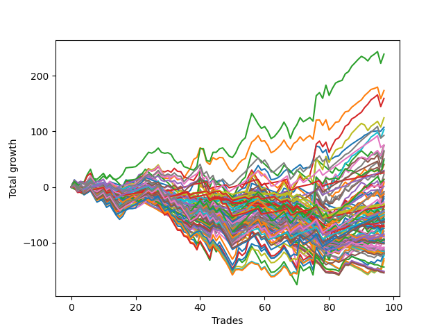

# Long Bulldog 005 
- Symbol: ESBIB
- Date Range: 03/18/2022 - 07/08/2022
- Trading Period: 7:20-12:30
- Number of Trades: 95



| Name | Win Percent | Profit | Avg Profit / Trade |     | Name | Win Percent | Profit | Avg Profit / Trade |
| ---- | ----------- | ------ | ------------------ | --- | ---- | ----------- | ------ | ------------------ |
| Sorted By <br> Profit | | | | | Sorted By <br> Win Percentage ||||
| Two | 63.16 | 121750.00 | 1281.58 |     | Seventy-Six | 89.47 | 11750.00 | 123.68 |
| One | 69.47 | 89875.00 | 946.05 |     | Seventy-Seven | 81.05 | 12625.00 | 132.89 |
| Three | 63.16 | 82875.00 | 872.37 |     | Seventy-Eight | 74.74 | 23250.00 | 244.74 |
| Eighty | 71.58 | 54500.00 | 573.68 |     | Seventy-Nine | 73.68 | 46125.00 | 485.53 |
| Zero | 66.32 | 50625.00 | 532.89 |     | Eighty | 71.58 | 54500.00 | 573.68 |
| Seventy-Nine | 73.68 | 46125.00 | 485.53 |     | One | 69.47 | 89875.00 | 946.05 |
| Five | 50.53 | 29125.00 | 306.58 |     | Zero | 66.32 | 50625.00 | 532.89 |
| Seventy-Eight | 74.74 | 23250.00 | 244.74 |     | Two | 63.16 | 121750.00 | 1281.58 |
| Seventy-Three | 44.21 | 15625.00 | 164.47 |     | Three | 63.16 | 82875.00 | 872.37 |
| Seventy-Seven | 81.05 | 12625.00 | 132.89 |     | Six | 51.58 | -3125.00 | -32.89 |
| Seven | 50.53 | 12250.00 | 128.95 |     | Five | 50.53 | 29125.00 | 306.58 |
| Seventy-Six | 89.47 | 11750.00 | 123.68 |     | Seven | 50.53 | 12250.00 | 128.95 |
| Four | 50.53 | 5625.00 | 59.21 |     | Four | 50.53 | 5625.00 | 59.21 |
| Six | 51.58 | -3125.00 | -32.89 |     | Seventy-Three | 44.21 | 15625.00 | 164.47 |

## NO STOPLOSS

### Test Zero
* Sell when price hits the middle line of the 20p bollinger
* No Stoploss
* Results:
```
Total Trades: 95
Percent Up: 66.32
Percent Down: 33.68
Total Points Moved Up: 101.25
Potential Profit: 50625.00
Total Points Ups: 296.50 Count Ups: 63
Total Points Downs: -195.25 Count Downs: 32
```

<details><summary>Trades</summary>

<code>In: 2022-03-21 10:21:00		Out: 2022-03-21 10:26:15		Total Position Time: 05:15		Total Move Up: 5.75		Total to Date: 5.75</code> <br />
<code>In: 2022-03-23 10:23:00		Out: 2022-03-23 10:38:15		Total Position Time: 15:15		Total Move Up: -3.75		Total to Date: 2.00</code> <br />
<code>In: 2022-03-23 10:28:00		Out: 2022-03-23 10:38:15		Total Position Time: 10:15		Total Move Up: 1.00		Total to Date: 3.00</code> <br />
<code>In: 2022-03-25 08:14:00		Out: 2022-03-25 08:36:40		Total Position Time: 22:40		Total Move Up: -6.00		Total to Date: -3.00</code> <br />
<code>In: 2022-03-25 08:29:00		Out: 2022-03-25 08:36:40		Total Position Time: 07:40		Total Move Up: 8.00		Total to Date: 5.00</code> <br />
<code>In: 2022-03-28 07:39:00		Out: 2022-03-28 07:43:00		Total Position Time: 04:00		Total Move Up: 3.50		Total to Date: 8.50</code> <br />
<code>In: 2022-03-28 08:27:00		Out: 2022-03-28 08:56:55		Total Position Time: 29:55		Total Move Up: -16.75		Total to Date: -8.25</code> <br />
<code>In: 2022-03-28 08:38:00		Out: 2022-03-28 09:01:50		Total Position Time: 23:50		Total Move Up: -4.50		Total to Date: -12.75</code> <br />
<code>In: 2022-03-28 08:51:00		Out: 2022-03-28 09:01:50		Total Position Time: 10:50		Total Move Up: 1.75		Total to Date: -11.00</code> <br />
<code>In: 2022-03-28 08:55:00		Out: 2022-03-28 09:01:50		Total Position Time: 06:50		Total Move Up: 2.50		Total to Date: -8.50</code> <br />
<code>In: 2022-03-30 08:02:00		Out: 2022-03-30 08:19:20		Total Position Time: 17:20		Total Move Up: -5.50		Total to Date: -14.00</code> <br />
<code>In: 2022-03-30 08:13:00		Out: 2022-03-30 08:19:20		Total Position Time: 06:20		Total Move Up: 4.75		Total to Date: -9.25</code> <br />
<code>In: 2022-03-30 12:00:00		Out: 2022-03-30 12:28:15		Total Position Time: 28:15		Total Move Up: -6.75		Total to Date: -16.00</code> <br />
<code>In: 2022-03-30 12:06:00		Out: 2022-03-30 12:28:15		Total Position Time: 22:15		Total Move Up: -5.25		Total to Date: -21.25</code> <br />
<code>In: 2022-03-30 12:13:00		Out: 2022-03-30 12:28:15		Total Position Time: 15:15		Total Move Up: -2.00		Total to Date: -23.25</code> <br />
<code>In: 2022-03-30 12:20:00		Out: 2022-03-30 12:28:15		Total Position Time: 08:15		Total Move Up: 0.75		Total to Date: -22.50</code> <br />
<code>In: 2022-03-30 12:26:00		Out: 2022-03-30 12:28:15		Total Position Time: 02:15		Total Move Up: 6.25		Total to Date: -16.25</code> <br />
<code>In: 2022-03-31 10:00:00		Out: 2022-03-31 10:04:00		Total Position Time: 04:00		Total Move Up: 2.50		Total to Date: -13.75</code> <br />
<code>In: 2022-03-31 10:08:00		Out: 2022-03-31 10:19:05		Total Position Time: 11:05		Total Move Up: -1.00		Total to Date: -14.75</code> <br />
<code>In: 2022-03-31 10:11:00		Out: 2022-03-31 10:19:05		Total Position Time: 08:05		Total Move Up: -0.50		Total to Date: -15.25</code> <br />
<code>In: 2022-04-01 07:24:00		Out: 2022-04-01 07:34:30		Total Position Time: 10:30		Total Move Up: 3.25		Total to Date: -12.00</code> <br />
<code>In: 2022-04-06 09:22:00		Out: 2022-04-06 09:31:15		Total Position Time: 09:15		Total Move Up: 3.75		Total to Date: -8.25</code> <br />
<code>In: 2022-04-07 07:23:00		Out: 2022-04-07 07:25:15		Total Position Time: 02:15		Total Move Up: 4.25		Total to Date: -4.00</code> <br />
<code>In: 2022-04-07 07:43:00		Out: 2022-04-07 07:55:15		Total Position Time: 12:15		Total Move Up: 2.75		Total to Date: -1.25</code> <br />
<code>In: 2022-04-11 07:30:00		Out: 2022-04-11 07:51:10		Total Position Time: 21:10		Total Move Up: -3.75		Total to Date: -5.00</code> <br />
<code>In: 2022-04-12 09:28:00		Out: 2022-04-12 09:41:50		Total Position Time: 13:50		Total Move Up: 1.75		Total to Date: -3.25</code> <br />
<code>In: 2022-04-12 11:35:00		Out: 2022-04-12 11:35:50		Total Position Time: 00:50		Total Move Up: 1.50		Total to Date: -1.75</code> <br />
<code>In: 2022-04-18 08:26:00		Out: 2022-04-18 08:55:05		Total Position Time: 29:05		Total Move Up: -6.50		Total to Date: -8.25</code> <br />
<code>In: 2022-04-18 08:29:00		Out: 2022-04-18 08:55:05		Total Position Time: 26:05		Total Move Up: -4.50		Total to Date: -12.75</code> <br />
<code>In: 2022-04-18 09:17:00		Out: 2022-04-18 09:32:05		Total Position Time: 15:05		Total Move Up: -0.25		Total to Date: -13.00</code> <br />
<code>In: 2022-04-20 11:38:00		Out: 2022-04-20 11:48:20		Total Position Time: 10:20		Total Move Up: 1.00		Total to Date: -12.00</code> <br />
<code>In: 2022-04-21 07:22:00		Out: 2022-04-21 07:29:05		Total Position Time: 07:05		Total Move Up: 2.50		Total to Date: -9.50</code> <br />
<code>In: 2022-04-21 07:42:00		Out: 2022-04-21 08:01:10		Total Position Time: 19:10		Total Move Up: -6.75		Total to Date: -16.25</code> <br />
<code>In: 2022-04-21 07:50:00		Out: 2022-04-21 08:01:10		Total Position Time: 11:10		Total Move Up: 2.00		Total to Date: -14.25</code> <br />
<code>In: 2022-05-02 09:56:00		Out: 2022-05-02 10:08:15		Total Position Time: 12:15		Total Move Up: -2.25		Total to Date: -16.50</code> <br />
<code>In: 2022-05-02 10:01:00		Out: 2022-05-02 10:08:15		Total Position Time: 07:15		Total Move Up: 6.00		Total to Date: -10.50</code> <br />
<code>In: 2022-05-02 10:02:00		Out: 2022-05-02 10:08:15		Total Position Time: 06:15		Total Move Up: 5.00		Total to Date: -5.50</code> <br />
<code>In: 2022-05-02 10:05:00		Out: 2022-05-02 10:08:15		Total Position Time: 03:15		Total Move Up: 12.25		Total to Date: 6.75</code> <br />
<code>In: 2022-05-02 10:49:00		Out: 2022-05-02 10:59:45		Total Position Time: 10:45		Total Move Up: 2.00		Total to Date: 8.75</code> <br />
<code>In: 2022-05-04 11:36:00		Out: 2022-05-04 11:36:40		Total Position Time: 00:40		Total Move Up: 8.25		Total to Date: 17.00</code> <br />
<code>In: 2022-05-09 07:26:00		Out: 2022-05-09 07:42:30		Total Position Time: 16:30		Total Move Up: -5.75		Total to Date: 11.25</code> <br />
<code>In: 2022-05-11 09:32:00		Out: 2022-05-11 09:49:25		Total Position Time: 17:25		Total Move Up: -0.50		Total to Date: 10.75</code> <br />
<code>In: 2022-05-11 09:59:00		Out: 2022-05-11 10:15:25		Total Position Time: 16:25		Total Move Up: -3.75		Total to Date: 7.00</code> <br />
<code>In: 2022-05-11 11:00:00		Out: 2022-05-11 11:00:50		Total Position Time: 00:50		Total Move Up: 8.25		Total to Date: 15.25</code> <br />
<code>In: 2022-05-12 10:40:00		Out: 2022-05-12 10:57:35		Total Position Time: 17:35		Total Move Up: -6.25		Total to Date: 9.00</code> <br />
<code>In: 2022-05-12 11:34:00		Out: 2022-05-12 11:45:20		Total Position Time: 11:20		Total Move Up: 3.25		Total to Date: 12.25</code> <br />
<code>In: 2022-05-12 11:35:00		Out: 2022-05-12 11:45:20		Total Position Time: 10:20		Total Move Up: -1.25		Total to Date: 11.00</code> <br />
<code>In: 2022-05-17 07:31:00		Out: 2022-05-17 07:55:10		Total Position Time: 24:10		Total Move Up: -11.25		Total to Date: -0.25</code> <br />
<code>In: 2022-05-17 07:33:00		Out: 2022-05-17 07:55:10		Total Position Time: 22:10		Total Move Up: -11.50		Total to Date: -11.75</code> <br />
<code>In: 2022-05-17 07:38:00		Out: 2022-05-17 07:55:10		Total Position Time: 17:10		Total Move Up: -6.75		Total to Date: -18.50</code> <br />
<code>In: 2022-05-17 07:47:00		Out: 2022-05-17 07:55:10		Total Position Time: 08:10		Total Move Up: 4.00		Total to Date: -14.50</code> <br />
<code>In: 2022-05-17 11:24:00		Out: 2022-05-17 11:31:30		Total Position Time: 07:30		Total Move Up: 7.75		Total to Date: -6.75</code> <br />
<code>In: 2022-05-18 08:32:00		Out: 2022-05-18 08:36:55		Total Position Time: 04:55		Total Move Up: 4.00		Total to Date: -2.75</code> <br />
<code>In: 2022-05-25 09:29:00		Out: 2022-05-25 09:41:25		Total Position Time: 12:25		Total Move Up: 1.50		Total to Date: -1.25</code> <br />
<code>In: 2022-05-25 11:09:00		Out: 2022-05-25 11:10:20		Total Position Time: 01:20		Total Move Up: 13.00		Total to Date: 11.75</code> <br />
<code>In: 2022-05-25 11:10:00		Out: 2022-05-25 11:10:20		Total Position Time: 00:20		Total Move Up: 11.00		Total to Date: 22.75</code> <br />
<code>In: 2022-06-03 07:40:00		Out: 2022-06-03 07:46:50		Total Position Time: 06:50		Total Move Up: 6.75		Total to Date: 29.50</code> <br />
<code>In: 2022-06-03 07:42:00		Out: 2022-06-03 07:46:50		Total Position Time: 04:50		Total Move Up: 9.25		Total to Date: 38.75</code> <br />
<code>In: 2022-06-06 08:14:00		Out: 2022-06-06 08:31:35		Total Position Time: 17:35		Total Move Up: -8.50		Total to Date: 30.25</code> <br />
<code>In: 2022-06-06 08:19:00		Out: 2022-06-06 08:31:35		Total Position Time: 12:35		Total Move Up: 2.75		Total to Date: 33.00</code> <br />
<code>In: 2022-06-06 09:06:00		Out: 2022-06-06 09:26:40		Total Position Time: 20:40		Total Move Up: -6.50		Total to Date: 26.50</code> <br />
<code>In: 2022-06-08 09:29:00		Out: 2022-06-08 09:54:10		Total Position Time: 25:10		Total Move Up: -13.25		Total to Date: 13.25</code> <br />
<code>In: 2022-06-08 09:41:00		Out: 2022-06-08 09:54:10		Total Position Time: 13:10		Total Move Up: 1.00		Total to Date: 14.25</code> <br />
<code>In: 2022-06-08 10:35:00		Out: 2022-06-08 10:42:15		Total Position Time: 07:15		Total Move Up: 2.25		Total to Date: 16.50</code> <br />
<code>In: 2022-06-09 08:06:00		Out: 2022-06-09 08:11:10		Total Position Time: 05:10		Total Move Up: 4.25		Total to Date: 20.75</code> <br />
<code>In: 2022-06-09 08:09:00		Out: 2022-06-09 08:11:10		Total Position Time: 02:10		Total Move Up: 7.25		Total to Date: 28.00</code> <br />
<code>In: 2022-06-09 11:26:00		Out: 2022-06-09 11:28:10		Total Position Time: 02:10		Total Move Up: 4.25		Total to Date: 32.25</code> <br />
<code>In: 2022-06-09 12:03:00		Out: 2022-06-09 12:19:25		Total Position Time: 16:25		Total Move Up: -6.25		Total to Date: 26.00</code> <br />
<code>In: 2022-06-13 12:15:00		Out: 2022-06-13 12:16:50		Total Position Time: 01:50		Total Move Up: 6.00		Total to Date: 32.00</code> <br />
<code>In: 2022-06-13 12:17:00		Out: 2022-06-13 12:17:10		Total Position Time: 00:10		Total Move Up: 4.00		Total to Date: 36.00</code> <br />
<code>In: 2022-06-14 12:16:00		Out: 2022-06-14 12:25:45		Total Position Time: 09:45		Total Move Up: 4.50		Total to Date: 40.50</code> <br />
<code>In: 2022-06-15 07:57:00		Out: 2022-06-15 08:26:55		Total Position Time: 29:55		Total Move Up: -7.25		Total to Date: 33.25</code> <br />
<code>In: 2022-06-15 08:15:00		Out: 2022-06-15 08:32:00		Total Position Time: 17:00		Total Move Up: 1.75		Total to Date: 35.00</code> <br />
<code>In: 2022-06-15 08:16:00		Out: 2022-06-15 08:32:00		Total Position Time: 16:00		Total Move Up: 0.00		Total to Date: 35.00</code> <br />
<code>In: 2022-06-15 11:08:00		Out: 2022-06-15 11:16:45		Total Position Time: 08:45		Total Move Up: 13.50		Total to Date: 48.50</code> <br />
<code>In: 2022-06-15 11:34:00		Out: 2022-06-15 11:38:05		Total Position Time: 04:05		Total Move Up: 25.25		Total to Date: 73.75</code> <br />
<code>In: 2022-06-16 07:46:00		Out: 2022-06-16 08:01:50		Total Position Time: 15:50		Total Move Up: -1.75		Total to Date: 72.00</code> <br />
<code>In: 2022-06-16 11:02:00		Out: 2022-06-16 11:31:55		Total Position Time: 29:55		Total Move Up: -10.25		Total to Date: 61.75</code> <br />
<code>In: 2022-06-16 11:51:00		Out: 2022-06-16 12:00:35		Total Position Time: 09:35		Total Move Up: 5.50		Total to Date: 67.25</code> <br />
<code>In: 2022-06-17 07:24:00		Out: 2022-06-17 07:53:55		Total Position Time: 29:55		Total Move Up: -18.50		Total to Date: 48.75</code> <br />
<code>In: 2022-06-17 07:37:00		Out: 2022-06-17 07:55:05		Total Position Time: 18:05		Total Move Up: 2.75		Total to Date: 51.50</code> <br />
<code>In: 2022-06-23 09:06:00		Out: 2022-06-23 09:17:10		Total Position Time: 11:10		Total Move Up: 3.50		Total to Date: 55.00</code> <br />
<code>In: 2022-06-23 09:54:00		Out: 2022-06-23 09:54:10		Total Position Time: 00:10		Total Move Up: 1.25		Total to Date: 56.25</code> <br />
<code>In: 2022-06-27 12:07:00		Out: 2022-06-27 12:10:20		Total Position Time: 03:20		Total Move Up: 7.00		Total to Date: 63.25</code> <br />
<code>In: 2022-06-29 08:25:00		Out: 2022-06-29 08:29:10		Total Position Time: 04:10		Total Move Up: 5.00		Total to Date: 68.25</code> <br />
<code>In: 2022-06-29 09:15:00		Out: 2022-06-29 09:21:05		Total Position Time: 06:05		Total Move Up: 4.50		Total to Date: 72.75</code> <br />
<code>In: 2022-06-29 09:29:00		Out: 2022-06-29 09:36:40		Total Position Time: 07:40		Total Move Up: 4.50		Total to Date: 77.25</code> <br />
<code>In: 2022-07-05 08:02:00		Out: 2022-07-05 08:08:20		Total Position Time: 06:20		Total Move Up: 3.75		Total to Date: 81.00</code> <br />
<code>In: 2022-07-05 08:04:00		Out: 2022-07-05 08:08:20		Total Position Time: 04:20		Total Move Up: 4.00		Total to Date: 85.00</code> <br />
<code>In: 2022-07-05 08:07:00		Out: 2022-07-05 08:08:20		Total Position Time: 01:20		Total Move Up: 3.25		Total to Date: 88.25</code> <br />
<code>In: 2022-07-06 08:05:00		Out: 2022-07-06 08:15:05		Total Position Time: 10:05		Total Move Up: 5.00		Total to Date: 93.25</code> <br />
<code>In: 2022-07-06 08:06:00		Out: 2022-07-06 08:15:05		Total Position Time: 09:05		Total Move Up: 2.50		Total to Date: 95.75</code> <br />
<code>In: 2022-07-06 08:34:00		Out: 2022-07-06 08:46:30		Total Position Time: 12:30		Total Move Up: 4.25		Total to Date: 100.00</code> <br />
<code>In: 2022-07-06 08:35:00		Out: 2022-07-06 08:46:30		Total Position Time: 11:30		Total Move Up: 0.25		Total to Date: 100.25</code> <br />
<code>In: 2022-07-06 08:46:00		Out: 2022-07-06 08:46:30		Total Position Time: 00:30		Total Move Up: 1.00		Total to Date: 101.25</code> <br />


</details>

### Test One
* Sell when the price hits the upper line of the 20p 1std bollinger
* No Stoploss
* Results:
```
Total Trades: 95
Percent Up: 69.47
Percent Down: 30.53
Total Points Moved Up: 179.75
Potential Profit: 89875.00
Total Points Ups: 400.25 Count Ups: 66
Total Points Downs: -220.50 Count Downs: 29
```

<details><summary>Trades</summary>

<code>In: 2022-03-21 10:21:00		Out: 2022-03-21 10:31:50		Total Position Time: 10:50		Total Move Up: 7.50		Total to Date: 7.50</code> <br />
<code>In: 2022-03-23 10:23:00		Out: 2022-03-23 10:51:50		Total Position Time: 28:50		Total Move Up: -4.50		Total to Date: 3.00</code> <br />
<code>In: 2022-03-23 10:28:00		Out: 2022-03-23 10:51:50		Total Position Time: 23:50		Total Move Up: 0.25		Total to Date: 3.25</code> <br />
<code>In: 2022-03-25 08:14:00		Out: 2022-03-25 08:41:05		Total Position Time: 27:05		Total Move Up: -4.75		Total to Date: -1.50</code> <br />
<code>In: 2022-03-25 08:29:00		Out: 2022-03-25 08:41:05		Total Position Time: 12:05		Total Move Up: 9.25		Total to Date: 7.75</code> <br />
<code>In: 2022-03-28 07:39:00		Out: 2022-03-28 07:45:05		Total Position Time: 06:05		Total Move Up: 5.25		Total to Date: 13.00</code> <br />
<code>In: 2022-03-28 08:27:00		Out: 2022-03-28 08:56:55		Total Position Time: 29:55		Total Move Up: -16.75		Total to Date: -3.75</code> <br />
<code>In: 2022-03-28 08:38:00		Out: 2022-03-28 09:04:55		Total Position Time: 26:55		Total Move Up: -2.75		Total to Date: -6.50</code> <br />
<code>In: 2022-03-28 08:51:00		Out: 2022-03-28 09:04:55		Total Position Time: 13:55		Total Move Up: 3.50		Total to Date: -3.00</code> <br />
<code>In: 2022-03-28 08:55:00		Out: 2022-03-28 09:04:55		Total Position Time: 09:55		Total Move Up: 4.25		Total to Date: 1.25</code> <br />
<code>In: 2022-03-30 08:02:00		Out: 2022-03-30 08:31:55		Total Position Time: 29:55		Total Move Up: -9.00		Total to Date: -7.75</code> <br />
<code>In: 2022-03-30 08:13:00		Out: 2022-03-30 08:34:45		Total Position Time: 21:45		Total Move Up: 4.75		Total to Date: -3.00</code> <br />
<code>In: 2022-03-30 12:00:00		Out: 2022-03-30 12:29:55		Total Position Time: 29:55		Total Move Up: -7.75		Total to Date: -10.75</code> <br />
<code>In: 2022-03-30 12:06:00		Out: 2022-03-30 12:32:20		Total Position Time: 26:20		Total Move Up: -3.00		Total to Date: -13.75</code> <br />
<code>In: 2022-03-30 12:13:00		Out: 2022-03-30 12:32:20		Total Position Time: 19:20		Total Move Up: 0.25		Total to Date: -13.50</code> <br />
<code>In: 2022-03-30 12:20:00		Out: 2022-03-30 12:32:20		Total Position Time: 12:20		Total Move Up: 3.00		Total to Date: -10.50</code> <br />
<code>In: 2022-03-30 12:26:00		Out: 2022-03-30 12:32:20		Total Position Time: 06:20		Total Move Up: 8.50		Total to Date: -2.00</code> <br />
<code>In: 2022-03-31 10:00:00		Out: 2022-03-31 10:19:40		Total Position Time: 19:40		Total Move Up: 1.25		Total to Date: -0.75</code> <br />
<code>In: 2022-03-31 10:08:00		Out: 2022-03-31 10:19:40		Total Position Time: 11:40		Total Move Up: 1.00		Total to Date: 0.25</code> <br />
<code>In: 2022-03-31 10:11:00		Out: 2022-03-31 10:19:40		Total Position Time: 08:40		Total Move Up: 1.50		Total to Date: 1.75</code> <br />
<code>In: 2022-04-01 07:24:00		Out: 2022-04-01 07:45:55		Total Position Time: 21:55		Total Move Up: 3.00		Total to Date: 4.75</code> <br />
<code>In: 2022-04-06 09:22:00		Out: 2022-04-06 09:34:05		Total Position Time: 12:05		Total Move Up: 3.75		Total to Date: 8.50</code> <br />
<code>In: 2022-04-07 07:23:00		Out: 2022-04-07 07:31:35		Total Position Time: 08:35		Total Move Up: 5.75		Total to Date: 14.25</code> <br />
<code>In: 2022-04-07 07:43:00		Out: 2022-04-07 08:00:05		Total Position Time: 17:05		Total Move Up: 7.75		Total to Date: 22.00</code> <br />
<code>In: 2022-04-11 07:30:00		Out: 2022-04-11 07:52:05		Total Position Time: 22:05		Total Move Up: -2.25		Total to Date: 19.75</code> <br />
<code>In: 2022-04-12 09:28:00		Out: 2022-04-12 09:50:15		Total Position Time: 22:15		Total Move Up: 3.25		Total to Date: 23.00</code> <br />
<code>In: 2022-04-12 11:35:00		Out: 2022-04-12 11:37:20		Total Position Time: 02:20		Total Move Up: 3.50		Total to Date: 26.50</code> <br />
<code>In: 2022-04-18 08:26:00		Out: 2022-04-18 08:55:55		Total Position Time: 29:55		Total Move Up: -7.75		Total to Date: 18.75</code> <br />
<code>In: 2022-04-18 08:29:00		Out: 2022-04-18 08:57:20		Total Position Time: 28:20		Total Move Up: -3.00		Total to Date: 15.75</code> <br />
<code>In: 2022-04-18 09:17:00		Out: 2022-04-18 09:35:20		Total Position Time: 18:20		Total Move Up: 0.25		Total to Date: 16.00</code> <br />
<code>In: 2022-04-20 11:38:00		Out: 2022-04-20 12:04:20		Total Position Time: 26:20		Total Move Up: -1.00		Total to Date: 15.00</code> <br />
<code>In: 2022-04-21 07:22:00		Out: 2022-04-21 07:29:20		Total Position Time: 07:20		Total Move Up: 5.00		Total to Date: 20.00</code> <br />
<code>In: 2022-04-21 07:42:00		Out: 2022-04-21 08:11:25		Total Position Time: 29:25		Total Move Up: -7.00		Total to Date: 13.00</code> <br />
<code>In: 2022-04-21 07:50:00		Out: 2022-04-21 08:11:25		Total Position Time: 21:25		Total Move Up: 1.75		Total to Date: 14.75</code> <br />
<code>In: 2022-05-02 09:56:00		Out: 2022-05-02 10:10:55		Total Position Time: 14:55		Total Move Up: 1.25		Total to Date: 16.00</code> <br />
<code>In: 2022-05-02 10:01:00		Out: 2022-05-02 10:10:55		Total Position Time: 09:55		Total Move Up: 9.50		Total to Date: 25.50</code> <br />
<code>In: 2022-05-02 10:02:00		Out: 2022-05-02 10:10:55		Total Position Time: 08:55		Total Move Up: 8.50		Total to Date: 34.00</code> <br />
<code>In: 2022-05-02 10:05:00		Out: 2022-05-02 10:10:55		Total Position Time: 05:55		Total Move Up: 15.75		Total to Date: 49.75</code> <br />
<code>In: 2022-05-02 10:49:00		Out: 2022-05-02 11:02:25		Total Position Time: 13:25		Total Move Up: 3.75		Total to Date: 53.50</code> <br />
<code>In: 2022-05-04 11:36:00		Out: 2022-05-04 11:41:40		Total Position Time: 05:40		Total Move Up: 17.25		Total to Date: 70.75</code> <br />
<code>In: 2022-05-09 07:26:00		Out: 2022-05-09 07:46:05		Total Position Time: 20:05		Total Move Up: -4.00		Total to Date: 66.75</code> <br />
<code>In: 2022-05-11 09:32:00		Out: 2022-05-11 10:01:55		Total Position Time: 29:55		Total Move Up: -21.50		Total to Date: 45.25</code> <br />
<code>In: 2022-05-11 09:59:00		Out: 2022-05-11 10:24:35		Total Position Time: 25:35		Total Move Up: -4.75		Total to Date: 40.50</code> <br />
<code>In: 2022-05-11 11:00:00		Out: 2022-05-11 11:01:20		Total Position Time: 01:20		Total Move Up: 12.50		Total to Date: 53.00</code> <br />
<code>In: 2022-05-12 10:40:00		Out: 2022-05-12 11:03:10		Total Position Time: 23:10		Total Move Up: -3.75		Total to Date: 49.25</code> <br />
<code>In: 2022-05-12 11:34:00		Out: 2022-05-12 11:52:55		Total Position Time: 18:55		Total Move Up: 4.00		Total to Date: 53.25</code> <br />
<code>In: 2022-05-12 11:35:00		Out: 2022-05-12 11:52:55		Total Position Time: 17:55		Total Move Up: -0.50		Total to Date: 52.75</code> <br />
<code>In: 2022-05-17 07:31:00		Out: 2022-05-17 07:59:05		Total Position Time: 28:05		Total Move Up: -9.75		Total to Date: 43.00</code> <br />
<code>In: 2022-05-17 07:33:00		Out: 2022-05-17 07:59:05		Total Position Time: 26:05		Total Move Up: -10.00		Total to Date: 33.00</code> <br />
<code>In: 2022-05-17 07:38:00		Out: 2022-05-17 07:59:05		Total Position Time: 21:05		Total Move Up: -5.25		Total to Date: 27.75</code> <br />
<code>In: 2022-05-17 07:47:00		Out: 2022-05-17 07:59:05		Total Position Time: 12:05		Total Move Up: 5.50		Total to Date: 33.25</code> <br />
<code>In: 2022-05-17 11:24:00		Out: 2022-05-17 11:37:35		Total Position Time: 13:35		Total Move Up: 9.25		Total to Date: 42.50</code> <br />
<code>In: 2022-05-18 08:32:00		Out: 2022-05-18 08:41:15		Total Position Time: 09:15		Total Move Up: 6.00		Total to Date: 48.50</code> <br />
<code>In: 2022-05-25 09:29:00		Out: 2022-05-25 09:44:25		Total Position Time: 15:25		Total Move Up: 3.00		Total to Date: 51.50</code> <br />
<code>In: 2022-05-25 11:09:00		Out: 2022-05-25 11:10:25		Total Position Time: 01:25		Total Move Up: 15.75		Total to Date: 67.25</code> <br />
<code>In: 2022-05-25 11:10:00		Out: 2022-05-25 11:10:25		Total Position Time: 00:25		Total Move Up: 13.75		Total to Date: 81.00</code> <br />
<code>In: 2022-06-03 07:40:00		Out: 2022-06-03 07:58:10		Total Position Time: 18:10		Total Move Up: 4.50		Total to Date: 85.50</code> <br />
<code>In: 2022-06-03 07:42:00		Out: 2022-06-03 07:58:10		Total Position Time: 16:10		Total Move Up: 7.00		Total to Date: 92.50</code> <br />
<code>In: 2022-06-06 08:14:00		Out: 2022-06-06 08:39:15		Total Position Time: 25:15		Total Move Up: -10.25		Total to Date: 82.25</code> <br />
<code>In: 2022-06-06 08:19:00		Out: 2022-06-06 08:39:15		Total Position Time: 20:15		Total Move Up: 1.00		Total to Date: 83.25</code> <br />
<code>In: 2022-06-06 09:06:00		Out: 2022-06-06 09:35:55		Total Position Time: 29:55		Total Move Up: -8.50		Total to Date: 74.75</code> <br />
<code>In: 2022-06-08 09:29:00		Out: 2022-06-08 09:58:55		Total Position Time: 29:55		Total Move Up: -13.00		Total to Date: 61.75</code> <br />
<code>In: 2022-06-08 09:41:00		Out: 2022-06-08 09:59:05		Total Position Time: 18:05		Total Move Up: 3.00		Total to Date: 64.75</code> <br />
<code>In: 2022-06-08 10:35:00		Out: 2022-06-08 10:47:05		Total Position Time: 12:05		Total Move Up: 5.25		Total to Date: 70.00</code> <br />
<code>In: 2022-06-09 08:06:00		Out: 2022-06-09 08:21:10		Total Position Time: 15:10		Total Move Up: 5.75		Total to Date: 75.75</code> <br />
<code>In: 2022-06-09 08:09:00		Out: 2022-06-09 08:21:10		Total Position Time: 12:10		Total Move Up: 8.75		Total to Date: 84.50</code> <br />
<code>In: 2022-06-09 11:26:00		Out: 2022-06-09 11:55:55		Total Position Time: 29:55		Total Move Up: -10.25		Total to Date: 74.25</code> <br />
<code>In: 2022-06-09 12:03:00		Out: 2022-06-09 12:24:30		Total Position Time: 21:30		Total Move Up: -7.00		Total to Date: 67.25</code> <br />
<code>In: 2022-06-13 12:15:00		Out: 2022-06-13 12:17:10		Total Position Time: 02:10		Total Move Up: 11.00		Total to Date: 78.25</code> <br />
<code>In: 2022-06-13 12:17:00		Out: 2022-06-13 12:17:10		Total Position Time: 00:10		Total Move Up: 4.00		Total to Date: 82.25</code> <br />
<code>In: 2022-06-14 12:16:00		Out: 2022-06-14 12:27:20		Total Position Time: 11:20		Total Move Up: 8.25		Total to Date: 90.50</code> <br />
<code>In: 2022-06-15 07:57:00		Out: 2022-06-15 08:26:55		Total Position Time: 29:55		Total Move Up: -7.25		Total to Date: 83.25</code> <br />
<code>In: 2022-06-15 08:15:00		Out: 2022-06-15 08:38:55		Total Position Time: 23:55		Total Move Up: 5.50		Total to Date: 88.75</code> <br />
<code>In: 2022-06-15 08:16:00		Out: 2022-06-15 08:38:55		Total Position Time: 22:55		Total Move Up: 3.75		Total to Date: 92.50</code> <br />
<code>In: 2022-06-15 11:08:00		Out: 2022-06-15 11:37:55		Total Position Time: 29:55		Total Move Up: -6.50		Total to Date: 86.00</code> <br />
<code>In: 2022-06-15 11:34:00		Out: 2022-06-15 11:38:10		Total Position Time: 04:10		Total Move Up: 34.50		Total to Date: 120.50</code> <br />
<code>In: 2022-06-16 07:46:00		Out: 2022-06-16 08:11:30		Total Position Time: 25:30		Total Move Up: 0.25		Total to Date: 120.75</code> <br />
<code>In: 2022-06-16 11:02:00		Out: 2022-06-16 11:31:55		Total Position Time: 29:55		Total Move Up: -10.25		Total to Date: 110.50</code> <br />
<code>In: 2022-06-16 11:51:00		Out: 2022-06-16 12:01:45		Total Position Time: 10:45		Total Move Up: 10.50		Total to Date: 121.00</code> <br />
<code>In: 2022-06-17 07:24:00		Out: 2022-06-17 07:53:55		Total Position Time: 29:55		Total Move Up: -18.50		Total to Date: 102.50</code> <br />
<code>In: 2022-06-17 07:37:00		Out: 2022-06-17 07:56:20		Total Position Time: 19:20		Total Move Up: 6.50		Total to Date: 109.00</code> <br />
<code>In: 2022-06-23 09:06:00		Out: 2022-06-23 09:18:25		Total Position Time: 12:25		Total Move Up: 7.50		Total to Date: 116.50</code> <br />
<code>In: 2022-06-23 09:54:00		Out: 2022-06-23 09:56:15		Total Position Time: 02:15		Total Move Up: 1.00		Total to Date: 117.50</code> <br />
<code>In: 2022-06-27 12:07:00		Out: 2022-06-27 12:12:10		Total Position Time: 05:10		Total Move Up: 10.00		Total to Date: 127.50</code> <br />
<code>In: 2022-06-29 08:25:00		Out: 2022-06-29 08:33:05		Total Position Time: 08:05		Total Move Up: 7.75		Total to Date: 135.25</code> <br />
<code>In: 2022-06-29 09:15:00		Out: 2022-06-29 09:37:20		Total Position Time: 22:20		Total Move Up: 1.25		Total to Date: 136.50</code> <br />
<code>In: 2022-06-29 09:29:00		Out: 2022-06-29 09:37:20		Total Position Time: 08:20		Total Move Up: 7.00		Total to Date: 143.50</code> <br />
<code>In: 2022-07-05 08:02:00		Out: 2022-07-05 08:16:45		Total Position Time: 14:45		Total Move Up: 4.50		Total to Date: 148.00</code> <br />
<code>In: 2022-07-05 08:04:00		Out: 2022-07-05 08:16:45		Total Position Time: 12:45		Total Move Up: 4.75		Total to Date: 152.75</code> <br />
<code>In: 2022-07-05 08:07:00		Out: 2022-07-05 08:16:45		Total Position Time: 09:45		Total Move Up: 4.00		Total to Date: 156.75</code> <br />
<code>In: 2022-07-06 08:05:00		Out: 2022-07-06 08:19:05		Total Position Time: 14:05		Total Move Up: 7.75		Total to Date: 164.50</code> <br />
<code>In: 2022-07-06 08:06:00		Out: 2022-07-06 08:19:05		Total Position Time: 13:05		Total Move Up: 5.25		Total to Date: 169.75</code> <br />
<code>In: 2022-07-06 08:34:00		Out: 2022-07-06 08:48:20		Total Position Time: 14:20		Total Move Up: 5.75		Total to Date: 175.50</code> <br />
<code>In: 2022-07-06 08:35:00		Out: 2022-07-06 08:48:20		Total Position Time: 13:20		Total Move Up: 1.75		Total to Date: 177.25</code> <br />
<code>In: 2022-07-06 08:46:00		Out: 2022-07-06 08:48:20		Total Position Time: 02:20		Total Move Up: 2.50		Total to Date: 179.75</code> <br />


</details>

### Test Two
* Sell when the price hits the upper line of the 20p 2std bollinger
* No Stoploss
* Results:
```
Total Trades: 95
Percent Up: 63.16
Percent Down: 36.84
Total Points Moved Up: 243.50
Potential Profit: 121750.00
Total Points Ups: 499.25 Count Ups: 60
Total Points Downs: -255.75 Count Downs: 35
```

<details><summary>Trades</summary>

<code>In: 2022-03-21 10:21:00		Out: 2022-03-21 10:34:15		Total Position Time: 13:15		Total Move Up: 11.75		Total to Date: 11.75</code> <br />
<code>In: 2022-03-23 10:23:00		Out: 2022-03-23 10:52:55		Total Position Time: 29:55		Total Move Up: -5.00		Total to Date: 6.75</code> <br />
<code>In: 2022-03-23 10:28:00		Out: 2022-03-23 10:54:30		Total Position Time: 26:30		Total Move Up: 2.75		Total to Date: 9.50</code> <br />
<code>In: 2022-03-25 08:14:00		Out: 2022-03-25 08:41:55		Total Position Time: 27:55		Total Move Up: -0.50		Total to Date: 9.00</code> <br />
<code>In: 2022-03-25 08:29:00		Out: 2022-03-25 08:41:55		Total Position Time: 12:55		Total Move Up: 13.50		Total to Date: 22.50</code> <br />
<code>In: 2022-03-28 07:39:00		Out: 2022-03-28 07:48:10		Total Position Time: 09:10		Total Move Up: 9.50		Total to Date: 32.00</code> <br />
<code>In: 2022-03-28 08:27:00		Out: 2022-03-28 08:56:55		Total Position Time: 29:55		Total Move Up: -16.75		Total to Date: 15.25</code> <br />
<code>In: 2022-03-28 08:38:00		Out: 2022-03-28 09:07:10		Total Position Time: 29:10		Total Move Up: -1.25		Total to Date: 14.00</code> <br />
<code>In: 2022-03-28 08:51:00		Out: 2022-03-28 09:07:10		Total Position Time: 16:10		Total Move Up: 5.00		Total to Date: 19.00</code> <br />
<code>In: 2022-03-28 08:55:00		Out: 2022-03-28 09:07:10		Total Position Time: 12:10		Total Move Up: 5.75		Total to Date: 24.75</code> <br />
<code>In: 2022-03-30 08:02:00		Out: 2022-03-30 08:31:55		Total Position Time: 29:55		Total Move Up: -9.00		Total to Date: 15.75</code> <br />
<code>In: 2022-03-30 08:13:00		Out: 2022-03-30 08:35:15		Total Position Time: 22:15		Total Move Up: 6.50		Total to Date: 22.25</code> <br />
<code>In: 2022-03-30 12:00:00		Out: 2022-03-30 12:29:55		Total Position Time: 29:55		Total Move Up: -7.75		Total to Date: 14.50</code> <br />
<code>In: 2022-03-30 12:06:00		Out: 2022-03-30 12:35:55		Total Position Time: 29:55		Total Move Up: -0.75		Total to Date: 13.75</code> <br />
<code>In: 2022-03-30 12:13:00		Out: 2022-03-30 12:36:25		Total Position Time: 23:25		Total Move Up: 3.25		Total to Date: 17.00</code> <br />
<code>In: 2022-03-30 12:20:00		Out: 2022-03-30 12:36:25		Total Position Time: 16:25		Total Move Up: 6.00		Total to Date: 23.00</code> <br />
<code>In: 2022-03-30 12:26:00		Out: 2022-03-30 12:36:25		Total Position Time: 10:25		Total Move Up: 11.50		Total to Date: 34.50</code> <br />
<code>In: 2022-03-31 10:00:00		Out: 2022-03-31 10:28:00		Total Position Time: 28:00		Total Move Up: 0.75		Total to Date: 35.25</code> <br />
<code>In: 2022-03-31 10:08:00		Out: 2022-03-31 10:28:00		Total Position Time: 20:00		Total Move Up: 0.50		Total to Date: 35.75</code> <br />
<code>In: 2022-03-31 10:11:00		Out: 2022-03-31 10:28:00		Total Position Time: 17:00		Total Move Up: 1.00		Total to Date: 36.75</code> <br />
<code>In: 2022-04-01 07:24:00		Out: 2022-04-01 07:46:55		Total Position Time: 22:55		Total Move Up: 5.00		Total to Date: 41.75</code> <br />
<code>In: 2022-04-06 09:22:00		Out: 2022-04-06 09:34:25		Total Position Time: 12:25		Total Move Up: 5.00		Total to Date: 46.75</code> <br />
<code>In: 2022-04-07 07:23:00		Out: 2022-04-07 07:36:15		Total Position Time: 13:15		Total Move Up: 8.00		Total to Date: 54.75</code> <br />
<code>In: 2022-04-07 07:43:00		Out: 2022-04-07 08:00:05		Total Position Time: 17:05		Total Move Up: 7.75		Total to Date: 62.50</code> <br />
<code>In: 2022-04-11 07:30:00		Out: 2022-04-11 07:56:35		Total Position Time: 26:35		Total Move Up: -1.50		Total to Date: 61.00</code> <br />
<code>In: 2022-04-12 09:28:00		Out: 2022-04-12 09:50:15		Total Position Time: 22:15		Total Move Up: 3.25		Total to Date: 64.25</code> <br />
<code>In: 2022-04-12 11:35:00		Out: 2022-04-12 11:47:05		Total Position Time: 12:05		Total Move Up: 6.00		Total to Date: 70.25</code> <br />
<code>In: 2022-04-18 08:26:00		Out: 2022-04-18 08:55:55		Total Position Time: 29:55		Total Move Up: -7.75		Total to Date: 62.50</code> <br />
<code>In: 2022-04-18 08:29:00		Out: 2022-04-18 08:58:55		Total Position Time: 29:55		Total Move Up: -1.75		Total to Date: 60.75</code> <br />
<code>In: 2022-04-18 09:17:00		Out: 2022-04-18 09:42:50		Total Position Time: 25:50		Total Move Up: 1.00		Total to Date: 61.75</code> <br />
<code>In: 2022-04-20 11:38:00		Out: 2022-04-20 12:07:55		Total Position Time: 29:55		Total Move Up: -3.00		Total to Date: 58.75</code> <br />
<code>In: 2022-04-21 07:22:00		Out: 2022-04-21 07:51:55		Total Position Time: 29:55		Total Move Up: -10.25		Total to Date: 48.50</code> <br />
<code>In: 2022-04-21 07:42:00		Out: 2022-04-21 08:11:45		Total Position Time: 29:45		Total Move Up: -5.50		Total to Date: 43.00</code> <br />
<code>In: 2022-04-21 07:50:00		Out: 2022-04-21 08:11:45		Total Position Time: 21:45		Total Move Up: 3.25		Total to Date: 46.25</code> <br />
<code>In: 2022-05-02 09:56:00		Out: 2022-05-02 10:25:55		Total Position Time: 29:55		Total Move Up: -9.50		Total to Date: 36.75</code> <br />
<code>In: 2022-05-02 10:01:00		Out: 2022-05-02 10:30:55		Total Position Time: 29:55		Total Move Up: -2.00		Total to Date: 34.75</code> <br />
<code>In: 2022-05-02 10:02:00		Out: 2022-05-02 10:31:55		Total Position Time: 29:55		Total Move Up: -2.50		Total to Date: 32.25</code> <br />
<code>In: 2022-05-02 10:05:00		Out: 2022-05-02 10:34:55		Total Position Time: 29:55		Total Move Up: -1.75		Total to Date: 30.50</code> <br />
<code>In: 2022-05-02 10:49:00		Out: 2022-05-02 11:03:45		Total Position Time: 14:45		Total Move Up: 6.50		Total to Date: 37.00</code> <br />
<code>In: 2022-05-04 11:36:00		Out: 2022-05-04 11:43:55		Total Position Time: 07:55		Total Move Up: 32.25		Total to Date: 69.25</code> <br />
<code>In: 2022-05-09 07:26:00		Out: 2022-05-09 07:49:10		Total Position Time: 23:10		Total Move Up: 0.00		Total to Date: 69.25</code> <br />
<code>In: 2022-05-11 09:32:00		Out: 2022-05-11 10:01:55		Total Position Time: 29:55		Total Move Up: -21.50		Total to Date: 47.75</code> <br />
<code>In: 2022-05-11 09:59:00		Out: 2022-05-11 10:24:50		Total Position Time: 25:50		Total Move Up: -1.75		Total to Date: 46.00</code> <br />
<code>In: 2022-05-11 11:00:00		Out: 2022-05-11 11:04:55		Total Position Time: 04:55		Total Move Up: 16.50		Total to Date: 62.50</code> <br />
<code>In: 2022-05-12 10:40:00		Out: 2022-05-12 11:03:55		Total Position Time: 23:55		Total Move Up: 0.00		Total to Date: 62.50</code> <br />
<code>In: 2022-05-12 11:34:00		Out: 2022-05-12 11:53:25		Total Position Time: 19:25		Total Move Up: 6.25		Total to Date: 68.75</code> <br />
<code>In: 2022-05-12 11:35:00		Out: 2022-05-12 11:53:25		Total Position Time: 18:25		Total Move Up: 1.75		Total to Date: 70.50</code> <br />
<code>In: 2022-05-17 07:31:00		Out: 2022-05-17 08:00:05		Total Position Time: 29:05		Total Move Up: -7.25		Total to Date: 63.25</code> <br />
<code>In: 2022-05-17 07:33:00		Out: 2022-05-17 08:00:05		Total Position Time: 27:05		Total Move Up: -7.50		Total to Date: 55.75</code> <br />
<code>In: 2022-05-17 07:38:00		Out: 2022-05-17 08:00:05		Total Position Time: 22:05		Total Move Up: -2.75		Total to Date: 53.00</code> <br />
<code>In: 2022-05-17 07:47:00		Out: 2022-05-17 08:00:05		Total Position Time: 13:05		Total Move Up: 8.00		Total to Date: 61.00</code> <br />
<code>In: 2022-05-17 11:24:00		Out: 2022-05-17 11:40:00		Total Position Time: 16:00		Total Move Up: 13.00		Total to Date: 74.00</code> <br />
<code>In: 2022-05-18 08:32:00		Out: 2022-05-18 08:43:00		Total Position Time: 11:00		Total Move Up: 9.25		Total to Date: 83.25</code> <br />
<code>In: 2022-05-25 09:29:00		Out: 2022-05-25 09:45:20		Total Position Time: 16:20		Total Move Up: 5.25		Total to Date: 88.50</code> <br />
<code>In: 2022-05-25 11:09:00		Out: 2022-05-25 11:16:50		Total Position Time: 07:50		Total Move Up: 23.00		Total to Date: 111.50</code> <br />
<code>In: 2022-05-25 11:10:00		Out: 2022-05-25 11:16:50		Total Position Time: 06:50		Total Move Up: 21.00		Total to Date: 132.50</code> <br />
<code>In: 2022-06-03 07:40:00		Out: 2022-06-03 08:09:55		Total Position Time: 29:55		Total Move Up: -9.00		Total to Date: 123.50</code> <br />
<code>In: 2022-06-03 07:42:00		Out: 2022-06-03 08:11:55		Total Position Time: 29:55		Total Move Up: -10.00		Total to Date: 113.50</code> <br />
<code>In: 2022-06-06 08:14:00		Out: 2022-06-06 08:43:00		Total Position Time: 29:00		Total Move Up: -8.00		Total to Date: 105.50</code> <br />
<code>In: 2022-06-06 08:19:00		Out: 2022-06-06 08:43:00		Total Position Time: 24:00		Total Move Up: 3.25		Total to Date: 108.75</code> <br />
<code>In: 2022-06-06 09:06:00		Out: 2022-06-06 09:35:55		Total Position Time: 29:55		Total Move Up: -8.50		Total to Date: 100.25</code> <br />
<code>In: 2022-06-08 09:29:00		Out: 2022-06-08 09:58:55		Total Position Time: 29:55		Total Move Up: -13.00		Total to Date: 87.25</code> <br />
<code>In: 2022-06-08 09:41:00		Out: 2022-06-08 09:59:10		Total Position Time: 18:10		Total Move Up: 3.50		Total to Date: 90.75</code> <br />
<code>In: 2022-06-08 10:35:00		Out: 2022-06-08 11:03:45		Total Position Time: 28:45		Total Move Up: 7.00		Total to Date: 97.75</code> <br />
<code>In: 2022-06-09 08:06:00		Out: 2022-06-09 08:22:35		Total Position Time: 16:35		Total Move Up: 8.00		Total to Date: 105.75</code> <br />
<code>In: 2022-06-09 08:09:00		Out: 2022-06-09 08:22:35		Total Position Time: 13:35		Total Move Up: 11.00		Total to Date: 116.75</code> <br />
<code>In: 2022-06-09 11:26:00		Out: 2022-06-09 11:55:55		Total Position Time: 29:55		Total Move Up: -10.25		Total to Date: 106.50</code> <br />
<code>In: 2022-06-09 12:03:00		Out: 2022-06-09 12:32:55		Total Position Time: 29:55		Total Move Up: -19.00		Total to Date: 87.50</code> <br />
<code>In: 2022-06-13 12:15:00		Out: 2022-06-13 12:17:15		Total Position Time: 02:15		Total Move Up: 15.75		Total to Date: 103.25</code> <br />
<code>In: 2022-06-13 12:17:00		Out: 2022-06-13 12:17:15		Total Position Time: 00:15		Total Move Up: 8.75		Total to Date: 112.00</code> <br />
<code>In: 2022-06-14 12:16:00		Out: 2022-06-14 12:29:35		Total Position Time: 13:35		Total Move Up: 12.75		Total to Date: 124.75</code> <br />
<code>In: 2022-06-15 07:57:00		Out: 2022-06-15 08:26:55		Total Position Time: 29:55		Total Move Up: -7.25		Total to Date: 117.50</code> <br />
<code>In: 2022-06-15 08:15:00		Out: 2022-06-15 08:44:55		Total Position Time: 29:55		Total Move Up: 3.50		Total to Date: 121.00</code> <br />
<code>In: 2022-06-15 08:16:00		Out: 2022-06-15 08:45:55		Total Position Time: 29:55		Total Move Up: 4.00		Total to Date: 125.00</code> <br />
<code>In: 2022-06-15 11:08:00		Out: 2022-06-15 11:37:55		Total Position Time: 29:55		Total Move Up: -6.50		Total to Date: 118.50</code> <br />
<code>In: 2022-06-15 11:34:00		Out: 2022-06-15 11:38:55		Total Position Time: 04:55		Total Move Up: 45.75		Total to Date: 164.25</code> <br />
<code>In: 2022-06-16 07:46:00		Out: 2022-06-16 08:12:35		Total Position Time: 26:35		Total Move Up: 5.50		Total to Date: 169.75</code> <br />
<code>In: 2022-06-16 11:02:00		Out: 2022-06-16 11:31:55		Total Position Time: 29:55		Total Move Up: -10.25		Total to Date: 159.50</code> <br />
<code>In: 2022-06-16 11:51:00		Out: 2022-06-16 12:10:20		Total Position Time: 19:20		Total Move Up: 23.75		Total to Date: 183.25</code> <br />
<code>In: 2022-06-17 07:24:00		Out: 2022-06-17 07:53:55		Total Position Time: 29:55		Total Move Up: -18.50		Total to Date: 164.75</code> <br />
<code>In: 2022-06-17 07:37:00		Out: 2022-06-17 08:02:30		Total Position Time: 25:30		Total Move Up: 12.50		Total to Date: 177.25</code> <br />
<code>In: 2022-06-23 09:06:00		Out: 2022-06-23 09:19:05		Total Position Time: 13:05		Total Move Up: 9.75		Total to Date: 187.00</code> <br />
<code>In: 2022-06-23 09:54:00		Out: 2022-06-23 10:07:40		Total Position Time: 13:40		Total Move Up: 3.00		Total to Date: 190.00</code> <br />
<code>In: 2022-06-27 12:07:00		Out: 2022-06-27 12:36:55		Total Position Time: 29:55		Total Move Up: 1.75		Total to Date: 191.75</code> <br />
<code>In: 2022-06-29 08:25:00		Out: 2022-06-29 08:35:35		Total Position Time: 10:35		Total Move Up: 11.75		Total to Date: 203.50</code> <br />
<code>In: 2022-06-29 09:15:00		Out: 2022-06-29 09:38:35		Total Position Time: 23:35		Total Move Up: 4.00		Total to Date: 207.50</code> <br />
<code>In: 2022-06-29 09:29:00		Out: 2022-06-29 09:38:35		Total Position Time: 09:35		Total Move Up: 9.75		Total to Date: 217.25</code> <br />
<code>In: 2022-07-05 08:02:00		Out: 2022-07-05 08:20:35		Total Position Time: 18:35		Total Move Up: 6.00		Total to Date: 223.25</code> <br />
<code>In: 2022-07-05 08:04:00		Out: 2022-07-05 08:20:35		Total Position Time: 16:35		Total Move Up: 6.25		Total to Date: 229.50</code> <br />
<code>In: 2022-07-05 08:07:00		Out: 2022-07-05 08:20:35		Total Position Time: 13:35		Total Move Up: 5.50		Total to Date: 235.00</code> <br />
<code>In: 2022-07-06 08:05:00		Out: 2022-07-06 08:34:55		Total Position Time: 29:55		Total Move Up: -3.00		Total to Date: 232.00</code> <br />
<code>In: 2022-07-06 08:06:00		Out: 2022-07-06 08:35:55		Total Position Time: 29:55		Total Move Up: -5.25		Total to Date: 226.75</code> <br />
<code>In: 2022-07-06 08:34:00		Out: 2022-07-06 08:51:15		Total Position Time: 17:15		Total Move Up: 8.00		Total to Date: 234.75</code> <br />
<code>In: 2022-07-06 08:35:00		Out: 2022-07-06 08:51:15		Total Position Time: 16:15		Total Move Up: 4.00		Total to Date: 238.75</code> <br />
<code>In: 2022-07-06 08:46:00		Out: 2022-07-06 08:51:15		Total Position Time: 05:15		Total Move Up: 4.75		Total to Date: 243.50</code> <br />


</details>

### Test Three
* Sell when price hits the middle line of the 50p bollinger
* No Stoploss
* Results:
```
Total Trades: 95
Percent Up: 63.16
Percent Down: 36.84
Total Points Moved Up: 165.75
Potential Profit: 82875.00
Total Points Ups: 456.75 Count Ups: 60
Total Points Downs: -291.00 Count Downs: 35
```

<details><summary>Trades</summary>

<code>In: 2022-03-21 10:21:00		Out: 2022-03-21 10:34:25		Total Position Time: 13:25		Total Move Up: 12.00		Total to Date: 12.00</code> <br />
<code>In: 2022-03-23 10:23:00		Out: 2022-03-23 10:52:55		Total Position Time: 29:55		Total Move Up: -5.00		Total to Date: 7.00</code> <br />
<code>In: 2022-03-23 10:28:00		Out: 2022-03-23 10:54:50		Total Position Time: 26:50		Total Move Up: 3.00		Total to Date: 10.00</code> <br />
<code>In: 2022-03-25 08:14:00		Out: 2022-03-25 08:43:55		Total Position Time: 29:55		Total Move Up: -3.00		Total to Date: 7.00</code> <br />
<code>In: 2022-03-25 08:29:00		Out: 2022-03-25 08:53:00		Total Position Time: 24:00		Total Move Up: 12.75		Total to Date: 19.75</code> <br />
<code>In: 2022-03-28 07:39:00		Out: 2022-03-28 07:45:05		Total Position Time: 06:05		Total Move Up: 5.25		Total to Date: 25.00</code> <br />
<code>In: 2022-03-28 08:27:00		Out: 2022-03-28 08:56:55		Total Position Time: 29:55		Total Move Up: -16.75		Total to Date: 8.25</code> <br />
<code>In: 2022-03-28 08:38:00		Out: 2022-03-28 09:07:55		Total Position Time: 29:55		Total Move Up: -2.75		Total to Date: 5.50</code> <br />
<code>In: 2022-03-28 08:51:00		Out: 2022-03-28 09:20:55		Total Position Time: 29:55		Total Move Up: -3.25		Total to Date: 2.25</code> <br />
<code>In: 2022-03-28 08:55:00		Out: 2022-03-28 09:24:55		Total Position Time: 29:55		Total Move Up: 1.25		Total to Date: 3.50</code> <br />
<code>In: 2022-03-30 08:02:00		Out: 2022-03-30 08:31:55		Total Position Time: 29:55		Total Move Up: -9.00		Total to Date: -5.50</code> <br />
<code>In: 2022-03-30 08:13:00		Out: 2022-03-30 08:35:20		Total Position Time: 22:20		Total Move Up: 7.00		Total to Date: 1.50</code> <br />
<code>In: 2022-03-30 12:00:00		Out: 2022-03-30 12:29:55		Total Position Time: 29:55		Total Move Up: -7.75		Total to Date: -6.25</code> <br />
<code>In: 2022-03-30 12:06:00		Out: 2022-03-30 12:33:25		Total Position Time: 27:25		Total Move Up: -1.25		Total to Date: -7.50</code> <br />
<code>In: 2022-03-30 12:13:00		Out: 2022-03-30 12:33:25		Total Position Time: 20:25		Total Move Up: 2.00		Total to Date: -5.50</code> <br />
<code>In: 2022-03-30 12:20:00		Out: 2022-03-30 12:33:25		Total Position Time: 13:25		Total Move Up: 4.75		Total to Date: -0.75</code> <br />
<code>In: 2022-03-30 12:26:00		Out: 2022-03-30 12:33:25		Total Position Time: 07:25		Total Move Up: 10.25		Total to Date: 9.50</code> <br />
<code>In: 2022-03-31 10:00:00		Out: 2022-03-31 10:28:00		Total Position Time: 28:00		Total Move Up: 0.75		Total to Date: 10.25</code> <br />
<code>In: 2022-03-31 10:08:00		Out: 2022-03-31 10:28:00		Total Position Time: 20:00		Total Move Up: 0.50		Total to Date: 10.75</code> <br />
<code>In: 2022-03-31 10:11:00		Out: 2022-03-31 10:28:00		Total Position Time: 17:00		Total Move Up: 1.00		Total to Date: 11.75</code> <br />
<code>In: 2022-04-01 07:24:00		Out: 2022-04-01 07:46:55		Total Position Time: 22:55		Total Move Up: 5.00		Total to Date: 16.75</code> <br />
<code>In: 2022-04-06 09:22:00		Out: 2022-04-06 09:51:55		Total Position Time: 29:55		Total Move Up: 2.50		Total to Date: 19.25</code> <br />
<code>In: 2022-04-07 07:23:00		Out: 2022-04-07 07:35:20		Total Position Time: 12:20		Total Move Up: 6.25		Total to Date: 25.50</code> <br />
<code>In: 2022-04-07 07:43:00		Out: 2022-04-07 08:00:05		Total Position Time: 17:05		Total Move Up: 7.75		Total to Date: 33.25</code> <br />
<code>In: 2022-04-11 07:30:00		Out: 2022-04-11 07:59:55		Total Position Time: 29:55		Total Move Up: -4.75		Total to Date: 28.50</code> <br />
<code>In: 2022-04-12 09:28:00		Out: 2022-04-12 09:57:55		Total Position Time: 29:55		Total Move Up: 2.25		Total to Date: 30.75</code> <br />
<code>In: 2022-04-12 11:35:00		Out: 2022-04-12 11:47:05		Total Position Time: 12:05		Total Move Up: 6.00		Total to Date: 36.75</code> <br />
<code>In: 2022-04-18 08:26:00		Out: 2022-04-18 08:55:55		Total Position Time: 29:55		Total Move Up: -7.75		Total to Date: 29.00</code> <br />
<code>In: 2022-04-18 08:29:00		Out: 2022-04-18 08:58:55		Total Position Time: 29:55		Total Move Up: -1.75		Total to Date: 27.25</code> <br />
<code>In: 2022-04-18 09:17:00		Out: 2022-04-18 09:46:00		Total Position Time: 29:00		Total Move Up: 2.50		Total to Date: 29.75</code> <br />
<code>In: 2022-04-20 11:38:00		Out: 2022-04-20 12:07:55		Total Position Time: 29:55		Total Move Up: -3.00		Total to Date: 26.75</code> <br />
<code>In: 2022-04-21 07:22:00		Out: 2022-04-21 07:35:05		Total Position Time: 13:05		Total Move Up: 7.00		Total to Date: 33.75</code> <br />
<code>In: 2022-04-21 07:42:00		Out: 2022-04-21 08:11:55		Total Position Time: 29:55		Total Move Up: -5.50		Total to Date: 28.25</code> <br />
<code>In: 2022-04-21 07:50:00		Out: 2022-04-21 08:19:55		Total Position Time: 29:55		Total Move Up: -0.50		Total to Date: 27.75</code> <br />
<code>In: 2022-05-02 09:56:00		Out: 2022-05-02 10:25:55		Total Position Time: 29:55		Total Move Up: -9.50		Total to Date: 18.25</code> <br />
<code>In: 2022-05-02 10:01:00		Out: 2022-05-02 10:30:55		Total Position Time: 29:55		Total Move Up: -2.00		Total to Date: 16.25</code> <br />
<code>In: 2022-05-02 10:02:00		Out: 2022-05-02 10:31:55		Total Position Time: 29:55		Total Move Up: -2.50		Total to Date: 13.75</code> <br />
<code>In: 2022-05-02 10:05:00		Out: 2022-05-02 10:34:55		Total Position Time: 29:55		Total Move Up: -1.75		Total to Date: 12.00</code> <br />
<code>In: 2022-05-02 10:49:00		Out: 2022-05-02 11:04:55		Total Position Time: 15:55		Total Move Up: 8.75		Total to Date: 20.75</code> <br />
<code>In: 2022-05-04 11:36:00		Out: 2022-05-04 11:41:15		Total Position Time: 05:15		Total Move Up: 11.75		Total to Date: 32.50</code> <br />
<code>In: 2022-05-09 07:26:00		Out: 2022-05-09 07:55:55		Total Position Time: 29:55		Total Move Up: -18.25		Total to Date: 14.25</code> <br />
<code>In: 2022-05-11 09:32:00		Out: 2022-05-11 10:01:55		Total Position Time: 29:55		Total Move Up: -21.50		Total to Date: -7.25</code> <br />
<code>In: 2022-05-11 09:59:00		Out: 2022-05-11 10:28:55		Total Position Time: 29:55		Total Move Up: -13.00		Total to Date: -20.25</code> <br />
<code>In: 2022-05-11 11:00:00		Out: 2022-05-11 11:05:00		Total Position Time: 05:00		Total Move Up: 18.25		Total to Date: -2.00</code> <br />
<code>In: 2022-05-12 10:40:00		Out: 2022-05-12 11:09:55		Total Position Time: 29:55		Total Move Up: -17.50		Total to Date: -19.50</code> <br />
<code>In: 2022-05-12 11:34:00		Out: 2022-05-12 11:53:25		Total Position Time: 19:25		Total Move Up: 6.25		Total to Date: -13.25</code> <br />
<code>In: 2022-05-12 11:35:00		Out: 2022-05-12 11:53:25		Total Position Time: 18:25		Total Move Up: 1.75		Total to Date: -11.50</code> <br />
<code>In: 2022-05-17 07:31:00		Out: 2022-05-17 08:00:55		Total Position Time: 29:55		Total Move Up: -6.25		Total to Date: -17.75</code> <br />
<code>In: 2022-05-17 07:33:00		Out: 2022-05-17 08:02:55		Total Position Time: 29:55		Total Move Up: -5.25		Total to Date: -23.00</code> <br />
<code>In: 2022-05-17 07:38:00		Out: 2022-05-17 08:04:10		Total Position Time: 26:10		Total Move Up: 1.50		Total to Date: -21.50</code> <br />
<code>In: 2022-05-17 07:47:00		Out: 2022-05-17 08:04:10		Total Position Time: 17:10		Total Move Up: 12.25		Total to Date: -9.25</code> <br />
<code>In: 2022-05-17 11:24:00		Out: 2022-05-17 11:40:05		Total Position Time: 16:05		Total Move Up: 14.50		Total to Date: 5.25</code> <br />
<code>In: 2022-05-18 08:32:00		Out: 2022-05-18 09:01:55		Total Position Time: 29:55		Total Move Up: -6.50		Total to Date: -1.25</code> <br />
<code>In: 2022-05-25 09:29:00		Out: 2022-05-25 09:49:05		Total Position Time: 20:05		Total Move Up: 7.75		Total to Date: 6.50</code> <br />
<code>In: 2022-05-25 11:09:00		Out: 2022-05-25 11:10:20		Total Position Time: 01:20		Total Move Up: 13.00		Total to Date: 19.50</code> <br />
<code>In: 2022-05-25 11:10:00		Out: 2022-05-25 11:10:20		Total Position Time: 00:20		Total Move Up: 11.00		Total to Date: 30.50</code> <br />
<code>In: 2022-06-03 07:40:00		Out: 2022-06-03 08:09:55		Total Position Time: 29:55		Total Move Up: -9.00		Total to Date: 21.50</code> <br />
<code>In: 2022-06-03 07:42:00		Out: 2022-06-03 08:11:55		Total Position Time: 29:55		Total Move Up: -10.00		Total to Date: 11.50</code> <br />
<code>In: 2022-06-06 08:14:00		Out: 2022-06-06 08:43:55		Total Position Time: 29:55		Total Move Up: -9.25		Total to Date: 2.25</code> <br />
<code>In: 2022-06-06 08:19:00		Out: 2022-06-06 08:48:55		Total Position Time: 29:55		Total Move Up: 4.50		Total to Date: 6.75</code> <br />
<code>In: 2022-06-06 09:06:00		Out: 2022-06-06 09:35:55		Total Position Time: 29:55		Total Move Up: -8.50		Total to Date: -1.75</code> <br />
<code>In: 2022-06-08 09:29:00		Out: 2022-06-08 09:58:55		Total Position Time: 29:55		Total Move Up: -13.00		Total to Date: -14.75</code> <br />
<code>In: 2022-06-08 09:41:00		Out: 2022-06-08 10:10:55		Total Position Time: 29:55		Total Move Up: 0.75		Total to Date: -14.00</code> <br />
<code>In: 2022-06-08 10:35:00		Out: 2022-06-08 10:48:35		Total Position Time: 13:35		Total Move Up: 6.50		Total to Date: -7.50</code> <br />
<code>In: 2022-06-09 08:06:00		Out: 2022-06-09 08:22:45		Total Position Time: 16:45		Total Move Up: 8.75		Total to Date: 1.25</code> <br />
<code>In: 2022-06-09 08:09:00		Out: 2022-06-09 08:22:45		Total Position Time: 13:45		Total Move Up: 11.75		Total to Date: 13.00</code> <br />
<code>In: 2022-06-09 11:26:00		Out: 2022-06-09 11:55:55		Total Position Time: 29:55		Total Move Up: -10.25		Total to Date: 2.75</code> <br />
<code>In: 2022-06-09 12:03:00		Out: 2022-06-09 12:32:55		Total Position Time: 29:55		Total Move Up: -19.00		Total to Date: -16.25</code> <br />
<code>In: 2022-06-13 12:15:00		Out: 2022-06-13 12:17:15		Total Position Time: 02:15		Total Move Up: 15.75		Total to Date: -0.50</code> <br />
<code>In: 2022-06-13 12:17:00		Out: 2022-06-13 12:17:15		Total Position Time: 00:15		Total Move Up: 8.75		Total to Date: 8.25</code> <br />
<code>In: 2022-06-14 12:16:00		Out: 2022-06-14 12:29:10		Total Position Time: 13:10		Total Move Up: 11.25		Total to Date: 19.50</code> <br />
<code>In: 2022-06-15 07:57:00		Out: 2022-06-15 08:26:55		Total Position Time: 29:55		Total Move Up: -7.25		Total to Date: 12.25</code> <br />
<code>In: 2022-06-15 08:15:00		Out: 2022-06-15 08:38:55		Total Position Time: 23:55		Total Move Up: 5.50		Total to Date: 17.75</code> <br />
<code>In: 2022-06-15 08:16:00		Out: 2022-06-15 08:38:55		Total Position Time: 22:55		Total Move Up: 3.75		Total to Date: 21.50</code> <br />
<code>In: 2022-06-15 11:08:00		Out: 2022-06-15 11:17:05		Total Position Time: 09:05		Total Move Up: 21.25		Total to Date: 42.75</code> <br />
<code>In: 2022-06-15 11:34:00		Out: 2022-06-15 11:38:10		Total Position Time: 04:10		Total Move Up: 34.50		Total to Date: 77.25</code> <br />
<code>In: 2022-06-16 07:46:00		Out: 2022-06-16 08:12:35		Total Position Time: 26:35		Total Move Up: 5.50		Total to Date: 82.75</code> <br />
<code>In: 2022-06-16 11:02:00		Out: 2022-06-16 11:31:55		Total Position Time: 29:55		Total Move Up: -10.25		Total to Date: 72.50</code> <br />
<code>In: 2022-06-16 11:51:00		Out: 2022-06-16 12:01:35		Total Position Time: 10:35		Total Move Up: 8.25		Total to Date: 80.75</code> <br />
<code>In: 2022-06-17 07:24:00		Out: 2022-06-17 07:53:55		Total Position Time: 29:55		Total Move Up: -18.50		Total to Date: 62.25</code> <br />
<code>In: 2022-06-17 07:37:00		Out: 2022-06-17 08:02:30		Total Position Time: 25:30		Total Move Up: 12.50		Total to Date: 74.75</code> <br />
<code>In: 2022-06-23 09:06:00		Out: 2022-06-23 09:21:10		Total Position Time: 15:10		Total Move Up: 10.75		Total to Date: 85.50</code> <br />
<code>In: 2022-06-23 09:54:00		Out: 2022-06-23 10:07:40		Total Position Time: 13:40		Total Move Up: 3.00		Total to Date: 88.50</code> <br />
<code>In: 2022-06-27 12:07:00		Out: 2022-06-27 12:11:50		Total Position Time: 04:50		Total Move Up: 9.00		Total to Date: 97.50</code> <br />
<code>In: 2022-06-29 08:25:00		Out: 2022-06-29 08:35:35		Total Position Time: 10:35		Total Move Up: 11.75		Total to Date: 109.25</code> <br />
<code>In: 2022-06-29 09:15:00		Out: 2022-06-29 09:38:30		Total Position Time: 23:30		Total Move Up: 3.75		Total to Date: 113.00</code> <br />
<code>In: 2022-06-29 09:29:00		Out: 2022-06-29 09:38:30		Total Position Time: 09:30		Total Move Up: 9.50		Total to Date: 122.50</code> <br />
<code>In: 2022-07-05 08:02:00		Out: 2022-07-05 08:31:55		Total Position Time: 29:55		Total Move Up: 3.25		Total to Date: 125.75</code> <br />
<code>In: 2022-07-05 08:04:00		Out: 2022-07-05 08:32:25		Total Position Time: 28:25		Total Move Up: 4.75		Total to Date: 130.50</code> <br />
<code>In: 2022-07-05 08:07:00		Out: 2022-07-05 08:32:25		Total Position Time: 25:25		Total Move Up: 4.00		Total to Date: 134.50</code> <br />
<code>In: 2022-07-06 08:05:00		Out: 2022-07-06 08:21:35		Total Position Time: 16:35		Total Move Up: 8.50		Total to Date: 143.00</code> <br />
<code>In: 2022-07-06 08:06:00		Out: 2022-07-06 08:21:35		Total Position Time: 15:35		Total Move Up: 6.00		Total to Date: 149.00</code> <br />
<code>In: 2022-07-06 08:34:00		Out: 2022-07-06 08:51:15		Total Position Time: 17:15		Total Move Up: 8.00		Total to Date: 157.00</code> <br />
<code>In: 2022-07-06 08:35:00		Out: 2022-07-06 08:51:15		Total Position Time: 16:15		Total Move Up: 4.00		Total to Date: 161.00</code> <br />
<code>In: 2022-07-06 08:46:00		Out: 2022-07-06 08:51:15		Total Position Time: 05:15		Total Move Up: 4.75		Total to Date: 165.75</code> <br />


</details>

### Test Four
* Sell when the price hits the upper line of the 50p 1std bollinger
* No Stoploss
* Results:
```
Total Trades: 95
Percent Up: 50.53
Percent Down: 49.47
Total Points Moved Up: 11.25
Potential Profit: 5625.00
Total Points Ups: 404.50 Count Ups: 48
Total Points Downs: -393.25 Count Downs: 47
```

<details><summary>Trades</summary>

<code>In: 2022-03-21 10:21:00		Out: 2022-03-21 10:50:05		Total Position Time: 29:05		Total Move Up: 12.75		Total to Date: 12.75</code> <br />
<code>In: 2022-03-23 10:23:00		Out: 2022-03-23 10:52:55		Total Position Time: 29:55		Total Move Up: -5.00		Total to Date: 7.75</code> <br />
<code>In: 2022-03-23 10:28:00		Out: 2022-03-23 10:57:55		Total Position Time: 29:55		Total Move Up: 2.50		Total to Date: 10.25</code> <br />
<code>In: 2022-03-25 08:14:00		Out: 2022-03-25 08:43:55		Total Position Time: 29:55		Total Move Up: -3.00		Total to Date: 7.25</code> <br />
<code>In: 2022-03-25 08:29:00		Out: 2022-03-25 08:58:55		Total Position Time: 29:55		Total Move Up: 2.50		Total to Date: 9.75</code> <br />
<code>In: 2022-03-28 07:39:00		Out: 2022-03-28 07:48:05		Total Position Time: 09:05		Total Move Up: 9.00		Total to Date: 18.75</code> <br />
<code>In: 2022-03-28 08:27:00		Out: 2022-03-28 08:56:55		Total Position Time: 29:55		Total Move Up: -16.75		Total to Date: 2.00</code> <br />
<code>In: 2022-03-28 08:38:00		Out: 2022-03-28 09:07:55		Total Position Time: 29:55		Total Move Up: -2.75		Total to Date: -0.75</code> <br />
<code>In: 2022-03-28 08:51:00		Out: 2022-03-28 09:20:55		Total Position Time: 29:55		Total Move Up: -3.25		Total to Date: -4.00</code> <br />
<code>In: 2022-03-28 08:55:00		Out: 2022-03-28 09:24:55		Total Position Time: 29:55		Total Move Up: 1.25		Total to Date: -2.75</code> <br />
<code>In: 2022-03-30 08:02:00		Out: 2022-03-30 08:31:55		Total Position Time: 29:55		Total Move Up: -9.00		Total to Date: -11.75</code> <br />
<code>In: 2022-03-30 08:13:00		Out: 2022-03-30 08:42:55		Total Position Time: 29:55		Total Move Up: 4.25		Total to Date: -7.50</code> <br />
<code>In: 2022-03-30 12:00:00		Out: 2022-03-30 12:29:55		Total Position Time: 29:55		Total Move Up: -7.75		Total to Date: -15.25</code> <br />
<code>In: 2022-03-30 12:06:00		Out: 2022-03-30 12:35:55		Total Position Time: 29:55		Total Move Up: -0.75		Total to Date: -16.00</code> <br />
<code>In: 2022-03-30 12:13:00		Out: 2022-03-30 12:42:55		Total Position Time: 29:55		Total Move Up: 1.75		Total to Date: -14.25</code> <br />
<code>In: 2022-03-30 12:20:00		Out: 2022-03-30 12:46:00		Total Position Time: 26:00		Total Move Up: 5.50		Total to Date: -8.75</code> <br />
<code>In: 2022-03-30 12:26:00		Out: 2022-03-30 12:46:00		Total Position Time: 20:00		Total Move Up: 11.00		Total to Date: 2.25</code> <br />
<code>In: 2022-03-31 10:00:00		Out: 2022-03-31 10:29:50		Total Position Time: 29:50		Total Move Up: 3.25		Total to Date: 5.50</code> <br />
<code>In: 2022-03-31 10:08:00		Out: 2022-03-31 10:29:50		Total Position Time: 21:50		Total Move Up: 3.00		Total to Date: 8.50</code> <br />
<code>In: 2022-03-31 10:11:00		Out: 2022-03-31 10:29:50		Total Position Time: 18:50		Total Move Up: 3.50		Total to Date: 12.00</code> <br />
<code>In: 2022-04-01 07:24:00		Out: 2022-04-01 07:52:25		Total Position Time: 28:25		Total Move Up: 10.00		Total to Date: 22.00</code> <br />
<code>In: 2022-04-06 09:22:00		Out: 2022-04-06 09:51:55		Total Position Time: 29:55		Total Move Up: 2.50		Total to Date: 24.50</code> <br />
<code>In: 2022-04-07 07:23:00		Out: 2022-04-07 07:52:55		Total Position Time: 29:55		Total Move Up: -6.00		Total to Date: 18.50</code> <br />
<code>In: 2022-04-07 07:43:00		Out: 2022-04-07 08:12:55		Total Position Time: 29:55		Total Move Up: -0.75		Total to Date: 17.75</code> <br />
<code>In: 2022-04-11 07:30:00		Out: 2022-04-11 07:59:55		Total Position Time: 29:55		Total Move Up: -4.75		Total to Date: 13.00</code> <br />
<code>In: 2022-04-12 09:28:00		Out: 2022-04-12 09:57:55		Total Position Time: 29:55		Total Move Up: 2.25		Total to Date: 15.25</code> <br />
<code>In: 2022-04-12 11:35:00		Out: 2022-04-12 12:04:55		Total Position Time: 29:55		Total Move Up: -7.50		Total to Date: 7.75</code> <br />
<code>In: 2022-04-18 08:26:00		Out: 2022-04-18 08:55:55		Total Position Time: 29:55		Total Move Up: -7.75		Total to Date: 0.00</code> <br />
<code>In: 2022-04-18 08:29:00		Out: 2022-04-18 08:58:55		Total Position Time: 29:55		Total Move Up: -1.75		Total to Date: -1.75</code> <br />
<code>In: 2022-04-18 09:17:00		Out: 2022-04-18 09:46:55		Total Position Time: 29:55		Total Move Up: 3.00		Total to Date: 1.25</code> <br />
<code>In: 2022-04-20 11:38:00		Out: 2022-04-20 12:07:55		Total Position Time: 29:55		Total Move Up: -3.00		Total to Date: -1.75</code> <br />
<code>In: 2022-04-21 07:22:00		Out: 2022-04-21 07:51:55		Total Position Time: 29:55		Total Move Up: -10.25		Total to Date: -12.00</code> <br />
<code>In: 2022-04-21 07:42:00		Out: 2022-04-21 08:11:55		Total Position Time: 29:55		Total Move Up: -5.50		Total to Date: -17.50</code> <br />
<code>In: 2022-04-21 07:50:00		Out: 2022-04-21 08:19:55		Total Position Time: 29:55		Total Move Up: -0.50		Total to Date: -18.00</code> <br />
<code>In: 2022-05-02 09:56:00		Out: 2022-05-02 10:25:55		Total Position Time: 29:55		Total Move Up: -9.50		Total to Date: -27.50</code> <br />
<code>In: 2022-05-02 10:01:00		Out: 2022-05-02 10:30:55		Total Position Time: 29:55		Total Move Up: -2.00		Total to Date: -29.50</code> <br />
<code>In: 2022-05-02 10:02:00		Out: 2022-05-02 10:31:55		Total Position Time: 29:55		Total Move Up: -2.50		Total to Date: -32.00</code> <br />
<code>In: 2022-05-02 10:05:00		Out: 2022-05-02 10:34:55		Total Position Time: 29:55		Total Move Up: -1.75		Total to Date: -33.75</code> <br />
<code>In: 2022-05-02 10:49:00		Out: 2022-05-02 11:18:55		Total Position Time: 29:55		Total Move Up: -13.25		Total to Date: -47.00</code> <br />
<code>In: 2022-05-04 11:36:00		Out: 2022-05-04 11:42:00		Total Position Time: 06:00		Total Move Up: 21.25		Total to Date: -25.75</code> <br />
<code>In: 2022-05-09 07:26:00		Out: 2022-05-09 07:55:55		Total Position Time: 29:55		Total Move Up: -18.25		Total to Date: -44.00</code> <br />
<code>In: 2022-05-11 09:32:00		Out: 2022-05-11 10:01:55		Total Position Time: 29:55		Total Move Up: -21.50		Total to Date: -65.50</code> <br />
<code>In: 2022-05-11 09:59:00		Out: 2022-05-11 10:28:55		Total Position Time: 29:55		Total Move Up: -13.00		Total to Date: -78.50</code> <br />
<code>In: 2022-05-11 11:00:00		Out: 2022-05-11 11:18:15		Total Position Time: 18:15		Total Move Up: 19.50		Total to Date: -59.00</code> <br />
<code>In: 2022-05-12 10:40:00		Out: 2022-05-12 11:09:55		Total Position Time: 29:55		Total Move Up: -17.50		Total to Date: -76.50</code> <br />
<code>In: 2022-05-12 11:34:00		Out: 2022-05-12 12:03:55		Total Position Time: 29:55		Total Move Up: 8.75		Total to Date: -67.75</code> <br />
<code>In: 2022-05-12 11:35:00		Out: 2022-05-12 12:04:10		Total Position Time: 29:10		Total Move Up: 6.75		Total to Date: -61.00</code> <br />
<code>In: 2022-05-17 07:31:00		Out: 2022-05-17 08:00:55		Total Position Time: 29:55		Total Move Up: -6.25		Total to Date: -67.25</code> <br />
<code>In: 2022-05-17 07:33:00		Out: 2022-05-17 08:02:55		Total Position Time: 29:55		Total Move Up: -5.25		Total to Date: -72.50</code> <br />
<code>In: 2022-05-17 07:38:00		Out: 2022-05-17 08:07:55		Total Position Time: 29:55		Total Move Up: 2.25		Total to Date: -70.25</code> <br />
<code>In: 2022-05-17 07:47:00		Out: 2022-05-17 08:16:55		Total Position Time: 29:55		Total Move Up: 9.25		Total to Date: -61.00</code> <br />
<code>In: 2022-05-17 11:24:00		Out: 2022-05-17 11:45:45		Total Position Time: 21:45		Total Move Up: 22.25		Total to Date: -38.75</code> <br />
<code>In: 2022-05-18 08:32:00		Out: 2022-05-18 09:01:55		Total Position Time: 29:55		Total Move Up: -6.50		Total to Date: -45.25</code> <br />
<code>In: 2022-05-25 09:29:00		Out: 2022-05-25 09:58:55		Total Position Time: 29:55		Total Move Up: 5.00		Total to Date: -40.25</code> <br />
<code>In: 2022-05-25 11:09:00		Out: 2022-05-25 11:10:25		Total Position Time: 01:25		Total Move Up: 15.75		Total to Date: -24.50</code> <br />
<code>In: 2022-05-25 11:10:00		Out: 2022-05-25 11:10:25		Total Position Time: 00:25		Total Move Up: 13.75		Total to Date: -10.75</code> <br />
<code>In: 2022-06-03 07:40:00		Out: 2022-06-03 08:09:55		Total Position Time: 29:55		Total Move Up: -9.00		Total to Date: -19.75</code> <br />
<code>In: 2022-06-03 07:42:00		Out: 2022-06-03 08:11:55		Total Position Time: 29:55		Total Move Up: -10.00		Total to Date: -29.75</code> <br />
<code>In: 2022-06-06 08:14:00		Out: 2022-06-06 08:43:55		Total Position Time: 29:55		Total Move Up: -9.25		Total to Date: -39.00</code> <br />
<code>In: 2022-06-06 08:19:00		Out: 2022-06-06 08:48:55		Total Position Time: 29:55		Total Move Up: 4.50		Total to Date: -34.50</code> <br />
<code>In: 2022-06-06 09:06:00		Out: 2022-06-06 09:35:55		Total Position Time: 29:55		Total Move Up: -8.50		Total to Date: -43.00</code> <br />
<code>In: 2022-06-08 09:29:00		Out: 2022-06-08 09:58:55		Total Position Time: 29:55		Total Move Up: -13.00		Total to Date: -56.00</code> <br />
<code>In: 2022-06-08 09:41:00		Out: 2022-06-08 10:10:55		Total Position Time: 29:55		Total Move Up: 0.75		Total to Date: -55.25</code> <br />
<code>In: 2022-06-08 10:35:00		Out: 2022-06-08 11:04:55		Total Position Time: 29:55		Total Move Up: 4.50		Total to Date: -50.75</code> <br />
<code>In: 2022-06-09 08:06:00		Out: 2022-06-09 08:35:55		Total Position Time: 29:55		Total Move Up: 5.50		Total to Date: -45.25</code> <br />
<code>In: 2022-06-09 08:09:00		Out: 2022-06-09 08:38:55		Total Position Time: 29:55		Total Move Up: 8.50		Total to Date: -36.75</code> <br />
<code>In: 2022-06-09 11:26:00		Out: 2022-06-09 11:55:55		Total Position Time: 29:55		Total Move Up: -10.25		Total to Date: -47.00</code> <br />
<code>In: 2022-06-09 12:03:00		Out: 2022-06-09 12:32:55		Total Position Time: 29:55		Total Move Up: -19.00		Total to Date: -66.00</code> <br />
<code>In: 2022-06-13 12:15:00		Out: 2022-06-13 12:44:55		Total Position Time: 29:55		Total Move Up: -21.25		Total to Date: -87.25</code> <br />
<code>In: 2022-06-13 12:17:00		Out: 2022-06-13 12:46:00		Total Position Time: 29:00		Total Move Up: -25.00		Total to Date: -112.25</code> <br />
<code>In: 2022-06-14 12:16:00		Out: 2022-06-14 12:30:35		Total Position Time: 14:35		Total Move Up: 18.00		Total to Date: -94.25</code> <br />
<code>In: 2022-06-15 07:57:00		Out: 2022-06-15 08:26:55		Total Position Time: 29:55		Total Move Up: -7.25		Total to Date: -101.50</code> <br />
<code>In: 2022-06-15 08:15:00		Out: 2022-06-15 08:44:55		Total Position Time: 29:55		Total Move Up: 3.50		Total to Date: -98.00</code> <br />
<code>In: 2022-06-15 08:16:00		Out: 2022-06-15 08:45:55		Total Position Time: 29:55		Total Move Up: 4.00		Total to Date: -94.00</code> <br />
<code>In: 2022-06-15 11:08:00		Out: 2022-06-15 11:37:55		Total Position Time: 29:55		Total Move Up: -6.50		Total to Date: -100.50</code> <br />
<code>In: 2022-06-15 11:34:00		Out: 2022-06-15 11:38:50		Total Position Time: 04:50		Total Move Up: 40.50		Total to Date: -60.00</code> <br />
<code>In: 2022-06-16 07:46:00		Out: 2022-06-16 08:15:55		Total Position Time: 29:55		Total Move Up: 9.75		Total to Date: -50.25</code> <br />
<code>In: 2022-06-16 11:02:00		Out: 2022-06-16 11:31:55		Total Position Time: 29:55		Total Move Up: -10.25		Total to Date: -60.50</code> <br />
<code>In: 2022-06-16 11:51:00		Out: 2022-06-16 12:04:10		Total Position Time: 13:10		Total Move Up: 13.75		Total to Date: -46.75</code> <br />
<code>In: 2022-06-17 07:24:00		Out: 2022-06-17 07:53:55		Total Position Time: 29:55		Total Move Up: -18.50		Total to Date: -65.25</code> <br />
<code>In: 2022-06-17 07:37:00		Out: 2022-06-17 08:06:05		Total Position Time: 29:05		Total Move Up: 20.25		Total to Date: -45.00</code> <br />
<code>In: 2022-06-23 09:06:00		Out: 2022-06-23 09:35:55		Total Position Time: 29:55		Total Move Up: -3.75		Total to Date: -48.75</code> <br />
<code>In: 2022-06-23 09:54:00		Out: 2022-06-23 10:18:05		Total Position Time: 24:05		Total Move Up: 4.25		Total to Date: -44.50</code> <br />
<code>In: 2022-06-27 12:07:00		Out: 2022-06-27 12:15:30		Total Position Time: 08:30		Total Move Up: 12.50		Total to Date: -32.00</code> <br />
<code>In: 2022-06-29 08:25:00		Out: 2022-06-29 08:53:10		Total Position Time: 28:10		Total Move Up: 11.50		Total to Date: -20.50</code> <br />
<code>In: 2022-06-29 09:15:00		Out: 2022-06-29 09:44:55		Total Position Time: 29:55		Total Move Up: 2.50		Total to Date: -18.00</code> <br />
<code>In: 2022-06-29 09:29:00		Out: 2022-06-29 09:58:55		Total Position Time: 29:55		Total Move Up: 8.00		Total to Date: -10.00</code> <br />
<code>In: 2022-07-05 08:02:00		Out: 2022-07-05 08:31:55		Total Position Time: 29:55		Total Move Up: 3.25		Total to Date: -6.75</code> <br />
<code>In: 2022-07-05 08:04:00		Out: 2022-07-05 08:33:10		Total Position Time: 29:10		Total Move Up: 8.00		Total to Date: 1.25</code> <br />
<code>In: 2022-07-05 08:07:00		Out: 2022-07-05 08:33:10		Total Position Time: 26:10		Total Move Up: 7.25		Total to Date: 8.50</code> <br />
<code>In: 2022-07-06 08:05:00		Out: 2022-07-06 08:34:55		Total Position Time: 29:55		Total Move Up: -3.00		Total to Date: 5.50</code> <br />
<code>In: 2022-07-06 08:06:00		Out: 2022-07-06 08:35:55		Total Position Time: 29:55		Total Move Up: -5.25		Total to Date: 0.25</code> <br />
<code>In: 2022-07-06 08:34:00		Out: 2022-07-06 09:03:55		Total Position Time: 29:55		Total Move Up: 6.25		Total to Date: 6.50</code> <br />
<code>In: 2022-07-06 08:35:00		Out: 2022-07-06 09:04:55		Total Position Time: 29:55		Total Move Up: -0.25		Total to Date: 6.25</code> <br />
<code>In: 2022-07-06 08:46:00		Out: 2022-07-06 09:13:25		Total Position Time: 27:25		Total Move Up: 5.00		Total to Date: 11.25</code> <br />


</details>

### Test Five
* Sell when the price hits the upper line of the 50p 2std bollinger
* No Stoploss
* Results:
```
Total Trades: 95
Percent Up: 50.53
Percent Down: 49.47
Total Points Moved Up: 58.25
Potential Profit: 29125.00
Total Points Ups: 451.50 Count Ups: 48
Total Points Downs: -393.25 Count Downs: 47
```

<details><summary>Trades</summary>

<code>In: 2022-03-21 10:21:00		Out: 2022-03-21 10:50:55		Total Position Time: 29:55		Total Move Up: 10.75		Total to Date: 10.75</code> <br />
<code>In: 2022-03-23 10:23:00		Out: 2022-03-23 10:52:55		Total Position Time: 29:55		Total Move Up: -5.00		Total to Date: 5.75</code> <br />
<code>In: 2022-03-23 10:28:00		Out: 2022-03-23 10:57:55		Total Position Time: 29:55		Total Move Up: 2.50		Total to Date: 8.25</code> <br />
<code>In: 2022-03-25 08:14:00		Out: 2022-03-25 08:43:55		Total Position Time: 29:55		Total Move Up: -3.00		Total to Date: 5.25</code> <br />
<code>In: 2022-03-25 08:29:00		Out: 2022-03-25 08:58:55		Total Position Time: 29:55		Total Move Up: 2.50		Total to Date: 7.75</code> <br />
<code>In: 2022-03-28 07:39:00		Out: 2022-03-28 07:53:50		Total Position Time: 14:50		Total Move Up: 10.75		Total to Date: 18.50</code> <br />
<code>In: 2022-03-28 08:27:00		Out: 2022-03-28 08:56:55		Total Position Time: 29:55		Total Move Up: -16.75		Total to Date: 1.75</code> <br />
<code>In: 2022-03-28 08:38:00		Out: 2022-03-28 09:07:55		Total Position Time: 29:55		Total Move Up: -2.75		Total to Date: -1.00</code> <br />
<code>In: 2022-03-28 08:51:00		Out: 2022-03-28 09:20:55		Total Position Time: 29:55		Total Move Up: -3.25		Total to Date: -4.25</code> <br />
<code>In: 2022-03-28 08:55:00		Out: 2022-03-28 09:24:55		Total Position Time: 29:55		Total Move Up: 1.25		Total to Date: -3.00</code> <br />
<code>In: 2022-03-30 08:02:00		Out: 2022-03-30 08:31:55		Total Position Time: 29:55		Total Move Up: -9.00		Total to Date: -12.00</code> <br />
<code>In: 2022-03-30 08:13:00		Out: 2022-03-30 08:42:55		Total Position Time: 29:55		Total Move Up: 4.25		Total to Date: -7.75</code> <br />
<code>In: 2022-03-30 12:00:00		Out: 2022-03-30 12:29:55		Total Position Time: 29:55		Total Move Up: -7.75		Total to Date: -15.50</code> <br />
<code>In: 2022-03-30 12:06:00		Out: 2022-03-30 12:35:55		Total Position Time: 29:55		Total Move Up: -0.75		Total to Date: -16.25</code> <br />
<code>In: 2022-03-30 12:13:00		Out: 2022-03-30 12:42:55		Total Position Time: 29:55		Total Move Up: 1.75		Total to Date: -14.50</code> <br />
<code>In: 2022-03-30 12:20:00		Out: 2022-03-30 12:46:00		Total Position Time: 26:00		Total Move Up: 5.50		Total to Date: -9.00</code> <br />
<code>In: 2022-03-30 12:26:00		Out: 2022-03-30 12:46:00		Total Position Time: 20:00		Total Move Up: 11.00		Total to Date: 2.00</code> <br />
<code>In: 2022-03-31 10:00:00		Out: 2022-03-31 10:29:55		Total Position Time: 29:55		Total Move Up: 2.75		Total to Date: 4.75</code> <br />
<code>In: 2022-03-31 10:08:00		Out: 2022-03-31 10:37:55		Total Position Time: 29:55		Total Move Up: 0.00		Total to Date: 4.75</code> <br />
<code>In: 2022-03-31 10:11:00		Out: 2022-03-31 10:40:55		Total Position Time: 29:55		Total Move Up: 1.50		Total to Date: 6.25</code> <br />
<code>In: 2022-04-01 07:24:00		Out: 2022-04-01 07:53:55		Total Position Time: 29:55		Total Move Up: 10.00		Total to Date: 16.25</code> <br />
<code>In: 2022-04-06 09:22:00		Out: 2022-04-06 09:51:55		Total Position Time: 29:55		Total Move Up: 2.50		Total to Date: 18.75</code> <br />
<code>In: 2022-04-07 07:23:00		Out: 2022-04-07 07:52:55		Total Position Time: 29:55		Total Move Up: -6.00		Total to Date: 12.75</code> <br />
<code>In: 2022-04-07 07:43:00		Out: 2022-04-07 08:12:55		Total Position Time: 29:55		Total Move Up: -0.75		Total to Date: 12.00</code> <br />
<code>In: 2022-04-11 07:30:00		Out: 2022-04-11 07:59:55		Total Position Time: 29:55		Total Move Up: -4.75		Total to Date: 7.25</code> <br />
<code>In: 2022-04-12 09:28:00		Out: 2022-04-12 09:57:55		Total Position Time: 29:55		Total Move Up: 2.25		Total to Date: 9.50</code> <br />
<code>In: 2022-04-12 11:35:00		Out: 2022-04-12 12:04:55		Total Position Time: 29:55		Total Move Up: -7.50		Total to Date: 2.00</code> <br />
<code>In: 2022-04-18 08:26:00		Out: 2022-04-18 08:55:55		Total Position Time: 29:55		Total Move Up: -7.75		Total to Date: -5.75</code> <br />
<code>In: 2022-04-18 08:29:00		Out: 2022-04-18 08:58:55		Total Position Time: 29:55		Total Move Up: -1.75		Total to Date: -7.50</code> <br />
<code>In: 2022-04-18 09:17:00		Out: 2022-04-18 09:46:55		Total Position Time: 29:55		Total Move Up: 3.00		Total to Date: -4.50</code> <br />
<code>In: 2022-04-20 11:38:00		Out: 2022-04-20 12:07:55		Total Position Time: 29:55		Total Move Up: -3.00		Total to Date: -7.50</code> <br />
<code>In: 2022-04-21 07:22:00		Out: 2022-04-21 07:51:55		Total Position Time: 29:55		Total Move Up: -10.25		Total to Date: -17.75</code> <br />
<code>In: 2022-04-21 07:42:00		Out: 2022-04-21 08:11:55		Total Position Time: 29:55		Total Move Up: -5.50		Total to Date: -23.25</code> <br />
<code>In: 2022-04-21 07:50:00		Out: 2022-04-21 08:19:55		Total Position Time: 29:55		Total Move Up: -0.50		Total to Date: -23.75</code> <br />
<code>In: 2022-05-02 09:56:00		Out: 2022-05-02 10:25:55		Total Position Time: 29:55		Total Move Up: -9.50		Total to Date: -33.25</code> <br />
<code>In: 2022-05-02 10:01:00		Out: 2022-05-02 10:30:55		Total Position Time: 29:55		Total Move Up: -2.00		Total to Date: -35.25</code> <br />
<code>In: 2022-05-02 10:02:00		Out: 2022-05-02 10:31:55		Total Position Time: 29:55		Total Move Up: -2.50		Total to Date: -37.75</code> <br />
<code>In: 2022-05-02 10:05:00		Out: 2022-05-02 10:34:55		Total Position Time: 29:55		Total Move Up: -1.75		Total to Date: -39.50</code> <br />
<code>In: 2022-05-02 10:49:00		Out: 2022-05-02 11:18:55		Total Position Time: 29:55		Total Move Up: -13.25		Total to Date: -52.75</code> <br />
<code>In: 2022-05-04 11:36:00		Out: 2022-05-04 11:43:55		Total Position Time: 07:55		Total Move Up: 32.25		Total to Date: -20.50</code> <br />
<code>In: 2022-05-09 07:26:00		Out: 2022-05-09 07:55:55		Total Position Time: 29:55		Total Move Up: -18.25		Total to Date: -38.75</code> <br />
<code>In: 2022-05-11 09:32:00		Out: 2022-05-11 10:01:55		Total Position Time: 29:55		Total Move Up: -21.50		Total to Date: -60.25</code> <br />
<code>In: 2022-05-11 09:59:00		Out: 2022-05-11 10:28:55		Total Position Time: 29:55		Total Move Up: -13.00		Total to Date: -73.25</code> <br />
<code>In: 2022-05-11 11:00:00		Out: 2022-05-11 11:23:40		Total Position Time: 23:40		Total Move Up: 24.75		Total to Date: -48.50</code> <br />
<code>In: 2022-05-12 10:40:00		Out: 2022-05-12 11:09:55		Total Position Time: 29:55		Total Move Up: -17.50		Total to Date: -66.00</code> <br />
<code>In: 2022-05-12 11:34:00		Out: 2022-05-12 12:03:55		Total Position Time: 29:55		Total Move Up: 8.75		Total to Date: -57.25</code> <br />
<code>In: 2022-05-12 11:35:00		Out: 2022-05-12 12:04:55		Total Position Time: 29:55		Total Move Up: 7.50		Total to Date: -49.75</code> <br />
<code>In: 2022-05-17 07:31:00		Out: 2022-05-17 08:00:55		Total Position Time: 29:55		Total Move Up: -6.25		Total to Date: -56.00</code> <br />
<code>In: 2022-05-17 07:33:00		Out: 2022-05-17 08:02:55		Total Position Time: 29:55		Total Move Up: -5.25		Total to Date: -61.25</code> <br />
<code>In: 2022-05-17 07:38:00		Out: 2022-05-17 08:07:55		Total Position Time: 29:55		Total Move Up: 2.25		Total to Date: -59.00</code> <br />
<code>In: 2022-05-17 07:47:00		Out: 2022-05-17 08:16:55		Total Position Time: 29:55		Total Move Up: 9.25		Total to Date: -49.75</code> <br />
<code>In: 2022-05-17 11:24:00		Out: 2022-05-17 11:48:45		Total Position Time: 24:45		Total Move Up: 31.25		Total to Date: -18.50</code> <br />
<code>In: 2022-05-18 08:32:00		Out: 2022-05-18 09:01:55		Total Position Time: 29:55		Total Move Up: -6.50		Total to Date: -25.00</code> <br />
<code>In: 2022-05-25 09:29:00		Out: 2022-05-25 09:58:55		Total Position Time: 29:55		Total Move Up: 5.00		Total to Date: -20.00</code> <br />
<code>In: 2022-05-25 11:09:00		Out: 2022-05-25 11:16:25		Total Position Time: 07:25		Total Move Up: 20.00		Total to Date: 0.00</code> <br />
<code>In: 2022-05-25 11:10:00		Out: 2022-05-25 11:16:25		Total Position Time: 06:25		Total Move Up: 18.00		Total to Date: 18.00</code> <br />
<code>In: 2022-06-03 07:40:00		Out: 2022-06-03 08:09:55		Total Position Time: 29:55		Total Move Up: -9.00		Total to Date: 9.00</code> <br />
<code>In: 2022-06-03 07:42:00		Out: 2022-06-03 08:11:55		Total Position Time: 29:55		Total Move Up: -10.00		Total to Date: -1.00</code> <br />
<code>In: 2022-06-06 08:14:00		Out: 2022-06-06 08:43:55		Total Position Time: 29:55		Total Move Up: -9.25		Total to Date: -10.25</code> <br />
<code>In: 2022-06-06 08:19:00		Out: 2022-06-06 08:48:55		Total Position Time: 29:55		Total Move Up: 4.50		Total to Date: -5.75</code> <br />
<code>In: 2022-06-06 09:06:00		Out: 2022-06-06 09:35:55		Total Position Time: 29:55		Total Move Up: -8.50		Total to Date: -14.25</code> <br />
<code>In: 2022-06-08 09:29:00		Out: 2022-06-08 09:58:55		Total Position Time: 29:55		Total Move Up: -13.00		Total to Date: -27.25</code> <br />
<code>In: 2022-06-08 09:41:00		Out: 2022-06-08 10:10:55		Total Position Time: 29:55		Total Move Up: 0.75		Total to Date: -26.50</code> <br />
<code>In: 2022-06-08 10:35:00		Out: 2022-06-08 11:04:55		Total Position Time: 29:55		Total Move Up: 4.50		Total to Date: -22.00</code> <br />
<code>In: 2022-06-09 08:06:00		Out: 2022-06-09 08:35:55		Total Position Time: 29:55		Total Move Up: 5.50		Total to Date: -16.50</code> <br />
<code>In: 2022-06-09 08:09:00		Out: 2022-06-09 08:38:55		Total Position Time: 29:55		Total Move Up: 8.50		Total to Date: -8.00</code> <br />
<code>In: 2022-06-09 11:26:00		Out: 2022-06-09 11:55:55		Total Position Time: 29:55		Total Move Up: -10.25		Total to Date: -18.25</code> <br />
<code>In: 2022-06-09 12:03:00		Out: 2022-06-09 12:32:55		Total Position Time: 29:55		Total Move Up: -19.00		Total to Date: -37.25</code> <br />
<code>In: 2022-06-13 12:15:00		Out: 2022-06-13 12:44:55		Total Position Time: 29:55		Total Move Up: -21.25		Total to Date: -58.50</code> <br />
<code>In: 2022-06-13 12:17:00		Out: 2022-06-13 12:46:00		Total Position Time: 29:00		Total Move Up: -25.00		Total to Date: -83.50</code> <br />
<code>In: 2022-06-14 12:16:00		Out: 2022-06-14 12:37:55		Total Position Time: 21:55		Total Move Up: 26.75		Total to Date: -56.75</code> <br />
<code>In: 2022-06-15 07:57:00		Out: 2022-06-15 08:26:55		Total Position Time: 29:55		Total Move Up: -7.25		Total to Date: -64.00</code> <br />
<code>In: 2022-06-15 08:15:00		Out: 2022-06-15 08:44:55		Total Position Time: 29:55		Total Move Up: 3.50		Total to Date: -60.50</code> <br />
<code>In: 2022-06-15 08:16:00		Out: 2022-06-15 08:45:55		Total Position Time: 29:55		Total Move Up: 4.00		Total to Date: -56.50</code> <br />
<code>In: 2022-06-15 11:08:00		Out: 2022-06-15 11:37:55		Total Position Time: 29:55		Total Move Up: -6.50		Total to Date: -63.00</code> <br />
<code>In: 2022-06-15 11:34:00		Out: 2022-06-15 11:41:00		Total Position Time: 07:00		Total Move Up: 57.25		Total to Date: -5.75</code> <br />
<code>In: 2022-06-16 07:46:00		Out: 2022-06-16 08:15:55		Total Position Time: 29:55		Total Move Up: 9.75		Total to Date: 4.00</code> <br />
<code>In: 2022-06-16 11:02:00		Out: 2022-06-16 11:31:55		Total Position Time: 29:55		Total Move Up: -10.25		Total to Date: -6.25</code> <br />
<code>In: 2022-06-16 11:51:00		Out: 2022-06-16 12:10:00		Total Position Time: 19:00		Total Move Up: 19.25		Total to Date: 13.00</code> <br />
<code>In: 2022-06-17 07:24:00		Out: 2022-06-17 07:53:55		Total Position Time: 29:55		Total Move Up: -18.50		Total to Date: -5.50</code> <br />
<code>In: 2022-06-17 07:37:00		Out: 2022-06-17 08:06:55		Total Position Time: 29:55		Total Move Up: 18.75		Total to Date: 13.25</code> <br />
<code>In: 2022-06-23 09:06:00		Out: 2022-06-23 09:35:55		Total Position Time: 29:55		Total Move Up: -3.75		Total to Date: 9.50</code> <br />
<code>In: 2022-06-23 09:54:00		Out: 2022-06-23 10:23:20		Total Position Time: 29:20		Total Move Up: 7.75		Total to Date: 17.25</code> <br />
<code>In: 2022-06-27 12:07:00		Out: 2022-06-27 12:36:55		Total Position Time: 29:55		Total Move Up: 1.75		Total to Date: 19.00</code> <br />
<code>In: 2022-06-29 08:25:00		Out: 2022-06-29 08:54:55		Total Position Time: 29:55		Total Move Up: 12.75		Total to Date: 31.75</code> <br />
<code>In: 2022-06-29 09:15:00		Out: 2022-06-29 09:44:55		Total Position Time: 29:55		Total Move Up: 2.50		Total to Date: 34.25</code> <br />
<code>In: 2022-06-29 09:29:00		Out: 2022-06-29 09:58:55		Total Position Time: 29:55		Total Move Up: 8.00		Total to Date: 42.25</code> <br />
<code>In: 2022-07-05 08:02:00		Out: 2022-07-05 08:31:55		Total Position Time: 29:55		Total Move Up: 3.25		Total to Date: 45.50</code> <br />
<code>In: 2022-07-05 08:04:00		Out: 2022-07-05 08:33:55		Total Position Time: 29:55		Total Move Up: 6.50		Total to Date: 52.00</code> <br />
<code>In: 2022-07-05 08:07:00		Out: 2022-07-05 08:36:55		Total Position Time: 29:55		Total Move Up: 1.00		Total to Date: 53.00</code> <br />
<code>In: 2022-07-06 08:05:00		Out: 2022-07-06 08:34:55		Total Position Time: 29:55		Total Move Up: -3.00		Total to Date: 50.00</code> <br />
<code>In: 2022-07-06 08:06:00		Out: 2022-07-06 08:35:55		Total Position Time: 29:55		Total Move Up: -5.25		Total to Date: 44.75</code> <br />
<code>In: 2022-07-06 08:34:00		Out: 2022-07-06 09:03:55		Total Position Time: 29:55		Total Move Up: 6.25		Total to Date: 51.00</code> <br />
<code>In: 2022-07-06 08:35:00		Out: 2022-07-06 09:04:55		Total Position Time: 29:55		Total Move Up: -0.25		Total to Date: 50.75</code> <br />
<code>In: 2022-07-06 08:46:00		Out: 2022-07-06 09:15:10		Total Position Time: 29:10		Total Move Up: 7.50		Total to Date: 58.25</code> <br />


</details>

### Test Six
* Sell when the price hits the middle line of the 1std VWAP
* No Stoploss
* Results:
```
Total Trades: 95
Percent Up: 51.58
Percent Down: 48.42
Total Points Moved Up: -6.25
Potential Profit: -3125.00
Total Points Ups: 381.00 Count Ups: 49
Total Points Downs: -387.25 Count Downs: 46
```

<details><summary>Trades</summary>

<code>In: 2022-03-21 10:21:00		Out: 2022-03-21 10:50:55		Total Position Time: 29:55		Total Move Up: 10.75		Total to Date: 10.75</code> <br />
<code>In: 2022-03-23 10:23:00		Out: 2022-03-23 10:52:55		Total Position Time: 29:55		Total Move Up: -5.00		Total to Date: 5.75</code> <br />
<code>In: 2022-03-23 10:28:00		Out: 2022-03-23 10:57:55		Total Position Time: 29:55		Total Move Up: 2.50		Total to Date: 8.25</code> <br />
<code>In: 2022-03-25 08:14:00		Out: 2022-03-25 08:43:55		Total Position Time: 29:55		Total Move Up: -3.00		Total to Date: 5.25</code> <br />
<code>In: 2022-03-25 08:29:00		Out: 2022-03-25 08:58:55		Total Position Time: 29:55		Total Move Up: 2.50		Total to Date: 7.75</code> <br />
<code>In: 2022-03-28 07:39:00		Out: 2022-03-28 07:43:15		Total Position Time: 04:15		Total Move Up: 4.75		Total to Date: 12.50</code> <br />
<code>In: 2022-03-28 08:27:00		Out: 2022-03-28 08:56:55		Total Position Time: 29:55		Total Move Up: -16.75		Total to Date: -4.25</code> <br />
<code>In: 2022-03-28 08:38:00		Out: 2022-03-28 09:07:55		Total Position Time: 29:55		Total Move Up: -2.75		Total to Date: -7.00</code> <br />
<code>In: 2022-03-28 08:51:00		Out: 2022-03-28 09:20:55		Total Position Time: 29:55		Total Move Up: -3.25		Total to Date: -10.25</code> <br />
<code>In: 2022-03-28 08:55:00		Out: 2022-03-28 09:24:55		Total Position Time: 29:55		Total Move Up: 1.25		Total to Date: -9.00</code> <br />
<code>In: 2022-03-30 08:02:00		Out: 2022-03-30 08:31:55		Total Position Time: 29:55		Total Move Up: -9.00		Total to Date: -18.00</code> <br />
<code>In: 2022-03-30 08:13:00		Out: 2022-03-30 08:42:55		Total Position Time: 29:55		Total Move Up: 4.25		Total to Date: -13.75</code> <br />
<code>In: 2022-03-30 12:00:00		Out: 2022-03-30 12:29:55		Total Position Time: 29:55		Total Move Up: -7.75		Total to Date: -21.50</code> <br />
<code>In: 2022-03-30 12:06:00		Out: 2022-03-30 12:35:55		Total Position Time: 29:55		Total Move Up: -0.75		Total to Date: -22.25</code> <br />
<code>In: 2022-03-30 12:13:00		Out: 2022-03-30 12:42:55		Total Position Time: 29:55		Total Move Up: 1.75		Total to Date: -20.50</code> <br />
<code>In: 2022-03-30 12:20:00		Out: 2022-03-30 12:46:00		Total Position Time: 26:00		Total Move Up: 5.50		Total to Date: -15.00</code> <br />
<code>In: 2022-03-30 12:26:00		Out: 2022-03-30 12:46:00		Total Position Time: 20:00		Total Move Up: 11.00		Total to Date: -4.00</code> <br />
<code>In: 2022-03-31 10:00:00		Out: 2022-03-31 10:29:55		Total Position Time: 29:55		Total Move Up: 2.75		Total to Date: -1.25</code> <br />
<code>In: 2022-03-31 10:08:00		Out: 2022-03-31 10:37:55		Total Position Time: 29:55		Total Move Up: 0.00		Total to Date: -1.25</code> <br />
<code>In: 2022-03-31 10:11:00		Out: 2022-03-31 10:40:55		Total Position Time: 29:55		Total Move Up: 1.50		Total to Date: 0.25</code> <br />
<code>In: 2022-04-01 07:24:00		Out: 2022-04-01 07:51:50		Total Position Time: 27:50		Total Move Up: 9.25		Total to Date: 9.50</code> <br />
<code>In: 2022-04-06 09:22:00		Out: 2022-04-06 09:51:55		Total Position Time: 29:55		Total Move Up: 2.50		Total to Date: 12.00</code> <br />
<code>In: 2022-04-07 07:23:00		Out: 2022-04-07 07:35:40		Total Position Time: 12:40		Total Move Up: 7.00		Total to Date: 19.00</code> <br />
<code>In: 2022-04-07 07:43:00		Out: 2022-04-07 08:12:55		Total Position Time: 29:55		Total Move Up: -0.75		Total to Date: 18.25</code> <br />
<code>In: 2022-04-11 07:30:00		Out: 2022-04-11 07:59:55		Total Position Time: 29:55		Total Move Up: -4.75		Total to Date: 13.50</code> <br />
<code>In: 2022-04-12 09:28:00		Out: 2022-04-12 09:57:55		Total Position Time: 29:55		Total Move Up: 2.25		Total to Date: 15.75</code> <br />
<code>In: 2022-04-12 11:35:00		Out: 2022-04-12 12:04:55		Total Position Time: 29:55		Total Move Up: -7.50		Total to Date: 8.25</code> <br />
<code>In: 2022-04-18 08:26:00		Out: 2022-04-18 08:55:55		Total Position Time: 29:55		Total Move Up: -7.75		Total to Date: 0.50</code> <br />
<code>In: 2022-04-18 08:29:00		Out: 2022-04-18 08:58:55		Total Position Time: 29:55		Total Move Up: -1.75		Total to Date: -1.25</code> <br />
<code>In: 2022-04-18 09:17:00		Out: 2022-04-18 09:46:55		Total Position Time: 29:55		Total Move Up: 3.00		Total to Date: 1.75</code> <br />
<code>In: 2022-04-20 11:38:00		Out: 2022-04-20 12:07:55		Total Position Time: 29:55		Total Move Up: -3.00		Total to Date: -1.25</code> <br />
<code>In: 2022-04-21 07:22:00		Out: 2022-04-21 07:51:55		Total Position Time: 29:55		Total Move Up: -10.25		Total to Date: -11.50</code> <br />
<code>In: 2022-04-21 07:42:00		Out: 2022-04-21 08:11:55		Total Position Time: 29:55		Total Move Up: -5.50		Total to Date: -17.00</code> <br />
<code>In: 2022-04-21 07:50:00		Out: 2022-04-21 08:19:55		Total Position Time: 29:55		Total Move Up: -0.50		Total to Date: -17.50</code> <br />
<code>In: 2022-05-02 09:56:00		Out: 2022-05-02 10:25:55		Total Position Time: 29:55		Total Move Up: -9.50		Total to Date: -27.00</code> <br />
<code>In: 2022-05-02 10:01:00		Out: 2022-05-02 10:30:55		Total Position Time: 29:55		Total Move Up: -2.00		Total to Date: -29.00</code> <br />
<code>In: 2022-05-02 10:02:00		Out: 2022-05-02 10:31:55		Total Position Time: 29:55		Total Move Up: -2.50		Total to Date: -31.50</code> <br />
<code>In: 2022-05-02 10:05:00		Out: 2022-05-02 10:34:55		Total Position Time: 29:55		Total Move Up: -1.75		Total to Date: -33.25</code> <br />
<code>In: 2022-05-02 10:49:00		Out: 2022-05-02 11:18:55		Total Position Time: 29:55		Total Move Up: -13.25		Total to Date: -46.50</code> <br />
<code>In: 2022-05-04 11:36:00		Out: 2022-05-04 11:36:10		Total Position Time: 00:10		Total Move Up: 0.75		Total to Date: -45.75</code> <br />
<code>In: 2022-05-09 07:26:00		Out: 2022-05-09 07:55:55		Total Position Time: 29:55		Total Move Up: -18.25		Total to Date: -64.00</code> <br />
<code>In: 2022-05-11 09:32:00		Out: 2022-05-11 10:01:55		Total Position Time: 29:55		Total Move Up: -21.50		Total to Date: -85.50</code> <br />
<code>In: 2022-05-11 09:59:00		Out: 2022-05-11 10:28:55		Total Position Time: 29:55		Total Move Up: -13.00		Total to Date: -98.50</code> <br />
<code>In: 2022-05-11 11:00:00		Out: 2022-05-11 11:29:55		Total Position Time: 29:55		Total Move Up: 26.00		Total to Date: -72.50</code> <br />
<code>In: 2022-05-12 10:40:00		Out: 2022-05-12 11:09:55		Total Position Time: 29:55		Total Move Up: -17.50		Total to Date: -90.00</code> <br />
<code>In: 2022-05-12 11:34:00		Out: 2022-05-12 12:03:55		Total Position Time: 29:55		Total Move Up: 8.75		Total to Date: -81.25</code> <br />
<code>In: 2022-05-12 11:35:00		Out: 2022-05-12 12:04:55		Total Position Time: 29:55		Total Move Up: 7.50		Total to Date: -73.75</code> <br />
<code>In: 2022-05-17 07:31:00		Out: 2022-05-17 08:00:55		Total Position Time: 29:55		Total Move Up: -6.25		Total to Date: -80.00</code> <br />
<code>In: 2022-05-17 07:33:00		Out: 2022-05-17 08:02:55		Total Position Time: 29:55		Total Move Up: -5.25		Total to Date: -85.25</code> <br />
<code>In: 2022-05-17 07:38:00		Out: 2022-05-17 08:07:55		Total Position Time: 29:55		Total Move Up: 2.25		Total to Date: -83.00</code> <br />
<code>In: 2022-05-17 07:47:00		Out: 2022-05-17 08:16:55		Total Position Time: 29:55		Total Move Up: 9.25		Total to Date: -73.75</code> <br />
<code>In: 2022-05-17 11:24:00		Out: 2022-05-17 11:27:25		Total Position Time: 03:25		Total Move Up: 11.25		Total to Date: -62.50</code> <br />
<code>In: 2022-05-18 08:32:00		Out: 2022-05-18 09:01:55		Total Position Time: 29:55		Total Move Up: -6.50		Total to Date: -69.00</code> <br />
<code>In: 2022-05-25 09:29:00		Out: 2022-05-25 09:58:55		Total Position Time: 29:55		Total Move Up: 5.00		Total to Date: -64.00</code> <br />
<code>In: 2022-05-25 11:09:00		Out: 2022-05-25 11:10:20		Total Position Time: 01:20		Total Move Up: 13.00		Total to Date: -51.00</code> <br />
<code>In: 2022-05-25 11:10:00		Out: 2022-05-25 11:10:20		Total Position Time: 00:20		Total Move Up: 11.00		Total to Date: -40.00</code> <br />
<code>In: 2022-06-03 07:40:00		Out: 2022-06-03 08:09:55		Total Position Time: 29:55		Total Move Up: -9.00		Total to Date: -49.00</code> <br />
<code>In: 2022-06-03 07:42:00		Out: 2022-06-03 08:11:55		Total Position Time: 29:55		Total Move Up: -10.00		Total to Date: -59.00</code> <br />
<code>In: 2022-06-06 08:14:00		Out: 2022-06-06 08:43:55		Total Position Time: 29:55		Total Move Up: -9.25		Total to Date: -68.25</code> <br />
<code>In: 2022-06-06 08:19:00		Out: 2022-06-06 08:48:55		Total Position Time: 29:55		Total Move Up: 4.50		Total to Date: -63.75</code> <br />
<code>In: 2022-06-06 09:06:00		Out: 2022-06-06 09:35:55		Total Position Time: 29:55		Total Move Up: -8.50		Total to Date: -72.25</code> <br />
<code>In: 2022-06-08 09:29:00		Out: 2022-06-08 09:58:55		Total Position Time: 29:55		Total Move Up: -13.00		Total to Date: -85.25</code> <br />
<code>In: 2022-06-08 09:41:00		Out: 2022-06-08 10:10:55		Total Position Time: 29:55		Total Move Up: 0.75		Total to Date: -84.50</code> <br />
<code>In: 2022-06-08 10:35:00		Out: 2022-06-08 11:04:55		Total Position Time: 29:55		Total Move Up: 4.50		Total to Date: -80.00</code> <br />
<code>In: 2022-06-09 08:06:00		Out: 2022-06-09 08:35:55		Total Position Time: 29:55		Total Move Up: 5.50		Total to Date: -74.50</code> <br />
<code>In: 2022-06-09 08:09:00		Out: 2022-06-09 08:38:55		Total Position Time: 29:55		Total Move Up: 8.50		Total to Date: -66.00</code> <br />
<code>In: 2022-06-09 11:26:00		Out: 2022-06-09 11:55:55		Total Position Time: 29:55		Total Move Up: -10.25		Total to Date: -76.25</code> <br />
<code>In: 2022-06-09 12:03:00		Out: 2022-06-09 12:32:55		Total Position Time: 29:55		Total Move Up: -19.00		Total to Date: -95.25</code> <br />
<code>In: 2022-06-13 12:15:00		Out: 2022-06-13 12:44:55		Total Position Time: 29:55		Total Move Up: -21.25		Total to Date: -116.50</code> <br />
<code>In: 2022-06-13 12:17:00		Out: 2022-06-13 12:46:00		Total Position Time: 29:00		Total Move Up: -25.00		Total to Date: -141.50</code> <br />
<code>In: 2022-06-14 12:16:00		Out: 2022-06-14 12:42:00		Total Position Time: 26:00		Total Move Up: 35.00		Total to Date: -106.50</code> <br />
<code>In: 2022-06-15 07:57:00		Out: 2022-06-15 08:26:55		Total Position Time: 29:55		Total Move Up: -7.25		Total to Date: -113.75</code> <br />
<code>In: 2022-06-15 08:15:00		Out: 2022-06-15 08:44:55		Total Position Time: 29:55		Total Move Up: 3.50		Total to Date: -110.25</code> <br />
<code>In: 2022-06-15 08:16:00		Out: 2022-06-15 08:45:55		Total Position Time: 29:55		Total Move Up: 4.00		Total to Date: -106.25</code> <br />
<code>In: 2022-06-15 11:08:00		Out: 2022-06-15 11:37:55		Total Position Time: 29:55		Total Move Up: -6.50		Total to Date: -112.75</code> <br />
<code>In: 2022-06-15 11:34:00		Out: 2022-06-15 11:38:45		Total Position Time: 04:45		Total Move Up: 38.75		Total to Date: -74.00</code> <br />
<code>In: 2022-06-16 07:46:00		Out: 2022-06-16 08:15:55		Total Position Time: 29:55		Total Move Up: 9.75		Total to Date: -64.25</code> <br />
<code>In: 2022-06-16 11:02:00		Out: 2022-06-16 11:31:55		Total Position Time: 29:55		Total Move Up: -10.25		Total to Date: -74.50</code> <br />
<code>In: 2022-06-16 11:51:00		Out: 2022-06-16 12:20:55		Total Position Time: 29:55		Total Move Up: 20.00		Total to Date: -54.50</code> <br />
<code>In: 2022-06-17 07:24:00		Out: 2022-06-17 07:53:55		Total Position Time: 29:55		Total Move Up: -18.50		Total to Date: -73.00</code> <br />
<code>In: 2022-06-17 07:37:00		Out: 2022-06-17 08:06:55		Total Position Time: 29:55		Total Move Up: 18.75		Total to Date: -54.25</code> <br />
<code>In: 2022-06-23 09:06:00		Out: 2022-06-23 09:35:55		Total Position Time: 29:55		Total Move Up: -3.75		Total to Date: -58.00</code> <br />
<code>In: 2022-06-23 09:54:00		Out: 2022-06-23 10:23:55		Total Position Time: 29:55		Total Move Up: 5.50		Total to Date: -52.50</code> <br />
<code>In: 2022-06-27 12:07:00		Out: 2022-06-27 12:36:55		Total Position Time: 29:55		Total Move Up: 1.75		Total to Date: -50.75</code> <br />
<code>In: 2022-06-29 08:25:00		Out: 2022-06-29 08:35:35		Total Position Time: 10:35		Total Move Up: 11.75		Total to Date: -39.00</code> <br />
<code>In: 2022-06-29 09:15:00		Out: 2022-06-29 09:44:55		Total Position Time: 29:55		Total Move Up: 2.50		Total to Date: -36.50</code> <br />
<code>In: 2022-06-29 09:29:00		Out: 2022-06-29 09:58:55		Total Position Time: 29:55		Total Move Up: 8.00		Total to Date: -28.50</code> <br />
<code>In: 2022-07-05 08:02:00		Out: 2022-07-05 08:31:55		Total Position Time: 29:55		Total Move Up: 3.25		Total to Date: -25.25</code> <br />
<code>In: 2022-07-05 08:04:00		Out: 2022-07-05 08:33:10		Total Position Time: 29:10		Total Move Up: 8.00		Total to Date: -17.25</code> <br />
<code>In: 2022-07-05 08:07:00		Out: 2022-07-05 08:33:10		Total Position Time: 26:10		Total Move Up: 7.25		Total to Date: -10.00</code> <br />
<code>In: 2022-07-06 08:05:00		Out: 2022-07-06 08:34:55		Total Position Time: 29:55		Total Move Up: -3.00		Total to Date: -13.00</code> <br />
<code>In: 2022-07-06 08:06:00		Out: 2022-07-06 08:35:55		Total Position Time: 29:55		Total Move Up: -5.25		Total to Date: -18.25</code> <br />
<code>In: 2022-07-06 08:34:00		Out: 2022-07-06 09:03:55		Total Position Time: 29:55		Total Move Up: 6.25		Total to Date: -12.00</code> <br />
<code>In: 2022-07-06 08:35:00		Out: 2022-07-06 09:04:55		Total Position Time: 29:55		Total Move Up: -0.25		Total to Date: -12.25</code> <br />
<code>In: 2022-07-06 08:46:00		Out: 2022-07-06 09:15:55		Total Position Time: 29:55		Total Move Up: 6.00		Total to Date: -6.25</code> <br />


</details>

### Test Seven
* Sell when the price hits the upper line of the 1std VWAP
* No Stoploss
* Results:
```
Total Trades: 95
Percent Up: 50.53
Percent Down: 49.47
Total Points Moved Up: 24.50
Potential Profit: 12250.00
Total Points Ups: 417.75 Count Ups: 48
Total Points Downs: -393.25 Count Downs: 47
```

<details><summary>Trades</summary>

<code>In: 2022-03-21 10:21:00		Out: 2022-03-21 10:50:55		Total Position Time: 29:55		Total Move Up: 10.75		Total to Date: 10.75</code> <br />
<code>In: 2022-03-23 10:23:00		Out: 2022-03-23 10:52:55		Total Position Time: 29:55		Total Move Up: -5.00		Total to Date: 5.75</code> <br />
<code>In: 2022-03-23 10:28:00		Out: 2022-03-23 10:57:55		Total Position Time: 29:55		Total Move Up: 2.50		Total to Date: 8.25</code> <br />
<code>In: 2022-03-25 08:14:00		Out: 2022-03-25 08:43:55		Total Position Time: 29:55		Total Move Up: -3.00		Total to Date: 5.25</code> <br />
<code>In: 2022-03-25 08:29:00		Out: 2022-03-25 08:58:55		Total Position Time: 29:55		Total Move Up: 2.50		Total to Date: 7.75</code> <br />
<code>In: 2022-03-28 07:39:00		Out: 2022-03-28 07:48:05		Total Position Time: 09:05		Total Move Up: 9.00		Total to Date: 16.75</code> <br />
<code>In: 2022-03-28 08:27:00		Out: 2022-03-28 08:56:55		Total Position Time: 29:55		Total Move Up: -16.75		Total to Date: 0.00</code> <br />
<code>In: 2022-03-28 08:38:00		Out: 2022-03-28 09:07:55		Total Position Time: 29:55		Total Move Up: -2.75		Total to Date: -2.75</code> <br />
<code>In: 2022-03-28 08:51:00		Out: 2022-03-28 09:20:55		Total Position Time: 29:55		Total Move Up: -3.25		Total to Date: -6.00</code> <br />
<code>In: 2022-03-28 08:55:00		Out: 2022-03-28 09:24:55		Total Position Time: 29:55		Total Move Up: 1.25		Total to Date: -4.75</code> <br />
<code>In: 2022-03-30 08:02:00		Out: 2022-03-30 08:31:55		Total Position Time: 29:55		Total Move Up: -9.00		Total to Date: -13.75</code> <br />
<code>In: 2022-03-30 08:13:00		Out: 2022-03-30 08:42:55		Total Position Time: 29:55		Total Move Up: 4.25		Total to Date: -9.50</code> <br />
<code>In: 2022-03-30 12:00:00		Out: 2022-03-30 12:29:55		Total Position Time: 29:55		Total Move Up: -7.75		Total to Date: -17.25</code> <br />
<code>In: 2022-03-30 12:06:00		Out: 2022-03-30 12:35:55		Total Position Time: 29:55		Total Move Up: -0.75		Total to Date: -18.00</code> <br />
<code>In: 2022-03-30 12:13:00		Out: 2022-03-30 12:42:55		Total Position Time: 29:55		Total Move Up: 1.75		Total to Date: -16.25</code> <br />
<code>In: 2022-03-30 12:20:00		Out: 2022-03-30 12:46:00		Total Position Time: 26:00		Total Move Up: 5.50		Total to Date: -10.75</code> <br />
<code>In: 2022-03-30 12:26:00		Out: 2022-03-30 12:46:00		Total Position Time: 20:00		Total Move Up: 11.00		Total to Date: 0.25</code> <br />
<code>In: 2022-03-31 10:00:00		Out: 2022-03-31 10:29:55		Total Position Time: 29:55		Total Move Up: 2.75		Total to Date: 3.00</code> <br />
<code>In: 2022-03-31 10:08:00		Out: 2022-03-31 10:37:55		Total Position Time: 29:55		Total Move Up: 0.00		Total to Date: 3.00</code> <br />
<code>In: 2022-03-31 10:11:00		Out: 2022-03-31 10:40:55		Total Position Time: 29:55		Total Move Up: 1.50		Total to Date: 4.50</code> <br />
<code>In: 2022-04-01 07:24:00		Out: 2022-04-01 07:53:55		Total Position Time: 29:55		Total Move Up: 10.00		Total to Date: 14.50</code> <br />
<code>In: 2022-04-06 09:22:00		Out: 2022-04-06 09:51:55		Total Position Time: 29:55		Total Move Up: 2.50		Total to Date: 17.00</code> <br />
<code>In: 2022-04-07 07:23:00		Out: 2022-04-07 07:52:55		Total Position Time: 29:55		Total Move Up: -6.00		Total to Date: 11.00</code> <br />
<code>In: 2022-04-07 07:43:00		Out: 2022-04-07 08:12:55		Total Position Time: 29:55		Total Move Up: -0.75		Total to Date: 10.25</code> <br />
<code>In: 2022-04-11 07:30:00		Out: 2022-04-11 07:59:55		Total Position Time: 29:55		Total Move Up: -4.75		Total to Date: 5.50</code> <br />
<code>In: 2022-04-12 09:28:00		Out: 2022-04-12 09:57:55		Total Position Time: 29:55		Total Move Up: 2.25		Total to Date: 7.75</code> <br />
<code>In: 2022-04-12 11:35:00		Out: 2022-04-12 12:04:55		Total Position Time: 29:55		Total Move Up: -7.50		Total to Date: 0.25</code> <br />
<code>In: 2022-04-18 08:26:00		Out: 2022-04-18 08:55:55		Total Position Time: 29:55		Total Move Up: -7.75		Total to Date: -7.50</code> <br />
<code>In: 2022-04-18 08:29:00		Out: 2022-04-18 08:58:55		Total Position Time: 29:55		Total Move Up: -1.75		Total to Date: -9.25</code> <br />
<code>In: 2022-04-18 09:17:00		Out: 2022-04-18 09:46:55		Total Position Time: 29:55		Total Move Up: 3.00		Total to Date: -6.25</code> <br />
<code>In: 2022-04-20 11:38:00		Out: 2022-04-20 12:07:55		Total Position Time: 29:55		Total Move Up: -3.00		Total to Date: -9.25</code> <br />
<code>In: 2022-04-21 07:22:00		Out: 2022-04-21 07:51:55		Total Position Time: 29:55		Total Move Up: -10.25		Total to Date: -19.50</code> <br />
<code>In: 2022-04-21 07:42:00		Out: 2022-04-21 08:11:55		Total Position Time: 29:55		Total Move Up: -5.50		Total to Date: -25.00</code> <br />
<code>In: 2022-04-21 07:50:00		Out: 2022-04-21 08:19:55		Total Position Time: 29:55		Total Move Up: -0.50		Total to Date: -25.50</code> <br />
<code>In: 2022-05-02 09:56:00		Out: 2022-05-02 10:25:55		Total Position Time: 29:55		Total Move Up: -9.50		Total to Date: -35.00</code> <br />
<code>In: 2022-05-02 10:01:00		Out: 2022-05-02 10:30:55		Total Position Time: 29:55		Total Move Up: -2.00		Total to Date: -37.00</code> <br />
<code>In: 2022-05-02 10:02:00		Out: 2022-05-02 10:31:55		Total Position Time: 29:55		Total Move Up: -2.50		Total to Date: -39.50</code> <br />
<code>In: 2022-05-02 10:05:00		Out: 2022-05-02 10:34:55		Total Position Time: 29:55		Total Move Up: -1.75		Total to Date: -41.25</code> <br />
<code>In: 2022-05-02 10:49:00		Out: 2022-05-02 11:18:55		Total Position Time: 29:55		Total Move Up: -13.25		Total to Date: -54.50</code> <br />
<code>In: 2022-05-04 11:36:00		Out: 2022-05-04 11:41:35		Total Position Time: 05:35		Total Move Up: 16.00		Total to Date: -38.50</code> <br />
<code>In: 2022-05-09 07:26:00		Out: 2022-05-09 07:55:55		Total Position Time: 29:55		Total Move Up: -18.25		Total to Date: -56.75</code> <br />
<code>In: 2022-05-11 09:32:00		Out: 2022-05-11 10:01:55		Total Position Time: 29:55		Total Move Up: -21.50		Total to Date: -78.25</code> <br />
<code>In: 2022-05-11 09:59:00		Out: 2022-05-11 10:28:55		Total Position Time: 29:55		Total Move Up: -13.00		Total to Date: -91.25</code> <br />
<code>In: 2022-05-11 11:00:00		Out: 2022-05-11 11:29:55		Total Position Time: 29:55		Total Move Up: 26.00		Total to Date: -65.25</code> <br />
<code>In: 2022-05-12 10:40:00		Out: 2022-05-12 11:09:55		Total Position Time: 29:55		Total Move Up: -17.50		Total to Date: -82.75</code> <br />
<code>In: 2022-05-12 11:34:00		Out: 2022-05-12 12:03:55		Total Position Time: 29:55		Total Move Up: 8.75		Total to Date: -74.00</code> <br />
<code>In: 2022-05-12 11:35:00		Out: 2022-05-12 12:04:55		Total Position Time: 29:55		Total Move Up: 7.50		Total to Date: -66.50</code> <br />
<code>In: 2022-05-17 07:31:00		Out: 2022-05-17 08:00:55		Total Position Time: 29:55		Total Move Up: -6.25		Total to Date: -72.75</code> <br />
<code>In: 2022-05-17 07:33:00		Out: 2022-05-17 08:02:55		Total Position Time: 29:55		Total Move Up: -5.25		Total to Date: -78.00</code> <br />
<code>In: 2022-05-17 07:38:00		Out: 2022-05-17 08:07:55		Total Position Time: 29:55		Total Move Up: 2.25		Total to Date: -75.75</code> <br />
<code>In: 2022-05-17 07:47:00		Out: 2022-05-17 08:16:55		Total Position Time: 29:55		Total Move Up: 9.25		Total to Date: -66.50</code> <br />
<code>In: 2022-05-17 11:24:00		Out: 2022-05-17 11:40:20		Total Position Time: 16:20		Total Move Up: 20.75		Total to Date: -45.75</code> <br />
<code>In: 2022-05-18 08:32:00		Out: 2022-05-18 09:01:55		Total Position Time: 29:55		Total Move Up: -6.50		Total to Date: -52.25</code> <br />
<code>In: 2022-05-25 09:29:00		Out: 2022-05-25 09:58:55		Total Position Time: 29:55		Total Move Up: 5.00		Total to Date: -47.25</code> <br />
<code>In: 2022-05-25 11:09:00		Out: 2022-05-25 11:16:30		Total Position Time: 07:30		Total Move Up: 21.50		Total to Date: -25.75</code> <br />
<code>In: 2022-05-25 11:10:00		Out: 2022-05-25 11:16:30		Total Position Time: 06:30		Total Move Up: 19.50		Total to Date: -6.25</code> <br />
<code>In: 2022-06-03 07:40:00		Out: 2022-06-03 08:09:55		Total Position Time: 29:55		Total Move Up: -9.00		Total to Date: -15.25</code> <br />
<code>In: 2022-06-03 07:42:00		Out: 2022-06-03 08:11:55		Total Position Time: 29:55		Total Move Up: -10.00		Total to Date: -25.25</code> <br />
<code>In: 2022-06-06 08:14:00		Out: 2022-06-06 08:43:55		Total Position Time: 29:55		Total Move Up: -9.25		Total to Date: -34.50</code> <br />
<code>In: 2022-06-06 08:19:00		Out: 2022-06-06 08:48:55		Total Position Time: 29:55		Total Move Up: 4.50		Total to Date: -30.00</code> <br />
<code>In: 2022-06-06 09:06:00		Out: 2022-06-06 09:35:55		Total Position Time: 29:55		Total Move Up: -8.50		Total to Date: -38.50</code> <br />
<code>In: 2022-06-08 09:29:00		Out: 2022-06-08 09:58:55		Total Position Time: 29:55		Total Move Up: -13.00		Total to Date: -51.50</code> <br />
<code>In: 2022-06-08 09:41:00		Out: 2022-06-08 10:10:55		Total Position Time: 29:55		Total Move Up: 0.75		Total to Date: -50.75</code> <br />
<code>In: 2022-06-08 10:35:00		Out: 2022-06-08 11:04:55		Total Position Time: 29:55		Total Move Up: 4.50		Total to Date: -46.25</code> <br />
<code>In: 2022-06-09 08:06:00		Out: 2022-06-09 08:35:55		Total Position Time: 29:55		Total Move Up: 5.50		Total to Date: -40.75</code> <br />
<code>In: 2022-06-09 08:09:00		Out: 2022-06-09 08:38:55		Total Position Time: 29:55		Total Move Up: 8.50		Total to Date: -32.25</code> <br />
<code>In: 2022-06-09 11:26:00		Out: 2022-06-09 11:55:55		Total Position Time: 29:55		Total Move Up: -10.25		Total to Date: -42.50</code> <br />
<code>In: 2022-06-09 12:03:00		Out: 2022-06-09 12:32:55		Total Position Time: 29:55		Total Move Up: -19.00		Total to Date: -61.50</code> <br />
<code>In: 2022-06-13 12:15:00		Out: 2022-06-13 12:44:55		Total Position Time: 29:55		Total Move Up: -21.25		Total to Date: -82.75</code> <br />
<code>In: 2022-06-13 12:17:00		Out: 2022-06-13 12:46:00		Total Position Time: 29:00		Total Move Up: -25.00		Total to Date: -107.75</code> <br />
<code>In: 2022-06-14 12:16:00		Out: 2022-06-14 12:45:55		Total Position Time: 29:55		Total Move Up: 24.75		Total to Date: -83.00</code> <br />
<code>In: 2022-06-15 07:57:00		Out: 2022-06-15 08:26:55		Total Position Time: 29:55		Total Move Up: -7.25		Total to Date: -90.25</code> <br />
<code>In: 2022-06-15 08:15:00		Out: 2022-06-15 08:44:55		Total Position Time: 29:55		Total Move Up: 3.50		Total to Date: -86.75</code> <br />
<code>In: 2022-06-15 08:16:00		Out: 2022-06-15 08:45:55		Total Position Time: 29:55		Total Move Up: 4.00		Total to Date: -82.75</code> <br />
<code>In: 2022-06-15 11:08:00		Out: 2022-06-15 11:37:55		Total Position Time: 29:55		Total Move Up: -6.50		Total to Date: -89.25</code> <br />
<code>In: 2022-06-15 11:34:00		Out: 2022-06-15 11:40:55		Total Position Time: 06:55		Total Move Up: 52.75		Total to Date: -36.50</code> <br />
<code>In: 2022-06-16 07:46:00		Out: 2022-06-16 08:15:55		Total Position Time: 29:55		Total Move Up: 9.75		Total to Date: -26.75</code> <br />
<code>In: 2022-06-16 11:02:00		Out: 2022-06-16 11:31:55		Total Position Time: 29:55		Total Move Up: -10.25		Total to Date: -37.00</code> <br />
<code>In: 2022-06-16 11:51:00		Out: 2022-06-16 12:20:55		Total Position Time: 29:55		Total Move Up: 20.00		Total to Date: -17.00</code> <br />
<code>In: 2022-06-17 07:24:00		Out: 2022-06-17 07:53:55		Total Position Time: 29:55		Total Move Up: -18.50		Total to Date: -35.50</code> <br />
<code>In: 2022-06-17 07:37:00		Out: 2022-06-17 08:06:55		Total Position Time: 29:55		Total Move Up: 18.75		Total to Date: -16.75</code> <br />
<code>In: 2022-06-23 09:06:00		Out: 2022-06-23 09:35:55		Total Position Time: 29:55		Total Move Up: -3.75		Total to Date: -20.50</code> <br />
<code>In: 2022-06-23 09:54:00		Out: 2022-06-23 10:23:55		Total Position Time: 29:55		Total Move Up: 5.50		Total to Date: -15.00</code> <br />
<code>In: 2022-06-27 12:07:00		Out: 2022-06-27 12:36:55		Total Position Time: 29:55		Total Move Up: 1.75		Total to Date: -13.25</code> <br />
<code>In: 2022-06-29 08:25:00		Out: 2022-06-29 08:54:55		Total Position Time: 29:55		Total Move Up: 12.75		Total to Date: -0.50</code> <br />
<code>In: 2022-06-29 09:15:00		Out: 2022-06-29 09:44:55		Total Position Time: 29:55		Total Move Up: 2.50		Total to Date: 2.00</code> <br />
<code>In: 2022-06-29 09:29:00		Out: 2022-06-29 09:58:55		Total Position Time: 29:55		Total Move Up: 8.00		Total to Date: 10.00</code> <br />
<code>In: 2022-07-05 08:02:00		Out: 2022-07-05 08:31:55		Total Position Time: 29:55		Total Move Up: 3.25		Total to Date: 13.25</code> <br />
<code>In: 2022-07-05 08:04:00		Out: 2022-07-05 08:33:55		Total Position Time: 29:55		Total Move Up: 6.50		Total to Date: 19.75</code> <br />
<code>In: 2022-07-05 08:07:00		Out: 2022-07-05 08:36:55		Total Position Time: 29:55		Total Move Up: 1.00		Total to Date: 20.75</code> <br />
<code>In: 2022-07-06 08:05:00		Out: 2022-07-06 08:34:55		Total Position Time: 29:55		Total Move Up: -3.00		Total to Date: 17.75</code> <br />
<code>In: 2022-07-06 08:06:00		Out: 2022-07-06 08:35:55		Total Position Time: 29:55		Total Move Up: -5.25		Total to Date: 12.50</code> <br />
<code>In: 2022-07-06 08:34:00		Out: 2022-07-06 09:03:55		Total Position Time: 29:55		Total Move Up: 6.25		Total to Date: 18.75</code> <br />
<code>In: 2022-07-06 08:35:00		Out: 2022-07-06 09:04:55		Total Position Time: 29:55		Total Move Up: -0.25		Total to Date: 18.50</code> <br />
<code>In: 2022-07-06 08:46:00		Out: 2022-07-06 09:15:55		Total Position Time: 29:55		Total Move Up: 6.00		Total to Date: 24.50</code> <br />


</details>

## SPECIAL EXIT CONDITIONS 

### Test Seventy-Three
* Sell when the linear regression slope changes to negative
* No Stoploss
* Results:
```
Total Trades: 95
Percent Up: 44.21
Percent Down: 55.79
Total Points Moved Up: 31.25
Potential Profit: 15625.00
Total Points Ups: 309.25 Count Ups: 42
Total Points Downs: -278.00 Count Downs: 53
```

<details><summary>Trades</summary>

<code>In: 2022-03-21 10:21:00		Out: 2022-03-21 10:37:05		Total Position Time: 16:05		Total Move Up: 10.00		Total to Date: 10.00</code> <br />
<code>In: 2022-03-23 10:23:00		Out: 2022-03-23 10:42:05		Total Position Time: 19:05		Total Move Up: -6.00		Total to Date: 4.00</code> <br />
<code>In: 2022-03-23 10:28:00		Out: 2022-03-23 10:42:05		Total Position Time: 14:05		Total Move Up: -1.25		Total to Date: 2.75</code> <br />
<code>In: 2022-03-25 08:14:00		Out: 2022-03-25 08:25:05		Total Position Time: 11:05		Total Move Up: -6.50		Total to Date: -3.75</code> <br />
<code>In: 2022-03-25 08:29:00		Out: 2022-03-25 08:33:05		Total Position Time: 04:05		Total Move Up: 1.75		Total to Date: -2.00</code> <br />
<code>In: 2022-03-28 07:39:00		Out: 2022-03-28 07:58:05		Total Position Time: 19:05		Total Move Up: 9.75		Total to Date: 7.75</code> <br />
<code>In: 2022-03-28 08:27:00		Out: 2022-03-28 08:32:05		Total Position Time: 05:05		Total Move Up: -2.75		Total to Date: 5.00</code> <br />
<code>In: 2022-03-28 08:38:00		Out: 2022-03-28 08:48:05		Total Position Time: 10:05		Total Move Up: -2.50		Total to Date: 2.50</code> <br />
<code>In: 2022-03-28 08:51:00		Out: 2022-03-28 09:11:05		Total Position Time: 20:05		Total Move Up: -1.25		Total to Date: 1.25</code> <br />
<code>In: 2022-03-28 08:55:00		Out: 2022-03-28 09:11:05		Total Position Time: 16:05		Total Move Up: -0.50		Total to Date: 0.75</code> <br />
<code>In: 2022-03-30 08:02:00		Out: 2022-03-30 08:27:05		Total Position Time: 25:05		Total Move Up: -9.00		Total to Date: -8.25</code> <br />
<code>In: 2022-03-30 08:13:00		Out: 2022-03-30 08:27:05		Total Position Time: 14:05		Total Move Up: 1.25		Total to Date: -7.00</code> <br />
<code>In: 2022-03-30 12:00:00		Out: 2022-03-30 12:12:05		Total Position Time: 12:05		Total Move Up: -5.50		Total to Date: -12.50</code> <br />
<code>In: 2022-03-30 12:06:00		Out: 2022-03-30 12:12:05		Total Position Time: 06:05		Total Move Up: -4.00		Total to Date: -16.50</code> <br />
<code>In: 2022-03-30 12:13:00		Out: 2022-03-30 12:18:05		Total Position Time: 05:05		Total Move Up: -1.75		Total to Date: -18.25</code> <br />
<code>In: 2022-03-30 12:20:00		Out: 2022-03-30 12:40:05		Total Position Time: 20:05		Total Move Up: 0.75		Total to Date: -17.50</code> <br />
<code>In: 2022-03-30 12:26:00		Out: 2022-03-30 12:40:05		Total Position Time: 14:05		Total Move Up: 6.25		Total to Date: -11.25</code> <br />
<code>In: 2022-03-31 10:00:00		Out: 2022-03-31 10:06:05		Total Position Time: 06:05		Total Move Up: 0.75		Total to Date: -10.50</code> <br />
<code>In: 2022-03-31 10:08:00		Out: 2022-03-31 10:13:05		Total Position Time: 05:05		Total Move Up: -2.75		Total to Date: -13.25</code> <br />
<code>In: 2022-03-31 10:11:00		Out: 2022-03-31 10:13:05		Total Position Time: 02:05		Total Move Up: -2.25		Total to Date: -15.50</code> <br />
<code>In: 2022-04-01 07:24:00		Out: 2022-04-01 07:41:05		Total Position Time: 17:05		Total Move Up: 0.25		Total to Date: -15.25</code> <br />
<code>In: 2022-04-06 09:22:00		Out: 2022-04-06 09:25:05		Total Position Time: 03:05		Total Move Up: 1.75		Total to Date: -13.50</code> <br />
<code>In: 2022-04-07 07:23:00		Out: 2022-04-07 07:29:05		Total Position Time: 06:05		Total Move Up: 2.75		Total to Date: -10.75</code> <br />
<code>In: 2022-04-07 07:43:00		Out: 2022-04-07 08:05:05		Total Position Time: 22:05		Total Move Up: 5.00		Total to Date: -5.75</code> <br />
<code>In: 2022-04-11 07:30:00		Out: 2022-04-11 07:38:05		Total Position Time: 08:05		Total Move Up: -4.00		Total to Date: -9.75</code> <br />
<code>In: 2022-04-12 09:28:00		Out: 2022-04-12 09:36:05		Total Position Time: 08:05		Total Move Up: 0.00		Total to Date: -9.75</code> <br />
<code>In: 2022-04-12 11:35:00		Out: 2022-04-12 11:41:05		Total Position Time: 06:05		Total Move Up: -1.00		Total to Date: -10.75</code> <br />
<code>In: 2022-04-18 08:26:00		Out: 2022-04-18 08:38:05		Total Position Time: 12:05		Total Move Up: -5.50		Total to Date: -16.25</code> <br />
<code>In: 2022-04-18 08:29:00		Out: 2022-04-18 08:38:05		Total Position Time: 09:05		Total Move Up: -3.50		Total to Date: -19.75</code> <br />
<code>In: 2022-04-18 09:17:00		Out: 2022-04-18 09:27:05		Total Position Time: 10:05		Total Move Up: -1.75		Total to Date: -21.50</code> <br />
<code>In: 2022-04-20 11:38:00		Out: 2022-04-20 11:53:05		Total Position Time: 15:05		Total Move Up: -6.50		Total to Date: -28.00</code> <br />
<code>In: 2022-04-21 07:22:00		Out: 2022-04-21 07:38:05		Total Position Time: 16:05		Total Move Up: 2.25		Total to Date: -25.75</code> <br />
<code>In: 2022-04-21 07:42:00		Out: 2022-04-21 08:07:05		Total Position Time: 25:05		Total Move Up: -8.50		Total to Date: -34.25</code> <br />
<code>In: 2022-04-21 07:50:00		Out: 2022-04-21 08:07:05		Total Position Time: 17:05		Total Move Up: 0.25		Total to Date: -34.00</code> <br />
<code>In: 2022-05-02 09:56:00		Out: 2022-05-02 10:18:05		Total Position Time: 22:05		Total Move Up: -8.25		Total to Date: -42.25</code> <br />
<code>In: 2022-05-02 10:01:00		Out: 2022-05-02 10:18:05		Total Position Time: 17:05		Total Move Up: 0.00		Total to Date: -42.25</code> <br />
<code>In: 2022-05-02 10:02:00		Out: 2022-05-02 10:18:05		Total Position Time: 16:05		Total Move Up: -1.00		Total to Date: -43.25</code> <br />
<code>In: 2022-05-02 10:05:00		Out: 2022-05-02 10:18:05		Total Position Time: 13:05		Total Move Up: 6.25		Total to Date: -37.00</code> <br />
<code>In: 2022-05-02 10:49:00		Out: 2022-05-02 11:02:05		Total Position Time: 13:05		Total Move Up: -0.75		Total to Date: -37.75</code> <br />
<code>In: 2022-05-04 11:36:00		Out: 2022-05-04 11:59:05		Total Position Time: 23:05		Total Move Up: 72.25		Total to Date: 34.50</code> <br />
<code>In: 2022-05-09 07:26:00		Out: 2022-05-09 07:38:05		Total Position Time: 12:05		Total Move Up: -12.25		Total to Date: 22.25</code> <br />
<code>In: 2022-05-11 09:32:00		Out: 2022-05-11 09:45:05		Total Position Time: 13:05		Total Move Up: -5.75		Total to Date: 16.50</code> <br />
<code>In: 2022-05-11 09:59:00		Out: 2022-05-11 10:21:05		Total Position Time: 22:05		Total Move Up: -12.25		Total to Date: 4.25</code> <br />
<code>In: 2022-05-11 11:00:00		Out: 2022-05-11 11:11:05		Total Position Time: 11:05		Total Move Up: 9.00		Total to Date: 13.25</code> <br />
<code>In: 2022-05-12 10:40:00		Out: 2022-05-12 10:48:05		Total Position Time: 08:05		Total Move Up: -8.75		Total to Date: 4.50</code> <br />
<code>In: 2022-05-12 11:34:00		Out: 2022-05-12 11:37:05		Total Position Time: 03:05		Total Move Up: 0.50		Total to Date: 5.00</code> <br />
<code>In: 2022-05-12 11:35:00		Out: 2022-05-12 11:37:05		Total Position Time: 02:05		Total Move Up: -4.00		Total to Date: 1.00</code> <br />
<code>In: 2022-05-17 07:31:00		Out: 2022-05-17 07:52:05		Total Position Time: 21:05		Total Move Up: -12.75		Total to Date: -11.75</code> <br />
<code>In: 2022-05-17 07:33:00		Out: 2022-05-17 07:52:05		Total Position Time: 19:05		Total Move Up: -13.00		Total to Date: -24.75</code> <br />
<code>In: 2022-05-17 07:38:00		Out: 2022-05-17 07:52:05		Total Position Time: 14:05		Total Move Up: -8.25		Total to Date: -33.00</code> <br />
<code>In: 2022-05-17 07:47:00		Out: 2022-05-17 07:52:05		Total Position Time: 05:05		Total Move Up: 2.50		Total to Date: -30.50</code> <br />
<code>In: 2022-05-17 11:24:00		Out: 2022-05-17 11:36:05		Total Position Time: 12:05		Total Move Up: 3.00		Total to Date: -27.50</code> <br />
<code>In: 2022-05-18 08:32:00		Out: 2022-05-18 08:47:05		Total Position Time: 15:05		Total Move Up: 4.00		Total to Date: -23.50</code> <br />
<code>In: 2022-05-25 09:29:00		Out: 2022-05-25 09:37:05		Total Position Time: 08:05		Total Move Up: -4.25		Total to Date: -27.75</code> <br />
<code>In: 2022-05-25 11:09:00		Out: 2022-05-25 11:13:05		Total Position Time: 04:05		Total Move Up: 4.25		Total to Date: -23.50</code> <br />
<code>In: 2022-05-25 11:10:00		Out: 2022-05-25 11:13:05		Total Position Time: 03:05		Total Move Up: 2.25		Total to Date: -21.25</code> <br />
<code>In: 2022-06-03 07:40:00		Out: 2022-06-03 07:56:05		Total Position Time: 16:05		Total Move Up: 1.75		Total to Date: -19.50</code> <br />
<code>In: 2022-06-03 07:42:00		Out: 2022-06-03 07:56:05		Total Position Time: 14:05		Total Move Up: 4.25		Total to Date: -15.25</code> <br />
<code>In: 2022-06-06 08:14:00		Out: 2022-06-06 08:35:05		Total Position Time: 21:05		Total Move Up: -13.25		Total to Date: -28.50</code> <br />
<code>In: 2022-06-06 08:19:00		Out: 2022-06-06 08:35:05		Total Position Time: 16:05		Total Move Up: -2.00		Total to Date: -30.50</code> <br />
<code>In: 2022-06-06 09:06:00		Out: 2022-06-06 09:17:05		Total Position Time: 11:05		Total Move Up: -6.50		Total to Date: -37.00</code> <br />
<code>In: 2022-06-08 09:29:00		Out: 2022-06-08 09:58:55		Total Position Time: 29:55		Total Move Up: -13.00		Total to Date: -50.00</code> <br />
<code>In: 2022-06-08 09:41:00		Out: 2022-06-08 10:00:05		Total Position Time: 19:05		Total Move Up: 2.50		Total to Date: -47.50</code> <br />
<code>In: 2022-06-08 10:35:00		Out: 2022-06-08 10:53:05		Total Position Time: 18:05		Total Move Up: 2.50		Total to Date: -45.00</code> <br />
<code>In: 2022-06-09 08:06:00		Out: 2022-06-09 08:23:05		Total Position Time: 17:05		Total Move Up: 5.75		Total to Date: -39.25</code> <br />
<code>In: 2022-06-09 08:09:00		Out: 2022-06-09 08:23:05		Total Position Time: 14:05		Total Move Up: 8.75		Total to Date: -30.50</code> <br />
<code>In: 2022-06-09 11:26:00		Out: 2022-06-09 11:32:05		Total Position Time: 06:05		Total Move Up: -1.25		Total to Date: -31.75</code> <br />
<code>In: 2022-06-09 12:03:00		Out: 2022-06-09 12:15:05		Total Position Time: 12:05		Total Move Up: -11.50		Total to Date: -43.25</code> <br />
<code>In: 2022-06-13 12:15:00		Out: 2022-06-13 12:24:05		Total Position Time: 09:05		Total Move Up: -3.75		Total to Date: -47.00</code> <br />
<code>In: 2022-06-13 12:17:00		Out: 2022-06-13 12:24:05		Total Position Time: 07:05		Total Move Up: -10.75		Total to Date: -57.75</code> <br />
<code>In: 2022-06-14 12:16:00		Out: 2022-06-14 12:45:05		Total Position Time: 29:05		Total Move Up: 24.00		Total to Date: -33.75</code> <br />
<code>In: 2022-06-15 07:57:00		Out: 2022-06-15 08:09:05		Total Position Time: 12:05		Total Move Up: -2.00		Total to Date: -35.75</code> <br />
<code>In: 2022-06-15 08:15:00		Out: 2022-06-15 08:21:05		Total Position Time: 06:05		Total Move Up: -4.25		Total to Date: -40.00</code> <br />
<code>In: 2022-06-15 08:16:00		Out: 2022-06-15 08:21:05		Total Position Time: 05:05		Total Move Up: -6.00		Total to Date: -46.00</code> <br />
<code>In: 2022-06-15 11:08:00		Out: 2022-06-15 11:24:05		Total Position Time: 16:05		Total Move Up: -3.50		Total to Date: -49.50</code> <br />
<code>In: 2022-06-15 11:34:00		Out: 2022-06-15 11:49:05		Total Position Time: 15:05		Total Move Up: 67.25		Total to Date: 17.75</code> <br />
<code>In: 2022-06-16 07:46:00		Out: 2022-06-16 08:01:05		Total Position Time: 15:05		Total Move Up: -5.75		Total to Date: 12.00</code> <br />
<code>In: 2022-06-16 11:02:00		Out: 2022-06-16 11:06:05		Total Position Time: 04:05		Total Move Up: -6.25		Total to Date: 5.75</code> <br />
<code>In: 2022-06-16 11:51:00		Out: 2022-06-16 12:14:05		Total Position Time: 23:05		Total Move Up: 11.00		Total to Date: 16.75</code> <br />
<code>In: 2022-06-17 07:24:00		Out: 2022-06-17 07:29:05		Total Position Time: 05:05		Total Move Up: -3.00		Total to Date: 13.75</code> <br />
<code>In: 2022-06-17 07:37:00		Out: 2022-06-17 07:42:05		Total Position Time: 05:05		Total Move Up: 1.50		Total to Date: 15.25</code> <br />
<code>In: 2022-06-23 09:06:00		Out: 2022-06-23 09:13:05		Total Position Time: 07:05		Total Move Up: 1.00		Total to Date: 16.25</code> <br />
<code>In: 2022-06-23 09:54:00		Out: 2022-06-23 09:59:05		Total Position Time: 05:05		Total Move Up: -2.25		Total to Date: 14.00</code> <br />
<code>In: 2022-06-27 12:07:00		Out: 2022-06-27 12:22:05		Total Position Time: 15:05		Total Move Up: 10.50		Total to Date: 24.50</code> <br />
<code>In: 2022-06-29 08:25:00		Out: 2022-06-29 08:44:05		Total Position Time: 19:05		Total Move Up: 8.50		Total to Date: 33.00</code> <br />
<code>In: 2022-06-29 09:15:00		Out: 2022-06-29 09:24:05		Total Position Time: 09:05		Total Move Up: -3.25		Total to Date: 29.75</code> <br />
<code>In: 2022-06-29 09:29:00		Out: 2022-06-29 09:35:05		Total Position Time: 06:05		Total Move Up: 0.00		Total to Date: 29.75</code> <br />
<code>In: 2022-07-05 08:02:00		Out: 2022-07-05 08:12:05		Total Position Time: 10:05		Total Move Up: -3.25		Total to Date: 26.50</code> <br />
<code>In: 2022-07-05 08:04:00		Out: 2022-07-05 08:12:05		Total Position Time: 08:05		Total Move Up: -3.00		Total to Date: 23.50</code> <br />
<code>In: 2022-07-05 08:07:00		Out: 2022-07-05 08:12:05		Total Position Time: 05:05		Total Move Up: -3.75		Total to Date: 19.75</code> <br />
<code>In: 2022-07-06 08:05:00		Out: 2022-07-06 08:24:05		Total Position Time: 19:05		Total Move Up: 5.25		Total to Date: 25.00</code> <br />
<code>In: 2022-07-06 08:06:00		Out: 2022-07-06 08:24:05		Total Position Time: 18:05		Total Move Up: 2.75		Total to Date: 27.75</code> <br />
<code>In: 2022-07-06 08:34:00		Out: 2022-07-06 08:43:05		Total Position Time: 09:05		Total Move Up: 2.25		Total to Date: 30.00</code> <br />
<code>In: 2022-07-06 08:35:00		Out: 2022-07-06 08:43:05		Total Position Time: 08:05		Total Move Up: -1.75		Total to Date: 28.25</code> <br />
<code>In: 2022-07-06 08:46:00		Out: 2022-07-06 08:56:05		Total Position Time: 10:05		Total Move Up: 3.00		Total to Date: 31.25</code> <br />


</details>

## TAKE PROFIT

### Test Seventy-Six
* Take Profit of 1 Point
* No Stoploss
* Results:
```
Total Trades: 95
Percent Up: 89.47
Percent Down: 10.53
Total Points Moved Up: 23.50
Potential Profit: 11750.00
Total Points Ups: 114.50 Count Ups: 85
Total Points Downs: -91.00 Count Downs: 10
```

<details><summary>Trades</summary>

<code>In: 2022-03-21 10:21:00		Out: 2022-03-21 10:23:45		Total Position Time: 02:45		Total Move Up: 0.75		Total to Date: 0.75</code> <br />
<code>In: 2022-03-23 10:23:00		Out: 2022-03-23 10:52:55		Total Position Time: 29:55		Total Move Up: -5.00		Total to Date: -4.25</code> <br />
<code>In: 2022-03-23 10:28:00		Out: 2022-03-23 10:34:30		Total Position Time: 06:30		Total Move Up: 0.75		Total to Date: -3.50</code> <br />
<code>In: 2022-03-25 08:14:00		Out: 2022-03-25 08:15:50		Total Position Time: 01:50		Total Move Up: 1.25		Total to Date: -2.25</code> <br />
<code>In: 2022-03-25 08:29:00		Out: 2022-03-25 08:29:10		Total Position Time: 00:10		Total Move Up: 1.00		Total to Date: -1.25</code> <br />
<code>In: 2022-03-28 07:39:00		Out: 2022-03-28 07:39:20		Total Position Time: 00:20		Total Move Up: 1.75		Total to Date: 0.50</code> <br />
<code>In: 2022-03-28 08:27:00		Out: 2022-03-28 08:27:45		Total Position Time: 00:45		Total Move Up: 0.75		Total to Date: 1.25</code> <br />
<code>In: 2022-03-28 08:38:00		Out: 2022-03-28 08:38:50		Total Position Time: 00:50		Total Move Up: 1.00		Total to Date: 2.25</code> <br />
<code>In: 2022-03-28 08:51:00		Out: 2022-03-28 09:01:40		Total Position Time: 10:40		Total Move Up: 1.00		Total to Date: 3.25</code> <br />
<code>In: 2022-03-28 08:55:00		Out: 2022-03-28 09:01:40		Total Position Time: 06:40		Total Move Up: 1.75		Total to Date: 5.00</code> <br />
<code>In: 2022-03-30 08:02:00		Out: 2022-03-30 08:31:55		Total Position Time: 29:55		Total Move Up: -9.00		Total to Date: -4.00</code> <br />
<code>In: 2022-03-30 08:13:00		Out: 2022-03-30 08:13:25		Total Position Time: 00:25		Total Move Up: 1.50		Total to Date: -2.50</code> <br />
<code>In: 2022-03-30 12:00:00		Out: 2022-03-30 12:29:55		Total Position Time: 29:55		Total Move Up: -7.75		Total to Date: -10.25</code> <br />
<code>In: 2022-03-30 12:06:00		Out: 2022-03-30 12:06:45		Total Position Time: 00:45		Total Move Up: 1.00		Total to Date: -9.25</code> <br />
<code>In: 2022-03-30 12:13:00		Out: 2022-03-30 12:13:10		Total Position Time: 00:10		Total Move Up: 2.00		Total to Date: -7.25</code> <br />
<code>In: 2022-03-30 12:20:00		Out: 2022-03-30 12:28:50		Total Position Time: 08:50		Total Move Up: 1.00		Total to Date: -6.25</code> <br />
<code>In: 2022-03-30 12:26:00		Out: 2022-03-30 12:26:15		Total Position Time: 00:15		Total Move Up: 1.00		Total to Date: -5.25</code> <br />
<code>In: 2022-03-31 10:00:00		Out: 2022-03-31 10:01:25		Total Position Time: 01:25		Total Move Up: 0.75		Total to Date: -4.50</code> <br />
<code>In: 2022-03-31 10:08:00		Out: 2022-03-31 10:19:40		Total Position Time: 11:40		Total Move Up: 1.00		Total to Date: -3.50</code> <br />
<code>In: 2022-03-31 10:11:00		Out: 2022-03-31 10:19:25		Total Position Time: 08:25		Total Move Up: 0.75		Total to Date: -2.75</code> <br />
<code>In: 2022-04-01 07:24:00		Out: 2022-04-01 07:25:05		Total Position Time: 01:05		Total Move Up: 1.00		Total to Date: -1.75</code> <br />
<code>In: 2022-04-06 09:22:00		Out: 2022-04-06 09:22:35		Total Position Time: 00:35		Total Move Up: 1.00		Total to Date: -0.75</code> <br />
<code>In: 2022-04-07 07:23:00		Out: 2022-04-07 07:24:25		Total Position Time: 01:25		Total Move Up: 1.00		Total to Date: 0.25</code> <br />
<code>In: 2022-04-07 07:43:00		Out: 2022-04-07 07:50:15		Total Position Time: 07:15		Total Move Up: 1.25		Total to Date: 1.50</code> <br />
<code>In: 2022-04-11 07:30:00		Out: 2022-04-11 07:59:55		Total Position Time: 29:55		Total Move Up: -4.75		Total to Date: -3.25</code> <br />
<code>In: 2022-04-12 09:28:00		Out: 2022-04-12 09:31:30		Total Position Time: 03:30		Total Move Up: 1.25		Total to Date: -2.00</code> <br />
<code>In: 2022-04-12 11:35:00		Out: 2022-04-12 11:35:45		Total Position Time: 00:45		Total Move Up: 1.25		Total to Date: -0.75</code> <br />
<code>In: 2022-04-18 08:26:00		Out: 2022-04-18 08:55:55		Total Position Time: 29:55		Total Move Up: -7.75		Total to Date: -8.50</code> <br />
<code>In: 2022-04-18 08:29:00		Out: 2022-04-18 08:29:25		Total Position Time: 00:25		Total Move Up: 1.00		Total to Date: -7.50</code> <br />
<code>In: 2022-04-18 09:17:00		Out: 2022-04-18 09:18:15		Total Position Time: 01:15		Total Move Up: 1.00		Total to Date: -6.50</code> <br />
<code>In: 2022-04-20 11:38:00		Out: 2022-04-20 11:48:20		Total Position Time: 10:20		Total Move Up: 1.00		Total to Date: -5.50</code> <br />
<code>In: 2022-04-21 07:22:00		Out: 2022-04-21 07:23:15		Total Position Time: 01:15		Total Move Up: 1.00		Total to Date: -4.50</code> <br />
<code>In: 2022-04-21 07:42:00		Out: 2022-04-21 07:42:20		Total Position Time: 00:20		Total Move Up: 1.00		Total to Date: -3.50</code> <br />
<code>In: 2022-04-21 07:50:00		Out: 2022-04-21 07:50:20		Total Position Time: 00:20		Total Move Up: 1.75		Total to Date: -1.75</code> <br />
<code>In: 2022-05-02 09:56:00		Out: 2022-05-02 09:56:10		Total Position Time: 00:10		Total Move Up: 2.00		Total to Date: 0.25</code> <br />
<code>In: 2022-05-02 10:01:00		Out: 2022-05-02 10:01:50		Total Position Time: 00:50		Total Move Up: 1.25		Total to Date: 1.50</code> <br />
<code>In: 2022-05-02 10:02:00		Out: 2022-05-02 10:08:10		Total Position Time: 06:10		Total Move Up: 1.00		Total to Date: 2.50</code> <br />
<code>In: 2022-05-02 10:05:00		Out: 2022-05-02 10:05:20		Total Position Time: 00:20		Total Move Up: 2.50		Total to Date: 5.00</code> <br />
<code>In: 2022-05-02 10:49:00		Out: 2022-05-02 10:50:55		Total Position Time: 01:55		Total Move Up: 1.00		Total to Date: 6.00</code> <br />
<code>In: 2022-05-04 11:36:00		Out: 2022-05-04 11:36:10		Total Position Time: 00:10		Total Move Up: 0.75		Total to Date: 6.75</code> <br />
<code>In: 2022-05-09 07:26:00		Out: 2022-05-09 07:26:30		Total Position Time: 00:30		Total Move Up: 1.50		Total to Date: 8.25</code> <br />
<code>In: 2022-05-11 09:32:00		Out: 2022-05-11 09:32:30		Total Position Time: 00:30		Total Move Up: 1.25		Total to Date: 9.50</code> <br />
<code>In: 2022-05-11 09:59:00		Out: 2022-05-11 10:28:55		Total Position Time: 29:55		Total Move Up: -13.00		Total to Date: -3.50</code> <br />
<code>In: 2022-05-11 11:00:00		Out: 2022-05-11 11:00:10		Total Position Time: 00:10		Total Move Up: 3.25		Total to Date: -0.25</code> <br />
<code>In: 2022-05-12 10:40:00		Out: 2022-05-12 10:41:50		Total Position Time: 01:50		Total Move Up: 0.75		Total to Date: 0.50</code> <br />
<code>In: 2022-05-12 11:34:00		Out: 2022-05-12 11:34:25		Total Position Time: 00:25		Total Move Up: 0.75		Total to Date: 1.25</code> <br />
<code>In: 2022-05-12 11:35:00		Out: 2022-05-12 11:53:25		Total Position Time: 18:25		Total Move Up: 1.75		Total to Date: 3.00</code> <br />
<code>In: 2022-05-17 07:31:00		Out: 2022-05-17 07:31:10		Total Position Time: 00:10		Total Move Up: 1.00		Total to Date: 4.00</code> <br />
<code>In: 2022-05-17 07:33:00		Out: 2022-05-17 08:02:55		Total Position Time: 29:55		Total Move Up: -5.25		Total to Date: -1.25</code> <br />
<code>In: 2022-05-17 07:38:00		Out: 2022-05-17 08:04:10		Total Position Time: 26:10		Total Move Up: 1.50		Total to Date: 0.25</code> <br />
<code>In: 2022-05-17 07:47:00		Out: 2022-05-17 07:47:30		Total Position Time: 00:30		Total Move Up: 1.25		Total to Date: 1.50</code> <br />
<code>In: 2022-05-17 11:24:00		Out: 2022-05-17 11:24:25		Total Position Time: 00:25		Total Move Up: 1.75		Total to Date: 3.25</code> <br />
<code>In: 2022-05-18 08:32:00		Out: 2022-05-18 08:33:20		Total Position Time: 01:20		Total Move Up: 1.25		Total to Date: 4.50</code> <br />
<code>In: 2022-05-25 09:29:00		Out: 2022-05-25 09:30:00		Total Position Time: 01:00		Total Move Up: 1.50		Total to Date: 6.00</code> <br />
<code>In: 2022-05-25 11:09:00		Out: 2022-05-25 11:09:50		Total Position Time: 00:50		Total Move Up: 2.50		Total to Date: 8.50</code> <br />
<code>In: 2022-05-25 11:10:00		Out: 2022-05-25 11:10:10		Total Position Time: 00:10		Total Move Up: 2.50		Total to Date: 11.00</code> <br />
<code>In: 2022-06-03 07:40:00		Out: 2022-06-03 07:44:45		Total Position Time: 04:45		Total Move Up: 1.50		Total to Date: 12.50</code> <br />
<code>In: 2022-06-03 07:42:00		Out: 2022-06-03 07:43:30		Total Position Time: 01:30		Total Move Up: 1.00		Total to Date: 13.50</code> <br />
<code>In: 2022-06-06 08:14:00		Out: 2022-06-06 08:43:55		Total Position Time: 29:55		Total Move Up: -9.25		Total to Date: 4.25</code> <br />
<code>In: 2022-06-06 08:19:00		Out: 2022-06-06 08:19:10		Total Position Time: 00:10		Total Move Up: 1.25		Total to Date: 5.50</code> <br />
<code>In: 2022-06-06 09:06:00		Out: 2022-06-06 09:08:00		Total Position Time: 02:00		Total Move Up: 1.00		Total to Date: 6.50</code> <br />
<code>In: 2022-06-08 09:29:00		Out: 2022-06-08 09:29:15		Total Position Time: 00:15		Total Move Up: 1.00		Total to Date: 7.50</code> <br />
<code>In: 2022-06-08 09:41:00		Out: 2022-06-08 09:41:35		Total Position Time: 00:35		Total Move Up: 1.00		Total to Date: 8.50</code> <br />
<code>In: 2022-06-08 10:35:00		Out: 2022-06-08 10:41:55		Total Position Time: 06:55		Total Move Up: 1.00		Total to Date: 9.50</code> <br />
<code>In: 2022-06-09 08:06:00		Out: 2022-06-09 08:09:25		Total Position Time: 03:25		Total Move Up: 1.25		Total to Date: 10.75</code> <br />
<code>In: 2022-06-09 08:09:00		Out: 2022-06-09 08:09:10		Total Position Time: 00:10		Total Move Up: 1.75		Total to Date: 12.50</code> <br />
<code>In: 2022-06-09 11:26:00		Out: 2022-06-09 11:26:10		Total Position Time: 00:10		Total Move Up: 1.75		Total to Date: 14.25</code> <br />
<code>In: 2022-06-09 12:03:00		Out: 2022-06-09 12:32:55		Total Position Time: 29:55		Total Move Up: -19.00		Total to Date: -4.75</code> <br />
<code>In: 2022-06-13 12:15:00		Out: 2022-06-13 12:16:35		Total Position Time: 01:35		Total Move Up: 0.75		Total to Date: -4.00</code> <br />
<code>In: 2022-06-13 12:17:00		Out: 2022-06-13 12:17:10		Total Position Time: 00:10		Total Move Up: 4.00		Total to Date: 0.00</code> <br />
<code>In: 2022-06-14 12:16:00		Out: 2022-06-14 12:22:05		Total Position Time: 06:05		Total Move Up: 1.00		Total to Date: 1.00</code> <br />
<code>In: 2022-06-15 07:57:00		Out: 2022-06-15 07:59:05		Total Position Time: 02:05		Total Move Up: 1.25		Total to Date: 2.25</code> <br />
<code>In: 2022-06-15 08:15:00		Out: 2022-06-15 08:29:25		Total Position Time: 14:25		Total Move Up: 1.25		Total to Date: 3.50</code> <br />
<code>In: 2022-06-15 08:16:00		Out: 2022-06-15 08:34:40		Total Position Time: 18:40		Total Move Up: 1.25		Total to Date: 4.75</code> <br />
<code>In: 2022-06-15 11:08:00		Out: 2022-06-15 11:09:25		Total Position Time: 01:25		Total Move Up: 2.50		Total to Date: 7.25</code> <br />
<code>In: 2022-06-15 11:34:00		Out: 2022-06-15 11:34:35		Total Position Time: 00:35		Total Move Up: 2.25		Total to Date: 9.50</code> <br />
<code>In: 2022-06-16 07:46:00		Out: 2022-06-16 08:11:40		Total Position Time: 25:40		Total Move Up: 2.00		Total to Date: 11.50</code> <br />
<code>In: 2022-06-16 11:02:00		Out: 2022-06-16 11:31:55		Total Position Time: 29:55		Total Move Up: -10.25		Total to Date: 1.25</code> <br />
<code>In: 2022-06-16 11:51:00		Out: 2022-06-16 12:00:20		Total Position Time: 09:20		Total Move Up: 2.75		Total to Date: 4.00</code> <br />
<code>In: 2022-06-17 07:24:00		Out: 2022-06-17 07:24:55		Total Position Time: 00:55		Total Move Up: 1.50		Total to Date: 5.50</code> <br />
<code>In: 2022-06-17 07:37:00		Out: 2022-06-17 07:37:20		Total Position Time: 00:20		Total Move Up: 1.25		Total to Date: 6.75</code> <br />
<code>In: 2022-06-23 09:06:00		Out: 2022-06-23 09:06:55		Total Position Time: 00:55		Total Move Up: 2.25		Total to Date: 9.00</code> <br />
<code>In: 2022-06-23 09:54:00		Out: 2022-06-23 09:54:10		Total Position Time: 00:10		Total Move Up: 1.25		Total to Date: 10.25</code> <br />
<code>In: 2022-06-27 12:07:00		Out: 2022-06-27 12:07:50		Total Position Time: 00:50		Total Move Up: 1.00		Total to Date: 11.25</code> <br />
<code>In: 2022-06-29 08:25:00		Out: 2022-06-29 08:25:15		Total Position Time: 00:15		Total Move Up: 1.75		Total to Date: 13.00</code> <br />
<code>In: 2022-06-29 09:15:00		Out: 2022-06-29 09:15:10		Total Position Time: 00:10		Total Move Up: 0.75		Total to Date: 13.75</code> <br />
<code>In: 2022-06-29 09:29:00		Out: 2022-06-29 09:32:00		Total Position Time: 03:00		Total Move Up: 1.00		Total to Date: 14.75</code> <br />
<code>In: 2022-07-05 08:02:00		Out: 2022-07-05 08:03:45		Total Position Time: 01:45		Total Move Up: 1.00		Total to Date: 15.75</code> <br />
<code>In: 2022-07-05 08:04:00		Out: 2022-07-05 08:04:10		Total Position Time: 00:10		Total Move Up: 1.75		Total to Date: 17.50</code> <br />
<code>In: 2022-07-05 08:07:00		Out: 2022-07-05 08:07:20		Total Position Time: 00:20		Total Move Up: 1.00		Total to Date: 18.50</code> <br />
<code>In: 2022-07-06 08:05:00		Out: 2022-07-06 08:05:15		Total Position Time: 00:15		Total Move Up: 0.75		Total to Date: 19.25</code> <br />
<code>In: 2022-07-06 08:06:00		Out: 2022-07-06 08:09:30		Total Position Time: 03:30		Total Move Up: 1.25		Total to Date: 20.50</code> <br />
<code>In: 2022-07-06 08:34:00		Out: 2022-07-06 08:34:30		Total Position Time: 00:30		Total Move Up: 1.00		Total to Date: 21.50</code> <br />
<code>In: 2022-07-06 08:35:00		Out: 2022-07-06 08:36:55		Total Position Time: 01:55		Total Move Up: 1.00		Total to Date: 22.50</code> <br />
<code>In: 2022-07-06 08:46:00		Out: 2022-07-06 08:46:30		Total Position Time: 00:30		Total Move Up: 1.00		Total to Date: 23.50</code> <br />


</details>

### Test Seventy-Seven
* Take Profit of 2 Point
* No Stoploss
* Results:
```
Total Trades: 95
Percent Up: 81.05
Percent Down: 18.95
Total Points Moved Up: 25.25
Potential Profit: 12625.00
Total Points Ups: 181.00 Count Ups: 77
Total Points Downs: -155.75 Count Downs: 18
```

<details><summary>Trades</summary>

<code>In: 2022-03-21 10:21:00		Out: 2022-03-21 10:23:50		Total Position Time: 02:50		Total Move Up: 2.00		Total to Date: 2.00</code> <br />
<code>In: 2022-03-23 10:23:00		Out: 2022-03-23 10:52:55		Total Position Time: 29:55		Total Move Up: -5.00		Total to Date: -3.00</code> <br />
<code>In: 2022-03-23 10:28:00		Out: 2022-03-23 10:54:25		Total Position Time: 26:25		Total Move Up: 2.00		Total to Date: -1.00</code> <br />
<code>In: 2022-03-25 08:14:00		Out: 2022-03-25 08:16:05		Total Position Time: 02:05		Total Move Up: 2.25		Total to Date: 1.25</code> <br />
<code>In: 2022-03-25 08:29:00		Out: 2022-03-25 08:29:20		Total Position Time: 00:20		Total Move Up: 2.00		Total to Date: 3.25</code> <br />
<code>In: 2022-03-28 07:39:00		Out: 2022-03-28 07:40:00		Total Position Time: 01:00		Total Move Up: 2.00		Total to Date: 5.25</code> <br />
<code>In: 2022-03-28 08:27:00		Out: 2022-03-28 08:28:10		Total Position Time: 01:10		Total Move Up: 2.00		Total to Date: 7.25</code> <br />
<code>In: 2022-03-28 08:38:00		Out: 2022-03-28 08:44:40		Total Position Time: 06:40		Total Move Up: 2.25		Total to Date: 9.50</code> <br />
<code>In: 2022-03-28 08:51:00		Out: 2022-03-28 09:02:00		Total Position Time: 11:00		Total Move Up: 1.75		Total to Date: 11.25</code> <br />
<code>In: 2022-03-28 08:55:00		Out: 2022-03-28 09:01:50		Total Position Time: 06:50		Total Move Up: 2.50		Total to Date: 13.75</code> <br />
<code>In: 2022-03-30 08:02:00		Out: 2022-03-30 08:31:55		Total Position Time: 29:55		Total Move Up: -9.00		Total to Date: 4.75</code> <br />
<code>In: 2022-03-30 08:13:00		Out: 2022-03-30 08:13:35		Total Position Time: 00:35		Total Move Up: 2.00		Total to Date: 6.75</code> <br />
<code>In: 2022-03-30 12:00:00		Out: 2022-03-30 12:29:55		Total Position Time: 29:55		Total Move Up: -7.75		Total to Date: -1.00</code> <br />
<code>In: 2022-03-30 12:06:00		Out: 2022-03-30 12:35:55		Total Position Time: 29:55		Total Move Up: -0.75		Total to Date: -1.75</code> <br />
<code>In: 2022-03-30 12:13:00		Out: 2022-03-30 12:13:15		Total Position Time: 00:15		Total Move Up: 3.00		Total to Date: 1.25</code> <br />
<code>In: 2022-03-30 12:20:00		Out: 2022-03-30 12:32:05		Total Position Time: 12:05		Total Move Up: 2.00		Total to Date: 3.25</code> <br />
<code>In: 2022-03-30 12:26:00		Out: 2022-03-30 12:26:45		Total Position Time: 00:45		Total Move Up: 2.25		Total to Date: 5.50</code> <br />
<code>In: 2022-03-31 10:00:00		Out: 2022-03-31 10:03:55		Total Position Time: 03:55		Total Move Up: 2.25		Total to Date: 7.75</code> <br />
<code>In: 2022-03-31 10:08:00		Out: 2022-03-31 10:29:20		Total Position Time: 21:20		Total Move Up: 2.00		Total to Date: 9.75</code> <br />
<code>In: 2022-03-31 10:11:00		Out: 2022-03-31 10:29:20		Total Position Time: 18:20		Total Move Up: 2.50		Total to Date: 12.25</code> <br />
<code>In: 2022-04-01 07:24:00		Out: 2022-04-01 07:31:25		Total Position Time: 07:25		Total Move Up: 2.00		Total to Date: 14.25</code> <br />
<code>In: 2022-04-06 09:22:00		Out: 2022-04-06 09:23:00		Total Position Time: 01:00		Total Move Up: 2.25		Total to Date: 16.50</code> <br />
<code>In: 2022-04-07 07:23:00		Out: 2022-04-07 07:25:00		Total Position Time: 02:00		Total Move Up: 2.00		Total to Date: 18.50</code> <br />
<code>In: 2022-04-07 07:43:00		Out: 2022-04-07 07:50:30		Total Position Time: 07:30		Total Move Up: 1.75		Total to Date: 20.25</code> <br />
<code>In: 2022-04-11 07:30:00		Out: 2022-04-11 07:59:55		Total Position Time: 29:55		Total Move Up: -4.75		Total to Date: 15.50</code> <br />
<code>In: 2022-04-12 09:28:00		Out: 2022-04-12 09:33:30		Total Position Time: 05:30		Total Move Up: 2.25		Total to Date: 17.75</code> <br />
<code>In: 2022-04-12 11:35:00		Out: 2022-04-12 11:35:55		Total Position Time: 00:55		Total Move Up: 2.00		Total to Date: 19.75</code> <br />
<code>In: 2022-04-18 08:26:00		Out: 2022-04-18 08:55:55		Total Position Time: 29:55		Total Move Up: -7.75		Total to Date: 12.00</code> <br />
<code>In: 2022-04-18 08:29:00		Out: 2022-04-18 08:58:55		Total Position Time: 29:55		Total Move Up: -1.75		Total to Date: 10.25</code> <br />
<code>In: 2022-04-18 09:17:00		Out: 2022-04-18 09:45:55		Total Position Time: 28:55		Total Move Up: 2.25		Total to Date: 12.50</code> <br />
<code>In: 2022-04-20 11:38:00		Out: 2022-04-20 12:07:55		Total Position Time: 29:55		Total Move Up: -3.00		Total to Date: 9.50</code> <br />
<code>In: 2022-04-21 07:22:00		Out: 2022-04-21 07:23:25		Total Position Time: 01:25		Total Move Up: 2.25		Total to Date: 11.75</code> <br />
<code>In: 2022-04-21 07:42:00		Out: 2022-04-21 08:11:55		Total Position Time: 29:55		Total Move Up: -5.50		Total to Date: 6.25</code> <br />
<code>In: 2022-04-21 07:50:00		Out: 2022-04-21 07:50:25		Total Position Time: 00:25		Total Move Up: 2.00		Total to Date: 8.25</code> <br />
<code>In: 2022-05-02 09:56:00		Out: 2022-05-02 10:25:55		Total Position Time: 29:55		Total Move Up: -9.50		Total to Date: -1.25</code> <br />
<code>In: 2022-05-02 10:01:00		Out: 2022-05-02 10:01:55		Total Position Time: 00:55		Total Move Up: 2.25		Total to Date: 1.00</code> <br />
<code>In: 2022-05-02 10:02:00		Out: 2022-05-02 10:08:15		Total Position Time: 06:15		Total Move Up: 5.00		Total to Date: 6.00</code> <br />
<code>In: 2022-05-02 10:05:00		Out: 2022-05-02 10:05:20		Total Position Time: 00:20		Total Move Up: 2.50		Total to Date: 8.50</code> <br />
<code>In: 2022-05-02 10:49:00		Out: 2022-05-02 10:55:45		Total Position Time: 06:45		Total Move Up: 2.25		Total to Date: 10.75</code> <br />
<code>In: 2022-05-04 11:36:00		Out: 2022-05-04 11:36:40		Total Position Time: 00:40		Total Move Up: 8.25		Total to Date: 19.00</code> <br />
<code>In: 2022-05-09 07:26:00		Out: 2022-05-09 07:55:55		Total Position Time: 29:55		Total Move Up: -18.25		Total to Date: 0.75</code> <br />
<code>In: 2022-05-11 09:32:00		Out: 2022-05-11 09:35:20		Total Position Time: 03:20		Total Move Up: 2.00		Total to Date: 2.75</code> <br />
<code>In: 2022-05-11 09:59:00		Out: 2022-05-11 10:28:55		Total Position Time: 29:55		Total Move Up: -13.00		Total to Date: -10.25</code> <br />
<code>In: 2022-05-11 11:00:00		Out: 2022-05-11 11:00:10		Total Position Time: 00:10		Total Move Up: 3.25		Total to Date: -7.00</code> <br />
<code>In: 2022-05-12 10:40:00		Out: 2022-05-12 11:09:55		Total Position Time: 29:55		Total Move Up: -17.50		Total to Date: -24.50</code> <br />
<code>In: 2022-05-12 11:34:00		Out: 2022-05-12 11:34:55		Total Position Time: 00:55		Total Move Up: 3.25		Total to Date: -21.25</code> <br />
<code>In: 2022-05-12 11:35:00		Out: 2022-05-12 11:53:25		Total Position Time: 18:25		Total Move Up: 1.75		Total to Date: -19.50</code> <br />
<code>In: 2022-05-17 07:31:00		Out: 2022-05-17 07:31:35		Total Position Time: 00:35		Total Move Up: 2.00		Total to Date: -17.50</code> <br />
<code>In: 2022-05-17 07:33:00		Out: 2022-05-17 08:02:55		Total Position Time: 29:55		Total Move Up: -5.25		Total to Date: -22.75</code> <br />
<code>In: 2022-05-17 07:38:00		Out: 2022-05-17 08:04:20		Total Position Time: 26:20		Total Move Up: 1.75		Total to Date: -21.00</code> <br />
<code>In: 2022-05-17 07:47:00		Out: 2022-05-17 07:47:45		Total Position Time: 00:45		Total Move Up: 2.25		Total to Date: -18.75</code> <br />
<code>In: 2022-05-17 11:24:00		Out: 2022-05-17 11:24:35		Total Position Time: 00:35		Total Move Up: 2.25		Total to Date: -16.50</code> <br />
<code>In: 2022-05-18 08:32:00		Out: 2022-05-18 08:35:00		Total Position Time: 03:00		Total Move Up: 2.25		Total to Date: -14.25</code> <br />
<code>In: 2022-05-25 09:29:00		Out: 2022-05-25 09:30:05		Total Position Time: 01:05		Total Move Up: 1.75		Total to Date: -12.50</code> <br />
<code>In: 2022-05-25 11:09:00		Out: 2022-05-25 11:09:50		Total Position Time: 00:50		Total Move Up: 2.50		Total to Date: -10.00</code> <br />
<code>In: 2022-05-25 11:10:00		Out: 2022-05-25 11:10:10		Total Position Time: 00:10		Total Move Up: 2.50		Total to Date: -7.50</code> <br />
<code>In: 2022-06-03 07:40:00		Out: 2022-06-03 07:46:00		Total Position Time: 06:00		Total Move Up: 2.00		Total to Date: -5.50</code> <br />
<code>In: 2022-06-03 07:42:00		Out: 2022-06-03 07:43:40		Total Position Time: 01:40		Total Move Up: 1.75		Total to Date: -3.75</code> <br />
<code>In: 2022-06-06 08:14:00		Out: 2022-06-06 08:43:55		Total Position Time: 29:55		Total Move Up: -9.25		Total to Date: -13.00</code> <br />
<code>In: 2022-06-06 08:19:00		Out: 2022-06-06 08:29:05		Total Position Time: 10:05		Total Move Up: 1.75		Total to Date: -11.25</code> <br />
<code>In: 2022-06-06 09:06:00		Out: 2022-06-06 09:35:55		Total Position Time: 29:55		Total Move Up: -8.50		Total to Date: -19.75</code> <br />
<code>In: 2022-06-08 09:29:00		Out: 2022-06-08 09:29:55		Total Position Time: 00:55		Total Move Up: 2.25		Total to Date: -17.50</code> <br />
<code>In: 2022-06-08 09:41:00		Out: 2022-06-08 09:57:10		Total Position Time: 16:10		Total Move Up: 1.75		Total to Date: -15.75</code> <br />
<code>In: 2022-06-08 10:35:00		Out: 2022-06-08 10:42:15		Total Position Time: 07:15		Total Move Up: 2.25		Total to Date: -13.50</code> <br />
<code>In: 2022-06-09 08:06:00		Out: 2022-06-09 08:10:35		Total Position Time: 04:35		Total Move Up: 2.25		Total to Date: -11.25</code> <br />
<code>In: 2022-06-09 08:09:00		Out: 2022-06-09 08:09:15		Total Position Time: 00:15		Total Move Up: 2.25		Total to Date: -9.00</code> <br />
<code>In: 2022-06-09 11:26:00		Out: 2022-06-09 11:26:30		Total Position Time: 00:30		Total Move Up: 2.25		Total to Date: -6.75</code> <br />
<code>In: 2022-06-09 12:03:00		Out: 2022-06-09 12:32:55		Total Position Time: 29:55		Total Move Up: -19.00		Total to Date: -25.75</code> <br />
<code>In: 2022-06-13 12:15:00		Out: 2022-06-13 12:16:45		Total Position Time: 01:45		Total Move Up: 2.75		Total to Date: -23.00</code> <br />
<code>In: 2022-06-13 12:17:00		Out: 2022-06-13 12:17:10		Total Position Time: 00:10		Total Move Up: 4.00		Total to Date: -19.00</code> <br />
<code>In: 2022-06-14 12:16:00		Out: 2022-06-14 12:25:35		Total Position Time: 09:35		Total Move Up: 2.50		Total to Date: -16.50</code> <br />
<code>In: 2022-06-15 07:57:00		Out: 2022-06-15 08:00:20		Total Position Time: 03:20		Total Move Up: 1.75		Total to Date: -14.75</code> <br />
<code>In: 2022-06-15 08:15:00		Out: 2022-06-15 08:34:25		Total Position Time: 19:25		Total Move Up: 2.25		Total to Date: -12.50</code> <br />
<code>In: 2022-06-15 08:16:00		Out: 2022-06-15 08:38:25		Total Position Time: 22:25		Total Move Up: 1.75		Total to Date: -10.75</code> <br />
<code>In: 2022-06-15 11:08:00		Out: 2022-06-15 11:09:25		Total Position Time: 01:25		Total Move Up: 2.50		Total to Date: -8.25</code> <br />
<code>In: 2022-06-15 11:34:00		Out: 2022-06-15 11:34:35		Total Position Time: 00:35		Total Move Up: 2.25		Total to Date: -6.00</code> <br />
<code>In: 2022-06-16 07:46:00		Out: 2022-06-16 08:11:45		Total Position Time: 25:45		Total Move Up: 2.25		Total to Date: -3.75</code> <br />
<code>In: 2022-06-16 11:02:00		Out: 2022-06-16 11:31:55		Total Position Time: 29:55		Total Move Up: -10.25		Total to Date: -14.00</code> <br />
<code>In: 2022-06-16 11:51:00		Out: 2022-06-16 12:00:20		Total Position Time: 09:20		Total Move Up: 2.75		Total to Date: -11.25</code> <br />
<code>In: 2022-06-17 07:24:00		Out: 2022-06-17 07:25:35		Total Position Time: 01:35		Total Move Up: 3.00		Total to Date: -8.25</code> <br />
<code>In: 2022-06-17 07:37:00		Out: 2022-06-17 07:37:25		Total Position Time: 00:25		Total Move Up: 2.25		Total to Date: -6.00</code> <br />
<code>In: 2022-06-23 09:06:00		Out: 2022-06-23 09:06:55		Total Position Time: 00:55		Total Move Up: 2.25		Total to Date: -3.75</code> <br />
<code>In: 2022-06-23 09:54:00		Out: 2022-06-23 09:56:45		Total Position Time: 02:45		Total Move Up: 2.25		Total to Date: -1.50</code> <br />
<code>In: 2022-06-27 12:07:00		Out: 2022-06-27 12:08:30		Total Position Time: 01:30		Total Move Up: 1.75		Total to Date: 0.25</code> <br />
<code>In: 2022-06-29 08:25:00		Out: 2022-06-29 08:25:15		Total Position Time: 00:15		Total Move Up: 1.75		Total to Date: 2.00</code> <br />
<code>In: 2022-06-29 09:15:00		Out: 2022-06-29 09:15:40		Total Position Time: 00:40		Total Move Up: 4.00		Total to Date: 6.00</code> <br />
<code>In: 2022-06-29 09:29:00		Out: 2022-06-29 09:32:45		Total Position Time: 03:45		Total Move Up: 2.50		Total to Date: 8.50</code> <br />
<code>In: 2022-07-05 08:02:00		Out: 2022-07-05 08:04:40		Total Position Time: 02:40		Total Move Up: 2.00		Total to Date: 10.50</code> <br />
<code>In: 2022-07-05 08:04:00		Out: 2022-07-05 08:04:30		Total Position Time: 00:30		Total Move Up: 1.75		Total to Date: 12.25</code> <br />
<code>In: 2022-07-05 08:07:00		Out: 2022-07-05 08:07:50		Total Position Time: 00:50		Total Move Up: 2.25		Total to Date: 14.50</code> <br />
<code>In: 2022-07-06 08:05:00		Out: 2022-07-06 08:05:40		Total Position Time: 00:40		Total Move Up: 2.00		Total to Date: 16.50</code> <br />
<code>In: 2022-07-06 08:06:00		Out: 2022-07-06 08:14:25		Total Position Time: 08:25		Total Move Up: 2.00		Total to Date: 18.50</code> <br />
<code>In: 2022-07-06 08:34:00		Out: 2022-07-06 08:34:40		Total Position Time: 00:40		Total Move Up: 2.25		Total to Date: 20.75</code> <br />
<code>In: 2022-07-06 08:35:00		Out: 2022-07-06 08:37:05		Total Position Time: 02:05		Total Move Up: 2.25		Total to Date: 23.00</code> <br />
<code>In: 2022-07-06 08:46:00		Out: 2022-07-06 08:47:00		Total Position Time: 01:00		Total Move Up: 2.25		Total to Date: 25.25</code> <br />


</details>

### Test Seventy-Eight
* Take Profit of 3 Point
* No Stoploss
* Results:
```
Total Trades: 95
Percent Up: 74.74
Percent Down: 25.26
Total Points Moved Up: 46.50
Potential Profit: 23250.00
Total Points Ups: 251.25 Count Ups: 71
Total Points Downs: -204.75 Count Downs: 24
```

<details><summary>Trades</summary>

<code>In: 2022-03-21 10:21:00		Out: 2022-03-21 10:23:55		Total Position Time: 02:55		Total Move Up: 2.75		Total to Date: 2.75</code> <br />
<code>In: 2022-03-23 10:23:00		Out: 2022-03-23 10:52:55		Total Position Time: 29:55		Total Move Up: -5.00		Total to Date: -2.25</code> <br />
<code>In: 2022-03-23 10:28:00		Out: 2022-03-23 10:54:50		Total Position Time: 26:50		Total Move Up: 3.00		Total to Date: 0.75</code> <br />
<code>In: 2022-03-25 08:14:00		Out: 2022-03-25 08:43:55		Total Position Time: 29:55		Total Move Up: -3.00		Total to Date: -2.25</code> <br />
<code>In: 2022-03-25 08:29:00		Out: 2022-03-25 08:29:55		Total Position Time: 00:55		Total Move Up: 3.75		Total to Date: 1.50</code> <br />
<code>In: 2022-03-28 07:39:00		Out: 2022-03-28 07:43:00		Total Position Time: 04:00		Total Move Up: 3.50		Total to Date: 5.00</code> <br />
<code>In: 2022-03-28 08:27:00		Out: 2022-03-28 08:56:55		Total Position Time: 29:55		Total Move Up: -16.75		Total to Date: -11.75</code> <br />
<code>In: 2022-03-28 08:38:00		Out: 2022-03-28 09:07:55		Total Position Time: 29:55		Total Move Up: -2.75		Total to Date: -14.50</code> <br />
<code>In: 2022-03-28 08:51:00		Out: 2022-03-28 09:02:25		Total Position Time: 11:25		Total Move Up: 2.75		Total to Date: -11.75</code> <br />
<code>In: 2022-03-28 08:55:00		Out: 2022-03-28 09:02:10		Total Position Time: 07:10		Total Move Up: 3.50		Total to Date: -8.25</code> <br />
<code>In: 2022-03-30 08:02:00		Out: 2022-03-30 08:31:55		Total Position Time: 29:55		Total Move Up: -9.00		Total to Date: -17.25</code> <br />
<code>In: 2022-03-30 08:13:00		Out: 2022-03-30 08:15:25		Total Position Time: 02:25		Total Move Up: 2.75		Total to Date: -14.50</code> <br />
<code>In: 2022-03-30 12:00:00		Out: 2022-03-30 12:29:55		Total Position Time: 29:55		Total Move Up: -7.75		Total to Date: -22.25</code> <br />
<code>In: 2022-03-30 12:06:00		Out: 2022-03-30 12:35:55		Total Position Time: 29:55		Total Move Up: -0.75		Total to Date: -23.00</code> <br />
<code>In: 2022-03-30 12:13:00		Out: 2022-03-30 12:13:15		Total Position Time: 00:15		Total Move Up: 3.00		Total to Date: -20.00</code> <br />
<code>In: 2022-03-30 12:20:00		Out: 2022-03-30 12:32:20		Total Position Time: 12:20		Total Move Up: 3.00		Total to Date: -17.00</code> <br />
<code>In: 2022-03-30 12:26:00		Out: 2022-03-30 12:26:55		Total Position Time: 00:55		Total Move Up: 3.00		Total to Date: -14.00</code> <br />
<code>In: 2022-03-31 10:00:00		Out: 2022-03-31 10:29:50		Total Position Time: 29:50		Total Move Up: 3.25		Total to Date: -10.75</code> <br />
<code>In: 2022-03-31 10:08:00		Out: 2022-03-31 10:29:50		Total Position Time: 21:50		Total Move Up: 3.00		Total to Date: -7.75</code> <br />
<code>In: 2022-03-31 10:11:00		Out: 2022-03-31 10:29:40		Total Position Time: 18:40		Total Move Up: 2.75		Total to Date: -5.00</code> <br />
<code>In: 2022-04-01 07:24:00		Out: 2022-04-01 07:34:30		Total Position Time: 10:30		Total Move Up: 3.25		Total to Date: -1.75</code> <br />
<code>In: 2022-04-06 09:22:00		Out: 2022-04-06 09:27:35		Total Position Time: 05:35		Total Move Up: 2.75		Total to Date: 1.00</code> <br />
<code>In: 2022-04-07 07:23:00		Out: 2022-04-07 07:25:05		Total Position Time: 02:05		Total Move Up: 3.25		Total to Date: 4.25</code> <br />
<code>In: 2022-04-07 07:43:00		Out: 2022-04-07 07:50:40		Total Position Time: 07:40		Total Move Up: 2.75		Total to Date: 7.00</code> <br />
<code>In: 2022-04-11 07:30:00		Out: 2022-04-11 07:59:55		Total Position Time: 29:55		Total Move Up: -4.75		Total to Date: 2.25</code> <br />
<code>In: 2022-04-12 09:28:00		Out: 2022-04-12 09:50:15		Total Position Time: 22:15		Total Move Up: 3.25		Total to Date: 5.50</code> <br />
<code>In: 2022-04-12 11:35:00		Out: 2022-04-12 11:37:20		Total Position Time: 02:20		Total Move Up: 3.50		Total to Date: 9.00</code> <br />
<code>In: 2022-04-18 08:26:00		Out: 2022-04-18 08:55:55		Total Position Time: 29:55		Total Move Up: -7.75		Total to Date: 1.25</code> <br />
<code>In: 2022-04-18 08:29:00		Out: 2022-04-18 08:58:55		Total Position Time: 29:55		Total Move Up: -1.75		Total to Date: -0.50</code> <br />
<code>In: 2022-04-18 09:17:00		Out: 2022-04-18 09:46:50		Total Position Time: 29:50		Total Move Up: 3.25		Total to Date: 2.75</code> <br />
<code>In: 2022-04-20 11:38:00		Out: 2022-04-20 12:07:55		Total Position Time: 29:55		Total Move Up: -3.00		Total to Date: -0.25</code> <br />
<code>In: 2022-04-21 07:22:00		Out: 2022-04-21 07:29:10		Total Position Time: 07:10		Total Move Up: 3.75		Total to Date: 3.50</code> <br />
<code>In: 2022-04-21 07:42:00		Out: 2022-04-21 08:11:55		Total Position Time: 29:55		Total Move Up: -5.50		Total to Date: -2.00</code> <br />
<code>In: 2022-04-21 07:50:00		Out: 2022-04-21 08:01:55		Total Position Time: 11:55		Total Move Up: 3.25		Total to Date: 1.25</code> <br />
<code>In: 2022-05-02 09:56:00		Out: 2022-05-02 10:25:55		Total Position Time: 29:55		Total Move Up: -9.50		Total to Date: -8.25</code> <br />
<code>In: 2022-05-02 10:01:00		Out: 2022-05-02 10:08:15		Total Position Time: 07:15		Total Move Up: 6.00		Total to Date: -2.25</code> <br />
<code>In: 2022-05-02 10:02:00		Out: 2022-05-02 10:08:15		Total Position Time: 06:15		Total Move Up: 5.00		Total to Date: 2.75</code> <br />
<code>In: 2022-05-02 10:05:00		Out: 2022-05-02 10:05:25		Total Position Time: 00:25		Total Move Up: 3.75		Total to Date: 6.50</code> <br />
<code>In: 2022-05-02 10:49:00		Out: 2022-05-02 10:56:00		Total Position Time: 07:00		Total Move Up: 3.00		Total to Date: 9.50</code> <br />
<code>In: 2022-05-04 11:36:00		Out: 2022-05-04 11:36:40		Total Position Time: 00:40		Total Move Up: 8.25		Total to Date: 17.75</code> <br />
<code>In: 2022-05-09 07:26:00		Out: 2022-05-09 07:55:55		Total Position Time: 29:55		Total Move Up: -18.25		Total to Date: -0.50</code> <br />
<code>In: 2022-05-11 09:32:00		Out: 2022-05-11 09:35:30		Total Position Time: 03:30		Total Move Up: 3.00		Total to Date: 2.50</code> <br />
<code>In: 2022-05-11 09:59:00		Out: 2022-05-11 10:28:55		Total Position Time: 29:55		Total Move Up: -13.00		Total to Date: -10.50</code> <br />
<code>In: 2022-05-11 11:00:00		Out: 2022-05-11 11:00:10		Total Position Time: 00:10		Total Move Up: 3.25		Total to Date: -7.25</code> <br />
<code>In: 2022-05-12 10:40:00		Out: 2022-05-12 11:09:55		Total Position Time: 29:55		Total Move Up: -17.50		Total to Date: -24.75</code> <br />
<code>In: 2022-05-12 11:34:00		Out: 2022-05-12 11:34:55		Total Position Time: 00:55		Total Move Up: 3.25		Total to Date: -21.50</code> <br />
<code>In: 2022-05-12 11:35:00		Out: 2022-05-12 12:00:50		Total Position Time: 25:50		Total Move Up: 3.25		Total to Date: -18.25</code> <br />
<code>In: 2022-05-17 07:31:00		Out: 2022-05-17 08:00:55		Total Position Time: 29:55		Total Move Up: -6.25		Total to Date: -24.50</code> <br />
<code>In: 2022-05-17 07:33:00		Out: 2022-05-17 08:02:55		Total Position Time: 29:55		Total Move Up: -5.25		Total to Date: -29.75</code> <br />
<code>In: 2022-05-17 07:38:00		Out: 2022-05-17 08:04:55		Total Position Time: 26:55		Total Move Up: 3.50		Total to Date: -26.25</code> <br />
<code>In: 2022-05-17 07:47:00		Out: 2022-05-17 07:47:50		Total Position Time: 00:50		Total Move Up: 3.25		Total to Date: -23.00</code> <br />
<code>In: 2022-05-17 11:24:00		Out: 2022-05-17 11:24:40		Total Position Time: 00:40		Total Move Up: 3.25		Total to Date: -19.75</code> <br />
<code>In: 2022-05-18 08:32:00		Out: 2022-05-18 08:35:30		Total Position Time: 03:30		Total Move Up: 3.75		Total to Date: -16.00</code> <br />
<code>In: 2022-05-25 09:29:00		Out: 2022-05-25 09:30:15		Total Position Time: 01:15		Total Move Up: 2.75		Total to Date: -13.25</code> <br />
<code>In: 2022-05-25 11:09:00		Out: 2022-05-25 11:09:50		Total Position Time: 00:50		Total Move Up: 2.50		Total to Date: -10.75</code> <br />
<code>In: 2022-05-25 11:10:00		Out: 2022-05-25 11:10:15		Total Position Time: 00:15		Total Move Up: 5.50		Total to Date: -5.25</code> <br />
<code>In: 2022-06-03 07:40:00		Out: 2022-06-03 07:46:05		Total Position Time: 06:05		Total Move Up: 3.50		Total to Date: -1.75</code> <br />
<code>In: 2022-06-03 07:42:00		Out: 2022-06-03 07:44:45		Total Position Time: 02:45		Total Move Up: 4.00		Total to Date: 2.25</code> <br />
<code>In: 2022-06-06 08:14:00		Out: 2022-06-06 08:43:55		Total Position Time: 29:55		Total Move Up: -9.25		Total to Date: -7.00</code> <br />
<code>In: 2022-06-06 08:19:00		Out: 2022-06-06 08:43:00		Total Position Time: 24:00		Total Move Up: 3.25		Total to Date: -3.75</code> <br />
<code>In: 2022-06-06 09:06:00		Out: 2022-06-06 09:35:55		Total Position Time: 29:55		Total Move Up: -8.50		Total to Date: -12.25</code> <br />
<code>In: 2022-06-08 09:29:00		Out: 2022-06-08 09:58:55		Total Position Time: 29:55		Total Move Up: -13.00		Total to Date: -25.25</code> <br />
<code>In: 2022-06-08 09:41:00		Out: 2022-06-08 09:59:05		Total Position Time: 18:05		Total Move Up: 3.00		Total to Date: -22.25</code> <br />
<code>In: 2022-06-08 10:35:00		Out: 2022-06-08 10:44:05		Total Position Time: 09:05		Total Move Up: 3.25		Total to Date: -19.00</code> <br />
<code>In: 2022-06-09 08:06:00		Out: 2022-06-09 08:10:45		Total Position Time: 04:45		Total Move Up: 3.00		Total to Date: -16.00</code> <br />
<code>In: 2022-06-09 08:09:00		Out: 2022-06-09 08:09:25		Total Position Time: 00:25		Total Move Up: 4.25		Total to Date: -11.75</code> <br />
<code>In: 2022-06-09 11:26:00		Out: 2022-06-09 11:27:50		Total Position Time: 01:50		Total Move Up: 3.50		Total to Date: -8.25</code> <br />
<code>In: 2022-06-09 12:03:00		Out: 2022-06-09 12:32:55		Total Position Time: 29:55		Total Move Up: -19.00		Total to Date: -27.25</code> <br />
<code>In: 2022-06-13 12:15:00		Out: 2022-06-13 12:16:50		Total Position Time: 01:50		Total Move Up: 6.00		Total to Date: -21.25</code> <br />
<code>In: 2022-06-13 12:17:00		Out: 2022-06-13 12:17:10		Total Position Time: 00:10		Total Move Up: 4.00		Total to Date: -17.25</code> <br />
<code>In: 2022-06-14 12:16:00		Out: 2022-06-14 12:25:40		Total Position Time: 09:40		Total Move Up: 3.25		Total to Date: -14.00</code> <br />
<code>In: 2022-06-15 07:57:00		Out: 2022-06-15 08:26:55		Total Position Time: 29:55		Total Move Up: -7.25		Total to Date: -21.25</code> <br />
<code>In: 2022-06-15 08:15:00		Out: 2022-06-15 08:34:40		Total Position Time: 19:40		Total Move Up: 3.00		Total to Date: -18.25</code> <br />
<code>In: 2022-06-15 08:16:00		Out: 2022-06-15 08:38:55		Total Position Time: 22:55		Total Move Up: 3.75		Total to Date: -14.50</code> <br />
<code>In: 2022-06-15 11:08:00		Out: 2022-06-15 11:09:40		Total Position Time: 01:40		Total Move Up: 4.50		Total to Date: -10.00</code> <br />
<code>In: 2022-06-15 11:34:00		Out: 2022-06-15 11:34:40		Total Position Time: 00:40		Total Move Up: 5.50		Total to Date: -4.50</code> <br />
<code>In: 2022-06-16 07:46:00		Out: 2022-06-16 08:12:35		Total Position Time: 26:35		Total Move Up: 5.50		Total to Date: 1.00</code> <br />
<code>In: 2022-06-16 11:02:00		Out: 2022-06-16 11:31:55		Total Position Time: 29:55		Total Move Up: -10.25		Total to Date: -9.25</code> <br />
<code>In: 2022-06-16 11:51:00		Out: 2022-06-16 12:00:25		Total Position Time: 09:25		Total Move Up: 4.50		Total to Date: -4.75</code> <br />
<code>In: 2022-06-17 07:24:00		Out: 2022-06-17 07:25:35		Total Position Time: 01:35		Total Move Up: 3.00		Total to Date: -1.75</code> <br />
<code>In: 2022-06-17 07:37:00		Out: 2022-06-17 07:37:40		Total Position Time: 00:40		Total Move Up: 4.00		Total to Date: 2.25</code> <br />
<code>In: 2022-06-23 09:06:00		Out: 2022-06-23 09:07:10		Total Position Time: 01:10		Total Move Up: 3.75		Total to Date: 6.00</code> <br />
<code>In: 2022-06-23 09:54:00		Out: 2022-06-23 10:07:40		Total Position Time: 13:40		Total Move Up: 3.00		Total to Date: 9.00</code> <br />
<code>In: 2022-06-27 12:07:00		Out: 2022-06-27 12:09:10		Total Position Time: 02:10		Total Move Up: 3.00		Total to Date: 12.00</code> <br />
<code>In: 2022-06-29 08:25:00		Out: 2022-06-29 08:25:20		Total Position Time: 00:20		Total Move Up: 3.00		Total to Date: 15.00</code> <br />
<code>In: 2022-06-29 09:15:00		Out: 2022-06-29 09:15:40		Total Position Time: 00:40		Total Move Up: 4.00		Total to Date: 19.00</code> <br />
<code>In: 2022-06-29 09:29:00		Out: 2022-06-29 09:36:40		Total Position Time: 07:40		Total Move Up: 4.50		Total to Date: 23.50</code> <br />
<code>In: 2022-07-05 08:02:00		Out: 2022-07-05 08:07:50		Total Position Time: 05:50		Total Move Up: 2.75		Total to Date: 26.25</code> <br />
<code>In: 2022-07-05 08:04:00		Out: 2022-07-05 08:04:45		Total Position Time: 00:45		Total Move Up: 2.75		Total to Date: 29.00</code> <br />
<code>In: 2022-07-05 08:07:00		Out: 2022-07-05 08:08:15		Total Position Time: 01:15		Total Move Up: 3.00		Total to Date: 32.00</code> <br />
<code>In: 2022-07-06 08:05:00		Out: 2022-07-06 08:09:25		Total Position Time: 04:25		Total Move Up: 2.75		Total to Date: 34.75</code> <br />
<code>In: 2022-07-06 08:06:00		Out: 2022-07-06 08:15:15		Total Position Time: 09:15		Total Move Up: 3.25		Total to Date: 38.00</code> <br />
<code>In: 2022-07-06 08:34:00		Out: 2022-07-06 08:34:45		Total Position Time: 00:45		Total Move Up: 3.00		Total to Date: 41.00</code> <br />
<code>In: 2022-07-06 08:35:00		Out: 2022-07-06 08:49:20		Total Position Time: 14:20		Total Move Up: 2.75		Total to Date: 43.75</code> <br />
<code>In: 2022-07-06 08:46:00		Out: 2022-07-06 08:48:25		Total Position Time: 02:25		Total Move Up: 2.75		Total to Date: 46.50</code> <br />


</details>

### Test Seventy-Nine
* Take Profit of 4 Point
* No Stoploss
* Results:
```
Total Trades: 95
Percent Up: 73.68
Percent Down: 26.32
Total Points Moved Up: 92.25
Potential Profit: 46125.00
Total Points Ups: 297.50 Count Ups: 70
Total Points Downs: -205.25 Count Downs: 25
```

<details><summary>Trades</summary>

<code>In: 2022-03-21 10:21:00		Out: 2022-03-21 10:25:30		Total Position Time: 04:30		Total Move Up: 4.00		Total to Date: 4.00</code> <br />
<code>In: 2022-03-23 10:23:00		Out: 2022-03-23 10:52:55		Total Position Time: 29:55		Total Move Up: -5.00		Total to Date: -1.00</code> <br />
<code>In: 2022-03-23 10:28:00		Out: 2022-03-23 10:55:05		Total Position Time: 27:05		Total Move Up: 4.00		Total to Date: 3.00</code> <br />
<code>In: 2022-03-25 08:14:00		Out: 2022-03-25 08:43:55		Total Position Time: 29:55		Total Move Up: -3.00		Total to Date: 0.00</code> <br />
<code>In: 2022-03-25 08:29:00		Out: 2022-03-25 08:29:55		Total Position Time: 00:55		Total Move Up: 3.75		Total to Date: 3.75</code> <br />
<code>In: 2022-03-28 07:39:00		Out: 2022-03-28 07:43:10		Total Position Time: 04:10		Total Move Up: 4.25		Total to Date: 8.00</code> <br />
<code>In: 2022-03-28 08:27:00		Out: 2022-03-28 08:56:55		Total Position Time: 29:55		Total Move Up: -16.75		Total to Date: -8.75</code> <br />
<code>In: 2022-03-28 08:38:00		Out: 2022-03-28 09:07:55		Total Position Time: 29:55		Total Move Up: -2.75		Total to Date: -11.50</code> <br />
<code>In: 2022-03-28 08:51:00		Out: 2022-03-28 09:05:30		Total Position Time: 14:30		Total Move Up: 3.75		Total to Date: -7.75</code> <br />
<code>In: 2022-03-28 08:55:00		Out: 2022-03-28 09:02:50		Total Position Time: 07:50		Total Move Up: 4.25		Total to Date: -3.50</code> <br />
<code>In: 2022-03-30 08:02:00		Out: 2022-03-30 08:31:55		Total Position Time: 29:55		Total Move Up: -9.00		Total to Date: -12.50</code> <br />
<code>In: 2022-03-30 08:13:00		Out: 2022-03-30 08:15:40		Total Position Time: 02:40		Total Move Up: 4.00		Total to Date: -8.50</code> <br />
<code>In: 2022-03-30 12:00:00		Out: 2022-03-30 12:29:55		Total Position Time: 29:55		Total Move Up: -7.75		Total to Date: -16.25</code> <br />
<code>In: 2022-03-30 12:06:00		Out: 2022-03-30 12:35:55		Total Position Time: 29:55		Total Move Up: -0.75		Total to Date: -17.00</code> <br />
<code>In: 2022-03-30 12:13:00		Out: 2022-03-30 12:36:55		Total Position Time: 23:55		Total Move Up: 4.00		Total to Date: -13.00</code> <br />
<code>In: 2022-03-30 12:20:00		Out: 2022-03-30 12:32:30		Total Position Time: 12:30		Total Move Up: 3.75		Total to Date: -9.25</code> <br />
<code>In: 2022-03-30 12:26:00		Out: 2022-03-30 12:27:05		Total Position Time: 01:05		Total Move Up: 4.50		Total to Date: -4.75</code> <br />
<code>In: 2022-03-31 10:00:00		Out: 2022-03-31 10:29:55		Total Position Time: 29:55		Total Move Up: 2.75		Total to Date: -2.00</code> <br />
<code>In: 2022-03-31 10:08:00		Out: 2022-03-31 10:31:40		Total Position Time: 23:40		Total Move Up: 4.00		Total to Date: 2.00</code> <br />
<code>In: 2022-03-31 10:11:00		Out: 2022-03-31 10:31:20		Total Position Time: 20:20		Total Move Up: 4.25		Total to Date: 6.25</code> <br />
<code>In: 2022-04-01 07:24:00		Out: 2022-04-01 07:35:25		Total Position Time: 11:25		Total Move Up: 4.25		Total to Date: 10.50</code> <br />
<code>In: 2022-04-06 09:22:00		Out: 2022-04-06 09:31:25		Total Position Time: 09:25		Total Move Up: 4.50		Total to Date: 15.00</code> <br />
<code>In: 2022-04-07 07:23:00		Out: 2022-04-07 07:25:15		Total Position Time: 02:15		Total Move Up: 4.25		Total to Date: 19.25</code> <br />
<code>In: 2022-04-07 07:43:00		Out: 2022-04-07 07:55:55		Total Position Time: 12:55		Total Move Up: 4.00		Total to Date: 23.25</code> <br />
<code>In: 2022-04-11 07:30:00		Out: 2022-04-11 07:59:55		Total Position Time: 29:55		Total Move Up: -4.75		Total to Date: 18.50</code> <br />
<code>In: 2022-04-12 09:28:00		Out: 2022-04-12 09:50:35		Total Position Time: 22:35		Total Move Up: 4.25		Total to Date: 22.75</code> <br />
<code>In: 2022-04-12 11:35:00		Out: 2022-04-12 11:37:35		Total Position Time: 02:35		Total Move Up: 4.00		Total to Date: 26.75</code> <br />
<code>In: 2022-04-18 08:26:00		Out: 2022-04-18 08:55:55		Total Position Time: 29:55		Total Move Up: -7.75		Total to Date: 19.00</code> <br />
<code>In: 2022-04-18 08:29:00		Out: 2022-04-18 08:58:55		Total Position Time: 29:55		Total Move Up: -1.75		Total to Date: 17.25</code> <br />
<code>In: 2022-04-18 09:17:00		Out: 2022-04-18 09:46:55		Total Position Time: 29:55		Total Move Up: 3.00		Total to Date: 20.25</code> <br />
<code>In: 2022-04-20 11:38:00		Out: 2022-04-20 12:07:55		Total Position Time: 29:55		Total Move Up: -3.00		Total to Date: 17.25</code> <br />
<code>In: 2022-04-21 07:22:00		Out: 2022-04-21 07:29:10		Total Position Time: 07:10		Total Move Up: 3.75		Total to Date: 21.00</code> <br />
<code>In: 2022-04-21 07:42:00		Out: 2022-04-21 08:11:55		Total Position Time: 29:55		Total Move Up: -5.50		Total to Date: 15.50</code> <br />
<code>In: 2022-04-21 07:50:00		Out: 2022-04-21 08:19:55		Total Position Time: 29:55		Total Move Up: -0.50		Total to Date: 15.00</code> <br />
<code>In: 2022-05-02 09:56:00		Out: 2022-05-02 10:25:55		Total Position Time: 29:55		Total Move Up: -9.50		Total to Date: 5.50</code> <br />
<code>In: 2022-05-02 10:01:00		Out: 2022-05-02 10:08:15		Total Position Time: 07:15		Total Move Up: 6.00		Total to Date: 11.50</code> <br />
<code>In: 2022-05-02 10:02:00		Out: 2022-05-02 10:08:15		Total Position Time: 06:15		Total Move Up: 5.00		Total to Date: 16.50</code> <br />
<code>In: 2022-05-02 10:05:00		Out: 2022-05-02 10:05:25		Total Position Time: 00:25		Total Move Up: 3.75		Total to Date: 20.25</code> <br />
<code>In: 2022-05-02 10:49:00		Out: 2022-05-02 11:02:25		Total Position Time: 13:25		Total Move Up: 3.75		Total to Date: 24.00</code> <br />
<code>In: 2022-05-04 11:36:00		Out: 2022-05-04 11:36:40		Total Position Time: 00:40		Total Move Up: 8.25		Total to Date: 32.25</code> <br />
<code>In: 2022-05-09 07:26:00		Out: 2022-05-09 07:55:55		Total Position Time: 29:55		Total Move Up: -18.25		Total to Date: 14.00</code> <br />
<code>In: 2022-05-11 09:32:00		Out: 2022-05-11 09:35:50		Total Position Time: 03:50		Total Move Up: 4.75		Total to Date: 18.75</code> <br />
<code>In: 2022-05-11 09:59:00		Out: 2022-05-11 10:28:55		Total Position Time: 29:55		Total Move Up: -13.00		Total to Date: 5.75</code> <br />
<code>In: 2022-05-11 11:00:00		Out: 2022-05-11 11:00:15		Total Position Time: 00:15		Total Move Up: 6.25		Total to Date: 12.00</code> <br />
<code>In: 2022-05-12 10:40:00		Out: 2022-05-12 11:09:55		Total Position Time: 29:55		Total Move Up: -17.50		Total to Date: -5.50</code> <br />
<code>In: 2022-05-12 11:34:00		Out: 2022-05-12 11:35:00		Total Position Time: 01:00		Total Move Up: 4.50		Total to Date: -1.00</code> <br />
<code>In: 2022-05-12 11:35:00		Out: 2022-05-12 12:03:45		Total Position Time: 28:45		Total Move Up: 4.00		Total to Date: 3.00</code> <br />
<code>In: 2022-05-17 07:31:00		Out: 2022-05-17 08:00:55		Total Position Time: 29:55		Total Move Up: -6.25		Total to Date: -3.25</code> <br />
<code>In: 2022-05-17 07:33:00		Out: 2022-05-17 08:02:55		Total Position Time: 29:55		Total Move Up: -5.25		Total to Date: -8.50</code> <br />
<code>In: 2022-05-17 07:38:00		Out: 2022-05-17 08:06:25		Total Position Time: 28:25		Total Move Up: 4.00		Total to Date: -4.50</code> <br />
<code>In: 2022-05-17 07:47:00		Out: 2022-05-17 07:52:40		Total Position Time: 05:40		Total Move Up: 3.75		Total to Date: -0.75</code> <br />
<code>In: 2022-05-17 11:24:00		Out: 2022-05-17 11:24:50		Total Position Time: 00:50		Total Move Up: 3.75		Total to Date: 3.00</code> <br />
<code>In: 2022-05-18 08:32:00		Out: 2022-05-18 08:35:35		Total Position Time: 03:35		Total Move Up: 3.75		Total to Date: 6.75</code> <br />
<code>In: 2022-05-25 09:29:00		Out: 2022-05-25 09:30:30		Total Position Time: 01:30		Total Move Up: 4.00		Total to Date: 10.75</code> <br />
<code>In: 2022-05-25 11:09:00		Out: 2022-05-25 11:10:05		Total Position Time: 01:05		Total Move Up: 4.50		Total to Date: 15.25</code> <br />
<code>In: 2022-05-25 11:10:00		Out: 2022-05-25 11:10:15		Total Position Time: 00:15		Total Move Up: 5.50		Total to Date: 20.75</code> <br />
<code>In: 2022-06-03 07:40:00		Out: 2022-06-03 07:46:15		Total Position Time: 06:15		Total Move Up: 4.25		Total to Date: 25.00</code> <br />
<code>In: 2022-06-03 07:42:00		Out: 2022-06-03 07:44:45		Total Position Time: 02:45		Total Move Up: 4.00		Total to Date: 29.00</code> <br />
<code>In: 2022-06-06 08:14:00		Out: 2022-06-06 08:43:55		Total Position Time: 29:55		Total Move Up: -9.25		Total to Date: 19.75</code> <br />
<code>In: 2022-06-06 08:19:00		Out: 2022-06-06 08:44:15		Total Position Time: 25:15		Total Move Up: 3.75		Total to Date: 23.50</code> <br />
<code>In: 2022-06-06 09:06:00		Out: 2022-06-06 09:35:55		Total Position Time: 29:55		Total Move Up: -8.50		Total to Date: 15.00</code> <br />
<code>In: 2022-06-08 09:29:00		Out: 2022-06-08 09:58:55		Total Position Time: 29:55		Total Move Up: -13.00		Total to Date: 2.00</code> <br />
<code>In: 2022-06-08 09:41:00		Out: 2022-06-08 10:10:55		Total Position Time: 29:55		Total Move Up: 0.75		Total to Date: 2.75</code> <br />
<code>In: 2022-06-08 10:35:00		Out: 2022-06-08 10:45:20		Total Position Time: 10:20		Total Move Up: 4.50		Total to Date: 7.25</code> <br />
<code>In: 2022-06-09 08:06:00		Out: 2022-06-09 08:11:10		Total Position Time: 05:10		Total Move Up: 4.25		Total to Date: 11.50</code> <br />
<code>In: 2022-06-09 08:09:00		Out: 2022-06-09 08:09:25		Total Position Time: 00:25		Total Move Up: 4.25		Total to Date: 15.75</code> <br />
<code>In: 2022-06-09 11:26:00		Out: 2022-06-09 11:28:10		Total Position Time: 02:10		Total Move Up: 4.25		Total to Date: 20.00</code> <br />
<code>In: 2022-06-09 12:03:00		Out: 2022-06-09 12:32:55		Total Position Time: 29:55		Total Move Up: -19.00		Total to Date: 1.00</code> <br />
<code>In: 2022-06-13 12:15:00		Out: 2022-06-13 12:16:50		Total Position Time: 01:50		Total Move Up: 6.00		Total to Date: 7.00</code> <br />
<code>In: 2022-06-13 12:17:00		Out: 2022-06-13 12:17:10		Total Position Time: 00:10		Total Move Up: 4.00		Total to Date: 11.00</code> <br />
<code>In: 2022-06-14 12:16:00		Out: 2022-06-14 12:25:45		Total Position Time: 09:45		Total Move Up: 4.50		Total to Date: 15.50</code> <br />
<code>In: 2022-06-15 07:57:00		Out: 2022-06-15 08:26:55		Total Position Time: 29:55		Total Move Up: -7.25		Total to Date: 8.25</code> <br />
<code>In: 2022-06-15 08:15:00		Out: 2022-06-15 08:38:35		Total Position Time: 23:35		Total Move Up: 4.00		Total to Date: 12.25</code> <br />
<code>In: 2022-06-15 08:16:00		Out: 2022-06-15 08:39:10		Total Position Time: 23:10		Total Move Up: 3.75		Total to Date: 16.00</code> <br />
<code>In: 2022-06-15 11:08:00		Out: 2022-06-15 11:09:40		Total Position Time: 01:40		Total Move Up: 4.50		Total to Date: 20.50</code> <br />
<code>In: 2022-06-15 11:34:00		Out: 2022-06-15 11:34:40		Total Position Time: 00:40		Total Move Up: 5.50		Total to Date: 26.00</code> <br />
<code>In: 2022-06-16 07:46:00		Out: 2022-06-16 08:12:35		Total Position Time: 26:35		Total Move Up: 5.50		Total to Date: 31.50</code> <br />
<code>In: 2022-06-16 11:02:00		Out: 2022-06-16 11:31:55		Total Position Time: 29:55		Total Move Up: -10.25		Total to Date: 21.25</code> <br />
<code>In: 2022-06-16 11:51:00		Out: 2022-06-16 12:00:25		Total Position Time: 09:25		Total Move Up: 4.50		Total to Date: 25.75</code> <br />
<code>In: 2022-06-17 07:24:00		Out: 2022-06-17 07:25:40		Total Position Time: 01:40		Total Move Up: 4.00		Total to Date: 29.75</code> <br />
<code>In: 2022-06-17 07:37:00		Out: 2022-06-17 07:37:40		Total Position Time: 00:40		Total Move Up: 4.00		Total to Date: 33.75</code> <br />
<code>In: 2022-06-23 09:06:00		Out: 2022-06-23 09:07:25		Total Position Time: 01:25		Total Move Up: 4.00		Total to Date: 37.75</code> <br />
<code>In: 2022-06-23 09:54:00		Out: 2022-06-23 10:11:35		Total Position Time: 17:35		Total Move Up: 3.75		Total to Date: 41.50</code> <br />
<code>In: 2022-06-27 12:07:00		Out: 2022-06-27 12:09:30		Total Position Time: 02:30		Total Move Up: 4.75		Total to Date: 46.25</code> <br />
<code>In: 2022-06-29 08:25:00		Out: 2022-06-29 08:28:15		Total Position Time: 03:15		Total Move Up: 4.25		Total to Date: 50.50</code> <br />
<code>In: 2022-06-29 09:15:00		Out: 2022-06-29 09:15:40		Total Position Time: 00:40		Total Move Up: 4.00		Total to Date: 54.50</code> <br />
<code>In: 2022-06-29 09:29:00		Out: 2022-06-29 09:36:40		Total Position Time: 07:40		Total Move Up: 4.50		Total to Date: 59.00</code> <br />
<code>In: 2022-07-05 08:02:00		Out: 2022-07-05 08:16:45		Total Position Time: 14:45		Total Move Up: 4.50		Total to Date: 63.50</code> <br />
<code>In: 2022-07-05 08:04:00		Out: 2022-07-05 08:08:20		Total Position Time: 04:20		Total Move Up: 4.00		Total to Date: 67.50</code> <br />
<code>In: 2022-07-05 08:07:00		Out: 2022-07-05 08:16:45		Total Position Time: 09:45		Total Move Up: 4.00		Total to Date: 71.50</code> <br />
<code>In: 2022-07-06 08:05:00		Out: 2022-07-06 08:13:15		Total Position Time: 08:15		Total Move Up: 4.00		Total to Date: 75.50</code> <br />
<code>In: 2022-07-06 08:06:00		Out: 2022-07-06 08:16:50		Total Position Time: 10:50		Total Move Up: 4.00		Total to Date: 79.50</code> <br />
<code>In: 2022-07-06 08:34:00		Out: 2022-07-06 08:35:00		Total Position Time: 01:00		Total Move Up: 4.00		Total to Date: 83.50</code> <br />
<code>In: 2022-07-06 08:35:00		Out: 2022-07-06 08:51:15		Total Position Time: 16:15		Total Move Up: 4.00		Total to Date: 87.50</code> <br />
<code>In: 2022-07-06 08:46:00		Out: 2022-07-06 08:51:15		Total Position Time: 05:15		Total Move Up: 4.75		Total to Date: 92.25</code> <br />


</details>

### Test Eighty
* Take Profit of 5 Point
* No Stoploss
* Results:
```
Total Trades: 95
Percent Up: 71.58
Percent Down: 28.42
Total Points Moved Up: 109.00
Potential Profit: 54500.00
Total Points Ups: 343.00 Count Ups: 68
Total Points Downs: -234.00 Count Downs: 27
```

<details><summary>Trades</summary>

<code>In: 2022-03-21 10:21:00		Out: 2022-03-21 10:25:55		Total Position Time: 04:55		Total Move Up: 5.00		Total to Date: 5.00</code> <br />
<code>In: 2022-03-23 10:23:00		Out: 2022-03-23 10:52:55		Total Position Time: 29:55		Total Move Up: -5.00		Total to Date: 0.00</code> <br />
<code>In: 2022-03-23 10:28:00		Out: 2022-03-23 10:57:55		Total Position Time: 29:55		Total Move Up: 2.50		Total to Date: 2.50</code> <br />
<code>In: 2022-03-25 08:14:00		Out: 2022-03-25 08:43:55		Total Position Time: 29:55		Total Move Up: -3.00		Total to Date: -0.50</code> <br />
<code>In: 2022-03-25 08:29:00		Out: 2022-03-25 08:30:20		Total Position Time: 01:20		Total Move Up: 5.50		Total to Date: 5.00</code> <br />
<code>In: 2022-03-28 07:39:00		Out: 2022-03-28 07:44:55		Total Position Time: 05:55		Total Move Up: 5.00		Total to Date: 10.00</code> <br />
<code>In: 2022-03-28 08:27:00		Out: 2022-03-28 08:56:55		Total Position Time: 29:55		Total Move Up: -16.75		Total to Date: -6.75</code> <br />
<code>In: 2022-03-28 08:38:00		Out: 2022-03-28 09:07:55		Total Position Time: 29:55		Total Move Up: -2.75		Total to Date: -9.50</code> <br />
<code>In: 2022-03-28 08:51:00		Out: 2022-03-28 09:07:10		Total Position Time: 16:10		Total Move Up: 5.00		Total to Date: -4.50</code> <br />
<code>In: 2022-03-28 08:55:00		Out: 2022-03-28 09:07:05		Total Position Time: 12:05		Total Move Up: 5.25		Total to Date: 0.75</code> <br />
<code>In: 2022-03-30 08:02:00		Out: 2022-03-30 08:31:55		Total Position Time: 29:55		Total Move Up: -9.00		Total to Date: -8.25</code> <br />
<code>In: 2022-03-30 08:13:00		Out: 2022-03-30 08:19:20		Total Position Time: 06:20		Total Move Up: 4.75		Total to Date: -3.50</code> <br />
<code>In: 2022-03-30 12:00:00		Out: 2022-03-30 12:29:55		Total Position Time: 29:55		Total Move Up: -7.75		Total to Date: -11.25</code> <br />
<code>In: 2022-03-30 12:06:00		Out: 2022-03-30 12:35:55		Total Position Time: 29:55		Total Move Up: -0.75		Total to Date: -12.00</code> <br />
<code>In: 2022-03-30 12:13:00		Out: 2022-03-30 12:42:55		Total Position Time: 29:55		Total Move Up: 1.75		Total to Date: -10.25</code> <br />
<code>In: 2022-03-30 12:20:00		Out: 2022-03-30 12:33:40		Total Position Time: 13:40		Total Move Up: 4.75		Total to Date: -5.50</code> <br />
<code>In: 2022-03-30 12:26:00		Out: 2022-03-30 12:27:45		Total Position Time: 01:45		Total Move Up: 5.00		Total to Date: -0.50</code> <br />
<code>In: 2022-03-31 10:00:00		Out: 2022-03-31 10:29:55		Total Position Time: 29:55		Total Move Up: 2.75		Total to Date: 2.25</code> <br />
<code>In: 2022-03-31 10:08:00		Out: 2022-03-31 10:37:55		Total Position Time: 29:55		Total Move Up: 0.00		Total to Date: 2.25</code> <br />
<code>In: 2022-03-31 10:11:00		Out: 2022-03-31 10:40:55		Total Position Time: 29:55		Total Move Up: 1.50		Total to Date: 3.75</code> <br />
<code>In: 2022-04-01 07:24:00		Out: 2022-04-01 07:36:05		Total Position Time: 12:05		Total Move Up: 4.75		Total to Date: 8.50</code> <br />
<code>In: 2022-04-06 09:22:00		Out: 2022-04-06 09:34:25		Total Position Time: 12:25		Total Move Up: 5.00		Total to Date: 13.50</code> <br />
<code>In: 2022-04-07 07:23:00		Out: 2022-04-07 07:31:10		Total Position Time: 08:10		Total Move Up: 5.50		Total to Date: 19.00</code> <br />
<code>In: 2022-04-07 07:43:00		Out: 2022-04-07 07:56:05		Total Position Time: 13:05		Total Move Up: 4.75		Total to Date: 23.75</code> <br />
<code>In: 2022-04-11 07:30:00		Out: 2022-04-11 07:59:55		Total Position Time: 29:55		Total Move Up: -4.75		Total to Date: 19.00</code> <br />
<code>In: 2022-04-12 09:28:00		Out: 2022-04-12 09:50:40		Total Position Time: 22:40		Total Move Up: 5.00		Total to Date: 24.00</code> <br />
<code>In: 2022-04-12 11:35:00		Out: 2022-04-12 11:47:05		Total Position Time: 12:05		Total Move Up: 6.00		Total to Date: 30.00</code> <br />
<code>In: 2022-04-18 08:26:00		Out: 2022-04-18 08:55:55		Total Position Time: 29:55		Total Move Up: -7.75		Total to Date: 22.25</code> <br />
<code>In: 2022-04-18 08:29:00		Out: 2022-04-18 08:58:55		Total Position Time: 29:55		Total Move Up: -1.75		Total to Date: 20.50</code> <br />
<code>In: 2022-04-18 09:17:00		Out: 2022-04-18 09:46:55		Total Position Time: 29:55		Total Move Up: 3.00		Total to Date: 23.50</code> <br />
<code>In: 2022-04-20 11:38:00		Out: 2022-04-20 12:07:55		Total Position Time: 29:55		Total Move Up: -3.00		Total to Date: 20.50</code> <br />
<code>In: 2022-04-21 07:22:00		Out: 2022-04-21 07:29:20		Total Position Time: 07:20		Total Move Up: 5.00		Total to Date: 25.50</code> <br />
<code>In: 2022-04-21 07:42:00		Out: 2022-04-21 08:11:55		Total Position Time: 29:55		Total Move Up: -5.50		Total to Date: 20.00</code> <br />
<code>In: 2022-04-21 07:50:00		Out: 2022-04-21 08:19:55		Total Position Time: 29:55		Total Move Up: -0.50		Total to Date: 19.50</code> <br />
<code>In: 2022-05-02 09:56:00		Out: 2022-05-02 10:25:55		Total Position Time: 29:55		Total Move Up: -9.50		Total to Date: 10.00</code> <br />
<code>In: 2022-05-02 10:01:00		Out: 2022-05-02 10:08:15		Total Position Time: 07:15		Total Move Up: 6.00		Total to Date: 16.00</code> <br />
<code>In: 2022-05-02 10:02:00		Out: 2022-05-02 10:08:15		Total Position Time: 06:15		Total Move Up: 5.00		Total to Date: 21.00</code> <br />
<code>In: 2022-05-02 10:05:00		Out: 2022-05-02 10:07:45		Total Position Time: 02:45		Total Move Up: 6.75		Total to Date: 27.75</code> <br />
<code>In: 2022-05-02 10:49:00		Out: 2022-05-02 11:02:45		Total Position Time: 13:45		Total Move Up: 5.00		Total to Date: 32.75</code> <br />
<code>In: 2022-05-04 11:36:00		Out: 2022-05-04 11:36:40		Total Position Time: 00:40		Total Move Up: 8.25		Total to Date: 41.00</code> <br />
<code>In: 2022-05-09 07:26:00		Out: 2022-05-09 07:55:55		Total Position Time: 29:55		Total Move Up: -18.25		Total to Date: 22.75</code> <br />
<code>In: 2022-05-11 09:32:00		Out: 2022-05-11 09:36:05		Total Position Time: 04:05		Total Move Up: 5.00		Total to Date: 27.75</code> <br />
<code>In: 2022-05-11 09:59:00		Out: 2022-05-11 10:28:55		Total Position Time: 29:55		Total Move Up: -13.00		Total to Date: 14.75</code> <br />
<code>In: 2022-05-11 11:00:00		Out: 2022-05-11 11:00:15		Total Position Time: 00:15		Total Move Up: 6.25		Total to Date: 21.00</code> <br />
<code>In: 2022-05-12 10:40:00		Out: 2022-05-12 11:09:55		Total Position Time: 29:55		Total Move Up: -17.50		Total to Date: 3.50</code> <br />
<code>In: 2022-05-12 11:34:00		Out: 2022-05-12 11:53:25		Total Position Time: 19:25		Total Move Up: 6.25		Total to Date: 9.75</code> <br />
<code>In: 2022-05-12 11:35:00		Out: 2022-05-12 12:04:05		Total Position Time: 29:05		Total Move Up: 4.75		Total to Date: 14.50</code> <br />
<code>In: 2022-05-17 07:31:00		Out: 2022-05-17 08:00:55		Total Position Time: 29:55		Total Move Up: -6.25		Total to Date: 8.25</code> <br />
<code>In: 2022-05-17 07:33:00		Out: 2022-05-17 08:02:55		Total Position Time: 29:55		Total Move Up: -5.25		Total to Date: 3.00</code> <br />
<code>In: 2022-05-17 07:38:00		Out: 2022-05-17 08:07:55		Total Position Time: 29:55		Total Move Up: 2.25		Total to Date: 5.25</code> <br />
<code>In: 2022-05-17 07:47:00		Out: 2022-05-17 07:55:15		Total Position Time: 08:15		Total Move Up: 5.00		Total to Date: 10.25</code> <br />
<code>In: 2022-05-17 11:24:00		Out: 2022-05-17 11:26:40		Total Position Time: 02:40		Total Move Up: 6.50		Total to Date: 16.75</code> <br />
<code>In: 2022-05-18 08:32:00		Out: 2022-05-18 08:37:40		Total Position Time: 05:40		Total Move Up: 5.50		Total to Date: 22.25</code> <br />
<code>In: 2022-05-25 09:29:00		Out: 2022-05-25 09:32:10		Total Position Time: 03:10		Total Move Up: 5.00		Total to Date: 27.25</code> <br />
<code>In: 2022-05-25 11:09:00		Out: 2022-05-25 11:10:15		Total Position Time: 01:15		Total Move Up: 7.50		Total to Date: 34.75</code> <br />
<code>In: 2022-05-25 11:10:00		Out: 2022-05-25 11:10:15		Total Position Time: 00:15		Total Move Up: 5.50		Total to Date: 40.25</code> <br />
<code>In: 2022-06-03 07:40:00		Out: 2022-06-03 07:46:25		Total Position Time: 06:25		Total Move Up: 6.25		Total to Date: 46.50</code> <br />
<code>In: 2022-06-03 07:42:00		Out: 2022-06-03 07:46:05		Total Position Time: 04:05		Total Move Up: 6.00		Total to Date: 52.50</code> <br />
<code>In: 2022-06-06 08:14:00		Out: 2022-06-06 08:43:55		Total Position Time: 29:55		Total Move Up: -9.25		Total to Date: 43.25</code> <br />
<code>In: 2022-06-06 08:19:00		Out: 2022-06-06 08:44:30		Total Position Time: 25:30		Total Move Up: 5.50		Total to Date: 48.75</code> <br />
<code>In: 2022-06-06 09:06:00		Out: 2022-06-06 09:35:55		Total Position Time: 29:55		Total Move Up: -8.50		Total to Date: 40.25</code> <br />
<code>In: 2022-06-08 09:29:00		Out: 2022-06-08 09:58:55		Total Position Time: 29:55		Total Move Up: -13.00		Total to Date: 27.25</code> <br />
<code>In: 2022-06-08 09:41:00		Out: 2022-06-08 10:10:55		Total Position Time: 29:55		Total Move Up: 0.75		Total to Date: 28.00</code> <br />
<code>In: 2022-06-08 10:35:00		Out: 2022-06-08 10:47:05		Total Position Time: 12:05		Total Move Up: 5.25		Total to Date: 33.25</code> <br />
<code>In: 2022-06-09 08:06:00		Out: 2022-06-09 08:11:30		Total Position Time: 05:30		Total Move Up: 5.00		Total to Date: 38.25</code> <br />
<code>In: 2022-06-09 08:09:00		Out: 2022-06-09 08:10:35		Total Position Time: 01:35		Total Move Up: 5.25		Total to Date: 43.50</code> <br />
<code>In: 2022-06-09 11:26:00		Out: 2022-06-09 11:55:55		Total Position Time: 29:55		Total Move Up: -10.25		Total to Date: 33.25</code> <br />
<code>In: 2022-06-09 12:03:00		Out: 2022-06-09 12:32:55		Total Position Time: 29:55		Total Move Up: -19.00		Total to Date: 14.25</code> <br />
<code>In: 2022-06-13 12:15:00		Out: 2022-06-13 12:16:50		Total Position Time: 01:50		Total Move Up: 6.00		Total to Date: 20.25</code> <br />
<code>In: 2022-06-13 12:17:00		Out: 2022-06-13 12:17:15		Total Position Time: 00:15		Total Move Up: 8.75		Total to Date: 29.00</code> <br />
<code>In: 2022-06-14 12:16:00		Out: 2022-06-14 12:27:05		Total Position Time: 11:05		Total Move Up: 5.75		Total to Date: 34.75</code> <br />
<code>In: 2022-06-15 07:57:00		Out: 2022-06-15 08:26:55		Total Position Time: 29:55		Total Move Up: -7.25		Total to Date: 27.50</code> <br />
<code>In: 2022-06-15 08:15:00		Out: 2022-06-15 08:38:55		Total Position Time: 23:55		Total Move Up: 5.50		Total to Date: 33.00</code> <br />
<code>In: 2022-06-15 08:16:00		Out: 2022-06-15 08:45:55		Total Position Time: 29:55		Total Move Up: 4.00		Total to Date: 37.00</code> <br />
<code>In: 2022-06-15 11:08:00		Out: 2022-06-15 11:09:55		Total Position Time: 01:55		Total Move Up: 8.00		Total to Date: 45.00</code> <br />
<code>In: 2022-06-15 11:34:00		Out: 2022-06-15 11:34:40		Total Position Time: 00:40		Total Move Up: 5.50		Total to Date: 50.50</code> <br />
<code>In: 2022-06-16 07:46:00		Out: 2022-06-16 08:12:35		Total Position Time: 26:35		Total Move Up: 5.50		Total to Date: 56.00</code> <br />
<code>In: 2022-06-16 11:02:00		Out: 2022-06-16 11:31:55		Total Position Time: 29:55		Total Move Up: -10.25		Total to Date: 45.75</code> <br />
<code>In: 2022-06-16 11:51:00		Out: 2022-06-16 12:00:35		Total Position Time: 09:35		Total Move Up: 5.50		Total to Date: 51.25</code> <br />
<code>In: 2022-06-17 07:24:00		Out: 2022-06-17 07:53:55		Total Position Time: 29:55		Total Move Up: -18.50		Total to Date: 32.75</code> <br />
<code>In: 2022-06-17 07:37:00		Out: 2022-06-17 07:38:00		Total Position Time: 01:00		Total Move Up: 5.50		Total to Date: 38.25</code> <br />
<code>In: 2022-06-23 09:06:00		Out: 2022-06-23 09:18:00		Total Position Time: 12:00		Total Move Up: 4.75		Total to Date: 43.00</code> <br />
<code>In: 2022-06-23 09:54:00		Out: 2022-06-23 10:18:15		Total Position Time: 24:15		Total Move Up: 5.00		Total to Date: 48.00</code> <br />
<code>In: 2022-06-27 12:07:00		Out: 2022-06-27 12:09:30		Total Position Time: 02:30		Total Move Up: 4.75		Total to Date: 52.75</code> <br />
<code>In: 2022-06-29 08:25:00		Out: 2022-06-29 08:32:15		Total Position Time: 07:15		Total Move Up: 5.75		Total to Date: 58.50</code> <br />
<code>In: 2022-06-29 09:15:00		Out: 2022-06-29 09:44:55		Total Position Time: 29:55		Total Move Up: 2.50		Total to Date: 61.00</code> <br />
<code>In: 2022-06-29 09:29:00		Out: 2022-06-29 09:36:45		Total Position Time: 07:45		Total Move Up: 5.25		Total to Date: 66.25</code> <br />
<code>In: 2022-07-05 08:02:00		Out: 2022-07-05 08:17:50		Total Position Time: 15:50		Total Move Up: 6.00		Total to Date: 72.25</code> <br />
<code>In: 2022-07-05 08:04:00		Out: 2022-07-05 08:17:50		Total Position Time: 13:50		Total Move Up: 6.25		Total to Date: 78.50</code> <br />
<code>In: 2022-07-05 08:07:00		Out: 2022-07-05 08:17:50		Total Position Time: 10:50		Total Move Up: 5.50		Total to Date: 84.00</code> <br />
<code>In: 2022-07-06 08:05:00		Out: 2022-07-06 08:15:10		Total Position Time: 10:10		Total Move Up: 5.00		Total to Date: 89.00</code> <br />
<code>In: 2022-07-06 08:06:00		Out: 2022-07-06 08:17:40		Total Position Time: 11:40		Total Move Up: 4.75		Total to Date: 93.75</code> <br />
<code>In: 2022-07-06 08:34:00		Out: 2022-07-06 08:36:55		Total Position Time: 02:55		Total Move Up: 5.00		Total to Date: 98.75</code> <br />
<code>In: 2022-07-06 08:35:00		Out: 2022-07-06 08:58:10		Total Position Time: 23:10		Total Move Up: 5.00		Total to Date: 103.75</code> <br />
<code>In: 2022-07-06 08:46:00		Out: 2022-07-06 08:51:20		Total Position Time: 05:20		Total Move Up: 5.25		Total to Date: 109.00</code> <br />


</details>