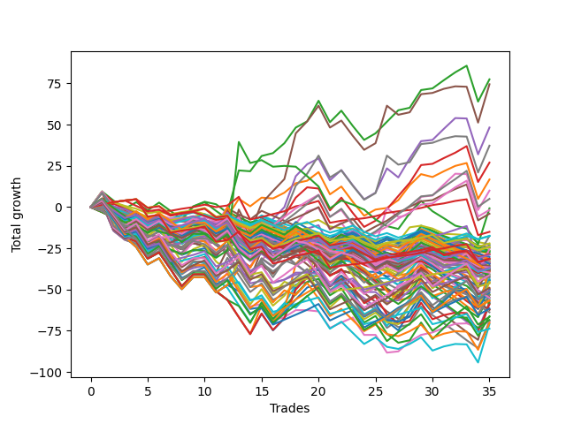

# Long Bulldog 006 
- Symbol: ESBIB
- Date Range: 03/18/2022 - 07/08/2022
- Trading Period: 7:20-12:30
- Number of Trades: 33



| Name | Win Percent | Profit | Avg Profit / Trade |     | Name | Win Percent | Profit | Avg Profit / Trade |
| ---- | ----------- | ------ | ------------------ | --- | ---- | ----------- | ------ | ------------------ |
| Sorted By <br> Profit | | | | | Sorted By <br> Win Percentage ||||
| Two | 69.70 | 42875.00 | 1299.24 |     | Seventy-Six | 87.88 | 2375.00 | 71.97 |
| Five | 60.61 | 36500.00 | 1106.06 |     | Seventy-Eight | 78.79 | 6875.00 | 208.33 |
| Four | 60.61 | 26875.00 | 814.39 |     | Seventy-Seven | 78.79 | -5750.00 | -174.24 |
| Seven | 60.61 | 21375.00 | 647.73 |     | Seventy-Nine | 72.73 | 8000.00 | 242.42 |
| Three | 63.64 | 18500.00 | 560.61 |     | Two | 69.70 | 42875.00 | 1299.24 |
| One | 63.64 | 13375.00 | 405.30 |     | Eighty | 69.70 | 11000.00 | 333.33 |
| Eighty | 69.70 | 11000.00 | 333.33 |     | Three | 63.64 | 18500.00 | 560.61 |
| Six | 57.58 | 10000.00 | 303.03 |     | One | 63.64 | 13375.00 | 405.30 |
| Seventy-Nine | 72.73 | 8000.00 | 242.42 |     | Five | 60.61 | 36500.00 | 1106.06 |
| Seventy-Eight | 78.79 | 6875.00 | 208.33 |     | Four | 60.61 | 26875.00 | 814.39 |
| Seventy-Six | 87.88 | 2375.00 | 71.97 |     | Seven | 60.61 | 21375.00 | 647.73 |
| Seventy-Seven | 78.79 | -5750.00 | -174.24 |     | Zero | 60.61 | -12125.00 | -367.42 |
| Seventy-Three | 24.24 | -6500.00 | -196.97 |     | Six | 57.58 | 10000.00 | 303.03 |
| Zero | 60.61 | -12125.00 | -367.42 |     | Seventy-Three | 24.24 | -6500.00 | -196.97 |

## NO STOPLOSS

### Test Zero
* Sell when price hits the middle line of the 20p bollinger
* No Stoploss
* Results:
```
Total Trades: 33
Percent Up: 60.61
Percent Down: 39.39
Total Points Moved Up: -24.25
Potential Profit: -12125.00
Total Points Ups: 54.00 Count Ups: 20
Total Points Downs: -78.25 Count Downs: 13
```

<details><summary>Trades</summary>

<code>In: 2022-03-25 08:30:00		Out: 2022-03-25 08:36:40		Total Position Time: 06:40		Total Move Up: 4.00		Total to Date: 4.00</code> <br />
<code>In: 2022-03-28 08:28:00		Out: 2022-03-28 08:57:55		Total Position Time: 29:55		Total Move Up: -16.50		Total to Date: -12.50</code> <br />
<code>In: 2022-03-28 08:39:00		Out: 2022-03-28 09:01:50		Total Position Time: 22:50		Total Move Up: -5.75		Total to Date: -18.25</code> <br />
<code>In: 2022-03-28 08:52:00		Out: 2022-03-28 09:01:50		Total Position Time: 09:50		Total Move Up: 0.75		Total to Date: -17.50</code> <br />
<code>In: 2022-03-30 08:03:00		Out: 2022-03-30 08:19:20		Total Position Time: 16:20		Total Move Up: -5.75		Total to Date: -23.25</code> <br />
<code>In: 2022-03-30 08:14:00		Out: 2022-03-30 08:19:20		Total Position Time: 05:20		Total Move Up: 3.00		Total to Date: -20.25</code> <br />
<code>In: 2022-03-30 12:07:00		Out: 2022-03-30 12:28:15		Total Position Time: 21:15		Total Move Up: -5.75		Total to Date: -26.00</code> <br />
<code>In: 2022-03-30 12:14:00		Out: 2022-03-30 12:28:15		Total Position Time: 14:15		Total Move Up: -3.00		Total to Date: -29.00</code> <br />
<code>In: 2022-03-30 12:27:00		Out: 2022-03-30 12:28:15		Total Position Time: 01:15		Total Move Up: 2.50		Total to Date: -26.50</code> <br />
<code>In: 2022-04-06 09:23:00		Out: 2022-04-06 09:31:15		Total Position Time: 08:15		Total Move Up: 1.50		Total to Date: -25.00</code> <br />
<code>In: 2022-04-18 08:30:00		Out: 2022-04-18 08:55:05		Total Position Time: 25:05		Total Move Up: -5.25		Total to Date: -30.25</code> <br />
<code>In: 2022-05-02 10:06:00		Out: 2022-05-02 10:08:15		Total Position Time: 02:15		Total Move Up: 10.50		Total to Date: -19.75</code> <br />
<code>In: 2022-05-04 11:37:00		Out: 2022-05-04 11:40:45		Total Position Time: 03:45		Total Move Up: -1.25		Total to Date: -21.00</code> <br />
<code>In: 2022-05-09 07:27:00		Out: 2022-05-09 07:42:30		Total Position Time: 15:30		Total Move Up: -6.25		Total to Date: -27.25</code> <br />
<code>In: 2022-05-11 11:01:00		Out: 2022-05-11 11:01:10		Total Position Time: 00:10		Total Move Up: 1.50		Total to Date: -25.75</code> <br />
<code>In: 2022-05-12 11:35:00		Out: 2022-05-12 11:45:20		Total Position Time: 10:20		Total Move Up: -1.25		Total to Date: -27.00</code> <br />
<code>In: 2022-05-17 07:48:00		Out: 2022-05-17 07:55:10		Total Position Time: 07:10		Total Move Up: 2.00		Total to Date: -25.00</code> <br />
<code>In: 2022-05-17 11:25:00		Out: 2022-05-17 11:31:30		Total Position Time: 06:30		Total Move Up: 4.25		Total to Date: -20.75</code> <br />
<code>In: 2022-05-25 09:30:00		Out: 2022-05-25 09:41:25		Total Position Time: 11:25		Total Move Up: 0.00		Total to Date: -20.75</code> <br />
<code>In: 2022-05-25 11:11:00		Out: 2022-05-25 11:11:10		Total Position Time: 00:10		Total Move Up: -0.75		Total to Date: -21.50</code> <br />
<code>In: 2022-06-08 09:30:00		Out: 2022-06-08 09:54:10		Total Position Time: 24:10		Total Move Up: -15.50		Total to Date: -37.00</code> <br />
<code>In: 2022-06-09 08:10:00		Out: 2022-06-09 08:11:10		Total Position Time: 01:10		Total Move Up: 3.25		Total to Date: -33.75</code> <br />
<code>In: 2022-06-09 11:27:00		Out: 2022-06-09 11:28:10		Total Position Time: 01:10		Total Move Up: 3.00		Total to Date: -30.75</code> <br />
<code>In: 2022-06-15 07:58:00		Out: 2022-06-15 08:27:55		Total Position Time: 29:55		Total Move Up: -8.50		Total to Date: -39.25</code> <br />
<code>In: 2022-06-15 08:16:00		Out: 2022-06-15 08:32:00		Total Position Time: 16:00		Total Move Up: 0.00		Total to Date: -39.25</code> <br />
<code>In: 2022-06-17 07:38:00		Out: 2022-06-17 07:55:05		Total Position Time: 17:05		Total Move Up: -2.75		Total to Date: -42.00</code> <br />
<code>In: 2022-06-23 09:07:00		Out: 2022-06-23 09:17:10		Total Position Time: 10:10		Total Move Up: 0.75		Total to Date: -41.25</code> <br />
<code>In: 2022-06-27 12:08:00		Out: 2022-06-27 12:10:20		Total Position Time: 02:20		Total Move Up: 6.00		Total to Date: -35.25</code> <br />
<code>In: 2022-06-29 08:26:00		Out: 2022-06-29 08:29:10		Total Position Time: 03:10		Total Move Up: 4.00		Total to Date: -31.25</code> <br />
<code>In: 2022-06-29 09:16:00		Out: 2022-06-29 09:21:05		Total Position Time: 05:05		Total Move Up: 1.50		Total to Date: -29.75</code> <br />
<code>In: 2022-07-05 08:05:00		Out: 2022-07-05 08:08:20		Total Position Time: 03:20		Total Move Up: 2.75		Total to Date: -27.00</code> <br />
<code>In: 2022-07-05 08:08:00		Out: 2022-07-05 08:08:20		Total Position Time: 00:20		Total Move Up: 2.50		Total to Date: -24.50</code> <br />
<code>In: 2022-07-06 08:35:00		Out: 2022-07-06 08:46:30		Total Position Time: 11:30		Total Move Up: 0.25		Total to Date: -24.25</code> <br />


</details>

### Test One
* Sell when the price hits the upper line of the 20p 1std bollinger
* No Stoploss
* Results:
```
Total Trades: 33
Percent Up: 63.64
Percent Down: 36.36
Total Points Moved Up: 26.75
Potential Profit: 13375.00
Total Points Ups: 101.50 Count Ups: 21
Total Points Downs: -74.75 Count Downs: 12
```

<details><summary>Trades</summary>

<code>In: 2022-03-25 08:30:00		Out: 2022-03-25 08:41:05		Total Position Time: 11:05		Total Move Up: 5.25		Total to Date: 5.25</code> <br />
<code>In: 2022-03-28 08:28:00		Out: 2022-03-28 08:57:55		Total Position Time: 29:55		Total Move Up: -16.50		Total to Date: -11.25</code> <br />
<code>In: 2022-03-28 08:39:00		Out: 2022-03-28 09:04:55		Total Position Time: 25:55		Total Move Up: -4.00		Total to Date: -15.25</code> <br />
<code>In: 2022-03-28 08:52:00		Out: 2022-03-28 09:04:55		Total Position Time: 12:55		Total Move Up: 2.50		Total to Date: -12.75</code> <br />
<code>In: 2022-03-30 08:03:00		Out: 2022-03-30 08:32:55		Total Position Time: 29:55		Total Move Up: -8.25		Total to Date: -21.00</code> <br />
<code>In: 2022-03-30 08:14:00		Out: 2022-03-30 08:34:45		Total Position Time: 20:45		Total Move Up: 3.00		Total to Date: -18.00</code> <br />
<code>In: 2022-03-30 12:07:00		Out: 2022-03-30 12:32:20		Total Position Time: 25:20		Total Move Up: -3.50		Total to Date: -21.50</code> <br />
<code>In: 2022-03-30 12:14:00		Out: 2022-03-30 12:32:20		Total Position Time: 18:20		Total Move Up: -0.75		Total to Date: -22.25</code> <br />
<code>In: 2022-03-30 12:27:00		Out: 2022-03-30 12:32:20		Total Position Time: 05:20		Total Move Up: 4.75		Total to Date: -17.50</code> <br />
<code>In: 2022-04-06 09:23:00		Out: 2022-04-06 09:34:05		Total Position Time: 11:05		Total Move Up: 1.50		Total to Date: -16.00</code> <br />
<code>In: 2022-04-18 08:30:00		Out: 2022-04-18 08:57:20		Total Position Time: 27:20		Total Move Up: -3.75		Total to Date: -19.75</code> <br />
<code>In: 2022-05-02 10:06:00		Out: 2022-05-02 10:10:55		Total Position Time: 04:55		Total Move Up: 14.00		Total to Date: -5.75</code> <br />
<code>In: 2022-05-04 11:37:00		Out: 2022-05-04 11:41:40		Total Position Time: 04:40		Total Move Up: 10.75		Total to Date: 5.00</code> <br />
<code>In: 2022-05-09 07:27:00		Out: 2022-05-09 07:46:05		Total Position Time: 19:05		Total Move Up: -4.50		Total to Date: 0.50</code> <br />
<code>In: 2022-05-11 11:01:00		Out: 2022-05-11 11:01:20		Total Position Time: 00:20		Total Move Up: 5.25		Total to Date: 5.75</code> <br />
<code>In: 2022-05-12 11:35:00		Out: 2022-05-12 11:52:55		Total Position Time: 17:55		Total Move Up: -0.50		Total to Date: 5.25</code> <br />
<code>In: 2022-05-17 07:48:00		Out: 2022-05-17 07:59:05		Total Position Time: 11:05		Total Move Up: 3.50		Total to Date: 8.75</code> <br />
<code>In: 2022-05-17 11:25:00		Out: 2022-05-17 11:37:35		Total Position Time: 12:35		Total Move Up: 5.75		Total to Date: 14.50</code> <br />
<code>In: 2022-05-25 09:30:00		Out: 2022-05-25 09:44:25		Total Position Time: 14:25		Total Move Up: 1.50		Total to Date: 16.00</code> <br />
<code>In: 2022-05-25 11:11:00		Out: 2022-05-25 11:15:55		Total Position Time: 04:55		Total Move Up: 5.25		Total to Date: 21.25</code> <br />
<code>In: 2022-06-08 09:30:00		Out: 2022-06-08 09:59:05		Total Position Time: 29:05		Total Move Up: -13.50		Total to Date: 7.75</code> <br />
<code>In: 2022-06-09 08:10:00		Out: 2022-06-09 08:21:10		Total Position Time: 11:10		Total Move Up: 4.75		Total to Date: 12.50</code> <br />
<code>In: 2022-06-09 11:27:00		Out: 2022-06-09 11:56:55		Total Position Time: 29:55		Total Move Up: -9.25		Total to Date: 3.25</code> <br />
<code>In: 2022-06-15 07:58:00		Out: 2022-06-15 08:27:55		Total Position Time: 29:55		Total Move Up: -8.50		Total to Date: -5.25</code> <br />
<code>In: 2022-06-15 08:16:00		Out: 2022-06-15 08:38:55		Total Position Time: 22:55		Total Move Up: 3.75		Total to Date: -1.50</code> <br />
<code>In: 2022-06-17 07:38:00		Out: 2022-06-17 07:56:20		Total Position Time: 18:20		Total Move Up: 1.00		Total to Date: -0.50</code> <br />
<code>In: 2022-06-23 09:07:00		Out: 2022-06-23 09:18:25		Total Position Time: 11:25		Total Move Up: 4.75		Total to Date: 4.25</code> <br />
<code>In: 2022-06-27 12:08:00		Out: 2022-06-27 12:12:10		Total Position Time: 04:10		Total Move Up: 9.00		Total to Date: 13.25</code> <br />
<code>In: 2022-06-29 08:26:00		Out: 2022-06-29 08:33:05		Total Position Time: 07:05		Total Move Up: 6.75		Total to Date: 20.00</code> <br />
<code>In: 2022-06-29 09:16:00		Out: 2022-06-29 09:37:20		Total Position Time: 21:20		Total Move Up: -1.75		Total to Date: 18.25</code> <br />
<code>In: 2022-07-05 08:05:00		Out: 2022-07-05 08:16:45		Total Position Time: 11:45		Total Move Up: 3.50		Total to Date: 21.75</code> <br />
<code>In: 2022-07-05 08:08:00		Out: 2022-07-05 08:16:45		Total Position Time: 08:45		Total Move Up: 3.25		Total to Date: 25.00</code> <br />
<code>In: 2022-07-06 08:35:00		Out: 2022-07-06 08:48:20		Total Position Time: 13:20		Total Move Up: 1.75		Total to Date: 26.75</code> <br />


</details>

### Test Two
* Sell when the price hits the upper line of the 20p 2std bollinger
* No Stoploss
* Results:
```
Total Trades: 33
Percent Up: 69.70
Percent Down: 30.30
Total Points Moved Up: 85.75
Potential Profit: 42875.00
Total Points Ups: 151.50 Count Ups: 23
Total Points Downs: -65.75 Count Downs: 10
```

<details><summary>Trades</summary>

<code>In: 2022-03-25 08:30:00		Out: 2022-03-25 08:41:55		Total Position Time: 11:55		Total Move Up: 9.50		Total to Date: 9.50</code> <br />
<code>In: 2022-03-28 08:28:00		Out: 2022-03-28 08:57:55		Total Position Time: 29:55		Total Move Up: -16.50		Total to Date: -7.00</code> <br />
<code>In: 2022-03-28 08:39:00		Out: 2022-03-28 09:07:10		Total Position Time: 28:10		Total Move Up: -2.50		Total to Date: -9.50</code> <br />
<code>In: 2022-03-28 08:52:00		Out: 2022-03-28 09:07:10		Total Position Time: 15:10		Total Move Up: 4.00		Total to Date: -5.50</code> <br />
<code>In: 2022-03-30 08:03:00		Out: 2022-03-30 08:32:55		Total Position Time: 29:55		Total Move Up: -8.25		Total to Date: -13.75</code> <br />
<code>In: 2022-03-30 08:14:00		Out: 2022-03-30 08:35:15		Total Position Time: 21:15		Total Move Up: 4.75		Total to Date: -9.00</code> <br />
<code>In: 2022-03-30 12:07:00		Out: 2022-03-30 12:36:25		Total Position Time: 29:25		Total Move Up: -0.50		Total to Date: -9.50</code> <br />
<code>In: 2022-03-30 12:14:00		Out: 2022-03-30 12:36:25		Total Position Time: 22:25		Total Move Up: 2.25		Total to Date: -7.25</code> <br />
<code>In: 2022-03-30 12:27:00		Out: 2022-03-30 12:36:25		Total Position Time: 09:25		Total Move Up: 7.75		Total to Date: 0.50</code> <br />
<code>In: 2022-04-06 09:23:00		Out: 2022-04-06 09:34:25		Total Position Time: 11:25		Total Move Up: 2.75		Total to Date: 3.25</code> <br />
<code>In: 2022-04-18 08:30:00		Out: 2022-04-18 08:59:35		Total Position Time: 29:35		Total Move Up: -1.50		Total to Date: 1.75</code> <br />
<code>In: 2022-05-02 10:06:00		Out: 2022-05-02 10:35:55		Total Position Time: 29:55		Total Move Up: -5.25		Total to Date: -3.50</code> <br />
<code>In: 2022-05-04 11:37:00		Out: 2022-05-04 11:43:55		Total Position Time: 06:55		Total Move Up: 25.75		Total to Date: 22.25</code> <br />
<code>In: 2022-05-09 07:27:00		Out: 2022-05-09 07:49:10		Total Position Time: 22:10		Total Move Up: -0.50		Total to Date: 21.75</code> <br />
<code>In: 2022-05-11 11:01:00		Out: 2022-05-11 11:04:55		Total Position Time: 03:55		Total Move Up: 9.25		Total to Date: 31.00</code> <br />
<code>In: 2022-05-12 11:35:00		Out: 2022-05-12 11:53:25		Total Position Time: 18:25		Total Move Up: 1.75		Total to Date: 32.75</code> <br />
<code>In: 2022-05-17 07:48:00		Out: 2022-05-17 08:00:05		Total Position Time: 12:05		Total Move Up: 6.00		Total to Date: 38.75</code> <br />
<code>In: 2022-05-17 11:25:00		Out: 2022-05-17 11:40:00		Total Position Time: 15:00		Total Move Up: 9.50		Total to Date: 48.25</code> <br />
<code>In: 2022-05-25 09:30:00		Out: 2022-05-25 09:45:20		Total Position Time: 15:20		Total Move Up: 3.75		Total to Date: 52.00</code> <br />
<code>In: 2022-05-25 11:11:00		Out: 2022-05-25 11:16:50		Total Position Time: 05:50		Total Move Up: 12.50		Total to Date: 64.50</code> <br />
<code>In: 2022-06-08 09:30:00		Out: 2022-06-08 09:59:10		Total Position Time: 29:10		Total Move Up: -13.00		Total to Date: 51.50</code> <br />
<code>In: 2022-06-09 08:10:00		Out: 2022-06-09 08:22:35		Total Position Time: 12:35		Total Move Up: 7.00		Total to Date: 58.50</code> <br />
<code>In: 2022-06-09 11:27:00		Out: 2022-06-09 11:56:55		Total Position Time: 29:55		Total Move Up: -9.25		Total to Date: 49.25</code> <br />
<code>In: 2022-06-15 07:58:00		Out: 2022-06-15 08:27:55		Total Position Time: 29:55		Total Move Up: -8.50		Total to Date: 40.75</code> <br />
<code>In: 2022-06-15 08:16:00		Out: 2022-06-15 08:45:55		Total Position Time: 29:55		Total Move Up: 4.00		Total to Date: 44.75</code> <br />
<code>In: 2022-06-17 07:38:00		Out: 2022-06-17 08:02:30		Total Position Time: 24:30		Total Move Up: 7.00		Total to Date: 51.75</code> <br />
<code>In: 2022-06-23 09:07:00		Out: 2022-06-23 09:19:05		Total Position Time: 12:05		Total Move Up: 7.00		Total to Date: 58.75</code> <br />
<code>In: 2022-06-27 12:08:00		Out: 2022-06-27 12:37:55		Total Position Time: 29:55		Total Move Up: 1.50		Total to Date: 60.25</code> <br />
<code>In: 2022-06-29 08:26:00		Out: 2022-06-29 08:35:35		Total Position Time: 09:35		Total Move Up: 10.75		Total to Date: 71.00</code> <br />
<code>In: 2022-06-29 09:16:00		Out: 2022-06-29 09:38:35		Total Position Time: 22:35		Total Move Up: 1.00		Total to Date: 72.00</code> <br />
<code>In: 2022-07-05 08:05:00		Out: 2022-07-05 08:20:35		Total Position Time: 15:35		Total Move Up: 5.00		Total to Date: 77.00</code> <br />
<code>In: 2022-07-05 08:08:00		Out: 2022-07-05 08:20:35		Total Position Time: 12:35		Total Move Up: 4.75		Total to Date: 81.75</code> <br />
<code>In: 2022-07-06 08:35:00		Out: 2022-07-06 08:51:15		Total Position Time: 16:15		Total Move Up: 4.00		Total to Date: 85.75</code> <br />


</details>

### Test Three
* Sell when price hits the middle line of the 50p bollinger
* No Stoploss
* Results:
```
Total Trades: 33
Percent Up: 63.64
Percent Down: 36.36
Total Points Moved Up: 37.00
Potential Profit: 18500.00
Total Points Ups: 123.75 Count Ups: 21
Total Points Downs: -86.75 Count Downs: 12
```

<details><summary>Trades</summary>

<code>In: 2022-03-25 08:30:00		Out: 2022-03-25 08:53:00		Total Position Time: 23:00		Total Move Up: 8.75		Total to Date: 8.75</code> <br />
<code>In: 2022-03-28 08:28:00		Out: 2022-03-28 08:57:55		Total Position Time: 29:55		Total Move Up: -16.50		Total to Date: -7.75</code> <br />
<code>In: 2022-03-28 08:39:00		Out: 2022-03-28 09:08:55		Total Position Time: 29:55		Total Move Up: -5.50		Total to Date: -13.25</code> <br />
<code>In: 2022-03-28 08:52:00		Out: 2022-03-28 09:21:55		Total Position Time: 29:55		Total Move Up: -2.50		Total to Date: -15.75</code> <br />
<code>In: 2022-03-30 08:03:00		Out: 2022-03-30 08:32:55		Total Position Time: 29:55		Total Move Up: -8.25		Total to Date: -24.00</code> <br />
<code>In: 2022-03-30 08:14:00		Out: 2022-03-30 08:35:20		Total Position Time: 21:20		Total Move Up: 5.25		Total to Date: -18.75</code> <br />
<code>In: 2022-03-30 12:07:00		Out: 2022-03-30 12:33:25		Total Position Time: 26:25		Total Move Up: -1.75		Total to Date: -20.50</code> <br />
<code>In: 2022-03-30 12:14:00		Out: 2022-03-30 12:33:25		Total Position Time: 19:25		Total Move Up: 1.00		Total to Date: -19.50</code> <br />
<code>In: 2022-03-30 12:27:00		Out: 2022-03-30 12:33:25		Total Position Time: 06:25		Total Move Up: 6.50		Total to Date: -13.00</code> <br />
<code>In: 2022-04-06 09:23:00		Out: 2022-04-06 09:52:55		Total Position Time: 29:55		Total Move Up: 0.00		Total to Date: -13.00</code> <br />
<code>In: 2022-04-18 08:30:00		Out: 2022-04-18 08:59:55		Total Position Time: 29:55		Total Move Up: -1.50		Total to Date: -14.50</code> <br />
<code>In: 2022-05-02 10:06:00		Out: 2022-05-02 10:35:55		Total Position Time: 29:55		Total Move Up: -5.25		Total to Date: -19.75</code> <br />
<code>In: 2022-05-04 11:37:00		Out: 2022-05-04 11:41:15		Total Position Time: 04:15		Total Move Up: 5.25		Total to Date: -14.50</code> <br />
<code>In: 2022-05-09 07:27:00		Out: 2022-05-09 07:56:55		Total Position Time: 29:55		Total Move Up: -13.75		Total to Date: -28.25</code> <br />
<code>In: 2022-05-11 11:01:00		Out: 2022-05-11 11:05:00		Total Position Time: 04:00		Total Move Up: 11.00		Total to Date: -17.25</code> <br />
<code>In: 2022-05-12 11:35:00		Out: 2022-05-12 11:53:25		Total Position Time: 18:25		Total Move Up: 1.75		Total to Date: -15.50</code> <br />
<code>In: 2022-05-17 07:48:00		Out: 2022-05-17 08:04:10		Total Position Time: 16:10		Total Move Up: 10.25		Total to Date: -5.25</code> <br />
<code>In: 2022-05-17 11:25:00		Out: 2022-05-17 11:40:05		Total Position Time: 15:05		Total Move Up: 11.00		Total to Date: 5.75</code> <br />
<code>In: 2022-05-25 09:30:00		Out: 2022-05-25 09:49:05		Total Position Time: 19:05		Total Move Up: 6.25		Total to Date: 12.00</code> <br />
<code>In: 2022-05-25 11:11:00		Out: 2022-05-25 11:11:10		Total Position Time: 00:10		Total Move Up: -0.75		Total to Date: 11.25</code> <br />
<code>In: 2022-06-08 09:30:00		Out: 2022-06-08 09:59:55		Total Position Time: 29:55		Total Move Up: -13.25		Total to Date: -2.00</code> <br />
<code>In: 2022-06-09 08:10:00		Out: 2022-06-09 08:22:45		Total Position Time: 12:45		Total Move Up: 7.75		Total to Date: 5.75</code> <br />
<code>In: 2022-06-09 11:27:00		Out: 2022-06-09 11:56:55		Total Position Time: 29:55		Total Move Up: -9.25		Total to Date: -3.50</code> <br />
<code>In: 2022-06-15 07:58:00		Out: 2022-06-15 08:27:55		Total Position Time: 29:55		Total Move Up: -8.50		Total to Date: -12.00</code> <br />
<code>In: 2022-06-15 08:16:00		Out: 2022-06-15 08:38:55		Total Position Time: 22:55		Total Move Up: 3.75		Total to Date: -8.25</code> <br />
<code>In: 2022-06-17 07:38:00		Out: 2022-06-17 08:02:30		Total Position Time: 24:30		Total Move Up: 7.00		Total to Date: -1.25</code> <br />
<code>In: 2022-06-23 09:07:00		Out: 2022-06-23 09:21:10		Total Position Time: 14:10		Total Move Up: 8.00		Total to Date: 6.75</code> <br />
<code>In: 2022-06-27 12:08:00		Out: 2022-06-27 12:11:50		Total Position Time: 03:50		Total Move Up: 8.00		Total to Date: 14.75</code> <br />
<code>In: 2022-06-29 08:26:00		Out: 2022-06-29 08:35:35		Total Position Time: 09:35		Total Move Up: 10.75		Total to Date: 25.50</code> <br />
<code>In: 2022-06-29 09:16:00		Out: 2022-06-29 09:38:30		Total Position Time: 22:30		Total Move Up: 0.75		Total to Date: 26.25</code> <br />
<code>In: 2022-07-05 08:05:00		Out: 2022-07-05 08:32:25		Total Position Time: 27:25		Total Move Up: 3.50		Total to Date: 29.75</code> <br />
<code>In: 2022-07-05 08:08:00		Out: 2022-07-05 08:32:25		Total Position Time: 24:25		Total Move Up: 3.25		Total to Date: 33.00</code> <br />
<code>In: 2022-07-06 08:35:00		Out: 2022-07-06 08:51:15		Total Position Time: 16:15		Total Move Up: 4.00		Total to Date: 37.00</code> <br />


</details>

### Test Four
* Sell when the price hits the upper line of the 50p 1std bollinger
* No Stoploss
* Results:
```
Total Trades: 33
Percent Up: 60.61
Percent Down: 39.39
Total Points Moved Up: 53.75
Potential Profit: 26875.00
Total Points Ups: 145.00 Count Ups: 20
Total Points Downs: -91.25 Count Downs: 13
```

<details><summary>Trades</summary>

<code>In: 2022-03-25 08:30:00		Out: 2022-03-25 08:59:55		Total Position Time: 29:55		Total Move Up: 2.25		Total to Date: 2.25</code> <br />
<code>In: 2022-03-28 08:28:00		Out: 2022-03-28 08:57:55		Total Position Time: 29:55		Total Move Up: -16.50		Total to Date: -14.25</code> <br />
<code>In: 2022-03-28 08:39:00		Out: 2022-03-28 09:08:55		Total Position Time: 29:55		Total Move Up: -5.50		Total to Date: -19.75</code> <br />
<code>In: 2022-03-28 08:52:00		Out: 2022-03-28 09:21:55		Total Position Time: 29:55		Total Move Up: -2.50		Total to Date: -22.25</code> <br />
<code>In: 2022-03-30 08:03:00		Out: 2022-03-30 08:32:55		Total Position Time: 29:55		Total Move Up: -8.25		Total to Date: -30.50</code> <br />
<code>In: 2022-03-30 08:14:00		Out: 2022-03-30 08:43:55		Total Position Time: 29:55		Total Move Up: 3.75		Total to Date: -26.75</code> <br />
<code>In: 2022-03-30 12:07:00		Out: 2022-03-30 12:36:55		Total Position Time: 29:55		Total Move Up: 0.25		Total to Date: -26.50</code> <br />
<code>In: 2022-03-30 12:14:00		Out: 2022-03-30 12:43:55		Total Position Time: 29:55		Total Move Up: -1.25		Total to Date: -27.75</code> <br />
<code>In: 2022-03-30 12:27:00		Out: 2022-03-30 12:46:00		Total Position Time: 19:00		Total Move Up: 7.25		Total to Date: -20.50</code> <br />
<code>In: 2022-04-06 09:23:00		Out: 2022-04-06 09:52:55		Total Position Time: 29:55		Total Move Up: 0.00		Total to Date: -20.50</code> <br />
<code>In: 2022-04-18 08:30:00		Out: 2022-04-18 08:59:55		Total Position Time: 29:55		Total Move Up: -1.50		Total to Date: -22.00</code> <br />
<code>In: 2022-05-02 10:06:00		Out: 2022-05-02 10:35:55		Total Position Time: 29:55		Total Move Up: -5.25		Total to Date: -27.25</code> <br />
<code>In: 2022-05-04 11:37:00		Out: 2022-05-04 11:42:00		Total Position Time: 05:00		Total Move Up: 14.75		Total to Date: -12.50</code> <br />
<code>In: 2022-05-09 07:27:00		Out: 2022-05-09 07:56:55		Total Position Time: 29:55		Total Move Up: -13.75		Total to Date: -26.25</code> <br />
<code>In: 2022-05-11 11:01:00		Out: 2022-05-11 11:18:15		Total Position Time: 17:15		Total Move Up: 12.25		Total to Date: -14.00</code> <br />
<code>In: 2022-05-12 11:35:00		Out: 2022-05-12 12:04:10		Total Position Time: 29:10		Total Move Up: 6.75		Total to Date: -7.25</code> <br />
<code>In: 2022-05-17 07:48:00		Out: 2022-05-17 08:17:55		Total Position Time: 29:55		Total Move Up: 7.25		Total to Date: 0.00</code> <br />
<code>In: 2022-05-17 11:25:00		Out: 2022-05-17 11:45:45		Total Position Time: 20:45		Total Move Up: 18.75		Total to Date: 18.75</code> <br />
<code>In: 2022-05-25 09:30:00		Out: 2022-05-25 09:59:55		Total Position Time: 29:55		Total Move Up: 7.25		Total to Date: 26.00</code> <br />
<code>In: 2022-05-25 11:11:00		Out: 2022-05-25 11:14:05		Total Position Time: 03:05		Total Move Up: 3.50		Total to Date: 29.50</code> <br />
<code>In: 2022-06-08 09:30:00		Out: 2022-06-08 09:59:55		Total Position Time: 29:55		Total Move Up: -13.25		Total to Date: 16.25</code> <br />
<code>In: 2022-06-09 08:10:00		Out: 2022-06-09 08:39:45		Total Position Time: 29:45		Total Move Up: 6.25		Total to Date: 22.50</code> <br />
<code>In: 2022-06-09 11:27:00		Out: 2022-06-09 11:56:55		Total Position Time: 29:55		Total Move Up: -9.25		Total to Date: 13.25</code> <br />
<code>In: 2022-06-15 07:58:00		Out: 2022-06-15 08:27:55		Total Position Time: 29:55		Total Move Up: -8.50		Total to Date: 4.75</code> <br />
<code>In: 2022-06-15 08:16:00		Out: 2022-06-15 08:45:55		Total Position Time: 29:55		Total Move Up: 4.00		Total to Date: 8.75</code> <br />
<code>In: 2022-06-17 07:38:00		Out: 2022-06-17 08:06:05		Total Position Time: 28:05		Total Move Up: 14.75		Total to Date: 23.50</code> <br />
<code>In: 2022-06-23 09:07:00		Out: 2022-06-23 09:36:55		Total Position Time: 29:55		Total Move Up: -5.50		Total to Date: 18.00</code> <br />
<code>In: 2022-06-27 12:08:00		Out: 2022-06-27 12:15:30		Total Position Time: 07:30		Total Move Up: 11.50		Total to Date: 29.50</code> <br />
<code>In: 2022-06-29 08:26:00		Out: 2022-06-29 08:53:10		Total Position Time: 27:10		Total Move Up: 10.50		Total to Date: 40.00</code> <br />
<code>In: 2022-06-29 09:16:00		Out: 2022-06-29 09:45:55		Total Position Time: 29:55		Total Move Up: 0.75		Total to Date: 40.75</code> <br />
<code>In: 2022-07-05 08:05:00		Out: 2022-07-05 08:33:10		Total Position Time: 28:10		Total Move Up: 6.75		Total to Date: 47.50</code> <br />
<code>In: 2022-07-05 08:08:00		Out: 2022-07-05 08:33:10		Total Position Time: 25:10		Total Move Up: 6.50		Total to Date: 54.00</code> <br />
<code>In: 2022-07-06 08:35:00		Out: 2022-07-06 09:04:55		Total Position Time: 29:55		Total Move Up: -0.25		Total to Date: 53.75</code> <br />


</details>

### Test Five
* Sell when the price hits the upper line of the 50p 2std bollinger
* No Stoploss
* Results:
```
Total Trades: 33
Percent Up: 60.61
Percent Down: 39.39
Total Points Moved Up: 73.00
Potential Profit: 36500.00
Total Points Ups: 164.25 Count Ups: 20
Total Points Downs: -91.25 Count Downs: 13
```

<details><summary>Trades</summary>

<code>In: 2022-03-25 08:30:00		Out: 2022-03-25 08:59:55		Total Position Time: 29:55		Total Move Up: 2.25		Total to Date: 2.25</code> <br />
<code>In: 2022-03-28 08:28:00		Out: 2022-03-28 08:57:55		Total Position Time: 29:55		Total Move Up: -16.50		Total to Date: -14.25</code> <br />
<code>In: 2022-03-28 08:39:00		Out: 2022-03-28 09:08:55		Total Position Time: 29:55		Total Move Up: -5.50		Total to Date: -19.75</code> <br />
<code>In: 2022-03-28 08:52:00		Out: 2022-03-28 09:21:55		Total Position Time: 29:55		Total Move Up: -2.50		Total to Date: -22.25</code> <br />
<code>In: 2022-03-30 08:03:00		Out: 2022-03-30 08:32:55		Total Position Time: 29:55		Total Move Up: -8.25		Total to Date: -30.50</code> <br />
<code>In: 2022-03-30 08:14:00		Out: 2022-03-30 08:43:55		Total Position Time: 29:55		Total Move Up: 3.75		Total to Date: -26.75</code> <br />
<code>In: 2022-03-30 12:07:00		Out: 2022-03-30 12:36:55		Total Position Time: 29:55		Total Move Up: 0.25		Total to Date: -26.50</code> <br />
<code>In: 2022-03-30 12:14:00		Out: 2022-03-30 12:43:55		Total Position Time: 29:55		Total Move Up: -1.25		Total to Date: -27.75</code> <br />
<code>In: 2022-03-30 12:27:00		Out: 2022-03-30 12:46:00		Total Position Time: 19:00		Total Move Up: 7.25		Total to Date: -20.50</code> <br />
<code>In: 2022-04-06 09:23:00		Out: 2022-04-06 09:52:55		Total Position Time: 29:55		Total Move Up: 0.00		Total to Date: -20.50</code> <br />
<code>In: 2022-04-18 08:30:00		Out: 2022-04-18 08:59:55		Total Position Time: 29:55		Total Move Up: -1.50		Total to Date: -22.00</code> <br />
<code>In: 2022-05-02 10:06:00		Out: 2022-05-02 10:35:55		Total Position Time: 29:55		Total Move Up: -5.25		Total to Date: -27.25</code> <br />
<code>In: 2022-05-04 11:37:00		Out: 2022-05-04 11:43:55		Total Position Time: 06:55		Total Move Up: 25.75		Total to Date: -1.50</code> <br />
<code>In: 2022-05-09 07:27:00		Out: 2022-05-09 07:56:55		Total Position Time: 29:55		Total Move Up: -13.75		Total to Date: -15.25</code> <br />
<code>In: 2022-05-11 11:01:00		Out: 2022-05-11 11:23:40		Total Position Time: 22:40		Total Move Up: 17.50		Total to Date: 2.25</code> <br />
<code>In: 2022-05-12 11:35:00		Out: 2022-05-12 12:04:55		Total Position Time: 29:55		Total Move Up: 7.50		Total to Date: 9.75</code> <br />
<code>In: 2022-05-17 07:48:00		Out: 2022-05-17 08:17:55		Total Position Time: 29:55		Total Move Up: 7.25		Total to Date: 17.00</code> <br />
<code>In: 2022-05-17 11:25:00		Out: 2022-05-17 11:48:45		Total Position Time: 23:45		Total Move Up: 27.75		Total to Date: 44.75</code> <br />
<code>In: 2022-05-25 09:30:00		Out: 2022-05-25 09:59:55		Total Position Time: 29:55		Total Move Up: 7.25		Total to Date: 52.00</code> <br />
<code>In: 2022-05-25 11:11:00		Out: 2022-05-25 11:16:25		Total Position Time: 05:25		Total Move Up: 9.50		Total to Date: 61.50</code> <br />
<code>In: 2022-06-08 09:30:00		Out: 2022-06-08 09:59:55		Total Position Time: 29:55		Total Move Up: -13.25		Total to Date: 48.25</code> <br />
<code>In: 2022-06-09 08:10:00		Out: 2022-06-09 08:39:55		Total Position Time: 29:55		Total Move Up: 4.25		Total to Date: 52.50</code> <br />
<code>In: 2022-06-09 11:27:00		Out: 2022-06-09 11:56:55		Total Position Time: 29:55		Total Move Up: -9.25		Total to Date: 43.25</code> <br />
<code>In: 2022-06-15 07:58:00		Out: 2022-06-15 08:27:55		Total Position Time: 29:55		Total Move Up: -8.50		Total to Date: 34.75</code> <br />
<code>In: 2022-06-15 08:16:00		Out: 2022-06-15 08:45:55		Total Position Time: 29:55		Total Move Up: 4.00		Total to Date: 38.75</code> <br />
<code>In: 2022-06-17 07:38:00		Out: 2022-06-17 08:07:55		Total Position Time: 29:55		Total Move Up: 22.75		Total to Date: 61.50</code> <br />
<code>In: 2022-06-23 09:07:00		Out: 2022-06-23 09:36:55		Total Position Time: 29:55		Total Move Up: -5.50		Total to Date: 56.00</code> <br />
<code>In: 2022-06-27 12:08:00		Out: 2022-06-27 12:37:55		Total Position Time: 29:55		Total Move Up: 1.50		Total to Date: 57.50</code> <br />
<code>In: 2022-06-29 08:26:00		Out: 2022-06-29 08:55:55		Total Position Time: 29:55		Total Move Up: 11.00		Total to Date: 68.50</code> <br />
<code>In: 2022-06-29 09:16:00		Out: 2022-06-29 09:45:55		Total Position Time: 29:55		Total Move Up: 0.75		Total to Date: 69.25</code> <br />
<code>In: 2022-07-05 08:05:00		Out: 2022-07-05 08:34:55		Total Position Time: 29:55		Total Move Up: 2.50		Total to Date: 71.75</code> <br />
<code>In: 2022-07-05 08:08:00		Out: 2022-07-05 08:37:55		Total Position Time: 29:55		Total Move Up: 1.50		Total to Date: 73.25</code> <br />
<code>In: 2022-07-06 08:35:00		Out: 2022-07-06 09:04:55		Total Position Time: 29:55		Total Move Up: -0.25		Total to Date: 73.00</code> <br />


</details>

### Test Six
* Sell when the price hits the middle line of the 1std VWAP
* No Stoploss
* Results:
```
Total Trades: 33
Percent Up: 57.58
Percent Down: 42.42
Total Points Moved Up: 20.00
Potential Profit: 10000.00
Total Points Ups: 115.00 Count Ups: 19
Total Points Downs: -95.00 Count Downs: 14
```

<details><summary>Trades</summary>

<code>In: 2022-03-25 08:30:00		Out: 2022-03-25 08:59:55		Total Position Time: 29:55		Total Move Up: 2.25		Total to Date: 2.25</code> <br />
<code>In: 2022-03-28 08:28:00		Out: 2022-03-28 08:57:55		Total Position Time: 29:55		Total Move Up: -16.50		Total to Date: -14.25</code> <br />
<code>In: 2022-03-28 08:39:00		Out: 2022-03-28 09:08:55		Total Position Time: 29:55		Total Move Up: -5.50		Total to Date: -19.75</code> <br />
<code>In: 2022-03-28 08:52:00		Out: 2022-03-28 09:21:55		Total Position Time: 29:55		Total Move Up: -2.50		Total to Date: -22.25</code> <br />
<code>In: 2022-03-30 08:03:00		Out: 2022-03-30 08:32:55		Total Position Time: 29:55		Total Move Up: -8.25		Total to Date: -30.50</code> <br />
<code>In: 2022-03-30 08:14:00		Out: 2022-03-30 08:43:55		Total Position Time: 29:55		Total Move Up: 3.75		Total to Date: -26.75</code> <br />
<code>In: 2022-03-30 12:07:00		Out: 2022-03-30 12:36:55		Total Position Time: 29:55		Total Move Up: 0.25		Total to Date: -26.50</code> <br />
<code>In: 2022-03-30 12:14:00		Out: 2022-03-30 12:43:55		Total Position Time: 29:55		Total Move Up: -1.25		Total to Date: -27.75</code> <br />
<code>In: 2022-03-30 12:27:00		Out: 2022-03-30 12:46:00		Total Position Time: 19:00		Total Move Up: 7.25		Total to Date: -20.50</code> <br />
<code>In: 2022-04-06 09:23:00		Out: 2022-04-06 09:52:55		Total Position Time: 29:55		Total Move Up: 0.00		Total to Date: -20.50</code> <br />
<code>In: 2022-04-18 08:30:00		Out: 2022-04-18 08:59:55		Total Position Time: 29:55		Total Move Up: -1.50		Total to Date: -22.00</code> <br />
<code>In: 2022-05-02 10:06:00		Out: 2022-05-02 10:35:55		Total Position Time: 29:55		Total Move Up: -5.25		Total to Date: -27.25</code> <br />
<code>In: 2022-05-04 11:37:00		Out: 2022-05-04 11:37:10		Total Position Time: 00:10		Total Move Up: -3.75		Total to Date: -31.00</code> <br />
<code>In: 2022-05-09 07:27:00		Out: 2022-05-09 07:56:55		Total Position Time: 29:55		Total Move Up: -13.75		Total to Date: -44.75</code> <br />
<code>In: 2022-05-11 11:01:00		Out: 2022-05-11 11:30:55		Total Position Time: 29:55		Total Move Up: 12.50		Total to Date: -32.25</code> <br />
<code>In: 2022-05-12 11:35:00		Out: 2022-05-12 12:04:55		Total Position Time: 29:55		Total Move Up: 7.50		Total to Date: -24.75</code> <br />
<code>In: 2022-05-17 07:48:00		Out: 2022-05-17 08:17:55		Total Position Time: 29:55		Total Move Up: 7.25		Total to Date: -17.50</code> <br />
<code>In: 2022-05-17 11:25:00		Out: 2022-05-17 11:27:25		Total Position Time: 02:25		Total Move Up: 7.75		Total to Date: -9.75</code> <br />
<code>In: 2022-05-25 09:30:00		Out: 2022-05-25 09:59:55		Total Position Time: 29:55		Total Move Up: 7.25		Total to Date: -2.50</code> <br />
<code>In: 2022-05-25 11:11:00		Out: 2022-05-25 11:11:40		Total Position Time: 00:40		Total Move Up: 2.00		Total to Date: -0.50</code> <br />
<code>In: 2022-06-08 09:30:00		Out: 2022-06-08 09:59:55		Total Position Time: 29:55		Total Move Up: -13.25		Total to Date: -13.75</code> <br />
<code>In: 2022-06-09 08:10:00		Out: 2022-06-09 08:39:55		Total Position Time: 29:55		Total Move Up: 4.25		Total to Date: -9.50</code> <br />
<code>In: 2022-06-09 11:27:00		Out: 2022-06-09 11:56:55		Total Position Time: 29:55		Total Move Up: -9.25		Total to Date: -18.75</code> <br />
<code>In: 2022-06-15 07:58:00		Out: 2022-06-15 08:27:55		Total Position Time: 29:55		Total Move Up: -8.50		Total to Date: -27.25</code> <br />
<code>In: 2022-06-15 08:16:00		Out: 2022-06-15 08:45:55		Total Position Time: 29:55		Total Move Up: 4.00		Total to Date: -23.25</code> <br />
<code>In: 2022-06-17 07:38:00		Out: 2022-06-17 08:07:55		Total Position Time: 29:55		Total Move Up: 22.75		Total to Date: -0.50</code> <br />
<code>In: 2022-06-23 09:07:00		Out: 2022-06-23 09:36:55		Total Position Time: 29:55		Total Move Up: -5.50		Total to Date: -6.00</code> <br />
<code>In: 2022-06-27 12:08:00		Out: 2022-06-27 12:37:55		Total Position Time: 29:55		Total Move Up: 1.50		Total to Date: -4.50</code> <br />
<code>In: 2022-06-29 08:26:00		Out: 2022-06-29 08:35:35		Total Position Time: 09:35		Total Move Up: 10.75		Total to Date: 6.25</code> <br />
<code>In: 2022-06-29 09:16:00		Out: 2022-06-29 09:45:55		Total Position Time: 29:55		Total Move Up: 0.75		Total to Date: 7.00</code> <br />
<code>In: 2022-07-05 08:05:00		Out: 2022-07-05 08:33:10		Total Position Time: 28:10		Total Move Up: 6.75		Total to Date: 13.75</code> <br />
<code>In: 2022-07-05 08:08:00		Out: 2022-07-05 08:33:10		Total Position Time: 25:10		Total Move Up: 6.50		Total to Date: 20.25</code> <br />
<code>In: 2022-07-06 08:35:00		Out: 2022-07-06 09:04:55		Total Position Time: 29:55		Total Move Up: -0.25		Total to Date: 20.00</code> <br />


</details>

### Test Seven
* Sell when the price hits the upper line of the 1std VWAP
* No Stoploss
* Results:
```
Total Trades: 33
Percent Up: 60.61
Percent Down: 39.39
Total Points Moved Up: 42.75
Potential Profit: 21375.00
Total Points Ups: 134.00 Count Ups: 20
Total Points Downs: -91.25 Count Downs: 13
```

<details><summary>Trades</summary>

<code>In: 2022-03-25 08:30:00		Out: 2022-03-25 08:59:55		Total Position Time: 29:55		Total Move Up: 2.25		Total to Date: 2.25</code> <br />
<code>In: 2022-03-28 08:28:00		Out: 2022-03-28 08:57:55		Total Position Time: 29:55		Total Move Up: -16.50		Total to Date: -14.25</code> <br />
<code>In: 2022-03-28 08:39:00		Out: 2022-03-28 09:08:55		Total Position Time: 29:55		Total Move Up: -5.50		Total to Date: -19.75</code> <br />
<code>In: 2022-03-28 08:52:00		Out: 2022-03-28 09:21:55		Total Position Time: 29:55		Total Move Up: -2.50		Total to Date: -22.25</code> <br />
<code>In: 2022-03-30 08:03:00		Out: 2022-03-30 08:32:55		Total Position Time: 29:55		Total Move Up: -8.25		Total to Date: -30.50</code> <br />
<code>In: 2022-03-30 08:14:00		Out: 2022-03-30 08:43:55		Total Position Time: 29:55		Total Move Up: 3.75		Total to Date: -26.75</code> <br />
<code>In: 2022-03-30 12:07:00		Out: 2022-03-30 12:36:55		Total Position Time: 29:55		Total Move Up: 0.25		Total to Date: -26.50</code> <br />
<code>In: 2022-03-30 12:14:00		Out: 2022-03-30 12:43:55		Total Position Time: 29:55		Total Move Up: -1.25		Total to Date: -27.75</code> <br />
<code>In: 2022-03-30 12:27:00		Out: 2022-03-30 12:46:00		Total Position Time: 19:00		Total Move Up: 7.25		Total to Date: -20.50</code> <br />
<code>In: 2022-04-06 09:23:00		Out: 2022-04-06 09:52:55		Total Position Time: 29:55		Total Move Up: 0.00		Total to Date: -20.50</code> <br />
<code>In: 2022-04-18 08:30:00		Out: 2022-04-18 08:59:55		Total Position Time: 29:55		Total Move Up: -1.50		Total to Date: -22.00</code> <br />
<code>In: 2022-05-02 10:06:00		Out: 2022-05-02 10:35:55		Total Position Time: 29:55		Total Move Up: -5.25		Total to Date: -27.25</code> <br />
<code>In: 2022-05-04 11:37:00		Out: 2022-05-04 11:41:35		Total Position Time: 04:35		Total Move Up: 9.50		Total to Date: -17.75</code> <br />
<code>In: 2022-05-09 07:27:00		Out: 2022-05-09 07:56:55		Total Position Time: 29:55		Total Move Up: -13.75		Total to Date: -31.50</code> <br />
<code>In: 2022-05-11 11:01:00		Out: 2022-05-11 11:30:55		Total Position Time: 29:55		Total Move Up: 12.50		Total to Date: -19.00</code> <br />
<code>In: 2022-05-12 11:35:00		Out: 2022-05-12 12:04:55		Total Position Time: 29:55		Total Move Up: 7.50		Total to Date: -11.50</code> <br />
<code>In: 2022-05-17 07:48:00		Out: 2022-05-17 08:17:55		Total Position Time: 29:55		Total Move Up: 7.25		Total to Date: -4.25</code> <br />
<code>In: 2022-05-17 11:25:00		Out: 2022-05-17 11:40:20		Total Position Time: 15:20		Total Move Up: 17.25		Total to Date: 13.00</code> <br />
<code>In: 2022-05-25 09:30:00		Out: 2022-05-25 09:59:55		Total Position Time: 29:55		Total Move Up: 7.25		Total to Date: 20.25</code> <br />
<code>In: 2022-05-25 11:11:00		Out: 2022-05-25 11:16:30		Total Position Time: 05:30		Total Move Up: 11.00		Total to Date: 31.25</code> <br />
<code>In: 2022-06-08 09:30:00		Out: 2022-06-08 09:59:55		Total Position Time: 29:55		Total Move Up: -13.25		Total to Date: 18.00</code> <br />
<code>In: 2022-06-09 08:10:00		Out: 2022-06-09 08:39:55		Total Position Time: 29:55		Total Move Up: 4.25		Total to Date: 22.25</code> <br />
<code>In: 2022-06-09 11:27:00		Out: 2022-06-09 11:56:55		Total Position Time: 29:55		Total Move Up: -9.25		Total to Date: 13.00</code> <br />
<code>In: 2022-06-15 07:58:00		Out: 2022-06-15 08:27:55		Total Position Time: 29:55		Total Move Up: -8.50		Total to Date: 4.50</code> <br />
<code>In: 2022-06-15 08:16:00		Out: 2022-06-15 08:45:55		Total Position Time: 29:55		Total Move Up: 4.00		Total to Date: 8.50</code> <br />
<code>In: 2022-06-17 07:38:00		Out: 2022-06-17 08:07:55		Total Position Time: 29:55		Total Move Up: 22.75		Total to Date: 31.25</code> <br />
<code>In: 2022-06-23 09:07:00		Out: 2022-06-23 09:36:55		Total Position Time: 29:55		Total Move Up: -5.50		Total to Date: 25.75</code> <br />
<code>In: 2022-06-27 12:08:00		Out: 2022-06-27 12:37:55		Total Position Time: 29:55		Total Move Up: 1.50		Total to Date: 27.25</code> <br />
<code>In: 2022-06-29 08:26:00		Out: 2022-06-29 08:55:55		Total Position Time: 29:55		Total Move Up: 11.00		Total to Date: 38.25</code> <br />
<code>In: 2022-06-29 09:16:00		Out: 2022-06-29 09:45:55		Total Position Time: 29:55		Total Move Up: 0.75		Total to Date: 39.00</code> <br />
<code>In: 2022-07-05 08:05:00		Out: 2022-07-05 08:34:55		Total Position Time: 29:55		Total Move Up: 2.50		Total to Date: 41.50</code> <br />
<code>In: 2022-07-05 08:08:00		Out: 2022-07-05 08:37:55		Total Position Time: 29:55		Total Move Up: 1.50		Total to Date: 43.00</code> <br />
<code>In: 2022-07-06 08:35:00		Out: 2022-07-06 09:04:55		Total Position Time: 29:55		Total Move Up: -0.25		Total to Date: 42.75</code> <br />


</details>

## SPECIAL EXIT CONDITIONS 

### Test Seventy-Three
* Sell when the linear regression slope changes to negative
* No Stoploss
* Results:
```
Total Trades: 33
Percent Up: 24.24
Percent Down: 75.76
Total Points Moved Up: -13.00
Potential Profit: -6500.00
Total Points Ups: 96.75 Count Ups: 8
Total Points Downs: -109.75 Count Downs: 25
```

<details><summary>Trades</summary>

<code>In: 2022-03-25 08:30:00		Out: 2022-03-25 08:33:05		Total Position Time: 03:05		Total Move Up: -2.25		Total to Date: -2.25</code> <br />
<code>In: 2022-03-28 08:28:00		Out: 2022-03-28 08:32:05		Total Position Time: 04:05		Total Move Up: -3.25		Total to Date: -5.50</code> <br />
<code>In: 2022-03-28 08:39:00		Out: 2022-03-28 08:48:05		Total Position Time: 09:05		Total Move Up: -3.75		Total to Date: -9.25</code> <br />
<code>In: 2022-03-28 08:52:00		Out: 2022-03-28 09:11:05		Total Position Time: 19:05		Total Move Up: -2.25		Total to Date: -11.50</code> <br />
<code>In: 2022-03-30 08:03:00		Out: 2022-03-30 08:27:05		Total Position Time: 24:05		Total Move Up: -9.25		Total to Date: -20.75</code> <br />
<code>In: 2022-03-30 08:14:00		Out: 2022-03-30 08:27:05		Total Position Time: 13:05		Total Move Up: -0.50		Total to Date: -21.25</code> <br />
<code>In: 2022-03-30 12:07:00		Out: 2022-03-30 12:12:05		Total Position Time: 05:05		Total Move Up: -4.50		Total to Date: -25.75</code> <br />
<code>In: 2022-03-30 12:14:00		Out: 2022-03-30 12:18:05		Total Position Time: 04:05		Total Move Up: -2.75		Total to Date: -28.50</code> <br />
<code>In: 2022-03-30 12:27:00		Out: 2022-03-30 12:40:05		Total Position Time: 13:05		Total Move Up: 2.50		Total to Date: -26.00</code> <br />
<code>In: 2022-04-06 09:23:00		Out: 2022-04-06 09:25:05		Total Position Time: 02:05		Total Move Up: -0.50		Total to Date: -26.50</code> <br />
<code>In: 2022-04-18 08:30:00		Out: 2022-04-18 08:38:05		Total Position Time: 08:05		Total Move Up: -4.25		Total to Date: -30.75</code> <br />
<code>In: 2022-05-02 10:06:00		Out: 2022-05-02 10:18:05		Total Position Time: 12:05		Total Move Up: 4.50		Total to Date: -26.25</code> <br />
<code>In: 2022-05-04 11:37:00		Out: 2022-05-04 11:59:05		Total Position Time: 22:05		Total Move Up: 65.75		Total to Date: 39.50</code> <br />
<code>In: 2022-05-09 07:27:00		Out: 2022-05-09 07:38:05		Total Position Time: 11:05		Total Move Up: -12.75		Total to Date: 26.75</code> <br />
<code>In: 2022-05-11 11:01:00		Out: 2022-05-11 11:11:05		Total Position Time: 10:05		Total Move Up: 1.75		Total to Date: 28.50</code> <br />
<code>In: 2022-05-12 11:35:00		Out: 2022-05-12 11:37:05		Total Position Time: 02:05		Total Move Up: -4.00		Total to Date: 24.50</code> <br />
<code>In: 2022-05-17 07:48:00		Out: 2022-05-17 07:52:05		Total Position Time: 04:05		Total Move Up: 0.50		Total to Date: 25.00</code> <br />
<code>In: 2022-05-17 11:25:00		Out: 2022-05-17 11:36:05		Total Position Time: 11:05		Total Move Up: -0.50		Total to Date: 24.50</code> <br />
<code>In: 2022-05-25 09:30:00		Out: 2022-05-25 09:37:05		Total Position Time: 07:05		Total Move Up: -5.75		Total to Date: 18.75</code> <br />
<code>In: 2022-05-25 11:11:00		Out: 2022-05-25 11:13:05		Total Position Time: 02:05		Total Move Up: -6.25		Total to Date: 12.50</code> <br />
<code>In: 2022-06-08 09:30:00		Out: 2022-06-08 09:59:55		Total Position Time: 29:55		Total Move Up: -13.25		Total to Date: -0.75</code> <br />
<code>In: 2022-06-09 08:10:00		Out: 2022-06-09 08:23:05		Total Position Time: 13:05		Total Move Up: 4.75		Total to Date: 4.00</code> <br />
<code>In: 2022-06-09 11:27:00		Out: 2022-06-09 11:32:05		Total Position Time: 05:05		Total Move Up: -2.50		Total to Date: 1.50</code> <br />
<code>In: 2022-06-15 07:58:00		Out: 2022-06-15 08:09:05		Total Position Time: 11:05		Total Move Up: -3.00		Total to Date: -1.50</code> <br />
<code>In: 2022-06-15 08:16:00		Out: 2022-06-15 08:21:05		Total Position Time: 05:05		Total Move Up: -6.00		Total to Date: -7.50</code> <br />
<code>In: 2022-06-17 07:38:00		Out: 2022-06-17 07:42:05		Total Position Time: 04:05		Total Move Up: -4.00		Total to Date: -11.50</code> <br />
<code>In: 2022-06-23 09:07:00		Out: 2022-06-23 09:13:05		Total Position Time: 06:05		Total Move Up: -1.75		Total to Date: -13.25</code> <br />
<code>In: 2022-06-27 12:08:00		Out: 2022-06-27 12:22:05		Total Position Time: 14:05		Total Move Up: 9.50		Total to Date: -3.75</code> <br />
<code>In: 2022-06-29 08:26:00		Out: 2022-06-29 08:44:05		Total Position Time: 18:05		Total Move Up: 7.50		Total to Date: 3.75</code> <br />
<code>In: 2022-06-29 09:16:00		Out: 2022-06-29 09:24:05		Total Position Time: 08:05		Total Move Up: -6.25		Total to Date: -2.50</code> <br />
<code>In: 2022-07-05 08:05:00		Out: 2022-07-05 08:12:05		Total Position Time: 07:05		Total Move Up: -4.25		Total to Date: -6.75</code> <br />
<code>In: 2022-07-05 08:08:00		Out: 2022-07-05 08:12:05		Total Position Time: 04:05		Total Move Up: -4.50		Total to Date: -11.25</code> <br />
<code>In: 2022-07-06 08:35:00		Out: 2022-07-06 08:43:05		Total Position Time: 08:05		Total Move Up: -1.75		Total to Date: -13.00</code> <br />


</details>

## TAKE PROFIT

### Test Seventy-Six
* Take Profit of 1 Point
* No Stoploss
* Results:
```
Total Trades: 33
Percent Up: 87.88
Percent Down: 12.12
Total Points Moved Up: 4.75
Potential Profit: 2375.00
Total Points Ups: 41.50 Count Ups: 29
Total Points Downs: -36.75 Count Downs: 4
```

<details><summary>Trades</summary>

<code>In: 2022-03-25 08:30:00		Out: 2022-03-25 08:30:20		Total Position Time: 00:20		Total Move Up: 1.50		Total to Date: 1.50</code> <br />
<code>In: 2022-03-28 08:28:00		Out: 2022-03-28 08:28:10		Total Position Time: 00:10		Total Move Up: 1.50		Total to Date: 3.00</code> <br />
<code>In: 2022-03-28 08:39:00		Out: 2022-03-28 08:44:40		Total Position Time: 05:40		Total Move Up: 1.00		Total to Date: 4.00</code> <br />
<code>In: 2022-03-28 08:52:00		Out: 2022-03-28 09:02:00		Total Position Time: 10:00		Total Move Up: 0.75		Total to Date: 4.75</code> <br />
<code>In: 2022-03-30 08:03:00		Out: 2022-03-30 08:32:55		Total Position Time: 29:55		Total Move Up: -8.25		Total to Date: -3.50</code> <br />
<code>In: 2022-03-30 08:14:00		Out: 2022-03-30 08:15:25		Total Position Time: 01:25		Total Move Up: 1.00		Total to Date: -2.50</code> <br />
<code>In: 2022-03-30 12:07:00		Out: 2022-03-30 12:36:55		Total Position Time: 29:55		Total Move Up: 0.25		Total to Date: -2.25</code> <br />
<code>In: 2022-03-30 12:14:00		Out: 2022-03-30 12:14:50		Total Position Time: 00:50		Total Move Up: 1.25		Total to Date: -1.00</code> <br />
<code>In: 2022-03-30 12:27:00		Out: 2022-03-30 12:27:35		Total Position Time: 00:35		Total Move Up: 1.00		Total to Date: 0.00</code> <br />
<code>In: 2022-04-06 09:23:00		Out: 2022-04-06 09:31:15		Total Position Time: 08:15		Total Move Up: 1.50		Total to Date: 1.50</code> <br />
<code>In: 2022-04-18 08:30:00		Out: 2022-04-18 08:59:55		Total Position Time: 29:55		Total Move Up: -1.50		Total to Date: 0.00</code> <br />
<code>In: 2022-05-02 10:06:00		Out: 2022-05-02 10:07:25		Total Position Time: 01:25		Total Move Up: 1.00		Total to Date: 1.00</code> <br />
<code>In: 2022-05-04 11:37:00		Out: 2022-05-04 11:41:15		Total Position Time: 04:15		Total Move Up: 5.25		Total to Date: 6.25</code> <br />
<code>In: 2022-05-09 07:27:00		Out: 2022-05-09 07:56:55		Total Position Time: 29:55		Total Move Up: -13.75		Total to Date: -7.50</code> <br />
<code>In: 2022-05-11 11:01:00		Out: 2022-05-11 11:01:10		Total Position Time: 00:10		Total Move Up: 1.50		Total to Date: -6.00</code> <br />
<code>In: 2022-05-12 11:35:00		Out: 2022-05-12 11:53:25		Total Position Time: 18:25		Total Move Up: 1.75		Total to Date: -4.25</code> <br />
<code>In: 2022-05-17 07:48:00		Out: 2022-05-17 07:52:35		Total Position Time: 04:35		Total Move Up: 1.75		Total to Date: -2.50</code> <br />
<code>In: 2022-05-17 11:25:00		Out: 2022-05-17 11:26:40		Total Position Time: 01:40		Total Move Up: 3.00		Total to Date: 0.50</code> <br />
<code>In: 2022-05-25 09:30:00		Out: 2022-05-25 09:30:15		Total Position Time: 00:15		Total Move Up: 1.25		Total to Date: 1.75</code> <br />
<code>In: 2022-05-25 11:11:00		Out: 2022-05-25 11:11:40		Total Position Time: 00:40		Total Move Up: 2.00		Total to Date: 3.75</code> <br />
<code>In: 2022-06-08 09:30:00		Out: 2022-06-08 09:59:55		Total Position Time: 29:55		Total Move Up: -13.25		Total to Date: -9.50</code> <br />
<code>In: 2022-06-09 08:10:00		Out: 2022-06-09 08:10:35		Total Position Time: 00:35		Total Move Up: 1.25		Total to Date: -8.25</code> <br />
<code>In: 2022-06-09 11:27:00		Out: 2022-06-09 11:27:35		Total Position Time: 00:35		Total Move Up: 0.75		Total to Date: -7.50</code> <br />
<code>In: 2022-06-15 07:58:00		Out: 2022-06-15 08:00:20		Total Position Time: 02:20		Total Move Up: 0.75		Total to Date: -6.75</code> <br />
<code>In: 2022-06-15 08:16:00		Out: 2022-06-15 08:34:40		Total Position Time: 18:40		Total Move Up: 1.25		Total to Date: -5.50</code> <br />
<code>In: 2022-06-17 07:38:00		Out: 2022-06-17 07:38:10		Total Position Time: 00:10		Total Move Up: 2.00		Total to Date: -3.50</code> <br />
<code>In: 2022-06-23 09:07:00		Out: 2022-06-23 09:07:10		Total Position Time: 00:10		Total Move Up: 1.00		Total to Date: -2.50</code> <br />
<code>In: 2022-06-27 12:08:00		Out: 2022-06-27 12:08:30		Total Position Time: 00:30		Total Move Up: 0.75		Total to Date: -1.75</code> <br />
<code>In: 2022-06-29 08:26:00		Out: 2022-06-29 08:27:15		Total Position Time: 01:15		Total Move Up: 1.25		Total to Date: -0.50</code> <br />
<code>In: 2022-06-29 09:16:00		Out: 2022-06-29 09:20:20		Total Position Time: 04:20		Total Move Up: 1.75		Total to Date: 1.25</code> <br />
<code>In: 2022-07-05 08:05:00		Out: 2022-07-05 08:07:35		Total Position Time: 02:35		Total Move Up: 1.00		Total to Date: 2.25</code> <br />
<code>In: 2022-07-05 08:08:00		Out: 2022-07-05 08:08:10		Total Position Time: 00:10		Total Move Up: 1.50		Total to Date: 3.75</code> <br />
<code>In: 2022-07-06 08:35:00		Out: 2022-07-06 08:36:55		Total Position Time: 01:55		Total Move Up: 1.00		Total to Date: 4.75</code> <br />


</details>

### Test Seventy-Seven
* Take Profit of 2 Point
* No Stoploss
* Results:
```
Total Trades: 33
Percent Up: 78.79
Percent Down: 21.21
Total Points Moved Up: -11.50
Potential Profit: -5750.00
Total Points Ups: 55.75 Count Ups: 26
Total Points Downs: -67.25 Count Downs: 7
```

<details><summary>Trades</summary>

<code>In: 2022-03-25 08:30:00		Out: 2022-03-25 08:30:30		Total Position Time: 00:30		Total Move Up: 2.50		Total to Date: 2.50</code> <br />
<code>In: 2022-03-28 08:28:00		Out: 2022-03-28 08:57:55		Total Position Time: 29:55		Total Move Up: -16.50		Total to Date: -14.00</code> <br />
<code>In: 2022-03-28 08:39:00		Out: 2022-03-28 09:08:55		Total Position Time: 29:55		Total Move Up: -5.50		Total to Date: -19.50</code> <br />
<code>In: 2022-03-28 08:52:00		Out: 2022-03-28 09:02:25		Total Position Time: 10:25		Total Move Up: 1.75		Total to Date: -17.75</code> <br />
<code>In: 2022-03-30 08:03:00		Out: 2022-03-30 08:32:55		Total Position Time: 29:55		Total Move Up: -8.25		Total to Date: -26.00</code> <br />
<code>In: 2022-03-30 08:14:00		Out: 2022-03-30 08:15:40		Total Position Time: 01:40		Total Move Up: 2.25		Total to Date: -23.75</code> <br />
<code>In: 2022-03-30 12:07:00		Out: 2022-03-30 12:36:55		Total Position Time: 29:55		Total Move Up: 0.25		Total to Date: -23.50</code> <br />
<code>In: 2022-03-30 12:14:00		Out: 2022-03-30 12:15:20		Total Position Time: 01:20		Total Move Up: 2.00		Total to Date: -21.50</code> <br />
<code>In: 2022-03-30 12:27:00		Out: 2022-03-30 12:28:00		Total Position Time: 01:00		Total Move Up: 1.75		Total to Date: -19.75</code> <br />
<code>In: 2022-04-06 09:23:00		Out: 2022-04-06 09:31:25		Total Position Time: 08:25		Total Move Up: 2.25		Total to Date: -17.50</code> <br />
<code>In: 2022-04-18 08:30:00		Out: 2022-04-18 08:59:55		Total Position Time: 29:55		Total Move Up: -1.50		Total to Date: -19.00</code> <br />
<code>In: 2022-05-02 10:06:00		Out: 2022-05-02 10:07:30		Total Position Time: 01:30		Total Move Up: 2.75		Total to Date: -16.25</code> <br />
<code>In: 2022-05-04 11:37:00		Out: 2022-05-04 11:41:15		Total Position Time: 04:15		Total Move Up: 5.25		Total to Date: -11.00</code> <br />
<code>In: 2022-05-09 07:27:00		Out: 2022-05-09 07:56:55		Total Position Time: 29:55		Total Move Up: -13.75		Total to Date: -24.75</code> <br />
<code>In: 2022-05-11 11:01:00		Out: 2022-05-11 11:01:15		Total Position Time: 00:15		Total Move Up: 3.25		Total to Date: -21.50</code> <br />
<code>In: 2022-05-12 11:35:00		Out: 2022-05-12 11:53:25		Total Position Time: 18:25		Total Move Up: 1.75		Total to Date: -19.75</code> <br />
<code>In: 2022-05-17 07:48:00		Out: 2022-05-17 07:52:40		Total Position Time: 04:40		Total Move Up: 1.75		Total to Date: -18.00</code> <br />
<code>In: 2022-05-17 11:25:00		Out: 2022-05-17 11:26:40		Total Position Time: 01:40		Total Move Up: 3.00		Total to Date: -15.00</code> <br />
<code>In: 2022-05-25 09:30:00		Out: 2022-05-25 09:30:25		Total Position Time: 00:25		Total Move Up: 2.00		Total to Date: -13.00</code> <br />
<code>In: 2022-05-25 11:11:00		Out: 2022-05-25 11:11:40		Total Position Time: 00:40		Total Move Up: 2.00		Total to Date: -11.00</code> <br />
<code>In: 2022-06-08 09:30:00		Out: 2022-06-08 09:59:55		Total Position Time: 29:55		Total Move Up: -13.25		Total to Date: -24.25</code> <br />
<code>In: 2022-06-09 08:10:00		Out: 2022-06-09 08:10:45		Total Position Time: 00:45		Total Move Up: 2.00		Total to Date: -22.25</code> <br />
<code>In: 2022-06-09 11:27:00		Out: 2022-06-09 11:27:50		Total Position Time: 00:50		Total Move Up: 2.25		Total to Date: -20.00</code> <br />
<code>In: 2022-06-15 07:58:00		Out: 2022-06-15 08:27:55		Total Position Time: 29:55		Total Move Up: -8.50		Total to Date: -28.50</code> <br />
<code>In: 2022-06-15 08:16:00		Out: 2022-06-15 08:38:25		Total Position Time: 22:25		Total Move Up: 1.75		Total to Date: -26.75</code> <br />
<code>In: 2022-06-17 07:38:00		Out: 2022-06-17 07:38:10		Total Position Time: 00:10		Total Move Up: 2.00		Total to Date: -24.75</code> <br />
<code>In: 2022-06-23 09:07:00		Out: 2022-06-23 09:14:30		Total Position Time: 07:30		Total Move Up: 2.00		Total to Date: -22.75</code> <br />
<code>In: 2022-06-27 12:08:00		Out: 2022-06-27 12:09:10		Total Position Time: 01:10		Total Move Up: 2.00		Total to Date: -20.75</code> <br />
<code>In: 2022-06-29 08:26:00		Out: 2022-06-29 08:28:05		Total Position Time: 02:05		Total Move Up: 2.25		Total to Date: -18.50</code> <br />
<code>In: 2022-06-29 09:16:00		Out: 2022-06-29 09:45:55		Total Position Time: 29:55		Total Move Up: 0.75		Total to Date: -17.75</code> <br />
<code>In: 2022-07-05 08:05:00		Out: 2022-07-05 08:07:50		Total Position Time: 02:50		Total Move Up: 1.75		Total to Date: -16.00</code> <br />
<code>In: 2022-07-05 08:08:00		Out: 2022-07-05 08:08:15		Total Position Time: 00:15		Total Move Up: 2.25		Total to Date: -13.75</code> <br />
<code>In: 2022-07-06 08:35:00		Out: 2022-07-06 08:37:05		Total Position Time: 02:05		Total Move Up: 2.25		Total to Date: -11.50</code> <br />


</details>

### Test Seventy-Eight
* Take Profit of 3 Point
* No Stoploss
* Results:
```
Total Trades: 33
Percent Up: 78.79
Percent Down: 21.21
Total Points Moved Up: 13.75
Potential Profit: 6875.00
Total Points Ups: 81.00 Count Ups: 26
Total Points Downs: -67.25 Count Downs: 7
```

<details><summary>Trades</summary>

<code>In: 2022-03-25 08:30:00		Out: 2022-03-25 08:35:05		Total Position Time: 05:05		Total Move Up: 3.00		Total to Date: 3.00</code> <br />
<code>In: 2022-03-28 08:28:00		Out: 2022-03-28 08:57:55		Total Position Time: 29:55		Total Move Up: -16.50		Total to Date: -13.50</code> <br />
<code>In: 2022-03-28 08:39:00		Out: 2022-03-28 09:08:55		Total Position Time: 29:55		Total Move Up: -5.50		Total to Date: -19.00</code> <br />
<code>In: 2022-03-28 08:52:00		Out: 2022-03-28 09:05:30		Total Position Time: 13:30		Total Move Up: 2.75		Total to Date: -16.25</code> <br />
<code>In: 2022-03-30 08:03:00		Out: 2022-03-30 08:32:55		Total Position Time: 29:55		Total Move Up: -8.25		Total to Date: -24.50</code> <br />
<code>In: 2022-03-30 08:14:00		Out: 2022-03-30 08:19:15		Total Position Time: 05:15		Total Move Up: 2.75		Total to Date: -21.75</code> <br />
<code>In: 2022-03-30 12:07:00		Out: 2022-03-30 12:36:55		Total Position Time: 29:55		Total Move Up: 0.25		Total to Date: -21.50</code> <br />
<code>In: 2022-03-30 12:14:00		Out: 2022-03-30 12:36:55		Total Position Time: 22:55		Total Move Up: 3.00		Total to Date: -18.50</code> <br />
<code>In: 2022-03-30 12:27:00		Out: 2022-03-30 12:31:35		Total Position Time: 04:35		Total Move Up: 3.50		Total to Date: -15.00</code> <br />
<code>In: 2022-04-06 09:23:00		Out: 2022-04-06 09:41:10		Total Position Time: 18:10		Total Move Up: 3.00		Total to Date: -12.00</code> <br />
<code>In: 2022-04-18 08:30:00		Out: 2022-04-18 08:59:55		Total Position Time: 29:55		Total Move Up: -1.50		Total to Date: -13.50</code> <br />
<code>In: 2022-05-02 10:06:00		Out: 2022-05-02 10:07:40		Total Position Time: 01:40		Total Move Up: 3.00		Total to Date: -10.50</code> <br />
<code>In: 2022-05-04 11:37:00		Out: 2022-05-04 11:41:15		Total Position Time: 04:15		Total Move Up: 5.25		Total to Date: -5.25</code> <br />
<code>In: 2022-05-09 07:27:00		Out: 2022-05-09 07:56:55		Total Position Time: 29:55		Total Move Up: -13.75		Total to Date: -19.00</code> <br />
<code>In: 2022-05-11 11:01:00		Out: 2022-05-11 11:01:15		Total Position Time: 00:15		Total Move Up: 3.25		Total to Date: -15.75</code> <br />
<code>In: 2022-05-12 11:35:00		Out: 2022-05-12 12:00:50		Total Position Time: 25:50		Total Move Up: 3.25		Total to Date: -12.50</code> <br />
<code>In: 2022-05-17 07:48:00		Out: 2022-05-17 07:55:15		Total Position Time: 07:15		Total Move Up: 3.00		Total to Date: -9.50</code> <br />
<code>In: 2022-05-17 11:25:00		Out: 2022-05-17 11:26:40		Total Position Time: 01:40		Total Move Up: 3.00		Total to Date: -6.50</code> <br />
<code>In: 2022-05-25 09:30:00		Out: 2022-05-25 09:31:45		Total Position Time: 01:45		Total Move Up: 3.00		Total to Date: -3.50</code> <br />
<code>In: 2022-05-25 11:11:00		Out: 2022-05-25 11:14:05		Total Position Time: 03:05		Total Move Up: 3.50		Total to Date: 0.00</code> <br />
<code>In: 2022-06-08 09:30:00		Out: 2022-06-08 09:59:55		Total Position Time: 29:55		Total Move Up: -13.25		Total to Date: -13.25</code> <br />
<code>In: 2022-06-09 08:10:00		Out: 2022-06-09 08:11:10		Total Position Time: 01:10		Total Move Up: 3.25		Total to Date: -10.00</code> <br />
<code>In: 2022-06-09 11:27:00		Out: 2022-06-09 11:28:10		Total Position Time: 01:10		Total Move Up: 3.00		Total to Date: -7.00</code> <br />
<code>In: 2022-06-15 07:58:00		Out: 2022-06-15 08:27:55		Total Position Time: 29:55		Total Move Up: -8.50		Total to Date: -15.50</code> <br />
<code>In: 2022-06-15 08:16:00		Out: 2022-06-15 08:38:55		Total Position Time: 22:55		Total Move Up: 3.75		Total to Date: -11.75</code> <br />
<code>In: 2022-06-17 07:38:00		Out: 2022-06-17 07:38:20		Total Position Time: 00:20		Total Move Up: 3.50		Total to Date: -8.25</code> <br />
<code>In: 2022-06-23 09:07:00		Out: 2022-06-23 09:18:25		Total Position Time: 11:25		Total Move Up: 4.75		Total to Date: -3.50</code> <br />
<code>In: 2022-06-27 12:08:00		Out: 2022-06-27 12:09:30		Total Position Time: 01:30		Total Move Up: 3.75		Total to Date: 0.25</code> <br />
<code>In: 2022-06-29 08:26:00		Out: 2022-06-29 08:28:15		Total Position Time: 02:15		Total Move Up: 3.25		Total to Date: 3.50</code> <br />
<code>In: 2022-06-29 09:16:00		Out: 2022-06-29 09:45:55		Total Position Time: 29:55		Total Move Up: 0.75		Total to Date: 4.25</code> <br />
<code>In: 2022-07-05 08:05:00		Out: 2022-07-05 08:16:45		Total Position Time: 11:45		Total Move Up: 3.50		Total to Date: 7.75</code> <br />
<code>In: 2022-07-05 08:08:00		Out: 2022-07-05 08:16:45		Total Position Time: 08:45		Total Move Up: 3.25		Total to Date: 11.00</code> <br />
<code>In: 2022-07-06 08:35:00		Out: 2022-07-06 08:49:20		Total Position Time: 14:20		Total Move Up: 2.75		Total to Date: 13.75</code> <br />


</details>

### Test Seventy-Nine
* Take Profit of 4 Point
* No Stoploss
* Results:
```
Total Trades: 33
Percent Up: 72.73
Percent Down: 27.27
Total Points Moved Up: 16.00
Potential Profit: 8000.00
Total Points Ups: 93.75 Count Ups: 24
Total Points Downs: -77.75 Count Downs: 9
```

<details><summary>Trades</summary>

<code>In: 2022-03-25 08:30:00		Out: 2022-03-25 08:36:55		Total Position Time: 06:55		Total Move Up: 4.00		Total to Date: 4.00</code> <br />
<code>In: 2022-03-28 08:28:00		Out: 2022-03-28 08:57:55		Total Position Time: 29:55		Total Move Up: -16.50		Total to Date: -12.50</code> <br />
<code>In: 2022-03-28 08:39:00		Out: 2022-03-28 09:08:55		Total Position Time: 29:55		Total Move Up: -5.50		Total to Date: -18.00</code> <br />
<code>In: 2022-03-28 08:52:00		Out: 2022-03-28 09:07:10		Total Position Time: 15:10		Total Move Up: 4.00		Total to Date: -14.00</code> <br />
<code>In: 2022-03-30 08:03:00		Out: 2022-03-30 08:32:55		Total Position Time: 29:55		Total Move Up: -8.25		Total to Date: -22.25</code> <br />
<code>In: 2022-03-30 08:14:00		Out: 2022-03-30 08:19:30		Total Position Time: 05:30		Total Move Up: 4.00		Total to Date: -18.25</code> <br />
<code>In: 2022-03-30 12:07:00		Out: 2022-03-30 12:36:55		Total Position Time: 29:55		Total Move Up: 0.25		Total to Date: -18.00</code> <br />
<code>In: 2022-03-30 12:14:00		Out: 2022-03-30 12:43:55		Total Position Time: 29:55		Total Move Up: -1.25		Total to Date: -19.25</code> <br />
<code>In: 2022-03-30 12:27:00		Out: 2022-03-30 12:32:15		Total Position Time: 05:15		Total Move Up: 4.25		Total to Date: -15.00</code> <br />
<code>In: 2022-04-06 09:23:00		Out: 2022-04-06 09:52:55		Total Position Time: 29:55		Total Move Up: 0.00		Total to Date: -15.00</code> <br />
<code>In: 2022-04-18 08:30:00		Out: 2022-04-18 08:59:55		Total Position Time: 29:55		Total Move Up: -1.50		Total to Date: -16.50</code> <br />
<code>In: 2022-05-02 10:06:00		Out: 2022-05-02 10:07:45		Total Position Time: 01:45		Total Move Up: 5.00		Total to Date: -11.50</code> <br />
<code>In: 2022-05-04 11:37:00		Out: 2022-05-04 11:41:15		Total Position Time: 04:15		Total Move Up: 5.25		Total to Date: -6.25</code> <br />
<code>In: 2022-05-09 07:27:00		Out: 2022-05-09 07:56:55		Total Position Time: 29:55		Total Move Up: -13.75		Total to Date: -20.00</code> <br />
<code>In: 2022-05-11 11:01:00		Out: 2022-05-11 11:01:20		Total Position Time: 00:20		Total Move Up: 5.25		Total to Date: -14.75</code> <br />
<code>In: 2022-05-12 11:35:00		Out: 2022-05-12 12:03:45		Total Position Time: 28:45		Total Move Up: 4.00		Total to Date: -10.75</code> <br />
<code>In: 2022-05-17 07:48:00		Out: 2022-05-17 07:56:10		Total Position Time: 08:10		Total Move Up: 4.75		Total to Date: -6.00</code> <br />
<code>In: 2022-05-17 11:25:00		Out: 2022-05-17 11:27:05		Total Position Time: 02:05		Total Move Up: 5.25		Total to Date: -0.75</code> <br />
<code>In: 2022-05-25 09:30:00		Out: 2022-05-25 09:48:10		Total Position Time: 18:10		Total Move Up: 4.25		Total to Date: 3.50</code> <br />
<code>In: 2022-05-25 11:11:00		Out: 2022-05-25 11:15:40		Total Position Time: 04:40		Total Move Up: 4.00		Total to Date: 7.50</code> <br />
<code>In: 2022-06-08 09:30:00		Out: 2022-06-08 09:59:55		Total Position Time: 29:55		Total Move Up: -13.25		Total to Date: -5.75</code> <br />
<code>In: 2022-06-09 08:10:00		Out: 2022-06-09 08:11:30		Total Position Time: 01:30		Total Move Up: 4.00		Total to Date: -1.75</code> <br />
<code>In: 2022-06-09 11:27:00		Out: 2022-06-09 11:56:55		Total Position Time: 29:55		Total Move Up: -9.25		Total to Date: -11.00</code> <br />
<code>In: 2022-06-15 07:58:00		Out: 2022-06-15 08:27:55		Total Position Time: 29:55		Total Move Up: -8.50		Total to Date: -19.50</code> <br />
<code>In: 2022-06-15 08:16:00		Out: 2022-06-15 08:39:10		Total Position Time: 23:10		Total Move Up: 3.75		Total to Date: -15.75</code> <br />
<code>In: 2022-06-17 07:38:00		Out: 2022-06-17 07:38:25		Total Position Time: 00:25		Total Move Up: 4.00		Total to Date: -11.75</code> <br />
<code>In: 2022-06-23 09:07:00		Out: 2022-06-23 09:18:25		Total Position Time: 11:25		Total Move Up: 4.75		Total to Date: -7.00</code> <br />
<code>In: 2022-06-27 12:08:00		Out: 2022-06-27 12:09:30		Total Position Time: 01:30		Total Move Up: 3.75		Total to Date: -3.25</code> <br />
<code>In: 2022-06-29 08:26:00		Out: 2022-06-29 08:32:15		Total Position Time: 06:15		Total Move Up: 4.75		Total to Date: 1.50</code> <br />
<code>In: 2022-06-29 09:16:00		Out: 2022-06-29 09:45:55		Total Position Time: 29:55		Total Move Up: 0.75		Total to Date: 2.25</code> <br />
<code>In: 2022-07-05 08:05:00		Out: 2022-07-05 08:17:50		Total Position Time: 12:50		Total Move Up: 5.00		Total to Date: 7.25</code> <br />
<code>In: 2022-07-05 08:08:00		Out: 2022-07-05 08:17:50		Total Position Time: 09:50		Total Move Up: 4.75		Total to Date: 12.00</code> <br />
<code>In: 2022-07-06 08:35:00		Out: 2022-07-06 08:51:15		Total Position Time: 16:15		Total Move Up: 4.00		Total to Date: 16.00</code> <br />


</details>

### Test Eighty
* Take Profit of 5 Point
* No Stoploss
* Results:
```
Total Trades: 33
Percent Up: 69.70
Percent Down: 30.30
Total Points Moved Up: 22.00
Potential Profit: 11000.00
Total Points Ups: 102.25 Count Ups: 23
Total Points Downs: -80.25 Count Downs: 10
```

<details><summary>Trades</summary>

<code>In: 2022-03-25 08:30:00		Out: 2022-03-25 08:40:40		Total Position Time: 10:40		Total Move Up: 5.00		Total to Date: 5.00</code> <br />
<code>In: 2022-03-28 08:28:00		Out: 2022-03-28 08:57:55		Total Position Time: 29:55		Total Move Up: -16.50		Total to Date: -11.50</code> <br />
<code>In: 2022-03-28 08:39:00		Out: 2022-03-28 09:08:55		Total Position Time: 29:55		Total Move Up: -5.50		Total to Date: -17.00</code> <br />
<code>In: 2022-03-28 08:52:00		Out: 2022-03-28 09:21:55		Total Position Time: 29:55		Total Move Up: -2.50		Total to Date: -19.50</code> <br />
<code>In: 2022-03-30 08:03:00		Out: 2022-03-30 08:32:55		Total Position Time: 29:55		Total Move Up: -8.25		Total to Date: -27.75</code> <br />
<code>In: 2022-03-30 08:14:00		Out: 2022-03-30 08:35:15		Total Position Time: 21:15		Total Move Up: 4.75		Total to Date: -23.00</code> <br />
<code>In: 2022-03-30 12:07:00		Out: 2022-03-30 12:36:55		Total Position Time: 29:55		Total Move Up: 0.25		Total to Date: -22.75</code> <br />
<code>In: 2022-03-30 12:14:00		Out: 2022-03-30 12:43:55		Total Position Time: 29:55		Total Move Up: -1.25		Total to Date: -24.00</code> <br />
<code>In: 2022-03-30 12:27:00		Out: 2022-03-30 12:32:25		Total Position Time: 05:25		Total Move Up: 5.00		Total to Date: -19.00</code> <br />
<code>In: 2022-04-06 09:23:00		Out: 2022-04-06 09:52:55		Total Position Time: 29:55		Total Move Up: 0.00		Total to Date: -19.00</code> <br />
<code>In: 2022-04-18 08:30:00		Out: 2022-04-18 08:59:55		Total Position Time: 29:55		Total Move Up: -1.50		Total to Date: -20.50</code> <br />
<code>In: 2022-05-02 10:06:00		Out: 2022-05-02 10:07:45		Total Position Time: 01:45		Total Move Up: 5.00		Total to Date: -15.50</code> <br />
<code>In: 2022-05-04 11:37:00		Out: 2022-05-04 11:41:15		Total Position Time: 04:15		Total Move Up: 5.25		Total to Date: -10.25</code> <br />
<code>In: 2022-05-09 07:27:00		Out: 2022-05-09 07:56:55		Total Position Time: 29:55		Total Move Up: -13.75		Total to Date: -24.00</code> <br />
<code>In: 2022-05-11 11:01:00		Out: 2022-05-11 11:01:20		Total Position Time: 00:20		Total Move Up: 5.25		Total to Date: -18.75</code> <br />
<code>In: 2022-05-12 11:35:00		Out: 2022-05-12 12:04:05		Total Position Time: 29:05		Total Move Up: 4.75		Total to Date: -14.00</code> <br />
<code>In: 2022-05-17 07:48:00		Out: 2022-05-17 07:59:15		Total Position Time: 11:15		Total Move Up: 5.25		Total to Date: -8.75</code> <br />
<code>In: 2022-05-17 11:25:00		Out: 2022-05-17 11:27:05		Total Position Time: 02:05		Total Move Up: 5.25		Total to Date: -3.50</code> <br />
<code>In: 2022-05-25 09:30:00		Out: 2022-05-25 09:48:50		Total Position Time: 18:50		Total Move Up: 5.50		Total to Date: 2.00</code> <br />
<code>In: 2022-05-25 11:11:00		Out: 2022-05-25 11:15:55		Total Position Time: 04:55		Total Move Up: 5.25		Total to Date: 7.25</code> <br />
<code>In: 2022-06-08 09:30:00		Out: 2022-06-08 09:59:55		Total Position Time: 29:55		Total Move Up: -13.25		Total to Date: -6.00</code> <br />
<code>In: 2022-06-09 08:10:00		Out: 2022-06-09 08:21:15		Total Position Time: 11:15		Total Move Up: 5.00		Total to Date: -1.00</code> <br />
<code>In: 2022-06-09 11:27:00		Out: 2022-06-09 11:56:55		Total Position Time: 29:55		Total Move Up: -9.25		Total to Date: -10.25</code> <br />
<code>In: 2022-06-15 07:58:00		Out: 2022-06-15 08:27:55		Total Position Time: 29:55		Total Move Up: -8.50		Total to Date: -18.75</code> <br />
<code>In: 2022-06-15 08:16:00		Out: 2022-06-15 08:45:55		Total Position Time: 29:55		Total Move Up: 4.00		Total to Date: -14.75</code> <br />
<code>In: 2022-06-17 07:38:00		Out: 2022-06-17 08:02:25		Total Position Time: 24:25		Total Move Up: 5.00		Total to Date: -9.75</code> <br />
<code>In: 2022-06-23 09:07:00		Out: 2022-06-23 09:18:40		Total Position Time: 11:40		Total Move Up: 5.50		Total to Date: -4.25</code> <br />
<code>In: 2022-06-27 12:08:00		Out: 2022-06-27 12:09:45		Total Position Time: 01:45		Total Move Up: 5.00		Total to Date: 0.75</code> <br />
<code>In: 2022-06-29 08:26:00		Out: 2022-06-29 08:32:20		Total Position Time: 06:20		Total Move Up: 5.75		Total to Date: 6.50</code> <br />
<code>In: 2022-06-29 09:16:00		Out: 2022-06-29 09:45:55		Total Position Time: 29:55		Total Move Up: 0.75		Total to Date: 7.25</code> <br />
<code>In: 2022-07-05 08:05:00		Out: 2022-07-05 08:20:35		Total Position Time: 15:35		Total Move Up: 5.00		Total to Date: 12.25</code> <br />
<code>In: 2022-07-05 08:08:00		Out: 2022-07-05 08:20:45		Total Position Time: 12:45		Total Move Up: 4.75		Total to Date: 17.00</code> <br />
<code>In: 2022-07-06 08:35:00		Out: 2022-07-06 08:58:10		Total Position Time: 23:10		Total Move Up: 5.00		Total to Date: 22.00</code> <br />


</details>