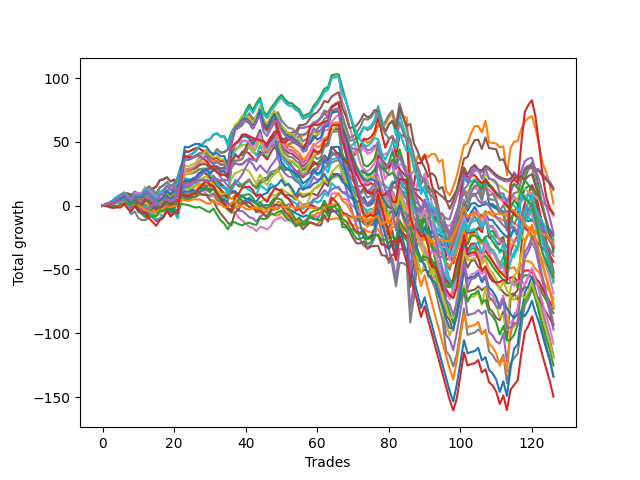

# Long Wallace Doodle 011 
- Symbol: ES90d
- Date Range: 06/04/2021 - 06/24/2022
- Trading Period: 7:20-12:30
- Number of Trades: 126



| Name | Win Percent | Profit | Avg Profit / Trade |     | Name | Win Percent | Profit | Avg Profit / Trade |
| ---- | ----------- | ------ | ------------------ | --- | ---- | ----------- | ------ | ------------------ |
| Sorted By <br> Profit | | | | | Sorted By <br> Win Percentage ||||
| Thirty-Two | 50.79 | 7000.00 | 55.56 |     | One | 68.25 | 875.00 | 6.94 |
| Thirty-Eight | 47.62 | 6250.00 | 49.60 |     | Fifty-Seven | 65.87 | -16500.00 | -130.95 |
| One | 68.25 | 875.00 | 6.94 |     | Sixty-Five | 62.70 | -17250.00 | -136.90 |
| Eight | 41.27 | -3125.00 | -24.80 |     | Three | 62.70 | -26250.00 | -208.33 |
| Seventy-Four | 40.48 | -3125.00 | -24.80 |     | Fifty-Nine | 60.32 | -27250.00 | -216.27 |
| Twenty-Four | 47.62 | -3750.00 | -29.76 |     | Two | 58.73 | -18250.00 | -144.84 |
| Thirty-Nine | 44.44 | -4000.00 | -31.75 |     | Zero | 58.73 | -26250.00 | -208.33 |
| Sixty-Four | 57.94 | -10875.00 | -86.31 |     | Sixty-Four | 57.94 | -10875.00 | -86.31 |
| Twenty-Two | 42.06 | -11750.00 | -93.25 |     | Six | 57.94 | -58875.00 | -467.26 |
| Thirteen | 23.81 | -13250.00 | -105.16 |     | Fifty-Six | 57.14 | -34500.00 | -273.81 |
| Forty-Five | 39.68 | -14125.00 | -112.10 |     | Sixty-Seven | 56.35 | -28125.00 | -223.21 |
| Seventy-Two | 47.62 | -15000.00 | -119.05 |     | Sixty-Two | 56.35 | -62625.00 | -497.02 |
| Twenty-Three | 40.48 | -15250.00 | -121.03 |     | Fifty-Eight | 55.56 | -39750.00 | -315.48 |
| Fifty-Four | 49.21 | -16000.00 | -126.98 |     | Seventy | 54.76 | -30250.00 | -240.08 |
| Fifty-Seven | 65.87 | -16500.00 | -130.95 |     | Forty | 53.17 | -19750.00 | -156.75 |
| Forty-Eight | 52.38 | -16500.00 | -130.95 |     | Forty-Eight | 52.38 | -16500.00 | -130.95 |
| Sixty-Five | 62.70 | -17250.00 | -136.90 |     | Sixty-Six | 51.59 | -54125.00 | -429.56 |
| Two | 58.73 | -18250.00 | -144.84 |     | Thirty-Two | 50.79 | 7000.00 | 55.56 |
| Forty | 53.17 | -19750.00 | -156.75 |     | Four | 50.79 | -48625.00 | -385.91 |
| Twenty-Nine | 30.16 | -22000.00 | -174.60 |     | Fifty-Four | 49.21 | -16000.00 | -126.98 |
| Three | 62.70 | -26250.00 | -208.33 |     | Five | 49.21 | -29375.00 | -233.13 |
| Zero | 58.73 | -26250.00 | -208.33 |     | Seventy-Five | 49.21 | -46500.00 | -369.05 |
| Fifty-Nine | 60.32 | -27250.00 | -216.27 |     | Sixty | 49.21 | -59250.00 | -470.24 |
| Seventy-Three | 46.03 | -28000.00 | -222.22 |     | Thirty-Eight | 47.62 | 6250.00 | 49.60 |
| Sixty-Seven | 56.35 | -28125.00 | -223.21 |     | Twenty-Four | 47.62 | -3750.00 | -29.76 |
| Forty-Two | 45.24 | -29000.00 | -230.16 |     | Seventy-Two | 47.62 | -15000.00 | -119.05 |
| Five | 49.21 | -29375.00 | -233.13 |     | Fifty | 47.62 | -36625.00 | -290.67 |
| Seventy | 54.76 | -30250.00 | -240.08 |     | Sixty-One | 47.62 | -39000.00 | -309.52 |
| Fifty-Six | 57.14 | -34500.00 | -273.81 |     | Seven | 47.62 | -67125.00 | -532.74 |
| Fifty | 47.62 | -36625.00 | -290.67 |     | Seventy-Three | 46.03 | -28000.00 | -222.22 |
| Sixty-One | 47.62 | -39000.00 | -309.52 |     | Sixty-Three | 46.03 | -74875.00 | -594.25 |
| Fifty-Eight | 55.56 | -39750.00 | -315.48 |     | Forty-Two | 45.24 | -29000.00 | -230.16 |
| Fifty-Three | 42.86 | -40250.00 | -319.44 |     | Thirty-Nine | 44.44 | -4000.00 | -31.75 |
| Fifty-Two | 43.65 | -42125.00 | -334.33 |     | Sixty-Nine | 44.44 | -59750.00 | -474.21 |
| Seventy-Five | 49.21 | -46500.00 | -369.05 |     | Fifty-Two | 43.65 | -42125.00 | -334.33 |
| Fifty-Five | 41.27 | -46875.00 | -372.02 |     | Fifty-Three | 42.86 | -40250.00 | -319.44 |
| Four | 50.79 | -48625.00 | -385.91 |     | Seventy-One | 42.86 | -66875.00 | -530.75 |
| Sixty-Six | 51.59 | -54125.00 | -429.56 |     | Twenty-Two | 42.06 | -11750.00 | -93.25 |
| Six | 57.94 | -58875.00 | -467.26 |     | Eight | 41.27 | -3125.00 | -24.80 |
| Sixty | 49.21 | -59250.00 | -470.24 |     | Fifty-Five | 41.27 | -46875.00 | -372.02 |
| Sixty-Nine | 44.44 | -59750.00 | -474.21 |     | Seventy-Four | 40.48 | -3125.00 | -24.80 |
| Sixty-Two | 56.35 | -62625.00 | -497.02 |     | Twenty-Three | 40.48 | -15250.00 | -121.03 |
| Seventy-One | 42.86 | -66875.00 | -530.75 |     | Forty-Five | 39.68 | -14125.00 | -112.10 |
| Seven | 47.62 | -67125.00 | -532.74 |     | Twenty-Nine | 30.16 | -22000.00 | -174.60 |
| Sixty-Three | 46.03 | -74875.00 | -594.25 |     | Thirteen | 23.81 | -13250.00 | -105.16 |

## NO STOPLOSS

### Test Zero
* Sell when price hits the middle line of the 20p bollinger
* No Stoploss
* Results:
```
Total Trades: 126
Percent Up: 58.73
Percent Down: 41.27
Total Points Moved Up: -52.50
Potential Profit: -26250.00
Total Points Ups: 235.00 Count Ups: 74
Total Points Downs: -287.50 Count Downs: 52
```

<details><summary>Trades</summary>

<code>In: 2021-06-09 08:58:00		Out: 2021-06-09 09:05:40		Total Position Time: 07:40		Total Move Up: 1.00		Total to Date: 1.00</code> <br />
<code>In: 2021-06-09 08:59:00		Out: 2021-06-09 09:05:40		Total Position Time: 06:40		Total Move Up: 0.25		Total to Date: 1.25</code> <br />
<code>In: 2021-06-24 08:22:00		Out: 2021-06-24 08:29:45		Total Position Time: 07:45		Total Move Up: 0.75		Total to Date: 2.00</code> <br />
<code>In: 2021-06-24 08:44:00		Out: 2021-06-24 08:48:15		Total Position Time: 04:15		Total Move Up: 1.00		Total to Date: 3.00</code> <br />
<code>In: 2021-06-29 08:12:00		Out: 2021-06-29 08:18:30		Total Position Time: 06:30		Total Move Up: 1.00		Total to Date: 4.00</code> <br />
<code>In: 2021-06-30 11:13:00		Out: 2021-06-30 11:14:05		Total Position Time: 01:05		Total Move Up: 0.50		Total to Date: 4.50</code> <br />
<code>In: 2021-07-13 10:21:00		Out: 2021-07-13 10:45:00		Total Position Time: 24:00		Total Move Up: -2.50		Total to Date: 2.00</code> <br />
<code>In: 2021-07-13 10:22:00		Out: 2021-07-13 10:45:00		Total Position Time: 23:00		Total Move Up: -3.25		Total to Date: -1.25</code> <br />
<code>In: 2021-07-13 11:06:00		Out: 2021-07-13 11:10:10		Total Position Time: 04:10		Total Move Up: 2.25		Total to Date: 1.00</code> <br />
<code>In: 2021-07-15 09:03:00		Out: 2021-07-15 09:19:35		Total Position Time: 16:35		Total Move Up: -2.75		Total to Date: -1.75</code> <br />
<code>In: 2021-07-15 09:06:00		Out: 2021-07-15 09:19:35		Total Position Time: 13:35		Total Move Up: -1.50		Total to Date: -3.25</code> <br />
<code>In: 2021-07-15 09:11:00		Out: 2021-07-15 09:19:35		Total Position Time: 08:35		Total Move Up: 0.00		Total to Date: -3.25</code> <br />
<code>In: 2021-07-22 08:47:00		Out: 2021-07-22 08:52:55		Total Position Time: 05:55		Total Move Up: 1.75		Total to Date: -1.50</code> <br />
<code>In: 2021-07-28 09:46:00		Out: 2021-07-28 09:51:50		Total Position Time: 05:50		Total Move Up: 2.00		Total to Date: 0.50</code> <br />
<code>In: 2021-07-28 09:47:00		Out: 2021-07-28 09:51:50		Total Position Time: 04:50		Total Move Up: 1.75		Total to Date: 2.25</code> <br />
<code>In: 2021-08-04 07:34:00		Out: 2021-08-04 07:39:55		Total Position Time: 05:55		Total Move Up: 2.50		Total to Date: 4.75</code> <br />
<code>In: 2021-08-06 11:57:00		Out: 2021-08-06 12:08:05		Total Position Time: 11:05		Total Move Up: -0.25		Total to Date: 4.50</code> <br />
<code>In: 2021-08-06 12:06:00		Out: 2021-08-06 12:08:05		Total Position Time: 02:05		Total Move Up: 0.50		Total to Date: 5.00</code> <br />
<code>In: 2021-08-10 07:34:00		Out: 2021-08-10 07:49:10		Total Position Time: 15:10		Total Move Up: -1.75		Total to Date: 3.25</code> <br />
<code>In: 2021-08-13 11:45:00		Out: 2021-08-13 11:48:15		Total Position Time: 03:15		Total Move Up: 1.50		Total to Date: 4.75</code> <br />
<code>In: 2021-08-17 08:32:00		Out: 2021-08-17 08:33:50		Total Position Time: 01:50		Total Move Up: 3.25		Total to Date: 8.00</code> <br />
<code>In: 2021-08-19 11:34:00		Out: 2021-08-19 11:35:40		Total Position Time: 01:40		Total Move Up: 7.50		Total to Date: 15.50</code> <br />
<code>In: 2021-08-19 11:35:00		Out: 2021-08-19 11:35:40		Total Position Time: 00:40		Total Move Up: 2.00		Total to Date: 17.50</code> <br />
<code>In: 2021-08-24 08:36:00		Out: 2021-08-24 08:44:45		Total Position Time: 08:45		Total Move Up: -0.25		Total to Date: 17.25</code> <br />
<code>In: 2021-08-24 09:18:00		Out: 2021-08-24 09:19:20		Total Position Time: 01:20		Total Move Up: 1.00		Total to Date: 18.25</code> <br />
<code>In: 2021-08-31 10:27:00		Out: 2021-08-31 10:39:35		Total Position Time: 12:35		Total Move Up: -0.25		Total to Date: 18.00</code> <br />
<code>In: 2021-08-31 11:49:00		Out: 2021-08-31 11:51:05		Total Position Time: 02:05		Total Move Up: 2.00		Total to Date: 20.00</code> <br />
<code>In: 2021-08-31 11:51:00		Out: 2021-08-31 11:51:25		Total Position Time: 00:25		Total Move Up: 0.00		Total to Date: 20.00</code> <br />
<code>In: 2021-08-31 12:25:00		Out: 2021-08-31 12:25:25		Total Position Time: 00:25		Total Move Up: -0.25		Total to Date: 19.75</code> <br />
<code>In: 2021-09-01 11:37:00		Out: 2021-09-01 11:55:30		Total Position Time: 18:30		Total Move Up: -0.50		Total to Date: 19.25</code> <br />
<code>In: 2021-09-01 12:12:00		Out: 2021-09-01 12:13:25		Total Position Time: 01:25		Total Move Up: 1.75		Total to Date: 21.00</code> <br />
<code>In: 2021-09-08 07:40:00		Out: 2021-09-08 07:50:00		Total Position Time: 10:00		Total Move Up: -0.25		Total to Date: 20.75</code> <br />
<code>In: 2021-09-09 08:22:00		Out: 2021-09-09 08:36:25		Total Position Time: 14:25		Total Move Up: -1.25		Total to Date: 19.50</code> <br />
<code>In: 2021-09-09 08:28:00		Out: 2021-09-09 08:36:25		Total Position Time: 08:25		Total Move Up: 0.75		Total to Date: 20.25</code> <br />
<code>In: 2021-09-21 10:27:00		Out: 2021-09-21 10:39:50		Total Position Time: 12:50		Total Move Up: -0.25		Total to Date: 20.00</code> <br />
<code>In: 2021-09-22 11:52:00		Out: 2021-09-22 11:54:30		Total Position Time: 02:30		Total Move Up: 10.25		Total to Date: 30.25</code> <br />
<code>In: 2021-09-24 08:30:00		Out: 2021-09-24 08:38:40		Total Position Time: 08:40		Total Move Up: 3.00		Total to Date: 33.25</code> <br />
<code>In: 2021-09-27 08:45:00		Out: 2021-09-27 08:58:00		Total Position Time: 13:00		Total Move Up: -0.75		Total to Date: 32.50</code> <br />
<code>In: 2021-09-27 08:48:00		Out: 2021-09-27 08:58:00		Total Position Time: 10:00		Total Move Up: 0.00		Total to Date: 32.50</code> <br />
<code>In: 2021-09-29 08:41:00		Out: 2021-09-29 08:48:25		Total Position Time: 07:25		Total Move Up: 2.50		Total to Date: 35.00</code> <br />
<code>In: 2021-09-29 08:43:00		Out: 2021-09-29 08:48:25		Total Position Time: 05:25		Total Move Up: 2.00		Total to Date: 37.00</code> <br />
<code>In: 2021-09-29 09:18:00		Out: 2021-09-29 09:30:30		Total Position Time: 12:30		Total Move Up: -1.00		Total to Date: 36.00</code> <br />
<code>In: 2021-10-07 11:47:00		Out: 2021-10-07 11:57:40		Total Position Time: 10:40		Total Move Up: -0.25		Total to Date: 35.75</code> <br />
<code>In: 2021-10-08 07:45:00		Out: 2021-10-08 07:48:45		Total Position Time: 03:45		Total Move Up: 4.00		Total to Date: 39.75</code> <br />
<code>In: 2021-10-11 09:54:00		Out: 2021-10-11 09:55:30		Total Position Time: 01:30		Total Move Up: 1.75		Total to Date: 41.50</code> <br />
<code>In: 2021-10-12 09:38:00		Out: 2021-10-12 09:52:20		Total Position Time: 14:20		Total Move Up: 1.00		Total to Date: 42.50</code> <br />
<code>In: 2021-10-20 10:23:00		Out: 2021-10-20 10:28:45		Total Position Time: 05:45		Total Move Up: 4.25		Total to Date: 46.75</code> <br />
<code>In: 2021-10-21 08:32:00		Out: 2021-10-21 08:39:45		Total Position Time: 07:45		Total Move Up: 0.75		Total to Date: 47.50</code> <br />
<code>In: 2021-10-22 07:56:00		Out: 2021-10-22 08:00:35		Total Position Time: 04:35		Total Move Up: 1.75		Total to Date: 49.25</code> <br />
<code>In: 2021-10-26 08:37:00		Out: 2021-10-26 08:44:05		Total Position Time: 07:05		Total Move Up: 3.75		Total to Date: 53.00</code> <br />
<code>In: 2021-10-26 09:02:00		Out: 2021-10-26 09:14:05		Total Position Time: 12:05		Total Move Up: -1.50		Total to Date: 51.50</code> <br />
<code>In: 2021-10-26 09:07:00		Out: 2021-10-26 09:14:05		Total Position Time: 07:05		Total Move Up: 1.50		Total to Date: 53.00</code> <br />
<code>In: 2021-10-27 12:16:00		Out: 2021-10-27 12:26:35		Total Position Time: 10:35		Total Move Up: 2.00		Total to Date: 55.00</code> <br />
<code>In: 2021-10-27 12:17:00		Out: 2021-10-27 12:26:35		Total Position Time: 09:35		Total Move Up: 0.75		Total to Date: 55.75</code> <br />
<code>In: 2021-10-27 12:21:00		Out: 2021-10-27 12:26:35		Total Position Time: 05:35		Total Move Up: 5.50		Total to Date: 61.25</code> <br />
<code>In: 2021-11-01 10:46:00		Out: 2021-11-01 10:57:15		Total Position Time: 11:15		Total Move Up: -0.25		Total to Date: 61.00</code> <br />
<code>In: 2021-11-03 08:38:00		Out: 2021-11-03 08:43:30		Total Position Time: 05:30		Total Move Up: 0.75		Total to Date: 61.75</code> <br />
<code>In: 2021-11-03 10:50:00		Out: 2021-11-03 10:58:00		Total Position Time: 08:00		Total Move Up: 0.50		Total to Date: 62.25</code> <br />
<code>In: 2021-11-04 08:27:00		Out: 2021-11-04 08:33:00		Total Position Time: 06:00		Total Move Up: 3.00		Total to Date: 65.25</code> <br />
<code>In: 2021-11-05 08:32:00		Out: 2021-11-05 08:38:35		Total Position Time: 06:35		Total Move Up: 1.00		Total to Date: 66.25</code> <br />
<code>In: 2021-11-17 09:31:00		Out: 2021-11-17 09:35:15		Total Position Time: 04:15		Total Move Up: 2.75		Total to Date: 69.00</code> <br />
<code>In: 2021-11-19 07:31:00		Out: 2021-11-19 07:33:35		Total Position Time: 02:35		Total Move Up: 3.50		Total to Date: 72.50</code> <br />
<code>In: 2021-11-19 10:31:00		Out: 2021-11-19 10:50:05		Total Position Time: 19:05		Total Move Up: -2.75		Total to Date: 69.75</code> <br />
<code>In: 2021-11-19 10:42:00		Out: 2021-11-19 10:50:05		Total Position Time: 08:05		Total Move Up: 3.00		Total to Date: 72.75</code> <br />
<code>In: 2021-11-19 12:19:00		Out: 2021-11-19 12:24:20		Total Position Time: 05:20		Total Move Up: 1.25		Total to Date: 74.00</code> <br />
<code>In: 2021-11-19 12:20:00		Out: 2021-11-19 12:24:20		Total Position Time: 04:20		Total Move Up: 0.75		Total to Date: 74.75</code> <br />
<code>In: 2021-11-30 07:52:00		Out: 2021-11-30 08:11:10		Total Position Time: 19:10		Total Move Up: -23.75		Total to Date: 51.00</code> <br />
<code>In: 2021-12-01 10:01:00		Out: 2021-12-01 10:22:50		Total Position Time: 21:50		Total Move Up: -10.75		Total to Date: 40.25</code> <br />
<code>In: 2021-12-01 10:02:00		Out: 2021-12-01 10:22:50		Total Position Time: 20:50		Total Move Up: -12.50		Total to Date: 27.75</code> <br />
<code>In: 2021-12-09 11:45:00		Out: 2021-12-09 12:01:15		Total Position Time: 16:15		Total Move Up: -2.00		Total to Date: 25.75</code> <br />
<code>In: 2021-12-09 11:49:00		Out: 2021-12-09 12:01:15		Total Position Time: 12:15		Total Move Up: -1.00		Total to Date: 24.75</code> <br />
<code>In: 2021-12-09 11:55:00		Out: 2021-12-09 12:01:15		Total Position Time: 06:15		Total Move Up: 1.25		Total to Date: 26.00</code> <br />
<code>In: 2021-12-09 11:58:00		Out: 2021-12-09 12:01:15		Total Position Time: 03:15		Total Move Up: 2.75		Total to Date: 28.75</code> <br />
<code>In: 2021-12-09 12:11:00		Out: 2021-12-09 12:27:20		Total Position Time: 16:20		Total Move Up: -4.50		Total to Date: 24.25</code> <br />
<code>In: 2021-12-30 08:03:00		Out: 2021-12-30 08:12:20		Total Position Time: 09:20		Total Move Up: 1.00		Total to Date: 25.25</code> <br />
<code>In: 2022-01-05 08:13:00		Out: 2022-01-05 08:15:30		Total Position Time: 02:30		Total Move Up: 3.00		Total to Date: 28.25</code> <br />
<code>In: 2022-01-11 07:45:00		Out: 2022-01-11 07:54:05		Total Position Time: 09:05		Total Move Up: 6.25		Total to Date: 34.50</code> <br />
<code>In: 2022-01-12 07:41:00		Out: 2022-01-12 07:57:30		Total Position Time: 16:30		Total Move Up: -6.00		Total to Date: 28.50</code> <br />
<code>In: 2022-01-12 07:45:00		Out: 2022-01-12 07:57:30		Total Position Time: 12:30		Total Move Up: -0.25		Total to Date: 28.25</code> <br />
<code>In: 2022-01-14 07:42:00		Out: 2022-01-14 07:48:05		Total Position Time: 06:05		Total Move Up: 2.50		Total to Date: 30.75</code> <br />
<code>In: 2022-01-20 11:01:00		Out: 2022-01-20 11:02:25		Total Position Time: 01:25		Total Move Up: 2.00		Total to Date: 32.75</code> <br />
<code>In: 2022-01-20 11:18:00		Out: 2022-01-20 11:47:55		Total Position Time: 29:55		Total Move Up: -15.75		Total to Date: 17.00</code> <br />
<code>In: 2022-01-25 08:40:00		Out: 2022-01-25 08:46:10		Total Position Time: 06:10		Total Move Up: 10.00		Total to Date: 27.00</code> <br />
<code>In: 2022-01-26 07:30:00		Out: 2022-01-26 07:50:35		Total Position Time: 20:35		Total Move Up: -5.75		Total to Date: 21.25</code> <br />
<code>In: 2022-01-26 07:32:00		Out: 2022-01-26 07:50:35		Total Position Time: 18:35		Total Move Up: -4.50		Total to Date: 16.75</code> <br />
<code>In: 2022-01-26 11:50:00		Out: 2022-01-26 12:19:55		Total Position Time: 29:55		Total Move Up: -44.50		Total to Date: -27.75</code> <br />
<code>In: 2022-01-27 07:31:00		Out: 2022-01-27 07:44:00		Total Position Time: 13:00		Total Move Up: -2.75		Total to Date: -30.50</code> <br />
<code>In: 2022-01-27 07:34:00		Out: 2022-01-27 07:44:00		Total Position Time: 10:00		Total Move Up: 6.50		Total to Date: -24.00</code> <br />
<code>In: 2022-02-03 09:01:00		Out: 2022-02-03 09:14:30		Total Position Time: 13:30		Total Move Up: -1.50		Total to Date: -25.50</code> <br />
<code>In: 2022-02-03 09:06:00		Out: 2022-02-03 09:14:30		Total Position Time: 08:30		Total Move Up: 5.25		Total to Date: -20.25</code> <br />
<code>In: 2022-02-04 07:40:00		Out: 2022-02-04 07:54:00		Total Position Time: 14:00		Total Move Up: -2.25		Total to Date: -22.50</code> <br />
<code>In: 2022-02-10 09:50:00		Out: 2022-02-10 10:01:30		Total Position Time: 11:30		Total Move Up: 3.00		Total to Date: -19.50</code> <br />
<code>In: 2022-02-14 10:57:00		Out: 2022-02-14 11:12:45		Total Position Time: 15:45		Total Move Up: -1.50		Total to Date: -21.00</code> <br />
<code>In: 2022-02-14 10:58:00		Out: 2022-02-14 11:12:45		Total Position Time: 14:45		Total Move Up: -7.00		Total to Date: -28.00</code> <br />
<code>In: 2022-02-15 09:20:00		Out: 2022-02-15 09:31:05		Total Position Time: 11:05		Total Move Up: 0.50		Total to Date: -27.50</code> <br />
<code>In: 2022-02-18 07:34:00		Out: 2022-02-18 07:46:10		Total Position Time: 12:10		Total Move Up: -0.50		Total to Date: -28.00</code> <br />
<code>In: 2022-02-22 08:01:00		Out: 2022-02-22 08:24:10		Total Position Time: 23:10		Total Move Up: -6.25		Total to Date: -34.25</code> <br />
<code>In: 2022-03-14 08:47:00		Out: 2022-03-14 08:47:15		Total Position Time: 00:15		Total Move Up: 9.75		Total to Date: -24.50</code> <br />
<code>In: 2022-03-16 10:12:00		Out: 2022-03-16 10:12:10		Total Position Time: 00:10		Total Move Up: 8.25		Total to Date: -16.25</code> <br />
<code>In: 2022-03-17 07:54:00		Out: 2022-03-17 07:55:10		Total Position Time: 01:10		Total Move Up: 8.25		Total to Date: -8.00</code> <br />
<code>In: 2022-03-17 07:56:00		Out: 2022-03-17 07:56:10		Total Position Time: 00:10		Total Move Up: 9.00		Total to Date: 1.00</code> <br />
<code>In: 2022-03-21 09:35:00		Out: 2022-03-21 09:45:00		Total Position Time: 10:00		Total Move Up: 2.50		Total to Date: 3.50</code> <br />
<code>In: 2022-03-23 09:14:00		Out: 2022-03-23 09:19:25		Total Position Time: 05:25		Total Move Up: 7.50		Total to Date: 11.00</code> <br />
<code>In: 2022-03-23 09:47:00		Out: 2022-03-23 09:53:00		Total Position Time: 06:00		Total Move Up: 4.25		Total to Date: 15.25</code> <br />
<code>In: 2022-03-23 10:28:00		Out: 2022-03-23 10:37:45		Total Position Time: 09:45		Total Move Up: 1.00		Total to Date: 16.25</code> <br />
<code>In: 2022-03-25 08:14:00		Out: 2022-03-25 08:36:40		Total Position Time: 22:40		Total Move Up: -6.00		Total to Date: 10.25</code> <br />
<code>In: 2022-03-25 08:29:00		Out: 2022-03-25 08:36:40		Total Position Time: 07:40		Total Move Up: 8.00		Total to Date: 18.25</code> <br />
<code>In: 2022-03-28 08:27:00		Out: 2022-03-28 08:56:55		Total Position Time: 29:55		Total Move Up: -16.75		Total to Date: 1.50</code> <br />
<code>In: 2022-03-31 09:23:00		Out: 2022-03-31 09:32:20		Total Position Time: 09:20		Total Move Up: -0.25		Total to Date: 1.25</code> <br />
<code>In: 2022-04-12 07:41:00		Out: 2022-04-12 07:57:25		Total Position Time: 16:25		Total Move Up: -2.25		Total to Date: -1.00</code> <br />
<code>In: 2022-04-18 08:29:00		Out: 2022-04-18 08:54:55		Total Position Time: 25:55		Total Move Up: -5.00		Total to Date: -6.00</code> <br />
<code>In: 2022-04-20 09:14:00		Out: 2022-04-20 09:30:45		Total Position Time: 16:45		Total Move Up: -0.50		Total to Date: -6.50</code> <br />
<code>In: 2022-04-29 07:22:00		Out: 2022-04-29 07:44:45		Total Position Time: 22:45		Total Move Up: -13.00		Total to Date: -19.50</code> <br />
<code>In: 2022-05-04 11:36:00		Out: 2022-05-04 11:36:40		Total Position Time: 00:40		Total Move Up: 8.25		Total to Date: -11.25</code> <br />
<code>In: 2022-05-13 11:07:00		Out: 2022-05-13 11:12:25		Total Position Time: 05:25		Total Move Up: 6.50		Total to Date: -4.75</code> <br />
<code>In: 2022-05-16 07:55:00		Out: 2022-05-16 08:05:25		Total Position Time: 10:25		Total Move Up: -1.00		Total to Date: -5.75</code> <br />
<code>In: 2022-05-17 11:24:00		Out: 2022-05-17 11:27:25		Total Position Time: 03:25		Total Move Up: 11.25		Total to Date: 5.50</code> <br />
<code>In: 2022-05-17 11:25:00		Out: 2022-05-17 11:27:25		Total Position Time: 02:25		Total Move Up: 7.75		Total to Date: 13.25</code> <br />
<code>In: 2022-05-25 09:29:00		Out: 2022-05-25 09:38:50		Total Position Time: 09:50		Total Move Up: 2.00		Total to Date: 15.25</code> <br />
<code>In: 2022-05-25 09:30:00		Out: 2022-05-25 09:38:50		Total Position Time: 08:50		Total Move Up: 0.50		Total to Date: 15.75</code> <br />
<code>In: 2022-06-06 08:15:00		Out: 2022-06-06 08:31:35		Total Position Time: 16:35		Total Move Up: -8.25		Total to Date: 7.50</code> <br />
<code>In: 2022-06-08 09:29:00		Out: 2022-06-08 09:53:00		Total Position Time: 24:00		Total Move Up: -13.00		Total to Date: -5.50</code> <br />
<code>In: 2022-06-08 09:30:00		Out: 2022-06-08 09:53:00		Total Position Time: 23:00		Total Move Up: -15.25		Total to Date: -20.75</code> <br />
<code>In: 2022-06-08 09:35:00		Out: 2022-06-08 09:53:00		Total Position Time: 18:00		Total Move Up: -7.50		Total to Date: -28.25</code> <br />
<code>In: 2022-06-15 07:35:00		Out: 2022-06-15 08:04:55		Total Position Time: 29:55		Total Move Up: -10.50		Total to Date: -38.75</code> <br />
<code>In: 2022-06-15 07:48:00		Out: 2022-06-15 08:17:55		Total Position Time: 29:55		Total Move Up: -13.75		Total to Date: -52.50</code> <br />


</details>

### Test One
* Sell when the price hits the upper line of the 20p 1std bollinger
* No Stoploss
* Results:
```
Total Trades: 126
Percent Up: 68.25
Percent Down: 31.75
Total Points Moved Up: 1.75
Potential Profit: 875.00
Total Points Ups: 313.00 Count Ups: 86
Total Points Downs: -311.25 Count Downs: 40
```

<details><summary>Trades</summary>

<code>In: 2021-06-09 08:58:00		Out: 2021-06-09 09:14:55		Total Position Time: 16:55		Total Move Up: 1.00		Total to Date: 1.00</code> <br />
<code>In: 2021-06-09 08:59:00		Out: 2021-06-09 09:14:55		Total Position Time: 15:55		Total Move Up: 0.25		Total to Date: 1.25</code> <br />
<code>In: 2021-06-24 08:22:00		Out: 2021-06-24 08:31:20		Total Position Time: 09:20		Total Move Up: 1.00		Total to Date: 2.25</code> <br />
<code>In: 2021-06-24 08:44:00		Out: 2021-06-24 08:50:55		Total Position Time: 06:55		Total Move Up: 2.00		Total to Date: 4.25</code> <br />
<code>In: 2021-06-29 08:12:00		Out: 2021-06-29 08:19:00		Total Position Time: 07:00		Total Move Up: 1.50		Total to Date: 5.75</code> <br />
<code>In: 2021-06-30 11:13:00		Out: 2021-06-30 11:16:40		Total Position Time: 03:40		Total Move Up: 1.50		Total to Date: 7.25</code> <br />
<code>In: 2021-07-13 10:21:00		Out: 2021-07-13 10:45:55		Total Position Time: 24:55		Total Move Up: -0.25		Total to Date: 7.00</code> <br />
<code>In: 2021-07-13 10:22:00		Out: 2021-07-13 10:45:55		Total Position Time: 23:55		Total Move Up: -1.00		Total to Date: 6.00</code> <br />
<code>In: 2021-07-13 11:06:00		Out: 2021-07-13 11:14:55		Total Position Time: 08:55		Total Move Up: 4.75		Total to Date: 10.75</code> <br />
<code>In: 2021-07-15 09:03:00		Out: 2021-07-15 09:23:05		Total Position Time: 20:05		Total Move Up: -1.75		Total to Date: 9.00</code> <br />
<code>In: 2021-07-15 09:06:00		Out: 2021-07-15 09:23:05		Total Position Time: 17:05		Total Move Up: -0.50		Total to Date: 8.50</code> <br />
<code>In: 2021-07-15 09:11:00		Out: 2021-07-15 09:23:05		Total Position Time: 12:05		Total Move Up: 1.00		Total to Date: 9.50</code> <br />
<code>In: 2021-07-22 08:47:00		Out: 2021-07-22 08:56:40		Total Position Time: 09:40		Total Move Up: 2.25		Total to Date: 11.75</code> <br />
<code>In: 2021-07-28 09:46:00		Out: 2021-07-28 10:00:10		Total Position Time: 14:10		Total Move Up: 1.75		Total to Date: 13.50</code> <br />
<code>In: 2021-07-28 09:47:00		Out: 2021-07-28 10:00:10		Total Position Time: 13:10		Total Move Up: 1.50		Total to Date: 15.00</code> <br />
<code>In: 2021-08-04 07:34:00		Out: 2021-08-04 07:41:45		Total Position Time: 07:45		Total Move Up: 5.00		Total to Date: 20.00</code> <br />
<code>In: 2021-08-06 11:57:00		Out: 2021-08-06 12:10:45		Total Position Time: 13:45		Total Move Up: 0.75		Total to Date: 20.75</code> <br />
<code>In: 2021-08-06 12:06:00		Out: 2021-08-06 12:10:45		Total Position Time: 04:45		Total Move Up: 1.50		Total to Date: 22.25</code> <br />
<code>In: 2021-08-10 07:34:00		Out: 2021-08-10 08:03:55		Total Position Time: 29:55		Total Move Up: -3.25		Total to Date: 19.00</code> <br />
<code>In: 2021-08-13 11:45:00		Out: 2021-08-13 11:56:45		Total Position Time: 11:45		Total Move Up: 1.50		Total to Date: 20.50</code> <br />
<code>In: 2021-08-17 08:32:00		Out: 2021-08-17 09:01:55		Total Position Time: 29:55		Total Move Up: -8.75		Total to Date: 11.75</code> <br />
<code>In: 2021-08-19 11:34:00		Out: 2021-08-19 11:48:00		Total Position Time: 14:00		Total Move Up: 9.25		Total to Date: 21.00</code> <br />
<code>In: 2021-08-19 11:35:00		Out: 2021-08-19 11:48:00		Total Position Time: 13:00		Total Move Up: 3.75		Total to Date: 24.75</code> <br />
<code>In: 2021-08-24 08:36:00		Out: 2021-08-24 08:45:30		Total Position Time: 09:30		Total Move Up: 0.50		Total to Date: 25.25</code> <br />
<code>In: 2021-08-24 09:18:00		Out: 2021-08-24 09:35:20		Total Position Time: 17:20		Total Move Up: 0.25		Total to Date: 25.50</code> <br />
<code>In: 2021-08-31 10:27:00		Out: 2021-08-31 10:41:00		Total Position Time: 14:00		Total Move Up: 0.75		Total to Date: 26.25</code> <br />
<code>In: 2021-08-31 11:49:00		Out: 2021-08-31 11:58:05		Total Position Time: 09:05		Total Move Up: 2.25		Total to Date: 28.50</code> <br />
<code>In: 2021-08-31 11:51:00		Out: 2021-08-31 11:58:05		Total Position Time: 07:05		Total Move Up: 0.50		Total to Date: 29.00</code> <br />
<code>In: 2021-08-31 12:25:00		Out: 2021-08-31 12:34:25		Total Position Time: 09:25		Total Move Up: 0.00		Total to Date: 29.00</code> <br />
<code>In: 2021-09-01 11:37:00		Out: 2021-09-01 12:06:55		Total Position Time: 29:55		Total Move Up: -4.00		Total to Date: 25.00</code> <br />
<code>In: 2021-09-01 12:12:00		Out: 2021-09-01 12:15:30		Total Position Time: 03:30		Total Move Up: 2.75		Total to Date: 27.75</code> <br />
<code>In: 2021-09-08 07:40:00		Out: 2021-09-08 07:57:55		Total Position Time: 17:55		Total Move Up: -0.75		Total to Date: 27.00</code> <br />
<code>In: 2021-09-09 08:22:00		Out: 2021-09-09 08:41:50		Total Position Time: 19:50		Total Move Up: -1.25		Total to Date: 25.75</code> <br />
<code>In: 2021-09-09 08:28:00		Out: 2021-09-09 08:41:50		Total Position Time: 13:50		Total Move Up: 0.75		Total to Date: 26.50</code> <br />
<code>In: 2021-09-21 10:27:00		Out: 2021-09-21 10:47:35		Total Position Time: 20:35		Total Move Up: -1.50		Total to Date: 25.00</code> <br />
<code>In: 2021-09-22 11:52:00		Out: 2021-09-22 12:07:30		Total Position Time: 15:30		Total Move Up: 6.50		Total to Date: 31.50</code> <br />
<code>In: 2021-09-24 08:30:00		Out: 2021-09-24 08:40:20		Total Position Time: 10:20		Total Move Up: 3.75		Total to Date: 35.25</code> <br />
<code>In: 2021-09-27 08:45:00		Out: 2021-09-27 09:00:05		Total Position Time: 15:05		Total Move Up: 0.25		Total to Date: 35.50</code> <br />
<code>In: 2021-09-27 08:48:00		Out: 2021-09-27 09:00:05		Total Position Time: 12:05		Total Move Up: 1.00		Total to Date: 36.50</code> <br />
<code>In: 2021-09-29 08:41:00		Out: 2021-09-29 08:50:20		Total Position Time: 09:20		Total Move Up: 5.75		Total to Date: 42.25</code> <br />
<code>In: 2021-09-29 08:43:00		Out: 2021-09-29 08:50:20		Total Position Time: 07:20		Total Move Up: 5.25		Total to Date: 47.50</code> <br />
<code>In: 2021-09-29 09:18:00		Out: 2021-09-29 09:34:00		Total Position Time: 16:00		Total Move Up: 0.75		Total to Date: 48.25</code> <br />
<code>In: 2021-10-07 11:47:00		Out: 2021-10-07 12:05:40		Total Position Time: 18:40		Total Move Up: 0.00		Total to Date: 48.25</code> <br />
<code>In: 2021-10-08 07:45:00		Out: 2021-10-08 07:52:20		Total Position Time: 07:20		Total Move Up: 6.25		Total to Date: 54.50</code> <br />
<code>In: 2021-10-11 09:54:00		Out: 2021-10-11 10:23:55		Total Position Time: 29:55		Total Move Up: -12.75		Total to Date: 41.75</code> <br />
<code>In: 2021-10-12 09:38:00		Out: 2021-10-12 09:53:00		Total Position Time: 15:00		Total Move Up: 1.50		Total to Date: 43.25</code> <br />
<code>In: 2021-10-20 10:23:00		Out: 2021-10-20 10:35:30		Total Position Time: 12:30		Total Move Up: 5.00		Total to Date: 48.25</code> <br />
<code>In: 2021-10-21 08:32:00		Out: 2021-10-21 08:45:05		Total Position Time: 13:05		Total Move Up: 1.00		Total to Date: 49.25</code> <br />
<code>In: 2021-10-22 07:56:00		Out: 2021-10-22 08:05:10		Total Position Time: 09:10		Total Move Up: 3.25		Total to Date: 52.50</code> <br />
<code>In: 2021-10-26 08:37:00		Out: 2021-10-26 09:06:55		Total Position Time: 29:55		Total Move Up: -8.50		Total to Date: 44.00</code> <br />
<code>In: 2021-10-26 09:02:00		Out: 2021-10-26 09:17:00		Total Position Time: 15:00		Total Move Up: 0.25		Total to Date: 44.25</code> <br />
<code>In: 2021-10-26 09:07:00		Out: 2021-10-26 09:17:00		Total Position Time: 10:00		Total Move Up: 3.25		Total to Date: 47.50</code> <br />
<code>In: 2021-10-27 12:16:00		Out: 2021-10-27 12:39:15		Total Position Time: 23:15		Total Move Up: 1.75		Total to Date: 49.25</code> <br />
<code>In: 2021-10-27 12:17:00		Out: 2021-10-27 12:39:15		Total Position Time: 22:15		Total Move Up: 0.50		Total to Date: 49.75</code> <br />
<code>In: 2021-10-27 12:21:00		Out: 2021-10-27 12:39:15		Total Position Time: 18:15		Total Move Up: 5.25		Total to Date: 55.00</code> <br />
<code>In: 2021-11-01 10:46:00		Out: 2021-11-01 11:01:15		Total Position Time: 15:15		Total Move Up: 0.00		Total to Date: 55.00</code> <br />
<code>In: 2021-11-03 08:38:00		Out: 2021-11-03 08:45:20		Total Position Time: 07:20		Total Move Up: 1.25		Total to Date: 56.25</code> <br />
<code>In: 2021-11-03 10:50:00		Out: 2021-11-03 11:00:30		Total Position Time: 10:30		Total Move Up: 4.00		Total to Date: 60.25</code> <br />
<code>In: 2021-11-04 08:27:00		Out: 2021-11-04 08:40:30		Total Position Time: 13:30		Total Move Up: 3.25		Total to Date: 63.50</code> <br />
<code>In: 2021-11-05 08:32:00		Out: 2021-11-05 08:47:55		Total Position Time: 15:55		Total Move Up: 1.50		Total to Date: 65.00</code> <br />
<code>In: 2021-11-17 09:31:00		Out: 2021-11-17 09:38:30		Total Position Time: 07:30		Total Move Up: 3.75		Total to Date: 68.75</code> <br />
<code>In: 2021-11-19 07:31:00		Out: 2021-11-19 07:38:20		Total Position Time: 07:20		Total Move Up: 5.25		Total to Date: 74.00</code> <br />
<code>In: 2021-11-19 10:31:00		Out: 2021-11-19 10:50:45		Total Position Time: 19:45		Total Move Up: -1.25		Total to Date: 72.75</code> <br />
<code>In: 2021-11-19 10:42:00		Out: 2021-11-19 10:50:45		Total Position Time: 08:45		Total Move Up: 4.50		Total to Date: 77.25</code> <br />
<code>In: 2021-11-19 12:19:00		Out: 2021-11-19 12:28:55		Total Position Time: 09:55		Total Move Up: 2.00		Total to Date: 79.25</code> <br />
<code>In: 2021-11-19 12:20:00		Out: 2021-11-19 12:28:55		Total Position Time: 08:55		Total Move Up: 1.50		Total to Date: 80.75</code> <br />
<code>In: 2021-11-30 07:52:00		Out: 2021-11-30 08:12:55		Total Position Time: 20:55		Total Move Up: -18.50		Total to Date: 62.25</code> <br />
<code>In: 2021-12-01 10:01:00		Out: 2021-12-01 10:25:35		Total Position Time: 24:35		Total Move Up: -9.75		Total to Date: 52.50</code> <br />
<code>In: 2021-12-01 10:02:00		Out: 2021-12-01 10:25:35		Total Position Time: 23:35		Total Move Up: -11.50		Total to Date: 41.00</code> <br />
<code>In: 2021-12-09 11:45:00		Out: 2021-12-09 12:02:40		Total Position Time: 17:40		Total Move Up: 0.50		Total to Date: 41.50</code> <br />
<code>In: 2021-12-09 11:49:00		Out: 2021-12-09 12:02:40		Total Position Time: 13:40		Total Move Up: 1.50		Total to Date: 43.00</code> <br />
<code>In: 2021-12-09 11:55:00		Out: 2021-12-09 12:02:40		Total Position Time: 07:40		Total Move Up: 3.75		Total to Date: 46.75</code> <br />
<code>In: 2021-12-09 11:58:00		Out: 2021-12-09 12:02:40		Total Position Time: 04:40		Total Move Up: 5.25		Total to Date: 52.00</code> <br />
<code>In: 2021-12-09 12:11:00		Out: 2021-12-09 12:28:20		Total Position Time: 17:20		Total Move Up: -2.75		Total to Date: 49.25</code> <br />
<code>In: 2021-12-30 08:03:00		Out: 2021-12-30 08:13:50		Total Position Time: 10:50		Total Move Up: 1.50		Total to Date: 50.75</code> <br />
<code>In: 2022-01-05 08:13:00		Out: 2022-01-05 08:21:25		Total Position Time: 08:25		Total Move Up: 4.25		Total to Date: 55.00</code> <br />
<code>In: 2022-01-11 07:45:00		Out: 2022-01-11 07:58:30		Total Position Time: 13:30		Total Move Up: 8.50		Total to Date: 63.50</code> <br />
<code>In: 2022-01-12 07:41:00		Out: 2022-01-12 07:58:20		Total Position Time: 17:20		Total Move Up: -2.75		Total to Date: 60.75</code> <br />
<code>In: 2022-01-12 07:45:00		Out: 2022-01-12 07:58:20		Total Position Time: 13:20		Total Move Up: 3.00		Total to Date: 63.75</code> <br />
<code>In: 2022-01-14 07:42:00		Out: 2022-01-14 07:48:40		Total Position Time: 06:40		Total Move Up: 5.50		Total to Date: 69.25</code> <br />
<code>In: 2022-01-20 11:01:00		Out: 2022-01-20 11:03:00		Total Position Time: 02:00		Total Move Up: 3.00		Total to Date: 72.25</code> <br />
<code>In: 2022-01-20 11:18:00		Out: 2022-01-20 11:47:55		Total Position Time: 29:55		Total Move Up: -15.75		Total to Date: 56.50</code> <br />
<code>In: 2022-01-25 08:40:00		Out: 2022-01-25 08:50:35		Total Position Time: 10:35		Total Move Up: 16.75		Total to Date: 73.25</code> <br />
<code>In: 2022-01-26 07:30:00		Out: 2022-01-26 07:56:15		Total Position Time: 26:15		Total Move Up: -2.75		Total to Date: 70.50</code> <br />
<code>In: 2022-01-26 07:32:00		Out: 2022-01-26 07:56:15		Total Position Time: 24:15		Total Move Up: -1.50		Total to Date: 69.00</code> <br />
<code>In: 2022-01-26 11:50:00		Out: 2022-01-26 12:19:55		Total Position Time: 29:55		Total Move Up: -44.50		Total to Date: 24.50</code> <br />
<code>In: 2022-01-27 07:31:00		Out: 2022-01-27 07:47:05		Total Position Time: 16:05		Total Move Up: 2.50		Total to Date: 27.00</code> <br />
<code>In: 2022-01-27 07:34:00		Out: 2022-01-27 07:47:05		Total Position Time: 13:05		Total Move Up: 11.75		Total to Date: 38.75</code> <br />
<code>In: 2022-02-03 09:01:00		Out: 2022-02-03 09:24:40		Total Position Time: 23:40		Total Move Up: -2.50		Total to Date: 36.25</code> <br />
<code>In: 2022-02-03 09:06:00		Out: 2022-02-03 09:24:40		Total Position Time: 18:40		Total Move Up: 4.25		Total to Date: 40.50</code> <br />
<code>In: 2022-02-04 07:40:00		Out: 2022-02-04 08:04:00		Total Position Time: 24:00		Total Move Up: -2.50		Total to Date: 38.00</code> <br />
<code>In: 2022-02-10 09:50:00		Out: 2022-02-10 10:04:55		Total Position Time: 14:55		Total Move Up: 2.75		Total to Date: 40.75</code> <br />
<code>In: 2022-02-14 10:57:00		Out: 2022-02-14 11:20:35		Total Position Time: 23:35		Total Move Up: -0.50		Total to Date: 40.25</code> <br />
<code>In: 2022-02-14 10:58:00		Out: 2022-02-14 11:20:35		Total Position Time: 22:35		Total Move Up: -6.00		Total to Date: 34.25</code> <br />
<code>In: 2022-02-15 09:20:00		Out: 2022-02-15 09:33:35		Total Position Time: 13:35		Total Move Up: 1.75		Total to Date: 36.00</code> <br />
<code>In: 2022-02-18 07:34:00		Out: 2022-02-18 08:03:55		Total Position Time: 29:55		Total Move Up: -24.25		Total to Date: 11.75</code> <br />
<code>In: 2022-02-22 08:01:00		Out: 2022-02-22 08:26:40		Total Position Time: 25:40		Total Move Up: -3.50		Total to Date: 8.25</code> <br />
<code>In: 2022-03-14 08:47:00		Out: 2022-03-14 08:56:15		Total Position Time: 09:15		Total Move Up: 6.50		Total to Date: 14.75</code> <br />
<code>In: 2022-03-16 10:12:00		Out: 2022-03-16 10:19:05		Total Position Time: 07:05		Total Move Up: 8.75		Total to Date: 23.50</code> <br />
<code>In: 2022-03-17 07:54:00		Out: 2022-03-17 07:57:55		Total Position Time: 03:55		Total Move Up: 12.00		Total to Date: 35.50</code> <br />
<code>In: 2022-03-17 07:56:00		Out: 2022-03-17 07:57:55		Total Position Time: 01:55		Total Move Up: 12.00		Total to Date: 47.50</code> <br />
<code>In: 2022-03-21 09:35:00		Out: 2022-03-21 09:49:05		Total Position Time: 14:05		Total Move Up: 1.50		Total to Date: 49.00</code> <br />
<code>In: 2022-03-23 09:14:00		Out: 2022-03-23 09:30:25		Total Position Time: 16:25		Total Move Up: 8.00		Total to Date: 57.00</code> <br />
<code>In: 2022-03-23 09:47:00		Out: 2022-03-23 09:59:10		Total Position Time: 12:10		Total Move Up: 5.25		Total to Date: 62.25</code> <br />
<code>In: 2022-03-23 10:28:00		Out: 2022-03-23 10:51:50		Total Position Time: 23:50		Total Move Up: 0.25		Total to Date: 62.50</code> <br />
<code>In: 2022-03-25 08:14:00		Out: 2022-03-25 08:40:40		Total Position Time: 26:40		Total Move Up: -5.00		Total to Date: 57.50</code> <br />
<code>In: 2022-03-25 08:29:00		Out: 2022-03-25 08:40:40		Total Position Time: 11:40		Total Move Up: 9.00		Total to Date: 66.50</code> <br />
<code>In: 2022-03-28 08:27:00		Out: 2022-03-28 08:56:55		Total Position Time: 29:55		Total Move Up: -16.75		Total to Date: 49.75</code> <br />
<code>In: 2022-03-31 09:23:00		Out: 2022-03-31 09:40:45		Total Position Time: 17:45		Total Move Up: -0.50		Total to Date: 49.25</code> <br />
<code>In: 2022-04-12 07:41:00		Out: 2022-04-12 08:02:35		Total Position Time: 21:35		Total Move Up: -0.50		Total to Date: 48.75</code> <br />
<code>In: 2022-04-18 08:29:00		Out: 2022-04-18 08:57:20		Total Position Time: 28:20		Total Move Up: -3.00		Total to Date: 45.75</code> <br />
<code>In: 2022-04-20 09:14:00		Out: 2022-04-20 09:30:55		Total Position Time: 16:55		Total Move Up: 0.75		Total to Date: 46.50</code> <br />
<code>In: 2022-04-29 07:22:00		Out: 2022-04-29 07:51:55		Total Position Time: 29:55		Total Move Up: -22.50		Total to Date: 24.00</code> <br />
<code>In: 2022-05-04 11:36:00		Out: 2022-05-04 11:42:00		Total Position Time: 06:00		Total Move Up: 21.25		Total to Date: 45.25</code> <br />
<code>In: 2022-05-13 11:07:00		Out: 2022-05-13 11:19:50		Total Position Time: 12:50		Total Move Up: 5.00		Total to Date: 50.25</code> <br />
<code>In: 2022-05-16 07:55:00		Out: 2022-05-16 08:09:50		Total Position Time: 14:50		Total Move Up: 0.50		Total to Date: 50.75</code> <br />
<code>In: 2022-05-17 11:24:00		Out: 2022-05-17 11:37:35		Total Position Time: 13:35		Total Move Up: 9.25		Total to Date: 60.00</code> <br />
<code>In: 2022-05-17 11:25:00		Out: 2022-05-17 11:37:35		Total Position Time: 12:35		Total Move Up: 5.75		Total to Date: 65.75</code> <br />
<code>In: 2022-05-25 09:29:00		Out: 2022-05-25 09:44:25		Total Position Time: 15:25		Total Move Up: 3.00		Total to Date: 68.75</code> <br />
<code>In: 2022-05-25 09:30:00		Out: 2022-05-25 09:44:25		Total Position Time: 14:25		Total Move Up: 1.50		Total to Date: 70.25</code> <br />
<code>In: 2022-06-06 08:15:00		Out: 2022-06-06 08:39:15		Total Position Time: 24:15		Total Move Up: -10.00		Total to Date: 60.25</code> <br />
<code>In: 2022-06-08 09:29:00		Out: 2022-06-08 09:57:10		Total Position Time: 28:10		Total Move Up: -12.50		Total to Date: 47.75</code> <br />
<code>In: 2022-06-08 09:30:00		Out: 2022-06-08 09:57:10		Total Position Time: 27:10		Total Move Up: -14.75		Total to Date: 33.00</code> <br />
<code>In: 2022-06-08 09:35:00		Out: 2022-06-08 09:57:10		Total Position Time: 22:10		Total Move Up: -7.00		Total to Date: 26.00</code> <br />
<code>In: 2022-06-15 07:35:00		Out: 2022-06-15 08:04:55		Total Position Time: 29:55		Total Move Up: -10.50		Total to Date: 15.50</code> <br />
<code>In: 2022-06-15 07:48:00		Out: 2022-06-15 08:17:55		Total Position Time: 29:55		Total Move Up: -13.75		Total to Date: 1.75</code> <br />


</details>

### Test Two
* Sell when the price hits the upper line of the 20p 2std bollinger
* No Stoploss
* Results:
```
Total Trades: 126
Percent Up: 58.73
Percent Down: 41.27
Total Points Moved Up: -36.50
Potential Profit: -18250.00
Total Points Ups: 379.00 Count Ups: 74
Total Points Downs: -415.50 Count Downs: 52
```

<details><summary>Trades</summary>

<code>In: 2021-06-09 08:58:00		Out: 2021-06-09 09:22:10		Total Position Time: 24:10		Total Move Up: 1.50		Total to Date: 1.50</code> <br />
<code>In: 2021-06-09 08:59:00		Out: 2021-06-09 09:22:10		Total Position Time: 23:10		Total Move Up: 0.75		Total to Date: 2.25</code> <br />
<code>In: 2021-06-24 08:22:00		Out: 2021-06-24 08:33:35		Total Position Time: 11:35		Total Move Up: 2.00		Total to Date: 4.25</code> <br />
<code>In: 2021-06-24 08:44:00		Out: 2021-06-24 09:11:30		Total Position Time: 27:30		Total Move Up: 1.50		Total to Date: 5.75</code> <br />
<code>In: 2021-06-29 08:12:00		Out: 2021-06-29 08:20:35		Total Position Time: 08:35		Total Move Up: 2.00		Total to Date: 7.75</code> <br />
<code>In: 2021-06-30 11:13:00		Out: 2021-06-30 11:32:30		Total Position Time: 19:30		Total Move Up: 2.50		Total to Date: 10.25</code> <br />
<code>In: 2021-07-13 10:21:00		Out: 2021-07-13 10:50:55		Total Position Time: 29:55		Total Move Up: -3.25		Total to Date: 7.00</code> <br />
<code>In: 2021-07-13 10:22:00		Out: 2021-07-13 10:51:55		Total Position Time: 29:55		Total Move Up: -2.50		Total to Date: 4.50</code> <br />
<code>In: 2021-07-13 11:06:00		Out: 2021-07-13 11:27:30		Total Position Time: 21:30		Total Move Up: 5.50		Total to Date: 10.00</code> <br />
<code>In: 2021-07-15 09:03:00		Out: 2021-07-15 09:32:55		Total Position Time: 29:55		Total Move Up: 0.00		Total to Date: 10.00</code> <br />
<code>In: 2021-07-15 09:06:00		Out: 2021-07-15 09:35:55		Total Position Time: 29:55		Total Move Up: 0.00		Total to Date: 10.00</code> <br />
<code>In: 2021-07-15 09:11:00		Out: 2021-07-15 09:37:25		Total Position Time: 26:25		Total Move Up: 4.50		Total to Date: 14.50</code> <br />
<code>In: 2021-07-22 08:47:00		Out: 2021-07-22 09:16:55		Total Position Time: 29:55		Total Move Up: -2.00		Total to Date: 12.50</code> <br />
<code>In: 2021-07-28 09:46:00		Out: 2021-07-28 10:15:55		Total Position Time: 29:55		Total Move Up: -2.75		Total to Date: 9.75</code> <br />
<code>In: 2021-07-28 09:47:00		Out: 2021-07-28 10:16:55		Total Position Time: 29:55		Total Move Up: -3.00		Total to Date: 6.75</code> <br />
<code>In: 2021-08-04 07:34:00		Out: 2021-08-04 08:03:55		Total Position Time: 29:55		Total Move Up: 1.00		Total to Date: 7.75</code> <br />
<code>In: 2021-08-06 11:57:00		Out: 2021-08-06 12:13:00		Total Position Time: 16:00		Total Move Up: 1.75		Total to Date: 9.50</code> <br />
<code>In: 2021-08-06 12:06:00		Out: 2021-08-06 12:13:00		Total Position Time: 07:00		Total Move Up: 2.50		Total to Date: 12.00</code> <br />
<code>In: 2021-08-10 07:34:00		Out: 2021-08-10 08:03:55		Total Position Time: 29:55		Total Move Up: -3.25		Total to Date: 8.75</code> <br />
<code>In: 2021-08-13 11:45:00		Out: 2021-08-13 12:06:30		Total Position Time: 21:30		Total Move Up: 2.50		Total to Date: 11.25</code> <br />
<code>In: 2021-08-17 08:32:00		Out: 2021-08-17 09:01:55		Total Position Time: 29:55		Total Move Up: -8.75		Total to Date: 2.50</code> <br />
<code>In: 2021-08-19 11:34:00		Out: 2021-08-19 11:53:15		Total Position Time: 19:15		Total Move Up: 13.75		Total to Date: 16.25</code> <br />
<code>In: 2021-08-19 11:35:00		Out: 2021-08-19 11:53:15		Total Position Time: 18:15		Total Move Up: 8.25		Total to Date: 24.50</code> <br />
<code>In: 2021-08-24 08:36:00		Out: 2021-08-24 08:58:15		Total Position Time: 22:15		Total Move Up: 0.75		Total to Date: 25.25</code> <br />
<code>In: 2021-08-24 09:18:00		Out: 2021-08-24 09:44:15		Total Position Time: 26:15		Total Move Up: 1.00		Total to Date: 26.25</code> <br />
<code>In: 2021-08-31 10:27:00		Out: 2021-08-31 10:47:30		Total Position Time: 20:30		Total Move Up: 1.75		Total to Date: 28.00</code> <br />
<code>In: 2021-08-31 11:49:00		Out: 2021-08-31 11:59:35		Total Position Time: 10:35		Total Move Up: 3.75		Total to Date: 31.75</code> <br />
<code>In: 2021-08-31 11:51:00		Out: 2021-08-31 11:59:35		Total Position Time: 08:35		Total Move Up: 2.00		Total to Date: 33.75</code> <br />
<code>In: 2021-08-31 12:25:00		Out: 2021-08-31 12:38:00		Total Position Time: 13:00		Total Move Up: 1.50		Total to Date: 35.25</code> <br />
<code>In: 2021-09-01 11:37:00		Out: 2021-09-01 12:06:55		Total Position Time: 29:55		Total Move Up: -4.00		Total to Date: 31.25</code> <br />
<code>In: 2021-09-01 12:12:00		Out: 2021-09-01 12:41:55		Total Position Time: 29:55		Total Move Up: -2.25		Total to Date: 29.00</code> <br />
<code>In: 2021-09-08 07:40:00		Out: 2021-09-08 08:01:05		Total Position Time: 21:05		Total Move Up: 2.00		Total to Date: 31.00</code> <br />
<code>In: 2021-09-09 08:22:00		Out: 2021-09-09 08:51:55		Total Position Time: 29:55		Total Move Up: -2.50		Total to Date: 28.50</code> <br />
<code>In: 2021-09-09 08:28:00		Out: 2021-09-09 08:57:55		Total Position Time: 29:55		Total Move Up: 0.25		Total to Date: 28.75</code> <br />
<code>In: 2021-09-21 10:27:00		Out: 2021-09-21 10:49:30		Total Position Time: 22:30		Total Move Up: 1.25		Total to Date: 30.00</code> <br />
<code>In: 2021-09-22 11:52:00		Out: 2021-09-22 12:10:25		Total Position Time: 18:25		Total Move Up: 10.25		Total to Date: 40.25</code> <br />
<code>In: 2021-09-24 08:30:00		Out: 2021-09-24 08:49:00		Total Position Time: 19:00		Total Move Up: 4.50		Total to Date: 44.75</code> <br />
<code>In: 2021-09-27 08:45:00		Out: 2021-09-27 09:05:20		Total Position Time: 20:20		Total Move Up: 1.00		Total to Date: 45.75</code> <br />
<code>In: 2021-09-27 08:48:00		Out: 2021-09-27 09:05:20		Total Position Time: 17:20		Total Move Up: 1.75		Total to Date: 47.50</code> <br />
<code>In: 2021-09-29 08:41:00		Out: 2021-09-29 09:10:55		Total Position Time: 29:55		Total Move Up: 0.25		Total to Date: 47.75</code> <br />
<code>In: 2021-09-29 08:43:00		Out: 2021-09-29 09:12:55		Total Position Time: 29:55		Total Move Up: -1.50		Total to Date: 46.25</code> <br />
<code>In: 2021-09-29 09:18:00		Out: 2021-09-29 09:47:55		Total Position Time: 29:55		Total Move Up: -4.50		Total to Date: 41.75</code> <br />
<code>In: 2021-10-07 11:47:00		Out: 2021-10-07 12:14:40		Total Position Time: 27:40		Total Move Up: 4.00		Total to Date: 45.75</code> <br />
<code>In: 2021-10-08 07:45:00		Out: 2021-10-08 08:13:25		Total Position Time: 28:25		Total Move Up: 7.50		Total to Date: 53.25</code> <br />
<code>In: 2021-10-11 09:54:00		Out: 2021-10-11 10:23:55		Total Position Time: 29:55		Total Move Up: -12.75		Total to Date: 40.50</code> <br />
<code>In: 2021-10-12 09:38:00		Out: 2021-10-12 10:07:55		Total Position Time: 29:55		Total Move Up: -3.00		Total to Date: 37.50</code> <br />
<code>In: 2021-10-20 10:23:00		Out: 2021-10-20 10:52:55		Total Position Time: 29:55		Total Move Up: 5.50		Total to Date: 43.00</code> <br />
<code>In: 2021-10-21 08:32:00		Out: 2021-10-21 08:49:30		Total Position Time: 17:30		Total Move Up: 2.50		Total to Date: 45.50</code> <br />
<code>In: 2021-10-22 07:56:00		Out: 2021-10-22 08:05:15		Total Position Time: 09:15		Total Move Up: 4.25		Total to Date: 49.75</code> <br />
<code>In: 2021-10-26 08:37:00		Out: 2021-10-26 09:06:55		Total Position Time: 29:55		Total Move Up: -8.50		Total to Date: 41.25</code> <br />
<code>In: 2021-10-26 09:02:00		Out: 2021-10-26 09:31:55		Total Position Time: 29:55		Total Move Up: -3.75		Total to Date: 37.50</code> <br />
<code>In: 2021-10-26 09:07:00		Out: 2021-10-26 09:36:55		Total Position Time: 29:55		Total Move Up: -2.50		Total to Date: 35.00</code> <br />
<code>In: 2021-10-27 12:16:00		Out: 2021-10-27 12:45:55		Total Position Time: 29:55		Total Move Up: -0.50		Total to Date: 34.50</code> <br />
<code>In: 2021-10-27 12:17:00		Out: 2021-10-27 12:46:55		Total Position Time: 29:55		Total Move Up: -2.75		Total to Date: 31.75</code> <br />
<code>In: 2021-10-27 12:21:00		Out: 2021-10-27 12:50:55		Total Position Time: 29:55		Total Move Up: -2.00		Total to Date: 29.75</code> <br />
<code>In: 2021-11-01 10:46:00		Out: 2021-11-01 11:15:55		Total Position Time: 29:55		Total Move Up: -5.25		Total to Date: 24.50</code> <br />
<code>In: 2021-11-03 08:38:00		Out: 2021-11-03 08:45:40		Total Position Time: 07:40		Total Move Up: 2.00		Total to Date: 26.50</code> <br />
<code>In: 2021-11-03 10:50:00		Out: 2021-11-03 11:00:55		Total Position Time: 10:55		Total Move Up: 6.50		Total to Date: 33.00</code> <br />
<code>In: 2021-11-04 08:27:00		Out: 2021-11-04 08:56:35		Total Position Time: 29:35		Total Move Up: 5.50		Total to Date: 38.50</code> <br />
<code>In: 2021-11-05 08:32:00		Out: 2021-11-05 08:48:20		Total Position Time: 16:20		Total Move Up: 2.75		Total to Date: 41.25</code> <br />
<code>In: 2021-11-17 09:31:00		Out: 2021-11-17 10:00:55		Total Position Time: 29:55		Total Move Up: 1.50		Total to Date: 42.75</code> <br />
<code>In: 2021-11-19 07:31:00		Out: 2021-11-19 07:42:25		Total Position Time: 11:25		Total Move Up: 8.00		Total to Date: 50.75</code> <br />
<code>In: 2021-11-19 10:31:00		Out: 2021-11-19 10:54:25		Total Position Time: 23:25		Total Move Up: 0.50		Total to Date: 51.25</code> <br />
<code>In: 2021-11-19 10:42:00		Out: 2021-11-19 10:54:25		Total Position Time: 12:25		Total Move Up: 6.25		Total to Date: 57.50</code> <br />
<code>In: 2021-11-19 12:19:00		Out: 2021-11-19 12:35:25		Total Position Time: 16:25		Total Move Up: 3.25		Total to Date: 60.75</code> <br />
<code>In: 2021-11-19 12:20:00		Out: 2021-11-19 12:35:25		Total Position Time: 15:25		Total Move Up: 2.75		Total to Date: 63.50</code> <br />
<code>In: 2021-11-30 07:52:00		Out: 2021-11-30 08:16:35		Total Position Time: 24:35		Total Move Up: -12.00		Total to Date: 51.50</code> <br />
<code>In: 2021-12-01 10:01:00		Out: 2021-12-01 10:26:55		Total Position Time: 25:55		Total Move Up: -6.50		Total to Date: 45.00</code> <br />
<code>In: 2021-12-01 10:02:00		Out: 2021-12-01 10:26:55		Total Position Time: 24:55		Total Move Up: -8.25		Total to Date: 36.75</code> <br />
<code>In: 2021-12-09 11:45:00		Out: 2021-12-09 12:14:55		Total Position Time: 29:55		Total Move Up: -9.00		Total to Date: 27.75</code> <br />
<code>In: 2021-12-09 11:49:00		Out: 2021-12-09 12:18:55		Total Position Time: 29:55		Total Move Up: -9.50		Total to Date: 18.25</code> <br />
<code>In: 2021-12-09 11:55:00		Out: 2021-12-09 12:24:55		Total Position Time: 29:55		Total Move Up: -10.50		Total to Date: 7.75</code> <br />
<code>In: 2021-12-09 11:58:00		Out: 2021-12-09 12:27:55		Total Position Time: 29:55		Total Move Up: -4.75		Total to Date: 3.00</code> <br />
<code>In: 2021-12-09 12:11:00		Out: 2021-12-09 12:31:20		Total Position Time: 20:20		Total Move Up: -1.25		Total to Date: 1.75</code> <br />
<code>In: 2021-12-30 08:03:00		Out: 2021-12-30 08:27:00		Total Position Time: 24:00		Total Move Up: 2.00		Total to Date: 3.75</code> <br />
<code>In: 2022-01-05 08:13:00		Out: 2022-01-05 08:30:15		Total Position Time: 17:15		Total Move Up: 5.50		Total to Date: 9.25</code> <br />
<code>In: 2022-01-11 07:45:00		Out: 2022-01-11 07:58:40		Total Position Time: 13:40		Total Move Up: 10.00		Total to Date: 19.25</code> <br />
<code>In: 2022-01-12 07:41:00		Out: 2022-01-12 08:10:55		Total Position Time: 29:55		Total Move Up: -12.00		Total to Date: 7.25</code> <br />
<code>In: 2022-01-12 07:45:00		Out: 2022-01-12 08:14:55		Total Position Time: 29:55		Total Move Up: -11.75		Total to Date: -4.50</code> <br />
<code>In: 2022-01-14 07:42:00		Out: 2022-01-14 08:00:50		Total Position Time: 18:50		Total Move Up: 6.75		Total to Date: 2.25</code> <br />
<code>In: 2022-01-20 11:01:00		Out: 2022-01-20 11:03:45		Total Position Time: 02:45		Total Move Up: 6.25		Total to Date: 8.50</code> <br />
<code>In: 2022-01-20 11:18:00		Out: 2022-01-20 11:47:55		Total Position Time: 29:55		Total Move Up: -15.75		Total to Date: -7.25</code> <br />
<code>In: 2022-01-25 08:40:00		Out: 2022-01-25 09:09:55		Total Position Time: 29:55		Total Move Up: 18.50		Total to Date: 11.25</code> <br />
<code>In: 2022-01-26 07:30:00		Out: 2022-01-26 07:59:55		Total Position Time: 29:55		Total Move Up: -0.25		Total to Date: 11.00</code> <br />
<code>In: 2022-01-26 07:32:00		Out: 2022-01-26 08:01:55		Total Position Time: 29:55		Total Move Up: -2.00		Total to Date: 9.00</code> <br />
<code>In: 2022-01-26 11:50:00		Out: 2022-01-26 12:19:55		Total Position Time: 29:55		Total Move Up: -44.50		Total to Date: -35.50</code> <br />
<code>In: 2022-01-27 07:31:00		Out: 2022-01-27 07:57:45		Total Position Time: 26:45		Total Move Up: 8.00		Total to Date: -27.50</code> <br />
<code>In: 2022-01-27 07:34:00		Out: 2022-01-27 07:57:45		Total Position Time: 23:45		Total Move Up: 17.25		Total to Date: -10.25</code> <br />
<code>In: 2022-02-03 09:01:00		Out: 2022-02-03 09:30:55		Total Position Time: 29:55		Total Move Up: -1.75		Total to Date: -12.00</code> <br />
<code>In: 2022-02-03 09:06:00		Out: 2022-02-03 09:35:35		Total Position Time: 29:35		Total Move Up: 8.50		Total to Date: -3.50</code> <br />
<code>In: 2022-02-04 07:40:00		Out: 2022-02-04 08:09:55		Total Position Time: 29:55		Total Move Up: -7.50		Total to Date: -11.00</code> <br />
<code>In: 2022-02-10 09:50:00		Out: 2022-02-10 10:07:05		Total Position Time: 17:05		Total Move Up: 6.25		Total to Date: -4.75</code> <br />
<code>In: 2022-02-14 10:57:00		Out: 2022-02-14 11:20:50		Total Position Time: 23:50		Total Move Up: 1.50		Total to Date: -3.25</code> <br />
<code>In: 2022-02-14 10:58:00		Out: 2022-02-14 11:20:50		Total Position Time: 22:50		Total Move Up: -4.00		Total to Date: -7.25</code> <br />
<code>In: 2022-02-15 09:20:00		Out: 2022-02-15 09:49:55		Total Position Time: 29:55		Total Move Up: -11.25		Total to Date: -18.50</code> <br />
<code>In: 2022-02-18 07:34:00		Out: 2022-02-18 08:03:55		Total Position Time: 29:55		Total Move Up: -24.25		Total to Date: -42.75</code> <br />
<code>In: 2022-02-22 08:01:00		Out: 2022-02-22 08:26:50		Total Position Time: 25:50		Total Move Up: 2.25		Total to Date: -40.50</code> <br />
<code>In: 2022-03-14 08:47:00		Out: 2022-03-14 08:59:55		Total Position Time: 12:55		Total Move Up: 7.75		Total to Date: -32.75</code> <br />
<code>In: 2022-03-16 10:12:00		Out: 2022-03-16 10:23:10		Total Position Time: 11:10		Total Move Up: 7.75		Total to Date: -25.00</code> <br />
<code>In: 2022-03-17 07:54:00		Out: 2022-03-17 08:03:45		Total Position Time: 09:45		Total Move Up: 12.00		Total to Date: -13.00</code> <br />
<code>In: 2022-03-17 07:56:00		Out: 2022-03-17 08:03:45		Total Position Time: 07:45		Total Move Up: 12.00		Total to Date: -1.00</code> <br />
<code>In: 2022-03-21 09:35:00		Out: 2022-03-21 10:04:55		Total Position Time: 29:55		Total Move Up: -20.75		Total to Date: -21.75</code> <br />
<code>In: 2022-03-23 09:14:00		Out: 2022-03-23 09:43:55		Total Position Time: 29:55		Total Move Up: 1.00		Total to Date: -20.75</code> <br />
<code>In: 2022-03-23 09:47:00		Out: 2022-03-23 10:16:55		Total Position Time: 29:55		Total Move Up: 0.75		Total to Date: -20.00</code> <br />
<code>In: 2022-03-23 10:28:00		Out: 2022-03-23 10:54:50		Total Position Time: 26:50		Total Move Up: 3.00		Total to Date: -17.00</code> <br />
<code>In: 2022-03-25 08:14:00		Out: 2022-03-25 08:41:55		Total Position Time: 27:55		Total Move Up: -0.50		Total to Date: -17.50</code> <br />
<code>In: 2022-03-25 08:29:00		Out: 2022-03-25 08:41:55		Total Position Time: 12:55		Total Move Up: 13.50		Total to Date: -4.00</code> <br />
<code>In: 2022-03-28 08:27:00		Out: 2022-03-28 08:56:55		Total Position Time: 29:55		Total Move Up: -16.75		Total to Date: -20.75</code> <br />
<code>In: 2022-03-31 09:23:00		Out: 2022-03-31 09:44:50		Total Position Time: 21:50		Total Move Up: 1.00		Total to Date: -19.75</code> <br />
<code>In: 2022-04-12 07:41:00		Out: 2022-04-12 08:10:55		Total Position Time: 29:55		Total Move Up: -4.75		Total to Date: -24.50</code> <br />
<code>In: 2022-04-18 08:29:00		Out: 2022-04-18 08:58:55		Total Position Time: 29:55		Total Move Up: -1.75		Total to Date: -26.25</code> <br />
<code>In: 2022-04-20 09:14:00		Out: 2022-04-20 09:31:25		Total Position Time: 17:25		Total Move Up: 1.75		Total to Date: -24.50</code> <br />
<code>In: 2022-04-29 07:22:00		Out: 2022-04-29 07:51:55		Total Position Time: 29:55		Total Move Up: -22.50		Total to Date: -47.00</code> <br />
<code>In: 2022-05-04 11:36:00		Out: 2022-05-04 11:43:55		Total Position Time: 07:55		Total Move Up: 32.25		Total to Date: -14.75</code> <br />
<code>In: 2022-05-13 11:07:00		Out: 2022-05-13 11:31:30		Total Position Time: 24:30		Total Move Up: 10.50		Total to Date: -4.25</code> <br />
<code>In: 2022-05-16 07:55:00		Out: 2022-05-16 08:11:35		Total Position Time: 16:35		Total Move Up: 3.25		Total to Date: -1.00</code> <br />
<code>In: 2022-05-17 11:24:00		Out: 2022-05-17 11:40:00		Total Position Time: 16:00		Total Move Up: 13.00		Total to Date: 12.00</code> <br />
<code>In: 2022-05-17 11:25:00		Out: 2022-05-17 11:40:00		Total Position Time: 15:00		Total Move Up: 9.50		Total to Date: 21.50</code> <br />
<code>In: 2022-05-25 09:29:00		Out: 2022-05-25 09:48:50		Total Position Time: 19:50		Total Move Up: 7.00		Total to Date: 28.50</code> <br />
<code>In: 2022-05-25 09:30:00		Out: 2022-05-25 09:48:50		Total Position Time: 18:50		Total Move Up: 5.50		Total to Date: 34.00</code> <br />
<code>In: 2022-06-06 08:15:00		Out: 2022-06-06 08:43:00		Total Position Time: 28:00		Total Move Up: -7.75		Total to Date: 26.25</code> <br />
<code>In: 2022-06-08 09:29:00		Out: 2022-06-08 09:58:55		Total Position Time: 29:55		Total Move Up: -13.00		Total to Date: 13.25</code> <br />
<code>In: 2022-06-08 09:30:00		Out: 2022-06-08 09:59:55		Total Position Time: 29:55		Total Move Up: -13.25		Total to Date: 0.00</code> <br />
<code>In: 2022-06-08 09:35:00		Out: 2022-06-08 10:04:55		Total Position Time: 29:55		Total Move Up: -12.25		Total to Date: -12.25</code> <br />
<code>In: 2022-06-15 07:35:00		Out: 2022-06-15 08:04:55		Total Position Time: 29:55		Total Move Up: -10.50		Total to Date: -22.75</code> <br />
<code>In: 2022-06-15 07:48:00		Out: 2022-06-15 08:17:55		Total Position Time: 29:55		Total Move Up: -13.75		Total to Date: -36.50</code> <br />


</details>

### Test Three
* Sell when price hits the middle line of the 50p bollinger
* No Stoploss
* Results:
```
Total Trades: 126
Percent Up: 62.70
Percent Down: 37.30
Total Points Moved Up: -52.50
Potential Profit: -26250.00
Total Points Ups: 365.25 Count Ups: 79
Total Points Downs: -417.75 Count Downs: 47
```

<details><summary>Trades</summary>

<code>In: 2021-06-09 08:58:00		Out: 2021-06-09 09:22:10		Total Position Time: 24:10		Total Move Up: 1.50		Total to Date: 1.50</code> <br />
<code>In: 2021-06-09 08:59:00		Out: 2021-06-09 09:22:10		Total Position Time: 23:10		Total Move Up: 0.75		Total to Date: 2.25</code> <br />
<code>In: 2021-06-24 08:22:00		Out: 2021-06-24 08:33:35		Total Position Time: 11:35		Total Move Up: 2.00		Total to Date: 4.25</code> <br />
<code>In: 2021-06-24 08:44:00		Out: 2021-06-24 08:50:30		Total Position Time: 06:30		Total Move Up: 1.75		Total to Date: 6.00</code> <br />
<code>In: 2021-06-29 08:12:00		Out: 2021-06-29 08:20:35		Total Position Time: 08:35		Total Move Up: 2.00		Total to Date: 8.00</code> <br />
<code>In: 2021-06-30 11:13:00		Out: 2021-06-30 11:16:30		Total Position Time: 03:30		Total Move Up: 1.00		Total to Date: 9.00</code> <br />
<code>In: 2021-07-13 10:21:00		Out: 2021-07-13 10:50:55		Total Position Time: 29:55		Total Move Up: -3.25		Total to Date: 5.75</code> <br />
<code>In: 2021-07-13 10:22:00		Out: 2021-07-13 10:51:55		Total Position Time: 29:55		Total Move Up: -2.50		Total to Date: 3.25</code> <br />
<code>In: 2021-07-13 11:06:00		Out: 2021-07-13 11:11:25		Total Position Time: 05:25		Total Move Up: 3.25		Total to Date: 6.50</code> <br />
<code>In: 2021-07-15 09:03:00		Out: 2021-07-15 09:31:00		Total Position Time: 28:00		Total Move Up: 0.50		Total to Date: 7.00</code> <br />
<code>In: 2021-07-15 09:06:00		Out: 2021-07-15 09:31:00		Total Position Time: 25:00		Total Move Up: 1.75		Total to Date: 8.75</code> <br />
<code>In: 2021-07-15 09:11:00		Out: 2021-07-15 09:31:00		Total Position Time: 20:00		Total Move Up: 3.25		Total to Date: 12.00</code> <br />
<code>In: 2021-07-22 08:47:00		Out: 2021-07-22 09:00:25		Total Position Time: 13:25		Total Move Up: 3.00		Total to Date: 15.00</code> <br />
<code>In: 2021-07-28 09:46:00		Out: 2021-07-28 10:15:55		Total Position Time: 29:55		Total Move Up: -2.75		Total to Date: 12.25</code> <br />
<code>In: 2021-07-28 09:47:00		Out: 2021-07-28 10:16:55		Total Position Time: 29:55		Total Move Up: -3.00		Total to Date: 9.25</code> <br />
<code>In: 2021-08-04 07:34:00		Out: 2021-08-04 07:42:00		Total Position Time: 08:00		Total Move Up: 5.00		Total to Date: 14.25</code> <br />
<code>In: 2021-08-06 11:57:00		Out: 2021-08-06 12:13:00		Total Position Time: 16:00		Total Move Up: 1.75		Total to Date: 16.00</code> <br />
<code>In: 2021-08-06 12:06:00		Out: 2021-08-06 12:13:00		Total Position Time: 07:00		Total Move Up: 2.50		Total to Date: 18.50</code> <br />
<code>In: 2021-08-10 07:34:00		Out: 2021-08-10 08:03:55		Total Position Time: 29:55		Total Move Up: -3.25		Total to Date: 15.25</code> <br />
<code>In: 2021-08-13 11:45:00		Out: 2021-08-13 12:05:30		Total Position Time: 20:30		Total Move Up: 2.00		Total to Date: 17.25</code> <br />
<code>In: 2021-08-17 08:32:00		Out: 2021-08-17 08:34:40		Total Position Time: 02:40		Total Move Up: 5.00		Total to Date: 22.25</code> <br />
<code>In: 2021-08-19 11:34:00		Out: 2021-08-19 11:44:45		Total Position Time: 10:45		Total Move Up: 9.50		Total to Date: 31.75</code> <br />
<code>In: 2021-08-19 11:35:00		Out: 2021-08-19 11:44:45		Total Position Time: 09:45		Total Move Up: 4.00		Total to Date: 35.75</code> <br />
<code>In: 2021-08-24 08:36:00		Out: 2021-08-24 08:58:15		Total Position Time: 22:15		Total Move Up: 0.75		Total to Date: 36.50</code> <br />
<code>In: 2021-08-24 09:18:00		Out: 2021-08-24 09:40:20		Total Position Time: 22:20		Total Move Up: 0.75		Total to Date: 37.25</code> <br />
<code>In: 2021-08-31 10:27:00		Out: 2021-08-31 10:47:30		Total Position Time: 20:30		Total Move Up: 1.75		Total to Date: 39.00</code> <br />
<code>In: 2021-08-31 11:49:00		Out: 2021-08-31 11:57:25		Total Position Time: 08:25		Total Move Up: 2.00		Total to Date: 41.00</code> <br />
<code>In: 2021-08-31 11:51:00		Out: 2021-08-31 11:57:25		Total Position Time: 06:25		Total Move Up: 0.25		Total to Date: 41.25</code> <br />
<code>In: 2021-08-31 12:25:00		Out: 2021-08-31 12:34:25		Total Position Time: 09:25		Total Move Up: 0.00		Total to Date: 41.25</code> <br />
<code>In: 2021-09-01 11:37:00		Out: 2021-09-01 12:06:55		Total Position Time: 29:55		Total Move Up: -4.00		Total to Date: 37.25</code> <br />
<code>In: 2021-09-01 12:12:00		Out: 2021-09-01 12:15:45		Total Position Time: 03:45		Total Move Up: 3.00		Total to Date: 40.25</code> <br />
<code>In: 2021-09-08 07:40:00		Out: 2021-09-08 08:03:25		Total Position Time: 23:25		Total Move Up: 4.00		Total to Date: 44.25</code> <br />
<code>In: 2021-09-09 08:22:00		Out: 2021-09-09 08:51:55		Total Position Time: 29:55		Total Move Up: -2.50		Total to Date: 41.75</code> <br />
<code>In: 2021-09-09 08:28:00		Out: 2021-09-09 08:57:55		Total Position Time: 29:55		Total Move Up: 0.25		Total to Date: 42.00</code> <br />
<code>In: 2021-09-21 10:27:00		Out: 2021-09-21 10:51:20		Total Position Time: 24:20		Total Move Up: 2.00		Total to Date: 44.00</code> <br />
<code>In: 2021-09-22 11:52:00		Out: 2021-09-22 12:10:40		Total Position Time: 18:40		Total Move Up: 11.75		Total to Date: 55.75</code> <br />
<code>In: 2021-09-24 08:30:00		Out: 2021-09-24 08:48:45		Total Position Time: 18:45		Total Move Up: 4.25		Total to Date: 60.00</code> <br />
<code>In: 2021-09-27 08:45:00		Out: 2021-09-27 09:06:45		Total Position Time: 21:45		Total Move Up: 1.25		Total to Date: 61.25</code> <br />
<code>In: 2021-09-27 08:48:00		Out: 2021-09-27 09:06:45		Total Position Time: 18:45		Total Move Up: 2.00		Total to Date: 63.25</code> <br />
<code>In: 2021-09-29 08:41:00		Out: 2021-09-29 09:00:40		Total Position Time: 19:40		Total Move Up: 4.75		Total to Date: 68.00</code> <br />
<code>In: 2021-09-29 08:43:00		Out: 2021-09-29 09:00:40		Total Position Time: 17:40		Total Move Up: 4.25		Total to Date: 72.25</code> <br />
<code>In: 2021-09-29 09:18:00		Out: 2021-09-29 09:47:55		Total Position Time: 29:55		Total Move Up: -4.50		Total to Date: 67.75</code> <br />
<code>In: 2021-10-07 11:47:00		Out: 2021-10-07 12:07:20		Total Position Time: 20:20		Total Move Up: 1.75		Total to Date: 69.50</code> <br />
<code>In: 2021-10-08 07:45:00		Out: 2021-10-08 07:52:15		Total Position Time: 07:15		Total Move Up: 5.75		Total to Date: 75.25</code> <br />
<code>In: 2021-10-11 09:54:00		Out: 2021-10-11 10:23:55		Total Position Time: 29:55		Total Move Up: -12.75		Total to Date: 62.50</code> <br />
<code>In: 2021-10-12 09:38:00		Out: 2021-10-12 10:07:55		Total Position Time: 29:55		Total Move Up: -3.00		Total to Date: 59.50</code> <br />
<code>In: 2021-10-20 10:23:00		Out: 2021-10-20 10:52:10		Total Position Time: 29:10		Total Move Up: 4.75		Total to Date: 64.25</code> <br />
<code>In: 2021-10-21 08:32:00		Out: 2021-10-21 08:49:30		Total Position Time: 17:30		Total Move Up: 2.50		Total to Date: 66.75</code> <br />
<code>In: 2021-10-22 07:56:00		Out: 2021-10-22 08:05:15		Total Position Time: 09:15		Total Move Up: 4.25		Total to Date: 71.00</code> <br />
<code>In: 2021-10-26 08:37:00		Out: 2021-10-26 09:06:55		Total Position Time: 29:55		Total Move Up: -8.50		Total to Date: 62.50</code> <br />
<code>In: 2021-10-26 09:02:00		Out: 2021-10-26 09:31:55		Total Position Time: 29:55		Total Move Up: -3.75		Total to Date: 58.75</code> <br />
<code>In: 2021-10-26 09:07:00		Out: 2021-10-26 09:36:55		Total Position Time: 29:55		Total Move Up: -2.50		Total to Date: 56.25</code> <br />
<code>In: 2021-10-27 12:16:00		Out: 2021-10-27 12:45:55		Total Position Time: 29:55		Total Move Up: -0.50		Total to Date: 55.75</code> <br />
<code>In: 2021-10-27 12:17:00		Out: 2021-10-27 12:46:55		Total Position Time: 29:55		Total Move Up: -2.75		Total to Date: 53.00</code> <br />
<code>In: 2021-10-27 12:21:00		Out: 2021-10-27 12:50:55		Total Position Time: 29:55		Total Move Up: -2.00		Total to Date: 51.00</code> <br />
<code>In: 2021-11-01 10:46:00		Out: 2021-11-01 11:15:55		Total Position Time: 29:55		Total Move Up: -5.25		Total to Date: 45.75</code> <br />
<code>In: 2021-11-03 08:38:00		Out: 2021-11-03 08:45:30		Total Position Time: 07:30		Total Move Up: 1.75		Total to Date: 47.50</code> <br />
<code>In: 2021-11-03 10:50:00		Out: 2021-11-03 11:00:10		Total Position Time: 10:10		Total Move Up: 1.25		Total to Date: 48.75</code> <br />
<code>In: 2021-11-04 08:27:00		Out: 2021-11-04 08:55:15		Total Position Time: 28:15		Total Move Up: 4.00		Total to Date: 52.75</code> <br />
<code>In: 2021-11-05 08:32:00		Out: 2021-11-05 08:48:20		Total Position Time: 16:20		Total Move Up: 2.75		Total to Date: 55.50</code> <br />
<code>In: 2021-11-17 09:31:00		Out: 2021-11-17 10:00:00		Total Position Time: 29:00		Total Move Up: 2.75		Total to Date: 58.25</code> <br />
<code>In: 2021-11-19 07:31:00		Out: 2021-11-19 07:38:20		Total Position Time: 07:20		Total Move Up: 5.25		Total to Date: 63.50</code> <br />
<code>In: 2021-11-19 10:31:00		Out: 2021-11-19 10:58:30		Total Position Time: 27:30		Total Move Up: 1.50		Total to Date: 65.00</code> <br />
<code>In: 2021-11-19 10:42:00		Out: 2021-11-19 10:58:30		Total Position Time: 16:30		Total Move Up: 7.25		Total to Date: 72.25</code> <br />
<code>In: 2021-11-19 12:19:00		Out: 2021-11-19 12:34:45		Total Position Time: 15:45		Total Move Up: 2.25		Total to Date: 74.50</code> <br />
<code>In: 2021-11-19 12:20:00		Out: 2021-11-19 12:34:45		Total Position Time: 14:45		Total Move Up: 1.75		Total to Date: 76.25</code> <br />
<code>In: 2021-11-30 07:52:00		Out: 2021-11-30 08:21:55		Total Position Time: 29:55		Total Move Up: -19.25		Total to Date: 57.00</code> <br />
<code>In: 2021-12-01 10:01:00		Out: 2021-12-01 10:30:55		Total Position Time: 29:55		Total Move Up: -7.25		Total to Date: 49.75</code> <br />
<code>In: 2021-12-01 10:02:00		Out: 2021-12-01 10:31:55		Total Position Time: 29:55		Total Move Up: -12.25		Total to Date: 37.50</code> <br />
<code>In: 2021-12-09 11:45:00		Out: 2021-12-09 12:03:25		Total Position Time: 18:25		Total Move Up: 1.50		Total to Date: 39.00</code> <br />
<code>In: 2021-12-09 11:49:00		Out: 2021-12-09 12:03:25		Total Position Time: 14:25		Total Move Up: 2.50		Total to Date: 41.50</code> <br />
<code>In: 2021-12-09 11:55:00		Out: 2021-12-09 12:03:25		Total Position Time: 08:25		Total Move Up: 4.75		Total to Date: 46.25</code> <br />
<code>In: 2021-12-09 11:58:00		Out: 2021-12-09 12:03:25		Total Position Time: 05:25		Total Move Up: 6.25		Total to Date: 52.50</code> <br />
<code>In: 2021-12-09 12:11:00		Out: 2021-12-09 12:32:50		Total Position Time: 21:50		Total Move Up: -0.50		Total to Date: 52.00</code> <br />
<code>In: 2021-12-30 08:03:00		Out: 2021-12-30 08:26:55		Total Position Time: 23:55		Total Move Up: 1.75		Total to Date: 53.75</code> <br />
<code>In: 2022-01-05 08:13:00		Out: 2022-01-05 08:21:25		Total Position Time: 08:25		Total Move Up: 4.25		Total to Date: 58.00</code> <br />
<code>In: 2022-01-11 07:45:00		Out: 2022-01-11 08:00:05		Total Position Time: 15:05		Total Move Up: 11.25		Total to Date: 69.25</code> <br />
<code>In: 2022-01-12 07:41:00		Out: 2022-01-12 08:10:55		Total Position Time: 29:55		Total Move Up: -12.00		Total to Date: 57.25</code> <br />
<code>In: 2022-01-12 07:45:00		Out: 2022-01-12 08:14:55		Total Position Time: 29:55		Total Move Up: -11.75		Total to Date: 45.50</code> <br />
<code>In: 2022-01-14 07:42:00		Out: 2022-01-14 08:00:50		Total Position Time: 18:50		Total Move Up: 6.75		Total to Date: 52.25</code> <br />
<code>In: 2022-01-20 11:01:00		Out: 2022-01-20 11:02:25		Total Position Time: 01:25		Total Move Up: 2.00		Total to Date: 54.25</code> <br />
<code>In: 2022-01-20 11:18:00		Out: 2022-01-20 11:47:55		Total Position Time: 29:55		Total Move Up: -15.75		Total to Date: 38.50</code> <br />
<code>In: 2022-01-25 08:40:00		Out: 2022-01-25 08:50:35		Total Position Time: 10:35		Total Move Up: 16.75		Total to Date: 55.25</code> <br />
<code>In: 2022-01-26 07:30:00		Out: 2022-01-26 07:59:55		Total Position Time: 29:55		Total Move Up: -0.25		Total to Date: 55.00</code> <br />
<code>In: 2022-01-26 07:32:00		Out: 2022-01-26 08:01:55		Total Position Time: 29:55		Total Move Up: -2.00		Total to Date: 53.00</code> <br />
<code>In: 2022-01-26 11:50:00		Out: 2022-01-26 12:19:55		Total Position Time: 29:55		Total Move Up: -44.50		Total to Date: 8.50</code> <br />
<code>In: 2022-01-27 07:31:00		Out: 2022-01-27 07:57:45		Total Position Time: 26:45		Total Move Up: 8.00		Total to Date: 16.50</code> <br />
<code>In: 2022-01-27 07:34:00		Out: 2022-01-27 07:57:45		Total Position Time: 23:45		Total Move Up: 17.25		Total to Date: 33.75</code> <br />
<code>In: 2022-02-03 09:01:00		Out: 2022-02-03 09:30:25		Total Position Time: 29:25		Total Move Up: -0.50		Total to Date: 33.25</code> <br />
<code>In: 2022-02-03 09:06:00		Out: 2022-02-03 09:30:25		Total Position Time: 24:25		Total Move Up: 6.25		Total to Date: 39.50</code> <br />
<code>In: 2022-02-04 07:40:00		Out: 2022-02-04 08:09:55		Total Position Time: 29:55		Total Move Up: -7.50		Total to Date: 32.00</code> <br />
<code>In: 2022-02-10 09:50:00		Out: 2022-02-10 10:19:55		Total Position Time: 29:55		Total Move Up: -16.00		Total to Date: 16.00</code> <br />
<code>In: 2022-02-14 10:57:00		Out: 2022-02-14 11:26:55		Total Position Time: 29:55		Total Move Up: -6.75		Total to Date: 9.25</code> <br />
<code>In: 2022-02-14 10:58:00		Out: 2022-02-14 11:27:55		Total Position Time: 29:55		Total Move Up: -13.00		Total to Date: -3.75</code> <br />
<code>In: 2022-02-15 09:20:00		Out: 2022-02-15 09:49:55		Total Position Time: 29:55		Total Move Up: -11.25		Total to Date: -15.00</code> <br />
<code>In: 2022-02-18 07:34:00		Out: 2022-02-18 08:03:55		Total Position Time: 29:55		Total Move Up: -24.25		Total to Date: -39.25</code> <br />
<code>In: 2022-02-22 08:01:00		Out: 2022-02-22 08:26:50		Total Position Time: 25:50		Total Move Up: 2.25		Total to Date: -37.00</code> <br />
<code>In: 2022-03-14 08:47:00		Out: 2022-03-14 09:16:55		Total Position Time: 29:55		Total Move Up: -8.25		Total to Date: -45.25</code> <br />
<code>In: 2022-03-16 10:12:00		Out: 2022-03-16 10:24:05		Total Position Time: 12:05		Total Move Up: 9.75		Total to Date: -35.50</code> <br />
<code>In: 2022-03-17 07:54:00		Out: 2022-03-17 07:59:45		Total Position Time: 05:45		Total Move Up: 13.00		Total to Date: -22.50</code> <br />
<code>In: 2022-03-17 07:56:00		Out: 2022-03-17 07:59:45		Total Position Time: 03:45		Total Move Up: 13.00		Total to Date: -9.50</code> <br />
<code>In: 2022-03-21 09:35:00		Out: 2022-03-21 10:04:55		Total Position Time: 29:55		Total Move Up: -20.75		Total to Date: -30.25</code> <br />
<code>In: 2022-03-23 09:14:00		Out: 2022-03-23 09:30:30		Total Position Time: 16:30		Total Move Up: 8.75		Total to Date: -21.50</code> <br />
<code>In: 2022-03-23 09:47:00		Out: 2022-03-23 10:16:55		Total Position Time: 29:55		Total Move Up: 0.75		Total to Date: -20.75</code> <br />
<code>In: 2022-03-23 10:28:00		Out: 2022-03-23 10:54:50		Total Position Time: 26:50		Total Move Up: 3.00		Total to Date: -17.75</code> <br />
<code>In: 2022-03-25 08:14:00		Out: 2022-03-25 08:43:55		Total Position Time: 29:55		Total Move Up: -3.00		Total to Date: -20.75</code> <br />
<code>In: 2022-03-25 08:29:00		Out: 2022-03-25 08:52:45		Total Position Time: 23:45		Total Move Up: 12.50		Total to Date: -8.25</code> <br />
<code>In: 2022-03-28 08:27:00		Out: 2022-03-28 08:56:55		Total Position Time: 29:55		Total Move Up: -16.75		Total to Date: -25.00</code> <br />
<code>In: 2022-03-31 09:23:00		Out: 2022-03-31 09:45:35		Total Position Time: 22:35		Total Move Up: 1.25		Total to Date: -23.75</code> <br />
<code>In: 2022-04-12 07:41:00		Out: 2022-04-12 08:10:55		Total Position Time: 29:55		Total Move Up: -4.75		Total to Date: -28.50</code> <br />
<code>In: 2022-04-18 08:29:00		Out: 2022-04-18 08:58:55		Total Position Time: 29:55		Total Move Up: -1.75		Total to Date: -30.25</code> <br />
<code>In: 2022-04-20 09:14:00		Out: 2022-04-20 09:32:40		Total Position Time: 18:40		Total Move Up: 4.50		Total to Date: -25.75</code> <br />
<code>In: 2022-04-29 07:22:00		Out: 2022-04-29 07:51:55		Total Position Time: 29:55		Total Move Up: -22.50		Total to Date: -48.25</code> <br />
<code>In: 2022-05-04 11:36:00		Out: 2022-05-04 11:41:15		Total Position Time: 05:15		Total Move Up: 11.75		Total to Date: -36.50</code> <br />
<code>In: 2022-05-13 11:07:00		Out: 2022-05-13 11:31:20		Total Position Time: 24:20		Total Move Up: 7.75		Total to Date: -28.75</code> <br />
<code>In: 2022-05-16 07:55:00		Out: 2022-05-16 08:17:00		Total Position Time: 22:00		Total Move Up: 5.25		Total to Date: -23.50</code> <br />
<code>In: 2022-05-17 11:24:00		Out: 2022-05-17 11:40:05		Total Position Time: 16:05		Total Move Up: 14.50		Total to Date: -9.00</code> <br />
<code>In: 2022-05-17 11:25:00		Out: 2022-05-17 11:40:05		Total Position Time: 15:05		Total Move Up: 11.00		Total to Date: 2.00</code> <br />
<code>In: 2022-05-25 09:29:00		Out: 2022-05-25 09:49:05		Total Position Time: 20:05		Total Move Up: 7.75		Total to Date: 9.75</code> <br />
<code>In: 2022-05-25 09:30:00		Out: 2022-05-25 09:49:05		Total Position Time: 19:05		Total Move Up: 6.25		Total to Date: 16.00</code> <br />
<code>In: 2022-06-06 08:15:00		Out: 2022-06-06 08:44:55		Total Position Time: 29:55		Total Move Up: -5.75		Total to Date: 10.25</code> <br />
<code>In: 2022-06-08 09:29:00		Out: 2022-06-08 09:58:55		Total Position Time: 29:55		Total Move Up: -13.00		Total to Date: -2.75</code> <br />
<code>In: 2022-06-08 09:30:00		Out: 2022-06-08 09:59:55		Total Position Time: 29:55		Total Move Up: -13.25		Total to Date: -16.00</code> <br />
<code>In: 2022-06-08 09:35:00		Out: 2022-06-08 10:04:55		Total Position Time: 29:55		Total Move Up: -12.25		Total to Date: -28.25</code> <br />
<code>In: 2022-06-15 07:35:00		Out: 2022-06-15 08:04:55		Total Position Time: 29:55		Total Move Up: -10.50		Total to Date: -38.75</code> <br />
<code>In: 2022-06-15 07:48:00		Out: 2022-06-15 08:17:55		Total Position Time: 29:55		Total Move Up: -13.75		Total to Date: -52.50</code> <br />


</details>

### Test Four
* Sell when the price hits the upper line of the 50p 1std bollinger
* No Stoploss
* Results:
```
Total Trades: 126
Percent Up: 50.79
Percent Down: 49.21
Total Points Moved Up: -97.25
Potential Profit: -48625.00
Total Points Ups: 410.75 Count Ups: 64
Total Points Downs: -508.00 Count Downs: 62
```

<details><summary>Trades</summary>

<code>In: 2021-06-09 08:58:00		Out: 2021-06-09 09:27:55		Total Position Time: 29:55		Total Move Up: 1.00		Total to Date: 1.00</code> <br />
<code>In: 2021-06-09 08:59:00		Out: 2021-06-09 09:28:55		Total Position Time: 29:55		Total Move Up: 1.25		Total to Date: 2.25</code> <br />
<code>In: 2021-06-24 08:22:00		Out: 2021-06-24 08:51:55		Total Position Time: 29:55		Total Move Up: 0.75		Total to Date: 3.00</code> <br />
<code>In: 2021-06-24 08:44:00		Out: 2021-06-24 09:13:10		Total Position Time: 29:10		Total Move Up: 1.75		Total to Date: 4.75</code> <br />
<code>In: 2021-06-29 08:12:00		Out: 2021-06-29 08:41:55		Total Position Time: 29:55		Total Move Up: -0.50		Total to Date: 4.25</code> <br />
<code>In: 2021-06-30 11:13:00		Out: 2021-06-30 11:17:55		Total Position Time: 04:55		Total Move Up: 2.00		Total to Date: 6.25</code> <br />
<code>In: 2021-07-13 10:21:00		Out: 2021-07-13 10:50:55		Total Position Time: 29:55		Total Move Up: -3.25		Total to Date: 3.00</code> <br />
<code>In: 2021-07-13 10:22:00		Out: 2021-07-13 10:51:55		Total Position Time: 29:55		Total Move Up: -2.50		Total to Date: 0.50</code> <br />
<code>In: 2021-07-13 11:06:00		Out: 2021-07-13 11:26:25		Total Position Time: 20:25		Total Move Up: 5.25		Total to Date: 5.75</code> <br />
<code>In: 2021-07-15 09:03:00		Out: 2021-07-15 09:32:55		Total Position Time: 29:55		Total Move Up: 0.00		Total to Date: 5.75</code> <br />
<code>In: 2021-07-15 09:06:00		Out: 2021-07-15 09:35:55		Total Position Time: 29:55		Total Move Up: 0.00		Total to Date: 5.75</code> <br />
<code>In: 2021-07-15 09:11:00		Out: 2021-07-15 09:40:20		Total Position Time: 29:20		Total Move Up: 4.50		Total to Date: 10.25</code> <br />
<code>In: 2021-07-22 08:47:00		Out: 2021-07-22 09:16:55		Total Position Time: 29:55		Total Move Up: -2.00		Total to Date: 8.25</code> <br />
<code>In: 2021-07-28 09:46:00		Out: 2021-07-28 10:15:55		Total Position Time: 29:55		Total Move Up: -2.75		Total to Date: 5.50</code> <br />
<code>In: 2021-07-28 09:47:00		Out: 2021-07-28 10:16:55		Total Position Time: 29:55		Total Move Up: -3.00		Total to Date: 2.50</code> <br />
<code>In: 2021-08-04 07:34:00		Out: 2021-08-04 08:03:55		Total Position Time: 29:55		Total Move Up: 1.00		Total to Date: 3.50</code> <br />
<code>In: 2021-08-06 11:57:00		Out: 2021-08-06 12:26:55		Total Position Time: 29:55		Total Move Up: 2.00		Total to Date: 5.50</code> <br />
<code>In: 2021-08-06 12:06:00		Out: 2021-08-06 12:27:35		Total Position Time: 21:35		Total Move Up: 3.25		Total to Date: 8.75</code> <br />
<code>In: 2021-08-10 07:34:00		Out: 2021-08-10 08:03:55		Total Position Time: 29:55		Total Move Up: -3.25		Total to Date: 5.50</code> <br />
<code>In: 2021-08-13 11:45:00		Out: 2021-08-13 12:12:40		Total Position Time: 27:40		Total Move Up: 3.25		Total to Date: 8.75</code> <br />
<code>In: 2021-08-17 08:32:00		Out: 2021-08-17 09:01:55		Total Position Time: 29:55		Total Move Up: -8.75		Total to Date: 0.00</code> <br />
<code>In: 2021-08-19 11:34:00		Out: 2021-08-19 11:53:10		Total Position Time: 19:10		Total Move Up: 12.75		Total to Date: 12.75</code> <br />
<code>In: 2021-08-19 11:35:00		Out: 2021-08-19 11:53:10		Total Position Time: 18:10		Total Move Up: 7.25		Total to Date: 20.00</code> <br />
<code>In: 2021-08-24 08:36:00		Out: 2021-08-24 09:05:55		Total Position Time: 29:55		Total Move Up: -0.50		Total to Date: 19.50</code> <br />
<code>In: 2021-08-24 09:18:00		Out: 2021-08-24 09:46:45		Total Position Time: 28:45		Total Move Up: 1.50		Total to Date: 21.00</code> <br />
<code>In: 2021-08-31 10:27:00		Out: 2021-08-31 10:56:55		Total Position Time: 29:55		Total Move Up: 1.25		Total to Date: 22.25</code> <br />
<code>In: 2021-08-31 11:49:00		Out: 2021-08-31 11:59:10		Total Position Time: 10:10		Total Move Up: 3.25		Total to Date: 25.50</code> <br />
<code>In: 2021-08-31 11:51:00		Out: 2021-08-31 11:59:10		Total Position Time: 08:10		Total Move Up: 1.50		Total to Date: 27.00</code> <br />
<code>In: 2021-08-31 12:25:00		Out: 2021-08-31 12:44:45		Total Position Time: 19:45		Total Move Up: 2.00		Total to Date: 29.00</code> <br />
<code>In: 2021-09-01 11:37:00		Out: 2021-09-01 12:06:55		Total Position Time: 29:55		Total Move Up: -4.00		Total to Date: 25.00</code> <br />
<code>In: 2021-09-01 12:12:00		Out: 2021-09-01 12:23:00		Total Position Time: 11:00		Total Move Up: 3.75		Total to Date: 28.75</code> <br />
<code>In: 2021-09-08 07:40:00		Out: 2021-09-08 08:09:55		Total Position Time: 29:55		Total Move Up: 1.00		Total to Date: 29.75</code> <br />
<code>In: 2021-09-09 08:22:00		Out: 2021-09-09 08:51:55		Total Position Time: 29:55		Total Move Up: -2.50		Total to Date: 27.25</code> <br />
<code>In: 2021-09-09 08:28:00		Out: 2021-09-09 08:57:55		Total Position Time: 29:55		Total Move Up: 0.25		Total to Date: 27.50</code> <br />
<code>In: 2021-09-21 10:27:00		Out: 2021-09-21 10:56:55		Total Position Time: 29:55		Total Move Up: -5.25		Total to Date: 22.25</code> <br />
<code>In: 2021-09-22 11:52:00		Out: 2021-09-22 12:16:10		Total Position Time: 24:10		Total Move Up: 18.75		Total to Date: 41.00</code> <br />
<code>In: 2021-09-24 08:30:00		Out: 2021-09-24 08:52:15		Total Position Time: 22:15		Total Move Up: 7.25		Total to Date: 48.25</code> <br />
<code>In: 2021-09-27 08:45:00		Out: 2021-09-27 09:14:55		Total Position Time: 29:55		Total Move Up: 2.25		Total to Date: 50.50</code> <br />
<code>In: 2021-09-27 08:48:00		Out: 2021-09-27 09:17:15		Total Position Time: 29:15		Total Move Up: 3.75		Total to Date: 54.25</code> <br />
<code>In: 2021-09-29 08:41:00		Out: 2021-09-29 09:10:55		Total Position Time: 29:55		Total Move Up: 0.25		Total to Date: 54.50</code> <br />
<code>In: 2021-09-29 08:43:00		Out: 2021-09-29 09:12:55		Total Position Time: 29:55		Total Move Up: -1.50		Total to Date: 53.00</code> <br />
<code>In: 2021-09-29 09:18:00		Out: 2021-09-29 09:47:55		Total Position Time: 29:55		Total Move Up: -4.50		Total to Date: 48.50</code> <br />
<code>In: 2021-10-07 11:47:00		Out: 2021-10-07 12:14:35		Total Position Time: 27:35		Total Move Up: 4.00		Total to Date: 52.50</code> <br />
<code>In: 2021-10-08 07:45:00		Out: 2021-10-08 08:13:05		Total Position Time: 28:05		Total Move Up: 6.75		Total to Date: 59.25</code> <br />
<code>In: 2021-10-11 09:54:00		Out: 2021-10-11 10:23:55		Total Position Time: 29:55		Total Move Up: -12.75		Total to Date: 46.50</code> <br />
<code>In: 2021-10-12 09:38:00		Out: 2021-10-12 10:07:55		Total Position Time: 29:55		Total Move Up: -3.00		Total to Date: 43.50</code> <br />
<code>In: 2021-10-20 10:23:00		Out: 2021-10-20 10:52:55		Total Position Time: 29:55		Total Move Up: 5.50		Total to Date: 49.00</code> <br />
<code>In: 2021-10-21 08:32:00		Out: 2021-10-21 08:59:30		Total Position Time: 27:30		Total Move Up: 3.50		Total to Date: 52.50</code> <br />
<code>In: 2021-10-22 07:56:00		Out: 2021-10-22 08:25:55		Total Position Time: 29:55		Total Move Up: -15.00		Total to Date: 37.50</code> <br />
<code>In: 2021-10-26 08:37:00		Out: 2021-10-26 09:06:55		Total Position Time: 29:55		Total Move Up: -8.50		Total to Date: 29.00</code> <br />
<code>In: 2021-10-26 09:02:00		Out: 2021-10-26 09:31:55		Total Position Time: 29:55		Total Move Up: -3.75		Total to Date: 25.25</code> <br />
<code>In: 2021-10-26 09:07:00		Out: 2021-10-26 09:36:55		Total Position Time: 29:55		Total Move Up: -2.50		Total to Date: 22.75</code> <br />
<code>In: 2021-10-27 12:16:00		Out: 2021-10-27 12:45:55		Total Position Time: 29:55		Total Move Up: -0.50		Total to Date: 22.25</code> <br />
<code>In: 2021-10-27 12:17:00		Out: 2021-10-27 12:46:55		Total Position Time: 29:55		Total Move Up: -2.75		Total to Date: 19.50</code> <br />
<code>In: 2021-10-27 12:21:00		Out: 2021-10-27 12:50:55		Total Position Time: 29:55		Total Move Up: -2.00		Total to Date: 17.50</code> <br />
<code>In: 2021-11-01 10:46:00		Out: 2021-11-01 11:15:55		Total Position Time: 29:55		Total Move Up: -5.25		Total to Date: 12.25</code> <br />
<code>In: 2021-11-03 08:38:00		Out: 2021-11-03 08:53:45		Total Position Time: 15:45		Total Move Up: 2.00		Total to Date: 14.25</code> <br />
<code>In: 2021-11-03 10:50:00		Out: 2021-11-03 11:00:25		Total Position Time: 10:25		Total Move Up: 2.75		Total to Date: 17.00</code> <br />
<code>In: 2021-11-04 08:27:00		Out: 2021-11-04 08:56:55		Total Position Time: 29:55		Total Move Up: 5.75		Total to Date: 22.75</code> <br />
<code>In: 2021-11-05 08:32:00		Out: 2021-11-05 09:01:55		Total Position Time: 29:55		Total Move Up: -2.75		Total to Date: 20.00</code> <br />
<code>In: 2021-11-17 09:31:00		Out: 2021-11-17 10:00:55		Total Position Time: 29:55		Total Move Up: 1.50		Total to Date: 21.50</code> <br />
<code>In: 2021-11-19 07:31:00		Out: 2021-11-19 07:42:45		Total Position Time: 11:45		Total Move Up: 8.25		Total to Date: 29.75</code> <br />
<code>In: 2021-11-19 10:31:00		Out: 2021-11-19 11:00:55		Total Position Time: 29:55		Total Move Up: 1.25		Total to Date: 31.00</code> <br />
<code>In: 2021-11-19 10:42:00		Out: 2021-11-19 11:09:50		Total Position Time: 27:50		Total Move Up: 9.25		Total to Date: 40.25</code> <br />
<code>In: 2021-11-19 12:19:00		Out: 2021-11-19 12:48:55		Total Position Time: 29:55		Total Move Up: 0.75		Total to Date: 41.00</code> <br />
<code>In: 2021-11-19 12:20:00		Out: 2021-11-19 12:49:55		Total Position Time: 29:55		Total Move Up: 0.00		Total to Date: 41.00</code> <br />
<code>In: 2021-11-30 07:52:00		Out: 2021-11-30 08:21:55		Total Position Time: 29:55		Total Move Up: -19.25		Total to Date: 21.75</code> <br />
<code>In: 2021-12-01 10:01:00		Out: 2021-12-01 10:30:55		Total Position Time: 29:55		Total Move Up: -7.25		Total to Date: 14.50</code> <br />
<code>In: 2021-12-01 10:02:00		Out: 2021-12-01 10:31:55		Total Position Time: 29:55		Total Move Up: -12.25		Total to Date: 2.25</code> <br />
<code>In: 2021-12-09 11:45:00		Out: 2021-12-09 12:14:55		Total Position Time: 29:55		Total Move Up: -9.00		Total to Date: -6.75</code> <br />
<code>In: 2021-12-09 11:49:00		Out: 2021-12-09 12:18:55		Total Position Time: 29:55		Total Move Up: -9.50		Total to Date: -16.25</code> <br />
<code>In: 2021-12-09 11:55:00		Out: 2021-12-09 12:24:55		Total Position Time: 29:55		Total Move Up: -10.50		Total to Date: -26.75</code> <br />
<code>In: 2021-12-09 11:58:00		Out: 2021-12-09 12:27:55		Total Position Time: 29:55		Total Move Up: -4.75		Total to Date: -31.50</code> <br />
<code>In: 2021-12-09 12:11:00		Out: 2021-12-09 12:40:55		Total Position Time: 29:55		Total Move Up: -1.25		Total to Date: -32.75</code> <br />
<code>In: 2021-12-30 08:03:00		Out: 2021-12-30 08:32:55		Total Position Time: 29:55		Total Move Up: 1.75		Total to Date: -31.00</code> <br />
<code>In: 2022-01-05 08:13:00		Out: 2022-01-05 08:30:05		Total Position Time: 17:05		Total Move Up: 5.50		Total to Date: -25.50</code> <br />
<code>In: 2022-01-11 07:45:00		Out: 2022-01-11 08:03:20		Total Position Time: 18:20		Total Move Up: 16.00		Total to Date: -9.50</code> <br />
<code>In: 2022-01-12 07:41:00		Out: 2022-01-12 08:10:55		Total Position Time: 29:55		Total Move Up: -12.00		Total to Date: -21.50</code> <br />
<code>In: 2022-01-12 07:45:00		Out: 2022-01-12 08:14:55		Total Position Time: 29:55		Total Move Up: -11.75		Total to Date: -33.25</code> <br />
<code>In: 2022-01-14 07:42:00		Out: 2022-01-14 08:11:55		Total Position Time: 29:55		Total Move Up: -11.75		Total to Date: -45.00</code> <br />
<code>In: 2022-01-20 11:01:00		Out: 2022-01-20 11:03:10		Total Position Time: 02:10		Total Move Up: 3.75		Total to Date: -41.25</code> <br />
<code>In: 2022-01-20 11:18:00		Out: 2022-01-20 11:47:55		Total Position Time: 29:55		Total Move Up: -15.75		Total to Date: -57.00</code> <br />
<code>In: 2022-01-25 08:40:00		Out: 2022-01-25 09:07:10		Total Position Time: 27:10		Total Move Up: 23.00		Total to Date: -34.00</code> <br />
<code>In: 2022-01-26 07:30:00		Out: 2022-01-26 07:59:55		Total Position Time: 29:55		Total Move Up: -0.25		Total to Date: -34.25</code> <br />
<code>In: 2022-01-26 07:32:00		Out: 2022-01-26 08:01:55		Total Position Time: 29:55		Total Move Up: -2.00		Total to Date: -36.25</code> <br />
<code>In: 2022-01-26 11:50:00		Out: 2022-01-26 12:19:55		Total Position Time: 29:55		Total Move Up: -44.50		Total to Date: -80.75</code> <br />
<code>In: 2022-01-27 07:31:00		Out: 2022-01-27 08:00:55		Total Position Time: 29:55		Total Move Up: 19.50		Total to Date: -61.25</code> <br />
<code>In: 2022-01-27 07:34:00		Out: 2022-01-27 08:02:20		Total Position Time: 28:20		Total Move Up: 32.00		Total to Date: -29.25</code> <br />
<code>In: 2022-02-03 09:01:00		Out: 2022-02-03 09:30:55		Total Position Time: 29:55		Total Move Up: -1.75		Total to Date: -31.00</code> <br />
<code>In: 2022-02-03 09:06:00		Out: 2022-02-03 09:35:55		Total Position Time: 29:55		Total Move Up: 8.50		Total to Date: -22.50</code> <br />
<code>In: 2022-02-04 07:40:00		Out: 2022-02-04 08:09:55		Total Position Time: 29:55		Total Move Up: -7.50		Total to Date: -30.00</code> <br />
<code>In: 2022-02-10 09:50:00		Out: 2022-02-10 10:19:55		Total Position Time: 29:55		Total Move Up: -16.00		Total to Date: -46.00</code> <br />
<code>In: 2022-02-14 10:57:00		Out: 2022-02-14 11:26:55		Total Position Time: 29:55		Total Move Up: -6.75		Total to Date: -52.75</code> <br />
<code>In: 2022-02-14 10:58:00		Out: 2022-02-14 11:27:55		Total Position Time: 29:55		Total Move Up: -13.00		Total to Date: -65.75</code> <br />
<code>In: 2022-02-15 09:20:00		Out: 2022-02-15 09:49:55		Total Position Time: 29:55		Total Move Up: -11.25		Total to Date: -77.00</code> <br />
<code>In: 2022-02-18 07:34:00		Out: 2022-02-18 08:03:55		Total Position Time: 29:55		Total Move Up: -24.25		Total to Date: -101.25</code> <br />
<code>In: 2022-02-22 08:01:00		Out: 2022-02-22 08:30:55		Total Position Time: 29:55		Total Move Up: -3.75		Total to Date: -105.00</code> <br />
<code>In: 2022-03-14 08:47:00		Out: 2022-03-14 09:16:55		Total Position Time: 29:55		Total Move Up: -8.25		Total to Date: -113.25</code> <br />
<code>In: 2022-03-16 10:12:00		Out: 2022-03-16 10:31:20		Total Position Time: 19:20		Total Move Up: 13.50		Total to Date: -99.75</code> <br />
<code>In: 2022-03-17 07:54:00		Out: 2022-03-17 08:08:25		Total Position Time: 14:25		Total Move Up: 17.25		Total to Date: -82.50</code> <br />
<code>In: 2022-03-17 07:56:00		Out: 2022-03-17 08:08:25		Total Position Time: 12:25		Total Move Up: 17.25		Total to Date: -65.25</code> <br />
<code>In: 2022-03-21 09:35:00		Out: 2022-03-21 10:04:55		Total Position Time: 29:55		Total Move Up: -20.75		Total to Date: -86.00</code> <br />
<code>In: 2022-03-23 09:14:00		Out: 2022-03-23 09:43:55		Total Position Time: 29:55		Total Move Up: 1.00		Total to Date: -85.00</code> <br />
<code>In: 2022-03-23 09:47:00		Out: 2022-03-23 10:16:55		Total Position Time: 29:55		Total Move Up: 0.75		Total to Date: -84.25</code> <br />
<code>In: 2022-03-23 10:28:00		Out: 2022-03-23 10:57:55		Total Position Time: 29:55		Total Move Up: 2.50		Total to Date: -81.75</code> <br />
<code>In: 2022-03-25 08:14:00		Out: 2022-03-25 08:43:55		Total Position Time: 29:55		Total Move Up: -3.00		Total to Date: -84.75</code> <br />
<code>In: 2022-03-25 08:29:00		Out: 2022-03-25 08:58:55		Total Position Time: 29:55		Total Move Up: 2.50		Total to Date: -82.25</code> <br />
<code>In: 2022-03-28 08:27:00		Out: 2022-03-28 08:56:55		Total Position Time: 29:55		Total Move Up: -16.75		Total to Date: -99.00</code> <br />
<code>In: 2022-03-31 09:23:00		Out: 2022-03-31 09:52:55		Total Position Time: 29:55		Total Move Up: -2.75		Total to Date: -101.75</code> <br />
<code>In: 2022-04-12 07:41:00		Out: 2022-04-12 08:10:55		Total Position Time: 29:55		Total Move Up: -4.75		Total to Date: -106.50</code> <br />
<code>In: 2022-04-18 08:29:00		Out: 2022-04-18 08:58:55		Total Position Time: 29:55		Total Move Up: -1.75		Total to Date: -108.25</code> <br />
<code>In: 2022-04-20 09:14:00		Out: 2022-04-20 09:36:45		Total Position Time: 22:45		Total Move Up: 8.25		Total to Date: -100.00</code> <br />
<code>In: 2022-04-29 07:22:00		Out: 2022-04-29 07:51:55		Total Position Time: 29:55		Total Move Up: -22.50		Total to Date: -122.50</code> <br />
<code>In: 2022-05-04 11:36:00		Out: 2022-05-04 11:42:00		Total Position Time: 06:00		Total Move Up: 21.25		Total to Date: -101.25</code> <br />
<code>In: 2022-05-13 11:07:00		Out: 2022-05-13 11:32:00		Total Position Time: 25:00		Total Move Up: 15.75		Total to Date: -85.50</code> <br />
<code>In: 2022-05-16 07:55:00		Out: 2022-05-16 08:24:55		Total Position Time: 29:55		Total Move Up: 3.50		Total to Date: -82.00</code> <br />
<code>In: 2022-05-17 11:24:00		Out: 2022-05-17 11:45:45		Total Position Time: 21:45		Total Move Up: 22.25		Total to Date: -59.75</code> <br />
<code>In: 2022-05-17 11:25:00		Out: 2022-05-17 11:45:45		Total Position Time: 20:45		Total Move Up: 18.75		Total to Date: -41.00</code> <br />
<code>In: 2022-05-25 09:29:00		Out: 2022-05-25 09:58:55		Total Position Time: 29:55		Total Move Up: 5.00		Total to Date: -36.00</code> <br />
<code>In: 2022-05-25 09:30:00		Out: 2022-05-25 09:59:55		Total Position Time: 29:55		Total Move Up: 7.25		Total to Date: -28.75</code> <br />
<code>In: 2022-06-06 08:15:00		Out: 2022-06-06 08:44:55		Total Position Time: 29:55		Total Move Up: -5.75		Total to Date: -34.50</code> <br />
<code>In: 2022-06-08 09:29:00		Out: 2022-06-08 09:58:55		Total Position Time: 29:55		Total Move Up: -13.00		Total to Date: -47.50</code> <br />
<code>In: 2022-06-08 09:30:00		Out: 2022-06-08 09:59:55		Total Position Time: 29:55		Total Move Up: -13.25		Total to Date: -60.75</code> <br />
<code>In: 2022-06-08 09:35:00		Out: 2022-06-08 10:04:55		Total Position Time: 29:55		Total Move Up: -12.25		Total to Date: -73.00</code> <br />
<code>In: 2022-06-15 07:35:00		Out: 2022-06-15 08:04:55		Total Position Time: 29:55		Total Move Up: -10.50		Total to Date: -83.50</code> <br />
<code>In: 2022-06-15 07:48:00		Out: 2022-06-15 08:17:55		Total Position Time: 29:55		Total Move Up: -13.75		Total to Date: -97.25</code> <br />


</details>

### Test Five
* Sell when the price hits the upper line of the 50p 2std bollinger
* No Stoploss
* Results:
```
Total Trades: 126
Percent Up: 49.21
Percent Down: 50.79
Total Points Moved Up: -58.75
Potential Profit: -29375.00
Total Points Ups: 453.25 Count Ups: 62
Total Points Downs: -512.00 Count Downs: 64
```

<details><summary>Trades</summary>

<code>In: 2021-06-09 08:58:00		Out: 2021-06-09 09:27:55		Total Position Time: 29:55		Total Move Up: 1.00		Total to Date: 1.00</code> <br />
<code>In: 2021-06-09 08:59:00		Out: 2021-06-09 09:28:55		Total Position Time: 29:55		Total Move Up: 1.25		Total to Date: 2.25</code> <br />
<code>In: 2021-06-24 08:22:00		Out: 2021-06-24 08:51:55		Total Position Time: 29:55		Total Move Up: 0.75		Total to Date: 3.00</code> <br />
<code>In: 2021-06-24 08:44:00		Out: 2021-06-24 09:13:50		Total Position Time: 29:50		Total Move Up: 2.50		Total to Date: 5.50</code> <br />
<code>In: 2021-06-29 08:12:00		Out: 2021-06-29 08:41:55		Total Position Time: 29:55		Total Move Up: -0.50		Total to Date: 5.00</code> <br />
<code>In: 2021-06-30 11:13:00		Out: 2021-06-30 11:32:30		Total Position Time: 19:30		Total Move Up: 2.50		Total to Date: 7.50</code> <br />
<code>In: 2021-07-13 10:21:00		Out: 2021-07-13 10:50:55		Total Position Time: 29:55		Total Move Up: -3.25		Total to Date: 4.25</code> <br />
<code>In: 2021-07-13 10:22:00		Out: 2021-07-13 10:51:55		Total Position Time: 29:55		Total Move Up: -2.50		Total to Date: 1.75</code> <br />
<code>In: 2021-07-13 11:06:00		Out: 2021-07-13 11:35:55		Total Position Time: 29:55		Total Move Up: 4.50		Total to Date: 6.25</code> <br />
<code>In: 2021-07-15 09:03:00		Out: 2021-07-15 09:32:55		Total Position Time: 29:55		Total Move Up: 0.00		Total to Date: 6.25</code> <br />
<code>In: 2021-07-15 09:06:00		Out: 2021-07-15 09:35:55		Total Position Time: 29:55		Total Move Up: 0.00		Total to Date: 6.25</code> <br />
<code>In: 2021-07-15 09:11:00		Out: 2021-07-15 09:40:55		Total Position Time: 29:55		Total Move Up: 4.50		Total to Date: 10.75</code> <br />
<code>In: 2021-07-22 08:47:00		Out: 2021-07-22 09:16:55		Total Position Time: 29:55		Total Move Up: -2.00		Total to Date: 8.75</code> <br />
<code>In: 2021-07-28 09:46:00		Out: 2021-07-28 10:15:55		Total Position Time: 29:55		Total Move Up: -2.75		Total to Date: 6.00</code> <br />
<code>In: 2021-07-28 09:47:00		Out: 2021-07-28 10:16:55		Total Position Time: 29:55		Total Move Up: -3.00		Total to Date: 3.00</code> <br />
<code>In: 2021-08-04 07:34:00		Out: 2021-08-04 08:03:55		Total Position Time: 29:55		Total Move Up: 1.00		Total to Date: 4.00</code> <br />
<code>In: 2021-08-06 11:57:00		Out: 2021-08-06 12:26:55		Total Position Time: 29:55		Total Move Up: 2.00		Total to Date: 6.00</code> <br />
<code>In: 2021-08-06 12:06:00		Out: 2021-08-06 12:30:30		Total Position Time: 24:30		Total Move Up: 4.75		Total to Date: 10.75</code> <br />
<code>In: 2021-08-10 07:34:00		Out: 2021-08-10 08:03:55		Total Position Time: 29:55		Total Move Up: -3.25		Total to Date: 7.50</code> <br />
<code>In: 2021-08-13 11:45:00		Out: 2021-08-13 12:14:55		Total Position Time: 29:55		Total Move Up: 3.50		Total to Date: 11.00</code> <br />
<code>In: 2021-08-17 08:32:00		Out: 2021-08-17 09:01:55		Total Position Time: 29:55		Total Move Up: -8.75		Total to Date: 2.25</code> <br />
<code>In: 2021-08-19 11:34:00		Out: 2021-08-19 11:53:45		Total Position Time: 19:45		Total Move Up: 15.50		Total to Date: 17.75</code> <br />
<code>In: 2021-08-19 11:35:00		Out: 2021-08-19 11:53:45		Total Position Time: 18:45		Total Move Up: 10.00		Total to Date: 27.75</code> <br />
<code>In: 2021-08-24 08:36:00		Out: 2021-08-24 09:05:55		Total Position Time: 29:55		Total Move Up: -0.50		Total to Date: 27.25</code> <br />
<code>In: 2021-08-24 09:18:00		Out: 2021-08-24 09:47:55		Total Position Time: 29:55		Total Move Up: 1.50		Total to Date: 28.75</code> <br />
<code>In: 2021-08-31 10:27:00		Out: 2021-08-31 10:56:55		Total Position Time: 29:55		Total Move Up: 1.25		Total to Date: 30.00</code> <br />
<code>In: 2021-08-31 11:49:00		Out: 2021-08-31 11:59:50		Total Position Time: 10:50		Total Move Up: 4.25		Total to Date: 34.25</code> <br />
<code>In: 2021-08-31 11:51:00		Out: 2021-08-31 11:59:50		Total Position Time: 08:50		Total Move Up: 2.50		Total to Date: 36.75</code> <br />
<code>In: 2021-08-31 12:25:00		Out: 2021-08-31 12:49:50		Total Position Time: 24:50		Total Move Up: 3.75		Total to Date: 40.50</code> <br />
<code>In: 2021-09-01 11:37:00		Out: 2021-09-01 12:06:55		Total Position Time: 29:55		Total Move Up: -4.00		Total to Date: 36.50</code> <br />
<code>In: 2021-09-01 12:12:00		Out: 2021-09-01 12:41:55		Total Position Time: 29:55		Total Move Up: -2.25		Total to Date: 34.25</code> <br />
<code>In: 2021-09-08 07:40:00		Out: 2021-09-08 08:09:55		Total Position Time: 29:55		Total Move Up: 1.00		Total to Date: 35.25</code> <br />
<code>In: 2021-09-09 08:22:00		Out: 2021-09-09 08:51:55		Total Position Time: 29:55		Total Move Up: -2.50		Total to Date: 32.75</code> <br />
<code>In: 2021-09-09 08:28:00		Out: 2021-09-09 08:57:55		Total Position Time: 29:55		Total Move Up: 0.25		Total to Date: 33.00</code> <br />
<code>In: 2021-09-21 10:27:00		Out: 2021-09-21 10:56:55		Total Position Time: 29:55		Total Move Up: -5.25		Total to Date: 27.75</code> <br />
<code>In: 2021-09-22 11:52:00		Out: 2021-09-22 12:21:55		Total Position Time: 29:55		Total Move Up: 23.50		Total to Date: 51.25</code> <br />
<code>In: 2021-09-24 08:30:00		Out: 2021-09-24 08:54:25		Total Position Time: 24:25		Total Move Up: 10.75		Total to Date: 62.00</code> <br />
<code>In: 2021-09-27 08:45:00		Out: 2021-09-27 09:14:55		Total Position Time: 29:55		Total Move Up: 2.25		Total to Date: 64.25</code> <br />
<code>In: 2021-09-27 08:48:00		Out: 2021-09-27 09:17:55		Total Position Time: 29:55		Total Move Up: 4.75		Total to Date: 69.00</code> <br />
<code>In: 2021-09-29 08:41:00		Out: 2021-09-29 09:10:55		Total Position Time: 29:55		Total Move Up: 0.25		Total to Date: 69.25</code> <br />
<code>In: 2021-09-29 08:43:00		Out: 2021-09-29 09:12:55		Total Position Time: 29:55		Total Move Up: -1.50		Total to Date: 67.75</code> <br />
<code>In: 2021-09-29 09:18:00		Out: 2021-09-29 09:47:55		Total Position Time: 29:55		Total Move Up: -4.50		Total to Date: 63.25</code> <br />
<code>In: 2021-10-07 11:47:00		Out: 2021-10-07 12:16:55		Total Position Time: 29:55		Total Move Up: 5.50		Total to Date: 68.75</code> <br />
<code>In: 2021-10-08 07:45:00		Out: 2021-10-08 08:14:55		Total Position Time: 29:55		Total Move Up: 7.75		Total to Date: 76.50</code> <br />
<code>In: 2021-10-11 09:54:00		Out: 2021-10-11 10:23:55		Total Position Time: 29:55		Total Move Up: -12.75		Total to Date: 63.75</code> <br />
<code>In: 2021-10-12 09:38:00		Out: 2021-10-12 10:07:55		Total Position Time: 29:55		Total Move Up: -3.00		Total to Date: 60.75</code> <br />
<code>In: 2021-10-20 10:23:00		Out: 2021-10-20 10:52:55		Total Position Time: 29:55		Total Move Up: 5.50		Total to Date: 66.25</code> <br />
<code>In: 2021-10-21 08:32:00		Out: 2021-10-21 09:01:55		Total Position Time: 29:55		Total Move Up: 4.75		Total to Date: 71.00</code> <br />
<code>In: 2021-10-22 07:56:00		Out: 2021-10-22 08:25:55		Total Position Time: 29:55		Total Move Up: -15.00		Total to Date: 56.00</code> <br />
<code>In: 2021-10-26 08:37:00		Out: 2021-10-26 09:06:55		Total Position Time: 29:55		Total Move Up: -8.50		Total to Date: 47.50</code> <br />
<code>In: 2021-10-26 09:02:00		Out: 2021-10-26 09:31:55		Total Position Time: 29:55		Total Move Up: -3.75		Total to Date: 43.75</code> <br />
<code>In: 2021-10-26 09:07:00		Out: 2021-10-26 09:36:55		Total Position Time: 29:55		Total Move Up: -2.50		Total to Date: 41.25</code> <br />
<code>In: 2021-10-27 12:16:00		Out: 2021-10-27 12:45:55		Total Position Time: 29:55		Total Move Up: -0.50		Total to Date: 40.75</code> <br />
<code>In: 2021-10-27 12:17:00		Out: 2021-10-27 12:46:55		Total Position Time: 29:55		Total Move Up: -2.75		Total to Date: 38.00</code> <br />
<code>In: 2021-10-27 12:21:00		Out: 2021-10-27 12:50:55		Total Position Time: 29:55		Total Move Up: -2.00		Total to Date: 36.00</code> <br />
<code>In: 2021-11-01 10:46:00		Out: 2021-11-01 11:15:55		Total Position Time: 29:55		Total Move Up: -5.25		Total to Date: 30.75</code> <br />
<code>In: 2021-11-03 08:38:00		Out: 2021-11-03 08:56:40		Total Position Time: 18:40		Total Move Up: 2.75		Total to Date: 33.50</code> <br />
<code>In: 2021-11-03 10:50:00		Out: 2021-11-03 11:00:30		Total Position Time: 10:30		Total Move Up: 4.00		Total to Date: 37.50</code> <br />
<code>In: 2021-11-04 08:27:00		Out: 2021-11-04 08:56:55		Total Position Time: 29:55		Total Move Up: 5.75		Total to Date: 43.25</code> <br />
<code>In: 2021-11-05 08:32:00		Out: 2021-11-05 09:01:55		Total Position Time: 29:55		Total Move Up: -2.75		Total to Date: 40.50</code> <br />
<code>In: 2021-11-17 09:31:00		Out: 2021-11-17 10:00:55		Total Position Time: 29:55		Total Move Up: 1.50		Total to Date: 42.00</code> <br />
<code>In: 2021-11-19 07:31:00		Out: 2021-11-19 08:00:55		Total Position Time: 29:55		Total Move Up: 5.75		Total to Date: 47.75</code> <br />
<code>In: 2021-11-19 10:31:00		Out: 2021-11-19 11:00:55		Total Position Time: 29:55		Total Move Up: 1.25		Total to Date: 49.00</code> <br />
<code>In: 2021-11-19 10:42:00		Out: 2021-11-19 11:11:55		Total Position Time: 29:55		Total Move Up: 10.25		Total to Date: 59.25</code> <br />
<code>In: 2021-11-19 12:19:00		Out: 2021-11-19 12:48:55		Total Position Time: 29:55		Total Move Up: 0.75		Total to Date: 60.00</code> <br />
<code>In: 2021-11-19 12:20:00		Out: 2021-11-19 12:49:55		Total Position Time: 29:55		Total Move Up: 0.00		Total to Date: 60.00</code> <br />
<code>In: 2021-11-30 07:52:00		Out: 2021-11-30 08:21:55		Total Position Time: 29:55		Total Move Up: -19.25		Total to Date: 40.75</code> <br />
<code>In: 2021-12-01 10:01:00		Out: 2021-12-01 10:30:55		Total Position Time: 29:55		Total Move Up: -7.25		Total to Date: 33.50</code> <br />
<code>In: 2021-12-01 10:02:00		Out: 2021-12-01 10:31:55		Total Position Time: 29:55		Total Move Up: -12.25		Total to Date: 21.25</code> <br />
<code>In: 2021-12-09 11:45:00		Out: 2021-12-09 12:14:55		Total Position Time: 29:55		Total Move Up: -9.00		Total to Date: 12.25</code> <br />
<code>In: 2021-12-09 11:49:00		Out: 2021-12-09 12:18:55		Total Position Time: 29:55		Total Move Up: -9.50		Total to Date: 2.75</code> <br />
<code>In: 2021-12-09 11:55:00		Out: 2021-12-09 12:24:55		Total Position Time: 29:55		Total Move Up: -10.50		Total to Date: -7.75</code> <br />
<code>In: 2021-12-09 11:58:00		Out: 2021-12-09 12:27:55		Total Position Time: 29:55		Total Move Up: -4.75		Total to Date: -12.50</code> <br />
<code>In: 2021-12-09 12:11:00		Out: 2021-12-09 12:40:55		Total Position Time: 29:55		Total Move Up: -1.25		Total to Date: -13.75</code> <br />
<code>In: 2021-12-30 08:03:00		Out: 2021-12-30 08:32:55		Total Position Time: 29:55		Total Move Up: 1.75		Total to Date: -12.00</code> <br />
<code>In: 2022-01-05 08:13:00		Out: 2022-01-05 08:42:55		Total Position Time: 29:55		Total Move Up: -1.75		Total to Date: -13.75</code> <br />
<code>In: 2022-01-11 07:45:00		Out: 2022-01-11 08:06:35		Total Position Time: 21:35		Total Move Up: 23.50		Total to Date: 9.75</code> <br />
<code>In: 2022-01-12 07:41:00		Out: 2022-01-12 08:10:55		Total Position Time: 29:55		Total Move Up: -12.00		Total to Date: -2.25</code> <br />
<code>In: 2022-01-12 07:45:00		Out: 2022-01-12 08:14:55		Total Position Time: 29:55		Total Move Up: -11.75		Total to Date: -14.00</code> <br />
<code>In: 2022-01-14 07:42:00		Out: 2022-01-14 08:11:55		Total Position Time: 29:55		Total Move Up: -11.75		Total to Date: -25.75</code> <br />
<code>In: 2022-01-20 11:01:00		Out: 2022-01-20 11:03:45		Total Position Time: 02:45		Total Move Up: 6.25		Total to Date: -19.50</code> <br />
<code>In: 2022-01-20 11:18:00		Out: 2022-01-20 11:47:55		Total Position Time: 29:55		Total Move Up: -15.75		Total to Date: -35.25</code> <br />
<code>In: 2022-01-25 08:40:00		Out: 2022-01-25 09:09:55		Total Position Time: 29:55		Total Move Up: 18.50		Total to Date: -16.75</code> <br />
<code>In: 2022-01-26 07:30:00		Out: 2022-01-26 07:59:55		Total Position Time: 29:55		Total Move Up: -0.25		Total to Date: -17.00</code> <br />
<code>In: 2022-01-26 07:32:00		Out: 2022-01-26 08:01:55		Total Position Time: 29:55		Total Move Up: -2.00		Total to Date: -19.00</code> <br />
<code>In: 2022-01-26 11:50:00		Out: 2022-01-26 12:19:55		Total Position Time: 29:55		Total Move Up: -44.50		Total to Date: -63.50</code> <br />
<code>In: 2022-01-27 07:31:00		Out: 2022-01-27 08:00:55		Total Position Time: 29:55		Total Move Up: 19.50		Total to Date: -44.00</code> <br />
<code>In: 2022-01-27 07:34:00		Out: 2022-01-27 08:03:55		Total Position Time: 29:55		Total Move Up: 30.00		Total to Date: -14.00</code> <br />
<code>In: 2022-02-03 09:01:00		Out: 2022-02-03 09:30:55		Total Position Time: 29:55		Total Move Up: -1.75		Total to Date: -15.75</code> <br />
<code>In: 2022-02-03 09:06:00		Out: 2022-02-03 09:35:55		Total Position Time: 29:55		Total Move Up: 8.50		Total to Date: -7.25</code> <br />
<code>In: 2022-02-04 07:40:00		Out: 2022-02-04 08:09:55		Total Position Time: 29:55		Total Move Up: -7.50		Total to Date: -14.75</code> <br />
<code>In: 2022-02-10 09:50:00		Out: 2022-02-10 10:19:55		Total Position Time: 29:55		Total Move Up: -16.00		Total to Date: -30.75</code> <br />
<code>In: 2022-02-14 10:57:00		Out: 2022-02-14 11:26:55		Total Position Time: 29:55		Total Move Up: -6.75		Total to Date: -37.50</code> <br />
<code>In: 2022-02-14 10:58:00		Out: 2022-02-14 11:27:55		Total Position Time: 29:55		Total Move Up: -13.00		Total to Date: -50.50</code> <br />
<code>In: 2022-02-15 09:20:00		Out: 2022-02-15 09:49:55		Total Position Time: 29:55		Total Move Up: -11.25		Total to Date: -61.75</code> <br />
<code>In: 2022-02-18 07:34:00		Out: 2022-02-18 08:03:55		Total Position Time: 29:55		Total Move Up: -24.25		Total to Date: -86.00</code> <br />
<code>In: 2022-02-22 08:01:00		Out: 2022-02-22 08:30:55		Total Position Time: 29:55		Total Move Up: -3.75		Total to Date: -89.75</code> <br />
<code>In: 2022-03-14 08:47:00		Out: 2022-03-14 09:16:55		Total Position Time: 29:55		Total Move Up: -8.25		Total to Date: -98.00</code> <br />
<code>In: 2022-03-16 10:12:00		Out: 2022-03-16 10:35:25		Total Position Time: 23:25		Total Move Up: 14.75		Total to Date: -83.25</code> <br />
<code>In: 2022-03-17 07:54:00		Out: 2022-03-17 08:18:35		Total Position Time: 24:35		Total Move Up: 18.25		Total to Date: -65.00</code> <br />
<code>In: 2022-03-17 07:56:00		Out: 2022-03-17 08:18:35		Total Position Time: 22:35		Total Move Up: 18.25		Total to Date: -46.75</code> <br />
<code>In: 2022-03-21 09:35:00		Out: 2022-03-21 10:04:55		Total Position Time: 29:55		Total Move Up: -20.75		Total to Date: -67.50</code> <br />
<code>In: 2022-03-23 09:14:00		Out: 2022-03-23 09:43:55		Total Position Time: 29:55		Total Move Up: 1.00		Total to Date: -66.50</code> <br />
<code>In: 2022-03-23 09:47:00		Out: 2022-03-23 10:16:55		Total Position Time: 29:55		Total Move Up: 0.75		Total to Date: -65.75</code> <br />
<code>In: 2022-03-23 10:28:00		Out: 2022-03-23 10:57:55		Total Position Time: 29:55		Total Move Up: 2.50		Total to Date: -63.25</code> <br />
<code>In: 2022-03-25 08:14:00		Out: 2022-03-25 08:43:55		Total Position Time: 29:55		Total Move Up: -3.00		Total to Date: -66.25</code> <br />
<code>In: 2022-03-25 08:29:00		Out: 2022-03-25 08:58:55		Total Position Time: 29:55		Total Move Up: 2.50		Total to Date: -63.75</code> <br />
<code>In: 2022-03-28 08:27:00		Out: 2022-03-28 08:56:55		Total Position Time: 29:55		Total Move Up: -16.75		Total to Date: -80.50</code> <br />
<code>In: 2022-03-31 09:23:00		Out: 2022-03-31 09:52:55		Total Position Time: 29:55		Total Move Up: -2.75		Total to Date: -83.25</code> <br />
<code>In: 2022-04-12 07:41:00		Out: 2022-04-12 08:10:55		Total Position Time: 29:55		Total Move Up: -4.75		Total to Date: -88.00</code> <br />
<code>In: 2022-04-18 08:29:00		Out: 2022-04-18 08:58:55		Total Position Time: 29:55		Total Move Up: -1.75		Total to Date: -89.75</code> <br />
<code>In: 2022-04-20 09:14:00		Out: 2022-04-20 09:43:55		Total Position Time: 29:55		Total Move Up: 6.75		Total to Date: -83.00</code> <br />
<code>In: 2022-04-29 07:22:00		Out: 2022-04-29 07:51:55		Total Position Time: 29:55		Total Move Up: -22.50		Total to Date: -105.50</code> <br />
<code>In: 2022-05-04 11:36:00		Out: 2022-05-04 11:43:55		Total Position Time: 07:55		Total Move Up: 32.25		Total to Date: -73.25</code> <br />
<code>In: 2022-05-13 11:07:00		Out: 2022-05-13 11:36:55		Total Position Time: 29:55		Total Move Up: 3.75		Total to Date: -69.50</code> <br />
<code>In: 2022-05-16 07:55:00		Out: 2022-05-16 08:24:55		Total Position Time: 29:55		Total Move Up: 3.50		Total to Date: -66.00</code> <br />
<code>In: 2022-05-17 11:24:00		Out: 2022-05-17 11:49:45		Total Position Time: 25:45		Total Move Up: 33.50		Total to Date: -32.50</code> <br />
<code>In: 2022-05-17 11:25:00		Out: 2022-05-17 11:49:45		Total Position Time: 24:45		Total Move Up: 30.00		Total to Date: -2.50</code> <br />
<code>In: 2022-05-25 09:29:00		Out: 2022-05-25 09:58:55		Total Position Time: 29:55		Total Move Up: 5.00		Total to Date: 2.50</code> <br />
<code>In: 2022-05-25 09:30:00		Out: 2022-05-25 09:59:55		Total Position Time: 29:55		Total Move Up: 7.25		Total to Date: 9.75</code> <br />
<code>In: 2022-06-06 08:15:00		Out: 2022-06-06 08:44:55		Total Position Time: 29:55		Total Move Up: -5.75		Total to Date: 4.00</code> <br />
<code>In: 2022-06-08 09:29:00		Out: 2022-06-08 09:58:55		Total Position Time: 29:55		Total Move Up: -13.00		Total to Date: -9.00</code> <br />
<code>In: 2022-06-08 09:30:00		Out: 2022-06-08 09:59:55		Total Position Time: 29:55		Total Move Up: -13.25		Total to Date: -22.25</code> <br />
<code>In: 2022-06-08 09:35:00		Out: 2022-06-08 10:04:55		Total Position Time: 29:55		Total Move Up: -12.25		Total to Date: -34.50</code> <br />
<code>In: 2022-06-15 07:35:00		Out: 2022-06-15 08:04:55		Total Position Time: 29:55		Total Move Up: -10.50		Total to Date: -45.00</code> <br />
<code>In: 2022-06-15 07:48:00		Out: 2022-06-15 08:17:55		Total Position Time: 29:55		Total Move Up: -13.75		Total to Date: -58.75</code> <br />


</details>

### Test Six
* Sell when the price hits the middle line of the 1std VWAP
* No Stoploss
* Results:
```
Total Trades: 126
Percent Up: 57.94
Percent Down: 42.06
Total Points Moved Up: -117.75
Potential Profit: -58875.00
Total Points Ups: 337.00 Count Ups: 73
Total Points Downs: -454.75 Count Downs: 53
```

<details><summary>Trades</summary>

<code>In: 2021-06-09 08:58:00		Out: 2021-06-09 09:27:55		Total Position Time: 29:55		Total Move Up: 1.00		Total to Date: 1.00</code> <br />
<code>In: 2021-06-09 08:59:00		Out: 2021-06-09 09:28:55		Total Position Time: 29:55		Total Move Up: 1.25		Total to Date: 2.25</code> <br />
<code>In: 2021-06-24 08:22:00		Out: 2021-06-24 08:33:35		Total Position Time: 11:35		Total Move Up: 2.00		Total to Date: 4.25</code> <br />
<code>In: 2021-06-24 08:44:00		Out: 2021-06-24 09:13:55		Total Position Time: 29:55		Total Move Up: 2.50		Total to Date: 6.75</code> <br />
<code>In: 2021-06-29 08:12:00		Out: 2021-06-29 08:20:30		Total Position Time: 08:30		Total Move Up: 1.75		Total to Date: 8.50</code> <br />
<code>In: 2021-06-30 11:13:00		Out: 2021-06-30 11:16:40		Total Position Time: 03:40		Total Move Up: 1.50		Total to Date: 10.00</code> <br />
<code>In: 2021-07-13 10:21:00		Out: 2021-07-13 10:50:55		Total Position Time: 29:55		Total Move Up: -3.25		Total to Date: 6.75</code> <br />
<code>In: 2021-07-13 10:22:00		Out: 2021-07-13 10:51:55		Total Position Time: 29:55		Total Move Up: -2.50		Total to Date: 4.25</code> <br />
<code>In: 2021-07-13 11:06:00		Out: 2021-07-13 11:35:55		Total Position Time: 29:55		Total Move Up: 4.50		Total to Date: 8.75</code> <br />
<code>In: 2021-07-15 09:03:00		Out: 2021-07-15 09:32:55		Total Position Time: 29:55		Total Move Up: 0.00		Total to Date: 8.75</code> <br />
<code>In: 2021-07-15 09:06:00		Out: 2021-07-15 09:35:55		Total Position Time: 29:55		Total Move Up: 0.00		Total to Date: 8.75</code> <br />
<code>In: 2021-07-15 09:11:00		Out: 2021-07-15 09:37:25		Total Position Time: 26:25		Total Move Up: 4.50		Total to Date: 13.25</code> <br />
<code>In: 2021-07-22 08:47:00		Out: 2021-07-22 09:16:55		Total Position Time: 29:55		Total Move Up: -2.00		Total to Date: 11.25</code> <br />
<code>In: 2021-07-28 09:46:00		Out: 2021-07-28 10:15:55		Total Position Time: 29:55		Total Move Up: -2.75		Total to Date: 8.50</code> <br />
<code>In: 2021-07-28 09:47:00		Out: 2021-07-28 10:16:55		Total Position Time: 29:55		Total Move Up: -3.00		Total to Date: 5.50</code> <br />
<code>In: 2021-08-04 07:34:00		Out: 2021-08-04 07:40:45		Total Position Time: 06:45		Total Move Up: 4.75		Total to Date: 10.25</code> <br />
<code>In: 2021-08-06 11:57:00		Out: 2021-08-06 12:15:40		Total Position Time: 18:40		Total Move Up: 2.25		Total to Date: 12.50</code> <br />
<code>In: 2021-08-06 12:06:00		Out: 2021-08-06 12:15:40		Total Position Time: 09:40		Total Move Up: 3.00		Total to Date: 15.50</code> <br />
<code>In: 2021-08-10 07:34:00		Out: 2021-08-10 08:03:55		Total Position Time: 29:55		Total Move Up: -3.25		Total to Date: 12.25</code> <br />
<code>In: 2021-08-13 11:45:00		Out: 2021-08-13 11:56:50		Total Position Time: 11:50		Total Move Up: 2.00		Total to Date: 14.25</code> <br />
<code>In: 2021-08-17 08:32:00		Out: 2021-08-17 08:34:05		Total Position Time: 02:05		Total Move Up: 4.00		Total to Date: 18.25</code> <br />
<code>In: 2021-08-19 11:34:00		Out: 2021-08-19 11:53:10		Total Position Time: 19:10		Total Move Up: 12.75		Total to Date: 31.00</code> <br />
<code>In: 2021-08-19 11:35:00		Out: 2021-08-19 11:53:10		Total Position Time: 18:10		Total Move Up: 7.25		Total to Date: 38.25</code> <br />
<code>In: 2021-08-24 08:36:00		Out: 2021-08-24 08:57:15		Total Position Time: 21:15		Total Move Up: 0.75		Total to Date: 39.00</code> <br />
<code>In: 2021-08-24 09:18:00		Out: 2021-08-24 09:47:55		Total Position Time: 29:55		Total Move Up: 1.50		Total to Date: 40.50</code> <br />
<code>In: 2021-08-31 10:27:00		Out: 2021-08-31 10:50:45		Total Position Time: 23:45		Total Move Up: 2.25		Total to Date: 42.75</code> <br />
<code>In: 2021-08-31 11:49:00		Out: 2021-08-31 11:59:35		Total Position Time: 10:35		Total Move Up: 3.75		Total to Date: 46.50</code> <br />
<code>In: 2021-08-31 11:51:00		Out: 2021-08-31 11:59:35		Total Position Time: 08:35		Total Move Up: 2.00		Total to Date: 48.50</code> <br />
<code>In: 2021-08-31 12:25:00		Out: 2021-08-31 12:45:05		Total Position Time: 20:05		Total Move Up: 2.75		Total to Date: 51.25</code> <br />
<code>In: 2021-09-01 11:37:00		Out: 2021-09-01 11:40:35		Total Position Time: 03:35		Total Move Up: 0.75		Total to Date: 52.00</code> <br />
<code>In: 2021-09-01 12:12:00		Out: 2021-09-01 12:23:00		Total Position Time: 11:00		Total Move Up: 3.75		Total to Date: 55.75</code> <br />
<code>In: 2021-09-08 07:40:00		Out: 2021-09-08 08:09:55		Total Position Time: 29:55		Total Move Up: 1.00		Total to Date: 56.75</code> <br />
<code>In: 2021-09-09 08:22:00		Out: 2021-09-09 08:51:55		Total Position Time: 29:55		Total Move Up: -2.50		Total to Date: 54.25</code> <br />
<code>In: 2021-09-09 08:28:00		Out: 2021-09-09 08:57:55		Total Position Time: 29:55		Total Move Up: 0.25		Total to Date: 54.50</code> <br />
<code>In: 2021-09-21 10:27:00		Out: 2021-09-21 10:56:55		Total Position Time: 29:55		Total Move Up: -5.25		Total to Date: 49.25</code> <br />
<code>In: 2021-09-22 11:52:00		Out: 2021-09-22 11:54:25		Total Position Time: 02:25		Total Move Up: 8.00		Total to Date: 57.25</code> <br />
<code>In: 2021-09-24 08:30:00		Out: 2021-09-24 08:49:15		Total Position Time: 19:15		Total Move Up: 5.00		Total to Date: 62.25</code> <br />
<code>In: 2021-09-27 08:45:00		Out: 2021-09-27 09:14:55		Total Position Time: 29:55		Total Move Up: 2.25		Total to Date: 64.50</code> <br />
<code>In: 2021-09-27 08:48:00		Out: 2021-09-27 09:17:15		Total Position Time: 29:15		Total Move Up: 3.75		Total to Date: 68.25</code> <br />
<code>In: 2021-09-29 08:41:00		Out: 2021-09-29 08:50:25		Total Position Time: 09:25		Total Move Up: 5.75		Total to Date: 74.00</code> <br />
<code>In: 2021-09-29 08:43:00		Out: 2021-09-29 08:50:25		Total Position Time: 07:25		Total Move Up: 5.25		Total to Date: 79.25</code> <br />
<code>In: 2021-09-29 09:18:00		Out: 2021-09-29 09:47:55		Total Position Time: 29:55		Total Move Up: -4.50		Total to Date: 74.75</code> <br />
<code>In: 2021-10-07 11:47:00		Out: 2021-10-07 12:16:55		Total Position Time: 29:55		Total Move Up: 5.50		Total to Date: 80.25</code> <br />
<code>In: 2021-10-08 07:45:00		Out: 2021-10-08 07:49:10		Total Position Time: 04:10		Total Move Up: 4.25		Total to Date: 84.50</code> <br />
<code>In: 2021-10-11 09:54:00		Out: 2021-10-11 10:23:55		Total Position Time: 29:55		Total Move Up: -12.75		Total to Date: 71.75</code> <br />
<code>In: 2021-10-12 09:38:00		Out: 2021-10-12 10:07:55		Total Position Time: 29:55		Total Move Up: -3.00		Total to Date: 68.75</code> <br />
<code>In: 2021-10-20 10:23:00		Out: 2021-10-20 10:52:55		Total Position Time: 29:55		Total Move Up: 5.50		Total to Date: 74.25</code> <br />
<code>In: 2021-10-21 08:32:00		Out: 2021-10-21 08:51:00		Total Position Time: 19:00		Total Move Up: 3.50		Total to Date: 77.75</code> <br />
<code>In: 2021-10-22 07:56:00		Out: 2021-10-22 08:05:15		Total Position Time: 09:15		Total Move Up: 4.25		Total to Date: 82.00</code> <br />
<code>In: 2021-10-26 08:37:00		Out: 2021-10-26 08:39:20		Total Position Time: 02:20		Total Move Up: 2.75		Total to Date: 84.75</code> <br />
<code>In: 2021-10-26 09:02:00		Out: 2021-10-26 09:31:55		Total Position Time: 29:55		Total Move Up: -3.75		Total to Date: 81.00</code> <br />
<code>In: 2021-10-26 09:07:00		Out: 2021-10-26 09:36:55		Total Position Time: 29:55		Total Move Up: -2.50		Total to Date: 78.50</code> <br />
<code>In: 2021-10-27 12:16:00		Out: 2021-10-27 12:45:55		Total Position Time: 29:55		Total Move Up: -0.50		Total to Date: 78.00</code> <br />
<code>In: 2021-10-27 12:17:00		Out: 2021-10-27 12:46:55		Total Position Time: 29:55		Total Move Up: -2.75		Total to Date: 75.25</code> <br />
<code>In: 2021-10-27 12:21:00		Out: 2021-10-27 12:50:55		Total Position Time: 29:55		Total Move Up: -2.00		Total to Date: 73.25</code> <br />
<code>In: 2021-11-01 10:46:00		Out: 2021-11-01 11:15:55		Total Position Time: 29:55		Total Move Up: -5.25		Total to Date: 68.00</code> <br />
<code>In: 2021-11-03 08:38:00		Out: 2021-11-03 08:45:20		Total Position Time: 07:20		Total Move Up: 1.25		Total to Date: 69.25</code> <br />
<code>In: 2021-11-03 10:50:00		Out: 2021-11-03 11:00:10		Total Position Time: 10:10		Total Move Up: 1.25		Total to Date: 70.50</code> <br />
<code>In: 2021-11-04 08:27:00		Out: 2021-11-04 08:56:55		Total Position Time: 29:55		Total Move Up: 5.75		Total to Date: 76.25</code> <br />
<code>In: 2021-11-05 08:32:00		Out: 2021-11-05 08:48:25		Total Position Time: 16:25		Total Move Up: 3.25		Total to Date: 79.50</code> <br />
<code>In: 2021-11-17 09:31:00		Out: 2021-11-17 09:39:50		Total Position Time: 08:50		Total Move Up: 4.75		Total to Date: 84.25</code> <br />
<code>In: 2021-11-19 07:31:00		Out: 2021-11-19 07:38:10		Total Position Time: 07:10		Total Move Up: 5.25		Total to Date: 89.50</code> <br />
<code>In: 2021-11-19 10:31:00		Out: 2021-11-19 11:00:55		Total Position Time: 29:55		Total Move Up: 1.25		Total to Date: 90.75</code> <br />
<code>In: 2021-11-19 10:42:00		Out: 2021-11-19 11:09:50		Total Position Time: 27:50		Total Move Up: 9.25		Total to Date: 100.00</code> <br />
<code>In: 2021-11-19 12:19:00		Out: 2021-11-19 12:48:55		Total Position Time: 29:55		Total Move Up: 0.75		Total to Date: 100.75</code> <br />
<code>In: 2021-11-19 12:20:00		Out: 2021-11-19 12:49:55		Total Position Time: 29:55		Total Move Up: 0.00		Total to Date: 100.75</code> <br />
<code>In: 2021-11-30 07:52:00		Out: 2021-11-30 08:21:55		Total Position Time: 29:55		Total Move Up: -19.25		Total to Date: 81.50</code> <br />
<code>In: 2021-12-01 10:01:00		Out: 2021-12-01 10:30:55		Total Position Time: 29:55		Total Move Up: -7.25		Total to Date: 74.25</code> <br />
<code>In: 2021-12-01 10:02:00		Out: 2021-12-01 10:31:55		Total Position Time: 29:55		Total Move Up: -12.25		Total to Date: 62.00</code> <br />
<code>In: 2021-12-09 11:45:00		Out: 2021-12-09 12:14:55		Total Position Time: 29:55		Total Move Up: -9.00		Total to Date: 53.00</code> <br />
<code>In: 2021-12-09 11:49:00		Out: 2021-12-09 12:18:55		Total Position Time: 29:55		Total Move Up: -9.50		Total to Date: 43.50</code> <br />
<code>In: 2021-12-09 11:55:00		Out: 2021-12-09 12:24:55		Total Position Time: 29:55		Total Move Up: -10.50		Total to Date: 33.00</code> <br />
<code>In: 2021-12-09 11:58:00		Out: 2021-12-09 12:27:55		Total Position Time: 29:55		Total Move Up: -4.75		Total to Date: 28.25</code> <br />
<code>In: 2021-12-09 12:11:00		Out: 2021-12-09 12:40:55		Total Position Time: 29:55		Total Move Up: -1.25		Total to Date: 27.00</code> <br />
<code>In: 2021-12-30 08:03:00		Out: 2021-12-30 08:27:15		Total Position Time: 24:15		Total Move Up: 2.50		Total to Date: 29.50</code> <br />
<code>In: 2022-01-05 08:13:00		Out: 2022-01-05 08:17:40		Total Position Time: 04:40		Total Move Up: 3.75		Total to Date: 33.25</code> <br />
<code>In: 2022-01-11 07:45:00		Out: 2022-01-11 08:00:05		Total Position Time: 15:05		Total Move Up: 11.25		Total to Date: 44.50</code> <br />
<code>In: 2022-01-12 07:41:00		Out: 2022-01-12 08:10:55		Total Position Time: 29:55		Total Move Up: -12.00		Total to Date: 32.50</code> <br />
<code>In: 2022-01-12 07:45:00		Out: 2022-01-12 08:14:55		Total Position Time: 29:55		Total Move Up: -11.75		Total to Date: 20.75</code> <br />
<code>In: 2022-01-14 07:42:00		Out: 2022-01-14 07:48:45		Total Position Time: 06:45		Total Move Up: 6.00		Total to Date: 26.75</code> <br />
<code>In: 2022-01-20 11:01:00		Out: 2022-01-20 11:04:10		Total Position Time: 03:10		Total Move Up: 8.50		Total to Date: 35.25</code> <br />
<code>In: 2022-01-20 11:18:00		Out: 2022-01-20 11:47:55		Total Position Time: 29:55		Total Move Up: -15.75		Total to Date: 19.50</code> <br />
<code>In: 2022-01-25 08:40:00		Out: 2022-01-25 08:48:55		Total Position Time: 08:55		Total Move Up: 13.00		Total to Date: 32.50</code> <br />
<code>In: 2022-01-26 07:30:00		Out: 2022-01-26 07:59:55		Total Position Time: 29:55		Total Move Up: -0.25		Total to Date: 32.25</code> <br />
<code>In: 2022-01-26 07:32:00		Out: 2022-01-26 08:01:55		Total Position Time: 29:55		Total Move Up: -2.00		Total to Date: 30.25</code> <br />
<code>In: 2022-01-26 11:50:00		Out: 2022-01-26 12:19:55		Total Position Time: 29:55		Total Move Up: -44.50		Total to Date: -14.25</code> <br />
<code>In: 2022-01-27 07:31:00		Out: 2022-01-27 07:58:20		Total Position Time: 27:20		Total Move Up: 11.75		Total to Date: -2.50</code> <br />
<code>In: 2022-01-27 07:34:00		Out: 2022-01-27 07:58:20		Total Position Time: 24:20		Total Move Up: 21.00		Total to Date: 18.50</code> <br />
<code>In: 2022-02-03 09:01:00		Out: 2022-02-03 09:30:55		Total Position Time: 29:55		Total Move Up: -1.75		Total to Date: 16.75</code> <br />
<code>In: 2022-02-03 09:06:00		Out: 2022-02-03 09:35:55		Total Position Time: 29:55		Total Move Up: 8.50		Total to Date: 25.25</code> <br />
<code>In: 2022-02-04 07:40:00		Out: 2022-02-04 08:09:55		Total Position Time: 29:55		Total Move Up: -7.50		Total to Date: 17.75</code> <br />
<code>In: 2022-02-10 09:50:00		Out: 2022-02-10 10:19:55		Total Position Time: 29:55		Total Move Up: -16.00		Total to Date: 1.75</code> <br />
<code>In: 2022-02-14 10:57:00		Out: 2022-02-14 11:26:55		Total Position Time: 29:55		Total Move Up: -6.75		Total to Date: -5.00</code> <br />
<code>In: 2022-02-14 10:58:00		Out: 2022-02-14 11:27:55		Total Position Time: 29:55		Total Move Up: -13.00		Total to Date: -18.00</code> <br />
<code>In: 2022-02-15 09:20:00		Out: 2022-02-15 09:49:55		Total Position Time: 29:55		Total Move Up: -11.25		Total to Date: -29.25</code> <br />
<code>In: 2022-02-18 07:34:00		Out: 2022-02-18 08:03:55		Total Position Time: 29:55		Total Move Up: -24.25		Total to Date: -53.50</code> <br />
<code>In: 2022-02-22 08:01:00		Out: 2022-02-22 08:30:55		Total Position Time: 29:55		Total Move Up: -3.75		Total to Date: -57.25</code> <br />
<code>In: 2022-03-14 08:47:00		Out: 2022-03-14 09:16:55		Total Position Time: 29:55		Total Move Up: -8.25		Total to Date: -65.50</code> <br />
<code>In: 2022-03-16 10:12:00		Out: 2022-03-16 10:41:55		Total Position Time: 29:55		Total Move Up: 9.50		Total to Date: -56.00</code> <br />
<code>In: 2022-03-17 07:54:00		Out: 2022-03-17 07:55:45		Total Position Time: 01:45		Total Move Up: 8.50		Total to Date: -47.50</code> <br />
<code>In: 2022-03-17 07:56:00		Out: 2022-03-17 07:56:10		Total Position Time: 00:10		Total Move Up: 9.00		Total to Date: -38.50</code> <br />
<code>In: 2022-03-21 09:35:00		Out: 2022-03-21 10:04:55		Total Position Time: 29:55		Total Move Up: -20.75		Total to Date: -59.25</code> <br />
<code>In: 2022-03-23 09:14:00		Out: 2022-03-23 09:16:05		Total Position Time: 02:05		Total Move Up: 5.50		Total to Date: -53.75</code> <br />
<code>In: 2022-03-23 09:47:00		Out: 2022-03-23 10:16:55		Total Position Time: 29:55		Total Move Up: 0.75		Total to Date: -53.00</code> <br />
<code>In: 2022-03-23 10:28:00		Out: 2022-03-23 10:57:55		Total Position Time: 29:55		Total Move Up: 2.50		Total to Date: -50.50</code> <br />
<code>In: 2022-03-25 08:14:00		Out: 2022-03-25 08:43:55		Total Position Time: 29:55		Total Move Up: -3.00		Total to Date: -53.50</code> <br />
<code>In: 2022-03-25 08:29:00		Out: 2022-03-25 08:58:55		Total Position Time: 29:55		Total Move Up: 2.50		Total to Date: -51.00</code> <br />
<code>In: 2022-03-28 08:27:00		Out: 2022-03-28 08:56:55		Total Position Time: 29:55		Total Move Up: -16.75		Total to Date: -67.75</code> <br />
<code>In: 2022-03-31 09:23:00		Out: 2022-03-31 09:52:55		Total Position Time: 29:55		Total Move Up: -2.75		Total to Date: -70.50</code> <br />
<code>In: 2022-04-12 07:41:00		Out: 2022-04-12 08:10:55		Total Position Time: 29:55		Total Move Up: -4.75		Total to Date: -75.25</code> <br />
<code>In: 2022-04-18 08:29:00		Out: 2022-04-18 08:58:55		Total Position Time: 29:55		Total Move Up: -1.75		Total to Date: -77.00</code> <br />
<code>In: 2022-04-20 09:14:00		Out: 2022-04-20 09:35:50		Total Position Time: 21:50		Total Move Up: 6.75		Total to Date: -70.25</code> <br />
<code>In: 2022-04-29 07:22:00		Out: 2022-04-29 07:51:55		Total Position Time: 29:55		Total Move Up: -22.50		Total to Date: -92.75</code> <br />
<code>In: 2022-05-04 11:36:00		Out: 2022-05-04 11:36:10		Total Position Time: 00:10		Total Move Up: 0.75		Total to Date: -92.00</code> <br />
<code>In: 2022-05-13 11:07:00		Out: 2022-05-13 11:36:55		Total Position Time: 29:55		Total Move Up: 3.75		Total to Date: -88.25</code> <br />
<code>In: 2022-05-16 07:55:00		Out: 2022-05-16 08:17:40		Total Position Time: 22:40		Total Move Up: 7.75		Total to Date: -80.50</code> <br />
<code>In: 2022-05-17 11:24:00		Out: 2022-05-17 11:27:25		Total Position Time: 03:25		Total Move Up: 11.25		Total to Date: -69.25</code> <br />
<code>In: 2022-05-17 11:25:00		Out: 2022-05-17 11:27:25		Total Position Time: 02:25		Total Move Up: 7.75		Total to Date: -61.50</code> <br />
<code>In: 2022-05-25 09:29:00		Out: 2022-05-25 09:58:55		Total Position Time: 29:55		Total Move Up: 5.00		Total to Date: -56.50</code> <br />
<code>In: 2022-05-25 09:30:00		Out: 2022-05-25 09:59:55		Total Position Time: 29:55		Total Move Up: 7.25		Total to Date: -49.25</code> <br />
<code>In: 2022-06-06 08:15:00		Out: 2022-06-06 08:44:55		Total Position Time: 29:55		Total Move Up: -5.75		Total to Date: -55.00</code> <br />
<code>In: 2022-06-08 09:29:00		Out: 2022-06-08 09:58:55		Total Position Time: 29:55		Total Move Up: -13.00		Total to Date: -68.00</code> <br />
<code>In: 2022-06-08 09:30:00		Out: 2022-06-08 09:59:55		Total Position Time: 29:55		Total Move Up: -13.25		Total to Date: -81.25</code> <br />
<code>In: 2022-06-08 09:35:00		Out: 2022-06-08 10:04:55		Total Position Time: 29:55		Total Move Up: -12.25		Total to Date: -93.50</code> <br />
<code>In: 2022-06-15 07:35:00		Out: 2022-06-15 08:04:55		Total Position Time: 29:55		Total Move Up: -10.50		Total to Date: -104.00</code> <br />
<code>In: 2022-06-15 07:48:00		Out: 2022-06-15 08:17:55		Total Position Time: 29:55		Total Move Up: -13.75		Total to Date: -117.75</code> <br />


</details>

### Test Seven
* Sell when the price hits the upper line of the 1std VWAP
* No Stoploss
* Results:
```
Total Trades: 126
Percent Up: 47.62
Percent Down: 52.38
Total Points Moved Up: -134.25
Potential Profit: -67125.00
Total Points Ups: 394.00 Count Ups: 60
Total Points Downs: -528.25 Count Downs: 66
```

<details><summary>Trades</summary>

<code>In: 2021-06-09 08:58:00		Out: 2021-06-09 09:27:55		Total Position Time: 29:55		Total Move Up: 1.00		Total to Date: 1.00</code> <br />
<code>In: 2021-06-09 08:59:00		Out: 2021-06-09 09:28:55		Total Position Time: 29:55		Total Move Up: 1.25		Total to Date: 2.25</code> <br />
<code>In: 2021-06-24 08:22:00		Out: 2021-06-24 08:51:55		Total Position Time: 29:55		Total Move Up: 0.75		Total to Date: 3.00</code> <br />
<code>In: 2021-06-24 08:44:00		Out: 2021-06-24 09:13:55		Total Position Time: 29:55		Total Move Up: 2.50		Total to Date: 5.50</code> <br />
<code>In: 2021-06-29 08:12:00		Out: 2021-06-29 08:41:55		Total Position Time: 29:55		Total Move Up: -0.50		Total to Date: 5.00</code> <br />
<code>In: 2021-06-30 11:13:00		Out: 2021-06-30 11:42:55		Total Position Time: 29:55		Total Move Up: 2.75		Total to Date: 7.75</code> <br />
<code>In: 2021-07-13 10:21:00		Out: 2021-07-13 10:50:55		Total Position Time: 29:55		Total Move Up: -3.25		Total to Date: 4.50</code> <br />
<code>In: 2021-07-13 10:22:00		Out: 2021-07-13 10:51:55		Total Position Time: 29:55		Total Move Up: -2.50		Total to Date: 2.00</code> <br />
<code>In: 2021-07-13 11:06:00		Out: 2021-07-13 11:35:55		Total Position Time: 29:55		Total Move Up: 4.50		Total to Date: 6.50</code> <br />
<code>In: 2021-07-15 09:03:00		Out: 2021-07-15 09:32:55		Total Position Time: 29:55		Total Move Up: 0.00		Total to Date: 6.50</code> <br />
<code>In: 2021-07-15 09:06:00		Out: 2021-07-15 09:35:55		Total Position Time: 29:55		Total Move Up: 0.00		Total to Date: 6.50</code> <br />
<code>In: 2021-07-15 09:11:00		Out: 2021-07-15 09:40:55		Total Position Time: 29:55		Total Move Up: 4.50		Total to Date: 11.00</code> <br />
<code>In: 2021-07-22 08:47:00		Out: 2021-07-22 09:16:55		Total Position Time: 29:55		Total Move Up: -2.00		Total to Date: 9.00</code> <br />
<code>In: 2021-07-28 09:46:00		Out: 2021-07-28 10:15:55		Total Position Time: 29:55		Total Move Up: -2.75		Total to Date: 6.25</code> <br />
<code>In: 2021-07-28 09:47:00		Out: 2021-07-28 10:16:55		Total Position Time: 29:55		Total Move Up: -3.00		Total to Date: 3.25</code> <br />
<code>In: 2021-08-04 07:34:00		Out: 2021-08-04 08:03:55		Total Position Time: 29:55		Total Move Up: 1.00		Total to Date: 4.25</code> <br />
<code>In: 2021-08-06 11:57:00		Out: 2021-08-06 12:26:55		Total Position Time: 29:55		Total Move Up: 2.00		Total to Date: 6.25</code> <br />
<code>In: 2021-08-06 12:06:00		Out: 2021-08-06 12:35:15		Total Position Time: 29:15		Total Move Up: 5.50		Total to Date: 11.75</code> <br />
<code>In: 2021-08-10 07:34:00		Out: 2021-08-10 08:03:55		Total Position Time: 29:55		Total Move Up: -3.25		Total to Date: 8.50</code> <br />
<code>In: 2021-08-13 11:45:00		Out: 2021-08-13 12:14:55		Total Position Time: 29:55		Total Move Up: 3.50		Total to Date: 12.00</code> <br />
<code>In: 2021-08-17 08:32:00		Out: 2021-08-17 09:01:55		Total Position Time: 29:55		Total Move Up: -8.75		Total to Date: 3.25</code> <br />
<code>In: 2021-08-19 11:34:00		Out: 2021-08-19 12:00:20		Total Position Time: 26:20		Total Move Up: 22.50		Total to Date: 25.75</code> <br />
<code>In: 2021-08-19 11:35:00		Out: 2021-08-19 12:00:20		Total Position Time: 25:20		Total Move Up: 17.00		Total to Date: 42.75</code> <br />
<code>In: 2021-08-24 08:36:00		Out: 2021-08-24 09:05:55		Total Position Time: 29:55		Total Move Up: -0.50		Total to Date: 42.25</code> <br />
<code>In: 2021-08-24 09:18:00		Out: 2021-08-24 09:47:55		Total Position Time: 29:55		Total Move Up: 1.50		Total to Date: 43.75</code> <br />
<code>In: 2021-08-31 10:27:00		Out: 2021-08-31 10:56:55		Total Position Time: 29:55		Total Move Up: 1.25		Total to Date: 45.00</code> <br />
<code>In: 2021-08-31 11:49:00		Out: 2021-08-31 12:18:55		Total Position Time: 29:55		Total Move Up: 0.00		Total to Date: 45.00</code> <br />
<code>In: 2021-08-31 11:51:00		Out: 2021-08-31 12:20:55		Total Position Time: 29:55		Total Move Up: -2.00		Total to Date: 43.00</code> <br />
<code>In: 2021-08-31 12:25:00		Out: 2021-08-31 12:54:55		Total Position Time: 29:55		Total Move Up: 0.00		Total to Date: 43.00</code> <br />
<code>In: 2021-09-01 11:37:00		Out: 2021-09-01 12:06:55		Total Position Time: 29:55		Total Move Up: -4.00		Total to Date: 39.00</code> <br />
<code>In: 2021-09-01 12:12:00		Out: 2021-09-01 12:41:55		Total Position Time: 29:55		Total Move Up: -2.25		Total to Date: 36.75</code> <br />
<code>In: 2021-09-08 07:40:00		Out: 2021-09-08 08:09:55		Total Position Time: 29:55		Total Move Up: 1.00		Total to Date: 37.75</code> <br />
<code>In: 2021-09-09 08:22:00		Out: 2021-09-09 08:51:55		Total Position Time: 29:55		Total Move Up: -2.50		Total to Date: 35.25</code> <br />
<code>In: 2021-09-09 08:28:00		Out: 2021-09-09 08:57:55		Total Position Time: 29:55		Total Move Up: 0.25		Total to Date: 35.50</code> <br />
<code>In: 2021-09-21 10:27:00		Out: 2021-09-21 10:56:55		Total Position Time: 29:55		Total Move Up: -5.25		Total to Date: 30.25</code> <br />
<code>In: 2021-09-22 11:52:00		Out: 2021-09-22 12:16:10		Total Position Time: 24:10		Total Move Up: 18.75		Total to Date: 49.00</code> <br />
<code>In: 2021-09-24 08:30:00		Out: 2021-09-24 08:54:05		Total Position Time: 24:05		Total Move Up: 10.25		Total to Date: 59.25</code> <br />
<code>In: 2021-09-27 08:45:00		Out: 2021-09-27 09:14:55		Total Position Time: 29:55		Total Move Up: 2.25		Total to Date: 61.50</code> <br />
<code>In: 2021-09-27 08:48:00		Out: 2021-09-27 09:17:55		Total Position Time: 29:55		Total Move Up: 4.75		Total to Date: 66.25</code> <br />
<code>In: 2021-09-29 08:41:00		Out: 2021-09-29 09:10:55		Total Position Time: 29:55		Total Move Up: 0.25		Total to Date: 66.50</code> <br />
<code>In: 2021-09-29 08:43:00		Out: 2021-09-29 09:12:55		Total Position Time: 29:55		Total Move Up: -1.50		Total to Date: 65.00</code> <br />
<code>In: 2021-09-29 09:18:00		Out: 2021-09-29 09:47:55		Total Position Time: 29:55		Total Move Up: -4.50		Total to Date: 60.50</code> <br />
<code>In: 2021-10-07 11:47:00		Out: 2021-10-07 12:16:55		Total Position Time: 29:55		Total Move Up: 5.50		Total to Date: 66.00</code> <br />
<code>In: 2021-10-08 07:45:00		Out: 2021-10-08 08:14:55		Total Position Time: 29:55		Total Move Up: 7.75		Total to Date: 73.75</code> <br />
<code>In: 2021-10-11 09:54:00		Out: 2021-10-11 10:23:55		Total Position Time: 29:55		Total Move Up: -12.75		Total to Date: 61.00</code> <br />
<code>In: 2021-10-12 09:38:00		Out: 2021-10-12 10:07:55		Total Position Time: 29:55		Total Move Up: -3.00		Total to Date: 58.00</code> <br />
<code>In: 2021-10-20 10:23:00		Out: 2021-10-20 10:52:55		Total Position Time: 29:55		Total Move Up: 5.50		Total to Date: 63.50</code> <br />
<code>In: 2021-10-21 08:32:00		Out: 2021-10-21 09:01:55		Total Position Time: 29:55		Total Move Up: 4.75		Total to Date: 68.25</code> <br />
<code>In: 2021-10-22 07:56:00		Out: 2021-10-22 08:25:55		Total Position Time: 29:55		Total Move Up: -15.00		Total to Date: 53.25</code> <br />
<code>In: 2021-10-26 08:37:00		Out: 2021-10-26 09:06:55		Total Position Time: 29:55		Total Move Up: -8.50		Total to Date: 44.75</code> <br />
<code>In: 2021-10-26 09:02:00		Out: 2021-10-26 09:31:55		Total Position Time: 29:55		Total Move Up: -3.75		Total to Date: 41.00</code> <br />
<code>In: 2021-10-26 09:07:00		Out: 2021-10-26 09:36:55		Total Position Time: 29:55		Total Move Up: -2.50		Total to Date: 38.50</code> <br />
<code>In: 2021-10-27 12:16:00		Out: 2021-10-27 12:45:55		Total Position Time: 29:55		Total Move Up: -0.50		Total to Date: 38.00</code> <br />
<code>In: 2021-10-27 12:17:00		Out: 2021-10-27 12:46:55		Total Position Time: 29:55		Total Move Up: -2.75		Total to Date: 35.25</code> <br />
<code>In: 2021-10-27 12:21:00		Out: 2021-10-27 12:50:55		Total Position Time: 29:55		Total Move Up: -2.00		Total to Date: 33.25</code> <br />
<code>In: 2021-11-01 10:46:00		Out: 2021-11-01 11:15:55		Total Position Time: 29:55		Total Move Up: -5.25		Total to Date: 28.00</code> <br />
<code>In: 2021-11-03 08:38:00		Out: 2021-11-03 08:56:35		Total Position Time: 18:35		Total Move Up: 2.75		Total to Date: 30.75</code> <br />
<code>In: 2021-11-03 10:50:00		Out: 2021-11-03 11:00:25		Total Position Time: 10:25		Total Move Up: 2.75		Total to Date: 33.50</code> <br />
<code>In: 2021-11-04 08:27:00		Out: 2021-11-04 08:56:55		Total Position Time: 29:55		Total Move Up: 5.75		Total to Date: 39.25</code> <br />
<code>In: 2021-11-05 08:32:00		Out: 2021-11-05 09:01:55		Total Position Time: 29:55		Total Move Up: -2.75		Total to Date: 36.50</code> <br />
<code>In: 2021-11-17 09:31:00		Out: 2021-11-17 10:00:55		Total Position Time: 29:55		Total Move Up: 1.50		Total to Date: 38.00</code> <br />
<code>In: 2021-11-19 07:31:00		Out: 2021-11-19 07:42:25		Total Position Time: 11:25		Total Move Up: 8.00		Total to Date: 46.00</code> <br />
<code>In: 2021-11-19 10:31:00		Out: 2021-11-19 11:00:55		Total Position Time: 29:55		Total Move Up: 1.25		Total to Date: 47.25</code> <br />
<code>In: 2021-11-19 10:42:00		Out: 2021-11-19 11:11:55		Total Position Time: 29:55		Total Move Up: 10.25		Total to Date: 57.50</code> <br />
<code>In: 2021-11-19 12:19:00		Out: 2021-11-19 12:48:55		Total Position Time: 29:55		Total Move Up: 0.75		Total to Date: 58.25</code> <br />
<code>In: 2021-11-19 12:20:00		Out: 2021-11-19 12:49:55		Total Position Time: 29:55		Total Move Up: 0.00		Total to Date: 58.25</code> <br />
<code>In: 2021-11-30 07:52:00		Out: 2021-11-30 08:21:55		Total Position Time: 29:55		Total Move Up: -19.25		Total to Date: 39.00</code> <br />
<code>In: 2021-12-01 10:01:00		Out: 2021-12-01 10:30:55		Total Position Time: 29:55		Total Move Up: -7.25		Total to Date: 31.75</code> <br />
<code>In: 2021-12-01 10:02:00		Out: 2021-12-01 10:31:55		Total Position Time: 29:55		Total Move Up: -12.25		Total to Date: 19.50</code> <br />
<code>In: 2021-12-09 11:45:00		Out: 2021-12-09 12:14:55		Total Position Time: 29:55		Total Move Up: -9.00		Total to Date: 10.50</code> <br />
<code>In: 2021-12-09 11:49:00		Out: 2021-12-09 12:18:55		Total Position Time: 29:55		Total Move Up: -9.50		Total to Date: 1.00</code> <br />
<code>In: 2021-12-09 11:55:00		Out: 2021-12-09 12:24:55		Total Position Time: 29:55		Total Move Up: -10.50		Total to Date: -9.50</code> <br />
<code>In: 2021-12-09 11:58:00		Out: 2021-12-09 12:27:55		Total Position Time: 29:55		Total Move Up: -4.75		Total to Date: -14.25</code> <br />
<code>In: 2021-12-09 12:11:00		Out: 2021-12-09 12:40:55		Total Position Time: 29:55		Total Move Up: -1.25		Total to Date: -15.50</code> <br />
<code>In: 2021-12-30 08:03:00		Out: 2021-12-30 08:32:55		Total Position Time: 29:55		Total Move Up: 1.75		Total to Date: -13.75</code> <br />
<code>In: 2022-01-05 08:13:00		Out: 2022-01-05 08:42:55		Total Position Time: 29:55		Total Move Up: -1.75		Total to Date: -15.50</code> <br />
<code>In: 2022-01-11 07:45:00		Out: 2022-01-11 08:03:50		Total Position Time: 18:50		Total Move Up: 17.75		Total to Date: 2.25</code> <br />
<code>In: 2022-01-12 07:41:00		Out: 2022-01-12 08:10:55		Total Position Time: 29:55		Total Move Up: -12.00		Total to Date: -9.75</code> <br />
<code>In: 2022-01-12 07:45:00		Out: 2022-01-12 08:14:55		Total Position Time: 29:55		Total Move Up: -11.75		Total to Date: -21.50</code> <br />
<code>In: 2022-01-14 07:42:00		Out: 2022-01-14 08:11:55		Total Position Time: 29:55		Total Move Up: -11.75		Total to Date: -33.25</code> <br />
<code>In: 2022-01-20 11:01:00		Out: 2022-01-20 11:30:55		Total Position Time: 29:55		Total Move Up: -14.25		Total to Date: -47.50</code> <br />
<code>In: 2022-01-20 11:18:00		Out: 2022-01-20 11:47:55		Total Position Time: 29:55		Total Move Up: -15.75		Total to Date: -63.25</code> <br />
<code>In: 2022-01-25 08:40:00		Out: 2022-01-25 09:09:55		Total Position Time: 29:55		Total Move Up: 18.50		Total to Date: -44.75</code> <br />
<code>In: 2022-01-26 07:30:00		Out: 2022-01-26 07:59:55		Total Position Time: 29:55		Total Move Up: -0.25		Total to Date: -45.00</code> <br />
<code>In: 2022-01-26 07:32:00		Out: 2022-01-26 08:01:55		Total Position Time: 29:55		Total Move Up: -2.00		Total to Date: -47.00</code> <br />
<code>In: 2022-01-26 11:50:00		Out: 2022-01-26 12:19:55		Total Position Time: 29:55		Total Move Up: -44.50		Total to Date: -91.50</code> <br />
<code>In: 2022-01-27 07:31:00		Out: 2022-01-27 08:00:55		Total Position Time: 29:55		Total Move Up: 19.50		Total to Date: -72.00</code> <br />
<code>In: 2022-01-27 07:34:00		Out: 2022-01-27 08:03:55		Total Position Time: 29:55		Total Move Up: 30.00		Total to Date: -42.00</code> <br />
<code>In: 2022-02-03 09:01:00		Out: 2022-02-03 09:30:55		Total Position Time: 29:55		Total Move Up: -1.75		Total to Date: -43.75</code> <br />
<code>In: 2022-02-03 09:06:00		Out: 2022-02-03 09:35:55		Total Position Time: 29:55		Total Move Up: 8.50		Total to Date: -35.25</code> <br />
<code>In: 2022-02-04 07:40:00		Out: 2022-02-04 08:09:55		Total Position Time: 29:55		Total Move Up: -7.50		Total to Date: -42.75</code> <br />
<code>In: 2022-02-10 09:50:00		Out: 2022-02-10 10:19:55		Total Position Time: 29:55		Total Move Up: -16.00		Total to Date: -58.75</code> <br />
<code>In: 2022-02-14 10:57:00		Out: 2022-02-14 11:26:55		Total Position Time: 29:55		Total Move Up: -6.75		Total to Date: -65.50</code> <br />
<code>In: 2022-02-14 10:58:00		Out: 2022-02-14 11:27:55		Total Position Time: 29:55		Total Move Up: -13.00		Total to Date: -78.50</code> <br />
<code>In: 2022-02-15 09:20:00		Out: 2022-02-15 09:49:55		Total Position Time: 29:55		Total Move Up: -11.25		Total to Date: -89.75</code> <br />
<code>In: 2022-02-18 07:34:00		Out: 2022-02-18 08:03:55		Total Position Time: 29:55		Total Move Up: -24.25		Total to Date: -114.00</code> <br />
<code>In: 2022-02-22 08:01:00		Out: 2022-02-22 08:30:55		Total Position Time: 29:55		Total Move Up: -3.75		Total to Date: -117.75</code> <br />
<code>In: 2022-03-14 08:47:00		Out: 2022-03-14 09:16:55		Total Position Time: 29:55		Total Move Up: -8.25		Total to Date: -126.00</code> <br />
<code>In: 2022-03-16 10:12:00		Out: 2022-03-16 10:41:55		Total Position Time: 29:55		Total Move Up: 9.50		Total to Date: -116.50</code> <br />
<code>In: 2022-03-17 07:54:00		Out: 2022-03-17 08:09:00		Total Position Time: 15:00		Total Move Up: 18.00		Total to Date: -98.50</code> <br />
<code>In: 2022-03-17 07:56:00		Out: 2022-03-17 08:09:00		Total Position Time: 13:00		Total Move Up: 18.00		Total to Date: -80.50</code> <br />
<code>In: 2022-03-21 09:35:00		Out: 2022-03-21 10:04:55		Total Position Time: 29:55		Total Move Up: -20.75		Total to Date: -101.25</code> <br />
<code>In: 2022-03-23 09:14:00		Out: 2022-03-23 09:43:55		Total Position Time: 29:55		Total Move Up: 1.00		Total to Date: -100.25</code> <br />
<code>In: 2022-03-23 09:47:00		Out: 2022-03-23 10:16:55		Total Position Time: 29:55		Total Move Up: 0.75		Total to Date: -99.50</code> <br />
<code>In: 2022-03-23 10:28:00		Out: 2022-03-23 10:57:55		Total Position Time: 29:55		Total Move Up: 2.50		Total to Date: -97.00</code> <br />
<code>In: 2022-03-25 08:14:00		Out: 2022-03-25 08:43:55		Total Position Time: 29:55		Total Move Up: -3.00		Total to Date: -100.00</code> <br />
<code>In: 2022-03-25 08:29:00		Out: 2022-03-25 08:58:55		Total Position Time: 29:55		Total Move Up: 2.50		Total to Date: -97.50</code> <br />
<code>In: 2022-03-28 08:27:00		Out: 2022-03-28 08:56:55		Total Position Time: 29:55		Total Move Up: -16.75		Total to Date: -114.25</code> <br />
<code>In: 2022-03-31 09:23:00		Out: 2022-03-31 09:52:55		Total Position Time: 29:55		Total Move Up: -2.75		Total to Date: -117.00</code> <br />
<code>In: 2022-04-12 07:41:00		Out: 2022-04-12 08:10:55		Total Position Time: 29:55		Total Move Up: -4.75		Total to Date: -121.75</code> <br />
<code>In: 2022-04-18 08:29:00		Out: 2022-04-18 08:58:55		Total Position Time: 29:55		Total Move Up: -1.75		Total to Date: -123.50</code> <br />
<code>In: 2022-04-20 09:14:00		Out: 2022-04-20 09:43:55		Total Position Time: 29:55		Total Move Up: 6.75		Total to Date: -116.75</code> <br />
<code>In: 2022-04-29 07:22:00		Out: 2022-04-29 07:51:55		Total Position Time: 29:55		Total Move Up: -22.50		Total to Date: -139.25</code> <br />
<code>In: 2022-05-04 11:36:00		Out: 2022-05-04 11:41:35		Total Position Time: 05:35		Total Move Up: 16.00		Total to Date: -123.25</code> <br />
<code>In: 2022-05-13 11:07:00		Out: 2022-05-13 11:36:55		Total Position Time: 29:55		Total Move Up: 3.75		Total to Date: -119.50</code> <br />
<code>In: 2022-05-16 07:55:00		Out: 2022-05-16 08:24:55		Total Position Time: 29:55		Total Move Up: 3.50		Total to Date: -116.00</code> <br />
<code>In: 2022-05-17 11:24:00		Out: 2022-05-17 11:40:20		Total Position Time: 16:20		Total Move Up: 20.75		Total to Date: -95.25</code> <br />
<code>In: 2022-05-17 11:25:00		Out: 2022-05-17 11:40:20		Total Position Time: 15:20		Total Move Up: 17.25		Total to Date: -78.00</code> <br />
<code>In: 2022-05-25 09:29:00		Out: 2022-05-25 09:58:55		Total Position Time: 29:55		Total Move Up: 5.00		Total to Date: -73.00</code> <br />
<code>In: 2022-05-25 09:30:00		Out: 2022-05-25 09:59:55		Total Position Time: 29:55		Total Move Up: 7.25		Total to Date: -65.75</code> <br />
<code>In: 2022-06-06 08:15:00		Out: 2022-06-06 08:44:55		Total Position Time: 29:55		Total Move Up: -5.75		Total to Date: -71.50</code> <br />
<code>In: 2022-06-08 09:29:00		Out: 2022-06-08 09:58:55		Total Position Time: 29:55		Total Move Up: -13.00		Total to Date: -84.50</code> <br />
<code>In: 2022-06-08 09:30:00		Out: 2022-06-08 09:59:55		Total Position Time: 29:55		Total Move Up: -13.25		Total to Date: -97.75</code> <br />
<code>In: 2022-06-08 09:35:00		Out: 2022-06-08 10:04:55		Total Position Time: 29:55		Total Move Up: -12.25		Total to Date: -110.00</code> <br />
<code>In: 2022-06-15 07:35:00		Out: 2022-06-15 08:04:55		Total Position Time: 29:55		Total Move Up: -10.50		Total to Date: -120.50</code> <br />
<code>In: 2022-06-15 07:48:00		Out: 2022-06-15 08:17:55		Total Position Time: 29:55		Total Move Up: -13.75		Total to Date: -134.25</code> <br />


</details>

## STOPLOSS OF 2

### Test Eight
* Sell when price hits the middle line of the 20p bollinger
* Stoploss is 2 points
* Results:
```
Total Trades: 126
Percent Up: 41.27
Percent Down: 58.73
Total Points Moved Up: -6.25
Potential Profit: -3125.00
Total Points Ups: 162.25 Count Ups: 52
Total Points Downs: -168.50 Count Downs: 74
```

<details><summary>Trades</summary>

<code>In: 2021-06-09 08:58:00		Out: 2021-06-09 09:05:40		Total Position Time: 07:40		Total Move Up: 1.00		Total to Date: 1.00</code> <br />
<code>In: 2021-06-09 08:59:00		Out: 2021-06-09 09:05:40		Total Position Time: 06:40		Total Move Up: 0.25		Total to Date: 1.25</code> <br />
<code>In: 2021-06-24 08:22:00		Out: 2021-06-24 08:29:45		Total Position Time: 07:45		Total Move Up: 0.75		Total to Date: 2.00</code> <br />
<code>In: 2021-06-24 08:44:00		Out: 2021-06-24 08:48:15		Total Position Time: 04:15		Total Move Up: 1.00		Total to Date: 3.00</code> <br />
<code>In: 2021-06-29 08:12:00		Out: 2021-06-29 08:18:30		Total Position Time: 06:30		Total Move Up: 1.00		Total to Date: 4.00</code> <br />
<code>In: 2021-06-30 11:13:00		Out: 2021-06-30 11:14:05		Total Position Time: 01:05		Total Move Up: 0.50		Total to Date: 4.50</code> <br />
<code>In: 2021-07-13 10:21:00		Out: 2021-07-13 10:28:05		Total Position Time: 07:05		Total Move Up: -2.50		Total to Date: 2.00</code> <br />
<code>In: 2021-07-13 10:22:00		Out: 2021-07-13 10:27:40		Total Position Time: 05:40		Total Move Up: -2.25		Total to Date: -0.25</code> <br />
<code>In: 2021-07-13 11:06:00		Out: 2021-07-13 11:10:10		Total Position Time: 04:10		Total Move Up: 2.25		Total to Date: 2.00</code> <br />
<code>In: 2021-07-15 09:03:00		Out: 2021-07-15 09:03:30		Total Position Time: 00:30		Total Move Up: -2.00		Total to Date: 0.00</code> <br />
<code>In: 2021-07-15 09:06:00		Out: 2021-07-15 09:07:05		Total Position Time: 01:05		Total Move Up: -1.75		Total to Date: -1.75</code> <br />
<code>In: 2021-07-15 09:11:00		Out: 2021-07-15 09:12:05		Total Position Time: 01:05		Total Move Up: -2.25		Total to Date: -4.00</code> <br />
<code>In: 2021-07-22 08:47:00		Out: 2021-07-22 08:52:55		Total Position Time: 05:55		Total Move Up: 1.75		Total to Date: -2.25</code> <br />
<code>In: 2021-07-28 09:46:00		Out: 2021-07-28 09:51:50		Total Position Time: 05:50		Total Move Up: 2.00		Total to Date: -0.25</code> <br />
<code>In: 2021-07-28 09:47:00		Out: 2021-07-28 09:51:50		Total Position Time: 04:50		Total Move Up: 1.75		Total to Date: 1.50</code> <br />
<code>In: 2021-08-04 07:34:00		Out: 2021-08-04 07:39:55		Total Position Time: 05:55		Total Move Up: 2.50		Total to Date: 4.00</code> <br />
<code>In: 2021-08-06 11:57:00		Out: 2021-08-06 12:04:20		Total Position Time: 07:20		Total Move Up: -2.00		Total to Date: 2.00</code> <br />
<code>In: 2021-08-06 12:06:00		Out: 2021-08-06 12:08:05		Total Position Time: 02:05		Total Move Up: 0.50		Total to Date: 2.50</code> <br />
<code>In: 2021-08-10 07:34:00		Out: 2021-08-10 07:40:15		Total Position Time: 06:15		Total Move Up: -2.00		Total to Date: 0.50</code> <br />
<code>In: 2021-08-13 11:45:00		Out: 2021-08-13 11:48:15		Total Position Time: 03:15		Total Move Up: 1.50		Total to Date: 2.00</code> <br />
<code>In: 2021-08-17 08:32:00		Out: 2021-08-17 08:33:50		Total Position Time: 01:50		Total Move Up: 3.25		Total to Date: 5.25</code> <br />
<code>In: 2021-08-19 11:34:00		Out: 2021-08-19 11:35:40		Total Position Time: 01:40		Total Move Up: 7.50		Total to Date: 12.75</code> <br />
<code>In: 2021-08-19 11:35:00		Out: 2021-08-19 11:35:40		Total Position Time: 00:40		Total Move Up: 2.00		Total to Date: 14.75</code> <br />
<code>In: 2021-08-24 08:36:00		Out: 2021-08-24 08:44:45		Total Position Time: 08:45		Total Move Up: -0.25		Total to Date: 14.50</code> <br />
<code>In: 2021-08-24 09:18:00		Out: 2021-08-24 09:19:20		Total Position Time: 01:20		Total Move Up: 1.00		Total to Date: 15.50</code> <br />
<code>In: 2021-08-31 10:27:00		Out: 2021-08-31 10:39:35		Total Position Time: 12:35		Total Move Up: -0.25		Total to Date: 15.25</code> <br />
<code>In: 2021-08-31 11:49:00		Out: 2021-08-31 11:51:05		Total Position Time: 02:05		Total Move Up: 2.00		Total to Date: 17.25</code> <br />
<code>In: 2021-08-31 11:51:00		Out: 2021-08-31 11:51:25		Total Position Time: 00:25		Total Move Up: 0.00		Total to Date: 17.25</code> <br />
<code>In: 2021-08-31 12:25:00		Out: 2021-08-31 12:25:25		Total Position Time: 00:25		Total Move Up: -0.25		Total to Date: 17.00</code> <br />
<code>In: 2021-09-01 11:37:00		Out: 2021-09-01 11:50:05		Total Position Time: 13:05		Total Move Up: -1.75		Total to Date: 15.25</code> <br />
<code>In: 2021-09-01 12:12:00		Out: 2021-09-01 12:13:25		Total Position Time: 01:25		Total Move Up: 1.75		Total to Date: 17.00</code> <br />
<code>In: 2021-09-08 07:40:00		Out: 2021-09-08 07:40:35		Total Position Time: 00:35		Total Move Up: -2.00		Total to Date: 15.00</code> <br />
<code>In: 2021-09-09 08:22:00		Out: 2021-09-09 08:26:05		Total Position Time: 04:05		Total Move Up: -2.25		Total to Date: 12.75</code> <br />
<code>In: 2021-09-09 08:28:00		Out: 2021-09-09 08:29:35		Total Position Time: 01:35		Total Move Up: -2.50		Total to Date: 10.25</code> <br />
<code>In: 2021-09-21 10:27:00		Out: 2021-09-21 10:29:40		Total Position Time: 02:40		Total Move Up: -2.50		Total to Date: 7.75</code> <br />
<code>In: 2021-09-22 11:52:00		Out: 2021-09-22 11:52:10		Total Position Time: 00:10		Total Move Up: -2.25		Total to Date: 5.50</code> <br />
<code>In: 2021-09-24 08:30:00		Out: 2021-09-24 08:38:40		Total Position Time: 08:40		Total Move Up: 3.00		Total to Date: 8.50</code> <br />
<code>In: 2021-09-27 08:45:00		Out: 2021-09-27 08:45:40		Total Position Time: 00:40		Total Move Up: -1.75		Total to Date: 6.75</code> <br />
<code>In: 2021-09-27 08:48:00		Out: 2021-09-27 08:58:00		Total Position Time: 10:00		Total Move Up: 0.00		Total to Date: 6.75</code> <br />
<code>In: 2021-09-29 08:41:00		Out: 2021-09-29 08:42:05		Total Position Time: 01:05		Total Move Up: -2.00		Total to Date: 4.75</code> <br />
<code>In: 2021-09-29 08:43:00		Out: 2021-09-29 08:46:00		Total Position Time: 03:00		Total Move Up: -2.00		Total to Date: 2.75</code> <br />
<code>In: 2021-09-29 09:18:00		Out: 2021-09-29 09:23:15		Total Position Time: 05:15		Total Move Up: -2.00		Total to Date: 0.75</code> <br />
<code>In: 2021-10-07 11:47:00		Out: 2021-10-07 11:52:55		Total Position Time: 05:55		Total Move Up: -2.00		Total to Date: -1.25</code> <br />
<code>In: 2021-10-08 07:45:00		Out: 2021-10-08 07:48:45		Total Position Time: 03:45		Total Move Up: 4.00		Total to Date: 2.75</code> <br />
<code>In: 2021-10-11 09:54:00		Out: 2021-10-11 09:55:30		Total Position Time: 01:30		Total Move Up: 1.75		Total to Date: 4.50</code> <br />
<code>In: 2021-10-12 09:38:00		Out: 2021-10-12 09:52:20		Total Position Time: 14:20		Total Move Up: 1.00		Total to Date: 5.50</code> <br />
<code>In: 2021-10-20 10:23:00		Out: 2021-10-20 10:28:45		Total Position Time: 05:45		Total Move Up: 4.25		Total to Date: 9.75</code> <br />
<code>In: 2021-10-21 08:32:00		Out: 2021-10-21 08:34:35		Total Position Time: 02:35		Total Move Up: -2.00		Total to Date: 7.75</code> <br />
<code>In: 2021-10-22 07:56:00		Out: 2021-10-22 08:00:35		Total Position Time: 04:35		Total Move Up: 1.75		Total to Date: 9.50</code> <br />
<code>In: 2021-10-26 08:37:00		Out: 2021-10-26 08:44:05		Total Position Time: 07:05		Total Move Up: 3.75		Total to Date: 13.25</code> <br />
<code>In: 2021-10-26 09:02:00		Out: 2021-10-26 09:04:20		Total Position Time: 02:20		Total Move Up: -2.00		Total to Date: 11.25</code> <br />
<code>In: 2021-10-26 09:07:00		Out: 2021-10-26 09:09:05		Total Position Time: 02:05		Total Move Up: -1.75		Total to Date: 9.50</code> <br />
<code>In: 2021-10-27 12:16:00		Out: 2021-10-27 12:18:25		Total Position Time: 02:25		Total Move Up: -2.25		Total to Date: 7.25</code> <br />
<code>In: 2021-10-27 12:17:00		Out: 2021-10-27 12:18:10		Total Position Time: 01:10		Total Move Up: -2.00		Total to Date: 5.25</code> <br />
<code>In: 2021-10-27 12:21:00		Out: 2021-10-27 12:26:35		Total Position Time: 05:35		Total Move Up: 5.50		Total to Date: 10.75</code> <br />
<code>In: 2021-11-01 10:46:00		Out: 2021-11-01 10:54:35		Total Position Time: 08:35		Total Move Up: -2.00		Total to Date: 8.75</code> <br />
<code>In: 2021-11-03 08:38:00		Out: 2021-11-03 08:43:30		Total Position Time: 05:30		Total Move Up: 0.75		Total to Date: 9.50</code> <br />
<code>In: 2021-11-03 10:50:00		Out: 2021-11-03 10:58:00		Total Position Time: 08:00		Total Move Up: 0.50		Total to Date: 10.00</code> <br />
<code>In: 2021-11-04 08:27:00		Out: 2021-11-04 08:33:00		Total Position Time: 06:00		Total Move Up: 3.00		Total to Date: 13.00</code> <br />
<code>In: 2021-11-05 08:32:00		Out: 2021-11-05 08:38:35		Total Position Time: 06:35		Total Move Up: 1.00		Total to Date: 14.00</code> <br />
<code>In: 2021-11-17 09:31:00		Out: 2021-11-17 09:35:15		Total Position Time: 04:15		Total Move Up: 2.75		Total to Date: 16.75</code> <br />
<code>In: 2021-11-19 07:31:00		Out: 2021-11-19 07:33:35		Total Position Time: 02:35		Total Move Up: 3.50		Total to Date: 20.25</code> <br />
<code>In: 2021-11-19 10:31:00		Out: 2021-11-19 10:35:35		Total Position Time: 04:35		Total Move Up: -2.25		Total to Date: 18.00</code> <br />
<code>In: 2021-11-19 10:42:00		Out: 2021-11-19 10:50:05		Total Position Time: 08:05		Total Move Up: 3.00		Total to Date: 21.00</code> <br />
<code>In: 2021-11-19 12:19:00		Out: 2021-11-19 12:24:20		Total Position Time: 05:20		Total Move Up: 1.25		Total to Date: 22.25</code> <br />
<code>In: 2021-11-19 12:20:00		Out: 2021-11-19 12:24:20		Total Position Time: 04:20		Total Move Up: 0.75		Total to Date: 23.00</code> <br />
<code>In: 2021-11-30 07:52:00		Out: 2021-11-30 07:52:10		Total Position Time: 00:10		Total Move Up: -2.75		Total to Date: 20.25</code> <br />
<code>In: 2021-12-01 10:01:00		Out: 2021-12-01 10:04:50		Total Position Time: 03:50		Total Move Up: -2.00		Total to Date: 18.25</code> <br />
<code>In: 2021-12-01 10:02:00		Out: 2021-12-01 10:02:15		Total Position Time: 00:15		Total Move Up: -1.75		Total to Date: 16.50</code> <br />
<code>In: 2021-12-09 11:45:00		Out: 2021-12-09 11:52:40		Total Position Time: 07:40		Total Move Up: -2.00		Total to Date: 14.50</code> <br />
<code>In: 2021-12-09 11:49:00		Out: 2021-12-09 11:52:50		Total Position Time: 03:50		Total Move Up: -2.50		Total to Date: 12.00</code> <br />
<code>In: 2021-12-09 11:55:00		Out: 2021-12-09 11:56:35		Total Position Time: 01:35		Total Move Up: -2.00		Total to Date: 10.00</code> <br />
<code>In: 2021-12-09 11:58:00		Out: 2021-12-09 12:01:15		Total Position Time: 03:15		Total Move Up: 2.75		Total to Date: 12.75</code> <br />
<code>In: 2021-12-09 12:11:00		Out: 2021-12-09 12:11:40		Total Position Time: 00:40		Total Move Up: -2.50		Total to Date: 10.25</code> <br />
<code>In: 2021-12-30 08:03:00		Out: 2021-12-30 08:12:20		Total Position Time: 09:20		Total Move Up: 1.00		Total to Date: 11.25</code> <br />
<code>In: 2022-01-05 08:13:00		Out: 2022-01-05 08:15:30		Total Position Time: 02:30		Total Move Up: 3.00		Total to Date: 14.25</code> <br />
<code>In: 2022-01-11 07:45:00		Out: 2022-01-11 07:54:05		Total Position Time: 09:05		Total Move Up: 6.25		Total to Date: 20.50</code> <br />
<code>In: 2022-01-12 07:41:00		Out: 2022-01-12 07:41:20		Total Position Time: 00:20		Total Move Up: -2.50		Total to Date: 18.00</code> <br />
<code>In: 2022-01-12 07:45:00		Out: 2022-01-12 07:49:50		Total Position Time: 04:50		Total Move Up: -2.00		Total to Date: 16.00</code> <br />
<code>In: 2022-01-14 07:42:00		Out: 2022-01-14 07:44:15		Total Position Time: 02:15		Total Move Up: -2.00		Total to Date: 14.00</code> <br />
<code>In: 2022-01-20 11:01:00		Out: 2022-01-20 11:02:25		Total Position Time: 01:25		Total Move Up: 2.00		Total to Date: 16.00</code> <br />
<code>In: 2022-01-20 11:18:00		Out: 2022-01-20 11:23:40		Total Position Time: 05:40		Total Move Up: -2.25		Total to Date: 13.75</code> <br />
<code>In: 2022-01-25 08:40:00		Out: 2022-01-25 08:40:20		Total Position Time: 00:20		Total Move Up: -3.25		Total to Date: 10.50</code> <br />
<code>In: 2022-01-26 07:30:00		Out: 2022-01-26 07:30:10		Total Position Time: 00:10		Total Move Up: -3.25		Total to Date: 7.25</code> <br />
<code>In: 2022-01-26 07:32:00		Out: 2022-01-26 07:32:35		Total Position Time: 00:35		Total Move Up: -1.75		Total to Date: 5.50</code> <br />
<code>In: 2022-01-26 11:50:00		Out: 2022-01-26 12:01:35		Total Position Time: 11:35		Total Move Up: -2.50		Total to Date: 3.00</code> <br />
<code>In: 2022-01-27 07:31:00		Out: 2022-01-27 07:31:10		Total Position Time: 00:10		Total Move Up: -7.00		Total to Date: -4.00</code> <br />
<code>In: 2022-01-27 07:34:00		Out: 2022-01-27 07:35:10		Total Position Time: 01:10		Total Move Up: -2.75		Total to Date: -6.75</code> <br />
<code>In: 2022-02-03 09:01:00		Out: 2022-02-03 09:02:25		Total Position Time: 01:25		Total Move Up: -3.00		Total to Date: -9.75</code> <br />
<code>In: 2022-02-03 09:06:00		Out: 2022-02-03 09:14:30		Total Position Time: 08:30		Total Move Up: 5.25		Total to Date: -4.50</code> <br />
<code>In: 2022-02-04 07:40:00		Out: 2022-02-04 07:44:20		Total Position Time: 04:20		Total Move Up: -3.25		Total to Date: -7.75</code> <br />
<code>In: 2022-02-10 09:50:00		Out: 2022-02-10 09:50:15		Total Position Time: 00:15		Total Move Up: -2.00		Total to Date: -9.75</code> <br />
<code>In: 2022-02-14 10:57:00		Out: 2022-02-14 10:59:50		Total Position Time: 02:50		Total Move Up: -2.25		Total to Date: -12.00</code> <br />
<code>In: 2022-02-14 10:58:00		Out: 2022-02-14 10:58:30		Total Position Time: 00:30		Total Move Up: -2.75		Total to Date: -14.75</code> <br />
<code>In: 2022-02-15 09:20:00		Out: 2022-02-15 09:22:15		Total Position Time: 02:15		Total Move Up: -2.00		Total to Date: -16.75</code> <br />
<code>In: 2022-02-18 07:34:00		Out: 2022-02-18 07:39:25		Total Position Time: 05:25		Total Move Up: -3.00		Total to Date: -19.75</code> <br />
<code>In: 2022-02-22 08:01:00		Out: 2022-02-22 08:04:30		Total Position Time: 03:30		Total Move Up: -3.00		Total to Date: -22.75</code> <br />
<code>In: 2022-03-14 08:47:00		Out: 2022-03-14 08:47:15		Total Position Time: 00:15		Total Move Up: 9.75		Total to Date: -13.00</code> <br />
<code>In: 2022-03-16 10:12:00		Out: 2022-03-16 10:12:10		Total Position Time: 00:10		Total Move Up: 8.25		Total to Date: -4.75</code> <br />
<code>In: 2022-03-17 07:54:00		Out: 2022-03-17 07:55:10		Total Position Time: 01:10		Total Move Up: 8.25		Total to Date: 3.50</code> <br />
<code>In: 2022-03-17 07:56:00		Out: 2022-03-17 07:56:10		Total Position Time: 00:10		Total Move Up: 9.00		Total to Date: 12.50</code> <br />
<code>In: 2022-03-21 09:35:00		Out: 2022-03-21 09:35:10		Total Position Time: 00:10		Total Move Up: -3.00		Total to Date: 9.50</code> <br />
<code>In: 2022-03-23 09:14:00		Out: 2022-03-23 09:19:25		Total Position Time: 05:25		Total Move Up: 7.50		Total to Date: 17.00</code> <br />
<code>In: 2022-03-23 09:47:00		Out: 2022-03-23 09:53:00		Total Position Time: 06:00		Total Move Up: 4.25		Total to Date: 21.25</code> <br />
<code>In: 2022-03-23 10:28:00		Out: 2022-03-23 10:28:40		Total Position Time: 00:40		Total Move Up: -2.00		Total to Date: 19.25</code> <br />
<code>In: 2022-03-25 08:14:00		Out: 2022-03-25 08:20:40		Total Position Time: 06:40		Total Move Up: -2.50		Total to Date: 16.75</code> <br />
<code>In: 2022-03-25 08:29:00		Out: 2022-03-25 08:36:40		Total Position Time: 07:40		Total Move Up: 8.00		Total to Date: 24.75</code> <br />
<code>In: 2022-03-28 08:27:00		Out: 2022-03-28 08:32:05		Total Position Time: 05:05		Total Move Up: -2.75		Total to Date: 22.00</code> <br />
<code>In: 2022-03-31 09:23:00		Out: 2022-03-31 09:24:55		Total Position Time: 01:55		Total Move Up: -2.25		Total to Date: 19.75</code> <br />
<code>In: 2022-04-12 07:41:00		Out: 2022-04-12 07:44:10		Total Position Time: 03:10		Total Move Up: -2.50		Total to Date: 17.25</code> <br />
<code>In: 2022-04-18 08:29:00		Out: 2022-04-18 08:33:05		Total Position Time: 04:05		Total Move Up: -1.75		Total to Date: 15.50</code> <br />
<code>In: 2022-04-20 09:14:00		Out: 2022-04-20 09:15:35		Total Position Time: 01:35		Total Move Up: -2.00		Total to Date: 13.50</code> <br />
<code>In: 2022-04-29 07:22:00		Out: 2022-04-29 07:23:20		Total Position Time: 01:20		Total Move Up: -2.00		Total to Date: 11.50</code> <br />
<code>In: 2022-05-04 11:36:00		Out: 2022-05-04 11:36:15		Total Position Time: 00:15		Total Move Up: -2.00		Total to Date: 9.50</code> <br />
<code>In: 2022-05-13 11:07:00		Out: 2022-05-13 11:08:10		Total Position Time: 01:10		Total Move Up: -2.75		Total to Date: 6.75</code> <br />
<code>In: 2022-05-16 07:55:00		Out: 2022-05-16 07:55:10		Total Position Time: 00:10		Total Move Up: -2.50		Total to Date: 4.25</code> <br />
<code>In: 2022-05-17 11:24:00		Out: 2022-05-17 11:27:25		Total Position Time: 03:25		Total Move Up: 11.25		Total to Date: 15.50</code> <br />
<code>In: 2022-05-17 11:25:00		Out: 2022-05-17 11:25:35		Total Position Time: 00:35		Total Move Up: -2.25		Total to Date: 13.25</code> <br />
<code>In: 2022-05-25 09:29:00		Out: 2022-05-25 09:36:05		Total Position Time: 07:05		Total Move Up: -2.25		Total to Date: 11.00</code> <br />
<code>In: 2022-05-25 09:30:00		Out: 2022-05-25 09:35:55		Total Position Time: 05:55		Total Move Up: -2.00		Total to Date: 9.00</code> <br />
<code>In: 2022-06-06 08:15:00		Out: 2022-06-06 08:16:10		Total Position Time: 01:10		Total Move Up: -2.25		Total to Date: 6.75</code> <br />
<code>In: 2022-06-08 09:29:00		Out: 2022-06-08 09:32:25		Total Position Time: 03:25		Total Move Up: -2.25		Total to Date: 4.50</code> <br />
<code>In: 2022-06-08 09:30:00		Out: 2022-06-08 09:31:10		Total Position Time: 01:10		Total Move Up: -2.00		Total to Date: 2.50</code> <br />
<code>In: 2022-06-08 09:35:00		Out: 2022-06-08 09:37:15		Total Position Time: 02:15		Total Move Up: -2.25		Total to Date: 0.25</code> <br />
<code>In: 2022-06-15 07:35:00		Out: 2022-06-15 07:35:10		Total Position Time: 00:10		Total Move Up: -1.75		Total to Date: -1.50</code> <br />
<code>In: 2022-06-15 07:48:00		Out: 2022-06-15 07:48:10		Total Position Time: 00:10		Total Move Up: -4.75		Total to Date: -6.25</code> <br />


</details>

### Test Thirteen
* Sell when the price hits the upper line of the 50p 2std bollinger
* Stoploss is 2 points
* Results:
```
Total Trades: 126
Percent Up: 23.81
Percent Down: 76.19
Total Points Moved Up: -26.50
Potential Profit: -13250.00
Total Points Ups: 191.50 Count Ups: 30
Total Points Downs: -218.00 Count Downs: 96
```

<details><summary>Trades</summary>

<code>In: 2021-06-09 08:58:00		Out: 2021-06-09 09:27:55		Total Position Time: 29:55		Total Move Up: 1.00		Total to Date: 1.00</code> <br />
<code>In: 2021-06-09 08:59:00		Out: 2021-06-09 09:28:55		Total Position Time: 29:55		Total Move Up: 1.25		Total to Date: 2.25</code> <br />
<code>In: 2021-06-24 08:22:00		Out: 2021-06-24 08:41:25		Total Position Time: 19:25		Total Move Up: -2.00		Total to Date: 0.25</code> <br />
<code>In: 2021-06-24 08:44:00		Out: 2021-06-24 09:13:50		Total Position Time: 29:50		Total Move Up: 2.50		Total to Date: 2.75</code> <br />
<code>In: 2021-06-29 08:12:00		Out: 2021-06-29 08:41:55		Total Position Time: 29:55		Total Move Up: -0.50		Total to Date: 2.25</code> <br />
<code>In: 2021-06-30 11:13:00		Out: 2021-06-30 11:32:30		Total Position Time: 19:30		Total Move Up: 2.50		Total to Date: 4.75</code> <br />
<code>In: 2021-07-13 10:21:00		Out: 2021-07-13 10:28:05		Total Position Time: 07:05		Total Move Up: -2.50		Total to Date: 2.25</code> <br />
<code>In: 2021-07-13 10:22:00		Out: 2021-07-13 10:27:40		Total Position Time: 05:40		Total Move Up: -2.25		Total to Date: 0.00</code> <br />
<code>In: 2021-07-13 11:06:00		Out: 2021-07-13 11:35:55		Total Position Time: 29:55		Total Move Up: 4.50		Total to Date: 4.50</code> <br />
<code>In: 2021-07-15 09:03:00		Out: 2021-07-15 09:03:30		Total Position Time: 00:30		Total Move Up: -2.00		Total to Date: 2.50</code> <br />
<code>In: 2021-07-15 09:06:00		Out: 2021-07-15 09:07:05		Total Position Time: 01:05		Total Move Up: -1.75		Total to Date: 0.75</code> <br />
<code>In: 2021-07-15 09:11:00		Out: 2021-07-15 09:12:05		Total Position Time: 01:05		Total Move Up: -2.25		Total to Date: -1.50</code> <br />
<code>In: 2021-07-22 08:47:00		Out: 2021-07-22 09:06:40		Total Position Time: 19:40		Total Move Up: -2.00		Total to Date: -3.50</code> <br />
<code>In: 2021-07-28 09:46:00		Out: 2021-07-28 10:14:30		Total Position Time: 28:30		Total Move Up: -2.00		Total to Date: -5.50</code> <br />
<code>In: 2021-07-28 09:47:00		Out: 2021-07-28 10:06:45		Total Position Time: 19:45		Total Move Up: -2.00		Total to Date: -7.50</code> <br />
<code>In: 2021-08-04 07:34:00		Out: 2021-08-04 08:03:55		Total Position Time: 29:55		Total Move Up: 1.00		Total to Date: -6.50</code> <br />
<code>In: 2021-08-06 11:57:00		Out: 2021-08-06 12:04:20		Total Position Time: 07:20		Total Move Up: -2.00		Total to Date: -8.50</code> <br />
<code>In: 2021-08-06 12:06:00		Out: 2021-08-06 12:30:30		Total Position Time: 24:30		Total Move Up: 4.75		Total to Date: -3.75</code> <br />
<code>In: 2021-08-10 07:34:00		Out: 2021-08-10 07:40:15		Total Position Time: 06:15		Total Move Up: -2.00		Total to Date: -5.75</code> <br />
<code>In: 2021-08-13 11:45:00		Out: 2021-08-13 12:14:55		Total Position Time: 29:55		Total Move Up: 3.50		Total to Date: -2.25</code> <br />
<code>In: 2021-08-17 08:32:00		Out: 2021-08-17 08:42:05		Total Position Time: 10:05		Total Move Up: -1.75		Total to Date: -4.00</code> <br />
<code>In: 2021-08-19 11:34:00		Out: 2021-08-19 11:53:45		Total Position Time: 19:45		Total Move Up: 15.50		Total to Date: 11.50</code> <br />
<code>In: 2021-08-19 11:35:00		Out: 2021-08-19 11:53:45		Total Position Time: 18:45		Total Move Up: 10.00		Total to Date: 21.50</code> <br />
<code>In: 2021-08-24 08:36:00		Out: 2021-08-24 09:05:55		Total Position Time: 29:55		Total Move Up: -0.50		Total to Date: 21.00</code> <br />
<code>In: 2021-08-24 09:18:00		Out: 2021-08-24 09:30:30		Total Position Time: 12:30		Total Move Up: -2.00		Total to Date: 19.00</code> <br />
<code>In: 2021-08-31 10:27:00		Out: 2021-08-31 10:56:55		Total Position Time: 29:55		Total Move Up: 1.25		Total to Date: 20.25</code> <br />
<code>In: 2021-08-31 11:49:00		Out: 2021-08-31 11:59:50		Total Position Time: 10:50		Total Move Up: 4.25		Total to Date: 24.50</code> <br />
<code>In: 2021-08-31 11:51:00		Out: 2021-08-31 11:59:50		Total Position Time: 08:50		Total Move Up: 2.50		Total to Date: 27.00</code> <br />
<code>In: 2021-08-31 12:25:00		Out: 2021-08-31 12:29:15		Total Position Time: 04:15		Total Move Up: -2.00		Total to Date: 25.00</code> <br />
<code>In: 2021-09-01 11:37:00		Out: 2021-09-01 11:50:05		Total Position Time: 13:05		Total Move Up: -1.75		Total to Date: 23.25</code> <br />
<code>In: 2021-09-01 12:12:00		Out: 2021-09-01 12:38:05		Total Position Time: 26:05		Total Move Up: -2.25		Total to Date: 21.00</code> <br />
<code>In: 2021-09-08 07:40:00		Out: 2021-09-08 07:40:35		Total Position Time: 00:35		Total Move Up: -2.00		Total to Date: 19.00</code> <br />
<code>In: 2021-09-09 08:22:00		Out: 2021-09-09 08:26:05		Total Position Time: 04:05		Total Move Up: -2.25		Total to Date: 16.75</code> <br />
<code>In: 2021-09-09 08:28:00		Out: 2021-09-09 08:29:35		Total Position Time: 01:35		Total Move Up: -2.50		Total to Date: 14.25</code> <br />
<code>In: 2021-09-21 10:27:00		Out: 2021-09-21 10:29:40		Total Position Time: 02:40		Total Move Up: -2.50		Total to Date: 11.75</code> <br />
<code>In: 2021-09-22 11:52:00		Out: 2021-09-22 11:52:10		Total Position Time: 00:10		Total Move Up: -2.25		Total to Date: 9.50</code> <br />
<code>In: 2021-09-24 08:30:00		Out: 2021-09-24 08:54:25		Total Position Time: 24:25		Total Move Up: 10.75		Total to Date: 20.25</code> <br />
<code>In: 2021-09-27 08:45:00		Out: 2021-09-27 08:45:40		Total Position Time: 00:40		Total Move Up: -1.75		Total to Date: 18.50</code> <br />
<code>In: 2021-09-27 08:48:00		Out: 2021-09-27 09:01:00		Total Position Time: 13:00		Total Move Up: -2.25		Total to Date: 16.25</code> <br />
<code>In: 2021-09-29 08:41:00		Out: 2021-09-29 08:42:05		Total Position Time: 01:05		Total Move Up: -2.00		Total to Date: 14.25</code> <br />
<code>In: 2021-09-29 08:43:00		Out: 2021-09-29 08:46:00		Total Position Time: 03:00		Total Move Up: -2.00		Total to Date: 12.25</code> <br />
<code>In: 2021-09-29 09:18:00		Out: 2021-09-29 09:23:15		Total Position Time: 05:15		Total Move Up: -2.00		Total to Date: 10.25</code> <br />
<code>In: 2021-10-07 11:47:00		Out: 2021-10-07 11:52:55		Total Position Time: 05:55		Total Move Up: -2.00		Total to Date: 8.25</code> <br />
<code>In: 2021-10-08 07:45:00		Out: 2021-10-08 08:14:55		Total Position Time: 29:55		Total Move Up: 7.75		Total to Date: 16.00</code> <br />
<code>In: 2021-10-11 09:54:00		Out: 2021-10-11 09:57:50		Total Position Time: 03:50		Total Move Up: -2.00		Total to Date: 14.00</code> <br />
<code>In: 2021-10-12 09:38:00		Out: 2021-10-12 09:55:15		Total Position Time: 17:15		Total Move Up: -2.25		Total to Date: 11.75</code> <br />
<code>In: 2021-10-20 10:23:00		Out: 2021-10-20 10:52:55		Total Position Time: 29:55		Total Move Up: 5.50		Total to Date: 17.25</code> <br />
<code>In: 2021-10-21 08:32:00		Out: 2021-10-21 08:34:35		Total Position Time: 02:35		Total Move Up: -2.00		Total to Date: 15.25</code> <br />
<code>In: 2021-10-22 07:56:00		Out: 2021-10-22 08:16:45		Total Position Time: 20:45		Total Move Up: -2.50		Total to Date: 12.75</code> <br />
<code>In: 2021-10-26 08:37:00		Out: 2021-10-26 08:56:30		Total Position Time: 19:30		Total Move Up: -3.00		Total to Date: 9.75</code> <br />
<code>In: 2021-10-26 09:02:00		Out: 2021-10-26 09:04:20		Total Position Time: 02:20		Total Move Up: -2.00		Total to Date: 7.75</code> <br />
<code>In: 2021-10-26 09:07:00		Out: 2021-10-26 09:09:05		Total Position Time: 02:05		Total Move Up: -1.75		Total to Date: 6.00</code> <br />
<code>In: 2021-10-27 12:16:00		Out: 2021-10-27 12:18:25		Total Position Time: 02:25		Total Move Up: -2.25		Total to Date: 3.75</code> <br />
<code>In: 2021-10-27 12:17:00		Out: 2021-10-27 12:18:10		Total Position Time: 01:10		Total Move Up: -2.00		Total to Date: 1.75</code> <br />
<code>In: 2021-10-27 12:21:00		Out: 2021-10-27 12:50:05		Total Position Time: 29:05		Total Move Up: -2.25		Total to Date: -0.50</code> <br />
<code>In: 2021-11-01 10:46:00		Out: 2021-11-01 10:54:35		Total Position Time: 08:35		Total Move Up: -2.00		Total to Date: -2.50</code> <br />
<code>In: 2021-11-03 08:38:00		Out: 2021-11-03 08:56:40		Total Position Time: 18:40		Total Move Up: 2.75		Total to Date: 0.25</code> <br />
<code>In: 2021-11-03 10:50:00		Out: 2021-11-03 11:00:05		Total Position Time: 10:05		Total Move Up: -1.75		Total to Date: -1.50</code> <br />
<code>In: 2021-11-04 08:27:00		Out: 2021-11-04 08:56:55		Total Position Time: 29:55		Total Move Up: 5.75		Total to Date: 4.25</code> <br />
<code>In: 2021-11-05 08:32:00		Out: 2021-11-05 08:54:05		Total Position Time: 22:05		Total Move Up: -1.75		Total to Date: 2.50</code> <br />
<code>In: 2021-11-17 09:31:00		Out: 2021-11-17 10:00:55		Total Position Time: 29:55		Total Move Up: 1.50		Total to Date: 4.00</code> <br />
<code>In: 2021-11-19 07:31:00		Out: 2021-11-19 08:00:55		Total Position Time: 29:55		Total Move Up: 5.75		Total to Date: 9.75</code> <br />
<code>In: 2021-11-19 10:31:00		Out: 2021-11-19 10:35:35		Total Position Time: 04:35		Total Move Up: -2.25		Total to Date: 7.50</code> <br />
<code>In: 2021-11-19 10:42:00		Out: 2021-11-19 11:11:55		Total Position Time: 29:55		Total Move Up: 10.25		Total to Date: 17.75</code> <br />
<code>In: 2021-11-19 12:19:00		Out: 2021-11-19 12:45:25		Total Position Time: 26:25		Total Move Up: -2.50		Total to Date: 15.25</code> <br />
<code>In: 2021-11-19 12:20:00		Out: 2021-11-19 12:45:20		Total Position Time: 25:20		Total Move Up: -1.75		Total to Date: 13.50</code> <br />
<code>In: 2021-11-30 07:52:00		Out: 2021-11-30 07:52:10		Total Position Time: 00:10		Total Move Up: -2.75		Total to Date: 10.75</code> <br />
<code>In: 2021-12-01 10:01:00		Out: 2021-12-01 10:04:50		Total Position Time: 03:50		Total Move Up: -2.00		Total to Date: 8.75</code> <br />
<code>In: 2021-12-01 10:02:00		Out: 2021-12-01 10:02:15		Total Position Time: 00:15		Total Move Up: -1.75		Total to Date: 7.00</code> <br />
<code>In: 2021-12-09 11:45:00		Out: 2021-12-09 11:52:40		Total Position Time: 07:40		Total Move Up: -2.00		Total to Date: 5.00</code> <br />
<code>In: 2021-12-09 11:49:00		Out: 2021-12-09 11:52:50		Total Position Time: 03:50		Total Move Up: -2.50		Total to Date: 2.50</code> <br />
<code>In: 2021-12-09 11:55:00		Out: 2021-12-09 11:56:35		Total Position Time: 01:35		Total Move Up: -2.00		Total to Date: 0.50</code> <br />
<code>In: 2021-12-09 11:58:00		Out: 2021-12-09 12:09:50		Total Position Time: 11:50		Total Move Up: -2.00		Total to Date: -1.50</code> <br />
<code>In: 2021-12-09 12:11:00		Out: 2021-12-09 12:11:40		Total Position Time: 00:40		Total Move Up: -2.50		Total to Date: -4.00</code> <br />
<code>In: 2021-12-30 08:03:00		Out: 2021-12-30 08:32:55		Total Position Time: 29:55		Total Move Up: 1.75		Total to Date: -2.25</code> <br />
<code>In: 2022-01-05 08:13:00		Out: 2022-01-05 08:42:55		Total Position Time: 29:55		Total Move Up: -1.75		Total to Date: -4.00</code> <br />
<code>In: 2022-01-11 07:45:00		Out: 2022-01-11 08:06:35		Total Position Time: 21:35		Total Move Up: 23.50		Total to Date: 19.50</code> <br />
<code>In: 2022-01-12 07:41:00		Out: 2022-01-12 07:41:20		Total Position Time: 00:20		Total Move Up: -2.50		Total to Date: 17.00</code> <br />
<code>In: 2022-01-12 07:45:00		Out: 2022-01-12 07:49:50		Total Position Time: 04:50		Total Move Up: -2.00		Total to Date: 15.00</code> <br />
<code>In: 2022-01-14 07:42:00		Out: 2022-01-14 07:44:15		Total Position Time: 02:15		Total Move Up: -2.00		Total to Date: 13.00</code> <br />
<code>In: 2022-01-20 11:01:00		Out: 2022-01-20 11:03:45		Total Position Time: 02:45		Total Move Up: 6.25		Total to Date: 19.25</code> <br />
<code>In: 2022-01-20 11:18:00		Out: 2022-01-20 11:23:40		Total Position Time: 05:40		Total Move Up: -2.25		Total to Date: 17.00</code> <br />
<code>In: 2022-01-25 08:40:00		Out: 2022-01-25 08:40:20		Total Position Time: 00:20		Total Move Up: -3.25		Total to Date: 13.75</code> <br />
<code>In: 2022-01-26 07:30:00		Out: 2022-01-26 07:30:10		Total Position Time: 00:10		Total Move Up: -3.25		Total to Date: 10.50</code> <br />
<code>In: 2022-01-26 07:32:00		Out: 2022-01-26 07:32:35		Total Position Time: 00:35		Total Move Up: -1.75		Total to Date: 8.75</code> <br />
<code>In: 2022-01-26 11:50:00		Out: 2022-01-26 12:01:35		Total Position Time: 11:35		Total Move Up: -2.50		Total to Date: 6.25</code> <br />
<code>In: 2022-01-27 07:31:00		Out: 2022-01-27 07:31:10		Total Position Time: 00:10		Total Move Up: -7.00		Total to Date: -0.75</code> <br />
<code>In: 2022-01-27 07:34:00		Out: 2022-01-27 07:35:10		Total Position Time: 01:10		Total Move Up: -2.75		Total to Date: -3.50</code> <br />
<code>In: 2022-02-03 09:01:00		Out: 2022-02-03 09:02:25		Total Position Time: 01:25		Total Move Up: -3.00		Total to Date: -6.50</code> <br />
<code>In: 2022-02-03 09:06:00		Out: 2022-02-03 09:19:50		Total Position Time: 13:50		Total Move Up: -3.00		Total to Date: -9.50</code> <br />
<code>In: 2022-02-04 07:40:00		Out: 2022-02-04 07:44:20		Total Position Time: 04:20		Total Move Up: -3.25		Total to Date: -12.75</code> <br />
<code>In: 2022-02-10 09:50:00		Out: 2022-02-10 09:50:15		Total Position Time: 00:15		Total Move Up: -2.00		Total to Date: -14.75</code> <br />
<code>In: 2022-02-14 10:57:00		Out: 2022-02-14 10:59:50		Total Position Time: 02:50		Total Move Up: -2.25		Total to Date: -17.00</code> <br />
<code>In: 2022-02-14 10:58:00		Out: 2022-02-14 10:58:30		Total Position Time: 00:30		Total Move Up: -2.75		Total to Date: -19.75</code> <br />
<code>In: 2022-02-15 09:20:00		Out: 2022-02-15 09:22:15		Total Position Time: 02:15		Total Move Up: -2.00		Total to Date: -21.75</code> <br />
<code>In: 2022-02-18 07:34:00		Out: 2022-02-18 07:39:25		Total Position Time: 05:25		Total Move Up: -3.00		Total to Date: -24.75</code> <br />
<code>In: 2022-02-22 08:01:00		Out: 2022-02-22 08:04:30		Total Position Time: 03:30		Total Move Up: -3.00		Total to Date: -27.75</code> <br />
<code>In: 2022-03-14 08:47:00		Out: 2022-03-14 09:04:50		Total Position Time: 17:50		Total Move Up: -2.25		Total to Date: -30.00</code> <br />
<code>In: 2022-03-16 10:12:00		Out: 2022-03-16 10:35:25		Total Position Time: 23:25		Total Move Up: 14.75		Total to Date: -15.25</code> <br />
<code>In: 2022-03-17 07:54:00		Out: 2022-03-17 08:18:35		Total Position Time: 24:35		Total Move Up: 18.25		Total to Date: 3.00</code> <br />
<code>In: 2022-03-17 07:56:00		Out: 2022-03-17 08:18:35		Total Position Time: 22:35		Total Move Up: 18.25		Total to Date: 21.25</code> <br />
<code>In: 2022-03-21 09:35:00		Out: 2022-03-21 09:35:10		Total Position Time: 00:10		Total Move Up: -3.00		Total to Date: 18.25</code> <br />
<code>In: 2022-03-23 09:14:00		Out: 2022-03-23 09:43:55		Total Position Time: 29:55		Total Move Up: 1.00		Total to Date: 19.25</code> <br />
<code>In: 2022-03-23 09:47:00		Out: 2022-03-23 10:16:55		Total Position Time: 29:55		Total Move Up: 0.75		Total to Date: 20.00</code> <br />
<code>In: 2022-03-23 10:28:00		Out: 2022-03-23 10:28:40		Total Position Time: 00:40		Total Move Up: -2.00		Total to Date: 18.00</code> <br />
<code>In: 2022-03-25 08:14:00		Out: 2022-03-25 08:20:40		Total Position Time: 06:40		Total Move Up: -2.50		Total to Date: 15.50</code> <br />
<code>In: 2022-03-25 08:29:00		Out: 2022-03-25 08:58:55		Total Position Time: 29:55		Total Move Up: 2.50		Total to Date: 18.00</code> <br />
<code>In: 2022-03-28 08:27:00		Out: 2022-03-28 08:32:05		Total Position Time: 05:05		Total Move Up: -2.75		Total to Date: 15.25</code> <br />
<code>In: 2022-03-31 09:23:00		Out: 2022-03-31 09:24:55		Total Position Time: 01:55		Total Move Up: -2.25		Total to Date: 13.00</code> <br />
<code>In: 2022-04-12 07:41:00		Out: 2022-04-12 07:44:10		Total Position Time: 03:10		Total Move Up: -2.50		Total to Date: 10.50</code> <br />
<code>In: 2022-04-18 08:29:00		Out: 2022-04-18 08:33:05		Total Position Time: 04:05		Total Move Up: -1.75		Total to Date: 8.75</code> <br />
<code>In: 2022-04-20 09:14:00		Out: 2022-04-20 09:15:35		Total Position Time: 01:35		Total Move Up: -2.00		Total to Date: 6.75</code> <br />
<code>In: 2022-04-29 07:22:00		Out: 2022-04-29 07:23:20		Total Position Time: 01:20		Total Move Up: -2.00		Total to Date: 4.75</code> <br />
<code>In: 2022-05-04 11:36:00		Out: 2022-05-04 11:36:15		Total Position Time: 00:15		Total Move Up: -2.00		Total to Date: 2.75</code> <br />
<code>In: 2022-05-13 11:07:00		Out: 2022-05-13 11:08:10		Total Position Time: 01:10		Total Move Up: -2.75		Total to Date: 0.00</code> <br />
<code>In: 2022-05-16 07:55:00		Out: 2022-05-16 07:55:10		Total Position Time: 00:10		Total Move Up: -2.50		Total to Date: -2.50</code> <br />
<code>In: 2022-05-17 11:24:00		Out: 2022-05-17 11:35:05		Total Position Time: 11:05		Total Move Up: -2.25		Total to Date: -4.75</code> <br />
<code>In: 2022-05-17 11:25:00		Out: 2022-05-17 11:25:35		Total Position Time: 00:35		Total Move Up: -2.25		Total to Date: -7.00</code> <br />
<code>In: 2022-05-25 09:29:00		Out: 2022-05-25 09:36:05		Total Position Time: 07:05		Total Move Up: -2.25		Total to Date: -9.25</code> <br />
<code>In: 2022-05-25 09:30:00		Out: 2022-05-25 09:35:55		Total Position Time: 05:55		Total Move Up: -2.00		Total to Date: -11.25</code> <br />
<code>In: 2022-06-06 08:15:00		Out: 2022-06-06 08:16:10		Total Position Time: 01:10		Total Move Up: -2.25		Total to Date: -13.50</code> <br />
<code>In: 2022-06-08 09:29:00		Out: 2022-06-08 09:32:25		Total Position Time: 03:25		Total Move Up: -2.25		Total to Date: -15.75</code> <br />
<code>In: 2022-06-08 09:30:00		Out: 2022-06-08 09:31:10		Total Position Time: 01:10		Total Move Up: -2.00		Total to Date: -17.75</code> <br />
<code>In: 2022-06-08 09:35:00		Out: 2022-06-08 09:37:15		Total Position Time: 02:15		Total Move Up: -2.25		Total to Date: -20.00</code> <br />
<code>In: 2022-06-15 07:35:00		Out: 2022-06-15 07:35:10		Total Position Time: 00:10		Total Move Up: -1.75		Total to Date: -21.75</code> <br />
<code>In: 2022-06-15 07:48:00		Out: 2022-06-15 07:48:10		Total Position Time: 00:10		Total Move Up: -4.75		Total to Date: -26.50</code> <br />


</details>

## TRAIL STOP OF 2

### Test Twenty-Two
* Sell when the price hits the middle line of the 1std VWAP
* Trailing Stop is 2 points
* Results:
```
Total Trades: 126
Percent Up: 42.06
Percent Down: 57.94
Total Points Moved Up: -23.50
Potential Profit: -11750.00
Total Points Ups: 112.50 Count Ups: 53
Total Points Downs: -136.00 Count Downs: 73
```

<details><summary>Trades</summary>

<code>In: 2021-06-09 08:58:00		Out: 2021-06-09 09:27:55		Total Position Time: 29:55		Total Move Up: 1.00		Total to Date: 1.00</code> <br />
<code>In: 2021-06-09 08:59:00		Out: 2021-06-09 09:28:55		Total Position Time: 29:55		Total Move Up: 1.25		Total to Date: 2.25</code> <br />
<code>In: 2021-06-24 08:22:00		Out: 2021-06-24 08:33:35		Total Position Time: 11:35		Total Move Up: 2.00		Total to Date: 4.25</code> <br />
<code>In: 2021-06-24 08:44:00		Out: 2021-06-24 08:54:10		Total Position Time: 10:10		Total Move Up: 0.25		Total to Date: 4.50</code> <br />
<code>In: 2021-06-29 08:12:00		Out: 2021-06-29 08:20:30		Total Position Time: 08:30		Total Move Up: 1.75		Total to Date: 6.25</code> <br />
<code>In: 2021-06-30 11:13:00		Out: 2021-06-30 11:16:40		Total Position Time: 03:40		Total Move Up: 1.50		Total to Date: 7.75</code> <br />
<code>In: 2021-07-13 10:21:00		Out: 2021-07-13 10:25:40		Total Position Time: 04:40		Total Move Up: 0.50		Total to Date: 8.25</code> <br />
<code>In: 2021-07-13 10:22:00		Out: 2021-07-13 10:25:40		Total Position Time: 03:40		Total Move Up: -0.25		Total to Date: 8.00</code> <br />
<code>In: 2021-07-13 11:06:00		Out: 2021-07-13 11:15:35		Total Position Time: 09:35		Total Move Up: 3.00		Total to Date: 11.00</code> <br />
<code>In: 2021-07-15 09:03:00		Out: 2021-07-15 09:05:10		Total Position Time: 02:10		Total Move Up: -2.25		Total to Date: 8.75</code> <br />
<code>In: 2021-07-15 09:06:00		Out: 2021-07-15 09:08:45		Total Position Time: 02:45		Total Move Up: -3.25		Total to Date: 5.50</code> <br />
<code>In: 2021-07-15 09:11:00		Out: 2021-07-15 09:12:05		Total Position Time: 01:05		Total Move Up: -2.25		Total to Date: 3.25</code> <br />
<code>In: 2021-07-22 08:47:00		Out: 2021-07-22 09:01:45		Total Position Time: 14:45		Total Move Up: 1.00		Total to Date: 4.25</code> <br />
<code>In: 2021-07-28 09:46:00		Out: 2021-07-28 09:54:00		Total Position Time: 08:00		Total Move Up: 0.25		Total to Date: 4.50</code> <br />
<code>In: 2021-07-28 09:47:00		Out: 2021-07-28 09:54:00		Total Position Time: 07:00		Total Move Up: 0.00		Total to Date: 4.50</code> <br />
<code>In: 2021-08-04 07:34:00		Out: 2021-08-04 07:40:45		Total Position Time: 06:45		Total Move Up: 4.75		Total to Date: 9.25</code> <br />
<code>In: 2021-08-06 11:57:00		Out: 2021-08-06 12:03:55		Total Position Time: 06:55		Total Move Up: -1.50		Total to Date: 7.75</code> <br />
<code>In: 2021-08-06 12:06:00		Out: 2021-08-06 12:15:40		Total Position Time: 09:40		Total Move Up: 3.00		Total to Date: 10.75</code> <br />
<code>In: 2021-08-10 07:34:00		Out: 2021-08-10 07:40:10		Total Position Time: 06:10		Total Move Up: -1.00		Total to Date: 9.75</code> <br />
<code>In: 2021-08-13 11:45:00		Out: 2021-08-13 11:56:50		Total Position Time: 11:50		Total Move Up: 2.00		Total to Date: 11.75</code> <br />
<code>In: 2021-08-17 08:32:00		Out: 2021-08-17 08:32:10		Total Position Time: 00:10		Total Move Up: -0.25		Total to Date: 11.50</code> <br />
<code>In: 2021-08-19 11:34:00		Out: 2021-08-19 11:34:10		Total Position Time: 00:10		Total Move Up: 1.25		Total to Date: 12.75</code> <br />
<code>In: 2021-08-19 11:35:00		Out: 2021-08-19 11:37:30		Total Position Time: 02:30		Total Move Up: 2.00		Total to Date: 14.75</code> <br />
<code>In: 2021-08-24 08:36:00		Out: 2021-08-24 08:42:30		Total Position Time: 06:30		Total Move Up: -1.50		Total to Date: 13.25</code> <br />
<code>In: 2021-08-24 09:18:00		Out: 2021-08-24 09:26:05		Total Position Time: 08:05		Total Move Up: -1.00		Total to Date: 12.25</code> <br />
<code>In: 2021-08-31 10:27:00		Out: 2021-08-31 10:30:50		Total Position Time: 03:50		Total Move Up: -1.25		Total to Date: 11.00</code> <br />
<code>In: 2021-08-31 11:49:00		Out: 2021-08-31 11:59:35		Total Position Time: 10:35		Total Move Up: 3.75		Total to Date: 14.75</code> <br />
<code>In: 2021-08-31 11:51:00		Out: 2021-08-31 11:59:35		Total Position Time: 08:35		Total Move Up: 2.00		Total to Date: 16.75</code> <br />
<code>In: 2021-08-31 12:25:00		Out: 2021-08-31 12:28:45		Total Position Time: 03:45		Total Move Up: -1.75		Total to Date: 15.00</code> <br />
<code>In: 2021-09-01 11:37:00		Out: 2021-09-01 11:40:35		Total Position Time: 03:35		Total Move Up: 0.75		Total to Date: 15.75</code> <br />
<code>In: 2021-09-01 12:12:00		Out: 2021-09-01 12:23:00		Total Position Time: 11:00		Total Move Up: 3.75		Total to Date: 19.50</code> <br />
<code>In: 2021-09-08 07:40:00		Out: 2021-09-08 07:40:50		Total Position Time: 00:50		Total Move Up: -2.75		Total to Date: 16.75</code> <br />
<code>In: 2021-09-09 08:22:00		Out: 2021-09-09 08:24:25		Total Position Time: 02:25		Total Move Up: -1.25		Total to Date: 15.50</code> <br />
<code>In: 2021-09-09 08:28:00		Out: 2021-09-09 08:29:30		Total Position Time: 01:30		Total Move Up: -1.75		Total to Date: 13.75</code> <br />
<code>In: 2021-09-21 10:27:00		Out: 2021-09-21 10:27:35		Total Position Time: 00:35		Total Move Up: -0.75		Total to Date: 13.00</code> <br />
<code>In: 2021-09-22 11:52:00		Out: 2021-09-22 11:52:10		Total Position Time: 00:10		Total Move Up: -2.25		Total to Date: 10.75</code> <br />
<code>In: 2021-09-24 08:30:00		Out: 2021-09-24 08:35:20		Total Position Time: 05:20		Total Move Up: 0.75		Total to Date: 11.50</code> <br />
<code>In: 2021-09-27 08:45:00		Out: 2021-09-27 08:46:00		Total Position Time: 01:00		Total Move Up: -3.00		Total to Date: 8.50</code> <br />
<code>In: 2021-09-27 08:48:00		Out: 2021-09-27 08:53:55		Total Position Time: 05:55		Total Move Up: -0.75		Total to Date: 7.75</code> <br />
<code>In: 2021-09-29 08:41:00		Out: 2021-09-29 08:42:05		Total Position Time: 01:05		Total Move Up: -2.00		Total to Date: 5.75</code> <br />
<code>In: 2021-09-29 08:43:00		Out: 2021-09-29 08:45:25		Total Position Time: 02:25		Total Move Up: -1.25		Total to Date: 4.50</code> <br />
<code>In: 2021-09-29 09:18:00		Out: 2021-09-29 09:18:15		Total Position Time: 00:15		Total Move Up: -1.00		Total to Date: 3.50</code> <br />
<code>In: 2021-10-07 11:47:00		Out: 2021-10-07 11:52:55		Total Position Time: 05:55		Total Move Up: -2.00		Total to Date: 1.50</code> <br />
<code>In: 2021-10-08 07:45:00		Out: 2021-10-08 07:46:20		Total Position Time: 01:20		Total Move Up: -1.50		Total to Date: 0.00</code> <br />
<code>In: 2021-10-11 09:54:00		Out: 2021-10-11 09:55:55		Total Position Time: 01:55		Total Move Up: 0.25		Total to Date: 0.25</code> <br />
<code>In: 2021-10-12 09:38:00		Out: 2021-10-12 09:45:25		Total Position Time: 07:25		Total Move Up: 0.25		Total to Date: 0.50</code> <br />
<code>In: 2021-10-20 10:23:00		Out: 2021-10-20 10:23:15		Total Position Time: 00:15		Total Move Up: -0.25		Total to Date: 0.25</code> <br />
<code>In: 2021-10-21 08:32:00		Out: 2021-10-21 08:34:40		Total Position Time: 02:40		Total Move Up: -2.50		Total to Date: -2.25</code> <br />
<code>In: 2021-10-22 07:56:00		Out: 2021-10-22 07:58:45		Total Position Time: 02:45		Total Move Up: -0.25		Total to Date: -2.50</code> <br />
<code>In: 2021-10-26 08:37:00		Out: 2021-10-26 08:39:20		Total Position Time: 02:20		Total Move Up: 2.75		Total to Date: 0.25</code> <br />
<code>In: 2021-10-26 09:02:00		Out: 2021-10-26 09:04:05		Total Position Time: 02:05		Total Move Up: -1.75		Total to Date: -1.50</code> <br />
<code>In: 2021-10-26 09:07:00		Out: 2021-10-26 09:09:05		Total Position Time: 02:05		Total Move Up: -1.75		Total to Date: -3.25</code> <br />
<code>In: 2021-10-27 12:16:00		Out: 2021-10-27 12:18:05		Total Position Time: 02:05		Total Move Up: -0.75		Total to Date: -4.00</code> <br />
<code>In: 2021-10-27 12:17:00		Out: 2021-10-27 12:18:05		Total Position Time: 01:05		Total Move Up: -2.00		Total to Date: -6.00</code> <br />
<code>In: 2021-10-27 12:21:00		Out: 2021-10-27 12:21:15		Total Position Time: 00:15		Total Move Up: -1.25		Total to Date: -7.25</code> <br />
<code>In: 2021-11-01 10:46:00		Out: 2021-11-01 10:51:30		Total Position Time: 05:30		Total Move Up: -1.50		Total to Date: -8.75</code> <br />
<code>In: 2021-11-03 08:38:00		Out: 2021-11-03 08:45:20		Total Position Time: 07:20		Total Move Up: 1.25		Total to Date: -7.50</code> <br />
<code>In: 2021-11-03 10:50:00		Out: 2021-11-03 11:00:05		Total Position Time: 10:05		Total Move Up: -1.75		Total to Date: -9.25</code> <br />
<code>In: 2021-11-04 08:27:00		Out: 2021-11-04 08:28:40		Total Position Time: 01:40		Total Move Up: -1.25		Total to Date: -10.50</code> <br />
<code>In: 2021-11-05 08:32:00		Out: 2021-11-05 08:35:35		Total Position Time: 03:35		Total Move Up: 0.00		Total to Date: -10.50</code> <br />
<code>In: 2021-11-17 09:31:00		Out: 2021-11-17 09:39:50		Total Position Time: 08:50		Total Move Up: 4.75		Total to Date: -5.75</code> <br />
<code>In: 2021-11-19 07:31:00		Out: 2021-11-19 07:36:05		Total Position Time: 05:05		Total Move Up: 1.75		Total to Date: -4.00</code> <br />
<code>In: 2021-11-19 10:31:00		Out: 2021-11-19 10:34:00		Total Position Time: 03:00		Total Move Up: -1.25		Total to Date: -5.25</code> <br />
<code>In: 2021-11-19 10:42:00		Out: 2021-11-19 10:47:30		Total Position Time: 05:30		Total Move Up: 0.50		Total to Date: -4.75</code> <br />
<code>In: 2021-11-19 12:19:00		Out: 2021-11-19 12:26:30		Total Position Time: 07:30		Total Move Up: 0.50		Total to Date: -4.25</code> <br />
<code>In: 2021-11-19 12:20:00		Out: 2021-11-19 12:26:30		Total Position Time: 06:30		Total Move Up: 0.00		Total to Date: -4.25</code> <br />
<code>In: 2021-11-30 07:52:00		Out: 2021-11-30 07:52:30		Total Position Time: 00:30		Total Move Up: -2.75		Total to Date: -7.00</code> <br />
<code>In: 2021-12-01 10:01:00		Out: 2021-12-01 10:02:10		Total Position Time: 01:10		Total Move Up: 0.75		Total to Date: -6.25</code> <br />
<code>In: 2021-12-01 10:02:00		Out: 2021-12-01 10:02:15		Total Position Time: 00:15		Total Move Up: -1.75		Total to Date: -8.00</code> <br />
<code>In: 2021-12-09 11:45:00		Out: 2021-12-09 11:47:50		Total Position Time: 02:50		Total Move Up: -1.25		Total to Date: -9.25</code> <br />
<code>In: 2021-12-09 11:49:00		Out: 2021-12-09 11:52:40		Total Position Time: 03:40		Total Move Up: -1.00		Total to Date: -10.25</code> <br />
<code>In: 2021-12-09 11:55:00		Out: 2021-12-09 11:56:35		Total Position Time: 01:35		Total Move Up: -2.00		Total to Date: -12.25</code> <br />
<code>In: 2021-12-09 11:58:00		Out: 2021-12-09 12:00:20		Total Position Time: 02:20		Total Move Up: 0.25		Total to Date: -12.00</code> <br />
<code>In: 2021-12-09 12:11:00		Out: 2021-12-09 12:11:45		Total Position Time: 00:45		Total Move Up: -2.50		Total to Date: -14.50</code> <br />
<code>In: 2021-12-30 08:03:00		Out: 2021-12-30 08:07:55		Total Position Time: 04:55		Total Move Up: -0.75		Total to Date: -15.25</code> <br />
<code>In: 2022-01-05 08:13:00		Out: 2022-01-05 08:17:40		Total Position Time: 04:40		Total Move Up: 3.75		Total to Date: -11.50</code> <br />
<code>In: 2022-01-11 07:45:00		Out: 2022-01-11 07:45:10		Total Position Time: 00:10		Total Move Up: 0.00		Total to Date: -11.50</code> <br />
<code>In: 2022-01-12 07:41:00		Out: 2022-01-12 07:41:30		Total Position Time: 00:30		Total Move Up: -4.75		Total to Date: -16.25</code> <br />
<code>In: 2022-01-12 07:45:00		Out: 2022-01-12 07:45:10		Total Position Time: 00:10		Total Move Up: 0.00		Total to Date: -16.25</code> <br />
<code>In: 2022-01-14 07:42:00		Out: 2022-01-14 07:43:05		Total Position Time: 01:05		Total Move Up: -1.00		Total to Date: -17.25</code> <br />
<code>In: 2022-01-20 11:01:00		Out: 2022-01-20 11:04:10		Total Position Time: 03:10		Total Move Up: 8.50		Total to Date: -8.75</code> <br />
<code>In: 2022-01-20 11:18:00		Out: 2022-01-20 11:19:05		Total Position Time: 01:05		Total Move Up: 0.25		Total to Date: -8.50</code> <br />
<code>In: 2022-01-25 08:40:00		Out: 2022-01-25 08:40:20		Total Position Time: 00:20		Total Move Up: -3.25		Total to Date: -11.75</code> <br />
<code>In: 2022-01-26 07:30:00		Out: 2022-01-26 07:30:40		Total Position Time: 00:40		Total Move Up: -5.50		Total to Date: -17.25</code> <br />
<code>In: 2022-01-26 07:32:00		Out: 2022-01-26 07:32:25		Total Position Time: 00:25		Total Move Up: -0.50		Total to Date: -17.75</code> <br />
<code>In: 2022-01-26 11:50:00		Out: 2022-01-26 11:50:35		Total Position Time: 00:35		Total Move Up: 11.50		Total to Date: -6.25</code> <br />
<code>In: 2022-01-27 07:31:00		Out: 2022-01-27 07:31:25		Total Position Time: 00:25		Total Move Up: -10.00		Total to Date: -16.25</code> <br />
<code>In: 2022-01-27 07:34:00		Out: 2022-01-27 07:34:10		Total Position Time: 00:10		Total Move Up: -0.50		Total to Date: -16.75</code> <br />
<code>In: 2022-02-03 09:01:00		Out: 2022-02-03 09:02:05		Total Position Time: 01:05		Total Move Up: -0.50		Total to Date: -17.25</code> <br />
<code>In: 2022-02-03 09:06:00		Out: 2022-02-03 09:06:45		Total Position Time: 00:45		Total Move Up: -1.75		Total to Date: -19.00</code> <br />
<code>In: 2022-02-04 07:40:00		Out: 2022-02-04 07:40:25		Total Position Time: 00:25		Total Move Up: 0.50		Total to Date: -18.50</code> <br />
<code>In: 2022-02-10 09:50:00		Out: 2022-02-10 09:50:20		Total Position Time: 00:20		Total Move Up: -3.25		Total to Date: -21.75</code> <br />
<code>In: 2022-02-14 10:57:00		Out: 2022-02-14 10:57:10		Total Position Time: 00:10		Total Move Up: 1.00		Total to Date: -20.75</code> <br />
<code>In: 2022-02-14 10:58:00		Out: 2022-02-14 10:58:25		Total Position Time: 00:25		Total Move Up: -2.00		Total to Date: -22.75</code> <br />
<code>In: 2022-02-15 09:20:00		Out: 2022-02-15 09:21:45		Total Position Time: 01:45		Total Move Up: -1.50		Total to Date: -24.25</code> <br />
<code>In: 2022-02-18 07:34:00		Out: 2022-02-18 07:37:15		Total Position Time: 03:15		Total Move Up: -1.75		Total to Date: -26.00</code> <br />
<code>In: 2022-02-22 08:01:00		Out: 2022-02-22 08:01:10		Total Position Time: 00:10		Total Move Up: -0.75		Total to Date: -26.75</code> <br />
<code>In: 2022-03-14 08:47:00		Out: 2022-03-14 08:47:55		Total Position Time: 00:55		Total Move Up: 7.75		Total to Date: -19.00</code> <br />
<code>In: 2022-03-16 10:12:00		Out: 2022-03-16 10:13:00		Total Position Time: 01:00		Total Move Up: 6.25		Total to Date: -12.75</code> <br />
<code>In: 2022-03-17 07:54:00		Out: 2022-03-17 07:54:35		Total Position Time: 00:35		Total Move Up: 4.75		Total to Date: -8.00</code> <br />
<code>In: 2022-03-17 07:56:00		Out: 2022-03-17 07:56:10		Total Position Time: 00:10		Total Move Up: 9.00		Total to Date: 1.00</code> <br />
<code>In: 2022-03-21 09:35:00		Out: 2022-03-21 09:35:20		Total Position Time: 00:20		Total Move Up: -5.00		Total to Date: -4.00</code> <br />
<code>In: 2022-03-23 09:14:00		Out: 2022-03-23 09:16:05		Total Position Time: 02:05		Total Move Up: 5.50		Total to Date: 1.50</code> <br />
<code>In: 2022-03-23 09:47:00		Out: 2022-03-23 09:50:05		Total Position Time: 03:05		Total Move Up: 0.75		Total to Date: 2.25</code> <br />
<code>In: 2022-03-23 10:28:00		Out: 2022-03-23 10:29:05		Total Position Time: 01:05		Total Move Up: -2.75		Total to Date: -0.50</code> <br />
<code>In: 2022-03-25 08:14:00		Out: 2022-03-25 08:17:20		Total Position Time: 03:20		Total Move Up: 0.75		Total to Date: 0.25</code> <br />
<code>In: 2022-03-25 08:29:00		Out: 2022-03-25 08:29:10		Total Position Time: 00:10		Total Move Up: 1.00		Total to Date: 1.25</code> <br />
<code>In: 2022-03-28 08:27:00		Out: 2022-03-28 08:29:05		Total Position Time: 02:05		Total Move Up: -0.25		Total to Date: 1.00</code> <br />
<code>In: 2022-03-31 09:23:00		Out: 2022-03-31 09:24:50		Total Position Time: 01:50		Total Move Up: -1.75		Total to Date: -0.75</code> <br />
<code>In: 2022-04-12 07:41:00		Out: 2022-04-12 07:43:05		Total Position Time: 02:05		Total Move Up: -1.50		Total to Date: -2.25</code> <br />
<code>In: 2022-04-18 08:29:00		Out: 2022-04-18 08:32:15		Total Position Time: 03:15		Total Move Up: -0.50		Total to Date: -2.75</code> <br />
<code>In: 2022-04-20 09:14:00		Out: 2022-04-20 09:15:35		Total Position Time: 01:35		Total Move Up: -2.00		Total to Date: -4.75</code> <br />
<code>In: 2022-04-29 07:22:00		Out: 2022-04-29 07:22:20		Total Position Time: 00:20		Total Move Up: 0.25		Total to Date: -4.50</code> <br />
<code>In: 2022-05-04 11:36:00		Out: 2022-05-04 11:36:10		Total Position Time: 00:10		Total Move Up: 0.75		Total to Date: -3.75</code> <br />
<code>In: 2022-05-13 11:07:00		Out: 2022-05-13 11:08:10		Total Position Time: 01:10		Total Move Up: -2.75		Total to Date: -6.50</code> <br />
<code>In: 2022-05-16 07:55:00		Out: 2022-05-16 07:55:40		Total Position Time: 00:40		Total Move Up: -2.25		Total to Date: -8.75</code> <br />
<code>In: 2022-05-17 11:24:00		Out: 2022-05-17 11:24:10		Total Position Time: 00:10		Total Move Up: -0.75		Total to Date: -9.50</code> <br />
<code>In: 2022-05-17 11:25:00		Out: 2022-05-17 11:25:30		Total Position Time: 00:30		Total Move Up: -2.00		Total to Date: -11.50</code> <br />
<code>In: 2022-05-25 09:29:00		Out: 2022-05-25 09:29:10		Total Position Time: 00:10		Total Move Up: -0.50		Total to Date: -12.00</code> <br />
<code>In: 2022-05-25 09:30:00		Out: 2022-05-25 09:33:05		Total Position Time: 03:05		Total Move Up: 0.50		Total to Date: -11.50</code> <br />
<code>In: 2022-06-06 08:15:00		Out: 2022-06-06 08:15:50		Total Position Time: 00:50		Total Move Up: -1.75		Total to Date: -13.25</code> <br />
<code>In: 2022-06-08 09:29:00		Out: 2022-06-08 09:31:10		Total Position Time: 02:10		Total Move Up: 0.25		Total to Date: -13.00</code> <br />
<code>In: 2022-06-08 09:30:00		Out: 2022-06-08 09:31:15		Total Position Time: 01:15		Total Move Up: -2.50		Total to Date: -15.50</code> <br />
<code>In: 2022-06-08 09:35:00		Out: 2022-06-08 09:36:10		Total Position Time: 01:10		Total Move Up: -1.50		Total to Date: -17.00</code> <br />
<code>In: 2022-06-15 07:35:00		Out: 2022-06-15 07:35:10		Total Position Time: 00:10		Total Move Up: -1.75		Total to Date: -18.75</code> <br />
<code>In: 2022-06-15 07:48:00		Out: 2022-06-15 07:48:10		Total Position Time: 00:10		Total Move Up: -4.75		Total to Date: -23.50</code> <br />


</details>

### Test Twenty-Three
* Sell when the price hits the upper line of the 1std VWAP
* Trailing Stop is 2 points
* Results:
```
Total Trades: 126
Percent Up: 40.48
Percent Down: 59.52
Total Points Moved Up: -30.50
Potential Profit: -15250.00
Total Points Ups: 107.00 Count Ups: 51
Total Points Downs: -137.50 Count Downs: 75
```

<details><summary>Trades</summary>

<code>In: 2021-06-09 08:58:00		Out: 2021-06-09 09:27:55		Total Position Time: 29:55		Total Move Up: 1.00		Total to Date: 1.00</code> <br />
<code>In: 2021-06-09 08:59:00		Out: 2021-06-09 09:28:55		Total Position Time: 29:55		Total Move Up: 1.25		Total to Date: 2.25</code> <br />
<code>In: 2021-06-24 08:22:00		Out: 2021-06-24 08:37:15		Total Position Time: 15:15		Total Move Up: -0.25		Total to Date: 2.00</code> <br />
<code>In: 2021-06-24 08:44:00		Out: 2021-06-24 08:54:10		Total Position Time: 10:10		Total Move Up: 0.25		Total to Date: 2.25</code> <br />
<code>In: 2021-06-29 08:12:00		Out: 2021-06-29 08:33:45		Total Position Time: 21:45		Total Move Up: 0.00		Total to Date: 2.25</code> <br />
<code>In: 2021-06-30 11:13:00		Out: 2021-06-30 11:42:55		Total Position Time: 29:55		Total Move Up: 2.75		Total to Date: 5.00</code> <br />
<code>In: 2021-07-13 10:21:00		Out: 2021-07-13 10:25:40		Total Position Time: 04:40		Total Move Up: 0.50		Total to Date: 5.50</code> <br />
<code>In: 2021-07-13 10:22:00		Out: 2021-07-13 10:25:40		Total Position Time: 03:40		Total Move Up: -0.25		Total to Date: 5.25</code> <br />
<code>In: 2021-07-13 11:06:00		Out: 2021-07-13 11:15:35		Total Position Time: 09:35		Total Move Up: 3.00		Total to Date: 8.25</code> <br />
<code>In: 2021-07-15 09:03:00		Out: 2021-07-15 09:05:10		Total Position Time: 02:10		Total Move Up: -2.25		Total to Date: 6.00</code> <br />
<code>In: 2021-07-15 09:06:00		Out: 2021-07-15 09:08:45		Total Position Time: 02:45		Total Move Up: -3.25		Total to Date: 2.75</code> <br />
<code>In: 2021-07-15 09:11:00		Out: 2021-07-15 09:12:05		Total Position Time: 01:05		Total Move Up: -2.25		Total to Date: 0.50</code> <br />
<code>In: 2021-07-22 08:47:00		Out: 2021-07-22 09:01:45		Total Position Time: 14:45		Total Move Up: 1.00		Total to Date: 1.50</code> <br />
<code>In: 2021-07-28 09:46:00		Out: 2021-07-28 09:54:00		Total Position Time: 08:00		Total Move Up: 0.25		Total to Date: 1.75</code> <br />
<code>In: 2021-07-28 09:47:00		Out: 2021-07-28 09:54:00		Total Position Time: 07:00		Total Move Up: 0.00		Total to Date: 1.75</code> <br />
<code>In: 2021-08-04 07:34:00		Out: 2021-08-04 07:44:50		Total Position Time: 10:50		Total Move Up: 4.25		Total to Date: 6.00</code> <br />
<code>In: 2021-08-06 11:57:00		Out: 2021-08-06 12:03:55		Total Position Time: 06:55		Total Move Up: -1.50		Total to Date: 4.50</code> <br />
<code>In: 2021-08-06 12:06:00		Out: 2021-08-06 12:35:15		Total Position Time: 29:15		Total Move Up: 5.50		Total to Date: 10.00</code> <br />
<code>In: 2021-08-10 07:34:00		Out: 2021-08-10 07:40:10		Total Position Time: 06:10		Total Move Up: -1.00		Total to Date: 9.00</code> <br />
<code>In: 2021-08-13 11:45:00		Out: 2021-08-13 12:14:55		Total Position Time: 29:55		Total Move Up: 3.50		Total to Date: 12.50</code> <br />
<code>In: 2021-08-17 08:32:00		Out: 2021-08-17 08:32:10		Total Position Time: 00:10		Total Move Up: -0.25		Total to Date: 12.25</code> <br />
<code>In: 2021-08-19 11:34:00		Out: 2021-08-19 11:34:10		Total Position Time: 00:10		Total Move Up: 1.25		Total to Date: 13.50</code> <br />
<code>In: 2021-08-19 11:35:00		Out: 2021-08-19 11:37:30		Total Position Time: 02:30		Total Move Up: 2.00		Total to Date: 15.50</code> <br />
<code>In: 2021-08-24 08:36:00		Out: 2021-08-24 08:42:30		Total Position Time: 06:30		Total Move Up: -1.50		Total to Date: 14.00</code> <br />
<code>In: 2021-08-24 09:18:00		Out: 2021-08-24 09:26:05		Total Position Time: 08:05		Total Move Up: -1.00		Total to Date: 13.00</code> <br />
<code>In: 2021-08-31 10:27:00		Out: 2021-08-31 10:30:50		Total Position Time: 03:50		Total Move Up: -1.25		Total to Date: 11.75</code> <br />
<code>In: 2021-08-31 11:49:00		Out: 2021-08-31 12:02:35		Total Position Time: 13:35		Total Move Up: 2.50		Total to Date: 14.25</code> <br />
<code>In: 2021-08-31 11:51:00		Out: 2021-08-31 12:02:35		Total Position Time: 11:35		Total Move Up: 0.75		Total to Date: 15.00</code> <br />
<code>In: 2021-08-31 12:25:00		Out: 2021-08-31 12:28:45		Total Position Time: 03:45		Total Move Up: -1.75		Total to Date: 13.25</code> <br />
<code>In: 2021-09-01 11:37:00		Out: 2021-09-01 11:48:45		Total Position Time: 11:45		Total Move Up: -1.25		Total to Date: 12.00</code> <br />
<code>In: 2021-09-01 12:12:00		Out: 2021-09-01 12:25:55		Total Position Time: 13:55		Total Move Up: 2.25		Total to Date: 14.25</code> <br />
<code>In: 2021-09-08 07:40:00		Out: 2021-09-08 07:40:50		Total Position Time: 00:50		Total Move Up: -2.75		Total to Date: 11.50</code> <br />
<code>In: 2021-09-09 08:22:00		Out: 2021-09-09 08:24:25		Total Position Time: 02:25		Total Move Up: -1.25		Total to Date: 10.25</code> <br />
<code>In: 2021-09-09 08:28:00		Out: 2021-09-09 08:29:30		Total Position Time: 01:30		Total Move Up: -1.75		Total to Date: 8.50</code> <br />
<code>In: 2021-09-21 10:27:00		Out: 2021-09-21 10:27:35		Total Position Time: 00:35		Total Move Up: -0.75		Total to Date: 7.75</code> <br />
<code>In: 2021-09-22 11:52:00		Out: 2021-09-22 11:52:10		Total Position Time: 00:10		Total Move Up: -2.25		Total to Date: 5.50</code> <br />
<code>In: 2021-09-24 08:30:00		Out: 2021-09-24 08:35:20		Total Position Time: 05:20		Total Move Up: 0.75		Total to Date: 6.25</code> <br />
<code>In: 2021-09-27 08:45:00		Out: 2021-09-27 08:46:00		Total Position Time: 01:00		Total Move Up: -3.00		Total to Date: 3.25</code> <br />
<code>In: 2021-09-27 08:48:00		Out: 2021-09-27 08:53:55		Total Position Time: 05:55		Total Move Up: -0.75		Total to Date: 2.50</code> <br />
<code>In: 2021-09-29 08:41:00		Out: 2021-09-29 08:42:05		Total Position Time: 01:05		Total Move Up: -2.00		Total to Date: 0.50</code> <br />
<code>In: 2021-09-29 08:43:00		Out: 2021-09-29 08:45:25		Total Position Time: 02:25		Total Move Up: -1.25		Total to Date: -0.75</code> <br />
<code>In: 2021-09-29 09:18:00		Out: 2021-09-29 09:18:15		Total Position Time: 00:15		Total Move Up: -1.00		Total to Date: -1.75</code> <br />
<code>In: 2021-10-07 11:47:00		Out: 2021-10-07 11:52:55		Total Position Time: 05:55		Total Move Up: -2.00		Total to Date: -3.75</code> <br />
<code>In: 2021-10-08 07:45:00		Out: 2021-10-08 07:46:20		Total Position Time: 01:20		Total Move Up: -1.50		Total to Date: -5.25</code> <br />
<code>In: 2021-10-11 09:54:00		Out: 2021-10-11 09:55:55		Total Position Time: 01:55		Total Move Up: 0.25		Total to Date: -5.00</code> <br />
<code>In: 2021-10-12 09:38:00		Out: 2021-10-12 09:45:25		Total Position Time: 07:25		Total Move Up: 0.25		Total to Date: -4.75</code> <br />
<code>In: 2021-10-20 10:23:00		Out: 2021-10-20 10:23:15		Total Position Time: 00:15		Total Move Up: -0.25		Total to Date: -5.00</code> <br />
<code>In: 2021-10-21 08:32:00		Out: 2021-10-21 08:34:40		Total Position Time: 02:40		Total Move Up: -2.50		Total to Date: -7.50</code> <br />
<code>In: 2021-10-22 07:56:00		Out: 2021-10-22 07:58:45		Total Position Time: 02:45		Total Move Up: -0.25		Total to Date: -7.75</code> <br />
<code>In: 2021-10-26 08:37:00		Out: 2021-10-26 08:45:35		Total Position Time: 08:35		Total Move Up: 2.50		Total to Date: -5.25</code> <br />
<code>In: 2021-10-26 09:02:00		Out: 2021-10-26 09:04:05		Total Position Time: 02:05		Total Move Up: -1.75		Total to Date: -7.00</code> <br />
<code>In: 2021-10-26 09:07:00		Out: 2021-10-26 09:09:05		Total Position Time: 02:05		Total Move Up: -1.75		Total to Date: -8.75</code> <br />
<code>In: 2021-10-27 12:16:00		Out: 2021-10-27 12:18:05		Total Position Time: 02:05		Total Move Up: -0.75		Total to Date: -9.50</code> <br />
<code>In: 2021-10-27 12:17:00		Out: 2021-10-27 12:18:05		Total Position Time: 01:05		Total Move Up: -2.00		Total to Date: -11.50</code> <br />
<code>In: 2021-10-27 12:21:00		Out: 2021-10-27 12:21:15		Total Position Time: 00:15		Total Move Up: -1.25		Total to Date: -12.75</code> <br />
<code>In: 2021-11-01 10:46:00		Out: 2021-11-01 10:51:30		Total Position Time: 05:30		Total Move Up: -1.50		Total to Date: -14.25</code> <br />
<code>In: 2021-11-03 08:38:00		Out: 2021-11-03 08:56:35		Total Position Time: 18:35		Total Move Up: 2.75		Total to Date: -11.50</code> <br />
<code>In: 2021-11-03 10:50:00		Out: 2021-11-03 11:00:05		Total Position Time: 10:05		Total Move Up: -1.75		Total to Date: -13.25</code> <br />
<code>In: 2021-11-04 08:27:00		Out: 2021-11-04 08:28:40		Total Position Time: 01:40		Total Move Up: -1.25		Total to Date: -14.50</code> <br />
<code>In: 2021-11-05 08:32:00		Out: 2021-11-05 08:35:35		Total Position Time: 03:35		Total Move Up: 0.00		Total to Date: -14.50</code> <br />
<code>In: 2021-11-17 09:31:00		Out: 2021-11-17 09:41:30		Total Position Time: 10:30		Total Move Up: 3.00		Total to Date: -11.50</code> <br />
<code>In: 2021-11-19 07:31:00		Out: 2021-11-19 07:36:05		Total Position Time: 05:05		Total Move Up: 1.75		Total to Date: -9.75</code> <br />
<code>In: 2021-11-19 10:31:00		Out: 2021-11-19 10:34:00		Total Position Time: 03:00		Total Move Up: -1.25		Total to Date: -11.00</code> <br />
<code>In: 2021-11-19 10:42:00		Out: 2021-11-19 10:47:30		Total Position Time: 05:30		Total Move Up: 0.50		Total to Date: -10.50</code> <br />
<code>In: 2021-11-19 12:19:00		Out: 2021-11-19 12:26:30		Total Position Time: 07:30		Total Move Up: 0.50		Total to Date: -10.00</code> <br />
<code>In: 2021-11-19 12:20:00		Out: 2021-11-19 12:26:30		Total Position Time: 06:30		Total Move Up: 0.00		Total to Date: -10.00</code> <br />
<code>In: 2021-11-30 07:52:00		Out: 2021-11-30 07:52:30		Total Position Time: 00:30		Total Move Up: -2.75		Total to Date: -12.75</code> <br />
<code>In: 2021-12-01 10:01:00		Out: 2021-12-01 10:02:10		Total Position Time: 01:10		Total Move Up: 0.75		Total to Date: -12.00</code> <br />
<code>In: 2021-12-01 10:02:00		Out: 2021-12-01 10:02:15		Total Position Time: 00:15		Total Move Up: -1.75		Total to Date: -13.75</code> <br />
<code>In: 2021-12-09 11:45:00		Out: 2021-12-09 11:47:50		Total Position Time: 02:50		Total Move Up: -1.25		Total to Date: -15.00</code> <br />
<code>In: 2021-12-09 11:49:00		Out: 2021-12-09 11:52:40		Total Position Time: 03:40		Total Move Up: -1.00		Total to Date: -16.00</code> <br />
<code>In: 2021-12-09 11:55:00		Out: 2021-12-09 11:56:35		Total Position Time: 01:35		Total Move Up: -2.00		Total to Date: -18.00</code> <br />
<code>In: 2021-12-09 11:58:00		Out: 2021-12-09 12:00:20		Total Position Time: 02:20		Total Move Up: 0.25		Total to Date: -17.75</code> <br />
<code>In: 2021-12-09 12:11:00		Out: 2021-12-09 12:11:45		Total Position Time: 00:45		Total Move Up: -2.50		Total to Date: -20.25</code> <br />
<code>In: 2021-12-30 08:03:00		Out: 2021-12-30 08:07:55		Total Position Time: 04:55		Total Move Up: -0.75		Total to Date: -21.00</code> <br />
<code>In: 2022-01-05 08:13:00		Out: 2022-01-05 08:22:50		Total Position Time: 09:50		Total Move Up: 2.50		Total to Date: -18.50</code> <br />
<code>In: 2022-01-11 07:45:00		Out: 2022-01-11 07:45:10		Total Position Time: 00:10		Total Move Up: 0.00		Total to Date: -18.50</code> <br />
<code>In: 2022-01-12 07:41:00		Out: 2022-01-12 07:41:30		Total Position Time: 00:30		Total Move Up: -4.75		Total to Date: -23.25</code> <br />
<code>In: 2022-01-12 07:45:00		Out: 2022-01-12 07:45:10		Total Position Time: 00:10		Total Move Up: 0.00		Total to Date: -23.25</code> <br />
<code>In: 2022-01-14 07:42:00		Out: 2022-01-14 07:43:05		Total Position Time: 01:05		Total Move Up: -1.00		Total to Date: -24.25</code> <br />
<code>In: 2022-01-20 11:01:00		Out: 2022-01-20 11:06:00		Total Position Time: 05:00		Total Move Up: 7.75		Total to Date: -16.50</code> <br />
<code>In: 2022-01-20 11:18:00		Out: 2022-01-20 11:19:05		Total Position Time: 01:05		Total Move Up: 0.25		Total to Date: -16.25</code> <br />
<code>In: 2022-01-25 08:40:00		Out: 2022-01-25 08:40:20		Total Position Time: 00:20		Total Move Up: -3.25		Total to Date: -19.50</code> <br />
<code>In: 2022-01-26 07:30:00		Out: 2022-01-26 07:30:40		Total Position Time: 00:40		Total Move Up: -5.50		Total to Date: -25.00</code> <br />
<code>In: 2022-01-26 07:32:00		Out: 2022-01-26 07:32:25		Total Position Time: 00:25		Total Move Up: -0.50		Total to Date: -25.50</code> <br />
<code>In: 2022-01-26 11:50:00		Out: 2022-01-26 11:50:35		Total Position Time: 00:35		Total Move Up: 11.50		Total to Date: -14.00</code> <br />
<code>In: 2022-01-27 07:31:00		Out: 2022-01-27 07:31:25		Total Position Time: 00:25		Total Move Up: -10.00		Total to Date: -24.00</code> <br />
<code>In: 2022-01-27 07:34:00		Out: 2022-01-27 07:34:10		Total Position Time: 00:10		Total Move Up: -0.50		Total to Date: -24.50</code> <br />
<code>In: 2022-02-03 09:01:00		Out: 2022-02-03 09:02:05		Total Position Time: 01:05		Total Move Up: -0.50		Total to Date: -25.00</code> <br />
<code>In: 2022-02-03 09:06:00		Out: 2022-02-03 09:06:45		Total Position Time: 00:45		Total Move Up: -1.75		Total to Date: -26.75</code> <br />
<code>In: 2022-02-04 07:40:00		Out: 2022-02-04 07:40:25		Total Position Time: 00:25		Total Move Up: 0.50		Total to Date: -26.25</code> <br />
<code>In: 2022-02-10 09:50:00		Out: 2022-02-10 09:50:20		Total Position Time: 00:20		Total Move Up: -3.25		Total to Date: -29.50</code> <br />
<code>In: 2022-02-14 10:57:00		Out: 2022-02-14 10:57:10		Total Position Time: 00:10		Total Move Up: 1.00		Total to Date: -28.50</code> <br />
<code>In: 2022-02-14 10:58:00		Out: 2022-02-14 10:58:25		Total Position Time: 00:25		Total Move Up: -2.00		Total to Date: -30.50</code> <br />
<code>In: 2022-02-15 09:20:00		Out: 2022-02-15 09:21:45		Total Position Time: 01:45		Total Move Up: -1.50		Total to Date: -32.00</code> <br />
<code>In: 2022-02-18 07:34:00		Out: 2022-02-18 07:37:15		Total Position Time: 03:15		Total Move Up: -1.75		Total to Date: -33.75</code> <br />
<code>In: 2022-02-22 08:01:00		Out: 2022-02-22 08:01:10		Total Position Time: 00:10		Total Move Up: -0.75		Total to Date: -34.50</code> <br />
<code>In: 2022-03-14 08:47:00		Out: 2022-03-14 08:47:55		Total Position Time: 00:55		Total Move Up: 7.75		Total to Date: -26.75</code> <br />
<code>In: 2022-03-16 10:12:00		Out: 2022-03-16 10:13:00		Total Position Time: 01:00		Total Move Up: 6.25		Total to Date: -20.50</code> <br />
<code>In: 2022-03-17 07:54:00		Out: 2022-03-17 07:54:35		Total Position Time: 00:35		Total Move Up: 4.75		Total to Date: -15.75</code> <br />
<code>In: 2022-03-17 07:56:00		Out: 2022-03-17 07:58:25		Total Position Time: 02:25		Total Move Up: 10.25		Total to Date: -5.50</code> <br />
<code>In: 2022-03-21 09:35:00		Out: 2022-03-21 09:35:20		Total Position Time: 00:20		Total Move Up: -5.00		Total to Date: -10.50</code> <br />
<code>In: 2022-03-23 09:14:00		Out: 2022-03-23 09:18:25		Total Position Time: 04:25		Total Move Up: 5.00		Total to Date: -5.50</code> <br />
<code>In: 2022-03-23 09:47:00		Out: 2022-03-23 09:50:05		Total Position Time: 03:05		Total Move Up: 0.75		Total to Date: -4.75</code> <br />
<code>In: 2022-03-23 10:28:00		Out: 2022-03-23 10:29:05		Total Position Time: 01:05		Total Move Up: -2.75		Total to Date: -7.50</code> <br />
<code>In: 2022-03-25 08:14:00		Out: 2022-03-25 08:17:20		Total Position Time: 03:20		Total Move Up: 0.75		Total to Date: -6.75</code> <br />
<code>In: 2022-03-25 08:29:00		Out: 2022-03-25 08:29:10		Total Position Time: 00:10		Total Move Up: 1.00		Total to Date: -5.75</code> <br />
<code>In: 2022-03-28 08:27:00		Out: 2022-03-28 08:29:05		Total Position Time: 02:05		Total Move Up: -0.25		Total to Date: -6.00</code> <br />
<code>In: 2022-03-31 09:23:00		Out: 2022-03-31 09:24:50		Total Position Time: 01:50		Total Move Up: -1.75		Total to Date: -7.75</code> <br />
<code>In: 2022-04-12 07:41:00		Out: 2022-04-12 07:43:05		Total Position Time: 02:05		Total Move Up: -1.50		Total to Date: -9.25</code> <br />
<code>In: 2022-04-18 08:29:00		Out: 2022-04-18 08:32:15		Total Position Time: 03:15		Total Move Up: -0.50		Total to Date: -9.75</code> <br />
<code>In: 2022-04-20 09:14:00		Out: 2022-04-20 09:15:35		Total Position Time: 01:35		Total Move Up: -2.00		Total to Date: -11.75</code> <br />
<code>In: 2022-04-29 07:22:00		Out: 2022-04-29 07:22:20		Total Position Time: 00:20		Total Move Up: 0.25		Total to Date: -11.50</code> <br />
<code>In: 2022-05-04 11:36:00		Out: 2022-05-04 11:36:10		Total Position Time: 00:10		Total Move Up: 0.75		Total to Date: -10.75</code> <br />
<code>In: 2022-05-13 11:07:00		Out: 2022-05-13 11:08:10		Total Position Time: 01:10		Total Move Up: -2.75		Total to Date: -13.50</code> <br />
<code>In: 2022-05-16 07:55:00		Out: 2022-05-16 07:55:40		Total Position Time: 00:40		Total Move Up: -2.25		Total to Date: -15.75</code> <br />
<code>In: 2022-05-17 11:24:00		Out: 2022-05-17 11:24:10		Total Position Time: 00:10		Total Move Up: -0.75		Total to Date: -16.50</code> <br />
<code>In: 2022-05-17 11:25:00		Out: 2022-05-17 11:25:30		Total Position Time: 00:30		Total Move Up: -2.00		Total to Date: -18.50</code> <br />
<code>In: 2022-05-25 09:29:00		Out: 2022-05-25 09:29:10		Total Position Time: 00:10		Total Move Up: -0.50		Total to Date: -19.00</code> <br />
<code>In: 2022-05-25 09:30:00		Out: 2022-05-25 09:33:05		Total Position Time: 03:05		Total Move Up: 0.50		Total to Date: -18.50</code> <br />
<code>In: 2022-06-06 08:15:00		Out: 2022-06-06 08:15:50		Total Position Time: 00:50		Total Move Up: -1.75		Total to Date: -20.25</code> <br />
<code>In: 2022-06-08 09:29:00		Out: 2022-06-08 09:31:10		Total Position Time: 02:10		Total Move Up: 0.25		Total to Date: -20.00</code> <br />
<code>In: 2022-06-08 09:30:00		Out: 2022-06-08 09:31:15		Total Position Time: 01:15		Total Move Up: -2.50		Total to Date: -22.50</code> <br />
<code>In: 2022-06-08 09:35:00		Out: 2022-06-08 09:36:10		Total Position Time: 01:10		Total Move Up: -1.50		Total to Date: -24.00</code> <br />
<code>In: 2022-06-15 07:35:00		Out: 2022-06-15 07:35:10		Total Position Time: 00:10		Total Move Up: -1.75		Total to Date: -25.75</code> <br />
<code>In: 2022-06-15 07:48:00		Out: 2022-06-15 07:48:10		Total Position Time: 00:10		Total Move Up: -4.75		Total to Date: -30.50</code> <br />


</details>

## STOPLOSS OF 3

### Test Twenty-Four
* Sell when price hits the middle line of the 20p bollinger
* Stoploss is 3 points
* Results:
```
Total Trades: 126
Percent Up: 47.62
Percent Down: 52.38
Total Points Moved Up: -7.50
Potential Profit: -3750.00
Total Points Ups: 194.25 Count Ups: 60
Total Points Downs: -201.75 Count Downs: 66
```

<details><summary>Trades</summary>

<code>In: 2021-06-09 08:58:00		Out: 2021-06-09 09:05:40		Total Position Time: 07:40		Total Move Up: 1.00		Total to Date: 1.00</code> <br />
<code>In: 2021-06-09 08:59:00		Out: 2021-06-09 09:05:40		Total Position Time: 06:40		Total Move Up: 0.25		Total to Date: 1.25</code> <br />
<code>In: 2021-06-24 08:22:00		Out: 2021-06-24 08:29:45		Total Position Time: 07:45		Total Move Up: 0.75		Total to Date: 2.00</code> <br />
<code>In: 2021-06-24 08:44:00		Out: 2021-06-24 08:48:15		Total Position Time: 04:15		Total Move Up: 1.00		Total to Date: 3.00</code> <br />
<code>In: 2021-06-29 08:12:00		Out: 2021-06-29 08:18:30		Total Position Time: 06:30		Total Move Up: 1.00		Total to Date: 4.00</code> <br />
<code>In: 2021-06-30 11:13:00		Out: 2021-06-30 11:14:05		Total Position Time: 01:05		Total Move Up: 0.50		Total to Date: 4.50</code> <br />
<code>In: 2021-07-13 10:21:00		Out: 2021-07-13 10:36:25		Total Position Time: 15:25		Total Move Up: -3.00		Total to Date: 1.50</code> <br />
<code>In: 2021-07-13 10:22:00		Out: 2021-07-13 10:28:05		Total Position Time: 06:05		Total Move Up: -3.25		Total to Date: -1.75</code> <br />
<code>In: 2021-07-13 11:06:00		Out: 2021-07-13 11:10:10		Total Position Time: 04:10		Total Move Up: 2.25		Total to Date: 0.50</code> <br />
<code>In: 2021-07-15 09:03:00		Out: 2021-07-15 09:07:05		Total Position Time: 04:05		Total Move Up: -3.00		Total to Date: -2.50</code> <br />
<code>In: 2021-07-15 09:06:00		Out: 2021-07-15 09:08:45		Total Position Time: 02:45		Total Move Up: -3.25		Total to Date: -5.75</code> <br />
<code>In: 2021-07-15 09:11:00		Out: 2021-07-15 09:16:05		Total Position Time: 05:05		Total Move Up: -2.75		Total to Date: -8.50</code> <br />
<code>In: 2021-07-22 08:47:00		Out: 2021-07-22 08:52:55		Total Position Time: 05:55		Total Move Up: 1.75		Total to Date: -6.75</code> <br />
<code>In: 2021-07-28 09:46:00		Out: 2021-07-28 09:51:50		Total Position Time: 05:50		Total Move Up: 2.00		Total to Date: -4.75</code> <br />
<code>In: 2021-07-28 09:47:00		Out: 2021-07-28 09:51:50		Total Position Time: 04:50		Total Move Up: 1.75		Total to Date: -3.00</code> <br />
<code>In: 2021-08-04 07:34:00		Out: 2021-08-04 07:39:55		Total Position Time: 05:55		Total Move Up: 2.50		Total to Date: -0.50</code> <br />
<code>In: 2021-08-06 11:57:00		Out: 2021-08-06 12:08:05		Total Position Time: 11:05		Total Move Up: -0.25		Total to Date: -0.75</code> <br />
<code>In: 2021-08-06 12:06:00		Out: 2021-08-06 12:08:05		Total Position Time: 02:05		Total Move Up: 0.50		Total to Date: -0.25</code> <br />
<code>In: 2021-08-10 07:34:00		Out: 2021-08-10 07:41:05		Total Position Time: 07:05		Total Move Up: -3.25		Total to Date: -3.50</code> <br />
<code>In: 2021-08-13 11:45:00		Out: 2021-08-13 11:48:15		Total Position Time: 03:15		Total Move Up: 1.50		Total to Date: -2.00</code> <br />
<code>In: 2021-08-17 08:32:00		Out: 2021-08-17 08:33:50		Total Position Time: 01:50		Total Move Up: 3.25		Total to Date: 1.25</code> <br />
<code>In: 2021-08-19 11:34:00		Out: 2021-08-19 11:35:40		Total Position Time: 01:40		Total Move Up: 7.50		Total to Date: 8.75</code> <br />
<code>In: 2021-08-19 11:35:00		Out: 2021-08-19 11:35:40		Total Position Time: 00:40		Total Move Up: 2.00		Total to Date: 10.75</code> <br />
<code>In: 2021-08-24 08:36:00		Out: 2021-08-24 08:44:45		Total Position Time: 08:45		Total Move Up: -0.25		Total to Date: 10.50</code> <br />
<code>In: 2021-08-24 09:18:00		Out: 2021-08-24 09:19:20		Total Position Time: 01:20		Total Move Up: 1.00		Total to Date: 11.50</code> <br />
<code>In: 2021-08-31 10:27:00		Out: 2021-08-31 10:39:35		Total Position Time: 12:35		Total Move Up: -0.25		Total to Date: 11.25</code> <br />
<code>In: 2021-08-31 11:49:00		Out: 2021-08-31 11:51:05		Total Position Time: 02:05		Total Move Up: 2.00		Total to Date: 13.25</code> <br />
<code>In: 2021-08-31 11:51:00		Out: 2021-08-31 11:51:25		Total Position Time: 00:25		Total Move Up: 0.00		Total to Date: 13.25</code> <br />
<code>In: 2021-08-31 12:25:00		Out: 2021-08-31 12:25:25		Total Position Time: 00:25		Total Move Up: -0.25		Total to Date: 13.00</code> <br />
<code>In: 2021-09-01 11:37:00		Out: 2021-09-01 11:55:30		Total Position Time: 18:30		Total Move Up: -0.50		Total to Date: 12.50</code> <br />
<code>In: 2021-09-01 12:12:00		Out: 2021-09-01 12:13:25		Total Position Time: 01:25		Total Move Up: 1.75		Total to Date: 14.25</code> <br />
<code>In: 2021-09-08 07:40:00		Out: 2021-09-08 07:41:25		Total Position Time: 01:25		Total Move Up: -3.75		Total to Date: 10.50</code> <br />
<code>In: 2021-09-09 08:22:00		Out: 2021-09-09 08:26:45		Total Position Time: 04:45		Total Move Up: -3.25		Total to Date: 7.25</code> <br />
<code>In: 2021-09-09 08:28:00		Out: 2021-09-09 08:36:25		Total Position Time: 08:25		Total Move Up: 0.75		Total to Date: 8.00</code> <br />
<code>In: 2021-09-21 10:27:00		Out: 2021-09-21 10:29:55		Total Position Time: 02:55		Total Move Up: -2.75		Total to Date: 5.25</code> <br />
<code>In: 2021-09-22 11:52:00		Out: 2021-09-22 11:54:30		Total Position Time: 02:30		Total Move Up: 10.25		Total to Date: 15.50</code> <br />
<code>In: 2021-09-24 08:30:00		Out: 2021-09-24 08:38:40		Total Position Time: 08:40		Total Move Up: 3.00		Total to Date: 18.50</code> <br />
<code>In: 2021-09-27 08:45:00		Out: 2021-09-27 08:46:05		Total Position Time: 01:05		Total Move Up: -3.25		Total to Date: 15.25</code> <br />
<code>In: 2021-09-27 08:48:00		Out: 2021-09-27 08:58:00		Total Position Time: 10:00		Total Move Up: 0.00		Total to Date: 15.25</code> <br />
<code>In: 2021-09-29 08:41:00		Out: 2021-09-29 08:48:25		Total Position Time: 07:25		Total Move Up: 2.50		Total to Date: 17.75</code> <br />
<code>In: 2021-09-29 08:43:00		Out: 2021-09-29 08:48:25		Total Position Time: 05:25		Total Move Up: 2.00		Total to Date: 19.75</code> <br />
<code>In: 2021-09-29 09:18:00		Out: 2021-09-29 09:23:50		Total Position Time: 05:50		Total Move Up: -3.25		Total to Date: 16.50</code> <br />
<code>In: 2021-10-07 11:47:00		Out: 2021-10-07 11:54:20		Total Position Time: 07:20		Total Move Up: -3.00		Total to Date: 13.50</code> <br />
<code>In: 2021-10-08 07:45:00		Out: 2021-10-08 07:48:45		Total Position Time: 03:45		Total Move Up: 4.00		Total to Date: 17.50</code> <br />
<code>In: 2021-10-11 09:54:00		Out: 2021-10-11 09:55:30		Total Position Time: 01:30		Total Move Up: 1.75		Total to Date: 19.25</code> <br />
<code>In: 2021-10-12 09:38:00		Out: 2021-10-12 09:52:20		Total Position Time: 14:20		Total Move Up: 1.00		Total to Date: 20.25</code> <br />
<code>In: 2021-10-20 10:23:00		Out: 2021-10-20 10:28:45		Total Position Time: 05:45		Total Move Up: 4.25		Total to Date: 24.50</code> <br />
<code>In: 2021-10-21 08:32:00		Out: 2021-10-21 08:39:45		Total Position Time: 07:45		Total Move Up: 0.75		Total to Date: 25.25</code> <br />
<code>In: 2021-10-22 07:56:00		Out: 2021-10-22 08:00:35		Total Position Time: 04:35		Total Move Up: 1.75		Total to Date: 27.00</code> <br />
<code>In: 2021-10-26 08:37:00		Out: 2021-10-26 08:44:05		Total Position Time: 07:05		Total Move Up: 3.75		Total to Date: 30.75</code> <br />
<code>In: 2021-10-26 09:02:00		Out: 2021-10-26 09:04:40		Total Position Time: 02:40		Total Move Up: -3.00		Total to Date: 27.75</code> <br />
<code>In: 2021-10-26 09:07:00		Out: 2021-10-26 09:14:05		Total Position Time: 07:05		Total Move Up: 1.50		Total to Date: 29.25</code> <br />
<code>In: 2021-10-27 12:16:00		Out: 2021-10-27 12:19:30		Total Position Time: 03:30		Total Move Up: -3.00		Total to Date: 26.25</code> <br />
<code>In: 2021-10-27 12:17:00		Out: 2021-10-27 12:18:25		Total Position Time: 01:25		Total Move Up: -3.50		Total to Date: 22.75</code> <br />
<code>In: 2021-10-27 12:21:00		Out: 2021-10-27 12:26:35		Total Position Time: 05:35		Total Move Up: 5.50		Total to Date: 28.25</code> <br />
<code>In: 2021-11-01 10:46:00		Out: 2021-11-01 10:57:15		Total Position Time: 11:15		Total Move Up: -0.25		Total to Date: 28.00</code> <br />
<code>In: 2021-11-03 08:38:00		Out: 2021-11-03 08:43:30		Total Position Time: 05:30		Total Move Up: 0.75		Total to Date: 28.75</code> <br />
<code>In: 2021-11-03 10:50:00		Out: 2021-11-03 10:58:00		Total Position Time: 08:00		Total Move Up: 0.50		Total to Date: 29.25</code> <br />
<code>In: 2021-11-04 08:27:00		Out: 2021-11-04 08:33:00		Total Position Time: 06:00		Total Move Up: 3.00		Total to Date: 32.25</code> <br />
<code>In: 2021-11-05 08:32:00		Out: 2021-11-05 08:38:35		Total Position Time: 06:35		Total Move Up: 1.00		Total to Date: 33.25</code> <br />
<code>In: 2021-11-17 09:31:00		Out: 2021-11-17 09:35:15		Total Position Time: 04:15		Total Move Up: 2.75		Total to Date: 36.00</code> <br />
<code>In: 2021-11-19 07:31:00		Out: 2021-11-19 07:33:35		Total Position Time: 02:35		Total Move Up: 3.50		Total to Date: 39.50</code> <br />
<code>In: 2021-11-19 10:31:00		Out: 2021-11-19 10:36:40		Total Position Time: 05:40		Total Move Up: -3.00		Total to Date: 36.50</code> <br />
<code>In: 2021-11-19 10:42:00		Out: 2021-11-19 10:50:05		Total Position Time: 08:05		Total Move Up: 3.00		Total to Date: 39.50</code> <br />
<code>In: 2021-11-19 12:19:00		Out: 2021-11-19 12:24:20		Total Position Time: 05:20		Total Move Up: 1.25		Total to Date: 40.75</code> <br />
<code>In: 2021-11-19 12:20:00		Out: 2021-11-19 12:24:20		Total Position Time: 04:20		Total Move Up: 0.75		Total to Date: 41.50</code> <br />
<code>In: 2021-11-30 07:52:00		Out: 2021-11-30 07:52:30		Total Position Time: 00:30		Total Move Up: -2.75		Total to Date: 38.75</code> <br />
<code>In: 2021-12-01 10:01:00		Out: 2021-12-01 10:06:00		Total Position Time: 05:00		Total Move Up: -2.75		Total to Date: 36.00</code> <br />
<code>In: 2021-12-01 10:02:00		Out: 2021-12-01 10:02:20		Total Position Time: 00:20		Total Move Up: -2.75		Total to Date: 33.25</code> <br />
<code>In: 2021-12-09 11:45:00		Out: 2021-12-09 11:52:50		Total Position Time: 07:50		Total Move Up: -3.50		Total to Date: 29.75</code> <br />
<code>In: 2021-12-09 11:49:00		Out: 2021-12-09 11:53:55		Total Position Time: 04:55		Total Move Up: -2.75		Total to Date: 27.00</code> <br />
<code>In: 2021-12-09 11:55:00		Out: 2021-12-09 11:57:00		Total Position Time: 02:00		Total Move Up: -3.25		Total to Date: 23.75</code> <br />
<code>In: 2021-12-09 11:58:00		Out: 2021-12-09 12:01:15		Total Position Time: 03:15		Total Move Up: 2.75		Total to Date: 26.50</code> <br />
<code>In: 2021-12-09 12:11:00		Out: 2021-12-09 12:12:00		Total Position Time: 01:00		Total Move Up: -3.00		Total to Date: 23.50</code> <br />
<code>In: 2021-12-30 08:03:00		Out: 2021-12-30 08:12:20		Total Position Time: 09:20		Total Move Up: 1.00		Total to Date: 24.50</code> <br />
<code>In: 2022-01-05 08:13:00		Out: 2022-01-05 08:15:30		Total Position Time: 02:30		Total Move Up: 3.00		Total to Date: 27.50</code> <br />
<code>In: 2022-01-11 07:45:00		Out: 2022-01-11 07:54:05		Total Position Time: 09:05		Total Move Up: 6.25		Total to Date: 33.75</code> <br />
<code>In: 2022-01-12 07:41:00		Out: 2022-01-12 07:41:25		Total Position Time: 00:25		Total Move Up: -3.50		Total to Date: 30.25</code> <br />
<code>In: 2022-01-12 07:45:00		Out: 2022-01-12 07:50:30		Total Position Time: 05:30		Total Move Up: -3.00		Total to Date: 27.25</code> <br />
<code>In: 2022-01-14 07:42:00		Out: 2022-01-14 07:44:25		Total Position Time: 02:25		Total Move Up: -3.25		Total to Date: 24.00</code> <br />
<code>In: 2022-01-20 11:01:00		Out: 2022-01-20 11:02:25		Total Position Time: 01:25		Total Move Up: 2.00		Total to Date: 26.00</code> <br />
<code>In: 2022-01-20 11:18:00		Out: 2022-01-20 11:27:40		Total Position Time: 09:40		Total Move Up: -4.00		Total to Date: 22.00</code> <br />
<code>In: 2022-01-25 08:40:00		Out: 2022-01-25 08:40:20		Total Position Time: 00:20		Total Move Up: -3.25		Total to Date: 18.75</code> <br />
<code>In: 2022-01-26 07:30:00		Out: 2022-01-26 07:30:10		Total Position Time: 00:10		Total Move Up: -3.25		Total to Date: 15.50</code> <br />
<code>In: 2022-01-26 07:32:00		Out: 2022-01-26 07:33:15		Total Position Time: 01:15		Total Move Up: -3.25		Total to Date: 12.25</code> <br />
<code>In: 2022-01-26 11:50:00		Out: 2022-01-26 12:01:40		Total Position Time: 11:40		Total Move Up: -4.25		Total to Date: 8.00</code> <br />
<code>In: 2022-01-27 07:31:00		Out: 2022-01-27 07:31:10		Total Position Time: 00:10		Total Move Up: -7.00		Total to Date: 1.00</code> <br />
<code>In: 2022-01-27 07:34:00		Out: 2022-01-27 07:35:15		Total Position Time: 01:15		Total Move Up: -3.00		Total to Date: -2.00</code> <br />
<code>In: 2022-02-03 09:01:00		Out: 2022-02-03 09:02:25		Total Position Time: 01:25		Total Move Up: -3.00		Total to Date: -5.00</code> <br />
<code>In: 2022-02-03 09:06:00		Out: 2022-02-03 09:14:30		Total Position Time: 08:30		Total Move Up: 5.25		Total to Date: 0.25</code> <br />
<code>In: 2022-02-04 07:40:00		Out: 2022-02-04 07:44:20		Total Position Time: 04:20		Total Move Up: -3.25		Total to Date: -3.00</code> <br />
<code>In: 2022-02-10 09:50:00		Out: 2022-02-10 09:50:20		Total Position Time: 00:20		Total Move Up: -3.25		Total to Date: -6.25</code> <br />
<code>In: 2022-02-14 10:57:00		Out: 2022-02-14 11:00:05		Total Position Time: 03:05		Total Move Up: -4.50		Total to Date: -10.75</code> <br />
<code>In: 2022-02-14 10:58:00		Out: 2022-02-14 10:58:35		Total Position Time: 00:35		Total Move Up: -2.75		Total to Date: -13.50</code> <br />
<code>In: 2022-02-15 09:20:00		Out: 2022-02-15 09:24:05		Total Position Time: 04:05		Total Move Up: -3.00		Total to Date: -16.50</code> <br />
<code>In: 2022-02-18 07:34:00		Out: 2022-02-18 07:39:25		Total Position Time: 05:25		Total Move Up: -3.00		Total to Date: -19.50</code> <br />
<code>In: 2022-02-22 08:01:00		Out: 2022-02-22 08:06:30		Total Position Time: 05:30		Total Move Up: -3.25		Total to Date: -22.75</code> <br />
<code>In: 2022-03-14 08:47:00		Out: 2022-03-14 08:47:15		Total Position Time: 00:15		Total Move Up: 9.75		Total to Date: -13.00</code> <br />
<code>In: 2022-03-16 10:12:00		Out: 2022-03-16 10:12:10		Total Position Time: 00:10		Total Move Up: 8.25		Total to Date: -4.75</code> <br />
<code>In: 2022-03-17 07:54:00		Out: 2022-03-17 07:55:10		Total Position Time: 01:10		Total Move Up: 8.25		Total to Date: 3.50</code> <br />
<code>In: 2022-03-17 07:56:00		Out: 2022-03-17 07:56:10		Total Position Time: 00:10		Total Move Up: 9.00		Total to Date: 12.50</code> <br />
<code>In: 2022-03-21 09:35:00		Out: 2022-03-21 09:35:15		Total Position Time: 00:15		Total Move Up: -4.50		Total to Date: 8.00</code> <br />
<code>In: 2022-03-23 09:14:00		Out: 2022-03-23 09:19:25		Total Position Time: 05:25		Total Move Up: 7.50		Total to Date: 15.50</code> <br />
<code>In: 2022-03-23 09:47:00		Out: 2022-03-23 09:53:00		Total Position Time: 06:00		Total Move Up: 4.25		Total to Date: 19.75</code> <br />
<code>In: 2022-03-23 10:28:00		Out: 2022-03-23 10:29:35		Total Position Time: 01:35		Total Move Up: -3.50		Total to Date: 16.25</code> <br />
<code>In: 2022-03-25 08:14:00		Out: 2022-03-25 08:20:45		Total Position Time: 06:45		Total Move Up: -3.00		Total to Date: 13.25</code> <br />
<code>In: 2022-03-25 08:29:00		Out: 2022-03-25 08:36:40		Total Position Time: 07:40		Total Move Up: 8.00		Total to Date: 21.25</code> <br />
<code>In: 2022-03-28 08:27:00		Out: 2022-03-28 08:32:10		Total Position Time: 05:10		Total Move Up: -4.00		Total to Date: 17.25</code> <br />
<code>In: 2022-03-31 09:23:00		Out: 2022-03-31 09:25:55		Total Position Time: 02:55		Total Move Up: -3.00		Total to Date: 14.25</code> <br />
<code>In: 2022-04-12 07:41:00		Out: 2022-04-12 07:48:15		Total Position Time: 07:15		Total Move Up: -4.00		Total to Date: 10.25</code> <br />
<code>In: 2022-04-18 08:29:00		Out: 2022-04-18 08:33:50		Total Position Time: 04:50		Total Move Up: -2.75		Total to Date: 7.50</code> <br />
<code>In: 2022-04-20 09:14:00		Out: 2022-04-20 09:28:10		Total Position Time: 14:10		Total Move Up: -3.25		Total to Date: 4.25</code> <br />
<code>In: 2022-04-29 07:22:00		Out: 2022-04-29 07:23:50		Total Position Time: 01:50		Total Move Up: -3.50		Total to Date: 0.75</code> <br />
<code>In: 2022-05-04 11:36:00		Out: 2022-05-04 11:36:25		Total Position Time: 00:25		Total Move Up: -2.75		Total to Date: -2.00</code> <br />
<code>In: 2022-05-13 11:07:00		Out: 2022-05-13 11:12:25		Total Position Time: 05:25		Total Move Up: 6.50		Total to Date: 4.50</code> <br />
<code>In: 2022-05-16 07:55:00		Out: 2022-05-16 07:56:15		Total Position Time: 01:15		Total Move Up: -3.75		Total to Date: 0.75</code> <br />
<code>In: 2022-05-17 11:24:00		Out: 2022-05-17 11:27:25		Total Position Time: 03:25		Total Move Up: 11.25		Total to Date: 12.00</code> <br />
<code>In: 2022-05-17 11:25:00		Out: 2022-05-17 11:27:25		Total Position Time: 02:25		Total Move Up: 7.75		Total to Date: 19.75</code> <br />
<code>In: 2022-05-25 09:29:00		Out: 2022-05-25 09:36:10		Total Position Time: 07:10		Total Move Up: -3.25		Total to Date: 16.50</code> <br />
<code>In: 2022-05-25 09:30:00		Out: 2022-05-25 09:36:05		Total Position Time: 06:05		Total Move Up: -3.75		Total to Date: 12.75</code> <br />
<code>In: 2022-06-06 08:15:00		Out: 2022-06-06 08:16:15		Total Position Time: 01:15		Total Move Up: -3.00		Total to Date: 9.75</code> <br />
<code>In: 2022-06-08 09:29:00		Out: 2022-06-08 09:32:55		Total Position Time: 03:55		Total Move Up: -3.75		Total to Date: 6.00</code> <br />
<code>In: 2022-06-08 09:30:00		Out: 2022-06-08 09:31:55		Total Position Time: 01:55		Total Move Up: -2.75		Total to Date: 3.25</code> <br />
<code>In: 2022-06-08 09:35:00		Out: 2022-06-08 09:37:25		Total Position Time: 02:25		Total Move Up: -3.00		Total to Date: 0.25</code> <br />
<code>In: 2022-06-15 07:35:00		Out: 2022-06-15 07:36:00		Total Position Time: 01:00		Total Move Up: -3.00		Total to Date: -2.75</code> <br />
<code>In: 2022-06-15 07:48:00		Out: 2022-06-15 07:48:10		Total Position Time: 00:10		Total Move Up: -4.75		Total to Date: -7.50</code> <br />


</details>

### Test Twenty-Nine
* Sell when the price hits the upper line of the 50p 2std bollinger
* Stoploss is 3 points
* Results:
```
Total Trades: 126
Percent Up: 30.16
Percent Down: 69.84
Total Points Moved Up: -44.00
Potential Profit: -22000.00
Total Points Ups: 233.00 Count Ups: 38
Total Points Downs: -277.00 Count Downs: 88
```

<details><summary>Trades</summary>

<code>In: 2021-06-09 08:58:00		Out: 2021-06-09 09:27:55		Total Position Time: 29:55		Total Move Up: 1.00		Total to Date: 1.00</code> <br />
<code>In: 2021-06-09 08:59:00		Out: 2021-06-09 09:28:55		Total Position Time: 29:55		Total Move Up: 1.25		Total to Date: 2.25</code> <br />
<code>In: 2021-06-24 08:22:00		Out: 2021-06-24 08:51:55		Total Position Time: 29:55		Total Move Up: 0.75		Total to Date: 3.00</code> <br />
<code>In: 2021-06-24 08:44:00		Out: 2021-06-24 09:13:50		Total Position Time: 29:50		Total Move Up: 2.50		Total to Date: 5.50</code> <br />
<code>In: 2021-06-29 08:12:00		Out: 2021-06-29 08:41:55		Total Position Time: 29:55		Total Move Up: -0.50		Total to Date: 5.00</code> <br />
<code>In: 2021-06-30 11:13:00		Out: 2021-06-30 11:32:30		Total Position Time: 19:30		Total Move Up: 2.50		Total to Date: 7.50</code> <br />
<code>In: 2021-07-13 10:21:00		Out: 2021-07-13 10:36:25		Total Position Time: 15:25		Total Move Up: -3.00		Total to Date: 4.50</code> <br />
<code>In: 2021-07-13 10:22:00		Out: 2021-07-13 10:28:05		Total Position Time: 06:05		Total Move Up: -3.25		Total to Date: 1.25</code> <br />
<code>In: 2021-07-13 11:06:00		Out: 2021-07-13 11:35:55		Total Position Time: 29:55		Total Move Up: 4.50		Total to Date: 5.75</code> <br />
<code>In: 2021-07-15 09:03:00		Out: 2021-07-15 09:07:05		Total Position Time: 04:05		Total Move Up: -3.00		Total to Date: 2.75</code> <br />
<code>In: 2021-07-15 09:06:00		Out: 2021-07-15 09:08:45		Total Position Time: 02:45		Total Move Up: -3.25		Total to Date: -0.50</code> <br />
<code>In: 2021-07-15 09:11:00		Out: 2021-07-15 09:16:05		Total Position Time: 05:05		Total Move Up: -2.75		Total to Date: -3.25</code> <br />
<code>In: 2021-07-22 08:47:00		Out: 2021-07-22 09:08:55		Total Position Time: 21:55		Total Move Up: -3.00		Total to Date: -6.25</code> <br />
<code>In: 2021-07-28 09:46:00		Out: 2021-07-28 10:15:55		Total Position Time: 29:55		Total Move Up: -2.75		Total to Date: -9.00</code> <br />
<code>In: 2021-07-28 09:47:00		Out: 2021-07-28 10:15:50		Total Position Time: 28:50		Total Move Up: -3.00		Total to Date: -12.00</code> <br />
<code>In: 2021-08-04 07:34:00		Out: 2021-08-04 08:03:55		Total Position Time: 29:55		Total Move Up: 1.00		Total to Date: -11.00</code> <br />
<code>In: 2021-08-06 11:57:00		Out: 2021-08-06 12:26:55		Total Position Time: 29:55		Total Move Up: 2.00		Total to Date: -9.00</code> <br />
<code>In: 2021-08-06 12:06:00		Out: 2021-08-06 12:30:30		Total Position Time: 24:30		Total Move Up: 4.75		Total to Date: -4.25</code> <br />
<code>In: 2021-08-10 07:34:00		Out: 2021-08-10 07:41:05		Total Position Time: 07:05		Total Move Up: -3.25		Total to Date: -7.50</code> <br />
<code>In: 2021-08-13 11:45:00		Out: 2021-08-13 12:14:55		Total Position Time: 29:55		Total Move Up: 3.50		Total to Date: -4.00</code> <br />
<code>In: 2021-08-17 08:32:00		Out: 2021-08-17 08:51:50		Total Position Time: 19:50		Total Move Up: -2.75		Total to Date: -6.75</code> <br />
<code>In: 2021-08-19 11:34:00		Out: 2021-08-19 11:53:45		Total Position Time: 19:45		Total Move Up: 15.50		Total to Date: 8.75</code> <br />
<code>In: 2021-08-19 11:35:00		Out: 2021-08-19 11:53:45		Total Position Time: 18:45		Total Move Up: 10.00		Total to Date: 18.75</code> <br />
<code>In: 2021-08-24 08:36:00		Out: 2021-08-24 09:05:55		Total Position Time: 29:55		Total Move Up: -0.50		Total to Date: 18.25</code> <br />
<code>In: 2021-08-24 09:18:00		Out: 2021-08-24 09:47:55		Total Position Time: 29:55		Total Move Up: 1.50		Total to Date: 19.75</code> <br />
<code>In: 2021-08-31 10:27:00		Out: 2021-08-31 10:56:55		Total Position Time: 29:55		Total Move Up: 1.25		Total to Date: 21.00</code> <br />
<code>In: 2021-08-31 11:49:00		Out: 2021-08-31 11:59:50		Total Position Time: 10:50		Total Move Up: 4.25		Total to Date: 25.25</code> <br />
<code>In: 2021-08-31 11:51:00		Out: 2021-08-31 11:59:50		Total Position Time: 08:50		Total Move Up: 2.50		Total to Date: 27.75</code> <br />
<code>In: 2021-08-31 12:25:00		Out: 2021-08-31 12:31:30		Total Position Time: 06:30		Total Move Up: -3.00		Total to Date: 24.75</code> <br />
<code>In: 2021-09-01 11:37:00		Out: 2021-09-01 12:06:35		Total Position Time: 29:35		Total Move Up: -3.00		Total to Date: 21.75</code> <br />
<code>In: 2021-09-01 12:12:00		Out: 2021-09-01 12:41:55		Total Position Time: 29:55		Total Move Up: -2.25		Total to Date: 19.50</code> <br />
<code>In: 2021-09-08 07:40:00		Out: 2021-09-08 07:41:25		Total Position Time: 01:25		Total Move Up: -3.75		Total to Date: 15.75</code> <br />
<code>In: 2021-09-09 08:22:00		Out: 2021-09-09 08:26:45		Total Position Time: 04:45		Total Move Up: -3.25		Total to Date: 12.50</code> <br />
<code>In: 2021-09-09 08:28:00		Out: 2021-09-09 08:53:20		Total Position Time: 25:20		Total Move Up: -3.25		Total to Date: 9.25</code> <br />
<code>In: 2021-09-21 10:27:00		Out: 2021-09-21 10:29:55		Total Position Time: 02:55		Total Move Up: -2.75		Total to Date: 6.50</code> <br />
<code>In: 2021-09-22 11:52:00		Out: 2021-09-22 12:21:55		Total Position Time: 29:55		Total Move Up: 23.50		Total to Date: 30.00</code> <br />
<code>In: 2021-09-24 08:30:00		Out: 2021-09-24 08:54:25		Total Position Time: 24:25		Total Move Up: 10.75		Total to Date: 40.75</code> <br />
<code>In: 2021-09-27 08:45:00		Out: 2021-09-27 08:46:05		Total Position Time: 01:05		Total Move Up: -3.25		Total to Date: 37.50</code> <br />
<code>In: 2021-09-27 08:48:00		Out: 2021-09-27 09:17:55		Total Position Time: 29:55		Total Move Up: 4.75		Total to Date: 42.25</code> <br />
<code>In: 2021-09-29 08:41:00		Out: 2021-09-29 09:10:55		Total Position Time: 29:55		Total Move Up: 0.25		Total to Date: 42.50</code> <br />
<code>In: 2021-09-29 08:43:00		Out: 2021-09-29 09:12:55		Total Position Time: 29:55		Total Move Up: -1.50		Total to Date: 41.00</code> <br />
<code>In: 2021-09-29 09:18:00		Out: 2021-09-29 09:23:50		Total Position Time: 05:50		Total Move Up: -3.25		Total to Date: 37.75</code> <br />
<code>In: 2021-10-07 11:47:00		Out: 2021-10-07 11:54:20		Total Position Time: 07:20		Total Move Up: -3.00		Total to Date: 34.75</code> <br />
<code>In: 2021-10-08 07:45:00		Out: 2021-10-08 08:14:55		Total Position Time: 29:55		Total Move Up: 7.75		Total to Date: 42.50</code> <br />
<code>In: 2021-10-11 09:54:00		Out: 2021-10-11 10:00:40		Total Position Time: 06:40		Total Move Up: -3.25		Total to Date: 39.25</code> <br />
<code>In: 2021-10-12 09:38:00		Out: 2021-10-12 10:03:50		Total Position Time: 25:50		Total Move Up: -3.00		Total to Date: 36.25</code> <br />
<code>In: 2021-10-20 10:23:00		Out: 2021-10-20 10:52:55		Total Position Time: 29:55		Total Move Up: 5.50		Total to Date: 41.75</code> <br />
<code>In: 2021-10-21 08:32:00		Out: 2021-10-21 09:01:55		Total Position Time: 29:55		Total Move Up: 4.75		Total to Date: 46.50</code> <br />
<code>In: 2021-10-22 07:56:00		Out: 2021-10-22 08:17:00		Total Position Time: 21:00		Total Move Up: -3.50		Total to Date: 43.00</code> <br />
<code>In: 2021-10-26 08:37:00		Out: 2021-10-26 08:56:30		Total Position Time: 19:30		Total Move Up: -3.00		Total to Date: 40.00</code> <br />
<code>In: 2021-10-26 09:02:00		Out: 2021-10-26 09:04:40		Total Position Time: 02:40		Total Move Up: -3.00		Total to Date: 37.00</code> <br />
<code>In: 2021-10-26 09:07:00		Out: 2021-10-26 09:36:30		Total Position Time: 29:30		Total Move Up: -3.25		Total to Date: 33.75</code> <br />
<code>In: 2021-10-27 12:16:00		Out: 2021-10-27 12:19:30		Total Position Time: 03:30		Total Move Up: -3.00		Total to Date: 30.75</code> <br />
<code>In: 2021-10-27 12:17:00		Out: 2021-10-27 12:18:25		Total Position Time: 01:25		Total Move Up: -3.50		Total to Date: 27.25</code> <br />
<code>In: 2021-10-27 12:21:00		Out: 2021-10-27 12:50:55		Total Position Time: 29:55		Total Move Up: -2.00		Total to Date: 25.25</code> <br />
<code>In: 2021-11-01 10:46:00		Out: 2021-11-01 11:13:35		Total Position Time: 27:35		Total Move Up: -3.00		Total to Date: 22.25</code> <br />
<code>In: 2021-11-03 08:38:00		Out: 2021-11-03 08:56:40		Total Position Time: 18:40		Total Move Up: 2.75		Total to Date: 25.00</code> <br />
<code>In: 2021-11-03 10:50:00		Out: 2021-11-03 11:00:30		Total Position Time: 10:30		Total Move Up: 4.00		Total to Date: 29.00</code> <br />
<code>In: 2021-11-04 08:27:00		Out: 2021-11-04 08:56:55		Total Position Time: 29:55		Total Move Up: 5.75		Total to Date: 34.75</code> <br />
<code>In: 2021-11-05 08:32:00		Out: 2021-11-05 08:55:55		Total Position Time: 23:55		Total Move Up: -3.00		Total to Date: 31.75</code> <br />
<code>In: 2021-11-17 09:31:00		Out: 2021-11-17 10:00:55		Total Position Time: 29:55		Total Move Up: 1.50		Total to Date: 33.25</code> <br />
<code>In: 2021-11-19 07:31:00		Out: 2021-11-19 08:00:55		Total Position Time: 29:55		Total Move Up: 5.75		Total to Date: 39.00</code> <br />
<code>In: 2021-11-19 10:31:00		Out: 2021-11-19 10:36:40		Total Position Time: 05:40		Total Move Up: -3.00		Total to Date: 36.00</code> <br />
<code>In: 2021-11-19 10:42:00		Out: 2021-11-19 11:11:55		Total Position Time: 29:55		Total Move Up: 10.25		Total to Date: 46.25</code> <br />
<code>In: 2021-11-19 12:19:00		Out: 2021-11-19 12:45:40		Total Position Time: 26:40		Total Move Up: -3.25		Total to Date: 43.00</code> <br />
<code>In: 2021-11-19 12:20:00		Out: 2021-11-19 12:45:25		Total Position Time: 25:25		Total Move Up: -3.00		Total to Date: 40.00</code> <br />
<code>In: 2021-11-30 07:52:00		Out: 2021-11-30 07:52:30		Total Position Time: 00:30		Total Move Up: -2.75		Total to Date: 37.25</code> <br />
<code>In: 2021-12-01 10:01:00		Out: 2021-12-01 10:06:00		Total Position Time: 05:00		Total Move Up: -2.75		Total to Date: 34.50</code> <br />
<code>In: 2021-12-01 10:02:00		Out: 2021-12-01 10:02:20		Total Position Time: 00:20		Total Move Up: -2.75		Total to Date: 31.75</code> <br />
<code>In: 2021-12-09 11:45:00		Out: 2021-12-09 11:52:50		Total Position Time: 07:50		Total Move Up: -3.50		Total to Date: 28.25</code> <br />
<code>In: 2021-12-09 11:49:00		Out: 2021-12-09 11:53:55		Total Position Time: 04:55		Total Move Up: -2.75		Total to Date: 25.50</code> <br />
<code>In: 2021-12-09 11:55:00		Out: 2021-12-09 11:57:00		Total Position Time: 02:00		Total Move Up: -3.25		Total to Date: 22.25</code> <br />
<code>In: 2021-12-09 11:58:00		Out: 2021-12-09 12:09:55		Total Position Time: 11:55		Total Move Up: -3.25		Total to Date: 19.00</code> <br />
<code>In: 2021-12-09 12:11:00		Out: 2021-12-09 12:12:00		Total Position Time: 01:00		Total Move Up: -3.00		Total to Date: 16.00</code> <br />
<code>In: 2021-12-30 08:03:00		Out: 2021-12-30 08:32:55		Total Position Time: 29:55		Total Move Up: 1.75		Total to Date: 17.75</code> <br />
<code>In: 2022-01-05 08:13:00		Out: 2022-01-05 08:42:55		Total Position Time: 29:55		Total Move Up: -1.75		Total to Date: 16.00</code> <br />
<code>In: 2022-01-11 07:45:00		Out: 2022-01-11 08:06:35		Total Position Time: 21:35		Total Move Up: 23.50		Total to Date: 39.50</code> <br />
<code>In: 2022-01-12 07:41:00		Out: 2022-01-12 07:41:25		Total Position Time: 00:25		Total Move Up: -3.50		Total to Date: 36.00</code> <br />
<code>In: 2022-01-12 07:45:00		Out: 2022-01-12 07:50:30		Total Position Time: 05:30		Total Move Up: -3.00		Total to Date: 33.00</code> <br />
<code>In: 2022-01-14 07:42:00		Out: 2022-01-14 07:44:25		Total Position Time: 02:25		Total Move Up: -3.25		Total to Date: 29.75</code> <br />
<code>In: 2022-01-20 11:01:00		Out: 2022-01-20 11:03:45		Total Position Time: 02:45		Total Move Up: 6.25		Total to Date: 36.00</code> <br />
<code>In: 2022-01-20 11:18:00		Out: 2022-01-20 11:27:40		Total Position Time: 09:40		Total Move Up: -4.00		Total to Date: 32.00</code> <br />
<code>In: 2022-01-25 08:40:00		Out: 2022-01-25 08:40:20		Total Position Time: 00:20		Total Move Up: -3.25		Total to Date: 28.75</code> <br />
<code>In: 2022-01-26 07:30:00		Out: 2022-01-26 07:30:10		Total Position Time: 00:10		Total Move Up: -3.25		Total to Date: 25.50</code> <br />
<code>In: 2022-01-26 07:32:00		Out: 2022-01-26 07:33:15		Total Position Time: 01:15		Total Move Up: -3.25		Total to Date: 22.25</code> <br />
<code>In: 2022-01-26 11:50:00		Out: 2022-01-26 12:01:40		Total Position Time: 11:40		Total Move Up: -4.25		Total to Date: 18.00</code> <br />
<code>In: 2022-01-27 07:31:00		Out: 2022-01-27 07:31:10		Total Position Time: 00:10		Total Move Up: -7.00		Total to Date: 11.00</code> <br />
<code>In: 2022-01-27 07:34:00		Out: 2022-01-27 07:35:15		Total Position Time: 01:15		Total Move Up: -3.00		Total to Date: 8.00</code> <br />
<code>In: 2022-02-03 09:01:00		Out: 2022-02-03 09:02:25		Total Position Time: 01:25		Total Move Up: -3.00		Total to Date: 5.00</code> <br />
<code>In: 2022-02-03 09:06:00		Out: 2022-02-03 09:19:50		Total Position Time: 13:50		Total Move Up: -3.00		Total to Date: 2.00</code> <br />
<code>In: 2022-02-04 07:40:00		Out: 2022-02-04 07:44:20		Total Position Time: 04:20		Total Move Up: -3.25		Total to Date: -1.25</code> <br />
<code>In: 2022-02-10 09:50:00		Out: 2022-02-10 09:50:20		Total Position Time: 00:20		Total Move Up: -3.25		Total to Date: -4.50</code> <br />
<code>In: 2022-02-14 10:57:00		Out: 2022-02-14 11:00:05		Total Position Time: 03:05		Total Move Up: -4.50		Total to Date: -9.00</code> <br />
<code>In: 2022-02-14 10:58:00		Out: 2022-02-14 10:58:35		Total Position Time: 00:35		Total Move Up: -2.75		Total to Date: -11.75</code> <br />
<code>In: 2022-02-15 09:20:00		Out: 2022-02-15 09:24:05		Total Position Time: 04:05		Total Move Up: -3.00		Total to Date: -14.75</code> <br />
<code>In: 2022-02-18 07:34:00		Out: 2022-02-18 07:39:25		Total Position Time: 05:25		Total Move Up: -3.00		Total to Date: -17.75</code> <br />
<code>In: 2022-02-22 08:01:00		Out: 2022-02-22 08:06:30		Total Position Time: 05:30		Total Move Up: -3.25		Total to Date: -21.00</code> <br />
<code>In: 2022-03-14 08:47:00		Out: 2022-03-14 09:08:40		Total Position Time: 21:40		Total Move Up: -3.50		Total to Date: -24.50</code> <br />
<code>In: 2022-03-16 10:12:00		Out: 2022-03-16 10:35:25		Total Position Time: 23:25		Total Move Up: 14.75		Total to Date: -9.75</code> <br />
<code>In: 2022-03-17 07:54:00		Out: 2022-03-17 08:18:35		Total Position Time: 24:35		Total Move Up: 18.25		Total to Date: 8.50</code> <br />
<code>In: 2022-03-17 07:56:00		Out: 2022-03-17 08:18:35		Total Position Time: 22:35		Total Move Up: 18.25		Total to Date: 26.75</code> <br />
<code>In: 2022-03-21 09:35:00		Out: 2022-03-21 09:35:15		Total Position Time: 00:15		Total Move Up: -4.50		Total to Date: 22.25</code> <br />
<code>In: 2022-03-23 09:14:00		Out: 2022-03-23 09:43:55		Total Position Time: 29:55		Total Move Up: 1.00		Total to Date: 23.25</code> <br />
<code>In: 2022-03-23 09:47:00		Out: 2022-03-23 10:16:55		Total Position Time: 29:55		Total Move Up: 0.75		Total to Date: 24.00</code> <br />
<code>In: 2022-03-23 10:28:00		Out: 2022-03-23 10:29:35		Total Position Time: 01:35		Total Move Up: -3.50		Total to Date: 20.50</code> <br />
<code>In: 2022-03-25 08:14:00		Out: 2022-03-25 08:20:45		Total Position Time: 06:45		Total Move Up: -3.00		Total to Date: 17.50</code> <br />
<code>In: 2022-03-25 08:29:00		Out: 2022-03-25 08:58:55		Total Position Time: 29:55		Total Move Up: 2.50		Total to Date: 20.00</code> <br />
<code>In: 2022-03-28 08:27:00		Out: 2022-03-28 08:32:10		Total Position Time: 05:10		Total Move Up: -4.00		Total to Date: 16.00</code> <br />
<code>In: 2022-03-31 09:23:00		Out: 2022-03-31 09:25:55		Total Position Time: 02:55		Total Move Up: -3.00		Total to Date: 13.00</code> <br />
<code>In: 2022-04-12 07:41:00		Out: 2022-04-12 07:48:15		Total Position Time: 07:15		Total Move Up: -4.00		Total to Date: 9.00</code> <br />
<code>In: 2022-04-18 08:29:00		Out: 2022-04-18 08:33:50		Total Position Time: 04:50		Total Move Up: -2.75		Total to Date: 6.25</code> <br />
<code>In: 2022-04-20 09:14:00		Out: 2022-04-20 09:28:10		Total Position Time: 14:10		Total Move Up: -3.25		Total to Date: 3.00</code> <br />
<code>In: 2022-04-29 07:22:00		Out: 2022-04-29 07:23:50		Total Position Time: 01:50		Total Move Up: -3.50		Total to Date: -0.50</code> <br />
<code>In: 2022-05-04 11:36:00		Out: 2022-05-04 11:36:25		Total Position Time: 00:25		Total Move Up: -2.75		Total to Date: -3.25</code> <br />
<code>In: 2022-05-13 11:07:00		Out: 2022-05-13 11:15:50		Total Position Time: 08:50		Total Move Up: -3.00		Total to Date: -6.25</code> <br />
<code>In: 2022-05-16 07:55:00		Out: 2022-05-16 07:56:15		Total Position Time: 01:15		Total Move Up: -3.75		Total to Date: -10.00</code> <br />
<code>In: 2022-05-17 11:24:00		Out: 2022-05-17 11:35:10		Total Position Time: 11:10		Total Move Up: -3.50		Total to Date: -13.50</code> <br />
<code>In: 2022-05-17 11:25:00		Out: 2022-05-17 11:34:35		Total Position Time: 09:35		Total Move Up: -3.25		Total to Date: -16.75</code> <br />
<code>In: 2022-05-25 09:29:00		Out: 2022-05-25 09:36:10		Total Position Time: 07:10		Total Move Up: -3.25		Total to Date: -20.00</code> <br />
<code>In: 2022-05-25 09:30:00		Out: 2022-05-25 09:36:05		Total Position Time: 06:05		Total Move Up: -3.75		Total to Date: -23.75</code> <br />
<code>In: 2022-06-06 08:15:00		Out: 2022-06-06 08:16:15		Total Position Time: 01:15		Total Move Up: -3.00		Total to Date: -26.75</code> <br />
<code>In: 2022-06-08 09:29:00		Out: 2022-06-08 09:32:55		Total Position Time: 03:55		Total Move Up: -3.75		Total to Date: -30.50</code> <br />
<code>In: 2022-06-08 09:30:00		Out: 2022-06-08 09:31:55		Total Position Time: 01:55		Total Move Up: -2.75		Total to Date: -33.25</code> <br />
<code>In: 2022-06-08 09:35:00		Out: 2022-06-08 09:37:25		Total Position Time: 02:25		Total Move Up: -3.00		Total to Date: -36.25</code> <br />
<code>In: 2022-06-15 07:35:00		Out: 2022-06-15 07:36:00		Total Position Time: 01:00		Total Move Up: -3.00		Total to Date: -39.25</code> <br />
<code>In: 2022-06-15 07:48:00		Out: 2022-06-15 07:48:10		Total Position Time: 00:10		Total Move Up: -4.75		Total to Date: -44.00</code> <br />


</details>

## TRAIL STOP OF 3

### Test Thirty-Two
* Sell when price hits the middle line of the 20p bollinger
* Trailing Stop is 3 points
* Results:
```
Total Trades: 126
Percent Up: 50.79
Percent Down: 49.21
Total Points Moved Up: 14.00
Potential Profit: 7000.00
Total Points Ups: 165.25 Count Ups: 64
Total Points Downs: -151.25 Count Downs: 62
```

<details><summary>Trades</summary>

<code>In: 2021-06-09 08:58:00		Out: 2021-06-09 09:05:40		Total Position Time: 07:40		Total Move Up: 1.00		Total to Date: 1.00</code> <br />
<code>In: 2021-06-09 08:59:00		Out: 2021-06-09 09:05:40		Total Position Time: 06:40		Total Move Up: 0.25		Total to Date: 1.25</code> <br />
<code>In: 2021-06-24 08:22:00		Out: 2021-06-24 08:29:45		Total Position Time: 07:45		Total Move Up: 0.75		Total to Date: 2.00</code> <br />
<code>In: 2021-06-24 08:44:00		Out: 2021-06-24 08:48:15		Total Position Time: 04:15		Total Move Up: 1.00		Total to Date: 3.00</code> <br />
<code>In: 2021-06-29 08:12:00		Out: 2021-06-29 08:18:30		Total Position Time: 06:30		Total Move Up: 1.00		Total to Date: 4.00</code> <br />
<code>In: 2021-06-30 11:13:00		Out: 2021-06-30 11:14:05		Total Position Time: 01:05		Total Move Up: 0.50		Total to Date: 4.50</code> <br />
<code>In: 2021-07-13 10:21:00		Out: 2021-07-13 10:26:05		Total Position Time: 05:05		Total Move Up: -0.25		Total to Date: 4.25</code> <br />
<code>In: 2021-07-13 10:22:00		Out: 2021-07-13 10:26:05		Total Position Time: 04:05		Total Move Up: -1.00		Total to Date: 3.25</code> <br />
<code>In: 2021-07-13 11:06:00		Out: 2021-07-13 11:10:10		Total Position Time: 04:10		Total Move Up: 2.25		Total to Date: 5.50</code> <br />
<code>In: 2021-07-15 09:03:00		Out: 2021-07-15 09:08:45		Total Position Time: 05:45		Total Move Up: -4.50		Total to Date: 1.00</code> <br />
<code>In: 2021-07-15 09:06:00		Out: 2021-07-15 09:09:00		Total Position Time: 03:00		Total Move Up: -3.25		Total to Date: -2.25</code> <br />
<code>In: 2021-07-15 09:11:00		Out: 2021-07-15 09:16:00		Total Position Time: 05:00		Total Move Up: -2.25		Total to Date: -4.50</code> <br />
<code>In: 2021-07-22 08:47:00		Out: 2021-07-22 08:52:55		Total Position Time: 05:55		Total Move Up: 1.75		Total to Date: -2.75</code> <br />
<code>In: 2021-07-28 09:46:00		Out: 2021-07-28 09:51:50		Total Position Time: 05:50		Total Move Up: 2.00		Total to Date: -0.75</code> <br />
<code>In: 2021-07-28 09:47:00		Out: 2021-07-28 09:51:50		Total Position Time: 04:50		Total Move Up: 1.75		Total to Date: 1.00</code> <br />
<code>In: 2021-08-04 07:34:00		Out: 2021-08-04 07:39:55		Total Position Time: 05:55		Total Move Up: 2.50		Total to Date: 3.50</code> <br />
<code>In: 2021-08-06 11:57:00		Out: 2021-08-06 12:08:05		Total Position Time: 11:05		Total Move Up: -0.25		Total to Date: 3.25</code> <br />
<code>In: 2021-08-06 12:06:00		Out: 2021-08-06 12:08:05		Total Position Time: 02:05		Total Move Up: 0.50		Total to Date: 3.75</code> <br />
<code>In: 2021-08-10 07:34:00		Out: 2021-08-10 07:40:15		Total Position Time: 06:15		Total Move Up: -2.00		Total to Date: 1.75</code> <br />
<code>In: 2021-08-13 11:45:00		Out: 2021-08-13 11:48:15		Total Position Time: 03:15		Total Move Up: 1.50		Total to Date: 3.25</code> <br />
<code>In: 2021-08-17 08:32:00		Out: 2021-08-17 08:33:50		Total Position Time: 01:50		Total Move Up: 3.25		Total to Date: 6.50</code> <br />
<code>In: 2021-08-19 11:34:00		Out: 2021-08-19 11:34:10		Total Position Time: 00:10		Total Move Up: 1.25		Total to Date: 7.75</code> <br />
<code>In: 2021-08-19 11:35:00		Out: 2021-08-19 11:35:40		Total Position Time: 00:40		Total Move Up: 2.00		Total to Date: 9.75</code> <br />
<code>In: 2021-08-24 08:36:00		Out: 2021-08-24 08:44:45		Total Position Time: 08:45		Total Move Up: -0.25		Total to Date: 9.50</code> <br />
<code>In: 2021-08-24 09:18:00		Out: 2021-08-24 09:19:20		Total Position Time: 01:20		Total Move Up: 1.00		Total to Date: 10.50</code> <br />
<code>In: 2021-08-31 10:27:00		Out: 2021-08-31 10:39:35		Total Position Time: 12:35		Total Move Up: -0.25		Total to Date: 10.25</code> <br />
<code>In: 2021-08-31 11:49:00		Out: 2021-08-31 11:51:05		Total Position Time: 02:05		Total Move Up: 2.00		Total to Date: 12.25</code> <br />
<code>In: 2021-08-31 11:51:00		Out: 2021-08-31 11:51:25		Total Position Time: 00:25		Total Move Up: 0.00		Total to Date: 12.25</code> <br />
<code>In: 2021-08-31 12:25:00		Out: 2021-08-31 12:25:25		Total Position Time: 00:25		Total Move Up: -0.25		Total to Date: 12.00</code> <br />
<code>In: 2021-09-01 11:37:00		Out: 2021-09-01 11:55:30		Total Position Time: 18:30		Total Move Up: -0.50		Total to Date: 11.50</code> <br />
<code>In: 2021-09-01 12:12:00		Out: 2021-09-01 12:13:25		Total Position Time: 01:25		Total Move Up: 1.75		Total to Date: 13.25</code> <br />
<code>In: 2021-09-08 07:40:00		Out: 2021-09-08 07:41:25		Total Position Time: 01:25		Total Move Up: -3.75		Total to Date: 9.50</code> <br />
<code>In: 2021-09-09 08:22:00		Out: 2021-09-09 08:26:05		Total Position Time: 04:05		Total Move Up: -2.25		Total to Date: 7.25</code> <br />
<code>In: 2021-09-09 08:28:00		Out: 2021-09-09 08:31:40		Total Position Time: 03:40		Total Move Up: -2.50		Total to Date: 4.75</code> <br />
<code>In: 2021-09-21 10:27:00		Out: 2021-09-21 10:29:40		Total Position Time: 02:40		Total Move Up: -2.50		Total to Date: 2.25</code> <br />
<code>In: 2021-09-22 11:52:00		Out: 2021-09-22 11:52:10		Total Position Time: 00:10		Total Move Up: -2.25		Total to Date: 0.00</code> <br />
<code>In: 2021-09-24 08:30:00		Out: 2021-09-24 08:35:50		Total Position Time: 05:50		Total Move Up: 0.00		Total to Date: 0.00</code> <br />
<code>In: 2021-09-27 08:45:00		Out: 2021-09-27 08:46:15		Total Position Time: 01:15		Total Move Up: -4.00		Total to Date: -4.00</code> <br />
<code>In: 2021-09-27 08:48:00		Out: 2021-09-27 08:58:00		Total Position Time: 10:00		Total Move Up: 0.00		Total to Date: -4.00</code> <br />
<code>In: 2021-09-29 08:41:00		Out: 2021-09-29 08:46:20		Total Position Time: 05:20		Total Move Up: -2.25		Total to Date: -6.25</code> <br />
<code>In: 2021-09-29 08:43:00		Out: 2021-09-29 08:46:20		Total Position Time: 03:20		Total Move Up: -2.75		Total to Date: -9.00</code> <br />
<code>In: 2021-09-29 09:18:00		Out: 2021-09-29 09:21:50		Total Position Time: 03:50		Total Move Up: -0.75		Total to Date: -9.75</code> <br />
<code>In: 2021-10-07 11:47:00		Out: 2021-10-07 11:53:00		Total Position Time: 06:00		Total Move Up: -2.75		Total to Date: -12.50</code> <br />
<code>In: 2021-10-08 07:45:00		Out: 2021-10-08 07:48:45		Total Position Time: 03:45		Total Move Up: 4.00		Total to Date: -8.50</code> <br />
<code>In: 2021-10-11 09:54:00		Out: 2021-10-11 09:55:30		Total Position Time: 01:30		Total Move Up: 1.75		Total to Date: -6.75</code> <br />
<code>In: 2021-10-12 09:38:00		Out: 2021-10-12 09:46:05		Total Position Time: 08:05		Total Move Up: -1.25		Total to Date: -8.00</code> <br />
<code>In: 2021-10-20 10:23:00		Out: 2021-10-20 10:28:45		Total Position Time: 05:45		Total Move Up: 4.25		Total to Date: -3.75</code> <br />
<code>In: 2021-10-21 08:32:00		Out: 2021-10-21 08:39:45		Total Position Time: 07:45		Total Move Up: 0.75		Total to Date: -3.00</code> <br />
<code>In: 2021-10-22 07:56:00		Out: 2021-10-22 08:00:35		Total Position Time: 04:35		Total Move Up: 1.75		Total to Date: -1.25</code> <br />
<code>In: 2021-10-26 08:37:00		Out: 2021-10-26 08:44:05		Total Position Time: 07:05		Total Move Up: 3.75		Total to Date: 2.50</code> <br />
<code>In: 2021-10-26 09:02:00		Out: 2021-10-26 09:04:35		Total Position Time: 02:35		Total Move Up: -2.75		Total to Date: -0.25</code> <br />
<code>In: 2021-10-26 09:07:00		Out: 2021-10-26 09:14:05		Total Position Time: 07:05		Total Move Up: 1.50		Total to Date: 1.25</code> <br />
<code>In: 2021-10-27 12:16:00		Out: 2021-10-27 12:18:20		Total Position Time: 02:20		Total Move Up: -1.25		Total to Date: 0.00</code> <br />
<code>In: 2021-10-27 12:17:00		Out: 2021-10-27 12:18:20		Total Position Time: 01:20		Total Move Up: -2.50		Total to Date: -2.50</code> <br />
<code>In: 2021-10-27 12:21:00		Out: 2021-10-27 12:26:35		Total Position Time: 05:35		Total Move Up: 5.50		Total to Date: 3.00</code> <br />
<code>In: 2021-11-01 10:46:00		Out: 2021-11-01 10:54:50		Total Position Time: 08:50		Total Move Up: -2.25		Total to Date: 0.75</code> <br />
<code>In: 2021-11-03 08:38:00		Out: 2021-11-03 08:43:30		Total Position Time: 05:30		Total Move Up: 0.75		Total to Date: 1.50</code> <br />
<code>In: 2021-11-03 10:50:00		Out: 2021-11-03 10:58:00		Total Position Time: 08:00		Total Move Up: 0.50		Total to Date: 2.00</code> <br />
<code>In: 2021-11-04 08:27:00		Out: 2021-11-04 08:33:00		Total Position Time: 06:00		Total Move Up: 3.00		Total to Date: 5.00</code> <br />
<code>In: 2021-11-05 08:32:00		Out: 2021-11-05 08:38:35		Total Position Time: 06:35		Total Move Up: 1.00		Total to Date: 6.00</code> <br />
<code>In: 2021-11-17 09:31:00		Out: 2021-11-17 09:35:15		Total Position Time: 04:15		Total Move Up: 2.75		Total to Date: 8.75</code> <br />
<code>In: 2021-11-19 07:31:00		Out: 2021-11-19 07:33:35		Total Position Time: 02:35		Total Move Up: 3.50		Total to Date: 12.25</code> <br />
<code>In: 2021-11-19 10:31:00		Out: 2021-11-19 10:35:40		Total Position Time: 04:40		Total Move Up: -2.50		Total to Date: 9.75</code> <br />
<code>In: 2021-11-19 10:42:00		Out: 2021-11-19 10:50:05		Total Position Time: 08:05		Total Move Up: 3.00		Total to Date: 12.75</code> <br />
<code>In: 2021-11-19 12:19:00		Out: 2021-11-19 12:24:20		Total Position Time: 05:20		Total Move Up: 1.25		Total to Date: 14.00</code> <br />
<code>In: 2021-11-19 12:20:00		Out: 2021-11-19 12:24:20		Total Position Time: 04:20		Total Move Up: 0.75		Total to Date: 14.75</code> <br />
<code>In: 2021-11-30 07:52:00		Out: 2021-11-30 07:52:35		Total Position Time: 00:35		Total Move Up: -4.25		Total to Date: 10.50</code> <br />
<code>In: 2021-12-01 10:01:00		Out: 2021-12-01 10:02:15		Total Position Time: 01:15		Total Move Up: 0.00		Total to Date: 10.50</code> <br />
<code>In: 2021-12-01 10:02:00		Out: 2021-12-01 10:02:20		Total Position Time: 00:20		Total Move Up: -2.75		Total to Date: 7.75</code> <br />
<code>In: 2021-12-09 11:45:00		Out: 2021-12-09 11:52:45		Total Position Time: 07:45		Total Move Up: -2.75		Total to Date: 5.00</code> <br />
<code>In: 2021-12-09 11:49:00		Out: 2021-12-09 11:52:50		Total Position Time: 03:50		Total Move Up: -2.50		Total to Date: 2.50</code> <br />
<code>In: 2021-12-09 11:55:00		Out: 2021-12-09 11:56:45		Total Position Time: 01:45		Total Move Up: -2.25		Total to Date: 0.25</code> <br />
<code>In: 2021-12-09 11:58:00		Out: 2021-12-09 12:01:15		Total Position Time: 03:15		Total Move Up: 2.75		Total to Date: 3.00</code> <br />
<code>In: 2021-12-09 12:11:00		Out: 2021-12-09 12:12:05		Total Position Time: 01:05		Total Move Up: -3.50		Total to Date: -0.50</code> <br />
<code>In: 2021-12-30 08:03:00		Out: 2021-12-30 08:12:20		Total Position Time: 09:20		Total Move Up: 1.00		Total to Date: 0.50</code> <br />
<code>In: 2022-01-05 08:13:00		Out: 2022-01-05 08:15:30		Total Position Time: 02:30		Total Move Up: 3.00		Total to Date: 3.50</code> <br />
<code>In: 2022-01-11 07:45:00		Out: 2022-01-11 07:45:10		Total Position Time: 00:10		Total Move Up: 0.00		Total to Date: 3.50</code> <br />
<code>In: 2022-01-12 07:41:00		Out: 2022-01-12 07:41:30		Total Position Time: 00:30		Total Move Up: -4.75		Total to Date: -1.25</code> <br />
<code>In: 2022-01-12 07:45:00		Out: 2022-01-12 07:47:45		Total Position Time: 02:45		Total Move Up: 1.50		Total to Date: 0.25</code> <br />
<code>In: 2022-01-14 07:42:00		Out: 2022-01-14 07:43:55		Total Position Time: 01:55		Total Move Up: -1.25		Total to Date: -1.00</code> <br />
<code>In: 2022-01-20 11:01:00		Out: 2022-01-20 11:02:25		Total Position Time: 01:25		Total Move Up: 2.00		Total to Date: 1.00</code> <br />
<code>In: 2022-01-20 11:18:00		Out: 2022-01-20 11:19:55		Total Position Time: 01:55		Total Move Up: 2.00		Total to Date: 3.00</code> <br />
<code>In: 2022-01-25 08:40:00		Out: 2022-01-25 08:42:15		Total Position Time: 02:15		Total Move Up: 0.75		Total to Date: 3.75</code> <br />
<code>In: 2022-01-26 07:30:00		Out: 2022-01-26 07:30:40		Total Position Time: 00:40		Total Move Up: -5.50		Total to Date: -1.75</code> <br />
<code>In: 2022-01-26 07:32:00		Out: 2022-01-26 07:32:30		Total Position Time: 00:30		Total Move Up: -0.75		Total to Date: -2.50</code> <br />
<code>In: 2022-01-26 11:50:00		Out: 2022-01-26 11:50:40		Total Position Time: 00:40		Total Move Up: 9.75		Total to Date: 7.25</code> <br />
<code>In: 2022-01-27 07:31:00		Out: 2022-01-27 07:31:25		Total Position Time: 00:25		Total Move Up: -10.00		Total to Date: -2.75</code> <br />
<code>In: 2022-01-27 07:34:00		Out: 2022-01-27 07:34:25		Total Position Time: 00:25		Total Move Up: -0.75		Total to Date: -3.50</code> <br />
<code>In: 2022-02-03 09:01:00		Out: 2022-02-03 09:02:20		Total Position Time: 01:20		Total Move Up: -1.00		Total to Date: -4.50</code> <br />
<code>In: 2022-02-03 09:06:00		Out: 2022-02-03 09:14:30		Total Position Time: 08:30		Total Move Up: 5.25		Total to Date: 0.75</code> <br />
<code>In: 2022-02-04 07:40:00		Out: 2022-02-04 07:40:25		Total Position Time: 00:25		Total Move Up: 0.50		Total to Date: 1.25</code> <br />
<code>In: 2022-02-10 09:50:00		Out: 2022-02-10 09:50:35		Total Position Time: 00:35		Total Move Up: -4.25		Total to Date: -3.00</code> <br />
<code>In: 2022-02-14 10:57:00		Out: 2022-02-14 10:57:10		Total Position Time: 00:10		Total Move Up: 1.00		Total to Date: -2.00</code> <br />
<code>In: 2022-02-14 10:58:00		Out: 2022-02-14 10:58:30		Total Position Time: 00:30		Total Move Up: -2.75		Total to Date: -4.75</code> <br />
<code>In: 2022-02-15 09:20:00		Out: 2022-02-15 09:22:20		Total Position Time: 02:20		Total Move Up: -2.25		Total to Date: -7.00</code> <br />
<code>In: 2022-02-18 07:34:00		Out: 2022-02-18 07:39:25		Total Position Time: 05:25		Total Move Up: -3.00		Total to Date: -10.00</code> <br />
<code>In: 2022-02-22 08:01:00		Out: 2022-02-22 08:01:10		Total Position Time: 00:10		Total Move Up: -0.75		Total to Date: -10.75</code> <br />
<code>In: 2022-03-14 08:47:00		Out: 2022-03-14 08:47:15		Total Position Time: 00:15		Total Move Up: 9.75		Total to Date: -1.00</code> <br />
<code>In: 2022-03-16 10:12:00		Out: 2022-03-16 10:12:10		Total Position Time: 00:10		Total Move Up: 8.25		Total to Date: 7.25</code> <br />
<code>In: 2022-03-17 07:54:00		Out: 2022-03-17 07:55:10		Total Position Time: 01:10		Total Move Up: 8.25		Total to Date: 15.50</code> <br />
<code>In: 2022-03-17 07:56:00		Out: 2022-03-17 07:56:10		Total Position Time: 00:10		Total Move Up: 9.00		Total to Date: 24.50</code> <br />
<code>In: 2022-03-21 09:35:00		Out: 2022-03-21 09:35:30		Total Position Time: 00:30		Total Move Up: -5.75		Total to Date: 18.75</code> <br />
<code>In: 2022-03-23 09:14:00		Out: 2022-03-23 09:19:25		Total Position Time: 05:25		Total Move Up: 7.50		Total to Date: 26.25</code> <br />
<code>In: 2022-03-23 09:47:00		Out: 2022-03-23 09:53:00		Total Position Time: 06:00		Total Move Up: 4.25		Total to Date: 30.50</code> <br />
<code>In: 2022-03-23 10:28:00		Out: 2022-03-23 10:29:35		Total Position Time: 01:35		Total Move Up: -3.50		Total to Date: 27.00</code> <br />
<code>In: 2022-03-25 08:14:00		Out: 2022-03-25 08:19:35		Total Position Time: 05:35		Total Move Up: -0.75		Total to Date: 26.25</code> <br />
<code>In: 2022-03-25 08:29:00		Out: 2022-03-25 08:31:35		Total Position Time: 02:35		Total Move Up: 3.50		Total to Date: 29.75</code> <br />
<code>In: 2022-03-28 08:27:00		Out: 2022-03-28 08:31:35		Total Position Time: 04:35		Total Move Up: -1.50		Total to Date: 28.25</code> <br />
<code>In: 2022-03-31 09:23:00		Out: 2022-03-31 09:25:25		Total Position Time: 02:25		Total Move Up: -2.75		Total to Date: 25.50</code> <br />
<code>In: 2022-04-12 07:41:00		Out: 2022-04-12 07:44:20		Total Position Time: 03:20		Total Move Up: -2.75		Total to Date: 22.75</code> <br />
<code>In: 2022-04-18 08:29:00		Out: 2022-04-18 08:33:05		Total Position Time: 04:05		Total Move Up: -1.75		Total to Date: 21.00</code> <br />
<code>In: 2022-04-20 09:14:00		Out: 2022-04-20 09:21:50		Total Position Time: 07:50		Total Move Up: -1.25		Total to Date: 19.75</code> <br />
<code>In: 2022-04-29 07:22:00		Out: 2022-04-29 07:22:25		Total Position Time: 00:25		Total Move Up: -0.75		Total to Date: 19.00</code> <br />
<code>In: 2022-05-04 11:36:00		Out: 2022-05-04 11:36:10		Total Position Time: 00:10		Total Move Up: 0.75		Total to Date: 19.75</code> <br />
<code>In: 2022-05-13 11:07:00		Out: 2022-05-13 11:12:25		Total Position Time: 05:25		Total Move Up: 6.50		Total to Date: 26.25</code> <br />
<code>In: 2022-05-16 07:55:00		Out: 2022-05-16 07:56:15		Total Position Time: 01:15		Total Move Up: -3.75		Total to Date: 22.50</code> <br />
<code>In: 2022-05-17 11:24:00		Out: 2022-05-17 11:24:10		Total Position Time: 00:10		Total Move Up: -0.75		Total to Date: 21.75</code> <br />
<code>In: 2022-05-17 11:25:00		Out: 2022-05-17 11:27:25		Total Position Time: 02:25		Total Move Up: 7.75		Total to Date: 29.50</code> <br />
<code>In: 2022-05-25 09:29:00		Out: 2022-05-25 09:33:05		Total Position Time: 04:05		Total Move Up: 2.00		Total to Date: 31.50</code> <br />
<code>In: 2022-05-25 09:30:00		Out: 2022-05-25 09:33:05		Total Position Time: 03:05		Total Move Up: 0.50		Total to Date: 32.00</code> <br />
<code>In: 2022-06-06 08:15:00		Out: 2022-06-06 08:16:15		Total Position Time: 01:15		Total Move Up: -3.00		Total to Date: 29.00</code> <br />
<code>In: 2022-06-08 09:29:00		Out: 2022-06-08 09:31:55		Total Position Time: 02:55		Total Move Up: -0.50		Total to Date: 28.50</code> <br />
<code>In: 2022-06-08 09:30:00		Out: 2022-06-08 09:32:05		Total Position Time: 02:05		Total Move Up: -4.00		Total to Date: 24.50</code> <br />
<code>In: 2022-06-08 09:35:00		Out: 2022-06-08 09:37:20		Total Position Time: 02:20		Total Move Up: -2.75		Total to Date: 21.75</code> <br />
<code>In: 2022-06-15 07:35:00		Out: 2022-06-15 07:36:00		Total Position Time: 01:00		Total Move Up: -3.00		Total to Date: 18.75</code> <br />
<code>In: 2022-06-15 07:48:00		Out: 2022-06-15 07:48:10		Total Position Time: 00:10		Total Move Up: -4.75		Total to Date: 14.00</code> <br />


</details>

### Test Thirty-Eight
* Sell when the price hits the middle line of the 1std VWAP
* Trailing Stop is 3 points
* Results:
```
Total Trades: 126
Percent Up: 47.62
Percent Down: 52.38
Total Points Moved Up: 12.50
Potential Profit: 6250.00
Total Points Ups: 174.00 Count Ups: 60
Total Points Downs: -161.50 Count Downs: 66
```

<details><summary>Trades</summary>

<code>In: 2021-06-09 08:58:00		Out: 2021-06-09 09:27:55		Total Position Time: 29:55		Total Move Up: 1.00		Total to Date: 1.00</code> <br />
<code>In: 2021-06-09 08:59:00		Out: 2021-06-09 09:28:55		Total Position Time: 29:55		Total Move Up: 1.25		Total to Date: 2.25</code> <br />
<code>In: 2021-06-24 08:22:00		Out: 2021-06-24 08:33:35		Total Position Time: 11:35		Total Move Up: 2.00		Total to Date: 4.25</code> <br />
<code>In: 2021-06-24 08:44:00		Out: 2021-06-24 09:13:55		Total Position Time: 29:55		Total Move Up: 2.50		Total to Date: 6.75</code> <br />
<code>In: 2021-06-29 08:12:00		Out: 2021-06-29 08:20:30		Total Position Time: 08:30		Total Move Up: 1.75		Total to Date: 8.50</code> <br />
<code>In: 2021-06-30 11:13:00		Out: 2021-06-30 11:16:40		Total Position Time: 03:40		Total Move Up: 1.50		Total to Date: 10.00</code> <br />
<code>In: 2021-07-13 10:21:00		Out: 2021-07-13 10:26:05		Total Position Time: 05:05		Total Move Up: -0.25		Total to Date: 9.75</code> <br />
<code>In: 2021-07-13 10:22:00		Out: 2021-07-13 10:26:05		Total Position Time: 04:05		Total Move Up: -1.00		Total to Date: 8.75</code> <br />
<code>In: 2021-07-13 11:06:00		Out: 2021-07-13 11:16:05		Total Position Time: 10:05		Total Move Up: 1.00		Total to Date: 9.75</code> <br />
<code>In: 2021-07-15 09:03:00		Out: 2021-07-15 09:08:45		Total Position Time: 05:45		Total Move Up: -4.50		Total to Date: 5.25</code> <br />
<code>In: 2021-07-15 09:06:00		Out: 2021-07-15 09:09:00		Total Position Time: 03:00		Total Move Up: -3.25		Total to Date: 2.00</code> <br />
<code>In: 2021-07-15 09:11:00		Out: 2021-07-15 09:16:00		Total Position Time: 05:00		Total Move Up: -2.25		Total to Date: -0.25</code> <br />
<code>In: 2021-07-22 08:47:00		Out: 2021-07-22 09:03:55		Total Position Time: 16:55		Total Move Up: 0.50		Total to Date: 0.25</code> <br />
<code>In: 2021-07-28 09:46:00		Out: 2021-07-28 09:55:55		Total Position Time: 09:55		Total Move Up: -0.75		Total to Date: -0.50</code> <br />
<code>In: 2021-07-28 09:47:00		Out: 2021-07-28 09:55:55		Total Position Time: 08:55		Total Move Up: -1.00		Total to Date: -1.50</code> <br />
<code>In: 2021-08-04 07:34:00		Out: 2021-08-04 07:40:45		Total Position Time: 06:45		Total Move Up: 4.75		Total to Date: 3.25</code> <br />
<code>In: 2021-08-06 11:57:00		Out: 2021-08-06 12:15:40		Total Position Time: 18:40		Total Move Up: 2.25		Total to Date: 5.50</code> <br />
<code>In: 2021-08-06 12:06:00		Out: 2021-08-06 12:15:40		Total Position Time: 09:40		Total Move Up: 3.00		Total to Date: 8.50</code> <br />
<code>In: 2021-08-10 07:34:00		Out: 2021-08-10 07:40:15		Total Position Time: 06:15		Total Move Up: -2.00		Total to Date: 6.50</code> <br />
<code>In: 2021-08-13 11:45:00		Out: 2021-08-13 11:56:50		Total Position Time: 11:50		Total Move Up: 2.00		Total to Date: 8.50</code> <br />
<code>In: 2021-08-17 08:32:00		Out: 2021-08-17 08:34:05		Total Position Time: 02:05		Total Move Up: 4.00		Total to Date: 12.50</code> <br />
<code>In: 2021-08-19 11:34:00		Out: 2021-08-19 11:34:10		Total Position Time: 00:10		Total Move Up: 1.25		Total to Date: 13.75</code> <br />
<code>In: 2021-08-19 11:35:00		Out: 2021-08-19 11:38:20		Total Position Time: 03:20		Total Move Up: 1.00		Total to Date: 14.75</code> <br />
<code>In: 2021-08-24 08:36:00		Out: 2021-08-24 08:57:15		Total Position Time: 21:15		Total Move Up: 0.75		Total to Date: 15.50</code> <br />
<code>In: 2021-08-24 09:18:00		Out: 2021-08-24 09:30:30		Total Position Time: 12:30		Total Move Up: -2.00		Total to Date: 13.50</code> <br />
<code>In: 2021-08-31 10:27:00		Out: 2021-08-31 10:50:45		Total Position Time: 23:45		Total Move Up: 2.25		Total to Date: 15.75</code> <br />
<code>In: 2021-08-31 11:49:00		Out: 2021-08-31 11:59:35		Total Position Time: 10:35		Total Move Up: 3.75		Total to Date: 19.50</code> <br />
<code>In: 2021-08-31 11:51:00		Out: 2021-08-31 11:59:35		Total Position Time: 08:35		Total Move Up: 2.00		Total to Date: 21.50</code> <br />
<code>In: 2021-08-31 12:25:00		Out: 2021-08-31 12:31:20		Total Position Time: 06:20		Total Move Up: -2.50		Total to Date: 19.00</code> <br />
<code>In: 2021-09-01 11:37:00		Out: 2021-09-01 11:40:35		Total Position Time: 03:35		Total Move Up: 0.75		Total to Date: 19.75</code> <br />
<code>In: 2021-09-01 12:12:00		Out: 2021-09-01 12:23:00		Total Position Time: 11:00		Total Move Up: 3.75		Total to Date: 23.50</code> <br />
<code>In: 2021-09-08 07:40:00		Out: 2021-09-08 07:41:25		Total Position Time: 01:25		Total Move Up: -3.75		Total to Date: 19.75</code> <br />
<code>In: 2021-09-09 08:22:00		Out: 2021-09-09 08:26:05		Total Position Time: 04:05		Total Move Up: -2.25		Total to Date: 17.50</code> <br />
<code>In: 2021-09-09 08:28:00		Out: 2021-09-09 08:31:40		Total Position Time: 03:40		Total Move Up: -2.50		Total to Date: 15.00</code> <br />
<code>In: 2021-09-21 10:27:00		Out: 2021-09-21 10:29:40		Total Position Time: 02:40		Total Move Up: -2.50		Total to Date: 12.50</code> <br />
<code>In: 2021-09-22 11:52:00		Out: 2021-09-22 11:52:10		Total Position Time: 00:10		Total Move Up: -2.25		Total to Date: 10.25</code> <br />
<code>In: 2021-09-24 08:30:00		Out: 2021-09-24 08:35:50		Total Position Time: 05:50		Total Move Up: 0.00		Total to Date: 10.25</code> <br />
<code>In: 2021-09-27 08:45:00		Out: 2021-09-27 08:46:15		Total Position Time: 01:15		Total Move Up: -4.00		Total to Date: 6.25</code> <br />
<code>In: 2021-09-27 08:48:00		Out: 2021-09-27 09:01:00		Total Position Time: 13:00		Total Move Up: -2.25		Total to Date: 4.00</code> <br />
<code>In: 2021-09-29 08:41:00		Out: 2021-09-29 08:46:20		Total Position Time: 05:20		Total Move Up: -2.25		Total to Date: 1.75</code> <br />
<code>In: 2021-09-29 08:43:00		Out: 2021-09-29 08:46:20		Total Position Time: 03:20		Total Move Up: -2.75		Total to Date: -1.00</code> <br />
<code>In: 2021-09-29 09:18:00		Out: 2021-09-29 09:21:50		Total Position Time: 03:50		Total Move Up: -0.75		Total to Date: -1.75</code> <br />
<code>In: 2021-10-07 11:47:00		Out: 2021-10-07 11:53:00		Total Position Time: 06:00		Total Move Up: -2.75		Total to Date: -4.50</code> <br />
<code>In: 2021-10-08 07:45:00		Out: 2021-10-08 07:49:10		Total Position Time: 04:10		Total Move Up: 4.25		Total to Date: -0.25</code> <br />
<code>In: 2021-10-11 09:54:00		Out: 2021-10-11 09:56:20		Total Position Time: 02:20		Total Move Up: -0.75		Total to Date: -1.00</code> <br />
<code>In: 2021-10-12 09:38:00		Out: 2021-10-12 09:46:05		Total Position Time: 08:05		Total Move Up: -1.25		Total to Date: -2.25</code> <br />
<code>In: 2021-10-20 10:23:00		Out: 2021-10-20 10:32:30		Total Position Time: 09:30		Total Move Up: 2.50		Total to Date: 0.25</code> <br />
<code>In: 2021-10-21 08:32:00		Out: 2021-10-21 08:51:00		Total Position Time: 19:00		Total Move Up: 3.50		Total to Date: 3.75</code> <br />
<code>In: 2021-10-22 07:56:00		Out: 2021-10-22 08:05:15		Total Position Time: 09:15		Total Move Up: 4.25		Total to Date: 8.00</code> <br />
<code>In: 2021-10-26 08:37:00		Out: 2021-10-26 08:39:20		Total Position Time: 02:20		Total Move Up: 2.75		Total to Date: 10.75</code> <br />
<code>In: 2021-10-26 09:02:00		Out: 2021-10-26 09:04:35		Total Position Time: 02:35		Total Move Up: -2.75		Total to Date: 8.00</code> <br />
<code>In: 2021-10-26 09:07:00		Out: 2021-10-26 09:19:30		Total Position Time: 12:30		Total Move Up: 0.50		Total to Date: 8.50</code> <br />
<code>In: 2021-10-27 12:16:00		Out: 2021-10-27 12:18:20		Total Position Time: 02:20		Total Move Up: -1.25		Total to Date: 7.25</code> <br />
<code>In: 2021-10-27 12:17:00		Out: 2021-10-27 12:18:20		Total Position Time: 01:20		Total Move Up: -2.50		Total to Date: 4.75</code> <br />
<code>In: 2021-10-27 12:21:00		Out: 2021-10-27 12:28:20		Total Position Time: 07:20		Total Move Up: 4.25		Total to Date: 9.00</code> <br />
<code>In: 2021-11-01 10:46:00		Out: 2021-11-01 10:54:50		Total Position Time: 08:50		Total Move Up: -2.25		Total to Date: 6.75</code> <br />
<code>In: 2021-11-03 08:38:00		Out: 2021-11-03 08:45:20		Total Position Time: 07:20		Total Move Up: 1.25		Total to Date: 8.00</code> <br />
<code>In: 2021-11-03 10:50:00		Out: 2021-11-03 11:00:10		Total Position Time: 10:10		Total Move Up: 1.25		Total to Date: 9.25</code> <br />
<code>In: 2021-11-04 08:27:00		Out: 2021-11-04 08:36:45		Total Position Time: 09:45		Total Move Up: 0.00		Total to Date: 9.25</code> <br />
<code>In: 2021-11-05 08:32:00		Out: 2021-11-05 08:45:10		Total Position Time: 13:10		Total Move Up: -1.25		Total to Date: 8.00</code> <br />
<code>In: 2021-11-17 09:31:00		Out: 2021-11-17 09:39:50		Total Position Time: 08:50		Total Move Up: 4.75		Total to Date: 12.75</code> <br />
<code>In: 2021-11-19 07:31:00		Out: 2021-11-19 07:38:10		Total Position Time: 07:10		Total Move Up: 5.25		Total to Date: 18.00</code> <br />
<code>In: 2021-11-19 10:31:00		Out: 2021-11-19 10:35:40		Total Position Time: 04:40		Total Move Up: -2.50		Total to Date: 15.50</code> <br />
<code>In: 2021-11-19 10:42:00		Out: 2021-11-19 11:09:50		Total Position Time: 27:50		Total Move Up: 9.25		Total to Date: 24.75</code> <br />
<code>In: 2021-11-19 12:19:00		Out: 2021-11-19 12:40:15		Total Position Time: 21:15		Total Move Up: 0.25		Total to Date: 25.00</code> <br />
<code>In: 2021-11-19 12:20:00		Out: 2021-11-19 12:40:15		Total Position Time: 20:15		Total Move Up: -0.25		Total to Date: 24.75</code> <br />
<code>In: 2021-11-30 07:52:00		Out: 2021-11-30 07:52:35		Total Position Time: 00:35		Total Move Up: -4.25		Total to Date: 20.50</code> <br />
<code>In: 2021-12-01 10:01:00		Out: 2021-12-01 10:02:15		Total Position Time: 01:15		Total Move Up: 0.00		Total to Date: 20.50</code> <br />
<code>In: 2021-12-01 10:02:00		Out: 2021-12-01 10:02:20		Total Position Time: 00:20		Total Move Up: -2.75		Total to Date: 17.75</code> <br />
<code>In: 2021-12-09 11:45:00		Out: 2021-12-09 11:52:45		Total Position Time: 07:45		Total Move Up: -2.75		Total to Date: 15.00</code> <br />
<code>In: 2021-12-09 11:49:00		Out: 2021-12-09 11:52:50		Total Position Time: 03:50		Total Move Up: -2.50		Total to Date: 12.50</code> <br />
<code>In: 2021-12-09 11:55:00		Out: 2021-12-09 11:56:45		Total Position Time: 01:45		Total Move Up: -2.25		Total to Date: 10.25</code> <br />
<code>In: 2021-12-09 11:58:00		Out: 2021-12-09 12:04:35		Total Position Time: 06:35		Total Move Up: 3.50		Total to Date: 13.75</code> <br />
<code>In: 2021-12-09 12:11:00		Out: 2021-12-09 12:12:05		Total Position Time: 01:05		Total Move Up: -3.50		Total to Date: 10.25</code> <br />
<code>In: 2021-12-30 08:03:00		Out: 2021-12-30 08:21:10		Total Position Time: 18:10		Total Move Up: -1.00		Total to Date: 9.25</code> <br />
<code>In: 2022-01-05 08:13:00		Out: 2022-01-05 08:17:40		Total Position Time: 04:40		Total Move Up: 3.75		Total to Date: 13.00</code> <br />
<code>In: 2022-01-11 07:45:00		Out: 2022-01-11 07:45:10		Total Position Time: 00:10		Total Move Up: 0.00		Total to Date: 13.00</code> <br />
<code>In: 2022-01-12 07:41:00		Out: 2022-01-12 07:41:30		Total Position Time: 00:30		Total Move Up: -4.75		Total to Date: 8.25</code> <br />
<code>In: 2022-01-12 07:45:00		Out: 2022-01-12 07:47:45		Total Position Time: 02:45		Total Move Up: 1.50		Total to Date: 9.75</code> <br />
<code>In: 2022-01-14 07:42:00		Out: 2022-01-14 07:43:55		Total Position Time: 01:55		Total Move Up: -1.25		Total to Date: 8.50</code> <br />
<code>In: 2022-01-20 11:01:00		Out: 2022-01-20 11:04:10		Total Position Time: 03:10		Total Move Up: 8.50		Total to Date: 17.00</code> <br />
<code>In: 2022-01-20 11:18:00		Out: 2022-01-20 11:19:55		Total Position Time: 01:55		Total Move Up: 2.00		Total to Date: 19.00</code> <br />
<code>In: 2022-01-25 08:40:00		Out: 2022-01-25 08:42:15		Total Position Time: 02:15		Total Move Up: 0.75		Total to Date: 19.75</code> <br />
<code>In: 2022-01-26 07:30:00		Out: 2022-01-26 07:30:40		Total Position Time: 00:40		Total Move Up: -5.50		Total to Date: 14.25</code> <br />
<code>In: 2022-01-26 07:32:00		Out: 2022-01-26 07:32:30		Total Position Time: 00:30		Total Move Up: -0.75		Total to Date: 13.50</code> <br />
<code>In: 2022-01-26 11:50:00		Out: 2022-01-26 11:50:40		Total Position Time: 00:40		Total Move Up: 9.75		Total to Date: 23.25</code> <br />
<code>In: 2022-01-27 07:31:00		Out: 2022-01-27 07:31:25		Total Position Time: 00:25		Total Move Up: -10.00		Total to Date: 13.25</code> <br />
<code>In: 2022-01-27 07:34:00		Out: 2022-01-27 07:34:25		Total Position Time: 00:25		Total Move Up: -0.75		Total to Date: 12.50</code> <br />
<code>In: 2022-02-03 09:01:00		Out: 2022-02-03 09:02:20		Total Position Time: 01:20		Total Move Up: -1.00		Total to Date: 11.50</code> <br />
<code>In: 2022-02-03 09:06:00		Out: 2022-02-03 09:16:50		Total Position Time: 10:50		Total Move Up: 3.25		Total to Date: 14.75</code> <br />
<code>In: 2022-02-04 07:40:00		Out: 2022-02-04 07:40:25		Total Position Time: 00:25		Total Move Up: 0.50		Total to Date: 15.25</code> <br />
<code>In: 2022-02-10 09:50:00		Out: 2022-02-10 09:50:35		Total Position Time: 00:35		Total Move Up: -4.25		Total to Date: 11.00</code> <br />
<code>In: 2022-02-14 10:57:00		Out: 2022-02-14 10:57:10		Total Position Time: 00:10		Total Move Up: 1.00		Total to Date: 12.00</code> <br />
<code>In: 2022-02-14 10:58:00		Out: 2022-02-14 10:58:30		Total Position Time: 00:30		Total Move Up: -2.75		Total to Date: 9.25</code> <br />
<code>In: 2022-02-15 09:20:00		Out: 2022-02-15 09:22:20		Total Position Time: 02:20		Total Move Up: -2.25		Total to Date: 7.00</code> <br />
<code>In: 2022-02-18 07:34:00		Out: 2022-02-18 07:39:25		Total Position Time: 05:25		Total Move Up: -3.00		Total to Date: 4.00</code> <br />
<code>In: 2022-02-22 08:01:00		Out: 2022-02-22 08:01:10		Total Position Time: 00:10		Total Move Up: -0.75		Total to Date: 3.25</code> <br />
<code>In: 2022-03-14 08:47:00		Out: 2022-03-14 08:48:05		Total Position Time: 01:05		Total Move Up: 4.00		Total to Date: 7.25</code> <br />
<code>In: 2022-03-16 10:12:00		Out: 2022-03-16 10:13:20		Total Position Time: 01:20		Total Move Up: 5.25		Total to Date: 12.50</code> <br />
<code>In: 2022-03-17 07:54:00		Out: 2022-03-17 07:55:45		Total Position Time: 01:45		Total Move Up: 8.50		Total to Date: 21.00</code> <br />
<code>In: 2022-03-17 07:56:00		Out: 2022-03-17 07:56:10		Total Position Time: 00:10		Total Move Up: 9.00		Total to Date: 30.00</code> <br />
<code>In: 2022-03-21 09:35:00		Out: 2022-03-21 09:35:30		Total Position Time: 00:30		Total Move Up: -5.75		Total to Date: 24.25</code> <br />
<code>In: 2022-03-23 09:14:00		Out: 2022-03-23 09:16:05		Total Position Time: 02:05		Total Move Up: 5.50		Total to Date: 29.75</code> <br />
<code>In: 2022-03-23 09:47:00		Out: 2022-03-23 10:02:05		Total Position Time: 15:05		Total Move Up: 2.25		Total to Date: 32.00</code> <br />
<code>In: 2022-03-23 10:28:00		Out: 2022-03-23 10:29:35		Total Position Time: 01:35		Total Move Up: -3.50		Total to Date: 28.50</code> <br />
<code>In: 2022-03-25 08:14:00		Out: 2022-03-25 08:19:35		Total Position Time: 05:35		Total Move Up: -0.75		Total to Date: 27.75</code> <br />
<code>In: 2022-03-25 08:29:00		Out: 2022-03-25 08:31:35		Total Position Time: 02:35		Total Move Up: 3.50		Total to Date: 31.25</code> <br />
<code>In: 2022-03-28 08:27:00		Out: 2022-03-28 08:31:35		Total Position Time: 04:35		Total Move Up: -1.50		Total to Date: 29.75</code> <br />
<code>In: 2022-03-31 09:23:00		Out: 2022-03-31 09:25:25		Total Position Time: 02:25		Total Move Up: -2.75		Total to Date: 27.00</code> <br />
<code>In: 2022-04-12 07:41:00		Out: 2022-04-12 07:44:20		Total Position Time: 03:20		Total Move Up: -2.75		Total to Date: 24.25</code> <br />
<code>In: 2022-04-18 08:29:00		Out: 2022-04-18 08:33:05		Total Position Time: 04:05		Total Move Up: -1.75		Total to Date: 22.50</code> <br />
<code>In: 2022-04-20 09:14:00		Out: 2022-04-20 09:21:50		Total Position Time: 07:50		Total Move Up: -1.25		Total to Date: 21.25</code> <br />
<code>In: 2022-04-29 07:22:00		Out: 2022-04-29 07:22:25		Total Position Time: 00:25		Total Move Up: -0.75		Total to Date: 20.50</code> <br />
<code>In: 2022-05-04 11:36:00		Out: 2022-05-04 11:36:10		Total Position Time: 00:10		Total Move Up: 0.75		Total to Date: 21.25</code> <br />
<code>In: 2022-05-13 11:07:00		Out: 2022-05-13 11:13:15		Total Position Time: 06:15		Total Move Up: 3.50		Total to Date: 24.75</code> <br />
<code>In: 2022-05-16 07:55:00		Out: 2022-05-16 07:56:15		Total Position Time: 01:15		Total Move Up: -3.75		Total to Date: 21.00</code> <br />
<code>In: 2022-05-17 11:24:00		Out: 2022-05-17 11:24:10		Total Position Time: 00:10		Total Move Up: -0.75		Total to Date: 20.25</code> <br />
<code>In: 2022-05-17 11:25:00		Out: 2022-05-17 11:27:25		Total Position Time: 02:25		Total Move Up: 7.75		Total to Date: 28.00</code> <br />
<code>In: 2022-05-25 09:29:00		Out: 2022-05-25 09:33:05		Total Position Time: 04:05		Total Move Up: 2.00		Total to Date: 30.00</code> <br />
<code>In: 2022-05-25 09:30:00		Out: 2022-05-25 09:33:05		Total Position Time: 03:05		Total Move Up: 0.50		Total to Date: 30.50</code> <br />
<code>In: 2022-06-06 08:15:00		Out: 2022-06-06 08:16:15		Total Position Time: 01:15		Total Move Up: -3.00		Total to Date: 27.50</code> <br />
<code>In: 2022-06-08 09:29:00		Out: 2022-06-08 09:31:55		Total Position Time: 02:55		Total Move Up: -0.50		Total to Date: 27.00</code> <br />
<code>In: 2022-06-08 09:30:00		Out: 2022-06-08 09:32:05		Total Position Time: 02:05		Total Move Up: -4.00		Total to Date: 23.00</code> <br />
<code>In: 2022-06-08 09:35:00		Out: 2022-06-08 09:37:20		Total Position Time: 02:20		Total Move Up: -2.75		Total to Date: 20.25</code> <br />
<code>In: 2022-06-15 07:35:00		Out: 2022-06-15 07:36:00		Total Position Time: 01:00		Total Move Up: -3.00		Total to Date: 17.25</code> <br />
<code>In: 2022-06-15 07:48:00		Out: 2022-06-15 07:48:10		Total Position Time: 00:10		Total Move Up: -4.75		Total to Date: 12.50</code> <br />


</details>

### Test Thirty-Nine
* Sell when the price hits the upper line of the 1std VWAP
* Trailing Stop is 3 points
* Results:
```
Total Trades: 126
Percent Up: 44.44
Percent Down: 55.56
Total Points Moved Up: -8.00
Potential Profit: -4000.00
Total Points Ups: 158.25 Count Ups: 56
Total Points Downs: -166.25 Count Downs: 70
```

<details><summary>Trades</summary>

<code>In: 2021-06-09 08:58:00		Out: 2021-06-09 09:27:55		Total Position Time: 29:55		Total Move Up: 1.00		Total to Date: 1.00</code> <br />
<code>In: 2021-06-09 08:59:00		Out: 2021-06-09 09:28:55		Total Position Time: 29:55		Total Move Up: 1.25		Total to Date: 2.25</code> <br />
<code>In: 2021-06-24 08:22:00		Out: 2021-06-24 08:40:45		Total Position Time: 18:45		Total Move Up: -1.00		Total to Date: 1.25</code> <br />
<code>In: 2021-06-24 08:44:00		Out: 2021-06-24 09:13:55		Total Position Time: 29:55		Total Move Up: 2.50		Total to Date: 3.75</code> <br />
<code>In: 2021-06-29 08:12:00		Out: 2021-06-29 08:38:15		Total Position Time: 26:15		Total Move Up: -1.00		Total to Date: 2.75</code> <br />
<code>In: 2021-06-30 11:13:00		Out: 2021-06-30 11:42:55		Total Position Time: 29:55		Total Move Up: 2.75		Total to Date: 5.50</code> <br />
<code>In: 2021-07-13 10:21:00		Out: 2021-07-13 10:26:05		Total Position Time: 05:05		Total Move Up: -0.25		Total to Date: 5.25</code> <br />
<code>In: 2021-07-13 10:22:00		Out: 2021-07-13 10:26:05		Total Position Time: 04:05		Total Move Up: -1.00		Total to Date: 4.25</code> <br />
<code>In: 2021-07-13 11:06:00		Out: 2021-07-13 11:16:05		Total Position Time: 10:05		Total Move Up: 1.00		Total to Date: 5.25</code> <br />
<code>In: 2021-07-15 09:03:00		Out: 2021-07-15 09:08:45		Total Position Time: 05:45		Total Move Up: -4.50		Total to Date: 0.75</code> <br />
<code>In: 2021-07-15 09:06:00		Out: 2021-07-15 09:09:00		Total Position Time: 03:00		Total Move Up: -3.25		Total to Date: -2.50</code> <br />
<code>In: 2021-07-15 09:11:00		Out: 2021-07-15 09:16:00		Total Position Time: 05:00		Total Move Up: -2.25		Total to Date: -4.75</code> <br />
<code>In: 2021-07-22 08:47:00		Out: 2021-07-22 09:03:55		Total Position Time: 16:55		Total Move Up: 0.50		Total to Date: -4.25</code> <br />
<code>In: 2021-07-28 09:46:00		Out: 2021-07-28 09:55:55		Total Position Time: 09:55		Total Move Up: -0.75		Total to Date: -5.00</code> <br />
<code>In: 2021-07-28 09:47:00		Out: 2021-07-28 09:55:55		Total Position Time: 08:55		Total Move Up: -1.00		Total to Date: -6.00</code> <br />
<code>In: 2021-08-04 07:34:00		Out: 2021-08-04 07:50:20		Total Position Time: 16:20		Total Move Up: 3.25		Total to Date: -2.75</code> <br />
<code>In: 2021-08-06 11:57:00		Out: 2021-08-06 12:26:55		Total Position Time: 29:55		Total Move Up: 2.00		Total to Date: -0.75</code> <br />
<code>In: 2021-08-06 12:06:00		Out: 2021-08-06 12:35:15		Total Position Time: 29:15		Total Move Up: 5.50		Total to Date: 4.75</code> <br />
<code>In: 2021-08-10 07:34:00		Out: 2021-08-10 07:40:15		Total Position Time: 06:15		Total Move Up: -2.00		Total to Date: 2.75</code> <br />
<code>In: 2021-08-13 11:45:00		Out: 2021-08-13 12:14:55		Total Position Time: 29:55		Total Move Up: 3.50		Total to Date: 6.25</code> <br />
<code>In: 2021-08-17 08:32:00		Out: 2021-08-17 08:37:40		Total Position Time: 05:40		Total Move Up: 2.25		Total to Date: 8.50</code> <br />
<code>In: 2021-08-19 11:34:00		Out: 2021-08-19 11:34:10		Total Position Time: 00:10		Total Move Up: 1.25		Total to Date: 9.75</code> <br />
<code>In: 2021-08-19 11:35:00		Out: 2021-08-19 11:38:20		Total Position Time: 03:20		Total Move Up: 1.00		Total to Date: 10.75</code> <br />
<code>In: 2021-08-24 08:36:00		Out: 2021-08-24 09:05:55		Total Position Time: 29:55		Total Move Up: -0.50		Total to Date: 10.25</code> <br />
<code>In: 2021-08-24 09:18:00		Out: 2021-08-24 09:30:30		Total Position Time: 12:30		Total Move Up: -2.00		Total to Date: 8.25</code> <br />
<code>In: 2021-08-31 10:27:00		Out: 2021-08-31 10:56:55		Total Position Time: 29:55		Total Move Up: 1.25		Total to Date: 9.50</code> <br />
<code>In: 2021-08-31 11:49:00		Out: 2021-08-31 12:05:50		Total Position Time: 16:50		Total Move Up: 2.00		Total to Date: 11.50</code> <br />
<code>In: 2021-08-31 11:51:00		Out: 2021-08-31 12:05:50		Total Position Time: 14:50		Total Move Up: 0.25		Total to Date: 11.75</code> <br />
<code>In: 2021-08-31 12:25:00		Out: 2021-08-31 12:31:20		Total Position Time: 06:20		Total Move Up: -2.50		Total to Date: 9.25</code> <br />
<code>In: 2021-09-01 11:37:00		Out: 2021-09-01 12:02:20		Total Position Time: 25:20		Total Move Up: -2.25		Total to Date: 7.00</code> <br />
<code>In: 2021-09-01 12:12:00		Out: 2021-09-01 12:27:55		Total Position Time: 15:55		Total Move Up: 1.00		Total to Date: 8.00</code> <br />
<code>In: 2021-09-08 07:40:00		Out: 2021-09-08 07:41:25		Total Position Time: 01:25		Total Move Up: -3.75		Total to Date: 4.25</code> <br />
<code>In: 2021-09-09 08:22:00		Out: 2021-09-09 08:26:05		Total Position Time: 04:05		Total Move Up: -2.25		Total to Date: 2.00</code> <br />
<code>In: 2021-09-09 08:28:00		Out: 2021-09-09 08:31:40		Total Position Time: 03:40		Total Move Up: -2.50		Total to Date: -0.50</code> <br />
<code>In: 2021-09-21 10:27:00		Out: 2021-09-21 10:29:40		Total Position Time: 02:40		Total Move Up: -2.50		Total to Date: -3.00</code> <br />
<code>In: 2021-09-22 11:52:00		Out: 2021-09-22 11:52:10		Total Position Time: 00:10		Total Move Up: -2.25		Total to Date: -5.25</code> <br />
<code>In: 2021-09-24 08:30:00		Out: 2021-09-24 08:35:50		Total Position Time: 05:50		Total Move Up: 0.00		Total to Date: -5.25</code> <br />
<code>In: 2021-09-27 08:45:00		Out: 2021-09-27 08:46:15		Total Position Time: 01:15		Total Move Up: -4.00		Total to Date: -9.25</code> <br />
<code>In: 2021-09-27 08:48:00		Out: 2021-09-27 09:01:00		Total Position Time: 13:00		Total Move Up: -2.25		Total to Date: -11.50</code> <br />
<code>In: 2021-09-29 08:41:00		Out: 2021-09-29 08:46:20		Total Position Time: 05:20		Total Move Up: -2.25		Total to Date: -13.75</code> <br />
<code>In: 2021-09-29 08:43:00		Out: 2021-09-29 08:46:20		Total Position Time: 03:20		Total Move Up: -2.75		Total to Date: -16.50</code> <br />
<code>In: 2021-09-29 09:18:00		Out: 2021-09-29 09:21:50		Total Position Time: 03:50		Total Move Up: -0.75		Total to Date: -17.25</code> <br />
<code>In: 2021-10-07 11:47:00		Out: 2021-10-07 11:53:00		Total Position Time: 06:00		Total Move Up: -2.75		Total to Date: -20.00</code> <br />
<code>In: 2021-10-08 07:45:00		Out: 2021-10-08 07:58:55		Total Position Time: 13:55		Total Move Up: 3.50		Total to Date: -16.50</code> <br />
<code>In: 2021-10-11 09:54:00		Out: 2021-10-11 09:56:20		Total Position Time: 02:20		Total Move Up: -0.75		Total to Date: -17.25</code> <br />
<code>In: 2021-10-12 09:38:00		Out: 2021-10-12 09:46:05		Total Position Time: 08:05		Total Move Up: -1.25		Total to Date: -18.50</code> <br />
<code>In: 2021-10-20 10:23:00		Out: 2021-10-20 10:32:30		Total Position Time: 09:30		Total Move Up: 2.50		Total to Date: -16.00</code> <br />
<code>In: 2021-10-21 08:32:00		Out: 2021-10-21 09:01:55		Total Position Time: 29:55		Total Move Up: 4.75		Total to Date: -11.25</code> <br />
<code>In: 2021-10-22 07:56:00		Out: 2021-10-22 08:14:35		Total Position Time: 18:35		Total Move Up: 1.25		Total to Date: -10.00</code> <br />
<code>In: 2021-10-26 08:37:00		Out: 2021-10-26 08:46:55		Total Position Time: 09:55		Total Move Up: 1.00		Total to Date: -9.00</code> <br />
<code>In: 2021-10-26 09:02:00		Out: 2021-10-26 09:04:35		Total Position Time: 02:35		Total Move Up: -2.75		Total to Date: -11.75</code> <br />
<code>In: 2021-10-26 09:07:00		Out: 2021-10-26 09:19:30		Total Position Time: 12:30		Total Move Up: 0.50		Total to Date: -11.25</code> <br />
<code>In: 2021-10-27 12:16:00		Out: 2021-10-27 12:18:20		Total Position Time: 02:20		Total Move Up: -1.25		Total to Date: -12.50</code> <br />
<code>In: 2021-10-27 12:17:00		Out: 2021-10-27 12:18:20		Total Position Time: 01:20		Total Move Up: -2.50		Total to Date: -15.00</code> <br />
<code>In: 2021-10-27 12:21:00		Out: 2021-10-27 12:28:20		Total Position Time: 07:20		Total Move Up: 4.25		Total to Date: -10.75</code> <br />
<code>In: 2021-11-01 10:46:00		Out: 2021-11-01 10:54:50		Total Position Time: 08:50		Total Move Up: -2.25		Total to Date: -13.00</code> <br />
<code>In: 2021-11-03 08:38:00		Out: 2021-11-03 08:56:35		Total Position Time: 18:35		Total Move Up: 2.75		Total to Date: -10.25</code> <br />
<code>In: 2021-11-03 10:50:00		Out: 2021-11-03 11:00:25		Total Position Time: 10:25		Total Move Up: 2.75		Total to Date: -7.50</code> <br />
<code>In: 2021-11-04 08:27:00		Out: 2021-11-04 08:36:45		Total Position Time: 09:45		Total Move Up: 0.00		Total to Date: -7.50</code> <br />
<code>In: 2021-11-05 08:32:00		Out: 2021-11-05 08:45:10		Total Position Time: 13:10		Total Move Up: -1.25		Total to Date: -8.75</code> <br />
<code>In: 2021-11-17 09:31:00		Out: 2021-11-17 09:42:10		Total Position Time: 11:10		Total Move Up: 2.50		Total to Date: -6.25</code> <br />
<code>In: 2021-11-19 07:31:00		Out: 2021-11-19 07:42:25		Total Position Time: 11:25		Total Move Up: 8.00		Total to Date: 1.75</code> <br />
<code>In: 2021-11-19 10:31:00		Out: 2021-11-19 10:35:40		Total Position Time: 04:40		Total Move Up: -2.50		Total to Date: -0.75</code> <br />
<code>In: 2021-11-19 10:42:00		Out: 2021-11-19 11:11:55		Total Position Time: 29:55		Total Move Up: 10.25		Total to Date: 9.50</code> <br />
<code>In: 2021-11-19 12:19:00		Out: 2021-11-19 12:40:15		Total Position Time: 21:15		Total Move Up: 0.25		Total to Date: 9.75</code> <br />
<code>In: 2021-11-19 12:20:00		Out: 2021-11-19 12:40:15		Total Position Time: 20:15		Total Move Up: -0.25		Total to Date: 9.50</code> <br />
<code>In: 2021-11-30 07:52:00		Out: 2021-11-30 07:52:35		Total Position Time: 00:35		Total Move Up: -4.25		Total to Date: 5.25</code> <br />
<code>In: 2021-12-01 10:01:00		Out: 2021-12-01 10:02:15		Total Position Time: 01:15		Total Move Up: 0.00		Total to Date: 5.25</code> <br />
<code>In: 2021-12-01 10:02:00		Out: 2021-12-01 10:02:20		Total Position Time: 00:20		Total Move Up: -2.75		Total to Date: 2.50</code> <br />
<code>In: 2021-12-09 11:45:00		Out: 2021-12-09 11:52:45		Total Position Time: 07:45		Total Move Up: -2.75		Total to Date: -0.25</code> <br />
<code>In: 2021-12-09 11:49:00		Out: 2021-12-09 11:52:50		Total Position Time: 03:50		Total Move Up: -2.50		Total to Date: -2.75</code> <br />
<code>In: 2021-12-09 11:55:00		Out: 2021-12-09 11:56:45		Total Position Time: 01:45		Total Move Up: -2.25		Total to Date: -5.00</code> <br />
<code>In: 2021-12-09 11:58:00		Out: 2021-12-09 12:04:35		Total Position Time: 06:35		Total Move Up: 3.50		Total to Date: -1.50</code> <br />
<code>In: 2021-12-09 12:11:00		Out: 2021-12-09 12:12:05		Total Position Time: 01:05		Total Move Up: -3.50		Total to Date: -5.00</code> <br />
<code>In: 2021-12-30 08:03:00		Out: 2021-12-30 08:21:10		Total Position Time: 18:10		Total Move Up: -1.00		Total to Date: -6.00</code> <br />
<code>In: 2022-01-05 08:13:00		Out: 2022-01-05 08:23:20		Total Position Time: 10:20		Total Move Up: 1.50		Total to Date: -4.50</code> <br />
<code>In: 2022-01-11 07:45:00		Out: 2022-01-11 07:45:10		Total Position Time: 00:10		Total Move Up: 0.00		Total to Date: -4.50</code> <br />
<code>In: 2022-01-12 07:41:00		Out: 2022-01-12 07:41:30		Total Position Time: 00:30		Total Move Up: -4.75		Total to Date: -9.25</code> <br />
<code>In: 2022-01-12 07:45:00		Out: 2022-01-12 07:47:45		Total Position Time: 02:45		Total Move Up: 1.50		Total to Date: -7.75</code> <br />
<code>In: 2022-01-14 07:42:00		Out: 2022-01-14 07:43:55		Total Position Time: 01:55		Total Move Up: -1.25		Total to Date: -9.00</code> <br />
<code>In: 2022-01-20 11:01:00		Out: 2022-01-20 11:06:05		Total Position Time: 05:05		Total Move Up: 7.00		Total to Date: -2.00</code> <br />
<code>In: 2022-01-20 11:18:00		Out: 2022-01-20 11:19:55		Total Position Time: 01:55		Total Move Up: 2.00		Total to Date: 0.00</code> <br />
<code>In: 2022-01-25 08:40:00		Out: 2022-01-25 08:42:15		Total Position Time: 02:15		Total Move Up: 0.75		Total to Date: 0.75</code> <br />
<code>In: 2022-01-26 07:30:00		Out: 2022-01-26 07:30:40		Total Position Time: 00:40		Total Move Up: -5.50		Total to Date: -4.75</code> <br />
<code>In: 2022-01-26 07:32:00		Out: 2022-01-26 07:32:30		Total Position Time: 00:30		Total Move Up: -0.75		Total to Date: -5.50</code> <br />
<code>In: 2022-01-26 11:50:00		Out: 2022-01-26 11:50:40		Total Position Time: 00:40		Total Move Up: 9.75		Total to Date: 4.25</code> <br />
<code>In: 2022-01-27 07:31:00		Out: 2022-01-27 07:31:25		Total Position Time: 00:25		Total Move Up: -10.00		Total to Date: -5.75</code> <br />
<code>In: 2022-01-27 07:34:00		Out: 2022-01-27 07:34:25		Total Position Time: 00:25		Total Move Up: -0.75		Total to Date: -6.50</code> <br />
<code>In: 2022-02-03 09:01:00		Out: 2022-02-03 09:02:20		Total Position Time: 01:20		Total Move Up: -1.00		Total to Date: -7.50</code> <br />
<code>In: 2022-02-03 09:06:00		Out: 2022-02-03 09:16:50		Total Position Time: 10:50		Total Move Up: 3.25		Total to Date: -4.25</code> <br />
<code>In: 2022-02-04 07:40:00		Out: 2022-02-04 07:40:25		Total Position Time: 00:25		Total Move Up: 0.50		Total to Date: -3.75</code> <br />
<code>In: 2022-02-10 09:50:00		Out: 2022-02-10 09:50:35		Total Position Time: 00:35		Total Move Up: -4.25		Total to Date: -8.00</code> <br />
<code>In: 2022-02-14 10:57:00		Out: 2022-02-14 10:57:10		Total Position Time: 00:10		Total Move Up: 1.00		Total to Date: -7.00</code> <br />
<code>In: 2022-02-14 10:58:00		Out: 2022-02-14 10:58:30		Total Position Time: 00:30		Total Move Up: -2.75		Total to Date: -9.75</code> <br />
<code>In: 2022-02-15 09:20:00		Out: 2022-02-15 09:22:20		Total Position Time: 02:20		Total Move Up: -2.25		Total to Date: -12.00</code> <br />
<code>In: 2022-02-18 07:34:00		Out: 2022-02-18 07:39:25		Total Position Time: 05:25		Total Move Up: -3.00		Total to Date: -15.00</code> <br />
<code>In: 2022-02-22 08:01:00		Out: 2022-02-22 08:01:10		Total Position Time: 00:10		Total Move Up: -0.75		Total to Date: -15.75</code> <br />
<code>In: 2022-03-14 08:47:00		Out: 2022-03-14 08:48:05		Total Position Time: 01:05		Total Move Up: 4.00		Total to Date: -11.75</code> <br />
<code>In: 2022-03-16 10:12:00		Out: 2022-03-16 10:13:20		Total Position Time: 01:20		Total Move Up: 5.25		Total to Date: -6.50</code> <br />
<code>In: 2022-03-17 07:54:00		Out: 2022-03-17 08:01:10		Total Position Time: 07:10		Total Move Up: 9.50		Total to Date: 3.00</code> <br />
<code>In: 2022-03-17 07:56:00		Out: 2022-03-17 08:01:10		Total Position Time: 05:10		Total Move Up: 9.50		Total to Date: 12.50</code> <br />
<code>In: 2022-03-21 09:35:00		Out: 2022-03-21 09:35:30		Total Position Time: 00:30		Total Move Up: -5.75		Total to Date: 6.75</code> <br />
<code>In: 2022-03-23 09:14:00		Out: 2022-03-23 09:22:20		Total Position Time: 08:20		Total Move Up: 5.75		Total to Date: 12.50</code> <br />
<code>In: 2022-03-23 09:47:00		Out: 2022-03-23 10:02:05		Total Position Time: 15:05		Total Move Up: 2.25		Total to Date: 14.75</code> <br />
<code>In: 2022-03-23 10:28:00		Out: 2022-03-23 10:29:35		Total Position Time: 01:35		Total Move Up: -3.50		Total to Date: 11.25</code> <br />
<code>In: 2022-03-25 08:14:00		Out: 2022-03-25 08:19:35		Total Position Time: 05:35		Total Move Up: -0.75		Total to Date: 10.50</code> <br />
<code>In: 2022-03-25 08:29:00		Out: 2022-03-25 08:31:35		Total Position Time: 02:35		Total Move Up: 3.50		Total to Date: 14.00</code> <br />
<code>In: 2022-03-28 08:27:00		Out: 2022-03-28 08:31:35		Total Position Time: 04:35		Total Move Up: -1.50		Total to Date: 12.50</code> <br />
<code>In: 2022-03-31 09:23:00		Out: 2022-03-31 09:25:25		Total Position Time: 02:25		Total Move Up: -2.75		Total to Date: 9.75</code> <br />
<code>In: 2022-04-12 07:41:00		Out: 2022-04-12 07:44:20		Total Position Time: 03:20		Total Move Up: -2.75		Total to Date: 7.00</code> <br />
<code>In: 2022-04-18 08:29:00		Out: 2022-04-18 08:33:05		Total Position Time: 04:05		Total Move Up: -1.75		Total to Date: 5.25</code> <br />
<code>In: 2022-04-20 09:14:00		Out: 2022-04-20 09:21:50		Total Position Time: 07:50		Total Move Up: -1.25		Total to Date: 4.00</code> <br />
<code>In: 2022-04-29 07:22:00		Out: 2022-04-29 07:22:25		Total Position Time: 00:25		Total Move Up: -0.75		Total to Date: 3.25</code> <br />
<code>In: 2022-05-04 11:36:00		Out: 2022-05-04 11:36:10		Total Position Time: 00:10		Total Move Up: 0.75		Total to Date: 4.00</code> <br />
<code>In: 2022-05-13 11:07:00		Out: 2022-05-13 11:13:15		Total Position Time: 06:15		Total Move Up: 3.50		Total to Date: 7.50</code> <br />
<code>In: 2022-05-16 07:55:00		Out: 2022-05-16 07:56:15		Total Position Time: 01:15		Total Move Up: -3.75		Total to Date: 3.75</code> <br />
<code>In: 2022-05-17 11:24:00		Out: 2022-05-17 11:24:10		Total Position Time: 00:10		Total Move Up: -0.75		Total to Date: 3.00</code> <br />
<code>In: 2022-05-17 11:25:00		Out: 2022-05-17 11:28:15		Total Position Time: 03:15		Total Move Up: 4.50		Total to Date: 7.50</code> <br />
<code>In: 2022-05-25 09:29:00		Out: 2022-05-25 09:33:05		Total Position Time: 04:05		Total Move Up: 2.00		Total to Date: 9.50</code> <br />
<code>In: 2022-05-25 09:30:00		Out: 2022-05-25 09:33:05		Total Position Time: 03:05		Total Move Up: 0.50		Total to Date: 10.00</code> <br />
<code>In: 2022-06-06 08:15:00		Out: 2022-06-06 08:16:15		Total Position Time: 01:15		Total Move Up: -3.00		Total to Date: 7.00</code> <br />
<code>In: 2022-06-08 09:29:00		Out: 2022-06-08 09:31:55		Total Position Time: 02:55		Total Move Up: -0.50		Total to Date: 6.50</code> <br />
<code>In: 2022-06-08 09:30:00		Out: 2022-06-08 09:32:05		Total Position Time: 02:05		Total Move Up: -4.00		Total to Date: 2.50</code> <br />
<code>In: 2022-06-08 09:35:00		Out: 2022-06-08 09:37:20		Total Position Time: 02:20		Total Move Up: -2.75		Total to Date: -0.25</code> <br />
<code>In: 2022-06-15 07:35:00		Out: 2022-06-15 07:36:00		Total Position Time: 01:00		Total Move Up: -3.00		Total to Date: -3.25</code> <br />
<code>In: 2022-06-15 07:48:00		Out: 2022-06-15 07:48:10		Total Position Time: 00:10		Total Move Up: -4.75		Total to Date: -8.00</code> <br />


</details>

## STOPLOSS OF 5

### Test Forty
* Sell when price hits the middle line of the 20p bollinger
* Stoploss is 5 points
* Results:
```
Total Trades: 126
Percent Up: 53.17
Percent Down: 46.83
Total Points Moved Up: -39.50
Potential Profit: -19750.00
Total Points Ups: 218.75 Count Ups: 67
Total Points Downs: -258.25 Count Downs: 59
```

<details><summary>Trades</summary>

<code>In: 2021-06-09 08:58:00		Out: 2021-06-09 09:05:40		Total Position Time: 07:40		Total Move Up: 1.00		Total to Date: 1.00</code> <br />
<code>In: 2021-06-09 08:59:00		Out: 2021-06-09 09:05:40		Total Position Time: 06:40		Total Move Up: 0.25		Total to Date: 1.25</code> <br />
<code>In: 2021-06-24 08:22:00		Out: 2021-06-24 08:29:45		Total Position Time: 07:45		Total Move Up: 0.75		Total to Date: 2.00</code> <br />
<code>In: 2021-06-24 08:44:00		Out: 2021-06-24 08:48:15		Total Position Time: 04:15		Total Move Up: 1.00		Total to Date: 3.00</code> <br />
<code>In: 2021-06-29 08:12:00		Out: 2021-06-29 08:18:30		Total Position Time: 06:30		Total Move Up: 1.00		Total to Date: 4.00</code> <br />
<code>In: 2021-06-30 11:13:00		Out: 2021-06-30 11:14:05		Total Position Time: 01:05		Total Move Up: 0.50		Total to Date: 4.50</code> <br />
<code>In: 2021-07-13 10:21:00		Out: 2021-07-13 10:38:40		Total Position Time: 17:40		Total Move Up: -6.25		Total to Date: -1.75</code> <br />
<code>In: 2021-07-13 10:22:00		Out: 2021-07-13 10:37:30		Total Position Time: 15:30		Total Move Up: -5.00		Total to Date: -6.75</code> <br />
<code>In: 2021-07-13 11:06:00		Out: 2021-07-13 11:10:10		Total Position Time: 04:10		Total Move Up: 2.25		Total to Date: -4.50</code> <br />
<code>In: 2021-07-15 09:03:00		Out: 2021-07-15 09:09:05		Total Position Time: 06:05		Total Move Up: -5.25		Total to Date: -9.75</code> <br />
<code>In: 2021-07-15 09:06:00		Out: 2021-07-15 09:19:35		Total Position Time: 13:35		Total Move Up: -1.50		Total to Date: -11.25</code> <br />
<code>In: 2021-07-15 09:11:00		Out: 2021-07-15 09:19:35		Total Position Time: 08:35		Total Move Up: 0.00		Total to Date: -11.25</code> <br />
<code>In: 2021-07-22 08:47:00		Out: 2021-07-22 08:52:55		Total Position Time: 05:55		Total Move Up: 1.75		Total to Date: -9.50</code> <br />
<code>In: 2021-07-28 09:46:00		Out: 2021-07-28 09:51:50		Total Position Time: 05:50		Total Move Up: 2.00		Total to Date: -7.50</code> <br />
<code>In: 2021-07-28 09:47:00		Out: 2021-07-28 09:51:50		Total Position Time: 04:50		Total Move Up: 1.75		Total to Date: -5.75</code> <br />
<code>In: 2021-08-04 07:34:00		Out: 2021-08-04 07:39:55		Total Position Time: 05:55		Total Move Up: 2.50		Total to Date: -3.25</code> <br />
<code>In: 2021-08-06 11:57:00		Out: 2021-08-06 12:08:05		Total Position Time: 11:05		Total Move Up: -0.25		Total to Date: -3.50</code> <br />
<code>In: 2021-08-06 12:06:00		Out: 2021-08-06 12:08:05		Total Position Time: 02:05		Total Move Up: 0.50		Total to Date: -3.00</code> <br />
<code>In: 2021-08-10 07:34:00		Out: 2021-08-10 07:41:30		Total Position Time: 07:30		Total Move Up: -5.00		Total to Date: -8.00</code> <br />
<code>In: 2021-08-13 11:45:00		Out: 2021-08-13 11:48:15		Total Position Time: 03:15		Total Move Up: 1.50		Total to Date: -6.50</code> <br />
<code>In: 2021-08-17 08:32:00		Out: 2021-08-17 08:33:50		Total Position Time: 01:50		Total Move Up: 3.25		Total to Date: -3.25</code> <br />
<code>In: 2021-08-19 11:34:00		Out: 2021-08-19 11:35:40		Total Position Time: 01:40		Total Move Up: 7.50		Total to Date: 4.25</code> <br />
<code>In: 2021-08-19 11:35:00		Out: 2021-08-19 11:35:40		Total Position Time: 00:40		Total Move Up: 2.00		Total to Date: 6.25</code> <br />
<code>In: 2021-08-24 08:36:00		Out: 2021-08-24 08:44:45		Total Position Time: 08:45		Total Move Up: -0.25		Total to Date: 6.00</code> <br />
<code>In: 2021-08-24 09:18:00		Out: 2021-08-24 09:19:20		Total Position Time: 01:20		Total Move Up: 1.00		Total to Date: 7.00</code> <br />
<code>In: 2021-08-31 10:27:00		Out: 2021-08-31 10:39:35		Total Position Time: 12:35		Total Move Up: -0.25		Total to Date: 6.75</code> <br />
<code>In: 2021-08-31 11:49:00		Out: 2021-08-31 11:51:05		Total Position Time: 02:05		Total Move Up: 2.00		Total to Date: 8.75</code> <br />
<code>In: 2021-08-31 11:51:00		Out: 2021-08-31 11:51:25		Total Position Time: 00:25		Total Move Up: 0.00		Total to Date: 8.75</code> <br />
<code>In: 2021-08-31 12:25:00		Out: 2021-08-31 12:25:25		Total Position Time: 00:25		Total Move Up: -0.25		Total to Date: 8.50</code> <br />
<code>In: 2021-09-01 11:37:00		Out: 2021-09-01 11:55:30		Total Position Time: 18:30		Total Move Up: -0.50		Total to Date: 8.00</code> <br />
<code>In: 2021-09-01 12:12:00		Out: 2021-09-01 12:13:25		Total Position Time: 01:25		Total Move Up: 1.75		Total to Date: 9.75</code> <br />
<code>In: 2021-09-08 07:40:00		Out: 2021-09-08 07:41:35		Total Position Time: 01:35		Total Move Up: -5.25		Total to Date: 4.50</code> <br />
<code>In: 2021-09-09 08:22:00		Out: 2021-09-09 08:36:25		Total Position Time: 14:25		Total Move Up: -1.25		Total to Date: 3.25</code> <br />
<code>In: 2021-09-09 08:28:00		Out: 2021-09-09 08:36:25		Total Position Time: 08:25		Total Move Up: 0.75		Total to Date: 4.00</code> <br />
<code>In: 2021-09-21 10:27:00		Out: 2021-09-21 10:39:50		Total Position Time: 12:50		Total Move Up: -0.25		Total to Date: 3.75</code> <br />
<code>In: 2021-09-22 11:52:00		Out: 2021-09-22 11:54:30		Total Position Time: 02:30		Total Move Up: 10.25		Total to Date: 14.00</code> <br />
<code>In: 2021-09-24 08:30:00		Out: 2021-09-24 08:38:40		Total Position Time: 08:40		Total Move Up: 3.00		Total to Date: 17.00</code> <br />
<code>In: 2021-09-27 08:45:00		Out: 2021-09-27 08:58:00		Total Position Time: 13:00		Total Move Up: -0.75		Total to Date: 16.25</code> <br />
<code>In: 2021-09-27 08:48:00		Out: 2021-09-27 08:58:00		Total Position Time: 10:00		Total Move Up: 0.00		Total to Date: 16.25</code> <br />
<code>In: 2021-09-29 08:41:00		Out: 2021-09-29 08:48:25		Total Position Time: 07:25		Total Move Up: 2.50		Total to Date: 18.75</code> <br />
<code>In: 2021-09-29 08:43:00		Out: 2021-09-29 08:48:25		Total Position Time: 05:25		Total Move Up: 2.00		Total to Date: 20.75</code> <br />
<code>In: 2021-09-29 09:18:00		Out: 2021-09-29 09:25:20		Total Position Time: 07:20		Total Move Up: -5.00		Total to Date: 15.75</code> <br />
<code>In: 2021-10-07 11:47:00		Out: 2021-10-07 11:57:40		Total Position Time: 10:40		Total Move Up: -0.25		Total to Date: 15.50</code> <br />
<code>In: 2021-10-08 07:45:00		Out: 2021-10-08 07:48:45		Total Position Time: 03:45		Total Move Up: 4.00		Total to Date: 19.50</code> <br />
<code>In: 2021-10-11 09:54:00		Out: 2021-10-11 09:55:30		Total Position Time: 01:30		Total Move Up: 1.75		Total to Date: 21.25</code> <br />
<code>In: 2021-10-12 09:38:00		Out: 2021-10-12 09:52:20		Total Position Time: 14:20		Total Move Up: 1.00		Total to Date: 22.25</code> <br />
<code>In: 2021-10-20 10:23:00		Out: 2021-10-20 10:28:45		Total Position Time: 05:45		Total Move Up: 4.25		Total to Date: 26.50</code> <br />
<code>In: 2021-10-21 08:32:00		Out: 2021-10-21 08:39:45		Total Position Time: 07:45		Total Move Up: 0.75		Total to Date: 27.25</code> <br />
<code>In: 2021-10-22 07:56:00		Out: 2021-10-22 08:00:35		Total Position Time: 04:35		Total Move Up: 1.75		Total to Date: 29.00</code> <br />
<code>In: 2021-10-26 08:37:00		Out: 2021-10-26 08:44:05		Total Position Time: 07:05		Total Move Up: 3.75		Total to Date: 32.75</code> <br />
<code>In: 2021-10-26 09:02:00		Out: 2021-10-26 09:05:15		Total Position Time: 03:15		Total Move Up: -4.75		Total to Date: 28.00</code> <br />
<code>In: 2021-10-26 09:07:00		Out: 2021-10-26 09:14:05		Total Position Time: 07:05		Total Move Up: 1.50		Total to Date: 29.50</code> <br />
<code>In: 2021-10-27 12:16:00		Out: 2021-10-27 12:20:05		Total Position Time: 04:05		Total Move Up: -5.00		Total to Date: 24.50</code> <br />
<code>In: 2021-10-27 12:17:00		Out: 2021-10-27 12:19:40		Total Position Time: 02:40		Total Move Up: -5.25		Total to Date: 19.25</code> <br />
<code>In: 2021-10-27 12:21:00		Out: 2021-10-27 12:26:35		Total Position Time: 05:35		Total Move Up: 5.50		Total to Date: 24.75</code> <br />
<code>In: 2021-11-01 10:46:00		Out: 2021-11-01 10:57:15		Total Position Time: 11:15		Total Move Up: -0.25		Total to Date: 24.50</code> <br />
<code>In: 2021-11-03 08:38:00		Out: 2021-11-03 08:43:30		Total Position Time: 05:30		Total Move Up: 0.75		Total to Date: 25.25</code> <br />
<code>In: 2021-11-03 10:50:00		Out: 2021-11-03 10:58:00		Total Position Time: 08:00		Total Move Up: 0.50		Total to Date: 25.75</code> <br />
<code>In: 2021-11-04 08:27:00		Out: 2021-11-04 08:33:00		Total Position Time: 06:00		Total Move Up: 3.00		Total to Date: 28.75</code> <br />
<code>In: 2021-11-05 08:32:00		Out: 2021-11-05 08:38:35		Total Position Time: 06:35		Total Move Up: 1.00		Total to Date: 29.75</code> <br />
<code>In: 2021-11-17 09:31:00		Out: 2021-11-17 09:35:15		Total Position Time: 04:15		Total Move Up: 2.75		Total to Date: 32.50</code> <br />
<code>In: 2021-11-19 07:31:00		Out: 2021-11-19 07:33:35		Total Position Time: 02:35		Total Move Up: 3.50		Total to Date: 36.00</code> <br />
<code>In: 2021-11-19 10:31:00		Out: 2021-11-19 10:39:05		Total Position Time: 08:05		Total Move Up: -5.25		Total to Date: 30.75</code> <br />
<code>In: 2021-11-19 10:42:00		Out: 2021-11-19 10:50:05		Total Position Time: 08:05		Total Move Up: 3.00		Total to Date: 33.75</code> <br />
<code>In: 2021-11-19 12:19:00		Out: 2021-11-19 12:24:20		Total Position Time: 05:20		Total Move Up: 1.25		Total to Date: 35.00</code> <br />
<code>In: 2021-11-19 12:20:00		Out: 2021-11-19 12:24:20		Total Position Time: 04:20		Total Move Up: 0.75		Total to Date: 35.75</code> <br />
<code>In: 2021-11-30 07:52:00		Out: 2021-11-30 07:52:45		Total Position Time: 00:45		Total Move Up: -5.75		Total to Date: 30.00</code> <br />
<code>In: 2021-12-01 10:01:00		Out: 2021-12-01 10:06:20		Total Position Time: 05:20		Total Move Up: -6.50		Total to Date: 23.50</code> <br />
<code>In: 2021-12-01 10:02:00		Out: 2021-12-01 10:06:05		Total Position Time: 04:05		Total Move Up: -5.50		Total to Date: 18.00</code> <br />
<code>In: 2021-12-09 11:45:00		Out: 2021-12-09 11:56:35		Total Position Time: 11:35		Total Move Up: -5.25		Total to Date: 12.75</code> <br />
<code>In: 2021-12-09 11:49:00		Out: 2021-12-09 11:56:55		Total Position Time: 07:55		Total Move Up: -5.00		Total to Date: 7.75</code> <br />
<code>In: 2021-12-09 11:55:00		Out: 2021-12-09 12:01:15		Total Position Time: 06:15		Total Move Up: 1.25		Total to Date: 9.00</code> <br />
<code>In: 2021-12-09 11:58:00		Out: 2021-12-09 12:01:15		Total Position Time: 03:15		Total Move Up: 2.75		Total to Date: 11.75</code> <br />
<code>In: 2021-12-09 12:11:00		Out: 2021-12-09 12:12:20		Total Position Time: 01:20		Total Move Up: -5.25		Total to Date: 6.50</code> <br />
<code>In: 2021-12-30 08:03:00		Out: 2021-12-30 08:12:20		Total Position Time: 09:20		Total Move Up: 1.00		Total to Date: 7.50</code> <br />
<code>In: 2022-01-05 08:13:00		Out: 2022-01-05 08:15:30		Total Position Time: 02:30		Total Move Up: 3.00		Total to Date: 10.50</code> <br />
<code>In: 2022-01-11 07:45:00		Out: 2022-01-11 07:54:05		Total Position Time: 09:05		Total Move Up: 6.25		Total to Date: 16.75</code> <br />
<code>In: 2022-01-12 07:41:00		Out: 2022-01-12 07:41:30		Total Position Time: 00:30		Total Move Up: -4.75		Total to Date: 12.00</code> <br />
<code>In: 2022-01-12 07:45:00		Out: 2022-01-12 07:52:45		Total Position Time: 07:45		Total Move Up: -5.25		Total to Date: 6.75</code> <br />
<code>In: 2022-01-14 07:42:00		Out: 2022-01-14 07:48:05		Total Position Time: 06:05		Total Move Up: 2.50		Total to Date: 9.25</code> <br />
<code>In: 2022-01-20 11:01:00		Out: 2022-01-20 11:02:25		Total Position Time: 01:25		Total Move Up: 2.00		Total to Date: 11.25</code> <br />
<code>In: 2022-01-20 11:18:00		Out: 2022-01-20 11:30:10		Total Position Time: 12:10		Total Move Up: -6.00		Total to Date: 5.25</code> <br />
<code>In: 2022-01-25 08:40:00		Out: 2022-01-25 08:46:10		Total Position Time: 06:10		Total Move Up: 10.00		Total to Date: 15.25</code> <br />
<code>In: 2022-01-26 07:30:00		Out: 2022-01-26 07:30:40		Total Position Time: 00:40		Total Move Up: -5.50		Total to Date: 9.75</code> <br />
<code>In: 2022-01-26 07:32:00		Out: 2022-01-26 07:39:45		Total Position Time: 07:45		Total Move Up: -5.25		Total to Date: 4.50</code> <br />
<code>In: 2022-01-26 11:50:00		Out: 2022-01-26 12:01:45		Total Position Time: 11:45		Total Move Up: -6.50		Total to Date: -2.00</code> <br />
<code>In: 2022-01-27 07:31:00		Out: 2022-01-27 07:31:10		Total Position Time: 00:10		Total Move Up: -7.00		Total to Date: -9.00</code> <br />
<code>In: 2022-01-27 07:34:00		Out: 2022-01-27 07:39:15		Total Position Time: 05:15		Total Move Up: -6.00		Total to Date: -15.00</code> <br />
<code>In: 2022-02-03 09:01:00		Out: 2022-02-03 09:03:00		Total Position Time: 02:00		Total Move Up: -6.25		Total to Date: -21.25</code> <br />
<code>In: 2022-02-03 09:06:00		Out: 2022-02-03 09:14:30		Total Position Time: 08:30		Total Move Up: 5.25		Total to Date: -16.00</code> <br />
<code>In: 2022-02-04 07:40:00		Out: 2022-02-04 07:45:10		Total Position Time: 05:10		Total Move Up: -6.00		Total to Date: -22.00</code> <br />
<code>In: 2022-02-10 09:50:00		Out: 2022-02-10 09:50:40		Total Position Time: 00:40		Total Move Up: -6.00		Total to Date: -28.00</code> <br />
<code>In: 2022-02-14 10:57:00		Out: 2022-02-14 11:05:05		Total Position Time: 08:05		Total Move Up: -5.75		Total to Date: -33.75</code> <br />
<code>In: 2022-02-14 10:58:00		Out: 2022-02-14 10:59:15		Total Position Time: 01:15		Total Move Up: -6.75		Total to Date: -40.50</code> <br />
<code>In: 2022-02-15 09:20:00		Out: 2022-02-15 09:31:05		Total Position Time: 11:05		Total Move Up: 0.50		Total to Date: -40.00</code> <br />
<code>In: 2022-02-18 07:34:00		Out: 2022-02-18 07:40:20		Total Position Time: 06:20		Total Move Up: -5.00		Total to Date: -45.00</code> <br />
<code>In: 2022-02-22 08:01:00		Out: 2022-02-22 08:08:05		Total Position Time: 07:05		Total Move Up: -5.25		Total to Date: -50.25</code> <br />
<code>In: 2022-03-14 08:47:00		Out: 2022-03-14 08:47:15		Total Position Time: 00:15		Total Move Up: 9.75		Total to Date: -40.50</code> <br />
<code>In: 2022-03-16 10:12:00		Out: 2022-03-16 10:12:10		Total Position Time: 00:10		Total Move Up: 8.25		Total to Date: -32.25</code> <br />
<code>In: 2022-03-17 07:54:00		Out: 2022-03-17 07:55:10		Total Position Time: 01:10		Total Move Up: 8.25		Total to Date: -24.00</code> <br />
<code>In: 2022-03-17 07:56:00		Out: 2022-03-17 07:56:10		Total Position Time: 00:10		Total Move Up: 9.00		Total to Date: -15.00</code> <br />
<code>In: 2022-03-21 09:35:00		Out: 2022-03-21 09:35:20		Total Position Time: 00:20		Total Move Up: -5.00		Total to Date: -20.00</code> <br />
<code>In: 2022-03-23 09:14:00		Out: 2022-03-23 09:19:25		Total Position Time: 05:25		Total Move Up: 7.50		Total to Date: -12.50</code> <br />
<code>In: 2022-03-23 09:47:00		Out: 2022-03-23 09:53:00		Total Position Time: 06:00		Total Move Up: 4.25		Total to Date: -8.25</code> <br />
<code>In: 2022-03-23 10:28:00		Out: 2022-03-23 10:30:15		Total Position Time: 02:15		Total Move Up: -5.25		Total to Date: -13.50</code> <br />
<code>In: 2022-03-25 08:14:00		Out: 2022-03-25 08:24:25		Total Position Time: 10:25		Total Move Up: -4.75		Total to Date: -18.25</code> <br />
<code>In: 2022-03-25 08:29:00		Out: 2022-03-25 08:36:40		Total Position Time: 07:40		Total Move Up: 8.00		Total to Date: -10.25</code> <br />
<code>In: 2022-03-28 08:27:00		Out: 2022-03-28 08:33:30		Total Position Time: 06:30		Total Move Up: -5.50		Total to Date: -15.75</code> <br />
<code>In: 2022-03-31 09:23:00		Out: 2022-03-31 09:32:20		Total Position Time: 09:20		Total Move Up: -0.25		Total to Date: -16.00</code> <br />
<code>In: 2022-04-12 07:41:00		Out: 2022-04-12 07:50:30		Total Position Time: 09:30		Total Move Up: -5.50		Total to Date: -21.50</code> <br />
<code>In: 2022-04-18 08:29:00		Out: 2022-04-18 08:39:25		Total Position Time: 10:25		Total Move Up: -5.00		Total to Date: -26.50</code> <br />
<code>In: 2022-04-20 09:14:00		Out: 2022-04-20 09:30:45		Total Position Time: 16:45		Total Move Up: -0.50		Total to Date: -27.00</code> <br />
<code>In: 2022-04-29 07:22:00		Out: 2022-04-29 07:24:05		Total Position Time: 02:05		Total Move Up: -5.75		Total to Date: -32.75</code> <br />
<code>In: 2022-05-04 11:36:00		Out: 2022-05-04 11:36:40		Total Position Time: 00:40		Total Move Up: 8.25		Total to Date: -24.50</code> <br />
<code>In: 2022-05-13 11:07:00		Out: 2022-05-13 11:12:25		Total Position Time: 05:25		Total Move Up: 6.50		Total to Date: -18.00</code> <br />
<code>In: 2022-05-16 07:55:00		Out: 2022-05-16 08:00:05		Total Position Time: 05:05		Total Move Up: -5.50		Total to Date: -23.50</code> <br />
<code>In: 2022-05-17 11:24:00		Out: 2022-05-17 11:27:25		Total Position Time: 03:25		Total Move Up: 11.25		Total to Date: -12.25</code> <br />
<code>In: 2022-05-17 11:25:00		Out: 2022-05-17 11:27:25		Total Position Time: 02:25		Total Move Up: 7.75		Total to Date: -4.50</code> <br />
<code>In: 2022-05-25 09:29:00		Out: 2022-05-25 09:38:50		Total Position Time: 09:50		Total Move Up: 2.00		Total to Date: -2.50</code> <br />
<code>In: 2022-05-25 09:30:00		Out: 2022-05-25 09:36:15		Total Position Time: 06:15		Total Move Up: -5.25		Total to Date: -7.75</code> <br />
<code>In: 2022-06-06 08:15:00		Out: 2022-06-06 08:16:50		Total Position Time: 01:50		Total Move Up: -6.00		Total to Date: -13.75</code> <br />
<code>In: 2022-06-08 09:29:00		Out: 2022-06-08 09:33:00		Total Position Time: 04:00		Total Move Up: -5.50		Total to Date: -19.25</code> <br />
<code>In: 2022-06-08 09:30:00		Out: 2022-06-08 09:32:50		Total Position Time: 02:50		Total Move Up: -5.00		Total to Date: -24.25</code> <br />
<code>In: 2022-06-08 09:35:00		Out: 2022-06-08 09:39:15		Total Position Time: 04:15		Total Move Up: -5.00		Total to Date: -29.25</code> <br />
<code>In: 2022-06-15 07:35:00		Out: 2022-06-15 07:38:40		Total Position Time: 03:40		Total Move Up: -5.00		Total to Date: -34.25</code> <br />
<code>In: 2022-06-15 07:48:00		Out: 2022-06-15 07:51:10		Total Position Time: 03:10		Total Move Up: -5.25		Total to Date: -39.50</code> <br />


</details>

### Test Forty-Two
* Sell when the price hits the upper line of the 20p 2std bollinger
* Stoploss is 5 points
* Results:
```
Total Trades: 126
Percent Up: 45.24
Percent Down: 54.76
Total Points Moved Up: -58.00
Potential Profit: -29000.00
Total Points Ups: 289.25 Count Ups: 57
Total Points Downs: -347.25 Count Downs: 69
```

<details><summary>Trades</summary>

<code>In: 2021-06-09 08:58:00		Out: 2021-06-09 09:22:10		Total Position Time: 24:10		Total Move Up: 1.50		Total to Date: 1.50</code> <br />
<code>In: 2021-06-09 08:59:00		Out: 2021-06-09 09:22:10		Total Position Time: 23:10		Total Move Up: 0.75		Total to Date: 2.25</code> <br />
<code>In: 2021-06-24 08:22:00		Out: 2021-06-24 08:33:35		Total Position Time: 11:35		Total Move Up: 2.00		Total to Date: 4.25</code> <br />
<code>In: 2021-06-24 08:44:00		Out: 2021-06-24 09:11:30		Total Position Time: 27:30		Total Move Up: 1.50		Total to Date: 5.75</code> <br />
<code>In: 2021-06-29 08:12:00		Out: 2021-06-29 08:20:35		Total Position Time: 08:35		Total Move Up: 2.00		Total to Date: 7.75</code> <br />
<code>In: 2021-06-30 11:13:00		Out: 2021-06-30 11:32:30		Total Position Time: 19:30		Total Move Up: 2.50		Total to Date: 10.25</code> <br />
<code>In: 2021-07-13 10:21:00		Out: 2021-07-13 10:38:40		Total Position Time: 17:40		Total Move Up: -6.25		Total to Date: 4.00</code> <br />
<code>In: 2021-07-13 10:22:00		Out: 2021-07-13 10:37:30		Total Position Time: 15:30		Total Move Up: -5.00		Total to Date: -1.00</code> <br />
<code>In: 2021-07-13 11:06:00		Out: 2021-07-13 11:27:30		Total Position Time: 21:30		Total Move Up: 5.50		Total to Date: 4.50</code> <br />
<code>In: 2021-07-15 09:03:00		Out: 2021-07-15 09:09:05		Total Position Time: 06:05		Total Move Up: -5.25		Total to Date: -0.75</code> <br />
<code>In: 2021-07-15 09:06:00		Out: 2021-07-15 09:35:55		Total Position Time: 29:55		Total Move Up: 0.00		Total to Date: -0.75</code> <br />
<code>In: 2021-07-15 09:11:00		Out: 2021-07-15 09:37:25		Total Position Time: 26:25		Total Move Up: 4.50		Total to Date: 3.75</code> <br />
<code>In: 2021-07-22 08:47:00		Out: 2021-07-22 09:10:00		Total Position Time: 23:00		Total Move Up: -5.00		Total to Date: -1.25</code> <br />
<code>In: 2021-07-28 09:46:00		Out: 2021-07-28 10:15:55		Total Position Time: 29:55		Total Move Up: -2.75		Total to Date: -4.00</code> <br />
<code>In: 2021-07-28 09:47:00		Out: 2021-07-28 10:16:55		Total Position Time: 29:55		Total Move Up: -3.00		Total to Date: -7.00</code> <br />
<code>In: 2021-08-04 07:34:00		Out: 2021-08-04 08:03:55		Total Position Time: 29:55		Total Move Up: 1.00		Total to Date: -6.00</code> <br />
<code>In: 2021-08-06 11:57:00		Out: 2021-08-06 12:13:00		Total Position Time: 16:00		Total Move Up: 1.75		Total to Date: -4.25</code> <br />
<code>In: 2021-08-06 12:06:00		Out: 2021-08-06 12:13:00		Total Position Time: 07:00		Total Move Up: 2.50		Total to Date: -1.75</code> <br />
<code>In: 2021-08-10 07:34:00		Out: 2021-08-10 07:41:30		Total Position Time: 07:30		Total Move Up: -5.00		Total to Date: -6.75</code> <br />
<code>In: 2021-08-13 11:45:00		Out: 2021-08-13 12:06:30		Total Position Time: 21:30		Total Move Up: 2.50		Total to Date: -4.25</code> <br />
<code>In: 2021-08-17 08:32:00		Out: 2021-08-17 08:54:55		Total Position Time: 22:55		Total Move Up: -5.25		Total to Date: -9.50</code> <br />
<code>In: 2021-08-19 11:34:00		Out: 2021-08-19 11:53:15		Total Position Time: 19:15		Total Move Up: 13.75		Total to Date: 4.25</code> <br />
<code>In: 2021-08-19 11:35:00		Out: 2021-08-19 11:53:15		Total Position Time: 18:15		Total Move Up: 8.25		Total to Date: 12.50</code> <br />
<code>In: 2021-08-24 08:36:00		Out: 2021-08-24 08:58:15		Total Position Time: 22:15		Total Move Up: 0.75		Total to Date: 13.25</code> <br />
<code>In: 2021-08-24 09:18:00		Out: 2021-08-24 09:44:15		Total Position Time: 26:15		Total Move Up: 1.00		Total to Date: 14.25</code> <br />
<code>In: 2021-08-31 10:27:00		Out: 2021-08-31 10:47:30		Total Position Time: 20:30		Total Move Up: 1.75		Total to Date: 16.00</code> <br />
<code>In: 2021-08-31 11:49:00		Out: 2021-08-31 11:59:35		Total Position Time: 10:35		Total Move Up: 3.75		Total to Date: 19.75</code> <br />
<code>In: 2021-08-31 11:51:00		Out: 2021-08-31 11:59:35		Total Position Time: 08:35		Total Move Up: 2.00		Total to Date: 21.75</code> <br />
<code>In: 2021-08-31 12:25:00		Out: 2021-08-31 12:38:00		Total Position Time: 13:00		Total Move Up: 1.50		Total to Date: 23.25</code> <br />
<code>In: 2021-09-01 11:37:00		Out: 2021-09-01 12:06:55		Total Position Time: 29:55		Total Move Up: -4.00		Total to Date: 19.25</code> <br />
<code>In: 2021-09-01 12:12:00		Out: 2021-09-01 12:41:55		Total Position Time: 29:55		Total Move Up: -2.25		Total to Date: 17.00</code> <br />
<code>In: 2021-09-08 07:40:00		Out: 2021-09-08 07:41:35		Total Position Time: 01:35		Total Move Up: -5.25		Total to Date: 11.75</code> <br />
<code>In: 2021-09-09 08:22:00		Out: 2021-09-09 08:51:55		Total Position Time: 29:55		Total Move Up: -2.50		Total to Date: 9.25</code> <br />
<code>In: 2021-09-09 08:28:00		Out: 2021-09-09 08:57:55		Total Position Time: 29:55		Total Move Up: 0.25		Total to Date: 9.50</code> <br />
<code>In: 2021-09-21 10:27:00		Out: 2021-09-21 10:49:30		Total Position Time: 22:30		Total Move Up: 1.25		Total to Date: 10.75</code> <br />
<code>In: 2021-09-22 11:52:00		Out: 2021-09-22 12:10:25		Total Position Time: 18:25		Total Move Up: 10.25		Total to Date: 21.00</code> <br />
<code>In: 2021-09-24 08:30:00		Out: 2021-09-24 08:49:00		Total Position Time: 19:00		Total Move Up: 4.50		Total to Date: 25.50</code> <br />
<code>In: 2021-09-27 08:45:00		Out: 2021-09-27 09:05:20		Total Position Time: 20:20		Total Move Up: 1.00		Total to Date: 26.50</code> <br />
<code>In: 2021-09-27 08:48:00		Out: 2021-09-27 09:05:20		Total Position Time: 17:20		Total Move Up: 1.75		Total to Date: 28.25</code> <br />
<code>In: 2021-09-29 08:41:00		Out: 2021-09-29 09:10:55		Total Position Time: 29:55		Total Move Up: 0.25		Total to Date: 28.50</code> <br />
<code>In: 2021-09-29 08:43:00		Out: 2021-09-29 09:12:55		Total Position Time: 29:55		Total Move Up: -1.50		Total to Date: 27.00</code> <br />
<code>In: 2021-09-29 09:18:00		Out: 2021-09-29 09:25:20		Total Position Time: 07:20		Total Move Up: -5.00		Total to Date: 22.00</code> <br />
<code>In: 2021-10-07 11:47:00		Out: 2021-10-07 12:00:35		Total Position Time: 13:35		Total Move Up: -5.00		Total to Date: 17.00</code> <br />
<code>In: 2021-10-08 07:45:00		Out: 2021-10-08 08:13:25		Total Position Time: 28:25		Total Move Up: 7.50		Total to Date: 24.50</code> <br />
<code>In: 2021-10-11 09:54:00		Out: 2021-10-11 10:03:25		Total Position Time: 09:25		Total Move Up: -5.25		Total to Date: 19.25</code> <br />
<code>In: 2021-10-12 09:38:00		Out: 2021-10-12 10:07:55		Total Position Time: 29:55		Total Move Up: -3.00		Total to Date: 16.25</code> <br />
<code>In: 2021-10-20 10:23:00		Out: 2021-10-20 10:52:55		Total Position Time: 29:55		Total Move Up: 5.50		Total to Date: 21.75</code> <br />
<code>In: 2021-10-21 08:32:00		Out: 2021-10-21 08:49:30		Total Position Time: 17:30		Total Move Up: 2.50		Total to Date: 24.25</code> <br />
<code>In: 2021-10-22 07:56:00		Out: 2021-10-22 08:05:15		Total Position Time: 09:15		Total Move Up: 4.25		Total to Date: 28.50</code> <br />
<code>In: 2021-10-26 08:37:00		Out: 2021-10-26 09:00:35		Total Position Time: 23:35		Total Move Up: -5.25		Total to Date: 23.25</code> <br />
<code>In: 2021-10-26 09:02:00		Out: 2021-10-26 09:05:15		Total Position Time: 03:15		Total Move Up: -4.75		Total to Date: 18.50</code> <br />
<code>In: 2021-10-26 09:07:00		Out: 2021-10-26 09:36:55		Total Position Time: 29:55		Total Move Up: -2.50		Total to Date: 16.00</code> <br />
<code>In: 2021-10-27 12:16:00		Out: 2021-10-27 12:20:05		Total Position Time: 04:05		Total Move Up: -5.00		Total to Date: 11.00</code> <br />
<code>In: 2021-10-27 12:17:00		Out: 2021-10-27 12:19:40		Total Position Time: 02:40		Total Move Up: -5.25		Total to Date: 5.75</code> <br />
<code>In: 2021-10-27 12:21:00		Out: 2021-10-27 12:50:55		Total Position Time: 29:55		Total Move Up: -2.00		Total to Date: 3.75</code> <br />
<code>In: 2021-11-01 10:46:00		Out: 2021-11-01 11:15:30		Total Position Time: 29:30		Total Move Up: -5.00		Total to Date: -1.25</code> <br />
<code>In: 2021-11-03 08:38:00		Out: 2021-11-03 08:45:40		Total Position Time: 07:40		Total Move Up: 2.00		Total to Date: 0.75</code> <br />
<code>In: 2021-11-03 10:50:00		Out: 2021-11-03 11:00:55		Total Position Time: 10:55		Total Move Up: 6.50		Total to Date: 7.25</code> <br />
<code>In: 2021-11-04 08:27:00		Out: 2021-11-04 08:56:35		Total Position Time: 29:35		Total Move Up: 5.50		Total to Date: 12.75</code> <br />
<code>In: 2021-11-05 08:32:00		Out: 2021-11-05 08:48:20		Total Position Time: 16:20		Total Move Up: 2.75		Total to Date: 15.50</code> <br />
<code>In: 2021-11-17 09:31:00		Out: 2021-11-17 10:00:55		Total Position Time: 29:55		Total Move Up: 1.50		Total to Date: 17.00</code> <br />
<code>In: 2021-11-19 07:31:00		Out: 2021-11-19 07:42:25		Total Position Time: 11:25		Total Move Up: 8.00		Total to Date: 25.00</code> <br />
<code>In: 2021-11-19 10:31:00		Out: 2021-11-19 10:39:05		Total Position Time: 08:05		Total Move Up: -5.25		Total to Date: 19.75</code> <br />
<code>In: 2021-11-19 10:42:00		Out: 2021-11-19 10:54:25		Total Position Time: 12:25		Total Move Up: 6.25		Total to Date: 26.00</code> <br />
<code>In: 2021-11-19 12:19:00		Out: 2021-11-19 12:35:25		Total Position Time: 16:25		Total Move Up: 3.25		Total to Date: 29.25</code> <br />
<code>In: 2021-11-19 12:20:00		Out: 2021-11-19 12:35:25		Total Position Time: 15:25		Total Move Up: 2.75		Total to Date: 32.00</code> <br />
<code>In: 2021-11-30 07:52:00		Out: 2021-11-30 07:52:45		Total Position Time: 00:45		Total Move Up: -5.75		Total to Date: 26.25</code> <br />
<code>In: 2021-12-01 10:01:00		Out: 2021-12-01 10:06:20		Total Position Time: 05:20		Total Move Up: -6.50		Total to Date: 19.75</code> <br />
<code>In: 2021-12-01 10:02:00		Out: 2021-12-01 10:06:05		Total Position Time: 04:05		Total Move Up: -5.50		Total to Date: 14.25</code> <br />
<code>In: 2021-12-09 11:45:00		Out: 2021-12-09 11:56:35		Total Position Time: 11:35		Total Move Up: -5.25		Total to Date: 9.00</code> <br />
<code>In: 2021-12-09 11:49:00		Out: 2021-12-09 11:56:55		Total Position Time: 07:55		Total Move Up: -5.00		Total to Date: 4.00</code> <br />
<code>In: 2021-12-09 11:55:00		Out: 2021-12-09 12:10:00		Total Position Time: 15:00		Total Move Up: -5.25		Total to Date: -1.25</code> <br />
<code>In: 2021-12-09 11:58:00		Out: 2021-12-09 12:12:10		Total Position Time: 14:10		Total Move Up: -5.00		Total to Date: -6.25</code> <br />
<code>In: 2021-12-09 12:11:00		Out: 2021-12-09 12:12:20		Total Position Time: 01:20		Total Move Up: -5.25		Total to Date: -11.50</code> <br />
<code>In: 2021-12-30 08:03:00		Out: 2021-12-30 08:27:00		Total Position Time: 24:00		Total Move Up: 2.00		Total to Date: -9.50</code> <br />
<code>In: 2022-01-05 08:13:00		Out: 2022-01-05 08:30:15		Total Position Time: 17:15		Total Move Up: 5.50		Total to Date: -4.00</code> <br />
<code>In: 2022-01-11 07:45:00		Out: 2022-01-11 07:58:40		Total Position Time: 13:40		Total Move Up: 10.00		Total to Date: 6.00</code> <br />
<code>In: 2022-01-12 07:41:00		Out: 2022-01-12 07:41:30		Total Position Time: 00:30		Total Move Up: -4.75		Total to Date: 1.25</code> <br />
<code>In: 2022-01-12 07:45:00		Out: 2022-01-12 07:52:45		Total Position Time: 07:45		Total Move Up: -5.25		Total to Date: -4.00</code> <br />
<code>In: 2022-01-14 07:42:00		Out: 2022-01-14 07:52:15		Total Position Time: 10:15		Total Move Up: -5.00		Total to Date: -9.00</code> <br />
<code>In: 2022-01-20 11:01:00		Out: 2022-01-20 11:03:45		Total Position Time: 02:45		Total Move Up: 6.25		Total to Date: -2.75</code> <br />
<code>In: 2022-01-20 11:18:00		Out: 2022-01-20 11:30:10		Total Position Time: 12:10		Total Move Up: -6.00		Total to Date: -8.75</code> <br />
<code>In: 2022-01-25 08:40:00		Out: 2022-01-25 09:09:55		Total Position Time: 29:55		Total Move Up: 18.50		Total to Date: 9.75</code> <br />
<code>In: 2022-01-26 07:30:00		Out: 2022-01-26 07:30:40		Total Position Time: 00:40		Total Move Up: -5.50		Total to Date: 4.25</code> <br />
<code>In: 2022-01-26 07:32:00		Out: 2022-01-26 07:39:45		Total Position Time: 07:45		Total Move Up: -5.25		Total to Date: -1.00</code> <br />
<code>In: 2022-01-26 11:50:00		Out: 2022-01-26 12:01:45		Total Position Time: 11:45		Total Move Up: -6.50		Total to Date: -7.50</code> <br />
<code>In: 2022-01-27 07:31:00		Out: 2022-01-27 07:31:10		Total Position Time: 00:10		Total Move Up: -7.00		Total to Date: -14.50</code> <br />
<code>In: 2022-01-27 07:34:00		Out: 2022-01-27 07:39:15		Total Position Time: 05:15		Total Move Up: -6.00		Total to Date: -20.50</code> <br />
<code>In: 2022-02-03 09:01:00		Out: 2022-02-03 09:03:00		Total Position Time: 02:00		Total Move Up: -6.25		Total to Date: -26.75</code> <br />
<code>In: 2022-02-03 09:06:00		Out: 2022-02-03 09:20:00		Total Position Time: 14:00		Total Move Up: -5.00		Total to Date: -31.75</code> <br />
<code>In: 2022-02-04 07:40:00		Out: 2022-02-04 07:45:10		Total Position Time: 05:10		Total Move Up: -6.00		Total to Date: -37.75</code> <br />
<code>In: 2022-02-10 09:50:00		Out: 2022-02-10 09:50:40		Total Position Time: 00:40		Total Move Up: -6.00		Total to Date: -43.75</code> <br />
<code>In: 2022-02-14 10:57:00		Out: 2022-02-14 11:05:05		Total Position Time: 08:05		Total Move Up: -5.75		Total to Date: -49.50</code> <br />
<code>In: 2022-02-14 10:58:00		Out: 2022-02-14 10:59:15		Total Position Time: 01:15		Total Move Up: -6.75		Total to Date: -56.25</code> <br />
<code>In: 2022-02-15 09:20:00		Out: 2022-02-15 09:47:10		Total Position Time: 27:10		Total Move Up: -5.25		Total to Date: -61.50</code> <br />
<code>In: 2022-02-18 07:34:00		Out: 2022-02-18 07:40:20		Total Position Time: 06:20		Total Move Up: -5.00		Total to Date: -66.50</code> <br />
<code>In: 2022-02-22 08:01:00		Out: 2022-02-22 08:08:05		Total Position Time: 07:05		Total Move Up: -5.25		Total to Date: -71.75</code> <br />
<code>In: 2022-03-14 08:47:00		Out: 2022-03-14 08:59:55		Total Position Time: 12:55		Total Move Up: 7.75		Total to Date: -64.00</code> <br />
<code>In: 2022-03-16 10:12:00		Out: 2022-03-16 10:23:10		Total Position Time: 11:10		Total Move Up: 7.75		Total to Date: -56.25</code> <br />
<code>In: 2022-03-17 07:54:00		Out: 2022-03-17 08:03:45		Total Position Time: 09:45		Total Move Up: 12.00		Total to Date: -44.25</code> <br />
<code>In: 2022-03-17 07:56:00		Out: 2022-03-17 08:03:45		Total Position Time: 07:45		Total Move Up: 12.00		Total to Date: -32.25</code> <br />
<code>In: 2022-03-21 09:35:00		Out: 2022-03-21 09:35:20		Total Position Time: 00:20		Total Move Up: -5.00		Total to Date: -37.25</code> <br />
<code>In: 2022-03-23 09:14:00		Out: 2022-03-23 09:43:55		Total Position Time: 29:55		Total Move Up: 1.00		Total to Date: -36.25</code> <br />
<code>In: 2022-03-23 09:47:00		Out: 2022-03-23 10:16:55		Total Position Time: 29:55		Total Move Up: 0.75		Total to Date: -35.50</code> <br />
<code>In: 2022-03-23 10:28:00		Out: 2022-03-23 10:30:15		Total Position Time: 02:15		Total Move Up: -5.25		Total to Date: -40.75</code> <br />
<code>In: 2022-03-25 08:14:00		Out: 2022-03-25 08:24:25		Total Position Time: 10:25		Total Move Up: -4.75		Total to Date: -45.50</code> <br />
<code>In: 2022-03-25 08:29:00		Out: 2022-03-25 08:41:55		Total Position Time: 12:55		Total Move Up: 13.50		Total to Date: -32.00</code> <br />
<code>In: 2022-03-28 08:27:00		Out: 2022-03-28 08:33:30		Total Position Time: 06:30		Total Move Up: -5.50		Total to Date: -37.50</code> <br />
<code>In: 2022-03-31 09:23:00		Out: 2022-03-31 09:35:20		Total Position Time: 12:20		Total Move Up: -5.00		Total to Date: -42.50</code> <br />
<code>In: 2022-04-12 07:41:00		Out: 2022-04-12 07:50:30		Total Position Time: 09:30		Total Move Up: -5.50		Total to Date: -48.00</code> <br />
<code>In: 2022-04-18 08:29:00		Out: 2022-04-18 08:39:25		Total Position Time: 10:25		Total Move Up: -5.00		Total to Date: -53.00</code> <br />
<code>In: 2022-04-20 09:14:00		Out: 2022-04-20 09:31:25		Total Position Time: 17:25		Total Move Up: 1.75		Total to Date: -51.25</code> <br />
<code>In: 2022-04-29 07:22:00		Out: 2022-04-29 07:24:05		Total Position Time: 02:05		Total Move Up: -5.75		Total to Date: -57.00</code> <br />
<code>In: 2022-05-04 11:36:00		Out: 2022-05-04 11:43:55		Total Position Time: 07:55		Total Move Up: 32.25		Total to Date: -24.75</code> <br />
<code>In: 2022-05-13 11:07:00		Out: 2022-05-13 11:26:55		Total Position Time: 19:55		Total Move Up: -5.00		Total to Date: -29.75</code> <br />
<code>In: 2022-05-16 07:55:00		Out: 2022-05-16 08:00:05		Total Position Time: 05:05		Total Move Up: -5.50		Total to Date: -35.25</code> <br />
<code>In: 2022-05-17 11:24:00		Out: 2022-05-17 11:40:00		Total Position Time: 16:00		Total Move Up: 13.00		Total to Date: -22.25</code> <br />
<code>In: 2022-05-17 11:25:00		Out: 2022-05-17 11:35:05		Total Position Time: 10:05		Total Move Up: -5.75		Total to Date: -28.00</code> <br />
<code>In: 2022-05-25 09:29:00		Out: 2022-05-25 09:48:50		Total Position Time: 19:50		Total Move Up: 7.00		Total to Date: -21.00</code> <br />
<code>In: 2022-05-25 09:30:00		Out: 2022-05-25 09:36:15		Total Position Time: 06:15		Total Move Up: -5.25		Total to Date: -26.25</code> <br />
<code>In: 2022-06-06 08:15:00		Out: 2022-06-06 08:16:50		Total Position Time: 01:50		Total Move Up: -6.00		Total to Date: -32.25</code> <br />
<code>In: 2022-06-08 09:29:00		Out: 2022-06-08 09:33:00		Total Position Time: 04:00		Total Move Up: -5.50		Total to Date: -37.75</code> <br />
<code>In: 2022-06-08 09:30:00		Out: 2022-06-08 09:32:50		Total Position Time: 02:50		Total Move Up: -5.00		Total to Date: -42.75</code> <br />
<code>In: 2022-06-08 09:35:00		Out: 2022-06-08 09:39:15		Total Position Time: 04:15		Total Move Up: -5.00		Total to Date: -47.75</code> <br />
<code>In: 2022-06-15 07:35:00		Out: 2022-06-15 07:38:40		Total Position Time: 03:40		Total Move Up: -5.00		Total to Date: -52.75</code> <br />
<code>In: 2022-06-15 07:48:00		Out: 2022-06-15 07:51:10		Total Position Time: 03:10		Total Move Up: -5.25		Total to Date: -58.00</code> <br />


</details>

### Test Forty-Five
* Sell when the price hits the upper line of the 50p 2std bollinger
* Stoploss is 5 points
* Results:
```
Total Trades: 126
Percent Up: 39.68
Percent Down: 60.32
Total Points Moved Up: -28.25
Potential Profit: -14125.00
Total Points Ups: 340.50 Count Ups: 50
Total Points Downs: -368.75 Count Downs: 76
```

<details><summary>Trades</summary>

<code>In: 2021-06-09 08:58:00		Out: 2021-06-09 09:27:55		Total Position Time: 29:55		Total Move Up: 1.00		Total to Date: 1.00</code> <br />
<code>In: 2021-06-09 08:59:00		Out: 2021-06-09 09:28:55		Total Position Time: 29:55		Total Move Up: 1.25		Total to Date: 2.25</code> <br />
<code>In: 2021-06-24 08:22:00		Out: 2021-06-24 08:51:55		Total Position Time: 29:55		Total Move Up: 0.75		Total to Date: 3.00</code> <br />
<code>In: 2021-06-24 08:44:00		Out: 2021-06-24 09:13:50		Total Position Time: 29:50		Total Move Up: 2.50		Total to Date: 5.50</code> <br />
<code>In: 2021-06-29 08:12:00		Out: 2021-06-29 08:41:55		Total Position Time: 29:55		Total Move Up: -0.50		Total to Date: 5.00</code> <br />
<code>In: 2021-06-30 11:13:00		Out: 2021-06-30 11:32:30		Total Position Time: 19:30		Total Move Up: 2.50		Total to Date: 7.50</code> <br />
<code>In: 2021-07-13 10:21:00		Out: 2021-07-13 10:38:40		Total Position Time: 17:40		Total Move Up: -6.25		Total to Date: 1.25</code> <br />
<code>In: 2021-07-13 10:22:00		Out: 2021-07-13 10:37:30		Total Position Time: 15:30		Total Move Up: -5.00		Total to Date: -3.75</code> <br />
<code>In: 2021-07-13 11:06:00		Out: 2021-07-13 11:35:55		Total Position Time: 29:55		Total Move Up: 4.50		Total to Date: 0.75</code> <br />
<code>In: 2021-07-15 09:03:00		Out: 2021-07-15 09:09:05		Total Position Time: 06:05		Total Move Up: -5.25		Total to Date: -4.50</code> <br />
<code>In: 2021-07-15 09:06:00		Out: 2021-07-15 09:35:55		Total Position Time: 29:55		Total Move Up: 0.00		Total to Date: -4.50</code> <br />
<code>In: 2021-07-15 09:11:00		Out: 2021-07-15 09:40:55		Total Position Time: 29:55		Total Move Up: 4.50		Total to Date: 0.00</code> <br />
<code>In: 2021-07-22 08:47:00		Out: 2021-07-22 09:10:00		Total Position Time: 23:00		Total Move Up: -5.00		Total to Date: -5.00</code> <br />
<code>In: 2021-07-28 09:46:00		Out: 2021-07-28 10:15:55		Total Position Time: 29:55		Total Move Up: -2.75		Total to Date: -7.75</code> <br />
<code>In: 2021-07-28 09:47:00		Out: 2021-07-28 10:16:55		Total Position Time: 29:55		Total Move Up: -3.00		Total to Date: -10.75</code> <br />
<code>In: 2021-08-04 07:34:00		Out: 2021-08-04 08:03:55		Total Position Time: 29:55		Total Move Up: 1.00		Total to Date: -9.75</code> <br />
<code>In: 2021-08-06 11:57:00		Out: 2021-08-06 12:26:55		Total Position Time: 29:55		Total Move Up: 2.00		Total to Date: -7.75</code> <br />
<code>In: 2021-08-06 12:06:00		Out: 2021-08-06 12:30:30		Total Position Time: 24:30		Total Move Up: 4.75		Total to Date: -3.00</code> <br />
<code>In: 2021-08-10 07:34:00		Out: 2021-08-10 07:41:30		Total Position Time: 07:30		Total Move Up: -5.00		Total to Date: -8.00</code> <br />
<code>In: 2021-08-13 11:45:00		Out: 2021-08-13 12:14:55		Total Position Time: 29:55		Total Move Up: 3.50		Total to Date: -4.50</code> <br />
<code>In: 2021-08-17 08:32:00		Out: 2021-08-17 08:54:55		Total Position Time: 22:55		Total Move Up: -5.25		Total to Date: -9.75</code> <br />
<code>In: 2021-08-19 11:34:00		Out: 2021-08-19 11:53:45		Total Position Time: 19:45		Total Move Up: 15.50		Total to Date: 5.75</code> <br />
<code>In: 2021-08-19 11:35:00		Out: 2021-08-19 11:53:45		Total Position Time: 18:45		Total Move Up: 10.00		Total to Date: 15.75</code> <br />
<code>In: 2021-08-24 08:36:00		Out: 2021-08-24 09:05:55		Total Position Time: 29:55		Total Move Up: -0.50		Total to Date: 15.25</code> <br />
<code>In: 2021-08-24 09:18:00		Out: 2021-08-24 09:47:55		Total Position Time: 29:55		Total Move Up: 1.50		Total to Date: 16.75</code> <br />
<code>In: 2021-08-31 10:27:00		Out: 2021-08-31 10:56:55		Total Position Time: 29:55		Total Move Up: 1.25		Total to Date: 18.00</code> <br />
<code>In: 2021-08-31 11:49:00		Out: 2021-08-31 11:59:50		Total Position Time: 10:50		Total Move Up: 4.25		Total to Date: 22.25</code> <br />
<code>In: 2021-08-31 11:51:00		Out: 2021-08-31 11:59:50		Total Position Time: 08:50		Total Move Up: 2.50		Total to Date: 24.75</code> <br />
<code>In: 2021-08-31 12:25:00		Out: 2021-08-31 12:49:50		Total Position Time: 24:50		Total Move Up: 3.75		Total to Date: 28.50</code> <br />
<code>In: 2021-09-01 11:37:00		Out: 2021-09-01 12:06:55		Total Position Time: 29:55		Total Move Up: -4.00		Total to Date: 24.50</code> <br />
<code>In: 2021-09-01 12:12:00		Out: 2021-09-01 12:41:55		Total Position Time: 29:55		Total Move Up: -2.25		Total to Date: 22.25</code> <br />
<code>In: 2021-09-08 07:40:00		Out: 2021-09-08 07:41:35		Total Position Time: 01:35		Total Move Up: -5.25		Total to Date: 17.00</code> <br />
<code>In: 2021-09-09 08:22:00		Out: 2021-09-09 08:51:55		Total Position Time: 29:55		Total Move Up: -2.50		Total to Date: 14.50</code> <br />
<code>In: 2021-09-09 08:28:00		Out: 2021-09-09 08:57:55		Total Position Time: 29:55		Total Move Up: 0.25		Total to Date: 14.75</code> <br />
<code>In: 2021-09-21 10:27:00		Out: 2021-09-21 10:54:05		Total Position Time: 27:05		Total Move Up: -5.50		Total to Date: 9.25</code> <br />
<code>In: 2021-09-22 11:52:00		Out: 2021-09-22 12:21:55		Total Position Time: 29:55		Total Move Up: 23.50		Total to Date: 32.75</code> <br />
<code>In: 2021-09-24 08:30:00		Out: 2021-09-24 08:54:25		Total Position Time: 24:25		Total Move Up: 10.75		Total to Date: 43.50</code> <br />
<code>In: 2021-09-27 08:45:00		Out: 2021-09-27 09:14:55		Total Position Time: 29:55		Total Move Up: 2.25		Total to Date: 45.75</code> <br />
<code>In: 2021-09-27 08:48:00		Out: 2021-09-27 09:17:55		Total Position Time: 29:55		Total Move Up: 4.75		Total to Date: 50.50</code> <br />
<code>In: 2021-09-29 08:41:00		Out: 2021-09-29 09:10:55		Total Position Time: 29:55		Total Move Up: 0.25		Total to Date: 50.75</code> <br />
<code>In: 2021-09-29 08:43:00		Out: 2021-09-29 09:12:55		Total Position Time: 29:55		Total Move Up: -1.50		Total to Date: 49.25</code> <br />
<code>In: 2021-09-29 09:18:00		Out: 2021-09-29 09:25:20		Total Position Time: 07:20		Total Move Up: -5.00		Total to Date: 44.25</code> <br />
<code>In: 2021-10-07 11:47:00		Out: 2021-10-07 12:00:35		Total Position Time: 13:35		Total Move Up: -5.00		Total to Date: 39.25</code> <br />
<code>In: 2021-10-08 07:45:00		Out: 2021-10-08 08:14:55		Total Position Time: 29:55		Total Move Up: 7.75		Total to Date: 47.00</code> <br />
<code>In: 2021-10-11 09:54:00		Out: 2021-10-11 10:03:25		Total Position Time: 09:25		Total Move Up: -5.25		Total to Date: 41.75</code> <br />
<code>In: 2021-10-12 09:38:00		Out: 2021-10-12 10:07:55		Total Position Time: 29:55		Total Move Up: -3.00		Total to Date: 38.75</code> <br />
<code>In: 2021-10-20 10:23:00		Out: 2021-10-20 10:52:55		Total Position Time: 29:55		Total Move Up: 5.50		Total to Date: 44.25</code> <br />
<code>In: 2021-10-21 08:32:00		Out: 2021-10-21 09:01:55		Total Position Time: 29:55		Total Move Up: 4.75		Total to Date: 49.00</code> <br />
<code>In: 2021-10-22 07:56:00		Out: 2021-10-22 08:17:30		Total Position Time: 21:30		Total Move Up: -5.00		Total to Date: 44.00</code> <br />
<code>In: 2021-10-26 08:37:00		Out: 2021-10-26 09:00:35		Total Position Time: 23:35		Total Move Up: -5.25		Total to Date: 38.75</code> <br />
<code>In: 2021-10-26 09:02:00		Out: 2021-10-26 09:05:15		Total Position Time: 03:15		Total Move Up: -4.75		Total to Date: 34.00</code> <br />
<code>In: 2021-10-26 09:07:00		Out: 2021-10-26 09:36:55		Total Position Time: 29:55		Total Move Up: -2.50		Total to Date: 31.50</code> <br />
<code>In: 2021-10-27 12:16:00		Out: 2021-10-27 12:20:05		Total Position Time: 04:05		Total Move Up: -5.00		Total to Date: 26.50</code> <br />
<code>In: 2021-10-27 12:17:00		Out: 2021-10-27 12:19:40		Total Position Time: 02:40		Total Move Up: -5.25		Total to Date: 21.25</code> <br />
<code>In: 2021-10-27 12:21:00		Out: 2021-10-27 12:50:55		Total Position Time: 29:55		Total Move Up: -2.00		Total to Date: 19.25</code> <br />
<code>In: 2021-11-01 10:46:00		Out: 2021-11-01 11:15:30		Total Position Time: 29:30		Total Move Up: -5.00		Total to Date: 14.25</code> <br />
<code>In: 2021-11-03 08:38:00		Out: 2021-11-03 08:56:40		Total Position Time: 18:40		Total Move Up: 2.75		Total to Date: 17.00</code> <br />
<code>In: 2021-11-03 10:50:00		Out: 2021-11-03 11:00:30		Total Position Time: 10:30		Total Move Up: 4.00		Total to Date: 21.00</code> <br />
<code>In: 2021-11-04 08:27:00		Out: 2021-11-04 08:56:55		Total Position Time: 29:55		Total Move Up: 5.75		Total to Date: 26.75</code> <br />
<code>In: 2021-11-05 08:32:00		Out: 2021-11-05 09:01:55		Total Position Time: 29:55		Total Move Up: -2.75		Total to Date: 24.00</code> <br />
<code>In: 2021-11-17 09:31:00		Out: 2021-11-17 10:00:55		Total Position Time: 29:55		Total Move Up: 1.50		Total to Date: 25.50</code> <br />
<code>In: 2021-11-19 07:31:00		Out: 2021-11-19 08:00:55		Total Position Time: 29:55		Total Move Up: 5.75		Total to Date: 31.25</code> <br />
<code>In: 2021-11-19 10:31:00		Out: 2021-11-19 10:39:05		Total Position Time: 08:05		Total Move Up: -5.25		Total to Date: 26.00</code> <br />
<code>In: 2021-11-19 10:42:00		Out: 2021-11-19 11:11:55		Total Position Time: 29:55		Total Move Up: 10.25		Total to Date: 36.25</code> <br />
<code>In: 2021-11-19 12:19:00		Out: 2021-11-19 12:48:55		Total Position Time: 29:55		Total Move Up: 0.75		Total to Date: 37.00</code> <br />
<code>In: 2021-11-19 12:20:00		Out: 2021-11-19 12:49:55		Total Position Time: 29:55		Total Move Up: 0.00		Total to Date: 37.00</code> <br />
<code>In: 2021-11-30 07:52:00		Out: 2021-11-30 07:52:45		Total Position Time: 00:45		Total Move Up: -5.75		Total to Date: 31.25</code> <br />
<code>In: 2021-12-01 10:01:00		Out: 2021-12-01 10:06:20		Total Position Time: 05:20		Total Move Up: -6.50		Total to Date: 24.75</code> <br />
<code>In: 2021-12-01 10:02:00		Out: 2021-12-01 10:06:05		Total Position Time: 04:05		Total Move Up: -5.50		Total to Date: 19.25</code> <br />
<code>In: 2021-12-09 11:45:00		Out: 2021-12-09 11:56:35		Total Position Time: 11:35		Total Move Up: -5.25		Total to Date: 14.00</code> <br />
<code>In: 2021-12-09 11:49:00		Out: 2021-12-09 11:56:55		Total Position Time: 07:55		Total Move Up: -5.00		Total to Date: 9.00</code> <br />
<code>In: 2021-12-09 11:55:00		Out: 2021-12-09 12:10:00		Total Position Time: 15:00		Total Move Up: -5.25		Total to Date: 3.75</code> <br />
<code>In: 2021-12-09 11:58:00		Out: 2021-12-09 12:12:10		Total Position Time: 14:10		Total Move Up: -5.00		Total to Date: -1.25</code> <br />
<code>In: 2021-12-09 12:11:00		Out: 2021-12-09 12:12:20		Total Position Time: 01:20		Total Move Up: -5.25		Total to Date: -6.50</code> <br />
<code>In: 2021-12-30 08:03:00		Out: 2021-12-30 08:32:55		Total Position Time: 29:55		Total Move Up: 1.75		Total to Date: -4.75</code> <br />
<code>In: 2022-01-05 08:13:00		Out: 2022-01-05 08:42:55		Total Position Time: 29:55		Total Move Up: -1.75		Total to Date: -6.50</code> <br />
<code>In: 2022-01-11 07:45:00		Out: 2022-01-11 08:06:35		Total Position Time: 21:35		Total Move Up: 23.50		Total to Date: 17.00</code> <br />
<code>In: 2022-01-12 07:41:00		Out: 2022-01-12 07:41:30		Total Position Time: 00:30		Total Move Up: -4.75		Total to Date: 12.25</code> <br />
<code>In: 2022-01-12 07:45:00		Out: 2022-01-12 07:52:45		Total Position Time: 07:45		Total Move Up: -5.25		Total to Date: 7.00</code> <br />
<code>In: 2022-01-14 07:42:00		Out: 2022-01-14 07:52:15		Total Position Time: 10:15		Total Move Up: -5.00		Total to Date: 2.00</code> <br />
<code>In: 2022-01-20 11:01:00		Out: 2022-01-20 11:03:45		Total Position Time: 02:45		Total Move Up: 6.25		Total to Date: 8.25</code> <br />
<code>In: 2022-01-20 11:18:00		Out: 2022-01-20 11:30:10		Total Position Time: 12:10		Total Move Up: -6.00		Total to Date: 2.25</code> <br />
<code>In: 2022-01-25 08:40:00		Out: 2022-01-25 09:09:55		Total Position Time: 29:55		Total Move Up: 18.50		Total to Date: 20.75</code> <br />
<code>In: 2022-01-26 07:30:00		Out: 2022-01-26 07:30:40		Total Position Time: 00:40		Total Move Up: -5.50		Total to Date: 15.25</code> <br />
<code>In: 2022-01-26 07:32:00		Out: 2022-01-26 07:39:45		Total Position Time: 07:45		Total Move Up: -5.25		Total to Date: 10.00</code> <br />
<code>In: 2022-01-26 11:50:00		Out: 2022-01-26 12:01:45		Total Position Time: 11:45		Total Move Up: -6.50		Total to Date: 3.50</code> <br />
<code>In: 2022-01-27 07:31:00		Out: 2022-01-27 07:31:10		Total Position Time: 00:10		Total Move Up: -7.00		Total to Date: -3.50</code> <br />
<code>In: 2022-01-27 07:34:00		Out: 2022-01-27 07:39:15		Total Position Time: 05:15		Total Move Up: -6.00		Total to Date: -9.50</code> <br />
<code>In: 2022-02-03 09:01:00		Out: 2022-02-03 09:03:00		Total Position Time: 02:00		Total Move Up: -6.25		Total to Date: -15.75</code> <br />
<code>In: 2022-02-03 09:06:00		Out: 2022-02-03 09:20:00		Total Position Time: 14:00		Total Move Up: -5.00		Total to Date: -20.75</code> <br />
<code>In: 2022-02-04 07:40:00		Out: 2022-02-04 07:45:10		Total Position Time: 05:10		Total Move Up: -6.00		Total to Date: -26.75</code> <br />
<code>In: 2022-02-10 09:50:00		Out: 2022-02-10 09:50:40		Total Position Time: 00:40		Total Move Up: -6.00		Total to Date: -32.75</code> <br />
<code>In: 2022-02-14 10:57:00		Out: 2022-02-14 11:05:05		Total Position Time: 08:05		Total Move Up: -5.75		Total to Date: -38.50</code> <br />
<code>In: 2022-02-14 10:58:00		Out: 2022-02-14 10:59:15		Total Position Time: 01:15		Total Move Up: -6.75		Total to Date: -45.25</code> <br />
<code>In: 2022-02-15 09:20:00		Out: 2022-02-15 09:47:10		Total Position Time: 27:10		Total Move Up: -5.25		Total to Date: -50.50</code> <br />
<code>In: 2022-02-18 07:34:00		Out: 2022-02-18 07:40:20		Total Position Time: 06:20		Total Move Up: -5.00		Total to Date: -55.50</code> <br />
<code>In: 2022-02-22 08:01:00		Out: 2022-02-22 08:08:05		Total Position Time: 07:05		Total Move Up: -5.25		Total to Date: -60.75</code> <br />
<code>In: 2022-03-14 08:47:00		Out: 2022-03-14 09:09:45		Total Position Time: 22:45		Total Move Up: -5.50		Total to Date: -66.25</code> <br />
<code>In: 2022-03-16 10:12:00		Out: 2022-03-16 10:35:25		Total Position Time: 23:25		Total Move Up: 14.75		Total to Date: -51.50</code> <br />
<code>In: 2022-03-17 07:54:00		Out: 2022-03-17 08:18:35		Total Position Time: 24:35		Total Move Up: 18.25		Total to Date: -33.25</code> <br />
<code>In: 2022-03-17 07:56:00		Out: 2022-03-17 08:18:35		Total Position Time: 22:35		Total Move Up: 18.25		Total to Date: -15.00</code> <br />
<code>In: 2022-03-21 09:35:00		Out: 2022-03-21 09:35:20		Total Position Time: 00:20		Total Move Up: -5.00		Total to Date: -20.00</code> <br />
<code>In: 2022-03-23 09:14:00		Out: 2022-03-23 09:43:55		Total Position Time: 29:55		Total Move Up: 1.00		Total to Date: -19.00</code> <br />
<code>In: 2022-03-23 09:47:00		Out: 2022-03-23 10:16:55		Total Position Time: 29:55		Total Move Up: 0.75		Total to Date: -18.25</code> <br />
<code>In: 2022-03-23 10:28:00		Out: 2022-03-23 10:30:15		Total Position Time: 02:15		Total Move Up: -5.25		Total to Date: -23.50</code> <br />
<code>In: 2022-03-25 08:14:00		Out: 2022-03-25 08:24:25		Total Position Time: 10:25		Total Move Up: -4.75		Total to Date: -28.25</code> <br />
<code>In: 2022-03-25 08:29:00		Out: 2022-03-25 08:58:55		Total Position Time: 29:55		Total Move Up: 2.50		Total to Date: -25.75</code> <br />
<code>In: 2022-03-28 08:27:00		Out: 2022-03-28 08:33:30		Total Position Time: 06:30		Total Move Up: -5.50		Total to Date: -31.25</code> <br />
<code>In: 2022-03-31 09:23:00		Out: 2022-03-31 09:35:20		Total Position Time: 12:20		Total Move Up: -5.00		Total to Date: -36.25</code> <br />
<code>In: 2022-04-12 07:41:00		Out: 2022-04-12 07:50:30		Total Position Time: 09:30		Total Move Up: -5.50		Total to Date: -41.75</code> <br />
<code>In: 2022-04-18 08:29:00		Out: 2022-04-18 08:39:25		Total Position Time: 10:25		Total Move Up: -5.00		Total to Date: -46.75</code> <br />
<code>In: 2022-04-20 09:14:00		Out: 2022-04-20 09:43:55		Total Position Time: 29:55		Total Move Up: 6.75		Total to Date: -40.00</code> <br />
<code>In: 2022-04-29 07:22:00		Out: 2022-04-29 07:24:05		Total Position Time: 02:05		Total Move Up: -5.75		Total to Date: -45.75</code> <br />
<code>In: 2022-05-04 11:36:00		Out: 2022-05-04 11:43:55		Total Position Time: 07:55		Total Move Up: 32.25		Total to Date: -13.50</code> <br />
<code>In: 2022-05-13 11:07:00		Out: 2022-05-13 11:26:55		Total Position Time: 19:55		Total Move Up: -5.00		Total to Date: -18.50</code> <br />
<code>In: 2022-05-16 07:55:00		Out: 2022-05-16 08:00:05		Total Position Time: 05:05		Total Move Up: -5.50		Total to Date: -24.00</code> <br />
<code>In: 2022-05-17 11:24:00		Out: 2022-05-17 11:49:45		Total Position Time: 25:45		Total Move Up: 33.50		Total to Date: 9.50</code> <br />
<code>In: 2022-05-17 11:25:00		Out: 2022-05-17 11:35:05		Total Position Time: 10:05		Total Move Up: -5.75		Total to Date: 3.75</code> <br />
<code>In: 2022-05-25 09:29:00		Out: 2022-05-25 09:58:55		Total Position Time: 29:55		Total Move Up: 5.00		Total to Date: 8.75</code> <br />
<code>In: 2022-05-25 09:30:00		Out: 2022-05-25 09:36:15		Total Position Time: 06:15		Total Move Up: -5.25		Total to Date: 3.50</code> <br />
<code>In: 2022-06-06 08:15:00		Out: 2022-06-06 08:16:50		Total Position Time: 01:50		Total Move Up: -6.00		Total to Date: -2.50</code> <br />
<code>In: 2022-06-08 09:29:00		Out: 2022-06-08 09:33:00		Total Position Time: 04:00		Total Move Up: -5.50		Total to Date: -8.00</code> <br />
<code>In: 2022-06-08 09:30:00		Out: 2022-06-08 09:32:50		Total Position Time: 02:50		Total Move Up: -5.00		Total to Date: -13.00</code> <br />
<code>In: 2022-06-08 09:35:00		Out: 2022-06-08 09:39:15		Total Position Time: 04:15		Total Move Up: -5.00		Total to Date: -18.00</code> <br />
<code>In: 2022-06-15 07:35:00		Out: 2022-06-15 07:38:40		Total Position Time: 03:40		Total Move Up: -5.00		Total to Date: -23.00</code> <br />
<code>In: 2022-06-15 07:48:00		Out: 2022-06-15 07:51:10		Total Position Time: 03:10		Total Move Up: -5.25		Total to Date: -28.25</code> <br />


</details>

## TRAIL STOP OF 5

### Test Forty-Eight
* Sell when price hits the middle line of the 20p bollinger
* Trailing Stop is 5 points
* Results:
```
Total Trades: 126
Percent Up: 52.38
Percent Down: 47.62
Total Points Moved Up: -33.00
Potential Profit: -16500.00
Total Points Ups: 188.00 Count Ups: 66
Total Points Downs: -221.00 Count Downs: 60
```

<details><summary>Trades</summary>

<code>In: 2021-06-09 08:58:00		Out: 2021-06-09 09:05:40		Total Position Time: 07:40		Total Move Up: 1.00		Total to Date: 1.00</code> <br />
<code>In: 2021-06-09 08:59:00		Out: 2021-06-09 09:05:40		Total Position Time: 06:40		Total Move Up: 0.25		Total to Date: 1.25</code> <br />
<code>In: 2021-06-24 08:22:00		Out: 2021-06-24 08:29:45		Total Position Time: 07:45		Total Move Up: 0.75		Total to Date: 2.00</code> <br />
<code>In: 2021-06-24 08:44:00		Out: 2021-06-24 08:48:15		Total Position Time: 04:15		Total Move Up: 1.00		Total to Date: 3.00</code> <br />
<code>In: 2021-06-29 08:12:00		Out: 2021-06-29 08:18:30		Total Position Time: 06:30		Total Move Up: 1.00		Total to Date: 4.00</code> <br />
<code>In: 2021-06-30 11:13:00		Out: 2021-06-30 11:14:05		Total Position Time: 01:05		Total Move Up: 0.50		Total to Date: 4.50</code> <br />
<code>In: 2021-07-13 10:21:00		Out: 2021-07-13 10:28:05		Total Position Time: 07:05		Total Move Up: -2.50		Total to Date: 2.00</code> <br />
<code>In: 2021-07-13 10:22:00		Out: 2021-07-13 10:28:05		Total Position Time: 06:05		Total Move Up: -3.25		Total to Date: -1.25</code> <br />
<code>In: 2021-07-13 11:06:00		Out: 2021-07-13 11:10:10		Total Position Time: 04:10		Total Move Up: 2.25		Total to Date: 1.00</code> <br />
<code>In: 2021-07-15 09:03:00		Out: 2021-07-15 09:09:30		Total Position Time: 06:30		Total Move Up: -5.75		Total to Date: -4.75</code> <br />
<code>In: 2021-07-15 09:06:00		Out: 2021-07-15 09:19:35		Total Position Time: 13:35		Total Move Up: -1.50		Total to Date: -6.25</code> <br />
<code>In: 2021-07-15 09:11:00		Out: 2021-07-15 09:19:35		Total Position Time: 08:35		Total Move Up: 0.00		Total to Date: -6.25</code> <br />
<code>In: 2021-07-22 08:47:00		Out: 2021-07-22 08:52:55		Total Position Time: 05:55		Total Move Up: 1.75		Total to Date: -4.50</code> <br />
<code>In: 2021-07-28 09:46:00		Out: 2021-07-28 09:51:50		Total Position Time: 05:50		Total Move Up: 2.00		Total to Date: -2.50</code> <br />
<code>In: 2021-07-28 09:47:00		Out: 2021-07-28 09:51:50		Total Position Time: 04:50		Total Move Up: 1.75		Total to Date: -0.75</code> <br />
<code>In: 2021-08-04 07:34:00		Out: 2021-08-04 07:39:55		Total Position Time: 05:55		Total Move Up: 2.50		Total to Date: 1.75</code> <br />
<code>In: 2021-08-06 11:57:00		Out: 2021-08-06 12:08:05		Total Position Time: 11:05		Total Move Up: -0.25		Total to Date: 1.50</code> <br />
<code>In: 2021-08-06 12:06:00		Out: 2021-08-06 12:08:05		Total Position Time: 02:05		Total Move Up: 0.50		Total to Date: 2.00</code> <br />
<code>In: 2021-08-10 07:34:00		Out: 2021-08-10 07:41:30		Total Position Time: 07:30		Total Move Up: -5.00		Total to Date: -3.00</code> <br />
<code>In: 2021-08-13 11:45:00		Out: 2021-08-13 11:48:15		Total Position Time: 03:15		Total Move Up: 1.50		Total to Date: -1.50</code> <br />
<code>In: 2021-08-17 08:32:00		Out: 2021-08-17 08:33:50		Total Position Time: 01:50		Total Move Up: 3.25		Total to Date: 1.75</code> <br />
<code>In: 2021-08-19 11:34:00		Out: 2021-08-19 11:35:40		Total Position Time: 01:40		Total Move Up: 7.50		Total to Date: 9.25</code> <br />
<code>In: 2021-08-19 11:35:00		Out: 2021-08-19 11:35:40		Total Position Time: 00:40		Total Move Up: 2.00		Total to Date: 11.25</code> <br />
<code>In: 2021-08-24 08:36:00		Out: 2021-08-24 08:44:45		Total Position Time: 08:45		Total Move Up: -0.25		Total to Date: 11.00</code> <br />
<code>In: 2021-08-24 09:18:00		Out: 2021-08-24 09:19:20		Total Position Time: 01:20		Total Move Up: 1.00		Total to Date: 12.00</code> <br />
<code>In: 2021-08-31 10:27:00		Out: 2021-08-31 10:39:35		Total Position Time: 12:35		Total Move Up: -0.25		Total to Date: 11.75</code> <br />
<code>In: 2021-08-31 11:49:00		Out: 2021-08-31 11:51:05		Total Position Time: 02:05		Total Move Up: 2.00		Total to Date: 13.75</code> <br />
<code>In: 2021-08-31 11:51:00		Out: 2021-08-31 11:51:25		Total Position Time: 00:25		Total Move Up: 0.00		Total to Date: 13.75</code> <br />
<code>In: 2021-08-31 12:25:00		Out: 2021-08-31 12:25:25		Total Position Time: 00:25		Total Move Up: -0.25		Total to Date: 13.50</code> <br />
<code>In: 2021-09-01 11:37:00		Out: 2021-09-01 11:55:30		Total Position Time: 18:30		Total Move Up: -0.50		Total to Date: 13.00</code> <br />
<code>In: 2021-09-01 12:12:00		Out: 2021-09-01 12:13:25		Total Position Time: 01:25		Total Move Up: 1.75		Total to Date: 14.75</code> <br />
<code>In: 2021-09-08 07:40:00		Out: 2021-09-08 07:42:10		Total Position Time: 02:10		Total Move Up: -5.75		Total to Date: 9.00</code> <br />
<code>In: 2021-09-09 08:22:00		Out: 2021-09-09 08:27:15		Total Position Time: 05:15		Total Move Up: -4.25		Total to Date: 4.75</code> <br />
<code>In: 2021-09-09 08:28:00		Out: 2021-09-09 08:36:25		Total Position Time: 08:25		Total Move Up: 0.75		Total to Date: 5.50</code> <br />
<code>In: 2021-09-21 10:27:00		Out: 2021-09-21 10:32:50		Total Position Time: 05:50		Total Move Up: -3.75		Total to Date: 1.75</code> <br />
<code>In: 2021-09-22 11:52:00		Out: 2021-09-22 11:52:10		Total Position Time: 00:10		Total Move Up: -2.25		Total to Date: -0.50</code> <br />
<code>In: 2021-09-24 08:30:00		Out: 2021-09-24 08:38:40		Total Position Time: 08:40		Total Move Up: 3.00		Total to Date: 2.50</code> <br />
<code>In: 2021-09-27 08:45:00		Out: 2021-09-27 08:58:00		Total Position Time: 13:00		Total Move Up: -0.75		Total to Date: 1.75</code> <br />
<code>In: 2021-09-27 08:48:00		Out: 2021-09-27 08:58:00		Total Position Time: 10:00		Total Move Up: 0.00		Total to Date: 1.75</code> <br />
<code>In: 2021-09-29 08:41:00		Out: 2021-09-29 08:48:25		Total Position Time: 07:25		Total Move Up: 2.50		Total to Date: 4.25</code> <br />
<code>In: 2021-09-29 08:43:00		Out: 2021-09-29 08:48:25		Total Position Time: 05:25		Total Move Up: 2.00		Total to Date: 6.25</code> <br />
<code>In: 2021-09-29 09:18:00		Out: 2021-09-29 09:23:45		Total Position Time: 05:45		Total Move Up: -2.75		Total to Date: 3.50</code> <br />
<code>In: 2021-10-07 11:47:00		Out: 2021-10-07 11:57:40		Total Position Time: 10:40		Total Move Up: -0.25		Total to Date: 3.25</code> <br />
<code>In: 2021-10-08 07:45:00		Out: 2021-10-08 07:48:45		Total Position Time: 03:45		Total Move Up: 4.00		Total to Date: 7.25</code> <br />
<code>In: 2021-10-11 09:54:00		Out: 2021-10-11 09:55:30		Total Position Time: 01:30		Total Move Up: 1.75		Total to Date: 9.00</code> <br />
<code>In: 2021-10-12 09:38:00		Out: 2021-10-12 09:52:20		Total Position Time: 14:20		Total Move Up: 1.00		Total to Date: 10.00</code> <br />
<code>In: 2021-10-20 10:23:00		Out: 2021-10-20 10:28:45		Total Position Time: 05:45		Total Move Up: 4.25		Total to Date: 14.25</code> <br />
<code>In: 2021-10-21 08:32:00		Out: 2021-10-21 08:39:45		Total Position Time: 07:45		Total Move Up: 0.75		Total to Date: 15.00</code> <br />
<code>In: 2021-10-22 07:56:00		Out: 2021-10-22 08:00:35		Total Position Time: 04:35		Total Move Up: 1.75		Total to Date: 16.75</code> <br />
<code>In: 2021-10-26 08:37:00		Out: 2021-10-26 08:44:05		Total Position Time: 07:05		Total Move Up: 3.75		Total to Date: 20.50</code> <br />
<code>In: 2021-10-26 09:02:00		Out: 2021-10-26 09:05:15		Total Position Time: 03:15		Total Move Up: -4.75		Total to Date: 15.75</code> <br />
<code>In: 2021-10-26 09:07:00		Out: 2021-10-26 09:14:05		Total Position Time: 07:05		Total Move Up: 1.50		Total to Date: 17.25</code> <br />
<code>In: 2021-10-27 12:16:00		Out: 2021-10-27 12:19:40		Total Position Time: 03:40		Total Move Up: -4.00		Total to Date: 13.25</code> <br />
<code>In: 2021-10-27 12:17:00		Out: 2021-10-27 12:19:40		Total Position Time: 02:40		Total Move Up: -5.25		Total to Date: 8.00</code> <br />
<code>In: 2021-10-27 12:21:00		Out: 2021-10-27 12:26:35		Total Position Time: 05:35		Total Move Up: 5.50		Total to Date: 13.50</code> <br />
<code>In: 2021-11-01 10:46:00		Out: 2021-11-01 10:57:15		Total Position Time: 11:15		Total Move Up: -0.25		Total to Date: 13.25</code> <br />
<code>In: 2021-11-03 08:38:00		Out: 2021-11-03 08:43:30		Total Position Time: 05:30		Total Move Up: 0.75		Total to Date: 14.00</code> <br />
<code>In: 2021-11-03 10:50:00		Out: 2021-11-03 10:58:00		Total Position Time: 08:00		Total Move Up: 0.50		Total to Date: 14.50</code> <br />
<code>In: 2021-11-04 08:27:00		Out: 2021-11-04 08:33:00		Total Position Time: 06:00		Total Move Up: 3.00		Total to Date: 17.50</code> <br />
<code>In: 2021-11-05 08:32:00		Out: 2021-11-05 08:38:35		Total Position Time: 06:35		Total Move Up: 1.00		Total to Date: 18.50</code> <br />
<code>In: 2021-11-17 09:31:00		Out: 2021-11-17 09:35:15		Total Position Time: 04:15		Total Move Up: 2.75		Total to Date: 21.25</code> <br />
<code>In: 2021-11-19 07:31:00		Out: 2021-11-19 07:33:35		Total Position Time: 02:35		Total Move Up: 3.50		Total to Date: 24.75</code> <br />
<code>In: 2021-11-19 10:31:00		Out: 2021-11-19 10:39:05		Total Position Time: 08:05		Total Move Up: -5.25		Total to Date: 19.50</code> <br />
<code>In: 2021-11-19 10:42:00		Out: 2021-11-19 10:50:05		Total Position Time: 08:05		Total Move Up: 3.00		Total to Date: 22.50</code> <br />
<code>In: 2021-11-19 12:19:00		Out: 2021-11-19 12:24:20		Total Position Time: 05:20		Total Move Up: 1.25		Total to Date: 23.75</code> <br />
<code>In: 2021-11-19 12:20:00		Out: 2021-11-19 12:24:20		Total Position Time: 04:20		Total Move Up: 0.75		Total to Date: 24.50</code> <br />
<code>In: 2021-11-30 07:52:00		Out: 2021-11-30 07:52:45		Total Position Time: 00:45		Total Move Up: -5.75		Total to Date: 18.75</code> <br />
<code>In: 2021-12-01 10:01:00		Out: 2021-12-01 10:04:50		Total Position Time: 03:50		Total Move Up: -2.00		Total to Date: 16.75</code> <br />
<code>In: 2021-12-01 10:02:00		Out: 2021-12-01 10:06:00		Total Position Time: 04:00		Total Move Up: -4.50		Total to Date: 12.25</code> <br />
<code>In: 2021-12-09 11:45:00		Out: 2021-12-09 11:56:35		Total Position Time: 11:35		Total Move Up: -5.25		Total to Date: 7.00</code> <br />
<code>In: 2021-12-09 11:49:00		Out: 2021-12-09 11:56:35		Total Position Time: 07:35		Total Move Up: -4.25		Total to Date: 2.75</code> <br />
<code>In: 2021-12-09 11:55:00		Out: 2021-12-09 12:01:15		Total Position Time: 06:15		Total Move Up: 1.25		Total to Date: 4.00</code> <br />
<code>In: 2021-12-09 11:58:00		Out: 2021-12-09 12:01:15		Total Position Time: 03:15		Total Move Up: 2.75		Total to Date: 6.75</code> <br />
<code>In: 2021-12-09 12:11:00		Out: 2021-12-09 12:13:00		Total Position Time: 02:00		Total Move Up: -5.75		Total to Date: 1.00</code> <br />
<code>In: 2021-12-30 08:03:00		Out: 2021-12-30 08:12:20		Total Position Time: 09:20		Total Move Up: 1.00		Total to Date: 2.00</code> <br />
<code>In: 2022-01-05 08:13:00		Out: 2022-01-05 08:15:30		Total Position Time: 02:30		Total Move Up: 3.00		Total to Date: 5.00</code> <br />
<code>In: 2022-01-11 07:45:00		Out: 2022-01-11 07:45:10		Total Position Time: 00:10		Total Move Up: 0.00		Total to Date: 5.00</code> <br />
<code>In: 2022-01-12 07:41:00		Out: 2022-01-12 07:41:55		Total Position Time: 00:55		Total Move Up: -7.25		Total to Date: -2.25</code> <br />
<code>In: 2022-01-12 07:45:00		Out: 2022-01-12 07:49:00		Total Position Time: 04:00		Total Move Up: -0.50		Total to Date: -2.75</code> <br />
<code>In: 2022-01-14 07:42:00		Out: 2022-01-14 07:44:25		Total Position Time: 02:25		Total Move Up: -3.25		Total to Date: -6.00</code> <br />
<code>In: 2022-01-20 11:01:00		Out: 2022-01-20 11:02:25		Total Position Time: 01:25		Total Move Up: 2.00		Total to Date: -4.00</code> <br />
<code>In: 2022-01-20 11:18:00		Out: 2022-01-20 11:23:25		Total Position Time: 05:25		Total Move Up: -0.75		Total to Date: -4.75</code> <br />
<code>In: 2022-01-25 08:40:00		Out: 2022-01-25 08:46:10		Total Position Time: 06:10		Total Move Up: 10.00		Total to Date: 5.25</code> <br />
<code>In: 2022-01-26 07:30:00		Out: 2022-01-26 07:30:55		Total Position Time: 00:55		Total Move Up: -8.50		Total to Date: -3.25</code> <br />
<code>In: 2022-01-26 07:32:00		Out: 2022-01-26 07:33:15		Total Position Time: 01:15		Total Move Up: -3.25		Total to Date: -6.50</code> <br />
<code>In: 2022-01-26 11:50:00		Out: 2022-01-26 11:50:45		Total Position Time: 00:45		Total Move Up: 1.75		Total to Date: -4.75</code> <br />
<code>In: 2022-01-27 07:31:00		Out: 2022-01-27 07:31:35		Total Position Time: 00:35		Total Move Up: -12.50		Total to Date: -17.25</code> <br />
<code>In: 2022-01-27 07:34:00		Out: 2022-01-27 07:35:10		Total Position Time: 01:10		Total Move Up: -2.75		Total to Date: -20.00</code> <br />
<code>In: 2022-02-03 09:01:00		Out: 2022-02-03 09:02:25		Total Position Time: 01:25		Total Move Up: -3.00		Total to Date: -23.00</code> <br />
<code>In: 2022-02-03 09:06:00		Out: 2022-02-03 09:14:30		Total Position Time: 08:30		Total Move Up: 5.25		Total to Date: -17.75</code> <br />
<code>In: 2022-02-04 07:40:00		Out: 2022-02-04 07:44:05		Total Position Time: 04:05		Total Move Up: -1.25		Total to Date: -19.00</code> <br />
<code>In: 2022-02-10 09:50:00		Out: 2022-02-10 09:50:40		Total Position Time: 00:40		Total Move Up: -6.00		Total to Date: -25.00</code> <br />
<code>In: 2022-02-14 10:57:00		Out: 2022-02-14 10:58:35		Total Position Time: 01:35		Total Move Up: 2.75		Total to Date: -22.25</code> <br />
<code>In: 2022-02-14 10:58:00		Out: 2022-02-14 10:59:10		Total Position Time: 01:10		Total Move Up: -5.00		Total to Date: -27.25</code> <br />
<code>In: 2022-02-15 09:20:00		Out: 2022-02-15 09:26:10		Total Position Time: 06:10		Total Move Up: -4.50		Total to Date: -31.75</code> <br />
<code>In: 2022-02-18 07:34:00		Out: 2022-02-18 07:40:15		Total Position Time: 06:15		Total Move Up: -4.75		Total to Date: -36.50</code> <br />
<code>In: 2022-02-22 08:01:00		Out: 2022-02-22 08:04:30		Total Position Time: 03:30		Total Move Up: -3.00		Total to Date: -39.50</code> <br />
<code>In: 2022-03-14 08:47:00		Out: 2022-03-14 08:47:15		Total Position Time: 00:15		Total Move Up: 9.75		Total to Date: -29.75</code> <br />
<code>In: 2022-03-16 10:12:00		Out: 2022-03-16 10:12:10		Total Position Time: 00:10		Total Move Up: 8.25		Total to Date: -21.50</code> <br />
<code>In: 2022-03-17 07:54:00		Out: 2022-03-17 07:55:10		Total Position Time: 01:10		Total Move Up: 8.25		Total to Date: -13.25</code> <br />
<code>In: 2022-03-17 07:56:00		Out: 2022-03-17 07:56:10		Total Position Time: 00:10		Total Move Up: 9.00		Total to Date: -4.25</code> <br />
<code>In: 2022-03-21 09:35:00		Out: 2022-03-21 09:36:05		Total Position Time: 01:05		Total Move Up: -8.50		Total to Date: -12.75</code> <br />
<code>In: 2022-03-23 09:14:00		Out: 2022-03-23 09:19:25		Total Position Time: 05:25		Total Move Up: 7.50		Total to Date: -5.25</code> <br />
<code>In: 2022-03-23 09:47:00		Out: 2022-03-23 09:53:00		Total Position Time: 06:00		Total Move Up: 4.25		Total to Date: -1.00</code> <br />
<code>In: 2022-03-23 10:28:00		Out: 2022-03-23 10:30:15		Total Position Time: 02:15		Total Move Up: -5.25		Total to Date: -6.25</code> <br />
<code>In: 2022-03-25 08:14:00		Out: 2022-03-25 08:20:40		Total Position Time: 06:40		Total Move Up: -2.50		Total to Date: -8.75</code> <br />
<code>In: 2022-03-25 08:29:00		Out: 2022-03-25 08:32:20		Total Position Time: 03:20		Total Move Up: 1.75		Total to Date: -7.00</code> <br />
<code>In: 2022-03-28 08:27:00		Out: 2022-03-28 08:32:10		Total Position Time: 05:10		Total Move Up: -4.00		Total to Date: -11.00</code> <br />
<code>In: 2022-03-31 09:23:00		Out: 2022-03-31 09:32:20		Total Position Time: 09:20		Total Move Up: -0.25		Total to Date: -11.25</code> <br />
<code>In: 2022-04-12 07:41:00		Out: 2022-04-12 07:48:15		Total Position Time: 07:15		Total Move Up: -4.00		Total to Date: -15.25</code> <br />
<code>In: 2022-04-18 08:29:00		Out: 2022-04-18 08:36:50		Total Position Time: 07:50		Total Move Up: -3.50		Total to Date: -18.75</code> <br />
<code>In: 2022-04-20 09:14:00		Out: 2022-04-20 09:28:10		Total Position Time: 14:10		Total Move Up: -3.25		Total to Date: -22.00</code> <br />
<code>In: 2022-04-29 07:22:00		Out: 2022-04-29 07:23:40		Total Position Time: 01:40		Total Move Up: -2.75		Total to Date: -24.75</code> <br />
<code>In: 2022-05-04 11:36:00		Out: 2022-05-04 11:36:10		Total Position Time: 00:10		Total Move Up: 0.75		Total to Date: -24.00</code> <br />
<code>In: 2022-05-13 11:07:00		Out: 2022-05-13 11:12:25		Total Position Time: 05:25		Total Move Up: 6.50		Total to Date: -17.50</code> <br />
<code>In: 2022-05-16 07:55:00		Out: 2022-05-16 07:58:40		Total Position Time: 03:40		Total Move Up: -4.75		Total to Date: -22.25</code> <br />
<code>In: 2022-05-17 11:24:00		Out: 2022-05-17 11:27:25		Total Position Time: 03:25		Total Move Up: 11.25		Total to Date: -11.00</code> <br />
<code>In: 2022-05-17 11:25:00		Out: 2022-05-17 11:27:25		Total Position Time: 02:25		Total Move Up: 7.75		Total to Date: -3.25</code> <br />
<code>In: 2022-05-25 09:29:00		Out: 2022-05-25 09:33:30		Total Position Time: 04:30		Total Move Up: 0.00		Total to Date: -3.25</code> <br />
<code>In: 2022-05-25 09:30:00		Out: 2022-05-25 09:33:30		Total Position Time: 03:30		Total Move Up: -1.50		Total to Date: -4.75</code> <br />
<code>In: 2022-06-06 08:15:00		Out: 2022-06-06 08:16:45		Total Position Time: 01:45		Total Move Up: -4.75		Total to Date: -9.50</code> <br />
<code>In: 2022-06-08 09:29:00		Out: 2022-06-08 09:32:50		Total Position Time: 03:50		Total Move Up: -2.75		Total to Date: -12.25</code> <br />
<code>In: 2022-06-08 09:30:00		Out: 2022-06-08 09:32:55		Total Position Time: 02:55		Total Move Up: -6.00		Total to Date: -18.25</code> <br />
<code>In: 2022-06-08 09:35:00		Out: 2022-06-08 09:39:10		Total Position Time: 04:10		Total Move Up: -4.75		Total to Date: -23.00</code> <br />
<code>In: 2022-06-15 07:35:00		Out: 2022-06-15 07:38:35		Total Position Time: 03:35		Total Move Up: -4.75		Total to Date: -27.75</code> <br />
<code>In: 2022-06-15 07:48:00		Out: 2022-06-15 07:51:10		Total Position Time: 03:10		Total Move Up: -5.25		Total to Date: -33.00</code> <br />


</details>

### Test Fifty
* Sell when the price hits the upper line of the 20p 2std bollinger
* Trailing Stop is 5 points
* Results:
```
Total Trades: 126
Percent Up: 47.62
Percent Down: 52.38
Total Points Moved Up: -73.25
Potential Profit: -36625.00
Total Points Ups: 182.75 Count Ups: 60
Total Points Downs: -256.00 Count Downs: 66
```

<details><summary>Trades</summary>

<code>In: 2021-06-09 08:58:00		Out: 2021-06-09 09:22:10		Total Position Time: 24:10		Total Move Up: 1.50		Total to Date: 1.50</code> <br />
<code>In: 2021-06-09 08:59:00		Out: 2021-06-09 09:22:10		Total Position Time: 23:10		Total Move Up: 0.75		Total to Date: 2.25</code> <br />
<code>In: 2021-06-24 08:22:00		Out: 2021-06-24 08:33:35		Total Position Time: 11:35		Total Move Up: 2.00		Total to Date: 4.25</code> <br />
<code>In: 2021-06-24 08:44:00		Out: 2021-06-24 09:11:30		Total Position Time: 27:30		Total Move Up: 1.50		Total to Date: 5.75</code> <br />
<code>In: 2021-06-29 08:12:00		Out: 2021-06-29 08:20:35		Total Position Time: 08:35		Total Move Up: 2.00		Total to Date: 7.75</code> <br />
<code>In: 2021-06-30 11:13:00		Out: 2021-06-30 11:32:30		Total Position Time: 19:30		Total Move Up: 2.50		Total to Date: 10.25</code> <br />
<code>In: 2021-07-13 10:21:00		Out: 2021-07-13 10:28:05		Total Position Time: 07:05		Total Move Up: -2.50		Total to Date: 7.75</code> <br />
<code>In: 2021-07-13 10:22:00		Out: 2021-07-13 10:28:05		Total Position Time: 06:05		Total Move Up: -3.25		Total to Date: 4.50</code> <br />
<code>In: 2021-07-13 11:06:00		Out: 2021-07-13 11:27:30		Total Position Time: 21:30		Total Move Up: 5.50		Total to Date: 10.00</code> <br />
<code>In: 2021-07-15 09:03:00		Out: 2021-07-15 09:09:30		Total Position Time: 06:30		Total Move Up: -5.75		Total to Date: 4.25</code> <br />
<code>In: 2021-07-15 09:06:00		Out: 2021-07-15 09:35:55		Total Position Time: 29:55		Total Move Up: 0.00		Total to Date: 4.25</code> <br />
<code>In: 2021-07-15 09:11:00		Out: 2021-07-15 09:37:25		Total Position Time: 26:25		Total Move Up: 4.50		Total to Date: 8.75</code> <br />
<code>In: 2021-07-22 08:47:00		Out: 2021-07-22 09:05:50		Total Position Time: 18:50		Total Move Up: -1.75		Total to Date: 7.00</code> <br />
<code>In: 2021-07-28 09:46:00		Out: 2021-07-28 10:15:50		Total Position Time: 29:50		Total Move Up: -2.75		Total to Date: 4.25</code> <br />
<code>In: 2021-07-28 09:47:00		Out: 2021-07-28 10:15:50		Total Position Time: 28:50		Total Move Up: -3.00		Total to Date: 1.25</code> <br />
<code>In: 2021-08-04 07:34:00		Out: 2021-08-04 07:52:50		Total Position Time: 18:50		Total Move Up: 1.00		Total to Date: 2.25</code> <br />
<code>In: 2021-08-06 11:57:00		Out: 2021-08-06 12:13:00		Total Position Time: 16:00		Total Move Up: 1.75		Total to Date: 4.00</code> <br />
<code>In: 2021-08-06 12:06:00		Out: 2021-08-06 12:13:00		Total Position Time: 07:00		Total Move Up: 2.50		Total to Date: 6.50</code> <br />
<code>In: 2021-08-10 07:34:00		Out: 2021-08-10 07:41:30		Total Position Time: 07:30		Total Move Up: -5.00		Total to Date: 1.50</code> <br />
<code>In: 2021-08-13 11:45:00		Out: 2021-08-13 12:06:30		Total Position Time: 21:30		Total Move Up: 2.50		Total to Date: 4.00</code> <br />
<code>In: 2021-08-17 08:32:00		Out: 2021-08-17 08:38:55		Total Position Time: 06:55		Total Move Up: -0.25		Total to Date: 3.75</code> <br />
<code>In: 2021-08-19 11:34:00		Out: 2021-08-19 11:40:40		Total Position Time: 06:40		Total Move Up: 4.75		Total to Date: 8.50</code> <br />
<code>In: 2021-08-19 11:35:00		Out: 2021-08-19 11:40:40		Total Position Time: 05:40		Total Move Up: -0.75		Total to Date: 7.75</code> <br />
<code>In: 2021-08-24 08:36:00		Out: 2021-08-24 08:58:15		Total Position Time: 22:15		Total Move Up: 0.75		Total to Date: 8.50</code> <br />
<code>In: 2021-08-24 09:18:00		Out: 2021-08-24 09:44:15		Total Position Time: 26:15		Total Move Up: 1.00		Total to Date: 9.50</code> <br />
<code>In: 2021-08-31 10:27:00		Out: 2021-08-31 10:47:30		Total Position Time: 20:30		Total Move Up: 1.75		Total to Date: 11.25</code> <br />
<code>In: 2021-08-31 11:49:00		Out: 2021-08-31 11:59:35		Total Position Time: 10:35		Total Move Up: 3.75		Total to Date: 15.00</code> <br />
<code>In: 2021-08-31 11:51:00		Out: 2021-08-31 11:59:35		Total Position Time: 08:35		Total Move Up: 2.00		Total to Date: 17.00</code> <br />
<code>In: 2021-08-31 12:25:00		Out: 2021-08-31 12:38:00		Total Position Time: 13:00		Total Move Up: 1.50		Total to Date: 18.50</code> <br />
<code>In: 2021-09-01 11:37:00		Out: 2021-09-01 12:06:55		Total Position Time: 29:55		Total Move Up: -4.00		Total to Date: 14.50</code> <br />
<code>In: 2021-09-01 12:12:00		Out: 2021-09-01 12:37:15		Total Position Time: 25:15		Total Move Up: -0.75		Total to Date: 13.75</code> <br />
<code>In: 2021-09-08 07:40:00		Out: 2021-09-08 07:42:10		Total Position Time: 02:10		Total Move Up: -5.75		Total to Date: 8.00</code> <br />
<code>In: 2021-09-09 08:22:00		Out: 2021-09-09 08:27:15		Total Position Time: 05:15		Total Move Up: -4.25		Total to Date: 3.75</code> <br />
<code>In: 2021-09-09 08:28:00		Out: 2021-09-09 08:53:20		Total Position Time: 25:20		Total Move Up: -3.25		Total to Date: 0.50</code> <br />
<code>In: 2021-09-21 10:27:00		Out: 2021-09-21 10:32:50		Total Position Time: 05:50		Total Move Up: -3.75		Total to Date: -3.25</code> <br />
<code>In: 2021-09-22 11:52:00		Out: 2021-09-22 11:52:10		Total Position Time: 00:10		Total Move Up: -2.25		Total to Date: -5.50</code> <br />
<code>In: 2021-09-24 08:30:00		Out: 2021-09-24 08:49:00		Total Position Time: 19:00		Total Move Up: 4.50		Total to Date: -1.00</code> <br />
<code>In: 2021-09-27 08:45:00		Out: 2021-09-27 09:05:20		Total Position Time: 20:20		Total Move Up: 1.00		Total to Date: 0.00</code> <br />
<code>In: 2021-09-27 08:48:00		Out: 2021-09-27 09:05:20		Total Position Time: 17:20		Total Move Up: 1.75		Total to Date: 1.75</code> <br />
<code>In: 2021-09-29 08:41:00		Out: 2021-09-29 08:54:50		Total Position Time: 13:50		Total Move Up: 0.75		Total to Date: 2.50</code> <br />
<code>In: 2021-09-29 08:43:00		Out: 2021-09-29 08:54:50		Total Position Time: 11:50		Total Move Up: 0.25		Total to Date: 2.75</code> <br />
<code>In: 2021-09-29 09:18:00		Out: 2021-09-29 09:23:45		Total Position Time: 05:45		Total Move Up: -2.75		Total to Date: 0.00</code> <br />
<code>In: 2021-10-07 11:47:00		Out: 2021-10-07 12:00:35		Total Position Time: 13:35		Total Move Up: -5.00		Total to Date: -5.00</code> <br />
<code>In: 2021-10-08 07:45:00		Out: 2021-10-08 08:01:15		Total Position Time: 16:15		Total Move Up: 1.75		Total to Date: -3.25</code> <br />
<code>In: 2021-10-11 09:54:00		Out: 2021-10-11 10:00:40		Total Position Time: 06:40		Total Move Up: -3.25		Total to Date: -6.50</code> <br />
<code>In: 2021-10-12 09:38:00		Out: 2021-10-12 10:03:40		Total Position Time: 25:40		Total Move Up: -2.75		Total to Date: -9.25</code> <br />
<code>In: 2021-10-20 10:23:00		Out: 2021-10-20 10:52:55		Total Position Time: 29:55		Total Move Up: 5.50		Total to Date: -3.75</code> <br />
<code>In: 2021-10-21 08:32:00		Out: 2021-10-21 08:49:30		Total Position Time: 17:30		Total Move Up: 2.50		Total to Date: -1.25</code> <br />
<code>In: 2021-10-22 07:56:00		Out: 2021-10-22 08:05:15		Total Position Time: 09:15		Total Move Up: 4.25		Total to Date: 3.00</code> <br />
<code>In: 2021-10-26 08:37:00		Out: 2021-10-26 08:50:25		Total Position Time: 13:25		Total Move Up: -0.75		Total to Date: 2.25</code> <br />
<code>In: 2021-10-26 09:02:00		Out: 2021-10-26 09:05:15		Total Position Time: 03:15		Total Move Up: -4.75		Total to Date: -2.50</code> <br />
<code>In: 2021-10-26 09:07:00		Out: 2021-10-26 09:30:10		Total Position Time: 23:10		Total Move Up: -2.00		Total to Date: -4.50</code> <br />
<code>In: 2021-10-27 12:16:00		Out: 2021-10-27 12:19:40		Total Position Time: 03:40		Total Move Up: -4.00		Total to Date: -8.50</code> <br />
<code>In: 2021-10-27 12:17:00		Out: 2021-10-27 12:19:40		Total Position Time: 02:40		Total Move Up: -5.25		Total to Date: -13.75</code> <br />
<code>In: 2021-10-27 12:21:00		Out: 2021-10-27 12:31:50		Total Position Time: 10:50		Total Move Up: 2.00		Total to Date: -11.75</code> <br />
<code>In: 2021-11-01 10:46:00		Out: 2021-11-01 11:14:15		Total Position Time: 28:15		Total Move Up: -4.25		Total to Date: -16.00</code> <br />
<code>In: 2021-11-03 08:38:00		Out: 2021-11-03 08:45:40		Total Position Time: 07:40		Total Move Up: 2.00		Total to Date: -14.00</code> <br />
<code>In: 2021-11-03 10:50:00		Out: 2021-11-03 11:00:55		Total Position Time: 10:55		Total Move Up: 6.50		Total to Date: -7.50</code> <br />
<code>In: 2021-11-04 08:27:00		Out: 2021-11-04 08:50:15		Total Position Time: 23:15		Total Move Up: -0.75		Total to Date: -8.25</code> <br />
<code>In: 2021-11-05 08:32:00		Out: 2021-11-05 08:48:20		Total Position Time: 16:20		Total Move Up: 2.75		Total to Date: -5.50</code> <br />
<code>In: 2021-11-17 09:31:00		Out: 2021-11-17 09:55:45		Total Position Time: 24:45		Total Move Up: 0.25		Total to Date: -5.25</code> <br />
<code>In: 2021-11-19 07:31:00		Out: 2021-11-19 07:42:25		Total Position Time: 11:25		Total Move Up: 8.00		Total to Date: 2.75</code> <br />
<code>In: 2021-11-19 10:31:00		Out: 2021-11-19 10:39:05		Total Position Time: 08:05		Total Move Up: -5.25		Total to Date: -2.50</code> <br />
<code>In: 2021-11-19 10:42:00		Out: 2021-11-19 10:54:25		Total Position Time: 12:25		Total Move Up: 6.25		Total to Date: 3.75</code> <br />
<code>In: 2021-11-19 12:19:00		Out: 2021-11-19 12:35:25		Total Position Time: 16:25		Total Move Up: 3.25		Total to Date: 7.00</code> <br />
<code>In: 2021-11-19 12:20:00		Out: 2021-11-19 12:35:25		Total Position Time: 15:25		Total Move Up: 2.75		Total to Date: 9.75</code> <br />
<code>In: 2021-11-30 07:52:00		Out: 2021-11-30 07:52:45		Total Position Time: 00:45		Total Move Up: -5.75		Total to Date: 4.00</code> <br />
<code>In: 2021-12-01 10:01:00		Out: 2021-12-01 10:04:50		Total Position Time: 03:50		Total Move Up: -2.00		Total to Date: 2.00</code> <br />
<code>In: 2021-12-01 10:02:00		Out: 2021-12-01 10:06:00		Total Position Time: 04:00		Total Move Up: -4.50		Total to Date: -2.50</code> <br />
<code>In: 2021-12-09 11:45:00		Out: 2021-12-09 11:56:35		Total Position Time: 11:35		Total Move Up: -5.25		Total to Date: -7.75</code> <br />
<code>In: 2021-12-09 11:49:00		Out: 2021-12-09 11:56:35		Total Position Time: 07:35		Total Move Up: -4.25		Total to Date: -12.00</code> <br />
<code>In: 2021-12-09 11:55:00		Out: 2021-12-09 12:05:35		Total Position Time: 10:35		Total Move Up: 0.00		Total to Date: -12.00</code> <br />
<code>In: 2021-12-09 11:58:00		Out: 2021-12-09 12:05:35		Total Position Time: 07:35		Total Move Up: 1.50		Total to Date: -10.50</code> <br />
<code>In: 2021-12-09 12:11:00		Out: 2021-12-09 12:13:00		Total Position Time: 02:00		Total Move Up: -5.75		Total to Date: -16.25</code> <br />
<code>In: 2021-12-30 08:03:00		Out: 2021-12-30 08:27:00		Total Position Time: 24:00		Total Move Up: 2.00		Total to Date: -14.25</code> <br />
<code>In: 2022-01-05 08:13:00		Out: 2022-01-05 08:30:15		Total Position Time: 17:15		Total Move Up: 5.50		Total to Date: -8.75</code> <br />
<code>In: 2022-01-11 07:45:00		Out: 2022-01-11 07:45:10		Total Position Time: 00:10		Total Move Up: 0.00		Total to Date: -8.75</code> <br />
<code>In: 2022-01-12 07:41:00		Out: 2022-01-12 07:41:55		Total Position Time: 00:55		Total Move Up: -7.25		Total to Date: -16.00</code> <br />
<code>In: 2022-01-12 07:45:00		Out: 2022-01-12 07:49:00		Total Position Time: 04:00		Total Move Up: -0.50		Total to Date: -16.50</code> <br />
<code>In: 2022-01-14 07:42:00		Out: 2022-01-14 07:44:25		Total Position Time: 02:25		Total Move Up: -3.25		Total to Date: -19.75</code> <br />
<code>In: 2022-01-20 11:01:00		Out: 2022-01-20 11:03:45		Total Position Time: 02:45		Total Move Up: 6.25		Total to Date: -13.50</code> <br />
<code>In: 2022-01-20 11:18:00		Out: 2022-01-20 11:23:25		Total Position Time: 05:25		Total Move Up: -0.75		Total to Date: -14.25</code> <br />
<code>In: 2022-01-25 08:40:00		Out: 2022-01-25 08:55:40		Total Position Time: 15:40		Total Move Up: 15.50		Total to Date: 1.25</code> <br />
<code>In: 2022-01-26 07:30:00		Out: 2022-01-26 07:30:55		Total Position Time: 00:55		Total Move Up: -8.50		Total to Date: -7.25</code> <br />
<code>In: 2022-01-26 07:32:00		Out: 2022-01-26 07:33:15		Total Position Time: 01:15		Total Move Up: -3.25		Total to Date: -10.50</code> <br />
<code>In: 2022-01-26 11:50:00		Out: 2022-01-26 11:50:45		Total Position Time: 00:45		Total Move Up: 1.75		Total to Date: -8.75</code> <br />
<code>In: 2022-01-27 07:31:00		Out: 2022-01-27 07:31:35		Total Position Time: 00:35		Total Move Up: -12.50		Total to Date: -21.25</code> <br />
<code>In: 2022-01-27 07:34:00		Out: 2022-01-27 07:35:10		Total Position Time: 01:10		Total Move Up: -2.75		Total to Date: -24.00</code> <br />
<code>In: 2022-02-03 09:01:00		Out: 2022-02-03 09:02:25		Total Position Time: 01:25		Total Move Up: -3.00		Total to Date: -27.00</code> <br />
<code>In: 2022-02-03 09:06:00		Out: 2022-02-03 09:17:35		Total Position Time: 11:35		Total Move Up: 1.50		Total to Date: -25.50</code> <br />
<code>In: 2022-02-04 07:40:00		Out: 2022-02-04 07:44:05		Total Position Time: 04:05		Total Move Up: -1.25		Total to Date: -26.75</code> <br />
<code>In: 2022-02-10 09:50:00		Out: 2022-02-10 09:50:40		Total Position Time: 00:40		Total Move Up: -6.00		Total to Date: -32.75</code> <br />
<code>In: 2022-02-14 10:57:00		Out: 2022-02-14 10:58:35		Total Position Time: 01:35		Total Move Up: 2.75		Total to Date: -30.00</code> <br />
<code>In: 2022-02-14 10:58:00		Out: 2022-02-14 10:59:10		Total Position Time: 01:10		Total Move Up: -5.00		Total to Date: -35.00</code> <br />
<code>In: 2022-02-15 09:20:00		Out: 2022-02-15 09:26:10		Total Position Time: 06:10		Total Move Up: -4.50		Total to Date: -39.50</code> <br />
<code>In: 2022-02-18 07:34:00		Out: 2022-02-18 07:40:15		Total Position Time: 06:15		Total Move Up: -4.75		Total to Date: -44.25</code> <br />
<code>In: 2022-02-22 08:01:00		Out: 2022-02-22 08:04:30		Total Position Time: 03:30		Total Move Up: -3.00		Total to Date: -47.25</code> <br />
<code>In: 2022-03-14 08:47:00		Out: 2022-03-14 08:48:05		Total Position Time: 01:05		Total Move Up: 4.00		Total to Date: -43.25</code> <br />
<code>In: 2022-03-16 10:12:00		Out: 2022-03-16 10:23:10		Total Position Time: 11:10		Total Move Up: 7.75		Total to Date: -35.50</code> <br />
<code>In: 2022-03-17 07:54:00		Out: 2022-03-17 08:01:15		Total Position Time: 07:15		Total Move Up: 8.00		Total to Date: -27.50</code> <br />
<code>In: 2022-03-17 07:56:00		Out: 2022-03-17 08:01:15		Total Position Time: 05:15		Total Move Up: 8.00		Total to Date: -19.50</code> <br />
<code>In: 2022-03-21 09:35:00		Out: 2022-03-21 09:36:05		Total Position Time: 01:05		Total Move Up: -8.50		Total to Date: -28.00</code> <br />
<code>In: 2022-03-23 09:14:00		Out: 2022-03-23 09:35:15		Total Position Time: 21:15		Total Move Up: 5.25		Total to Date: -22.75</code> <br />
<code>In: 2022-03-23 09:47:00		Out: 2022-03-23 10:03:15		Total Position Time: 16:15		Total Move Up: 0.50		Total to Date: -22.25</code> <br />
<code>In: 2022-03-23 10:28:00		Out: 2022-03-23 10:30:15		Total Position Time: 02:15		Total Move Up: -5.25		Total to Date: -27.50</code> <br />
<code>In: 2022-03-25 08:14:00		Out: 2022-03-25 08:20:40		Total Position Time: 06:40		Total Move Up: -2.50		Total to Date: -30.00</code> <br />
<code>In: 2022-03-25 08:29:00		Out: 2022-03-25 08:32:20		Total Position Time: 03:20		Total Move Up: 1.75		Total to Date: -28.25</code> <br />
<code>In: 2022-03-28 08:27:00		Out: 2022-03-28 08:32:10		Total Position Time: 05:10		Total Move Up: -4.00		Total to Date: -32.25</code> <br />
<code>In: 2022-03-31 09:23:00		Out: 2022-03-31 09:34:35		Total Position Time: 11:35		Total Move Up: -4.25		Total to Date: -36.50</code> <br />
<code>In: 2022-04-12 07:41:00		Out: 2022-04-12 07:48:15		Total Position Time: 07:15		Total Move Up: -4.00		Total to Date: -40.50</code> <br />
<code>In: 2022-04-18 08:29:00		Out: 2022-04-18 08:36:50		Total Position Time: 07:50		Total Move Up: -3.50		Total to Date: -44.00</code> <br />
<code>In: 2022-04-20 09:14:00		Out: 2022-04-20 09:28:10		Total Position Time: 14:10		Total Move Up: -3.25		Total to Date: -47.25</code> <br />
<code>In: 2022-04-29 07:22:00		Out: 2022-04-29 07:23:40		Total Position Time: 01:40		Total Move Up: -2.75		Total to Date: -50.00</code> <br />
<code>In: 2022-05-04 11:36:00		Out: 2022-05-04 11:36:10		Total Position Time: 00:10		Total Move Up: 0.75		Total to Date: -49.25</code> <br />
<code>In: 2022-05-13 11:07:00		Out: 2022-05-13 11:13:40		Total Position Time: 06:40		Total Move Up: 1.00		Total to Date: -48.25</code> <br />
<code>In: 2022-05-16 07:55:00		Out: 2022-05-16 07:58:40		Total Position Time: 03:40		Total Move Up: -4.75		Total to Date: -53.00</code> <br />
<code>In: 2022-05-17 11:24:00		Out: 2022-05-17 11:29:15		Total Position Time: 05:15		Total Move Up: 6.50		Total to Date: -46.50</code> <br />
<code>In: 2022-05-17 11:25:00		Out: 2022-05-17 11:29:15		Total Position Time: 04:15		Total Move Up: 3.00		Total to Date: -43.50</code> <br />
<code>In: 2022-05-25 09:29:00		Out: 2022-05-25 09:33:30		Total Position Time: 04:30		Total Move Up: 0.00		Total to Date: -43.50</code> <br />
<code>In: 2022-05-25 09:30:00		Out: 2022-05-25 09:33:30		Total Position Time: 03:30		Total Move Up: -1.50		Total to Date: -45.00</code> <br />
<code>In: 2022-06-06 08:15:00		Out: 2022-06-06 08:16:45		Total Position Time: 01:45		Total Move Up: -4.75		Total to Date: -49.75</code> <br />
<code>In: 2022-06-08 09:29:00		Out: 2022-06-08 09:32:50		Total Position Time: 03:50		Total Move Up: -2.75		Total to Date: -52.50</code> <br />
<code>In: 2022-06-08 09:30:00		Out: 2022-06-08 09:32:55		Total Position Time: 02:55		Total Move Up: -6.00		Total to Date: -58.50</code> <br />
<code>In: 2022-06-08 09:35:00		Out: 2022-06-08 09:39:10		Total Position Time: 04:10		Total Move Up: -4.75		Total to Date: -63.25</code> <br />
<code>In: 2022-06-15 07:35:00		Out: 2022-06-15 07:38:35		Total Position Time: 03:35		Total Move Up: -4.75		Total to Date: -68.00</code> <br />
<code>In: 2022-06-15 07:48:00		Out: 2022-06-15 07:51:10		Total Position Time: 03:10		Total Move Up: -5.25		Total to Date: -73.25</code> <br />


</details>

### Test Fifty-Two
* Sell when the price hits the upper line of the 50p 1std bollinger
* Trailing Stop is 5 points
* Results:
```
Total Trades: 126
Percent Up: 43.65
Percent Down: 56.35
Total Points Moved Up: -84.25
Potential Profit: -42125.00
Total Points Ups: 179.75 Count Ups: 55
Total Points Downs: -264.00 Count Downs: 71
```

<details><summary>Trades</summary>

<code>In: 2021-06-09 08:58:00		Out: 2021-06-09 09:27:55		Total Position Time: 29:55		Total Move Up: 1.00		Total to Date: 1.00</code> <br />
<code>In: 2021-06-09 08:59:00		Out: 2021-06-09 09:28:55		Total Position Time: 29:55		Total Move Up: 1.25		Total to Date: 2.25</code> <br />
<code>In: 2021-06-24 08:22:00		Out: 2021-06-24 08:51:55		Total Position Time: 29:55		Total Move Up: 0.75		Total to Date: 3.00</code> <br />
<code>In: 2021-06-24 08:44:00		Out: 2021-06-24 09:13:10		Total Position Time: 29:10		Total Move Up: 1.75		Total to Date: 4.75</code> <br />
<code>In: 2021-06-29 08:12:00		Out: 2021-06-29 08:41:55		Total Position Time: 29:55		Total Move Up: -0.50		Total to Date: 4.25</code> <br />
<code>In: 2021-06-30 11:13:00		Out: 2021-06-30 11:17:55		Total Position Time: 04:55		Total Move Up: 2.00		Total to Date: 6.25</code> <br />
<code>In: 2021-07-13 10:21:00		Out: 2021-07-13 10:28:05		Total Position Time: 07:05		Total Move Up: -2.50		Total to Date: 3.75</code> <br />
<code>In: 2021-07-13 10:22:00		Out: 2021-07-13 10:28:05		Total Position Time: 06:05		Total Move Up: -3.25		Total to Date: 0.50</code> <br />
<code>In: 2021-07-13 11:06:00		Out: 2021-07-13 11:26:25		Total Position Time: 20:25		Total Move Up: 5.25		Total to Date: 5.75</code> <br />
<code>In: 2021-07-15 09:03:00		Out: 2021-07-15 09:09:30		Total Position Time: 06:30		Total Move Up: -5.75		Total to Date: 0.00</code> <br />
<code>In: 2021-07-15 09:06:00		Out: 2021-07-15 09:35:55		Total Position Time: 29:55		Total Move Up: 0.00		Total to Date: 0.00</code> <br />
<code>In: 2021-07-15 09:11:00		Out: 2021-07-15 09:40:20		Total Position Time: 29:20		Total Move Up: 4.50		Total to Date: 4.50</code> <br />
<code>In: 2021-07-22 08:47:00		Out: 2021-07-22 09:05:50		Total Position Time: 18:50		Total Move Up: -1.75		Total to Date: 2.75</code> <br />
<code>In: 2021-07-28 09:46:00		Out: 2021-07-28 10:15:50		Total Position Time: 29:50		Total Move Up: -2.75		Total to Date: 0.00</code> <br />
<code>In: 2021-07-28 09:47:00		Out: 2021-07-28 10:15:50		Total Position Time: 28:50		Total Move Up: -3.00		Total to Date: -3.00</code> <br />
<code>In: 2021-08-04 07:34:00		Out: 2021-08-04 07:52:50		Total Position Time: 18:50		Total Move Up: 1.00		Total to Date: -2.00</code> <br />
<code>In: 2021-08-06 11:57:00		Out: 2021-08-06 12:26:55		Total Position Time: 29:55		Total Move Up: 2.00		Total to Date: 0.00</code> <br />
<code>In: 2021-08-06 12:06:00		Out: 2021-08-06 12:27:35		Total Position Time: 21:35		Total Move Up: 3.25		Total to Date: 3.25</code> <br />
<code>In: 2021-08-10 07:34:00		Out: 2021-08-10 07:41:30		Total Position Time: 07:30		Total Move Up: -5.00		Total to Date: -1.75</code> <br />
<code>In: 2021-08-13 11:45:00		Out: 2021-08-13 12:12:40		Total Position Time: 27:40		Total Move Up: 3.25		Total to Date: 1.50</code> <br />
<code>In: 2021-08-17 08:32:00		Out: 2021-08-17 08:38:55		Total Position Time: 06:55		Total Move Up: -0.25		Total to Date: 1.25</code> <br />
<code>In: 2021-08-19 11:34:00		Out: 2021-08-19 11:40:40		Total Position Time: 06:40		Total Move Up: 4.75		Total to Date: 6.00</code> <br />
<code>In: 2021-08-19 11:35:00		Out: 2021-08-19 11:40:40		Total Position Time: 05:40		Total Move Up: -0.75		Total to Date: 5.25</code> <br />
<code>In: 2021-08-24 08:36:00		Out: 2021-08-24 09:05:55		Total Position Time: 29:55		Total Move Up: -0.50		Total to Date: 4.75</code> <br />
<code>In: 2021-08-24 09:18:00		Out: 2021-08-24 09:46:45		Total Position Time: 28:45		Total Move Up: 1.50		Total to Date: 6.25</code> <br />
<code>In: 2021-08-31 10:27:00		Out: 2021-08-31 10:56:55		Total Position Time: 29:55		Total Move Up: 1.25		Total to Date: 7.50</code> <br />
<code>In: 2021-08-31 11:49:00		Out: 2021-08-31 11:59:10		Total Position Time: 10:10		Total Move Up: 3.25		Total to Date: 10.75</code> <br />
<code>In: 2021-08-31 11:51:00		Out: 2021-08-31 11:59:10		Total Position Time: 08:10		Total Move Up: 1.50		Total to Date: 12.25</code> <br />
<code>In: 2021-08-31 12:25:00		Out: 2021-08-31 12:44:45		Total Position Time: 19:45		Total Move Up: 2.00		Total to Date: 14.25</code> <br />
<code>In: 2021-09-01 11:37:00		Out: 2021-09-01 12:06:55		Total Position Time: 29:55		Total Move Up: -4.00		Total to Date: 10.25</code> <br />
<code>In: 2021-09-01 12:12:00		Out: 2021-09-01 12:23:00		Total Position Time: 11:00		Total Move Up: 3.75		Total to Date: 14.00</code> <br />
<code>In: 2021-09-08 07:40:00		Out: 2021-09-08 07:42:10		Total Position Time: 02:10		Total Move Up: -5.75		Total to Date: 8.25</code> <br />
<code>In: 2021-09-09 08:22:00		Out: 2021-09-09 08:27:15		Total Position Time: 05:15		Total Move Up: -4.25		Total to Date: 4.00</code> <br />
<code>In: 2021-09-09 08:28:00		Out: 2021-09-09 08:53:20		Total Position Time: 25:20		Total Move Up: -3.25		Total to Date: 0.75</code> <br />
<code>In: 2021-09-21 10:27:00		Out: 2021-09-21 10:32:50		Total Position Time: 05:50		Total Move Up: -3.75		Total to Date: -3.00</code> <br />
<code>In: 2021-09-22 11:52:00		Out: 2021-09-22 11:52:10		Total Position Time: 00:10		Total Move Up: -2.25		Total to Date: -5.25</code> <br />
<code>In: 2021-09-24 08:30:00		Out: 2021-09-24 08:52:15		Total Position Time: 22:15		Total Move Up: 7.25		Total to Date: 2.00</code> <br />
<code>In: 2021-09-27 08:45:00		Out: 2021-09-27 09:14:55		Total Position Time: 29:55		Total Move Up: 2.25		Total to Date: 4.25</code> <br />
<code>In: 2021-09-27 08:48:00		Out: 2021-09-27 09:17:15		Total Position Time: 29:15		Total Move Up: 3.75		Total to Date: 8.00</code> <br />
<code>In: 2021-09-29 08:41:00		Out: 2021-09-29 08:54:50		Total Position Time: 13:50		Total Move Up: 0.75		Total to Date: 8.75</code> <br />
<code>In: 2021-09-29 08:43:00		Out: 2021-09-29 08:54:50		Total Position Time: 11:50		Total Move Up: 0.25		Total to Date: 9.00</code> <br />
<code>In: 2021-09-29 09:18:00		Out: 2021-09-29 09:23:45		Total Position Time: 05:45		Total Move Up: -2.75		Total to Date: 6.25</code> <br />
<code>In: 2021-10-07 11:47:00		Out: 2021-10-07 12:00:35		Total Position Time: 13:35		Total Move Up: -5.00		Total to Date: 1.25</code> <br />
<code>In: 2021-10-08 07:45:00		Out: 2021-10-08 08:01:15		Total Position Time: 16:15		Total Move Up: 1.75		Total to Date: 3.00</code> <br />
<code>In: 2021-10-11 09:54:00		Out: 2021-10-11 10:00:40		Total Position Time: 06:40		Total Move Up: -3.25		Total to Date: -0.25</code> <br />
<code>In: 2021-10-12 09:38:00		Out: 2021-10-12 10:03:40		Total Position Time: 25:40		Total Move Up: -2.75		Total to Date: -3.00</code> <br />
<code>In: 2021-10-20 10:23:00		Out: 2021-10-20 10:52:55		Total Position Time: 29:55		Total Move Up: 5.50		Total to Date: 2.50</code> <br />
<code>In: 2021-10-21 08:32:00		Out: 2021-10-21 08:59:30		Total Position Time: 27:30		Total Move Up: 3.50		Total to Date: 6.00</code> <br />
<code>In: 2021-10-22 07:56:00		Out: 2021-10-22 08:16:25		Total Position Time: 20:25		Total Move Up: -0.50		Total to Date: 5.50</code> <br />
<code>In: 2021-10-26 08:37:00		Out: 2021-10-26 08:50:25		Total Position Time: 13:25		Total Move Up: -0.75		Total to Date: 4.75</code> <br />
<code>In: 2021-10-26 09:02:00		Out: 2021-10-26 09:05:15		Total Position Time: 03:15		Total Move Up: -4.75		Total to Date: 0.00</code> <br />
<code>In: 2021-10-26 09:07:00		Out: 2021-10-26 09:30:10		Total Position Time: 23:10		Total Move Up: -2.00		Total to Date: -2.00</code> <br />
<code>In: 2021-10-27 12:16:00		Out: 2021-10-27 12:19:40		Total Position Time: 03:40		Total Move Up: -4.00		Total to Date: -6.00</code> <br />
<code>In: 2021-10-27 12:17:00		Out: 2021-10-27 12:19:40		Total Position Time: 02:40		Total Move Up: -5.25		Total to Date: -11.25</code> <br />
<code>In: 2021-10-27 12:21:00		Out: 2021-10-27 12:31:50		Total Position Time: 10:50		Total Move Up: 2.00		Total to Date: -9.25</code> <br />
<code>In: 2021-11-01 10:46:00		Out: 2021-11-01 11:14:15		Total Position Time: 28:15		Total Move Up: -4.25		Total to Date: -13.50</code> <br />
<code>In: 2021-11-03 08:38:00		Out: 2021-11-03 08:53:45		Total Position Time: 15:45		Total Move Up: 2.00		Total to Date: -11.50</code> <br />
<code>In: 2021-11-03 10:50:00		Out: 2021-11-03 11:00:25		Total Position Time: 10:25		Total Move Up: 2.75		Total to Date: -8.75</code> <br />
<code>In: 2021-11-04 08:27:00		Out: 2021-11-04 08:50:15		Total Position Time: 23:15		Total Move Up: -0.75		Total to Date: -9.50</code> <br />
<code>In: 2021-11-05 08:32:00		Out: 2021-11-05 08:53:45		Total Position Time: 21:45		Total Move Up: -1.75		Total to Date: -11.25</code> <br />
<code>In: 2021-11-17 09:31:00		Out: 2021-11-17 09:55:45		Total Position Time: 24:45		Total Move Up: 0.25		Total to Date: -11.00</code> <br />
<code>In: 2021-11-19 07:31:00		Out: 2021-11-19 07:42:45		Total Position Time: 11:45		Total Move Up: 8.25		Total to Date: -2.75</code> <br />
<code>In: 2021-11-19 10:31:00		Out: 2021-11-19 10:39:05		Total Position Time: 08:05		Total Move Up: -5.25		Total to Date: -8.00</code> <br />
<code>In: 2021-11-19 10:42:00		Out: 2021-11-19 11:09:50		Total Position Time: 27:50		Total Move Up: 9.25		Total to Date: 1.25</code> <br />
<code>In: 2021-11-19 12:19:00		Out: 2021-11-19 12:45:25		Total Position Time: 26:25		Total Move Up: -2.50		Total to Date: -1.25</code> <br />
<code>In: 2021-11-19 12:20:00		Out: 2021-11-19 12:45:25		Total Position Time: 25:25		Total Move Up: -3.00		Total to Date: -4.25</code> <br />
<code>In: 2021-11-30 07:52:00		Out: 2021-11-30 07:52:45		Total Position Time: 00:45		Total Move Up: -5.75		Total to Date: -10.00</code> <br />
<code>In: 2021-12-01 10:01:00		Out: 2021-12-01 10:04:50		Total Position Time: 03:50		Total Move Up: -2.00		Total to Date: -12.00</code> <br />
<code>In: 2021-12-01 10:02:00		Out: 2021-12-01 10:06:00		Total Position Time: 04:00		Total Move Up: -4.50		Total to Date: -16.50</code> <br />
<code>In: 2021-12-09 11:45:00		Out: 2021-12-09 11:56:35		Total Position Time: 11:35		Total Move Up: -5.25		Total to Date: -21.75</code> <br />
<code>In: 2021-12-09 11:49:00		Out: 2021-12-09 11:56:35		Total Position Time: 07:35		Total Move Up: -4.25		Total to Date: -26.00</code> <br />
<code>In: 2021-12-09 11:55:00		Out: 2021-12-09 12:05:35		Total Position Time: 10:35		Total Move Up: 0.00		Total to Date: -26.00</code> <br />
<code>In: 2021-12-09 11:58:00		Out: 2021-12-09 12:05:35		Total Position Time: 07:35		Total Move Up: 1.50		Total to Date: -24.50</code> <br />
<code>In: 2021-12-09 12:11:00		Out: 2021-12-09 12:13:00		Total Position Time: 02:00		Total Move Up: -5.75		Total to Date: -30.25</code> <br />
<code>In: 2021-12-30 08:03:00		Out: 2021-12-30 08:32:55		Total Position Time: 29:55		Total Move Up: 1.75		Total to Date: -28.50</code> <br />
<code>In: 2022-01-05 08:13:00		Out: 2022-01-05 08:30:05		Total Position Time: 17:05		Total Move Up: 5.50		Total to Date: -23.00</code> <br />
<code>In: 2022-01-11 07:45:00		Out: 2022-01-11 07:45:10		Total Position Time: 00:10		Total Move Up: 0.00		Total to Date: -23.00</code> <br />
<code>In: 2022-01-12 07:41:00		Out: 2022-01-12 07:41:55		Total Position Time: 00:55		Total Move Up: -7.25		Total to Date: -30.25</code> <br />
<code>In: 2022-01-12 07:45:00		Out: 2022-01-12 07:49:00		Total Position Time: 04:00		Total Move Up: -0.50		Total to Date: -30.75</code> <br />
<code>In: 2022-01-14 07:42:00		Out: 2022-01-14 07:44:25		Total Position Time: 02:25		Total Move Up: -3.25		Total to Date: -34.00</code> <br />
<code>In: 2022-01-20 11:01:00		Out: 2022-01-20 11:03:10		Total Position Time: 02:10		Total Move Up: 3.75		Total to Date: -30.25</code> <br />
<code>In: 2022-01-20 11:18:00		Out: 2022-01-20 11:23:25		Total Position Time: 05:25		Total Move Up: -0.75		Total to Date: -31.00</code> <br />
<code>In: 2022-01-25 08:40:00		Out: 2022-01-25 08:55:40		Total Position Time: 15:40		Total Move Up: 15.50		Total to Date: -15.50</code> <br />
<code>In: 2022-01-26 07:30:00		Out: 2022-01-26 07:30:55		Total Position Time: 00:55		Total Move Up: -8.50		Total to Date: -24.00</code> <br />
<code>In: 2022-01-26 07:32:00		Out: 2022-01-26 07:33:15		Total Position Time: 01:15		Total Move Up: -3.25		Total to Date: -27.25</code> <br />
<code>In: 2022-01-26 11:50:00		Out: 2022-01-26 11:50:45		Total Position Time: 00:45		Total Move Up: 1.75		Total to Date: -25.50</code> <br />
<code>In: 2022-01-27 07:31:00		Out: 2022-01-27 07:31:35		Total Position Time: 00:35		Total Move Up: -12.50		Total to Date: -38.00</code> <br />
<code>In: 2022-01-27 07:34:00		Out: 2022-01-27 07:35:10		Total Position Time: 01:10		Total Move Up: -2.75		Total to Date: -40.75</code> <br />
<code>In: 2022-02-03 09:01:00		Out: 2022-02-03 09:02:25		Total Position Time: 01:25		Total Move Up: -3.00		Total to Date: -43.75</code> <br />
<code>In: 2022-02-03 09:06:00		Out: 2022-02-03 09:17:35		Total Position Time: 11:35		Total Move Up: 1.50		Total to Date: -42.25</code> <br />
<code>In: 2022-02-04 07:40:00		Out: 2022-02-04 07:44:05		Total Position Time: 04:05		Total Move Up: -1.25		Total to Date: -43.50</code> <br />
<code>In: 2022-02-10 09:50:00		Out: 2022-02-10 09:50:40		Total Position Time: 00:40		Total Move Up: -6.00		Total to Date: -49.50</code> <br />
<code>In: 2022-02-14 10:57:00		Out: 2022-02-14 10:58:35		Total Position Time: 01:35		Total Move Up: 2.75		Total to Date: -46.75</code> <br />
<code>In: 2022-02-14 10:58:00		Out: 2022-02-14 10:59:10		Total Position Time: 01:10		Total Move Up: -5.00		Total to Date: -51.75</code> <br />
<code>In: 2022-02-15 09:20:00		Out: 2022-02-15 09:26:10		Total Position Time: 06:10		Total Move Up: -4.50		Total to Date: -56.25</code> <br />
<code>In: 2022-02-18 07:34:00		Out: 2022-02-18 07:40:15		Total Position Time: 06:15		Total Move Up: -4.75		Total to Date: -61.00</code> <br />
<code>In: 2022-02-22 08:01:00		Out: 2022-02-22 08:04:30		Total Position Time: 03:30		Total Move Up: -3.00		Total to Date: -64.00</code> <br />
<code>In: 2022-03-14 08:47:00		Out: 2022-03-14 08:48:05		Total Position Time: 01:05		Total Move Up: 4.00		Total to Date: -60.00</code> <br />
<code>In: 2022-03-16 10:12:00		Out: 2022-03-16 10:31:20		Total Position Time: 19:20		Total Move Up: 13.50		Total to Date: -46.50</code> <br />
<code>In: 2022-03-17 07:54:00		Out: 2022-03-17 08:01:15		Total Position Time: 07:15		Total Move Up: 8.00		Total to Date: -38.50</code> <br />
<code>In: 2022-03-17 07:56:00		Out: 2022-03-17 08:01:15		Total Position Time: 05:15		Total Move Up: 8.00		Total to Date: -30.50</code> <br />
<code>In: 2022-03-21 09:35:00		Out: 2022-03-21 09:36:05		Total Position Time: 01:05		Total Move Up: -8.50		Total to Date: -39.00</code> <br />
<code>In: 2022-03-23 09:14:00		Out: 2022-03-23 09:35:15		Total Position Time: 21:15		Total Move Up: 5.25		Total to Date: -33.75</code> <br />
<code>In: 2022-03-23 09:47:00		Out: 2022-03-23 10:03:15		Total Position Time: 16:15		Total Move Up: 0.50		Total to Date: -33.25</code> <br />
<code>In: 2022-03-23 10:28:00		Out: 2022-03-23 10:30:15		Total Position Time: 02:15		Total Move Up: -5.25		Total to Date: -38.50</code> <br />
<code>In: 2022-03-25 08:14:00		Out: 2022-03-25 08:20:40		Total Position Time: 06:40		Total Move Up: -2.50		Total to Date: -41.00</code> <br />
<code>In: 2022-03-25 08:29:00		Out: 2022-03-25 08:32:20		Total Position Time: 03:20		Total Move Up: 1.75		Total to Date: -39.25</code> <br />
<code>In: 2022-03-28 08:27:00		Out: 2022-03-28 08:32:10		Total Position Time: 05:10		Total Move Up: -4.00		Total to Date: -43.25</code> <br />
<code>In: 2022-03-31 09:23:00		Out: 2022-03-31 09:34:35		Total Position Time: 11:35		Total Move Up: -4.25		Total to Date: -47.50</code> <br />
<code>In: 2022-04-12 07:41:00		Out: 2022-04-12 07:48:15		Total Position Time: 07:15		Total Move Up: -4.00		Total to Date: -51.50</code> <br />
<code>In: 2022-04-18 08:29:00		Out: 2022-04-18 08:36:50		Total Position Time: 07:50		Total Move Up: -3.50		Total to Date: -55.00</code> <br />
<code>In: 2022-04-20 09:14:00		Out: 2022-04-20 09:28:10		Total Position Time: 14:10		Total Move Up: -3.25		Total to Date: -58.25</code> <br />
<code>In: 2022-04-29 07:22:00		Out: 2022-04-29 07:23:40		Total Position Time: 01:40		Total Move Up: -2.75		Total to Date: -61.00</code> <br />
<code>In: 2022-05-04 11:36:00		Out: 2022-05-04 11:36:10		Total Position Time: 00:10		Total Move Up: 0.75		Total to Date: -60.25</code> <br />
<code>In: 2022-05-13 11:07:00		Out: 2022-05-13 11:13:40		Total Position Time: 06:40		Total Move Up: 1.00		Total to Date: -59.25</code> <br />
<code>In: 2022-05-16 07:55:00		Out: 2022-05-16 07:58:40		Total Position Time: 03:40		Total Move Up: -4.75		Total to Date: -64.00</code> <br />
<code>In: 2022-05-17 11:24:00		Out: 2022-05-17 11:29:15		Total Position Time: 05:15		Total Move Up: 6.50		Total to Date: -57.50</code> <br />
<code>In: 2022-05-17 11:25:00		Out: 2022-05-17 11:29:15		Total Position Time: 04:15		Total Move Up: 3.00		Total to Date: -54.50</code> <br />
<code>In: 2022-05-25 09:29:00		Out: 2022-05-25 09:33:30		Total Position Time: 04:30		Total Move Up: 0.00		Total to Date: -54.50</code> <br />
<code>In: 2022-05-25 09:30:00		Out: 2022-05-25 09:33:30		Total Position Time: 03:30		Total Move Up: -1.50		Total to Date: -56.00</code> <br />
<code>In: 2022-06-06 08:15:00		Out: 2022-06-06 08:16:45		Total Position Time: 01:45		Total Move Up: -4.75		Total to Date: -60.75</code> <br />
<code>In: 2022-06-08 09:29:00		Out: 2022-06-08 09:32:50		Total Position Time: 03:50		Total Move Up: -2.75		Total to Date: -63.50</code> <br />
<code>In: 2022-06-08 09:30:00		Out: 2022-06-08 09:32:55		Total Position Time: 02:55		Total Move Up: -6.00		Total to Date: -69.50</code> <br />
<code>In: 2022-06-08 09:35:00		Out: 2022-06-08 09:39:10		Total Position Time: 04:10		Total Move Up: -4.75		Total to Date: -74.25</code> <br />
<code>In: 2022-06-15 07:35:00		Out: 2022-06-15 07:38:35		Total Position Time: 03:35		Total Move Up: -4.75		Total to Date: -79.00</code> <br />
<code>In: 2022-06-15 07:48:00		Out: 2022-06-15 07:51:10		Total Position Time: 03:10		Total Move Up: -5.25		Total to Date: -84.25</code> <br />


</details>

### Test Fifty-Three
* Sell when the price hits the upper line of the 50p 2std bollinger
* Trailing Stop is 5 points
* Results:
```
Total Trades: 126
Percent Up: 42.86
Percent Down: 57.14
Total Points Moved Up: -80.50
Potential Profit: -40250.00
Total Points Ups: 184.25 Count Ups: 54
Total Points Downs: -264.75 Count Downs: 72
```

<details><summary>Trades</summary>

<code>In: 2021-06-09 08:58:00		Out: 2021-06-09 09:27:55		Total Position Time: 29:55		Total Move Up: 1.00		Total to Date: 1.00</code> <br />
<code>In: 2021-06-09 08:59:00		Out: 2021-06-09 09:28:55		Total Position Time: 29:55		Total Move Up: 1.25		Total to Date: 2.25</code> <br />
<code>In: 2021-06-24 08:22:00		Out: 2021-06-24 08:51:55		Total Position Time: 29:55		Total Move Up: 0.75		Total to Date: 3.00</code> <br />
<code>In: 2021-06-24 08:44:00		Out: 2021-06-24 09:13:50		Total Position Time: 29:50		Total Move Up: 2.50		Total to Date: 5.50</code> <br />
<code>In: 2021-06-29 08:12:00		Out: 2021-06-29 08:41:55		Total Position Time: 29:55		Total Move Up: -0.50		Total to Date: 5.00</code> <br />
<code>In: 2021-06-30 11:13:00		Out: 2021-06-30 11:32:30		Total Position Time: 19:30		Total Move Up: 2.50		Total to Date: 7.50</code> <br />
<code>In: 2021-07-13 10:21:00		Out: 2021-07-13 10:28:05		Total Position Time: 07:05		Total Move Up: -2.50		Total to Date: 5.00</code> <br />
<code>In: 2021-07-13 10:22:00		Out: 2021-07-13 10:28:05		Total Position Time: 06:05		Total Move Up: -3.25		Total to Date: 1.75</code> <br />
<code>In: 2021-07-13 11:06:00		Out: 2021-07-13 11:35:55		Total Position Time: 29:55		Total Move Up: 4.50		Total to Date: 6.25</code> <br />
<code>In: 2021-07-15 09:03:00		Out: 2021-07-15 09:09:30		Total Position Time: 06:30		Total Move Up: -5.75		Total to Date: 0.50</code> <br />
<code>In: 2021-07-15 09:06:00		Out: 2021-07-15 09:35:55		Total Position Time: 29:55		Total Move Up: 0.00		Total to Date: 0.50</code> <br />
<code>In: 2021-07-15 09:11:00		Out: 2021-07-15 09:40:55		Total Position Time: 29:55		Total Move Up: 4.50		Total to Date: 5.00</code> <br />
<code>In: 2021-07-22 08:47:00		Out: 2021-07-22 09:05:50		Total Position Time: 18:50		Total Move Up: -1.75		Total to Date: 3.25</code> <br />
<code>In: 2021-07-28 09:46:00		Out: 2021-07-28 10:15:50		Total Position Time: 29:50		Total Move Up: -2.75		Total to Date: 0.50</code> <br />
<code>In: 2021-07-28 09:47:00		Out: 2021-07-28 10:15:50		Total Position Time: 28:50		Total Move Up: -3.00		Total to Date: -2.50</code> <br />
<code>In: 2021-08-04 07:34:00		Out: 2021-08-04 07:52:50		Total Position Time: 18:50		Total Move Up: 1.00		Total to Date: -1.50</code> <br />
<code>In: 2021-08-06 11:57:00		Out: 2021-08-06 12:26:55		Total Position Time: 29:55		Total Move Up: 2.00		Total to Date: 0.50</code> <br />
<code>In: 2021-08-06 12:06:00		Out: 2021-08-06 12:30:30		Total Position Time: 24:30		Total Move Up: 4.75		Total to Date: 5.25</code> <br />
<code>In: 2021-08-10 07:34:00		Out: 2021-08-10 07:41:30		Total Position Time: 07:30		Total Move Up: -5.00		Total to Date: 0.25</code> <br />
<code>In: 2021-08-13 11:45:00		Out: 2021-08-13 12:14:55		Total Position Time: 29:55		Total Move Up: 3.50		Total to Date: 3.75</code> <br />
<code>In: 2021-08-17 08:32:00		Out: 2021-08-17 08:38:55		Total Position Time: 06:55		Total Move Up: -0.25		Total to Date: 3.50</code> <br />
<code>In: 2021-08-19 11:34:00		Out: 2021-08-19 11:40:40		Total Position Time: 06:40		Total Move Up: 4.75		Total to Date: 8.25</code> <br />
<code>In: 2021-08-19 11:35:00		Out: 2021-08-19 11:40:40		Total Position Time: 05:40		Total Move Up: -0.75		Total to Date: 7.50</code> <br />
<code>In: 2021-08-24 08:36:00		Out: 2021-08-24 09:05:55		Total Position Time: 29:55		Total Move Up: -0.50		Total to Date: 7.00</code> <br />
<code>In: 2021-08-24 09:18:00		Out: 2021-08-24 09:47:55		Total Position Time: 29:55		Total Move Up: 1.50		Total to Date: 8.50</code> <br />
<code>In: 2021-08-31 10:27:00		Out: 2021-08-31 10:56:55		Total Position Time: 29:55		Total Move Up: 1.25		Total to Date: 9.75</code> <br />
<code>In: 2021-08-31 11:49:00		Out: 2021-08-31 11:59:50		Total Position Time: 10:50		Total Move Up: 4.25		Total to Date: 14.00</code> <br />
<code>In: 2021-08-31 11:51:00		Out: 2021-08-31 11:59:50		Total Position Time: 08:50		Total Move Up: 2.50		Total to Date: 16.50</code> <br />
<code>In: 2021-08-31 12:25:00		Out: 2021-08-31 12:49:50		Total Position Time: 24:50		Total Move Up: 3.75		Total to Date: 20.25</code> <br />
<code>In: 2021-09-01 11:37:00		Out: 2021-09-01 12:06:55		Total Position Time: 29:55		Total Move Up: -4.00		Total to Date: 16.25</code> <br />
<code>In: 2021-09-01 12:12:00		Out: 2021-09-01 12:37:15		Total Position Time: 25:15		Total Move Up: -0.75		Total to Date: 15.50</code> <br />
<code>In: 2021-09-08 07:40:00		Out: 2021-09-08 07:42:10		Total Position Time: 02:10		Total Move Up: -5.75		Total to Date: 9.75</code> <br />
<code>In: 2021-09-09 08:22:00		Out: 2021-09-09 08:27:15		Total Position Time: 05:15		Total Move Up: -4.25		Total to Date: 5.50</code> <br />
<code>In: 2021-09-09 08:28:00		Out: 2021-09-09 08:53:20		Total Position Time: 25:20		Total Move Up: -3.25		Total to Date: 2.25</code> <br />
<code>In: 2021-09-21 10:27:00		Out: 2021-09-21 10:32:50		Total Position Time: 05:50		Total Move Up: -3.75		Total to Date: -1.50</code> <br />
<code>In: 2021-09-22 11:52:00		Out: 2021-09-22 11:52:10		Total Position Time: 00:10		Total Move Up: -2.25		Total to Date: -3.75</code> <br />
<code>In: 2021-09-24 08:30:00		Out: 2021-09-24 08:54:25		Total Position Time: 24:25		Total Move Up: 10.75		Total to Date: 7.00</code> <br />
<code>In: 2021-09-27 08:45:00		Out: 2021-09-27 09:14:55		Total Position Time: 29:55		Total Move Up: 2.25		Total to Date: 9.25</code> <br />
<code>In: 2021-09-27 08:48:00		Out: 2021-09-27 09:17:55		Total Position Time: 29:55		Total Move Up: 4.75		Total to Date: 14.00</code> <br />
<code>In: 2021-09-29 08:41:00		Out: 2021-09-29 08:54:50		Total Position Time: 13:50		Total Move Up: 0.75		Total to Date: 14.75</code> <br />
<code>In: 2021-09-29 08:43:00		Out: 2021-09-29 08:54:50		Total Position Time: 11:50		Total Move Up: 0.25		Total to Date: 15.00</code> <br />
<code>In: 2021-09-29 09:18:00		Out: 2021-09-29 09:23:45		Total Position Time: 05:45		Total Move Up: -2.75		Total to Date: 12.25</code> <br />
<code>In: 2021-10-07 11:47:00		Out: 2021-10-07 12:00:35		Total Position Time: 13:35		Total Move Up: -5.00		Total to Date: 7.25</code> <br />
<code>In: 2021-10-08 07:45:00		Out: 2021-10-08 08:01:15		Total Position Time: 16:15		Total Move Up: 1.75		Total to Date: 9.00</code> <br />
<code>In: 2021-10-11 09:54:00		Out: 2021-10-11 10:00:40		Total Position Time: 06:40		Total Move Up: -3.25		Total to Date: 5.75</code> <br />
<code>In: 2021-10-12 09:38:00		Out: 2021-10-12 10:03:40		Total Position Time: 25:40		Total Move Up: -2.75		Total to Date: 3.00</code> <br />
<code>In: 2021-10-20 10:23:00		Out: 2021-10-20 10:52:55		Total Position Time: 29:55		Total Move Up: 5.50		Total to Date: 8.50</code> <br />
<code>In: 2021-10-21 08:32:00		Out: 2021-10-21 09:01:55		Total Position Time: 29:55		Total Move Up: 4.75		Total to Date: 13.25</code> <br />
<code>In: 2021-10-22 07:56:00		Out: 2021-10-22 08:16:25		Total Position Time: 20:25		Total Move Up: -0.50		Total to Date: 12.75</code> <br />
<code>In: 2021-10-26 08:37:00		Out: 2021-10-26 08:50:25		Total Position Time: 13:25		Total Move Up: -0.75		Total to Date: 12.00</code> <br />
<code>In: 2021-10-26 09:02:00		Out: 2021-10-26 09:05:15		Total Position Time: 03:15		Total Move Up: -4.75		Total to Date: 7.25</code> <br />
<code>In: 2021-10-26 09:07:00		Out: 2021-10-26 09:30:10		Total Position Time: 23:10		Total Move Up: -2.00		Total to Date: 5.25</code> <br />
<code>In: 2021-10-27 12:16:00		Out: 2021-10-27 12:19:40		Total Position Time: 03:40		Total Move Up: -4.00		Total to Date: 1.25</code> <br />
<code>In: 2021-10-27 12:17:00		Out: 2021-10-27 12:19:40		Total Position Time: 02:40		Total Move Up: -5.25		Total to Date: -4.00</code> <br />
<code>In: 2021-10-27 12:21:00		Out: 2021-10-27 12:31:50		Total Position Time: 10:50		Total Move Up: 2.00		Total to Date: -2.00</code> <br />
<code>In: 2021-11-01 10:46:00		Out: 2021-11-01 11:14:15		Total Position Time: 28:15		Total Move Up: -4.25		Total to Date: -6.25</code> <br />
<code>In: 2021-11-03 08:38:00		Out: 2021-11-03 08:56:40		Total Position Time: 18:40		Total Move Up: 2.75		Total to Date: -3.50</code> <br />
<code>In: 2021-11-03 10:50:00		Out: 2021-11-03 11:00:30		Total Position Time: 10:30		Total Move Up: 4.00		Total to Date: 0.50</code> <br />
<code>In: 2021-11-04 08:27:00		Out: 2021-11-04 08:50:15		Total Position Time: 23:15		Total Move Up: -0.75		Total to Date: -0.25</code> <br />
<code>In: 2021-11-05 08:32:00		Out: 2021-11-05 08:53:45		Total Position Time: 21:45		Total Move Up: -1.75		Total to Date: -2.00</code> <br />
<code>In: 2021-11-17 09:31:00		Out: 2021-11-17 09:55:45		Total Position Time: 24:45		Total Move Up: 0.25		Total to Date: -1.75</code> <br />
<code>In: 2021-11-19 07:31:00		Out: 2021-11-19 07:52:35		Total Position Time: 21:35		Total Move Up: 3.00		Total to Date: 1.25</code> <br />
<code>In: 2021-11-19 10:31:00		Out: 2021-11-19 10:39:05		Total Position Time: 08:05		Total Move Up: -5.25		Total to Date: -4.00</code> <br />
<code>In: 2021-11-19 10:42:00		Out: 2021-11-19 11:11:55		Total Position Time: 29:55		Total Move Up: 10.25		Total to Date: 6.25</code> <br />
<code>In: 2021-11-19 12:19:00		Out: 2021-11-19 12:45:25		Total Position Time: 26:25		Total Move Up: -2.50		Total to Date: 3.75</code> <br />
<code>In: 2021-11-19 12:20:00		Out: 2021-11-19 12:45:25		Total Position Time: 25:25		Total Move Up: -3.00		Total to Date: 0.75</code> <br />
<code>In: 2021-11-30 07:52:00		Out: 2021-11-30 07:52:45		Total Position Time: 00:45		Total Move Up: -5.75		Total to Date: -5.00</code> <br />
<code>In: 2021-12-01 10:01:00		Out: 2021-12-01 10:04:50		Total Position Time: 03:50		Total Move Up: -2.00		Total to Date: -7.00</code> <br />
<code>In: 2021-12-01 10:02:00		Out: 2021-12-01 10:06:00		Total Position Time: 04:00		Total Move Up: -4.50		Total to Date: -11.50</code> <br />
<code>In: 2021-12-09 11:45:00		Out: 2021-12-09 11:56:35		Total Position Time: 11:35		Total Move Up: -5.25		Total to Date: -16.75</code> <br />
<code>In: 2021-12-09 11:49:00		Out: 2021-12-09 11:56:35		Total Position Time: 07:35		Total Move Up: -4.25		Total to Date: -21.00</code> <br />
<code>In: 2021-12-09 11:55:00		Out: 2021-12-09 12:05:35		Total Position Time: 10:35		Total Move Up: 0.00		Total to Date: -21.00</code> <br />
<code>In: 2021-12-09 11:58:00		Out: 2021-12-09 12:05:35		Total Position Time: 07:35		Total Move Up: 1.50		Total to Date: -19.50</code> <br />
<code>In: 2021-12-09 12:11:00		Out: 2021-12-09 12:13:00		Total Position Time: 02:00		Total Move Up: -5.75		Total to Date: -25.25</code> <br />
<code>In: 2021-12-30 08:03:00		Out: 2021-12-30 08:32:55		Total Position Time: 29:55		Total Move Up: 1.75		Total to Date: -23.50</code> <br />
<code>In: 2022-01-05 08:13:00		Out: 2022-01-05 08:34:15		Total Position Time: 21:15		Total Move Up: 0.50		Total to Date: -23.00</code> <br />
<code>In: 2022-01-11 07:45:00		Out: 2022-01-11 07:45:10		Total Position Time: 00:10		Total Move Up: 0.00		Total to Date: -23.00</code> <br />
<code>In: 2022-01-12 07:41:00		Out: 2022-01-12 07:41:55		Total Position Time: 00:55		Total Move Up: -7.25		Total to Date: -30.25</code> <br />
<code>In: 2022-01-12 07:45:00		Out: 2022-01-12 07:49:00		Total Position Time: 04:00		Total Move Up: -0.50		Total to Date: -30.75</code> <br />
<code>In: 2022-01-14 07:42:00		Out: 2022-01-14 07:44:25		Total Position Time: 02:25		Total Move Up: -3.25		Total to Date: -34.00</code> <br />
<code>In: 2022-01-20 11:01:00		Out: 2022-01-20 11:03:45		Total Position Time: 02:45		Total Move Up: 6.25		Total to Date: -27.75</code> <br />
<code>In: 2022-01-20 11:18:00		Out: 2022-01-20 11:23:25		Total Position Time: 05:25		Total Move Up: -0.75		Total to Date: -28.50</code> <br />
<code>In: 2022-01-25 08:40:00		Out: 2022-01-25 08:55:40		Total Position Time: 15:40		Total Move Up: 15.50		Total to Date: -13.00</code> <br />
<code>In: 2022-01-26 07:30:00		Out: 2022-01-26 07:30:55		Total Position Time: 00:55		Total Move Up: -8.50		Total to Date: -21.50</code> <br />
<code>In: 2022-01-26 07:32:00		Out: 2022-01-26 07:33:15		Total Position Time: 01:15		Total Move Up: -3.25		Total to Date: -24.75</code> <br />
<code>In: 2022-01-26 11:50:00		Out: 2022-01-26 11:50:45		Total Position Time: 00:45		Total Move Up: 1.75		Total to Date: -23.00</code> <br />
<code>In: 2022-01-27 07:31:00		Out: 2022-01-27 07:31:35		Total Position Time: 00:35		Total Move Up: -12.50		Total to Date: -35.50</code> <br />
<code>In: 2022-01-27 07:34:00		Out: 2022-01-27 07:35:10		Total Position Time: 01:10		Total Move Up: -2.75		Total to Date: -38.25</code> <br />
<code>In: 2022-02-03 09:01:00		Out: 2022-02-03 09:02:25		Total Position Time: 01:25		Total Move Up: -3.00		Total to Date: -41.25</code> <br />
<code>In: 2022-02-03 09:06:00		Out: 2022-02-03 09:17:35		Total Position Time: 11:35		Total Move Up: 1.50		Total to Date: -39.75</code> <br />
<code>In: 2022-02-04 07:40:00		Out: 2022-02-04 07:44:05		Total Position Time: 04:05		Total Move Up: -1.25		Total to Date: -41.00</code> <br />
<code>In: 2022-02-10 09:50:00		Out: 2022-02-10 09:50:40		Total Position Time: 00:40		Total Move Up: -6.00		Total to Date: -47.00</code> <br />
<code>In: 2022-02-14 10:57:00		Out: 2022-02-14 10:58:35		Total Position Time: 01:35		Total Move Up: 2.75		Total to Date: -44.25</code> <br />
<code>In: 2022-02-14 10:58:00		Out: 2022-02-14 10:59:10		Total Position Time: 01:10		Total Move Up: -5.00		Total to Date: -49.25</code> <br />
<code>In: 2022-02-15 09:20:00		Out: 2022-02-15 09:26:10		Total Position Time: 06:10		Total Move Up: -4.50		Total to Date: -53.75</code> <br />
<code>In: 2022-02-18 07:34:00		Out: 2022-02-18 07:40:15		Total Position Time: 06:15		Total Move Up: -4.75		Total to Date: -58.50</code> <br />
<code>In: 2022-02-22 08:01:00		Out: 2022-02-22 08:04:30		Total Position Time: 03:30		Total Move Up: -3.00		Total to Date: -61.50</code> <br />
<code>In: 2022-03-14 08:47:00		Out: 2022-03-14 08:48:05		Total Position Time: 01:05		Total Move Up: 4.00		Total to Date: -57.50</code> <br />
<code>In: 2022-03-16 10:12:00		Out: 2022-03-16 10:35:25		Total Position Time: 23:25		Total Move Up: 14.75		Total to Date: -42.75</code> <br />
<code>In: 2022-03-17 07:54:00		Out: 2022-03-17 08:01:15		Total Position Time: 07:15		Total Move Up: 8.00		Total to Date: -34.75</code> <br />
<code>In: 2022-03-17 07:56:00		Out: 2022-03-17 08:01:15		Total Position Time: 05:15		Total Move Up: 8.00		Total to Date: -26.75</code> <br />
<code>In: 2022-03-21 09:35:00		Out: 2022-03-21 09:36:05		Total Position Time: 01:05		Total Move Up: -8.50		Total to Date: -35.25</code> <br />
<code>In: 2022-03-23 09:14:00		Out: 2022-03-23 09:35:15		Total Position Time: 21:15		Total Move Up: 5.25		Total to Date: -30.00</code> <br />
<code>In: 2022-03-23 09:47:00		Out: 2022-03-23 10:03:15		Total Position Time: 16:15		Total Move Up: 0.50		Total to Date: -29.50</code> <br />
<code>In: 2022-03-23 10:28:00		Out: 2022-03-23 10:30:15		Total Position Time: 02:15		Total Move Up: -5.25		Total to Date: -34.75</code> <br />
<code>In: 2022-03-25 08:14:00		Out: 2022-03-25 08:20:40		Total Position Time: 06:40		Total Move Up: -2.50		Total to Date: -37.25</code> <br />
<code>In: 2022-03-25 08:29:00		Out: 2022-03-25 08:32:20		Total Position Time: 03:20		Total Move Up: 1.75		Total to Date: -35.50</code> <br />
<code>In: 2022-03-28 08:27:00		Out: 2022-03-28 08:32:10		Total Position Time: 05:10		Total Move Up: -4.00		Total to Date: -39.50</code> <br />
<code>In: 2022-03-31 09:23:00		Out: 2022-03-31 09:34:35		Total Position Time: 11:35		Total Move Up: -4.25		Total to Date: -43.75</code> <br />
<code>In: 2022-04-12 07:41:00		Out: 2022-04-12 07:48:15		Total Position Time: 07:15		Total Move Up: -4.00		Total to Date: -47.75</code> <br />
<code>In: 2022-04-18 08:29:00		Out: 2022-04-18 08:36:50		Total Position Time: 07:50		Total Move Up: -3.50		Total to Date: -51.25</code> <br />
<code>In: 2022-04-20 09:14:00		Out: 2022-04-20 09:28:10		Total Position Time: 14:10		Total Move Up: -3.25		Total to Date: -54.50</code> <br />
<code>In: 2022-04-29 07:22:00		Out: 2022-04-29 07:23:40		Total Position Time: 01:40		Total Move Up: -2.75		Total to Date: -57.25</code> <br />
<code>In: 2022-05-04 11:36:00		Out: 2022-05-04 11:36:10		Total Position Time: 00:10		Total Move Up: 0.75		Total to Date: -56.50</code> <br />
<code>In: 2022-05-13 11:07:00		Out: 2022-05-13 11:13:40		Total Position Time: 06:40		Total Move Up: 1.00		Total to Date: -55.50</code> <br />
<code>In: 2022-05-16 07:55:00		Out: 2022-05-16 07:58:40		Total Position Time: 03:40		Total Move Up: -4.75		Total to Date: -60.25</code> <br />
<code>In: 2022-05-17 11:24:00		Out: 2022-05-17 11:29:15		Total Position Time: 05:15		Total Move Up: 6.50		Total to Date: -53.75</code> <br />
<code>In: 2022-05-17 11:25:00		Out: 2022-05-17 11:29:15		Total Position Time: 04:15		Total Move Up: 3.00		Total to Date: -50.75</code> <br />
<code>In: 2022-05-25 09:29:00		Out: 2022-05-25 09:33:30		Total Position Time: 04:30		Total Move Up: 0.00		Total to Date: -50.75</code> <br />
<code>In: 2022-05-25 09:30:00		Out: 2022-05-25 09:33:30		Total Position Time: 03:30		Total Move Up: -1.50		Total to Date: -52.25</code> <br />
<code>In: 2022-06-06 08:15:00		Out: 2022-06-06 08:16:45		Total Position Time: 01:45		Total Move Up: -4.75		Total to Date: -57.00</code> <br />
<code>In: 2022-06-08 09:29:00		Out: 2022-06-08 09:32:50		Total Position Time: 03:50		Total Move Up: -2.75		Total to Date: -59.75</code> <br />
<code>In: 2022-06-08 09:30:00		Out: 2022-06-08 09:32:55		Total Position Time: 02:55		Total Move Up: -6.00		Total to Date: -65.75</code> <br />
<code>In: 2022-06-08 09:35:00		Out: 2022-06-08 09:39:10		Total Position Time: 04:10		Total Move Up: -4.75		Total to Date: -70.50</code> <br />
<code>In: 2022-06-15 07:35:00		Out: 2022-06-15 07:38:35		Total Position Time: 03:35		Total Move Up: -4.75		Total to Date: -75.25</code> <br />
<code>In: 2022-06-15 07:48:00		Out: 2022-06-15 07:51:10		Total Position Time: 03:10		Total Move Up: -5.25		Total to Date: -80.50</code> <br />


</details>

### Test Fifty-Four
* Sell when the price hits the middle line of the 1std VWAP
* Trailing Stop is 5 points
* Results:
```
Total Trades: 126
Percent Up: 49.21
Percent Down: 50.79
Total Points Moved Up: -32.00
Potential Profit: -16000.00
Total Points Ups: 223.75 Count Ups: 62
Total Points Downs: -255.75 Count Downs: 64
```

<details><summary>Trades</summary>

<code>In: 2021-06-09 08:58:00		Out: 2021-06-09 09:27:55		Total Position Time: 29:55		Total Move Up: 1.00		Total to Date: 1.00</code> <br />
<code>In: 2021-06-09 08:59:00		Out: 2021-06-09 09:28:55		Total Position Time: 29:55		Total Move Up: 1.25		Total to Date: 2.25</code> <br />
<code>In: 2021-06-24 08:22:00		Out: 2021-06-24 08:33:35		Total Position Time: 11:35		Total Move Up: 2.00		Total to Date: 4.25</code> <br />
<code>In: 2021-06-24 08:44:00		Out: 2021-06-24 09:13:55		Total Position Time: 29:55		Total Move Up: 2.50		Total to Date: 6.75</code> <br />
<code>In: 2021-06-29 08:12:00		Out: 2021-06-29 08:20:30		Total Position Time: 08:30		Total Move Up: 1.75		Total to Date: 8.50</code> <br />
<code>In: 2021-06-30 11:13:00		Out: 2021-06-30 11:16:40		Total Position Time: 03:40		Total Move Up: 1.50		Total to Date: 10.00</code> <br />
<code>In: 2021-07-13 10:21:00		Out: 2021-07-13 10:28:05		Total Position Time: 07:05		Total Move Up: -2.50		Total to Date: 7.50</code> <br />
<code>In: 2021-07-13 10:22:00		Out: 2021-07-13 10:28:05		Total Position Time: 06:05		Total Move Up: -3.25		Total to Date: 4.25</code> <br />
<code>In: 2021-07-13 11:06:00		Out: 2021-07-13 11:35:55		Total Position Time: 29:55		Total Move Up: 4.50		Total to Date: 8.75</code> <br />
<code>In: 2021-07-15 09:03:00		Out: 2021-07-15 09:09:30		Total Position Time: 06:30		Total Move Up: -5.75		Total to Date: 3.00</code> <br />
<code>In: 2021-07-15 09:06:00		Out: 2021-07-15 09:35:55		Total Position Time: 29:55		Total Move Up: 0.00		Total to Date: 3.00</code> <br />
<code>In: 2021-07-15 09:11:00		Out: 2021-07-15 09:37:25		Total Position Time: 26:25		Total Move Up: 4.50		Total to Date: 7.50</code> <br />
<code>In: 2021-07-22 08:47:00		Out: 2021-07-22 09:05:50		Total Position Time: 18:50		Total Move Up: -1.75		Total to Date: 5.75</code> <br />
<code>In: 2021-07-28 09:46:00		Out: 2021-07-28 10:15:50		Total Position Time: 29:50		Total Move Up: -2.75		Total to Date: 3.00</code> <br />
<code>In: 2021-07-28 09:47:00		Out: 2021-07-28 10:15:50		Total Position Time: 28:50		Total Move Up: -3.00		Total to Date: 0.00</code> <br />
<code>In: 2021-08-04 07:34:00		Out: 2021-08-04 07:40:45		Total Position Time: 06:45		Total Move Up: 4.75		Total to Date: 4.75</code> <br />
<code>In: 2021-08-06 11:57:00		Out: 2021-08-06 12:15:40		Total Position Time: 18:40		Total Move Up: 2.25		Total to Date: 7.00</code> <br />
<code>In: 2021-08-06 12:06:00		Out: 2021-08-06 12:15:40		Total Position Time: 09:40		Total Move Up: 3.00		Total to Date: 10.00</code> <br />
<code>In: 2021-08-10 07:34:00		Out: 2021-08-10 07:41:30		Total Position Time: 07:30		Total Move Up: -5.00		Total to Date: 5.00</code> <br />
<code>In: 2021-08-13 11:45:00		Out: 2021-08-13 11:56:50		Total Position Time: 11:50		Total Move Up: 2.00		Total to Date: 7.00</code> <br />
<code>In: 2021-08-17 08:32:00		Out: 2021-08-17 08:34:05		Total Position Time: 02:05		Total Move Up: 4.00		Total to Date: 11.00</code> <br />
<code>In: 2021-08-19 11:34:00		Out: 2021-08-19 11:40:40		Total Position Time: 06:40		Total Move Up: 4.75		Total to Date: 15.75</code> <br />
<code>In: 2021-08-19 11:35:00		Out: 2021-08-19 11:40:40		Total Position Time: 05:40		Total Move Up: -0.75		Total to Date: 15.00</code> <br />
<code>In: 2021-08-24 08:36:00		Out: 2021-08-24 08:57:15		Total Position Time: 21:15		Total Move Up: 0.75		Total to Date: 15.75</code> <br />
<code>In: 2021-08-24 09:18:00		Out: 2021-08-24 09:47:55		Total Position Time: 29:55		Total Move Up: 1.50		Total to Date: 17.25</code> <br />
<code>In: 2021-08-31 10:27:00		Out: 2021-08-31 10:50:45		Total Position Time: 23:45		Total Move Up: 2.25		Total to Date: 19.50</code> <br />
<code>In: 2021-08-31 11:49:00		Out: 2021-08-31 11:59:35		Total Position Time: 10:35		Total Move Up: 3.75		Total to Date: 23.25</code> <br />
<code>In: 2021-08-31 11:51:00		Out: 2021-08-31 11:59:35		Total Position Time: 08:35		Total Move Up: 2.00		Total to Date: 25.25</code> <br />
<code>In: 2021-08-31 12:25:00		Out: 2021-08-31 12:45:05		Total Position Time: 20:05		Total Move Up: 2.75		Total to Date: 28.00</code> <br />
<code>In: 2021-09-01 11:37:00		Out: 2021-09-01 11:40:35		Total Position Time: 03:35		Total Move Up: 0.75		Total to Date: 28.75</code> <br />
<code>In: 2021-09-01 12:12:00		Out: 2021-09-01 12:23:00		Total Position Time: 11:00		Total Move Up: 3.75		Total to Date: 32.50</code> <br />
<code>In: 2021-09-08 07:40:00		Out: 2021-09-08 07:42:10		Total Position Time: 02:10		Total Move Up: -5.75		Total to Date: 26.75</code> <br />
<code>In: 2021-09-09 08:22:00		Out: 2021-09-09 08:27:15		Total Position Time: 05:15		Total Move Up: -4.25		Total to Date: 22.50</code> <br />
<code>In: 2021-09-09 08:28:00		Out: 2021-09-09 08:53:20		Total Position Time: 25:20		Total Move Up: -3.25		Total to Date: 19.25</code> <br />
<code>In: 2021-09-21 10:27:00		Out: 2021-09-21 10:32:50		Total Position Time: 05:50		Total Move Up: -3.75		Total to Date: 15.50</code> <br />
<code>In: 2021-09-22 11:52:00		Out: 2021-09-22 11:52:10		Total Position Time: 00:10		Total Move Up: -2.25		Total to Date: 13.25</code> <br />
<code>In: 2021-09-24 08:30:00		Out: 2021-09-24 08:49:15		Total Position Time: 19:15		Total Move Up: 5.00		Total to Date: 18.25</code> <br />
<code>In: 2021-09-27 08:45:00		Out: 2021-09-27 09:14:55		Total Position Time: 29:55		Total Move Up: 2.25		Total to Date: 20.50</code> <br />
<code>In: 2021-09-27 08:48:00		Out: 2021-09-27 09:17:15		Total Position Time: 29:15		Total Move Up: 3.75		Total to Date: 24.25</code> <br />
<code>In: 2021-09-29 08:41:00		Out: 2021-09-29 08:50:25		Total Position Time: 09:25		Total Move Up: 5.75		Total to Date: 30.00</code> <br />
<code>In: 2021-09-29 08:43:00		Out: 2021-09-29 08:50:25		Total Position Time: 07:25		Total Move Up: 5.25		Total to Date: 35.25</code> <br />
<code>In: 2021-09-29 09:18:00		Out: 2021-09-29 09:23:45		Total Position Time: 05:45		Total Move Up: -2.75		Total to Date: 32.50</code> <br />
<code>In: 2021-10-07 11:47:00		Out: 2021-10-07 12:00:35		Total Position Time: 13:35		Total Move Up: -5.00		Total to Date: 27.50</code> <br />
<code>In: 2021-10-08 07:45:00		Out: 2021-10-08 07:49:10		Total Position Time: 04:10		Total Move Up: 4.25		Total to Date: 31.75</code> <br />
<code>In: 2021-10-11 09:54:00		Out: 2021-10-11 10:00:40		Total Position Time: 06:40		Total Move Up: -3.25		Total to Date: 28.50</code> <br />
<code>In: 2021-10-12 09:38:00		Out: 2021-10-12 10:03:40		Total Position Time: 25:40		Total Move Up: -2.75		Total to Date: 25.75</code> <br />
<code>In: 2021-10-20 10:23:00		Out: 2021-10-20 10:52:55		Total Position Time: 29:55		Total Move Up: 5.50		Total to Date: 31.25</code> <br />
<code>In: 2021-10-21 08:32:00		Out: 2021-10-21 08:51:00		Total Position Time: 19:00		Total Move Up: 3.50		Total to Date: 34.75</code> <br />
<code>In: 2021-10-22 07:56:00		Out: 2021-10-22 08:05:15		Total Position Time: 09:15		Total Move Up: 4.25		Total to Date: 39.00</code> <br />
<code>In: 2021-10-26 08:37:00		Out: 2021-10-26 08:39:20		Total Position Time: 02:20		Total Move Up: 2.75		Total to Date: 41.75</code> <br />
<code>In: 2021-10-26 09:02:00		Out: 2021-10-26 09:05:15		Total Position Time: 03:15		Total Move Up: -4.75		Total to Date: 37.00</code> <br />
<code>In: 2021-10-26 09:07:00		Out: 2021-10-26 09:30:10		Total Position Time: 23:10		Total Move Up: -2.00		Total to Date: 35.00</code> <br />
<code>In: 2021-10-27 12:16:00		Out: 2021-10-27 12:19:40		Total Position Time: 03:40		Total Move Up: -4.00		Total to Date: 31.00</code> <br />
<code>In: 2021-10-27 12:17:00		Out: 2021-10-27 12:19:40		Total Position Time: 02:40		Total Move Up: -5.25		Total to Date: 25.75</code> <br />
<code>In: 2021-10-27 12:21:00		Out: 2021-10-27 12:31:50		Total Position Time: 10:50		Total Move Up: 2.00		Total to Date: 27.75</code> <br />
<code>In: 2021-11-01 10:46:00		Out: 2021-11-01 11:14:15		Total Position Time: 28:15		Total Move Up: -4.25		Total to Date: 23.50</code> <br />
<code>In: 2021-11-03 08:38:00		Out: 2021-11-03 08:45:20		Total Position Time: 07:20		Total Move Up: 1.25		Total to Date: 24.75</code> <br />
<code>In: 2021-11-03 10:50:00		Out: 2021-11-03 11:00:10		Total Position Time: 10:10		Total Move Up: 1.25		Total to Date: 26.00</code> <br />
<code>In: 2021-11-04 08:27:00		Out: 2021-11-04 08:50:15		Total Position Time: 23:15		Total Move Up: -0.75		Total to Date: 25.25</code> <br />
<code>In: 2021-11-05 08:32:00		Out: 2021-11-05 08:48:25		Total Position Time: 16:25		Total Move Up: 3.25		Total to Date: 28.50</code> <br />
<code>In: 2021-11-17 09:31:00		Out: 2021-11-17 09:39:50		Total Position Time: 08:50		Total Move Up: 4.75		Total to Date: 33.25</code> <br />
<code>In: 2021-11-19 07:31:00		Out: 2021-11-19 07:38:10		Total Position Time: 07:10		Total Move Up: 5.25		Total to Date: 38.50</code> <br />
<code>In: 2021-11-19 10:31:00		Out: 2021-11-19 10:39:05		Total Position Time: 08:05		Total Move Up: -5.25		Total to Date: 33.25</code> <br />
<code>In: 2021-11-19 10:42:00		Out: 2021-11-19 11:09:50		Total Position Time: 27:50		Total Move Up: 9.25		Total to Date: 42.50</code> <br />
<code>In: 2021-11-19 12:19:00		Out: 2021-11-19 12:45:25		Total Position Time: 26:25		Total Move Up: -2.50		Total to Date: 40.00</code> <br />
<code>In: 2021-11-19 12:20:00		Out: 2021-11-19 12:45:25		Total Position Time: 25:25		Total Move Up: -3.00		Total to Date: 37.00</code> <br />
<code>In: 2021-11-30 07:52:00		Out: 2021-11-30 07:52:45		Total Position Time: 00:45		Total Move Up: -5.75		Total to Date: 31.25</code> <br />
<code>In: 2021-12-01 10:01:00		Out: 2021-12-01 10:04:50		Total Position Time: 03:50		Total Move Up: -2.00		Total to Date: 29.25</code> <br />
<code>In: 2021-12-01 10:02:00		Out: 2021-12-01 10:06:00		Total Position Time: 04:00		Total Move Up: -4.50		Total to Date: 24.75</code> <br />
<code>In: 2021-12-09 11:45:00		Out: 2021-12-09 11:56:35		Total Position Time: 11:35		Total Move Up: -5.25		Total to Date: 19.50</code> <br />
<code>In: 2021-12-09 11:49:00		Out: 2021-12-09 11:56:35		Total Position Time: 07:35		Total Move Up: -4.25		Total to Date: 15.25</code> <br />
<code>In: 2021-12-09 11:55:00		Out: 2021-12-09 12:05:35		Total Position Time: 10:35		Total Move Up: 0.00		Total to Date: 15.25</code> <br />
<code>In: 2021-12-09 11:58:00		Out: 2021-12-09 12:05:35		Total Position Time: 07:35		Total Move Up: 1.50		Total to Date: 16.75</code> <br />
<code>In: 2021-12-09 12:11:00		Out: 2021-12-09 12:13:00		Total Position Time: 02:00		Total Move Up: -5.75		Total to Date: 11.00</code> <br />
<code>In: 2021-12-30 08:03:00		Out: 2021-12-30 08:27:15		Total Position Time: 24:15		Total Move Up: 2.50		Total to Date: 13.50</code> <br />
<code>In: 2022-01-05 08:13:00		Out: 2022-01-05 08:17:40		Total Position Time: 04:40		Total Move Up: 3.75		Total to Date: 17.25</code> <br />
<code>In: 2022-01-11 07:45:00		Out: 2022-01-11 07:45:10		Total Position Time: 00:10		Total Move Up: 0.00		Total to Date: 17.25</code> <br />
<code>In: 2022-01-12 07:41:00		Out: 2022-01-12 07:41:55		Total Position Time: 00:55		Total Move Up: -7.25		Total to Date: 10.00</code> <br />
<code>In: 2022-01-12 07:45:00		Out: 2022-01-12 07:49:00		Total Position Time: 04:00		Total Move Up: -0.50		Total to Date: 9.50</code> <br />
<code>In: 2022-01-14 07:42:00		Out: 2022-01-14 07:44:25		Total Position Time: 02:25		Total Move Up: -3.25		Total to Date: 6.25</code> <br />
<code>In: 2022-01-20 11:01:00		Out: 2022-01-20 11:04:10		Total Position Time: 03:10		Total Move Up: 8.50		Total to Date: 14.75</code> <br />
<code>In: 2022-01-20 11:18:00		Out: 2022-01-20 11:23:25		Total Position Time: 05:25		Total Move Up: -0.75		Total to Date: 14.00</code> <br />
<code>In: 2022-01-25 08:40:00		Out: 2022-01-25 08:48:55		Total Position Time: 08:55		Total Move Up: 13.00		Total to Date: 27.00</code> <br />
<code>In: 2022-01-26 07:30:00		Out: 2022-01-26 07:30:55		Total Position Time: 00:55		Total Move Up: -8.50		Total to Date: 18.50</code> <br />
<code>In: 2022-01-26 07:32:00		Out: 2022-01-26 07:33:15		Total Position Time: 01:15		Total Move Up: -3.25		Total to Date: 15.25</code> <br />
<code>In: 2022-01-26 11:50:00		Out: 2022-01-26 11:50:45		Total Position Time: 00:45		Total Move Up: 1.75		Total to Date: 17.00</code> <br />
<code>In: 2022-01-27 07:31:00		Out: 2022-01-27 07:31:35		Total Position Time: 00:35		Total Move Up: -12.50		Total to Date: 4.50</code> <br />
<code>In: 2022-01-27 07:34:00		Out: 2022-01-27 07:35:10		Total Position Time: 01:10		Total Move Up: -2.75		Total to Date: 1.75</code> <br />
<code>In: 2022-02-03 09:01:00		Out: 2022-02-03 09:02:25		Total Position Time: 01:25		Total Move Up: -3.00		Total to Date: -1.25</code> <br />
<code>In: 2022-02-03 09:06:00		Out: 2022-02-03 09:17:35		Total Position Time: 11:35		Total Move Up: 1.50		Total to Date: 0.25</code> <br />
<code>In: 2022-02-04 07:40:00		Out: 2022-02-04 07:44:05		Total Position Time: 04:05		Total Move Up: -1.25		Total to Date: -1.00</code> <br />
<code>In: 2022-02-10 09:50:00		Out: 2022-02-10 09:50:40		Total Position Time: 00:40		Total Move Up: -6.00		Total to Date: -7.00</code> <br />
<code>In: 2022-02-14 10:57:00		Out: 2022-02-14 10:58:35		Total Position Time: 01:35		Total Move Up: 2.75		Total to Date: -4.25</code> <br />
<code>In: 2022-02-14 10:58:00		Out: 2022-02-14 10:59:10		Total Position Time: 01:10		Total Move Up: -5.00		Total to Date: -9.25</code> <br />
<code>In: 2022-02-15 09:20:00		Out: 2022-02-15 09:26:10		Total Position Time: 06:10		Total Move Up: -4.50		Total to Date: -13.75</code> <br />
<code>In: 2022-02-18 07:34:00		Out: 2022-02-18 07:40:15		Total Position Time: 06:15		Total Move Up: -4.75		Total to Date: -18.50</code> <br />
<code>In: 2022-02-22 08:01:00		Out: 2022-02-22 08:04:30		Total Position Time: 03:30		Total Move Up: -3.00		Total to Date: -21.50</code> <br />
<code>In: 2022-03-14 08:47:00		Out: 2022-03-14 08:48:05		Total Position Time: 01:05		Total Move Up: 4.00		Total to Date: -17.50</code> <br />
<code>In: 2022-03-16 10:12:00		Out: 2022-03-16 10:40:10		Total Position Time: 28:10		Total Move Up: 12.00		Total to Date: -5.50</code> <br />
<code>In: 2022-03-17 07:54:00		Out: 2022-03-17 07:55:45		Total Position Time: 01:45		Total Move Up: 8.50		Total to Date: 3.00</code> <br />
<code>In: 2022-03-17 07:56:00		Out: 2022-03-17 07:56:10		Total Position Time: 00:10		Total Move Up: 9.00		Total to Date: 12.00</code> <br />
<code>In: 2022-03-21 09:35:00		Out: 2022-03-21 09:36:05		Total Position Time: 01:05		Total Move Up: -8.50		Total to Date: 3.50</code> <br />
<code>In: 2022-03-23 09:14:00		Out: 2022-03-23 09:16:05		Total Position Time: 02:05		Total Move Up: 5.50		Total to Date: 9.00</code> <br />
<code>In: 2022-03-23 09:47:00		Out: 2022-03-23 10:03:15		Total Position Time: 16:15		Total Move Up: 0.50		Total to Date: 9.50</code> <br />
<code>In: 2022-03-23 10:28:00		Out: 2022-03-23 10:30:15		Total Position Time: 02:15		Total Move Up: -5.25		Total to Date: 4.25</code> <br />
<code>In: 2022-03-25 08:14:00		Out: 2022-03-25 08:20:40		Total Position Time: 06:40		Total Move Up: -2.50		Total to Date: 1.75</code> <br />
<code>In: 2022-03-25 08:29:00		Out: 2022-03-25 08:32:20		Total Position Time: 03:20		Total Move Up: 1.75		Total to Date: 3.50</code> <br />
<code>In: 2022-03-28 08:27:00		Out: 2022-03-28 08:32:10		Total Position Time: 05:10		Total Move Up: -4.00		Total to Date: -0.50</code> <br />
<code>In: 2022-03-31 09:23:00		Out: 2022-03-31 09:34:35		Total Position Time: 11:35		Total Move Up: -4.25		Total to Date: -4.75</code> <br />
<code>In: 2022-04-12 07:41:00		Out: 2022-04-12 07:48:15		Total Position Time: 07:15		Total Move Up: -4.00		Total to Date: -8.75</code> <br />
<code>In: 2022-04-18 08:29:00		Out: 2022-04-18 08:36:50		Total Position Time: 07:50		Total Move Up: -3.50		Total to Date: -12.25</code> <br />
<code>In: 2022-04-20 09:14:00		Out: 2022-04-20 09:28:10		Total Position Time: 14:10		Total Move Up: -3.25		Total to Date: -15.50</code> <br />
<code>In: 2022-04-29 07:22:00		Out: 2022-04-29 07:23:40		Total Position Time: 01:40		Total Move Up: -2.75		Total to Date: -18.25</code> <br />
<code>In: 2022-05-04 11:36:00		Out: 2022-05-04 11:36:10		Total Position Time: 00:10		Total Move Up: 0.75		Total to Date: -17.50</code> <br />
<code>In: 2022-05-13 11:07:00		Out: 2022-05-13 11:13:40		Total Position Time: 06:40		Total Move Up: 1.00		Total to Date: -16.50</code> <br />
<code>In: 2022-05-16 07:55:00		Out: 2022-05-16 07:58:40		Total Position Time: 03:40		Total Move Up: -4.75		Total to Date: -21.25</code> <br />
<code>In: 2022-05-17 11:24:00		Out: 2022-05-17 11:27:25		Total Position Time: 03:25		Total Move Up: 11.25		Total to Date: -10.00</code> <br />
<code>In: 2022-05-17 11:25:00		Out: 2022-05-17 11:27:25		Total Position Time: 02:25		Total Move Up: 7.75		Total to Date: -2.25</code> <br />
<code>In: 2022-05-25 09:29:00		Out: 2022-05-25 09:33:30		Total Position Time: 04:30		Total Move Up: 0.00		Total to Date: -2.25</code> <br />
<code>In: 2022-05-25 09:30:00		Out: 2022-05-25 09:33:30		Total Position Time: 03:30		Total Move Up: -1.50		Total to Date: -3.75</code> <br />
<code>In: 2022-06-06 08:15:00		Out: 2022-06-06 08:16:45		Total Position Time: 01:45		Total Move Up: -4.75		Total to Date: -8.50</code> <br />
<code>In: 2022-06-08 09:29:00		Out: 2022-06-08 09:32:50		Total Position Time: 03:50		Total Move Up: -2.75		Total to Date: -11.25</code> <br />
<code>In: 2022-06-08 09:30:00		Out: 2022-06-08 09:32:55		Total Position Time: 02:55		Total Move Up: -6.00		Total to Date: -17.25</code> <br />
<code>In: 2022-06-08 09:35:00		Out: 2022-06-08 09:39:10		Total Position Time: 04:10		Total Move Up: -4.75		Total to Date: -22.00</code> <br />
<code>In: 2022-06-15 07:35:00		Out: 2022-06-15 07:38:35		Total Position Time: 03:35		Total Move Up: -4.75		Total to Date: -26.75</code> <br />
<code>In: 2022-06-15 07:48:00		Out: 2022-06-15 07:51:10		Total Position Time: 03:10		Total Move Up: -5.25		Total to Date: -32.00</code> <br />


</details>

### Test Fifty-Five
* Sell when the price hits the upper line of the 1std VWAP
* Trailing Stop is 5 points
* Results:
```
Total Trades: 126
Percent Up: 41.27
Percent Down: 58.73
Total Points Moved Up: -93.75
Potential Profit: -46875.00
Total Points Ups: 173.25 Count Ups: 52
Total Points Downs: -267.00 Count Downs: 74
```

<details><summary>Trades</summary>

<code>In: 2021-06-09 08:58:00		Out: 2021-06-09 09:27:55		Total Position Time: 29:55		Total Move Up: 1.00		Total to Date: 1.00</code> <br />
<code>In: 2021-06-09 08:59:00		Out: 2021-06-09 09:28:55		Total Position Time: 29:55		Total Move Up: 1.25		Total to Date: 2.25</code> <br />
<code>In: 2021-06-24 08:22:00		Out: 2021-06-24 08:51:55		Total Position Time: 29:55		Total Move Up: 0.75		Total to Date: 3.00</code> <br />
<code>In: 2021-06-24 08:44:00		Out: 2021-06-24 09:13:55		Total Position Time: 29:55		Total Move Up: 2.50		Total to Date: 5.50</code> <br />
<code>In: 2021-06-29 08:12:00		Out: 2021-06-29 08:41:55		Total Position Time: 29:55		Total Move Up: -0.50		Total to Date: 5.00</code> <br />
<code>In: 2021-06-30 11:13:00		Out: 2021-06-30 11:42:55		Total Position Time: 29:55		Total Move Up: 2.75		Total to Date: 7.75</code> <br />
<code>In: 2021-07-13 10:21:00		Out: 2021-07-13 10:28:05		Total Position Time: 07:05		Total Move Up: -2.50		Total to Date: 5.25</code> <br />
<code>In: 2021-07-13 10:22:00		Out: 2021-07-13 10:28:05		Total Position Time: 06:05		Total Move Up: -3.25		Total to Date: 2.00</code> <br />
<code>In: 2021-07-13 11:06:00		Out: 2021-07-13 11:35:55		Total Position Time: 29:55		Total Move Up: 4.50		Total to Date: 6.50</code> <br />
<code>In: 2021-07-15 09:03:00		Out: 2021-07-15 09:09:30		Total Position Time: 06:30		Total Move Up: -5.75		Total to Date: 0.75</code> <br />
<code>In: 2021-07-15 09:06:00		Out: 2021-07-15 09:35:55		Total Position Time: 29:55		Total Move Up: 0.00		Total to Date: 0.75</code> <br />
<code>In: 2021-07-15 09:11:00		Out: 2021-07-15 09:40:55		Total Position Time: 29:55		Total Move Up: 4.50		Total to Date: 5.25</code> <br />
<code>In: 2021-07-22 08:47:00		Out: 2021-07-22 09:05:50		Total Position Time: 18:50		Total Move Up: -1.75		Total to Date: 3.50</code> <br />
<code>In: 2021-07-28 09:46:00		Out: 2021-07-28 10:15:50		Total Position Time: 29:50		Total Move Up: -2.75		Total to Date: 0.75</code> <br />
<code>In: 2021-07-28 09:47:00		Out: 2021-07-28 10:15:50		Total Position Time: 28:50		Total Move Up: -3.00		Total to Date: -2.25</code> <br />
<code>In: 2021-08-04 07:34:00		Out: 2021-08-04 07:52:50		Total Position Time: 18:50		Total Move Up: 1.00		Total to Date: -1.25</code> <br />
<code>In: 2021-08-06 11:57:00		Out: 2021-08-06 12:26:55		Total Position Time: 29:55		Total Move Up: 2.00		Total to Date: 0.75</code> <br />
<code>In: 2021-08-06 12:06:00		Out: 2021-08-06 12:35:15		Total Position Time: 29:15		Total Move Up: 5.50		Total to Date: 6.25</code> <br />
<code>In: 2021-08-10 07:34:00		Out: 2021-08-10 07:41:30		Total Position Time: 07:30		Total Move Up: -5.00		Total to Date: 1.25</code> <br />
<code>In: 2021-08-13 11:45:00		Out: 2021-08-13 12:14:55		Total Position Time: 29:55		Total Move Up: 3.50		Total to Date: 4.75</code> <br />
<code>In: 2021-08-17 08:32:00		Out: 2021-08-17 08:38:55		Total Position Time: 06:55		Total Move Up: -0.25		Total to Date: 4.50</code> <br />
<code>In: 2021-08-19 11:34:00		Out: 2021-08-19 11:40:40		Total Position Time: 06:40		Total Move Up: 4.75		Total to Date: 9.25</code> <br />
<code>In: 2021-08-19 11:35:00		Out: 2021-08-19 11:40:40		Total Position Time: 05:40		Total Move Up: -0.75		Total to Date: 8.50</code> <br />
<code>In: 2021-08-24 08:36:00		Out: 2021-08-24 09:05:55		Total Position Time: 29:55		Total Move Up: -0.50		Total to Date: 8.00</code> <br />
<code>In: 2021-08-24 09:18:00		Out: 2021-08-24 09:47:55		Total Position Time: 29:55		Total Move Up: 1.50		Total to Date: 9.50</code> <br />
<code>In: 2021-08-31 10:27:00		Out: 2021-08-31 10:56:55		Total Position Time: 29:55		Total Move Up: 1.25		Total to Date: 10.75</code> <br />
<code>In: 2021-08-31 11:49:00		Out: 2021-08-31 12:13:40		Total Position Time: 24:40		Total Move Up: -0.25		Total to Date: 10.50</code> <br />
<code>In: 2021-08-31 11:51:00		Out: 2021-08-31 12:13:40		Total Position Time: 22:40		Total Move Up: -2.00		Total to Date: 8.50</code> <br />
<code>In: 2021-08-31 12:25:00		Out: 2021-08-31 12:54:55		Total Position Time: 29:55		Total Move Up: 0.00		Total to Date: 8.50</code> <br />
<code>In: 2021-09-01 11:37:00		Out: 2021-09-01 12:06:55		Total Position Time: 29:55		Total Move Up: -4.00		Total to Date: 4.50</code> <br />
<code>In: 2021-09-01 12:12:00		Out: 2021-09-01 12:37:15		Total Position Time: 25:15		Total Move Up: -0.75		Total to Date: 3.75</code> <br />
<code>In: 2021-09-08 07:40:00		Out: 2021-09-08 07:42:10		Total Position Time: 02:10		Total Move Up: -5.75		Total to Date: -2.00</code> <br />
<code>In: 2021-09-09 08:22:00		Out: 2021-09-09 08:27:15		Total Position Time: 05:15		Total Move Up: -4.25		Total to Date: -6.25</code> <br />
<code>In: 2021-09-09 08:28:00		Out: 2021-09-09 08:53:20		Total Position Time: 25:20		Total Move Up: -3.25		Total to Date: -9.50</code> <br />
<code>In: 2021-09-21 10:27:00		Out: 2021-09-21 10:32:50		Total Position Time: 05:50		Total Move Up: -3.75		Total to Date: -13.25</code> <br />
<code>In: 2021-09-22 11:52:00		Out: 2021-09-22 11:52:10		Total Position Time: 00:10		Total Move Up: -2.25		Total to Date: -15.50</code> <br />
<code>In: 2021-09-24 08:30:00		Out: 2021-09-24 08:54:05		Total Position Time: 24:05		Total Move Up: 10.25		Total to Date: -5.25</code> <br />
<code>In: 2021-09-27 08:45:00		Out: 2021-09-27 09:14:55		Total Position Time: 29:55		Total Move Up: 2.25		Total to Date: -3.00</code> <br />
<code>In: 2021-09-27 08:48:00		Out: 2021-09-27 09:17:55		Total Position Time: 29:55		Total Move Up: 4.75		Total to Date: 1.75</code> <br />
<code>In: 2021-09-29 08:41:00		Out: 2021-09-29 08:54:50		Total Position Time: 13:50		Total Move Up: 0.75		Total to Date: 2.50</code> <br />
<code>In: 2021-09-29 08:43:00		Out: 2021-09-29 08:54:50		Total Position Time: 11:50		Total Move Up: 0.25		Total to Date: 2.75</code> <br />
<code>In: 2021-09-29 09:18:00		Out: 2021-09-29 09:23:45		Total Position Time: 05:45		Total Move Up: -2.75		Total to Date: 0.00</code> <br />
<code>In: 2021-10-07 11:47:00		Out: 2021-10-07 12:00:35		Total Position Time: 13:35		Total Move Up: -5.00		Total to Date: -5.00</code> <br />
<code>In: 2021-10-08 07:45:00		Out: 2021-10-08 08:01:15		Total Position Time: 16:15		Total Move Up: 1.75		Total to Date: -3.25</code> <br />
<code>In: 2021-10-11 09:54:00		Out: 2021-10-11 10:00:40		Total Position Time: 06:40		Total Move Up: -3.25		Total to Date: -6.50</code> <br />
<code>In: 2021-10-12 09:38:00		Out: 2021-10-12 10:03:40		Total Position Time: 25:40		Total Move Up: -2.75		Total to Date: -9.25</code> <br />
<code>In: 2021-10-20 10:23:00		Out: 2021-10-20 10:52:55		Total Position Time: 29:55		Total Move Up: 5.50		Total to Date: -3.75</code> <br />
<code>In: 2021-10-21 08:32:00		Out: 2021-10-21 09:01:55		Total Position Time: 29:55		Total Move Up: 4.75		Total to Date: 1.00</code> <br />
<code>In: 2021-10-22 07:56:00		Out: 2021-10-22 08:16:25		Total Position Time: 20:25		Total Move Up: -0.50		Total to Date: 0.50</code> <br />
<code>In: 2021-10-26 08:37:00		Out: 2021-10-26 08:50:25		Total Position Time: 13:25		Total Move Up: -0.75		Total to Date: -0.25</code> <br />
<code>In: 2021-10-26 09:02:00		Out: 2021-10-26 09:05:15		Total Position Time: 03:15		Total Move Up: -4.75		Total to Date: -5.00</code> <br />
<code>In: 2021-10-26 09:07:00		Out: 2021-10-26 09:30:10		Total Position Time: 23:10		Total Move Up: -2.00		Total to Date: -7.00</code> <br />
<code>In: 2021-10-27 12:16:00		Out: 2021-10-27 12:19:40		Total Position Time: 03:40		Total Move Up: -4.00		Total to Date: -11.00</code> <br />
<code>In: 2021-10-27 12:17:00		Out: 2021-10-27 12:19:40		Total Position Time: 02:40		Total Move Up: -5.25		Total to Date: -16.25</code> <br />
<code>In: 2021-10-27 12:21:00		Out: 2021-10-27 12:31:50		Total Position Time: 10:50		Total Move Up: 2.00		Total to Date: -14.25</code> <br />
<code>In: 2021-11-01 10:46:00		Out: 2021-11-01 11:14:15		Total Position Time: 28:15		Total Move Up: -4.25		Total to Date: -18.50</code> <br />
<code>In: 2021-11-03 08:38:00		Out: 2021-11-03 08:56:35		Total Position Time: 18:35		Total Move Up: 2.75		Total to Date: -15.75</code> <br />
<code>In: 2021-11-03 10:50:00		Out: 2021-11-03 11:00:25		Total Position Time: 10:25		Total Move Up: 2.75		Total to Date: -13.00</code> <br />
<code>In: 2021-11-04 08:27:00		Out: 2021-11-04 08:50:15		Total Position Time: 23:15		Total Move Up: -0.75		Total to Date: -13.75</code> <br />
<code>In: 2021-11-05 08:32:00		Out: 2021-11-05 08:53:45		Total Position Time: 21:45		Total Move Up: -1.75		Total to Date: -15.50</code> <br />
<code>In: 2021-11-17 09:31:00		Out: 2021-11-17 09:55:45		Total Position Time: 24:45		Total Move Up: 0.25		Total to Date: -15.25</code> <br />
<code>In: 2021-11-19 07:31:00		Out: 2021-11-19 07:42:25		Total Position Time: 11:25		Total Move Up: 8.00		Total to Date: -7.25</code> <br />
<code>In: 2021-11-19 10:31:00		Out: 2021-11-19 10:39:05		Total Position Time: 08:05		Total Move Up: -5.25		Total to Date: -12.50</code> <br />
<code>In: 2021-11-19 10:42:00		Out: 2021-11-19 11:11:55		Total Position Time: 29:55		Total Move Up: 10.25		Total to Date: -2.25</code> <br />
<code>In: 2021-11-19 12:19:00		Out: 2021-11-19 12:45:25		Total Position Time: 26:25		Total Move Up: -2.50		Total to Date: -4.75</code> <br />
<code>In: 2021-11-19 12:20:00		Out: 2021-11-19 12:45:25		Total Position Time: 25:25		Total Move Up: -3.00		Total to Date: -7.75</code> <br />
<code>In: 2021-11-30 07:52:00		Out: 2021-11-30 07:52:45		Total Position Time: 00:45		Total Move Up: -5.75		Total to Date: -13.50</code> <br />
<code>In: 2021-12-01 10:01:00		Out: 2021-12-01 10:04:50		Total Position Time: 03:50		Total Move Up: -2.00		Total to Date: -15.50</code> <br />
<code>In: 2021-12-01 10:02:00		Out: 2021-12-01 10:06:00		Total Position Time: 04:00		Total Move Up: -4.50		Total to Date: -20.00</code> <br />
<code>In: 2021-12-09 11:45:00		Out: 2021-12-09 11:56:35		Total Position Time: 11:35		Total Move Up: -5.25		Total to Date: -25.25</code> <br />
<code>In: 2021-12-09 11:49:00		Out: 2021-12-09 11:56:35		Total Position Time: 07:35		Total Move Up: -4.25		Total to Date: -29.50</code> <br />
<code>In: 2021-12-09 11:55:00		Out: 2021-12-09 12:05:35		Total Position Time: 10:35		Total Move Up: 0.00		Total to Date: -29.50</code> <br />
<code>In: 2021-12-09 11:58:00		Out: 2021-12-09 12:05:35		Total Position Time: 07:35		Total Move Up: 1.50		Total to Date: -28.00</code> <br />
<code>In: 2021-12-09 12:11:00		Out: 2021-12-09 12:13:00		Total Position Time: 02:00		Total Move Up: -5.75		Total to Date: -33.75</code> <br />
<code>In: 2021-12-30 08:03:00		Out: 2021-12-30 08:32:55		Total Position Time: 29:55		Total Move Up: 1.75		Total to Date: -32.00</code> <br />
<code>In: 2022-01-05 08:13:00		Out: 2022-01-05 08:34:15		Total Position Time: 21:15		Total Move Up: 0.50		Total to Date: -31.50</code> <br />
<code>In: 2022-01-11 07:45:00		Out: 2022-01-11 07:45:10		Total Position Time: 00:10		Total Move Up: 0.00		Total to Date: -31.50</code> <br />
<code>In: 2022-01-12 07:41:00		Out: 2022-01-12 07:41:55		Total Position Time: 00:55		Total Move Up: -7.25		Total to Date: -38.75</code> <br />
<code>In: 2022-01-12 07:45:00		Out: 2022-01-12 07:49:00		Total Position Time: 04:00		Total Move Up: -0.50		Total to Date: -39.25</code> <br />
<code>In: 2022-01-14 07:42:00		Out: 2022-01-14 07:44:25		Total Position Time: 02:25		Total Move Up: -3.25		Total to Date: -42.50</code> <br />
<code>In: 2022-01-20 11:01:00		Out: 2022-01-20 11:11:55		Total Position Time: 10:55		Total Move Up: 4.25		Total to Date: -38.25</code> <br />
<code>In: 2022-01-20 11:18:00		Out: 2022-01-20 11:23:25		Total Position Time: 05:25		Total Move Up: -0.75		Total to Date: -39.00</code> <br />
<code>In: 2022-01-25 08:40:00		Out: 2022-01-25 08:55:40		Total Position Time: 15:40		Total Move Up: 15.50		Total to Date: -23.50</code> <br />
<code>In: 2022-01-26 07:30:00		Out: 2022-01-26 07:30:55		Total Position Time: 00:55		Total Move Up: -8.50		Total to Date: -32.00</code> <br />
<code>In: 2022-01-26 07:32:00		Out: 2022-01-26 07:33:15		Total Position Time: 01:15		Total Move Up: -3.25		Total to Date: -35.25</code> <br />
<code>In: 2022-01-26 11:50:00		Out: 2022-01-26 11:50:45		Total Position Time: 00:45		Total Move Up: 1.75		Total to Date: -33.50</code> <br />
<code>In: 2022-01-27 07:31:00		Out: 2022-01-27 07:31:35		Total Position Time: 00:35		Total Move Up: -12.50		Total to Date: -46.00</code> <br />
<code>In: 2022-01-27 07:34:00		Out: 2022-01-27 07:35:10		Total Position Time: 01:10		Total Move Up: -2.75		Total to Date: -48.75</code> <br />
<code>In: 2022-02-03 09:01:00		Out: 2022-02-03 09:02:25		Total Position Time: 01:25		Total Move Up: -3.00		Total to Date: -51.75</code> <br />
<code>In: 2022-02-03 09:06:00		Out: 2022-02-03 09:17:35		Total Position Time: 11:35		Total Move Up: 1.50		Total to Date: -50.25</code> <br />
<code>In: 2022-02-04 07:40:00		Out: 2022-02-04 07:44:05		Total Position Time: 04:05		Total Move Up: -1.25		Total to Date: -51.50</code> <br />
<code>In: 2022-02-10 09:50:00		Out: 2022-02-10 09:50:40		Total Position Time: 00:40		Total Move Up: -6.00		Total to Date: -57.50</code> <br />
<code>In: 2022-02-14 10:57:00		Out: 2022-02-14 10:58:35		Total Position Time: 01:35		Total Move Up: 2.75		Total to Date: -54.75</code> <br />
<code>In: 2022-02-14 10:58:00		Out: 2022-02-14 10:59:10		Total Position Time: 01:10		Total Move Up: -5.00		Total to Date: -59.75</code> <br />
<code>In: 2022-02-15 09:20:00		Out: 2022-02-15 09:26:10		Total Position Time: 06:10		Total Move Up: -4.50		Total to Date: -64.25</code> <br />
<code>In: 2022-02-18 07:34:00		Out: 2022-02-18 07:40:15		Total Position Time: 06:15		Total Move Up: -4.75		Total to Date: -69.00</code> <br />
<code>In: 2022-02-22 08:01:00		Out: 2022-02-22 08:04:30		Total Position Time: 03:30		Total Move Up: -3.00		Total to Date: -72.00</code> <br />
<code>In: 2022-03-14 08:47:00		Out: 2022-03-14 08:48:05		Total Position Time: 01:05		Total Move Up: 4.00		Total to Date: -68.00</code> <br />
<code>In: 2022-03-16 10:12:00		Out: 2022-03-16 10:40:10		Total Position Time: 28:10		Total Move Up: 12.00		Total to Date: -56.00</code> <br />
<code>In: 2022-03-17 07:54:00		Out: 2022-03-17 08:01:15		Total Position Time: 07:15		Total Move Up: 8.00		Total to Date: -48.00</code> <br />
<code>In: 2022-03-17 07:56:00		Out: 2022-03-17 08:01:15		Total Position Time: 05:15		Total Move Up: 8.00		Total to Date: -40.00</code> <br />
<code>In: 2022-03-21 09:35:00		Out: 2022-03-21 09:36:05		Total Position Time: 01:05		Total Move Up: -8.50		Total to Date: -48.50</code> <br />
<code>In: 2022-03-23 09:14:00		Out: 2022-03-23 09:35:15		Total Position Time: 21:15		Total Move Up: 5.25		Total to Date: -43.25</code> <br />
<code>In: 2022-03-23 09:47:00		Out: 2022-03-23 10:03:15		Total Position Time: 16:15		Total Move Up: 0.50		Total to Date: -42.75</code> <br />
<code>In: 2022-03-23 10:28:00		Out: 2022-03-23 10:30:15		Total Position Time: 02:15		Total Move Up: -5.25		Total to Date: -48.00</code> <br />
<code>In: 2022-03-25 08:14:00		Out: 2022-03-25 08:20:40		Total Position Time: 06:40		Total Move Up: -2.50		Total to Date: -50.50</code> <br />
<code>In: 2022-03-25 08:29:00		Out: 2022-03-25 08:32:20		Total Position Time: 03:20		Total Move Up: 1.75		Total to Date: -48.75</code> <br />
<code>In: 2022-03-28 08:27:00		Out: 2022-03-28 08:32:10		Total Position Time: 05:10		Total Move Up: -4.00		Total to Date: -52.75</code> <br />
<code>In: 2022-03-31 09:23:00		Out: 2022-03-31 09:34:35		Total Position Time: 11:35		Total Move Up: -4.25		Total to Date: -57.00</code> <br />
<code>In: 2022-04-12 07:41:00		Out: 2022-04-12 07:48:15		Total Position Time: 07:15		Total Move Up: -4.00		Total to Date: -61.00</code> <br />
<code>In: 2022-04-18 08:29:00		Out: 2022-04-18 08:36:50		Total Position Time: 07:50		Total Move Up: -3.50		Total to Date: -64.50</code> <br />
<code>In: 2022-04-20 09:14:00		Out: 2022-04-20 09:28:10		Total Position Time: 14:10		Total Move Up: -3.25		Total to Date: -67.75</code> <br />
<code>In: 2022-04-29 07:22:00		Out: 2022-04-29 07:23:40		Total Position Time: 01:40		Total Move Up: -2.75		Total to Date: -70.50</code> <br />
<code>In: 2022-05-04 11:36:00		Out: 2022-05-04 11:36:10		Total Position Time: 00:10		Total Move Up: 0.75		Total to Date: -69.75</code> <br />
<code>In: 2022-05-13 11:07:00		Out: 2022-05-13 11:13:40		Total Position Time: 06:40		Total Move Up: 1.00		Total to Date: -68.75</code> <br />
<code>In: 2022-05-16 07:55:00		Out: 2022-05-16 07:58:40		Total Position Time: 03:40		Total Move Up: -4.75		Total to Date: -73.50</code> <br />
<code>In: 2022-05-17 11:24:00		Out: 2022-05-17 11:29:15		Total Position Time: 05:15		Total Move Up: 6.50		Total to Date: -67.00</code> <br />
<code>In: 2022-05-17 11:25:00		Out: 2022-05-17 11:29:15		Total Position Time: 04:15		Total Move Up: 3.00		Total to Date: -64.00</code> <br />
<code>In: 2022-05-25 09:29:00		Out: 2022-05-25 09:33:30		Total Position Time: 04:30		Total Move Up: 0.00		Total to Date: -64.00</code> <br />
<code>In: 2022-05-25 09:30:00		Out: 2022-05-25 09:33:30		Total Position Time: 03:30		Total Move Up: -1.50		Total to Date: -65.50</code> <br />
<code>In: 2022-06-06 08:15:00		Out: 2022-06-06 08:16:45		Total Position Time: 01:45		Total Move Up: -4.75		Total to Date: -70.25</code> <br />
<code>In: 2022-06-08 09:29:00		Out: 2022-06-08 09:32:50		Total Position Time: 03:50		Total Move Up: -2.75		Total to Date: -73.00</code> <br />
<code>In: 2022-06-08 09:30:00		Out: 2022-06-08 09:32:55		Total Position Time: 02:55		Total Move Up: -6.00		Total to Date: -79.00</code> <br />
<code>In: 2022-06-08 09:35:00		Out: 2022-06-08 09:39:10		Total Position Time: 04:10		Total Move Up: -4.75		Total to Date: -83.75</code> <br />
<code>In: 2022-06-15 07:35:00		Out: 2022-06-15 07:38:35		Total Position Time: 03:35		Total Move Up: -4.75		Total to Date: -88.50</code> <br />
<code>In: 2022-06-15 07:48:00		Out: 2022-06-15 07:51:10		Total Position Time: 03:10		Total Move Up: -5.25		Total to Date: -93.75</code> <br />


</details>

## STOPLOSS OF 10

### Test Fifty-Six
* Sell when price hits the middle line of the 20p bollinger
* Stoploss is 10 points
* Results:
```
Total Trades: 126
Percent Up: 57.14
Percent Down: 42.86
Total Points Moved Up: -69.00
Potential Profit: -34500.00
Total Points Ups: 226.00 Count Ups: 72
Total Points Downs: -295.00 Count Downs: 54
```

<details><summary>Trades</summary>

<code>In: 2021-06-09 08:58:00		Out: 2021-06-09 09:05:40		Total Position Time: 07:40		Total Move Up: 1.00		Total to Date: 1.00</code> <br />
<code>In: 2021-06-09 08:59:00		Out: 2021-06-09 09:05:40		Total Position Time: 06:40		Total Move Up: 0.25		Total to Date: 1.25</code> <br />
<code>In: 2021-06-24 08:22:00		Out: 2021-06-24 08:29:45		Total Position Time: 07:45		Total Move Up: 0.75		Total to Date: 2.00</code> <br />
<code>In: 2021-06-24 08:44:00		Out: 2021-06-24 08:48:15		Total Position Time: 04:15		Total Move Up: 1.00		Total to Date: 3.00</code> <br />
<code>In: 2021-06-29 08:12:00		Out: 2021-06-29 08:18:30		Total Position Time: 06:30		Total Move Up: 1.00		Total to Date: 4.00</code> <br />
<code>In: 2021-06-30 11:13:00		Out: 2021-06-30 11:14:05		Total Position Time: 01:05		Total Move Up: 0.50		Total to Date: 4.50</code> <br />
<code>In: 2021-07-13 10:21:00		Out: 2021-07-13 10:45:00		Total Position Time: 24:00		Total Move Up: -2.50		Total to Date: 2.00</code> <br />
<code>In: 2021-07-13 10:22:00		Out: 2021-07-13 10:45:00		Total Position Time: 23:00		Total Move Up: -3.25		Total to Date: -1.25</code> <br />
<code>In: 2021-07-13 11:06:00		Out: 2021-07-13 11:10:10		Total Position Time: 04:10		Total Move Up: 2.25		Total to Date: 1.00</code> <br />
<code>In: 2021-07-15 09:03:00		Out: 2021-07-15 09:19:35		Total Position Time: 16:35		Total Move Up: -2.75		Total to Date: -1.75</code> <br />
<code>In: 2021-07-15 09:06:00		Out: 2021-07-15 09:19:35		Total Position Time: 13:35		Total Move Up: -1.50		Total to Date: -3.25</code> <br />
<code>In: 2021-07-15 09:11:00		Out: 2021-07-15 09:19:35		Total Position Time: 08:35		Total Move Up: 0.00		Total to Date: -3.25</code> <br />
<code>In: 2021-07-22 08:47:00		Out: 2021-07-22 08:52:55		Total Position Time: 05:55		Total Move Up: 1.75		Total to Date: -1.50</code> <br />
<code>In: 2021-07-28 09:46:00		Out: 2021-07-28 09:51:50		Total Position Time: 05:50		Total Move Up: 2.00		Total to Date: 0.50</code> <br />
<code>In: 2021-07-28 09:47:00		Out: 2021-07-28 09:51:50		Total Position Time: 04:50		Total Move Up: 1.75		Total to Date: 2.25</code> <br />
<code>In: 2021-08-04 07:34:00		Out: 2021-08-04 07:39:55		Total Position Time: 05:55		Total Move Up: 2.50		Total to Date: 4.75</code> <br />
<code>In: 2021-08-06 11:57:00		Out: 2021-08-06 12:08:05		Total Position Time: 11:05		Total Move Up: -0.25		Total to Date: 4.50</code> <br />
<code>In: 2021-08-06 12:06:00		Out: 2021-08-06 12:08:05		Total Position Time: 02:05		Total Move Up: 0.50		Total to Date: 5.00</code> <br />
<code>In: 2021-08-10 07:34:00		Out: 2021-08-10 07:49:10		Total Position Time: 15:10		Total Move Up: -1.75		Total to Date: 3.25</code> <br />
<code>In: 2021-08-13 11:45:00		Out: 2021-08-13 11:48:15		Total Position Time: 03:15		Total Move Up: 1.50		Total to Date: 4.75</code> <br />
<code>In: 2021-08-17 08:32:00		Out: 2021-08-17 08:33:50		Total Position Time: 01:50		Total Move Up: 3.25		Total to Date: 8.00</code> <br />
<code>In: 2021-08-19 11:34:00		Out: 2021-08-19 11:35:40		Total Position Time: 01:40		Total Move Up: 7.50		Total to Date: 15.50</code> <br />
<code>In: 2021-08-19 11:35:00		Out: 2021-08-19 11:35:40		Total Position Time: 00:40		Total Move Up: 2.00		Total to Date: 17.50</code> <br />
<code>In: 2021-08-24 08:36:00		Out: 2021-08-24 08:44:45		Total Position Time: 08:45		Total Move Up: -0.25		Total to Date: 17.25</code> <br />
<code>In: 2021-08-24 09:18:00		Out: 2021-08-24 09:19:20		Total Position Time: 01:20		Total Move Up: 1.00		Total to Date: 18.25</code> <br />
<code>In: 2021-08-31 10:27:00		Out: 2021-08-31 10:39:35		Total Position Time: 12:35		Total Move Up: -0.25		Total to Date: 18.00</code> <br />
<code>In: 2021-08-31 11:49:00		Out: 2021-08-31 11:51:05		Total Position Time: 02:05		Total Move Up: 2.00		Total to Date: 20.00</code> <br />
<code>In: 2021-08-31 11:51:00		Out: 2021-08-31 11:51:25		Total Position Time: 00:25		Total Move Up: 0.00		Total to Date: 20.00</code> <br />
<code>In: 2021-08-31 12:25:00		Out: 2021-08-31 12:25:25		Total Position Time: 00:25		Total Move Up: -0.25		Total to Date: 19.75</code> <br />
<code>In: 2021-09-01 11:37:00		Out: 2021-09-01 11:55:30		Total Position Time: 18:30		Total Move Up: -0.50		Total to Date: 19.25</code> <br />
<code>In: 2021-09-01 12:12:00		Out: 2021-09-01 12:13:25		Total Position Time: 01:25		Total Move Up: 1.75		Total to Date: 21.00</code> <br />
<code>In: 2021-09-08 07:40:00		Out: 2021-09-08 07:50:00		Total Position Time: 10:00		Total Move Up: -0.25		Total to Date: 20.75</code> <br />
<code>In: 2021-09-09 08:22:00		Out: 2021-09-09 08:36:25		Total Position Time: 14:25		Total Move Up: -1.25		Total to Date: 19.50</code> <br />
<code>In: 2021-09-09 08:28:00		Out: 2021-09-09 08:36:25		Total Position Time: 08:25		Total Move Up: 0.75		Total to Date: 20.25</code> <br />
<code>In: 2021-09-21 10:27:00		Out: 2021-09-21 10:39:50		Total Position Time: 12:50		Total Move Up: -0.25		Total to Date: 20.00</code> <br />
<code>In: 2021-09-22 11:52:00		Out: 2021-09-22 11:54:30		Total Position Time: 02:30		Total Move Up: 10.25		Total to Date: 30.25</code> <br />
<code>In: 2021-09-24 08:30:00		Out: 2021-09-24 08:38:40		Total Position Time: 08:40		Total Move Up: 3.00		Total to Date: 33.25</code> <br />
<code>In: 2021-09-27 08:45:00		Out: 2021-09-27 08:58:00		Total Position Time: 13:00		Total Move Up: -0.75		Total to Date: 32.50</code> <br />
<code>In: 2021-09-27 08:48:00		Out: 2021-09-27 08:58:00		Total Position Time: 10:00		Total Move Up: 0.00		Total to Date: 32.50</code> <br />
<code>In: 2021-09-29 08:41:00		Out: 2021-09-29 08:48:25		Total Position Time: 07:25		Total Move Up: 2.50		Total to Date: 35.00</code> <br />
<code>In: 2021-09-29 08:43:00		Out: 2021-09-29 08:48:25		Total Position Time: 05:25		Total Move Up: 2.00		Total to Date: 37.00</code> <br />
<code>In: 2021-09-29 09:18:00		Out: 2021-09-29 09:30:30		Total Position Time: 12:30		Total Move Up: -1.00		Total to Date: 36.00</code> <br />
<code>In: 2021-10-07 11:47:00		Out: 2021-10-07 11:57:40		Total Position Time: 10:40		Total Move Up: -0.25		Total to Date: 35.75</code> <br />
<code>In: 2021-10-08 07:45:00		Out: 2021-10-08 07:48:45		Total Position Time: 03:45		Total Move Up: 4.00		Total to Date: 39.75</code> <br />
<code>In: 2021-10-11 09:54:00		Out: 2021-10-11 09:55:30		Total Position Time: 01:30		Total Move Up: 1.75		Total to Date: 41.50</code> <br />
<code>In: 2021-10-12 09:38:00		Out: 2021-10-12 09:52:20		Total Position Time: 14:20		Total Move Up: 1.00		Total to Date: 42.50</code> <br />
<code>In: 2021-10-20 10:23:00		Out: 2021-10-20 10:28:45		Total Position Time: 05:45		Total Move Up: 4.25		Total to Date: 46.75</code> <br />
<code>In: 2021-10-21 08:32:00		Out: 2021-10-21 08:39:45		Total Position Time: 07:45		Total Move Up: 0.75		Total to Date: 47.50</code> <br />
<code>In: 2021-10-22 07:56:00		Out: 2021-10-22 08:00:35		Total Position Time: 04:35		Total Move Up: 1.75		Total to Date: 49.25</code> <br />
<code>In: 2021-10-26 08:37:00		Out: 2021-10-26 08:44:05		Total Position Time: 07:05		Total Move Up: 3.75		Total to Date: 53.00</code> <br />
<code>In: 2021-10-26 09:02:00		Out: 2021-10-26 09:14:05		Total Position Time: 12:05		Total Move Up: -1.50		Total to Date: 51.50</code> <br />
<code>In: 2021-10-26 09:07:00		Out: 2021-10-26 09:14:05		Total Position Time: 07:05		Total Move Up: 1.50		Total to Date: 53.00</code> <br />
<code>In: 2021-10-27 12:16:00		Out: 2021-10-27 12:26:35		Total Position Time: 10:35		Total Move Up: 2.00		Total to Date: 55.00</code> <br />
<code>In: 2021-10-27 12:17:00		Out: 2021-10-27 12:26:35		Total Position Time: 09:35		Total Move Up: 0.75		Total to Date: 55.75</code> <br />
<code>In: 2021-10-27 12:21:00		Out: 2021-10-27 12:26:35		Total Position Time: 05:35		Total Move Up: 5.50		Total to Date: 61.25</code> <br />
<code>In: 2021-11-01 10:46:00		Out: 2021-11-01 10:57:15		Total Position Time: 11:15		Total Move Up: -0.25		Total to Date: 61.00</code> <br />
<code>In: 2021-11-03 08:38:00		Out: 2021-11-03 08:43:30		Total Position Time: 05:30		Total Move Up: 0.75		Total to Date: 61.75</code> <br />
<code>In: 2021-11-03 10:50:00		Out: 2021-11-03 10:58:00		Total Position Time: 08:00		Total Move Up: 0.50		Total to Date: 62.25</code> <br />
<code>In: 2021-11-04 08:27:00		Out: 2021-11-04 08:33:00		Total Position Time: 06:00		Total Move Up: 3.00		Total to Date: 65.25</code> <br />
<code>In: 2021-11-05 08:32:00		Out: 2021-11-05 08:38:35		Total Position Time: 06:35		Total Move Up: 1.00		Total to Date: 66.25</code> <br />
<code>In: 2021-11-17 09:31:00		Out: 2021-11-17 09:35:15		Total Position Time: 04:15		Total Move Up: 2.75		Total to Date: 69.00</code> <br />
<code>In: 2021-11-19 07:31:00		Out: 2021-11-19 07:33:35		Total Position Time: 02:35		Total Move Up: 3.50		Total to Date: 72.50</code> <br />
<code>In: 2021-11-19 10:31:00		Out: 2021-11-19 10:50:05		Total Position Time: 19:05		Total Move Up: -2.75		Total to Date: 69.75</code> <br />
<code>In: 2021-11-19 10:42:00		Out: 2021-11-19 10:50:05		Total Position Time: 08:05		Total Move Up: 3.00		Total to Date: 72.75</code> <br />
<code>In: 2021-11-19 12:19:00		Out: 2021-11-19 12:24:20		Total Position Time: 05:20		Total Move Up: 1.25		Total to Date: 74.00</code> <br />
<code>In: 2021-11-19 12:20:00		Out: 2021-11-19 12:24:20		Total Position Time: 04:20		Total Move Up: 0.75		Total to Date: 74.75</code> <br />
<code>In: 2021-11-30 07:52:00		Out: 2021-11-30 07:53:20		Total Position Time: 01:20		Total Move Up: -10.25		Total to Date: 64.50</code> <br />
<code>In: 2021-12-01 10:01:00		Out: 2021-12-01 10:07:40		Total Position Time: 06:40		Total Move Up: -10.25		Total to Date: 54.25</code> <br />
<code>In: 2021-12-01 10:02:00		Out: 2021-12-01 10:06:50		Total Position Time: 04:50		Total Move Up: -10.00		Total to Date: 44.25</code> <br />
<code>In: 2021-12-09 11:45:00		Out: 2021-12-09 12:01:15		Total Position Time: 16:15		Total Move Up: -2.00		Total to Date: 42.25</code> <br />
<code>In: 2021-12-09 11:49:00		Out: 2021-12-09 12:01:15		Total Position Time: 12:15		Total Move Up: -1.00		Total to Date: 41.25</code> <br />
<code>In: 2021-12-09 11:55:00		Out: 2021-12-09 12:01:15		Total Position Time: 06:15		Total Move Up: 1.25		Total to Date: 42.50</code> <br />
<code>In: 2021-12-09 11:58:00		Out: 2021-12-09 12:01:15		Total Position Time: 03:15		Total Move Up: 2.75		Total to Date: 45.25</code> <br />
<code>In: 2021-12-09 12:11:00		Out: 2021-12-09 12:27:20		Total Position Time: 16:20		Total Move Up: -4.50		Total to Date: 40.75</code> <br />
<code>In: 2021-12-30 08:03:00		Out: 2021-12-30 08:12:20		Total Position Time: 09:20		Total Move Up: 1.00		Total to Date: 41.75</code> <br />
<code>In: 2022-01-05 08:13:00		Out: 2022-01-05 08:15:30		Total Position Time: 02:30		Total Move Up: 3.00		Total to Date: 44.75</code> <br />
<code>In: 2022-01-11 07:45:00		Out: 2022-01-11 07:54:05		Total Position Time: 09:05		Total Move Up: 6.25		Total to Date: 51.00</code> <br />
<code>In: 2022-01-12 07:41:00		Out: 2022-01-12 07:43:00		Total Position Time: 02:00		Total Move Up: -10.50		Total to Date: 40.50</code> <br />
<code>In: 2022-01-12 07:45:00		Out: 2022-01-12 07:57:30		Total Position Time: 12:30		Total Move Up: -0.25		Total to Date: 40.25</code> <br />
<code>In: 2022-01-14 07:42:00		Out: 2022-01-14 07:48:05		Total Position Time: 06:05		Total Move Up: 2.50		Total to Date: 42.75</code> <br />
<code>In: 2022-01-20 11:01:00		Out: 2022-01-20 11:02:25		Total Position Time: 01:25		Total Move Up: 2.00		Total to Date: 44.75</code> <br />
<code>In: 2022-01-20 11:18:00		Out: 2022-01-20 11:37:35		Total Position Time: 19:35		Total Move Up: -11.00		Total to Date: 33.75</code> <br />
<code>In: 2022-01-25 08:40:00		Out: 2022-01-25 08:46:10		Total Position Time: 06:10		Total Move Up: 10.00		Total to Date: 43.75</code> <br />
<code>In: 2022-01-26 07:30:00		Out: 2022-01-26 07:44:15		Total Position Time: 14:15		Total Move Up: -10.25		Total to Date: 33.50</code> <br />
<code>In: 2022-01-26 07:32:00		Out: 2022-01-26 07:44:20		Total Position Time: 12:20		Total Move Up: -10.00		Total to Date: 23.50</code> <br />
<code>In: 2022-01-26 11:50:00		Out: 2022-01-26 12:02:55		Total Position Time: 12:55		Total Move Up: -10.50		Total to Date: 13.00</code> <br />
<code>In: 2022-01-27 07:31:00		Out: 2022-01-27 07:31:25		Total Position Time: 00:25		Total Move Up: -10.00		Total to Date: 3.00</code> <br />
<code>In: 2022-01-27 07:34:00		Out: 2022-01-27 07:39:40		Total Position Time: 05:40		Total Move Up: -10.50		Total to Date: -7.50</code> <br />
<code>In: 2022-02-03 09:01:00		Out: 2022-02-03 09:14:30		Total Position Time: 13:30		Total Move Up: -1.50		Total to Date: -9.00</code> <br />
<code>In: 2022-02-03 09:06:00		Out: 2022-02-03 09:14:30		Total Position Time: 08:30		Total Move Up: 5.25		Total to Date: -3.75</code> <br />
<code>In: 2022-02-04 07:40:00		Out: 2022-02-04 07:46:15		Total Position Time: 06:15		Total Move Up: -11.25		Total to Date: -15.00</code> <br />
<code>In: 2022-02-10 09:50:00		Out: 2022-02-10 10:01:30		Total Position Time: 11:30		Total Move Up: 3.00		Total to Date: -12.00</code> <br />
<code>In: 2022-02-14 10:57:00		Out: 2022-02-14 11:07:10		Total Position Time: 10:10		Total Move Up: -10.75		Total to Date: -22.75</code> <br />
<code>In: 2022-02-14 10:58:00		Out: 2022-02-14 11:00:05		Total Position Time: 02:05		Total Move Up: -10.00		Total to Date: -32.75</code> <br />
<code>In: 2022-02-15 09:20:00		Out: 2022-02-15 09:31:05		Total Position Time: 11:05		Total Move Up: 0.50		Total to Date: -32.25</code> <br />
<code>In: 2022-02-18 07:34:00		Out: 2022-02-18 07:46:10		Total Position Time: 12:10		Total Move Up: -0.50		Total to Date: -32.75</code> <br />
<code>In: 2022-02-22 08:01:00		Out: 2022-02-22 08:17:25		Total Position Time: 16:25		Total Move Up: -10.25		Total to Date: -43.00</code> <br />
<code>In: 2022-03-14 08:47:00		Out: 2022-03-14 08:47:15		Total Position Time: 00:15		Total Move Up: 9.75		Total to Date: -33.25</code> <br />
<code>In: 2022-03-16 10:12:00		Out: 2022-03-16 10:12:10		Total Position Time: 00:10		Total Move Up: 8.25		Total to Date: -25.00</code> <br />
<code>In: 2022-03-17 07:54:00		Out: 2022-03-17 07:55:10		Total Position Time: 01:10		Total Move Up: 8.25		Total to Date: -16.75</code> <br />
<code>In: 2022-03-17 07:56:00		Out: 2022-03-17 07:56:10		Total Position Time: 00:10		Total Move Up: 9.00		Total to Date: -7.75</code> <br />
<code>In: 2022-03-21 09:35:00		Out: 2022-03-21 09:37:10		Total Position Time: 02:10		Total Move Up: -10.25		Total to Date: -18.00</code> <br />
<code>In: 2022-03-23 09:14:00		Out: 2022-03-23 09:19:25		Total Position Time: 05:25		Total Move Up: 7.50		Total to Date: -10.50</code> <br />
<code>In: 2022-03-23 09:47:00		Out: 2022-03-23 09:53:00		Total Position Time: 06:00		Total Move Up: 4.25		Total to Date: -6.25</code> <br />
<code>In: 2022-03-23 10:28:00		Out: 2022-03-23 10:37:45		Total Position Time: 09:45		Total Move Up: 1.00		Total to Date: -5.25</code> <br />
<code>In: 2022-03-25 08:14:00		Out: 2022-03-25 08:26:25		Total Position Time: 12:25		Total Move Up: -9.75		Total to Date: -15.00</code> <br />
<code>In: 2022-03-25 08:29:00		Out: 2022-03-25 08:36:40		Total Position Time: 07:40		Total Move Up: 8.00		Total to Date: -7.00</code> <br />
<code>In: 2022-03-28 08:27:00		Out: 2022-03-28 08:36:20		Total Position Time: 09:20		Total Move Up: -10.00		Total to Date: -17.00</code> <br />
<code>In: 2022-03-31 09:23:00		Out: 2022-03-31 09:32:20		Total Position Time: 09:20		Total Move Up: -0.25		Total to Date: -17.25</code> <br />
<code>In: 2022-04-12 07:41:00		Out: 2022-04-12 07:57:25		Total Position Time: 16:25		Total Move Up: -2.25		Total to Date: -19.50</code> <br />
<code>In: 2022-04-18 08:29:00		Out: 2022-04-18 08:49:35		Total Position Time: 20:35		Total Move Up: -9.75		Total to Date: -29.25</code> <br />
<code>In: 2022-04-20 09:14:00		Out: 2022-04-20 09:30:45		Total Position Time: 16:45		Total Move Up: -0.50		Total to Date: -29.75</code> <br />
<code>In: 2022-04-29 07:22:00		Out: 2022-04-29 07:28:25		Total Position Time: 06:25		Total Move Up: -11.50		Total to Date: -41.25</code> <br />
<code>In: 2022-05-04 11:36:00		Out: 2022-05-04 11:36:40		Total Position Time: 00:40		Total Move Up: 8.25		Total to Date: -33.00</code> <br />
<code>In: 2022-05-13 11:07:00		Out: 2022-05-13 11:12:25		Total Position Time: 05:25		Total Move Up: 6.50		Total to Date: -26.50</code> <br />
<code>In: 2022-05-16 07:55:00		Out: 2022-05-16 08:05:25		Total Position Time: 10:25		Total Move Up: -1.00		Total to Date: -27.50</code> <br />
<code>In: 2022-05-17 11:24:00		Out: 2022-05-17 11:27:25		Total Position Time: 03:25		Total Move Up: 11.25		Total to Date: -16.25</code> <br />
<code>In: 2022-05-17 11:25:00		Out: 2022-05-17 11:27:25		Total Position Time: 02:25		Total Move Up: 7.75		Total to Date: -8.50</code> <br />
<code>In: 2022-05-25 09:29:00		Out: 2022-05-25 09:38:50		Total Position Time: 09:50		Total Move Up: 2.00		Total to Date: -6.50</code> <br />
<code>In: 2022-05-25 09:30:00		Out: 2022-05-25 09:38:50		Total Position Time: 08:50		Total Move Up: 0.50		Total to Date: -6.00</code> <br />
<code>In: 2022-06-06 08:15:00		Out: 2022-06-06 08:17:30		Total Position Time: 02:30		Total Move Up: -11.00		Total to Date: -17.00</code> <br />
<code>In: 2022-06-08 09:29:00		Out: 2022-06-08 09:39:10		Total Position Time: 10:10		Total Move Up: -10.25		Total to Date: -27.25</code> <br />
<code>In: 2022-06-08 09:30:00		Out: 2022-06-08 09:37:15		Total Position Time: 07:15		Total Move Up: -10.00		Total to Date: -37.25</code> <br />
<code>In: 2022-06-08 09:35:00		Out: 2022-06-08 09:42:05		Total Position Time: 07:05		Total Move Up: -10.00		Total to Date: -47.25</code> <br />
<code>In: 2022-06-15 07:35:00		Out: 2022-06-15 07:46:05		Total Position Time: 11:05		Total Move Up: -9.75		Total to Date: -57.00</code> <br />
<code>In: 2022-06-15 07:48:00		Out: 2022-06-15 07:53:25		Total Position Time: 05:25		Total Move Up: -12.00		Total to Date: -69.00</code> <br />


</details>

### Test Fifty-Seven
* Sell when the price hits the upper line of the 20p 1std bollinger
* Stoploss is 10 points
* Results:
```
Total Trades: 126
Percent Up: 65.87
Percent Down: 34.13
Total Points Moved Up: -33.00
Potential Profit: -16500.00
Total Points Ups: 297.25 Count Ups: 83
Total Points Downs: -330.25 Count Downs: 43
```

<details><summary>Trades</summary>

<code>In: 2021-06-09 08:58:00		Out: 2021-06-09 09:14:55		Total Position Time: 16:55		Total Move Up: 1.00		Total to Date: 1.00</code> <br />
<code>In: 2021-06-09 08:59:00		Out: 2021-06-09 09:14:55		Total Position Time: 15:55		Total Move Up: 0.25		Total to Date: 1.25</code> <br />
<code>In: 2021-06-24 08:22:00		Out: 2021-06-24 08:31:20		Total Position Time: 09:20		Total Move Up: 1.00		Total to Date: 2.25</code> <br />
<code>In: 2021-06-24 08:44:00		Out: 2021-06-24 08:50:55		Total Position Time: 06:55		Total Move Up: 2.00		Total to Date: 4.25</code> <br />
<code>In: 2021-06-29 08:12:00		Out: 2021-06-29 08:19:00		Total Position Time: 07:00		Total Move Up: 1.50		Total to Date: 5.75</code> <br />
<code>In: 2021-06-30 11:13:00		Out: 2021-06-30 11:16:40		Total Position Time: 03:40		Total Move Up: 1.50		Total to Date: 7.25</code> <br />
<code>In: 2021-07-13 10:21:00		Out: 2021-07-13 10:45:55		Total Position Time: 24:55		Total Move Up: -0.25		Total to Date: 7.00</code> <br />
<code>In: 2021-07-13 10:22:00		Out: 2021-07-13 10:45:55		Total Position Time: 23:55		Total Move Up: -1.00		Total to Date: 6.00</code> <br />
<code>In: 2021-07-13 11:06:00		Out: 2021-07-13 11:14:55		Total Position Time: 08:55		Total Move Up: 4.75		Total to Date: 10.75</code> <br />
<code>In: 2021-07-15 09:03:00		Out: 2021-07-15 09:23:05		Total Position Time: 20:05		Total Move Up: -1.75		Total to Date: 9.00</code> <br />
<code>In: 2021-07-15 09:06:00		Out: 2021-07-15 09:23:05		Total Position Time: 17:05		Total Move Up: -0.50		Total to Date: 8.50</code> <br />
<code>In: 2021-07-15 09:11:00		Out: 2021-07-15 09:23:05		Total Position Time: 12:05		Total Move Up: 1.00		Total to Date: 9.50</code> <br />
<code>In: 2021-07-22 08:47:00		Out: 2021-07-22 08:56:40		Total Position Time: 09:40		Total Move Up: 2.25		Total to Date: 11.75</code> <br />
<code>In: 2021-07-28 09:46:00		Out: 2021-07-28 10:00:10		Total Position Time: 14:10		Total Move Up: 1.75		Total to Date: 13.50</code> <br />
<code>In: 2021-07-28 09:47:00		Out: 2021-07-28 10:00:10		Total Position Time: 13:10		Total Move Up: 1.50		Total to Date: 15.00</code> <br />
<code>In: 2021-08-04 07:34:00		Out: 2021-08-04 07:41:45		Total Position Time: 07:45		Total Move Up: 5.00		Total to Date: 20.00</code> <br />
<code>In: 2021-08-06 11:57:00		Out: 2021-08-06 12:10:45		Total Position Time: 13:45		Total Move Up: 0.75		Total to Date: 20.75</code> <br />
<code>In: 2021-08-06 12:06:00		Out: 2021-08-06 12:10:45		Total Position Time: 04:45		Total Move Up: 1.50		Total to Date: 22.25</code> <br />
<code>In: 2021-08-10 07:34:00		Out: 2021-08-10 08:03:55		Total Position Time: 29:55		Total Move Up: -3.25		Total to Date: 19.00</code> <br />
<code>In: 2021-08-13 11:45:00		Out: 2021-08-13 11:56:45		Total Position Time: 11:45		Total Move Up: 1.50		Total to Date: 20.50</code> <br />
<code>In: 2021-08-17 08:32:00		Out: 2021-08-17 09:01:55		Total Position Time: 29:55		Total Move Up: -8.75		Total to Date: 11.75</code> <br />
<code>In: 2021-08-19 11:34:00		Out: 2021-08-19 11:48:00		Total Position Time: 14:00		Total Move Up: 9.25		Total to Date: 21.00</code> <br />
<code>In: 2021-08-19 11:35:00		Out: 2021-08-19 11:48:00		Total Position Time: 13:00		Total Move Up: 3.75		Total to Date: 24.75</code> <br />
<code>In: 2021-08-24 08:36:00		Out: 2021-08-24 08:45:30		Total Position Time: 09:30		Total Move Up: 0.50		Total to Date: 25.25</code> <br />
<code>In: 2021-08-24 09:18:00		Out: 2021-08-24 09:35:20		Total Position Time: 17:20		Total Move Up: 0.25		Total to Date: 25.50</code> <br />
<code>In: 2021-08-31 10:27:00		Out: 2021-08-31 10:41:00		Total Position Time: 14:00		Total Move Up: 0.75		Total to Date: 26.25</code> <br />
<code>In: 2021-08-31 11:49:00		Out: 2021-08-31 11:58:05		Total Position Time: 09:05		Total Move Up: 2.25		Total to Date: 28.50</code> <br />
<code>In: 2021-08-31 11:51:00		Out: 2021-08-31 11:58:05		Total Position Time: 07:05		Total Move Up: 0.50		Total to Date: 29.00</code> <br />
<code>In: 2021-08-31 12:25:00		Out: 2021-08-31 12:34:25		Total Position Time: 09:25		Total Move Up: 0.00		Total to Date: 29.00</code> <br />
<code>In: 2021-09-01 11:37:00		Out: 2021-09-01 12:06:55		Total Position Time: 29:55		Total Move Up: -4.00		Total to Date: 25.00</code> <br />
<code>In: 2021-09-01 12:12:00		Out: 2021-09-01 12:15:30		Total Position Time: 03:30		Total Move Up: 2.75		Total to Date: 27.75</code> <br />
<code>In: 2021-09-08 07:40:00		Out: 2021-09-08 07:57:55		Total Position Time: 17:55		Total Move Up: -0.75		Total to Date: 27.00</code> <br />
<code>In: 2021-09-09 08:22:00		Out: 2021-09-09 08:41:50		Total Position Time: 19:50		Total Move Up: -1.25		Total to Date: 25.75</code> <br />
<code>In: 2021-09-09 08:28:00		Out: 2021-09-09 08:41:50		Total Position Time: 13:50		Total Move Up: 0.75		Total to Date: 26.50</code> <br />
<code>In: 2021-09-21 10:27:00		Out: 2021-09-21 10:47:35		Total Position Time: 20:35		Total Move Up: -1.50		Total to Date: 25.00</code> <br />
<code>In: 2021-09-22 11:52:00		Out: 2021-09-22 12:07:30		Total Position Time: 15:30		Total Move Up: 6.50		Total to Date: 31.50</code> <br />
<code>In: 2021-09-24 08:30:00		Out: 2021-09-24 08:40:20		Total Position Time: 10:20		Total Move Up: 3.75		Total to Date: 35.25</code> <br />
<code>In: 2021-09-27 08:45:00		Out: 2021-09-27 09:00:05		Total Position Time: 15:05		Total Move Up: 0.25		Total to Date: 35.50</code> <br />
<code>In: 2021-09-27 08:48:00		Out: 2021-09-27 09:00:05		Total Position Time: 12:05		Total Move Up: 1.00		Total to Date: 36.50</code> <br />
<code>In: 2021-09-29 08:41:00		Out: 2021-09-29 08:50:20		Total Position Time: 09:20		Total Move Up: 5.75		Total to Date: 42.25</code> <br />
<code>In: 2021-09-29 08:43:00		Out: 2021-09-29 08:50:20		Total Position Time: 07:20		Total Move Up: 5.25		Total to Date: 47.50</code> <br />
<code>In: 2021-09-29 09:18:00		Out: 2021-09-29 09:34:00		Total Position Time: 16:00		Total Move Up: 0.75		Total to Date: 48.25</code> <br />
<code>In: 2021-10-07 11:47:00		Out: 2021-10-07 12:05:40		Total Position Time: 18:40		Total Move Up: 0.00		Total to Date: 48.25</code> <br />
<code>In: 2021-10-08 07:45:00		Out: 2021-10-08 07:52:20		Total Position Time: 07:20		Total Move Up: 6.25		Total to Date: 54.50</code> <br />
<code>In: 2021-10-11 09:54:00		Out: 2021-10-11 10:06:15		Total Position Time: 12:15		Total Move Up: -10.50		Total to Date: 44.00</code> <br />
<code>In: 2021-10-12 09:38:00		Out: 2021-10-12 09:53:00		Total Position Time: 15:00		Total Move Up: 1.50		Total to Date: 45.50</code> <br />
<code>In: 2021-10-20 10:23:00		Out: 2021-10-20 10:35:30		Total Position Time: 12:30		Total Move Up: 5.00		Total to Date: 50.50</code> <br />
<code>In: 2021-10-21 08:32:00		Out: 2021-10-21 08:45:05		Total Position Time: 13:05		Total Move Up: 1.00		Total to Date: 51.50</code> <br />
<code>In: 2021-10-22 07:56:00		Out: 2021-10-22 08:05:10		Total Position Time: 09:10		Total Move Up: 3.25		Total to Date: 54.75</code> <br />
<code>In: 2021-10-26 08:37:00		Out: 2021-10-26 09:05:15		Total Position Time: 28:15		Total Move Up: -10.00		Total to Date: 44.75</code> <br />
<code>In: 2021-10-26 09:02:00		Out: 2021-10-26 09:17:00		Total Position Time: 15:00		Total Move Up: 0.25		Total to Date: 45.00</code> <br />
<code>In: 2021-10-26 09:07:00		Out: 2021-10-26 09:17:00		Total Position Time: 10:00		Total Move Up: 3.25		Total to Date: 48.25</code> <br />
<code>In: 2021-10-27 12:16:00		Out: 2021-10-27 12:39:15		Total Position Time: 23:15		Total Move Up: 1.75		Total to Date: 50.00</code> <br />
<code>In: 2021-10-27 12:17:00		Out: 2021-10-27 12:39:15		Total Position Time: 22:15		Total Move Up: 0.50		Total to Date: 50.50</code> <br />
<code>In: 2021-10-27 12:21:00		Out: 2021-10-27 12:39:15		Total Position Time: 18:15		Total Move Up: 5.25		Total to Date: 55.75</code> <br />
<code>In: 2021-11-01 10:46:00		Out: 2021-11-01 11:01:15		Total Position Time: 15:15		Total Move Up: 0.00		Total to Date: 55.75</code> <br />
<code>In: 2021-11-03 08:38:00		Out: 2021-11-03 08:45:20		Total Position Time: 07:20		Total Move Up: 1.25		Total to Date: 57.00</code> <br />
<code>In: 2021-11-03 10:50:00		Out: 2021-11-03 11:00:30		Total Position Time: 10:30		Total Move Up: 4.00		Total to Date: 61.00</code> <br />
<code>In: 2021-11-04 08:27:00		Out: 2021-11-04 08:40:30		Total Position Time: 13:30		Total Move Up: 3.25		Total to Date: 64.25</code> <br />
<code>In: 2021-11-05 08:32:00		Out: 2021-11-05 08:47:55		Total Position Time: 15:55		Total Move Up: 1.50		Total to Date: 65.75</code> <br />
<code>In: 2021-11-17 09:31:00		Out: 2021-11-17 09:38:30		Total Position Time: 07:30		Total Move Up: 3.75		Total to Date: 69.50</code> <br />
<code>In: 2021-11-19 07:31:00		Out: 2021-11-19 07:38:20		Total Position Time: 07:20		Total Move Up: 5.25		Total to Date: 74.75</code> <br />
<code>In: 2021-11-19 10:31:00		Out: 2021-11-19 10:50:45		Total Position Time: 19:45		Total Move Up: -1.25		Total to Date: 73.50</code> <br />
<code>In: 2021-11-19 10:42:00		Out: 2021-11-19 10:50:45		Total Position Time: 08:45		Total Move Up: 4.50		Total to Date: 78.00</code> <br />
<code>In: 2021-11-19 12:19:00		Out: 2021-11-19 12:28:55		Total Position Time: 09:55		Total Move Up: 2.00		Total to Date: 80.00</code> <br />
<code>In: 2021-11-19 12:20:00		Out: 2021-11-19 12:28:55		Total Position Time: 08:55		Total Move Up: 1.50		Total to Date: 81.50</code> <br />
<code>In: 2021-11-30 07:52:00		Out: 2021-11-30 07:53:20		Total Position Time: 01:20		Total Move Up: -10.25		Total to Date: 71.25</code> <br />
<code>In: 2021-12-01 10:01:00		Out: 2021-12-01 10:07:40		Total Position Time: 06:40		Total Move Up: -10.25		Total to Date: 61.00</code> <br />
<code>In: 2021-12-01 10:02:00		Out: 2021-12-01 10:06:50		Total Position Time: 04:50		Total Move Up: -10.00		Total to Date: 51.00</code> <br />
<code>In: 2021-12-09 11:45:00		Out: 2021-12-09 12:02:40		Total Position Time: 17:40		Total Move Up: 0.50		Total to Date: 51.50</code> <br />
<code>In: 2021-12-09 11:49:00		Out: 2021-12-09 12:02:40		Total Position Time: 13:40		Total Move Up: 1.50		Total to Date: 53.00</code> <br />
<code>In: 2021-12-09 11:55:00		Out: 2021-12-09 12:02:40		Total Position Time: 07:40		Total Move Up: 3.75		Total to Date: 56.75</code> <br />
<code>In: 2021-12-09 11:58:00		Out: 2021-12-09 12:02:40		Total Position Time: 04:40		Total Move Up: 5.25		Total to Date: 62.00</code> <br />
<code>In: 2021-12-09 12:11:00		Out: 2021-12-09 12:28:20		Total Position Time: 17:20		Total Move Up: -2.75		Total to Date: 59.25</code> <br />
<code>In: 2021-12-30 08:03:00		Out: 2021-12-30 08:13:50		Total Position Time: 10:50		Total Move Up: 1.50		Total to Date: 60.75</code> <br />
<code>In: 2022-01-05 08:13:00		Out: 2022-01-05 08:21:25		Total Position Time: 08:25		Total Move Up: 4.25		Total to Date: 65.00</code> <br />
<code>In: 2022-01-11 07:45:00		Out: 2022-01-11 07:58:30		Total Position Time: 13:30		Total Move Up: 8.50		Total to Date: 73.50</code> <br />
<code>In: 2022-01-12 07:41:00		Out: 2022-01-12 07:43:00		Total Position Time: 02:00		Total Move Up: -10.50		Total to Date: 63.00</code> <br />
<code>In: 2022-01-12 07:45:00		Out: 2022-01-12 07:58:20		Total Position Time: 13:20		Total Move Up: 3.00		Total to Date: 66.00</code> <br />
<code>In: 2022-01-14 07:42:00		Out: 2022-01-14 07:48:40		Total Position Time: 06:40		Total Move Up: 5.50		Total to Date: 71.50</code> <br />
<code>In: 2022-01-20 11:01:00		Out: 2022-01-20 11:03:00		Total Position Time: 02:00		Total Move Up: 3.00		Total to Date: 74.50</code> <br />
<code>In: 2022-01-20 11:18:00		Out: 2022-01-20 11:37:35		Total Position Time: 19:35		Total Move Up: -11.00		Total to Date: 63.50</code> <br />
<code>In: 2022-01-25 08:40:00		Out: 2022-01-25 08:50:35		Total Position Time: 10:35		Total Move Up: 16.75		Total to Date: 80.25</code> <br />
<code>In: 2022-01-26 07:30:00		Out: 2022-01-26 07:44:15		Total Position Time: 14:15		Total Move Up: -10.25		Total to Date: 70.00</code> <br />
<code>In: 2022-01-26 07:32:00		Out: 2022-01-26 07:44:20		Total Position Time: 12:20		Total Move Up: -10.00		Total to Date: 60.00</code> <br />
<code>In: 2022-01-26 11:50:00		Out: 2022-01-26 12:02:55		Total Position Time: 12:55		Total Move Up: -10.50		Total to Date: 49.50</code> <br />
<code>In: 2022-01-27 07:31:00		Out: 2022-01-27 07:31:25		Total Position Time: 00:25		Total Move Up: -10.00		Total to Date: 39.50</code> <br />
<code>In: 2022-01-27 07:34:00		Out: 2022-01-27 07:39:40		Total Position Time: 05:40		Total Move Up: -10.50		Total to Date: 29.00</code> <br />
<code>In: 2022-02-03 09:01:00		Out: 2022-02-03 09:20:00		Total Position Time: 19:00		Total Move Up: -11.75		Total to Date: 17.25</code> <br />
<code>In: 2022-02-03 09:06:00		Out: 2022-02-03 09:24:40		Total Position Time: 18:40		Total Move Up: 4.25		Total to Date: 21.50</code> <br />
<code>In: 2022-02-04 07:40:00		Out: 2022-02-04 07:46:15		Total Position Time: 06:15		Total Move Up: -11.25		Total to Date: 10.25</code> <br />
<code>In: 2022-02-10 09:50:00		Out: 2022-02-10 10:04:55		Total Position Time: 14:55		Total Move Up: 2.75		Total to Date: 13.00</code> <br />
<code>In: 2022-02-14 10:57:00		Out: 2022-02-14 11:07:10		Total Position Time: 10:10		Total Move Up: -10.75		Total to Date: 2.25</code> <br />
<code>In: 2022-02-14 10:58:00		Out: 2022-02-14 11:00:05		Total Position Time: 02:05		Total Move Up: -10.00		Total to Date: -7.75</code> <br />
<code>In: 2022-02-15 09:20:00		Out: 2022-02-15 09:33:35		Total Position Time: 13:35		Total Move Up: 1.75		Total to Date: -6.00</code> <br />
<code>In: 2022-02-18 07:34:00		Out: 2022-02-18 07:49:35		Total Position Time: 15:35		Total Move Up: -10.25		Total to Date: -16.25</code> <br />
<code>In: 2022-02-22 08:01:00		Out: 2022-02-22 08:17:25		Total Position Time: 16:25		Total Move Up: -10.25		Total to Date: -26.50</code> <br />
<code>In: 2022-03-14 08:47:00		Out: 2022-03-14 08:56:15		Total Position Time: 09:15		Total Move Up: 6.50		Total to Date: -20.00</code> <br />
<code>In: 2022-03-16 10:12:00		Out: 2022-03-16 10:19:05		Total Position Time: 07:05		Total Move Up: 8.75		Total to Date: -11.25</code> <br />
<code>In: 2022-03-17 07:54:00		Out: 2022-03-17 07:57:55		Total Position Time: 03:55		Total Move Up: 12.00		Total to Date: 0.75</code> <br />
<code>In: 2022-03-17 07:56:00		Out: 2022-03-17 07:57:55		Total Position Time: 01:55		Total Move Up: 12.00		Total to Date: 12.75</code> <br />
<code>In: 2022-03-21 09:35:00		Out: 2022-03-21 09:37:10		Total Position Time: 02:10		Total Move Up: -10.25		Total to Date: 2.50</code> <br />
<code>In: 2022-03-23 09:14:00		Out: 2022-03-23 09:30:25		Total Position Time: 16:25		Total Move Up: 8.00		Total to Date: 10.50</code> <br />
<code>In: 2022-03-23 09:47:00		Out: 2022-03-23 09:59:10		Total Position Time: 12:10		Total Move Up: 5.25		Total to Date: 15.75</code> <br />
<code>In: 2022-03-23 10:28:00		Out: 2022-03-23 10:51:50		Total Position Time: 23:50		Total Move Up: 0.25		Total to Date: 16.00</code> <br />
<code>In: 2022-03-25 08:14:00		Out: 2022-03-25 08:26:25		Total Position Time: 12:25		Total Move Up: -9.75		Total to Date: 6.25</code> <br />
<code>In: 2022-03-25 08:29:00		Out: 2022-03-25 08:40:40		Total Position Time: 11:40		Total Move Up: 9.00		Total to Date: 15.25</code> <br />
<code>In: 2022-03-28 08:27:00		Out: 2022-03-28 08:36:20		Total Position Time: 09:20		Total Move Up: -10.00		Total to Date: 5.25</code> <br />
<code>In: 2022-03-31 09:23:00		Out: 2022-03-31 09:40:45		Total Position Time: 17:45		Total Move Up: -0.50		Total to Date: 4.75</code> <br />
<code>In: 2022-04-12 07:41:00		Out: 2022-04-12 08:02:35		Total Position Time: 21:35		Total Move Up: -0.50		Total to Date: 4.25</code> <br />
<code>In: 2022-04-18 08:29:00		Out: 2022-04-18 08:49:35		Total Position Time: 20:35		Total Move Up: -9.75		Total to Date: -5.50</code> <br />
<code>In: 2022-04-20 09:14:00		Out: 2022-04-20 09:30:55		Total Position Time: 16:55		Total Move Up: 0.75		Total to Date: -4.75</code> <br />
<code>In: 2022-04-29 07:22:00		Out: 2022-04-29 07:28:25		Total Position Time: 06:25		Total Move Up: -11.50		Total to Date: -16.25</code> <br />
<code>In: 2022-05-04 11:36:00		Out: 2022-05-04 11:42:00		Total Position Time: 06:00		Total Move Up: 21.25		Total to Date: 5.00</code> <br />
<code>In: 2022-05-13 11:07:00		Out: 2022-05-13 11:19:50		Total Position Time: 12:50		Total Move Up: 5.00		Total to Date: 10.00</code> <br />
<code>In: 2022-05-16 07:55:00		Out: 2022-05-16 08:09:50		Total Position Time: 14:50		Total Move Up: 0.50		Total to Date: 10.50</code> <br />
<code>In: 2022-05-17 11:24:00		Out: 2022-05-17 11:37:35		Total Position Time: 13:35		Total Move Up: 9.25		Total to Date: 19.75</code> <br />
<code>In: 2022-05-17 11:25:00		Out: 2022-05-17 11:37:35		Total Position Time: 12:35		Total Move Up: 5.75		Total to Date: 25.50</code> <br />
<code>In: 2022-05-25 09:29:00		Out: 2022-05-25 09:44:25		Total Position Time: 15:25		Total Move Up: 3.00		Total to Date: 28.50</code> <br />
<code>In: 2022-05-25 09:30:00		Out: 2022-05-25 09:44:25		Total Position Time: 14:25		Total Move Up: 1.50		Total to Date: 30.00</code> <br />
<code>In: 2022-06-06 08:15:00		Out: 2022-06-06 08:17:30		Total Position Time: 02:30		Total Move Up: -11.00		Total to Date: 19.00</code> <br />
<code>In: 2022-06-08 09:29:00		Out: 2022-06-08 09:39:10		Total Position Time: 10:10		Total Move Up: -10.25		Total to Date: 8.75</code> <br />
<code>In: 2022-06-08 09:30:00		Out: 2022-06-08 09:37:15		Total Position Time: 07:15		Total Move Up: -10.00		Total to Date: -1.25</code> <br />
<code>In: 2022-06-08 09:35:00		Out: 2022-06-08 09:42:05		Total Position Time: 07:05		Total Move Up: -10.00		Total to Date: -11.25</code> <br />
<code>In: 2022-06-15 07:35:00		Out: 2022-06-15 07:46:05		Total Position Time: 11:05		Total Move Up: -9.75		Total to Date: -21.00</code> <br />
<code>In: 2022-06-15 07:48:00		Out: 2022-06-15 07:53:25		Total Position Time: 05:25		Total Move Up: -12.00		Total to Date: -33.00</code> <br />


</details>

### Test Fifty-Eight
* Sell when the price hits the upper line of the 20p 2std bollinger
* Stoploss is 10 points
* Results:
```
Total Trades: 126
Percent Up: 55.56
Percent Down: 44.44
Total Points Moved Up: -79.50
Potential Profit: -39750.00
Total Points Ups: 350.00 Count Ups: 70
Total Points Downs: -429.50 Count Downs: 56
```

<details><summary>Trades</summary>

<code>In: 2021-06-09 08:58:00		Out: 2021-06-09 09:22:10		Total Position Time: 24:10		Total Move Up: 1.50		Total to Date: 1.50</code> <br />
<code>In: 2021-06-09 08:59:00		Out: 2021-06-09 09:22:10		Total Position Time: 23:10		Total Move Up: 0.75		Total to Date: 2.25</code> <br />
<code>In: 2021-06-24 08:22:00		Out: 2021-06-24 08:33:35		Total Position Time: 11:35		Total Move Up: 2.00		Total to Date: 4.25</code> <br />
<code>In: 2021-06-24 08:44:00		Out: 2021-06-24 09:11:30		Total Position Time: 27:30		Total Move Up: 1.50		Total to Date: 5.75</code> <br />
<code>In: 2021-06-29 08:12:00		Out: 2021-06-29 08:20:35		Total Position Time: 08:35		Total Move Up: 2.00		Total to Date: 7.75</code> <br />
<code>In: 2021-06-30 11:13:00		Out: 2021-06-30 11:32:30		Total Position Time: 19:30		Total Move Up: 2.50		Total to Date: 10.25</code> <br />
<code>In: 2021-07-13 10:21:00		Out: 2021-07-13 10:50:55		Total Position Time: 29:55		Total Move Up: -3.25		Total to Date: 7.00</code> <br />
<code>In: 2021-07-13 10:22:00		Out: 2021-07-13 10:51:55		Total Position Time: 29:55		Total Move Up: -2.50		Total to Date: 4.50</code> <br />
<code>In: 2021-07-13 11:06:00		Out: 2021-07-13 11:27:30		Total Position Time: 21:30		Total Move Up: 5.50		Total to Date: 10.00</code> <br />
<code>In: 2021-07-15 09:03:00		Out: 2021-07-15 09:32:55		Total Position Time: 29:55		Total Move Up: 0.00		Total to Date: 10.00</code> <br />
<code>In: 2021-07-15 09:06:00		Out: 2021-07-15 09:35:55		Total Position Time: 29:55		Total Move Up: 0.00		Total to Date: 10.00</code> <br />
<code>In: 2021-07-15 09:11:00		Out: 2021-07-15 09:37:25		Total Position Time: 26:25		Total Move Up: 4.50		Total to Date: 14.50</code> <br />
<code>In: 2021-07-22 08:47:00		Out: 2021-07-22 09:16:55		Total Position Time: 29:55		Total Move Up: -2.00		Total to Date: 12.50</code> <br />
<code>In: 2021-07-28 09:46:00		Out: 2021-07-28 10:15:55		Total Position Time: 29:55		Total Move Up: -2.75		Total to Date: 9.75</code> <br />
<code>In: 2021-07-28 09:47:00		Out: 2021-07-28 10:16:55		Total Position Time: 29:55		Total Move Up: -3.00		Total to Date: 6.75</code> <br />
<code>In: 2021-08-04 07:34:00		Out: 2021-08-04 08:03:55		Total Position Time: 29:55		Total Move Up: 1.00		Total to Date: 7.75</code> <br />
<code>In: 2021-08-06 11:57:00		Out: 2021-08-06 12:13:00		Total Position Time: 16:00		Total Move Up: 1.75		Total to Date: 9.50</code> <br />
<code>In: 2021-08-06 12:06:00		Out: 2021-08-06 12:13:00		Total Position Time: 07:00		Total Move Up: 2.50		Total to Date: 12.00</code> <br />
<code>In: 2021-08-10 07:34:00		Out: 2021-08-10 08:03:55		Total Position Time: 29:55		Total Move Up: -3.25		Total to Date: 8.75</code> <br />
<code>In: 2021-08-13 11:45:00		Out: 2021-08-13 12:06:30		Total Position Time: 21:30		Total Move Up: 2.50		Total to Date: 11.25</code> <br />
<code>In: 2021-08-17 08:32:00		Out: 2021-08-17 09:01:55		Total Position Time: 29:55		Total Move Up: -8.75		Total to Date: 2.50</code> <br />
<code>In: 2021-08-19 11:34:00		Out: 2021-08-19 11:53:15		Total Position Time: 19:15		Total Move Up: 13.75		Total to Date: 16.25</code> <br />
<code>In: 2021-08-19 11:35:00		Out: 2021-08-19 11:53:15		Total Position Time: 18:15		Total Move Up: 8.25		Total to Date: 24.50</code> <br />
<code>In: 2021-08-24 08:36:00		Out: 2021-08-24 08:58:15		Total Position Time: 22:15		Total Move Up: 0.75		Total to Date: 25.25</code> <br />
<code>In: 2021-08-24 09:18:00		Out: 2021-08-24 09:44:15		Total Position Time: 26:15		Total Move Up: 1.00		Total to Date: 26.25</code> <br />
<code>In: 2021-08-31 10:27:00		Out: 2021-08-31 10:47:30		Total Position Time: 20:30		Total Move Up: 1.75		Total to Date: 28.00</code> <br />
<code>In: 2021-08-31 11:49:00		Out: 2021-08-31 11:59:35		Total Position Time: 10:35		Total Move Up: 3.75		Total to Date: 31.75</code> <br />
<code>In: 2021-08-31 11:51:00		Out: 2021-08-31 11:59:35		Total Position Time: 08:35		Total Move Up: 2.00		Total to Date: 33.75</code> <br />
<code>In: 2021-08-31 12:25:00		Out: 2021-08-31 12:38:00		Total Position Time: 13:00		Total Move Up: 1.50		Total to Date: 35.25</code> <br />
<code>In: 2021-09-01 11:37:00		Out: 2021-09-01 12:06:55		Total Position Time: 29:55		Total Move Up: -4.00		Total to Date: 31.25</code> <br />
<code>In: 2021-09-01 12:12:00		Out: 2021-09-01 12:41:55		Total Position Time: 29:55		Total Move Up: -2.25		Total to Date: 29.00</code> <br />
<code>In: 2021-09-08 07:40:00		Out: 2021-09-08 08:01:05		Total Position Time: 21:05		Total Move Up: 2.00		Total to Date: 31.00</code> <br />
<code>In: 2021-09-09 08:22:00		Out: 2021-09-09 08:51:55		Total Position Time: 29:55		Total Move Up: -2.50		Total to Date: 28.50</code> <br />
<code>In: 2021-09-09 08:28:00		Out: 2021-09-09 08:57:55		Total Position Time: 29:55		Total Move Up: 0.25		Total to Date: 28.75</code> <br />
<code>In: 2021-09-21 10:27:00		Out: 2021-09-21 10:49:30		Total Position Time: 22:30		Total Move Up: 1.25		Total to Date: 30.00</code> <br />
<code>In: 2021-09-22 11:52:00		Out: 2021-09-22 12:10:25		Total Position Time: 18:25		Total Move Up: 10.25		Total to Date: 40.25</code> <br />
<code>In: 2021-09-24 08:30:00		Out: 2021-09-24 08:49:00		Total Position Time: 19:00		Total Move Up: 4.50		Total to Date: 44.75</code> <br />
<code>In: 2021-09-27 08:45:00		Out: 2021-09-27 09:05:20		Total Position Time: 20:20		Total Move Up: 1.00		Total to Date: 45.75</code> <br />
<code>In: 2021-09-27 08:48:00		Out: 2021-09-27 09:05:20		Total Position Time: 17:20		Total Move Up: 1.75		Total to Date: 47.50</code> <br />
<code>In: 2021-09-29 08:41:00		Out: 2021-09-29 09:10:55		Total Position Time: 29:55		Total Move Up: 0.25		Total to Date: 47.75</code> <br />
<code>In: 2021-09-29 08:43:00		Out: 2021-09-29 09:12:55		Total Position Time: 29:55		Total Move Up: -1.50		Total to Date: 46.25</code> <br />
<code>In: 2021-09-29 09:18:00		Out: 2021-09-29 09:47:55		Total Position Time: 29:55		Total Move Up: -4.50		Total to Date: 41.75</code> <br />
<code>In: 2021-10-07 11:47:00		Out: 2021-10-07 12:14:40		Total Position Time: 27:40		Total Move Up: 4.00		Total to Date: 45.75</code> <br />
<code>In: 2021-10-08 07:45:00		Out: 2021-10-08 08:13:25		Total Position Time: 28:25		Total Move Up: 7.50		Total to Date: 53.25</code> <br />
<code>In: 2021-10-11 09:54:00		Out: 2021-10-11 10:06:15		Total Position Time: 12:15		Total Move Up: -10.50		Total to Date: 42.75</code> <br />
<code>In: 2021-10-12 09:38:00		Out: 2021-10-12 10:07:55		Total Position Time: 29:55		Total Move Up: -3.00		Total to Date: 39.75</code> <br />
<code>In: 2021-10-20 10:23:00		Out: 2021-10-20 10:52:55		Total Position Time: 29:55		Total Move Up: 5.50		Total to Date: 45.25</code> <br />
<code>In: 2021-10-21 08:32:00		Out: 2021-10-21 08:49:30		Total Position Time: 17:30		Total Move Up: 2.50		Total to Date: 47.75</code> <br />
<code>In: 2021-10-22 07:56:00		Out: 2021-10-22 08:05:15		Total Position Time: 09:15		Total Move Up: 4.25		Total to Date: 52.00</code> <br />
<code>In: 2021-10-26 08:37:00		Out: 2021-10-26 09:05:15		Total Position Time: 28:15		Total Move Up: -10.00		Total to Date: 42.00</code> <br />
<code>In: 2021-10-26 09:02:00		Out: 2021-10-26 09:31:55		Total Position Time: 29:55		Total Move Up: -3.75		Total to Date: 38.25</code> <br />
<code>In: 2021-10-26 09:07:00		Out: 2021-10-26 09:36:55		Total Position Time: 29:55		Total Move Up: -2.50		Total to Date: 35.75</code> <br />
<code>In: 2021-10-27 12:16:00		Out: 2021-10-27 12:45:55		Total Position Time: 29:55		Total Move Up: -0.50		Total to Date: 35.25</code> <br />
<code>In: 2021-10-27 12:17:00		Out: 2021-10-27 12:46:55		Total Position Time: 29:55		Total Move Up: -2.75		Total to Date: 32.50</code> <br />
<code>In: 2021-10-27 12:21:00		Out: 2021-10-27 12:50:55		Total Position Time: 29:55		Total Move Up: -2.00		Total to Date: 30.50</code> <br />
<code>In: 2021-11-01 10:46:00		Out: 2021-11-01 11:15:55		Total Position Time: 29:55		Total Move Up: -5.25		Total to Date: 25.25</code> <br />
<code>In: 2021-11-03 08:38:00		Out: 2021-11-03 08:45:40		Total Position Time: 07:40		Total Move Up: 2.00		Total to Date: 27.25</code> <br />
<code>In: 2021-11-03 10:50:00		Out: 2021-11-03 11:00:55		Total Position Time: 10:55		Total Move Up: 6.50		Total to Date: 33.75</code> <br />
<code>In: 2021-11-04 08:27:00		Out: 2021-11-04 08:56:35		Total Position Time: 29:35		Total Move Up: 5.50		Total to Date: 39.25</code> <br />
<code>In: 2021-11-05 08:32:00		Out: 2021-11-05 08:48:20		Total Position Time: 16:20		Total Move Up: 2.75		Total to Date: 42.00</code> <br />
<code>In: 2021-11-17 09:31:00		Out: 2021-11-17 10:00:55		Total Position Time: 29:55		Total Move Up: 1.50		Total to Date: 43.50</code> <br />
<code>In: 2021-11-19 07:31:00		Out: 2021-11-19 07:42:25		Total Position Time: 11:25		Total Move Up: 8.00		Total to Date: 51.50</code> <br />
<code>In: 2021-11-19 10:31:00		Out: 2021-11-19 10:54:25		Total Position Time: 23:25		Total Move Up: 0.50		Total to Date: 52.00</code> <br />
<code>In: 2021-11-19 10:42:00		Out: 2021-11-19 10:54:25		Total Position Time: 12:25		Total Move Up: 6.25		Total to Date: 58.25</code> <br />
<code>In: 2021-11-19 12:19:00		Out: 2021-11-19 12:35:25		Total Position Time: 16:25		Total Move Up: 3.25		Total to Date: 61.50</code> <br />
<code>In: 2021-11-19 12:20:00		Out: 2021-11-19 12:35:25		Total Position Time: 15:25		Total Move Up: 2.75		Total to Date: 64.25</code> <br />
<code>In: 2021-11-30 07:52:00		Out: 2021-11-30 07:53:20		Total Position Time: 01:20		Total Move Up: -10.25		Total to Date: 54.00</code> <br />
<code>In: 2021-12-01 10:01:00		Out: 2021-12-01 10:07:40		Total Position Time: 06:40		Total Move Up: -10.25		Total to Date: 43.75</code> <br />
<code>In: 2021-12-01 10:02:00		Out: 2021-12-01 10:06:50		Total Position Time: 04:50		Total Move Up: -10.00		Total to Date: 33.75</code> <br />
<code>In: 2021-12-09 11:45:00		Out: 2021-12-09 12:12:15		Total Position Time: 27:15		Total Move Up: -10.25		Total to Date: 23.50</code> <br />
<code>In: 2021-12-09 11:49:00		Out: 2021-12-09 12:13:00		Total Position Time: 24:00		Total Move Up: -10.25		Total to Date: 13.25</code> <br />
<code>In: 2021-12-09 11:55:00		Out: 2021-12-09 12:24:20		Total Position Time: 29:20		Total Move Up: -9.75		Total to Date: 3.50</code> <br />
<code>In: 2021-12-09 11:58:00		Out: 2021-12-09 12:25:10		Total Position Time: 27:10		Total Move Up: -10.25		Total to Date: -6.75</code> <br />
<code>In: 2021-12-09 12:11:00		Out: 2021-12-09 12:31:20		Total Position Time: 20:20		Total Move Up: -1.25		Total to Date: -8.00</code> <br />
<code>In: 2021-12-30 08:03:00		Out: 2021-12-30 08:27:00		Total Position Time: 24:00		Total Move Up: 2.00		Total to Date: -6.00</code> <br />
<code>In: 2022-01-05 08:13:00		Out: 2022-01-05 08:30:15		Total Position Time: 17:15		Total Move Up: 5.50		Total to Date: -0.50</code> <br />
<code>In: 2022-01-11 07:45:00		Out: 2022-01-11 07:58:40		Total Position Time: 13:40		Total Move Up: 10.00		Total to Date: 9.50</code> <br />
<code>In: 2022-01-12 07:41:00		Out: 2022-01-12 07:43:00		Total Position Time: 02:00		Total Move Up: -10.50		Total to Date: -1.00</code> <br />
<code>In: 2022-01-12 07:45:00		Out: 2022-01-12 08:06:35		Total Position Time: 21:35		Total Move Up: -10.00		Total to Date: -11.00</code> <br />
<code>In: 2022-01-14 07:42:00		Out: 2022-01-14 08:00:50		Total Position Time: 18:50		Total Move Up: 6.75		Total to Date: -4.25</code> <br />
<code>In: 2022-01-20 11:01:00		Out: 2022-01-20 11:03:45		Total Position Time: 02:45		Total Move Up: 6.25		Total to Date: 2.00</code> <br />
<code>In: 2022-01-20 11:18:00		Out: 2022-01-20 11:37:35		Total Position Time: 19:35		Total Move Up: -11.00		Total to Date: -9.00</code> <br />
<code>In: 2022-01-25 08:40:00		Out: 2022-01-25 09:09:55		Total Position Time: 29:55		Total Move Up: 18.50		Total to Date: 9.50</code> <br />
<code>In: 2022-01-26 07:30:00		Out: 2022-01-26 07:44:15		Total Position Time: 14:15		Total Move Up: -10.25		Total to Date: -0.75</code> <br />
<code>In: 2022-01-26 07:32:00		Out: 2022-01-26 07:44:20		Total Position Time: 12:20		Total Move Up: -10.00		Total to Date: -10.75</code> <br />
<code>In: 2022-01-26 11:50:00		Out: 2022-01-26 12:02:55		Total Position Time: 12:55		Total Move Up: -10.50		Total to Date: -21.25</code> <br />
<code>In: 2022-01-27 07:31:00		Out: 2022-01-27 07:31:25		Total Position Time: 00:25		Total Move Up: -10.00		Total to Date: -31.25</code> <br />
<code>In: 2022-01-27 07:34:00		Out: 2022-01-27 07:39:40		Total Position Time: 05:40		Total Move Up: -10.50		Total to Date: -41.75</code> <br />
<code>In: 2022-02-03 09:01:00		Out: 2022-02-03 09:20:00		Total Position Time: 19:00		Total Move Up: -11.75		Total to Date: -53.50</code> <br />
<code>In: 2022-02-03 09:06:00		Out: 2022-02-03 09:35:35		Total Position Time: 29:35		Total Move Up: 8.50		Total to Date: -45.00</code> <br />
<code>In: 2022-02-04 07:40:00		Out: 2022-02-04 07:46:15		Total Position Time: 06:15		Total Move Up: -11.25		Total to Date: -56.25</code> <br />
<code>In: 2022-02-10 09:50:00		Out: 2022-02-10 10:07:05		Total Position Time: 17:05		Total Move Up: 6.25		Total to Date: -50.00</code> <br />
<code>In: 2022-02-14 10:57:00		Out: 2022-02-14 11:07:10		Total Position Time: 10:10		Total Move Up: -10.75		Total to Date: -60.75</code> <br />
<code>In: 2022-02-14 10:58:00		Out: 2022-02-14 11:00:05		Total Position Time: 02:05		Total Move Up: -10.00		Total to Date: -70.75</code> <br />
<code>In: 2022-02-15 09:20:00		Out: 2022-02-15 09:49:40		Total Position Time: 29:40		Total Move Up: -10.75		Total to Date: -81.50</code> <br />
<code>In: 2022-02-18 07:34:00		Out: 2022-02-18 07:49:35		Total Position Time: 15:35		Total Move Up: -10.25		Total to Date: -91.75</code> <br />
<code>In: 2022-02-22 08:01:00		Out: 2022-02-22 08:17:25		Total Position Time: 16:25		Total Move Up: -10.25		Total to Date: -102.00</code> <br />
<code>In: 2022-03-14 08:47:00		Out: 2022-03-14 08:59:55		Total Position Time: 12:55		Total Move Up: 7.75		Total to Date: -94.25</code> <br />
<code>In: 2022-03-16 10:12:00		Out: 2022-03-16 10:23:10		Total Position Time: 11:10		Total Move Up: 7.75		Total to Date: -86.50</code> <br />
<code>In: 2022-03-17 07:54:00		Out: 2022-03-17 08:03:45		Total Position Time: 09:45		Total Move Up: 12.00		Total to Date: -74.50</code> <br />
<code>In: 2022-03-17 07:56:00		Out: 2022-03-17 08:03:45		Total Position Time: 07:45		Total Move Up: 12.00		Total to Date: -62.50</code> <br />
<code>In: 2022-03-21 09:35:00		Out: 2022-03-21 09:37:10		Total Position Time: 02:10		Total Move Up: -10.25		Total to Date: -72.75</code> <br />
<code>In: 2022-03-23 09:14:00		Out: 2022-03-23 09:43:55		Total Position Time: 29:55		Total Move Up: 1.00		Total to Date: -71.75</code> <br />
<code>In: 2022-03-23 09:47:00		Out: 2022-03-23 10:16:55		Total Position Time: 29:55		Total Move Up: 0.75		Total to Date: -71.00</code> <br />
<code>In: 2022-03-23 10:28:00		Out: 2022-03-23 10:54:50		Total Position Time: 26:50		Total Move Up: 3.00		Total to Date: -68.00</code> <br />
<code>In: 2022-03-25 08:14:00		Out: 2022-03-25 08:26:25		Total Position Time: 12:25		Total Move Up: -9.75		Total to Date: -77.75</code> <br />
<code>In: 2022-03-25 08:29:00		Out: 2022-03-25 08:41:55		Total Position Time: 12:55		Total Move Up: 13.50		Total to Date: -64.25</code> <br />
<code>In: 2022-03-28 08:27:00		Out: 2022-03-28 08:36:20		Total Position Time: 09:20		Total Move Up: -10.00		Total to Date: -74.25</code> <br />
<code>In: 2022-03-31 09:23:00		Out: 2022-03-31 09:44:50		Total Position Time: 21:50		Total Move Up: 1.00		Total to Date: -73.25</code> <br />
<code>In: 2022-04-12 07:41:00		Out: 2022-04-12 08:10:55		Total Position Time: 29:55		Total Move Up: -4.75		Total to Date: -78.00</code> <br />
<code>In: 2022-04-18 08:29:00		Out: 2022-04-18 08:49:35		Total Position Time: 20:35		Total Move Up: -9.75		Total to Date: -87.75</code> <br />
<code>In: 2022-04-20 09:14:00		Out: 2022-04-20 09:31:25		Total Position Time: 17:25		Total Move Up: 1.75		Total to Date: -86.00</code> <br />
<code>In: 2022-04-29 07:22:00		Out: 2022-04-29 07:28:25		Total Position Time: 06:25		Total Move Up: -11.50		Total to Date: -97.50</code> <br />
<code>In: 2022-05-04 11:36:00		Out: 2022-05-04 11:43:55		Total Position Time: 07:55		Total Move Up: 32.25		Total to Date: -65.25</code> <br />
<code>In: 2022-05-13 11:07:00		Out: 2022-05-13 11:31:30		Total Position Time: 24:30		Total Move Up: 10.50		Total to Date: -54.75</code> <br />
<code>In: 2022-05-16 07:55:00		Out: 2022-05-16 08:11:35		Total Position Time: 16:35		Total Move Up: 3.25		Total to Date: -51.50</code> <br />
<code>In: 2022-05-17 11:24:00		Out: 2022-05-17 11:40:00		Total Position Time: 16:00		Total Move Up: 13.00		Total to Date: -38.50</code> <br />
<code>In: 2022-05-17 11:25:00		Out: 2022-05-17 11:40:00		Total Position Time: 15:00		Total Move Up: 9.50		Total to Date: -29.00</code> <br />
<code>In: 2022-05-25 09:29:00		Out: 2022-05-25 09:48:50		Total Position Time: 19:50		Total Move Up: 7.00		Total to Date: -22.00</code> <br />
<code>In: 2022-05-25 09:30:00		Out: 2022-05-25 09:48:50		Total Position Time: 18:50		Total Move Up: 5.50		Total to Date: -16.50</code> <br />
<code>In: 2022-06-06 08:15:00		Out: 2022-06-06 08:17:30		Total Position Time: 02:30		Total Move Up: -11.00		Total to Date: -27.50</code> <br />
<code>In: 2022-06-08 09:29:00		Out: 2022-06-08 09:39:10		Total Position Time: 10:10		Total Move Up: -10.25		Total to Date: -37.75</code> <br />
<code>In: 2022-06-08 09:30:00		Out: 2022-06-08 09:37:15		Total Position Time: 07:15		Total Move Up: -10.00		Total to Date: -47.75</code> <br />
<code>In: 2022-06-08 09:35:00		Out: 2022-06-08 09:42:05		Total Position Time: 07:05		Total Move Up: -10.00		Total to Date: -57.75</code> <br />
<code>In: 2022-06-15 07:35:00		Out: 2022-06-15 07:46:05		Total Position Time: 11:05		Total Move Up: -9.75		Total to Date: -67.50</code> <br />
<code>In: 2022-06-15 07:48:00		Out: 2022-06-15 07:53:25		Total Position Time: 05:25		Total Move Up: -12.00		Total to Date: -79.50</code> <br />


</details>

### Test Fifty-Nine
* Sell when price hits the middle line of the 50p bollinger
* Stoploss is 10 points
* Results:
```
Total Trades: 126
Percent Up: 60.32
Percent Down: 39.68
Total Points Moved Up: -54.50
Potential Profit: -27250.00
Total Points Ups: 337.75 Count Ups: 76
Total Points Downs: -392.25 Count Downs: 50
```

<details><summary>Trades</summary>

<code>In: 2021-06-09 08:58:00		Out: 2021-06-09 09:22:10		Total Position Time: 24:10		Total Move Up: 1.50		Total to Date: 1.50</code> <br />
<code>In: 2021-06-09 08:59:00		Out: 2021-06-09 09:22:10		Total Position Time: 23:10		Total Move Up: 0.75		Total to Date: 2.25</code> <br />
<code>In: 2021-06-24 08:22:00		Out: 2021-06-24 08:33:35		Total Position Time: 11:35		Total Move Up: 2.00		Total to Date: 4.25</code> <br />
<code>In: 2021-06-24 08:44:00		Out: 2021-06-24 08:50:30		Total Position Time: 06:30		Total Move Up: 1.75		Total to Date: 6.00</code> <br />
<code>In: 2021-06-29 08:12:00		Out: 2021-06-29 08:20:35		Total Position Time: 08:35		Total Move Up: 2.00		Total to Date: 8.00</code> <br />
<code>In: 2021-06-30 11:13:00		Out: 2021-06-30 11:16:30		Total Position Time: 03:30		Total Move Up: 1.00		Total to Date: 9.00</code> <br />
<code>In: 2021-07-13 10:21:00		Out: 2021-07-13 10:50:55		Total Position Time: 29:55		Total Move Up: -3.25		Total to Date: 5.75</code> <br />
<code>In: 2021-07-13 10:22:00		Out: 2021-07-13 10:51:55		Total Position Time: 29:55		Total Move Up: -2.50		Total to Date: 3.25</code> <br />
<code>In: 2021-07-13 11:06:00		Out: 2021-07-13 11:11:25		Total Position Time: 05:25		Total Move Up: 3.25		Total to Date: 6.50</code> <br />
<code>In: 2021-07-15 09:03:00		Out: 2021-07-15 09:31:00		Total Position Time: 28:00		Total Move Up: 0.50		Total to Date: 7.00</code> <br />
<code>In: 2021-07-15 09:06:00		Out: 2021-07-15 09:31:00		Total Position Time: 25:00		Total Move Up: 1.75		Total to Date: 8.75</code> <br />
<code>In: 2021-07-15 09:11:00		Out: 2021-07-15 09:31:00		Total Position Time: 20:00		Total Move Up: 3.25		Total to Date: 12.00</code> <br />
<code>In: 2021-07-22 08:47:00		Out: 2021-07-22 09:00:25		Total Position Time: 13:25		Total Move Up: 3.00		Total to Date: 15.00</code> <br />
<code>In: 2021-07-28 09:46:00		Out: 2021-07-28 10:15:55		Total Position Time: 29:55		Total Move Up: -2.75		Total to Date: 12.25</code> <br />
<code>In: 2021-07-28 09:47:00		Out: 2021-07-28 10:16:55		Total Position Time: 29:55		Total Move Up: -3.00		Total to Date: 9.25</code> <br />
<code>In: 2021-08-04 07:34:00		Out: 2021-08-04 07:42:00		Total Position Time: 08:00		Total Move Up: 5.00		Total to Date: 14.25</code> <br />
<code>In: 2021-08-06 11:57:00		Out: 2021-08-06 12:13:00		Total Position Time: 16:00		Total Move Up: 1.75		Total to Date: 16.00</code> <br />
<code>In: 2021-08-06 12:06:00		Out: 2021-08-06 12:13:00		Total Position Time: 07:00		Total Move Up: 2.50		Total to Date: 18.50</code> <br />
<code>In: 2021-08-10 07:34:00		Out: 2021-08-10 08:03:55		Total Position Time: 29:55		Total Move Up: -3.25		Total to Date: 15.25</code> <br />
<code>In: 2021-08-13 11:45:00		Out: 2021-08-13 12:05:30		Total Position Time: 20:30		Total Move Up: 2.00		Total to Date: 17.25</code> <br />
<code>In: 2021-08-17 08:32:00		Out: 2021-08-17 08:34:40		Total Position Time: 02:40		Total Move Up: 5.00		Total to Date: 22.25</code> <br />
<code>In: 2021-08-19 11:34:00		Out: 2021-08-19 11:44:45		Total Position Time: 10:45		Total Move Up: 9.50		Total to Date: 31.75</code> <br />
<code>In: 2021-08-19 11:35:00		Out: 2021-08-19 11:44:45		Total Position Time: 09:45		Total Move Up: 4.00		Total to Date: 35.75</code> <br />
<code>In: 2021-08-24 08:36:00		Out: 2021-08-24 08:58:15		Total Position Time: 22:15		Total Move Up: 0.75		Total to Date: 36.50</code> <br />
<code>In: 2021-08-24 09:18:00		Out: 2021-08-24 09:40:20		Total Position Time: 22:20		Total Move Up: 0.75		Total to Date: 37.25</code> <br />
<code>In: 2021-08-31 10:27:00		Out: 2021-08-31 10:47:30		Total Position Time: 20:30		Total Move Up: 1.75		Total to Date: 39.00</code> <br />
<code>In: 2021-08-31 11:49:00		Out: 2021-08-31 11:57:25		Total Position Time: 08:25		Total Move Up: 2.00		Total to Date: 41.00</code> <br />
<code>In: 2021-08-31 11:51:00		Out: 2021-08-31 11:57:25		Total Position Time: 06:25		Total Move Up: 0.25		Total to Date: 41.25</code> <br />
<code>In: 2021-08-31 12:25:00		Out: 2021-08-31 12:34:25		Total Position Time: 09:25		Total Move Up: 0.00		Total to Date: 41.25</code> <br />
<code>In: 2021-09-01 11:37:00		Out: 2021-09-01 12:06:55		Total Position Time: 29:55		Total Move Up: -4.00		Total to Date: 37.25</code> <br />
<code>In: 2021-09-01 12:12:00		Out: 2021-09-01 12:15:45		Total Position Time: 03:45		Total Move Up: 3.00		Total to Date: 40.25</code> <br />
<code>In: 2021-09-08 07:40:00		Out: 2021-09-08 08:03:25		Total Position Time: 23:25		Total Move Up: 4.00		Total to Date: 44.25</code> <br />
<code>In: 2021-09-09 08:22:00		Out: 2021-09-09 08:51:55		Total Position Time: 29:55		Total Move Up: -2.50		Total to Date: 41.75</code> <br />
<code>In: 2021-09-09 08:28:00		Out: 2021-09-09 08:57:55		Total Position Time: 29:55		Total Move Up: 0.25		Total to Date: 42.00</code> <br />
<code>In: 2021-09-21 10:27:00		Out: 2021-09-21 10:51:20		Total Position Time: 24:20		Total Move Up: 2.00		Total to Date: 44.00</code> <br />
<code>In: 2021-09-22 11:52:00		Out: 2021-09-22 12:10:40		Total Position Time: 18:40		Total Move Up: 11.75		Total to Date: 55.75</code> <br />
<code>In: 2021-09-24 08:30:00		Out: 2021-09-24 08:48:45		Total Position Time: 18:45		Total Move Up: 4.25		Total to Date: 60.00</code> <br />
<code>In: 2021-09-27 08:45:00		Out: 2021-09-27 09:06:45		Total Position Time: 21:45		Total Move Up: 1.25		Total to Date: 61.25</code> <br />
<code>In: 2021-09-27 08:48:00		Out: 2021-09-27 09:06:45		Total Position Time: 18:45		Total Move Up: 2.00		Total to Date: 63.25</code> <br />
<code>In: 2021-09-29 08:41:00		Out: 2021-09-29 09:00:40		Total Position Time: 19:40		Total Move Up: 4.75		Total to Date: 68.00</code> <br />
<code>In: 2021-09-29 08:43:00		Out: 2021-09-29 09:00:40		Total Position Time: 17:40		Total Move Up: 4.25		Total to Date: 72.25</code> <br />
<code>In: 2021-09-29 09:18:00		Out: 2021-09-29 09:47:55		Total Position Time: 29:55		Total Move Up: -4.50		Total to Date: 67.75</code> <br />
<code>In: 2021-10-07 11:47:00		Out: 2021-10-07 12:07:20		Total Position Time: 20:20		Total Move Up: 1.75		Total to Date: 69.50</code> <br />
<code>In: 2021-10-08 07:45:00		Out: 2021-10-08 07:52:15		Total Position Time: 07:15		Total Move Up: 5.75		Total to Date: 75.25</code> <br />
<code>In: 2021-10-11 09:54:00		Out: 2021-10-11 10:06:15		Total Position Time: 12:15		Total Move Up: -10.50		Total to Date: 64.75</code> <br />
<code>In: 2021-10-12 09:38:00		Out: 2021-10-12 10:07:55		Total Position Time: 29:55		Total Move Up: -3.00		Total to Date: 61.75</code> <br />
<code>In: 2021-10-20 10:23:00		Out: 2021-10-20 10:52:10		Total Position Time: 29:10		Total Move Up: 4.75		Total to Date: 66.50</code> <br />
<code>In: 2021-10-21 08:32:00		Out: 2021-10-21 08:49:30		Total Position Time: 17:30		Total Move Up: 2.50		Total to Date: 69.00</code> <br />
<code>In: 2021-10-22 07:56:00		Out: 2021-10-22 08:05:15		Total Position Time: 09:15		Total Move Up: 4.25		Total to Date: 73.25</code> <br />
<code>In: 2021-10-26 08:37:00		Out: 2021-10-26 09:05:15		Total Position Time: 28:15		Total Move Up: -10.00		Total to Date: 63.25</code> <br />
<code>In: 2021-10-26 09:02:00		Out: 2021-10-26 09:31:55		Total Position Time: 29:55		Total Move Up: -3.75		Total to Date: 59.50</code> <br />
<code>In: 2021-10-26 09:07:00		Out: 2021-10-26 09:36:55		Total Position Time: 29:55		Total Move Up: -2.50		Total to Date: 57.00</code> <br />
<code>In: 2021-10-27 12:16:00		Out: 2021-10-27 12:45:55		Total Position Time: 29:55		Total Move Up: -0.50		Total to Date: 56.50</code> <br />
<code>In: 2021-10-27 12:17:00		Out: 2021-10-27 12:46:55		Total Position Time: 29:55		Total Move Up: -2.75		Total to Date: 53.75</code> <br />
<code>In: 2021-10-27 12:21:00		Out: 2021-10-27 12:50:55		Total Position Time: 29:55		Total Move Up: -2.00		Total to Date: 51.75</code> <br />
<code>In: 2021-11-01 10:46:00		Out: 2021-11-01 11:15:55		Total Position Time: 29:55		Total Move Up: -5.25		Total to Date: 46.50</code> <br />
<code>In: 2021-11-03 08:38:00		Out: 2021-11-03 08:45:30		Total Position Time: 07:30		Total Move Up: 1.75		Total to Date: 48.25</code> <br />
<code>In: 2021-11-03 10:50:00		Out: 2021-11-03 11:00:10		Total Position Time: 10:10		Total Move Up: 1.25		Total to Date: 49.50</code> <br />
<code>In: 2021-11-04 08:27:00		Out: 2021-11-04 08:55:15		Total Position Time: 28:15		Total Move Up: 4.00		Total to Date: 53.50</code> <br />
<code>In: 2021-11-05 08:32:00		Out: 2021-11-05 08:48:20		Total Position Time: 16:20		Total Move Up: 2.75		Total to Date: 56.25</code> <br />
<code>In: 2021-11-17 09:31:00		Out: 2021-11-17 10:00:00		Total Position Time: 29:00		Total Move Up: 2.75		Total to Date: 59.00</code> <br />
<code>In: 2021-11-19 07:31:00		Out: 2021-11-19 07:38:20		Total Position Time: 07:20		Total Move Up: 5.25		Total to Date: 64.25</code> <br />
<code>In: 2021-11-19 10:31:00		Out: 2021-11-19 10:58:30		Total Position Time: 27:30		Total Move Up: 1.50		Total to Date: 65.75</code> <br />
<code>In: 2021-11-19 10:42:00		Out: 2021-11-19 10:58:30		Total Position Time: 16:30		Total Move Up: 7.25		Total to Date: 73.00</code> <br />
<code>In: 2021-11-19 12:19:00		Out: 2021-11-19 12:34:45		Total Position Time: 15:45		Total Move Up: 2.25		Total to Date: 75.25</code> <br />
<code>In: 2021-11-19 12:20:00		Out: 2021-11-19 12:34:45		Total Position Time: 14:45		Total Move Up: 1.75		Total to Date: 77.00</code> <br />
<code>In: 2021-11-30 07:52:00		Out: 2021-11-30 07:53:20		Total Position Time: 01:20		Total Move Up: -10.25		Total to Date: 66.75</code> <br />
<code>In: 2021-12-01 10:01:00		Out: 2021-12-01 10:07:40		Total Position Time: 06:40		Total Move Up: -10.25		Total to Date: 56.50</code> <br />
<code>In: 2021-12-01 10:02:00		Out: 2021-12-01 10:06:50		Total Position Time: 04:50		Total Move Up: -10.00		Total to Date: 46.50</code> <br />
<code>In: 2021-12-09 11:45:00		Out: 2021-12-09 12:03:25		Total Position Time: 18:25		Total Move Up: 1.50		Total to Date: 48.00</code> <br />
<code>In: 2021-12-09 11:49:00		Out: 2021-12-09 12:03:25		Total Position Time: 14:25		Total Move Up: 2.50		Total to Date: 50.50</code> <br />
<code>In: 2021-12-09 11:55:00		Out: 2021-12-09 12:03:25		Total Position Time: 08:25		Total Move Up: 4.75		Total to Date: 55.25</code> <br />
<code>In: 2021-12-09 11:58:00		Out: 2021-12-09 12:03:25		Total Position Time: 05:25		Total Move Up: 6.25		Total to Date: 61.50</code> <br />
<code>In: 2021-12-09 12:11:00		Out: 2021-12-09 12:32:50		Total Position Time: 21:50		Total Move Up: -0.50		Total to Date: 61.00</code> <br />
<code>In: 2021-12-30 08:03:00		Out: 2021-12-30 08:26:55		Total Position Time: 23:55		Total Move Up: 1.75		Total to Date: 62.75</code> <br />
<code>In: 2022-01-05 08:13:00		Out: 2022-01-05 08:21:25		Total Position Time: 08:25		Total Move Up: 4.25		Total to Date: 67.00</code> <br />
<code>In: 2022-01-11 07:45:00		Out: 2022-01-11 08:00:05		Total Position Time: 15:05		Total Move Up: 11.25		Total to Date: 78.25</code> <br />
<code>In: 2022-01-12 07:41:00		Out: 2022-01-12 07:43:00		Total Position Time: 02:00		Total Move Up: -10.50		Total to Date: 67.75</code> <br />
<code>In: 2022-01-12 07:45:00		Out: 2022-01-12 08:06:35		Total Position Time: 21:35		Total Move Up: -10.00		Total to Date: 57.75</code> <br />
<code>In: 2022-01-14 07:42:00		Out: 2022-01-14 08:00:50		Total Position Time: 18:50		Total Move Up: 6.75		Total to Date: 64.50</code> <br />
<code>In: 2022-01-20 11:01:00		Out: 2022-01-20 11:02:25		Total Position Time: 01:25		Total Move Up: 2.00		Total to Date: 66.50</code> <br />
<code>In: 2022-01-20 11:18:00		Out: 2022-01-20 11:37:35		Total Position Time: 19:35		Total Move Up: -11.00		Total to Date: 55.50</code> <br />
<code>In: 2022-01-25 08:40:00		Out: 2022-01-25 08:50:35		Total Position Time: 10:35		Total Move Up: 16.75		Total to Date: 72.25</code> <br />
<code>In: 2022-01-26 07:30:00		Out: 2022-01-26 07:44:15		Total Position Time: 14:15		Total Move Up: -10.25		Total to Date: 62.00</code> <br />
<code>In: 2022-01-26 07:32:00		Out: 2022-01-26 07:44:20		Total Position Time: 12:20		Total Move Up: -10.00		Total to Date: 52.00</code> <br />
<code>In: 2022-01-26 11:50:00		Out: 2022-01-26 12:02:55		Total Position Time: 12:55		Total Move Up: -10.50		Total to Date: 41.50</code> <br />
<code>In: 2022-01-27 07:31:00		Out: 2022-01-27 07:31:25		Total Position Time: 00:25		Total Move Up: -10.00		Total to Date: 31.50</code> <br />
<code>In: 2022-01-27 07:34:00		Out: 2022-01-27 07:39:40		Total Position Time: 05:40		Total Move Up: -10.50		Total to Date: 21.00</code> <br />
<code>In: 2022-02-03 09:01:00		Out: 2022-02-03 09:20:00		Total Position Time: 19:00		Total Move Up: -11.75		Total to Date: 9.25</code> <br />
<code>In: 2022-02-03 09:06:00		Out: 2022-02-03 09:30:25		Total Position Time: 24:25		Total Move Up: 6.25		Total to Date: 15.50</code> <br />
<code>In: 2022-02-04 07:40:00		Out: 2022-02-04 07:46:15		Total Position Time: 06:15		Total Move Up: -11.25		Total to Date: 4.25</code> <br />
<code>In: 2022-02-10 09:50:00		Out: 2022-02-10 10:16:50		Total Position Time: 26:50		Total Move Up: -10.25		Total to Date: -6.00</code> <br />
<code>In: 2022-02-14 10:57:00		Out: 2022-02-14 11:07:10		Total Position Time: 10:10		Total Move Up: -10.75		Total to Date: -16.75</code> <br />
<code>In: 2022-02-14 10:58:00		Out: 2022-02-14 11:00:05		Total Position Time: 02:05		Total Move Up: -10.00		Total to Date: -26.75</code> <br />
<code>In: 2022-02-15 09:20:00		Out: 2022-02-15 09:49:40		Total Position Time: 29:40		Total Move Up: -10.75		Total to Date: -37.50</code> <br />
<code>In: 2022-02-18 07:34:00		Out: 2022-02-18 07:49:35		Total Position Time: 15:35		Total Move Up: -10.25		Total to Date: -47.75</code> <br />
<code>In: 2022-02-22 08:01:00		Out: 2022-02-22 08:17:25		Total Position Time: 16:25		Total Move Up: -10.25		Total to Date: -58.00</code> <br />
<code>In: 2022-03-14 08:47:00		Out: 2022-03-14 09:16:55		Total Position Time: 29:55		Total Move Up: -8.25		Total to Date: -66.25</code> <br />
<code>In: 2022-03-16 10:12:00		Out: 2022-03-16 10:24:05		Total Position Time: 12:05		Total Move Up: 9.75		Total to Date: -56.50</code> <br />
<code>In: 2022-03-17 07:54:00		Out: 2022-03-17 07:59:45		Total Position Time: 05:45		Total Move Up: 13.00		Total to Date: -43.50</code> <br />
<code>In: 2022-03-17 07:56:00		Out: 2022-03-17 07:59:45		Total Position Time: 03:45		Total Move Up: 13.00		Total to Date: -30.50</code> <br />
<code>In: 2022-03-21 09:35:00		Out: 2022-03-21 09:37:10		Total Position Time: 02:10		Total Move Up: -10.25		Total to Date: -40.75</code> <br />
<code>In: 2022-03-23 09:14:00		Out: 2022-03-23 09:30:30		Total Position Time: 16:30		Total Move Up: 8.75		Total to Date: -32.00</code> <br />
<code>In: 2022-03-23 09:47:00		Out: 2022-03-23 10:16:55		Total Position Time: 29:55		Total Move Up: 0.75		Total to Date: -31.25</code> <br />
<code>In: 2022-03-23 10:28:00		Out: 2022-03-23 10:54:50		Total Position Time: 26:50		Total Move Up: 3.00		Total to Date: -28.25</code> <br />
<code>In: 2022-03-25 08:14:00		Out: 2022-03-25 08:26:25		Total Position Time: 12:25		Total Move Up: -9.75		Total to Date: -38.00</code> <br />
<code>In: 2022-03-25 08:29:00		Out: 2022-03-25 08:52:45		Total Position Time: 23:45		Total Move Up: 12.50		Total to Date: -25.50</code> <br />
<code>In: 2022-03-28 08:27:00		Out: 2022-03-28 08:36:20		Total Position Time: 09:20		Total Move Up: -10.00		Total to Date: -35.50</code> <br />
<code>In: 2022-03-31 09:23:00		Out: 2022-03-31 09:45:35		Total Position Time: 22:35		Total Move Up: 1.25		Total to Date: -34.25</code> <br />
<code>In: 2022-04-12 07:41:00		Out: 2022-04-12 08:10:55		Total Position Time: 29:55		Total Move Up: -4.75		Total to Date: -39.00</code> <br />
<code>In: 2022-04-18 08:29:00		Out: 2022-04-18 08:49:35		Total Position Time: 20:35		Total Move Up: -9.75		Total to Date: -48.75</code> <br />
<code>In: 2022-04-20 09:14:00		Out: 2022-04-20 09:32:40		Total Position Time: 18:40		Total Move Up: 4.50		Total to Date: -44.25</code> <br />
<code>In: 2022-04-29 07:22:00		Out: 2022-04-29 07:28:25		Total Position Time: 06:25		Total Move Up: -11.50		Total to Date: -55.75</code> <br />
<code>In: 2022-05-04 11:36:00		Out: 2022-05-04 11:41:15		Total Position Time: 05:15		Total Move Up: 11.75		Total to Date: -44.00</code> <br />
<code>In: 2022-05-13 11:07:00		Out: 2022-05-13 11:31:20		Total Position Time: 24:20		Total Move Up: 7.75		Total to Date: -36.25</code> <br />
<code>In: 2022-05-16 07:55:00		Out: 2022-05-16 08:17:00		Total Position Time: 22:00		Total Move Up: 5.25		Total to Date: -31.00</code> <br />
<code>In: 2022-05-17 11:24:00		Out: 2022-05-17 11:40:05		Total Position Time: 16:05		Total Move Up: 14.50		Total to Date: -16.50</code> <br />
<code>In: 2022-05-17 11:25:00		Out: 2022-05-17 11:40:05		Total Position Time: 15:05		Total Move Up: 11.00		Total to Date: -5.50</code> <br />
<code>In: 2022-05-25 09:29:00		Out: 2022-05-25 09:49:05		Total Position Time: 20:05		Total Move Up: 7.75		Total to Date: 2.25</code> <br />
<code>In: 2022-05-25 09:30:00		Out: 2022-05-25 09:49:05		Total Position Time: 19:05		Total Move Up: 6.25		Total to Date: 8.50</code> <br />
<code>In: 2022-06-06 08:15:00		Out: 2022-06-06 08:17:30		Total Position Time: 02:30		Total Move Up: -11.00		Total to Date: -2.50</code> <br />
<code>In: 2022-06-08 09:29:00		Out: 2022-06-08 09:39:10		Total Position Time: 10:10		Total Move Up: -10.25		Total to Date: -12.75</code> <br />
<code>In: 2022-06-08 09:30:00		Out: 2022-06-08 09:37:15		Total Position Time: 07:15		Total Move Up: -10.00		Total to Date: -22.75</code> <br />
<code>In: 2022-06-08 09:35:00		Out: 2022-06-08 09:42:05		Total Position Time: 07:05		Total Move Up: -10.00		Total to Date: -32.75</code> <br />
<code>In: 2022-06-15 07:35:00		Out: 2022-06-15 07:46:05		Total Position Time: 11:05		Total Move Up: -9.75		Total to Date: -42.50</code> <br />
<code>In: 2022-06-15 07:48:00		Out: 2022-06-15 07:53:25		Total Position Time: 05:25		Total Move Up: -12.00		Total to Date: -54.50</code> <br />


</details>

### Test Sixty
* Sell when the price hits the upper line of the 50p 1std bollinger
* Stoploss is 10 points
* Results:
```
Total Trades: 126
Percent Up: 49.21
Percent Down: 50.79
Total Points Moved Up: -118.50
Potential Profit: -59250.00
Total Points Ups: 359.25 Count Ups: 62
Total Points Downs: -477.75 Count Downs: 64
```

<details><summary>Trades</summary>

<code>In: 2021-06-09 08:58:00		Out: 2021-06-09 09:27:55		Total Position Time: 29:55		Total Move Up: 1.00		Total to Date: 1.00</code> <br />
<code>In: 2021-06-09 08:59:00		Out: 2021-06-09 09:28:55		Total Position Time: 29:55		Total Move Up: 1.25		Total to Date: 2.25</code> <br />
<code>In: 2021-06-24 08:22:00		Out: 2021-06-24 08:51:55		Total Position Time: 29:55		Total Move Up: 0.75		Total to Date: 3.00</code> <br />
<code>In: 2021-06-24 08:44:00		Out: 2021-06-24 09:13:10		Total Position Time: 29:10		Total Move Up: 1.75		Total to Date: 4.75</code> <br />
<code>In: 2021-06-29 08:12:00		Out: 2021-06-29 08:41:55		Total Position Time: 29:55		Total Move Up: -0.50		Total to Date: 4.25</code> <br />
<code>In: 2021-06-30 11:13:00		Out: 2021-06-30 11:17:55		Total Position Time: 04:55		Total Move Up: 2.00		Total to Date: 6.25</code> <br />
<code>In: 2021-07-13 10:21:00		Out: 2021-07-13 10:50:55		Total Position Time: 29:55		Total Move Up: -3.25		Total to Date: 3.00</code> <br />
<code>In: 2021-07-13 10:22:00		Out: 2021-07-13 10:51:55		Total Position Time: 29:55		Total Move Up: -2.50		Total to Date: 0.50</code> <br />
<code>In: 2021-07-13 11:06:00		Out: 2021-07-13 11:26:25		Total Position Time: 20:25		Total Move Up: 5.25		Total to Date: 5.75</code> <br />
<code>In: 2021-07-15 09:03:00		Out: 2021-07-15 09:32:55		Total Position Time: 29:55		Total Move Up: 0.00		Total to Date: 5.75</code> <br />
<code>In: 2021-07-15 09:06:00		Out: 2021-07-15 09:35:55		Total Position Time: 29:55		Total Move Up: 0.00		Total to Date: 5.75</code> <br />
<code>In: 2021-07-15 09:11:00		Out: 2021-07-15 09:40:20		Total Position Time: 29:20		Total Move Up: 4.50		Total to Date: 10.25</code> <br />
<code>In: 2021-07-22 08:47:00		Out: 2021-07-22 09:16:55		Total Position Time: 29:55		Total Move Up: -2.00		Total to Date: 8.25</code> <br />
<code>In: 2021-07-28 09:46:00		Out: 2021-07-28 10:15:55		Total Position Time: 29:55		Total Move Up: -2.75		Total to Date: 5.50</code> <br />
<code>In: 2021-07-28 09:47:00		Out: 2021-07-28 10:16:55		Total Position Time: 29:55		Total Move Up: -3.00		Total to Date: 2.50</code> <br />
<code>In: 2021-08-04 07:34:00		Out: 2021-08-04 08:03:55		Total Position Time: 29:55		Total Move Up: 1.00		Total to Date: 3.50</code> <br />
<code>In: 2021-08-06 11:57:00		Out: 2021-08-06 12:26:55		Total Position Time: 29:55		Total Move Up: 2.00		Total to Date: 5.50</code> <br />
<code>In: 2021-08-06 12:06:00		Out: 2021-08-06 12:27:35		Total Position Time: 21:35		Total Move Up: 3.25		Total to Date: 8.75</code> <br />
<code>In: 2021-08-10 07:34:00		Out: 2021-08-10 08:03:55		Total Position Time: 29:55		Total Move Up: -3.25		Total to Date: 5.50</code> <br />
<code>In: 2021-08-13 11:45:00		Out: 2021-08-13 12:12:40		Total Position Time: 27:40		Total Move Up: 3.25		Total to Date: 8.75</code> <br />
<code>In: 2021-08-17 08:32:00		Out: 2021-08-17 09:01:55		Total Position Time: 29:55		Total Move Up: -8.75		Total to Date: 0.00</code> <br />
<code>In: 2021-08-19 11:34:00		Out: 2021-08-19 11:53:10		Total Position Time: 19:10		Total Move Up: 12.75		Total to Date: 12.75</code> <br />
<code>In: 2021-08-19 11:35:00		Out: 2021-08-19 11:53:10		Total Position Time: 18:10		Total Move Up: 7.25		Total to Date: 20.00</code> <br />
<code>In: 2021-08-24 08:36:00		Out: 2021-08-24 09:05:55		Total Position Time: 29:55		Total Move Up: -0.50		Total to Date: 19.50</code> <br />
<code>In: 2021-08-24 09:18:00		Out: 2021-08-24 09:46:45		Total Position Time: 28:45		Total Move Up: 1.50		Total to Date: 21.00</code> <br />
<code>In: 2021-08-31 10:27:00		Out: 2021-08-31 10:56:55		Total Position Time: 29:55		Total Move Up: 1.25		Total to Date: 22.25</code> <br />
<code>In: 2021-08-31 11:49:00		Out: 2021-08-31 11:59:10		Total Position Time: 10:10		Total Move Up: 3.25		Total to Date: 25.50</code> <br />
<code>In: 2021-08-31 11:51:00		Out: 2021-08-31 11:59:10		Total Position Time: 08:10		Total Move Up: 1.50		Total to Date: 27.00</code> <br />
<code>In: 2021-08-31 12:25:00		Out: 2021-08-31 12:44:45		Total Position Time: 19:45		Total Move Up: 2.00		Total to Date: 29.00</code> <br />
<code>In: 2021-09-01 11:37:00		Out: 2021-09-01 12:06:55		Total Position Time: 29:55		Total Move Up: -4.00		Total to Date: 25.00</code> <br />
<code>In: 2021-09-01 12:12:00		Out: 2021-09-01 12:23:00		Total Position Time: 11:00		Total Move Up: 3.75		Total to Date: 28.75</code> <br />
<code>In: 2021-09-08 07:40:00		Out: 2021-09-08 08:09:55		Total Position Time: 29:55		Total Move Up: 1.00		Total to Date: 29.75</code> <br />
<code>In: 2021-09-09 08:22:00		Out: 2021-09-09 08:51:55		Total Position Time: 29:55		Total Move Up: -2.50		Total to Date: 27.25</code> <br />
<code>In: 2021-09-09 08:28:00		Out: 2021-09-09 08:57:55		Total Position Time: 29:55		Total Move Up: 0.25		Total to Date: 27.50</code> <br />
<code>In: 2021-09-21 10:27:00		Out: 2021-09-21 10:56:55		Total Position Time: 29:55		Total Move Up: -5.25		Total to Date: 22.25</code> <br />
<code>In: 2021-09-22 11:52:00		Out: 2021-09-22 12:16:10		Total Position Time: 24:10		Total Move Up: 18.75		Total to Date: 41.00</code> <br />
<code>In: 2021-09-24 08:30:00		Out: 2021-09-24 08:52:15		Total Position Time: 22:15		Total Move Up: 7.25		Total to Date: 48.25</code> <br />
<code>In: 2021-09-27 08:45:00		Out: 2021-09-27 09:14:55		Total Position Time: 29:55		Total Move Up: 2.25		Total to Date: 50.50</code> <br />
<code>In: 2021-09-27 08:48:00		Out: 2021-09-27 09:17:15		Total Position Time: 29:15		Total Move Up: 3.75		Total to Date: 54.25</code> <br />
<code>In: 2021-09-29 08:41:00		Out: 2021-09-29 09:10:55		Total Position Time: 29:55		Total Move Up: 0.25		Total to Date: 54.50</code> <br />
<code>In: 2021-09-29 08:43:00		Out: 2021-09-29 09:12:55		Total Position Time: 29:55		Total Move Up: -1.50		Total to Date: 53.00</code> <br />
<code>In: 2021-09-29 09:18:00		Out: 2021-09-29 09:47:55		Total Position Time: 29:55		Total Move Up: -4.50		Total to Date: 48.50</code> <br />
<code>In: 2021-10-07 11:47:00		Out: 2021-10-07 12:14:35		Total Position Time: 27:35		Total Move Up: 4.00		Total to Date: 52.50</code> <br />
<code>In: 2021-10-08 07:45:00		Out: 2021-10-08 08:13:05		Total Position Time: 28:05		Total Move Up: 6.75		Total to Date: 59.25</code> <br />
<code>In: 2021-10-11 09:54:00		Out: 2021-10-11 10:06:15		Total Position Time: 12:15		Total Move Up: -10.50		Total to Date: 48.75</code> <br />
<code>In: 2021-10-12 09:38:00		Out: 2021-10-12 10:07:55		Total Position Time: 29:55		Total Move Up: -3.00		Total to Date: 45.75</code> <br />
<code>In: 2021-10-20 10:23:00		Out: 2021-10-20 10:52:55		Total Position Time: 29:55		Total Move Up: 5.50		Total to Date: 51.25</code> <br />
<code>In: 2021-10-21 08:32:00		Out: 2021-10-21 08:59:30		Total Position Time: 27:30		Total Move Up: 3.50		Total to Date: 54.75</code> <br />
<code>In: 2021-10-22 07:56:00		Out: 2021-10-22 08:23:00		Total Position Time: 27:00		Total Move Up: -10.50		Total to Date: 44.25</code> <br />
<code>In: 2021-10-26 08:37:00		Out: 2021-10-26 09:05:15		Total Position Time: 28:15		Total Move Up: -10.00		Total to Date: 34.25</code> <br />
<code>In: 2021-10-26 09:02:00		Out: 2021-10-26 09:31:55		Total Position Time: 29:55		Total Move Up: -3.75		Total to Date: 30.50</code> <br />
<code>In: 2021-10-26 09:07:00		Out: 2021-10-26 09:36:55		Total Position Time: 29:55		Total Move Up: -2.50		Total to Date: 28.00</code> <br />
<code>In: 2021-10-27 12:16:00		Out: 2021-10-27 12:45:55		Total Position Time: 29:55		Total Move Up: -0.50		Total to Date: 27.50</code> <br />
<code>In: 2021-10-27 12:17:00		Out: 2021-10-27 12:46:55		Total Position Time: 29:55		Total Move Up: -2.75		Total to Date: 24.75</code> <br />
<code>In: 2021-10-27 12:21:00		Out: 2021-10-27 12:50:55		Total Position Time: 29:55		Total Move Up: -2.00		Total to Date: 22.75</code> <br />
<code>In: 2021-11-01 10:46:00		Out: 2021-11-01 11:15:55		Total Position Time: 29:55		Total Move Up: -5.25		Total to Date: 17.50</code> <br />
<code>In: 2021-11-03 08:38:00		Out: 2021-11-03 08:53:45		Total Position Time: 15:45		Total Move Up: 2.00		Total to Date: 19.50</code> <br />
<code>In: 2021-11-03 10:50:00		Out: 2021-11-03 11:00:25		Total Position Time: 10:25		Total Move Up: 2.75		Total to Date: 22.25</code> <br />
<code>In: 2021-11-04 08:27:00		Out: 2021-11-04 08:56:55		Total Position Time: 29:55		Total Move Up: 5.75		Total to Date: 28.00</code> <br />
<code>In: 2021-11-05 08:32:00		Out: 2021-11-05 09:01:55		Total Position Time: 29:55		Total Move Up: -2.75		Total to Date: 25.25</code> <br />
<code>In: 2021-11-17 09:31:00		Out: 2021-11-17 10:00:55		Total Position Time: 29:55		Total Move Up: 1.50		Total to Date: 26.75</code> <br />
<code>In: 2021-11-19 07:31:00		Out: 2021-11-19 07:42:45		Total Position Time: 11:45		Total Move Up: 8.25		Total to Date: 35.00</code> <br />
<code>In: 2021-11-19 10:31:00		Out: 2021-11-19 11:00:55		Total Position Time: 29:55		Total Move Up: 1.25		Total to Date: 36.25</code> <br />
<code>In: 2021-11-19 10:42:00		Out: 2021-11-19 11:09:50		Total Position Time: 27:50		Total Move Up: 9.25		Total to Date: 45.50</code> <br />
<code>In: 2021-11-19 12:19:00		Out: 2021-11-19 12:48:55		Total Position Time: 29:55		Total Move Up: 0.75		Total to Date: 46.25</code> <br />
<code>In: 2021-11-19 12:20:00		Out: 2021-11-19 12:49:55		Total Position Time: 29:55		Total Move Up: 0.00		Total to Date: 46.25</code> <br />
<code>In: 2021-11-30 07:52:00		Out: 2021-11-30 07:53:20		Total Position Time: 01:20		Total Move Up: -10.25		Total to Date: 36.00</code> <br />
<code>In: 2021-12-01 10:01:00		Out: 2021-12-01 10:07:40		Total Position Time: 06:40		Total Move Up: -10.25		Total to Date: 25.75</code> <br />
<code>In: 2021-12-01 10:02:00		Out: 2021-12-01 10:06:50		Total Position Time: 04:50		Total Move Up: -10.00		Total to Date: 15.75</code> <br />
<code>In: 2021-12-09 11:45:00		Out: 2021-12-09 12:12:15		Total Position Time: 27:15		Total Move Up: -10.25		Total to Date: 5.50</code> <br />
<code>In: 2021-12-09 11:49:00		Out: 2021-12-09 12:13:00		Total Position Time: 24:00		Total Move Up: -10.25		Total to Date: -4.75</code> <br />
<code>In: 2021-12-09 11:55:00		Out: 2021-12-09 12:24:20		Total Position Time: 29:20		Total Move Up: -9.75		Total to Date: -14.50</code> <br />
<code>In: 2021-12-09 11:58:00		Out: 2021-12-09 12:25:10		Total Position Time: 27:10		Total Move Up: -10.25		Total to Date: -24.75</code> <br />
<code>In: 2021-12-09 12:11:00		Out: 2021-12-09 12:40:55		Total Position Time: 29:55		Total Move Up: -1.25		Total to Date: -26.00</code> <br />
<code>In: 2021-12-30 08:03:00		Out: 2021-12-30 08:32:55		Total Position Time: 29:55		Total Move Up: 1.75		Total to Date: -24.25</code> <br />
<code>In: 2022-01-05 08:13:00		Out: 2022-01-05 08:30:05		Total Position Time: 17:05		Total Move Up: 5.50		Total to Date: -18.75</code> <br />
<code>In: 2022-01-11 07:45:00		Out: 2022-01-11 08:03:20		Total Position Time: 18:20		Total Move Up: 16.00		Total to Date: -2.75</code> <br />
<code>In: 2022-01-12 07:41:00		Out: 2022-01-12 07:43:00		Total Position Time: 02:00		Total Move Up: -10.50		Total to Date: -13.25</code> <br />
<code>In: 2022-01-12 07:45:00		Out: 2022-01-12 08:06:35		Total Position Time: 21:35		Total Move Up: -10.00		Total to Date: -23.25</code> <br />
<code>In: 2022-01-14 07:42:00		Out: 2022-01-14 08:08:20		Total Position Time: 26:20		Total Move Up: -9.75		Total to Date: -33.00</code> <br />
<code>In: 2022-01-20 11:01:00		Out: 2022-01-20 11:03:10		Total Position Time: 02:10		Total Move Up: 3.75		Total to Date: -29.25</code> <br />
<code>In: 2022-01-20 11:18:00		Out: 2022-01-20 11:37:35		Total Position Time: 19:35		Total Move Up: -11.00		Total to Date: -40.25</code> <br />
<code>In: 2022-01-25 08:40:00		Out: 2022-01-25 09:07:10		Total Position Time: 27:10		Total Move Up: 23.00		Total to Date: -17.25</code> <br />
<code>In: 2022-01-26 07:30:00		Out: 2022-01-26 07:44:15		Total Position Time: 14:15		Total Move Up: -10.25		Total to Date: -27.50</code> <br />
<code>In: 2022-01-26 07:32:00		Out: 2022-01-26 07:44:20		Total Position Time: 12:20		Total Move Up: -10.00		Total to Date: -37.50</code> <br />
<code>In: 2022-01-26 11:50:00		Out: 2022-01-26 12:02:55		Total Position Time: 12:55		Total Move Up: -10.50		Total to Date: -48.00</code> <br />
<code>In: 2022-01-27 07:31:00		Out: 2022-01-27 07:31:25		Total Position Time: 00:25		Total Move Up: -10.00		Total to Date: -58.00</code> <br />
<code>In: 2022-01-27 07:34:00		Out: 2022-01-27 07:39:40		Total Position Time: 05:40		Total Move Up: -10.50		Total to Date: -68.50</code> <br />
<code>In: 2022-02-03 09:01:00		Out: 2022-02-03 09:20:00		Total Position Time: 19:00		Total Move Up: -11.75		Total to Date: -80.25</code> <br />
<code>In: 2022-02-03 09:06:00		Out: 2022-02-03 09:35:55		Total Position Time: 29:55		Total Move Up: 8.50		Total to Date: -71.75</code> <br />
<code>In: 2022-02-04 07:40:00		Out: 2022-02-04 07:46:15		Total Position Time: 06:15		Total Move Up: -11.25		Total to Date: -83.00</code> <br />
<code>In: 2022-02-10 09:50:00		Out: 2022-02-10 10:16:50		Total Position Time: 26:50		Total Move Up: -10.25		Total to Date: -93.25</code> <br />
<code>In: 2022-02-14 10:57:00		Out: 2022-02-14 11:07:10		Total Position Time: 10:10		Total Move Up: -10.75		Total to Date: -104.00</code> <br />
<code>In: 2022-02-14 10:58:00		Out: 2022-02-14 11:00:05		Total Position Time: 02:05		Total Move Up: -10.00		Total to Date: -114.00</code> <br />
<code>In: 2022-02-15 09:20:00		Out: 2022-02-15 09:49:40		Total Position Time: 29:40		Total Move Up: -10.75		Total to Date: -124.75</code> <br />
<code>In: 2022-02-18 07:34:00		Out: 2022-02-18 07:49:35		Total Position Time: 15:35		Total Move Up: -10.25		Total to Date: -135.00</code> <br />
<code>In: 2022-02-22 08:01:00		Out: 2022-02-22 08:17:25		Total Position Time: 16:25		Total Move Up: -10.25		Total to Date: -145.25</code> <br />
<code>In: 2022-03-14 08:47:00		Out: 2022-03-14 09:16:55		Total Position Time: 29:55		Total Move Up: -8.25		Total to Date: -153.50</code> <br />
<code>In: 2022-03-16 10:12:00		Out: 2022-03-16 10:31:20		Total Position Time: 19:20		Total Move Up: 13.50		Total to Date: -140.00</code> <br />
<code>In: 2022-03-17 07:54:00		Out: 2022-03-17 08:08:25		Total Position Time: 14:25		Total Move Up: 17.25		Total to Date: -122.75</code> <br />
<code>In: 2022-03-17 07:56:00		Out: 2022-03-17 08:08:25		Total Position Time: 12:25		Total Move Up: 17.25		Total to Date: -105.50</code> <br />
<code>In: 2022-03-21 09:35:00		Out: 2022-03-21 09:37:10		Total Position Time: 02:10		Total Move Up: -10.25		Total to Date: -115.75</code> <br />
<code>In: 2022-03-23 09:14:00		Out: 2022-03-23 09:43:55		Total Position Time: 29:55		Total Move Up: 1.00		Total to Date: -114.75</code> <br />
<code>In: 2022-03-23 09:47:00		Out: 2022-03-23 10:16:55		Total Position Time: 29:55		Total Move Up: 0.75		Total to Date: -114.00</code> <br />
<code>In: 2022-03-23 10:28:00		Out: 2022-03-23 10:57:55		Total Position Time: 29:55		Total Move Up: 2.50		Total to Date: -111.50</code> <br />
<code>In: 2022-03-25 08:14:00		Out: 2022-03-25 08:26:25		Total Position Time: 12:25		Total Move Up: -9.75		Total to Date: -121.25</code> <br />
<code>In: 2022-03-25 08:29:00		Out: 2022-03-25 08:58:55		Total Position Time: 29:55		Total Move Up: 2.50		Total to Date: -118.75</code> <br />
<code>In: 2022-03-28 08:27:00		Out: 2022-03-28 08:36:20		Total Position Time: 09:20		Total Move Up: -10.00		Total to Date: -128.75</code> <br />
<code>In: 2022-03-31 09:23:00		Out: 2022-03-31 09:52:55		Total Position Time: 29:55		Total Move Up: -2.75		Total to Date: -131.50</code> <br />
<code>In: 2022-04-12 07:41:00		Out: 2022-04-12 08:10:55		Total Position Time: 29:55		Total Move Up: -4.75		Total to Date: -136.25</code> <br />
<code>In: 2022-04-18 08:29:00		Out: 2022-04-18 08:49:35		Total Position Time: 20:35		Total Move Up: -9.75		Total to Date: -146.00</code> <br />
<code>In: 2022-04-20 09:14:00		Out: 2022-04-20 09:36:45		Total Position Time: 22:45		Total Move Up: 8.25		Total to Date: -137.75</code> <br />
<code>In: 2022-04-29 07:22:00		Out: 2022-04-29 07:28:25		Total Position Time: 06:25		Total Move Up: -11.50		Total to Date: -149.25</code> <br />
<code>In: 2022-05-04 11:36:00		Out: 2022-05-04 11:42:00		Total Position Time: 06:00		Total Move Up: 21.25		Total to Date: -128.00</code> <br />
<code>In: 2022-05-13 11:07:00		Out: 2022-05-13 11:32:00		Total Position Time: 25:00		Total Move Up: 15.75		Total to Date: -112.25</code> <br />
<code>In: 2022-05-16 07:55:00		Out: 2022-05-16 08:24:55		Total Position Time: 29:55		Total Move Up: 3.50		Total to Date: -108.75</code> <br />
<code>In: 2022-05-17 11:24:00		Out: 2022-05-17 11:45:45		Total Position Time: 21:45		Total Move Up: 22.25		Total to Date: -86.50</code> <br />
<code>In: 2022-05-17 11:25:00		Out: 2022-05-17 11:45:45		Total Position Time: 20:45		Total Move Up: 18.75		Total to Date: -67.75</code> <br />
<code>In: 2022-05-25 09:29:00		Out: 2022-05-25 09:58:55		Total Position Time: 29:55		Total Move Up: 5.00		Total to Date: -62.75</code> <br />
<code>In: 2022-05-25 09:30:00		Out: 2022-05-25 09:59:55		Total Position Time: 29:55		Total Move Up: 7.25		Total to Date: -55.50</code> <br />
<code>In: 2022-06-06 08:15:00		Out: 2022-06-06 08:17:30		Total Position Time: 02:30		Total Move Up: -11.00		Total to Date: -66.50</code> <br />
<code>In: 2022-06-08 09:29:00		Out: 2022-06-08 09:39:10		Total Position Time: 10:10		Total Move Up: -10.25		Total to Date: -76.75</code> <br />
<code>In: 2022-06-08 09:30:00		Out: 2022-06-08 09:37:15		Total Position Time: 07:15		Total Move Up: -10.00		Total to Date: -86.75</code> <br />
<code>In: 2022-06-08 09:35:00		Out: 2022-06-08 09:42:05		Total Position Time: 07:05		Total Move Up: -10.00		Total to Date: -96.75</code> <br />
<code>In: 2022-06-15 07:35:00		Out: 2022-06-15 07:46:05		Total Position Time: 11:05		Total Move Up: -9.75		Total to Date: -106.50</code> <br />
<code>In: 2022-06-15 07:48:00		Out: 2022-06-15 07:53:25		Total Position Time: 05:25		Total Move Up: -12.00		Total to Date: -118.50</code> <br />


</details>

### Test Sixty-One
* Sell when the price hits the upper line of the 50p 2std bollinger
* Stoploss is 10 points
* Results:
```
Total Trades: 126
Percent Up: 47.62
Percent Down: 52.38
Total Points Moved Up: -78.00
Potential Profit: -39000.00
Total Points Ups: 403.75 Count Ups: 60
Total Points Downs: -481.75 Count Downs: 66
```

<details><summary>Trades</summary>

<code>In: 2021-06-09 08:58:00		Out: 2021-06-09 09:27:55		Total Position Time: 29:55		Total Move Up: 1.00		Total to Date: 1.00</code> <br />
<code>In: 2021-06-09 08:59:00		Out: 2021-06-09 09:28:55		Total Position Time: 29:55		Total Move Up: 1.25		Total to Date: 2.25</code> <br />
<code>In: 2021-06-24 08:22:00		Out: 2021-06-24 08:51:55		Total Position Time: 29:55		Total Move Up: 0.75		Total to Date: 3.00</code> <br />
<code>In: 2021-06-24 08:44:00		Out: 2021-06-24 09:13:50		Total Position Time: 29:50		Total Move Up: 2.50		Total to Date: 5.50</code> <br />
<code>In: 2021-06-29 08:12:00		Out: 2021-06-29 08:41:55		Total Position Time: 29:55		Total Move Up: -0.50		Total to Date: 5.00</code> <br />
<code>In: 2021-06-30 11:13:00		Out: 2021-06-30 11:32:30		Total Position Time: 19:30		Total Move Up: 2.50		Total to Date: 7.50</code> <br />
<code>In: 2021-07-13 10:21:00		Out: 2021-07-13 10:50:55		Total Position Time: 29:55		Total Move Up: -3.25		Total to Date: 4.25</code> <br />
<code>In: 2021-07-13 10:22:00		Out: 2021-07-13 10:51:55		Total Position Time: 29:55		Total Move Up: -2.50		Total to Date: 1.75</code> <br />
<code>In: 2021-07-13 11:06:00		Out: 2021-07-13 11:35:55		Total Position Time: 29:55		Total Move Up: 4.50		Total to Date: 6.25</code> <br />
<code>In: 2021-07-15 09:03:00		Out: 2021-07-15 09:32:55		Total Position Time: 29:55		Total Move Up: 0.00		Total to Date: 6.25</code> <br />
<code>In: 2021-07-15 09:06:00		Out: 2021-07-15 09:35:55		Total Position Time: 29:55		Total Move Up: 0.00		Total to Date: 6.25</code> <br />
<code>In: 2021-07-15 09:11:00		Out: 2021-07-15 09:40:55		Total Position Time: 29:55		Total Move Up: 4.50		Total to Date: 10.75</code> <br />
<code>In: 2021-07-22 08:47:00		Out: 2021-07-22 09:16:55		Total Position Time: 29:55		Total Move Up: -2.00		Total to Date: 8.75</code> <br />
<code>In: 2021-07-28 09:46:00		Out: 2021-07-28 10:15:55		Total Position Time: 29:55		Total Move Up: -2.75		Total to Date: 6.00</code> <br />
<code>In: 2021-07-28 09:47:00		Out: 2021-07-28 10:16:55		Total Position Time: 29:55		Total Move Up: -3.00		Total to Date: 3.00</code> <br />
<code>In: 2021-08-04 07:34:00		Out: 2021-08-04 08:03:55		Total Position Time: 29:55		Total Move Up: 1.00		Total to Date: 4.00</code> <br />
<code>In: 2021-08-06 11:57:00		Out: 2021-08-06 12:26:55		Total Position Time: 29:55		Total Move Up: 2.00		Total to Date: 6.00</code> <br />
<code>In: 2021-08-06 12:06:00		Out: 2021-08-06 12:30:30		Total Position Time: 24:30		Total Move Up: 4.75		Total to Date: 10.75</code> <br />
<code>In: 2021-08-10 07:34:00		Out: 2021-08-10 08:03:55		Total Position Time: 29:55		Total Move Up: -3.25		Total to Date: 7.50</code> <br />
<code>In: 2021-08-13 11:45:00		Out: 2021-08-13 12:14:55		Total Position Time: 29:55		Total Move Up: 3.50		Total to Date: 11.00</code> <br />
<code>In: 2021-08-17 08:32:00		Out: 2021-08-17 09:01:55		Total Position Time: 29:55		Total Move Up: -8.75		Total to Date: 2.25</code> <br />
<code>In: 2021-08-19 11:34:00		Out: 2021-08-19 11:53:45		Total Position Time: 19:45		Total Move Up: 15.50		Total to Date: 17.75</code> <br />
<code>In: 2021-08-19 11:35:00		Out: 2021-08-19 11:53:45		Total Position Time: 18:45		Total Move Up: 10.00		Total to Date: 27.75</code> <br />
<code>In: 2021-08-24 08:36:00		Out: 2021-08-24 09:05:55		Total Position Time: 29:55		Total Move Up: -0.50		Total to Date: 27.25</code> <br />
<code>In: 2021-08-24 09:18:00		Out: 2021-08-24 09:47:55		Total Position Time: 29:55		Total Move Up: 1.50		Total to Date: 28.75</code> <br />
<code>In: 2021-08-31 10:27:00		Out: 2021-08-31 10:56:55		Total Position Time: 29:55		Total Move Up: 1.25		Total to Date: 30.00</code> <br />
<code>In: 2021-08-31 11:49:00		Out: 2021-08-31 11:59:50		Total Position Time: 10:50		Total Move Up: 4.25		Total to Date: 34.25</code> <br />
<code>In: 2021-08-31 11:51:00		Out: 2021-08-31 11:59:50		Total Position Time: 08:50		Total Move Up: 2.50		Total to Date: 36.75</code> <br />
<code>In: 2021-08-31 12:25:00		Out: 2021-08-31 12:49:50		Total Position Time: 24:50		Total Move Up: 3.75		Total to Date: 40.50</code> <br />
<code>In: 2021-09-01 11:37:00		Out: 2021-09-01 12:06:55		Total Position Time: 29:55		Total Move Up: -4.00		Total to Date: 36.50</code> <br />
<code>In: 2021-09-01 12:12:00		Out: 2021-09-01 12:41:55		Total Position Time: 29:55		Total Move Up: -2.25		Total to Date: 34.25</code> <br />
<code>In: 2021-09-08 07:40:00		Out: 2021-09-08 08:09:55		Total Position Time: 29:55		Total Move Up: 1.00		Total to Date: 35.25</code> <br />
<code>In: 2021-09-09 08:22:00		Out: 2021-09-09 08:51:55		Total Position Time: 29:55		Total Move Up: -2.50		Total to Date: 32.75</code> <br />
<code>In: 2021-09-09 08:28:00		Out: 2021-09-09 08:57:55		Total Position Time: 29:55		Total Move Up: 0.25		Total to Date: 33.00</code> <br />
<code>In: 2021-09-21 10:27:00		Out: 2021-09-21 10:56:55		Total Position Time: 29:55		Total Move Up: -5.25		Total to Date: 27.75</code> <br />
<code>In: 2021-09-22 11:52:00		Out: 2021-09-22 12:21:55		Total Position Time: 29:55		Total Move Up: 23.50		Total to Date: 51.25</code> <br />
<code>In: 2021-09-24 08:30:00		Out: 2021-09-24 08:54:25		Total Position Time: 24:25		Total Move Up: 10.75		Total to Date: 62.00</code> <br />
<code>In: 2021-09-27 08:45:00		Out: 2021-09-27 09:14:55		Total Position Time: 29:55		Total Move Up: 2.25		Total to Date: 64.25</code> <br />
<code>In: 2021-09-27 08:48:00		Out: 2021-09-27 09:17:55		Total Position Time: 29:55		Total Move Up: 4.75		Total to Date: 69.00</code> <br />
<code>In: 2021-09-29 08:41:00		Out: 2021-09-29 09:10:55		Total Position Time: 29:55		Total Move Up: 0.25		Total to Date: 69.25</code> <br />
<code>In: 2021-09-29 08:43:00		Out: 2021-09-29 09:12:55		Total Position Time: 29:55		Total Move Up: -1.50		Total to Date: 67.75</code> <br />
<code>In: 2021-09-29 09:18:00		Out: 2021-09-29 09:47:55		Total Position Time: 29:55		Total Move Up: -4.50		Total to Date: 63.25</code> <br />
<code>In: 2021-10-07 11:47:00		Out: 2021-10-07 12:16:55		Total Position Time: 29:55		Total Move Up: 5.50		Total to Date: 68.75</code> <br />
<code>In: 2021-10-08 07:45:00		Out: 2021-10-08 08:14:55		Total Position Time: 29:55		Total Move Up: 7.75		Total to Date: 76.50</code> <br />
<code>In: 2021-10-11 09:54:00		Out: 2021-10-11 10:06:15		Total Position Time: 12:15		Total Move Up: -10.50		Total to Date: 66.00</code> <br />
<code>In: 2021-10-12 09:38:00		Out: 2021-10-12 10:07:55		Total Position Time: 29:55		Total Move Up: -3.00		Total to Date: 63.00</code> <br />
<code>In: 2021-10-20 10:23:00		Out: 2021-10-20 10:52:55		Total Position Time: 29:55		Total Move Up: 5.50		Total to Date: 68.50</code> <br />
<code>In: 2021-10-21 08:32:00		Out: 2021-10-21 09:01:55		Total Position Time: 29:55		Total Move Up: 4.75		Total to Date: 73.25</code> <br />
<code>In: 2021-10-22 07:56:00		Out: 2021-10-22 08:23:00		Total Position Time: 27:00		Total Move Up: -10.50		Total to Date: 62.75</code> <br />
<code>In: 2021-10-26 08:37:00		Out: 2021-10-26 09:05:15		Total Position Time: 28:15		Total Move Up: -10.00		Total to Date: 52.75</code> <br />
<code>In: 2021-10-26 09:02:00		Out: 2021-10-26 09:31:55		Total Position Time: 29:55		Total Move Up: -3.75		Total to Date: 49.00</code> <br />
<code>In: 2021-10-26 09:07:00		Out: 2021-10-26 09:36:55		Total Position Time: 29:55		Total Move Up: -2.50		Total to Date: 46.50</code> <br />
<code>In: 2021-10-27 12:16:00		Out: 2021-10-27 12:45:55		Total Position Time: 29:55		Total Move Up: -0.50		Total to Date: 46.00</code> <br />
<code>In: 2021-10-27 12:17:00		Out: 2021-10-27 12:46:55		Total Position Time: 29:55		Total Move Up: -2.75		Total to Date: 43.25</code> <br />
<code>In: 2021-10-27 12:21:00		Out: 2021-10-27 12:50:55		Total Position Time: 29:55		Total Move Up: -2.00		Total to Date: 41.25</code> <br />
<code>In: 2021-11-01 10:46:00		Out: 2021-11-01 11:15:55		Total Position Time: 29:55		Total Move Up: -5.25		Total to Date: 36.00</code> <br />
<code>In: 2021-11-03 08:38:00		Out: 2021-11-03 08:56:40		Total Position Time: 18:40		Total Move Up: 2.75		Total to Date: 38.75</code> <br />
<code>In: 2021-11-03 10:50:00		Out: 2021-11-03 11:00:30		Total Position Time: 10:30		Total Move Up: 4.00		Total to Date: 42.75</code> <br />
<code>In: 2021-11-04 08:27:00		Out: 2021-11-04 08:56:55		Total Position Time: 29:55		Total Move Up: 5.75		Total to Date: 48.50</code> <br />
<code>In: 2021-11-05 08:32:00		Out: 2021-11-05 09:01:55		Total Position Time: 29:55		Total Move Up: -2.75		Total to Date: 45.75</code> <br />
<code>In: 2021-11-17 09:31:00		Out: 2021-11-17 10:00:55		Total Position Time: 29:55		Total Move Up: 1.50		Total to Date: 47.25</code> <br />
<code>In: 2021-11-19 07:31:00		Out: 2021-11-19 08:00:55		Total Position Time: 29:55		Total Move Up: 5.75		Total to Date: 53.00</code> <br />
<code>In: 2021-11-19 10:31:00		Out: 2021-11-19 11:00:55		Total Position Time: 29:55		Total Move Up: 1.25		Total to Date: 54.25</code> <br />
<code>In: 2021-11-19 10:42:00		Out: 2021-11-19 11:11:55		Total Position Time: 29:55		Total Move Up: 10.25		Total to Date: 64.50</code> <br />
<code>In: 2021-11-19 12:19:00		Out: 2021-11-19 12:48:55		Total Position Time: 29:55		Total Move Up: 0.75		Total to Date: 65.25</code> <br />
<code>In: 2021-11-19 12:20:00		Out: 2021-11-19 12:49:55		Total Position Time: 29:55		Total Move Up: 0.00		Total to Date: 65.25</code> <br />
<code>In: 2021-11-30 07:52:00		Out: 2021-11-30 07:53:20		Total Position Time: 01:20		Total Move Up: -10.25		Total to Date: 55.00</code> <br />
<code>In: 2021-12-01 10:01:00		Out: 2021-12-01 10:07:40		Total Position Time: 06:40		Total Move Up: -10.25		Total to Date: 44.75</code> <br />
<code>In: 2021-12-01 10:02:00		Out: 2021-12-01 10:06:50		Total Position Time: 04:50		Total Move Up: -10.00		Total to Date: 34.75</code> <br />
<code>In: 2021-12-09 11:45:00		Out: 2021-12-09 12:12:15		Total Position Time: 27:15		Total Move Up: -10.25		Total to Date: 24.50</code> <br />
<code>In: 2021-12-09 11:49:00		Out: 2021-12-09 12:13:00		Total Position Time: 24:00		Total Move Up: -10.25		Total to Date: 14.25</code> <br />
<code>In: 2021-12-09 11:55:00		Out: 2021-12-09 12:24:20		Total Position Time: 29:20		Total Move Up: -9.75		Total to Date: 4.50</code> <br />
<code>In: 2021-12-09 11:58:00		Out: 2021-12-09 12:25:10		Total Position Time: 27:10		Total Move Up: -10.25		Total to Date: -5.75</code> <br />
<code>In: 2021-12-09 12:11:00		Out: 2021-12-09 12:40:55		Total Position Time: 29:55		Total Move Up: -1.25		Total to Date: -7.00</code> <br />
<code>In: 2021-12-30 08:03:00		Out: 2021-12-30 08:32:55		Total Position Time: 29:55		Total Move Up: 1.75		Total to Date: -5.25</code> <br />
<code>In: 2022-01-05 08:13:00		Out: 2022-01-05 08:42:55		Total Position Time: 29:55		Total Move Up: -1.75		Total to Date: -7.00</code> <br />
<code>In: 2022-01-11 07:45:00		Out: 2022-01-11 08:06:35		Total Position Time: 21:35		Total Move Up: 23.50		Total to Date: 16.50</code> <br />
<code>In: 2022-01-12 07:41:00		Out: 2022-01-12 07:43:00		Total Position Time: 02:00		Total Move Up: -10.50		Total to Date: 6.00</code> <br />
<code>In: 2022-01-12 07:45:00		Out: 2022-01-12 08:06:35		Total Position Time: 21:35		Total Move Up: -10.00		Total to Date: -4.00</code> <br />
<code>In: 2022-01-14 07:42:00		Out: 2022-01-14 08:08:20		Total Position Time: 26:20		Total Move Up: -9.75		Total to Date: -13.75</code> <br />
<code>In: 2022-01-20 11:01:00		Out: 2022-01-20 11:03:45		Total Position Time: 02:45		Total Move Up: 6.25		Total to Date: -7.50</code> <br />
<code>In: 2022-01-20 11:18:00		Out: 2022-01-20 11:37:35		Total Position Time: 19:35		Total Move Up: -11.00		Total to Date: -18.50</code> <br />
<code>In: 2022-01-25 08:40:00		Out: 2022-01-25 09:09:55		Total Position Time: 29:55		Total Move Up: 18.50		Total to Date: 0.00</code> <br />
<code>In: 2022-01-26 07:30:00		Out: 2022-01-26 07:44:15		Total Position Time: 14:15		Total Move Up: -10.25		Total to Date: -10.25</code> <br />
<code>In: 2022-01-26 07:32:00		Out: 2022-01-26 07:44:20		Total Position Time: 12:20		Total Move Up: -10.00		Total to Date: -20.25</code> <br />
<code>In: 2022-01-26 11:50:00		Out: 2022-01-26 12:02:55		Total Position Time: 12:55		Total Move Up: -10.50		Total to Date: -30.75</code> <br />
<code>In: 2022-01-27 07:31:00		Out: 2022-01-27 07:31:25		Total Position Time: 00:25		Total Move Up: -10.00		Total to Date: -40.75</code> <br />
<code>In: 2022-01-27 07:34:00		Out: 2022-01-27 07:39:40		Total Position Time: 05:40		Total Move Up: -10.50		Total to Date: -51.25</code> <br />
<code>In: 2022-02-03 09:01:00		Out: 2022-02-03 09:20:00		Total Position Time: 19:00		Total Move Up: -11.75		Total to Date: -63.00</code> <br />
<code>In: 2022-02-03 09:06:00		Out: 2022-02-03 09:35:55		Total Position Time: 29:55		Total Move Up: 8.50		Total to Date: -54.50</code> <br />
<code>In: 2022-02-04 07:40:00		Out: 2022-02-04 07:46:15		Total Position Time: 06:15		Total Move Up: -11.25		Total to Date: -65.75</code> <br />
<code>In: 2022-02-10 09:50:00		Out: 2022-02-10 10:16:50		Total Position Time: 26:50		Total Move Up: -10.25		Total to Date: -76.00</code> <br />
<code>In: 2022-02-14 10:57:00		Out: 2022-02-14 11:07:10		Total Position Time: 10:10		Total Move Up: -10.75		Total to Date: -86.75</code> <br />
<code>In: 2022-02-14 10:58:00		Out: 2022-02-14 11:00:05		Total Position Time: 02:05		Total Move Up: -10.00		Total to Date: -96.75</code> <br />
<code>In: 2022-02-15 09:20:00		Out: 2022-02-15 09:49:40		Total Position Time: 29:40		Total Move Up: -10.75		Total to Date: -107.50</code> <br />
<code>In: 2022-02-18 07:34:00		Out: 2022-02-18 07:49:35		Total Position Time: 15:35		Total Move Up: -10.25		Total to Date: -117.75</code> <br />
<code>In: 2022-02-22 08:01:00		Out: 2022-02-22 08:17:25		Total Position Time: 16:25		Total Move Up: -10.25		Total to Date: -128.00</code> <br />
<code>In: 2022-03-14 08:47:00		Out: 2022-03-14 09:16:55		Total Position Time: 29:55		Total Move Up: -8.25		Total to Date: -136.25</code> <br />
<code>In: 2022-03-16 10:12:00		Out: 2022-03-16 10:35:25		Total Position Time: 23:25		Total Move Up: 14.75		Total to Date: -121.50</code> <br />
<code>In: 2022-03-17 07:54:00		Out: 2022-03-17 08:18:35		Total Position Time: 24:35		Total Move Up: 18.25		Total to Date: -103.25</code> <br />
<code>In: 2022-03-17 07:56:00		Out: 2022-03-17 08:18:35		Total Position Time: 22:35		Total Move Up: 18.25		Total to Date: -85.00</code> <br />
<code>In: 2022-03-21 09:35:00		Out: 2022-03-21 09:37:10		Total Position Time: 02:10		Total Move Up: -10.25		Total to Date: -95.25</code> <br />
<code>In: 2022-03-23 09:14:00		Out: 2022-03-23 09:43:55		Total Position Time: 29:55		Total Move Up: 1.00		Total to Date: -94.25</code> <br />
<code>In: 2022-03-23 09:47:00		Out: 2022-03-23 10:16:55		Total Position Time: 29:55		Total Move Up: 0.75		Total to Date: -93.50</code> <br />
<code>In: 2022-03-23 10:28:00		Out: 2022-03-23 10:57:55		Total Position Time: 29:55		Total Move Up: 2.50		Total to Date: -91.00</code> <br />
<code>In: 2022-03-25 08:14:00		Out: 2022-03-25 08:26:25		Total Position Time: 12:25		Total Move Up: -9.75		Total to Date: -100.75</code> <br />
<code>In: 2022-03-25 08:29:00		Out: 2022-03-25 08:58:55		Total Position Time: 29:55		Total Move Up: 2.50		Total to Date: -98.25</code> <br />
<code>In: 2022-03-28 08:27:00		Out: 2022-03-28 08:36:20		Total Position Time: 09:20		Total Move Up: -10.00		Total to Date: -108.25</code> <br />
<code>In: 2022-03-31 09:23:00		Out: 2022-03-31 09:52:55		Total Position Time: 29:55		Total Move Up: -2.75		Total to Date: -111.00</code> <br />
<code>In: 2022-04-12 07:41:00		Out: 2022-04-12 08:10:55		Total Position Time: 29:55		Total Move Up: -4.75		Total to Date: -115.75</code> <br />
<code>In: 2022-04-18 08:29:00		Out: 2022-04-18 08:49:35		Total Position Time: 20:35		Total Move Up: -9.75		Total to Date: -125.50</code> <br />
<code>In: 2022-04-20 09:14:00		Out: 2022-04-20 09:43:55		Total Position Time: 29:55		Total Move Up: 6.75		Total to Date: -118.75</code> <br />
<code>In: 2022-04-29 07:22:00		Out: 2022-04-29 07:28:25		Total Position Time: 06:25		Total Move Up: -11.50		Total to Date: -130.25</code> <br />
<code>In: 2022-05-04 11:36:00		Out: 2022-05-04 11:43:55		Total Position Time: 07:55		Total Move Up: 32.25		Total to Date: -98.00</code> <br />
<code>In: 2022-05-13 11:07:00		Out: 2022-05-13 11:36:55		Total Position Time: 29:55		Total Move Up: 3.75		Total to Date: -94.25</code> <br />
<code>In: 2022-05-16 07:55:00		Out: 2022-05-16 08:24:55		Total Position Time: 29:55		Total Move Up: 3.50		Total to Date: -90.75</code> <br />
<code>In: 2022-05-17 11:24:00		Out: 2022-05-17 11:49:45		Total Position Time: 25:45		Total Move Up: 33.50		Total to Date: -57.25</code> <br />
<code>In: 2022-05-17 11:25:00		Out: 2022-05-17 11:49:45		Total Position Time: 24:45		Total Move Up: 30.00		Total to Date: -27.25</code> <br />
<code>In: 2022-05-25 09:29:00		Out: 2022-05-25 09:58:55		Total Position Time: 29:55		Total Move Up: 5.00		Total to Date: -22.25</code> <br />
<code>In: 2022-05-25 09:30:00		Out: 2022-05-25 09:59:55		Total Position Time: 29:55		Total Move Up: 7.25		Total to Date: -15.00</code> <br />
<code>In: 2022-06-06 08:15:00		Out: 2022-06-06 08:17:30		Total Position Time: 02:30		Total Move Up: -11.00		Total to Date: -26.00</code> <br />
<code>In: 2022-06-08 09:29:00		Out: 2022-06-08 09:39:10		Total Position Time: 10:10		Total Move Up: -10.25		Total to Date: -36.25</code> <br />
<code>In: 2022-06-08 09:30:00		Out: 2022-06-08 09:37:15		Total Position Time: 07:15		Total Move Up: -10.00		Total to Date: -46.25</code> <br />
<code>In: 2022-06-08 09:35:00		Out: 2022-06-08 09:42:05		Total Position Time: 07:05		Total Move Up: -10.00		Total to Date: -56.25</code> <br />
<code>In: 2022-06-15 07:35:00		Out: 2022-06-15 07:46:05		Total Position Time: 11:05		Total Move Up: -9.75		Total to Date: -66.00</code> <br />
<code>In: 2022-06-15 07:48:00		Out: 2022-06-15 07:53:25		Total Position Time: 05:25		Total Move Up: -12.00		Total to Date: -78.00</code> <br />


</details>

### Test Sixty-Two
* Sell when the price hits the middle line of the 1std VWAP
* Stoploss is 10 points
* Results:
```
Total Trades: 126
Percent Up: 56.35
Percent Down: 43.65
Total Points Moved Up: -125.25
Potential Profit: -62625.00
Total Points Ups: 304.25 Count Ups: 71
Total Points Downs: -429.50 Count Downs: 55
```

<details><summary>Trades</summary>

<code>In: 2021-06-09 08:58:00		Out: 2021-06-09 09:27:55		Total Position Time: 29:55		Total Move Up: 1.00		Total to Date: 1.00</code> <br />
<code>In: 2021-06-09 08:59:00		Out: 2021-06-09 09:28:55		Total Position Time: 29:55		Total Move Up: 1.25		Total to Date: 2.25</code> <br />
<code>In: 2021-06-24 08:22:00		Out: 2021-06-24 08:33:35		Total Position Time: 11:35		Total Move Up: 2.00		Total to Date: 4.25</code> <br />
<code>In: 2021-06-24 08:44:00		Out: 2021-06-24 09:13:55		Total Position Time: 29:55		Total Move Up: 2.50		Total to Date: 6.75</code> <br />
<code>In: 2021-06-29 08:12:00		Out: 2021-06-29 08:20:30		Total Position Time: 08:30		Total Move Up: 1.75		Total to Date: 8.50</code> <br />
<code>In: 2021-06-30 11:13:00		Out: 2021-06-30 11:16:40		Total Position Time: 03:40		Total Move Up: 1.50		Total to Date: 10.00</code> <br />
<code>In: 2021-07-13 10:21:00		Out: 2021-07-13 10:50:55		Total Position Time: 29:55		Total Move Up: -3.25		Total to Date: 6.75</code> <br />
<code>In: 2021-07-13 10:22:00		Out: 2021-07-13 10:51:55		Total Position Time: 29:55		Total Move Up: -2.50		Total to Date: 4.25</code> <br />
<code>In: 2021-07-13 11:06:00		Out: 2021-07-13 11:35:55		Total Position Time: 29:55		Total Move Up: 4.50		Total to Date: 8.75</code> <br />
<code>In: 2021-07-15 09:03:00		Out: 2021-07-15 09:32:55		Total Position Time: 29:55		Total Move Up: 0.00		Total to Date: 8.75</code> <br />
<code>In: 2021-07-15 09:06:00		Out: 2021-07-15 09:35:55		Total Position Time: 29:55		Total Move Up: 0.00		Total to Date: 8.75</code> <br />
<code>In: 2021-07-15 09:11:00		Out: 2021-07-15 09:37:25		Total Position Time: 26:25		Total Move Up: 4.50		Total to Date: 13.25</code> <br />
<code>In: 2021-07-22 08:47:00		Out: 2021-07-22 09:16:55		Total Position Time: 29:55		Total Move Up: -2.00		Total to Date: 11.25</code> <br />
<code>In: 2021-07-28 09:46:00		Out: 2021-07-28 10:15:55		Total Position Time: 29:55		Total Move Up: -2.75		Total to Date: 8.50</code> <br />
<code>In: 2021-07-28 09:47:00		Out: 2021-07-28 10:16:55		Total Position Time: 29:55		Total Move Up: -3.00		Total to Date: 5.50</code> <br />
<code>In: 2021-08-04 07:34:00		Out: 2021-08-04 07:40:45		Total Position Time: 06:45		Total Move Up: 4.75		Total to Date: 10.25</code> <br />
<code>In: 2021-08-06 11:57:00		Out: 2021-08-06 12:15:40		Total Position Time: 18:40		Total Move Up: 2.25		Total to Date: 12.50</code> <br />
<code>In: 2021-08-06 12:06:00		Out: 2021-08-06 12:15:40		Total Position Time: 09:40		Total Move Up: 3.00		Total to Date: 15.50</code> <br />
<code>In: 2021-08-10 07:34:00		Out: 2021-08-10 08:03:55		Total Position Time: 29:55		Total Move Up: -3.25		Total to Date: 12.25</code> <br />
<code>In: 2021-08-13 11:45:00		Out: 2021-08-13 11:56:50		Total Position Time: 11:50		Total Move Up: 2.00		Total to Date: 14.25</code> <br />
<code>In: 2021-08-17 08:32:00		Out: 2021-08-17 08:34:05		Total Position Time: 02:05		Total Move Up: 4.00		Total to Date: 18.25</code> <br />
<code>In: 2021-08-19 11:34:00		Out: 2021-08-19 11:53:10		Total Position Time: 19:10		Total Move Up: 12.75		Total to Date: 31.00</code> <br />
<code>In: 2021-08-19 11:35:00		Out: 2021-08-19 11:53:10		Total Position Time: 18:10		Total Move Up: 7.25		Total to Date: 38.25</code> <br />
<code>In: 2021-08-24 08:36:00		Out: 2021-08-24 08:57:15		Total Position Time: 21:15		Total Move Up: 0.75		Total to Date: 39.00</code> <br />
<code>In: 2021-08-24 09:18:00		Out: 2021-08-24 09:47:55		Total Position Time: 29:55		Total Move Up: 1.50		Total to Date: 40.50</code> <br />
<code>In: 2021-08-31 10:27:00		Out: 2021-08-31 10:50:45		Total Position Time: 23:45		Total Move Up: 2.25		Total to Date: 42.75</code> <br />
<code>In: 2021-08-31 11:49:00		Out: 2021-08-31 11:59:35		Total Position Time: 10:35		Total Move Up: 3.75		Total to Date: 46.50</code> <br />
<code>In: 2021-08-31 11:51:00		Out: 2021-08-31 11:59:35		Total Position Time: 08:35		Total Move Up: 2.00		Total to Date: 48.50</code> <br />
<code>In: 2021-08-31 12:25:00		Out: 2021-08-31 12:45:05		Total Position Time: 20:05		Total Move Up: 2.75		Total to Date: 51.25</code> <br />
<code>In: 2021-09-01 11:37:00		Out: 2021-09-01 11:40:35		Total Position Time: 03:35		Total Move Up: 0.75		Total to Date: 52.00</code> <br />
<code>In: 2021-09-01 12:12:00		Out: 2021-09-01 12:23:00		Total Position Time: 11:00		Total Move Up: 3.75		Total to Date: 55.75</code> <br />
<code>In: 2021-09-08 07:40:00		Out: 2021-09-08 08:09:55		Total Position Time: 29:55		Total Move Up: 1.00		Total to Date: 56.75</code> <br />
<code>In: 2021-09-09 08:22:00		Out: 2021-09-09 08:51:55		Total Position Time: 29:55		Total Move Up: -2.50		Total to Date: 54.25</code> <br />
<code>In: 2021-09-09 08:28:00		Out: 2021-09-09 08:57:55		Total Position Time: 29:55		Total Move Up: 0.25		Total to Date: 54.50</code> <br />
<code>In: 2021-09-21 10:27:00		Out: 2021-09-21 10:56:55		Total Position Time: 29:55		Total Move Up: -5.25		Total to Date: 49.25</code> <br />
<code>In: 2021-09-22 11:52:00		Out: 2021-09-22 11:54:25		Total Position Time: 02:25		Total Move Up: 8.00		Total to Date: 57.25</code> <br />
<code>In: 2021-09-24 08:30:00		Out: 2021-09-24 08:49:15		Total Position Time: 19:15		Total Move Up: 5.00		Total to Date: 62.25</code> <br />
<code>In: 2021-09-27 08:45:00		Out: 2021-09-27 09:14:55		Total Position Time: 29:55		Total Move Up: 2.25		Total to Date: 64.50</code> <br />
<code>In: 2021-09-27 08:48:00		Out: 2021-09-27 09:17:15		Total Position Time: 29:15		Total Move Up: 3.75		Total to Date: 68.25</code> <br />
<code>In: 2021-09-29 08:41:00		Out: 2021-09-29 08:50:25		Total Position Time: 09:25		Total Move Up: 5.75		Total to Date: 74.00</code> <br />
<code>In: 2021-09-29 08:43:00		Out: 2021-09-29 08:50:25		Total Position Time: 07:25		Total Move Up: 5.25		Total to Date: 79.25</code> <br />
<code>In: 2021-09-29 09:18:00		Out: 2021-09-29 09:47:55		Total Position Time: 29:55		Total Move Up: -4.50		Total to Date: 74.75</code> <br />
<code>In: 2021-10-07 11:47:00		Out: 2021-10-07 12:16:55		Total Position Time: 29:55		Total Move Up: 5.50		Total to Date: 80.25</code> <br />
<code>In: 2021-10-08 07:45:00		Out: 2021-10-08 07:49:10		Total Position Time: 04:10		Total Move Up: 4.25		Total to Date: 84.50</code> <br />
<code>In: 2021-10-11 09:54:00		Out: 2021-10-11 10:06:15		Total Position Time: 12:15		Total Move Up: -10.50		Total to Date: 74.00</code> <br />
<code>In: 2021-10-12 09:38:00		Out: 2021-10-12 10:07:55		Total Position Time: 29:55		Total Move Up: -3.00		Total to Date: 71.00</code> <br />
<code>In: 2021-10-20 10:23:00		Out: 2021-10-20 10:52:55		Total Position Time: 29:55		Total Move Up: 5.50		Total to Date: 76.50</code> <br />
<code>In: 2021-10-21 08:32:00		Out: 2021-10-21 08:51:00		Total Position Time: 19:00		Total Move Up: 3.50		Total to Date: 80.00</code> <br />
<code>In: 2021-10-22 07:56:00		Out: 2021-10-22 08:05:15		Total Position Time: 09:15		Total Move Up: 4.25		Total to Date: 84.25</code> <br />
<code>In: 2021-10-26 08:37:00		Out: 2021-10-26 08:39:20		Total Position Time: 02:20		Total Move Up: 2.75		Total to Date: 87.00</code> <br />
<code>In: 2021-10-26 09:02:00		Out: 2021-10-26 09:31:55		Total Position Time: 29:55		Total Move Up: -3.75		Total to Date: 83.25</code> <br />
<code>In: 2021-10-26 09:07:00		Out: 2021-10-26 09:36:55		Total Position Time: 29:55		Total Move Up: -2.50		Total to Date: 80.75</code> <br />
<code>In: 2021-10-27 12:16:00		Out: 2021-10-27 12:45:55		Total Position Time: 29:55		Total Move Up: -0.50		Total to Date: 80.25</code> <br />
<code>In: 2021-10-27 12:17:00		Out: 2021-10-27 12:46:55		Total Position Time: 29:55		Total Move Up: -2.75		Total to Date: 77.50</code> <br />
<code>In: 2021-10-27 12:21:00		Out: 2021-10-27 12:50:55		Total Position Time: 29:55		Total Move Up: -2.00		Total to Date: 75.50</code> <br />
<code>In: 2021-11-01 10:46:00		Out: 2021-11-01 11:15:55		Total Position Time: 29:55		Total Move Up: -5.25		Total to Date: 70.25</code> <br />
<code>In: 2021-11-03 08:38:00		Out: 2021-11-03 08:45:20		Total Position Time: 07:20		Total Move Up: 1.25		Total to Date: 71.50</code> <br />
<code>In: 2021-11-03 10:50:00		Out: 2021-11-03 11:00:10		Total Position Time: 10:10		Total Move Up: 1.25		Total to Date: 72.75</code> <br />
<code>In: 2021-11-04 08:27:00		Out: 2021-11-04 08:56:55		Total Position Time: 29:55		Total Move Up: 5.75		Total to Date: 78.50</code> <br />
<code>In: 2021-11-05 08:32:00		Out: 2021-11-05 08:48:25		Total Position Time: 16:25		Total Move Up: 3.25		Total to Date: 81.75</code> <br />
<code>In: 2021-11-17 09:31:00		Out: 2021-11-17 09:39:50		Total Position Time: 08:50		Total Move Up: 4.75		Total to Date: 86.50</code> <br />
<code>In: 2021-11-19 07:31:00		Out: 2021-11-19 07:38:10		Total Position Time: 07:10		Total Move Up: 5.25		Total to Date: 91.75</code> <br />
<code>In: 2021-11-19 10:31:00		Out: 2021-11-19 11:00:55		Total Position Time: 29:55		Total Move Up: 1.25		Total to Date: 93.00</code> <br />
<code>In: 2021-11-19 10:42:00		Out: 2021-11-19 11:09:50		Total Position Time: 27:50		Total Move Up: 9.25		Total to Date: 102.25</code> <br />
<code>In: 2021-11-19 12:19:00		Out: 2021-11-19 12:48:55		Total Position Time: 29:55		Total Move Up: 0.75		Total to Date: 103.00</code> <br />
<code>In: 2021-11-19 12:20:00		Out: 2021-11-19 12:49:55		Total Position Time: 29:55		Total Move Up: 0.00		Total to Date: 103.00</code> <br />
<code>In: 2021-11-30 07:52:00		Out: 2021-11-30 07:53:20		Total Position Time: 01:20		Total Move Up: -10.25		Total to Date: 92.75</code> <br />
<code>In: 2021-12-01 10:01:00		Out: 2021-12-01 10:07:40		Total Position Time: 06:40		Total Move Up: -10.25		Total to Date: 82.50</code> <br />
<code>In: 2021-12-01 10:02:00		Out: 2021-12-01 10:06:50		Total Position Time: 04:50		Total Move Up: -10.00		Total to Date: 72.50</code> <br />
<code>In: 2021-12-09 11:45:00		Out: 2021-12-09 12:12:15		Total Position Time: 27:15		Total Move Up: -10.25		Total to Date: 62.25</code> <br />
<code>In: 2021-12-09 11:49:00		Out: 2021-12-09 12:13:00		Total Position Time: 24:00		Total Move Up: -10.25		Total to Date: 52.00</code> <br />
<code>In: 2021-12-09 11:55:00		Out: 2021-12-09 12:24:20		Total Position Time: 29:20		Total Move Up: -9.75		Total to Date: 42.25</code> <br />
<code>In: 2021-12-09 11:58:00		Out: 2021-12-09 12:25:10		Total Position Time: 27:10		Total Move Up: -10.25		Total to Date: 32.00</code> <br />
<code>In: 2021-12-09 12:11:00		Out: 2021-12-09 12:40:55		Total Position Time: 29:55		Total Move Up: -1.25		Total to Date: 30.75</code> <br />
<code>In: 2021-12-30 08:03:00		Out: 2021-12-30 08:27:15		Total Position Time: 24:15		Total Move Up: 2.50		Total to Date: 33.25</code> <br />
<code>In: 2022-01-05 08:13:00		Out: 2022-01-05 08:17:40		Total Position Time: 04:40		Total Move Up: 3.75		Total to Date: 37.00</code> <br />
<code>In: 2022-01-11 07:45:00		Out: 2022-01-11 08:00:05		Total Position Time: 15:05		Total Move Up: 11.25		Total to Date: 48.25</code> <br />
<code>In: 2022-01-12 07:41:00		Out: 2022-01-12 07:43:00		Total Position Time: 02:00		Total Move Up: -10.50		Total to Date: 37.75</code> <br />
<code>In: 2022-01-12 07:45:00		Out: 2022-01-12 08:06:35		Total Position Time: 21:35		Total Move Up: -10.00		Total to Date: 27.75</code> <br />
<code>In: 2022-01-14 07:42:00		Out: 2022-01-14 07:48:45		Total Position Time: 06:45		Total Move Up: 6.00		Total to Date: 33.75</code> <br />
<code>In: 2022-01-20 11:01:00		Out: 2022-01-20 11:04:10		Total Position Time: 03:10		Total Move Up: 8.50		Total to Date: 42.25</code> <br />
<code>In: 2022-01-20 11:18:00		Out: 2022-01-20 11:37:35		Total Position Time: 19:35		Total Move Up: -11.00		Total to Date: 31.25</code> <br />
<code>In: 2022-01-25 08:40:00		Out: 2022-01-25 08:48:55		Total Position Time: 08:55		Total Move Up: 13.00		Total to Date: 44.25</code> <br />
<code>In: 2022-01-26 07:30:00		Out: 2022-01-26 07:44:15		Total Position Time: 14:15		Total Move Up: -10.25		Total to Date: 34.00</code> <br />
<code>In: 2022-01-26 07:32:00		Out: 2022-01-26 07:44:20		Total Position Time: 12:20		Total Move Up: -10.00		Total to Date: 24.00</code> <br />
<code>In: 2022-01-26 11:50:00		Out: 2022-01-26 12:02:55		Total Position Time: 12:55		Total Move Up: -10.50		Total to Date: 13.50</code> <br />
<code>In: 2022-01-27 07:31:00		Out: 2022-01-27 07:31:25		Total Position Time: 00:25		Total Move Up: -10.00		Total to Date: 3.50</code> <br />
<code>In: 2022-01-27 07:34:00		Out: 2022-01-27 07:39:40		Total Position Time: 05:40		Total Move Up: -10.50		Total to Date: -7.00</code> <br />
<code>In: 2022-02-03 09:01:00		Out: 2022-02-03 09:20:00		Total Position Time: 19:00		Total Move Up: -11.75		Total to Date: -18.75</code> <br />
<code>In: 2022-02-03 09:06:00		Out: 2022-02-03 09:35:55		Total Position Time: 29:55		Total Move Up: 8.50		Total to Date: -10.25</code> <br />
<code>In: 2022-02-04 07:40:00		Out: 2022-02-04 07:46:15		Total Position Time: 06:15		Total Move Up: -11.25		Total to Date: -21.50</code> <br />
<code>In: 2022-02-10 09:50:00		Out: 2022-02-10 10:16:50		Total Position Time: 26:50		Total Move Up: -10.25		Total to Date: -31.75</code> <br />
<code>In: 2022-02-14 10:57:00		Out: 2022-02-14 11:07:10		Total Position Time: 10:10		Total Move Up: -10.75		Total to Date: -42.50</code> <br />
<code>In: 2022-02-14 10:58:00		Out: 2022-02-14 11:00:05		Total Position Time: 02:05		Total Move Up: -10.00		Total to Date: -52.50</code> <br />
<code>In: 2022-02-15 09:20:00		Out: 2022-02-15 09:49:40		Total Position Time: 29:40		Total Move Up: -10.75		Total to Date: -63.25</code> <br />
<code>In: 2022-02-18 07:34:00		Out: 2022-02-18 07:49:35		Total Position Time: 15:35		Total Move Up: -10.25		Total to Date: -73.50</code> <br />
<code>In: 2022-02-22 08:01:00		Out: 2022-02-22 08:17:25		Total Position Time: 16:25		Total Move Up: -10.25		Total to Date: -83.75</code> <br />
<code>In: 2022-03-14 08:47:00		Out: 2022-03-14 09:16:55		Total Position Time: 29:55		Total Move Up: -8.25		Total to Date: -92.00</code> <br />
<code>In: 2022-03-16 10:12:00		Out: 2022-03-16 10:41:55		Total Position Time: 29:55		Total Move Up: 9.50		Total to Date: -82.50</code> <br />
<code>In: 2022-03-17 07:54:00		Out: 2022-03-17 07:55:45		Total Position Time: 01:45		Total Move Up: 8.50		Total to Date: -74.00</code> <br />
<code>In: 2022-03-17 07:56:00		Out: 2022-03-17 07:56:10		Total Position Time: 00:10		Total Move Up: 9.00		Total to Date: -65.00</code> <br />
<code>In: 2022-03-21 09:35:00		Out: 2022-03-21 09:37:10		Total Position Time: 02:10		Total Move Up: -10.25		Total to Date: -75.25</code> <br />
<code>In: 2022-03-23 09:14:00		Out: 2022-03-23 09:16:05		Total Position Time: 02:05		Total Move Up: 5.50		Total to Date: -69.75</code> <br />
<code>In: 2022-03-23 09:47:00		Out: 2022-03-23 10:16:55		Total Position Time: 29:55		Total Move Up: 0.75		Total to Date: -69.00</code> <br />
<code>In: 2022-03-23 10:28:00		Out: 2022-03-23 10:57:55		Total Position Time: 29:55		Total Move Up: 2.50		Total to Date: -66.50</code> <br />
<code>In: 2022-03-25 08:14:00		Out: 2022-03-25 08:26:25		Total Position Time: 12:25		Total Move Up: -9.75		Total to Date: -76.25</code> <br />
<code>In: 2022-03-25 08:29:00		Out: 2022-03-25 08:58:55		Total Position Time: 29:55		Total Move Up: 2.50		Total to Date: -73.75</code> <br />
<code>In: 2022-03-28 08:27:00		Out: 2022-03-28 08:36:20		Total Position Time: 09:20		Total Move Up: -10.00		Total to Date: -83.75</code> <br />
<code>In: 2022-03-31 09:23:00		Out: 2022-03-31 09:52:55		Total Position Time: 29:55		Total Move Up: -2.75		Total to Date: -86.50</code> <br />
<code>In: 2022-04-12 07:41:00		Out: 2022-04-12 08:10:55		Total Position Time: 29:55		Total Move Up: -4.75		Total to Date: -91.25</code> <br />
<code>In: 2022-04-18 08:29:00		Out: 2022-04-18 08:49:35		Total Position Time: 20:35		Total Move Up: -9.75		Total to Date: -101.00</code> <br />
<code>In: 2022-04-20 09:14:00		Out: 2022-04-20 09:35:50		Total Position Time: 21:50		Total Move Up: 6.75		Total to Date: -94.25</code> <br />
<code>In: 2022-04-29 07:22:00		Out: 2022-04-29 07:28:25		Total Position Time: 06:25		Total Move Up: -11.50		Total to Date: -105.75</code> <br />
<code>In: 2022-05-04 11:36:00		Out: 2022-05-04 11:36:10		Total Position Time: 00:10		Total Move Up: 0.75		Total to Date: -105.00</code> <br />
<code>In: 2022-05-13 11:07:00		Out: 2022-05-13 11:36:55		Total Position Time: 29:55		Total Move Up: 3.75		Total to Date: -101.25</code> <br />
<code>In: 2022-05-16 07:55:00		Out: 2022-05-16 08:17:40		Total Position Time: 22:40		Total Move Up: 7.75		Total to Date: -93.50</code> <br />
<code>In: 2022-05-17 11:24:00		Out: 2022-05-17 11:27:25		Total Position Time: 03:25		Total Move Up: 11.25		Total to Date: -82.25</code> <br />
<code>In: 2022-05-17 11:25:00		Out: 2022-05-17 11:27:25		Total Position Time: 02:25		Total Move Up: 7.75		Total to Date: -74.50</code> <br />
<code>In: 2022-05-25 09:29:00		Out: 2022-05-25 09:58:55		Total Position Time: 29:55		Total Move Up: 5.00		Total to Date: -69.50</code> <br />
<code>In: 2022-05-25 09:30:00		Out: 2022-05-25 09:59:55		Total Position Time: 29:55		Total Move Up: 7.25		Total to Date: -62.25</code> <br />
<code>In: 2022-06-06 08:15:00		Out: 2022-06-06 08:17:30		Total Position Time: 02:30		Total Move Up: -11.00		Total to Date: -73.25</code> <br />
<code>In: 2022-06-08 09:29:00		Out: 2022-06-08 09:39:10		Total Position Time: 10:10		Total Move Up: -10.25		Total to Date: -83.50</code> <br />
<code>In: 2022-06-08 09:30:00		Out: 2022-06-08 09:37:15		Total Position Time: 07:15		Total Move Up: -10.00		Total to Date: -93.50</code> <br />
<code>In: 2022-06-08 09:35:00		Out: 2022-06-08 09:42:05		Total Position Time: 07:05		Total Move Up: -10.00		Total to Date: -103.50</code> <br />
<code>In: 2022-06-15 07:35:00		Out: 2022-06-15 07:46:05		Total Position Time: 11:05		Total Move Up: -9.75		Total to Date: -113.25</code> <br />
<code>In: 2022-06-15 07:48:00		Out: 2022-06-15 07:53:25		Total Position Time: 05:25		Total Move Up: -12.00		Total to Date: -125.25</code> <br />


</details>

### Test Sixty-Three
* Sell when the price hits the upper line of the 1std VWAP
* Stoploss is 10 points
* Results:
```
Total Trades: 126
Percent Up: 46.03
Percent Down: 53.97
Total Points Moved Up: -149.75
Potential Profit: -74875.00
Total Points Ups: 344.50 Count Ups: 58
Total Points Downs: -494.25 Count Downs: 68
```

<details><summary>Trades</summary>

<code>In: 2021-06-09 08:58:00		Out: 2021-06-09 09:27:55		Total Position Time: 29:55		Total Move Up: 1.00		Total to Date: 1.00</code> <br />
<code>In: 2021-06-09 08:59:00		Out: 2021-06-09 09:28:55		Total Position Time: 29:55		Total Move Up: 1.25		Total to Date: 2.25</code> <br />
<code>In: 2021-06-24 08:22:00		Out: 2021-06-24 08:51:55		Total Position Time: 29:55		Total Move Up: 0.75		Total to Date: 3.00</code> <br />
<code>In: 2021-06-24 08:44:00		Out: 2021-06-24 09:13:55		Total Position Time: 29:55		Total Move Up: 2.50		Total to Date: 5.50</code> <br />
<code>In: 2021-06-29 08:12:00		Out: 2021-06-29 08:41:55		Total Position Time: 29:55		Total Move Up: -0.50		Total to Date: 5.00</code> <br />
<code>In: 2021-06-30 11:13:00		Out: 2021-06-30 11:42:55		Total Position Time: 29:55		Total Move Up: 2.75		Total to Date: 7.75</code> <br />
<code>In: 2021-07-13 10:21:00		Out: 2021-07-13 10:50:55		Total Position Time: 29:55		Total Move Up: -3.25		Total to Date: 4.50</code> <br />
<code>In: 2021-07-13 10:22:00		Out: 2021-07-13 10:51:55		Total Position Time: 29:55		Total Move Up: -2.50		Total to Date: 2.00</code> <br />
<code>In: 2021-07-13 11:06:00		Out: 2021-07-13 11:35:55		Total Position Time: 29:55		Total Move Up: 4.50		Total to Date: 6.50</code> <br />
<code>In: 2021-07-15 09:03:00		Out: 2021-07-15 09:32:55		Total Position Time: 29:55		Total Move Up: 0.00		Total to Date: 6.50</code> <br />
<code>In: 2021-07-15 09:06:00		Out: 2021-07-15 09:35:55		Total Position Time: 29:55		Total Move Up: 0.00		Total to Date: 6.50</code> <br />
<code>In: 2021-07-15 09:11:00		Out: 2021-07-15 09:40:55		Total Position Time: 29:55		Total Move Up: 4.50		Total to Date: 11.00</code> <br />
<code>In: 2021-07-22 08:47:00		Out: 2021-07-22 09:16:55		Total Position Time: 29:55		Total Move Up: -2.00		Total to Date: 9.00</code> <br />
<code>In: 2021-07-28 09:46:00		Out: 2021-07-28 10:15:55		Total Position Time: 29:55		Total Move Up: -2.75		Total to Date: 6.25</code> <br />
<code>In: 2021-07-28 09:47:00		Out: 2021-07-28 10:16:55		Total Position Time: 29:55		Total Move Up: -3.00		Total to Date: 3.25</code> <br />
<code>In: 2021-08-04 07:34:00		Out: 2021-08-04 08:03:55		Total Position Time: 29:55		Total Move Up: 1.00		Total to Date: 4.25</code> <br />
<code>In: 2021-08-06 11:57:00		Out: 2021-08-06 12:26:55		Total Position Time: 29:55		Total Move Up: 2.00		Total to Date: 6.25</code> <br />
<code>In: 2021-08-06 12:06:00		Out: 2021-08-06 12:35:15		Total Position Time: 29:15		Total Move Up: 5.50		Total to Date: 11.75</code> <br />
<code>In: 2021-08-10 07:34:00		Out: 2021-08-10 08:03:55		Total Position Time: 29:55		Total Move Up: -3.25		Total to Date: 8.50</code> <br />
<code>In: 2021-08-13 11:45:00		Out: 2021-08-13 12:14:55		Total Position Time: 29:55		Total Move Up: 3.50		Total to Date: 12.00</code> <br />
<code>In: 2021-08-17 08:32:00		Out: 2021-08-17 09:01:55		Total Position Time: 29:55		Total Move Up: -8.75		Total to Date: 3.25</code> <br />
<code>In: 2021-08-19 11:34:00		Out: 2021-08-19 12:00:20		Total Position Time: 26:20		Total Move Up: 22.50		Total to Date: 25.75</code> <br />
<code>In: 2021-08-19 11:35:00		Out: 2021-08-19 12:00:20		Total Position Time: 25:20		Total Move Up: 17.00		Total to Date: 42.75</code> <br />
<code>In: 2021-08-24 08:36:00		Out: 2021-08-24 09:05:55		Total Position Time: 29:55		Total Move Up: -0.50		Total to Date: 42.25</code> <br />
<code>In: 2021-08-24 09:18:00		Out: 2021-08-24 09:47:55		Total Position Time: 29:55		Total Move Up: 1.50		Total to Date: 43.75</code> <br />
<code>In: 2021-08-31 10:27:00		Out: 2021-08-31 10:56:55		Total Position Time: 29:55		Total Move Up: 1.25		Total to Date: 45.00</code> <br />
<code>In: 2021-08-31 11:49:00		Out: 2021-08-31 12:18:55		Total Position Time: 29:55		Total Move Up: 0.00		Total to Date: 45.00</code> <br />
<code>In: 2021-08-31 11:51:00		Out: 2021-08-31 12:20:55		Total Position Time: 29:55		Total Move Up: -2.00		Total to Date: 43.00</code> <br />
<code>In: 2021-08-31 12:25:00		Out: 2021-08-31 12:54:55		Total Position Time: 29:55		Total Move Up: 0.00		Total to Date: 43.00</code> <br />
<code>In: 2021-09-01 11:37:00		Out: 2021-09-01 12:06:55		Total Position Time: 29:55		Total Move Up: -4.00		Total to Date: 39.00</code> <br />
<code>In: 2021-09-01 12:12:00		Out: 2021-09-01 12:41:55		Total Position Time: 29:55		Total Move Up: -2.25		Total to Date: 36.75</code> <br />
<code>In: 2021-09-08 07:40:00		Out: 2021-09-08 08:09:55		Total Position Time: 29:55		Total Move Up: 1.00		Total to Date: 37.75</code> <br />
<code>In: 2021-09-09 08:22:00		Out: 2021-09-09 08:51:55		Total Position Time: 29:55		Total Move Up: -2.50		Total to Date: 35.25</code> <br />
<code>In: 2021-09-09 08:28:00		Out: 2021-09-09 08:57:55		Total Position Time: 29:55		Total Move Up: 0.25		Total to Date: 35.50</code> <br />
<code>In: 2021-09-21 10:27:00		Out: 2021-09-21 10:56:55		Total Position Time: 29:55		Total Move Up: -5.25		Total to Date: 30.25</code> <br />
<code>In: 2021-09-22 11:52:00		Out: 2021-09-22 12:16:10		Total Position Time: 24:10		Total Move Up: 18.75		Total to Date: 49.00</code> <br />
<code>In: 2021-09-24 08:30:00		Out: 2021-09-24 08:54:05		Total Position Time: 24:05		Total Move Up: 10.25		Total to Date: 59.25</code> <br />
<code>In: 2021-09-27 08:45:00		Out: 2021-09-27 09:14:55		Total Position Time: 29:55		Total Move Up: 2.25		Total to Date: 61.50</code> <br />
<code>In: 2021-09-27 08:48:00		Out: 2021-09-27 09:17:55		Total Position Time: 29:55		Total Move Up: 4.75		Total to Date: 66.25</code> <br />
<code>In: 2021-09-29 08:41:00		Out: 2021-09-29 09:10:55		Total Position Time: 29:55		Total Move Up: 0.25		Total to Date: 66.50</code> <br />
<code>In: 2021-09-29 08:43:00		Out: 2021-09-29 09:12:55		Total Position Time: 29:55		Total Move Up: -1.50		Total to Date: 65.00</code> <br />
<code>In: 2021-09-29 09:18:00		Out: 2021-09-29 09:47:55		Total Position Time: 29:55		Total Move Up: -4.50		Total to Date: 60.50</code> <br />
<code>In: 2021-10-07 11:47:00		Out: 2021-10-07 12:16:55		Total Position Time: 29:55		Total Move Up: 5.50		Total to Date: 66.00</code> <br />
<code>In: 2021-10-08 07:45:00		Out: 2021-10-08 08:14:55		Total Position Time: 29:55		Total Move Up: 7.75		Total to Date: 73.75</code> <br />
<code>In: 2021-10-11 09:54:00		Out: 2021-10-11 10:06:15		Total Position Time: 12:15		Total Move Up: -10.50		Total to Date: 63.25</code> <br />
<code>In: 2021-10-12 09:38:00		Out: 2021-10-12 10:07:55		Total Position Time: 29:55		Total Move Up: -3.00		Total to Date: 60.25</code> <br />
<code>In: 2021-10-20 10:23:00		Out: 2021-10-20 10:52:55		Total Position Time: 29:55		Total Move Up: 5.50		Total to Date: 65.75</code> <br />
<code>In: 2021-10-21 08:32:00		Out: 2021-10-21 09:01:55		Total Position Time: 29:55		Total Move Up: 4.75		Total to Date: 70.50</code> <br />
<code>In: 2021-10-22 07:56:00		Out: 2021-10-22 08:23:00		Total Position Time: 27:00		Total Move Up: -10.50		Total to Date: 60.00</code> <br />
<code>In: 2021-10-26 08:37:00		Out: 2021-10-26 09:05:15		Total Position Time: 28:15		Total Move Up: -10.00		Total to Date: 50.00</code> <br />
<code>In: 2021-10-26 09:02:00		Out: 2021-10-26 09:31:55		Total Position Time: 29:55		Total Move Up: -3.75		Total to Date: 46.25</code> <br />
<code>In: 2021-10-26 09:07:00		Out: 2021-10-26 09:36:55		Total Position Time: 29:55		Total Move Up: -2.50		Total to Date: 43.75</code> <br />
<code>In: 2021-10-27 12:16:00		Out: 2021-10-27 12:45:55		Total Position Time: 29:55		Total Move Up: -0.50		Total to Date: 43.25</code> <br />
<code>In: 2021-10-27 12:17:00		Out: 2021-10-27 12:46:55		Total Position Time: 29:55		Total Move Up: -2.75		Total to Date: 40.50</code> <br />
<code>In: 2021-10-27 12:21:00		Out: 2021-10-27 12:50:55		Total Position Time: 29:55		Total Move Up: -2.00		Total to Date: 38.50</code> <br />
<code>In: 2021-11-01 10:46:00		Out: 2021-11-01 11:15:55		Total Position Time: 29:55		Total Move Up: -5.25		Total to Date: 33.25</code> <br />
<code>In: 2021-11-03 08:38:00		Out: 2021-11-03 08:56:35		Total Position Time: 18:35		Total Move Up: 2.75		Total to Date: 36.00</code> <br />
<code>In: 2021-11-03 10:50:00		Out: 2021-11-03 11:00:25		Total Position Time: 10:25		Total Move Up: 2.75		Total to Date: 38.75</code> <br />
<code>In: 2021-11-04 08:27:00		Out: 2021-11-04 08:56:55		Total Position Time: 29:55		Total Move Up: 5.75		Total to Date: 44.50</code> <br />
<code>In: 2021-11-05 08:32:00		Out: 2021-11-05 09:01:55		Total Position Time: 29:55		Total Move Up: -2.75		Total to Date: 41.75</code> <br />
<code>In: 2021-11-17 09:31:00		Out: 2021-11-17 10:00:55		Total Position Time: 29:55		Total Move Up: 1.50		Total to Date: 43.25</code> <br />
<code>In: 2021-11-19 07:31:00		Out: 2021-11-19 07:42:25		Total Position Time: 11:25		Total Move Up: 8.00		Total to Date: 51.25</code> <br />
<code>In: 2021-11-19 10:31:00		Out: 2021-11-19 11:00:55		Total Position Time: 29:55		Total Move Up: 1.25		Total to Date: 52.50</code> <br />
<code>In: 2021-11-19 10:42:00		Out: 2021-11-19 11:11:55		Total Position Time: 29:55		Total Move Up: 10.25		Total to Date: 62.75</code> <br />
<code>In: 2021-11-19 12:19:00		Out: 2021-11-19 12:48:55		Total Position Time: 29:55		Total Move Up: 0.75		Total to Date: 63.50</code> <br />
<code>In: 2021-11-19 12:20:00		Out: 2021-11-19 12:49:55		Total Position Time: 29:55		Total Move Up: 0.00		Total to Date: 63.50</code> <br />
<code>In: 2021-11-30 07:52:00		Out: 2021-11-30 07:53:20		Total Position Time: 01:20		Total Move Up: -10.25		Total to Date: 53.25</code> <br />
<code>In: 2021-12-01 10:01:00		Out: 2021-12-01 10:07:40		Total Position Time: 06:40		Total Move Up: -10.25		Total to Date: 43.00</code> <br />
<code>In: 2021-12-01 10:02:00		Out: 2021-12-01 10:06:50		Total Position Time: 04:50		Total Move Up: -10.00		Total to Date: 33.00</code> <br />
<code>In: 2021-12-09 11:45:00		Out: 2021-12-09 12:12:15		Total Position Time: 27:15		Total Move Up: -10.25		Total to Date: 22.75</code> <br />
<code>In: 2021-12-09 11:49:00		Out: 2021-12-09 12:13:00		Total Position Time: 24:00		Total Move Up: -10.25		Total to Date: 12.50</code> <br />
<code>In: 2021-12-09 11:55:00		Out: 2021-12-09 12:24:20		Total Position Time: 29:20		Total Move Up: -9.75		Total to Date: 2.75</code> <br />
<code>In: 2021-12-09 11:58:00		Out: 2021-12-09 12:25:10		Total Position Time: 27:10		Total Move Up: -10.25		Total to Date: -7.50</code> <br />
<code>In: 2021-12-09 12:11:00		Out: 2021-12-09 12:40:55		Total Position Time: 29:55		Total Move Up: -1.25		Total to Date: -8.75</code> <br />
<code>In: 2021-12-30 08:03:00		Out: 2021-12-30 08:32:55		Total Position Time: 29:55		Total Move Up: 1.75		Total to Date: -7.00</code> <br />
<code>In: 2022-01-05 08:13:00		Out: 2022-01-05 08:42:55		Total Position Time: 29:55		Total Move Up: -1.75		Total to Date: -8.75</code> <br />
<code>In: 2022-01-11 07:45:00		Out: 2022-01-11 08:03:50		Total Position Time: 18:50		Total Move Up: 17.75		Total to Date: 9.00</code> <br />
<code>In: 2022-01-12 07:41:00		Out: 2022-01-12 07:43:00		Total Position Time: 02:00		Total Move Up: -10.50		Total to Date: -1.50</code> <br />
<code>In: 2022-01-12 07:45:00		Out: 2022-01-12 08:06:35		Total Position Time: 21:35		Total Move Up: -10.00		Total to Date: -11.50</code> <br />
<code>In: 2022-01-14 07:42:00		Out: 2022-01-14 08:08:20		Total Position Time: 26:20		Total Move Up: -9.75		Total to Date: -21.25</code> <br />
<code>In: 2022-01-20 11:01:00		Out: 2022-01-20 11:16:25		Total Position Time: 15:25		Total Move Up: -10.50		Total to Date: -31.75</code> <br />
<code>In: 2022-01-20 11:18:00		Out: 2022-01-20 11:37:35		Total Position Time: 19:35		Total Move Up: -11.00		Total to Date: -42.75</code> <br />
<code>In: 2022-01-25 08:40:00		Out: 2022-01-25 09:09:55		Total Position Time: 29:55		Total Move Up: 18.50		Total to Date: -24.25</code> <br />
<code>In: 2022-01-26 07:30:00		Out: 2022-01-26 07:44:15		Total Position Time: 14:15		Total Move Up: -10.25		Total to Date: -34.50</code> <br />
<code>In: 2022-01-26 07:32:00		Out: 2022-01-26 07:44:20		Total Position Time: 12:20		Total Move Up: -10.00		Total to Date: -44.50</code> <br />
<code>In: 2022-01-26 11:50:00		Out: 2022-01-26 12:02:55		Total Position Time: 12:55		Total Move Up: -10.50		Total to Date: -55.00</code> <br />
<code>In: 2022-01-27 07:31:00		Out: 2022-01-27 07:31:25		Total Position Time: 00:25		Total Move Up: -10.00		Total to Date: -65.00</code> <br />
<code>In: 2022-01-27 07:34:00		Out: 2022-01-27 07:39:40		Total Position Time: 05:40		Total Move Up: -10.50		Total to Date: -75.50</code> <br />
<code>In: 2022-02-03 09:01:00		Out: 2022-02-03 09:20:00		Total Position Time: 19:00		Total Move Up: -11.75		Total to Date: -87.25</code> <br />
<code>In: 2022-02-03 09:06:00		Out: 2022-02-03 09:35:55		Total Position Time: 29:55		Total Move Up: 8.50		Total to Date: -78.75</code> <br />
<code>In: 2022-02-04 07:40:00		Out: 2022-02-04 07:46:15		Total Position Time: 06:15		Total Move Up: -11.25		Total to Date: -90.00</code> <br />
<code>In: 2022-02-10 09:50:00		Out: 2022-02-10 10:16:50		Total Position Time: 26:50		Total Move Up: -10.25		Total to Date: -100.25</code> <br />
<code>In: 2022-02-14 10:57:00		Out: 2022-02-14 11:07:10		Total Position Time: 10:10		Total Move Up: -10.75		Total to Date: -111.00</code> <br />
<code>In: 2022-02-14 10:58:00		Out: 2022-02-14 11:00:05		Total Position Time: 02:05		Total Move Up: -10.00		Total to Date: -121.00</code> <br />
<code>In: 2022-02-15 09:20:00		Out: 2022-02-15 09:49:40		Total Position Time: 29:40		Total Move Up: -10.75		Total to Date: -131.75</code> <br />
<code>In: 2022-02-18 07:34:00		Out: 2022-02-18 07:49:35		Total Position Time: 15:35		Total Move Up: -10.25		Total to Date: -142.00</code> <br />
<code>In: 2022-02-22 08:01:00		Out: 2022-02-22 08:17:25		Total Position Time: 16:25		Total Move Up: -10.25		Total to Date: -152.25</code> <br />
<code>In: 2022-03-14 08:47:00		Out: 2022-03-14 09:16:55		Total Position Time: 29:55		Total Move Up: -8.25		Total to Date: -160.50</code> <br />
<code>In: 2022-03-16 10:12:00		Out: 2022-03-16 10:41:55		Total Position Time: 29:55		Total Move Up: 9.50		Total to Date: -151.00</code> <br />
<code>In: 2022-03-17 07:54:00		Out: 2022-03-17 08:09:00		Total Position Time: 15:00		Total Move Up: 18.00		Total to Date: -133.00</code> <br />
<code>In: 2022-03-17 07:56:00		Out: 2022-03-17 08:09:00		Total Position Time: 13:00		Total Move Up: 18.00		Total to Date: -115.00</code> <br />
<code>In: 2022-03-21 09:35:00		Out: 2022-03-21 09:37:10		Total Position Time: 02:10		Total Move Up: -10.25		Total to Date: -125.25</code> <br />
<code>In: 2022-03-23 09:14:00		Out: 2022-03-23 09:43:55		Total Position Time: 29:55		Total Move Up: 1.00		Total to Date: -124.25</code> <br />
<code>In: 2022-03-23 09:47:00		Out: 2022-03-23 10:16:55		Total Position Time: 29:55		Total Move Up: 0.75		Total to Date: -123.50</code> <br />
<code>In: 2022-03-23 10:28:00		Out: 2022-03-23 10:57:55		Total Position Time: 29:55		Total Move Up: 2.50		Total to Date: -121.00</code> <br />
<code>In: 2022-03-25 08:14:00		Out: 2022-03-25 08:26:25		Total Position Time: 12:25		Total Move Up: -9.75		Total to Date: -130.75</code> <br />
<code>In: 2022-03-25 08:29:00		Out: 2022-03-25 08:58:55		Total Position Time: 29:55		Total Move Up: 2.50		Total to Date: -128.25</code> <br />
<code>In: 2022-03-28 08:27:00		Out: 2022-03-28 08:36:20		Total Position Time: 09:20		Total Move Up: -10.00		Total to Date: -138.25</code> <br />
<code>In: 2022-03-31 09:23:00		Out: 2022-03-31 09:52:55		Total Position Time: 29:55		Total Move Up: -2.75		Total to Date: -141.00</code> <br />
<code>In: 2022-04-12 07:41:00		Out: 2022-04-12 08:10:55		Total Position Time: 29:55		Total Move Up: -4.75		Total to Date: -145.75</code> <br />
<code>In: 2022-04-18 08:29:00		Out: 2022-04-18 08:49:35		Total Position Time: 20:35		Total Move Up: -9.75		Total to Date: -155.50</code> <br />
<code>In: 2022-04-20 09:14:00		Out: 2022-04-20 09:43:55		Total Position Time: 29:55		Total Move Up: 6.75		Total to Date: -148.75</code> <br />
<code>In: 2022-04-29 07:22:00		Out: 2022-04-29 07:28:25		Total Position Time: 06:25		Total Move Up: -11.50		Total to Date: -160.25</code> <br />
<code>In: 2022-05-04 11:36:00		Out: 2022-05-04 11:41:35		Total Position Time: 05:35		Total Move Up: 16.00		Total to Date: -144.25</code> <br />
<code>In: 2022-05-13 11:07:00		Out: 2022-05-13 11:36:55		Total Position Time: 29:55		Total Move Up: 3.75		Total to Date: -140.50</code> <br />
<code>In: 2022-05-16 07:55:00		Out: 2022-05-16 08:24:55		Total Position Time: 29:55		Total Move Up: 3.50		Total to Date: -137.00</code> <br />
<code>In: 2022-05-17 11:24:00		Out: 2022-05-17 11:40:20		Total Position Time: 16:20		Total Move Up: 20.75		Total to Date: -116.25</code> <br />
<code>In: 2022-05-17 11:25:00		Out: 2022-05-17 11:40:20		Total Position Time: 15:20		Total Move Up: 17.25		Total to Date: -99.00</code> <br />
<code>In: 2022-05-25 09:29:00		Out: 2022-05-25 09:58:55		Total Position Time: 29:55		Total Move Up: 5.00		Total to Date: -94.00</code> <br />
<code>In: 2022-05-25 09:30:00		Out: 2022-05-25 09:59:55		Total Position Time: 29:55		Total Move Up: 7.25		Total to Date: -86.75</code> <br />
<code>In: 2022-06-06 08:15:00		Out: 2022-06-06 08:17:30		Total Position Time: 02:30		Total Move Up: -11.00		Total to Date: -97.75</code> <br />
<code>In: 2022-06-08 09:29:00		Out: 2022-06-08 09:39:10		Total Position Time: 10:10		Total Move Up: -10.25		Total to Date: -108.00</code> <br />
<code>In: 2022-06-08 09:30:00		Out: 2022-06-08 09:37:15		Total Position Time: 07:15		Total Move Up: -10.00		Total to Date: -118.00</code> <br />
<code>In: 2022-06-08 09:35:00		Out: 2022-06-08 09:42:05		Total Position Time: 07:05		Total Move Up: -10.00		Total to Date: -128.00</code> <br />
<code>In: 2022-06-15 07:35:00		Out: 2022-06-15 07:46:05		Total Position Time: 11:05		Total Move Up: -9.75		Total to Date: -137.75</code> <br />
<code>In: 2022-06-15 07:48:00		Out: 2022-06-15 07:53:25		Total Position Time: 05:25		Total Move Up: -12.00		Total to Date: -149.75</code> <br />


</details>

## TRAIL STOP OF 10

### Test Sixty-Four
* Sell when price hits the middle line of the 20p bollinger
* Trailing Stop is 10 points
* Results:
```
Total Trades: 126
Percent Up: 57.94
Percent Down: 42.06
Total Points Moved Up: -21.75
Potential Profit: -10875.00
Total Points Ups: 224.00 Count Ups: 73
Total Points Downs: -245.75 Count Downs: 53
```

<details><summary>Trades</summary>

<code>In: 2021-06-09 08:58:00		Out: 2021-06-09 09:05:40		Total Position Time: 07:40		Total Move Up: 1.00		Total to Date: 1.00</code> <br />
<code>In: 2021-06-09 08:59:00		Out: 2021-06-09 09:05:40		Total Position Time: 06:40		Total Move Up: 0.25		Total to Date: 1.25</code> <br />
<code>In: 2021-06-24 08:22:00		Out: 2021-06-24 08:29:45		Total Position Time: 07:45		Total Move Up: 0.75		Total to Date: 2.00</code> <br />
<code>In: 2021-06-24 08:44:00		Out: 2021-06-24 08:48:15		Total Position Time: 04:15		Total Move Up: 1.00		Total to Date: 3.00</code> <br />
<code>In: 2021-06-29 08:12:00		Out: 2021-06-29 08:18:30		Total Position Time: 06:30		Total Move Up: 1.00		Total to Date: 4.00</code> <br />
<code>In: 2021-06-30 11:13:00		Out: 2021-06-30 11:14:05		Total Position Time: 01:05		Total Move Up: 0.50		Total to Date: 4.50</code> <br />
<code>In: 2021-07-13 10:21:00		Out: 2021-07-13 10:45:00		Total Position Time: 24:00		Total Move Up: -2.50		Total to Date: 2.00</code> <br />
<code>In: 2021-07-13 10:22:00		Out: 2021-07-13 10:45:00		Total Position Time: 23:00		Total Move Up: -3.25		Total to Date: -1.25</code> <br />
<code>In: 2021-07-13 11:06:00		Out: 2021-07-13 11:10:10		Total Position Time: 04:10		Total Move Up: 2.25		Total to Date: 1.00</code> <br />
<code>In: 2021-07-15 09:03:00		Out: 2021-07-15 09:19:35		Total Position Time: 16:35		Total Move Up: -2.75		Total to Date: -1.75</code> <br />
<code>In: 2021-07-15 09:06:00		Out: 2021-07-15 09:19:35		Total Position Time: 13:35		Total Move Up: -1.50		Total to Date: -3.25</code> <br />
<code>In: 2021-07-15 09:11:00		Out: 2021-07-15 09:19:35		Total Position Time: 08:35		Total Move Up: 0.00		Total to Date: -3.25</code> <br />
<code>In: 2021-07-22 08:47:00		Out: 2021-07-22 08:52:55		Total Position Time: 05:55		Total Move Up: 1.75		Total to Date: -1.50</code> <br />
<code>In: 2021-07-28 09:46:00		Out: 2021-07-28 09:51:50		Total Position Time: 05:50		Total Move Up: 2.00		Total to Date: 0.50</code> <br />
<code>In: 2021-07-28 09:47:00		Out: 2021-07-28 09:51:50		Total Position Time: 04:50		Total Move Up: 1.75		Total to Date: 2.25</code> <br />
<code>In: 2021-08-04 07:34:00		Out: 2021-08-04 07:39:55		Total Position Time: 05:55		Total Move Up: 2.50		Total to Date: 4.75</code> <br />
<code>In: 2021-08-06 11:57:00		Out: 2021-08-06 12:08:05		Total Position Time: 11:05		Total Move Up: -0.25		Total to Date: 4.50</code> <br />
<code>In: 2021-08-06 12:06:00		Out: 2021-08-06 12:08:05		Total Position Time: 02:05		Total Move Up: 0.50		Total to Date: 5.00</code> <br />
<code>In: 2021-08-10 07:34:00		Out: 2021-08-10 07:49:10		Total Position Time: 15:10		Total Move Up: -1.75		Total to Date: 3.25</code> <br />
<code>In: 2021-08-13 11:45:00		Out: 2021-08-13 11:48:15		Total Position Time: 03:15		Total Move Up: 1.50		Total to Date: 4.75</code> <br />
<code>In: 2021-08-17 08:32:00		Out: 2021-08-17 08:33:50		Total Position Time: 01:50		Total Move Up: 3.25		Total to Date: 8.00</code> <br />
<code>In: 2021-08-19 11:34:00		Out: 2021-08-19 11:35:40		Total Position Time: 01:40		Total Move Up: 7.50		Total to Date: 15.50</code> <br />
<code>In: 2021-08-19 11:35:00		Out: 2021-08-19 11:35:40		Total Position Time: 00:40		Total Move Up: 2.00		Total to Date: 17.50</code> <br />
<code>In: 2021-08-24 08:36:00		Out: 2021-08-24 08:44:45		Total Position Time: 08:45		Total Move Up: -0.25		Total to Date: 17.25</code> <br />
<code>In: 2021-08-24 09:18:00		Out: 2021-08-24 09:19:20		Total Position Time: 01:20		Total Move Up: 1.00		Total to Date: 18.25</code> <br />
<code>In: 2021-08-31 10:27:00		Out: 2021-08-31 10:39:35		Total Position Time: 12:35		Total Move Up: -0.25		Total to Date: 18.00</code> <br />
<code>In: 2021-08-31 11:49:00		Out: 2021-08-31 11:51:05		Total Position Time: 02:05		Total Move Up: 2.00		Total to Date: 20.00</code> <br />
<code>In: 2021-08-31 11:51:00		Out: 2021-08-31 11:51:25		Total Position Time: 00:25		Total Move Up: 0.00		Total to Date: 20.00</code> <br />
<code>In: 2021-08-31 12:25:00		Out: 2021-08-31 12:25:25		Total Position Time: 00:25		Total Move Up: -0.25		Total to Date: 19.75</code> <br />
<code>In: 2021-09-01 11:37:00		Out: 2021-09-01 11:55:30		Total Position Time: 18:30		Total Move Up: -0.50		Total to Date: 19.25</code> <br />
<code>In: 2021-09-01 12:12:00		Out: 2021-09-01 12:13:25		Total Position Time: 01:25		Total Move Up: 1.75		Total to Date: 21.00</code> <br />
<code>In: 2021-09-08 07:40:00		Out: 2021-09-08 07:50:00		Total Position Time: 10:00		Total Move Up: -0.25		Total to Date: 20.75</code> <br />
<code>In: 2021-09-09 08:22:00		Out: 2021-09-09 08:36:25		Total Position Time: 14:25		Total Move Up: -1.25		Total to Date: 19.50</code> <br />
<code>In: 2021-09-09 08:28:00		Out: 2021-09-09 08:36:25		Total Position Time: 08:25		Total Move Up: 0.75		Total to Date: 20.25</code> <br />
<code>In: 2021-09-21 10:27:00		Out: 2021-09-21 10:39:50		Total Position Time: 12:50		Total Move Up: -0.25		Total to Date: 20.00</code> <br />
<code>In: 2021-09-22 11:52:00		Out: 2021-09-22 11:54:30		Total Position Time: 02:30		Total Move Up: 10.25		Total to Date: 30.25</code> <br />
<code>In: 2021-09-24 08:30:00		Out: 2021-09-24 08:38:40		Total Position Time: 08:40		Total Move Up: 3.00		Total to Date: 33.25</code> <br />
<code>In: 2021-09-27 08:45:00		Out: 2021-09-27 08:58:00		Total Position Time: 13:00		Total Move Up: -0.75		Total to Date: 32.50</code> <br />
<code>In: 2021-09-27 08:48:00		Out: 2021-09-27 08:58:00		Total Position Time: 10:00		Total Move Up: 0.00		Total to Date: 32.50</code> <br />
<code>In: 2021-09-29 08:41:00		Out: 2021-09-29 08:48:25		Total Position Time: 07:25		Total Move Up: 2.50		Total to Date: 35.00</code> <br />
<code>In: 2021-09-29 08:43:00		Out: 2021-09-29 08:48:25		Total Position Time: 05:25		Total Move Up: 2.00		Total to Date: 37.00</code> <br />
<code>In: 2021-09-29 09:18:00		Out: 2021-09-29 09:30:30		Total Position Time: 12:30		Total Move Up: -1.00		Total to Date: 36.00</code> <br />
<code>In: 2021-10-07 11:47:00		Out: 2021-10-07 11:57:40		Total Position Time: 10:40		Total Move Up: -0.25		Total to Date: 35.75</code> <br />
<code>In: 2021-10-08 07:45:00		Out: 2021-10-08 07:48:45		Total Position Time: 03:45		Total Move Up: 4.00		Total to Date: 39.75</code> <br />
<code>In: 2021-10-11 09:54:00		Out: 2021-10-11 09:55:30		Total Position Time: 01:30		Total Move Up: 1.75		Total to Date: 41.50</code> <br />
<code>In: 2021-10-12 09:38:00		Out: 2021-10-12 09:52:20		Total Position Time: 14:20		Total Move Up: 1.00		Total to Date: 42.50</code> <br />
<code>In: 2021-10-20 10:23:00		Out: 2021-10-20 10:28:45		Total Position Time: 05:45		Total Move Up: 4.25		Total to Date: 46.75</code> <br />
<code>In: 2021-10-21 08:32:00		Out: 2021-10-21 08:39:45		Total Position Time: 07:45		Total Move Up: 0.75		Total to Date: 47.50</code> <br />
<code>In: 2021-10-22 07:56:00		Out: 2021-10-22 08:00:35		Total Position Time: 04:35		Total Move Up: 1.75		Total to Date: 49.25</code> <br />
<code>In: 2021-10-26 08:37:00		Out: 2021-10-26 08:44:05		Total Position Time: 07:05		Total Move Up: 3.75		Total to Date: 53.00</code> <br />
<code>In: 2021-10-26 09:02:00		Out: 2021-10-26 09:14:05		Total Position Time: 12:05		Total Move Up: -1.50		Total to Date: 51.50</code> <br />
<code>In: 2021-10-26 09:07:00		Out: 2021-10-26 09:14:05		Total Position Time: 07:05		Total Move Up: 1.50		Total to Date: 53.00</code> <br />
<code>In: 2021-10-27 12:16:00		Out: 2021-10-27 12:26:35		Total Position Time: 10:35		Total Move Up: 2.00		Total to Date: 55.00</code> <br />
<code>In: 2021-10-27 12:17:00		Out: 2021-10-27 12:26:35		Total Position Time: 09:35		Total Move Up: 0.75		Total to Date: 55.75</code> <br />
<code>In: 2021-10-27 12:21:00		Out: 2021-10-27 12:26:35		Total Position Time: 05:35		Total Move Up: 5.50		Total to Date: 61.25</code> <br />
<code>In: 2021-11-01 10:46:00		Out: 2021-11-01 10:57:15		Total Position Time: 11:15		Total Move Up: -0.25		Total to Date: 61.00</code> <br />
<code>In: 2021-11-03 08:38:00		Out: 2021-11-03 08:43:30		Total Position Time: 05:30		Total Move Up: 0.75		Total to Date: 61.75</code> <br />
<code>In: 2021-11-03 10:50:00		Out: 2021-11-03 10:58:00		Total Position Time: 08:00		Total Move Up: 0.50		Total to Date: 62.25</code> <br />
<code>In: 2021-11-04 08:27:00		Out: 2021-11-04 08:33:00		Total Position Time: 06:00		Total Move Up: 3.00		Total to Date: 65.25</code> <br />
<code>In: 2021-11-05 08:32:00		Out: 2021-11-05 08:38:35		Total Position Time: 06:35		Total Move Up: 1.00		Total to Date: 66.25</code> <br />
<code>In: 2021-11-17 09:31:00		Out: 2021-11-17 09:35:15		Total Position Time: 04:15		Total Move Up: 2.75		Total to Date: 69.00</code> <br />
<code>In: 2021-11-19 07:31:00		Out: 2021-11-19 07:33:35		Total Position Time: 02:35		Total Move Up: 3.50		Total to Date: 72.50</code> <br />
<code>In: 2021-11-19 10:31:00		Out: 2021-11-19 10:50:05		Total Position Time: 19:05		Total Move Up: -2.75		Total to Date: 69.75</code> <br />
<code>In: 2021-11-19 10:42:00		Out: 2021-11-19 10:50:05		Total Position Time: 08:05		Total Move Up: 3.00		Total to Date: 72.75</code> <br />
<code>In: 2021-11-19 12:19:00		Out: 2021-11-19 12:24:20		Total Position Time: 05:20		Total Move Up: 1.25		Total to Date: 74.00</code> <br />
<code>In: 2021-11-19 12:20:00		Out: 2021-11-19 12:24:20		Total Position Time: 04:20		Total Move Up: 0.75		Total to Date: 74.75</code> <br />
<code>In: 2021-11-30 07:52:00		Out: 2021-11-30 07:53:30		Total Position Time: 01:30		Total Move Up: -12.25		Total to Date: 62.50</code> <br />
<code>In: 2021-12-01 10:01:00		Out: 2021-12-01 10:06:20		Total Position Time: 05:20		Total Move Up: -6.50		Total to Date: 56.00</code> <br />
<code>In: 2021-12-01 10:02:00		Out: 2021-12-01 10:06:35		Total Position Time: 04:35		Total Move Up: -9.25		Total to Date: 46.75</code> <br />
<code>In: 2021-12-09 11:45:00		Out: 2021-12-09 12:01:15		Total Position Time: 16:15		Total Move Up: -2.00		Total to Date: 44.75</code> <br />
<code>In: 2021-12-09 11:49:00		Out: 2021-12-09 12:01:15		Total Position Time: 12:15		Total Move Up: -1.00		Total to Date: 43.75</code> <br />
<code>In: 2021-12-09 11:55:00		Out: 2021-12-09 12:01:15		Total Position Time: 06:15		Total Move Up: 1.25		Total to Date: 45.00</code> <br />
<code>In: 2021-12-09 11:58:00		Out: 2021-12-09 12:01:15		Total Position Time: 03:15		Total Move Up: 2.75		Total to Date: 47.75</code> <br />
<code>In: 2021-12-09 12:11:00		Out: 2021-12-09 12:27:20		Total Position Time: 16:20		Total Move Up: -4.50		Total to Date: 43.25</code> <br />
<code>In: 2021-12-30 08:03:00		Out: 2021-12-30 08:12:20		Total Position Time: 09:20		Total Move Up: 1.00		Total to Date: 44.25</code> <br />
<code>In: 2022-01-05 08:13:00		Out: 2022-01-05 08:15:30		Total Position Time: 02:30		Total Move Up: 3.00		Total to Date: 47.25</code> <br />
<code>In: 2022-01-11 07:45:00		Out: 2022-01-11 07:50:20		Total Position Time: 05:20		Total Move Up: -0.75		Total to Date: 46.50</code> <br />
<code>In: 2022-01-12 07:41:00		Out: 2022-01-12 07:52:45		Total Position Time: 11:45		Total Move Up: -11.00		Total to Date: 35.50</code> <br />
<code>In: 2022-01-12 07:45:00		Out: 2022-01-12 07:52:45		Total Position Time: 07:45		Total Move Up: -5.25		Total to Date: 30.25</code> <br />
<code>In: 2022-01-14 07:42:00		Out: 2022-01-14 07:48:05		Total Position Time: 06:05		Total Move Up: 2.50		Total to Date: 32.75</code> <br />
<code>In: 2022-01-20 11:01:00		Out: 2022-01-20 11:02:25		Total Position Time: 01:25		Total Move Up: 2.00		Total to Date: 34.75</code> <br />
<code>In: 2022-01-20 11:18:00		Out: 2022-01-20 11:30:10		Total Position Time: 12:10		Total Move Up: -6.00		Total to Date: 28.75</code> <br />
<code>In: 2022-01-25 08:40:00		Out: 2022-01-25 08:46:10		Total Position Time: 06:10		Total Move Up: 10.00		Total to Date: 38.75</code> <br />
<code>In: 2022-01-26 07:30:00		Out: 2022-01-26 07:39:50		Total Position Time: 09:50		Total Move Up: -8.00		Total to Date: 30.75</code> <br />
<code>In: 2022-01-26 07:32:00		Out: 2022-01-26 07:39:50		Total Position Time: 07:50		Total Move Up: -6.75		Total to Date: 24.00</code> <br />
<code>In: 2022-01-26 11:50:00		Out: 2022-01-26 11:50:45		Total Position Time: 00:45		Total Move Up: 1.75		Total to Date: 25.75</code> <br />
<code>In: 2022-01-27 07:31:00		Out: 2022-01-27 07:39:15		Total Position Time: 08:15		Total Move Up: -15.25		Total to Date: 10.50</code> <br />
<code>In: 2022-01-27 07:34:00		Out: 2022-01-27 07:39:15		Total Position Time: 05:15		Total Move Up: -6.00		Total to Date: 4.50</code> <br />
<code>In: 2022-02-03 09:01:00		Out: 2022-02-03 09:04:55		Total Position Time: 03:55		Total Move Up: -8.00		Total to Date: -3.50</code> <br />
<code>In: 2022-02-03 09:06:00		Out: 2022-02-03 09:14:30		Total Position Time: 08:30		Total Move Up: 5.25		Total to Date: 1.75</code> <br />
<code>In: 2022-02-04 07:40:00		Out: 2022-02-04 07:45:15		Total Position Time: 05:15		Total Move Up: -7.25		Total to Date: -5.50</code> <br />
<code>In: 2022-02-10 09:50:00		Out: 2022-02-10 10:01:30		Total Position Time: 11:30		Total Move Up: 3.00		Total to Date: -2.50</code> <br />
<code>In: 2022-02-14 10:57:00		Out: 2022-02-14 11:00:00		Total Position Time: 03:00		Total Move Up: -2.50		Total to Date: -5.00</code> <br />
<code>In: 2022-02-14 10:58:00		Out: 2022-02-14 11:00:05		Total Position Time: 02:05		Total Move Up: -10.00		Total to Date: -15.00</code> <br />
<code>In: 2022-02-15 09:20:00		Out: 2022-02-15 09:31:05		Total Position Time: 11:05		Total Move Up: 0.50		Total to Date: -14.50</code> <br />
<code>In: 2022-02-18 07:34:00		Out: 2022-02-18 07:46:10		Total Position Time: 12:10		Total Move Up: -0.50		Total to Date: -15.00</code> <br />
<code>In: 2022-02-22 08:01:00		Out: 2022-02-22 08:13:35		Total Position Time: 12:35		Total Move Up: -7.00		Total to Date: -22.00</code> <br />
<code>In: 2022-03-14 08:47:00		Out: 2022-03-14 08:47:15		Total Position Time: 00:15		Total Move Up: 9.75		Total to Date: -12.25</code> <br />
<code>In: 2022-03-16 10:12:00		Out: 2022-03-16 10:12:10		Total Position Time: 00:10		Total Move Up: 8.25		Total to Date: -4.00</code> <br />
<code>In: 2022-03-17 07:54:00		Out: 2022-03-17 07:55:10		Total Position Time: 01:10		Total Move Up: 8.25		Total to Date: 4.25</code> <br />
<code>In: 2022-03-17 07:56:00		Out: 2022-03-17 07:56:10		Total Position Time: 00:10		Total Move Up: 9.00		Total to Date: 13.25</code> <br />
<code>In: 2022-03-21 09:35:00		Out: 2022-03-21 09:45:00		Total Position Time: 10:00		Total Move Up: 2.50		Total to Date: 15.75</code> <br />
<code>In: 2022-03-23 09:14:00		Out: 2022-03-23 09:19:25		Total Position Time: 05:25		Total Move Up: 7.50		Total to Date: 23.25</code> <br />
<code>In: 2022-03-23 09:47:00		Out: 2022-03-23 09:53:00		Total Position Time: 06:00		Total Move Up: 4.25		Total to Date: 27.50</code> <br />
<code>In: 2022-03-23 10:28:00		Out: 2022-03-23 10:37:45		Total Position Time: 09:45		Total Move Up: 1.00		Total to Date: 28.50</code> <br />
<code>In: 2022-03-25 08:14:00		Out: 2022-03-25 08:25:00		Total Position Time: 11:00		Total Move Up: -7.25		Total to Date: 21.25</code> <br />
<code>In: 2022-03-25 08:29:00		Out: 2022-03-25 08:36:40		Total Position Time: 07:40		Total Move Up: 8.00		Total to Date: 29.25</code> <br />
<code>In: 2022-03-28 08:27:00		Out: 2022-03-28 08:35:45		Total Position Time: 08:45		Total Move Up: -8.25		Total to Date: 21.00</code> <br />
<code>In: 2022-03-31 09:23:00		Out: 2022-03-31 09:32:20		Total Position Time: 09:20		Total Move Up: -0.25		Total to Date: 20.75</code> <br />
<code>In: 2022-04-12 07:41:00		Out: 2022-04-12 07:57:25		Total Position Time: 16:25		Total Move Up: -2.25		Total to Date: 18.50</code> <br />
<code>In: 2022-04-18 08:29:00		Out: 2022-04-18 08:48:40		Total Position Time: 19:40		Total Move Up: -8.50		Total to Date: 10.00</code> <br />
<code>In: 2022-04-20 09:14:00		Out: 2022-04-20 09:30:45		Total Position Time: 16:45		Total Move Up: -0.50		Total to Date: 9.50</code> <br />
<code>In: 2022-04-29 07:22:00		Out: 2022-04-29 07:27:10		Total Position Time: 05:10		Total Move Up: -7.25		Total to Date: 2.25</code> <br />
<code>In: 2022-05-04 11:36:00		Out: 2022-05-04 11:36:40		Total Position Time: 00:40		Total Move Up: 8.25		Total to Date: 10.50</code> <br />
<code>In: 2022-05-13 11:07:00		Out: 2022-05-13 11:12:25		Total Position Time: 05:25		Total Move Up: 6.50		Total to Date: 17.00</code> <br />
<code>In: 2022-05-16 07:55:00		Out: 2022-05-16 08:05:25		Total Position Time: 10:25		Total Move Up: -1.00		Total to Date: 16.00</code> <br />
<code>In: 2022-05-17 11:24:00		Out: 2022-05-17 11:27:25		Total Position Time: 03:25		Total Move Up: 11.25		Total to Date: 27.25</code> <br />
<code>In: 2022-05-17 11:25:00		Out: 2022-05-17 11:27:25		Total Position Time: 02:25		Total Move Up: 7.75		Total to Date: 35.00</code> <br />
<code>In: 2022-05-25 09:29:00		Out: 2022-05-25 09:38:50		Total Position Time: 09:50		Total Move Up: 2.00		Total to Date: 37.00</code> <br />
<code>In: 2022-05-25 09:30:00		Out: 2022-05-25 09:38:50		Total Position Time: 08:50		Total Move Up: 0.50		Total to Date: 37.50</code> <br />
<code>In: 2022-06-06 08:15:00		Out: 2022-06-06 08:17:25		Total Position Time: 02:25		Total Move Up: -9.50		Total to Date: 28.00</code> <br />
<code>In: 2022-06-08 09:29:00		Out: 2022-06-08 09:37:15		Total Position Time: 08:15		Total Move Up: -7.75		Total to Date: 20.25</code> <br />
<code>In: 2022-06-08 09:30:00		Out: 2022-06-08 09:37:20		Total Position Time: 07:20		Total Move Up: -10.50		Total to Date: 9.75</code> <br />
<code>In: 2022-06-08 09:35:00		Out: 2022-06-08 09:42:05		Total Position Time: 07:05		Total Move Up: -10.00		Total to Date: -0.25</code> <br />
<code>In: 2022-06-15 07:35:00		Out: 2022-06-15 07:46:00		Total Position Time: 11:00		Total Move Up: -9.50		Total to Date: -9.75</code> <br />
<code>In: 2022-06-15 07:48:00		Out: 2022-06-15 07:53:25		Total Position Time: 05:25		Total Move Up: -12.00		Total to Date: -21.75</code> <br />


</details>

### Test Sixty-Five
* Sell when the price hits the upper line of the 20p 1std bollinger
* Trailing Stop is 10 points
* Results:
```
Total Trades: 126
Percent Up: 62.70
Percent Down: 37.30
Total Points Moved Up: -34.50
Potential Profit: -17250.00
Total Points Ups: 244.25 Count Ups: 79
Total Points Downs: -278.75 Count Downs: 47
```

<details><summary>Trades</summary>

<code>In: 2021-06-09 08:58:00		Out: 2021-06-09 09:14:55		Total Position Time: 16:55		Total Move Up: 1.00		Total to Date: 1.00</code> <br />
<code>In: 2021-06-09 08:59:00		Out: 2021-06-09 09:14:55		Total Position Time: 15:55		Total Move Up: 0.25		Total to Date: 1.25</code> <br />
<code>In: 2021-06-24 08:22:00		Out: 2021-06-24 08:31:20		Total Position Time: 09:20		Total Move Up: 1.00		Total to Date: 2.25</code> <br />
<code>In: 2021-06-24 08:44:00		Out: 2021-06-24 08:50:55		Total Position Time: 06:55		Total Move Up: 2.00		Total to Date: 4.25</code> <br />
<code>In: 2021-06-29 08:12:00		Out: 2021-06-29 08:19:00		Total Position Time: 07:00		Total Move Up: 1.50		Total to Date: 5.75</code> <br />
<code>In: 2021-06-30 11:13:00		Out: 2021-06-30 11:16:40		Total Position Time: 03:40		Total Move Up: 1.50		Total to Date: 7.25</code> <br />
<code>In: 2021-07-13 10:21:00		Out: 2021-07-13 10:45:55		Total Position Time: 24:55		Total Move Up: -0.25		Total to Date: 7.00</code> <br />
<code>In: 2021-07-13 10:22:00		Out: 2021-07-13 10:45:55		Total Position Time: 23:55		Total Move Up: -1.00		Total to Date: 6.00</code> <br />
<code>In: 2021-07-13 11:06:00		Out: 2021-07-13 11:14:55		Total Position Time: 08:55		Total Move Up: 4.75		Total to Date: 10.75</code> <br />
<code>In: 2021-07-15 09:03:00		Out: 2021-07-15 09:23:05		Total Position Time: 20:05		Total Move Up: -1.75		Total to Date: 9.00</code> <br />
<code>In: 2021-07-15 09:06:00		Out: 2021-07-15 09:23:05		Total Position Time: 17:05		Total Move Up: -0.50		Total to Date: 8.50</code> <br />
<code>In: 2021-07-15 09:11:00		Out: 2021-07-15 09:23:05		Total Position Time: 12:05		Total Move Up: 1.00		Total to Date: 9.50</code> <br />
<code>In: 2021-07-22 08:47:00		Out: 2021-07-22 08:56:40		Total Position Time: 09:40		Total Move Up: 2.25		Total to Date: 11.75</code> <br />
<code>In: 2021-07-28 09:46:00		Out: 2021-07-28 10:00:10		Total Position Time: 14:10		Total Move Up: 1.75		Total to Date: 13.50</code> <br />
<code>In: 2021-07-28 09:47:00		Out: 2021-07-28 10:00:10		Total Position Time: 13:10		Total Move Up: 1.50		Total to Date: 15.00</code> <br />
<code>In: 2021-08-04 07:34:00		Out: 2021-08-04 07:41:45		Total Position Time: 07:45		Total Move Up: 5.00		Total to Date: 20.00</code> <br />
<code>In: 2021-08-06 11:57:00		Out: 2021-08-06 12:10:45		Total Position Time: 13:45		Total Move Up: 0.75		Total to Date: 20.75</code> <br />
<code>In: 2021-08-06 12:06:00		Out: 2021-08-06 12:10:45		Total Position Time: 04:45		Total Move Up: 1.50		Total to Date: 22.25</code> <br />
<code>In: 2021-08-10 07:34:00		Out: 2021-08-10 08:03:55		Total Position Time: 29:55		Total Move Up: -3.25		Total to Date: 19.00</code> <br />
<code>In: 2021-08-13 11:45:00		Out: 2021-08-13 11:56:45		Total Position Time: 11:45		Total Move Up: 1.50		Total to Date: 20.50</code> <br />
<code>In: 2021-08-17 08:32:00		Out: 2021-08-17 08:54:55		Total Position Time: 22:55		Total Move Up: -5.25		Total to Date: 15.25</code> <br />
<code>In: 2021-08-19 11:34:00		Out: 2021-08-19 11:48:00		Total Position Time: 14:00		Total Move Up: 9.25		Total to Date: 24.50</code> <br />
<code>In: 2021-08-19 11:35:00		Out: 2021-08-19 11:48:00		Total Position Time: 13:00		Total Move Up: 3.75		Total to Date: 28.25</code> <br />
<code>In: 2021-08-24 08:36:00		Out: 2021-08-24 08:45:30		Total Position Time: 09:30		Total Move Up: 0.50		Total to Date: 28.75</code> <br />
<code>In: 2021-08-24 09:18:00		Out: 2021-08-24 09:35:20		Total Position Time: 17:20		Total Move Up: 0.25		Total to Date: 29.00</code> <br />
<code>In: 2021-08-31 10:27:00		Out: 2021-08-31 10:41:00		Total Position Time: 14:00		Total Move Up: 0.75		Total to Date: 29.75</code> <br />
<code>In: 2021-08-31 11:49:00		Out: 2021-08-31 11:58:05		Total Position Time: 09:05		Total Move Up: 2.25		Total to Date: 32.00</code> <br />
<code>In: 2021-08-31 11:51:00		Out: 2021-08-31 11:58:05		Total Position Time: 07:05		Total Move Up: 0.50		Total to Date: 32.50</code> <br />
<code>In: 2021-08-31 12:25:00		Out: 2021-08-31 12:34:25		Total Position Time: 09:25		Total Move Up: 0.00		Total to Date: 32.50</code> <br />
<code>In: 2021-09-01 11:37:00		Out: 2021-09-01 12:06:55		Total Position Time: 29:55		Total Move Up: -4.00		Total to Date: 28.50</code> <br />
<code>In: 2021-09-01 12:12:00		Out: 2021-09-01 12:15:30		Total Position Time: 03:30		Total Move Up: 2.75		Total to Date: 31.25</code> <br />
<code>In: 2021-09-08 07:40:00		Out: 2021-09-08 07:57:55		Total Position Time: 17:55		Total Move Up: -0.75		Total to Date: 30.50</code> <br />
<code>In: 2021-09-09 08:22:00		Out: 2021-09-09 08:41:50		Total Position Time: 19:50		Total Move Up: -1.25		Total to Date: 29.25</code> <br />
<code>In: 2021-09-09 08:28:00		Out: 2021-09-09 08:41:50		Total Position Time: 13:50		Total Move Up: 0.75		Total to Date: 30.00</code> <br />
<code>In: 2021-09-21 10:27:00		Out: 2021-09-21 10:47:35		Total Position Time: 20:35		Total Move Up: -1.50		Total to Date: 28.50</code> <br />
<code>In: 2021-09-22 11:52:00		Out: 2021-09-22 12:07:30		Total Position Time: 15:30		Total Move Up: 6.50		Total to Date: 35.00</code> <br />
<code>In: 2021-09-24 08:30:00		Out: 2021-09-24 08:40:20		Total Position Time: 10:20		Total Move Up: 3.75		Total to Date: 38.75</code> <br />
<code>In: 2021-09-27 08:45:00		Out: 2021-09-27 09:00:05		Total Position Time: 15:05		Total Move Up: 0.25		Total to Date: 39.00</code> <br />
<code>In: 2021-09-27 08:48:00		Out: 2021-09-27 09:00:05		Total Position Time: 12:05		Total Move Up: 1.00		Total to Date: 40.00</code> <br />
<code>In: 2021-09-29 08:41:00		Out: 2021-09-29 08:50:20		Total Position Time: 09:20		Total Move Up: 5.75		Total to Date: 45.75</code> <br />
<code>In: 2021-09-29 08:43:00		Out: 2021-09-29 08:50:20		Total Position Time: 07:20		Total Move Up: 5.25		Total to Date: 51.00</code> <br />
<code>In: 2021-09-29 09:18:00		Out: 2021-09-29 09:34:00		Total Position Time: 16:00		Total Move Up: 0.75		Total to Date: 51.75</code> <br />
<code>In: 2021-10-07 11:47:00		Out: 2021-10-07 12:05:40		Total Position Time: 18:40		Total Move Up: 0.00		Total to Date: 51.75</code> <br />
<code>In: 2021-10-08 07:45:00		Out: 2021-10-08 07:52:20		Total Position Time: 07:20		Total Move Up: 6.25		Total to Date: 58.00</code> <br />
<code>In: 2021-10-11 09:54:00		Out: 2021-10-11 10:06:15		Total Position Time: 12:15		Total Move Up: -10.50		Total to Date: 47.50</code> <br />
<code>In: 2021-10-12 09:38:00		Out: 2021-10-12 09:53:00		Total Position Time: 15:00		Total Move Up: 1.50		Total to Date: 49.00</code> <br />
<code>In: 2021-10-20 10:23:00		Out: 2021-10-20 10:35:30		Total Position Time: 12:30		Total Move Up: 5.00		Total to Date: 54.00</code> <br />
<code>In: 2021-10-21 08:32:00		Out: 2021-10-21 08:45:05		Total Position Time: 13:05		Total Move Up: 1.00		Total to Date: 55.00</code> <br />
<code>In: 2021-10-22 07:56:00		Out: 2021-10-22 08:05:10		Total Position Time: 09:10		Total Move Up: 3.25		Total to Date: 58.25</code> <br />
<code>In: 2021-10-26 08:37:00		Out: 2021-10-26 09:00:50		Total Position Time: 23:50		Total Move Up: -6.00		Total to Date: 52.25</code> <br />
<code>In: 2021-10-26 09:02:00		Out: 2021-10-26 09:17:00		Total Position Time: 15:00		Total Move Up: 0.25		Total to Date: 52.50</code> <br />
<code>In: 2021-10-26 09:07:00		Out: 2021-10-26 09:17:00		Total Position Time: 10:00		Total Move Up: 3.25		Total to Date: 55.75</code> <br />
<code>In: 2021-10-27 12:16:00		Out: 2021-10-27 12:39:15		Total Position Time: 23:15		Total Move Up: 1.75		Total to Date: 57.50</code> <br />
<code>In: 2021-10-27 12:17:00		Out: 2021-10-27 12:39:15		Total Position Time: 22:15		Total Move Up: 0.50		Total to Date: 58.00</code> <br />
<code>In: 2021-10-27 12:21:00		Out: 2021-10-27 12:39:15		Total Position Time: 18:15		Total Move Up: 5.25		Total to Date: 63.25</code> <br />
<code>In: 2021-11-01 10:46:00		Out: 2021-11-01 11:01:15		Total Position Time: 15:15		Total Move Up: 0.00		Total to Date: 63.25</code> <br />
<code>In: 2021-11-03 08:38:00		Out: 2021-11-03 08:45:20		Total Position Time: 07:20		Total Move Up: 1.25		Total to Date: 64.50</code> <br />
<code>In: 2021-11-03 10:50:00		Out: 2021-11-03 11:00:30		Total Position Time: 10:30		Total Move Up: 4.00		Total to Date: 68.50</code> <br />
<code>In: 2021-11-04 08:27:00		Out: 2021-11-04 08:40:30		Total Position Time: 13:30		Total Move Up: 3.25		Total to Date: 71.75</code> <br />
<code>In: 2021-11-05 08:32:00		Out: 2021-11-05 08:47:55		Total Position Time: 15:55		Total Move Up: 1.50		Total to Date: 73.25</code> <br />
<code>In: 2021-11-17 09:31:00		Out: 2021-11-17 09:38:30		Total Position Time: 07:30		Total Move Up: 3.75		Total to Date: 77.00</code> <br />
<code>In: 2021-11-19 07:31:00		Out: 2021-11-19 07:38:20		Total Position Time: 07:20		Total Move Up: 5.25		Total to Date: 82.25</code> <br />
<code>In: 2021-11-19 10:31:00		Out: 2021-11-19 10:50:45		Total Position Time: 19:45		Total Move Up: -1.25		Total to Date: 81.00</code> <br />
<code>In: 2021-11-19 10:42:00		Out: 2021-11-19 10:50:45		Total Position Time: 08:45		Total Move Up: 4.50		Total to Date: 85.50</code> <br />
<code>In: 2021-11-19 12:19:00		Out: 2021-11-19 12:28:55		Total Position Time: 09:55		Total Move Up: 2.00		Total to Date: 87.50</code> <br />
<code>In: 2021-11-19 12:20:00		Out: 2021-11-19 12:28:55		Total Position Time: 08:55		Total Move Up: 1.50		Total to Date: 89.00</code> <br />
<code>In: 2021-11-30 07:52:00		Out: 2021-11-30 07:53:30		Total Position Time: 01:30		Total Move Up: -12.25		Total to Date: 76.75</code> <br />
<code>In: 2021-12-01 10:01:00		Out: 2021-12-01 10:06:20		Total Position Time: 05:20		Total Move Up: -6.50		Total to Date: 70.25</code> <br />
<code>In: 2021-12-01 10:02:00		Out: 2021-12-01 10:06:35		Total Position Time: 04:35		Total Move Up: -9.25		Total to Date: 61.00</code> <br />
<code>In: 2021-12-09 11:45:00		Out: 2021-12-09 12:02:40		Total Position Time: 17:40		Total Move Up: 0.50		Total to Date: 61.50</code> <br />
<code>In: 2021-12-09 11:49:00		Out: 2021-12-09 12:02:40		Total Position Time: 13:40		Total Move Up: 1.50		Total to Date: 63.00</code> <br />
<code>In: 2021-12-09 11:55:00		Out: 2021-12-09 12:02:40		Total Position Time: 07:40		Total Move Up: 3.75		Total to Date: 66.75</code> <br />
<code>In: 2021-12-09 11:58:00		Out: 2021-12-09 12:02:40		Total Position Time: 04:40		Total Move Up: 5.25		Total to Date: 72.00</code> <br />
<code>In: 2021-12-09 12:11:00		Out: 2021-12-09 12:28:20		Total Position Time: 17:20		Total Move Up: -2.75		Total to Date: 69.25</code> <br />
<code>In: 2021-12-30 08:03:00		Out: 2021-12-30 08:13:50		Total Position Time: 10:50		Total Move Up: 1.50		Total to Date: 70.75</code> <br />
<code>In: 2022-01-05 08:13:00		Out: 2022-01-05 08:21:25		Total Position Time: 08:25		Total Move Up: 4.25		Total to Date: 75.00</code> <br />
<code>In: 2022-01-11 07:45:00		Out: 2022-01-11 07:50:20		Total Position Time: 05:20		Total Move Up: -0.75		Total to Date: 74.25</code> <br />
<code>In: 2022-01-12 07:41:00		Out: 2022-01-12 07:52:45		Total Position Time: 11:45		Total Move Up: -11.00		Total to Date: 63.25</code> <br />
<code>In: 2022-01-12 07:45:00		Out: 2022-01-12 07:52:45		Total Position Time: 07:45		Total Move Up: -5.25		Total to Date: 58.00</code> <br />
<code>In: 2022-01-14 07:42:00		Out: 2022-01-14 07:48:40		Total Position Time: 06:40		Total Move Up: 5.50		Total to Date: 63.50</code> <br />
<code>In: 2022-01-20 11:01:00		Out: 2022-01-20 11:03:00		Total Position Time: 02:00		Total Move Up: 3.00		Total to Date: 66.50</code> <br />
<code>In: 2022-01-20 11:18:00		Out: 2022-01-20 11:30:10		Total Position Time: 12:10		Total Move Up: -6.00		Total to Date: 60.50</code> <br />
<code>In: 2022-01-25 08:40:00		Out: 2022-01-25 08:50:35		Total Position Time: 10:35		Total Move Up: 16.75		Total to Date: 77.25</code> <br />
<code>In: 2022-01-26 07:30:00		Out: 2022-01-26 07:39:50		Total Position Time: 09:50		Total Move Up: -8.00		Total to Date: 69.25</code> <br />
<code>In: 2022-01-26 07:32:00		Out: 2022-01-26 07:39:50		Total Position Time: 07:50		Total Move Up: -6.75		Total to Date: 62.50</code> <br />
<code>In: 2022-01-26 11:50:00		Out: 2022-01-26 11:50:45		Total Position Time: 00:45		Total Move Up: 1.75		Total to Date: 64.25</code> <br />
<code>In: 2022-01-27 07:31:00		Out: 2022-01-27 07:39:15		Total Position Time: 08:15		Total Move Up: -15.25		Total to Date: 49.00</code> <br />
<code>In: 2022-01-27 07:34:00		Out: 2022-01-27 07:39:15		Total Position Time: 05:15		Total Move Up: -6.00		Total to Date: 43.00</code> <br />
<code>In: 2022-02-03 09:01:00		Out: 2022-02-03 09:04:55		Total Position Time: 03:55		Total Move Up: -8.00		Total to Date: 35.00</code> <br />
<code>In: 2022-02-03 09:06:00		Out: 2022-02-03 09:20:00		Total Position Time: 14:00		Total Move Up: -5.00		Total to Date: 30.00</code> <br />
<code>In: 2022-02-04 07:40:00		Out: 2022-02-04 07:45:15		Total Position Time: 05:15		Total Move Up: -7.25		Total to Date: 22.75</code> <br />
<code>In: 2022-02-10 09:50:00		Out: 2022-02-10 10:04:55		Total Position Time: 14:55		Total Move Up: 2.75		Total to Date: 25.50</code> <br />
<code>In: 2022-02-14 10:57:00		Out: 2022-02-14 11:00:00		Total Position Time: 03:00		Total Move Up: -2.50		Total to Date: 23.00</code> <br />
<code>In: 2022-02-14 10:58:00		Out: 2022-02-14 11:00:05		Total Position Time: 02:05		Total Move Up: -10.00		Total to Date: 13.00</code> <br />
<code>In: 2022-02-15 09:20:00		Out: 2022-02-15 09:33:35		Total Position Time: 13:35		Total Move Up: 1.75		Total to Date: 14.75</code> <br />
<code>In: 2022-02-18 07:34:00		Out: 2022-02-18 07:49:35		Total Position Time: 15:35		Total Move Up: -10.25		Total to Date: 4.50</code> <br />
<code>In: 2022-02-22 08:01:00		Out: 2022-02-22 08:13:35		Total Position Time: 12:35		Total Move Up: -7.00		Total to Date: -2.50</code> <br />
<code>In: 2022-03-14 08:47:00		Out: 2022-03-14 08:56:15		Total Position Time: 09:15		Total Move Up: 6.50		Total to Date: 4.00</code> <br />
<code>In: 2022-03-16 10:12:00		Out: 2022-03-16 10:19:05		Total Position Time: 07:05		Total Move Up: 8.75		Total to Date: 12.75</code> <br />
<code>In: 2022-03-17 07:54:00		Out: 2022-03-17 07:57:55		Total Position Time: 03:55		Total Move Up: 12.00		Total to Date: 24.75</code> <br />
<code>In: 2022-03-17 07:56:00		Out: 2022-03-17 07:57:55		Total Position Time: 01:55		Total Move Up: 12.00		Total to Date: 36.75</code> <br />
<code>In: 2022-03-21 09:35:00		Out: 2022-03-21 09:49:05		Total Position Time: 14:05		Total Move Up: 1.50		Total to Date: 38.25</code> <br />
<code>In: 2022-03-23 09:14:00		Out: 2022-03-23 09:30:25		Total Position Time: 16:25		Total Move Up: 8.00		Total to Date: 46.25</code> <br />
<code>In: 2022-03-23 09:47:00		Out: 2022-03-23 09:59:10		Total Position Time: 12:10		Total Move Up: 5.25		Total to Date: 51.50</code> <br />
<code>In: 2022-03-23 10:28:00		Out: 2022-03-23 10:51:50		Total Position Time: 23:50		Total Move Up: 0.25		Total to Date: 51.75</code> <br />
<code>In: 2022-03-25 08:14:00		Out: 2022-03-25 08:25:00		Total Position Time: 11:00		Total Move Up: -7.25		Total to Date: 44.50</code> <br />
<code>In: 2022-03-25 08:29:00		Out: 2022-03-25 08:40:40		Total Position Time: 11:40		Total Move Up: 9.00		Total to Date: 53.50</code> <br />
<code>In: 2022-03-28 08:27:00		Out: 2022-03-28 08:35:45		Total Position Time: 08:45		Total Move Up: -8.25		Total to Date: 45.25</code> <br />
<code>In: 2022-03-31 09:23:00		Out: 2022-03-31 09:40:45		Total Position Time: 17:45		Total Move Up: -0.50		Total to Date: 44.75</code> <br />
<code>In: 2022-04-12 07:41:00		Out: 2022-04-12 08:02:35		Total Position Time: 21:35		Total Move Up: -0.50		Total to Date: 44.25</code> <br />
<code>In: 2022-04-18 08:29:00		Out: 2022-04-18 08:48:40		Total Position Time: 19:40		Total Move Up: -8.50		Total to Date: 35.75</code> <br />
<code>In: 2022-04-20 09:14:00		Out: 2022-04-20 09:30:55		Total Position Time: 16:55		Total Move Up: 0.75		Total to Date: 36.50</code> <br />
<code>In: 2022-04-29 07:22:00		Out: 2022-04-29 07:27:10		Total Position Time: 05:10		Total Move Up: -7.25		Total to Date: 29.25</code> <br />
<code>In: 2022-05-04 11:36:00		Out: 2022-05-04 11:37:15		Total Position Time: 01:15		Total Move Up: -4.00		Total to Date: 25.25</code> <br />
<code>In: 2022-05-13 11:07:00		Out: 2022-05-13 11:16:05		Total Position Time: 09:05		Total Move Up: -3.50		Total to Date: 21.75</code> <br />
<code>In: 2022-05-16 07:55:00		Out: 2022-05-16 08:09:50		Total Position Time: 14:50		Total Move Up: 0.50		Total to Date: 22.25</code> <br />
<code>In: 2022-05-17 11:24:00		Out: 2022-05-17 11:33:15		Total Position Time: 09:15		Total Move Up: 0.75		Total to Date: 23.00</code> <br />
<code>In: 2022-05-17 11:25:00		Out: 2022-05-17 11:33:15		Total Position Time: 08:15		Total Move Up: -2.75		Total to Date: 20.25</code> <br />
<code>In: 2022-05-25 09:29:00		Out: 2022-05-25 09:44:25		Total Position Time: 15:25		Total Move Up: 3.00		Total to Date: 23.25</code> <br />
<code>In: 2022-05-25 09:30:00		Out: 2022-05-25 09:44:25		Total Position Time: 14:25		Total Move Up: 1.50		Total to Date: 24.75</code> <br />
<code>In: 2022-06-06 08:15:00		Out: 2022-06-06 08:17:25		Total Position Time: 02:25		Total Move Up: -9.50		Total to Date: 15.25</code> <br />
<code>In: 2022-06-08 09:29:00		Out: 2022-06-08 09:37:15		Total Position Time: 08:15		Total Move Up: -7.75		Total to Date: 7.50</code> <br />
<code>In: 2022-06-08 09:30:00		Out: 2022-06-08 09:37:20		Total Position Time: 07:20		Total Move Up: -10.50		Total to Date: -3.00</code> <br />
<code>In: 2022-06-08 09:35:00		Out: 2022-06-08 09:42:05		Total Position Time: 07:05		Total Move Up: -10.00		Total to Date: -13.00</code> <br />
<code>In: 2022-06-15 07:35:00		Out: 2022-06-15 07:46:00		Total Position Time: 11:00		Total Move Up: -9.50		Total to Date: -22.50</code> <br />
<code>In: 2022-06-15 07:48:00		Out: 2022-06-15 07:53:25		Total Position Time: 05:25		Total Move Up: -12.00		Total to Date: -34.50</code> <br />


</details>

### Test Sixty-Six
* Sell when the price hits the upper line of the 20p 2std bollinger
* Trailing Stop is 10 points
* Results:
```
Total Trades: 126
Percent Up: 51.59
Percent Down: 48.41
Total Points Moved Up: -108.25
Potential Profit: -54125.00
Total Points Ups: 251.50 Count Ups: 65
Total Points Downs: -359.75 Count Downs: 61
```

<details><summary>Trades</summary>

<code>In: 2021-06-09 08:58:00		Out: 2021-06-09 09:22:10		Total Position Time: 24:10		Total Move Up: 1.50		Total to Date: 1.50</code> <br />
<code>In: 2021-06-09 08:59:00		Out: 2021-06-09 09:22:10		Total Position Time: 23:10		Total Move Up: 0.75		Total to Date: 2.25</code> <br />
<code>In: 2021-06-24 08:22:00		Out: 2021-06-24 08:33:35		Total Position Time: 11:35		Total Move Up: 2.00		Total to Date: 4.25</code> <br />
<code>In: 2021-06-24 08:44:00		Out: 2021-06-24 09:11:30		Total Position Time: 27:30		Total Move Up: 1.50		Total to Date: 5.75</code> <br />
<code>In: 2021-06-29 08:12:00		Out: 2021-06-29 08:20:35		Total Position Time: 08:35		Total Move Up: 2.00		Total to Date: 7.75</code> <br />
<code>In: 2021-06-30 11:13:00		Out: 2021-06-30 11:32:30		Total Position Time: 19:30		Total Move Up: 2.50		Total to Date: 10.25</code> <br />
<code>In: 2021-07-13 10:21:00		Out: 2021-07-13 10:50:55		Total Position Time: 29:55		Total Move Up: -3.25		Total to Date: 7.00</code> <br />
<code>In: 2021-07-13 10:22:00		Out: 2021-07-13 10:51:55		Total Position Time: 29:55		Total Move Up: -2.50		Total to Date: 4.50</code> <br />
<code>In: 2021-07-13 11:06:00		Out: 2021-07-13 11:27:30		Total Position Time: 21:30		Total Move Up: 5.50		Total to Date: 10.00</code> <br />
<code>In: 2021-07-15 09:03:00		Out: 2021-07-15 09:32:55		Total Position Time: 29:55		Total Move Up: 0.00		Total to Date: 10.00</code> <br />
<code>In: 2021-07-15 09:06:00		Out: 2021-07-15 09:35:55		Total Position Time: 29:55		Total Move Up: 0.00		Total to Date: 10.00</code> <br />
<code>In: 2021-07-15 09:11:00		Out: 2021-07-15 09:37:25		Total Position Time: 26:25		Total Move Up: 4.50		Total to Date: 14.50</code> <br />
<code>In: 2021-07-22 08:47:00		Out: 2021-07-22 09:16:55		Total Position Time: 29:55		Total Move Up: -2.00		Total to Date: 12.50</code> <br />
<code>In: 2021-07-28 09:46:00		Out: 2021-07-28 10:15:55		Total Position Time: 29:55		Total Move Up: -2.75		Total to Date: 9.75</code> <br />
<code>In: 2021-07-28 09:47:00		Out: 2021-07-28 10:16:55		Total Position Time: 29:55		Total Move Up: -3.00		Total to Date: 6.75</code> <br />
<code>In: 2021-08-04 07:34:00		Out: 2021-08-04 08:03:55		Total Position Time: 29:55		Total Move Up: 1.00		Total to Date: 7.75</code> <br />
<code>In: 2021-08-06 11:57:00		Out: 2021-08-06 12:13:00		Total Position Time: 16:00		Total Move Up: 1.75		Total to Date: 9.50</code> <br />
<code>In: 2021-08-06 12:06:00		Out: 2021-08-06 12:13:00		Total Position Time: 07:00		Total Move Up: 2.50		Total to Date: 12.00</code> <br />
<code>In: 2021-08-10 07:34:00		Out: 2021-08-10 08:03:55		Total Position Time: 29:55		Total Move Up: -3.25		Total to Date: 8.75</code> <br />
<code>In: 2021-08-13 11:45:00		Out: 2021-08-13 12:06:30		Total Position Time: 21:30		Total Move Up: 2.50		Total to Date: 11.25</code> <br />
<code>In: 2021-08-17 08:32:00		Out: 2021-08-17 08:54:55		Total Position Time: 22:55		Total Move Up: -5.25		Total to Date: 6.00</code> <br />
<code>In: 2021-08-19 11:34:00		Out: 2021-08-19 11:53:15		Total Position Time: 19:15		Total Move Up: 13.75		Total to Date: 19.75</code> <br />
<code>In: 2021-08-19 11:35:00		Out: 2021-08-19 11:53:15		Total Position Time: 18:15		Total Move Up: 8.25		Total to Date: 28.00</code> <br />
<code>In: 2021-08-24 08:36:00		Out: 2021-08-24 08:58:15		Total Position Time: 22:15		Total Move Up: 0.75		Total to Date: 28.75</code> <br />
<code>In: 2021-08-24 09:18:00		Out: 2021-08-24 09:44:15		Total Position Time: 26:15		Total Move Up: 1.00		Total to Date: 29.75</code> <br />
<code>In: 2021-08-31 10:27:00		Out: 2021-08-31 10:47:30		Total Position Time: 20:30		Total Move Up: 1.75		Total to Date: 31.50</code> <br />
<code>In: 2021-08-31 11:49:00		Out: 2021-08-31 11:59:35		Total Position Time: 10:35		Total Move Up: 3.75		Total to Date: 35.25</code> <br />
<code>In: 2021-08-31 11:51:00		Out: 2021-08-31 11:59:35		Total Position Time: 08:35		Total Move Up: 2.00		Total to Date: 37.25</code> <br />
<code>In: 2021-08-31 12:25:00		Out: 2021-08-31 12:38:00		Total Position Time: 13:00		Total Move Up: 1.50		Total to Date: 38.75</code> <br />
<code>In: 2021-09-01 11:37:00		Out: 2021-09-01 12:06:55		Total Position Time: 29:55		Total Move Up: -4.00		Total to Date: 34.75</code> <br />
<code>In: 2021-09-01 12:12:00		Out: 2021-09-01 12:41:55		Total Position Time: 29:55		Total Move Up: -2.25		Total to Date: 32.50</code> <br />
<code>In: 2021-09-08 07:40:00		Out: 2021-09-08 08:01:05		Total Position Time: 21:05		Total Move Up: 2.00		Total to Date: 34.50</code> <br />
<code>In: 2021-09-09 08:22:00		Out: 2021-09-09 08:51:55		Total Position Time: 29:55		Total Move Up: -2.50		Total to Date: 32.00</code> <br />
<code>In: 2021-09-09 08:28:00		Out: 2021-09-09 08:57:55		Total Position Time: 29:55		Total Move Up: 0.25		Total to Date: 32.25</code> <br />
<code>In: 2021-09-21 10:27:00		Out: 2021-09-21 10:49:30		Total Position Time: 22:30		Total Move Up: 1.25		Total to Date: 33.50</code> <br />
<code>In: 2021-09-22 11:52:00		Out: 2021-09-22 12:10:25		Total Position Time: 18:25		Total Move Up: 10.25		Total to Date: 43.75</code> <br />
<code>In: 2021-09-24 08:30:00		Out: 2021-09-24 08:49:00		Total Position Time: 19:00		Total Move Up: 4.50		Total to Date: 48.25</code> <br />
<code>In: 2021-09-27 08:45:00		Out: 2021-09-27 09:05:20		Total Position Time: 20:20		Total Move Up: 1.00		Total to Date: 49.25</code> <br />
<code>In: 2021-09-27 08:48:00		Out: 2021-09-27 09:05:20		Total Position Time: 17:20		Total Move Up: 1.75		Total to Date: 51.00</code> <br />
<code>In: 2021-09-29 08:41:00		Out: 2021-09-29 09:10:55		Total Position Time: 29:55		Total Move Up: 0.25		Total to Date: 51.25</code> <br />
<code>In: 2021-09-29 08:43:00		Out: 2021-09-29 09:12:55		Total Position Time: 29:55		Total Move Up: -1.50		Total to Date: 49.75</code> <br />
<code>In: 2021-09-29 09:18:00		Out: 2021-09-29 09:47:55		Total Position Time: 29:55		Total Move Up: -4.50		Total to Date: 45.25</code> <br />
<code>In: 2021-10-07 11:47:00		Out: 2021-10-07 12:14:40		Total Position Time: 27:40		Total Move Up: 4.00		Total to Date: 49.25</code> <br />
<code>In: 2021-10-08 07:45:00		Out: 2021-10-08 08:13:25		Total Position Time: 28:25		Total Move Up: 7.50		Total to Date: 56.75</code> <br />
<code>In: 2021-10-11 09:54:00		Out: 2021-10-11 10:06:15		Total Position Time: 12:15		Total Move Up: -10.50		Total to Date: 46.25</code> <br />
<code>In: 2021-10-12 09:38:00		Out: 2021-10-12 10:07:55		Total Position Time: 29:55		Total Move Up: -3.00		Total to Date: 43.25</code> <br />
<code>In: 2021-10-20 10:23:00		Out: 2021-10-20 10:52:55		Total Position Time: 29:55		Total Move Up: 5.50		Total to Date: 48.75</code> <br />
<code>In: 2021-10-21 08:32:00		Out: 2021-10-21 08:49:30		Total Position Time: 17:30		Total Move Up: 2.50		Total to Date: 51.25</code> <br />
<code>In: 2021-10-22 07:56:00		Out: 2021-10-22 08:05:15		Total Position Time: 09:15		Total Move Up: 4.25		Total to Date: 55.50</code> <br />
<code>In: 2021-10-26 08:37:00		Out: 2021-10-26 09:00:50		Total Position Time: 23:50		Total Move Up: -6.00		Total to Date: 49.50</code> <br />
<code>In: 2021-10-26 09:02:00		Out: 2021-10-26 09:31:55		Total Position Time: 29:55		Total Move Up: -3.75		Total to Date: 45.75</code> <br />
<code>In: 2021-10-26 09:07:00		Out: 2021-10-26 09:36:55		Total Position Time: 29:55		Total Move Up: -2.50		Total to Date: 43.25</code> <br />
<code>In: 2021-10-27 12:16:00		Out: 2021-10-27 12:45:55		Total Position Time: 29:55		Total Move Up: -0.50		Total to Date: 42.75</code> <br />
<code>In: 2021-10-27 12:17:00		Out: 2021-10-27 12:46:55		Total Position Time: 29:55		Total Move Up: -2.75		Total to Date: 40.00</code> <br />
<code>In: 2021-10-27 12:21:00		Out: 2021-10-27 12:50:55		Total Position Time: 29:55		Total Move Up: -2.00		Total to Date: 38.00</code> <br />
<code>In: 2021-11-01 10:46:00		Out: 2021-11-01 11:15:55		Total Position Time: 29:55		Total Move Up: -5.25		Total to Date: 32.75</code> <br />
<code>In: 2021-11-03 08:38:00		Out: 2021-11-03 08:45:40		Total Position Time: 07:40		Total Move Up: 2.00		Total to Date: 34.75</code> <br />
<code>In: 2021-11-03 10:50:00		Out: 2021-11-03 11:00:55		Total Position Time: 10:55		Total Move Up: 6.50		Total to Date: 41.25</code> <br />
<code>In: 2021-11-04 08:27:00		Out: 2021-11-04 08:56:35		Total Position Time: 29:35		Total Move Up: 5.50		Total to Date: 46.75</code> <br />
<code>In: 2021-11-05 08:32:00		Out: 2021-11-05 08:48:20		Total Position Time: 16:20		Total Move Up: 2.75		Total to Date: 49.50</code> <br />
<code>In: 2021-11-17 09:31:00		Out: 2021-11-17 10:00:55		Total Position Time: 29:55		Total Move Up: 1.50		Total to Date: 51.00</code> <br />
<code>In: 2021-11-19 07:31:00		Out: 2021-11-19 07:42:25		Total Position Time: 11:25		Total Move Up: 8.00		Total to Date: 59.00</code> <br />
<code>In: 2021-11-19 10:31:00		Out: 2021-11-19 10:54:25		Total Position Time: 23:25		Total Move Up: 0.50		Total to Date: 59.50</code> <br />
<code>In: 2021-11-19 10:42:00		Out: 2021-11-19 10:54:25		Total Position Time: 12:25		Total Move Up: 6.25		Total to Date: 65.75</code> <br />
<code>In: 2021-11-19 12:19:00		Out: 2021-11-19 12:35:25		Total Position Time: 16:25		Total Move Up: 3.25		Total to Date: 69.00</code> <br />
<code>In: 2021-11-19 12:20:00		Out: 2021-11-19 12:35:25		Total Position Time: 15:25		Total Move Up: 2.75		Total to Date: 71.75</code> <br />
<code>In: 2021-11-30 07:52:00		Out: 2021-11-30 07:53:30		Total Position Time: 01:30		Total Move Up: -12.25		Total to Date: 59.50</code> <br />
<code>In: 2021-12-01 10:01:00		Out: 2021-12-01 10:06:20		Total Position Time: 05:20		Total Move Up: -6.50		Total to Date: 53.00</code> <br />
<code>In: 2021-12-01 10:02:00		Out: 2021-12-01 10:06:35		Total Position Time: 04:35		Total Move Up: -9.25		Total to Date: 43.75</code> <br />
<code>In: 2021-12-09 11:45:00		Out: 2021-12-09 12:10:00		Total Position Time: 25:00		Total Move Up: -8.50		Total to Date: 35.25</code> <br />
<code>In: 2021-12-09 11:49:00		Out: 2021-12-09 12:10:00		Total Position Time: 21:00		Total Move Up: -7.50		Total to Date: 27.75</code> <br />
<code>In: 2021-12-09 11:55:00		Out: 2021-12-09 12:10:00		Total Position Time: 15:00		Total Move Up: -5.25		Total to Date: 22.50</code> <br />
<code>In: 2021-12-09 11:58:00		Out: 2021-12-09 12:10:00		Total Position Time: 12:00		Total Move Up: -3.75		Total to Date: 18.75</code> <br />
<code>In: 2021-12-09 12:11:00		Out: 2021-12-09 12:31:20		Total Position Time: 20:20		Total Move Up: -1.25		Total to Date: 17.50</code> <br />
<code>In: 2021-12-30 08:03:00		Out: 2021-12-30 08:27:00		Total Position Time: 24:00		Total Move Up: 2.00		Total to Date: 19.50</code> <br />
<code>In: 2022-01-05 08:13:00		Out: 2022-01-05 08:30:15		Total Position Time: 17:15		Total Move Up: 5.50		Total to Date: 25.00</code> <br />
<code>In: 2022-01-11 07:45:00		Out: 2022-01-11 07:50:20		Total Position Time: 05:20		Total Move Up: -0.75		Total to Date: 24.25</code> <br />
<code>In: 2022-01-12 07:41:00		Out: 2022-01-12 07:52:45		Total Position Time: 11:45		Total Move Up: -11.00		Total to Date: 13.25</code> <br />
<code>In: 2022-01-12 07:45:00		Out: 2022-01-12 07:52:45		Total Position Time: 07:45		Total Move Up: -5.25		Total to Date: 8.00</code> <br />
<code>In: 2022-01-14 07:42:00		Out: 2022-01-14 07:52:10		Total Position Time: 10:10		Total Move Up: -3.75		Total to Date: 4.25</code> <br />
<code>In: 2022-01-20 11:01:00		Out: 2022-01-20 11:03:45		Total Position Time: 02:45		Total Move Up: 6.25		Total to Date: 10.50</code> <br />
<code>In: 2022-01-20 11:18:00		Out: 2022-01-20 11:30:10		Total Position Time: 12:10		Total Move Up: -6.00		Total to Date: 4.50</code> <br />
<code>In: 2022-01-25 08:40:00		Out: 2022-01-25 08:57:20		Total Position Time: 17:20		Total Move Up: 8.00		Total to Date: 12.50</code> <br />
<code>In: 2022-01-26 07:30:00		Out: 2022-01-26 07:39:50		Total Position Time: 09:50		Total Move Up: -8.00		Total to Date: 4.50</code> <br />
<code>In: 2022-01-26 07:32:00		Out: 2022-01-26 07:39:50		Total Position Time: 07:50		Total Move Up: -6.75		Total to Date: -2.25</code> <br />
<code>In: 2022-01-26 11:50:00		Out: 2022-01-26 11:50:45		Total Position Time: 00:45		Total Move Up: 1.75		Total to Date: -0.50</code> <br />
<code>In: 2022-01-27 07:31:00		Out: 2022-01-27 07:39:15		Total Position Time: 08:15		Total Move Up: -15.25		Total to Date: -15.75</code> <br />
<code>In: 2022-01-27 07:34:00		Out: 2022-01-27 07:39:15		Total Position Time: 05:15		Total Move Up: -6.00		Total to Date: -21.75</code> <br />
<code>In: 2022-02-03 09:01:00		Out: 2022-02-03 09:04:55		Total Position Time: 03:55		Total Move Up: -8.00		Total to Date: -29.75</code> <br />
<code>In: 2022-02-03 09:06:00		Out: 2022-02-03 09:20:00		Total Position Time: 14:00		Total Move Up: -5.00		Total to Date: -34.75</code> <br />
<code>In: 2022-02-04 07:40:00		Out: 2022-02-04 07:45:15		Total Position Time: 05:15		Total Move Up: -7.25		Total to Date: -42.00</code> <br />
<code>In: 2022-02-10 09:50:00		Out: 2022-02-10 10:07:05		Total Position Time: 17:05		Total Move Up: 6.25		Total to Date: -35.75</code> <br />
<code>In: 2022-02-14 10:57:00		Out: 2022-02-14 11:00:00		Total Position Time: 03:00		Total Move Up: -2.50		Total to Date: -38.25</code> <br />
<code>In: 2022-02-14 10:58:00		Out: 2022-02-14 11:00:05		Total Position Time: 02:05		Total Move Up: -10.00		Total to Date: -48.25</code> <br />
<code>In: 2022-02-15 09:20:00		Out: 2022-02-15 09:48:05		Total Position Time: 28:05		Total Move Up: -8.00		Total to Date: -56.25</code> <br />
<code>In: 2022-02-18 07:34:00		Out: 2022-02-18 07:49:35		Total Position Time: 15:35		Total Move Up: -10.25		Total to Date: -66.50</code> <br />
<code>In: 2022-02-22 08:01:00		Out: 2022-02-22 08:13:35		Total Position Time: 12:35		Total Move Up: -7.00		Total to Date: -73.50</code> <br />
<code>In: 2022-03-14 08:47:00		Out: 2022-03-14 08:59:55		Total Position Time: 12:55		Total Move Up: 7.75		Total to Date: -65.75</code> <br />
<code>In: 2022-03-16 10:12:00		Out: 2022-03-16 10:23:10		Total Position Time: 11:10		Total Move Up: 7.75		Total to Date: -58.00</code> <br />
<code>In: 2022-03-17 07:54:00		Out: 2022-03-17 08:03:45		Total Position Time: 09:45		Total Move Up: 12.00		Total to Date: -46.00</code> <br />
<code>In: 2022-03-17 07:56:00		Out: 2022-03-17 08:03:45		Total Position Time: 07:45		Total Move Up: 12.00		Total to Date: -34.00</code> <br />
<code>In: 2022-03-21 09:35:00		Out: 2022-03-21 09:51:50		Total Position Time: 16:50		Total Move Up: -6.25		Total to Date: -40.25</code> <br />
<code>In: 2022-03-23 09:14:00		Out: 2022-03-23 09:43:55		Total Position Time: 29:55		Total Move Up: 1.00		Total to Date: -39.25</code> <br />
<code>In: 2022-03-23 09:47:00		Out: 2022-03-23 10:16:55		Total Position Time: 29:55		Total Move Up: 0.75		Total to Date: -38.50</code> <br />
<code>In: 2022-03-23 10:28:00		Out: 2022-03-23 10:54:50		Total Position Time: 26:50		Total Move Up: 3.00		Total to Date: -35.50</code> <br />
<code>In: 2022-03-25 08:14:00		Out: 2022-03-25 08:25:00		Total Position Time: 11:00		Total Move Up: -7.25		Total to Date: -42.75</code> <br />
<code>In: 2022-03-25 08:29:00		Out: 2022-03-25 08:41:55		Total Position Time: 12:55		Total Move Up: 13.50		Total to Date: -29.25</code> <br />
<code>In: 2022-03-28 08:27:00		Out: 2022-03-28 08:35:45		Total Position Time: 08:45		Total Move Up: -8.25		Total to Date: -37.50</code> <br />
<code>In: 2022-03-31 09:23:00		Out: 2022-03-31 09:44:50		Total Position Time: 21:50		Total Move Up: 1.00		Total to Date: -36.50</code> <br />
<code>In: 2022-04-12 07:41:00		Out: 2022-04-12 08:10:55		Total Position Time: 29:55		Total Move Up: -4.75		Total to Date: -41.25</code> <br />
<code>In: 2022-04-18 08:29:00		Out: 2022-04-18 08:48:40		Total Position Time: 19:40		Total Move Up: -8.50		Total to Date: -49.75</code> <br />
<code>In: 2022-04-20 09:14:00		Out: 2022-04-20 09:31:25		Total Position Time: 17:25		Total Move Up: 1.75		Total to Date: -48.00</code> <br />
<code>In: 2022-04-29 07:22:00		Out: 2022-04-29 07:27:10		Total Position Time: 05:10		Total Move Up: -7.25		Total to Date: -55.25</code> <br />
<code>In: 2022-05-04 11:36:00		Out: 2022-05-04 11:37:15		Total Position Time: 01:15		Total Move Up: -4.00		Total to Date: -59.25</code> <br />
<code>In: 2022-05-13 11:07:00		Out: 2022-05-13 11:16:05		Total Position Time: 09:05		Total Move Up: -3.50		Total to Date: -62.75</code> <br />
<code>In: 2022-05-16 07:55:00		Out: 2022-05-16 08:11:35		Total Position Time: 16:35		Total Move Up: 3.25		Total to Date: -59.50</code> <br />
<code>In: 2022-05-17 11:24:00		Out: 2022-05-17 11:33:15		Total Position Time: 09:15		Total Move Up: 0.75		Total to Date: -58.75</code> <br />
<code>In: 2022-05-17 11:25:00		Out: 2022-05-17 11:33:15		Total Position Time: 08:15		Total Move Up: -2.75		Total to Date: -61.50</code> <br />
<code>In: 2022-05-25 09:29:00		Out: 2022-05-25 09:48:50		Total Position Time: 19:50		Total Move Up: 7.00		Total to Date: -54.50</code> <br />
<code>In: 2022-05-25 09:30:00		Out: 2022-05-25 09:48:50		Total Position Time: 18:50		Total Move Up: 5.50		Total to Date: -49.00</code> <br />
<code>In: 2022-06-06 08:15:00		Out: 2022-06-06 08:17:25		Total Position Time: 02:25		Total Move Up: -9.50		Total to Date: -58.50</code> <br />
<code>In: 2022-06-08 09:29:00		Out: 2022-06-08 09:37:15		Total Position Time: 08:15		Total Move Up: -7.75		Total to Date: -66.25</code> <br />
<code>In: 2022-06-08 09:30:00		Out: 2022-06-08 09:37:20		Total Position Time: 07:20		Total Move Up: -10.50		Total to Date: -76.75</code> <br />
<code>In: 2022-06-08 09:35:00		Out: 2022-06-08 09:42:05		Total Position Time: 07:05		Total Move Up: -10.00		Total to Date: -86.75</code> <br />
<code>In: 2022-06-15 07:35:00		Out: 2022-06-15 07:46:00		Total Position Time: 11:00		Total Move Up: -9.50		Total to Date: -96.25</code> <br />
<code>In: 2022-06-15 07:48:00		Out: 2022-06-15 07:53:25		Total Position Time: 05:25		Total Move Up: -12.00		Total to Date: -108.25</code> <br />


</details>

### Test Sixty-Seven
* Sell when price hits the middle line of the 50p bollinger
* Trailing Stop is 10 points
* Results:
```
Total Trades: 126
Percent Up: 56.35
Percent Down: 43.65
Total Points Moved Up: -56.25
Potential Profit: -28125.00
Total Points Ups: 271.00 Count Ups: 71
Total Points Downs: -327.25 Count Downs: 55
```

<details><summary>Trades</summary>

<code>In: 2021-06-09 08:58:00		Out: 2021-06-09 09:22:10		Total Position Time: 24:10		Total Move Up: 1.50		Total to Date: 1.50</code> <br />
<code>In: 2021-06-09 08:59:00		Out: 2021-06-09 09:22:10		Total Position Time: 23:10		Total Move Up: 0.75		Total to Date: 2.25</code> <br />
<code>In: 2021-06-24 08:22:00		Out: 2021-06-24 08:33:35		Total Position Time: 11:35		Total Move Up: 2.00		Total to Date: 4.25</code> <br />
<code>In: 2021-06-24 08:44:00		Out: 2021-06-24 08:50:30		Total Position Time: 06:30		Total Move Up: 1.75		Total to Date: 6.00</code> <br />
<code>In: 2021-06-29 08:12:00		Out: 2021-06-29 08:20:35		Total Position Time: 08:35		Total Move Up: 2.00		Total to Date: 8.00</code> <br />
<code>In: 2021-06-30 11:13:00		Out: 2021-06-30 11:16:30		Total Position Time: 03:30		Total Move Up: 1.00		Total to Date: 9.00</code> <br />
<code>In: 2021-07-13 10:21:00		Out: 2021-07-13 10:50:55		Total Position Time: 29:55		Total Move Up: -3.25		Total to Date: 5.75</code> <br />
<code>In: 2021-07-13 10:22:00		Out: 2021-07-13 10:51:55		Total Position Time: 29:55		Total Move Up: -2.50		Total to Date: 3.25</code> <br />
<code>In: 2021-07-13 11:06:00		Out: 2021-07-13 11:11:25		Total Position Time: 05:25		Total Move Up: 3.25		Total to Date: 6.50</code> <br />
<code>In: 2021-07-15 09:03:00		Out: 2021-07-15 09:31:00		Total Position Time: 28:00		Total Move Up: 0.50		Total to Date: 7.00</code> <br />
<code>In: 2021-07-15 09:06:00		Out: 2021-07-15 09:31:00		Total Position Time: 25:00		Total Move Up: 1.75		Total to Date: 8.75</code> <br />
<code>In: 2021-07-15 09:11:00		Out: 2021-07-15 09:31:00		Total Position Time: 20:00		Total Move Up: 3.25		Total to Date: 12.00</code> <br />
<code>In: 2021-07-22 08:47:00		Out: 2021-07-22 09:00:25		Total Position Time: 13:25		Total Move Up: 3.00		Total to Date: 15.00</code> <br />
<code>In: 2021-07-28 09:46:00		Out: 2021-07-28 10:15:55		Total Position Time: 29:55		Total Move Up: -2.75		Total to Date: 12.25</code> <br />
<code>In: 2021-07-28 09:47:00		Out: 2021-07-28 10:16:55		Total Position Time: 29:55		Total Move Up: -3.00		Total to Date: 9.25</code> <br />
<code>In: 2021-08-04 07:34:00		Out: 2021-08-04 07:42:00		Total Position Time: 08:00		Total Move Up: 5.00		Total to Date: 14.25</code> <br />
<code>In: 2021-08-06 11:57:00		Out: 2021-08-06 12:13:00		Total Position Time: 16:00		Total Move Up: 1.75		Total to Date: 16.00</code> <br />
<code>In: 2021-08-06 12:06:00		Out: 2021-08-06 12:13:00		Total Position Time: 07:00		Total Move Up: 2.50		Total to Date: 18.50</code> <br />
<code>In: 2021-08-10 07:34:00		Out: 2021-08-10 08:03:55		Total Position Time: 29:55		Total Move Up: -3.25		Total to Date: 15.25</code> <br />
<code>In: 2021-08-13 11:45:00		Out: 2021-08-13 12:05:30		Total Position Time: 20:30		Total Move Up: 2.00		Total to Date: 17.25</code> <br />
<code>In: 2021-08-17 08:32:00		Out: 2021-08-17 08:34:40		Total Position Time: 02:40		Total Move Up: 5.00		Total to Date: 22.25</code> <br />
<code>In: 2021-08-19 11:34:00		Out: 2021-08-19 11:44:45		Total Position Time: 10:45		Total Move Up: 9.50		Total to Date: 31.75</code> <br />
<code>In: 2021-08-19 11:35:00		Out: 2021-08-19 11:44:45		Total Position Time: 09:45		Total Move Up: 4.00		Total to Date: 35.75</code> <br />
<code>In: 2021-08-24 08:36:00		Out: 2021-08-24 08:58:15		Total Position Time: 22:15		Total Move Up: 0.75		Total to Date: 36.50</code> <br />
<code>In: 2021-08-24 09:18:00		Out: 2021-08-24 09:40:20		Total Position Time: 22:20		Total Move Up: 0.75		Total to Date: 37.25</code> <br />
<code>In: 2021-08-31 10:27:00		Out: 2021-08-31 10:47:30		Total Position Time: 20:30		Total Move Up: 1.75		Total to Date: 39.00</code> <br />
<code>In: 2021-08-31 11:49:00		Out: 2021-08-31 11:57:25		Total Position Time: 08:25		Total Move Up: 2.00		Total to Date: 41.00</code> <br />
<code>In: 2021-08-31 11:51:00		Out: 2021-08-31 11:57:25		Total Position Time: 06:25		Total Move Up: 0.25		Total to Date: 41.25</code> <br />
<code>In: 2021-08-31 12:25:00		Out: 2021-08-31 12:34:25		Total Position Time: 09:25		Total Move Up: 0.00		Total to Date: 41.25</code> <br />
<code>In: 2021-09-01 11:37:00		Out: 2021-09-01 12:06:55		Total Position Time: 29:55		Total Move Up: -4.00		Total to Date: 37.25</code> <br />
<code>In: 2021-09-01 12:12:00		Out: 2021-09-01 12:15:45		Total Position Time: 03:45		Total Move Up: 3.00		Total to Date: 40.25</code> <br />
<code>In: 2021-09-08 07:40:00		Out: 2021-09-08 08:03:25		Total Position Time: 23:25		Total Move Up: 4.00		Total to Date: 44.25</code> <br />
<code>In: 2021-09-09 08:22:00		Out: 2021-09-09 08:51:55		Total Position Time: 29:55		Total Move Up: -2.50		Total to Date: 41.75</code> <br />
<code>In: 2021-09-09 08:28:00		Out: 2021-09-09 08:57:55		Total Position Time: 29:55		Total Move Up: 0.25		Total to Date: 42.00</code> <br />
<code>In: 2021-09-21 10:27:00		Out: 2021-09-21 10:51:20		Total Position Time: 24:20		Total Move Up: 2.00		Total to Date: 44.00</code> <br />
<code>In: 2021-09-22 11:52:00		Out: 2021-09-22 12:10:40		Total Position Time: 18:40		Total Move Up: 11.75		Total to Date: 55.75</code> <br />
<code>In: 2021-09-24 08:30:00		Out: 2021-09-24 08:48:45		Total Position Time: 18:45		Total Move Up: 4.25		Total to Date: 60.00</code> <br />
<code>In: 2021-09-27 08:45:00		Out: 2021-09-27 09:06:45		Total Position Time: 21:45		Total Move Up: 1.25		Total to Date: 61.25</code> <br />
<code>In: 2021-09-27 08:48:00		Out: 2021-09-27 09:06:45		Total Position Time: 18:45		Total Move Up: 2.00		Total to Date: 63.25</code> <br />
<code>In: 2021-09-29 08:41:00		Out: 2021-09-29 09:00:40		Total Position Time: 19:40		Total Move Up: 4.75		Total to Date: 68.00</code> <br />
<code>In: 2021-09-29 08:43:00		Out: 2021-09-29 09:00:40		Total Position Time: 17:40		Total Move Up: 4.25		Total to Date: 72.25</code> <br />
<code>In: 2021-09-29 09:18:00		Out: 2021-09-29 09:47:55		Total Position Time: 29:55		Total Move Up: -4.50		Total to Date: 67.75</code> <br />
<code>In: 2021-10-07 11:47:00		Out: 2021-10-07 12:07:20		Total Position Time: 20:20		Total Move Up: 1.75		Total to Date: 69.50</code> <br />
<code>In: 2021-10-08 07:45:00		Out: 2021-10-08 07:52:15		Total Position Time: 07:15		Total Move Up: 5.75		Total to Date: 75.25</code> <br />
<code>In: 2021-10-11 09:54:00		Out: 2021-10-11 10:06:15		Total Position Time: 12:15		Total Move Up: -10.50		Total to Date: 64.75</code> <br />
<code>In: 2021-10-12 09:38:00		Out: 2021-10-12 10:07:55		Total Position Time: 29:55		Total Move Up: -3.00		Total to Date: 61.75</code> <br />
<code>In: 2021-10-20 10:23:00		Out: 2021-10-20 10:52:10		Total Position Time: 29:10		Total Move Up: 4.75		Total to Date: 66.50</code> <br />
<code>In: 2021-10-21 08:32:00		Out: 2021-10-21 08:49:30		Total Position Time: 17:30		Total Move Up: 2.50		Total to Date: 69.00</code> <br />
<code>In: 2021-10-22 07:56:00		Out: 2021-10-22 08:05:15		Total Position Time: 09:15		Total Move Up: 4.25		Total to Date: 73.25</code> <br />
<code>In: 2021-10-26 08:37:00		Out: 2021-10-26 09:00:50		Total Position Time: 23:50		Total Move Up: -6.00		Total to Date: 67.25</code> <br />
<code>In: 2021-10-26 09:02:00		Out: 2021-10-26 09:31:55		Total Position Time: 29:55		Total Move Up: -3.75		Total to Date: 63.50</code> <br />
<code>In: 2021-10-26 09:07:00		Out: 2021-10-26 09:36:55		Total Position Time: 29:55		Total Move Up: -2.50		Total to Date: 61.00</code> <br />
<code>In: 2021-10-27 12:16:00		Out: 2021-10-27 12:45:55		Total Position Time: 29:55		Total Move Up: -0.50		Total to Date: 60.50</code> <br />
<code>In: 2021-10-27 12:17:00		Out: 2021-10-27 12:46:55		Total Position Time: 29:55		Total Move Up: -2.75		Total to Date: 57.75</code> <br />
<code>In: 2021-10-27 12:21:00		Out: 2021-10-27 12:50:55		Total Position Time: 29:55		Total Move Up: -2.00		Total to Date: 55.75</code> <br />
<code>In: 2021-11-01 10:46:00		Out: 2021-11-01 11:15:55		Total Position Time: 29:55		Total Move Up: -5.25		Total to Date: 50.50</code> <br />
<code>In: 2021-11-03 08:38:00		Out: 2021-11-03 08:45:30		Total Position Time: 07:30		Total Move Up: 1.75		Total to Date: 52.25</code> <br />
<code>In: 2021-11-03 10:50:00		Out: 2021-11-03 11:00:10		Total Position Time: 10:10		Total Move Up: 1.25		Total to Date: 53.50</code> <br />
<code>In: 2021-11-04 08:27:00		Out: 2021-11-04 08:55:15		Total Position Time: 28:15		Total Move Up: 4.00		Total to Date: 57.50</code> <br />
<code>In: 2021-11-05 08:32:00		Out: 2021-11-05 08:48:20		Total Position Time: 16:20		Total Move Up: 2.75		Total to Date: 60.25</code> <br />
<code>In: 2021-11-17 09:31:00		Out: 2021-11-17 10:00:00		Total Position Time: 29:00		Total Move Up: 2.75		Total to Date: 63.00</code> <br />
<code>In: 2021-11-19 07:31:00		Out: 2021-11-19 07:38:20		Total Position Time: 07:20		Total Move Up: 5.25		Total to Date: 68.25</code> <br />
<code>In: 2021-11-19 10:31:00		Out: 2021-11-19 10:58:30		Total Position Time: 27:30		Total Move Up: 1.50		Total to Date: 69.75</code> <br />
<code>In: 2021-11-19 10:42:00		Out: 2021-11-19 10:58:30		Total Position Time: 16:30		Total Move Up: 7.25		Total to Date: 77.00</code> <br />
<code>In: 2021-11-19 12:19:00		Out: 2021-11-19 12:34:45		Total Position Time: 15:45		Total Move Up: 2.25		Total to Date: 79.25</code> <br />
<code>In: 2021-11-19 12:20:00		Out: 2021-11-19 12:34:45		Total Position Time: 14:45		Total Move Up: 1.75		Total to Date: 81.00</code> <br />
<code>In: 2021-11-30 07:52:00		Out: 2021-11-30 07:53:30		Total Position Time: 01:30		Total Move Up: -12.25		Total to Date: 68.75</code> <br />
<code>In: 2021-12-01 10:01:00		Out: 2021-12-01 10:06:20		Total Position Time: 05:20		Total Move Up: -6.50		Total to Date: 62.25</code> <br />
<code>In: 2021-12-01 10:02:00		Out: 2021-12-01 10:06:35		Total Position Time: 04:35		Total Move Up: -9.25		Total to Date: 53.00</code> <br />
<code>In: 2021-12-09 11:45:00		Out: 2021-12-09 12:03:25		Total Position Time: 18:25		Total Move Up: 1.50		Total to Date: 54.50</code> <br />
<code>In: 2021-12-09 11:49:00		Out: 2021-12-09 12:03:25		Total Position Time: 14:25		Total Move Up: 2.50		Total to Date: 57.00</code> <br />
<code>In: 2021-12-09 11:55:00		Out: 2021-12-09 12:03:25		Total Position Time: 08:25		Total Move Up: 4.75		Total to Date: 61.75</code> <br />
<code>In: 2021-12-09 11:58:00		Out: 2021-12-09 12:03:25		Total Position Time: 05:25		Total Move Up: 6.25		Total to Date: 68.00</code> <br />
<code>In: 2021-12-09 12:11:00		Out: 2021-12-09 12:32:50		Total Position Time: 21:50		Total Move Up: -0.50		Total to Date: 67.50</code> <br />
<code>In: 2021-12-30 08:03:00		Out: 2021-12-30 08:26:55		Total Position Time: 23:55		Total Move Up: 1.75		Total to Date: 69.25</code> <br />
<code>In: 2022-01-05 08:13:00		Out: 2022-01-05 08:21:25		Total Position Time: 08:25		Total Move Up: 4.25		Total to Date: 73.50</code> <br />
<code>In: 2022-01-11 07:45:00		Out: 2022-01-11 07:50:20		Total Position Time: 05:20		Total Move Up: -0.75		Total to Date: 72.75</code> <br />
<code>In: 2022-01-12 07:41:00		Out: 2022-01-12 07:52:45		Total Position Time: 11:45		Total Move Up: -11.00		Total to Date: 61.75</code> <br />
<code>In: 2022-01-12 07:45:00		Out: 2022-01-12 07:52:45		Total Position Time: 07:45		Total Move Up: -5.25		Total to Date: 56.50</code> <br />
<code>In: 2022-01-14 07:42:00		Out: 2022-01-14 07:52:10		Total Position Time: 10:10		Total Move Up: -3.75		Total to Date: 52.75</code> <br />
<code>In: 2022-01-20 11:01:00		Out: 2022-01-20 11:02:25		Total Position Time: 01:25		Total Move Up: 2.00		Total to Date: 54.75</code> <br />
<code>In: 2022-01-20 11:18:00		Out: 2022-01-20 11:30:10		Total Position Time: 12:10		Total Move Up: -6.00		Total to Date: 48.75</code> <br />
<code>In: 2022-01-25 08:40:00		Out: 2022-01-25 08:50:35		Total Position Time: 10:35		Total Move Up: 16.75		Total to Date: 65.50</code> <br />
<code>In: 2022-01-26 07:30:00		Out: 2022-01-26 07:39:50		Total Position Time: 09:50		Total Move Up: -8.00		Total to Date: 57.50</code> <br />
<code>In: 2022-01-26 07:32:00		Out: 2022-01-26 07:39:50		Total Position Time: 07:50		Total Move Up: -6.75		Total to Date: 50.75</code> <br />
<code>In: 2022-01-26 11:50:00		Out: 2022-01-26 11:50:45		Total Position Time: 00:45		Total Move Up: 1.75		Total to Date: 52.50</code> <br />
<code>In: 2022-01-27 07:31:00		Out: 2022-01-27 07:39:15		Total Position Time: 08:15		Total Move Up: -15.25		Total to Date: 37.25</code> <br />
<code>In: 2022-01-27 07:34:00		Out: 2022-01-27 07:39:15		Total Position Time: 05:15		Total Move Up: -6.00		Total to Date: 31.25</code> <br />
<code>In: 2022-02-03 09:01:00		Out: 2022-02-03 09:04:55		Total Position Time: 03:55		Total Move Up: -8.00		Total to Date: 23.25</code> <br />
<code>In: 2022-02-03 09:06:00		Out: 2022-02-03 09:20:00		Total Position Time: 14:00		Total Move Up: -5.00		Total to Date: 18.25</code> <br />
<code>In: 2022-02-04 07:40:00		Out: 2022-02-04 07:45:15		Total Position Time: 05:15		Total Move Up: -7.25		Total to Date: 11.00</code> <br />
<code>In: 2022-02-10 09:50:00		Out: 2022-02-10 10:15:25		Total Position Time: 25:25		Total Move Up: -3.75		Total to Date: 7.25</code> <br />
<code>In: 2022-02-14 10:57:00		Out: 2022-02-14 11:00:00		Total Position Time: 03:00		Total Move Up: -2.50		Total to Date: 4.75</code> <br />
<code>In: 2022-02-14 10:58:00		Out: 2022-02-14 11:00:05		Total Position Time: 02:05		Total Move Up: -10.00		Total to Date: -5.25</code> <br />
<code>In: 2022-02-15 09:20:00		Out: 2022-02-15 09:48:05		Total Position Time: 28:05		Total Move Up: -8.00		Total to Date: -13.25</code> <br />
<code>In: 2022-02-18 07:34:00		Out: 2022-02-18 07:49:35		Total Position Time: 15:35		Total Move Up: -10.25		Total to Date: -23.50</code> <br />
<code>In: 2022-02-22 08:01:00		Out: 2022-02-22 08:13:35		Total Position Time: 12:35		Total Move Up: -7.00		Total to Date: -30.50</code> <br />
<code>In: 2022-03-14 08:47:00		Out: 2022-03-14 09:04:25		Total Position Time: 17:25		Total Move Up: -0.50		Total to Date: -31.00</code> <br />
<code>In: 2022-03-16 10:12:00		Out: 2022-03-16 10:24:05		Total Position Time: 12:05		Total Move Up: 9.75		Total to Date: -21.25</code> <br />
<code>In: 2022-03-17 07:54:00		Out: 2022-03-17 07:59:45		Total Position Time: 05:45		Total Move Up: 13.00		Total to Date: -8.25</code> <br />
<code>In: 2022-03-17 07:56:00		Out: 2022-03-17 07:59:45		Total Position Time: 03:45		Total Move Up: 13.00		Total to Date: 4.75</code> <br />
<code>In: 2022-03-21 09:35:00		Out: 2022-03-21 09:51:50		Total Position Time: 16:50		Total Move Up: -6.25		Total to Date: -1.50</code> <br />
<code>In: 2022-03-23 09:14:00		Out: 2022-03-23 09:30:30		Total Position Time: 16:30		Total Move Up: 8.75		Total to Date: 7.25</code> <br />
<code>In: 2022-03-23 09:47:00		Out: 2022-03-23 10:16:55		Total Position Time: 29:55		Total Move Up: 0.75		Total to Date: 8.00</code> <br />
<code>In: 2022-03-23 10:28:00		Out: 2022-03-23 10:54:50		Total Position Time: 26:50		Total Move Up: 3.00		Total to Date: 11.00</code> <br />
<code>In: 2022-03-25 08:14:00		Out: 2022-03-25 08:25:00		Total Position Time: 11:00		Total Move Up: -7.25		Total to Date: 3.75</code> <br />
<code>In: 2022-03-25 08:29:00		Out: 2022-03-25 08:52:45		Total Position Time: 23:45		Total Move Up: 12.50		Total to Date: 16.25</code> <br />
<code>In: 2022-03-28 08:27:00		Out: 2022-03-28 08:35:45		Total Position Time: 08:45		Total Move Up: -8.25		Total to Date: 8.00</code> <br />
<code>In: 2022-03-31 09:23:00		Out: 2022-03-31 09:45:35		Total Position Time: 22:35		Total Move Up: 1.25		Total to Date: 9.25</code> <br />
<code>In: 2022-04-12 07:41:00		Out: 2022-04-12 08:10:55		Total Position Time: 29:55		Total Move Up: -4.75		Total to Date: 4.50</code> <br />
<code>In: 2022-04-18 08:29:00		Out: 2022-04-18 08:48:40		Total Position Time: 19:40		Total Move Up: -8.50		Total to Date: -4.00</code> <br />
<code>In: 2022-04-20 09:14:00		Out: 2022-04-20 09:32:40		Total Position Time: 18:40		Total Move Up: 4.50		Total to Date: 0.50</code> <br />
<code>In: 2022-04-29 07:22:00		Out: 2022-04-29 07:27:10		Total Position Time: 05:10		Total Move Up: -7.25		Total to Date: -6.75</code> <br />
<code>In: 2022-05-04 11:36:00		Out: 2022-05-04 11:37:15		Total Position Time: 01:15		Total Move Up: -4.00		Total to Date: -10.75</code> <br />
<code>In: 2022-05-13 11:07:00		Out: 2022-05-13 11:16:05		Total Position Time: 09:05		Total Move Up: -3.50		Total to Date: -14.25</code> <br />
<code>In: 2022-05-16 07:55:00		Out: 2022-05-16 08:17:00		Total Position Time: 22:00		Total Move Up: 5.25		Total to Date: -9.00</code> <br />
<code>In: 2022-05-17 11:24:00		Out: 2022-05-17 11:33:15		Total Position Time: 09:15		Total Move Up: 0.75		Total to Date: -8.25</code> <br />
<code>In: 2022-05-17 11:25:00		Out: 2022-05-17 11:33:15		Total Position Time: 08:15		Total Move Up: -2.75		Total to Date: -11.00</code> <br />
<code>In: 2022-05-25 09:29:00		Out: 2022-05-25 09:49:05		Total Position Time: 20:05		Total Move Up: 7.75		Total to Date: -3.25</code> <br />
<code>In: 2022-05-25 09:30:00		Out: 2022-05-25 09:49:05		Total Position Time: 19:05		Total Move Up: 6.25		Total to Date: 3.00</code> <br />
<code>In: 2022-06-06 08:15:00		Out: 2022-06-06 08:17:25		Total Position Time: 02:25		Total Move Up: -9.50		Total to Date: -6.50</code> <br />
<code>In: 2022-06-08 09:29:00		Out: 2022-06-08 09:37:15		Total Position Time: 08:15		Total Move Up: -7.75		Total to Date: -14.25</code> <br />
<code>In: 2022-06-08 09:30:00		Out: 2022-06-08 09:37:20		Total Position Time: 07:20		Total Move Up: -10.50		Total to Date: -24.75</code> <br />
<code>In: 2022-06-08 09:35:00		Out: 2022-06-08 09:42:05		Total Position Time: 07:05		Total Move Up: -10.00		Total to Date: -34.75</code> <br />
<code>In: 2022-06-15 07:35:00		Out: 2022-06-15 07:46:00		Total Position Time: 11:00		Total Move Up: -9.50		Total to Date: -44.25</code> <br />
<code>In: 2022-06-15 07:48:00		Out: 2022-06-15 07:53:25		Total Position Time: 05:25		Total Move Up: -12.00		Total to Date: -56.25</code> <br />


</details>

### Test Sixty-Nine
* Sell when the price hits the upper line of the 50p 2std bollinger
* Trailing Stop is 10 points
* Results:
```
Total Trades: 126
Percent Up: 44.44
Percent Down: 55.56
Total Points Moved Up: -119.50
Potential Profit: -59750.00
Total Points Ups: 265.75 Count Ups: 56
Total Points Downs: -385.25 Count Downs: 70
```

<details><summary>Trades</summary>

<code>In: 2021-06-09 08:58:00		Out: 2021-06-09 09:27:55		Total Position Time: 29:55		Total Move Up: 1.00		Total to Date: 1.00</code> <br />
<code>In: 2021-06-09 08:59:00		Out: 2021-06-09 09:28:55		Total Position Time: 29:55		Total Move Up: 1.25		Total to Date: 2.25</code> <br />
<code>In: 2021-06-24 08:22:00		Out: 2021-06-24 08:51:55		Total Position Time: 29:55		Total Move Up: 0.75		Total to Date: 3.00</code> <br />
<code>In: 2021-06-24 08:44:00		Out: 2021-06-24 09:13:50		Total Position Time: 29:50		Total Move Up: 2.50		Total to Date: 5.50</code> <br />
<code>In: 2021-06-29 08:12:00		Out: 2021-06-29 08:41:55		Total Position Time: 29:55		Total Move Up: -0.50		Total to Date: 5.00</code> <br />
<code>In: 2021-06-30 11:13:00		Out: 2021-06-30 11:32:30		Total Position Time: 19:30		Total Move Up: 2.50		Total to Date: 7.50</code> <br />
<code>In: 2021-07-13 10:21:00		Out: 2021-07-13 10:50:55		Total Position Time: 29:55		Total Move Up: -3.25		Total to Date: 4.25</code> <br />
<code>In: 2021-07-13 10:22:00		Out: 2021-07-13 10:51:55		Total Position Time: 29:55		Total Move Up: -2.50		Total to Date: 1.75</code> <br />
<code>In: 2021-07-13 11:06:00		Out: 2021-07-13 11:35:55		Total Position Time: 29:55		Total Move Up: 4.50		Total to Date: 6.25</code> <br />
<code>In: 2021-07-15 09:03:00		Out: 2021-07-15 09:32:55		Total Position Time: 29:55		Total Move Up: 0.00		Total to Date: 6.25</code> <br />
<code>In: 2021-07-15 09:06:00		Out: 2021-07-15 09:35:55		Total Position Time: 29:55		Total Move Up: 0.00		Total to Date: 6.25</code> <br />
<code>In: 2021-07-15 09:11:00		Out: 2021-07-15 09:40:55		Total Position Time: 29:55		Total Move Up: 4.50		Total to Date: 10.75</code> <br />
<code>In: 2021-07-22 08:47:00		Out: 2021-07-22 09:16:55		Total Position Time: 29:55		Total Move Up: -2.00		Total to Date: 8.75</code> <br />
<code>In: 2021-07-28 09:46:00		Out: 2021-07-28 10:15:55		Total Position Time: 29:55		Total Move Up: -2.75		Total to Date: 6.00</code> <br />
<code>In: 2021-07-28 09:47:00		Out: 2021-07-28 10:16:55		Total Position Time: 29:55		Total Move Up: -3.00		Total to Date: 3.00</code> <br />
<code>In: 2021-08-04 07:34:00		Out: 2021-08-04 08:03:55		Total Position Time: 29:55		Total Move Up: 1.00		Total to Date: 4.00</code> <br />
<code>In: 2021-08-06 11:57:00		Out: 2021-08-06 12:26:55		Total Position Time: 29:55		Total Move Up: 2.00		Total to Date: 6.00</code> <br />
<code>In: 2021-08-06 12:06:00		Out: 2021-08-06 12:30:30		Total Position Time: 24:30		Total Move Up: 4.75		Total to Date: 10.75</code> <br />
<code>In: 2021-08-10 07:34:00		Out: 2021-08-10 08:03:55		Total Position Time: 29:55		Total Move Up: -3.25		Total to Date: 7.50</code> <br />
<code>In: 2021-08-13 11:45:00		Out: 2021-08-13 12:14:55		Total Position Time: 29:55		Total Move Up: 3.50		Total to Date: 11.00</code> <br />
<code>In: 2021-08-17 08:32:00		Out: 2021-08-17 08:54:55		Total Position Time: 22:55		Total Move Up: -5.25		Total to Date: 5.75</code> <br />
<code>In: 2021-08-19 11:34:00		Out: 2021-08-19 11:53:45		Total Position Time: 19:45		Total Move Up: 15.50		Total to Date: 21.25</code> <br />
<code>In: 2021-08-19 11:35:00		Out: 2021-08-19 11:53:45		Total Position Time: 18:45		Total Move Up: 10.00		Total to Date: 31.25</code> <br />
<code>In: 2021-08-24 08:36:00		Out: 2021-08-24 09:05:55		Total Position Time: 29:55		Total Move Up: -0.50		Total to Date: 30.75</code> <br />
<code>In: 2021-08-24 09:18:00		Out: 2021-08-24 09:47:55		Total Position Time: 29:55		Total Move Up: 1.50		Total to Date: 32.25</code> <br />
<code>In: 2021-08-31 10:27:00		Out: 2021-08-31 10:56:55		Total Position Time: 29:55		Total Move Up: 1.25		Total to Date: 33.50</code> <br />
<code>In: 2021-08-31 11:49:00		Out: 2021-08-31 11:59:50		Total Position Time: 10:50		Total Move Up: 4.25		Total to Date: 37.75</code> <br />
<code>In: 2021-08-31 11:51:00		Out: 2021-08-31 11:59:50		Total Position Time: 08:50		Total Move Up: 2.50		Total to Date: 40.25</code> <br />
<code>In: 2021-08-31 12:25:00		Out: 2021-08-31 12:49:50		Total Position Time: 24:50		Total Move Up: 3.75		Total to Date: 44.00</code> <br />
<code>In: 2021-09-01 11:37:00		Out: 2021-09-01 12:06:55		Total Position Time: 29:55		Total Move Up: -4.00		Total to Date: 40.00</code> <br />
<code>In: 2021-09-01 12:12:00		Out: 2021-09-01 12:41:55		Total Position Time: 29:55		Total Move Up: -2.25		Total to Date: 37.75</code> <br />
<code>In: 2021-09-08 07:40:00		Out: 2021-09-08 08:09:55		Total Position Time: 29:55		Total Move Up: 1.00		Total to Date: 38.75</code> <br />
<code>In: 2021-09-09 08:22:00		Out: 2021-09-09 08:51:55		Total Position Time: 29:55		Total Move Up: -2.50		Total to Date: 36.25</code> <br />
<code>In: 2021-09-09 08:28:00		Out: 2021-09-09 08:57:55		Total Position Time: 29:55		Total Move Up: 0.25		Total to Date: 36.50</code> <br />
<code>In: 2021-09-21 10:27:00		Out: 2021-09-21 10:54:10		Total Position Time: 27:10		Total Move Up: -7.25		Total to Date: 29.25</code> <br />
<code>In: 2021-09-22 11:52:00		Out: 2021-09-22 12:21:55		Total Position Time: 29:55		Total Move Up: 23.50		Total to Date: 52.75</code> <br />
<code>In: 2021-09-24 08:30:00		Out: 2021-09-24 08:54:25		Total Position Time: 24:25		Total Move Up: 10.75		Total to Date: 63.50</code> <br />
<code>In: 2021-09-27 08:45:00		Out: 2021-09-27 09:14:55		Total Position Time: 29:55		Total Move Up: 2.25		Total to Date: 65.75</code> <br />
<code>In: 2021-09-27 08:48:00		Out: 2021-09-27 09:17:55		Total Position Time: 29:55		Total Move Up: 4.75		Total to Date: 70.50</code> <br />
<code>In: 2021-09-29 08:41:00		Out: 2021-09-29 09:10:55		Total Position Time: 29:55		Total Move Up: 0.25		Total to Date: 70.75</code> <br />
<code>In: 2021-09-29 08:43:00		Out: 2021-09-29 09:12:55		Total Position Time: 29:55		Total Move Up: -1.50		Total to Date: 69.25</code> <br />
<code>In: 2021-09-29 09:18:00		Out: 2021-09-29 09:47:55		Total Position Time: 29:55		Total Move Up: -4.50		Total to Date: 64.75</code> <br />
<code>In: 2021-10-07 11:47:00		Out: 2021-10-07 12:16:55		Total Position Time: 29:55		Total Move Up: 5.50		Total to Date: 70.25</code> <br />
<code>In: 2021-10-08 07:45:00		Out: 2021-10-08 08:14:55		Total Position Time: 29:55		Total Move Up: 7.75		Total to Date: 78.00</code> <br />
<code>In: 2021-10-11 09:54:00		Out: 2021-10-11 10:06:15		Total Position Time: 12:15		Total Move Up: -10.50		Total to Date: 67.50</code> <br />
<code>In: 2021-10-12 09:38:00		Out: 2021-10-12 10:07:55		Total Position Time: 29:55		Total Move Up: -3.00		Total to Date: 64.50</code> <br />
<code>In: 2021-10-20 10:23:00		Out: 2021-10-20 10:52:55		Total Position Time: 29:55		Total Move Up: 5.50		Total to Date: 70.00</code> <br />
<code>In: 2021-10-21 08:32:00		Out: 2021-10-21 09:01:55		Total Position Time: 29:55		Total Move Up: 4.75		Total to Date: 74.75</code> <br />
<code>In: 2021-10-22 07:56:00		Out: 2021-10-22 08:17:45		Total Position Time: 21:45		Total Move Up: -5.75		Total to Date: 69.00</code> <br />
<code>In: 2021-10-26 08:37:00		Out: 2021-10-26 09:00:50		Total Position Time: 23:50		Total Move Up: -6.00		Total to Date: 63.00</code> <br />
<code>In: 2021-10-26 09:02:00		Out: 2021-10-26 09:31:55		Total Position Time: 29:55		Total Move Up: -3.75		Total to Date: 59.25</code> <br />
<code>In: 2021-10-26 09:07:00		Out: 2021-10-26 09:36:55		Total Position Time: 29:55		Total Move Up: -2.50		Total to Date: 56.75</code> <br />
<code>In: 2021-10-27 12:16:00		Out: 2021-10-27 12:45:55		Total Position Time: 29:55		Total Move Up: -0.50		Total to Date: 56.25</code> <br />
<code>In: 2021-10-27 12:17:00		Out: 2021-10-27 12:46:55		Total Position Time: 29:55		Total Move Up: -2.75		Total to Date: 53.50</code> <br />
<code>In: 2021-10-27 12:21:00		Out: 2021-10-27 12:50:55		Total Position Time: 29:55		Total Move Up: -2.00		Total to Date: 51.50</code> <br />
<code>In: 2021-11-01 10:46:00		Out: 2021-11-01 11:15:55		Total Position Time: 29:55		Total Move Up: -5.25		Total to Date: 46.25</code> <br />
<code>In: 2021-11-03 08:38:00		Out: 2021-11-03 08:56:40		Total Position Time: 18:40		Total Move Up: 2.75		Total to Date: 49.00</code> <br />
<code>In: 2021-11-03 10:50:00		Out: 2021-11-03 11:00:30		Total Position Time: 10:30		Total Move Up: 4.00		Total to Date: 53.00</code> <br />
<code>In: 2021-11-04 08:27:00		Out: 2021-11-04 08:56:55		Total Position Time: 29:55		Total Move Up: 5.75		Total to Date: 58.75</code> <br />
<code>In: 2021-11-05 08:32:00		Out: 2021-11-05 09:01:55		Total Position Time: 29:55		Total Move Up: -2.75		Total to Date: 56.00</code> <br />
<code>In: 2021-11-17 09:31:00		Out: 2021-11-17 10:00:55		Total Position Time: 29:55		Total Move Up: 1.50		Total to Date: 57.50</code> <br />
<code>In: 2021-11-19 07:31:00		Out: 2021-11-19 08:00:55		Total Position Time: 29:55		Total Move Up: 5.75		Total to Date: 63.25</code> <br />
<code>In: 2021-11-19 10:31:00		Out: 2021-11-19 11:00:55		Total Position Time: 29:55		Total Move Up: 1.25		Total to Date: 64.50</code> <br />
<code>In: 2021-11-19 10:42:00		Out: 2021-11-19 11:11:55		Total Position Time: 29:55		Total Move Up: 10.25		Total to Date: 74.75</code> <br />
<code>In: 2021-11-19 12:19:00		Out: 2021-11-19 12:48:55		Total Position Time: 29:55		Total Move Up: 0.75		Total to Date: 75.50</code> <br />
<code>In: 2021-11-19 12:20:00		Out: 2021-11-19 12:49:55		Total Position Time: 29:55		Total Move Up: 0.00		Total to Date: 75.50</code> <br />
<code>In: 2021-11-30 07:52:00		Out: 2021-11-30 07:53:30		Total Position Time: 01:30		Total Move Up: -12.25		Total to Date: 63.25</code> <br />
<code>In: 2021-12-01 10:01:00		Out: 2021-12-01 10:06:20		Total Position Time: 05:20		Total Move Up: -6.50		Total to Date: 56.75</code> <br />
<code>In: 2021-12-01 10:02:00		Out: 2021-12-01 10:06:35		Total Position Time: 04:35		Total Move Up: -9.25		Total to Date: 47.50</code> <br />
<code>In: 2021-12-09 11:45:00		Out: 2021-12-09 12:10:00		Total Position Time: 25:00		Total Move Up: -8.50		Total to Date: 39.00</code> <br />
<code>In: 2021-12-09 11:49:00		Out: 2021-12-09 12:10:00		Total Position Time: 21:00		Total Move Up: -7.50		Total to Date: 31.50</code> <br />
<code>In: 2021-12-09 11:55:00		Out: 2021-12-09 12:10:00		Total Position Time: 15:00		Total Move Up: -5.25		Total to Date: 26.25</code> <br />
<code>In: 2021-12-09 11:58:00		Out: 2021-12-09 12:10:00		Total Position Time: 12:00		Total Move Up: -3.75		Total to Date: 22.50</code> <br />
<code>In: 2021-12-09 12:11:00		Out: 2021-12-09 12:40:55		Total Position Time: 29:55		Total Move Up: -1.25		Total to Date: 21.25</code> <br />
<code>In: 2021-12-30 08:03:00		Out: 2021-12-30 08:32:55		Total Position Time: 29:55		Total Move Up: 1.75		Total to Date: 23.00</code> <br />
<code>In: 2022-01-05 08:13:00		Out: 2022-01-05 08:42:55		Total Position Time: 29:55		Total Move Up: -1.75		Total to Date: 21.25</code> <br />
<code>In: 2022-01-11 07:45:00		Out: 2022-01-11 07:50:20		Total Position Time: 05:20		Total Move Up: -0.75		Total to Date: 20.50</code> <br />
<code>In: 2022-01-12 07:41:00		Out: 2022-01-12 07:52:45		Total Position Time: 11:45		Total Move Up: -11.00		Total to Date: 9.50</code> <br />
<code>In: 2022-01-12 07:45:00		Out: 2022-01-12 07:52:45		Total Position Time: 07:45		Total Move Up: -5.25		Total to Date: 4.25</code> <br />
<code>In: 2022-01-14 07:42:00		Out: 2022-01-14 07:52:10		Total Position Time: 10:10		Total Move Up: -3.75		Total to Date: 0.50</code> <br />
<code>In: 2022-01-20 11:01:00		Out: 2022-01-20 11:03:45		Total Position Time: 02:45		Total Move Up: 6.25		Total to Date: 6.75</code> <br />
<code>In: 2022-01-20 11:18:00		Out: 2022-01-20 11:30:10		Total Position Time: 12:10		Total Move Up: -6.00		Total to Date: 0.75</code> <br />
<code>In: 2022-01-25 08:40:00		Out: 2022-01-25 08:57:20		Total Position Time: 17:20		Total Move Up: 8.00		Total to Date: 8.75</code> <br />
<code>In: 2022-01-26 07:30:00		Out: 2022-01-26 07:39:50		Total Position Time: 09:50		Total Move Up: -8.00		Total to Date: 0.75</code> <br />
<code>In: 2022-01-26 07:32:00		Out: 2022-01-26 07:39:50		Total Position Time: 07:50		Total Move Up: -6.75		Total to Date: -6.00</code> <br />
<code>In: 2022-01-26 11:50:00		Out: 2022-01-26 11:50:45		Total Position Time: 00:45		Total Move Up: 1.75		Total to Date: -4.25</code> <br />
<code>In: 2022-01-27 07:31:00		Out: 2022-01-27 07:39:15		Total Position Time: 08:15		Total Move Up: -15.25		Total to Date: -19.50</code> <br />
<code>In: 2022-01-27 07:34:00		Out: 2022-01-27 07:39:15		Total Position Time: 05:15		Total Move Up: -6.00		Total to Date: -25.50</code> <br />
<code>In: 2022-02-03 09:01:00		Out: 2022-02-03 09:04:55		Total Position Time: 03:55		Total Move Up: -8.00		Total to Date: -33.50</code> <br />
<code>In: 2022-02-03 09:06:00		Out: 2022-02-03 09:20:00		Total Position Time: 14:00		Total Move Up: -5.00		Total to Date: -38.50</code> <br />
<code>In: 2022-02-04 07:40:00		Out: 2022-02-04 07:45:15		Total Position Time: 05:15		Total Move Up: -7.25		Total to Date: -45.75</code> <br />
<code>In: 2022-02-10 09:50:00		Out: 2022-02-10 10:15:25		Total Position Time: 25:25		Total Move Up: -3.75		Total to Date: -49.50</code> <br />
<code>In: 2022-02-14 10:57:00		Out: 2022-02-14 11:00:00		Total Position Time: 03:00		Total Move Up: -2.50		Total to Date: -52.00</code> <br />
<code>In: 2022-02-14 10:58:00		Out: 2022-02-14 11:00:05		Total Position Time: 02:05		Total Move Up: -10.00		Total to Date: -62.00</code> <br />
<code>In: 2022-02-15 09:20:00		Out: 2022-02-15 09:48:05		Total Position Time: 28:05		Total Move Up: -8.00		Total to Date: -70.00</code> <br />
<code>In: 2022-02-18 07:34:00		Out: 2022-02-18 07:49:35		Total Position Time: 15:35		Total Move Up: -10.25		Total to Date: -80.25</code> <br />
<code>In: 2022-02-22 08:01:00		Out: 2022-02-22 08:13:35		Total Position Time: 12:35		Total Move Up: -7.00		Total to Date: -87.25</code> <br />
<code>In: 2022-03-14 08:47:00		Out: 2022-03-14 09:04:25		Total Position Time: 17:25		Total Move Up: -0.50		Total to Date: -87.75</code> <br />
<code>In: 2022-03-16 10:12:00		Out: 2022-03-16 10:35:25		Total Position Time: 23:25		Total Move Up: 14.75		Total to Date: -73.00</code> <br />
<code>In: 2022-03-17 07:54:00		Out: 2022-03-17 08:18:35		Total Position Time: 24:35		Total Move Up: 18.25		Total to Date: -54.75</code> <br />
<code>In: 2022-03-17 07:56:00		Out: 2022-03-17 08:18:35		Total Position Time: 22:35		Total Move Up: 18.25		Total to Date: -36.50</code> <br />
<code>In: 2022-03-21 09:35:00		Out: 2022-03-21 09:51:50		Total Position Time: 16:50		Total Move Up: -6.25		Total to Date: -42.75</code> <br />
<code>In: 2022-03-23 09:14:00		Out: 2022-03-23 09:43:55		Total Position Time: 29:55		Total Move Up: 1.00		Total to Date: -41.75</code> <br />
<code>In: 2022-03-23 09:47:00		Out: 2022-03-23 10:16:55		Total Position Time: 29:55		Total Move Up: 0.75		Total to Date: -41.00</code> <br />
<code>In: 2022-03-23 10:28:00		Out: 2022-03-23 10:57:55		Total Position Time: 29:55		Total Move Up: 2.50		Total to Date: -38.50</code> <br />
<code>In: 2022-03-25 08:14:00		Out: 2022-03-25 08:25:00		Total Position Time: 11:00		Total Move Up: -7.25		Total to Date: -45.75</code> <br />
<code>In: 2022-03-25 08:29:00		Out: 2022-03-25 08:57:05		Total Position Time: 28:05		Total Move Up: 4.00		Total to Date: -41.75</code> <br />
<code>In: 2022-03-28 08:27:00		Out: 2022-03-28 08:35:45		Total Position Time: 08:45		Total Move Up: -8.25		Total to Date: -50.00</code> <br />
<code>In: 2022-03-31 09:23:00		Out: 2022-03-31 09:52:55		Total Position Time: 29:55		Total Move Up: -2.75		Total to Date: -52.75</code> <br />
<code>In: 2022-04-12 07:41:00		Out: 2022-04-12 08:10:55		Total Position Time: 29:55		Total Move Up: -4.75		Total to Date: -57.50</code> <br />
<code>In: 2022-04-18 08:29:00		Out: 2022-04-18 08:48:40		Total Position Time: 19:40		Total Move Up: -8.50		Total to Date: -66.00</code> <br />
<code>In: 2022-04-20 09:14:00		Out: 2022-04-20 09:43:55		Total Position Time: 29:55		Total Move Up: 6.75		Total to Date: -59.25</code> <br />
<code>In: 2022-04-29 07:22:00		Out: 2022-04-29 07:27:10		Total Position Time: 05:10		Total Move Up: -7.25		Total to Date: -66.50</code> <br />
<code>In: 2022-05-04 11:36:00		Out: 2022-05-04 11:37:15		Total Position Time: 01:15		Total Move Up: -4.00		Total to Date: -70.50</code> <br />
<code>In: 2022-05-13 11:07:00		Out: 2022-05-13 11:16:05		Total Position Time: 09:05		Total Move Up: -3.50		Total to Date: -74.00</code> <br />
<code>In: 2022-05-16 07:55:00		Out: 2022-05-16 08:24:55		Total Position Time: 29:55		Total Move Up: 3.50		Total to Date: -70.50</code> <br />
<code>In: 2022-05-17 11:24:00		Out: 2022-05-17 11:33:15		Total Position Time: 09:15		Total Move Up: 0.75		Total to Date: -69.75</code> <br />
<code>In: 2022-05-17 11:25:00		Out: 2022-05-17 11:33:15		Total Position Time: 08:15		Total Move Up: -2.75		Total to Date: -72.50</code> <br />
<code>In: 2022-05-25 09:29:00		Out: 2022-05-25 09:58:55		Total Position Time: 29:55		Total Move Up: 5.00		Total to Date: -67.50</code> <br />
<code>In: 2022-05-25 09:30:00		Out: 2022-05-25 09:59:55		Total Position Time: 29:55		Total Move Up: 7.25		Total to Date: -60.25</code> <br />
<code>In: 2022-06-06 08:15:00		Out: 2022-06-06 08:17:25		Total Position Time: 02:25		Total Move Up: -9.50		Total to Date: -69.75</code> <br />
<code>In: 2022-06-08 09:29:00		Out: 2022-06-08 09:37:15		Total Position Time: 08:15		Total Move Up: -7.75		Total to Date: -77.50</code> <br />
<code>In: 2022-06-08 09:30:00		Out: 2022-06-08 09:37:20		Total Position Time: 07:20		Total Move Up: -10.50		Total to Date: -88.00</code> <br />
<code>In: 2022-06-08 09:35:00		Out: 2022-06-08 09:42:05		Total Position Time: 07:05		Total Move Up: -10.00		Total to Date: -98.00</code> <br />
<code>In: 2022-06-15 07:35:00		Out: 2022-06-15 07:46:00		Total Position Time: 11:00		Total Move Up: -9.50		Total to Date: -107.50</code> <br />
<code>In: 2022-06-15 07:48:00		Out: 2022-06-15 07:53:25		Total Position Time: 05:25		Total Move Up: -12.00		Total to Date: -119.50</code> <br />


</details>

### Test Seventy
* Sell when the price hits the middle line of the 1std VWAP
* Trailing Stop is 10 points
* Results:
```
Total Trades: 126
Percent Up: 54.76
Percent Down: 45.24
Total Points Moved Up: -60.50
Potential Profit: -30250.00
Total Points Ups: 284.00 Count Ups: 69
Total Points Downs: -344.50 Count Downs: 57
```

<details><summary>Trades</summary>

<code>In: 2021-06-09 08:58:00		Out: 2021-06-09 09:27:55		Total Position Time: 29:55		Total Move Up: 1.00		Total to Date: 1.00</code> <br />
<code>In: 2021-06-09 08:59:00		Out: 2021-06-09 09:28:55		Total Position Time: 29:55		Total Move Up: 1.25		Total to Date: 2.25</code> <br />
<code>In: 2021-06-24 08:22:00		Out: 2021-06-24 08:33:35		Total Position Time: 11:35		Total Move Up: 2.00		Total to Date: 4.25</code> <br />
<code>In: 2021-06-24 08:44:00		Out: 2021-06-24 09:13:55		Total Position Time: 29:55		Total Move Up: 2.50		Total to Date: 6.75</code> <br />
<code>In: 2021-06-29 08:12:00		Out: 2021-06-29 08:20:30		Total Position Time: 08:30		Total Move Up: 1.75		Total to Date: 8.50</code> <br />
<code>In: 2021-06-30 11:13:00		Out: 2021-06-30 11:16:40		Total Position Time: 03:40		Total Move Up: 1.50		Total to Date: 10.00</code> <br />
<code>In: 2021-07-13 10:21:00		Out: 2021-07-13 10:50:55		Total Position Time: 29:55		Total Move Up: -3.25		Total to Date: 6.75</code> <br />
<code>In: 2021-07-13 10:22:00		Out: 2021-07-13 10:51:55		Total Position Time: 29:55		Total Move Up: -2.50		Total to Date: 4.25</code> <br />
<code>In: 2021-07-13 11:06:00		Out: 2021-07-13 11:35:55		Total Position Time: 29:55		Total Move Up: 4.50		Total to Date: 8.75</code> <br />
<code>In: 2021-07-15 09:03:00		Out: 2021-07-15 09:32:55		Total Position Time: 29:55		Total Move Up: 0.00		Total to Date: 8.75</code> <br />
<code>In: 2021-07-15 09:06:00		Out: 2021-07-15 09:35:55		Total Position Time: 29:55		Total Move Up: 0.00		Total to Date: 8.75</code> <br />
<code>In: 2021-07-15 09:11:00		Out: 2021-07-15 09:37:25		Total Position Time: 26:25		Total Move Up: 4.50		Total to Date: 13.25</code> <br />
<code>In: 2021-07-22 08:47:00		Out: 2021-07-22 09:16:55		Total Position Time: 29:55		Total Move Up: -2.00		Total to Date: 11.25</code> <br />
<code>In: 2021-07-28 09:46:00		Out: 2021-07-28 10:15:55		Total Position Time: 29:55		Total Move Up: -2.75		Total to Date: 8.50</code> <br />
<code>In: 2021-07-28 09:47:00		Out: 2021-07-28 10:16:55		Total Position Time: 29:55		Total Move Up: -3.00		Total to Date: 5.50</code> <br />
<code>In: 2021-08-04 07:34:00		Out: 2021-08-04 07:40:45		Total Position Time: 06:45		Total Move Up: 4.75		Total to Date: 10.25</code> <br />
<code>In: 2021-08-06 11:57:00		Out: 2021-08-06 12:15:40		Total Position Time: 18:40		Total Move Up: 2.25		Total to Date: 12.50</code> <br />
<code>In: 2021-08-06 12:06:00		Out: 2021-08-06 12:15:40		Total Position Time: 09:40		Total Move Up: 3.00		Total to Date: 15.50</code> <br />
<code>In: 2021-08-10 07:34:00		Out: 2021-08-10 08:03:55		Total Position Time: 29:55		Total Move Up: -3.25		Total to Date: 12.25</code> <br />
<code>In: 2021-08-13 11:45:00		Out: 2021-08-13 11:56:50		Total Position Time: 11:50		Total Move Up: 2.00		Total to Date: 14.25</code> <br />
<code>In: 2021-08-17 08:32:00		Out: 2021-08-17 08:34:05		Total Position Time: 02:05		Total Move Up: 4.00		Total to Date: 18.25</code> <br />
<code>In: 2021-08-19 11:34:00		Out: 2021-08-19 11:53:10		Total Position Time: 19:10		Total Move Up: 12.75		Total to Date: 31.00</code> <br />
<code>In: 2021-08-19 11:35:00		Out: 2021-08-19 11:53:10		Total Position Time: 18:10		Total Move Up: 7.25		Total to Date: 38.25</code> <br />
<code>In: 2021-08-24 08:36:00		Out: 2021-08-24 08:57:15		Total Position Time: 21:15		Total Move Up: 0.75		Total to Date: 39.00</code> <br />
<code>In: 2021-08-24 09:18:00		Out: 2021-08-24 09:47:55		Total Position Time: 29:55		Total Move Up: 1.50		Total to Date: 40.50</code> <br />
<code>In: 2021-08-31 10:27:00		Out: 2021-08-31 10:50:45		Total Position Time: 23:45		Total Move Up: 2.25		Total to Date: 42.75</code> <br />
<code>In: 2021-08-31 11:49:00		Out: 2021-08-31 11:59:35		Total Position Time: 10:35		Total Move Up: 3.75		Total to Date: 46.50</code> <br />
<code>In: 2021-08-31 11:51:00		Out: 2021-08-31 11:59:35		Total Position Time: 08:35		Total Move Up: 2.00		Total to Date: 48.50</code> <br />
<code>In: 2021-08-31 12:25:00		Out: 2021-08-31 12:45:05		Total Position Time: 20:05		Total Move Up: 2.75		Total to Date: 51.25</code> <br />
<code>In: 2021-09-01 11:37:00		Out: 2021-09-01 11:40:35		Total Position Time: 03:35		Total Move Up: 0.75		Total to Date: 52.00</code> <br />
<code>In: 2021-09-01 12:12:00		Out: 2021-09-01 12:23:00		Total Position Time: 11:00		Total Move Up: 3.75		Total to Date: 55.75</code> <br />
<code>In: 2021-09-08 07:40:00		Out: 2021-09-08 08:09:55		Total Position Time: 29:55		Total Move Up: 1.00		Total to Date: 56.75</code> <br />
<code>In: 2021-09-09 08:22:00		Out: 2021-09-09 08:51:55		Total Position Time: 29:55		Total Move Up: -2.50		Total to Date: 54.25</code> <br />
<code>In: 2021-09-09 08:28:00		Out: 2021-09-09 08:57:55		Total Position Time: 29:55		Total Move Up: 0.25		Total to Date: 54.50</code> <br />
<code>In: 2021-09-21 10:27:00		Out: 2021-09-21 10:54:10		Total Position Time: 27:10		Total Move Up: -7.25		Total to Date: 47.25</code> <br />
<code>In: 2021-09-22 11:52:00		Out: 2021-09-22 11:54:25		Total Position Time: 02:25		Total Move Up: 8.00		Total to Date: 55.25</code> <br />
<code>In: 2021-09-24 08:30:00		Out: 2021-09-24 08:49:15		Total Position Time: 19:15		Total Move Up: 5.00		Total to Date: 60.25</code> <br />
<code>In: 2021-09-27 08:45:00		Out: 2021-09-27 09:14:55		Total Position Time: 29:55		Total Move Up: 2.25		Total to Date: 62.50</code> <br />
<code>In: 2021-09-27 08:48:00		Out: 2021-09-27 09:17:15		Total Position Time: 29:15		Total Move Up: 3.75		Total to Date: 66.25</code> <br />
<code>In: 2021-09-29 08:41:00		Out: 2021-09-29 08:50:25		Total Position Time: 09:25		Total Move Up: 5.75		Total to Date: 72.00</code> <br />
<code>In: 2021-09-29 08:43:00		Out: 2021-09-29 08:50:25		Total Position Time: 07:25		Total Move Up: 5.25		Total to Date: 77.25</code> <br />
<code>In: 2021-09-29 09:18:00		Out: 2021-09-29 09:47:55		Total Position Time: 29:55		Total Move Up: -4.50		Total to Date: 72.75</code> <br />
<code>In: 2021-10-07 11:47:00		Out: 2021-10-07 12:16:55		Total Position Time: 29:55		Total Move Up: 5.50		Total to Date: 78.25</code> <br />
<code>In: 2021-10-08 07:45:00		Out: 2021-10-08 07:49:10		Total Position Time: 04:10		Total Move Up: 4.25		Total to Date: 82.50</code> <br />
<code>In: 2021-10-11 09:54:00		Out: 2021-10-11 10:06:15		Total Position Time: 12:15		Total Move Up: -10.50		Total to Date: 72.00</code> <br />
<code>In: 2021-10-12 09:38:00		Out: 2021-10-12 10:07:55		Total Position Time: 29:55		Total Move Up: -3.00		Total to Date: 69.00</code> <br />
<code>In: 2021-10-20 10:23:00		Out: 2021-10-20 10:52:55		Total Position Time: 29:55		Total Move Up: 5.50		Total to Date: 74.50</code> <br />
<code>In: 2021-10-21 08:32:00		Out: 2021-10-21 08:51:00		Total Position Time: 19:00		Total Move Up: 3.50		Total to Date: 78.00</code> <br />
<code>In: 2021-10-22 07:56:00		Out: 2021-10-22 08:05:15		Total Position Time: 09:15		Total Move Up: 4.25		Total to Date: 82.25</code> <br />
<code>In: 2021-10-26 08:37:00		Out: 2021-10-26 08:39:20		Total Position Time: 02:20		Total Move Up: 2.75		Total to Date: 85.00</code> <br />
<code>In: 2021-10-26 09:02:00		Out: 2021-10-26 09:31:55		Total Position Time: 29:55		Total Move Up: -3.75		Total to Date: 81.25</code> <br />
<code>In: 2021-10-26 09:07:00		Out: 2021-10-26 09:36:55		Total Position Time: 29:55		Total Move Up: -2.50		Total to Date: 78.75</code> <br />
<code>In: 2021-10-27 12:16:00		Out: 2021-10-27 12:45:55		Total Position Time: 29:55		Total Move Up: -0.50		Total to Date: 78.25</code> <br />
<code>In: 2021-10-27 12:17:00		Out: 2021-10-27 12:46:55		Total Position Time: 29:55		Total Move Up: -2.75		Total to Date: 75.50</code> <br />
<code>In: 2021-10-27 12:21:00		Out: 2021-10-27 12:50:55		Total Position Time: 29:55		Total Move Up: -2.00		Total to Date: 73.50</code> <br />
<code>In: 2021-11-01 10:46:00		Out: 2021-11-01 11:15:55		Total Position Time: 29:55		Total Move Up: -5.25		Total to Date: 68.25</code> <br />
<code>In: 2021-11-03 08:38:00		Out: 2021-11-03 08:45:20		Total Position Time: 07:20		Total Move Up: 1.25		Total to Date: 69.50</code> <br />
<code>In: 2021-11-03 10:50:00		Out: 2021-11-03 11:00:10		Total Position Time: 10:10		Total Move Up: 1.25		Total to Date: 70.75</code> <br />
<code>In: 2021-11-04 08:27:00		Out: 2021-11-04 08:56:55		Total Position Time: 29:55		Total Move Up: 5.75		Total to Date: 76.50</code> <br />
<code>In: 2021-11-05 08:32:00		Out: 2021-11-05 08:48:25		Total Position Time: 16:25		Total Move Up: 3.25		Total to Date: 79.75</code> <br />
<code>In: 2021-11-17 09:31:00		Out: 2021-11-17 09:39:50		Total Position Time: 08:50		Total Move Up: 4.75		Total to Date: 84.50</code> <br />
<code>In: 2021-11-19 07:31:00		Out: 2021-11-19 07:38:10		Total Position Time: 07:10		Total Move Up: 5.25		Total to Date: 89.75</code> <br />
<code>In: 2021-11-19 10:31:00		Out: 2021-11-19 11:00:55		Total Position Time: 29:55		Total Move Up: 1.25		Total to Date: 91.00</code> <br />
<code>In: 2021-11-19 10:42:00		Out: 2021-11-19 11:09:50		Total Position Time: 27:50		Total Move Up: 9.25		Total to Date: 100.25</code> <br />
<code>In: 2021-11-19 12:19:00		Out: 2021-11-19 12:48:55		Total Position Time: 29:55		Total Move Up: 0.75		Total to Date: 101.00</code> <br />
<code>In: 2021-11-19 12:20:00		Out: 2021-11-19 12:49:55		Total Position Time: 29:55		Total Move Up: 0.00		Total to Date: 101.00</code> <br />
<code>In: 2021-11-30 07:52:00		Out: 2021-11-30 07:53:30		Total Position Time: 01:30		Total Move Up: -12.25		Total to Date: 88.75</code> <br />
<code>In: 2021-12-01 10:01:00		Out: 2021-12-01 10:06:20		Total Position Time: 05:20		Total Move Up: -6.50		Total to Date: 82.25</code> <br />
<code>In: 2021-12-01 10:02:00		Out: 2021-12-01 10:06:35		Total Position Time: 04:35		Total Move Up: -9.25		Total to Date: 73.00</code> <br />
<code>In: 2021-12-09 11:45:00		Out: 2021-12-09 12:10:00		Total Position Time: 25:00		Total Move Up: -8.50		Total to Date: 64.50</code> <br />
<code>In: 2021-12-09 11:49:00		Out: 2021-12-09 12:10:00		Total Position Time: 21:00		Total Move Up: -7.50		Total to Date: 57.00</code> <br />
<code>In: 2021-12-09 11:55:00		Out: 2021-12-09 12:10:00		Total Position Time: 15:00		Total Move Up: -5.25		Total to Date: 51.75</code> <br />
<code>In: 2021-12-09 11:58:00		Out: 2021-12-09 12:10:00		Total Position Time: 12:00		Total Move Up: -3.75		Total to Date: 48.00</code> <br />
<code>In: 2021-12-09 12:11:00		Out: 2021-12-09 12:40:55		Total Position Time: 29:55		Total Move Up: -1.25		Total to Date: 46.75</code> <br />
<code>In: 2021-12-30 08:03:00		Out: 2021-12-30 08:27:15		Total Position Time: 24:15		Total Move Up: 2.50		Total to Date: 49.25</code> <br />
<code>In: 2022-01-05 08:13:00		Out: 2022-01-05 08:17:40		Total Position Time: 04:40		Total Move Up: 3.75		Total to Date: 53.00</code> <br />
<code>In: 2022-01-11 07:45:00		Out: 2022-01-11 07:50:20		Total Position Time: 05:20		Total Move Up: -0.75		Total to Date: 52.25</code> <br />
<code>In: 2022-01-12 07:41:00		Out: 2022-01-12 07:52:45		Total Position Time: 11:45		Total Move Up: -11.00		Total to Date: 41.25</code> <br />
<code>In: 2022-01-12 07:45:00		Out: 2022-01-12 07:52:45		Total Position Time: 07:45		Total Move Up: -5.25		Total to Date: 36.00</code> <br />
<code>In: 2022-01-14 07:42:00		Out: 2022-01-14 07:48:45		Total Position Time: 06:45		Total Move Up: 6.00		Total to Date: 42.00</code> <br />
<code>In: 2022-01-20 11:01:00		Out: 2022-01-20 11:04:10		Total Position Time: 03:10		Total Move Up: 8.50		Total to Date: 50.50</code> <br />
<code>In: 2022-01-20 11:18:00		Out: 2022-01-20 11:30:10		Total Position Time: 12:10		Total Move Up: -6.00		Total to Date: 44.50</code> <br />
<code>In: 2022-01-25 08:40:00		Out: 2022-01-25 08:48:55		Total Position Time: 08:55		Total Move Up: 13.00		Total to Date: 57.50</code> <br />
<code>In: 2022-01-26 07:30:00		Out: 2022-01-26 07:39:50		Total Position Time: 09:50		Total Move Up: -8.00		Total to Date: 49.50</code> <br />
<code>In: 2022-01-26 07:32:00		Out: 2022-01-26 07:39:50		Total Position Time: 07:50		Total Move Up: -6.75		Total to Date: 42.75</code> <br />
<code>In: 2022-01-26 11:50:00		Out: 2022-01-26 11:50:45		Total Position Time: 00:45		Total Move Up: 1.75		Total to Date: 44.50</code> <br />
<code>In: 2022-01-27 07:31:00		Out: 2022-01-27 07:39:15		Total Position Time: 08:15		Total Move Up: -15.25		Total to Date: 29.25</code> <br />
<code>In: 2022-01-27 07:34:00		Out: 2022-01-27 07:39:15		Total Position Time: 05:15		Total Move Up: -6.00		Total to Date: 23.25</code> <br />
<code>In: 2022-02-03 09:01:00		Out: 2022-02-03 09:04:55		Total Position Time: 03:55		Total Move Up: -8.00		Total to Date: 15.25</code> <br />
<code>In: 2022-02-03 09:06:00		Out: 2022-02-03 09:20:00		Total Position Time: 14:00		Total Move Up: -5.00		Total to Date: 10.25</code> <br />
<code>In: 2022-02-04 07:40:00		Out: 2022-02-04 07:45:15		Total Position Time: 05:15		Total Move Up: -7.25		Total to Date: 3.00</code> <br />
<code>In: 2022-02-10 09:50:00		Out: 2022-02-10 10:15:25		Total Position Time: 25:25		Total Move Up: -3.75		Total to Date: -0.75</code> <br />
<code>In: 2022-02-14 10:57:00		Out: 2022-02-14 11:00:00		Total Position Time: 03:00		Total Move Up: -2.50		Total to Date: -3.25</code> <br />
<code>In: 2022-02-14 10:58:00		Out: 2022-02-14 11:00:05		Total Position Time: 02:05		Total Move Up: -10.00		Total to Date: -13.25</code> <br />
<code>In: 2022-02-15 09:20:00		Out: 2022-02-15 09:48:05		Total Position Time: 28:05		Total Move Up: -8.00		Total to Date: -21.25</code> <br />
<code>In: 2022-02-18 07:34:00		Out: 2022-02-18 07:49:35		Total Position Time: 15:35		Total Move Up: -10.25		Total to Date: -31.50</code> <br />
<code>In: 2022-02-22 08:01:00		Out: 2022-02-22 08:13:35		Total Position Time: 12:35		Total Move Up: -7.00		Total to Date: -38.50</code> <br />
<code>In: 2022-03-14 08:47:00		Out: 2022-03-14 09:04:25		Total Position Time: 17:25		Total Move Up: -0.50		Total to Date: -39.00</code> <br />
<code>In: 2022-03-16 10:12:00		Out: 2022-03-16 10:41:55		Total Position Time: 29:55		Total Move Up: 9.50		Total to Date: -29.50</code> <br />
<code>In: 2022-03-17 07:54:00		Out: 2022-03-17 07:55:45		Total Position Time: 01:45		Total Move Up: 8.50		Total to Date: -21.00</code> <br />
<code>In: 2022-03-17 07:56:00		Out: 2022-03-17 07:56:10		Total Position Time: 00:10		Total Move Up: 9.00		Total to Date: -12.00</code> <br />
<code>In: 2022-03-21 09:35:00		Out: 2022-03-21 09:51:50		Total Position Time: 16:50		Total Move Up: -6.25		Total to Date: -18.25</code> <br />
<code>In: 2022-03-23 09:14:00		Out: 2022-03-23 09:16:05		Total Position Time: 02:05		Total Move Up: 5.50		Total to Date: -12.75</code> <br />
<code>In: 2022-03-23 09:47:00		Out: 2022-03-23 10:16:55		Total Position Time: 29:55		Total Move Up: 0.75		Total to Date: -12.00</code> <br />
<code>In: 2022-03-23 10:28:00		Out: 2022-03-23 10:57:55		Total Position Time: 29:55		Total Move Up: 2.50		Total to Date: -9.50</code> <br />
<code>In: 2022-03-25 08:14:00		Out: 2022-03-25 08:25:00		Total Position Time: 11:00		Total Move Up: -7.25		Total to Date: -16.75</code> <br />
<code>In: 2022-03-25 08:29:00		Out: 2022-03-25 08:57:05		Total Position Time: 28:05		Total Move Up: 4.00		Total to Date: -12.75</code> <br />
<code>In: 2022-03-28 08:27:00		Out: 2022-03-28 08:35:45		Total Position Time: 08:45		Total Move Up: -8.25		Total to Date: -21.00</code> <br />
<code>In: 2022-03-31 09:23:00		Out: 2022-03-31 09:52:55		Total Position Time: 29:55		Total Move Up: -2.75		Total to Date: -23.75</code> <br />
<code>In: 2022-04-12 07:41:00		Out: 2022-04-12 08:10:55		Total Position Time: 29:55		Total Move Up: -4.75		Total to Date: -28.50</code> <br />
<code>In: 2022-04-18 08:29:00		Out: 2022-04-18 08:48:40		Total Position Time: 19:40		Total Move Up: -8.50		Total to Date: -37.00</code> <br />
<code>In: 2022-04-20 09:14:00		Out: 2022-04-20 09:35:50		Total Position Time: 21:50		Total Move Up: 6.75		Total to Date: -30.25</code> <br />
<code>In: 2022-04-29 07:22:00		Out: 2022-04-29 07:27:10		Total Position Time: 05:10		Total Move Up: -7.25		Total to Date: -37.50</code> <br />
<code>In: 2022-05-04 11:36:00		Out: 2022-05-04 11:36:10		Total Position Time: 00:10		Total Move Up: 0.75		Total to Date: -36.75</code> <br />
<code>In: 2022-05-13 11:07:00		Out: 2022-05-13 11:16:05		Total Position Time: 09:05		Total Move Up: -3.50		Total to Date: -40.25</code> <br />
<code>In: 2022-05-16 07:55:00		Out: 2022-05-16 08:17:40		Total Position Time: 22:40		Total Move Up: 7.75		Total to Date: -32.50</code> <br />
<code>In: 2022-05-17 11:24:00		Out: 2022-05-17 11:27:25		Total Position Time: 03:25		Total Move Up: 11.25		Total to Date: -21.25</code> <br />
<code>In: 2022-05-17 11:25:00		Out: 2022-05-17 11:27:25		Total Position Time: 02:25		Total Move Up: 7.75		Total to Date: -13.50</code> <br />
<code>In: 2022-05-25 09:29:00		Out: 2022-05-25 09:58:55		Total Position Time: 29:55		Total Move Up: 5.00		Total to Date: -8.50</code> <br />
<code>In: 2022-05-25 09:30:00		Out: 2022-05-25 09:59:55		Total Position Time: 29:55		Total Move Up: 7.25		Total to Date: -1.25</code> <br />
<code>In: 2022-06-06 08:15:00		Out: 2022-06-06 08:17:25		Total Position Time: 02:25		Total Move Up: -9.50		Total to Date: -10.75</code> <br />
<code>In: 2022-06-08 09:29:00		Out: 2022-06-08 09:37:15		Total Position Time: 08:15		Total Move Up: -7.75		Total to Date: -18.50</code> <br />
<code>In: 2022-06-08 09:30:00		Out: 2022-06-08 09:37:20		Total Position Time: 07:20		Total Move Up: -10.50		Total to Date: -29.00</code> <br />
<code>In: 2022-06-08 09:35:00		Out: 2022-06-08 09:42:05		Total Position Time: 07:05		Total Move Up: -10.00		Total to Date: -39.00</code> <br />
<code>In: 2022-06-15 07:35:00		Out: 2022-06-15 07:46:00		Total Position Time: 11:00		Total Move Up: -9.50		Total to Date: -48.50</code> <br />
<code>In: 2022-06-15 07:48:00		Out: 2022-06-15 07:53:25		Total Position Time: 05:25		Total Move Up: -12.00		Total to Date: -60.50</code> <br />


</details>

### Test Seventy-One
* Sell when the price hits the upper line of the 1std VWAP
* Trailing Stop is 10 points
* Results:
```
Total Trades: 126
Percent Up: 42.86
Percent Down: 57.14
Total Points Moved Up: -133.75
Potential Profit: -66875.00
Total Points Ups: 254.00 Count Ups: 54
Total Points Downs: -387.75 Count Downs: 72
```

<details><summary>Trades</summary>

<code>In: 2021-06-09 08:58:00		Out: 2021-06-09 09:27:55		Total Position Time: 29:55		Total Move Up: 1.00		Total to Date: 1.00</code> <br />
<code>In: 2021-06-09 08:59:00		Out: 2021-06-09 09:28:55		Total Position Time: 29:55		Total Move Up: 1.25		Total to Date: 2.25</code> <br />
<code>In: 2021-06-24 08:22:00		Out: 2021-06-24 08:51:55		Total Position Time: 29:55		Total Move Up: 0.75		Total to Date: 3.00</code> <br />
<code>In: 2021-06-24 08:44:00		Out: 2021-06-24 09:13:55		Total Position Time: 29:55		Total Move Up: 2.50		Total to Date: 5.50</code> <br />
<code>In: 2021-06-29 08:12:00		Out: 2021-06-29 08:41:55		Total Position Time: 29:55		Total Move Up: -0.50		Total to Date: 5.00</code> <br />
<code>In: 2021-06-30 11:13:00		Out: 2021-06-30 11:42:55		Total Position Time: 29:55		Total Move Up: 2.75		Total to Date: 7.75</code> <br />
<code>In: 2021-07-13 10:21:00		Out: 2021-07-13 10:50:55		Total Position Time: 29:55		Total Move Up: -3.25		Total to Date: 4.50</code> <br />
<code>In: 2021-07-13 10:22:00		Out: 2021-07-13 10:51:55		Total Position Time: 29:55		Total Move Up: -2.50		Total to Date: 2.00</code> <br />
<code>In: 2021-07-13 11:06:00		Out: 2021-07-13 11:35:55		Total Position Time: 29:55		Total Move Up: 4.50		Total to Date: 6.50</code> <br />
<code>In: 2021-07-15 09:03:00		Out: 2021-07-15 09:32:55		Total Position Time: 29:55		Total Move Up: 0.00		Total to Date: 6.50</code> <br />
<code>In: 2021-07-15 09:06:00		Out: 2021-07-15 09:35:55		Total Position Time: 29:55		Total Move Up: 0.00		Total to Date: 6.50</code> <br />
<code>In: 2021-07-15 09:11:00		Out: 2021-07-15 09:40:55		Total Position Time: 29:55		Total Move Up: 4.50		Total to Date: 11.00</code> <br />
<code>In: 2021-07-22 08:47:00		Out: 2021-07-22 09:16:55		Total Position Time: 29:55		Total Move Up: -2.00		Total to Date: 9.00</code> <br />
<code>In: 2021-07-28 09:46:00		Out: 2021-07-28 10:15:55		Total Position Time: 29:55		Total Move Up: -2.75		Total to Date: 6.25</code> <br />
<code>In: 2021-07-28 09:47:00		Out: 2021-07-28 10:16:55		Total Position Time: 29:55		Total Move Up: -3.00		Total to Date: 3.25</code> <br />
<code>In: 2021-08-04 07:34:00		Out: 2021-08-04 08:03:55		Total Position Time: 29:55		Total Move Up: 1.00		Total to Date: 4.25</code> <br />
<code>In: 2021-08-06 11:57:00		Out: 2021-08-06 12:26:55		Total Position Time: 29:55		Total Move Up: 2.00		Total to Date: 6.25</code> <br />
<code>In: 2021-08-06 12:06:00		Out: 2021-08-06 12:35:15		Total Position Time: 29:15		Total Move Up: 5.50		Total to Date: 11.75</code> <br />
<code>In: 2021-08-10 07:34:00		Out: 2021-08-10 08:03:55		Total Position Time: 29:55		Total Move Up: -3.25		Total to Date: 8.50</code> <br />
<code>In: 2021-08-13 11:45:00		Out: 2021-08-13 12:14:55		Total Position Time: 29:55		Total Move Up: 3.50		Total to Date: 12.00</code> <br />
<code>In: 2021-08-17 08:32:00		Out: 2021-08-17 08:54:55		Total Position Time: 22:55		Total Move Up: -5.25		Total to Date: 6.75</code> <br />
<code>In: 2021-08-19 11:34:00		Out: 2021-08-19 12:00:20		Total Position Time: 26:20		Total Move Up: 22.50		Total to Date: 29.25</code> <br />
<code>In: 2021-08-19 11:35:00		Out: 2021-08-19 12:00:20		Total Position Time: 25:20		Total Move Up: 17.00		Total to Date: 46.25</code> <br />
<code>In: 2021-08-24 08:36:00		Out: 2021-08-24 09:05:55		Total Position Time: 29:55		Total Move Up: -0.50		Total to Date: 45.75</code> <br />
<code>In: 2021-08-24 09:18:00		Out: 2021-08-24 09:47:55		Total Position Time: 29:55		Total Move Up: 1.50		Total to Date: 47.25</code> <br />
<code>In: 2021-08-31 10:27:00		Out: 2021-08-31 10:56:55		Total Position Time: 29:55		Total Move Up: 1.25		Total to Date: 48.50</code> <br />
<code>In: 2021-08-31 11:49:00		Out: 2021-08-31 12:18:55		Total Position Time: 29:55		Total Move Up: 0.00		Total to Date: 48.50</code> <br />
<code>In: 2021-08-31 11:51:00		Out: 2021-08-31 12:20:55		Total Position Time: 29:55		Total Move Up: -2.00		Total to Date: 46.50</code> <br />
<code>In: 2021-08-31 12:25:00		Out: 2021-08-31 12:54:55		Total Position Time: 29:55		Total Move Up: 0.00		Total to Date: 46.50</code> <br />
<code>In: 2021-09-01 11:37:00		Out: 2021-09-01 12:06:55		Total Position Time: 29:55		Total Move Up: -4.00		Total to Date: 42.50</code> <br />
<code>In: 2021-09-01 12:12:00		Out: 2021-09-01 12:41:55		Total Position Time: 29:55		Total Move Up: -2.25		Total to Date: 40.25</code> <br />
<code>In: 2021-09-08 07:40:00		Out: 2021-09-08 08:09:55		Total Position Time: 29:55		Total Move Up: 1.00		Total to Date: 41.25</code> <br />
<code>In: 2021-09-09 08:22:00		Out: 2021-09-09 08:51:55		Total Position Time: 29:55		Total Move Up: -2.50		Total to Date: 38.75</code> <br />
<code>In: 2021-09-09 08:28:00		Out: 2021-09-09 08:57:55		Total Position Time: 29:55		Total Move Up: 0.25		Total to Date: 39.00</code> <br />
<code>In: 2021-09-21 10:27:00		Out: 2021-09-21 10:54:10		Total Position Time: 27:10		Total Move Up: -7.25		Total to Date: 31.75</code> <br />
<code>In: 2021-09-22 11:52:00		Out: 2021-09-22 12:16:10		Total Position Time: 24:10		Total Move Up: 18.75		Total to Date: 50.50</code> <br />
<code>In: 2021-09-24 08:30:00		Out: 2021-09-24 08:54:05		Total Position Time: 24:05		Total Move Up: 10.25		Total to Date: 60.75</code> <br />
<code>In: 2021-09-27 08:45:00		Out: 2021-09-27 09:14:55		Total Position Time: 29:55		Total Move Up: 2.25		Total to Date: 63.00</code> <br />
<code>In: 2021-09-27 08:48:00		Out: 2021-09-27 09:17:55		Total Position Time: 29:55		Total Move Up: 4.75		Total to Date: 67.75</code> <br />
<code>In: 2021-09-29 08:41:00		Out: 2021-09-29 09:10:55		Total Position Time: 29:55		Total Move Up: 0.25		Total to Date: 68.00</code> <br />
<code>In: 2021-09-29 08:43:00		Out: 2021-09-29 09:12:55		Total Position Time: 29:55		Total Move Up: -1.50		Total to Date: 66.50</code> <br />
<code>In: 2021-09-29 09:18:00		Out: 2021-09-29 09:47:55		Total Position Time: 29:55		Total Move Up: -4.50		Total to Date: 62.00</code> <br />
<code>In: 2021-10-07 11:47:00		Out: 2021-10-07 12:16:55		Total Position Time: 29:55		Total Move Up: 5.50		Total to Date: 67.50</code> <br />
<code>In: 2021-10-08 07:45:00		Out: 2021-10-08 08:14:55		Total Position Time: 29:55		Total Move Up: 7.75		Total to Date: 75.25</code> <br />
<code>In: 2021-10-11 09:54:00		Out: 2021-10-11 10:06:15		Total Position Time: 12:15		Total Move Up: -10.50		Total to Date: 64.75</code> <br />
<code>In: 2021-10-12 09:38:00		Out: 2021-10-12 10:07:55		Total Position Time: 29:55		Total Move Up: -3.00		Total to Date: 61.75</code> <br />
<code>In: 2021-10-20 10:23:00		Out: 2021-10-20 10:52:55		Total Position Time: 29:55		Total Move Up: 5.50		Total to Date: 67.25</code> <br />
<code>In: 2021-10-21 08:32:00		Out: 2021-10-21 09:01:55		Total Position Time: 29:55		Total Move Up: 4.75		Total to Date: 72.00</code> <br />
<code>In: 2021-10-22 07:56:00		Out: 2021-10-22 08:17:45		Total Position Time: 21:45		Total Move Up: -5.75		Total to Date: 66.25</code> <br />
<code>In: 2021-10-26 08:37:00		Out: 2021-10-26 09:00:50		Total Position Time: 23:50		Total Move Up: -6.00		Total to Date: 60.25</code> <br />
<code>In: 2021-10-26 09:02:00		Out: 2021-10-26 09:31:55		Total Position Time: 29:55		Total Move Up: -3.75		Total to Date: 56.50</code> <br />
<code>In: 2021-10-26 09:07:00		Out: 2021-10-26 09:36:55		Total Position Time: 29:55		Total Move Up: -2.50		Total to Date: 54.00</code> <br />
<code>In: 2021-10-27 12:16:00		Out: 2021-10-27 12:45:55		Total Position Time: 29:55		Total Move Up: -0.50		Total to Date: 53.50</code> <br />
<code>In: 2021-10-27 12:17:00		Out: 2021-10-27 12:46:55		Total Position Time: 29:55		Total Move Up: -2.75		Total to Date: 50.75</code> <br />
<code>In: 2021-10-27 12:21:00		Out: 2021-10-27 12:50:55		Total Position Time: 29:55		Total Move Up: -2.00		Total to Date: 48.75</code> <br />
<code>In: 2021-11-01 10:46:00		Out: 2021-11-01 11:15:55		Total Position Time: 29:55		Total Move Up: -5.25		Total to Date: 43.50</code> <br />
<code>In: 2021-11-03 08:38:00		Out: 2021-11-03 08:56:35		Total Position Time: 18:35		Total Move Up: 2.75		Total to Date: 46.25</code> <br />
<code>In: 2021-11-03 10:50:00		Out: 2021-11-03 11:00:25		Total Position Time: 10:25		Total Move Up: 2.75		Total to Date: 49.00</code> <br />
<code>In: 2021-11-04 08:27:00		Out: 2021-11-04 08:56:55		Total Position Time: 29:55		Total Move Up: 5.75		Total to Date: 54.75</code> <br />
<code>In: 2021-11-05 08:32:00		Out: 2021-11-05 09:01:55		Total Position Time: 29:55		Total Move Up: -2.75		Total to Date: 52.00</code> <br />
<code>In: 2021-11-17 09:31:00		Out: 2021-11-17 10:00:55		Total Position Time: 29:55		Total Move Up: 1.50		Total to Date: 53.50</code> <br />
<code>In: 2021-11-19 07:31:00		Out: 2021-11-19 07:42:25		Total Position Time: 11:25		Total Move Up: 8.00		Total to Date: 61.50</code> <br />
<code>In: 2021-11-19 10:31:00		Out: 2021-11-19 11:00:55		Total Position Time: 29:55		Total Move Up: 1.25		Total to Date: 62.75</code> <br />
<code>In: 2021-11-19 10:42:00		Out: 2021-11-19 11:11:55		Total Position Time: 29:55		Total Move Up: 10.25		Total to Date: 73.00</code> <br />
<code>In: 2021-11-19 12:19:00		Out: 2021-11-19 12:48:55		Total Position Time: 29:55		Total Move Up: 0.75		Total to Date: 73.75</code> <br />
<code>In: 2021-11-19 12:20:00		Out: 2021-11-19 12:49:55		Total Position Time: 29:55		Total Move Up: 0.00		Total to Date: 73.75</code> <br />
<code>In: 2021-11-30 07:52:00		Out: 2021-11-30 07:53:30		Total Position Time: 01:30		Total Move Up: -12.25		Total to Date: 61.50</code> <br />
<code>In: 2021-12-01 10:01:00		Out: 2021-12-01 10:06:20		Total Position Time: 05:20		Total Move Up: -6.50		Total to Date: 55.00</code> <br />
<code>In: 2021-12-01 10:02:00		Out: 2021-12-01 10:06:35		Total Position Time: 04:35		Total Move Up: -9.25		Total to Date: 45.75</code> <br />
<code>In: 2021-12-09 11:45:00		Out: 2021-12-09 12:10:00		Total Position Time: 25:00		Total Move Up: -8.50		Total to Date: 37.25</code> <br />
<code>In: 2021-12-09 11:49:00		Out: 2021-12-09 12:10:00		Total Position Time: 21:00		Total Move Up: -7.50		Total to Date: 29.75</code> <br />
<code>In: 2021-12-09 11:55:00		Out: 2021-12-09 12:10:00		Total Position Time: 15:00		Total Move Up: -5.25		Total to Date: 24.50</code> <br />
<code>In: 2021-12-09 11:58:00		Out: 2021-12-09 12:10:00		Total Position Time: 12:00		Total Move Up: -3.75		Total to Date: 20.75</code> <br />
<code>In: 2021-12-09 12:11:00		Out: 2021-12-09 12:40:55		Total Position Time: 29:55		Total Move Up: -1.25		Total to Date: 19.50</code> <br />
<code>In: 2021-12-30 08:03:00		Out: 2021-12-30 08:32:55		Total Position Time: 29:55		Total Move Up: 1.75		Total to Date: 21.25</code> <br />
<code>In: 2022-01-05 08:13:00		Out: 2022-01-05 08:42:55		Total Position Time: 29:55		Total Move Up: -1.75		Total to Date: 19.50</code> <br />
<code>In: 2022-01-11 07:45:00		Out: 2022-01-11 07:50:20		Total Position Time: 05:20		Total Move Up: -0.75		Total to Date: 18.75</code> <br />
<code>In: 2022-01-12 07:41:00		Out: 2022-01-12 07:52:45		Total Position Time: 11:45		Total Move Up: -11.00		Total to Date: 7.75</code> <br />
<code>In: 2022-01-12 07:45:00		Out: 2022-01-12 07:52:45		Total Position Time: 07:45		Total Move Up: -5.25		Total to Date: 2.50</code> <br />
<code>In: 2022-01-14 07:42:00		Out: 2022-01-14 07:52:10		Total Position Time: 10:10		Total Move Up: -3.75		Total to Date: -1.25</code> <br />
<code>In: 2022-01-20 11:01:00		Out: 2022-01-20 11:12:30		Total Position Time: 11:30		Total Move Up: -0.50		Total to Date: -1.75</code> <br />
<code>In: 2022-01-20 11:18:00		Out: 2022-01-20 11:30:10		Total Position Time: 12:10		Total Move Up: -6.00		Total to Date: -7.75</code> <br />
<code>In: 2022-01-25 08:40:00		Out: 2022-01-25 08:57:20		Total Position Time: 17:20		Total Move Up: 8.00		Total to Date: 0.25</code> <br />
<code>In: 2022-01-26 07:30:00		Out: 2022-01-26 07:39:50		Total Position Time: 09:50		Total Move Up: -8.00		Total to Date: -7.75</code> <br />
<code>In: 2022-01-26 07:32:00		Out: 2022-01-26 07:39:50		Total Position Time: 07:50		Total Move Up: -6.75		Total to Date: -14.50</code> <br />
<code>In: 2022-01-26 11:50:00		Out: 2022-01-26 11:50:45		Total Position Time: 00:45		Total Move Up: 1.75		Total to Date: -12.75</code> <br />
<code>In: 2022-01-27 07:31:00		Out: 2022-01-27 07:39:15		Total Position Time: 08:15		Total Move Up: -15.25		Total to Date: -28.00</code> <br />
<code>In: 2022-01-27 07:34:00		Out: 2022-01-27 07:39:15		Total Position Time: 05:15		Total Move Up: -6.00		Total to Date: -34.00</code> <br />
<code>In: 2022-02-03 09:01:00		Out: 2022-02-03 09:04:55		Total Position Time: 03:55		Total Move Up: -8.00		Total to Date: -42.00</code> <br />
<code>In: 2022-02-03 09:06:00		Out: 2022-02-03 09:20:00		Total Position Time: 14:00		Total Move Up: -5.00		Total to Date: -47.00</code> <br />
<code>In: 2022-02-04 07:40:00		Out: 2022-02-04 07:45:15		Total Position Time: 05:15		Total Move Up: -7.25		Total to Date: -54.25</code> <br />
<code>In: 2022-02-10 09:50:00		Out: 2022-02-10 10:15:25		Total Position Time: 25:25		Total Move Up: -3.75		Total to Date: -58.00</code> <br />
<code>In: 2022-02-14 10:57:00		Out: 2022-02-14 11:00:00		Total Position Time: 03:00		Total Move Up: -2.50		Total to Date: -60.50</code> <br />
<code>In: 2022-02-14 10:58:00		Out: 2022-02-14 11:00:05		Total Position Time: 02:05		Total Move Up: -10.00		Total to Date: -70.50</code> <br />
<code>In: 2022-02-15 09:20:00		Out: 2022-02-15 09:48:05		Total Position Time: 28:05		Total Move Up: -8.00		Total to Date: -78.50</code> <br />
<code>In: 2022-02-18 07:34:00		Out: 2022-02-18 07:49:35		Total Position Time: 15:35		Total Move Up: -10.25		Total to Date: -88.75</code> <br />
<code>In: 2022-02-22 08:01:00		Out: 2022-02-22 08:13:35		Total Position Time: 12:35		Total Move Up: -7.00		Total to Date: -95.75</code> <br />
<code>In: 2022-03-14 08:47:00		Out: 2022-03-14 09:04:25		Total Position Time: 17:25		Total Move Up: -0.50		Total to Date: -96.25</code> <br />
<code>In: 2022-03-16 10:12:00		Out: 2022-03-16 10:41:55		Total Position Time: 29:55		Total Move Up: 9.50		Total to Date: -86.75</code> <br />
<code>In: 2022-03-17 07:54:00		Out: 2022-03-17 08:09:00		Total Position Time: 15:00		Total Move Up: 18.00		Total to Date: -68.75</code> <br />
<code>In: 2022-03-17 07:56:00		Out: 2022-03-17 08:09:00		Total Position Time: 13:00		Total Move Up: 18.00		Total to Date: -50.75</code> <br />
<code>In: 2022-03-21 09:35:00		Out: 2022-03-21 09:51:50		Total Position Time: 16:50		Total Move Up: -6.25		Total to Date: -57.00</code> <br />
<code>In: 2022-03-23 09:14:00		Out: 2022-03-23 09:43:55		Total Position Time: 29:55		Total Move Up: 1.00		Total to Date: -56.00</code> <br />
<code>In: 2022-03-23 09:47:00		Out: 2022-03-23 10:16:55		Total Position Time: 29:55		Total Move Up: 0.75		Total to Date: -55.25</code> <br />
<code>In: 2022-03-23 10:28:00		Out: 2022-03-23 10:57:55		Total Position Time: 29:55		Total Move Up: 2.50		Total to Date: -52.75</code> <br />
<code>In: 2022-03-25 08:14:00		Out: 2022-03-25 08:25:00		Total Position Time: 11:00		Total Move Up: -7.25		Total to Date: -60.00</code> <br />
<code>In: 2022-03-25 08:29:00		Out: 2022-03-25 08:57:05		Total Position Time: 28:05		Total Move Up: 4.00		Total to Date: -56.00</code> <br />
<code>In: 2022-03-28 08:27:00		Out: 2022-03-28 08:35:45		Total Position Time: 08:45		Total Move Up: -8.25		Total to Date: -64.25</code> <br />
<code>In: 2022-03-31 09:23:00		Out: 2022-03-31 09:52:55		Total Position Time: 29:55		Total Move Up: -2.75		Total to Date: -67.00</code> <br />
<code>In: 2022-04-12 07:41:00		Out: 2022-04-12 08:10:55		Total Position Time: 29:55		Total Move Up: -4.75		Total to Date: -71.75</code> <br />
<code>In: 2022-04-18 08:29:00		Out: 2022-04-18 08:48:40		Total Position Time: 19:40		Total Move Up: -8.50		Total to Date: -80.25</code> <br />
<code>In: 2022-04-20 09:14:00		Out: 2022-04-20 09:43:55		Total Position Time: 29:55		Total Move Up: 6.75		Total to Date: -73.50</code> <br />
<code>In: 2022-04-29 07:22:00		Out: 2022-04-29 07:27:10		Total Position Time: 05:10		Total Move Up: -7.25		Total to Date: -80.75</code> <br />
<code>In: 2022-05-04 11:36:00		Out: 2022-05-04 11:37:15		Total Position Time: 01:15		Total Move Up: -4.00		Total to Date: -84.75</code> <br />
<code>In: 2022-05-13 11:07:00		Out: 2022-05-13 11:16:05		Total Position Time: 09:05		Total Move Up: -3.50		Total to Date: -88.25</code> <br />
<code>In: 2022-05-16 07:55:00		Out: 2022-05-16 08:24:55		Total Position Time: 29:55		Total Move Up: 3.50		Total to Date: -84.75</code> <br />
<code>In: 2022-05-17 11:24:00		Out: 2022-05-17 11:33:15		Total Position Time: 09:15		Total Move Up: 0.75		Total to Date: -84.00</code> <br />
<code>In: 2022-05-17 11:25:00		Out: 2022-05-17 11:33:15		Total Position Time: 08:15		Total Move Up: -2.75		Total to Date: -86.75</code> <br />
<code>In: 2022-05-25 09:29:00		Out: 2022-05-25 09:58:55		Total Position Time: 29:55		Total Move Up: 5.00		Total to Date: -81.75</code> <br />
<code>In: 2022-05-25 09:30:00		Out: 2022-05-25 09:59:55		Total Position Time: 29:55		Total Move Up: 7.25		Total to Date: -74.50</code> <br />
<code>In: 2022-06-06 08:15:00		Out: 2022-06-06 08:17:25		Total Position Time: 02:25		Total Move Up: -9.50		Total to Date: -84.00</code> <br />
<code>In: 2022-06-08 09:29:00		Out: 2022-06-08 09:37:15		Total Position Time: 08:15		Total Move Up: -7.75		Total to Date: -91.75</code> <br />
<code>In: 2022-06-08 09:30:00		Out: 2022-06-08 09:37:20		Total Position Time: 07:20		Total Move Up: -10.50		Total to Date: -102.25</code> <br />
<code>In: 2022-06-08 09:35:00		Out: 2022-06-08 09:42:05		Total Position Time: 07:05		Total Move Up: -10.00		Total to Date: -112.25</code> <br />
<code>In: 2022-06-15 07:35:00		Out: 2022-06-15 07:46:00		Total Position Time: 11:00		Total Move Up: -9.50		Total to Date: -121.75</code> <br />
<code>In: 2022-06-15 07:48:00		Out: 2022-06-15 07:53:25		Total Position Time: 05:25		Total Move Up: -12.00		Total to Date: -133.75</code> <br />


</details>

## SPECIAL EXIT CONDITIONS 

### Test Seventy-Two
* Sell when the linear regression slope is negative
* No Stoploss
* Results:
```
Total Trades: 126
Percent Up: 47.62
Percent Down: 52.38
Total Points Moved Up: -30.00
Potential Profit: -15000.00
Total Points Ups: 96.25 Count Ups: 60
Total Points Downs: -126.25 Count Downs: 66
```

<details><summary>Trades</summary>

<code>In: 2021-06-09 08:58:00		Out: 2021-06-09 08:59:05		Total Position Time: 01:05		Total Move Up: 0.75		Total to Date: 0.75</code> <br />
<code>In: 2021-06-09 08:59:00		Out: 2021-06-09 09:00:05		Total Position Time: 01:05		Total Move Up: -0.75		Total to Date: 0.00</code> <br />
<code>In: 2021-06-24 08:22:00		Out: 2021-06-24 08:23:05		Total Position Time: 01:05		Total Move Up: -0.75		Total to Date: -0.75</code> <br />
<code>In: 2021-06-24 08:44:00		Out: 2021-06-24 08:45:05		Total Position Time: 01:05		Total Move Up: 0.50		Total to Date: -0.25</code> <br />
<code>In: 2021-06-29 08:12:00		Out: 2021-06-29 08:13:05		Total Position Time: 01:05		Total Move Up: 0.00		Total to Date: -0.25</code> <br />
<code>In: 2021-06-30 11:13:00		Out: 2021-06-30 11:25:05		Total Position Time: 12:05		Total Move Up: 1.00		Total to Date: 0.75</code> <br />
<code>In: 2021-07-13 10:21:00		Out: 2021-07-13 10:22:05		Total Position Time: 01:05		Total Move Up: 0.75		Total to Date: 1.50</code> <br />
<code>In: 2021-07-13 10:22:00		Out: 2021-07-13 10:26:05		Total Position Time: 04:05		Total Move Up: -1.00		Total to Date: 0.50</code> <br />
<code>In: 2021-07-13 11:06:00		Out: 2021-07-13 11:07:05		Total Position Time: 01:05		Total Move Up: 0.25		Total to Date: 0.75</code> <br />
<code>In: 2021-07-15 09:03:00		Out: 2021-07-15 09:04:05		Total Position Time: 01:05		Total Move Up: -0.25		Total to Date: 0.50</code> <br />
<code>In: 2021-07-15 09:06:00		Out: 2021-07-15 09:07:05		Total Position Time: 01:05		Total Move Up: -1.75		Total to Date: -1.25</code> <br />
<code>In: 2021-07-15 09:11:00		Out: 2021-07-15 09:12:05		Total Position Time: 01:05		Total Move Up: -2.25		Total to Date: -3.50</code> <br />
<code>In: 2021-07-22 08:47:00		Out: 2021-07-22 08:48:05		Total Position Time: 01:05		Total Move Up: -1.00		Total to Date: -4.50</code> <br />
<code>In: 2021-07-28 09:46:00		Out: 2021-07-28 09:47:05		Total Position Time: 01:05		Total Move Up: 0.00		Total to Date: -4.50</code> <br />
<code>In: 2021-07-28 09:47:00		Out: 2021-07-28 09:54:05		Total Position Time: 07:05		Total Move Up: 0.00		Total to Date: -4.50</code> <br />
<code>In: 2021-08-04 07:34:00		Out: 2021-08-04 07:35:05		Total Position Time: 01:05		Total Move Up: 1.50		Total to Date: -3.00</code> <br />
<code>In: 2021-08-06 11:57:00		Out: 2021-08-06 11:59:05		Total Position Time: 02:05		Total Move Up: 0.00		Total to Date: -3.00</code> <br />
<code>In: 2021-08-06 12:06:00		Out: 2021-08-06 12:18:05		Total Position Time: 12:05		Total Move Up: 2.25		Total to Date: -0.75</code> <br />
<code>In: 2021-08-10 07:34:00		Out: 2021-08-10 07:35:05		Total Position Time: 01:05		Total Move Up: -0.25		Total to Date: -1.00</code> <br />
<code>In: 2021-08-13 11:45:00		Out: 2021-08-13 11:46:05		Total Position Time: 01:05		Total Move Up: 0.75		Total to Date: -0.25</code> <br />
<code>In: 2021-08-17 08:32:00		Out: 2021-08-17 08:39:05		Total Position Time: 07:05		Total Move Up: 0.00		Total to Date: -0.25</code> <br />
<code>In: 2021-08-19 11:34:00		Out: 2021-08-19 11:46:05		Total Position Time: 12:05		Total Move Up: 5.00		Total to Date: 4.75</code> <br />
<code>In: 2021-08-19 11:35:00		Out: 2021-08-19 11:46:05		Total Position Time: 11:05		Total Move Up: -0.50		Total to Date: 4.25</code> <br />
<code>In: 2021-08-24 08:36:00		Out: 2021-08-24 08:41:05		Total Position Time: 05:05		Total Move Up: -0.50		Total to Date: 3.75</code> <br />
<code>In: 2021-08-24 09:18:00		Out: 2021-08-24 09:19:05		Total Position Time: 01:05		Total Move Up: 1.00		Total to Date: 4.75</code> <br />
<code>In: 2021-08-31 10:27:00		Out: 2021-08-31 10:28:05		Total Position Time: 01:05		Total Move Up: 0.25		Total to Date: 5.00</code> <br />
<code>In: 2021-08-31 11:49:00		Out: 2021-08-31 11:50:05		Total Position Time: 01:05		Total Move Up: 0.00		Total to Date: 5.00</code> <br />
<code>In: 2021-08-31 11:51:00		Out: 2021-08-31 11:55:05		Total Position Time: 04:05		Total Move Up: -1.25		Total to Date: 3.75</code> <br />
<code>In: 2021-08-31 12:25:00		Out: 2021-08-31 12:29:05		Total Position Time: 04:05		Total Move Up: -1.75		Total to Date: 2.00</code> <br />
<code>In: 2021-09-01 11:37:00		Out: 2021-09-01 11:38:05		Total Position Time: 01:05		Total Move Up: -0.50		Total to Date: 1.50</code> <br />
<code>In: 2021-09-01 12:12:00		Out: 2021-09-01 12:25:05		Total Position Time: 13:05		Total Move Up: 2.75		Total to Date: 4.25</code> <br />
<code>In: 2021-09-08 07:40:00		Out: 2021-09-08 07:41:05		Total Position Time: 01:05		Total Move Up: -2.75		Total to Date: 1.50</code> <br />
<code>In: 2021-09-09 08:22:00		Out: 2021-09-09 08:23:05		Total Position Time: 01:05		Total Move Up: -0.25		Total to Date: 1.25</code> <br />
<code>In: 2021-09-09 08:28:00		Out: 2021-09-09 08:30:05		Total Position Time: 02:05		Total Move Up: -2.50		Total to Date: -1.25</code> <br />
<code>In: 2021-09-21 10:27:00		Out: 2021-09-21 10:28:05		Total Position Time: 01:05		Total Move Up: 0.25		Total to Date: -1.00</code> <br />
<code>In: 2021-09-22 11:52:00		Out: 2021-09-22 11:53:05		Total Position Time: 01:05		Total Move Up: 3.25		Total to Date: 2.25</code> <br />
<code>In: 2021-09-24 08:30:00		Out: 2021-09-24 08:31:05		Total Position Time: 01:05		Total Move Up: 1.50		Total to Date: 3.75</code> <br />
<code>In: 2021-09-27 08:45:00		Out: 2021-09-27 08:46:05		Total Position Time: 01:05		Total Move Up: -3.25		Total to Date: 0.50</code> <br />
<code>In: 2021-09-27 08:48:00		Out: 2021-09-27 08:49:05		Total Position Time: 01:05		Total Move Up: -1.00		Total to Date: -0.50</code> <br />
<code>In: 2021-09-29 08:41:00		Out: 2021-09-29 08:42:05		Total Position Time: 01:05		Total Move Up: -2.00		Total to Date: -2.50</code> <br />
<code>In: 2021-09-29 08:43:00		Out: 2021-09-29 08:44:05		Total Position Time: 01:05		Total Move Up: -0.50		Total to Date: -3.00</code> <br />
<code>In: 2021-09-29 09:18:00		Out: 2021-09-29 09:19:05		Total Position Time: 01:05		Total Move Up: 1.50		Total to Date: -1.50</code> <br />
<code>In: 2021-10-07 11:47:00		Out: 2021-10-07 11:48:05		Total Position Time: 01:05		Total Move Up: -0.50		Total to Date: -2.00</code> <br />
<code>In: 2021-10-08 07:45:00		Out: 2021-10-08 07:46:05		Total Position Time: 01:05		Total Move Up: -0.25		Total to Date: -2.25</code> <br />
<code>In: 2021-10-11 09:54:00		Out: 2021-10-11 09:55:05		Total Position Time: 01:05		Total Move Up: -0.75		Total to Date: -3.00</code> <br />
<code>In: 2021-10-12 09:38:00		Out: 2021-10-12 09:39:05		Total Position Time: 01:05		Total Move Up: -0.25		Total to Date: -3.25</code> <br />
<code>In: 2021-10-20 10:23:00		Out: 2021-10-20 10:24:05		Total Position Time: 01:05		Total Move Up: 2.00		Total to Date: -1.25</code> <br />
<code>In: 2021-10-21 08:32:00		Out: 2021-10-21 08:33:05		Total Position Time: 01:05		Total Move Up: -1.00		Total to Date: -2.25</code> <br />
<code>In: 2021-10-22 07:56:00		Out: 2021-10-22 07:57:05		Total Position Time: 01:05		Total Move Up: 0.50		Total to Date: -1.75</code> <br />
<code>In: 2021-10-26 08:37:00		Out: 2021-10-26 08:38:05		Total Position Time: 01:05		Total Move Up: 1.00		Total to Date: -0.75</code> <br />
<code>In: 2021-10-26 09:02:00		Out: 2021-10-26 09:03:05		Total Position Time: 01:05		Total Move Up: -0.25		Total to Date: -1.00</code> <br />
<code>In: 2021-10-26 09:07:00		Out: 2021-10-26 09:08:05		Total Position Time: 01:05		Total Move Up: -0.25		Total to Date: -1.25</code> <br />
<code>In: 2021-10-27 12:16:00		Out: 2021-10-27 12:17:05		Total Position Time: 01:05		Total Move Up: 1.00		Total to Date: -0.25</code> <br />
<code>In: 2021-10-27 12:17:00		Out: 2021-10-27 12:18:05		Total Position Time: 01:05		Total Move Up: -2.00		Total to Date: -2.25</code> <br />
<code>In: 2021-10-27 12:21:00		Out: 2021-10-27 12:22:05		Total Position Time: 01:05		Total Move Up: 1.00		Total to Date: -1.25</code> <br />
<code>In: 2021-11-01 10:46:00		Out: 2021-11-01 10:47:05		Total Position Time: 01:05		Total Move Up: 0.00		Total to Date: -1.25</code> <br />
<code>In: 2021-11-03 08:38:00		Out: 2021-11-03 08:39:05		Total Position Time: 01:05		Total Move Up: 0.25		Total to Date: -1.00</code> <br />
<code>In: 2021-11-03 10:50:00		Out: 2021-11-03 10:51:05		Total Position Time: 01:05		Total Move Up: -0.25		Total to Date: -1.25</code> <br />
<code>In: 2021-11-04 08:27:00		Out: 2021-11-04 08:28:05		Total Position Time: 01:05		Total Move Up: -0.75		Total to Date: -2.00</code> <br />
<code>In: 2021-11-05 08:32:00		Out: 2021-11-05 08:36:05		Total Position Time: 04:05		Total Move Up: 0.50		Total to Date: -1.50</code> <br />
<code>In: 2021-11-17 09:31:00		Out: 2021-11-17 09:32:05		Total Position Time: 01:05		Total Move Up: -0.75		Total to Date: -2.25</code> <br />
<code>In: 2021-11-19 07:31:00		Out: 2021-11-19 07:32:05		Total Position Time: 01:05		Total Move Up: 1.25		Total to Date: -1.00</code> <br />
<code>In: 2021-11-19 10:31:00		Out: 2021-11-19 10:32:05		Total Position Time: 01:05		Total Move Up: 0.50		Total to Date: -0.50</code> <br />
<code>In: 2021-11-19 10:42:00		Out: 2021-11-19 10:43:05		Total Position Time: 01:05		Total Move Up: 1.25		Total to Date: 0.75</code> <br />
<code>In: 2021-11-19 12:19:00		Out: 2021-11-19 12:20:05		Total Position Time: 01:05		Total Move Up: 0.50		Total to Date: 1.25</code> <br />
<code>In: 2021-11-19 12:20:00		Out: 2021-11-19 12:21:05		Total Position Time: 01:05		Total Move Up: -0.50		Total to Date: 0.75</code> <br />
<code>In: 2021-11-30 07:52:00		Out: 2021-11-30 07:53:05		Total Position Time: 01:05		Total Move Up: -8.00		Total to Date: -7.25</code> <br />
<code>In: 2021-12-01 10:01:00		Out: 2021-12-01 10:05:05		Total Position Time: 04:05		Total Move Up: -0.25		Total to Date: -7.50</code> <br />
<code>In: 2021-12-01 10:02:00		Out: 2021-12-01 10:05:05		Total Position Time: 03:05		Total Move Up: -2.00		Total to Date: -9.50</code> <br />
<code>In: 2021-12-09 11:45:00		Out: 2021-12-09 11:47:05		Total Position Time: 02:05		Total Move Up: 0.50		Total to Date: -9.00</code> <br />
<code>In: 2021-12-09 11:49:00		Out: 2021-12-09 11:50:05		Total Position Time: 01:05		Total Move Up: 0.50		Total to Date: -8.50</code> <br />
<code>In: 2021-12-09 11:55:00		Out: 2021-12-09 11:56:05		Total Position Time: 01:05		Total Move Up: -0.75		Total to Date: -9.25</code> <br />
<code>In: 2021-12-09 11:58:00		Out: 2021-12-09 11:59:05		Total Position Time: 01:05		Total Move Up: 1.00		Total to Date: -8.25</code> <br />
<code>In: 2021-12-09 12:11:00		Out: 2021-12-09 12:12:05		Total Position Time: 01:05		Total Move Up: -3.50		Total to Date: -11.75</code> <br />
<code>In: 2021-12-30 08:03:00		Out: 2021-12-30 08:04:05		Total Position Time: 01:05		Total Move Up: 0.50		Total to Date: -11.25</code> <br />
<code>In: 2022-01-05 08:13:00		Out: 2022-01-05 08:24:05		Total Position Time: 11:05		Total Move Up: 2.00		Total to Date: -9.25</code> <br />
<code>In: 2022-01-11 07:45:00		Out: 2022-01-11 07:50:05		Total Position Time: 05:05		Total Move Up: 1.25		Total to Date: -8.00</code> <br />
<code>In: 2022-01-12 07:41:00		Out: 2022-01-12 07:42:05		Total Position Time: 01:05		Total Move Up: -6.50		Total to Date: -14.50</code> <br />
<code>In: 2022-01-12 07:45:00		Out: 2022-01-12 07:46:05		Total Position Time: 01:05		Total Move Up: 2.00		Total to Date: -12.50</code> <br />
<code>In: 2022-01-14 07:42:00		Out: 2022-01-14 07:43:05		Total Position Time: 01:05		Total Move Up: -1.00		Total to Date: -13.50</code> <br />
<code>In: 2022-01-20 11:01:00		Out: 2022-01-20 11:02:05		Total Position Time: 01:05		Total Move Up: 0.00		Total to Date: -13.50</code> <br />
<code>In: 2022-01-20 11:18:00		Out: 2022-01-20 11:19:05		Total Position Time: 01:05		Total Move Up: 0.25		Total to Date: -13.25</code> <br />
<code>In: 2022-01-25 08:40:00		Out: 2022-01-25 08:41:05		Total Position Time: 01:05		Total Move Up: 0.00		Total to Date: -13.25</code> <br />
<code>In: 2022-01-26 07:30:00		Out: 2022-01-26 07:31:05		Total Position Time: 01:05		Total Move Up: -6.25		Total to Date: -19.50</code> <br />
<code>In: 2022-01-26 07:32:00		Out: 2022-01-26 07:33:05		Total Position Time: 01:05		Total Move Up: 0.50		Total to Date: -19.00</code> <br />
<code>In: 2022-01-26 11:50:00		Out: 2022-01-26 11:51:05		Total Position Time: 01:05		Total Move Up: 6.75		Total to Date: -12.25</code> <br />
<code>In: 2022-01-27 07:31:00		Out: 2022-01-27 07:32:05		Total Position Time: 01:05		Total Move Up: -9.00		Total to Date: -21.25</code> <br />
<code>In: 2022-01-27 07:34:00		Out: 2022-01-27 07:35:05		Total Position Time: 01:05		Total Move Up: -0.50		Total to Date: -21.75</code> <br />
<code>In: 2022-02-03 09:01:00		Out: 2022-02-03 09:02:05		Total Position Time: 01:05		Total Move Up: -0.50		Total to Date: -22.25</code> <br />
<code>In: 2022-02-03 09:06:00		Out: 2022-02-03 09:07:05		Total Position Time: 01:05		Total Move Up: -1.00		Total to Date: -23.25</code> <br />
<code>In: 2022-02-04 07:40:00		Out: 2022-02-04 07:41:05		Total Position Time: 01:05		Total Move Up: -0.25		Total to Date: -23.50</code> <br />
<code>In: 2022-02-10 09:50:00		Out: 2022-02-10 09:51:05		Total Position Time: 01:05		Total Move Up: -5.50		Total to Date: -29.00</code> <br />
<code>In: 2022-02-14 10:57:00		Out: 2022-02-14 10:58:05		Total Position Time: 01:05		Total Move Up: 5.00		Total to Date: -24.00</code> <br />
<code>In: 2022-02-14 10:58:00		Out: 2022-02-14 10:59:05		Total Position Time: 01:05		Total Move Up: -2.75		Total to Date: -26.75</code> <br />
<code>In: 2022-02-15 09:20:00		Out: 2022-02-15 09:21:05		Total Position Time: 01:05		Total Move Up: 0.00		Total to Date: -26.75</code> <br />
<code>In: 2022-02-18 07:34:00		Out: 2022-02-18 07:35:05		Total Position Time: 01:05		Total Move Up: -1.00		Total to Date: -27.75</code> <br />
<code>In: 2022-02-22 08:01:00		Out: 2022-02-22 08:05:05		Total Position Time: 04:05		Total Move Up: 0.00		Total to Date: -27.75</code> <br />
<code>In: 2022-03-14 08:47:00		Out: 2022-03-14 08:48:05		Total Position Time: 01:05		Total Move Up: 4.00		Total to Date: -23.75</code> <br />
<code>In: 2022-03-16 10:12:00		Out: 2022-03-16 10:13:05		Total Position Time: 01:05		Total Move Up: 6.75		Total to Date: -17.00</code> <br />
<code>In: 2022-03-17 07:54:00		Out: 2022-03-17 07:55:05		Total Position Time: 01:05		Total Move Up: 6.75		Total to Date: -10.25</code> <br />
<code>In: 2022-03-17 07:56:00		Out: 2022-03-17 07:57:05		Total Position Time: 01:05		Total Move Up: 9.50		Total to Date: -0.75</code> <br />
<code>In: 2022-03-21 09:35:00		Out: 2022-03-21 09:36:05		Total Position Time: 01:05		Total Move Up: -8.50		Total to Date: -9.25</code> <br />
<code>In: 2022-03-23 09:14:00		Out: 2022-03-23 09:15:05		Total Position Time: 01:05		Total Move Up: 2.50		Total to Date: -6.75</code> <br />
<code>In: 2022-03-23 09:47:00		Out: 2022-03-23 09:48:05		Total Position Time: 01:05		Total Move Up: 1.00		Total to Date: -5.75</code> <br />
<code>In: 2022-03-23 10:28:00		Out: 2022-03-23 10:29:05		Total Position Time: 01:05		Total Move Up: -2.75		Total to Date: -8.50</code> <br />
<code>In: 2022-03-25 08:14:00		Out: 2022-03-25 08:15:05		Total Position Time: 01:05		Total Move Up: -1.00		Total to Date: -9.50</code> <br />
<code>In: 2022-03-25 08:29:00		Out: 2022-03-25 08:30:05		Total Position Time: 01:05		Total Move Up: 3.75		Total to Date: -5.75</code> <br />
<code>In: 2022-03-28 08:27:00		Out: 2022-03-28 08:28:05		Total Position Time: 01:05		Total Move Up: 1.00		Total to Date: -4.75</code> <br />
<code>In: 2022-03-31 09:23:00		Out: 2022-03-31 09:24:05		Total Position Time: 01:05		Total Move Up: -0.75		Total to Date: -5.50</code> <br />
<code>In: 2022-04-12 07:41:00		Out: 2022-04-12 07:42:05		Total Position Time: 01:05		Total Move Up: -1.00		Total to Date: -6.50</code> <br />
<code>In: 2022-04-18 08:29:00		Out: 2022-04-18 08:30:05		Total Position Time: 01:05		Total Move Up: 0.25		Total to Date: -6.25</code> <br />
<code>In: 2022-04-20 09:14:00		Out: 2022-04-20 09:15:05		Total Position Time: 01:05		Total Move Up: -0.75		Total to Date: -7.00</code> <br />
<code>In: 2022-04-29 07:22:00		Out: 2022-04-29 07:23:05		Total Position Time: 01:05		Total Move Up: -1.25		Total to Date: -8.25</code> <br />
<code>In: 2022-05-04 11:36:00		Out: 2022-05-04 11:37:05		Total Position Time: 01:05		Total Move Up: 6.00		Total to Date: -2.25</code> <br />
<code>In: 2022-05-13 11:07:00		Out: 2022-05-13 11:08:05		Total Position Time: 01:05		Total Move Up: -1.75		Total to Date: -4.00</code> <br />
<code>In: 2022-05-16 07:55:00		Out: 2022-05-16 07:56:05		Total Position Time: 01:05		Total Move Up: -2.50		Total to Date: -6.50</code> <br />
<code>In: 2022-05-17 11:24:00		Out: 2022-05-17 11:35:05		Total Position Time: 11:05		Total Move Up: -2.25		Total to Date: -8.75</code> <br />
<code>In: 2022-05-17 11:25:00		Out: 2022-05-17 11:35:05		Total Position Time: 10:05		Total Move Up: -5.75		Total to Date: -14.50</code> <br />
<code>In: 2022-05-25 09:29:00		Out: 2022-05-25 09:36:05		Total Position Time: 07:05		Total Move Up: -2.25		Total to Date: -16.75</code> <br />
<code>In: 2022-05-25 09:30:00		Out: 2022-05-25 09:36:05		Total Position Time: 06:05		Total Move Up: -3.75		Total to Date: -20.50</code> <br />
<code>In: 2022-06-06 08:15:00		Out: 2022-06-06 08:16:05		Total Position Time: 01:05		Total Move Up: -1.50		Total to Date: -22.00</code> <br />
<code>In: 2022-06-08 09:29:00		Out: 2022-06-08 09:30:05		Total Position Time: 01:05		Total Move Up: 1.50		Total to Date: -20.50</code> <br />
<code>In: 2022-06-08 09:30:00		Out: 2022-06-08 09:31:05		Total Position Time: 01:05		Total Move Up: -1.50		Total to Date: -22.00</code> <br />
<code>In: 2022-06-08 09:35:00		Out: 2022-06-08 09:36:05		Total Position Time: 01:05		Total Move Up: -0.50		Total to Date: -22.50</code> <br />
<code>In: 2022-06-15 07:35:00		Out: 2022-06-15 07:36:05		Total Position Time: 01:05		Total Move Up: -3.50		Total to Date: -26.00</code> <br />
<code>In: 2022-06-15 07:48:00		Out: 2022-06-15 07:49:05		Total Position Time: 01:05		Total Move Up: -4.00		Total to Date: -30.00</code> <br />


</details>

### Test Seventy-Three
* Sell when the linear regression slope changes to negative
* No Stoploss
* Results:
```
Total Trades: 126
Percent Up: 46.03
Percent Down: 53.97
Total Points Moved Up: -56.00
Potential Profit: -28000.00
Total Points Ups: 213.50 Count Ups: 58
Total Points Downs: -269.50 Count Downs: 68
```

<details><summary>Trades</summary>

<code>In: 2021-06-09 08:58:00		Out: 2021-06-09 09:11:05		Total Position Time: 13:05		Total Move Up: 0.25		Total to Date: 0.25</code> <br />
<code>In: 2021-06-09 08:59:00		Out: 2021-06-09 09:11:05		Total Position Time: 12:05		Total Move Up: -0.50		Total to Date: -0.25</code> <br />
<code>In: 2021-06-24 08:22:00		Out: 2021-06-24 08:27:05		Total Position Time: 05:05		Total Move Up: 0.00		Total to Date: -0.25</code> <br />
<code>In: 2021-06-24 08:44:00		Out: 2021-06-24 08:55:05		Total Position Time: 11:05		Total Move Up: 0.00		Total to Date: -0.25</code> <br />
<code>In: 2021-06-29 08:12:00		Out: 2021-06-29 08:25:05		Total Position Time: 13:05		Total Move Up: 1.25		Total to Date: 1.00</code> <br />
<code>In: 2021-06-30 11:13:00		Out: 2021-06-30 11:25:05		Total Position Time: 12:05		Total Move Up: 1.00		Total to Date: 2.00</code> <br />
<code>In: 2021-07-13 10:21:00		Out: 2021-07-13 10:26:05		Total Position Time: 05:05		Total Move Up: -0.25		Total to Date: 1.75</code> <br />
<code>In: 2021-07-13 10:22:00		Out: 2021-07-13 10:26:05		Total Position Time: 04:05		Total Move Up: -1.00		Total to Date: 0.75</code> <br />
<code>In: 2021-07-13 11:06:00		Out: 2021-07-13 11:18:05		Total Position Time: 12:05		Total Move Up: 2.50		Total to Date: 3.25</code> <br />
<code>In: 2021-07-15 09:03:00		Out: 2021-07-15 09:16:05		Total Position Time: 13:05		Total Move Up: -5.50		Total to Date: -2.25</code> <br />
<code>In: 2021-07-15 09:06:00		Out: 2021-07-15 09:16:05		Total Position Time: 10:05		Total Move Up: -4.25		Total to Date: -6.50</code> <br />
<code>In: 2021-07-15 09:11:00		Out: 2021-07-15 09:16:05		Total Position Time: 05:05		Total Move Up: -2.75		Total to Date: -9.25</code> <br />
<code>In: 2021-07-22 08:47:00		Out: 2021-07-22 09:02:05		Total Position Time: 15:05		Total Move Up: 0.75		Total to Date: -8.50</code> <br />
<code>In: 2021-07-28 09:46:00		Out: 2021-07-28 09:54:05		Total Position Time: 08:05		Total Move Up: 0.25		Total to Date: -8.25</code> <br />
<code>In: 2021-07-28 09:47:00		Out: 2021-07-28 09:54:05		Total Position Time: 07:05		Total Move Up: 0.00		Total to Date: -8.25</code> <br />
<code>In: 2021-08-04 07:34:00		Out: 2021-08-04 07:49:05		Total Position Time: 15:05		Total Move Up: 4.25		Total to Date: -4.00</code> <br />
<code>In: 2021-08-06 11:57:00		Out: 2021-08-06 11:59:05		Total Position Time: 02:05		Total Move Up: 0.00		Total to Date: -4.00</code> <br />
<code>In: 2021-08-06 12:06:00		Out: 2021-08-06 12:18:05		Total Position Time: 12:05		Total Move Up: 2.25		Total to Date: -1.75</code> <br />
<code>In: 2021-08-10 07:34:00		Out: 2021-08-10 07:41:05		Total Position Time: 07:05		Total Move Up: -3.25		Total to Date: -5.00</code> <br />
<code>In: 2021-08-13 11:45:00		Out: 2021-08-13 11:58:05		Total Position Time: 13:05		Total Move Up: 1.50		Total to Date: -3.50</code> <br />
<code>In: 2021-08-17 08:32:00		Out: 2021-08-17 08:39:05		Total Position Time: 07:05		Total Move Up: 0.00		Total to Date: -3.50</code> <br />
<code>In: 2021-08-19 11:34:00		Out: 2021-08-19 11:46:05		Total Position Time: 12:05		Total Move Up: 5.00		Total to Date: 1.50</code> <br />
<code>In: 2021-08-19 11:35:00		Out: 2021-08-19 11:46:05		Total Position Time: 11:05		Total Move Up: -0.50		Total to Date: 1.00</code> <br />
<code>In: 2021-08-24 08:36:00		Out: 2021-08-24 08:41:05		Total Position Time: 05:05		Total Move Up: -0.50		Total to Date: 0.50</code> <br />
<code>In: 2021-08-24 09:18:00		Out: 2021-08-24 09:28:05		Total Position Time: 10:05		Total Move Up: -1.00		Total to Date: -0.50</code> <br />
<code>In: 2021-08-31 10:27:00		Out: 2021-08-31 10:31:05		Total Position Time: 04:05		Total Move Up: -1.00		Total to Date: -1.50</code> <br />
<code>In: 2021-08-31 11:49:00		Out: 2021-08-31 11:55:05		Total Position Time: 06:05		Total Move Up: 0.50		Total to Date: -1.00</code> <br />
<code>In: 2021-08-31 11:51:00		Out: 2021-08-31 11:55:05		Total Position Time: 04:05		Total Move Up: -1.25		Total to Date: -2.25</code> <br />
<code>In: 2021-08-31 12:25:00		Out: 2021-08-31 12:29:05		Total Position Time: 04:05		Total Move Up: -1.75		Total to Date: -4.00</code> <br />
<code>In: 2021-09-01 11:37:00		Out: 2021-09-01 11:47:05		Total Position Time: 10:05		Total Move Up: -1.00		Total to Date: -5.00</code> <br />
<code>In: 2021-09-01 12:12:00		Out: 2021-09-01 12:25:05		Total Position Time: 13:05		Total Move Up: 2.75		Total to Date: -2.25</code> <br />
<code>In: 2021-09-08 07:40:00		Out: 2021-09-08 07:53:05		Total Position Time: 13:05		Total Move Up: -4.75		Total to Date: -7.00</code> <br />
<code>In: 2021-09-09 08:22:00		Out: 2021-09-09 08:30:05		Total Position Time: 08:05		Total Move Up: -4.50		Total to Date: -11.50</code> <br />
<code>In: 2021-09-09 08:28:00		Out: 2021-09-09 08:30:05		Total Position Time: 02:05		Total Move Up: -2.50		Total to Date: -14.00</code> <br />
<code>In: 2021-09-21 10:27:00		Out: 2021-09-21 10:38:05		Total Position Time: 11:05		Total Move Up: -4.50		Total to Date: -18.50</code> <br />
<code>In: 2021-09-22 11:52:00		Out: 2021-09-22 11:56:05		Total Position Time: 04:05		Total Move Up: 5.50		Total to Date: -13.00</code> <br />
<code>In: 2021-09-24 08:30:00		Out: 2021-09-24 08:36:05		Total Position Time: 06:05		Total Move Up: 0.00		Total to Date: -13.00</code> <br />
<code>In: 2021-09-27 08:45:00		Out: 2021-09-27 08:51:05		Total Position Time: 06:05		Total Move Up: -1.50		Total to Date: -14.50</code> <br />
<code>In: 2021-09-27 08:48:00		Out: 2021-09-27 08:51:05		Total Position Time: 03:05		Total Move Up: -0.75		Total to Date: -15.25</code> <br />
<code>In: 2021-09-29 08:41:00		Out: 2021-09-29 08:55:05		Total Position Time: 14:05		Total Move Up: 1.25		Total to Date: -14.00</code> <br />
<code>In: 2021-09-29 08:43:00		Out: 2021-09-29 08:55:05		Total Position Time: 12:05		Total Move Up: 0.75		Total to Date: -13.25</code> <br />
<code>In: 2021-09-29 09:18:00		Out: 2021-09-29 09:22:05		Total Position Time: 04:05		Total Move Up: -1.25		Total to Date: -14.50</code> <br />
<code>In: 2021-10-07 11:47:00		Out: 2021-10-07 11:52:05		Total Position Time: 05:05		Total Move Up: -0.50		Total to Date: -15.00</code> <br />
<code>In: 2021-10-08 07:45:00		Out: 2021-10-08 07:57:05		Total Position Time: 12:05		Total Move Up: 5.50		Total to Date: -9.50</code> <br />
<code>In: 2021-10-11 09:54:00		Out: 2021-10-11 09:57:05		Total Position Time: 03:05		Total Move Up: -1.00		Total to Date: -10.50</code> <br />
<code>In: 2021-10-12 09:38:00		Out: 2021-10-12 09:48:05		Total Position Time: 10:05		Total Move Up: 0.75		Total to Date: -9.75</code> <br />
<code>In: 2021-10-20 10:23:00		Out: 2021-10-20 10:33:05		Total Position Time: 10:05		Total Move Up: 3.00		Total to Date: -6.75</code> <br />
<code>In: 2021-10-21 08:32:00		Out: 2021-10-21 08:44:05		Total Position Time: 12:05		Total Move Up: 0.00		Total to Date: -6.75</code> <br />
<code>In: 2021-10-22 07:56:00		Out: 2021-10-22 08:12:05		Total Position Time: 16:05		Total Move Up: 1.75		Total to Date: -5.00</code> <br />
<code>In: 2021-10-26 08:37:00		Out: 2021-10-26 08:48:05		Total Position Time: 11:05		Total Move Up: 1.25		Total to Date: -3.75</code> <br />
<code>In: 2021-10-26 09:02:00		Out: 2021-10-26 09:13:05		Total Position Time: 11:05		Total Move Up: -5.00		Total to Date: -8.75</code> <br />
<code>In: 2021-10-26 09:07:00		Out: 2021-10-26 09:13:05		Total Position Time: 06:05		Total Move Up: -2.00		Total to Date: -10.75</code> <br />
<code>In: 2021-10-27 12:16:00		Out: 2021-10-27 12:32:05		Total Position Time: 16:05		Total Move Up: -1.75		Total to Date: -12.50</code> <br />
<code>In: 2021-10-27 12:17:00		Out: 2021-10-27 12:32:05		Total Position Time: 15:05		Total Move Up: -3.00		Total to Date: -15.50</code> <br />
<code>In: 2021-10-27 12:21:00		Out: 2021-10-27 12:32:05		Total Position Time: 11:05		Total Move Up: 1.75		Total to Date: -13.75</code> <br />
<code>In: 2021-11-01 10:46:00		Out: 2021-11-01 10:52:05		Total Position Time: 06:05		Total Move Up: -1.00		Total to Date: -14.75</code> <br />
<code>In: 2021-11-03 08:38:00		Out: 2021-11-03 08:51:05		Total Position Time: 13:05		Total Move Up: 0.50		Total to Date: -14.25</code> <br />
<code>In: 2021-11-03 10:50:00		Out: 2021-11-03 11:09:05		Total Position Time: 19:05		Total Move Up: 8.50		Total to Date: -5.75</code> <br />
<code>In: 2021-11-04 08:27:00		Out: 2021-11-04 08:42:05		Total Position Time: 15:05		Total Move Up: 1.75		Total to Date: -4.00</code> <br />
<code>In: 2021-11-05 08:32:00		Out: 2021-11-05 08:36:05		Total Position Time: 04:05		Total Move Up: 0.50		Total to Date: -3.50</code> <br />
<code>In: 2021-11-17 09:31:00		Out: 2021-11-17 09:43:05		Total Position Time: 12:05		Total Move Up: 1.75		Total to Date: -1.75</code> <br />
<code>In: 2021-11-19 07:31:00		Out: 2021-11-19 07:46:05		Total Position Time: 15:05		Total Move Up: 5.75		Total to Date: 4.00</code> <br />
<code>In: 2021-11-19 10:31:00		Out: 2021-11-19 10:48:05		Total Position Time: 17:05		Total Move Up: -5.50		Total to Date: -1.50</code> <br />
<code>In: 2021-11-19 10:42:00		Out: 2021-11-19 10:48:05		Total Position Time: 06:05		Total Move Up: 0.25		Total to Date: -1.25</code> <br />
<code>In: 2021-11-19 12:19:00		Out: 2021-11-19 12:32:05		Total Position Time: 13:05		Total Move Up: 1.25		Total to Date: 0.00</code> <br />
<code>In: 2021-11-19 12:20:00		Out: 2021-11-19 12:32:05		Total Position Time: 12:05		Total Move Up: 0.75		Total to Date: 0.75</code> <br />
<code>In: 2021-11-30 07:52:00		Out: 2021-11-30 08:20:05		Total Position Time: 28:05		Total Move Up: -17.50		Total to Date: -16.75</code> <br />
<code>In: 2021-12-01 10:01:00		Out: 2021-12-01 10:05:05		Total Position Time: 04:05		Total Move Up: -0.25		Total to Date: -17.00</code> <br />
<code>In: 2021-12-01 10:02:00		Out: 2021-12-01 10:05:05		Total Position Time: 03:05		Total Move Up: -2.00		Total to Date: -19.00</code> <br />
<code>In: 2021-12-09 11:45:00		Out: 2021-12-09 11:47:05		Total Position Time: 02:05		Total Move Up: 0.50		Total to Date: -18.50</code> <br />
<code>In: 2021-12-09 11:49:00		Out: 2021-12-09 12:06:05		Total Position Time: 17:05		Total Move Up: -3.00		Total to Date: -21.50</code> <br />
<code>In: 2021-12-09 11:55:00		Out: 2021-12-09 12:06:05		Total Position Time: 11:05		Total Move Up: -0.75		Total to Date: -22.25</code> <br />
<code>In: 2021-12-09 11:58:00		Out: 2021-12-09 12:06:05		Total Position Time: 08:05		Total Move Up: 0.75		Total to Date: -21.50</code> <br />
<code>In: 2021-12-09 12:11:00		Out: 2021-12-09 12:19:05		Total Position Time: 08:05		Total Move Up: -4.50		Total to Date: -26.00</code> <br />
<code>In: 2021-12-30 08:03:00		Out: 2021-12-30 08:11:05		Total Position Time: 08:05		Total Move Up: 0.25		Total to Date: -25.75</code> <br />
<code>In: 2022-01-05 08:13:00		Out: 2022-01-05 08:24:05		Total Position Time: 11:05		Total Move Up: 2.00		Total to Date: -23.75</code> <br />
<code>In: 2022-01-11 07:45:00		Out: 2022-01-11 07:50:05		Total Position Time: 05:05		Total Move Up: 1.25		Total to Date: -22.50</code> <br />
<code>In: 2022-01-12 07:41:00		Out: 2022-01-12 07:49:05		Total Position Time: 08:05		Total Move Up: -4.75		Total to Date: -27.25</code> <br />
<code>In: 2022-01-12 07:45:00		Out: 2022-01-12 07:49:05		Total Position Time: 04:05		Total Move Up: 1.00		Total to Date: -26.25</code> <br />
<code>In: 2022-01-14 07:42:00		Out: 2022-01-14 07:52:05		Total Position Time: 10:05		Total Move Up: -3.00		Total to Date: -29.25</code> <br />
<code>In: 2022-01-20 11:01:00		Out: 2022-01-20 11:12:05		Total Position Time: 11:05		Total Move Up: 5.50		Total to Date: -23.75</code> <br />
<code>In: 2022-01-20 11:18:00		Out: 2022-01-20 11:28:05		Total Position Time: 10:05		Total Move Up: -2.75		Total to Date: -26.50</code> <br />
<code>In: 2022-01-25 08:40:00		Out: 2022-01-25 08:57:05		Total Position Time: 17:05		Total Move Up: 15.00		Total to Date: -11.50</code> <br />
<code>In: 2022-01-26 07:30:00		Out: 2022-01-26 07:40:05		Total Position Time: 10:05		Total Move Up: -5.25		Total to Date: -16.75</code> <br />
<code>In: 2022-01-26 07:32:00		Out: 2022-01-26 07:40:05		Total Position Time: 08:05		Total Move Up: -4.00		Total to Date: -20.75</code> <br />
<code>In: 2022-01-26 11:50:00		Out: 2022-01-26 12:01:05		Total Position Time: 11:05		Total Move Up: 4.25		Total to Date: -16.50</code> <br />
<code>In: 2022-01-27 07:31:00		Out: 2022-01-27 07:40:05		Total Position Time: 09:05		Total Move Up: -15.25		Total to Date: -31.75</code> <br />
<code>In: 2022-01-27 07:34:00		Out: 2022-01-27 07:40:05		Total Position Time: 06:05		Total Move Up: -6.00		Total to Date: -37.75</code> <br />
<code>In: 2022-02-03 09:01:00		Out: 2022-02-03 09:18:05		Total Position Time: 17:05		Total Move Up: -4.50		Total to Date: -42.25</code> <br />
<code>In: 2022-02-03 09:06:00		Out: 2022-02-03 09:18:05		Total Position Time: 12:05		Total Move Up: 2.25		Total to Date: -40.00</code> <br />
<code>In: 2022-02-04 07:40:00		Out: 2022-02-04 07:44:05		Total Position Time: 04:05		Total Move Up: -1.25		Total to Date: -41.25</code> <br />
<code>In: 2022-02-10 09:50:00		Out: 2022-02-10 10:06:05		Total Position Time: 16:05		Total Move Up: -1.00		Total to Date: -42.25</code> <br />
<code>In: 2022-02-14 10:57:00		Out: 2022-02-14 11:05:05		Total Position Time: 08:05		Total Move Up: -5.75		Total to Date: -48.00</code> <br />
<code>In: 2022-02-14 10:58:00		Out: 2022-02-14 11:05:05		Total Position Time: 07:05		Total Move Up: -11.25		Total to Date: -59.25</code> <br />
<code>In: 2022-02-15 09:20:00		Out: 2022-02-15 09:35:05		Total Position Time: 15:05		Total Move Up: -2.25		Total to Date: -61.50</code> <br />
<code>In: 2022-02-18 07:34:00		Out: 2022-02-18 07:46:05		Total Position Time: 12:05		Total Move Up: -2.00		Total to Date: -63.50</code> <br />
<code>In: 2022-02-22 08:01:00		Out: 2022-02-22 08:05:05		Total Position Time: 04:05		Total Move Up: 0.00		Total to Date: -63.50</code> <br />
<code>In: 2022-03-14 08:47:00		Out: 2022-03-14 08:58:05		Total Position Time: 11:05		Total Move Up: 4.00		Total to Date: -59.50</code> <br />
<code>In: 2022-03-16 10:12:00		Out: 2022-03-16 10:22:05		Total Position Time: 10:05		Total Move Up: 5.25		Total to Date: -54.25</code> <br />
<code>In: 2022-03-17 07:54:00		Out: 2022-03-17 08:13:05		Total Position Time: 19:05		Total Move Up: 12.25		Total to Date: -42.00</code> <br />
<code>In: 2022-03-17 07:56:00		Out: 2022-03-17 08:13:05		Total Position Time: 17:05		Total Move Up: 12.25		Total to Date: -29.75</code> <br />
<code>In: 2022-03-21 09:35:00		Out: 2022-03-21 09:51:05		Total Position Time: 16:05		Total Move Up: -0.25		Total to Date: -30.00</code> <br />
<code>In: 2022-03-23 09:14:00		Out: 2022-03-23 09:26:05		Total Position Time: 12:05		Total Move Up: 6.00		Total to Date: -24.00</code> <br />
<code>In: 2022-03-23 09:47:00		Out: 2022-03-23 09:50:05		Total Position Time: 03:05		Total Move Up: 0.75		Total to Date: -23.25</code> <br />
<code>In: 2022-03-23 10:28:00		Out: 2022-03-23 10:41:05		Total Position Time: 13:05		Total Move Up: -1.75		Total to Date: -25.00</code> <br />
<code>In: 2022-03-25 08:14:00		Out: 2022-03-25 08:24:05		Total Position Time: 10:05		Total Move Up: -3.25		Total to Date: -28.25</code> <br />
<code>In: 2022-03-25 08:29:00		Out: 2022-03-25 08:32:05		Total Position Time: 03:05		Total Move Up: 4.00		Total to Date: -24.25</code> <br />
<code>In: 2022-03-28 08:27:00		Out: 2022-03-28 08:31:05		Total Position Time: 04:05		Total Move Up: 0.50		Total to Date: -23.75</code> <br />
<code>In: 2022-03-31 09:23:00		Out: 2022-03-31 09:35:05		Total Position Time: 12:05		Total Move Up: -4.25		Total to Date: -28.00</code> <br />
<code>In: 2022-04-12 07:41:00		Out: 2022-04-12 07:49:05		Total Position Time: 08:05		Total Move Up: -4.50		Total to Date: -32.50</code> <br />
<code>In: 2022-04-18 08:29:00		Out: 2022-04-18 08:37:05		Total Position Time: 08:05		Total Move Up: -2.50		Total to Date: -35.00</code> <br />
<code>In: 2022-04-20 09:14:00		Out: 2022-04-20 09:26:05		Total Position Time: 12:05		Total Move Up: -0.50		Total to Date: -35.50</code> <br />
<code>In: 2022-04-29 07:22:00		Out: 2022-04-29 07:42:05		Total Position Time: 20:05		Total Move Up: -18.75		Total to Date: -54.25</code> <br />
<code>In: 2022-05-04 11:36:00		Out: 2022-05-04 11:58:05		Total Position Time: 22:05		Total Move Up: 70.00		Total to Date: 15.75</code> <br />
<code>In: 2022-05-13 11:07:00		Out: 2022-05-13 11:18:05		Total Position Time: 11:05		Total Move Up: 1.00		Total to Date: 16.75</code> <br />
<code>In: 2022-05-16 07:55:00		Out: 2022-05-16 07:59:05		Total Position Time: 04:05		Total Move Up: -3.00		Total to Date: 13.75</code> <br />
<code>In: 2022-05-17 11:24:00		Out: 2022-05-17 11:35:05		Total Position Time: 11:05		Total Move Up: -2.25		Total to Date: 11.50</code> <br />
<code>In: 2022-05-17 11:25:00		Out: 2022-05-17 11:35:05		Total Position Time: 10:05		Total Move Up: -5.75		Total to Date: 5.75</code> <br />
<code>In: 2022-05-25 09:29:00		Out: 2022-05-25 09:36:05		Total Position Time: 07:05		Total Move Up: -2.25		Total to Date: 3.50</code> <br />
<code>In: 2022-05-25 09:30:00		Out: 2022-05-25 09:36:05		Total Position Time: 06:05		Total Move Up: -3.75		Total to Date: -0.25</code> <br />
<code>In: 2022-06-06 08:15:00		Out: 2022-06-06 08:34:05		Total Position Time: 19:05		Total Move Up: -11.00		Total to Date: -11.25</code> <br />
<code>In: 2022-06-08 09:29:00		Out: 2022-06-08 09:58:55		Total Position Time: 29:55		Total Move Up: -13.00		Total to Date: -24.25</code> <br />
<code>In: 2022-06-08 09:30:00		Out: 2022-06-08 09:59:05		Total Position Time: 29:05		Total Move Up: -13.50		Total to Date: -37.75</code> <br />
<code>In: 2022-06-08 09:35:00		Out: 2022-06-08 09:59:05		Total Position Time: 24:05		Total Move Up: -5.75		Total to Date: -43.50</code> <br />
<code>In: 2022-06-15 07:35:00		Out: 2022-06-15 07:45:05		Total Position Time: 10:05		Total Move Up: -7.75		Total to Date: -51.25</code> <br />
<code>In: 2022-06-15 07:48:00		Out: 2022-06-15 07:52:05		Total Position Time: 04:05		Total Move Up: -4.75		Total to Date: -56.00</code> <br />


</details>

### Test Seventy-Four
* Sell when the bias changes to negative
* No Stoploss
* Results:
```
Total Trades: 126
Percent Up: 40.48
Percent Down: 59.52
Total Points Moved Up: -6.25
Potential Profit: -3125.00
Total Points Ups: 383.00 Count Ups: 51
Total Points Downs: -389.25 Count Downs: 75
```

<details><summary>Trades</summary>

<code>In: 2021-06-09 08:58:00		Out: 2021-06-09 09:01:05		Total Position Time: 03:05		Total Move Up: -0.25		Total to Date: -0.25</code> <br />
<code>In: 2021-06-09 08:59:00		Out: 2021-06-09 09:01:05		Total Position Time: 02:05		Total Move Up: -1.00		Total to Date: -1.25</code> <br />
<code>In: 2021-06-24 08:22:00		Out: 2021-06-24 08:45:05		Total Position Time: 23:05		Total Move Up: -0.50		Total to Date: -1.75</code> <br />
<code>In: 2021-06-24 08:44:00		Out: 2021-06-24 08:45:05		Total Position Time: 01:05		Total Move Up: 0.50		Total to Date: -1.25</code> <br />
<code>In: 2021-06-29 08:12:00		Out: 2021-06-29 08:34:05		Total Position Time: 22:05		Total Move Up: -0.25		Total to Date: -1.50</code> <br />
<code>In: 2021-06-30 11:13:00		Out: 2021-06-30 11:42:55		Total Position Time: 29:55		Total Move Up: 2.75		Total to Date: 1.25</code> <br />
<code>In: 2021-07-13 10:21:00		Out: 2021-07-13 10:50:55		Total Position Time: 29:55		Total Move Up: -3.25		Total to Date: -2.00</code> <br />
<code>In: 2021-07-13 10:22:00		Out: 2021-07-13 10:51:55		Total Position Time: 29:55		Total Move Up: -2.50		Total to Date: -4.50</code> <br />
<code>In: 2021-07-13 11:06:00		Out: 2021-07-13 11:19:05		Total Position Time: 13:05		Total Move Up: 4.25		Total to Date: -0.25</code> <br />
<code>In: 2021-07-15 09:03:00		Out: 2021-07-15 09:15:05		Total Position Time: 12:05		Total Move Up: -3.00		Total to Date: -3.25</code> <br />
<code>In: 2021-07-15 09:06:00		Out: 2021-07-15 09:15:05		Total Position Time: 09:05		Total Move Up: -1.75		Total to Date: -5.00</code> <br />
<code>In: 2021-07-15 09:11:00		Out: 2021-07-15 09:15:05		Total Position Time: 04:05		Total Move Up: -0.25		Total to Date: -5.25</code> <br />
<code>In: 2021-07-22 08:47:00		Out: 2021-07-22 09:12:05		Total Position Time: 25:05		Total Move Up: -4.75		Total to Date: -10.00</code> <br />
<code>In: 2021-07-28 09:46:00		Out: 2021-07-28 10:15:55		Total Position Time: 29:55		Total Move Up: -2.75		Total to Date: -12.75</code> <br />
<code>In: 2021-07-28 09:47:00		Out: 2021-07-28 10:16:55		Total Position Time: 29:55		Total Move Up: -3.00		Total to Date: -15.75</code> <br />
<code>In: 2021-08-04 07:34:00		Out: 2021-08-04 07:41:05		Total Position Time: 07:05		Total Move Up: 4.50		Total to Date: -11.25</code> <br />
<code>In: 2021-08-06 11:57:00		Out: 2021-08-06 12:26:55		Total Position Time: 29:55		Total Move Up: 2.00		Total to Date: -9.25</code> <br />
<code>In: 2021-08-06 12:06:00		Out: 2021-08-06 12:35:55		Total Position Time: 29:55		Total Move Up: 5.75		Total to Date: -3.50</code> <br />
<code>In: 2021-08-10 07:34:00		Out: 2021-08-10 07:58:05		Total Position Time: 24:05		Total Move Up: -5.00		Total to Date: -8.50</code> <br />
<code>In: 2021-08-13 11:45:00		Out: 2021-08-13 12:14:55		Total Position Time: 29:55		Total Move Up: 3.50		Total to Date: -5.00</code> <br />
<code>In: 2021-08-17 08:32:00		Out: 2021-08-17 08:47:05		Total Position Time: 15:05		Total Move Up: -1.00		Total to Date: -6.00</code> <br />
<code>In: 2021-08-19 11:34:00		Out: 2021-08-19 12:03:55		Total Position Time: 29:55		Total Move Up: 24.75		Total to Date: 18.75</code> <br />
<code>In: 2021-08-19 11:35:00		Out: 2021-08-19 12:04:55		Total Position Time: 29:55		Total Move Up: 20.00		Total to Date: 38.75</code> <br />
<code>In: 2021-08-24 08:36:00		Out: 2021-08-24 09:05:55		Total Position Time: 29:55		Total Move Up: -0.50		Total to Date: 38.25</code> <br />
<code>In: 2021-08-24 09:18:00		Out: 2021-08-24 09:27:05		Total Position Time: 09:05		Total Move Up: -0.25		Total to Date: 38.00</code> <br />
<code>In: 2021-08-31 10:27:00		Out: 2021-08-31 10:56:55		Total Position Time: 29:55		Total Move Up: 1.25		Total to Date: 39.25</code> <br />
<code>In: 2021-08-31 11:49:00		Out: 2021-08-31 12:18:55		Total Position Time: 29:55		Total Move Up: 0.00		Total to Date: 39.25</code> <br />
<code>In: 2021-08-31 11:51:00		Out: 2021-08-31 12:20:55		Total Position Time: 29:55		Total Move Up: -2.00		Total to Date: 37.25</code> <br />
<code>In: 2021-08-31 12:25:00		Out: 2021-08-31 12:33:05		Total Position Time: 08:05		Total Move Up: -2.00		Total to Date: 35.25</code> <br />
<code>In: 2021-09-01 11:37:00		Out: 2021-09-01 12:06:55		Total Position Time: 29:55		Total Move Up: -4.00		Total to Date: 31.25</code> <br />
<code>In: 2021-09-01 12:12:00		Out: 2021-09-01 12:41:55		Total Position Time: 29:55		Total Move Up: -2.25		Total to Date: 29.00</code> <br />
<code>In: 2021-09-08 07:40:00		Out: 2021-09-08 07:41:05		Total Position Time: 01:05		Total Move Up: -2.75		Total to Date: 26.25</code> <br />
<code>In: 2021-09-09 08:22:00		Out: 2021-09-09 08:37:05		Total Position Time: 15:05		Total Move Up: -2.00		Total to Date: 24.25</code> <br />
<code>In: 2021-09-09 08:28:00		Out: 2021-09-09 08:37:05		Total Position Time: 09:05		Total Move Up: 0.00		Total to Date: 24.25</code> <br />
<code>In: 2021-09-21 10:27:00		Out: 2021-09-21 10:31:05		Total Position Time: 04:05		Total Move Up: -2.00		Total to Date: 22.25</code> <br />
<code>In: 2021-09-22 11:52:00		Out: 2021-09-22 12:21:55		Total Position Time: 29:55		Total Move Up: 23.50		Total to Date: 45.75</code> <br />
<code>In: 2021-09-24 08:30:00		Out: 2021-09-24 08:44:05		Total Position Time: 14:05		Total Move Up: 3.00		Total to Date: 48.75</code> <br />
<code>In: 2021-09-27 08:45:00		Out: 2021-09-27 09:14:55		Total Position Time: 29:55		Total Move Up: 2.25		Total to Date: 51.00</code> <br />
<code>In: 2021-09-27 08:48:00		Out: 2021-09-27 09:17:55		Total Position Time: 29:55		Total Move Up: 4.75		Total to Date: 55.75</code> <br />
<code>In: 2021-09-29 08:41:00		Out: 2021-09-29 09:10:55		Total Position Time: 29:55		Total Move Up: 0.25		Total to Date: 56.00</code> <br />
<code>In: 2021-09-29 08:43:00		Out: 2021-09-29 09:12:55		Total Position Time: 29:55		Total Move Up: -1.50		Total to Date: 54.50</code> <br />
<code>In: 2021-09-29 09:18:00		Out: 2021-09-29 09:23:05		Total Position Time: 05:05		Total Move Up: -1.25		Total to Date: 53.25</code> <br />
<code>In: 2021-10-07 11:47:00		Out: 2021-10-07 11:51:05		Total Position Time: 04:05		Total Move Up: -1.00		Total to Date: 52.25</code> <br />
<code>In: 2021-10-08 07:45:00		Out: 2021-10-08 08:05:05		Total Position Time: 20:05		Total Move Up: -1.00		Total to Date: 51.25</code> <br />
<code>In: 2021-10-11 09:54:00		Out: 2021-10-11 09:56:05		Total Position Time: 02:05		Total Move Up: -0.50		Total to Date: 50.75</code> <br />
<code>In: 2021-10-12 09:38:00		Out: 2021-10-12 10:07:55		Total Position Time: 29:55		Total Move Up: -3.00		Total to Date: 47.75</code> <br />
<code>In: 2021-10-20 10:23:00		Out: 2021-10-20 10:52:55		Total Position Time: 29:55		Total Move Up: 5.50		Total to Date: 53.25</code> <br />
<code>In: 2021-10-21 08:32:00		Out: 2021-10-21 09:01:55		Total Position Time: 29:55		Total Move Up: 4.75		Total to Date: 58.00</code> <br />
<code>In: 2021-10-22 07:56:00		Out: 2021-10-22 08:15:05		Total Position Time: 19:05		Total Move Up: 0.50		Total to Date: 58.50</code> <br />
<code>In: 2021-10-26 08:37:00		Out: 2021-10-26 09:06:55		Total Position Time: 29:55		Total Move Up: -8.50		Total to Date: 50.00</code> <br />
<code>In: 2021-10-26 09:02:00		Out: 2021-10-26 09:15:05		Total Position Time: 13:05		Total Move Up: -0.50		Total to Date: 49.50</code> <br />
<code>In: 2021-10-26 09:07:00		Out: 2021-10-26 09:15:05		Total Position Time: 08:05		Total Move Up: 2.50		Total to Date: 52.00</code> <br />
<code>In: 2021-10-27 12:16:00		Out: 2021-10-27 12:45:55		Total Position Time: 29:55		Total Move Up: -0.50		Total to Date: 51.50</code> <br />
<code>In: 2021-10-27 12:17:00		Out: 2021-10-27 12:46:55		Total Position Time: 29:55		Total Move Up: -2.75		Total to Date: 48.75</code> <br />
<code>In: 2021-10-27 12:21:00		Out: 2021-10-27 12:50:55		Total Position Time: 29:55		Total Move Up: -2.00		Total to Date: 46.75</code> <br />
<code>In: 2021-11-01 10:46:00		Out: 2021-11-01 11:10:05		Total Position Time: 24:05		Total Move Up: -1.25		Total to Date: 45.50</code> <br />
<code>In: 2021-11-03 08:38:00		Out: 2021-11-03 09:07:55		Total Position Time: 29:55		Total Move Up: 4.00		Total to Date: 49.50</code> <br />
<code>In: 2021-11-03 10:50:00		Out: 2021-11-03 11:06:05		Total Position Time: 16:05		Total Move Up: 12.50		Total to Date: 62.00</code> <br />
<code>In: 2021-11-04 08:27:00		Out: 2021-11-04 08:53:05		Total Position Time: 26:05		Total Move Up: 1.75		Total to Date: 63.75</code> <br />
<code>In: 2021-11-05 08:32:00		Out: 2021-11-05 08:45:05		Total Position Time: 13:05		Total Move Up: -0.75		Total to Date: 63.00</code> <br />
<code>In: 2021-11-17 09:31:00		Out: 2021-11-17 10:00:55		Total Position Time: 29:55		Total Move Up: 1.50		Total to Date: 64.50</code> <br />
<code>In: 2021-11-19 07:31:00		Out: 2021-11-19 07:32:05		Total Position Time: 01:05		Total Move Up: 1.25		Total to Date: 65.75</code> <br />
<code>In: 2021-11-19 10:31:00		Out: 2021-11-19 11:00:55		Total Position Time: 29:55		Total Move Up: 1.25		Total to Date: 67.00</code> <br />
<code>In: 2021-11-19 10:42:00		Out: 2021-11-19 11:11:55		Total Position Time: 29:55		Total Move Up: 10.25		Total to Date: 77.25</code> <br />
<code>In: 2021-11-19 12:19:00		Out: 2021-11-19 12:30:05		Total Position Time: 11:05		Total Move Up: 2.00		Total to Date: 79.25</code> <br />
<code>In: 2021-11-19 12:20:00		Out: 2021-11-19 12:30:05		Total Position Time: 10:05		Total Move Up: 1.50		Total to Date: 80.75</code> <br />
<code>In: 2021-11-30 07:52:00		Out: 2021-11-30 07:59:05		Total Position Time: 07:05		Total Move Up: -22.50		Total to Date: 58.25</code> <br />
<code>In: 2021-12-01 10:01:00		Out: 2021-12-01 10:27:05		Total Position Time: 26:05		Total Move Up: -7.50		Total to Date: 50.75</code> <br />
<code>In: 2021-12-01 10:02:00		Out: 2021-12-01 10:27:05		Total Position Time: 25:05		Total Move Up: -9.25		Total to Date: 41.50</code> <br />
<code>In: 2021-12-09 11:45:00		Out: 2021-12-09 12:12:05		Total Position Time: 27:05		Total Move Up: -9.00		Total to Date: 32.50</code> <br />
<code>In: 2021-12-09 11:49:00		Out: 2021-12-09 12:12:05		Total Position Time: 23:05		Total Move Up: -8.00		Total to Date: 24.50</code> <br />
<code>In: 2021-12-09 11:55:00		Out: 2021-12-09 12:12:05		Total Position Time: 17:05		Total Move Up: -5.75		Total to Date: 18.75</code> <br />
<code>In: 2021-12-09 11:58:00		Out: 2021-12-09 12:12:05		Total Position Time: 14:05		Total Move Up: -4.25		Total to Date: 14.50</code> <br />
<code>In: 2021-12-09 12:11:00		Out: 2021-12-09 12:12:05		Total Position Time: 01:05		Total Move Up: -3.50		Total to Date: 11.00</code> <br />
<code>In: 2021-12-30 08:03:00		Out: 2021-12-30 08:22:05		Total Position Time: 19:05		Total Move Up: -0.50		Total to Date: 10.50</code> <br />
<code>In: 2022-01-05 08:13:00		Out: 2022-01-05 08:42:55		Total Position Time: 29:55		Total Move Up: -1.75		Total to Date: 8.75</code> <br />
<code>In: 2022-01-11 07:45:00		Out: 2022-01-11 07:46:05		Total Position Time: 01:05		Total Move Up: 4.00		Total to Date: 12.75</code> <br />
<code>In: 2022-01-12 07:41:00		Out: 2022-01-12 07:49:05		Total Position Time: 08:05		Total Move Up: -4.75		Total to Date: 8.00</code> <br />
<code>In: 2022-01-12 07:45:00		Out: 2022-01-12 07:49:05		Total Position Time: 04:05		Total Move Up: 1.00		Total to Date: 9.00</code> <br />
<code>In: 2022-01-14 07:42:00		Out: 2022-01-14 08:00:05		Total Position Time: 18:05		Total Move Up: 2.75		Total to Date: 11.75</code> <br />
<code>In: 2022-01-20 11:01:00		Out: 2022-01-20 11:26:05		Total Position Time: 25:05		Total Move Up: -8.50		Total to Date: 3.25</code> <br />
<code>In: 2022-01-20 11:18:00		Out: 2022-01-20 11:26:05		Total Position Time: 08:05		Total Move Up: -0.50		Total to Date: 2.75</code> <br />
<code>In: 2022-01-25 08:40:00		Out: 2022-01-25 09:09:55		Total Position Time: 29:55		Total Move Up: 18.50		Total to Date: 21.25</code> <br />
<code>In: 2022-01-26 07:30:00		Out: 2022-01-26 07:39:05		Total Position Time: 09:05		Total Move Up: -1.00		Total to Date: 20.25</code> <br />
<code>In: 2022-01-26 07:32:00		Out: 2022-01-26 07:39:05		Total Position Time: 07:05		Total Move Up: 0.25		Total to Date: 20.50</code> <br />
<code>In: 2022-01-26 11:50:00		Out: 2022-01-26 12:07:05		Total Position Time: 17:05		Total Move Up: -29.00		Total to Date: -8.50</code> <br />
<code>In: 2022-01-27 07:31:00		Out: 2022-01-27 07:39:05		Total Position Time: 08:05		Total Move Up: -9.75		Total to Date: -18.25</code> <br />
<code>In: 2022-01-27 07:34:00		Out: 2022-01-27 07:39:05		Total Position Time: 05:05		Total Move Up: -0.50		Total to Date: -18.75</code> <br />
<code>In: 2022-02-03 09:01:00		Out: 2022-02-03 09:09:05		Total Position Time: 08:05		Total Move Up: -5.25		Total to Date: -24.00</code> <br />
<code>In: 2022-02-03 09:06:00		Out: 2022-02-03 09:09:05		Total Position Time: 03:05		Total Move Up: 1.50		Total to Date: -22.50</code> <br />
<code>In: 2022-02-04 07:40:00		Out: 2022-02-04 07:46:05		Total Position Time: 06:05		Total Move Up: -9.25		Total to Date: -31.75</code> <br />
<code>In: 2022-02-10 09:50:00		Out: 2022-02-10 10:19:55		Total Position Time: 29:55		Total Move Up: -16.00		Total to Date: -47.75</code> <br />
<code>In: 2022-02-14 10:57:00		Out: 2022-02-14 11:22:05		Total Position Time: 25:05		Total Move Up: -0.75		Total to Date: -48.50</code> <br />
<code>In: 2022-02-14 10:58:00		Out: 2022-02-14 11:22:05		Total Position Time: 24:05		Total Move Up: -6.25		Total to Date: -54.75</code> <br />
<code>In: 2022-02-15 09:20:00		Out: 2022-02-15 09:49:55		Total Position Time: 29:55		Total Move Up: -11.25		Total to Date: -66.00</code> <br />
<code>In: 2022-02-18 07:34:00		Out: 2022-02-18 07:36:05		Total Position Time: 02:05		Total Move Up: 0.50		Total to Date: -65.50</code> <br />
<code>In: 2022-02-22 08:01:00		Out: 2022-02-22 08:10:05		Total Position Time: 09:05		Total Move Up: -4.50		Total to Date: -70.00</code> <br />
<code>In: 2022-03-14 08:47:00		Out: 2022-03-14 09:12:05		Total Position Time: 25:05		Total Move Up: -2.50		Total to Date: -72.50</code> <br />
<code>In: 2022-03-16 10:12:00		Out: 2022-03-16 10:17:05		Total Position Time: 05:05		Total Move Up: 8.50		Total to Date: -64.00</code> <br />
<code>In: 2022-03-17 07:54:00		Out: 2022-03-17 08:23:55		Total Position Time: 29:55		Total Move Up: 19.75		Total to Date: -44.25</code> <br />
<code>In: 2022-03-17 07:56:00		Out: 2022-03-17 08:25:55		Total Position Time: 29:55		Total Move Up: 21.25		Total to Date: -23.00</code> <br />
<code>In: 2022-03-21 09:35:00		Out: 2022-03-21 10:02:05		Total Position Time: 27:05		Total Move Up: -15.25		Total to Date: -38.25</code> <br />
<code>In: 2022-03-23 09:14:00		Out: 2022-03-23 09:43:55		Total Position Time: 29:55		Total Move Up: 1.00		Total to Date: -37.25</code> <br />
<code>In: 2022-03-23 09:47:00		Out: 2022-03-23 10:16:55		Total Position Time: 29:55		Total Move Up: 0.75		Total to Date: -36.50</code> <br />
<code>In: 2022-03-23 10:28:00		Out: 2022-03-23 10:30:05		Total Position Time: 02:05		Total Move Up: -4.50		Total to Date: -41.00</code> <br />
<code>In: 2022-03-25 08:14:00		Out: 2022-03-25 08:30:05		Total Position Time: 16:05		Total Move Up: -10.25		Total to Date: -51.25</code> <br />
<code>In: 2022-03-25 08:29:00		Out: 2022-03-25 08:30:05		Total Position Time: 01:05		Total Move Up: 3.75		Total to Date: -47.50</code> <br />
<code>In: 2022-03-28 08:27:00		Out: 2022-03-28 08:35:05		Total Position Time: 08:05		Total Move Up: -7.50		Total to Date: -55.00</code> <br />
<code>In: 2022-03-31 09:23:00		Out: 2022-03-31 09:35:05		Total Position Time: 12:05		Total Move Up: -4.25		Total to Date: -59.25</code> <br />
<code>In: 2022-04-12 07:41:00		Out: 2022-04-12 07:48:05		Total Position Time: 07:05		Total Move Up: -0.75		Total to Date: -60.00</code> <br />
<code>In: 2022-04-18 08:29:00		Out: 2022-04-18 08:30:05		Total Position Time: 01:05		Total Move Up: 0.25		Total to Date: -59.75</code> <br />
<code>In: 2022-04-20 09:14:00		Out: 2022-04-20 09:19:05		Total Position Time: 05:05		Total Move Up: 1.75		Total to Date: -58.00</code> <br />
<code>In: 2022-04-29 07:22:00		Out: 2022-04-29 07:23:05		Total Position Time: 01:05		Total Move Up: -1.25		Total to Date: -59.25</code> <br />
<code>In: 2022-05-04 11:36:00		Out: 2022-05-04 12:05:55		Total Position Time: 29:55		Total Move Up: 76.50		Total to Date: 17.25</code> <br />
<code>In: 2022-05-13 11:07:00		Out: 2022-05-13 11:36:55		Total Position Time: 29:55		Total Move Up: 3.75		Total to Date: 21.00</code> <br />
<code>In: 2022-05-16 07:55:00		Out: 2022-05-16 08:05:05		Total Position Time: 10:05		Total Move Up: -3.25		Total to Date: 17.75</code> <br />
<code>In: 2022-05-17 11:24:00		Out: 2022-05-17 11:53:55		Total Position Time: 29:55		Total Move Up: 30.50		Total to Date: 48.25</code> <br />
<code>In: 2022-05-17 11:25:00		Out: 2022-05-17 11:54:55		Total Position Time: 29:55		Total Move Up: 25.50		Total to Date: 73.75</code> <br />
<code>In: 2022-05-25 09:29:00		Out: 2022-05-25 09:46:05		Total Position Time: 17:05		Total Move Up: 5.25		Total to Date: 79.00</code> <br />
<code>In: 2022-05-25 09:30:00		Out: 2022-05-25 09:46:05		Total Position Time: 16:05		Total Move Up: 3.75		Total to Date: 82.75</code> <br />
<code>In: 2022-06-06 08:15:00		Out: 2022-06-06 08:31:05		Total Position Time: 16:05		Total Move Up: -13.25		Total to Date: 69.50</code> <br />
<code>In: 2022-06-08 09:29:00		Out: 2022-06-08 09:46:05		Total Position Time: 17:05		Total Move Up: -22.00		Total to Date: 47.50</code> <br />
<code>In: 2022-06-08 09:30:00		Out: 2022-06-08 09:46:05		Total Position Time: 16:05		Total Move Up: -24.25		Total to Date: 23.25</code> <br />
<code>In: 2022-06-08 09:35:00		Out: 2022-06-08 09:46:05		Total Position Time: 11:05		Total Move Up: -16.50		Total to Date: 6.75</code> <br />
<code>In: 2022-06-15 07:35:00		Out: 2022-06-15 07:50:05		Total Position Time: 15:05		Total Move Up: -9.00		Total to Date: -2.25</code> <br />
<code>In: 2022-06-15 07:48:00		Out: 2022-06-15 07:50:05		Total Position Time: 02:05		Total Move Up: -4.00		Total to Date: -6.25</code> <br />


</details>

### Test Seventy-Five
* Sell when the STDEV slope changes to negative
* No Stoploss
* Results:
```
Total Trades: 126
Percent Up: 49.21
Percent Down: 50.79
Total Points Moved Up: -93.00
Potential Profit: -46500.00
Total Points Ups: 408.50 Count Ups: 62
Total Points Downs: -501.50 Count Downs: 64
```

<details><summary>Trades</summary>

<code>In: 2021-06-09 08:58:00		Out: 2021-06-09 09:27:55		Total Position Time: 29:55		Total Move Up: 1.00		Total to Date: 1.00</code> <br />
<code>In: 2021-06-09 08:59:00		Out: 2021-06-09 09:28:55		Total Position Time: 29:55		Total Move Up: 1.25		Total to Date: 2.25</code> <br />
<code>In: 2021-06-24 08:22:00		Out: 2021-06-24 08:51:55		Total Position Time: 29:55		Total Move Up: 0.75		Total to Date: 3.00</code> <br />
<code>In: 2021-06-24 08:44:00		Out: 2021-06-24 09:13:55		Total Position Time: 29:55		Total Move Up: 2.50		Total to Date: 5.50</code> <br />
<code>In: 2021-06-29 08:12:00		Out: 2021-06-29 08:30:05		Total Position Time: 18:05		Total Move Up: 1.75		Total to Date: 7.25</code> <br />
<code>In: 2021-06-30 11:13:00		Out: 2021-06-30 11:38:05		Total Position Time: 25:05		Total Move Up: 2.00		Total to Date: 9.25</code> <br />
<code>In: 2021-07-13 10:21:00		Out: 2021-07-13 10:50:55		Total Position Time: 29:55		Total Move Up: -3.25		Total to Date: 6.00</code> <br />
<code>In: 2021-07-13 10:22:00		Out: 2021-07-13 10:51:55		Total Position Time: 29:55		Total Move Up: -2.50		Total to Date: 3.50</code> <br />
<code>In: 2021-07-13 11:06:00		Out: 2021-07-13 11:35:55		Total Position Time: 29:55		Total Move Up: 4.50		Total to Date: 8.00</code> <br />
<code>In: 2021-07-15 09:03:00		Out: 2021-07-15 09:32:55		Total Position Time: 29:55		Total Move Up: 0.00		Total to Date: 8.00</code> <br />
<code>In: 2021-07-15 09:06:00		Out: 2021-07-15 09:35:55		Total Position Time: 29:55		Total Move Up: 0.00		Total to Date: 8.00</code> <br />
<code>In: 2021-07-15 09:11:00		Out: 2021-07-15 09:39:05		Total Position Time: 28:05		Total Move Up: 3.50		Total to Date: 11.50</code> <br />
<code>In: 2021-07-22 08:47:00		Out: 2021-07-22 09:16:55		Total Position Time: 29:55		Total Move Up: -2.00		Total to Date: 9.50</code> <br />
<code>In: 2021-07-28 09:46:00		Out: 2021-07-28 10:15:55		Total Position Time: 29:55		Total Move Up: -2.75		Total to Date: 6.75</code> <br />
<code>In: 2021-07-28 09:47:00		Out: 2021-07-28 10:16:55		Total Position Time: 29:55		Total Move Up: -3.00		Total to Date: 3.75</code> <br />
<code>In: 2021-08-04 07:34:00		Out: 2021-08-04 07:45:05		Total Position Time: 11:05		Total Move Up: 4.25		Total to Date: 8.00</code> <br />
<code>In: 2021-08-06 11:57:00		Out: 2021-08-06 12:26:55		Total Position Time: 29:55		Total Move Up: 2.00		Total to Date: 10.00</code> <br />
<code>In: 2021-08-06 12:06:00		Out: 2021-08-06 12:35:55		Total Position Time: 29:55		Total Move Up: 5.75		Total to Date: 15.75</code> <br />
<code>In: 2021-08-10 07:34:00		Out: 2021-08-10 08:03:55		Total Position Time: 29:55		Total Move Up: -3.25		Total to Date: 12.50</code> <br />
<code>In: 2021-08-13 11:45:00		Out: 2021-08-13 12:09:05		Total Position Time: 24:05		Total Move Up: 2.75		Total to Date: 15.25</code> <br />
<code>In: 2021-08-17 08:32:00		Out: 2021-08-17 09:01:55		Total Position Time: 29:55		Total Move Up: -8.75		Total to Date: 6.50</code> <br />
<code>In: 2021-08-19 11:34:00		Out: 2021-08-19 11:59:05		Total Position Time: 25:05		Total Move Up: 17.75		Total to Date: 24.25</code> <br />
<code>In: 2021-08-19 11:35:00		Out: 2021-08-19 11:59:05		Total Position Time: 24:05		Total Move Up: 12.25		Total to Date: 36.50</code> <br />
<code>In: 2021-08-24 08:36:00		Out: 2021-08-24 09:05:55		Total Position Time: 29:55		Total Move Up: -0.50		Total to Date: 36.00</code> <br />
<code>In: 2021-08-24 09:18:00		Out: 2021-08-24 09:47:55		Total Position Time: 29:55		Total Move Up: 1.50		Total to Date: 37.50</code> <br />
<code>In: 2021-08-31 10:27:00		Out: 2021-08-31 10:56:55		Total Position Time: 29:55		Total Move Up: 1.25		Total to Date: 38.75</code> <br />
<code>In: 2021-08-31 11:49:00		Out: 2021-08-31 12:18:55		Total Position Time: 29:55		Total Move Up: 0.00		Total to Date: 38.75</code> <br />
<code>In: 2021-08-31 11:51:00		Out: 2021-08-31 12:20:55		Total Position Time: 29:55		Total Move Up: -2.00		Total to Date: 36.75</code> <br />
<code>In: 2021-08-31 12:25:00		Out: 2021-08-31 12:51:05		Total Position Time: 26:05		Total Move Up: 2.00		Total to Date: 38.75</code> <br />
<code>In: 2021-09-01 11:37:00		Out: 2021-09-01 12:06:55		Total Position Time: 29:55		Total Move Up: -4.00		Total to Date: 34.75</code> <br />
<code>In: 2021-09-01 12:12:00		Out: 2021-09-01 12:41:55		Total Position Time: 29:55		Total Move Up: -2.25		Total to Date: 32.50</code> <br />
<code>In: 2021-09-08 07:40:00		Out: 2021-09-08 08:07:05		Total Position Time: 27:05		Total Move Up: 2.00		Total to Date: 34.50</code> <br />
<code>In: 2021-09-09 08:22:00		Out: 2021-09-09 08:51:55		Total Position Time: 29:55		Total Move Up: -2.50		Total to Date: 32.00</code> <br />
<code>In: 2021-09-09 08:28:00		Out: 2021-09-09 08:57:55		Total Position Time: 29:55		Total Move Up: 0.25		Total to Date: 32.25</code> <br />
<code>In: 2021-09-21 10:27:00		Out: 2021-09-21 10:56:55		Total Position Time: 29:55		Total Move Up: -5.25		Total to Date: 27.00</code> <br />
<code>In: 2021-09-22 11:52:00		Out: 2021-09-22 12:21:55		Total Position Time: 29:55		Total Move Up: 23.50		Total to Date: 50.50</code> <br />
<code>In: 2021-09-24 08:30:00		Out: 2021-09-24 08:59:55		Total Position Time: 29:55		Total Move Up: 9.25		Total to Date: 59.75</code> <br />
<code>In: 2021-09-27 08:45:00		Out: 2021-09-27 09:14:55		Total Position Time: 29:55		Total Move Up: 2.25		Total to Date: 62.00</code> <br />
<code>In: 2021-09-27 08:48:00		Out: 2021-09-27 09:17:55		Total Position Time: 29:55		Total Move Up: 4.75		Total to Date: 66.75</code> <br />
<code>In: 2021-09-29 08:41:00		Out: 2021-09-29 09:10:55		Total Position Time: 29:55		Total Move Up: 0.25		Total to Date: 67.00</code> <br />
<code>In: 2021-09-29 08:43:00		Out: 2021-09-29 09:12:55		Total Position Time: 29:55		Total Move Up: -1.50		Total to Date: 65.50</code> <br />
<code>In: 2021-09-29 09:18:00		Out: 2021-09-29 09:47:55		Total Position Time: 29:55		Total Move Up: -4.50		Total to Date: 61.00</code> <br />
<code>In: 2021-10-07 11:47:00		Out: 2021-10-07 12:16:55		Total Position Time: 29:55		Total Move Up: 5.50		Total to Date: 66.50</code> <br />
<code>In: 2021-10-08 07:45:00		Out: 2021-10-08 07:52:05		Total Position Time: 07:05		Total Move Up: 4.00		Total to Date: 70.50</code> <br />
<code>In: 2021-10-11 09:54:00		Out: 2021-10-11 10:23:55		Total Position Time: 29:55		Total Move Up: -12.75		Total to Date: 57.75</code> <br />
<code>In: 2021-10-12 09:38:00		Out: 2021-10-12 10:07:55		Total Position Time: 29:55		Total Move Up: -3.00		Total to Date: 54.75</code> <br />
<code>In: 2021-10-20 10:23:00		Out: 2021-10-20 10:52:55		Total Position Time: 29:55		Total Move Up: 5.50		Total to Date: 60.25</code> <br />
<code>In: 2021-10-21 08:32:00		Out: 2021-10-21 09:01:55		Total Position Time: 29:55		Total Move Up: 4.75		Total to Date: 65.00</code> <br />
<code>In: 2021-10-22 07:56:00		Out: 2021-10-22 08:11:05		Total Position Time: 15:05		Total Move Up: 2.50		Total to Date: 67.50</code> <br />
<code>In: 2021-10-26 08:37:00		Out: 2021-10-26 09:06:55		Total Position Time: 29:55		Total Move Up: -8.50		Total to Date: 59.00</code> <br />
<code>In: 2021-10-26 09:02:00		Out: 2021-10-26 09:31:55		Total Position Time: 29:55		Total Move Up: -3.75		Total to Date: 55.25</code> <br />
<code>In: 2021-10-26 09:07:00		Out: 2021-10-26 09:36:55		Total Position Time: 29:55		Total Move Up: -2.50		Total to Date: 52.75</code> <br />
<code>In: 2021-10-27 12:16:00		Out: 2021-10-27 12:45:55		Total Position Time: 29:55		Total Move Up: -0.50		Total to Date: 52.25</code> <br />
<code>In: 2021-10-27 12:17:00		Out: 2021-10-27 12:46:55		Total Position Time: 29:55		Total Move Up: -2.75		Total to Date: 49.50</code> <br />
<code>In: 2021-10-27 12:21:00		Out: 2021-10-27 12:50:55		Total Position Time: 29:55		Total Move Up: -2.00		Total to Date: 47.50</code> <br />
<code>In: 2021-11-01 10:46:00		Out: 2021-11-01 11:15:55		Total Position Time: 29:55		Total Move Up: -5.25		Total to Date: 42.25</code> <br />
<code>In: 2021-11-03 08:38:00		Out: 2021-11-03 08:47:05		Total Position Time: 09:05		Total Move Up: 1.00		Total to Date: 43.25</code> <br />
<code>In: 2021-11-03 10:50:00		Out: 2021-11-03 11:19:55		Total Position Time: 29:55		Total Move Up: 11.75		Total to Date: 55.00</code> <br />
<code>In: 2021-11-04 08:27:00		Out: 2021-11-04 08:56:55		Total Position Time: 29:55		Total Move Up: 5.75		Total to Date: 60.75</code> <br />
<code>In: 2021-11-05 08:32:00		Out: 2021-11-05 09:01:55		Total Position Time: 29:55		Total Move Up: -2.75		Total to Date: 58.00</code> <br />
<code>In: 2021-11-17 09:31:00		Out: 2021-11-17 10:00:55		Total Position Time: 29:55		Total Move Up: 1.50		Total to Date: 59.50</code> <br />
<code>In: 2021-11-19 07:31:00		Out: 2021-11-19 07:53:05		Total Position Time: 22:05		Total Move Up: 3.75		Total to Date: 63.25</code> <br />
<code>In: 2021-11-19 10:31:00		Out: 2021-11-19 11:00:55		Total Position Time: 29:55		Total Move Up: 1.25		Total to Date: 64.50</code> <br />
<code>In: 2021-11-19 10:42:00		Out: 2021-11-19 11:11:55		Total Position Time: 29:55		Total Move Up: 10.25		Total to Date: 74.75</code> <br />
<code>In: 2021-11-19 12:19:00		Out: 2021-11-19 12:48:55		Total Position Time: 29:55		Total Move Up: 0.75		Total to Date: 75.50</code> <br />
<code>In: 2021-11-19 12:20:00		Out: 2021-11-19 12:49:55		Total Position Time: 29:55		Total Move Up: 0.00		Total to Date: 75.50</code> <br />
<code>In: 2021-11-30 07:52:00		Out: 2021-11-30 08:21:55		Total Position Time: 29:55		Total Move Up: -19.25		Total to Date: 56.25</code> <br />
<code>In: 2021-12-01 10:01:00		Out: 2021-12-01 10:30:55		Total Position Time: 29:55		Total Move Up: -7.25		Total to Date: 49.00</code> <br />
<code>In: 2021-12-01 10:02:00		Out: 2021-12-01 10:31:55		Total Position Time: 29:55		Total Move Up: -12.25		Total to Date: 36.75</code> <br />
<code>In: 2021-12-09 11:45:00		Out: 2021-12-09 12:14:55		Total Position Time: 29:55		Total Move Up: -9.00		Total to Date: 27.75</code> <br />
<code>In: 2021-12-09 11:49:00		Out: 2021-12-09 12:18:55		Total Position Time: 29:55		Total Move Up: -9.50		Total to Date: 18.25</code> <br />
<code>In: 2021-12-09 11:55:00		Out: 2021-12-09 12:24:55		Total Position Time: 29:55		Total Move Up: -10.50		Total to Date: 7.75</code> <br />
<code>In: 2021-12-09 11:58:00		Out: 2021-12-09 12:27:55		Total Position Time: 29:55		Total Move Up: -4.75		Total to Date: 3.00</code> <br />
<code>In: 2021-12-09 12:11:00		Out: 2021-12-09 12:40:55		Total Position Time: 29:55		Total Move Up: -1.25		Total to Date: 1.75</code> <br />
<code>In: 2021-12-30 08:03:00		Out: 2021-12-30 08:29:05		Total Position Time: 26:05		Total Move Up: 2.00		Total to Date: 3.75</code> <br />
<code>In: 2022-01-05 08:13:00		Out: 2022-01-05 08:32:05		Total Position Time: 19:05		Total Move Up: 3.25		Total to Date: 7.00</code> <br />
<code>In: 2022-01-11 07:45:00		Out: 2022-01-11 08:14:55		Total Position Time: 29:55		Total Move Up: 28.50		Total to Date: 35.50</code> <br />
<code>In: 2022-01-12 07:41:00		Out: 2022-01-12 08:10:55		Total Position Time: 29:55		Total Move Up: -12.00		Total to Date: 23.50</code> <br />
<code>In: 2022-01-12 07:45:00		Out: 2022-01-12 08:14:55		Total Position Time: 29:55		Total Move Up: -11.75		Total to Date: 11.75</code> <br />
<code>In: 2022-01-14 07:42:00		Out: 2022-01-14 08:03:05		Total Position Time: 21:05		Total Move Up: -1.25		Total to Date: 10.50</code> <br />
<code>In: 2022-01-20 11:01:00		Out: 2022-01-20 11:30:55		Total Position Time: 29:55		Total Move Up: -14.25		Total to Date: -3.75</code> <br />
<code>In: 2022-01-20 11:18:00		Out: 2022-01-20 11:47:55		Total Position Time: 29:55		Total Move Up: -15.75		Total to Date: -19.50</code> <br />
<code>In: 2022-01-25 08:40:00		Out: 2022-01-25 08:57:05		Total Position Time: 17:05		Total Move Up: 15.00		Total to Date: -4.50</code> <br />
<code>In: 2022-01-26 07:30:00		Out: 2022-01-26 07:59:55		Total Position Time: 29:55		Total Move Up: -0.25		Total to Date: -4.75</code> <br />
<code>In: 2022-01-26 07:32:00		Out: 2022-01-26 08:01:55		Total Position Time: 29:55		Total Move Up: -2.00		Total to Date: -6.75</code> <br />
<code>In: 2022-01-26 11:50:00		Out: 2022-01-26 12:19:55		Total Position Time: 29:55		Total Move Up: -44.50		Total to Date: -51.25</code> <br />
<code>In: 2022-01-27 07:31:00		Out: 2022-01-27 08:00:55		Total Position Time: 29:55		Total Move Up: 19.50		Total to Date: -31.75</code> <br />
<code>In: 2022-01-27 07:34:00		Out: 2022-01-27 08:03:55		Total Position Time: 29:55		Total Move Up: 30.00		Total to Date: -1.75</code> <br />
<code>In: 2022-02-03 09:01:00		Out: 2022-02-03 09:30:55		Total Position Time: 29:55		Total Move Up: -1.75		Total to Date: -3.50</code> <br />
<code>In: 2022-02-03 09:06:00		Out: 2022-02-03 09:35:55		Total Position Time: 29:55		Total Move Up: 8.50		Total to Date: 5.00</code> <br />
<code>In: 2022-02-04 07:40:00		Out: 2022-02-04 08:09:55		Total Position Time: 29:55		Total Move Up: -7.50		Total to Date: -2.50</code> <br />
<code>In: 2022-02-10 09:50:00		Out: 2022-02-10 10:19:55		Total Position Time: 29:55		Total Move Up: -16.00		Total to Date: -18.50</code> <br />
<code>In: 2022-02-14 10:57:00		Out: 2022-02-14 11:26:55		Total Position Time: 29:55		Total Move Up: -6.75		Total to Date: -25.25</code> <br />
<code>In: 2022-02-14 10:58:00		Out: 2022-02-14 11:27:55		Total Position Time: 29:55		Total Move Up: -13.00		Total to Date: -38.25</code> <br />
<code>In: 2022-02-15 09:20:00		Out: 2022-02-15 09:49:55		Total Position Time: 29:55		Total Move Up: -11.25		Total to Date: -49.50</code> <br />
<code>In: 2022-02-18 07:34:00		Out: 2022-02-18 08:03:55		Total Position Time: 29:55		Total Move Up: -24.25		Total to Date: -73.75</code> <br />
<code>In: 2022-02-22 08:01:00		Out: 2022-02-22 08:30:55		Total Position Time: 29:55		Total Move Up: -3.75		Total to Date: -77.50</code> <br />
<code>In: 2022-03-14 08:47:00		Out: 2022-03-14 09:16:55		Total Position Time: 29:55		Total Move Up: -8.25		Total to Date: -85.75</code> <br />
<code>In: 2022-03-16 10:12:00		Out: 2022-03-16 10:41:55		Total Position Time: 29:55		Total Move Up: 9.50		Total to Date: -76.25</code> <br />
<code>In: 2022-03-17 07:54:00		Out: 2022-03-17 08:22:05		Total Position Time: 28:05		Total Move Up: 16.25		Total to Date: -60.00</code> <br />
<code>In: 2022-03-17 07:56:00		Out: 2022-03-17 08:22:05		Total Position Time: 26:05		Total Move Up: 16.25		Total to Date: -43.75</code> <br />
<code>In: 2022-03-21 09:35:00		Out: 2022-03-21 10:04:55		Total Position Time: 29:55		Total Move Up: -20.75		Total to Date: -64.50</code> <br />
<code>In: 2022-03-23 09:14:00		Out: 2022-03-23 09:32:05		Total Position Time: 18:05		Total Move Up: 7.00		Total to Date: -57.50</code> <br />
<code>In: 2022-03-23 09:47:00		Out: 2022-03-23 10:16:55		Total Position Time: 29:55		Total Move Up: 0.75		Total to Date: -56.75</code> <br />
<code>In: 2022-03-23 10:28:00		Out: 2022-03-23 10:57:55		Total Position Time: 29:55		Total Move Up: 2.50		Total to Date: -54.25</code> <br />
<code>In: 2022-03-25 08:14:00		Out: 2022-03-25 08:43:55		Total Position Time: 29:55		Total Move Up: -3.00		Total to Date: -57.25</code> <br />
<code>In: 2022-03-25 08:29:00		Out: 2022-03-25 08:58:55		Total Position Time: 29:55		Total Move Up: 2.50		Total to Date: -54.75</code> <br />
<code>In: 2022-03-28 08:27:00		Out: 2022-03-28 08:56:55		Total Position Time: 29:55		Total Move Up: -16.75		Total to Date: -71.50</code> <br />
<code>In: 2022-03-31 09:23:00		Out: 2022-03-31 09:52:55		Total Position Time: 29:55		Total Move Up: -2.75		Total to Date: -74.25</code> <br />
<code>In: 2022-04-12 07:41:00		Out: 2022-04-12 08:10:55		Total Position Time: 29:55		Total Move Up: -4.75		Total to Date: -79.00</code> <br />
<code>In: 2022-04-18 08:29:00		Out: 2022-04-18 08:58:55		Total Position Time: 29:55		Total Move Up: -1.75		Total to Date: -80.75</code> <br />
<code>In: 2022-04-20 09:14:00		Out: 2022-04-20 09:43:55		Total Position Time: 29:55		Total Move Up: 6.75		Total to Date: -74.00</code> <br />
<code>In: 2022-04-29 07:22:00		Out: 2022-04-29 07:51:55		Total Position Time: 29:55		Total Move Up: -22.50		Total to Date: -96.50</code> <br />
<code>In: 2022-05-04 11:36:00		Out: 2022-05-04 11:38:05		Total Position Time: 02:05		Total Move Up: 1.00		Total to Date: -95.50</code> <br />
<code>In: 2022-05-13 11:07:00		Out: 2022-05-13 11:36:55		Total Position Time: 29:55		Total Move Up: 3.75		Total to Date: -91.75</code> <br />
<code>In: 2022-05-16 07:55:00		Out: 2022-05-16 08:21:05		Total Position Time: 26:05		Total Move Up: -1.00		Total to Date: -92.75</code> <br />
<code>In: 2022-05-17 11:24:00		Out: 2022-05-17 11:53:55		Total Position Time: 29:55		Total Move Up: 30.50		Total to Date: -62.25</code> <br />
<code>In: 2022-05-17 11:25:00		Out: 2022-05-17 11:54:55		Total Position Time: 29:55		Total Move Up: 25.50		Total to Date: -36.75</code> <br />
<code>In: 2022-05-25 09:29:00		Out: 2022-05-25 09:58:55		Total Position Time: 29:55		Total Move Up: 5.00		Total to Date: -31.75</code> <br />
<code>In: 2022-05-25 09:30:00		Out: 2022-05-25 09:59:55		Total Position Time: 29:55		Total Move Up: 7.25		Total to Date: -24.50</code> <br />
<code>In: 2022-06-06 08:15:00		Out: 2022-06-06 08:44:55		Total Position Time: 29:55		Total Move Up: -5.75		Total to Date: -30.25</code> <br />
<code>In: 2022-06-08 09:29:00		Out: 2022-06-08 09:58:55		Total Position Time: 29:55		Total Move Up: -13.00		Total to Date: -43.25</code> <br />
<code>In: 2022-06-08 09:30:00		Out: 2022-06-08 09:59:55		Total Position Time: 29:55		Total Move Up: -13.25		Total to Date: -56.50</code> <br />
<code>In: 2022-06-08 09:35:00		Out: 2022-06-08 10:04:55		Total Position Time: 29:55		Total Move Up: -12.25		Total to Date: -68.75</code> <br />
<code>In: 2022-06-15 07:35:00		Out: 2022-06-15 08:04:55		Total Position Time: 29:55		Total Move Up: -10.50		Total to Date: -79.25</code> <br />
<code>In: 2022-06-15 07:48:00		Out: 2022-06-15 08:17:55		Total Position Time: 29:55		Total Move Up: -13.75		Total to Date: -93.00</code> <br />


</details>